```r
# libraries
library(tidyverse)
library(DESeq2)
library(viridis)
```

## Loading data


```r
# load the LUSC.exp object (RangedSummarizedExperiment)
LUSC.exp <- readRDS("../rdata/LUSC_exp.RDS")
```

```
## Warning in gzfile(file, "rb"): cannot open compressed file '../rdata/
## LUSC_exp.RDS', probable reason 'No such file or directory'
```

```
## Error in gzfile(file, "rb"): cannot open the connection
```


```r
class(LUSC.exp)
```

```
## [1] "RangedSummarizedExperiment"
## attr(,"package")
## [1] "SummarizedExperiment"
```

Let's explore the RangedSummarizedExperiment object


```r
# read counts
dim(assay(LUSC.exp))
```

```
## [1] 56602   551
```
Each row represents a gene and each column represent a sample/case in the cohort. The counts represent the number of reads mapped to each gene.


```r
# the list of genes
head(rowData(LUSC.exp))
```

```
## DataFrame with 6 rows and 3 columns
##                 ensembl_gene_id external_gene_name original_ensembl_gene_id
##                     <character>        <character>              <character>
## ENSG00000000003 ENSG00000000003             TSPAN6       ENSG00000000003.13
## ENSG00000000005 ENSG00000000005               TNMD        ENSG00000000005.5
## ENSG00000000419 ENSG00000000419               DPM1       ENSG00000000419.11
## ENSG00000000457 ENSG00000000457              SCYL3       ENSG00000000457.12
## ENSG00000000460 ENSG00000000460           C1orf112       ENSG00000000460.15
## ENSG00000000938 ENSG00000000938                FGR       ENSG00000000938.11
```
The row data represents the genes in both Ensembl and RefSeq formats


```r
# the clinical data
glimpse(colData(LUSC.exp))
```

```
## Formal class 'DFrame' [package "S4Vectors"] with 6 slots
##   ..@ rownames       : chr [1:551] "TCGA-94-7943-01A-11R-2187-07" "TCGA-68-8251-01A-11R-2296-07" "TCGA-33-A5GW-01A-11R-A27Q-07" "TCGA-85-8070-01A-11R-2247-07" ...
##   ..@ nrows          : int 551
##   ..@ listData       :List of 80
##   .. ..$ barcode                        : chr [1:551] "TCGA-94-7943-01A-11R-2187-07" "TCGA-68-8251-01A-11R-2296-07" "TCGA-33-A5GW-01A-11R-A27Q-07" "TCGA-85-8070-01A-11R-2247-07" ...
##   .. ..$ patient                        : chr [1:551] "TCGA-94-7943" "TCGA-68-8251" "TCGA-33-A5GW" "TCGA-85-8070" ...
##   .. ..$ sample                         : chr [1:551] "TCGA-94-7943-01A" "TCGA-68-8251-01A" "TCGA-33-A5GW-01A" "TCGA-85-8070-01A" ...
##   .. ..$ shortLetterCode                : chr [1:551] "TP" "TP" "TP" "TP" ...
##   .. ..$ definition                     : chr [1:551] "Primary solid Tumor" "Primary solid Tumor" "Primary solid Tumor" "Primary solid Tumor" ...
##   .. ..$ sample_submitter_id            : chr [1:551] "TCGA-94-7943-01A" "TCGA-68-8251-01A" "TCGA-33-A5GW-01A" "TCGA-85-8070-01A" ...
##   .. ..$ sample_type_id                 : chr [1:551] "01" "01" "01" "01" ...
##   .. ..$ oct_embedded                   : chr [1:551] NA NA "true" NA ...
##   .. ..$ sample_id                      : chr [1:551] "e447da47-227d-4956-9f46-ad1f81b73eba" "4595d7e9-85d8-4eab-9b8e-3dd624dd792c" "ad27dc24-38a2-4851-8598-ae2bdeb4a9d3" "4b700f22-f0d2-49f9-b5c7-b15fdbd6b1f6" ...
##   .. ..$ submitter_id                   : chr [1:551] "TCGA-94-7943" "TCGA-68-8251" "TCGA-33-A5GW" "TCGA-85-8070" ...
##   .. ..$ state                          : chr [1:551] "released" "released" "released" "released" ...
##   .. ..$ is_ffpe                        : logi [1:551] FALSE FALSE FALSE FALSE FALSE FALSE ...
##   .. ..$ sample_type                    : chr [1:551] "Primary Tumor" "Primary Tumor" "Primary Tumor" "Primary Tumor" ...
##   .. ..$ tissue_type                    : chr [1:551] "Not Reported" "Not Reported" "Not Reported" "Not Reported" ...
##   .. ..$ days_to_collection             : int [1:551] NA NA 301 NA NA NA NA NA NA NA ...
##   .. ..$ initial_weight                 : num [1:551] NA NA 50 NA NA NA NA NA NA NA ...
##   .. ..$ intermediate_dimension         : num [1:551] 0.7 0.6 NA 1.5 1 1 0.6 1 0.8 1.2 ...
##   .. ..$ pathology_report_uuid          : chr [1:551] "45ec950b-c7d1-421e-a6a7-79adb212c169" "ca919e01-66e2-4307-b0ef-2dda4c1ca840" "67D1EB63-96A5-41C4-B324-0C8321F3B064" "f9544640-64f9-40c7-af40-001e509c4897" ...
##   .. ..$ shortest_dimension             : num [1:551] 0.2 0.4 NA 0.4 0.4 0.5 0.4 0.7 0.8 0.3 ...
##   .. ..$ longest_dimension              : num [1:551] 1 1.2 NA 1.5 2 1.2 0.9 1.4 1.3 1.5 ...
##   .. ..$ synchronous_malignancy         : chr [1:551] "Not Reported" "No" "No" "No" ...
##   .. ..$ ajcc_pathologic_stage          : chr [1:551] "Stage IA" "Stage IB" "Stage IIA" "Stage IB" ...
##   .. ..$ tumor_stage                    : chr [1:551] "stage ia" "stage ib" "stage iia" "stage ib" ...
##   .. ..$ days_to_diagnosis              : int [1:551] 0 0 0 0 0 0 0 0 0 0 ...
##   .. ..$ treatments                     :List of 551
##   .. ..$ last_known_disease_status      : chr [1:551] "not reported" "not reported" "not reported" "not reported" ...
##   .. ..$ tissue_or_organ_of_origin      : chr [1:551] "Lower lobe, lung" "Upper lobe, lung" "Lower lobe, lung" "Upper lobe, lung" ...
##   .. ..$ days_to_last_follow_up         : int [1:551] 559 406 9 960 468 357 1058 236 NA NA ...
##   .. ..$ primary_diagnosis              : chr [1:551] "Squamous cell carcinoma, NOS" "Squamous cell carcinoma, NOS" "Squamous cell carcinoma, NOS" "Squamous cell carcinoma, NOS" ...
##   .. ..$ age_at_diagnosis               : int [1:551] 29282 28739 24586 26183 24350 29657 23523 25042 28036 24624 ...
##   .. ..$ prior_malignancy               : chr [1:551] "yes" "no" "no" "no" ...
##   .. ..$ year_of_diagnosis              : int [1:551] 2011 2012 2012 2011 2012 2005 2006 2011 2008 2011 ...
##   .. ..$ prior_treatment                : chr [1:551] "No" "No" "No" "No" ...
##   .. ..$ ajcc_staging_system_edition    : chr [1:551] "7th" "7th" "7th" "7th" ...
##   .. ..$ ajcc_pathologic_t              : chr [1:551] "T1b" "T2a" "T1a" "T2" ...
##   .. ..$ morphology                     : chr [1:551] "8070/3" "8070/3" "8070/3" "8070/3" ...
##   .. ..$ ajcc_pathologic_n              : chr [1:551] "NX" "N0" "N1" "N0" ...
##   .. ..$ ajcc_pathologic_m              : chr [1:551] "MX" "M0" "MX" "M0" ...
##   .. ..$ classification_of_tumor        : chr [1:551] "not reported" "not reported" "not reported" "not reported" ...
##   .. ..$ diagnosis_id                   : chr [1:551] "2c6bc0ea-a496-5f5a-a9c5-94f42394bff2" "36f71d03-6eec-5a28-9c22-634c28379713" "04a34408-fd8b-5eb3-b5ca-9ea0a8ba953d" "a755251a-f8dd-5385-9aa4-7d2a85c25cf1" ...
##   .. ..$ icd_10_code                    : chr [1:551] "C34.3" "C34.1" "C34.3" "C34.1" ...
##   .. ..$ site_of_resection_or_biopsy    : chr [1:551] "Lower lobe, lung" "Upper lobe, lung" "Lower lobe, lung" "Upper lobe, lung" ...
##   .. ..$ tumor_grade                    : chr [1:551] "not reported" "not reported" "not reported" "not reported" ...
##   .. ..$ progression_or_recurrence      : chr [1:551] "not reported" "not reported" "not reported" "not reported" ...
##   .. ..$ pack_years_smoked              : num [1:551] 30 52 50 50 90 60 56 45 NA 50 ...
##   .. ..$ cigarettes_per_day             : num [1:551] 1.64 2.85 2.74 2.74 4.93 ...
##   .. ..$ alcohol_history                : chr [1:551] "Not Reported" "Not Reported" "Not Reported" "Not Reported" ...
##   .. ..$ exposure_id                    : chr [1:551] "bfaf730a-5194-56ce-928c-35052f87f1da" "54bf0be3-d94c-5b2d-a2b4-0bbfc51c6fd2" "4a7991f4-cfb3-5b12-baae-273786adbb73" "4c55512c-5070-58ca-bc56-dd8886cc7b3b" ...
##   .. ..$ years_smoked                   : num [1:551] 30 35 NA NA NA 60 NA 45 NA NA ...
##   .. ..$ race                           : chr [1:551] "white" "white" "white" "white" ...
##   .. ..$ ethnicity                      : chr [1:551] "not hispanic or latino" "hispanic or latino" "not hispanic or latino" "not hispanic or latino" ...
##   .. ..$ gender                         : chr [1:551] "male" "male" "male" "male" ...
##   .. ..$ vital_status                   : chr [1:551] "Alive" "Alive" "Dead" "Alive" ...
##   .. ..$ age_at_index                   : int [1:551] 80 78 67 71 66 81 64 68 76 67 ...
##   .. ..$ days_to_birth                  : int [1:551] -29282 -28739 -24586 -26183 -24350 -29657 -23523 -25042 -28036 -24624 ...
##   .. ..$ year_of_birth                  : int [1:551] 1931 1934 1945 1940 1946 1924 1942 1943 1932 1944 ...
##   .. ..$ demographic_id                 : chr [1:551] "f4c171d2-f15e-55d2-993c-344f838f0858" "b29dcaa8-3c13-5830-9721-4eb0d742e403" "9003e636-80a2-5225-b97d-6ea1869c26d6" "c9a798ed-a240-5a8e-989e-3652d8ac0845" ...
##   .. ..$ days_to_death                  : int [1:551] NA NA 9 NA NA 357 1058 NA 116 123 ...
##   .. ..$ year_of_death                  : int [1:551] NA NA NA NA NA 2005 2008 NA 2008 2011 ...
##   .. ..$ bcr_patient_barcode            : chr [1:551] "TCGA-94-7943-01A" "TCGA-68-8251-01A" "TCGA-33-A5GW-01A" "TCGA-85-8070-01A" ...
##   .. ..$ primary_site                   :List of 551
##   .. ..$ project_id                     : chr [1:551] "TCGA-LUSC" "TCGA-LUSC" "TCGA-LUSC" "TCGA-LUSC" ...
##   .. ..$ disease_type                   :List of 551
##   .. ..$ name                           : chr [1:551] "Lung Squamous Cell Carcinoma" "Lung Squamous Cell Carcinoma" "Lung Squamous Cell Carcinoma" "Lung Squamous Cell Carcinoma" ...
##   .. ..$ releasable                     : logi [1:551] TRUE TRUE TRUE TRUE TRUE TRUE ...
##   .. ..$ released                       : logi [1:551] TRUE TRUE TRUE TRUE TRUE TRUE ...
##   .. ..$ paper_patient                  : Factor w/ 178 levels "TCGA-18-3406",..: NA NA NA NA NA 49 22 NA NA NA ...
##   .. ..$ paper_Sex                      : Factor w/ 2 levels "FEMALE","MALE": NA NA NA NA NA 2 2 NA NA NA ...
##   .. ..$ paper_Age.at.diagnosis         : Factor w/ 38 levels "40","44","47",..: NA NA NA NA NA 34 17 NA NA NA ...
##   .. ..$ paper_T.stage                  : Factor w/ 8 levels "T1","T1a","T1b",..: NA NA NA NA NA 5 4 NA NA NA ...
##   .. ..$ paper_N.stage                  : Factor w/ 4 levels "N0","N1","N2",..: NA NA NA NA NA 1 2 NA NA NA ...
##   .. ..$ paper_M.stage                  : Factor w/ 4 levels "M0","M1","MX",..: NA NA NA NA NA 1 1 NA NA NA ...
##   .. ..$ paper_Smoking.Status           : Factor w/ 5 levels "Current reformed smoker for > 15 years",..: NA NA NA NA NA 2 1 NA NA NA ...
##   .. ..$ paper_Pack.years               : Factor w/ 57 levels "10","100","108",..: NA NA NA NA NA 40 37 NA NA NA ...
##   .. ..$ paper_Nonsilent.Mutatios       : int [1:551] NA NA NA NA NA 135 182 NA NA NA ...
##   .. ..$ paper_Nonsilent.Mutatios.per.Mb: Factor w/ 165 levels "0,03","10,14",..: NA NA NA NA NA 60 87 NA NA NA ...
##   .. ..$ paper_Selected.Mutation.Summary: Factor w/ 171 levels "","APC p.L1393I; CREBBP p.H2384Q; CDKN2A p.D108G; NF1 p.D2632V",..: NA NA NA NA NA 161 6 NA NA NA ...
##   .. ..$ paper_High.Level.Amplifications: Factor w/ 48 levels "","AKT1","AKT3",..: NA NA NA NA NA 1 1 NA NA NA ...
##   .. ..$ paper_Homozygous.Deletions     : Factor w/ 29 levels "","AKT1","CDKN2A",..: NA NA NA NA NA 1 1 NA NA NA ...
##   .. ..$ paper_Expression.Subtype       : Factor w/ 4 levels "basal","classical",..: NA NA NA NA NA 2 2 NA NA NA ...
##   ..@ elementType    : chr "ANY"
##   ..@ elementMetadata: NULL
##   ..@ metadata       : list()
```

Let's explore some of the clinical data before we turn out attention to the count data


```r
LUSC.clin <- colData(LUSC.exp)
```

Let's check the missing values by plotting them as a heatmap


```r
visdat::vis_miss(as.data.frame(LUSC.exp@colData),
                 cluster = TRUE)
```

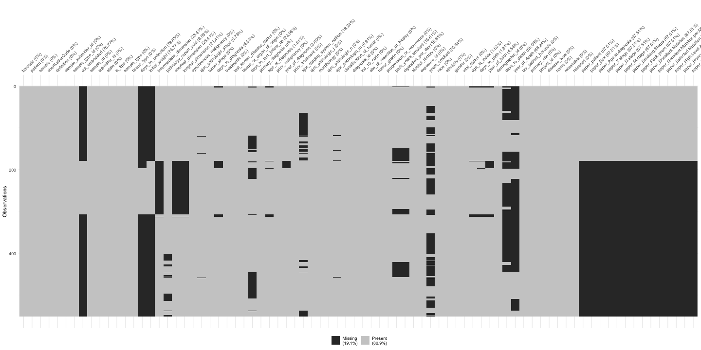


```r
# the number of normal vs tumour cases?
LUSC.clin %>% 
  as.data.frame() %>% 
  group_by(shortLetterCode) %>% 
  summarise(count = n()) %>% 
  ggplot(aes(x = shortLetterCode, y = count, fill = shortLetterCode)) +
  geom_col() +
  geom_text(aes(label = count), vjust=-0.25) +
  labs(x = 'Tissue', y = 'Count') +
  scale_fill_manual(values = c("#009E8E","#BF6D30")) +
  theme_classic()
```

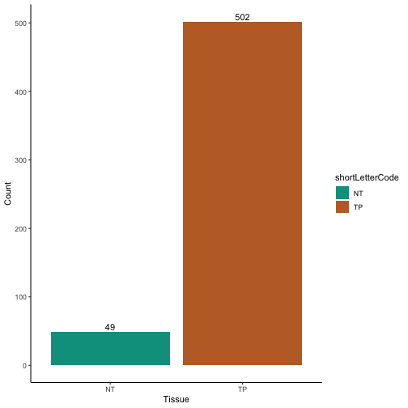

The number of tumour samples is almost 10X compared to the number of normal samples.


```r
# check the distribution of tumour stages across gender
LUSC.clin %>% 
  as.data.frame() %>% 
  group_by(shortLetterCode, gender) %>% 
  summarise(count = n()) %>% 
  ggplot(aes(x = shortLetterCode, y = count, fill = gender)) +
  geom_col(position = "dodge2") +
  labs(x = 'Tumour Tissue', y = 'Count') +
  scale_fill_manual(values = c("#B47846","#4682B4")) +
  scale_y_continuous(labels = abs) +
  theme_classic() +
  theme(axis.text.x = element_text(angle = 45, hjust=1))
```

```
## `summarise()` has grouped output by 'shortLetterCode'. You can override using the `.groups` argument.
```

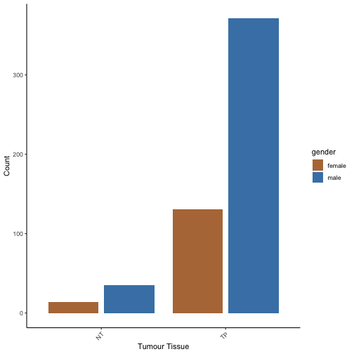


```r
# check the distribution of tumour stages across race
LUSC.clin %>% 
  as.data.frame() %>% 
  group_by(shortLetterCode, race) %>% 
  summarise(count = n()) %>% 
  ggplot(aes(x = shortLetterCode, y = count, fill = race)) +
  geom_col(position = "dodge2") +
  labs(x = 'Tumour Tissue', y = 'Count') +
  scale_fill_manual(values = c("#4682B4","#7846B4", "#B47846", "#82B446")) +
  scale_y_continuous(labels = abs) +
  theme_classic() +
  theme(axis.text.x = element_text(angle = 45, hjust=1))
```

```
## `summarise()` has grouped output by 'shortLetterCode'. You can override using the `.groups` argument.
```

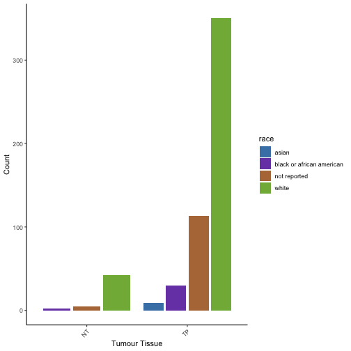


```r
# the number of samples from males vs females
LUSC.clin %>% 
  as.data.frame() %>% 
  group_by(gender) %>% 
  summarise(count = n()) %>% 
  ggplot(aes(x = gender, y = count, fill = gender)) +
  geom_col() +
  geom_text(aes(label = count), vjust=-0.25) +
  labs(x = 'Gender', y = 'Count') +
  scale_fill_manual(values = c("#B47846","#4682B4")) +
  theme_classic()
```

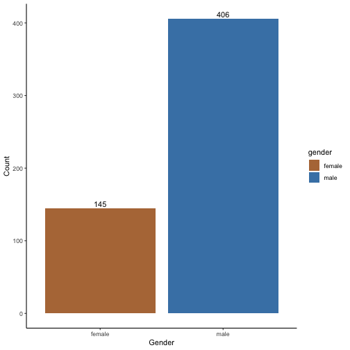

The number of sample from female cases is almost 1/3 of total cases in the cohort.


```r
# let's check the distribution of female vs male along differnt ages
LUSC.clin %>%
  as.data.frame() %>% 
  mutate(age = round(as.numeric(as.character(age_at_diagnosis)) / 365)) %>%
  group_by(age, gender) %>%
  summarise(count = n()) %>% 
  ungroup()  -> LUSC.ageByGender
```

```
## `summarise()` has grouped output by 'age'. You can override using the `.groups` argument.
```

```r
ggplot(LUSC.ageByGender, aes(x = age, y = count, fill = gender)) +
        geom_bar(data = subset(LUSC.ageByGender, gender == "male"),
                 aes(y = count),
                 position = "stack",
                 stat = "identity") +
        geom_bar(data = subset(LUSC.ageByGender, gender == "female"),
                 aes(y = -count),
                 position = "stack",
                 stat = "identity") +
        coord_flip() +
  labs(x = 'Age', y = 'Count') +
  scale_fill_manual(values = c("#B47846","#4682B4")) +
  scale_y_continuous(labels = abs) +
  theme_classic()
```

```
## Warning: Removed 1 rows containing missing values (position_stack).

## Warning: Removed 1 rows containing missing values (position_stack).
```

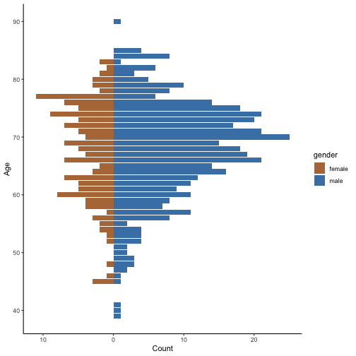

Although the samples from female cases are under represented in this cohort, the distribution of they are distributed over age similar to the samples from male cases.


```r
# check the distribution of tumour stages
LUSC.clin %>% 
  as.data.frame() %>% 
  group_by(tumor_stage, gender) %>% 
  summarise(count = n()) %>% 
  ggplot(aes(x = tumor_stage, y = count, fill = gender)) +
  geom_col(position = "dodge2") +
  labs(x = 'Tumour Stage', y = 'Count') +
  scale_fill_manual(values = c("#B47846","#4682B4")) +
  scale_y_continuous(labels = abs) +
  theme_classic() +
  theme(axis.text.x = element_text(angle = 45, hjust=1))
```

```
## `summarise()` has grouped output by 'tumor_stage'. You can override using the `.groups` argument.
```

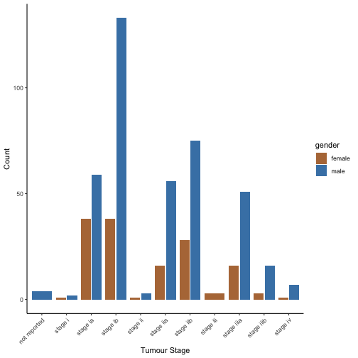

The most represented stage is 'Stage ib', followed by 'Stage iib'. There are few cases which are not reported in term of their tumour stage.


```r
# The vital status
LUSC.clin %>% 
  as_tibble() %>% 
  group_by(vital_status, gender) %>% 
  summarise(count = n()) %>% 
  ggplot(aes(x = vital_status, y = count, fill = gender)) +
  geom_col(position = "dodge2") +
  labs(x = 'Vital Status', y = 'Count') +
  scale_fill_manual(values = c("#B47846","#4682B4")) +
  scale_y_continuous(labels = abs) +
  theme_classic() +
  theme(axis.text.x = element_text(angle = 45, hjust=1))
```

```
## `summarise()` has grouped output by 'vital_status'. You can override using the `.groups` argument.
```

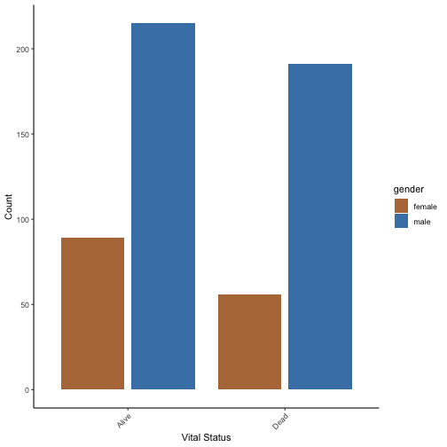

It seems that number of alive and dead are close to each other.


```r
# Check the distribution of race across the cohort
LUSC.clin %>% 
  as_tibble() %>% 
  group_by(race) %>% 
  summarise(count = n()) %>% 
  ggplot(aes(x = race, y = count, fill = race)) +
  geom_col() +
  geom_text(aes(label = count), vjust=-0.25) +
  labs(x = 'Race', y = 'Count') +
  scale_fill_manual(values = c("#4682B4","#7846B4", "#B47846", "#82B446")) +
  theme_classic()
```

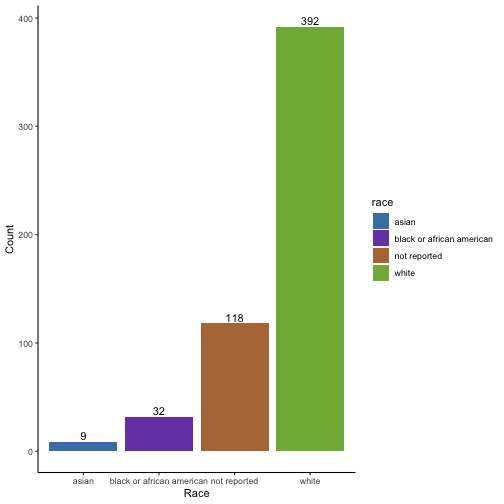

The cohort consists mainly of white subjects, while there are 118 cases which are not reported. Both the Asian and the black/African american are under represented in this cohort.


```r
# distribution of alive vs dead across race
LUSC.clin %>% 
  as_tibble() %>% 
  group_by(vital_status, race) %>% 
  summarise(count = n()) %>% 
  ggplot(aes(x = vital_status, y = count, fill = race)) +
  geom_col(position = "dodge2") +
  labs(x = 'Vital Status', y = 'Count') +
  scale_fill_manual(values = c("#4682B4","#7846B4", "#B47846", "#82B446")) +
  scale_y_continuous(labels = abs) +
  theme_classic() +
  theme(axis.text.x = element_text(angle = 45, hjust=1))
```

```
## `summarise()` has grouped output by 'vital_status'. You can override using the `.groups` argument.
```

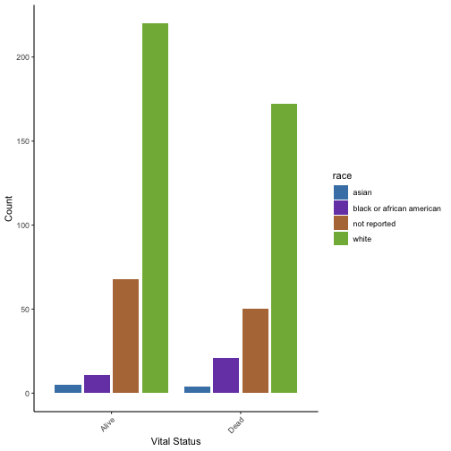


```r
# distribution of male vs female across race
LUSC.clin %>% 
  as_tibble() %>% 
  group_by(gender, race) %>% 
  summarise(count = n()) %>% 
  ggplot(aes(x = gender, y = count, fill = race)) +
  geom_col(position = "dodge2") +
  labs(x = 'Gender', y = 'Count') +
  scale_fill_manual(values = c("#4682B4","#7846B4", "#B47846", "#82B446")) +
  scale_y_continuous(labels = abs) +
  theme_classic() +
  theme(axis.text.x = element_text(angle = 45, hjust=1))
```

```
## `summarise()` has grouped output by 'gender'. You can override using the `.groups` argument.
```

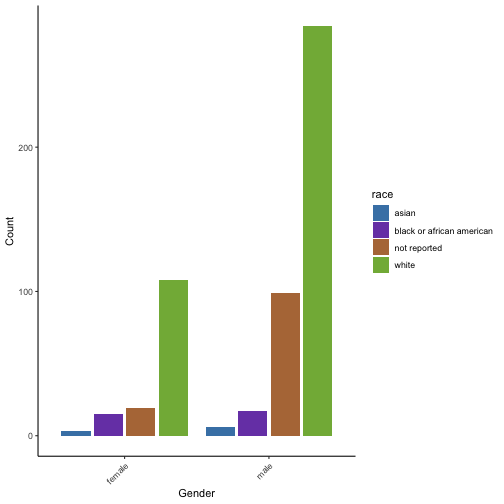

```r
summary(LUSC.clin$years_smoked)
```

```
##    Min. 1st Qu.  Median    Mean 3rd Qu.    Max.    NA's 
##     8.0    30.0    40.0    39.5    50.0    62.0     306
```
It seems that there are missing values for 306 cases.


```r
# let's check the distribution of years smoking
LUSC.clin %>% 
  as_tibble() %>% 
  group_by(years_smoked) %>% 
  summarise(count = n()) %>% 
  ggplot(aes(x = years_smoked, y = count)) +
  geom_bar(stat = "identity") +
  labs(x = 'Year Smoked', y = 'Count') +
  coord_flip() +
  theme_classic()
```

```
## Warning: Removed 1 rows containing missing values (position_stack).
```


Let's plot the smokers vs non-smokers


```r
summary(LUSC.clin$paper_Smoking.Status)
```

```
##      Current reformed smoker for > 15 years 
##                                          51 
## Current reformed smoker for < or = 15 years 
##                                          87 
##                              Current smoker 
##                                          28 
##                         Lifelong Non-smoker 
##                                           7 
##                                         N/A 
##                                           6 
##                                        NA's 
##                                         372
```
There is a high number of missing values (372 + 6), but let's plot the distribution of the other values.


```r
# Check the distribution of smokers (per time) vs non smoker
LUSC.clin %>% 
  as_tibble() %>% 
  group_by(paper_Smoking.Status) %>% 
  summarise(count = n()) %>% 
  mutate(paper_Smoking.Status = case_when(
         paper_Smoking.Status == "Current reformed smoker for > 15 years" ~ "Smoker (> 15 Years)",
         paper_Smoking.Status == "Current reformed smoker for < or = 15 years" ~ "Smoker (<= 15 Years)",
         paper_Smoking.Status == "Lifelong Non-smoker" ~ "Non-smoker",
         paper_Smoking.Status == "Current smoker" ~ "Smoker",
         paper_Smoking.Status == "N/A" ~ as.character(NA),
         TRUE ~ as.character(NA))) %>% 
  ggplot(aes(x = paper_Smoking.Status, y = count, fill = paper_Smoking.Status)) +
  geom_col() +
  geom_text(aes(label = count), vjust=-0.25) +
  labs(x = 'Race', y = 'Count') +
  scale_fill_manual(values = viridis_pal(option = "A")(5)) +
  theme_classic() +
  theme(axis.text.x = element_text(angle = 45, hjust=1))
```

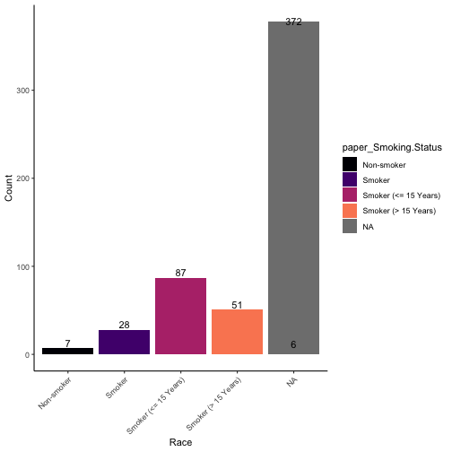

Among the cases with available data about their smoking habits, we can see that most ( ~ 92%) of the cases are smokers. It is to be expected as it's lung cancer.


```r
sessionInfo()
```

```
## R version 4.1.1 (2021-08-10)
## Platform: x86_64-apple-darwin20.5.0 (64-bit)
## Running under: macOS Big Sur 11.6
## 
## Matrix products: default
## BLAS/LAPACK: /usr/local/Cellar/openblas/0.3.17/lib/libopenblasp-r0.3.17.dylib
## 
## locale:
## [1] en_GB.UTF-8/en_GB.UTF-8/en_GB.UTF-8/C/en_GB.UTF-8/en_GB.UTF-8
## 
## attached base packages:
## [1] parallel  stats4    stats     graphics  grDevices utils     datasets 
## [8] methods   base     
## 
## other attached packages:
##  [1] umap_0.2.7.0                org.Hs.eg.db_3.13.0        
##  [3] AnnotationDbi_1.54.1        pheatmap_1.0.12            
##  [5] EnhancedVolcano_1.10.0      PCAtools_2.4.0             
##  [7] ggrepel_0.9.1               apeglm_1.14.0              
##  [9] kableExtra_1.3.4            TCGAbiolinks_2.20.0        
## [11] viridis_0.6.1               viridisLite_0.4.0          
## [13] DESeq2_1.32.0               SummarizedExperiment_1.22.0
## [15] Biobase_2.52.0              MatrixGenerics_1.4.3       
## [17] matrixStats_0.60.1          GenomicRanges_1.44.0       
## [19] GenomeInfoDb_1.28.4         IRanges_2.26.0             
## [21] S4Vectors_0.30.0            BiocGenerics_0.38.0        
## [23] forcats_0.5.1               stringr_1.4.0              
## [25] dplyr_1.0.7                 purrr_0.3.4                
## [27] readr_2.0.1                 tidyr_1.1.3                
## [29] tibble_3.1.4                ggplot2_3.3.5              
## [31] tidyverse_1.3.1            
## 
## loaded via a namespace (and not attached):
##   [1] utf8_1.2.2                  reticulate_1.21            
##   [3] R.utils_2.10.1              tidyselect_1.1.1           
##   [5] RSQLite_2.2.8               grid_4.1.1                 
##   [7] BiocParallel_1.26.2         Rtsne_0.15                 
##   [9] munsell_0.5.0               ScaledMatrix_1.0.0         
##  [11] withr_2.4.2                 colorspace_2.0-2           
##  [13] filelock_1.0.2              ggalt_0.4.0                
##  [15] highr_0.9                   knitr_1.34                 
##  [17] rstudioapi_0.13             ggsignif_0.6.3             
##  [19] Rttf2pt1_1.3.9              labeling_0.4.2             
##  [21] bbmle_1.0.24                GenomeInfoDbData_1.2.6     
##  [23] bit64_4.0.5                 farver_2.1.0               
##  [25] rprojroot_2.0.2             downloader_0.4             
##  [27] coda_0.19-4                 vctrs_0.3.8                
##  [29] generics_0.1.0              xfun_0.26                  
##  [31] BiocFileCache_2.0.0         R6_2.5.1                   
##  [33] ggbeeswarm_0.6.0            rsvd_1.0.5                 
##  [35] locfit_1.5-9.4              bitops_1.0-7               
##  [37] cachem_1.0.6                DelayedArray_0.18.0        
##  [39] assertthat_0.2.1            scales_1.1.1               
##  [41] beeswarm_0.4.0              gtable_0.3.0               
##  [43] beachmat_2.8.1              ash_1.0-15                 
##  [45] rlang_0.4.11                genefilter_1.74.0          
##  [47] systemfonts_1.0.2           splines_4.1.1              
##  [49] rstatix_0.7.0               extrafontdb_1.0            
##  [51] broom_0.7.9                 abind_1.4-5                
##  [53] reshape2_1.4.4              modelr_0.1.8               
##  [55] backports_1.2.1             extrafont_0.17             
##  [57] tools_4.1.1                 namer_0.1.5                
##  [59] ellipsis_0.3.2              RColorBrewer_1.1-2         
##  [61] Rcpp_1.0.7                  plyr_1.8.6                 
##  [63] sparseMatrixStats_1.4.2     progress_1.2.2             
##  [65] zlibbioc_1.38.0             RCurl_1.98-1.4             
##  [67] prettyunits_1.1.1           ggpubr_0.4.0               
##  [69] openssl_1.4.5               cowplot_1.1.1              
##  [71] haven_2.4.3                 fs_1.5.0                   
##  [73] here_1.0.1                  magrittr_2.0.1             
##  [75] data.table_1.14.0           RSpectra_0.16-0            
##  [77] openxlsx_4.2.4              reprex_2.0.1               
##  [79] mvtnorm_1.1-2               hms_1.1.0                  
##  [81] TCGAbiolinksGUI.data_1.12.0 evaluate_0.14              
##  [83] xtable_1.8-4                XML_3.99-0.7               
##  [85] rio_0.5.27                  emdbook_1.3.12             
##  [87] readxl_1.3.1                gridExtra_2.3              
##  [89] compiler_4.1.1              biomaRt_2.48.3             
##  [91] bdsmatrix_1.3-4             maps_3.3.0                 
##  [93] KernSmooth_2.23-20          crayon_1.4.1               
##  [95] R.oo_1.24.0                 htmltools_0.5.2            
##  [97] tzdb_0.1.2                  geneplotter_1.70.0         
##  [99] visdat_0.5.3                lubridate_1.7.10           
## [101] DBI_1.1.1                   dbplyr_2.1.1               
## [103] proj4_1.0-10.1              MASS_7.3-54                
## [105] rappdirs_0.3.3              car_3.0-11                 
## [107] Matrix_1.3-4                cli_3.0.1                  
## [109] R.methodsS3_1.8.1           pkgconfig_2.0.3            
## [111] foreign_0.8-81              numDeriv_2016.8-1.1        
## [113] xml2_1.3.2                  svglite_2.0.0              
## [115] annotate_1.70.0             vipor_0.4.5                
## [117] dqrng_0.3.0                 webshot_0.5.2              
## [119] XVector_0.32.0              rvest_1.0.1                
## [121] digest_0.6.27               Biostrings_2.60.2          
## [123] rmarkdown_2.11              cellranger_1.1.0           
## [125] DelayedMatrixStats_1.14.3   curl_4.3.2                 
## [127] lifecycle_1.0.0             jsonlite_1.7.2             
## [129] carData_3.0-4               askpass_1.1                
## [131] fansi_0.5.0                 pillar_1.6.2               
## [133] lattice_0.20-44             ggrastr_0.2.3              
## [135] KEGGREST_1.32.0             fastmap_1.1.0              
## [137] httr_1.4.2                  survival_3.2-13            
## [139] glue_1.4.2                  zip_2.2.0                  
## [141] png_0.1-7                   bit_4.0.4                  
## [143] stringi_1.7.4               blob_1.2.2                 
## [145] BiocSingular_1.8.1          memoise_2.0.0              
## [147] irlba_2.3.3
```

