```r
library(tidyverse)
library(DESeq2)
library(apeglm)
library(PCAtools)
library(EnhancedVolcano)
library(viridis)
library(pheatmap)
library(org.Hs.eg.db)
library(umap)
source("./code/ens2refseq.R")
```


```r
# load the data
LUSC.exp <- readRDS("./RData/LUSC_exp.RDS")
```

## Gene count exploatory


```r
dim(assay(LUSC.exp))
```

```
## [1] 56602   551
```
Let's check the percentage of zero counts


```r
counts <- assay(LUSC.exp)
dim(counts)
```

```
## [1] 56602   551
```

```r
counts.zeroPercent <- 100 * apply(counts == 0, 1, sum) / ncol(counts)
summary(counts.zeroPercent)
```

```
##    Min. 1st Qu.  Median    Mean 3rd Qu.    Max.
##    0.00    0.00   31.40   42.18   88.20  100.00
```

```r
counts.zeroPercent %>%
  as.data.frame() %>%
  ggplot() +
  geom_histogram(aes(x = .), fill = '#1D7373', col = 'black', stat="bin", bins = 30 ) +
  geom_vline(xintercept = 85, colour = 'red', linetype = 'dashed') +
  labs(x = 'Percente of samples', y = 'Number of genes', title = 'Filter on the percentage of zero counts') +
  theme_classic()
```

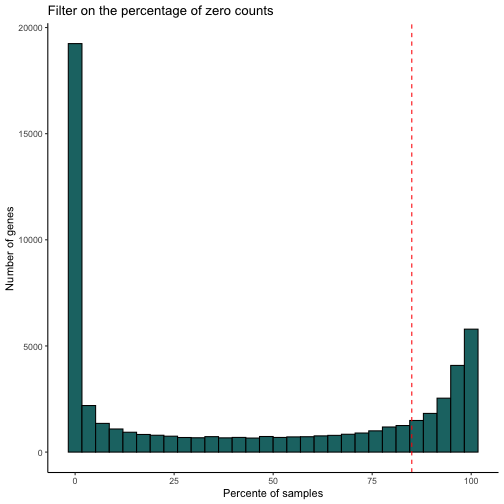

Let's aim to filter out genes that has zeros in more than 85% of the samples

Now, let's plot the maximum count per gene


```r
counts.maxPerGene <- apply(counts, 1, max)
summary(counts.maxPerGene)
```

```
##    Min. 1st Qu.  Median    Mean 3rd Qu.    Max.
##       0      10      69    7863    2695 3826288
```

```r
counts.maxPerGene %>%
  as.data.frame %>%
  ggplot() +
  geom_histogram(aes(x = .), fill = '#1D7373', col = 'black', stat="bin", bins = 50 ) +
  labs(x = 'Counts', y = 'Number of genes', title = 'Filter on the max count per gene') +
  theme_classic()
```


The distribution has extreme values and therefore it is skewed distribution. One way to adjust for this is to take the shifted log2, i.e. log2(count + 1) where 1 is a pseudo value to avoid log2(0).


```r
counts.maxPerGene.log2 <- log2(counts.maxPerGene + 1)
```

Let's plot the comparison


```r
gridExtra::grid.arrange(
    counts.maxPerGene %>%
        as.data.frame() %>%
        ggplot() +
        geom_histogram(aes(x = .), fill = '#1D7373', col = 'black', stat="bin", bins = 50 ) +
        labs(x = 'Counts', y = 'Number of genes', title = 'Raw counts per gene') +
        theme_classic(),

    counts.maxPerGene.log2 %>%
        as.data.frame() %>%
        ggplot() +
        geom_histogram(aes(x = .), fill = '#1D7373', col = 'black', stat="bin", bins = 50 ) +
        geom_vline(xintercept = log2(10), colour = 'red', linetype = 'solid', size = 0.8) +
        labs(x = 'log2(counts+1)', y = 'Number of genes', title = 'Log2-transformed max counts per gene') +
        theme_classic(),
    nrow = 2)
```

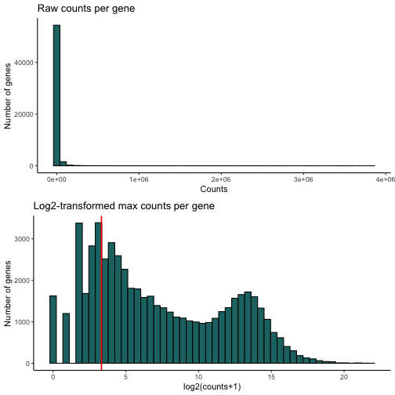

Let's discard 'undetected' genes, i.e. the genes which have zero counts in at least 95% of the samples, or the genes with a maximal count less than 3. This would lead to discarding 10052 genes.


```r
dim(LUSC.exp)                                                                 # (56602, 551)
```

```
## [1] 56602   551
```

```r
dim(LUSC.exp[counts.maxPerGene.log2 > log2(10)])                              # (42497, 551) -> -14105
```

```
## [1] 42497   551
```

```r
dim(LUSC.exp[counts.zeroPercent <= 95])                                       # (46874, 551) -> -9728
```

```
## [1] 46874   551
```

```r
dim(LUSC.exp[counts.zeroPercent <= 95 & counts.maxPerGene.log2 > log2(10)])   # (40764, 551) -> -15838
```

```
## [1] 40764   551
```


```r
LUSC.exp.filt <- LUSC.exp[counts.zeroPercent <= 95 & counts.maxPerGene.log2 > log2(10)]
LUSC.exp.filt
```

```
## class: RangedSummarizedExperiment
## dim: 40764 551
## metadata(1): data_release
## assays(1): HTSeq - Counts
## rownames(40764): ENSG00000000003 ENSG00000000005 ... ENSG00000281912
##   ENSG00000281920
## rowData names(3): ensembl_gene_id external_gene_name
##   original_ensembl_gene_id
## colnames(551): TCGA-94-7943-01A-11R-2187-07
##   TCGA-68-8251-01A-11R-2296-07 ... TCGA-MF-A522-01A-11R-A262-07
##   TCGA-51-4079-01A-01R-1100-07
## colData names(80): barcode patient ... paper_Homozygous.Deletions
##   paper_Expression.Subtype
```


## Differential expression

Let's create a DESeqDataSet object and taking `shortLetterCode` representing the tissue type (normal vs tumour) for the design.


```r
# to construct the DESeqDataSet object, we need a design
colData(LUSC.exp.filt)$shortLetterCode <- as.factor(colData(LUSC.exp.filt)$shortLetterCode)
```
The reference level is `NT` representing the normal tissue, so no need to adjust the levels.


```r
# let's construct the DESeqDataSet object
dds <- DESeq2::DESeqDataSet(LUSC.exp.filt, design = ~ shortLetterCode)
```

```
## renaming the first element in assays to 'counts'
```

```
## converting counts to integer mode
```

```r
dds
```

```
## class: DESeqDataSet
## dim: 40764 551
## metadata(2): data_release version
## assays(1): counts
## rownames(40764): ENSG00000000003 ENSG00000000005 ... ENSG00000281912
##   ENSG00000281920
## rowData names(3): ensembl_gene_id external_gene_name
##   original_ensembl_gene_id
## colnames(551): TCGA-94-7943-01A-11R-2187-07
##   TCGA-68-8251-01A-11R-2296-07 ... TCGA-MF-A522-01A-11R-A262-07
##   TCGA-51-4079-01A-01R-1100-07
## colData names(80): barcode patient ... paper_Homozygous.Deletions
##   paper_Expression.Subtype
```


```r
# keep only rows that have at least 10 reads total
table(rowSums(counts(dds)) >= 100)
```

```
##
## FALSE  TRUE
##  1012 39752
```

```r
# rowSums(counts(dds, normalized=TRUE) >= X ) >= Y
# keep genes with Y or more sample that have normalised count X or more
table(rowSums(counts(dds, normalized=F) >= 5 ) >= 10)
```

```
##
## FALSE  TRUE
##  4299 36465
```


```r
# run to save computing time, otherwise no need to prior filtering!
keep <- rowSums(counts(dds)) >= 100
dds <- dds[keep, ]
table(rowSums(counts(dds)) >= 100)
```

```
##
##  TRUE
## 39752
```


Before running the differential analysis, let's explore the gene counts in a PCA plot. First, let's transform the raw read counts using VST


```r
dds.vst <- DESeq2::vst(dds, blind = F)
dds.vst
```

```
## class: DESeqTransform
## dim: 39752 551
## metadata(2): data_release version
## assays(1): ''
## rownames(39752): ENSG00000000003 ENSG00000000005 ... ENSG00000281912
##   ENSG00000281920
## rowData names(7): ensembl_gene_id external_gene_name ... allZero
##   dispFit
## colnames(551): TCGA-94-7943-01A-11R-2187-07
##   TCGA-68-8251-01A-11R-2296-07 ... TCGA-MF-A522-01A-11R-A262-07
##   TCGA-51-4079-01A-01R-1100-07
## colData names(81): barcode patient ... paper_Expression.Subtype
##   sizeFactor
```
Let's plot the variance of the first components for the dataset


```r
dds.pca <- PCAtools::pca(assay(dds.vst), metadata = colData(LUSC.exp.filt))
```
Let's do a scree plot for the first 30 components


```r
screeplot(dds.pca,
          components = getComponents(dds.pca, 1:20),
          axisLabSize = 18, titleLabSize = 22) +
  theme_classic() +
  theme(axis.text.x = element_text(angle = 45, hjust=1))
```

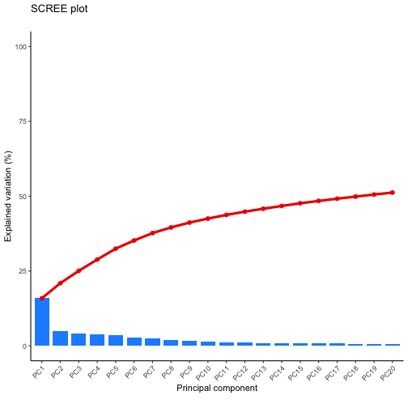

We can see that the first component is responsible for almost 15% of the variation, while the second principle component is responsible for at most 5%. The eclipses represent 95% confidence.

Let's plot a PCA plot, and colour by the tissue type, i.e. normal vs tumour


```r
#DESeq2::plotPCA(dds.vst, intgroup = "shortLetterCode") + theme_classic()
biplot(dds.pca,
       colby = 'shortLetterCode',
       lab = NULL,
       ellipse = TRUE,
       ellipseLevel = 0.95,
       ellipseFill = TRUE,
       ellipseAlpha = 1/8,
       ellipseLineSize = 1.0) +
  theme_classic()
```

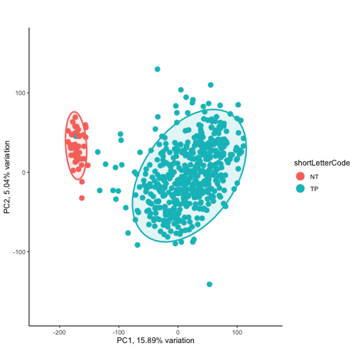

Great, we have good separation between the two tissue types.

Let's explore the other variables.

- What about gender?


```r
#DESeq2::plotPCA(dds.vst, intgroup = "gender") + theme_classic()
biplot(dds.pca,
       colby = 'gender',
       lab = NULL,
       ellipse = TRUE,
       ellipseLevel = 0.95,
       ellipseFill = TRUE,
       ellipseAlpha = 1/8,
       ellipseLineSize = 1.0) +
  theme_classic()
```

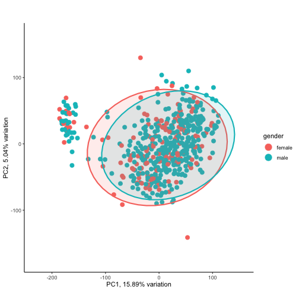

- What about tumour stage?


```r
#DESeq2::plotPCA(dds.vst, intgroup = "tumor_stage") + theme_classic()
biplot(dds.pca,
       colby = 'tumor_stage',
       lab = NULL,
       ellipse = FALSE,
       ellipseLevel = 0.95,
       ellipseFill = TRUE,
       ellipseAlpha = 1/8,
       ellipseLineSize = 1.0) +
  theme_classic()
```

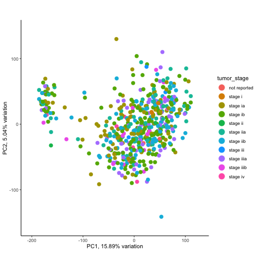

- What about the vital status?


```r
#DESeq2::plotPCA(dds.vst, intgroup = "vital_status") + theme_classic
biplot(dds.pca,
       colby = 'vital_status',
       lab = NULL,
       ellipse = TRUE,
       ellipseLevel = 0.95,
       ellipseFill = TRUE,
       ellipseAlpha = 1/8,
       ellipseLineSize = 1.0) +
  theme_classic()
```

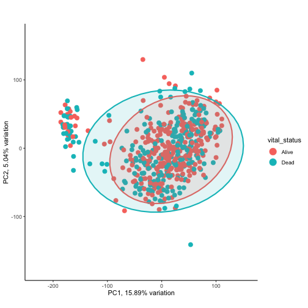

- What about the race?


```r
#DESeq2::plotPCA(dds.vst, intgroup = "race") + theme_classic()
biplot(dds.pca,
       colby = 'race',
       lab = NULL,
       ellipse = FALSE,
       ellipseLevel = 0.95,
       ellipseFill = TRUE,
       ellipseAlpha = 1/8,
       ellipseLineSize = 1.0) +
  theme_classic()
```

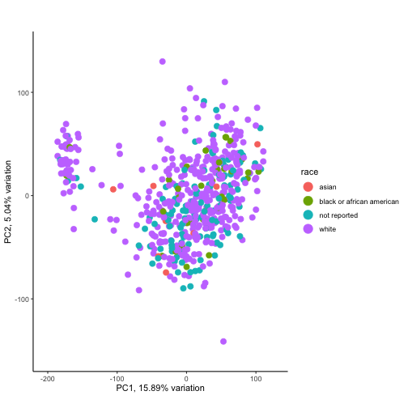

None of these variables are responsible for the separation on PC1 vs. PC2.
Let's have a look at the top 10 possible combination


```r
pairsplot(dds.pca,
          components = getComponents(dds.pca, c(1:10)),
          triangle = TRUE, trianglelabSize = 12,
          hline = 0, vline = 0,
          pointSize = 0.4,
          gridlines.major = FALSE, gridlines.minor = FALSE,
          colby = 'shortLetterCode',
          title = 'Pairs plot', plotaxes = FALSE,
          margingaps = unit(c(-0.01, -0.01, -0.01, -0.01), 'cm'))
```

```
## Coordinate system already present. Adding new coordinate system, which will replace the existing one.
## Coordinate system already present. Adding new coordinate system, which will replace the existing one.
## Coordinate system already present. Adding new coordinate system, which will replace the existing one.
## Coordinate system already present. Adding new coordinate system, which will replace the existing one.
## Coordinate system already present. Adding new coordinate system, which will replace the existing one.
## Coordinate system already present. Adding new coordinate system, which will replace the existing one.
## Coordinate system already present. Adding new coordinate system, which will replace the existing one.
## Coordinate system already present. Adding new coordinate system, which will replace the existing one.
## Coordinate system already present. Adding new coordinate system, which will replace the existing one.
## Coordinate system already present. Adding new coordinate system, which will replace the existing one.
## Coordinate system already present. Adding new coordinate system, which will replace the existing one.
## Coordinate system already present. Adding new coordinate system, which will replace the existing one.
## Coordinate system already present. Adding new coordinate system, which will replace the existing one.
## Coordinate system already present. Adding new coordinate system, which will replace the existing one.
## Coordinate system already present. Adding new coordinate system, which will replace the existing one.
## Coordinate system already present. Adding new coordinate system, which will replace the existing one.
## Coordinate system already present. Adding new coordinate system, which will replace the existing one.
## Coordinate system already present. Adding new coordinate system, which will replace the existing one.
## Coordinate system already present. Adding new coordinate system, which will replace the existing one.
## Coordinate system already present. Adding new coordinate system, which will replace the existing one.
## Coordinate system already present. Adding new coordinate system, which will replace the existing one.
## Coordinate system already present. Adding new coordinate system, which will replace the existing one.
## Coordinate system already present. Adding new coordinate system, which will replace the existing one.
## Coordinate system already present. Adding new coordinate system, which will replace the existing one.
## Coordinate system already present. Adding new coordinate system, which will replace the existing one.
## Coordinate system already present. Adding new coordinate system, which will replace the existing one.
## Coordinate system already present. Adding new coordinate system, which will replace the existing one.
## Coordinate system already present. Adding new coordinate system, which will replace the existing one.
## Coordinate system already present. Adding new coordinate system, which will replace the existing one.
## Coordinate system already present. Adding new coordinate system, which will replace the existing one.
## Coordinate system already present. Adding new coordinate system, which will replace the existing one.
## Coordinate system already present. Adding new coordinate system, which will replace the existing one.
## Coordinate system already present. Adding new coordinate system, which will replace the existing one.
## Coordinate system already present. Adding new coordinate system, which will replace the existing one.
## Coordinate system already present. Adding new coordinate system, which will replace the existing one.
## Coordinate system already present. Adding new coordinate system, which will replace the existing one.
## Coordinate system already present. Adding new coordinate system, which will replace the existing one.
## Coordinate system already present. Adding new coordinate system, which will replace the existing one.
## Coordinate system already present. Adding new coordinate system, which will replace the existing one.
## Coordinate system already present. Adding new coordinate system, which will replace the existing one.
## Coordinate system already present. Adding new coordinate system, which will replace the existing one.
## Coordinate system already present. Adding new coordinate system, which will replace the existing one.
## Coordinate system already present. Adding new coordinate system, which will replace the existing one.
## Coordinate system already present. Adding new coordinate system, which will replace the existing one.
## Coordinate system already present. Adding new coordinate system, which will replace the existing one.
## Coordinate system already present. Adding new coordinate system, which will replace the existing one.
## Coordinate system already present. Adding new coordinate system, which will replace the existing one.
## Coordinate system already present. Adding new coordinate system, which will replace the existing one.
## Coordinate system already present. Adding new coordinate system, which will replace the existing one.
## Coordinate system already present. Adding new coordinate system, which will replace the existing one.
## Coordinate system already present. Adding new coordinate system, which will replace the existing one.
## Coordinate system already present. Adding new coordinate system, which will replace the existing one.
## Coordinate system already present. Adding new coordinate system, which will replace the existing one.
## Coordinate system already present. Adding new coordinate system, which will replace the existing one.
## Coordinate system already present. Adding new coordinate system, which will replace the existing one.
## Coordinate system already present. Adding new coordinate system, which will replace the existing one.
## Coordinate system already present. Adding new coordinate system, which will replace the existing one.
## Coordinate system already present. Adding new coordinate system, which will replace the existing one.
## Coordinate system already present. Adding new coordinate system, which will replace the existing one.
## Coordinate system already present. Adding new coordinate system, which will replace the existing one.
## Coordinate system already present. Adding new coordinate system, which will replace the existing one.
## Coordinate system already present. Adding new coordinate system, which will replace the existing one.
## Coordinate system already present. Adding new coordinate system, which will replace the existing one.
## Coordinate system already present. Adding new coordinate system, which will replace the existing one.
## Coordinate system already present. Adding new coordinate system, which will replace the existing one.
## Coordinate system already present. Adding new coordinate system, which will replace the existing one.
## Coordinate system already present. Adding new coordinate system, which will replace the existing one.
## Coordinate system already present. Adding new coordinate system, which will replace the existing one.
## Coordinate system already present. Adding new coordinate system, which will replace the existing one.
## Coordinate system already present. Adding new coordinate system, which will replace the existing one.
## Coordinate system already present. Adding new coordinate system, which will replace the existing one.
## Coordinate system already present. Adding new coordinate system, which will replace the existing one.
## Coordinate system already present. Adding new coordinate system, which will replace the existing one.
## Coordinate system already present. Adding new coordinate system, which will replace the existing one.
## Coordinate system already present. Adding new coordinate system, which will replace the existing one.
## Coordinate system already present. Adding new coordinate system, which will replace the existing one.
## Coordinate system already present. Adding new coordinate system, which will replace the existing one.
## Coordinate system already present. Adding new coordinate system, which will replace the existing one.
## Coordinate system already present. Adding new coordinate system, which will replace the existing one.
## Coordinate system already present. Adding new coordinate system, which will replace the existing one.
## Coordinate system already present. Adding new coordinate system, which will replace the existing one.
## Coordinate system already present. Adding new coordinate system, which will replace the existing one.
## Coordinate system already present. Adding new coordinate system, which will replace the existing one.
## Coordinate system already present. Adding new coordinate system, which will replace the existing one.
## Coordinate system already present. Adding new coordinate system, which will replace the existing one.
## Coordinate system already present. Adding new coordinate system, which will replace the existing one.
## Coordinate system already present. Adding new coordinate system, which will replace the existing one.
## Coordinate system already present. Adding new coordinate system, which will replace the existing one.
## Coordinate system already present. Adding new coordinate system, which will replace the existing one.
## Coordinate system already present. Adding new coordinate system, which will replace the existing one.
## Coordinate system already present. Adding new coordinate system, which will replace the existing one.
## Coordinate system already present. Adding new coordinate system, which will replace the existing one.
## Coordinate system already present. Adding new coordinate system, which will replace the existing one.
## Coordinate system already present. Adding new coordinate system, which will replace the existing one.
## Coordinate system already present. Adding new coordinate system, which will replace the existing one.
## Coordinate system already present. Adding new coordinate system, which will replace the existing one.
## Coordinate system already present. Adding new coordinate system, which will replace the existing one.
## Coordinate system already present. Adding new coordinate system, which will replace the existing one.
## Coordinate system already present. Adding new coordinate system, which will replace the existing one.
## Coordinate system already present. Adding new coordinate system, which will replace the existing one.
```

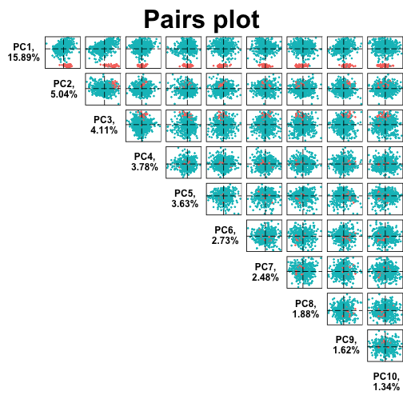


Let's run hierarchical clustering to visualise the similarities between samples in terms of their gene expression profile. I will not plot all samples, but will limit this analysis to 20 normal samples.


```r
set.seed(2)
selectedNormSamples <- sample(x = 1:ncol(assay(dds.vst)[, dds.vst$shortLetterCode == 'NT']),
                              size = 20,
                              replace = FALSE)

assay(dds.vst)[, selectedNormSamples] %>%
  t() %>%
  dist() %>%
  as.matrix() -> dds.vst.dist


pheatmap(dds.vst.dist,
         show_rownames  = FALSE,
         show_colnames  = FALSE,
         col = colorRampPalette( rev(RColorBrewer::brewer.pal(9, "Blues")) )(255) )
```

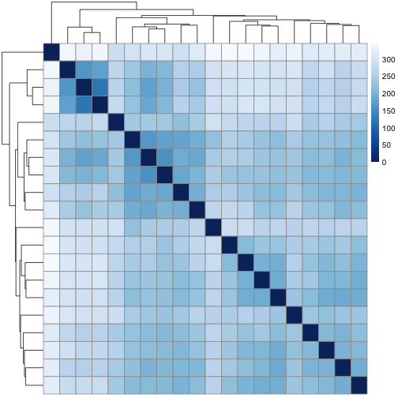


Let's run the differentiation analysis


```r
dds <- DESeq(dds)
```

```
## estimating size factors
```

```
## estimating dispersions
```

```
## gene-wise dispersion estimates
```

```
## mean-dispersion relationship
```

```
## final dispersion estimates
```

```
## fitting model and testing
```

```
## -- replacing outliers and refitting for 4570 genes
## -- DESeq argument 'minReplicatesForReplace' = 7
## -- original counts are preserved in counts(dds)
```

```
## estimating dispersions
```

```
## fitting model and testing
```


```r
saveRDS(object = dds, file = "./RData/LUSC_exp_dds.RDS")
```


```r
readRDS("./RData/LUSC_exp_dds.RDS") -> dds
```

Let's compare the raw counts vs normalised counts


```r
# compute log2 non-normalised read counts
counts.log2 <- log2(DESeq2::counts(dds, normalized = F) + 1)
dim(counts.log2)
```

```
## [1] 39752   551
```


```r
# compute log2 normalised read counts
counts.norm.log2 <- log2(DESeq2::counts(dds, normalized = T) + 1)
dim(counts.norm.log2)
```

```
## [1] 39752   551
```


```r
# let's plot the log2 non-normalised read counts and log2 normalised read counts
gridExtra::grid.arrange(
    counts.log2 %>%
        as.data.frame() %>%
        stack() %>%
        ggplot() +
        geom_histogram(aes(x = values), fill = '#1D7373', col = 'black', stat="bin", bins = 60 ) +
        labs(x = 'log2(raw counts + 1)', y = 'Number of genes', title = 'Log2-transformed raw counts') +
        theme_classic(),

    counts.norm.log2 %>%
        as.data.frame() %>%
        stack() %>%
        ggplot() +
        geom_histogram(aes(x = values), fill = '#1D7373', col = 'black', stat="bin", bins = 60 ) +
        labs(x = 'log2(normalised counts + 1)', y = 'Number of genes', title = 'Log2-transformed normalised counts') +
        theme_classic(),
    nrow = 2)
```

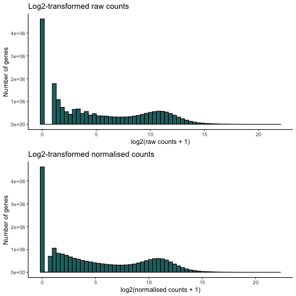


Let's plot the size of a number of library (randomly picked) as boxplot.


```r
set.seed(1)
selectedSamples <- sample(x = 1:ncol(counts.log2), size = 30, replace = FALSE)
selectedSamples
```

```
##  [1] 129 509 471 299 270 187 307 277 494 330  37 105 485 382 326 542 422 111 404
## [20] 532 506 343 121  40 375 248 198 378  39 435
```


```r
gridExtra::grid.arrange(
counts.log2 %>%
  as.data.frame() %>%
  dplyr::select(selectedSamples) %>%
  stack() %>%
  ggplot() +
  geom_boxplot(aes(x = ind, y = values, fill = ind)) +
  scale_x_discrete(label=function(x) abbreviate(x, minlength=15)) +
  labs(x = 'Samples', y = 'log2(counts + 1)', title = "raw reads counts") +
  scale_fill_manual(values = viridis_pal(option = "D")(30)) +
  coord_flip() +
  theme_classic() +
  theme(legend.position="none"),
counts.norm.log2 %>%
  as.data.frame() %>%
  dplyr::select(selectedSamples) %>%
  stack() %>%
  ggplot() +
  geom_boxplot(aes(x = ind, y = values, fill = ind)) +
  scale_x_discrete(label=function(x) abbreviate(x, minlength=15)) +
  labs(x = 'Samples', y = 'log2(counts + 1)', title = "normalised reads counts") +
  scale_fill_manual(values = viridis_pal(option = "D")(30)) +
  coord_flip() +
  theme_classic() +
  theme(legend.position="none"),

ncol = 2)
```

```
## Note: Using an external vector in selections is ambiguous.
## ℹ Use `all_of(selectedSamples)` instead of `selectedSamples` to silence this message.
## ℹ See <https://tidyselect.r-lib.org/reference/faq-external-vector.html>.
## This message is displayed once per session.
```

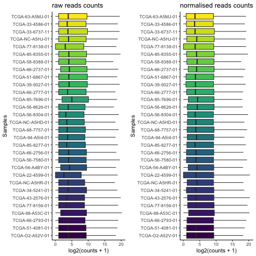


```r
# any gene with alpha (i.e. FDR) > 0.001 is not significant
res <- results(dds, alpha = 0.001)
res
```

```
## log2 fold change (MLE): shortLetterCode TP vs NT
## Wald test p-value: shortLetterCode TP vs NT
## DataFrame with 39752 rows and 6 columns
##                   baseMean log2FoldChange     lfcSE      stat       pvalue
##                  <numeric>      <numeric> <numeric> <numeric>    <numeric>
## ENSG00000000003 3386.60991       1.105127 0.1115412   9.90779  3.85051e-23
## ENSG00000000005    1.21166      -1.430197 0.3594282  -3.97909  6.91798e-05
## ENSG00000000419 2427.86967       0.747200 0.0827097   9.03400  1.65501e-19
## ENSG00000000457  878.13195       0.182894 0.0670883   2.72618  6.40728e-03
## ENSG00000000460  757.16662       2.229287 0.0960774  23.20302 4.24459e-119
## ...                    ...            ...       ...       ...          ...
## ENSG00000281903  14.498537       1.332069  0.184615   7.21538  5.37852e-13
## ENSG00000281904   0.270563      -1.050452  0.693673  -1.51433  1.29941e-01
## ENSG00000281909   0.531962       1.036988  0.396648   2.61438  8.93907e-03
## ENSG00000281912  70.491697       0.636044  0.149132   4.26499  1.99915e-05
## ENSG00000281920   8.066971       1.278927  0.237476   5.38550  7.22448e-08
##                         padj
##                    <numeric>
## ENSG00000000003  2.64727e-22
## ENSG00000000005  1.39645e-04
## ENSG00000000419  9.38251e-19
## ENSG00000000457  1.01987e-02
## ENSG00000000460 6.04770e-117
## ...                      ...
## ENSG00000281903  2.08450e-12
## ENSG00000281904  1.66589e-01
## ENSG00000281909  1.39215e-02
## ENSG00000281912  4.26389e-05
## ENSG00000281920  1.93145e-07
```

```r
summary(res)
```

```
##
## out of 39752 with nonzero total read count
## adjusted p-value < 0.001
## LFC > 0 (up)       : 13810, 35%
## LFC < 0 (down)     : 8053, 20%
## outliers [1]       : 0, 0%
## low counts [2]     : 0, 0%
## (mean count < 0)
## [1] see 'cooksCutoff' argument of ?results
## [2] see 'independentFiltering' argument of ?results
```


```r
# if necessary, remove nulls (gene level filtering)
#res <- res[complete.cases(res), ]
#summary(res)
```

Let's extract the results from the `dds` object.


```r
#let's add the HGNC symbol to the dds results
resSymbol <- ens2refseq(row.names(res))

res %>%
  as.data.frame() %>%
  mutate(baseMean = signif(baseMean, digits = 3),
         log2FoldChange = round(log2FoldChange, digits = 3),
         lfcSE  = round(lfcSE, digits = 3),
         stat   = round(stat, digits = 3),
         pvalue = signif(pvalue, digits = 3),
         padj   = signif(padj, digits = 3)) %>%
  mutate(ensembl_gene_id = row.names(res)) %>%
  merge(resSymbol, ., by = "ensembl_gene_id") -> resDF # merge with RefSeq genes


# let's sort by log2FoldChange and then padj (decreasing)
resDF %>%
  arrange(desc(abs(log2FoldChange)), desc(padj)) -> resOrdDF
resOrdDF
```

```
##       ensembl_gene_id             hgnc_symbol baseMean log2FoldChange lfcSE
## 1     ENSG00000228295               LINC00392 1.28e+02         10.686 0.682
## 2     ENSG00000214107                  MAGEB1 1.50e+01         10.215 1.005
## 3     ENSG00000224960                 PPP4R3C 1.40e+01         10.069 0.891
## 4     ENSG00000197172                  MAGEA6 1.08e+03          9.822 0.511
## 5     ENSG00000221867                  MAGEA3 1.18e+03          9.772 0.504
## 6     ENSG00000128714                  HOXD13 3.77e+02          9.545 0.441
## 7     ENSG00000236956                   NF1P8 2.54e+01          9.532 0.737
## 8     ENSG00000132446                  FTHL17 2.04e+01          9.507 0.985
## 9     ENSG00000123584                  MAGEA9 3.39e+01          9.498 0.738
## 10    ENSG00000170516                  COX7B2 3.11e+01          9.469 0.821
## 11    ENSG00000094796                   KRT31 6.17e+02          9.440 0.442
## 12    ENSG00000124260                 MAGEA10 5.20e+02          9.423 0.559
## 13    ENSG00000267978                 MAGEA9B 1.22e+02          9.327 0.549
## 14    ENSG00000185247                 MAGEA11 5.85e+02          9.207 0.499
## 15    ENSG00000113430                    IRX4 4.71e+02          9.196 0.439
## 16    ENSG00000178363                  CALML3 1.60e+04          9.172 0.298
## 17    ENSG00000225548               LINC01980 2.51e+02          9.171 0.383
## 18    ENSG00000242512               LINC01206 1.45e+03          9.111 0.478
## 19    ENSG00000187172                   BAGE2 2.88e+01          9.066 0.825
## 20    ENSG00000147381                  MAGEA4 5.01e+03          9.036 0.453
## 21    ENSG00000128713                  HOXD11 2.04e+02          8.969 0.385
## 22    ENSG00000224141               MIR548XHG 4.08e+01          8.956 0.704
## 23    ENSG00000165643                  SOHLH1 3.78e+02          8.910 0.540
## 24    ENSG00000099399                  MAGEB2 4.22e+02          8.877 0.611
## 25    ENSG00000123364                  HOXC13 2.92e+02          8.764 0.334
## 26    ENSG00000229544                  NKX1-2 2.05e+02          8.663 0.433
## 27    ENSG00000229967              MAGEA4-AS1 1.14e+02          8.643 0.531
## 28    ENSG00000182938                   OTOP3 1.49e+02          8.639 0.586
## 29    ENSG00000186847                   KRT14 5.46e+04          8.610 0.393
## 30    ENSG00000105141                  CASP14 5.33e+02          8.608 0.531
## 31    ENSG00000253898               LINC01419 3.53e+01          8.595 0.697
## 32    ENSG00000198681                  MAGEA1 7.06e+02          8.595 0.539
## 33    ENSG00000121742                    GJB6 6.14e+03          8.569 0.305
## 34    ENSG00000131668                   BARX1 6.06e+02          8.564 0.371
## 35    ENSG00000213401                 MAGEA12 4.48e+02          8.533 0.602
## 36    ENSG00000169297                   NR0B1 5.67e+02          8.515 0.583
## 37    ENSG00000231532               LINC01249 7.25e+01          8.514 0.538
## 38    ENSG00000257636                G2E3-AS1 8.43e+01          8.496 0.401
## 39    ENSG00000089116                    LHX5 1.20e+02          8.427 0.419
## 40    ENSG00000189182                   KRT77 1.71e+02          8.424 0.489
## 41    ENSG00000214617                SLC6A10P 9.73e+01          8.394 0.545
## 42    ENSG00000242515                 UGT1A10 5.03e+02          8.383 0.605
## 43    ENSG00000249641               HOXC13-AS 8.34e+01          8.378 0.411
## 44    ENSG00000140519                    RHCG 5.53e+03          8.374 0.362
## 45    ENSG00000185686                   PRAME 3.60e+03          8.373 0.289
## 46    ENSG00000046774                  MAGEC2 1.59e+02          8.323 0.707
## 47    ENSG00000143556                  S100A7 4.25e+03          8.302 0.422
## 48    ENSG00000123388                  HOXC11 1.64e+02          8.273 0.424
## 49    ENSG00000224271                         6.12e+01          8.269 0.382
## 50    ENSG00000223812                         1.15e+02          8.231 0.533
## 51    ENSG00000206262                 FOXL2NB 1.15e+02          8.171 0.485
## 52    ENSG00000155495                  MAGEC1 1.22e+02          8.170 0.710
## 53    ENSG00000159184                  HOXB13 3.11e+02          8.166 0.456
## 54    ENSG00000184330                 S100A7A 7.49e+02          8.165 0.475
## 55    ENSG00000090512                   FETUB 4.55e+02          8.162 0.479
## 56    ENSG00000164093                   PITX2 3.32e+02          8.161 0.379
## 57    ENSG00000250546                         8.02e+01          8.161 0.356
## 58    ENSG00000106031                  HOXA13 1.51e+02          8.140 0.371
## 59    ENSG00000205420                   KRT6A 1.78e+05          8.123 0.267
## 60    ENSG00000198074                 AKR1B10 1.89e+04          8.111 0.364
## 61    ENSG00000006377                    DLX6 4.30e+02          8.106 0.296
## 62    ENSG00000249082             C5orf66-AS1 8.92e+01          8.102 0.467
## 63    ENSG00000227471                 AKR1B15 7.23e+02          8.102 0.356
## 64    ENSG00000134757                    DSG3 2.00e+04          8.101 0.273
## 65    ENSG00000237767               LINC01370 1.66e+01          8.085 0.855
## 66    ENSG00000248131               LINC01194 4.95e+01          8.083 0.686
## 67    ENSG00000185479                   KRT6B 2.01e+04          8.077 0.317
## 68    ENSG00000234352                         1.30e+02          8.047 0.391
## 69    ENSG00000126890                   CTAG2 2.96e+02          8.044 0.720
## 70    ENSG00000188373                C10orf99 6.35e+02          8.041 0.385
## 71    ENSG00000231240                  KLF2P1 4.59e+01          8.033 0.510
## 72    ENSG00000250026             TMPRSS11BNL 8.68e+01          8.032 0.567
## 73    ENSG00000178372                  CALML5 1.71e+03          8.025 0.438
## 74    ENSG00000244122                  UGT1A7 1.22e+03          8.012 0.460
## 75    ENSG00000207296               RNU6-140P 5.95e+01          8.012 0.431
## 76    ENSG00000170465                   KRT6C 4.95e+03          8.005 0.365
## 77    ENSG00000253706                         2.33e+02          7.995 0.359
## 78    ENSG00000187714                 SLC18A3 9.79e+01          7.993 0.518
## 79    ENSG00000107807                    TLX1 1.23e+02          7.983 0.529
## 80    ENSG00000105143                  SLC1A6 3.40e+02          7.980 0.460
## 81    ENSG00000233515               LINC01518 3.88e+01          7.967 0.562
## 82    ENSG00000163202                   LCE3D 2.06e+02          7.958 0.530
## 83    ENSG00000180178                  FAR2P1 3.62e+02          7.951 0.414
## 84    ENSG00000267284                         9.46e+01          7.939 0.357
## 85    ENSG00000102195                   GPR50 1.33e+02          7.925 0.512
## 86    ENSG00000224853               LINC00393 4.56e+01          7.905 0.527
## 87    ENSG00000213606               AKR1B10P1 9.55e+01          7.899 0.523
## 88    ENSG00000164438                    TLX3 5.09e+01          7.898 0.523
## 89    ENSG00000155918                  RAET1L 5.27e+02          7.891 0.314
## 90    ENSG00000147246                   HTR2C 1.21e+02          7.888 0.402
## 91    ENSG00000148704                    VAX1 6.58e+01          7.881 0.482
## 92    ENSG00000255216                         4.63e+01          7.871 0.579
## 93    ENSG00000198930                   CSAG1 3.33e+02          7.866 0.514
## 94    ENSG00000184148                   SPRR4 9.05e+01          7.859 0.535
## 95    ENSG00000227674               LINC00355 4.93e+01          7.847 0.498
## 96    ENSG00000159527                 PGLYRP3 4.03e+02          7.840 0.353
## 97    ENSG00000179914                   ITLN1 4.98e+02         -7.838 0.311
## 98    ENSG00000184351               KRTAP19-1 5.13e+01          7.836 0.527
## 99    ENSG00000178919                   FOXE1 3.82e+03          7.827 0.297
## 100   ENSG00000164816                   DEFA5 4.39e+01          7.818 1.647
## 101   ENSG00000255501                  CARD18 4.65e+01          7.817 0.501
## 102   ENSG00000231131                 LNCAROD 6.37e+01          7.810 0.477
## 103   ENSG00000127928                   GNGT1 1.74e+02          7.801 0.272
## 104   ENSG00000125998                  FAM83C 9.46e+02          7.769 0.370
## 105   ENSG00000250920                         1.68e+02          7.767 0.612
## 106   ENSG00000263711               LINC02864 1.94e+02          7.767 0.564
## 107   ENSG00000154227                   CERS3 1.45e+03          7.760 0.280
## 108   ENSG00000234068                   PAGE2 7.35e+01          7.748 0.803
## 109   ENSG00000233221                         5.84e+01          7.741 0.358
## 110   ENSG00000205634               LINC00898 4.75e+01          7.724 0.426
## 111   ENSG00000248498                  ASNSP1 4.12e+01          7.701 0.543
## 112   ENSG00000183770                   FOXL2 1.79e+02          7.681 0.409
## 113   ENSG00000198092               TMPRSS11F 1.44e+02          7.662 0.399
## 114   ENSG00000230798               FOXD3-AS1 8.47e+01          7.653 0.373
## 115   ENSG00000248973                         3.64e+01          7.636 0.411
## 116   ENSG00000171401                   KRT13 3.85e+04          7.625 0.371
## 117   ENSG00000231683                         1.40e+03          7.616 0.464
## 118   ENSG00000169469                  SPRR1B 8.91e+03          7.614 0.352
## 119   ENSG00000165588                    OTX2 5.09e+01          7.612 0.556
## 120   ENSG00000235277                         3.28e+01          7.604 0.394
## 121   ENSG00000185966                   LCE3E 5.44e+01          7.584 0.552
## 122   ENSG00000112238                  PRDM13 5.61e+01          7.577 0.435
## 123   ENSG00000269993                         4.09e+01          7.568 0.560
## 124   ENSG00000186297                  GABRA5 1.08e+02          7.566 0.577
## 125   ENSG00000233854              POU6F2-AS2 4.38e+01          7.561 0.369
## 126   ENSG00000117148                   ACTL8 4.75e+01          7.552 0.497
## 127   ENSG00000137090                   DMRT1 4.76e+01          7.547 0.438
## 128   ENSG00000250682               LINC00491 9.37e+01          7.546 0.350
## 129   ENSG00000006059                  KRT33A 3.67e+01          7.540 0.463
## 130   ENSG00000163530                   DPPA2 4.17e+01          7.535 0.635
## 131   ENSG00000232023               LINC01807 5.08e+01          7.530 0.437
## 132   ENSG00000187258                   NPSR1 7.88e+01          7.519 0.440
## 133   ENSG00000225826               LINC00626 9.04e+01          7.508 0.440
## 134   ENSG00000162344                   FGF19 1.57e+02          7.492 0.562
## 135   ENSG00000265992                    ESRG 2.42e+02          7.466 0.592
## 136   ENSG00000198443                KRTAP4-1 4.30e+01          7.461 0.382
## 137   ENSG00000143469                   SYT14 3.16e+02          7.461 0.320
## 138   ENSG00000249395                   CASC9 6.74e+02          7.455 0.239
## 139   ENSG00000237978              KCNMB2-AS1 4.93e+02          7.452 0.220
## 140   ENSG00000142619                   PADI3 2.24e+03          7.440 0.396
## 141   ENSG00000250874                         2.80e+01          7.439 0.375
## 142   ENSG00000197641               SERPINB13 5.28e+03          7.433 0.333
## 143   ENSG00000249116                IRX4-AS1 2.54e+01          7.417 0.469
## 144   ENSG00000234862                         3.98e+01          7.408 0.517
## 145   ENSG00000251026               LINC02163 2.97e+01          7.406 0.367
## 146   ENSG00000181355                   OFCC1 3.09e+01          7.403 0.425
## 147   ENSG00000205076                  LGALS7 4.38e+02          7.399 0.444
## 148   ENSG00000248740               LINC02428 4.78e+01          7.393 0.370
## 149   ENSG00000113327                  GABRG2 7.74e+01          7.375 0.546
## 150   ENSG00000185873               TMPRSS11B 5.70e+01          7.364 0.596
## 151   ENSG00000167656                    LY6D 7.47e+03          7.354 0.404
## 152   ENSG00000229618                         6.09e+01          7.341 0.415
## 153   ENSG00000186081                    KRT5 2.68e+05          7.335 0.254
## 154   ENSG00000011677                  GABRA3 4.74e+02          7.335 0.244
## 155   ENSG00000217236                     SP9 3.32e+01          7.331 0.440
## 156   ENSG00000123407                  HOXC12 6.49e+01          7.327 0.623
## 157   ENSG00000187054               TMPRSS11A 1.56e+03          7.322 0.392
## 158   ENSG00000198054                   DSCR8 2.52e+01          7.314 0.888
## 159   ENSG00000142623                   PADI1 6.02e+02          7.312 0.391
## 160   ENSG00000182040                   USH1G 3.53e+02          7.304 0.290
## 161   ENSG00000171403                    KRT9 4.70e+01          7.287 0.431
## 162   ENSG00000215612                    HMX1 3.82e+01          7.282 0.625
## 163   ENSG00000137948                    BRDT 2.07e+02          7.282 0.566
## 164   ENSG00000248359                         4.12e+01          7.277 0.449
## 165   ENSG00000197084                   LCE1C 3.34e+01          7.274 0.505
## 166   ENSG00000166634               SERPINB12 1.04e+02          7.259 0.477
## 167   ENSG00000215834                   FMO9P 4.99e+01          7.233 0.446
## 168   ENSG00000187689                    AMTN 6.37e+02          7.227 0.443
## 169   ENSG00000253554               LINC01414 2.83e+01          7.219 0.439
## 170   ENSG00000163064                     EN1 2.40e+02          7.206 0.384
## 171   ENSG00000265933               LINC00668 4.80e+02          7.205 0.322
## 172   ENSG00000087128               TMPRSS11E 1.72e+03          7.197 0.321
## 173   ENSG00000249550               LINC01234 3.22e+02          7.189 0.363
## 174   ENSG00000206073                SERPINB4 1.80e+03          7.187 0.381
## 175   ENSG00000181433                   SAGE1 1.04e+02          7.170 0.638
## 176   ENSG00000171658                 NMRAL2P 4.01e+03          7.167 0.353
## 177   ENSG00000266729                DSG1-AS1 5.29e+01          7.165 0.406
## 178   ENSG00000224984                         8.59e+01          7.158 0.339
## 179   ENSG00000272328                         2.49e+01          7.153 0.349
## 180   ENSG00000258932                         3.43e+01          7.149 0.377
## 181   ENSG00000165553                     NGB 4.61e+01          7.146 0.487
## 182   ENSG00000260019               LINC01992 3.00e+01          7.138 0.581
## 183   ENSG00000230570                         2.67e+01          7.133 0.395
## 184   ENSG00000136688                   IL36G 8.72e+02          7.119 0.384
## 185   ENSG00000169548                 ZNF280A 3.94e+01          7.116 0.453
## 186   ENSG00000253642                         2.32e+01          7.115 0.743
## 187   ENSG00000243236                  GSTA9P 3.45e+02          7.114 0.467
## 188   ENSG00000214429                  CYCSP6 7.68e+01          7.109 0.392
## 189   ENSG00000170484                   KRT74 9.27e+01          7.085 0.350
## 190   ENSG00000009709                    PAX7 1.56e+02          7.081 0.563
## 191   ENSG00000163331                   DAPL1 2.84e+03          7.078 0.310
## 192   ENSG00000106410                   NOBOX 1.49e+01          7.076 0.926
## 193   ENSG00000249413                         2.17e+01          7.067 0.366
## 194   ENSG00000170454                   KRT75 5.06e+02          7.061 0.380
## 195   ENSG00000259439               LINC01833 5.81e+01          7.059 0.503
## 196   ENSG00000158786                 PLA2G2F 4.47e+01          7.057 0.540
## 197   ENSG00000159217                 IGF2BP1 7.61e+02          7.048 0.363
## 198   ENSG00000183072                  NKX2-5 1.45e+02          7.038 0.431
## 199   ENSG00000256463                   SALL3 9.01e+01          7.036 0.582
## 200   ENSG00000149948                   HMGA2 1.85e+03          7.032 0.283
## 201   ENSG00000239148                         2.68e+01          7.021 0.603
## 202   ENSG00000163209                   SPRR3 8.06e+03          7.021 0.417
## 203   ENSG00000231870                 KRT17P3 1.75e+02          7.021 0.392
## 204   ENSG00000231764                DLX6-AS1 3.44e+02          7.019 0.277
## 205   ENSG00000236347                         2.01e+01          7.018 0.397
## 206   ENSG00000169509                   CRCT1 1.73e+02          7.012 0.481
## 207   ENSG00000206075                SERPINB5 1.04e+04          7.011 0.215
## 208   ENSG00000184502                    GAST 7.35e+01          6.999 0.441
## 209   ENSG00000240386                   LCE1F 2.42e+01          6.989 0.568
## 210   ENSG00000257869                         2.05e+01          6.987 0.455
## 211   ENSG00000260763                         3.63e+01          6.986 0.437
## 212   ENSG00000229637                   PRAC2 2.61e+01          6.984 0.605
## 213   ENSG00000170689                   HOXB9 3.25e+02          6.982 0.385
## 214   ENSG00000144355                    DLX1 1.16e+02          6.981 0.361
## 215   ENSG00000176566                 DCAF4L2 2.40e+01          6.976 1.018
## 216   ENSG00000249628               LINC00942 7.73e+02          6.975 0.434
## 217   ENSG00000178934                 LGALS7B 1.10e+03          6.970 0.359
## 218   ENSG00000238125                SLC9A3P2 7.27e+01          6.969 0.503
## 219   ENSG00000176153                    GPX2 1.53e+04          6.966 0.292
## 220   ENSG00000231453               LINC01305 5.09e+01          6.950 0.419
## 221   ENSG00000263146               LINC01896 2.16e+01          6.946 0.708
## 222   ENSG00000164651                     SP8 1.03e+02          6.944 0.418
## 223   ENSG00000163216                  SPRR2D 4.18e+03          6.940 0.371
## 224   ENSG00000251151                HOXC-AS3 2.41e+01          6.927 0.499
## 225   ENSG00000250102               LINC02377 1.80e+01          6.917 0.777
## 226   ENSG00000101441                    CST4 2.39e+01          6.916 0.466
## 227   ENSG00000259672                         4.77e+01          6.914 0.636
## 228   ENSG00000185306                C12orf56 3.46e+02          6.887 0.228
## 229   ENSG00000204542                 C6orf15 3.18e+02          6.884 0.484
## 230   ENSG00000204460               LINC01854 2.15e+01          6.882 0.687
## 231   ENSG00000187772                  LIN28B 7.12e+01          6.869 0.612
## 232   ENSG00000242366                  UGT1A8 4.50e+01          6.863 0.584
## 233   ENSG00000254560               BBOX1-AS1 3.38e+02          6.854 0.223
## 234   ENSG00000234896                 OR7E62P 3.24e+01          6.852 0.388
## 235   ENSG00000180818                  HOXC10 4.25e+02          6.850 0.366
## 236   ENSG00000269741                         5.22e+01          6.848 0.531
## 237   ENSG00000144820                  ADGRG7 3.99e+01          6.843 0.622
## 238   ENSG00000203785                  SPRR2E 2.48e+03          6.841 0.431
## 239   ENSG00000234041                         4.73e+01          6.839 0.493
## 240   ENSG00000241794                  SPRR2A 6.34e+03          6.836 0.392
## 241   ENSG00000104327                   CALB1 1.55e+03          6.835 0.436
## 242   ENSG00000129152                   MYOD1 1.92e+01          6.834 0.608
## 243   ENSG00000215853                    RPTN 1.88e+02          6.830 0.490
## 244   ENSG00000258815               LINC02820 6.19e+01          6.829 0.360
## 245   ENSG00000142700                  DMRTA2 3.12e+02          6.829 0.345
## 246   ENSG00000167755                    KLK6 7.36e+02          6.827 0.387
## 247   ENSG00000072041                 SLC6A15 9.07e+02          6.827 0.321
## 248   ENSG00000204021                    LIPK 2.15e+01          6.820 0.474
## 249   ENSG00000087494                   PTHLH 9.79e+03          6.820 0.278
## 250   ENSG00000130829                   DUSP9 6.47e+02          6.816 0.239
## 251   ENSG00000254166                  CASC19 7.15e+01          6.813 0.415
## 252   ENSG00000137745                   MMP13 3.73e+03          6.812 0.384
## 253   ENSG00000248268                         6.71e+01          6.808 0.340
## 254   ENSG00000069011                   PITX1 4.91e+03          6.805 0.229
## 255   ENSG00000196754                  S100A2 3.66e+04          6.802 0.274
## 256   ENSG00000197085               NPSR1-AS1 2.50e+01          6.799 0.396
## 257   ENSG00000258763                         5.93e+01          6.760 0.504
## 258   ENSG00000159516                  SPRR2G 3.38e+02          6.754 0.446
## 259   ENSG00000278041                         2.50e+01          6.748 0.501
## 260   ENSG00000171209                    CSN3 2.45e+01          6.744 0.915
## 261   ENSG00000166670                   MMP10 6.68e+03          6.744 0.366
## 262   ENSG00000225882               LINC01456 2.72e+01          6.743 0.486
## 263   ENSG00000259178                         1.88e+01          6.740 0.404
## 264   ENSG00000228630                  HOTAIR 6.34e+01          6.724 0.460
## 265   ENSG00000259306                         2.00e+01          6.715 0.365
## 266   ENSG00000235601                BARX1-DT 1.68e+01          6.705 0.453
## 267   ENSG00000203878                  CHIAP2 9.94e+01         -6.704 0.516
## 268   ENSG00000243137                    PSG4 1.02e+02          6.697 0.495
## 269   ENSG00000249199                         1.54e+01          6.694 0.495
## 270   ENSG00000259485               LINC02253 1.08e+02          6.692 0.381
## 271   ENSG00000179066                         1.04e+02          6.691 0.330
## 272   ENSG00000260377                         3.33e+01          6.690 0.439
## 273   ENSG00000268621               IGFL2-AS1 3.14e+02          6.690 0.371
## 274   ENSG00000169474                  SPRR1A 3.69e+03          6.678 0.381
## 275   ENSG00000231431                  FAR2P4 1.02e+02          6.674 0.489
## 276   ENSG00000271287                   BCRP9 1.57e+01          6.664 0.490
## 277   ENSG00000185962                   LCE3A 1.99e+01          6.654 0.563
## 278   ENSG00000229970                         7.12e+01          6.653 0.289
## 279   ENSG00000279712                         1.76e+01          6.650 0.401
## 280   ENSG00000153802               TMPRSS11D 2.06e+03          6.648 0.371
## 281   ENSG00000228162                         3.74e+01          6.642 0.498
## 282   ENSG00000173157                ADAMTS20 1.18e+02          6.640 0.330
## 283   ENSG00000128422                   KRT17 1.42e+05          6.639 0.252
## 284   ENSG00000203786                    KPRP 7.16e+01          6.631 0.470
## 285   ENSG00000249196            TMEM132D-AS1 2.05e+01          6.630 0.676
## 286   ENSG00000188100                  FAM25A 2.98e+01          6.617 0.522
## 287   ENSG00000138271                   GPR87 3.11e+03          6.612 0.214
## 288   ENSG00000166535                   A2ML1 4.25e+03          6.609 0.336
## 289   ENSG00000186832                   KRT16 3.95e+04          6.593 0.322
## 290   ENSG00000260976               LINC01633 1.49e+01          6.586 0.352
## 291   ENSG00000196243               LINC00615 1.61e+01          6.580 0.549
## 292   ENSG00000256812                  CAPNS2 9.57e+02          6.579 0.303
## 293   ENSG00000146276                  GABRR1 1.39e+02          6.577 0.322
## 294   ENSG00000131737                   KRT34 4.54e+01          6.573 0.411
## 295   ENSG00000170373                    CST1 8.60e+02          6.569 0.345
## 296   ENSG00000203740                METTL11B 1.66e+01          6.568 0.377
## 297   ENSG00000261116                         1.36e+03          6.563 0.184
## 298   ENSG00000224260                         2.70e+01          6.556 0.443
## 299   ENSG00000106689                    LHX2 1.64e+02          6.553 0.327
## 300   ENSG00000257253                         1.58e+01          6.551 0.520
## 301   ENSG00000136695                  IL36RN 7.92e+02          6.550 0.350
## 302   ENSG00000164616                 FBXL21P 4.69e+01          6.549 0.562
## 303   ENSG00000268089                   GABRQ 4.68e+02          6.549 0.292
## 304   ENSG00000136694                   IL36A 6.59e+01          6.545 0.551
## 305   ENSG00000188293                   IGFL1 3.39e+02          6.544 0.378
## 306   ENSG00000258053                         1.37e+02          6.540 0.339
## 307   ENSG00000168143                  FAM83B 1.34e+03          6.537 0.187
## 308   ENSG00000271134                IFITM3P9 7.00e+01          6.534 0.344
## 309   ENSG00000246095               LINC01096 2.44e+01          6.527 0.389
## 310   ENSG00000214336                   FOXI3 1.60e+02          6.512 0.373
## 311   ENSG00000271830                         1.81e+01          6.510 0.416
## 312   ENSG00000143536                    CRNN 9.32e+01          6.506 0.582
## 313   ENSG00000268916                   CSAG3 7.98e+01          6.503 0.483
## 314   ENSG00000189064                  GAGE2A 1.60e+01          6.502 0.901
## 315   ENSG00000266830                         1.79e+01          6.498 0.603
## 316   ENSG00000074211                 PPP2R2C 2.09e+03          6.490 0.250
## 317   ENSG00000163207                     IVL 2.41e+03          6.478 0.346
## 318   ENSG00000267056                         6.95e+02          6.476 0.401
## 319   ENSG00000139515                    PDX1 2.08e+01          6.471 0.543
## 320   ENSG00000229035                  SPRR2C 2.40e+02          6.470 0.467
## 321   ENSG00000246876               LINC02466 1.76e+01          6.469 0.415
## 322   ENSG00000234859                         2.26e+01          6.467 0.451
## 323   ENSG00000115844                    DLX2 5.95e+01          6.467 0.378
## 324   ENSG00000242147                   LASTR 5.28e+01          6.460 0.385
## 325   ENSG00000220377                  GSTA8P 1.39e+02          6.453 0.534
## 326   ENSG00000172782                   FADS6 1.20e+02          6.450 0.356
## 327   ENSG00000147689                  FAM83A 5.02e+03          6.447 0.310
## 328   ENSG00000016602                   CLCA4 9.15e+02          6.442 0.387
## 329   ENSG00000223760                 MED15P9 1.52e+01          6.439 0.658
## 330   ENSG00000248510               LINC02267 1.52e+01          6.435 0.852
## 331   ENSG00000005073                  HOXA11 8.72e+01          6.434 0.333
## 332   ENSG00000235584                         1.15e+02         -6.422 0.489
## 333   ENSG00000189001                    SBSN 2.17e+03          6.421 0.389
## 334   ENSG00000253363                         1.32e+01          6.408 0.690
## 335   ENSG00000268902                   CSAG2 4.12e+01          6.405 0.529
## 336   ENSG00000280356                         2.23e+01          6.399 0.509
## 337   ENSG00000258240                         2.10e+01          6.392 0.555
## 338   ENSG00000204949              FAM83A-AS1 1.54e+02          6.388 0.350
## 339   ENSG00000244215               LINC02016 1.58e+01         -6.384 0.411
## 340   ENSG00000236516                  KLF2P4 2.04e+01          6.382 0.535
## 341   ENSG00000105675                   ATP4A 6.10e+01          6.372 0.439
## 342   ENSG00000133636                     NTS 1.88e+04          6.365 0.430
## 343   ENSG00000182968                    SOX1 2.57e+01          6.360 0.667
## 344   ENSG00000164778                     EN2 1.36e+02          6.334 0.362
## 345   ENSG00000165474                    GJB2 1.41e+04          6.334 0.267
## 346   ENSG00000233455                         2.41e+01          6.332 0.487
## 347   ENSG00000186732                  MPPED1 2.74e+02          6.332 0.425
## 348   ENSG00000231648               LINC01698 1.19e+01          6.323 0.435
## 349   ENSG00000235493               LINC01967 1.64e+01          6.312 0.396
## 350   ENSG00000176746                  MAGEB6 1.27e+01          6.301 0.537
## 351   ENSG00000165556                    CDX2 5.22e+01          6.298 0.532
## 352   ENSG00000260476                         1.56e+01          6.298 0.476
## 353   ENSG00000198854                 C1orf68 1.27e+01          6.289 0.551
## 354   ENSG00000180861               LINC01559 1.71e+02          6.288 0.394
## 355   ENSG00000188508                  KRTDAP 7.29e+02          6.286 0.422
## 356   ENSG00000196805                  SPRR2B 1.33e+02          6.279 0.488
## 357   ENSG00000105880                    DLX5 1.07e+03          6.279 0.253
## 358   ENSG00000175065                    DSG4 2.41e+01          6.275 0.478
## 359   ENSG00000256980                  KHDC1L 5.60e+01          6.273 0.463
## 360   ENSG00000148798                     INA 3.24e+02          6.270 0.356
## 361   ENSG00000182379                   NXPH4 1.64e+03          6.270 0.216
## 362   ENSG00000130822                    PNCK 1.28e+03          6.267 0.255
## 363   ENSG00000116996                     ZP4 1.14e+01          6.261 0.760
## 364   ENSG00000204941                    PSG5 2.03e+01          6.255 0.511
## 365   ENSG00000188624                   IGFL3 5.22e+01          6.253 0.463
## 366   ENSG00000069482                     GAL 3.16e+02          6.246 0.314
## 367   ENSG00000111700                 SLCO1B3 1.57e+02          6.243 0.449
## 368   ENSG00000171346                   KRT15 4.82e+04          6.238 0.277
## 369   ENSG00000162624                    LHX8 2.22e+01          6.235 0.571
## 370   ENSG00000112333                   NR2E1 2.98e+01          6.233 0.476
## 371   ENSG00000167941                    SOST 1.34e+03          6.232 0.450
## 372   ENSG00000224409                         1.91e+01          6.232 0.394
## 373   ENSG00000231776               LINC01611 1.43e+01          6.230 0.504
## 374   ENSG00000148408                 CACNA1B 6.54e+02          6.230 0.302
## 375   ENSG00000235689                         2.24e+01          6.228 0.561
## 376   ENSG00000226779            NAALADL2-AS2 3.59e+01          6.218 0.427
## 377   ENSG00000134365                   CFHR4 1.47e+01          6.215 0.458
## 378   ENSG00000268879                 IGFL1P1 5.26e+01          6.212 0.408
## 379   ENSG00000261502                         2.83e+01          6.210 0.407
## 380   ENSG00000158055                   GRHL3 1.58e+03          6.207 0.217
## 381   ENSG00000253477                         2.75e+01          6.206 0.405
## 382   ENSG00000130294                   KIF1A 1.78e+03          6.204 0.393
## 383   ENSG00000231645                 KRT17P6 2.42e+01          6.203 0.384
## 384   ENSG00000135903                    PAX3 4.50e+01          6.199 0.459
## 385   ENSG00000131650                 KREMEN2 8.08e+02          6.197 0.298
## 386   ENSG00000155052                 CNTNAP5 1.94e+01          6.189 0.490
## 387   ENSG00000081277                    PKP1 4.63e+04          6.186 0.232
## 388   ENSG00000225206                MIR137HG 2.19e+01          6.185 0.545
## 389   ENSG00000227802                  DNAJB3 2.30e+01          6.173 0.427
## 390   ENSG00000196344                    ADH7 6.57e+03          6.173 0.372
## 391   ENSG00000279511                         2.36e+01          6.173 0.368
## 392   ENSG00000231291                         1.26e+01          6.167 0.401
## 393   ENSG00000205488              CALML3-AS1 3.16e+02          6.164 0.245
## 394   ENSG00000168484                   SFTPC 1.27e+05         -6.152 0.441
## 395   ENSG00000203523                 TAS2R2P 1.10e+01          6.151 0.349
## 396   ENSG00000128610                   FEZF1 2.43e+02          6.151 0.333
## 397   ENSG00000240990               HOXA11-AS 6.62e+01          6.150 0.349
## 398   ENSG00000239893               ZNF736P9Y 3.40e+01          6.148 0.655
## 399   ENSG00000156150                    ALX3 2.14e+01          6.145 0.581
## 400   ENSG00000279516                 FAM230C 1.14e+01          6.140 0.786
## 401   ENSG00000163206                    SMCP 1.05e+01          6.137 0.594
## 402   ENSG00000264734                         1.08e+01          6.122 0.829
## 403   ENSG00000261761               LINC02616 1.62e+01          6.121 0.804
## 404   ENSG00000144452                  ABCA12 1.31e+03          6.112 0.230
## 405   ENSG00000256597               LINC02393 1.80e+01          6.111 0.593
## 406   ENSG00000250735                         1.43e+01          6.110 0.446
## 407   ENSG00000230937                MIR205HG 5.60e+03          6.110 0.222
## 408   ENSG00000251185                         1.67e+01          6.104 0.434
## 409   ENSG00000065618                 COL17A1 1.79e+04          6.100 0.278
## 410   ENSG00000248783                         1.20e+01          6.096 0.702
## 411   ENSG00000149968                    MMP3 8.53e+02          6.094 0.332
## 412   ENSG00000273706                    LHX1 2.35e+01          6.093 0.560
## 413   ENSG00000234262                         1.01e+01          6.084 0.557
## 414   ENSG00000174450                GOLGA6L2 1.24e+01          6.079 0.508
## 415   ENSG00000180251                  SLC9A4 1.28e+02          6.078 0.380
## 416   ENSG00000256995                         3.44e+01          6.072 0.460
## 417   ENSG00000187140                   FOXD3 4.40e+01          6.071 0.347
## 418   ENSG00000134762                    DSC3 1.71e+04          6.066 0.238
## 419   ENSG00000229009              TMPRSS11GP 1.13e+01          6.065 0.461
## 420   ENSG00000112494                  UNC93A 2.02e+01          6.064 0.493
## 421   ENSG00000279739                         1.04e+01          6.060 0.468
## 422   ENSG00000224814                         1.75e+01          6.059 0.417
## 423   ENSG00000145087                 STXBP5L 1.76e+02          6.057 0.400
## 424   ENSG00000124102                     PI3 1.36e+04          6.057 0.361
## 425   ENSG00000239311                         1.03e+01          6.056 0.891
## 426   ENSG00000197587                   DMBX1 4.84e+01          6.044 0.378
## 427   ENSG00000250564                         3.87e+01          6.034 0.480
## 428   ENSG00000204305                    AGER 1.15e+04         -6.023 0.280
## 429   ENSG00000225546               LINC02476 1.09e+01          6.019 0.788
## 430   ENSG00000276399                         1.18e+01          6.018 0.738
## 431   ENSG00000086570                    FAT2 8.38e+03          6.015 0.238
## 432   ENSG00000137975                   CLCA2 1.56e+04          6.011 0.293
## 433   ENSG00000157851                  DPYSL5 6.13e+01          6.006 0.474
## 434   ENSG00000108576                  SLC6A4 9.99e+02         -5.998 0.322
## 435   ENSG00000270460                         2.50e+01          5.996 0.330
## 436   ENSG00000251577                         1.21e+01          5.995 0.511
## 437   ENSG00000198555                         1.51e+01          5.994 0.461
## 438   ENSG00000263745                         8.27e+01          5.994 0.270
## 439   ENSG00000196534                  OR9K1P 1.11e+01          5.988 0.466
## 440   ENSG00000258837                         1.98e+01          5.984 0.603
## 441   ENSG00000066405                  CLDN18 5.18e+03         -5.981 0.338
## 442   ENSG00000258955               LINC00519 2.52e+02          5.977 0.266
## 443   ENSG00000224899               LINC02830 2.53e+01          5.969 0.437
## 444   ENSG00000259786               LINC02109 2.56e+01          5.967 0.465
## 445   ENSG00000271252                         1.05e+01          5.967 0.420
## 446   ENSG00000170426                  SDR9C7 9.11e+01          5.967 0.368
## 447   ENSG00000205325                         1.85e+01          5.965 0.484
## 448   ENSG00000230316               FEZF1-AS1 3.82e+02          5.965 0.302
## 449   ENSG00000269989                         1.10e+01          5.964 0.395
## 450   ENSG00000152977                    ZIC1 1.89e+02          5.963 0.484
## 451   ENSG00000258018               LINC02457 1.00e+01          5.956 0.475
## 452   ENSG00000270816               LINC00221 7.23e+01          5.951 0.782
## 453   ENSG00000226057                  PHF2P2 3.01e+01          5.943 0.592
## 454   ENSG00000260877                         2.73e+01          5.943 0.495
## 455   ENSG00000126549                   STATH 2.14e+01          5.932 0.625
## 456   ENSG00000242575                 TUBAP13 2.88e+01          5.929 0.440
## 457   ENSG00000205035                         1.21e+01          5.927 0.447
## 458   ENSG00000277619                         1.72e+01          5.923 0.411
## 459   ENSG00000230863                         1.60e+01          5.922 0.386
## 460   ENSG00000170423                   KRT78 2.23e+02          5.913 0.323
## 461   ENSG00000135638                    EMX1 9.25e+01          5.902 0.340
## 462   ENSG00000236279                  CLEC2L 2.73e+02          5.890 0.364
## 463   ENSG00000124092                   CTCFL 2.13e+02          5.889 0.557
## 464   ENSG00000250133                HOXC-AS2 5.07e+01          5.887 0.327
## 465   ENSG00000244578               LINC01391 1.17e+01          5.882 0.499
## 466   ENSG00000225087                         4.81e+01          5.880 0.327
## 467   ENSG00000280414                         9.11e+00          5.877 0.463
## 468   ENSG00000125788                 DEFB126 1.48e+01          5.873 0.427
## 469   ENSG00000139800                    ZIC5 2.42e+02          5.873 0.285
## 470   ENSG00000123569                   H2BW1 1.26e+01          5.872 0.418
## 471   ENSG00000260958                         1.11e+01          5.867 0.672
## 472   ENSG00000170965                   PLAC1 1.20e+02          5.864 0.329
## 473   ENSG00000227400                         1.02e+01          5.862 0.474
## 474   ENSG00000164434                   FABP7 1.80e+02          5.860 0.448
## 475   ENSG00000124466                   LYPD3 8.01e+03          5.851 0.231
## 476   ENSG00000145040                    UCN2 1.61e+02          5.849 0.264
## 477   ENSG00000253187               HOXA10-AS 2.59e+01          5.846 0.395
## 478   ENSG00000253499                         8.52e+00          5.840 0.466
## 479   ENSG00000254948                OR7E158P 1.38e+01          5.830 0.472
## 480   ENSG00000277883                 NLRP3P1 3.96e+01          5.828 0.334
## 481   ENSG00000225255                   PSLNR 8.80e+00          5.827 0.596
## 482   ENSG00000234828                    IQCM 8.76e+00          5.822 0.417
## 483   ENSG00000276122                         2.18e+01          5.805 0.492
## 484   ENSG00000095596                 CYP26A1 5.00e+02          5.795 0.369
## 485   ENSG00000114270                  COL7A1 1.59e+04          5.792 0.216
## 486   ENSG00000260658                         2.95e+01          5.790 0.385
## 487   ENSG00000183760                    ACP7 4.04e+02          5.790 0.329
## 488   ENSG00000240086                         6.87e+01          5.785 0.316
## 489   ENSG00000274827               LINC01297 8.90e+00          5.784 0.640
## 490   ENSG00000182272                B4GALNT4 1.43e+03          5.779 0.192
## 491   ENSG00000249803                         9.21e+00          5.776 0.611
## 492   ENSG00000129455                    KLK8 4.06e+02          5.775 0.398
## 493   ENSG00000043355                    ZIC2 4.89e+02          5.774 0.266
## 494   ENSG00000170178                  HOXD12 9.17e+00          5.770 0.402
## 495   ENSG00000251138               LINC02882 2.15e+01          5.766 0.550
## 496   ENSG00000182583                     VCX 2.60e+01          5.760 0.408
## 497   ENSG00000243766                  HOTTIP 9.87e+00          5.757 0.419
## 498   ENSG00000259240               MIR4713HG 2.42e+01          5.745 0.322
## 499   ENSG00000277693                         8.64e+00          5.742 0.679
## 500   ENSG00000261780               LINC02582 3.82e+01          5.741 0.647
## 501   ENSG00000231698                         1.51e+01         -5.738 0.491
## 502   ENSG00000156689                 GLYATL2 3.01e+02          5.737 0.374
## 503   ENSG00000251381               LINC00958 1.06e+03          5.737 0.257
## 504   ENSG00000104055                    TGM5 1.70e+02          5.735 0.317
## 505   ENSG00000254256                 RPSAP71 1.37e+01          5.733 0.617
## 506   ENSG00000090932                    DLL3 8.88e+01          5.727 0.316
## 507   ENSG00000267151               MIR2117HG 3.16e+01          5.721 0.375
## 508   ENSG00000227094                         1.49e+01          5.720 0.537
## 509   ENSG00000266736                 GTF2IP6 8.51e+00          5.719 0.859
## 510   ENSG00000184954                  OR6C70 8.50e+00          5.716 0.593
## 511   ENSG00000226476               LINC01748 1.41e+02          5.716 0.233
## 512   ENSG00000225680                         8.80e+00          5.710 0.549
## 513   ENSG00000258700               LINC00871 2.83e+01          5.706 0.452
## 514   ENSG00000188580                  NKAIN2 4.80e+02          5.703 0.295
## 515   ENSG00000073282                    TP63 2.62e+04          5.702 0.215
## 516   ENSG00000204019                    CT83 9.41e+01          5.701 0.641
## 517   ENSG00000161649                 CD300LG 9.71e+01         -5.696 0.347
## 518   ENSG00000160181                    TFF2 4.50e+01          5.695 0.613
## 519   ENSG00000262406                   MMP12 4.87e+03          5.691 0.230
## 520   ENSG00000241439                         1.72e+01          5.690 0.408
## 521   ENSG00000114638                   UPK1B 7.11e+03          5.689 0.414
## 522   ENSG00000260073                         8.00e+00          5.688 0.870
## 523   ENSG00000235070                         9.43e+00          5.687 0.586
## 524   ENSG00000117394                  SLC2A1 5.32e+04          5.687 0.167
## 525   ENSG00000224807                  DUX4L9 1.39e+01          5.681 0.500
## 526   ENSG00000171903                 CYP4F11 5.65e+03          5.681 0.367
## 527   ENSG00000253661               ZFHX4-AS1 2.54e+01          5.679 0.526
## 528   ENSG00000266560                         1.15e+01          5.675 0.436
## 529   ENSG00000189280                    GJB5 1.71e+03          5.675 0.210
## 530   ENSG00000234800                PCMTD1P3 1.40e+01          5.665 0.353
## 531   ENSG00000248515                         1.14e+01          5.664 0.486
## 532   ENSG00000261949                     GFY 1.00e+01          5.659 0.469
## 533   ENSG00000131885                 KRT17P1 3.02e+01          5.657 0.351
## 534   ENSG00000226468                         2.26e+01          5.657 0.344
## 535   ENSG00000280081               LINC01667 1.86e+01          5.656 0.749
## 536   ENSG00000247402                         9.60e+00          5.656 0.382
## 537   ENSG00000167165                  UGT1A6 1.08e+03          5.654 0.281
## 538   ENSG00000148677                  ANKRD1 5.73e+02         -5.642 0.311
## 539   ENSG00000179826                 MRGPRX3 3.16e+01          5.641 0.459
## 540   ENSG00000099953                   MMP11 6.87e+03          5.640 0.229
## 541   ENSG00000144045                    DQX1 4.36e+02          5.640 0.201
## 542   ENSG00000232508                MRPL45P1 8.70e+00          5.633 0.451
## 543   ENSG00000103449                   SALL1 1.26e+02          5.627 0.422
## 544   ENSG00000248347                         1.52e+01          5.627 0.402
## 545   ENSG00000196611                    MMP1 1.32e+04          5.627 0.295
## 546   ENSG00000164362                    TERT 7.90e+01          5.624 0.311
## 547   ENSG00000151632                  AKR1C2 2.76e+04          5.623 0.304
## 548   ENSG00000260284                   TPSP2 1.64e+01          5.621 0.512
## 549   ENSG00000149435                  GGTLC1 2.36e+02         -5.616 0.365
## 550   ENSG00000151379                   MSGN1 1.32e+01          5.614 0.473
## 551   ENSG00000226145                 KRT16P6 2.53e+02          5.614 0.397
## 552   ENSG00000185519                 FAM131C 8.22e+01          5.605 0.238
## 553   ENSG00000107159                     CA9 2.16e+03          5.600 0.295
## 554   ENSG00000250292                         1.27e+01          5.598 0.506
## 555   ENSG00000174564                  IL20RB 2.12e+03          5.598 0.281
## 556   ENSG00000163515                  RETNLB 8.45e+00          5.597 0.383
## 557   ENSG00000255051                 BCAS2P1 8.84e+00          5.596 0.549
## 558   ENSG00000137648                 TMPRSS4 1.31e+04          5.590 0.213
## 559   ENSG00000261092               LINC02178 1.16e+01          5.589 0.481
## 560   ENSG00000253802                  SIRLNT 8.08e+00          5.586 0.796
## 561   ENSG00000281566                         8.04e+00          5.578 0.831
## 562   ENSG00000152192                  POU4F1 7.05e+01          5.571 0.377
## 563   ENSG00000183607                    GKN2 3.04e+02         -5.564 0.376
## 564   ENSG00000146857                   STRA8 2.26e+01          5.562 0.524
## 565   ENSG00000281131                 SCHLAP1 7.32e+00          5.561 0.829
## 566   ENSG00000214318               ATP5MC1P6 1.28e+01          5.561 0.373
## 567   ENSG00000186442                    KRT3 4.85e+01          5.557 0.362
## 568   ENSG00000260710                         1.41e+01          5.556 0.470
## 569   ENSG00000241475                         8.96e+00          5.556 0.466
## 570   ENSG00000248238               LINC02438 7.90e+00          5.553 0.502
## 571   ENSG00000174469                 CNTNAP2 2.64e+03          5.550 0.307
## 572   ENSG00000060718                 COL11A1 3.93e+03          5.549 0.271
## 573   ENSG00000205777                   GAGE1 7.87e+00          5.548 1.010
## 574   ENSG00000213495                RPL26P13 1.29e+01          5.546 0.372
## 575   ENSG00000236117               LINC01639 7.20e+00          5.538 0.644
## 576   ENSG00000257842               LINC02588 1.61e+01          5.534 0.531
## 577   ENSG00000204869                   IGFL4 1.04e+02          5.533 0.311
## 578   ENSG00000267706                         1.17e+01          5.532 0.524
## 579   ENSG00000145832                SLC25A48 5.40e+01          5.522 0.358
## 580   ENSG00000253768                         1.03e+01          5.521 0.507
## 581   ENSG00000266602                         2.14e+01          5.520 0.540
## 582   ENSG00000272763                         1.29e+02          5.520 0.349
## 583   ENSG00000161849                   KRT84 1.08e+01          5.519 0.441
## 584   ENSG00000226652                PSMD10P2 2.45e+01          5.519 0.346
## 585   ENSG00000237412                  PRSS56 9.45e+00          5.517 0.625
## 586   ENSG00000267073                         8.02e+00          5.516 0.482
## 587   ENSG00000233441                CYP2AB1P 8.71e+00          5.515 0.515
## 588   ENSG00000189229                         3.95e+01          5.511 0.307
## 589   ENSG00000183347                    GBP6 4.23e+03          5.510 0.271
## 590   ENSG00000167434                     CA4 2.74e+02         -5.504 0.297
## 591   ENSG00000184029                   DSCR4 7.32e+00          5.502 1.064
## 592   ENSG00000269711                         2.14e+00         -5.501 0.492
## 593   ENSG00000160471                  COX6B2 2.75e+02          5.501 0.315
## 594   ENSG00000277586                    NEFL 1.16e+03          5.500 0.402
## 595   ENSG00000156925                    ZIC3 1.32e+01          5.497 0.653
## 596   ENSG00000274840                         1.66e+01          5.491 0.528
## 597   ENSG00000168243                    GNG4 9.40e+02          5.487 0.279
## 598   ENSG00000258314                         6.66e+00          5.484 0.569
## 599   ENSG00000126233                  SLURP1 3.59e+01          5.481 0.463
## 600   ENSG00000116690                    PRG4 6.15e+02         -5.466 0.280
## 601   ENSG00000241119                  UGT1A9 7.15e+00          5.465 0.557
## 602   ENSG00000266869                         3.15e+01          5.465 0.343
## 603   ENSG00000189108                IL1RAPL2 3.56e+01          5.464 0.381
## 604   ENSG00000166948                    TGM6 8.37e+00          5.460 0.638
## 605   ENSG00000224215                         2.20e+01         -5.458 0.270
## 606   ENSG00000260581                         1.99e+02          5.456 0.280
## 607   ENSG00000261268                         1.10e+01          5.452 0.412
## 608   ENSG00000227204                 RBMY2JP 7.04e+00          5.444 0.644
## 609   ENSG00000242207                HOXB-AS4 1.71e+01          5.444 0.477
## 610   ENSG00000229526                 KRT16P4 9.78e+00          5.442 0.462
## 611   ENSG00000248597                         1.00e+01          5.440 0.455
## 612   ENSG00000271369                         3.35e+01          5.439 0.501
## 613   ENSG00000250697                         2.24e+01          5.434 0.449
## 614   ENSG00000010438                   PRSS3 2.24e+02          5.433 0.360
## 615   ENSG00000242599                   CSAG4 6.97e+00          5.429 0.670
## 616   ENSG00000250563                 KNOP1P5 8.88e+00          5.428 0.617
## 617   ENSG00000230990                         1.22e+01          5.423 0.486
## 618   ENSG00000100341                  PNPLA5 1.20e+01          5.422 0.517
## 619   ENSG00000248837                         8.16e+00          5.421 0.630
## 620   ENSG00000188162                    OTOG 1.33e+01          5.419 0.468
## 621   ENSG00000174226                   SNX31 3.08e+02          5.419 0.331
## 622   ENSG00000156282                  CLDN17 8.43e+00          5.417 0.593
## 623   ENSG00000277268                 LHX1-DT 8.85e+00          5.417 0.587
## 624   ENSG00000280776               LINC01202 6.61e+00          5.411 0.508
## 625   ENSG00000168779                   SHOX2 4.38e+02          5.411 0.221
## 626   ENSG00000255020                         3.07e+01          5.408 0.409
## 627   ENSG00000131746                    TNS4 7.07e+03          5.408 0.206
## 628   ENSG00000205922                 ONECUT3 4.65e+01          5.405 0.406
## 629   ENSG00000168309                 FAM107A 1.83e+03         -5.397 0.248
## 630   ENSG00000188816                    HMX2 1.20e+01          5.396 0.496
## 631   ENSG00000267172                         6.31e+00          5.394 0.397
## 632   ENSG00000172461                    FUT9 3.09e+01          5.389 0.471
## 633   ENSG00000174963                    ZIC4 4.10e+01          5.388 0.505
## 634   ENSG00000174015                    CBY2 5.20e+01          5.388 0.272
## 635   ENSG00000186897                   C1QL4 3.07e+01          5.387 0.358
## 636   ENSG00000230533                         2.70e+01          5.384 0.389
## 637   ENSG00000279844                         7.91e+00          5.381 0.413
## 638   ENSG00000153779                 TGIF2LX 6.46e+00          5.380 0.819
## 639   ENSG00000273877                         1.75e+01         -5.380 0.361
## 640   ENSG00000206014                OR7E161P 7.59e+00          5.378 0.487
## 641   ENSG00000249894                         1.26e+01          5.378 0.356
## 642   ENSG00000227234                 SPANXB1 1.02e+01          5.375 0.763
## 643   ENSG00000233571                         6.41e+00          5.371 0.498
## 644   ENSG00000255267               LINC02687 1.58e+01          5.368 0.517
## 645   ENSG00000131738                  KRT33B 1.01e+01          5.368 0.480
## 646   ENSG00000251604               LINC01385 6.92e+00          5.365 0.433
## 647   ENSG00000196542                  SPTSSB 5.22e+02          5.362 0.308
## 648   ENSG00000203995                  ZYG11A 1.72e+02          5.361 0.246
## 649   ENSG00000008197                  TFAP2D 6.91e+00          5.359 0.719
## 650   ENSG00000176406                   RIMS2 3.67e+02          5.358 0.263
## 651   ENSG00000183019                  MCEMP1 9.34e+02         -5.357 0.257
## 652   ENSG00000125816                  NKX2-4 8.74e+00          5.354 0.688
## 653   ENSG00000248685               LINC02484 6.33e+00          5.351 1.012
## 654   ENSG00000248796                 MED15P8 6.33e+00          5.351 0.712
## 655   ENSG00000268964                  ERVV-2 6.86e+00          5.350 0.716
## 656   ENSG00000249001                         1.26e+02          5.349 0.227
## 657   ENSG00000250426                  FTLP10 8.43e+00          5.348 0.564
## 658   ENSG00000182256                  GABRG3 1.31e+02          5.343 0.439
## 659   ENSG00000242610                 OR5BH1P 6.04e+00          5.343 0.415
## 660   ENSG00000234233               KCNH1-IT1 7.76e+00          5.342 0.471
## 661   ENSG00000182545                 RNASE10 3.98e+01          5.340 0.399
## 662   ENSG00000267922                         2.26e+01          5.339 0.402
## 663   ENSG00000137203                  TFAP2A 2.73e+03          5.337 0.151
## 664   ENSG00000197472                  ZNF695 1.01e+02          5.335 0.248
## 665   ENSG00000258657                         4.87e+01          5.334 0.412
## 666   ENSG00000163218                 PGLYRP4 3.21e+02          5.334 0.296
## 667   ENSG00000257500                         7.70e+00          5.332 0.513
## 668   ENSG00000267909                 CCDC177 6.10e+01          5.330 0.378
## 669   ENSG00000165799                  RNASE7 2.76e+02          5.330 0.341
## 670   ENSG00000138829                    FBN2 4.11e+03          5.328 0.344
## 671   ENSG00000236064                         2.06e+01          5.326 0.340
## 672   ENSG00000150625                   GPM6A 3.20e+02         -5.326 0.309
## 673   ENSG00000124469                 CEACAM8 9.04e+00         -5.324 0.302
## 674   ENSG00000108417                   KRT37 8.62e+00          5.321 0.456
## 675   ENSG00000261478                         7.62e+00          5.321 0.417
## 676   ENSG00000189186                 DCAF8L2 7.28e+00          5.317 0.832
## 677   ENSG00000230450                  NEK2P4 6.19e+00          5.315 0.475
## 678   ENSG00000172927                   MYEOV 5.87e+02          5.314 0.327
## 679   ENSG00000112782                   CLIC5 2.31e+03         -5.311 0.236
## 680   ENSG00000099617                   EFNA2 1.32e+01          5.310 0.438
## 681   ENSG00000134760                    DSG1 4.45e+02          5.310 0.364
## 682   ENSG00000267665                         2.96e+01          5.309 0.484
## 683   ENSG00000232383                         7.93e+01          5.307 0.397
## 684   ENSG00000173805                    HAP1 1.09e+03          5.306 0.263
## 685   ENSG00000256321                         8.53e+00          5.304 0.569
## 686   ENSG00000205704               LINC00634 2.64e+01          5.303 0.296
## 687   ENSG00000117407                    ARTN 1.05e+03          5.303 0.214
## 688   ENSG00000242808                 SOX2-OT 1.15e+03          5.300 0.328
## 689   ENSG00000206172                    HBA1 1.75e+01         -5.300 0.296
## 690   ENSG00000230269               LINC02525 9.48e+00          5.297 0.806
## 691   ENSG00000233610               LINC00462 2.24e+01          5.297 0.457
## 692   ENSG00000187773                  DIPK1C 8.16e+01          5.295 0.409
## 693   ENSG00000178690                   DYNAP 1.06e+01          5.291 0.614
## 694   ENSG00000223715               LINC01208 7.45e+00          5.290 0.421
## 695   ENSG00000232164               LINC01873 1.12e+01          5.290 0.369
## 696   ENSG00000229876                  CASC20 3.79e+01          5.288 0.403
## 697   ENSG00000133105                   RXFP2 4.02e+00         -5.287 0.413
## 698   ENSG00000169213                   RAB3B 1.01e+03          5.282 0.280
## 699   ENSG00000258038               LINC02327 1.16e+01          5.275 0.805
## 700   ENSG00000204421                  LY6G6C 2.44e+02          5.275 0.344
## 701   ENSG00000070886                   EPHA8 1.89e+01          5.274 0.438
## 702   ENSG00000258910               LINC01956 1.26e+01          5.271 0.510
## 703   ENSG00000204362               LINC02783 3.47e+01          5.269 0.397
## 704   ENSG00000250993                         5.98e+00          5.265 0.590
## 705   ENSG00000275216                         8.80e+02          5.265 0.362
## 706   ENSG00000230088                 KRT16P5 8.27e+00          5.264 0.487
## 707   ENSG00000234722               LINC01287 6.56e+01          5.263 0.506
## 708   ENSG00000257893               LINC02404 7.29e+00          5.261 0.613
## 709   ENSG00000181333                  HEPHL1 4.30e+02          5.260 0.341
## 710   ENSG00000205359                 SLCO6A1 1.06e+01          5.259 0.408
## 711   ENSG00000128710                  HOXD10 3.94e+02          5.257 0.274
## 712   ENSG00000145526                   CDH18 2.76e+01          5.256 0.559
## 713   ENSG00000254338                MAFA-AS1 2.30e+01          5.250 0.402
## 714   ENSG00000229229                         6.40e+00          5.249 0.529
## 715   ENSG00000277494                 GPIHBP1 3.99e+02         -5.249 0.250
## 716   ENSG00000254764                TRIM53CP 6.15e+00          5.248 0.665
## 717   ENSG00000189410                   SH2D5 2.17e+02          5.246 0.276
## 718   ENSG00000267291              MAP4K1-AS1 3.12e+01          5.243 0.395
## 719   ENSG00000228027                         3.12e+00         -5.241 0.467
## 720   ENSG00000176887                   SOX11 2.14e+02          5.241 0.399
## 721   ENSG00000225107                         9.88e+00          5.234 0.511
## 722   ENSG00000230936                         9.41e+00          5.233 0.657
## 723   ENSG00000134538                 SLCO1B1 1.23e+01          5.232 0.447
## 724   ENSG00000236212                         6.08e+00          5.232 0.351
## 725   ENSG00000231877                         1.42e+01          5.230 0.436
## 726   ENSG00000253293                  HOXA10 4.20e+02          5.229 0.204
## 727   ENSG00000185053                    SGCZ 8.80e+00          5.228 0.546
## 728   ENSG00000121743                    GJA3 2.37e+02          5.228 0.272
## 729   ENSG00000235118                 FAM237A 6.58e+00          5.227 0.537
## 730   ENSG00000188269                   OR7A5 4.16e+01          5.226 0.379
## 731   ENSG00000242041               RPL35AP28 9.83e+00          5.225 0.459
## 732   ENSG00000232006                         1.06e+02          5.217 0.229
## 733   ENSG00000261807               LINC02141 6.27e+00          5.215 0.542
## 734   ENSG00000227411                  ACNATP 7.96e+00          5.212 0.699
## 735   ENSG00000253868              FER1L6-AS2 7.99e+00          5.210 0.638
## 736   ENSG00000156269                   NAA11 2.01e+01          5.205 0.671
## 737   ENSG00000251003               ZFPM2-AS1 2.31e+02          5.204 0.292
## 738   ENSG00000183674               LINC00518 8.61e+00          5.202 0.526
## 739   ENSG00000202431               RNU6-438P 5.68e+00          5.199 0.359
## 740   ENSG00000237265                         6.99e+00          5.198 0.555
## 741   ENSG00000236651                 DLX2-DT 5.89e+00          5.191 0.428
## 742   ENSG00000275713                   H2BC9 1.38e+02          5.190 0.260
## 743   ENSG00000260289                         8.13e+00          5.189 0.586
## 744   ENSG00000251491                 OR7E28P 1.42e+01          5.189 0.458
## 745   ENSG00000245526               LINC00461 1.64e+01          5.188 0.460
## 746   ENSG00000125820                  NKX2-2 1.17e+01          5.185 0.686
## 747   ENSG00000101812                   H2BW2 8.15e+00          5.185 0.453
## 748   ENSG00000125823                   CSTL1 9.57e+00          5.178 0.400
## 749   ENSG00000228933                         1.24e+01          5.175 0.459
## 750   ENSG00000186838                 SELENOV 8.08e+00          5.172 0.570
## 751   ENSG00000102104                     RS1 3.11e+01         -5.171 0.251
## 752   ENSG00000181449                    SOX2 1.01e+04          5.168 0.252
## 753   ENSG00000182898                  TCHHL1 8.05e+00          5.166 0.489
## 754   ENSG00000163273                    NPPC 1.97e+02          5.165 0.363
## 755   ENSG00000261848                         7.40e+00          5.164 0.430
## 756   ENSG00000182533                    CAV3 5.06e+00         -5.164 0.288
## 757   ENSG00000217455                         9.14e+00          5.162 0.496
## 758   ENSG00000180438                   TPRXL 2.91e+02          5.159 0.234
## 759   ENSG00000279754                         6.79e+00          5.158 0.529
## 760   ENSG00000224816                NAP1L4P2 6.03e+00          5.158 0.407
## 761   ENSG00000250590               LINC02492 5.31e+00          5.157 0.898
## 762   ENSG00000148942                 SLC5A12 1.89e+02          5.156 0.247
## 763   ENSG00000220154                         3.49e+01          5.154 0.407
## 764   ENSG00000231476                         1.52e+01          5.152 0.685
## 765   ENSG00000137674                   MMP20 9.89e+00          5.152 0.490
## 766   ENSG00000244094                  SPRR2F 3.80e+02          5.148 0.410
## 767   ENSG00000278514                         1.91e+01          5.147 0.315
## 768   ENSG00000137875                 BCL2L10 1.05e+02          5.146 0.252
## 769   ENSG00000188910                    GJB3 2.46e+03          5.145 0.200
## 770   ENSG00000228626                         9.77e+00          5.141 0.439
## 771   ENSG00000180264                  ADGRD2 2.10e+01          5.141 0.358
## 772   ENSG00000167588                    GPD1 4.15e+02         -5.140 0.227
## 773   ENSG00000101210                  EEF1A2 1.22e+03          5.132 0.358
## 774   ENSG00000253931                         2.93e+01          5.130 0.368
## 775   ENSG00000224817                         8.79e+00          5.126 0.577
## 776   ENSG00000166415                   WDR72 2.98e+03          5.126 0.194
## 777   ENSG00000130540                 SULT4A1 1.46e+02          5.123 0.306
## 778   ENSG00000260677                         9.92e+00          5.122 0.387
## 779   ENSG00000100593                    ISM2 9.44e+01          5.122 0.302
## 780   ENSG00000261649                GOLGA6L7 5.32e+01          5.121 0.474
## 781   ENSG00000186831                 KRT17P2 1.47e+01          5.120 0.365
## 782   ENSG00000271996                         9.11e+01          5.119 0.368
## 783   ENSG00000238840                         3.32e+01          5.116 0.414
## 784   ENSG00000135248                 FAM71F1 3.74e+01          5.115 0.401
## 785   ENSG00000233589                         1.34e+01          5.109 0.394
## 786   ENSG00000153294                  ADGRF4 6.60e+02          5.106 0.244
## 787   ENSG00000166292                 TMEM100 8.54e+02         -5.103 0.286
## 788   ENSG00000225678                         8.67e+00          5.102 0.356
## 789   ENSG00000134765                    DSC1 1.10e+02          5.102 0.338
## 790   ENSG00000026559                   KCNG1 5.83e+02          5.102 0.263
## 791   ENSG00000231324                         6.82e+00          5.101 0.445
## 792   ENSG00000253877               LINC01608 5.31e+00          5.098 1.091
## 793   ENSG00000228980               LINC01205 7.01e+00          5.098 0.704
## 794   ENSG00000229243               LINC01981 5.55e+00          5.098 0.395
## 795   ENSG00000235647                 MTFR2P2 5.11e+00          5.097 0.546
## 796   ENSG00000196616                   ADH1B 2.95e+03         -5.096 0.318
## 797   ENSG00000224308               LINC01527 3.17e+01          5.092 0.420
## 798   ENSG00000268505                         9.91e+00         -5.090 0.295
## 799   ENSG00000166426                  CRABP1 1.67e+02          5.087 0.384
## 800   ENSG00000260066                         1.04e+01          5.086 0.509
## 801   ENSG00000134115                   CNTN6 9.99e+01         -5.080 0.315
## 802   ENSG00000233508                         2.30e+01          5.077 0.580
## 803   ENSG00000277945                         5.91e+00          5.075 0.446
## 804   ENSG00000170835                     CEL 1.11e+03          5.073 0.320
## 805   ENSG00000174948                  GPR149 4.11e+01          5.072 0.546
## 806   ENSG00000114854                   TNNC1 4.49e+02         -5.072 0.257
## 807   ENSG00000183034                   OTOP2 2.64e+01          5.066 0.407
## 808   ENSG00000143167                   GPA33 1.05e+02         -5.064 0.253
## 809   ENSG00000278626                         2.23e+01          5.061 0.455
## 810   ENSG00000234948               LINC01524 1.32e+01          5.058 0.408
## 811   ENSG00000146839                     ZAN 1.44e+01          5.056 0.438
## 812   ENSG00000189433                    GJB4 3.92e+02          5.053 0.262
## 813   ENSG00000261143               ADAMTS7P3 8.65e+01         -5.052 0.236
## 814   ENSG00000179455                   MKRN3 2.17e+02          5.051 0.327
## 815   ENSG00000230432                         5.34e+00          5.049 0.399
## 816   ENSG00000134917                 ADAMTS8 3.96e+02         -5.049 0.259
## 817   ENSG00000248551                         4.65e+00         -5.047 0.417
## 818   ENSG00000118702                    GHRH 6.76e+00          5.043 0.704
## 819   ENSG00000261122               LINC02167 5.77e+00          5.038 0.696
## 820   ENSG00000237515                  SHISA9 2.37e+02          5.037 0.457
## 821   ENSG00000186529                  CYP4F3 4.79e+03          5.033 0.375
## 822   ENSG00000251320                         7.31e+00          5.032 0.411
## 823   ENSG00000168843                   FSTL5 7.70e+01          5.030 0.464
## 824   ENSG00000265060                   PPY2P 5.05e+00          5.029 0.672
## 825   ENSG00000267313                         2.30e+02          5.029 0.268
## 826   ENSG00000240922               LSAMP-AS1 2.17e+01          5.028 0.363
## 827   ENSG00000206129                         1.43e+02          5.028 0.266
## 828   ENSG00000265417                         3.10e+01          5.026 0.401
## 829   ENSG00000119125                     GDA 9.53e+02          5.026 0.305
## 830   ENSG00000084628                  NKAIN1 1.01e+02          5.022 0.257
## 831   ENSG00000141485                 SLC13A5 2.88e+02          5.021 0.341
## 832   ENSG00000142748                    FCN3 1.53e+03         -5.020 0.250
## 833   ENSG00000267413               LINC01901 3.43e+01          5.014 0.383
## 834   ENSG00000267327                         6.69e+01          5.011 0.286
## 835   ENSG00000155886                 SLC24A2 9.31e+01          5.003 0.241
## 836   ENSG00000257138                 TAS2R38 7.47e+00          5.000 0.422
## 837   ENSG00000136231                 IGF2BP3 1.37e+03          5.000 0.214
## 838   ENSG00000138813                 C4orf17 9.13e+00          4.991 0.508
## 839   ENSG00000177359                         3.07e+02          4.988 0.306
## 840   ENSG00000183090                   FREM3 1.67e+01         -4.983 0.259
## 841   ENSG00000230426               LINC01036 4.89e+00          4.980 0.751
## 842   ENSG00000176165                   FOXG1 2.23e+01          4.977 0.564
## 843   ENSG00000154040                   CABYR 1.05e+03          4.976 0.251
## 844   ENSG00000251281                         5.53e+00          4.970 0.491
## 845   ENSG00000254349               MIR2052HG 3.58e+01          4.970 0.287
## 846   ENSG00000125285                   SOX21 1.22e+03          4.967 0.272
## 847   ENSG00000179083                 FAM133A 1.52e+02          4.963 0.422
## 848   ENSG00000132026                   RTBDN 1.88e+01          4.963 0.400
## 849   ENSG00000232555                         2.04e+01          4.954 0.322
## 850   ENSG00000141668                   CBLN2 1.00e+02          4.953 0.447
## 851   ENSG00000213130                 EEF1DP5 1.23e+01          4.948 0.574
## 852   ENSG00000253258                         6.37e+00          4.947 0.434
## 853   ENSG00000248114                         5.22e+00          4.946 0.437
## 854   ENSG00000080618                    CPB2 2.13e+02         -4.946 0.367
## 855   ENSG00000109255                     NMU 3.41e+02          4.946 0.265
## 856   ENSG00000249407              IL20RB-AS1 6.14e+00          4.944 0.440
## 857   ENSG00000244280                 ECEL1P2 5.31e+01         -4.943 0.344
## 858   ENSG00000261121               LINC02473 6.34e+00          4.939 0.419
## 859   ENSG00000184459                   BPIFC 1.48e+01          4.938 0.480
## 860   ENSG00000268038               LINC01785 1.63e+00         -4.937 0.595
## 861   ENSG00000259749                 NCAPGP2 4.31e+00         -4.937 0.357
## 862   ENSG00000170890                 PLA2G1B 1.13e+02         -4.931 0.315
## 863   ENSG00000102837                   OLFM4 2.39e+02          4.928 0.401
## 864   ENSG00000241644                    INMT 1.70e+03         -4.927 0.215
## 865   ENSG00000274391                    TPTE 4.72e+00          4.926 0.980
## 866   ENSG00000219375                         8.05e+00          4.925 0.370
## 867   ENSG00000253154                         9.27e+00          4.923 0.615
## 868   ENSG00000258986                 TMEM179 1.01e+02          4.921 0.431
## 869   ENSG00000248705                         7.44e+00          4.921 0.428
## 870   ENSG00000165197                   VEGFD 4.01e+02         -4.918 0.252
## 871   ENSG00000106536                  POU6F2 3.07e+02          4.918 0.241
## 872   ENSG00000021852                     C8B 8.76e+01         -4.917 0.408
## 873   ENSG00000185559                    DLK1 1.52e+02          4.915 0.675
## 874   ENSG00000250421                         2.77e+01          4.910 0.331
## 875   ENSG00000233052                         5.06e+00          4.906 0.753
## 876   ENSG00000251434                         8.63e+00          4.905 0.795
## 877   ENSG00000248215               LINC02505 5.95e+00          4.905 0.670
## 878   ENSG00000251550                         7.03e+00          4.904 0.423
## 879   ENSG00000228966                HOMER2P1 1.27e+01          4.902 0.631
## 880   ENSG00000228445                 UGT1A2P 6.44e+00          4.902 0.419
## 881   ENSG00000105427                    CNFN 7.24e+02          4.896 0.269
## 882   ENSG00000255325                         1.18e+01          4.895 0.397
## 883   ENSG00000088926                     F11 5.83e+01         -4.895 0.332
## 884   ENSG00000134827                    TCN1 4.48e+02          4.890 0.381
## 885   ENSG00000243479                MNX1-AS1 6.37e+01          4.887 0.358
## 886   ENSG00000214880                  OR7E5P 4.57e+00          4.884 0.593
## 887   ENSG00000244675                         1.61e+02          4.880 0.348
## 888   ENSG00000144847                  IGSF11 4.40e+02          4.879 0.228
## 889   ENSG00000104371                    DKK4 4.76e+01          4.878 0.417
## 890   ENSG00000213730                 POLD2P1 1.91e+01          4.878 0.348
## 891   ENSG00000239542               RN7SL399P 1.10e+01          4.875 0.413
## 892   ENSG00000272046                         4.74e+00          4.874 0.700
## 893   ENSG00000270038                         9.54e+00          4.871 0.544
## 894   ENSG00000251144                         1.37e+01          4.869 0.373
## 895   ENSG00000234226                NDUFS5P2 4.90e+00          4.862 0.421
## 896   ENSG00000261863               LINC01996 2.12e+01         -4.862 0.401
## 897   ENSG00000188393                  CLEC2A 8.12e+00          4.855 0.706
## 898   ENSG00000220891                         1.35e+01          4.855 0.394
## 899   ENSG00000236740                         1.92e+02          4.854 0.269
## 900   ENSG00000250167                         1.57e+01          4.851 0.378
## 901   ENSG00000115297                    TLX2 5.16e+01          4.851 0.322
## 902   ENSG00000229375                 USP24P1 4.29e+00          4.849 0.797
## 903   ENSG00000249917               LINC00536 5.97e+00          4.848 0.463
## 904   ENSG00000180318                    ALX1 5.22e+01          4.847 0.455
## 905   ENSG00000250431                         1.90e+00         -4.846 0.455
## 906   ENSG00000214772                         6.56e+01          4.846 0.222
## 907   ENSG00000228577                         2.24e+01          4.845 0.399
## 908   ENSG00000132164                 SLC6A11 2.58e+02          4.845 0.364
## 909   ENSG00000233342                         4.45e+00          4.844 0.521
## 910   ENSG00000169436                 COL22A1 7.84e+02          4.842 0.324
## 911   ENSG00000237594                         3.69e+01          4.840 0.254
## 912   ENSG00000036473                     OTC 8.15e+00         -4.839 0.297
## 913   ENSG00000261310                         4.43e+00          4.836 0.525
## 914   ENSG00000205667                    ARSH 1.55e+01          4.835 0.362
## 915   ENSG00000218561                         5.43e+00          4.834 0.507
## 916   ENSG00000259094                         6.66e+01         -4.834 0.435
## 917   ENSG00000106278                  PTPRZ1 5.71e+03          4.833 0.250
## 918   ENSG00000183654                MARCHF11 1.10e+01          4.832 0.657
## 919   ENSG00000057149                SERPINB3 4.60e+03          4.831 0.350
## 920   ENSG00000230657                    PRB4 9.98e+00          4.830 0.863
## 921   ENSG00000254519                         4.59e+00          4.828 0.604
## 922   ENSG00000279032                         4.41e+00          4.826 0.377
## 923   ENSG00000237208                         4.77e+00          4.823 0.423
## 924   ENSG00000274549                         4.57e+00          4.819 0.401
## 925   ENSG00000249022                         6.60e+00          4.817 0.417
## 926   ENSG00000182111                  ZNF716 6.33e+00          4.816 0.736
## 927   ENSG00000106038                    EVX1 9.05e+00          4.811 0.485
## 928   ENSG00000269986                         7.48e+00          4.811 0.412
## 929   ENSG00000231638                  LUARIS 2.31e+01          4.809 0.337
## 930   ENSG00000117971                  CHRNB4 1.57e+02          4.809 0.236
## 931   ENSG00000258927                         1.79e+01          4.808 0.513
## 932   ENSG00000163815                  CLEC3B 7.22e+02         -4.804 0.192
## 933   ENSG00000170523                   KRT83 1.75e+01          4.801 0.432
## 934   ENSG00000267374                MIR924HG 1.10e+02          4.801 0.231
## 935   ENSG00000111701                 APOBEC1 4.69e+00          4.800 0.673
## 936   ENSG00000228496                         1.40e+01          4.797 0.633
## 937   ENSG00000264785                         1.99e+01          4.794 0.478
## 938   ENSG00000019186                 CYP24A1 2.01e+03          4.794 0.344
## 939   ENSG00000160886                    LY6K 9.65e+02          4.794 0.252
## 940   ENSG00000175063                   UBE2C 3.27e+03          4.794 0.125
## 941   ENSG00000263893                         5.01e+01          4.792 0.281
## 942   ENSG00000215644                    GCGR 5.39e+01          4.790 0.373
## 943   ENSG00000163499                  CRYBA2 1.16e+01          4.789 0.466
## 944   ENSG00000197616                    MYH6 7.30e+00          4.788 0.464
## 945   ENSG00000169704                     GP9 3.92e+00         -4.788 0.266
## 946   ENSG00000182459                   TEX19 1.10e+01          4.786 0.415
## 947   ENSG00000227777                         2.98e+01          4.784 0.292
## 948   ENSG00000219159                         7.28e+00          4.783 0.519
## 949   ENSG00000204140                  CLPSL1 9.82e+00          4.781 0.552
## 950   ENSG00000145934                   TENM2 2.83e+03          4.781 0.314
## 951   ENSG00000258711                         5.04e+01          4.779 0.293
## 952   ENSG00000256923                         7.00e+00          4.778 0.541
## 953   ENSG00000173610                  UGT2A1 4.64e+01          4.778 0.472
## 954   ENSG00000204610                  TRIM15 2.47e+01          4.778 0.417
## 955   ENSG00000178403                 NEUROG2 7.93e+00          4.776 0.504
## 956   ENSG00000184486                  POU3F2 3.65e+01          4.776 0.417
## 957   ENSG00000100665                SERPINA4 9.66e+00          4.772 0.536
## 958   ENSG00000167916                   KRT24 1.34e+02          4.771 0.495
## 959   ENSG00000109511                  ANXA10 1.40e+02          4.771 0.401
## 960   ENSG00000104918                    RETN 9.88e+01         -4.767 0.267
## 961   ENSG00000133477                  FAM83F 2.49e+03          4.766 0.183
## 962   ENSG00000254863               LINC02744 4.58e+00          4.764 0.647
## 963   ENSG00000186867                   QRFPR 1.28e+02          4.764 0.491
## 964   ENSG00000225438                  KRT41P 5.18e+00          4.764 0.470
## 965   ENSG00000165794                 SLC39A2 1.40e+02          4.762 0.309
## 966   ENSG00000112246                    SIM1 7.68e+00          4.755 0.684
## 967   ENSG00000115507                    OTX1 8.70e+02          4.755 0.199
## 968   ENSG00000278630               LINC02335 4.18e+00          4.753 1.175
## 969   ENSG00000266524                   GDF10 1.96e+02         -4.753 0.284
## 970   ENSG00000250390                         1.93e+01          4.751 0.414
## 971   ENSG00000246228                   CASC8 1.28e+02          4.749 0.246
## 972   ENSG00000213022                    KLK9 4.18e+00          4.748 0.630
## 973   ENSG00000253660                         5.11e+00          4.747 0.567
## 974   ENSG00000129194                   SOX15 1.41e+03          4.747 0.224
## 975   ENSG00000085552                   IGSF9 4.34e+03          4.746 0.171
## 976   ENSG00000253746                         4.33e+01          4.744 0.318
## 977   ENSG00000158764                   ITLN2 2.12e+02         -4.744 0.292
## 978   ENSG00000137699                  TRIM29 2.67e+04          4.742 0.186
## 979   ENSG00000154493                C10orf90 2.72e+01          4.740 0.399
## 980   ENSG00000257262                         4.30e+00          4.736 0.541
## 981   ENSG00000232233               LINC02043 2.55e+01          4.733 0.335
## 982   ENSG00000236130                  PTCSC2 1.25e+01          4.731 0.426
## 983   ENSG00000199572               RNA5SP174 4.44e+00          4.722 0.514
## 984   ENSG00000196734                   LCE1B 4.42e+00          4.719 0.488
## 985   ENSG00000070748                    CHAT 1.56e+01          4.718 0.510
## 986   ENSG00000166396                SERPINB7 6.33e+02          4.718 0.326
## 987   ENSG00000250519                         4.12e+01          4.714 0.333
## 988   ENSG00000231317                         7.93e+00          4.713 0.541
## 989   ENSG00000244734                     HBB 4.42e+03         -4.713 0.287
## 990   ENSG00000244358                         4.43e+00          4.712 0.608
## 991   ENSG00000260611                         4.40e+00          4.711 0.615
## 992   ENSG00000254959             INMT-MINDY4 4.49e+00         -4.711 0.281
## 993   ENSG00000254044                         5.90e+00          4.710 0.504
## 994   ENSG00000145794                  MEGF10 2.92e+02          4.709 0.320
## 995   ENSG00000101057                   MYBL2 5.21e+03          4.709 0.129
## 996   ENSG00000088386                 SLC15A1 2.26e+02          4.708 0.235
## 997   ENSG00000230061                TRPM2-AS 1.48e+02          4.707 0.262
## 998   ENSG00000169900                   PYDC1 1.24e+01          4.702 0.480
## 999   ENSG00000187855                   ASCL4 1.70e+01          4.701 0.498
## 1000  ENSG00000155511                   GRIA1 1.66e+02         -4.701 0.312
## 1001  ENSG00000181617                   FDCSP 1.74e+03          4.700 0.452
## 1002  ENSG00000276763                         4.99e+00          4.700 0.355
## 1003  ENSG00000186185                  KIF18B 1.48e+03          4.700 0.135
## 1004  ENSG00000135451                   TROAP 1.63e+03          4.700 0.124
## 1005  ENSG00000134438                     RAX 6.64e+00          4.699 0.509
## 1006  ENSG00000266105                         4.19e+00          4.696 0.705
## 1007  ENSG00000132746                 ALDH3B2 2.75e+03          4.696 0.206
## 1008  ENSG00000256417                         1.68e+02          4.695 0.222
## 1009  ENSG00000135069                   PSAT1 4.43e+03          4.695 0.164
## 1010  ENSG00000154162                   CDH12 7.07e+01          4.693 0.461
## 1011  ENSG00000215262                   KCNU1 7.86e+00          4.691 0.574
## 1012  ENSG00000096088                     PGC 3.31e+03         -4.689 0.387
## 1013  ENSG00000153923                  CLCA3P 3.50e+01          4.688 0.358
## 1014  ENSG00000269516                CYP4F23P 1.17e+01          4.686 0.477
## 1015  ENSG00000279379                         3.82e+00          4.685 0.522
## 1016  ENSG00000265790               RNASEH1P1 5.27e+00          4.676 0.682
## 1017  ENSG00000239620                  PRR20G 7.01e+00          4.676 0.534
## 1018  ENSG00000172000                  ZNF556 1.17e+02          4.676 0.326
## 1019  ENSG00000258808               LINC02310 6.45e+00          4.672 0.453
## 1020  ENSG00000258992                   TSPY1 3.79e+00          4.670 1.941
## 1021  ENSG00000266120                         5.29e+00         -4.670 0.249
## 1022  ENSG00000186193                  SAPCD2 1.61e+03          4.667 0.162
## 1023  ENSG00000259756                         5.04e+00          4.663 0.585
## 1024  ENSG00000104938                  CLEC4M 1.83e+01         -4.662 0.314
## 1025  ENSG00000266634                 MIR3972 3.93e+00          4.660 0.605
## 1026  ENSG00000196091                  MYBPC1 1.28e+02          4.660 0.465
## 1027  ENSG00000142973                  CYP4B1 3.73e+03         -4.657 0.311
## 1028  ENSG00000224789                         4.42e+00          4.656 0.688
## 1029  ENSG00000146910                   CNPY1 5.93e+00          4.656 0.590
## 1030  ENSG00000237617                         4.06e+00          4.656 0.357
## 1031  ENSG00000168477                    TNXB 1.35e+03         -4.656 0.217
## 1032  ENSG00000224209               LINC00466 5.44e+00          4.655 0.435
## 1033  ENSG00000124493                    GRM4 1.64e+02          4.655 0.316
## 1034  ENSG00000269586                 CT45A10 7.98e+01          4.654 0.642
## 1035  ENSG00000007306                 CEACAM7 2.39e+02          4.652 0.401
## 1036  ENSG00000254854                         7.48e+01          4.652 0.217
## 1037  ENSG00000089685                   BIRC5 4.74e+03          4.651 0.131
## 1038  ENSG00000271127                         9.28e+00          4.650 0.386
## 1039  ENSG00000178836                         4.27e+00          4.649 0.429
## 1040  ENSG00000235335             B3GALT1-AS1 7.54e+00          4.648 0.487
## 1041  ENSG00000122852                  SFTPA1 1.21e+05         -4.648 0.380
## 1042  ENSG00000110427               KIAA1549L 1.19e+03          4.648 0.284
## 1043  ENSG00000007402                CACNA2D2 1.98e+03         -4.647 0.233
## 1044  ENSG00000214049                    UCA1 1.36e+02          4.646 0.328
## 1045  ENSG00000143199                  ADCY10 1.51e+02          4.646 0.321
## 1046  ENSG00000244157                EIF4E2P2 4.76e+00          4.641 0.414
## 1047  ENSG00000114948                  ADAM23 5.60e+03          4.641 0.295
## 1048  ENSG00000241749                 RPSAP52 3.47e+01          4.638 0.298
## 1049  ENSG00000232456                         9.45e+00          4.636 0.349
## 1050  ENSG00000115163                   CENPA 7.14e+02          4.635 0.122
## 1051  ENSG00000231937                         4.35e+00          4.633 0.534
## 1052  ENSG00000259868                         3.06e+01          4.633 0.395
## 1053  ENSG00000198768                 APCDD1L 2.28e+02          4.633 0.289
## 1054  ENSG00000225383                  SFTA1P 4.72e+02         -4.632 0.266
## 1055  ENSG00000230975                         3.69e+00          4.631 0.930
## 1056  ENSG00000235350                         4.52e+00          4.629 0.396
## 1057  ENSG00000229404               LINC00858 2.73e+01          4.629 0.334
## 1058  ENSG00000145626                  UGT3A1 5.03e+01          4.628 0.642
## 1059  ENSG00000237445                         1.09e+01          4.627 0.532
## 1060  ENSG00000237289                  CKMT1B 4.67e+02          4.625 0.208
## 1061  ENSG00000273664                         1.07e+00         -4.623 0.443
## 1062  ENSG00000233215               LINC01687 3.82e+00          4.621 0.659
## 1063  ENSG00000238284               LINC01448 3.81e+00          4.621 0.605
## 1064  ENSG00000232079               LINC01697 7.12e+01          4.619 0.391
## 1065  ENSG00000073067                  CYP2W1 2.04e+02          4.616 0.367
## 1066  ENSG00000178235                 SLITRK1 7.44e+00          4.615 0.576
## 1067  ENSG00000185069                   KRT76 1.37e+01          4.611 0.460
## 1068  ENSG00000262768                         5.46e+00          4.611 0.403
## 1069  ENSG00000248550                OTX2-AS1 9.26e+00          4.607 0.499
## 1070  ENSG00000269186               LINC01082 4.86e+00         -4.607 0.253
## 1071  ENSG00000177725                         3.54e+00         -4.606 0.293
## 1072  ENSG00000154277                   UCHL1 7.51e+03          4.606 0.271
## 1073  ENSG00000243944                         8.37e+00          4.604 0.528
## 1074  ENSG00000166961                  MS4A15 5.14e+02         -4.602 0.345
## 1075  ENSG00000188505                  NCCRP1 9.97e+02          4.602 0.301
## 1076  ENSG00000260908                         1.14e+02         -4.602 0.293
## 1077  ENSG00000242837                RPL21P13 9.72e+00          4.601 0.569
## 1078  ENSG00000162009                   SSTR5 1.23e+01          4.601 0.494
## 1079  ENSG00000274099                ABCB10P1 8.94e+00          4.600 0.622
## 1080  ENSG00000253361                         1.07e+01          4.600 0.497
## 1081  ENSG00000164256                   PRDM9 3.91e+00          4.599 0.562
## 1082  ENSG00000251199                         3.60e+00          4.598 0.997
## 1083  ENSG00000122584                   NXPH1 5.69e+00          4.596 0.463
## 1084  ENSG00000109101                   FOXN1 6.25e+02          4.596 0.285
## 1085  ENSG00000233445                RPL17P11 5.23e+00          4.595 0.427
## 1086  ENSG00000272620               AFAP1-AS1 9.49e+02          4.595 0.382
## 1087  ENSG00000184478                  OR56A3 4.24e+00          4.594 0.862
## 1088  ENSG00000226421               SLC25A5P5 4.00e+01          4.591 0.237
## 1089  ENSG00000118526                   TCF21 4.12e+02         -4.590 0.212
## 1090  ENSG00000159723                    AGRP 2.79e+01         -4.589 0.226
## 1091  ENSG00000182103                 FAM181B 1.73e+02          4.588 0.265
## 1092  ENSG00000258602               LINC01629 3.42e+01          4.586 0.416
## 1093  ENSG00000240280                  TCAM1P 6.18e+01          4.584 0.359
## 1094  ENSG00000123485                   HJURP 1.48e+03          4.584 0.122
## 1095  ENSG00000256008                         5.34e+00          4.582 0.465
## 1096  ENSG00000171450                  CDK5R2 3.38e+01          4.581 0.346
## 1097  ENSG00000197753                  LHFPL5 7.85e+00          4.578 0.406
## 1098  ENSG00000229131                         3.70e+00          4.577 1.093
## 1099  ENSG00000249102                         3.87e+00          4.576 0.484
## 1100  ENSG00000268940                  CT45A1 7.72e+01          4.575 0.747
## 1101  ENSG00000165194                  PCDH19 1.25e+03          4.575 0.297
## 1102  ENSG00000181072                   CHRM2 1.98e+01         -4.573 0.328
## 1103  ENSG00000231749               ABCA9-AS1 4.28e+01          4.572 0.321
## 1104  ENSG00000230453                ANKRD18B 1.68e+02          4.571 0.246
## 1105  ENSG00000099994                   SUSD2 4.74e+03         -4.571 0.235
## 1106  ENSG00000260840               LINC01964 6.68e+00          4.570 0.537
## 1107  ENSG00000233928                         1.56e+01          4.570 0.464
## 1108  ENSG00000224391               LINC01280 3.84e+00          4.570 0.453
## 1109  ENSG00000088325                    TPX2 6.41e+03          4.570 0.120
## 1110  ENSG00000156395                  SORCS3 2.51e+01          4.568 0.512
## 1111  ENSG00000249379                         6.40e+01          4.565 0.271
## 1112  ENSG00000264464               LINC02837 9.34e+00          4.564 0.572
## 1113  ENSG00000264956                         4.51e+00          4.562 0.733
## 1114  ENSG00000253901                         6.58e+00          4.561 0.662
## 1115  ENSG00000100012                 SEC14L3 2.67e+01         -4.558 0.342
## 1116  ENSG00000248517               LINC02437 3.94e+00          4.552 0.530
## 1117  ENSG00000166407                    LMO1 4.56e+01          4.551 0.328
## 1118  ENSG00000198354                DCAF12L2 4.72e+01          4.547 0.422
## 1119  ENSG00000250122                         6.18e+00          4.546 0.459
## 1120  ENSG00000260454                         6.71e+00          4.543 0.446
## 1121  ENSG00000272362                         4.45e+00          4.543 0.441
## 1122  ENSG00000253508                         3.76e+00          4.542 0.413
## 1123  ENSG00000179148                  ALOXE3 1.22e+02          4.541 0.267
## 1124  ENSG00000006047                    YBX2 2.18e+02          4.541 0.255
## 1125  ENSG00000117650                    NEK2 1.31e+03          4.541 0.123
## 1126  ENSG00000260102               LINC01070 9.02e-01         -4.540 0.566
## 1127  ENSG00000163440                   PDCL2 5.39e+00          4.539 0.581
## 1128  ENSG00000240095                         3.62e+00          4.538 0.623
## 1129  ENSG00000230033                         4.43e+00          4.537 0.567
## 1130  ENSG00000108759                   KRT32 3.33e+01          4.534 0.329
## 1131  ENSG00000143452                 HORMAD1 3.03e+02          4.532 0.348
## 1132  ENSG00000109705                  NKX3-2 5.08e+01          4.531 0.276
## 1133  ENSG00000236341                         9.78e-01         -4.526 0.548
## 1134  ENSG00000147465                    STAR 3.04e+02          4.526 0.301
## 1135  ENSG00000166342                   NETO1 8.42e+01          4.524 0.283
## 1136  ENSG00000138675                    FGF5 1.58e+01          4.522 0.436
## 1137  ENSG00000162782                   TDRD5 3.46e+02          4.521 0.282
## 1138  ENSG00000112742                     TTK 1.39e+03          4.520 0.122
## 1139  ENSG00000169059                   VCX3A 6.71e+00          4.515 0.455
## 1140  ENSG00000237987                         8.87e+00          4.514 0.557
## 1141  ENSG00000225683               PACRG-AS3 3.93e+00         -4.513 0.348
## 1142  ENSG00000228189               LINC02843 3.40e+00          4.512 0.958
## 1143  ENSG00000273933                         1.01e+01          4.512 0.446
## 1144  ENSG00000249721                         4.71e+01          4.512 0.313
## 1145  ENSG00000239839                   DEFA3 5.06e+00         -4.511 0.410
## 1146  ENSG00000117399                   CDC20 3.54e+03          4.511 0.122
## 1147  ENSG00000236311                  TLX1NB 3.68e+00          4.510 0.590
## 1148  ENSG00000231322               RPL13AP17 7.31e+01         -4.509 0.365
## 1149  ENSG00000253959               LINC01863 5.59e+00         -4.508 0.428
## 1150  ENSG00000165891                    E2F7 9.21e+02          4.506 0.146
## 1151  ENSG00000241098               LINC01994 5.55e+00          4.502 0.484
## 1152  ENSG00000265962                  GACAT2 7.83e+00          4.500 0.396
## 1153  ENSG00000250685                         4.04e+01          4.500 0.270
## 1154  ENSG00000267603               LINC01028 7.26e-01         -4.493 0.661
## 1155  ENSG00000093009                   CDC45 1.66e+03          4.490 0.130
## 1156  ENSG00000240661                         1.23e+01          4.489 0.325
## 1157  ENSG00000253408                IKBKB-DT 4.22e+01          4.489 0.255
## 1158  ENSG00000169856                 ONECUT1 1.22e+01          4.487 0.407
## 1159  ENSG00000130821                  SLC6A8 1.68e+04          4.486 0.173
## 1160  ENSG00000196748                  CLPSL2 6.21e+00          4.484 0.489
## 1161  ENSG00000179846                   NKPD1 8.45e+01          4.483 0.229
## 1162  ENSG00000259889                         4.44e+00          4.482 0.937
## 1163  ENSG00000187134                  AKR1C1 3.15e+04          4.482 0.321
## 1164  ENSG00000108342                    CSF3 7.01e+02         -4.481 0.339
## 1165  ENSG00000051341                    POLQ 9.65e+02          4.480 0.134
## 1166  ENSG00000165304                    MELK 1.67e+03          4.478 0.140
## 1167  ENSG00000258065                         3.75e+00          4.477 0.966
## 1168  ENSG00000189367                KIAA0408 1.14e+01         -4.475 0.284
## 1169  ENSG00000229312                         7.87e+00          4.474 0.401
## 1170  ENSG00000188536                    HBA2 7.10e+02         -4.468 0.257
## 1171  ENSG00000159708                  LRRC36 1.55e+02         -4.467 0.206
## 1172  ENSG00000110400                 NECTIN1 2.62e+04          4.466 0.155
## 1173  ENSG00000165023                  DIRAS2 2.23e+02          4.465 0.383
## 1174  ENSG00000243537                RPL32P20 1.12e+01          4.465 0.359
## 1175  ENSG00000241635                  UGT1A1 1.99e+01          4.465 0.339
## 1176  ENSG00000101280                  ANGPT4 4.49e+01         -4.465 0.223
## 1177  ENSG00000255535                         4.56e+00          4.464 0.660
## 1178  ENSG00000250686             KHDRBS2-OT1 2.78e+00         -4.464 0.345
## 1179  ENSG00000259218               LINC00928 3.43e+00          4.461 0.405
## 1180  ENSG00000226363                 HAGLROS 1.37e+02          4.460 0.227
## 1181  ENSG00000174279                    EVX2 3.71e+00          4.457 0.442
## 1182  ENSG00000277775                    H3C7 8.56e+00          4.457 0.369
## 1183  ENSG00000152931                   PART1 2.55e+02          4.457 0.330
## 1184  ENSG00000277748                         6.89e+00          4.456 0.507
## 1185  ENSG00000167971                 CASKIN1 8.06e+01          4.456 0.245
## 1186  ENSG00000024526                  DEPDC1 1.04e+03          4.456 0.129
## 1187  ENSG00000226141                         8.32e+00          4.454 0.728
## 1188  ENSG00000254651                         3.84e+00          4.449 0.567
## 1189  ENSG00000265579                         2.72e+01          4.448 0.308
## 1190  ENSG00000163825                    RTP3 1.84e+01          4.447 0.533
## 1191  ENSG00000140534                   TICRR 1.03e+03          4.444 0.138
## 1192  ENSG00000168621                    GDNF 1.69e+02          4.441 0.296
## 1193  ENSG00000104140                    RHOV 3.06e+03          4.441 0.191
## 1194  ENSG00000258791               LINC00520 6.89e+01          4.439 0.327
## 1195  ENSG00000214514                  KRT42P 4.72e+02          4.438 0.320
## 1196  ENSG00000197415                   VEPH1 6.10e+02         -4.437 0.237
## 1197  ENSG00000253859                         4.13e+00          4.436 0.409
## 1198  ENSG00000201464                         3.35e+00          4.434 0.525
## 1199  ENSG00000255147                         3.15e+00         -4.433 0.352
## 1200  ENSG00000255426                         3.34e+00          4.430 0.734
## 1201  ENSG00000143228                    NUF2 1.25e+03          4.429 0.131
## 1202  ENSG00000104818                    CGB2 3.34e+00          4.427 0.607
## 1203  ENSG00000242520                  MAGEA5 4.67e+00          4.427 0.407
## 1204  ENSG00000134020                   PEBP4 8.98e+02         -4.427 0.334
## 1205  ENSG00000130055                   GDPD2 1.36e+02          4.427 0.326
## 1206  ENSG00000228401                         2.10e+01         -4.423 0.217
## 1207  ENSG00000204710                   SPDYC 4.01e+01          4.422 0.491
## 1208  ENSG00000103546                  SLC6A2 1.29e+02          4.422 0.338
## 1209  ENSG00000111206                   FOXM1 4.82e+03          4.422 0.134
## 1210  ENSG00000136546                   SCN7A 6.54e+02         -4.420 0.246
## 1211  ENSG00000140557                 ST8SIA2 1.13e+02          4.417 0.330
## 1212  ENSG00000175084                     DES 8.79e+02         -4.416 0.266
## 1213  ENSG00000232109                 VN1R54P 3.31e+00          4.415 0.708
## 1214  ENSG00000233217                  MROH3P 2.64e+01          4.412 0.352
## 1215  ENSG00000168079                  SCARA5 2.79e+02         -4.412 0.293
## 1216  ENSG00000187950                   OVCH1 3.16e+01         -4.411 0.255
## 1217  ENSG00000124657                   OR2B6 1.53e+01          4.409 0.351
## 1218  ENSG00000224110                MTRF1LP2 4.41e+00          4.406 0.404
## 1219  ENSG00000246430               LINC00968 6.29e+01         -4.406 0.214
## 1220  ENSG00000260426                         3.28e+00          4.402 0.786
## 1221  ENSG00000242079               RN7SL318P 3.29e+00          4.402 0.652
## 1222  ENSG00000203757                   OR6K3 1.58e+00         -4.401 0.385
## 1223  ENSG00000162039                   MEIOB 6.60e+00          4.400 0.526
## 1224  ENSG00000279717                         1.04e+01          4.399 0.582
## 1225  ENSG00000244791                         8.20e+00          4.398 0.384
## 1226  ENSG00000253584                         3.70e+00          4.397 0.742
## 1227  ENSG00000250378                         1.13e+01          4.397 0.381
## 1228  ENSG00000166049                   PASD1 1.07e+01          4.394 0.643
## 1229  ENSG00000235725                         1.08e+01          4.392 0.419
## 1230  ENSG00000267733                         6.94e+01          4.390 0.255
## 1231  ENSG00000248112                         4.33e+00          4.387 0.475
## 1232  ENSG00000223432                         3.24e+00          4.386 0.467
## 1233  ENSG00000258844                         3.75e+01         -4.386 0.297
## 1234  ENSG00000186115                  CYP4F2 1.68e+01          4.382 0.421
## 1235  ENSG00000253161               LINC01605 2.09e+02          4.382 0.266
## 1236  ENSG00000203783                    PRR9 5.47e+01          4.379 0.479
## 1237  ENSG00000256955                         6.91e+00          4.379 0.399
## 1238  ENSG00000118785                    SPP1 5.10e+04          4.379 0.260
## 1239  ENSG00000244474                  UGT1A4 4.14e+00          4.376 0.421
## 1240  ENSG00000198788                    MUC2 6.33e+01          4.374 0.418
## 1241  ENSG00000229400               CNIH3-AS1 8.19e+00          4.373 0.483
## 1242  ENSG00000178395                 CCDC185 1.35e+01          4.373 0.330
## 1243  ENSG00000275312                         4.29e+00          4.371 0.543
## 1244  ENSG00000259823                   LYPD8 4.94e+01          4.371 0.372
## 1245  ENSG00000254632                         3.03e+01          4.370 0.430
## 1246  ENSG00000273983                    H3C8 6.81e+01          4.370 0.274
## 1247  ENSG00000189366                   ALG1L 7.95e+02          4.369 0.178
## 1248  ENSG00000223553                 SMPD4P1 6.60e+01          4.368 0.393
## 1249  ENSG00000185303                  SFTPA2 1.47e+05         -4.367 0.376
## 1250  ENSG00000224276             ARHGEF2-AS1 5.97e+00         -4.367 0.285
## 1251  ENSG00000136099                   PCDH8 2.17e+01          4.366 0.526
## 1252  ENSG00000178999                   AURKB 1.55e+03          4.366 0.129
## 1253  ENSG00000120471                TP53AIP1 4.10e+02          4.365 0.322
## 1254  ENSG00000197153                   H3C12 7.98e+00          4.362 0.351
## 1255  ENSG00000186790                   FOXE3 1.20e+01          4.359 0.421
## 1256  ENSG00000144407                   PTH2R 2.35e+02          4.359 0.371
## 1257  ENSG00000236473                  KRT43P 3.18e+00          4.357 0.609
## 1258  ENSG00000258743               LINC02301 9.73e+00          4.357 0.577
## 1259  ENSG00000228997                         9.54e+00         -4.357 0.298
## 1260  ENSG00000227718                         3.30e+00          4.355 0.837
## 1261  ENSG00000135226                 UGT2B28 7.70e+00          4.354 0.525
## 1262  ENSG00000259692                         4.10e+01          4.354 0.257
## 1263  ENSG00000113905                     HRG 2.97e+01          4.352 0.383
## 1264  ENSG00000147889                  CDKN2A 2.44e+03          4.350 0.293
## 1265  ENSG00000226592                         3.56e+00          4.347 0.549
## 1266  ENSG00000266711                         3.28e+00          4.346 0.673
## 1267  ENSG00000239142                         3.02e+00          4.343 0.637
## 1268  ENSG00000075388                    FGF4 6.35e+00          4.340 0.953
## 1269  ENSG00000272068                BCAN-AS1 1.96e+02          4.336 0.367
## 1270  ENSG00000180440                  SERTM1 1.09e+02         -4.335 0.378
## 1271  ENSG00000263551                         1.49e+01          4.332 0.366
## 1272  ENSG00000251574                         3.00e+00          4.331 0.491
## 1273  ENSG00000171360                   KRT38 9.60e+00          4.331 0.487
## 1274  ENSG00000230988               RPL23AP11 9.68e+00          4.330 0.456
## 1275  ENSG00000118193                   KIF14 9.04e+02          4.330 0.129
## 1276  ENSG00000232234                         6.40e-01         -4.328 0.506
## 1277  ENSG00000254008               LINC00051 5.29e+00          4.327 0.554
## 1278  ENSG00000259555                         3.83e+00          4.326 0.392
## 1279  ENSG00000259417                  CTXND1 7.92e+01         -4.326 0.230
## 1280  ENSG00000236427                         8.97e+00          4.324 0.399
## 1281  ENSG00000245311              ARNTL2-AS1 6.04e+00          4.321 0.378
## 1282  ENSG00000215369                 RPL37P3 3.94e+00          4.320 0.381
## 1283  ENSG00000169594                    BNC1 2.19e+03          4.320 0.262
## 1284  ENSG00000248554             C5orf34-AS1 7.08e+01          4.315 0.249
## 1285  ENSG00000174371                    EXO1 9.30e+02          4.313 0.118
## 1286  ENSG00000175121                   WFDC5 2.68e+02          4.312 0.319
## 1287  ENSG00000263155                   MYZAP 1.51e+02         -4.312 0.195
## 1288  ENSG00000224784                S100A15A 3.08e+00          4.308 0.629
## 1289  ENSG00000243620                         3.07e+00          4.307 0.766
## 1290  ENSG00000228692                         3.04e+00         -4.306 0.203
## 1291  ENSG00000253177                         2.59e+00         -4.305 0.250
## 1292  ENSG00000250753                         3.19e+00          4.303 0.611
## 1293  ENSG00000224842                         6.17e+00          4.303 0.510
## 1294  ENSG00000251230               MIR3945HG 3.86e+01         -4.303 0.219
## 1295  ENSG00000259977                         3.18e+00          4.301 0.603
## 1296  ENSG00000235939                         1.03e+01          4.301 0.407
## 1297  ENSG00000255223                  OR5M11 3.61e+00          4.298 0.436
## 1298  ENSG00000197632                SERPINB2 1.62e+03          4.298 0.340
## 1299  ENSG00000176198                  OR11H4 4.65e+00          4.296 0.563
## 1300  ENSG00000203877                 RIPPLY2 3.52e+01          4.296 0.423
## 1301  ENSG00000243792                 OR7E89P 3.45e+00          4.295 0.442
## 1302  ENSG00000260962               LINC00557 4.59e+00          4.294 0.485
## 1303  ENSG00000125815                    CST8 2.91e+00          4.293 0.603
## 1304  ENSG00000238040                 SALL4P2 3.30e+00          4.290 0.929
## 1305  ENSG00000173227                   SYT12 4.51e+02          4.290 0.274
## 1306  ENSG00000261713               SSTR5-AS1 1.53e+01          4.289 0.489
## 1307  ENSG00000109906                  ZBTB16 2.19e+02         -4.289 0.289
## 1308  ENSG00000225174               OSTM1-AS1 3.90e+00          4.288 0.560
## 1309  ENSG00000073754                    CD5L 2.45e+01         -4.288 0.356
## 1310  ENSG00000242078                         9.53e+00          4.288 0.325
## 1311  ENSG00000270432                OR7E108P 5.44e+00          4.287 0.458
## 1312  ENSG00000261458                         3.30e+00          4.286 0.433
## 1313  ENSG00000213030                    CGB8 3.29e+00          4.285 0.612
## 1314  ENSG00000226539                   MLXP1 4.14e+01          4.285 0.434
## 1315  ENSG00000136160                   EDNRB 1.28e+03         -4.285 0.185
## 1316  ENSG00000218672                         3.56e+00          4.283 0.678
## 1317  ENSG00000114487                   MORC1 1.53e+01          4.282 0.679
## 1318  ENSG00000235748             SEPTIN14P12 4.03e+00          4.280 0.343
## 1319  ENSG00000271860                         3.87e+00          4.279 0.499
## 1320  ENSG00000125872                   LRRN4 2.69e+02         -4.279 0.269
## 1321  ENSG00000170577                    SIX2 8.34e+02          4.277 0.264
## 1322  ENSG00000171885                    AQP4 4.25e+03         -4.276 0.338
## 1323  ENSG00000224961               LINC01752 6.07e+01          4.275 0.270
## 1324  ENSG00000119457                 SLC46A2 1.45e+02         -4.275 0.252
## 1325  ENSG00000234710                         3.69e+00          4.273 0.956
## 1326  ENSG00000278971                         2.23e+00         -4.273 0.284
## 1327  ENSG00000235180               LINC00601 6.20e+00          4.272 0.482
## 1328  ENSG00000232627                         3.12e+00          4.269 0.418
## 1329  ENSG00000152034                   MCHR2 5.13e+00          4.268 0.496
## 1330  ENSG00000160973                   FOXH1 2.43e+01          4.267 0.309
## 1331  ENSG00000269994               LINC02893 3.67e+02          4.266 0.273
## 1332  ENSG00000136943                    CTSV 2.04e+03          4.266 0.194
## 1333  ENSG00000089199                    CHGB 3.85e+02          4.265 0.340
## 1334  ENSG00000243384                         3.26e+00         -4.264 0.310
## 1335  ENSG00000244128               LINC01322 1.62e+01          4.263 0.342
## 1336  ENSG00000243486                         3.25e+00          4.262 0.489
## 1337  ENSG00000169218                   RSPO1 5.27e+01         -4.261 0.223
## 1338  ENSG00000101311                  FERMT1 4.57e+03          4.261 0.161
## 1339  ENSG00000256948                         3.80e+01         -4.260 0.265
## 1340  ENSG00000171405                   XAGE5 3.08e+00          4.256 0.900
## 1341  ENSG00000184735                   DDX53 4.09e+00          4.256 0.809
## 1342  ENSG00000205274             TRBV20OR9-2 4.47e+00          4.255 0.456
## 1343  ENSG00000231863                         4.84e+00          4.254 0.448
## 1344  ENSG00000225329              LHFPL3-AS2 1.88e+02         -4.254 0.284
## 1345  ENSG00000207148                         7.65e+00          4.252 0.630
## 1346  ENSG00000198573                  SPANXC 3.08e+00          4.251 0.864
## 1347  ENSG00000254717               GLYATL1P2 6.82e+00          4.251 0.544
## 1348  ENSG00000225815                         3.08e+00          4.251 0.450
## 1349  ENSG00000107187                    LHX3 4.25e+00          4.249 0.551
## 1350  ENSG00000065371                   ROPN1 7.26e+00          4.249 0.533
## 1351  ENSG00000128683                    GAD1 2.65e+02          4.249 0.260
## 1352  ENSG00000158578                   ALAS2 1.96e+01         -4.248 0.229
## 1353  ENSG00000132204               LINC00470 1.04e+02          4.245 0.350
## 1354  ENSG00000255750                         1.06e+01          4.244 0.454
## 1355  ENSG00000249815                         6.75e+00          4.242 0.532
## 1356  ENSG00000279806                         2.86e+02          4.242 0.237
## 1357  ENSG00000214039               LINC02418 7.37e+00          4.241 0.736
## 1358  ENSG00000186603                    HPDL 2.22e+02          4.239 0.225
## 1359  ENSG00000258028                         4.64e+00          4.238 0.892
## 1360  ENSG00000258123               LINC02444 3.45e+00          4.237 0.512
## 1361  ENSG00000279141                         2.40e+02          4.237 0.253
## 1362  ENSG00000255983                         3.61e+01          4.233 0.291
## 1363  ENSG00000223572                  CKMT1A 3.33e+02          4.232 0.210
## 1364  ENSG00000250978                         3.69e+01         -4.231 0.370
## 1365  ENSG00000149021                 SCGB1A1 9.61e+03         -4.230 0.413
## 1366  ENSG00000278635                         2.63e+01          4.228 0.278
## 1367  ENSG00000037965                   HOXC8 2.02e+02          4.228 0.248
## 1368  ENSG00000257894                         7.10e+01         -4.228 0.193
## 1369  ENSG00000090889                   KIF4A 1.77e+03          4.228 0.110
## 1370  ENSG00000174145                    NWD2 1.30e+01          4.227 0.417
## 1371  ENSG00000237863                         4.51e+01          4.227 0.415
## 1372  ENSG00000279581                         2.99e+00         -4.226 0.262
## 1373  ENSG00000085999                  RAD54L 7.65e+02          4.224 0.117
## 1374  ENSG00000206549                         1.77e+02          4.223 0.357
## 1375  ENSG00000243550               LINC01214 4.38e+00          4.222 0.473
## 1376  ENSG00000143320                  CRABP2 5.69e+03          4.221 0.247
## 1377  ENSG00000189023                 MAGEB16 2.88e+00          4.220 1.026
## 1378  ENSG00000131747                   TOP2A 1.00e+04          4.220 0.132
## 1379  ENSG00000203972                 GLYATL3 3.26e+00          4.219 0.897
## 1380  ENSG00000186288               PABPC1L2A 2.89e+00          4.219 0.762
## 1381  ENSG00000224259               LINC01133 9.48e+02          4.219 0.312
## 1382  ENSG00000232298               GRHL3-AS1 1.23e+01          4.217 0.305
## 1383  ENSG00000250284                         4.82e+00          4.214 0.650
## 1384  ENSG00000250451                HOXC-AS1 2.55e+01          4.214 0.309
## 1385  ENSG00000250060                         3.13e+00          4.213 0.764
## 1386  ENSG00000158089                 GALNT14 1.65e+03          4.213 0.217
## 1387  ENSG00000156970                   BUB1B 1.69e+03          4.213 0.116
## 1388  ENSG00000151012                 SLC7A11 4.62e+03          4.212 0.268
## 1389  ENSG00000244247               LINC01995 6.43e+00          4.211 0.513
## 1390  ENSG00000236323                  BMP6P1 2.87e+00          4.209 0.894
## 1391  ENSG00000232936                         4.70e+00          4.207 0.378
## 1392  ENSG00000256115               LINC02443 3.86e+00          4.207 0.373
## 1393  ENSG00000250038                         3.11e+00          4.205 0.785
## 1394  ENSG00000254303                         3.12e+00          4.205 0.441
## 1395  ENSG00000141338                   ABCA8 5.23e+02         -4.205 0.231
## 1396  ENSG00000249326                         2.74e+00          4.204 0.526
## 1397  ENSG00000231982                         2.82e+01          4.204 0.287
## 1398  ENSG00000127252                  PLAAT1 2.28e+02          4.204 0.250
## 1399  ENSG00000109674                   NEIL3 2.94e+02          4.204 0.155
## 1400  ENSG00000259572               LINC01491 2.98e+00          4.203 0.637
## 1401  ENSG00000129990                    SYT5 1.05e+02          4.203 0.340
## 1402  ENSG00000126545                  CSN1S1 4.72e+00          4.200 0.905
## 1403  ENSG00000162771                  FAM71A 7.85e-01         -4.200 0.484
## 1404  ENSG00000142945                   KIF2C 2.18e+03          4.200 0.112
## 1405  ENSG00000250838                         2.97e+00          4.199 0.678
## 1406  ENSG00000241369               LINC01192 3.36e+00          4.195 0.557
## 1407  ENSG00000274798                         5.07e+00          4.193 0.337
## 1408  ENSG00000265646                  TUFMP1 2.24e+01          4.190 0.434
## 1409  ENSG00000231772                         1.95e+01          4.190 0.295
## 1410  ENSG00000100121                  GGTLC2 5.60e+00         -4.188 0.274
## 1411  ENSG00000134258                   VTCN1 1.49e+03          4.186 0.298
## 1412  ENSG00000126787                  DLGAP5 1.49e+03          4.186 0.121
## 1413  ENSG00000223784                   LINP1 6.42e+01          4.185 0.354
## 1414  ENSG00000171819                 ANGPTL7 2.41e+01         -4.185 0.303
## 1415  ENSG00000257582               LINC01475 4.47e+00          4.184 0.558
## 1416  ENSG00000224750                         3.62e+00          4.180 0.502
## 1417  ENSG00000237849                  NFYAP1 2.70e+00          4.180 0.468
## 1418  ENSG00000279973                         2.81e+00          4.179 1.083
## 1419  ENSG00000171889                 MIR31HG 4.30e+01          4.178 0.366
## 1420  ENSG00000203805                   PLPP4 1.85e+02          4.177 0.228
## 1421  ENSG00000134216                    CHIA 1.21e+02         -4.176 0.388
## 1422  ENSG00000203837                PNLIPRP3 2.80e+01          4.174 0.573
## 1423  ENSG00000267607                         9.14e+01         -4.172 0.232
## 1424  ENSG00000204658                 CST9LP2 2.89e+00          4.170 0.409
## 1425  ENSG00000147697                   GSDMC 1.12e+03          4.170 0.225
## 1426  ENSG00000228586                         3.03e+00          4.169 0.493
## 1427  ENSG00000257515                         4.03e+00          4.167 0.474
## 1428  ENSG00000131094                   C1QL1 1.32e+02          4.166 0.269
## 1429  ENSG00000234281              LANCL1-AS1 4.10e+01         -4.165 0.162
## 1430  ENSG00000011426                    ANLN 3.95e+03          4.164 0.123
## 1431  ENSG00000232188                         4.10e+00         -4.160 0.341
## 1432  ENSG00000213177                 PRDX2P4 4.56e+00          4.156 0.353
## 1433  ENSG00000111665                   CDCA3 1.36e+03          4.156 0.123
## 1434  ENSG00000177627                C12orf54 2.81e+02          4.155 0.282
## 1435  ENSG00000231971                    CT69 1.72e+02          4.154 0.345
## 1436  ENSG00000083782                    EPYC 4.03e+01          4.153 0.352
## 1437  ENSG00000204091                   TDRG1 3.52e+00          4.149 0.541
## 1438  ENSG00000112214                    FHL5 1.42e+02         -4.149 0.193
## 1439  ENSG00000253715                         3.25e+00          4.148 0.479
## 1440  ENSG00000258590                  NBEAP1 7.15e+01          4.147 0.341
## 1441  ENSG00000101144                    BMP7 4.42e+03          4.146 0.214
## 1442  ENSG00000258710               LINC01193 2.85e+00          4.145 0.894
## 1443  ENSG00000225794                         3.65e+00          4.145 0.403
## 1444  ENSG00000064218                   DMRT3 1.75e+02          4.144 0.317
## 1445  ENSG00000088726                  TMEM40 1.10e+03          4.144 0.203
## 1446  ENSG00000214711                  CAPN14 2.60e+02          4.143 0.294
## 1447  ENSG00000106809                     OGN 3.16e+02         -4.142 0.263
## 1448  ENSG00000269096                  CT45A3 2.62e+00          4.141 0.702
## 1449  ENSG00000115386                   REG1A 1.83e+01          4.141 0.453
## 1450  ENSG00000168078                     PBK 9.72e+02          4.141 0.142
## 1451  ENSG00000066279                    ASPM 1.92e+03          4.141 0.128
## 1452  ENSG00000154839                    SKA1 7.10e+02          4.140 0.127
## 1453  ENSG00000260246                         5.18e+00          4.139 0.643
## 1454  ENSG00000115616                  SLC9A2 4.88e+02          4.139 0.267
## 1455  ENSG00000253658               LINC01592 7.20e+00          4.135 0.412
## 1456  ENSG00000260907                         4.68e+00          4.135 0.411
## 1457  ENSG00000264425                 MIR4653 2.24e+01          4.135 0.234
## 1458  ENSG00000278531                         5.88e+00          4.132 0.541
## 1459  ENSG00000035499                 DEPDC1B 7.07e+02          4.132 0.133
## 1460  ENSG00000214842                RAD51AP2 2.84e+01          4.131 0.254
## 1461  ENSG00000236668                         2.83e+00          4.130 0.534
## 1462  ENSG00000132677                    RHBG 2.85e+01          4.130 0.296
## 1463  ENSG00000271227              SREK1IP1P2 5.19e+00          4.127 0.564
## 1464  ENSG00000244306                         5.39e+01          4.127 0.259
## 1465  ENSG00000266885                         3.85e+00          4.125 0.692
## 1466  ENSG00000206878                         6.96e+00          4.125 0.382
## 1467  ENSG00000100473                    COCH 8.35e+02          4.124 0.275
## 1468  ENSG00000161958                   FGF11 1.67e+02          4.124 0.210
## 1469  ENSG00000273703                  H2BC14 4.61e+00          4.122 0.399
## 1470  ENSG00000111344                  RASAL1 5.34e+02          4.122 0.191
## 1471  ENSG00000119547                 ONECUT2 1.17e+02          4.121 0.248
## 1472  ENSG00000214725                CDIPTOSP 5.77e+01          4.116 0.272
## 1473  ENSG00000182010                   RTKN2 1.80e+03         -4.114 0.157
## 1474  ENSG00000185668                  POU3F1 1.83e+02          4.113 0.303
## 1475  ENSG00000227640               SOX21-AS1 5.25e+02          4.113 0.238
## 1476  ENSG00000267147               LINC01842 3.09e+01          4.112 0.333
## 1477  ENSG00000214708                         5.60e+01         -4.112 0.194
## 1478  ENSG00000168124                   OR1F1 3.73e+00          4.111 0.491
## 1479  ENSG00000261257                         1.20e+00         -4.109 0.378
## 1480  ENSG00000178233                TMEM151B 5.54e+01          4.108 0.304
## 1481  ENSG00000257826                         3.28e+00         -4.107 0.511
## 1482  ENSG00000225398                  PGM5P4 6.17e+00         -4.106 0.233
## 1483  ENSG00000214145               LINC00887 3.52e+01          4.105 0.269
## 1484  ENSG00000135063                FAM189A2 5.83e+02         -4.105 0.218
## 1485  ENSG00000270372                         2.13e+01          4.104 0.410
## 1486  ENSG00000274002                         2.51e+01         -4.102 0.352
## 1487  ENSG00000043039                   BARX2 8.01e+02          4.101 0.296
## 1488  ENSG00000117724                   CENPF 4.97e+03          4.100 0.129
## 1489  ENSG00000186895                    FGF3 9.92e+00          4.099 0.872
## 1490  ENSG00000127564                  PKMYT1 1.33e+03          4.099 0.127
## 1491  ENSG00000243276                         4.15e+00          4.096 0.627
## 1492  ENSG00000260286                   ARMH2 2.05e+00         -4.095 0.341
## 1493  ENSG00000133124                    IRS4 8.99e+01          4.094 0.471
## 1494  ENSG00000224968               LINC01645 3.73e+00         -4.094 0.247
## 1495  ENSG00000237716                         3.70e+00          4.093 0.661
## 1496  ENSG00000025423                 HSD17B6 6.77e+02         -4.093 0.161
## 1497  ENSG00000140505                  CYP1A2 1.11e+01         -4.090 0.455
## 1498  ENSG00000142224                    IL19 2.18e+01          4.089 0.410
## 1499  ENSG00000256218                         3.67e+00          4.088 0.418
## 1500  ENSG00000268388                  FENDRR 4.62e+02         -4.084 0.230
## 1501  ENSG00000237575                    PYY2 1.31e+02          4.083 0.328
## 1502  ENSG00000235899               LINC01564 9.47e+01          4.083 0.276
## 1503  ENSG00000263586                HID1-AS1 9.08e+00         -4.083 0.197
## 1504  ENSG00000171431                   KRT20 3.87e+01          4.080 0.449
## 1505  ENSG00000279501                         3.81e+00          4.078 0.614
## 1506  ENSG00000198914                  POU3F3 1.65e+01          4.077 0.593
## 1507  ENSG00000125740                    FOSB 8.75e+03         -4.076 0.271
## 1508  ENSG00000165238                    WNK2 2.78e+03          4.073 0.227
## 1509  ENSG00000157456                   CCNB2 2.34e+03          4.072 0.111
## 1510  ENSG00000249731                         4.30e+00          4.070 0.454
## 1511  ENSG00000135454                B4GALNT1 1.06e+03          4.070 0.230
## 1512  ENSG00000126752                    SSX1 4.23e+00          4.067 0.624
## 1513  ENSG00000016082                    ISL1 4.33e+01          4.066 0.418
## 1514  ENSG00000137868                   STRA6 1.06e+03          4.065 0.251
## 1515  ENSG00000145826                   LECT2 3.19e+00          4.064 0.566
## 1516  ENSG00000222429               RNU6-955P 4.75e-01         -4.062 0.545
## 1517  ENSG00000233760                         1.81e+01         -4.062 0.310
## 1518  ENSG00000112232                 KHDRBS2 5.65e+01         -4.062 0.282
## 1519  ENSG00000248588                         2.82e+00          4.061 0.747
## 1520  ENSG00000228971               LINC02607 7.00e+00          4.061 0.436
## 1521  ENSG00000260978                         5.95e+00          4.061 0.428
## 1522  ENSG00000144015                  TRIM43 2.81e+00          4.060 0.707
## 1523  ENSG00000248975                         3.46e+00          4.060 0.513
## 1524  ENSG00000265182                 SRP72P1 5.25e+00          4.059 0.483
## 1525  ENSG00000257474                         1.64e+01         -4.058 0.295
## 1526  ENSG00000112273                  HDGFL1 3.44e+00          4.057 0.564
## 1527  ENSG00000121351                    IAPP 2.92e+00          4.057 0.440
## 1528  ENSG00000258548               LINC00645 3.94e+00          4.057 0.405
## 1529  ENSG00000094804                    CDC6 2.20e+03          4.055 0.120
## 1530  ENSG00000255583                         3.43e+00          4.054 0.500
## 1531  ENSG00000278954                         2.44e+01          4.054 0.269
## 1532  ENSG00000248191                  PES1P1 2.80e+00          4.053 0.792
## 1533  ENSG00000245648               KLRK1-AS1 5.94e+02          4.053 0.201
## 1534  ENSG00000138180                   CEP55 2.31e+03          4.053 0.123
## 1535  ENSG00000273238                 TMEM271 2.91e+00          4.052 0.607
## 1536  ENSG00000158402                  CDC25C 3.24e+02          4.051 0.131
## 1537  ENSG00000183668                    PSG9 3.46e+00          4.050 0.497
## 1538  ENSG00000151136                  BTBD11 1.32e+03          4.050 0.195
## 1539  ENSG00000065328                   MCM10 8.93e+02          4.050 0.126
## 1540  ENSG00000253821                         5.60e+00         -4.048 0.343
## 1541  ENSG00000203782                LORICRIN 1.48e+01          4.047 0.456
## 1542  ENSG00000218281                  H2AC9P 5.97e+00          4.046 0.407
## 1543  ENSG00000120156                     TEK 8.24e+02         -4.044 0.162
## 1544  ENSG00000173809                  TDRD12 1.31e+02          4.043 0.374
## 1545  ENSG00000182053                 TRIM49B 2.77e+00          4.042 0.864
## 1546  ENSG00000231806                   PCAT7 8.74e+01          4.042 0.216
## 1547  ENSG00000179695                   OR6C2 2.78e+00          4.041 0.571
## 1548  ENSG00000244310                         3.71e+00          4.041 0.473
## 1549  ENSG00000279197                         9.43e+00          4.041 0.380
## 1550  ENSG00000196260                   SFTA2 1.26e+03         -4.041 0.353
## 1551  ENSG00000163145                 C1QTNF7 1.65e+02         -4.041 0.212
## 1552  ENSG00000278292                RFPL4AP6 3.01e+00          4.040 0.493
## 1553  ENSG00000258670                         7.19e+00          4.039 0.486
## 1554  ENSG00000273119                         4.41e+00          4.037 0.644
## 1555  ENSG00000121152                   NCAPH 1.62e+03          4.036 0.111
## 1556  ENSG00000168539                   CHRM1 3.87e+01         -4.033 0.318
## 1557  ENSG00000260857                         2.43e+00          4.029 0.778
## 1558  ENSG00000249293                         6.81e+00          4.026 0.353
## 1559  ENSG00000204612                   FOXB2 2.98e+00          4.025 0.732
## 1560  ENSG00000236449                         9.14e+01          4.025 0.334
## 1561  ENSG00000236129                         5.15e-01         -4.023 0.587
## 1562  ENSG00000254885                         4.20e+00          4.023 0.550
## 1563  ENSG00000268606                  MAGEA2 2.62e+00          4.022 0.620
## 1564  ENSG00000254968               LINC02763 1.05e+01          4.021 0.407
## 1565  ENSG00000129195                  PIMREG 6.91e+02          4.020 0.138
## 1566  ENSG00000268460                         7.93e+01          4.019 0.261
## 1567  ENSG00000235140                         5.11e-01         -4.018 0.467
## 1568  ENSG00000229234                 RBMY1KP 5.30e-01         -4.017 0.593
## 1569  ENSG00000259701                         2.62e+00          4.017 0.344
## 1570  ENSG00000079393                  DUSP13 4.06e+01          4.017 0.330
## 1571  ENSG00000227012               LINC02527 1.40e+01          4.016 0.402
## 1572  ENSG00000236391                         4.87e+00          4.016 0.359
## 1573  ENSG00000261241               LINC02128 5.82e+00          4.015 0.499
## 1574  ENSG00000239268                         5.98e+00         -4.014 0.426
## 1575  ENSG00000173376                    NDNF 1.79e+03         -4.014 0.268
## 1576  ENSG00000186474                   KLK12 2.11e+02          4.013 0.400
## 1577  ENSG00000163081                 CCDC140 2.50e+00          4.012 0.868
## 1578  ENSG00000142273                    CBLC 1.85e+03          4.012 0.157
## 1579  ENSG00000230524                COL6A4P1 2.13e+01          4.011 0.247
## 1580  ENSG00000184163                C1QTNF12 3.14e+02          4.009 0.269
## 1581  ENSG00000019169                   MARCO 3.33e+03         -4.009 0.261
## 1582  ENSG00000236304                         3.37e+01         -4.008 0.202
## 1583  ENSG00000224417                         8.01e+00          4.007 0.489
## 1584  ENSG00000222881                         4.98e+00          4.005 0.345
## 1585  ENSG00000260943               LINC02555 5.57e+01         -4.005 0.305
## 1586  ENSG00000186226                   LCE1E 2.69e+00          4.004 0.472
## 1587  ENSG00000227036               LINC00511 2.21e+03          4.004 0.148
## 1588  ENSG00000266401                         3.14e+01          4.001 0.337
## 1589  ENSG00000205038                 PKHD1L1 1.23e+02         -4.000 0.249
## 1590  ENSG00000210741                MIR196A1 2.68e+00          3.999 0.525
## 1591  ENSG00000172548                  NIPAL4 7.21e+02          3.999 0.304
## 1592  ENSG00000186871                  ERCC6L 4.56e+02          3.996 0.134
## 1593  ENSG00000166851                    PLK1 2.61e+03          3.996 0.109
## 1594  ENSG00000271573                         2.68e+00          3.995 0.558
## 1595  ENSG00000169607                  CKAP2L 1.09e+03          3.995 0.115
## 1596  ENSG00000152910                 CNTNAP4 2.51e+01          3.994 0.415
## 1597  ENSG00000255986                   MT1JP 5.85e+00         -3.994 0.351
## 1598  ENSG00000168631                   MUCL3 9.82e+01         -3.994 0.329
## 1599  ENSG00000145824                  CXCL14 8.98e+03          3.993 0.284
## 1600  ENSG00000262772               LINC01977 2.97e+01          3.992 0.269
## 1601  ENSG00000205847                 OR7E91P 2.63e+01          3.991 0.294
## 1602  ENSG00000105227                     PRX 9.17e+02         -3.990 0.161
## 1603  ENSG00000225072                OR7E116P 3.84e+00          3.989 0.478
## 1604  ENSG00000110195                   FOLR1 1.80e+03         -3.989 0.303
## 1605  ENSG00000169006                   NTSR2 3.44e+00          3.988 0.538
## 1606  ENSG00000133800                   LYVE1 6.12e+02         -3.988 0.186
## 1607  ENSG00000159307                  SCUBE1 3.26e+02         -3.987 0.277
## 1608  ENSG00000248490                         2.35e+00          3.985 1.268
## 1609  ENSG00000227121               LINC02672 2.89e+00          3.985 0.780
## 1610  ENSG00000228033                         2.55e+00          3.985 0.640
## 1611  ENSG00000233388                         8.04e+00          3.985 0.403
## 1612  ENSG00000278023                    RDM1 5.50e+01          3.983 0.193
## 1613  ENSG00000091651                    ORC6 8.94e+02          3.983 0.119
## 1614  ENSG00000224251                         5.08e+01          3.982 0.317
## 1615  ENSG00000169427                   KCNK9 5.25e+01          3.982 0.309
## 1616  ENSG00000267207                         3.66e+00         -3.980 0.203
## 1617  ENSG00000258116                 PPIAP45 1.86e+01          3.979 0.267
## 1618  ENSG00000260230                  FRRS1L 1.79e+02          3.978 0.365
## 1619  ENSG00000137251                   TINAG 3.16e+00          3.977 0.599
## 1620  ENSG00000219700                PTCHD3P3 4.38e+00          3.977 0.366
## 1621  ENSG00000224958                PGM5-AS1 2.81e+00         -3.977 0.304
## 1622  ENSG00000136931                   NR5A1 2.59e+01          3.976 0.408
## 1623  ENSG00000254750                 CASP1P2 5.44e+01          3.976 0.265
## 1624  ENSG00000271400               CCDC121P1 2.53e+00          3.972 0.608
## 1625  ENSG00000176571                   CNBD1 3.98e+00          3.968 0.481
## 1626  ENSG00000255364                   SMILR 1.38e+01          3.968 0.337
## 1627  ENSG00000251493                   FOXD1 2.99e+02          3.968 0.214
## 1628  ENSG00000162062                   TEDC2 4.86e+02          3.968 0.128
## 1629  ENSG00000004799                    PDK4 1.80e+03         -3.967 0.238
## 1630  ENSG00000250271                         2.27e+01          3.966 0.380
## 1631  ENSG00000108602                 ALDH3A1 1.96e+04          3.966 0.354
## 1632  ENSG00000241158             ADAMTS9-AS1 4.71e+01         -3.966 0.226
## 1633  ENSG00000111452                  ADGRD1 7.69e+02         -3.966 0.206
## 1634  ENSG00000237413                         2.64e+01         -3.965 0.350
## 1635  ENSG00000224559               LINC01087 7.54e+00          3.960 0.574
## 1636  ENSG00000101115                   SALL4 1.93e+02          3.959 0.216
## 1637  ENSG00000238230               LINC00391 3.49e+00          3.958 0.452
## 1638  ENSG00000164821                   DEFA4 1.89e+00         -3.958 0.362
## 1639  ENSG00000257761                         4.84e+00          3.957 0.424
## 1640  ENSG00000273840                         2.31e+00          3.956 1.042
## 1641  ENSG00000105550                   FGF21 2.95e+00          3.955 0.507
## 1642  ENSG00000237949               LINC00844 1.66e+00         -3.955 0.336
## 1643  ENSG00000133661                   SFTPD 7.09e+03         -3.955 0.317
## 1644  ENSG00000101003                   GINS1 1.62e+03          3.952 0.117
## 1645  ENSG00000274520                         2.40e+00          3.949 0.599
## 1646  ENSG00000227307                         5.29e+00         -3.949 0.312
## 1647  ENSG00000186860               KRTAP17-1 2.30e+00          3.948 0.648
## 1648  ENSG00000168453                      HR 2.79e+03          3.947 0.240
## 1649  ENSG00000262267                         2.39e+00          3.946 0.630
## 1650  ENSG00000242640                RPS29P11 1.84e+01         -3.946 0.278
## 1651  ENSG00000165480                    SKA3 6.42e+02          3.946 0.118
## 1652  ENSG00000146670                   CDCA5 2.51e+03          3.945 0.105
## 1653  ENSG00000165061                   ZMAT4 4.51e+01          3.944 0.427
## 1654  ENSG00000255007               LINC02489 1.47e+01         -3.942 0.327
## 1655  ENSG00000143473                   KCNH1 7.77e+01          3.942 0.312
## 1656  ENSG00000205628               LINC01446 3.15e+01          3.941 0.593
## 1657  ENSG00000154645                   CHODL 4.83e+02          3.941 0.244
## 1658  ENSG00000262801                         3.62e+00          3.940 0.686
## 1659  ENSG00000224269                         2.47e+00          3.940 0.397
## 1660  ENSG00000271138            IGLVIVOR22-1 3.15e+00          3.938 0.409
## 1661  ENSG00000254726                   MEX3A 1.36e+03          3.938 0.192
## 1662  ENSG00000022267                    FHL1 3.10e+03         -3.938 0.185
## 1663  ENSG00000278966                         3.78e+01          3.937 0.302
## 1664  ENSG00000258073                         2.37e+00          3.934 0.715
## 1665  ENSG00000249201                         7.25e+00         -3.934 0.461
## 1666  ENSG00000267774                         7.95e+00         -3.930 0.425
## 1667  ENSG00000235207                  TUBBP6 7.49e+00          3.930 0.399
## 1668  ENSG00000197870                    PRB3 5.39e+01          3.929 0.253
## 1669  ENSG00000267051                         2.80e+00          3.928 0.661
## 1670  ENSG00000250968               LINC02382 4.18e+00          3.928 0.591
## 1671  ENSG00000255836                         8.58e+01          3.928 0.381
## 1672  ENSG00000146453                  PNLDC1 2.71e+02          3.927 0.407
## 1673  ENSG00000171759                     PAH 4.91e+01          3.926 0.385
## 1674  ENSG00000169418                    NPR1 7.55e+02         -3.926 0.170
## 1675  ENSG00000215448                   SRMP1 2.46e+00          3.925 0.442
## 1676  ENSG00000224679                 MED15P4 2.45e+00          3.924 0.806
## 1677  ENSG00000143590                   EFNA3 5.60e+02          3.924 0.156
## 1678  ENSG00000212724                KRTAP2-3 4.49e+00          3.922 0.535
## 1679  ENSG00000163975                   MELTF 3.30e+03          3.922 0.193
## 1680  ENSG00000164741                    DLC1 2.96e+03         -3.922 0.170
## 1681  ENSG00000184995                    IFNE 2.62e+01          3.921 0.386
## 1682  ENSG00000125462                MIR9-1HG 8.87e+01          3.921 0.335
## 1683  ENSG00000272202                         5.93e+00          3.921 0.321
## 1684  ENSG00000165953               SERPINA12 9.29e+00          3.919 0.489
## 1685  ENSG00000248362                         3.68e+00          3.918 0.410
## 1686  ENSG00000229240               LINC00710 8.64e-01         -3.917 0.431
## 1687  ENSG00000167771                   RCOR2 5.24e+02          3.917 0.217
## 1688  ENSG00000170848                    PSG6 2.45e+00          3.916 0.658
## 1689  ENSG00000225530                    SP3P 3.12e+00          3.916 0.636
## 1690  ENSG00000257046         SLCO1B3-SLCO1B7 2.56e+00          3.915 0.573
## 1691  ENSG00000267778                CBARP-DT 5.89e+00          3.915 0.350
## 1692  ENSG00000183929                 DUSP5P1 3.16e+01          3.915 0.262
## 1693  ENSG00000135097                    MSI1 5.19e+02          3.912 0.246
## 1694  ENSG00000109851                    DBX1 3.10e+00          3.910 0.618
## 1695  ENSG00000234373                 SNX18P7 1.97e+01          3.910 0.288
## 1696  ENSG00000272395                   IFNL4 3.68e+00          3.909 0.544
## 1697  ENSG00000229964                         3.35e+00          3.907 0.549
## 1698  ENSG00000153446                C16orf89 1.90e+03         -3.907 0.302
## 1699  ENSG00000080031                   PTPRH 4.53e+02          3.907 0.241
## 1700  ENSG00000253373                         2.55e+00          3.905 0.467
## 1701  ENSG00000184672                   RALYL 8.23e+00          3.902 0.577
## 1702  ENSG00000254238                         3.83e+00          3.902 0.393
## 1703  ENSG00000257185               LINC02293 2.63e+00          3.900 0.616
## 1704  ENSG00000231496                         6.35e-01         -3.898 0.404
## 1705  ENSG00000081041                   CXCL2 2.08e+03         -3.897 0.252
## 1706  ENSG00000232560               LINC01549 5.01e+00          3.896 0.450
## 1707  ENSG00000105549                    THEG 2.88e+01          3.896 0.371
## 1708  ENSG00000168874                   ATOH8 6.36e+02         -3.895 0.230
## 1709  ENSG00000175445                     LPL 1.88e+03         -3.895 0.221
## 1710  ENSG00000183971                     NPW 6.76e+01          3.894 0.283
## 1711  ENSG00000075218                   GTSE1 1.16e+03          3.893 0.117
## 1712  ENSG00000228836                  CT45A5 3.36e+00          3.892 0.732
## 1713  ENSG00000264026               LINC02003 4.40e+00          3.892 0.386
## 1714  ENSG00000237606                         1.84e+00         -3.892 0.383
## 1715  ENSG00000177234               LINC01561 1.50e+01          3.890 0.321
## 1716  ENSG00000261046               C2orf69P1 2.20e+00          3.889 1.536
## 1717  ENSG00000096696                     DSP 5.81e+04          3.888 0.148
## 1718  ENSG00000256083                         3.86e+00          3.887 0.413
## 1719  ENSG00000274895                         8.93e+00          3.886 0.443
## 1720  ENSG00000230834                         3.87e+00          3.886 0.432
## 1721  ENSG00000259737                         3.43e+00          3.885 0.767
## 1722  ENSG00000199488                RNU1-70P 3.81e+00          3.884 0.462
## 1723  ENSG00000197444                   OGDHL 3.50e+02          3.884 0.263
## 1724  ENSG00000273252                 OR7E39P 2.58e+00          3.882 0.464
## 1725  ENSG00000168505                    GBX2 2.88e+01          3.882 0.322
## 1726  ENSG00000171848                    RRM2 5.13e+03          3.881 0.128
## 1727  ENSG00000232111                         1.13e+01          3.880 0.530
## 1728  ENSG00000153266                   FEZF2 3.30e+00          3.876 0.874
## 1729  ENSG00000251363               LINC02315 8.60e+01          3.876 0.312
## 1730  ENSG00000163737                     PF4 1.70e+01         -3.876 0.282
## 1731  ENSG00000029559                    IBSP 5.50e+01          3.875 0.260
## 1732  ENSG00000108381                    ASPA 6.39e+01         -3.875 0.194
## 1733  ENSG00000226886                         3.99e+00         -3.874 0.563
## 1734  ENSG00000127325                   BEST3 1.70e+01          3.874 0.446
## 1735  ENSG00000228869                COX4I1P2 2.82e+00          3.874 0.359
## 1736  ENSG00000280323                         1.36e+00         -3.874 0.358
## 1737  ENSG00000257906               LINC02156 5.40e+00          3.873 0.339
## 1738  ENSG00000267057               LINC01905 1.62e+01          3.873 0.318
## 1739  ENSG00000266553               RN7SL356P 3.72e+00          3.872 0.529
## 1740  ENSG00000231568               S100A11P7 2.17e+00          3.871 0.639
## 1741  ENSG00000238271                 IFNWP19 3.15e+01          3.871 0.382
## 1742  ENSG00000261303                         2.69e+00          3.870 0.442
## 1743  ENSG00000270036                         2.91e+00          3.869 0.385
## 1744  ENSG00000148600                   CDHR1 8.20e+02          3.866 0.259
## 1745  ENSG00000267690             LDLRAD4-AS1 2.67e+00         -3.866 0.256
## 1746  ENSG00000185847               LINC01405 3.13e+00          3.865 0.534
## 1747  ENSG00000105173                   CCNE1 8.21e+02          3.864 0.153
## 1748  ENSG00000228714                         2.45e+00          3.861 0.908
## 1749  ENSG00000244953                         2.28e+01         -3.861 0.212
## 1750  ENSG00000212901                KRTAP3-1 1.66e+01          3.859 0.486
## 1751  ENSG00000239498                         3.28e+00          3.859 0.358
## 1752  ENSG00000279305                         2.63e+01          3.858 0.517
## 1753  ENSG00000253784                         2.89e+00          3.857 0.674
## 1754  ENSG00000196584                   XRCC2 6.44e+02          3.856 0.127
## 1755  ENSG00000260458                  KCNJ18 6.02e+00          3.855 0.585
## 1756  ENSG00000277270                         4.25e+00          3.855 0.492
## 1757  ENSG00000165973                   NELL1 6.20e+02          3.854 0.428
## 1758  ENSG00000276043                   UHRF1 1.42e+03          3.853 0.126
## 1759  ENSG00000154646                TMPRSS15 1.13e+01          3.852 0.431
## 1760  ENSG00000232044                   SILC1 1.18e+01         -3.852 0.388
## 1761  ENSG00000108244                   KRT23 1.49e+03          3.851 0.343
## 1762  ENSG00000213786                  NHP2P2 4.29e+00          3.850 0.448
## 1763  ENSG00000238107               LINC02806 4.89e+00          3.850 0.403
## 1764  ENSG00000198765                   SYCP1 3.13e+00          3.848 0.617
## 1765  ENSG00000234115                         6.55e+00          3.847 0.421
## 1766  ENSG00000164161                    HHIP 8.67e+02         -3.847 0.316
## 1767  ENSG00000225342                LRRK2-DT 2.05e+02         -3.847 0.234
## 1768  ENSG00000196406                  SPANXD 2.14e+00          3.845 1.012
## 1769  ENSG00000256394                   ASIC5 4.87e+00          3.845 0.434
## 1770  ENSG00000111339                    ART4 6.19e+01         -3.845 0.244
## 1771  ENSG00000125813                    PAX1 5.89e+01          3.844 0.454
## 1772  ENSG00000233359                         2.13e+00          3.842 0.880
## 1773  ENSG00000196747                  H2AC13 3.95e+01          3.842 0.248
## 1774  ENSG00000258592                         2.19e+01          3.840 0.248
## 1775  ENSG00000187151                 ANGPTL5 7.87e+00         -3.839 0.254
## 1776  ENSG00000274641                  H2BC17 1.77e+01          3.838 0.282
## 1777  ENSG00000138821                 SLC39A8 5.20e+03         -3.837 0.171
## 1778  ENSG00000253500                         2.35e+00          3.835 0.510
## 1779  ENSG00000168875                   SOX14 1.54e+01          3.833 0.734
## 1780  ENSG00000165072                  MAMDC2 6.44e+02         -3.833 0.262
## 1781  ENSG00000237713                         4.09e+00          3.831 0.448
## 1782  ENSG00000273786                         3.96e+00          3.831 0.360
## 1783  ENSG00000234264              DEPDC1-AS1 5.94e+00          3.831 0.321
## 1784  ENSG00000163492                 CCDC141 1.09e+02         -3.831 0.242
## 1785  ENSG00000173114                   LRRN3 1.19e+02         -3.831 0.227
## 1786  ENSG00000145386                   CCNA2 2.13e+03          3.831 0.119
## 1787  ENSG00000232598                         3.23e+00          3.829 0.524
## 1788  ENSG00000267206                    LCN6 8.55e+00         -3.828 0.325
## 1789  ENSG00000237380                HOXD-AS2 3.71e+01          3.828 0.290
## 1790  ENSG00000184661                   CDCA2 6.24e+02          3.828 0.125
## 1791  ENSG00000253181                         3.19e+00          3.827 0.569
## 1792  ENSG00000214491                 SEC14L6 1.95e+02         -3.827 0.224
## 1793  ENSG00000278592                         2.19e+00          3.825 0.457
## 1794  ENSG00000136944                   LMX1B 1.42e+02          3.825 0.334
## 1795  ENSG00000251629               LINC02241 3.97e+01          3.824 0.552
## 1796  ENSG00000277224                   H2BC7 2.05e+01          3.824 0.278
## 1797  ENSG00000134690                   CDCA8 1.87e+03          3.824 0.117
## 1798  ENSG00000274252                  GGTLC3 2.00e+00         -3.823 0.351
## 1799  ENSG00000254302                         2.19e+00          3.821 0.904
## 1800  ENSG00000253583                         2.11e+00          3.820 0.511
## 1801  ENSG00000182632                  CCNYL2 4.45e+01          3.819 0.383
## 1802  ENSG00000261319               LINC02152 4.62e+00          3.818 0.642
## 1803  ENSG00000259133                         2.71e+00          3.818 0.542
## 1804  ENSG00000258294                         2.29e+00          3.818 0.510
## 1805  ENSG00000277223                         3.05e+00          3.817 0.611
## 1806  ENSG00000167751                    KLK2 2.54e+01          3.817 0.416
## 1807  ENSG00000258320                         3.42e+00          3.815 0.725
## 1808  ENSG00000249509             NEUROG2-AS1 2.55e+00          3.813 0.537
## 1809  ENSG00000248587                GDNF-AS1 5.27e+01          3.813 0.342
## 1810  ENSG00000215398                         2.09e+00          3.812 0.637
## 1811  ENSG00000260930               LINC01416 3.40e+00          3.812 0.411
## 1812  ENSG00000197079                   KRT35 2.81e+00          3.811 0.554
## 1813  ENSG00000182601                  HS3ST4 5.80e+01          3.811 0.503
## 1814  ENSG00000166869                    CHP2 3.50e+02          3.811 0.361
## 1815  ENSG00000117834                  SLC5A9 8.76e+01         -3.810 0.241
## 1816  ENSG00000236118                         2.91e+00          3.808 0.720
## 1817  ENSG00000140623                SEPTIN12 5.76e+00          3.808 0.403
## 1818  ENSG00000248822              APOBEC3AP1 6.91e-01         -3.808 0.390
## 1819  ENSG00000236345                   SCAT8 1.55e+02          3.808 0.314
## 1820  ENSG00000115602                  IL1RL1 6.51e+02         -3.808 0.313
## 1821  ENSG00000235741               LINC02784 5.69e+00          3.807 0.494
## 1822  ENSG00000181778                 TMEM252 4.61e+00         -3.807 0.256
## 1823  ENSG00000224194                         3.12e+00          3.805 0.523
## 1824  ENSG00000145920                   CPLX2 2.79e+02          3.805 0.496
## 1825  ENSG00000280693            SH3PXD2A-AS1 2.35e+02          3.803 0.267
## 1826  ENSG00000213118                CHCHD2P4 6.16e+00          3.801 0.505
## 1827  ENSG00000258535                         1.30e+01          3.801 0.389
## 1828  ENSG00000131400                   NAPSA 1.71e+04         -3.800 0.327
## 1829  ENSG00000250043                         2.44e+00          3.799 0.519
## 1830  ENSG00000169507                SLC38A11 2.56e+02          3.798 0.396
## 1831  ENSG00000275392                         3.73e+00         -3.797 0.266
## 1832  ENSG00000114113                    RBP2 2.68e+01         -3.797 0.247
## 1833  ENSG00000213468                   FIRRE 1.30e+02          3.796 0.223
## 1834  ENSG00000069122                  ADGRF5 4.48e+03         -3.795 0.178
## 1835  ENSG00000238018                         9.61e+01         -3.795 0.154
## 1836  ENSG00000263761                    GDF2 5.29e-01         -3.794 0.685
## 1837  ENSG00000225146                         8.70e+00          3.794 0.477
## 1838  ENSG00000253425                HSPA8P13 2.06e+00          3.793 0.642
## 1839  ENSG00000267919                         4.14e+00          3.793 0.418
## 1840  ENSG00000279976                         1.01e+00         -3.793 0.301
## 1841  ENSG00000257604                         7.25e+00         -3.792 0.240
## 1842  ENSG00000272457                         2.99e+00          3.791 0.454
## 1843  ENSG00000235337                         3.16e+00          3.790 0.390
## 1844  ENSG00000258234                         2.05e+00         -3.790 0.287
## 1845  ENSG00000196660                SLC30A10 1.64e+01          3.789 0.375
## 1846  ENSG00000234695                TFPI2-DT 9.84e+00          3.789 0.292
## 1847  ENSG00000091583                    APOH 7.16e+01         -3.788 0.443
## 1848  ENSG00000272798                         2.52e+00          3.788 0.432
## 1849  ENSG00000272405                         6.41e+02          3.787 0.316
## 1850  ENSG00000213148                  JPT1P1 2.34e+00          3.786 0.484
## 1851  ENSG00000006606                   CCL26 1.31e+02          3.786 0.254
## 1852  ENSG00000267218                         4.32e+00          3.784 0.520
## 1853  ENSG00000260597                         2.13e+01          3.784 0.317
## 1854  ENSG00000261402                         8.30e+00          3.782 0.415
## 1855  ENSG00000183798                 EMILIN3 3.53e+02          3.782 0.312
## 1856  ENSG00000175874                   CREG2 2.37e+02          3.782 0.250
## 1857  ENSG00000232197                         4.32e+00          3.781 0.572
## 1858  ENSG00000197953                 AADACL2 8.13e+01          3.780 0.397
## 1859  ENSG00000127530                   OR7C1 1.17e+01          3.780 0.374
## 1860  ENSG00000256155               LINC02598 1.40e+01          3.780 0.321
## 1861  ENSG00000080986                   NDC80 1.13e+03          3.780 0.122
## 1862  ENSG00000231290              APCDD1L-DT 4.57e+01          3.779 0.330
## 1863  ENSG00000164035                    EMCN 6.94e+02         -3.779 0.170
## 1864  ENSG00000230535                 BASP1P1 3.23e+00          3.778 0.543
## 1865  ENSG00000259723                         2.13e+01          3.778 0.228
## 1866  ENSG00000250891               LINC02208 5.80e+00          3.777 0.443
## 1867  ENSG00000256975                         9.99e+00          3.776 0.441
## 1868  ENSG00000228948               SLC25A6P5 3.80e+00          3.775 0.376
## 1869  ENSG00000274736                   CCL23 6.09e+01         -3.775 0.238
## 1870  ENSG00000204403                  CASP12 1.36e+01         -3.772 0.181
## 1871  ENSG00000255330                         1.56e+01         -3.769 0.203
## 1872  ENSG00000232230                  TPM4P1 2.61e+00          3.768 0.562
## 1873  ENSG00000258121                         4.56e+00          3.767 0.417
## 1874  ENSG00000120669                  SOHLH2 2.93e+01          3.765 0.347
## 1875  ENSG00000227879                 PSPC1P1 6.86e+01          3.763 0.273
## 1876  ENSG00000280200                         5.59e+00         -3.762 0.256
## 1877  ENSG00000249364                         2.24e+01         -3.761 0.176
## 1878  ENSG00000232325                         2.81e+00          3.759 0.521
## 1879  ENSG00000229498                         3.85e+00         -3.758 0.282
## 1880  ENSG00000269353                         1.72e+01         -3.757 0.365
## 1881  ENSG00000224034               LINC02561 9.18e+01          3.756 0.313
## 1882  ENSG00000159455                   LCE2B 2.10e+00          3.755 0.879
## 1883  ENSG00000241418                MCRIP2P1 2.10e+01          3.755 0.259
## 1884  ENSG00000077152                   UBE2T 1.47e+03          3.755 0.120
## 1885  ENSG00000250708               LINC02269 2.81e+00          3.754 0.504
## 1886  ENSG00000120907                  ADRA1A 2.74e+01         -3.753 0.398
## 1887  ENSG00000253681                         2.00e+00          3.751 0.770
## 1888  ENSG00000251325                         5.07e-01         -3.751 0.740
## 1889  ENSG00000257520                         4.41e+00         -3.751 0.424
## 1890  ENSG00000133863                   TEX15 6.47e+01          3.750 0.398
## 1891  ENSG00000255082                GRM5-AS1 3.70e+00          3.748 0.454
## 1892  ENSG00000276409                   CCL14 7.37e+01         -3.748 0.258
## 1893  ENSG00000236424                  TSPY10 2.00e+00          3.747 2.121
## 1894  ENSG00000116014                  KISS1R 2.83e+01          3.747 0.275
## 1895  ENSG00000183856                  IQGAP3 2.06e+03          3.747 0.130
## 1896  ENSG00000168930                  TRIM49 2.08e+00          3.746 0.798
## 1897  ENSG00000108352                RAPGEFL1 4.70e+03          3.746 0.196
## 1898  ENSG00000114654                   EFCC1 2.09e+02         -3.746 0.175
## 1899  ENSG00000131097                  HIGD1B 1.67e+02         -3.746 0.148
## 1900  ENSG00000164458                    TBXT 4.06e+00          3.745 0.594
## 1901  ENSG00000259345                         1.49e+02          3.744 0.170
## 1902  ENSG00000205364                    MT1M 2.81e+02         -3.743 0.233
## 1903  ENSG00000197769                MAP1LC3C 4.86e+01         -3.740 0.261
## 1904  ENSG00000271131                 PPIAP75 5.12e+00          3.739 0.353
## 1905  ENSG00000166736                   HTR3A 9.09e+01          3.739 0.343
## 1906  ENSG00000235884               LINC00941 1.15e+02          3.738 0.276
## 1907  ENSG00000199687                RNU1-38P 8.59e-01         -3.737 0.315
## 1908  ENSG00000125414                    MYH2 1.17e+01         -3.736 0.367
## 1909  ENSG00000278200               LINC01971 6.18e+00          3.735 0.363
## 1910  ENSG00000147509                   RGS20 2.18e+02          3.734 0.234
## 1911  ENSG00000260922                         5.03e+00          3.733 0.502
## 1912  ENSG00000237222               LINC01968 7.13e+00          3.732 0.333
## 1913  ENSG00000232855                         4.47e+02          3.732 0.289
## 1914  ENSG00000265763                  ZNF488 2.71e+02          3.732 0.203
## 1915  ENSG00000277311                         2.15e+00          3.730 0.610
## 1916  ENSG00000229415                   SFTA3 1.03e+03         -3.730 0.353
## 1917  ENSG00000230276                         2.07e+00          3.729 0.538
## 1918  ENSG00000185742                C11orf87 9.15e+01          3.729 0.412
## 1919  ENSG00000238562               RNU7-159P 2.15e+00          3.728 1.069
## 1920  ENSG00000234880               LINC00163 7.26e+00         -3.723 0.318
## 1921  ENSG00000167972                   ABCA3 9.44e+03         -3.723 0.253
## 1922  ENSG00000260314                    MRC1 3.93e+03         -3.723 0.217
## 1923  ENSG00000257265                         3.26e+00          3.722 0.428
## 1924  ENSG00000094755                   GABRP 1.37e+03          3.721 0.359
## 1925  ENSG00000251361                         7.34e+00          3.721 0.357
## 1926  ENSG00000127831                    VIL1 1.00e+02          3.719 0.384
## 1927  ENSG00000157111                 TMEM171 1.85e+02          3.719 0.191
## 1928  ENSG00000200372                RNU5E-8P 3.56e-01         -3.718 0.737
## 1929  ENSG00000101938                  CHRDL1 1.00e+03         -3.718 0.260
## 1930  ENSG00000261434                         5.14e+00          3.717 0.401
## 1931  ENSG00000058335                 RASGRF1 6.30e+02         -3.717 0.263
## 1932  ENSG00000224243                 SOX1-OT 3.95e+00          3.716 0.833
## 1933  ENSG00000173335                    CST9 2.22e+00          3.716 0.562
## 1934  ENSG00000226308                         1.69e+01          3.715 0.318
## 1935  ENSG00000249650                         3.76e+00          3.713 0.371
## 1936  ENSG00000188691                  OR56A5 2.84e+00          3.712 0.493
## 1937  ENSG00000249577                         3.58e+00          3.712 0.465
## 1938  ENSG00000125831                   CST11 2.06e+00          3.710 0.470
## 1939  ENSG00000105255                    FSD1 1.32e+02          3.709 0.249
## 1940  ENSG00000116147                     TNR 6.50e+01         -3.708 0.330
## 1941  ENSG00000189051                  RNF222 2.30e+01          3.708 0.316
## 1942  ENSG00000163888                 CAMK2N2 7.41e+01          3.708 0.237
## 1943  ENSG00000225785                         1.94e+00          3.707 0.513
## 1944  ENSG00000125255                 SLC10A2 4.89e+00         -3.707 0.436
## 1945  ENSG00000233381                   AK4P3 4.43e+00          3.707 0.417
## 1946  ENSG00000276368                  H2AC14 5.62e+00          3.707 0.370
## 1947  ENSG00000255425                  OR8G3P 2.39e+00          3.706 0.925
## 1948  ENSG00000266016                 MIR548Z 2.03e+00          3.706 0.699
## 1949  ENSG00000232679               LINC01705 2.52e+01          3.706 0.290
## 1950  ENSG00000062038                    CDH3 1.46e+04          3.705 0.193
## 1951  ENSG00000255021                         3.73e+00          3.704 0.597
## 1952  ENSG00000254558                         8.97e+00          3.704 0.498
## 1953  ENSG00000261634                PAQR5-DT 2.56e+01         -3.704 0.248
## 1954  ENSG00000168497                  CAVIN2 3.20e+03         -3.704 0.204
## 1955  ENSG00000262681                         5.97e+01          3.703 0.315
## 1956  ENSG00000256663                         5.91e+01          3.702 0.167
## 1957  ENSG00000123576                    ESX1 2.10e+00          3.699 0.791
## 1958  ENSG00000104848                   KCNA7 1.65e+01          3.698 0.294
## 1959  ENSG00000171551                   ECEL1 1.88e+02          3.697 0.323
## 1960  ENSG00000184774                 MGAT4EP 9.37e+00          3.697 0.313
## 1961  ENSG00000154133                   ROBO4 1.45e+03         -3.697 0.136
## 1962  ENSG00000143512                  HHIPL2 9.83e+01          3.696 0.348
## 1963  ENSG00000172818                   OVOL1 8.37e+02          3.696 0.200
## 1964  ENSG00000131153                   GINS2 1.32e+03          3.696 0.133
## 1965  ENSG00000204983                   PRSS1 5.28e+01          3.694 0.378
## 1966  ENSG00000129810                    SGO1 3.64e+02          3.694 0.118
## 1967  ENSG00000232001                         2.47e+00          3.691 1.023
## 1968  ENSG00000131187                     F12 5.10e+02          3.691 0.170
## 1969  ENSG00000169031                  COL4A3 5.11e+02         -3.690 0.241
## 1970  ENSG00000260913               LINC01254 6.14e+00          3.689 0.525
## 1971  ENSG00000131471                    AOC3 3.12e+03         -3.689 0.185
## 1972  ENSG00000173237                C11orf86 4.44e+00          3.688 0.603
## 1973  ENSG00000259727                         4.66e+00          3.688 0.396
## 1974  ENSG00000273802                   H2BC8 1.36e+02          3.686 0.218
## 1975  ENSG00000049283                    EPN3 1.49e+03          3.686 0.150
## 1976  ENSG00000236081               ELFN1-AS1 3.80e+01          3.685 0.352
## 1977  ENSG00000197465                    GYPE 2.72e+01         -3.685 0.200
## 1978  ENSG00000229616                         8.41e-01         -3.683 0.505
## 1979  ENSG00000048545                  GUCA1A 3.41e+01          3.681 0.282
## 1980  ENSG00000238074                  TSPY9P 1.91e+00          3.680 2.017
## 1981  ENSG00000230501              ANKRD30BP3 6.78e+00          3.679 0.471
## 1982  ENSG00000164304                   CAGE1 2.75e+01          3.679 0.243
## 1983  ENSG00000259283                         6.06e+00          3.677 0.415
## 1984  ENSG00000160957                  RECQL4 2.11e+03          3.677 0.130
## 1985  ENSG00000177468                   OLIG3 2.24e+00          3.676 0.953
## 1986  ENSG00000229520               LINC00404 2.64e+00          3.676 0.910
## 1987  ENSG00000176984                         7.11e+00          3.676 0.316
## 1988  ENSG00000167513                    CDT1 1.64e+03          3.676 0.118
## 1989  ENSG00000255525                         2.33e+00          3.675 0.402
## 1990  ENSG00000169551                    CT55 9.47e+00          3.673 0.578
## 1991  ENSG00000157765                 SLC34A2 2.83e+04         -3.673 0.307
## 1992  ENSG00000231298                   MANCR 5.42e+01          3.672 0.313
## 1993  ENSG00000225210                  DUXAP9 5.38e+01          3.672 0.222
## 1994  ENSG00000126259                 KIRREL2 6.55e+01          3.671 0.339
## 1995  ENSG00000183709                   IFNL2 2.15e+00          3.670 0.506
## 1996  ENSG00000186910               SERPINA11 3.33e+01          3.670 0.390
## 1997  ENSG00000180806                   HOXC9 1.36e+02          3.670 0.250
## 1998  ENSG00000198807                    PAX9 1.47e+03          3.670 0.233
## 1999  ENSG00000181418                     DDN 8.63e+01          3.670 0.226
## 2000  ENSG00000261166                         3.11e+00          3.669 1.059
## 2001  ENSG00000251655                    PRB1 3.55e+00          3.669 0.756
## 2002  ENSG00000137285                  TUBB2B 6.64e+02          3.669 0.310
## 2003  ENSG00000141052                   MYOCD 7.84e+01         -3.668 0.258
## 2004  ENSG00000127423                   AUNIP 3.33e+02          3.668 0.119
## 2005  ENSG00000126550                    HTN1 2.06e+00          3.667 0.684
## 2006  ENSG00000188906                   LRRK2 3.72e+03         -3.667 0.234
## 2007  ENSG00000150244                  TRIM48 1.97e+00          3.666 0.873
## 2008  ENSG00000227932               SELENOOLP 1.25e+01          3.665 0.508
## 2009  ENSG00000271156                         4.77e+00          3.665 0.418
## 2010  ENSG00000163736                    PPBP 7.84e+01         -3.665 0.387
## 2011  ENSG00000164530                    PI16 9.88e+01         -3.664 0.311
## 2012  ENSG00000265535               RN7SL475P 5.73e-01         -3.663 0.617
## 2013  ENSG00000182261                  NLRP10 7.04e+00          3.663 0.475
## 2014  ENSG00000248363                         1.89e+00          3.662 0.759
## 2015  ENSG00000227683                         1.27e+01          3.662 0.429
## 2016  ENSG00000125780                    TGM3 8.02e+02          3.661 0.396
## 2017  ENSG00000243225                         1.98e+01          3.661 0.356
## 2018  ENSG00000252112                         3.75e-01         -3.660 0.561
## 2019  ENSG00000261373              VPS9D1-AS1 5.81e+02          3.659 0.166
## 2020  ENSG00000170367                    CST5 1.16e+01         -3.658 0.324
## 2021  ENSG00000232783                  FRG2FP 2.03e+00          3.657 0.598
## 2022  ENSG00000231156                         9.36e+00          3.657 0.382
## 2023  ENSG00000197273                  GUCA2A 5.51e+00         -3.655 0.520
## 2024  ENSG00000183379                SYNDIG1L 3.95e+01         -3.655 0.250
## 2025  ENSG00000224778                 CENPIP1 1.87e+00          3.654 1.060
## 2026  ENSG00000231724                         2.62e+00          3.654 0.457
## 2027  ENSG00000235934                         2.83e+00          3.654 0.436
## 2028  ENSG00000179600                   GPHB5 2.51e+00          3.653 0.838
## 2029  ENSG00000269935                         2.11e+00          3.651 0.751
## 2030  ENSG00000259098                         7.85e+00          3.651 0.628
## 2031  ENSG00000071539                  TRIP13 2.46e+03          3.651 0.125
## 2032  ENSG00000256940            PPP1R14B-AS1 1.09e+02          3.650 0.198
## 2033  ENSG00000242540                         2.20e+00          3.649 0.609
## 2034  ENSG00000101447                  FAM83D 2.98e+03          3.649 0.142
## 2035  ENSG00000214544              GTF2IRD2P1 1.54e+02          3.648 0.287
## 2036  ENSG00000149305                   HTR3B 2.62e+00          3.647 0.539
## 2037  ENSG00000228113                         1.43e+01         -3.647 0.252
## 2038  ENSG00000261274               TP53TG3GP 2.03e+00          3.646 0.638
## 2039  ENSG00000253659                         2.04e+00          3.645 0.712
## 2040  ENSG00000186439                    TRDN 8.27e+01          3.645 0.412
## 2041  ENSG00000184368                  MAP7D2 4.91e+02          3.643 0.268
## 2042  ENSG00000227544                         1.34e+01         -3.641 0.210
## 2043  ENSG00000280339                         5.48e+01         -3.641 0.162
## 2044  ENSG00000186844                   LCE1A 1.94e+00          3.640 0.851
## 2045  ENSG00000244541               LINC01213 5.24e+00          3.640 0.475
## 2046  ENSG00000177324                   BEND2 1.11e+00         -3.640 0.305
## 2047  ENSG00000043591                   ADRB1 2.53e+02         -3.640 0.230
## 2048  ENSG00000240063                         8.08e+00          3.638 0.355
## 2049  ENSG00000207258                         1.04e+00         -3.638 0.341
## 2050  ENSG00000206177                     HBM 1.03e+00         -3.636 0.391
## 2051  ENSG00000101680                   LAMA1 1.91e+03          3.636 0.281
## 2052  ENSG00000206043                C18orf63 4.36e+00         -3.635 0.348
## 2053  ENSG00000251087                 ALG1L3P 6.15e+00          3.634 0.445
## 2054  ENSG00000112837                   TBX18 4.00e+02          3.634 0.286
## 2055  ENSG00000134363                     FST 3.54e+03          3.632 0.237
## 2056  ENSG00000268941               LINC01711 1.52e+01          3.631 0.286
## 2057  ENSG00000109805                   NCAPG 1.23e+03          3.631 0.111
## 2058  ENSG00000276067                SLC23A4P 2.38e+00          3.630 0.570
## 2059  ENSG00000181965                 NEUROG1 1.84e+00          3.630 0.557
## 2060  ENSG00000063515                    GSC2 2.26e+00          3.630 0.525
## 2061  ENSG00000071909                   MYO3B 2.09e+02          3.628 0.295
## 2062  ENSG00000174325                   DIRC1 4.98e+00          3.626 0.366
## 2063  ENSG00000254202                         2.16e+00          3.624 0.676
## 2064  ENSG00000232294                         3.32e+00          3.624 0.453
## 2065  ENSG00000236996                MLIP-IT1 8.22e+00          3.624 0.348
## 2066  ENSG00000278677                  H2AC17 1.52e+01          3.624 0.265
## 2067  ENSG00000143416                SELENBP1 3.74e+03         -3.624 0.209
## 2068  ENSG00000105613                   MAST1 1.36e+02          3.624 0.208
## 2069  ENSG00000227088                         1.98e+00          3.623 0.528
## 2070  ENSG00000066230                  SLC9A3 2.29e+02          3.622 0.280
## 2071  ENSG00000264125                         3.34e+00         -3.621 0.292
## 2072  ENSG00000263655                         6.03e+00          3.617 0.394
## 2073  ENSG00000202379                         1.93e+00          3.617 0.368
## 2074  ENSG00000255282                  WTAPP1 5.54e+01          3.617 0.245
## 2075  ENSG00000275410                   HNF1B 2.35e+02         -3.616 0.311
## 2076  ENSG00000196289                   BECN2 2.07e+00          3.615 0.458
## 2077  ENSG00000137807                   KIF23 2.11e+03          3.615 0.099
## 2078  ENSG00000135222                    CSN2 1.99e+00          3.614 0.818
## 2079  ENSG00000139874                   SSTR1 1.65e+02         -3.614 0.298
## 2080  ENSG00000134057                   CCNB1 3.58e+03          3.613 0.111
## 2081  ENSG00000270977                         3.18e+01          3.611 0.262
## 2082  ENSG00000004776                   HSPB6 4.43e+02         -3.610 0.203
## 2083  ENSG00000127329                   PTPRB 2.06e+03         -3.610 0.143
## 2084  ENSG00000171532                 NEUROD2 2.85e+01          3.609 0.355
## 2085  ENSG00000171303                   KCNK3 6.63e+02         -3.609 0.267
## 2086  ENSG00000234423               LINC01250 4.10e+00          3.608 0.468
## 2087  ENSG00000229206                         9.19e-01         -3.607 0.391
## 2088  ENSG00000176970               RPL7L1P11 2.32e+00          3.607 0.376
## 2089  ENSG00000162494                  LRRC38 4.09e+01          3.606 0.400
## 2090  ENSG00000238837               LINC02031 4.51e+01          3.606 0.377
## 2091  ENSG00000134184                   GSTM1 2.67e+03          3.605 0.465
## 2092  ENSG00000173404                   INSM1 7.22e+01          3.604 0.433
## 2093  ENSG00000279017                         4.79e+00         -3.603 0.264
## 2094  ENSG00000230750                 SDAD1P2 9.62e+00          3.602 0.480
## 2095  ENSG00000251350               LINC02475 2.03e+01          3.602 0.413
## 2096  ENSG00000260469              INSYN1-AS1 1.82e+01          3.601 0.414
## 2097  ENSG00000263396                         1.96e+00          3.600 0.488
## 2098  ENSG00000229261                         9.97e+00          3.600 0.485
## 2099  ENSG00000277075                   H2AC8 1.18e+02          3.600 0.224
## 2100  ENSG00000241684             ADAMTS9-AS2 3.11e+01         -3.600 0.169
## 2101  ENSG00000272942                         4.26e+00          3.599 0.407
## 2102  ENSG00000154330                    PGM5 3.47e+02         -3.598 0.211
## 2103  ENSG00000258479               LINC00640 6.62e+01          3.597 0.229
## 2104  ENSG00000018625                  ATP1A2 1.16e+02         -3.596 0.279
## 2105  ENSG00000196866                   H2AC7 3.61e+01          3.596 0.237
## 2106  ENSG00000232790               LINC01162 1.87e+00          3.595 0.736
## 2107  ENSG00000266964                   FXYD1 4.85e+01         -3.595 0.167
## 2108  ENSG00000228559                         1.34e+01         -3.594 0.289
## 2109  ENSG00000132749                  TESMIN 5.18e+02          3.594 0.178
## 2110  ENSG00000248313                CYP4F27P 1.80e+00          3.593 0.568
## 2111  ENSG00000133454                  MYO18B 6.94e+01          3.593 0.347
## 2112  ENSG00000118322                  ATP10B 4.36e+02          3.593 0.255
## 2113  ENSG00000152591                    DSPP 2.76e+00          3.592 0.369
## 2114  ENSG00000163923                  RPL39L 1.81e+03          3.592 0.169
## 2115  ENSG00000100526                   CDKN3 8.89e+02          3.592 0.137
## 2116  ENSG00000124089                    MC3R 2.41e+00          3.591 0.679
## 2117  ENSG00000272243                         4.05e+00          3.591 0.509
## 2118  ENSG00000170279                 C7orf33 1.94e+00          3.590 0.665
## 2119  ENSG00000232563                  CRB3P1 3.49e-01         -3.590 0.606
## 2120  ENSG00000163982                   OTOP1 2.03e+00          3.589 0.661
## 2121  ENSG00000278342                         3.34e+00          3.589 0.470
## 2122  ENSG00000187533                   PRR27 2.20e+00          3.588 0.905
## 2123  ENSG00000223646                         2.11e+00          3.588 0.754
## 2124  ENSG00000223914               LINC02471 3.04e+01         -3.587 0.347
## 2125  ENSG00000215267                 AKR1C7P 1.36e+02          3.586 0.312
## 2126  ENSG00000249106                         4.26e-01         -3.585 0.741
## 2127  ENSG00000101162                   TUBB1 3.79e+01         -3.585 0.146
## 2128  ENSG00000233014                TBC1D3P7 1.85e+00          3.583 0.459
## 2129  ENSG00000242753                         1.08e+00         -3.583 0.355
## 2130  ENSG00000241697                  TMEFF1 8.83e+00          3.583 0.339
## 2131  ENSG00000166482                   MFAP4 6.28e+03         -3.583 0.211
## 2132  ENSG00000158125                     XDH 7.48e+02          3.582 0.224
## 2133  ENSG00000248370               LINC02434 4.16e+00          3.581 0.913
## 2134  ENSG00000250261               CCDC74BP1 7.51e+00          3.581 0.464
## 2135  ENSG00000129744                    ART1 2.38e+00         -3.580 0.264
## 2136  ENSG00000122679                   RAMP3 1.01e+03         -3.579 0.152
## 2137  ENSG00000257925                         1.19e+01          3.578 0.389
## 2138  ENSG00000153093                   ACOXL 1.51e+02         -3.578 0.183
## 2139  ENSG00000145194                    ECE2 2.02e+03          3.578 0.144
## 2140  ENSG00000183146                   PRORY 1.77e+00          3.577 1.332
## 2141  ENSG00000214381               LINC00488 2.47e+00          3.577 0.753
## 2142  ENSG00000277352                         7.11e+00          3.577 0.585
## 2143  ENSG00000250822               LINC02111 2.67e+00          3.577 0.492
## 2144  ENSG00000121446                   RGSL1 9.41e+00          3.577 0.439
## 2145  ENSG00000198901                    PRC1 4.06e+03          3.576 0.106
## 2146  ENSG00000204529                 GUCY2EP 1.56e+01          3.575 0.497
## 2147  ENSG00000242317                         2.28e+01          3.574 0.625
## 2148  ENSG00000260664                         3.56e+00          3.574 0.482
## 2149  ENSG00000019505                   SYT13 3.18e+02          3.574 0.356
## 2150  ENSG00000170989                   S1PR1 1.62e+03         -3.574 0.158
## 2151  ENSG00000135476                   ESPL1 1.46e+03          3.574 0.116
## 2152  ENSG00000257191                         4.72e+00          3.572 0.341
## 2153  ENSG00000260593                         7.00e+00          3.572 0.314
## 2154  ENSG00000277758                         4.56e+01         -3.572 0.225
## 2155  ENSG00000166803                   PCLAF 1.54e+03          3.568 0.136
## 2156  ENSG00000112984                  KIF20A 1.76e+03          3.568 0.117
## 2157  ENSG00000118733                   OLFM3 7.11e+00          3.567 0.587
## 2158  ENSG00000154920                    EME1 4.46e+02          3.567 0.126
## 2159  ENSG00000205212               CCDC144NL 1.41e+01          3.566 0.496
## 2160  ENSG00000234146                 AKAP8P1 1.84e+00          3.565 0.437
## 2161  ENSG00000248530               BCL2L12P1 3.43e+00          3.565 0.417
## 2162  ENSG00000114812                   VIPR1 1.17e+03         -3.565 0.174
## 2163  ENSG00000243961                  PARAL1 5.15e+01         -3.563 0.355
## 2164  ENSG00000116194                 ANGPTL1 1.34e+02         -3.563 0.205
## 2165  ENSG00000179133                C10orf67 4.42e+01         -3.561 0.262
## 2166  ENSG00000264004                 MIR4717 3.25e-01         -3.560 0.636
## 2167  ENSG00000228262               LINC01320 6.90e+00          3.560 0.582
## 2168  ENSG00000081051                     AFP 2.57e+01          3.558 0.416
## 2169  ENSG00000186994                   KANK3 2.88e+02         -3.557 0.152
## 2170  ENSG00000272789                         1.71e+01         -3.556 0.261
## 2171  ENSG00000254084                         2.45e+00          3.555 0.400
## 2172  ENSG00000256612                 CYP2B7P 1.60e+03         -3.555 0.309
## 2173  ENSG00000144481                   TRPM8 4.31e+01          3.555 0.288
## 2174  ENSG00000276772                         6.98e+00         -3.554 0.261
## 2175  ENSG00000259594                         9.23e+00          3.553 0.293
## 2176  ENSG00000164794                   KCNV1 2.80e+01          3.552 0.466
## 2177  ENSG00000205240                 OR7E36P 2.72e+00         -3.552 0.361
## 2178  ENSG00000205426                   KRT81 1.48e+02          3.552 0.307
## 2179  ENSG00000251172                         1.82e+00          3.550 0.735
## 2180  ENSG00000279756                         2.75e+00          3.550 0.489
## 2181  ENSG00000227941                 UQCRBP2 2.33e+00          3.550 0.488
## 2182  ENSG00000171320                   ESCO2 5.58e+02          3.549 0.130
## 2183  ENSG00000144331                 ZNF385B 4.19e+02         -3.548 0.262
## 2184  ENSG00000130054                 FAM155B 2.77e+02          3.548 0.246
## 2185  ENSG00000186198                  SLC51B 4.61e+01         -3.548 0.198
## 2186  ENSG00000161888                   SPC24 8.32e+02          3.548 0.122
## 2187  ENSG00000272163                         1.66e+01          3.547 0.491
## 2188  ENSG00000248300               LINC02360 1.09e+00         -3.547 0.480
## 2189  ENSG00000257732                         3.02e+01          3.547 0.369
## 2190  ENSG00000186188                   FFAR4 1.08e+02         -3.547 0.228
## 2191  ENSG00000177679                   SRRM3 6.85e+02          3.547 0.184
## 2192  ENSG00000259203                         2.64e+00          3.546 0.670
## 2193  ENSG00000179776                    CDH5 2.89e+03         -3.546 0.141
## 2194  ENSG00000124920                    MYRF 1.13e+03         -3.545 0.184
## 2195  ENSG00000257454                         2.53e+00          3.543 0.405
## 2196  ENSG00000204866                   IGFL2 2.81e+02          3.543 0.288
## 2197  ENSG00000138028                  CGREF1 5.34e+02          3.543 0.219
## 2198  ENSG00000259222                         2.13e+00          3.540 0.595
## 2199  ENSG00000164299                    SPZ1 1.88e+00          3.540 0.577
## 2200  ENSG00000270926                         2.59e+00          3.539 0.392
## 2201  ENSG00000173253                   DMRT2 8.16e+02          3.539 0.298
## 2202  ENSG00000171049                    FPR2 2.77e+02         -3.538 0.238
## 2203  ENSG00000237477                         6.38e-01         -3.537 0.739
## 2204  ENSG00000114770                   ABCC5 1.74e+04          3.537 0.189
## 2205  ENSG00000121211                    MND1 2.68e+02          3.537 0.124
## 2206  ENSG00000277322                GOLGA6L6 2.22e+00          3.536 0.641
## 2207  ENSG00000161850                   KRT82 3.13e+00          3.536 0.403
## 2208  ENSG00000179136               LINC00670 1.97e+00         -3.536 0.358
## 2209  ENSG00000254489              MPPED2-AS1 6.21e+00          3.534 0.509
## 2210  ENSG00000227964               LINC01429 3.20e+00          3.533 0.395
## 2211  ENSG00000170255                 MRGPRX1 1.72e+00          3.532 1.085
## 2212  ENSG00000227260               LINC01985 1.56e+00         -3.532 0.293
## 2213  ENSG00000242136                         1.18e+01          3.530 0.330
## 2214  ENSG00000148773                   MKI67 6.60e+03          3.527 0.130
## 2215  ENSG00000236054                SYN3-AS1 2.05e+00         -3.526 0.372
## 2216  ENSG00000168702                   LRP1B 1.29e+02          3.525 0.343
## 2217  ENSG00000135773                   CAPN9 1.35e+02         -3.525 0.235
## 2218  ENSG00000253488               SINHCAFP3 1.87e+00          3.523 0.431
## 2219  ENSG00000271275                         2.02e+00          3.521 0.442
## 2220  ENSG00000255753                         7.98e+00          3.520 0.337
## 2221  ENSG00000102760                    RGCC 2.94e+03         -3.520 0.138
## 2222  ENSG00000168757                   TSPY2 1.78e+00          3.519 1.450
## 2223  ENSG00000231976                 FAM238B 3.93e+00          3.519 0.650
## 2224  ENSG00000103154                  NECAB2 1.42e+02          3.518 0.325
## 2225  ENSG00000187997                C17orf99 5.83e+01          3.518 0.242
## 2226  ENSG00000137968                 SLC44A5 8.73e+02          3.518 0.197
## 2227  ENSG00000186684                 CYP27C1 2.07e+02          3.517 0.287
## 2228  ENSG00000167900                     TK1 6.09e+03          3.516 0.123
## 2229  ENSG00000262521                         2.01e+00          3.515 0.519
## 2230  ENSG00000185028                 LRRC14B 7.81e+00          3.515 0.365
## 2231  ENSG00000258661                         6.70e+01          3.514 0.283
## 2232  ENSG00000147255                   IGSF1 1.72e+02          3.514 0.214
## 2233  ENSG00000133116                      KL 1.58e+02         -3.514 0.208
## 2234  ENSG00000085840                    ORC1 7.47e+02          3.514 0.115
## 2235  ENSG00000222533               RNU6-705P 2.76e+00          3.512 0.418
## 2236  ENSG00000215833                 QRSL1P1 2.02e+00          3.512 0.387
## 2237  ENSG00000268926                         2.01e+00         -3.512 0.319
## 2238  ENSG00000281852               LINC00891 9.96e+00         -3.511 0.204
## 2239  ENSG00000180772                   AGTR2 3.14e+02         -3.509 0.412
## 2240  ENSG00000125207                  PIWIL1 9.92e+00          3.508 0.487
## 2241  ENSG00000054356                   PTPRN 1.51e+02          3.508 0.267
## 2242  ENSG00000164736                   SOX17 1.42e+02         -3.507 0.162
## 2243  ENSG00000128250                   RFPL1 2.28e+00          3.506 0.473
## 2244  ENSG00000248608                         1.26e+01         -3.504 0.287
## 2245  ENSG00000261104                         3.82e+01          3.502 0.303
## 2246  ENSG00000234929                         1.99e+00          3.501 0.572
## 2247  ENSG00000253417               LINC02159 7.25e+01          3.501 0.299
## 2248  ENSG00000171596                   NMUR1 6.54e+01         -3.501 0.190
## 2249  ENSG00000281655                         1.36e+01          3.500 0.448
## 2250  ENSG00000077943                   ITGA8 7.68e+02         -3.500 0.188
## 2251  ENSG00000239783                         2.27e+00          3.498 0.418
## 2252  ENSG00000206384                  COL6A6 5.80e+02         -3.498 0.246
## 2253  ENSG00000225873                 C3orf86 1.11e+01         -3.498 0.215
## 2254  ENSG00000258446                         4.28e+00          3.497 0.340
## 2255  ENSG00000259156                 CHEK2P2 1.99e+00          3.496 0.714
## 2256  ENSG00000143768                  LEFTY2 3.06e+01         -3.495 0.262
## 2257  ENSG00000250954                         1.68e+00          3.494 0.949
## 2258  ENSG00000260115                         8.40e+00          3.493 0.365
## 2259  ENSG00000242536                         1.68e+00          3.492 0.519
## 2260  ENSG00000110148                   CCKBR 2.93e+01          3.492 0.481
## 2261  ENSG00000237751               LINC01143 8.50e+00          3.492 0.443
## 2262  ENSG00000231270                  COBLP1 2.06e+00          3.491 0.537
## 2263  ENSG00000100253                    MIOX 2.52e+01          3.490 0.308
## 2264  ENSG00000248762                         1.89e+00          3.489 0.951
## 2265  ENSG00000205362                    MT1A 1.19e+02         -3.489 0.341
## 2266  ENSG00000272071                         1.19e+01          3.489 0.320
## 2267  ENSG00000104147                    OIP5 3.30e+02          3.488 0.123
## 2268  ENSG00000236485               LINC01945 4.02e-01         -3.487 0.718
## 2269  ENSG00000197110                   IFNL3 2.26e+00          3.487 0.487
## 2270  ENSG00000264067                         7.25e+00          3.486 0.417
## 2271  ENSG00000182676                 PPP1R27 1.23e+01          3.486 0.278
## 2272  ENSG00000259664               LINC02254 4.81e+00          3.485 0.426
## 2273  ENSG00000228016             RAPGEF4-AS1 3.43e+00          3.485 0.381
## 2274  ENSG00000259514                         3.84e+00          3.485 0.377
## 2275  ENSG00000233718                  MYCNOS 8.72e+00          3.484 0.451
## 2276  ENSG00000205086                 C2orf91 2.23e+01         -3.484 0.279
## 2277  ENSG00000262668                         1.96e+00          3.482 0.501
## 2278  ENSG00000236046                         1.74e+00          3.482 0.438
## 2279  ENSG00000250669                         2.40e+01          3.482 0.304
## 2280  ENSG00000271013               LRRC37A9P 1.24e+01          3.482 0.296
## 2281  ENSG00000008196                  TFAP2B 6.35e+01          3.481 0.402
## 2282  ENSG00000163623                  NKX6-1 4.62e+01          3.481 0.267
## 2283  ENSG00000211445                    GPX3 1.08e+04         -3.481 0.185
## 2284  ENSG00000168619                  ADAM18 2.04e+00          3.480 0.657
## 2285  ENSG00000279798                         1.04e+00         -3.480 0.439
## 2286  ENSG00000264127                 SCML2P1 1.81e+00          3.480 0.430
## 2287  ENSG00000250361                    GYPB 5.66e-01         -3.480 0.429
## 2288  ENSG00000177238                  TRIM72 5.27e+01          3.480 0.345
## 2289  ENSG00000143921                   ABCG8 7.17e+00          3.479 0.421
## 2290  ENSG00000258759                         5.67e+00          3.479 0.381
## 2291  ENSG00000270981                         8.49e-01         -3.479 0.324
## 2292  ENSG00000175899                     A2M 5.00e+04         -3.479 0.174
## 2293  ENSG00000275826                         3.69e-01         -3.478 0.788
## 2294  ENSG00000202402                         1.66e+00          3.476 1.010
## 2295  ENSG00000261217                BCAP31P1 6.60e+00          3.475 0.385
## 2296  ENSG00000082482                   KCNK2 1.68e+02          3.475 0.330
## 2297  ENSG00000139219                  COL2A1 2.02e+02          3.474 0.346
## 2298  ENSG00000055813                 CCDC85A 8.08e+01         -3.473 0.210
## 2299  ENSG00000166862                  CACNG2 2.69e+00          3.471 0.586
## 2300  ENSG00000165548                 TMEM63C 4.44e+02          3.471 0.230
## 2301  ENSG00000242440               LINC02046 2.93e+00          3.470 0.718
## 2302  ENSG00000224854               CDKN2A-DT 5.87e+00          3.470 0.415
## 2303  ENSG00000156920                  ADGRG4 2.10e+00         -3.470 0.341
## 2304  ENSG00000174016                  TENT5D 3.05e+00          3.469 0.488
## 2305  ENSG00000212391                         1.67e+00         -3.469 0.256
## 2306  ENSG00000140986                   RPL3L 4.12e+01          3.469 0.222
## 2307  ENSG00000165462                  PHOX2A 3.05e+00          3.468 0.575
## 2308  ENSG00000179813                 FAM216B 2.43e+02         -3.466 0.376
## 2309  ENSG00000125319                    HROB 6.38e+02          3.466 0.118
## 2310  ENSG00000135917                 SLC19A3 2.38e+02         -3.465 0.224
## 2311  ENSG00000189129                   PLAC9 2.34e+02         -3.465 0.154
## 2312  ENSG00000235997               LINC01936 1.35e+02         -3.464 0.213
## 2313  ENSG00000115596                    WNT6 6.01e+01          3.463 0.326
## 2314  ENSG00000280255                         1.27e+01         -3.461 0.269
## 2315  ENSG00000267328                         1.63e+00         -3.461 0.263
## 2316  ENSG00000112378                    PERP 7.20e+04          3.461 0.137
## 2317  ENSG00000259129               LINC00648 7.90e+01          3.460 0.421
## 2318  ENSG00000259974               LINC00261 2.50e+02         -3.458 0.373
## 2319  ENSG00000279117                         6.06e+02         -3.458 0.180
## 2320  ENSG00000260859                         1.39e+00         -3.456 0.265
## 2321  ENSG00000228664                         2.03e+00          3.455 0.617
## 2322  ENSG00000278783                 MIR6071 1.12e+00         -3.454 0.350
## 2323  ENSG00000279940                         2.74e+00         -3.454 0.318
## 2324  ENSG00000233746               LINC00656 8.50e+00         -3.453 0.252
## 2325  ENSG00000138722                   MMRN1 4.93e+02         -3.453 0.214
## 2326  ENSG00000221826                    PSG3 1.93e+00          3.452 0.721
## 2327  ENSG00000128298                BAIAP2L2 3.06e+02          3.452 0.195
## 2328  ENSG00000236993                GAPDHP21 1.27e+01          3.451 0.272
## 2329  ENSG00000206195                  DUXAP8 3.54e+02          3.451 0.203
## 2330  ENSG00000226562                CYP4F26P 5.39e+01          3.450 0.281
## 2331  ENSG00000121552                    CSTA 1.04e+04          3.450 0.234
## 2332  ENSG00000273853                         1.92e+00          3.448 0.531
## 2333  ENSG00000236366                         4.30e+00          3.448 0.516
## 2334  ENSG00000225953               SATB2-AS1 1.35e+01          3.448 0.270
## 2335  ENSG00000231566               LINC02595 2.29e+01          3.448 0.235
## 2336  ENSG00000166923                   GREM1 3.65e+03          3.448 0.235
## 2337  ENSG00000076382                   SPAG5 2.49e+03          3.448 0.119
## 2338  ENSG00000198883                   PNMA5 4.78e+01          3.447 0.427
## 2339  ENSG00000253174                         2.85e+00          3.447 0.368
## 2340  ENSG00000272884                         3.38e+00          3.447 0.357
## 2341  ENSG00000179750                APOBEC3B 1.17e+03          3.447 0.176
## 2342  ENSG00000226372                 DCAF8L1 1.76e+00          3.445 0.851
## 2343  ENSG00000229178                         1.63e+01          3.445 0.262
## 2344  ENSG00000163032                   VSNL1 2.10e+03          3.445 0.203
## 2345  ENSG00000169291                     SHE 5.87e+02         -3.445 0.177
## 2346  ENSG00000165970                  SLC6A5 2.91e+00          3.444 0.482
## 2347  ENSG00000212658               KRTAP29-1 4.28e+00          3.444 0.472
## 2348  ENSG00000252711               RN7SKP116 3.31e+00          3.444 0.384
## 2349  ENSG00000130287                    NCAN 8.79e+00          3.444 0.364
## 2350  ENSG00000165188                  RNF183 9.90e+01          3.444 0.318
## 2351  ENSG00000204818                ADGRF5P2 5.49e+00         -3.444 0.224
## 2352  ENSG00000249937               LINC02223 4.74e+00          3.443 0.462
## 2353  ENSG00000138160                   KIF11 2.45e+03          3.443 0.100
## 2354  ENSG00000258902                         2.80e+00          3.441 0.487
## 2355  ENSG00000269416               LINC01224 1.44e+02          3.440 0.381
## 2356  ENSG00000144218                    AFF3 3.46e+02         -3.439 0.232
## 2357  ENSG00000237649                   KIFC1 2.35e+03          3.439 0.108
## 2358  ENSG00000172551                   MUCL1 1.09e+02          3.438 0.345
## 2359  ENSG00000069206                   ADAM7 2.10e+00          3.437 0.532
## 2360  ENSG00000223485               LINC01615 6.75e+01          3.436 0.267
## 2361  ENSG00000267500                 ZNF887P 2.22e+01          3.436 0.206
## 2362  ENSG00000250979                         1.24e+01          3.435 0.327
## 2363  ENSG00000129521                   EGLN3 5.94e+03          3.435 0.206
## 2364  ENSG00000252371               RNU6-725P 1.82e+00          3.434 0.585
## 2365  ENSG00000072657                   TRHDE 8.90e+01         -3.434 0.389
## 2366  ENSG00000179674                   ARL14 6.90e+01          3.434 0.351
## 2367  ENSG00000230528                  NOS2P3 3.16e+00          3.433 0.455
## 2368  ENSG00000218632                 RPL7P28 4.28e+00          3.433 0.367
## 2369  ENSG00000168878                   SFTPB 1.44e+05         -3.433 0.342
## 2370  ENSG00000115361                   ACADL 2.31e+02         -3.433 0.229
## 2371  ENSG00000118402                  ELOVL4 3.51e+02          3.433 0.214
## 2372  ENSG00000106688                  SLC1A1 7.26e+02         -3.432 0.185
## 2373  ENSG00000164532                   TBX20 1.72e+01          3.431 0.477
## 2374  ENSG00000260186               LINC02137 2.26e+01          3.431 0.317
## 2375  ENSG00000258753                         2.95e+00          3.430 1.199
## 2376  ENSG00000185038                  MROH2A 1.38e+02          3.430 0.351
## 2377  ENSG00000228723              SRGAP3-AS2 9.28e+01         -3.429 0.427
## 2378  ENSG00000137804                  NUSAP1 3.17e+03          3.429 0.109
## 2379  ENSG00000261787                   TCF24 3.10e+01          3.428 0.231
## 2380  ENSG00000051180                   RAD51 8.66e+02          3.428 0.110
## 2381  ENSG00000248103                         1.69e+01          3.427 0.373
## 2382  ENSG00000064042                  LIMCH1 4.08e+03         -3.427 0.186
## 2383  ENSG00000161055                 SCGB3A1 2.91e+03         -3.425 0.350
## 2384  ENSG00000144354                   CDCA7 1.79e+03          3.424 0.143
## 2385  ENSG00000280023                         2.97e+00          3.423 0.359
## 2386  ENSG00000039987                   BEST2 1.12e+01          3.421 0.368
## 2387  ENSG00000228235                         1.66e+00          3.420 0.852
## 2388  ENSG00000243566                   UPK3B 1.56e+03         -3.420 0.281
## 2389  ENSG00000162896                    PIGR 8.09e+03         -3.419 0.295
## 2390  ENSG00000229370                         1.65e+00          3.418 0.801
## 2391  ENSG00000227710                         1.96e+00          3.418 0.716
## 2392  ENSG00000211448                    DIO2 1.42e+03          3.418 0.232
## 2393  ENSG00000163072                 NOSTRIN 3.47e+02         -3.418 0.136
## 2394  ENSG00000231943              PGM5P4-AS1 3.20e+00         -3.417 0.264
## 2395  ENSG00000108448                 TRIM16L 2.72e+03          3.417 0.243
## 2396  ENSG00000255980                         7.43e+00          3.416 0.586
## 2397  ENSG00000168126                  OR2W6P 3.03e+00          3.416 0.406
## 2398  ENSG00000259341                         1.50e+01          3.416 0.326
## 2399  ENSG00000164109                  MAD2L1 2.02e+03          3.416 0.118
## 2400  ENSG00000254768                         3.09e+00          3.414 0.778
## 2401  ENSG00000182798                 MAGEB17 3.10e+01          3.414 0.425
## 2402  ENSG00000135333                   EPHA7 5.88e+02          3.414 0.343
## 2403  ENSG00000095587                    TLL2 1.31e+02          3.414 0.243
## 2404  ENSG00000248240                         3.51e+01          3.413 0.241
## 2405  ENSG00000280719                   PCAT5 2.92e+00          3.411 0.504
## 2406  ENSG00000122691                  TWIST1 4.70e+02          3.410 0.228
## 2407  ENSG00000260265               LINC02562 3.56e+02          3.410 0.196
## 2408  ENSG00000103257                  SLC7A5 1.78e+04          3.410 0.174
## 2409  ENSG00000112936                      C7 4.32e+03         -3.409 0.279
## 2410  ENSG00000249992                 TMEM158 9.73e+02          3.409 0.203
## 2411  ENSG00000010319                  SEMA3G 6.60e+02         -3.409 0.145
## 2412  ENSG00000184856               LINC00308 1.58e+00          3.408 0.698
## 2413  ENSG00000236216               PPP1R11P1 3.30e+00          3.408 0.533
## 2414  ENSG00000253569                 VENTXP5 1.57e+00          3.406 0.867
## 2415  ENSG00000278594                         7.51e+00          3.406 0.358
## 2416  ENSG00000226398                         6.37e-01         -3.403 0.371
## 2417  ENSG00000184357                    H1-5 1.30e+01          3.402 0.297
## 2418  ENSG00000101349                    PAK5 1.95e+02          3.400 0.329
## 2419  ENSG00000259380                         2.68e+00          3.399 0.466
## 2420  ENSG00000260585                         2.29e+00          3.399 0.449
## 2421  ENSG00000124003                  MOGAT1 3.03e+00         -3.399 0.305
## 2422  ENSG00000222764               RN7SKP106 2.48e+00          3.398 0.406
## 2423  ENSG00000198691                   ABCA4 1.33e+03          3.397 0.375
## 2424  ENSG00000123838                   C4BPA 3.35e+03         -3.397 0.346
## 2425  ENSG00000173077                  DELEC1 6.22e+01          3.397 0.303
## 2426  ENSG00000234685                  NUS1P2 2.62e+01          3.397 0.300
## 2427  ENSG00000137825                   ITPKA 1.65e+02          3.397 0.200
## 2428  ENSG00000164220                   F2RL2 6.91e+02          3.396 0.323
## 2429  ENSG00000230778                 ANKRD63 3.59e+00          3.395 0.498
## 2430  ENSG00000170011                   MYRIP 6.91e+01         -3.395 0.218
## 2431  ENSG00000239440               LINC02008 1.64e+00          3.394 0.889
## 2432  ENSG00000258474               LINC02313 4.29e+00          3.394 0.421
## 2433  ENSG00000189052                    CGB5 3.51e+00          3.393 0.548
## 2434  ENSG00000248673               LINC01331 1.11e+00         -3.393 0.390
## 2435  ENSG00000136492                   BRIP1 7.44e+02          3.393 0.120
## 2436  ENSG00000255041                         1.77e+00          3.392 0.710
## 2437  ENSG00000197651                   CCER1 1.72e+00          3.392 0.634
## 2438  ENSG00000075043                   KCNQ2 2.14e+01          3.392 0.403
## 2439  ENSG00000278928                         1.63e+01          3.392 0.384
## 2440  ENSG00000175832                    ETV4 2.03e+03          3.392 0.199
## 2441  ENSG00000254607                         1.01e+01          3.391 0.428
## 2442  ENSG00000225156                         6.49e+00          3.390 0.468
## 2443  ENSG00000227579                         3.95e+00          3.390 0.428
## 2444  ENSG00000064205                    CCN5 6.17e+02         -3.390 0.210
## 2445  ENSG00000255624               C10orf88B 5.98e+01          3.388 0.188
## 2446  ENSG00000187180                   LCE2C 2.09e+00          3.387 0.740
## 2447  ENSG00000261340               LINC01616 1.93e+00         -3.386 0.573
## 2448  ENSG00000170312                    CDK1 3.48e+03          3.384 0.115
## 2449  ENSG00000250448                         1.62e+00          3.383 0.871
## 2450  ENSG00000213070                 HMGB3P6 2.92e+00          3.383 0.349
## 2451  ENSG00000104892                    KLC3 7.58e+02          3.382 0.175
## 2452  ENSG00000236049               LINC01920 1.77e+00          3.380 0.536
## 2453  ENSG00000160716                  CHRNB2 8.42e+01          3.380 0.282
## 2454  ENSG00000119919                  NKX2-3 3.54e+01          3.379 0.326
## 2455  ENSG00000246465                         4.94e+01          3.379 0.292
## 2456  ENSG00000279737                         8.01e-01         -3.378 0.545
## 2457  ENSG00000172020                   GAP43 1.72e+02          3.377 0.284
## 2458  ENSG00000115457                  IGFBP2 3.57e+04          3.377 0.223
## 2459  ENSG00000258580                         3.27e+00          3.376 0.478
## 2460  ENSG00000001084                    GCLC 1.39e+04          3.376 0.204
## 2461  ENSG00000226633                 PPIAP28 2.37e+00          3.375 0.393
## 2462  ENSG00000241104               CEACAMP10 1.69e+00          3.373 0.450
## 2463  ENSG00000275576                         9.80e+00          3.372 0.282
## 2464  ENSG00000167210                  LOXHD1 3.46e+01         -3.372 0.235
## 2465  ENSG00000244321               LINC01326 1.67e+00          3.371 0.775
## 2466  ENSG00000248807              KRTAP9-12P 1.74e+00          3.371 0.567
## 2467  ENSG00000164007                  CLDN19 3.56e+01          3.371 0.476
## 2468  ENSG00000275896                   PRSS2 3.90e+02          3.371 0.378
## 2469  ENSG00000077935                   SMC1B 9.62e+01          3.371 0.278
## 2470  ENSG00000227533              SLC2A1-AS1 1.17e+02          3.371 0.176
## 2471  ENSG00000144655                  CSRNP1 2.83e+03         -3.370 0.139
## 2472  ENSG00000205649                    HTN3 1.54e+00          3.368 0.740
## 2473  ENSG00000196139                  AKR1C3 1.88e+04          3.368 0.304
## 2474  ENSG00000257891                         1.53e+00          3.367 0.888
## 2475  ENSG00000198844                ARHGEF15 5.86e+02         -3.367 0.138
## 2476  ENSG00000268620                         1.05e+00         -3.363 0.478
## 2477  ENSG00000256232               LINC02387 7.87e+00          3.363 0.372
## 2478  ENSG00000164485                 IL22RA2 6.01e+01          3.363 0.267
## 2479  ENSG00000251487                         1.53e+00          3.362 1.156
## 2480  ENSG00000261082               LINC01228 1.02e+01          3.362 0.588
## 2481  ENSG00000120088                   CRHR1 2.14e+01          3.361 0.391
## 2482  ENSG00000039537                      C6 1.22e+02         -3.360 0.353
## 2483  ENSG00000105219                    CCNP 7.69e+01          3.360 0.284
## 2484  ENSG00000173894                    CBX2 2.02e+03          3.360 0.183
## 2485  ENSG00000092758                  COL9A3 4.70e+02          3.359 0.290
## 2486  ENSG00000243230                         1.70e+01          3.359 0.259
## 2487  ENSG00000278698                         1.56e+01          3.358 0.414
## 2488  ENSG00000228307                  OR2S1P 4.19e+00         -3.358 0.391
## 2489  ENSG00000164879                     CA3 1.36e+02         -3.358 0.251
## 2490  ENSG00000231513                  E2F6P4 2.86e+00          3.356 0.737
## 2491  ENSG00000237290               LINC01343 2.87e+00          3.356 0.554
## 2492  ENSG00000154118                    JPH3 1.53e+02          3.356 0.352
## 2493  ENSG00000029153                  ARNTL2 4.72e+03          3.355 0.160
## 2494  ENSG00000230991                         1.58e+00          3.353 0.745
## 2495  ENSG00000234861               ATP5F1AP1 2.49e+00          3.353 0.512
## 2496  ENSG00000279791                         6.84e+00          3.353 0.339
## 2497  ENSG00000280229                         2.61e+00          3.352 0.757
## 2498  ENSG00000154175                  ABI3BP 1.77e+03         -3.352 0.208
## 2499  ENSG00000231802                DNAJB6P3 2.49e+00          3.351 0.460
## 2500  ENSG00000231755               CHODL-AS1 2.04e+00          3.351 0.440
## 2501  ENSG00000172602                    RND1 1.12e+03         -3.351 0.254
## 2502  ENSG00000163501                     IHH 4.02e+01         -3.350 0.369
## 2503  ENSG00000249618               LINC02465 1.61e+00          3.349 0.407
## 2504  ENSG00000229950              TFAP2A-AS1 5.56e+01          3.348 0.166
## 2505  ENSG00000230387                         1.57e+02          3.347 0.358
## 2506  ENSG00000146147                    MLIP 6.56e+01          3.347 0.265
## 2507  ENSG00000233730               LINC01765 1.11e+01         -3.345 0.435
## 2508  ENSG00000213420                    GPC2 1.71e+02          3.345 0.199
## 2509  ENSG00000204449                 TRIM49C 1.72e+00          3.344 0.873
## 2510  ENSG00000234436                         6.37e-01         -3.344 0.404
## 2511  ENSG00000255794                    RMST 1.04e+01         -3.343 0.433
## 2512  ENSG00000235387                   SPAAR 5.26e+01         -3.343 0.145
## 2513  ENSG00000233611                         1.63e+00          3.342 0.486
## 2514  ENSG00000123500                 COL10A1 2.23e+03          3.342 0.234
## 2515  ENSG00000279924                         1.51e+00          3.341 0.952
## 2516  ENSG00000248491                         5.51e+00         -3.341 0.280
## 2517  ENSG00000170925                  TEX13B 1.78e+00          3.340 0.524
## 2518  ENSG00000162598                 C1orf87 7.25e+01         -3.340 0.430
## 2519  ENSG00000219088                         4.76e+00          3.340 0.376
## 2520  ENSG00000116016                   EPAS1 2.32e+04         -3.339 0.147
## 2521  ENSG00000232906                         2.10e+00          3.338 0.476
## 2522  ENSG00000131183                 SLC34A1 1.09e+01          3.337 0.293
## 2523  ENSG00000257056               LINC02282 1.57e+00          3.336 1.161
## 2524  ENSG00000263680                         6.51e+00          3.335 0.293
## 2525  ENSG00000095713                  CRTAC1 1.55e+03         -3.335 0.285
## 2526  ENSG00000258947                   TUBB3 2.64e+02          3.335 0.229
## 2527  ENSG00000168671                  UGT3A2 8.38e+01          3.334 0.378
## 2528  ENSG00000165810                   BTNL9 6.67e+02         -3.334 0.259
## 2529  ENSG00000232448                         2.18e+00          3.333 0.480
## 2530  ENSG00000273540                   AGBL1 4.23e+00         -3.333 0.344
## 2531  ENSG00000236078               LINC01447 3.49e+00         -3.332 0.295
## 2532  ENSG00000262703                         1.63e+01          3.332 0.238
## 2533  ENSG00000255571                MIR9-3HG 4.07e+02          3.332 0.228
## 2534  ENSG00000206647                         2.60e+00          3.331 0.370
## 2535  ENSG00000248968                         3.95e+00          3.331 0.326
## 2536  ENSG00000273118                         1.02e+01          3.330 0.339
## 2537  ENSG00000213088                   ACKR1 8.94e+02         -3.330 0.255
## 2538  ENSG00000236124                HMGN2P23 3.14e+00          3.329 0.462
## 2539  ENSG00000231464                         1.42e+01          3.329 0.305
## 2540  ENSG00000105889                 STEAP1B 2.57e+02          3.328 0.256
## 2541  ENSG00000169744                    LDB2 9.79e+02         -3.328 0.135
## 2542  ENSG00000077279                     DCX 8.53e+00          3.327 0.543
## 2543  ENSG00000228705               LINC00659 9.04e+00          3.327 0.398
## 2544  ENSG00000170289                   CNGB3 4.46e+01          3.327 0.221
## 2545  ENSG00000168329                  CX3CR1 1.96e+02         -3.327 0.204
## 2546  ENSG00000226965                         3.43e+00          3.326 0.409
## 2547  ENSG00000052850                    ALX4 3.25e+01          3.326 0.381
## 2548  ENSG00000102384                   CENPI 5.04e+02          3.324 0.111
## 2549  ENSG00000159182                   PRAC1 1.60e+00          3.323 0.784
## 2550  ENSG00000205754                 SLCO1B7 1.56e+00          3.323 0.627
## 2551  ENSG00000135346                     CGA 5.55e+00          3.323 0.546
## 2552  ENSG00000186891                TNFRSF18 9.53e+02          3.323 0.193
## 2553  ENSG00000226252                         1.09e+01         -3.322 0.233
## 2554  ENSG00000019102                   VSIG2 5.96e+02         -3.321 0.270
## 2555  ENSG00000118492                    ADGB 3.05e+01         -3.320 0.415
## 2556  ENSG00000146352                   CLVS2 8.36e+00          3.317 0.607
## 2557  ENSG00000234703                         2.33e+00          3.317 0.463
## 2558  ENSG00000276131                         1.76e+01          3.317 0.241
## 2559  ENSG00000267750             RUNDC3A-AS1 7.73e+01          3.317 0.217
## 2560  ENSG00000273232                         1.09e+01          3.316 0.350
## 2561  ENSG00000257202                         3.13e+00         -3.316 0.249
## 2562  ENSG00000173391                    OLR1 2.02e+03         -3.316 0.232
## 2563  ENSG00000253339                         3.84e+01          3.315 0.478
## 2564  ENSG00000227708               LINC01850 2.06e+00          3.314 0.495
## 2565  ENSG00000073111                    MCM2 7.91e+03          3.314 0.115
## 2566  ENSG00000281008                         5.64e+00          3.313 0.482
## 2567  ENSG00000280890                    ELDR 7.60e+00          3.313 0.344
## 2568  ENSG00000256268               LINC02454 1.56e+01          3.312 0.366
## 2569  ENSG00000277581                         4.56e+00          3.312 0.338
## 2570  ENSG00000240405                 SAMMSON 4.35e+00          3.311 0.396
## 2571  ENSG00000125798                   FOXA2 4.02e+02         -3.311 0.298
## 2572  ENSG00000110799                     VWF 1.32e+04         -3.311 0.151
## 2573  ENSG00000215474                   SKOR2 1.92e+00          3.310 0.939
## 2574  ENSG00000249481                  SPATS1 2.90e+00         -3.310 0.532
## 2575  ENSG00000269729                         4.03e+00          3.310 0.452
## 2576  ENSG00000200201                         6.08e-01         -3.310 0.380
## 2577  ENSG00000267992                         3.85e+00          3.310 0.359
## 2578  ENSG00000075891                    PAX2 1.12e+01          3.309 0.454
## 2579  ENSG00000128564                     VGF 4.57e+01          3.309 0.305
## 2580  ENSG00000165120                  SSMEM1 9.87e-01         -3.309 0.262
## 2581  ENSG00000120251                   GRIA2 1.91e+01          3.308 0.396
## 2582  ENSG00000163918                    RFC4 2.99e+03          3.308 0.122
## 2583  ENSG00000111432                   FZD10 1.11e+03          3.307 0.263
## 2584  ENSG00000142549                  IGLON5 7.75e+01          3.306 0.260
## 2585  ENSG00000261762                         6.09e+01          3.306 0.174
## 2586  ENSG00000258897               EGLN3-AS1 1.73e+00          3.305 0.535
## 2587  ENSG00000170044                   ZPLD1 2.76e+01          3.305 0.323
## 2588  ENSG00000119147                   ECRG4 1.31e+02         -3.305 0.316
## 2589  ENSG00000134962                     KLB 9.55e+01         -3.305 0.258
## 2590  ENSG00000263513                  FAM72C 3.77e+01          3.305 0.195
## 2591  ENSG00000230668                         1.81e+00          3.304 0.708
## 2592  ENSG00000261008               LINC01572 6.23e+01          3.304 0.145
## 2593  ENSG00000253974                NRG1-IT1 1.53e+00          3.303 0.728
## 2594  ENSG00000203266                         1.88e+00          3.303 0.519
## 2595  ENSG00000201920               RNA5SP442 1.74e+00          3.303 0.477
## 2596  ENSG00000157330                C1orf158 3.82e+01         -3.303 0.442
## 2597  ENSG00000107742                  SPOCK2 6.24e+03         -3.303 0.222
## 2598  ENSG00000234638                         6.60e-01         -3.302 0.362
## 2599  ENSG00000169679                    BUB1 2.04e+03          3.302 0.104
## 2600  ENSG00000144230                   GPR17 3.11e+01         -3.301 0.237
## 2601  ENSG00000253288                         4.07e+01         -3.300 0.383
## 2602  ENSG00000198358                         1.69e+01         -3.299 0.313
## 2603  ENSG00000234754               LINC02817 2.56e+00         -3.299 0.261
## 2604  ENSG00000127954                  STEAP4 3.57e+03         -3.299 0.252
## 2605  ENSG00000147536                   GINS4 7.58e+02          3.299 0.145
## 2606  ENSG00000236495                         4.21e-01         -3.298 0.585
## 2607  ENSG00000253766                         5.40e+00          3.298 0.503
## 2608  ENSG00000229647                 MYOSLID 1.20e+02          3.297 0.225
## 2609  ENSG00000255100                         3.75e+01          3.297 0.203
## 2610  ENSG00000240033                         6.67e+00          3.296 0.477
## 2611  ENSG00000186197                 EDARADD 7.19e+02          3.295 0.209
## 2612  ENSG00000150276                 PPIAP26 7.14e+00          3.294 0.411
## 2613  ENSG00000225315                         4.85e+00         -3.294 0.361
## 2614  ENSG00000236168                         4.77e-01         -3.293 0.400
## 2615  ENSG00000181378                  CFAP65 1.34e+02         -3.293 0.369
## 2616  ENSG00000254429                         2.69e+00         -3.293 0.227
## 2617  ENSG00000280650              KCNIP4-IT1 1.53e+00          3.292 0.515
## 2618  ENSG00000168658                   VWA3B 1.46e+02         -3.292 0.301
## 2619  ENSG00000213642                         4.51e+00          3.291 0.457
## 2620  ENSG00000150750                C11orf53 8.55e+01          3.291 0.416
## 2621  ENSG00000261618               LINC02605 5.70e+01         -3.291 0.215
## 2622  ENSG00000234556               LINC00701 1.52e+00          3.290 0.533
## 2623  ENSG00000228766                RPL7L1P8 3.07e+00          3.290 0.453
## 2624  ENSG00000228566                         3.06e+00          3.289 0.501
## 2625  ENSG00000257271             KIRREL3-AS1 2.94e+00          3.288 0.545
## 2626  ENSG00000141527                  CARD14 4.63e+02          3.287 0.161
## 2627  ENSG00000212396               RNA5SP323 2.31e+00          3.286 0.346
## 2628  ENSG00000186329                 TMEM212 3.12e+01         -3.285 0.394
## 2629  ENSG00000233002             TBC1D26-AS1 1.99e+00         -3.284 0.512
## 2630  ENSG00000237810                         1.67e+00          3.284 0.391
## 2631  ENSG00000101307                  SIRPB1 3.46e+02         -3.284 0.204
## 2632  ENSG00000165066                  NKX6-3 1.18e+01          3.282 0.470
## 2633  ENSG00000278399                         8.65e+00          3.282 0.313
## 2634  ENSG00000231924                    PSG1 1.73e+00          3.281 0.614
## 2635  ENSG00000116745                   RPE65 1.16e+01          3.281 0.405
## 2636  ENSG00000100433                  KCNK10 5.59e+01          3.281 0.388
## 2637  ENSG00000236908               LINC02827 1.90e+01          3.280 0.258
## 2638  ENSG00000168830                   HTR1E 5.06e+00          3.279 0.651
## 2639  ENSG00000226397                C12orf77 3.36e+00          3.279 0.527
## 2640  ENSG00000233517                         5.69e+00          3.279 0.383
## 2641  ENSG00000249174                         1.57e+00          3.278 1.198
## 2642  ENSG00000279154                         2.37e+00          3.278 0.701
## 2643  ENSG00000226508               LINC01918 5.02e+00          3.278 0.382
## 2644  ENSG00000167858                   TEKT1 1.91e+02         -3.278 0.377
## 2645  ENSG00000152253                   SPC25 5.24e+02          3.278 0.119
## 2646  ENSG00000273225                 FAM25BP 1.51e+00          3.277 0.658
## 2647  ENSG00000223838                         1.93e+00          3.277 0.638
## 2648  ENSG00000230922                         1.79e+00          3.277 0.522
## 2649  ENSG00000261873                  SMIM36 1.57e+00          3.277 0.404
## 2650  ENSG00000082293                 COL19A1 8.70e+01          3.277 0.382
## 2651  ENSG00000251814                RN7SKP18 1.44e+00         -3.277 0.368
## 2652  ENSG00000213302                         2.92e+00          3.277 0.348
## 2653  ENSG00000046889                   PREX2 3.52e+02         -3.277 0.172
## 2654  ENSG00000206181                   ELOA2 3.16e+00          3.275 0.388
## 2655  ENSG00000253553                         5.98e+00          3.275 0.352
## 2656  ENSG00000275038                         2.17e+00          3.274 0.524
## 2657  ENSG00000231560             CLEC12A-AS1 2.10e+01          3.274 0.333
## 2658  ENSG00000002745                   WNT16 9.06e+01          3.274 0.307
## 2659  ENSG00000277128                         4.14e+00          3.273 0.408
## 2660  ENSG00000278463                   H2AC4 3.50e+00          3.273 0.369
## 2661  ENSG00000251011             TMEM108-AS1 1.08e+00         -3.273 0.334
## 2662  ENSG00000197123                  ZNF679 1.56e+00          3.271 0.843
## 2663  ENSG00000253105                         1.64e+00         -3.270 0.251
## 2664  ENSG00000196368                  NUDT11 4.41e+02          3.270 0.223
## 2665  ENSG00000254810                         3.21e+01         -3.269 0.184
## 2666  ENSG00000215874                CAPNS1P1 2.57e+00          3.268 0.369
## 2667  ENSG00000168481                    LGI3 8.20e+02         -3.267 0.300
## 2668  ENSG00000105011                   ASF1B 1.91e+03          3.267 0.120
## 2669  ENSG00000248994                         7.09e+01          3.266 0.274
## 2670  ENSG00000034971                    MYOC 5.70e+01         -3.265 0.480
## 2671  ENSG00000259897                  FRG2JP 1.43e+00          3.264 0.708
## 2672  ENSG00000233080               LINC01399 3.81e+00          3.264 0.412
## 2673  ENSG00000248791                         2.13e+00         -3.264 0.260
## 2674  ENSG00000228286                         2.17e+00          3.262 0.739
## 2675  ENSG00000271624                         7.22e-01         -3.262 0.549
## 2676  ENSG00000280117                         2.90e+00          3.262 0.487
## 2677  ENSG00000235008                         2.45e+00          3.262 0.363
## 2678  ENSG00000069812                    HES2 1.67e+03          3.262 0.231
## 2679  ENSG00000229335                   DANT1 1.69e+00          3.261 0.807
## 2680  ENSG00000122585                     NPY 2.25e+01          3.261 0.602
## 2681  ENSG00000279694                         2.53e+00          3.261 0.518
## 2682  ENSG00000204687                   MAS1L 1.91e+00         -3.261 0.370
## 2683  ENSG00000137812                    KNL1 1.09e+03          3.261 0.108
## 2684  ENSG00000240583                    AQP1 1.39e+04         -3.260 0.223
## 2685  ENSG00000139151                   PLCZ1 5.29e+00          3.259 0.483
## 2686  ENSG00000137878                   GCOM1 2.80e+01         -3.259 0.221
## 2687  ENSG00000152954                   NRSN1 6.14e+00          3.258 0.541
## 2688  ENSG00000201136               RNU6-353P 2.70e+00          3.258 0.377
## 2689  ENSG00000168333                  PPDPFL 4.27e+00          3.257 0.647
## 2690  ENSG00000239677              PDZRN3-AS1 4.73e-01         -3.257 0.305
## 2691  ENSG00000161640                SIGLEC11 5.68e+01         -3.255 0.230
## 2692  ENSG00000171115                  GIMAP8 9.30e+02         -3.255 0.154
## 2693  ENSG00000279628                         2.32e+00          3.254 0.531
## 2694  ENSG00000261298                         1.68e+00          3.254 0.485
## 2695  ENSG00000242995                         2.22e+00          3.254 0.481
## 2696  ENSG00000167800                   TBX10 5.41e+00          3.254 0.388
## 2697  ENSG00000251664                 PCDHA12 4.00e+01         -3.254 0.299
## 2698  ENSG00000271662                         4.02e+01          3.254 0.243
## 2699  ENSG00000270593                         2.60e-01         -3.253 0.911
## 2700  ENSG00000247381                    PLUT 1.48e+00          3.253 0.701
## 2701  ENSG00000232211                         2.92e+00          3.253 0.513
## 2702  ENSG00000118729                   CASQ2 7.80e+01         -3.253 0.264
## 2703  ENSG00000152377                  SPOCK1 1.36e+03          3.253 0.211
## 2704  ENSG00000162687                   KCNT2 1.21e+02         -3.253 0.200
## 2705  ENSG00000188029                  CTSL3P 1.62e+00          3.252 0.593
## 2706  ENSG00000094963                    FMO2 3.10e+03         -3.252 0.232
## 2707  ENSG00000170627                   GTSF1 4.23e+02          3.251 0.372
## 2708  ENSG00000163915             IGF2BP2-AS1 1.86e+01          3.251 0.309
## 2709  ENSG00000102313                   ITIH6 2.55e+01          3.250 0.250
## 2710  ENSG00000175329                     ISX 2.58e+00          3.249 0.537
## 2711  ENSG00000254507                DEFB131E 2.07e+00          3.249 0.414
## 2712  ENSG00000253756                 CARS1P2 1.49e+00          3.249 0.388
## 2713  ENSG00000254991                         7.20e+00          3.249 0.357
## 2714  ENSG00000143105                  KCNA10 1.37e+00         -3.249 0.298
## 2715  ENSG00000181218                    H2AW 7.27e+02          3.249 0.212
## 2716  ENSG00000164045                  CDC25A 6.41e+02          3.249 0.118
## 2717  ENSG00000230062                 ANKRD66 4.33e+01         -3.248 0.439
## 2718  ENSG00000224763                  FDPSP8 2.54e+00          3.248 0.341
## 2719  ENSG00000257230               LINC02448 1.55e+00          3.247 0.617
## 2720  ENSG00000251061               LINC02512 1.51e+00         -3.247 0.478
## 2721  ENSG00000144285                   SCN1A 1.05e+02         -3.247 0.294
## 2722  ENSG00000260765                  CES1P2 6.01e+00          3.246 0.462
## 2723  ENSG00000147256                ARHGAP36 4.45e+00          3.245 0.448
## 2724  ENSG00000267287                         1.28e+02          3.245 0.309
## 2725  ENSG00000180785                  OR51E1 3.00e+01          3.245 0.227
## 2726  ENSG00000215127                 SYT14P1 1.97e+00          3.244 0.434
## 2727  ENSG00000257277                         1.29e+00         -3.244 0.264
## 2728  ENSG00000149527                   PLCH2 1.87e+03          3.244 0.217
## 2729  ENSG00000085265                    FCN1 5.58e+02         -3.244 0.204
## 2730  ENSG00000261189                         1.81e+02          3.244 0.160
## 2731  ENSG00000261210                 CLEC19A 1.20e+00         -3.243 0.302
## 2732  ENSG00000104833                  TUBB4A 2.64e+02          3.243 0.287
## 2733  ENSG00000197409                    H3C4 5.65e+01          3.243 0.212
## 2734  ENSG00000198062                   POTEH 1.41e+00          3.242 0.841
## 2735  ENSG00000231868                         8.70e+00          3.242 0.339
## 2736  ENSG00000259925                         2.46e+01         -3.242 0.296
## 2737  ENSG00000155066                   PROM2 6.96e+03          3.241 0.208
## 2738  ENSG00000266010               GATA6-AS1 2.65e+01         -3.241 0.198
## 2739  ENSG00000111247                RAD51AP1 1.16e+03          3.241 0.122
## 2740  ENSG00000104722                    NEFM 9.21e+01          3.240 0.421
## 2741  ENSG00000128510                    CPA4 4.34e+02          3.240 0.339
## 2742  ENSG00000226673               LINC01108 2.00e+01         -3.240 0.319
## 2743  ENSG00000177910               SPATA31C2 2.81e+00          3.238 0.614
## 2744  ENSG00000197038                RBMY1A3P 1.40e+00          3.236 1.385
## 2745  ENSG00000129173                    E2F8 4.34e+02          3.236 0.127
## 2746  ENSG00000147655                   RSPO2 9.68e+01         -3.235 0.350
## 2747  ENSG00000212766                  EWSAT1 5.96e+01          3.235 0.334
## 2748  ENSG00000238266               LINC00707 4.02e+01          3.235 0.311
## 2749  ENSG00000165383                  LRRC18 2.32e+01         -3.235 0.299
## 2750  ENSG00000182508                  LHFPL1 4.60e+01          3.235 0.252
## 2751  ENSG00000225588                         1.40e+00          3.234 0.580
## 2752  ENSG00000114124                    GRK7 3.51e+01          3.234 0.238
## 2753  ENSG00000183305                 MAGEA2B 1.40e+00          3.233 0.608
## 2754  ENSG00000228876                         1.45e+00          3.233 0.568
## 2755  ENSG00000185610                    DBX2 8.10e+00          3.233 0.553
## 2756  ENSG00000167759                   KLK13 5.43e+02          3.233 0.358
## 2757  ENSG00000228697                         4.31e+00          3.233 0.327
## 2758  ENSG00000080224                   EPHA6 6.35e+01          3.232 0.345
## 2759  ENSG00000156509                  FBXO43 8.60e+01          3.232 0.173
## 2760  ENSG00000023839                   ABCC2 4.02e+02          3.231 0.328
## 2761  ENSG00000133937                     GSC 3.18e+01          3.230 0.319
## 2762  ENSG00000231171               LINC01098 2.61e+00          3.229 0.499
## 2763  ENSG00000148053                   NTRK2 1.89e+04          3.229 0.303
## 2764  ENSG00000197320                         7.44e+00         -3.229 0.302
## 2765  ENSG00000262950                         3.83e-01         -3.228 0.452
## 2766  ENSG00000255221                  CARD17 4.25e+01          3.228 0.265
## 2767  ENSG00000087586                   AURKA 1.80e+03          3.228 0.105
## 2768  ENSG00000006534                 ALDH3B1 2.00e+03         -3.227 0.190
## 2769  ENSG00000147571                     CRH 1.94e+00         -3.226 0.630
## 2770  ENSG00000254126                   CD8B2 2.71e+01          3.226 0.432
## 2771  ENSG00000229953                         1.08e+02          3.226 0.294
## 2772  ENSG00000110786                   PTPN5 1.97e+01         -3.226 0.269
## 2773  ENSG00000154678                   PDE1C 1.41e+02         -3.226 0.179
## 2774  ENSG00000206072               SERPINB11 2.53e+02          3.224 0.424
## 2775  ENSG00000176771                  NCKAP5 6.17e+02         -3.224 0.202
## 2776  ENSG00000174502                 SLC26A9 5.67e+02         -3.223 0.258
## 2777  ENSG00000163817                 SLC6A20 1.40e+02         -3.223 0.255
## 2778  ENSG00000178602                    OTOS 1.71e+00          3.222 0.568
## 2779  ENSG00000204296                   TSBP1 3.10e+01          3.222 0.379
## 2780  ENSG00000256609                         2.84e+00         -3.222 0.333
## 2781  ENSG00000216331                  H1-12P 1.86e+01          3.219 0.261
## 2782  ENSG00000264845                         2.38e+00          3.218 0.533
## 2783  ENSG00000236217                   C1DP2 4.23e-01         -3.217 0.469
## 2784  ENSG00000242741               LINC02005 7.59e+00          3.215 0.459
## 2785  ENSG00000164509                  IL31RA 1.11e+02          3.215 0.263
## 2786  ENSG00000131477                   RAMP2 9.40e+02         -3.215 0.119
## 2787  ENSG00000233415                         1.39e+00          3.214 0.913
## 2788  ENSG00000213081                ARPC1BP1 1.84e+00          3.214 0.559
## 2789  ENSG00000187581                   COX8C 8.23e+00          3.214 0.478
## 2790  ENSG00000257002                         4.36e+00         -3.214 0.244
## 2791  ENSG00000186417                    GLDN 3.44e+02         -3.213 0.172
## 2792  ENSG00000257004                         1.87e+00          3.212 0.397
## 2793  ENSG00000152592                    DMP1 1.16e+01          3.212 0.272
## 2794  ENSG00000263535                   AK4P1 2.66e+01          3.212 0.187
## 2795  ENSG00000176912                  TYMSOS 7.31e+01          3.212 0.171
## 2796  ENSG00000231056               LINC02522 1.72e+00          3.211 0.460
## 2797  ENSG00000231980                         3.67e+00         -3.210 0.455
## 2798  ENSG00000064886                  CHI3L2 8.86e+02         -3.210 0.257
## 2799  ENSG00000165140                    FBP1 2.88e+03         -3.210 0.202
## 2800  ENSG00000236833                         1.46e+01          3.208 0.344
## 2801  ENSG00000239322            ATP6V1B1-AS1 6.97e+00          3.208 0.337
## 2802  ENSG00000134323                    MYCN 2.23e+02          3.208 0.320
## 2803  ENSG00000255442                         1.44e+00          3.207 0.944
## 2804  ENSG00000242021                         5.65e+00          3.207 0.483
## 2805  ENSG00000143171                    RXRG 7.05e+01         -3.207 0.276
## 2806  ENSG00000186191                  BPIFB4 1.00e+01          3.206 0.425
## 2807  ENSG00000154997                SEPTIN14 2.91e+00          3.205 0.584
## 2808  ENSG00000180638                 SLC47A2 2.68e+02          3.204 0.291
## 2809  ENSG00000181234                TMEM132C 3.29e+01         -3.203 0.423
## 2810  ENSG00000266278               LINC01910 5.10e+00          3.203 0.416
## 2811  ENSG00000262198                         1.14e+01          3.203 0.334
## 2812  ENSG00000231536                         1.17e+00         -3.203 0.278
## 2813  ENSG00000200378                RNU5B-4P 1.84e+00         -3.203 0.156
## 2814  ENSG00000250410                         7.86e+00         -3.202 0.192
## 2815  ENSG00000278301                GRAMD4P3 1.48e+00          3.201 0.730
## 2816  ENSG00000204982                 PRSS3P4 3.76e+00          3.201 0.423
## 2817  ENSG00000266643                 MIR3677 4.60e+00         -3.201 0.222
## 2818  ENSG00000179178                 TMEM125 1.40e+03         -3.201 0.210
## 2819  ENSG00000139567                  ACVRL1 2.12e+03         -3.201 0.125
## 2820  ENSG00000224570                         6.82e+00          3.200 0.350
## 2821  ENSG00000047648                 ARHGAP6 2.32e+02         -3.200 0.175
## 2822  ENSG00000131355                  ADGRE3 5.71e+01         -3.199 0.226
## 2823  ENSG00000088836                 SLC4A11 1.72e+03          3.199 0.209
## 2824  ENSG00000213594                GAPDHP25 2.90e+00          3.198 0.369
## 2825  ENSG00000225670               CADM3-AS1 2.51e+01         -3.198 0.286
## 2826  ENSG00000137976                 DNASE2B 3.94e+01         -3.198 0.275
## 2827  ENSG00000229722                         1.68e+00          3.197 0.597
## 2828  ENSG00000184347                   SLIT3 2.13e+03         -3.197 0.206
## 2829  ENSG00000105974                    CAV1 1.36e+04         -3.197 0.187
## 2830  ENSG00000175643                    RMI2 1.37e+03          3.196 0.132
## 2831  ENSG00000072571                    HMMR 1.03e+03          3.196 0.130
## 2832  ENSG00000230725                         7.10e+00          3.195 0.448
## 2833  ENSG00000228874                         3.58e+00          3.195 0.415
## 2834  ENSG00000256209                         2.15e+00          3.194 0.547
## 2835  ENSG00000213344                  PCNPP3 2.64e+00          3.194 0.454
## 2836  ENSG00000204033                   LRIT2 3.84e+00          3.194 0.441
## 2837  ENSG00000006118                TMEM132A 6.86e+03          3.194 0.129
## 2838  ENSG00000273838                         2.46e+00          3.193 0.447
## 2839  ENSG00000166863                    TAC3 1.28e+01          3.192 0.406
## 2840  ENSG00000224435                   NF1P6 1.54e+00          3.191 0.973
## 2841  ENSG00000235643               LINC01647 2.35e+00          3.191 0.548
## 2842  ENSG00000252103               RNU6-917P 9.22e-01         -3.191 0.237
## 2843  ENSG00000259518               LINC01583 8.86e+00          3.190 0.344
## 2844  ENSG00000259230               LINC02323 3.82e+01          3.190 0.249
## 2845  ENSG00000121075                    TBX4 5.13e+02         -3.190 0.201
## 2846  ENSG00000238283                TBC1D3P1 2.22e+00          3.189 0.463
## 2847  ENSG00000256916                         1.53e+01          3.189 0.406
## 2848  ENSG00000105668                   UPK1A 3.19e+01          3.189 0.343
## 2849  ENSG00000135324                   MRAP2 8.55e+02          3.189 0.278
## 2850  ENSG00000262097               LINC02185 2.11e+01         -3.189 0.272
## 2851  ENSG00000160111                  CPAMD8 8.60e+02         -3.189 0.211
## 2852  ENSG00000154102                C16orf74 7.39e+02          3.189 0.181
## 2853  ENSG00000256146                         1.61e+00          3.188 0.411
## 2854  ENSG00000255519                         1.68e+00          3.187 0.721
## 2855  ENSG00000236013                         2.29e+00         -3.187 0.456
## 2856  ENSG00000267028                TCF4-AS1 1.31e+01          3.187 0.379
## 2857  ENSG00000257864                         2.88e+00          3.187 0.374
## 2858  ENSG00000171195                    MUC7 2.35e+00          3.186 0.783
## 2859  ENSG00000181092                  ADIPOQ 2.55e+00          3.186 0.731
## 2860  ENSG00000239881                RPS27P25 6.00e+00          3.186 0.393
## 2861  ENSG00000253121                         1.74e+00          3.185 0.378
## 2862  ENSG00000119508                   NR4A3 9.53e+02         -3.185 0.234
## 2863  ENSG00000179902                C1orf194 1.03e+02         -3.184 0.338
## 2864  ENSG00000197565                  COL4A6 2.13e+03          3.184 0.256
## 2865  ENSG00000250801               THOC3-AS1 1.40e+00          3.183 0.662
## 2866  ENSG00000178568                   ERBB4 1.18e+02         -3.183 0.255
## 2867  ENSG00000236508             ATP13A5-AS1 1.80e+00          3.181 0.474
## 2868  ENSG00000232400                 RAD17P1 7.30e+00         -3.181 0.333
## 2869  ENSG00000230943               LINC02541 2.45e+02          3.181 0.215
## 2870  ENSG00000162723                  SLAMF9 1.50e+02          3.180 0.264
## 2871  ENSG00000256196                         1.17e+01          3.180 0.254
## 2872  ENSG00000201894               RNU6-967P 3.67e-01         -3.179 0.903
## 2873  ENSG00000120279                   MYCT1 4.21e+02         -3.178 0.137
## 2874  ENSG00000165905                  LARGE2 3.03e+03          3.177 0.154
## 2875  ENSG00000122952                   ZWINT 2.56e+03          3.177 0.106
## 2876  ENSG00000252892               RNU6-548P 3.59e+00          3.176 0.347
## 2877  ENSG00000244649               LINC02086 5.58e+01          3.176 0.307
## 2878  ENSG00000259050                CHORDC2P 2.26e+00          3.175 0.502
## 2879  ENSG00000128849                   CGNL1 1.57e+03         -3.175 0.169
## 2880  ENSG00000114346                    ECT2 5.72e+03          3.175 0.122
## 2881  ENSG00000184809             B3GALT5-AS1 3.85e+01          3.174 0.388
## 2882  ENSG00000253227                         4.48e+00          3.173 0.449
## 2883  ENSG00000280091                         5.30e-01         -3.173 0.436
## 2884  ENSG00000154721                    JAM2 7.04e+02         -3.173 0.139
## 2885  ENSG00000269526                  ERVV-1 7.14e+00          3.172 0.496
## 2886  ENSG00000256947                         5.10e-01         -3.172 0.345
## 2887  ENSG00000237282               LINC00851 1.53e+00          3.171 0.602
## 2888  ENSG00000235012                  JCADP1 2.65e+00          3.171 0.507
## 2889  ENSG00000249621                         7.01e+00         -3.171 0.485
## 2890  ENSG00000239590                   OR1J4 3.35e+00          3.171 0.387
## 2891  ENSG00000160282                    FTCD 5.45e+01          3.171 0.298
## 2892  ENSG00000224728                IMPDH1P8 1.59e+01          3.171 0.233
## 2893  ENSG00000277332                         1.79e+00          3.170 0.888
## 2894  ENSG00000245832               MIR4300HG 2.93e+00          3.170 0.532
## 2895  ENSG00000073150                   PANX2 1.44e+03          3.169 0.226
## 2896  ENSG00000260159                         2.02e+00          3.168 0.593
## 2897  ENSG00000197471                     SPN 1.19e+03         -3.168 0.182
## 2898  ENSG00000196427                   NBPF4 3.07e+00          3.167 0.544
## 2899  ENSG00000106327                    TFR2 2.42e+02          3.167 0.193
## 2900  ENSG00000188523                  CFAP77 6.32e+01         -3.166 0.319
## 2901  ENSG00000264714             KIAA0895LP1 2.63e+01          3.166 0.302
## 2902  ENSG00000119866                  BCL11A 2.11e+03          3.166 0.183
## 2903  ENSG00000264458                         6.08e+00          3.165 0.314
## 2904  ENSG00000268635                         1.04e+01          3.164 0.241
## 2905  ENSG00000198576                     ARC 1.18e+02         -3.163 0.245
## 2906  ENSG00000187527                 ATP13A5 3.52e+02          3.162 0.366
## 2907  ENSG00000147160                   AWAT2 1.03e+01         -3.162 0.339
## 2908  ENSG00000250073                         2.87e+01         -3.161 0.148
## 2909  ENSG00000007174                   DNAH9 2.79e+02         -3.160 0.303
## 2910  ENSG00000183287                   CCBE1 3.69e+02         -3.160 0.258
## 2911  ENSG00000249984                         5.30e-01         -3.158 0.333
## 2912  ENSG00000215784                  FAM72D 5.46e+01          3.158 0.158
## 2913  ENSG00000184302                    SIX6 1.94e+00          3.157 0.555
## 2914  ENSG00000169684                  CHRNA5 2.14e+02          3.157 0.154
## 2915  ENSG00000169347                     GP2 1.83e+01          3.156 0.660
## 2916  ENSG00000197099                         2.24e+01          3.156 0.262
## 2917  ENSG00000227496                         4.48e+01          3.156 0.249
## 2918  ENSG00000179766                 ATP8B5P 2.44e+01         -3.155 0.162
## 2919  ENSG00000255921                         8.88e+00          3.154 0.361
## 2920  ENSG00000276903                  H2AC16 6.09e+00          3.154 0.335
## 2921  ENSG00000163347                   CLDN1 3.44e+04          3.154 0.235
## 2922  ENSG00000224717                LEMD1-DT 7.30e+00          3.153 0.402
## 2923  ENSG00000070729                   CNGB1 1.59e+02          3.153 0.320
## 2924  ENSG00000229155               LINC02038 2.34e+01         -3.153 0.246
## 2925  ENSG00000131781                    FMO5 4.87e+02         -3.153 0.195
## 2926  ENSG00000138778                   CENPE 1.07e+03          3.153 0.115
## 2927  ENSG00000231031               LINC01804 1.64e+00          3.150 0.955
## 2928  ENSG00000223829                         1.07e+01          3.150 0.494
## 2929  ENSG00000184113                   CLDN5 1.56e+03         -3.150 0.178
## 2930  ENSG00000163808                   KIF15 7.10e+02          3.150 0.113
## 2931  ENSG00000258072                         1.47e+01          3.149 0.329
## 2932  ENSG00000270354                         9.39e+00          3.148 0.335
## 2933  ENSG00000179774                   ATOH7 1.43e+01          3.148 0.286
## 2934  ENSG00000278192                         8.96e+01          3.148 0.192
## 2935  ENSG00000117501                   MROH9 2.03e+01         -3.147 0.293
## 2936  ENSG00000225936                         2.83e+00         -3.147 0.228
## 2937  ENSG00000180066               LINC02870 8.66e+01          3.147 0.226
## 2938  ENSG00000182175                    RGMA 2.94e+03          3.147 0.219
## 2939  ENSG00000183150                   GPR19 1.08e+02          3.147 0.166
## 2940  ENSG00000106462                    EZH2 1.90e+03          3.147 0.120
## 2941  ENSG00000229699                         5.76e+00          3.146 0.439
## 2942  ENSG00000108823                    SGCA 1.99e+02         -3.146 0.222
## 2943  ENSG00000151718                    WWC2 1.48e+03         -3.146 0.131
## 2944  ENSG00000233792                  PUDPP2 1.56e+00          3.145 0.498
## 2945  ENSG00000229586                 TNPO1P3 2.07e+00          3.145 0.464
## 2946  ENSG00000235349                         2.99e+00          3.144 0.493
## 2947  ENSG00000259072                         4.15e-01         -3.143 0.433
## 2948  ENSG00000104321                   TRPA1 1.70e+02          3.143 0.273
## 2949  ENSG00000100558                   PLEK2 1.32e+03          3.143 0.223
## 2950  ENSG00000273162                         3.77e+01          3.143 0.163
## 2951  ENSG00000143520                    FLG2 1.31e+01          3.142 0.396
## 2952  ENSG00000233966                 UBE2SP1 5.82e+01          3.142 0.182
## 2953  ENSG00000143032                  BARHL2 1.91e+00          3.141 0.656
## 2954  ENSG00000185988                    PLK5 6.50e+00          3.141 0.367
## 2955  ENSG00000258942                         9.32e+00          3.141 0.284
## 2956  ENSG00000230970               HHATL-AS1 3.85e+00         -3.140 0.387
## 2957  ENSG00000259759                         2.54e+00          3.139 0.442
## 2958  ENSG00000188831                 DPPA3P2 4.57e+00         -3.138 0.550
## 2959  ENSG00000102387                   TAF7L 2.08e+01          3.138 0.265
## 2960  ENSG00000259946                         1.62e+00          3.137 0.651
## 2961  ENSG00000171564                     FGB 1.19e+02          3.136 0.603
## 2962  ENSG00000255951                         1.84e+00          3.136 0.547
## 2963  ENSG00000188101                ALOX15P2 4.16e+00          3.135 0.649
## 2964  ENSG00000244485                RPL18P13 1.11e+01          3.135 0.387
## 2965  ENSG00000105509                    HAS1 9.91e+01         -3.135 0.294
## 2966  ENSG00000233117               LINC00702 7.58e+01         -3.135 0.192
## 2967  ENSG00000103723                   AP3B2 4.85e+02          3.134 0.225
## 2968  ENSG00000234944               LINC02623 1.74e+00         -3.133 0.274
## 2969  ENSG00000205864                KRTAP5-6 1.74e+00          3.132 0.423
## 2970  ENSG00000167634                   NLRP7 1.00e+02          3.132 0.332
## 2971  ENSG00000136750                    GAD2 1.95e+00          3.131 0.687
## 2972  ENSG00000266268                         3.02e+00          3.131 0.469
## 2973  ENSG00000107518                  ATRNL1 2.18e+02          3.131 0.310
## 2974  ENSG00000272989               LINC02012 7.50e+01          3.131 0.242
## 2975  ENSG00000225938                         1.22e+01         -3.131 0.174
## 2976  ENSG00000137440                  FGFBP1 4.87e+03          3.130 0.268
## 2977  ENSG00000236750                         3.52e-01         -3.128 0.465
## 2978  ENSG00000188610                  FAM72B 1.06e+02          3.128 0.140
## 2979  ENSG00000205396               LINC00661 1.90e+00          3.127 0.698
## 2980  ENSG00000248859               LINC01574 1.96e+00          3.127 0.596
## 2981  ENSG00000236164                         7.24e+00         -3.127 0.467
## 2982  ENSG00000165863                C10orf82 3.83e+01          3.127 0.400
## 2983  ENSG00000168135                   KCNJ4 7.57e+00          3.127 0.380
## 2984  ENSG00000166152                C16orf78 5.97e-01         -3.127 0.360
## 2985  ENSG00000278254                         1.30e+00          3.126 0.947
## 2986  ENSG00000187908                   DMBT1 6.30e+03         -3.126 0.352
## 2987  ENSG00000260007                         2.86e+00          3.125 0.348
## 2988  ENSG00000279479                         2.00e+01          3.124 0.308
## 2989  ENSG00000198753                  PLXNB3 1.10e+03          3.124 0.165
## 2990  ENSG00000136696                   IL36B 3.19e+01          3.123 0.414
## 2991  ENSG00000170323                   FABP4 1.42e+03         -3.123 0.382
## 2992  ENSG00000167633                 KIR3DL1 9.38e+00         -3.122 0.287
## 2993  ENSG00000130037                   KCNA5 3.78e+01         -3.121 0.251
## 2994  ENSG00000244057                   LCE3C 1.29e+00          3.120 1.002
## 2995  ENSG00000257329                         1.42e+00          3.120 0.559
## 2996  ENSG00000262136                 NQO1-DT 1.84e+01          3.120 0.250
## 2997  ENSG00000257057                C11orf97 1.57e+01         -3.119 0.487
## 2998  ENSG00000270490                         1.25e+00         -3.119 0.317
## 2999  ENSG00000160867                   FGFR4 8.90e+02         -3.119 0.189
## 3000  ENSG00000250049                         8.48e+00          3.118 0.354
## 3001  ENSG00000148680                    HTR7 2.73e+02          3.118 0.268
## 3002  ENSG00000068985                   PAGE1 4.60e+00          3.117 0.705
## 3003  ENSG00000179930                  ZNF648 8.77e+00          3.117 0.392
## 3004  ENSG00000187416                  LHFPL3 3.94e+01         -3.116 0.327
## 3005  ENSG00000105048                   TNNT1 1.26e+03          3.116 0.265
## 3006  ENSG00000249741                         1.28e+01         -3.116 0.183
## 3007  ENSG00000266698                 MIR3945 2.92e-01         -3.115 0.610
## 3008  ENSG00000226337              TMEM252-DT 7.90e-01         -3.115 0.381
## 3009  ENSG00000174792                   ODAPH 1.89e+01          3.115 0.329
## 3010  ENSG00000228288                   PCAT6 3.29e+02          3.115 0.149
## 3011  ENSG00000263765                         1.81e+00          3.114 0.439
## 3012  ENSG00000163464                   CXCR1 1.40e+02         -3.114 0.298
## 3013  ENSG00000183807                 FAM162B 1.29e+02         -3.114 0.165
## 3014  ENSG00000272703                         2.46e+00          3.113 0.454
## 3015  ENSG00000158516                    CPA2 2.78e+01          3.113 0.345
## 3016  ENSG00000176435                 CLEC14A 1.29e+03         -3.113 0.133
## 3017  ENSG00000165935                   SMCO2 4.21e+01          3.112 0.199
## 3018  ENSG00000079308                    TNS1 1.16e+04         -3.112 0.138
## 3019  ENSG00000130307                  USHBP1 1.40e+02         -3.112 0.127
## 3020  ENSG00000237250                         1.79e+00          3.111 0.658
## 3021  ENSG00000204538                PSORS1C2 4.84e+01          3.111 0.334
## 3022  ENSG00000231672                   DIRC3 1.80e+02          3.111 0.273
## 3023  ENSG00000257042                         5.72e+01          3.110 0.297
## 3024  ENSG00000230927                 TMBIM7P 2.92e+00          3.108 0.400
## 3025  ENSG00000255247             NECTIN1-AS1 2.38e+00          3.108 0.398
## 3026  ENSG00000262133                         3.76e+00         -3.108 0.239
## 3027  ENSG00000243321               LINC01998 5.96e+00          3.107 0.586
## 3028  ENSG00000148604                     RGR 1.21e+00         -3.107 0.482
## 3029  ENSG00000267262                         1.80e+00         -3.107 0.270
## 3030  ENSG00000225280                         1.28e+00          3.106 0.833
## 3031  ENSG00000224535               LINC02771 2.74e+00          3.106 0.468
## 3032  ENSG00000234402                  ELK2BP 1.72e+00          3.105 0.678
## 3033  ENSG00000150556                  LYPD6B 8.68e+02          3.105 0.220
## 3034  ENSG00000235427                         1.91e+00         -3.104 0.272
## 3035  ENSG00000217275                         2.60e+01          3.104 0.249
## 3036  ENSG00000174562                   KLK15 1.77e+00          3.103 0.514
## 3037  ENSG00000112539                C6orf118 5.14e+01         -3.103 0.411
## 3038  ENSG00000273367                         2.33e+01          3.103 0.274
## 3039  ENSG00000104827                    CGB3 1.71e+00          3.102 0.556
## 3040  ENSG00000161243                  FBXO27 2.33e+03          3.101 0.195
## 3041  ENSG00000070087                    PFN2 1.45e+04          3.101 0.168
## 3042  ENSG00000131018                   SYNE1 2.61e+03         -3.101 0.160
## 3043  ENSG00000250366                   TUNAR 3.60e+00          3.100 0.770
## 3044  ENSG00000232524                         3.09e+00          3.100 0.473
## 3045  ENSG00000230018                 PPIAP39 2.71e+01         -3.100 0.213
## 3046  ENSG00000063660                    GPC1 2.27e+04          3.100 0.172
## 3047  ENSG00000119969                   HELLS 1.50e+03          3.100 0.111
## 3048  ENSG00000253467                IGHV7-40 3.20e+00          3.099 0.546
## 3049  ENSG00000258013                 RPL3P13 1.24e+00         -3.099 0.250
## 3050  ENSG00000235651                 G3BP1P1 7.77e+00          3.098 0.262
## 3051  ENSG00000162367                    TAL1 1.98e+02         -3.098 0.189
## 3052  ENSG00000233272                 PNPT1P2 1.28e+00          3.097 0.902
## 3053  ENSG00000253666                         5.73e+00          3.096 0.393
## 3054  ENSG00000125810                    CD93 5.04e+03         -3.096 0.151
## 3055  ENSG00000075702                   WDR62 1.22e+03          3.096 0.135
## 3056  ENSG00000226053               LINC01776 1.94e+00          3.095 0.692
## 3057  ENSG00000164076                   CAMKV 1.23e+01          3.094 0.352
## 3058  ENSG00000231072                GAPDHP64 4.20e+00          3.094 0.336
## 3059  ENSG00000155659                   VSIG4 2.79e+03         -3.093 0.208
## 3060  ENSG00000258766                DIO2-AS1 1.64e+00          3.091 0.617
## 3061  ENSG00000178965                  ERICH3 2.09e+02         -3.091 0.343
## 3062  ENSG00000149564                    ESAM 2.05e+03         -3.091 0.127
## 3063  ENSG00000120903                  CHRNA2 7.54e+00         -3.089 0.342
## 3064  ENSG00000259504                         4.35e+00         -3.089 0.238
## 3065  ENSG00000187017                    ESPN 1.11e+03          3.089 0.187
## 3066  ENSG00000175556                  LONRF3 1.60e+02         -3.088 0.199
## 3067  ENSG00000143217                 NECTIN4 5.54e+03          3.088 0.161
## 3068  ENSG00000278588                  H2BC10 3.26e+00          3.087 0.367
## 3069  ENSG00000113303                   BTNL8 2.43e+01         -3.087 0.195
## 3070  ENSG00000267879                         2.00e+00          3.085 0.492
## 3071  ENSG00000064655                    EYA2 2.48e+03          3.085 0.220
## 3072  ENSG00000170271                  FAXDC2 1.04e+03         -3.085 0.181
## 3073  ENSG00000189057                 FAM111B 9.20e+02          3.084 0.155
## 3074  ENSG00000159224                     GIP 2.31e+00          3.083 0.545
## 3075  ENSG00000258083                   OR9A4 4.67e+00          3.083 0.469
## 3076  ENSG00000237588                         2.59e+00          3.083 0.402
## 3077  ENSG00000236268               LINC01361 7.24e+00          3.083 0.301
## 3078  ENSG00000127528                    KLF2 9.78e+02         -3.083 0.160
## 3079  ENSG00000245870               LINC00682 1.39e+00          3.082 0.588
## 3080  ENSG00000261010               RARRES2P6 1.31e+00          3.081 0.788
## 3081  ENSG00000236242               MYO16-AS1 2.33e+01         -3.081 0.317
## 3082  ENSG00000119946                   CNNM1 3.58e+02          3.081 0.245
## 3083  ENSG00000214826                  DDX12P 3.21e+02          3.081 0.159
## 3084  ENSG00000105991                   HOXA1 2.67e+02          3.081 0.155
## 3085  ENSG00000151725                   CENPU 1.41e+03          3.081 0.124
## 3086  ENSG00000184385              UMODL1-AS1 2.06e+01         -3.080 0.356
## 3087  ENSG00000280265                         1.54e+00         -3.080 0.308
## 3088  ENSG00000231703                         2.67e+01          3.080 0.230
## 3089  ENSG00000164611                   PTTG1 2.22e+03          3.080 0.108
## 3090  ENSG00000232886                         1.32e+00          3.079 0.469
## 3091  ENSG00000267424                         1.37e+00          3.079 0.467
## 3092  ENSG00000224397                 PELATON 6.06e+02         -3.079 0.167
## 3093  ENSG00000258683                         1.26e+00          3.078 0.994
## 3094  ENSG00000150394                    CDH8 2.06e+02          3.078 0.240
## 3095  ENSG00000229757                         1.10e+01          3.077 0.269
## 3096  ENSG00000225518               LINC01703 6.72e+01          3.077 0.182
## 3097  ENSG00000144395                 CCDC150 1.93e+02          3.077 0.159
## 3098  ENSG00000257987                   TEX49 8.91e-01         -3.076 0.294
## 3099  ENSG00000254244                 PAICSP4 6.77e+00          3.076 0.279
## 3100  ENSG00000188385                 JAKMIP3 2.97e+02          3.076 0.275
## 3101  ENSG00000230699                         2.18e+01          3.075 0.308
## 3102  ENSG00000196604                   POTEF 2.58e+01          3.075 0.297
## 3103  ENSG00000173467                    AGR3 9.51e+02         -3.075 0.293
## 3104  ENSG00000257341                         2.16e+00         -3.075 0.249
## 3105  ENSG00000233038              PTPRN2-AS1 1.32e+02         -3.075 0.178
## 3106  ENSG00000258115                         5.28e-01         -3.074 0.856
## 3107  ENSG00000277350                         3.32e+00         -3.074 0.511
## 3108  ENSG00000074410                    CA12 8.43e+03          3.074 0.240
## 3109  ENSG00000013588                  GPRC5A 1.55e+04         -3.074 0.215
## 3110  ENSG00000171462                    DLK2 6.73e+02          3.074 0.183
## 3111  ENSG00000255689                         1.41e+00          3.073 0.692
## 3112  ENSG00000226629               LINC00974 1.88e+00          3.072 0.412
## 3113  ENSG00000267255                         4.28e+00          3.072 0.332
## 3114  ENSG00000220161               LINC02076 1.05e+01          3.072 0.285
## 3115  ENSG00000004939                  SLC4A1 1.00e+01         -3.071 0.312
## 3116  ENSG00000226871                         1.73e+00         -3.071 0.273
## 3117  ENSG00000171388                    APLN 8.42e+02         -3.071 0.184
## 3118  ENSG00000261072                         3.88e+00          3.070 0.483
## 3119  ENSG00000234537                         3.34e+00          3.070 0.418
## 3120  ENSG00000092054                    MYH7 6.10e+00          3.070 0.399
## 3121  ENSG00000167080                B4GALNT2 2.60e+02          3.070 0.341
## 3122  ENSG00000249751                   ECSCR 1.62e+02         -3.070 0.132
## 3123  ENSG00000258125                         1.35e+00          3.069 1.088
## 3124  ENSG00000237735                         1.82e+00          3.069 0.457
## 3125  ENSG00000232445                   EMSLR 1.74e+02          3.069 0.218
## 3126  ENSG00000272823                         5.30e+00         -3.069 0.191
## 3127  ENSG00000137486                   ARRB1 1.33e+03         -3.069 0.157
## 3128  ENSG00000233303              XXYLT1-AS1 6.33e+00          3.068 0.322
## 3129  ENSG00000218109             KIRREL3-AS3 1.30e+00          3.067 0.765
## 3130  ENSG00000272443                 OR13Z2P 1.25e+00          3.067 0.419
## 3131  ENSG00000223460                GAPDHP69 9.30e+00          3.067 0.288
## 3132  ENSG00000236683                 HMGA1P1 6.50e+00          3.067 0.256
## 3133  ENSG00000167332                  OR51E2 7.67e+00          3.066 0.379
## 3134  ENSG00000235726                         3.98e+01          3.066 0.199
## 3135  ENSG00000203909                   DPPA5 1.47e+00          3.065 0.794
## 3136  ENSG00000138083                    SIX3 9.68e+01          3.065 0.404
## 3137  ENSG00000196104                  SPOCK3 3.77e+02          3.064 0.351
## 3138  ENSG00000235770               LINC00607 3.61e+01         -3.064 0.183
## 3139  ENSG00000265415                         1.75e+02          3.064 0.120
## 3140  ENSG00000230707                         6.57e+00          3.063 0.564
## 3141  ENSG00000189127                ANKRD34B 4.66e+01          3.063 0.348
## 3142  ENSG00000198796                   ALPK2 1.79e+02          3.063 0.243
## 3143  ENSG00000274621                 MIR6867 1.67e+00          3.062 0.406
## 3144  ENSG00000185903                 OR11N1P 1.26e+00          3.062 0.380
## 3145  ENSG00000140451                    PIF1 4.70e+02          3.062 0.139
## 3146  ENSG00000261371                  PECAM1 1.10e+04         -3.062 0.134
## 3147  ENSG00000248817                 PMPCAP1 1.60e+00          3.061 0.654
## 3148  ENSG00000229393                         1.04e+01          3.061 0.341
## 3149  ENSG00000132429                  POPDC3 2.93e+02          3.061 0.295
## 3150  ENSG00000275612                         3.35e+00         -3.061 0.280
## 3151  ENSG00000254883                         3.05e-01         -3.060 0.573
## 3152  ENSG00000280179                         4.05e+00          3.059 0.363
## 3153  ENSG00000235049               LINC00940 1.91e+00         -3.059 0.337
## 3154  ENSG00000058404                  CAMK2B 1.11e+02          3.059 0.289
## 3155  ENSG00000235857                 CTBP2P1 1.24e+00          3.058 1.092
## 3156  ENSG00000227722                         1.60e+00          3.057 0.346
## 3157  ENSG00000266283                         6.79e+00         -3.057 0.198
## 3158  ENSG00000120498                   TEX11 2.48e+01          3.056 0.270
## 3159  ENSG00000279526                         4.73e+00         -3.056 0.208
## 3160  ENSG00000238269                  PAGE2B 6.52e+00          3.055 0.548
## 3161  ENSG00000147434                  CHRNA6 3.93e+01          3.055 0.359
## 3162  ENSG00000228927                   TSPY3 1.23e+00          3.054 1.971
## 3163  ENSG00000241717                   VWFP1 1.99e+01         -3.053 0.220
## 3164  ENSG00000225506             CYP4A22-AS1 2.29e+01          3.053 0.211
## 3165  ENSG00000238906                         1.35e+00          3.052 0.430
## 3166  ENSG00000249425               LINC02477 3.78e+00          3.051 0.483
## 3167  ENSG00000117507                   FMO6P 1.78e+02          3.051 0.326
## 3168  ENSG00000144891                   AGTR1 9.62e+01         -3.051 0.255
## 3169  ENSG00000204978                  ERICH4 3.17e+00         -3.051 0.188
## 3170  ENSG00000279829                         2.02e+00          3.050 0.407
## 3171  ENSG00000144681                    STAC 3.33e+02         -3.050 0.233
## 3172  ENSG00000277631              PGM5P3-AS1 4.13e+00         -3.049 0.345
## 3173  ENSG00000004838                 ZMYND10 3.23e+02         -3.049 0.283
## 3174  ENSG00000072080                    SPP2 2.06e+00          3.048 0.488
## 3175  ENSG00000279065                         1.43e+00          3.048 0.456
## 3176  ENSG00000271824                  SMIM32 5.56e+00          3.048 0.423
## 3177  ENSG00000197847               SLC22A20P 2.26e+02          3.048 0.247
## 3178  ENSG00000281880                  PAUPAR 1.23e+00          3.047 0.632
## 3179  ENSG00000120211                   INSL4 3.18e+00          3.047 0.615
## 3180  ENSG00000205334               LINC01460 4.14e+01          3.047 0.261
## 3181  ENSG00000258691                         4.62e+00          3.046 0.377
## 3182  ENSG00000230164                 MAS1LP1 9.10e-01         -3.046 0.333
## 3183  ENSG00000234261                         8.51e+00          3.046 0.281
## 3184  ENSG00000163239                  TDRD10 8.12e+01         -3.046 0.225
## 3185  ENSG00000280439                         1.45e+01         -3.045 0.370
## 3186  ENSG00000243514                RPL32P33 4.33e+00          3.045 0.368
## 3187  ENSG00000236040                  CHIAP1 3.92e-01         -3.044 0.551
## 3188  ENSG00000163630                   SYNPR 4.16e+00          3.044 0.473
## 3189  ENSG00000072163                   LIMS2 1.20e+03         -3.044 0.144
## 3190  ENSG00000234586                         2.68e+00          3.043 0.481
## 3191  ENSG00000124237                C20orf85 3.38e+02         -3.043 0.453
## 3192  ENSG00000265916                         1.45e+00          3.043 0.404
## 3193  ENSG00000183346                CABCOCO1 7.15e+01         -3.043 0.282
## 3194  ENSG00000127920                   GNG11 1.36e+03         -3.043 0.161
## 3195  ENSG00000105507                   CABP5 4.10e-01         -3.042 0.493
## 3196  ENSG00000237517                   DGCR5 2.38e+02          3.041 0.220
## 3197  ENSG00000123473                    STIL 1.01e+03          3.041 0.099
## 3198  ENSG00000266369                         3.21e+00          3.040 0.630
## 3199  ENSG00000112041                   TULP1 3.12e+01          3.040 0.222
## 3200  ENSG00000253395                         2.58e+01          3.039 0.199
## 3201  ENSG00000225730              ADGRF5-AS1 4.36e-01         -3.038 0.380
## 3202  ENSG00000159339                   PADI4 3.24e+01         -3.038 0.266
## 3203  ENSG00000162433                     AK4 2.52e+03          3.038 0.144
## 3204  ENSG00000257935                LHX5-AS1 1.28e+00          3.037 0.537
## 3205  ENSG00000279067                         3.25e+00          3.037 0.408
## 3206  ENSG00000150551                   LYPD1 2.23e+02          3.037 0.258
## 3207  ENSG00000225899                   FRG2B 1.31e+00          3.035 0.582
## 3208  ENSG00000179008                C14orf39 2.11e+01          3.035 0.353
## 3209  ENSG00000121335                    PRB2 4.99e+00          3.034 0.480
## 3210  ENSG00000229019                         5.27e-01         -3.033 0.330
## 3211  ENSG00000218358                  RAET1K 3.86e+01          3.033 0.215
## 3212  ENSG00000143847                  PPFIA4 5.07e+02          3.033 0.188
## 3213  ENSG00000277865               GOLGA6L22 1.71e+00          3.031 0.577
## 3214  ENSG00000261963                 CCDC92B 1.96e+00          3.031 0.545
## 3215  ENSG00000180437                  OR6K4P 5.72e-01         -3.031 0.508
## 3216  ENSG00000128918                 ALDH1A2 3.20e+02         -3.030 0.226
## 3217  ENSG00000236858                         1.44e+00          3.029 1.286
## 3218  ENSG00000177590                 GIMAP3P 1.31e+00         -3.029 0.249
## 3219  ENSG00000137507                  LRRC32 2.49e+03         -3.029 0.148
## 3220  ENSG00000171864                    PRND 4.77e+01         -3.028 0.295
## 3221  ENSG00000124343                      XG 4.06e+02          3.028 0.252
## 3222  ENSG00000136110                    CNMD 3.64e+01          3.027 0.526
## 3223  ENSG00000146038                   DCDC2 1.35e+02         -3.027 0.246
## 3224  ENSG00000259636                         2.63e-01         -3.025 0.785
## 3225  ENSG00000252236                         5.96e-01         -3.025 0.426
## 3226  ENSG00000237090                  MKRN8P 2.77e+00          3.024 0.439
## 3227  ENSG00000185681                   MORN5 5.56e+01         -3.024 0.379
## 3228  ENSG00000258279               LINC00592 2.30e+01          3.024 0.237
## 3229  ENSG00000226887              ERVMER34-1 7.27e+02          3.023 0.204
## 3230  ENSG00000243483                         1.76e+00          3.022 0.568
## 3231  ENSG00000230631                         1.94e+00         -3.022 0.443
## 3232  ENSG00000224079                         1.50e+01          3.022 0.297
## 3233  ENSG00000185615                   PDIA2 7.12e+01          3.021 0.300
## 3234  ENSG00000198535                  C2CD4A 5.75e+02          3.021 0.253
## 3235  ENSG00000224287                  MSL3P1 5.59e+01          3.021 0.164
## 3236  ENSG00000176654                 NANOGP1 2.47e+00          3.020 0.504
## 3237  ENSG00000258597                SERPINA2 6.30e-01         -3.020 0.464
## 3238  ENSG00000198610                  AKR1C4 3.11e+01          3.020 0.349
## 3239  ENSG00000223872                         2.47e+00          3.019 0.592
## 3240  ENSG00000077522                   ACTN2 6.58e+01         -3.019 0.273
## 3241  ENSG00000197245                 FAM110D 7.64e+01         -3.019 0.150
## 3242  ENSG00000185480                  PARPBP 7.35e+02          3.019 0.123
## 3243  ENSG00000249053                         1.20e+00          3.018 0.869
## 3244  ENSG00000131686                     CA6 9.38e+00          3.018 0.399
## 3245  ENSG00000188817                    SNTN 1.84e+02         -3.018 0.342
## 3246  ENSG00000140525                   FANCI 3.67e+03          3.018 0.105
## 3247  ENSG00000223637                 RBMY2EP 1.25e+00          3.017 1.715
## 3248  ENSG00000205097                    FRG2 1.20e+00          3.017 0.536
## 3249  ENSG00000226709               FGF12-AS3 2.66e+00          3.017 0.456
## 3250  ENSG00000173212                 MAB21L3 1.03e+02          3.017 0.271
## 3251  ENSG00000257542                 OR7E47P 1.48e+02         -3.017 0.209
## 3252  ENSG00000132622                 HSPA12B 4.18e+02         -3.017 0.136
## 3253  ENSG00000226250               LINC00408 1.21e+00          3.016 1.036
## 3254  ENSG00000173627                 APOBEC4 3.65e+01         -3.016 0.430
## 3255  ENSG00000197561                   ELANE 7.41e+00         -3.016 0.230
## 3256  ENSG00000234207               LINC01830 1.54e+00          3.015 1.059
## 3257  ENSG00000224109                 CENPVL3 1.25e+00          3.015 0.772
## 3258  ENSG00000241361              SLC25A24P1 6.88e+00          3.015 0.541
## 3259  ENSG00000260131               LINC00556 1.69e+00          3.015 0.485
## 3260  ENSG00000159556                    ISL2 5.97e+01          3.015 0.206
## 3261  ENSG00000251676                  SNHG27 2.14e+00          3.014 0.778
## 3262  ENSG00000254080                         1.37e+00          3.014 0.465
## 3263  ENSG00000203963                C1orf141 1.15e+01         -3.012 0.415
## 3264  ENSG00000228109               MELTF-AS1 2.89e+02          3.012 0.158
## 3265  ENSG00000279579               LINC01666 4.39e+00          3.011 0.468
## 3266  ENSG00000228573                         3.08e+00          3.011 0.439
## 3267  ENSG00000011332                    DPF1 1.40e+02          3.011 0.206
## 3268  ENSG00000239553                RN7SL12P 1.43e+00          3.010 0.368
## 3269  ENSG00000171004                  HS6ST2 1.38e+03          3.010 0.209
## 3270  ENSG00000185483                    ROR1 3.49e+02         -3.010 0.204
## 3271  ENSG00000203499                  IQANK1 3.38e+03          3.010 0.127
## 3272  ENSG00000198826               ARHGAP11A 1.76e+03          3.009 0.105
## 3273  ENSG00000242012                         1.24e+00          3.008 0.495
## 3274  ENSG00000230356                NCAPD2P1 3.86e+00          3.008 0.410
## 3275  ENSG00000136697                  IL1F10 8.06e+00          3.008 0.410
## 3276  ENSG00000065325                   GLP2R 1.53e+01         -3.008 0.351
## 3277  ENSG00000225489                         1.43e+02          3.007 0.212
## 3278  ENSG00000169252                   ADRB2 4.75e+02         -3.007 0.202
## 3279  ENSG00000080572                  DNAAF6 2.68e+01         -3.006 0.424
## 3280  ENSG00000262294                         8.24e+00         -3.006 0.271
## 3281  ENSG00000254547                         2.12e+00          3.005 0.865
## 3282  ENSG00000261405                         1.24e+00          3.005 0.599
## 3283  ENSG00000185105                 MYADML2 7.57e+00          3.005 0.287
## 3284  ENSG00000165757                    JCAD 2.30e+03         -3.005 0.149
## 3285  ENSG00000152430                    BOLL 6.03e+00          3.004 0.330
## 3286  ENSG00000249626                         1.09e+02          3.004 0.200
## 3287  ENSG00000100162                   CENPM 9.90e+02          3.004 0.120
## 3288  ENSG00000237880               LINC01885 1.19e+00          3.003 0.744
## 3289  ENSG00000100867                   DHRS2 2.94e+02          3.003 0.308
## 3290  ENSG00000203760                   CENPW 1.20e+03          3.003 0.137
## 3291  ENSG00000275212               LINC02826 1.49e+00          3.002 0.657
## 3292  ENSG00000224658                         2.43e+00          3.002 0.521
## 3293  ENSG00000221241                SNORD88A 2.72e+00          3.002 0.361
## 3294  ENSG00000105464                  GRIN2D 5.59e+02          3.002 0.235
## 3295  ENSG00000224819                         1.76e+00          3.001 0.446
## 3296  ENSG00000234020                  CHIAP3 1.20e+00         -3.001 0.312
## 3297  ENSG00000104967                   NOVA2 2.33e+02         -3.001 0.143
## 3298  ENSG00000163507                   CIP2A 1.16e+03          3.001 0.109
## 3299  ENSG00000255484               LINC02764 1.82e+00          3.000 0.495
## 3300  ENSG00000168903                   BTNL3 5.43e+00         -3.000 0.359
## 3301  ENSG00000123119                  NECAB1 2.17e+02         -3.000 0.209
## 3302  ENSG00000138356                    AOX1 4.02e+02         -3.000 0.200
## 3303  ENSG00000114631                  PODXL2 2.16e+03          3.000 0.188
## 3304  ENSG00000172159                   FRMD3 1.89e+02         -3.000 0.158
## 3305  ENSG00000241134                  BET1P1 1.65e+00         -2.999 0.240
## 3306  ENSG00000232606               LINC01412 1.73e+00         -2.999 0.224
## 3307  ENSG00000165495                  PKNOX2 2.33e+02         -2.999 0.180
## 3308  ENSG00000140092                   FBLN5 2.10e+03         -2.999 0.161
## 3309  ENSG00000242407                         1.40e+00          2.998 0.760
## 3310  ENSG00000007908                    SELE 6.12e+02         -2.998 0.299
## 3311  ENSG00000254603                  OR5M6P 1.52e+00          2.997 0.542
## 3312  ENSG00000169442                    CD52 2.24e+03         -2.997 0.192
## 3313  ENSG00000224122              POU6F2-AS1 1.21e+00          2.996 0.429
## 3314  ENSG00000154198                 CYP4Z2P 1.32e+01         -2.996 0.321
## 3315  ENSG00000248801             C8orf34-AS1 1.71e+02         -2.996 0.317
## 3316  ENSG00000159263                    SIM2 4.35e+02          2.996 0.195
## 3317  ENSG00000267107                  PCAT19 2.95e+02         -2.996 0.167
## 3318  ENSG00000236358                         1.49e+01          2.995 0.294
## 3319  ENSG00000261468                         3.88e+01         -2.995 0.152
## 3320  ENSG00000261587                 TMEM249 1.28e+01          2.993 0.255
## 3321  ENSG00000249484               LINC01470 1.83e+00          2.992 0.481
## 3322  ENSG00000069018                   TRPC7 1.42e+00          2.991 0.514
## 3323  ENSG00000230951                  GPS2P2 1.71e+00          2.991 0.404
## 3324  ENSG00000203985                 LDLRAD1 2.01e+02         -2.991 0.351
## 3325  ENSG00000160838                  LRRC71 5.50e+01         -2.991 0.299
## 3326  ENSG00000272783                         7.84e+00         -2.991 0.185
## 3327  ENSG00000129596                    CDO1 1.34e+02         -2.990 0.246
## 3328  ENSG00000268566                         1.04e+00         -2.989 0.610
## 3329  ENSG00000262154                  EIF1P4 5.08e+00          2.989 0.392
## 3330  ENSG00000227646              STEAP2-AS1 5.72e+00          2.989 0.315
## 3331  ENSG00000179913                  B3GNT3 9.42e+02          2.989 0.244
## 3332  ENSG00000228290               TBX18-AS1 3.61e+00          2.988 0.449
## 3333  ENSG00000186723                  OR10H1 1.79e+00          2.987 0.487
## 3334  ENSG00000257986               LINC02306 1.17e+00          2.986 0.553
## 3335  ENSG00000252761                         4.36e-01         -2.986 0.474
## 3336  ENSG00000234715                         2.92e+01          2.986 0.410
## 3337  ENSG00000125966                   MMP24 2.91e+02         -2.985 0.176
## 3338  ENSG00000174898                CATSPERD 2.73e+01         -2.984 0.356
## 3339  ENSG00000258611                  YBX2P2 6.65e+00          2.984 0.322
## 3340  ENSG00000259871                         2.08e+00         -2.984 0.308
## 3341  ENSG00000226286                         4.23e+00         -2.983 0.388
## 3342  ENSG00000166763                  STRCP1 2.33e+01          2.982 0.241
## 3343  ENSG00000228973                         1.44e+00          2.981 0.403
## 3344  ENSG00000272473                         9.34e+00         -2.981 0.183
## 3345  ENSG00000159450                    TCHH 4.82e+02          2.980 0.323
## 3346  ENSG00000104738                    MCM4 8.69e+03          2.980 0.097
## 3347  ENSG00000215218                 UBE2QL1 2.07e+02          2.979 0.283
## 3348  ENSG00000216775                         1.38e+03          2.979 0.230
## 3349  ENSG00000136535                    TBR1 5.53e+00          2.977 0.437
## 3350  ENSG00000256691                         1.11e+00         -2.977 0.414
## 3351  ENSG00000242097                         7.62e+00          2.977 0.383
## 3352  ENSG00000179593                 ALOX15B 1.42e+03         -2.977 0.244
## 3353  ENSG00000229107               ABHD17AP4 1.64e+01          2.976 0.339
## 3354  ENSG00000185818                   NAT8L 1.58e+02          2.976 0.269
## 3355  ENSG00000242598                 MED28P8 5.08e-01         -2.975 0.522
## 3356  ENSG00000146221                   TCTE1 4.78e+01         -2.975 0.299
## 3357  ENSG00000156234                  CXCL13 2.26e+03          2.975 0.276
## 3358  ENSG00000207808                  MIR27A 3.52e+00         -2.975 0.272
## 3359  ENSG00000006740                ARHGAP44 7.50e+02         -2.975 0.170
## 3360  ENSG00000227279                         1.94e+00          2.974 0.519
## 3361  ENSG00000258128                  MKRN9P 7.79e+00          2.973 0.490
## 3362  ENSG00000230314              ELOVL2-AS1 2.86e+00          2.973 0.466
## 3363  ENSG00000257550                         4.45e+00         -2.973 0.193
## 3364  ENSG00000233379                         2.30e+00          2.972 0.811
## 3365  ENSG00000137392                    CLPS 2.59e+00          2.972 0.632
## 3366  ENSG00000256915                         1.27e+00          2.972 0.546
## 3367  ENSG00000231896                         1.63e+00          2.972 0.508
## 3368  ENSG00000205057               CLLU1-AS1 1.93e+01          2.972 0.363
## 3369  ENSG00000129048                   ACKR4 7.20e+01         -2.972 0.162
## 3370  ENSG00000187902                  SHISA7 1.23e+01          2.971 0.314
## 3371  ENSG00000136244                     IL6 1.37e+03         -2.971 0.264
## 3372  ENSG00000196787                  H2AC11 1.43e+02          2.971 0.195
## 3373  ENSG00000145451                   GLRA3 3.64e+01          2.970 0.291
## 3374  ENSG00000172867                    KRT2 2.06e+01          2.969 0.374
## 3375  ENSG00000087589                   CASS4 3.64e+02         -2.969 0.170
## 3376  ENSG00000272342                         3.83e+00          2.968 0.606
## 3377  ENSG00000228031                         1.27e+00          2.967 0.522
## 3378  ENSG00000144771                   LRTM1 2.18e+00          2.967 0.480
## 3379  ENSG00000080493                  SLC4A4 5.42e+02         -2.967 0.241
## 3380  ENSG00000135218                    CD36 2.27e+03         -2.966 0.216
## 3381  ENSG00000233288                         4.96e+00          2.964 0.677
## 3382  ENSG00000207200                RNU6-45P 2.58e+00          2.964 0.348
## 3383  ENSG00000066248                    NGEF 4.91e+02          2.964 0.200
## 3384  ENSG00000278499                  NPAP1L 1.15e+00          2.963 0.659
## 3385  ENSG00000204380                PKP4-AS1 1.05e+02          2.963 0.231
## 3386  ENSG00000164023                   SGMS2 2.03e+03         -2.963 0.154
## 3387  ENSG00000226240               LINC00381 3.38e+00          2.962 0.413
## 3388  ENSG00000183780                 SLC35F3 2.66e+02          2.962 0.265
## 3389  ENSG00000260053                ABCB10P4 2.54e+00          2.961 0.538
## 3390  ENSG00000258884               LINC02321 1.62e+01          2.961 0.243
## 3391  ENSG00000249306               LINC01411 1.57e+00          2.960 0.546
## 3392  ENSG00000258776                         1.22e+00          2.960 0.538
## 3393  ENSG00000171595                   DNAI2 9.18e+01         -2.960 0.329
## 3394  ENSG00000155622                   XAGE2 3.46e+01         -2.959 0.383
## 3395  ENSG00000174844                  DNAH12 1.18e+02         -2.959 0.312
## 3396  ENSG00000260673                         1.31e+00          2.958 0.621
## 3397  ENSG00000280278                         4.57e+00          2.958 0.314
## 3398  ENSG00000267372                         2.03e+01          2.958 0.294
## 3399  ENSG00000261146                         1.49e+00          2.957 0.975
## 3400  ENSG00000180210                      F2 8.41e+00          2.957 0.521
## 3401  ENSG00000255446                         6.91e+00         -2.957 0.289
## 3402  ENSG00000242866                    STRC 1.91e+01          2.957 0.272
## 3403  ENSG00000260757                         1.36e+01          2.957 0.269
## 3404  ENSG00000114378                   HYAL1 7.67e+02         -2.957 0.168
## 3405  ENSG00000130052                  STARD8 5.97e+02         -2.957 0.141
## 3406  ENSG00000243543                   WFDC6 7.78e+00         -2.956 0.522
## 3407  ENSG00000048540                    LMO3 1.31e+03         -2.956 0.287
## 3408  ENSG00000271271                  UGT2A2 1.42e+00          2.955 0.721
## 3409  ENSG00000107105                  ELAVL2 3.51e+01          2.955 0.380
## 3410  ENSG00000224167               LINC01357 8.86e+00          2.955 0.332
## 3411  ENSG00000231646               FSIP2-AS1 1.55e+01          2.955 0.256
## 3412  ENSG00000156413                    FUT6 1.93e+02          2.954 0.335
## 3413  ENSG00000231373               GNA14-AS1 7.42e-01         -2.954 0.298
## 3414  ENSG00000166596                  CFAP52 1.05e+02         -2.954 0.270
## 3415  ENSG00000245614               DDX11-AS1 6.59e+01          2.954 0.148
## 3416  ENSG00000137473                   TTC29 5.25e+01         -2.953 0.399
## 3417  ENSG00000275393                         2.40e+01          2.953 0.249
## 3418  ENSG00000260861                         1.24e+00         -2.953 0.221
## 3419  ENSG00000125900                   SIRPD 5.69e+00         -2.953 0.204
## 3420  ENSG00000123358                   NR4A1 5.81e+03         -2.953 0.195
## 3421  ENSG00000120645                  IQSEC3 1.57e+02         -2.951 0.216
## 3422  ENSG00000238232                         1.24e+00          2.950 0.807
## 3423  ENSG00000187821                    HELT 4.75e+00         -2.950 0.447
## 3424  ENSG00000179873                  NLRP11 2.38e+01          2.950 0.389
## 3425  ENSG00000279016                         8.66e-01         -2.950 0.371
## 3426  ENSG00000171611                   PTCRA 2.47e+01         -2.950 0.200
## 3427  ENSG00000229720                         2.86e+00          2.949 0.395
## 3428  ENSG00000203799                CCDC162P 2.32e+02          2.949 0.223
## 3429  ENSG00000232767                         1.53e+00          2.948 0.596
## 3430  ENSG00000260057               LINC01571 5.50e+00         -2.948 0.522
## 3431  ENSG00000250804               OR7E111FP 1.20e+00          2.947 0.727
## 3432  ENSG00000181123                         2.55e+01         -2.947 0.351
## 3433  ENSG00000276430                  FAM25C 1.15e+00          2.946 0.589
## 3434  ENSG00000170820                    FSHR 1.13e+00         -2.945 0.480
## 3435  ENSG00000225101                 OR52K3P 1.39e+01         -2.945 0.204
## 3436  ENSG00000175868                   CALCB 3.06e+01          2.944 0.345
## 3437  ENSG00000236283                         9.07e+01          2.944 0.331
## 3438  ENSG00000074317                    SNCB 3.23e+01          2.944 0.298
## 3439  ENSG00000038945                    MSR1 3.27e+03         -2.944 0.196
## 3440  ENSG00000231720                         3.63e+00         -2.943 0.541
## 3441  ENSG00000270938                 RAP2CP1 2.10e+00          2.943 0.526
## 3442  ENSG00000068489                   PRR11 1.56e+03          2.943 0.108
## 3443  ENSG00000236009                         1.15e+00          2.942 0.800
## 3444  ENSG00000185737                    NRG3 1.90e+01         -2.942 0.268
## 3445  ENSG00000254089                         8.09e-01         -2.940 0.557
## 3446  ENSG00000254548                         1.20e+01          2.940 0.305
## 3447  ENSG00000278702                         1.84e+00         -2.940 0.212
## 3448  ENSG00000178722                 C5orf64 2.82e+00         -2.939 0.210
## 3449  ENSG00000186007                   LEMD1 2.16e+02          2.938 0.263
## 3450  ENSG00000255363               LINC02757 1.45e+00         -2.938 0.233
## 3451  ENSG00000204933                 CD177P1 7.67e+00          2.937 0.404
## 3452  ENSG00000230873                  STMND1 4.96e+01         -2.937 0.360
## 3453  ENSG00000138892                   TTLL8 2.72e+00          2.936 0.411
## 3454  ENSG00000130675                    MNX1 4.13e+01          2.936 0.293
## 3455  ENSG00000214003                ATP5PBP3 1.73e+00          2.935 0.570
## 3456  ENSG00000152086                  TUBA3E 9.59e+00          2.935 0.438
## 3457  ENSG00000231621             ANKRD44-AS1 3.11e+01         -2.935 0.313
## 3458  ENSG00000225181                         4.64e-01         -2.934 0.459
## 3459  ENSG00000221986                  MYBPHL 2.70e+01         -2.934 0.315
## 3460  ENSG00000184388               PABPC1L2B 1.81e+00          2.933 0.742
## 3461  ENSG00000137135                ARHGEF39 5.65e+02          2.933 0.141
## 3462  ENSG00000108106                   UBE2S 2.53e+03          2.933 0.120
## 3463  ENSG00000250158                         1.60e+00          2.932 0.458
## 3464  ENSG00000136352                  NKX2-1 1.37e+03         -2.932 0.318
## 3465  ENSG00000224689                 ZNF812P 7.35e+02          2.932 0.318
## 3466  ENSG00000281097               LINC01395 5.17e+00          2.931 0.423
## 3467  ENSG00000237732                    CT75 9.15e+01          2.931 0.216
## 3468  ENSG00000265243               IGLJCOR18 5.41e+00          2.930 0.496
## 3469  ENSG00000231039                         5.16e+00          2.930 0.346
## 3470  ENSG00000163075                 CFAP221 2.60e+02         -2.930 0.264
## 3471  ENSG00000235862                         2.06e-01         -2.929 0.882
## 3472  ENSG00000241965                 RPS2P25 1.15e+00          2.929 0.404
## 3473  ENSG00000120094                   HOXB1 8.55e+00          2.929 0.382
## 3474  ENSG00000136918                   WDR38 1.23e+02         -2.928 0.339
## 3475  ENSG00000224126                 UBE2SP2 9.63e+00          2.928 0.241
## 3476  ENSG00000280304                         6.44e+00         -2.927 0.226
## 3477  ENSG00000112137                 PHACTR1 7.77e+02         -2.927 0.150
## 3478  ENSG00000234464                         1.18e+00          2.926 0.582
## 3479  ENSG00000250247                SEPHS2P1 1.20e+00          2.926 0.556
## 3480  ENSG00000173612                  GPRC6A 4.44e+00          2.925 0.440
## 3481  ENSG00000250392               LINC02502 3.84e+00          2.925 0.404
## 3482  ENSG00000249092                 PPIAP77 1.70e+01          2.925 0.295
## 3483  ENSG00000226807                   MROH5 6.76e+00         -2.925 0.288
## 3484  ENSG00000166592                    RRAD 1.09e+03         -2.925 0.251
## 3485  ENSG00000146054                   TRIM7 7.16e+02          2.925 0.226
## 3486  ENSG00000275880                         8.33e+01          2.925 0.184
## 3487  ENSG00000265980                         1.23e+00          2.924 1.024
## 3488  ENSG00000275178                         3.76e+00         -2.924 0.188
## 3489  ENSG00000257951                         1.82e+01          2.923 0.315
## 3490  ENSG00000130487                 KLHDC7B 9.90e+02          2.922 0.290
## 3491  ENSG00000226822               LINC02785 6.48e+00         -2.922 0.206
## 3492  ENSG00000095370                  SH2D3C 1.05e+03         -2.921 0.125
## 3493  ENSG00000187840                EIF4EBP1 5.84e+03          2.919 0.166
## 3494  ENSG00000229642                         1.22e+00          2.917 0.607
## 3495  ENSG00000157423                   HYDIN 1.13e+02         -2.917 0.278
## 3496  ENSG00000180053                  NKX2-6 1.22e+00          2.916 0.892
## 3497  ENSG00000255050                         2.26e+01          2.916 0.271
## 3498  ENSG00000197766                     CFD 1.21e+03         -2.916 0.165
## 3499  ENSG00000259527               LINC00052 1.71e+00          2.915 0.598
## 3500  ENSG00000175267                   VWA3A 9.36e+01         -2.915 0.330
## 3501  ENSG00000265489            ARHGAP44-AS1 1.60e+00         -2.915 0.260
## 3502  ENSG00000007968                    E2F2 6.78e+02          2.915 0.123
## 3503  ENSG00000227509               LINC01839 7.53e-01         -2.914 0.632
## 3504  ENSG00000170166                   HOXD4 3.04e+01          2.914 0.335
## 3505  ENSG00000265019                 NCOR1P2 1.16e+00          2.913 1.201
## 3506  ENSG00000139547                   RDH16 1.62e+02          2.912 0.223
## 3507  ENSG00000198842                  STYXL2 1.45e+01         -2.911 0.395
## 3508  ENSG00000243910                  TUBA4B 8.16e+01         -2.911 0.313
## 3509  ENSG00000174175                    SELP 4.98e+02         -2.911 0.202
## 3510  ENSG00000226516                 FAM138B 4.33e-01         -2.910 0.374
## 3511  ENSG00000232765                         1.27e+00          2.909 0.677
## 3512  ENSG00000281160                         3.33e-01         -2.907 0.570
## 3513  ENSG00000130600                     H19 4.83e+03          2.907 0.358
## 3514  ENSG00000213376                GAPDHP71 9.11e+00          2.907 0.252
## 3515  ENSG00000197757                   HOXC6 2.81e+02          2.907 0.210
## 3516  ENSG00000259351                         7.48e+00         -2.907 0.206
## 3517  ENSG00000101331                   CCM2L 1.82e+02         -2.907 0.145
## 3518  ENSG00000224465                 SOCS2P2 1.32e+00          2.906 0.910
## 3519  ENSG00000267905             VSIG10L-AS1 3.39e+00          2.906 0.408
## 3520  ENSG00000129159                   KCNC1 1.84e+01          2.906 0.327
## 3521  ENSG00000211892                   IGHG4 3.43e+04          2.906 0.311
## 3522  ENSG00000158220                   ESYT3 4.26e+02         -2.906 0.199
## 3523  ENSG00000131055                  COX4I2 2.34e+02         -2.906 0.157
## 3524  ENSG00000171540                     OTP 3.44e+00          2.905 0.388
## 3525  ENSG00000215808               LINC01139 1.95e+02          2.905 0.371
## 3526  ENSG00000100604                    CHGA 1.30e+02          2.905 0.357
## 3527  ENSG00000279783                         1.21e+00          2.904 1.022
## 3528  ENSG00000235774                         1.94e+00          2.904 0.919
## 3529  ENSG00000243715            CACNA2D3-AS1 4.21e+00          2.904 0.420
## 3530  ENSG00000279092                         2.60e+01          2.904 0.280
## 3531  ENSG00000187889                    FYB2 5.74e+01         -2.904 0.249
## 3532  ENSG00000260157                         1.48e+00          2.903 1.131
## 3533  ENSG00000237166               LINC01792 2.71e+00          2.903 0.454
## 3534  ENSG00000141579                  ZNF750 2.26e+03          2.903 0.201
## 3535  ENSG00000138308                PLA2G12B 2.58e+01         -2.901 0.421
## 3536  ENSG00000176194                   CIDEA 7.63e+00          2.901 0.404
## 3537  ENSG00000103241                   FOXF1 5.89e+02         -2.901 0.156
## 3538  ENSG00000253968                         1.83e+00          2.900 0.372
## 3539  ENSG00000270765                  GAS2L2 6.85e+01         -2.900 0.331
## 3540  ENSG00000224566                FAM96AP2 3.39e+01          2.900 0.320
## 3541  ENSG00000092853                   CLSPN 5.86e+02          2.899 0.131
## 3542  ENSG00000152611                   CAPSL 8.92e+01         -2.898 0.348
## 3543  ENSG00000167723                   TRPV3 2.80e+02          2.898 0.226
## 3544  ENSG00000176679                 TGIF2LY 1.11e+00          2.897 1.064
## 3545  ENSG00000238078               LINC01352 9.75e+00         -2.897 0.186
## 3546  ENSG00000212135                 SNORD67 2.58e+00          2.896 0.322
## 3547  ENSG00000113100                    CDH9 1.43e+00          2.895 0.675
## 3548  ENSG00000214415                   GNAT3 2.00e+00          2.894 0.697
## 3549  ENSG00000236452                         4.28e+00         -2.894 0.416
## 3550  ENSG00000272461                         4.92e+00          2.893 0.392
## 3551  ENSG00000145192                    AHSG 2.87e+01          2.893 0.341
## 3552  ENSG00000183778                 B3GALT5 2.95e+02          2.893 0.336
## 3553  ENSG00000204176                   SYT15 3.81e+01         -2.893 0.196
## 3554  ENSG00000132965                 ALOX5AP 1.93e+03         -2.892 0.179
## 3555  ENSG00000249534               LINC01258 4.12e+00          2.890 0.458
## 3556  ENSG00000167261                   DPEP2 2.89e+02         -2.890 0.172
## 3557  ENSG00000158352                 SHROOM4 9.68e+02         -2.890 0.161
## 3558  ENSG00000136153                    LMO7 6.46e+03         -2.890 0.125
## 3559  ENSG00000225735                  NEK4P1 1.17e+00          2.889 0.578
## 3560  ENSG00000216915                  GPR89P 9.73e+00          2.889 0.404
## 3561  ENSG00000241818                SCG5-AS1 1.84e+00          2.889 0.368
## 3562  ENSG00000253414                         8.86e+01          2.889 0.268
## 3563  ENSG00000242715                 CCDC169 7.26e+01          2.889 0.222
## 3564  ENSG00000142405                  NLRP12 4.35e+01         -2.888 0.228
## 3565  ENSG00000170370                    EMX2 1.73e+01          2.886 0.459
## 3566  ENSG00000176601                 MAP3K19 6.49e+01         -2.886 0.306
## 3567  ENSG00000258081                         3.02e+00          2.885 0.590
## 3568  ENSG00000139915                   MDGA2 1.35e+01          2.885 0.548
## 3569  ENSG00000259285                         1.01e+00         -2.885 0.352
## 3570  ENSG00000274286                  ADRA2B 2.89e+02          2.885 0.284
## 3571  ENSG00000230404                         2.21e+00          2.884 0.619
## 3572  ENSG00000229401               MIR5689HG 1.66e+00          2.884 0.441
## 3573  ENSG00000278902                         2.22e+00          2.884 0.427
## 3574  ENSG00000167614                   TTYH1 7.92e+01          2.884 0.252
## 3575  ENSG00000163472                  TMEM79 1.69e+03          2.884 0.154
## 3576  ENSG00000276048                         1.14e+00          2.883 0.666
## 3577  ENSG00000205696              ADARB2-AS1 8.11e+00          2.883 0.417
## 3578  ENSG00000268416                         7.75e+01         -2.883 0.323
## 3579  ENSG00000078081                   LAMP3 7.97e+03         -2.883 0.189
## 3580  ENSG00000179046                  TRIML2 8.62e+00          2.882 0.442
## 3581  ENSG00000178826                 TMEM139 2.34e+02         -2.882 0.266
## 3582  ENSG00000279864                 NCOR1P4 1.09e+00          2.881 1.489
## 3583  ENSG00000227243                SLAMF6P1 1.91e+00          2.881 0.580
## 3584  ENSG00000148488                 ST8SIA6 1.10e+02         -2.881 0.234
## 3585  ENSG00000225728               TMEM230P1 1.10e+00          2.880 0.447
## 3586  ENSG00000181323                   SPEM1 1.19e+00          2.880 0.441
## 3587  ENSG00000185760                   KCNQ5 3.60e+02          2.880 0.218
## 3588  ENSG00000154188                  ANGPT1 7.10e+02         -2.879 0.197
## 3589  ENSG00000182795                C1orf116 3.69e+03         -2.879 0.178
## 3590  ENSG00000149554                   CHEK1 1.40e+03          2.879 0.096
## 3591  ENSG00000082175                     PGR 1.19e+02         -2.878 0.188
## 3592  ENSG00000235091                         6.90e+00          2.877 0.345
## 3593  ENSG00000254109               RBPMS-AS1 6.82e+01         -2.877 0.178
## 3594  ENSG00000164932                  CTHRC1 3.82e+03          2.877 0.172
## 3595  ENSG00000113555                  PCDH12 9.04e+02         -2.877 0.130
## 3596  ENSG00000183166                   CALN1 8.50e+01          2.876 0.459
## 3597  ENSG00000276966                    H4C5 2.57e+01          2.876 0.225
## 3598  ENSG00000095777                   MYO3A 1.44e+02          2.875 0.357
## 3599  ENSG00000231295                         1.59e+00          2.874 0.420
## 3600  ENSG00000279662                         1.63e+02         -2.874 0.209
## 3601  ENSG00000262995                         2.73e-01         -2.873 0.798
## 3602  ENSG00000234763                         1.77e+00         -2.872 0.408
## 3603  ENSG00000214128                 TMEM213 1.52e+02         -2.872 0.387
## 3604  ENSG00000235990               RPL23AP20 1.24e+00          2.872 0.365
## 3605  ENSG00000232821                         4.60e+00          2.872 0.348
## 3606  ENSG00000235214              FAM83C-AS1 6.70e+00          2.872 0.260
## 3607  ENSG00000149534                   MS4A2 2.09e+02         -2.872 0.202
## 3608  ENSG00000228135               LINC01494 1.45e+00          2.871 0.421
## 3609  ENSG00000082556                   OPRK1 1.34e+02          2.871 0.376
## 3610  ENSG00000178084                   HTR3C 2.37e+01         -2.870 0.457
## 3611  ENSG00000159625                    DRC7 5.95e+01         -2.870 0.320
## 3612  ENSG00000185567                  AHNAK2 1.07e+04          2.870 0.229
## 3613  ENSG00000140090                 SLC24A4 6.00e+01         -2.870 0.210
## 3614  ENSG00000189325                   BNIP5 2.82e+01          2.869 0.315
## 3615  ENSG00000159713                   TPPP3 2.18e+03         -2.869 0.211
## 3616  ENSG00000235571                SNX18P14 1.59e+00          2.868 0.678
## 3617  ENSG00000232422                 KNOP1P4 1.50e+00          2.868 0.368
## 3618  ENSG00000091129                   NRCAM 2.91e+03          2.868 0.252
## 3619  ENSG00000226212                   TRGV6 2.03e+00         -2.868 0.240
## 3620  ENSG00000182575                   NXPH3 1.57e+02         -2.868 0.205
## 3621  ENSG00000172987                   HPSE2 6.40e+01         -2.867 0.269
## 3622  ENSG00000183010                   PYCR1 4.30e+03          2.867 0.143
## 3623  ENSG00000274356                         8.14e+00          2.866 0.275
## 3624  ENSG00000237685                         1.26e+01          2.866 0.271
## 3625  ENSG00000158560                 DYNC1I1 6.45e+02          2.866 0.206
## 3626  ENSG00000152402                 GUCY1A2 6.29e+02         -2.865 0.157
## 3627  ENSG00000249156                TAF11L12 1.13e+00          2.864 1.001
## 3628  ENSG00000257674                         1.73e+00          2.864 0.362
## 3629  ENSG00000092964                  DPYSL2 5.57e+03         -2.864 0.134
## 3630  ENSG00000255532                         5.09e+00          2.863 0.487
## 3631  ENSG00000187922                   LCN10 7.23e+00         -2.863 0.367
## 3632  ENSG00000235730                 OR2AF1P 1.28e+00          2.862 0.438
## 3633  ENSG00000143194                    MAEL 4.21e+01          2.862 0.399
## 3634  ENSG00000155980                   KIF5A 1.11e+02          2.862 0.247
## 3635  ENSG00000173641                   HSPB7 1.91e+02         -2.862 0.191
## 3636  ENSG00000118407                  FILIP1 5.35e+02         -2.862 0.187
## 3637  ENSG00000236403                         3.01e-01         -2.861 0.604
## 3638  ENSG00000225877                PSG8-AS1 1.51e+00          2.861 0.590
## 3639  ENSG00000258077                         2.00e+01          2.861 0.334
## 3640  ENSG00000206557                  TRIM71 4.16e+01         -2.861 0.298
## 3641  ENSG00000188660               LINC00319 2.17e+00          2.860 0.435
## 3642  ENSG00000186526                  CYP4F8 3.57e+00          2.859 0.475
## 3643  ENSG00000276727                         4.06e+00          2.859 0.306
## 3644  ENSG00000136155                    SCEL 1.68e+03         -2.859 0.261
## 3645  ENSG00000130988                     RGN 1.63e+02         -2.859 0.216
## 3646  ENSG00000144837                   PLA1A 2.52e+02         -2.859 0.195
## 3647  ENSG00000276668                         4.68e+00         -2.858 0.248
## 3648  ENSG00000133246                   PRAM1 2.69e+02         -2.858 0.161
## 3649  ENSG00000066056                    TIE1 1.37e+03         -2.858 0.137
## 3650  ENSG00000267097             SLC14A2-AS1 1.81e+00         -2.857 0.251
## 3651  ENSG00000262904                  TMPOP2 1.37e+01          2.857 0.223
## 3652  ENSG00000248475                         6.90e+00          2.856 0.525
## 3653  ENSG00000226358                 KRT8P38 1.50e+00          2.856 0.473
## 3654  ENSG00000175841                FAM172BP 2.14e+01          2.856 0.305
## 3655  ENSG00000182580                   EPHB3 4.97e+03          2.856 0.170
## 3656  ENSG00000160188                   RSPH1 2.83e+02         -2.855 0.283
## 3657  ENSG00000177791                   MYOZ1 7.16e+01         -2.855 0.231
## 3658  ENSG00000132470                   ITGB4 2.94e+04          2.855 0.159
## 3659  ENSG00000256654                         7.34e+00          2.854 0.529
## 3660  ENSG00000281386                         1.94e+00          2.854 0.469
## 3661  ENSG00000217228                 GSTA12P 2.25e+00          2.853 0.488
## 3662  ENSG00000233384               CNIH3-AS2 1.04e+01          2.853 0.312
## 3663  ENSG00000271776                         1.27e+00          2.852 0.595
## 3664  ENSG00000165828                   PRAP1 4.28e+01          2.852 0.284
## 3665  ENSG00000278090                  LUNAR1 1.35e+01          2.852 0.260
## 3666  ENSG00000260261                         1.99e+02          2.852 0.187
## 3667  ENSG00000215595               C20orf202 2.42e+01         -2.852 0.134
## 3668  ENSG00000185271                  KLHL33 4.74e+00         -2.851 0.206
## 3669  ENSG00000213853                    EMP2 1.68e+04         -2.851 0.119
## 3670  ENSG00000233532               LINC00460 5.98e+01          2.850 0.361
## 3671  ENSG00000153347                  FAM81B 8.76e+01         -2.849 0.325
## 3672  ENSG00000243024                         5.79e+01          2.849 0.216
## 3673  ENSG00000236581              STARD13-AS 6.28e+00         -2.849 0.215
## 3674  ENSG00000243197                   TUSC7 5.58e+00          2.848 0.781
## 3675  ENSG00000253164                         1.64e+00          2.848 0.688
## 3676  ENSG00000250945                         4.92e-01         -2.848 0.350
## 3677  ENSG00000146674                  IGFBP3 3.22e+04          2.848 0.217
## 3678  ENSG00000250710                 OR7E99P 1.10e+00          2.847 0.699
## 3679  ENSG00000250974               LINC02196 1.51e+00          2.847 0.556
## 3680  ENSG00000091181                   IL5RA 9.82e+01         -2.847 0.252
## 3681  ENSG00000167874                  TMEM88 1.20e+02         -2.847 0.146
## 3682  ENSG00000196876                   SCN8A 2.92e+02          2.846 0.184
## 3683  ENSG00000250447               LINC02105 1.58e+00          2.845 0.477
## 3684  ENSG00000256972                         5.13e-01         -2.845 0.429
## 3685  ENSG00000169194                    IL13 5.76e+00         -2.845 0.290
## 3686  ENSG00000272784                         3.94e+00         -2.845 0.191
## 3687  ENSG00000241399                   CD302 4.95e+02         -2.844 0.139
## 3688  ENSG00000213759                 UGT2B11 2.33e+00          2.843 0.699
## 3689  ENSG00000008438                 PGLYRP1 8.51e+00         -2.843 0.207
## 3690  ENSG00000008323                 PLEKHG6 1.49e+03          2.843 0.154
## 3691  ENSG00000261429                 DPPA2P4 5.00e-01         -2.842 0.473
## 3692  ENSG00000100290                     BIK 6.44e+02          2.841 0.169
## 3693  ENSG00000181409                    AATK 4.32e+02         -2.841 0.167
## 3694  ENSG00000257302                 FAHD2P1 4.32e+00          2.840 0.490
## 3695  ENSG00000250961                         1.44e+00         -2.840 0.405
## 3696  ENSG00000228035                 NGF-AS1 1.47e+00         -2.840 0.392
## 3697  ENSG00000234452            SLC16A12-AS1 6.66e-01         -2.839 0.450
## 3698  ENSG00000187583                 PLEKHN1 3.79e+02          2.838 0.181
## 3699  ENSG00000232000                 CLCN3P1 2.84e+01          2.837 0.287
## 3700  ENSG00000132259                   CNGA4 3.87e+01         -2.837 0.274
## 3701  ENSG00000277050                         2.11e+01          2.837 0.214
## 3702  ENSG00000120054                    CPN1 1.42e+00          2.836 0.564
## 3703  ENSG00000168594                  ADAM29 4.36e+00         -2.835 0.326
## 3704  ENSG00000231691                         1.65e+00         -2.835 0.319
## 3705  ENSG00000169884                  WNT10B 1.65e+02          2.835 0.260
## 3706  ENSG00000257551                 HLX-AS1 2.73e+00         -2.835 0.218
## 3707  ENSG00000215506                 TPTE2P4 1.31e+00          2.834 0.923
## 3708  ENSG00000253964                RPL31P40 1.08e+00         -2.834 0.363
## 3709  ENSG00000226676               LINC02679 1.49e+00         -2.834 0.226
## 3710  ENSG00000163513                  TGFBR2 6.90e+03         -2.834 0.137
## 3711  ENSG00000216835                  RBMXP1 2.31e+00          2.833 0.433
## 3712  ENSG00000260310                         6.93e+00         -2.833 0.222
## 3713  ENSG00000185010                      F8 8.85e+02         -2.833 0.120
## 3714  ENSG00000230838               LINC01614 1.07e+02          2.832 0.244
## 3715  ENSG00000223564                CYP4F32P 1.81e+01          2.831 0.454
## 3716  ENSG00000250436               LINC02499 1.12e+00          2.830 0.766
## 3717  ENSG00000249930                         3.36e+00          2.829 0.317
## 3718  ENSG00000229774                         1.20e+00          2.828 0.979
## 3719  ENSG00000229444             ST3GAL3-AS1 6.50e+00          2.828 0.400
## 3720  ENSG00000138653                   NDST4 4.29e+00          2.827 0.690
## 3721  ENSG00000250829                         3.49e+00          2.827 0.508
## 3722  ENSG00000140481                  CCDC33 5.19e+01         -2.827 0.365
## 3723  ENSG00000154479                 CCDC173 5.17e+01         -2.827 0.209
## 3724  ENSG00000173898                  SPTBN2 3.56e+03          2.827 0.134
## 3725  ENSG00000227556                         4.08e-01         -2.825 0.619
## 3726  ENSG00000204347                  BTBD17 3.79e+00          2.825 0.533
## 3727  ENSG00000175728               LINC02873 2.78e+00          2.825 0.510
## 3728  ENSG00000274168               RN7SL585P 1.46e+00          2.825 0.444
## 3729  ENSG00000186710                  CFAP73 8.34e+01         -2.825 0.276
## 3730  ENSG00000163364               LINC01116 2.13e+02          2.825 0.237
## 3731  ENSG00000253672                         1.05e+00          2.824 0.883
## 3732  ENSG00000218772                 FAM8A6P 1.85e+00          2.824 0.601
## 3733  ENSG00000143502                   SUSD4 2.19e+03          2.824 0.201
## 3734  ENSG00000262823                         1.94e+01         -2.824 0.178
## 3735  ENSG00000204832             ST8SIA6-AS1 4.71e+01          2.823 0.444
## 3736  ENSG00000255372                         2.16e+00          2.821 0.722
## 3737  ENSG00000186207                   LCE5A 1.79e+00          2.821 0.486
## 3738  ENSG00000249359                         2.04e+00          2.821 0.455
## 3739  ENSG00000224387                         1.01e+01          2.821 0.331
## 3740  ENSG00000253925                         1.37e+00          2.820 0.461
## 3741  ENSG00000215217                 C5orf49 1.53e+02         -2.820 0.294
## 3742  ENSG00000269376                         1.54e+01          2.820 0.278
## 3743  ENSG00000218690                 H2AC10P 2.96e+00          2.819 0.367
## 3744  ENSG00000233487                 RPSAP69 2.57e+01          2.819 0.201
## 3745  ENSG00000275678                         1.06e+01         -2.818 0.456
## 3746  ENSG00000237555                         5.03e-01         -2.818 0.409
## 3747  ENSG00000251985              RNU6-1161P 1.12e+01          2.818 0.271
## 3748  ENSG00000267214                         8.35e-01         -2.818 0.236
## 3749  ENSG00000216624                GAPDHP72 2.12e+01          2.818 0.201
## 3750  ENSG00000253637                IGLVV-58 1.09e+00          2.817 0.774
## 3751  ENSG00000267710                  EDDM13 2.05e+02          2.817 0.242
## 3752  ENSG00000164972                 C9orf24 1.82e+02         -2.816 0.299
## 3753  ENSG00000276422                         2.76e+00         -2.815 0.548
## 3754  ENSG00000256422               LINC02552 5.76e-01         -2.815 0.494
## 3755  ENSG00000250958               LINC00492 1.21e+00          2.815 0.376
## 3756  ENSG00000277358                         6.25e+00          2.815 0.277
## 3757  ENSG00000267405                         3.89e+00         -2.815 0.206
## 3758  ENSG00000229900                HSPD1P21 9.65e-01         -2.814 0.542
## 3759  ENSG00000236961                         1.89e+00          2.814 0.493
## 3760  ENSG00000129538                  RNASE1 1.04e+04         -2.814 0.175
## 3761  ENSG00000264775                 PPIAP14 1.21e+01          2.813 0.288
## 3762  ENSG00000179477                 ALOX12B 1.46e+02          2.812 0.300
## 3763  ENSG00000218014                 KRT19P1 3.99e+01          2.812 0.233
## 3764  ENSG00000279289                         5.32e+00         -2.812 0.231
## 3765  ENSG00000269706                         1.14e+00          2.810 0.895
## 3766  ENSG00000112761                    CCN6 1.03e+02          2.810 0.308
## 3767  ENSG00000205445               KRTAP10-2 1.64e+00          2.809 0.495
## 3768  ENSG00000223436                         6.52e-01         -2.809 0.275
## 3769  ENSG00000196337                    CGB7 5.33e+01          2.809 0.214
## 3770  ENSG00000229278                         2.05e+01          2.809 0.211
## 3771  ENSG00000268949                MRPS17P1 5.77e+00          2.808 0.349
## 3772  ENSG00000260648                         1.69e+00          2.807 0.346
## 3773  ENSG00000197748                  CFAP43 2.20e+02         -2.807 0.262
## 3774  ENSG00000187690                   EZHIP 2.33e+01          2.806 0.504
## 3775  ENSG00000204711                C9orf135 4.53e+01         -2.806 0.405
## 3776  ENSG00000252410                RNU5B-3P 5.15e-01         -2.806 0.344
## 3777  ENSG00000231443                         6.86e+01          2.806 0.202
## 3778  ENSG00000137309                   HMGA1 2.17e+04          2.806 0.105
## 3779  ENSG00000100505                   TRIM9 2.33e+02          2.805 0.249
## 3780  ENSG00000169750                    RAC3 9.71e+02          2.805 0.162
## 3781  ENSG00000122735                   DNAI1 9.47e+01         -2.804 0.340
## 3782  ENSG00000178796                  RIIAD1 1.50e+01         -2.804 0.316
## 3783  ENSG00000184601               C14orf180 2.96e+00         -2.803 0.360
## 3784  ENSG00000140955                   ADAD2 6.85e+01          2.803 0.240
## 3785  ENSG00000242324                         3.94e+00         -2.803 0.206
## 3786  ENSG00000123999                    INHA 5.91e+01          2.802 0.228
## 3787  ENSG00000218582                GAPDHP63 3.21e+01          2.802 0.184
## 3788  ENSG00000126759                     CFP 2.12e+02         -2.802 0.173
## 3789  ENSG00000167011                   NAT16 5.25e+00          2.801 0.408
## 3790  ENSG00000232415                 ELN-AS1 3.70e+01         -2.801 0.268
## 3791  ENSG00000124429                   POF1B 1.60e+03          2.801 0.238
## 3792  ENSG00000236385                         1.71e+00          2.800 0.530
## 3793  ENSG00000095932                  SMIM24 4.28e+01          2.800 0.277
## 3794  ENSG00000158270                 COLEC12 1.81e+03         -2.800 0.187
## 3795  ENSG00000166123                    GPT2 2.41e+03          2.800 0.137
## 3796  ENSG00000164047                    CAMP 3.67e+01         -2.799 0.274
## 3797  ENSG00000281406                 BLACAT1 2.38e+02          2.799 0.232
## 3798  ENSG00000081052                  COL4A4 7.51e+02         -2.799 0.227
## 3799  ENSG00000171476                    HOPX 4.64e+03         -2.799 0.212
## 3800  ENSG00000166510                  CCDC68 2.97e+02         -2.799 0.199
## 3801  ENSG00000281560                 LSINCT5 2.68e+00         -2.798 0.364
## 3802  ENSG00000260237                         1.03e+00          2.797 0.511
## 3803  ENSG00000187492                   CDHR4 1.21e+02         -2.797 0.361
## 3804  ENSG00000077327                   SPAG6 2.19e+02         -2.797 0.340
## 3805  ENSG00000207980                  MIR23A 4.75e+00         -2.797 0.245
## 3806  ENSG00000154146                    NRGN 9.17e+02         -2.797 0.213
## 3807  ENSG00000280399                         4.90e+01         -2.797 0.203
## 3808  ENSG00000145569                 OTULINL 9.20e+02         -2.797 0.148
## 3809  ENSG00000181544                   FANCB 1.62e+02          2.797 0.117
## 3810  ENSG00000218020                THAP12P5 4.87e-01         -2.796 0.501
## 3811  ENSG00000237813                         1.44e+01         -2.796 0.206
## 3812  ENSG00000254308               IGLVIV-59 1.03e+00          2.795 0.946
## 3813  ENSG00000124467                    PSG8 1.24e+00          2.795 0.662
## 3814  ENSG00000250358               LINC02200 1.22e+00          2.794 0.760
## 3815  ENSG00000264647                         1.46e+00          2.794 0.427
## 3816  ENSG00000250433              CLSTN2-AS1 2.61e+00          2.794 0.415
## 3817  ENSG00000242841                 KRT8P35 6.16e+00          2.794 0.294
## 3818  ENSG00000175426                   PCSK1 1.56e+02          2.794 0.245
## 3819  ENSG00000171777                 RASGRP4 1.71e+02         -2.794 0.149
## 3820  ENSG00000232502                         3.92e+00          2.793 0.654
## 3821  ENSG00000251916                RNU1-61P 1.68e+00         -2.793 0.280
## 3822  ENSG00000124731                   TREM1 1.33e+03         -2.793 0.219
## 3823  ENSG00000154783                    FGD5 1.25e+03         -2.793 0.151
## 3824  ENSG00000138472                  GUCA1C 1.08e+00          2.792 0.642
## 3825  ENSG00000115648                    MLPH 2.30e+03         -2.791 0.234
## 3826  ENSG00000274825                         2.27e+01          2.791 0.191
## 3827  ENSG00000148082                    SHC3 3.38e+02         -2.791 0.174
## 3828  ENSG00000245857                         8.36e+00          2.790 0.336
## 3829  ENSG00000255274                  SMIM35 5.11e+00          2.790 0.310
## 3830  ENSG00000130427                     EPO 9.60e+00          2.789 0.303
## 3831  ENSG00000177994                 C2orf73 1.53e+01         -2.789 0.273
## 3832  ENSG00000184012                 TMPRSS2 2.22e+03         -2.789 0.241
## 3833  ENSG00000145879                  SPINK7 1.98e+01          2.788 0.433
## 3834  ENSG00000268333                         5.80e+00          2.788 0.372
## 3835  ENSG00000251463                 FKBP4P1 1.86e+00          2.788 0.353
## 3836  ENSG00000109061                    MYH1 6.67e+00         -2.788 0.333
## 3837  ENSG00000244255                         1.35e+00         -2.788 0.244
## 3838  ENSG00000163467                   TSACC 3.87e+01          2.788 0.155
## 3839  ENSG00000261191                         1.16e+00          2.787 0.557
## 3840  ENSG00000279949                         5.70e+00          2.787 0.319
## 3841  ENSG00000177272                   KCNA3 1.46e+02         -2.787 0.225
## 3842  ENSG00000187479                C11orf96 1.57e+03         -2.787 0.194
## 3843  ENSG00000091106                   NLRC4 2.14e+02         -2.787 0.131
## 3844  ENSG00000271475                         1.82e-01         -2.785 0.916
## 3845  ENSG00000197403                   OR6N1 4.11e-01         -2.785 0.481
## 3846  ENSG00000253369                         7.00e+00          2.785 0.463
## 3847  ENSG00000260498                         3.67e+00          2.785 0.354
## 3848  ENSG00000232628                         7.65e+00         -2.785 0.248
## 3849  ENSG00000169885                  CALML6 3.05e+01          2.785 0.246
## 3850  ENSG00000234350                         2.88e+01         -2.785 0.224
## 3851  ENSG00000258525                         1.49e+01          2.784 0.289
## 3852  ENSG00000231625               SLC47A1P2 2.11e+01          2.783 0.321
## 3853  ENSG00000012171                  SEMA3B 1.19e+03         -2.783 0.212
## 3854  ENSG00000030304                    MUSK 2.13e+01         -2.783 0.201
## 3855  ENSG00000166927                   MS4A7 1.83e+03         -2.783 0.178
## 3856  ENSG00000137834                   SMAD6 6.99e+02         -2.783 0.151
## 3857  ENSG00000233456               LINC01077 1.32e+00          2.782 0.548
## 3858  ENSG00000226331               RPL23AP28 1.07e+00          2.782 0.513
## 3859  ENSG00000267339               LINC00906 8.90e-01         -2.782 0.513
## 3860  ENSG00000188095                   MESP2 5.21e+01          2.782 0.262
## 3861  ENSG00000227947               LINC01738 9.65e-01         -2.781 0.771
## 3862  ENSG00000239468               RN7SL569P 1.22e+00          2.781 0.402
## 3863  ENSG00000254847                         4.51e+00         -2.781 0.183
## 3864  ENSG00000179921                  GPBAR1 4.92e+01         -2.781 0.144
## 3865  ENSG00000188800                   TMCO2 1.69e+00         -2.780 0.218
## 3866  ENSG00000070778                  PTPN21 1.07e+03         -2.780 0.119
## 3867  ENSG00000218617                         3.05e+00          2.779 0.611
## 3868  ENSG00000167355                  OR51B5 1.74e+01          2.779 0.463
## 3869  ENSG00000120262                 CCDC170 2.58e+02         -2.779 0.237
## 3870  ENSG00000225138              SLC9A3-AS1 1.20e+03          2.778 0.214
## 3871  ENSG00000134317                   GRHL1 2.54e+03          2.778 0.154
## 3872  ENSG00000225127               LINC00237 5.46e+00          2.777 0.529
## 3873  ENSG00000234283               LINC01731 2.73e+00          2.777 0.486
## 3874  ENSG00000169064                    ZBBX 7.09e+01         -2.777 0.354
## 3875  ENSG00000260132                         2.84e+00          2.777 0.340
## 3876  ENSG00000134201                   GSTM5 1.95e+02         -2.777 0.168
## 3877  ENSG00000278631                SOWAHCP5 1.61e+00          2.775 0.515
## 3878  ENSG00000234577               SYNE1-AS1 7.92e-01         -2.775 0.285
## 3879  ENSG00000106078                    COBL 8.68e+02         -2.774 0.234
## 3880  ENSG00000159231                    CBR3 1.20e+03          2.774 0.227
## 3881  ENSG00000186086                   NBPF6 2.35e+00          2.773 0.560
## 3882  ENSG00000261514               LINC01976 1.69e+00          2.772 0.522
## 3883  ENSG00000234155               LINC02535 1.17e+01          2.772 0.316
## 3884  ENSG00000132692                    BCAN 1.30e+02          2.772 0.284
## 3885  ENSG00000253474                         6.59e+00          2.771 0.598
## 3886  ENSG00000134873                  CLDN10 5.43e+02          2.771 0.290
## 3887  ENSG00000167419                     LPO 3.68e+01          2.771 0.277
## 3888  ENSG00000132554                   RGS22 8.10e+01         -2.771 0.255
## 3889  ENSG00000167619                 TMEM145 6.42e+01          2.770 0.244
## 3890  ENSG00000031081                ARHGAP31 2.08e+03         -2.770 0.142
## 3891  ENSG00000249139             EPPIN-WFDC6 9.01e-01         -2.769 0.551
## 3892  ENSG00000233431               LINC02596 9.22e-01         -2.769 0.295
## 3893  ENSG00000173947                    PIFO 3.82e+02         -2.769 0.267
## 3894  ENSG00000271303                   SRXN1 6.19e+02          2.769 0.244
## 3895  ENSG00000012779                   ALOX5 2.32e+03         -2.768 0.174
## 3896  ENSG00000229201               LINC02787 1.01e+00          2.767 0.842
## 3897  ENSG00000174607                    UGT8 1.03e+03          2.767 0.227
## 3898  ENSG00000224652               LINC00885 3.52e+02          2.767 0.217
## 3899  ENSG00000164120                    HPGD 1.86e+03         -2.766 0.246
## 3900  ENSG00000177535                  OR2B11 6.95e-01         -2.765 0.368
## 3901  ENSG00000250266               LINC01612 1.37e+01         -2.765 0.364
## 3902  ENSG00000163827                   LRRC2 4.56e+01         -2.765 0.208
## 3903  ENSG00000232903               LINC01166 4.15e+00         -2.764 0.434
## 3904  ENSG00000099769                  IGFALS 4.67e+01         -2.764 0.239
## 3905  ENSG00000135604                   STX11 6.64e+02         -2.764 0.154
## 3906  ENSG00000123977                    DAW1 6.95e+01         -2.763 0.326
## 3907  ENSG00000150275                  PCDH15 6.29e+01         -2.763 0.325
## 3908  ENSG00000206820               RNU1-138P 1.25e+00          2.762 0.447
## 3909  ENSG00000233242                         2.74e+00          2.762 0.376
## 3910  ENSG00000264659                         6.15e-01         -2.762 0.298
## 3911  ENSG00000170909                   OSCAR 5.99e+02         -2.762 0.166
## 3912  ENSG00000198873                    GRK5 1.44e+03         -2.761 0.119
## 3913  ENSG00000274290                   H2BC6 1.24e+01          2.760 0.275
## 3914  ENSG00000272551                         5.06e+00          2.759 0.393
## 3915  ENSG00000253355                         1.61e+00          2.759 0.370
## 3916  ENSG00000253356                         4.74e+00          2.758 0.367
## 3917  ENSG00000225365                         1.83e+00         -2.758 0.293
## 3918  ENSG00000213997                 PGAM1P7 1.03e+01          2.758 0.238
## 3919  ENSG00000165084                 C8orf34 9.13e+01         -2.758 0.216
## 3920  ENSG00000116678                    LEPR 9.16e+02         -2.758 0.161
## 3921  ENSG00000095637                  SORBS1 9.77e+02         -2.758 0.153
## 3922  ENSG00000174059                    CD34 2.48e+03         -2.758 0.124
## 3923  ENSG00000260166                         4.92e-01         -2.757 0.419
## 3924  ENSG00000176769                 TCERG1L 2.94e+01          2.757 0.412
## 3925  ENSG00000128310                   GALR3 2.94e+00          2.757 0.382
## 3926  ENSG00000108825          PTGES3L-AARSD1 9.14e+00          2.757 0.257
## 3927  ENSG00000124575                    H1-3 2.24e+01          2.757 0.252
## 3928  ENSG00000106034                   CPED1 5.53e+02         -2.757 0.186
## 3929  ENSG00000175318                 GRAMD2A 5.55e+02         -2.756 0.182
## 3930  ENSG00000149256                   TENM4 2.08e+03          2.756 0.174
## 3931  ENSG00000109771                  LRP2BP 1.56e+02         -2.756 0.128
## 3932  ENSG00000232762                         1.79e+00          2.755 0.400
## 3933  ENSG00000233708                         3.46e+00          2.755 0.393
## 3934  ENSG00000233332                         9.41e+00          2.754 0.356
## 3935  ENSG00000111834                  RSPH4A 1.65e+02         -2.753 0.253
## 3936  ENSG00000235289                  BRD7P6 1.09e+00          2.752 0.581
## 3937  ENSG00000177602                  HASPIN 2.78e+02          2.752 0.122
## 3938  ENSG00000226668                         1.74e+00          2.751 0.595
## 3939  ENSG00000236453                         4.04e+00          2.751 0.450
## 3940  ENSG00000182329                KIAA2012 3.73e+01         -2.751 0.345
## 3941  ENSG00000257729                         1.21e+00          2.750 0.680
## 3942  ENSG00000276410                   H2BC3 1.68e+00          2.750 0.373
## 3943  ENSG00000160182                    TFF1 3.57e+01          2.749 0.390
## 3944  ENSG00000197261                C6orf141 4.44e+02          2.749 0.265
## 3945  ENSG00000102891                     MT4 1.13e+00          2.748 1.529
## 3946  ENSG00000187600               LINC02583 1.79e+00          2.748 0.767
## 3947  ENSG00000223318               RNA5SP111 7.95e+00          2.748 0.613
## 3948  ENSG00000234919               LINC01827 3.99e+00         -2.748 0.392
## 3949  ENSG00000115138                    POMC 3.68e+02          2.748 0.286
## 3950  ENSG00000262558                         5.44e+00         -2.748 0.271
## 3951  ENSG00000124564                 SLC17A3 2.56e+00         -2.747 0.349
## 3952  ENSG00000204936                   CD177 5.04e+02          2.747 0.323
## 3953  ENSG00000184226                   PCDH9 2.14e+02         -2.747 0.267
## 3954  ENSG00000272839                         7.92e+00         -2.747 0.202
## 3955  ENSG00000156009                  MAGEA8 1.01e+01          2.746 0.334
## 3956  ENSG00000204429                         1.10e+01          2.746 0.249
## 3957  ENSG00000152254                   G6PC2 1.38e+00         -2.745 0.490
## 3958  ENSG00000236536                         1.50e+00          2.745 0.465
## 3959  ENSG00000184144                   CNTN2 4.37e+01          2.745 0.376
## 3960  ENSG00000248538                         2.13e+01          2.745 0.307
## 3961  ENSG00000115194                 SLC30A3 1.38e+02          2.745 0.297
## 3962  ENSG00000128165                    ADM2 7.10e+02          2.745 0.174
## 3963  ENSG00000259171                         6.69e+00         -2.745 0.152
## 3964  ENSG00000064989                  CALCRL 2.53e+03         -2.745 0.147
## 3965  ENSG00000197826                 CFAP299 1.95e+01         -2.744 0.361
## 3966  ENSG00000133742                     CA1 5.76e+00         -2.744 0.240
## 3967  ENSG00000163687                DNASE1L3 3.30e+02         -2.744 0.222
## 3968  ENSG00000187642                   PERM1 1.47e+02          2.744 0.183
## 3969  ENSG00000143126                  CELSR2 5.54e+03          2.744 0.154
## 3970  ENSG00000229081               LINC01165 2.67e+00         -2.743 0.266
## 3971  ENSG00000181019                    NQO1 1.28e+04          2.743 0.252
## 3972  ENSG00000278238                         5.51e+01          2.743 0.175
## 3973  ENSG00000262343                         1.13e+00          2.742 0.462
## 3974  ENSG00000261055                         7.74e-01         -2.742 0.329
## 3975  ENSG00000103269                  RHBDL1 1.95e+02          2.742 0.186
## 3976  ENSG00000160801                   PTH1R 1.27e+02         -2.742 0.182
## 3977  ENSG00000163431                   LMOD1 8.86e+02         -2.742 0.176
## 3978  ENSG00000115488                    NEU2 1.05e+00          2.741 0.688
## 3979  ENSG00000236546                MYCL-AS1 4.55e+00          2.741 0.337
## 3980  ENSG00000134940                   ACRV1 1.84e+01          2.741 0.179
## 3981  ENSG00000163689                CFAP20DC 4.13e+02          2.741 0.157
## 3982  ENSG00000226309               SMARCE1P2 1.87e+00          2.740 0.406
## 3983  ENSG00000254444                         4.16e+00          2.740 0.377
## 3984  ENSG00000264514                         6.77e-01         -2.740 0.300
## 3985  ENSG00000101448                   EPPIN 7.89e+00         -2.739 0.435
## 3986  ENSG00000277452               RN7SL473P 4.02e+00         -2.739 0.217
## 3987  ENSG00000008853                 RHOBTB2 2.40e+03         -2.739 0.170
## 3988  ENSG00000099860                 GADD45B 3.23e+03         -2.739 0.150
## 3989  ENSG00000117595                    IRF6 1.63e+04          2.738 0.134
## 3990  ENSG00000263443                         2.79e+00          2.737 0.478
## 3991  ENSG00000160472                 TMEM190 7.85e+01         -2.737 0.317
## 3992  ENSG00000270299                         1.09e+01          2.737 0.291
## 3993  ENSG00000174837                  ADGRE1 1.82e+02         -2.737 0.243
## 3994  ENSG00000197299                     BLM 8.47e+02          2.737 0.110
## 3995  ENSG00000228639                    ROCR 2.07e+00          2.736 0.627
## 3996  ENSG00000106631                    MYL7 5.10e+00          2.736 0.424
## 3997  ENSG00000203645               LINC00501 4.11e+00          2.735 0.370
## 3998  ENSG00000158428                   CATIP 4.47e+01         -2.735 0.229
## 3999  ENSG00000011201                   ANOS1 2.16e+03         -2.735 0.193
## 4000  ENSG00000180043                 FAM71E2 1.41e+00          2.734 0.536
## 4001  ENSG00000235047                         9.96e-01          2.734 0.480
## 4002  ENSG00000237008               LAPTM4BP1 1.72e+00          2.734 0.449
## 4003  ENSG00000267084                         1.34e+00          2.734 0.405
## 4004  ENSG00000081248                 CACNA1S 1.21e+01         -2.734 0.373
## 4005  ENSG00000165309                   ARMC3 1.26e+02         -2.734 0.327
## 4006  ENSG00000157388                 CACNA1D 2.28e+02         -2.734 0.220
## 4007  ENSG00000275688             CCL15-CCL14 2.88e+00         -2.733 0.497
## 4008  ENSG00000127249                 ATP13A4 1.06e+03         -2.733 0.253
## 4009  ENSG00000113722                    CDX1 5.68e+01          2.733 0.252
## 4010  ENSG00000248360               LINC00504 1.79e+02          2.732 0.298
## 4011  ENSG00000265273                   PGDP1 1.11e+01          2.732 0.287
## 4012  ENSG00000235587                GAPDHP65 8.58e+01          2.732 0.168
## 4013  ENSG00000250514               LINC02125 1.87e+00          2.731 0.756
## 4014  ENSG00000257579                         1.09e+00          2.731 0.416
## 4015  ENSG00000199482               RNU6-633P 4.67e-01         -2.731 0.399
## 4016  ENSG00000224273                         4.87e+00          2.731 0.320
## 4017  ENSG00000080293                    SCTR 3.04e+02         -2.731 0.270
## 4018  ENSG00000259379                MTND5P32 4.52e-01         -2.730 0.429
## 4019  ENSG00000106341                 PPP1R17 2.35e+00         -2.730 0.339
## 4020  ENSG00000272414            FAM47E-STBD1 1.83e+00         -2.730 0.231
## 4021  ENSG00000230478                         2.02e+00          2.729 0.366
## 4022  ENSG00000237803               LINC00211 3.61e+00         -2.729 0.274
## 4023  ENSG00000161992                   PRR35 1.56e+00          2.728 0.431
## 4024  ENSG00000269621                         1.70e+00         -2.728 0.367
## 4025  ENSG00000233876                GAPDHP68 5.24e+00          2.728 0.286
## 4026  ENSG00000175699                 CCDC197 2.42e+00          2.727 0.475
## 4027  ENSG00000120068                   HOXB8 8.45e+01          2.727 0.295
## 4028  ENSG00000248663               LINC00992 5.85e+01          2.727 0.276
## 4029  ENSG00000170779                   CDCA4 2.53e+03          2.727 0.109
## 4030  ENSG00000255099                         9.81e-01          2.726 1.201
## 4031  ENSG00000220184                HMGB3P18 9.83e-01          2.726 0.751
## 4032  ENSG00000071677                    PRLH 3.98e-01         -2.726 0.578
## 4033  ENSG00000228739                         1.05e+00          2.726 0.439
## 4034  ENSG00000240893               LINC02042 4.28e+00          2.726 0.407
## 4035  ENSG00000226521                         4.41e+00          2.726 0.377
## 4036  ENSG00000166840                 GLYATL1 1.66e+01          2.726 0.337
## 4037  ENSG00000253741                  LNCOC1 5.77e+01          2.726 0.201
## 4038  ENSG00000279447                         5.27e+00         -2.726 0.165
## 4039  ENSG00000216359                         2.52e+00          2.725 0.377
## 4040  ENSG00000231310             TBL1XR1-AS1 5.47e+00          2.725 0.306
## 4041  ENSG00000249797               LINC02147 2.68e+00         -2.725 0.258
## 4042  ENSG00000272872                         1.97e+01          2.725 0.250
## 4043  ENSG00000186642                   PDE2A 3.34e+02         -2.725 0.163
## 4044  ENSG00000214273                 AGGF1P1 4.73e+00          2.724 0.315
## 4045  ENSG00000256443                         2.20e+01          2.724 0.251
## 4046  ENSG00000273313                  RBAKDN 6.98e+00          2.723 0.364
## 4047  ENSG00000236307                EEF1E1P1 1.48e+01          2.723 0.201
## 4048  ENSG00000258117                         1.05e+00          2.722 0.861
## 4049  ENSG00000279222                         1.02e+00          2.722 0.683
## 4050  ENSG00000214313                 AZGP1P1 7.76e+00          2.722 0.583
## 4051  ENSG00000274295                         4.55e+00          2.722 0.476
## 4052  ENSG00000163424                   TEX55 4.11e+00          2.722 0.470
## 4053  ENSG00000163106                   HPGDS 1.40e+02         -2.722 0.168
## 4054  ENSG00000236200               KDM4A-AS1 1.51e+02          2.721 0.178
## 4055  ENSG00000259671                MTCYBP23 4.09e-01         -2.720 0.493
## 4056  ENSG00000259120                   SMIM6 3.88e+01         -2.720 0.264
## 4057  ENSG00000162643                   DNAI3 6.68e+01         -2.720 0.239
## 4058  ENSG00000256542                         4.89e+00          2.719 0.500
## 4059  ENSG00000185633                NDUFA4L2 1.18e+04          2.719 0.231
## 4060  ENSG00000172260                   NEGR1 2.18e+02         -2.719 0.207
## 4061  ENSG00000178175                  ZNF366 9.56e+01         -2.719 0.170
## 4062  ENSG00000147113                  DIPK2B 6.44e+02         -2.719 0.133
## 4063  ENSG00000159398                   CES5A 4.47e+00          2.718 0.460
## 4064  ENSG00000122861                    PLAU 1.28e+04          2.718 0.192
## 4065  ENSG00000248890                HHIP-AS1 1.07e+02         -2.717 0.221
## 4066  ENSG00000212533                         1.70e+00          2.716 0.386
## 4067  ENSG00000162631                   NTNG1 1.12e+02         -2.716 0.328
## 4068  ENSG00000280269                         9.02e+00          2.716 0.261
## 4069  ENSG00000233461                         5.24e+02          2.716 0.191
## 4070  ENSG00000250775                         1.01e+00          2.715 0.847
## 4071  ENSG00000268696                  ZNF723 1.26e+00          2.715 0.796
## 4072  ENSG00000251627                         1.37e+00          2.715 0.404
## 4073  ENSG00000241207                         1.10e+00          2.714 0.794
## 4074  ENSG00000240021                   TEX35 6.95e+00          2.714 0.364
## 4075  ENSG00000168589                 DYNLRB2 5.50e+01         -2.714 0.255
## 4076  ENSG00000278621               THBS1-AS1 8.48e+00         -2.714 0.226
## 4077  ENSG00000275379                   H3C11 2.36e+00          2.713 0.418
## 4078  ENSG00000126895                   AVPR2 3.56e+01         -2.713 0.210
## 4079  ENSG00000163380                   LMOD3 1.41e+01         -2.712 0.177
## 4080  ENSG00000146966                 DENND2A 4.31e+02         -2.712 0.153
## 4081  ENSG00000205186                   FABP9 2.27e+00          2.711 0.411
## 4082  ENSG00000217646                 H2BC16P 3.22e+00          2.710 0.437
## 4083  ENSG00000245522               LINC02709 6.06e+01          2.710 0.169
## 4084  ENSG00000268108                         5.52e+00          2.709 0.309
## 4085  ENSG00000133561                  GIMAP6 1.16e+03         -2.709 0.161
## 4086  ENSG00000235523                         1.27e+00          2.708 0.481
## 4087  ENSG00000266304                   LIVAR 8.96e+00          2.708 0.333
## 4088  ENSG00000261235                         5.89e+01          2.708 0.223
## 4089  ENSG00000183644                   HOATZ 1.13e+02         -2.707 0.282
## 4090  ENSG00000165124                   SVEP1 1.52e+03         -2.707 0.154
## 4091  ENSG00000228503                         1.01e+00          2.706 0.634
## 4092  ENSG00000225378                         3.45e-01         -2.706 0.503
## 4093  ENSG00000205279                   CTXN3 5.17e+00          2.706 0.382
## 4094  ENSG00000226747               FSIP2-AS2 1.58e+01          2.706 0.265
## 4095  ENSG00000189212               DPY19L2P1 5.88e+01          2.706 0.263
## 4096  ENSG00000145604                    SKP2 3.05e+03          2.706 0.124
## 4097  ENSG00000256810                         7.95e-01         -2.705 0.312
## 4098  ENSG00000167964                   RAB26 1.39e+02          2.705 0.200
## 4099  ENSG00000207004               RNU6-301P 1.43e+00          2.704 0.369
## 4100  ENSG00000267076                 MIX23P3 2.07e+00          2.704 0.346
## 4101  ENSG00000118997                   DNAH7 1.09e+02         -2.704 0.224
## 4102  ENSG00000134504                   KCTD1 2.71e+03          2.702 0.155
## 4103  ENSG00000230498                         8.48e+00         -2.701 0.173
## 4104  ENSG00000253734               LINC01289 1.11e+00          2.700 0.509
## 4105  ENSG00000199094                 MIR30C2 2.40e+00         -2.700 0.233
## 4106  ENSG00000175793                     SFN 4.27e+04          2.700 0.184
## 4107  ENSG00000100479                   POLE2 4.68e+02          2.700 0.122
## 4108  ENSG00000169994                   MYO7B 1.07e+02         -2.699 0.235
## 4109  ENSG00000106025                 TSPAN12 1.14e+03         -2.699 0.174
## 4110  ENSG00000254377              MIR124-2HG 1.02e+00          2.698 1.000
## 4111  ENSG00000279036                         1.59e+01          2.698 0.340
## 4112  ENSG00000275620                         3.59e+01          2.698 0.310
## 4113  ENSG00000150628                  SPATA4 1.54e+01         -2.698 0.305
## 4114  ENSG00000105467                  SYNGR4 9.74e+00          2.698 0.285
## 4115  ENSG00000200204                RNU1-22P 9.10e-01         -2.698 0.257
## 4116  ENSG00000174640                 SLCO2A1 3.02e+03         -2.698 0.214
## 4117  ENSG00000248626                GAPDHP40 2.83e+01          2.698 0.200
## 4118  ENSG00000260746                KIF18BP1 2.09e+00          2.697 0.557
## 4119  ENSG00000235461                         1.17e+00          2.697 0.440
## 4120  ENSG00000255399                TBX5-AS1 2.57e+02         -2.697 0.174
## 4121  ENSG00000167850                  CD300C 1.89e+02         -2.697 0.168
## 4122  ENSG00000253712               LINC02886 1.55e+00          2.696 0.366
## 4123  ENSG00000112290                   WASF1 1.59e+03          2.696 0.170
## 4124  ENSG00000172238                   ATOH1 1.10e+00          2.695 0.638
## 4125  ENSG00000280362                         3.41e+00         -2.695 0.456
## 4126  ENSG00000273989                         1.71e+01          2.695 0.287
## 4127  ENSG00000224939               LINC00184 1.48e+01          2.695 0.281
## 4128  ENSG00000254554                         1.96e+01          2.695 0.209
## 4129  ENSG00000165694                   FRMD7 5.95e+00          2.694 0.422
## 4130  ENSG00000130948                 HSD17B3 1.21e+02          2.694 0.274
## 4131  ENSG00000154143                   PANX3 2.44e+00          2.693 0.684
## 4132  ENSG00000275465                         1.40e+01          2.693 0.554
## 4133  ENSG00000232775                 BMS1P22 5.47e+00          2.692 0.333
## 4134  ENSG00000140873                ADAMTS18 9.40e+01          2.692 0.317
## 4135  ENSG00000278828                   H3C10 2.53e+02          2.692 0.208
## 4136  ENSG00000213190                  MLLT11 1.85e+03          2.692 0.181
## 4137  ENSG00000204581               ACOXL-AS1 1.38e+01         -2.692 0.169
## 4138  ENSG00000277156                TOMM40P1 1.14e+01          2.691 0.258
## 4139  ENSG00000230882                         1.29e+02          2.691 0.237
## 4140  ENSG00000148848                  ADAM12 2.54e+03          2.691 0.195
## 4141  ENSG00000138207                    RBP4 3.56e+02         -2.690 0.316
## 4142  ENSG00000267299                         1.23e+00         -2.690 0.227
## 4143  ENSG00000248242                         2.81e+00          2.689 0.356
## 4144  ENSG00000240694                   PNMA2 3.37e+02         -2.689 0.199
## 4145  ENSG00000145147                   SLIT2 1.73e+03         -2.689 0.178
## 4146  ENSG00000126785                    RHOJ 5.90e+02         -2.688 0.134
## 4147  ENSG00000136574                   GATA4 1.14e+02          2.686 0.424
## 4148  ENSG00000256254                         1.47e+00          2.686 0.399
## 4149  ENSG00000163661                    PTX3 2.84e+02         -2.686 0.277
## 4150  ENSG00000163734                   CXCL3 3.96e+02         -2.686 0.232
## 4151  ENSG00000138769                   CDKL2 1.57e+02         -2.686 0.194
## 4152  ENSG00000260105                   AOC4P 1.32e+01         -2.686 0.180
## 4153  ENSG00000116141                   MARK1 1.77e+03          2.686 0.138
## 4154  ENSG00000259803                SLC22A31 8.16e+02         -2.685 0.293
## 4155  ENSG00000275676                         2.04e+00         -2.683 0.542
## 4156  ENSG00000249383               LINC02071 1.20e+00          2.682 0.435
## 4157  ENSG00000255801                         1.28e+00         -2.681 0.440
## 4158  ENSG00000168907                 PLA2G4F 1.16e+03         -2.681 0.208
## 4159  ENSG00000088305                  DNMT3B 5.80e+02          2.681 0.167
## 4160  ENSG00000213203                  GIMAP1 3.60e+02         -2.681 0.158
## 4161  ENSG00000185942                  NKAIN3 3.19e+00          2.680 0.522
## 4162  ENSG00000120129                   DUSP1 1.35e+04         -2.680 0.172
## 4163  ENSG00000118160                  SLC8A2 7.04e+01          2.679 0.306
## 4164  ENSG00000188763                    FZD9 9.42e+01          2.679 0.232
## 4165  ENSG00000256982                         3.02e+00          2.678 0.448
## 4166  ENSG00000187893                 CXXC1P1 1.30e+00          2.678 0.438
## 4167  ENSG00000230547                HMGB1P11 4.41e+00          2.677 0.295
## 4168  ENSG00000127533                   F2RL3 2.78e+02         -2.677 0.173
## 4169  ENSG00000264007                         4.10e+00          2.676 0.326
## 4170  ENSG00000161940                   BCL6B 7.00e+02         -2.676 0.129
## 4171  ENSG00000235010                         4.22e+00          2.675 0.394
## 4172  ENSG00000108309                 RUNDC3A 1.90e+02          2.674 0.250
## 4173  ENSG00000271888               JARID2-DT 4.03e+01          2.673 0.166
## 4174  ENSG00000224245                         1.82e+00          2.672 0.367
## 4175  ENSG00000222046                  DCDC2B 3.56e+01         -2.672 0.243
## 4176  ENSG00000187806                 TMEM202 9.91e-01          2.671 0.936
## 4177  ENSG00000166509                  CLEC3A 5.00e+00          2.671 0.677
## 4178  ENSG00000228291                 ARL4AP3 2.39e+00          2.671 0.528
## 4179  ENSG00000222713                RN7SKP51 5.97e+00         -2.671 0.344
## 4180  ENSG00000258806                  OR11H7 1.66e+01          2.671 0.248
## 4181  ENSG00000121690                  DEPDC7 2.34e+02          2.671 0.173
## 4182  ENSG00000123612                  ACVR1C 3.56e+02          2.670 0.185
## 4183  ENSG00000139173                 TMEM117 9.16e+02          2.670 0.137
## 4184  ENSG00000258888                         1.39e+00          2.669 0.473
## 4185  ENSG00000275898                         5.58e+00          2.669 0.398
## 4186  ENSG00000167600                  CYP2S1 7.25e+03          2.669 0.211
## 4187  ENSG00000135919                SERPINE2 5.54e+03          2.669 0.194
## 4188  ENSG00000160949                   TONSL 1.79e+03          2.669 0.122
## 4189  ENSG00000204671                    IL31 1.47e+00          2.668 0.707
## 4190  ENSG00000156564                   LRFN2 1.27e+01          2.668 0.372
## 4191  ENSG00000199990                VTRNA1-1 5.33e-01         -2.668 0.342
## 4192  ENSG00000278924                         9.57e+00          2.668 0.255
## 4193  ENSG00000273372               SFTPD-AS1 4.88e+00         -2.668 0.232
## 4194  ENSG00000262943                ALOX12P2 3.37e+02          2.668 0.195
## 4195  ENSG00000241570               PAQR9-AS1 3.14e+00          2.667 0.455
## 4196  ENSG00000251246                         1.11e+00          2.667 0.422
## 4197  ENSG00000264808                         1.27e+01          2.667 0.249
## 4198  ENSG00000160870                  CYP3A7 2.81e+01         -2.667 0.182
## 4199  ENSG00000165507                   DEPP1 6.39e+03         -2.667 0.170
## 4200  ENSG00000237612                         4.12e-01         -2.666 0.684
## 4201  ENSG00000255226               LINC02690 1.22e+00          2.666 0.546
## 4202  ENSG00000124875                   CXCL6 1.35e+03          2.666 0.339
## 4203  ENSG00000149403                   GRIK4 5.87e+01         -2.666 0.234
## 4204  ENSG00000169583                   CLIC3 6.97e+02         -2.666 0.213
## 4205  ENSG00000230662                 TNPO1P2 1.16e+00          2.665 0.493
## 4206  ENSG00000183313                  OR52L1 1.27e+00          2.665 0.467
## 4207  ENSG00000224228                         2.47e+00         -2.665 0.233
## 4208  ENSG00000270087                         7.46e-01         -2.664 0.444
## 4209  ENSG00000273745                 MIR6870 1.15e+00          2.664 0.443
## 4210  ENSG00000278705                    H4C2 3.63e+00          2.664 0.322
## 4211  ENSG00000153789                  CIBAR2 1.59e+02         -2.664 0.295
## 4212  ENSG00000165269                    AQP7 3.53e+01         -2.664 0.276
## 4213  ENSG00000240541              TM4SF1-AS1 6.92e+01          2.664 0.254
## 4214  ENSG00000141294                  LRRC46 2.54e+02         -2.664 0.226
## 4215  ENSG00000199072               MIRLET7F1 4.72e-01         -2.663 0.337
## 4216  ENSG00000248599                         1.38e+01          2.663 0.274
## 4217  ENSG00000107242                 PIP5K1B 4.87e+02         -2.663 0.200
## 4218  ENSG00000155974                   GRIP1 3.91e+02          2.663 0.196
## 4219  ENSG00000235959                         2.08e-01         -2.662 0.677
## 4220  ENSG00000264151                         2.21e+00          2.661 0.488
## 4221  ENSG00000223631               LINC01120 1.09e+00          2.661 0.442
## 4222  ENSG00000258699                         2.07e+00         -2.661 0.323
## 4223  ENSG00000228952               LINC02041 6.21e+01          2.661 0.230
## 4224  ENSG00000248441               LINC01197 3.32e+01         -2.661 0.175
## 4225  ENSG00000231421                         3.56e+00          2.660 0.884
## 4226  ENSG00000226258                GRM7-AS3 1.06e+00          2.660 0.491
## 4227  ENSG00000222455               RNA5SP296 5.14e-01         -2.660 0.370
## 4228  ENSG00000269945                         3.43e+00          2.659 0.453
## 4229  ENSG00000183873                   SCN5A 8.50e+01          2.659 0.265
## 4230  ENSG00000234378                         3.76e+00          2.658 0.411
## 4231  ENSG00000177699                         2.64e+01         -2.658 0.233
## 4232  ENSG00000274963               RN7SL600P 5.09e+00         -2.658 0.206
## 4233  ENSG00000267521                         1.54e+00          2.657 0.638
## 4234  ENSG00000248461               LINC02119 1.07e+00          2.657 0.595
## 4235  ENSG00000166959                   MS4A8 3.07e+02         -2.657 0.446
## 4236  ENSG00000257048               LINC02417 2.22e+00          2.656 0.487
## 4237  ENSG00000104237                     RP1 2.49e+01         -2.656 0.359
## 4238  ENSG00000255909                 PDCD5P1 4.68e+00          2.656 0.297
## 4239  ENSG00000123243                   ITIH5 1.12e+03         -2.656 0.264
## 4240  ENSG00000172264                 MACROD2 6.77e+02         -2.656 0.230
## 4241  ENSG00000215270                TOMM40P2 2.14e+01          2.656 0.224
## 4242  ENSG00000250387               LINC02197 1.92e+00         -2.655 0.524
## 4243  ENSG00000234476               LINC02765 1.82e+01          2.655 0.345
## 4244  ENSG00000248399                         4.75e+00         -2.655 0.332
## 4245  ENSG00000274817                         9.24e-01          2.653 0.607
## 4246  ENSG00000230710               LINC00332 2.65e+00         -2.653 0.485
## 4247  ENSG00000260600                         1.17e+00          2.653 0.433
## 4248  ENSG00000206640                         9.37e-01          2.653 0.423
## 4249  ENSG00000176383                  B3GNT4 1.71e+02          2.653 0.160
## 4250  ENSG00000171217                  CLDN20 6.58e+01          2.652 0.284
## 4251  ENSG00000224893               LINC02840 1.25e+00          2.651 0.760
## 4252  ENSG00000228271               LINC02048 2.96e+00          2.651 0.414
## 4253  ENSG00000171811                  CFAP46 8.10e+01         -2.650 0.291
## 4254  ENSG00000280168                         3.22e+00         -2.650 0.232
## 4255  ENSG00000248243               LINC02014 3.47e+01          2.650 0.220
## 4256  ENSG00000281398                   SNHG4 2.32e+02          2.650 0.155
## 4257  ENSG00000219653                 GCNT1P4 1.20e+00          2.649 0.498
## 4258  ENSG00000168269                   FOXI1 4.44e+01          2.649 0.485
## 4259  ENSG00000207019               RNU6-167P 9.31e-01          2.649 0.462
## 4260  ENSG00000257924               LINC02416 8.83e+00          2.649 0.239
## 4261  ENSG00000253295                         1.58e+00         -2.649 0.231
## 4262  ENSG00000130383                    FUT5 1.42e+00          2.648 0.448
## 4263  ENSG00000047936                    ROS1 1.78e+03         -2.648 0.282
## 4264  ENSG00000277621                         1.56e+00         -2.648 0.232
## 4265  ENSG00000279458                         4.57e+00          2.647 0.359
## 4266  ENSG00000197301               HMGA2-AS1 4.10e+01          2.647 0.207
## 4267  ENSG00000267530               LINC01836 3.94e+01         -2.647 0.207
## 4268  ENSG00000235343               LINC01665 1.30e+00          2.646 0.798
## 4269  ENSG00000220418                 TUBB3P1 1.55e+00          2.646 0.396
## 4270  ENSG00000092850                   TEKT2 1.27e+02         -2.646 0.270
## 4271  ENSG00000226594                         8.24e-01         -2.645 0.513
## 4272  ENSG00000238201                         3.33e-01         -2.645 0.500
## 4273  ENSG00000232065               LINC01063 3.09e+01          2.645 0.197
## 4274  ENSG00000273274                  ZBTB8B 2.54e+01          2.644 0.327
## 4275  ENSG00000251526               LINC02435 1.10e+00         -2.644 0.248
## 4276  ENSG00000146216                   TTBK1 6.08e+01          2.644 0.240
## 4277  ENSG00000130518                    IQCN 3.42e+02         -2.644 0.202
## 4278  ENSG00000248349                         3.58e-01         -2.643 0.676
## 4279  ENSG00000219930                GAPDHP67 2.42e+00          2.643 0.355
## 4280  ENSG00000169877                    AHSP 1.75e+00         -2.643 0.267
## 4281  ENSG00000213205                STRADBP1 8.87e-01         -2.643 0.249
## 4282  ENSG00000227972                THAP12P3 1.96e+00          2.642 0.424
## 4283  ENSG00000169402                RSPH10B2 6.10e+00         -2.641 0.262
## 4284  ENSG00000219951                         1.03e+01          2.641 0.220
## 4285  ENSG00000179820                   MYADM 8.54e+03         -2.641 0.169
## 4286  ENSG00000187223                   LCE2D 1.20e+00          2.640 0.732
## 4287  ENSG00000056487                  PHF21B 3.53e+01          2.640 0.331
## 4288  ENSG00000156218                ADAMTSL3 4.87e+02         -2.640 0.232
## 4289  ENSG00000207181                SNORA14B 9.25e+00          2.640 0.216
## 4290  ENSG00000090339                   ICAM1 1.06e+04         -2.640 0.200
## 4291  ENSG00000233639                  PANTR1 1.48e+00          2.639 0.732
## 4292  ENSG00000201608                RNU4-42P 9.58e-01          2.639 0.469
## 4293  ENSG00000179915                   NRXN1 2.41e+02          2.639 0.393
## 4294  ENSG00000251893                         3.90e+00          2.638 0.433
## 4295  ENSG00000164265                 SCGB3A2 4.54e+03         -2.638 0.342
## 4296  ENSG00000276404                 MIR6835 4.10e+00          2.638 0.290
## 4297  ENSG00000125848                   FLRT3 1.72e+03         -2.638 0.239
## 4298  ENSG00000165449                 SLC16A9 8.75e+02          2.638 0.231
## 4299  ENSG00000120659                 TNFSF11 7.97e+01          2.638 0.225
## 4300  ENSG00000169258                  GPRIN1 6.52e+02          2.638 0.151
## 4301  ENSG00000125498                 KIR2DL1 6.65e+00         -2.637 0.314
## 4302  ENSG00000141448                   GATA6 6.14e+02         -2.637 0.165
## 4303  ENSG00000130701                 RBBP8NL 2.98e+02          2.637 0.154
## 4304  ENSG00000267245                         1.64e+00          2.636 0.747
## 4305  ENSG00000227440               ATP5MC1P4 2.38e+01          2.636 0.192
## 4306  ENSG00000218274                         3.98e+00          2.635 0.540
## 4307  ENSG00000259104                  PTCSC3 8.99e+00         -2.635 0.263
## 4308  ENSG00000272274               LINC00551 1.87e+01         -2.635 0.259
## 4309  ENSG00000262503                         2.18e+01          2.635 0.240
## 4310  ENSG00000244184                         1.33e+01          2.635 0.221
## 4311  ENSG00000187516                    H2AP 1.05e+00          2.634 0.680
## 4312  ENSG00000104899                     AMH 1.13e+02          2.634 0.298
## 4313  ENSG00000240108                 NCOR1P1 9.18e-01          2.632 0.918
## 4314  ENSG00000197653                  DNAH10 1.87e+02         -2.632 0.232
## 4315  ENSG00000163576                    EFHB 6.58e+01         -2.632 0.225
## 4316  ENSG00000111879                 FAM184A 3.22e+02         -2.632 0.197
## 4317  ENSG00000243352                 RN7SL8P 9.61e+00         -2.631 0.344
## 4318  ENSG00000267260                         2.03e+01          2.631 0.309
## 4319  ENSG00000122733                   PHF24 3.35e+02          2.631 0.303
## 4320  ENSG00000275152                   CCL16 3.73e+00         -2.631 0.255
## 4321  ENSG00000139269                   INHBE 8.10e+01          2.631 0.235
## 4322  ENSG00000276520                         1.19e+00          2.629 0.576
## 4323  ENSG00000259042                         4.92e+00          2.629 0.379
## 4324  ENSG00000141161                  UNC45B 2.73e+01         -2.629 0.285
## 4325  ENSG00000178752                    ERFE 2.25e+02          2.629 0.214
## 4326  ENSG00000143476                     DTL 1.67e+03          2.629 0.118
## 4327  ENSG00000233985               LINC01681 1.35e+00          2.628 0.531
## 4328  ENSG00000174697                     LEP 4.65e+01          2.628 0.345
## 4329  ENSG00000264755                 MIR3131 3.44e-01         -2.627 0.607
## 4330  ENSG00000264825                         3.01e-01         -2.627 0.497
## 4331  ENSG00000126861                     OMG 1.47e+02         -2.626 0.257
## 4332  ENSG00000279114                         8.29e+00          2.626 0.245
## 4333  ENSG00000161643                SIGLEC16 4.08e+01         -2.626 0.188
## 4334  ENSG00000056291                  NPFFR2 2.89e+01          2.625 0.487
## 4335  ENSG00000244342               LINC00698 2.23e+00          2.625 0.395
## 4336  ENSG00000143546                  S100A8 2.83e+04          2.625 0.342
## 4337  ENSG00000279317                         1.65e+00         -2.625 0.255
## 4338  ENSG00000149575                   SCN2B 7.40e+01         -2.625 0.246
## 4339  ENSG00000229988                   HBBP1 1.24e+00          2.624 0.533
## 4340  ENSG00000231170                         4.06e+00         -2.624 0.268
## 4341  ENSG00000171872                   KLF17 8.72e+00         -2.624 0.204
## 4342  ENSG00000156049                   GNA14 2.14e+02         -2.624 0.200
## 4343  ENSG00000261578                         2.89e+02          2.624 0.179
## 4344  ENSG00000263567                         9.10e-01          2.623 0.598
## 4345  ENSG00000229268                  PES1P2 2.74e+00          2.623 0.510
## 4346  ENSG00000139292                    LGR5 7.79e+02          2.623 0.351
## 4347  ENSG00000262172                         3.24e+00          2.623 0.341
## 4348  ENSG00000251365               LINC02236 5.50e+00          2.623 0.325
## 4349  ENSG00000224928                 KRT8P30 3.00e+00          2.622 0.374
## 4350  ENSG00000185198                  PRSS57 3.03e+00         -2.622 0.299
## 4351  ENSG00000171241                  SHCBP1 8.55e+02          2.622 0.107
## 4352  ENSG00000251177                         1.34e+00          2.621 0.757
## 4353  ENSG00000100678                  SLC8A3 3.09e+01         -2.621 0.254
## 4354  ENSG00000162981                  LRATD1 4.68e+03          2.621 0.184
## 4355  ENSG00000266559                 MIR4530 4.13e-01         -2.620 0.384
## 4356  ENSG00000262185               LINC02861 2.35e+01         -2.620 0.199
## 4357  ENSG00000256714                         1.48e+00          2.619 0.398
## 4358  ENSG00000186471                  AKAP14 3.22e+01         -2.619 0.365
## 4359  ENSG00000162779                  AXDND1 5.16e+01          2.619 0.314
## 4360  ENSG00000155380                 SLC16A1 5.81e+03          2.619 0.148
## 4361  ENSG00000267134               LINC01924 9.89e-01          2.618 0.951
## 4362  ENSG00000236301              MRGPRG-AS1 1.17e+00          2.618 0.691
## 4363  ENSG00000256518                 FOLR1P1 1.78e+00          2.618 0.679
## 4364  ENSG00000258713               C20orf141 2.18e+00          2.618 0.541
## 4365  ENSG00000246016               LINC01513 4.96e+00         -2.618 0.338
## 4366  ENSG00000250385                         9.13e-01          2.617 0.801
## 4367  ENSG00000256847                 CCND2P1 1.37e+00          2.617 0.584
## 4368  ENSG00000182985                   CADM1 3.10e+03         -2.617 0.197
## 4369  ENSG00000167157                   PRRX2 4.50e+02          2.617 0.195
## 4370  ENSG00000259447                         1.41e+00          2.616 0.375
## 4371  ENSG00000235526                         1.08e+00          2.615 0.546
## 4372  ENSG00000233656                         5.37e-01         -2.615 0.538
## 4373  ENSG00000214216                    IQCJ 1.28e+00          2.615 0.537
## 4374  ENSG00000007171                    NOS2 1.53e+03          2.615 0.363
## 4375  ENSG00000231013                SCTR-AS1 1.68e+01         -2.615 0.304
## 4376  ENSG00000123342                   MMP19 1.48e+03         -2.615 0.189
## 4377  ENSG00000236476                         6.81e-01         -2.614 0.481
## 4378  ENSG00000171956                   FOXB1 1.35e+01          2.614 0.368
## 4379  ENSG00000164418                   GRIK2 1.15e+02          2.614 0.312
## 4380  ENSG00000250584               LINC01511 4.25e+00          2.613 0.421
## 4381  ENSG00000224752                 VN1R21P 1.65e+00          2.613 0.400
## 4382  ENSG00000251303                 CAB39P1 1.78e+00          2.613 0.350
## 4383  ENSG00000260412                         1.19e+01          2.612 0.390
## 4384  ENSG00000259194                         6.36e-01         -2.612 0.322
## 4385  ENSG00000223979                   SMCR2 3.45e+00          2.611 0.316
## 4386  ENSG00000271969                         5.42e+00          2.611 0.275
## 4387  ENSG00000159640                     ACE 1.97e+03         -2.611 0.132
## 4388  ENSG00000164825                   DEFB1 8.45e+02          2.610 0.339
## 4389  ENSG00000081985                 IL12RB2 2.15e+02          2.610 0.229
## 4390  ENSG00000128052                     KDR 1.59e+03         -2.610 0.143
## 4391  ENSG00000254656                    RTL1 5.93e+00          2.609 0.610
## 4392  ENSG00000170788                   DYDC1 6.15e+00         -2.609 0.362
## 4393  ENSG00000267275                 KLF2-DT 1.41e+00         -2.609 0.328
## 4394  ENSG00000092009                    CMA1 1.18e+01         -2.609 0.264
## 4395  ENSG00000177133               PRDM16-DT 5.00e+01         -2.609 0.236
## 4396  ENSG00000250412                 KLHL2P1 1.82e+01          2.609 0.201
## 4397  ENSG00000066382                  MPPED2 2.69e+02          2.608 0.273
## 4398  ENSG00000107317                   PTGDS 3.65e+03         -2.608 0.221
## 4399  ENSG00000225077               LINC00337 2.79e+01          2.608 0.216
## 4400  ENSG00000248995               LINC02231 6.81e-01         -2.607 0.584
## 4401  ENSG00000204928                  GRXCR2 1.14e+00          2.607 0.375
## 4402  ENSG00000124635                  H2BC11 2.04e+02          2.607 0.211
## 4403  ENSG00000255471                         1.74e+01         -2.607 0.161
## 4404  ENSG00000126218                     F10 1.39e+02         -2.605 0.181
## 4405  ENSG00000148483                 TMEM236 5.25e+01         -2.605 0.175
## 4406  ENSG00000253139                         3.69e-01         -2.604 0.467
## 4407  ENSG00000258752                         4.32e+01         -2.604 0.344
## 4408  ENSG00000172232                    AZU1 1.08e+01         -2.604 0.217
## 4409  ENSG00000075618                   FSCN1 2.25e+04          2.604 0.154
## 4410  ENSG00000258692                 SALL4P7 1.52e+00          2.603 0.526
## 4411  ENSG00000227760                         9.12e-01          2.602 0.784
## 4412  ENSG00000255540                         9.91e-01          2.602 0.619
## 4413  ENSG00000224055                GAPDHP55 1.46e+00          2.602 0.373
## 4414  ENSG00000279160                         7.16e-01         -2.602 0.312
## 4415  ENSG00000073792                 IGF2BP2 5.21e+03          2.602 0.194
## 4416  ENSG00000071242                 RPS6KA2 2.93e+03         -2.602 0.136
## 4417  ENSG00000226808               LINC00840 4.31e+00         -2.601 0.282
## 4418  ENSG00000179256                   SMCO3 2.72e+01         -2.601 0.156
## 4419  ENSG00000182057                  OGFRP1 7.63e+01          2.601 0.134
## 4420  ENSG00000204979                  MS4A13 9.38e-01          2.600 1.079
## 4421  ENSG00000243723               RN7SL393P 1.11e+00          2.600 0.525
## 4422  ENSG00000225406                  ELF2P4 3.44e+00          2.600 0.342
## 4423  ENSG00000276434                         7.75e+00          2.598 0.278
## 4424  ENSG00000196503                    ARL9 7.36e+01          2.598 0.214
## 4425  ENSG00000242600                   MBL1P 5.17e+01         -2.598 0.206
## 4426  ENSG00000274997                  H2AC12 3.81e+00          2.597 0.306
## 4427  ENSG00000231439                  WASIR2 1.45e+01          2.597 0.278
## 4428  ENSG00000172771                 EFCAB12 7.69e+01         -2.597 0.227
## 4429  ENSG00000121905                    HPCA 3.20e+01          2.597 0.202
## 4430  ENSG00000123219                   CENPK 5.13e+02          2.597 0.122
## 4431  ENSG00000274940                 MIR8083 2.37e-01         -2.596 0.647
## 4432  ENSG00000232258                 TMEM114 7.17e+00          2.596 0.422
## 4433  ENSG00000204020                    LIPN 1.15e+01         -2.596 0.260
## 4434  ENSG00000249216                         3.33e+00         -2.596 0.226
## 4435  ENSG00000162551                    ALPL 4.28e+03         -2.596 0.217
## 4436  ENSG00000227877                    MRLN 3.44e+01          2.595 0.468
## 4437  ENSG00000237336                         2.20e+00         -2.595 0.387
## 4438  ENSG00000167768                    KRT1 5.37e+02          2.595 0.382
## 4439  ENSG00000272788                         4.80e+00          2.595 0.291
## 4440  ENSG00000280369                         4.48e+00          2.595 0.271
## 4441  ENSG00000152779                SLC16A12 6.42e+01         -2.595 0.262
## 4442  ENSG00000182132                  KCNIP1 1.90e+01         -2.594 0.222
## 4443  ENSG00000236393                         6.51e+00         -2.594 0.212
## 4444  ENSG00000188984                 AADACL3 9.80e-01          2.593 0.883
## 4445  ENSG00000260944               FOXC2-AS1 2.07e+00          2.593 0.499
## 4446  ENSG00000248245                         8.62e+00          2.593 0.289
## 4447  ENSG00000130711                  PRDM12 6.72e+00          2.593 0.282
## 4448  ENSG00000182674                   KCNB2 4.87e+01          2.592 0.379
## 4449  ENSG00000105642                   KCNN1 6.05e+01          2.592 0.264
## 4450  ENSG00000226320               LINC01811 2.39e+00         -2.591 0.430
## 4451  ENSG00000199161                  MIR126 2.58e+00         -2.591 0.297
## 4452  ENSG00000273064                         2.46e+01          2.591 0.195
## 4453  ENSG00000103175                   WFDC1 2.34e+02         -2.591 0.165
## 4454  ENSG00000205835                    GMNC 3.84e+01          2.590 0.477
## 4455  ENSG00000224425                 SSBP3P2 1.30e+00          2.590 0.459
## 4456  ENSG00000279607                         2.47e+00          2.590 0.433
## 4457  ENSG00000082929               LINC01587 9.00e+00          2.590 0.319
## 4458  ENSG00000109062                SLC9A3R1 1.20e+04          2.590 0.156
## 4459  ENSG00000261706               LINC00165 5.10e+00         -2.589 0.495
## 4460  ENSG00000254038                         3.26e+00          2.589 0.419
## 4461  ENSG00000184106                 TREML3P 1.51e+02          2.589 0.356
## 4462  ENSG00000266036            SLC9A3R1-AS1 1.26e+02          2.589 0.179
## 4463  ENSG00000035664                   DAPK2 8.51e+02         -2.589 0.154
## 4464  ENSG00000265843               LINC01029 1.44e+00          2.588 0.937
## 4465  ENSG00000196248                  OR10S1 8.93e-01          2.588 0.670
## 4466  ENSG00000199506               RNU6-247P 1.59e+00         -2.588 0.409
## 4467  ENSG00000207562                  MIR34C 3.77e+00         -2.588 0.406
## 4468  ENSG00000204539                    CDSN 1.26e+01          2.588 0.403
## 4469  ENSG00000151631                 AKR1C6P 8.93e+00          2.588 0.303
## 4470  ENSG00000197256                   KANK2 3.38e+03         -2.588 0.116
## 4471  ENSG00000232594                         3.44e+00          2.587 0.531
## 4472  ENSG00000165349                  SLC7A3 1.81e+01          2.587 0.397
## 4473  ENSG00000258343                         6.56e+00         -2.587 0.327
## 4474  ENSG00000261039               LINC02544 2.58e+01          2.587 0.244
## 4475  ENSG00000029993                   HMGB3 6.80e+03          2.587 0.146
## 4476  ENSG00000136048                   DRAM1 3.69e+03         -2.587 0.139
## 4477  ENSG00000178125                 PPP1R42 1.62e+01         -2.586 0.309
## 4478  ENSG00000164850                   GPER1 1.77e+02         -2.586 0.176
## 4479  ENSG00000112175                    BMP5 4.19e+02         -2.585 0.296
## 4480  ENSG00000249706                         4.93e+00         -2.585 0.210
## 4481  ENSG00000136982                   DSCC1 7.03e+02          2.585 0.111
## 4482  ENSG00000135220                  UGT2A3 3.64e+00          2.584 0.630
## 4483  ENSG00000130226                    DPP6 4.99e+01         -2.584 0.352
## 4484  ENSG00000227954                   TARID 4.34e+01         -2.584 0.268
## 4485  ENSG00000267201               LINC01775 5.13e+00          2.584 0.261
## 4486  ENSG00000176749                  CDK5R1 7.65e+02          2.584 0.141
## 4487  ENSG00000165682                  CLEC1B 1.15e+01         -2.583 0.226
## 4488  ENSG00000279285                         1.34e+00          2.582 0.469
## 4489  ENSG00000240707               LINC01168 2.36e+00         -2.582 0.419
## 4490  ENSG00000227705                         1.73e+00          2.582 0.397
## 4491  ENSG00000269846                         4.82e+00          2.582 0.286
## 4492  ENSG00000257289                         4.12e-01         -2.581 0.435
## 4493  ENSG00000225269               LINC00705 4.93e+00          2.581 0.396
## 4494  ENSG00000226540                GAPDHP73 5.68e+00          2.581 0.279
## 4495  ENSG00000198033                  TUBA3C 2.19e+00          2.580 0.544
## 4496  ENSG00000229494                         9.08e-01          2.580 0.456
## 4497  ENSG00000272438                         6.60e+00          2.580 0.327
## 4498  ENSG00000003096                  KLHL13 1.15e+03          2.580 0.202
## 4499  ENSG00000131910                   NR0B2 6.82e+01         -2.579 0.423
## 4500  ENSG00000232897                         1.05e+00          2.579 0.403
## 4501  ENSG00000166603                    MC4R 1.13e+01          2.578 0.324
## 4502  ENSG00000154917                   RAB6B 2.78e+03          2.578 0.257
## 4503  ENSG00000131831                    RAI2 5.94e+02         -2.578 0.152
## 4504  ENSG00000237990               CNTN4-AS1 8.21e-01         -2.577 0.374
## 4505  ENSG00000112280                  COL9A1 2.89e+01          2.577 0.360
## 4506  ENSG00000173269                   MMRN2 1.35e+03         -2.577 0.149
## 4507  ENSG00000110203                   FOLR3 6.01e+01         -2.576 0.341
## 4508  ENSG00000110887                     DAO 3.23e+00         -2.576 0.255
## 4509  ENSG00000166856                  GPR182 2.06e+01         -2.576 0.164
## 4510  ENSG00000260003                         1.14e+00          2.575 0.803
## 4511  ENSG00000135678                     CPM 3.46e+03         -2.575 0.204
## 4512  ENSG00000142731                    PLK4 7.20e+02          2.575 0.098
## 4513  ENSG00000235623                OR7E110P 9.53e-01          2.574 0.510
## 4514  ENSG00000260209                         3.43e+00          2.574 0.363
## 4515  ENSG00000188396                  DYNLT4 1.47e+01         -2.574 0.267
## 4516  ENSG00000263970                         8.17e-01         -2.574 0.227
## 4517  ENSG00000270557                         2.15e+01          2.574 0.185
## 4518  ENSG00000157833                  GAREM2 8.65e+02          2.574 0.144
## 4519  ENSG00000207811                  MIR34B 8.59e-01         -2.573 0.508
## 4520  ENSG00000157884                    CIB4 1.81e+00         -2.573 0.295
## 4521  ENSG00000187758                   ADH1A 7.34e+00         -2.573 0.240
## 4522  ENSG00000164849                  GPR146 9.89e+01         -2.573 0.118
## 4523  ENSG00000223987                RPL26P28 1.35e+00          2.572 0.435
## 4524  ENSG00000001626                    CFTR 5.72e+02         -2.572 0.267
## 4525  ENSG00000137563                     GGH 3.10e+03          2.572 0.144
## 4526  ENSG00000176754               LINC00303 4.63e+00          2.571 0.467
## 4527  ENSG00000279770               LINC00552 8.36e+00          2.571 0.459
## 4528  ENSG00000260862                         2.63e+00          2.571 0.426
## 4529  ENSG00000162763                  LRRC52 6.17e+00         -2.571 0.360
## 4530  ENSG00000163421                   PROK2 3.30e+01         -2.571 0.278
## 4531  ENSG00000198452                 OR14L1P 1.03e+00         -2.571 0.277
## 4532  ENSG00000164411                    GJB7 1.75e+02          2.571 0.233
## 4533  ENSG00000214814                  FER1L6 1.34e+02          2.570 0.336
## 4534  ENSG00000268628                         8.16e+01          2.570 0.276
## 4535  ENSG00000260027                   HOXB7 8.08e+02          2.570 0.173
## 4536  ENSG00000239405                TMED10P2 1.33e+01         -2.569 0.296
## 4537  ENSG00000197168                    NEK5 9.59e+01         -2.569 0.191
## 4538  ENSG00000253405                 EVX1-AS 9.64e-01          2.568 0.572
## 4539  ENSG00000237567               LINC02836 1.43e+00          2.568 0.386
## 4540  ENSG00000254453                NAV2-AS2 6.44e+00         -2.568 0.281
## 4541  ENSG00000214243                         2.88e+01          2.568 0.196
## 4542  ENSG00000160593                    JAML 1.07e+03         -2.568 0.171
## 4543  ENSG00000164744                    SUN3 1.62e+01          2.567 0.330
## 4544  ENSG00000126337                   KRT36 1.66e+01          2.567 0.299
## 4545  ENSG00000154099                  DNAAF1 2.09e+02         -2.567 0.267
## 4546  ENSG00000185130                  H2BC13 1.03e+01          2.567 0.233
## 4547  ENSG00000154548                  SRSF12 2.03e+02          2.567 0.183
## 4548  ENSG00000261524                ABCB10P3 8.81e-01          2.566 0.675
## 4549  ENSG00000223770            CACNA2D1-AS1 1.37e+00          2.566 0.628
## 4550  ENSG00000273063                         1.24e+00          2.566 0.395
## 4551  ENSG00000213449                GAPDHP28 1.62e+00          2.566 0.374
## 4552  ENSG00000131015                   ULBP2 6.54e+02          2.566 0.215
## 4553  ENSG00000153823                    PID1 7.26e+02         -2.566 0.177
## 4554  ENSG00000162063                    CCNF 1.52e+03          2.566 0.098
## 4555  ENSG00000152760                  DYNLT5 5.72e+01         -2.565 0.207
## 4556  ENSG00000248578                 NPM1P21 1.04e+01          2.564 0.283
## 4557  ENSG00000149926                  TLCD3B 1.76e+01          2.564 0.259
## 4558  ENSG00000243232                 PCDHAC2 6.31e+01         -2.564 0.226
## 4559  ENSG00000261250                         1.37e+00          2.563 0.511
## 4560  ENSG00000270068                         1.23e+00          2.563 0.386
## 4561  ENSG00000174482                  LINGO2 4.20e+01          2.563 0.332
## 4562  ENSG00000280916                  FOXCUT 8.92e+00          2.563 0.328
## 4563  ENSG00000163263                C1orf189 2.39e+01         -2.563 0.315
## 4564  ENSG00000248329                   APELA 4.49e+01          2.563 0.276
## 4565  ENSG00000151623                   NR3C2 4.36e+02         -2.563 0.204
## 4566  ENSG00000274624                         6.39e+00         -2.563 0.201
## 4567  ENSG00000154556                  SORBS2 6.50e+02         -2.563 0.200
## 4568  ENSG00000164638                 SLC29A4 8.08e+02          2.563 0.195
## 4569  ENSG00000233714                         1.14e+00          2.562 0.581
## 4570  ENSG00000244676                         9.43e+00          2.562 0.297
## 4571  ENSG00000146530                    VWDE 3.32e+02          2.562 0.256
## 4572  ENSG00000108691                    CCL2 3.34e+03         -2.562 0.204
## 4573  ENSG00000186977               KRTAP19-5 8.75e-01          2.561 0.777
## 4574  ENSG00000239122                RNU2-11P 7.28e+00          2.561 0.290
## 4575  ENSG00000233012                 HDAC1P2 7.10e+00          2.561 0.247
## 4576  ENSG00000189350                TOGARAM2 1.45e+02         -2.561 0.213
## 4577  ENSG00000174804                    FZD4 1.18e+03         -2.561 0.128
## 4578  ENSG00000111077                    TNS2 3.05e+03         -2.561 0.111
## 4579  ENSG00000262585               LINC01979 2.09e+01          2.560 0.296
## 4580  ENSG00000259832                CYP4A26P 2.06e-01         -2.559 0.773
## 4581  ENSG00000256732                         1.38e+00          2.559 0.674
## 4582  ENSG00000230126               FGF12-AS2 4.52e+00          2.559 0.394
## 4583  ENSG00000230090                         9.17e-01          2.558 0.632
## 4584  ENSG00000237650                 OR11Q1P 9.58e-01          2.558 0.575
## 4585  ENSG00000224577               LINC01117 1.74e+01          2.558 0.253
## 4586  ENSG00000173727                         3.17e+02          2.558 0.171
## 4587  ENSG00000225128               LINC00972 9.60e-01          2.557 0.680
## 4588  ENSG00000269745                         1.28e+00          2.557 0.543
## 4589  ENSG00000230987                         2.75e+00          2.557 0.430
## 4590  ENSG00000223863               LINC01805 5.20e+00          2.557 0.407
## 4591  ENSG00000106178                   CCL24 1.11e+02         -2.557 0.256
## 4592  ENSG00000249966                         1.28e+00          2.556 0.630
## 4593  ENSG00000157554                     ERG 1.02e+03         -2.556 0.130
## 4594  ENSG00000109132                  PHOX2B 1.07e+00          2.555 0.841
## 4595  ENSG00000277453                         2.98e+00          2.555 0.358
## 4596  ENSG00000122824                  NUDT10 1.13e+02          2.555 0.291
## 4597  ENSG00000112981                    NME5 7.56e+01         -2.555 0.254
## 4598  ENSG00000260001                 TGFBR3L 2.96e+01          2.555 0.241
## 4599  ENSG00000232537                         1.40e+00          2.554 0.507
## 4600  ENSG00000081479                    LRP2 4.92e+02         -2.554 0.302
## 4601  ENSG00000159495                    TGM7 2.24e+00          2.553 0.501
## 4602  ENSG00000223883               LINC01707 1.05e+00          2.553 0.476
## 4603  ENSG00000274281                         2.77e+00          2.553 0.412
## 4604  ENSG00000146090                RASGEF1C 1.38e+01          2.553 0.337
## 4605  ENSG00000136487                     GH2 1.12e+00          2.552 0.789
## 4606  ENSG00000110484                 SCGB2A2 9.80e-01          2.551 1.074
## 4607  ENSG00000214897                  PNMA6E 6.76e+00          2.551 0.669
## 4608  ENSG00000188582                   PAQR9 1.17e+01          2.551 0.419
## 4609  ENSG00000181541                 MAB21L2 1.58e+00         -2.551 0.243
## 4610  ENSG00000206190                  ATP10A 7.18e+02         -2.551 0.184
## 4611  ENSG00000162267                   ITIH3 7.48e+01         -2.551 0.181
## 4612  ENSG00000048740                   CELF2 2.29e+03         -2.551 0.162
## 4613  ENSG00000172244                 C5orf34 3.09e+02          2.551 0.115
## 4614  ENSG00000225813                         8.89e-01          2.550 0.589
## 4615  ENSG00000228383                FAM197Y7 9.43e-01          2.549 1.721
## 4616  ENSG00000270182                         1.90e+00          2.549 0.394
## 4617  ENSG00000146151                 HMGCLL1 5.30e+01         -2.549 0.278
## 4618  ENSG00000088340                  FER1L4 6.40e+02          2.549 0.229
## 4619  ENSG00000238118              SLC25A24P2 1.12e+00          2.548 0.835
## 4620  ENSG00000254376                  SOX5P1 9.04e-01          2.548 0.687
## 4621  ENSG00000226289                 CDCA4P3 9.05e-01          2.548 0.627
## 4622  ENSG00000267247                         2.05e+00          2.548 0.421
## 4623  ENSG00000170935                  NCBP2L 9.36e-01         -2.548 0.358
## 4624  ENSG00000100053                  CRYBB3 4.23e+01          2.548 0.211
## 4625  ENSG00000259639                         1.03e+00          2.547 0.894
## 4626  ENSG00000258770               LINC02330 3.03e-01         -2.547 0.788
## 4627  ENSG00000102021                   LUZP4 9.25e-01          2.547 0.630
## 4628  ENSG00000268355                         1.36e+01         -2.547 0.183
## 4629  ENSG00000228734                         1.03e+00          2.546 0.467
## 4630  ENSG00000184999                SLC22A10 2.68e+00         -2.546 0.257
## 4631  ENSG00000279220                 GPR1-AS 3.19e+00          2.545 0.562
## 4632  ENSG00000219736                         1.04e+00          2.545 0.553
## 4633  ENSG00000253563              NKX2-1-AS1 6.22e+01         -2.545 0.329
## 4634  ENSG00000133665                   DYDC2 7.33e+01         -2.545 0.281
## 4635  ENSG00000171509                   RXFP1 1.46e+02         -2.545 0.266
## 4636  ENSG00000172061                  LRRC15 1.76e+03          2.545 0.258
## 4637  ENSG00000271334               LINC02104 5.33e+00         -2.545 0.212
## 4638  ENSG00000211688                  TRGJP2 5.62e+00         -2.544 0.398
## 4639  ENSG00000267505                         5.85e+00         -2.544 0.182
## 4640  ENSG00000244468                         2.91e+00          2.543 0.571
## 4641  ENSG00000102287                   GABRE 4.07e+03          2.543 0.232
## 4642  ENSG00000142611                  PRDM16 3.01e+02         -2.543 0.223
## 4643  ENSG00000232678                SPTLC1P4 2.53e+00          2.542 0.416
## 4644  ENSG00000171711                  DEFB4A 3.09e+01          2.542 0.406
## 4645  ENSG00000261395                 HSPE1P5 3.34e+00          2.542 0.312
## 4646  ENSG00000138346                    DNA2 6.39e+02          2.542 0.109
## 4647  ENSG00000253596                         1.31e+00          2.541 0.451
## 4648  ENSG00000226015                  CCT8P1 8.07e+01         -2.541 0.134
## 4649  ENSG00000224322                         8.57e-01          2.540 1.147
## 4650  ENSG00000249584               LINC02225 1.05e+00          2.540 0.451
## 4651  ENSG00000145491                  ROPN1L 1.06e+02         -2.540 0.281
## 4652  ENSG00000248605                         8.96e-01          2.539 0.495
## 4653  ENSG00000248464               FGF10-AS1 1.94e+00         -2.539 0.461
## 4654  ENSG00000280018                         3.60e+00          2.539 0.311
## 4655  ENSG00000244268                         7.30e+00          2.539 0.229
## 4656  ENSG00000267461                         7.16e+00         -2.539 0.215
## 4657  ENSG00000143110                C1orf162 9.31e+02         -2.539 0.154
## 4658  ENSG00000138411                   HECW2 7.66e+02         -2.539 0.120
## 4659  ENSG00000257037                 RARS1P1 1.46e+00          2.538 0.405
## 4660  ENSG00000249906                         5.09e+00          2.538 0.352
## 4661  ENSG00000102683                    SGCG 7.89e+01         -2.538 0.301
## 4662  ENSG00000187546                    AGMO 8.19e+01          2.538 0.293
## 4663  ENSG00000248405            PRR5-ARHGAP8 2.32e+01          2.537 0.201
## 4664  ENSG00000179144                  GIMAP7 6.35e+02         -2.537 0.165
## 4665  ENSG00000198889                DCAF12L1 6.16e+00          2.536 0.767
## 4666  ENSG00000242675                 RPS16P9 1.78e+00          2.536 0.465
## 4667  ENSG00000255960                         5.53e+00          2.536 0.431
## 4668  ENSG00000163220                  S100A9 6.59e+04          2.536 0.313
## 4669  ENSG00000073910                     FRY 1.25e+03         -2.536 0.155
## 4670  ENSG00000172073                   TEX37 9.46e-01          2.535 0.560
## 4671  ENSG00000249084                         1.25e+00          2.535 0.377
## 4672  ENSG00000127241                   MASP1 2.65e+02         -2.535 0.254
## 4673  ENSG00000203734                   ECT2L 8.68e+01         -2.535 0.235
## 4674  ENSG00000223751                         4.60e+00          2.534 0.537
## 4675  ENSG00000080511                    RDH8 1.58e+00          2.534 0.473
## 4676  ENSG00000064300                    NGFR 1.71e+03          2.534 0.278
## 4677  ENSG00000141449                  GREB1L 1.18e+02          2.534 0.258
## 4678  ENSG00000089101                  CFAP61 6.25e+01         -2.533 0.245
## 4679  ENSG00000170703                   TTLL6 2.52e+01         -2.532 0.355
## 4680  ENSG00000261159                         5.21e+01          2.532 0.221
## 4681  ENSG00000253142                         2.61e-01         -2.531 0.701
## 4682  ENSG00000256704                 ENTR1P1 1.36e+00          2.531 0.417
## 4683  ENSG00000275944                         1.12e+00         -2.530 0.500
## 4684  ENSG00000145642                SHISAL2B 6.82e+00          2.530 0.337
## 4685  ENSG00000237666                         9.48e-01          2.529 0.930
## 4686  ENSG00000255181                 CCDC166 1.30e+00          2.529 0.398
## 4687  ENSG00000272128                         1.10e+01          2.529 0.261
## 4688  ENSG00000171798                   KNDC1 2.75e+02         -2.528 0.257
## 4689  ENSG00000189292                  ALKAL2 1.09e+02         -2.528 0.250
## 4690  ENSG00000124406                  ATP8A1 1.05e+03         -2.528 0.184
## 4691  ENSG00000146410                   MTFR2 3.92e+02          2.528 0.114
## 4692  ENSG00000231979                         1.27e+00          2.526 0.461
## 4693  ENSG00000106236                   NPTX2 4.92e+02          2.526 0.304
## 4694  ENSG00000265799                         2.73e+00         -2.526 0.290
## 4695  ENSG00000225473             ATP13A4-AS1 2.39e+01         -2.525 0.437
## 4696  ENSG00000226835            ARHGAP29-AS1 1.08e+00         -2.525 0.393
## 4697  ENSG00000257596                   SCAT2 3.62e+01          2.525 0.180
## 4698  ENSG00000115657                   ABCB6 7.75e+02          2.525 0.161
## 4699  ENSG00000242781               LINC02050 1.56e+00          2.524 0.867
## 4700  ENSG00000258689               LINC01269 2.98e+01          2.524 0.291
## 4701  ENSG00000159166                    LAD1 1.39e+04          2.524 0.135
## 4702  ENSG00000250921               LINC02063 8.88e-01          2.523 1.225
## 4703  ENSG00000188525                         7.37e+00          2.523 0.476
## 4704  ENSG00000186952                 TMEM232 7.14e+01         -2.523 0.227
## 4705  ENSG00000129467                   ADCY4 4.25e+02         -2.523 0.134
## 4706  ENSG00000258969               LINC02307 1.25e+00          2.522 0.956
## 4707  ENSG00000196196                   HRCT1 6.13e+01         -2.522 0.248
## 4708  ENSG00000146122                   DAAM2 7.63e+02         -2.522 0.161
## 4709  ENSG00000236241                         2.69e+00          2.521 0.416
## 4710  ENSG00000279993                         8.60e-01         -2.521 0.360
## 4711  ENSG00000249453                         1.94e+00         -2.520 0.391
## 4712  ENSG00000182481                   KPNA2 9.52e+03          2.520 0.100
## 4713  ENSG00000259237               LINC02490 8.64e-01          2.519 1.011
## 4714  ENSG00000205293               LINC01602 1.28e+01          2.517 0.466
## 4715  ENSG00000244573                RPL30P11 3.27e+00          2.517 0.461
## 4716  ENSG00000258654                         5.73e+00          2.517 0.391
## 4717  ENSG00000275208                 MIR6745 1.49e+00          2.517 0.380
## 4718  ENSG00000128536                   CDHR3 4.81e+02         -2.517 0.225
## 4719  ENSG00000109072                     VTN 4.76e+01         -2.517 0.218
## 4720  ENSG00000253317                         5.54e+00          2.516 0.316
## 4721  ENSG00000226386               PARD3-AS1 2.14e+01          2.516 0.224
## 4722  ENSG00000235545                         1.20e+01          2.516 0.220
## 4723  ENSG00000215124                  AMD1P4 4.13e+00          2.515 0.516
## 4724  ENSG00000135925                  WNT10A 6.26e+02          2.515 0.278
## 4725  ENSG00000197249                SERPINA1 2.05e+04         -2.515 0.236
## 4726  ENSG00000176890                    TYMS 2.08e+03          2.515 0.122
## 4727  ENSG00000277529                  NF1P10 8.80e-01          2.514 0.955
## 4728  ENSG00000197106                 SLC6A17 5.64e+01          2.514 0.297
## 4729  ENSG00000259847               LINC02126 7.42e+00         -2.514 0.228
## 4730  ENSG00000213514                         2.80e+01          2.514 0.220
## 4731  ENSG00000169224                  GCSAML 3.88e+01         -2.514 0.211
## 4732  ENSG00000196119                   OR8A1 1.30e+00          2.513 0.929
## 4733  ENSG00000244159               RPS27AP13 1.30e+00          2.513 0.410
## 4734  ENSG00000196593             ANKRD20A19P 1.10e+01          2.513 0.352
## 4735  ENSG00000231358                         9.21e-01          2.512 1.109
## 4736  ENSG00000251439              KRTAP4-17P 8.49e-01          2.512 0.393
## 4737  ENSG00000189299                   FOXR2 1.10e+00          2.511 1.092
## 4738  ENSG00000214286                 PDCL3P3 1.44e+00          2.511 0.394
## 4739  ENSG00000213981                         8.83e+00         -2.511 0.359
## 4740  ENSG00000205116                 TMEM88B 7.22e+00          2.511 0.332
## 4741  ENSG00000273301                         5.24e+01         -2.511 0.304
## 4742  ENSG00000107954                  NEURL1 3.26e+02          2.511 0.276
## 4743  ENSG00000260951                         5.20e+00         -2.510 0.492
## 4744  ENSG00000248211               TRPC7-AS1 9.29e-01          2.510 0.470
## 4745  ENSG00000114923                  SLC4A3 8.11e+02          2.510 0.170
## 4746  ENSG00000145861                 C1QTNF2 7.54e+01         -2.510 0.155
## 4747  ENSG00000265380                         1.14e+00          2.509 0.466
## 4748  ENSG00000172752                  COL6A5 2.50e+02         -2.509 0.247
## 4749  ENSG00000171101               SIGLEC17P 6.04e+01         -2.509 0.177
## 4750  ENSG00000230086                 VN1R96P 1.34e+00          2.508 0.680
## 4751  ENSG00000257700                         8.46e-01          2.508 0.665
## 4752  ENSG00000108622                   ICAM2 5.05e+02         -2.508 0.156
## 4753  ENSG00000258647               LINC00930 1.73e+01         -2.507 0.332
## 4754  ENSG00000279083                         6.80e-01         -2.507 0.284
## 4755  ENSG00000249241               LINC02265 6.93e+00         -2.507 0.255
## 4756  ENSG00000186074                 CD300LF 4.11e+02         -2.507 0.176
## 4757  ENSG00000110492                     MDK 1.16e+04          2.507 0.166
## 4758  ENSG00000122694                  GLIPR2 2.10e+03         -2.507 0.130
## 4759  ENSG00000158467                  AHCYL2 2.82e+03         -2.507 0.129
## 4760  ENSG00000229735                  FTLP16 9.57e-01          2.506 0.812
## 4761  ENSG00000254722                 FAM8A2P 1.19e+00          2.506 0.803
## 4762  ENSG00000227743                         8.55e-01          2.506 0.613
## 4763  ENSG00000202260                RN7SKP69 3.75e-01         -2.506 0.401
## 4764  ENSG00000136929                   HEMGN 3.99e+00         -2.506 0.321
## 4765  ENSG00000254041                         1.12e+00         -2.506 0.279
## 4766  ENSG00000207110                RNVU1-32 1.30e+01          2.506 0.195
## 4767  ENSG00000259725                         1.79e+00         -2.505 0.328
## 4768  ENSG00000134200                    TSHB 6.90e-01         -2.505 0.318
## 4769  ENSG00000250770                         7.05e+00          2.505 0.308
## 4770  ENSG00000272945                         1.85e+01          2.505 0.199
## 4771  ENSG00000148795                 CYP17A1 1.98e+01         -2.505 0.193
## 4772  ENSG00000228648                         1.42e+00         -2.504 0.557
## 4773  ENSG00000242391                         9.58e-01          2.504 0.414
## 4774  ENSG00000224383                   PRR29 1.97e+02         -2.504 0.201
## 4775  ENSG00000111640                   GAPDH 2.45e+05          2.504 0.114
## 4776  ENSG00000224678                GAPDHP46 2.02e+00          2.503 0.365
## 4777  ENSG00000242562                DCAF13P1 3.26e+00          2.503 0.306
## 4778  ENSG00000188487                    INSC 1.99e+01         -2.503 0.250
## 4779  ENSG00000154319                 FAM167A 5.62e+02         -2.503 0.236
## 4780  ENSG00000134755                    DSC2 9.48e+03          2.503 0.168
## 4781  ENSG00000254417               LINC02584 2.98e+00          2.502 0.458
## 4782  ENSG00000271302                         9.93e-01         -2.502 0.431
## 4783  ENSG00000199899                         4.40e+00         -2.502 0.378
## 4784  ENSG00000178776                 C5orf46 6.23e+01          2.502 0.238
## 4785  ENSG00000260695                         1.59e+01         -2.502 0.222
## 4786  ENSG00000213186                  TRIM59 1.02e+03          2.502 0.123
## 4787  ENSG00000237838                         2.81e+00          2.501 0.437
## 4788  ENSG00000107295                  SH3GL2 4.44e+01         -2.501 0.360
## 4789  ENSG00000173714                 WFIKKN2 1.20e+01         -2.501 0.298
## 4790  ENSG00000188959                C9orf152 2.31e+02         -2.501 0.267
## 4791  ENSG00000236499               LINC00896 2.05e+01          2.501 0.238
## 4792  ENSG00000131016                  AKAP12 2.20e+03         -2.501 0.199
## 4793  ENSG00000196352                    CD55 8.01e+03         -2.501 0.141
## 4794  ENSG00000259107               LINC00911 1.24e+00          2.500 0.674
## 4795  ENSG00000265386               RN7SL219P 1.37e+00          2.500 0.364
## 4796  ENSG00000250982                GAPDHP35 1.47e+02          2.500 0.251
## 4797  ENSG00000224618                         3.84e-01         -2.499 0.415
## 4798  ENSG00000237311                         9.12e+00          2.499 0.399
## 4799  ENSG00000158445                   KCNB1 4.04e+01         -2.499 0.287
## 4800  ENSG00000231057                         1.53e+01         -2.499 0.279
## 4801  ENSG00000159433                  STARD9 4.60e+02         -2.499 0.152
## 4802  ENSG00000153044                   CENPH 8.86e+02          2.499 0.105
## 4803  ENSG00000253170                         8.76e-01          2.498 1.430
## 4804  ENSG00000240476               LINC00973 5.83e+00          2.498 0.448
## 4805  ENSG00000165841                 CYP2C19 2.29e+00          2.498 0.438
## 4806  ENSG00000271615                ACTG1P22 1.81e+01          2.498 0.314
## 4807  ENSG00000139780                METTL21C 1.17e+00         -2.498 0.272
## 4808  ENSG00000233435                 AGGF1P2 9.69e+00          2.498 0.255
## 4809  ENSG00000177098                   SCN4B 5.42e+02         -2.498 0.200
## 4810  ENSG00000183559               C10orf120 9.93e-01          2.497 0.638
## 4811  ENSG00000274995                         2.98e-01         -2.497 0.545
## 4812  ENSG00000205266                 KRT17P5 1.48e+00          2.497 0.518
## 4813  ENSG00000255314                         1.32e+00          2.497 0.509
## 4814  ENSG00000234965                  SHISA8 1.74e+01          2.497 0.285
## 4815  ENSG00000278958                         8.67e-01          2.496 0.509
## 4816  ENSG00000206918              RNU6-1181P 2.75e-01         -2.495 0.702
## 4817  ENSG00000082126                    MPP4 2.90e+01          2.495 0.296
## 4818  ENSG00000254973                         4.44e+01          2.495 0.165
## 4819  ENSG00000203531                         3.70e-01         -2.494 0.448
## 4820  ENSG00000213483               NDUFAF4P2 1.06e+00          2.494 0.385
## 4821  ENSG00000272735                         1.01e+01          2.494 0.239
## 4822  ENSG00000203814                  H2BC18 1.33e+02          2.494 0.212
## 4823  ENSG00000233968                         2.51e+01         -2.494 0.195
## 4824  ENSG00000213934                    HBG1 2.98e-01         -2.493 0.735
## 4825  ENSG00000204193                  TXNDC8 1.62e+00          2.493 0.500
## 4826  ENSG00000156076                    WIF1 2.07e+03         -2.493 0.418
## 4827  ENSG00000255120               OVOL1-AS1 6.43e+00          2.493 0.295
## 4828  ENSG00000100448                    CTSG 7.98e+01         -2.493 0.259
## 4829  ENSG00000179869                  ABCA13 3.15e+03          2.493 0.244
## 4830  ENSG00000187116                  LILRA5 2.75e+02         -2.493 0.189
## 4831  ENSG00000188372                     ZP3 5.26e+02          2.493 0.156
## 4832  ENSG00000248474               LINC02122 4.13e+00          2.492 0.536
## 4833  ENSG00000225532                         1.85e+00          2.492 0.409
## 4834  ENSG00000277157                    H4C4 7.69e+00          2.492 0.248
## 4835  ENSG00000277351                         9.53e+00         -2.492 0.165
## 4836  ENSG00000278518                         7.12e+00          2.491 0.353
## 4837  ENSG00000148541                  FAM13C 1.40e+02         -2.491 0.158
## 4838  ENSG00000127586                  CHTF18 1.47e+03          2.491 0.128
## 4839  ENSG00000197275                  RAD54B 2.65e+02          2.491 0.103
## 4840  ENSG00000261327                         3.57e+01          2.490 0.223
## 4841  ENSG00000273481                         1.44e+00          2.489 0.370
## 4842  ENSG00000236957                         1.28e+00          2.488 0.658
## 4843  ENSG00000142182                  DNMT3L 1.34e+00          2.488 0.646
## 4844  ENSG00000251045            SLC25A48-AS1 9.17e-01          2.488 0.489
## 4845  ENSG00000266149                         1.88e+00         -2.488 0.353
## 4846  ENSG00000233765               CDRT15P12 9.61e+00          2.488 0.248
## 4847  ENSG00000197165                 SULT1A2 1.09e+02         -2.488 0.232
## 4848  ENSG00000234232               PDE4DIPP7 2.02e+00         -2.488 0.207
## 4849  ENSG00000277247                         2.18e+01          2.487 0.339
## 4850  ENSG00000152766                 ANKRD22 8.55e+02          2.487 0.164
## 4851  ENSG00000123146                  ADGRE5 4.50e+03         -2.487 0.136
## 4852  ENSG00000264769                         5.07e+01          2.486 0.272
## 4853  ENSG00000018280                 SLC11A1 1.91e+03         -2.486 0.160
## 4854  ENSG00000237986               CELF2-AS2 2.16e-01         -2.485 0.934
## 4855  ENSG00000101203                 COL20A1 7.18e+00          2.485 0.374
## 4856  ENSG00000163060                   TEKT4 2.24e+01         -2.485 0.279
## 4857  ENSG00000205037                         8.15e+00         -2.485 0.251
## 4858  ENSG00000173207                   CKS1B 2.53e+03          2.485 0.118
## 4859  ENSG00000248560                         1.16e+00          2.484 0.692
## 4860  ENSG00000169314                C22orf15 4.39e+01         -2.484 0.246
## 4861  ENSG00000250471                  GMPSP1 1.82e+01          2.484 0.172
## 4862  ENSG00000144962                 SPATA16 1.08e+00          2.483 0.610
## 4863  ENSG00000182255                   KCNA4 4.17e+01         -2.483 0.462
## 4864  ENSG00000236451                         3.30e+00          2.483 0.341
## 4865  ENSG00000180834                  MAP6D1 4.06e+02          2.483 0.166
## 4866  ENSG00000272218                         1.26e+00          2.482 0.579
## 4867  ENSG00000185221                GAPDHP24 9.13e-01          2.482 0.495
## 4868  ENSG00000116990                    MYCL 2.10e+03          2.482 0.214
## 4869  ENSG00000267764                         4.00e+00         -2.482 0.189
## 4870  ENSG00000251518               LINC02110 8.28e-01          2.481 0.579
## 4871  ENSG00000249699               LINC02261 6.31e+00          2.481 0.453
## 4872  ENSG00000165192                   ASB11 2.40e+00         -2.481 0.253
## 4873  ENSG00000237320                         8.35e-01          2.480 0.742
## 4874  ENSG00000130433                  CACNG6 5.79e+01         -2.480 0.385
## 4875  ENSG00000231725                VN1R110P 3.60e+00          2.480 0.339
## 4876  ENSG00000198028                  ZNF560 1.67e+01          2.479 0.495
## 4877  ENSG00000258826               LINC01147 1.01e+00         -2.479 0.296
## 4878  ENSG00000126838                     PZP 6.36e+01         -2.479 0.282
## 4879  ENSG00000115718                    PROC 9.44e+01          2.479 0.222
## 4880  ENSG00000221957                 KIR2DS4 9.53e+00         -2.478 0.330
## 4881  ENSG00000267417                         7.54e-01         -2.478 0.323
## 4882  ENSG00000270252              IGKV3OR2-5 6.56e+00          2.477 0.513
## 4883  ENSG00000280744               LINC01173 9.85e-01          2.477 0.506
## 4884  ENSG00000158865                 SLC5A11 3.39e+01          2.477 0.312
## 4885  ENSG00000261269                         1.35e+02         -2.477 0.140
## 4886  ENSG00000255276                RRM1-AS1 1.58e+00          2.476 0.347
## 4887  ENSG00000214097                   SMCO1 4.00e+00          2.476 0.303
## 4888  ENSG00000154258                   ABCA9 1.88e+02         -2.476 0.157
## 4889  ENSG00000220773                 RPSAP44 2.59e+00          2.475 0.373
## 4890  ENSG00000273388                         8.75e+00          2.475 0.366
## 4891  ENSG00000279805                         2.19e+01         -2.475 0.182
## 4892  ENSG00000166265                   CYYR1 8.09e+02         -2.475 0.148
## 4893  ENSG00000169668                   BCRP2 8.29e+00          2.474 0.344
## 4894  ENSG00000254029                   IGLC4 1.45e+00          2.473 0.518
## 4895  ENSG00000237470               DCLRE1CP1 3.72e+00         -2.473 0.225
## 4896  ENSG00000114859                   CLCN2 1.04e+03          2.473 0.141
## 4897  ENSG00000229786                 SNRPFP2 1.36e+00          2.472 0.411
## 4898  ENSG00000261320                         1.22e+00          2.472 0.365
## 4899  ENSG00000261559                 FSCN1P1 7.97e+00          2.472 0.247
## 4900  ENSG00000103710                  RASL12 5.66e+02         -2.472 0.140
## 4901  ENSG00000250406                         1.36e+00          2.471 0.545
## 4902  ENSG00000237077                 RPL38P2 1.89e+00          2.470 0.364
## 4903  ENSG00000261302                NUP93-DT 7.39e+00          2.470 0.258
## 4904  ENSG00000126500                   FLRT1 5.20e+01          2.470 0.234
## 4905  ENSG00000188783                   PRELP 4.03e+03         -2.470 0.206
## 4906  ENSG00000125409                   TEKT3 2.54e+01         -2.470 0.192
## 4907  ENSG00000128016                   ZFP36 1.66e+04         -2.470 0.161
## 4908  ENSG00000234426                         4.60e+00          2.469 0.725
## 4909  ENSG00000219430                   MBL3P 1.94e+00         -2.469 0.315
## 4910  ENSG00000267137                         1.19e+00         -2.469 0.281
## 4911  ENSG00000173826                   KCNH6 1.42e+01         -2.469 0.275
## 4912  ENSG00000267301               RPL23AP77 4.02e+00          2.468 0.380
## 4913  ENSG00000245293              CYP2U1-AS1 4.18e+00         -2.468 0.188
## 4914  ENSG00000143127                  ITGA10 1.60e+02         -2.468 0.158
## 4915  ENSG00000213144                         3.16e+01         -2.468 0.149
## 4916  ENSG00000172497                  ACOT12 2.70e+00          2.467 0.465
## 4917  ENSG00000171051                    FPR1 9.69e+02         -2.467 0.200
## 4918  ENSG00000240596              KCNAB1-AS2 1.01e+00          2.466 0.568
## 4919  ENSG00000178734                  LMO7DN 4.96e+00         -2.466 0.230
## 4920  ENSG00000170345                     FOS 1.62e+04         -2.466 0.199
## 4921  ENSG00000147443                    DOK2 8.29e+02         -2.466 0.158
## 4922  ENSG00000178878                  APOLD1 1.27e+03         -2.466 0.135
## 4923  ENSG00000229961                         1.79e+01          2.465 0.365
## 4924  ENSG00000249693                   THEGL 4.95e+00          2.465 0.326
## 4925  ENSG00000226072                         5.20e-01         -2.465 0.297
## 4926  ENSG00000260871                         3.94e+00         -2.465 0.196
## 4927  ENSG00000263438               LINC01919 4.59e-01         -2.464 0.387
## 4928  ENSG00000111907                 TPD52L1 4.67e+03          2.464 0.164
## 4929  ENSG00000280709               LINC02203 8.16e-01          2.463 1.482
## 4930  ENSG00000187135                  VSTM2B 1.68e+00          2.462 0.821
## 4931  ENSG00000173482                   PTPRM 2.04e+03         -2.462 0.142
## 4932  ENSG00000261078                         1.17e+00          2.461 0.602
## 4933  ENSG00000229453                  SPINK8 3.77e+00          2.461 0.450
## 4934  ENSG00000228918               LINC01344 7.13e+00          2.461 0.342
## 4935  ENSG00000065609                  SNAP91 5.48e+01          2.461 0.324
## 4936  ENSG00000204301                  NOTCH4 1.40e+03         -2.461 0.136
## 4937  ENSG00000257281                         3.88e-01         -2.460 0.411
## 4938  ENSG00000235411                  DRG1P1 1.10e+01          2.460 0.195
## 4939  ENSG00000164729                 SLC35G3 3.93e+00          2.459 0.442
## 4940  ENSG00000250930                LNX1-AS1 1.17e+00          2.459 0.414
## 4941  ENSG00000100191                  SLC5A4 2.45e+01         -2.459 0.228
## 4942  ENSG00000042832                      TG 2.10e+02          2.459 0.225
## 4943  ENSG00000095752                    IL11 1.94e+02          2.459 0.222
## 4944  ENSG00000228044                         2.10e+01          2.458 0.297
## 4945  ENSG00000232354               VIPR1-AS1 3.15e+01         -2.458 0.190
## 4946  ENSG00000254119               LINC02842 1.47e+00          2.457 0.448
## 4947  ENSG00000092621                   PHGDH 5.71e+03          2.457 0.162
## 4948  ENSG00000060140                   STYK1 5.40e+02          2.457 0.141
## 4949  ENSG00000229646                         4.20e+00          2.456 0.398
## 4950  ENSG00000207256               RNU6-880P 9.28e-01          2.456 0.382
## 4951  ENSG00000249493             ANKRD20A18P 1.83e+00          2.456 0.362
## 4952  ENSG00000169783                  LINGO1 4.15e+02          2.456 0.241
## 4953  ENSG00000180061                TMEM150B 1.60e+02         -2.456 0.182
## 4954  ENSG00000134612                  FOLH1B 1.10e+01          2.455 0.398
## 4955  ENSG00000143627                    PKLR 4.85e+00          2.455 0.370
## 4956  ENSG00000149516                   MS4A3 2.55e+00         -2.455 0.333
## 4957  ENSG00000085563                   ABCB1 1.69e+02         -2.455 0.182
## 4958  ENSG00000250125               LINC02232 8.19e+00          2.454 0.545
## 4959  ENSG00000258422                         1.30e+00         -2.454 0.427
## 4960  ENSG00000175967               LINC02880 6.62e+00         -2.454 0.275
## 4961  ENSG00000197057                   DTHD1 1.23e+02         -2.454 0.258
## 4962  ENSG00000264739                         9.41e-01         -2.454 0.252
## 4963  ENSG00000153404                PLEKHG4B 1.15e+03          2.454 0.242
## 4964  ENSG00000182048                   TRPC2 1.13e+01         -2.454 0.205
## 4965  ENSG00000189423                 USP32P3 4.64e+01          2.453 0.270
## 4966  ENSG00000231609                         1.23e+02          2.453 0.212
## 4967  ENSG00000121797                   CCRL2 3.23e+02         -2.453 0.163
## 4968  ENSG00000280344                         8.66e-01          2.452 0.620
## 4969  ENSG00000273693               CDRT15P10 1.73e+00          2.452 0.586
## 4970  ENSG00000160808                    MYL3 2.03e+01         -2.452 0.191
## 4971  ENSG00000271766                         8.83e-01          2.451 0.564
## 4972  ENSG00000250039                         6.60e+00          2.451 0.330
## 4973  ENSG00000160161                   CILP2 5.21e+02          2.451 0.216
## 4974  ENSG00000119535                   CSF3R 1.98e+03         -2.451 0.201
## 4975  ENSG00000180739                   S1PR5 9.74e+02          2.451 0.192
## 4976  ENSG00000251488                         8.11e-01          2.450 0.699
## 4977  ENSG00000256797                   KLRF2 4.29e+00          2.450 0.442
## 4978  ENSG00000231241                 RPS3AP3 1.63e+00          2.450 0.344
## 4979  ENSG00000272855                         4.82e-01         -2.450 0.341
## 4980  ENSG00000184454                   NCMAP 2.46e+02         -2.450 0.205
## 4981  ENSG00000135747           ZNF670-ZNF695 1.61e+01          2.450 0.203
## 4982  ENSG00000186960               LINC01551 1.28e+00          2.449 0.826
## 4983  ENSG00000233451                         5.12e-01         -2.449 0.511
## 4984  ENSG00000167641                PPP1R14A 3.73e+02         -2.448 0.173
## 4985  ENSG00000133121                 STARD13 7.69e+02         -2.448 0.144
## 4986  ENSG00000187905                 LRRC74B 2.10e+01         -2.447 0.352
## 4987  ENSG00000187800                   PEAR1 4.63e+02         -2.447 0.149
## 4988  ENSG00000228823              PDE4DIPP10 8.48e-01          2.446 0.733
## 4989  ENSG00000223850                  MYCNUT 8.49e-01          2.446 0.574
## 4990  ENSG00000264015                         9.24e+00          2.446 0.401
## 4991  ENSG00000171084                 FAM86JP 3.80e+02          2.446 0.115
## 4992  ENSG00000222032                         8.31e+00          2.445 0.283
## 4993  ENSG00000104059                FAM189A1 6.25e+01         -2.445 0.278
## 4994  ENSG00000167094                   TTC16 5.22e+01         -2.445 0.220
## 4995  ENSG00000183018                   SPNS2 8.98e+02         -2.445 0.163
## 4996  ENSG00000197405                   C5AR1 1.71e+03         -2.445 0.157
## 4997  ENSG00000261418                 HERC2P6 2.98e+00          2.444 0.480
## 4998  ENSG00000240895                         8.55e-01          2.444 0.472
## 4999  ENSG00000244476                ERVFRD-1 1.90e+01         -2.444 0.283
## 5000  ENSG00000182687                   GALR2 2.31e+01          2.444 0.272
## 5001  ENSG00000134240                  HMGCS2 6.73e+01         -2.443 0.469
## 5002  ENSG00000254447                 OR7E11P 1.82e+00         -2.443 0.310
## 5003  ENSG00000023909                    GCLM 7.42e+03          2.443 0.215
## 5004  ENSG00000237887               RPL23AP32 2.75e+00         -2.443 0.200
## 5005  ENSG00000000938                     FGR 1.32e+03         -2.443 0.156
## 5006  ENSG00000122367                    LDB3 8.06e+01         -2.443 0.155
## 5007  ENSG00000213232               PPP1R2P10 1.45e+00          2.442 1.138
## 5008  ENSG00000146399                   TAAR1 1.19e+00          2.442 0.721
## 5009  ENSG00000248144                   ADH1C 1.49e+03          2.442 0.419
## 5010  ENSG00000158553                POM121L2 6.01e+00          2.442 0.392
## 5011  ENSG00000236305             SLC12A9-AS1 3.00e+01          2.442 0.178
## 5012  ENSG00000200184                RNU1-20P 8.01e-01          2.441 0.466
## 5013  ENSG00000255605                         1.58e+00          2.441 0.447
## 5014  ENSG00000133115                  STOML3 8.36e+01         -2.441 0.339
## 5015  ENSG00000278146                         5.00e-01         -2.441 0.319
## 5016  ENSG00000249610              ZNF474-AS1 5.32e+00         -2.441 0.285
## 5017  ENSG00000253357                         3.53e+00          2.440 0.564
## 5018  ENSG00000238171                         2.96e+00          2.439 0.317
## 5019  ENSG00000258952                 SALRNA1 1.02e+01          2.439 0.247
## 5020  ENSG00000237659              RNASEH2CP1 4.94e+00          2.438 0.575
## 5021  ENSG00000267594                CYP4F24P 4.27e+00         -2.438 0.358
## 5022  ENSG00000257167                TMPO-AS1 2.44e+02          2.438 0.117
## 5023  ENSG00000109881                  CCDC34 1.09e+03          2.438 0.113
## 5024  ENSG00000105695                     MAG 1.02e+01         -2.437 0.372
## 5025  ENSG00000258798                         4.48e+00          2.437 0.272
## 5026  ENSG00000234891                         8.76e-01          2.436 0.527
## 5027  ENSG00000203942                C10orf62 2.08e+00          2.436 0.383
## 5028  ENSG00000160224                    AIRE 1.10e+01          2.436 0.341
## 5029  ENSG00000183837                   PNMA3 1.35e+02          2.436 0.269
## 5030  ENSG00000253777                         8.53e-01          2.435 0.449
## 5031  ENSG00000129991                   TNNI3 1.25e+02          2.435 0.295
## 5032  ENSG00000128602                     SMO 2.77e+03          2.435 0.159
## 5033  ENSG00000227521                TUBB4BP8 2.10e-01         -2.434 0.893
## 5034  ENSG00000180613                    GSX2 1.53e+00          2.434 0.635
## 5035  ENSG00000269055                BNIP3P18 6.00e-01         -2.434 0.568
## 5036  ENSG00000223023                         4.41e+00          2.434 0.278
## 5037  ENSG00000207419                         1.13e+00          2.433 0.737
## 5038  ENSG00000228294                 BMS1P17 9.89e-01          2.433 0.419
## 5039  ENSG00000275373                 MIR6124 7.89e-01         -2.433 0.305
## 5040  ENSG00000169126                   ODAD2 1.17e+02         -2.433 0.297
## 5041  ENSG00000213352                GAPDHP44 1.00e+01          2.433 0.229
## 5042  ENSG00000109610                    SOD3 1.34e+03         -2.433 0.178
## 5043  ENSG00000260468               LINC01290 1.21e+01         -2.433 0.146
## 5044  ENSG00000198251                CYP2A7P2 1.59e+00         -2.432 0.380
## 5045  ENSG00000252297               RNU6-875P 1.91e+00          2.432 0.344
## 5046  ENSG00000249859                    PVT1 9.02e+02          2.432 0.134
## 5047  ENSG00000106991                     ENG 6.67e+03         -2.432 0.124
## 5048  ENSG00000259995                         9.92e-01          2.431 0.795
## 5049  ENSG00000250446               LINC01332 2.85e-01         -2.431 0.667
## 5050  ENSG00000253810                 PSAT1P1 7.96e-01          2.431 0.537
## 5051  ENSG00000251324               LINC01386 8.08e-01          2.431 0.457
## 5052  ENSG00000232787                  OR7L1P 8.67e-01          2.431 0.414
## 5053  ENSG00000269855                  RNF225 1.92e+01          2.431 0.242
## 5054  ENSG00000248015                         1.18e+01          2.430 0.298
## 5055  ENSG00000172382                  PRSS27 3.07e+02          2.430 0.229
## 5056  ENSG00000185291                   IL3RA 5.69e+02         -2.429 0.122
## 5057  ENSG00000248846               LINC02065 2.00e+00          2.428 0.472
## 5058  ENSG00000251066                         2.19e+00          2.428 0.333
## 5059  ENSG00000141314                  RHBDL3 1.78e+02          2.428 0.277
## 5060  ENSG00000248590                  GLDCP1 2.17e+00          2.427 0.495
## 5061  ENSG00000187243                 MAGED4B 1.48e+00          2.427 0.349
## 5062  ENSG00000166926                  MS4A6E 5.79e+00         -2.427 0.320
## 5063  ENSG00000238062              SPATA3-AS1 6.00e+00          2.427 0.304
## 5064  ENSG00000236525                         1.55e+00         -2.427 0.301
## 5065  ENSG00000092051                    JPH4 8.82e+01         -2.427 0.234
## 5066  ENSG00000105492                 SIGLEC6 5.18e+01         -2.427 0.220
## 5067  ENSG00000261360               OTULIN-DT 3.36e+01          2.427 0.183
## 5068  ENSG00000136698                    CFC1 1.83e-01         -2.426 0.925
## 5069  ENSG00000280445                         1.13e+00          2.426 0.565
## 5070  ENSG00000229986                         1.57e+00          2.426 0.506
## 5071  ENSG00000064195                    DLX3 2.09e+02          2.426 0.262
## 5072  ENSG00000111341                     MGP 7.45e+03         -2.426 0.190
## 5073  ENSG00000162738                  VANGL2 4.69e+03          2.426 0.153
## 5074  ENSG00000168412                  MTNR1A 3.74e+00          2.425 0.383
## 5075  ENSG00000266578                         7.22e+00          2.425 0.336
## 5076  ENSG00000271897                         7.66e-01         -2.425 0.276
## 5077  ENSG00000198798                  MAGEB3 9.52e-01          2.424 0.757
## 5078  ENSG00000131126                  TEX101 4.47e+01          2.424 0.327
## 5079  ENSG00000237292               LINC01732 1.79e+00         -2.424 0.314
## 5080  ENSG00000227051               C14orf132 1.22e+03         -2.424 0.179
## 5081  ENSG00000183629                 GOLGA8G 1.34e+00          2.423 0.564
## 5082  ENSG00000280073                         4.17e+00         -2.423 0.258
## 5083  ENSG00000251081                         8.33e-01          2.422 0.622
## 5084  ENSG00000135253                     KCP 3.50e+02          2.422 0.216
## 5085  ENSG00000234696               GPR50-AS1 8.56e-01          2.421 0.697
## 5086  ENSG00000225457                         1.10e+00          2.421 0.526
## 5087  ENSG00000265374               LINC01908 4.52e+00         -2.421 0.398
## 5088  ENSG00000272954                         8.76e+00          2.421 0.257
## 5089  ENSG00000180871                   CXCR2 2.16e+02         -2.421 0.245
## 5090  ENSG00000213373               LINC00671 3.51e+00         -2.421 0.212
## 5091  ENSG00000198554                   WDHD1 1.34e+03          2.421 0.096
## 5092  ENSG00000222465                 RNU2-5P 4.81e-01         -2.420 0.363
## 5093  ENSG00000254842               LINC02551 1.57e+01          2.420 0.318
## 5094  ENSG00000270933                         4.34e+01          2.420 0.197
## 5095  ENSG00000260461                         1.60e+02         -2.420 0.116
## 5096  ENSG00000213931                    HBE1 2.80e+01          2.419 0.456
## 5097  ENSG00000102145                   GATA1 1.10e+01         -2.419 0.159
## 5098  ENSG00000106992                     AK1 5.19e+02         -2.419 0.108
## 5099  ENSG00000277135                         3.96e+00         -2.418 0.230
## 5100  ENSG00000265352               LINC01899 7.93e-01          2.417 1.100
## 5101  ENSG00000259560                         8.21e-01          2.417 0.859
## 5102  ENSG00000160207                  HSF2BP 5.98e+01          2.417 0.152
## 5103  ENSG00000164442                  CITED2 3.51e+03         -2.417 0.140
## 5104  ENSG00000183763                   TRAIP 4.25e+02          2.417 0.098
## 5105  ENSG00000264012                         1.71e+00         -2.416 0.263
## 5106  ENSG00000121769                   FABP3 3.99e+02         -2.416 0.158
## 5107  ENSG00000255649                         3.10e+00          2.415 0.344
## 5108  ENSG00000255136                         8.63e-01         -2.415 0.285
## 5109  ENSG00000239093                         8.86e+00          2.415 0.266
## 5110  ENSG00000200253               RNU6-529P 6.36e+00         -2.415 0.151
## 5111  ENSG00000278012                         1.49e+00          2.414 0.581
## 5112  ENSG00000230804               CDRT15P14 2.52e+00          2.414 0.460
## 5113  ENSG00000101251                  SEL1L2 1.22e+00         -2.414 0.318
## 5114  ENSG00000281162               LINC01127 1.29e+02          2.414 0.292
## 5115  ENSG00000244607                  CCDC13 4.12e+01         -2.414 0.176
## 5116  ENSG00000273888               FRMD6-AS1 5.04e+01          2.414 0.167
## 5117  ENSG00000167360                  OR51Q1 9.83e-01          2.413 0.638
## 5118  ENSG00000255650             FAM222A-AS1 1.77e+01          2.413 0.266
## 5119  ENSG00000259134               LINC00924 2.13e+01         -2.413 0.207
## 5120  ENSG00000259153                         1.44e+02          2.413 0.161
## 5121  ENSG00000037280                    FLT4 8.77e+02         -2.413 0.135
## 5122  ENSG00000260823                         3.64e-01         -2.412 0.519
## 5123  ENSG00000213657                RPL31P44 1.85e+00          2.412 0.394
## 5124  ENSG00000122133                    PAEP 5.10e+01          2.412 0.331
## 5125  ENSG00000229422                         1.53e+01          2.412 0.245
## 5126  ENSG00000230506                         1.16e+00          2.411 0.473
## 5127  ENSG00000140297                   GCNT3 5.19e+02          2.411 0.287
## 5128  ENSG00000280285                         1.87e+01         -2.411 0.245
## 5129  ENSG00000091262                   ABCC6 4.01e+02         -2.411 0.159
## 5130  ENSG00000235637                         5.71e-01         -2.410 0.386
## 5131  ENSG00000268307               LINC02560 5.50e+01          2.410 0.217
## 5132  ENSG00000239877              IGSF11-AS1 9.40e-01          2.409 0.520
## 5133  ENSG00000226383               LINC01876 7.20e+01          2.409 0.203
## 5134  ENSG00000159259                  CHAF1B 1.05e+03          2.409 0.105
## 5135  ENSG00000235992                GRAMD4P2 8.52e-01          2.408 0.818
## 5136  ENSG00000231227                         7.95e-01          2.408 0.563
## 5137  ENSG00000171060                 C8orf74 3.07e+00          2.408 0.484
## 5138  ENSG00000231702                         2.26e+00          2.408 0.390
## 5139  ENSG00000198570                     RD3 5.19e+00         -2.408 0.277
## 5140  ENSG00000156206                 CFAP161 3.37e+01         -2.408 0.215
## 5141  ENSG00000172322                 CLEC12A 2.59e+02         -2.408 0.207
## 5142  ENSG00000137962                ARHGAP29 1.80e+03         -2.408 0.172
## 5143  ENSG00000161835                 TAMALIN 6.88e+02         -2.408 0.169
## 5144  ENSG00000223458              LMO7DN-IT1 2.67e+00         -2.407 0.262
## 5145  ENSG00000205018                         3.48e+00         -2.407 0.184
## 5146  ENSG00000117069              ST6GALNAC5 4.03e+02         -2.407 0.158
## 5147  ENSG00000162543                  UBXN10 3.88e+02         -2.405 0.258
## 5148  ENSG00000143839                     REN 1.70e+01         -2.405 0.218
## 5149  ENSG00000272311                 IFNL4P1 8.87e-01          2.404 0.723
## 5150  ENSG00000239998                  LILRA2 1.76e+02         -2.404 0.200
## 5151  ENSG00000259604                         1.75e+00          2.403 0.496
## 5152  ENSG00000267943                         5.49e+00          2.402 0.413
## 5153  ENSG00000140538                   NTRK3 1.10e+02         -2.402 0.281
## 5154  ENSG00000143365                    RORC 5.05e+02         -2.402 0.264
## 5155  ENSG00000114115                    RBP1 5.41e+03          2.402 0.227
## 5156  ENSG00000102385                    DRP2 4.47e+01          2.401 0.192
## 5157  ENSG00000171496                   OR1L8 2.57e+00         -2.401 0.184
## 5158  ENSG00000260254                         8.54e-01          2.400 0.695
## 5159  ENSG00000110243                   APOA5 2.51e+00         -2.400 0.341
## 5160  ENSG00000251532                         2.96e+01         -2.400 0.302
## 5161  ENSG00000253394               LINC00534 4.83e+00          2.399 0.426
## 5162  ENSG00000198732                   SMOC1 5.76e+02          2.399 0.341
## 5163  ENSG00000105855                   ITGB8 4.85e+03          2.399 0.163
## 5164  ENSG00000254811                         7.94e-01          2.398 0.984
## 5165  ENSG00000227115               LINC01630 2.61e+00          2.398 0.467
## 5166  ENSG00000271989                         1.81e+00          2.398 0.347
## 5167  ENSG00000259458                         1.20e+00          2.397 0.503
## 5168  ENSG00000225595               LINC01623 2.48e+00          2.397 0.440
## 5169  ENSG00000273248                         3.41e+00          2.397 0.311
## 5170  ENSG00000257165                         2.60e-01         -2.396 0.652
## 5171  ENSG00000232756                DDX3ILA1 8.38e+01          2.396 0.319
## 5172  ENSG00000145692                    BHMT 2.19e+01          2.396 0.309
## 5173  ENSG00000250344                         1.24e+00         -2.395 0.421
## 5174  ENSG00000236028                         7.59e+01          2.395 0.365
## 5175  ENSG00000147206                    NXF3 7.21e+01         -2.395 0.312
## 5176  ENSG00000135929                 CYP27A1 2.94e+03         -2.395 0.176
## 5177  ENSG00000002079                   MYH16 4.32e+01          2.394 0.219
## 5178  ENSG00000116833                   NR5A2 1.59e+02         -2.394 0.145
## 5179  ENSG00000243981                         8.15e-01          2.393 1.156
## 5180  ENSG00000249162                ADAM20P3 1.66e+00          2.393 0.757
## 5181  ENSG00000231054                         1.45e+00          2.392 0.422
## 5182  ENSG00000225792                         2.90e+01         -2.392 0.254
## 5183  ENSG00000279300                         9.60e-01          2.391 0.610
## 5184  ENSG00000222398               RNU6-554P 8.37e-01          2.391 0.433
## 5185  ENSG00000279128                         8.30e-01         -2.391 0.411
## 5186  ENSG00000054179                  ENTPD2 2.72e+02          2.391 0.231
## 5187  ENSG00000084710                   EFR3B 2.86e+02         -2.391 0.208
## 5188  ENSG00000187688                   TRPV2 1.38e+03         -2.391 0.139
## 5189  ENSG00000204175                  GPRIN2 3.40e+02         -2.390 0.205
## 5190  ENSG00000255197                         8.82e+01         -2.390 0.165
## 5191  ENSG00000184788                   SATL1 1.63e+00          2.389 0.484
## 5192  ENSG00000279561                         4.13e+01          2.389 0.217
## 5193  ENSG00000251112                         7.77e-01          2.388 0.790
## 5194  ENSG00000279430                         4.10e+00         -2.388 0.200
## 5195  ENSG00000071967                  CYBRD1 6.68e+03         -2.388 0.134
## 5196  ENSG00000188467                 SLC24A5 1.36e+00         -2.387 0.361
## 5197  ENSG00000268066                FMR1-AS1 3.13e+00          2.387 0.313
## 5198  ENSG00000223254                         4.04e+00         -2.387 0.159
## 5199  ENSG00000234597                         9.57e-01          2.386 0.687
## 5200  ENSG00000254127              IGLCOR22-1 3.31e+00          2.386 0.517
## 5201  ENSG00000225476                 MTCO3P5 5.66e-01         -2.385 0.392
## 5202  ENSG00000255479                         1.36e+00         -2.385 0.246
## 5203  ENSG00000164188                 RANBP3L 5.27e+01         -2.385 0.231
## 5204  ENSG00000250917                         1.22e+01          2.385 0.221
## 5205  ENSG00000252590               RNU7-143P 8.00e-01          2.384 0.453
## 5206  ENSG00000261857                     MIA 3.25e+01          2.384 0.379
## 5207  ENSG00000225448                         7.82e-01          2.383 0.731
## 5208  ENSG00000237438                   CECR7 1.88e+02          2.383 0.292
## 5209  ENSG00000105339                  DENND3 2.22e+03         -2.383 0.145
## 5210  ENSG00000206931              RNU6-1042P 1.58e+00          2.382 0.444
## 5211  ENSG00000164935                 DCSTAMP 9.22e+01         -2.382 0.242
## 5212  ENSG00000151023                   ENKUR 1.38e+02         -2.382 0.241
## 5213  ENSG00000157680                    DGKI 1.02e+02          2.382 0.240
## 5214  ENSG00000252690                         4.51e+01          2.382 0.162
## 5215  ENSG00000168952                  STXBP6 7.21e+02         -2.381 0.227
## 5216  ENSG00000242653               RN7SL132P 8.83e-01          2.380 1.108
## 5217  ENSG00000271509                         9.29e-01          2.380 0.441
## 5218  ENSG00000253923                         2.09e+00          2.380 0.342
## 5219  ENSG00000248713                 C4orf54 2.50e+01          2.380 0.338
## 5220  ENSG00000228459               LINC01546 8.94e+00          2.380 0.307
## 5221  ENSG00000183960                   KCNH8 1.28e+02          2.380 0.275
## 5222  ENSG00000163879                  DNALI1 5.71e+02         -2.380 0.245
## 5223  ENSG00000156427                   FGF18 5.92e+01         -2.380 0.230
## 5224  ENSG00000239513               LINC01210 1.04e+00          2.379 0.940
## 5225  ENSG00000207568                 MIR203A 9.61e-01          2.379 0.510
## 5226  ENSG00000229111                MED4-AS1 8.19e+00         -2.379 0.153
## 5227  ENSG00000163762                 TM4SF18 2.83e+02         -2.378 0.155
## 5228  ENSG00000157060                 SHCBP1L 1.50e+00          2.376 0.644
## 5229  ENSG00000261199                 UBE2FP2 8.84e-01          2.376 0.438
## 5230  ENSG00000198624                  CCDC69 2.03e+03         -2.376 0.152
## 5231  ENSG00000249568                         8.44e-01          2.375 0.774
## 5232  ENSG00000259588                         8.20e-01          2.375 0.544
## 5233  ENSG00000235688               SNTG2-AS1 1.58e+01          2.375 0.431
## 5234  ENSG00000183378                   OVCH2 2.88e+01         -2.375 0.261
## 5235  ENSG00000256971               LINC00508 8.70e-01          2.374 1.246
## 5236  ENSG00000233569                         6.81e+00          2.374 0.545
## 5237  ENSG00000235026               DPP10-AS1 3.84e+01          2.374 0.441
## 5238  ENSG00000186543                 CROCCP5 1.58e+00          2.373 0.430
## 5239  ENSG00000206941                SNORD15A 1.70e+00          2.373 0.369
## 5240  ENSG00000223387               LINC02068 3.16e+01          2.373 0.261
## 5241  ENSG00000244137                         4.04e+00         -2.373 0.227
## 5242  ENSG00000266049                         3.51e+00          2.372 0.494
## 5243  ENSG00000152822                    GRM1 5.22e+01          2.372 0.343
## 5244  ENSG00000214546                         5.24e+01          2.372 0.309
## 5245  ENSG00000255504                         2.68e+00         -2.372 0.199
## 5246  ENSG00000124019                 FAM124B 7.92e+01         -2.372 0.161
## 5247  ENSG00000134256                   CD101 3.09e+02         -2.372 0.128
## 5248  ENSG00000254037                         9.23e-01          2.371 0.448
## 5249  ENSG00000233309                 RPS6P12 4.81e+00          2.371 0.372
## 5250  ENSG00000258676                         9.58e+00         -2.371 0.320
## 5251  ENSG00000272359                RNU4-89P 5.70e+00          2.371 0.267
## 5252  ENSG00000272463                         5.68e+01         -2.371 0.179
## 5253  ENSG00000226453               LINC02542 1.52e+02          2.370 0.191
## 5254  ENSG00000162757                 C1orf74 7.55e+02          2.370 0.134
## 5255  ENSG00000266604               LINC01887 3.09e+00          2.369 0.395
## 5256  ENSG00000280113                         2.13e+00          2.369 0.386
## 5257  ENSG00000256072                         7.51e-01         -2.369 0.273
## 5258  ENSG00000188368                   PRR19 1.24e+02          2.369 0.142
## 5259  ENSG00000267799                MAN1A2P1 8.67e-01          2.368 1.334
## 5260  ENSG00000254488                         8.81e-01          2.368 0.730
## 5261  ENSG00000236673                         1.00e+00          2.368 0.564
## 5262  ENSG00000253939                         3.11e+00          2.368 0.511
## 5263  ENSG00000232077               LINC01031 3.04e+00         -2.367 0.233
## 5264  ENSG00000196767                  POU3F4 2.95e+00          2.365 0.665
## 5265  ENSG00000171102                   OBP2B 3.33e+00          2.365 0.565
## 5266  ENSG00000236595                 MED15P5 9.36e-01          2.365 0.544
## 5267  ENSG00000259928                         1.40e+00          2.365 0.455
## 5268  ENSG00000232732                         6.60e+00          2.365 0.260
## 5269  ENSG00000213963                         6.56e+02          2.365 0.220
## 5270  ENSG00000170089                         7.92e+02          2.365 0.164
## 5271  ENSG00000106853                   PTGR1 7.13e+03          2.364 0.239
## 5272  ENSG00000103647                  CORO2B 2.10e+02         -2.364 0.196
## 5273  ENSG00000257162                 MED15P6 7.61e-01          2.363 0.899
## 5274  ENSG00000242925               PLCH1-AS2 2.00e+00          2.363 0.416
## 5275  ENSG00000273443                         9.56e+00          2.363 0.315
## 5276  ENSG00000100156                 SLC16A8 8.83e+01          2.363 0.196
## 5277  ENSG00000204161                 TMEM273 4.96e+02         -2.363 0.157
## 5278  ENSG00000280180                         1.76e+00          2.362 0.697
## 5279  ENSG00000204624                   DISP3 5.24e+01          2.362 0.323
## 5280  ENSG00000223042               RN7SKP161 5.34e-01         -2.362 0.317
## 5281  ENSG00000217482                HMGB1P17 1.13e+00          2.361 0.394
## 5282  ENSG00000259254                         1.21e+00          2.361 0.344
## 5283  ENSG00000199400                 RNY4P19 3.02e+00          2.361 0.318
## 5284  ENSG00000078596                   ITM2A 9.98e+02         -2.361 0.179
## 5285  ENSG00000249834                 PGBD4P3 2.21e+00         -2.361 0.169
## 5286  ENSG00000161267                    BDH1 2.52e+03          2.361 0.150
## 5287  ENSG00000091664                 SLC17A6 8.43e-01          2.360 1.059
## 5288  ENSG00000223392              CLDN10-AS1 4.10e+00          2.360 0.606
## 5289  ENSG00000213785                AKR1B1P3 1.26e+00          2.360 0.401
## 5290  ENSG00000223624                         1.44e+00          2.360 0.371
## 5291  ENSG00000184261                  KCNK12 3.17e+01          2.360 0.249
## 5292  ENSG00000254101               LINC02055 2.03e+01          2.359 0.537
## 5293  ENSG00000205301                  MGAT4D 9.37e-01         -2.359 0.456
## 5294  ENSG00000112499                 SLC22A2 3.88e+00          2.359 0.449
## 5295  ENSG00000163885                 CFAP100 5.73e+01         -2.359 0.296
## 5296  ENSG00000002746                   HECW1 1.35e+02          2.359 0.208
## 5297  ENSG00000279750                         1.99e+00          2.358 0.484
## 5298  ENSG00000230607                         1.17e+00          2.358 0.463
## 5299  ENSG00000228232                 GAPDHP1 6.52e+02          2.358 0.243
## 5300  ENSG00000272662              TIMMDC1-DT 7.97e+00          2.358 0.239
## 5301  ENSG00000273998                         1.08e+01          2.358 0.233
## 5302  ENSG00000259834                         2.66e+02         -2.358 0.211
## 5303  ENSG00000125910                   S1PR4 2.65e+02         -2.358 0.171
## 5304  ENSG00000079462                PAFAH1B3 2.03e+03          2.358 0.118
## 5305  ENSG00000154928                   EPHB1 4.61e+02          2.357 0.274
## 5306  ENSG00000275004                 ZNF280B 2.65e+02          2.357 0.228
## 5307  ENSG00000213717                         1.21e+00          2.356 0.375
## 5308  ENSG00000138772                   ANXA3 2.76e+03         -2.356 0.191
## 5309  ENSG00000272259               LINC01749 1.22e+00          2.355 0.482
## 5310  ENSG00000243831                         9.98e-01          2.355 0.386
## 5311  ENSG00000157856                    DRC1 1.55e+02         -2.355 0.313
## 5312  ENSG00000178217                  SH2D4B 1.80e+01         -2.355 0.190
## 5313  ENSG00000174944                  P2RY14 1.52e+02         -2.355 0.157
## 5314  ENSG00000184363                    PKP3 7.00e+03          2.355 0.123
## 5315  ENSG00000280147                         8.72e-01          2.354 0.746
## 5316  ENSG00000232583                 GPR143P 3.16e+00          2.354 0.572
## 5317  ENSG00000152936                  LMNTD1 1.17e+01         -2.354 0.349
## 5318  ENSG00000253739               RNU6-323P 3.21e+00          2.354 0.308
## 5319  ENSG00000232194                         1.00e+01          2.354 0.301
## 5320  ENSG00000182759                    MAFA 3.65e+01          2.354 0.281
## 5321  ENSG00000226695             ANKRD20A10P 2.37e+01          2.354 0.263
## 5322  ENSG00000196159                    FAT4 6.88e+02         -2.354 0.190
## 5323  ENSG00000207826                  MIR596 3.01e-01         -2.353 0.518
## 5324  ENSG00000100985                    MMP9 6.78e+03          2.353 0.235
## 5325  ENSG00000196329                  GIMAP5 1.19e+02         -2.353 0.181
## 5326  ENSG00000280048                         1.26e+00         -2.352 0.276
## 5327  ENSG00000227508               LINC01624 6.18e+00         -2.352 0.240
## 5328  ENSG00000163491                   NEK10 7.50e+01         -2.352 0.235
## 5329  ENSG00000227038                 GTF2IP7 2.93e+01          2.352 0.227
## 5330  ENSG00000258943                         3.70e+00         -2.352 0.172
## 5331  ENSG00000233278                 RPS26P2 3.27e+00          2.351 0.417
## 5332  ENSG00000075340                    ADD2 1.42e+03          2.351 0.287
## 5333  ENSG00000256340                 ABCC6P1 2.58e+01         -2.351 0.238
## 5334  ENSG00000074527                    NTN4 2.25e+03         -2.351 0.166
## 5335  ENSG00000136518                  ACTL6A 8.20e+03          2.351 0.116
## 5336  ENSG00000265203                    RBP3 5.63e+00          2.350 0.341
## 5337  ENSG00000129151                   BBOX1 1.74e+02          2.350 0.252
## 5338  ENSG00000231424                         1.93e+01          2.350 0.246
## 5339  ENSG00000171433                   GLOD5 1.77e+01         -2.350 0.228
## 5340  ENSG00000249646                 OR7E94P 1.47e+00         -2.350 0.222
## 5341  ENSG00000065054                SLC9A3R2 2.92e+03         -2.350 0.119
## 5342  ENSG00000271758                         2.32e-01         -2.349 0.676
## 5343  ENSG00000226868                         6.47e-01         -2.349 0.522
## 5344  ENSG00000273837                         2.47e+01         -2.349 0.207
## 5345  ENSG00000259791                         8.34e-01          2.348 0.581
## 5346  ENSG00000232554                  RSU1P2 2.04e+00          2.348 0.546
## 5347  ENSG00000215866               LINC01356 1.42e+01          2.348 0.278
## 5348  ENSG00000249923               LINC02891 4.68e+00         -2.348 0.262
## 5349  ENSG00000125845                    BMP2 1.30e+03         -2.348 0.199
## 5350  ENSG00000280206                         7.44e+02          2.348 0.119
## 5351  ENSG00000270747               S100A11P9 7.78e-01          2.347 0.776
## 5352  ENSG00000185775               SPATA31A6 7.62e-01          2.347 0.675
## 5353  ENSG00000224426               SLC31A1P1 7.19e+00          2.347 0.302
## 5354  ENSG00000186103                   ARGFX 7.95e-01          2.345 0.710
## 5355  ENSG00000253262                         8.35e-01          2.345 0.580
## 5356  ENSG00000248279               LINC02120 1.88e+00          2.345 0.466
## 5357  ENSG00000265356                         2.62e+00          2.345 0.428
## 5358  ENSG00000245719                         4.48e+00          2.345 0.404
## 5359  ENSG00000269889                         2.35e+01          2.345 0.204
## 5360  ENSG00000208018                  MIR645 1.07e+00         -2.344 0.243
## 5361  ENSG00000134028                ADAMDEC1 7.82e+02          2.344 0.240
## 5362  ENSG00000148344                   PTGES 2.28e+03          2.344 0.208
## 5363  ENSG00000184445                   KNTC1 2.13e+03          2.344 0.096
## 5364  ENSG00000278552                         8.46e-01          2.343 0.799
## 5365  ENSG00000233720                         8.97e-01          2.343 0.603
## 5366  ENSG00000132872                    SYT4 8.68e+00         -2.343 0.565
## 5367  ENSG00000075429                  CACNG5 2.48e+00          2.343 0.488
## 5368  ENSG00000264448              MIR378D2HG 4.35e+00          2.343 0.279
## 5369  ENSG00000234506               LINC01506 7.73e+00         -2.343 0.253
## 5370  ENSG00000277534                         3.90e+02          2.343 0.173
## 5371  ENSG00000277912                 MIR8089 2.59e-01         -2.342 0.777
## 5372  ENSG00000215734                MRPL20P1 8.41e-01          2.342 0.584
## 5373  ENSG00000262085                   OR1P1 7.83e-01          2.342 0.536
## 5374  ENSG00000244332                         1.38e+00          2.340 0.382
## 5375  ENSG00000254254                         4.96e+00         -2.340 0.340
## 5376  ENSG00000151025                  GPR158 1.78e+02          2.340 0.261
## 5377  ENSG00000120051                  CFAP58 5.58e+01         -2.340 0.211
## 5378  ENSG00000074416                    MGLL 4.94e+03         -2.340 0.162
## 5379  ENSG00000261156               LINC01989 4.50e+00          2.339 0.530
## 5380  ENSG00000254992                         9.25e-01          2.338 0.781
## 5381  ENSG00000262482                         1.83e+01          2.338 0.233
## 5382  ENSG00000164855                TMEM184A 1.41e+03          2.338 0.185
## 5383  ENSG00000128512                   DOCK4 1.35e+03         -2.338 0.123
## 5384  ENSG00000260071                         1.12e+00         -2.337 0.517
## 5385  ENSG00000161800                 RACGAP1 3.27e+03          2.337 0.088
## 5386  ENSG00000051596                   THOC3 1.13e+03          2.336 0.123
## 5387  ENSG00000044012                  GUCA2B 1.98e+00         -2.335 0.550
## 5388  ENSG00000279771                         1.19e+00          2.335 0.513
## 5389  ENSG00000228420               LINC01768 4.53e-01         -2.335 0.415
## 5390  ENSG00000269898                         1.40e+00          2.335 0.370
## 5391  ENSG00000166091                   CMTM5 9.76e+00         -2.335 0.287
## 5392  ENSG00000276535                         7.93e-01          2.334 0.650
## 5393  ENSG00000110944                   IL23A 2.24e+02          2.334 0.199
## 5394  ENSG00000251563                 IARS2P1 9.02e-01          2.333 0.532
## 5395  ENSG00000261419                         1.16e+00         -2.333 0.395
## 5396  ENSG00000267712               LINC01539 7.90e+00          2.333 0.331
## 5397  ENSG00000276289                  KCNE1B 1.21e+01         -2.333 0.296
## 5398  ENSG00000255422                         1.35e+01         -2.333 0.213
## 5399  ENSG00000231246               LINC02884 3.86e+00         -2.333 0.183
## 5400  ENSG00000238129                         5.13e+00          2.332 0.603
## 5401  ENSG00000231713                         2.68e+00          2.332 0.470
## 5402  ENSG00000253163                         3.45e+00          2.332 0.329
## 5403  ENSG00000203697                   CAPN8 5.68e+02         -2.332 0.295
## 5404  ENSG00000215481                   BCRP3 4.14e+01         -2.332 0.184
## 5405  ENSG00000260442              ATP2A1-AS1 4.20e+01          2.332 0.178
## 5406  ENSG00000172167                    MTBP 5.34e+02          2.332 0.096
## 5407  ENSG00000239474                  KLHL41 1.90e+01         -2.331 0.190
## 5408  ENSG00000141934                   PLPP2 3.80e+03          2.330 0.136
## 5409  ENSG00000145309                   CABS1 7.77e-01          2.329 0.982
## 5410  ENSG00000166211                    SPIC 7.10e+00          2.329 0.473
## 5411  ENSG00000202515                VTRNA1-3 5.06e-01         -2.329 0.436
## 5412  ENSG00000261379                         6.42e+00          2.329 0.368
## 5413  ENSG00000251165                 F11-AS1 1.78e+01         -2.329 0.358
## 5414  ENSG00000231817               LINC01198 2.39e+00          2.328 0.561
## 5415  ENSG00000187144                 SPATA21 1.20e+01          2.328 0.433
## 5416  ENSG00000182747                 SLC35D3 1.29e+01          2.328 0.338
## 5417  ENSG00000273203                         4.04e+01          2.328 0.306
## 5418  ENSG00000222421                         1.07e+00         -2.328 0.257
## 5419  ENSG00000249684                         5.20e+01          2.328 0.207
## 5420  ENSG00000223492                         1.16e+00          2.327 0.429
## 5421  ENSG00000249069               LINC01033 9.48e+00          2.327 0.413
## 5422  ENSG00000226321                  CROCC2 4.05e+01         -2.327 0.306
## 5423  ENSG00000241101            PRICKLE2-AS2 7.11e-01         -2.327 0.297
## 5424  ENSG00000184599                   TAFA3 1.28e+01          2.327 0.291
## 5425  ENSG00000274215                         6.39e+00         -2.327 0.184
## 5426  ENSG00000256064                         9.56e-01          2.326 0.544
## 5427  ENSG00000111058                   ACSS3 4.93e+02         -2.326 0.198
## 5428  ENSG00000007129                CEACAM21 1.16e+02         -2.326 0.174
## 5429  ENSG00000274605                 PCCA-DT 4.67e+02          2.326 0.127
## 5430  ENSG00000107833                    NPM3 2.09e+03          2.326 0.121
## 5431  ENSG00000173950                  XXYLT1 3.46e+03          2.326 0.120
## 5432  ENSG00000231675                         7.94e-01          2.325 0.526
## 5433  ENSG00000105388                 CEACAM5 7.80e+03          2.325 0.361
## 5434  ENSG00000262492                         1.26e+00         -2.325 0.232
## 5435  ENSG00000163751                    CPA3 1.38e+03         -2.325 0.209
## 5436  ENSG00000279587                         5.14e+00          2.324 0.303
## 5437  ENSG00000260592                         6.47e+00         -2.324 0.249
## 5438  ENSG00000232370                  BAG1P1 9.14e-01          2.323 0.754
## 5439  ENSG00000267123                   SCAT1 5.56e+01          2.323 0.238
## 5440  ENSG00000166920                C15orf48 1.81e+03          2.323 0.234
## 5441  ENSG00000176920                    FUT2 7.71e+02          2.323 0.183
## 5442  ENSG00000116771                   AGMAT 1.70e+02          2.323 0.166
## 5443  ENSG00000196154                  S100A4 5.96e+03         -2.323 0.145
## 5444  ENSG00000279663                         7.86e-01         -2.322 0.367
## 5445  ENSG00000197934               CYYR1-AS1 9.88e+00          2.321 0.320
## 5446  ENSG00000278876                         1.72e+01          2.321 0.194
## 5447  ENSG00000185250                   PPIL6 1.80e+02         -2.321 0.188
## 5448  ENSG00000143355                    LHX9 7.37e+01         -2.320 0.302
## 5449  ENSG00000229274               LINC02829 4.43e+00         -2.320 0.273
## 5450  ENSG00000186431                    FCAR 5.19e+01         -2.320 0.236
## 5451  ENSG00000162482                  AKR7A3 7.53e+01          2.320 0.231
## 5452  ENSG00000165181                   SHOC1 1.08e+02          2.320 0.174
## 5453  ENSG00000260981                         2.95e-01         -2.319 0.676
## 5454  ENSG00000258088                         7.94e+00          2.319 0.352
## 5455  ENSG00000232192              KIF26B-AS1 5.11e+00         -2.319 0.285
## 5456  ENSG00000236502                SIX3-AS1 4.48e+00          2.318 0.500
## 5457  ENSG00000225298               LINC00113 1.45e+00         -2.318 0.466
## 5458  ENSG00000142609                  CFAP74 1.07e+02         -2.318 0.281
## 5459  ENSG00000254152                 PPIAP84 1.07e+00         -2.318 0.275
## 5460  ENSG00000221740                 SNORD93 6.39e+00          2.318 0.268
## 5461  ENSG00000134508                 CABLES1 9.02e+02         -2.318 0.157
## 5462  ENSG00000228277                  UMLILO 1.04e+00          2.317 0.673
## 5463  ENSG00000233068                         1.04e+00         -2.317 0.499
## 5464  ENSG00000132517                 SLC52A1 3.80e+02          2.317 0.206
## 5465  ENSG00000232618                         6.55e+00         -2.317 0.189
## 5466  ENSG00000225418                 AKR1C5P 2.76e+00          2.316 0.425
## 5467  ENSG00000265717                         3.35e+00          2.315 0.670
## 5468  ENSG00000256824                         1.41e+00          2.315 0.421
## 5469  ENSG00000204060                   FOXO6 2.29e+02          2.315 0.211
## 5470  ENSG00000229613               LINC01501 1.02e+00          2.314 0.481
## 5471  ENSG00000143382                ADAMTSL4 1.50e+03         -2.314 0.202
## 5472  ENSG00000265943                         2.07e+01          2.314 0.197
## 5473  ENSG00000202569                 MIR146B 1.15e+00         -2.313 0.321
## 5474  ENSG00000233190                RPS24P13 3.07e+00          2.312 0.430
## 5475  ENSG00000250033             SLC7A11-AS1 4.16e+01          2.312 0.326
## 5476  ENSG00000198682                  PAPSS2 3.40e+03         -2.312 0.181
## 5477  ENSG00000111602                TIMELESS 3.98e+03          2.312 0.092
## 5478  ENSG00000226947                   LCEP4 7.51e-01          2.311 0.542
## 5479  ENSG00000133980                    VRTN 3.13e+00          2.311 0.492
## 5480  ENSG00000077080                  ACTL6B 3.56e+00          2.311 0.438
## 5481  ENSG00000235574                         2.62e+00          2.311 0.375
## 5482  ENSG00000198910                   L1CAM 5.21e+02          2.311 0.302
## 5483  ENSG00000272808                         4.85e+01          2.311 0.256
## 5484  ENSG00000175600                   SUGCT 3.22e+02          2.311 0.190
## 5485  ENSG00000259289               LINC02206 5.52e-01         -2.310 0.307
## 5486  ENSG00000151702                    FLI1 1.13e+03         -2.310 0.147
## 5487  ENSG00000232135                         2.52e-01         -2.309 0.770
## 5488  ENSG00000224294                   PINCR 9.87e-01          2.309 0.748
## 5489  ENSG00000139209                 SLC38A4 2.05e+02          2.309 0.274
## 5490  ENSG00000204950                 LRRC10B 1.54e+02         -2.308 0.293
## 5491  ENSG00000168298                    H1-4 3.98e+01          2.308 0.224
## 5492  ENSG00000258818                  RNASE4 5.96e+01         -2.308 0.137
## 5493  ENSG00000259374               NDUFB4P11 1.68e+01          2.307 0.339
## 5494  ENSG00000255129                         1.79e+01          2.307 0.240
## 5495  ENSG00000187678                   SPRY4 2.30e+03         -2.307 0.133
## 5496  ENSG00000249500               LINC01179 1.83e+00          2.306 0.560
## 5497  ENSG00000228216                         9.57e+00          2.306 0.343
## 5498  ENSG00000231188                         9.73e-01         -2.306 0.312
## 5499  ENSG00000250740                         5.68e+00         -2.306 0.238
## 5500  ENSG00000146469                     VIP 7.91e+00         -2.306 0.229
## 5501  ENSG00000166928                  MS4A14 1.06e+02         -2.306 0.180
## 5502  ENSG00000119686                  FLVCR2 5.94e+02         -2.306 0.146
## 5503  ENSG00000254687                         1.99e+00          2.305 0.480
## 5504  ENSG00000268649                         7.75e+00          2.305 0.322
## 5505  ENSG00000274021                         2.74e+01         -2.305 0.198
## 5506  ENSG00000188581                KRTAP1-1 8.26e-01          2.304 0.778
## 5507  ENSG00000201794               RN7SKP130 9.88e-01          2.304 0.732
## 5508  ENSG00000260834                         8.04e-01          2.304 0.714
## 5509  ENSG00000270123                VTRNA2-1 2.29e-01         -2.304 0.696
## 5510  ENSG00000267653                         1.16e+00         -2.304 0.333
## 5511  ENSG00000113600                      C9 1.45e+01          2.304 0.309
## 5512  ENSG00000140932                   CMTM2 3.53e+01         -2.304 0.215
## 5513  ENSG00000228175                GEMIN8P4 9.80e+01          2.304 0.130
## 5514  ENSG00000223586               LINC01312 1.58e+00          2.303 0.589
## 5515  ENSG00000254222                         7.21e-01          2.303 0.539
## 5516  ENSG00000101222                   SPEF1 6.69e+01         -2.303 0.244
## 5517  ENSG00000154262                   ABCA6 3.00e+02         -2.303 0.169
## 5518  ENSG00000257855                         7.42e-01          2.302 0.518
## 5519  ENSG00000237136                 C4orf51 8.19e+00          2.302 0.366
## 5520  ENSG00000113594                    LIFR 2.71e+03         -2.302 0.205
## 5521  ENSG00000070669                    ASNS 3.67e+03          2.302 0.143
## 5522  ENSG00000254146                HMGB1P46 7.80e-01          2.300 0.491
## 5523  ENSG00000178343                  SHISA3 1.01e+02         -2.300 0.316
## 5524  ENSG00000261265                         7.53e-01         -2.300 0.313
## 5525  ENSG00000183549                   ACSM5 3.86e+01         -2.300 0.216
## 5526  ENSG00000073670                  ADAM11 9.71e+01          2.300 0.207
## 5527  ENSG00000152128                 TMEM163 5.90e+02         -2.300 0.200
## 5528  ENSG00000271795                         7.26e+01          2.300 0.187
## 5529  ENSG00000187741                   FANCA 1.23e+03          2.300 0.109
## 5530  ENSG00000241149                 ZNF722P 7.59e-01          2.299 1.083
## 5531  ENSG00000137491                 SLCO2B1 4.10e+03         -2.299 0.185
## 5532  ENSG00000231066                  NPM1P9 1.19e+01          2.299 0.177
## 5533  ENSG00000121621                  KIF18A 6.93e+02          2.299 0.110
## 5534  ENSG00000261800                         7.27e-01          2.298 1.320
## 5535  ENSG00000229743               LINC01159 7.75e-01          2.298 1.151
## 5536  ENSG00000180176                      TH 1.59e+01          2.298 0.372
## 5537  ENSG00000263727                         1.63e+00          2.298 0.355
## 5538  ENSG00000131634                 TMEM204 9.65e+02         -2.298 0.131
## 5539  ENSG00000240253                  FAR2P3 4.61e+00          2.297 0.441
## 5540  ENSG00000179141               MTUS2-AS1 4.18e+00          2.297 0.346
## 5541  ENSG00000188659                   SAXO2 1.64e+02         -2.297 0.234
## 5542  ENSG00000274536                MIR223HG 9.06e+01         -2.297 0.221
## 5543  ENSG00000187123                   LYPD6 3.24e+02          2.297 0.215
## 5544  ENSG00000259359                         1.21e+00         -2.296 0.305
## 5545  ENSG00000229525                         8.32e+00          2.296 0.254
## 5546  ENSG00000229162               RUNX3-AS1 1.38e+01          2.296 0.211
## 5547  ENSG00000258169               LINC00485 1.59e+00          2.295 0.471
## 5548  ENSG00000161082                   CELF5 2.84e+01          2.295 0.277
## 5549  ENSG00000218809                         5.70e+00         -2.295 0.259
## 5550  ENSG00000224661                         1.06e+00          2.294 0.690
## 5551  ENSG00000278931                         1.41e+01         -2.294 0.266
## 5552  ENSG00000261642                         9.42e-01          2.293 0.846
## 5553  ENSG00000131142                   CCL25 1.06e+01          2.293 0.288
## 5554  ENSG00000196668               LINC00173 7.27e+01          2.293 0.223
## 5555  ENSG00000161929                   SCIMP 3.75e+02         -2.293 0.187
## 5556  ENSG00000173210                  ABLIM3 8.00e+02         -2.293 0.185
## 5557  ENSG00000228020              HNRNPA1P46 1.95e+00          2.292 0.476
## 5558  ENSG00000229704                EIF2S2P2 1.58e+00          2.292 0.330
## 5559  ENSG00000189134                   NKAPL 1.46e+01         -2.292 0.195
## 5560  ENSG00000154065                 ANKRD29 9.81e+02         -2.291 0.195
## 5561  ENSG00000262117                   BCAR4 1.99e+00          2.290 0.480
## 5562  ENSG00000139352                   ASCL1 6.19e+01          2.290 0.400
## 5563  ENSG00000261821                         1.25e+01          2.290 0.378
## 5564  ENSG00000213082              PPP1R14BP2 5.30e+00          2.290 0.284
## 5565  ENSG00000215187                 FAM166B 1.08e+02         -2.290 0.248
## 5566  ENSG00000238145                  TUBAP8 7.36e-01         -2.290 0.246
## 5567  ENSG00000186407                  CD300E 2.98e+02         -2.290 0.195
## 5568  ENSG00000175305                   CCNE2 3.90e+02          2.290 0.133
## 5569  ENSG00000223811                         1.13e+00          2.289 0.509
## 5570  ENSG00000269694                         2.10e+00          2.289 0.391
## 5571  ENSG00000118307                  CFAP94 6.56e+01         -2.289 0.228
## 5572  ENSG00000233338                TLR8-AS1 3.36e+00         -2.288 0.347
## 5573  ENSG00000243772                 KIR2DL3 7.02e+00         -2.288 0.288
## 5574  ENSG00000133640                  LRRIQ1 1.12e+02         -2.288 0.249
## 5575  ENSG00000178773                   CPNE7 3.57e+02          2.288 0.226
## 5576  ENSG00000234844                 CDC42P2 2.30e+00          2.287 0.460
## 5577  ENSG00000163563                    MNDA 8.34e+02         -2.287 0.179
## 5578  ENSG00000087510                  TFAP2C 2.03e+03          2.287 0.134
## 5579  ENSG00000135902                   CHRND 3.17e+00          2.286 0.401
## 5580  ENSG00000251880                RNU7-75P 3.79e+00          2.286 0.294
## 5581  ENSG00000182836                  PLCXD3 1.18e+02         -2.286 0.283
## 5582  ENSG00000223559                         7.34e+00          2.286 0.232
## 5583  ENSG00000163046               ANKRD30BL 1.27e+00          2.285 0.568
## 5584  ENSG00000237013               LINC01812 1.41e+00          2.285 0.403
## 5585  ENSG00000008300                  CELSR3 5.38e+02          2.285 0.178
## 5586  ENSG00000104974                  LILRA1 8.33e+01         -2.285 0.165
## 5587  ENSG00000147081                   AKAP4 4.02e-01         -2.284 0.553
## 5588  ENSG00000251620               STPG2-AS1 1.63e+00          2.283 0.484
## 5589  ENSG00000241204                         1.16e+00          2.283 0.426
## 5590  ENSG00000272702                         1.43e+01          2.283 0.216
## 5591  ENSG00000252279               RNU6-406P 7.23e-01          2.282 0.618
## 5592  ENSG00000054803                   CBLN4 3.75e+01         -2.282 0.316
## 5593  ENSG00000214237                 MINDY4B 4.30e+00          2.282 0.314
## 5594  ENSG00000248180                GAPDHP60 2.02e+01          2.282 0.201
## 5595  ENSG00000143845                   ETNK2 1.35e+03          2.282 0.138
## 5596  ENSG00000230392                         1.76e+00          2.281 0.468
## 5597  ENSG00000251093                         1.25e+00          2.281 0.452
## 5598  ENSG00000253772                         4.44e-01         -2.281 0.338
## 5599  ENSG00000234602                  MCIDAS 6.34e+01          2.281 0.202
## 5600  ENSG00000115263                     GCG 1.15e+00          2.280 0.978
## 5601  ENSG00000266995                         1.06e+01          2.280 0.237
## 5602  ENSG00000148357                   HMCN2 1.76e+02         -2.280 0.214
## 5603  ENSG00000153976                HS3ST3A1 2.04e+02          2.280 0.209
## 5604  ENSG00000258819               LINC02289 2.31e+01         -2.280 0.208
## 5605  ENSG00000168306                   ACOX2 2.12e+02         -2.280 0.171
## 5606  ENSG00000142484                  TM4SF5 1.82e+00          2.279 0.725
## 5607  ENSG00000224017               LINC01449 1.71e+00          2.279 0.391
## 5608  ENSG00000136267                    DGKB 3.93e+01          2.279 0.316
## 5609  ENSG00000259802                         1.50e+02          2.279 0.151
## 5610  ENSG00000120057                   SFRP5 1.52e+02         -2.278 0.356
## 5611  ENSG00000163568                    AIM2 5.42e+02          2.278 0.242
## 5612  ENSG00000277129                         7.05e-01          2.277 0.631
## 5613  ENSG00000213556                         8.66e-01          2.277 0.621
## 5614  ENSG00000185960                    SHOX 1.75e+00          2.277 0.529
## 5615  ENSG00000231482                         1.76e+00          2.277 0.436
## 5616  ENSG00000274892                         7.78e-01         -2.277 0.347
## 5617  ENSG00000143882                ATP6V1C2 3.87e+02          2.277 0.187
## 5618  ENSG00000235933               LINC01779 7.26e-01         -2.276 0.336
## 5619  ENSG00000236924                         1.05e+01          2.276 0.332
## 5620  ENSG00000225783                    MIAT 2.02e+03          2.276 0.258
## 5621  ENSG00000101916                    TLR8 3.73e+02         -2.276 0.212
## 5622  ENSG00000100625                    SIX4 1.09e+03          2.276 0.133
## 5623  ENSG00000259937                         1.25e+00          2.275 0.600
## 5624  ENSG00000203601               LINC00970 7.32e+00          2.274 0.421
## 5625  ENSG00000259663                         2.24e+01          2.274 0.394
## 5626  ENSG00000136014                   USP44 1.50e+02         -2.274 0.182
## 5627  ENSG00000074660                  SCARF1 6.77e+02         -2.274 0.125
## 5628  ENSG00000253524                         7.33e-01          2.273 0.767
## 5629  ENSG00000249318                         9.77e-01          2.273 0.422
## 5630  ENSG00000133101                   CCNA1 5.97e+02          2.273 0.326
## 5631  ENSG00000272205               POU2F1-DT 1.45e+01          2.273 0.216
## 5632  ENSG00000132297                   HHLA1 1.19e+00          2.272 0.498
## 5633  ENSG00000224221                  RPS6P8 2.46e+00          2.272 0.416
## 5634  ENSG00000226952                         1.01e+00          2.272 0.342
## 5635  ENSG00000234806                RPL26P29 2.00e+00          2.272 0.319
## 5636  ENSG00000184005              ST6GALNAC3 1.53e+02         -2.272 0.193
## 5637  ENSG00000151962                   RBM46 8.37e+00          2.271 0.515
## 5638  ENSG00000150175                 FRMPD2B 2.28e+00         -2.271 0.438
## 5639  ENSG00000163884                   KLF15 2.82e+02         -2.271 0.193
## 5640  ENSG00000183765                   CHEK2 1.42e+03          2.271 0.102
## 5641  ENSG00000230338                MTND4P19 1.62e+00          2.270 0.481
## 5642  ENSG00000164746                 C7orf57 5.84e+01         -2.270 0.262
## 5643  ENSG00000229835                 KHSRPP1 7.80e+00          2.270 0.260
## 5644  ENSG00000230212                         3.72e+01          2.270 0.233
## 5645  ENSG00000186395                   KRT10 3.72e+03          2.270 0.202
## 5646  ENSG00000273771                         1.19e+01         -2.270 0.188
## 5647  ENSG00000103811                    CTSH 1.61e+04         -2.270 0.162
## 5648  ENSG00000198211                         1.19e+00          2.269 0.464
## 5649  ENSG00000226510               UPK1A-AS1 6.37e+00          2.269 0.433
## 5650  ENSG00000106013                  ANKRD7 1.99e+01          2.269 0.253
## 5651  ENSG00000152580                  IGSF10 8.37e+02         -2.269 0.221
## 5652  ENSG00000257954                         8.44e+00          2.269 0.200
## 5653  ENSG00000138741                   TRPC3 2.15e+01         -2.269 0.180
## 5654  ENSG00000144010                 TRIM43B 7.47e-01          2.268 0.850
## 5655  ENSG00000235415                         1.46e+00          2.268 0.546
## 5656  ENSG00000280068                         1.09e+00          2.268 0.485
## 5657  ENSG00000234042                         1.25e+01          2.268 0.382
## 5658  ENSG00000236915               CLCA4-AS1 4.40e+00          2.268 0.336
## 5659  ENSG00000204791                   SMPD5 3.77e+01          2.268 0.216
## 5660  ENSG00000019991                     HGF 5.09e+02         -2.268 0.213
## 5661  ENSG00000198720                ANKRD13B 9.13e+02          2.268 0.164
## 5662  ENSG00000136732                    GYPC 1.12e+03         -2.268 0.159
## 5663  ENSG00000234456               MAGI2-AS3 5.77e+02         -2.268 0.154
## 5664  ENSG00000141469                 SLC14A1 2.26e+02         -2.267 0.330
## 5665  ENSG00000270800             RPS10-NUDT3 5.09e+00          2.267 0.294
## 5666  ENSG00000206432                TMEM200C 1.75e+02          2.267 0.247
## 5667  ENSG00000232335                         1.08e+00          2.266 0.356
## 5668  ENSG00000271916                         1.67e+00         -2.266 0.300
## 5669  ENSG00000166960                 CCDC178 1.49e+01         -2.266 0.295
## 5670  ENSG00000238099               LINC01625 2.67e+00         -2.266 0.275
## 5671  ENSG00000146242                    TPBG 3.69e+03          2.265 0.128
## 5672  ENSG00000237268                         1.10e+00          2.264 0.745
## 5673  ENSG00000235024                         7.74e-01          2.264 0.601
## 5674  ENSG00000225106                         1.79e+00          2.264 0.550
## 5675  ENSG00000234593                KAZN-AS1 1.05e+00          2.264 0.535
## 5676  ENSG00000253832                         7.93e-01          2.263 0.543
## 5677  ENSG00000213549                         7.61e-01          2.263 0.472
## 5678  ENSG00000128322                   IGLL1 2.95e+01          2.263 0.343
## 5679  ENSG00000239508               PLCH1-AS1 8.57e-01         -2.263 0.277
## 5680  ENSG00000228956               SATB1-AS1 1.16e+02          2.263 0.182
## 5681  ENSG00000258883                  NBEAP4 7.24e-01          2.262 0.792
## 5682  ENSG00000204278                 TMEM235 3.58e+00          2.262 0.467
## 5683  ENSG00000274835                         5.69e+00          2.262 0.342
## 5684  ENSG00000183775                  KCTD16 5.87e+01         -2.262 0.219
## 5685  ENSG00000277013                         4.71e+02          2.262 0.208
## 5686  ENSG00000223608               DSCR4-IT1 7.10e-01          2.261 1.074
## 5687  ENSG00000136834                   OR1J1 2.55e+00          2.261 0.357
## 5688  ENSG00000251168                         8.34e-01         -2.261 0.343
## 5689  ENSG00000269466                    H3Y1 1.09e+00          2.260 0.861
## 5690  ENSG00000277136                         3.68e-01         -2.260 0.336
## 5691  ENSG00000109762                   SNX25 1.15e+03         -2.260 0.094
## 5692  ENSG00000234787               LINC00458 8.50e-01          2.259 0.794
## 5693  ENSG00000260777                         2.81e+00          2.259 0.388
## 5694  ENSG00000091656                   ZFHX4 3.48e+02          2.259 0.267
## 5695  ENSG00000152763                   DNAI4 1.91e+02         -2.259 0.190
## 5696  ENSG00000224795                 NTM-AS1 4.30e-01         -2.258 0.559
## 5697  ENSG00000230992                 FAM201B 2.01e+00          2.258 0.394
## 5698  ENSG00000233125                 ACTBP12 8.94e+00          2.258 0.381
## 5699  ENSG00000271930                         8.68e+00          2.258 0.279
## 5700  ENSG00000144485                    HES6 7.07e+02          2.258 0.224
## 5701  ENSG00000158315                  RHBDL2 4.67e+02          2.258 0.182
## 5702  ENSG00000214878                 RPL5P31 1.05e+00          2.257 0.721
## 5703  ENSG00000279398                         7.14e-01          2.257 0.664
## 5704  ENSG00000227606                         7.16e-01          2.257 0.643
## 5705  ENSG00000279648                         7.84e-01          2.257 0.523
## 5706  ENSG00000257108                  NHLRC4 7.68e+01         -2.257 0.192
## 5707  ENSG00000271631                         8.70e+00         -2.257 0.184
## 5708  ENSG00000144668                   ITGA9 9.81e+02         -2.257 0.167
## 5709  ENSG00000260343               LINC01043 8.03e-01          2.256 1.018
## 5710  ENSG00000257750               LINC02445 7.14e-01          2.256 0.768
## 5711  ENSG00000188573                   FBLL1 3.41e+01          2.256 0.312
## 5712  ENSG00000279499                         1.33e+00         -2.256 0.206
## 5713  ENSG00000110848                    CD69 5.64e+02         -2.256 0.200
## 5714  ENSG00000146926                   ASB10 8.48e-01          2.255 0.547
## 5715  ENSG00000205716                FAM183DP 1.51e+00         -2.255 0.293
## 5716  ENSG00000212237                RNA5SP18 9.56e+00          2.255 0.259
## 5717  ENSG00000179639                  FCER1A 1.47e+02         -2.255 0.255
## 5718  ENSG00000156802                   ATAD2 3.63e+03          2.255 0.093
## 5719  ENSG00000229912                         3.36e+01          2.254 0.321
## 5720  ENSG00000107859                   PITX3 1.14e+01          2.254 0.271
## 5721  ENSG00000178596                GAPDHP29 9.67e-01          2.253 0.417
## 5722  ENSG00000168748                     CA7 6.01e+00          2.253 0.373
## 5723  ENSG00000171714                    ANO5 1.18e+02         -2.253 0.240
## 5724  ENSG00000168496                    FEN1 2.85e+03          2.253 0.093
## 5725  ENSG00000253657                         7.38e-01          2.252 0.856
## 5726  ENSG00000225671                  FCF1P6 1.07e+00          2.252 0.478
## 5727  ENSG00000230470                         1.89e+00         -2.252 0.236
## 5728  ENSG00000183048                SLC25A10 9.14e+02          2.252 0.120
## 5729  ENSG00000136960                   ENPP2 2.83e+03         -2.251 0.172
## 5730  ENSG00000164647                  STEAP1 1.46e+03          2.251 0.165
## 5731  ENSG00000144642                   RBMS3 7.53e+02         -2.251 0.135
## 5732  ENSG00000248767                   FOXL3 2.37e-01         -2.250 0.704
## 5733  ENSG00000263505               SLC25A3P3 8.09e-01          2.250 0.465
## 5734  ENSG00000232690                 HSPE1P9 7.32e-01          2.250 0.407
## 5735  ENSG00000103569                    AQP9 7.50e+02         -2.250 0.209
## 5736  ENSG00000276744                         1.35e+01          2.250 0.181
## 5737  ENSG00000250781                         8.40e-01          2.249 0.848
## 5738  ENSG00000261701                     HPR 1.37e+01         -2.249 0.349
## 5739  ENSG00000133401                   PDZD2 1.69e+03         -2.249 0.227
## 5740  ENSG00000265683                 SYPL1P2 1.98e+01          2.249 0.207
## 5741  ENSG00000248309               MEF2C-AS1 1.51e+01         -2.249 0.195
## 5742  ENSG00000168502                   MTCL1 1.45e+03          2.249 0.166
## 5743  ENSG00000232610                  CCT6P4 8.07e-01          2.248 0.737
## 5744  ENSG00000237161                         3.16e+00          2.248 0.376
## 5745  ENSG00000067715                    SYT1 7.07e+02          2.248 0.211
## 5746  ENSG00000104889                RNASEH2A 2.23e+03          2.248 0.108
## 5747  ENSG00000254063                  DUXAP2 8.33e-01          2.247 0.524
## 5748  ENSG00000255622                PCDHB17P 3.54e+01          2.247 0.328
## 5749  ENSG00000239556                         1.51e+02          2.247 0.218
## 5750  ENSG00000171345                   KRT19 8.37e+04          2.247 0.177
## 5751  ENSG00000110876                  SELPLG 1.83e+03         -2.247 0.156
## 5752  ENSG00000141682                  PMAIP1 1.78e+03          2.247 0.144
## 5753  ENSG00000204960                   BLACE 1.06e+00          2.246 0.399
## 5754  ENSG00000250929               LINC01181 2.22e+00          2.246 0.398
## 5755  ENSG00000272411                         2.91e+00         -2.246 0.264
## 5756  ENSG00000198216                 CACNA1E 4.92e+01          2.246 0.258
## 5757  ENSG00000146477                 SLC22A3 7.05e+02         -2.246 0.256
## 5758  ENSG00000281641              SAMD12-AS1 5.34e+01          2.246 0.243
## 5759  ENSG00000206630                 SNORD60 8.65e+00          2.246 0.227
## 5760  ENSG00000227835                 CARM1P1 1.03e+00          2.245 0.755
## 5761  ENSG00000154316                     TDH 3.32e+01          2.245 0.296
## 5762  ENSG00000273032                         5.59e+01          2.245 0.226
## 5763  ENSG00000275210                         3.82e+00         -2.245 0.209
## 5764  ENSG00000115902                  SLC1A4 6.20e+03          2.245 0.158
## 5765  ENSG00000267709                         1.54e+01          2.244 0.300
## 5766  ENSG00000197238                   H4C11 8.12e+00          2.244 0.242
## 5767  ENSG00000215498                 FAM230B 1.22e+00          2.243 0.636
## 5768  ENSG00000251076                         1.32e+01          2.243 0.547
## 5769  ENSG00000263862               LINC01543 1.60e+00          2.243 0.377
## 5770  ENSG00000171517                   LPAR3 1.31e+03          2.243 0.199
## 5771  ENSG00000232212               LINC01701 1.64e+00          2.242 0.506
## 5772  ENSG00000151640                  DPYSL4 3.90e+02          2.242 0.248
## 5773  ENSG00000204815                   ODAD4 1.41e+02         -2.242 0.190
## 5774  ENSG00000134640                  MTNR1B 1.58e+00          2.241 0.708
## 5775  ENSG00000254187                         1.12e+00          2.241 0.681
## 5776  ENSG00000277738                         8.55e+00          2.241 0.622
## 5777  ENSG00000218803                 GSTM2P1 1.20e+00          2.241 0.473
## 5778  ENSG00000151360                    ALLC 4.75e+00          2.241 0.389
## 5779  ENSG00000144908                 ALDH1L1 5.54e+02          2.241 0.292
## 5780  ENSG00000271825                         1.99e+01          2.241 0.274
## 5781  ENSG00000251129               LINC02506 6.42e+00          2.240 0.508
## 5782  ENSG00000234143                UGT1A13P 7.18e-01          2.239 0.657
## 5783  ENSG00000256779                         2.89e+00          2.239 0.598
## 5784  ENSG00000237595               LINC01275 2.09e+01          2.239 0.211
## 5785  ENSG00000183091                     NEB 4.83e+02          2.239 0.180
## 5786  ENSG00000185033                  SEMA4B 1.89e+04          2.239 0.155
## 5787  ENSG00000226869              LHFPL3-AS1 6.19e+00         -2.238 0.397
## 5788  ENSG00000163377                   TAFA4 1.20e+01          2.238 0.356
## 5789  ENSG00000115423                   DNAH6 1.44e+02         -2.238 0.258
## 5790  ENSG00000138593               SECISBP2L 2.80e+03         -2.238 0.085
## 5791  ENSG00000257879                         2.44e-01         -2.237 0.843
## 5792  ENSG00000248428                         3.49e+00          2.237 0.346
## 5793  ENSG00000271810                         4.75e+00          2.237 0.273
## 5794  ENSG00000173535               TNFRSF10C 1.58e+02         -2.237 0.182
## 5795  ENSG00000101384                    JAG1 1.82e+04          2.237 0.159
## 5796  ENSG00000230107                         1.68e+01          2.236 0.283
## 5797  ENSG00000214290                  COLCA2 6.23e+02          2.236 0.237
## 5798  ENSG00000171132                   PRKCE 1.01e+03         -2.236 0.096
## 5799  ENSG00000136297                    MMD2 7.40e-01          2.235 0.789
## 5800  ENSG00000258231                         1.81e+00          2.235 0.486
## 5801  ENSG00000280114                         4.94e+00          2.235 0.433
## 5802  ENSG00000229112                         4.65e-01         -2.235 0.397
## 5803  ENSG00000196550                  FAM72A 1.02e+02          2.235 0.122
## 5804  ENSG00000234474               MIR3663HG 7.58e-01          2.234 0.680
## 5805  ENSG00000255239                  TREHP1 2.90e+00         -2.233 0.322
## 5806  ENSG00000182704                    TSKU 6.54e+03          2.233 0.131
## 5807  ENSG00000165490                   DDIAS 9.44e+02          2.233 0.126
## 5808  ENSG00000235296                         1.16e+00          2.232 0.393
## 5809  ENSG00000253196                         6.83e+00          2.232 0.368
## 5810  ENSG00000241003                         3.00e+00          2.232 0.307
## 5811  ENSG00000197882                 OR7E13P 7.69e-01         -2.232 0.254
## 5812  ENSG00000127074                   RGS13 6.92e+01         -2.232 0.243
## 5813  ENSG00000244586               WNT5A-AS1 8.32e+01          2.232 0.222
## 5814  ENSG00000278989                         1.48e+01         -2.232 0.191
## 5815  ENSG00000223039               RN7SKP268 2.48e-01         -2.231 0.686
## 5816  ENSG00000205857                 NANOGNB 8.24e-01          2.231 0.662
## 5817  ENSG00000236389                         1.58e+00          2.231 0.456
## 5818  ENSG00000123892                   RAB38 1.76e+03          2.231 0.187
## 5819  ENSG00000134247                  PTGFRN 1.25e+04          2.231 0.128
## 5820  ENSG00000109501                    WFS1 3.13e+03         -2.231 0.099
## 5821  ENSG00000130700                   GATA5 4.22e+01         -2.230 0.286
## 5822  ENSG00000163705                FANCD2OS 2.96e+00          2.230 0.271
## 5823  ENSG00000197977                  ELOVL2 2.64e+02          2.230 0.247
## 5824  ENSG00000235319                         5.85e+00          2.230 0.241
## 5825  ENSG00000232377                         1.23e+00         -2.230 0.203
## 5826  ENSG00000068650                  ATP11A 4.89e+03         -2.230 0.139
## 5827  ENSG00000233491                         5.54e+00          2.229 0.585
## 5828  ENSG00000229089              ANKRD20A8P 3.90e+00          2.229 0.460
## 5829  ENSG00000277531                  PNMA8C 1.45e+00         -2.229 0.373
## 5830  ENSG00000078399                   HOXA9 8.15e+01          2.229 0.256
## 5831  ENSG00000134775                   FHOD3 9.54e+02          2.229 0.225
## 5832  ENSG00000143248                    RGS5 3.56e+03         -2.229 0.156
## 5833  ENSG00000000460                C1orf112 7.57e+02          2.229 0.096
## 5834  ENSG00000227537                         1.88e-01         -2.228 0.964
## 5835  ENSG00000203870                   SMIM9 4.55e-01         -2.228 0.373
## 5836  ENSG00000254406                         4.11e+00          2.228 0.368
## 5837  ENSG00000229020                AKR7A2P1 8.99e+00          2.228 0.237
## 5838  ENSG00000140839                 CLEC18B 1.95e+01          2.228 0.233
## 5839  ENSG00000136011                   STAB2 8.45e+01         -2.228 0.199
## 5840  ENSG00000046604                    DSG2 1.81e+04          2.228 0.122
## 5841  ENSG00000255745                         1.82e+00         -2.227 0.500
## 5842  ENSG00000258183               LINC02392 1.01e+00          2.227 0.483
## 5843  ENSG00000272975                   MYHAS 7.62e+00          2.227 0.275
## 5844  ENSG00000140795                   MYLK3 2.85e+01         -2.227 0.223
## 5845  ENSG00000225535               LINC01393 1.95e+01          2.227 0.203
## 5846  ENSG00000119138                    KLF9 2.77e+03         -2.227 0.138
## 5847  ENSG00000226674                   TEX41 1.34e+02          2.226 0.225
## 5848  ENSG00000176273                 SLC35G1 1.33e+03          2.226 0.215
## 5849  ENSG00000187721                 GTF2IP3 6.86e-01          2.225 0.965
## 5850  ENSG00000269761                         7.95e-01          2.225 0.649
## 5851  ENSG00000259446                 RYR3-DT 5.00e+00          2.225 0.642
## 5852  ENSG00000255260                         1.72e+00         -2.225 0.249
## 5853  ENSG00000166450                    PRTG 1.27e+02         -2.225 0.244
## 5854  ENSG00000137960                   GIPC2 1.59e+02         -2.225 0.244
## 5855  ENSG00000186479                  RGS7BP 4.18e+01         -2.225 0.243
## 5856  ENSG00000236060                 HSPB1P1 1.75e+02          2.225 0.159
## 5857  ENSG00000149654                   CDH22 6.17e+01          2.224 0.414
## 5858  ENSG00000152670                    DDX4 3.90e+00          2.224 0.409
## 5859  ENSG00000248408               LINC02469 4.30e-01         -2.223 0.434
## 5860  ENSG00000231738                 TSPAN19 6.62e+01         -2.223 0.413
## 5861  ENSG00000124212                   PTGIS 1.42e+03         -2.223 0.199
## 5862  ENSG00000267583                         2.41e+01         -2.223 0.158
## 5863  ENSG00000175077                    RTP1 7.52e+00          2.222 0.397
## 5864  ENSG00000235128                         1.18e+00         -2.222 0.255
## 5865  ENSG00000260156                         2.26e+00         -2.222 0.233
## 5866  ENSG00000154309                   DISP1 4.85e+02         -2.222 0.129
## 5867  ENSG00000120913                  PDLIM2 1.32e+03         -2.222 0.110
## 5868  ENSG00000205456                TP53TG3D 1.19e+01          2.221 0.320
## 5869  ENSG00000213386                         1.50e+00         -2.221 0.207
## 5870  ENSG00000139549                     DHH 1.06e+01         -2.221 0.183
## 5871  ENSG00000236364                         3.03e+01          2.221 0.170
## 5872  ENSG00000184730                   APOBR 8.41e+02         -2.221 0.153
## 5873  ENSG00000224809                 BEND3P2 1.89e+00         -2.220 0.307
## 5874  ENSG00000124780                  KCNK17 7.48e+01         -2.220 0.212
## 5875  ENSG00000229391                HLA-DRB6 1.86e+03         -2.220 0.207
## 5876  ENSG00000273391                         2.84e+01          2.220 0.174
## 5877  ENSG00000152527                 PLEKHH2 8.40e+02         -2.220 0.165
## 5878  ENSG00000241224                 C3orf85 7.21e-01          2.219 1.255
## 5879  ENSG00000224149                         7.94e-01          2.219 0.919
## 5880  ENSG00000198491                         1.62e+00          2.219 0.508
## 5881  ENSG00000258873                    DUXA 1.20e+00         -2.219 0.455
## 5882  ENSG00000224644                         3.79e+00          2.219 0.365
## 5883  ENSG00000170324                  FRMPD2 2.37e+01         -2.219 0.330
## 5884  ENSG00000279199                         1.46e+01          2.219 0.239
## 5885  ENSG00000106511                   MEOX2 2.00e+02         -2.219 0.206
## 5886  ENSG00000173239                    LIPM 5.34e+01          2.219 0.185
## 5887  ENSG00000234292                         1.14e+01         -2.219 0.183
## 5888  ENSG00000142871                    CCN1 9.08e+03         -2.219 0.173
## 5889  ENSG00000128050                   PAICS 9.61e+03          2.219 0.111
## 5890  ENSG00000188399               ANKRD36P1 7.50e-01          2.218 1.557
## 5891  ENSG00000259256               LINC01895 7.17e-01          2.218 0.595
## 5892  ENSG00000243955                   GSTA1 4.31e+03          2.218 0.366
## 5893  ENSG00000198502                HLA-DRB5 9.61e+03         -2.218 0.212
## 5894  ENSG00000272141                         1.68e+02          2.218 0.206
## 5895  ENSG00000165646                 SLC18A2 8.05e+01         -2.218 0.176
## 5896  ENSG00000123360                   PDE1B 2.06e+02         -2.218 0.142
## 5897  ENSG00000274749                KRTAP7-1 8.85e-01          2.217 0.732
## 5898  ENSG00000276521                         1.16e+00          2.217 0.596
## 5899  ENSG00000232057                         2.61e+00         -2.217 0.436
## 5900  ENSG00000256870                  SLC5A8 1.33e+02         -2.217 0.365
## 5901  ENSG00000260802                  SERTM2 4.40e+01         -2.217 0.363
## 5902  ENSG00000215441                CTAGE12P 3.07e+00          2.217 0.356
## 5903  ENSG00000142632                ARHGEF19 2.79e+03          2.217 0.119
## 5904  ENSG00000166006                   KCNC2 9.64e-01          2.216 0.720
## 5905  ENSG00000235902                         1.16e+00         -2.216 0.382
## 5906  ENSG00000174343                  CHRNA9 2.37e+01          2.216 0.371
## 5907  ENSG00000232917                 HSPE1P6 4.93e+00          2.216 0.242
## 5908  ENSG00000272799                         6.02e+00         -2.216 0.176
## 5909  ENSG00000111859                   NEDD9 6.85e+03         -2.216 0.147
## 5910  ENSG00000226374               LINC01345 7.56e-01          2.215 0.802
## 5911  ENSG00000235272                  RAMACL 8.28e+00          2.215 0.325
## 5912  ENSG00000259685                 IDH2-DT 1.60e+00          2.214 0.435
## 5913  ENSG00000272555                         6.85e+00         -2.214 0.206
## 5914  ENSG00000213903                   LTB4R 2.05e+03          2.214 0.187
## 5915  ENSG00000136404                  TM6SF1 1.71e+02         -2.214 0.154
## 5916  ENSG00000270073                  TSPY6P 6.78e-01          2.213 1.808
## 5917  ENSG00000104755                   ADAM2 2.97e+00          2.213 0.668
## 5918  ENSG00000231401                         1.16e+00          2.213 0.405
## 5919  ENSG00000237846                         3.92e+01          2.213 0.348
## 5920  ENSG00000177807                  KCNJ10 7.77e+01          2.213 0.245
## 5921  ENSG00000232677               LINC00665 1.26e+03          2.213 0.216
## 5922  ENSG00000233237               LINC00472 3.58e+01         -2.213 0.187
## 5923  ENSG00000117245                   KIF17 1.33e+02         -2.213 0.152
## 5924  ENSG00000224721                         6.84e+00         -2.212 0.326
## 5925  ENSG00000178445                    GLDC 2.52e+02          2.212 0.280
## 5926  ENSG00000180875                   GREM2 6.05e+01         -2.212 0.249
## 5927  ENSG00000091844                   RGS17 1.87e+02          2.212 0.214
## 5928  ENSG00000204334                  ERICH2 7.25e+01         -2.212 0.205
## 5929  ENSG00000153234                   NR4A2 1.23e+03         -2.212 0.180
## 5930  ENSG00000214614                         7.51e-01          2.211 0.560
## 5931  ENSG00000259276                         5.68e-01         -2.211 0.325
## 5932  ENSG00000112799                    LY86 4.01e+02         -2.211 0.175
## 5933  ENSG00000089225                    TBX5 4.50e+02         -2.211 0.157
## 5934  ENSG00000146918                  NCAPG2 2.25e+03          2.211 0.098
## 5935  ENSG00000199497                RNU1-94P 2.83e-01         -2.210 0.640
## 5936  ENSG00000176219                  OR11H6 1.11e+00          2.210 0.473
## 5937  ENSG00000253535                         8.04e+00          2.210 0.360
## 5938  ENSG00000166111                    SVOP 7.66e+00          2.210 0.343
## 5939  ENSG00000196169                   KIF19 1.32e+02         -2.210 0.259
## 5940  ENSG00000131044                   TTLL9 4.08e+01         -2.210 0.233
## 5941  ENSG00000010379                 SLC6A13 2.81e+01         -2.210 0.228
## 5942  ENSG00000272732                         2.12e+01         -2.210 0.178
## 5943  ENSG00000161281                  COX7A1 2.91e+02         -2.210 0.160
## 5944  ENSG00000199627              RNU6-1010P 1.21e+00         -2.209 0.265
## 5945  ENSG00000213033                 AURKAP1 7.04e+00          2.209 0.234
## 5946  ENSG00000273348                         2.31e+00         -2.209 0.227
## 5947  ENSG00000162614                    NEXN 5.70e+02         -2.209 0.152
## 5948  ENSG00000257611                         1.76e+00          2.208 0.404
## 5949  ENSG00000261175               LINC02188 4.45e+01          2.208 0.348
## 5950  ENSG00000160883                     HK3 7.93e+02         -2.208 0.184
## 5951  ENSG00000126778                    SIX1 1.07e+03          2.208 0.170
## 5952  ENSG00000151952                TMEM132D 3.52e+01         -2.207 0.411
## 5953  ENSG00000199085                 MIR148A 2.33e+00          2.207 0.338
## 5954  ENSG00000265246                         1.05e+01          2.207 0.315
## 5955  ENSG00000105261                   OVOL3 1.89e+01          2.207 0.204
## 5956  ENSG00000168389                  MFSD2A 2.00e+03         -2.207 0.158
## 5957  ENSG00000237210                         8.37e-01          2.206 0.600
## 5958  ENSG00000205002                    AARD 9.48e+01         -2.206 0.282
## 5959  ENSG00000176490                  DIRAS1 2.79e+02          2.206 0.271
## 5960  ENSG00000257443                         1.33e+01          2.206 0.234
## 5961  ENSG00000255966                         9.84e+00          2.206 0.222
## 5962  ENSG00000239672                    NME1 3.89e+03          2.206 0.111
## 5963  ENSG00000128059                    PPAT 1.46e+03          2.206 0.109
## 5964  ENSG00000237338                FTCD-AS1 8.83e-01          2.205 0.556
## 5965  ENSG00000232535                   OR5H8 7.55e-01          2.205 0.495
## 5966  ENSG00000214843                ZFYVE9P2 7.08e-01          2.205 0.437
## 5967  ENSG00000226900                         2.98e+00         -2.205 0.335
## 5968  ENSG00000224769                 MUC20P1 3.10e+02          2.205 0.288
## 5969  ENSG00000159588                  CCDC17 2.39e+02         -2.205 0.238
## 5970  ENSG00000265107                    GJA5 1.32e+03         -2.205 0.188
## 5971  ENSG00000155749                  FLACC1 3.36e+01         -2.205 0.183
## 5972  ENSG00000161955                 TNFSF13 7.37e+02         -2.205 0.117
## 5973  ENSG00000146733                    PSPH 1.83e+03          2.204 0.152
## 5974  ENSG00000253682                         9.20e-01          2.203 0.577
## 5975  ENSG00000232684              ATP11A-AS1 1.13e+00         -2.203 0.318
## 5976  ENSG00000260398                         1.94e+01         -2.203 0.206
## 5977  ENSG00000205795                    CYS1 2.41e+02         -2.203 0.198
## 5978  ENSG00000229621               LINC01822 1.01e+00          2.202 0.658
## 5979  ENSG00000255043                NAV2-AS5 4.65e-01         -2.202 0.587
## 5980  ENSG00000249375                  CASC11 1.04e+01          2.202 0.217
## 5981  ENSG00000185499                    MUC1 1.10e+04         -2.202 0.212
## 5982  ENSG00000251712                RNU7-20P 7.16e-01          2.201 0.641
## 5983  ENSG00000146666               LINC00525 1.75e+01          2.201 0.273
## 5984  ENSG00000227060               LINC00629 6.20e+00          2.201 0.264
## 5985  ENSG00000196666                 FAM180B 2.65e+00         -2.201 0.229
## 5986  ENSG00000261664              TTC39A-AS1 1.33e+01         -2.201 0.225
## 5987  ENSG00000068976                    PYGM 5.95e+01         -2.201 0.141
## 5988  ENSG00000166347                   CYB5A 4.78e+03         -2.201 0.138
## 5989  ENSG00000125885                    MCM8 1.69e+03          2.201 0.099
## 5990  ENSG00000231714                         7.45e-01          2.200 0.854
## 5991  ENSG00000267399                         7.53e-01          2.200 0.535
## 5992  ENSG00000188833                  ENTPD8 4.86e+01          2.200 0.300
## 5993  ENSG00000123405                    NFE2 9.84e+01         -2.199 0.237
## 5994  ENSG00000222047                C10orf55 1.10e+02          2.199 0.194
## 5995  ENSG00000139988                   RDH12 6.80e+01          2.198 0.269
## 5996  ENSG00000250304                 ZBED1P1 7.85e-01          2.197 0.616
## 5997  ENSG00000267116                  PMM2P2 7.26e-01          2.197 0.466
## 5998  ENSG00000271151                         2.78e+01          2.197 0.192
## 5999  ENSG00000257038                         1.86e+01         -2.197 0.156
## 6000  ENSG00000197381                  ADARB1 1.28e+03         -2.197 0.136
## 6001  ENSG00000251034                         4.65e+01         -2.197 0.108
## 6002  ENSG00000110881                   ASIC1 4.79e+02          2.196 0.157
## 6003  ENSG00000235505                 CASP4LP 1.73e+02         -2.196 0.157
## 6004  ENSG00000100304                  TTLL12 7.44e+03          2.196 0.117
## 6005  ENSG00000274863                         1.40e+00          2.195 0.439
## 6006  ENSG00000100987                    VSX1 6.16e+00          2.195 0.400
## 6007  ENSG00000237775                 DDR1-DT 2.43e+00          2.195 0.338
## 6008  ENSG00000186743                  TPI1P3 3.09e+00          2.195 0.293
## 6009  ENSG00000237194                 SNAI1P1 7.37e-01          2.194 0.583
## 6010  ENSG00000109193                 SULT1E1 2.33e+02          2.194 0.362
## 6011  ENSG00000268849               SIGLEC22P 7.49e+00         -2.194 0.203
## 6012  ENSG00000128917                    DLL4 8.62e+02         -2.194 0.127
## 6013  ENSG00000227842                         8.34e-01          2.193 0.441
## 6014  ENSG00000242428            CFAP20DC-AS1 8.25e-01          2.193 0.423
## 6015  ENSG00000234030                TMEM97P1 1.39e+00          2.193 0.352
## 6016  ENSG00000226649                         1.97e+00          2.193 0.351
## 6017  ENSG00000248516                         5.02e-01         -2.193 0.325
## 6018  ENSG00000268581               SIGLEC18P 3.42e+00         -2.193 0.212
## 6019  ENSG00000230712                 GGTLC4P 4.34e+00         -2.193 0.172
## 6020  ENSG00000100060                    MFNG 7.60e+02         -2.193 0.145
## 6021  ENSG00000176208                   ATAD5 6.66e+02          2.193 0.109
## 6022  ENSG00000101951                   PAGE4 7.11e+00          2.192 0.679
## 6023  ENSG00000264860                         9.45e-01          2.192 0.439
## 6024  ENSG00000239862                IGKV1-37 5.06e+00          2.191 0.411
## 6025  ENSG00000272564                         6.61e+00         -2.191 0.193
## 6026  ENSG00000213145                   CRIP1 2.17e+02         -2.191 0.182
## 6027  ENSG00000270889              PPP1R14BP4 9.63e-01          2.190 0.348
## 6028  ENSG00000001561                   ENPP4 1.07e+03         -2.190 0.170
## 6029  ENSG00000156096                  UGT2B4 1.64e+01         -2.189 0.436
## 6030  ENSG00000280924               LINC00628 1.90e+00          2.189 0.407
## 6031  ENSG00000101977                    MCF2 2.06e+01          2.189 0.305
## 6032  ENSG00000086205                   FOLH1 4.73e+02          2.189 0.226
## 6033  ENSG00000114251                   WNT5A 6.45e+03          2.189 0.212
## 6034  ENSG00000156966                  B3GNT7 1.32e+03         -2.189 0.192
## 6035  ENSG00000250855                         7.51e-01          2.188 0.677
## 6036  ENSG00000227430                    H3P9 1.00e+00          2.188 0.577
## 6037  ENSG00000237370                         1.00e+00          2.188 0.500
## 6038  ENSG00000225173                         5.63e+00          2.188 0.333
## 6039  ENSG00000166451                   CENPN 1.15e+03          2.188 0.110
## 6040  ENSG00000279708                         7.44e-01          2.187 0.437
## 6041  ENSG00000256843                         1.23e+00          2.187 0.422
## 6042  ENSG00000254348                         8.74e+00          2.187 0.261
## 6043  ENSG00000139973                   SYT16 4.67e+01          2.187 0.258
## 6044  ENSG00000102098                   SCML2 2.34e+02          2.187 0.213
## 6045  ENSG00000248466                         1.38e+00         -2.187 0.211
## 6046  ENSG00000264564                         6.65e-01          2.186 1.281
## 6047  ENSG00000229588                         1.43e+00          2.186 0.386
## 6048  ENSG00000268734                         2.59e+01         -2.186 0.214
## 6049  ENSG00000105383                    CD33 2.57e+02         -2.186 0.161
## 6050  ENSG00000261886                GOSR2-DT 2.41e+00          2.185 0.325
## 6051  ENSG00000188263                 IL17REL 4.48e+01          2.185 0.324
## 6052  ENSG00000253737                         2.39e+00          2.185 0.317
## 6053  ENSG00000226032                         3.30e+00         -2.185 0.231
## 6054  ENSG00000271977                         1.27e+00         -2.184 0.437
## 6055  ENSG00000099937                SERPIND1 2.66e+02         -2.184 0.359
## 6056  ENSG00000251521                 IMPA1P1 1.06e+01         -2.184 0.326
## 6057  ENSG00000244400                RPS4XP12 7.35e-01          2.183 0.592
## 6058  ENSG00000224349             FAM135A-AS1 2.19e+00          2.183 0.322
## 6059  ENSG00000224164               LINC02828 3.08e+00         -2.183 0.206
## 6060  ENSG00000112149                    CD83 1.82e+03         -2.183 0.139
## 6061  ENSG00000163283                    ALPP 8.77e+01         -2.182 0.412
## 6062  ENSG00000249681                 KRT19P3 1.35e+00          2.182 0.398
## 6063  ENSG00000255581                         9.62e-01          2.182 0.370
## 6064  ENSG00000254192                         2.17e+00         -2.182 0.259
## 6065  ENSG00000145107                 TM4SF19 2.07e+02          2.182 0.256
## 6066  ENSG00000213085                  CFAP45 1.94e+02         -2.182 0.208
## 6067  ENSG00000254481                PTP4A2P2 5.60e+00         -2.182 0.146
## 6068  ENSG00000239627                RPL12P20 2.94e-01         -2.181 0.514
## 6069  ENSG00000173838                MARCHF10 4.68e+01         -2.181 0.224
## 6070  ENSG00000238160               LINC02863 3.73e+00         -2.181 0.184
## 6071  ENSG00000257756               LINC02386 7.00e-01          2.180 0.702
## 6072  ENSG00000135298                  ADGRB3 6.01e+01         -2.180 0.275
## 6073  ENSG00000131370                  SH3BP5 5.50e+02         -2.180 0.140
## 6074  ENSG00000242686               PDE6B-AS1 9.08e+00          2.179 0.376
## 6075  ENSG00000180919                  OR56B4 6.53e+00          2.179 0.309
## 6076  ENSG00000181626                 ANKRD62 1.50e+01          2.179 0.294
## 6077  ENSG00000237361                   TUSC8 6.28e+00          2.178 0.591
## 6078  ENSG00000213226                         1.07e+00          2.178 0.472
## 6079  ENSG00000146197                  SCUBE3 8.56e+02          2.178 0.256
## 6080  ENSG00000166448                 TMEM130 3.08e+02         -2.178 0.228
## 6081  ENSG00000110665                C11orf21 8.52e+01         -2.178 0.202
## 6082  ENSG00000215704                  CELA2B 1.03e+01         -2.178 0.170
## 6083  ENSG00000260846                  FRG2HP 6.94e-01          2.177 0.792
## 6084  ENSG00000115306                  SPTBN1 2.15e+04         -2.177 0.085
## 6085  ENSG00000259269                         4.81e-01         -2.176 0.348
## 6086  ENSG00000239823                         5.88e-01         -2.176 0.326
## 6087  ENSG00000205560                   CPT1B 1.93e+02          2.176 0.171
## 6088  ENSG00000268975               MIA-RAB4B 8.97e-01          2.175 0.589
## 6089  ENSG00000224622                  OR9R1P 7.01e-01          2.175 0.540
## 6090  ENSG00000281721               LINC01080 8.85e-01          2.175 0.539
## 6091  ENSG00000271714                         7.76e+00          2.175 0.267
## 6092  ENSG00000168824                    NSG1 6.75e+02          2.175 0.266
## 6093  ENSG00000253308                         7.31e-01          2.174 0.634
## 6094  ENSG00000171557                     FGG 2.70e+03         -2.174 0.427
## 6095  ENSG00000255886                         1.07e+00          2.174 0.392
## 6096  ENSG00000166391                  MOGAT2 1.43e+01          2.174 0.361
## 6097  ENSG00000270409                         1.69e+00         -2.174 0.232
## 6098  ENSG00000229867              STEAP3-AS1 4.67e+01          2.174 0.231
## 6099  ENSG00000187951                         4.42e+02          2.174 0.123
## 6100  ENSG00000009765                     IYD 7.12e+01         -2.173 0.306
## 6101  ENSG00000232850                         1.12e+01          2.173 0.237
## 6102  ENSG00000105650                   PDE4C 1.91e+02         -2.173 0.209
## 6103  ENSG00000105501                 SIGLEC5 3.86e+01         -2.172 0.200
## 6104  ENSG00000265413                         1.45e+01         -2.172 0.190
## 6105  ENSG00000231788                RPL31P50 9.39e-01          2.171 0.621
## 6106  ENSG00000091482                    SMPX 1.33e+01          2.171 0.322
## 6107  ENSG00000126583                   PRKCG 1.81e+01          2.171 0.310
## 6108  ENSG00000168679                 SLC16A4 4.43e+02         -2.171 0.192
## 6109  ENSG00000240972                     MIF 4.00e+03          2.171 0.129
## 6110  ENSG00000228792                         1.78e+00         -2.170 0.432
## 6111  ENSG00000165496                  RPL10L 3.61e+00          2.170 0.421
## 6112  ENSG00000196811                   CHRNG 9.06e+00          2.170 0.267
## 6113  ENSG00000188064                   WNT7B 4.95e+03          2.170 0.189
## 6114  ENSG00000281347                   NF1P9 6.69e-01          2.169 0.815
## 6115  ENSG00000243130                   PSG11 8.14e-01          2.169 0.744
## 6116  ENSG00000250846               EPHA5-AS1 3.33e+00          2.169 0.559
## 6117  ENSG00000236965                 OR52N3P 4.07e-01         -2.169 0.500
## 6118  ENSG00000229315               MCHR2-AS1 6.97e-01          2.169 0.490
## 6119  ENSG00000136531                   SCN2A 2.09e+02          2.169 0.325
## 6120  ENSG00000261089                 CDC37P2 5.69e+00          2.169 0.277
## 6121  ENSG00000203721               LINC00862 1.12e+01          2.169 0.249
## 6122  ENSG00000273297                         3.74e+01          2.169 0.228
## 6123  ENSG00000237686                   SCIRT 1.42e+02          2.169 0.198
## 6124  ENSG00000242948                 EPS15P1 3.87e+00          2.167 0.425
## 6125  ENSG00000271576               PRKACB-DT 3.85e+01          2.167 0.176
## 6126  ENSG00000174013                  FBXO45 3.34e+03          2.167 0.108
## 6127  ENSG00000249173               LINC01093 2.20e+00         -2.166 0.353
## 6128  ENSG00000163352                   LENEP 3.85e+00          2.166 0.282
## 6129  ENSG00000143858                    SYT2 1.51e+02          2.166 0.254
## 6130  ENSG00000167747                C19orf48 4.23e+03          2.166 0.099
## 6131  ENSG00000263429                TMEM238L 1.43e+01          2.165 0.466
## 6132  ENSG00000231898               MYO3B-AS1 1.69e+00          2.165 0.441
## 6133  ENSG00000162931                  TRIM17 2.65e+02          2.165 0.229
## 6134  ENSG00000180815                 MAP3K15 2.84e+01         -2.165 0.218
## 6135  ENSG00000231890               DARS1-AS1 1.44e+02          2.165 0.127
## 6136  ENSG00000022355                  GABRA1 4.57e+00          2.164 0.629
## 6137  ENSG00000250315                         9.60e-01          2.164 0.404
## 6138  ENSG00000198574                  SH2D1B 4.48e+01         -2.164 0.202
## 6139  ENSG00000163071                 SPATA18 5.24e+02         -2.164 0.195
## 6140  ENSG00000268238                 IGFL1P2 6.91e-01          2.163 0.698
## 6141  ENSG00000257398                         6.00e+00          2.163 0.410
## 6142  ENSG00000197177                  ADGRA1 1.18e+01         -2.163 0.390
## 6143  ENSG00000258162                         8.45e-01          2.162 0.835
## 6144  ENSG00000144229                  THSD7B 1.80e+02          2.162 0.321
## 6145  ENSG00000254331                 CKS1BP7 2.53e+00          2.162 0.291
## 6146  ENSG00000198959                    TGM2 1.79e+04         -2.162 0.190
## 6147  ENSG00000275437                         4.80e+01          2.162 0.169
## 6148  ENSG00000225177                         2.29e+02          2.162 0.151
## 6149  ENSG00000214160                    ALG3 6.56e+03          2.162 0.116
## 6150  ENSG00000204952                  FBXO47 2.14e+00          2.161 0.379
## 6151  ENSG00000078295                   ADCY2 3.24e+02          2.161 0.331
## 6152  ENSG00000175697                  GPR156 1.68e+02          2.161 0.238
## 6153  ENSG00000182600                   SNORC 7.73e+01          2.161 0.155
## 6154  ENSG00000167670                  CHAF1A 2.09e+03          2.161 0.113
## 6155  ENSG00000280049                         6.86e-01          2.160 1.191
## 6156  ENSG00000270270                BNIP3P10 4.41e+00          2.160 0.258
## 6157  ENSG00000180509                   KCNE1 4.56e+01         -2.160 0.207
## 6158  ENSG00000162711                   NLRP3 2.38e+02         -2.160 0.174
## 6159  ENSG00000224265               LINC02633 7.90e-01         -2.159 0.447
## 6160  ENSG00000224413                         6.54e+00          2.159 0.399
## 6161  ENSG00000229661                 BUD31P2 1.53e+00          2.159 0.352
## 6162  ENSG00000271447                   MMP28 8.52e+02         -2.159 0.268
## 6163  ENSG00000166278                      C2 2.60e+03         -2.159 0.157
## 6164  ENSG00000240477                         1.11e+00          2.158 0.464
## 6165  ENSG00000261673                         1.24e+00          2.158 0.386
## 6166  ENSG00000260182                         9.69e+00         -2.158 0.310
## 6167  ENSG00000136869                    TLR4 1.06e+03         -2.158 0.180
## 6168  ENSG00000267409                         5.27e+00          2.157 0.374
## 6169  ENSG00000226235               LEMD1-AS1 9.45e+00          2.157 0.284
## 6170  ENSG00000271093              IGLCOR22-2 9.08e-01          2.156 0.597
## 6171  ENSG00000121853                    GHSR 1.10e+00          2.156 0.501
## 6172  ENSG00000252461                         1.23e+00          2.156 0.404
## 6173  ENSG00000236714               LINC01844 4.85e+00         -2.156 0.275
## 6174  ENSG00000139926                   FRMD6 5.48e+03          2.156 0.144
## 6175  ENSG00000224525                         4.73e+00         -2.155 0.544
## 6176  ENSG00000270098                LDHAL6EP 3.77e-01         -2.155 0.476
## 6177  ENSG00000150045                   KLRF1 5.13e+01         -2.155 0.218
## 6178  ENSG00000279537                         2.86e+00          2.154 0.322
## 6179  ENSG00000229896                         2.31e+01          2.154 0.275
## 6180  ENSG00000214376                   VSTM5 9.62e+01          2.154 0.204
## 6181  ENSG00000172236                  TPSAB1 9.60e+02         -2.154 0.188
## 6182  ENSG00000111275                   ALDH2 7.65e+03         -2.154 0.134
## 6183  ENSG00000263450                         2.72e+00         -2.153 0.595
## 6184  ENSG00000233251                         8.97e+01         -2.153 0.225
## 6185  ENSG00000078401                    EDN1 1.56e+03         -2.153 0.194
## 6186  ENSG00000106804                      C5 6.29e+02         -2.153 0.174
## 6187  ENSG00000166394                  CYB5R2 1.95e+03          2.153 0.173
## 6188  ENSG00000196730                   DAPK1 2.84e+03         -2.153 0.172
## 6189  ENSG00000270937                         2.89e+00          2.152 0.427
## 6190  ENSG00000236711               SMAD9-IT1 2.56e+00         -2.152 0.229
## 6191  ENSG00000141696                    P3H4 2.51e+03          2.152 0.123
## 6192  ENSG00000274183                   H2AB1 9.77e-01          2.151 0.662
## 6193  ENSG00000236530                 KPNA2P1 1.04e+00          2.151 0.415
## 6194  ENSG00000258868                         8.54e-01         -2.151 0.385
## 6195  ENSG00000134551                    PRH2 1.35e+01          2.151 0.363
## 6196  ENSG00000236699                ARHGEF38 1.76e+02         -2.151 0.213
## 6197  ENSG00000258633                         3.74e+00          2.150 0.472
## 6198  ENSG00000166220                   TBATA 1.33e+00          2.150 0.445
## 6199  ENSG00000127561                  SYNGR3 1.82e+02          2.150 0.216
## 6200  ENSG00000241146                 RPL7P41 9.81e-01         -2.149 0.320
## 6201  ENSG00000228818                         1.70e+01          2.149 0.194
## 6202  ENSG00000249752                         6.94e-01         -2.148 0.348
## 6203  ENSG00000254440                   PBOV1 8.60e-01         -2.148 0.249
## 6204  ENSG00000278925                         3.16e+00         -2.148 0.243
## 6205  ENSG00000168447                  SCNN1B 1.65e+03         -2.148 0.223
## 6206  ENSG00000204136                   GGTA1 3.64e+02         -2.148 0.164
## 6207  ENSG00000133466                 C1QTNF6 2.03e+03          2.148 0.152
## 6208  ENSG00000253141                         1.22e+00          2.147 0.414
## 6209  ENSG00000274330                         3.67e+00         -2.147 0.406
## 6210  ENSG00000280207                         2.30e+00          2.147 0.379
## 6211  ENSG00000010282                   HHATL 6.01e+00         -2.147 0.364
## 6212  ENSG00000256442                         1.79e+00          2.147 0.342
## 6213  ENSG00000227725                   GCOM2 1.25e+01          2.147 0.246
## 6214  ENSG00000279862                         1.23e+01          2.147 0.222
## 6215  ENSG00000168685                    IL7R 3.73e+03         -2.147 0.194
## 6216  ENSG00000162618                  ADGRL4 8.00e+02         -2.147 0.130
## 6217  ENSG00000111961                   SASH1 2.00e+03         -2.147 0.115
## 6218  ENSG00000254880              PKNOX2-AS1 7.44e-01         -2.146 0.344
## 6219  ENSG00000141639                   MAPK4 2.05e+02         -2.146 0.313
## 6220  ENSG00000066336                    SPI1 2.03e+03         -2.146 0.152
## 6221  ENSG00000212900                KRTAP3-2 1.10e+00          2.145 0.635
## 6222  ENSG00000164107                   HAND2 2.28e+01          2.145 0.415
## 6223  ENSG00000127588                   GNG13 7.88e+00          2.145 0.352
## 6224  ENSG00000274414                         5.39e+01          2.145 0.224
## 6225  ENSG00000205213                    LGR4 2.63e+03          2.145 0.144
## 6226  ENSG00000102934                    PLLP 1.30e+03         -2.145 0.139
## 6227  ENSG00000265944               LINC01387 2.19e+00          2.144 0.534
## 6228  ENSG00000011347                    SYT7 1.41e+03          2.144 0.205
## 6229  ENSG00000172794                   RAB37 2.33e+02         -2.143 0.158
## 6230  ENSG00000262370                         5.12e+01         -2.142 0.178
## 6231  ENSG00000261041                         6.87e-01          2.141 0.638
## 6232  ENSG00000183024                   OR1G1 8.13e-01          2.141 0.540
## 6233  ENSG00000273331         TM4SF19-DYNLT2B 6.54e+00          2.141 0.258
## 6234  ENSG00000268496                         2.65e+00          2.140 0.409
## 6235  ENSG00000050555                   LAMC3 1.13e+03         -2.140 0.177
## 6236  ENSG00000137843                    PAK6 6.58e+01          2.140 0.145
## 6237  ENSG00000279411                         7.28e-01          2.139 0.798
## 6238  ENSG00000236544                         6.52e-01          2.139 0.629
## 6239  ENSG00000275728                         8.32e-01          2.139 0.395
## 6240  ENSG00000126251                   GPR42 5.03e-01         -2.139 0.385
## 6241  ENSG00000260035                         3.95e-01         -2.139 0.353
## 6242  ENSG00000251013                GAPDHP62 9.13e+00          2.138 0.185
## 6243  ENSG00000188280                 FAM230G 9.08e-01          2.137 0.706
## 6244  ENSG00000223634                         7.44e-01          2.137 0.618
## 6245  ENSG00000240915                         8.34e-01          2.137 0.379
## 6246  ENSG00000266117                FBXO36P1 1.75e+00          2.137 0.360
## 6247  ENSG00000213900                 RPS17P1 8.61e-01         -2.137 0.310
## 6248  ENSG00000241720                         3.26e+00         -2.137 0.305
## 6249  ENSG00000223609                     HBD 6.21e+00         -2.137 0.282
## 6250  ENSG00000165621                   OXGR1 1.07e+02          2.137 0.258
## 6251  ENSG00000265190                   ANXA8 2.04e+03          2.137 0.240
## 6252  ENSG00000279347                         1.54e+01          2.137 0.198
## 6253  ENSG00000179348                   GATA2 7.15e+02         -2.137 0.184
## 6254  ENSG00000196296                  ATP2A1 1.17e+02          2.137 0.153
## 6255  ENSG00000004478                   FKBP4 1.28e+04          2.137 0.109
## 6256  ENSG00000236172               MIR7515HG 2.38e-01         -2.136 0.651
## 6257  ENSG00000212440                         8.98e-01          2.136 0.402
## 6258  ENSG00000232696                         7.37e-01         -2.136 0.298
## 6259  ENSG00000198075                 SULT1C4 1.71e+02         -2.136 0.237
## 6260  ENSG00000213316                   LTC4S 1.41e+00         -2.136 0.212
## 6261  ENSG00000236529                         1.09e+01          2.136 0.208
## 6262  ENSG00000171840                   NINJ2 4.43e+02         -2.136 0.165
## 6263  ENSG00000267577              DNAAF3-AS1 3.67e+00          2.135 0.390
## 6264  ENSG00000258732                         2.64e+01          2.135 0.325
## 6265  ENSG00000212206                         1.90e+00         -2.135 0.219
## 6266  ENSG00000213683                         5.40e+00          2.135 0.213
## 6267  ENSG00000154864                  PIEZO2 5.74e+02         -2.135 0.199
## 6268  ENSG00000143179                    UCK2 3.45e+03          2.135 0.105
## 6269  ENSG00000230832                  SSBL4P 7.38e+00          2.134 0.273
## 6270  ENSG00000105538                  RASIP1 8.65e+02         -2.134 0.182
## 6271  ENSG00000267696                 ERVK-28 9.48e-01          2.133 0.469
## 6272  ENSG00000171495                  MROH2B 2.43e+00         -2.133 0.387
## 6273  ENSG00000230817               LINC01362 2.35e+00          2.133 0.353
## 6274  ENSG00000242829                RPS26P21 1.18e+00         -2.133 0.269
## 6275  ENSG00000183833                  CFAP91 1.58e+02         -2.133 0.252
## 6276  ENSG00000100626                 GALNT16 1.35e+02         -2.133 0.250
## 6277  ENSG00000086717                   PPEF1 6.21e+01          2.133 0.196
## 6278  ENSG00000254139                         1.55e+00         -2.132 0.359
## 6279  ENSG00000269667                         5.69e-01         -2.132 0.309
## 6280  ENSG00000145198                  VWA5B2 1.15e+02          2.132 0.273
## 6281  ENSG00000229981               LINC01435 9.75e-01         -2.131 0.435
## 6282  ENSG00000251504               LINC01099 2.67e+00         -2.131 0.233
## 6283  ENSG00000121578                 B4GALT4 4.21e+03          2.131 0.149
## 6284  ENSG00000187513                    GJA4 4.56e+02         -2.131 0.144
## 6285  ENSG00000177689                 MAGEB10 6.77e-01          2.130 0.894
## 6286  ENSG00000263312               LINC01975 3.91e-01         -2.130 0.451
## 6287  ENSG00000231892                         5.99e+00          2.130 0.291
## 6288  ENSG00000140263                    SORD 2.17e+03          2.130 0.133
## 6289  ENSG00000277047                         7.23e-01          2.129 0.603
## 6290  ENSG00000248528               LINC02058 4.67e-01         -2.129 0.454
## 6291  ENSG00000254364                         1.64e+00          2.129 0.404
## 6292  ENSG00000230910                         1.23e+01         -2.129 0.297
## 6293  ENSG00000152583                 SPARCL1 1.37e+04         -2.129 0.179
## 6294  ENSG00000196341                   OR8D1 7.66e-01          2.128 0.787
## 6295  ENSG00000251821               RNU6-583P 1.27e+00          2.128 0.344
## 6296  ENSG00000117009                     KMO 1.84e+02         -2.128 0.175
## 6297  ENSG00000260686                         5.80e+01         -2.128 0.138
## 6298  ENSG00000177464                    GPR4 4.12e+02         -2.128 0.119
## 6299  ENSG00000231605               LINC01363 7.49e-01          2.127 0.589
## 6300  ENSG00000229316                HMGB1P45 8.00e-01          2.127 0.475
## 6301  ENSG00000206816                         2.64e+00          2.127 0.315
## 6302  ENSG00000277287                         2.47e+02          2.127 0.227
## 6303  ENSG00000178821                  TMEM52 1.49e+02          2.127 0.200
## 6304  ENSG00000148158                   SNX30 2.34e+03         -2.127 0.095
## 6305  ENSG00000179111                    HES7 1.07e+01          2.126 0.286
## 6306  ENSG00000213706                  RHOG2P 4.07e+00          2.126 0.285
## 6307  ENSG00000248265                         1.68e+01          2.126 0.240
## 6308  ENSG00000233358                         3.36e+00          2.125 0.522
## 6309  ENSG00000260762                 ACSM5P1 7.46e-01         -2.125 0.497
## 6310  ENSG00000238243                   OR2W3 8.42e+00         -2.125 0.396
## 6311  ENSG00000272057                 ANKH-DT 2.56e+00          2.125 0.357
## 6312  ENSG00000257231                DYNLL1P4 8.17e+00          2.125 0.306
## 6313  ENSG00000280165                  PCDH20 7.73e+00         -2.125 0.284
## 6314  ENSG00000236438                 FAM157A 3.89e+01          2.124 0.200
## 6315  ENSG00000249267               LINC00939 2.53e+01          2.123 0.391
## 6316  ENSG00000251018                HMMR-AS1 9.05e-01          2.123 0.364
## 6317  ENSG00000235627                 SNRPFP4 1.20e+00          2.123 0.351
## 6318  ENSG00000215450                         2.84e+00          2.123 0.291
## 6319  ENSG00000188050                  RNF133 3.97e+00         -2.123 0.214
## 6320  ENSG00000277981                         9.96e-01          2.122 0.419
## 6321  ENSG00000103832                GOLGA8UP 1.98e+00          2.122 0.344
## 6322  ENSG00000258092                         3.88e+00          2.122 0.287
## 6323  ENSG00000249328                         1.25e+01          2.122 0.252
## 6324  ENSG00000206150                 RNASE13 1.12e+00         -2.122 0.237
## 6325  ENSG00000231705                         3.09e+00         -2.122 0.237
## 6326  ENSG00000275092                         9.51e+00          2.122 0.215
## 6327  ENSG00000197822                    OCLN 6.36e+02         -2.122 0.153
## 6328  ENSG00000234129                         2.96e+01          2.122 0.144
## 6329  ENSG00000169554                    ZEB2 2.25e+03         -2.122 0.138
## 6330  ENSG00000121691                     CAT 5.14e+03         -2.122 0.107
## 6331  ENSG00000162951                  LRRTM1 3.98e+01          2.121 0.489
## 6332  ENSG00000242104               LINC02618 1.42e+00         -2.121 0.334
## 6333  ENSG00000139648                   KRT71 6.03e+00          2.121 0.313
## 6334  ENSG00000272769                         4.98e+00          2.121 0.280
## 6335  ENSG00000237087                         1.43e+00         -2.120 0.416
## 6336  ENSG00000275718                   CCL15 9.85e+00         -2.120 0.361
## 6337  ENSG00000225982                         9.26e+00          2.120 0.261
## 6338  ENSG00000153395                  LPCAT1 1.24e+04         -2.120 0.173
## 6339  ENSG00000112312                    GMNN 1.56e+03          2.120 0.106
## 6340  ENSG00000108387                 SEPTIN4 5.04e+02         -2.119 0.134
## 6341  ENSG00000158022                  TRIM63 9.59e+00         -2.118 0.326
## 6342  ENSG00000237453                         4.27e+00          2.118 0.286
## 6343  ENSG00000273542                   H4C12 1.13e+01          2.118 0.222
## 6344  ENSG00000197253                   TPSB2 1.11e+03         -2.118 0.217
## 6345  ENSG00000189152                   GRAPL 2.81e+00         -2.118 0.195
## 6346  ENSG00000120055                C10orf95 6.35e+01         -2.118 0.157
## 6347  ENSG00000214063                  TSPAN4 1.94e+03         -2.118 0.135
## 6348  ENSG00000224568               LINC01886 1.49e+00          2.117 0.601
## 6349  ENSG00000278275                         7.46e-01          2.117 0.381
## 6350  ENSG00000261757                         1.65e+00         -2.117 0.291
## 6351  ENSG00000176945                   MUC20 2.53e+03          2.117 0.274
## 6352  ENSG00000250081                         6.30e+00          2.117 0.264
## 6353  ENSG00000267990                         1.55e+00         -2.117 0.218
## 6354  ENSG00000155093                  PTPRN2 4.31e+02         -2.117 0.198
## 6355  ENSG00000069702                  TGFBR3 1.64e+03         -2.117 0.176
## 6356  ENSG00000250300                         6.54e-01          2.116 0.677
## 6357  ENSG00000124196                  GTSF1L 2.64e+00          2.116 0.342
## 6358  ENSG00000137033                    IL33 1.89e+03         -2.116 0.230
## 6359  ENSG00000119630                     PGF 1.92e+03          2.116 0.182
## 6360  ENSG00000129675                 ARHGEF6 1.19e+03         -2.116 0.145
## 6361  ENSG00000162520                    SYNC 1.32e+02         -2.116 0.142
## 6362  ENSG00000254573                         2.44e-01         -2.115 1.008
## 6363  ENSG00000060709                  RIMBP2 1.44e+02          2.115 0.321
## 6364  ENSG00000101198                  NKAIN4 4.11e+01          2.115 0.299
## 6365  ENSG00000078900                    TP73 1.24e+03          2.115 0.198
## 6366  ENSG00000271855                         3.69e+01          2.115 0.163
## 6367  ENSG00000163535                    SGO2 8.28e+02          2.115 0.106
## 6368  ENSG00000255203                  OR7E2P 3.71e-01         -2.114 0.443
## 6369  ENSG00000213231                   TCL1B 1.20e+00          2.113 0.636
## 6370  ENSG00000174358                 SLC6A19 1.64e+00          2.113 0.527
## 6371  ENSG00000233729              NCKAP5-AS1 6.77e-01         -2.113 0.326
## 6372  ENSG00000268942                 CKS1BP3 2.97e+00          2.113 0.309
## 6373  ENSG00000263508                         1.94e+00         -2.113 0.245
## 6374  ENSG00000273374                         1.92e+01          2.113 0.208
## 6375  ENSG00000251163              PRELID3BP4 2.15e+00          2.112 0.476
## 6376  ENSG00000264901                 MIR3616 1.12e+00          2.112 0.418
## 6377  ENSG00000235221               LINC00383 6.61e-01          2.111 0.793
## 6378  ENSG00000250071                         9.09e-01          2.111 0.350
## 6379  ENSG00000247311                         5.04e+00         -2.111 0.283
## 6380  ENSG00000267446                         1.95e+00         -2.111 0.244
## 6381  ENSG00000069535                    MAOB 1.01e+03         -2.111 0.202
## 6382  ENSG00000088827                 SIGLEC1 1.43e+03         -2.111 0.189
## 6383  ENSG00000158373                   H2BC5 8.31e+02          2.111 0.161
## 6384  ENSG00000267532                MIR497HG 4.00e+01         -2.111 0.119
## 6385  ENSG00000237707                         8.44e-01          2.110 0.504
## 6386  ENSG00000203987                         7.46e-01          2.110 0.468
## 6387  ENSG00000206685              RNU6-1189P 1.03e+00         -2.110 0.398
## 6388  ENSG00000244234                   GMCL2 1.23e+00          2.110 0.381
## 6389  ENSG00000239791                         4.07e+00          2.110 0.255
## 6390  ENSG00000261650                         6.29e-01          2.109 1.509
## 6391  ENSG00000230133               LINC01721 7.53e-01          2.109 0.633
## 6392  ENSG00000241231                         9.21e-01          2.109 0.590
## 6393  ENSG00000234022                         1.49e+00         -2.109 0.361
## 6394  ENSG00000231346               LINC01160 5.65e+01          2.109 0.301
## 6395  ENSG00000164749                   HNF4G 1.56e+02          2.109 0.216
## 6396  ENSG00000224659                 GAGE12J 6.68e-01          2.108 1.289
## 6397  ENSG00000280095                         8.26e-01          2.108 0.532
## 6398  ENSG00000230448               LINC00276 7.59e-01          2.108 0.452
## 6399  ENSG00000185860                 CCDC190 6.64e+02          2.108 0.390
## 6400  ENSG00000206531                CD200R1L 1.06e+01          2.108 0.268
## 6401  ENSG00000160013                   PTGIR 2.86e+02         -2.108 0.148
## 6402  ENSG00000173801                     JUP 5.36e+04          2.108 0.125
## 6403  ENSG00000233403                         4.35e-01         -2.107 0.900
## 6404  ENSG00000188257                 PLA2G2A 3.04e+02         -2.107 0.323
## 6405  ENSG00000188219                   POTEE 1.19e+01          2.107 0.284
## 6406  ENSG00000152137                   HSPB8 2.07e+03         -2.107 0.194
## 6407  ENSG00000273866                         2.20e+00         -2.106 0.221
## 6408  ENSG00000175745                   NR2F1 1.01e+03         -2.106 0.148
## 6409  ENSG00000258346                         6.54e-01         -2.105 0.441
## 6410  ENSG00000271736               LINC02772 1.46e+01         -2.105 0.411
## 6411  ENSG00000278732                         4.55e-01         -2.105 0.380
## 6412  ENSG00000258599                         2.61e+00          2.105 0.323
## 6413  ENSG00000272468                         3.72e+01          2.105 0.234
## 6414  ENSG00000182667                     NTM 1.04e+03         -2.105 0.187
## 6415  ENSG00000250020                         7.34e-01          2.104 0.581
## 6416  ENSG00000228709               LINC02575 1.28e+02          2.104 0.390
## 6417  ENSG00000223802                   CERS1 4.77e+01          2.104 0.304
## 6418  ENSG00000131951                   LRRC9 2.24e+01          2.104 0.237
## 6419  ENSG00000272666              KLHDC7B-DT 1.73e+02          2.104 0.198
## 6420  ENSG00000221845                 C7orf65 2.31e+00          2.103 0.440
## 6421  ENSG00000277975                   CSTP2 7.82e-01          2.103 0.424
## 6422  ENSG00000163993                   S100P 2.29e+03          2.103 0.323
## 6423  ENSG00000110375                    UPK2 5.18e+01          2.103 0.279
## 6424  ENSG00000204583                  LRCOL1 1.10e+01         -2.103 0.229
## 6425  ENSG00000203797                     DDO 1.11e+02         -2.103 0.195
## 6426  ENSG00000129244                  ATP1B2 1.23e+02         -2.103 0.194
## 6427  ENSG00000111788                         3.21e+02          2.103 0.149
## 6428  ENSG00000277966                         6.38e-01          2.102 0.471
## 6429  ENSG00000259404                  EFL1P1 6.85e+00          2.102 0.263
## 6430  ENSG00000268614                         5.55e-01         -2.102 0.237
## 6431  ENSG00000166527                  CLEC4D 3.07e+01         -2.102 0.213
## 6432  ENSG00000279796                         4.53e-01         -2.101 0.425
## 6433  ENSG00000188175                HEPACAM2 5.52e+01          2.101 0.406
## 6434  ENSG00000213264                  NIP7P2 9.43e-01          2.101 0.381
## 6435  ENSG00000259054               LINC02332 4.17e+00          2.101 0.311
## 6436  ENSG00000175877                 TMEM270 3.78e+01          2.101 0.265
## 6437  ENSG00000205702                  CYP2D7 7.32e+01          2.101 0.181
## 6438  ENSG00000232353                         6.35e-01          2.100 1.132
## 6439  ENSG00000213218                    CSH2 6.30e-01          2.100 0.934
## 6440  ENSG00000183734                   ASCL2 2.46e+02          2.100 0.190
## 6441  ENSG00000274528                         3.29e+01          2.100 0.178
## 6442  ENSG00000067082                    KLF6 9.62e+03         -2.100 0.126
## 6443  ENSG00000183722                  LHFPL6 1.57e+03         -2.100 0.122
## 6444  ENSG00000253831                   ETV3L 3.92e+00          2.099 0.403
## 6445  ENSG00000179314                   WSCD1 1.96e+02         -2.099 0.248
## 6446  ENSG00000102245                  CD40LG 6.23e+01         -2.099 0.222
## 6447  ENSG00000104419                   NDRG1 8.94e+04          2.099 0.179
## 6448  ENSG00000232021                LEF1-AS1 2.73e+01          2.099 0.167
## 6449  ENSG00000224099                         1.42e+00          2.098 0.778
## 6450  ENSG00000250997                         9.86e-01          2.098 0.558
## 6451  ENSG00000177504                    VCX2 8.06e-01          2.098 0.487
## 6452  ENSG00000252335                RNU6-62P 6.47e-01         -2.098 0.264
## 6453  ENSG00000205502                  C2CD4B 1.54e+02         -2.098 0.252
## 6454  ENSG00000259985                         6.61e+01          2.098 0.172
## 6455  ENSG00000263958                NETO1-DT 9.15e-01          2.097 0.472
## 6456  ENSG00000253496                         8.21e-01         -2.097 0.393
## 6457  ENSG00000162747                  FCGR3B 3.29e+02         -2.097 0.304
## 6458  ENSG00000233694               LINC02579 7.65e+00          2.097 0.297
## 6459  ENSG00000227942                 FRMD8P1 1.86e+00          2.096 0.368
## 6460  ENSG00000235085                         1.53e+00          2.096 0.352
## 6461  ENSG00000008735                MAPK8IP2 7.72e+02          2.096 0.216
## 6462  ENSG00000254838                  GVINP1 3.12e+02         -2.096 0.190
## 6463  ENSG00000261426                         7.59e-01          2.095 0.610
## 6464  ENSG00000253159                PCDHGA12 1.08e+02         -2.095 0.183
## 6465  ENSG00000101265                  RASSF2 1.74e+03         -2.095 0.172
## 6466  ENSG00000259647                         4.37e+00         -2.095 0.153
## 6467  ENSG00000153904                   DDAH1 1.83e+03         -2.095 0.152
## 6468  ENSG00000010292                  NCAPD2 1.00e+04          2.095 0.107
## 6469  ENSG00000157005                     SST 5.85e+00          2.094 0.617
## 6470  ENSG00000267506                         3.49e+01          2.094 0.366
## 6471  ENSG00000167749                    KLK4 1.92e+01          2.094 0.316
## 6472  ENSG00000261611                         1.51e+00         -2.094 0.219
## 6473  ENSG00000261236                    BOP1 4.77e+03          2.094 0.110
## 6474  ENSG00000279437                         6.82e-01          2.093 0.646
## 6475  ENSG00000255558                         6.46e-01          2.093 0.551
## 6476  ENSG00000267013               LINC01929 7.06e+01          2.093 0.291
## 6477  ENSG00000186231                  KLHL32 4.20e+01         -2.093 0.238
## 6478  ENSG00000165168                    CYBB 4.56e+03         -2.093 0.189
## 6479  ENSG00000254944                ATP5PBP5 1.75e+01         -2.093 0.180
## 6480  ENSG00000183801                  OLFML1 5.70e+02         -2.093 0.161
## 6481  ENSG00000250626                         6.98e-01         -2.092 0.561
## 6482  ENSG00000256427                         3.04e+00         -2.092 0.200
## 6483  ENSG00000185972                    CCIN 1.60e+01         -2.092 0.176
## 6484  ENSG00000228330                         2.35e+00         -2.091 0.183
## 6485  ENSG00000232813               S100A11P6 6.78e-01          2.090 0.676
## 6486  ENSG00000229899                         2.49e-01         -2.090 0.621
## 6487  ENSG00000232458               LINC01450 1.21e+00          2.090 0.415
## 6488  ENSG00000235861                         9.75e-01          2.090 0.375
## 6489  ENSG00000229484               LINC02766 1.86e+00         -2.090 0.256
## 6490  ENSG00000137672                   TRPC6 5.81e+02         -2.090 0.189
## 6491  ENSG00000258977               LINC01467 6.89e-01          2.089 0.943
## 6492  ENSG00000252257               RN7SKP265 6.73e-01          2.089 0.721
## 6493  ENSG00000228689                         6.77e-01          2.089 0.559
## 6494  ENSG00000251461                         6.28e-01          2.089 0.525
## 6495  ENSG00000232455               LARS2-AS1 3.06e+00          2.089 0.339
## 6496  ENSG00000100234                   TIMP3 6.90e+02         -2.089 0.225
## 6497  ENSG00000121068                    TBX2 1.55e+03         -2.089 0.155
## 6498  ENSG00000145545                  SRD5A1 2.14e+03          2.089 0.138
## 6499  ENSG00000122548                KIAA0087 2.83e+00         -2.087 0.388
## 6500  ENSG00000255606                         1.57e+00         -2.087 0.339
## 6501  ENSG00000188386                  PPP3R2 6.25e-01         -2.087 0.269
## 6502  ENSG00000134202                   GSTM3 6.82e+03          2.087 0.268
## 6503  ENSG00000178172                  SPINK6 1.70e+01          2.086 0.421
## 6504  ENSG00000229886                         1.08e+01         -2.086 0.255
## 6505  ENSG00000133574                  GIMAP4 1.43e+03         -2.086 0.158
## 6506  ENSG00000258979               LINC02299 6.53e-01         -2.085 0.522
## 6507  ENSG00000239808               RN7SL255P 6.91e-01          2.085 0.407
## 6508  ENSG00000233093               LINC00892 1.99e+01         -2.085 0.230
## 6509  ENSG00000265451              CLASP1-AS1 1.78e+01          2.085 0.205
## 6510  ENSG00000184408                   KCND2 1.73e+02          2.085 0.205
## 6511  ENSG00000250084                         4.40e-01         -2.084 0.660
## 6512  ENSG00000252484                RN7SKP49 6.32e-01          2.084 0.603
## 6513  ENSG00000271314                         2.43e+00          2.084 0.490
## 6514  ENSG00000078328                  RBFOX1 9.77e+00          2.084 0.470
## 6515  ENSG00000265728                         9.00e+00          2.084 0.288
## 6516  ENSG00000108839                  ALOX12 3.97e+02          2.084 0.235
## 6517  ENSG00000280707                         5.70e-01         -2.083 0.617
## 6518  ENSG00000222335                         1.05e+00          2.083 0.448
## 6519  ENSG00000213201                FABP5P10 2.78e+00          2.083 0.418
## 6520  ENSG00000242034                         1.09e+00         -2.083 0.348
## 6521  ENSG00000228510                         1.10e+01          2.083 0.292
## 6522  ENSG00000152256                    PDK1 3.07e+03          2.083 0.114
## 6523  ENSG00000227721                 RPSAP64 9.99e-01          2.082 0.580
## 6524  ENSG00000216921                 FAM240C 9.75e+00          2.082 0.286
## 6525  ENSG00000185275                  CD24P4 8.41e+00          2.082 0.269
## 6526  ENSG00000259884                 NR4A1AS 3.04e+01         -2.082 0.231
## 6527  ENSG00000169282                  KCNAB1 1.58e+02         -2.082 0.130
## 6528  ENSG00000235382                MTND4P31 7.08e-01          2.081 0.616
## 6529  ENSG00000196350                  ZNF729 1.05e+00          2.080 0.859
## 6530  ENSG00000257288                         1.95e+00          2.080 0.427
## 6531  ENSG00000281706                         4.41e+01          2.080 0.177
## 6532  ENSG00000171992                   SYNPO 6.82e+03         -2.080 0.147
## 6533  ENSG00000006634                    DBF4 1.20e+03          2.080 0.102
## 6534  ENSG00000196273               LINC00523 7.58e-01          2.079 0.964
## 6535  ENSG00000253428               LINC01942 2.78e+00         -2.079 0.301
## 6536  ENSG00000101282                   RSPO4 1.89e+02         -2.079 0.291
## 6537  ENSG00000176092                  CRYBG2 1.12e+03          2.079 0.204
## 6538  ENSG00000238057                ZEB2-AS1 1.17e+01         -2.079 0.155
## 6539  ENSG00000271871                         8.22e+00         -2.079 0.149
## 6540  ENSG00000160505                   NLRP4 9.87e+00          2.078 0.433
## 6541  ENSG00000281189                   GHET1 4.61e+01          2.078 0.140
## 6542  ENSG00000236968                         1.08e+00          2.077 0.566
## 6543  ENSG00000268234                 FKBP4P6 1.14e+00          2.077 0.395
## 6544  ENSG00000258584             FAM181A-AS1 1.54e+01         -2.077 0.341
## 6545  ENSG00000224594                RPL29P19 7.22e+01          2.077 0.250
## 6546  ENSG00000118946                  PCDH17 1.20e+03         -2.077 0.152
## 6547  ENSG00000156804                  FBXO32 3.79e+03          2.077 0.149
## 6548  ENSG00000229311                         4.07e-01         -2.076 0.897
## 6549  ENSG00000237897                         1.45e+00          2.076 0.499
## 6550  ENSG00000181201                  H2BU2P 1.18e+00          2.076 0.488
## 6551  ENSG00000231138                         1.10e+00          2.076 0.475
## 6552  ENSG00000198526                PABPC1P2 1.40e+00          2.076 0.373
## 6553  ENSG00000231878                 SNRPFP1 1.36e+00          2.076 0.363
## 6554  ENSG00000107099                   DOCK8 1.94e+03         -2.076 0.162
## 6555  ENSG00000253502              ATP6V1G1P2 2.28e+00          2.075 0.429
## 6556  ENSG00000225868                 WDR87BP 4.21e+01          2.075 0.309
## 6557  ENSG00000229491                         1.14e+00         -2.075 0.264
## 6558  ENSG00000166924                   NYAP1 8.60e+01          2.075 0.252
## 6559  ENSG00000103534                    TMC5 1.43e+03         -2.075 0.250
## 6560  ENSG00000279727               LINC02033 4.59e+00         -2.075 0.171
## 6561  ENSG00000010671                     BTK 6.52e+02         -2.075 0.167
## 6562  ENSG00000258631                         8.37e-01          2.074 0.547
## 6563  ENSG00000227330                         7.30e-01          2.074 0.435
## 6564  ENSG00000278716                         4.23e+00          2.074 0.348
## 6565  ENSG00000168754                 FAM178B 9.61e+01          2.074 0.295
## 6566  ENSG00000225857               LINC02816 5.12e+00          2.074 0.292
## 6567  ENSG00000259424                   IRAIN 8.83e+00          2.074 0.251
## 6568  ENSG00000225431               LINC01671 7.48e+01         -2.074 0.242
## 6569  ENSG00000181036                   FCRL6 7.93e+01         -2.074 0.190
## 6570  ENSG00000178184                  PARD6G 1.57e+03          2.074 0.131
## 6571  ENSG00000250337                   PURPL 1.45e+01          2.073 0.502
## 6572  ENSG00000237548              TTLL11-IT1 5.39e+00          2.073 0.332
## 6573  ENSG00000274525                         9.69e+00          2.073 0.252
## 6574  ENSG00000228028                         6.59e+00          2.073 0.246
## 6575  ENSG00000274269                         2.06e+00         -2.073 0.177
## 6576  ENSG00000203804            ADAMTSL4-AS1 2.51e+01         -2.073 0.155
## 6577  ENSG00000259882                         8.61e-01          2.072 0.651
## 6578  ENSG00000182352                C17orf77 1.61e+00          2.072 0.641
## 6579  ENSG00000253740                         6.39e-01          2.072 0.620
## 6580  ENSG00000213067                         6.60e-01          2.072 0.597
## 6581  ENSG00000227687                         2.60e+00         -2.072 0.384
## 6582  ENSG00000168065                SLC22A11 1.03e+01          2.072 0.297
## 6583  ENSG00000181458                 TMEM45A 3.85e+03          2.072 0.222
## 6584  ENSG00000273341                         1.80e+01         -2.072 0.164
## 6585  ENSG00000130755                    GMFG 1.12e+03         -2.072 0.153
## 6586  ENSG00000279685                MAPT-IT1 6.89e-01          2.071 0.613
## 6587  ENSG00000256943                         2.51e+00          2.071 0.587
## 6588  ENSG00000176884                   GRIN1 5.75e+01          2.071 0.249
## 6589  ENSG00000234141                         4.30e+00         -2.071 0.174
## 6590  ENSG00000112559                    MDFI 2.24e+03          2.071 0.164
## 6591  ENSG00000176438                   SYNE3 5.76e+02         -2.071 0.154
## 6592  ENSG00000156284                   CLDN8 5.53e+02          2.070 0.375
## 6593  ENSG00000229414               KCNQ1-AS1 1.30e+00         -2.070 0.257
## 6594  ENSG00000183145                 RIPPLY3 1.33e+02          2.070 0.246
## 6595  ENSG00000272721               EIF2B5-DT 2.63e+01          2.070 0.180
## 6596  ENSG00000212556                         2.57e-01         -2.069 0.610
## 6597  ENSG00000258394                         9.13e-01          2.069 0.553
## 6598  ENSG00000260177                         2.07e+00          2.069 0.380
## 6599  ENSG00000162722                  TRIM58 4.77e+01         -2.069 0.369
## 6600  ENSG00000169313                  P2RY12 5.84e+01         -2.069 0.263
## 6601  ENSG00000188176                  SMTNL2 8.13e+01         -2.069 0.251
## 6602  ENSG00000255261                  OR7E4P 6.19e-01          2.068 0.611
## 6603  ENSG00000241532                 AGGF1P3 1.69e+00          2.068 0.453
## 6604  ENSG00000228519                RANBP1P1 3.45e+01          2.068 0.139
## 6605  ENSG00000257199                         3.26e+00          2.067 0.268
## 6606  ENSG00000069764                 PLA2G10 3.24e+01         -2.067 0.183
## 6607  ENSG00000204595                    DPRX 5.27e-01         -2.066 0.667
## 6608  ENSG00000179399                    GPC5 7.03e+01         -2.066 0.354
## 6609  ENSG00000140807                    NKD1 3.65e+02         -2.066 0.222
## 6610  ENSG00000258384               RCCD1-AS1 2.33e+01          2.066 0.143
## 6611  ENSG00000251584                         2.85e+00         -2.065 0.318
## 6612  ENSG00000267643                         9.54e-01          2.064 0.487
## 6613  ENSG00000259288              BUB1B-PAK6 2.62e+00          2.064 0.301
## 6614  ENSG00000253217                         1.53e+01          2.064 0.294
## 6615  ENSG00000229671               LINC01150 8.20e+00         -2.064 0.178
## 6616  ENSG00000226415                  TPI1P1 1.64e+02          2.064 0.144
## 6617  ENSG00000152642                   GPD1L 1.82e+03         -2.064 0.118
## 6618  ENSG00000226132                RPS3AP46 1.08e+00          2.063 0.534
## 6619  ENSG00000275716                         6.35e-01          2.063 0.507
## 6620  ENSG00000276490                         1.78e+00          2.063 0.456
## 6621  ENSG00000219257                 NPM1P38 1.57e+00          2.063 0.367
## 6622  ENSG00000255160                         3.76e+00         -2.063 0.337
## 6623  ENSG00000266850                         1.07e+01          2.063 0.233
## 6624  ENSG00000152818                    UTRN 4.96e+03         -2.063 0.114
## 6625  ENSG00000253301               LINC01606 1.54e+01          2.062 0.546
## 6626  ENSG00000250709          CCDC169-SOHLH2 1.75e+00          2.062 0.429
## 6627  ENSG00000279825                         2.22e+00         -2.062 0.271
## 6628  ENSG00000279622                         3.50e+00         -2.062 0.253
## 6629  ENSG00000233503                HNRNPLP1 4.95e+00          2.062 0.242
## 6630  ENSG00000164627                    KIF6 7.04e+01         -2.062 0.222
## 6631  ENSG00000138735                   PDE5A 1.12e+03         -2.062 0.134
## 6632  ENSG00000272844                         7.69e+00          2.061 0.231
## 6633  ENSG00000250726                         2.64e+00         -2.061 0.221
## 6634  ENSG00000230400               LINC01747 3.41e+00         -2.061 0.208
## 6635  ENSG00000259611               LINC01582 6.84e-01          2.060 0.646
## 6636  ENSG00000260142                         6.43e-01          2.060 0.612
## 6637  ENSG00000267462                         1.01e+00          2.060 0.450
## 6638  ENSG00000140961                  OSGIN1 2.91e+03          2.060 0.272
## 6639  ENSG00000233884                         4.62e+00         -2.059 0.706
## 6640  ENSG00000269124                         1.89e+00         -2.059 0.364
## 6641  ENSG00000095917                   TPSD1 1.37e+02         -2.059 0.300
## 6642  ENSG00000281344                 HELLPAR 1.10e+02          2.059 0.177
## 6643  ENSG00000111199                   TRPV4 1.76e+03          2.059 0.154
## 6644  ENSG00000272015                         7.40e-01          2.058 0.593
## 6645  ENSG00000235235              IGKV1OR2-1 1.57e+00          2.058 0.526
## 6646  ENSG00000173966                         1.08e+00          2.058 0.377
## 6647  ENSG00000236554                  ASNSP3 2.33e+00          2.058 0.370
## 6648  ENSG00000255262                  ELOBP2 8.28e+00          2.058 0.286
## 6649  ENSG00000144476                   ACKR3 9.52e+03          2.058 0.212
## 6650  ENSG00000258703                         6.57e-01          2.057 0.533
## 6651  ENSG00000027644                   INSRR 1.30e+01          2.057 0.283
## 6652  ENSG00000271763                         1.99e+00         -2.057 0.279
## 6653  ENSG00000079102                 RUNX1T1 2.37e+02         -2.057 0.185
## 6654  ENSG00000269883                         8.30e-01          2.056 0.692
## 6655  ENSG00000253643                         6.72e-01          2.056 0.685
## 6656  ENSG00000227096                 HMGB3P8 6.83e-01          2.056 0.593
## 6657  ENSG00000185352                  HS6ST3 7.84e+01          2.056 0.392
## 6658  ENSG00000268833                         6.28e+00         -2.056 0.350
## 6659  ENSG00000103316                    CRYM 2.42e+02         -2.056 0.304
## 6660  ENSG00000260394               LINC02867 6.99e+00          2.056 0.274
## 6661  ENSG00000114279                   FGF12 5.73e+02          2.056 0.241
## 6662  ENSG00000263317               LINC01982 9.49e-01         -2.055 0.399
## 6663  ENSG00000120738                    EGR1 1.64e+04         -2.055 0.178
## 6664  ENSG00000073712                  FERMT2 2.11e+03         -2.055 0.134
## 6665  ENSG00000176619                   LMNB2 8.71e+03          2.055 0.107
## 6666  ENSG00000223125                RNU2-32P 6.16e-01          2.054 0.760
## 6667  ENSG00000250137                         7.99e-01         -2.054 0.407
## 6668  ENSG00000147588                    PMP2 1.15e+01          2.054 0.390
## 6669  ENSG00000250994                         4.33e+00          2.054 0.371
## 6670  ENSG00000277893                  SRD5A2 6.80e+01         -2.054 0.341
## 6671  ENSG00000204385                 SLC44A4 1.41e+03         -2.054 0.254
## 6672  ENSG00000147251                  DOCK11 1.09e+03         -2.054 0.140
## 6673  ENSG00000223404               LINC00397 6.26e-01          2.053 0.786
## 6674  ENSG00000137675                   MMP27 4.36e+00          2.053 0.423
## 6675  ENSG00000262966                         1.57e+01          2.053 0.249
## 6676  ENSG00000130528                     HRC 3.89e+01         -2.053 0.201
## 6677  ENSG00000145362                    ANK2 4.85e+02         -2.053 0.192
## 6678  ENSG00000227143               LINC01153 7.08e-01          2.052 0.647
## 6679  ENSG00000250576                         6.43e-01          2.052 0.609
## 6680  ENSG00000248694                         6.88e-01          2.052 0.486
## 6681  ENSG00000251357                         8.69e-01          2.052 0.394
## 6682  ENSG00000204482                    LST1 7.55e+02         -2.052 0.166
## 6683  ENSG00000166508                    MCM7 1.14e+04          2.052 0.097
## 6684  ENSG00000250767                         1.37e+00          2.051 0.412
## 6685  ENSG00000263427                         1.85e+00         -2.051 0.324
## 6686  ENSG00000258534                         7.58e+01          2.051 0.157
## 6687  ENSG00000223617               LINC00370 6.93e-01          2.050 0.581
## 6688  ENSG00000196143                OR11H13P 8.02e-01          2.050 0.482
## 6689  ENSG00000144460                   NYAP2 2.17e+01         -2.050 0.301
## 6690  ENSG00000231680               LINC02723 2.41e+00         -2.050 0.194
## 6691  ENSG00000184274               LINC00315 4.95e+00         -2.050 0.149
## 6692  ENSG00000163362                   INAVA 1.96e+03          2.050 0.136
## 6693  ENSG00000235086               FNDC1-IT1 2.27e+00          2.049 0.343
## 6694  ENSG00000257647                         5.16e+00         -2.049 0.216
## 6695  ENSG00000155465                  SLC7A7 1.63e+03         -2.049 0.160
## 6696  ENSG00000235054               LINC01777 6.47e-01          2.048 0.879
## 6697  ENSG00000213115                         8.22e-01          2.048 0.846
## 6698  ENSG00000248431                         9.57e-01          2.048 0.831
## 6699  ENSG00000251517                         2.95e+00          2.048 0.365
## 6700  ENSG00000183036                    PCP4 6.16e+01          2.048 0.342
## 6701  ENSG00000234484                         1.06e+00         -2.048 0.313
## 6702  ENSG00000146250                  PRSS35 4.78e+01         -2.048 0.232
## 6703  ENSG00000122707                    RECK 6.15e+02         -2.048 0.124
## 6704  ENSG00000219926                OR7E104P 8.12e-01          2.047 0.617
## 6705  ENSG00000244708                RPL23P10 7.70e-01          2.047 0.520
## 6706  ENSG00000226349                         1.78e+00          2.047 0.344
## 6707  ENSG00000250522                         2.06e+00         -2.047 0.274
## 6708  ENSG00000262298                         5.78e+00          2.047 0.215
## 6709  ENSG00000204044             SLC12A5-AS1 2.80e+01          2.047 0.210
## 6710  ENSG00000235489                  DBF4P1 1.04e+01          2.047 0.167
## 6711  ENSG00000280225                         1.49e+00          2.046 0.759
## 6712  ENSG00000115593                   SMYD1 8.79e-01          2.045 0.681
## 6713  ENSG00000279421                         9.88e-01          2.045 0.378
## 6714  ENSG00000237512               UNC5B-AS1 5.08e+01          2.045 0.237
## 6715  ENSG00000253438                   PCAT1 5.48e+01          2.045 0.203
## 6716  ENSG00000120693                   SMAD9 3.77e+02         -2.045 0.171
## 6717  ENSG00000204478                PRAMEF20 6.78e-01          2.044 0.813
## 6718  ENSG00000249588                         1.13e+00          2.044 0.458
## 6719  ENSG00000205846                  CLEC6A 2.13e+01         -2.044 0.263
## 6720  ENSG00000279954                         1.53e+01          2.044 0.260
## 6721  ENSG00000173585                    CCR9 4.19e+00         -2.044 0.229
## 6722  ENSG00000198435                   NRARP 1.35e+03          2.043 0.177
## 6723  ENSG00000149201                  CCDC81 4.60e+01         -2.043 0.152
## 6724  ENSG00000164070                  HSPA4L 1.63e+03          2.043 0.147
## 6725  ENSG00000143942                   CHAC2 4.33e+02          2.043 0.143
## 6726  ENSG00000165244                  ZNF367 6.47e+02          2.043 0.130
## 6727  ENSG00000250215                  CIR1P2 1.09e+00          2.042 0.427
## 6728  ENSG00000279839                         4.98e-01         -2.042 0.371
## 6729  ENSG00000279512                         1.67e+00         -2.042 0.292
## 6730  ENSG00000250280                         1.14e+00         -2.042 0.290
## 6731  ENSG00000106211                   HSPB1 5.59e+04          2.042 0.149
## 6732  ENSG00000233776               LINC01251 2.38e+00          2.041 0.393
## 6733  ENSG00000228484                         7.90e-01         -2.041 0.327
## 6734  ENSG00000272514                 CFAP206 1.03e+01         -2.041 0.239
## 6735  ENSG00000215788                TNFRSF25 9.52e+02          2.041 0.162
## 6736  ENSG00000152952                   PLOD2 7.49e+03          2.041 0.148
## 6737  ENSG00000249051                         7.65e-01          2.040 0.570
## 6738  ENSG00000258517                         1.08e+00          2.040 0.511
## 6739  ENSG00000233397                         9.87e-01          2.040 0.462
## 6740  ENSG00000211979                IGHV7-81 4.28e+01          2.040 0.332
## 6741  ENSG00000224177               LINC00570 1.63e+00         -2.040 0.306
## 6742  ENSG00000204661                 C5orf60 3.77e+00          2.040 0.290
## 6743  ENSG00000239926                 PRDX3P4 8.92e-01         -2.040 0.274
## 6744  ENSG00000164185                  ZNF474 4.61e+01         -2.040 0.232
## 6745  ENSG00000150873                 C2orf50 3.08e+01         -2.040 0.231
## 6746  ENSG00000101463                 SYNDIG1 2.67e+02          2.040 0.225
## 6747  ENSG00000197140                  ADAM32 7.89e+01          2.040 0.198
## 6748  ENSG00000076067                   RBMS2 2.64e+03         -2.040 0.105
## 6749  ENSG00000227013                 OR7E96P 6.34e-01          2.039 0.720
## 6750  ENSG00000250769                         6.16e-01          2.039 0.687
## 6751  ENSG00000270745                         6.03e-01          2.039 0.680
## 6752  ENSG00000162630                 B3GALT2 7.90e+01         -2.039 0.274
## 6753  ENSG00000261804                         8.38e+01          2.039 0.236
## 6754  ENSG00000168546                   GFRA2 8.26e+01         -2.039 0.227
## 6755  ENSG00000257035                         6.29e-01          2.038 0.916
## 6756  ENSG00000273639                         6.00e-01          2.038 0.872
## 6757  ENSG00000249506                  ZEB2P1 4.00e+00          2.038 0.572
## 6758  ENSG00000271245                         7.48e-01          2.038 0.524
## 6759  ENSG00000204889                   KRT40 5.93e+01          2.038 0.416
## 6760  ENSG00000187621                    TCL6 2.80e+01          2.038 0.322
## 6761  ENSG00000270919                         5.18e+00          2.038 0.298
## 6762  ENSG00000139304                   PTPRQ 1.38e+02         -2.038 0.285
## 6763  ENSG00000230216                 HSPB1P2 2.63e+01          2.038 0.168
## 6764  ENSG00000107447                    DNTT 2.28e+00          2.037 0.458
## 6765  ENSG00000234215                    CT66 4.81e+00          2.037 0.351
## 6766  ENSG00000254266                PKIA-AS1 1.05e+01          2.037 0.264
## 6767  ENSG00000267361                SEC24AP1 2.13e+00         -2.037 0.255
## 6768  ENSG00000261123                         2.82e+01          2.037 0.234
## 6769  ENSG00000117791                  MTARC2 7.39e+02         -2.037 0.107
## 6770  ENSG00000181938                   GINS3 8.26e+02          2.037 0.104
## 6771  ENSG00000212657               KRTAP16-1 1.15e+00          2.036 0.538
## 6772  ENSG00000164129                   NPY5R 5.19e+00         -2.036 0.437
## 6773  ENSG00000258538                         6.14e-01         -2.036 0.399
## 6774  ENSG00000222022                         5.05e+00          2.036 0.303
## 6775  ENSG00000249210                GAPDHP38 1.12e+01          2.036 0.206
## 6776  ENSG00000224307                         4.83e+01         -2.036 0.205
## 6777  ENSG00000138018                 SELENOI 5.25e+03          2.036 0.115
## 6778  ENSG00000112039                   FANCE 1.44e+03          2.036 0.114
## 6779  ENSG00000276476                         8.55e+01          2.035 0.355
## 6780  ENSG00000158406                    H4C8 1.58e+02          2.035 0.214
## 6781  ENSG00000225693                 LAGE3P1 8.82e+00          2.035 0.205
## 6782  ENSG00000203709              MIR29B2CHG 2.00e+02         -2.035 0.200
## 6783  ENSG00000235529               AGAP1-IT1 1.18e+01         -2.035 0.186
## 6784  ENSG00000070985                   TRPM5 2.62e+01          2.034 0.347
## 6785  ENSG00000199165               MIRLET7A1 8.42e-01         -2.034 0.284
## 6786  ENSG00000170214                  ADRA1B 4.36e+01         -2.034 0.279
## 6787  ENSG00000137857                   DUOX1 4.17e+03         -2.034 0.160
## 6788  ENSG00000197588                   KLKP1 1.44e+00          2.033 0.450
## 6789  ENSG00000058085                   LAMC2 3.67e+04          2.033 0.233
## 6790  ENSG00000255366                         5.18e+01          2.033 0.224
## 6791  ENSG00000136002                 ARHGEF4 2.70e+03          2.033 0.196
## 6792  ENSG00000113368                   LMNB1 3.40e+03          2.033 0.101
## 6793  ENSG00000241213               LINC02024 2.76e-01         -2.032 0.686
## 6794  ENSG00000233214                         9.28e+00          2.032 0.393
## 6795  ENSG00000250886                         7.67e-01          2.031 0.435
## 6796  ENSG00000169618                  PROKR1 1.06e+01          2.031 0.327
## 6797  ENSG00000261266                         2.68e+00          2.031 0.292
## 6798  ENSG00000170786                 SDR16C5 1.56e+03         -2.031 0.238
## 6799  ENSG00000214456                   PLIN5 1.13e+02         -2.031 0.205
## 6800  ENSG00000132688                     NES 2.93e+03         -2.031 0.172
## 6801  ENSG00000259265                         7.25e-01          2.030 0.648
## 6802  ENSG00000130385                   BMP15 5.25e-01         -2.030 0.449
## 6803  ENSG00000215023                         3.07e+00          2.030 0.386
## 6804  ENSG00000144893                  MED12L 1.97e+02          2.030 0.178
## 6805  ENSG00000141497                 ZMYND15 2.46e+02         -2.030 0.131
## 6806  ENSG00000227139                         4.12e-01         -2.029 0.376
## 6807  ENSG00000155026                 RSPH10B 8.19e+00         -2.029 0.195
## 6808  ENSG00000198722                  UNC13B 3.42e+03         -2.029 0.127
## 6809  ENSG00000244067                   GSTA2 1.54e+02         -2.028 0.437
## 6810  ENSG00000263595               RN7SL823P 4.44e-01         -2.028 0.381
## 6811  ENSG00000250403                         1.06e+00          2.028 0.349
## 6812  ENSG00000247199                         1.26e+01         -2.028 0.142
## 6813  ENSG00000157510                 AFAP1L1 8.14e+02         -2.028 0.135
## 6814  ENSG00000265215                 MIR4269 3.18e-01         -2.027 0.488
## 6815  ENSG00000225854                         4.67e+00          2.027 0.287
## 6816  ENSG00000232862                         7.03e+00         -2.027 0.239
## 6817  ENSG00000137809                  ITGA11 1.88e+03          2.027 0.220
## 6818  ENSG00000158859                 ADAMTS4 2.11e+03         -2.027 0.195
## 6819  ENSG00000231967                         3.00e+00         -2.027 0.194
## 6820  ENSG00000188305                   PEAK3 3.59e+01         -2.027 0.164
## 6821  ENSG00000077009                   NMRK2 2.09e+00         -2.026 0.339
## 6822  ENSG00000164619                   BMPER 2.27e+02         -2.026 0.271
## 6823  ENSG00000155011                    DKK2 3.27e+02         -2.026 0.257
## 6824  ENSG00000257595               LINC02356 4.55e+00         -2.026 0.200
## 6825  ENSG00000163964                    PIGX 3.61e+03          2.026 0.129
## 6826  ENSG00000224944                   CASC6 7.00e-01          2.025 0.603
## 6827  ENSG00000251435               C1GALT1P2 2.92e-01         -2.025 0.491
## 6828  ENSG00000254104                         4.02e-01         -2.025 0.443
## 6829  ENSG00000250643                         3.18e+00          2.025 0.374
## 6830  ENSG00000224982                 TMEM233 3.83e+01         -2.025 0.147
## 6831  ENSG00000146376                ARHGAP18 1.91e+03         -2.025 0.125
## 6832  ENSG00000213949                   ITGA1 2.84e+03         -2.025 0.124
## 6833  ENSG00000257016              SLC25A39P2 1.83e-01         -2.024 0.962
## 6834  ENSG00000276707                         5.96e-01          2.024 0.932
## 6835  ENSG00000177257                  DEFB4B 2.34e+00          2.024 0.751
## 6836  ENSG00000237665                GRM7-AS2 6.12e-01          2.024 0.456
## 6837  ENSG00000227578                RPS3AP53 2.20e+00          2.024 0.343
## 6838  ENSG00000107831                    FGF8 1.12e+01          2.024 0.319
## 6839  ENSG00000260433               LINC01917 6.53e-01         -2.024 0.307
## 6840  ENSG00000174448                  STARD6 5.43e+00          2.024 0.263
## 6841  ENSG00000204666                         1.00e+01         -2.024 0.240
## 6842  ENSG00000174099                   MSRB3 1.56e+03         -2.024 0.163
## 6843  ENSG00000204603               LINC01257 2.17e+00          2.023 0.625
## 6844  ENSG00000178107                         7.21e-01          2.023 0.520
## 6845  ENSG00000070193                   FGF10 5.28e+01         -2.023 0.384
## 6846  ENSG00000224184               MIR3681HG 1.16e+01          2.023 0.322
## 6847  ENSG00000246863               GPR176-DT 5.44e+00          2.023 0.252
## 6848  ENSG00000271707                ATP1B3P1 7.04e+00          2.023 0.247
## 6849  ENSG00000120457                   KCNJ5 4.78e+02         -2.023 0.210
## 6850  ENSG00000187672                    ERC2 1.38e+02          2.023 0.198
## 6851  ENSG00000250803                         2.60e+00         -2.022 0.334
## 6852  ENSG00000243710                  CFAP57 1.85e+02         -2.022 0.268
## 6853  ENSG00000240602                 AADACP1 1.78e+02          2.022 0.266
## 6854  ENSG00000090382                     LYZ 1.89e+04         -2.022 0.231
## 6855  ENSG00000011600                  TYROBP 3.76e+03         -2.022 0.164
## 6856  ENSG00000255717                   SNHG1 3.35e+03          2.022 0.114
## 6857  ENSG00000177398                  UMODL1 7.52e+01          2.021 0.316
## 6858  ENSG00000120334                   CENPL 7.09e+02          2.021 0.097
## 6859  ENSG00000263923                         2.03e+00          2.020 0.342
## 6860  ENSG00000272491                         7.97e+00         -2.020 0.217
## 6861  ENSG00000214770                         2.11e+01          2.020 0.167
## 6862  ENSG00000249669                   CARMN 6.36e+01         -2.020 0.150
## 6863  ENSG00000173517                   PEAK1 2.51e+03         -2.020 0.105
## 6864  ENSG00000151892                   GFRA1 2.95e+02         -2.019 0.274
## 6865  ENSG00000140057                     AK7 2.07e+02         -2.019 0.195
## 6866  ENSG00000135636                    DYSF 1.64e+03         -2.019 0.150
## 6867  ENSG00000129437                   KLK14 1.28e+02          2.018 0.315
## 6868  ENSG00000230852               LINC02857 6.67e-01          2.017 0.550
## 6869  ENSG00000178473                    UCN3 3.03e+01         -2.017 0.386
## 6870  ENSG00000243518                         1.33e+00         -2.017 0.300
## 6871  ENSG00000174403            MIR1-1HG-AS1 5.27e+00         -2.017 0.268
## 6872  ENSG00000227375                DLG1-AS1 2.80e+01          2.017 0.205
## 6873  ENSG00000185905                C16orf54 2.93e+02         -2.017 0.188
## 6874  ENSG00000233470                         6.27e-01          2.016 0.848
## 6875  ENSG00000116218                   NPHS2 1.14e+00          2.015 0.551
## 6876  ENSG00000170290                     SLN 1.94e+01         -2.015 0.282
## 6877  ENSG00000231861                   OR5K2 2.14e+00         -2.015 0.223
## 6878  ENSG00000116035                    VAX2 1.02e+02          2.015 0.205
## 6879  ENSG00000177575                   CD163 4.66e+03         -2.015 0.202
## 6880  ENSG00000224875                EML4-AS1 1.44e+01         -2.015 0.193
## 6881  ENSG00000258922                         5.08e+00         -2.015 0.186
## 6882  ENSG00000155367                   PPM1J 1.73e+02          2.015 0.146
## 6883  ENSG00000259023               LINC00524 3.43e+00          2.014 0.435
## 6884  ENSG00000213620                         1.10e+00          2.014 0.369
## 6885  ENSG00000244699                         3.59e+00         -2.014 0.320
## 6886  ENSG00000102678                    FGF9 4.60e+01         -2.014 0.281
## 6887  ENSG00000235820                         6.45e-01         -2.014 0.254
## 6888  ENSG00000251691                         6.00e-01          2.013 0.709
## 6889  ENSG00000237463              LRRC52-AS1 4.62e+00         -2.013 0.385
## 6890  ENSG00000255345                         4.14e+00          2.013 0.349
## 6891  ENSG00000279878                         9.27e+00          2.013 0.297
## 6892  ENSG00000235045                  RPL7P8 3.81e+00          2.013 0.275
## 6893  ENSG00000053108                   FSTL4 7.17e+02          2.013 0.235
## 6894  ENSG00000088320                    REM1 7.65e+01         -2.013 0.190
## 6895  ENSG00000220702                         1.03e+00          2.012 0.626
## 6896  ENSG00000279932                         2.73e-01         -2.012 0.617
## 6897  ENSG00000226507                  IPMKP1 7.70e-01          2.012 0.470
## 6898  ENSG00000243854                RN7SL67P 2.65e+00          2.012 0.333
## 6899  ENSG00000214946                 TBC1D26 5.73e+00         -2.012 0.321
## 6900  ENSG00000261003                         2.66e+00         -2.012 0.242
## 6901  ENSG00000068078                   FGFR3 7.97e+03          2.012 0.225
## 6902  ENSG00000277152                         5.53e+00         -2.012 0.208
## 6903  ENSG00000076555                   ACACB 6.87e+02         -2.012 0.120
## 6904  ENSG00000279650                         8.73e-01          2.011 0.478
## 6905  ENSG00000264790                         9.27e-01         -2.011 0.469
## 6906  ENSG00000182574            CSGALNACT2P1 8.48e+00          2.011 0.263
## 6907  ENSG00000186806                 VSIG10L 6.38e+02          2.011 0.226
## 6908  ENSG00000239697                 TNFSF12 1.04e+03         -2.011 0.115
## 6909  ENSG00000232519                         2.96e+00          2.010 0.273
## 6910  ENSG00000128268                   MGAT3 1.04e+03         -2.010 0.256
## 6911  ENSG00000236732                         2.94e+00         -2.010 0.228
## 6912  ENSG00000230366                   DSCR9 1.22e+01          2.010 0.201
## 6913  ENSG00000119865                  CNRIP1 3.91e+02         -2.010 0.136
## 6914  ENSG00000136108                   CKAP2 2.54e+03          2.010 0.095
## 6915  ENSG00000232252                         5.83e-01          2.009 0.930
## 6916  ENSG00000197487                    GALP 7.82e-01          2.009 0.716
## 6917  ENSG00000206187               LINC02346 8.96e-01         -2.009 0.673
## 6918  ENSG00000176907                    TCIM 5.97e+03         -2.009 0.206
## 6919  ENSG00000226026                         1.14e+01         -2.009 0.187
## 6920  ENSG00000188316                    ENO4 1.93e+01         -2.009 0.174
## 6921  ENSG00000157193                    LRP8 2.12e+03          2.009 0.157
## 6922  ENSG00000157734                   SNX22 3.20e+02         -2.009 0.150
## 6923  ENSG00000133026                   MYH10 6.04e+03         -2.009 0.127
## 6924  ENSG00000144554                  FANCD2 1.28e+03          2.009 0.093
## 6925  ENSG00000230529                CEACAMP9 6.18e-01          2.008 0.553
## 6926  ENSG00000254391                         8.59e-01          2.008 0.457
## 6927  ENSG00000260644                 HERC2P5 3.25e+00          2.008 0.441
## 6928  ENSG00000225976                 CKS1BP2 1.20e+00          2.008 0.380
## 6929  ENSG00000274805                 MIR6768 5.91e-01          2.008 0.377
## 6930  ENSG00000235121                         1.41e+01          2.008 0.263
## 6931  ENSG00000250424                         2.19e+00         -2.008 0.168
## 6932  ENSG00000178295                    GEN1 1.44e+03          2.008 0.102
## 6933  ENSG00000173452                 TMEM196 2.31e+00          2.007 0.601
## 6934  ENSG00000128944                  KNSTRN 1.52e+03          2.007 0.094
## 6935  ENSG00000234967                         6.58e-01          2.006 0.693
## 6936  ENSG00000226985               LINC01203 8.94e-01          2.006 0.506
## 6937  ENSG00000131095                    GFAP 2.02e+01          2.006 0.293
## 6938  ENSG00000254480               LINC02749 8.03e+00          2.006 0.251
## 6939  ENSG00000261135                         9.09e+00          2.006 0.247
## 6940  ENSG00000163882                  POLR2H 5.17e+03          2.006 0.106
## 6941  ENSG00000253891                         3.11e+00          2.005 0.481
## 6942  ENSG00000207606                  MIR554 1.41e+00          2.005 0.369
## 6943  ENSG00000253603                  CERNA3 1.55e+00          2.005 0.335
## 6944  ENSG00000234964                 FABP5P7 9.76e+01          2.005 0.287
## 6945  ENSG00000240563                   L1TD1 3.93e+01         -2.005 0.281
## 6946  ENSG00000167767                   KRT80 2.89e+03          2.005 0.210
## 6947  ENSG00000187098                    MITF 5.70e+02         -2.005 0.127
## 6948  ENSG00000132436                  FIGNL1 1.36e+03          2.005 0.104
## 6949  ENSG00000233316                  DSCR10 8.27e-01          2.004 0.824
## 6950  ENSG00000218749                         5.89e-01         -2.004 0.330
## 6951  ENSG00000170558                    CDH2 5.44e+02          2.004 0.305
## 6952  ENSG00000134222                   PSRC1 6.69e+02          2.004 0.109
## 6953  ENSG00000261020                         6.54e-01          2.003 0.949
## 6954  ENSG00000252671                         5.91e-01          2.003 0.559
## 6955  ENSG00000263368                         1.04e+01         -2.003 0.268
## 6956  ENSG00000085514                   PILRA 5.97e+02         -2.003 0.156
## 6957  ENSG00000167799                   NUDT8 6.85e+02          2.003 0.150
## 6958  ENSG00000234661                CHL1-AS1 4.17e+00          2.002 0.356
## 6959  ENSG00000177338               LINC00469 2.75e+00         -2.002 0.315
## 6960  ENSG00000196800                 SPINK14 1.18e+00         -2.002 0.310
## 6961  ENSG00000244482                  LILRA6 1.99e+02         -2.002 0.170
## 6962  ENSG00000228590                         5.63e+00          2.001 0.337
## 6963  ENSG00000271659                         1.06e+01          2.001 0.240
## 6964  ENSG00000260211                         7.28e-01          2.000 0.510
## 6965  ENSG00000259115                         9.41e-01          2.000 0.501
## 6966  ENSG00000225689                         2.48e+00          2.000 0.381
## 6967  ENSG00000223662              SAMSN1-AS1 2.99e+00          2.000 0.342
## 6968  ENSG00000102854                    MSLN 2.69e+03         -2.000 0.337
## 6969  ENSG00000109758                   HGFAC 2.09e+01          2.000 0.272
## 6970  ENSG00000185739                     SRL 5.38e+01         -2.000 0.245
## 6971  ENSG00000102010                     BMX 9.40e+01         -2.000 0.225
## 6972  ENSG00000150048                  CLEC1A 2.66e+02         -2.000 0.214
## 6973  ENSG00000231563                         2.25e+01          2.000 0.197
## 6974  ENSG00000135119                   RNFT2 3.21e+02          2.000 0.195
## 6975  ENSG00000231389                HLA-DPA1 1.77e+04         -2.000 0.180
## 6976  ENSG00000173599                      PC 2.48e+03          2.000 0.169
## 6977  ENSG00000139835                   GRTP1 9.38e+02          2.000 0.140
## 6978  ENSG00000272455               MRPL20-DT 1.61e+02          2.000 0.132
## 6979  ENSG00000154478                   GPR26 6.17e+00          1.999 0.383
## 6980  ENSG00000259493                 TFDP1P3 1.67e+00          1.999 0.351
## 6981  ENSG00000205143                  ARID3C 8.26e+00          1.999 0.248
## 6982  ENSG00000270885                 RASL10B 2.28e+02          1.999 0.235
## 6983  ENSG00000184731                 FAM110C 2.08e+03          1.999 0.200
## 6984  ENSG00000132170                   PPARG 9.18e+02         -1.999 0.181
## 6985  ENSG00000111837                     MAK 8.42e+01         -1.999 0.162
## 6986  ENSG00000235910                APOA1-AS 4.76e+00         -1.999 0.142
## 6987  ENSG00000273682                         3.32e+00         -1.999 0.136
## 6988  ENSG00000178695                  KCTD12 5.13e+03         -1.999 0.128
## 6989  ENSG00000266174                MIR4666A 9.88e-01          1.998 0.454
## 6990  ENSG00000161179                    YDJC 1.90e+03          1.997 0.118
## 6991  ENSG00000104941                  RSPH6A 1.57e+00          1.996 0.414
## 6992  ENSG00000275894                         1.96e+01         -1.996 0.195
## 6993  ENSG00000179855                   GIPC3 2.31e+02         -1.996 0.135
## 6994  ENSG00000230601                   TEX48 2.79e+00          1.995 0.349
## 6995  ENSG00000113946                  CLDN16 3.29e+02          1.995 0.261
## 6996  ENSG00000196081                  ZNF724 1.05e+02          1.995 0.199
## 6997  ENSG00000277653                         1.64e+00          1.994 0.412
## 6998  ENSG00000229570                GAPDHP58 2.89e+00          1.994 0.325
## 6999  ENSG00000258011                 HMGA1P3 7.63e+00          1.994 0.187
## 7000  ENSG00000213906                  LTB4R2 3.13e+02          1.994 0.171
## 7001  ENSG00000276923                         1.94e+00          1.993 0.370
## 7002  ENSG00000114455                   HHLA2 9.35e+01         -1.993 0.285
## 7003  ENSG00000254951                         1.68e+01         -1.993 0.243
## 7004  ENSG00000276863                         4.31e+00         -1.993 0.190
## 7005  ENSG00000105352                 CEACAM4 5.46e+01         -1.993 0.189
## 7006  ENSG00000199540                         6.21e-01          1.992 0.445
## 7007  ENSG00000201852               RNU6-702P 3.22e-01         -1.992 0.429
## 7008  ENSG00000186594                 MIR22HG 1.17e+03         -1.992 0.126
## 7009  ENSG00000182199                   SHMT2 9.03e+03          1.992 0.091
## 7010  ENSG00000226278                  PSPHP1 3.55e+02          1.991 0.608
## 7011  ENSG00000258609                LINC-ROR 1.58e+00          1.991 0.500
## 7012  ENSG00000280376                         1.19e+00          1.991 0.365
## 7013  ENSG00000140465                  CYP1A1 1.94e+01         -1.991 0.338
## 7014  ENSG00000271857                         2.72e+01          1.991 0.189
## 7015  ENSG00000183779                  ZNF703 3.72e+03          1.991 0.168
## 7016  ENSG00000278642                         2.35e+00          1.990 0.356
## 7017  ENSG00000239203                         1.66e+00         -1.990 0.211
## 7018  ENSG00000248456               LINC02485 7.35e-01          1.989 0.550
## 7019  ENSG00000228819                   AGKP2 6.76e-01          1.989 0.460
## 7020  ENSG00000234471                         6.69e+00          1.989 0.432
## 7021  ENSG00000130656                     HBZ 3.71e-01         -1.989 0.372
## 7022  ENSG00000255856                         3.46e+00          1.989 0.273
## 7023  ENSG00000176826                 FKBP9P1 3.14e+02          1.989 0.239
## 7024  ENSG00000116785                   CFHR3 6.63e+01          1.989 0.207
## 7025  ENSG00000272944                         5.75e+01          1.989 0.176
## 7026  ENSG00000176533                    GNG7 3.02e+02         -1.989 0.169
## 7027  ENSG00000181788                   SIAH2 4.84e+03          1.989 0.115
## 7028  ENSG00000188486                    H2AX 3.58e+03          1.989 0.107
## 7029  ENSG00000171199                   OPRPN 6.47e-01          1.988 1.594
## 7030  ENSG00000229703                  LYPD9P 4.23e+00          1.988 0.723
## 7031  ENSG00000280070                         9.69e-01          1.988 0.453
## 7032  ENSG00000229221              HNRNPA1P66 1.57e+00          1.988 0.349
## 7033  ENSG00000214100                 PLAC9P1 2.19e+00         -1.988 0.270
## 7034  ENSG00000166828                  SCNN1G 6.10e+02         -1.988 0.237
## 7035  ENSG00000254415                SIGLEC14 2.53e+02         -1.988 0.224
## 7036  ENSG00000237347                         6.85e+00          1.988 0.218
## 7037  ENSG00000184058                    TBX1 8.01e+02          1.988 0.195
## 7038  ENSG00000204252                 HLA-DOA 2.47e+03         -1.988 0.187
## 7039  ENSG00000233885              YEATS2-AS1 1.46e+02          1.988 0.167
## 7040  ENSG00000162148                 PPP1R32 1.21e+02         -1.988 0.166
## 7041  ENSG00000160124                   MIX23 1.28e+03          1.988 0.107
## 7042  ENSG00000167117               ANKRD40CL 1.33e+00          1.987 0.480
## 7043  ENSG00000243635                         4.00e+00          1.987 0.423
## 7044  ENSG00000236348                PSMC1P10 1.69e+00          1.987 0.347
## 7045  ENSG00000143375                     CGN 2.68e+03         -1.986 0.166
## 7046  ENSG00000153902                    LGI4 1.32e+02         -1.986 0.145
## 7047  ENSG00000013573                   DDX11 1.99e+03          1.986 0.131
## 7048  ENSG00000006625                    GGCT 3.14e+03          1.986 0.099
## 7049  ENSG00000248104                 TARS2P1 8.71e-01          1.985 1.190
## 7050  ENSG00000230867                         6.49e-01          1.985 0.494
## 7051  ENSG00000150201                   FXYD4 1.47e+01         -1.985 0.362
## 7052  ENSG00000241825                 RPL7P42 1.49e+00          1.985 0.348
## 7053  ENSG00000227467               LINC01537 1.60e+01         -1.985 0.273
## 7054  ENSG00000133216                   EPHB2 1.99e+03          1.985 0.188
## 7055  ENSG00000134352                   IL6ST 6.86e+03         -1.985 0.104
## 7056  ENSG00000253235                         6.70e-01          1.984 0.777
## 7057  ENSG00000214132                         9.58e-01          1.984 0.439
## 7058  ENSG00000197142                   ACSL5 1.95e+03         -1.984 0.201
## 7059  ENSG00000173369                    C1QB 1.25e+04         -1.984 0.184
## 7060  ENSG00000117122                   MFAP2 2.96e+03          1.984 0.165
## 7061  ENSG00000223622                  GSTA6P 8.64e-01          1.983 0.563
## 7062  ENSG00000235126                         4.89e+01          1.983 0.325
## 7063  ENSG00000226686               LINC01535 4.51e+01          1.983 0.261
## 7064  ENSG00000172345                  STARD5 4.73e+02          1.983 0.140
## 7065  ENSG00000166965                   RCCD1 1.06e+03          1.983 0.101
## 7066  ENSG00000241767               LINC01324 1.81e+00          1.982 0.675
## 7067  ENSG00000152266                     PTH 6.46e-01          1.982 0.573
## 7068  ENSG00000264164                         8.33e-01          1.982 0.515
## 7069  ENSG00000228331                RPL17P43 6.92e+00          1.982 0.312
## 7070  ENSG00000242828                         4.62e+00          1.981 0.663
## 7071  ENSG00000279070                         1.87e+00          1.981 0.343
## 7072  ENSG00000273209                         2.46e+01          1.981 0.238
## 7073  ENSG00000151917                   BEND6 2.27e+02          1.981 0.160
## 7074  ENSG00000173457                PPP1R14B 4.82e+03          1.981 0.107
## 7075  ENSG00000269758                         1.24e+00          1.980 0.357
## 7076  ENSG00000215878              MARCKSL1P2 1.45e+00          1.980 0.344
## 7077  ENSG00000223635                         1.35e+00          1.980 0.341
## 7078  ENSG00000185897                   FFAR3 2.79e+00         -1.980 0.279
## 7079  ENSG00000159228                    CBR1 1.03e+04          1.980 0.208
## 7080  ENSG00000179094                    PER1 4.24e+03         -1.980 0.138
## 7081  ENSG00000237566                         6.19e-01          1.979 0.865
## 7082  ENSG00000269040                BNIP3P24 2.53e+00          1.979 0.337
## 7083  ENSG00000075035                   WSCD2 2.48e+02          1.979 0.334
## 7084  ENSG00000138100                  TRIM54 3.43e+01          1.979 0.331
## 7085  ENSG00000197061                    H4C3 6.89e+00          1.979 0.252
## 7086  ENSG00000233868                  LLPHP3 4.06e+00          1.979 0.239
## 7087  ENSG00000197083                ZNF300P1 3.43e+01         -1.979 0.188
## 7088  ENSG00000249020                 SNORA58 1.31e+00          1.978 0.343
## 7089  ENSG00000215349                 MRPL3P1 4.31e+00          1.978 0.251
## 7090  ENSG00000101445                PPP1R16B 7.72e+02         -1.978 0.185
## 7091  ENSG00000125730                      C3 3.00e+04         -1.978 0.185
## 7092  ENSG00000116701                    NCF2 2.34e+03         -1.978 0.146
## 7093  ENSG00000223795                         8.58e-01          1.977 0.536
## 7094  ENSG00000242534               IGKV2D-28 3.51e+01          1.977 0.411
## 7095  ENSG00000006611                   USH1C 1.23e+02          1.977 0.321
## 7096  ENSG00000142583                  SLC2A5 5.45e+02          1.977 0.167
## 7097  ENSG00000111012                 CYP27B1 3.31e+02          1.977 0.160
## 7098  ENSG00000140022                   STON2 2.13e+03          1.977 0.160
## 7099  ENSG00000115525                 ST3GAL5 1.08e+03         -1.977 0.158
## 7100  ENSG00000168530                    MYL1 5.76e-01         -1.976 0.545
## 7101  ENSG00000232987               LINC01219 1.87e+00          1.976 0.480
## 7102  ENSG00000172969                   FRG2C 2.17e+00          1.976 0.448
## 7103  ENSG00000227188               MGAT3-AS1 5.55e+00         -1.976 0.330
## 7104  ENSG00000233609                RPL10P19 2.01e+01         -1.976 0.180
## 7105  ENSG00000187824                 TMEM220 1.89e+02         -1.976 0.130
## 7106  ENSG00000256944                         1.17e+00          1.975 0.369
## 7107  ENSG00000121207                    LRAT 2.76e+02          1.975 0.279
## 7108  ENSG00000153132                    CLGN 3.21e+02          1.975 0.252
## 7109  ENSG00000165091                    TMC1 2.64e+01          1.975 0.237
## 7110  ENSG00000227745                         6.98e-01          1.974 0.629
## 7111  ENSG00000143028                   SYPL2 4.10e+01         -1.974 0.193
## 7112  ENSG00000272138               LINC01607 3.44e+01          1.974 0.191
## 7113  ENSG00000264016                         7.36e+00         -1.974 0.168
## 7114  ENSG00000188501                    LCTL 2.55e+01          1.974 0.163
## 7115  ENSG00000171962                    DRC3 2.84e+02         -1.974 0.156
## 7116  ENSG00000226298                RAD23BP3 3.09e-01         -1.973 0.637
## 7117  ENSG00000241350                 PMS2P11 8.01e-01          1.973 0.430
## 7118  ENSG00000188039                    NWD1 2.19e+02         -1.973 0.303
## 7119  ENSG00000271216               LINC01050 8.21e+00          1.973 0.280
## 7120  ENSG00000273108                         3.66e+01          1.973 0.246
## 7121  ENSG00000132464                    ENAM 1.83e+01         -1.973 0.240
## 7122  ENSG00000237714               P4HA2-AS1 1.72e+00         -1.973 0.227
## 7123  ENSG00000176428                  VPS37D 2.31e+02          1.973 0.165
## 7124  ENSG00000249166                         6.94e-01          1.972 1.067
## 7125  ENSG00000241932               RPL35AP34 1.05e+00          1.972 0.456
## 7126  ENSG00000116117                  PARD3B 6.36e+02         -1.972 0.177
## 7127  ENSG00000197930                   ERO1A 1.24e+04          1.972 0.141
## 7128  ENSG00000166313                   APBB1 9.42e+02         -1.972 0.135
## 7129  ENSG00000180869               LINC01555 1.48e+00          1.971 0.428
## 7130  ENSG00000196565                    HBG2 5.60e+00         -1.971 0.280
## 7131  ENSG00000184524                   CEND1 2.67e+01          1.971 0.251
## 7132  ENSG00000108830                    RND2 4.36e+02          1.971 0.229
## 7133  ENSG00000259453                         2.14e+00         -1.971 0.179
## 7134  ENSG00000279442                         7.27e-01          1.970 0.631
## 7135  ENSG00000260167                         8.67e+00          1.970 0.213
## 7136  ENSG00000180071                ANKRD18A 1.19e+02          1.970 0.204
## 7137  ENSG00000089356                   FXYD3 2.55e+04          1.970 0.203
## 7138  ENSG00000173372                    C1QA 9.93e+03         -1.970 0.177
## 7139  ENSG00000268866                         9.39e-01          1.969 0.427
## 7140  ENSG00000120149                    MSX2 2.10e+02          1.969 0.245
## 7141  ENSG00000275381                         2.12e+00          1.968 0.315
## 7142  ENSG00000279384                         3.19e+01          1.968 0.202
## 7143  ENSG00000273487                         5.69e+00         -1.968 0.165
## 7144  ENSG00000197670                         8.52e+01          1.968 0.141
## 7145  ENSG00000134588                   USP26 1.10e+00          1.967 0.563
## 7146  ENSG00000133878                  DUSP26 3.66e+01         -1.967 0.235
## 7147  ENSG00000149131                SERPING1 1.65e+04         -1.967 0.141
## 7148  ENSG00000139880                   CDH24 1.07e+03          1.967 0.124
## 7149  ENSG00000230105                         3.78e+00          1.966 0.333
## 7150  ENSG00000006468                    ETV1 1.69e+03         -1.966 0.179
## 7151  ENSG00000271307                         5.98e-01          1.965 0.776
## 7152  ENSG00000182450                   KCNK4 1.31e+00          1.965 0.480
## 7153  ENSG00000175664                   TEX26 1.41e+01         -1.965 0.371
## 7154  ENSG00000231302                 RPL36P2 4.96e-01         -1.965 0.319
## 7155  ENSG00000135477                  KRT87P 5.11e+01         -1.965 0.309
## 7156  ENSG00000171119                    NRTN 1.01e+02          1.965 0.195
## 7157  ENSG00000189157                  FAM47E 6.68e+01         -1.965 0.178
## 7158  ENSG00000175352                   NRIP3 4.88e+02          1.965 0.162
## 7159  ENSG00000263412               NFE2L1-DT 3.79e+01          1.965 0.161
## 7160  ENSG00000105220                     GPI 3.87e+04          1.965 0.120
## 7161  ENSG00000012048                   BRCA1 1.32e+03          1.965 0.110
## 7162  ENSG00000252210                         1.70e-01         -1.964 0.833
## 7163  ENSG00000154545                  MAGED4 1.17e+00          1.964 0.356
## 7164  ENSG00000223930                         6.38e+00         -1.964 0.281
## 7165  ENSG00000260740                         1.09e+01         -1.964 0.234
## 7166  ENSG00000240204                   SMKR1 1.20e+02          1.964 0.224
## 7167  ENSG00000258859               LINC02296 8.15e-01         -1.963 0.562
## 7168  ENSG00000124568                 SLC17A1 4.71e-01         -1.963 0.554
## 7169  ENSG00000273442                         5.01e+00          1.963 0.366
## 7170  ENSG00000254997                KRTAP5-9 2.07e+01          1.963 0.297
## 7171  ENSG00000134253                  TRIM45 5.21e+02          1.963 0.138
## 7172  ENSG00000234713                         5.80e-01          1.962 0.845
## 7173  ENSG00000266335                         1.00e+00          1.962 0.768
## 7174  ENSG00000258084                         9.14e-01         -1.962 0.531
## 7175  ENSG00000163357                   DCST1 3.94e+01          1.962 0.178
## 7176  ENSG00000087903                    RFX2 9.18e+02         -1.962 0.120
## 7177  ENSG00000204455                TRIM51BP 1.39e+00          1.961 0.629
## 7178  ENSG00000177103                 DSCAML1 5.29e+01         -1.961 0.272
## 7179  ENSG00000258645                 HSPE1P2 9.35e+00          1.961 0.194
## 7180  ENSG00000233901               LINC01503 8.23e+02          1.961 0.146
## 7181  ENSG00000138771                 SHROOM3 2.17e+03         -1.961 0.144
## 7182  ENSG00000180019                         1.15e+00          1.960 0.363
## 7183  ENSG00000273287                         6.33e+00          1.960 0.237
## 7184  ENSG00000249193                 HSPD1P5 1.18e+01          1.960 0.218
## 7185  ENSG00000131080                   EDA2R 9.48e+01         -1.960 0.166
## 7186  ENSG00000155962                   CLIC2 1.14e+03         -1.960 0.166
## 7187  ENSG00000235942                   LCE6A 5.75e-01          1.959 0.961
## 7188  ENSG00000266479                         6.37e-01          1.959 0.491
## 7189  ENSG00000228040                         1.65e+00          1.959 0.368
## 7190  ENSG00000250330                         1.20e+00          1.959 0.343
## 7191  ENSG00000259438                MAPK6-DT 1.02e+01          1.959 0.208
## 7192  ENSG00000198553                   KCNRG 3.08e+01         -1.959 0.174
## 7193  ENSG00000171121                  KCNMB3 2.09e+02          1.959 0.154
## 7194  ENSG00000164466                   SFXN1 3.75e+03          1.959 0.103
## 7195  ENSG00000201643                SNORA14A 2.48e+00          1.958 0.325
## 7196  ENSG00000204577                  LILRB3 2.37e+02         -1.958 0.153
## 7197  ENSG00000207611                  MIR149 8.77e-01          1.957 0.630
## 7198  ENSG00000180999                C1orf105 2.44e+00          1.957 0.426
## 7199  ENSG00000154252                 GAL3ST2 2.34e+01          1.957 0.281
## 7200  ENSG00000273180                         7.70e-01         -1.957 0.269
## 7201  ENSG00000247095                MIR210HG 6.13e+02          1.957 0.146
## 7202  ENSG00000179967              PPP1R14BP3 8.10e+02          1.957 0.112
## 7203  ENSG00000188877                   POTEA 6.06e-01          1.956 1.227
## 7204  ENSG00000234865                  ADH5P5 1.14e+00          1.956 0.737
## 7205  ENSG00000275232                         7.42e-01          1.956 0.665
## 7206  ENSG00000207321               RNU6-160P 6.67e-01          1.956 0.549
## 7207  ENSG00000212264                SNORD65C 5.80e-01          1.956 0.445
## 7208  ENSG00000270716                BNIP3P15 8.81e-01         -1.956 0.433
## 7209  ENSG00000228325                IGKV3D-7 1.56e+01          1.956 0.392
## 7210  ENSG00000178462                  TUBAL3 4.00e+01          1.956 0.257
## 7211  ENSG00000100565                 LRRC74A 2.73e+00         -1.956 0.229
## 7212  ENSG00000233360                 PDXP-DT 1.48e+01          1.956 0.168
## 7213  ENSG00000169851                   PCDH7 2.24e+03          1.955 0.223
## 7214  ENSG00000102575                    ACP5 6.30e+03         -1.955 0.137
## 7215  ENSG00000222030               LINC01793 2.41e+00          1.954 0.926
## 7216  ENSG00000150361                   KLHL1 7.21e-01          1.954 0.758
## 7217  ENSG00000156675               RAB11FIP1 5.42e+03         -1.954 0.165
## 7218  ENSG00000173706                    HEG1 5.88e+03         -1.954 0.143
## 7219  ENSG00000184557                   SOCS3 1.05e+04         -1.954 0.141
## 7220  ENSG00000065911                  MTHFD2 7.32e+03          1.954 0.123
## 7221  ENSG00000124787                   RPP40 4.84e+02          1.954 0.102
## 7222  ENSG00000145721                    LIX1 1.92e+01          1.953 0.397
## 7223  ENSG00000256969                         1.44e+01         -1.953 0.349
## 7224  ENSG00000106089                   STX1A 5.40e+02          1.953 0.138
## 7225  ENSG00000254163                         1.94e+00          1.952 0.439
## 7226  ENSG00000166408                  OR5P1P 3.76e-01         -1.952 0.402
## 7227  ENSG00000114248                  LRRC31 2.95e+01         -1.952 0.394
## 7228  ENSG00000276054                         4.70e+00          1.952 0.266
## 7229  ENSG00000270019                         1.72e+01          1.952 0.174
## 7230  ENSG00000259004               LINC02285 1.18e+01         -1.952 0.172
## 7231  ENSG00000237883               DGUOK-AS1 1.73e+02          1.952 0.144
## 7232  ENSG00000243364                   EFNA4 8.93e+02          1.952 0.097
## 7233  ENSG00000223991                         6.79e+00         -1.951 0.410
## 7234  ENSG00000183911               RPL21P132 2.02e+00          1.951 0.304
## 7235  ENSG00000108242                 CYP2C18 2.86e+02          1.951 0.271
## 7236  ENSG00000204010                  IFIT1B 1.04e+00         -1.951 0.270
## 7237  ENSG00000237541                HLA-DQA2 2.21e+03         -1.951 0.260
## 7238  ENSG00000261798                         1.02e+01          1.951 0.249
## 7239  ENSG00000103044                    HAS3 9.92e+03          1.951 0.223
## 7240  ENSG00000124935                 SCGB1D2 2.29e+00          1.950 0.587
## 7241  ENSG00000276012                         1.77e+00         -1.950 0.271
## 7242  ENSG00000187775                  DNAH17 1.30e+03          1.950 0.247
## 7243  ENSG00000173198                 CYSLTR1 2.35e+02         -1.950 0.179
## 7244  ENSG00000197467                 COL13A1 2.73e+02         -1.950 0.162
## 7245  ENSG00000147027                  TMEM47 1.15e+03         -1.950 0.159
## 7246  ENSG00000019549                   SNAI2 2.70e+03          1.950 0.147
## 7247  ENSG00000260969                WWOX-AS1 4.51e-01         -1.949 0.415
## 7248  ENSG00000234192                RPS26P38 1.76e+00          1.949 0.395
## 7249  ENSG00000251072                LMNB1-DT 1.27e+00          1.949 0.352
## 7250  ENSG00000266579                         3.21e+00          1.949 0.280
## 7251  ENSG00000254536                         3.41e+00          1.949 0.257
## 7252  ENSG00000259005                         1.68e+01         -1.949 0.168
## 7253  ENSG00000215478                 CES5AP1 3.69e+00          1.948 0.393
## 7254  ENSG00000138315                    OIT3 2.05e+01         -1.948 0.242
## 7255  ENSG00000188322                    SBK1 1.03e+03          1.948 0.217
## 7256  ENSG00000003436                    TFPI 4.56e+03         -1.948 0.196
## 7257  ENSG00000272908                         3.09e+01         -1.948 0.180
## 7258  ENSG00000164659                 ELAPOR2 1.38e+03         -1.948 0.124
## 7259  ENSG00000224810                         5.95e+00          1.947 0.339
## 7260  ENSG00000268869                   ESPNP 1.03e+01          1.947 0.324
## 7261  ENSG00000130176                    CNN1 8.17e+02         -1.947 0.180
## 7262  ENSG00000257350                         7.48e-01          1.946 0.532
## 7263  ENSG00000234682                 VDAC2P4 7.53e-01          1.946 0.439
## 7264  ENSG00000230156               LINC00443 2.63e+00         -1.946 0.289
## 7265  ENSG00000275720                         8.47e+00          1.946 0.250
## 7266  ENSG00000183134                  PTGDR2 2.06e+01         -1.946 0.153
## 7267  ENSG00000260037                         7.76e+00         -1.946 0.132
## 7268  ENSG00000186073                   CDIN1 8.55e+02          1.946 0.113
## 7269  ENSG00000271936                         9.79e+01          1.946 0.108
## 7270  ENSG00000232680                         8.62e+00          1.945 0.382
## 7271  ENSG00000264553                 MIR4257 1.17e+00         -1.945 0.269
## 7272  ENSG00000106772                  PRUNE2 4.03e+02         -1.945 0.204
## 7273  ENSG00000259542                         1.51e+00         -1.945 0.191
## 7274  ENSG00000146267                    FAXC 8.58e+02          1.945 0.185
## 7275  ENSG00000103222                   ABCC1 1.76e+04          1.945 0.174
## 7276  ENSG00000136425                    CIB2 5.98e+02          1.945 0.162
## 7277  ENSG00000204706              MAMDC2-AS1 2.39e+01         -1.945 0.156
## 7278  ENSG00000273604                    EPOP 6.95e+02          1.945 0.155
## 7279  ENSG00000276644                   DACH1 4.20e+02         -1.944 0.226
## 7280  ENSG00000272720                         7.72e+01          1.944 0.193
## 7281  ENSG00000279026                         1.80e+01         -1.944 0.136
## 7282  ENSG00000065357                    DGKA 4.48e+03          1.944 0.125
## 7283  ENSG00000203784                   LELP1 5.80e-01          1.943 0.726
## 7284  ENSG00000258483               LINC02251 1.67e+00          1.943 0.585
## 7285  ENSG00000237642                 HMGB3P5 4.48e-01         -1.943 0.478
## 7286  ENSG00000130950                  NUTM2F 4.51e+00          1.943 0.289
## 7287  ENSG00000117477                 CCDC181 6.38e+01         -1.943 0.210
## 7288  ENSG00000270882                   H4C14 1.86e+01          1.943 0.206
## 7289  ENSG00000033327                    GAB2 1.75e+03         -1.943 0.163
## 7290  ENSG00000106823                    ECM2 5.70e+02         -1.943 0.162
## 7291  ENSG00000221829                   FANCG 1.67e+03          1.943 0.118
## 7292  ENSG00000013810                   TACC3 3.62e+03          1.943 0.105
## 7293  ENSG00000189090                  FAM25G 5.86e-01          1.942 0.605
## 7294  ENSG00000257391                         8.59e-01          1.942 0.491
## 7295  ENSG00000166143                PPP1R14D 2.99e+01          1.942 0.277
## 7296  ENSG00000100167                 SEPTIN3 5.34e+02          1.942 0.202
## 7297  ENSG00000271787                         2.11e+00         -1.942 0.175
## 7298  ENSG00000255143                         7.24e-01          1.941 0.564
## 7299  ENSG00000181499                   OR6T1 1.56e+00          1.941 0.446
## 7300  ENSG00000163735                   CXCL5 8.43e+02         -1.941 0.327
## 7301  ENSG00000145283                 SLC10A6 1.03e+02          1.941 0.287
## 7302  ENSG00000166317                 SYNPO2L 3.19e+01         -1.941 0.261
## 7303  ENSG00000280587               LINC01348 8.52e+01          1.941 0.232
## 7304  ENSG00000205177                C11orf91 9.84e+00         -1.941 0.207
## 7305  ENSG00000053918                   KCNQ1 1.15e+03         -1.941 0.170
## 7306  ENSG00000263609               LINC02002 5.98e-01          1.940 0.962
## 7307  ENSG00000251391                         6.62e-01          1.940 0.723
## 7308  ENSG00000231093                 TRMT1P1 7.46e-01          1.940 0.517
## 7309  ENSG00000263167                         4.10e+00         -1.940 0.298
## 7310  ENSG00000065833                     ME1 5.08e+03          1.940 0.209
## 7311  ENSG00000232934                         2.08e+01         -1.940 0.177
## 7312  ENSG00000260701                         7.35e-01          1.939 0.867
## 7313  ENSG00000250376                         5.23e-01         -1.939 0.599
## 7314  ENSG00000232084               LINC01104 3.68e-01         -1.939 0.534
## 7315  ENSG00000233085                         3.26e+00          1.939 0.437
## 7316  ENSG00000205414                         6.16e+00         -1.939 0.288
## 7317  ENSG00000189320                 FAM180A 6.89e+01         -1.939 0.210
## 7318  ENSG00000260949                         1.00e+01          1.939 0.203
## 7319  ENSG00000172348                   RCAN2 6.68e+02         -1.939 0.171
## 7320  ENSG00000165410                    CFL2 1.25e+03         -1.939 0.103
## 7321  ENSG00000112419                 PHACTR2 1.74e+03         -1.939 0.101
## 7322  ENSG00000254919                         6.29e-01          1.938 0.733
## 7323  ENSG00000120937                    NPPB 1.68e+00          1.938 0.522
## 7324  ENSG00000088826                    SMOX 1.32e+03          1.938 0.141
## 7325  ENSG00000196814                  MVB12B 1.14e+03         -1.938 0.126
## 7326  ENSG00000225455                  TPI1P4 8.58e-01          1.937 0.387
## 7327  ENSG00000235288                         8.54e-01         -1.937 0.289
## 7328  ENSG00000143631                     FLG 1.35e+02          1.937 0.277
## 7329  ENSG00000213370                   RANP6 4.07e+00          1.937 0.251
## 7330  ENSG00000128709                   HOXD9 2.56e+02          1.937 0.218
## 7331  ENSG00000159164                    SV2A 8.52e+02          1.937 0.187
## 7332  ENSG00000242029                         5.94e-01          1.936 0.773
## 7333  ENSG00000187048                 CYP4A11 4.51e+00         -1.936 0.290
## 7334  ENSG00000279484              KLHL30-AS1 2.61e+00         -1.936 0.254
## 7335  ENSG00000214870                         4.58e+01         -1.936 0.177
## 7336  ENSG00000196839                     ADA 1.46e+03          1.936 0.158
## 7337  ENSG00000233861                 MGAT2P1 5.52e-01          1.935 0.944
## 7338  ENSG00000105605                  CACNG7 2.36e+00          1.935 0.529
## 7339  ENSG00000278952                         1.65e+01          1.935 0.245
## 7340  ENSG00000136383                   ALPK3 7.28e+02         -1.935 0.196
## 7341  ENSG00000005844                   ITGAL 1.82e+03         -1.935 0.182
## 7342  ENSG00000168405                   CMAHP 9.15e+02         -1.935 0.175
## 7343  ENSG00000075651                    PLD1 3.51e+03          1.935 0.147
## 7344  ENSG00000159337                 PLA2G4D 7.13e+01          1.934 0.264
## 7345  ENSG00000172543                    CTSW 4.59e+02         -1.934 0.200
## 7346  ENSG00000226851                         7.18e+00         -1.934 0.160
## 7347  ENSG00000225258                         6.39e-01          1.933 0.769
## 7348  ENSG00000254283                         8.35e-01          1.933 0.720
## 7349  ENSG00000111404                   RERGL 3.42e+01         -1.933 0.358
## 7350  ENSG00000196126                HLA-DRB1 2.88e+04         -1.933 0.183
## 7351  ENSG00000275431                         7.03e-01         -1.932 0.431
## 7352  ENSG00000152463                    OLAH 7.77e+00         -1.932 0.289
## 7353  ENSG00000243885                         1.10e+01          1.932 0.288
## 7354  ENSG00000177558                 FAM187B 9.90e-01         -1.932 0.241
## 7355  ENSG00000201512                SNORA71C 1.86e+01          1.932 0.186
## 7356  ENSG00000185477                  GPRIN3 9.17e+02         -1.932 0.156
## 7357  ENSG00000278071                         1.90e+01          1.931 0.295
## 7358  ENSG00000265972                   TXNIP 2.45e+04         -1.931 0.149
## 7359  ENSG00000201109               RNA5SP245 7.90e-01          1.930 0.370
## 7360  ENSG00000271991                TTC32-DT 3.04e+00          1.930 0.271
## 7361  ENSG00000275552                         1.80e+01          1.930 0.231
## 7362  ENSG00000236670                 KRT18P5 2.22e+01          1.930 0.204
## 7363  ENSG00000253949                         5.54e-01          1.929 0.798
## 7364  ENSG00000229259              LRRC37A12P 1.30e+00          1.929 0.788
## 7365  ENSG00000248607                         1.12e+00          1.929 0.508
## 7366  ENSG00000232621                 C4BPAP2 3.64e+00          1.929 0.494
## 7367  ENSG00000266106                         1.05e+00         -1.929 0.265
## 7368  ENSG00000277288               LINC02881 2.60e+00         -1.929 0.237
## 7369  ENSG00000132563                   REEP2 1.96e+02          1.929 0.202
## 7370  ENSG00000081026                   MAGI3 1.34e+03         -1.929 0.110
## 7371  ENSG00000269091                         4.64e+00         -1.928 0.231
## 7372  ENSG00000273243                         2.73e+01          1.928 0.185
## 7373  ENSG00000235482               RPL21P135 2.61e+00         -1.928 0.177
## 7374  ENSG00000106268                   NUDT1 1.50e+03          1.928 0.103
## 7375  ENSG00000211918                IGHD2-15 2.25e+00          1.927 0.531
## 7376  ENSG00000198758                  EPS8L3 1.04e+01          1.927 0.422
## 7377  ENSG00000255964                HSPD1P12 1.08e+00          1.927 0.367
## 7378  ENSG00000236532               LINC01695 5.71e+00          1.927 0.324
## 7379  ENSG00000260924               LINC01311 4.90e+01          1.927 0.164
## 7380  ENSG00000232896                         7.95e-01          1.926 0.623
## 7381  ENSG00000178522                    AMBN 1.24e+00          1.926 0.585
## 7382  ENSG00000253283                         9.43e-01          1.926 0.430
## 7383  ENSG00000267095                         2.88e+00         -1.926 0.311
## 7384  ENSG00000158816                  VWA5B1 4.93e+00         -1.926 0.298
## 7385  ENSG00000253655                JCHAINP1 8.30e-01          1.925 0.883
## 7386  ENSG00000143006                  DMRTB1 5.94e-01          1.925 0.777
## 7387  ENSG00000180305                 WFDC10A 5.99e-01         -1.925 0.450
## 7388  ENSG00000266642                         2.53e+00          1.925 0.291
## 7389  ENSG00000133317                 LGALS12 1.41e+01         -1.925 0.210
## 7390  ENSG00000087842                     PIR 2.46e+03          1.925 0.163
## 7391  ENSG00000260504                         7.04e-01          1.924 0.675
## 7392  ENSG00000177800                  TMEM78 1.18e+00          1.924 0.407
## 7393  ENSG00000226935               LINC00161 6.07e+00          1.924 0.316
## 7394  ENSG00000233017                         7.79e+00          1.924 0.270
## 7395  ENSG00000144644                   GADL1 7.02e+00         -1.924 0.263
## 7396  ENSG00000197191                  CYSRT1 1.42e+02          1.924 0.220
## 7397  ENSG00000271959                         3.56e+01         -1.924 0.215
## 7398  ENSG00000005001                  PRSS22 1.91e+03          1.924 0.207
## 7399  ENSG00000248308                         5.60e-01          1.923 0.795
## 7400  ENSG00000236989                         7.17e-01          1.923 0.717
## 7401  ENSG00000236501                         1.75e+00          1.923 0.390
## 7402  ENSG00000164621               SMAD5-AS1 1.14e+01          1.923 0.237
## 7403  ENSG00000180336                   MEIOC 5.16e+01          1.923 0.231
## 7404  ENSG00000171533                    MAP6 3.37e+02         -1.923 0.200
## 7405  ENSG00000272953                         1.77e+01          1.923 0.192
## 7406  ENSG00000081189                   MEF2C 1.08e+03         -1.923 0.144
## 7407  ENSG00000162891                    IL20 1.59e+01          1.922 0.406
## 7408  ENSG00000196844                   PATE2 1.59e+00          1.922 0.400
## 7409  ENSG00000087237                    CETP 1.00e+02         -1.922 0.164
## 7410  ENSG00000131378                   RFTN1 2.17e+03         -1.922 0.155
## 7411  ENSG00000187026               KRTAP21-2 5.71e-01          1.921 0.726
## 7412  ENSG00000187867                   PALM3 1.77e+02         -1.921 0.234
## 7413  ENSG00000259933                         3.27e+01          1.921 0.227
## 7414  ENSG00000233791               LINC01136 1.90e+01          1.921 0.187
## 7415  ENSG00000111913                  RIPOR2 6.95e+02         -1.921 0.184
## 7416  ENSG00000176595                 KBTBD11 3.23e+02         -1.921 0.172
## 7417  ENSG00000260337                         2.99e+01         -1.920 0.289
## 7418  ENSG00000225178                 RPSAP58 1.55e+01          1.920 0.277
## 7419  ENSG00000149972                   CNTN5 1.53e+02          1.920 0.256
## 7420  ENSG00000154734                 ADAMTS1 4.54e+03         -1.920 0.181
## 7421  ENSG00000115598                  IL1RL2 2.00e+02          1.920 0.174
## 7422  ENSG00000211692                  TRGJP1 6.50e-01         -1.919 0.654
## 7423  ENSG00000206192              ANKRD20A9P 2.16e+00          1.919 0.598
## 7424  ENSG00000257884                         1.90e+00          1.919 0.373
## 7425  ENSG00000231419               LINC00689 2.56e+01         -1.919 0.342
## 7426  ENSG00000162078                   ZG16B 2.74e+02          1.919 0.279
## 7427  ENSG00000225420                         4.54e+00          1.919 0.231
## 7428  ENSG00000166922                    SCG5 2.50e+02          1.919 0.206
## 7429  ENSG00000109181                 UGT2B10 1.03e+00          1.918 0.875
## 7430  ENSG00000257541               LINC02403 5.78e-01          1.918 0.809
## 7431  ENSG00000257078                         6.54e-01          1.918 0.734
## 7432  ENSG00000277572                         1.28e+00          1.918 0.372
## 7433  ENSG00000254704                         3.06e+00          1.918 0.341
## 7434  ENSG00000188738                   FSIP2 1.02e+02          1.918 0.204
## 7435  ENSG00000274976                         8.08e+00          1.917 0.256
## 7436  ENSG00000164675                    IQUB 4.04e+01         -1.917 0.207
## 7437  ENSG00000103313                    MEFV 1.10e+02         -1.917 0.179
## 7438  ENSG00000267698                         3.84e+01          1.917 0.153
## 7439  ENSG00000114023                 FAM162A 5.86e+03          1.917 0.124
## 7440  ENSG00000183251                  OR51B4 5.65e+00          1.916 0.566
## 7441  ENSG00000165443                 PHYHIPL 3.57e+01          1.916 0.317
## 7442  ENSG00000224611                         4.30e+00          1.916 0.307
## 7443  ENSG00000266127                ZNF415P1 1.53e+00         -1.916 0.267
## 7444  ENSG00000257335                    MGAM 8.67e+01         -1.916 0.239
## 7445  ENSG00000146858                ZC3HAV1L 4.28e+02          1.916 0.129
## 7446  ENSG00000151276                   MAGI1 9.72e+02         -1.916 0.114
## 7447  ENSG00000251459                         8.25e-01          1.915 0.578
## 7448  ENSG00000180152                  XIAPP3 1.05e+00          1.915 0.388
## 7449  ENSG00000200394                SNORA38B 1.91e+00          1.915 0.298
## 7450  ENSG00000167702                   KIFC2 1.26e+03          1.915 0.166
## 7451  ENSG00000264566                  MIR23C 7.94e-01          1.914 0.467
## 7452  ENSG00000140274                  DUOXA2 1.46e+02          1.914 0.269
## 7453  ENSG00000186340                   THBS2 1.21e+04          1.914 0.200
## 7454  ENSG00000226954                         6.28e+00          1.913 0.368
## 7455  ENSG00000064835                  POU1F1 2.40e+00         -1.913 0.299
## 7456  ENSG00000181790                  ADGRB1 2.93e+02          1.913 0.274
## 7457  ENSG00000261040                 WFDC21P 9.64e+02          1.913 0.274
## 7458  ENSG00000223658              C1GALT1C1L 7.02e+01          1.913 0.224
## 7459  ENSG00000228323               MYADM-AS1 3.90e+00         -1.913 0.219
## 7460  ENSG00000206538                   VGLL3 1.11e+03         -1.913 0.212
## 7461  ENSG00000149596                    JPH2 1.52e+02         -1.913 0.206
## 7462  ENSG00000231136                         5.85e-01          1.912 0.662
## 7463  ENSG00000199879                RNVU1-22 1.37e+00          1.912 0.408
## 7464  ENSG00000259828                         6.39e+00          1.912 0.323
## 7465  ENSG00000262529                         5.73e-01         -1.912 0.310
## 7466  ENSG00000068831                 RASGRP2 3.76e+02         -1.912 0.198
## 7467  ENSG00000137573                   SULF1 1.05e+04          1.912 0.182
## 7468  ENSG00000168743                    NPNT 4.84e+03         -1.912 0.179
## 7469  ENSG00000234961                         7.98e+00         -1.912 0.179
## 7470  ENSG00000164197                  RNF180 2.06e+02         -1.912 0.153
## 7471  ENSG00000180354                   MTURN 1.40e+03         -1.912 0.128
## 7472  ENSG00000212312               RNA5SP109 5.58e-01          1.911 0.660
## 7473  ENSG00000164342                    TLR3 4.86e+02         -1.911 0.157
## 7474  ENSG00000101412                    E2F1 1.43e+03          1.911 0.118
## 7475  ENSG00000213355                  CNN2P8 1.15e+00          1.910 0.483
## 7476  ENSG00000228718               LINC02521 1.57e+00          1.910 0.380
## 7477  ENSG00000173702                   MUC13 1.41e+02          1.910 0.363
## 7478  ENSG00000135409                   AMHR2 7.36e+00         -1.910 0.234
## 7479  ENSG00000219607                 PPP1R3G 2.65e+02          1.910 0.174
## 7480  ENSG00000264837                 VN1R71P 5.64e-01          1.909 0.892
## 7481  ENSG00000227911               LINC02344 3.07e-01         -1.909 0.535
## 7482  ENSG00000137441                  FGFBP2 1.43e+03          1.909 0.437
## 7483  ENSG00000273644                         1.08e+00          1.909 0.436
## 7484  ENSG00000182912              TSPEAR-AS2 1.57e+02          1.909 0.310
## 7485  ENSG00000264349                 MIR4258 4.16e+00          1.909 0.223
## 7486  ENSG00000124839                   RAB17 6.56e+02         -1.909 0.214
## 7487  ENSG00000125398                    SOX9 2.65e+03          1.909 0.203
## 7488  ENSG00000263611                         4.50e-01         -1.907 0.559
## 7489  ENSG00000236985                         3.43e-01         -1.907 0.503
## 7490  ENSG00000184560                   SPEM2 1.24e+00          1.907 0.409
## 7491  ENSG00000111046                    MYF6 2.15e+00          1.907 0.400
## 7492  ENSG00000246394                ZNF84-DT 1.01e+00         -1.907 0.300
## 7493  ENSG00000115705                     TPO 3.35e+01          1.907 0.299
## 7494  ENSG00000213225                 NOC2LP1 4.05e+01          1.907 0.297
## 7495  ENSG00000236510                         3.85e+00          1.907 0.272
## 7496  ENSG00000258608               DNAJC19P9 7.83e+00          1.907 0.238
## 7497  ENSG00000162545                 CAMK2N1 1.49e+03         -1.907 0.205
## 7498  ENSG00000181322                    NME9 4.67e+01         -1.907 0.195
## 7499  ENSG00000204287                 HLA-DRA 5.52e+04         -1.907 0.189
## 7500  ENSG00000254475                 OR2AT1P 4.48e-01         -1.906 0.501
## 7501  ENSG00000235868                GAPDHP31 9.13e-01          1.906 0.433
## 7502  ENSG00000236545                         1.69e+00          1.906 0.358
## 7503  ENSG00000276298                         3.12e+00          1.906 0.348
## 7504  ENSG00000225555                         3.75e+00          1.906 0.273
## 7505  ENSG00000175344                  CHRNA7 5.68e+01          1.906 0.245
## 7506  ENSG00000231769                         1.21e+01         -1.906 0.240
## 7507  ENSG00000266981                         8.35e-01          1.904 0.534
## 7508  ENSG00000237557                 YWHABP1 1.47e+00          1.904 0.517
## 7509  ENSG00000015592                   STMN4 4.69e+00          1.904 0.330
## 7510  ENSG00000204434                  POTEKP 1.13e+01          1.904 0.286
## 7511  ENSG00000185432                 METTL7A 4.38e+03         -1.904 0.166
## 7512  ENSG00000277182                         5.15e+01          1.904 0.158
## 7513  ENSG00000107719                   PALD1 8.27e+02         -1.904 0.144
## 7514  ENSG00000250386                   H3P21 5.61e-01          1.903 1.091
## 7515  ENSG00000250634               LINC01182 1.13e+00          1.903 0.501
## 7516  ENSG00000149488                    TMC2 2.48e+01         -1.903 0.267
## 7517  ENSG00000177614                   PGBD5 1.21e+03          1.903 0.235
## 7518  ENSG00000254645                         1.01e+00          1.902 0.727
## 7519  ENSG00000259221                         9.82e-01          1.902 0.578
## 7520  ENSG00000229002                         5.45e-01          1.902 0.560
## 7521  ENSG00000250244                         2.93e+00          1.902 0.343
## 7522  ENSG00000216657                 GLRX3P2 5.60e+00          1.902 0.232
## 7523  ENSG00000237590                         6.09e-01          1.901 0.840
## 7524  ENSG00000069431                   ABCC9 6.34e+02         -1.901 0.170
## 7525  ENSG00000270071                         1.85e+00          1.900 0.504
## 7526  ENSG00000272371                         1.04e+00          1.900 0.420
## 7527  ENSG00000233539                         1.37e+01          1.900 0.345
## 7528  ENSG00000164393                  ADGRF2 3.39e+01          1.900 0.301
## 7529  ENSG00000135960                    EDAR 1.74e+02          1.900 0.273
## 7530  ENSG00000275236                         4.90e+00          1.900 0.244
## 7531  ENSG00000215771              LRRC37A14P 2.64e+00         -1.900 0.208
## 7532  ENSG00000123338                 NCKAP1L 2.28e+03         -1.900 0.173
## 7533  ENSG00000235984                GPC5-AS1 3.39e+00         -1.899 0.592
## 7534  ENSG00000253463                HMGB1P19 1.27e+00          1.899 0.343
## 7535  ENSG00000255277                 ABCC6P2 1.63e+01         -1.899 0.203
## 7536  ENSG00000214595                    EML6 2.98e+02          1.899 0.190
## 7537  ENSG00000237400                         8.20e-01          1.898 0.550
## 7538  ENSG00000228206                         9.13e-01         -1.898 0.540
## 7539  ENSG00000100206                    DMC1 8.32e+01          1.898 0.187
## 7540  ENSG00000231940                  RPS7P3 1.44e+01          1.898 0.179
## 7541  ENSG00000268818                         1.74e+00          1.897 0.406
## 7542  ENSG00000176029                C11orf16 8.77e+01         -1.897 0.321
## 7543  ENSG00000132972                   RNF17 1.21e+01          1.897 0.281
## 7544  ENSG00000186019                         1.71e+01          1.897 0.227
## 7545  ENSG00000260078                         1.10e+01         -1.897 0.221
## 7546  ENSG00000138336                    TET1 2.48e+02          1.897 0.164
## 7547  ENSG00000090006                   LTBP4 8.82e+03         -1.897 0.156
## 7548  ENSG00000198835                    GJC2 7.85e+01         -1.897 0.153
## 7549  ENSG00000264395                 MIR3193 4.37e-01         -1.896 0.373
## 7550  ENSG00000279166                         3.30e+00         -1.896 0.210
## 7551  ENSG00000272716              SLC30A6-DT 1.81e+01          1.896 0.173
## 7552  ENSG00000177453                   NIM1K 1.06e+02         -1.896 0.170
## 7553  ENSG00000228274                         1.52e+02          1.896 0.113
## 7554  ENSG00000261729                         2.03e+00          1.895 0.421
## 7555  ENSG00000268889                         2.38e+00          1.895 0.328
## 7556  ENSG00000154898               CCDC144CP 1.41e+01          1.895 0.293
## 7557  ENSG00000261431                DHX35-DT 3.76e+00          1.895 0.290
## 7558  ENSG00000264266                 MIR4322 6.06e-01         -1.895 0.281
## 7559  ENSG00000100346                 CACNA1I 1.30e+02          1.895 0.252
## 7560  ENSG00000176971                   FIBIN 6.51e+02         -1.895 0.203
## 7561  ENSG00000231305                         6.74e+01          1.895 0.171
## 7562  ENSG00000230359                  TPI1P2 4.58e+01          1.895 0.133
## 7563  ENSG00000090402                      SI 6.41e-01          1.894 0.807
## 7564  ENSG00000225350               FREM2-AS1 8.10e-01          1.894 0.516
## 7565  ENSG00000235838               HSP90AB7P 9.81e-01          1.894 0.453
## 7566  ENSG00000244167                         7.47e-01         -1.894 0.404
## 7567  ENSG00000145113                    MUC4 5.77e+03          1.894 0.288
## 7568  ENSG00000105479                   ODAD1 1.81e+02         -1.894 0.217
## 7569  ENSG00000255587                   RAB44 3.00e+01         -1.894 0.165
## 7570  ENSG00000170276                   HSPB2 5.14e+01         -1.894 0.156
## 7571  ENSG00000254095                         2.22e-01         -1.893 0.982
## 7572  ENSG00000170950                    PGK2 9.79e-01          1.893 0.390
## 7573  ENSG00000167612                 ANKRD33 5.49e+00          1.893 0.366
## 7574  ENSG00000232646                         1.67e+00          1.893 0.351
## 7575  ENSG00000232328                         5.06e+00         -1.893 0.293
## 7576  ENSG00000185761                ADAMTSL5 3.24e+02          1.893 0.191
## 7577  ENSG00000224945                         5.60e+01         -1.893 0.182
## 7578  ENSG00000141505                   ASGR1 1.29e+02         -1.893 0.134
## 7579  ENSG00000280655                         2.34e+00          1.892 0.446
## 7580  ENSG00000250328                         6.12e+01         -1.892 0.267
## 7581  ENSG00000240296                         7.08e-01         -1.892 0.260
## 7582  ENSG00000034239                  EFCAB1 2.79e+02         -1.892 0.248
## 7583  ENSG00000198780                 FAM169A 2.19e+02          1.892 0.165
## 7584  ENSG00000275480                         5.66e-01          1.891 1.932
## 7585  ENSG00000233670                    PIRT 4.56e+00          1.891 0.612
## 7586  ENSG00000272396                         8.14e-01          1.891 0.587
## 7587  ENSG00000178556                 CKS1BP6 8.17e-01          1.891 0.370
## 7588  ENSG00000175857                    GAPT 9.83e+01         -1.891 0.204
## 7589  ENSG00000212588                 SNORA26 1.64e+01          1.891 0.186
## 7590  ENSG00000274029                         5.89e+00         -1.891 0.168
## 7591  ENSG00000223865                HLA-DPB1 1.43e+04         -1.891 0.168
## 7592  ENSG00000144843                   ADPRH 8.32e+02         -1.891 0.118
## 7593  ENSG00000104763                   ASAH1 1.06e+04         -1.891 0.099
## 7594  ENSG00000275929                         7.34e-01          1.890 0.464
## 7595  ENSG00000274428                RNVU1-25 1.20e+00          1.890 0.392
## 7596  ENSG00000213272                 RPL7AP9 2.29e+00          1.890 0.293
## 7597  ENSG00000185842                  DNAH14 5.14e+02          1.890 0.151
## 7598  ENSG00000173621                   LRFN4 1.25e+03          1.890 0.120
## 7599  ENSG00000239922                         4.34e-01         -1.889 0.520
## 7600  ENSG00000243838                 PSMC1P7 1.27e+00          1.889 0.447
## 7601  ENSG00000202360               RN7SKP249 8.52e-01          1.889 0.395
## 7602  ENSG00000268686                         9.49e+01          1.889 0.246
## 7603  ENSG00000167910                  CYP7A1 2.11e+00         -1.889 0.234
## 7604  ENSG00000197992                  CLEC9A 2.22e+01         -1.889 0.217
## 7605  ENSG00000131188                    PRR7 1.99e+02          1.889 0.138
## 7606  ENSG00000159055                  MIS18A 9.37e+02          1.889 0.092
## 7607  ENSG00000258918                         8.03e-01          1.888 0.436
## 7608  ENSG00000157890                  MEGF11 7.40e+01         -1.888 0.295
## 7609  ENSG00000170775                   GPR37 2.68e+02          1.888 0.254
## 7610  ENSG00000265752                         1.61e+01         -1.888 0.229
## 7611  ENSG00000244265               SIAH2-AS1 1.18e+01          1.888 0.218
## 7612  ENSG00000269155                         2.74e+01         -1.888 0.211
## 7613  ENSG00000162849                  KIF26B 1.73e+03          1.888 0.165
## 7614  ENSG00000141506                  PIK3R5 7.51e+02         -1.888 0.164
## 7615  ENSG00000225066                  MDM4P1 6.03e-01          1.887 0.537
## 7616  ENSG00000254264             IGKV3OR22-2 2.90e+00          1.887 0.480
## 7617  ENSG00000273046                         9.59e-01          1.887 0.413
## 7618  ENSG00000235631                  RNF148 5.87e+00         -1.887 0.197
## 7619  ENSG00000145321                      GC 4.90e+00          1.886 0.831
## 7620  ENSG00000268055                         6.37e-01          1.886 0.622
## 7621  ENSG00000177519                    RPRM 1.15e+02          1.886 0.265
## 7622  ENSG00000135363                    LMO2 7.74e+02         -1.886 0.167
## 7623  ENSG00000224516                         2.73e-01         -1.885 0.744
## 7624  ENSG00000248555               LINC01339 6.25e-01          1.885 0.486
## 7625  ENSG00000171951                    SCG2 3.29e+02          1.885 0.275
## 7626  ENSG00000204194                 RPL12P1 3.11e+00          1.885 0.246
## 7627  ENSG00000162383                  SLC1A7 7.23e+01         -1.885 0.233
## 7628  ENSG00000158246                  TENT5B 6.56e+02         -1.885 0.219
## 7629  ENSG00000279208                         6.88e+00         -1.884 0.275
## 7630  ENSG00000122574                   WIPF3 5.27e+02          1.884 0.211
## 7631  ENSG00000239467                         1.37e+02         -1.884 0.184
## 7632  ENSG00000106004                   HOXA5 3.09e+02         -1.884 0.130
## 7633  ENSG00000255087                         5.51e-01          1.883 0.652
## 7634  ENSG00000261170                         1.35e+00          1.883 0.414
## 7635  ENSG00000236527                  ARF4P2 3.08e+00          1.883 0.321
## 7636  ENSG00000176177                  ENTHD1 3.09e+01          1.883 0.247
## 7637  ENSG00000260727                SLC7A5P1 1.44e+01          1.883 0.178
## 7638  ENSG00000255065                         6.32e-01          1.882 0.945
## 7639  ENSG00000234979                         1.02e+00          1.882 0.678
## 7640  ENSG00000240254             B4GALT4-AS1 2.15e+00          1.882 0.366
## 7641  ENSG00000241111                         4.06e+00         -1.882 0.231
## 7642  ENSG00000254122                 PCDHGB7 2.53e+02         -1.882 0.215
## 7643  ENSG00000258471                         1.64e+01          1.882 0.182
## 7644  ENSG00000115896                   PLCL1 2.45e+02         -1.881 0.173
## 7645  ENSG00000267243                         7.33e+00          1.880 0.539
## 7646  ENSG00000234458                OR7E130P 7.58e-01          1.880 0.526
## 7647  ENSG00000260100                         1.83e+00          1.880 0.350
## 7648  ENSG00000270244                         2.96e+00          1.880 0.302
## 7649  ENSG00000155269                   GPR78 2.93e+01          1.880 0.265
## 7650  ENSG00000233682                         1.27e+01          1.880 0.228
## 7651  ENSG00000235897             TM4SF19-AS1 9.25e+01          1.880 0.189
## 7652  ENSG00000138670                RASGEF1B 1.18e+03         -1.880 0.140
## 7653  ENSG00000224655               LINC01823 8.47e-01          1.879 0.483
## 7654  ENSG00000250497                         1.09e+00          1.879 0.472
## 7655  ENSG00000269356                         4.48e+00          1.879 0.323
## 7656  ENSG00000250942                ENPP7P11 3.31e+00         -1.879 0.309
## 7657  ENSG00000236114                         2.81e+00         -1.879 0.267
## 7658  ENSG00000108924                     HLF 8.87e+02         -1.879 0.214
## 7659  ENSG00000267213              DPY19L3-DT 4.74e+01          1.879 0.179
## 7660  ENSG00000124171                  PARD6B 6.42e+02         -1.879 0.120
## 7661  ENSG00000198189                HSD17B11 2.55e+03         -1.879 0.115
## 7662  ENSG00000279668                         6.58e-01          1.878 0.924
## 7663  ENSG00000260495                         1.87e+01          1.878 0.192
## 7664  ENSG00000226440               LAMA4-AS1 6.21e+00         -1.878 0.180
## 7665  ENSG00000278259                   MYO19 3.50e+03          1.878 0.091
## 7666  ENSG00000174442                  ZWILCH 1.51e+03          1.878 0.079
## 7667  ENSG00000254002                         6.36e-01          1.877 0.778
## 7668  ENSG00000214782                  MS4A18 9.47e-01         -1.877 0.588
## 7669  ENSG00000205215                 KRT17P7 1.13e+00          1.877 0.565
## 7670  ENSG00000164900                    GBX1 2.87e+00          1.877 0.482
## 7671  ENSG00000211689                   TRGC1 5.30e+01         -1.877 0.246
## 7672  ENSG00000160117                  ANKLE1 9.87e+01          1.877 0.198
## 7673  ENSG00000226191                  CLK3P2 9.18e-01          1.876 0.680
## 7674  ENSG00000259754                         8.89e-01         -1.876 0.531
## 7675  ENSG00000151005                   TKTL2 2.97e+00          1.876 0.423
## 7676  ENSG00000271143                         4.25e-01         -1.876 0.374
## 7677  ENSG00000249896               LINC02495 6.58e+00          1.876 0.301
## 7678  ENSG00000228495               LINC01013 7.28e+00         -1.876 0.258
## 7679  ENSG00000167183                  PRR15L 6.74e+02         -1.876 0.237
## 7680  ENSG00000222043                         2.68e+01          1.876 0.211
## 7681  ENSG00000006555                   TTC22 1.76e+03          1.876 0.145
## 7682  ENSG00000206105               KRTAP20-4 5.50e-01          1.875 1.707
## 7683  ENSG00000261751                         6.33e-01          1.875 0.617
## 7684  ENSG00000230342                FANCD2P2 1.93e+00          1.875 0.588
## 7685  ENSG00000251533               LINC00605 2.97e+01          1.875 0.364
## 7686  ENSG00000232369                 PPIAP35 4.91e+00          1.875 0.261
## 7687  ENSG00000277639                         3.28e+02         -1.875 0.253
## 7688  ENSG00000274943                         2.18e+01          1.875 0.160
## 7689  ENSG00000121361                   KCNJ8 5.91e+02         -1.875 0.146
## 7690  ENSG00000114737                    CISH 1.14e+03         -1.875 0.124
## 7691  ENSG00000229209                         6.18e-01          1.874 0.910
## 7692  ENSG00000228358               LINC02263 5.88e-01          1.874 0.735
## 7693  ENSG00000202125               RNU1-100P 1.10e+00          1.874 0.360
## 7694  ENSG00000236098                         1.61e+00         -1.874 0.358
## 7695  ENSG00000202408                RNVU1-21 3.39e+00          1.874 0.278
## 7696  ENSG00000234996                ACTG1P25 2.08e+01          1.874 0.198
## 7697  ENSG00000223656                HMGB3P10 3.50e+00         -1.874 0.192
## 7698  ENSG00000128567                   PODXL 3.69e+03         -1.874 0.149
## 7699  ENSG00000161202                    DVL3 1.47e+04          1.874 0.117
## 7700  ENSG00000149295                    DRD2 6.10e+01          1.873 0.301
## 7701  ENSG00000270137                         3.04e+00          1.873 0.268
## 7702  ENSG00000232504             ST3GAL5-AS1 8.27e+00         -1.873 0.188
## 7703  ENSG00000224924               LINC00320 5.81e-01          1.872 0.898
## 7704  ENSG00000228636               LINC02663 6.24e-01          1.872 0.831
## 7705  ENSG00000253497                IGKV1-13 2.86e+01          1.872 0.371
## 7706  ENSG00000099869                 IGF2-AS 7.28e+00          1.872 0.365
## 7707  ENSG00000172137                   CALB2 7.72e+02          1.872 0.329
## 7708  ENSG00000229108               LINC02587 5.57e+00         -1.872 0.294
## 7709  ENSG00000216676                  RPL8P1 3.28e+00          1.872 0.284
## 7710  ENSG00000168528                 SERINC2 9.96e+03          1.872 0.180
## 7711  ENSG00000179528                    LBX2 6.30e+01          1.872 0.172
## 7712  ENSG00000172426                   RSPH9 1.06e+02         -1.872 0.157
## 7713  ENSG00000270356             IGHV1OR15-4 1.65e+00          1.871 0.538
## 7714  ENSG00000184507                   NUTM1 7.64e+00          1.871 0.317
## 7715  ENSG00000268104                 SLC6A14 2.05e+03         -1.871 0.270
## 7716  ENSG00000153064                   BANK1 4.65e+02         -1.871 0.182
## 7717  ENSG00000127472                  PLA2G5 1.02e+02         -1.871 0.173
## 7718  ENSG00000101898                  MCTS2P 9.09e+01          1.871 0.134
## 7719  ENSG00000104728                ARHGEF10 1.30e+03         -1.871 0.129
## 7720  ENSG00000235209                         2.98e+00          1.870 0.406
## 7721  ENSG00000197308               GATA3-AS1 5.02e+00          1.870 0.363
## 7722  ENSG00000230183                CNOT6LP1 1.90e+01          1.870 0.257
## 7723  ENSG00000166523                  CLEC4E 2.47e+02         -1.870 0.211
## 7724  ENSG00000214796                  TUBA5P 2.04e+02          1.870 0.193
## 7725  ENSG00000255224                         9.84e+01          1.870 0.133
## 7726  ENSG00000260070                         3.83e+00          1.869 0.309
## 7727  ENSG00000274750                    H3C6 3.82e+01          1.869 0.187
## 7728  ENSG00000064201                 TSPAN32 8.82e+01         -1.869 0.177
## 7729  ENSG00000132646                    PCNA 8.23e+03          1.869 0.092
## 7730  ENSG00000269584                 TDGF1P7 7.52e-01          1.868 0.571
## 7731  ENSG00000251273               LINC02228 4.80e+00          1.868 0.421
## 7732  ENSG00000272762                         1.62e+00          1.868 0.336
## 7733  ENSG00000264006                 AKR1C8P 8.58e+00          1.868 0.313
## 7734  ENSG00000225154                  TUBAP9 8.94e-01         -1.868 0.267
## 7735  ENSG00000206622                 SNORA69 3.01e+00          1.868 0.259
## 7736  ENSG00000214297                 ALDOAP2 6.50e+00          1.868 0.233
## 7737  ENSG00000259457                         1.72e+00          1.867 0.745
## 7738  ENSG00000279137                         1.30e+00         -1.867 0.296
## 7739  ENSG00000157110                   RBPMS 2.11e+03         -1.867 0.125
## 7740  ENSG00000090447                   TFAP4 1.16e+03          1.867 0.093
## 7741  ENSG00000276627                         5.59e-01          1.866 1.121
## 7742  ENSG00000101200                     AVP 6.66e-01          1.866 0.539
## 7743  ENSG00000267000                         3.74e-01         -1.866 0.503
## 7744  ENSG00000177108                 ZDHHC22 8.81e+00          1.866 0.420
## 7745  ENSG00000252929               RNU6-218P 7.05e-01          1.866 0.378
## 7746  ENSG00000124479                     NDP 3.03e+01          1.866 0.281
## 7747  ENSG00000267892                         1.01e+02          1.866 0.182
## 7748  ENSG00000163131                    CTSS 9.36e+03         -1.866 0.167
## 7749  ENSG00000256540                         2.97e+01         -1.866 0.161
## 7750  ENSG00000186190                  BPIFB3 7.32e-01          1.865 0.699
## 7751  ENSG00000234427                         1.02e+01          1.865 0.384
## 7752  ENSG00000197888                 UGT2B17 5.08e+01          1.865 0.349
## 7753  ENSG00000241544               LINC02029 2.90e+00          1.865 0.334
## 7754  ENSG00000234913                         2.89e+00          1.865 0.291
## 7755  ENSG00000253326                         1.68e+01          1.865 0.287
## 7756  ENSG00000112902                  SEMA5A 2.20e+03         -1.865 0.253
## 7757  ENSG00000171877                   FRMD5 1.26e+02          1.865 0.248
## 7758  ENSG00000228917             NECTIN4-AS1 1.38e+01          1.865 0.219
## 7759  ENSG00000115380                  EFEMP1 6.72e+03         -1.865 0.194
## 7760  ENSG00000128815                   WDFY4 8.93e+02         -1.865 0.193
## 7761  ENSG00000275481                         2.25e+01          1.865 0.177
## 7762  ENSG00000142677                 IL22RA1 3.48e+02          1.865 0.169
## 7763  ENSG00000272906                         2.15e+01          1.865 0.163
## 7764  ENSG00000266306                         1.09e+00          1.864 0.464
## 7765  ENSG00000251587                  LDHAP1 1.12e+00          1.864 0.415
## 7766  ENSG00000254957                         9.17e-01         -1.864 0.403
## 7767  ENSG00000213854                  CNN2P6 1.50e+00          1.864 0.400
## 7768  ENSG00000242953                         1.41e+00         -1.864 0.336
## 7769  ENSG00000104044                    OCA2 2.10e+02          1.864 0.334
## 7770  ENSG00000244349                         1.58e+01          1.864 0.190
## 7771  ENSG00000257126               FOXG1-AS1 7.02e-01          1.863 0.844
## 7772  ENSG00000277876                         6.10e-01          1.863 0.497
## 7773  ENSG00000164853                    UNCX 5.26e-01          1.862 0.734
## 7774  ENSG00000144188                TRIM43CP 5.54e-01          1.862 0.694
## 7775  ENSG00000140506                  LMAN1L 1.53e+00          1.862 0.544
## 7776  ENSG00000233953                         5.12e+00          1.862 0.288
## 7777  ENSG00000254248                         3.28e+00          1.862 0.268
## 7778  ENSG00000229068                  TMPOP1 1.02e+00          1.861 0.536
## 7779  ENSG00000260484                         2.64e+00          1.861 0.459
## 7780  ENSG00000271880                         7.44e+00         -1.861 0.224
## 7781  ENSG00000182771                   GRID1 1.04e+02         -1.861 0.186
## 7782  ENSG00000226950                   DANCR 2.74e+03          1.861 0.157
## 7783  ENSG00000099901                  RANBP1 6.32e+03          1.861 0.099
## 7784  ENSG00000163295                    ALPI 7.57e-01          1.860 0.836
## 7785  ENSG00000157335                 CLEC18C 1.75e+00          1.860 0.420
## 7786  ENSG00000267466                         2.47e+01          1.860 0.386
## 7787  ENSG00000254325                         5.48e-01         -1.860 0.377
## 7788  ENSG00000229782                         1.44e+00         -1.860 0.250
## 7789  ENSG00000121753                  ADGRB2 5.71e+02          1.860 0.185
## 7790  ENSG00000226226              PRELID3BP1 7.53e-01          1.859 0.442
## 7791  ENSG00000184350                  MRGPRE 2.27e+00         -1.859 0.371
## 7792  ENSG00000225096                         1.96e+01          1.859 0.271
## 7793  ENSG00000213886                     UBD 7.62e+02          1.859 0.261
## 7794  ENSG00000165887                  ANKRD2 5.80e+01          1.859 0.219
## 7795  ENSG00000204257                 HLA-DMA 4.75e+03         -1.859 0.161
## 7796  ENSG00000204894                         1.30e+01          1.858 0.568
## 7797  ENSG00000268186              ZNF114-AS1 2.71e+00          1.858 0.433
## 7798  ENSG00000233836                         7.70e+01         -1.858 0.261
## 7799  ENSG00000258551                         2.80e+00         -1.858 0.261
## 7800  ENSG00000263080                         1.25e+01          1.858 0.232
## 7801  ENSG00000182035                    ADIG 6.86e-01          1.857 0.591
## 7802  ENSG00000252213                SNORA74D 1.18e+00          1.857 0.360
## 7803  ENSG00000188766                  SPRED3 1.79e+02          1.857 0.155
## 7804  ENSG00000249867               LINC02742 1.26e+00          1.856 0.781
## 7805  ENSG00000240654                 C1QTNF9 3.78e+00         -1.856 0.323
## 7806  ENSG00000204092               LINC00951 6.45e-01          1.855 0.623
## 7807  ENSG00000270685             IGHV1OR15-6 3.03e+00          1.855 0.421
## 7808  ENSG00000253991                         1.03e+00          1.855 0.358
## 7809  ENSG00000170743                    SYT9 4.78e+01          1.855 0.358
## 7810  ENSG00000049089                  COL9A2 1.41e+03          1.855 0.235
## 7811  ENSG00000179698                   WDR97 1.38e+02          1.855 0.227
## 7812  ENSG00000240877               RN7SL521P 5.87e+00          1.855 0.222
## 7813  ENSG00000173811              CCDC13-AS1 7.71e+00         -1.855 0.177
## 7814  ENSG00000156869                   FRRS1 1.03e+03          1.855 0.143
## 7815  ENSG00000131944                  FAAP24 4.10e+02          1.855 0.112
## 7816  ENSG00000109756                 RAPGEF2 1.51e+03         -1.855 0.092
## 7817  ENSG00000267920                  SNX6P1 1.78e+00          1.854 0.384
## 7818  ENSG00000213005                  PTTG3P 1.36e+00          1.854 0.363
## 7819  ENSG00000261115                TMEM178B 4.92e+02          1.854 0.319
## 7820  ENSG00000179431                    FJX1 8.09e+02          1.854 0.156
## 7821  ENSG00000261801               LOXL1-AS1 4.59e+02          1.854 0.138
## 7822  ENSG00000100842                     EFS 3.10e+03          1.854 0.136
## 7823  ENSG00000115109                 EPB41L5 1.65e+03         -1.854 0.096
## 7824  ENSG00000203825                         1.11e+00          1.853 0.490
## 7825  ENSG00000260926                         9.85e-01          1.853 0.420
## 7826  ENSG00000092345                    DAZL 8.11e+00          1.853 0.322
## 7827  ENSG00000260989                         3.30e+00         -1.853 0.217
## 7828  ENSG00000172476                  RAB40A 5.03e+01         -1.853 0.163
## 7829  ENSG00000196155                 PLEKHG4 1.98e+03          1.853 0.162
## 7830  ENSG00000186105                  LRRC70 2.01e+01         -1.853 0.129
## 7831  ENSG00000272428                         1.02e+00         -1.852 0.387
## 7832  ENSG00000266184                         1.33e+00          1.852 0.363
## 7833  ENSG00000226247               SUPT4H1P1 1.85e+00          1.852 0.309
## 7834  ENSG00000147488                    ST18 3.50e+01          1.852 0.268
## 7835  ENSG00000143196                     DPT 1.30e+03         -1.852 0.217
## 7836  ENSG00000274370                         2.71e+01         -1.852 0.170
## 7837  ENSG00000237674                  GSTA7P 9.76e+00          1.851 0.435
## 7838  ENSG00000266155                         1.43e+00          1.851 0.364
## 7839  ENSG00000041982                     TNC 3.23e+04          1.851 0.238
## 7840  ENSG00000228085                         1.02e+00          1.850 0.396
## 7841  ENSG00000258673               LINC01397 3.36e+00          1.850 0.326
## 7842  ENSG00000206113                  CFAP99 6.75e+00         -1.850 0.236
## 7843  ENSG00000204882                   GPR20 1.78e+01         -1.850 0.200
## 7844  ENSG00000229051               LINC01788 7.13e-01          1.849 0.519
## 7845  ENSG00000224187               LINC01991 1.89e+00          1.849 0.450
## 7846  ENSG00000217385                PSMC1P11 1.02e+00          1.849 0.434
## 7847  ENSG00000255644                         7.35e+00         -1.849 0.359
## 7848  ENSG00000248415                GAPDHP61 1.19e+01          1.849 0.202
## 7849  ENSG00000234175                         8.14e+00         -1.849 0.131
## 7850  ENSG00000228708                         5.53e-01          1.848 0.753
## 7851  ENSG00000248738                         8.76e+00         -1.848 0.405
## 7852  ENSG00000259713                         9.16e-01          1.848 0.394
## 7853  ENSG00000270945                 HSPE1P7 1.28e+00          1.848 0.390
## 7854  ENSG00000217767               NDUFAB1P1 2.74e+00          1.848 0.278
## 7855  ENSG00000267749                         1.17e+00         -1.848 0.266
## 7856  ENSG00000240423               LINC00636 3.12e+00         -1.848 0.264
## 7857  ENSG00000249096               LINC02362 1.34e+02          1.848 0.221
## 7858  ENSG00000232814              COL4A2-AS1 4.19e+00         -1.848 0.207
## 7859  ENSG00000151303                         5.61e+00         -1.848 0.203
## 7860  ENSG00000172889                   EGFL7 1.86e+03         -1.848 0.138
## 7861  ENSG00000163013                  FBXO41 1.03e+03          1.848 0.131
## 7862  ENSG00000234296                         6.59e-01          1.847 0.836
## 7863  ENSG00000231213                  PLSCR5 1.33e+00          1.847 0.550
## 7864  ENSG00000261090                         3.29e-01         -1.847 0.482
## 7865  ENSG00000261606                         3.62e+00          1.847 0.417
## 7866  ENSG00000196620                 UGT2B15 9.35e+00          1.847 0.377
## 7867  ENSG00000234005                GAPDHP22 2.65e+00          1.847 0.292
## 7868  ENSG00000277901                         4.21e+00          1.847 0.272
## 7869  ENSG00000277383                         1.13e+01          1.847 0.197
## 7870  ENSG00000047617                    ANO2 7.11e+01         -1.847 0.177
## 7871  ENSG00000223475                         8.50e-01          1.846 0.434
## 7872  ENSG00000273139                         8.56e+00          1.846 0.232
## 7873  ENSG00000073861                   TBX21 9.44e+01         -1.846 0.187
## 7874  ENSG00000214274                     ANG 2.83e+02         -1.846 0.137
## 7875  ENSG00000161921                  CXCL16 5.28e+03         -1.846 0.111
## 7876  ENSG00000235166               LINC01440 6.49e-01          1.845 0.876
## 7877  ENSG00000248374                         1.08e+00          1.845 0.572
## 7878  ENSG00000205929                C21orf62 5.22e+00         -1.845 0.211
## 7879  ENSG00000243064                  ABCC13 2.53e+01         -1.844 0.393
## 7880  ENSG00000174672                   BRSK2 9.28e+01          1.844 0.289
## 7881  ENSG00000242199                         2.96e+00          1.844 0.274
## 7882  ENSG00000112530                   PACRG 9.51e+01         -1.844 0.259
## 7883  ENSG00000200879                SNORD14E 1.72e+01          1.844 0.230
## 7884  ENSG00000221598                 MIR1249 6.80e+00          1.844 0.226
## 7885  ENSG00000272398                    CD24 1.93e+04          1.844 0.214
## 7886  ENSG00000101335                    MYL9 1.04e+04         -1.844 0.155
## 7887  ENSG00000224764                         2.80e+00          1.843 0.343
## 7888  ENSG00000120337                 TNFSF18 1.40e+02          1.843 0.287
## 7889  ENSG00000099822                    HCN2 8.63e+01          1.843 0.189
## 7890  ENSG00000249049                         6.10e-01          1.842 0.838
## 7891  ENSG00000275981                         1.10e+00          1.842 0.454
## 7892  ENSG00000248222               SLIT3-AS1 1.14e+00         -1.842 0.432
## 7893  ENSG00000259780                         1.35e+00          1.842 0.413
## 7894  ENSG00000246350                         5.38e+00          1.842 0.306
## 7895  ENSG00000140279                   DUOX2 1.43e+03          1.842 0.259
## 7896  ENSG00000230658                KLHL7-DT 6.69e+01          1.842 0.191
## 7897  ENSG00000255495                         1.20e+01         -1.842 0.169
## 7898  ENSG00000261338                         1.04e+02         -1.842 0.125
## 7899  ENSG00000052795                   FNIP2 1.88e+03         -1.842 0.113
## 7900  ENSG00000253479               LINC01603 9.85e-01          1.841 0.403
## 7901  ENSG00000184905                  TCEAL2 1.06e+02         -1.841 0.323
## 7902  ENSG00000242531                         2.45e+00          1.841 0.303
## 7903  ENSG00000237819                CDK6-AS1 7.90e+00          1.841 0.282
## 7904  ENSG00000234036                   TXNP6 7.16e+00          1.841 0.255
## 7905  ENSG00000122420                   PTGFR 1.29e+02         -1.841 0.233
## 7906  ENSG00000105519                    CAPS 1.94e+03         -1.841 0.211
## 7907  ENSG00000236914               LINC01852 4.58e+01         -1.841 0.106
## 7908  ENSG00000235713                         5.68e-01          1.840 1.105
## 7909  ENSG00000188620                    HMX3 2.15e+00          1.840 0.726
## 7910  ENSG00000260048             IGHV1OR16-3 1.44e+01          1.840 0.405
## 7911  ENSG00000184270                  H2AC21 3.79e+00          1.840 0.288
## 7912  ENSG00000175287                  PHYHD1 5.49e+02         -1.840 0.200
## 7913  ENSG00000162772                    ATF3 4.32e+03         -1.840 0.177
## 7914  ENSG00000254553                         7.98e-01          1.839 0.445
## 7915  ENSG00000242444                         1.03e+00          1.839 0.386
## 7916  ENSG00000273181                         1.30e+01          1.839 0.208
## 7917  ENSG00000274658                 TBC1D3J 6.31e-01          1.838 0.637
## 7918  ENSG00000264876                         7.29e-01          1.838 0.562
## 7919  ENSG00000254877                         4.36e+00          1.838 0.410
## 7920  ENSG00000183747                  ACSM2A 1.25e+00         -1.838 0.390
## 7921  ENSG00000219391                         1.73e+00          1.838 0.367
## 7922  ENSG00000211685                   IGLC7 5.78e+02          1.838 0.331
## 7923  ENSG00000188338                 SLC38A3 3.81e+01          1.838 0.272
## 7924  ENSG00000266900                         3.86e+00          1.838 0.249
## 7925  ENSG00000230490                         6.16e+00         -1.838 0.208
## 7926  ENSG00000198353                   HOXC4 1.59e+02          1.838 0.199
## 7927  ENSG00000165633                   VSTM4 8.86e+02         -1.838 0.166
## 7928  ENSG00000177732                   SOX12 2.42e+03          1.838 0.129
## 7929  ENSG00000183615                 FAM167B 2.07e+02         -1.838 0.109
## 7930  ENSG00000250977                         2.48e-01         -1.837 0.712
## 7931  ENSG00000250417               LINC02116 5.78e-01          1.837 0.641
## 7932  ENSG00000244048                 RPS18P6 1.11e+00          1.837 0.466
## 7933  ENSG00000214853                 PPIAP79 9.19e-01          1.837 0.422
## 7934  ENSG00000227432               ASIC4-AS1 1.51e+00          1.837 0.417
## 7935  ENSG00000197181                  PIWIL2 7.53e+01          1.837 0.286
## 7936  ENSG00000198003                   ODAD3 8.29e+01         -1.837 0.222
## 7937  ENSG00000280710                         1.24e+01          1.837 0.173
## 7938  ENSG00000186328                         6.74e-01          1.836 0.635
## 7939  ENSG00000161103                         2.93e+00          1.836 0.381
## 7940  ENSG00000132207                   SLX1A 2.63e+00          1.836 0.316
## 7941  ENSG00000148516                    ZEB1 1.25e+03         -1.836 0.122
## 7942  ENSG00000237906                    MUPP 4.66e-01         -1.835 0.425
## 7943  ENSG00000240265                         1.61e+00          1.835 0.376
## 7944  ENSG00000103310                     ZP2 3.00e+00         -1.835 0.363
## 7945  ENSG00000224592               MIR3659HG 1.47e+01          1.835 0.310
## 7946  ENSG00000139737                  SLAIN1 2.95e+02         -1.835 0.189
## 7947  ENSG00000177363                 LRRN4CL 7.38e+01         -1.835 0.178
## 7948  ENSG00000185862                   EVI2B 1.17e+03         -1.835 0.176
## 7949  ENSG00000241048                         6.01e-01          1.834 0.627
## 7950  ENSG00000278918                         2.54e+01         -1.834 0.139
## 7951  ENSG00000255599                         5.92e-01          1.833 0.904
## 7952  ENSG00000202399                         3.60e+00          1.833 0.247
## 7953  ENSG00000280382                         1.10e+00         -1.833 0.239
## 7954  ENSG00000173930                 SLCO4C1 6.47e+02         -1.833 0.214
## 7955  ENSG00000166246                C16orf71 9.64e+01         -1.833 0.168
## 7956  ENSG00000169325                 GUSBP12 5.48e-01          1.832 1.195
## 7957  ENSG00000200959                SNORA74A 1.26e+00          1.832 0.388
## 7958  ENSG00000271329                         2.04e+00          1.832 0.354
## 7959  ENSG00000123572                     NRK 1.50e+02          1.832 0.271
## 7960  ENSG00000101096                  NFATC2 8.71e+02         -1.832 0.174
## 7961  ENSG00000258502               LINC02290 8.19e-01          1.831 0.424
## 7962  ENSG00000179172                HNRNPCL1 1.37e+00          1.831 0.339
## 7963  ENSG00000272755                         1.84e+00         -1.831 0.245
## 7964  ENSG00000188985                  DHFRP1 2.10e+01          1.831 0.151
## 7965  ENSG00000245025                         3.96e+01         -1.831 0.132
## 7966  ENSG00000280409               LINC01101 5.90e+00          1.830 0.421
## 7967  ENSG00000264317               RN7SL154P 1.21e+00          1.830 0.335
## 7968  ENSG00000244712                         4.73e+00          1.830 0.262
## 7969  ENSG00000235440                 RPS2P15 8.11e+00          1.830 0.234
## 7970  ENSG00000100003                 SEC14L2 9.76e+02          1.830 0.182
## 7971  ENSG00000220472                         5.48e+01          1.830 0.158
## 7972  ENSG00000127129                    EDN2 5.43e+02          1.829 0.317
## 7973  ENSG00000270104                         2.98e+00          1.829 0.281
## 7974  ENSG00000188992                    LIPI 4.13e+00          1.829 0.268
## 7975  ENSG00000049540                     ELN 3.96e+03         -1.829 0.230
## 7976  ENSG00000279811                         3.88e+00         -1.829 0.165
## 7977  ENSG00000163577                  EIF5A2 1.13e+03          1.829 0.150
## 7978  ENSG00000026025                     VIM 3.51e+04         -1.829 0.147
## 7979  ENSG00000204897                   KRT25 6.85e-01          1.828 0.494
## 7980  ENSG00000248050                         3.54e+00         -1.828 0.329
## 7981  ENSG00000187959                  CPSF4L 8.99e+00          1.828 0.276
## 7982  ENSG00000230650                         1.88e+01          1.828 0.250
## 7983  ENSG00000279235                         1.14e+00         -1.828 0.229
## 7984  ENSG00000257681                         2.52e+01          1.828 0.184
## 7985  ENSG00000117632                   STMN1 1.34e+04          1.828 0.123
## 7986  ENSG00000230159                         7.70e-01          1.827 1.320
## 7987  ENSG00000227066                         2.66e+01          1.827 0.354
## 7988  ENSG00000259064                         7.02e-01         -1.827 0.294
## 7989  ENSG00000236972                 FABP5P1 1.98e+01          1.827 0.292
## 7990  ENSG00000260880                  HCCAT5 1.19e+00         -1.827 0.274
## 7991  ENSG00000179344                HLA-DQB1 1.00e+04         -1.827 0.200
## 7992  ENSG00000144158                SNRPA1P1 6.08e+00          1.827 0.197
## 7993  ENSG00000230537                         1.50e+01         -1.827 0.193
## 7994  ENSG00000254833                         1.85e+00          1.826 0.370
## 7995  ENSG00000140287                     HDC 1.72e+02         -1.826 0.200
## 7996  ENSG00000076641                    PAG1 1.26e+03         -1.826 0.136
## 7997  ENSG00000235559                 NOP56P1 1.53e+01          1.825 0.403
## 7998  ENSG00000261332                         7.90e+00          1.825 0.379
## 7999  ENSG00000228802                         2.21e+00          1.825 0.281
## 8000  ENSG00000165409                    TSHR 3.67e+01          1.825 0.241
## 8001  ENSG00000249647             C5orf66-AS2 6.00e-01          1.824 0.487
## 8002  ENSG00000124440                   HIF3A 6.06e+02         -1.824 0.290
## 8003  ENSG00000158481                    CD1C 1.36e+02         -1.824 0.208
## 8004  ENSG00000114698                  PLSCR4 1.24e+03         -1.824 0.128
## 8005  ENSG00000252061               RNU6-415P 5.37e+00         -1.824 0.127
## 8006  ENSG00000233577                         2.48e+00          1.823 0.575
## 8007  ENSG00000250036               IGKV1D-37 2.07e+00          1.823 0.491
## 8008  ENSG00000256124               LINC01152 2.31e+01          1.823 0.328
## 8009  ENSG00000135245                  HILPDA 2.72e+03          1.823 0.181
## 8010  ENSG00000232973              CYP1B1-AS1 4.54e+01         -1.823 0.171
## 8011  ENSG00000121671                    CRY2 1.97e+03         -1.823 0.086
## 8012  ENSG00000225123                         6.11e-01          1.822 0.457
## 8013  ENSG00000230393                         5.10e+00         -1.822 0.440
## 8014  ENSG00000253539                         1.09e+00          1.822 0.433
## 8015  ENSG00000228000                RPL7AP65 2.02e+00          1.822 0.333
## 8016  ENSG00000254208                         3.45e+00          1.822 0.289
## 8017  ENSG00000243708                 PLA2G4B 7.52e+01          1.822 0.208
## 8018  ENSG00000161682                FAM171A2 2.71e+02          1.822 0.167
## 8019  ENSG00000253817                         1.04e+00          1.821 0.514
## 8020  ENSG00000162456                    KNCN 1.09e+00         -1.821 0.440
## 8021  ENSG00000183303                   OR5P2 8.33e-01         -1.821 0.408
## 8022  ENSG00000115008                    IL1A 8.62e+02          1.821 0.308
## 8023  ENSG00000259225               LINC02345 8.71e+01         -1.821 0.224
## 8024  ENSG00000134954                    ETS1 5.68e+03         -1.821 0.155
## 8025  ENSG00000174495                 PPIAP80 9.07e-01          1.820 0.405
## 8026  ENSG00000125384                  PTGER2 1.80e+02         -1.820 0.192
## 8027  ENSG00000196209                  SIRPB2 2.92e+02         -1.820 0.173
## 8028  ENSG00000230845                 GSTA10P 8.79e-01          1.819 0.430
## 8029  ENSG00000264377                 MIR4671 9.06e-01          1.819 0.415
## 8030  ENSG00000091513                      TF 3.82e+02          1.819 0.287
## 8031  ENSG00000175040                   CHST2 3.25e+03          1.819 0.215
## 8032  ENSG00000057294                    PKP2 1.52e+03          1.819 0.181
## 8033  ENSG00000019582                    CD74 1.25e+05         -1.819 0.170
## 8034  ENSG00000278991                         1.37e+01         -1.819 0.162
## 8035  ENSG00000065413                 ANKRD44 8.42e+02         -1.819 0.130
## 8036  ENSG00000279453                         3.31e+02         -1.819 0.117
## 8037  ENSG00000265408                         1.07e+00          1.818 0.544
## 8038  ENSG00000230876               LINC00486 2.66e+00          1.818 0.440
## 8039  ENSG00000226131                 PPIAP66 2.63e+00          1.818 0.306
## 8040  ENSG00000261588                         5.22e+00          1.818 0.219
## 8041  ENSG00000144130                  NT5DC4 2.61e+01          1.818 0.201
## 8042  ENSG00000281100                         1.80e+01         -1.818 0.145
## 8043  ENSG00000140832                MARVELD3 1.13e+03          1.818 0.108
## 8044  ENSG00000272865                         4.38e+00         -1.817 0.458
## 8045  ENSG00000259155                 STK16P1 2.66e+00          1.817 0.283
## 8046  ENSG00000158748                    HTR6 6.78e+00          1.817 0.283
## 8047  ENSG00000178997                    EXD1 9.31e+00         -1.817 0.192
## 8048  ENSG00000226853                         5.41e+01          1.817 0.136
## 8049  ENSG00000277542                         5.01e-01          1.816 0.697
## 8050  ENSG00000254486               LINC02547 1.51e+00          1.816 0.453
## 8051  ENSG00000216802                         2.63e+00          1.816 0.279
## 8052  ENSG00000105971                    CAV2 7.11e+03         -1.816 0.138
## 8053  ENSG00000087074                PPP1R15A 6.34e+03         -1.816 0.128
## 8054  ENSG00000108179                    PPIF 6.75e+03          1.816 0.111
## 8055  ENSG00000075673                  ATP12A 6.56e+02          1.815 0.337
## 8056  ENSG00000166897                   ELFN2 1.33e+02         -1.815 0.276
## 8057  ENSG00000169330                  MINAR1 9.33e+01          1.815 0.148
## 8058  ENSG00000214457                 RPL7P29 5.42e-01          1.814 0.592
## 8059  ENSG00000276622                 MIR6499 5.26e-01          1.814 0.523
## 8060  ENSG00000231381                  RNF2P1 3.39e+00          1.814 0.384
## 8061  ENSG00000129654                   FOXJ1 7.46e+02         -1.814 0.330
## 8062  ENSG00000242849                 ALDOAP1 3.58e+00          1.814 0.276
## 8063  ENSG00000172367                   PDZD3 5.66e+00         -1.814 0.227
## 8064  ENSG00000236548              RNF217-AS1 7.75e+01          1.814 0.195
## 8065  ENSG00000187021                PNLIPRP1 1.69e+00          1.813 0.483
## 8066  ENSG00000181903                   OR4C6 1.45e+00          1.813 0.461
## 8067  ENSG00000248710                         1.25e+00          1.813 0.384
## 8068  ENSG00000257743                   MGAM2 2.17e+01          1.813 0.364
## 8069  ENSG00000115850                     LCT 1.25e+01          1.813 0.319
## 8070  ENSG00000164128                   NPY1R 6.44e+01         -1.813 0.304
## 8071  ENSG00000222267               RNU6-892P 9.18e-01         -1.813 0.240
## 8072  ENSG00000213057                C1orf220 4.66e+01          1.813 0.191
## 8073  ENSG00000254526                         5.42e-01          1.812 1.088
## 8074  ENSG00000224604                         6.20e-01          1.812 0.435
## 8075  ENSG00000227312                         5.98e-01         -1.812 0.360
## 8076  ENSG00000248401                         1.03e+00         -1.812 0.256
## 8077  ENSG00000021300                 PLEKHB1 7.38e+02         -1.812 0.233
## 8078  ENSG00000242607                RPS3AP34 7.28e+00         -1.812 0.196
## 8079  ENSG00000137558                    PI15 5.60e+02          1.812 0.188
## 8080  ENSG00000137098                   SPAG8 8.58e+01         -1.812 0.185
## 8081  ENSG00000175906                   ARL4D 2.07e+03          1.812 0.181
## 8082  ENSG00000167613                   LAIR1 1.79e+03         -1.812 0.166
## 8083  ENSG00000197959                    DNM3 2.38e+02         -1.812 0.164
## 8084  ENSG00000268287                         1.98e+01          1.811 0.237
## 8085  ENSG00000172296                  SPTLC3 4.93e+02         -1.811 0.206
## 8086  ENSG00000267968                         5.83e-01          1.810 1.176
## 8087  ENSG00000277199               LINC01632 6.29e-01          1.810 0.969
## 8088  ENSG00000227236                         6.32e-01          1.810 0.493
## 8089  ENSG00000126231                    PROZ 1.45e+01          1.810 0.243
## 8090  ENSG00000223669                         8.40e-01          1.809 0.560
## 8091  ENSG00000147647                    DPYS 1.97e+01         -1.809 0.252
## 8092  ENSG00000235079              ZRANB2-AS1 2.62e+00         -1.809 0.172
## 8093  ENSG00000265800                         2.54e+01          1.809 0.149
## 8094  ENSG00000171402                   XAGE3 1.95e+00         -1.808 0.440
## 8095  ENSG00000225536                 STIP1P3 3.16e+00          1.808 0.260
## 8096  ENSG00000138483                  CCDC54 3.14e+00         -1.808 0.216
## 8097  ENSG00000276334                         1.39e+02          1.808 0.123
## 8098  ENSG00000260838                         1.69e+01          1.807 0.454
## 8099  ENSG00000215529                  EFCAB8 2.17e+01          1.807 0.277
## 8100  ENSG00000105784                 RUNDC3B 3.56e+01         -1.807 0.195
## 8101  ENSG00000232629                HLA-DQB2 1.57e+03         -1.806 0.219
## 8102  ENSG00000131386                 GALNT15 2.50e+02         -1.806 0.218
## 8103  ENSG00000188921                   HACD4 9.90e+02         -1.806 0.137
## 8104  ENSG00000264419                MIR548AC 8.35e-01          1.805 0.398
## 8105  ENSG00000207563                  MIR23B 2.01e+00         -1.805 0.392
## 8106  ENSG00000110079                  MS4A4A 1.10e+03         -1.805 0.183
## 8107  ENSG00000066813                  ACSM2B 2.10e+00         -1.804 0.457
## 8108  ENSG00000229920                 RPS4XP5 2.16e+00          1.804 0.313
## 8109  ENSG00000226306                   NPY6R 3.65e+00         -1.804 0.275
## 8110  ENSG00000233246                PHC2-AS1 4.44e+00          1.804 0.247
## 8111  ENSG00000205054               LINC01121 1.91e+01          1.804 0.230
## 8112  ENSG00000092929                  UNC13D 2.37e+03         -1.804 0.179
## 8113  ENSG00000146904                   EPHA1 2.08e+03          1.804 0.135
## 8114  ENSG00000163412                  EIF4E3 1.11e+03         -1.804 0.117
## 8115  ENSG00000213630                 BOLA3P3 6.50e-01          1.803 0.421
## 8116  ENSG00000167580                    AQP2 4.15e+00         -1.803 0.396
## 8117  ENSG00000231927                         1.28e+00          1.803 0.374
## 8118  ENSG00000267703                         1.38e+00          1.803 0.363
## 8119  ENSG00000206936                RNU4-52P 1.82e+00          1.803 0.321
## 8120  ENSG00000137727                ARHGAP20 2.34e+02         -1.803 0.200
## 8121  ENSG00000243742                 RPLP0P2 2.92e+02          1.803 0.176
## 8122  ENSG00000163584                 RPL22L1 2.74e+03          1.803 0.149
## 8123  ENSG00000100307                    CBX7 1.55e+03         -1.803 0.106
## 8124  ENSG00000178171                   AMER3 1.55e+00          1.802 0.498
## 8125  ENSG00000228950                         8.79e-01         -1.802 0.342
## 8126  ENSG00000255867             DENND5B-AS1 6.82e+00          1.802 0.285
## 8127  ENSG00000259430               CERS3-AS1 1.65e+01          1.802 0.240
## 8128  ENSG00000107562                  CXCL12 2.15e+03         -1.802 0.187
## 8129  ENSG00000149503                  INCENP 2.02e+03          1.802 0.092
## 8130  ENSG00000280043                         5.81e-01          1.801 0.710
## 8131  ENSG00000259543                         9.59e-01          1.801 0.403
## 8132  ENSG00000260047                BCAP31P2 1.65e+00          1.801 0.367
## 8133  ENSG00000174332                   GLIS1 5.27e+01          1.801 0.239
## 8134  ENSG00000271781                         6.68e+01          1.801 0.189
## 8135  ENSG00000255182                         1.12e+02          1.801 0.175
## 8136  ENSG00000230122                 ECEL1P3 5.74e-01          1.800 0.505
## 8137  ENSG00000228923                         1.25e+00         -1.800 0.342
## 8138  ENSG00000196381                  ZNF781 3.38e+01         -1.800 0.181
## 8139  ENSG00000227018                 IL6STP1 9.60e-01         -1.799 0.361
## 8140  ENSG00000258679                         2.74e+00         -1.799 0.219
## 8141  ENSG00000185155                   MIXL1 9.31e+01          1.799 0.209
## 8142  ENSG00000105609                  LILRB5 3.15e+02         -1.799 0.185
## 8143  ENSG00000184371                    CSF1 2.94e+03         -1.799 0.140
## 8144  ENSG00000162068                    NTN3 1.40e+01          1.798 0.254
## 8145  ENSG00000140030                   GPR65 2.89e+02         -1.798 0.175
## 8146  ENSG00000213071                   LPAL2 5.59e+01         -1.798 0.173
## 8147  ENSG00000233997               LINC01425 6.38e-01          1.797 0.763
## 8148  ENSG00000188668                 OR7E90P 6.42e-01          1.797 0.628
## 8149  ENSG00000232874                         1.11e+01          1.797 0.232
## 8150  ENSG00000259881                         4.61e+01          1.797 0.226
## 8151  ENSG00000234389                         8.89e+00         -1.797 0.225
## 8152  ENSG00000149922                    TBX6 2.92e+02          1.797 0.186
## 8153  ENSG00000186615                KTN1-AS1 2.05e+02          1.797 0.123
## 8154  ENSG00000227293                         5.56e-01          1.796 0.595
## 8155  ENSG00000224310               LINC01567 1.54e+00          1.796 0.451
## 8156  ENSG00000256757                         2.14e+00          1.796 0.422
## 8157  ENSG00000241582                RPL23AP8 1.85e+00          1.796 0.352
## 8158  ENSG00000256037                MRPL40P1 5.23e+00          1.796 0.284
## 8159  ENSG00000270813               NANOGNBP3 4.34e+00          1.796 0.243
## 8160  ENSG00000155926                     SLA 1.57e+03         -1.796 0.168
## 8161  ENSG00000237434                         1.21e+00          1.795 0.512
## 8162  ENSG00000200293               RNA5SP393 7.01e-01          1.795 0.482
## 8163  ENSG00000196664                    TLR7 2.54e+02         -1.795 0.194
## 8164  ENSG00000102935                  ZNF423 2.74e+02         -1.795 0.189
## 8165  ENSG00000163235                    TGFA 2.92e+03          1.795 0.163
## 8166  ENSG00000188643                 S100A16 1.81e+04          1.795 0.150
## 8167  ENSG00000216378                         5.28e-01          1.794 0.461
## 8168  ENSG00000269964                    MEI4 1.29e+01          1.794 0.406
## 8169  ENSG00000270858                 VDAC1P5 9.34e-01          1.794 0.397
## 8170  ENSG00000262319                         2.26e+00         -1.794 0.274
## 8171  ENSG00000188037                   CLCN1 2.79e+01          1.794 0.256
## 8172  ENSG00000270980                         2.54e+00         -1.794 0.214
## 8173  ENSG00000181652                   ATG9B 3.69e+02          1.794 0.202
## 8174  ENSG00000118523                    CCN2 1.02e+04         -1.794 0.177
## 8175  ENSG00000259976                         4.36e+02         -1.794 0.134
## 8176  ENSG00000229227                         1.79e+00          1.793 0.449
## 8177  ENSG00000253448                 IGLV3-6 4.70e+00          1.793 0.391
## 8178  ENSG00000235701                 PCBP2P1 1.91e+00          1.793 0.318
## 8179  ENSG00000204131                   NHSL2 8.15e+01         -1.793 0.174
## 8180  ENSG00000184785                  SMIM10 1.57e+02         -1.793 0.156
## 8181  ENSG00000101695                  RNF125 3.34e+02         -1.793 0.130
## 8182  ENSG00000180198                    RCC1 3.72e+03          1.793 0.088
## 8183  ENSG00000278529                 MIR8070 5.29e-01          1.792 0.610
## 8184  ENSG00000245008                         3.82e-01         -1.792 0.523
## 8185  ENSG00000230899              MAGEA8-AS1 2.42e+00          1.792 0.356
## 8186  ENSG00000175879                   HOXD8 2.48e+02          1.792 0.220
## 8187  ENSG00000151789                 ZNF385D 6.96e+01         -1.792 0.188
## 8188  ENSG00000203747                  FCGR3A 4.91e+03         -1.792 0.180
## 8189  ENSG00000258461                         9.12e+01         -1.792 0.176
## 8190  ENSG00000105767                   CADM4 2.14e+03          1.792 0.143
## 8191  ENSG00000180921                  FAM83H 9.82e+03          1.792 0.112
## 8192  ENSG00000259434                         7.23e-01          1.791 0.981
## 8193  ENSG00000269707                         5.27e-01          1.791 0.957
## 8194  ENSG00000257844                  KRT90P 5.53e-01          1.791 0.598
## 8195  ENSG00000253338                IGLV3-29 1.60e+01          1.791 0.419
## 8196  ENSG00000234993                  CUBNP2 1.35e+00          1.791 0.416
## 8197  ENSG00000237667               LINC01115 3.81e+00          1.791 0.404
## 8198  ENSG00000214161                   SDC4P 4.33e-01         -1.791 0.402
## 8199  ENSG00000207087               RNU6-242P 5.46e-01         -1.791 0.313
## 8200  ENSG00000256694                         4.09e+01         -1.791 0.144
## 8201  ENSG00000236703                 MYB-AS1 1.15e+00          1.790 0.534
## 8202  ENSG00000102128                 RAB40AL 4.79e+00          1.790 0.274
## 8203  ENSG00000265939                 UBE2CP2 1.21e+01          1.790 0.210
## 8204  ENSG00000134516                   DOCK2 1.58e+03         -1.790 0.173
## 8205  ENSG00000169891                   REPS2 7.57e+02         -1.790 0.122
## 8206  ENSG00000122042                    UBL3 2.60e+03         -1.790 0.094
## 8207  ENSG00000151615                  POU4F2 9.54e-01          1.789 0.646
## 8208  ENSG00000240403                 KIR3DL2 6.49e+00         -1.789 0.272
## 8209  ENSG00000164694                   FNDC1 2.04e+03          1.789 0.234
## 8210  ENSG00000228203                 GRASLND 8.40e+01          1.789 0.207
## 8211  ENSG00000225578               NCBP2-AS1 2.09e+01          1.789 0.181
## 8212  ENSG00000128011                   LRFN1 3.91e+02          1.789 0.164
## 8213  ENSG00000150753                    CCT5 2.00e+04          1.789 0.097
## 8214  ENSG00000076003                    MCM6 4.12e+03          1.789 0.090
## 8215  ENSG00000264515               VSTM2B-DT 6.89e-01          1.788 1.006
## 8216  ENSG00000261697                         1.22e+00          1.788 0.387
## 8217  ENSG00000281394                 SCARNA4 9.91e-01          1.788 0.332
## 8218  ENSG00000240665                  LSP1P2 1.42e+00         -1.788 0.324
## 8219  ENSG00000137673                    MMP7 4.12e+03          1.788 0.262
## 8220  ENSG00000238795                SCARNA12 1.43e+01          1.788 0.183
## 8221  ENSG00000276317                         2.34e+01         -1.788 0.168
## 8222  ENSG00000251135                         5.37e-01          1.787 0.604
## 8223  ENSG00000226963                         1.00e+00          1.787 0.341
## 8224  ENSG00000162706                   CADM3 1.92e+02         -1.787 0.261
## 8225  ENSG00000265750                         3.04e+01          1.787 0.197
## 8226  ENSG00000253410                         5.09e-01          1.786 0.670
## 8227  ENSG00000261239               ANKRD26P1 3.39e+00          1.786 0.501
## 8228  ENSG00000232208                         1.11e+00          1.786 0.398
## 8229  ENSG00000215869                         5.46e+00          1.786 0.378
## 8230  ENSG00000125726                    CD70 1.31e+02          1.786 0.288
## 8231  ENSG00000091127                    PUS7 1.99e+03          1.786 0.098
## 8232  ENSG00000235050                MLIP-AS1 6.10e-01          1.785 0.464
## 8233  ENSG00000233354               LINC00028 1.44e+00         -1.785 0.330
## 8234  ENSG00000102466                   FGF14 1.55e+02         -1.785 0.227
## 8235  ENSG00000163710                 PCOLCE2 7.18e+02         -1.785 0.218
## 8236  ENSG00000242258               LINC00996 4.38e+01         -1.785 0.188
## 8237  ENSG00000160211                    G6PD 1.31e+04          1.785 0.183
## 8238  ENSG00000163638                 ADAMTS9 7.66e+02         -1.785 0.177
## 8239  ENSG00000121270                  ABCC11 2.65e+01          1.785 0.169
## 8240  ENSG00000135127                  BICDL1 1.35e+03          1.785 0.140
## 8241  ENSG00000130826                    DKC1 6.75e+03          1.785 0.089
## 8242  ENSG00000235295               LINC01634 8.56e+00          1.784 0.363
## 8243  ENSG00000267092                         5.57e+00          1.784 0.259
## 8244  ENSG00000188158                     NHS 7.82e+02          1.784 0.141
## 8245  ENSG00000167494                  NOS2P2 7.39e-01          1.783 0.664
## 8246  ENSG00000271477                         6.54e-01          1.783 0.594
## 8247  ENSG00000258497                         5.42e-01          1.783 0.592
## 8248  ENSG00000163581                  SLC2A2 1.37e+00          1.783 0.557
## 8249  ENSG00000081138                    CDH7 1.50e+01          1.783 0.477
## 8250  ENSG00000118137                   APOA1 2.15e+01         -1.783 0.284
## 8251  ENSG00000273321                         9.42e+00          1.783 0.256
## 8252  ENSG00000074047                    GLI2 1.11e+03          1.783 0.239
## 8253  ENSG00000213430                 HSPD1P1 2.95e+01          1.783 0.161
## 8254  ENSG00000143878                    RHOB 1.14e+04         -1.783 0.134
## 8255  ENSG00000256007               ARAP1-AS1 1.08e+00          1.782 0.416
## 8256  ENSG00000242889               RN7SL449P 1.21e+00          1.782 0.372
## 8257  ENSG00000107984                    DKK1 8.01e+02          1.782 0.264
## 8258  ENSG00000233110                         7.01e+00         -1.782 0.219
## 8259  ENSG00000172458                   IL17D 7.18e+01         -1.782 0.138
## 8260  ENSG00000255468                         9.19e+01         -1.782 0.109
## 8261  ENSG00000243040                 RBMY2FP 5.91e-01         -1.781 0.764
## 8262  ENSG00000214081                CYP4F30P 1.06e+00          1.781 0.520
## 8263  ENSG00000211641               IGLV11-55 3.21e+00          1.781 0.397
## 8264  ENSG00000251568                  ALG3P1 8.00e-01          1.781 0.370
## 8265  ENSG00000260288                         7.85e+00          1.781 0.202
## 8266  ENSG00000157514                 TSC22D3 8.80e+03         -1.781 0.149
## 8267  ENSG00000144791                   LIMD1 2.36e+03         -1.781 0.074
## 8268  ENSG00000239589               LINC00879 5.81e-01          1.780 1.116
## 8269  ENSG00000130035                  GALNT8 8.28e+01          1.780 0.320
## 8270  ENSG00000118113                    MMP8 4.40e+01          1.780 0.293
## 8271  ENSG00000275088                         5.18e+00         -1.780 0.227
## 8272  ENSG00000125871                   MGME1 2.01e+03          1.780 0.084
## 8273  ENSG00000243296                         2.40e-01         -1.779 0.652
## 8274  ENSG00000219073                  CELA3B 9.10e-01          1.779 0.496
## 8275  ENSG00000225564               LINC01492 7.83e-01          1.779 0.435
## 8276  ENSG00000255027                         1.52e+00         -1.779 0.421
## 8277  ENSG00000281186               LINC00706 2.49e+00          1.779 0.400
## 8278  ENSG00000272312                         1.74e+00          1.779 0.339
## 8279  ENSG00000163823                    CCR1 8.35e+02         -1.779 0.171
## 8280  ENSG00000198771                   RCSD1 8.65e+02         -1.779 0.167
## 8281  ENSG00000113460                   BRIX1 3.57e+03          1.779 0.099
## 8282  ENSG00000234132                         5.48e-01         -1.778 0.438
## 8283  ENSG00000275655               RN7SL313P 1.07e+00          1.778 0.379
## 8284  ENSG00000188801                ZNF322P1 3.88e+00          1.778 0.306
## 8285  ENSG00000227141                         2.09e+01          1.778 0.288
## 8286  ENSG00000255201                         4.78e+01          1.778 0.286
## 8287  ENSG00000211893                   IGHG2 5.36e+04          1.778 0.271
## 8288  ENSG00000250286                         5.04e+00          1.778 0.248
## 8289  ENSG00000253633                         1.36e+01          1.778 0.239
## 8290  ENSG00000205755                   CRLF2 1.30e+01         -1.778 0.216
## 8291  ENSG00000265055                         2.70e+01          1.778 0.191
## 8292  ENSG00000166825                   ANPEP 1.66e+03         -1.778 0.173
## 8293  ENSG00000163637                PRICKLE2 7.70e+02         -1.778 0.135
## 8294  ENSG00000258948                  KRT8P1 1.26e+00          1.777 0.359
## 8295  ENSG00000261758                STAG1-DT 3.50e+00          1.777 0.302
## 8296  ENSG00000122787                  AKR1D1 5.71e+00          1.777 0.296
## 8297  ENSG00000213171                  LINGO4 9.18e+00         -1.777 0.271
## 8298  ENSG00000251187                         1.46e+00         -1.777 0.249
## 8299  ENSG00000212232                 SNORD17 3.45e+01          1.777 0.166
## 8300  ENSG00000159208                   CIART 5.85e+02          1.777 0.164
## 8301  ENSG00000272690               LINC02018 1.00e+01         -1.777 0.153
## 8302  ENSG00000167553                  TUBA1C 1.38e+04          1.777 0.099
## 8303  ENSG00000137310                   TCF19 2.11e+03          1.777 0.098
## 8304  ENSG00000280171                         6.87e-01          1.776 0.761
## 8305  ENSG00000273398                         1.22e+00          1.776 0.323
## 8306  ENSG00000184344                    GDF3 2.44e+00         -1.776 0.291
## 8307  ENSG00000237418                         8.76e+00          1.776 0.215
## 8308  ENSG00000073146                 MOV10L1 6.89e+01          1.776 0.211
## 8309  ENSG00000146521               LINC01558 1.80e+01         -1.776 0.210
## 8310  ENSG00000169896                   ITGAM 1.44e+03         -1.776 0.186
## 8311  ENSG00000168275                    COA6 1.92e+03          1.776 0.145
## 8312  ENSG00000259223                         5.25e-01          1.775 0.856
## 8313  ENSG00000257083                         5.49e-01          1.775 0.480
## 8314  ENSG00000212712                         3.36e+00          1.775 0.420
## 8315  ENSG00000197353                   LYPD2 8.13e+01          1.775 0.399
## 8316  ENSG00000224963                   ECMXP 2.38e+00          1.775 0.330
## 8317  ENSG00000272862                         2.80e+00          1.775 0.301
## 8318  ENSG00000128284                   APOL3 1.80e+03         -1.775 0.164
## 8319  ENSG00000171487                   NLRP5 1.31e+00          1.774 0.745
## 8320  ENSG00000224396               METTL15P3 7.13e-01          1.774 0.653
## 8321  ENSG00000130876                 SLC7A10 2.36e+01          1.774 0.329
## 8322  ENSG00000196415                   PRTN3 2.64e+00         -1.774 0.327
## 8323  ENSG00000198125                      MB 2.07e+02          1.774 0.288
## 8324  ENSG00000145850                   TIMD4 3.68e+01         -1.774 0.269
## 8325  ENSG00000182397                 DNM1P46 1.07e+01         -1.774 0.201
## 8326  ENSG00000071282                   LMCD1 2.22e+03         -1.774 0.118
## 8327  ENSG00000115756                  HPCAL1 2.97e+03         -1.774 0.098
## 8328  ENSG00000113569                  NUP155 4.31e+03          1.774 0.094
## 8329  ENSG00000214111              PAFAH1B2P1 5.09e-01          1.773 0.549
## 8330  ENSG00000253952               HIGD1AP18 1.20e+00          1.773 0.360
## 8331  ENSG00000211611                IGKV6-21 4.02e+02          1.773 0.343
## 8332  ENSG00000274444                         4.54e+00          1.773 0.284
## 8333  ENSG00000224891               ARL14EPP1 2.89e+00          1.773 0.270
## 8334  ENSG00000115641                    FHL2 3.09e+03          1.773 0.186
## 8335  ENSG00000235782                         4.19e-01         -1.772 0.486
## 8336  ENSG00000248375                         2.87e+01          1.772 0.207
## 8337  ENSG00000224358               TMCO1-AS1 3.29e+01          1.772 0.166
## 8338  ENSG00000177303                 CASKIN2 2.39e+03         -1.772 0.097
## 8339  ENSG00000244710                RN7SL47P 3.27e-01         -1.771 0.465
## 8340  ENSG00000128342                     LIF 1.37e+03         -1.771 0.212
## 8341  ENSG00000273821                         1.66e+01          1.771 0.175
## 8342  ENSG00000257913                 DDN-AS1 3.28e+01          1.771 0.156
## 8343  ENSG00000093217                    XYLB 4.00e+02          1.771 0.130
## 8344  ENSG00000237153                         7.06e-01          1.770 0.748
## 8345  ENSG00000101180                    HRH3 1.43e+00          1.770 0.432
## 8346  ENSG00000230515                         9.62e-01          1.770 0.387
## 8347  ENSG00000235251                         1.75e+00          1.770 0.340
## 8348  ENSG00000232142                 RPS25P9 5.40e-01         -1.770 0.312
## 8349  ENSG00000278266                         8.47e+01          1.770 0.277
## 8350  ENSG00000132970                   WASF3 6.04e+02         -1.770 0.180
## 8351  ENSG00000090376                   IRAK3 1.24e+03         -1.770 0.166
## 8352  ENSG00000248636                         1.36e+01         -1.770 0.144
## 8353  ENSG00000180769               WDFY3-AS2 1.03e+02         -1.770 0.123
## 8354  ENSG00000179044                 EXOC3L1 2.53e+02         -1.770 0.089
## 8355  ENSG00000234601               CHRM3-AS1 1.35e+00          1.769 0.366
## 8356  ENSG00000231081                         6.29e+00          1.769 0.253
## 8357  ENSG00000237928                NFIA-AS2 7.13e+00         -1.769 0.241
## 8358  ENSG00000169435                  RASSF6 1.12e+03          1.769 0.199
## 8359  ENSG00000157927                   RADIL 2.34e+02         -1.769 0.188
## 8360  ENSG00000237781            ADAMTSL4-AS2 2.46e+01         -1.769 0.184
## 8361  ENSG00000257543                         1.96e+01          1.769 0.179
## 8362  ENSG00000260571                 BNIP3P5 8.16e+00         -1.769 0.115
## 8363  ENSG00000226601                         2.15e+00          1.768 0.429
## 8364  ENSG00000256733                         2.06e+00          1.768 0.333
## 8365  ENSG00000133710                  SPINK5 1.83e+03          1.768 0.252
## 8366  ENSG00000251576               LINC01267 1.59e+01         -1.768 0.246
## 8367  ENSG00000268655                         7.85e+00          1.768 0.229
## 8368  ENSG00000118777                   ABCG2 3.42e+02         -1.768 0.207
## 8369  ENSG00000213876                RPL7AP64 1.88e+01         -1.768 0.185
## 8370  ENSG00000259479                  SORD2P 1.20e+02          1.768 0.178
## 8371  ENSG00000197208                 SLC22A4 1.65e+02         -1.768 0.152
## 8372  ENSG00000136205                    TNS3 6.43e+03         -1.768 0.146
## 8373  ENSG00000135314                   KHDC1 2.24e+02          1.768 0.139
## 8374  ENSG00000136122                    BORA 4.70e+02          1.768 0.100
## 8375  ENSG00000269622               TP53TG3HP 5.21e-01          1.767 0.851
## 8376  ENSG00000273962                IGKV2-40 4.84e+00          1.767 0.472
## 8377  ENSG00000170381                  SEMA3E 3.06e+02         -1.767 0.330
## 8378  ENSG00000248371               LINC02056 1.16e+00         -1.767 0.310
## 8379  ENSG00000261773                         9.24e+00          1.767 0.275
## 8380  ENSG00000254413              CHKB-CPT1B 9.45e+01          1.767 0.179
## 8381  ENSG00000232730                 FAM8A4P 9.62e-01         -1.766 0.611
## 8382  ENSG00000267373                         3.39e-01         -1.766 0.381
## 8383  ENSG00000241175               RN7SL494P 1.02e+00         -1.766 0.277
## 8384  ENSG00000111052                   LIN7A 4.39e+02         -1.766 0.235
## 8385  ENSG00000228485                GRK5-IT1 2.01e+00         -1.766 0.222
## 8386  ENSG00000149212                   SESN3 1.10e+04          1.766 0.170
## 8387  ENSG00000280614                         1.25e+00          1.765 1.010
## 8388  ENSG00000228667                         7.09e-01          1.765 0.399
## 8389  ENSG00000233754                         6.52e-01         -1.765 0.388
## 8390  ENSG00000248494                LNX1-AS2 3.23e+00          1.765 0.303
## 8391  ENSG00000262115                         1.04e+01         -1.765 0.169
## 8392  ENSG00000224371                         1.88e+00          1.764 0.516
## 8393  ENSG00000233529                   HCG21 1.85e+00         -1.764 0.208
## 8394  ENSG00000255480                         8.42e-01          1.763 0.575
## 8395  ENSG00000203581                  OR1F2P 7.18e-01          1.763 0.495
## 8396  ENSG00000224224                 HAUS1P2 1.04e+00          1.763 0.367
## 8397  ENSG00000264720                 MIR3117 5.89e-01         -1.763 0.348
## 8398  ENSG00000184434                  LRRC19 9.40e+00         -1.763 0.227
## 8399  ENSG00000224957               LINC01266 1.19e+01         -1.763 0.220
## 8400  ENSG00000248206                         1.13e+01          1.763 0.198
## 8401  ENSG00000154415                 PPP1R3A 5.05e-01         -1.762 0.820
## 8402  ENSG00000271402              IGKV2OR2-2 1.92e+00          1.762 0.454
## 8403  ENSG00000138109                  CYP2C9 4.12e+01          1.762 0.326
## 8404  ENSG00000248514                         7.00e+00          1.762 0.312
## 8405  ENSG00000204420                  MPIG6B 4.64e+01         -1.762 0.205
## 8406  ENSG00000150995                   ITPR1 1.61e+03         -1.762 0.116
## 8407  ENSG00000164087                   POC1A 5.77e+02          1.762 0.093
## 8408  ENSG00000273791                         1.21e+00          1.761 0.376
## 8409  ENSG00000257878                         1.13e+00         -1.761 0.318
## 8410  ENSG00000101104                 PABPC1L 1.50e+03          1.761 0.172
## 8411  ENSG00000130522                    JUND 6.56e+03         -1.761 0.106
## 8412  ENSG00000266446                         2.99e+00          1.760 0.331
## 8413  ENSG00000213791                         3.33e+00          1.760 0.296
## 8414  ENSG00000228974                         7.97e+00          1.760 0.190
## 8415  ENSG00000068001                   HYAL2 3.30e+03         -1.760 0.075
## 8416  ENSG00000224513                         2.19e+00         -1.759 0.420
## 8417  ENSG00000227676               LINC01068 4.86e+00          1.759 0.295
## 8418  ENSG00000225611               LINC02158 5.50e+00         -1.759 0.200
## 8419  ENSG00000279041                         3.98e+01         -1.759 0.175
## 8420  ENSG00000096092                 TMEM14A 2.79e+03          1.759 0.132
## 8421  ENSG00000067057                    PFKP 8.50e+03          1.759 0.116
## 8422  ENSG00000212296                 SNORD72 4.64e+00          1.758 0.259
## 8423  ENSG00000261026                         1.58e+01         -1.758 0.246
## 8424  ENSG00000279368                         3.39e+01          1.758 0.209
## 8425  ENSG00000261211                         8.82e+01          1.758 0.204
## 8426  ENSG00000255341                  OR8Q1P 5.89e-01          1.757 1.018
## 8427  ENSG00000253644               LINC02845 5.42e-01          1.757 0.688
## 8428  ENSG00000226640                         5.21e-01          1.757 0.669
## 8429  ENSG00000277543                         6.14e-01          1.757 0.506
## 8430  ENSG00000007350                   TKTL1 1.21e+02          1.757 0.470
## 8431  ENSG00000239317               RPL35AP17 1.23e+00          1.757 0.370
## 8432  ENSG00000240964               RN7SL751P 3.69e+00          1.757 0.347
## 8433  ENSG00000040608                   RTN4R 7.68e+02          1.757 0.152
## 8434  ENSG00000101347                  SAMHD1 6.28e+03         -1.757 0.123
## 8435  ENSG00000233907               LINC01761 5.65e-01          1.756 0.658
## 8436  ENSG00000266288                         2.41e-01         -1.756 0.584
## 8437  ENSG00000207956                  MIR579 2.14e+00          1.756 0.318
## 8438  ENSG00000262519                   TXNP4 8.38e+00          1.756 0.248
## 8439  ENSG00000279838                         2.11e+01         -1.756 0.144
## 8440  ENSG00000253398                         7.07e-01          1.755 0.530
## 8441  ENSG00000225807                         1.34e+00          1.755 0.393
## 8442  ENSG00000213735               ANAPC10P1 1.06e+00          1.755 0.360
## 8443  ENSG00000259449                  NIFKP8 1.20e+00         -1.755 0.343
## 8444  ENSG00000128655                  PDE11A 5.49e+01          1.755 0.274
## 8445  ENSG00000163017                   ACTG2 1.05e+03         -1.755 0.204
## 8446  ENSG00000258725                PRC1-AS1 1.27e+01          1.755 0.173
## 8447  ENSG00000268834                  OR7A1P 5.58e-01          1.754 0.984
## 8448  ENSG00000257453                         4.78e+00          1.754 0.289
## 8449  ENSG00000179388                    EGR3 8.41e+02         -1.754 0.202
## 8450  ENSG00000254703                   SENCR 3.60e+01         -1.754 0.172
## 8451  ENSG00000280417                         5.24e+01          1.754 0.147
## 8452  ENSG00000149269                    PAK1 7.13e+03          1.754 0.113
## 8453  ENSG00000237353                   PATE4 9.06e-01          1.753 0.410
## 8454  ENSG00000181126                   HLA-V 1.74e+02         -1.753 0.242
## 8455  ENSG00000267191               ZNF45-AS1 1.02e+01          1.753 0.239
## 8456  ENSG00000159261                  CLDN14 3.08e+01          1.753 0.216
## 8457  ENSG00000172201                     ID4 1.11e+03         -1.753 0.208
## 8458  ENSG00000138074                  SLC5A6 3.21e+03          1.753 0.110
## 8459  ENSG00000167705                    RILP 4.79e+02         -1.753 0.102
## 8460  ENSG00000234830                FAM197Y9 5.91e-01          1.752 1.354
## 8461  ENSG00000224714               LINC02671 4.79e+00          1.752 0.476
## 8462  ENSG00000205927                   OLIG2 4.17e+00          1.752 0.367
## 8463  ENSG00000274719                         1.68e+00         -1.752 0.355
## 8464  ENSG00000252118             RNU6ATAC39P 9.06e-01         -1.752 0.322
## 8465  ENSG00000186152                  LILRP1 2.42e+00         -1.752 0.264
## 8466  ENSG00000265485               LINC01915 8.87e+00         -1.752 0.233
## 8467  ENSG00000213777                         3.63e+00         -1.752 0.232
## 8468  ENSG00000275897                         8.91e+00         -1.752 0.184
## 8469  ENSG00000240486               RPL23AP54 6.01e-01          1.751 0.745
## 8470  ENSG00000257953                         5.76e+00         -1.751 0.150
## 8471  ENSG00000139537                  CCDC65 1.53e+02         -1.751 0.141
## 8472  ENSG00000235009               LINC01883 5.46e-01          1.750 0.595
## 8473  ENSG00000171483                   SSX6P 2.71e+00          1.750 0.536
## 8474  ENSG00000262400                         1.35e-01         -1.749 1.173
## 8475  ENSG00000255470                         5.43e-01          1.749 0.576
## 8476  ENSG00000231758            ARHGAP15-AS1 2.83e+00         -1.749 0.447
## 8477  ENSG00000175229                 GAL3ST3 5.24e+00          1.749 0.445
## 8478  ENSG00000273742                 MIR6075 1.14e+00         -1.749 0.420
## 8479  ENSG00000269067                  ZNF728 3.00e+00         -1.749 0.395
## 8480  ENSG00000275278                         6.60e-01         -1.749 0.353
## 8481  ENSG00000255346                    NOX5 4.80e+01          1.749 0.271
## 8482  ENSG00000183662                   TAFA1 3.82e+00         -1.749 0.238
## 8483  ENSG00000259158                ADAM20P1 3.80e+01          1.749 0.228
## 8484  ENSG00000260681                         1.52e+00         -1.748 0.383
## 8485  ENSG00000278910                   BANCR 3.09e+01         -1.748 0.369
## 8486  ENSG00000228551                 SNRPGP9 6.81e+00          1.748 0.207
## 8487  ENSG00000224479                         1.24e+01         -1.748 0.198
## 8488  ENSG00000221955                 SLC12A8 2.09e+03          1.748 0.136
## 8489  ENSG00000240995                         7.42e-01          1.747 0.449
## 8490  ENSG00000212961              HNRNPA1P40 3.74e+00          1.747 0.283
## 8491  ENSG00000203722                  RAET1G 1.32e+02          1.747 0.250
## 8492  ENSG00000163012                  ZSWIM2 9.32e-01          1.746 0.567
## 8493  ENSG00000185203                  WASIR1 1.36e+00          1.746 0.523
## 8494  ENSG00000227163                         5.19e-01         -1.746 0.329
## 8495  ENSG00000254363                         4.13e+01         -1.746 0.199
## 8496  ENSG00000119681                   LTBP2 1.08e+04         -1.746 0.154
## 8497  ENSG00000259441                MRPL15P1 6.46e-01          1.745 0.412
## 8498  ENSG00000271306                  RAC1P9 5.22e-01          1.744 0.833
## 8499  ENSG00000277740                         8.59e-01          1.744 0.513
## 8500  ENSG00000231412                         2.57e+01          1.744 0.339
## 8501  ENSG00000201916                         2.48e+00          1.744 0.306
## 8502  ENSG00000268785                 RPL7P50 5.46e+00          1.744 0.248
## 8503  ENSG00000224067                         1.08e+01          1.744 0.212
## 8504  ENSG00000147570                 DNAJC5B 1.06e+02         -1.744 0.211
## 8505  ENSG00000220323                 H2BC19P 1.18e+01          1.744 0.172
## 8506  ENSG00000092529                   CAPN3 7.63e+01         -1.744 0.167
## 8507  ENSG00000099284               MACROH2A2 1.96e+03          1.744 0.136
## 8508  ENSG00000214815                IMPDH1P3 6.05e-01          1.743 0.526
## 8509  ENSG00000239626                 RPSAP41 2.79e+00          1.743 0.270
## 8510  ENSG00000196421               C20orf204 1.05e+02          1.743 0.193
## 8511  ENSG00000196872                  CRACDL 5.23e+02         -1.743 0.192
## 8512  ENSG00000078114                    NEBL 3.33e+03         -1.743 0.153
## 8513  ENSG00000124126                   PREX1 2.78e+03         -1.743 0.140
## 8514  ENSG00000233123               LINC01007 7.94e-01          1.742 0.773
## 8515  ENSG00000216548                         1.24e+00          1.742 0.474
## 8516  ENSG00000182351                 CRIP1P4 6.60e-01         -1.742 0.354
## 8517  ENSG00000225907                RPS27P16 5.32e+00          1.742 0.270
## 8518  ENSG00000262171                         4.42e+00          1.742 0.255
## 8519  ENSG00000255308               CSRP3-AS1 2.71e+00         -1.742 0.236
## 8520  ENSG00000113070                   HBEGF 3.05e+03         -1.742 0.185
## 8521  ENSG00000146555                    SDK1 4.24e+03          1.742 0.172
## 8522  ENSG00000183444                 OR7E38P 3.44e+02          1.742 0.130
## 8523  ENSG00000253311               LINC01847 2.25e-01         -1.741 0.578
## 8524  ENSG00000235548                 HEBP2P1 7.81e-01          1.741 0.403
## 8525  ENSG00000239975               IGKV1D-33 3.85e+01          1.741 0.403
## 8526  ENSG00000165312                   OTUD1 1.37e+03         -1.741 0.111
## 8527  ENSG00000111445                    RFC5 1.64e+03          1.741 0.088
## 8528  ENSG00000276375                         1.06e+00          1.740 0.439
## 8529  ENSG00000110975                   SYT10 1.00e+01          1.740 0.429
## 8530  ENSG00000244731                     C4A 4.86e+02         -1.740 0.220
## 8531  ENSG00000203883                   SOX18 3.85e+02         -1.740 0.163
## 8532  ENSG00000151332                    MBIP 1.69e+03         -1.740 0.111
## 8533  ENSG00000184220                   CMSS1 1.99e+03          1.740 0.103
## 8534  ENSG00000114166                   KAT2B 9.94e+02         -1.740 0.102
## 8535  ENSG00000146263                  MMS22L 1.24e+03          1.740 0.088
## 8536  ENSG00000175676                GOLGA8DP 8.63e-01          1.739 0.514
## 8537  ENSG00000244390                 RPS6P22 2.19e+00          1.739 0.353
## 8538  ENSG00000272426                         3.01e+00          1.739 0.278
## 8539  ENSG00000226085               UQCRFS1P1 1.12e+01          1.739 0.229
## 8540  ENSG00000175294                CATSPER1 5.29e+01         -1.739 0.220
## 8541  ENSG00000153162                    BMP6 4.03e+02         -1.739 0.214
## 8542  ENSG00000240429               LRRFIP1P1 1.36e+02          1.739 0.160
## 8543  ENSG00000011052               NME1-NME2 8.46e+01          1.739 0.149
## 8544  ENSG00000260920                         1.80e+02          1.739 0.143
## 8545  ENSG00000172037                   LAMB2 7.32e+03         -1.739 0.112
## 8546  ENSG00000204592                   HLA-E 4.43e+04         -1.739 0.105
## 8547  ENSG00000261743                         5.15e-01          1.738 0.519
## 8548  ENSG00000187747                  OR52B6 3.08e-01         -1.738 0.501
## 8549  ENSG00000182177                   ASB18 7.89e-01          1.738 0.478
## 8550  ENSG00000124490                  CRISP2 2.80e+01         -1.738 0.409
## 8551  ENSG00000254831                KRT18P58 1.07e+00          1.738 0.398
## 8552  ENSG00000170748                  RBMXL2 1.19e+00         -1.738 0.267
## 8553  ENSG00000144369                 FAM171B 9.87e+02          1.738 0.192
## 8554  ENSG00000137819                   PAQR5 6.47e+02         -1.738 0.171
## 8555  ENSG00000243370               RN7SL775P 4.90e-01         -1.737 0.317
## 8556  ENSG00000262619               LINC00621 8.25e+00          1.737 0.283
## 8557  ENSG00000280055                  TMEM75 6.59e+00          1.737 0.234
## 8558  ENSG00000174348                    PODN 1.71e+03         -1.737 0.181
## 8559  ENSG00000117114                  ADGRL2 3.09e+03         -1.737 0.158
## 8560  ENSG00000168026                  TTC21A 2.05e+02         -1.737 0.143
## 8561  ENSG00000175166                   PSMD2 2.96e+04          1.737 0.103
## 8562  ENSG00000228949                UGT1A12P 5.21e-01          1.736 0.978
## 8563  ENSG00000258435                         2.41e+00          1.736 0.279
## 8564  ENSG00000132031                   MATN3 4.97e+02         -1.736 0.226
## 8565  ENSG00000251497             PITPNM2-AS1 2.79e+00         -1.736 0.223
## 8566  ENSG00000179817                 MRGPRX4 5.63e-01          1.735 0.640
## 8567  ENSG00000223683                 RPSAP65 5.16e-01          1.735 0.461
## 8568  ENSG00000232654                FAM136BP 2.64e+00          1.735 0.409
## 8569  ENSG00000269125                         3.17e+00          1.735 0.323
## 8570  ENSG00000144619                   CNTN4 1.54e+02         -1.735 0.227
## 8571  ENSG00000235568                   NFAM1 8.46e+02         -1.735 0.174
## 8572  ENSG00000276945                         5.62e+00         -1.735 0.138
## 8573  ENSG00000234267                 TULP3P1 5.30e-01          1.734 0.674
## 8574  ENSG00000267144               ZNF222-DT 6.32e-01          1.734 0.417
## 8575  ENSG00000279176                         6.51e-01         -1.734 0.306
## 8576  ENSG00000250195                         1.39e+00         -1.734 0.261
## 8577  ENSG00000183826                   BTBD9 1.28e+03         -1.734 0.102
## 8578  ENSG00000264693                         8.95e-01          1.733 0.612
## 8579  ENSG00000201579               RNU6-343P 2.54e+00         -1.733 0.189
## 8580  ENSG00000163655                    GMPS 7.95e+03          1.733 0.096
## 8581  ENSG00000257198                FAM205BP 1.35e+00          1.732 0.574
## 8582  ENSG00000237937               LINC02702 5.51e-01          1.732 0.523
## 8583  ENSG00000235338                 DUSP5P2 9.40e-01          1.732 0.454
## 8584  ENSG00000275467                         6.30e-01          1.732 0.438
## 8585  ENSG00000250613                         9.96e-01          1.732 0.386
## 8586  ENSG00000256482                         2.72e+00          1.732 0.363
## 8587  ENSG00000204262                  COL5A2 1.51e+04          1.732 0.193
## 8588  ENSG00000181631                  P2RY13 2.62e+02         -1.732 0.191
## 8589  ENSG00000138316                ADAMTS14 4.10e+02          1.732 0.187
## 8590  ENSG00000199944               RNU6-653P 1.20e+00          1.731 0.569
## 8591  ENSG00000253517                 XRCC6P4 1.48e+00          1.731 0.388
## 8592  ENSG00000230525               LINC01799 8.33e-01         -1.731 0.337
## 8593  ENSG00000275714                    H3C1 5.86e+00          1.731 0.300
## 8594  ENSG00000257896                         6.01e+00          1.731 0.255
## 8595  ENSG00000273289                         9.56e+00          1.731 0.225
## 8596  ENSG00000228863                         1.53e+01         -1.731 0.199
## 8597  ENSG00000180644                    PRF1 9.45e+02         -1.731 0.182
## 8598  ENSG00000171817                  ZNF540 6.24e+01         -1.731 0.150
## 8599  ENSG00000261037                         3.58e+00          1.730 0.462
## 8600  ENSG00000199059                 MIR135B 1.19e+00          1.730 0.413
## 8601  ENSG00000251546               IGKV1D-39 1.07e+02          1.730 0.390
## 8602  ENSG00000213750                         2.53e+00          1.730 0.277
## 8603  ENSG00000226017            PRICKLE2-AS3 1.10e+00         -1.730 0.244
## 8604  ENSG00000250305                  TRMT9B 1.32e+02         -1.730 0.240
## 8605  ENSG00000255843                         1.00e+01          1.730 0.240
## 8606  ENSG00000246982                         4.47e+01          1.730 0.189
## 8607  ENSG00000101255                   TRIB3 2.79e+03          1.730 0.172
## 8608  ENSG00000254575                         5.05e-01          1.729 1.423
## 8609  ENSG00000258026                         9.08e-01          1.729 0.814
## 8610  ENSG00000242221                    PSG2 5.60e-01          1.729 0.717
## 8611  ENSG00000169154                  GOT1L1 8.68e-01          1.729 0.572
## 8612  ENSG00000236760                         1.43e+00          1.729 0.392
## 8613  ENSG00000162728                   KCNJ9 4.95e+00          1.729 0.301
## 8614  ENSG00000243063                 IGKV3-7 1.99e+02          1.729 0.294
## 8615  ENSG00000268401                         5.63e+00          1.729 0.263
## 8616  ENSG00000167646                  DNAAF3 1.23e+02         -1.729 0.249
## 8617  ENSG00000182809                   CRIP2 3.86e+03         -1.729 0.186
## 8618  ENSG00000184260                  H2AC20 4.42e+01          1.729 0.175
## 8619  ENSG00000197859                ADAMTSL2 6.94e+02         -1.729 0.155
## 8620  ENSG00000263400             TMEM220-AS1 2.25e+01         -1.729 0.141
## 8621  ENSG00000163872                  YEATS2 7.31e+03          1.729 0.126
## 8622  ENSG00000114446                   IFT57 3.08e+03         -1.729 0.099
## 8623  ENSG00000229207              SERPINH1P1 4.78e+00          1.728 0.218
## 8624  ENSG00000234405                         1.19e+01         -1.728 0.181
## 8625  ENSG00000279118                         5.46e+01         -1.728 0.137
## 8626  ENSG00000267674                         7.11e-01          1.727 0.650
## 8627  ENSG00000270401                         1.18e+00          1.727 0.476
## 8628  ENSG00000271474               UNC5C-AS1 2.18e+01         -1.727 0.186
## 8629  ENSG00000125735                 TNFSF14 1.44e+02         -1.727 0.172
## 8630  ENSG00000249662               LINC02218 4.14e-01         -1.726 0.468
## 8631  ENSG00000249776                         3.56e+00         -1.726 0.369
## 8632  ENSG00000171368                    TPPP 1.33e+03         -1.726 0.205
## 8633  ENSG00000137801                   THBS1 1.94e+04         -1.726 0.179
## 8634  ENSG00000232352              SEMA3B-AS1 1.61e+01         -1.726 0.177
## 8635  ENSG00000111144                   LTA4H 7.25e+03         -1.726 0.082
## 8636  ENSG00000119280                C1orf198 4.72e+03         -1.726 0.073
## 8637  ENSG00000222486                RNU6-77P 4.73e-01          1.725 1.717
## 8638  ENSG00000177938                  CAPZA3 1.26e+00          1.725 0.515
## 8639  ENSG00000187569                   DPPA3 4.96e-01         -1.725 0.466
## 8640  ENSG00000164122                    ASB5 3.01e+00         -1.725 0.410
## 8641  ENSG00000257316                 ASS1P14 1.18e+00          1.725 0.402
## 8642  ENSG00000235785                         7.72e-01          1.725 0.390
## 8643  ENSG00000271387              C1orf21-DT 1.50e+01          1.725 0.216
## 8644  ENSG00000174871                   CNIH2 1.56e+02          1.725 0.185
## 8645  ENSG00000104894                    CD37 1.64e+03         -1.725 0.174
## 8646  ENSG00000109099                   PMP22 3.91e+03         -1.725 0.136
## 8647  ENSG00000123975                    CKS2 2.27e+03          1.725 0.132
## 8648  ENSG00000271204                         1.99e+00         -1.724 0.259
## 8649  ENSG00000109471                     IL2 2.50e+00         -1.724 0.234
## 8650  ENSG00000068781           STON1-GTF2A1L 6.49e+00         -1.724 0.206
## 8651  ENSG00000276900                         3.36e+02          1.724 0.172
## 8652  ENSG00000184545                   DUSP8 6.03e+02         -1.724 0.153
## 8653  ENSG00000043093                 DCUN1D1 5.10e+03          1.724 0.140
## 8654  ENSG00000184497                TMEM255B 3.31e+02         -1.724 0.130
## 8655  ENSG00000111669                    TPI1 4.79e+04          1.724 0.098
## 8656  ENSG00000224583                         5.60e-01          1.723 1.001
## 8657  ENSG00000124610                    H1-1 6.39e-01          1.723 0.524
## 8658  ENSG00000248459                         2.00e+00          1.723 0.360
## 8659  ENSG00000257599               OVCH1-AS1 5.92e+00         -1.723 0.291
## 8660  ENSG00000227117             HORMAD2-AS1 9.88e+00         -1.723 0.269
## 8661  ENSG00000224916             APOC4-APOC2 9.83e+00         -1.723 0.266
## 8662  ENSG00000229656                ITGB1-DT 1.02e+01          1.723 0.253
## 8663  ENSG00000260886                 TAT-AS1 3.38e+00         -1.723 0.235
## 8664  ENSG00000226450                 CYP2D8P 3.49e+01          1.723 0.188
## 8665  ENSG00000160408              ST6GALNAC6 2.77e+03         -1.723 0.076
## 8666  ENSG00000012504                   NR1H4 6.32e+00         -1.722 0.479
## 8667  ENSG00000259508                         2.09e+00         -1.722 0.364
## 8668  ENSG00000204657                   OR2H2 3.32e+00          1.722 0.355
## 8669  ENSG00000230661                   YY1P1 5.01e-01         -1.722 0.343
## 8670  ENSG00000260420               LINC02182 3.05e+00          1.722 0.338
## 8671  ENSG00000243806                 RPL7P18 2.52e+00         -1.722 0.252
## 8672  ENSG00000198939                    ZFP2 3.86e+01         -1.722 0.151
## 8673  ENSG00000241469               LINC00635 7.07e-01          1.721 0.500
## 8674  ENSG00000270296                  STX8P1 7.30e-01          1.721 0.477
## 8675  ENSG00000226229                 RPLP0P1 9.17e-01          1.721 0.410
## 8676  ENSG00000179023                 KLHDC7A 1.39e+02         -1.721 0.308
## 8677  ENSG00000188282                   RUFY4 7.11e+01          1.721 0.235
## 8678  ENSG00000274092                         8.15e+00         -1.721 0.205
## 8679  ENSG00000226763                   SRRM5 7.58e+01          1.721 0.139
## 8680  ENSG00000140044                    JDP2 1.57e+03         -1.721 0.119
## 8681  ENSG00000176605               C14orf177 5.57e-01          1.720 0.960
## 8682  ENSG00000169562                    GJB1 1.28e+02         -1.720 0.381
## 8683  ENSG00000203710                     CR1 2.58e+02         -1.720 0.211
## 8684  ENSG00000223592                 FNDC3CP 9.33e-01          1.719 0.455
## 8685  ENSG00000157551                  KCNJ15 2.47e+03         -1.719 0.185
## 8686  ENSG00000111181                 SLC6A12 1.21e+02         -1.719 0.181
## 8687  ENSG00000185201                  IFITM2 4.45e+03         -1.719 0.141
## 8688  ENSG00000224794                         1.69e+00          1.718 0.380
## 8689  ENSG00000234900                         1.63e+00          1.718 0.360
## 8690  ENSG00000172478                 MAB21L4 6.18e+02         -1.718 0.237
## 8691  ENSG00000171056                    SOX7 9.53e+02         -1.718 0.199
## 8692  ENSG00000272948                         8.58e+00          1.718 0.193
## 8693  ENSG00000163053                SLC16A14 9.25e+02          1.718 0.188
## 8694  ENSG00000053524                  MCF2L2 2.11e+02          1.718 0.180
## 8695  ENSG00000099260                   PALMD 1.05e+03         -1.718 0.171
## 8696  ENSG00000187801                  ZFP69B 1.63e+02          1.718 0.135
## 8697  ENSG00000077348                  EXOSC5 1.54e+03          1.718 0.104
## 8698  ENSG00000236854                         6.82e-01          1.717 0.570
## 8699  ENSG00000237206                IMPDH1P4 6.54e-01          1.717 0.560
## 8700  ENSG00000280423                         1.18e+00          1.717 0.419
## 8701  ENSG00000281179                         1.18e+01          1.717 0.415
## 8702  ENSG00000124939                 SCGB2A1 2.64e+01         -1.717 0.348
## 8703  ENSG00000237217                         1.94e+00          1.717 0.345
## 8704  ENSG00000170927                   PKHD1 1.31e+02          1.717 0.297
## 8705  ENSG00000235399                         1.35e+00         -1.717 0.256
## 8706  ENSG00000262454               MIR193BHG 3.97e+01          1.717 0.202
## 8707  ENSG00000112379                 ARFGEF3 1.78e+03         -1.717 0.148
## 8708  ENSG00000112877                   CEP72 6.14e+02          1.717 0.114
## 8709  ENSG00000121388                         6.58e-01          1.716 1.012
## 8710  ENSG00000225539               LINC01821 6.18e-01          1.716 0.767
## 8711  ENSG00000264954               PRR29-AS1 3.76e+00         -1.716 0.241
## 8712  ENSG00000010932                    FMO1 4.03e+02          1.716 0.228
## 8713  ENSG00000172164                   SNTB1 1.50e+03         -1.716 0.177
## 8714  ENSG00000102547                  CAB39L 6.39e+02         -1.716 0.138
## 8715  ENSG00000115884                    SDC1 5.58e+04          1.716 0.135
## 8716  ENSG00000101417                   PXMP4 1.40e+03         -1.716 0.106
## 8717  ENSG00000250933                GAPDHP66 2.13e+00          1.715 0.328
## 8718  ENSG00000233818                         4.43e+01          1.715 0.205
## 8719  ENSG00000130164                    LDLR 9.47e+03         -1.715 0.144
## 8720  ENSG00000170776                  AKAP13 8.47e+03         -1.715 0.095
## 8721  ENSG00000261392                         1.27e+00          1.714 0.427
## 8722  ENSG00000242550               SERPINB10 4.07e+01          1.714 0.389
## 8723  ENSG00000275166                 MIR6814 1.16e+00          1.714 0.387
## 8724  ENSG00000167654                   ATCAY 4.61e+00          1.714 0.384
## 8725  ENSG00000239265               CLRN1-AS1 2.11e+00          1.714 0.376
## 8726  ENSG00000213540                  TXN2P1 1.12e+00          1.714 0.351
## 8727  ENSG00000216867                RPL22P12 2.54e+00          1.714 0.264
## 8728  ENSG00000254023                   PKMP4 3.05e+00          1.714 0.253
## 8729  ENSG00000262497               FAM187B2P 5.12e+00         -1.714 0.144
## 8730  ENSG00000275126                   H4C13 5.55e-01          1.713 0.472
## 8731  ENSG00000258451                   EGILA 1.24e+01          1.713 0.320
## 8732  ENSG00000233896                PDYN-AS1 8.51e-01         -1.713 0.305
## 8733  ENSG00000169752                    NRG4 1.65e+02          1.713 0.219
## 8734  ENSG00000280381                         4.00e+00         -1.713 0.192
## 8735  ENSG00000147873                   IFNA5 3.92e-01         -1.712 0.443
## 8736  ENSG00000245768                         3.44e+00          1.712 0.354
## 8737  ENSG00000225948               LINC02648 1.47e+00         -1.712 0.301
## 8738  ENSG00000104415                    CCN4 1.01e+03          1.712 0.195
## 8739  ENSG00000107130                    NCS1 2.75e+03          1.712 0.125
## 8740  ENSG00000233005                         2.04e+00         -1.711 0.460
## 8741  ENSG00000265179                         1.28e+01         -1.711 0.313
## 8742  ENSG00000260583                         4.58e+00         -1.711 0.184
## 8743  ENSG00000136522                  MRPL47 3.51e+03          1.711 0.103
## 8744  ENSG00000281708                ERC2-IT1 9.12e-01          1.710 0.425
## 8745  ENSG00000249238                  BCL9P1 2.14e+00         -1.710 0.265
## 8746  ENSG00000169550                   MUC15 6.21e+02         -1.710 0.256
## 8747  ENSG00000259026                         6.69e-01          1.709 0.587
## 8748  ENSG00000197446                  CYP2F1 1.16e+02         -1.709 0.437
## 8749  ENSG00000230322                         6.48e-01         -1.709 0.315
## 8750  ENSG00000087495                 PHACTR3 1.88e+02         -1.709 0.285
## 8751  ENSG00000205517                    RGL3 3.41e+02         -1.709 0.245
## 8752  ENSG00000237234                         7.25e+00         -1.709 0.182
## 8753  ENSG00000185442                 FAM174B 1.13e+03         -1.709 0.166
## 8754  ENSG00000213123                 DYNLT2B 4.27e+02          1.709 0.154
## 8755  ENSG00000239555               RN7SL841P 4.67e-01          1.708 0.677
## 8756  ENSG00000254220               IGKV2D-18 4.20e+00          1.708 0.416
## 8757  ENSG00000227083                         1.53e+00          1.708 0.368
## 8758  ENSG00000260519                         1.19e+00         -1.708 0.280
## 8759  ENSG00000207697                  MIR573 5.73e+00         -1.708 0.156
## 8760  ENSG00000267385                         9.51e+00         -1.707 0.236
## 8761  ENSG00000269929             MIRLET7A1HG 8.94e+00         -1.707 0.224
## 8762  ENSG00000117281                   CD160 3.31e+01         -1.707 0.155
## 8763  ENSG00000247735                         4.62e+01          1.707 0.145
## 8764  ENSG00000128626                  MRPS12 2.87e+03          1.707 0.116
## 8765  ENSG00000237339               LINC01502 1.23e+01          1.706 0.505
## 8766  ENSG00000235361                         3.96e-01         -1.706 0.414
## 8767  ENSG00000267784                         1.08e+00         -1.706 0.305
## 8768  ENSG00000230758                SNAP23P1 2.24e+00          1.706 0.303
## 8769  ENSG00000140527                   WDR93 4.43e+01         -1.706 0.187
## 8770  ENSG00000247809               NR2F2-AS1 5.02e+01         -1.706 0.165
## 8771  ENSG00000130005                    GAMT 1.00e+03          1.706 0.157
## 8772  ENSG00000237174                         1.10e+00         -1.705 0.354
## 8773  ENSG00000179300                    RTL3 5.03e+00         -1.705 0.237
## 8774  ENSG00000166866                   MYO1A 2.49e+01         -1.705 0.180
## 8775  ENSG00000241634                         2.30e+01          1.705 0.167
## 8776  ENSG00000196511                    TPK1 2.16e+02         -1.705 0.112
## 8777  ENSG00000162104                   ADCY9 1.96e+03         -1.705 0.105
## 8778  ENSG00000101958                   GLRA2 3.30e+00          1.704 0.349
## 8779  ENSG00000225637                         4.09e+00          1.704 0.339
## 8780  ENSG00000216863                LY86-AS1 6.13e+00         -1.704 0.257
## 8781  ENSG00000224316                 GTF2IP5 1.25e+01          1.704 0.189
## 8782  ENSG00000154016                    GRAP 6.12e+01         -1.704 0.153
## 8783  ENSG00000107738                    VSIR 3.29e+03         -1.704 0.128
## 8784  ENSG00000168734                    PKIG 1.80e+03         -1.704 0.118
## 8785  ENSG00000279972                         5.46e-01          1.703 0.652
## 8786  ENSG00000235690                  CUBNP3 1.16e+00          1.703 0.593
## 8787  ENSG00000276160                 GGTLC5P 6.75e-01         -1.703 0.425
## 8788  ENSG00000150681                   RGS18 1.36e+02         -1.703 0.186
## 8789  ENSG00000144120                 TMEM177 6.78e+02          1.703 0.089
## 8790  ENSG00000250908                         5.15e-01          1.702 1.021
## 8791  ENSG00000227392                 HPN-AS1 1.89e+01          1.702 0.259
## 8792  ENSG00000276925                         3.67e+00          1.702 0.238
## 8793  ENSG00000273972                         5.32e+00         -1.702 0.214
## 8794  ENSG00000183578               TNFAIP8L3 2.38e+02         -1.702 0.151
## 8795  ENSG00000006638                  TBXA2R 1.24e+02         -1.702 0.124
## 8796  ENSG00000250072               SH3TC2-DT 3.33e+00          1.701 0.393
## 8797  ENSG00000242766               IGKV1D-17 1.06e+02          1.701 0.386
## 8798  ENSG00000264491                         1.12e+00         -1.701 0.364
## 8799  ENSG00000227868                   TEX46 4.35e+00          1.701 0.242
## 8800  ENSG00000248693               LINC02100 1.09e+01          1.701 0.224
## 8801  ENSG00000130413                   STK33 2.43e+02         -1.701 0.190
## 8802  ENSG00000261061                         2.87e+02          1.701 0.105
## 8803  ENSG00000243593               LINC02049 5.01e-01          1.700 0.982
## 8804  ENSG00000240708               LINC02030 7.83e-01          1.700 0.609
## 8805  ENSG00000248257                  PSG10P 6.13e-01          1.700 0.599
## 8806  ENSG00000259609                         7.04e-01         -1.700 0.515
## 8807  ENSG00000229436                         2.51e+00         -1.700 0.300
## 8808  ENSG00000235721                         4.63e+00          1.699 0.306
## 8809  ENSG00000104826                     LHB 1.06e+01          1.699 0.220
## 8810  ENSG00000254511                         5.16e-01          1.698 1.109
## 8811  ENSG00000134595                    SOX3 1.16e+00          1.698 0.722
## 8812  ENSG00000221878                    PSG7 6.29e-01          1.698 0.718
## 8813  ENSG00000279912                         5.59e-01          1.698 0.488
## 8814  ENSG00000248383                 PCDHAC1 5.26e+01         -1.698 0.246
## 8815  ENSG00000233033                CASK-AS1 5.17e+00          1.698 0.225
## 8816  ENSG00000180279               LINC01869 1.07e+01          1.698 0.192
## 8817  ENSG00000280099                         1.11e+02         -1.698 0.156
## 8818  ENSG00000128833                   MYO5C 1.56e+03         -1.698 0.146
## 8819  ENSG00000183304                   FAM9A 4.75e-01          1.697 0.674
## 8820  ENSG00000224462                 C4BPAP1 9.93e-01         -1.697 0.489
## 8821  ENSG00000254649                         2.99e-01         -1.697 0.485
## 8822  ENSG00000188828                   GLRA4 3.64e+00          1.697 0.457
## 8823  ENSG00000256508              MRGPRF-AS1 3.24e+00         -1.697 0.240
## 8824  ENSG00000199332                         4.52e+00         -1.697 0.199
## 8825  ENSG00000227214                   HCG15 3.66e+01          1.697 0.172
## 8826  ENSG00000248905                    FMN1 5.91e+02         -1.697 0.157
## 8827  ENSG00000262814                  MRPL12 1.59e+03          1.697 0.112
## 8828  ENSG00000250409                         6.14e-01          1.696 0.445
## 8829  ENSG00000167769                   ACER1 9.94e+00          1.696 0.351
## 8830  ENSG00000188512                         3.24e+00          1.696 0.281
## 8831  ENSG00000269300                         3.18e+00          1.696 0.278
## 8832  ENSG00000175749                 EIF3KP1 3.96e+00         -1.696 0.208
## 8833  ENSG00000266402                  SNHG25 3.57e+01          1.696 0.170
## 8834  ENSG00000261716                 H2BC20P 5.76e+02          1.696 0.140
## 8835  ENSG00000130844                  ZNF331 1.30e+03         -1.696 0.140
## 8836  ENSG00000265688                 MAFG-DT 4.27e+02          1.696 0.139
## 8837  ENSG00000227912                         5.46e-01          1.695 0.634
## 8838  ENSG00000243953                         9.17e-01          1.695 0.555
## 8839  ENSG00000232283             HSD17B3-AS1 4.61e+00          1.695 0.319
## 8840  ENSG00000279050                   PWAR1 1.29e+00         -1.695 0.299
## 8841  ENSG00000279691                         5.07e+00          1.695 0.256
## 8842  ENSG00000139970                    RTN1 4.12e+02         -1.695 0.216
## 8843  ENSG00000122223                   CD244 1.12e+02         -1.695 0.186
## 8844  ENSG00000142347                   MYO1F 1.62e+03         -1.695 0.147
## 8845  ENSG00000265984               GREB1L-DT 6.51e-01          1.694 0.540
## 8846  ENSG00000236819               LINC01563 5.00e+00          1.694 0.456
## 8847  ENSG00000225568                         1.21e+00          1.694 0.353
## 8848  ENSG00000226455                         1.80e+00          1.694 0.315
## 8849  ENSG00000198723                   TEX45 2.89e+01          1.694 0.218
## 8850  ENSG00000265912                         1.05e+01          1.694 0.208
## 8851  ENSG00000227838                         8.87e-01          1.693 0.472
## 8852  ENSG00000181195                    PENK 5.72e+02          1.693 0.407
## 8853  ENSG00000240122                FABP5P11 6.00e+00          1.693 0.312
## 8854  ENSG00000258245                RPL10P13 8.22e+00          1.693 0.254
## 8855  ENSG00000179088                C12orf42 2.36e+01          1.693 0.219
## 8856  ENSG00000177469                  CAVIN1 1.57e+04         -1.693 0.132
## 8857  ENSG00000277210                         9.76e-01          1.692 0.566
## 8858  ENSG00000232992                  AHCYP4 6.24e-01          1.692 0.427
## 8859  ENSG00000261549                         4.02e+00          1.692 0.359
## 8860  ENSG00000142661                   MYOM3 9.13e+01          1.692 0.275
## 8861  ENSG00000249489                GAPDHP70 9.01e+00          1.692 0.217
## 8862  ENSG00000111664                    GNB3 1.05e+02          1.692 0.166
## 8863  ENSG00000160219                    GAB3 3.12e+02         -1.692 0.140
## 8864  ENSG00000221055               MIR1302-3 1.82e+00          1.691 0.362
## 8865  ENSG00000225929                         1.75e+00         -1.691 0.325
## 8866  ENSG00000124399               NDUFB4P12 1.88e+00          1.691 0.320
## 8867  ENSG00000163746                  PLSCR2 1.59e+01          1.691 0.254
## 8868  ENSG00000164385               LINC01600 7.68e+00          1.691 0.233
## 8869  ENSG00000125508                    SRMS 5.04e+01          1.691 0.233
## 8870  ENSG00000069188                    SDK2 1.85e+03          1.691 0.215
## 8871  ENSG00000197358                 BNIP3P1 1.30e+01          1.691 0.202
## 8872  ENSG00000249978                   TRGV7 1.18e+01         -1.691 0.199
## 8873  ENSG00000213279                         9.74e+00         -1.691 0.185
## 8874  ENSG00000018607                  ZNF806 6.54e-01          1.690 0.589
## 8875  ENSG00000230663                 FAM224B 2.52e+00          1.690 0.525
## 8876  ENSG00000162761                   LMX1A 1.12e+01          1.690 0.454
## 8877  ENSG00000236894                         3.10e-01         -1.690 0.454
## 8878  ENSG00000229384                HMGB1P16 2.02e+00          1.690 0.382
## 8879  ENSG00000183128                  CALHM3 7.47e+00          1.690 0.366
## 8880  ENSG00000236797                 SPA17P1 1.48e+00         -1.690 0.273
## 8881  ENSG00000250746                         9.16e+00          1.690 0.193
## 8882  ENSG00000232846               SLC25A6P3 7.38e-01          1.689 0.712
## 8883  ENSG00000211626               IGKV6D-41 4.58e+00          1.689 0.436
## 8884  ENSG00000233922               LINC01694 1.59e+02          1.689 0.278
## 8885  ENSG00000196946                 ZNF705A 2.00e+00         -1.689 0.234
## 8886  ENSG00000163293                  NIPAL1 5.29e+02          1.689 0.168
## 8887  ENSG00000235750                KIAA0040 2.71e+03         -1.689 0.129
## 8888  ENSG00000162073                   PAQR4 1.14e+03          1.689 0.117
## 8889  ENSG00000151208                    DLG5 4.16e+03          1.689 0.117
## 8890  ENSG00000105398                 SULT2A1 1.58e+00          1.688 0.646
## 8891  ENSG00000224045                  PAEPP1 6.57e-01          1.688 0.617
## 8892  ENSG00000253239                IGLVI-70 2.70e+01          1.688 0.327
## 8893  ENSG00000128040                  SPINK2 3.80e+01          1.688 0.282
## 8894  ENSG00000263829               SINHCAFP1 4.54e+00          1.688 0.215
## 8895  ENSG00000110318                  CEP126 2.87e+02         -1.688 0.156
## 8896  ENSG00000231993               EP300-AS1 2.85e+01         -1.688 0.139
## 8897  ENSG00000264350                 SNRPGP2 1.99e+02          1.688 0.124
## 8898  ENSG00000274400                         1.07e+00         -1.687 0.264
## 8899  ENSG00000232615                         1.21e+01          1.687 0.224
## 8900  ENSG00000109107                   ALDOC 3.39e+03          1.687 0.148
## 8901  ENSG00000233887                         4.66e-01          1.686 1.373
## 8902  ENSG00000275015                         1.79e-01         -1.686 0.916
## 8903  ENSG00000215029                 TCP11X2 3.47e-01         -1.686 0.691
## 8904  ENSG00000243349                         2.38e+00          1.686 0.450
## 8905  ENSG00000250672                         5.77e-01          1.686 0.428
## 8906  ENSG00000216819                TUBB2BP1 1.19e+00          1.686 0.371
## 8907  ENSG00000228127               LINC01649 3.28e+00         -1.686 0.265
## 8908  ENSG00000228412                LNC-LBCS 2.80e+01         -1.686 0.248
## 8909  ENSG00000066185                 ZMYND12 8.67e+01         -1.686 0.178
## 8910  ENSG00000224240                 CYCSP49 4.77e-01          1.685 1.356
## 8911  ENSG00000211623               IGKV2D-26 3.43e+00          1.685 0.473
## 8912  ENSG00000236592               S100A11P2 1.89e+00          1.685 0.326
## 8913  ENSG00000187185                         2.86e+01         -1.685 0.260
## 8914  ENSG00000110446                 SLC15A3 2.47e+03         -1.685 0.151
## 8915  ENSG00000256310                NDUFA5P6 5.93e-01          1.684 0.752
## 8916  ENSG00000275875                         3.17e+00          1.684 0.403
## 8917  ENSG00000186234                 FAM86MP 1.64e+00          1.684 0.402
## 8918  ENSG00000229246               LINC00377 7.38e-01         -1.684 0.343
## 8919  ENSG00000225108                ZBTB45P1 4.78e+00          1.684 0.232
## 8920  ENSG00000235945                         1.35e+00         -1.684 0.212
## 8921  ENSG00000196460                    RFX8 5.09e+01          1.684 0.180
## 8922  ENSG00000129450                 SIGLEC9 2.33e+02         -1.684 0.159
## 8923  ENSG00000128965                   CHAC1 4.21e+02          1.684 0.152
## 8924  ENSG00000256043                    CTSO 1.82e+03         -1.684 0.112
## 8925  ENSG00000139324                   TMTC3 4.24e+03          1.684 0.103
## 8926  ENSG00000165704                   HPRT1 3.19e+03          1.684 0.101
## 8927  ENSG00000217327                  RPS7P5 7.55e-01          1.683 0.506
## 8928  ENSG00000275139                         2.04e+00          1.683 0.482
## 8929  ENSG00000173810                  PPIAP7 8.92e-01          1.683 0.413
## 8930  ENSG00000270773                         2.67e+00          1.683 0.396
## 8931  ENSG00000251600                         4.22e+00         -1.683 0.278
## 8932  ENSG00000204956                 PCDHGA1 9.13e+01          1.683 0.203
## 8933  ENSG00000158869                  FCER1G 2.67e+03         -1.683 0.159
## 8934  ENSG00000163909                    HEYL 1.04e+03         -1.683 0.139
## 8935  ENSG00000165424                 ZCCHC24 1.33e+03         -1.683 0.135
## 8936  ENSG00000113231                   PDE8B 2.97e+02         -1.683 0.124
## 8937  ENSG00000249857                         7.37e-01          1.682 0.478
## 8938  ENSG00000118432                    CNR1 3.12e+02         -1.682 0.281
## 8939  ENSG00000270966                         1.72e+00         -1.682 0.202
## 8940  ENSG00000196205                EEF1A1P5 2.19e+03         -1.682 0.179
## 8941  ENSG00000159147                  DONSON 9.83e+02          1.682 0.095
## 8942  ENSG00000228308               LINC01209 5.64e-01          1.681 0.474
## 8943  ENSG00000237596                         1.41e+01         -1.681 0.307
## 8944  ENSG00000272866                         1.55e+00         -1.681 0.234
## 8945  ENSG00000196569                   LAMA2 1.62e+03         -1.681 0.173
## 8946  ENSG00000046653                   GPM6B 7.07e+02         -1.681 0.155
## 8947  ENSG00000167083                   GNGT2 1.11e+02         -1.681 0.148
## 8948  ENSG00000126249                  PDCD2L 5.27e+02          1.681 0.112
## 8949  ENSG00000185448                  FAM47A 5.36e-01          1.680 0.538
## 8950  ENSG00000228670                 NANOGP2 6.87e-01         -1.680 0.402
## 8951  ENSG00000273082              LARGE1-AS1 2.92e+00          1.680 0.312
## 8952  ENSG00000230290               ARMC2-AS1 1.29e+00         -1.680 0.274
## 8953  ENSG00000246339               EXTL3-AS1 3.61e+01          1.680 0.200
## 8954  ENSG00000160712                    IL6R 2.10e+03         -1.680 0.137
## 8955  ENSG00000270170                NCBP2AS2 1.59e+03          1.680 0.112
## 8956  ENSG00000251490                         4.90e-01          1.679 1.080
## 8957  ENSG00000249633                 OR52V1P 6.32e-01         -1.679 0.360
## 8958  ENSG00000237452                 MEIOSIN 2.35e+00          1.679 0.325
## 8959  ENSG00000249885            ARHGEF38-IT1 2.17e+00         -1.679 0.283
## 8960  ENSG00000253092                         3.55e+00          1.679 0.281
## 8961  ENSG00000105131                   EPHX3 6.80e+02          1.679 0.262
## 8962  ENSG00000181074                  OR52N4 5.32e+00         -1.679 0.238
## 8963  ENSG00000070404                   FSTL3 2.12e+03         -1.679 0.195
## 8964  ENSG00000183682                   BMP8A 6.41e+01          1.679 0.175
## 8965  ENSG00000069696                    DRD4 6.07e+01          1.679 0.172
## 8966  ENSG00000225988               LAMP5-AS1 1.66e+00          1.678 0.446
## 8967  ENSG00000271304                  DPRXP2 6.39e-01         -1.678 0.289
## 8968  ENSG00000271075                         2.75e+00         -1.678 0.242
## 8969  ENSG00000185008                   ROBO2 5.62e+02         -1.678 0.227
## 8970  ENSG00000128045                 RASL11B 3.36e+02          1.678 0.191
## 8971  ENSG00000175302              ANKRD30BP1 6.11e-01          1.677 0.999
## 8972  ENSG00000239964               RN7SL748P 1.04e+00          1.677 0.348
## 8973  ENSG00000266441            ARHGAP28-AS1 1.17e+01          1.677 0.255
## 8974  ENSG00000270896                         2.77e+00         -1.677 0.241
## 8975  ENSG00000079337                 RAPGEF3 5.52e+02         -1.677 0.158
## 8976  ENSG00000163864                  NMNAT3 7.65e+02          1.677 0.154
## 8977  ENSG00000108786                 HSD17B1 2.92e+02          1.677 0.149
## 8978  ENSG00000273619                         9.21e+01          1.677 0.143
## 8979  ENSG00000173272                   MZT2A 1.83e+03          1.677 0.101
## 8980  ENSG00000204754               LINC01951 5.76e-01          1.676 1.060
## 8981  ENSG00000229308                         9.58e-01         -1.676 0.366
## 8982  ENSG00000261097               LINC00563 1.52e+00         -1.676 0.308
## 8983  ENSG00000264655                 PPIAP54 7.07e+00          1.676 0.207
## 8984  ENSG00000184343                   SRPK3 1.22e+02          1.676 0.206
## 8985  ENSG00000156535                   CD109 6.91e+03          1.676 0.166
## 8986  ENSG00000196502                 SULT1A1 1.04e+03         -1.676 0.150
## 8987  ENSG00000259764               PCSK6-AS1 1.15e+00          1.675 0.598
## 8988  ENSG00000272196                  H2AC19 6.13e-01          1.675 0.463
## 8989  ENSG00000202357                         4.47e-01         -1.675 0.457
## 8990  ENSG00000226989                         5.33e-01         -1.675 0.308
## 8991  ENSG00000214432               VPS33B-DT 1.87e+01          1.675 0.153
## 8992  ENSG00000150764                  DIXDC1 7.44e+02         -1.675 0.113
## 8993  ENSG00000179051                    RCC2 1.49e+04          1.675 0.083
## 8994  ENSG00000122145                   TBX22 5.25e-01          1.674 0.905
## 8995  ENSG00000253870                IGKV1-32 1.06e+00          1.674 0.554
## 8996  ENSG00000274354                         6.84e-01          1.674 0.510
## 8997  ENSG00000232474              NCKAP5-IT1 8.49e-01          1.674 0.418
## 8998  ENSG00000231394                         9.00e-01          1.674 0.409
## 8999  ENSG00000201129                SNORA58B 1.46e+00          1.674 0.328
## 9000  ENSG00000214222                  TUBBP2 3.67e+00          1.674 0.227
## 9001  ENSG00000186973                 FAM183A 1.90e+02         -1.674 0.217
## 9002  ENSG00000114790                ARHGEF26 1.80e+03         -1.674 0.189
## 9003  ENSG00000117877                  POLR1G 4.58e+02          1.674 0.100
## 9004  ENSG00000189167                   ZAR1L 1.79e+00          1.673 0.331
## 9005  ENSG00000104888                 SLC17A7 1.20e+02          1.673 0.274
## 9006  ENSG00000183395                    PMCH 6.09e+00          1.673 0.264
## 9007  ENSG00000224239                         4.76e+00         -1.673 0.245
## 9008  ENSG00000091409                   ITGA6 2.08e+04          1.673 0.162
## 9009  ENSG00000130775                 THEMIS2 2.29e+03         -1.673 0.151
## 9010  ENSG00000222031                         4.65e-01          1.672 0.624
## 9011  ENSG00000156219                    ART3 2.42e+01          1.672 0.354
## 9012  ENSG00000256001                         1.67e+01          1.672 0.283
## 9013  ENSG00000279409                         4.30e+00          1.672 0.260
## 9014  ENSG00000233514                         4.83e+00          1.672 0.231
## 9015  ENSG00000228727                  SAPCD1 3.03e+01          1.672 0.201
## 9016  ENSG00000240846                 RPS15P9 7.77e-01          1.671 0.490
## 9017  ENSG00000227834                         1.32e+00          1.671 0.400
## 9018  ENSG00000222501                RNU4-25P 8.83e-01          1.671 0.358
## 9019  ENSG00000114349                   GNAT1 3.21e+00          1.671 0.340
## 9020  ENSG00000207704               MIR548AA1 1.86e+00          1.671 0.309
## 9021  ENSG00000167968                DNASE1L2 3.83e+01          1.671 0.203
## 9022  ENSG00000214093                         1.20e+01          1.671 0.180
## 9023  ENSG00000255559             ZNF252P-AS1 2.10e+01          1.671 0.166
## 9024  ENSG00000143367                   TUFT1 4.17e+03          1.671 0.148
## 9025  ENSG00000083307                   GRHL2 4.57e+03          1.671 0.095
## 9026  ENSG00000156876                   SASS6 5.27e+02          1.671 0.087
## 9027  ENSG00000250612                         6.85e-01          1.670 1.195
## 9028  ENSG00000211639                IGLV4-60 4.98e+02          1.670 0.358
## 9029  ENSG00000213526                   SETP8 2.49e+00          1.670 0.271
## 9030  ENSG00000214988                RPL7AP26 3.74e+00          1.670 0.266
## 9031  ENSG00000173862                         2.32e+00         -1.670 0.215
## 9032  ENSG00000137463                   MGARP 1.65e+01         -1.670 0.202
## 9033  ENSG00000121716                   PILRB 5.23e+02          1.670 0.191
## 9034  ENSG00000224186                 C5orf66 1.10e+02          1.670 0.174
## 9035  ENSG00000257703                         1.07e+00         -1.669 0.560
## 9036  ENSG00000258803                         8.34e-01          1.669 0.457
## 9037  ENSG00000224445               LINC01708 1.31e+00         -1.669 0.434
## 9038  ENSG00000254329             IGHVII-60-1 1.49e+00          1.669 0.421
## 9039  ENSG00000261272                   MUC22 9.78e+00         -1.669 0.378
## 9040  ENSG00000263366               ABHD17AP5 8.97e+00          1.669 0.309
## 9041  ENSG00000231475                IGHV4-31 1.36e+03          1.669 0.292
## 9042  ENSG00000199133                MIRLET7D 9.44e+00         -1.669 0.237
## 9043  ENSG00000272715                         4.79e+00          1.669 0.231
## 9044  ENSG00000276712                 MIR7111 6.00e+00          1.669 0.219
## 9045  ENSG00000143867                    OSR1 3.01e+02         -1.669 0.191
## 9046  ENSG00000080709                   KCNN2 6.76e+01         -1.669 0.179
## 9047  ENSG00000230234                         5.23e-01          1.668 0.911
## 9048  ENSG00000146166                    LGSN 9.54e+01          1.668 0.403
## 9049  ENSG00000213310                 CYCSP19 7.34e-01          1.668 0.381
## 9050  ENSG00000129951                  PLPPR3 7.30e+01         -1.668 0.322
## 9051  ENSG00000231494                RPL21P35 1.38e+00         -1.668 0.280
## 9052  ENSG00000185532                   PRKG1 6.26e+02         -1.668 0.156
## 9053  ENSG00000163154               TNFAIP8L2 2.81e+02         -1.668 0.155
## 9054  ENSG00000183087                    GAS6 6.70e+03         -1.668 0.150
## 9055  ENSG00000206142                 FAM230H 5.06e-01          1.667 0.749
## 9056  ENSG00000261675                         6.22e-01          1.667 0.735
## 9057  ENSG00000253126                IGLVI-56 1.71e+00          1.667 0.560
## 9058  ENSG00000253786                IGLV3-15 1.52e+00          1.667 0.540
## 9059  ENSG00000232884                         1.21e+01          1.667 0.262
## 9060  ENSG00000140285                    FGF7 5.63e+02         -1.667 0.205
## 9061  ENSG00000186648                 CARMIL3 1.81e+02          1.667 0.196
## 9062  ENSG00000233081                         1.39e+01          1.667 0.196
## 9063  ENSG00000086730                    LAT2 8.21e+02         -1.667 0.143
## 9064  ENSG00000249518                         5.24e-01          1.666 0.788
## 9065  ENSG00000267593               LINC01926 1.42e+00          1.666 0.410
## 9066  ENSG00000279124                         1.33e+00          1.666 0.355
## 9067  ENSG00000250860                         1.09e+00         -1.666 0.346
## 9068  ENSG00000235649                  MXRA5Y 8.36e+01          1.666 0.324
## 9069  ENSG00000273720                         6.91e+00          1.666 0.316
## 9070  ENSG00000174567                  GOLT1A 1.77e+02         -1.666 0.289
## 9071  ENSG00000267551                GNA15-DT 1.20e+01         -1.666 0.159
## 9072  ENSG00000154240                  CEP112 4.29e+02         -1.666 0.139
## 9073  ENSG00000189159                    JPT1 8.16e+03          1.666 0.101
## 9074  ENSG00000012822                CALCOCO1 3.59e+03         -1.666 0.090
## 9075  ENSG00000185176                  AQP12B 5.35e-01          1.665 0.635
## 9076  ENSG00000241293                  PPATP1 7.99e-01          1.665 0.375
## 9077  ENSG00000260704               LINC00543 1.97e+01          1.665 0.329
## 9078  ENSG00000235904               RBMS3-AS3 1.26e+01         -1.665 0.219
## 9079  ENSG00000132423                    COQ3 6.48e+02          1.665 0.094
## 9080  ENSG00000233377                MTND4P20 1.17e+01          1.664 0.372
## 9081  ENSG00000250432                 FAM242C 3.71e+00          1.664 0.311
## 9082  ENSG00000280411               IGHV1-69D 2.40e+03          1.664 0.294
## 9083  ENSG00000253384                         2.57e+00         -1.664 0.187
## 9084  ENSG00000168386                 FILIP1L 2.18e+03         -1.664 0.148
## 9085  ENSG00000163788                    SNRK 1.86e+03         -1.664 0.067
## 9086  ENSG00000249160               LINC02213 2.78e-01         -1.663 0.725
## 9087  ENSG00000251258                  RFPL4B 8.26e-01          1.663 0.642
## 9088  ENSG00000267305                         9.19e-01          1.663 0.448
## 9089  ENSG00000233069                         6.44e-01          1.663 0.443
## 9090  ENSG00000105679                  GAPDHS 1.87e+00          1.663 0.371
## 9091  ENSG00000250969                         5.93e-01         -1.663 0.365
## 9092  ENSG00000277558                         2.28e+00          1.663 0.316
## 9093  ENSG00000151224                   MAT1A 1.87e+02          1.663 0.243
## 9094  ENSG00000224367                  OACYLP 9.49e+00          1.663 0.211
## 9095  ENSG00000272829                         4.08e+01          1.663 0.193
## 9096  ENSG00000132000                  PODNL1 5.32e+02          1.663 0.186
## 9097  ENSG00000140968                    IRF8 1.22e+03         -1.663 0.184
## 9098  ENSG00000223461                         2.06e+01          1.663 0.178
## 9099  ENSG00000113645                    WWC1 1.96e+03         -1.663 0.113
## 9100  ENSG00000069974                  RAB27A 2.05e+03         -1.663 0.103
## 9101  ENSG00000152455                 SUV39H2 7.44e+02          1.663 0.089
## 9102  ENSG00000239490                RPS4XP18 9.52e-01          1.662 0.360
## 9103  ENSG00000274591                         1.70e+00          1.662 0.343
## 9104  ENSG00000270640                         3.77e+01          1.662 0.234
## 9105  ENSG00000186469                    GNG2 7.80e+02         -1.662 0.147
## 9106  ENSG00000100092                  SH3BP1 3.85e+03          1.662 0.111
## 9107  ENSG00000101444                    AHCY 1.58e+04          1.662 0.108
## 9108  ENSG00000182389                  CACNB4 1.78e+02         -1.661 0.212
## 9109  ENSG00000119655                    NPC2 1.60e+04         -1.661 0.119
## 9110  ENSG00000182700                    IGIP 3.83e+02         -1.661 0.100
## 9111  ENSG00000232121                         2.61e-01         -1.660 0.695
## 9112  ENSG00000230231                   FMO7P 7.47e-01          1.660 0.426
## 9113  ENSG00000251483                LYPLA1P2 6.22e-01          1.660 0.407
## 9114  ENSG00000248965                         1.14e+00         -1.660 0.401
## 9115  ENSG00000233874                  MFN1P1 6.52e-01          1.660 0.398
## 9116  ENSG00000267644                         2.60e+00          1.660 0.378
## 9117  ENSG00000185518                    SV2B 4.85e+02          1.660 0.317
## 9118  ENSG00000118094                    TREH 9.50e+00         -1.660 0.227
## 9119  ENSG00000237371                         7.59e+00         -1.660 0.190
## 9120  ENSG00000230457                 PA2G4P4 1.45e+01          1.660 0.158
## 9121  ENSG00000147526                   TACC1 7.67e+03         -1.660 0.148
## 9122  ENSG00000245281                         2.05e+01         -1.660 0.130
## 9123  ENSG00000114686                   MRPL3 7.58e+03          1.660 0.086
## 9124  ENSG00000138092                   CENPO 1.07e+03          1.660 0.081
## 9125  ENSG00000259418                         1.16e+00          1.659 0.390
## 9126  ENSG00000233421               LINC01783 7.62e+00         -1.659 0.298
## 9127  ENSG00000165323                    FAT3 1.56e+02         -1.659 0.283
## 9128  ENSG00000248993                         2.70e+00         -1.659 0.222
## 9129  ENSG00000127152                  BCL11B 1.13e+03          1.659 0.180
## 9130  ENSG00000257150                 PGAM1P5 7.38e+00         -1.659 0.173
## 9131  ENSG00000076248                     UNG 3.78e+03          1.659 0.082
## 9132  ENSG00000258292               LINC02410 3.42e-01         -1.658 0.520
## 9133  ENSG00000253998                IGKV2-29 1.31e+02          1.658 0.406
## 9134  ENSG00000230801                         4.91e-01          1.658 0.383
## 9135  ENSG00000257264                         1.15e+00          1.658 0.340
## 9136  ENSG00000259056                  DUXAP1 9.03e-01         -1.658 0.316
## 9137  ENSG00000255725                   TDGP1 2.11e+00          1.658 0.299
## 9138  ENSG00000259411              HNRNPA1P45 2.10e+00          1.658 0.283
## 9139  ENSG00000202081              RNU6-1280P 2.33e+00         -1.658 0.231
## 9140  ENSG00000233175                         7.53e+01          1.658 0.178
## 9141  ENSG00000138395                   CDK15 4.07e+01         -1.658 0.169
## 9142  ENSG00000275070                         5.94e+00         -1.658 0.168
## 9143  ENSG00000260244                         6.15e+02         -1.658 0.133
## 9144  ENSG00000182333                    LIPF 1.43e+00          1.657 0.639
## 9145  ENSG00000236202                GRM7-AS1 1.48e+00          1.657 0.478
## 9146  ENSG00000232526                VDAC1P13 1.03e+00          1.657 0.416
## 9147  ENSG00000169862                  CTNND2 1.09e+02         -1.657 0.398
## 9148  ENSG00000176659               C20orf197 4.95e+01          1.657 0.278
## 9149  ENSG00000238258                         3.03e+00         -1.657 0.183
## 9150  ENSG00000178789                 CD300LB 6.76e+01         -1.657 0.179
## 9151  ENSG00000197629                   MPEG1 2.07e+03         -1.657 0.171
## 9152  ENSG00000059377                  TBXAS1 1.05e+03         -1.657 0.146
## 9153  ENSG00000176531                  PHLDB3 8.99e+02          1.657 0.122
## 9154  ENSG00000097046                    CDC7 8.10e+02          1.657 0.106
## 9155  ENSG00000266439               RN7SL493P 8.55e-01          1.656 0.613
## 9156  ENSG00000202019                         9.49e-01         -1.656 0.263
## 9157  ENSG00000196208                   GREB1 2.97e+02          1.656 0.203
## 9158  ENSG00000064102                  INTS13 2.27e+03          1.656 0.094
## 9159  ENSG00000270495                         8.92e-01          1.655 1.080
## 9160  ENSG00000248547                         1.16e+00          1.655 0.590
## 9161  ENSG00000214121                 PRDX1P1 2.32e+01          1.655 0.222
## 9162  ENSG00000232818                 RPS2P32 1.15e+02          1.655 0.208
## 9163  ENSG00000089041                   P2RX7 4.51e+02         -1.655 0.155
## 9164  ENSG00000112769                   LAMA4 3.55e+03         -1.655 0.146
## 9165  ENSG00000213790                  OLA1P1 7.14e+01          1.655 0.115
## 9166  ENSG00000280017                         2.75e-01         -1.654 0.840
## 9167  ENSG00000154438                    ASZ1 2.55e+00         -1.654 0.478
## 9168  ENSG00000249678                         7.25e-01          1.654 0.456
## 9169  ENSG00000238141               BRWD1-AS1 1.95e+00          1.654 0.324
## 9170  ENSG00000075461                  CACNG4 5.80e+02         -1.654 0.306
## 9171  ENSG00000226756                         1.80e+01          1.654 0.194
## 9172  ENSG00000277496                         1.10e+02         -1.654 0.157
## 9173  ENSG00000267746                         8.02e-01          1.653 0.908
## 9174  ENSG00000198704                    GPX6 1.05e+00          1.653 0.750
## 9175  ENSG00000175785                  PRIMA1 3.88e+02          1.653 0.260
## 9176  ENSG00000132958                   TPTE2 1.13e+01          1.653 0.258
## 9177  ENSG00000224481                         4.57e+00          1.653 0.253
## 9178  ENSG00000162004                  CCDC78 2.85e+02         -1.653 0.227
## 9179  ENSG00000213599           SLX1A-SULT1A3 7.95e+00          1.653 0.208
## 9180  ENSG00000069849                  ATP1B3 2.11e+04          1.653 0.144
## 9181  ENSG00000115541                   HSPE1 6.21e+03          1.653 0.103
## 9182  ENSG00000255853                         6.48e-01          1.652 0.637
## 9183  ENSG00000237390                         1.86e+00          1.652 0.387
## 9184  ENSG00000251359                WWC2-AS2 2.21e+01         -1.652 0.162
## 9185  ENSG00000130762                ARHGEF16 1.79e+03          1.652 0.140
## 9186  ENSG00000258616               LINC02303 6.86e-01          1.651 0.749
## 9187  ENSG00000237862                         1.39e+00          1.651 0.518
## 9188  ENSG00000248377                 HMGN1P9 7.11e-01          1.651 0.427
## 9189  ENSG00000253525                     CPP 1.24e+01          1.651 0.313
## 9190  ENSG00000237417                 XRCC6P1 5.31e+00          1.651 0.254
## 9191  ENSG00000276408                         5.56e+00          1.651 0.252
## 9192  ENSG00000279365                         7.66e+00          1.651 0.222
## 9193  ENSG00000218502                  H2AZP3 1.06e+01          1.651 0.181
## 9194  ENSG00000131435                  PDLIM4 1.76e+03          1.651 0.164
## 9195  ENSG00000169903                  TM4SF4 1.59e+01         -1.650 0.350
## 9196  ENSG00000259755                         9.10e+00          1.650 0.303
## 9197  ENSG00000223537                         1.47e+00         -1.650 0.281
## 9198  ENSG00000227191                   TRGC2 1.35e+02         -1.650 0.229
## 9199  ENSG00000130224                   LRCH2 2.16e+02         -1.650 0.201
## 9200  ENSG00000188153                  COL4A5 4.98e+03          1.650 0.190
## 9201  ENSG00000236480                   PKMP1 1.27e+01          1.650 0.178
## 9202  ENSG00000071246                   VASH1 1.21e+03         -1.650 0.124
## 9203  ENSG00000261350                         4.74e-01          1.649 1.003
## 9204  ENSG00000259241                         4.96e-01          1.649 0.665
## 9205  ENSG00000256481                         1.18e+00          1.649 0.435
## 9206  ENSG00000266076                         4.67e-01         -1.649 0.435
## 9207  ENSG00000224469                         7.26e-01          1.649 0.404
## 9208  ENSG00000086548                 CEACAM6 1.42e+04         -1.649 0.301
## 9209  ENSG00000256195                         1.80e+00         -1.649 0.264
## 9210  ENSG00000050730                   TNIP3 3.14e+02         -1.649 0.250
## 9211  ENSG00000198019                  FCGR1B 5.80e+01         -1.649 0.176
## 9212  ENSG00000236144             TMEM147-AS1 6.30e+02          1.649 0.151
## 9213  ENSG00000244025               KRTAP19-3 4.71e-01          1.648 1.092
## 9214  ENSG00000213498                 TPT1P13 1.04e+00          1.648 0.415
## 9215  ENSG00000257624                         8.61e+00          1.648 0.296
## 9216  ENSG00000163810                    TGM4 2.79e+01          1.648 0.292
## 9217  ENSG00000234323               LINC01505 5.40e+00          1.648 0.272
## 9218  ENSG00000047457                      CP 6.51e+03          1.648 0.270
## 9219  ENSG00000243836               WDR86-AS1 1.27e+02         -1.648 0.260
## 9220  ENSG00000274372               LINC02804 5.52e+00          1.648 0.245
## 9221  ENSG00000158955                   WNT9B 5.53e+00         -1.648 0.225
## 9222  ENSG00000256937                 KRT17P8 1.79e+00         -1.648 0.217
## 9223  ENSG00000186715                   MST1L 7.09e+01         -1.648 0.212
## 9224  ENSG00000116176                   TPSG1 8.35e+00         -1.648 0.205
## 9225  ENSG00000196562                   SULF2 9.13e+03          1.648 0.181
## 9226  ENSG00000162654                    GBP4 3.29e+03         -1.648 0.181
## 9227  ENSG00000162407                   PLPP3 3.84e+03         -1.648 0.104
## 9228  ENSG00000185798                   WDR53 1.04e+03          1.648 0.096
## 9229  ENSG00000099721                   AMELY 8.95e-01          1.647 0.650
## 9230  ENSG00000230258                         1.27e+00          1.647 0.613
## 9231  ENSG00000236973                GAPDHP51 1.32e+00          1.647 0.416
## 9232  ENSG00000232951                  IPO7P1 9.64e-01          1.647 0.374
## 9233  ENSG00000134376                    CRB1 9.33e+00         -1.647 0.295
## 9234  ENSG00000196632                    WNK3 1.57e+02          1.647 0.216
## 9235  ENSG00000237870                         3.83e+00         -1.647 0.194
## 9236  ENSG00000150457                   LATS2 1.32e+03         -1.647 0.103
## 9237  ENSG00000277655                         7.38e-01          1.646 0.440
## 9238  ENSG00000279718                SNX18P12 9.04e-01         -1.646 0.361
## 9239  ENSG00000238110                         4.27e+00          1.646 0.318
## 9240  ENSG00000167037                   SGSM1 1.56e+02         -1.646 0.232
## 9241  ENSG00000229116                         9.10e+00         -1.646 0.219
## 9242  ENSG00000279314                         1.37e+01         -1.646 0.209
## 9243  ENSG00000100490                   CDKL1 1.07e+02         -1.646 0.128
## 9244  ENSG00000216723                NUDT19P3 1.26e+00          1.645 0.390
## 9245  ENSG00000254054                         5.09e+00         -1.645 0.291
## 9246  ENSG00000271181                         2.54e+00          1.645 0.289
## 9247  ENSG00000225465                  RFPL1S 4.90e+01          1.645 0.279
## 9248  ENSG00000203446               SUGCT-AS1 2.74e+01         -1.645 0.212
## 9249  ENSG00000261888                         8.81e+01         -1.645 0.195
## 9250  ENSG00000250510                  GPR162 2.32e+02         -1.645 0.160
## 9251  ENSG00000271550                BNIP3P11 4.58e+01          1.645 0.152
## 9252  ENSG00000186704                  DTX2P1 1.95e+02          1.645 0.150
## 9253  ENSG00000255305                         6.80e-01          1.644 0.801
## 9254  ENSG00000253665               LINC02866 1.85e+01          1.644 0.430
## 9255  ENSG00000220660                         1.18e+00          1.644 0.359
## 9256  ENSG00000230980               RPL36AP39 1.32e+00          1.644 0.350
## 9257  ENSG00000225279                         4.02e+00          1.644 0.347
## 9258  ENSG00000270983                         5.20e+00          1.644 0.215
## 9259  ENSG00000139318                   DUSP6 5.40e+03         -1.644 0.171
## 9260  ENSG00000231208              ZBTB46-AS1 2.22e+00          1.643 0.637
## 9261  ENSG00000278886                         7.76e-01          1.643 0.421
## 9262  ENSG00000261193                         1.02e+00         -1.643 0.344
## 9263  ENSG00000186369               LINC00643 4.16e+00         -1.643 0.273
## 9264  ENSG00000232287              SLC6A1-AS1 1.29e+00         -1.643 0.268
## 9265  ENSG00000090520                 DNAJB11 8.37e+03          1.643 0.096
## 9266  ENSG00000280380                         6.16e-01          1.642 0.706
## 9267  ENSG00000267770                         5.70e-01          1.642 0.550
## 9268  ENSG00000224540                 TFDP1P1 7.18e-01          1.642 0.458
## 9269  ENSG00000214009                  PCNAP3 6.21e-01          1.642 0.414
## 9270  ENSG00000235077                         1.45e+00          1.642 0.361
## 9271  ENSG00000205642                   VCX3B 2.94e+00          1.642 0.330
## 9272  ENSG00000242182               RN7SL745P 1.51e+00          1.642 0.328
## 9273  ENSG00000233924                 RPSAP13 1.54e+00          1.642 0.316
## 9274  ENSG00000250303               LINC02762 4.14e+02          1.642 0.212
## 9275  ENSG00000267886                         3.37e+01          1.641 0.347
## 9276  ENSG00000181374                   CCL13 3.50e+02         -1.641 0.243
## 9277  ENSG00000133488                 SEC14L4 2.11e+02         -1.641 0.232
## 9278  ENSG00000198822                    GRM3 6.74e+00         -1.641 0.228
## 9279  ENSG00000158486                   DNAH3 2.60e+02         -1.641 0.208
## 9280  ENSG00000213513                IMPDH1P5 1.95e+01          1.641 0.177
## 9281  ENSG00000184032               KRTAP20-2 4.72e-01          1.640 0.699
## 9282  ENSG00000172900                  ACTE1P 1.21e+00          1.640 0.467
## 9283  ENSG00000227681                         4.40e+00          1.640 0.452
## 9284  ENSG00000108405                   P2RX1 2.18e+02         -1.640 0.190
## 9285  ENSG00000091428                 RAPGEF4 3.84e+02         -1.640 0.126
## 9286  ENSG00000253548                   PYDC2 4.67e-01          1.639 0.589
## 9287  ENSG00000200314                         5.12e-01          1.639 0.565
## 9288  ENSG00000225334               LINC02813 8.45e-01          1.639 0.486
## 9289  ENSG00000154975                    CA10 1.36e+01          1.639 0.451
## 9290  ENSG00000248400                 ST13P12 1.03e+00          1.639 0.427
## 9291  ENSG00000257642                         1.01e+00          1.639 0.422
## 9292  ENSG00000277297              ATP5F1AP10 5.13e-01          1.639 0.422
## 9293  ENSG00000240770            C21orf91-OT1 2.08e+00          1.639 0.351
## 9294  ENSG00000144671                SLC22A14 7.82e+00          1.639 0.228
## 9295  ENSG00000108821                  COL1A1 2.01e+05          1.639 0.223
## 9296  ENSG00000273264                         3.05e+00         -1.639 0.168
## 9297  ENSG00000146192                    FGD2 6.92e+02         -1.639 0.164
## 9298  ENSG00000123009                  NME2P1 3.36e+01          1.639 0.150
## 9299  ENSG00000084731                   KIF3C 1.73e+03          1.639 0.123
## 9300  ENSG00000274499                         1.03e+00          1.638 0.486
## 9301  ENSG00000272622                         2.35e+01          1.638 0.259
## 9302  ENSG00000198300                    PEG3 1.55e+02         -1.638 0.250
## 9303  ENSG00000135472                   FAIM2 8.88e+01         -1.638 0.213
## 9304  ENSG00000196218                    RYR1 1.62e+03          1.638 0.196
## 9305  ENSG00000279469                         3.82e+00         -1.638 0.140
## 9306  ENSG00000079616                   KIF22 3.52e+03          1.638 0.085
## 9307  ENSG00000217330                  SSXP10 1.10e+00         -1.637 0.548
## 9308  ENSG00000224896               SIGLEC30P 5.30e-01          1.637 0.488
## 9309  ENSG00000166090                    IL25 1.61e+00          1.637 0.399
## 9310  ENSG00000258780                 BMS1P15 1.44e+00          1.637 0.363
## 9311  ENSG00000225750                         4.08e-01         -1.637 0.354
## 9312  ENSG00000276445                         2.07e+01          1.637 0.215
## 9313  ENSG00000109794                 FAM149A 2.08e+02         -1.637 0.164
## 9314  ENSG00000245812               LINC02202 1.68e+01         -1.637 0.153
## 9315  ENSG00000237251                         5.00e-01          1.636 0.533
## 9316  ENSG00000198685               LINC01565 6.65e-01         -1.636 0.358
## 9317  ENSG00000279123                         3.83e+00          1.636 0.228
## 9318  ENSG00000158023                 CFAP251 2.12e+03          1.636 0.186
## 9319  ENSG00000149609               C20orf144 2.47e+01          1.636 0.147
## 9320  ENSG00000253631                IGLV7-35 3.01e+00          1.635 0.454
## 9321  ENSG00000230584                  CCT5P2 3.10e+00          1.635 0.279
## 9322  ENSG00000273950                         3.37e+00          1.635 0.231
## 9323  ENSG00000279140                         1.11e+01          1.635 0.212
## 9324  ENSG00000267280                TBX2-AS1 8.47e+01         -1.635 0.196
## 9325  ENSG00000148926                     ADM 5.33e+03          1.635 0.192
## 9326  ENSG00000270000                         1.40e+01         -1.635 0.167
## 9327  ENSG00000273951                         2.25e+01          1.635 0.153
## 9328  ENSG00000182957                 SPATA13 1.29e+03         -1.635 0.118
## 9329  ENSG00000157778                   PSMG3 2.42e+03          1.635 0.096
## 9330  ENSG00000163781                  TOPBP1 4.34e+03          1.635 0.095
## 9331  ENSG00000248493                         7.91e-01          1.634 0.420
## 9332  ENSG00000225215               SMARCE1P1 1.20e+00          1.634 0.353
## 9333  ENSG00000182566                  CLEC4G 3.26e+01         -1.634 0.272
## 9334  ENSG00000164591                   MYOZ3 4.15e+01         -1.634 0.188
## 9335  ENSG00000184500                   PROS1 2.55e+03         -1.634 0.156
## 9336  ENSG00000101665                   SMAD7 1.31e+03         -1.634 0.120
## 9337  ENSG00000105202                     FBL 1.16e+04          1.634 0.117
## 9338  ENSG00000253252                         5.18e-01          1.633 0.835
## 9339  ENSG00000013293                 SLC7A14 9.06e+00          1.633 0.429
## 9340  ENSG00000280953               LINC01163 6.57e+00          1.633 0.413
## 9341  ENSG00000113494                    PRLR 5.21e+02          1.633 0.307
## 9342  ENSG00000237074                         1.11e+00         -1.633 0.302
## 9343  ENSG00000102383                 ZDHHC15 1.08e+02         -1.633 0.222
## 9344  ENSG00000162804                   SNED1 9.40e+02         -1.633 0.150
## 9345  ENSG00000281327               LINC01338 3.95e+00          1.632 0.319
## 9346  ENSG00000269637                RPL12P41 2.15e+00          1.632 0.289
## 9347  ENSG00000235806                         9.10e+00          1.632 0.228
## 9348  ENSG00000124507                 PACSIN1 1.18e+02          1.632 0.227
## 9349  ENSG00000092607                   TBX15 1.61e+02          1.632 0.225
## 9350  ENSG00000007237                    GAS7 1.85e+03         -1.632 0.164
## 9351  ENSG00000184992                  BRI3BP 2.37e+03          1.632 0.094
## 9352  ENSG00000241358                         2.96e+00          1.631 0.349
## 9353  ENSG00000142621                   FHAD1 2.62e+02         -1.631 0.209
## 9354  ENSG00000238829                RNU7-45P 2.69e+00         -1.631 0.182
## 9355  ENSG00000225091                SNORA71A 1.36e+01          1.631 0.172
## 9356  ENSG00000273226                         4.23e+01         -1.631 0.117
## 9357  ENSG00000139132                    FGD4 1.00e+03         -1.631 0.114
## 9358  ENSG00000259025                         4.89e-01          1.630 1.194
## 9359  ENSG00000226186                 ELOCP21 3.43e+00          1.630 0.305
## 9360  ENSG00000143554                 SLC27A3 1.75e+03         -1.630 0.091
## 9361  ENSG00000230390               LINC01048 1.53e+00          1.629 0.414
## 9362  ENSG00000188782                CATSPER4 1.54e+00          1.629 0.373
## 9363  ENSG00000199466                         1.46e+00          1.629 0.334
## 9364  ENSG00000255408                  PCDHA3 3.18e+01         -1.629 0.260
## 9365  ENSG00000171124                    FUT3 1.08e+03          1.629 0.241
## 9366  ENSG00000273650                         7.44e+00         -1.629 0.236
## 9367  ENSG00000231063                  RPL6P6 1.34e+00         -1.629 0.218
## 9368  ENSG00000166432                   ZMAT1 2.97e+02         -1.629 0.199
## 9369  ENSG00000171631                   P2RY6 4.73e+02          1.629 0.191
## 9370  ENSG00000249244                         2.54e+01          1.629 0.174
## 9371  ENSG00000185888                  PRSS38 8.44e-01          1.628 0.504
## 9372  ENSG00000233143               DIRC3-AS1 1.76e+00          1.628 0.439
## 9373  ENSG00000182521                   TBPL2 1.22e+00          1.628 0.387
## 9374  ENSG00000257467              PPFIA2-AS1 1.06e+00         -1.628 0.321
## 9375  ENSG00000244036                         2.75e+00          1.628 0.269
## 9376  ENSG00000275540                         2.51e+00         -1.628 0.238
## 9377  ENSG00000217801                         1.35e+02          1.628 0.213
## 9378  ENSG00000164946                   FREM1 1.97e+02         -1.628 0.206
## 9379  ENSG00000132016                   BRME1 1.76e+02          1.628 0.165
## 9380  ENSG00000220563                   PKMP3 1.54e+01         -1.628 0.145
## 9381  ENSG00000188130                  MAPK12 1.35e+03          1.628 0.144
## 9382  ENSG00000104413                   ESRP1 7.54e+03          1.628 0.085
## 9383  ENSG00000259252                         5.21e-01          1.627 0.521
## 9384  ENSG00000234213                    FHP1 2.17e+00          1.627 0.285
## 9385  ENSG00000225498                         1.97e+00         -1.627 0.236
## 9386  ENSG00000236320                  SLFN14 5.32e+00         -1.627 0.208
## 9387  ENSG00000144802                  NFKBIZ 3.00e+03         -1.627 0.169
## 9388  ENSG00000272853              SUV39H2-DT 5.14e+01          1.627 0.138
## 9389  ENSG00000260854               LINC02184 4.69e-01          1.626 1.291
## 9390  ENSG00000257808                         1.68e+00          1.626 0.323
## 9391  ENSG00000223305                RN7SKP30 2.59e+00          1.626 0.286
## 9392  ENSG00000200403              RNU6-1099P 3.13e+00          1.626 0.237
## 9393  ENSG00000156042                  CFAP70 1.56e+02         -1.626 0.186
## 9394  ENSG00000253130                         5.26e-01          1.625 0.674
## 9395  ENSG00000182393                   IFNL1 5.44e+00          1.625 0.349
## 9396  ENSG00000260815                 PPIAP47 2.18e+00          1.625 0.312
## 9397  ENSG00000252916               RNU6-762P 5.47e+00          1.625 0.206
## 9398  ENSG00000166743                   ACSM1 3.24e+01         -1.625 0.185
## 9399  ENSG00000269951                         3.76e+01         -1.625 0.161
## 9400  ENSG00000200753                         1.37e+00          1.624 0.385
## 9401  ENSG00000203688               LINC02487 1.39e+01          1.624 0.323
## 9402  ENSG00000183324                  REC114 4.84e+00          1.624 0.246
## 9403  ENSG00000234785                 EEF1GP5 1.87e+01          1.624 0.212
## 9404  ENSG00000146731                   CCT6A 1.75e+04          1.624 0.117
## 9405  ENSG00000204397                  CARD16 4.34e+02         -1.624 0.110
## 9406  ENSG00000266262                 MIR4428 4.38e-01          1.623 0.556
## 9407  ENSG00000177776                  RPS2P2 1.49e+00          1.623 0.346
## 9408  ENSG00000227945               PTPRK-AS1 3.93e+00          1.623 0.239
## 9409  ENSG00000108813                    DLX4 2.23e+02          1.623 0.196
## 9410  ENSG00000166341                   DCHS1 1.37e+03         -1.623 0.169
## 9411  ENSG00000108773                   KAT2A 4.06e+03          1.623 0.100
## 9412  ENSG00000244155                CYP4F34P 2.84e+00          1.622 0.749
## 9413  ENSG00000260725                         1.50e+00          1.622 0.613
## 9414  ENSG00000211720                TRBV11-1 2.11e+00         -1.622 0.344
## 9415  ENSG00000266953                         1.26e+00          1.622 0.338
## 9416  ENSG00000237632               S100A11P1 2.53e+00          1.622 0.304
## 9417  ENSG00000230825                         9.52e+00          1.622 0.261
## 9418  ENSG00000178882                   RFLNA 3.16e+02          1.622 0.205
## 9419  ENSG00000253557                         2.74e+00         -1.622 0.200
## 9420  ENSG00000230002               ALMS1-IT1 8.31e+01          1.622 0.149
## 9421  ENSG00000137692                 DCUN1D5 2.28e+03          1.622 0.104
## 9422  ENSG00000255502               LINC02713 4.87e-01          1.621 0.988
## 9423  ENSG00000214178                 PPIAP23 1.04e+00          1.621 0.410
## 9424  ENSG00000231362                         2.40e+00          1.621 0.340
## 9425  ENSG00000227698                         3.68e+00          1.621 0.243
## 9426  ENSG00000223842                         6.52e+00          1.621 0.228
## 9427  ENSG00000175544                   CABP4 5.22e+01         -1.621 0.208
## 9428  ENSG00000162877                  PM20D1 1.37e+01         -1.621 0.204
## 9429  ENSG00000279495                         2.25e+02          1.621 0.150
## 9430  ENSG00000275120                         6.65e+00         -1.621 0.121
## 9431  ENSG00000265666                RARA-AS1 1.10e+02         -1.621 0.105
## 9432  ENSG00000101189                   MRGBP 1.90e+03          1.621 0.082
## 9433  ENSG00000233906                         4.48e-01          1.620 0.750
## 9434  ENSG00000170605                   OR9K2 4.48e-01          1.620 0.684
## 9435  ENSG00000267656                         8.67e-01          1.620 0.410
## 9436  ENSG00000239462                         1.95e+00          1.620 0.329
## 9437  ENSG00000146215                   CRIP3 3.64e+01          1.620 0.313
## 9438  ENSG00000199237               RNU6-834P 1.80e+00          1.620 0.304
## 9439  ENSG00000267589                         2.18e+00         -1.620 0.291
## 9440  ENSG00000242876               RN7SL812P 5.58e+00          1.620 0.243
## 9441  ENSG00000166741                    NNMT 5.39e+03         -1.620 0.179
## 9442  ENSG00000272142                         1.14e+02          1.620 0.109
## 9443  ENSG00000146143                   PRIM2 1.19e+03          1.620 0.091
## 9444  ENSG00000229462                  WDR4P2 4.68e-01          1.619 0.598
## 9445  ENSG00000115665                  SLC5A7 1.44e+02          1.619 0.482
## 9446  ENSG00000226535                         2.68e+00          1.619 0.355
## 9447  ENSG00000200354                SNORA71D 1.31e+00          1.619 0.338
## 9448  ENSG00000240052                         1.84e+00          1.619 0.326
## 9449  ENSG00000162571                  TTLL10 9.51e+01         -1.619 0.225
## 9450  ENSG00000259040          BLOC1S5-TXNDC5 2.39e+01         -1.619 0.206
## 9451  ENSG00000238246                         4.71e+00         -1.619 0.204
## 9452  ENSG00000161911                  TREML1 2.58e+01         -1.619 0.177
## 9453  ENSG00000169136                    ATF5 4.99e+03          1.619 0.170
## 9454  ENSG00000226172                         6.46e-01          1.618 0.479
## 9455  ENSG00000211976                IGHV3-73 8.63e+02          1.618 0.292
## 9456  ENSG00000178078                   STAP2 2.65e+03          1.618 0.124
## 9457  ENSG00000258739                  ENO1P2 4.58e-01          1.617 0.590
## 9458  ENSG00000235497                         1.01e+00          1.617 0.475
## 9459  ENSG00000266905                         9.38e-01         -1.617 0.295
## 9460  ENSG00000164841                  TMEM74 1.97e+01          1.617 0.265
## 9461  ENSG00000158427                 TMSB15B 2.12e+01          1.617 0.207
## 9462  ENSG00000176788                   BASP1 4.94e+03          1.617 0.192
## 9463  ENSG00000259316                         6.30e+00          1.617 0.174
## 9464  ENSG00000253892                         7.40e-01          1.616 0.448
## 9465  ENSG00000253173                  H2AZP2 1.70e+00          1.616 0.314
## 9466  ENSG00000005187                   ACSM3 3.32e+02         -1.616 0.197
## 9467  ENSG00000120833                   SOCS2 1.92e+03         -1.616 0.185
## 9468  ENSG00000061656                   SPAG4 5.56e+02          1.616 0.169
## 9469  ENSG00000100116                    GCAT 1.12e+03          1.616 0.134
## 9470  ENSG00000171421                  MRPL36 1.64e+03          1.616 0.105
## 9471  ENSG00000176136                    MC5R 2.93e+00          1.615 0.395
## 9472  ENSG00000230847                  OCLNP1 6.52e+00         -1.615 0.332
## 9473  ENSG00000256139                         8.88e+00         -1.615 0.187
## 9474  ENSG00000081237                   PTPRC 3.72e+03         -1.615 0.183
## 9475  ENSG00000255310                         1.15e+02         -1.615 0.176
## 9476  ENSG00000086289                   EPDR1 1.29e+03         -1.615 0.173
## 9477  ENSG00000100297                    MCM5 6.35e+03          1.615 0.093
## 9478  ENSG00000260058                         5.13e-01          1.614 1.039
## 9479  ENSG00000258144               LINC02406 5.66e-01          1.614 0.690
## 9480  ENSG00000244756                         1.49e+00          1.614 0.348
## 9481  ENSG00000260430                         2.07e+01          1.614 0.238
## 9482  ENSG00000279858                         1.23e+00         -1.614 0.236
## 9483  ENSG00000101955                    SRPX 7.91e+02         -1.614 0.210
## 9484  ENSG00000259015                         1.85e+01          1.614 0.163
## 9485  ENSG00000110934                    BIN2 6.61e+02         -1.614 0.163
## 9486  ENSG00000158423                   RIBC1 1.12e+02         -1.614 0.149
## 9487  ENSG00000173013                  CCDC96 1.41e+02         -1.614 0.141
## 9488  ENSG00000177565                 TBL1XR1 1.61e+04          1.614 0.113
## 9489  ENSG00000173137                   ADCK5 7.40e+02          1.614 0.112
## 9490  ENSG00000226941                  RBMY1J 2.63e-01         -1.613 0.830
## 9491  ENSG00000243636                         3.24e-01         -1.613 0.569
## 9492  ENSG00000279677                         2.75e-01         -1.613 0.544
## 9493  ENSG00000225898                         5.23e-01          1.613 0.399
## 9494  ENSG00000100285                    NEFH 2.13e+02          1.613 0.321
## 9495  ENSG00000250379                         2.09e+00          1.613 0.321
## 9496  ENSG00000197915                    HRNR 3.32e+01          1.613 0.240
## 9497  ENSG00000244198            ARHGEF35-AS1 4.97e+01          1.613 0.218
## 9498  ENSG00000272973                         1.11e+01          1.613 0.212
## 9499  ENSG00000135185                 TMEM243 1.03e+03         -1.613 0.093
## 9500  ENSG00000231934                 FAM242A 6.34e-01          1.612 0.871
## 9501  ENSG00000204424                  LY6G6F 2.83e+00         -1.612 0.416
## 9502  ENSG00000254814                         2.70e+00          1.612 0.345
## 9503  ENSG00000232530                 LIF-AS1 1.55e+00         -1.612 0.292
## 9504  ENSG00000261202               TNRC6B-DT 4.27e+00          1.612 0.228
## 9505  ENSG00000261451                         2.55e+00         -1.612 0.223
## 9506  ENSG00000239472               RN7SL221P 5.74e+00          1.612 0.219
## 9507  ENSG00000211452                    DIO1 1.39e+01         -1.612 0.202
## 9508  ENSG00000214248                         6.46e+00          1.612 0.192
## 9509  ENSG00000065717                    TLE2 1.25e+03         -1.612 0.176
## 9510  ENSG00000237980               LINC02773 4.73e+00         -1.612 0.145
## 9511  ENSG00000099250                    NRP1 4.65e+03         -1.612 0.130
## 9512  ENSG00000020256                   ZFP64 2.00e+03          1.612 0.083
## 9513  ENSG00000257635                         4.74e-01          1.611 0.845
## 9514  ENSG00000227331                RPL7AP22 7.13e+00          1.611 0.245
## 9515  ENSG00000265393                         7.06e+00          1.611 0.213
## 9516  ENSG00000181031                  RPH3AL 5.88e+02         -1.611 0.182
## 9517  ENSG00000126822                 PLEKHG3 3.87e+03          1.611 0.130
## 9518  ENSG00000106648                 GALNTL5 6.24e-01          1.610 0.706
## 9519  ENSG00000279243               LINC02736 1.16e+00          1.610 0.417
## 9520  ENSG00000220771                 BOLA2P3 2.09e+00          1.610 0.336
## 9521  ENSG00000122862                    SRGN 7.63e+03         -1.610 0.191
## 9522  ENSG00000175489                  LRRC25 5.17e+02         -1.610 0.153
## 9523  ENSG00000108932                 SLC16A6 2.45e+02         -1.610 0.152
## 9524  ENSG00000058063                  ATP11B 9.77e+03          1.610 0.141
## 9525  ENSG00000124615                   MOCS1 7.53e+02         -1.610 0.140
## 9526  ENSG00000251529                         6.02e-01          1.609 0.732
## 9527  ENSG00000258696                         4.16e-01         -1.609 0.609
## 9528  ENSG00000200677                         8.05e-01          1.609 0.343
## 9529  ENSG00000218976                IMPDH1P9 2.43e+00          1.609 0.305
## 9530  ENSG00000255438                         6.98e+00          1.609 0.270
## 9531  ENSG00000124701                 APOBEC2 1.21e+01         -1.609 0.247
## 9532  ENSG00000119283                  TRIM67 1.32e+01          1.609 0.210
## 9533  ENSG00000253618              GRPEL2-AS1 2.96e+00         -1.609 0.178
## 9534  ENSG00000099625                   CBARP 1.30e+02          1.609 0.166
## 9535  ENSG00000162511                  LAPTM5 1.47e+04         -1.609 0.162
## 9536  ENSG00000168393                   DTYMK 2.08e+03          1.609 0.096
## 9537  ENSG00000175920                    DOK7 1.20e+02         -1.608 0.225
## 9538  ENSG00000178732                     GP5 1.07e+01         -1.608 0.195
## 9539  ENSG00000204580                    DDR1 2.73e+04          1.608 0.102
## 9540  ENSG00000206713                         2.37e-01         -1.607 0.627
## 9541  ENSG00000256615                         9.02e+00         -1.607 0.491
## 9542  ENSG00000236886                         1.30e+00          1.607 0.465
## 9543  ENSG00000137204                 SLC22A7 2.99e+00          1.607 0.456
## 9544  ENSG00000109272                   PF4V1 2.06e+01          1.607 0.404
## 9545  ENSG00000228561                         3.45e+01          1.607 0.287
## 9546  ENSG00000232837               LINC01700 1.81e+00         -1.607 0.278
## 9547  ENSG00000279138                         2.56e+01          1.607 0.222
## 9548  ENSG00000267078                         2.67e+01          1.607 0.210
## 9549  ENSG00000217442                   SYCE3 3.09e+01          1.607 0.195
## 9550  ENSG00000221926                  TRIM16 2.81e+03          1.607 0.169
## 9551  ENSG00000172349                    IL16 1.11e+03         -1.607 0.160
## 9552  ENSG00000154153                 RETREG1 7.40e+02         -1.607 0.160
## 9553  ENSG00000107968                  MAP3K8 1.09e+03         -1.607 0.130
## 9554  ENSG00000134243                   SORT1 5.42e+03         -1.607 0.119
## 9555  ENSG00000077684                   JADE1 1.24e+03         -1.607 0.099
## 9556  ENSG00000253836                         5.88e-01          1.606 0.789
## 9557  ENSG00000232030                 MAGEB6B 4.52e-01          1.606 0.729
## 9558  ENSG00000273762                 VN1R76P 6.20e-01          1.606 0.661
## 9559  ENSG00000214525                         6.17e-01          1.606 0.382
## 9560  ENSG00000258153                 HSPE1P4 2.73e+00          1.606 0.271
## 9561  ENSG00000250934                         8.90e+00         -1.606 0.256
## 9562  ENSG00000272512                         1.45e+02          1.606 0.223
## 9563  ENSG00000267259                  ERVE-1 4.79e+01         -1.606 0.198
## 9564  ENSG00000272189                         6.11e+01          1.606 0.165
## 9565  ENSG00000228772                         5.85e-01          1.605 0.720
## 9566  ENSG00000236132                         2.26e+00          1.605 0.302
## 9567  ENSG00000239392                         3.41e+00          1.605 0.291
## 9568  ENSG00000254965                   C1DP5 2.38e+00         -1.605 0.237
## 9569  ENSG00000182950                  ODF3L1 7.51e+01         -1.605 0.185
## 9570  ENSG00000034053                   APBA2 9.00e+02          1.605 0.175
## 9571  ENSG00000214212                C19orf38 1.39e+02         -1.605 0.157
## 9572  ENSG00000259200                         9.51e-01          1.604 0.494
## 9573  ENSG00000258860                         5.95e-01         -1.604 0.342
## 9574  ENSG00000236990                         2.37e+00         -1.604 0.230
## 9575  ENSG00000231327               LINC01816 5.11e+01          1.604 0.196
## 9576  ENSG00000111186                   WNT5B 8.26e+02          1.604 0.190
## 9577  ENSG00000241334               RPL35AP33 5.79e-01          1.603 0.508
## 9578  ENSG00000235254              TMEM185AP1 7.71e-01          1.603 0.424
## 9579  ENSG00000151655                   ITIH2 4.29e+01         -1.603 0.265
## 9580  ENSG00000200428                         3.34e+00          1.603 0.252
## 9581  ENSG00000179935               LINC00652 1.58e+01          1.603 0.218
## 9582  ENSG00000250155                         2.05e+01         -1.603 0.191
## 9583  ENSG00000224189                   HAGLR 1.06e+03         -1.603 0.175
## 9584  ENSG00000106537                 TSPAN13 7.33e+03         -1.603 0.126
## 9585  ENSG00000231442                LARP1BP1 4.41e-01          1.602 1.101
## 9586  ENSG00000205899                  BHLHA9 5.28e-01          1.602 0.670
## 9587  ENSG00000142025                  DMRTC2 1.42e+00          1.602 0.626
## 9588  ENSG00000140015                   KCNH5 2.51e+01          1.602 0.397
## 9589  ENSG00000040731                   CDH10 1.27e+01         -1.602 0.374
## 9590  ENSG00000196301                HLA-DRB9 1.55e+01         -1.602 0.212
## 9591  ENSG00000104870                   FCGRT 6.12e+03         -1.602 0.102
## 9592  ENSG00000235578                         5.89e-01          1.601 0.763
## 9593  ENSG00000279417                         5.73e-01          1.601 0.473
## 9594  ENSG00000242968                         1.76e+00          1.601 0.331
## 9595  ENSG00000065675                   PRKCQ 3.27e+02         -1.601 0.179
## 9596  ENSG00000267060                 PTGES3L 5.31e+01          1.601 0.170
## 9597  ENSG00000065809                 FAM107B 3.60e+03         -1.601 0.145
## 9598  ENSG00000113810                    SMC4 5.05e+03          1.601 0.107
## 9599  ENSG00000123136                  DDX39A 5.44e+03          1.601 0.099
## 9600  ENSG00000231173                         4.90e-01          1.600 0.693
## 9601  ENSG00000244681                MTHFD2P1 1.89e+00         -1.600 0.416
## 9602  ENSG00000225376             TMEM246-AS1 2.99e+00          1.600 0.319
## 9603  ENSG00000239212                  RPL6P7 1.19e+00         -1.600 0.319
## 9604  ENSG00000235034                C19orf81 1.50e+01          1.600 0.280
## 9605  ENSG00000181625                   SLX1B 3.51e+00          1.600 0.277
## 9606  ENSG00000273123                         3.95e+00         -1.600 0.173
## 9607  ENSG00000227110               LMCD1-AS1 6.97e+01          1.600 0.152
## 9608  ENSG00000279810                         8.11e-01          1.599 0.415
## 9609  ENSG00000174156                   GSTA3 2.23e+01         -1.599 0.352
## 9610  ENSG00000207864                  MIR27B 4.38e+00         -1.599 0.350
## 9611  ENSG00000225655                         1.15e+00         -1.599 0.340
## 9612  ENSG00000153930                  ANKFN1 5.43e+01         -1.599 0.285
## 9613  ENSG00000134207                    SYT6 1.01e+01          1.599 0.270
## 9614  ENSG00000207547                   MIR25 1.95e+01          1.599 0.192
## 9615  ENSG00000177855                CACYBPP2 1.37e+01          1.599 0.164
## 9616  ENSG00000183943                    PRKX 4.16e+03          1.599 0.159
## 9617  ENSG00000089723                   OTUB2 2.65e+02          1.599 0.143
## 9618  ENSG00000255389                         4.09e+01         -1.599 0.137
## 9619  ENSG00000197892                  KIF13B 1.54e+03         -1.599 0.130
## 9620  ENSG00000196970                    NXF4 8.52e-01          1.598 0.671
## 9621  ENSG00000256875                         9.00e-01          1.598 0.512
## 9622  ENSG00000169116                   PARM1 4.27e+03         -1.598 0.229
## 9623  ENSG00000276603                         1.71e+01          1.598 0.187
## 9624  ENSG00000171860                   C3AR1 1.03e+03         -1.598 0.176
## 9625  ENSG00000132122                  SPATA6 3.68e+02         -1.598 0.140
## 9626  ENSG00000228778                         4.60e-01          1.597 0.838
## 9627  ENSG00000248730              EGFLAM-AS4 5.31e-01          1.597 0.668
## 9628  ENSG00000235064               SLC25A5P2 2.97e+00          1.597 0.285
## 9629  ENSG00000262874                C19orf84 3.16e+01          1.597 0.259
## 9630  ENSG00000178150                  ZNF114 1.28e+02          1.597 0.244
## 9631  ENSG00000250548               LINC01303 2.96e+01          1.597 0.227
## 9632  ENSG00000101213                    PTK6 1.39e+03          1.597 0.219
## 9633  ENSG00000139597                 N4BP2L1 6.13e+02         -1.597 0.128
## 9634  ENSG00000248869               LINC02511 2.17e+00          1.596 0.741
## 9635  ENSG00000253692                  IGHEP1 4.07e+00          1.596 0.409
## 9636  ENSG00000254593                OR7E126P 1.21e+01          1.596 0.194
## 9637  ENSG00000162188                    GNG3 1.51e+01          1.596 0.180
## 9638  ENSG00000077420                 APBB1IP 7.30e+02         -1.596 0.165
## 9639  ENSG00000041802                    LSG1 5.91e+03          1.596 0.101
## 9640  ENSG00000228757                         5.33e-01          1.595 0.860
## 9641  ENSG00000223006               RN7SKP137 6.04e-01         -1.595 0.483
## 9642  ENSG00000231848               KRTCAP2P1 2.42e+00          1.595 0.290
## 9643  ENSG00000253796                         1.03e+01          1.595 0.285
## 9644  ENSG00000039139                   DNAH5 6.70e+02         -1.595 0.240
## 9645  ENSG00000273100                         1.94e+01         -1.595 0.194
## 9646  ENSG00000231187                         1.05e+01         -1.595 0.190
## 9647  ENSG00000117600                  PLPPR4 1.82e+02         -1.595 0.173
## 9648  ENSG00000168995                 SIGLEC7 1.54e+02         -1.595 0.171
## 9649  ENSG00000277478                 MIR6165 5.04e-01          1.594 0.547
## 9650  ENSG00000263878              DLGAP1-AS4 1.14e+00          1.594 0.504
## 9651  ENSG00000226664                         3.17e-01         -1.594 0.475
## 9652  ENSG00000096395                     MLN 7.98e-01          1.594 0.473
## 9653  ENSG00000187475                    H1-6 1.62e+00          1.594 0.378
## 9654  ENSG00000242767              ZBTB20-AS4 1.88e+00         -1.594 0.230
## 9655  ENSG00000262001              DLGAP1-AS2 4.11e+02          1.594 0.185
## 9656  ENSG00000281404               LINC01176 1.17e+02          1.594 0.156
## 9657  ENSG00000270510                         5.31e+00         -1.594 0.136
## 9658  ENSG00000126953                  TIMM8A 5.92e+02          1.594 0.096
## 9659  ENSG00000153179                  RASSF3 1.98e+03         -1.594 0.095
## 9660  ENSG00000260042                         4.53e-01          1.593 1.303
## 9661  ENSG00000232536                         5.98e+00          1.593 0.217
## 9662  ENSG00000134817                   APLNR 7.18e+02         -1.593 0.183
## 9663  ENSG00000242622                         8.68e+01          1.593 0.136
## 9664  ENSG00000185838                   GNB1L 6.30e+02          1.593 0.119
## 9665  ENSG00000263648                         4.12e+00          1.592 0.226
## 9666  ENSG00000113739                    STC2 2.97e+03          1.592 0.194
## 9667  ENSG00000235286                         3.26e+00         -1.592 0.179
## 9668  ENSG00000147650                   LRP12 2.16e+03          1.592 0.151
## 9669  ENSG00000138738                   PRDM5 2.59e+02         -1.592 0.142
## 9670  ENSG00000197019                 SERTAD1 1.66e+03         -1.592 0.138
## 9671  ENSG00000032444                  PNPLA6 4.01e+03         -1.592 0.083
## 9672  ENSG00000156052                    GNAQ 3.87e+03         -1.592 0.078
## 9673  ENSG00000226611                 OFD1P2Y 4.82e-01          1.591 0.988
## 9674  ENSG00000235218               DNAJC17P1 6.05e-01          1.591 0.828
## 9675  ENSG00000248998                  EFL1P2 4.81e-01          1.591 0.790
## 9676  ENSG00000227958                         1.97e+00          1.591 0.702
## 9677  ENSG00000205409                  OR52E6 5.23e-01          1.591 0.694
## 9678  ENSG00000270722                RNVU1-31 1.88e+00          1.591 0.393
## 9679  ENSG00000226856                 THORLNC 2.37e+01          1.591 0.220
## 9680  ENSG00000020577                  SAMD4A 1.23e+03         -1.591 0.160
## 9681  ENSG00000124766                    SOX4 1.05e+04          1.591 0.131
## 9682  ENSG00000220205                   VAMP2 2.64e+03         -1.591 0.088
## 9683  ENSG00000234575                  CTSLP8 5.32e+00         -1.590 0.680
## 9684  ENSG00000250415                         1.37e+00          1.590 0.388
## 9685  ENSG00000239572                         1.08e+00         -1.590 0.388
## 9686  ENSG00000096264                    NCR2 1.83e+00          1.590 0.385
## 9687  ENSG00000243129                         7.57e-01          1.590 0.364
## 9688  ENSG00000203441               LINC00449 6.56e+00          1.590 0.191
## 9689  ENSG00000272899               ATP6V1FNB 1.31e+02          1.590 0.172
## 9690  ENSG00000102053                 ZC3H12B 7.00e+01         -1.590 0.139
## 9691  ENSG00000186517                ARHGAP30 2.06e+03         -1.590 0.129
## 9692  ENSG00000170162                   VGLL2 2.01e+00          1.589 0.592
## 9693  ENSG00000238032               S100A11P5 5.67e-01          1.589 0.470
## 9694  ENSG00000277301                         3.06e+00         -1.589 0.265
## 9695  ENSG00000150540                    HNMT 1.33e+03         -1.589 0.151
## 9696  ENSG00000242019                 KIR3DL3 9.91e-01          1.588 0.597
## 9697  ENSG00000236709               DAPK1-IT1 6.10e-01         -1.588 0.306
## 9698  ENSG00000158528                 PPP1R9A 5.35e+02         -1.588 0.236
## 9699  ENSG00000184575                    XPOT 9.54e+03          1.588 0.094
## 9700  ENSG00000228680                         5.25e-01          1.587 0.595
## 9701  ENSG00000234647                         1.46e+00          1.587 0.389
## 9702  ENSG00000255122                         1.09e+01         -1.587 0.214
## 9703  ENSG00000115607                 IL18RAP 1.00e+02         -1.587 0.187
## 9704  ENSG00000275963                         6.32e+00         -1.587 0.139
## 9705  ENSG00000231653                         4.73e-01          1.586 0.624
## 9706  ENSG00000260518                  BMS1P8 6.28e+00          1.586 0.446
## 9707  ENSG00000220666                  RCC2P7 1.23e+00          1.586 0.340
## 9708  ENSG00000267140                         1.80e+00          1.586 0.303
## 9709  ENSG00000267751                 BSG-AS1 9.20e+01          1.586 0.199
## 9710  ENSG00000261671                         7.05e+00         -1.586 0.182
## 9711  ENSG00000263786                         2.49e+01          1.586 0.153
## 9712  ENSG00000145476                  CYP4V2 8.60e+02         -1.586 0.127
## 9713  ENSG00000172538                 FAM170B 7.96e-01         -1.585 0.307
## 9714  ENSG00000254211               LINC01485 9.33e+00          1.585 0.287
## 9715  ENSG00000277200                         4.12e+01          1.585 0.260
## 9716  ENSG00000012124                    CD22 4.34e+02         -1.585 0.231
## 9717  ENSG00000174007                   CEP19 4.96e+02          1.585 0.155
## 9718  ENSG00000126458                    RRAS 2.63e+03         -1.585 0.133
## 9719  ENSG00000131759                    RARA 2.23e+03         -1.585 0.092
## 9720  ENSG00000196188                    CTSE 3.14e+03         -1.584 0.330
## 9721  ENSG00000236583                         2.09e+00          1.584 0.299
## 9722  ENSG00000242435                 UPK3BP1 5.47e+00          1.584 0.288
## 9723  ENSG00000179097                   HTR1F 1.19e+01         -1.584 0.189
## 9724  ENSG00000166501                   PRKCB 7.79e+02         -1.584 0.174
## 9725  ENSG00000138193                   PLCE1 9.74e+02         -1.584 0.158
## 9726  ENSG00000229852                         2.69e+02          1.584 0.130
## 9727  ENSG00000244535                         2.09e+00          1.583 0.309
## 9728  ENSG00000213366                   GSTM2 2.10e+03          1.583 0.231
## 9729  ENSG00000261222                         9.85e+00         -1.583 0.218
## 9730  ENSG00000224389                     C4B 4.81e+02         -1.583 0.208
## 9731  ENSG00000136810                     TXN 1.72e+04          1.583 0.154
## 9732  ENSG00000258785               LINC01580 7.21e-01          1.582 1.081
## 9733  ENSG00000071991                   CDH19 7.20e+01         -1.582 0.376
## 9734  ENSG00000260302               LINC01882 2.81e+01          1.582 0.324
## 9735  ENSG00000171847                 FAM90A1 1.17e+02          1.582 0.225
## 9736  ENSG00000144821                   MYH15 4.10e+01         -1.582 0.223
## 9737  ENSG00000127903                  ZNF835 3.69e+01         -1.582 0.205
## 9738  ENSG00000222585               RNA5SP494 1.83e+00         -1.582 0.204
## 9739  ENSG00000144410                     CPO 4.98e+00         -1.582 0.201
## 9740  ENSG00000268403                         5.07e+01          1.582 0.158
## 9741  ENSG00000111641                    NOP2 4.03e+03          1.582 0.100
## 9742  ENSG00000225904               MORF4L1P7 4.89e-01          1.581 1.366
## 9743  ENSG00000225487                RPL35AP7 6.96e-01          1.581 0.479
## 9744  ENSG00000239021               RNA5SP246 9.21e-01          1.581 0.389
## 9745  ENSG00000226819               MEIS1-AS3 3.82e+00          1.581 0.312
## 9746  ENSG00000271499                         9.17e-01         -1.581 0.297
## 9747  ENSG00000260743                         2.87e+01          1.581 0.167
## 9748  ENSG00000188483                   IER5L 7.17e+02          1.581 0.152
## 9749  ENSG00000101846                     STS 9.81e+02         -1.581 0.142
## 9750  ENSG00000226445                         6.58e+01          1.581 0.132
## 9751  ENSG00000104903                    LYL1 2.44e+02         -1.581 0.130
## 9752  ENSG00000101084                  RAB5IF 2.38e+03          1.581 0.111
## 9753  ENSG00000260532                         6.08e-01          1.580 0.785
## 9754  ENSG00000223324               RN7SKP273 2.67e-01         -1.580 0.448
## 9755  ENSG00000202000                RNU1-36P 2.36e+00         -1.580 0.293
## 9756  ENSG00000184564                 SLITRK6 1.22e+03          1.580 0.290
## 9757  ENSG00000227769                         3.01e+00          1.580 0.288
## 9758  ENSG00000270733                         3.31e+00          1.580 0.229
## 9759  ENSG00000227365                         4.37e-01          1.579 1.290
## 9760  ENSG00000261752                 AGGF1P8 5.06e-01          1.579 0.772
## 9761  ENSG00000079557                     AFM 9.42e-01          1.579 0.733
## 9762  ENSG00000228620                         4.49e-01          1.579 0.657
## 9763  ENSG00000239227                         5.34e-01          1.579 0.376
## 9764  ENSG00000252218                         1.61e+00          1.579 0.332
## 9765  ENSG00000264717                  NPY4R2 5.33e+00         -1.579 0.309
## 9766  ENSG00000259763               LINC02157 8.33e-01         -1.579 0.295
## 9767  ENSG00000243504                 RPS23P1 4.06e+00          1.579 0.256
## 9768  ENSG00000170891                   CYTL1 7.92e+01         -1.579 0.246
## 9769  ENSG00000170482                 SLC23A1 5.08e+01         -1.579 0.201
## 9770  ENSG00000214954                  LRRC69 7.26e+01          1.579 0.172
## 9771  ENSG00000162733                    DDR2 1.71e+03         -1.579 0.169
## 9772  ENSG00000114416                    FXR1 1.29e+04          1.579 0.109
## 9773  ENSG00000277661                         4.51e-01          1.578 0.592
## 9774  ENSG00000170180                    GYPA 5.98e-01         -1.578 0.442
## 9775  ENSG00000206763                RNU6-10P 8.60e-01          1.578 0.380
## 9776  ENSG00000175894                  TSPEAR 1.03e+02          1.578 0.306
## 9777  ENSG00000273143                DUSP5-DT 5.46e+00          1.578 0.306
## 9778  ENSG00000007038                  PRSS21 1.13e+03          1.578 0.303
## 9779  ENSG00000207725                  MIR222 1.16e+00         -1.578 0.295
## 9780  ENSG00000182324                  KCNJ14 1.63e+02          1.578 0.130
## 9781  ENSG00000139146                 SINHCAF 5.93e+03          1.578 0.111
## 9782  ENSG00000260963                         4.84e-01          1.577 1.710
## 9783  ENSG00000267714                         7.58e-01          1.577 0.505
## 9784  ENSG00000232139               LINC00867 2.02e+00          1.577 0.408
## 9785  ENSG00000224785                         7.43e-01          1.577 0.388
## 9786  ENSG00000237382               RPL21P121 1.22e+00          1.577 0.355
## 9787  ENSG00000139200                   PIANP 1.24e+02          1.577 0.246
## 9788  ENSG00000256061                  DNAAF4 4.42e+01         -1.577 0.157
## 9789  ENSG00000228050                 TOP3BP1 2.62e+00          1.576 0.408
## 9790  ENSG00000253875                         7.57e-01         -1.576 0.284
## 9791  ENSG00000198976                  MIR429 1.29e+01          1.576 0.241
## 9792  ENSG00000143630                    HCN3 3.32e+02          1.576 0.135
## 9793  ENSG00000245864               MEF2C-AS2 2.81e-01         -1.575 0.517
## 9794  ENSG00000279983                         7.05e-01          1.575 0.476
## 9795  ENSG00000273582                         6.29e-01         -1.575 0.390
## 9796  ENSG00000206069                 TMEM211 9.74e+00          1.575 0.366
## 9797  ENSG00000266924                         2.17e+00          1.575 0.345
## 9798  ENSG00000198523                     PLN 3.51e+02         -1.575 0.250
## 9799  ENSG00000173338                   KCNK7 9.45e+01          1.575 0.243
## 9800  ENSG00000166813                    KIF7 6.29e+02          1.575 0.153
## 9801  ENSG00000231770              TMEM44-AS1 4.99e+02          1.575 0.141
## 9802  ENSG00000120306                  CYSTM1 2.28e+03         -1.575 0.090
## 9803  ENSG00000165509                  MAGEC3 2.47e+00          1.574 0.475
## 9804  ENSG00000229541                GAPDHP26 5.62e-01          1.574 0.445
## 9805  ENSG00000254639                         3.93e+00          1.574 0.277
## 9806  ENSG00000168542                  COL3A1 1.62e+05          1.574 0.215
## 9807  ENSG00000250067                  YJEFN3 2.25e+02          1.574 0.194
## 9808  ENSG00000200913                 SNORD46 1.10e+01          1.574 0.178
## 9809  ENSG00000170190                 SLC16A5 1.06e+03         -1.574 0.152
## 9810  ENSG00000252902               RNA5SP342 4.76e-01          1.573 0.535
## 9811  ENSG00000237605               DYRK3-AS1 9.04e+00          1.573 0.202
## 9812  ENSG00000271035                         5.21e-01          1.572 1.780
## 9813  ENSG00000221852                KRTAP1-5 1.14e+00          1.572 0.433
## 9814  ENSG00000228868                  MYLKP1 5.73e-01         -1.572 0.379
## 9815  ENSG00000251046                 ZNF969P 1.19e+00          1.572 0.372
## 9816  ENSG00000229497                         1.18e+00          1.572 0.354
## 9817  ENSG00000259367                         7.48e+00         -1.572 0.198
## 9818  ENSG00000109943                   CRTAM 1.05e+02         -1.572 0.195
## 9819  ENSG00000184786                  DYNLT2 1.35e+02          1.572 0.136
## 9820  ENSG00000250256                         4.19e-01          1.571 1.244
## 9821  ENSG00000261436                         4.49e-01          1.571 0.625
## 9822  ENSG00000234612                  H2AZP5 5.09e-01          1.571 0.521
## 9823  ENSG00000278998                         1.45e+00          1.571 0.490
## 9824  ENSG00000267646                         5.73e-01         -1.571 0.306
## 9825  ENSG00000224837                  GCSHP5 5.41e+00          1.571 0.220
## 9826  ENSG00000250722                 SELENOP 6.75e+03         -1.571 0.198
## 9827  ENSG00000266835                 GAPLINC 4.51e+01         -1.571 0.180
## 9828  ENSG00000218819                  TDRD15 2.77e+00          1.570 0.604
## 9829  ENSG00000157131                     C8A 4.13e+00         -1.570 0.425
## 9830  ENSG00000255428                         1.91e+00          1.570 0.408
## 9831  ENSG00000244411                KRTAP5-7 2.94e+00          1.570 0.375
## 9832  ENSG00000139055                   ERP27 3.80e+02         -1.570 0.223
## 9833  ENSG00000165568                  AKR1E2 2.09e+02          1.570 0.200
## 9834  ENSG00000196420                  S100A5 3.98e+01          1.570 0.198
## 9835  ENSG00000150636                CCDC102B 3.99e+02         -1.570 0.137
## 9836  ENSG00000174749                 FAM241A 5.84e+02         -1.570 0.137
## 9837  ENSG00000172819                    RARG 4.50e+03          1.570 0.116
## 9838  ENSG00000254092                         7.08e-01         -1.569 0.514
## 9839  ENSG00000250227               TRIM60P14 7.77e-01         -1.569 0.405
## 9840  ENSG00000274718                         3.68e+00         -1.569 0.319
## 9841  ENSG00000228236                   TXNP5 6.70e+00          1.569 0.313
## 9842  ENSG00000092470                   WDR76 8.42e+02          1.569 0.145
## 9843  ENSG00000255130                         5.79e-01          1.568 0.518
## 9844  ENSG00000273876                         7.47e-01          1.568 0.482
## 9845  ENSG00000279502                         4.36e-01         -1.568 0.347
## 9846  ENSG00000249346               LINC01016 1.95e+00         -1.568 0.345
## 9847  ENSG00000233392                   UICLM 1.53e+01         -1.568 0.331
## 9848  ENSG00000257336               PRELID2P1 4.39e+00         -1.568 0.276
## 9849  ENSG00000206914                         2.46e+00          1.568 0.258
## 9850  ENSG00000270757              HSPE1-MOB4 4.23e+00          1.568 0.208
## 9851  ENSG00000138795                    LEF1 1.19e+03          1.568 0.156
## 9852  ENSG00000204472                    AIF1 1.38e+03         -1.568 0.152
## 9853  ENSG00000267162                  SDHDP1 6.26e-01          1.567 0.440
## 9854  ENSG00000171855                   IFNB1 9.70e-01          1.567 0.424
## 9855  ENSG00000204544                   MUC21 1.76e+02         -1.567 0.361
## 9856  ENSG00000265342                         5.26e+00          1.567 0.234
## 9857  ENSG00000005381                     MPO 2.60e+01         -1.567 0.203
## 9858  ENSG00000261335                         1.96e+01          1.567 0.176
## 9859  ENSG00000169762                   TAPT1 1.27e+03         -1.567 0.078
## 9860  ENSG00000167194                C16orf92 5.45e-01          1.566 0.508
## 9861  ENSG00000268873                         7.41e-01          1.566 0.494
## 9862  ENSG00000266102                         6.85e-01          1.566 0.472
## 9863  ENSG00000241810                HMGN2P13 1.11e+00          1.566 0.373
## 9864  ENSG00000260183                         1.78e+00         -1.566 0.369
## 9865  ENSG00000233476                EEF1A1P6 9.42e+02         -1.566 0.171
## 9866  ENSG00000153246                  PLA2R1 1.69e+03          1.566 0.170
## 9867  ENSG00000236123               CEACAMP11 4.74e-01          1.565 0.596
## 9868  ENSG00000229779                         5.01e-01          1.565 0.492
## 9869  ENSG00000266988                         1.02e+00         -1.565 0.370
## 9870  ENSG00000196735                HLA-DQA1 1.02e+04         -1.565 0.202
## 9871  ENSG00000201207                         7.84e+00          1.565 0.198
## 9872  ENSG00000116574                    RHOU 1.28e+03         -1.565 0.171
## 9873  ENSG00000261740            BOLA2-SMG1P6 3.92e+02          1.565 0.118
## 9874  ENSG00000257530                         5.54e-01          1.564 0.503
## 9875  ENSG00000225569                  CCT4P2 3.70e-01         -1.564 0.483
## 9876  ENSG00000267629                         1.99e+00          1.564 0.398
## 9877  ENSG00000268289                         1.46e+00          1.564 0.312
## 9878  ENSG00000274225                         1.44e+01         -1.564 0.192
## 9879  ENSG00000197872                   CYRIA 1.09e+03         -1.564 0.134
## 9880  ENSG00000253400                         4.69e-01          1.563 0.837
## 9881  ENSG00000227514                         9.27e-01          1.563 0.447
## 9882  ENSG00000280217                         1.73e+00         -1.563 0.420
## 9883  ENSG00000232612                RPL31P35 1.30e+00          1.563 0.402
## 9884  ENSG00000240138                 EEF1GP4 1.65e+00          1.563 0.363
## 9885  ENSG00000279419                         9.32e+00          1.563 0.323
## 9886  ENSG00000279675                         4.38e+00         -1.563 0.242
## 9887  ENSG00000141622                  RNF165 4.31e+02          1.563 0.220
## 9888  ENSG00000115363                   EVA1A 7.46e+02         -1.563 0.214
## 9889  ENSG00000256262               USP30-AS1 5.79e+01         -1.563 0.184
## 9890  ENSG00000128578                  STRIP2 3.31e+02          1.563 0.178
## 9891  ENSG00000236498                         2.47e+01          1.563 0.167
## 9892  ENSG00000010610                     CD4 4.83e+03         -1.563 0.158
## 9893  ENSG00000084774                     CAD 5.64e+03          1.563 0.097
## 9894  ENSG00000266767                         6.26e-01         -1.562 0.576
## 9895  ENSG00000228067               LINC01740 2.28e+00          1.562 0.387
## 9896  ENSG00000212579                         6.57e-01         -1.562 0.301
## 9897  ENSG00000206028                         4.49e+00          1.562 0.294
## 9898  ENSG00000207297                  SNORD7 5.53e+00          1.562 0.213
## 9899  ENSG00000258867               LINC01146 1.25e+01         -1.562 0.210
## 9900  ENSG00000152669                    CCNO 3.13e+02          1.562 0.184
## 9901  ENSG00000174326                SLC16A11 1.17e+02         -1.562 0.179
## 9902  ENSG00000255500                         4.73e-01          1.561 0.461
## 9903  ENSG00000244674                RPS3AP15 8.35e-01         -1.561 0.314
## 9904  ENSG00000142657                     PGD 2.61e+04          1.561 0.176
## 9905  ENSG00000146700                   SSC4D 1.76e+02          1.561 0.176
## 9906  ENSG00000277232                GTSE1-DT 5.57e+01          1.561 0.168
## 9907  ENSG00000100311                   PDGFB 1.77e+03         -1.561 0.146
## 9908  ENSG00000175806                    MSRA 4.14e+02         -1.561 0.122
## 9909  ENSG00000246820                 RIC3-DT 3.03e-01         -1.560 0.563
## 9910  ENSG00000205221                     VIT 1.38e+02          1.560 0.357
## 9911  ENSG00000276575                 MIR6895 1.23e+00          1.560 0.329
## 9912  ENSG00000271952               LINC01954 1.28e+00         -1.560 0.301
## 9913  ENSG00000078549               ADCYAP1R1 6.95e+01         -1.560 0.256
## 9914  ENSG00000212293                         2.65e+00         -1.560 0.207
## 9915  ENSG00000205403                     CFI 1.90e+03         -1.560 0.172
## 9916  ENSG00000101605                   MYOM1 9.91e+01         -1.560 0.162
## 9917  ENSG00000185022                    MAFF 2.27e+03         -1.560 0.123
## 9918  ENSG00000188242                         1.08e+03          1.560 0.114
## 9919  ENSG00000184117                NIPSNAP1 5.91e+03          1.560 0.097
## 9920  ENSG00000189275               LINC01164 5.24e-01          1.559 0.628
## 9921  ENSG00000250662                HNRNPKP5 8.86e-01          1.559 0.425
## 9922  ENSG00000022556                   NLRP2 1.59e+03          1.559 0.340
## 9923  ENSG00000187848                   P2RX2 2.70e+01         -1.559 0.323
## 9924  ENSG00000187686                KRT18P59 1.15e+01          1.559 0.194
## 9925  ENSG00000158113                  LRRC43 8.32e+01         -1.559 0.186
## 9926  ENSG00000012211                PRICKLE3 1.29e+03          1.559 0.092
## 9927  ENSG00000174891                   RSRC1 2.42e+03          1.559 0.090
## 9928  ENSG00000163820                   FYCO1 2.14e+03         -1.559 0.088
## 9929  ENSG00000267215                         5.28e-01          1.558 0.646
## 9930  ENSG00000278108                 MIR6757 7.95e-01         -1.558 0.292
## 9931  ENSG00000234397                 PPIAP34 3.68e+00          1.558 0.265
## 9932  ENSG00000267679                 EIF5AP2 6.54e+00          1.558 0.218
## 9933  ENSG00000174740                  PABPC5 3.46e+01         -1.558 0.187
## 9934  ENSG00000138964                   PARVG 9.06e+02         -1.558 0.155
## 9935  ENSG00000144381                   HSPD1 2.24e+04          1.558 0.095
## 9936  ENSG00000224127                         4.74e-01          1.557 1.280
## 9937  ENSG00000232358                         5.20e-01          1.557 0.538
## 9938  ENSG00000279965                         2.20e+02          1.557 0.369
## 9939  ENSG00000237170                 RPS7P15 2.27e+00          1.557 0.343
## 9940  ENSG00000164344                   KLKB1 1.64e+01         -1.557 0.210
## 9941  ENSG00000231821                 NPM1P48 8.84e-01          1.556 0.393
## 9942  ENSG00000208037                 MIR320A 1.12e+00          1.556 0.363
## 9943  ENSG00000248132               LINC02101 7.47e-01         -1.556 0.359
## 9944  ENSG00000267497                NFE2L3P1 1.63e+00          1.556 0.329
## 9945  ENSG00000241772                         8.44e-01         -1.556 0.319
## 9946  ENSG00000211950                IGHV1-24 2.45e+03          1.556 0.301
## 9947  ENSG00000242439                         2.54e+00          1.556 0.270
## 9948  ENSG00000163354                   DCST2 9.37e+01          1.556 0.191
## 9949  ENSG00000199266                 SNORA60 1.08e+01          1.556 0.167
## 9950  ENSG00000077157                PPP1R12B 2.38e+03         -1.556 0.138
## 9951  ENSG00000234768                         5.86e-01          1.555 1.156
## 9952  ENSG00000251598                         4.49e+00          1.555 0.488
## 9953  ENSG00000188000                   OR7D2 9.93e+00          1.555 0.353
## 9954  ENSG00000225703                         2.06e+00          1.555 0.340
## 9955  ENSG00000211930                 IGHD3-3 7.13e+00          1.555 0.337
## 9956  ENSG00000257114               LINC02450 1.31e+01          1.555 0.289
## 9957  ENSG00000189377                  CXCL17 4.83e+03         -1.555 0.253
## 9958  ENSG00000261456                   TUBB8 1.17e+01          1.555 0.235
## 9959  ENSG00000250325                 IGBP1P4 1.74e+00          1.554 0.462
## 9960  ENSG00000237911                 SRP68P3 1.05e+00          1.554 0.454
## 9961  ENSG00000125999                  BPIFB1 6.81e+03         -1.554 0.428
## 9962  ENSG00000213183                  RPS7P8 2.70e+00          1.554 0.323
## 9963  ENSG00000269210                         2.53e+01          1.554 0.306
## 9964  ENSG00000166473                  PKD1L2 9.91e+01          1.554 0.269
## 9965  ENSG00000164251                   F2RL1 1.85e+03          1.554 0.162
## 9966  ENSG00000099364                  FBXL19 1.73e+03          1.554 0.105
## 9967  ENSG00000259199                         4.20e-01          1.553 0.808
## 9968  ENSG00000224826                 USP21P1 7.45e-01          1.553 0.576
## 9969  ENSG00000111218                   PRMT8 4.03e+01         -1.553 0.340
## 9970  ENSG00000241186                   TDGF1 1.01e+01         -1.553 0.301
## 9971  ENSG00000160963                 COL26A1 1.59e+02          1.553 0.298
## 9972  ENSG00000236641                         6.78e+00          1.553 0.269
## 9973  ENSG00000225218                         8.69e+00          1.553 0.231
## 9974  ENSG00000134539                   KLRD1 2.81e+02         -1.553 0.188
## 9975  ENSG00000214185                  XPOTP1 1.13e+01          1.553 0.162
## 9976  ENSG00000255992                         1.29e+01          1.553 0.160
## 9977  ENSG00000065600                   PACC1 1.08e+03          1.553 0.115
## 9978  ENSG00000269400                         6.97e-01          1.552 0.405
## 9979  ENSG00000253691             IGKV2OR22-4 7.59e+01          1.552 0.333
## 9980  ENSG00000207923                  MIR559 5.16e+00          1.552 0.256
## 9981  ENSG00000230583              GTF2IRD1P1 7.34e+00          1.552 0.201
## 9982  ENSG00000185055                 EFCAB10 6.83e+01         -1.552 0.175
## 9983  ENSG00000223552                  CCR5AS 2.88e+01         -1.552 0.174
## 9984  ENSG00000173156                    RHOD 1.71e+03          1.552 0.171
## 9985  ENSG00000204778                  CBWD4P 2.78e+01          1.552 0.166
## 9986  ENSG00000070614                   NDST1 6.36e+03         -1.552 0.099
## 9987  ENSG00000237262                         4.58e-01          1.551 0.490
## 9988  ENSG00000163286                    ALPG 2.69e+01         -1.551 0.444
## 9989  ENSG00000184697                   CLDN6 3.79e+01          1.551 0.359
## 9990  ENSG00000272181                         2.26e+00         -1.551 0.210
## 9991  ENSG00000078098                     FAP 1.18e+03          1.551 0.191
## 9992  ENSG00000147180                  ZNF711 5.35e+02          1.551 0.188
## 9993  ENSG00000143226                  FCGR2A 2.81e+03         -1.551 0.163
## 9994  ENSG00000132334                   PTPRE 1.79e+03         -1.551 0.122
## 9995  ENSG00000135048                  CEMIP2 4.47e+03         -1.551 0.118
## 9996  ENSG00000280623                  PCAT14 4.94e+00         -1.550 0.521
## 9997  ENSG00000149742                 SLC22A9 3.35e+00          1.550 0.316
## 9998  ENSG00000136842                   TMOD1 2.94e+02         -1.550 0.273
## 9999  ENSG00000124107                    SLPI 1.73e+04         -1.550 0.242
## 10000 ENSG00000231652                         2.46e+01          1.550 0.195
## 10001 ENSG00000162817                C1orf115 1.52e+03         -1.550 0.129
## 10002 ENSG00000260172               LINC01413 1.34e+00          1.549 0.777
## 10003 ENSG00000182613                   OR2V2 4.41e-01          1.549 0.735
## 10004 ENSG00000267382                         6.63e-01          1.549 0.645
## 10005 ENSG00000258550                OR7E106P 5.09e-01          1.549 0.638
## 10006 ENSG00000239256               RPL35AP35 6.34e-01          1.549 0.430
## 10007 ENSG00000213109                         2.15e+00          1.549 0.396
## 10008 ENSG00000240294               RN7SKP241 7.38e-01          1.549 0.390
## 10009 ENSG00000223783               LINC01983 7.19e+00          1.549 0.352
## 10010 ENSG00000261033               SPECC1-DT 5.17e+00          1.549 0.340
## 10011 ENSG00000259950                         1.37e+00          1.549 0.338
## 10012 ENSG00000253140                         2.70e+00         -1.549 0.301
## 10013 ENSG00000169083                      AR 3.39e+02         -1.549 0.231
## 10014 ENSG00000126264                    HCST 2.66e+02         -1.549 0.161
## 10015 ENSG00000153071                    DAB2 3.65e+03         -1.549 0.152
## 10016 ENSG00000184227                   ACOT1 1.41e+02         -1.549 0.135
## 10017 ENSG00000261399                         2.02e+00          1.548 0.398
## 10018 ENSG00000213438                  YBX2P1 1.12e+00          1.548 0.363
## 10019 ENSG00000224690                UBE2D3P3 1.55e+00          1.548 0.310
## 10020 ENSG00000104435                   STMN2 4.01e+01          1.548 0.302
## 10021 ENSG00000227431               CSE1L-AS1 2.66e+00          1.548 0.262
## 10022 ENSG00000039600                   SOX30 3.56e+01          1.548 0.250
## 10023 ENSG00000136235                   GPNMB 7.06e+04          1.548 0.206
## 10024 ENSG00000225434               LINC01504 5.86e+01         -1.548 0.192
## 10025 ENSG00000139438                 FAM222A 4.17e+02          1.548 0.186
## 10026 ENSG00000145703                  IQGAP2 8.61e+02         -1.548 0.165
## 10027 ENSG00000163961                  RNF168 3.38e+03          1.548 0.128
## 10028 ENSG00000260141                         4.44e-01          1.547 0.890
## 10029 ENSG00000280436                         1.87e-01         -1.547 0.660
## 10030 ENSG00000237360                CHCHD4P2 4.58e-01          1.547 0.580
## 10031 ENSG00000235743                         8.43e-01         -1.547 0.514
## 10032 ENSG00000173988                  LRRC63 9.69e+00         -1.547 0.215
## 10033 ENSG00000069956                   MAPK6 6.08e+03          1.547 0.105
## 10034 ENSG00000138182                  KIF20B 9.77e+02          1.547 0.094
## 10035 ENSG00000113407                   TARS1 8.74e+03          1.547 0.092
## 10036 ENSG00000264990                         4.45e-01          1.546 1.133
## 10037 ENSG00000244301                   AOX3P 1.18e+00         -1.546 0.371
## 10038 ENSG00000251596                 HADHAP1 6.37e+00          1.546 0.255
## 10039 ENSG00000183840                   GPR39 1.72e+02         -1.546 0.252
## 10040 ENSG00000179564                  LSMEM2 4.00e+00         -1.546 0.251
## 10041 ENSG00000262714                         1.11e+02          1.546 0.226
## 10042 ENSG00000081853                 PCDHGA2 8.20e+01         -1.546 0.185
## 10043 ENSG00000187024                   PTRH1 1.18e+01         -1.546 0.125
## 10044 ENSG00000196566                         8.35e-01          1.545 0.571
## 10045 ENSG00000165202                   OR1Q1 1.54e+00          1.545 0.441
## 10046 ENSG00000251173               UCHL1-AS1 1.08e+00          1.545 0.429
## 10047 ENSG00000270930                GRAMD4P8 2.01e+00          1.545 0.399
## 10048 ENSG00000262921                         1.24e+00          1.545 0.380
## 10049 ENSG00000229752                 RPL7P10 1.62e+00          1.545 0.372
## 10050 ENSG00000273353                         6.02e+00          1.545 0.205
## 10051 ENSG00000231964                         2.02e+01         -1.545 0.202
## 10052 ENSG00000061455                   PRDM6 3.08e+02         -1.545 0.178
## 10053 ENSG00000159388                    BTG2 8.91e+03         -1.545 0.122
## 10054 ENSG00000258484                  SPESP1 1.59e+02          1.544 0.312
## 10055 ENSG00000235590                GNAS-AS1 1.71e+01          1.544 0.251
## 10056 ENSG00000188451                 SRP72P2 7.21e+00          1.544 0.214
## 10057 ENSG00000131401                   NAPSB 5.81e+02         -1.544 0.189
## 10058 ENSG00000260742                         2.27e+01         -1.544 0.138
## 10059 ENSG00000161692                   DBF4B 6.80e+02          1.544 0.109
## 10060 ENSG00000281832               LINC00602 8.61e-01          1.543 0.846
## 10061 ENSG00000274510                         5.35e-01          1.543 0.489
## 10062 ENSG00000222973                RNU2-25P 4.71e-01         -1.543 0.456
## 10063 ENSG00000258754               LINC01579 6.18e+01          1.543 0.304
## 10064 ENSG00000233387                   IATPR 1.40e+00         -1.543 0.271
## 10065 ENSG00000228612                   HK2P1 8.81e+00          1.543 0.241
## 10066 ENSG00000168209                   DDIT4 1.18e+04          1.543 0.180
## 10067 ENSG00000265479  DTX2P1-UPK3BP1-PMS2P11 9.94e+01          1.543 0.160
## 10068 ENSG00000231004                   CECR9 4.77e-01          1.542 0.656
## 10069 ENSG00000226762               LINC02668 4.70e-01         -1.542 0.529
## 10070 ENSG00000258118                 PPIAP44 5.99e-01          1.542 0.456
## 10071 ENSG00000249171                         8.52e-01         -1.542 0.378
## 10072 ENSG00000238225                 CRIP1P2 8.06e-01         -1.542 0.285
## 10073 ENSG00000122254                  HS3ST2 3.58e+02         -1.542 0.237
## 10074 ENSG00000196335                   STK31 2.14e+02          1.542 0.154
## 10075 ENSG00000260774                         3.50e+01          1.542 0.147
## 10076 ENSG00000105185                   PDCD5 3.92e+03          1.542 0.108
## 10077 ENSG00000127922                    SEM1 7.08e+03          1.542 0.103
## 10078 ENSG00000153684                 GOLGA8F 6.81e-01          1.541 0.593
## 10079 ENSG00000257910                         9.75e-01          1.541 0.355
## 10080 ENSG00000136286                   MYO1G 1.30e+03         -1.541 0.169
## 10081 ENSG00000167325                    RRM1 5.90e+03          1.541 0.098
## 10082 ENSG00000130695                   CEP85 1.68e+03          1.541 0.093
## 10083 ENSG00000175792                  RUVBL1 5.10e+03          1.541 0.087
## 10084 ENSG00000242670                RPL22P13 5.33e-01          1.540 0.471
## 10085 ENSG00000233542                         8.73e+00          1.540 0.299
## 10086 ENSG00000231831                MTHFD1P1 1.07e+01          1.540 0.198
## 10087 ENSG00000143119                    CD53 3.42e+03         -1.540 0.169
## 10088 ENSG00000137841                   PLCB2 1.11e+03         -1.540 0.143
## 10089 ENSG00000136854                  STXBP1 2.20e+03         -1.540 0.133
## 10090 ENSG00000250696                         8.37e-01          1.539 0.791
## 10091 ENSG00000274588                    DGKK 7.30e+00         -1.539 0.461
## 10092 ENSG00000230649                         4.50e+00          1.539 0.345
## 10093 ENSG00000259982                 CDC37P1 3.44e+00          1.539 0.342
## 10094 ENSG00000250334               LINC00989 3.08e+00         -1.539 0.276
## 10095 ENSG00000224885               EIPR1-IT1 1.03e+01          1.539 0.244
## 10096 ENSG00000280311                         3.42e+00          1.539 0.232
## 10097 ENSG00000234006              DDX39B-AS1 3.73e+00          1.539 0.225
## 10098 ENSG00000277007                         3.39e+01          1.539 0.214
## 10099 ENSG00000188015                  S100A3 2.49e+02         -1.539 0.193
## 10100 ENSG00000270903               HNRNPA3P9 1.34e+01          1.539 0.181
## 10101 ENSG00000189149                CRYM-AS1 2.07e+01          1.539 0.160
## 10102 ENSG00000271133               ITGB8-AS1 9.84e+01          1.539 0.153
## 10103 ENSG00000179841                   AKAP5 1.88e+02         -1.539 0.139
## 10104 ENSG00000144724                   PTPRG 2.00e+03         -1.539 0.117
## 10105 ENSG00000127603                   MACF1 1.40e+04         -1.539 0.112
## 10106 ENSG00000229846                         5.06e-01          1.538 0.592
## 10107 ENSG00000247699               FABP6-AS1 7.22e+00         -1.538 0.296
## 10108 ENSG00000173432                    SAA1 1.52e+03          1.538 0.291
## 10109 ENSG00000100350                 FOXRED2 2.83e+03          1.538 0.126
## 10110 ENSG00000113448                   PDE4D 1.51e+03         -1.538 0.124
## 10111 ENSG00000125861                   GFRA4 4.41e-01          1.537 0.627
## 10112 ENSG00000124233                   SEMG1 1.44e+00          1.537 0.512
## 10113 ENSG00000257683               LINC02463 1.16e+00          1.537 0.495
## 10114 ENSG00000274560                         8.37e-01         -1.537 0.321
## 10115 ENSG00000232053                         1.72e+01          1.537 0.309
## 10116 ENSG00000150627                   WDR17 9.80e+01         -1.537 0.256
## 10117 ENSG00000239959                 ENPP7P2 2.13e+00         -1.537 0.242
## 10118 ENSG00000241057                         3.73e+01          1.537 0.191
## 10119 ENSG00000225950                    NTF4 3.21e+02          1.537 0.177
## 10120 ENSG00000251654                         7.27e-01          1.536 0.601
## 10121 ENSG00000278683                         6.56e-01          1.536 0.511
## 10122 ENSG00000184108                  TRIML1 4.21e+00          1.536 0.479
## 10123 ENSG00000259461                ANP32BP3 1.17e+00          1.536 0.455
## 10124 ENSG00000109819                PPARGC1A 3.17e+02         -1.536 0.258
## 10125 ENSG00000137077                   CCL21 2.49e+03         -1.536 0.222
## 10126 ENSG00000255114                         8.31e+00          1.536 0.183
## 10127 ENSG00000049768                   FOXP3 3.11e+02          1.536 0.164
## 10128 ENSG00000067606                   PRKCZ 1.56e+03         -1.536 0.100
## 10129 ENSG00000250712                         4.59e-01          1.535 0.794
## 10130 ENSG00000251360                 KHDC1P1 4.51e-01          1.535 0.753
## 10131 ENSG00000247765                         1.32e+00          1.535 0.508
## 10132 ENSG00000259245               LINC02853 8.69e-01          1.535 0.435
## 10133 ENSG00000240864                IGKV1-16 1.69e+03          1.535 0.297
## 10134 ENSG00000207370                         3.16e+00          1.535 0.249
## 10135 ENSG00000242375                         3.54e+01          1.535 0.248
## 10136 ENSG00000122121                 XPNPEP2 6.47e+01         -1.535 0.222
## 10137 ENSG00000256069                   A2MP1 1.11e+01         -1.535 0.208
## 10138 ENSG00000138400                   MDH1B 9.09e+01         -1.535 0.185
## 10139 ENSG00000205853                  RFPL3S 2.78e+01          1.535 0.184
## 10140 ENSG00000104835                   SARS2 4.83e+02          1.535 0.116
## 10141 ENSG00000160688                   FLAD1 3.36e+03          1.535 0.079
## 10142 ENSG00000273106                PPM1B-DT 9.16e-01          1.534 0.391
## 10143 ENSG00000240766              PLCXD2-AS1 1.49e+00          1.534 0.343
## 10144 ENSG00000111796                   KLRB1 1.92e+02         -1.534 0.189
## 10145 ENSG00000255545               B3GAT1-DT 1.64e+01         -1.533 0.411
## 10146 ENSG00000204790                         6.94e+00          1.533 0.313
## 10147 ENSG00000145864                  GABRB2 7.36e+01         -1.533 0.303
## 10148 ENSG00000124143                ARHGAP40 1.46e+02          1.533 0.292
## 10149 ENSG00000226533               BTBD9-AS1 8.09e-01         -1.533 0.288
## 10150 ENSG00000230138               LINC02812 4.46e+00         -1.533 0.260
## 10151 ENSG00000224796                 RPL32P1 7.07e+00         -1.533 0.228
## 10152 ENSG00000280135                         2.01e+01         -1.533 0.221
## 10153 ENSG00000277089                CCL3-AS1 2.76e+01         -1.533 0.214
## 10154 ENSG00000232386                         3.50e+01          1.533 0.206
## 10155 ENSG00000226239                         8.89e+00         -1.533 0.205
## 10156 ENSG00000114805                   PLCH1 4.73e+02         -1.533 0.183
## 10157 ENSG00000258851                         2.91e+00         -1.533 0.171
## 10158 ENSG00000166947                   EPB42 6.31e+00         -1.533 0.162
## 10159 ENSG00000196115                   ADAM5 6.42e-01          1.532 0.714
## 10160 ENSG00000205682                         6.60e-01          1.532 0.549
## 10161 ENSG00000146411                 SLC2A12 1.00e+03          1.532 0.244
## 10162 ENSG00000174429                    ABRA 2.20e+00         -1.532 0.244
## 10163 ENSG00000276418                         1.41e+01          1.532 0.162
## 10164 ENSG00000157992                 KRTCAP3 2.26e+03          1.532 0.157
## 10165 ENSG00000143344                    RGL1 1.85e+03         -1.532 0.117
## 10166 ENSG00000115841                   RMDN2 3.13e+02         -1.532 0.114
## 10167 ENSG00000167536                  DHRS13 4.15e+02          1.532 0.111
## 10168 ENSG00000168476                   REEP4 3.35e+03          1.532 0.108
## 10169 ENSG00000268532               LINC02135 7.65e-01          1.531 0.884
## 10170 ENSG00000238076                MRPL48P1 6.32e-01          1.531 0.438
## 10171 ENSG00000166159                   LRTM2 2.62e+00          1.531 0.389
## 10172 ENSG00000127377                   CRYGN 1.84e+01          1.531 0.230
## 10173 ENSG00000132514                 CLEC10A 3.18e+02         -1.531 0.201
## 10174 ENSG00000108370                    RGS9 1.60e+02         -1.531 0.181
## 10175 ENSG00000229017               LINC01277 8.56e+00         -1.531 0.174
## 10176 ENSG00000100906                  NFKBIA 1.21e+04         -1.531 0.127
## 10177 ENSG00000230294               LINC02370 5.90e-01          1.530 0.953
## 10178 ENSG00000123307                 NEUROD4 5.56e-01          1.530 0.908
## 10179 ENSG00000218048                         2.99e+01          1.530 0.456
## 10180 ENSG00000237926                         1.31e+00         -1.530 0.336
## 10181 ENSG00000216306                 KRT19P2 1.83e+00          1.530 0.331
## 10182 ENSG00000223558               TRIM60P17 1.45e+00         -1.530 0.318
## 10183 ENSG00000233261                 FAM238A 2.13e+00         -1.530 0.241
## 10184 ENSG00000255163                HSPE1P18 2.68e+00         -1.530 0.234
## 10185 ENSG00000149451                  ADAM33 1.94e+02         -1.530 0.196
## 10186 ENSG00000068366                   ACSL4 4.89e+03         -1.530 0.123
## 10187 ENSG00000251322                  SHANK3 1.60e+03         -1.530 0.108
## 10188 ENSG00000227785                         3.83e-01          1.529 1.163
## 10189 ENSG00000232080                         1.21e+00          1.529 0.675
## 10190 ENSG00000276960                         4.47e-01          1.529 0.598
## 10191 ENSG00000265345                 MIR5188 1.21e+00          1.529 0.361
## 10192 ENSG00000214980                         7.32e-01          1.529 0.345
## 10193 ENSG00000256171                  GCSHP4 7.86e-01         -1.529 0.265
## 10194 ENSG00000224272                         3.07e+01          1.529 0.256
## 10195 ENSG00000131711                   MAP1B 6.34e+03          1.529 0.230
## 10196 ENSG00000056998                    GYG2 3.67e+02          1.529 0.168
## 10197 ENSG00000274180                   NATD1 7.83e+02         -1.529 0.116
## 10198 ENSG00000188312                   CENPP 5.34e+02          1.529 0.108
## 10199 ENSG00000155660                   PDIA4 2.34e+04          1.529 0.099
## 10200 ENSG00000173572                  NLRP13 6.47e-01          1.528 0.804
## 10201 ENSG00000248529                         1.61e-01         -1.528 0.650
## 10202 ENSG00000256574                  OR13A1 3.00e+01          1.528 0.282
## 10203 ENSG00000279225                         3.47e+00          1.528 0.227
## 10204 ENSG00000070808                  CAMK2A 4.94e+01         -1.528 0.225
## 10205 ENSG00000261655                         4.15e+01         -1.528 0.195
## 10206 ENSG00000230082               PRRT3-AS1 6.75e+01          1.528 0.166
## 10207 ENSG00000230337             EXOSC10-AS1 1.96e+01          1.528 0.152
## 10208 ENSG00000272370                         8.97e+00         -1.528 0.121
## 10209 ENSG00000040275                   SPDL1 7.52e+02          1.528 0.084
## 10210 ENSG00000274353                         4.54e-01          1.527 0.639
## 10211 ENSG00000269026                         1.51e+00          1.527 0.366
## 10212 ENSG00000266312               LINC01927 2.48e+00         -1.527 0.302
## 10213 ENSG00000104970                 KIR3DX1 5.96e+00         -1.527 0.214
## 10214 ENSG00000246889                         7.29e+01          1.527 0.180
## 10215 ENSG00000081803                  CADPS2 1.31e+03         -1.527 0.152
## 10216 ENSG00000184574                   LPAR5 7.18e+02          1.527 0.152
## 10217 ENSG00000272760                         8.75e+01         -1.527 0.106
## 10218 ENSG00000204217                   BMPR2 5.52e+03         -1.527 0.089
## 10219 ENSG00000058804                    NDC1 2.71e+03          1.527 0.082
## 10220 ENSG00000235200               LINC01702 5.07e-01          1.526 0.690
## 10221 ENSG00000227764               LINC01693 9.43e-01          1.526 0.446
## 10222 ENSG00000269288                         7.65e-01         -1.526 0.364
## 10223 ENSG00000255036 SUGT1P4-STRA6LP-CCDC180 1.05e+01         -1.526 0.180
## 10224 ENSG00000166974                  MAPRE2 1.93e+03         -1.526 0.106
## 10225 ENSG00000164049                  FBXW12 1.38e+01          1.525 0.224
## 10226 ENSG00000101825                   MXRA5 1.02e+04          1.525 0.196
## 10227 ENSG00000267226               MALT1-AS1 2.01e+01          1.525 0.188
## 10228 ENSG00000242154                         1.04e+01          1.525 0.181
## 10229 ENSG00000251287                  ALG1L2 3.09e+01          1.525 0.159
## 10230 ENSG00000278911                         4.82e-01          1.524 1.253
## 10231 ENSG00000179676               LINC00305 5.88e-01         -1.524 0.523
## 10232 ENSG00000141433                 ADCYAP1 7.45e+01         -1.524 0.286
## 10233 ENSG00000121005                CRISPLD1 1.02e+03          1.524 0.203
## 10234 ENSG00000256950                         1.12e+01          1.524 0.170
## 10235 ENSG00000146072                TNFRSF21 9.58e+03          1.524 0.149
## 10236 ENSG00000163170                   BOLA3 1.16e+03          1.524 0.106
## 10237 ENSG00000228944                         5.34e-01          1.523 0.831
## 10238 ENSG00000132671                   SSTR4 3.72e+00         -1.523 0.483
## 10239 ENSG00000079689                    SCGN 2.57e+00         -1.523 0.470
## 10240 ENSG00000237053                 FUCA1P1 1.02e+00          1.523 0.413
## 10241 ENSG00000168634                  WFDC13 3.18e+00         -1.523 0.313
## 10242 ENSG00000229021                         1.38e+01          1.523 0.256
## 10243 ENSG00000185046                  ANKS1B 3.26e+01         -1.523 0.239
## 10244 ENSG00000198515                   CNGA1 6.47e+01          1.523 0.208
## 10245 ENSG00000262873                         9.45e+00         -1.523 0.160
## 10246 ENSG00000242798                         2.28e+01          1.523 0.158
## 10247 ENSG00000232746               LINC02022 5.17e-01          1.522 1.066
## 10248 ENSG00000280441                         1.36e+00          1.522 0.489
## 10249 ENSG00000233536                         4.85e+00          1.522 0.470
## 10250 ENSG00000261289                         2.42e+00          1.522 0.434
## 10251 ENSG00000211945                IGHV1-18 5.41e+03          1.522 0.282
## 10252 ENSG00000272172                         1.91e+01          1.522 0.148
## 10253 ENSG00000241839                 PLEKHO2 2.68e+03         -1.522 0.105
## 10254 ENSG00000248457               LINC02220 4.54e-01          1.521 0.884
## 10255 ENSG00000137561                    TTPA 2.18e+01         -1.521 0.326
## 10256 ENSG00000265465                 MIR4768 4.69e+00          1.521 0.300
## 10257 ENSG00000270141                    TERC 2.67e+00          1.521 0.294
## 10258 ENSG00000230176               LINC01433 3.50e+00          1.521 0.258
## 10259 ENSG00000205955               HSP90AA5P 1.30e+01          1.521 0.202
## 10260 ENSG00000074966                     TXK 6.09e+01         -1.521 0.174
## 10261 ENSG00000251291               LINC02462 4.25e-01          1.520 0.995
## 10262 ENSG00000278464                         4.29e-01         -1.520 0.466
## 10263 ENSG00000237629                 UQCRHP2 1.45e+00          1.520 0.404
## 10264 ENSG00000253586                         4.52e-01         -1.520 0.383
## 10265 ENSG00000215223               CYP51A1P3 7.79e-01         -1.520 0.323
## 10266 ENSG00000205181               LINC00654 1.23e+02         -1.520 0.159
## 10267 ENSG00000177640                   CASC2 1.01e+02         -1.520 0.124
## 10268 ENSG00000281664               LINC00538 6.01e-01          1.519 0.632
## 10269 ENSG00000225180                  PVALEF 9.87e-01          1.519 0.442
## 10270 ENSG00000253282                         4.25e-01         -1.519 0.421
## 10271 ENSG00000255191                         5.19e+00         -1.519 0.318
## 10272 ENSG00000279673                         9.33e+01          1.519 0.214
## 10273 ENSG00000279692                         5.31e+01          1.519 0.206
## 10274 ENSG00000274270                         1.95e+01          1.519 0.164
## 10275 ENSG00000236116                         1.50e+00          1.518 0.403
## 10276 ENSG00000154764                   WNT7A 2.87e+02         -1.518 0.312
## 10277 ENSG00000243144                         9.39e+00         -1.518 0.252
## 10278 ENSG00000146648                    EGFR 2.04e+04          1.518 0.209
## 10279 ENSG00000267454               ZNF582-DT 4.54e+01         -1.518 0.172
## 10280 ENSG00000115604                  IL18R1 3.73e+02         -1.518 0.156
## 10281 ENSG00000214135                         1.22e+03          1.518 0.124
## 10282 ENSG00000184428                  TOP1MT 2.45e+03          1.518 0.110
## 10283 ENSG00000227265                GXYLT1P7 4.28e-01          1.517 0.889
## 10284 ENSG00000257995                         4.51e-01          1.517 0.837
## 10285 ENSG00000253542                SDR16C6P 3.64e-01         -1.517 0.554
## 10286 ENSG00000259852             IGHV1OR16-2 7.14e-01          1.517 0.519
## 10287 ENSG00000271482                         1.20e+00          1.517 0.369
## 10288 ENSG00000261240                         1.30e+00          1.517 0.346
## 10289 ENSG00000104332                   SFRP1 1.29e+03          1.517 0.335
## 10290 ENSG00000258082                         4.12e+00         -1.517 0.196
## 10291 ENSG00000257086                         8.79e+01          1.517 0.118
## 10292 ENSG00000280047                         3.35e+01         -1.517 0.107
## 10293 ENSG00000269564                         1.47e-01         -1.516 0.873
## 10294 ENSG00000275774                HNRNPCL2 6.70e-01          1.516 0.399
## 10295 ENSG00000275040                         1.42e+00          1.516 0.383
## 10296 ENSG00000224222               LINC02636 3.21e+00          1.516 0.339
## 10297 ENSG00000258777               HIF1A-AS1 1.13e+01          1.516 0.208
## 10298 ENSG00000235267                         6.16e+00          1.516 0.193
## 10299 ENSG00000159189                    C1QC 9.89e+03         -1.516 0.178
## 10300 ENSG00000231663                COA6-AS1 1.09e+02          1.516 0.166
## 10301 ENSG00000181467                   RAP2B 6.26e+03          1.516 0.110
## 10302 ENSG00000259724               LINC01581 7.25e-01          1.515 0.616
## 10303 ENSG00000213739                 PPIAP68 7.65e-01          1.515 0.423
## 10304 ENSG00000249617                         1.37e+00          1.515 0.334
## 10305 ENSG00000242159                 ABCF2P1 1.38e+00          1.515 0.324
## 10306 ENSG00000269058                   CALR3 2.83e+00          1.515 0.286
## 10307 ENSG00000178401                 DNAJC22 1.75e+02          1.515 0.221
## 10308 ENSG00000106976                    DNM1 1.32e+03          1.515 0.164
## 10309 ENSG00000198336                    MYL4 1.24e+01         -1.515 0.139
## 10310 ENSG00000124942                   AHNAK 5.67e+04         -1.515 0.132
## 10311 ENSG00000003402                   CFLAR 7.07e+03         -1.515 0.091
## 10312 ENSG00000250407                         4.80e-01          1.514 0.495
## 10313 ENSG00000204121                 ECEL1P1 3.47e+00         -1.514 0.421
## 10314 ENSG00000265981                 MIR544B 9.28e-01          1.514 0.358
## 10315 ENSG00000250221                 KRT8P32 6.68e+00          1.514 0.251
## 10316 ENSG00000259038                         1.89e+01          1.514 0.248
## 10317 ENSG00000214999                         5.07e+01          1.514 0.227
## 10318 ENSG00000280734               LINC01232 3.08e+02          1.514 0.134
## 10319 ENSG00000275201                         4.51e-01          1.513 0.989
## 10320 ENSG00000222001                         8.02e-01         -1.513 0.586
## 10321 ENSG00000275291                RNVU1-26 6.92e-01          1.513 0.483
## 10322 ENSG00000254731                         1.66e+00         -1.513 0.261
## 10323 ENSG00000257859                  CASC18 1.82e+01          1.513 0.249
## 10324 ENSG00000279571                         3.11e+00         -1.513 0.202
## 10325 ENSG00000124713                    GNMT 3.01e+01         -1.513 0.154
## 10326 ENSG00000246273                SBF2-AS1 3.30e+02          1.513 0.138
## 10327 ENSG00000072864                    NDE1 3.06e+03          1.513 0.099
## 10328 ENSG00000129250                   KIF1C 7.46e+03         -1.513 0.091
## 10329 ENSG00000197475                  ADAM3A 4.37e-01          1.512 1.035
## 10330 ENSG00000224669                         5.65e-01          1.512 0.518
## 10331 ENSG00000213655                         4.39e-01          1.512 0.466
## 10332 ENSG00000248583                         1.46e+00         -1.512 0.314
## 10333 ENSG00000174600                  CMKLR1 9.43e+02         -1.512 0.177
## 10334 ENSG00000106560                  GIMAP2 4.87e+02         -1.512 0.160
## 10335 ENSG00000267308               LINC01764 1.91e+00          1.511 0.359
## 10336 ENSG00000231087                  FDPSP7 3.52e+00          1.511 0.255
## 10337 ENSG00000168899                   VAMP5 1.51e+03         -1.511 0.154
## 10338 ENSG00000237310                         1.16e+02          1.511 0.145
## 10339 ENSG00000206559                  ZCWPW2 3.11e+01         -1.511 0.096
## 10340 ENSG00000196224                KRTAP5-3 4.63e-01          1.510 0.982
## 10341 ENSG00000267209               LINC01897 4.76e-01          1.510 0.737
## 10342 ENSG00000178828                  RNF186 2.79e+00          1.510 0.682
## 10343 ENSG00000236860                RPL39P29 7.32e-01          1.510 0.415
## 10344 ENSG00000270480                         6.24e+00          1.510 0.242
## 10345 ENSG00000232389                         4.62e+00          1.510 0.230
## 10346 ENSG00000256673                         6.36e+01          1.510 0.226
## 10347 ENSG00000038295                    TLL1 2.03e+02         -1.510 0.221
## 10348 ENSG00000260293                         6.94e+01          1.510 0.216
## 10349 ENSG00000101577                   LPIN2 2.44e+03         -1.510 0.131
## 10350 ENSG00000236941                         4.07e-01          1.509 0.845
## 10351 ENSG00000242291               RPL36AP51 7.24e-01          1.509 0.440
## 10352 ENSG00000270474                IGHV3-29 2.77e+00          1.509 0.439
## 10353 ENSG00000231901                         2.06e+01          1.509 0.424
## 10354 ENSG00000243008                         2.01e+00          1.509 0.348
## 10355 ENSG00000254207                         4.43e+00          1.509 0.331
## 10356 ENSG00000214896                 RPSAP55 2.06e+00          1.509 0.323
## 10357 ENSG00000232727                 YWHAEP1 6.13e+00          1.509 0.285
## 10358 ENSG00000207870                  MIR221 8.15e+00         -1.509 0.257
## 10359 ENSG00000200356               RNU6-833P 2.32e+00         -1.509 0.252
## 10360 ENSG00000259895                         7.98e+00          1.509 0.246
## 10361 ENSG00000270343                   UNGP3 1.05e+01          1.509 0.233
## 10362 ENSG00000258881                         1.21e+01          1.509 0.224
## 10363 ENSG00000216285                         1.47e+01          1.509 0.156
## 10364 ENSG00000239382                  ALKBH6 2.32e+02          1.509 0.135
## 10365 ENSG00000104524                   PYCR3 1.43e+03          1.509 0.102
## 10366 ENSG00000165724                 ZMYND19 1.46e+03          1.509 0.095
## 10367 ENSG00000182645                 CCDC172 4.62e-01          1.508 1.384
## 10368 ENSG00000269025                         2.29e-01         -1.508 1.166
## 10369 ENSG00000257512                         1.88e+01          1.508 0.367
## 10370 ENSG00000236992                RPL12P12 2.62e+01          1.508 0.211
## 10371 ENSG00000104951                   IL4I1 8.27e+02          1.508 0.185
## 10372 ENSG00000154822                   PLCL2 3.79e+02         -1.508 0.143
## 10373 ENSG00000177383                  MAGEF1 4.72e+03          1.508 0.132
## 10374 ENSG00000159248                    GJD2 4.96e-01          1.507 1.073
## 10375 ENSG00000240902                  APOOP2 5.45e-01          1.507 0.977
## 10376 ENSG00000275285                         6.74e-01          1.507 0.618
## 10377 ENSG00000274162                SNX18P1Y 9.62e-01          1.507 0.507
## 10378 ENSG00000225385                         2.22e+00          1.507 0.375
## 10379 ENSG00000262636                         6.05e+00          1.507 0.232
## 10380 ENSG00000229196                         6.27e+00         -1.507 0.220
## 10381 ENSG00000215221                 UBA52P6 1.70e+01          1.507 0.180
## 10382 ENSG00000140749                   IGSF6 1.02e+03         -1.507 0.175
## 10383 ENSG00000226312               CFLAR-AS1 3.76e+01         -1.507 0.154
## 10384 ENSG00000259204                         7.86e-01          1.506 0.399
## 10385 ENSG00000173334                   TRIB1 4.70e+03         -1.506 0.149
## 10386 ENSG00000225391                         9.46e-01         -1.505 0.507
## 10387 ENSG00000261628                         1.05e+00          1.505 0.488
## 10388 ENSG00000255071               SAA2-SAA4 7.10e+01          1.505 0.331
## 10389 ENSG00000241294                IGKV2-24 1.00e+03          1.505 0.305
## 10390 ENSG00000267633                         1.72e+00          1.505 0.304
## 10391 ENSG00000269933                         9.90e-01         -1.505 0.300
## 10392 ENSG00000268297                CLEC4GP1 5.35e+00         -1.505 0.256
## 10393 ENSG00000234362               LINC01914 2.06e+01         -1.505 0.236
## 10394 ENSG00000258334                         2.18e+01         -1.505 0.215
## 10395 ENSG00000151388                ADAMTS12 1.84e+03          1.505 0.194
## 10396 ENSG00000120280                    TASL 1.49e+02         -1.505 0.171
## 10397 ENSG00000198429                   ZNF69 1.03e+02         -1.505 0.159
## 10398 ENSG00000111412                 SPRING1 3.84e+03         -1.505 0.079
## 10399 ENSG00000197692                  CBX3P7 5.40e-01          1.504 0.389
## 10400 ENSG00000227621                  PHBP11 1.18e+00          1.504 0.349
## 10401 ENSG00000276790                         1.12e+00         -1.504 0.278
## 10402 ENSG00000234509                         5.64e+00          1.504 0.211
## 10403 ENSG00000227953               LINC01341 7.09e+01          1.504 0.205
## 10404 ENSG00000196878                   LAMB3 2.98e+04          1.504 0.179
## 10405 ENSG00000184916                    JAG2 4.44e+03          1.504 0.150
## 10406 ENSG00000135446                    CDK4 7.12e+03          1.504 0.108
## 10407 ENSG00000236874                         4.27e-01          1.503 1.092
## 10408 ENSG00000224709                 OR11M1P 5.75e-01          1.503 0.435
## 10409 ENSG00000264391               RN7SL208P 2.06e+00          1.503 0.292
## 10410 ENSG00000235616                  ST13P2 1.17e+00         -1.503 0.273
## 10411 ENSG00000253755                   IGHGP 5.81e+03          1.503 0.264
## 10412 ENSG00000248871         TNFSF12-TNFSF13 4.48e+00         -1.503 0.207
## 10413 ENSG00000111252                   SH2B3 1.91e+03         -1.503 0.124
## 10414 ENSG00000269779                         5.05e-01          1.502 0.773
## 10415 ENSG00000261584                         1.43e+00          1.502 0.530
## 10416 ENSG00000215005                 HSPD1P7 1.86e+00          1.502 0.327
## 10417 ENSG00000236044                 FABP5P2 7.37e+00          1.502 0.299
## 10418 ENSG00000230534                         4.10e+00          1.502 0.249
## 10419 ENSG00000281756                  C2-AS1 6.02e+00         -1.502 0.197
## 10420 ENSG00000264188                         8.83e+00          1.502 0.197
## 10421 ENSG00000126453                 BCL2L12 1.25e+03          1.502 0.092
## 10422 ENSG00000224857               LINC01691 1.77e+00          1.501 0.393
## 10423 ENSG00000237851                         1.94e+00         -1.501 0.269
## 10424 ENSG00000203489                HMGB1P39 8.51e-01         -1.501 0.260
## 10425 ENSG00000167701                     GPT 1.21e+02          1.501 0.205
## 10426 ENSG00000278467                         1.19e+01          1.501 0.176
## 10427 ENSG00000268129                         2.10e+01          1.501 0.174
## 10428 ENSG00000160345                C9orf116 1.69e+02         -1.501 0.162
## 10429 ENSG00000183496                   MEX3B 3.46e+02          1.501 0.155
## 10430 ENSG00000226070                         4.41e-01          1.500 0.693
## 10431 ENSG00000226048                  YBX1P8 7.45e-01          1.500 0.397
## 10432 ENSG00000273415               LINC02725 4.56e+00          1.500 0.384
## 10433 ENSG00000278595                         1.40e+00          1.500 0.356
## 10434 ENSG00000135443                   KRT85 9.43e+00          1.500 0.338
## 10435 ENSG00000217824                 SNRPEP6 1.98e+00          1.500 0.269
## 10436 ENSG00000279465                         7.35e-01         -1.500 0.253
## 10437 ENSG00000100302                   RASD2 5.96e+02          1.500 0.247
## 10438 ENSG00000253305                 PCDHGB6 1.11e+02         -1.500 0.177
## 10439 ENSG00000205559                 CHKB-DT 5.62e+01          1.500 0.134
## 10440 ENSG00000270091                         3.59e+01         -1.500 0.123
## 10441 ENSG00000110237                ARHGEF17 2.41e+03         -1.500 0.118
## 10442 ENSG00000196756                  SNHG17 1.83e+03          1.500 0.117
## 10443 ENSG00000223691                         4.24e-01          1.499 0.543
## 10444 ENSG00000255929                         4.95e-01          1.499 0.442
## 10445 ENSG00000266588                         7.03e-01         -1.499 0.310
## 10446 ENSG00000136542                  GALNT5 1.25e+03         -1.499 0.225
## 10447 ENSG00000108379                    WNT3 3.73e+02          1.499 0.157
## 10448 ENSG00000272894                 MIOS-DT 6.37e+01         -1.499 0.155
## 10449 ENSG00000123094                  RASSF8 1.32e+03         -1.499 0.152
## 10450 ENSG00000111912                   NCOA7 5.94e+03         -1.499 0.150
## 10451 ENSG00000177380                  PPFIA3 9.71e+02          1.499 0.139
## 10452 ENSG00000004399                  PLXND1 6.39e+03         -1.499 0.118
## 10453 ENSG00000219738                  CD83P1 4.93e-01          1.498 0.820
## 10454 ENSG00000240427                RPS26P34 6.27e-01          1.498 0.543
## 10455 ENSG00000108878                  CACNG1 3.59e+00         -1.498 0.335
## 10456 ENSG00000261242                         6.52e+00          1.498 0.198
## 10457 ENSG00000236811                 GAPDHP2 1.31e+01          1.498 0.160
## 10458 ENSG00000234219                 CDCA4P4 3.37e+00         -1.498 0.155
## 10459 ENSG00000105643                  ARRDC2 1.78e+03         -1.498 0.107
## 10460 ENSG00000211933                 IGHV6-1 1.92e+02          1.497 0.314
## 10461 ENSG00000273077                         9.63e-01         -1.497 0.256
## 10462 ENSG00000092068                  SLC7A8 1.04e+04          1.497 0.213
## 10463 ENSG00000225969              ABHD11-AS1 5.78e+01         -1.497 0.204
## 10464 ENSG00000250048               LINC00603 5.24e+00          1.496 0.758
## 10465 ENSG00000232843                 SNX18P2 5.32e-01          1.496 0.701
## 10466 ENSG00000239805                         5.59e-01          1.496 0.695
## 10467 ENSG00000206909                SNORA70J 3.88e-01          1.496 0.628
## 10468 ENSG00000178645                C10orf53 1.13e+00         -1.496 0.407
## 10469 ENSG00000257022                         9.85e-01         -1.496 0.358
## 10470 ENSG00000260382                         4.16e+00          1.496 0.296
## 10471 ENSG00000158077                  NLRP14 7.06e+00         -1.496 0.228
## 10472 ENSG00000263718              SEPTIN9-DT 1.43e+01         -1.496 0.224
## 10473 ENSG00000260475                         1.04e+01          1.496 0.187
## 10474 ENSG00000237135                 DDX10P1 3.19e+00         -1.496 0.163
## 10475 ENSG00000225335                         4.62e+01          1.496 0.115
## 10476 ENSG00000207277               RNA5SP284 8.93e-01          1.495 0.454
## 10477 ENSG00000211897                   IGHG3 5.47e+04          1.495 0.263
## 10478 ENSG00000130208                   APOC1 4.58e+03         -1.495 0.214
## 10479 ENSG00000242574                 HLA-DMB 3.29e+03         -1.495 0.181
## 10480 ENSG00000100749                    VRK1 1.23e+03          1.495 0.103
## 10481 ENSG00000259360                         5.61e-01          1.494 0.632
## 10482 ENSG00000232965                RPS12P18 3.69e-01         -1.494 0.419
## 10483 ENSG00000224969                         7.43e+00          1.494 0.226
## 10484 ENSG00000272650                         5.99e+00         -1.494 0.158
## 10485 ENSG00000146386                  ABRACL 3.31e+03          1.494 0.124
## 10486 ENSG00000238087                   FMO8P 4.82e-01          1.493 0.863
## 10487 ENSG00000259738                ZNF444P1 2.76e+00          1.493 0.478
## 10488 ENSG00000243491                         4.75e+01          1.493 0.259
## 10489 ENSG00000173221                    GLRX 1.29e+03         -1.493 0.154
## 10490 ENSG00000163792                   TCF23 5.23e+00         -1.492 0.275
## 10491 ENSG00000261208                         2.74e+00         -1.492 0.204
## 10492 ENSG00000274925              ZKSCAN2-DT 1.24e+02          1.492 0.165
## 10493 ENSG00000261572                         8.63e+01         -1.492 0.164
## 10494 ENSG00000116741                    RGS2 3.08e+03         -1.492 0.160
## 10495 ENSG00000169026                 SLC49A3 3.61e+02         -1.492 0.142
## 10496 ENSG00000051128                  HOMER3 2.22e+03          1.492 0.125
## 10497 ENSG00000230489                VAV3-AS1 1.11e+00         -1.491 0.336
## 10498 ENSG00000271924               RNA5SP108 3.40e+00          1.491 0.237
## 10499 ENSG00000197635                    DPP4 1.17e+03         -1.491 0.236
## 10500 ENSG00000187944                 C2orf66 2.26e+01          1.491 0.235
## 10501 ENSG00000142227                    EMP3 2.04e+03         -1.491 0.135
## 10502 ENSG00000148175                    STOM 1.52e+04         -1.491 0.111
## 10503 ENSG00000243678                    NME2 4.76e+03          1.491 0.109
## 10504 ENSG00000124207                   CSE1L 8.94e+03          1.491 0.077
## 10505 ENSG00000235495                         6.42e-01          1.490 0.613
## 10506 ENSG00000215397                   SCRT2 8.02e-01          1.490 0.561
## 10507 ENSG00000212459               RNU6-695P 7.49e-01          1.490 0.406
## 10508 ENSG00000253824                         4.75e+00          1.490 0.331
## 10509 ENSG00000233304               LINC01346 8.49e-01          1.489 0.660
## 10510 ENSG00000211661                IGLV3-22 1.20e+01          1.489 0.401
## 10511 ENSG00000226465                         3.09e+01          1.489 0.262
## 10512 ENSG00000258983                         1.95e+00         -1.489 0.231
## 10513 ENSG00000100314                   CABP7 2.89e+01          1.489 0.177
## 10514 ENSG00000234743                 EIF5AP4 9.76e+00          1.489 0.167
## 10515 ENSG00000171208                   NETO2 1.85e+03          1.489 0.145
## 10516 ENSG00000164934                  DCAF13 3.55e+03          1.489 0.084
## 10517 ENSG00000217718                NDUFB4P4 4.73e-01          1.488 0.780
## 10518 ENSG00000272479                         4.44e-01          1.488 0.760
## 10519 ENSG00000267744                         3.23e+00          1.488 0.381
## 10520 ENSG00000188803                  SHISA6 1.02e+02          1.488 0.328
## 10521 ENSG00000133392                   MYH11 1.09e+04         -1.488 0.295
## 10522 ENSG00000271803                         2.43e+00          1.488 0.282
## 10523 ENSG00000218416                         6.13e+01          1.488 0.243
## 10524 ENSG00000122122                   SASH3 1.29e+03         -1.488 0.169
## 10525 ENSG00000254198                         1.37e+02          1.488 0.147
## 10526 ENSG00000256968                 SNRPEP2 4.41e+01          1.488 0.105
## 10527 ENSG00000114853                  ZBTB47 7.27e+02         -1.488 0.095
## 10528 ENSG00000253513                         1.04e+00          1.487 0.365
## 10529 ENSG00000227502                  MROCKI 4.23e+01         -1.487 0.250
## 10530 ENSG00000102904                TSNAXIP1 7.78e+01         -1.487 0.180
## 10531 ENSG00000093072                    ADA2 4.42e+03         -1.487 0.167
## 10532 ENSG00000158186                    MRAS 1.09e+03         -1.487 0.144
## 10533 ENSG00000125170                    DOK4 1.59e+03         -1.487 0.100
## 10534 ENSG00000251644                 HPRT1P1 4.66e-01          1.486 1.200
## 10535 ENSG00000236024               PRRX2-AS1 9.00e-01          1.486 0.399
## 10536 ENSG00000138615                    CILP 8.91e+02          1.486 0.266
## 10537 ENSG00000163536                SERPINI1 8.87e+02          1.486 0.210
## 10538 ENSG00000137757                   CASP5 3.44e+01         -1.486 0.181
## 10539 ENSG00000275302                    CCL4 6.84e+02         -1.486 0.178
## 10540 ENSG00000136867                 SLC31A2 1.65e+02         -1.486 0.138
## 10541 ENSG00000175130                MARCKSL1 9.01e+03          1.486 0.131
## 10542 ENSG00000244545                         5.47e-01          1.485 0.626
## 10543 ENSG00000257005                         5.79e-01          1.485 0.430
## 10544 ENSG00000213543               RARRES2P2 5.15e-01          1.485 0.425
## 10545 ENSG00000234553                         6.92e-01         -1.485 0.316
## 10546 ENSG00000253562                         1.87e+00          1.485 0.307
## 10547 ENSG00000279075                         4.30e+00          1.485 0.295
## 10548 ENSG00000223722                IFITM3P2 3.01e+01          1.485 0.282
## 10549 ENSG00000249417                         3.16e+00          1.485 0.266
## 10550 ENSG00000275591                    XKR5 2.63e+01          1.485 0.253
## 10551 ENSG00000178860                     MSC 1.22e+03          1.485 0.223
## 10552 ENSG00000268758                 ADGRE4P 4.32e+01         -1.485 0.207
## 10553 ENSG00000170624                    SGCD 4.46e+02         -1.485 0.189
## 10554 ENSG00000257364                 VENTXP3 3.97e-01          1.484 0.904
## 10555 ENSG00000231811                         1.81e+00          1.484 0.431
## 10556 ENSG00000169035                    KLK7 8.59e+02          1.484 0.392
## 10557 ENSG00000271774                         1.09e+00          1.484 0.367
## 10558 ENSG00000233725                   NRAD1 1.19e+01         -1.484 0.334
## 10559 ENSG00000228604                         1.52e+00          1.484 0.321
## 10560 ENSG00000248898                         7.77e+00          1.484 0.286
## 10561 ENSG00000276576                MRPL30P1 1.82e+00          1.484 0.275
## 10562 ENSG00000274642                         4.57e+00         -1.484 0.232
## 10563 ENSG00000136114                   THSD1 4.80e+02         -1.484 0.178
## 10564 ENSG00000109814                    UGDH 7.13e+03          1.484 0.162
## 10565 ENSG00000278184                  NF1P11 4.29e-01          1.483 1.116
## 10566 ENSG00000125514               LINC00029 5.27e-01          1.483 0.498
## 10567 ENSG00000253461                IGKV1-35 9.93e-01          1.483 0.498
## 10568 ENSG00000228877                         1.24e+00         -1.483 0.312
## 10569 ENSG00000248964                         3.57e+00          1.483 0.303
## 10570 ENSG00000230246               SPATA31C1 1.93e+00          1.482 0.821
## 10571 ENSG00000250103                   PANCR 4.80e-01          1.482 0.680
## 10572 ENSG00000235514                  LLPHP2 5.09e-01          1.482 0.426
## 10573 ENSG00000233755                         1.45e+00          1.482 0.386
## 10574 ENSG00000114204                SERPINI2 1.82e+01         -1.482 0.305
## 10575 ENSG00000275468                         1.11e+01          1.482 0.200
## 10576 ENSG00000109743                    BST1 3.76e+02         -1.482 0.195
## 10577 ENSG00000024422                    EHD2 8.50e+03         -1.482 0.153
## 10578 ENSG00000197776                  KLHDC1 9.62e+01         -1.482 0.119
## 10579 ENSG00000273851                         8.72e-01          1.481 0.621
## 10580 ENSG00000276397               LINC01879 4.77e-01          1.481 0.575
## 10581 ENSG00000271522                         1.32e+00          1.481 0.455
## 10582 ENSG00000149635                 OCSTAMP 2.07e+00          1.481 0.396
## 10583 ENSG00000257127                   CLLU1 2.37e+00          1.481 0.359
## 10584 ENSG00000132855                 ANGPTL3 5.70e+00          1.481 0.259
## 10585 ENSG00000169085                     VXN 3.04e+01         -1.481 0.215
## 10586 ENSG00000223534            HLA-DQB1-AS1 6.65e+01         -1.481 0.211
## 10587 ENSG00000253302               STAU2-AS1 2.38e+01          1.481 0.211
## 10588 ENSG00000273308                         1.44e+01          1.481 0.183
## 10589 ENSG00000155760                    FZD7 3.52e+03          1.481 0.183
## 10590 ENSG00000155714                   PDZD9 3.35e+00         -1.481 0.154
## 10591 ENSG00000109686                  SH3D19 3.15e+03         -1.481 0.093
## 10592 ENSG00000232227                         3.95e-01          1.480 0.732
## 10593 ENSG00000260126                         4.94e-01          1.480 0.718
## 10594 ENSG00000243733                         5.26e-01          1.480 0.682
## 10595 ENSG00000251127                         3.16e+00          1.480 0.513
## 10596 ENSG00000250526                  CCT6P2 3.77e+00          1.480 0.275
## 10597 ENSG00000257956                 NOP56P3 1.03e+01          1.480 0.271
## 10598 ENSG00000138135                   CH25H 6.47e+02         -1.480 0.239
## 10599 ENSG00000166823                   MESP1 1.06e+02          1.480 0.195
## 10600 ENSG00000137726                   FXYD6 1.72e+03         -1.480 0.186
## 10601 ENSG00000215861                         9.36e+01         -1.480 0.183
## 10602 ENSG00000224934                         7.60e+01          1.480 0.158
## 10603 ENSG00000251044                         4.47e-01          1.479 0.608
## 10604 ENSG00000231996                         6.16e-01          1.479 0.578
## 10605 ENSG00000260860                         1.62e+00          1.479 0.326
## 10606 ENSG00000263311                         6.62e-01         -1.479 0.278
## 10607 ENSG00000185274                 GALNT17 2.29e+02         -1.479 0.260
## 10608 ENSG00000273004                         2.52e+01          1.479 0.134
## 10609 ENSG00000149577                   SIDT2 2.98e+03         -1.479 0.085
## 10610 ENSG00000259616                         9.74e-01          1.478 0.587
## 10611 ENSG00000184571                  PIWIL3 3.40e+00          1.478 0.547
## 10612 ENSG00000258206                         4.59e-01          1.478 0.536
## 10613 ENSG00000227817              ARHGAP42P1 6.12e-01          1.478 0.491
## 10614 ENSG00000168004                  PLAAT5 8.60e+01         -1.478 0.341
## 10615 ENSG00000241388               HNF1A-AS1 5.70e+00         -1.478 0.298
## 10616 ENSG00000211966                IGHV5-51 6.74e+03          1.478 0.281
## 10617 ENSG00000105707                     HPN 6.86e+02         -1.478 0.276
## 10618 ENSG00000242628                         1.83e+00         -1.478 0.204
## 10619 ENSG00000213574                  LDHAP5 1.08e+01          1.478 0.179
## 10620 ENSG00000280426                         1.21e+01          1.478 0.169
## 10621 ENSG00000178814                   OPLAH 1.62e+03          1.478 0.146
## 10622 ENSG00000137880                   GCHFR 3.46e+02         -1.478 0.135
## 10623 ENSG00000080819                    CPOX 1.98e+03          1.478 0.093
## 10624 ENSG00000234109                 RPL7P36 1.26e+00          1.477 0.363
## 10625 ENSG00000276531                 SNX19P4 5.83e-01         -1.477 0.351
## 10626 ENSG00000273259                         1.40e+01         -1.477 0.306
## 10627 ENSG00000246528                         1.08e+01          1.477 0.291
## 10628 ENSG00000109321                    AREG 1.86e+03         -1.477 0.269
## 10629 ENSG00000253223                         3.38e+00         -1.477 0.256
## 10630 ENSG00000186453                 FAM228A 1.55e+01         -1.477 0.236
## 10631 ENSG00000236047               RPL13AP12 1.49e+01          1.477 0.219
## 10632 ENSG00000173846                    PLK3 1.18e+03         -1.477 0.125
## 10633 ENSG00000136261                    BZW2 6.15e+03          1.477 0.096
## 10634 ENSG00000212899                KRTAP3-3 4.16e-01          1.476 0.776
## 10635 ENSG00000233633                         6.95e+00          1.476 0.574
## 10636 ENSG00000274478                         3.23e-01         -1.476 0.529
## 10637 ENSG00000249176                         1.01e+00          1.476 0.378
## 10638 ENSG00000227815                         2.64e+00          1.476 0.299
## 10639 ENSG00000242660                         2.47e+00          1.476 0.283
## 10640 ENSG00000187753                C9orf153 4.50e+00         -1.476 0.193
## 10641 ENSG00000234892                         2.22e-01         -1.475 0.686
## 10642 ENSG00000260542                         5.26e-01          1.475 0.473
## 10643 ENSG00000265724                 MIR4284 7.30e-01          1.475 0.404
## 10644 ENSG00000113211                  PCDHB6 1.97e+02          1.475 0.279
## 10645 ENSG00000279494                         2.04e+00          1.475 0.277
## 10646 ENSG00000232260                BTF3L4P1 3.34e+00          1.475 0.220
## 10647 ENSG00000160781                   PAQR6 1.80e+02          1.475 0.194
## 10648 ENSG00000131019                   ULBP3 1.44e+02          1.475 0.159
## 10649 ENSG00000217624                YWHAZP10 9.17e+01          1.475 0.124
## 10650 ENSG00000224579                         4.98e-01         -1.474 0.313
## 10651 ENSG00000137571                 SLCO5A1 1.09e+02          1.474 0.242
## 10652 ENSG00000105967                    TFEC 4.72e+02         -1.474 0.188
## 10653 ENSG00000197696                     NMB 9.71e+02          1.474 0.181
## 10654 ENSG00000055163                  CYFIP2 1.57e+03         -1.474 0.162
## 10655 ENSG00000183023                  SLC8A1 7.25e+02         -1.474 0.153
## 10656 ENSG00000164414                 SLC35A1 5.69e+02         -1.474 0.092
## 10657 ENSG00000257359                         1.07e+00          1.473 0.415
## 10658 ENSG00000253695                         8.93e-01          1.473 0.375
## 10659 ENSG00000187837                    H1-2 2.72e+03          1.473 0.196
## 10660 ENSG00000233030                         1.95e+01          1.473 0.190
## 10661 ENSG00000260711                         1.87e+02         -1.473 0.169
## 10662 ENSG00000176170                   SPHK1 2.19e+03          1.473 0.153
## 10663 ENSG00000281181                         1.89e+00          1.472 0.764
## 10664 ENSG00000275860                         3.89e-01          1.472 0.671
## 10665 ENSG00000226846               LINC00348 2.76e+00          1.472 0.590
## 10666 ENSG00000249781               LINC02112 6.32e-01          1.472 0.533
## 10667 ENSG00000225063               TMCC2-AS1 5.41e-01          1.472 0.461
## 10668 ENSG00000138684                    IL21 2.47e+00          1.472 0.360
## 10669 ENSG00000256075                         1.38e+00          1.472 0.337
## 10670 ENSG00000226627              SHANK2-AS1 1.37e+00         -1.472 0.312
## 10671 ENSG00000255266                         7.62e-01         -1.472 0.299
## 10672 ENSG00000141744                    PNMT 2.93e+01         -1.472 0.295
## 10673 ENSG00000184845                    DRD1 4.05e+01         -1.472 0.291
## 10674 ENSG00000246203                         5.10e+01          1.472 0.138
## 10675 ENSG00000133119                    RFC3 1.13e+03          1.472 0.094
## 10676 ENSG00000168411                   RFWD3 3.20e+03          1.472 0.079
## 10677 ENSG00000214024               RPL23AP29 4.35e-01          1.471 0.534
## 10678 ENSG00000277602                         1.26e+00          1.471 0.331
## 10679 ENSG00000249934                 NCOA4P2 5.11e-01         -1.471 0.325
## 10680 ENSG00000148702                   HABP2 1.42e+02         -1.471 0.320
## 10681 ENSG00000279206                         3.19e+00          1.471 0.258
## 10682 ENSG00000258498                  DIO3OS 9.92e+01         -1.471 0.247
## 10683 ENSG00000204740                  MALRD1 5.28e+01         -1.471 0.232
## 10684 ENSG00000262655                   SPON1 2.51e+03         -1.471 0.198
## 10685 ENSG00000148339                SLC25A25 1.90e+03         -1.471 0.135
## 10686 ENSG00000088387                   DOCK9 4.27e+03         -1.471 0.108
## 10687 ENSG00000236731                         4.91e-01          1.470 1.105
## 10688 ENSG00000201648                RNU4-91P 3.92e-01          1.470 0.663
## 10689 ENSG00000230203                         2.74e+00          1.470 0.404
## 10690 ENSG00000246130                         5.72e+00          1.470 0.246
## 10691 ENSG00000278480                 ZBTB2P1 2.78e+00         -1.470 0.226
## 10692 ENSG00000112414                  ADGRG6 1.41e+03         -1.470 0.195
## 10693 ENSG00000224812              TMEM72-AS1 4.64e+00         -1.470 0.182
## 10694 ENSG00000236603                   RANP1 2.16e+01          1.470 0.147
## 10695 ENSG00000105486                    LIG1 2.65e+03          1.470 0.094
## 10696 ENSG00000251763               RNU6-470P 5.01e-01          1.469 0.836
## 10697 ENSG00000257389                         5.01e-01          1.469 0.497
## 10698 ENSG00000235892                   PKMP2 1.57e+00          1.469 0.331
## 10699 ENSG00000254605                         1.15e+01          1.469 0.276
## 10700 ENSG00000260494                         3.14e+00          1.469 0.239
## 10701 ENSG00000165457                   FOLR2 8.31e+02         -1.469 0.189
## 10702 ENSG00000229780              UBE2Q1-AS1 1.22e+01          1.469 0.175
## 10703 ENSG00000148655                   LRMDA 3.25e+02         -1.469 0.137
## 10704 ENSG00000263528                   IKBKE 1.50e+03          1.469 0.126
## 10705 ENSG00000101146                    RAE1 3.07e+03          1.469 0.076
## 10706 ENSG00000223734              LAPTM4A-DT 1.79e+00          1.468 0.315
## 10707 ENSG00000278842                         2.10e+00          1.468 0.274
## 10708 ENSG00000152672                  CLEC4F 2.21e+01         -1.468 0.254
## 10709 ENSG00000263325                         1.25e+01          1.468 0.242
## 10710 ENSG00000274038                         1.02e+01          1.468 0.190
## 10711 ENSG00000259488                         3.29e+01          1.468 0.158
## 10712 ENSG00000110031                    LPXN 1.19e+03         -1.468 0.150
## 10713 ENSG00000226967                 HAUS4P1 4.68e-01          1.467 0.509
## 10714 ENSG00000242790                         3.11e-01         -1.467 0.496
## 10715 ENSG00000260234                         5.54e-01          1.467 0.492
## 10716 ENSG00000265418                 MIR4261 5.01e-01          1.467 0.412
## 10717 ENSG00000250302               LINC01618 8.48e-01          1.467 0.393
## 10718 ENSG00000175097                    RAG2 1.15e+00          1.467 0.366
## 10719 ENSG00000199082                  MIR342 6.84e-01         -1.467 0.292
## 10720 ENSG00000255085                         2.02e+01         -1.467 0.292
## 10721 ENSG00000214612                 RPS19P1 1.36e+01          1.467 0.205
## 10722 ENSG00000064763                    FAR2 4.54e+02         -1.467 0.158
## 10723 ENSG00000183688                   RFLNB 1.23e+03         -1.467 0.149
## 10724 ENSG00000226328                NUP50-DT 6.69e+02          1.467 0.136
## 10725 ENSG00000167393                 PPP2R3B 9.64e+02          1.467 0.126
## 10726 ENSG00000100401                 RANGAP1 1.03e+04          1.467 0.087
## 10727 ENSG00000198909                  MAP3K3 1.91e+03         -1.467 0.075
## 10728 ENSG00000204345                 CD300LD 8.44e-01         -1.466 0.362
## 10729 ENSG00000230174               LINC01149 4.32e-01         -1.466 0.355
## 10730 ENSG00000275572                  GRIFIN 9.91e-01         -1.466 0.271
## 10731 ENSG00000184613                   NELL2 1.99e+03          1.466 0.240
## 10732 ENSG00000188641                    DPYD 2.14e+03         -1.466 0.161
## 10733 ENSG00000260259               LINC02166 2.12e+01         -1.466 0.155
## 10734 ENSG00000255128                 HSPD1P3 5.77e-01          1.465 0.453
## 10735 ENSG00000213184                         8.82e-01          1.465 0.386
## 10736 ENSG00000253325              IGHV7-34-1 6.24e+00          1.465 0.347
## 10737 ENSG00000232177                MTND4P24 1.24e+01          1.465 0.312
## 10738 ENSG00000234080                         5.37e+00          1.465 0.204
## 10739 ENSG00000226765                 RPSAP33 6.65e-01          1.464 0.631
## 10740 ENSG00000177414                   UBE2U 5.77e+00          1.464 0.474
## 10741 ENSG00000235510                         1.06e+00         -1.464 0.464
## 10742 ENSG00000211650                IGLV5-45 7.30e+02          1.464 0.344
## 10743 ENSG00000258560                         9.41e-01         -1.464 0.277
## 10744 ENSG00000269397                         4.44e+01          1.464 0.238
## 10745 ENSG00000155265                 GOLGA7B 5.66e+02          1.464 0.232
## 10746 ENSG00000166126                     AMN 3.82e+02          1.464 0.199
## 10747 ENSG00000177688                   SUMO4 9.23e+00          1.464 0.188
## 10748 ENSG00000136630                     HLX 4.79e+02         -1.464 0.124
## 10749 ENSG00000171792                   RHNO1 2.68e+03          1.464 0.091
## 10750 ENSG00000223350                IGLV9-49 5.51e+02          1.463 0.340
## 10751 ENSG00000266709                         5.64e+01          1.463 0.199
## 10752 ENSG00000138685                    FGF2 4.20e+02         -1.463 0.182
## 10753 ENSG00000234869                         1.40e+02          1.463 0.173
## 10754 ENSG00000170485                   NPAS2 1.69e+03          1.463 0.153
## 10755 ENSG00000171163                  ZNF692 1.53e+03          1.463 0.117
## 10756 ENSG00000254506                         8.39e+00         -1.462 0.266
## 10757 ENSG00000249047                COX6B1P5 3.47e+00          1.462 0.211
## 10758 ENSG00000157445                CACNA2D3 4.17e+02          1.462 0.202
## 10759 ENSG00000135426                  TESPA1 1.72e+02         -1.462 0.175
## 10760 ENSG00000166348                   USP54 2.14e+03         -1.462 0.101
## 10761 ENSG00000184162                 NR2C2AP 1.52e+03          1.462 0.100
## 10762 ENSG00000136270                   TBRG4 4.61e+03          1.462 0.085
## 10763 ENSG00000250984                         3.89e-01          1.461 1.758
## 10764 ENSG00000280440                         5.25e-01          1.461 0.455
## 10765 ENSG00000172482                    AGXT 5.33e+00          1.461 0.440
## 10766 ENSG00000224607               IGKV1D-27 5.64e+01          1.461 0.395
## 10767 ENSG00000230648                         3.25e+00          1.461 0.261
## 10768 ENSG00000121807                    CCR2 2.71e+02         -1.461 0.204
## 10769 ENSG00000172716                  SLFN11 2.04e+03         -1.461 0.151
## 10770 ENSG00000155893                  PXYLP1 1.53e+03          1.461 0.119
## 10771 ENSG00000172292                   CERS6 2.76e+03          1.461 0.109
## 10772 ENSG00000198331                   HYLS1 3.93e+02          1.461 0.103
## 10773 ENSG00000235535                TRDN-AS1 4.20e-01          1.460 0.513
## 10774 ENSG00000257017                      HP 1.86e+03         -1.460 0.343
## 10775 ENSG00000225347               SLC25A5P8 1.25e+00          1.460 0.340
## 10776 ENSG00000233467                  HAX1P1 3.22e+00          1.460 0.228
## 10777 ENSG00000227896                         4.24e+01          1.460 0.154
## 10778 ENSG00000163251                    FZD5 1.47e+03         -1.460 0.139
## 10779 ENSG00000255737               AGAP2-AS1 7.85e+02          1.460 0.122
## 10780 ENSG00000186654                    PRR5 1.00e+03          1.460 0.111
## 10781 ENSG00000260676               LINC01541 4.94e-01          1.459 1.080
## 10782 ENSG00000236106                         4.71e-01          1.459 0.776
## 10783 ENSG00000261025                         6.58e-01          1.459 0.564
## 10784 ENSG00000236425                         5.75e-01          1.459 0.442
## 10785 ENSG00000265145                 SNORD53 7.97e-01          1.459 0.393
## 10786 ENSG00000271142                 YWHAQP7 1.28e+00          1.459 0.325
## 10787 ENSG00000235237                         3.53e+00          1.459 0.269
## 10788 ENSG00000252915                         5.74e+00          1.459 0.209
## 10789 ENSG00000263266                  RPS7P1 6.32e+02          1.459 0.179
## 10790 ENSG00000129226                    CD68 1.33e+02         -1.459 0.154
## 10791 ENSG00000116885                   OSCP1 3.46e+02         -1.459 0.122
## 10792 ENSG00000112576                   CCND3 4.56e+03         -1.459 0.117
## 10793 ENSG00000166275                  BORCS7 8.58e+02         -1.459 0.089
## 10794 ENSG00000230805                         4.98e-01          1.458 0.944
## 10795 ENSG00000221040                         3.96e-01          1.458 0.625
## 10796 ENSG00000200169                 RNU5D-1 5.07e-01         -1.458 0.416
## 10797 ENSG00000272566                         6.64e+00          1.458 0.392
## 10798 ENSG00000215179                 MAPK6P4 8.03e-01          1.458 0.378
## 10799 ENSG00000259191                         9.50e-01          1.458 0.375
## 10800 ENSG00000211674                   IGLJ1 5.23e+00          1.458 0.333
## 10801 ENSG00000232316               LINC02518 1.23e+01          1.458 0.327
## 10802 ENSG00000269652                         2.21e+00         -1.458 0.223
## 10803 ENSG00000136167                    LCP1 1.14e+04         -1.458 0.163
## 10804 ENSG00000100154                   TTC28 1.45e+03         -1.458 0.131
## 10805 ENSG00000276605                         1.42e-01         -1.457 0.968
## 10806 ENSG00000235779                         6.40e-01          1.457 0.754
## 10807 ENSG00000277720                   H3C5P 4.07e-01          1.457 0.481
## 10808 ENSG00000251107                 PDCD5P2 7.38e-01          1.457 0.445
## 10809 ENSG00000258274                         4.91e+00         -1.457 0.255
## 10810 ENSG00000225889                         2.51e+02          1.457 0.206
## 10811 ENSG00000189045                 ANKDD1B 5.57e+01         -1.457 0.176
## 10812 ENSG00000182253                    SYNM 1.10e+03         -1.457 0.146
## 10813 ENSG00000266978                         3.83e+00         -1.456 0.363
## 10814 ENSG00000254533                         6.73e+00         -1.456 0.295
## 10815 ENSG00000214776                         7.80e+01          1.456 0.194
## 10816 ENSG00000072274                    TFRC 4.29e+04          1.456 0.182
## 10817 ENSG00000065923                  SLC9A7 1.87e+03          1.456 0.118
## 10818 ENSG00000167995                   BEST1 2.11e+02         -1.456 0.114
## 10819 ENSG00000145494                  NDUFS6 4.34e+03          1.456 0.103
## 10820 ENSG00000164463                  CREBRF 1.11e+03         -1.456 0.084
## 10821 ENSG00000269138                 ZNF209P 6.22e-01          1.455 1.020
## 10822 ENSG00000207815                  MIR563 4.63e-01          1.455 0.449
## 10823 ENSG00000239482                         4.45e+00          1.455 0.405
## 10824 ENSG00000163092                   XIRP2 5.56e+00         -1.455 0.356
## 10825 ENSG00000279720                SOWAHCP2 8.19e+00          1.455 0.298
## 10826 ENSG00000164687                   FABP5 7.73e+03          1.455 0.249
## 10827 ENSG00000125869                   LAMP5 3.72e+02          1.455 0.233
## 10828 ENSG00000233077               LINC01271 1.67e+01          1.455 0.231
## 10829 ENSG00000272931               LRRC8D-DT 3.72e+01          1.455 0.202
## 10830 ENSG00000182814                FUNDC2P2 1.10e+00          1.454 0.454
## 10831 ENSG00000226679                         8.34e-01         -1.454 0.384
## 10832 ENSG00000101405                     OXT 4.11e+00          1.454 0.307
## 10833 ENSG00000267491                         1.20e+00         -1.454 0.250
## 10834 ENSG00000275385                   CCL18 5.84e+03         -1.454 0.238
## 10835 ENSG00000235531                 MSC-AS1 5.51e+02          1.454 0.202
## 10836 ENSG00000011465                     DCN 3.07e+04         -1.454 0.202
## 10837 ENSG00000164330                    EBF1 2.74e+02         -1.454 0.150
## 10838 ENSG00000205269                TMEM170B 4.39e+02         -1.454 0.137
## 10839 ENSG00000279968             CCDC28A-AS1 4.67e+01          1.454 0.136
## 10840 ENSG00000272950                         1.22e+01         -1.454 0.135
## 10841 ENSG00000253729                   PRKDC 1.74e+04          1.454 0.099
## 10842 ENSG00000253906               IGKV2D-10 6.38e-01          1.453 0.619
## 10843 ENSG00000258511               LINC02295 1.19e+00          1.453 0.532
## 10844 ENSG00000212163                SNORD91A 1.97e+00          1.453 0.284
## 10845 ENSG00000177494                   ZBED2 5.11e+02         -1.453 0.227
## 10846 ENSG00000228741                         1.15e+01         -1.453 0.221
## 10847 ENSG00000175189                   INHBC 8.78e+00          1.453 0.220
## 10848 ENSG00000255521                         3.81e+01          1.453 0.203
## 10849 ENSG00000246174              KCTD21-AS1 1.26e+02          1.453 0.167
## 10850 ENSG00000186976                  EFCAB6 1.08e+02         -1.453 0.151
## 10851 ENSG00000270705                         5.64e-01          1.452 0.593
## 10852 ENSG00000230790                         2.23e+00          1.452 0.353
## 10853 ENSG00000213956                         2.17e+00          1.452 0.310
## 10854 ENSG00000118513                     MYB 9.09e+02          1.452 0.261
## 10855 ENSG00000138835                    RGS3 2.33e+03         -1.452 0.105
## 10856 ENSG00000116830                    TTF2 1.84e+03          1.452 0.096
## 10857 ENSG00000151577                    DRD3 8.95e-01          1.451 0.521
## 10858 ENSG00000232401               LINC00112 1.13e+00          1.451 0.423
## 10859 ENSG00000101425                     BPI 1.46e+01         -1.451 0.243
## 10860 ENSG00000167476                   JSRP1 1.83e+02          1.451 0.229
## 10861 ENSG00000246640                 PICART1 4.84e+01         -1.451 0.193
## 10862 ENSG00000168916                  ZNF608 6.76e+02         -1.451 0.169
## 10863 ENSG00000151067                 CACNA1C 5.16e+02         -1.451 0.168
## 10864 ENSG00000232747               IGKV1D-35 3.31e+00          1.450 0.428
## 10865 ENSG00000237708                 SPIN2P1 1.54e+00          1.450 0.340
## 10866 ENSG00000163518                   FCRL4 2.32e+01          1.450 0.316
## 10867 ENSG00000243141               RPL23AP66 2.09e+00          1.450 0.295
## 10868 ENSG00000021488                  SLC7A9 2.29e+01          1.450 0.227
## 10869 ENSG00000232883                         8.55e+00          1.450 0.211
## 10870 ENSG00000246090                         2.34e+02          1.450 0.170
## 10871 ENSG00000183434                   TFDP3 9.69e-01          1.449 0.560
## 10872 ENSG00000227292                         6.40e-01         -1.449 0.380
## 10873 ENSG00000229515                  FLT1P1 7.34e-01         -1.449 0.334
## 10874 ENSG00000003989                  SLC7A2 1.55e+03         -1.449 0.239
## 10875 ENSG00000226281                         2.63e+01          1.449 0.228
## 10876 ENSG00000101850                  GPR143 2.80e+02          1.449 0.207
## 10877 ENSG00000258896                  SCOCP1 1.55e+00         -1.449 0.183
## 10878 ENSG00000128274                  A4GALT 3.63e+03          1.449 0.176
## 10879 ENSG00000187566                  NHLRC1 1.92e+02          1.449 0.165
## 10880 ENSG00000166086                    JAM3 1.31e+03         -1.449 0.158
## 10881 ENSG00000115594                   IL1R1 6.26e+03         -1.449 0.131
## 10882 ENSG00000170417                 TMEM182 4.48e+02          1.449 0.103
## 10883 ENSG00000251656              PRELID3BP5 4.70e-01          1.448 0.494
## 10884 ENSG00000270479                BNIP3P37 9.73e-01          1.448 0.475
## 10885 ENSG00000211652                IGLV7-43 7.55e+02          1.448 0.310
## 10886 ENSG00000225893                         9.91e-01         -1.448 0.279
## 10887 ENSG00000252933              RNU6-1223P 3.86e+00          1.448 0.242
## 10888 ENSG00000238098                 ABCA17P 6.10e+01          1.448 0.238
## 10889 ENSG00000261052                 SULT1A3 4.35e+00          1.448 0.228
## 10890 ENSG00000276926                 MIR6797 5.61e+00          1.448 0.205
## 10891 ENSG00000129595                EPB41L4A 4.08e+02         -1.448 0.129
## 10892 ENSG00000214184                GCC2-AS1 1.81e+01          1.448 0.129
## 10893 ENSG00000115484                    CCT4 1.58e+04          1.448 0.104
## 10894 ENSG00000185638                 FTH1P14 4.43e-01          1.447 0.836
## 10895 ENSG00000115934                         4.16e-01          1.447 0.740
## 10896 ENSG00000237423               LINC01522 2.40e+00          1.447 0.463
## 10897 ENSG00000280424                         9.08e+00          1.447 0.214
## 10898 ENSG00000105374                    NKG7 6.95e+02         -1.447 0.196
## 10899 ENSG00000117155                  SSX2IP 1.59e+03          1.447 0.096
## 10900 ENSG00000237316                         4.09e-01          1.446 0.650
## 10901 ENSG00000227183                  HDGFP1 2.48e+01          1.446 0.309
## 10902 ENSG00000272006                         5.03e+00          1.446 0.233
## 10903 ENSG00000175193                    PARL 5.58e+03          1.446 0.115
## 10904 ENSG00000139618                   BRCA2 6.29e+02          1.446 0.109
## 10905 ENSG00000183814                    LIN9 7.40e+02          1.446 0.099
## 10906 ENSG00000241743                    XACT 4.00e-01          1.445 0.842
## 10907 ENSG00000235491               LINC01889 1.64e+00          1.445 0.647
## 10908 ENSG00000203812                  H2AC18 8.81e-01          1.445 0.417
## 10909 ENSG00000235843                         1.33e+00          1.445 0.348
## 10910 ENSG00000171794                    UTF1 9.47e-01         -1.445 0.338
## 10911 ENSG00000226925               IL1R1-AS1 9.56e-01         -1.445 0.298
## 10912 ENSG00000157227                   MMP14 2.63e+04          1.445 0.132
## 10913 ENSG00000231586                 RPS23P9 5.90e-01          1.444 0.626
## 10914 ENSG00000183733                   FIGLA 7.37e-01         -1.444 0.399
## 10915 ENSG00000236189               RPL18AP15 1.13e+00          1.444 0.373
## 10916 ENSG00000172967                    XKR3 1.56e+00         -1.444 0.373
## 10917 ENSG00000229611               LINC02851 1.77e+00          1.444 0.358
## 10918 ENSG00000258414                         6.38e+00          1.444 0.349
## 10919 ENSG00000228536             LYPLAL1-AS1 4.90e+00          1.444 0.341
## 10920 ENSG00000240567               LINC02067 2.93e+00          1.444 0.315
## 10921 ENSG00000219027                 RPS3AP2 2.10e+00          1.444 0.303
## 10922 ENSG00000251448                         1.39e+00         -1.444 0.290
## 10923 ENSG00000270689                 BUD13P1 9.96e+00          1.444 0.261
## 10924 ENSG00000279361                         9.73e-01         -1.444 0.254
## 10925 ENSG00000189334                 S100A14 1.27e+04          1.444 0.229
## 10926 ENSG00000143341                   HMCN1 1.86e+03         -1.444 0.193
## 10927 ENSG00000149781                  FERMT3 1.93e+03         -1.444 0.152
## 10928 ENSG00000213236                 YWHAZP2 3.60e+01          1.444 0.128
## 10929 ENSG00000236115                         2.54e-01         -1.443 0.536
## 10930 ENSG00000253880                         6.34e-01          1.443 0.474
## 10931 ENSG00000270578                         5.96e+00          1.443 0.291
## 10932 ENSG00000224856               RPL35AP36 3.30e+00          1.443 0.273
## 10933 ENSG00000265443                         3.13e+00          1.443 0.271
## 10934 ENSG00000207475                SNORA80E 2.71e+00          1.443 0.245
## 10935 ENSG00000104783                   KCNN4 1.01e+03          1.443 0.239
## 10936 ENSG00000164379                   FOXQ1 1.17e+03          1.443 0.218
## 10937 ENSG00000143633                C1orf131 9.90e+02          1.443 0.080
## 10938 ENSG00000225226               LINC01795 4.54e-01          1.442 0.651
## 10939 ENSG00000253989            IGHVIII-38-1 5.91e-01          1.442 0.630
## 10940 ENSG00000062524                     LTK 1.87e+02         -1.442 0.235
## 10941 ENSG00000234432                         1.51e+02          1.442 0.152
## 10942 ENSG00000259523                         2.96e+01         -1.442 0.125
## 10943 ENSG00000247228                         8.72e-01          1.441 0.440
## 10944 ENSG00000222224                         5.94e-01          1.441 0.403
## 10945 ENSG00000232832                LMLN-AS1 1.17e+00          1.441 0.389
## 10946 ENSG00000272519                         8.50e-01         -1.441 0.311
## 10947 ENSG00000274248                         4.03e+00         -1.441 0.231
## 10948 ENSG00000272689                         4.25e+00          1.441 0.231
## 10949 ENSG00000259399            TGIF2-RAB5IF 7.33e+00          1.441 0.200
## 10950 ENSG00000259712                         1.88e+01          1.441 0.182
## 10951 ENSG00000214353               VAC14-AS1 1.56e+01          1.441 0.171
## 10952 ENSG00000279331              RBM12B-AS1 2.91e+01          1.441 0.137
## 10953 ENSG00000099256                 PRTFDC1 6.42e+02          1.441 0.136
## 10954 ENSG00000244677               RN7SL706P 4.97e-01          1.440 0.685
## 10955 ENSG00000241598                KRTAP5-4 5.13e-01          1.440 0.631
## 10956 ENSG00000224626                         7.21e-01          1.440 0.373
## 10957 ENSG00000231252                         2.34e+00         -1.440 0.329
## 10958 ENSG00000226801                  OSTCP8 1.76e+00          1.440 0.300
## 10959 ENSG00000204475                    NCR3 4.64e+01         -1.440 0.211
## 10960 ENSG00000124491                   F13A1 2.36e+03         -1.440 0.211
## 10961 ENSG00000232706                 NUTM2HP 3.07e+00         -1.440 0.210
## 10962 ENSG00000269534                         7.83e+00          1.440 0.199
## 10963 ENSG00000248773                         9.59e+00          1.440 0.189
## 10964 ENSG00000228328                  PGK1P1 1.41e+01          1.440 0.186
## 10965 ENSG00000172508                  CARNS1 9.13e+01         -1.440 0.157
## 10966 ENSG00000248996                         2.08e+01         -1.440 0.155
## 10967 ENSG00000213654                   GPSM3 1.56e+03         -1.440 0.143
## 10968 ENSG00000232640                         8.77e+01          1.440 0.126
## 10969 ENSG00000257528                 KRT8P19 7.01e-01          1.439 0.401
## 10970 ENSG00000232591               LINC02642 2.39e+00          1.439 0.319
## 10971 ENSG00000233974                         5.91e+00          1.439 0.298
## 10972 ENSG00000255663                         2.18e+00          1.439 0.287
## 10973 ENSG00000248290                    TNXA 4.15e+00         -1.439 0.274
## 10974 ENSG00000164175                 SLC45A2 9.80e+00          1.439 0.270
## 10975 ENSG00000234478               ACBD3-AS1 3.78e+01         -1.439 0.183
## 10976 ENSG00000103196                CRISPLD2 3.59e+03         -1.439 0.169
## 10977 ENSG00000156471                  PTDSS1 1.07e+04          1.439 0.117
## 10978 ENSG00000221944                   TIGD1 4.04e+02          1.439 0.114
## 10979 ENSG00000186038                   HTR3E 5.97e+00          1.438 0.390
## 10980 ENSG00000278665                         1.17e+00          1.438 0.379
## 10981 ENSG00000228800                         9.40e-01         -1.438 0.327
## 10982 ENSG00000242908             AADACL2-AS1 2.15e+01          1.438 0.321
## 10983 ENSG00000249870                         7.64e-01         -1.438 0.265
## 10984 ENSG00000113525                     IL5 2.27e+00         -1.438 0.262
## 10985 ENSG00000256351                         5.43e+00          1.438 0.259
## 10986 ENSG00000116983                  HPCAL4 6.25e+01         -1.438 0.247
## 10987 ENSG00000151364                  KCTD14 2.25e+02         -1.438 0.201
## 10988 ENSG00000230870                FBXW11P1 1.03e+01          1.438 0.188
## 10989 ENSG00000279311                         6.38e+00         -1.438 0.176
## 10990 ENSG00000139514                  SLC7A1 5.43e+03          1.438 0.117
## 10991 ENSG00000189060                    H1-0 1.85e+04          1.438 0.116
## 10992 ENSG00000069424                  KCNAB2 1.82e+03         -1.438 0.116
## 10993 ENSG00000232175                         1.72e+00          1.437 0.488
## 10994 ENSG00000256283                METTL8P1 1.09e+00          1.437 0.417
## 10995 ENSG00000181260                MTHFD2P7 1.59e+00          1.437 0.308
## 10996 ENSG00000261294                         6.68e-01         -1.437 0.308
## 10997 ENSG00000165078                    CPA6 1.32e+02          1.437 0.295
## 10998 ENSG00000242795                         2.61e+00         -1.437 0.278
## 10999 ENSG00000148734                  NPFFR1 5.24e+01         -1.437 0.204
## 11000 ENSG00000107611                    CUBN 7.82e+01         -1.437 0.150
## 11001 ENSG00000151846                  PABPC3 5.66e+01          1.437 0.147
## 11002 ENSG00000258643           BCL2L2-PABPN1 2.64e+01          1.437 0.142
## 11003 ENSG00000119703                 ZC2HC1C 1.45e+02         -1.437 0.134
## 11004 ENSG00000280987                         1.04e+02          1.437 0.119
## 11005 ENSG00000112029                   FBXO5 7.68e+02          1.437 0.095
## 11006 ENSG00000067225                     PKM 1.06e+05          1.437 0.095
## 11007 ENSG00000253530                         4.62e-01          1.436 0.815
## 11008 ENSG00000279134                         7.35e-01          1.436 0.519
## 11009 ENSG00000232650               LINC01780 2.66e+00          1.436 0.434
## 11010 ENSG00000211931                 IGHD2-2 3.02e+00          1.436 0.406
## 11011 ENSG00000267440               LINC02594 2.46e+00          1.436 0.351
## 11012 ENSG00000257671                 KRT7-AS 1.40e+02         -1.436 0.312
## 11013 ENSG00000261823                         1.55e+00         -1.436 0.302
## 11014 ENSG00000225770                 RPS29P3 4.23e+00          1.436 0.254
## 11015 ENSG00000106258                  CYP3A5 2.22e+02         -1.436 0.233
## 11016 ENSG00000266944                         4.20e+00          1.436 0.232
## 11017 ENSG00000182487                   NCF1B 8.71e+01         -1.436 0.182
## 11018 ENSG00000184702                 SEPTIN5 2.04e+03          1.436 0.157
## 11019 ENSG00000100365                    NCF4 7.85e+02         -1.436 0.153
## 11020 ENSG00000145247                  OCIAD2 3.32e+03          1.436 0.118
## 11021 ENSG00000264404               LINC02675 3.14e-01         -1.435 0.494
## 11022 ENSG00000239213                 NCK1-DT 3.71e+02          1.435 0.127
## 11023 ENSG00000198018                  ENTPD7 1.24e+03          1.435 0.110
## 11024 ENSG00000234479                 AP1B1P1 4.82e-01          1.434 0.734
## 11025 ENSG00000166796                    LDHC 3.16e+01          1.434 0.359
## 11026 ENSG00000230370               RPL23AP52 1.01e+00          1.434 0.353
## 11027 ENSG00000169181                   GSG1L 1.17e+01         -1.434 0.337
## 11028 ENSG00000258565                  BLZF2P 8.07e-01         -1.434 0.273
## 11029 ENSG00000183598                   H3C13 7.33e+00          1.434 0.237
## 11030 ENSG00000266261                         5.60e+00          1.434 0.217
## 11031 ENSG00000070501                    POLB 1.94e+03          1.434 0.142
## 11032 ENSG00000145979                  TBC1D7 1.26e+03          1.434 0.099
## 11033 ENSG00000217159                 LARP1P1 1.81e+00          1.433 0.294
## 11034 ENSG00000157542                   KCNJ6 3.04e+01          1.433 0.287
## 11035 ENSG00000215196               BASP1-AS1 8.35e+00          1.433 0.285
## 11036 ENSG00000224376                         3.50e+01         -1.433 0.133
## 11037 ENSG00000229922               LINC02865 2.54e+00          1.432 0.568
## 11038 ENSG00000234308               LINC01878 5.78e-01          1.432 0.493
## 11039 ENSG00000158874                   APOA2 1.23e+01          1.432 0.467
## 11040 ENSG00000211891                    IGHE 6.86e+01          1.432 0.319
## 11041 ENSG00000169760                   NLGN1 1.64e+02          1.432 0.275
## 11042 ENSG00000228847               ATP5MC2P4 4.18e+00          1.432 0.266
## 11043 ENSG00000239828                         7.01e+00         -1.432 0.236
## 11044 ENSG00000253829                         9.12e+00         -1.432 0.200
## 11045 ENSG00000200502                         8.12e+00          1.432 0.189
## 11046 ENSG00000111348                 ARHGDIB 7.64e+03         -1.432 0.133
## 11047 ENSG00000123600                  METTL8 1.49e+03          1.432 0.089
## 11048 ENSG00000253376                         3.93e+00         -1.431 0.692
## 11049 ENSG00000265533                DSEL-AS1 4.10e-01         -1.431 0.511
## 11050 ENSG00000184647                  PRSS55 8.95e-01          1.431 0.506
## 11051 ENSG00000250053               RARRES2P4 4.24e-01          1.431 0.453
## 11052 ENSG00000211656                IGLV2-33 1.98e+01          1.431 0.344
## 11053 ENSG00000139364                TMEM132B 6.85e+01          1.431 0.239
## 11054 ENSG00000162873                 KLHDC8A 6.56e+01          1.431 0.227
## 11055 ENSG00000256720                  BTG1P1 3.00e+00         -1.431 0.215
## 11056 ENSG00000227218                         6.18e+01          1.431 0.211
## 11057 ENSG00000186854                 TRABD2A 1.82e+02         -1.431 0.192
## 11058 ENSG00000257526                         1.21e+01          1.431 0.162
## 11059 ENSG00000176597                  B3GNT5 6.45e+03          1.431 0.159
## 11060 ENSG00000167642                  SPINT2 3.48e+04          1.431 0.125
## 11061 ENSG00000156787                 TBC1D31 6.88e+02          1.431 0.084
## 11062 ENSG00000150977                  RILPL2 1.46e+03         -1.431 0.084
## 11063 ENSG00000235470              NEURL1-AS1 4.26e-01          1.430 0.770
## 11064 ENSG00000260161                MTCYBP28 9.64e-01          1.430 0.390
## 11065 ENSG00000000005                    TNMD 1.21e+00         -1.430 0.359
## 11066 ENSG00000274723                         3.78e+00          1.430 0.273
## 11067 ENSG00000156475                 PPP2R2B 3.37e+02          1.430 0.251
## 11068 ENSG00000272969                         4.55e+00          1.430 0.244
## 11069 ENSG00000075884                ARHGAP15 3.99e+02         -1.430 0.164
## 11070 ENSG00000260577                         2.79e+01          1.430 0.151
## 11071 ENSG00000229043              ZFAND2A-DT 3.44e+02          1.430 0.122
## 11072 ENSG00000101811                   CSTF2 1.53e+03          1.430 0.092
## 11073 ENSG00000247077                   PGAM5 4.15e+03          1.430 0.089
## 11074 ENSG00000236336                CDYL-AS1 4.39e-01          1.429 0.423
## 11075 ENSG00000272915                         9.51e-01          1.429 0.375
## 11076 ENSG00000196917                   HCAR1 1.77e+02          1.429 0.352
## 11077 ENSG00000234380               LINC01426 1.54e+02          1.429 0.219
## 11078 ENSG00000122877                    EGR2 1.36e+03         -1.429 0.178
## 11079 ENSG00000158517                    NCF1 2.82e+02         -1.429 0.173
## 11080 ENSG00000160401                 CFAP157 2.34e+02         -1.429 0.164
## 11081 ENSG00000154553                  PDLIM3 1.85e+03         -1.429 0.164
## 11082 ENSG00000130299                  GTPBP3 1.32e+03          1.429 0.101
## 11083 ENSG00000110104                  CCDC86 2.09e+03          1.429 0.088
## 11084 ENSG00000235731               LINC02250 4.86e-01         -1.428 0.421
## 11085 ENSG00000211947                IGHV3-21 3.03e+03          1.428 0.282
## 11086 ENSG00000147041                   SYTL5 2.73e+02          1.428 0.281
## 11087 ENSG00000137142                 IGFBPL1 7.82e+01          1.428 0.269
## 11088 ENSG00000243629               LINC00880 7.68e+00          1.428 0.261
## 11089 ENSG00000204248                 COL11A2 1.40e+02          1.428 0.204
## 11090 ENSG00000100139                 MICALL1 6.19e+03          1.428 0.128
## 11091 ENSG00000096063                   SRPK1 4.65e+03          1.428 0.078
## 11092 ENSG00000245729               LINC02226 4.44e-01         -1.427 0.552
## 11093 ENSG00000266450                         1.14e+00         -1.427 0.524
## 11094 ENSG00000227938                         9.36e-01          1.427 0.402
## 11095 ENSG00000236654                         1.60e+00          1.427 0.391
## 11096 ENSG00000221818                    EBF2 4.40e+01         -1.427 0.198
## 11097 ENSG00000139187                   KLRG1 6.86e+01         -1.427 0.162
## 11098 ENSG00000143061                   IGSF3 8.15e+03          1.427 0.144
## 11099 ENSG00000181754                  AMIGO1 5.21e+02         -1.427 0.142
## 11100 ENSG00000165511               ZNF22-AS1 1.20e+02         -1.427 0.141
## 11101 ENSG00000226419             SLC16A1-AS1 2.30e+02          1.427 0.120
## 11102 ENSG00000153944                    MSI2 4.89e+03          1.427 0.118
## 11103 ENSG00000116062                    MSH6 6.13e+03          1.427 0.093
## 11104 ENSG00000274419                 TBC1D3D 2.37e+00          1.426 0.743
## 11105 ENSG00000254544                  PCNAP4 5.48e-01          1.426 0.505
## 11106 ENSG00000233018                         5.96e-01          1.426 0.422
## 11107 ENSG00000266373                         2.00e+00          1.426 0.371
## 11108 ENSG00000211670                 IGLV3-9 1.35e+03          1.426 0.331
## 11109 ENSG00000225472                         8.05e+00         -1.426 0.306
## 11110 ENSG00000262052                         9.44e-01         -1.426 0.281
## 11111 ENSG00000018236                   CNTN1 2.08e+03          1.426 0.268
## 11112 ENSG00000273036                         6.43e+01          1.426 0.260
## 11113 ENSG00000245322                H2AZ1-DT 5.86e+00          1.426 0.210
## 11114 ENSG00000258441               LINC00641 3.60e+02         -1.426 0.129
## 11115 ENSG00000183977                   PP2D1 1.46e+01         -1.426 0.102
## 11116 ENSG00000215325                 ASS1P10 3.43e+00          1.425 0.252
## 11117 ENSG00000280367                         1.69e+01          1.425 0.197
## 11118 ENSG00000174028                 FAM3C2P 2.25e+02          1.425 0.130
## 11119 ENSG00000237321                         4.45e-01          1.424 0.560
## 11120 ENSG00000254289                IGHV3-32 1.07e+00          1.424 0.483
## 11121 ENSG00000275475                IGHV3-54 3.97e+00          1.424 0.401
## 11122 ENSG00000211965                IGHV3-49 1.93e+03          1.424 0.298
## 11123 ENSG00000021826                    CPS1 3.77e+02          1.424 0.294
## 11124 ENSG00000235304               LINC01281 1.04e+01          1.424 0.260
## 11125 ENSG00000176485                  PLAAT3 1.55e+03         -1.424 0.219
## 11126 ENSG00000140678                   ITGAX 2.28e+03         -1.424 0.158
## 11127 ENSG00000130962                   PRRG1 3.68e+02         -1.424 0.150
## 11128 ENSG00000074181                  NOTCH3 2.13e+04          1.424 0.144
## 11129 ENSG00000197043                   ANXA6 5.48e+03         -1.424 0.139
## 11130 ENSG00000008441                    NFIX 4.69e+03         -1.424 0.136
## 11131 ENSG00000163006                 CCDC138 4.75e+02          1.424 0.104
## 11132 ENSG00000229636                 KRT8P21 8.78e-01          1.423 0.377
## 11133 ENSG00000279237                         1.75e+00         -1.423 0.237
## 11134 ENSG00000246662               LINC00535 1.55e+01         -1.423 0.201
## 11135 ENSG00000237977                 EIF4HP2 2.87e+01          1.423 0.168
## 11136 ENSG00000151320                   AKAP6 3.06e+02         -1.423 0.164
## 11137 ENSG00000198932                 GPRASP1 2.99e+02         -1.423 0.153
## 11138 ENSG00000261609                     GAN 1.37e+03          1.423 0.112
## 11139 ENSG00000225510                 PCDH8P1 4.61e-01          1.422 0.861
## 11140 ENSG00000254007                         4.07e-01          1.422 0.842
## 11141 ENSG00000242001                         2.83e-01         -1.422 0.509
## 11142 ENSG00000259466                 NPM1P47 9.40e-01          1.422 0.454
## 11143 ENSG00000229781                  RRN3P4 7.57e+00          1.422 0.345
## 11144 ENSG00000211935                 IGHV1-3 1.74e+02          1.422 0.344
## 11145 ENSG00000249378               LINC01060 1.05e+01          1.422 0.343
## 11146 ENSG00000280228                         2.02e+00          1.422 0.323
## 11147 ENSG00000082684                  SEMA5B 2.87e+02          1.422 0.219
## 11148 ENSG00000274191                         7.26e+00          1.422 0.210
## 11149 ENSG00000138658                   ZGRF1 3.70e+02          1.422 0.105
## 11150 ENSG00000136026                   CKAP4 1.25e+04          1.422 0.100
## 11151 ENSG00000107815                    TWNK 1.06e+03          1.422 0.092
## 11152 ENSG00000233015               SLC25A6P1 5.89e-01          1.421 0.603
## 11153 ENSG00000248122                  APOOP4 4.21e-01          1.421 0.520
## 11154 ENSG00000279127                         7.57e-01         -1.421 0.449
## 11155 ENSG00000158639                   PAGE5 4.38e+00          1.421 0.423
## 11156 ENSG00000211654                IGLV5-37 1.22e+02          1.421 0.394
## 11157 ENSG00000229455                RPS10P18 1.73e+00          1.421 0.285
## 11158 ENSG00000254872               LINC02688 2.34e+01         -1.421 0.278
## 11159 ENSG00000214329                SLC9B1P2 4.27e-01          1.420 0.850
## 11160 ENSG00000267241                CYP4F10P 4.14e-01          1.420 0.659
## 11161 ENSG00000223729               LINC02247 4.66e-01          1.420 0.647
## 11162 ENSG00000265932                 MIR3146 5.55e-01          1.420 0.431
## 11163 ENSG00000276740                         2.78e+00         -1.420 0.400
## 11164 ENSG00000264727                         1.63e+01          1.420 0.383
## 11165 ENSG00000267234                         6.45e-01         -1.420 0.337
## 11166 ENSG00000211967                IGHV3-53 8.99e+02          1.420 0.299
## 11167 ENSG00000254757                         6.19e-01         -1.420 0.286
## 11168 ENSG00000222012                         1.18e+01          1.420 0.278
## 11169 ENSG00000144730                  IL17RD 6.21e+02          1.420 0.192
## 11170 ENSG00000272573                  MUSTN1 2.66e+00         -1.420 0.182
## 11171 ENSG00000267414               SETBP1-DT 5.38e+01         -1.420 0.146
## 11172 ENSG00000197054                  ZNF763 4.91e+01         -1.420 0.130
## 11173 ENSG00000134333                    LDHA 5.21e+04          1.420 0.110
## 11174 ENSG00000132680                   KHDC4 3.04e+03          1.420 0.109
## 11175 ENSG00000203647                         1.69e-01         -1.419 0.665
## 11176 ENSG00000253585                         8.95e-01          1.419 0.395
## 11177 ENSG00000126952                    NXF5 8.56e-01         -1.419 0.340
## 11178 ENSG00000122136                   OBP2A 7.02e+00          1.419 0.321
## 11179 ENSG00000196132                    MYT1 3.43e+01          1.419 0.271
## 11180 ENSG00000171747                  LGALS4 7.46e+01         -1.419 0.261
## 11181 ENSG00000267114                         1.03e+01          1.419 0.192
## 11182 ENSG00000263235                         2.36e+01          1.419 0.174
## 11183 ENSG00000280383                         6.69e+01          1.419 0.154
## 11184 ENSG00000235036                         1.61e+01          1.419 0.138
## 11185 ENSG00000107186                    MPDZ 1.08e+03         -1.419 0.134
## 11186 ENSG00000198937                 CCDC167 1.00e+03          1.419 0.108
## 11187 ENSG00000103994                  ZNF106 4.11e+03         -1.419 0.080
## 11188 ENSG00000279905                         1.99e+00          1.418 0.415
## 11189 ENSG00000269966                         4.62e-01         -1.418 0.397
## 11190 ENSG00000255340                         1.04e+00          1.418 0.370
## 11191 ENSG00000217862                  H4C10P 2.88e+00          1.418 0.296
## 11192 ENSG00000258312                         5.19e-01          1.417 0.736
## 11193 ENSG00000278455                  CICP21 6.15e-01          1.417 0.582
## 11194 ENSG00000251204                         6.78e-01          1.417 0.550
## 11195 ENSG00000231461                HLA-DPA2 3.37e-01         -1.417 0.486
## 11196 ENSG00000232823                   TXNP1 1.57e+00          1.417 0.377
## 11197 ENSG00000224593                         1.30e+00          1.417 0.363
## 11198 ENSG00000243659                         4.14e+00         -1.417 0.170
## 11199 ENSG00000185689                C6orf201 9.57e+00         -1.417 0.159
## 11200 ENSG00000050344                  NFE2L3 2.65e+03          1.417 0.154
## 11201 ENSG00000183479                   TREX2 6.74e+01          1.417 0.148
## 11202 ENSG00000241360                    PDXP 5.48e+01          1.417 0.140
## 11203 ENSG00000259849                 VENTXP1 3.95e-01          1.416 1.436
## 11204 ENSG00000224514               LINC00620 4.23e-01         -1.416 0.490
## 11205 ENSG00000232190               LINC02181 1.70e+00          1.416 0.423
## 11206 ENSG00000198488                  B3GNT6 3.45e+01          1.416 0.388
## 11207 ENSG00000232978                         5.42e-01         -1.416 0.316
## 11208 ENSG00000162592                  CCDC27 5.11e+00          1.416 0.295
## 11209 ENSG00000187398                   LUZP2 1.14e+02          1.416 0.284
## 11210 ENSG00000002726                    AOC1 2.14e+02          1.416 0.281
## 11211 ENSG00000224237               MICOS10P3 2.09e+01          1.415 0.473
## 11212 ENSG00000244355                  LY6G6D 1.78e+00          1.415 0.464
## 11213 ENSG00000223694                  ADH5P3 1.06e+00          1.415 0.384
## 11214 ENSG00000162490                  DRAXIN 8.39e+01          1.415 0.221
## 11215 ENSG00000201555                         4.66e+00          1.415 0.207
## 11216 ENSG00000231050                         2.62e+01          1.415 0.188
## 11217 ENSG00000134369                    NAV1 6.13e+03          1.415 0.177
## 11218 ENSG00000241472               PTPRG-AS1 6.83e+01          1.415 0.175
## 11219 ENSG00000105808                   RASA4 2.51e+01         -1.415 0.133
## 11220 ENSG00000221916                C19orf73 5.71e+01          1.415 0.131
## 11221 ENSG00000220948                TRIM51GP 4.07e-01          1.414 1.233
## 11222 ENSG00000269431                 BNIP3P8 5.07e-01          1.414 0.517
## 11223 ENSG00000202251                         8.39e-01          1.414 0.410
## 11224 ENSG00000274494                 MIR6832 1.14e+00          1.414 0.369
## 11225 ENSG00000164266                  SPINK1 1.22e+02          1.414 0.277
## 11226 ENSG00000133019                   CHRM3 8.97e+02          1.414 0.192
## 11227 ENSG00000141519                  CCDC40 2.99e+02         -1.414 0.165
## 11228 ENSG00000131470                 PSMC3IP 3.74e+02          1.414 0.103
## 11229 ENSG00000237670               LINC01866 3.82e-01          1.413 1.033
## 11230 ENSG00000239504               RN7SL583P 2.22e-01         -1.413 0.725
## 11231 ENSG00000234646                         1.83e+00         -1.413 0.499
## 11232 ENSG00000257885                  PHBP18 7.90e-01          1.413 0.377
## 11233 ENSG00000213385                         2.35e+01          1.413 0.159
## 11234 ENSG00000279348                         7.13e+01         -1.413 0.148
## 11235 ENSG00000232093               DCST1-AS1 6.79e+01          1.413 0.136
## 11236 ENSG00000105281                  SLC1A5 1.38e+04          1.413 0.112
## 11237 ENSG00000164032                   H2AZ1 1.32e+04          1.413 0.095
## 11238 ENSG00000251685                UGT2B27P 5.60e-01          1.412 1.024
## 11239 ENSG00000252483              RNU6-1178P 4.04e-01          1.412 0.979
## 11240 ENSG00000253813                COX6B1P4 6.33e-01         -1.412 0.513
## 11241 ENSG00000213652                HMGB3P30 3.91e-01          1.412 0.451
## 11242 ENSG00000278637                    H4C1 1.28e+00          1.412 0.363
## 11243 ENSG00000147642                    SYBU 7.06e+02         -1.412 0.221
## 11244 ENSG00000105989                    WNT2 4.97e+02         -1.412 0.210
## 11245 ENSG00000133110                   POSTN 1.85e+04          1.412 0.208
## 11246 ENSG00000179583                   CIITA 1.87e+03         -1.412 0.196
## 11247 ENSG00000008516                   MMP25 2.38e+02         -1.412 0.163
## 11248 ENSG00000173825                   TIGD3 5.72e+01          1.412 0.159
## 11249 ENSG00000141480                   ARRB2 2.72e+03         -1.412 0.086
## 11250 ENSG00000260983                         4.23e-01          1.411 0.929
## 11251 ENSG00000187033                   SAMD7 9.41e-01          1.411 0.589
## 11252 ENSG00000236333               TRHDE-AS1 2.91e+01         -1.411 0.449
## 11253 ENSG00000213557                         1.73e+00          1.411 0.371
## 11254 ENSG00000197794                 IGKV7-3 1.69e+01          1.411 0.345
## 11255 ENSG00000250069                         3.06e+00         -1.411 0.192
## 11256 ENSG00000249035                  CLMAT3 4.07e+00         -1.411 0.189
## 11257 ENSG00000100351                   GRAP2 2.18e+02         -1.411 0.160
## 11258 ENSG00000237015                         2.80e+01          1.411 0.157
## 11259 ENSG00000228889               UBAC2-AS1 7.91e+01          1.411 0.134
## 11260 ENSG00000180385                EMC3-AS1 1.50e+02          1.411 0.122
## 11261 ENSG00000271843                         1.10e+01         -1.411 0.108
## 11262 ENSG00000185238                   PRMT3 1.32e+03          1.411 0.094
## 11263 ENSG00000168005                 SPINDOC 2.00e+03          1.411 0.086
## 11264 ENSG00000229457               LINC01789 4.67e-01          1.410 0.809
## 11265 ENSG00000268455                         4.62e-01          1.410 0.689
## 11266 ENSG00000237293                         3.98e-01         -1.410 0.517
## 11267 ENSG00000260741                         8.47e-01         -1.410 0.397
## 11268 ENSG00000272121                         7.97e+00          1.410 0.340
## 11269 ENSG00000232531                 KMT5AP2 3.28e+00          1.410 0.249
## 11270 ENSG00000228623                  ZNF883 1.58e+02          1.410 0.235
## 11271 ENSG00000224903               RNF32-AS1 1.18e+01          1.410 0.233
## 11272 ENSG00000272354                         2.11e+00         -1.410 0.174
## 11273 ENSG00000124145                    SDC4 1.94e+04         -1.410 0.149
## 11274 ENSG00000237950                         2.73e+01          1.410 0.133
## 11275 ENSG00000228539                         3.81e-01          1.409 0.601
## 11276 ENSG00000269043                         1.63e+00          1.409 0.529
## 11277 ENSG00000256912                  GCNAP1 6.30e-01          1.409 0.502
## 11278 ENSG00000234210                         2.29e+00          1.409 0.406
## 11279 ENSG00000164796                   CSMD3 1.78e+01          1.409 0.401
## 11280 ENSG00000135577                    NMBR 2.48e+00         -1.409 0.276
## 11281 ENSG00000163898                    LIPH 1.36e+03         -1.409 0.212
## 11282 ENSG00000246898               LINC00920 5.77e+01         -1.409 0.184
## 11283 ENSG00000127951                    FGL2 1.70e+03         -1.409 0.184
## 11284 ENSG00000141756                  FKBP10 7.70e+03          1.409 0.168
## 11285 ENSG00000135750                   KCNK1 2.29e+03          1.409 0.168
## 11286 ENSG00000186409                  CCDC30 1.34e+02         -1.409 0.137
## 11287 ENSG00000150938                   CRIM1 5.35e+03         -1.409 0.109
## 11288 ENSG00000253114                         4.00e-01         -1.408 0.471
## 11289 ENSG00000239571               IGKV2D-30 2.84e+01          1.408 0.393
## 11290 ENSG00000254143                         1.48e+01         -1.408 0.364
## 11291 ENSG00000242371                IGKV1-39 1.88e+02          1.408 0.342
## 11292 ENSG00000240925                RPS20P31 6.48e-01         -1.408 0.332
## 11293 ENSG00000234956               LINC02539 2.83e+00          1.408 0.318
## 11294 ENSG00000172789                   HOXC5 8.95e+00          1.408 0.259
## 11295 ENSG00000270806                C17orf50 4.71e+00         -1.408 0.253
## 11296 ENSG00000249884            RNF103-CHMP3 6.29e+00          1.408 0.189
## 11297 ENSG00000198598                   MMP17 2.33e+02          1.408 0.175
## 11298 ENSG00000144711                  IQSEC1 2.59e+03         -1.408 0.093
## 11299 ENSG00000106331                    PAX4 4.80e-01          1.407 0.839
## 11300 ENSG00000237225                 OR13K1P 6.32e-01          1.407 0.424
## 11301 ENSG00000232267                 ACTR3P2 1.28e+00          1.407 0.400
## 11302 ENSG00000244176                         1.29e+00          1.407 0.355
## 11303 ENSG00000207146                         9.18e+00          1.407 0.266
## 11304 ENSG00000240233               RN7SL587P 1.29e+00         -1.407 0.251
## 11305 ENSG00000149970                  CNKSR2 1.37e+02         -1.407 0.249
## 11306 ENSG00000105851                  PIK3CG 3.77e+02         -1.407 0.200
## 11307 ENSG00000225774                 SIRPAP1 8.08e+00         -1.407 0.200
## 11308 ENSG00000164056                   SPRY1 1.78e+03         -1.407 0.128
## 11309 ENSG00000178966                    RMI1 1.07e+03          1.407 0.105
## 11310 ENSG00000111897                 SERINC1 9.50e+03         -1.407 0.069
## 11311 ENSG00000172403                  SYNPO2 1.67e+03         -1.406 0.250
## 11312 ENSG00000175984                 DENND2C 9.99e+02          1.406 0.168
## 11313 ENSG00000163947                 ARHGEF3 1.83e+03         -1.406 0.091
## 11314 ENSG00000115993                   TRAK2 2.46e+03         -1.406 0.086
## 11315 ENSG00000235815                         4.74e-01          1.405 0.646
## 11316 ENSG00000152154                TMEM178A 1.53e+02         -1.405 0.263
## 11317 ENSG00000260088               DDX59-AS1 1.61e+01          1.405 0.222
## 11318 ENSG00000235672                         3.97e+00          1.405 0.218
## 11319 ENSG00000100312                     ACR 1.31e+01         -1.405 0.177
## 11320 ENSG00000162390                  ACOT11 4.98e+02          1.405 0.139
## 11321 ENSG00000155016                  CYP2U1 4.62e+02         -1.405 0.119
## 11322 ENSG00000120318                   ARAP3 1.27e+03         -1.405 0.118
## 11323 ENSG00000080546                   SESN1 1.31e+03         -1.405 0.100
## 11324 ENSG00000144161                   ZC3H8 8.00e+02          1.405 0.083
## 11325 ENSG00000249910                TRIM51CP 4.12e-01          1.404 1.355
## 11326 ENSG00000263547                         4.42e-01          1.404 0.905
## 11327 ENSG00000228607                  CLDN25 6.59e-01          1.404 0.735
## 11328 ENSG00000267568                         3.29e+00          1.404 0.439
## 11329 ENSG00000223220                         7.13e-01          1.404 0.393
## 11330 ENSG00000242353                RPL12P30 1.67e+00          1.404 0.383
## 11331 ENSG00000158458                    NRG2 3.08e+01         -1.404 0.228
## 11332 ENSG00000196074                   SYCP2 3.17e+02          1.404 0.226
## 11333 ENSG00000260633                         1.56e+01         -1.404 0.190
## 11334 ENSG00000141384                   TAF4B 7.99e+02          1.404 0.137
## 11335 ENSG00000279259                         4.63e+01          1.404 0.130
## 11336 ENSG00000213260                 YWHAZP5 1.38e+02          1.404 0.121
## 11337 ENSG00000103404                   USP31 2.26e+03          1.404 0.113
## 11338 ENSG00000114861                   FOXP1 2.48e+03         -1.404 0.106
## 11339 ENSG00000203434                         4.24e-01          1.403 0.918
## 11340 ENSG00000207207                         4.50e-01          1.403 0.692
## 11341 ENSG00000250820                         4.87e-01          1.403 0.565
## 11342 ENSG00000221263                 MIR548P 3.25e-01         -1.403 0.464
## 11343 ENSG00000166881                   NEMP1 2.61e+03          1.403 0.094
## 11344 ENSG00000157107                   FCHO2 1.75e+03         -1.403 0.092
## 11345 ENSG00000240621                 OR2AO1P 7.32e-01          1.402 0.410
## 11346 ENSG00000140067                 FAM181A 6.35e+01         -1.402 0.327
## 11347 ENSG00000202227               RNU6-282P 2.32e+00          1.402 0.255
## 11348 ENSG00000150337                  FCGR1A 3.39e+02         -1.402 0.178
## 11349 ENSG00000261441                 POLG-DT 2.05e+01          1.402 0.146
## 11350 ENSG00000272914                         1.57e+01         -1.402 0.121
## 11351 ENSG00000179091                    CYC1 8.88e+03          1.402 0.106
## 11352 ENSG00000124571                    XPO5 4.61e+03          1.402 0.085
## 11353 ENSG00000226622                         1.13e+00         -1.401 0.396
## 11354 ENSG00000205231              TTLL10-AS1 1.71e+01         -1.401 0.284
## 11355 ENSG00000172399                   MYOZ2 5.54e+00         -1.401 0.260
## 11356 ENSG00000228655                         2.56e+00         -1.401 0.258
## 11357 ENSG00000267253                WHSC1L2P 5.62e+00          1.401 0.248
## 11358 ENSG00000258476               LINC02207 1.06e+01         -1.401 0.229
## 11359 ENSG00000225573                 RPL35P5 5.90e+01          1.401 0.205
## 11360 ENSG00000198088                 NUP62CL 1.64e+02          1.401 0.147
## 11361 ENSG00000260898               ADPGK-AS1 1.25e+01         -1.401 0.140
## 11362 ENSG00000249743                         1.53e+00          1.400 0.477
## 11363 ENSG00000276810                         1.83e+00          1.400 0.314
## 11364 ENSG00000256011                         9.29e-01         -1.400 0.242
## 11365 ENSG00000261693                         1.84e+01          1.400 0.233
## 11366 ENSG00000172346                   CSDC2 1.66e+02         -1.400 0.201
## 11367 ENSG00000230615                         7.49e+01         -1.400 0.126
## 11368 ENSG00000127084                    FGD3 8.30e+02         -1.400 0.121
## 11369 ENSG00000178896                  EXOSC4 1.55e+03          1.400 0.098
## 11370 ENSG00000249462                MLLT10P2 3.78e-01          1.399 1.028
## 11371 ENSG00000280268                         6.68e-01          1.399 0.668
## 11372 ENSG00000149452                 SLC22A8 1.09e+00         -1.399 0.408
## 11373 ENSG00000223730                         1.12e+00          1.399 0.400
## 11374 ENSG00000254274                 TDGF1P5 2.41e+00          1.399 0.263
## 11375 ENSG00000104879                     CKM 2.34e+01          1.399 0.262
## 11376 ENSG00000272824                         7.96e+00          1.399 0.244
## 11377 ENSG00000222017                         1.82e+01          1.399 0.209
## 11378 ENSG00000250461                         7.59e+00         -1.399 0.160
## 11379 ENSG00000214110                  LDHAP4 1.74e+02          1.399 0.160
## 11380 ENSG00000071073                  MGAT4A 1.68e+03         -1.399 0.150
## 11381 ENSG00000163644                   PPM1K 9.38e+02         -1.399 0.127
## 11382 ENSG00000242114                   MTFP1 3.64e+02          1.399 0.122
## 11383 ENSG00000131876                  SNRPA1 2.41e+03          1.399 0.077
## 11384 ENSG00000234455                         3.80e-01          1.398 1.021
## 11385 ENSG00000255679                JRKL-AS1 4.11e-01          1.398 0.509
## 11386 ENSG00000253431                  SRPK2P 1.42e+00          1.398 0.367
## 11387 ENSG00000259362                         7.31e+00          1.398 0.351
## 11388 ENSG00000139144                 PIK3C2G 1.13e+02          1.398 0.316
## 11389 ENSG00000226007                         7.04e+00          1.398 0.249
## 11390 ENSG00000278897                         9.53e+00         -1.398 0.219
## 11391 ENSG00000202533                         7.29e+00         -1.398 0.195
## 11392 ENSG00000225556                  C2CD4D 3.96e+01          1.398 0.192
## 11393 ENSG00000261195                         1.92e+00         -1.398 0.179
## 11394 ENSG00000257298                         3.56e+01          1.398 0.166
## 11395 ENSG00000167100                  SAMD14 1.50e+02         -1.398 0.135
## 11396 ENSG00000111801                  BTN3A3 1.62e+03         -1.398 0.130
## 11397 ENSG00000196636                  SDHAF3 1.09e+03          1.398 0.127
## 11398 ENSG00000185298                 CCDC137 2.23e+03          1.398 0.091
## 11399 ENSG00000227040                         8.91e-01          1.397 0.353
## 11400 ENSG00000254326                IGHV7-27 1.86e+01          1.397 0.332
## 11401 ENSG00000225402                         1.80e+00          1.397 0.317
## 11402 ENSG00000250208               FZD10-AS1 4.69e+02          1.397 0.234
## 11403 ENSG00000273001                 PFKP-DT 1.08e+01          1.397 0.198
## 11404 ENSG00000237017                         6.27e+01          1.397 0.138
## 11405 ENSG00000234072                         3.84e+02          1.397 0.110
## 11406 ENSG00000071564                    TCF3 5.96e+03          1.397 0.091
## 11407 ENSG00000248874                 C5orf17 2.11e+01          1.396 0.491
## 11408 ENSG00000180475                  OR10Q1 3.64e-01         -1.396 0.463
## 11409 ENSG00000224333                GAPDHP20 1.14e+00          1.396 0.379
## 11410 ENSG00000251939              RNU6-1278P 1.31e+00          1.396 0.336
## 11411 ENSG00000258527                  ASB9P1 4.24e+00         -1.396 0.223
## 11412 ENSG00000264705                         3.80e+00         -1.396 0.210
## 11413 ENSG00000143994                   ABHD1 5.69e+01          1.396 0.197
## 11414 ENSG00000144649                  GASK1A 1.05e+02         -1.396 0.196
## 11415 ENSG00000028137                TNFRSF1B 2.99e+03         -1.396 0.149
## 11416 ENSG00000174004                   NRROS 4.89e+02         -1.396 0.138
## 11417 ENSG00000239415                         1.04e+02          1.396 0.128
## 11418 ENSG00000150787                     PTS 1.29e+03          1.396 0.103
## 11419 ENSG00000176515                         3.64e+00          1.395 0.347
## 11420 ENSG00000106018                   VIPR2 2.38e+01         -1.395 0.296
## 11421 ENSG00000125878                   TCF15 7.69e+01          1.395 0.251
## 11422 ENSG00000214076                 CPSF1P1 6.56e+01          1.395 0.233
## 11423 ENSG00000253315               LINC01932 3.83e+01          1.395 0.231
## 11424 ENSG00000165807                 PPP1R36 4.57e+01         -1.395 0.205
## 11425 ENSG00000183160                 TMEM119 1.47e+03         -1.395 0.185
## 11426 ENSG00000095970                   TREM2 8.99e+02         -1.395 0.185
## 11427 ENSG00000235501                 CNN3-DT 2.20e+02         -1.395 0.179
## 11428 ENSG00000008086                   CDKL5 9.59e+02         -1.395 0.115
## 11429 ENSG00000271321                  CTAGE6 1.12e+00          1.394 0.377
## 11430 ENSG00000091704                    CPA1 4.57e+00         -1.394 0.316
## 11431 ENSG00000253234                 IGLV2-5 1.89e+01          1.394 0.312
## 11432 ENSG00000236700               LINC01010 1.29e+02          1.394 0.299
## 11433 ENSG00000218180               SLC25A5P7 2.31e+00          1.394 0.296
## 11434 ENSG00000107165                   TYRP1 1.40e+02         -1.394 0.236
## 11435 ENSG00000124116                   WFDC3 1.00e+02          1.394 0.234
## 11436 ENSG00000211697                   TRGV5 3.22e+01         -1.394 0.228
## 11437 ENSG00000170667                  RASA4B 3.84e+00         -1.394 0.214
## 11438 ENSG00000255566                         1.13e+01          1.394 0.181
## 11439 ENSG00000150510                 FAM124A 1.68e+02         -1.394 0.173
## 11440 ENSG00000151006                  PRSS53 1.09e+02          1.394 0.164
## 11441 ENSG00000249572                         4.69e+01          1.394 0.164
## 11442 ENSG00000279443                         3.86e+01          1.394 0.163
## 11443 ENSG00000260996                         1.20e+01         -1.394 0.157
## 11444 ENSG00000117593                   DARS2 2.31e+03          1.394 0.098
## 11445 ENSG00000267443                         5.65e-01          1.393 0.726
## 11446 ENSG00000200246               RNA5SP263 3.65e-01          1.393 0.626
## 11447 ENSG00000230564                 CALM1P2 6.25e-01          1.393 0.620
## 11448 ENSG00000254402                  LRRC24 6.19e-01          1.393 0.442
## 11449 ENSG00000274397                         1.19e+00          1.393 0.415
## 11450 ENSG00000204776               IGKV1OR-3 4.28e+00          1.393 0.365
## 11451 ENSG00000228187                         7.27e-01          1.393 0.343
## 11452 ENSG00000248954                         1.51e+00         -1.393 0.322
## 11453 ENSG00000259561                         1.23e+00         -1.393 0.289
## 11454 ENSG00000164123                 C4orf45 1.37e+00         -1.393 0.284
## 11455 ENSG00000232692                         2.34e+01          1.393 0.266
## 11456 ENSG00000273394                         4.67e+00          1.393 0.258
## 11457 ENSG00000259807                         2.89e+01          1.393 0.199
## 11458 ENSG00000275833                         5.43e+00          1.393 0.193
## 11459 ENSG00000231519                         5.27e+00          1.393 0.189
## 11460 ENSG00000279048                         3.65e+01          1.393 0.155
## 11461 ENSG00000197536                IRF1-AS1 2.92e+02         -1.393 0.140
## 11462 ENSG00000177084                    POLE 3.17e+03          1.393 0.098
## 11463 ENSG00000263574                         2.11e+00         -1.392 0.406
## 11464 ENSG00000266086                         9.37e-01          1.392 0.363
## 11465 ENSG00000244018                 RPL35P6 3.06e+00          1.392 0.311
## 11466 ENSG00000268896                         2.50e+00          1.392 0.279
## 11467 ENSG00000223754                         1.32e+00         -1.392 0.240
## 11468 ENSG00000213553                 RPLP0P6 5.27e+02          1.392 0.168
## 11469 ENSG00000204410                    MSH5 1.92e+02          1.392 0.154
## 11470 ENSG00000165912                 PACSIN3 2.74e+03          1.392 0.126
## 11471 ENSG00000220908               LINC02531 1.70e+00          1.391 0.912
## 11472 ENSG00000228478                         4.29e-01          1.391 0.605
## 11473 ENSG00000257662               EIF4A1P12 4.90e-01          1.391 0.557
## 11474 ENSG00000241233                KRTAP5-8 4.91e+00          1.391 0.345
## 11475 ENSG00000172005                     MAL 3.60e+02         -1.391 0.264
## 11476 ENSG00000204277               LINC01993 1.64e+01          1.391 0.256
## 11477 ENSG00000261305                         2.22e+01          1.391 0.242
## 11478 ENSG00000233817                         3.24e+00         -1.391 0.218
## 11479 ENSG00000213901                 SLC23A3 7.25e+01          1.391 0.191
## 11480 ENSG00000254609                         2.31e+00          1.390 0.631
## 11481 ENSG00000255250                         1.48e+00         -1.390 0.282
## 11482 ENSG00000204616                  TRIM31 9.03e+01          1.390 0.252
## 11483 ENSG00000244203               FOXP1-AS1 1.83e+00         -1.390 0.186
## 11484 ENSG00000185811                   IKZF1 1.12e+03         -1.390 0.176
## 11485 ENSG00000178082                  TWF1P1 9.98e+00          1.390 0.171
## 11486 ENSG00000015285                     WAS 8.05e+02         -1.390 0.150
## 11487 ENSG00000241846                         5.78e-01          1.389 0.513
## 11488 ENSG00000236890                         2.49e+00          1.389 0.260
## 11489 ENSG00000228242                 XPC-AS1 7.79e+01         -1.389 0.121
## 11490 ENSG00000080839                    RBL1 1.12e+03          1.389 0.087
## 11491 ENSG00000276087                         1.16e+00         -1.388 0.287
## 11492 ENSG00000204930                 FAM221B 8.62e+00         -1.388 0.212
## 11493 ENSG00000162998                    FRZB 5.78e+02         -1.388 0.197
## 11494 ENSG00000124813                   RUNX2 1.04e+03          1.388 0.149
## 11495 ENSG00000236053               LINC01067 5.98e-01          1.387 0.431
## 11496 ENSG00000267220                         4.77e-01         -1.387 0.382
## 11497 ENSG00000165186                  PTCHD1 6.42e+01         -1.387 0.307
## 11498 ENSG00000228742               LINC02577 1.23e+02          1.387 0.282
## 11499 ENSG00000224691                         1.47e+00         -1.387 0.271
## 11500 ENSG00000106113                   CRHR2 4.98e+01          1.387 0.261
## 11501 ENSG00000104368                    PLAT 8.42e+03          1.387 0.229
## 11502 ENSG00000162888                C1orf147 2.03e+01          1.387 0.179
## 11503 ENSG00000178301                   AQP11 9.52e+01          1.387 0.131
## 11504 ENSG00000102172                     SMS 6.65e+03          1.387 0.115
## 11505 ENSG00000198836                    OPA1 6.89e+03          1.387 0.090
## 11506 ENSG00000260582                 TPST2P1 4.95e-01          1.386 0.522
## 11507 ENSG00000229676                  ZNF492 2.68e+01          1.386 0.366
## 11508 ENSG00000268105                         2.02e+00          1.386 0.353
## 11509 ENSG00000223974                BNIP3P42 1.47e+00          1.386 0.319
## 11510 ENSG00000233766              CAVIN2-AS1 1.05e+01         -1.386 0.259
## 11511 ENSG00000261168                         1.82e+01          1.386 0.240
## 11512 ENSG00000239224               RN7SL546P 9.06e-01         -1.386 0.233
## 11513 ENSG00000162595                  DIRAS3 9.10e+01         -1.386 0.217
## 11514 ENSG00000170262                    MRAP 2.64e+00         -1.386 0.192
## 11515 ENSG00000236519               LINC01424 1.10e+01          1.386 0.185
## 11516 ENSG00000198520                   ARMH1 1.04e+02         -1.386 0.171
## 11517 ENSG00000168040                    FADD 9.38e+02          1.386 0.162
## 11518 ENSG00000273723                SUGT1-DT 3.61e+01          1.386 0.160
## 11519 ENSG00000102554                    KLF5 1.40e+04          1.386 0.155
## 11520 ENSG00000101773                   RBBP8 4.27e+03          1.386 0.123
## 11521 ENSG00000111726                    CMAS 3.27e+03          1.386 0.111
## 11522 ENSG00000184471                 C1QTNF8 7.79e-01         -1.385 0.516
## 11523 ENSG00000269009                SLC6A21P 2.43e+00          1.385 0.498
## 11524 ENSG00000270390                 SFXN4P1 1.00e+00          1.385 0.444
## 11525 ENSG00000183454                  GRIN2A 1.18e+02          1.385 0.361
## 11526 ENSG00000275026                GXYLT1P4 7.61e-01         -1.385 0.340
## 11527 ENSG00000130558                   OLFM1 3.23e+03          1.385 0.303
## 11528 ENSG00000235760                MSH2-OT1 4.52e+00          1.385 0.289
## 11529 ENSG00000198915                RASGEF1A 4.86e+02          1.385 0.210
## 11530 ENSG00000142530                 FAM71E1 2.28e+02          1.385 0.194
## 11531 ENSG00000279917                         6.48e+00         -1.385 0.185
## 11532 ENSG00000227256              MIS18A-AS1 1.09e+01          1.385 0.169
## 11533 ENSG00000230487               PSMG3-AS1 2.98e+02         -1.385 0.140
## 11534 ENSG00000141391                PRELID3A 1.90e+02          1.385 0.126
## 11535 ENSG00000125835                   SNRPB 1.39e+04          1.385 0.090
## 11536 ENSG00000252867               RNU6-909P 3.59e-01          1.384 1.260
## 11537 ENSG00000231392                         7.46e-01          1.384 0.602
## 11538 ENSG00000228176                         4.20e-01          1.384 0.493
## 11539 ENSG00000259621                         6.59e-01          1.384 0.422
## 11540 ENSG00000231210                  COMETT 1.39e+00          1.384 0.401
## 11541 ENSG00000228928                 KPNA2P2 1.04e+00          1.384 0.371
## 11542 ENSG00000109424                    UCP1 7.58e+00          1.384 0.366
## 11543 ENSG00000227080                         1.06e+00          1.384 0.347
## 11544 ENSG00000220105                         2.57e+00          1.384 0.315
## 11545 ENSG00000211972                IGHV3-66 3.50e+02          1.384 0.296
## 11546 ENSG00000197410                   DCHS2 1.17e+02          1.384 0.286
## 11547 ENSG00000112303                    VNN2 3.56e+02         -1.384 0.239
## 11548 ENSG00000250790                         2.93e+01         -1.384 0.195
## 11549 ENSG00000166128                   RAB8B 1.76e+03         -1.384 0.097
## 11550 ENSG00000253515                         1.16e+00          1.383 0.360
## 11551 ENSG00000233643               LINC02625 8.18e-01         -1.383 0.315
## 11552 ENSG00000213361                         2.07e+00          1.383 0.289
## 11553 ENSG00000160200                     CBS 7.45e+01          1.383 0.260
## 11554 ENSG00000278881                         5.24e+00          1.383 0.250
## 11555 ENSG00000274259             SYNGAP1-AS1 3.92e+00          1.383 0.227
## 11556 ENSG00000160255                   ITGB2 7.47e+03         -1.383 0.170
## 11557 ENSG00000235363                SNRPGP10 1.52e+01          1.383 0.164
## 11558 ENSG00000163959                  SLC51A 4.27e+02          1.383 0.164
## 11559 ENSG00000171522                  PTGER4 1.16e+03         -1.383 0.155
## 11560 ENSG00000186076                         1.32e+01          1.383 0.152
## 11561 ENSG00000151503                  NCAPD3 2.59e+03          1.383 0.098
## 11562 ENSG00000225179               LINC00457 4.90e-01         -1.382 0.610
## 11563 ENSG00000233497              HNRNPA1P60 1.22e+00          1.382 0.357
## 11564 ENSG00000253024              RNU6-1238P 1.28e+00          1.382 0.331
## 11565 ENSG00000251538               LINC02201 1.80e+00         -1.382 0.324
## 11566 ENSG00000196353                   CPNE4 9.44e+01          1.382 0.292
## 11567 ENSG00000267432              DNAH17-AS1 3.58e+01          1.382 0.223
## 11568 ENSG00000131042                  LILRB2 6.81e+02         -1.382 0.161
## 11569 ENSG00000167601                     AXL 2.94e+03         -1.382 0.154
## 11570 ENSG00000234945              GTF3C2-AS1 2.64e+01          1.382 0.139
## 11571 ENSG00000067177                   PHKA1 1.11e+03          1.382 0.104
## 11572 ENSG00000214414                  TRIM77 4.21e-01          1.381 0.682
## 11573 ENSG00000242731                 FAM86LP 2.01e+00          1.381 0.387
## 11574 ENSG00000259704                         3.42e+01          1.381 0.213
## 11575 ENSG00000182168                   UNC5C 3.34e+02         -1.381 0.181
## 11576 ENSG00000269800               PLEKHA3P1 7.98e+00         -1.381 0.162
## 11577 ENSG00000280281                         1.67e-01         -1.380 0.706
## 11578 ENSG00000224883                         4.80e-01          1.380 0.435
## 11579 ENSG00000240328                         1.00e+00          1.380 0.373
## 11580 ENSG00000226068               HNRNPA3P4 1.02e+00          1.380 0.370
## 11581 ENSG00000244076                         2.21e+00          1.380 0.346
## 11582 ENSG00000168348                   INSM2 2.86e+00         -1.380 0.299
## 11583 ENSG00000261329                         2.91e+00          1.380 0.295
## 11584 ENSG00000277010                         1.40e+00         -1.380 0.279
## 11585 ENSG00000280247                         3.53e+00          1.380 0.259
## 11586 ENSG00000241112                RPL29P14 1.07e+01          1.380 0.219
## 11587 ENSG00000130270                  ATP8B3 3.01e+02          1.380 0.197
## 11588 ENSG00000197272                    IL27 1.22e+01         -1.380 0.192
## 11589 ENSG00000134830                   C5AR2 1.85e+02         -1.380 0.189
## 11590 ENSG00000248903                         6.73e-01          1.379 0.602
## 11591 ENSG00000240624                         4.96e-01          1.379 0.571
## 11592 ENSG00000262662                         8.88e-01          1.379 0.373
## 11593 ENSG00000260799                 KRT8P50 1.55e+00          1.379 0.307
## 11594 ENSG00000271699                 SNX29P2 7.02e-01         -1.379 0.291
## 11595 ENSG00000238172                 RPS2P35 6.75e+00          1.379 0.191
## 11596 ENSG00000187952                HS6ST1P1 4.08e+01          1.379 0.187
## 11597 ENSG00000213877                  CFL1P7 4.63e-01          1.378 0.579
## 11598 ENSG00000229925                         5.45e-01          1.378 0.526
## 11599 ENSG00000171804                   WDR87 8.33e+00          1.378 0.390
## 11600 ENSG00000233661               SPIN4-AS1 6.53e-01         -1.378 0.310
## 11601 ENSG00000126562                    WNK4 1.34e+02          1.378 0.293
## 11602 ENSG00000086967                  MYBPC2 1.05e+02          1.378 0.269
## 11603 ENSG00000224057                EGFR-AS1 2.72e+01          1.378 0.261
## 11604 ENSG00000176928                   GCNT4 2.00e+02         -1.378 0.160
## 11605 ENSG00000255135                         2.38e+02          1.378 0.133
## 11606 ENSG00000141570                    CBX8 6.15e+02          1.378 0.098
## 11607 ENSG00000259150               LINC00929 2.49e-01         -1.377 0.764
## 11608 ENSG00000269495                         4.59e-01          1.377 0.679
## 11609 ENSG00000196600                SLC22A25 3.04e+00          1.377 0.394
## 11610 ENSG00000255241                         2.76e+00          1.377 0.310
## 11611 ENSG00000261420                 MPC1-DT 7.31e+00          1.377 0.212
## 11612 ENSG00000185100                   ADSS1 7.59e+02          1.377 0.170
## 11613 ENSG00000168061                  SAC3D1 6.96e+02          1.377 0.097
## 11614 ENSG00000149679                 CABLES2 1.03e+03          1.377 0.093
## 11615 ENSG00000249882               LINC02501 4.12e-01          1.376 0.871
## 11616 ENSG00000260451                GEMIN8P2 4.25e-01          1.376 0.707
## 11617 ENSG00000236719                   OVAAL 2.89e+00          1.376 0.411
## 11618 ENSG00000229407                         3.64e+00          1.376 0.408
## 11619 ENSG00000232493                RPL12P11 2.18e+00          1.376 0.270
## 11620 ENSG00000226532                         3.47e+00          1.376 0.252
## 11621 ENSG00000279613                         6.45e+00          1.376 0.242
## 11622 ENSG00000185904               LINC00839 3.97e+02          1.376 0.233
## 11623 ENSG00000218857                         9.06e-01         -1.376 0.220
## 11624 ENSG00000232082             RPS6KA2-IT1 7.11e+00         -1.376 0.207
## 11625 ENSG00000165434                  PGM2L1 1.89e+03          1.376 0.165
## 11626 ENSG00000261324                         2.09e+02          1.376 0.153
## 11627 ENSG00000110042                    DTX4 2.34e+03         -1.376 0.140
## 11628 ENSG00000205336                  ADGRG1 1.25e+04          1.376 0.131
## 11629 ENSG00000137462                    TLR2 1.71e+03         -1.376 0.127
## 11630 ENSG00000248932                         1.46e+02          1.376 0.126
## 11631 ENSG00000229238              PPP1R12BP1 5.07e-01          1.375 0.860
## 11632 ENSG00000278263                         3.96e+01          1.375 0.292
## 11633 ENSG00000236761                  CTAGE9 4.29e+00          1.375 0.272
## 11634 ENSG00000164691                   TAGAP 6.56e+02         -1.375 0.173
## 11635 ENSG00000236015                         2.96e+01          1.375 0.150
## 11636 ENSG00000121101                   TEX14 4.81e+01         -1.375 0.147
## 11637 ENSG00000257837                         4.58e-01          1.374 1.024
## 11638 ENSG00000110245                   APOC3 3.98e+00          1.374 0.889
## 11639 ENSG00000267478                         8.95e-01          1.374 0.437
## 11640 ENSG00000253208                 PSME2P5 5.48e-01         -1.374 0.366
## 11641 ENSG00000236776                RPL21P23 7.41e-01         -1.374 0.326
## 11642 ENSG00000214925               RPL36AP52 2.24e+00          1.374 0.289
## 11643 ENSG00000260439                LMF1-AS1 9.23e+00         -1.374 0.241
## 11644 ENSG00000259124                         5.20e+00         -1.374 0.227
## 11645 ENSG00000278389                         2.43e+01          1.374 0.212
## 11646 ENSG00000266651                         2.30e+01          1.374 0.169
## 11647 ENSG00000258712                 CXADRP2 4.02e-01          1.373 0.851
## 11648 ENSG00000176774                 MAGEB18 3.59e-01          1.373 0.844
## 11649 ENSG00000230257                    NFE4 2.31e+01          1.373 0.444
## 11650 ENSG00000241067                RPL17P40 9.09e-01          1.373 0.366
## 11651 ENSG00000249464               LINC01091 4.09e+01         -1.373 0.215
## 11652 ENSG00000259921                         1.19e+01          1.373 0.194
## 11653 ENSG00000213250                 RBMS2P1 2.40e+01         -1.373 0.124
## 11654 ENSG00000229708                MARK2P12 3.82e-01          1.372 0.883
## 11655 ENSG00000124157                   SEMG2 8.56e-01          1.372 0.562
## 11656 ENSG00000207730                 MIR200B 2.84e+00          1.372 0.349
## 11657 ENSG00000268764                         5.93e+00          1.372 0.254
## 11658 ENSG00000237988                  OR2I1P 4.09e+02          1.372 0.252
## 11659 ENSG00000128242                 GAL3ST1 4.70e+01         -1.372 0.234
## 11660 ENSG00000257058                         5.21e+00         -1.372 0.173
## 11661 ENSG00000133874                  RNF122 7.99e+02         -1.372 0.107
## 11662 ENSG00000069998                   HDHD5 3.23e+03          1.372 0.095
## 11663 ENSG00000131462                   TUBG1 3.02e+03          1.372 0.081
## 11664 ENSG00000214071                         3.61e-01          1.371 1.518
## 11665 ENSG00000259469                         1.72e+00          1.371 0.289
## 11666 ENSG00000211648                IGLV1-47 3.81e+03          1.371 0.285
## 11667 ENSG00000233673                ANAPC1P1 5.66e+00          1.371 0.252
## 11668 ENSG00000258735               LINC00637 7.17e+00          1.371 0.241
## 11669 ENSG00000156453                   PCDH1 2.23e+03         -1.371 0.168
## 11670 ENSG00000132205                 EMILIN2 1.82e+03         -1.371 0.136
## 11671 ENSG00000101935                 AMMECR1 1.78e+03          1.371 0.105
## 11672 ENSG00000156313                    RPGR 5.21e+02         -1.371 0.088
## 11673 ENSG00000277646                         4.18e-01          1.370 0.594
## 11674 ENSG00000078898                  BPIFB2 8.27e+01          1.370 0.551
## 11675 ENSG00000234211                         7.64e-01          1.370 0.415
## 11676 ENSG00000267984                         9.32e-01          1.370 0.384
## 11677 ENSG00000278903                         9.05e-01          1.370 0.380
## 11678 ENSG00000229314                    ORM1 1.53e+02         -1.370 0.342
## 11679 ENSG00000125965                    GDF5 3.97e+01         -1.370 0.281
## 11680 ENSG00000197816                 CCDC180 5.12e+01         -1.370 0.191
## 11681 ENSG00000248712                 CCDC153 1.02e+02         -1.370 0.152
## 11682 ENSG00000207627                  MIR581 3.02e-01         -1.369 0.572
## 11683 ENSG00000175311                  ANKS4B 3.99e+00          1.369 0.408
## 11684 ENSG00000241244               IGKV1D-16 2.44e+02          1.369 0.324
## 11685 ENSG00000271716                         9.44e-01         -1.369 0.254
## 11686 ENSG00000256616                         2.56e+01          1.369 0.209
## 11687 ENSG00000073464                   CLCN4 4.73e+02         -1.369 0.186
## 11688 ENSG00000100599                    RIN3 1.68e+03         -1.369 0.124
## 11689 ENSG00000114209                  PDCD10 4.51e+03          1.369 0.110
## 11690 ENSG00000117411                 B4GALT2 4.09e+03          1.369 0.082
## 11691 ENSG00000251329               LINC02353 3.90e-01          1.368 0.599
## 11692 ENSG00000235110                         6.68e-01          1.368 0.472
## 11693 ENSG00000183185                  GABRR3 1.57e+00          1.368 0.430
## 11694 ENSG00000235089                         1.37e+00          1.368 0.403
## 11695 ENSG00000227407                         1.25e+00          1.368 0.360
## 11696 ENSG00000242173                 ARHGDIG 2.14e+01          1.368 0.311
## 11697 ENSG00000211593                   IGKJ5 2.58e+01          1.368 0.290
## 11698 ENSG00000246422              DIAPH1-AS1 1.29e+00         -1.368 0.249
## 11699 ENSG00000239831                  RNF7P1 1.71e+00         -1.368 0.245
## 11700 ENSG00000270781                         1.02e+01          1.368 0.190
## 11701 ENSG00000174791                    RIN1 1.08e+03          1.368 0.175
## 11702 ENSG00000248858                         1.84e+01         -1.368 0.172
## 11703 ENSG00000169946                   ZFPM2 3.06e+02         -1.368 0.160
## 11704 ENSG00000126215                   XRCC3 1.18e+03          1.368 0.111
## 11705 ENSG00000237571               LINC02862 4.44e-01          1.367 0.623
## 11706 ENSG00000236963               LINC01141 1.87e+00          1.367 0.306
## 11707 ENSG00000240382                IGKV1-17 1.66e+03          1.367 0.291
## 11708 ENSG00000137270                    GCM1 8.13e+00          1.367 0.281
## 11709 ENSG00000223518               CSNK1A1P1 4.93e+00          1.367 0.275
## 11710 ENSG00000240040                         2.10e+01          1.367 0.258
## 11711 ENSG00000121895                 TMEM156 2.50e+02          1.367 0.249
## 11712 ENSG00000230006              ANKRD36BP2 2.90e+02          1.367 0.248
## 11713 ENSG00000188613                  NANOS1 1.69e+02          1.367 0.202
## 11714 ENSG00000102359                   SRPX2 1.19e+03          1.367 0.168
## 11715 ENSG00000136824                    SMC2 2.44e+03          1.367 0.103
## 11716 ENSG00000238190                HMGB1P15 3.91e-01          1.366 0.556
## 11717 ENSG00000257275                         2.86e+00          1.366 0.426
## 11718 ENSG00000234382                         1.53e+00          1.366 0.425
## 11719 ENSG00000261632                         1.96e+00          1.366 0.352
## 11720 ENSG00000224205                         6.44e-01         -1.366 0.308
## 11721 ENSG00000260467                         2.44e+00         -1.366 0.295
## 11722 ENSG00000230611                HMGB1P27 1.38e+00         -1.366 0.214
## 11723 ENSG00000214338                   SOGA3 3.35e+00         -1.366 0.201
## 11724 ENSG00000112053                 SLC26A8 1.14e+01         -1.366 0.170
## 11725 ENSG00000159200                   RCAN1 3.27e+03         -1.366 0.133
## 11726 ENSG00000071794                    HLTF 3.39e+03          1.366 0.118
## 11727 ENSG00000171109                    MFN1 4.65e+03          1.366 0.099
## 11728 ENSG00000149925                   ALDOA 9.00e+04          1.366 0.092
## 11729 ENSG00000227159                DDX11L16 5.81e-01          1.365 0.665
## 11730 ENSG00000241143                 RPL32P9 5.22e-01          1.365 0.567
## 11731 ENSG00000237661                 TNIP2P1 5.06e-01          1.365 0.533
## 11732 ENSG00000215149                KRT18P32 7.54e-01          1.365 0.416
## 11733 ENSG00000237592             IGKV1OR10-1 8.42e+00          1.365 0.341
## 11734 ENSG00000262020                         7.99e-01         -1.365 0.310
## 11735 ENSG00000151812                 SLC35F4 3.53e+00          1.365 0.310
## 11736 ENSG00000254527                ENPP7P12 9.16e-01         -1.365 0.249
## 11737 ENSG00000280537                         2.98e+01          1.365 0.195
## 11738 ENSG00000214146               LINC02026 3.43e+01          1.365 0.187
## 11739 ENSG00000151617                   EDNRA 1.28e+03         -1.365 0.169
## 11740 ENSG00000132274                  TRIM22 3.67e+03         -1.365 0.145
## 11741 ENSG00000163468                    CCT3 1.87e+04          1.365 0.074
## 11742 ENSG00000117758                   STX12 3.09e+03         -1.365 0.072
## 11743 ENSG00000198398                 TMEM207 1.40e+00          1.364 0.957
## 11744 ENSG00000236687                         5.62e-01          1.364 0.768
## 11745 ENSG00000238275                HOMER2P2 4.97e-01          1.364 0.731
## 11746 ENSG00000237379                  CBX1P3 4.79e-01          1.364 0.565
## 11747 ENSG00000234736             FAM170B-AS1 2.24e-01         -1.364 0.556
## 11748 ENSG00000279617                         1.94e+00          1.364 0.419
## 11749 ENSG00000227356               LINC00866 2.41e+00          1.364 0.343
## 11750 ENSG00000215692                         1.11e+00          1.364 0.319
## 11751 ENSG00000278095                         1.57e+00         -1.364 0.306
## 11752 ENSG00000269806               BICRA-AS1 1.25e+00         -1.364 0.299
## 11753 ENSG00000256249                         2.34e+00          1.364 0.281
## 11754 ENSG00000254974                         7.71e+00          1.364 0.250
## 11755 ENSG00000232815                 DUX4L50 1.11e+02          1.364 0.158
## 11756 ENSG00000140905                    GCSH 2.84e+02          1.364 0.106
## 11757 ENSG00000251511                         3.78e-01          1.363 1.051
## 11758 ENSG00000230248                         4.11e-01          1.363 0.702
## 11759 ENSG00000258203                         4.40e-01          1.363 0.495
## 11760 ENSG00000253576                         3.92e-01         -1.363 0.448
## 11761 ENSG00000160862                   AZGP1 1.20e+03         -1.363 0.362
## 11762 ENSG00000224041               IGKV3D-15 2.26e+02          1.363 0.292
## 11763 ENSG00000224855                OPA1-AS1 4.32e+00          1.363 0.221
## 11764 ENSG00000196739                 COL27A1 2.47e+03          1.363 0.181
## 11765 ENSG00000126970                   ZC4H2 2.13e+02         -1.363 0.175
## 11766 ENSG00000253485                 PCDHGA5 5.70e+01         -1.363 0.156
## 11767 ENSG00000111885                  MAN1A1 2.95e+03         -1.363 0.154
## 11768 ENSG00000227536                 SOCS5P4 1.50e+01          1.363 0.150
## 11769 ENSG00000145191                  EIF2B5 6.03e+03          1.363 0.104
## 11770 ENSG00000101361                   NOP56 8.43e+03          1.363 0.087
## 11771 ENSG00000231183                         3.90e-01          1.362 0.674
## 11772 ENSG00000269437                   NXF2B 2.97e-01         -1.362 0.642
## 11773 ENSG00000231405                         6.40e-01          1.362 0.483
## 11774 ENSG00000234277               LINC01641 7.78e-01          1.362 0.414
## 11775 ENSG00000203414                 BTBD7P1 1.23e+01          1.362 0.323
## 11776 ENSG00000266370                 MIR3657 1.14e+00          1.362 0.318
## 11777 ENSG00000130612                 CYP2G1P 6.71e+00         -1.362 0.284
## 11778 ENSG00000260493                         5.06e+00          1.362 0.237
## 11779 ENSG00000214106              PAXIP1-AS2 2.13e+02         -1.362 0.093
## 11780 ENSG00000216966                         3.58e-01          1.361 0.827
## 11781 ENSG00000270748              IGKV2OR2-1 1.13e+01          1.361 0.379
## 11782 ENSG00000204174                   NPY4R 5.99e+00         -1.361 0.281
## 11783 ENSG00000259236                GOLGA8VP 7.09e+00         -1.361 0.238
## 11784 ENSG00000111215                    PRR4 8.59e+01          1.361 0.199
## 11785 ENSG00000106484                    MEST 5.55e+03          1.361 0.151
## 11786 ENSG00000143977                   SNRPG 3.75e+03          1.361 0.115
## 11787 ENSG00000112578                    BYSL 1.86e+03          1.361 0.089
## 11788 ENSG00000227800                IGHD4-17 1.09e+00          1.360 0.552
## 11789 ENSG00000211917                IGHD3-16 1.62e+00          1.360 0.434
## 11790 ENSG00000244705                         1.45e+00          1.360 0.346
## 11791 ENSG00000241566               IGKV2D-24 7.06e+01          1.360 0.343
## 11792 ENSG00000243256                RPL30P14 1.84e+00          1.360 0.336
## 11793 ENSG00000222037                   IGLC6 4.98e+01          1.360 0.283
## 11794 ENSG00000261243                         3.05e+00          1.360 0.264
## 11795 ENSG00000198156                  NPIPB6 1.02e+01          1.360 0.248
## 11796 ENSG00000274695                         6.17e+00          1.360 0.199
## 11797 ENSG00000105499                 PLA2G4C 3.86e+02         -1.360 0.149
## 11798 ENSG00000260456                C16orf95 9.43e+01          1.360 0.121
## 11799 ENSG00000198056                   PRIM1 7.06e+02          1.360 0.107
## 11800 ENSG00000255476                         6.66e-01          1.359 0.430
## 11801 ENSG00000233448                  PMS2P9 2.93e+00          1.359 0.289
## 11802 ENSG00000138152                  BTBD16 2.92e+01          1.359 0.233
## 11803 ENSG00000125775                  SDCBP2 1.30e+03          1.359 0.207
## 11804 ENSG00000267264                         6.59e+00          1.359 0.204
## 11805 ENSG00000117594                 HSD11B1 3.88e+02         -1.359 0.197
## 11806 ENSG00000265118                         3.83e+00         -1.359 0.194
## 11807 ENSG00000278472                         7.51e+00          1.359 0.191
## 11808 ENSG00000237436               CAMTA1-DT 1.26e+01          1.359 0.175
## 11809 ENSG00000272076                         3.11e+00         -1.359 0.176
## 11810 ENSG00000260589                STAM-AS1 2.24e+01          1.359 0.169
## 11811 ENSG00000272476                         5.73e+01          1.359 0.114
## 11812 ENSG00000114503                   NCBP2 8.43e+03          1.359 0.087
## 11813 ENSG00000105865                   DUS4L 5.89e+02          1.359 0.085
## 11814 ENSG00000257612               MIR4307HG 3.78e-01          1.358 0.803
## 11815 ENSG00000267391                MIR122HG 8.20e-01          1.358 0.604
## 11816 ENSG00000165966                  PDZRN4 5.34e+01         -1.358 0.323
## 11817 ENSG00000254057                         4.16e+00          1.358 0.292
## 11818 ENSG00000211673                 IGLV3-1 3.25e+03          1.358 0.281
## 11819 ENSG00000226194               LINC02519 2.58e+01         -1.358 0.207
## 11820 ENSG00000138449                 SLC40A1 8.04e+03         -1.358 0.184
## 11821 ENSG00000256433                         1.14e+02          1.358 0.183
## 11822 ENSG00000149418                    ST14 1.44e+04          1.358 0.113
## 11823 ENSG00000249115                   HAUS5 1.65e+03          1.358 0.103
## 11824 ENSG00000104356                    POP1 7.38e+02          1.358 0.097
## 11825 ENSG00000255327               LINC02697 5.43e-01          1.357 0.632
## 11826 ENSG00000254240                IGLVI-20 1.04e+00          1.357 0.516
## 11827 ENSG00000171136                    RLN3 1.58e+00         -1.357 0.502
## 11828 ENSG00000270540                         1.10e+00          1.357 0.427
## 11829 ENSG00000247775                SNCA-AS1 1.77e+00          1.357 0.398
## 11830 ENSG00000225380              IGKV1OR9-2 6.49e+00          1.357 0.391
## 11831 ENSG00000169245                  CXCL10 2.86e+03          1.357 0.254
## 11832 ENSG00000164512                 ANKRD55 1.18e+01         -1.357 0.224
## 11833 ENSG00000230495                         2.51e+00         -1.357 0.189
## 11834 ENSG00000196366                C9orf163 2.31e+01          1.357 0.176
## 11835 ENSG00000185669                   SNAI3 9.18e+01         -1.357 0.137
## 11836 ENSG00000133835                 HSD17B4 5.11e+03         -1.357 0.071
## 11837 ENSG00000228872                    CSP1 4.51e-01          1.356 0.634
## 11838 ENSG00000229184                ATP5PDP2 1.53e+00          1.356 0.328
## 11839 ENSG00000250831                         7.46e-01         -1.356 0.324
## 11840 ENSG00000228278                    ORM2 5.28e+01         -1.356 0.316
## 11841 ENSG00000198431                  TXNRD1 2.08e+04          1.356 0.208
## 11842 ENSG00000272892                         6.45e+00          1.356 0.205
## 11843 ENSG00000261437               LINC02894 1.38e+02          1.356 0.156
## 11844 ENSG00000121957                   GPSM2 1.53e+03          1.356 0.100
## 11845 ENSG00000250782                TAF11L14 3.64e-01          1.355 1.373
## 11846 ENSG00000269445                         3.79e-01          1.355 0.766
## 11847 ENSG00000249725                         4.67e-01          1.355 0.741
## 11848 ENSG00000227238                 TTC39DP 1.50e+00          1.355 0.432
## 11849 ENSG00000133321                  PLAAT4 2.17e+03         -1.355 0.189
## 11850 ENSG00000172935                  MRGPRF 4.08e+02         -1.355 0.186
## 11851 ENSG00000279452                         2.56e+01          1.355 0.161
## 11852 ENSG00000227908                         1.13e+01         -1.355 0.143
## 11853 ENSG00000261276                         9.52e-01         -1.354 0.317
## 11854 ENSG00000198963                    RORB 9.85e+01         -1.354 0.277
## 11855 ENSG00000204625                    HCG9 3.44e+00         -1.354 0.205
## 11856 ENSG00000251139                         3.71e+00         -1.354 0.197
## 11857 ENSG00000213740                SERBP1P1 1.56e+01          1.354 0.181
## 11858 ENSG00000259030             FPGT-TNNI3K 1.81e+01         -1.354 0.177
## 11859 ENSG00000269918                         8.76e+01         -1.354 0.175
## 11860 ENSG00000139508                 SLC46A3 7.29e+02         -1.354 0.131
## 11861 ENSG00000264643                         3.83e-01         -1.353 0.958
## 11862 ENSG00000230267                 HERC2P4 1.82e+01          1.353 0.337
## 11863 ENSG00000256381                         1.65e+00          1.353 0.331
## 11864 ENSG00000236048                  SSBL5P 1.72e+00          1.353 0.324
## 11865 ENSG00000235947                    EGOT 2.49e+01          1.353 0.287
## 11866 ENSG00000278719                MCM8-AS1 2.06e+00          1.353 0.270
## 11867 ENSG00000155754                   C2CD6 8.11e+01          1.353 0.218
## 11868 ENSG00000251374                         8.39e-01         -1.353 0.216
## 11869 ENSG00000277218                         7.91e+00          1.353 0.200
## 11870 ENSG00000243789                   JMJD7 2.88e+01          1.353 0.166
## 11871 ENSG00000149636                    DSN1 1.60e+03          1.353 0.085
## 11872 ENSG00000166787                   SAA3P 3.81e-01          1.352 0.633
## 11873 ENSG00000261333                  CD24P2 5.03e-01          1.352 0.497
## 11874 ENSG00000239855                 IGKV1-6 1.26e+03          1.352 0.283
## 11875 ENSG00000235052                         1.18e+01          1.352 0.204
## 11876 ENSG00000229133                  RPS7P4 2.32e+01          1.352 0.180
## 11877 ENSG00000104687                     GSR 8.68e+03          1.352 0.165
## 11878 ENSG00000115738                     ID2 2.24e+03         -1.352 0.136
## 11879 ENSG00000139832                   RAB20 1.10e+03         -1.352 0.124
## 11880 ENSG00000173848                    NET1 8.52e+03          1.352 0.108
## 11881 ENSG00000138430                    OLA1 6.00e+03          1.352 0.092
## 11882 ENSG00000237730                  RPS5P8 3.75e+00          1.351 0.312
## 11883 ENSG00000224677                 PDIA3P2 1.67e+00          1.351 0.300
## 11884 ENSG00000113073                  SLC4A9 1.63e+01          1.351 0.226
## 11885 ENSG00000258524                  NT5CP1 1.92e+00         -1.351 0.204
## 11886 ENSG00000275029                HMGB1P24 6.38e+00          1.351 0.195
## 11887 ENSG00000236643                         7.84e+00          1.351 0.185
## 11888 ENSG00000105928                   GSDME 1.41e+03          1.351 0.171
## 11889 ENSG00000201700              SNORD113-3 4.46e-01          1.350 0.756
## 11890 ENSG00000234655                OR7E155P 2.87e-01         -1.350 0.736
## 11891 ENSG00000101435                   CST9L 3.98e-01          1.350 0.654
## 11892 ENSG00000257465                 ELOCP32 5.32e-01          1.350 0.572
## 11893 ENSG00000255104                         1.19e+00          1.350 0.394
## 11894 ENSG00000225475                         9.41e-01          1.350 0.360
## 11895 ENSG00000260188                         8.05e-01         -1.350 0.345
## 11896 ENSG00000216977                RPL21P65 1.85e+00          1.350 0.292
## 11897 ENSG00000279977                         8.69e-01         -1.350 0.281
## 11898 ENSG00000227619                         2.77e+01          1.350 0.240
## 11899 ENSG00000134013                   LOXL2 3.43e+03          1.350 0.193
## 11900 ENSG00000279766                         2.33e+01          1.350 0.173
## 11901 ENSG00000179277                 MEIS3P1 1.42e+02         -1.350 0.151
## 11902 ENSG00000138442                   WDR12 2.14e+03          1.350 0.086
## 11903 ENSG00000234579                         3.69e-01          1.349 0.548
## 11904 ENSG00000239780                RPLP0P11 7.34e-01          1.349 0.429
## 11905 ENSG00000261318               DIS3L-AS1 1.52e+00          1.349 0.322
## 11906 ENSG00000240440                         2.14e+00          1.349 0.278
## 11907 ENSG00000164171                   ITGA2 7.32e+03          1.349 0.154
## 11908 ENSG00000272097              TMEM14B-DT 2.47e+01          1.349 0.145
## 11909 ENSG00000243156                  MICAL3 1.90e+03          1.349 0.125
## 11910 ENSG00000204922                   UQCC3 1.34e+03          1.349 0.102
## 11911 ENSG00000116726                PRAMEF12 5.07e-01          1.348 1.008
## 11912 ENSG00000226005               LINC02660 1.14e+00         -1.348 0.487
## 11913 ENSG00000237585               LINC00407 3.07e-01         -1.348 0.448
## 11914 ENSG00000265396                 MIR3128 8.83e-01          1.348 0.394
## 11915 ENSG00000276715                 YWHAEP7 3.43e+00          1.348 0.387
## 11916 ENSG00000225486                         9.99e-01          1.348 0.367
## 11917 ENSG00000231666               LINC01704 2.80e+00          1.348 0.346
## 11918 ENSG00000226435               ANKRD18DP 7.66e+00          1.348 0.314
## 11919 ENSG00000211643                IGLV5-52 1.34e+01          1.348 0.306
## 11920 ENSG00000115590                   IL1R2 7.54e+02          1.348 0.272
## 11921 ENSG00000255176                         9.03e+00         -1.348 0.186
## 11922 ENSG00000178297                 TMPRSS9 4.75e+01          1.348 0.170
## 11923 ENSG00000076554                   TPD52 6.63e+03          1.348 0.105
## 11924 ENSG00000156521                  TYSND1 2.22e+03          1.348 0.098
## 11925 ENSG00000253855                         2.74e-01         -1.347 0.708
## 11926 ENSG00000237731                 RNGTTP1 2.46e-01         -1.347 0.660
## 11927 ENSG00000147596                  PRDM14 6.12e-01          1.347 0.619
## 11928 ENSG00000231098                         3.33e-01         -1.347 0.551
## 11929 ENSG00000254200                RPL7AP33 1.06e+00          1.347 0.367
## 11930 ENSG00000225802                 WARS1P1 1.49e+00         -1.347 0.355
## 11931 ENSG00000269321                         1.40e+00          1.347 0.341
## 11932 ENSG00000144834                  TAGLN3 4.52e+01          1.347 0.306
## 11933 ENSG00000171916                 LGALS9C 4.23e+01          1.347 0.284
## 11934 ENSG00000276272                         4.43e+00          1.347 0.221
## 11935 ENSG00000234568                  BIN2P1 1.50e+00         -1.347 0.221
## 11936 ENSG00000169299                    PGM2 3.46e+03          1.347 0.109
## 11937 ENSG00000171492                  LRRC8D 2.90e+03          1.347 0.105
## 11938 ENSG00000219758                         1.06e+00          1.346 0.402
## 11939 ENSG00000279590                         9.66e-01          1.346 0.348
## 11940 ENSG00000225698                IGHV3-72 4.78e+02          1.346 0.305
## 11941 ENSG00000260997                         1.02e+02         -1.346 0.189
## 11942 ENSG00000198223                  CSF2RA 5.14e+02         -1.346 0.174
## 11943 ENSG00000264017               RN7SL336P 3.30e+00         -1.346 0.173
## 11944 ENSG00000204789                 ZNF204P 4.17e+02         -1.346 0.150
## 11945 ENSG00000273568                         2.92e+01          1.346 0.134
## 11946 ENSG00000172336                    POP7 1.92e+03          1.346 0.090
## 11947 ENSG00000214295                  FOXO1B 6.58e-01          1.345 0.677
## 11948 ENSG00000257259               LINC02388 3.77e+00          1.345 0.508
## 11949 ENSG00000229230                   MT1P3 1.66e+00         -1.345 0.343
## 11950 ENSG00000162105                  SHANK2 1.01e+03         -1.345 0.220
## 11951 ENSG00000219410                         1.49e+01          1.345 0.159
## 11952 ENSG00000072201                    LNX1 8.89e+02          1.345 0.157
## 11953 ENSG00000273080                         3.55e+01          1.345 0.149
## 11954 ENSG00000233270                 SNRPEP4 1.46e+01          1.345 0.138
## 11955 ENSG00000138439                 FAM117B 2.14e+03          1.345 0.135
## 11956 ENSG00000163806                   SPDYA 5.53e+01          1.345 0.135
## 11957 ENSG00000227540                         9.46e+01          1.345 0.133
## 11958 ENSG00000105647                  PIK3R2 7.50e+01          1.345 0.107
## 11959 ENSG00000272329                         3.89e-01          1.344 0.699
## 11960 ENSG00000254337                         2.36e+00          1.344 0.390
## 11961 ENSG00000214142                 RPL7P60 1.22e+00          1.344 0.347
## 11962 ENSG00000226031               FGF13-AS1 3.48e+00         -1.344 0.313
## 11963 ENSG00000186051                    TAL2 4.04e+00          1.344 0.301
## 11964 ENSG00000179636                   TPPP2 1.51e+00         -1.344 0.277
## 11965 ENSG00000158488                    CD1E 8.15e+01         -1.344 0.228
## 11966 ENSG00000243323                  PTPRVP 2.86e+01          1.344 0.219
## 11967 ENSG00000168646                   AXIN2 6.79e+02         -1.344 0.185
## 11968 ENSG00000167315                   ACAA2 1.90e+03         -1.344 0.147
## 11969 ENSG00000265519                         9.56e+01         -1.344 0.145
## 11970 ENSG00000187266                    EPOR 3.36e+02         -1.344 0.130
## 11971 ENSG00000103995                  CEP152 5.42e+02          1.344 0.111
## 11972 ENSG00000213551                  DNAJC9 1.27e+03          1.344 0.074
## 11973 ENSG00000226733                         6.61e-01         -1.343 0.806
## 11974 ENSG00000181171              FER1L6-AS1 4.85e-01          1.343 0.579
## 11975 ENSG00000234816                  H2AC5P 8.97e-01          1.343 0.385
## 11976 ENSG00000260220                 CCDC187 6.40e+01         -1.343 0.296
## 11977 ENSG00000223813                         2.85e+01          1.343 0.251
## 11978 ENSG00000233665                         6.43e+00         -1.343 0.236
## 11979 ENSG00000244694                  PTCHD4 7.58e+01         -1.343 0.230
## 11980 ENSG00000275709                         6.00e+00          1.343 0.216
## 11981 ENSG00000278231                         8.35e+00         -1.343 0.176
## 11982 ENSG00000213326                 RPS7P11 1.24e+02          1.343 0.171
## 11983 ENSG00000161860                   SYCE2 4.77e+01          1.343 0.150
## 11984 ENSG00000278921             EPB41L4A-DT 3.80e+01         -1.343 0.125
## 11985 ENSG00000110047                    EHD1 4.15e+03         -1.343 0.113
## 11986 ENSG00000047644                    WWC3 3.58e+03         -1.343 0.097
## 11987 ENSG00000177192                    PUS1 1.62e+03          1.343 0.093
## 11988 ENSG00000130204                  TOMM40 5.13e+03          1.343 0.091
## 11989 ENSG00000197993                     KEL 6.58e+01          1.342 0.270
## 11990 ENSG00000223652                         3.44e+01          1.342 0.214
## 11991 ENSG00000130653                  PNPLA7 3.46e+02         -1.342 0.194
## 11992 ENSG00000205309                    NT5M 2.11e+02          1.342 0.158
## 11993 ENSG00000236618              PITPNA-AS1 1.95e+02          1.342 0.111
## 11994 ENSG00000179965                  ZNF771 2.46e+02          1.342 0.110
## 11995 ENSG00000235357               LINC01621 4.07e-01          1.341 0.674
## 11996 ENSG00000219404                         1.22e+00          1.341 0.402
## 11997 ENSG00000244019                 RPS2P24 1.33e+00          1.341 0.330
## 11998 ENSG00000279414                CDRT15P9 1.13e+01          1.340 0.352
## 11999 ENSG00000243033                GAPDHP47 1.67e+00          1.340 0.318
## 12000 ENSG00000260135                MMP2-AS1 4.32e+01         -1.340 0.258
## 12001 ENSG00000223714               LINC02601 5.93e+00          1.340 0.226
## 12002 ENSG00000115461                  IGFBP5 3.89e+04          1.340 0.203
## 12003 ENSG00000273350                         9.11e+00          1.340 0.182
## 12004 ENSG00000221539                 SNORD99 2.30e+01          1.340 0.171
## 12005 ENSG00000238034                         4.18e-01          1.339 0.925
## 12006 ENSG00000204379                  XAGE1A 5.92e-01          1.339 0.847
## 12007 ENSG00000234123                RHBDF1P1 6.05e-01          1.339 0.463
## 12008 ENSG00000231254                 PCED1CP 4.12e-01          1.339 0.455
## 12009 ENSG00000225690                 TREML5P 4.61e-01         -1.339 0.375
## 12010 ENSG00000279778                         6.29e+01          1.339 0.333
## 12011 ENSG00000177803                 YWHAQP4 1.54e+00          1.339 0.325
## 12012 ENSG00000232036                         8.32e-01         -1.339 0.250
## 12013 ENSG00000269246                         1.01e+01          1.339 0.233
## 12014 ENSG00000271555                         7.14e+00          1.339 0.193
## 12015 ENSG00000102003                     SYP 1.74e+02         -1.339 0.179
## 12016 ENSG00000253716                   MINCR 2.33e+02          1.339 0.131
## 12017 ENSG00000237424               FOXD2-AS1 2.17e+02          1.339 0.127
## 12018 ENSG00000204366                  ZBTB12 3.87e+02          1.339 0.126
## 12019 ENSG00000179443                 OR13C6P 1.61e-01         -1.338 1.185
## 12020 ENSG00000249697                         5.56e-01          1.338 0.785
## 12021 ENSG00000230945               LINC01507 5.99e-01          1.338 0.489
## 12022 ENSG00000215351                  PPIAP1 8.27e-01          1.338 0.440
## 12023 ENSG00000243779                         2.14e+00          1.338 0.319
## 12024 ENSG00000257345               LINC02413 3.25e+00         -1.338 0.309
## 12025 ENSG00000188886                    ASTL 1.92e+01          1.338 0.245
## 12026 ENSG00000254185                 MAPK6P5 1.08e+00         -1.338 0.223
## 12027 ENSG00000075886                  TUBA3D 2.04e+01          1.338 0.194
## 12028 ENSG00000100263                  RHBDD3 1.72e+03          1.338 0.088
## 12029 ENSG00000274369                GRAMD4P4 4.17e-01          1.337 0.997
## 12030 ENSG00000236272              SCUBE1-AS2 1.08e+00         -1.337 0.520
## 12031 ENSG00000267398                         4.53e-01          1.337 0.494
## 12032 ENSG00000119715                   ESRRB 3.29e+01          1.337 0.317
## 12033 ENSG00000227914                         7.14e-01         -1.337 0.310
## 12034 ENSG00000173213                  TUBB8B 2.79e+01          1.337 0.211
## 12035 ENSG00000149716                    LTO1 1.60e+03          1.337 0.186
## 12036 ENSG00000167695                  TLCD3A 2.64e+03          1.337 0.114
## 12037 ENSG00000121864                  ZNF639 3.69e+03          1.337 0.112
## 12038 ENSG00000236513                         4.39e-01          1.336 0.952
## 12039 ENSG00000228528                         3.56e-01          1.336 0.878
## 12040 ENSG00000258342                         4.85e-01          1.336 0.585
## 12041 ENSG00000183663                GAPDHP30 4.68e-01          1.336 0.474
## 12042 ENSG00000264186                 SNRPCP4 4.11e-01         -1.336 0.400
## 12043 ENSG00000230312              SLC25A53P1 2.03e+00          1.336 0.304
## 12044 ENSG00000275180                         4.36e+01          1.336 0.167
## 12045 ENSG00000279233                         1.19e+02          1.336 0.153
## 12046 ENSG00000260708                         2.37e+02          1.336 0.145
## 12047 ENSG00000155849                   ELMO1 1.48e+03         -1.336 0.135
## 12048 ENSG00000182004                   SNRPE 3.14e+03          1.336 0.087
## 12049 ENSG00000259123                         4.20e-01          1.335 0.871
## 12050 ENSG00000236875                 DDX11L5 4.39e-01          1.335 0.796
## 12051 ENSG00000211637                IGLV4-69 1.90e+03          1.335 0.288
## 12052 ENSG00000238086               PPP1R26P1 5.74e+00         -1.335 0.252
## 12053 ENSG00000241218                    CSP2 5.45e+00         -1.335 0.230
## 12054 ENSG00000197506                 SLC28A3 4.47e+02          1.335 0.213
## 12055 ENSG00000280062                         4.51e+00         -1.335 0.169
## 12056 ENSG00000272787                         2.69e+01          1.335 0.156
## 12057 ENSG00000166359                   WDR88 6.11e+01          1.335 0.145
## 12058 ENSG00000105699                     LSR 1.25e+04          1.335 0.107
## 12059 ENSG00000254350                         6.63e-01          1.334 0.444
## 12060 ENSG00000225064               LINC01802 6.10e-01          1.334 0.443
## 12061 ENSG00000235013                 COX20P2 9.87e-01          1.334 0.374
## 12062 ENSG00000162365                 CYP4A22 3.54e+00         -1.334 0.307
## 12063 ENSG00000214688               C10orf105 9.18e+00         -1.334 0.284
## 12064 ENSG00000281831                         6.84e+00         -1.334 0.276
## 12065 ENSG00000259425                         6.77e+00         -1.334 0.273
## 12066 ENSG00000199038                  MIR210 4.52e+00          1.334 0.262
## 12067 ENSG00000131171                 SH3BGRL 4.91e+03         -1.334 0.118
## 12068 ENSG00000144867                   SRPRB 6.41e+03          1.334 0.098
## 12069 ENSG00000123213                     NLN 1.95e+03          1.334 0.095
## 12070 ENSG00000214210                         4.79e-01          1.333 0.734
## 12071 ENSG00000253673                         4.96e-01          1.333 0.447
## 12072 ENSG00000228829                         5.65e-01          1.333 0.427
## 12073 ENSG00000211829                    TRDC 1.06e+02         -1.333 0.230
## 12074 ENSG00000273153                         2.43e+00         -1.333 0.196
## 12075 ENSG00000166578                    IQCD 1.20e+02         -1.333 0.179
## 12076 ENSG00000132432                  SEC61G 4.50e+03          1.333 0.144
## 12077 ENSG00000184584                  STING1 4.27e+03         -1.333 0.120
## 12078 ENSG00000157315                   TMED6 3.20e+01         -1.333 0.114
## 12079 ENSG00000155755                 TMEM237 2.29e+03          1.333 0.101
## 12080 ENSG00000121579                   NAA50 1.30e+04          1.333 0.086
## 12081 ENSG00000265737                         5.87e-01          1.332 0.650
## 12082 ENSG00000253679               LINC02844 7.04e-01          1.332 0.627
## 12083 ENSG00000251216                         6.21e-01          1.332 0.577
## 12084 ENSG00000224153               LINC02054 7.37e-01          1.332 0.562
## 12085 ENSG00000234493                RHOXF1P1 6.15e+00         -1.332 0.397
## 12086 ENSG00000213781                 PSMC1P2 7.86e-01          1.332 0.392
## 12087 ENSG00000265766                 CXADRP3 1.40e+00          1.332 0.345
## 12088 ENSG00000216613                         1.02e+00          1.332 0.345
## 12089 ENSG00000176349                         3.44e+00          1.332 0.328
## 12090 ENSG00000211896                   IGHG1 3.76e+05          1.332 0.262
## 12091 ENSG00000171126                   KCNG3 8.18e+01          1.332 0.222
## 12092 ENSG00000281903               LINC02246 1.45e+01          1.332 0.185
## 12093 ENSG00000165105                   RASEF 9.13e+02         -1.332 0.177
## 12094 ENSG00000176933                  TOB2P1 4.20e+01          1.332 0.157
## 12095 ENSG00000279393                         1.01e+01         -1.332 0.150
## 12096 ENSG00000179958                  DCTPP1 2.76e+03          1.332 0.116
## 12097 ENSG00000183684                  ALYREF 4.81e+03          1.332 0.093
## 12098 ENSG00000126602                   TRAP1 3.86e+03          1.332 0.085
## 12099 ENSG00000227351                 NANOGP6 3.88e-01          1.331 0.969
## 12100 ENSG00000161270                   NPHS1 1.75e+01          1.331 0.347
## 12101 ENSG00000238886               SNORD121A 1.08e+00          1.331 0.333
## 12102 ENSG00000233980                  FDPSP2 2.13e+00          1.331 0.277
## 12103 ENSG00000279518                         3.92e+01         -1.331 0.205
## 12104 ENSG00000280083                         4.49e+00         -1.331 0.192
## 12105 ENSG00000188549                  CCDC9B 7.47e+02         -1.331 0.184
## 12106 ENSG00000162391                 FAM151A 3.02e+01          1.331 0.182
## 12107 ENSG00000240143                         6.70e+00         -1.331 0.179
## 12108 ENSG00000104341                 LAPTM4B 1.47e+04          1.331 0.118
## 12109 ENSG00000171603                  CLSTN1 2.49e+04          1.331 0.117
## 12110 ENSG00000236373               LINC02653 4.81e-01          1.330 0.748
## 12111 ENSG00000275356                 C7orf77 1.38e+00         -1.330 0.598
## 12112 ENSG00000206951                         4.46e-01          1.330 0.458
## 12113 ENSG00000261393                         2.28e+00          1.330 0.362
## 12114 ENSG00000129451                   KLK10 2.98e+03          1.330 0.320
## 12115 ENSG00000242651               RN7SL862P 7.45e-01         -1.330 0.296
## 12116 ENSG00000229715                 EEF1DP3 1.10e+01         -1.330 0.189
## 12117 ENSG00000253214                         9.59e+00         -1.330 0.188
## 12118 ENSG00000155307                  SAMSN1 7.45e+02         -1.330 0.168
## 12119 ENSG00000137288                   UQCC2 2.19e+03          1.330 0.111
## 12120 ENSG00000021574                   SPAST 2.85e+03          1.330 0.099
## 12121 ENSG00000113742                   CPEB4 1.69e+03         -1.330 0.098
## 12122 ENSG00000112118                    MCM3 7.85e+03          1.330 0.098
## 12123 ENSG00000123352                  SPATS2 2.19e+03          1.330 0.069
## 12124 ENSG00000249837                         5.48e-01          1.329 0.666
## 12125 ENSG00000260009               LINC02130 4.62e-01          1.329 0.584
## 12126 ENSG00000235137               HSP90AB6P 6.71e-01          1.329 0.427
## 12127 ENSG00000249526                         1.26e+00          1.329 0.393
## 12128 ENSG00000259964               THSD4-AS1 3.13e+00          1.329 0.383
## 12129 ENSG00000230251                   PHBP4 3.00e+00          1.329 0.350
## 12130 ENSG00000241877                         1.71e+00          1.329 0.301
## 12131 ENSG00000241351                IGKV3-11 1.51e+04          1.329 0.266
## 12132 ENSG00000229048                   DUTP1 3.66e+00          1.329 0.228
## 12133 ENSG00000245080              MIR3150BHG 1.08e+01          1.329 0.219
## 12134 ENSG00000226666                 HSPA9P1 7.45e+00          1.329 0.197
## 12135 ENSG00000175265                 GOLGA8A 1.94e+03          1.329 0.193
## 12136 ENSG00000263089                         6.65e+00         -1.329 0.168
## 12137 ENSG00000254389               RHPN1-AS1 1.10e+02          1.329 0.164
## 12138 ENSG00000154127                 UBASH3B 1.05e+03         -1.329 0.160
## 12139 ENSG00000272599                         7.02e+01          1.329 0.154
## 12140 ENSG00000143324                    XPR1 6.14e+03          1.329 0.111
## 12141 ENSG00000279069                         8.16e+01          1.329 0.110
## 12142 ENSG00000108010                   GLRX3 4.73e+03          1.329 0.102
## 12143 ENSG00000223620                 RBM48P1 4.44e-01          1.328 0.722
## 12144 ENSG00000261599                 HERC2P8 1.85e+00          1.328 0.380
## 12145 ENSG00000270388                MTCO3P22 4.71e+00          1.328 0.332
## 12146 ENSG00000224074               LINC00691 2.83e+00          1.328 0.283
## 12147 ENSG00000261678                   SCRT1 4.27e+00          1.328 0.266
## 12148 ENSG00000248884                         1.40e+01          1.328 0.258
## 12149 ENSG00000270115                         7.04e+00          1.328 0.224
## 12150 ENSG00000235081                         3.55e+00         -1.328 0.200
## 12151 ENSG00000234678                ELF3-AS1 1.17e+02          1.328 0.135
## 12152 ENSG00000056277                 ZNF280C 5.66e+02          1.328 0.109
## 12153 ENSG00000136295                   TTYH3 9.26e+03          1.328 0.108
## 12154 ENSG00000066855                   MTFR1 2.11e+03          1.328 0.107
## 12155 ENSG00000162885                B3GALNT2 1.04e+03          1.328 0.090
## 12156 ENSG00000237653                         4.77e-01          1.327 0.785
## 12157 ENSG00000199846                RNU1-72P 1.01e+00          1.327 0.403
## 12158 ENSG00000230010                         3.23e+00          1.327 0.332
## 12159 ENSG00000270554                         2.50e+00          1.327 0.321
## 12160 ENSG00000255418               LINC02718 2.21e+00         -1.327 0.271
## 12161 ENSG00000203914                HSP90B3P 6.58e+00          1.327 0.227
## 12162 ENSG00000213851                         6.52e+00          1.327 0.193
## 12163 ENSG00000163814                   CDCP1 5.56e+03          1.327 0.125
## 12164 ENSG00000261238                         3.48e-01          1.326 1.131
## 12165 ENSG00000254916                         3.44e-01          1.326 0.808
## 12166 ENSG00000211665                IGLV3-16 8.95e+01          1.326 0.323
## 12167 ENSG00000235555                 SUMO1P4 1.17e+00          1.326 0.316
## 12168 ENSG00000145681                  HAPLN1 1.44e+02          1.326 0.292
## 12169 ENSG00000267258                 PPIAP58 3.49e+00          1.326 0.283
## 12170 ENSG00000168427                  KLHL30 3.51e+01         -1.326 0.240
## 12171 ENSG00000121904                   CSMD2 1.87e+02          1.326 0.196
## 12172 ENSG00000227477                STK4-AS1 2.82e+01          1.326 0.147
## 12173 ENSG00000253540                 FAM86HP 1.13e+02          1.326 0.135
## 12174 ENSG00000006704                GTF2IRD1 2.39e+03          1.326 0.097
## 12175 ENSG00000120539                   MASTL 1.31e+03          1.326 0.094
## 12176 ENSG00000171501                   OR1N2 7.33e-01          1.325 0.882
## 12177 ENSG00000224466                 CDCA4P2 3.84e-01          1.325 0.636
## 12178 ENSG00000217139                         5.90e-01          1.325 0.453
## 12179 ENSG00000279814                         4.36e-01         -1.325 0.428
## 12180 ENSG00000217060                         1.56e+00          1.325 0.317
## 12181 ENSG00000211625               IGKV3D-20 6.56e+02          1.325 0.305
## 12182 ENSG00000236794                   BCRP8 1.50e+00          1.325 0.305
## 12183 ENSG00000272483                         1.74e+00         -1.325 0.268
## 12184 ENSG00000215548                  FRG1JP 5.41e+01          1.325 0.248
## 12185 ENSG00000221947                    XKR9 1.38e+02          1.325 0.205
## 12186 ENSG00000198846                     TOX 4.80e+02         -1.325 0.194
## 12187 ENSG00000137747                TMPRSS13 1.75e+03          1.325 0.164
## 12188 ENSG00000101945                 SUV39H1 9.12e+02          1.325 0.088
## 12189 ENSG00000049541                    RFC2 2.60e+03          1.325 0.081
## 12190 ENSG00000035141                 FAM136A 2.79e+03          1.325 0.080
## 12191 ENSG00000254840                         4.68e-01          1.324 1.475
## 12192 ENSG00000183643                C15orf32 4.95e-01          1.324 0.625
## 12193 ENSG00000268088                         2.40e+00          1.324 0.459
## 12194 ENSG00000228674                 PPIAP59 4.04e+00          1.324 0.353
## 12195 ENSG00000129988                     LBP 5.20e+01          1.324 0.345
## 12196 ENSG00000220412                         6.80e+00          1.324 0.238
## 12197 ENSG00000143552                 NUP210L 1.35e+01         -1.324 0.224
## 12198 ENSG00000236977             ANKRD44-IT1 2.45e+00         -1.324 0.200
## 12199 ENSG00000198795                  ZNF521 4.83e+02         -1.324 0.186
## 12200 ENSG00000136720                  HS6ST1 4.88e+03          1.324 0.105
## 12201 ENSG00000197879                   MYO1C 1.06e+04         -1.324 0.085
## 12202 ENSG00000252920                         3.50e-01          1.323 0.795
## 12203 ENSG00000199890                         1.96e+00          1.323 0.305
## 12204 ENSG00000177822               TENM3-AS1 4.28e+01          1.323 0.267
## 12205 ENSG00000109047                   RCVRN 5.21e+00         -1.323 0.224
## 12206 ENSG00000115255                   REEP6 4.79e+02          1.323 0.194
## 12207 ENSG00000243014                  PTMAP8 6.41e+00          1.323 0.192
## 12208 ENSG00000156463                  SH3RF2 1.56e+03          1.323 0.176
## 12209 ENSG00000168229                   PTGDR 3.88e+01         -1.323 0.170
## 12210 ENSG00000169403                   PTAFR 1.84e+03         -1.323 0.160
## 12211 ENSG00000164024                  METAP1 4.70e+03          1.323 0.089
## 12212 ENSG00000226769                GAPDHP54 4.11e-01          1.322 0.548
## 12213 ENSG00000164451                  CALHM4 3.24e+00          1.322 0.411
## 12214 ENSG00000253858                         7.34e-01         -1.322 0.389
## 12215 ENSG00000276566               IGKV1D-13 1.83e+02          1.322 0.358
## 12216 ENSG00000231903                         1.89e+00          1.322 0.304
## 12217 ENSG00000100427                    MLC1 1.14e+02         -1.322 0.253
## 12218 ENSG00000275549               STPG3-AS1 1.49e+01          1.322 0.231
## 12219 ENSG00000279306                         3.86e+00          1.322 0.224
## 12220 ENSG00000271320                         7.59e+00          1.322 0.224
## 12221 ENSG00000254604                         1.70e+01          1.322 0.215
## 12222 ENSG00000086991                    NOX4 3.34e+02          1.322 0.179
## 12223 ENSG00000273759                         3.87e+01          1.322 0.173
## 12224 ENSG00000160469                   BRSK1 2.91e+02          1.322 0.161
## 12225 ENSG00000263843               MIF4GD-DT 1.29e+02          1.322 0.124
## 12226 ENSG00000264343               NOTCH2NLA 1.55e+01         -1.322 0.120
## 12227 ENSG00000151726                   ACSL1 5.98e+03         -1.322 0.111
## 12228 ENSG00000226137               BAIAP2-DT 1.26e+03         -1.322 0.106
## 12229 ENSG00000169575                  VPREB1 6.68e-01          1.321 0.552
## 12230 ENSG00000201078               RN7SKP214 4.19e-01          1.321 0.492
## 12231 ENSG00000223890                         2.50e-01         -1.321 0.492
## 12232 ENSG00000274937                         5.09e-01          1.321 0.470
## 12233 ENSG00000227634               LINC01714 1.68e+00         -1.321 0.355
## 12234 ENSG00000236197             PPP1R9A-AS1 5.40e-01         -1.321 0.347
## 12235 ENSG00000259342                         3.46e+01          1.321 0.280
## 12236 ENSG00000228168              HNRNPA1P21 6.62e+01          1.321 0.176
## 12237 ENSG00000182557                   SPNS3 3.69e+01         -1.321 0.175
## 12238 ENSG00000126882                  FAM78A 5.24e+02         -1.321 0.146
## 12239 ENSG00000235560                         1.08e+02          1.321 0.127
## 12240 ENSG00000111450                    STX2 7.03e+02         -1.321 0.111
## 12241 ENSG00000164815                    ORC5 1.34e+03          1.321 0.090
## 12242 ENSG00000170145                    SIK2 2.91e+03         -1.321 0.080
## 12243 ENSG00000236240                GPC5-IT1 2.58e-01         -1.320 0.645
## 12244 ENSG00000256035                         5.66e-01          1.320 0.508
## 12245 ENSG00000231441                 DST-AS1 3.45e+00         -1.320 0.263
## 12246 ENSG00000249655                         3.64e+00          1.320 0.234
## 12247 ENSG00000054690                 PLEKHH1 5.58e+02          1.320 0.169
## 12248 ENSG00000110660                 SLC35F2 1.73e+03          1.320 0.151
## 12249 ENSG00000226054                 MEMO1P1 1.01e+02          1.320 0.093
## 12250 ENSG00000114491                    UMPS 3.05e+03          1.320 0.086
## 12251 ENSG00000259929                         4.80e-01         -1.319 0.766
## 12252 ENSG00000254686                         4.29e-01          1.319 0.484
## 12253 ENSG00000253703                IGHV1-68 8.66e+00          1.319 0.364
## 12254 ENSG00000257830                         2.41e+00          1.319 0.325
## 12255 ENSG00000211904                   IGHJ2 8.28e+01          1.319 0.305
## 12256 ENSG00000254245                 PCDHGA3 3.56e+01         -1.319 0.268
## 12257 ENSG00000265706                SNORD53B 2.29e+00          1.319 0.255
## 12258 ENSG00000197380                   DACT3 3.33e+02         -1.319 0.158
## 12259 ENSG00000072952                   IRAG1 8.05e+02         -1.319 0.149
## 12260 ENSG00000245149              RNF139-AS1 1.18e+02          1.319 0.129
## 12261 ENSG00000131351                   HAUS8 6.40e+02          1.319 0.093
## 12262 ENSG00000271955                         3.97e-01          1.318 0.647
## 12263 ENSG00000106302                   HYAL4 9.09e+00          1.318 0.367
## 12264 ENSG00000101188                   NTSR1 2.76e+01          1.318 0.348
## 12265 ENSG00000268845                         7.54e-01         -1.318 0.316
## 12266 ENSG00000179270                   PCARE 5.06e+01         -1.318 0.298
## 12267 ENSG00000128591                    FLNC 1.12e+03         -1.318 0.216
## 12268 ENSG00000213214                ARHGEF35 4.11e+02          1.318 0.210
## 12269 ENSG00000188522                  FAM83G 2.95e+03          1.318 0.138
## 12270 ENSG00000229816                 DDX50P1 2.34e+01          1.318 0.137
## 12271 ENSG00000265639                         3.65e-01          1.317 0.754
## 12272 ENSG00000230841               RPL23AP15 7.40e-01          1.317 0.388
## 12273 ENSG00000211676                   IGLJ2 1.89e+01          1.317 0.269
## 12274 ENSG00000259544                         1.77e+00         -1.317 0.220
## 12275 ENSG00000260693                         1.50e+00         -1.317 0.214
## 12276 ENSG00000149300                C11orf52 5.86e+00         -1.317 0.205
## 12277 ENSG00000174514                  MFSD4A 5.15e+02         -1.317 0.186
## 12278 ENSG00000175183                   CSRP2 1.96e+03          1.317 0.154
## 12279 ENSG00000100416                    TRMU 1.74e+03          1.317 0.090
## 12280 ENSG00000250511                         6.32e-01          1.316 0.547
## 12281 ENSG00000248711               THUMPD3P1 4.78e-01          1.316 0.475
## 12282 ENSG00000232486                DEPDC1P2 1.04e+00          1.316 0.356
## 12283 ENSG00000237828                 PA2G4P1 2.05e+00          1.316 0.269
## 12284 ENSG00000036672                    USP2 2.25e+02         -1.316 0.167
## 12285 ENSG00000146373                  RNF217 2.65e+03          1.316 0.147
## 12286 ENSG00000229150                  CRYGEP 3.43e-01          1.315 1.277
## 12287 ENSG00000272515                         4.33e-01          1.315 0.822
## 12288 ENSG00000255101                         5.30e-01          1.315 0.601
## 12289 ENSG00000265069                         4.15e-01          1.315 0.527
## 12290 ENSG00000124232                   RBPJL 5.17e+00          1.315 0.340
## 12291 ENSG00000260903                    XKR7 1.64e+01          1.315 0.339
## 12292 ENSG00000270739                         5.50e-01         -1.315 0.337
## 12293 ENSG00000274615                         1.93e+00          1.315 0.273
## 12294 ENSG00000260194                         1.02e+00         -1.315 0.237
## 12295 ENSG00000146374                   RSPO3 1.95e+02         -1.315 0.230
## 12296 ENSG00000275132               RN7SL663P 6.20e+00          1.315 0.218
## 12297 ENSG00000198478                SH3BGRL2 1.37e+03         -1.315 0.165
## 12298 ENSG00000144214                    LYG1 5.24e+01          1.315 0.164
## 12299 ENSG00000232806                         5.42e-01          1.314 0.562
## 12300 ENSG00000240216                  CPHL1P 1.15e+01          1.314 0.285
## 12301 ENSG00000213409                 C1QBPP2 3.96e+00          1.314 0.204
## 12302 ENSG00000125895                 TMEM74B 2.20e+02         -1.314 0.190
## 12303 ENSG00000172361                  CFAP53 1.82e+02         -1.314 0.187
## 12304 ENSG00000280129                         1.47e+01          1.314 0.157
## 12305 ENSG00000271868                         1.55e+01         -1.314 0.153
## 12306 ENSG00000150773                  PIH1D2 8.08e+01         -1.314 0.139
## 12307 ENSG00000145863                  GABRA6 6.71e-01          1.313 0.688
## 12308 ENSG00000254939                         5.67e-01          1.313 0.606
## 12309 ENSG00000176988                  FMR1NB 8.43e-01          1.313 0.498
## 12310 ENSG00000273293                         8.27e-01         -1.313 0.294
## 12311 ENSG00000180229                 HERC2P3 2.00e+02         -1.313 0.250
## 12312 ENSG00000204442                 FAM155A 1.04e+02         -1.313 0.241
## 12313 ENSG00000240882                         3.73e+00          1.313 0.210
## 12314 ENSG00000188596                  CFAP54 1.06e+02         -1.313 0.184
## 12315 ENSG00000215006                CHCHD2P2 8.32e+01          1.313 0.174
## 12316 ENSG00000167123                  CERCAM 4.00e+03          1.313 0.131
## 12317 ENSG00000103550                   KNOP1 1.32e+03          1.313 0.076
## 12318 ENSG00000257845               LINC02294 3.80e-01          1.312 0.693
## 12319 ENSG00000235827                 TUBB8P9 4.05e-01          1.312 0.486
## 12320 ENSG00000276128                         9.36e-01         -1.312 0.373
## 12321 ENSG00000229124                 VIM-AS1 1.25e+02         -1.312 0.168
## 12322 ENSG00000242125                   SNHG3 1.59e+03          1.312 0.130
## 12323 ENSG00000185561                   TLCD2 7.22e+02         -1.312 0.125
## 12324 ENSG00000163697                   APBB2 2.07e+03         -1.312 0.112
## 12325 ENSG00000236665                         4.91e-01         -1.311 0.439
## 12326 ENSG00000218754                RPL18AP8 6.57e-01          1.311 0.403
## 12327 ENSG00000229067                         1.38e+00          1.311 0.395
## 12328 ENSG00000226040                         1.40e+00          1.311 0.379
## 12329 ENSG00000162670                  BRINP3 3.83e+01         -1.311 0.326
## 12330 ENSG00000204110               LINC02520 2.20e+00         -1.311 0.296
## 12331 ENSG00000105737                   GRIK5 1.22e+02          1.311 0.256
## 12332 ENSG00000228784               LINC00954 6.43e+01          1.311 0.217
## 12333 ENSG00000188511                C22orf34 1.23e+02         -1.311 0.200
## 12334 ENSG00000171680                 PLEKHG5 1.99e+03          1.311 0.132
## 12335 ENSG00000268651                  CTAG1A 3.96e-01          1.310 0.776
## 12336 ENSG00000280104                         4.08e-01          1.310 0.615
## 12337 ENSG00000185701                  OR5M5P 3.54e-01          1.310 0.582
## 12338 ENSG00000243902                         1.73e+00         -1.310 0.334
## 12339 ENSG00000188850                         3.09e+00          1.310 0.334
## 12340 ENSG00000170054                SERPINA9 2.20e+01         -1.310 0.327
## 12341 ENSG00000239906                         2.07e+00          1.310 0.319
## 12342 ENSG00000110076                   NRXN2 3.00e+02          1.310 0.256
## 12343 ENSG00000279637                         2.07e+00         -1.310 0.251
## 12344 ENSG00000244144                         3.78e+00          1.310 0.234
## 12345 ENSG00000130649                  CYP2E1 1.26e+02          1.310 0.230
## 12346 ENSG00000198286                  CARD11 1.66e+03          1.310 0.221
## 12347 ENSG00000261136                         3.08e+01          1.310 0.165
## 12348 ENSG00000198794                  SCAMP5 1.24e+03          1.310 0.144
## 12349 ENSG00000243554                         1.83e+02          1.310 0.116
## 12350 ENSG00000197092              GOLGA6L16P 3.93e-01          1.309 1.127
## 12351 ENSG00000226547                 SSU72P1 3.25e-01          1.309 0.894
## 12352 ENSG00000241690                         3.88e-01          1.309 0.706
## 12353 ENSG00000271893                         5.58e-01          1.309 0.705
## 12354 ENSG00000171560                     FGA 8.30e+02         -1.309 0.456
## 12355 ENSG00000178162                  FAR2P2 4.68e+01          1.309 0.293
## 12356 ENSG00000237281               CATIP-AS2 2.41e+00         -1.309 0.268
## 12357 ENSG00000250950                         2.96e+00          1.309 0.232
## 12358 ENSG00000227857                         7.93e+00          1.309 0.223
## 12359 ENSG00000262358                         4.34e+00          1.309 0.218
## 12360 ENSG00000235172               LINC01366 6.30e+00         -1.309 0.204
## 12361 ENSG00000181634                 TNFSF15 4.24e+02         -1.309 0.165
## 12362 ENSG00000267355                 RPL9P29 3.42e+01          1.309 0.163
## 12363 ENSG00000276855                         1.66e+02         -1.309 0.135
## 12364 ENSG00000005189                   REXO5 3.12e+02          1.309 0.118
## 12365 ENSG00000113838                  TBCCD1 1.49e+03          1.309 0.100
## 12366 ENSG00000235099                         4.01e-01          1.308 0.806
## 12367 ENSG00000233535                         3.55e-01         -1.308 0.456
## 12368 ENSG00000266107                 MIR4525 4.65e-01          1.308 0.442
## 12369 ENSG00000223779                         4.75e-01         -1.308 0.413
## 12370 ENSG00000227969                 NPM1P22 1.55e+00          1.308 0.339
## 12371 ENSG00000274276                    CBSL 3.42e+01          1.308 0.336
## 12372 ENSG00000256299                         1.55e+00         -1.308 0.275
## 12373 ENSG00000256660                 CLEC12B 1.40e+01         -1.308 0.258
## 12374 ENSG00000198857                 HSD3BP5 2.36e+01         -1.308 0.194
## 12375 ENSG00000271730                         9.05e+00         -1.308 0.173
## 12376 ENSG00000177788                         3.50e+01          1.308 0.157
## 12377 ENSG00000160766                   GBAP1 1.77e+02          1.308 0.126
## 12378 ENSG00000197785                  ATAD3A 1.63e+03          1.308 0.096
## 12379 ENSG00000168367               LINC00917 7.94e-01          1.307 0.824
## 12380 ENSG00000266707                 PSMD7P1 6.15e-01          1.307 0.409
## 12381 ENSG00000279554                         6.44e-01         -1.307 0.361
## 12382 ENSG00000227172                         1.67e+00          1.307 0.309
## 12383 ENSG00000276509                         3.03e+00          1.307 0.300
## 12384 ENSG00000211649                IGLV7-46 8.58e+02          1.307 0.299
## 12385 ENSG00000236481               LINC02195 1.88e+01          1.307 0.250
## 12386 ENSG00000226367                 ST7-AS2 1.81e+00         -1.307 0.222
## 12387 ENSG00000255439                         9.89e+00          1.307 0.181
## 12388 ENSG00000077984                    CST7 4.68e+02         -1.307 0.172
## 12389 ENSG00000260279                         2.20e+01         -1.307 0.155
## 12390 ENSG00000233560                 KRT8P39 1.77e+01          1.307 0.151
## 12391 ENSG00000279529                         5.35e+01          1.307 0.149
## 12392 ENSG00000203772                    SPRN 2.21e+02          1.307 0.141
## 12393 ENSG00000139133                   ALG10 3.30e+02          1.307 0.096
## 12394 ENSG00000250453                         4.62e-01          1.306 1.545
## 12395 ENSG00000226317               LINC00351 3.78e-01          1.306 1.404
## 12396 ENSG00000251379                         7.89e-01         -1.306 0.318
## 12397 ENSG00000267388                         2.44e+00          1.306 0.302
## 12398 ENSG00000234523                NDUFB1P2 9.95e-01         -1.306 0.262
## 12399 ENSG00000199961                 SNORD1B 3.90e+00          1.306 0.235
## 12400 ENSG00000267769                         1.68e+01          1.306 0.168
## 12401 ENSG00000223799               IL10RB-DT 5.80e+01         -1.306 0.105
## 12402 ENSG00000246089                         2.53e+02          1.306 0.105
## 12403 ENSG00000260347                 MOCS1P1 9.49e-01          1.305 0.585
## 12404 ENSG00000176584                 DMBT1L1 5.51e-01          1.305 0.527
## 12405 ENSG00000215065                 DUSP8P1 9.75e-01          1.305 0.438
## 12406 ENSG00000211663                IGLV3-19 6.28e+03          1.305 0.289
## 12407 ENSG00000272079                         3.09e+01         -1.305 0.249
## 12408 ENSG00000224157                   HCG14 4.08e+00         -1.305 0.218
## 12409 ENSG00000100450                    GZMH 2.85e+02         -1.305 0.211
## 12410 ENSG00000235772                         9.36e+00         -1.305 0.197
## 12411 ENSG00000258526                         7.03e+00          1.305 0.194
## 12412 ENSG00000113356                  POLR3G 3.00e+02          1.305 0.135
## 12413 ENSG00000278727                         3.81e+01         -1.305 0.133
## 12414 ENSG00000114993                    RTKN 2.86e+03          1.305 0.099
## 12415 ENSG00000039523                  RIPOR1 3.85e+03         -1.305 0.092
## 12416 ENSG00000167088                  SNRPD1 3.57e+03          1.305 0.089
## 12417 ENSG00000259862                         3.43e-01          1.304 0.904
## 12418 ENSG00000253452                         4.15e-01          1.304 0.873
## 12419 ENSG00000264475                         3.97e-01          1.304 0.631
## 12420 ENSG00000238156                         3.46e-01         -1.304 0.535
## 12421 ENSG00000280350               LINC01726 1.07e+00          1.304 0.440
## 12422 ENSG00000214190                RNF152P1 1.44e+00          1.304 0.333
## 12423 ENSG00000253204                         1.68e+00          1.304 0.286
## 12424 ENSG00000211592                    IGKC 2.16e+05          1.304 0.264
## 12425 ENSG00000269068                         6.03e+00          1.304 0.247
## 12426 ENSG00000250444                  CCT5P1 3.91e+00          1.304 0.229
## 12427 ENSG00000207279             SNORD116-24 1.52e+00         -1.304 0.227
## 12428 ENSG00000270110                         1.29e+01          1.304 0.222
## 12429 ENSG00000280422                         2.49e+01          1.304 0.219
## 12430 ENSG00000274386                 TMEM269 7.12e+00          1.304 0.209
## 12431 ENSG00000280069                         1.28e+01          1.304 0.180
## 12432 ENSG00000136826                    KLF4 4.61e+03         -1.304 0.168
## 12433 ENSG00000182511                     FES 9.93e+02         -1.304 0.118
## 12434 ENSG00000182054                    IDH2 9.13e+03          1.304 0.103
## 12435 ENSG00000159176                   CSRP1 1.27e+04         -1.304 0.095
## 12436 ENSG00000239381                         3.92e-01          1.303 0.932
## 12437 ENSG00000129221                   AIPL1 2.89e+00          1.303 0.418
## 12438 ENSG00000230622                 UQCRHP1 9.67e-01          1.303 0.378
## 12439 ENSG00000280277                         1.55e+00          1.303 0.357
## 12440 ENSG00000179546                   HTR1D 6.84e+01          1.303 0.286
## 12441 ENSG00000258090                         2.08e+00          1.303 0.269
## 12442 ENSG00000215875                 ST13P20 4.38e+00         -1.303 0.262
## 12443 ENSG00000100024                    UPB1 2.81e+01         -1.303 0.241
## 12444 ENSG00000105376                   ICAM5 3.57e+02         -1.303 0.222
## 12445 ENSG00000170956                 CEACAM3 4.60e+01         -1.303 0.214
## 12446 ENSG00000272092                         5.13e+01          1.303 0.199
## 12447 ENSG00000236710                         4.45e+00         -1.303 0.199
## 12448 ENSG00000162851                   TFB2M 1.35e+03          1.303 0.083
## 12449 ENSG00000232396                         7.98e-01          1.302 0.560
## 12450 ENSG00000179073                  TAAR3P 1.02e+00          1.302 0.554
## 12451 ENSG00000248634                         5.09e-01          1.302 0.498
## 12452 ENSG00000101746                    NOL4 1.95e+01          1.302 0.416
## 12453 ENSG00000269153                LYPLA2P2 2.51e+00          1.302 0.237
## 12454 ENSG00000229161                  TCP1P1 4.72e+00          1.302 0.229
## 12455 ENSG00000134533                    RERG 6.00e+02         -1.302 0.206
## 12456 ENSG00000263884                THOC1-DT 1.37e+01          1.302 0.176
## 12457 ENSG00000076706                    MCAM 5.48e+03         -1.302 0.136
## 12458 ENSG00000198342                  ZNF442 6.53e+01         -1.302 0.129
## 12459 ENSG00000249249                         2.34e+01         -1.302 0.115
## 12460 ENSG00000106628                   POLD2 7.20e+03          1.302 0.088
## 12461 ENSG00000260734                    TLE7 3.83e-01          1.301 1.054
## 12462 ENSG00000233176                OR7E157P 4.29e-01          1.301 0.675
## 12463 ENSG00000249463                         2.10e+00          1.301 0.519
## 12464 ENSG00000213587                         9.96e-01          1.301 0.392
## 12465 ENSG00000274019                         8.50e-01          1.301 0.392
## 12466 ENSG00000279592                         8.68e-01          1.301 0.354
## 12467 ENSG00000266555                 MIR3145 7.04e-01         -1.301 0.262
## 12468 ENSG00000266232                 MIR3178 7.37e-01         -1.301 0.258
## 12469 ENSG00000079112                   CDH17 4.39e+01          1.301 0.251
## 12470 ENSG00000123901                   GPR83 2.27e+01          1.301 0.245
## 12471 ENSG00000135083                   CCNJL 6.16e+02         -1.301 0.205
## 12472 ENSG00000265692               LINC01970 8.86e+00          1.301 0.202
## 12473 ENSG00000258427                   RBM8B 1.67e+01          1.301 0.160
## 12474 ENSG00000215158                         1.36e+02          1.301 0.150
## 12475 ENSG00000147408              CSGALNACT1 8.54e+02         -1.301 0.140
## 12476 ENSG00000106686                 SPATA6L 1.21e+02         -1.301 0.140
## 12477 ENSG00000164104                   HMGB2 6.30e+03          1.301 0.106
## 12478 ENSG00000236758               MTUS2-AS2 4.88e-01          1.300 0.673
## 12479 ENSG00000100095                   SEZ6L 5.39e+01          1.300 0.402
## 12480 ENSG00000226552                         6.37e-01         -1.300 0.380
## 12481 ENSG00000236188                PRKX-AS1 1.69e+00          1.300 0.327
## 12482 ENSG00000215070                 XRCC6P5 1.64e+00          1.300 0.313
## 12483 ENSG00000151490                   PTPRO 4.64e+02         -1.300 0.207
## 12484 ENSG00000204839                   MROH6 9.97e+02          1.300 0.205
## 12485 ENSG00000116774                  OLFML3 1.77e+03         -1.300 0.164
## 12486 ENSG00000167703                 SLC43A2 2.56e+03         -1.300 0.121
## 12487 ENSG00000237539                         4.80e-01          1.299 1.098
## 12488 ENSG00000232685               LINC00442 4.60e-01          1.299 0.822
## 12489 ENSG00000255167                         4.02e-01          1.299 0.712
## 12490 ENSG00000240135                PSMD12P1 7.86e-01          1.299 0.407
## 12491 ENSG00000254707                         6.84e-01         -1.299 0.376
## 12492 ENSG00000259674                         3.14e+00         -1.299 0.248
## 12493 ENSG00000235903                CPB2-AS1 6.35e+00         -1.299 0.236
## 12494 ENSG00000250470                         1.57e+01         -1.299 0.206
## 12495 ENSG00000167549                   CORO6 2.89e+02          1.299 0.200
## 12496 ENSG00000101276                 SLC52A3 6.95e+02          1.299 0.169
## 12497 ENSG00000260895                         1.90e+00          1.298 0.346
## 12498 ENSG00000257060                         1.08e+01          1.298 0.318
## 12499 ENSG00000273233                         1.43e+00          1.298 0.315
##          stat    pvalue      padj
## 1      15.665  2.62e-55  6.91e-54
## 2      10.165  2.83e-24  2.06e-23
## 3      11.299  1.32e-29  1.25e-28
## 4      19.234  1.92e-82  1.16e-80
## 5      19.401  7.56e-84  4.79e-82
## 6      21.620 1.16e-103 1.23e-101
## 7      12.935  2.86e-38  3.98e-37
## 8       9.653  4.77e-22  3.11e-21
## 9      12.864  7.14e-38  9.78e-37
## 10     11.534  8.89e-31  8.86e-30
## 11     21.356 3.40e-101  3.42e-99
## 12     16.870  7.51e-64  2.66e-62
## 13     16.999  8.35e-65  3.03e-63
## 14     18.466  3.87e-76  1.94e-74
## 15     20.928  2.98e-97  2.76e-95
## 16     30.791 3.46e-208 1.81e-205
## 17     23.968 5.93e-127 9.47e-125
## 18     19.042  7.72e-81  4.43e-79
## 19     10.992  4.17e-28  3.66e-27
## 20     19.933  2.12e-88  1.53e-86
## 21     23.289 5.68e-120 8.24e-118
## 22     12.714  4.92e-37  6.51e-36
## 23     16.501  3.61e-61  1.17e-59
## 24     14.521  8.96e-48  1.80e-46
## 25     26.230 1.19e-151 2.88e-149
## 26     20.027  3.19e-89  2.37e-87
## 27     16.279  1.39e-59  4.28e-58
## 28     14.729  4.18e-49  8.72e-48
## 29     21.887 3.42e-106 3.78e-104
## 30     16.215  3.93e-59  1.19e-57
## 31     12.339  5.60e-35  6.76e-34
## 32     15.957  2.55e-57  7.24e-56
## 33     28.130 4.20e-174 1.34e-171
## 34     23.093 5.41e-118 7.52e-116
## 35     14.180  1.23e-45  2.27e-44
## 36     14.612  2.37e-48  4.82e-47
## 37     15.823  2.17e-56  5.96e-55
## 38     21.174  1.67e-99  1.61e-97
## 39     20.093  8.51e-90  6.47e-88
## 40     17.235  1.45e-66  5.49e-65
## 41     15.413  1.33e-53  3.30e-52
## 42     13.868  9.94e-44  1.71e-42
## 43     20.404  1.56e-92  1.28e-90
## 44     23.157 1.24e-118 1.74e-116
## 45     28.929 5.15e-184 1.93e-181
## 46     11.768  5.71e-32  6.01e-31
## 47     19.673  3.71e-86  2.53e-84
## 48     19.490  1.33e-84  8.72e-83
## 49     21.632 9.06e-104 9.63e-102
## 50     15.448  7.74e-54  1.94e-52
## 51     16.849  1.06e-63  3.74e-62
## 52     11.506  1.23e-30  1.22e-29
## 53     17.902  1.14e-71  5.07e-70
## 54     17.198  2.76e-66  1.04e-64
## 55     17.048  3.62e-65  1.33e-63
## 56     21.548 5.54e-103 5.78e-101
## 57     22.951 1.45e-116 1.99e-114
## 58     21.964 6.35e-107 7.18e-105
## 59     30.457 9.71e-204 4.65e-201
## 60     22.281 5.65e-110 6.86e-108
## 61     27.359 8.37e-165 2.43e-162
## 62     17.362  1.59e-67  6.24e-66
## 63     22.786 6.24e-115 8.24e-113
## 64     29.640 4.52e-193 1.87e-190
## 65      9.462  3.03e-21  1.89e-20
## 66     11.791  4.32e-32  4.58e-31
## 67     25.472 4.03e-143 8.72e-141
## 68     20.584  3.79e-94  3.28e-92
## 69     11.168  5.84e-29  5.34e-28
## 70     20.884  7.43e-97  6.81e-95
## 71     15.748  7.14e-56  1.92e-54
## 72     14.175  1.31e-45  2.42e-44
## 73     18.321  5.66e-75  2.76e-73
## 74     17.423  5.55e-68  2.20e-66
## 75     18.609  2.72e-77  1.41e-75
## 76     21.906 2.27e-106 2.52e-104
## 77     22.247 1.20e-109 1.44e-107
## 78     15.416  1.29e-53  3.19e-52
## 79     15.090  1.87e-51  4.29e-50
## 80     17.336  2.52e-67  9.83e-66
## 81     14.169  1.43e-45  2.64e-44
## 82     15.009  6.43e-51  1.44e-49
## 83     19.188  4.64e-82  2.75e-80
## 84     22.227 1.87e-109 2.23e-107
## 85     15.476  5.03e-54  1.26e-52
## 86     15.000  7.34e-51  1.64e-49
## 87     15.107  1.46e-51  3.36e-50
## 88     15.096  1.73e-51  3.97e-50
## 89     25.090 6.34e-139 1.23e-136
## 90     19.638  7.39e-86  4.97e-84
## 91     16.334  5.66e-60  1.76e-58
## 92     13.584  4.98e-42  8.00e-41
## 93     15.317  5.90e-53  1.42e-51
## 94     14.692  7.23e-49  1.50e-47
## 95     15.762  5.69e-56  1.54e-54
## 96     22.228 1.85e-109 2.21e-107
## 97    -25.233 1.76e-140 3.57e-138
## 98     14.872  5.05e-50  1.09e-48
## 99     26.379 2.39e-153 6.02e-151
## 100     4.748  2.06e-06  4.84e-06
## 101    15.613  5.97e-55  1.55e-53
## 102    16.376  2.85e-60  8.98e-59
## 103    28.719 2.20e-181 7.75e-179
## 104    21.014  4.90e-98  4.61e-96
## 105    12.691  6.59e-37  8.68e-36
## 106    13.760  4.45e-43  7.48e-42
## 107    27.676 1.37e-168 4.16e-166
## 108     9.645  5.16e-22  3.36e-21
## 109    21.614 1.34e-103 1.41e-101
## 110    18.118  2.28e-73  1.07e-71
## 111    14.189  1.07e-45  1.99e-44
## 112    18.790  9.05e-79  4.92e-77
## 113    19.222  2.42e-82  1.45e-80
## 114    20.507  1.87e-93  1.59e-91
## 115    18.599  3.28e-77  1.69e-75
## 116    20.525  1.29e-93  1.11e-91
## 117    16.430  1.16e-60  3.69e-59
## 118    21.635 8.43e-104 8.98e-102
## 119    13.689  1.18e-42  1.96e-41
## 120    19.323  3.44e-83  2.12e-81
## 121    13.733  6.44e-43  1.07e-41
## 122    17.434  4.58e-68  1.82e-66
## 123    13.515  1.27e-41  2.00e-40
## 124    13.116  2.66e-39  3.86e-38
## 125    20.479  3.31e-93  2.78e-91
## 126    15.210  3.04e-52  7.17e-51
## 127    17.211  2.20e-66  8.28e-65
## 128    21.544 5.99e-103 6.21e-101
## 129    16.295  1.08e-59  3.32e-58
## 130    11.874  1.62e-32  1.75e-31
## 131    17.242  1.28e-66  4.85e-65
## 132    17.096  1.60e-65  5.93e-64
## 133    17.062  2.85e-65  1.05e-63
## 134    13.332  1.51e-40  2.30e-39
## 135    12.618  1.67e-36  2.16e-35
## 136    19.517  7.80e-85  5.13e-83
## 137    23.289 5.80e-120 8.38e-118
## 138    31.217 6.22e-214 3.87e-211
## 139    33.811 1.38e-250 1.61e-247
## 140    18.794  8.43e-79  4.59e-77
## 141    19.824  1.86e-87  1.30e-85
## 142    22.314 2.71e-110 3.36e-108
## 143    15.800  3.11e-56  8.50e-55
## 144    14.316  1.74e-46  3.33e-45
## 145    20.184  1.35e-90  1.04e-88
## 146    17.423  5.49e-68  2.17e-66
## 147    16.676  1.97e-62  6.65e-61
## 148    20.001  5.38e-89  3.95e-87
## 149    13.515  1.28e-41  2.03e-40
## 150    12.358  4.43e-35  5.38e-34
## 151    18.211  4.24e-74  2.02e-72
## 152    17.696  4.47e-70  1.89e-68
## 153    28.896 1.34e-183 4.92e-181
## 154    30.079 9.03e-199 4.03e-196
## 155    16.657  2.71e-62  9.14e-61
## 156    11.770  5.58e-32  5.88e-31
## 157    18.662  1.00e-77  5.27e-76
## 158     8.240  1.73e-16  8.26e-16
## 159    18.679  7.32e-78  3.86e-76
## 160    25.163 1.02e-139 2.01e-137
## 161    16.915  3.48e-64  1.24e-62
## 162    11.651  2.27e-31  2.33e-30
## 163    12.866  6.99e-38  9.59e-37
## 164    16.199  5.14e-59  1.55e-57
## 165    14.415  4.18e-47  8.17e-46
## 166    15.211  3.01e-52  7.09e-51
## 167    16.235  2.87e-59  8.75e-58
## 168    16.318  7.34e-60  2.28e-58
## 169    16.431  1.15e-60  3.65e-59
## 170    18.773  1.25e-78  6.79e-77
## 171    22.375 6.88e-111 8.60e-109
## 172    22.403 3.68e-111 4.64e-109
## 173    19.822  1.94e-87  1.35e-85
## 174    18.846  3.19e-79  1.75e-77
## 175    11.243  2.50e-29  2.33e-28
## 176    20.315  9.39e-92  7.48e-90
## 177    17.639  1.24e-69  5.14e-68
## 178    21.132  4.04e-99  3.85e-97
## 179    20.517  1.52e-93  1.30e-91
## 180    18.986  2.23e-80  1.26e-78
## 181    14.671  9.91e-49  2.04e-47
## 182    12.286  1.08e-34  1.28e-33
## 183    18.073  5.19e-73  2.40e-71
## 184    18.550  8.11e-77  4.14e-75
## 185    15.711  1.27e-55  3.38e-54
## 186     9.583  9.47e-22  6.08e-21
## 187    15.233  2.14e-52  5.05e-51
## 188    18.123  2.08e-73  9.78e-72
## 189    20.220  6.53e-91  5.12e-89
## 190    12.587  2.50e-36  3.21e-35
## 191    22.820 2.92e-115 3.92e-113
## 192     7.641  2.15e-14  9.11e-14
## 193    19.309  4.50e-83  2.77e-81
## 194    18.605  2.90e-77  1.50e-75
## 195    14.022  1.14e-44  2.03e-43
## 196    13.068  5.00e-39  7.16e-38
## 197    19.425  4.70e-84  3.00e-82
## 198    16.336  5.43e-60  1.69e-58
## 199    12.086  1.26e-33  1.43e-32
## 200    24.827 4.63e-136 8.59e-134
## 201    11.647  2.37e-31  2.43e-30
## 202    16.821  1.71e-63  5.95e-62
## 203    17.922  7.92e-72  3.52e-70
## 204    25.321 1.87e-141 3.92e-139
## 205    17.679  6.04e-70  2.55e-68
## 206    14.565  4.72e-48  9.52e-47
## 207    32.651 7.71e-234 6.25e-231
## 208    15.882  8.41e-57  2.34e-55
## 209    12.308  8.16e-35  9.77e-34
## 210    15.342  3.98e-53  9.68e-52
## 211    16.000  1.27e-57  3.64e-56
## 212    11.549  7.44e-31  7.45e-30
## 213    18.142  1.48e-73  6.99e-72
## 214    19.345  2.26e-83  1.41e-81
## 215     6.853  7.24e-12  2.60e-11
## 216    16.077  3.69e-58  1.08e-56
## 217    19.413  5.94e-84  3.78e-82
## 218    13.841  1.45e-43  2.47e-42
## 219    23.881 4.83e-126 7.62e-124
## 220    16.605  6.37e-62  2.12e-60
## 221     9.809  1.02e-22  6.88e-22
## 222    16.617  5.23e-62  1.74e-60
## 223    18.694  5.51e-78  2.93e-76
## 224    13.889  7.37e-44  1.27e-42
## 225     8.905  5.32e-19  2.93e-18
## 226    14.853  6.69e-50  1.44e-48
## 227    10.874  1.54e-27  1.31e-26
## 228    30.205 2.04e-200 9.24e-198
## 229    14.223  6.61e-46  1.24e-44
## 230    10.015  1.31e-23  9.26e-23
## 231    11.233  2.79e-29  2.60e-28
## 232    11.762  6.14e-32  6.45e-31
## 233    30.794 3.17e-208 1.68e-205
## 234    17.649  1.03e-69  4.29e-68
## 235    18.727  2.99e-78  1.60e-76
## 236    12.897  4.69e-38  6.48e-37
## 237    11.006  3.56e-28  3.13e-27
## 238    15.887  7.79e-57  2.17e-55
## 239    13.883  8.06e-44  1.39e-42
## 240    17.434  4.55e-68  1.81e-66
## 241    15.674  2.28e-55  6.02e-54
## 242    11.239  2.62e-29  2.44e-28
## 243    13.937  3.78e-44  6.59e-43
## 244    18.977  2.64e-80  1.49e-78
## 245    19.798  3.11e-87  2.16e-85
## 246    17.643  1.16e-69  4.80e-68
## 247    21.290 1.40e-100  1.38e-98
## 248    14.373  7.60e-47  1.47e-45
## 249    24.529 7.22e-133 1.24e-130
## 250    28.546 3.13e-179 1.06e-176
## 251    16.400  1.91e-60  6.07e-59
## 252    17.742  1.97e-70  8.46e-69
## 253    20.010  4.54e-89  3.35e-87
## 254    29.685 1.18e-193 4.95e-191
## 255    24.788 1.20e-135 2.22e-133
## 256    17.180  3.78e-66  1.42e-64
## 257    13.406  5.57e-41  8.60e-40
## 258    15.149  7.64e-52  1.78e-50
## 259    13.483  1.98e-41  3.10e-40
## 260     7.373  1.66e-13  6.66e-13
## 261    18.432  7.25e-76  3.61e-74
## 262    13.862  1.07e-43  1.84e-42
## 263    16.670  2.16e-62  7.29e-61
## 264    14.606  2.58e-48  5.24e-47
## 265    18.375  2.09e-75  1.03e-73
## 266    14.796  1.55e-49  3.30e-48
## 267   -12.991  1.37e-38  1.93e-37
## 268    13.532  1.01e-41  1.60e-40
## 269    13.528  1.07e-41  1.70e-40
## 270    17.577  3.71e-69  1.52e-67
## 271    20.303  1.21e-91  9.57e-90
## 272    15.233  2.13e-52  5.05e-51
## 273    18.056  7.02e-73  3.23e-71
## 274    17.532  8.19e-69  3.33e-67
## 275    13.656  1.85e-42  3.04e-41
## 276    13.590  4.59e-42  7.39e-41
## 277    11.820  3.07e-32  3.27e-31
## 278    23.021 2.89e-117 3.98e-115
## 279    16.586  8.82e-62  2.91e-60
## 280    17.914  9.18e-72  4.07e-70
## 281    13.342  1.32e-40  2.00e-39
## 282    20.135  3.68e-90  2.81e-88
## 283    26.299 1.97e-152 4.86e-150
## 284    14.105  3.56e-45  6.44e-44
## 285     9.805  1.07e-22  7.15e-22
## 286    12.681  7.56e-37  9.92e-36
## 287    30.849 5.81e-209 3.21e-206
## 288    19.673  3.69e-86  2.52e-84
## 289    20.494  2.42e-93  2.05e-91
## 290    18.688  6.22e-78  3.29e-76
## 291    11.982  4.41e-33  4.89e-32
## 292    21.745 7.76e-105 8.40e-103
## 293    20.405  1.50e-92  1.23e-90
## 294    16.006  1.16e-57  3.34e-56
## 295    19.024  1.09e-80  6.21e-79
## 296    17.445  3.77e-68  1.50e-66
## 297    35.730 1.33e-279 2.65e-276
## 298    14.793  1.62e-49  3.44e-48
## 299    20.055  1.82e-89  1.37e-87
## 300    12.609  1.89e-36  2.43e-35
## 301    18.711  4.03e-78  2.15e-76
## 302    11.652  2.23e-31  2.29e-30
## 303    22.391 4.87e-111 6.13e-109
## 304    11.877  1.55e-32  1.68e-31
## 305    17.324  3.09e-67  1.20e-65
## 306    19.299  5.43e-83  3.34e-81
## 307    34.897 8.36e-267 1.45e-263
## 308    19.001  1.67e-80  9.51e-79
## 309    16.768  4.16e-63  1.43e-61
## 310    17.464  2.70e-68  1.08e-66
## 311    15.646  3.56e-55  9.32e-54
## 312    11.175  5.38e-29  4.93e-28
## 313    13.477  2.15e-41  3.36e-40
## 314     7.216  5.34e-13  2.07e-12
## 315    10.769  4.81e-27  4.00e-26
## 316    25.961 1.36e-148 3.15e-146
## 317    18.742  2.23e-78  1.20e-76
## 318    16.136  1.43e-58  4.24e-57
## 319    11.915  9.94e-33  1.08e-31
## 320    13.852  1.25e-43  2.13e-42
## 321    15.603  6.90e-55  1.78e-53
## 322    14.332  1.38e-46  2.65e-45
## 323    17.105  1.36e-65  5.04e-64
## 324    16.761  4.73e-63  1.62e-61
## 325    12.090  1.20e-33  1.36e-32
## 326    18.097  3.35e-73  1.56e-71
## 327    20.764  9.19e-96  8.19e-94
## 328    16.645  3.30e-62  1.11e-60
## 329     9.783  1.33e-22  8.90e-22
## 330     7.552  4.27e-14  1.78e-13
## 331    19.336  2.66e-83  1.65e-81
## 332   -13.131  2.20e-39  3.20e-38
## 333    16.518  2.73e-61  8.89e-60
## 334     9.285  1.62e-20  9.70e-20
## 335    12.119  8.38e-34  9.60e-33
## 336    12.565  3.30e-36  4.21e-35
## 337    11.508  1.21e-30  1.20e-29
## 338    18.230  2.98e-74  1.42e-72
## 339   -15.523  2.41e-54  6.11e-53
## 340    11.918  9.50e-33  1.04e-31
## 341    14.526  8.29e-48  1.67e-46
## 342    14.807  1.31e-49  2.80e-48
## 343     9.535  1.49e-21  9.47e-21
## 344    17.489  1.74e-68  7.01e-67
## 345    23.700 3.64e-124 5.65e-122
## 346    13.003  1.17e-38  1.65e-37
## 347    14.884  4.20e-50  9.11e-49
## 348    14.524  8.54e-48  1.71e-46
## 349    15.947  2.99e-57  8.45e-56
## 350    11.743  7.63e-32  7.98e-31
## 351    11.841  2.39e-32  2.56e-31
## 352    13.228  6.03e-40  8.96e-39
## 353    11.411  3.71e-30  3.58e-29
## 354    15.942  3.25e-57  9.18e-56
## 355    14.907  2.96e-50  6.48e-49
## 356    12.880  5.82e-38  8.02e-37
## 357    24.859 2.05e-136 3.85e-134
## 358    13.134  2.10e-39  3.05e-38
## 359    13.546  8.35e-42  1.33e-40
## 360    17.610  2.05e-69  8.46e-68
## 361    29.086 5.38e-186 2.10e-183
## 362    24.544 4.99e-133 8.67e-131
## 363     8.238  1.74e-16  8.35e-16
## 364    12.234  2.03e-34  2.40e-33
## 365    13.513  1.30e-41  2.05e-40
## 366    19.868  7.63e-88  5.38e-86
## 367    13.904  6.02e-44  1.04e-42
## 368    22.491 5.06e-112 6.44e-110
## 369    10.926  8.66e-28  7.49e-27
## 370    13.082  4.17e-39  6.00e-38
## 371    13.855  1.19e-43  2.04e-42
## 372    15.830  1.94e-56  5.35e-55
## 373    12.366  4.01e-35  4.87e-34
## 374    20.651  9.58e-95  8.39e-93
## 375    11.110  1.12e-28  1.01e-27
## 376    14.565  4.68e-48  9.45e-47
## 377    13.576  5.59e-42  8.96e-41
## 378    15.215  2.83e-52  6.67e-51
## 379    15.272  1.17e-52  2.80e-51
## 380    28.568 1.67e-179 5.66e-177
## 381    15.327  5.02e-53  1.22e-51
## 382    15.805  2.85e-56  7.81e-55
## 383    16.172  8.00e-59  2.40e-57
## 384    13.517  1.24e-41  1.96e-40
## 385    20.815  3.14e-96  2.83e-94
## 386    12.633  1.38e-36  1.79e-35
## 387    26.671 1.03e-156 2.75e-154
## 388    11.339  8.40e-30  7.97e-29
## 389    14.450  2.49e-47  4.93e-46
## 390    16.586  8.77e-62  2.90e-60
## 391    16.794  2.68e-63  9.30e-62
## 392    15.385  2.08e-53  5.11e-52
## 393    25.121 2.96e-139 5.79e-137
## 394   -13.963  2.63e-44  4.62e-43
## 395    17.608  2.15e-69  8.83e-68
## 396    18.451  5.12e-76  2.57e-74
## 397    17.641  1.20e-69  4.95e-68
## 398     9.382  6.49e-21  3.99e-20
## 399    10.584  3.55e-26  2.84e-25
## 400     7.812  5.62e-15  2.46e-14
## 401    10.327  5.30e-25  4.00e-24
## 402     7.384  1.54e-13  6.18e-13
## 403     7.612  2.69e-14  1.13e-13
## 404    26.581 1.12e-155 2.96e-153
## 405    10.307  6.59e-25  4.94e-24
## 406    13.684  1.26e-42  2.08e-41
## 407    27.528 8.13e-167 2.45e-164
## 408    14.076  5.32e-45  9.57e-44
## 409    21.958 7.22e-107 8.11e-105
## 410     8.682  3.89e-18  2.04e-17
## 411    18.352  3.15e-75  1.54e-73
## 412    10.877  1.48e-27  1.26e-26
## 413    10.917  9.52e-28  8.21e-27
## 414    11.973  4.95e-33  5.47e-32
## 415    15.998  1.32e-57  3.77e-56
## 416    13.193  9.62e-40  1.42e-38
## 417    17.483  1.93e-68  7.77e-67
## 418    25.466 4.74e-143 1.01e-140
## 419    13.170  1.31e-39  1.92e-38
## 420    12.288  1.05e-34  1.26e-33
## 421    12.943  2.56e-38  3.57e-37
## 422    14.520  9.05e-48  1.81e-46
## 423    15.145  8.12e-52  1.89e-50
## 424    16.768  4.16e-63  1.43e-61
## 425     6.800  1.04e-11  3.71e-11
## 426    15.968  2.15e-57  6.13e-56
## 427    12.570  3.08e-36  3.94e-35
## 428   -21.547 5.67e-103 5.90e-101
## 429     7.635  2.26e-14  9.57e-14
## 430     8.151  3.60e-16  1.69e-15
## 431    25.263 8.25e-141 1.70e-138
## 432    20.545  8.45e-94  7.27e-92
## 433    12.670  8.62e-37  1.13e-35
## 434   -18.637  1.62e-77  8.46e-76
## 435    18.185  6.82e-74  3.23e-72
## 436    11.743  7.69e-32  8.04e-31
## 437    12.992  1.36e-38  1.91e-37
## 438    22.223 2.06e-109 2.46e-107
## 439    12.840  9.77e-38  1.33e-36
## 440     9.925  3.23e-23  2.23e-22
## 441   -17.686  5.39e-70  2.28e-68
## 442    22.446 1.39e-111 1.77e-109
## 443    13.668  1.57e-42  2.58e-41
## 444    12.836  1.03e-37  1.40e-36
## 445    14.200  9.20e-46  1.71e-44
## 446    16.215  3.95e-59  1.20e-57
## 447    12.335  5.85e-35  7.05e-34
## 448    19.722  1.39e-86  9.60e-85
## 449    15.099  1.64e-51  3.77e-50
## 450    12.309  8.09e-35  9.69e-34
## 451    12.528  5.27e-36  6.67e-35
## 452     7.606  2.83e-14  1.19e-13
## 453    10.035  1.07e-23  7.56e-23
## 454    12.011  3.13e-33  3.49e-32
## 455     9.499  2.12e-21  1.34e-20
## 456    13.470  2.33e-41  3.65e-40
## 457    13.252  4.38e-40  6.54e-39
## 458    14.403  4.93e-47  9.63e-46
## 459    15.342  4.00e-53  9.72e-52
## 460    18.302  7.99e-75  3.88e-73
## 461    17.353  1.88e-67  7.35e-66
## 462    16.175  7.62e-59  2.28e-57
## 463    10.576  3.87e-26  3.08e-25
## 464    18.024  1.26e-72  5.75e-71
## 465    11.798  3.98e-32  4.23e-31
## 466    18.005  1.78e-72  8.09e-71
## 467    12.689  6.84e-37  8.99e-36
## 468    13.764  4.20e-43  7.06e-42
## 469    20.609  2.28e-94  1.98e-92
## 470    14.044  8.36e-45  1.50e-43
## 471     8.735  2.43e-18  1.29e-17
## 472    17.844  3.20e-71  1.40e-69
## 473    12.378  3.43e-35  4.19e-34
## 474    13.069  4.95e-39  7.09e-38
## 475    25.379 4.30e-142 9.08e-140
## 476    22.194 3.97e-109 4.69e-107
## 477    14.803  1.40e-49  2.98e-48
## 478    12.525  5.48e-36  6.92e-35
## 479    12.352  4.78e-35  5.79e-34
## 480    17.454  3.20e-68  1.28e-66
## 481     9.774  1.45e-22  9.68e-22
## 482    13.954  2.99e-44  5.23e-43
## 483    11.795  4.14e-32  4.39e-31
## 484    15.693  1.69e-55  4.49e-54
## 485    26.795 3.74e-158 1.00e-155
## 486    15.041  3.97e-51  8.97e-50
## 487    17.609  2.11e-69  8.68e-68
## 488    18.334  4.44e-75  2.17e-73
## 489     9.041  1.55e-19  8.81e-19
## 490    30.022 5.08e-198 2.19e-195
## 491     9.458  3.13e-21  1.95e-20
## 492    14.525  8.38e-48  1.68e-46
## 493    21.691 2.50e-104 2.69e-102
## 494    14.363  8.88e-47  1.72e-45
## 495    10.480  1.07e-25  8.36e-25
## 496    14.115  3.06e-45  5.56e-44
## 497    13.744  5.54e-43  9.27e-42
## 498    17.867  2.14e-71  9.42e-70
## 499     8.457  2.74e-17  1.37e-16
## 500     8.879  6.75e-19  3.70e-18
## 501   -11.696  1.33e-31  1.38e-30
## 502    15.321  5.54e-53  1.34e-51
## 503    22.281 5.70e-110 6.91e-108
## 504    18.090  3.80e-73  1.77e-71
## 505     9.286  1.61e-20  9.65e-20
## 506    18.124  2.08e-73  9.78e-72
## 507    15.255  1.53e-52  3.64e-51
## 508    10.658  1.59e-26  1.29e-25
## 509     6.657  2.79e-11  9.61e-11
## 510     9.644  5.19e-22  3.37e-21
## 511    24.574 2.43e-133 4.25e-131
## 512    10.405  2.36e-25  1.81e-24
## 513    12.638  1.30e-36  1.69e-35
## 514    19.364  1.55e-83  9.73e-82
## 515    26.527 4.69e-155 1.22e-152
## 516     8.889  6.17e-19  3.39e-18
## 517   -16.414  1.52e-60  4.82e-59
## 518     9.298  1.43e-20  8.61e-20
## 519    24.732 4.83e-135 8.86e-133
## 520    13.947  3.29e-44  5.75e-43
## 521    13.728  6.88e-43  1.14e-41
## 522     6.535  6.36e-11  2.13e-10
## 523     9.697  3.10e-22  2.04e-21
## 524    34.027 8.75e-254 1.16e-250
## 525    11.368  6.03e-30  5.76e-29
## 526    15.498  3.55e-54  8.97e-53
## 527    10.794  3.68e-27  3.08e-26
## 528    13.010  1.07e-38  1.52e-37
## 529    26.991 1.86e-160 5.07e-158
## 530    16.065  4.45e-58  1.30e-56
## 531    11.646  2.40e-31  2.46e-30
## 532    12.058  1.77e-33  2.00e-32
## 533    16.130  1.56e-58  4.61e-57
## 534    16.439  1.00e-60  3.21e-59
## 535     7.556  4.17e-14  1.73e-13
## 536    14.802  1.43e-49  3.04e-48
## 537    20.090  8.95e-90  6.79e-88
## 538   -18.117  2.36e-73  1.10e-71
## 539    12.298  9.24e-35  1.10e-33
## 540    24.593 1.52e-133 2.67e-131
## 541    28.123 5.07e-174 1.60e-171
## 542    12.495  7.99e-36  1.00e-34
## 543    13.327  1.60e-40  2.43e-39
## 544    14.010  1.36e-44  2.41e-43
## 545    19.069  4.53e-81  2.61e-79
## 546    18.074  5.13e-73  2.38e-71
## 547    18.486  2.69e-76  1.36e-74
## 548    10.980  4.79e-28  4.19e-27
## 549   -15.402  1.58e-53  3.90e-52
## 550    11.864  1.81e-32  1.95e-31
## 551    14.137  2.24e-45  4.09e-44
## 552    23.566 8.54e-123 1.30e-120
## 553    18.977  2.64e-80  1.49e-78
## 554    11.061  1.95e-28  1.74e-27
## 555    19.931  2.18e-88  1.57e-86
## 556    14.619  2.11e-48  4.30e-47
## 557    10.196  2.06e-24  1.51e-23
## 558    26.252 6.70e-152 1.62e-149
## 559    11.625  3.09e-31  3.15e-30
## 560     7.020  2.21e-12  8.21e-12
## 561     6.715  1.87e-11  6.54e-11
## 562    14.774  2.17e-49  4.57e-48
## 563   -14.792  1.65e-49  3.49e-48
## 564    10.615  2.55e-26  2.05e-25
## 565     6.706  2.00e-11  6.96e-11
## 566    14.900  3.31e-50  7.23e-49
## 567    15.356  3.24e-53  7.91e-52
## 568    11.822  3.00e-32  3.20e-31
## 569    11.926  8.64e-33  9.46e-32
## 570    11.058  2.01e-28  1.79e-27
## 571    18.070  5.52e-73  2.55e-71
## 572    20.484  2.99e-93  2.51e-91
## 573     5.494  3.93e-08  1.07e-07
## 574    14.903  3.14e-50  6.88e-49
## 575     8.606  7.57e-18  3.91e-17
## 576    10.411  2.20e-25  1.69e-24
## 577    17.798  7.35e-71  3.19e-69
## 578    10.564  4.39e-26  3.49e-25
## 579    15.437  9.24e-54  2.30e-52
## 580    10.892  1.26e-27  1.08e-26
## 581    10.226  1.52e-24  1.12e-23
## 582    15.815  2.46e-56  6.73e-55
## 583    12.526  5.39e-36  6.82e-35
## 584    15.940  3.37e-57  9.50e-56
## 585     8.834  1.01e-18  5.47e-18
## 586    11.438  2.71e-30  2.64e-29
## 587    10.698  1.04e-26  8.51e-26
## 588    17.950  4.80e-72  2.15e-70
## 589    20.337  6.10e-92  4.90e-90
## 590   -18.534  1.10e-76  5.62e-75
## 591     5.170  2.34e-07  6.00e-07
## 592   -11.174  5.45e-29  5.00e-28
## 593    17.476  2.17e-68  8.71e-67
## 594    13.696  1.08e-42  1.78e-41
## 595     8.423  3.68e-17  1.83e-16
## 596    10.393  2.66e-25  2.03e-24
## 597    19.682  3.09e-86  2.11e-84
## 598     9.643  5.24e-22  3.40e-21
## 599    11.827  2.82e-32  3.02e-31
## 600   -19.514  8.31e-85  5.45e-83
## 601     9.804  1.08e-22  7.23e-22
## 602    15.950  2.87e-57  8.12e-56
## 603    14.343  1.18e-46  2.27e-45
## 604     8.562  1.11e-17  5.69e-17
## 605   -20.187  1.28e-90  9.96e-89
## 606    19.466  2.11e-84  1.37e-82
## 607    13.222  6.54e-40  9.70e-39
## 608     8.452  2.87e-17  1.43e-16
## 609    11.419  3.35e-30  3.24e-29
## 610    11.771  5.52e-32  5.82e-31
## 611    11.946  6.81e-33  7.49e-32
## 612    10.865  1.70e-27  1.44e-26
## 613    12.115  8.79e-34  1.01e-32
## 614    15.087  1.98e-51  4.53e-50
## 615     8.102  5.41e-16  2.51e-15
## 616     8.798  1.39e-18  7.50e-18
## 617    11.165  6.05e-29  5.53e-28
## 618    10.493  9.34e-26  7.32e-25
## 619     8.602  7.80e-18  4.02e-17
## 620    11.568  5.96e-31  6.01e-30
## 621    16.371  3.09e-60  9.70e-59
## 622     9.139  6.29e-20  3.64e-19
## 623     9.225  2.82e-20  1.67e-19
## 624    10.649  1.76e-26  1.42e-25
## 625    24.477 2.58e-132 4.34e-130
## 626    13.207  7.96e-40  1.17e-38
## 627    26.219 1.63e-151 3.87e-149
## 628    13.306  2.13e-40  3.22e-39
## 629   -21.783 3.38e-105 3.69e-103
## 630    10.875  1.52e-27  1.30e-26
## 631    13.595  4.27e-42  6.88e-41
## 632    11.445  2.48e-30  2.42e-29
## 633    10.661  1.54e-26  1.25e-25
## 634    19.820  1.99e-87  1.39e-85
## 635    15.063  2.82e-51  6.42e-50
## 636    13.853  1.21e-43  2.08e-42
## 637    13.021  9.29e-39  1.32e-37
## 638     6.568  5.10e-11  1.73e-10
## 639   -14.902  3.20e-50  7.00e-49
## 640    11.037  2.54e-28  2.25e-27
## 641    15.114  1.31e-51  3.04e-50
## 642     7.041  1.91e-12  7.12e-12
## 643    10.775  4.50e-27  3.76e-26
## 644    10.387  2.85e-25  2.17e-24
## 645    11.186  4.77e-29  4.39e-28
## 646    12.386  3.10e-35  3.79e-34
## 647    17.427  5.12e-68  2.03e-66
## 648    21.748 7.27e-105 7.92e-103
## 649     7.456  8.90e-14  3.63e-13
## 650    20.369  3.15e-92  2.54e-90
## 651   -20.875  8.97e-97  8.17e-95
## 652     7.788  6.81e-15  2.97e-14
## 653     5.290  1.22e-07  3.20e-07
## 654     7.517  5.60e-14  2.31e-13
## 655     7.477  7.62e-14  3.12e-13
## 656    23.587 5.24e-123 8.01e-121
## 657     9.481  2.51e-21  1.57e-20
## 658    12.173  4.33e-34  5.04e-33
## 659    12.866  6.99e-38  9.60e-37
## 660    11.349  7.46e-30  7.10e-29
## 661    13.393  6.60e-41  1.02e-39
## 662    13.281  2.98e-40  4.47e-39
## 663    35.324 2.51e-273 4.54e-270
## 664    21.524 9.19e-103 9.51e-101
## 665    12.958  2.11e-38  2.95e-37
## 666    18.020  1.36e-72  6.21e-71
## 667    10.387  2.84e-25  2.17e-24
## 668    14.094  4.12e-45  7.44e-44
## 669    15.627  4.80e-55  1.25e-53
## 670    15.479  4.80e-54  1.21e-52
## 671    15.650  3.33e-55  8.73e-54
## 672   -17.259  9.53e-67  3.64e-65
## 673   -17.652  9.87e-70  4.11e-68
## 674    11.659  2.06e-31  2.12e-30
## 675    12.767  2.52e-37  3.37e-36
## 676     6.394  1.62e-10  5.28e-10
## 677    11.186  4.78e-29  4.39e-28
## 678    16.239  2.66e-59  8.11e-58
## 679   -22.539 1.71e-112 2.19e-110
## 680    12.132  7.13e-34  8.21e-33
## 681    14.588  3.33e-48  6.74e-47
## 682    10.969  5.39e-28  4.70e-27
## 683    13.364  9.83e-41  1.50e-39
## 684    20.176  1.59e-90  1.23e-88
## 685     9.319  1.17e-20  7.08e-20
## 686    17.943  5.48e-72  2.45e-70
## 687    24.750 3.08e-135 5.67e-133
## 688    16.176  7.49e-59  2.25e-57
## 689   -17.919  8.33e-72  3.70e-70
## 690     6.573  4.93e-11  1.67e-10
## 691    11.596  4.34e-31  4.39e-30
## 692    12.961  2.05e-38  2.86e-37
## 693     8.618  6.81e-18  3.52e-17
## 694    12.565  3.28e-36  4.18e-35
## 695    14.340  1.22e-46  2.35e-45
## 696    13.132  2.16e-39  3.14e-38
## 697   -12.807  1.49e-37  2.01e-36
## 698    18.834  3.94e-79  2.16e-77
## 699     6.551  5.72e-11  1.93e-10
## 700    15.347  3.73e-53  9.08e-52
## 701    12.039  2.22e-33  2.49e-32
## 702    10.340  4.67e-25  3.53e-24
## 703    13.263  3.77e-40  5.65e-39
## 704     8.926  4.41e-19  2.44e-18
## 705    14.536  7.19e-48  1.45e-46
## 706    10.807  3.20e-27  2.68e-26
## 707    10.407  2.31e-25  1.77e-24
## 708     8.577  9.74e-18  5.00e-17
## 709    15.414  1.32e-53  3.27e-52
## 710    12.883  5.62e-38  7.74e-37
## 711    19.158  8.33e-82  4.91e-80
## 712     9.395  5.70e-21  3.52e-20
## 713    13.066  5.12e-39  7.32e-38
## 714     9.916  3.55e-23  2.44e-22
## 715   -20.977  1.07e-97  9.95e-96
## 716     7.898  2.84e-15  1.26e-14
## 717    18.996  1.85e-80  1.05e-78
## 718    13.287  2.76e-40  4.15e-39
## 719   -11.223  3.14e-29  2.92e-28
## 720    13.149  1.73e-39  2.53e-38
## 721    10.237  1.36e-24  1.00e-23
## 722     7.968  1.61e-15  7.29e-15
## 723    11.714  1.08e-31  1.13e-30
## 724    14.899  3.32e-50  7.25e-49
## 725    11.994  3.82e-33  4.24e-32
## 726    25.612 1.14e-144 2.55e-142
## 727     9.582  9.54e-22  6.12e-21
## 728    19.227  2.19e-82  1.31e-80
## 729     9.731  2.22e-22  1.47e-21
## 730    13.788  3.03e-43  5.12e-42
## 731    11.378  5.38e-30  5.15e-29
## 732    22.790 5.82e-115 7.71e-113
## 733     9.625  6.29e-22  4.07e-21
## 734     7.460  8.68e-14  3.54e-13
## 735     8.168  3.14e-16  1.48e-15
## 736     7.760  8.46e-15  3.67e-14
## 737    17.797  7.50e-71  3.25e-69
## 738     9.891  4.55e-23  3.11e-22
## 739    14.492  1.37e-47  2.73e-46
## 740     9.364  7.64e-21  4.68e-20
## 741    12.131  7.26e-34  8.35e-33
## 742    19.978  8.53e-89  6.21e-87
## 743     8.858  8.18e-19  4.46e-18
## 744    11.341  8.22e-30  7.80e-29
## 745    11.283  1.59e-29  1.49e-28
## 746     7.554  4.21e-14  1.75e-13
## 747    11.445  2.50e-30  2.44e-29
## 748    12.928  3.11e-38  4.33e-37
## 749    11.267  1.91e-29  1.79e-28
## 750     9.066  1.24e-19  7.06e-19
## 751   -20.628  1.55e-94  1.35e-92
## 752    20.491  2.59e-93  2.18e-91
## 753    10.557  4.72e-26  3.75e-25
## 754    14.214  7.48e-46  1.40e-44
## 755    12.010  3.14e-33  3.50e-32
## 756   -17.934  6.36e-72  2.84e-70
## 757    10.409  2.24e-25  1.72e-24
## 758    22.086 4.29e-108 4.95e-106
## 759     9.742  1.99e-22  1.32e-21
## 760    12.687  6.95e-37  9.14e-36
## 761     5.745  9.22e-09  2.66e-08
## 762    20.902  5.16e-97  4.74e-95
## 763    12.679  7.73e-37  1.01e-35
## 764     7.521  5.45e-14  2.25e-13
## 765    10.512  7.64e-26  6.01e-25
## 766    12.566  3.24e-36  4.13e-35
## 767    16.328  6.28e-60  1.95e-58
## 768    20.401  1.62e-92  1.33e-90
## 769    25.748 3.36e-146 7.67e-144
## 770    11.698  1.30e-31  1.35e-30
## 771    14.362  9.01e-47  1.74e-45
## 772   -22.679 7.28e-114 9.56e-112
## 773    14.355  9.92e-47  1.91e-45
## 774    13.939  3.68e-44  6.42e-43
## 775     8.883  6.51e-19  3.57e-18
## 776    26.400 1.36e-153 3.45e-151
## 777    16.743  6.40e-63  2.19e-61
## 778    13.241  5.06e-40  7.55e-39
## 779    16.939  2.31e-64  8.27e-63
## 780    10.806  3.24e-27  2.72e-26
## 781    14.018  1.21e-44  2.16e-43
## 782    13.925  4.48e-44  7.79e-43
## 783    12.344  5.24e-35  6.33e-34
## 784    12.761  2.69e-37  3.59e-36
## 785    12.972  1.77e-38  2.48e-37
## 786    20.903  5.04e-97  4.64e-95
## 787   -17.847  3.03e-71  1.33e-69
## 788    14.332  1.38e-46  2.65e-45
## 789    15.093  1.80e-51  4.12e-50
## 790    19.426  4.61e-84  2.95e-82
## 791    11.463  2.01e-30  1.98e-29
## 792     4.675  2.95e-06  6.84e-06
## 793     7.245  4.31e-13  1.68e-12
## 794    12.917  3.59e-38  4.98e-37
## 795     9.342  9.49e-21  5.78e-20
## 796   -16.032  7.58e-58  2.19e-56
## 797    12.116  8.69e-34  9.95e-33
## 798   -17.281  6.49e-67  2.49e-65
## 799    13.238  5.27e-40  7.86e-39
## 800     9.998  1.55e-23  1.09e-22
## 801   -16.129  1.59e-58  4.69e-57
## 802     8.754  2.06e-18  1.10e-17
## 803    11.374  5.66e-30  5.42e-29
## 804    15.854  1.33e-56  3.69e-55
## 805     9.296  1.45e-20  8.76e-20
## 806   -19.736  1.06e-86  7.35e-85
## 807    12.448  1.43e-35  1.78e-34
## 808   -19.988  7.02e-89  5.13e-87
## 809    11.136  8.40e-29  7.62e-28
## 810    12.393  2.86e-35  3.51e-34
## 811    11.550  7.36e-31  7.37e-30
## 812    19.314  4.08e-83  2.52e-81
## 813   -21.448 4.79e-102 4.91e-100
## 814    15.426  1.09e-53  2.72e-52
## 815    12.665  9.19e-37  1.20e-35
## 816   -19.529  6.22e-85  4.11e-83
## 817   -12.118  8.52e-34  9.75e-33
## 818     7.160  8.08e-13  3.09e-12
## 819     7.239  4.51e-13  1.76e-12
## 820    11.028  2.81e-28  2.48e-27
## 821    13.408  5.45e-41  8.41e-40
## 822    12.232  2.11e-34  2.48e-33
## 823    10.849  2.02e-27  1.72e-26
## 824     7.478  7.54e-14  3.09e-13
## 825    18.728  2.91e-78  1.56e-76
## 826    13.837  1.53e-43  2.61e-42
## 827    18.896  1.24e-79  6.87e-78
## 828    12.520  5.79e-36  7.31e-35
## 829    16.468  6.24e-61  2.01e-59
## 830    19.518  7.69e-85  5.07e-83
## 831    14.745  3.33e-49  6.98e-48
## 832   -20.089  9.21e-90  6.97e-88
## 833    13.090  3.76e-39  5.42e-38
## 834    17.500  1.44e-68  5.85e-67
## 835    20.776  7.11e-96  6.35e-94
## 836    11.836  2.54e-32  2.72e-31
## 837    23.342 1.68e-120 2.47e-118
## 838     9.822  9.05e-23  6.09e-22
## 839    16.325  6.51e-60  2.03e-58
## 840   -19.242  1.65e-82  9.99e-81
## 841     6.629  3.38e-11  1.16e-10
## 842     8.826  1.08e-18  5.86e-18
## 843    19.861  8.81e-88  6.18e-86
## 844    10.124  4.31e-24  3.12e-23
## 845    17.329  2.86e-67  1.11e-65
## 846    18.283  1.13e-74  5.45e-73
## 847    11.750  7.03e-32  7.37e-31
## 848    12.414  2.19e-35  2.70e-34
## 849    15.370  2.61e-53  6.38e-52
## 850    11.088  1.44e-28  1.30e-27
## 851     8.620  6.72e-18  3.48e-17
## 852    11.386  4.91e-30  4.72e-29
## 853    11.314  1.12e-29  1.05e-28
## 854   -13.462  2.61e-41  4.07e-40
## 855    18.679  7.29e-78  3.85e-76
## 856    11.231  2.88e-29  2.67e-28
## 857   -14.367  8.28e-47  1.60e-45
## 858    11.775  5.28e-32  5.57e-31
## 859    10.288  7.99e-25  5.97e-24
## 860    -8.302  1.02e-16  4.95e-16
## 861   -13.847  1.32e-43  2.26e-42
## 862   -15.676  2.22e-55  5.86e-54
## 863    12.303  8.78e-35  1.05e-33
## 864   -22.891 5.71e-116 7.75e-114
## 865     5.026  5.01e-07  1.25e-06
## 866    13.313  1.95e-40  2.95e-39
## 867     7.999  1.26e-15  5.73e-15
## 868    11.414  3.58e-30  3.46e-29
## 869    11.500  1.32e-30  1.31e-29
## 870   -19.517  7.95e-85  5.22e-83
## 871    20.413  1.28e-92  1.06e-90
## 872   -12.047  2.02e-33  2.27e-32
## 873     7.279  3.36e-13  1.32e-12
## 874    14.818  1.12e-49  2.40e-48
## 875     6.514  7.32e-11  2.45e-10
## 876     6.172  6.75e-10  2.11e-09
## 877     7.322  2.45e-13  9.70e-13
## 878    11.591  4.58e-31  4.63e-30
## 879     7.769  7.92e-15  3.44e-14
## 880    11.706  1.19e-31  1.24e-30
## 881    18.181  7.29e-74  3.45e-72
## 882    12.315  7.48e-35  8.99e-34
## 883   -14.726  4.38e-49  9.12e-48
## 884    12.836  1.04e-37  1.41e-36
## 885    13.661  1.73e-42  2.84e-41
## 886     8.242  1.70e-16  8.14e-16
## 887    14.034  9.69e-45  1.73e-43
## 888    21.409 1.10e-101  1.12e-99
## 889    11.703  1.23e-31  1.27e-30
## 890    14.033  9.72e-45  1.73e-43
## 891    11.794  4.21e-32  4.46e-31
## 892     6.963  3.34e-12  1.23e-11
## 893     8.959  3.28e-19  1.83e-18
## 894    13.038  7.42e-39  1.06e-37
## 895    11.537  8.58e-31  8.56e-30
## 896   -12.132  7.13e-34  8.20e-33
## 897     6.876  6.14e-12  2.21e-11
## 898    12.315  7.51e-35  9.01e-34
## 899    18.057  6.95e-73  3.20e-71
## 900    12.840  9.74e-38  1.33e-36
## 901    15.056  3.13e-51  7.11e-50
## 902     6.082  1.19e-09  3.65e-09
## 903    10.467  1.22e-25  9.51e-25
## 904    10.645  1.85e-26  1.50e-25
## 905   -10.646  1.82e-26  1.47e-25
## 906    21.807 1.97e-105 2.16e-103
## 907    12.145  6.12e-34  7.06e-33
## 908    13.296  2.44e-40  3.68e-39
## 909     9.305  1.34e-20  8.10e-20
## 910    14.931  2.07e-50  4.55e-49
## 911    19.084  3.46e-81  2.00e-79
## 912   -16.319  7.25e-60  2.25e-58
## 913     9.212  3.19e-20  1.88e-19
## 914    13.343  1.31e-40  1.99e-39
## 915     9.541  1.41e-21  8.98e-21
## 916   -11.110  1.12e-28  1.01e-27
## 917    19.370  1.38e-83  8.67e-82
## 918     7.352  1.95e-13  7.78e-13
## 919    13.787  3.06e-43  5.17e-42
## 920     5.594  2.22e-08  6.21e-08
## 921     7.996  1.28e-15  5.85e-15
## 922    12.814  1.37e-37  1.85e-36
## 923    11.404  4.01e-30  3.86e-29
## 924    12.029  2.50e-33  2.80e-32
## 925    11.547  7.63e-31  7.63e-30
## 926     6.542  6.07e-11  2.04e-10
## 927     9.926  3.20e-23  2.21e-22
## 928    11.679  1.64e-31  1.69e-30
## 929    14.291  2.49e-46  4.73e-45
## 930    20.400  1.67e-92  1.37e-90
## 931     9.371  7.22e-21  4.43e-20
## 932   -25.023 3.42e-138 6.57e-136
## 933    11.115  1.05e-28  9.53e-28
## 934    20.751  1.21e-95  1.07e-93
## 935     7.130  1.00e-12  3.81e-12
## 936     7.581  3.42e-14  1.43e-13
## 937    10.033  1.09e-23  7.74e-23
## 938    13.924  4.53e-44  7.87e-43
## 939    19.041  7.87e-81  4.51e-79
## 940    38.444  0.00e+00  0.00e+00
## 941    17.055  3.21e-65  1.18e-63
## 942    12.844  9.25e-38  1.26e-36
## 943    10.281  8.61e-25  6.43e-24
## 944    10.313  6.14e-25  4.62e-24
## 945   -17.967  3.55e-72  1.60e-70
## 946    11.532  9.09e-31  9.06e-30
## 947    16.399  1.96e-60  6.19e-59
## 948     9.212  3.20e-20  1.88e-19
## 949     8.653  5.00e-18  2.61e-17
## 950    15.242  1.86e-52  4.43e-51
## 951    16.295  1.07e-59  3.30e-58
## 952     8.835  1.00e-18  5.45e-18
## 953    10.119  4.55e-24  3.29e-23
## 954    11.456  2.19e-30  2.15e-29
## 955     9.476  2.64e-21  1.65e-20
## 956    11.448  2.41e-30  2.35e-29
## 957     8.901  5.54e-19  3.05e-18
## 958     9.631  5.90e-22  3.82e-21
## 959    11.907  1.09e-32  1.19e-31
## 960   -17.836  3.68e-71  1.61e-69
## 961    26.032 2.13e-149 4.96e-147
## 962     7.365  1.77e-13  7.10e-13
## 963     9.707  2.82e-22  1.85e-21
## 964    10.142  3.59e-24  2.61e-23
## 965    15.397  1.71e-53  4.21e-52
## 966     6.948  3.70e-12  1.35e-11
## 967    23.868 6.57e-126 1.03e-123
## 968     4.045  5.24e-05  1.07e-04
## 969   -16.744  6.30e-63  2.16e-61
## 970    11.467  1.94e-30  1.91e-29
## 971    19.326  3.25e-83  2.01e-81
## 972     7.537  4.81e-14  1.99e-13
## 973     8.366  5.94e-17  2.92e-16
## 974    21.213 7.19e-100  6.99e-98
## 975    27.792 5.44e-170 1.68e-167
## 976    14.938  1.88e-50  4.13e-49
## 977   -16.223  3.44e-59  1.05e-57
## 978    25.516 1.32e-143 2.88e-141
## 979    11.867  1.75e-32  1.89e-31
## 980     8.759  1.97e-18  1.05e-17
## 981    14.112  3.20e-45  5.81e-44
## 982    11.103  1.21e-28  1.09e-27
## 983     9.192  3.85e-20  2.26e-19
## 984     9.675  3.85e-22  2.52e-21
## 985     9.259  2.07e-20  1.23e-19
## 986    14.494  1.32e-47  2.64e-46
## 987    14.145  2.00e-45  3.66e-44
## 988     8.710  3.05e-18  1.61e-17
## 989   -16.436  1.06e-60  3.38e-59
## 990     7.753  8.95e-15  3.87e-14
## 991     7.655  1.93e-14  8.18e-14
## 992   -16.782  3.32e-63  1.15e-61
## 993     9.336  1.00e-20  6.09e-20
## 994    14.737  3.74e-49  7.81e-48
## 995    36.477 2.55e-291 6.98e-288
## 996    20.035  2.71e-89  2.02e-87
## 997    17.971  3.27e-72  1.48e-70
## 998     9.793  1.21e-22  8.11e-22
## 999     9.441  3.70e-21  2.30e-20
## 1000  -15.051  3.40e-51  7.71e-50
## 1001   10.409  2.26e-25  1.73e-24
## 1002   13.240  5.19e-40  7.74e-39
## 1003   34.868 2.28e-266 3.77e-263
## 1004   37.881  0.00e+00  0.00e+00
## 1005    9.241  2.45e-20  1.45e-19
## 1006    6.660  2.74e-11  9.44e-11
## 1007   22.804 4.22e-115 5.61e-113
## 1008   21.113  6.08e-99  5.76e-97
## 1009   28.662 1.14e-180 3.97e-178
## 1010   10.183  2.37e-24  1.73e-23
## 1011    8.174  2.99e-16  1.41e-15
## 1012  -12.104  1.00e-33  1.14e-32
## 1013   13.094  3.58e-39  5.16e-38
## 1014    9.817  9.55e-23  6.42e-22
## 1015    8.975  2.83e-19  1.58e-18
## 1016    6.854  7.18e-12  2.58e-11
## 1017    8.752  2.10e-18  1.12e-17
## 1018   14.334  1.35e-46  2.58e-45
## 1019   10.320  5.73e-25  4.32e-24
## 1020    2.406  1.61e-02  2.42e-02
## 1021  -18.772  1.27e-78  6.86e-77
## 1022   28.725 1.87e-181 6.69e-179
## 1023    7.978  1.49e-15  6.76e-15
## 1024  -14.860  6.00e-50  1.30e-48
## 1025    7.709  1.27e-14  5.45e-14
## 1026   10.028  1.15e-23  8.15e-23
## 1027  -14.970  1.16e-50  2.57e-49
## 1028    6.765  1.33e-11  4.71e-11
## 1029    7.893  2.96e-15  1.31e-14
## 1030   13.024  8.89e-39  1.26e-37
## 1031  -21.416 9.49e-102 9.69e-100
## 1032   10.707  9.39e-27  7.71e-26
## 1033   14.743  3.43e-49  7.18e-48
## 1034    7.247  4.27e-13  1.67e-12
## 1035   11.591  4.60e-31  4.65e-30
## 1036   21.465 3.29e-102 3.38e-100
## 1037   35.600 1.39e-277 2.64e-274
## 1038   12.056  1.80e-33  2.03e-32
## 1039   10.831  2.46e-27  2.07e-26
## 1040    9.543  1.39e-21  8.82e-21
## 1041  -12.239  1.93e-34  2.28e-33
## 1042   16.349  4.43e-60  1.38e-58
## 1043  -19.964  1.14e-88  8.23e-87
## 1044   14.168  1.44e-45  2.66e-44
## 1045   14.480  1.62e-47  3.22e-46
## 1046   11.220  3.24e-29  3.00e-28
## 1047   15.709  1.32e-55  3.52e-54
## 1048   15.582  9.59e-55  2.46e-53
## 1049   13.290  2.63e-40  3.96e-39
## 1050   37.944  0.00e+00  0.00e+00
## 1051    8.672  4.23e-18  2.22e-17
## 1052   11.715  1.07e-31  1.12e-30
## 1053   16.041  6.56e-58  1.90e-56
## 1054  -17.429  4.95e-68  1.96e-66
## 1055    4.983  6.28e-07  1.55e-06
## 1056   11.697  1.32e-31  1.37e-30
## 1057   13.846  1.35e-43  2.31e-42
## 1058    7.205  5.82e-13  2.25e-12
## 1059    8.692  3.56e-18  1.87e-17
## 1060   22.261 8.83e-110 1.06e-107
## 1061  -10.443  1.58e-25  1.22e-24
## 1062    7.017  2.26e-12  8.40e-12
## 1063    7.639  2.20e-14  9.29e-14
## 1064   11.812  3.37e-32  3.59e-31
## 1065   12.575  2.89e-36  3.70e-35
## 1066    8.014  1.11e-15  5.06e-15
## 1067   10.020  1.25e-23  8.82e-23
## 1068   11.446  2.47e-30  2.42e-29
## 1069    9.231  2.68e-20  1.59e-19
## 1070  -18.233  2.84e-74  1.36e-72
## 1071  -15.726  1.00e-55  2.69e-54
## 1072   17.001  8.07e-65  2.93e-63
## 1073    8.712  2.98e-18  1.57e-17
## 1074  -13.345  1.27e-40  1.93e-39
## 1075   15.280  1.04e-52  2.48e-51
## 1076  -15.730  9.41e-56  2.53e-54
## 1077    8.092  5.89e-16  2.73e-15
## 1078    9.321  1.15e-20  6.97e-20
## 1079    7.391  1.45e-13  5.85e-13
## 1080    9.253  2.18e-20  1.30e-19
## 1081    8.184  2.75e-16  1.30e-15
## 1082    4.611  4.00e-06  9.17e-06
## 1083    9.919  3.45e-23  2.38e-22
## 1084   16.112  2.10e-58  6.17e-57
## 1085   10.762  5.20e-27  4.32e-26
## 1086   12.022  2.74e-33  3.06e-32
## 1087    5.328  9.91e-08  2.62e-07
## 1088   19.360  1.67e-83  1.04e-81
## 1089  -21.666 4.34e-104 4.65e-102
## 1090  -20.312  1.02e-91  8.09e-90
## 1091   17.307  4.19e-67  1.62e-65
## 1092   11.035  2.58e-28  2.29e-27
## 1093   12.767  2.49e-37  3.33e-36
## 1094   37.542  0.00e+00  0.00e+00
## 1095    9.847  7.05e-23  4.77e-22
## 1096   13.227  6.15e-40  9.14e-39
## 1097   11.278  1.69e-29  1.58e-28
## 1098    4.187  2.83e-05  5.95e-05
## 1099    9.445  3.55e-21  2.21e-20
## 1100    6.125  9.07e-10  2.81e-09
## 1101   15.413  1.33e-53  3.30e-52
## 1102  -13.928  4.27e-44  7.43e-43
## 1103   14.222  6.64e-46  1.24e-44
## 1104   18.560  6.74e-77  3.46e-75
## 1105  -19.465  2.19e-84  1.42e-82
## 1106    8.506  1.81e-17  9.14e-17
## 1107    9.855  6.54e-23  4.43e-22
## 1108   10.092  5.99e-24  4.30e-23
## 1109   38.203  0.00e+00  0.00e+00
## 1110    8.929  4.29e-19  2.38e-18
## 1111   16.857  9.38e-64  3.31e-62
## 1112    7.974  1.53e-15  6.94e-15
## 1113    6.226  4.79e-10  1.51e-09
## 1114    6.886  5.74e-12  2.07e-11
## 1115  -13.333  1.49e-40  2.26e-39
## 1116    8.585  9.11e-18  4.68e-17
## 1117   13.881  8.31e-44  1.43e-42
## 1118   10.777  4.44e-27  3.70e-26
## 1119    9.914  3.60e-23  2.48e-22
## 1120   10.182  2.38e-24  1.74e-23
## 1121   10.301  6.95e-25  5.21e-24
## 1122   10.988  4.38e-28  3.84e-27
## 1123   16.985  1.06e-64  3.85e-63
## 1124   17.827  4.36e-71  1.90e-69
## 1125   37.023 4.84e-300 2.14e-296
## 1126   -8.014  1.11e-15  5.07e-15
## 1127    7.814  5.56e-15  2.43e-14
## 1128    7.280  3.34e-13  1.31e-12
## 1129    7.998  1.26e-15  5.75e-15
## 1130   13.779  3.42e-43  5.77e-42
## 1131   13.015  1.00e-38  1.42e-37
## 1132   16.386  2.39e-60  7.56e-59
## 1133   -8.255  1.52e-16  7.30e-16
## 1134   15.028  4.83e-51  1.09e-49
## 1135   15.977  1.85e-57  5.29e-56
## 1136   10.375  3.22e-25  2.45e-24
## 1137   16.039  6.81e-58  1.97e-56
## 1138   36.907 3.51e-298 1.27e-294
## 1139    9.923  3.30e-23  2.28e-22
## 1140    8.101  5.46e-16  2.54e-15
## 1141  -12.979  1.62e-38  2.27e-37
## 1142    4.709  2.49e-06  5.82e-06
## 1143   10.120  4.50e-24  3.25e-23
## 1144   14.401  5.09e-47  9.90e-46
## 1145  -10.997  3.97e-28  3.48e-27
## 1146   37.013 6.99e-300 2.78e-296
## 1147    7.639  2.19e-14  9.26e-14
## 1148  -12.345  5.21e-35  6.30e-34
## 1149  -10.531  6.20e-26  4.90e-25
## 1150   30.959 1.93e-210 1.10e-207
## 1151    9.293  1.50e-20  9.00e-20
## 1152   11.371  5.81e-30  5.55e-29
## 1153   16.678  1.90e-62  6.43e-61
## 1154   -6.798  1.06e-11  3.75e-11
## 1155   34.580 5.12e-262 7.53e-259
## 1156   13.796  2.68e-43  4.54e-42
## 1157   17.572  4.06e-69  1.66e-67
## 1158   11.016  3.18e-28  2.81e-27
## 1159   25.894 7.69e-148 1.77e-145
## 1160    9.177  4.45e-20  2.60e-19
## 1161   19.574  2.58e-85  1.72e-83
## 1162    4.781  1.74e-06  4.12e-06
## 1163   13.983  1.98e-44  3.48e-43
## 1164  -13.212  7.46e-40  1.10e-38
## 1165   33.495 5.70e-246 5.53e-243
## 1166   32.049 2.28e-225 1.62e-222
## 1167    4.636  3.56e-06  8.19e-06
## 1168  -15.757  6.12e-56  1.65e-54
## 1169   11.168  5.88e-29  5.38e-28
## 1170  -17.352  1.92e-67  7.49e-66
## 1171  -21.655 5.50e-104 5.88e-102
## 1172   28.762 6.39e-182 2.31e-179
## 1173   11.666  1.90e-31  1.95e-30
## 1174   12.442  1.54e-35  1.92e-34
## 1175   13.158  1.53e-39  2.23e-38
## 1176  -20.001  5.38e-89  3.95e-87
## 1177    6.767  1.31e-11  4.64e-11
## 1178  -12.931  3.01e-38  4.19e-37
## 1179   11.014  3.27e-28  2.88e-27
## 1180   19.655  5.27e-86  3.57e-84
## 1181   10.093  5.95e-24  4.28e-23
## 1182   12.064  1.63e-33  1.84e-32
## 1183   13.513  1.31e-41  2.06e-40
## 1184    8.783  1.59e-18  8.55e-18
## 1185   18.194  5.74e-74  2.72e-72
## 1186   34.619 1.32e-262 2.01e-259
## 1187    6.121  9.28e-10  2.87e-09
## 1188    7.850  4.15e-15  1.83e-14
## 1189   14.439  2.94e-47  5.78e-46
## 1190    8.347  7.01e-17  3.43e-16
## 1191   32.210 1.27e-227 9.53e-225
## 1192   15.010  6.33e-51  1.42e-49
## 1193   23.220 2.87e-119 4.11e-117
## 1194   13.581  5.22e-42  8.37e-41
## 1195   13.870  9.58e-44  1.65e-42
## 1196  -18.699  5.01e-78  2.66e-76
## 1197   10.836  2.33e-27  1.97e-26
## 1198    8.448  2.97e-17  1.49e-16
## 1199  -12.580  2.71e-36  3.47e-35
## 1200    6.039  1.55e-09  4.72e-09
## 1201   33.902 6.14e-252 7.63e-249
## 1202    7.296  2.96e-13  1.17e-12
## 1203   10.878  1.47e-27  1.25e-26
## 1204  -13.255  4.23e-40  6.32e-39
## 1205   13.573  5.79e-42  9.26e-41
## 1206  -20.413  1.29e-92  1.07e-90
## 1207    9.004  2.17e-19  1.22e-18
## 1208   13.080  4.30e-39  6.18e-38
## 1209   32.974 1.91e-238 1.69e-235
## 1210  -17.992  2.26e-72  1.02e-70
## 1211   13.402  5.86e-41  9.04e-40
## 1212  -16.605  6.39e-62  2.12e-60
## 1213    6.234  4.54e-10  1.44e-09
## 1214   12.518  5.98e-36  7.54e-35
## 1215  -15.059  3.01e-51  6.84e-50
## 1216  -17.294  5.23e-67  2.01e-65
## 1217   12.563  3.38e-36  4.31e-35
## 1218   10.920  9.25e-28  7.98e-27
## 1219  -20.625  1.63e-94  1.42e-92
## 1220    5.598  2.16e-08  6.05e-08
## 1221    6.754  1.44e-11  5.07e-11
## 1222  -11.433  2.85e-30  2.77e-29
## 1223    8.364  6.08e-17  2.99e-16
## 1224    7.560  4.04e-14  1.68e-13
## 1225   11.449  2.39e-30  2.34e-29
## 1226    5.926  3.10e-09  9.23e-09
## 1227   11.556  6.91e-31  6.93e-30
## 1228    6.837  8.10e-12  2.89e-11
## 1229   10.473  1.14e-25  8.91e-25
## 1230   17.218  1.95e-66  7.34e-65
## 1231    9.238  2.52e-20  1.49e-19
## 1232    9.384  6.36e-21  3.91e-20
## 1233  -14.767  2.40e-49  5.05e-48
## 1234   10.413  2.15e-25  1.65e-24
## 1235   16.498  3.80e-61  1.23e-59
## 1236    9.151  5.62e-20  3.26e-19
## 1237   10.974  5.09e-28  4.45e-27
## 1238   16.824  1.62e-63  5.64e-62
## 1239   10.397  2.56e-25  1.96e-24
## 1240   10.452  1.43e-25  1.11e-24
## 1241    9.053  1.40e-19  7.94e-19
## 1242   13.263  3.79e-40  5.67e-39
## 1243    8.052  8.15e-16  3.75e-15
## 1244   11.759  6.35e-32  6.68e-31
## 1245   10.166  2.82e-24  2.06e-23
## 1246   15.957  2.54e-57  7.21e-56
## 1247   24.604 1.14e-133 2.01e-131
## 1248   11.127  9.27e-29  8.40e-28
## 1249  -11.617  3.39e-31  3.45e-30
## 1250  -15.307  6.87e-53  1.65e-51
## 1251    8.297  1.07e-16  5.17e-16
## 1252   33.835 5.97e-251 7.20e-248
## 1253   13.539  9.14e-42  1.45e-40
## 1254   12.444  1.50e-35  1.87e-34
## 1255   10.359  3.80e-25  2.88e-24
## 1256   11.755  6.66e-32  6.99e-31
## 1257    7.153  8.52e-13  3.25e-12
## 1258    7.558  4.08e-14  1.70e-13
## 1259  -14.644  1.47e-48  3.01e-47
## 1260    5.202  1.97e-07  5.07e-07
## 1261    8.288  1.15e-16  5.57e-16
## 1262   16.932  2.61e-64  9.31e-63
## 1263   11.357  6.88e-30  6.55e-29
## 1264   14.825  1.00e-49  2.15e-48
## 1265    7.924  2.30e-15  1.03e-14
## 1266    6.453  1.10e-10  3.62e-10
## 1267    6.817  9.26e-12  3.30e-11
## 1268    4.554  5.26e-06  1.19e-05
## 1269   11.821  3.04e-32  3.25e-31
## 1270  -11.454  2.24e-30  2.20e-29
## 1271   11.828  2.80e-32  2.99e-31
## 1272    8.828  1.07e-18  5.77e-18
## 1273    8.901  5.54e-19  3.05e-18
## 1274    9.501  2.07e-21  1.31e-20
## 1275   33.505 4.01e-246 3.99e-243
## 1276   -8.557  1.16e-17  5.94e-17
## 1277    7.811  5.66e-15  2.48e-14
## 1278   11.040  2.45e-28  2.18e-27
## 1279  -18.815  5.71e-79  3.12e-77
## 1280   10.845  2.11e-27  1.79e-26
## 1281   11.442  2.57e-30  2.50e-29
## 1282   11.338  8.50e-30  8.07e-29
## 1283   16.466  6.43e-61  2.07e-59
## 1284   17.299  4.81e-67  1.86e-65
## 1285   36.476 2.63e-291 6.98e-288
## 1286   13.514  1.29e-41  2.03e-40
## 1287  -22.094 3.61e-108 4.20e-106
## 1288    6.846  7.58e-12  2.72e-11
## 1289    5.622  1.89e-08  5.30e-08
## 1290  -21.243 3.85e-100  3.78e-98
## 1291  -17.226  1.70e-66  6.44e-65
## 1292    7.043  1.88e-12  7.00e-12
## 1293    8.437  3.24e-17  1.62e-16
## 1294  -19.635  7.70e-86  5.17e-84
## 1295    7.132  9.90e-13  3.76e-12
## 1296   10.568  4.21e-26  3.35e-25
## 1297    9.856  6.44e-23  4.37e-22
## 1298   12.640  1.28e-36  1.66e-35
## 1299    7.634  2.28e-14  9.62e-14
## 1300   10.150  3.31e-24  2.41e-23
## 1301    9.719  2.51e-22  1.65e-21
## 1302    8.863  7.81e-19  4.26e-18
## 1303    7.126  1.03e-12  3.93e-12
## 1304    4.619  3.85e-06  8.83e-06
## 1305   15.681  2.04e-55  5.40e-54
## 1306    8.771  1.77e-18  9.50e-18
## 1307  -14.838  8.37e-50  1.80e-48
## 1308    7.658  1.90e-14  8.04e-14
## 1309  -12.048  1.98e-33  2.23e-32
## 1310   13.211  7.61e-40  1.12e-38
## 1311    9.362  7.86e-21  4.81e-20
## 1312    9.889  4.65e-23  3.17e-22
## 1313    6.996  2.64e-12  9.76e-12
## 1314    9.875  5.34e-23  3.64e-22
## 1315  -23.158 1.21e-118 1.70e-116
## 1316    6.313  2.74e-10  8.79e-10
## 1317    6.310  2.78e-10  8.93e-10
## 1318   12.470  1.09e-35  1.37e-34
## 1319    8.571  1.03e-17  5.28e-17
## 1320  -15.926  4.16e-57  1.17e-55
## 1321   16.182  6.77e-59  2.04e-57
## 1322  -12.653  1.08e-36  1.41e-35
## 1323   15.821  2.24e-56  6.15e-55
## 1324  -16.943  2.17e-64  7.78e-63
## 1325    4.470  7.83e-06  1.74e-05
## 1326  -15.055  3.18e-51  7.22e-50
## 1327    8.868  7.45e-19  4.07e-18
## 1328   10.224  1.55e-24  1.14e-23
## 1329    8.596  8.26e-18  4.26e-17
## 1330   13.811  2.20e-43  3.74e-42
## 1331   15.634  4.29e-55  1.12e-53
## 1332   21.994 3.31e-107 3.76e-105
## 1333   12.545  4.24e-36  5.38e-35
## 1334  -13.776  3.53e-43  5.96e-42
## 1335   12.470  1.09e-35  1.36e-34
## 1336    8.714  2.94e-18  1.56e-17
## 1337  -19.073  4.19e-81  2.42e-79
## 1338   26.523 5.32e-155 1.37e-152
## 1339  -16.098  2.62e-58  7.70e-57
## 1340    4.728  2.27e-06  5.32e-06
## 1341    5.263  1.42e-07  3.70e-07
## 1342    9.340  9.67e-21  5.89e-20
## 1343    9.487  2.38e-21  1.50e-20
## 1344  -14.999  7.48e-51  1.67e-49
## 1345    6.753  1.45e-11  5.09e-11
## 1346    4.918  8.72e-07  2.12e-06
## 1347    7.816  5.44e-15  2.38e-14
## 1348    9.455  3.22e-21  2.01e-20
## 1349    7.709  1.26e-14  5.42e-14
## 1350    7.972  1.56e-15  7.05e-15
## 1351   16.369  3.19e-60  1.00e-58
## 1352  -18.525  1.30e-76  6.61e-75
## 1353   12.112  9.09e-34  1.04e-32
## 1354    9.350  8.77e-21  5.36e-20
## 1355    7.974  1.53e-15  6.94e-15
## 1356   17.912  9.56e-72  4.24e-70
## 1357    5.763  8.26e-09  2.39e-08
## 1358   18.867  2.15e-79  1.18e-77
## 1359    4.749  2.04e-06  4.81e-06
## 1360    8.277  1.26e-16  6.09e-16
## 1361   16.765  4.43e-63  1.52e-61
## 1362   14.569  4.40e-48  8.90e-47
## 1363   20.186  1.29e-90  1.00e-88
## 1364  -11.434  2.83e-30  2.75e-29
## 1365  -10.252  1.16e-24  8.60e-24
## 1366   15.193  3.95e-52  9.27e-51
## 1367   17.029  4.98e-65  1.82e-63
## 1368  -21.898 2.72e-106 3.01e-104
## 1369   38.437  0.00e+00  0.00e+00
## 1370   10.127  4.21e-24  3.05e-23
## 1371   10.185  2.32e-24  1.70e-23
## 1372  -16.144  1.24e-58  3.69e-57
## 1373   36.006 6.64e-284 1.39e-280
## 1374   11.813  3.34e-32  3.56e-31
## 1375    8.928  4.36e-19  2.41e-18
## 1376   17.107  1.31e-65  4.85e-64
## 1377    4.111  3.93e-05  8.14e-05
## 1378   31.853 1.20e-222 8.24e-220
## 1379    4.704  2.55e-06  5.96e-06
## 1380    5.534  3.13e-08  8.64e-08
## 1381   13.514  1.30e-41  2.04e-40
## 1382   13.813  2.14e-43  3.64e-42
## 1383    6.483  8.99e-11  2.99e-10
## 1384   13.660  1.77e-42  2.90e-41
## 1385    5.517  3.45e-08  9.48e-08
## 1386   19.412  6.13e-84  3.89e-82
## 1387   36.339 3.95e-289 9.25e-286
## 1388   15.744  7.55e-56  2.03e-54
## 1389    8.202  2.37e-16  1.12e-15
## 1390    4.707  2.51e-06  5.87e-06
## 1391   11.126  9.35e-29  8.46e-28
## 1392   11.268  1.88e-29  1.76e-28
## 1393    5.353  8.64e-08  2.30e-07
## 1394    9.536  1.48e-21  9.40e-21
## 1395  -18.193  5.88e-74  2.79e-72
## 1396    7.995  1.30e-15  5.91e-15
## 1397   14.651  1.33e-48  2.72e-47
## 1398   16.838  1.28e-63  4.48e-62
## 1399   27.055 3.31e-161 9.13e-159
## 1400    6.598  4.17e-11  1.42e-10
## 1401   12.368  3.88e-35  4.73e-34
## 1402    4.643  3.43e-06  7.91e-06
## 1403   -8.673  4.21e-18  2.21e-17
## 1404   37.640  0.00e+00  0.00e+00
## 1405    6.197  5.76e-10  1.81e-09
## 1406    7.537  4.80e-14  1.99e-13
## 1407   12.427  1.86e-35  2.31e-34
## 1408    9.657  4.60e-22  3.00e-21
## 1409   14.209  8.01e-46  1.49e-44
## 1410  -15.290  8.93e-53  2.14e-51
## 1411   14.045  8.27e-45  1.48e-43
## 1412   34.522 3.76e-261 5.34e-258
## 1413   11.813  3.33e-32  3.55e-31
## 1414  -13.794  2.76e-43  4.66e-42
## 1415    7.502  6.29e-14  2.59e-13
## 1416    8.323  8.54e-17  4.16e-16
## 1417    8.929  4.29e-19  2.38e-18
## 1418    3.859  1.14e-04  2.25e-04
## 1419   11.400  4.18e-30  4.02e-29
## 1420   18.334  4.43e-75  2.16e-73
## 1421  -10.769  4.84e-27  4.03e-26
## 1422    7.280  3.33e-13  1.31e-12
## 1423  -17.964  3.73e-72  1.68e-70
## 1424   10.185  2.32e-24  1.70e-23
## 1425   18.498  2.13e-76  1.08e-74
## 1426    8.448  2.96e-17  1.48e-16
## 1427    8.786  1.55e-18  8.35e-18
## 1428   15.510  2.97e-54  7.53e-53
## 1429  -25.647 4.62e-145 1.04e-142
## 1430   33.788 2.98e-250 3.38e-247
## 1431  -12.207  2.86e-34  3.35e-33
## 1432   11.787  4.58e-32  4.84e-31
## 1433   33.904 5.79e-252 7.43e-249
## 1434   14.738  3.67e-49  7.68e-48
## 1435   12.026  2.60e-33  2.91e-32
## 1436   11.805  3.69e-32  3.92e-31
## 1437    7.675  1.66e-14  7.05e-14
## 1438  -21.512 1.20e-102 1.24e-100
## 1439    8.662  4.62e-18  2.42e-17
## 1440   12.162  4.94e-34  5.72e-33
## 1441   19.362  1.61e-83  1.01e-81
## 1442    4.637  3.53e-06  8.14e-06
## 1443   10.288  7.99e-25  5.97e-24
## 1444   13.093  3.61e-39  5.20e-38
## 1445   20.446  6.46e-93  5.37e-91
## 1446   14.081  4.97e-45  8.95e-44
## 1447  -15.733  9.01e-56  2.42e-54
## 1448    5.898  3.68e-09  1.09e-08
## 1449    9.152  5.59e-20  3.25e-19
## 1450   29.263 3.06e-188 1.24e-185
## 1451   32.330 2.65e-229 2.06e-226
## 1452   32.698 1.66e-234 1.38e-231
## 1453    6.439  1.20e-10  3.96e-10
## 1454   15.473  5.26e-54  1.32e-52
## 1455   10.025  1.18e-23  8.32e-23
## 1456   10.071  7.39e-24  5.28e-23
## 1457   17.681  5.88e-70  2.48e-68
## 1458    7.633  2.29e-14  9.67e-14
## 1459   31.171 2.66e-213 1.60e-210
## 1460   16.246  2.37e-59  7.25e-58
## 1461    7.730  1.07e-14  4.61e-14
## 1462   13.940  3.61e-44  6.31e-43
## 1463    7.311  2.65e-13  1.05e-12
## 1464   15.940  3.37e-57  9.50e-56
## 1465    5.957  2.56e-09  7.69e-09
## 1466   10.789  3.88e-27  3.24e-26
## 1467   14.999  7.49e-51  1.67e-49
## 1468   19.645  6.33e-86  4.27e-84
## 1469   10.321  5.67e-25  4.27e-24
## 1470   21.597 1.91e-103 2.01e-101
## 1471   16.594  7.70e-62  2.55e-60
## 1472   15.143  8.41e-52  1.96e-50
## 1473  -26.195 3.01e-151 7.11e-149
## 1474   13.597  4.20e-42  6.78e-41
## 1475   17.272  7.64e-67  2.92e-65
## 1476   12.363  4.15e-35  5.04e-34
## 1477  -21.161  2.16e-99  2.08e-97
## 1478    8.373  5.62e-17  2.77e-16
## 1479  -10.871  1.59e-27  1.35e-26
## 1480   13.519  1.21e-41  1.91e-40
## 1481   -8.037  9.19e-16  4.22e-15
## 1482  -17.652  9.85e-70  4.10e-68
## 1483   15.279  1.06e-52  2.52e-51
## 1484  -18.800  7.49e-79  4.08e-77
## 1485   10.016  1.30e-23  9.15e-23
## 1486  -11.666  1.90e-31  1.95e-30
## 1487   13.837  1.53e-43  2.62e-42
## 1488   31.843 1.64e-222 1.10e-219
## 1489    4.700  2.60e-06  6.07e-06
## 1490   32.280 1.35e-228 1.03e-225
## 1491    6.532  6.49e-11  2.18e-10
## 1492  -11.996  3.73e-33  4.14e-32
## 1493    8.699  3.34e-18  1.76e-17
## 1494  -16.574  1.08e-61  3.55e-60
## 1495    6.194  5.86e-10  1.84e-09
## 1496  -25.480 3.24e-143 7.05e-141
## 1497   -8.995  2.37e-19  1.33e-18
## 1498    9.963  2.22e-23  1.55e-22
## 1499    9.783  1.33e-22  8.90e-22
## 1500  -17.724  2.76e-70  1.18e-68
## 1501   12.429  1.81e-35  2.24e-34
## 1502   14.819  1.10e-49  2.35e-48
## 1503  -20.696  3.80e-95  3.35e-93
## 1504    9.092  9.74e-20  5.59e-19
## 1505    6.643  3.07e-11  1.06e-10
## 1506    6.876  6.16e-12  2.22e-11
## 1507  -15.053  3.30e-51  7.48e-50
## 1508   17.925  7.52e-72  3.35e-70
## 1509   36.543 2.27e-292 6.94e-289
## 1510    8.968  3.02e-19  1.69e-18
## 1511   17.661  8.37e-70  3.49e-68
## 1512    6.517  7.15e-11  2.39e-10
## 1513    9.731  2.21e-22  1.46e-21
## 1514   16.186  6.31e-59  1.90e-57
## 1515    7.187  6.64e-13  2.56e-12
## 1516   -7.456  8.92e-14  3.63e-13
## 1517  -13.086  3.96e-39  5.69e-38
## 1518  -14.420  3.86e-47  7.56e-46
## 1519    5.435  5.49e-08  1.48e-07
## 1520    9.321  1.16e-20  7.01e-20
## 1521    9.487  2.37e-21  1.49e-20
## 1522    5.741  9.40e-09  2.71e-08
## 1523    7.913  2.51e-15  1.12e-14
## 1524    8.410  4.10e-17  2.04e-16
## 1525  -13.741  5.73e-43  9.59e-42
## 1526    7.191  6.45e-13  2.48e-12
## 1527    9.216  3.07e-20  1.81e-19
## 1528   10.013  1.33e-23  9.36e-23
## 1529   33.756 8.75e-250 9.67e-247
## 1530    8.106  5.21e-16  2.42e-15
## 1531   15.053  3.29e-51  7.47e-50
## 1532    5.118  3.09e-07  7.82e-07
## 1533   20.138  3.45e-90  2.64e-88
## 1534   33.041 2.11e-239 1.90e-236
## 1535    6.673  2.50e-11  8.66e-11
## 1536   31.011 3.85e-211 2.22e-208
## 1537    8.141  3.92e-16  1.83e-15
## 1538   20.742  1.45e-95  1.28e-93
## 1539   32.173 4.16e-227 3.06e-224
## 1540  -11.802  3.79e-32  4.03e-31
## 1541    8.873  7.14e-19  3.91e-18
## 1542    9.942  2.73e-23  1.89e-22
## 1543  -25.031 2.80e-138 5.41e-136
## 1544   10.822  2.70e-27  2.27e-26
## 1545    4.679  2.88e-06  6.70e-06
## 1546   18.754  1.78e-78  9.60e-77
## 1547    7.080  1.44e-12  5.41e-12
## 1548    8.536  1.39e-17  7.08e-17
## 1549   10.624  2.31e-26  1.86e-25
## 1550  -11.461  2.08e-30  2.04e-29
## 1551  -19.092  2.92e-81  1.70e-79
## 1552    8.194  2.52e-16  1.19e-15
## 1553    8.304  1.00e-16  4.86e-16
## 1554    6.268  3.65e-10  1.16e-09
## 1555   36.328 5.81e-289 1.28e-285
## 1556  -12.663  9.43e-37  1.23e-35
## 1557    5.177  2.26e-07  5.79e-07
## 1558   11.399  4.22e-30  4.06e-29
## 1559    5.502  3.76e-08  1.03e-07
## 1560   12.035  2.31e-33  2.59e-32
## 1561   -6.854  7.17e-12  2.57e-11
## 1562    7.319  2.49e-13  9.87e-13
## 1563    6.485  8.85e-11  2.94e-10
## 1564    9.885  4.81e-23  3.29e-22
## 1565   29.179 3.60e-187 1.42e-184
## 1566   15.418  1.23e-53  3.06e-52
## 1567   -8.599  8.03e-18  4.14e-17
## 1568   -6.769  1.30e-11  4.58e-11
## 1569   11.663  1.96e-31  2.02e-30
## 1570   12.164  4.83e-34  5.61e-33
## 1571    9.989  1.71e-23  1.19e-22
## 1572   11.196  4.26e-29  3.92e-28
## 1573    8.053  8.07e-16  3.72e-15
## 1574   -9.428  4.18e-21  2.59e-20
## 1575  -14.966  1.23e-50  2.72e-49
## 1576   10.036  1.05e-23  7.47e-23
## 1577    4.620  3.83e-06  8.80e-06
## 1578   25.570 3.25e-144 7.18e-142
## 1579   16.216  3.92e-59  1.19e-57
## 1580   14.893  3.67e-50  8.01e-49
## 1581  -15.387  2.01e-53  4.94e-52
## 1582  -19.889  5.04e-88  3.57e-86
## 1583    8.191  2.60e-16  1.23e-15
## 1584   11.605  3.91e-31  3.96e-30
## 1585  -13.123  2.42e-39  3.51e-38
## 1586    8.484  2.18e-17  1.10e-16
## 1587   27.010 1.14e-160 3.12e-158
## 1588   11.859  1.94e-32  2.09e-31
## 1589  -16.051  5.60e-58  1.62e-56
## 1590    7.617  2.59e-14  1.09e-13
## 1591   13.147  1.77e-39  2.58e-38
## 1592   29.908 1.54e-196 6.53e-194
## 1593   36.549 1.83e-292 6.05e-289
## 1594    7.154  8.42e-13  3.22e-12
## 1595   34.743 1.79e-264 2.84e-261
## 1596    9.620  6.59e-22  4.26e-21
## 1597  -11.389  4.73e-30  4.55e-29
## 1598  -12.151  5.68e-34  6.57e-33
## 1599   14.039  8.94e-45  1.60e-43
## 1600   14.828  9.70e-50  2.08e-48
## 1601   13.592  4.47e-42  7.20e-41
## 1602  -24.716 7.13e-135 1.30e-132
## 1603    8.348  6.93e-17  3.39e-16
## 1604  -13.172  1.27e-39  1.86e-38
## 1605    7.410  1.26e-13  5.10e-13
## 1606  -21.396 1.45e-101  1.47e-99
## 1607  -14.402  5.04e-47  9.82e-46
## 1608    3.144  1.67e-03  2.86e-03
## 1609    5.109  3.24e-07  8.18e-07
## 1610    6.227  4.74e-10  1.50e-09
## 1611    9.892  4.51e-23  3.08e-22
## 1612   20.684  4.82e-95  4.23e-93
## 1613   33.530 1.74e-246 1.78e-243
## 1614   12.563  3.37e-36  4.30e-35
## 1615   12.903  4.34e-38  6.00e-37
## 1616  -19.651  5.71e-86  3.87e-84
## 1617   14.884  4.17e-50  9.07e-49
## 1618   10.908  1.05e-27  9.06e-27
## 1619    6.635  3.24e-11  1.11e-10
## 1620   10.872  1.57e-27  1.34e-26
## 1621  -13.084  4.06e-39  5.83e-38
## 1622    9.735  2.13e-22  1.41e-21
## 1623   15.010  6.27e-51  1.41e-49
## 1624    6.538  6.24e-11  2.10e-10
## 1625    8.252  1.55e-16  7.46e-16
## 1626   11.759  6.34e-32  6.67e-31
## 1627   18.553  7.65e-77  3.92e-75
## 1628   30.951 2.44e-210 1.37e-207
## 1629  -16.689  1.57e-62  5.33e-61
## 1630   10.429  1.82e-25  1.40e-24
## 1631   11.200  4.08e-29  3.76e-28
## 1632  -17.551  5.83e-69  2.38e-67
## 1633  -19.220  2.53e-82  1.51e-80
## 1634  -11.345  7.87e-30  7.48e-29
## 1635    6.901  5.16e-12  1.87e-11
## 1636   18.356  2.95e-75  1.45e-73
## 1637    8.754  2.07e-18  1.10e-17
## 1638  -10.947  6.87e-28  5.96e-27
## 1639    9.323  1.13e-20  6.85e-20
## 1640    3.797  1.46e-04  2.85e-04
## 1641    7.794  6.50e-15  2.83e-14
## 1642  -11.780  4.94e-32  5.22e-31
## 1643  -12.484  9.11e-36  1.14e-34
## 1644   33.673 1.46e-248 1.53e-245
## 1645    6.594  4.28e-11  1.46e-10
## 1646  -12.672  8.49e-37  1.11e-35
## 1647    6.093  1.11e-09  3.41e-09
## 1648   16.446  8.99e-61  2.88e-59
## 1649    6.261  3.83e-10  1.22e-09
## 1650  -14.187  1.11e-45  2.05e-44
## 1651   33.387 2.15e-244 2.04e-241
## 1652   37.696  0.00e+00  0.00e+00
## 1653    9.229  2.74e-20  1.62e-19
## 1654  -12.043  2.12e-33  2.38e-32
## 1655   12.622  1.59e-36  2.06e-35
## 1656    6.643  3.07e-11  1.06e-10
## 1657   16.164  9.08e-59  2.71e-57
## 1658    5.741  9.43e-09  2.72e-08
## 1659    9.912  3.71e-23  2.55e-22
## 1660    9.628  6.09e-22  3.94e-21
## 1661   20.531  1.14e-93  9.75e-92
## 1662  -21.283 1.65e-100  1.62e-98
## 1663   13.037  7.51e-39  1.07e-37
## 1664    5.503  3.73e-08  1.02e-07
## 1665   -8.528  1.49e-17  7.55e-17
## 1666   -9.247  2.31e-20  1.37e-19
## 1667    9.853  6.64e-23  4.49e-22
## 1668   15.556  1.45e-54  3.71e-53
## 1669    5.942  2.82e-09  8.42e-09
## 1670    6.651  2.91e-11  1.00e-10
## 1671   10.323  5.57e-25  4.20e-24
## 1672    9.646  5.13e-22  3.34e-21
## 1673   10.187  2.26e-24  1.66e-23
## 1674  -23.108 3.82e-118 5.34e-116
## 1675    8.886  6.32e-19  3.47e-18
## 1676    4.871  1.11e-06  2.68e-06
## 1677   25.131 2.30e-139 4.53e-137
## 1678    7.330  2.30e-13  9.15e-13
## 1679   20.324  7.84e-92  6.26e-90
## 1680  -23.100 4.66e-118 6.50e-116
## 1681   10.171  2.67e-24  1.95e-23
## 1682   11.704  1.21e-31  1.26e-30
## 1683   12.230  2.15e-34  2.53e-33
## 1684    8.011  1.13e-15  5.18e-15
## 1685    9.549  1.31e-21  8.33e-21
## 1686   -9.079  1.09e-19  6.25e-19
## 1687   18.088  3.97e-73  1.84e-71
## 1688    5.953  2.64e-09  7.91e-09
## 1689    6.152  7.66e-10  2.39e-09
## 1690    6.833  8.30e-12  2.96e-11
## 1691   11.187  4.73e-29  4.35e-28
## 1692   14.945  1.69e-50  3.73e-49
## 1693   15.884  8.15e-57  2.27e-55
## 1694    6.323  2.56e-10  8.24e-10
## 1695   13.558  7.06e-42  1.13e-40
## 1696    7.192  6.37e-13  2.45e-12
## 1697    7.112  1.14e-12  4.32e-12
## 1698  -12.958  2.12e-38  2.96e-37
## 1699   16.207  4.48e-59  1.36e-57
## 1700    8.366  5.98e-17  2.94e-16
## 1701    6.767  1.32e-11  4.65e-11
## 1702    9.925  3.24e-23  2.24e-22
## 1703    6.330  2.46e-10  7.91e-10
## 1704   -9.654  4.71e-22  3.07e-21
## 1705  -15.462  6.30e-54  1.58e-52
## 1706    8.656  4.87e-18  2.54e-17
## 1707   10.512  7.57e-26  5.96e-25
## 1708  -16.922  3.12e-64  1.11e-62
## 1709  -17.595  2.71e-69  1.11e-67
## 1710   13.741  5.79e-43  9.67e-42
## 1711   33.318 2.10e-243 1.94e-240
## 1712    5.315  1.07e-07  2.81e-07
## 1713   10.072  7.37e-24  5.27e-23
## 1714  -10.165  2.85e-24  2.08e-23
## 1715   12.103  1.01e-33  1.15e-32
## 1716    2.532  1.13e-02  1.74e-02
## 1717   26.269 4.37e-152 1.07e-149
## 1718    9.403  5.30e-21  3.27e-20
## 1719    8.770  1.79e-18  9.60e-18
## 1720    8.992  2.42e-19  1.36e-18
## 1721    5.066  4.07e-07  1.02e-06
## 1722    8.405  4.29e-17  2.13e-16
## 1723   14.766  2.42e-49  5.08e-48
## 1724    8.368  5.87e-17  2.89e-16
## 1725   12.065  1.61e-33  1.83e-32
## 1726   30.253 4.71e-201 2.15e-198
## 1727    7.320  2.47e-13  9.80e-13
## 1728    4.435  9.23e-06  2.04e-05
## 1729   12.411  2.27e-35  2.80e-34
## 1730  -13.767  4.02e-43  6.77e-42
## 1731   14.894  3.61e-50  7.88e-49
## 1732  -19.950  1.49e-88  1.08e-86
## 1733   -6.876  6.14e-12  2.21e-11
## 1734    8.686  3.77e-18  1.98e-17
## 1735   10.778  4.40e-27  3.67e-26
## 1736  -10.815  2.94e-27  2.47e-26
## 1737   11.426  3.12e-30  3.02e-29
## 1738   12.174  4.30e-34  5.00e-33
## 1739    7.325  2.38e-13  9.46e-13
## 1740    6.055  1.40e-09  4.28e-09
## 1741   10.145  3.49e-24  2.54e-23
## 1742    8.748  2.17e-18  1.15e-17
## 1743   10.053  8.93e-24  6.35e-23
## 1744   14.903  3.17e-50  6.94e-49
## 1745  -15.078  2.27e-51  5.19e-50
## 1746    7.243  4.40e-13  1.72e-12
## 1747   25.233 1.72e-140 3.51e-138
## 1748    4.253  2.10e-05  4.48e-05
## 1749  -18.171  8.80e-74  4.15e-72
## 1750    7.932  2.15e-15  9.66e-15
## 1751   10.766  4.96e-27  4.13e-26
## 1752    7.465  8.35e-14  3.41e-13
## 1753    5.719  1.07e-08  3.08e-08
## 1754   30.394 6.67e-203 3.12e-200
## 1755    6.587  4.48e-11  1.52e-10
## 1756    7.831  4.84e-15  2.13e-14
## 1757    9.007  2.11e-19  1.19e-18
## 1758   30.589 1.72e-205 8.43e-203
## 1759    8.947  3.67e-19  2.04e-18
## 1760   -9.919  3.45e-23  2.38e-22
## 1761   11.211  3.59e-29  3.32e-28
## 1762    8.591  8.64e-18  4.45e-17
## 1763    9.561  1.16e-21  7.44e-21
## 1764    6.241  4.35e-10  1.38e-09
## 1765    9.127  7.03e-20  4.06e-19
## 1766  -12.167  4.64e-34  5.39e-33
## 1767  -16.417  1.44e-60  4.56e-59
## 1768    3.799  1.45e-04  2.83e-04
## 1769    8.863  7.80e-19  4.26e-18
## 1770  -15.724  1.03e-55  2.76e-54
## 1771    8.468  2.49e-17  1.25e-16
## 1772    4.368  1.25e-05  2.73e-05
## 1773   15.504  3.28e-54  8.30e-53
## 1774   15.490  4.06e-54  1.02e-52
## 1775  -15.118  1.24e-51  2.87e-50
## 1776   13.589  4.63e-42  7.45e-41
## 1777  -22.390 4.90e-111 6.14e-109
## 1778    7.516  5.66e-14  2.34e-13
## 1779    5.220  1.79e-07  4.63e-07
## 1780  -14.631  1.78e-48  3.64e-47
## 1781    8.546  1.28e-17  6.51e-17
## 1782   10.642  1.89e-26  1.53e-25
## 1783   11.919  9.39e-33  1.02e-31
## 1784  -15.823  2.14e-56  5.90e-55
## 1785  -16.878  6.52e-64  2.31e-62
## 1786   32.168 4.89e-227 3.53e-224
## 1787    7.311  2.66e-13  1.05e-12
## 1788  -11.781  4.87e-32  5.15e-31
## 1789   13.182  1.11e-39  1.63e-38
## 1790   30.689 8.09e-207 4.07e-204
## 1791    6.724  1.77e-11  6.19e-11
## 1792  -17.060  2.96e-65  1.09e-63
## 1793    8.377  5.44e-17  2.68e-16
## 1794   11.444  2.51e-30  2.45e-29
## 1795    6.933  4.13e-12  1.51e-11
## 1796   13.748  5.25e-43  8.80e-42
## 1797   32.707 1.25e-234 1.06e-231
## 1798  -10.906  1.08e-27  9.32e-27
## 1799    4.225  2.39e-05  5.05e-05
## 1800    7.470  8.00e-14  3.27e-13
## 1801    9.984  1.80e-23  1.26e-22
## 1802    5.951  2.66e-09  7.98e-09
## 1803    7.039  1.94e-12  7.21e-12
## 1804    7.488  7.00e-14  2.87e-13
## 1805    6.249  4.14e-10  1.31e-09
## 1806    9.169  4.79e-20  2.79e-19
## 1807    5.264  1.41e-07  3.67e-07
## 1808    7.098  1.27e-12  4.78e-12
## 1809   11.157  6.60e-29  6.03e-28
## 1810    5.980  2.23e-09  6.72e-09
## 1811    9.281  1.68e-20  1.01e-19
## 1812    6.876  6.16e-12  2.22e-11
## 1813    7.581  3.44e-14  1.44e-13
## 1814   10.546  5.28e-26  4.18e-25
## 1815  -15.825  2.08e-56  5.73e-55
## 1816    5.287  1.25e-07  3.26e-07
## 1817    9.458  3.13e-21  1.95e-20
## 1818   -9.761  1.66e-22  1.10e-21
## 1819   12.138  6.67e-34  7.69e-33
## 1820  -12.181  3.90e-34  4.55e-33
## 1821    7.707  1.29e-14  5.53e-14
## 1822  -14.855  6.46e-50  1.40e-48
## 1823    7.281  3.31e-13  1.30e-12
## 1824    7.676  1.64e-14  7.01e-14
## 1825   14.245  4.80e-46  9.04e-45
## 1826    7.531  5.03e-14  2.08e-13
## 1827    9.761  1.65e-22  1.10e-21
## 1828  -11.621  3.23e-31  3.30e-30
## 1829    7.324  2.41e-13  9.58e-13
## 1830    9.596  8.33e-22  5.36e-21
## 1831  -14.294  2.39e-46  4.55e-45
## 1832  -15.380  2.22e-53  5.44e-52
## 1833   17.011  6.83e-65  2.49e-63
## 1834  -21.365 2.85e-101  2.88e-99
## 1835  -24.699 1.09e-134 1.97e-132
## 1836   -5.536  3.10e-08  8.55e-08
## 1837    7.962  1.69e-15  7.63e-15
## 1838    5.905  3.52e-09  1.05e-08
## 1839    9.065  1.25e-19  7.11e-19
## 1840  -12.623  1.57e-36  2.03e-35
## 1841  -15.806  2.85e-56  7.79e-55
## 1842    8.342  7.29e-17  3.56e-16
## 1843    9.716  2.57e-22  1.70e-21
## 1844  -13.226  6.20e-40  9.20e-39
## 1845   10.104  5.33e-24  3.84e-23
## 1846   12.963  1.98e-38  2.78e-37
## 1847   -8.554  1.19e-17  6.08e-17
## 1848    8.778  1.67e-18  8.96e-18
## 1849   11.971  5.05e-33  5.58e-32
## 1850    7.823  5.14e-15  2.26e-14
## 1851   14.889  3.91e-50  8.51e-49
## 1852    7.281  3.32e-13  1.30e-12
## 1853   11.950  6.47e-33  7.12e-32
## 1854    9.108  8.41e-20  4.84e-19
## 1855   12.122  8.11e-34  9.30e-33
## 1856   15.104  1.53e-51  3.52e-50
## 1857    6.607  3.93e-11  1.34e-10
## 1858    9.529  1.59e-21  1.01e-20
## 1859   10.104  5.32e-24  3.83e-23
## 1860   11.784  4.73e-32  5.01e-31
## 1861   31.035 1.80e-211 1.05e-208
## 1862   11.440  2.64e-30  2.57e-29
## 1863  -22.264 8.23e-110 9.94e-108
## 1864    6.960  3.41e-12  1.25e-11
## 1865   16.577  1.03e-61  3.39e-60
## 1866    8.522  1.57e-17  7.96e-17
## 1867    8.560  1.12e-17  5.75e-17
## 1868   10.051  9.11e-24  6.48e-23
## 1869  -15.890  7.41e-57  2.07e-55
## 1870  -20.841  1.82e-96  1.65e-94
## 1871  -18.552  7.85e-77  4.02e-75
## 1872    6.704  2.03e-11  7.05e-11
## 1873    9.030  1.72e-19  9.74e-19
## 1874   10.863  1.73e-27  1.47e-26
## 1875   13.781  3.32e-43  5.60e-42
## 1876  -14.688  7.64e-49  1.58e-47
## 1877  -21.342 4.67e-101  4.68e-99
## 1878    7.216  5.33e-13  2.07e-12
## 1879  -13.344  1.29e-40  1.96e-39
## 1880  -10.283  8.39e-25  6.27e-24
## 1881   11.992  3.91e-33  4.34e-32
## 1882    4.273  1.93e-05  4.12e-05
## 1883   14.512  1.02e-47  2.03e-46
## 1884   31.313 3.08e-215 1.97e-212
## 1885    7.449  9.42e-14  3.83e-13
## 1886   -9.423  4.40e-21  2.73e-20
## 1887    4.872  1.10e-06  2.66e-06
## 1888   -5.067  4.04e-07  1.01e-06
## 1889   -8.841  9.46e-19  5.14e-18
## 1890    9.429  4.16e-21  2.58e-20
## 1891    8.261  1.45e-16  6.97e-16
## 1892  -14.512  1.02e-47  2.03e-46
## 1893    1.767  7.73e-02  1.04e-01
## 1894   13.625  2.84e-42  4.62e-41
## 1895   28.821 1.19e-182 4.33e-180
## 1896    4.695  2.66e-06  6.21e-06
## 1897   19.143  1.11e-81  6.53e-80
## 1898  -21.402 1.28e-101  1.30e-99
## 1899  -25.266 7.59e-141 1.57e-138
## 1900    6.307  2.85e-10  9.14e-10
## 1901   22.057 8.25e-108 9.50e-106
## 1902  -16.093  2.87e-58  8.43e-57
## 1903  -14.323  1.56e-46  2.99e-45
## 1904   10.585  3.51e-26  2.81e-25
## 1905   10.894  1.23e-27  1.06e-26
## 1906   13.561  6.81e-42  1.09e-40
## 1907  -11.879  1.53e-32  1.65e-31
## 1908  -10.192  2.15e-24  1.58e-23
## 1909   10.301  6.99e-25  5.23e-24
## 1910   15.952  2.75e-57  7.78e-56
## 1911    7.440  1.01e-13  4.09e-13
## 1912   11.196  4.25e-29  3.91e-28
## 1913   12.895  4.80e-38  6.62e-37
## 1914   18.371  2.26e-75  1.11e-73
## 1915    6.111  9.91e-10  3.06e-09
## 1916  -10.554  4.87e-26  3.86e-25
## 1917    6.927  4.30e-12  1.57e-11
## 1918    9.051  1.42e-19  8.06e-19
## 1919    3.487  4.89e-04  8.95e-04
## 1920  -11.722  9.87e-32  1.03e-30
## 1921  -14.740  3.56e-49  7.45e-48
## 1922  -17.143  7.05e-66  2.63e-64
## 1923    8.692  3.57e-18  1.87e-17
## 1924   10.356  3.94e-25  2.99e-24
## 1925   10.418  2.05e-25  1.57e-24
## 1926    9.684  3.52e-22  2.31e-21
## 1927   19.459  2.42e-84  1.57e-82
## 1928   -5.044  4.56e-07  1.14e-06
## 1929  -14.276  3.08e-46  5.85e-45
## 1930    9.268  1.90e-20  1.13e-19
## 1931  -14.152  1.82e-45  3.33e-44
## 1932    4.458  8.26e-06  1.83e-05
## 1933    6.608  3.89e-11  1.33e-10
## 1934   11.681  1.59e-31  1.64e-30
## 1935    9.997  1.58e-23  1.10e-22
## 1936    7.537  4.81e-14  1.99e-13
## 1937    7.985  1.41e-15  6.39e-15
## 1938    7.890  3.03e-15  1.35e-14
## 1939   14.894  3.61e-50  7.88e-49
## 1940  -11.250  2.33e-29  2.17e-28
## 1941   11.725  9.50e-32  9.91e-31
## 1942   15.620  5.36e-55  1.39e-53
## 1943    7.227  4.93e-13  1.92e-12
## 1944   -8.507  1.79e-17  9.03e-17
## 1945    8.896  5.80e-19  3.19e-18
## 1946   10.015  1.30e-23  9.19e-23
## 1947    4.007  6.14e-05  1.25e-04
## 1948    5.303  1.14e-07  2.99e-07
## 1949   12.793  1.80e-37  2.41e-36
## 1950   19.162  7.67e-82  4.53e-80
## 1951    6.203  5.53e-10  1.74e-09
## 1952    7.440  1.01e-13  4.10e-13
## 1953  -14.963  1.28e-50  2.83e-49
## 1954  -18.112  2.56e-73  1.19e-71
## 1955   11.763  6.07e-32  6.38e-31
## 1956   22.138 1.36e-108 1.60e-106
## 1957    4.675  2.94e-06  6.83e-06
## 1958   12.584  2.58e-36  3.31e-35
## 1959   11.431  2.93e-30  2.84e-29
## 1960   11.819  3.11e-32  3.32e-31
## 1961  -27.127 4.76e-162 1.32e-159
## 1962   10.609  2.71e-26  2.18e-25
## 1963   18.445  5.75e-76  2.87e-74
## 1964   27.710 5.36e-169 1.64e-166
## 1965    9.768  1.54e-22  1.03e-21
## 1966   31.300 4.70e-215 2.97e-212
## 1967    3.610  3.06e-04  5.75e-04
## 1968   21.692 2.45e-104 2.65e-102
## 1969  -15.339  4.22e-53  1.02e-51
## 1970    7.025  2.13e-12  7.93e-12
## 1971  -19.962  1.19e-88  8.61e-87
## 1972    6.114  9.69e-10  3.00e-09
## 1973    9.308  1.30e-20  7.87e-20
## 1974   16.935  2.47e-64  8.83e-63
## 1975   24.625 6.82e-134 1.22e-131
## 1976   10.462  1.30e-25  1.01e-24
## 1977  -18.401  1.28e-75  6.36e-74
## 1978   -7.293  3.03e-13  1.19e-12
## 1979   13.048  6.52e-39  9.30e-38
## 1980    1.824  6.81e-02  9.24e-02
## 1981    7.807  5.87e-15  2.57e-14
## 1982   15.130  1.02e-51  2.37e-50
## 1983    8.868  7.47e-19  4.08e-18
## 1984   28.390 2.68e-177 8.80e-175
## 1985    3.858  1.14e-04  2.25e-04
## 1986    4.038  5.38e-05  1.10e-04
## 1987   11.641  2.56e-31  2.62e-30
## 1988   31.080 4.43e-212 2.63e-209
## 1989    9.141  6.18e-20  3.58e-19
## 1990    6.355  2.08e-10  6.73e-10
## 1991  -11.972  4.99e-33  5.52e-32
## 1992   11.716  1.05e-31  1.10e-30
## 1993   16.529  2.28e-61  7.43e-60
## 1994   10.842  2.17e-27  1.84e-26
## 1995    7.258  3.92e-13  1.53e-12
## 1996    9.403  5.28e-21  3.26e-20
## 1997   14.700  6.43e-49  1.33e-47
## 1998   15.759  5.96e-56  1.61e-54
## 1999   16.265  1.74e-59  5.33e-58
## 2000    3.464  5.32e-04  9.70e-04
## 2001    4.851  1.23e-06  2.96e-06
## 2002   11.821  3.04e-32  3.25e-31
## 2003  -14.240  5.16e-46  9.69e-45
## 2004   30.829 1.06e-208 5.76e-206
## 2005    5.359  8.36e-08  2.23e-07
## 2006  -15.677  2.17e-55  5.72e-54
## 2007    4.199  2.69e-05  5.66e-05
## 2008    7.219  5.26e-13  2.04e-12
## 2009    8.768  1.82e-18  9.72e-18
## 2010   -9.482  2.48e-21  1.56e-20
## 2011  -11.765  5.90e-32  6.21e-31
## 2012   -5.936  2.92e-09  8.71e-09
## 2013    7.705  1.31e-14  5.62e-14
## 2014    4.822  1.42e-06  3.39e-06
## 2015    8.526  1.51e-17  7.67e-17
## 2016    9.243  2.40e-20  1.43e-19
## 2017   10.273  9.32e-25  6.94e-24
## 2018   -6.519  7.08e-11  2.37e-10
## 2019   21.981 4.37e-107 4.94e-105
## 2020  -11.284  1.58e-29  1.48e-28
## 2021    6.112  9.83e-10  3.04e-09
## 2022    9.576  1.00e-21  6.44e-21
## 2023   -7.035  1.99e-12  7.41e-12
## 2024  -14.604  2.66e-48  5.41e-47
## 2025    3.447  5.66e-04  1.03e-03
## 2026    8.002  1.22e-15  5.57e-15
## 2027    8.371  5.70e-17  2.80e-16
## 2028    4.359  1.31e-05  2.84e-05
## 2029    4.864  1.15e-06  2.77e-06
## 2030    5.809  6.27e-09  1.83e-08
## 2031   29.198 2.07e-187 8.24e-185
## 2032   18.406  1.18e-75  5.87e-74
## 2033    5.990  2.10e-09  6.34e-09
## 2034   25.610 1.18e-144 2.64e-142
## 2035   12.696  6.20e-37  8.17e-36
## 2036    6.762  1.36e-11  4.79e-11
## 2037  -14.480  1.62e-47  3.22e-46
## 2038    5.714  1.10e-08  3.16e-08
## 2039    5.120  3.05e-07  7.73e-07
## 2040    8.855  8.38e-19  4.57e-18
## 2041   13.614  3.30e-42  5.35e-41
## 2042  -17.325  3.06e-67  1.19e-65
## 2043  -22.429 2.04e-111 2.58e-109
## 2044    4.277  1.90e-05  4.05e-05
## 2045    7.660  1.86e-14  7.91e-14
## 2046  -11.926  8.68e-33  9.49e-32
## 2047  -15.839  1.68e-56  4.64e-55
## 2048   10.251  1.17e-24  8.67e-24
## 2049  -10.669  1.42e-26  1.15e-25
## 2050   -9.299  1.42e-20  8.55e-20
## 2051   12.926  3.20e-38  4.44e-37
## 2052  -10.457  1.36e-25  1.05e-24
## 2053    8.160  3.35e-16  1.58e-15
## 2054   12.691  6.61e-37  8.70e-36
## 2055   15.321  5.49e-53  1.33e-51
## 2056   12.690  6.73e-37  8.85e-36
## 2057   32.791 7.91e-236 6.84e-233
## 2058    6.367  1.93e-10  6.26e-10
## 2059    6.522  6.92e-11  2.32e-10
## 2060    6.909  4.87e-12  1.77e-11
## 2061   12.280  1.16e-34  1.37e-33
## 2062    9.899  4.18e-23  2.87e-22
## 2063    5.360  8.32e-08  2.21e-07
## 2064    8.009  1.16e-15  5.27e-15
## 2065   10.426  1.89e-25  1.46e-24
## 2066   13.682  1.29e-42  2.13e-41
## 2067  -17.323  3.18e-67  1.23e-65
## 2068   17.421  5.73e-68  2.26e-66
## 2069    6.859  6.93e-12  2.49e-11
## 2070   12.927  3.19e-38  4.43e-37
## 2071  -12.420  2.03e-35  2.51e-34
## 2072    9.182  4.22e-20  2.47e-19
## 2073    9.840  7.54e-23  5.09e-22
## 2074   14.795  1.59e-49  3.37e-48
## 2075  -11.630  2.89e-31  2.95e-30
## 2076    7.886  3.13e-15  1.39e-14
## 2077   36.358 1.99e-289 4.95e-286
## 2078    4.415  1.01e-05  2.22e-05
## 2079  -12.138  6.65e-34  7.67e-33
## 2080   32.455 4.62e-231 3.68e-228
## 2081   13.758  4.59e-43  7.70e-42
## 2082  -17.786  9.04e-71  3.90e-69
## 2083  -25.293 3.85e-141 8.05e-139
## 2084   10.171  2.67e-24  1.95e-23
## 2085  -13.516  1.26e-41  1.98e-40
## 2086    7.704  1.32e-14  5.65e-14
## 2087   -9.224  2.87e-20  1.70e-19
## 2088    9.587  9.03e-22  5.80e-21
## 2089    9.018  1.91e-19  1.08e-18
## 2090    9.554  1.25e-21  7.97e-21
## 2091    7.745  9.57e-15  4.13e-14
## 2092    8.333  7.90e-17  3.85e-16
## 2093  -13.648  2.07e-42  3.39e-41
## 2094    7.506  6.10e-14  2.51e-13
## 2095    8.717  2.86e-18  1.52e-17
## 2096    8.707  3.13e-18  1.65e-17
## 2097    7.383  1.55e-13  6.22e-13
## 2098    7.419  1.18e-13  4.77e-13
## 2099   16.089  3.03e-58  8.88e-57
## 2100  -21.252 3.15e-100  3.10e-98
## 2101    8.836  9.96e-19  5.41e-18
## 2102  -17.033  4.68e-65  1.72e-63
## 2103   15.691  1.74e-55  4.61e-54
## 2104  -12.869  6.71e-38  9.21e-37
## 2105   15.143  8.39e-52  1.95e-50
## 2106    4.887  1.02e-06  2.48e-06
## 2107  -21.485 2.16e-102 2.22e-100
## 2108  -12.421  2.02e-35  2.49e-34
## 2109   20.141  3.26e-90  2.50e-88
## 2110    6.331  2.44e-10  7.85e-10
## 2111   10.361  3.73e-25  2.83e-24
## 2112   14.107  3.45e-45  6.25e-44
## 2113    9.739  2.05e-22  1.36e-21
## 2114   21.206 8.48e-100  8.23e-98
## 2115   26.314 1.34e-152 3.32e-150
## 2116    5.289  1.23e-07  3.23e-07
## 2117    7.048  1.82e-12  6.78e-12
## 2118    5.403  6.57e-08  1.76e-07
## 2119   -5.919  3.24e-09  9.63e-09
## 2120    5.430  5.64e-08  1.52e-07
## 2121    7.633  2.29e-14  9.68e-14
## 2122    3.965  7.35e-05  1.48e-04
## 2123    4.755  1.98e-06  4.68e-06
## 2124  -10.338  4.76e-25  3.60e-24
## 2125   11.508  1.20e-30  1.19e-29
## 2126   -4.839  1.30e-06  3.13e-06
## 2127  -24.509 1.17e-132 2.00e-130
## 2128    7.800  6.19e-15  2.71e-14
## 2129  -10.098  5.64e-24  4.06e-23
## 2130   10.580  3.68e-26  2.94e-25
## 2131  -16.985  1.07e-64  3.86e-63
## 2132   15.964  2.29e-57  6.51e-56
## 2133    3.924  8.71e-05  1.74e-04
## 2134    7.719  1.17e-14  5.02e-14
## 2135  -13.542  8.88e-42  1.41e-40
## 2136  -23.534 1.83e-122 2.76e-120
## 2137    9.195  3.73e-20  2.19e-19
## 2138  -19.536  5.40e-85  3.57e-83
## 2139   24.843 3.06e-136 5.74e-134
## 2140    2.686  7.23e-03  1.14e-02
## 2141    4.748  2.05e-06  4.83e-06
## 2142    6.111  9.92e-10  3.07e-09
## 2143    7.267  3.67e-13  1.44e-12
## 2144    8.144  3.83e-16  1.79e-15
## 2145   33.729 2.20e-249 2.37e-246
## 2146    7.191  6.41e-13  2.47e-12
## 2147    5.719  1.07e-08  3.07e-08
## 2148    7.417  1.20e-13  4.85e-13
## 2149   10.032  1.10e-23  7.80e-23
## 2150  -22.676 7.80e-114 1.02e-111
## 2151   30.759 9.29e-208 4.73e-205
## 2152   10.471  1.17e-25  9.12e-25
## 2153   11.380  5.24e-30  5.02e-29
## 2154  -15.841  1.62e-56  4.49e-55
## 2155   26.226 1.34e-151 3.22e-149
## 2156   30.407 4.42e-203 2.09e-200
## 2157    6.073  1.26e-09  3.85e-09
## 2158   28.199 6.02e-175 1.93e-172
## 2159    7.187  6.62e-13  2.55e-12
## 2160    8.158  3.41e-16  1.60e-15
## 2161    8.551  1.22e-17  6.22e-17
## 2162  -20.470  4.00e-93  3.34e-91
## 2163  -10.022  1.22e-23  8.59e-23
## 2164  -17.420  5.77e-68  2.28e-66
## 2165  -13.581  5.17e-42  8.29e-41
## 2166   -5.599  2.16e-08  6.03e-08
## 2167    6.122  9.27e-10  2.87e-09
## 2168    8.549  1.24e-17  6.33e-17
## 2169  -23.413 3.13e-121 4.65e-119
## 2170  -13.626  2.82e-42  4.59e-41
## 2171    8.883  6.51e-19  3.57e-18
## 2172  -11.488  1.51e-30  1.50e-29
## 2173   12.353  4.72e-35  5.72e-34
## 2174  -13.641  2.28e-42  3.72e-41
## 2175   12.123  7.97e-34  9.13e-33
## 2176    7.616  2.61e-14  1.10e-13
## 2177   -9.831  8.31e-23  5.60e-22
## 2178   11.551  7.31e-31  7.32e-30
## 2179    4.828  1.38e-06  3.30e-06
## 2180    7.259  3.90e-13  1.53e-12
## 2181    7.274  3.50e-13  1.37e-12
## 2182   27.330 1.88e-164 5.40e-162
## 2183  -13.554  7.54e-42  1.20e-40
## 2184   14.435  3.11e-47  6.10e-46
## 2185  -17.945  5.28e-72  2.36e-70
## 2186   29.039 2.09e-185 7.99e-183
## 2187    7.221  5.15e-13  2.00e-12
## 2188   -7.382  1.56e-13  6.25e-13
## 2189    9.616  6.81e-22  4.40e-21
## 2190  -15.548  1.64e-54  4.19e-53
## 2191   19.286  7.06e-83  4.32e-81
## 2192    5.294  1.20e-07  3.13e-07
## 2193  -25.206 3.45e-140 6.89e-138
## 2194  -19.299  5.44e-83  3.34e-81
## 2195    8.756  2.03e-18  1.08e-17
## 2196   12.310  7.97e-35  9.56e-34
## 2197   16.204  4.75e-59  1.44e-57
## 2198    5.946  2.75e-09  8.22e-09
## 2199    6.138  8.38e-10  2.60e-09
## 2200    9.026  1.79e-19  1.01e-18
## 2201   11.886  1.40e-32  1.52e-31
## 2202  -14.848  7.12e-50  1.54e-48
## 2203   -4.783  1.73e-06  4.09e-06
## 2204   18.676  7.73e-78  4.07e-76
## 2205   28.520 6.53e-179 2.18e-176
## 2206    5.514  3.51e-08  9.64e-08
## 2207    8.772  1.75e-18  9.37e-18
## 2208   -9.884  4.87e-23  3.33e-22
## 2209    6.944  3.80e-12  1.39e-11
## 2210    8.948  3.62e-19  2.01e-18
## 2211    3.255  1.13e-03  1.98e-03
## 2212  -12.038  2.25e-33  2.52e-32
## 2213   10.704  9.72e-27  7.98e-26
## 2214   27.192 8.13e-163 2.31e-160
## 2215   -9.470  2.80e-21  1.75e-20
## 2216   10.265  1.01e-24  7.55e-24
## 2217  -14.970  1.16e-50  2.57e-49
## 2218    8.170  3.09e-16  1.46e-15
## 2219    7.967  1.62e-15  7.34e-15
## 2220   10.449  1.48e-25  1.14e-24
## 2221  -25.549 5.61e-144 1.23e-141
## 2222    2.428  1.52e-02  2.29e-02
## 2223    5.416  6.09e-08  1.64e-07
## 2224   10.841  2.20e-27  1.87e-26
## 2225   14.518  9.38e-48  1.88e-46
## 2226   17.854  2.69e-71  1.18e-69
## 2227   12.260  1.49e-34  1.76e-33
## 2228   28.576 1.32e-179 4.54e-177
## 2229    6.768  1.30e-11  4.60e-11
## 2230    9.643  5.27e-22  3.42e-21
## 2231   12.396  2.73e-35  3.36e-34
## 2232   16.400  1.93e-60  6.09e-59
## 2233  -16.876  6.78e-64  2.40e-62
## 2234   30.610 9.11e-206 4.52e-203
## 2235    8.404  4.32e-17  2.14e-16
## 2236    9.069  1.20e-19  6.86e-19
## 2237  -11.018  3.13e-28  2.76e-27
## 2238  -17.215  2.03e-66  7.67e-65
## 2239   -8.508  1.78e-17  8.98e-17
## 2240    7.200  6.02e-13  2.32e-12
## 2241   13.154  1.62e-39  2.37e-38
## 2242  -21.678 3.30e-104 3.55e-102
## 2243    7.414  1.23e-13  4.97e-13
## 2244  -12.212  2.69e-34  3.16e-33
## 2245   11.559  6.67e-31  6.70e-30
## 2246    6.121  9.27e-10  2.87e-09
## 2247   11.726  9.40e-32  9.80e-31
## 2248  -18.423  8.65e-76  4.30e-74
## 2249    7.805  5.93e-15  2.59e-14
## 2250  -18.618  2.29e-77  1.19e-75
## 2251    8.374  5.59e-17  2.75e-16
## 2252  -14.217  7.16e-46  1.34e-44
## 2253  -16.235  2.85e-59  8.69e-58
## 2254   10.297  7.28e-25  5.45e-24
## 2255    4.900  9.58e-07  2.33e-06
## 2256  -13.348  1.21e-40  1.85e-39
## 2257    3.683  2.30e-04  4.38e-04
## 2258    9.561  1.16e-21  7.42e-21
## 2259    6.731  1.69e-11  5.90e-11
## 2260    7.261  3.83e-13  1.50e-12
## 2261    7.890  3.01e-15  1.34e-14
## 2262    6.505  7.75e-11  2.59e-10
## 2263   11.339  8.37e-30  7.95e-29
## 2264    3.670  2.42e-04  4.60e-04
## 2265  -10.241  1.30e-24  9.63e-24
## 2266   10.911  1.03e-27  8.83e-27
## 2267   28.358 6.66e-177 2.17e-174
## 2268   -4.855  1.20e-06  2.90e-06
## 2269    7.165  7.77e-13  2.98e-12
## 2270    8.349  6.88e-17  3.37e-16
## 2271   12.548  4.07e-36  5.17e-35
## 2272    8.184  2.74e-16  1.30e-15
## 2273    9.151  5.65e-20  3.28e-19
## 2274    9.254  2.17e-20  1.29e-19
## 2275    7.722  1.14e-14  4.90e-14
## 2276  -12.503  7.16e-36  9.01e-35
## 2277    6.950  3.66e-12  1.34e-11
## 2278    7.952  1.84e-15  8.30e-15
## 2279   11.444  2.51e-30  2.45e-29
## 2280   11.781  4.91e-32  5.19e-31
## 2281    8.658  4.78e-18  2.50e-17
## 2282   13.029  8.42e-39  1.20e-37
## 2283  -18.863  2.29e-79  1.26e-77
## 2284    5.299  1.17e-07  3.06e-07
## 2285   -7.919  2.40e-15  1.07e-14
## 2286    8.092  5.88e-16  2.72e-15
## 2287   -8.111  5.04e-16  2.34e-15
## 2288   10.077  7.00e-24  5.01e-23
## 2289    8.269  1.35e-16  6.51e-16
## 2290    9.123  7.30e-20  4.21e-19
## 2291  -10.748  6.02e-27  4.99e-26
## 2292  -20.033  2.84e-89  2.11e-87
## 2293   -4.414  1.01e-05  2.23e-05
## 2294    3.440  5.81e-04  1.05e-03
## 2295    9.020  1.88e-19  1.06e-18
## 2296   10.543  5.46e-26  4.32e-25
## 2297   10.027  1.16e-23  8.21e-23
## 2298  -16.529  2.26e-61  7.36e-60
## 2299    5.928  3.07e-09  9.16e-09
## 2300   15.091  1.84e-51  4.23e-50
## 2301    4.836  1.33e-06  3.18e-06
## 2302    8.359  6.30e-17  3.09e-16
## 2303  -10.184  2.33e-24  1.71e-23
## 2304    7.115  1.12e-12  4.22e-12
## 2305  -13.545  8.50e-42  1.35e-40
## 2306   15.598  7.47e-55  1.93e-53
## 2307    6.035  1.59e-09  4.83e-09
## 2308   -9.216  3.07e-20  1.81e-19
## 2309   29.262 3.13e-188 1.26e-185
## 2310  -15.496  3.69e-54  9.30e-53
## 2311  -22.542 1.62e-112 2.09e-110
## 2312  -16.270  1.62e-59  4.96e-58
## 2313   10.632  2.12e-26  1.71e-25
## 2314  -12.847  8.99e-38  1.23e-36
## 2315  -13.169  1.33e-39  1.95e-38
## 2316   25.184 6.07e-140 1.21e-137
## 2317    8.219  2.05e-16  9.75e-16
## 2318   -9.276  1.76e-20  1.05e-19
## 2319  -19.219  2.59e-82  1.54e-80
## 2320  -13.034  7.80e-39  1.11e-37
## 2321    5.599  2.15e-08  6.02e-08
## 2322   -9.867  5.81e-23  3.95e-22
## 2323  -10.859  1.80e-27  1.53e-26
## 2324  -13.727  6.98e-43  1.16e-41
## 2325  -16.174  7.73e-59  2.32e-57
## 2326    4.790  1.67e-06  3.95e-06
## 2327   17.671  7.00e-70  2.94e-68
## 2328   12.706  5.48e-37  7.25e-36
## 2329   16.964  1.52e-64  5.48e-63
## 2330   12.280  1.16e-34  1.38e-33
## 2331   14.743  3.42e-49  7.17e-48
## 2332    6.494  8.35e-11  2.78e-10
## 2333    6.681  2.38e-11  8.22e-11
## 2334   12.759  2.79e-37  3.72e-36
## 2335   14.695  6.98e-49  1.44e-47
## 2336   14.702  6.24e-49  1.29e-47
## 2337   28.908 9.54e-184 3.54e-181
## 2338    8.074  6.81e-16  3.15e-15
## 2339    9.358  8.13e-21  4.97e-20
## 2340    9.661  4.40e-22  2.87e-21
## 2341   19.603  1.47e-85  9.84e-84
## 2342    4.050  5.12e-05  1.05e-04
## 2343   13.140  1.94e-39  2.83e-38
## 2344   16.937  2.38e-64  8.51e-63
## 2345  -19.448  3.05e-84  1.97e-82
## 2346    7.148  8.78e-13  3.35e-12
## 2347    7.298  2.92e-13  1.15e-12
## 2348    8.964  3.14e-19  1.75e-18
## 2349    9.475  2.68e-21  1.68e-20
## 2350   10.834  2.38e-27  2.01e-26
## 2351  -15.353  3.38e-53  8.25e-52
## 2352    7.451  9.29e-14  3.78e-13
## 2353   34.354 1.23e-258 1.68e-255
## 2354    7.070  1.55e-12  5.81e-12
## 2355    9.034  1.66e-19  9.42e-19
## 2356  -14.804  1.38e-49  2.94e-48
## 2357   31.868 7.42e-223 5.18e-220
## 2358    9.970  2.06e-23  1.44e-22
## 2359    6.462  1.03e-10  3.42e-10
## 2360   12.861  7.42e-38  1.02e-36
## 2361   16.665  2.37e-62  7.98e-61
## 2362   10.511  7.65e-26  6.02e-25
## 2363   16.677  1.93e-62  6.51e-61
## 2364    5.867  4.44e-09  1.31e-08
## 2365   -8.816  1.19e-18  6.41e-18
## 2366    9.774  1.45e-22  9.68e-22
## 2367    7.537  4.81e-14  1.99e-13
## 2368    9.356  8.31e-21  5.08e-20
## 2369  -10.046  9.60e-24  6.82e-23
## 2370  -15.015  5.82e-51  1.31e-49
## 2371   16.047  6.02e-58  1.74e-56
## 2372  -18.537  1.04e-76  5.31e-75
## 2373    7.189  6.51e-13  2.51e-12
## 2374   10.829  2.52e-27  2.12e-26
## 2375    2.859  4.25e-03  6.91e-03
## 2376    9.773  1.47e-22  9.81e-22
## 2377   -8.029  9.79e-16  4.49e-15
## 2378   31.563 1.20e-218 7.83e-216
## 2379   14.821  1.07e-49  2.29e-48
## 2380   31.175 2.35e-213 1.44e-210
## 2381    9.181  4.28e-20  2.50e-19
## 2382  -18.433  7.09e-76  3.54e-74
## 2383   -9.796  1.17e-22  7.86e-22
## 2384   23.912 2.29e-126 3.63e-124
## 2385    9.543  1.39e-21  8.82e-21
## 2386    9.290  1.54e-20  9.27e-20
## 2387    4.012  6.01e-05  1.22e-04
## 2388  -12.160  5.06e-34  5.86e-33
## 2389  -11.572  5.70e-31  5.74e-30
## 2390    4.268  1.97e-05  4.21e-05
## 2391    4.775  1.80e-06  4.26e-06
## 2392   14.749  3.13e-49  6.56e-48
## 2393  -25.207 3.38e-140 6.79e-138
## 2394  -12.945  2.51e-38  3.50e-37
## 2395   14.072  5.66e-45  1.02e-43
## 2396    5.828  5.61e-09  1.64e-08
## 2397    8.423  3.68e-17  1.83e-16
## 2398   10.491  9.45e-26  7.40e-25
## 2399   29.047 1.68e-185 6.49e-183
## 2400    4.386  1.15e-05  2.52e-05
## 2401    8.025  1.01e-15  4.64e-15
## 2402    9.960  2.29e-23  1.59e-22
## 2403   14.038  9.18e-45  1.64e-43
## 2404   14.181  1.20e-45  2.23e-44
## 2405    6.763  1.35e-11  4.76e-11
## 2406   14.971  1.13e-50  2.51e-49
## 2407   17.439  4.19e-68  1.67e-66
## 2408   19.593  1.78e-85  1.19e-83
## 2409  -12.206  2.88e-34  3.38e-33
## 2410   16.779  3.47e-63  1.20e-61
## 2411  -23.542 1.51e-122 2.29e-120
## 2412    4.879  1.06e-06  2.57e-06
## 2413    6.397  1.59e-10  5.19e-10
## 2414    3.929  8.53e-05  1.70e-04
## 2415    9.517  1.79e-21  1.13e-20
## 2416   -9.168  4.80e-20  2.80e-19
## 2417   11.450  2.34e-30  2.29e-29
## 2418   10.347  4.34e-25  3.28e-24
## 2419    7.299  2.91e-13  1.15e-12
## 2420    7.562  3.98e-14  1.66e-13
## 2421  -11.138  8.19e-29  7.44e-28
## 2422    8.374  5.59e-17  2.75e-16
## 2423    9.065  1.24e-19  7.09e-19
## 2424   -9.819  9.30e-23  6.26e-22
## 2425   11.210  3.65e-29  3.37e-28
## 2426   11.308  1.20e-29  1.13e-28
## 2427   16.951  1.90e-64  6.81e-63
## 2428   10.525  6.61e-26  5.21e-25
## 2429    6.818  9.21e-12  3.28e-11
## 2430  -15.576  1.05e-54  2.70e-53
## 2431    3.817  1.35e-04  2.64e-04
## 2432    8.055  7.94e-16  3.66e-15
## 2433    6.196  5.79e-10  1.82e-09
## 2434   -8.705  3.17e-18  1.67e-17
## 2435   28.304 3.05e-176 9.85e-174
## 2436    4.776  1.78e-06  4.22e-06
## 2437    5.352  8.68e-08  2.30e-07
## 2438    8.424  3.64e-17  1.81e-16
## 2439    8.829  1.05e-18  5.71e-18
## 2440   17.011  6.83e-65  2.49e-63
## 2441    7.932  2.16e-15  9.69e-15
## 2442    7.242  4.42e-13  1.72e-12
## 2443    7.920  2.37e-15  1.06e-14
## 2444  -16.105  2.36e-58  6.94e-57
## 2445   18.000  1.94e-72  8.80e-71
## 2446    4.580  4.66e-06  1.06e-05
## 2447   -5.908  3.47e-09  1.03e-08
## 2448   29.514 1.88e-191 7.69e-189
## 2449    3.884  1.03e-04  2.03e-04
## 2450    9.689  3.35e-22  2.20e-21
## 2451   19.272  9.30e-83  5.69e-81
## 2452    6.307  2.85e-10  9.13e-10
## 2453   11.968  5.25e-33  5.80e-32
## 2454   10.356  3.93e-25  2.98e-24
## 2455   11.580  5.20e-31  5.24e-30
## 2456   -6.193  5.90e-10  1.85e-09
## 2457   11.886  1.39e-32  1.51e-31
## 2458   15.160  6.49e-52  1.51e-50
## 2459    7.063  1.64e-12  6.12e-12
## 2460   16.572  1.11e-61  3.66e-60
## 2461    8.577  9.70e-18  4.98e-17
## 2462    7.489  6.94e-14  2.85e-13
## 2463   11.969  5.19e-33  5.73e-32
## 2464  -14.378  7.16e-47  1.39e-45
## 2465    4.351  1.36e-05  2.95e-05
## 2466    5.943  2.80e-09  8.37e-09
## 2467    7.082  1.42e-12  5.35e-12
## 2468    8.915  4.88e-19  2.69e-18
## 2469   12.116  8.74e-34  1.00e-32
## 2470   19.102  2.41e-81  1.41e-79
## 2471  -24.163 5.41e-129 8.85e-127
## 2472    4.551  5.35e-06  1.21e-05
## 2473   11.061  1.95e-28  1.74e-27
## 2474    3.792  1.49e-04  2.90e-04
## 2475  -24.464 3.61e-132 6.06e-130
## 2476   -7.040  1.92e-12  7.13e-12
## 2477    9.051  1.42e-19  8.05e-19
## 2478   12.605  1.97e-36  2.54e-35
## 2479    2.909  3.63e-03  5.96e-03
## 2480    5.715  1.10e-08  3.15e-08
## 2481    8.591  8.60e-18  4.43e-17
## 2482   -9.519  1.75e-21  1.11e-20
## 2483   11.814  3.29e-32  3.51e-31
## 2484   18.362  2.66e-75  1.31e-73
## 2485   11.598  4.21e-31  4.26e-30
## 2486   12.964  1.95e-38  2.73e-37
## 2487    8.107  5.21e-16  2.42e-15
## 2488   -8.580  9.48e-18  4.87e-17
## 2489  -13.406  5.59e-41  8.62e-40
## 2490    4.552  5.32e-06  1.20e-05
## 2491    6.058  1.38e-09  4.22e-09
## 2492    9.528  1.61e-21  1.02e-20
## 2493   20.958  1.59e-97  1.47e-95
## 2494    4.498  6.85e-06  1.53e-05
## 2495    6.547  5.87e-11  1.98e-10
## 2496    9.886  4.78e-23  3.26e-22
## 2497    4.429  9.47e-06  2.09e-05
## 2498  -16.080  3.54e-58  1.04e-56
## 2499    7.279  3.37e-13  1.32e-12
## 2500    7.615  2.64e-14  1.11e-13
## 2501  -13.168  1.34e-39  1.96e-38
## 2502   -9.080  1.09e-19  6.22e-19
## 2503    8.218  2.06e-16  9.82e-16
## 2504   20.176  1.60e-90  1.24e-88
## 2505    9.343  9.33e-21  5.69e-20
## 2506   12.632  1.41e-36  1.82e-35
## 2507   -7.689  1.48e-14  6.32e-14
## 2508   16.801  2.39e-63  8.31e-62
## 2509    3.829  1.29e-04  2.52e-04
## 2510   -8.281  1.22e-16  5.91e-16
## 2511   -7.729  1.08e-14  4.65e-14
## 2512  -23.051 1.43e-117 1.97e-115
## 2513    6.877  6.11e-12  2.20e-11
## 2514   14.282  2.83e-46  5.37e-45
## 2515    3.508  4.51e-04  8.30e-04
## 2516  -11.925  8.74e-33  9.56e-32
## 2517    6.370  1.89e-10  6.14e-10
## 2518   -7.763  8.28e-15  3.59e-14
## 2519    8.890  6.13e-19  3.37e-18
## 2520  -22.703 4.22e-114 5.56e-112
## 2521    7.006  2.45e-12  9.08e-12
## 2522   11.386  4.94e-30  4.74e-29
## 2523    2.874  4.06e-03  6.63e-03
## 2524   11.378  5.39e-30  5.15e-29
## 2525  -11.686  1.49e-31  1.54e-30
## 2526   14.592  3.16e-48  6.40e-47
## 2527    8.815  1.20e-18  6.46e-18
## 2528  -12.876  6.11e-38  8.41e-37
## 2529    6.943  3.83e-12  1.40e-11
## 2530   -9.675  3.85e-22  2.52e-21
## 2531  -11.307  1.21e-29  1.14e-28
## 2532   14.023  1.13e-44  2.01e-43
## 2533   14.644  1.48e-48  3.03e-47
## 2534    9.006  2.14e-19  1.20e-18
## 2535   10.223  1.57e-24  1.16e-23
## 2536    9.818  9.38e-23  6.31e-22
## 2537  -13.052  6.20e-39  8.86e-38
## 2538    7.206  5.75e-13  2.23e-12
## 2539   10.919  9.39e-28  8.10e-27
## 2540   12.989  1.41e-38  1.99e-37
## 2541  -24.702 1.03e-134 1.86e-132
## 2542    6.130  8.77e-10  2.72e-09
## 2543    8.354  6.58e-17  3.22e-16
## 2544   15.030  4.69e-51  1.06e-49
## 2545  -16.315  7.70e-60  2.39e-58
## 2546    8.141  3.93e-16  1.84e-15
## 2547    8.725  2.66e-18  1.41e-17
## 2548   29.941 5.79e-197 2.47e-194
## 2549    4.239  2.24e-05  4.76e-05
## 2550    5.297  1.18e-07  3.08e-07
## 2551    6.089  1.14e-09  3.50e-09
## 2552   17.243  1.25e-66  4.77e-65
## 2553  -14.242  5.00e-46  9.40e-45
## 2554  -12.318  7.28e-35  8.75e-34
## 2555   -7.996  1.28e-15  5.85e-15
## 2556    5.461  4.73e-08  1.29e-07
## 2557    7.171  7.45e-13  2.85e-12
## 2558   13.786  3.08e-43  5.20e-42
## 2559   15.255  1.54e-52  3.65e-51
## 2560    9.467  2.89e-21  1.81e-20
## 2561  -13.316  1.87e-40  2.83e-39
## 2562  -14.290  2.51e-46  4.77e-45
## 2563    6.931  4.19e-12  1.53e-11
## 2564    6.690  2.23e-11  7.74e-11
## 2565   28.940 3.71e-184 1.40e-181
## 2566    6.878  6.06e-12  2.19e-11
## 2567    9.643  5.28e-22  3.43e-21
## 2568    9.059  1.31e-19  7.47e-19
## 2569    9.797  1.17e-22  7.80e-22
## 2570    8.353  6.67e-17  3.27e-16
## 2571  -11.105  1.18e-28  1.07e-27
## 2572  -21.915 1.86e-106 2.08e-104
## 2573    3.525  4.23e-04  7.81e-04
## 2574   -6.219  4.99e-10  1.57e-09
## 2575    7.317  2.54e-13  1.00e-12
## 2576   -8.712  2.98e-18  1.58e-17
## 2577    9.216  3.08e-20  1.82e-19
## 2578    7.295  2.98e-13  1.18e-12
## 2579   10.852  1.95e-27  1.65e-26
## 2580  -12.643  1.23e-36  1.60e-35
## 2581    8.357  6.41e-17  3.15e-16
## 2582   27.153 2.31e-162 6.46e-160
## 2583   12.549  4.01e-36  5.09e-35
## 2584   12.724  4.33e-37  5.74e-36
## 2585   18.965  3.31e-80  1.86e-78
## 2586    6.182  6.32e-10  1.98e-09
## 2587   10.222  1.59e-24  1.17e-23
## 2588  -10.460  1.31e-25  1.02e-24
## 2589  -12.803  1.58e-37  2.13e-36
## 2590   16.964  1.53e-64  5.50e-63
## 2591    4.667  3.05e-06  7.07e-06
## 2592   22.819 2.98e-115 3.98e-113
## 2593    4.535  5.76e-06  1.30e-05
## 2594    6.363  1.98e-10  6.44e-10
## 2595    6.925  4.36e-12  1.59e-11
## 2596   -7.471  7.95e-14  3.25e-13
## 2597  -14.861  5.87e-50  1.27e-48
## 2598   -9.119  7.61e-20  4.39e-19
## 2599   31.803 5.87e-222 3.89e-219
## 2600  -13.936  3.84e-44  6.68e-43
## 2601   -8.615  6.99e-18  3.62e-17
## 2602  -10.552  4.98e-26  3.95e-25
## 2603  -12.619  1.66e-36  2.14e-35
## 2604  -13.069  4.92e-39  7.06e-38
## 2605   22.811 3.60e-115 4.80e-113
## 2606   -5.641  1.69e-08  4.78e-08
## 2607    6.551  5.72e-11  1.93e-10
## 2608   14.633  1.73e-48  3.54e-47
## 2609   16.275  1.50e-59  4.60e-58
## 2610    6.914  4.71e-12  1.71e-11
## 2611   15.794  3.40e-56  9.26e-55
## 2612    8.017  1.09e-15  4.97e-15
## 2613   -9.132  6.74e-20  3.90e-19
## 2614   -8.232  1.84e-16  8.81e-16
## 2615   -8.926  4.43e-19  2.45e-18
## 2616  -14.515  9.80e-48  1.96e-46
## 2617    6.386  1.70e-10  5.55e-10
## 2618  -10.941  7.33e-28  6.36e-27
## 2619    7.196  6.20e-13  2.39e-12
## 2620    7.912  2.54e-15  1.14e-14
## 2621  -15.305  7.05e-53  1.69e-51
## 2622    6.172  6.74e-10  2.11e-09
## 2623    7.263  3.78e-13  1.48e-12
## 2624    6.570  5.04e-11  1.71e-10
## 2625    6.037  1.57e-09  4.77e-09
## 2626   20.380  2.51e-92  2.04e-90
## 2627    9.495  2.21e-21  1.39e-20
## 2628   -8.338  7.56e-17  3.69e-16
## 2629   -6.419  1.37e-10  4.49e-10
## 2630    8.402  4.38e-17  2.17e-16
## 2631  -16.128  1.61e-58  4.76e-57
## 2632    6.987  2.81e-12  1.03e-11
## 2633   10.484  1.03e-25  8.04e-25
## 2634    5.345  9.02e-08  2.39e-07
## 2635    8.092  5.85e-16  2.71e-15
## 2636    8.464  2.58e-17  1.29e-16
## 2637   12.705  5.54e-37  7.32e-36
## 2638    5.039  4.69e-07  1.17e-06
## 2639    6.224  4.86e-10  1.53e-09
## 2640    8.560  1.12e-17  5.75e-17
## 2641    2.737  6.20e-03  9.89e-03
## 2642    4.674  2.95e-06  6.85e-06
## 2643    8.584  9.18e-18  4.72e-17
## 2644   -8.687  3.73e-18  1.96e-17
## 2645   27.511 1.29e-166 3.85e-164
## 2646    4.979  6.40e-07  1.58e-06
## 2647    5.136  2.80e-07  7.13e-07
## 2648    6.281  3.37e-10  1.08e-09
## 2649    8.114  4.91e-16  2.29e-15
## 2650    8.583  9.28e-18  4.77e-17
## 2651   -8.898  5.67e-19  3.12e-18
## 2652    9.411  4.93e-21  3.05e-20
## 2653  -19.044  7.34e-81  4.22e-79
## 2654    8.436  3.28e-17  1.63e-16
## 2655    9.294  1.48e-20  8.93e-20
## 2656    6.253  4.02e-10  1.28e-09
## 2657    9.822  9.01e-23  6.07e-22
## 2658   10.651  1.72e-26  1.39e-25
## 2659    8.014  1.11e-15  5.06e-15
## 2660    8.880  6.68e-19  3.66e-18
## 2661   -9.784  1.32e-22  8.80e-22
## 2662    3.883  1.03e-04  2.04e-04
## 2663  -13.023  9.02e-39  1.28e-37
## 2664   14.662  1.13e-48  2.31e-47
## 2665  -17.744  1.91e-70  8.18e-69
## 2666    8.849  8.87e-19  4.83e-18
## 2667  -10.887  1.33e-27  1.14e-26
## 2668   27.185 9.77e-163 2.75e-160
## 2669   11.913  1.01e-32  1.10e-31
## 2670   -6.809  9.82e-12  3.49e-11
## 2671    4.609  4.05e-06  9.27e-06
## 2672    7.932  2.16e-15  9.71e-15
## 2673  -12.529  5.15e-36  6.52e-35
## 2674    4.413  1.02e-05  2.24e-05
## 2675   -5.940  2.85e-09  8.53e-09
## 2676    6.699  2.10e-11  7.29e-11
## 2677    8.987  2.55e-19  1.43e-18
## 2678   14.120  2.84e-45  5.18e-44
## 2679    4.042  5.30e-05  1.08e-04
## 2680    5.412  6.23e-08  1.67e-07
## 2681    6.293  3.12e-10  9.97e-10
## 2682   -8.802  1.34e-18  7.23e-18
## 2683   30.275 2.44e-201 1.13e-198
## 2684  -14.630  1.81e-48  3.70e-47
## 2685    6.745  1.53e-11  5.39e-11
## 2686  -14.771  2.26e-49  4.77e-48
## 2687    6.016  1.79e-09  5.42e-09
## 2688    8.648  5.23e-18  2.73e-17
## 2689    5.036  4.76e-07  1.19e-06
## 2690  -10.681  1.26e-26  1.02e-25
## 2691  -14.168  1.46e-45  2.68e-44
## 2692  -21.175  1.61e-99  1.56e-97
## 2693    6.129  8.82e-10  2.74e-09
## 2694    6.712  1.92e-11  6.71e-11
## 2695    6.760  1.38e-11  4.86e-11
## 2696    8.391  4.81e-17  2.37e-16
## 2697  -10.884  1.37e-27  1.17e-26
## 2698   13.367  9.45e-41  1.45e-39
## 2699   -3.571  3.56e-04  6.63e-04
## 2700    4.638  3.51e-06  8.10e-06
## 2701    6.338  2.32e-10  7.51e-10
## 2702  -12.324  6.70e-35  8.06e-34
## 2703   15.419  1.22e-53  3.03e-52
## 2704  -16.284  1.28e-59  3.94e-58
## 2705    5.488  4.07e-08  1.11e-07
## 2706  -14.020  1.18e-44  2.10e-43
## 2707    8.739  2.36e-18  1.25e-17
## 2708   10.512  7.57e-26  5.96e-25
## 2709   12.977  1.66e-38  2.33e-37
## 2710    6.054  1.41e-09  4.32e-09
## 2711    7.854  4.03e-15  1.78e-14
## 2712    8.384  5.10e-17  2.51e-16
## 2713    9.104  8.69e-20  5.00e-19
## 2714  -10.886  1.34e-27  1.15e-26
## 2715   15.330  4.85e-53  1.18e-51
## 2716   27.504 1.58e-166 4.66e-164
## 2717   -7.391  1.46e-13  5.87e-13
## 2718    9.514  1.84e-21  1.16e-20
## 2719    5.260  1.44e-07  3.75e-07
## 2720   -6.797  1.07e-11  3.78e-11
## 2721  -11.043  2.36e-28  2.10e-27
## 2722    7.031  2.05e-12  7.61e-12
## 2723    7.252  4.11e-13  1.61e-12
## 2724   10.500  8.66e-26  6.79e-25
## 2725   14.272  3.25e-46  6.16e-45
## 2726    7.480  7.45e-14  3.05e-13
## 2727  -12.296  9.57e-35  1.14e-33
## 2728   14.974  1.08e-50  2.40e-49
## 2729  -15.886  7.88e-57  2.20e-55
## 2730   20.259  2.98e-91  2.35e-89
## 2731  -10.735  6.97e-27  5.75e-26
## 2732   11.315  1.10e-29  1.04e-28
## 2733   15.313  6.24e-53  1.50e-51
## 2734    3.853  1.17e-04  2.29e-04
## 2735    9.576  1.01e-21  6.46e-21
## 2736  -10.938  7.60e-28  6.58e-27
## 2737   15.586  9.05e-55  2.33e-53
## 2738  -16.378  2.75e-60  8.65e-59
## 2739   26.550 2.55e-155 6.67e-153
## 2740    7.698  1.39e-14  5.93e-14
## 2741    9.553  1.26e-21  8.03e-21
## 2742  -10.170  2.70e-24  1.97e-23
## 2743    5.272  1.35e-07  3.53e-07
## 2744    2.337  1.94e-02  2.88e-02
## 2745   25.423 1.40e-142 2.97e-140
## 2746   -9.246  2.34e-20  1.39e-19
## 2747    9.683  3.56e-22  2.33e-21
## 2748   10.411  2.21e-25  1.70e-24
## 2749  -10.812  3.01e-27  2.53e-26
## 2750   12.843  9.42e-38  1.29e-36
## 2751    5.574  2.48e-08  6.90e-08
## 2752   13.611  3.47e-42  5.62e-41
## 2753    5.314  1.07e-07  2.82e-07
## 2754    5.689  1.28e-08  3.64e-08
## 2755    5.849  4.94e-09  1.45e-08
## 2756    9.037  1.61e-19  9.14e-19
## 2757    9.878  5.20e-23  3.54e-22
## 2758    9.369  7.30e-21  4.48e-20
## 2759   18.702  4.75e-78  2.53e-76
## 2760    9.848  7.03e-23  4.75e-22
## 2761   10.123  4.35e-24  3.14e-23
## 2762    6.475  9.46e-11  3.14e-10
## 2763   10.647  1.81e-26  1.46e-25
## 2764  -10.695  1.08e-26  8.83e-26
## 2765   -7.135  9.67e-13  3.68e-12
## 2766   12.193  3.38e-34  3.95e-33
## 2767   30.777 5.36e-208 2.77e-205
## 2768  -16.946  2.06e-64  7.38e-63
## 2769   -5.118  3.09e-07  7.82e-07
## 2770    7.475  7.74e-14  3.16e-13
## 2771   10.983  4.62e-28  4.05e-27
## 2772  -12.004  3.37e-33  3.76e-32
## 2773  -18.004  1.81e-72  8.25e-71
## 2774    7.612  2.70e-14  1.13e-13
## 2775  -15.957  2.54e-57  7.21e-56
## 2776  -12.500  7.48e-36  9.42e-35
## 2777  -12.650  1.12e-36  1.46e-35
## 2778    5.668  1.45e-08  4.11e-08
## 2779    8.499  1.92e-17  9.68e-17
## 2780   -9.690  3.33e-22  2.18e-21
## 2781   12.317  7.30e-35  8.77e-34
## 2782    6.040  1.54e-09  4.69e-09
## 2783   -6.853  7.23e-12  2.60e-11
## 2784    7.005  2.46e-12  9.11e-12
## 2785   12.224  2.32e-34  2.72e-33
## 2786  -26.960 4.31e-160 1.17e-157
## 2787    3.521  4.29e-04  7.92e-04
## 2788    5.750  8.92e-09  2.57e-08
## 2789    6.730  1.70e-11  5.95e-11
## 2790  -13.168  1.34e-39  1.97e-38
## 2791  -18.651  1.25e-77  6.56e-76
## 2792    8.096  5.69e-16  2.64e-15
## 2793   11.807  3.58e-32  3.81e-31
## 2794   17.149  6.38e-66  2.38e-64
## 2795   18.753  1.83e-78  9.86e-77
## 2796    6.986  2.82e-12  1.04e-11
## 2797   -7.049  1.80e-12  6.72e-12
## 2798  -12.474  1.04e-35  1.30e-34
## 2799  -15.876  9.26e-57  2.58e-55
## 2800    9.336  9.99e-21  6.08e-20
## 2801    9.512  1.87e-21  1.18e-20
## 2802   10.014  1.32e-23  9.30e-23
## 2803    3.398  6.78e-04  1.22e-03
## 2804    6.642  3.09e-11  1.06e-10
## 2805  -11.604  3.92e-31  3.97e-30
## 2806    7.537  4.82e-14  2.00e-13
## 2807    5.490  4.03e-08  1.10e-07
## 2808   11.007  3.55e-28  3.12e-27
## 2809   -7.571  3.71e-14  1.55e-13
## 2810    7.690  1.47e-14  6.27e-14
## 2811    9.605  7.64e-22  4.92e-21
## 2812  -11.540  8.34e-31  8.33e-30
## 2813  -20.471  3.93e-93  3.28e-91
## 2814  -16.679  1.87e-62  6.33e-61
## 2815    4.383  1.17e-05  2.55e-05
## 2816    7.571  3.71e-14  1.55e-13
## 2817  -14.443  2.78e-47  5.49e-46
## 2818  -15.279  1.05e-52  2.52e-51
## 2819  -25.687 1.64e-145 3.72e-143
## 2820    9.131  6.79e-20  3.93e-19
## 2821  -18.240  2.49e-74  1.20e-72
## 2822  -14.180  1.22e-45  2.25e-44
## 2823   15.317  5.84e-53  1.41e-51
## 2824    8.662  4.62e-18  2.41e-17
## 2825  -11.197  4.24e-29  3.91e-28
## 2826  -11.628  2.98e-31  3.04e-30
## 2827    5.356  8.50e-08  2.26e-07
## 2828  -15.527  2.28e-54  5.79e-53
## 2829  -17.140  7.51e-66  2.80e-64
## 2830   24.304 1.78e-130 2.94e-128
## 2831   24.623 7.09e-134 1.26e-131
## 2832    7.126  1.04e-12  3.93e-12
## 2833    7.705  1.31e-14  5.60e-14
## 2834    5.838  5.28e-09  1.55e-08
## 2835    7.042  1.89e-12  7.05e-12
## 2836    7.247  4.25e-13  1.66e-12
## 2837   24.665 2.55e-134 4.59e-132
## 2838    7.149  8.77e-13  3.34e-12
## 2839    7.868  3.59e-15  1.59e-14
## 2840    3.281  1.04e-03  1.82e-03
## 2841    5.822  5.83e-09  1.70e-08
## 2842  -13.481  2.02e-41  3.17e-40
## 2843    9.277  1.74e-20  1.04e-19
## 2844   12.832  1.09e-37  1.48e-36
## 2845  -15.902  6.14e-57  1.72e-55
## 2846    6.885  5.79e-12  2.09e-11
## 2847    7.855  3.98e-15  1.76e-14
## 2848    9.299  1.42e-20  8.54e-20
## 2849   11.452  2.29e-30  2.24e-29
## 2850  -11.735  8.45e-32  8.83e-31
## 2851  -15.083  2.09e-51  4.77e-50
## 2852   17.663  8.11e-70  3.39e-68
## 2853    7.749  9.23e-15  3.99e-14
## 2854    4.420  9.89e-06  2.18e-05
## 2855   -6.988  2.79e-12  1.03e-11
## 2856    8.402  4.40e-17  2.18e-16
## 2857    8.526  1.52e-17  7.70e-17
## 2858    4.067  4.76e-05  9.77e-05
## 2859    4.361  1.30e-05  2.82e-05
## 2860    8.100  5.51e-16  2.56e-15
## 2861    8.422  3.72e-17  1.85e-16
## 2862  -13.596  4.20e-42  6.78e-41
## 2863   -9.426  4.27e-21  2.65e-20
## 2864   12.455  1.31e-35  1.64e-34
## 2865    4.809  1.52e-06  3.61e-06
## 2866  -12.496  7.81e-36  9.82e-35
## 2867    6.705  2.01e-11  6.99e-11
## 2868   -9.541  1.41e-21  8.96e-21
## 2869   14.795  1.57e-49  3.33e-48
## 2870   12.048  1.98e-33  2.23e-32
## 2871   12.538  4.65e-36  5.90e-35
## 2872   -3.519  4.33e-04  7.98e-04
## 2873  -23.233 2.13e-119 3.06e-117
## 2874   20.686  4.67e-95  4.11e-93
## 2875   30.041 2.83e-198 1.24e-195
## 2876    9.157  5.33e-20  3.10e-19
## 2877   10.347  4.33e-25  3.28e-24
## 2878    6.323  2.57e-10  8.26e-10
## 2879  -18.805  6.91e-79  3.77e-77
## 2880   26.103 3.37e-150 7.87e-148
## 2881    8.177  2.91e-16  1.38e-15
## 2882    7.066  1.59e-12  5.95e-12
## 2883   -7.282  3.30e-13  1.30e-12
## 2884  -22.850 1.45e-115 1.95e-113
## 2885    6.398  1.57e-10  5.14e-10
## 2886   -9.193  3.81e-20  2.24e-19
## 2887    5.264  1.41e-07  3.67e-07
## 2888    6.252  4.05e-10  1.28e-09
## 2889   -6.538  6.25e-11  2.10e-10
## 2890    8.185  2.72e-16  1.29e-15
## 2891   10.649  1.77e-26  1.43e-25
## 2892   13.603  3.87e-42  6.25e-41
## 2893    3.571  3.56e-04  6.64e-04
## 2894    5.955  2.61e-09  7.82e-09
## 2895   13.997  1.63e-44  2.88e-43
## 2896    5.342  9.19e-08  2.43e-07
## 2897  -17.395  8.94e-68  3.52e-66
## 2898    5.821  5.84e-09  1.71e-08
## 2899   16.450  8.39e-61  2.69e-59
## 2900   -9.939  2.83e-23  1.96e-22
## 2901   10.491  9.51e-26  7.45e-25
## 2902   17.337  2.46e-67  9.59e-66
## 2903   10.083  6.56e-24  4.70e-23
## 2904   13.125  2.37e-39  3.44e-38
## 2905  -12.905  4.22e-38  5.83e-37
## 2906    8.641  5.58e-18  2.90e-17
## 2907   -9.338  9.85e-21  5.99e-20
## 2908  -21.374 2.35e-101  2.38e-99
## 2909  -10.436  1.69e-25  1.31e-24
## 2910  -12.260  1.49e-34  1.76e-33
## 2911   -9.475  2.67e-21  1.67e-20
## 2912   19.935  2.01e-88  1.45e-86
## 2913    5.690  1.27e-08  3.63e-08
## 2914   20.473  3.78e-93  3.16e-91
## 2915    4.784  1.72e-06  4.07e-06
## 2916   12.034  2.34e-33  2.63e-32
## 2917   12.660  9.91e-37  1.29e-35
## 2918  -19.418  5.40e-84  3.44e-82
## 2919    8.733  2.48e-18  1.32e-17
## 2920    9.410  4.95e-21  3.06e-20
## 2921   13.442  3.42e-41  5.30e-40
## 2922    7.838  4.56e-15  2.01e-14
## 2923    9.864  5.97e-23  4.06e-22
## 2924  -12.794  1.76e-37  2.37e-36
## 2925  -16.178  7.16e-59  2.15e-57
## 2926   27.506 1.51e-166 4.48e-164
## 2927    3.298  9.74e-04  1.72e-03
## 2928    6.382  1.75e-10  5.71e-10
## 2929  -17.713  3.30e-70  1.41e-68
## 2930   27.935 9.91e-172 3.08e-169
## 2931    9.583  9.40e-22  6.03e-21
## 2932    9.395  5.74e-21  3.54e-20
## 2933   10.998  3.89e-28  3.41e-27
## 2934   16.384  2.50e-60  7.87e-59
## 2935  -10.727  7.62e-27  6.27e-26
## 2936  -13.832  1.63e-43  2.78e-42
## 2937   13.899  6.42e-44  1.11e-42
## 2938   14.400  5.19e-47  1.01e-45
## 2939   18.920  7.74e-80  4.31e-78
## 2940   26.258 5.79e-152 1.41e-149
## 2941    7.164  7.84e-13  3.00e-12
## 2942  -14.189  1.08e-45  2.00e-44
## 2943  -24.061 6.43e-128 1.04e-125
## 2944    6.313  2.73e-10  8.77e-10
## 2945    6.781  1.19e-11  4.21e-11
## 2946    6.375  1.83e-10  5.97e-10
## 2947   -7.260  3.87e-13  1.51e-12
## 2948   11.499  1.33e-30  1.32e-29
## 2949   14.099  3.87e-45  6.99e-44
## 2950   19.257  1.23e-82  7.45e-81
## 2951    7.935  2.11e-15  9.47e-15
## 2952   17.269  8.07e-67  3.08e-65
## 2953    4.786  1.70e-06  4.03e-06
## 2954    8.555  1.18e-17  6.03e-17
## 2955   11.058  2.01e-28  1.79e-27
## 2956   -8.119  4.69e-16  2.19e-15
## 2957    7.104  1.21e-12  4.58e-12
## 2958   -5.711  1.12e-08  3.22e-08
## 2959   11.858  1.96e-32  2.10e-31
## 2960    4.816  1.47e-06  3.50e-06
## 2961    5.203  1.96e-07  5.05e-07
## 2962    5.732  9.91e-09  2.85e-08
## 2963    4.833  1.34e-06  3.22e-06
## 2964    8.093  5.82e-16  2.70e-15
## 2965  -10.661  1.54e-26  1.25e-25
## 2966  -16.368  3.22e-60  1.01e-58
## 2967   13.951  3.11e-44  5.44e-43
## 2968  -11.415  3.51e-30  3.39e-29
## 2969    7.407  1.29e-13  5.21e-13
## 2970    9.425  4.30e-21  2.67e-20
## 2971    4.558  5.15e-06  1.17e-05
## 2972    6.669  2.57e-11  8.88e-11
## 2973   10.086  6.40e-24  4.59e-23
## 2974   12.926  3.21e-38  4.45e-37
## 2975  -18.032  1.09e-72  5.01e-71
## 2976   11.685  1.53e-31  1.58e-30
## 2977   -6.727  1.73e-11  6.05e-11
## 2978   22.308 3.11e-110 3.82e-108
## 2979    4.479  7.51e-06  1.67e-05
## 2980    5.247  1.54e-07  4.01e-07
## 2981   -6.697  2.13e-11  7.39e-11
## 2982    7.816  5.47e-15  2.40e-14
## 2983    8.220  2.03e-16  9.66e-16
## 2984   -8.686  3.77e-18  1.98e-17
## 2985    3.300  9.66e-04  1.71e-03
## 2986   -8.869  7.41e-19  4.05e-18
## 2987    8.977  2.79e-19  1.56e-18
## 2988   10.135  3.86e-24  2.80e-23
## 2989   18.943  5.00e-80  2.79e-78
## 2990    7.547  4.46e-14  1.85e-13
## 2991   -8.178  2.89e-16  1.37e-15
## 2992  -10.880  1.44e-27  1.23e-26
## 2993  -12.426  1.89e-35  2.34e-34
## 2994    3.114  1.85e-03  3.15e-03
## 2995    5.585  2.33e-08  6.50e-08
## 2996   12.486  8.89e-36  1.12e-34
## 2997   -6.409  1.46e-10  4.79e-10
## 2998   -9.851  6.79e-23  4.60e-22
## 2999  -16.462  6.86e-61  2.21e-59
## 3000    8.800  1.37e-18  7.36e-18
## 3001   11.630  2.90e-31  2.97e-30
## 3002    4.419  9.90e-06  2.18e-05
## 3003    7.947  1.91e-15  8.59e-15
## 3004   -9.537  1.47e-21  9.31e-21
## 3005   11.740  7.99e-32  8.35e-31
## 3006  -17.009  7.03e-65  2.56e-63
## 3007   -5.105  3.32e-07  8.37e-07
## 3008   -8.179  2.85e-16  1.35e-15
## 3009    9.463  2.98e-21  1.86e-20
## 3010   20.849  1.57e-96  1.43e-94
## 3011    7.098  1.27e-12  4.77e-12
## 3012  -10.441  1.62e-25  1.25e-24
## 3013  -18.869  2.04e-79  1.13e-77
## 3014    6.852  7.30e-12  2.62e-11
## 3015    9.015  1.96e-19  1.11e-18
## 3016  -23.479 6.63e-122 9.95e-120
## 3017   15.628  4.69e-55  1.22e-53
## 3018  -22.540 1.69e-112 2.17e-110
## 3019  -24.549 4.42e-133 7.70e-131
## 3020    4.730  2.24e-06  5.26e-06
## 3021    9.301  1.39e-20  8.39e-20
## 3022   11.407  3.85e-30  3.71e-29
## 3023   10.479  1.08e-25  8.43e-25
## 3024    7.774  7.60e-15  3.30e-14
## 3025    7.816  5.45e-15  2.39e-14
## 3026  -12.994  1.32e-38  1.86e-37
## 3027    5.301  1.15e-07  3.03e-07
## 3028   -6.445  1.16e-10  3.82e-10
## 3029  -11.524  1.00e-30  9.95e-30
## 3030    3.731  1.91e-04  3.67e-04
## 3031    6.632  3.31e-11  1.14e-10
## 3032    4.577  4.71e-06  1.07e-05
## 3033   14.145  2.00e-45  3.66e-44
## 3034  -11.405  3.93e-30  3.79e-29
## 3035   12.474  1.04e-35  1.30e-34
## 3036    6.038  1.56e-09  4.74e-09
## 3037   -7.549  4.39e-14  1.82e-13
## 3038   11.343  8.00e-30  7.60e-29
## 3039    5.580  2.40e-08  6.69e-08
## 3040   15.937  3.50e-57  9.87e-56
## 3041   18.493  2.36e-76  1.19e-74
## 3042  -19.391  9.20e-84  5.82e-82
## 3043    4.025  5.70e-05  1.16e-04
## 3044    6.560  5.39e-11  1.82e-10
## 3045  -14.549  5.92e-48  1.19e-46
## 3046   17.983  2.65e-72  1.20e-70
## 3047   28.053 3.70e-173 1.16e-170
## 3048    5.677  1.37e-08  3.90e-08
## 3049  -12.391  2.91e-35  3.57e-34
## 3050   11.835  2.59e-32  2.77e-31
## 3051  -16.348  4.46e-60  1.39e-58
## 3052    3.433  5.96e-04  1.08e-03
## 3053    7.883  3.20e-15  1.42e-14
## 3054  -20.560  6.25e-94  5.39e-92
## 3055   22.964 1.06e-116 1.45e-114
## 3056    4.469  7.86e-06  1.75e-05
## 3057    8.779  1.65e-18  8.85e-18
## 3058    9.213  3.17e-20  1.87e-19
## 3059  -14.840  8.13e-50  1.75e-48
## 3060    5.010  5.44e-07  1.35e-06
## 3061   -8.999  2.28e-19  1.28e-18
## 3062  -24.361 4.42e-131 7.39e-129
## 3063   -9.033  1.68e-19  9.49e-19
## 3064  -12.954  2.22e-38  3.10e-37
## 3065   16.516  2.82e-61  9.16e-60
## 3066  -15.502  3.36e-54  8.49e-53
## 3067   19.239  1.76e-82  1.06e-80
## 3068    8.406  4.25e-17  2.11e-16
## 3069  -15.843  1.57e-56  4.35e-55
## 3070    6.265  3.72e-10  1.18e-09
## 3071   14.031  1.01e-44  1.80e-43
## 3072  -17.026  5.25e-65  1.92e-63
## 3073   19.880  6.07e-88  4.29e-86
## 3074    5.662  1.50e-08  4.25e-08
## 3075    6.568  5.11e-11  1.73e-10
## 3076    7.667  1.75e-14  7.46e-14
## 3077   10.227  1.51e-24  1.11e-23
## 3078  -19.232  2.01e-82  1.21e-80
## 3079    5.244  1.57e-07  4.08e-07
## 3080    3.912  9.17e-05  1.83e-04
## 3081   -9.719  2.51e-22  1.65e-21
## 3082   12.575  2.91e-36  3.72e-35
## 3083   19.396  8.36e-84  5.29e-82
## 3084   19.908  3.49e-88  2.48e-86
## 3085   24.830 4.20e-136 7.84e-134
## 3086   -8.659  4.76e-18  2.49e-17
## 3087  -10.001  1.51e-23  1.06e-22
## 3088   13.410  5.29e-41  8.17e-40
## 3089   28.475 2.41e-178 7.99e-176
## 3090    6.569  5.07e-11  1.72e-10
## 3091    6.595  4.26e-11  1.45e-10
## 3092  -18.492  2.42e-76  1.22e-74
## 3093    3.095  1.97e-03  3.35e-03
## 3094   12.806  1.51e-37  2.04e-36
## 3095   11.442  2.59e-30  2.52e-29
## 3096   16.937  2.39e-64  8.55e-63
## 3097   19.348  2.14e-83  1.33e-81
## 3098  -10.474  1.13e-25  8.83e-25
## 3099   11.036  2.56e-28  2.27e-27
## 3100   11.175  5.42e-29  4.96e-28
## 3101    9.987  1.74e-23  1.22e-22
## 3102   10.344  4.47e-25  3.38e-24
## 3103  -10.485  1.01e-25  7.92e-25
## 3104  -12.342  5.37e-35  6.48e-34
## 3105  -17.296  5.05e-67  1.95e-65
## 3106   -3.593  3.26e-04  6.11e-04
## 3107   -6.018  1.76e-09  5.35e-09
## 3108   12.802  1.60e-37  2.15e-36
## 3109  -14.307  1.98e-46  3.77e-45
## 3110   16.801  2.40e-63  8.33e-62
## 3111    4.440  8.99e-06  1.99e-05
## 3112    7.451  9.26e-14  3.77e-13
## 3113    9.246  2.33e-20  1.38e-19
## 3114   10.774  4.58e-27  3.82e-26
## 3115   -9.854  6.56e-23  4.45e-22
## 3116  -11.248  2.36e-29  2.20e-28
## 3117  -16.688  1.61e-62  5.46e-61
## 3118    6.359  2.03e-10  6.58e-10
## 3119    7.345  2.06e-13  8.21e-13
## 3120    7.696  1.40e-14  6.00e-14
## 3121    8.989  2.49e-19  1.40e-18
## 3122  -23.248 1.48e-119 2.13e-117
## 3123    2.820  4.80e-03  7.76e-03
## 3124    6.715  1.88e-11  6.56e-11
## 3125   14.046  8.14e-45  1.46e-43
## 3126  -16.033  7.55e-58  2.18e-56
## 3127  -19.571  2.71e-85  1.80e-83
## 3128    9.536  1.48e-21  9.38e-21
## 3129    4.007  6.15e-05  1.25e-04
## 3130    7.317  2.54e-13  1.01e-12
## 3131   10.665  1.48e-26  1.21e-25
## 3132   11.958  5.93e-33  6.53e-32
## 3133    8.099  5.55e-16  2.57e-15
## 3134   15.446  8.03e-54  2.01e-52
## 3135    3.860  1.14e-04  2.24e-04
## 3136    7.581  3.43e-14  1.43e-13
## 3137    8.733  2.48e-18  1.32e-17
## 3138  -16.724  8.75e-63  2.99e-61
## 3139   25.571 3.18e-144 7.07e-142
## 3140    5.426  5.75e-08  1.55e-07
## 3141    8.808  1.27e-18  6.87e-18
## 3142   12.583  2.63e-36  3.38e-35
## 3143    7.544  4.57e-14  1.90e-13
## 3144    8.055  7.95e-16  3.66e-15
## 3145   22.042 1.14e-107 1.31e-105
## 3146  -22.928 2.46e-116 3.35e-114
## 3147    4.680  2.86e-06  6.65e-06
## 3148    8.965  3.09e-19  1.72e-18
## 3149   10.361  3.73e-25  2.83e-24
## 3150  -10.919  9.31e-28  8.03e-27
## 3151   -5.341  9.22e-08  2.44e-07
## 3152    8.425  3.60e-17  1.79e-16
## 3153   -9.089  9.99e-20  5.73e-19
## 3154   10.591  3.27e-26  2.61e-25
## 3155    2.801  5.09e-03  8.20e-03
## 3156    8.832  1.02e-18  5.55e-18
## 3157  -15.408  1.44e-53  3.57e-52
## 3158   11.311  1.16e-29  1.09e-28
## 3159  -14.729  4.21e-49  8.79e-48
## 3160    5.571  2.53e-08  7.02e-08
## 3161    8.499  1.91e-17  9.65e-17
## 3162    1.549  1.21e-01  1.56e-01
## 3163  -13.894  6.85e-44  1.18e-42
## 3164   14.489  1.43e-47  2.84e-46
## 3165    7.106  1.20e-12  4.53e-12
## 3166    6.315  2.71e-10  8.70e-10
## 3167    9.367  7.49e-21  4.59e-20
## 3168  -11.961  5.70e-33  6.29e-32
## 3169  -16.267  1.68e-59  5.17e-58
## 3170    7.490  6.89e-14  2.83e-13
## 3171  -13.101  3.24e-39  4.68e-38
## 3172   -8.849  8.85e-19  4.82e-18
## 3173  -10.764  5.09e-27  4.24e-26
## 3174    6.246  4.20e-10  1.33e-09
## 3175    6.680  2.39e-11  8.26e-11
## 3176    7.213  5.47e-13  2.12e-12
## 3177   12.331  6.13e-35  7.39e-34
## 3178    4.820  1.44e-06  3.43e-06
## 3179    4.954  7.29e-07  1.79e-06
## 3180   11.661  2.02e-31  2.08e-30
## 3181    8.082  6.35e-16  2.94e-15
## 3182   -9.141  6.20e-20  3.59e-19
## 3183   10.823  2.69e-27  2.27e-26
## 3184  -13.519  1.21e-41  1.92e-40
## 3185   -8.232  1.85e-16  8.82e-16
## 3186    8.281  1.22e-16  5.88e-16
## 3187   -5.522  3.35e-08  9.23e-08
## 3188    6.441  1.18e-10  3.90e-10
## 3189  -21.099  8.08e-99  7.63e-97
## 3190    6.328  2.48e-10  7.99e-10
## 3191   -6.712  1.92e-11  6.68e-11
## 3192    7.537  4.80e-14  1.99e-13
## 3193  -10.791  3.80e-27  3.18e-26
## 3194  -18.896  1.23e-79  6.82e-78
## 3195   -6.172  6.73e-10  2.10e-09
## 3196   13.820  1.92e-43  3.27e-42
## 3197   30.829 1.08e-208 5.78e-206
## 3198    4.824  1.41e-06  3.36e-06
## 3199   13.693  1.13e-42  1.86e-41
## 3200   15.272  1.18e-52  2.81e-51
## 3201   -7.999  1.25e-15  5.70e-15
## 3202  -11.405  3.96e-30  3.82e-29
## 3203   21.090  9.83e-99  9.26e-97
## 3204    5.654  1.57e-08  4.44e-08
## 3205    7.445  9.69e-14  3.94e-13
## 3206   11.749  7.14e-32  7.48e-31
## 3207    5.211  1.88e-07  4.84e-07
## 3208    8.597  8.18e-18  4.21e-17
## 3209    6.316  2.68e-10  8.60e-10
## 3210   -9.184  4.16e-20  2.43e-19
## 3211   14.074  5.47e-45  9.83e-44
## 3212   16.151  1.12e-58  3.33e-57
## 3213    5.251  1.51e-07  3.93e-07
## 3214    5.558  2.73e-08  7.58e-08
## 3215   -5.963  2.48e-09  7.44e-09
## 3216  -13.383  7.61e-41  1.17e-39
## 3217    2.356  1.85e-02  2.75e-02
## 3218  -12.141  6.41e-34  7.40e-33
## 3219  -20.507  1.85e-93  1.57e-91
## 3220  -10.274  9.20e-25  6.86e-24
## 3221   12.025  2.63e-33  2.94e-32
## 3222    5.755  8.64e-09  2.50e-08
## 3223  -12.302  8.79e-35  1.05e-33
## 3224   -3.854  1.16e-04  2.29e-04
## 3225   -7.101  1.24e-12  4.69e-12
## 3226    6.881  5.96e-12  2.15e-11
## 3227   -7.978  1.49e-15  6.75e-15
## 3228   12.772  2.34e-37  3.13e-36
## 3229   14.798  1.51e-49  3.22e-48
## 3230    5.325  1.01e-07  2.67e-07
## 3231   -6.822  8.99e-12  3.20e-11
## 3232   10.190  2.20e-24  1.61e-23
## 3233   10.058  8.51e-24  6.06e-23
## 3234   11.921  9.22e-33  1.01e-31
## 3235   18.404  1.21e-75  6.02e-74
## 3236    5.995  2.03e-09  6.13e-09
## 3237   -6.508  7.62e-11  2.54e-10
## 3238    8.658  4.82e-18  2.52e-17
## 3239    5.101  3.38e-07  8.54e-07
## 3240  -11.076  1.64e-28  1.47e-27
## 3241  -20.140  3.30e-90  2.54e-88
## 3242   24.478 2.53e-132 4.28e-130
## 3243    3.473  5.15e-04  9.41e-04
## 3244    7.567  3.81e-14  1.59e-13
## 3245   -8.825  1.09e-18  5.92e-18
## 3246   28.611 4.89e-180 1.69e-177
## 3247    1.760  7.85e-02  1.05e-01
## 3248    5.633  1.77e-08  4.99e-08
## 3249    6.611  3.82e-11  1.30e-10
## 3250   11.122  9.83e-29  8.90e-28
## 3251  -14.433  3.20e-47  6.29e-46
## 3252  -22.213 2.58e-109 3.06e-107
## 3253    2.910  3.61e-03  5.94e-03
## 3254   -7.020  2.21e-12  8.21e-12
## 3255  -13.122  2.47e-39  3.58e-38
## 3256    2.846  4.42e-03  7.19e-03
## 3257    3.905  9.44e-05  1.88e-04
## 3258    5.571  2.53e-08  7.03e-08
## 3259    6.218  5.02e-10  1.58e-09
## 3260   14.625  1.95e-48  3.99e-47
## 3261    3.875  1.06e-04  2.10e-04
## 3262    6.488  8.72e-11  2.90e-10
## 3263   -7.254  4.05e-13  1.58e-12
## 3264   19.018  1.20e-80  6.85e-79
## 3265    6.432  1.26e-10  4.15e-10
## 3266    6.855  7.14e-12  2.56e-11
## 3267   14.592  3.18e-48  6.43e-47
## 3268    8.191  2.60e-16  1.23e-15
## 3269   14.404  4.92e-47  9.59e-46
## 3270  -14.782  1.92e-49  4.06e-48
## 3271   23.689 4.70e-124 7.27e-122
## 3272   28.721 2.11e-181 7.49e-179
## 3273    6.076  1.24e-09  3.79e-09
## 3274    7.333  2.25e-13  8.95e-13
## 3275    7.342  2.10e-13  8.36e-13
## 3276   -8.578  9.69e-18  4.98e-17
## 3277   14.207  8.32e-46  1.55e-44
## 3278  -14.884  4.18e-50  9.09e-49
## 3279   -7.091  1.33e-12  5.02e-12
## 3280  -11.072  1.71e-28  1.53e-27
## 3281    3.474  5.12e-04  9.36e-04
## 3282    5.016  5.29e-07  1.31e-06
## 3283   10.481  1.06e-25  8.26e-25
## 3284  -20.174  1.65e-90  1.28e-88
## 3285    9.106  8.57e-20  4.93e-19
## 3286   15.034  4.41e-51  9.97e-50
## 3287   25.005 5.37e-138 1.03e-135
## 3288    4.037  5.41e-05  1.10e-04
## 3289    9.734  2.16e-22  1.43e-21
## 3290   21.911 2.05e-106 2.29e-104
## 3291    4.566  4.98e-06  1.13e-05
## 3292    5.762  8.32e-09  2.41e-08
## 3293    8.324  8.52e-17  4.14e-16
## 3294   12.783  2.05e-37  2.75e-36
## 3295    6.723  1.78e-11  6.21e-11
## 3296   -9.605  7.58e-22  4.88e-21
## 3297  -20.918  3.66e-97  3.38e-95
## 3298   27.418 1.69e-165 4.94e-163
## 3299    6.060  1.36e-09  4.16e-09
## 3300   -8.350  6.81e-17  3.34e-16
## 3301  -14.352  1.04e-46  2.00e-45
## 3302  -15.018  5.56e-51  1.25e-49
## 3303   15.950  2.85e-57  8.09e-56
## 3304  -19.002  1.63e-80  9.32e-79
## 3305  -12.494  8.05e-36  1.01e-34
## 3306  -13.383  7.59e-41  1.17e-39
## 3307  -16.632  4.06e-62  1.36e-60
## 3308  -18.591  3.81e-77  1.96e-75
## 3309    3.944  8.02e-05  1.61e-04
## 3310  -10.042  9.93e-24  7.04e-23
## 3311    5.531  3.18e-08  8.77e-08
## 3312  -15.594  8.04e-55  2.07e-53
## 3313    6.986  2.84e-12  1.05e-11
## 3314   -9.322  1.14e-20  6.93e-20
## 3315   -9.445  3.56e-21  2.21e-20
## 3316   15.325  5.20e-53  1.26e-51
## 3317  -17.927  7.25e-72  3.23e-70
## 3318   10.189  2.22e-24  1.63e-23
## 3319  -19.648  6.01e-86  4.06e-84
## 3320   11.755  6.65e-32  6.99e-31
## 3321    6.222  4.91e-10  1.55e-09
## 3322    5.820  5.87e-09  1.71e-08
## 3323    7.399  1.38e-13  5.54e-13
## 3324   -8.514  1.68e-17  8.52e-17
## 3325   -9.992  1.65e-23  1.15e-22
## 3326  -16.205  4.65e-59  1.41e-57
## 3327  -12.177  4.10e-34  4.77e-33
## 3328   -4.900  9.56e-07  2.32e-06
## 3329    7.632  2.31e-14  9.75e-14
## 3330    9.474  2.69e-21  1.68e-20
## 3331   12.245  1.78e-34  2.10e-33
## 3332    6.648  2.96e-11  1.02e-10
## 3333    6.140  8.27e-10  2.57e-09
## 3334    5.396  6.81e-08  1.82e-07
## 3335   -6.294  3.08e-10  9.87e-10
## 3336    7.277  3.42e-13  1.34e-12
## 3337  -16.945  2.10e-64  7.53e-63
## 3338   -8.374  5.56e-17  2.74e-16
## 3339    9.265  1.94e-20  1.16e-19
## 3340   -9.701  2.97e-22  1.96e-21
## 3341   -7.696  1.41e-14  6.01e-14
## 3342   12.383  3.22e-35  3.94e-34
## 3343    7.393  1.43e-13  5.78e-13
## 3344  -16.273  1.54e-59  4.72e-58
## 3345    9.234  2.61e-20  1.55e-19
## 3346   30.584 1.99e-205 9.64e-203
## 3347   10.526  6.57e-26  5.18e-25
## 3348   12.980  1.60e-38  2.24e-37
## 3349    6.806  1.00e-11  3.56e-11
## 3350   -7.196  6.20e-13  2.39e-12
## 3351    7.771  7.79e-15  3.38e-14
## 3352  -12.207  2.85e-34  3.34e-33
## 3353    8.782  1.61e-18  8.67e-18
## 3354   11.060  1.97e-28  1.75e-27
## 3355   -5.700  1.20e-08  3.41e-08
## 3356   -9.951  2.49e-23  1.73e-22
## 3357   10.773  4.61e-27  3.84e-26
## 3358  -10.921  9.12e-28  7.87e-27
## 3359  -17.482  1.97e-68  7.94e-67
## 3360    5.729  1.01e-08  2.90e-08
## 3361    6.069  1.29e-09  3.95e-09
## 3362    6.383  1.74e-10  5.66e-10
## 3363  -15.368  2.67e-53  6.52e-52
## 3364    3.665  2.48e-04  4.70e-04
## 3365    4.702  2.57e-06  6.01e-06
## 3366    5.439  5.36e-08  1.45e-07
## 3367    5.853  4.82e-09  1.42e-08
## 3368    8.192  2.58e-16  1.22e-15
## 3369  -18.353  3.11e-75  1.52e-73
## 3370    9.458  3.14e-21  1.96e-20
## 3371  -11.240  2.58e-29  2.40e-28
## 3372   15.215  2.80e-52  6.59e-51
## 3373   10.195  2.09e-24  1.54e-23
## 3374    7.942  1.99e-15  8.97e-15
## 3375  -17.481  2.02e-68  8.10e-67
## 3376    4.896  9.80e-07  2.38e-06
## 3377    5.682  1.33e-08  3.78e-08
## 3378    6.176  6.58e-10  2.06e-09
## 3379  -12.299  9.18e-35  1.10e-33
## 3380  -13.723  7.39e-43  1.23e-41
## 3381    4.381  1.18e-05  2.58e-05
## 3382    8.516  1.66e-17  8.39e-17
## 3383   14.804  1.39e-49  2.96e-48
## 3384    4.495  6.97e-06  1.56e-05
## 3385   12.833  1.07e-37  1.45e-36
## 3386  -19.257  1.24e-82  7.55e-81
## 3387    7.171  7.43e-13  2.85e-12
## 3388   11.188  4.65e-29  4.28e-28
## 3389    5.503  3.74e-08  1.02e-07
## 3390   12.175  4.21e-34  4.90e-33
## 3391    5.424  5.84e-08  1.57e-07
## 3392    5.507  3.65e-08  1.00e-07
## 3393   -8.998  2.29e-19  1.29e-18
## 3394   -7.723  1.14e-14  4.89e-14
## 3395   -9.489  2.34e-21  1.47e-20
## 3396    4.764  1.89e-06  4.47e-06
## 3397    9.410  4.97e-21  3.07e-20
## 3398   10.051  9.06e-24  6.44e-23
## 3399    3.033  2.42e-03  4.07e-03
## 3400    5.673  1.40e-08  3.97e-08
## 3401  -10.218  1.66e-24  1.22e-23
## 3402   10.856  1.88e-27  1.60e-26
## 3403   10.973  5.13e-28  4.48e-27
## 3404  -17.631  1.43e-69  5.91e-68
## 3405  -20.973  1.17e-97  1.09e-95
## 3406   -5.662  1.50e-08  4.24e-08
## 3407  -10.315  6.00e-25  4.52e-24
## 3408    4.099  4.15e-05  8.57e-05
## 3409    7.769  7.91e-15  3.43e-14
## 3410    8.903  5.44e-19  3.00e-18
## 3411   11.563  6.33e-31  6.36e-30
## 3412    8.808  1.28e-18  6.89e-18
## 3413   -9.901  4.11e-23  2.82e-22
## 3414  -10.948  6.80e-28  5.91e-27
## 3415   19.921  2.68e-88  1.92e-86
## 3416   -7.411  1.26e-13  5.08e-13
## 3417   11.864  1.83e-32  1.97e-31
## 3418  -13.345  1.27e-40  1.94e-39
## 3419  -14.467  1.95e-47  3.87e-46
## 3420  -15.109  1.41e-51  3.26e-50
## 3421  -13.684  1.26e-42  2.08e-41
## 3422    3.655  2.57e-04  4.87e-04
## 3423   -6.594  4.27e-11  1.45e-10
## 3424    7.576  3.56e-14  1.49e-13
## 3425   -7.951  1.84e-15  8.32e-15
## 3426  -14.787  1.77e-49  3.75e-48
## 3427    7.475  7.71e-14  3.15e-13
## 3428   13.217  6.97e-40  1.03e-38
## 3429    4.944  7.67e-07  1.88e-06
## 3430   -5.652  1.59e-08  4.49e-08
## 3431    4.055  5.02e-05  1.03e-04
## 3432   -8.407  4.20e-17  2.08e-16
## 3433    4.999  5.75e-07  1.42e-06
## 3434   -6.131  8.75e-10  2.71e-09
## 3435  -14.413  4.27e-47  8.34e-46
## 3436    8.534  1.42e-17  7.21e-17
## 3437    8.901  5.52e-19  3.04e-18
## 3438    9.880  5.09e-23  3.47e-22
## 3439  -14.984  9.29e-51  2.07e-49
## 3440   -5.439  5.35e-08  1.45e-07
## 3441    5.598  2.16e-08  6.05e-08
## 3442   27.206 5.57e-163 1.59e-160
## 3443    3.678  2.35e-04  4.47e-04
## 3444  -10.977  4.94e-28  4.32e-27
## 3445   -5.276  1.32e-07  3.44e-07
## 3446    9.632  5.84e-22  3.79e-21
## 3447  -13.897  6.63e-44  1.15e-42
## 3448  -13.985  1.92e-44  3.38e-43
## 3449   11.177  5.26e-29  4.83e-28
## 3450  -12.632  1.40e-36  1.82e-35
## 3451    7.272  3.55e-13  1.39e-12
## 3452   -8.155  3.48e-16  1.64e-15
## 3453    7.146  8.90e-13  3.39e-12
## 3454   10.005  1.45e-23  1.02e-22
## 3455    5.145  2.68e-07  6.82e-07
## 3456    6.707  1.98e-11  6.90e-11
## 3457   -9.365  7.60e-21  4.65e-20
## 3458   -6.389  1.67e-10  5.45e-10
## 3459   -9.318  1.19e-20  7.17e-20
## 3460    3.951  7.77e-05  1.56e-04
## 3461   20.787  5.70e-96  5.11e-94
## 3462   24.540 5.58e-133 9.65e-131
## 3463    6.408  1.47e-10  4.82e-10
## 3464   -9.205  3.40e-20  2.00e-19
## 3465    9.227  2.79e-20  1.65e-19
## 3466    6.925  4.37e-12  1.59e-11
## 3467   13.583  5.07e-42  8.14e-41
## 3468    5.902  3.58e-09  1.06e-08
## 3469    8.467  2.51e-17  1.26e-16
## 3470  -11.104  1.20e-28  1.08e-27
## 3471   -3.321  8.96e-04  1.59e-03
## 3472    7.245  4.33e-13  1.69e-12
## 3473    7.662  1.82e-14  7.75e-14
## 3474   -8.640  5.62e-18  2.92e-17
## 3475   12.162  4.97e-34  5.76e-33
## 3476  -12.933  2.94e-38  4.09e-37
## 3477  -19.451  2.83e-84  1.83e-82
## 3478    5.029  4.94e-07  1.23e-06
## 3479    5.260  1.44e-07  3.76e-07
## 3480    6.656  2.82e-11  9.73e-11
## 3481    7.239  4.52e-13  1.76e-12
## 3482    9.904  4.00e-23  2.75e-22
## 3483  -10.164  2.87e-24  2.09e-23
## 3484  -11.664  1.95e-31  2.01e-30
## 3485   12.966  1.90e-38  2.67e-37
## 3486   15.908  5.55e-57  1.56e-55
## 3487    2.857  4.28e-03  6.97e-03
## 3488  -15.543  1.76e-54  4.50e-53
## 3489    9.273  1.81e-20  1.08e-19
## 3490   10.078  6.88e-24  4.93e-23
## 3491  -14.185  1.14e-45  2.11e-44
## 3492  -23.322 2.67e-120 3.90e-118
## 3493   17.572  4.03e-69  1.65e-67
## 3494    4.810  1.51e-06  3.60e-06
## 3495  -10.490  9.63e-26  7.54e-25
## 3496    3.268  1.08e-03  1.90e-03
## 3497   10.772  4.66e-27  3.88e-26
## 3498  -17.665  7.75e-70  3.24e-68
## 3499    4.875  1.09e-06  2.63e-06
## 3500   -8.821  1.13e-18  6.13e-18
## 3501  -11.207  3.78e-29  3.49e-28
## 3502   23.628 1.97e-123 3.02e-121
## 3503   -4.607  4.08e-06  9.34e-06
## 3504    8.701  3.28e-18  1.73e-17
## 3505    2.425  1.53e-02  2.30e-02
## 3506   13.087  3.92e-39  5.64e-38
## 3507   -7.368  1.73e-13  6.92e-13
## 3508   -9.302  1.37e-20  8.29e-20
## 3509  -14.432  3.25e-47  6.38e-46
## 3510   -7.780  7.26e-15  3.16e-14
## 3511    4.295  1.75e-05  3.75e-05
## 3512   -5.100  3.39e-07  8.55e-07
## 3513    8.112  4.98e-16  2.32e-15
## 3514   11.547  7.63e-31  7.63e-30
## 3515   13.858  1.14e-43  1.96e-42
## 3516  -14.125  2.67e-45  4.88e-44
## 3517  -19.990  6.73e-89  4.94e-87
## 3518    3.194  1.40e-03  2.43e-03
## 3519    7.128  1.02e-12  3.86e-12
## 3520    8.893  5.96e-19  3.28e-18
## 3521    9.330  1.06e-20  6.44e-20
## 3522  -14.604  2.63e-48  5.35e-47
## 3523  -18.563  6.37e-77  3.27e-75
## 3524    7.491  6.82e-14  2.80e-13
## 3525    7.837  4.62e-15  2.03e-14
## 3526    8.128  4.38e-16  2.04e-15
## 3527    2.842  4.48e-03  7.28e-03
## 3528    3.161  1.57e-03  2.71e-03
## 3529    6.913  4.74e-12  1.72e-11
## 3530   10.354  4.00e-25  3.04e-24
## 3531  -11.658  2.09e-31  2.14e-30
## 3532    2.566  1.03e-02  1.59e-02
## 3533    6.393  1.63e-10  5.31e-10
## 3534   14.448  2.59e-47  5.12e-46
## 3535   -6.892  5.51e-12  1.99e-11
## 3536    7.180  7.00e-13  2.69e-12
## 3537  -18.608  2.78e-77  1.44e-75
## 3538    7.787  6.84e-15  2.98e-14
## 3539   -8.769  1.81e-18  9.67e-18
## 3540    9.075  1.13e-19  6.48e-19
## 3541   22.086 4.27e-108 4.95e-106
## 3542   -8.331  8.04e-17  3.92e-16
## 3543   12.807  1.49e-37  2.02e-36
## 3544    2.724  6.45e-03  1.03e-02
## 3545  -15.600  7.30e-55  1.88e-53
## 3546    9.004  2.18e-19  1.23e-18
## 3547    4.287  1.81e-05  3.87e-05
## 3548    4.154  3.27e-05  6.84e-05
## 3549   -6.964  3.30e-12  1.21e-11
## 3550    7.380  1.59e-13  6.37e-13
## 3551    8.479  2.27e-17  1.14e-16
## 3552    8.611  7.27e-18  3.75e-17
## 3553  -14.784  1.85e-49  3.92e-48
## 3554  -16.126  1.67e-58  4.93e-57
## 3555    6.308  2.83e-10  9.08e-10
## 3556  -16.806  2.21e-63  7.69e-62
## 3557  -17.951  4.69e-72  2.10e-70
## 3558  -23.080 7.44e-118 1.03e-115
## 3559    4.999  5.76e-07  1.43e-06
## 3560    7.158  8.20e-13  3.13e-12
## 3561    7.849  4.19e-15  1.85e-14
## 3562   10.783  4.13e-27  3.45e-26
## 3563   13.002  1.20e-38  1.69e-37
## 3564  -12.661  9.73e-37  1.27e-35
## 3565    6.288  3.21e-10  1.03e-09
## 3566   -9.417  4.64e-21  2.87e-20
## 3567    4.893  9.95e-07  2.41e-06
## 3568    5.267  1.39e-07  3.62e-07
## 3569   -8.189  2.64e-16  1.25e-15
## 3570   10.146  3.44e-24  2.50e-23
## 3571    4.656  3.22e-06  7.44e-06
## 3572    6.541  6.12e-11  2.06e-10
## 3573    6.748  1.50e-11  5.26e-11
## 3574   11.455  2.23e-30  2.19e-29
## 3575   18.735  2.58e-78  1.38e-76
## 3576    4.326  1.52e-05  3.28e-05
## 3577    6.906  4.99e-12  1.81e-11
## 3578   -8.935  4.06e-19  2.25e-18
## 3579  -15.224  2.44e-52  5.76e-51
## 3580    6.524  6.84e-11  2.29e-10
## 3581  -10.840  2.23e-27  1.89e-26
## 3582    1.935  5.30e-02  7.32e-02
## 3583    4.969  6.72e-07  1.65e-06
## 3584  -12.325  6.62e-35  7.97e-34
## 3585    6.440  1.20e-10  3.95e-10
## 3586    6.530  6.56e-11  2.20e-10
## 3587   13.198  8.96e-40  1.32e-38
## 3588  -14.619  2.13e-48  4.34e-47
## 3589  -16.171  8.06e-59  2.41e-57
## 3590   30.043 2.69e-198 1.19e-195
## 3591  -15.316  5.94e-53  1.43e-51
## 3592    8.346  7.05e-17  3.45e-16
## 3593  -16.191  5.80e-59  1.75e-57
## 3594   16.768  4.19e-63  1.44e-61
## 3595  -22.135 1.45e-108 1.69e-106
## 3596    6.272  3.56e-10  1.13e-09
## 3597   12.785  1.99e-37  2.67e-36
## 3598    8.046  8.58e-16  3.94e-15
## 3599    6.842  7.83e-12  2.80e-11
## 3600  -13.734  6.32e-43  1.05e-41
## 3601   -3.602  3.16e-04  5.92e-04
## 3602   -7.045  1.86e-12  6.92e-12
## 3603   -7.428  1.10e-13  4.45e-13
## 3604    7.860  3.83e-15  1.69e-14
## 3605    8.251  1.57e-16  7.53e-16
## 3606   11.059  1.99e-28  1.78e-27
## 3607  -14.209  8.10e-46  1.51e-44
## 3608    6.820  9.12e-12  3.25e-11
## 3609    7.627  2.40e-14  1.01e-13
## 3610   -6.279  3.42e-10  1.09e-09
## 3611   -8.965  3.09e-19  1.73e-18
## 3612   12.514  6.26e-36  7.89e-35
## 3613  -13.665  1.65e-42  2.71e-41
## 3614    9.103  8.81e-20  5.07e-19
## 3615  -13.585  4.90e-42  7.87e-41
## 3616    4.228  2.36e-05  5.00e-05
## 3617    7.792  6.60e-15  2.88e-14
## 3618   11.361  6.54e-30  6.24e-29
## 3619  -11.960  5.74e-33  6.33e-32
## 3620  -13.987  1.87e-44  3.30e-43
## 3621  -10.673  1.36e-26  1.11e-25
## 3622   19.983  7.74e-89  5.64e-87
## 3623   10.421  1.99e-25  1.53e-24
## 3624   10.589  3.36e-26  2.69e-25
## 3625   13.883  8.00e-44  1.38e-42
## 3626  -18.298  8.53e-75  4.14e-73
## 3627    2.860  4.24e-03  6.91e-03
## 3628    7.922  2.34e-15  1.05e-14
## 3629  -21.320 7.36e-101  7.35e-99
## 3630    5.883  4.03e-09  1.19e-08
## 3631   -7.799  6.26e-15  2.73e-14
## 3632    6.537  6.28e-11  2.11e-10
## 3633    7.178  7.09e-13  2.72e-12
## 3634   11.609  3.69e-31  3.75e-30
## 3635  -14.977  1.03e-50  2.29e-49
## 3636  -15.288  9.15e-53  2.19e-51
## 3637   -4.738  2.16e-06  5.07e-06
## 3638    4.848  1.24e-06  2.99e-06
## 3639    8.560  1.13e-17  5.79e-17
## 3640   -9.601  7.93e-22  5.10e-21
## 3641    6.578  4.77e-11  1.62e-10
## 3642    6.014  1.81e-09  5.48e-09
## 3643    9.334  1.02e-20  6.19e-20
## 3644  -10.970  5.30e-28  4.63e-27
## 3645  -13.231  5.85e-40  8.70e-39
## 3646  -14.654  1.28e-48  2.62e-47
## 3647  -11.500  1.32e-30  1.30e-29
## 3648  -17.805  6.51e-71  2.82e-69
## 3649  -20.839  1.91e-96  1.73e-94
## 3650  -11.368  6.03e-30  5.76e-29
## 3651   12.833  1.08e-37  1.46e-36
## 3652    5.439  5.35e-08  1.45e-07
## 3653    6.035  1.59e-09  4.83e-09
## 3654    9.359  8.07e-21  4.93e-20
## 3655   16.835  1.35e-63  4.74e-62
## 3656  -10.085  6.47e-24  4.64e-23
## 3657  -12.350  4.88e-35  5.91e-34
## 3658   17.971  3.31e-72  1.49e-70
## 3659    5.391  7.01e-08  1.88e-07
## 3660    6.086  1.16e-09  3.55e-09
## 3661    5.849  4.94e-09  1.45e-08
## 3662    9.144  6.03e-20  3.50e-19
## 3663    4.797  1.61e-06  3.83e-06
## 3664   10.034  1.08e-23  7.66e-23
## 3665   10.969  5.39e-28  4.70e-27
## 3666   15.215  2.80e-52  6.60e-51
## 3667  -21.307 9.74e-101  9.68e-99
## 3668  -13.820  1.93e-43  3.28e-42
## 3669  -24.028 1.41e-127 2.26e-125
## 3670    7.887  3.10e-15  1.38e-14
## 3671   -8.759  1.96e-18  1.05e-17
## 3672   13.216  7.13e-40  1.06e-38
## 3673  -13.249  4.55e-40  6.80e-39
## 3674    3.645  2.67e-04  5.05e-04
## 3675    4.141  3.46e-05  7.21e-05
## 3676   -8.149  3.66e-16  1.72e-15
## 3677   13.101  3.24e-39  4.68e-38
## 3678    4.073  4.64e-05  9.54e-05
## 3679    5.122  3.03e-07  7.67e-07
## 3680  -11.311  1.16e-29  1.09e-28
## 3681  -19.470  1.97e-84  1.28e-82
## 3682   15.481  4.67e-54  1.17e-52
## 3683    5.967  2.42e-09  7.29e-09
## 3684   -6.629  3.38e-11  1.16e-10
## 3685   -9.821  9.18e-23  6.18e-22
## 3686  -14.911  2.81e-50  6.17e-49
## 3687  -20.404  1.54e-92  1.27e-90
## 3688    4.065  4.80e-05  9.86e-05
## 3689  -13.764  4.20e-43  7.06e-42
## 3690   18.486  2.67e-76  1.35e-74
## 3691   -6.012  1.83e-09  5.55e-09
## 3692   16.840  1.25e-63  4.39e-62
## 3693  -16.966  1.48e-64  5.32e-63
## 3694    5.801  6.57e-09  1.91e-08
## 3695   -7.016  2.29e-12  8.48e-12
## 3696   -7.249  4.21e-13  1.64e-12
## 3697   -6.304  2.90e-10  9.30e-10
## 3698   15.648  3.45e-55  9.04e-54
## 3699    9.892  4.50e-23  3.08e-22
## 3700  -10.354  4.03e-25  3.06e-24
## 3701   13.237  5.39e-40  8.03e-39
## 3702    5.029  4.93e-07  1.23e-06
## 3703   -8.705  3.18e-18  1.68e-17
## 3704   -8.882  6.57e-19  3.60e-18
## 3705   10.891  1.27e-27  1.09e-26
## 3706  -12.998  1.26e-38  1.77e-37
## 3707    3.071  2.13e-03  3.61e-03
## 3708   -7.796  6.38e-15  2.78e-14
## 3709  -12.547  4.13e-36  5.25e-35
## 3710  -20.697  3.71e-95  3.27e-93
## 3711    6.538  6.23e-11  2.09e-10
## 3712  -12.738  3.64e-37  4.83e-36
## 3713  -23.672 7.09e-124 1.09e-121
## 3714   11.613  3.54e-31  3.60e-30
## 3715    6.238  4.43e-10  1.40e-09
## 3716    3.693  2.21e-04  4.22e-04
## 3717    8.918  4.77e-19  2.63e-18
## 3718    2.888  3.88e-03  6.35e-03
## 3719    7.078  1.46e-12  5.49e-12
## 3720    4.100  4.14e-05  8.55e-05
## 3721    5.562  2.67e-08  7.40e-08
## 3722   -7.738  1.01e-14  4.36e-14
## 3723  -13.501  1.54e-41  2.41e-40
## 3724   21.136  3.70e-99  3.53e-97
## 3725   -4.565  5.00e-06  1.13e-05
## 3726    5.302  1.15e-07  3.01e-07
## 3727    5.534  3.12e-08  8.62e-08
## 3728    6.357  2.05e-10  6.65e-10
## 3729  -10.226  1.51e-24  1.12e-23
## 3730   11.896  1.24e-32  1.35e-31
## 3731    3.199  1.38e-03  2.39e-03
## 3732    4.700  2.60e-06  6.06e-06
## 3733   14.053  7.36e-45  1.32e-43
## 3734  -15.834  1.81e-56  5.01e-55
## 3735    6.355  2.08e-10  6.75e-10
## 3736    3.909  9.27e-05  1.84e-04
## 3737    5.809  6.27e-09  1.83e-08
## 3738    6.197  5.74e-10  1.80e-09
## 3739    8.525  1.53e-17  7.77e-17
## 3740    6.111  9.89e-10  3.06e-09
## 3741   -9.590  8.82e-22  5.67e-21
## 3742   10.130  4.05e-24  2.94e-23
## 3743    7.673  1.68e-14  7.15e-14
## 3744   14.044  8.41e-45  1.50e-43
## 3745   -6.177  6.53e-10  2.04e-09
## 3746   -6.886  5.75e-12  2.08e-11
## 3747   10.414  2.14e-25  1.64e-24
## 3748  -11.931  8.19e-33  8.97e-32
## 3749   13.983  1.98e-44  3.49e-43
## 3750    3.637  2.76e-04  5.20e-04
## 3751   11.646  2.40e-31  2.46e-30
## 3752   -9.425  4.29e-21  2.66e-20
## 3753   -5.140  2.75e-07  6.98e-07
## 3754   -5.696  1.23e-08  3.51e-08
## 3755    7.489  6.95e-14  2.85e-13
## 3756   10.146  3.44e-24  2.50e-23
## 3757  -13.646  2.14e-42  3.50e-41
## 3758   -5.188  2.13e-07  5.46e-07
## 3759    5.709  1.14e-08  3.26e-08
## 3760  -16.097  2.69e-58  7.89e-57
## 3761    9.782  1.35e-22  9.01e-22
## 3762    9.362  7.79e-21  4.77e-20
## 3763   12.065  1.61e-33  1.83e-32
## 3764  -12.163  4.88e-34  5.66e-33
## 3765    3.138  1.70e-03  2.92e-03
## 3766    9.130  6.86e-20  3.97e-19
## 3767    5.675  1.39e-08  3.94e-08
## 3768  -10.206  1.85e-24  1.36e-23
## 3769   13.138  2.00e-39  2.91e-38
## 3770   13.316  1.88e-40  2.84e-39
## 3771    8.047  8.45e-16  3.89e-15
## 3772    8.103  5.34e-16  2.48e-15
## 3773  -10.720  8.19e-27  6.74e-26
## 3774    5.572  2.51e-08  6.99e-08
## 3775   -6.934  4.10e-12  1.50e-11
## 3776   -8.151  3.60e-16  1.69e-15
## 3777   13.876  8.81e-44  1.52e-42
## 3778   26.617 4.28e-156 1.14e-153
## 3779   11.257  2.13e-29  1.99e-28
## 3780   17.315  3.61e-67  1.40e-65
## 3781   -8.237  1.77e-16  8.48e-16
## 3782   -8.860  7.98e-19  4.35e-18
## 3783   -7.777  7.44e-15  3.24e-14
## 3784   11.704  1.21e-31  1.26e-30
## 3785  -13.624  2.87e-42  4.66e-41
## 3786   12.299  9.21e-35  1.10e-33
## 3787   15.224  2.46e-52  5.80e-51
## 3788  -16.201  5.00e-59  1.51e-57
## 3789    6.872  6.33e-12  2.28e-11
## 3790  -10.450  1.46e-25  1.13e-24
## 3791   11.792  4.30e-32  4.56e-31
## 3792    5.287  1.24e-07  3.25e-07
## 3793   10.118  4.61e-24  3.33e-23
## 3794  -14.985  9.24e-51  2.06e-49
## 3795   20.406  1.47e-92  1.21e-90
## 3796  -10.210  1.80e-24  1.32e-23
## 3797   12.064  1.65e-33  1.86e-32
## 3798  -12.318  7.23e-35  8.69e-34
## 3799  -13.219  6.83e-40  1.01e-38
## 3800  -14.051  7.61e-45  1.36e-43
## 3801   -7.692  1.45e-14  6.20e-14
## 3802    5.478  4.29e-08  1.17e-07
## 3803   -7.748  9.31e-15  4.03e-14
## 3804   -8.218  2.07e-16  9.88e-16
## 3805  -11.411  3.68e-30  3.55e-29
## 3806  -13.162  1.45e-39  2.12e-38
## 3807  -13.801  2.52e-43  4.26e-42
## 3808  -18.950  4.38e-80  2.45e-78
## 3809   23.835 1.43e-125 2.24e-123
## 3810   -5.587  2.32e-08  6.46e-08
## 3811  -13.600  4.01e-42  6.48e-41
## 3812    2.956  3.12e-03  5.17e-03
## 3813    4.222  2.42e-05  5.12e-05
## 3814    3.678  2.35e-04  4.48e-04
## 3815    6.546  5.90e-11  1.99e-10
## 3816    6.738  1.61e-11  5.63e-11
## 3817    9.489  2.32e-21  1.46e-20
## 3818   11.384  5.03e-30  4.82e-29
## 3819  -18.700  4.91e-78  2.61e-76
## 3820    4.271  1.95e-05  4.16e-05
## 3821   -9.976  1.94e-23  1.35e-22
## 3822  -12.779  2.15e-37  2.89e-36
## 3823  -18.524  1.33e-76  6.74e-75
## 3824    4.347  1.38e-05  3.00e-05
## 3825  -11.914  1.00e-32  1.09e-31
## 3826   14.624  1.97e-48  4.03e-47
## 3827  -16.066  4.38e-58  1.28e-56
## 3828    8.292  1.11e-16  5.37e-16
## 3829    9.008  2.10e-19  1.18e-18
## 3830    9.190  3.94e-20  2.31e-19
## 3831  -10.201  1.95e-24  1.44e-23
## 3832  -11.572  5.74e-31  5.78e-30
## 3833    6.434  1.24e-10  4.08e-10
## 3834    7.500  6.38e-14  2.62e-13
## 3835    7.894  2.93e-15  1.30e-14
## 3836   -8.367  5.91e-17  2.90e-16
## 3837  -11.427  3.05e-30  2.96e-29
## 3838   17.958  4.17e-72  1.87e-70
## 3839    5.003  5.63e-07  1.40e-06
## 3840    8.734  2.47e-18  1.31e-17
## 3841  -12.390  2.97e-35  3.64e-34
## 3842  -14.404  4.91e-47  9.59e-46
## 3843  -21.300 1.14e-100  1.13e-98
## 3844   -3.041  2.36e-03  3.97e-03
## 3845   -5.796  6.80e-09  1.98e-08
## 3846    6.010  1.86e-09  5.63e-09
## 3847    7.877  3.37e-15  1.49e-14
## 3848  -11.223  3.14e-29  2.92e-28
## 3849   11.314  1.12e-29  1.06e-28
## 3850  -12.435  1.69e-35  2.09e-34
## 3851    9.636  5.64e-22  3.65e-21
## 3852    8.659  4.76e-18  2.49e-17
## 3853  -13.105  3.06e-39  4.43e-38
## 3854  -13.824  1.82e-43  3.10e-42
## 3855  -15.616  5.64e-55  1.46e-53
## 3856  -18.454  4.88e-76  2.45e-74
## 3857    5.081  3.76e-07  9.45e-07
## 3858    5.420  5.98e-08  1.61e-07
## 3859   -5.420  5.94e-08  1.60e-07
## 3860   10.621  2.39e-26  1.92e-25
## 3861   -3.605  3.12e-04  5.85e-04
## 3862    6.916  4.65e-12  1.69e-11
## 3863  -15.240  1.93e-52  4.57e-51
## 3864  -19.337  2.64e-83  1.64e-81
## 3865  -12.733  3.89e-37  5.16e-36
## 3866  -23.417 2.89e-121 4.31e-119
## 3867    4.548  5.41e-06  1.22e-05
## 3868    5.999  1.98e-09  5.98e-09
## 3869  -11.713  1.10e-31  1.14e-30
## 3870   12.994  1.32e-38  1.85e-37
## 3871   18.042  9.05e-73  4.16e-71
## 3872    5.246  1.56e-07  4.04e-07
## 3873    5.718  1.08e-08  3.10e-08
## 3874   -7.853  4.06e-15  1.79e-14
## 3875    8.173  3.01e-16  1.42e-15
## 3876  -16.486  4.66e-61  1.50e-59
## 3877    5.389  7.08e-08  1.89e-07
## 3878   -9.730  2.24e-22  1.48e-21
## 3879  -11.845  2.29e-32  2.46e-31
## 3880   12.225  2.28e-34  2.68e-33
## 3881    4.955  7.23e-07  1.77e-06
## 3882    5.309  1.10e-07  2.90e-07
## 3883    8.781  1.62e-18  8.72e-18
## 3884    9.743  1.97e-22  1.31e-21
## 3885    4.633  3.61e-06  8.30e-06
## 3886    9.555  1.23e-21  7.88e-21
## 3887   10.013  1.34e-23  9.42e-23
## 3888  -10.863  1.73e-27  1.47e-26
## 3889   11.363  6.41e-30  6.11e-29
## 3890  -19.442  3.40e-84  2.18e-82
## 3891   -5.026  5.02e-07  1.25e-06
## 3892   -9.382  6.47e-21  3.98e-20
## 3893  -10.389  2.79e-25  2.14e-24
## 3894   11.333  9.05e-30  8.57e-29
## 3895  -15.879  8.82e-57  2.45e-55
## 3896    3.286  1.02e-03  1.79e-03
## 3897   12.211  2.70e-34  3.17e-33
## 3898   12.742  3.47e-37  4.61e-36
## 3899  -11.244  2.49e-29  2.32e-28
## 3900   -7.509  5.96e-14  2.46e-13
## 3901   -7.604  2.88e-14  1.21e-13
## 3902  -13.296  2.45e-40  3.69e-39
## 3903   -6.362  2.00e-10  6.47e-10
## 3904  -11.588  4.71e-31  4.76e-30
## 3905  -17.891  1.38e-71  6.08e-70
## 3906   -8.467  2.52e-17  1.26e-16
## 3907   -8.500  1.89e-17  9.56e-17
## 3908    6.185  6.23e-10  1.95e-09
## 3909    7.352  1.96e-13  7.81e-13
## 3910   -9.274  1.80e-20  1.08e-19
## 3911  -16.651  3.00e-62  1.01e-60
## 3912  -23.174 8.31e-119 1.18e-116
## 3913   10.041  1.01e-23  7.17e-23
## 3914    7.020  2.22e-12  8.24e-12
## 3915    7.461  8.59e-14  3.50e-13
## 3916    7.517  5.59e-14  2.31e-13
## 3917   -9.408  5.08e-21  3.14e-20
## 3918   11.611  3.63e-31  3.68e-30
## 3919  -12.774  2.30e-37  3.08e-36
## 3920  -17.125  9.70e-66  3.61e-64
## 3921  -17.976  3.00e-72  1.36e-70
## 3922  -22.330 1.90e-110 2.36e-108
## 3923   -6.581  4.69e-11  1.59e-10
## 3924    6.686  2.29e-11  7.95e-11
## 3925    7.209  5.62e-13  2.18e-12
## 3926   10.710  9.11e-27  7.48e-26
## 3927   10.937  7.66e-28  6.64e-27
## 3928  -14.858  6.22e-50  1.34e-48
## 3929  -15.125  1.10e-51  2.56e-50
## 3930   15.848  1.46e-56  4.04e-55
## 3931  -21.575 3.10e-103 3.26e-101
## 3932    6.892  5.52e-12  2.00e-11
## 3933    7.020  2.22e-12  8.24e-12
## 3934    7.727  1.10e-14  4.74e-14
## 3935  -10.885  1.36e-27  1.16e-26
## 3936    4.740  2.13e-06  5.01e-06
## 3937   22.601 4.27e-113 5.54e-111
## 3938    4.627  3.71e-06  8.53e-06
## 3939    6.112  9.82e-10  3.04e-09
## 3940   -7.985  1.40e-15  6.36e-15
## 3941    4.043  5.28e-05  1.08e-04
## 3942    7.380  1.59e-13  6.37e-13
## 3943    7.056  1.72e-12  6.41e-12
## 3944   10.386  2.87e-25  2.19e-24
## 3945    1.797  7.23e-02  9.76e-02
## 3946    3.585  3.37e-04  6.29e-04
## 3947    4.485  7.31e-06  1.63e-05
## 3948   -7.011  2.37e-12  8.78e-12
## 3949    9.614  6.99e-22  4.51e-21
## 3950  -10.135  3.88e-24  2.81e-23
## 3951   -7.878  3.32e-15  1.47e-14
## 3952    8.514  1.68e-17  8.52e-17
## 3953  -10.285  8.25e-25  6.16e-24
## 3954  -13.620  3.06e-42  4.97e-41
## 3955    8.230  1.88e-16  8.97e-16
## 3956   11.031  2.70e-28  2.39e-27
## 3957   -5.602  2.12e-08  5.94e-08
## 3958    5.906  3.50e-09  1.04e-08
## 3959    7.307  2.74e-13  1.08e-12
## 3960    8.949  3.58e-19  1.99e-18
## 3961    9.251  2.22e-20  1.32e-19
## 3962   15.771  4.89e-56  1.33e-54
## 3963  -18.068  5.67e-73  2.62e-71
## 3964  -18.689  6.13e-78  3.25e-76
## 3965   -7.592  3.15e-14  1.32e-13
## 3966  -11.432  2.88e-30  2.80e-29
## 3967  -12.363  4.13e-35  5.02e-34
## 3968   15.023  5.18e-51  1.17e-49
## 3969   17.782  9.67e-71  4.17e-69
## 3970  -10.291  7.71e-25  5.77e-24
## 3971   10.887  1.33e-27  1.14e-26
## 3972   15.694  1.65e-55  4.39e-54
## 3973    5.937  2.90e-09  8.65e-09
## 3974   -8.341  7.35e-17  3.59e-16
## 3975   14.769  2.31e-49  4.86e-48
## 3976  -15.059  3.03e-51  6.88e-50
## 3977  -15.536  1.97e-54  5.02e-53
## 3978    3.982  6.82e-05  1.38e-04
## 3979    8.139  3.97e-16  1.86e-15
## 3980   15.325  5.24e-53  1.27e-51
## 3981   17.443  3.90e-68  1.55e-66
## 3982    6.744  1.54e-11  5.40e-11
## 3983    7.275  3.47e-13  1.36e-12
## 3984   -9.144  6.00e-20  3.48e-19
## 3985   -6.293  3.12e-10  9.96e-10
## 3986  -12.612  1.81e-36  2.33e-35
## 3987  -16.135  1.44e-58  4.27e-57
## 3988  -18.263  1.63e-74  7.84e-73
## 3989   20.370  3.06e-92  2.48e-90
## 3990    5.726  1.03e-08  2.95e-08
## 3991   -8.647  5.30e-18  2.76e-17
## 3992    9.410  4.98e-21  3.08e-20
## 3993  -11.243  2.50e-29  2.33e-28
## 3994   24.958 1.74e-137 3.30e-135
## 3995    4.366  1.27e-05  2.76e-05
## 3996    6.448  1.13e-10  3.74e-10
## 3997    7.388  1.49e-13  6.00e-13
## 3998  -11.944  6.97e-33  7.66e-32
## 3999  -14.150  1.86e-45  3.41e-44
## 4000    5.100  3.40e-07  8.58e-07
## 4001    5.694  1.24e-08  3.54e-08
## 4002    6.094  1.10e-09  3.38e-09
## 4003    6.742  1.56e-11  5.49e-11
## 4004   -7.327  2.35e-13  9.32e-13
## 4005   -8.363  6.14e-17  3.01e-16
## 4006  -12.441  1.57e-35  1.95e-34
## 4007   -5.495  3.90e-08  1.07e-07
## 4008  -10.810  3.08e-27  2.59e-26
## 4009   10.863  1.73e-27  1.48e-26
## 4010    9.173  4.59e-20  2.68e-19
## 4011    9.530  1.57e-21  9.95e-21
## 4012   16.281  1.35e-59  4.14e-58
## 4013    3.612  3.03e-04  5.70e-04
## 4014    6.559  5.40e-11  1.83e-10
## 4015   -6.851  7.35e-12  2.64e-11
## 4016    8.540  1.34e-17  6.82e-17
## 4017  -10.112  4.90e-24  3.53e-23
## 4018   -6.367  1.93e-10  6.27e-10
## 4019   -8.044  8.70e-16  4.00e-15
## 4020  -11.823  2.98e-32  3.18e-31
## 4021    7.450  9.31e-14  3.79e-13
## 4022   -9.956  2.37e-23  1.64e-22
## 4023    6.327  2.50e-10  8.06e-10
## 4024   -7.431  1.08e-13  4.38e-13
## 4025    9.544  1.38e-21  8.79e-21
## 4026    5.738  9.55e-09  2.75e-08
## 4027    9.243  2.39e-20  1.42e-19
## 4028    9.897  4.30e-23  2.95e-22
## 4029   25.056 1.50e-138 2.90e-136
## 4030    2.269  2.32e-02  3.40e-02
## 4031    3.628  2.86e-04  5.38e-04
## 4032   -4.718  2.38e-06  5.57e-06
## 4033    6.215  5.14e-10  1.62e-09
## 4034    6.695  2.16e-11  7.49e-11
## 4035    7.231  4.81e-13  1.87e-12
## 4036    8.099  5.53e-16  2.57e-15
## 4037   13.530  1.03e-41  1.64e-40
## 4038  -16.528  2.31e-61  7.53e-60
## 4039    7.235  4.64e-13  1.81e-12
## 4040    8.916  4.82e-19  2.66e-18
## 4041  -10.551  5.05e-26  4.00e-25
## 4042   10.916  9.69e-28  8.35e-27
## 4043  -16.700  1.32e-62  4.47e-61
## 4044    8.640  5.60e-18  2.91e-17
## 4045   10.855  1.89e-27  1.61e-26
## 4046    7.482  7.32e-14  3.00e-13
## 4047   13.559  6.99e-42  1.12e-40
## 4048    3.161  1.57e-03  2.71e-03
## 4049    3.984  6.76e-05  1.37e-04
## 4050    4.667  3.05e-06  7.07e-06
## 4051    5.715  1.10e-08  3.15e-08
## 4052    5.787  7.18e-09  2.09e-08
## 4053  -16.179  7.10e-59  2.13e-57
## 4054   15.278  1.07e-52  2.55e-51
## 4055   -5.520  3.39e-08  9.32e-08
## 4056  -10.310  6.36e-25  4.77e-24
## 4057  -11.379  5.34e-30  5.11e-29
## 4058    5.443  5.23e-08  1.42e-07
## 4059   11.791  4.36e-32  4.62e-31
## 4060  -13.115  2.71e-39  3.93e-38
## 4061  -15.991  1.47e-57  4.22e-56
## 4062  -20.373  2.93e-92  2.38e-90
## 4063    5.912  3.39e-09  1.01e-08
## 4064   14.179  1.24e-45  2.28e-44
## 4065  -12.315  7.48e-35  8.98e-34
## 4066    7.043  1.88e-12  7.02e-12
## 4067   -8.271  1.33e-16  6.40e-16
## 4068   10.394  2.63e-25  2.01e-24
## 4069   14.184  1.15e-45  2.13e-44
## 4070    3.206  1.35e-03  2.34e-03
## 4071    3.410  6.49e-04  1.17e-03
## 4072    6.715  1.88e-11  6.56e-11
## 4073    3.419  6.29e-04  1.14e-03
## 4074    7.455  9.01e-14  3.67e-13
## 4075  -10.654  1.67e-26  1.36e-25
## 4076  -12.004  3.37e-33  3.76e-32
## 4077    6.495  8.30e-11  2.77e-10
## 4078  -12.924  3.28e-38  4.56e-37
## 4079  -15.308  6.78e-53  1.63e-51
## 4080  -17.690  5.02e-70  2.13e-68
## 4081    6.593  4.31e-11  1.47e-10
## 4082    6.205  5.48e-10  1.72e-09
## 4083   16.027  8.24e-58  2.37e-56
## 4084    8.764  1.89e-18  1.01e-17
## 4085  -16.811  2.02e-63  7.05e-62
## 4086    5.631  1.79e-08  5.03e-08
## 4087    8.137  4.05e-16  1.89e-15
## 4088   12.163  4.88e-34  5.66e-33
## 4089   -9.614  7.00e-22  4.51e-21
## 4090  -17.530  8.45e-69  3.43e-67
## 4091    4.268  1.97e-05  4.21e-05
## 4092   -5.376  7.63e-08  2.04e-07
## 4093    7.078  1.46e-12  5.49e-12
## 4094   10.219  1.63e-24  1.20e-23
## 4095   10.293  7.60e-25  5.69e-24
## 4096   21.745 7.64e-105 8.30e-103
## 4097   -8.675  4.13e-18  2.16e-17
## 4098   13.551  7.78e-42  1.24e-40
## 4099    7.334  2.23e-13  8.87e-13
## 4100    7.811  5.67e-15  2.48e-14
## 4101  -12.084  1.28e-33  1.45e-32
## 4102   17.470  2.42e-68  9.69e-67
## 4103  -15.586  9.06e-55  2.33e-53
## 4104    5.302  1.15e-07  3.01e-07
## 4105  -11.590  4.63e-31  4.67e-30
## 4106   14.671  9.83e-49  2.03e-47
## 4107   22.042 1.14e-107 1.31e-105
## 4108  -11.480  1.66e-30  1.64e-29
## 4109  -15.479  4.77e-54  1.20e-52
## 4110    2.699  6.95e-03  1.10e-02
## 4111    7.946  1.92e-15  8.66e-15
## 4112    8.692  3.56e-18  1.87e-17
## 4113   -8.846  9.05e-19  4.92e-18
## 4114    9.453  3.31e-21  2.06e-20
## 4115  -10.509  7.84e-26  6.16e-25
## 4116  -12.594  2.28e-36  2.93e-35
## 4117   13.511  1.34e-41  2.12e-40
## 4118    4.840  1.30e-06  3.11e-06
## 4119    6.128  8.88e-10  2.75e-09
## 4120  -15.497  3.63e-54  9.17e-53
## 4121  -16.091  2.97e-58  8.71e-57
## 4122    7.370  1.71e-13  6.86e-13
## 4123   15.873  9.68e-57  2.69e-55
## 4124    4.221  2.43e-05  5.15e-05
## 4125   -5.906  3.50e-09  1.04e-08
## 4126    9.403  5.29e-21  3.27e-20
## 4127    9.577  1.00e-21  6.42e-21
## 4128   12.872  6.43e-38  8.84e-37
## 4129    6.381  1.75e-10  5.72e-10
## 4130    9.839  7.63e-23  5.15e-22
## 4131    3.937  8.24e-05  1.65e-04
## 4132    4.864  1.15e-06  2.77e-06
## 4133    8.091  5.90e-16  2.73e-15
## 4134    8.478  2.29e-17  1.15e-16
## 4135   12.924  3.31e-38  4.60e-37
## 4136   14.840  8.02e-50  1.73e-48
## 4137  -15.923  4.37e-57  1.23e-55
## 4138   10.446  1.53e-25  1.18e-24
## 4139   11.361  6.57e-30  6.26e-29
## 4140   13.836  1.55e-43  2.64e-42
## 4141   -8.511  1.72e-17  8.71e-17
## 4142  -11.871  1.68e-32  1.81e-31
## 4143    7.551  4.33e-14  1.80e-13
## 4144  -13.518  1.22e-41  1.93e-40
## 4145  -15.067  2.65e-51  6.04e-50
## 4146  -20.014  4.20e-89  3.11e-87
## 4147    6.337  2.35e-10  7.57e-10
## 4148    6.734  1.65e-11  5.77e-11
## 4149   -9.712  2.68e-22  1.77e-21
## 4150  -11.554  7.01e-31  7.03e-30
## 4151  -13.860  1.10e-43  1.89e-42
## 4152  -14.951  1.54e-50  3.40e-49
## 4153   19.482  1.57e-84  1.02e-82
## 4154   -9.172  4.65e-20  2.71e-19
## 4155   -4.950  7.42e-07  1.82e-06
## 4156    6.172  6.73e-10  2.10e-09
## 4157   -6.092  1.12e-09  3.44e-09
## 4158  -12.895  4.79e-38  6.61e-37
## 4159   16.059  4.96e-58  1.44e-56
## 4160  -16.920  3.19e-64  1.14e-62
## 4161    5.132  2.87e-07  7.29e-07
## 4162  -15.548  1.64e-54  4.20e-53
## 4163    8.766  1.85e-18  9.88e-18
## 4164   11.533  8.95e-31  8.92e-30
## 4165    5.981  2.22e-09  6.68e-09
## 4166    6.115  9.66e-10  2.99e-09
## 4167    9.078  1.10e-19  6.32e-19
## 4168  -15.446  8.05e-54  2.01e-52
## 4169    8.217  2.08e-16  9.90e-16
## 4170  -20.806  3.81e-96  3.43e-94
## 4171    6.790  1.12e-11  3.98e-11
## 4172   10.692  1.11e-26  9.07e-26
## 4173   16.069  4.19e-58  1.22e-56
## 4174    7.279  3.37e-13  1.32e-12
## 4175  -10.996  4.00e-28  3.51e-27
## 4176    2.855  4.31e-03  7.01e-03
## 4177    3.945  7.97e-05  1.60e-04
## 4178    5.061  4.16e-07  1.04e-06
## 4179   -7.757  8.68e-15  3.76e-14
## 4180   10.756  5.58e-27  4.63e-26
## 4181   15.423  1.14e-53  2.83e-52
## 4182   14.441  2.87e-47  5.66e-46
## 4183   19.432  4.17e-84  2.67e-82
## 4184    5.641  1.69e-08  4.78e-08
## 4185    6.700  2.08e-11  7.24e-11
## 4186   12.637  1.33e-36  1.72e-35
## 4187   13.743  5.58e-43  9.34e-42
## 4188   21.959 7.11e-107 8.00e-105
## 4189    3.776  1.59e-04  3.09e-04
## 4190    7.176  7.15e-13  2.75e-12
## 4191   -7.798  6.29e-15  2.74e-14
## 4192   10.466  1.24e-25  9.61e-25
## 4193  -11.489  1.50e-30  1.48e-29
## 4194   13.671  1.52e-42  2.51e-41
## 4195    5.858  4.68e-09  1.38e-08
## 4196    6.315  2.70e-10  8.67e-10
## 4197   10.693  1.10e-26  8.99e-26
## 4198  -14.635  1.69e-48  3.46e-47
## 4199  -15.714  1.21e-55  3.24e-54
## 4200   -3.896  9.78e-05  1.94e-04
## 4201    4.881  1.06e-06  2.56e-06
## 4202    7.861  3.81e-15  1.68e-14
## 4203  -11.378  5.41e-30  5.17e-29
## 4204  -12.488  8.72e-36  1.10e-34
## 4205    5.405  6.48e-08  1.74e-07
## 4206    5.709  1.13e-08  3.25e-08
## 4207  -11.433  2.85e-30  2.77e-29
## 4208   -6.006  1.91e-09  5.77e-09
## 4209    6.009  1.87e-09  5.65e-09
## 4210    8.279  1.24e-16  5.98e-16
## 4211   -9.024  1.82e-19  1.03e-18
## 4212   -9.668  4.14e-22  2.70e-21
## 4213   10.503  8.33e-26  6.53e-25
## 4214  -11.810  3.49e-32  3.71e-31
## 4215   -7.896  2.88e-15  1.28e-14
## 4216    9.706  2.83e-22  1.86e-21
## 4217  -13.330  1.55e-40  2.36e-39
## 4218   13.561  6.82e-42  1.09e-40
## 4219   -3.934  8.34e-05  1.67e-04
## 4220    5.452  4.97e-08  1.35e-07
## 4221    6.027  1.67e-09  5.08e-09
## 4222   -8.248  1.60e-16  7.70e-16
## 4223   11.550  7.37e-31  7.38e-30
## 4224  -15.191  4.05e-52  9.50e-51
## 4225    3.008  2.63e-03  4.40e-03
## 4226    5.421  5.92e-08  1.59e-07
## 4227   -7.188  6.59e-13  2.54e-12
## 4228    5.871  4.34e-09  1.28e-08
## 4229   10.029  1.14e-23  8.05e-23
## 4230    6.469  9.84e-11  3.26e-10
## 4231  -11.416  3.47e-30  3.36e-29
## 4232  -12.871  6.58e-38  9.04e-37
## 4233    4.165  3.11e-05  6.50e-05
## 4234    4.469  7.85e-06  1.75e-05
## 4235   -5.952  2.65e-09  7.96e-09
## 4236    5.457  4.84e-08  1.31e-07
## 4237   -7.408  1.29e-13  5.20e-13
## 4238    8.936  4.05e-19  2.25e-18
## 4239  -10.070  7.49e-24  5.35e-23
## 4240  -11.551  7.32e-31  7.33e-30
## 4241   11.864  1.83e-32  1.97e-31
## 4242   -5.063  4.12e-07  1.03e-06
## 4243    7.695  1.41e-14  6.04e-14
## 4244   -7.989  1.36e-15  6.20e-15
## 4245    4.368  1.25e-05  2.73e-05
## 4246   -5.464  4.65e-08  1.26e-07
## 4247    6.121  9.30e-10  2.88e-09
## 4248    6.269  3.64e-10  1.16e-09
## 4249   16.547  1.69e-61  5.52e-60
## 4250    9.337  9.87e-21  6.01e-20
## 4251    3.489  4.84e-04  8.88e-04
## 4252    6.402  1.54e-10  5.03e-10
## 4253   -9.111  8.13e-20  4.68e-19
## 4254  -11.398  4.26e-30  4.10e-29
## 4255   12.043  2.12e-33  2.38e-32
## 4256   17.086  1.88e-65  6.96e-64
## 4257    5.320  1.04e-07  2.73e-07
## 4258    5.462  4.70e-08  1.28e-07
## 4259    5.730  1.00e-08  2.89e-08
## 4260   11.079  1.58e-28  1.42e-27
## 4261  -11.479  1.67e-30  1.65e-29
## 4262    5.907  3.49e-09  1.04e-08
## 4263   -9.378  6.71e-21  4.12e-20
## 4264  -11.409  3.76e-30  3.63e-29
## 4265    7.378  1.60e-13  6.42e-13
## 4266   12.771  2.39e-37  3.20e-36
## 4267  -12.816  1.34e-37  1.81e-36
## 4268    3.316  9.14e-04  1.62e-03
## 4269    6.689  2.25e-11  7.80e-11
## 4270   -9.810  1.02e-22  6.84e-22
## 4271   -5.157  2.51e-07  6.39e-07
## 4272   -5.296  1.19e-07  3.11e-07
## 4273   13.413  5.07e-41  7.84e-40
## 4274    8.094  5.77e-16  2.67e-15
## 4275  -10.650  1.74e-26  1.41e-25
## 4276   11.032  2.69e-28  2.38e-27
## 4277  -13.087  3.89e-39  5.60e-38
## 4278   -3.907  9.33e-05  1.86e-04
## 4279    7.444  9.77e-14  3.97e-13
## 4280   -9.900  4.17e-23  2.86e-22
## 4281  -10.595  3.13e-26  2.51e-25
## 4282    6.232  4.61e-10  1.45e-09
## 4283  -10.094  5.89e-24  4.23e-23
## 4284   11.997  3.67e-33  4.08e-32
## 4285  -15.668  2.48e-55  6.55e-54
## 4286    3.605  3.12e-04  5.85e-04
## 4287    7.972  1.56e-15  7.08e-15
## 4288  -11.400  4.19e-30  4.04e-29
## 4289   12.196  3.25e-34  3.80e-33
## 4290  -13.193  9.65e-40  1.42e-38
## 4291    3.605  3.12e-04  5.86e-04
## 4292    5.625  1.85e-08  5.21e-08
## 4293    6.717  1.85e-11  6.47e-11
## 4294    6.086  1.16e-09  3.56e-09
## 4295   -7.706  1.30e-14  5.57e-14
## 4296    9.100  9.05e-20  5.20e-19
## 4297  -11.038  2.51e-28  2.23e-27
## 4298   11.422  3.24e-30  3.14e-29
## 4299   11.728  9.16e-32  9.56e-31
## 4300   17.495  1.57e-68  6.36e-67
## 4301   -8.409  4.15e-17  2.06e-16
## 4302  -15.935  3.61e-57  1.02e-55
## 4303   17.072  2.39e-65  8.82e-64
## 4304    3.531  4.14e-04  7.64e-04
## 4305   13.705  9.42e-43  1.56e-41
## 4306    4.884  1.04e-06  2.52e-06
## 4307  -10.004  1.47e-23  1.03e-22
## 4308  -10.169  2.74e-24  2.00e-23
## 4309   10.990  4.26e-28  3.74e-27
## 4310   11.943  7.07e-33  7.76e-32
## 4311    3.875  1.07e-04  2.10e-04
## 4312    8.826  1.09e-18  5.88e-18
## 4313    2.866  4.16e-03  6.78e-03
## 4314  -11.321  1.03e-29  9.75e-29
## 4315  -11.677  1.67e-31  1.72e-30
## 4316  -13.329  1.57e-40  2.38e-39
## 4317   -7.655  1.93e-14  8.20e-14
## 4318    8.505  1.81e-17  9.16e-17
## 4319    8.670  4.31e-18  2.26e-17
## 4320  -10.296  7.32e-25  5.48e-24
## 4321   11.188  4.65e-29  4.28e-28
## 4322    4.562  5.08e-06  1.15e-05
## 4323    6.936  4.04e-12  1.47e-11
## 4324   -9.240  2.45e-20  1.46e-19
## 4325   12.296  9.50e-35  1.13e-33
## 4326   22.296 4.08e-110 4.97e-108
## 4327    4.949  7.46e-07  1.83e-06
## 4328    7.624  2.47e-14  1.04e-13
## 4329   -4.330  1.49e-05  3.22e-05
## 4330   -5.289  1.23e-07  3.21e-07
## 4331  -10.203  1.92e-24  1.41e-23
## 4332   10.709  9.26e-27  7.61e-26
## 4333  -14.002  1.52e-44  2.69e-43
## 4334    5.395  6.85e-08  1.84e-07
## 4335    6.650  2.92e-11  1.01e-10
## 4336    7.684  1.54e-14  6.58e-14
## 4337  -10.286  8.16e-25  6.10e-24
## 4338  -10.683  1.22e-26  9.93e-26
## 4339    4.919  8.68e-07  2.12e-06
## 4340   -9.777  1.42e-22  9.46e-22
## 4341  -12.862  7.39e-38  1.01e-36
## 4342  -13.130  2.21e-39  3.21e-38
## 4343   14.662  1.13e-48  2.32e-47
## 4344    4.384  1.16e-05  2.54e-05
## 4345    5.144  2.69e-07  6.86e-07
## 4346    7.481  7.36e-14  3.02e-13
## 4347    7.681  1.58e-14  6.73e-14
## 4348    8.082  6.37e-16  2.95e-15
## 4349    7.006  2.46e-12  9.09e-12
## 4350   -8.760  1.96e-18  1.05e-17
## 4351   24.509 1.20e-132 2.03e-130
## 4352    3.462  5.37e-04  9.78e-04
## 4353  -10.306  6.59e-25  4.94e-24
## 4354   14.242  5.01e-46  9.42e-45
## 4355   -6.821  9.04e-12  3.22e-11
## 4356  -13.196  9.31e-40  1.37e-38
## 4357    6.588  4.47e-11  1.52e-10
## 4358   -7.180  6.99e-13  2.69e-12
## 4359    8.344  7.20e-17  3.52e-16
## 4360   17.669  7.24e-70  3.04e-68
## 4361    2.752  5.92e-03  9.47e-03
## 4362    3.787  1.52e-04  2.96e-04
## 4363    3.856  1.15e-04  2.27e-04
## 4364    4.837  1.32e-06  3.17e-06
## 4365   -7.738  1.01e-14  4.34e-14
## 4366    3.268  1.08e-03  1.90e-03
## 4367    4.479  7.51e-06  1.67e-05
## 4368  -13.313  1.94e-40  2.93e-39
## 4369   13.452  3.00e-41  4.67e-40
## 4370    6.971  3.16e-12  1.16e-11
## 4371    4.789  1.68e-06  3.98e-06
## 4372   -4.859  1.18e-06  2.84e-06
## 4373    4.873  1.10e-06  2.66e-06
## 4374    7.206  5.77e-13  2.23e-12
## 4375   -8.612  7.20e-18  3.72e-17
## 4376  -13.852  1.24e-43  2.13e-42
## 4377   -5.432  5.56e-08  1.50e-07
## 4378    7.097  1.27e-12  4.79e-12
## 4379    8.366  5.98e-17  2.94e-16
## 4380    6.205  5.46e-10  1.72e-09
## 4381    6.534  6.41e-11  2.15e-10
## 4382    7.474  7.78e-14  3.18e-13
## 4383    6.693  2.19e-11  7.59e-11
## 4384   -8.102  5.40e-16  2.51e-15
## 4385    8.264  1.41e-16  6.77e-16
## 4386    9.487  2.38e-21  1.50e-20
## 4387  -19.801  2.92e-87  2.03e-85
## 4388    7.711  1.25e-14  5.35e-14
## 4389   11.379  5.30e-30  5.07e-29
## 4390  -18.264  1.60e-74  7.71e-73
## 4391    4.278  1.88e-05  4.02e-05
## 4392   -7.198  6.12e-13  2.36e-12
## 4393   -7.956  1.78e-15  8.03e-15
## 4394   -9.869  5.68e-23  3.86e-22
## 4395  -11.045  2.32e-28  2.07e-27
## 4396   13.005  1.14e-38  1.61e-37
## 4397    9.545  1.37e-21  8.70e-21
## 4398  -11.803  3.75e-32  3.99e-31
## 4399   12.050  1.95e-33  2.20e-32
## 4400   -4.463  8.08e-06  1.80e-05
## 4401    6.955  3.52e-12  1.29e-11
## 4402   12.380  3.36e-35  4.11e-34
## 4403  -16.202  4.88e-59  1.47e-57
## 4404  -14.369  8.12e-47  1.57e-45
## 4405  -14.928  2.18e-50  4.78e-49
## 4406   -5.575  2.47e-08  6.87e-08
## 4407   -7.579  3.49e-14  1.46e-13
## 4408  -11.994  3.82e-33  4.24e-32
## 4409   16.893  5.06e-64  1.80e-62
## 4410    4.951  7.39e-07  1.81e-06
## 4411    3.320  9.01e-04  1.60e-03
## 4412    4.204  2.63e-05  5.54e-05
## 4413    6.983  2.90e-12  1.07e-11
## 4414   -8.346  7.09e-17  3.47e-16
## 4415   13.448  3.17e-41  4.93e-40
## 4416  -19.133  1.34e-81  7.82e-80
## 4417   -9.214  3.14e-20  1.85e-19
## 4418  -16.716  1.00e-62  3.42e-61
## 4419   19.344  2.31e-83  1.44e-81
## 4420    2.409  1.60e-02  2.40e-02
## 4421    4.949  7.44e-07  1.82e-06
## 4422    7.595  3.08e-14  1.29e-13
## 4423    9.340  9.61e-21  5.85e-20
## 4424   12.157  5.30e-34  6.12e-33
## 4425  -12.598  2.16e-36  2.78e-35
## 4426    8.492  2.04e-17  1.03e-16
## 4427    9.348  8.95e-21  5.46e-20
## 4428  -11.421  3.28e-30  3.18e-29
## 4429   12.838  1.00e-37  1.36e-36
## 4430   21.235 4.53e-100  4.42e-98
## 4431   -4.013  6.00e-05  1.22e-04
## 4432    6.158  7.38e-10  2.30e-09
## 4433   -9.967  2.12e-23  1.48e-22
## 4434  -11.503  1.27e-30  1.26e-29
## 4435  -11.970  5.10e-33  5.64e-32
## 4436    5.545  2.94e-08  8.12e-08
## 4437   -6.708  1.97e-11  6.86e-11
## 4438    6.790  1.12e-11  3.98e-11
## 4439    8.919  4.69e-19  2.59e-18
## 4440    9.577  9.97e-22  6.39e-21
## 4441   -9.907  3.90e-23  2.68e-22
## 4442  -11.664  1.95e-31  2.01e-30
## 4443  -12.260  1.49e-34  1.76e-33
## 4444    2.937  3.31e-03  5.48e-03
## 4445    5.200  1.99e-07  5.13e-07
## 4446    8.979  2.73e-19  1.53e-18
## 4447    9.196  3.72e-20  2.19e-19
## 4448    6.839  7.98e-12  2.86e-11
## 4449    9.810  1.02e-22  6.83e-22
## 4450   -6.033  1.61e-09  4.90e-09
## 4451   -8.737  2.40e-18  1.28e-17
## 4452   13.277  3.15e-40  4.73e-39
## 4453  -15.749  6.96e-56  1.88e-54
## 4454    5.424  5.83e-08  1.57e-07
## 4455    5.636  1.74e-08  4.90e-08
## 4456    5.989  2.11e-09  6.38e-09
## 4457    8.110  5.07e-16  2.36e-15
## 4458   16.598  7.26e-62  2.41e-60
## 4459   -5.232  1.68e-07  4.35e-07
## 4460    6.178  6.48e-10  2.03e-09
## 4461    7.281  3.32e-13  1.31e-12
## 4462   14.467  1.96e-47  3.89e-46
## 4463  -16.777  3.62e-63  1.25e-61
## 4464    2.762  5.74e-03  9.20e-03
## 4465    3.860  1.13e-04  2.23e-04
## 4466   -6.321  2.60e-10  8.36e-10
## 4467   -6.376  1.81e-10  5.90e-10
## 4468    6.427  1.30e-10  4.29e-10
## 4469    8.528  1.49e-17  7.57e-17
## 4470  -22.302 3.51e-110 4.31e-108
## 4471    4.874  1.09e-06  2.64e-06
## 4472    6.523  6.89e-11  2.31e-10
## 4473   -7.906  2.65e-15  1.18e-14
## 4474   10.581  3.66e-26  2.92e-25
## 4475   17.765  1.32e-70  5.67e-69
## 4476  -18.602  3.09e-77  1.60e-75
## 4477   -8.360  6.29e-17  3.08e-16
## 4478  -14.690  7.50e-49  1.55e-47
## 4479   -8.728  2.58e-18  1.37e-17
## 4480  -12.331  6.15e-35  7.41e-34
## 4481   23.301 4.32e-120 6.30e-118
## 4482    4.099  4.15e-05  8.57e-05
## 4483   -7.342  2.10e-13  8.36e-13
## 4484   -9.651  4.89e-22  3.18e-21
## 4485    9.892  4.51e-23  3.08e-22
## 4486   18.345  3.61e-75  1.76e-73
## 4487  -11.435  2.80e-30  2.72e-29
## 4488    5.510  3.58e-08  9.83e-08
## 4489   -6.162  7.16e-10  2.23e-09
## 4490    6.496  8.24e-11  2.75e-10
## 4491    9.034  1.66e-19  9.42e-19
## 4492   -5.932  2.99e-09  8.91e-09
## 4493    6.524  6.84e-11  2.29e-10
## 4494    9.242  2.42e-20  1.44e-19
## 4495    4.744  2.09e-06  4.92e-06
## 4496    5.659  1.52e-08  4.30e-08
## 4497    7.891  3.00e-15  1.33e-14
## 4498   12.789  1.90e-37  2.55e-36
## 4499   -6.101  1.05e-09  3.25e-09
## 4500    6.395  1.60e-10  5.23e-10
## 4501    7.947  1.91e-15  8.63e-15
## 4502   10.037  1.05e-23  7.44e-23
## 4503  -17.012  6.72e-65  2.45e-63
## 4504   -6.892  5.49e-12  1.98e-11
## 4505    7.152  8.58e-13  3.28e-12
## 4506  -17.298  4.89e-67  1.89e-65
## 4507   -7.556  4.15e-14  1.73e-13
## 4508  -10.118  4.61e-24  3.33e-23
## 4509  -15.751  6.81e-56  1.84e-54
## 4510    3.206  1.35e-03  2.34e-03
## 4511  -12.637  1.32e-36  1.72e-35
## 4512   26.358 4.16e-153 1.04e-150
## 4513    5.045  4.54e-07  1.13e-06
## 4514    7.087  1.37e-12  5.14e-12
## 4515   -9.653  4.79e-22  3.12e-21
## 4516  -11.345  7.89e-30  7.50e-29
## 4517   13.885  7.84e-44  1.35e-42
## 4518   17.852  2.81e-71  1.23e-69
## 4519   -5.068  4.02e-07  1.01e-06
## 4520   -8.717  2.87e-18  1.52e-17
## 4521  -10.740  6.57e-27  5.43e-26
## 4522  -21.871 4.94e-106 5.44e-104
## 4523    5.912  3.38e-09  1.01e-08
## 4524   -9.645  5.18e-22  3.37e-21
## 4525   17.822  4.73e-71  2.06e-69
## 4526    5.505  3.69e-08  1.01e-07
## 4527    5.599  2.15e-08  6.02e-08
## 4528    6.039  1.55e-09  4.71e-09
## 4529   -7.140  9.32e-13  3.55e-12
## 4530   -9.262  2.01e-20  1.20e-19
## 4531   -9.269  1.88e-20  1.12e-19
## 4532   11.040  2.44e-28  2.17e-27
## 4533    7.648  2.05e-14  8.67e-14
## 4534    9.295  1.48e-20  8.89e-20
## 4535   14.890  3.85e-50  8.38e-49
## 4536   -8.668  4.41e-18  2.31e-17
## 4537  -13.458  2.77e-41  4.32e-40
## 4538    4.491  7.09e-06  1.59e-05
## 4539    6.661  2.72e-11  9.37e-11
## 4540   -9.143  6.07e-20  3.52e-19
## 4541   13.075  4.55e-39  6.54e-38
## 4542  -15.054  3.27e-51  7.43e-50
## 4543    7.786  6.90e-15  3.00e-14
## 4544    8.573  1.01e-17  5.19e-17
## 4545   -9.605  7.63e-22  4.92e-21
## 4546   11.026  2.88e-28  2.54e-27
## 4547   14.009  1.38e-44  2.45e-43
## 4548    3.803  1.43e-04  2.79e-04
## 4549    4.089  4.33e-05  8.92e-05
## 4550    6.488  8.72e-11  2.90e-10
## 4551    6.857  7.05e-12  2.53e-11
## 4552   11.963  5.55e-33  6.13e-32
## 4553  -14.503  1.16e-47  2.32e-46
## 4554   26.186 3.86e-151 9.08e-149
## 4555  -12.403  2.51e-35  3.09e-34
## 4556    9.060  1.30e-19  7.41e-19
## 4557    9.891  4.57e-23  3.12e-22
## 4558  -11.335  8.81e-30  8.35e-29
## 4559    5.018  5.22e-07  1.30e-06
## 4560    6.636  3.22e-11  1.10e-10
## 4561    7.720  1.16e-14  5.00e-14
## 4562    7.814  5.56e-15  2.43e-14
## 4563   -8.141  3.91e-16  1.83e-15
## 4564    9.296  1.46e-20  8.82e-20
## 4565  -12.559  3.57e-36  4.55e-35
## 4566  -12.764  2.60e-37  3.47e-36
## 4567  -12.842  9.57e-38  1.31e-36
## 4568   13.140  1.95e-39  2.84e-38
## 4569    4.408  1.05e-05  2.30e-05
## 4570    8.621  6.64e-18  3.44e-17
## 4571   10.004  1.46e-23  1.03e-22
## 4572  -12.572  3.01e-36  3.84e-35
## 4573    3.297  9.76e-04  1.72e-03
## 4574    8.825  1.10e-18  5.94e-18
## 4575   10.364  3.63e-25  2.76e-24
## 4576  -12.004  3.37e-33  3.76e-32
## 4577  -19.988  6.94e-89  5.08e-87
## 4578  -23.165 1.02e-118 1.45e-116
## 4579    8.657  4.83e-18  2.52e-17
## 4580   -3.310  9.33e-04  1.65e-03
## 4581    3.798  1.46e-04  2.84e-04
## 4582    6.499  8.11e-11  2.70e-10
## 4583    4.044  5.25e-05  1.07e-04
## 4584    4.445  8.80e-06  1.95e-05
## 4585   10.127  4.18e-24  3.02e-23
## 4586   14.991  8.39e-51  1.87e-49
## 4587    3.757  1.72e-04  3.32e-04
## 4588    4.707  2.51e-06  5.87e-06
## 4589    5.948  2.71e-09  8.11e-09
## 4590    6.284  3.30e-10  1.05e-09
## 4591   -9.991  1.66e-23  1.16e-22
## 4592    4.057  4.98e-05  1.02e-04
## 4593  -19.714  1.62e-86  1.11e-84
## 4594    3.038  2.38e-03  4.01e-03
## 4595    7.132  9.89e-13  3.76e-12
## 4596    8.768  1.83e-18  9.78e-18
## 4597  -10.047  9.50e-24  6.75e-23
## 4598   10.609  2.69e-26  2.16e-25
## 4599    5.039  4.67e-07  1.16e-06
## 4600   -8.448  2.96e-17  1.48e-16
## 4601    5.099  3.42e-07  8.62e-07
## 4602    5.364  8.13e-08  2.17e-07
## 4603    6.190  6.00e-10  1.88e-09
## 4604    7.567  3.83e-14  1.59e-13
## 4605    3.233  1.23e-03  2.14e-03
## 4606    2.376  1.75e-02  2.61e-02
## 4607    3.813  1.37e-04  2.68e-04
## 4608    6.093  1.11e-09  3.42e-09
## 4609  -10.498  8.87e-26  6.95e-25
## 4610  -13.897  6.61e-44  1.14e-42
## 4611  -14.061  6.64e-45  1.19e-43
## 4612  -15.754  6.46e-56  1.74e-54
## 4613   22.134 1.48e-108 1.73e-106
## 4614    4.328  1.51e-05  3.26e-05
## 4615    1.481  1.39e-01  1.77e-01
## 4616    6.477  9.39e-11  3.11e-10
## 4617   -9.160  5.18e-20  3.02e-19
## 4618   11.119  1.01e-28  9.13e-28
## 4619    3.051  2.28e-03  3.85e-03
## 4620    3.709  2.08e-04  3.99e-04
## 4621    4.063  4.85e-05  9.96e-05
## 4622    6.046  1.48e-09  4.52e-09
## 4623   -7.114  1.13e-12  4.26e-12
## 4624   12.070  1.53e-33  1.73e-32
## 4625    2.848  4.41e-03  7.16e-03
## 4626   -3.233  1.23e-03  2.14e-03
## 4627    4.044  5.26e-05  1.07e-04
## 4628  -13.930  4.19e-44  7.29e-43
## 4629    5.449  5.06e-08  1.37e-07
## 4630   -9.907  3.89e-23  2.67e-22
## 4631    4.533  5.82e-06  1.31e-05
## 4632    4.600  4.23e-06  9.65e-06
## 4633   -7.732  1.05e-14  4.54e-14
## 4634   -9.070  1.19e-19  6.77e-19
## 4635   -9.581  9.60e-22  6.16e-21
## 4636    9.877  5.22e-23  3.56e-22
## 4637  -11.995  3.78e-33  4.20e-32
## 4638   -6.393  1.62e-10  5.30e-10
## 4639  -13.986  1.91e-44  3.37e-43
## 4640    4.452  8.52e-06  1.89e-05
## 4641   10.955  6.30e-28  5.48e-27
## 4642  -11.386  4.91e-30  4.71e-29
## 4643    6.105  1.03e-09  3.17e-09
## 4644    6.256  3.94e-10  1.25e-09
## 4645    8.137  4.05e-16  1.90e-15
## 4646   23.352 1.31e-120 1.94e-118
## 4647    5.638  1.72e-08  4.85e-08
## 4648  -18.946  4.78e-80  2.67e-78
## 4649    2.214  2.68e-02  3.89e-02
## 4650    5.634  1.76e-08  4.97e-08
## 4651   -9.033  1.67e-19  9.48e-19
## 4652    5.129  2.92e-07  7.40e-07
## 4653   -5.504  3.72e-08  1.02e-07
## 4654    8.176  2.94e-16  1.39e-15
## 4655   11.078  1.60e-28  1.44e-27
## 4656  -11.819  3.13e-32  3.34e-31
## 4657  -16.508  3.21e-61  1.04e-59
## 4658  -21.122  4.94e-99  4.69e-97
## 4659    6.263  3.79e-10  1.20e-09
## 4660    7.216  5.36e-13  2.08e-12
## 4661   -8.422  3.69e-17  1.83e-16
## 4662    8.669  4.35e-18  2.28e-17
## 4663   12.644  1.21e-36  1.57e-35
## 4664  -15.329  4.86e-53  1.18e-51
## 4665    3.305  9.50e-04  1.68e-03
## 4666    5.450  5.04e-08  1.37e-07
## 4667    5.885  3.97e-09  1.17e-08
## 4668    8.094  5.75e-16  2.67e-15
## 4669  -16.371  3.07e-60  9.65e-59
## 4670    4.530  5.90e-06  1.33e-05
## 4671    6.717  1.86e-11  6.50e-11
## 4672   -9.972  2.02e-23  1.41e-22
## 4673  -10.801  3.39e-27  2.85e-26
## 4674    4.716  2.40e-06  5.63e-06
## 4675    5.354  8.62e-08  2.29e-07
## 4676    9.116  7.79e-20  4.49e-19
## 4677    9.822  9.07e-23  6.11e-22
## 4678  -10.344  4.46e-25  3.37e-24
## 4679   -7.141  9.23e-13  3.52e-12
## 4680   11.475  1.77e-30  1.74e-29
## 4681   -3.612  3.03e-04  5.70e-04
## 4682    6.064  1.33e-09  4.06e-09
## 4683   -5.060  4.18e-07  1.05e-06
## 4684    7.510  5.92e-14  2.44e-13
## 4685    2.721  6.52e-03  1.04e-02
## 4686    6.355  2.08e-10  6.75e-10
## 4687    9.684  3.54e-22  2.32e-21
## 4688   -9.841  7.53e-23  5.09e-22
## 4689  -10.120  4.51e-24  3.26e-23
## 4690  -13.755  4.76e-43  7.98e-42
## 4691   22.169 6.86e-109 8.09e-107
## 4692    5.477  4.33e-08  1.18e-07
## 4693    8.310  9.57e-17  4.65e-16
## 4694   -8.716  2.88e-18  1.52e-17
## 4695   -5.777  7.60e-09  2.20e-08
## 4696   -6.422  1.34e-10  4.40e-10
## 4697   14.036  9.42e-45  1.68e-43
## 4698   15.725  1.02e-55  2.73e-54
## 4699    2.911  3.61e-03  5.93e-03
## 4700    8.661  4.67e-18  2.44e-17
## 4701   18.642  1.48e-77  7.73e-76
## 4702    2.060  3.94e-02  5.56e-02
## 4703    5.298  1.17e-07  3.06e-07
## 4704  -11.134  8.54e-29  7.75e-28
## 4705  -18.872  1.94e-79  1.07e-77
## 4706    2.637  8.37e-03  1.31e-02
## 4707  -10.174  2.59e-24  1.90e-23
## 4708  -15.650  3.30e-55  8.67e-54
## 4709    6.062  1.35e-09  4.12e-09
## 4710   -6.998  2.59e-12  9.57e-12
## 4711   -6.438  1.21e-10  3.98e-10
## 4712   25.276 5.93e-141 1.23e-138
## 4713    2.491  1.27e-02  1.94e-02
## 4714    5.399  6.71e-08  1.80e-07
## 4715    5.464  4.65e-08  1.26e-07
## 4716    6.439  1.21e-10  3.97e-10
## 4717    6.617  3.66e-11  1.25e-10
## 4718  -11.198  4.17e-29  3.85e-28
## 4719  -11.560  6.60e-31  6.63e-30
## 4720    7.950  1.87e-15  8.42e-15
## 4721   11.219  3.28e-29  3.04e-28
## 4722   11.414  3.55e-30  3.43e-29
## 4723    4.873  1.10e-06  2.66e-06
## 4724    9.057  1.34e-19  7.64e-19
## 4725  -10.667  1.45e-26  1.18e-25
## 4726   20.631  1.44e-94  1.26e-92
## 4727    2.632  8.50e-03  1.33e-02
## 4728    8.477  2.30e-17  1.16e-16
## 4729  -11.023  2.97e-28  2.62e-27
## 4730   11.438  2.69e-30  2.62e-29
## 4731  -11.901  1.17e-32  1.27e-31
## 4732    2.705  6.83e-03  1.08e-02
## 4733    6.134  8.59e-10  2.67e-09
## 4734    7.143  9.11e-13  3.47e-12
## 4735    2.266  2.35e-02  3.43e-02
## 4736    6.395  1.60e-10  5.24e-10
## 4737    2.300  2.14e-02  3.16e-02
## 4738    6.368  1.91e-10  6.21e-10
## 4739   -6.991  2.73e-12  1.01e-11
## 4740    7.556  4.17e-14  1.73e-13
## 4741   -8.272  1.31e-16  6.33e-16
## 4742    9.094  9.56e-20  5.48e-19
## 4743   -5.097  3.45e-07  8.71e-07
## 4744    5.346  8.98e-08  2.38e-07
## 4745   14.794  1.60e-49  3.40e-48
## 4746  -16.155  1.05e-58  3.12e-57
## 4747    5.387  7.15e-08  1.91e-07
## 4748  -10.155  3.16e-24  2.30e-23
## 4749  -14.145  2.00e-45  3.66e-44
## 4750    3.686  2.28e-04  4.34e-04
## 4751    3.770  1.63e-04  3.17e-04
## 4752  -16.115  2.01e-58  5.91e-57
## 4753   -7.547  4.44e-14  1.84e-13
## 4754   -8.832  1.03e-18  5.58e-18
## 4755   -9.834  8.02e-23  5.41e-22
## 4756  -14.210  7.94e-46  1.48e-44
## 4757   15.134  9.62e-52  2.23e-50
## 4758  -19.229  2.12e-82  1.27e-80
## 4759  -19.362  1.60e-83  1.00e-81
## 4760    3.088  2.02e-03  3.43e-03
## 4761    3.123  1.79e-03  3.07e-03
## 4762    4.085  4.40e-05  9.08e-05
## 4763   -6.253  4.02e-10  1.27e-09
## 4764   -7.818  5.35e-15  2.35e-14
## 4765   -8.980  2.70e-19  1.51e-18
## 4766   12.821  1.26e-37  1.70e-36
## 4767   -7.630  2.35e-14  9.92e-14
## 4768   -7.871  3.51e-15  1.55e-14
## 4769    8.129  4.34e-16  2.03e-15
## 4770   12.573  2.99e-36  3.83e-35
## 4771  -12.961  2.04e-38  2.85e-37
## 4772   -4.492  7.06e-06  1.58e-05
## 4773    6.052  1.43e-09  4.37e-09
## 4774  -12.456  1.30e-35  1.62e-34
## 4775   21.909 2.14e-106 2.39e-104
## 4776    6.857  7.04e-12  2.53e-11
## 4777    8.188  2.66e-16  1.26e-15
## 4778  -10.015  1.30e-23  9.19e-23
## 4779  -10.627  2.24e-26  1.80e-25
## 4780   14.918  2.52e-50  5.53e-49
## 4781    5.460  4.75e-08  1.29e-07
## 4782   -5.802  6.57e-09  1.91e-08
## 4783   -6.617  3.65e-11  1.25e-10
## 4784   10.524  6.72e-26  5.30e-25
## 4785  -11.247  2.39e-29  2.22e-28
## 4786   20.304  1.18e-91  9.33e-90
## 4787    5.723  1.05e-08  3.00e-08
## 4788   -6.940  3.92e-12  1.43e-11
## 4789   -8.387  5.00e-17  2.47e-16
## 4790   -9.379  6.64e-21  4.08e-20
## 4791   10.529  6.34e-26  5.01e-25
## 4792  -12.599  2.15e-36  2.76e-35
## 4793  -17.710  3.54e-70  1.51e-68
## 4794    3.711  2.07e-04  3.96e-04
## 4795    6.873  6.27e-12  2.26e-11
## 4796    9.978  1.90e-23  1.33e-22
## 4797   -6.017  1.78e-09  5.39e-09
## 4798    6.260  3.85e-10  1.22e-09
## 4799   -8.696  3.45e-18  1.81e-17
## 4800   -8.966  3.07e-19  1.72e-18
## 4801  -16.481  5.02e-61  1.62e-59
## 4802   23.712 2.69e-124 4.19e-122
## 4803    1.747  8.06e-02  1.08e-01
## 4804    5.571  2.53e-08  7.03e-08
## 4805    5.706  1.16e-08  3.32e-08
## 4806    7.952  1.83e-15  8.27e-15
## 4807   -9.200  3.59e-20  2.11e-19
## 4808    9.799  1.14e-22  7.63e-22
## 4809  -12.469  1.10e-35  1.37e-34
## 4810    3.912  9.16e-05  1.82e-04
## 4811   -4.584  4.56e-06  1.04e-05
## 4812    4.817  1.46e-06  3.48e-06
## 4813    4.905  9.35e-07  2.27e-06
## 4814    8.754  2.07e-18  1.10e-17
## 4815    4.908  9.21e-07  2.24e-06
## 4816   -3.555  3.78e-04  7.01e-04
## 4817    8.427  3.54e-17  1.76e-16
## 4818   15.163  6.25e-52  1.46e-50
## 4819   -5.563  2.66e-08  7.37e-08
## 4820    6.477  9.33e-11  3.09e-10
## 4821   10.446  1.53e-25  1.18e-24
## 4822   11.783  4.79e-32  5.07e-31
## 4823  -12.769  2.45e-37  3.27e-36
## 4824   -3.392  6.95e-04  1.25e-03
## 4825    4.988  6.09e-07  1.51e-06
## 4826   -5.969  2.38e-09  7.17e-09
## 4827    8.458  2.73e-17  1.37e-16
## 4828   -9.621  6.52e-22  4.21e-21
## 4829   10.214  1.72e-24  1.27e-23
## 4830  -13.193  9.64e-40  1.42e-38
## 4831   15.946  3.02e-57  8.53e-56
## 4832    4.646  3.39e-06  7.82e-06
## 4833    6.091  1.12e-09  3.45e-09
## 4834   10.033  1.09e-23  7.73e-23
## 4835  -15.099  1.64e-51  3.78e-50
## 4836    7.056  1.71e-12  6.40e-12
## 4837  -15.808  2.73e-56  7.47e-55
## 4838   19.488  1.39e-84  9.10e-83
## 4839   24.086 3.49e-128 5.66e-126
## 4840   11.183  4.95e-29  4.55e-28
## 4841    6.721  1.80e-11  6.29e-11
## 4842    3.783  1.55e-04  3.01e-04
## 4843    3.850  1.18e-04  2.32e-04
## 4844    5.091  3.56e-07  8.96e-07
## 4845   -7.054  1.73e-12  6.47e-12
## 4846   10.047  9.43e-24  6.70e-23
## 4847  -10.744  6.33e-27  5.24e-26
## 4848  -12.047  2.02e-33  2.27e-32
## 4849    7.328  2.33e-13  9.25e-13
## 4850   15.192  4.01e-52  9.42e-51
## 4851  -18.307  7.34e-75  3.57e-73
## 4852    9.136  6.48e-20  3.75e-19
## 4853  -15.572  1.13e-54  2.89e-53
## 4854   -2.662  7.78e-03  1.22e-02
## 4855    6.643  3.07e-11  1.06e-10
## 4856   -8.922  4.56e-19  2.52e-18
## 4857   -9.889  4.64e-23  3.17e-22
## 4858   21.139  3.49e-99  3.34e-97
## 4859    3.587  3.34e-04  6.24e-04
## 4860  -10.079  6.84e-24  4.90e-23
## 4861   14.412  4.38e-47  8.55e-46
## 4862    4.073  4.63e-05  9.53e-05
## 4863   -5.375  7.67e-08  2.04e-07
## 4864    7.281  3.32e-13  1.30e-12
## 4865   14.939  1.83e-50  4.04e-49
## 4866    4.287  1.81e-05  3.87e-05
## 4867    5.019  5.20e-07  1.29e-06
## 4868   11.572  5.70e-31  5.74e-30
## 4869  -13.105  3.06e-39  4.43e-38
## 4870    4.284  1.84e-05  3.93e-05
## 4871    5.474  4.41e-08  1.20e-07
## 4872   -9.797  1.16e-22  7.74e-22
## 4873    3.342  8.32e-04  1.48e-03
## 4874   -6.443  1.17e-10  3.87e-10
## 4875    7.322  2.43e-13  9.65e-13
## 4876    5.010  5.43e-07  1.35e-06
## 4877   -8.370  5.77e-17  2.84e-16
## 4878   -8.778  1.67e-18  8.96e-18
## 4879   11.164  6.12e-29  5.59e-28
## 4880   -7.504  6.20e-14  2.55e-13
## 4881   -7.660  1.85e-14  7.87e-14
## 4882    4.829  1.37e-06  3.29e-06
## 4883    4.896  9.80e-07  2.38e-06
## 4884    7.931  2.18e-15  9.80e-15
## 4885  -17.666  7.64e-70  3.20e-68
## 4886    7.144  9.07e-13  3.46e-12
## 4887    8.183  2.76e-16  1.31e-15
## 4888  -15.802  3.00e-56  8.21e-55
## 4889    6.633  3.29e-11  1.13e-10
## 4890    6.755  1.43e-11  5.02e-11
## 4891  -13.597  4.20e-42  6.78e-41
## 4892  -16.768  4.19e-63  1.44e-61
## 4893    7.195  6.27e-13  2.42e-12
## 4894    4.771  1.84e-06  4.34e-06
## 4895  -11.014  3.26e-28  2.87e-27
## 4896   17.494  1.61e-68  6.49e-67
## 4897    6.013  1.82e-09  5.52e-09
## 4898    6.766  1.33e-11  4.68e-11
## 4899   10.008  1.40e-23  9.84e-23
## 4900  -17.676  6.40e-70  2.69e-68
## 4901    4.537  5.71e-06  1.29e-05
## 4902    6.794  1.09e-11  3.88e-11
## 4903    9.574  1.03e-21  6.57e-21
## 4904   10.567  4.22e-26  3.35e-25
## 4905  -11.989  4.06e-33  4.50e-32
## 4906  -12.842  9.54e-38  1.30e-36
## 4907  -15.302  7.40e-53  1.78e-51
## 4908    3.408  6.54e-04  1.18e-03
## 4909   -7.846  4.28e-15  1.89e-14
## 4910   -8.781  1.61e-18  8.67e-18
## 4911   -8.973  2.89e-19  1.62e-18
## 4912    6.503  7.85e-11  2.62e-10
## 4913  -13.118  2.58e-39  3.74e-38
## 4914  -15.619  5.37e-55  1.39e-53
## 4915  -16.575  1.06e-61  3.48e-60
## 4916    5.301  1.15e-07  3.02e-07
## 4917  -12.351  4.82e-35  5.84e-34
## 4918    4.339  1.43e-05  3.10e-05
## 4919  -10.724  7.88e-27  6.49e-26
## 4920  -12.381  3.31e-35  4.05e-34
## 4921  -15.653  3.16e-55  8.30e-54
## 4922  -18.205  4.72e-74  2.24e-72
## 4923    6.756  1.41e-11  4.98e-11
## 4924    7.559  4.05e-14  1.69e-13
## 4925   -8.285  1.18e-16  5.70e-16
## 4926  -12.567  3.23e-36  4.12e-35
## 4927   -6.359  2.03e-10  6.59e-10
## 4928   15.019  5.52e-51  1.24e-49
## 4929    1.662  9.66e-02  1.27e-01
## 4930    3.001  2.69e-03  4.50e-03
## 4931  -17.320  3.34e-67  1.29e-65
## 4932    4.086  4.39e-05  9.05e-05
## 4933    5.468  4.55e-08  1.24e-07
## 4934    7.188  6.57e-13  2.53e-12
## 4935    7.599  2.98e-14  1.25e-13
## 4936  -18.097  3.34e-73  1.56e-71
## 4937   -5.978  2.26e-09  6.80e-09
## 4938   12.627  1.51e-36  1.95e-35
## 4939    5.560  2.69e-08  7.46e-08
## 4940    5.939  2.86e-09  8.55e-09
## 4941  -10.763  5.17e-27  4.30e-26
## 4942   10.936  7.79e-28  6.74e-27
## 4943   11.059  1.98e-28  1.77e-27
## 4944    8.275  1.29e-16  6.22e-16
## 4945  -12.954  2.24e-38  3.13e-37
## 4946    5.490  4.02e-08  1.10e-07
## 4947   15.187  4.32e-52  1.01e-50
## 4948   17.470  2.43e-68  9.72e-67
## 4949    6.179  6.47e-10  2.02e-09
## 4950    6.428  1.29e-10  4.25e-10
## 4951    6.788  1.14e-11  4.03e-11
## 4952   10.174  2.59e-24  1.90e-23
## 4953  -13.528  1.07e-41  1.70e-40
## 4954    6.171  6.77e-10  2.11e-09
## 4955    6.636  3.23e-11  1.11e-10
## 4956   -7.370  1.71e-13  6.84e-13
## 4957  -13.512  1.32e-41  2.08e-40
## 4958    4.503  6.71e-06  1.50e-05
## 4959   -5.740  9.50e-09  2.73e-08
## 4960   -8.912  4.99e-19  2.76e-18
## 4961   -9.525  1.65e-21  1.04e-20
## 4962   -9.755  1.76e-22  1.17e-21
## 4963   10.129  4.10e-24  2.97e-23
## 4964  -11.975  4.80e-33  5.32e-32
## 4965    9.071  1.18e-19  6.72e-19
## 4966   11.564  6.25e-31  6.29e-30
## 4967  -15.076  2.33e-51  5.33e-50
## 4968    3.952  7.76e-05  1.56e-04
## 4969    4.181  2.90e-05  6.09e-05
## 4970  -12.825  1.18e-37  1.61e-36
## 4971    4.349  1.37e-05  2.97e-05
## 4972    7.427  1.11e-13  4.51e-13
## 4973   11.372  5.74e-30  5.48e-29
## 4974  -12.179  4.01e-34  4.67e-33
## 4975   12.739  3.58e-37  4.75e-36
## 4976    3.507  4.54e-04  8.35e-04
## 4977    5.541  3.01e-08  8.32e-08
## 4978    7.121  1.07e-12  4.07e-12
## 4979   -7.193  6.36e-13  2.45e-12
## 4980  -11.948  6.62e-33  7.29e-32
## 4981   12.080  1.34e-33  1.53e-32
## 4982    2.965  3.03e-03  5.02e-03
## 4983   -4.790  1.67e-06  3.96e-06
## 4984  -14.148  1.93e-45  3.54e-44
## 4985  -17.019  5.93e-65  2.17e-63
## 4986   -6.949  3.68e-12  1.35e-11
## 4987  -16.391  2.23e-60  7.04e-59
## 4988    3.338  8.44e-04  1.50e-03
## 4989    4.265  2.00e-05  4.26e-05
## 4990    6.101  1.05e-09  3.25e-09
## 4991   21.356 3.41e-101  3.42e-99
## 4992    8.653  5.02e-18  2.62e-17
## 4993   -8.784  1.58e-18  8.51e-18
## 4994  -11.093  1.36e-28  1.22e-27
## 4995  -14.968  1.19e-50  2.63e-49
## 4996  -15.616  5.64e-55  1.46e-53
## 4997    5.094  3.51e-07  8.84e-07
## 4998    5.174  2.29e-07  5.86e-07
## 4999   -8.642  5.52e-18  2.87e-17
## 5000    8.986  2.56e-19  1.43e-18
## 5001   -5.205  1.94e-07  4.99e-07
## 5002   -7.889  3.04e-15  1.35e-14
## 5003   11.382  5.13e-30  4.91e-29
## 5004  -12.185  3.74e-34  4.36e-33
## 5005  -15.708  1.33e-55  3.54e-54
## 5006  -15.797  3.27e-56  8.93e-55
## 5007    2.147  3.18e-02  4.56e-02
## 5008    3.387  7.06e-04  1.27e-03
## 5009    5.830  5.54e-09  1.62e-08
## 5010    6.237  4.47e-10  1.41e-09
## 5011   13.716  8.10e-43  1.34e-41
## 5012    5.238  1.63e-07  4.21e-07
## 5013    5.456  4.86e-08  1.32e-07
## 5014   -7.206  5.75e-13  2.23e-12
## 5015   -7.647  2.06e-14  8.74e-14
## 5016   -8.556  1.16e-17  5.95e-17
## 5017    4.325  1.53e-05  3.30e-05
## 5018    7.697  1.39e-14  5.94e-14
## 5019    9.862  6.11e-23  4.15e-22
## 5020    4.236  2.27e-05  4.82e-05
## 5021   -6.808  9.90e-12  3.52e-11
## 5022   20.752  1.17e-95  1.04e-93
## 5023   21.569 3.53e-103 3.69e-101
## 5024   -6.547  5.87e-11  1.98e-10
## 5025    8.943  3.79e-19  2.10e-18
## 5026    4.621  3.83e-06  8.78e-06
## 5027    6.353  2.12e-10  6.86e-10
## 5028    7.140  9.33e-13  3.55e-12
## 5029    9.064  1.26e-19  7.17e-19
## 5030    5.422  5.89e-08  1.59e-07
## 5031    8.242  1.69e-16  8.11e-16
## 5032   15.289  9.03e-53  2.16e-51
## 5033   -2.725  6.44e-03  1.02e-02
## 5034    3.837  1.25e-04  2.45e-04
## 5035   -4.287  1.81e-05  3.88e-05
## 5036    8.744  2.24e-18  1.20e-17
## 5037    3.300  9.68e-04  1.71e-03
## 5038    5.806  6.38e-09  1.86e-08
## 5039   -7.984  1.41e-15  6.41e-15
## 5040   -8.202  2.37e-16  1.13e-15
## 5041   10.644  1.86e-26  1.50e-25
## 5042  -13.687  1.22e-42  2.02e-41
## 5043  -16.655  2.77e-62  9.30e-61
## 5044   -6.394  1.62e-10  5.29e-10
## 5045    7.081  1.43e-12  5.39e-12
## 5046   18.174  8.27e-74  3.90e-72
## 5047  -19.655  5.23e-86  3.55e-84
## 5048    3.057  2.24e-03  3.78e-03
## 5049   -3.647  2.65e-04  5.02e-04
## 5050    4.531  5.86e-06  1.32e-05
## 5051    5.323  1.02e-07  2.69e-07
## 5052    5.873  4.29e-09  1.26e-08
## 5053   10.052  8.99e-24  6.39e-23
## 5054    8.168  3.14e-16  1.48e-15
## 5055   10.629  2.19e-26  1.77e-25
## 5056  -19.975  9.04e-89  6.57e-87
## 5057    5.139  2.77e-07  7.04e-07
## 5058    7.295  2.98e-13  1.18e-12
## 5059    8.756  2.02e-18  1.08e-17
## 5060    4.901  9.54e-07  2.32e-06
## 5061    6.951  3.62e-12  1.33e-11
## 5062   -7.587  3.26e-14  1.37e-13
## 5063    7.981  1.45e-15  6.57e-15
## 5064   -8.060  7.65e-16  3.53e-15
## 5065  -10.352  4.11e-25  3.11e-24
## 5066  -11.054  2.10e-28  1.87e-27
## 5067   13.225  6.29e-40  9.34e-39
## 5068   -2.623  8.72e-03  1.36e-02
## 5069    4.297  1.73e-05  3.71e-05
## 5070    4.798  1.60e-06  3.81e-06
## 5071    9.255  2.13e-20  1.27e-19
## 5072  -12.793  1.79e-37  2.41e-36
## 5073   15.850  1.42e-56  3.93e-55
## 5074    6.332  2.41e-10  7.78e-10
## 5075    7.220  5.21e-13  2.02e-12
## 5076   -8.791  1.48e-18  7.97e-18
## 5077    3.202  1.37e-03  2.37e-03
## 5078    7.413  1.24e-13  5.00e-13
## 5079   -7.732  1.06e-14  4.57e-14
## 5080  -13.548  8.17e-42  1.30e-40
## 5081    4.300  1.71e-05  3.67e-05
## 5082   -9.398  5.54e-21  3.42e-20
## 5083    3.894  9.86e-05  1.96e-04
## 5084   11.201  4.05e-29  3.74e-28
## 5085    3.473  5.15e-04  9.40e-04
## 5086    4.599  4.24e-06  9.68e-06
## 5087   -6.076  1.23e-09  3.79e-09
## 5088    9.427  4.22e-21  2.61e-20
## 5089   -9.874  5.42e-23  3.69e-22
## 5090  -11.446  2.45e-30  2.40e-29
## 5091   25.209 3.22e-140 6.50e-138
## 5092   -6.661  2.72e-11  9.40e-11
## 5093    7.602  2.91e-14  1.22e-13
## 5094   12.284  1.10e-34  1.31e-33
## 5095  -20.833  2.19e-96  1.98e-94
## 5096    5.302  1.15e-07  3.02e-07
## 5097  -15.239  1.95e-52  4.63e-51
## 5098  -22.311 2.88e-110 3.56e-108
## 5099  -10.520  6.98e-26  5.50e-25
## 5100    2.198  2.80e-02  4.04e-02
## 5101    2.815  4.88e-03  7.88e-03
## 5102   15.911  5.32e-57  1.49e-55
## 5103  -17.285  6.12e-67  2.35e-65
## 5104   24.641 4.55e-134 8.15e-132
## 5105   -9.194  3.80e-20  2.23e-19
## 5106  -15.302  7.45e-53  1.79e-51
## 5107    7.026  2.13e-12  7.92e-12
## 5108   -8.472  2.41e-17  1.21e-16
## 5109    9.084  1.05e-19  6.01e-19
## 5110  -15.981  1.74e-57  4.96e-56
## 5111    4.157  3.23e-05  6.75e-05
## 5112    5.248  1.54e-07  3.99e-07
## 5113   -7.603  2.89e-14  1.21e-13
## 5114    8.272  1.32e-16  6.34e-16
## 5115  -13.736  6.17e-43  1.03e-41
## 5116   14.477  1.68e-47  3.34e-46
## 5117    3.784  1.55e-04  3.00e-04
## 5118    9.078  1.11e-19  6.33e-19
## 5119  -11.667  1.89e-31  1.94e-30
## 5120   15.005  6.79e-51  1.52e-49
## 5121  -17.889  1.43e-71  6.31e-70
## 5122   -4.645  3.40e-06  7.85e-06
## 5123    6.124  9.15e-10  2.83e-09
## 5124    7.295  2.98e-13  1.17e-12
## 5125    9.836  7.86e-23  5.31e-22
## 5126    5.099  3.41e-07  8.59e-07
## 5127    8.409  4.14e-17  2.05e-16
## 5128   -9.843  7.34e-23  4.96e-22
## 5129  -15.130  1.02e-51  2.37e-50
## 5130   -6.242  4.33e-10  1.37e-09
## 5131   11.117  1.03e-28  9.35e-28
## 5132    4.633  3.60e-06  8.28e-06
## 5133   11.859  1.93e-32  2.08e-31
## 5134   22.866 1.01e-115 1.36e-113
## 5135    2.945  3.23e-03  5.35e-03
## 5136    4.274  1.92e-05  4.09e-05
## 5137    4.971  6.64e-07  1.64e-06
## 5138    6.180  6.43e-10  2.01e-09
## 5139   -8.710  3.05e-18  1.61e-17
## 5140  -11.216  3.42e-29  3.16e-28
## 5141  -11.647  2.39e-31  2.45e-30
## 5142  -14.021  1.16e-44  2.06e-43
## 5143  -14.275  3.14e-46  5.94e-45
## 5144   -9.180  4.30e-20  2.51e-19
## 5145  -13.100  3.31e-39  4.78e-38
## 5146  -15.230  2.24e-52  5.30e-51
## 5147   -9.315  1.21e-20  7.35e-20
## 5148  -11.027  2.84e-28  2.51e-27
## 5149    3.326  8.81e-04  1.57e-03
## 5150  -11.992  3.91e-33  4.34e-32
## 5151    4.842  1.28e-06  3.08e-06
## 5152    5.820  5.89e-09  1.72e-08
## 5153   -8.541  1.33e-17  6.77e-17
## 5154   -9.107  8.45e-20  4.87e-19
## 5155   10.570  4.10e-26  3.26e-25
## 5156   12.481  9.49e-36  1.19e-34
## 5157  -13.057  5.77e-39  8.24e-38
## 5158    3.451  5.58e-04  1.01e-03
## 5159   -7.041  1.90e-12  7.09e-12
## 5160   -7.957  1.77e-15  7.98e-15
## 5161    5.634  1.76e-08  4.95e-08
## 5162    7.031  2.05e-12  7.64e-12
## 5163   14.708  5.69e-49  1.18e-47
## 5164    2.438  1.48e-02  2.23e-02
## 5165    5.138  2.77e-07  7.05e-07
## 5166    6.913  4.75e-12  1.73e-11
## 5167    4.763  1.91e-06  4.51e-06
## 5168    5.453  4.94e-08  1.34e-07
## 5169    7.703  1.33e-14  5.70e-14
## 5170   -3.677  2.36e-04  4.49e-04
## 5171    7.503  6.24e-14  2.57e-13
## 5172    7.744  9.65e-15  4.17e-14
## 5173   -5.685  1.31e-08  3.72e-08
## 5174    6.554  5.61e-11  1.89e-10
## 5175   -7.684  1.54e-14  6.57e-14
## 5176  -13.618  3.13e-42  5.08e-41
## 5177   10.914  9.84e-28  8.48e-27
## 5178  -16.454  7.86e-61  2.52e-59
## 5179    2.070  3.85e-02  5.44e-02
## 5180    3.159  1.58e-03  2.72e-03
## 5181    5.672  1.41e-08  4.01e-08
## 5182   -9.417  4.66e-21  2.88e-20
## 5183    3.920  8.87e-05  1.77e-04
## 5184    5.522  3.35e-08  9.21e-08
## 5185   -5.823  5.79e-09  1.69e-08
## 5186   10.359  3.82e-25  2.90e-24
## 5187  -11.488  1.52e-30  1.50e-29
## 5188  -17.180  3.74e-66  1.40e-64
## 5189  -11.628  2.97e-31  3.03e-30
## 5190  -14.449  2.55e-47  5.05e-46
## 5191    4.933  8.10e-07  1.98e-06
## 5192   11.025  2.89e-28  2.55e-27
## 5193    3.021  2.52e-03  4.22e-03
## 5194  -11.912  1.02e-32  1.11e-31
## 5195  -17.847  3.06e-71  1.34e-69
## 5196   -6.616  3.68e-11  1.26e-10
## 5197    7.617  2.59e-14  1.09e-13
## 5198  -15.006  6.68e-51  1.50e-49
## 5199    3.471  5.19e-04  9.47e-04
## 5200    4.612  3.98e-06  9.13e-06
## 5201   -6.088  1.14e-09  3.52e-09
## 5202   -9.689  3.36e-22  2.21e-21
## 5203  -10.310  6.36e-25  4.77e-24
## 5204   10.785  4.05e-27  3.38e-26
## 5205    5.263  1.42e-07  3.70e-07
## 5206    6.293  3.11e-10  9.96e-10
## 5207    3.258  1.12e-03  1.96e-03
## 5208    8.165  3.21e-16  1.51e-15
## 5209  -16.426  1.25e-60  3.96e-59
## 5210    5.369  7.94e-08  2.12e-07
## 5211   -9.858  6.36e-23  4.31e-22
## 5212   -9.875  5.36e-23  3.65e-22
## 5213    9.933  3.00e-23  2.08e-22
## 5214   14.731  4.09e-49  8.54e-48
## 5215  -10.473  1.15e-25  8.96e-25
## 5216    2.148  3.17e-02  4.55e-02
## 5217    5.392  6.98e-08  1.87e-07
## 5218    6.954  3.56e-12  1.30e-11
## 5219    7.043  1.88e-12  7.00e-12
## 5220    7.758  8.64e-15  3.74e-14
## 5221    8.664  4.56e-18  2.39e-17
## 5222   -9.721  2.45e-22  1.62e-21
## 5223  -10.334  4.95e-25  3.74e-24
## 5224    2.532  1.13e-02  1.74e-02
## 5225    4.662  3.13e-06  7.24e-06
## 5226  -15.513  2.82e-54  7.15e-53
## 5227  -15.298  7.85e-53  1.88e-51
## 5228    3.689  2.25e-04  4.28e-04
## 5229    5.430  5.63e-08  1.52e-07
## 5230  -15.632  4.42e-55  1.15e-53
## 5231    3.070  2.14e-03  3.63e-03
## 5232    4.364  1.28e-05  2.78e-05
## 5233    5.511  3.57e-08  9.79e-08
## 5234   -9.087  1.02e-19  5.86e-19
## 5235    1.906  5.66e-02  7.78e-02
## 5236    4.359  1.31e-05  2.84e-05
## 5237    5.388  7.11e-08  1.90e-07
## 5238    5.519  3.41e-08  9.38e-08
## 5239    6.426  1.31e-10  4.31e-10
## 5240    9.081  1.07e-19  6.14e-19
## 5241  -10.444  1.56e-25  1.21e-24
## 5242    4.804  1.56e-06  3.71e-06
## 5243    6.921  4.48e-12  1.63e-11
## 5244    7.672  1.70e-14  7.23e-14
## 5245  -11.895  1.26e-32  1.37e-31
## 5246  -14.770  2.28e-49  4.80e-48
## 5247  -18.537  1.05e-76  5.33e-75
## 5248    5.294  1.20e-07  3.14e-07
## 5249    6.369  1.91e-10  6.19e-10
## 5250   -7.401  1.35e-13  5.44e-13
## 5251    8.866  7.56e-19  4.13e-18
## 5252  -13.238  5.29e-40  7.88e-39
## 5253   12.378  3.43e-35  4.19e-34
## 5254   17.663  8.10e-70  3.39e-68
## 5255    5.995  2.04e-09  6.16e-09
## 5256    6.129  8.84e-10  2.74e-09
## 5257   -8.671  4.29e-18  2.25e-17
## 5258   16.643  3.39e-62  1.13e-60
## 5259    1.775  7.60e-02  1.02e-01
## 5260    3.242  1.19e-03  2.08e-03
## 5261    4.198  2.69e-05  5.67e-05
## 5262    4.632  3.61e-06  8.31e-06
## 5263  -10.177  2.52e-24  1.84e-23
## 5264    3.557  3.75e-04  6.96e-04
## 5265    4.187  2.83e-05  5.93e-05
## 5266    4.347  1.38e-05  2.99e-05
## 5267    5.203  1.96e-07  5.05e-07
## 5268    9.086  1.03e-19  5.89e-19
## 5269   10.756  5.54e-27  4.60e-26
## 5270   14.395  5.60e-47  1.09e-45
## 5271    9.902  4.06e-23  2.79e-22
## 5272  -12.036  2.29e-33  2.57e-32
## 5273    2.629  8.56e-03  1.34e-02
## 5274    5.679  1.36e-08  3.86e-08
## 5275    7.492  6.80e-14  2.79e-13
## 5276   12.060  1.72e-33  1.95e-32
## 5277  -15.003  6.99e-51  1.56e-49
## 5278    3.388  7.05e-04  1.27e-03
## 5279    7.309  2.69e-13  1.07e-12
## 5280   -7.455  8.99e-14  3.66e-13
## 5281    5.990  2.10e-09  6.34e-09
## 5282    6.870  6.41e-12  2.31e-11
## 5283    7.415  1.21e-13  4.91e-13
## 5284  -13.166  1.38e-39  2.02e-38
## 5285  -13.939  3.65e-44  6.37e-43
## 5286   15.694  1.66e-55  4.39e-54
## 5287    2.229  2.58e-02  3.75e-02
## 5288    3.894  9.87e-05  1.96e-04
## 5289    5.885  3.97e-09  1.17e-08
## 5290    6.368  1.92e-10  6.24e-10
## 5291    9.469  2.83e-21  1.77e-20
## 5292    4.395  1.11e-05  2.43e-05
## 5293   -5.171  2.33e-07  5.97e-07
## 5294    5.259  1.45e-07  3.77e-07
## 5295   -7.971  1.57e-15  7.12e-15
## 5296   11.367  6.10e-30  5.82e-29
## 5297    4.869  1.12e-06  2.71e-06
## 5298    5.092  3.55e-07  8.94e-07
## 5299    9.691  3.28e-22  2.15e-21
## 5300    9.880  5.07e-23  3.46e-22
## 5301   10.125  4.28e-24  3.09e-23
## 5302  -11.153  6.93e-29  6.32e-28
## 5303  -13.755  4.75e-43  7.97e-42
## 5304   20.008  4.71e-89  3.47e-87
## 5305    8.608  7.41e-18  3.83e-17
## 5306   10.316  5.97e-25  4.49e-24
## 5307    6.286  3.27e-10  1.04e-09
## 5308  -12.367  3.95e-35  4.81e-34
## 5309    4.889  1.01e-06  2.46e-06
## 5310    6.097  1.08e-09  3.33e-09
## 5311   -7.515  5.70e-14  2.35e-13
## 5312  -12.366  4.00e-35  4.86e-34
## 5313  -15.029  4.77e-51  1.07e-49
## 5314   19.159  8.16e-82  4.81e-80
## 5315    3.154  1.61e-03  2.77e-03
## 5316    4.116  3.86e-05  8.00e-05
## 5317   -6.751  1.47e-11  5.16e-11
## 5318    7.640  2.17e-14  9.19e-14
## 5319    7.816  5.45e-15  2.39e-14
## 5320    8.371  5.69e-17  2.80e-16
## 5321    8.937  3.99e-19  2.22e-18
## 5322  -12.415  2.17e-35  2.67e-34
## 5323   -4.541  5.61e-06  1.27e-05
## 5324   10.022  1.22e-23  8.63e-23
## 5325  -13.016  9.92e-39  1.41e-37
## 5326   -8.510  1.74e-17  8.79e-17
## 5327   -9.819  9.28e-23  6.25e-22
## 5328  -10.015  1.31e-23  9.20e-23
## 5329   10.370  3.39e-25  2.58e-24
## 5330  -13.666  1.63e-42  2.67e-41
## 5331    5.640  1.70e-08  4.80e-08
## 5332    8.200  2.40e-16  1.14e-15
## 5333   -9.889  4.64e-23  3.17e-22
## 5334  -14.141  2.13e-45  3.89e-44
## 5335   20.231  5.18e-91  4.08e-89
## 5336    6.894  5.43e-12  1.96e-11
## 5337    9.333  1.03e-20  6.26e-20
## 5338    9.541  1.41e-21  8.98e-21
## 5339  -10.316  5.94e-25  4.47e-24
## 5340  -10.579  3.74e-26  2.99e-25
## 5341  -19.710  1.77e-86  1.22e-84
## 5342   -3.475  5.11e-04  9.34e-04
## 5343   -4.497  6.89e-06  1.54e-05
## 5344  -11.371  5.84e-30  5.57e-29
## 5345    4.040  5.33e-05  1.09e-04
## 5346    4.301  1.70e-05  3.65e-05
## 5347    8.442  3.11e-17  1.55e-16
## 5348   -8.958  3.30e-19  1.84e-18
## 5349  -11.773  5.40e-32  5.70e-31
## 5350   19.726  1.30e-86  8.98e-85
## 5351    3.026  2.47e-03  4.16e-03
## 5352    3.478  5.05e-04  9.24e-04
## 5353    7.773  7.69e-15  3.34e-14
## 5354    3.305  9.51e-04  1.68e-03
## 5355    4.040  5.34e-05  1.09e-04
## 5356    5.037  4.72e-07  1.18e-06
## 5357    5.478  4.30e-08  1.17e-07
## 5358    5.803  6.50e-09  1.89e-08
## 5359   11.481  1.64e-30  1.61e-29
## 5360   -9.648  4.99e-22  3.25e-21
## 5361    9.755  1.76e-22  1.17e-21
## 5362   11.252  2.27e-29  2.12e-28
## 5363   24.515 1.02e-132 1.74e-130
## 5364    2.932  3.37e-03  5.56e-03
## 5365    3.887  1.01e-04  2.01e-04
## 5366   -4.146  3.38e-05  7.05e-05
## 5367    4.803  1.56e-06  3.72e-06
## 5368    8.392  4.77e-17  2.36e-16
## 5369   -9.257  2.10e-20  1.25e-19
## 5370   13.514  1.30e-41  2.04e-40
## 5371   -3.015  2.57e-03  4.31e-03
## 5372    4.012  6.01e-05  1.22e-04
## 5373    4.370  1.24e-05  2.70e-05
## 5374    6.134  8.56e-10  2.66e-09
## 5375   -6.887  5.72e-12  2.07e-11
## 5376    8.951  3.52e-19  1.96e-18
## 5377  -11.103  1.21e-28  1.09e-27
## 5378  -14.402  5.03e-47  9.81e-46
## 5379    4.417  1.00e-05  2.21e-05
## 5380    2.993  2.76e-03  4.61e-03
## 5381   10.033  1.09e-23  7.73e-23
## 5382   12.626  1.53e-36  1.98e-35
## 5383  -18.985  2.27e-80  1.29e-78
## 5384   -4.516  6.31e-06  1.42e-05
## 5385   26.419 8.29e-154 2.11e-151
## 5386   18.982  2.42e-80  1.37e-78
## 5387   -4.249  2.15e-05  4.57e-05
## 5388    4.553  5.28e-06  1.19e-05
## 5389   -5.627  1.83e-08  5.15e-08
## 5390    6.304  2.90e-10  9.30e-10
## 5391   -8.129  4.33e-16  2.02e-15
## 5392    3.592  3.28e-04  6.14e-04
## 5393   11.751  6.98e-32  7.32e-31
## 5394    4.384  1.16e-05  2.54e-05
## 5395   -5.910  3.41e-09  1.01e-08
## 5396    7.056  1.71e-12  6.38e-12
## 5397   -7.894  2.92e-15  1.30e-14
## 5398  -10.943  7.21e-28  6.26e-27
## 5399  -12.753  3.01e-37  4.01e-36
## 5400    3.866  1.11e-04  2.18e-04
## 5401    4.957  7.15e-07  1.75e-06
## 5402    7.090  1.34e-12  5.03e-12
## 5403   -7.914  2.50e-15  1.12e-14
## 5404  -12.648  1.15e-36  1.50e-35
## 5405   13.109  2.93e-39  4.24e-38
## 5406   24.206 1.91e-129 3.14e-127
## 5407  -12.262  1.45e-34  1.72e-33
## 5408   17.126  9.50e-66  3.54e-64
## 5409    2.373  1.77e-02  2.63e-02
## 5410    4.927  8.34e-07  2.03e-06
## 5411   -5.347  8.95e-08  2.37e-07
## 5412    6.319  2.63e-10  8.45e-10
## 5413   -6.512  7.39e-11  2.47e-10
## 5414    4.151  3.31e-05  6.90e-05
## 5415    5.380  7.44e-08  1.99e-07
## 5416    6.888  5.65e-12  2.04e-11
## 5417    7.595  3.08e-14  1.29e-13
## 5418   -9.067  1.22e-19  6.95e-19
## 5419   11.239  2.62e-29  2.44e-28
## 5420    5.428  5.68e-08  1.53e-07
## 5421    5.636  1.74e-08  4.90e-08
## 5422   -7.594  3.11e-14  1.30e-13
## 5423   -7.830  4.89e-15  2.15e-14
## 5424    8.004  1.20e-15  5.49e-15
## 5425  -12.638  1.30e-36  1.69e-35
## 5426    4.274  1.92e-05  4.09e-05
## 5427  -11.773  5.40e-32  5.69e-31
## 5428  -13.384  7.54e-41  1.16e-39
## 5429   18.279  1.22e-74  5.90e-73
## 5430   19.217  2.69e-82  1.60e-80
## 5431   19.372  1.32e-83  8.31e-82
## 5432    4.416  1.00e-05  2.21e-05
## 5433    6.436  1.23e-10  4.04e-10
## 5434  -10.028  1.15e-23  8.13e-23
## 5435  -11.129  9.06e-29  8.22e-28
## 5436    7.671  1.70e-14  7.25e-14
## 5437   -9.319  1.17e-20  7.08e-20
## 5438    3.080  2.07e-03  3.51e-03
## 5439    9.760  1.67e-22  1.11e-21
## 5440    9.922  3.32e-23  2.29e-22
## 5441   12.696  6.21e-37  8.18e-36
## 5442   13.986  1.90e-44  3.35e-43
## 5443  -16.005  1.19e-57  3.41e-56
## 5444   -6.327  2.50e-10  8.04e-10
## 5445    7.247  4.27e-13  1.67e-12
## 5446   11.956  6.06e-33  6.68e-32
## 5447  -12.377  3.49e-35  4.27e-34
## 5448   -7.687  1.51e-14  6.43e-14
## 5449   -8.495  1.98e-17  9.98e-17
## 5450   -9.838  7.74e-23  5.22e-22
## 5451   10.049  9.28e-24  6.60e-23
## 5452   13.349  1.20e-40  1.83e-39
## 5453   -3.431  6.00e-04  1.09e-03
## 5454    6.589  4.43e-11  1.50e-10
## 5455   -8.127  4.42e-16  2.06e-15
## 5456    4.634  3.58e-06  8.25e-06
## 5457   -4.978  6.42e-07  1.58e-06
## 5458   -8.246  1.64e-16  7.86e-16
## 5459   -8.419  3.80e-17  1.89e-16
## 5460    8.663  4.61e-18  2.41e-17
## 5461  -14.779  1.99e-49  4.20e-48
## 5462    3.441  5.80e-04  1.05e-03
## 5463   -4.644  3.42e-06  7.88e-06
## 5464   11.254  2.21e-29  2.06e-28
## 5465  -12.291  1.02e-34  1.21e-33
## 5466    5.456  4.87e-08  1.32e-07
## 5467    3.455  5.49e-04  9.99e-04
## 5468    5.503  3.74e-08  1.03e-07
## 5469   10.947  6.84e-28  5.94e-27
## 5470    4.816  1.47e-06  3.50e-06
## 5471  -11.475  1.76e-30  1.73e-29
## 5472   11.757  6.48e-32  6.81e-31
## 5473   -7.195  6.24e-13  2.41e-12
## 5474    5.370  7.89e-08  2.10e-07
## 5475    7.101  1.24e-12  4.67e-12
## 5476  -12.740  3.53e-37  4.69e-36
## 5477   25.243 1.35e-140 2.77e-138
## 5478    4.261  2.04e-05  4.34e-05
## 5479    4.694  2.67e-06  6.23e-06
## 5480    5.274  1.33e-07  3.48e-07
## 5481    6.161  7.22e-10  2.25e-09
## 5482    7.656  1.92e-14  8.15e-14
## 5483    9.011  2.04e-19  1.15e-18
## 5484   12.181  3.92e-34  4.57e-33
## 5485   -7.515  5.70e-14  2.35e-13
## 5486  -15.738  8.28e-56  2.23e-54
## 5487   -3.000  2.70e-03  4.52e-03
## 5488    3.088  2.01e-03  3.42e-03
## 5489    8.427  3.56e-17  1.77e-16
## 5490   -7.888  3.06e-15  1.36e-14
## 5491   10.304  6.73e-25  5.05e-24
## 5492  -16.856  9.40e-64  3.31e-62
## 5493    6.809  9.83e-12  3.49e-11
## 5494    9.628  6.07e-22  3.93e-21
## 5495  -17.287  5.91e-67  2.27e-65
## 5496    4.122  3.76e-05  7.81e-05
## 5497    6.731  1.69e-11  5.91e-11
## 5498   -7.398  1.39e-13  5.58e-13
## 5499   -9.700  3.03e-22  1.99e-21
## 5500  -10.068  7.65e-24  5.46e-23
## 5501  -12.790  1.87e-37  2.51e-36
## 5502  -15.788  3.76e-56  1.02e-54
## 5503    4.800  1.58e-06  3.77e-06
## 5504    7.165  7.80e-13  2.99e-12
## 5505  -11.641  2.55e-31  2.61e-30
## 5506    2.963  3.04e-03  5.05e-03
## 5507    3.146  1.66e-03  2.85e-03
## 5508    3.228  1.25e-03  2.18e-03
## 5509   -3.311  9.31e-04  1.65e-03
## 5510   -6.915  4.69e-12  1.70e-11
## 5511    7.451  9.26e-14  3.77e-13
## 5512  -10.693  1.10e-26  8.99e-26
## 5513   17.685  5.50e-70  2.32e-68
## 5514    3.908  9.30e-05  1.85e-04
## 5515    4.273  1.93e-05  4.12e-05
## 5516   -9.446  3.51e-21  2.19e-20
## 5517  -13.633  2.56e-42  4.16e-41
## 5518    4.445  8.80e-06  1.95e-05
## 5519    6.282  3.33e-10  1.06e-09
## 5520  -11.220  3.24e-29  3.00e-28
## 5521   16.141  1.31e-58  3.89e-57
## 5522    4.687  2.77e-06  6.45e-06
## 5523   -7.282  3.29e-13  1.29e-12
## 5524   -7.338  2.16e-13  8.61e-13
## 5525  -10.652  1.70e-26  1.38e-25
## 5526   11.098  1.28e-28  1.15e-27
## 5527  -11.522  1.03e-30  1.02e-29
## 5528   12.331  6.14e-35  7.39e-34
## 5529   21.009  5.38e-98  5.04e-96
## 5530    2.123  3.38e-02  4.82e-02
## 5531  -12.413  2.23e-35  2.74e-34
## 5532   13.004  1.16e-38  1.63e-37
## 5533   20.895  5.93e-97  5.44e-95
## 5534    1.741  8.17e-02  1.09e-01
## 5535    1.996  4.59e-02  6.42e-02
## 5536    6.180  6.42e-10  2.01e-09
## 5537    6.464  1.02e-10  3.38e-10
## 5538  -17.538  7.41e-69  3.02e-67
## 5539    5.214  1.85e-07  4.77e-07
## 5540    6.636  3.22e-11  1.10e-10
## 5541   -9.820  9.21e-23  6.20e-22
## 5542  -10.377  3.16e-25  2.41e-24
## 5543   10.683  1.22e-26  9.98e-26
## 5544   -7.530  5.09e-14  2.11e-13
## 5545    9.034  1.66e-19  9.39e-19
## 5546   10.874  1.53e-27  1.30e-26
## 5547    4.874  1.10e-06  2.64e-06
## 5548    8.274  1.29e-16  6.24e-16
## 5549   -8.869  7.37e-19  4.03e-18
## 5550    3.326  8.82e-04  1.57e-03
## 5551   -8.629  6.19e-18  3.21e-17
## 5552    2.710  6.72e-03  1.07e-02
## 5553    7.971  1.57e-15  7.12e-15
## 5554   10.288  8.00e-25  5.98e-24
## 5555  -12.295  9.61e-35  1.15e-33
## 5556  -12.371  3.73e-35  4.55e-34
## 5557    4.816  1.46e-06  3.49e-06
## 5558    6.938  3.97e-12  1.45e-11
## 5559  -11.779  4.99e-32  5.27e-31
## 5560  -11.758  6.45e-32  6.78e-31
## 5561    4.770  1.84e-06  4.36e-06
## 5562    5.720  1.07e-08  3.06e-08
## 5563    6.061  1.35e-09  4.14e-09
## 5564    8.053  8.09e-16  3.72e-15
## 5565   -9.245  2.36e-20  1.40e-19
## 5566   -9.323  1.13e-20  6.85e-20
## 5567  -11.714  1.08e-31  1.12e-30
## 5568   17.223  1.78e-66  6.73e-65
## 5569    4.495  6.97e-06  1.56e-05
## 5570    5.859  4.66e-09  1.37e-08
## 5571  -10.024  1.19e-23  8.41e-23
## 5572   -6.602  4.06e-11  1.38e-10
## 5573   -7.950  1.87e-15  8.42e-15
## 5574   -9.205  3.41e-20  2.01e-19
## 5575   10.140  3.66e-24  2.66e-23
## 5576    4.974  6.56e-07  1.62e-06
## 5577  -12.767  2.49e-37  3.33e-36
## 5578   17.098  1.54e-65  5.72e-64
## 5579    5.706  1.15e-08  3.30e-08
## 5580    7.768  7.94e-15  3.45e-14
## 5581   -8.072  6.92e-16  3.19e-15
## 5582    9.850  6.85e-23  4.64e-22
## 5583    4.027  5.65e-05  1.15e-04
## 5584    5.674  1.39e-08  3.96e-08
## 5585   12.852  8.35e-38  1.14e-36
## 5586  -13.870  9.57e-44  1.65e-42
## 5587   -4.133  3.58e-05  7.44e-05
## 5588    4.721  2.35e-06  5.50e-06
## 5589    5.357  8.47e-08  2.25e-07
## 5590   10.575  3.88e-26  3.09e-25
## 5591    3.694  2.21e-04  4.21e-04
## 5592   -7.227  4.93e-13  1.91e-12
## 5593    7.274  3.49e-13  1.37e-12
## 5594   11.357  6.84e-30  6.51e-29
## 5595   16.559  1.38e-61  4.50e-60
## 5596    4.871  1.11e-06  2.68e-06
## 5597    5.045  4.53e-07  1.13e-06
## 5598   -6.744  1.55e-11  5.43e-11
## 5599   11.300  1.31e-29  1.24e-28
## 5600    2.333  1.97e-02  2.91e-02
## 5601    9.619  6.65e-22  4.30e-21
## 5602  -10.653  1.70e-26  1.38e-25
## 5603   10.933  7.99e-28  6.91e-27
## 5604  -10.980  4.76e-28  4.17e-27
## 5605  -13.364  9.83e-41  1.50e-39
## 5606    3.141  1.68e-03  2.89e-03
## 5607    5.828  5.62e-09  1.64e-08
## 5608    7.223  5.08e-13  1.97e-12
## 5609   15.091  1.84e-51  4.23e-50
## 5610   -6.403  1.52e-10  4.98e-10
## 5611    9.394  5.79e-21  3.57e-20
## 5612    3.610  3.06e-04  5.74e-04
## 5613    3.665  2.47e-04  4.68e-04
## 5614    4.306  1.67e-05  3.58e-05
## 5615    5.227  1.72e-07  4.46e-07
## 5616   -6.556  5.52e-11  1.86e-10
## 5617   12.173  4.32e-34  5.02e-33
## 5618   -6.783  1.18e-11  4.17e-11
## 5619    6.852  7.26e-12  2.60e-11
## 5620    8.831  1.04e-18  5.64e-18
## 5621  -10.721  8.10e-27  6.67e-26
## 5622   17.163  5.03e-66  1.88e-64
## 5623    3.788  1.52e-04  2.95e-04
## 5624    5.407  6.41e-08  1.72e-07
## 5625    5.771  7.87e-09  2.28e-08
## 5626  -12.469  1.11e-35  1.38e-34
## 5627  -18.221  3.49e-74  1.67e-72
## 5628    2.962  3.05e-03  5.07e-03
## 5629    5.381  7.42e-08  1.98e-07
## 5630    6.961  3.37e-12  1.24e-11
## 5631   10.541  5.58e-26  4.42e-25
## 5632    4.567  4.94e-06  1.12e-05
## 5633    5.458  4.82e-08  1.31e-07
## 5634    6.649  2.96e-11  1.02e-10
## 5635    7.120  1.08e-12  4.08e-12
## 5636  -11.779  5.04e-32  5.32e-31
## 5637    4.410  1.04e-05  2.28e-05
## 5638   -5.180  2.22e-07  5.71e-07
## 5639  -11.764  6.00e-32  6.32e-31
## 5640   22.343 1.41e-110 1.76e-108
## 5641    4.716  2.41e-06  5.65e-06
## 5642   -8.664  4.57e-18  2.39e-17
## 5643    8.732  2.51e-18  1.33e-17
## 5644    9.732  2.20e-22  1.45e-21
## 5645   11.244  2.48e-29  2.31e-28
## 5646  -12.088  1.22e-33  1.39e-32
## 5647  -13.974  2.26e-44  3.97e-43
## 5648    4.896  9.78e-07  2.37e-06
## 5649    5.244  1.57e-07  4.07e-07
## 5650    8.967  3.05e-19  1.70e-18
## 5651  -10.272  9.45e-25  7.04e-24
## 5652   11.321  1.03e-29  9.78e-29
## 5653  -12.577  2.84e-36  3.64e-35
## 5654    2.669  7.61e-03  1.20e-02
## 5655    4.157  3.23e-05  6.75e-05
## 5656    4.673  2.97e-06  6.89e-06
## 5657    5.943  2.79e-09  8.35e-09
## 5658    6.741  1.57e-11  5.52e-11
## 5659   10.482  1.04e-25  8.12e-25
## 5660  -10.666  1.47e-26  1.19e-25
## 5661   13.819  1.95e-43  3.32e-42
## 5662  -14.300  2.20e-46  4.19e-45
## 5663  -14.702  6.28e-49  1.30e-47
## 5664   -6.879  6.02e-12  2.17e-11
## 5665    7.705  1.31e-14  5.59e-14
## 5666    9.183  4.21e-20  2.46e-19
## 5667    6.358  2.04e-10  6.62e-10
## 5668   -7.551  4.33e-14  1.80e-13
## 5669   -7.672  1.70e-14  7.22e-14
## 5670   -8.230  1.88e-16  8.98e-16
## 5671   17.687  5.31e-70  2.25e-68
## 5672    3.040  2.37e-03  3.98e-03
## 5673    3.770  1.63e-04  3.16e-04
## 5674    4.113  3.90e-05  8.08e-05
## 5675    4.235  2.28e-05  4.84e-05
## 5676    4.167  3.09e-05  6.47e-05
## 5677    4.795  1.62e-06  3.86e-06
## 5678    6.600  4.12e-11  1.40e-10
## 5679   -8.179  2.87e-16  1.36e-15
## 5680   12.468  1.11e-35  1.39e-34
## 5681    2.856  4.28e-03  6.97e-03
## 5682    4.840  1.30e-06  3.11e-06
## 5683    6.613  3.75e-11  1.28e-10
## 5684  -10.349  4.23e-25  3.20e-24
## 5685   10.900  1.15e-27  9.86e-27
## 5686    2.106  3.52e-02  5.01e-02
## 5687    6.330  2.45e-10  7.91e-10
## 5688   -6.601  4.07e-11  1.39e-10
## 5689    2.626  8.64e-03  1.35e-02
## 5690   -6.728  1.72e-11  6.03e-11
## 5691  -24.030 1.37e-127 2.20e-125
## 5692    2.846  4.43e-03  7.20e-03
## 5693    5.830  5.54e-09  1.62e-08
## 5694    8.455  2.79e-17  1.40e-16
## 5695  -11.860  1.90e-32  2.05e-31
## 5696   -4.037  5.41e-05  1.10e-04
## 5697    5.731  9.98e-09  2.87e-08
## 5698    5.927  3.08e-09  9.19e-09
## 5699    8.093  5.84e-16  2.71e-15
## 5700   10.074  7.23e-24  5.17e-23
## 5701   12.412  2.24e-35  2.76e-34
## 5702    3.129  1.76e-03  3.01e-03
## 5703    3.400  6.74e-04  1.21e-03
## 5704    3.510  4.49e-04  8.26e-04
## 5705    4.319  1.56e-05  3.37e-05
## 5706  -11.757  6.52e-32  6.85e-31
## 5707  -12.261  1.46e-34  1.73e-33
## 5708  -13.542  8.83e-42  1.40e-40
## 5709    2.216  2.67e-02  3.87e-02
## 5710    2.938  3.31e-03  5.46e-03
## 5711    7.239  4.53e-13  1.77e-12
## 5712  -10.964  5.67e-28  4.94e-27
## 5713  -11.263  1.99e-29  1.86e-28
## 5714    4.124  3.72e-05  7.72e-05
## 5715   -7.705  1.31e-14  5.60e-14
## 5716    8.704  3.19e-18  1.68e-17
## 5717   -8.847  9.01e-19  4.90e-18
## 5718   24.274 3.70e-130 6.10e-128
## 5719    7.014  2.32e-12  8.58e-12
## 5720    8.314  9.22e-17  4.48e-16
## 5721    5.398  6.74e-08  1.81e-07
## 5722    6.037  1.57e-09  4.77e-09
## 5723   -9.379  6.67e-21  4.10e-20
## 5724   24.338 7.70e-131 1.28e-128
## 5725    2.632  8.50e-03  1.33e-02
## 5726    4.713  2.44e-06  5.70e-06
## 5727   -9.523  1.68e-21  1.06e-20
## 5728   18.707  4.36e-78  2.33e-76
## 5729  -13.096  3.47e-39  5.00e-38
## 5730   13.642  2.25e-42  3.67e-41
## 5731  -16.625  4.63e-62  1.54e-60
## 5732   -3.195  1.40e-03  2.43e-03
## 5733    4.833  1.34e-06  3.22e-06
## 5734    5.528  3.24e-08  8.94e-08
## 5735  -10.765  5.02e-27  4.18e-26
## 5736   12.399  2.66e-35  3.27e-34
## 5737    2.651  8.02e-03  1.26e-02
## 5738   -6.451  1.11e-10  3.68e-10
## 5739   -9.894  4.43e-23  3.03e-22
## 5740   10.876  1.50e-27  1.28e-26
## 5741  -11.518  1.07e-30  1.06e-29
## 5742   13.525  1.11e-41  1.76e-40
## 5743    3.050  2.29e-03  3.86e-03
## 5744    5.985  2.17e-09  6.54e-09
## 5745   10.673  1.35e-26  1.10e-25
## 5746   20.882  7.85e-97  7.18e-95
## 5747    4.292  1.77e-05  3.80e-05
## 5748    6.849  7.41e-12  2.66e-11
## 5749   10.318  5.82e-25  4.38e-24
## 5750   12.685  7.17e-37  9.42e-36
## 5751  -14.438  2.97e-47  5.84e-46
## 5752   15.601  7.11e-55  1.84e-53
## 5753    5.629  1.82e-08  5.11e-08
## 5754    5.649  1.61e-08  4.55e-08
## 5755   -8.502  1.86e-17  9.40e-17
## 5756    8.719  2.80e-18  1.48e-17
## 5757   -8.761  1.94e-18  1.04e-17
## 5758    9.258  2.09e-20  1.25e-19
## 5759    9.893  4.47e-23  3.06e-22
## 5760    2.974  2.94e-03  4.89e-03
## 5761    7.582  3.40e-14  1.42e-13
## 5762    9.935  2.93e-23  2.03e-22
## 5763  -10.751  5.86e-27  4.86e-26
## 5764   14.220  6.90e-46  1.29e-44
## 5765    7.472  7.88e-14  3.22e-13
## 5766    9.289  1.55e-20  9.33e-20
## 5767    3.526  4.22e-04  7.79e-04
## 5768    4.098  4.17e-05  8.62e-05
## 5769    5.957  2.57e-09  7.70e-09
## 5770   11.298  1.34e-29  1.26e-28
## 5771    4.432  9.36e-06  2.07e-05
## 5772    9.050  1.43e-19  8.11e-19
## 5773  -11.788  4.49e-32  4.76e-31
## 5774    3.165  1.55e-03  2.68e-03
## 5775    3.292  9.94e-04  1.75e-03
## 5776    3.604  3.14e-04  5.88e-04
## 5777    4.740  2.14e-06  5.03e-06
## 5778    5.759  8.47e-09  2.45e-08
## 5779    7.679  1.61e-14  6.85e-14
## 5780    8.166  3.20e-16  1.51e-15
## 5781    4.412  1.02e-05  2.25e-05
## 5782    3.410  6.50e-04  1.17e-03
## 5783    3.747  1.79e-04  3.45e-04
## 5784   10.620  2.41e-26  1.94e-25
## 5785   12.426  1.89e-35  2.34e-34
## 5786   14.477  1.68e-47  3.34e-46
## 5787   -5.641  1.69e-08  4.77e-08
## 5788    6.292  3.13e-10  1.00e-09
## 5789   -8.661  4.66e-18  2.44e-17
## 5790  -26.453 3.34e-154 8.57e-152
## 5791   -2.654  7.95e-03  1.25e-02
## 5792    6.457  1.07e-10  3.53e-10
## 5793    8.207  2.27e-16  1.08e-15
## 5794  -12.262  1.45e-34  1.72e-33
## 5795   14.067  6.04e-45  1.08e-43
## 5796    7.898  2.82e-15  1.26e-14
## 5797    9.423  4.37e-21  2.71e-20
## 5798  -23.394 4.97e-121 7.37e-119
## 5799    2.834  4.60e-03  7.46e-03
## 5800    4.597  4.30e-06  9.81e-06
## 5801    5.165  2.41e-07  6.15e-07
## 5802   -5.630  1.81e-08  5.08e-08
## 5803   18.289  1.01e-74  4.87e-73
## 5804    3.285  1.02e-03  1.80e-03
## 5805   -6.929  4.24e-12  1.54e-11
## 5806   17.029  4.97e-65  1.82e-63
## 5807   17.783  9.61e-71  4.15e-69
## 5808    5.675  1.39e-08  3.95e-08
## 5809    6.062  1.34e-09  4.10e-09
## 5810    7.264  3.75e-13  1.47e-12
## 5811   -8.804  1.32e-18  7.12e-18
## 5812   -9.186  4.06e-20  2.38e-19
## 5813   10.067  7.70e-24  5.50e-23
## 5814  -11.681  1.60e-31  1.65e-30
## 5815   -3.254  1.14e-03  2.00e-03
## 5816    3.370  7.52e-04  1.35e-03
## 5817    4.898  9.70e-07  2.35e-06
## 5818   11.941  7.27e-33  7.97e-32
## 5819   17.381  1.15e-67  4.52e-66
## 5820  -22.553 1.27e-112 1.64e-110
## 5821   -7.786  6.91e-15  3.01e-14
## 5822    8.229  1.89e-16  9.03e-16
## 5823    9.015  1.97e-19  1.11e-18
## 5824    9.245  2.34e-20  1.39e-19
## 5825  -10.964  5.72e-28  4.98e-27
## 5826  -15.999  1.30e-57  3.74e-56
## 5827    3.810  1.39e-04  2.71e-04
## 5828    4.847  1.26e-06  3.01e-06
## 5829   -5.977  2.27e-09  6.83e-09
## 5830    8.705  3.17e-18  1.67e-17
## 5831    9.901  4.13e-23  2.84e-22
## 5832  -14.324  1.54e-46  2.96e-45
## 5833   23.203 4.24e-119 6.05e-117
## 5834   -2.311  2.08e-02  3.07e-02
## 5835   -5.965  2.45e-09  7.36e-09
## 5836    6.060  1.36e-09  4.16e-09
## 5837    9.408  5.04e-21  3.11e-20
## 5838    9.554  1.25e-21  8.00e-21
## 5839  -11.210  3.63e-29  3.36e-28
## 5840   18.283  1.14e-74  5.49e-73
## 5841   -4.453  8.47e-06  1.88e-05
## 5842    4.609  4.05e-06  9.26e-06
## 5843    8.100  5.50e-16  2.55e-15
## 5844   -9.969  2.08e-23  1.45e-22
## 5845   10.995  4.04e-28  3.55e-27
## 5846  -16.170  8.16e-59  2.44e-57
## 5847    9.885  4.84e-23  3.30e-22
## 5848   10.356  3.93e-25  2.98e-24
## 5849    2.305  2.12e-02  3.11e-02
## 5850    3.428  6.09e-04  1.10e-03
## 5851    3.469  5.23e-04  9.53e-04
## 5852   -8.946  3.67e-19  2.04e-18
## 5853   -9.104  8.68e-20  4.99e-19
## 5854   -9.127  7.02e-20  4.05e-19
## 5855   -9.152  5.60e-20  3.25e-19
## 5856   13.963  2.62e-44  4.61e-43
## 5857    5.367  7.99e-08  2.13e-07
## 5858    5.432  5.56e-08  1.50e-07
## 5859   -5.117  3.10e-07  7.85e-07
## 5860   -5.384  7.29e-08  1.95e-07
## 5861  -11.185  4.83e-29  4.44e-28
## 5862  -14.043  8.56e-45  1.53e-43
## 5863    5.592  2.25e-08  6.27e-08
## 5864   -8.707  3.11e-18  1.64e-17
## 5865   -9.546  1.34e-21  8.56e-21
## 5866  -17.176  3.99e-66  1.50e-64
## 5867  -20.194  1.10e-90  8.56e-89
## 5868    6.941  3.91e-12  1.43e-11
## 5869  -10.740  6.59e-27  5.45e-26
## 5870  -12.124  7.86e-34  9.01e-33
## 5871   13.037  7.50e-39  1.07e-37
## 5872  -14.563  4.85e-48  9.79e-47
## 5873   -7.222  5.14e-13  1.99e-12
## 5874  -10.479  1.08e-25  8.40e-25
## 5875  -10.747  6.10e-27  5.05e-26
## 5876   12.763  2.62e-37  3.50e-36
## 5877  -13.415  4.91e-41  7.59e-40
## 5878    1.768  7.70e-02  1.03e-01
## 5879    2.414  1.58e-02  2.37e-02
## 5880    4.370  1.24e-05  2.71e-05
## 5881   -4.872  1.10e-06  2.66e-06
## 5882    6.077  1.22e-09  3.75e-09
## 5883   -6.724  1.76e-11  6.16e-11
## 5884    9.265  1.94e-20  1.16e-19
## 5885  -10.763  5.12e-27  4.26e-26
## 5886   11.972  4.98e-33  5.51e-32
## 5887  -12.097  1.10e-33  1.25e-32
## 5888  -12.826  1.18e-37  1.60e-36
## 5889   20.075  1.22e-89  9.26e-88
## 5890    1.424  1.54e-01  1.95e-01
## 5891    3.726  1.95e-04  3.75e-04
## 5892    6.060  1.36e-09  4.17e-09
## 5893  -10.439  1.65e-25  1.28e-24
## 5894   10.768  4.88e-27  4.06e-26
## 5895  -12.611  1.83e-36  2.36e-35
## 5896  -15.663  2.72e-55  7.15e-54
## 5897    3.027  2.47e-03  4.14e-03
## 5898    3.719  2.00e-04  3.84e-04
## 5899   -5.088  3.61e-07  9.08e-07
## 5900   -6.065  1.32e-09  4.04e-09
## 5901   -6.115  9.66e-10  2.99e-09
## 5902    6.230  4.66e-10  1.47e-09
## 5903   18.664  9.66e-78  5.09e-76
## 5904    3.077  2.09e-03  3.54e-03
## 5905   -5.795  6.82e-09  1.98e-08
## 5906    5.967  2.42e-09  7.28e-09
## 5907    9.142  6.14e-20  3.56e-19
## 5908  -12.624  1.57e-36  2.03e-35
## 5909  -15.080  2.18e-51  4.98e-50
## 5910    2.763  5.73e-03  9.18e-03
## 5911    6.816  9.37e-12  3.33e-11
## 5912    5.090  3.58e-07  9.01e-07
## 5913  -10.744  6.33e-27  5.24e-26
## 5914   11.836  2.55e-32  2.73e-31
## 5915  -14.377  7.24e-47  1.40e-45
## 5916    1.224  2.21e-01  2.69e-01
## 5917    3.312  9.28e-04  1.64e-03
## 5918    5.463  4.68e-08  1.27e-07
## 5919    6.361  2.00e-10  6.49e-10
## 5920    9.020  1.89e-19  1.07e-18
## 5921   10.231  1.44e-24  1.06e-23
## 5922  -11.840  2.43e-32  2.61e-31
## 5923  -14.595  3.01e-48  6.10e-47
## 5924   -6.778  1.22e-11  4.30e-11
## 5925    7.888  3.06e-15  1.36e-14
## 5926   -8.884  6.44e-19  3.53e-18
## 5927   10.313  6.16e-25  4.63e-24
## 5928  -10.802  3.35e-27  2.81e-26
## 5929  -12.264  1.41e-34  1.67e-33
## 5930    3.947  7.92e-05  1.59e-04
## 5931   -6.800  1.05e-11  3.71e-11
## 5932  -12.605  1.98e-36  2.55e-35
## 5933  -14.087  4.56e-45  8.23e-44
## 5934   22.651 1.38e-113 1.80e-111
## 5935   -3.455  5.50e-04  1.00e-03
## 5936    4.676  2.92e-06  6.79e-06
## 5937    6.141  8.19e-10  2.54e-09
## 5938    6.440  1.19e-10  3.93e-10
## 5939   -8.533  1.43e-17  7.26e-17
## 5940   -9.497  2.15e-21  1.36e-20
## 5941   -9.672  3.97e-22  2.59e-21
## 5942  -12.408  2.36e-35  2.91e-34
## 5943  -13.788  2.99e-43  5.06e-42
## 5944   -8.344  7.19e-17  3.51e-16
## 5945    9.450  3.39e-21  2.11e-20
## 5946   -9.743  1.97e-22  1.31e-21
## 5947  -14.536  7.12e-48  1.43e-46
## 5948    5.468  4.54e-08  1.24e-07
## 5949    6.343  2.26e-10  7.30e-10
## 5950  -12.021  2.76e-33  3.08e-32
## 5951   13.009  1.08e-38  1.53e-37
## 5952   -5.371  7.85e-08  2.09e-07
## 5953    6.533  6.47e-11  2.17e-10
## 5954    7.017  2.27e-12  8.40e-12
## 5955   10.834  2.37e-27  2.01e-26
## 5956  -13.960  2.75e-44  4.82e-43
## 5957    3.674  2.38e-04  4.53e-04
## 5958   -7.828  4.96e-15  2.18e-14
## 5959    8.138  4.02e-16  1.88e-15
## 5960    9.432  4.03e-21  2.50e-20
## 5961    9.936  2.90e-23  2.00e-22
## 5962   19.889  5.02e-88  3.57e-86
## 5963   20.276  2.10e-91  1.66e-89
## 5964    3.970  7.19e-05  1.45e-04
## 5965    4.457  8.30e-06  1.84e-05
## 5966    5.044  4.57e-07  1.14e-06
## 5967   -6.572  4.95e-11  1.68e-10
## 5968    7.653  1.97e-14  8.35e-14
## 5969   -9.278  1.73e-20  1.04e-19
## 5970  -11.697  1.31e-31  1.36e-30
## 5971  -12.046  2.03e-33  2.28e-32
## 5972  -18.832  4.14e-79  2.27e-77
## 5973   14.536  7.18e-48  1.44e-46
## 5974    3.817  1.35e-04  2.64e-04
## 5975   -6.932  4.16e-12  1.52e-11
## 5976  -10.678  1.30e-26  1.06e-25
## 5977  -11.109  1.13e-28  1.02e-27
## 5978    3.349  8.12e-04  1.45e-03
## 5979   -3.750  1.77e-04  3.41e-04
## 5980   10.145  3.48e-24  2.53e-23
## 5981  -10.393  2.66e-25  2.03e-24
## 5982    3.432  6.00e-04  1.09e-03
## 5983    8.056  7.91e-16  3.64e-15
## 5984    8.342  7.33e-17  3.58e-16
## 5985   -9.607  7.47e-22  4.81e-21
## 5986   -9.764  1.61e-22  1.07e-21
## 5987  -15.587  8.97e-55  2.31e-53
## 5988  -15.928  4.06e-57  1.14e-55
## 5989   22.132 1.56e-108 1.82e-106
## 5990    2.577  9.97e-03  1.54e-02
## 5991    4.112  3.92e-05  8.13e-05
## 5992    7.336  2.20e-13  8.76e-13
## 5993   -9.267  1.92e-20  1.15e-19
## 5994   11.361  6.50e-30  6.20e-29
## 5995    8.158  3.39e-16  1.60e-15
## 5996    3.567  3.61e-04  6.71e-04
## 5997    4.709  2.49e-06  5.82e-06
## 5998   11.440  2.63e-30  2.57e-29
## 5999  -14.085  4.73e-45  8.52e-44
## 6000  -16.160  9.62e-59  2.86e-57
## 6001  -20.397  1.77e-92  1.44e-90
## 6002   14.011  1.33e-44  2.36e-43
## 6003  -14.034  9.68e-45  1.73e-43
## 6004   18.789  9.36e-79  5.08e-77
## 6005    5.003  5.63e-07  1.39e-06
## 6006    5.490  4.02e-08  1.10e-07
## 6007    6.490  8.59e-11  2.86e-10
## 6008    7.486  7.10e-14  2.91e-13
## 6009    3.761  1.69e-04  3.27e-04
## 6010    6.066  1.31e-09  4.02e-09
## 6011  -10.826  2.60e-27  2.19e-26
## 6012  -17.302  4.53e-67  1.75e-65
## 6013    4.970  6.70e-07  1.65e-06
## 6014    5.184  2.18e-07  5.59e-07
## 6015    6.236  4.49e-10  1.42e-09
## 6016    6.244  4.26e-10  1.35e-09
## 6017   -6.747  1.51e-11  5.32e-11
## 6018  -10.338  4.76e-25  3.60e-24
## 6019  -12.775  2.26e-37  3.03e-36
## 6020  -15.163  6.24e-52  1.46e-50
## 6021   20.036  2.68e-89  2.01e-87
## 6022    3.227  1.25e-03  2.18e-03
## 6023    4.994  5.91e-07  1.46e-06
## 6024    5.328  9.94e-08  2.62e-07
## 6025  -11.377  5.45e-30  5.21e-29
## 6026  -12.044  2.10e-33  2.35e-32
## 6027    6.290  3.17e-10  1.01e-09
## 6028  -12.848  8.85e-38  1.21e-36
## 6029   -5.018  5.23e-07  1.30e-06
## 6030    5.384  7.30e-08  1.95e-07
## 6031    7.168  7.62e-13  2.92e-12
## 6032    9.687  3.42e-22  2.24e-21
## 6033   10.330  5.16e-25  3.89e-24
## 6034  -11.396  4.36e-30  4.19e-29
## 6035    3.231  1.23e-03  2.15e-03
## 6036    3.795  1.48e-04  2.87e-04
## 6037    4.375  1.21e-05  2.65e-05
## 6038    6.568  5.10e-11  1.73e-10
## 6039   19.913  3.16e-88  2.25e-86
## 6040    5.003  5.65e-07  1.40e-06
## 6041    5.186  2.14e-07  5.51e-07
## 6042    8.394  4.72e-17  2.33e-16
## 6043    8.478  2.30e-17  1.16e-16
## 6044   10.293  7.55e-25  5.66e-24
## 6045  -10.375  3.23e-25  2.46e-24
## 6046    1.706  8.80e-02  1.17e-01
## 6047    5.668  1.44e-08  4.08e-08
## 6048  -10.234  1.40e-24  1.04e-23
## 6049  -13.574  5.74e-42  9.20e-41
## 6050    6.734  1.65e-11  5.78e-11
## 6051    6.745  1.53e-11  5.37e-11
## 6052    6.888  5.67e-12  2.05e-11
## 6053   -9.476  2.63e-21  1.65e-20
## 6054   -5.002  5.68e-07  1.41e-06
## 6055   -6.077  1.23e-09  3.76e-09
## 6056   -6.692  2.20e-11  7.62e-11
## 6057    3.685  2.29e-04  4.35e-04
## 6058    6.778  1.22e-11  4.30e-11
## 6059  -10.613  2.58e-26  2.07e-25
## 6060  -15.748  7.06e-56  1.90e-54
## 6061   -5.293  1.21e-07  3.16e-07
## 6062    5.481  4.22e-08  1.15e-07
## 6063    5.899  3.65e-09  1.08e-08
## 6064   -8.437  3.25e-17  1.62e-16
## 6065    8.522  1.57e-17  7.95e-17
## 6066  -10.496  9.02e-26  7.06e-25
## 6067  -14.902  3.21e-50  7.02e-49
## 6068   -4.244  2.19e-05  4.66e-05
## 6069   -9.758  1.70e-22  1.13e-21
## 6070  -11.873  1.64e-32  1.77e-31
## 6071    3.107  1.89e-03  3.22e-03
## 6072   -7.925  2.28e-15  1.02e-14
## 6073  -15.587  8.96e-55  2.31e-53
## 6074    5.792  6.97e-09  2.02e-08
## 6075    7.049  1.81e-12  6.75e-12
## 6076    7.405  1.31e-13  5.28e-13
## 6077    3.683  2.30e-04  4.38e-04
## 6078    4.614  3.95e-06  9.06e-06
## 6079    8.508  1.77e-17  8.94e-17
## 6080   -9.557  1.21e-21  7.72e-21
## 6081  -10.805  3.27e-27  2.74e-26
## 6082  -12.806  1.52e-37  2.05e-36
## 6083    2.747  6.01e-03  9.62e-03
## 6084  -25.469 4.32e-143 9.29e-141
## 6085   -6.250  4.11e-10  1.30e-09
## 6086   -6.680  2.39e-11  8.29e-11
## 6087   12.747  3.24e-37  4.30e-36
## 6088    3.693  2.22e-04  4.23e-04
## 6089    4.031  5.55e-05  1.13e-04
## 6090    4.038  5.38e-05  1.10e-04
## 6091    8.133  4.17e-16  1.95e-15
## 6092    8.163  3.27e-16  1.54e-15
## 6093    3.431  6.02e-04  1.09e-03
## 6094   -5.091  3.57e-07  8.99e-07
## 6095    5.544  2.95e-08  8.16e-08
## 6096    6.018  1.76e-09  5.35e-09
## 6097   -9.375  6.92e-21  4.25e-20
## 6098    9.418  4.61e-21  2.86e-20
## 6099   17.734  2.28e-70  9.76e-69
## 6100   -7.106  1.19e-12  4.50e-12
## 6101    9.176  4.47e-20  2.61e-19
## 6102  -10.372  3.31e-25  2.52e-24
## 6103  -10.886  1.35e-27  1.16e-26
## 6104  -11.404  3.99e-30  3.85e-29
## 6105    3.498  4.69e-04  8.61e-04
## 6106    6.735  1.64e-11  5.75e-11
## 6107    7.001  2.54e-12  9.39e-12
## 6108  -11.313  1.13e-29  1.06e-28
## 6109   16.869  7.60e-64  2.69e-62
## 6110   -5.019  5.20e-07  1.29e-06
## 6111    5.154  2.55e-07  6.51e-07
## 6112    8.142  3.89e-16  1.82e-15
## 6113   11.499  1.33e-30  1.32e-29
## 6114    2.661  7.79e-03  1.22e-02
## 6115    2.918  3.53e-03  5.81e-03
## 6116    3.878  1.05e-04  2.08e-04
## 6117   -4.341  1.42e-05  3.08e-05
## 6118    4.429  9.47e-06  2.09e-05
## 6119    6.684  2.33e-11  8.06e-11
## 6120    7.830  4.88e-15  2.14e-14
## 6121    8.703  3.23e-18  1.70e-17
## 6122    9.508  1.94e-21  1.22e-20
## 6123   10.959  5.99e-28  5.21e-27
## 6124    5.101  3.37e-07  8.51e-07
## 6125   12.322  6.87e-35  8.26e-34
## 6126   20.058  1.71e-89  1.29e-87
## 6127   -6.142  8.17e-10  2.54e-09
## 6128    7.675  1.65e-14  7.05e-14
## 6129    8.531  1.46e-17  7.41e-17
## 6130   21.853 7.35e-106 8.07e-104
## 6131    4.645  3.40e-06  7.86e-06
## 6132    4.904  9.40e-07  2.28e-06
## 6133    9.476  2.64e-21  1.65e-20
## 6134   -9.948  2.56e-23  1.78e-22
## 6135   17.102  1.44e-65  5.34e-64
## 6136    3.439  5.84e-04  1.06e-03
## 6137    5.356  8.53e-08  2.27e-07
## 6138  -10.732  7.24e-27  5.97e-26
## 6139  -11.108  1.14e-28  1.03e-27
## 6140    3.100  1.94e-03  3.30e-03
## 6141    5.274  1.34e-07  3.49e-07
## 6142   -5.551  2.84e-08  7.86e-08
## 6143    2.588  9.64e-03  1.49e-02
## 6144    6.737  1.61e-11  5.66e-11
## 6145    7.436  1.03e-13  4.20e-13
## 6146  -11.389  4.76e-30  4.58e-29
## 6147   12.804  1.55e-37  2.09e-36
## 6148   14.299  2.21e-46  4.21e-45
## 6149   18.662  1.02e-77  5.34e-76
## 6150    5.701  1.19e-08  3.39e-08
## 6151    6.524  6.85e-11  2.29e-10
## 6152    9.065  1.25e-19  7.13e-19
## 6153   13.913  5.29e-44  9.17e-43
## 6154   19.107  2.22e-81  1.30e-79
## 6155    1.814  6.97e-02  9.43e-02
## 6156    8.361  6.23e-17  3.06e-16
## 6157  -10.455  1.38e-25  1.07e-24
## 6158  -12.432  1.75e-35  2.17e-34
## 6159   -4.831  1.36e-06  3.24e-06
## 6160    5.410  6.30e-08  1.69e-07
## 6161    6.139  8.30e-10  2.58e-09
## 6162   -8.045  8.62e-16  3.96e-15
## 6163  -13.725  7.21e-43  1.20e-41
## 6164    4.651  3.30e-06  7.61e-06
## 6165    5.584  2.35e-08  6.56e-08
## 6166   -6.959  3.42e-12  1.25e-11
## 6167  -12.011  3.10e-33  3.46e-32
## 6168    5.769  7.96e-09  2.31e-08
## 6169    7.600  2.97e-14  1.25e-13
## 6170    3.609  3.08e-04  5.77e-04
## 6171    4.304  1.68e-05  3.60e-05
## 6172    5.342  9.20e-08  2.44e-07
## 6173   -7.834  4.73e-15  2.08e-14
## 6174   15.011  6.22e-51  1.40e-49
## 6175   -3.965  7.35e-05  1.48e-04
## 6176   -4.531  5.88e-06  1.32e-05
## 6177   -9.892  4.50e-23  3.08e-22
## 6178    6.688  2.26e-11  7.82e-11
## 6179    7.831  4.85e-15  2.13e-14
## 6180   10.558  4.67e-26  3.71e-25
## 6181  -11.430  2.95e-30  2.86e-29
## 6182  -16.080  3.55e-58  1.04e-56
## 6183   -3.619  2.95e-04  5.55e-04
## 6184   -9.552  1.28e-21  8.15e-21
## 6185  -11.082  1.53e-28  1.37e-27
## 6186  -12.394  2.82e-35  3.46e-34
## 6187   12.467  1.13e-35  1.41e-34
## 6188  -12.499  7.58e-36  9.53e-35
## 6189    5.042  4.60e-07  1.15e-06
## 6190   -9.379  6.68e-21  4.10e-20
## 6191   17.537  7.53e-69  3.07e-67
## 6192    3.249  1.16e-03  2.03e-03
## 6193    5.184  2.18e-07  5.59e-07
## 6194   -5.582  2.38e-08  6.64e-08
## 6195    5.919  3.24e-09  9.64e-09
## 6196  -10.100  5.51e-24  3.96e-23
## 6197    4.560  5.11e-06  1.16e-05
## 6198    4.834  1.34e-06  3.20e-06
## 6199    9.968  2.10e-23  1.46e-22
## 6200   -6.717  1.86e-11  6.49e-11
## 6201   11.056  2.05e-28  1.83e-27
## 6202   -6.164  7.09e-10  2.21e-09
## 6203   -8.631  6.08e-18  3.15e-17
## 6204   -8.828  1.06e-18  5.76e-18
## 6205   -9.654  4.71e-22  3.07e-21
## 6206  -13.085  4.02e-39  5.78e-38
## 6207   14.170  1.40e-45  2.59e-44
## 6208    5.182  2.19e-07  5.62e-07
## 6209   -5.293  1.21e-07  3.16e-07
## 6210    5.670  1.43e-08  4.05e-08
## 6211   -5.891  3.84e-09  1.13e-08
## 6212    6.270  3.61e-10  1.15e-09
## 6213    8.715  2.91e-18  1.54e-17
## 6214    9.675  3.84e-22  2.52e-21
## 6215  -11.084  1.51e-28  1.35e-27
## 6216  -16.509  3.16e-61  1.03e-59
## 6217  -18.635  1.67e-77  8.70e-76
## 6218   -6.232  4.61e-10  1.45e-09
## 6219   -6.856  7.09e-12  2.55e-11
## 6220  -14.112  3.21e-45  5.82e-44
## 6221    3.378  7.30e-04  1.31e-03
## 6222    5.167  2.38e-07  6.08e-07
## 6223    6.088  1.14e-09  3.52e-09
## 6224    9.585  9.29e-22  5.96e-21
## 6225   14.856  6.41e-50  1.38e-48
## 6226  -15.408  1.44e-53  3.57e-52
## 6227    4.016  5.93e-05  1.21e-04
## 6228   10.483  1.04e-25  8.09e-25
## 6229  -13.584  5.00e-42  8.03e-41
## 6230  -12.012  3.06e-33  3.42e-32
## 6231    3.357  7.89e-04  1.41e-03
## 6232    3.968  7.25e-05  1.46e-04
## 6233    8.286  1.17e-16  5.66e-16
## 6234    5.225  1.74e-07  4.50e-07
## 6235  -12.085  1.27e-33  1.44e-32
## 6236   14.757  2.78e-49  5.83e-48
## 6237    2.681  7.35e-03  1.16e-02
## 6238    3.400  6.74e-04  1.21e-03
## 6239    5.410  6.29e-08  1.69e-07
## 6240   -5.561  2.68e-08  7.43e-08
## 6241   -6.064  1.33e-09  4.07e-09
## 6242   11.566  6.11e-31  6.15e-30
## 6243    3.025  2.49e-03  4.18e-03
## 6244    3.458  5.44e-04  9.91e-04
## 6245    5.636  1.74e-08  4.90e-08
## 6246    5.943  2.79e-09  8.36e-09
## 6247   -6.895  5.38e-12  1.95e-11
## 6248   -7.006  2.45e-12  9.07e-12
## 6249   -7.585  3.33e-14  1.39e-13
## 6250    8.278  1.25e-16  6.06e-16
## 6251    8.898  5.69e-19  3.13e-18
## 6252   10.809  3.11e-27  2.62e-26
## 6253  -11.618  3.35e-31  3.42e-30
## 6254   13.985  1.93e-44  3.41e-43
## 6255   19.650  5.81e-86  3.93e-84
## 6256   -3.280  1.04e-03  1.83e-03
## 6257    5.315  1.07e-07  2.81e-07
## 6258   -7.171  7.46e-13  2.86e-12
## 6259   -9.025  1.79e-19  1.01e-18
## 6260  -10.057  8.55e-24  6.09e-23
## 6261   10.243  1.27e-24  9.39e-24
## 6262  -12.928  3.13e-38  4.35e-37
## 6263    5.479  4.27e-08  1.16e-07
## 6264    6.565  5.21e-11  1.76e-10
## 6265   -9.769  1.53e-22  1.02e-21
## 6266   10.023  1.21e-23  8.52e-23
## 6267  -10.748  6.04e-27  5.00e-26
## 6268   20.409  1.38e-92  1.14e-90
## 6269    7.812  5.64e-15  2.47e-14
## 6270  -11.731  8.87e-32  9.27e-31
## 6271    4.549  5.40e-06  1.22e-05
## 6272   -5.519  3.41e-08  9.37e-08
## 6273    6.039  1.55e-09  4.73e-09
## 6274   -7.939  2.04e-15  9.20e-15
## 6275   -8.456  2.76e-17  1.38e-16
## 6276   -8.525  1.53e-17  7.76e-17
## 6277   10.878  1.46e-27  1.25e-26
## 6278   -5.945  2.77e-09  8.29e-09
## 6279   -6.905  5.02e-12  1.82e-11
## 6280    7.820  5.30e-15  2.32e-14
## 6281   -4.895  9.85e-07  2.39e-06
## 6282   -9.134  6.61e-20  3.82e-19
## 6283   14.318  1.68e-46  3.21e-45
## 6284  -14.818  1.12e-49  2.39e-48
## 6285    2.384  1.71e-02  2.56e-02
## 6286   -4.724  2.31e-06  5.42e-06
## 6287    7.328  2.34e-13  9.31e-13
## 6288   16.040  6.76e-58  1.95e-56
## 6289    3.529  4.17e-04  7.70e-04
## 6290   -4.687  2.78e-06  6.46e-06
## 6291    5.271  1.36e-07  3.54e-07
## 6292   -7.164  7.82e-13  2.99e-12
## 6293  -11.890  1.34e-32  1.45e-31
## 6294    2.705  6.83e-03  1.08e-02
## 6295    6.189  6.04e-10  1.89e-09
## 6296  -12.134  6.98e-34  8.05e-33
## 6297  -15.393  1.82e-53  4.49e-52
## 6298  -17.866  2.15e-71  9.48e-70
## 6299    3.610  3.06e-04  5.74e-04
## 6300    4.480  7.46e-06  1.66e-05
## 6301    6.750  1.48e-11  5.19e-11
## 6302    9.355  8.38e-21  5.12e-20
## 6303   10.639  1.97e-26  1.59e-25
## 6304  -22.296 4.06e-110 4.96e-108
## 6305    7.445  9.68e-14  3.94e-13
## 6306    7.455  8.99e-14  3.66e-13
## 6307    8.841  9.50e-19  5.16e-18
## 6308    4.074  4.63e-05  9.51e-05
## 6309   -4.278  1.89e-05  4.04e-05
## 6310   -5.367  8.02e-08  2.14e-07
## 6311    5.955  2.60e-09  7.79e-09
## 6312    6.937  3.99e-12  1.46e-11
## 6313   -7.489  6.96e-14  2.86e-13
## 6314   10.598  3.06e-26  2.45e-25
## 6315    5.425  5.81e-08  1.57e-07
## 6316    5.839  5.26e-09  1.54e-08
## 6317    6.053  1.42e-09  4.33e-09
## 6318    7.295  2.98e-13  1.17e-12
## 6319   -9.941  2.75e-23  1.91e-22
## 6320    5.062  4.15e-07  1.04e-06
## 6321    6.170  6.83e-10  2.13e-09
## 6322    7.402  1.34e-13  5.40e-13
## 6323    8.414  3.96e-17  1.96e-16
## 6324   -8.963  3.15e-19  1.76e-18
## 6325   -8.969  3.00e-19  1.68e-18
## 6326    9.874  5.40e-23  3.68e-22
## 6327  -13.851  1.25e-43  2.14e-42
## 6328   14.696  6.80e-49  1.41e-47
## 6329  -15.399  1.66e-53  4.10e-52
## 6330  -19.913  3.13e-88  2.23e-86
## 6331    4.339  1.43e-05  3.10e-05
## 6332   -6.357  2.06e-10  6.68e-10
## 6333    6.784  1.17e-11  4.13e-11
## 6334    7.571  3.71e-14  1.55e-13
## 6335   -5.100  3.39e-07  8.55e-07
## 6336   -5.875  4.23e-09  1.25e-08
## 6337    8.126  4.43e-16  2.07e-15
## 6338  -12.241  1.88e-34  2.21e-33
## 6339   19.920  2.70e-88  1.93e-86
## 6340  -15.777  4.51e-56  1.23e-54
## 6341   -6.489  8.64e-11  2.87e-10
## 6342    7.399  1.38e-13  5.55e-13
## 6343    9.539  1.45e-21  9.21e-21
## 6344   -9.749  1.87e-22  1.24e-21
## 6345  -10.886  1.35e-27  1.15e-26
## 6346  -13.474  2.23e-41  3.49e-40
## 6347  -15.722  1.08e-55  2.88e-54
## 6348    3.520  4.31e-04  7.96e-04
## 6349    5.552  2.82e-08  7.80e-08
## 6350   -7.276  3.45e-13  1.35e-12
## 6351    7.734  1.04e-14  4.48e-14
## 6352    8.007  1.18e-15  5.36e-15
## 6353   -9.723  2.41e-22  1.59e-21
## 6354  -10.695  1.07e-26  8.79e-26
## 6355  -12.053  1.87e-33  2.11e-32
## 6356    3.124  1.78e-03  3.05e-03
## 6357    6.190  6.01e-10  1.88e-09
## 6358   -9.188  4.01e-20  2.35e-19
## 6359   11.608  3.75e-31  3.80e-30
## 6360  -14.601  2.77e-48  5.62e-47
## 6361  -14.905  3.06e-50  6.69e-49
## 6362   -2.099  3.58e-02  5.08e-02
## 6363    6.584  4.59e-11  1.56e-10
## 6364    7.082  1.42e-12  5.35e-12
## 6365   10.662  1.54e-26  1.25e-25
## 6366   12.980  1.58e-38  2.22e-37
## 6367   19.923  2.59e-88  1.86e-86
## 6368   -4.771  1.83e-06  4.34e-06
## 6369    3.325  8.85e-04  1.57e-03
## 6370    4.013  6.00e-05  1.22e-04
## 6371   -6.475  9.47e-11  3.14e-10
## 6372    6.844  7.70e-12  2.76e-11
## 6373   -8.620  6.69e-18  3.46e-17
## 6374   10.136  3.84e-24  2.78e-23
## 6375    4.433  9.29e-06  2.05e-05
## 6376    5.059  4.22e-07  1.06e-06
## 6377    2.662  7.77e-03  1.22e-02
## 6378    6.026  1.68e-09  5.12e-09
## 6379   -7.467  8.20e-14  3.35e-13
## 6380   -8.653  5.03e-18  2.62e-17
## 6381  -10.458  1.35e-25  1.04e-24
## 6382  -11.194  4.35e-29  4.01e-28
## 6383   13.151  1.68e-39  2.46e-38
## 6384  -17.792  8.17e-71  3.53e-69
## 6385    4.184  2.87e-05  6.02e-05
## 6386    4.504  6.66e-06  1.49e-05
## 6387   -5.296  1.19e-07  3.11e-07
## 6388    5.534  3.12e-08  8.62e-08
## 6389    8.261  1.44e-16  6.93e-16
## 6390    1.398  1.62e-01  2.04e-01
## 6391    3.330  8.68e-04  1.54e-03
## 6392    3.575  3.50e-04  6.53e-04
## 6393   -5.838  5.30e-09  1.55e-08
## 6394    7.017  2.27e-12  8.41e-12
## 6395    9.769  1.53e-22  1.02e-21
## 6396    1.635  1.02e-01  1.34e-01
## 6397    3.963  7.40e-05  1.49e-04
## 6398    4.658  3.19e-06  7.37e-06
## 6399    5.410  6.32e-08  1.70e-07
## 6400    7.873  3.46e-15  1.53e-14
## 6401  -14.268  3.47e-46  6.56e-45
## 6402   16.908  3.90e-64  1.39e-62
## 6403   -2.341  1.92e-02  2.85e-02
## 6404   -6.514  7.32e-11  2.45e-10
## 6405    7.412  1.24e-13  5.02e-13
## 6406  -10.840  2.23e-27  1.89e-26
## 6407   -9.536  1.48e-21  9.39e-21
## 6408  -14.211  7.87e-46  1.47e-44
## 6409   -4.777  1.78e-06  4.21e-06
## 6410   -5.122  3.03e-07  7.67e-07
## 6411   -5.543  2.97e-08  8.22e-08
## 6412    6.511  7.49e-11  2.50e-10
## 6413    8.984  2.61e-19  1.46e-18
## 6414  -11.268  1.89e-29  1.77e-28
## 6415    3.621  2.93e-04  5.52e-04
## 6416    5.392  6.98e-08  1.87e-07
## 6417    6.931  4.18e-12  1.53e-11
## 6418    8.875  6.97e-19  3.81e-18
## 6419   10.603  2.88e-26  2.31e-25
## 6420    4.784  1.72e-06  4.07e-06
## 6421    4.963  6.95e-07  1.71e-06
## 6422    6.511  7.46e-11  2.50e-10
## 6423    7.539  4.72e-14  1.96e-13
## 6424   -9.174  4.57e-20  2.66e-19
## 6425  -10.782  4.18e-27  3.49e-26
## 6426  -10.823  2.67e-27  2.25e-26
## 6427   14.111  3.23e-45  5.86e-44
## 6428    4.468  7.89e-06  1.76e-05
## 6429    7.999  1.25e-15  5.71e-15
## 6430   -8.880  6.69e-19  3.66e-18
## 6431   -9.863  6.05e-23  4.11e-22
## 6432   -4.949  7.45e-07  1.83e-06
## 6433    5.172  2.32e-07  5.94e-07
## 6434    5.517  3.45e-08  9.48e-08
## 6435    6.753  1.45e-11  5.10e-11
## 6436    7.942  1.98e-15  8.93e-15
## 6437   11.592  4.52e-31  4.57e-30
## 6438    1.856  6.35e-02  8.66e-02
## 6439    2.249  2.45e-02  3.58e-02
## 6440   11.032  2.69e-28  2.38e-27
## 6441   11.794  4.21e-32  4.46e-31
## 6442  -16.616  5.31e-62  1.76e-60
## 6443  -17.197  2.80e-66  1.05e-64
## 6444    5.208  1.91e-07  4.93e-07
## 6445   -8.447  2.98e-17  1.49e-16
## 6446   -9.450  3.38e-21  2.10e-20
## 6447   11.738  8.14e-32  8.50e-31
## 6448   12.547  4.12e-36  5.23e-35
## 6449    2.696  7.02e-03  1.11e-02
## 6450    3.758  1.71e-04  3.31e-04
## 6451    4.305  1.67e-05  3.58e-05
## 6452   -7.953  1.82e-15  8.23e-15
## 6453   -8.337  7.61e-17  3.71e-16
## 6454   12.190  3.51e-34  4.10e-33
## 6455    4.440  9.00e-06  1.99e-05
## 6456   -5.341  9.26e-08  2.45e-07
## 6457   -6.907  4.94e-12  1.79e-11
## 6458    7.056  1.71e-12  6.39e-12
## 6459    5.697  1.22e-08  3.48e-08
## 6460    5.945  2.77e-09  8.28e-09
## 6461    9.715  2.59e-22  1.71e-21
## 6462  -11.007  3.52e-28  3.10e-27
## 6463    3.436  5.90e-04  1.07e-03
## 6464  -11.463  2.01e-30  1.98e-29
## 6465  -12.168  4.60e-34  5.35e-33
## 6466  -13.675  1.44e-42  2.37e-41
## 6467  -13.739  5.96e-43  9.95e-42
## 6468   19.574  2.57e-85  1.71e-83
## 6469    3.396  6.84e-04  1.23e-03
## 6470    5.716  1.09e-08  3.13e-08
## 6471    6.618  3.65e-11  1.25e-10
## 6472   -9.560  1.18e-21  7.51e-21
## 6473   18.953  4.20e-80  2.35e-78
## 6474    3.241  1.19e-03  2.08e-03
## 6475    3.796  1.47e-04  2.86e-04
## 6476    7.194  6.31e-13  2.43e-12
## 6477   -8.812  1.23e-18  6.63e-18
## 6478  -11.092  1.37e-28  1.23e-27
## 6479  -11.601  4.06e-31  4.12e-30
## 6480  -13.019  9.54e-39  1.35e-37
## 6481   -3.727  1.94e-04  3.73e-04
## 6482  -10.478  1.09e-25  8.47e-25
## 6483  -11.864  1.83e-32  1.97e-31
## 6484  -11.419  3.37e-30  3.26e-29
## 6485    3.093  1.98e-03  3.36e-03
## 6486   -3.367  7.60e-04  1.36e-03
## 6487    5.037  4.73e-07  1.18e-06
## 6488    5.580  2.41e-08  6.72e-08
## 6489   -8.176  2.94e-16  1.39e-15
## 6490  -11.069  1.78e-28  1.59e-27
## 6491    2.216  2.67e-02  3.88e-02
## 6492    2.897  3.76e-03  6.18e-03
## 6493    3.735  1.88e-04  3.61e-04
## 6494    3.981  6.85e-05  1.38e-04
## 6495    6.153  7.60e-10  2.37e-09
## 6496   -9.287  1.59e-20  9.53e-20
## 6497  -13.440  3.54e-41  5.49e-40
## 6498   15.174  5.23e-52  1.23e-50
## 6499   -5.384  7.29e-08  1.95e-07
## 6500   -6.148  7.82e-10  2.43e-09
## 6501   -7.756  8.77e-15  3.79e-14
## 6502    7.775  7.54e-15  3.27e-14
## 6503    4.958  7.13e-07  1.75e-06
## 6504   -8.194  2.52e-16  1.20e-15
## 6505  -13.203  8.46e-40  1.25e-38
## 6506   -3.995  6.46e-05  1.31e-04
## 6507    5.118  3.09e-07  7.82e-07
## 6508   -9.084  1.05e-19  6.02e-19
## 6509   10.162  2.94e-24  2.14e-23
## 6510   10.178  2.49e-24  1.82e-23
## 6511   -3.158  1.59e-03  2.73e-03
## 6512    3.458  5.45e-04  9.91e-04
## 6513    4.252  2.12e-05  4.51e-05
## 6514    4.436  9.17e-06  2.03e-05
## 6515    7.243  4.40e-13  1.72e-12
## 6516    8.876  6.91e-19  3.78e-18
## 6517   -3.378  7.31e-04  1.31e-03
## 6518    4.645  3.40e-06  7.85e-06
## 6519    4.978  6.42e-07  1.58e-06
## 6520   -5.988  2.12e-09  6.41e-09
## 6521    7.145  8.97e-13  3.42e-12
## 6522   18.248  2.16e-74  1.04e-72
## 6523    3.587  3.34e-04  6.24e-04
## 6524    7.268  3.64e-13  1.43e-12
## 6525    7.728  1.10e-14  4.72e-14
## 6526   -9.025  1.80e-19  1.02e-18
## 6527  -15.970  2.07e-57  5.90e-56
## 6528    3.376  7.37e-04  1.32e-03
## 6529    2.421  1.55e-02  2.33e-02
## 6530    4.871  1.11e-06  2.68e-06
## 6531   11.749  7.11e-32  7.44e-31
## 6532  -14.131  2.46e-45  4.49e-44
## 6533   20.327  7.42e-92  5.94e-90
## 6534    2.157  3.10e-02  4.45e-02
## 6535   -6.911  4.80e-12  1.74e-11
## 6536   -7.150  8.69e-13  3.32e-12
## 6537   10.181  2.40e-24  1.76e-23
## 6538  -13.442  3.41e-41  5.30e-40
## 6539  -13.943  3.46e-44  6.04e-43
## 6540    4.795  1.63e-06  3.87e-06
## 6541   14.885  4.12e-50  8.96e-49
## 6542    3.671  2.42e-04  4.60e-04
## 6543    5.254  1.49e-07  3.87e-07
## 6544   -6.091  1.12e-09  3.46e-09
## 6545    8.309  9.66e-17  4.69e-16
## 6546  -13.641  2.27e-42  3.71e-41
## 6547   13.962  2.64e-44  4.63e-43
## 6548   -2.315  2.06e-02  3.04e-02
## 6549    4.163  3.14e-05  6.56e-05
## 6550    4.258  2.06e-05  4.39e-05
## 6551    4.369  1.25e-05  2.72e-05
## 6552    5.560  2.70e-08  7.50e-08
## 6553    5.715  1.10e-08  3.15e-08
## 6554  -12.816  1.33e-37  1.81e-36
## 6555    4.839  1.30e-06  3.13e-06
## 6556    6.722  1.80e-11  6.29e-11
## 6557   -7.873  3.45e-15  1.53e-14
## 6558    8.246  1.63e-16  7.83e-16
## 6559   -8.298  1.06e-16  5.12e-16
## 6560  -12.162  4.97e-34  5.76e-33
## 6561  -12.442  1.54e-35  1.91e-34
## 6562    3.794  1.49e-04  2.89e-04
## 6563    4.770  1.84e-06  4.35e-06
## 6564    5.964  2.46e-09  7.39e-09
## 6565    7.034  2.01e-12  7.49e-12
## 6566    7.098  1.26e-12  4.77e-12
## 6567    8.273  1.31e-16  6.30e-16
## 6568   -8.577  9.71e-18  4.98e-17
## 6569  -10.943  7.22e-28  6.26e-27
## 6570   15.829  1.97e-56  5.44e-55
## 6571    4.129  3.65e-05  7.58e-05
## 6572    6.241  4.34e-10  1.37e-09
## 6573    8.223  1.98e-16  9.46e-16
## 6574    8.438  3.23e-17  1.61e-16
## 6575  -11.741  7.83e-32  8.19e-31
## 6576  -13.416  4.86e-41  7.52e-40
## 6577    3.183  1.46e-03  2.53e-03
## 6578    3.232  1.23e-03  2.15e-03
## 6579    3.339  8.40e-04  1.50e-03
## 6580    3.472  5.16e-04  9.43e-04
## 6581   -5.398  6.73e-08  1.81e-07
## 6582    6.969  3.20e-12  1.17e-11
## 6583    9.347  8.99e-21  5.48e-20
## 6584  -12.650  1.12e-36  1.47e-35
## 6585  -13.515  1.28e-41  2.03e-40
## 6586    3.377  7.32e-04  1.31e-03
## 6587    3.527  4.20e-04  7.77e-04
## 6588    8.303  1.02e-16  4.92e-16
## 6589  -11.877  1.56e-32  1.69e-31
## 6590   12.669  8.82e-37  1.15e-35
## 6591  -13.474  2.24e-41  3.50e-40
## 6592    5.516  3.47e-08  9.54e-08
## 6593   -8.041  8.94e-16  4.11e-15
## 6594    8.413  4.01e-17  1.99e-16
## 6595   11.466  1.95e-30  1.92e-29
## 6596   -3.393  6.92e-04  1.25e-03
## 6597    3.743  1.82e-04  3.50e-04
## 6598    5.448  5.08e-08  1.38e-07
## 6599   -5.613  1.99e-08  5.58e-08
## 6600   -7.867  3.65e-15  1.61e-14
## 6601   -8.256  1.51e-16  7.24e-16
## 6602    3.385  7.12e-04  1.28e-03
## 6603    4.568  4.93e-06  1.12e-05
## 6604   14.889  3.86e-50  8.40e-49
## 6605    7.721  1.16e-14  4.98e-14
## 6606  -11.299  1.32e-29  1.25e-28
## 6607   -3.097  1.96e-03  3.33e-03
## 6608   -5.845  5.08e-09  1.49e-08
## 6609   -9.291  1.52e-20  9.15e-20
## 6610   14.402  5.01e-47  9.76e-46
## 6611   -6.492  8.49e-11  2.83e-10
## 6612    4.235  2.29e-05  4.86e-05
## 6613    6.856  7.07e-12  2.54e-11
## 6614    7.008  2.41e-12  8.93e-12
## 6615  -11.584  4.95e-31  4.99e-30
## 6616   14.356  9.79e-47  1.89e-45
## 6617  -17.469  2.45e-68  9.79e-67
## 6618    3.860  1.13e-04  2.23e-04
## 6619    4.066  4.78e-05  9.81e-05
## 6620    4.519  6.20e-06  1.39e-05
## 6621    5.616  1.95e-08  5.48e-08
## 6622   -6.121  9.30e-10  2.88e-09
## 6623    8.866  7.55e-19  4.13e-18
## 6624  -18.043  8.95e-73  4.12e-71
## 6625    3.776  1.60e-04  3.10e-04
## 6626    4.803  1.57e-06  3.73e-06
## 6627   -7.597  3.03e-14  1.27e-13
## 6628   -8.138  4.01e-16  1.88e-15
## 6629    8.503  1.84e-17  9.32e-17
## 6630   -9.267  1.92e-20  1.15e-19
## 6631  -15.364  2.83e-53  6.92e-52
## 6632    8.940  3.89e-19  2.16e-18
## 6633   -9.320  1.16e-20  7.02e-20
## 6634   -9.916  3.54e-23  2.44e-22
## 6635    3.188  1.43e-03  2.48e-03
## 6636    3.369  7.55e-04  1.35e-03
## 6637    4.574  4.78e-06  1.09e-05
## 6638    7.571  3.71e-14  1.55e-13
## 6639   -2.916  3.55e-03  5.84e-03
## 6640   -5.661  1.51e-08  4.26e-08
## 6641   -6.872  6.32e-12  2.28e-11
## 6642   11.637  2.68e-31  2.74e-30
## 6643   13.329  1.57e-40  2.38e-39
## 6644    3.470  5.21e-04  9.50e-04
## 6645    3.912  9.16e-05  1.82e-04
## 6646    5.466  4.61e-08  1.25e-07
## 6647    5.565  2.62e-08  7.26e-08
## 6648    7.190  6.49e-13  2.50e-12
## 6649    9.723  2.41e-22  1.59e-21
## 6650    3.859  1.14e-04  2.25e-04
## 6651    7.273  3.53e-13  1.38e-12
## 6652   -7.380  1.59e-13  6.37e-13
## 6653  -11.117  1.04e-28  9.41e-28
## 6654    2.971  2.97e-03  4.93e-03
## 6655    3.001  2.69e-03  4.50e-03
## 6656    3.466  5.28e-04  9.63e-04
## 6657    5.243  1.58e-07  4.10e-07
## 6658   -5.865  4.49e-09  1.32e-08
## 6659   -6.751  1.47e-11  5.15e-11
## 6660    7.500  6.39e-14  2.63e-13
## 6661    8.521  1.58e-17  8.01e-17
## 6662   -5.149  2.62e-07  6.68e-07
## 6663  -11.546  7.71e-31  7.71e-30
## 6664  -15.375  2.40e-53  5.89e-52
## 6665   19.215  2.78e-82  1.65e-80
## 6666    2.701  6.91e-03  1.09e-02
## 6667   -5.043  4.59e-07  1.15e-06
## 6668    5.261  1.43e-07  3.72e-07
## 6669    5.543  2.98e-08  8.24e-08
## 6670   -6.028  1.66e-09  5.05e-09
## 6671   -8.079  6.50e-16  3.01e-15
## 6672  -14.638  1.61e-48  3.30e-47
## 6673    2.610  9.05e-03  1.41e-02
## 6674    4.855  1.21e-06  2.90e-06
## 6675    8.255  1.52e-16  7.31e-16
## 6676  -10.192  2.16e-24  1.58e-23
## 6677  -10.690  1.14e-26  9.29e-26
## 6678    3.171  1.52e-03  2.62e-03
## 6679    3.371  7.48e-04  1.34e-03
## 6680    4.220  2.45e-05  5.17e-05
## 6681    5.208  1.91e-07  4.93e-07
## 6682  -12.369  3.84e-35  4.68e-34
## 6683   21.127  4.50e-99  4.28e-97
## 6684    4.983  6.25e-07  1.54e-06
## 6685   -6.327  2.50e-10  8.05e-10
## 6686   13.024  8.89e-39  1.26e-37
## 6687    3.530  4.16e-04  7.68e-04
## 6688    4.251  2.12e-05  4.52e-05
## 6689   -6.808  9.87e-12  3.51e-11
## 6690  -10.539  5.73e-26  4.53e-25
## 6691  -13.786  3.11e-43  5.25e-42
## 6692   15.102  1.56e-51  3.59e-50
## 6693    5.970  2.37e-09  7.14e-09
## 6694   -9.502  2.05e-21  1.29e-20
## 6695  -12.823  1.22e-37  1.66e-36
## 6696    2.331  1.98e-02  2.92e-02
## 6697    2.421  1.55e-02  2.33e-02
## 6698    2.466  1.37e-02  2.07e-02
## 6699    5.605  2.09e-08  5.84e-08
## 6700    5.986  2.16e-09  6.50e-09
## 6701   -6.534  6.39e-11  2.15e-10
## 6702   -8.832  1.03e-18  5.57e-18
## 6703  -16.547  1.68e-61  5.49e-60
## 6704    3.316  9.14e-04  1.62e-03
## 6705    3.935  8.33e-05  1.67e-04
## 6706    5.946  2.74e-09  8.21e-09
## 6707   -7.477  7.58e-14  3.10e-13
## 6708    9.522  1.70e-21  1.08e-20
## 6709    9.740  2.03e-22  1.35e-21
## 6710   12.245  1.78e-34  2.10e-33
## 6711    2.697  7.00e-03  1.11e-02
## 6712    3.001  2.69e-03  4.50e-03
## 6713    5.408  6.36e-08  1.71e-07
## 6714    8.636  5.84e-18  3.03e-17
## 6715   10.072  7.34e-24  5.25e-23
## 6716  -11.926  8.65e-33  9.47e-32
## 6717    2.514  1.19e-02  1.82e-02
## 6718    4.464  8.03e-06  1.78e-05
## 6719   -7.783  7.07e-15  3.08e-14
## 6720    7.870  3.53e-15  1.56e-14
## 6721   -8.941  3.84e-19  2.13e-18
## 6722   11.547  7.68e-31  7.68e-30
## 6723  -13.457  2.81e-41  4.38e-40
## 6724   13.904  5.98e-44  1.04e-42
## 6725   14.329  1.44e-46  2.77e-45
## 6726   15.705  1.40e-55  3.73e-54
## 6727    4.784  1.72e-06  4.07e-06
## 6728   -5.504  3.71e-08  1.02e-07
## 6729   -6.994  2.67e-12  9.86e-12
## 6730   -7.053  1.75e-12  6.54e-12
## 6731   13.737  6.07e-43  1.01e-41
## 6732    5.195  2.05e-07  5.28e-07
## 6733   -6.240  4.38e-10  1.39e-09
## 6734   -8.555  1.18e-17  6.01e-17
## 6735   12.614  1.76e-36  2.27e-35
## 6736   13.762  4.30e-43  7.22e-42
## 6737    3.579  3.45e-04  6.44e-04
## 6738    3.994  6.50e-05  1.32e-04
## 6739    4.414  1.02e-05  2.23e-05
## 6740    6.150  7.77e-10  2.42e-09
## 6741   -6.670  2.56e-11  8.85e-11
## 6742    7.029  2.07e-12  7.71e-12
## 6743   -7.447  9.53e-14  3.87e-13
## 6744   -8.784  1.58e-18  8.47e-18
## 6745   -8.823  1.11e-18  6.03e-18
## 6746    9.049  1.44e-19  8.19e-19
## 6747   10.280  8.66e-25  6.46e-24
## 6748  -19.495  1.21e-84  7.94e-83
## 6749    2.834  4.60e-03  7.46e-03
## 6750    2.969  2.99e-03  4.96e-03
## 6751    2.996  2.74e-03  4.57e-03
## 6752   -7.435  1.05e-13  4.24e-13
## 6753    8.648  5.25e-18  2.74e-17
## 6754   -8.983  2.63e-19  1.47e-18
## 6755    2.225  2.61e-02  3.79e-02
## 6756    2.337  1.94e-02  2.88e-02
## 6757    3.565  3.64e-04  6.77e-04
## 6758    3.886  1.02e-04  2.01e-04
## 6759    4.904  9.41e-07  2.28e-06
## 6760    6.321  2.61e-10  8.38e-10
## 6761    6.835  8.18e-12  2.92e-11
## 6762   -7.152  8.54e-13  3.26e-12
## 6763   12.158  5.19e-34  6.00e-33
## 6764    4.449  8.65e-06  1.92e-05
## 6765    5.804  6.49e-09  1.89e-08
## 6766    7.720  1.16e-14  4.99e-14
## 6767   -8.001  1.24e-15  5.63e-15
## 6768    8.696  3.44e-18  1.81e-17
## 6769  -18.996  1.83e-80  1.04e-78
## 6770   19.537  5.28e-85  3.50e-83
## 6771    3.785  1.53e-04  2.98e-04
## 6772   -4.665  3.09e-06  7.16e-06
## 6773   -5.099  3.41e-07  8.60e-07
## 6774    6.715  1.88e-11  6.55e-11
## 6775    9.905  3.96e-23  2.72e-22
## 6776   -9.927  3.19e-23  2.20e-22
## 6777   17.721  2.89e-70  1.23e-68
## 6778   17.807  6.20e-71  2.69e-69
## 6779    5.733  9.88e-09  2.84e-08
## 6780    9.522  1.69e-21  1.07e-20
## 6781    9.944  2.68e-23  1.86e-22
## 6782  -10.156  3.12e-24  2.27e-23
## 6783  -10.944  7.11e-28  6.17e-27
## 6784    5.856  4.73e-09  1.39e-08
## 6785   -7.167  7.69e-13  2.95e-12
## 6786   -7.302  2.83e-13  1.12e-12
## 6787  -12.708  5.32e-37  7.04e-36
## 6788    4.515  6.34e-06  1.42e-05
## 6789    8.736  2.42e-18  1.28e-17
## 6790    9.079  1.10e-19  6.30e-19
## 6791   10.354  4.03e-25  3.06e-24
## 6792   20.038  2.56e-89  1.92e-87
## 6793   -2.962  3.06e-03  5.08e-03
## 6794    5.176  2.26e-07  5.80e-07
## 6795    4.670  3.02e-06  6.99e-06
## 6796    6.221  4.95e-10  1.56e-09
## 6797    6.966  3.27e-12  1.20e-11
## 6798   -8.535  1.40e-17  7.14e-17
## 6799   -9.913  3.67e-23  2.53e-22
## 6800  -11.835  2.57e-32  2.75e-31
## 6801    3.133  1.73e-03  2.96e-03
## 6802   -4.521  6.15e-06  1.38e-05
## 6803    5.257  1.46e-07  3.81e-07
## 6804   11.412  3.63e-30  3.50e-29
## 6805  -15.537  1.96e-54  4.99e-53
## 6806   -5.399  6.69e-08  1.79e-07
## 6807  -10.417  2.08e-25  1.60e-24
## 6808  -16.019  9.34e-58  2.69e-56
## 6809   -4.642  3.45e-06  7.95e-06
## 6810   -5.315  1.07e-07  2.81e-07
## 6811    5.818  5.95e-09  1.74e-08
## 6812  -14.239  5.22e-46  9.80e-45
## 6813  -15.073  2.42e-51  5.52e-50
## 6814   -4.152  3.30e-05  6.88e-05
## 6815    7.066  1.59e-12  5.96e-12
## 6816   -8.485  2.16e-17  1.09e-16
## 6817    9.214  3.15e-20  1.86e-19
## 6818  -10.413  2.17e-25  1.67e-24
## 6819  -10.464  1.26e-25  9.78e-25
## 6820  -12.330  6.28e-35  7.56e-34
## 6821   -5.969  2.39e-09  7.18e-09
## 6822   -7.480  7.43e-14  3.04e-13
## 6823   -7.892  2.97e-15  1.32e-14
## 6824  -10.138  3.74e-24  2.71e-23
## 6825   15.719  1.13e-55  3.01e-54
## 6826    3.360  7.79e-04  1.39e-03
## 6827   -4.122  3.75e-05  7.79e-05
## 6828   -4.572  4.84e-06  1.10e-05
## 6829    5.410  6.29e-08  1.69e-07
## 6830  -13.796  2.68e-43  4.53e-42
## 6831  -16.255  2.06e-59  6.31e-58
## 6832  -16.288  1.20e-59  3.72e-58
## 6833   -2.104  3.54e-02  5.04e-02
## 6834    2.171  3.00e-02  4.31e-02
## 6835    2.695  7.04e-03  1.11e-02
## 6836    4.440  8.98e-06  1.99e-05
## 6837    5.909  3.45e-09  1.02e-08
## 6838    6.350  2.16e-10  6.99e-10
## 6839   -6.585  4.54e-11  1.54e-10
## 6840    7.700  1.36e-14  5.84e-14
## 6841   -8.417  3.87e-17  1.92e-16
## 6842  -12.415  2.16e-35  2.66e-34
## 6843    3.235  1.22e-03  2.13e-03
## 6844    3.893  9.92e-05  1.97e-04
## 6845   -5.272  1.35e-07  3.52e-07
## 6846    6.287  3.24e-10  1.03e-09
## 6847    8.020  1.06e-15  4.85e-15
## 6848    8.205  2.30e-16  1.09e-15
## 6849   -9.630  5.97e-22  3.86e-21
## 6850   10.222  1.58e-24  1.17e-23
## 6851   -6.051  1.44e-09  4.41e-09
## 6852   -7.540  4.69e-14  1.95e-13
## 6853    7.610  2.74e-14  1.15e-13
## 6854   -8.747  2.19e-18  1.17e-17
## 6855  -12.293  9.93e-35  1.18e-33
## 6856   17.709  3.58e-70  1.52e-68
## 6857    6.385  1.71e-10  5.59e-10
## 6858   20.782  6.28e-96  5.62e-94
## 6859    5.911  3.40e-09  1.01e-08
## 6860   -9.293  1.51e-20  9.06e-20
## 6861   12.127  7.55e-34  8.68e-33
## 6862  -13.462  2.63e-41  4.10e-40
## 6863  -19.231  2.04e-82  1.22e-80
## 6864   -7.382  1.56e-13  6.24e-13
## 6865  -10.347  4.34e-25  3.28e-24
## 6866  -13.502  1.52e-41  2.38e-40
## 6867    6.415  1.41e-10  4.61e-10
## 6868    3.666  2.47e-04  4.68e-04
## 6869   -5.226  1.73e-07  4.48e-07
## 6870   -6.733  1.67e-11  5.83e-11
## 6871   -7.537  4.81e-14  1.99e-13
## 6872    9.860  6.19e-23  4.20e-22
## 6873  -10.742  6.43e-27  5.32e-26
## 6874    2.378  1.74e-02  2.60e-02
## 6875    3.659  2.53e-04  4.79e-04
## 6876   -7.146  8.92e-13  3.40e-12
## 6877   -9.045  1.50e-19  8.50e-19
## 6878    9.813  9.89e-23  6.64e-22
## 6879   -9.964  2.18e-23  1.52e-22
## 6880  -10.451  1.46e-25  1.13e-24
## 6881  -10.815  2.93e-27  2.47e-26
## 6882   13.836  1.54e-43  2.62e-42
## 6883    4.630  3.66e-06  8.41e-06
## 6884    5.451  5.00e-08  1.36e-07
## 6885   -6.287  3.23e-10  1.03e-09
## 6886   -7.157  8.25e-13  3.15e-12
## 6887   -7.925  2.27e-15  1.02e-14
## 6888    2.838  4.53e-03  7.35e-03
## 6889   -5.228  1.71e-07  4.43e-07
## 6890    5.762  8.30e-09  2.40e-08
## 6891    6.776  1.24e-11  4.37e-11
## 6892    7.331  2.28e-13  9.08e-13
## 6893    8.580  9.51e-18  4.89e-17
## 6894  -10.600  2.97e-26  2.38e-25
## 6895    3.216  1.30e-03  2.26e-03
## 6896   -3.259  1.12e-03  1.96e-03
## 6897    4.277  1.89e-05  4.05e-05
## 6898    6.045  1.49e-09  4.55e-09
## 6899   -6.277  3.45e-10  1.10e-09
## 6900   -8.302  1.02e-16  4.95e-16
## 6901    8.952  3.48e-19  1.94e-18
## 6902   -9.669  4.09e-22  2.67e-21
## 6903  -16.827  1.54e-63  5.36e-62
## 6904    4.206  2.61e-05  5.50e-05
## 6905   -4.292  1.77e-05  3.80e-05
## 6906    7.658  1.89e-14  8.01e-14
## 6907    8.909  5.16e-19  2.85e-18
## 6908  -17.532  8.11e-69  3.30e-67
## 6909    7.356  1.90e-13  7.58e-13
## 6910   -7.846  4.28e-15  1.89e-14
## 6911   -8.821  1.13e-18  6.11e-18
## 6912    9.991  1.68e-23  1.17e-22
## 6913  -14.743  3.39e-49  7.11e-48
## 6914   21.228 5.25e-100  5.12e-98
## 6915    2.161  3.07e-02  4.41e-02
## 6916    2.805  5.04e-03  8.13e-03
## 6917   -2.985  2.84e-03  4.73e-03
## 6918   -9.730  2.26e-22  1.49e-21
## 6919  -10.757  5.47e-27  4.54e-26
## 6920  -11.537  8.56e-31  8.54e-30
## 6921   12.801  1.62e-37  2.18e-36
## 6922  -13.400  6.06e-41  9.34e-40
## 6923  -15.767  5.24e-56  1.42e-54
## 6924   21.612 1.39e-103 1.46e-101
## 6925    3.634  2.79e-04  5.25e-04
## 6926    4.390  1.13e-05  2.48e-05
## 6927    4.559  5.15e-06  1.17e-05
## 6928    5.284  1.26e-07  3.30e-07
## 6929    5.323  1.02e-07  2.70e-07
## 6930    7.642  2.15e-14  9.08e-14
## 6931  -11.925  8.82e-33  9.64e-32
## 6932   19.735  1.08e-86  7.49e-85
## 6933    3.341  8.35e-04  1.49e-03
## 6934   21.307 9.72e-101  9.68e-99
## 6935    2.894  3.81e-03  6.24e-03
## 6936    3.965  7.34e-05  1.48e-04
## 6937    6.850  7.37e-12  2.64e-11
## 6938    7.979  1.47e-15  6.68e-15
## 6939    8.126  4.45e-16  2.08e-15
## 6940   18.871  1.99e-79  1.10e-77
## 6941    4.166  3.09e-05  6.48e-05
## 6942    5.434  5.52e-08  1.49e-07
## 6943    5.989  2.11e-09  6.36e-09
## 6944    6.994  2.68e-12  9.88e-12
## 6945   -7.123  1.06e-12  4.02e-12
## 6946    9.555  1.24e-21  7.93e-21
## 6947  -15.787  3.81e-56  1.04e-54
## 6948   19.254  1.31e-82  7.95e-81
## 6949    2.432  1.50e-02  2.26e-02
## 6950   -6.082  1.19e-09  3.65e-09
## 6951    6.582  4.64e-11  1.57e-10
## 6952   18.369  2.35e-75  1.16e-73
## 6953    2.111  3.48e-02  4.95e-02
## 6954    3.584  3.39e-04  6.33e-04
## 6955   -7.480  7.42e-14  3.04e-13
## 6956  -12.824  1.20e-37  1.63e-36
## 6957   13.350  1.18e-40  1.81e-39
## 6958    5.623  1.88e-08  5.27e-08
## 6959   -6.356  2.07e-10  6.70e-10
## 6960   -6.449  1.13e-10  3.72e-10
## 6961  -11.770  5.55e-32  5.85e-31
## 6962    5.938  2.89e-09  8.63e-09
## 6963    8.335  7.75e-17  3.78e-16
## 6964    3.924  8.72e-05  1.74e-04
## 6965    3.994  6.51e-05  1.32e-04
## 6966    5.255  1.48e-07  3.86e-07
## 6967    5.846  5.05e-09  1.48e-08
## 6968   -5.944  2.78e-09  8.31e-09
## 6969    7.361  1.83e-13  7.32e-13
## 6970   -8.167  3.16e-16  1.49e-15
## 6971   -8.890  6.13e-19  3.37e-18
## 6972   -9.348  8.96e-21  5.47e-20
## 6973   10.170  2.70e-24  1.97e-23
## 6974   10.272  9.42e-25  7.02e-24
## 6975  -11.109  1.13e-28  1.02e-27
## 6976   11.817  3.18e-32  3.39e-31
## 6977   14.292  2.45e-46  4.66e-45
## 6978   15.147  7.98e-52  1.86e-50
## 6979    5.221  1.78e-07  4.59e-07
## 6980    5.694  1.24e-08  3.54e-08
## 6981    8.068  7.14e-16  3.29e-15
## 6982    8.518  1.63e-17  8.25e-17
## 6983   10.001  1.50e-23  1.05e-22
## 6984  -11.030  2.75e-28  2.44e-27
## 6985  -12.364  4.11e-35  5.00e-34
## 6986  -14.102  3.67e-45  6.65e-44
## 6987  -14.728  4.29e-49  8.94e-48
## 6988  -15.575  1.08e-54  2.77e-53
## 6989    4.403  1.07e-05  2.34e-05
## 6990   16.861  8.70e-64  3.07e-62
## 6991    4.816  1.47e-06  3.50e-06
## 6992  -10.245  1.25e-24  9.26e-24
## 6993  -14.791  1.68e-49  3.55e-48
## 6994    5.716  1.09e-08  3.12e-08
## 6995    7.645  2.08e-14  8.82e-14
## 6996   10.039  1.03e-23  7.29e-23
## 6997    4.844  1.27e-06  3.06e-06
## 6998    6.128  8.88e-10  2.75e-09
## 6999   10.689  1.15e-26  9.42e-26
## 7000   11.658  2.09e-31  2.15e-30
## 7001    5.387  7.18e-08  1.92e-07
## 7002   -6.991  2.72e-12  1.01e-11
## 7003   -8.204  2.33e-16  1.11e-15
## 7004  -10.467  1.23e-25  9.54e-25
## 7005  -10.563  4.42e-26  3.51e-25
## 7006    4.482  7.41e-06  1.65e-05
## 7007   -4.644  3.42e-06  7.89e-06
## 7008  -15.858  1.23e-56  3.43e-55
## 7009   22.001 2.81e-107 3.20e-105
## 7010    3.273  1.06e-03  1.87e-03
## 7011    3.986  6.72e-05  1.36e-04
## 7012    5.458  4.82e-08  1.31e-07
## 7013   -5.899  3.67e-09  1.09e-08
## 7014   10.527  6.50e-26  5.13e-25
## 7015   11.830  2.74e-32  2.93e-31
## 7016    5.596  2.19e-08  6.12e-08
## 7017   -9.418  4.60e-21  2.84e-20
## 7018    3.616  2.99e-04  5.62e-04
## 7019    4.328  1.50e-05  3.25e-05
## 7020    4.605  4.12e-06  9.43e-06
## 7021   -5.339  9.32e-08  2.47e-07
## 7022    7.279  3.35e-13  1.32e-12
## 7023    8.310  9.59e-17  4.66e-16
## 7024    9.591  8.72e-22  5.61e-21
## 7025   11.269  1.86e-29  1.75e-28
## 7026  -11.778  5.06e-32  5.35e-31
## 7027   17.255  1.02e-66  3.91e-65
## 7028   18.621  2.17e-77  1.13e-75
## 7029    1.247  2.12e-01  2.60e-01
## 7030    2.750  5.97e-03  9.54e-03
## 7031    4.388  1.15e-05  2.51e-05
## 7032    5.694  1.24e-08  3.54e-08
## 7033   -7.376  1.63e-13  6.55e-13
## 7034   -8.389  4.89e-17  2.41e-16
## 7035   -8.880  6.71e-19  3.68e-18
## 7036    9.106  8.56e-20  4.92e-19
## 7037   10.212  1.76e-24  1.30e-23
## 7038  -10.648  1.77e-26  1.44e-25
## 7039   11.909  1.06e-32  1.15e-31
## 7040  -11.951  6.44e-33  7.10e-32
## 7041   18.645  1.38e-77  7.22e-76
## 7042    4.137  3.53e-05  7.34e-05
## 7043    4.694  2.68e-06  6.25e-06
## 7044    5.726  1.03e-08  2.95e-08
## 7045  -11.948  6.62e-33  7.29e-32
## 7046  -13.652  1.96e-42  3.21e-41
## 7047   15.208  3.15e-52  7.41e-51
## 7048   20.044  2.29e-89  1.72e-87
## 7049    1.668  9.52e-02  1.26e-01
## 7050    4.018  5.87e-05  1.19e-04
## 7051   -5.486  4.11e-08  1.12e-07
## 7052    5.706  1.16e-08  3.31e-08
## 7053   -7.259  3.91e-13  1.53e-12
## 7054   10.569  4.14e-26  3.29e-25
## 7055  -19.147  1.03e-81  6.08e-80
## 7056    2.555  1.06e-02  1.64e-02
## 7057    4.525  6.05e-06  1.36e-05
## 7058   -9.879  5.12e-23  3.49e-22
## 7059  -10.764  5.08e-27  4.23e-26
## 7060   11.993  3.85e-33  4.27e-32
## 7061    3.519  4.33e-04  7.98e-04
## 7062    6.104  1.03e-09  3.19e-09
## 7063    7.599  2.99e-14  1.25e-13
## 7064   14.167  1.46e-45  2.69e-44
## 7065   19.624  9.74e-86  6.52e-84
## 7066    2.936  3.33e-03  5.49e-03
## 7067    3.457  5.46e-04  9.93e-04
## 7068    3.850  1.18e-04  2.32e-04
## 7069    6.353  2.10e-10  6.81e-10
## 7070    2.989  2.80e-03  4.67e-03
## 7071    5.772  7.85e-09  2.27e-08
## 7072    8.324  8.49e-17  4.13e-16
## 7073   12.380  3.37e-35  4.11e-34
## 7074   18.591  3.78e-77  1.95e-75
## 7075    5.545  2.94e-08  8.12e-08
## 7076    5.749  8.96e-09  2.58e-08
## 7077    5.804  6.48e-09  1.89e-08
## 7078   -7.098  1.26e-12  4.77e-12
## 7079    9.501  2.09e-21  1.32e-20
## 7080  -14.346  1.13e-46  2.17e-45
## 7081    2.289  2.21e-02  3.24e-02
## 7082    5.874  4.26e-09  1.26e-08
## 7083    5.930  3.02e-09  9.02e-09
## 7084    5.970  2.37e-09  7.14e-09
## 7085    7.853  4.07e-15  1.80e-14
## 7086    8.278  1.25e-16  6.03e-16
## 7087  -10.514  7.46e-26  5.87e-25
## 7088    5.770  7.91e-09  2.29e-08
## 7089    7.887  3.09e-15  1.37e-14
## 7090  -10.671  1.39e-26  1.13e-25
## 7091  -10.693  1.09e-26  8.95e-26
## 7092  -13.545  8.43e-42  1.34e-40
## 7093    3.686  2.28e-04  4.34e-04
## 7094    4.807  1.53e-06  3.65e-06
## 7095    6.164  7.11e-10  2.22e-09
## 7096   11.861  1.88e-32  2.02e-31
## 7097   12.339  5.56e-35  6.71e-34
## 7098   12.345  5.17e-35  6.25e-34
## 7099  -12.532  4.96e-36  6.29e-35
## 7100   -3.624  2.90e-04  5.46e-04
## 7101    4.120  3.78e-05  7.85e-05
## 7102    4.409  1.04e-05  2.28e-05
## 7103   -5.997  2.01e-09  6.06e-09
## 7104  -10.993  4.11e-28  3.61e-27
## 7105  -15.204  3.32e-52  7.80e-51
## 7106    5.359  8.37e-08  2.23e-07
## 7107    7.076  1.48e-12  5.57e-12
## 7108    7.844  4.36e-15  1.92e-14
## 7109    8.315  9.17e-17  4.46e-16
## 7110    3.139  1.69e-03  2.91e-03
## 7111  -10.201  1.95e-24  1.44e-23
## 7112   10.319  5.78e-25  4.35e-24
## 7113  -11.752  6.92e-32  7.25e-31
## 7114   12.138  6.68e-34  7.71e-33
## 7115  -12.655  1.05e-36  1.37e-35
## 7116   -3.100  1.94e-03  3.30e-03
## 7117    4.591  4.42e-06  1.01e-05
## 7118   -6.507  7.68e-11  2.56e-10
## 7119    7.039  1.94e-12  7.21e-12
## 7120    8.023  1.03e-15  4.71e-15
## 7121   -8.204  2.33e-16  1.11e-15
## 7122   -8.692  3.55e-18  1.87e-17
## 7123   11.946  6.79e-33  7.47e-32
## 7124    1.848  6.46e-02  8.80e-02
## 7125    4.329  1.50e-05  3.24e-05
## 7126  -11.141  7.91e-29  7.19e-28
## 7127   13.954  2.96e-44  5.19e-43
## 7128  -14.645  1.45e-48  2.98e-47
## 7129    4.604  4.14e-06  9.45e-06
## 7130   -7.041  1.91e-12  7.12e-12
## 7131    7.861  3.81e-15  1.68e-14
## 7132    8.622  6.57e-18  3.40e-17
## 7133  -10.999  3.85e-28  3.38e-27
## 7134    3.120  1.81e-03  3.09e-03
## 7135    9.252  2.20e-20  1.31e-19
## 7136    9.638  5.51e-22  3.57e-21
## 7137    9.714  2.63e-22  1.73e-21
## 7138  -11.105  1.18e-28  1.07e-27
## 7139    4.614  3.95e-06  9.05e-06
## 7140    8.037  9.24e-16  4.24e-15
## 7141    6.254  4.00e-10  1.27e-09
## 7142    9.744  1.96e-22  1.30e-21
## 7143  -11.899  1.20e-32  1.31e-31
## 7144   13.941  3.59e-44  6.27e-43
## 7145    3.494  4.75e-04  8.72e-04
## 7146   -8.362  6.15e-17  3.02e-16
## 7147  -13.931  4.13e-44  7.19e-43
## 7148   15.846  1.49e-56  4.14e-55
## 7149    5.901  3.62e-09  1.07e-08
## 7150  -10.962  5.85e-28  5.09e-27
## 7151    2.534  1.13e-02  1.73e-02
## 7152    4.094  4.24e-05  8.76e-05
## 7153   -5.296  1.19e-07  3.11e-07
## 7154   -6.170  6.84e-10  2.14e-09
## 7155   -6.360  2.02e-10  6.55e-10
## 7156   10.082  6.61e-24  4.74e-23
## 7157  -11.017  3.16e-28  2.79e-27
## 7158   12.163  4.91e-34  5.69e-33
## 7159   12.236  2.00e-34  2.36e-33
## 7160   16.324  6.69e-60  2.08e-58
## 7161   17.838  3.58e-71  1.56e-69
## 7162   -2.358  1.84e-02  2.73e-02
## 7163    5.515  3.48e-08  9.57e-08
## 7164   -6.982  2.91e-12  1.07e-11
## 7165   -8.382  5.21e-17  2.57e-16
## 7166    8.776  1.70e-18  9.11e-18
## 7167   -3.491  4.80e-04  8.81e-04
## 7168   -3.547  3.90e-04  7.22e-04
## 7169    5.360  8.34e-08  2.22e-07
## 7170    6.612  3.79e-11  1.29e-10
## 7171   14.212  7.74e-46  1.45e-44
## 7172    2.323  2.02e-02  2.98e-02
## 7173    2.555  1.06e-02  1.63e-02
## 7174   -3.691  2.23e-04  4.26e-04
## 7175   10.997  3.94e-28  3.46e-27
## 7176  -16.380  2.64e-60  8.33e-59
## 7177    3.119  1.82e-03  3.10e-03
## 7178   -7.209  5.62e-13  2.18e-12
## 7179   10.124  4.33e-24  3.13e-23
## 7180   13.468  2.41e-41  3.77e-40
## 7181  -13.599  4.08e-42  6.59e-41
## 7182    5.397  6.77e-08  1.82e-07
## 7183    8.284  1.19e-16  5.74e-16
## 7184    8.975  2.83e-19  1.58e-18
## 7185  -11.780  4.95e-32  5.23e-31
## 7186  -11.840  2.42e-32  2.60e-31
## 7187    2.039  4.14e-02  5.83e-02
## 7188    3.988  6.67e-05  1.35e-04
## 7189    5.329  9.86e-08  2.61e-07
## 7190    5.706  1.16e-08  3.31e-08
## 7191    9.433  3.98e-21  2.47e-20
## 7192  -11.247  2.39e-29  2.23e-28
## 7193   12.761  2.71e-37  3.61e-36
## 7194   18.970  3.00e-80  1.69e-78
## 7195    6.023  1.71e-09  5.21e-09
## 7196  -12.780  2.13e-37  2.86e-36
## 7197    3.108  1.89e-03  3.21e-03
## 7198    4.597  4.28e-06  9.77e-06
## 7199    6.974  3.08e-12  1.13e-11
## 7200   -7.284  3.23e-13  1.27e-12
## 7201   13.392  6.72e-41  1.03e-39
## 7202   17.495  1.57e-68  6.36e-67
## 7203    1.594  1.11e-01  1.44e-01
## 7204    2.652  7.99e-03  1.25e-02
## 7205    2.939  3.29e-03  5.45e-03
## 7206    3.562  3.68e-04  6.85e-04
## 7207    4.400  1.08e-05  2.37e-05
## 7208   -4.521  6.16e-06  1.39e-05
## 7209    4.984  6.23e-07  1.54e-06
## 7210    7.622  2.50e-14  1.05e-13
## 7211   -8.538  1.37e-17  6.97e-17
## 7212   11.622  3.17e-31  3.23e-30
## 7213    8.751  2.11e-18  1.12e-17
## 7214  -14.279  2.96e-46  5.62e-45
## 7215    2.111  3.48e-02  4.95e-02
## 7216    2.577  9.96e-03  1.54e-02
## 7217  -11.815  3.27e-32  3.48e-31
## 7218  -13.624  2.87e-42  4.66e-41
## 7219  -13.908  5.66e-44  9.81e-43
## 7220   15.904  5.93e-57  1.66e-55
## 7221   19.136  1.27e-81  7.45e-80
## 7222    4.923  8.52e-07  2.08e-06
## 7223   -5.595  2.20e-08  6.15e-08
## 7224   14.126  2.63e-45  4.79e-44
## 7225    4.443  8.86e-06  1.96e-05
## 7226   -4.859  1.18e-06  2.85e-06
## 7227   -4.957  7.16e-07  1.76e-06
## 7228    7.343  2.08e-13  8.30e-13
## 7229   11.218  3.31e-29  3.07e-28
## 7230  -11.362  6.48e-30  6.18e-29
## 7231   13.523  1.15e-41  1.82e-40
## 7232   20.118  5.16e-90  3.93e-88
## 7233   -4.754  1.99e-06  4.70e-06
## 7234    6.420  1.36e-10  4.47e-10
## 7235    7.202  5.93e-13  2.29e-12
## 7236   -7.222  5.12e-13  1.99e-12
## 7237   -7.490  6.88e-14  2.82e-13
## 7238    7.837  4.63e-15  2.04e-14
## 7239    8.743  2.26e-18  1.21e-17
## 7240    3.323  8.90e-04  1.58e-03
## 7241   -7.189  6.52e-13  2.51e-12
## 7242    7.881  3.24e-15  1.44e-14
## 7243  -10.875  1.52e-27  1.30e-26
## 7244  -12.018  2.84e-33  3.18e-32
## 7245  -12.279  1.17e-34  1.39e-33
## 7246   13.266  3.65e-40  5.47e-39
## 7247   -4.697  2.64e-06  6.17e-06
## 7248    4.932  8.15e-07  1.99e-06
## 7249    5.532  3.17e-08  8.74e-08
## 7250    6.973  3.11e-12  1.14e-11
## 7251    7.599  2.99e-14  1.26e-13
## 7252  -11.630  2.91e-31  2.97e-30
## 7253    4.960  7.04e-07  1.73e-06
## 7254   -8.046  8.55e-16  3.93e-15
## 7255    8.984  2.60e-19  1.46e-18
## 7256   -9.918  3.47e-23  2.39e-22
## 7257  -10.839  2.25e-27  1.91e-26
## 7258  -15.689  1.79e-55  4.73e-54
## 7259    5.749  9.00e-09  2.60e-08
## 7260    6.003  1.93e-09  5.85e-09
## 7261  -10.814  2.94e-27  2.47e-26
## 7262    3.661  2.51e-04  4.76e-04
## 7263    4.432  9.35e-06  2.06e-05
## 7264   -6.729  1.71e-11  5.99e-11
## 7265    7.772  7.73e-15  3.35e-14
## 7266  -12.697  6.16e-37  8.12e-36
## 7267  -14.752  3.01e-49  6.31e-48
## 7268   17.257  9.85e-67  3.76e-65
## 7269   18.025  1.25e-72  5.71e-71
## 7270    5.086  3.66e-07  9.21e-07
## 7271   -7.236  4.62e-13  1.80e-12
## 7272   -9.544  1.37e-21  8.72e-21
## 7273  -10.178  2.48e-24  1.81e-23
## 7274   10.489  9.70e-26  7.59e-25
## 7275   11.150  7.20e-29  6.56e-28
## 7276   11.984  4.32e-33  4.79e-32
## 7277  -12.437  1.65e-35  2.05e-34
## 7278   12.557  3.66e-36  4.66e-35
## 7279   -8.606  7.57e-18  3.91e-17
## 7280   10.081  6.69e-24  4.80e-23
## 7281  -14.348  1.09e-46  2.10e-45
## 7282   15.605  6.74e-55  1.74e-53
## 7283    2.675  7.47e-03  1.18e-02
## 7284    3.322  8.95e-04  1.59e-03
## 7285   -4.061  4.88e-05  1.00e-04
## 7286    6.736  1.63e-11  5.72e-11
## 7287   -9.244  2.36e-20  1.40e-19
## 7288    9.423  4.40e-21  2.72e-20
## 7289  -11.918  9.53e-33  1.04e-31
## 7290  -12.000  3.56e-33  3.97e-32
## 7291   16.436  1.05e-60  3.36e-59
## 7292   18.432  7.31e-76  3.64e-74
## 7293    3.211  1.32e-03  2.30e-03
## 7294    3.953  7.72e-05  1.55e-04
## 7295    7.001  2.54e-12  9.40e-12
## 7296    9.624  6.31e-22  4.08e-21
## 7297  -11.088  1.43e-28  1.29e-27
## 7298    3.442  5.78e-04  1.05e-03
## 7299    4.353  1.34e-05  2.92e-05
## 7300   -5.936  2.92e-09  8.72e-09
## 7301    6.758  1.40e-11  4.93e-11
## 7302   -7.423  1.14e-13  4.63e-13
## 7303    8.370  5.74e-17  2.82e-16
## 7304   -9.382  6.47e-21  3.98e-20
## 7305  -11.417  3.45e-30  3.33e-29
## 7306    2.016  4.38e-02  6.14e-02
## 7307    2.683  7.29e-03  1.15e-02
## 7308    3.749  1.78e-04  3.43e-04
## 7309   -6.511  7.46e-11  2.49e-10
## 7310    9.292  1.52e-20  9.15e-20
## 7311  -10.953  6.40e-28  5.56e-27
## 7312    2.236  2.54e-02  3.69e-02
## 7313   -3.237  1.21e-03  2.11e-03
## 7314   -3.630  2.83e-04  5.33e-04
## 7315    4.437  9.12e-06  2.02e-05
## 7316   -6.720  1.82e-11  6.34e-11
## 7317   -9.241  2.44e-20  1.44e-19
## 7318    9.545  1.36e-21  8.64e-21
## 7319  -11.314  1.12e-29  1.06e-28
## 7320  -18.782  1.06e-78  5.74e-77
## 7321  -19.267  1.01e-82  6.16e-81
## 7322    2.643  8.22e-03  1.29e-02
## 7323    3.714  2.04e-04  3.91e-04
## 7324   13.694  1.11e-42  1.84e-41
## 7325  -15.326  5.12e-53  1.24e-51
## 7326    5.008  5.49e-07  1.36e-06
## 7327   -6.703  2.05e-11  7.12e-11
## 7328    6.996  2.64e-12  9.73e-12
## 7329    7.722  1.14e-14  4.91e-14
## 7330    8.873  7.11e-19  3.89e-18
## 7331   10.351  4.16e-25  3.15e-24
## 7332    2.504  1.23e-02  1.87e-02
## 7333   -6.679  2.41e-11  8.34e-11
## 7334   -7.636  2.24e-14  9.48e-14
## 7335  -10.917  9.51e-28  8.20e-27
## 7336   12.219  2.46e-34  2.89e-33
## 7337    2.050  4.04e-02  5.69e-02
## 7338    3.657  2.55e-04  4.83e-04
## 7339    7.896  2.88e-15  1.28e-14
## 7340   -9.856  6.43e-23  4.36e-22
## 7341  -10.609  2.71e-26  2.17e-25
## 7342  -11.077  1.63e-28  1.46e-27
## 7343   13.147  1.77e-39  2.58e-38
## 7344    7.312  2.63e-13  1.04e-12
## 7345   -9.655  4.67e-22  3.05e-21
## 7346  -12.066  1.59e-33  1.80e-32
## 7347    2.516  1.19e-02  1.82e-02
## 7348    2.683  7.29e-03  1.15e-02
## 7349   -5.404  6.50e-08  1.75e-07
## 7350  -10.560  4.55e-26  3.62e-25
## 7351   -4.484  7.31e-06  1.63e-05
## 7352   -6.691  2.22e-11  7.69e-11
## 7353    6.704  2.03e-11  7.06e-11
## 7354   -8.006  1.19e-15  5.42e-15
## 7355   10.367  3.49e-25  2.66e-24
## 7356  -12.354  4.65e-35  5.64e-34
## 7357    6.544  6.00e-11  2.02e-10
## 7358  -12.969  1.83e-38  2.56e-37
## 7359    5.211  1.88e-07  4.85e-07
## 7360    7.117  1.10e-12  4.18e-12
## 7361    8.347  6.98e-17  3.42e-16
## 7362    9.480  2.54e-21  1.59e-20
## 7363    2.417  1.56e-02  2.35e-02
## 7364    2.447  1.44e-02  2.17e-02
## 7365    3.798  1.46e-04  2.84e-04
## 7366    3.907  9.36e-05  1.86e-04
## 7367   -7.278  3.38e-13  1.33e-12
## 7368   -8.142  3.88e-16  1.82e-15
## 7369    9.568  1.09e-21  6.99e-21
## 7370  -17.504  1.33e-68  5.39e-67
## 7371   -8.344  7.18e-17  3.51e-16
## 7372   10.411  2.20e-25  1.69e-24
## 7373  -10.881  1.42e-27  1.21e-26
## 7374   18.765  1.46e-78  7.89e-77
## 7375    3.630  2.84e-04  5.35e-04
## 7376    4.567  4.95e-06  1.12e-05
## 7377    5.254  1.49e-07  3.87e-07
## 7378    5.940  2.85e-09  8.52e-09
## 7379   11.748  7.20e-32  7.53e-31
## 7380    3.093  1.98e-03  3.37e-03
## 7381    3.292  9.94e-04  1.75e-03
## 7382    4.476  7.60e-06  1.69e-05
## 7383   -6.191  5.98e-10  1.88e-09
## 7384   -6.456  1.08e-10  3.56e-10
## 7385    2.181  2.92e-02  4.21e-02
## 7386    2.476  1.33e-02  2.01e-02
## 7387   -4.280  1.87e-05  3.99e-05
## 7388    6.609  3.87e-11  1.32e-10
## 7389   -9.177  4.43e-20  2.59e-19
## 7390   11.808  3.53e-32  3.76e-31
## 7391    2.852  4.35e-03  7.07e-03
## 7392    4.722  2.34e-06  5.48e-06
## 7393    6.086  1.15e-09  3.55e-09
## 7394    7.115  1.12e-12  4.22e-12
## 7395   -7.309  2.68e-13  1.06e-12
## 7396    8.728  2.58e-18  1.37e-17
## 7397   -8.953  3.45e-19  1.92e-18
## 7398    9.308  1.30e-20  7.87e-20
## 7399    2.419  1.56e-02  2.34e-02
## 7400    2.680  7.35e-03  1.16e-02
## 7401    4.933  8.11e-07  1.98e-06
## 7402    8.130  4.28e-16  2.00e-15
## 7403    8.335  7.77e-17  3.79e-16
## 7404   -9.615  6.88e-22  4.44e-21
## 7405   10.009  1.40e-23  9.81e-23
## 7406  -13.379  8.06e-41  1.23e-39
## 7407    4.729  2.26e-06  5.30e-06
## 7408    4.812  1.50e-06  3.57e-06
## 7409  -11.752  6.89e-32  7.22e-31
## 7410  -12.395  2.80e-35  3.44e-34
## 7411    2.648  8.09e-03  1.27e-02
## 7412   -8.221  2.01e-16  9.60e-16
## 7413    8.456  2.76e-17  1.38e-16
## 7414   10.271  9.51e-25  7.08e-24
## 7415  -10.420  2.02e-25  1.55e-24
## 7416  -11.167  5.90e-29  5.40e-28
## 7417   -6.633  3.28e-11  1.12e-10
## 7418    6.924  4.38e-12  1.60e-11
## 7419    7.513  5.77e-14  2.38e-13
## 7420  -10.617  2.49e-26  2.00e-25
## 7421   11.012  3.36e-28  2.95e-27
## 7422   -2.936  3.32e-03  5.49e-03
## 7423    3.207  1.34e-03  2.33e-03
## 7424    5.151  2.59e-07  6.60e-07
## 7425   -5.611  2.01e-08  5.64e-08
## 7426    6.875  6.21e-12  2.24e-11
## 7427    8.304  1.01e-16  4.90e-16
## 7428    9.320  1.16e-20  7.02e-20
## 7429    2.191  2.84e-02  4.10e-02
## 7430    2.371  1.77e-02  2.64e-02
## 7431    2.613  8.96e-03  1.40e-02
## 7432    5.153  2.56e-07  6.54e-07
## 7433    5.618  1.93e-08  5.42e-08
## 7434    9.390  6.03e-21  3.71e-20
## 7435    7.496  6.56e-14  2.69e-13
## 7436   -9.270  1.86e-20  1.11e-19
## 7437  -10.684  1.21e-26  9.84e-26
## 7438   12.521  5.74e-36  7.25e-35
## 7439   15.436  9.38e-54  2.34e-52
## 7440    3.383  7.16e-04  1.29e-03
## 7441    6.037  1.57e-09  4.78e-09
## 7442    6.236  4.48e-10  1.41e-09
## 7443   -7.175  7.21e-13  2.77e-12
## 7444   -8.006  1.18e-15  5.40e-15
## 7445   14.833  8.99e-50  1.93e-48
## 7446  -16.762  4.65e-63  1.59e-61
## 7447    3.312  9.25e-04  1.64e-03
## 7448    4.937  7.93e-07  1.94e-06
## 7449    6.436  1.23e-10  4.04e-10
## 7450   11.562  6.42e-31  6.45e-30
## 7451    4.095  4.23e-05  8.73e-05
## 7452    7.108  1.18e-12  4.46e-12
## 7453    9.586  9.20e-22  5.91e-21
## 7454    5.197  2.02e-07  5.21e-07
## 7455   -6.396  1.60e-10  5.22e-10
## 7456    6.970  3.18e-12  1.17e-11
## 7457    6.972  3.12e-12  1.15e-11
## 7458    8.542  1.32e-17  6.75e-17
## 7459   -8.721  2.75e-18  1.46e-17
## 7460   -9.029  1.74e-19  9.83e-19
## 7461   -9.282  1.66e-20  9.94e-20
## 7462    2.887  3.89e-03  6.37e-03
## 7463    4.691  2.72e-06  6.35e-06
## 7464    5.915  3.31e-09  9.84e-09
## 7465   -6.176  6.58e-10  2.06e-09
## 7466   -9.647  5.07e-22  3.30e-21
## 7467   10.535  5.95e-26  4.70e-25
## 7468  -10.663  1.52e-26  1.24e-25
## 7469  -10.666  1.47e-26  1.20e-25
## 7470  -12.491  8.32e-36  1.05e-34
## 7471  -14.960  1.34e-50  2.96e-49
## 7472    2.894  3.81e-03  6.24e-03
## 7473  -12.136  6.82e-34  7.85e-33
## 7474   16.247  2.33e-59  7.12e-58
## 7475    3.955  7.67e-05  1.54e-04
## 7476    5.026  5.00e-07  1.25e-06
## 7477    5.269  1.37e-07  3.57e-07
## 7478   -8.166  3.18e-16  1.50e-15
## 7479   10.967  5.52e-28  4.81e-27
## 7480    2.141  3.22e-02  4.62e-02
## 7481   -3.567  3.61e-04  6.72e-04
## 7482    4.366  1.26e-05  2.75e-05
## 7483    4.384  1.17e-05  2.55e-05
## 7484    6.167  6.98e-10  2.18e-09
## 7485    8.564  1.09e-17  5.59e-17
## 7486   -8.928  4.33e-19  2.40e-18
## 7487    9.391  5.95e-21  3.66e-20
## 7488   -3.411  6.47e-04  1.17e-03
## 7489   -3.791  1.50e-04  2.92e-04
## 7490    4.665  3.09e-06  7.16e-06
## 7491    4.764  1.90e-06  4.49e-06
## 7492   -6.364  1.97e-10  6.39e-10
## 7493    6.372  1.86e-10  6.05e-10
## 7494    6.414  1.42e-10  4.64e-10
## 7495    7.020  2.22e-12  8.22e-12
## 7496    8.024  1.02e-15  4.69e-15
## 7497   -9.278  1.73e-20  1.04e-19
## 7498   -9.763  1.63e-22  1.08e-21
## 7499  -10.102  5.40e-24  3.89e-23
## 7500   -3.804  1.42e-04  2.77e-04
## 7501    4.398  1.09e-05  2.39e-05
## 7502    5.330  9.83e-08  2.60e-07
## 7503    5.478  4.30e-08  1.17e-07
## 7504    6.975  3.07e-12  1.13e-11
## 7505    7.782  7.15e-15  3.11e-14
## 7506   -7.924  2.30e-15  1.03e-14
## 7507    3.566  3.62e-04  6.74e-04
## 7508    3.680  2.33e-04  4.44e-04
## 7509    5.763  8.25e-09  2.39e-08
## 7510    6.650  2.92e-11  1.01e-10
## 7511  -11.474  1.79e-30  1.76e-29
## 7512   12.048  1.99e-33  2.24e-32
## 7513  -13.238  5.28e-40  7.87e-39
## 7514    1.744  8.11e-02  1.08e-01
## 7515    3.798  1.46e-04  2.84e-04
## 7516   -7.125  1.04e-12  3.94e-12
## 7517    8.101  5.44e-16  2.53e-15
## 7518    2.615  8.93e-03  1.39e-02
## 7519    3.288  1.01e-03  1.78e-03
## 7520    3.396  6.83e-04  1.23e-03
## 7521    5.551  2.84e-08  7.87e-08
## 7522    8.191  2.58e-16  1.22e-15
## 7523    2.264  2.36e-02  3.44e-02
## 7524  -11.212  3.55e-29  3.29e-28
## 7525    3.766  1.66e-04  3.21e-04
## 7526    4.529  5.92e-06  1.33e-05
## 7527    5.512  3.54e-08  9.73e-08
## 7528    6.324  2.55e-10  8.22e-10
## 7529    6.946  3.76e-12  1.38e-11
## 7530    7.804  5.98e-15  2.61e-14
## 7531   -9.128  6.97e-20  4.03e-19
## 7532  -10.991  4.23e-28  3.71e-27
## 7533   -3.210  1.33e-03  2.31e-03
## 7534    5.539  3.04e-08  8.39e-08
## 7535   -9.358  8.10e-21  4.95e-20
## 7536   10.014  1.32e-23  9.30e-23
## 7537    3.453  5.54e-04  1.01e-03
## 7538   -3.516  4.39e-04  8.08e-04
## 7539   10.147  3.42e-24  2.49e-23
## 7540   10.575  3.88e-26  3.09e-25
## 7541    4.668  3.04e-06  7.05e-06
## 7542   -5.904  3.56e-09  1.05e-08
## 7543    6.745  1.53e-11  5.37e-11
## 7544    8.370  5.75e-17  2.83e-16
## 7545   -8.601  7.90e-18  4.07e-17
## 7546   11.534  8.93e-31  8.90e-30
## 7547  -12.126  7.69e-34  8.83e-33
## 7548  -12.372  3.72e-35  4.53e-34
## 7549   -5.088  3.62e-07  9.10e-07
## 7550   -9.027  1.77e-19  1.00e-18
## 7551   10.936  7.74e-28  6.70e-27
## 7552  -11.156  6.70e-29  6.11e-28
## 7553   16.782  3.30e-63  1.14e-61
## 7554    4.506  6.61e-06  1.48e-05
## 7555    5.784  7.31e-09  2.12e-08
## 7556    6.466  1.00e-10  3.33e-10
## 7557    6.540  6.16e-11  2.07e-10
## 7558   -6.737  1.62e-11  5.68e-11
## 7559    7.507  6.07e-14  2.50e-13
## 7560   -9.341  9.59e-21  5.84e-20
## 7561   11.087  1.45e-28  1.30e-27
## 7562   14.202  8.93e-46  1.66e-44
## 7563    2.347  1.89e-02  2.81e-02
## 7564    3.671  2.42e-04  4.59e-04
## 7565    4.185  2.85e-05  5.98e-05
## 7566   -4.685  2.80e-06  6.52e-06
## 7567    6.583  4.62e-11  1.57e-10
## 7568   -8.718  2.83e-18  1.50e-17
## 7569  -11.484  1.59e-30  1.57e-29
## 7570  -12.168  4.61e-34  5.35e-33
## 7571   -1.928  5.38e-02  7.42e-02
## 7572    4.850  1.24e-06  2.97e-06
## 7573    5.173  2.30e-07  5.89e-07
## 7574    5.394  6.90e-08  1.85e-07
## 7575   -6.462  1.03e-10  3.41e-10
## 7576    9.927  3.18e-23  2.19e-22
## 7577  -10.384  2.94e-25  2.24e-24
## 7578  -14.124  2.69e-45  4.90e-44
## 7579    4.241  2.23e-05  4.73e-05
## 7580   -7.091  1.33e-12  5.00e-12
## 7581   -7.263  3.78e-13  1.48e-12
## 7582   -7.634  2.28e-14  9.62e-14
## 7583   11.487  1.53e-30  1.51e-29
## 7584    0.979  3.28e-01  3.83e-01
## 7585    3.089  2.01e-03  3.41e-03
## 7586    3.224  1.27e-03  2.21e-03
## 7587    5.105  3.30e-07  8.33e-07
## 7588   -9.271  1.85e-20  1.10e-19
## 7589   10.162  2.93e-24  2.13e-23
## 7590  -11.266  1.93e-29  1.81e-28
## 7591  -11.273  1.79e-29  1.68e-28
## 7592  -16.085  3.27e-58  9.58e-57
## 7593  -19.099  2.58e-81  1.50e-79
## 7594    4.077  4.56e-05  9.39e-05
## 7595    4.824  1.41e-06  3.37e-06
## 7596    6.453  1.09e-10  3.61e-10
## 7597   12.537  4.66e-36  5.91e-35
## 7598   15.709  1.31e-55  3.49e-54
## 7599   -3.632  2.81e-04  5.30e-04
## 7600    4.228  2.35e-05  4.99e-05
## 7601    4.776  1.79e-06  4.22e-06
## 7602    7.689  1.48e-14  6.33e-14
## 7603   -8.060  7.60e-16  3.51e-15
## 7604   -8.695  3.47e-18  1.83e-17
## 7605   13.723  7.43e-43  1.24e-41
## 7606   20.504  1.98e-93  1.68e-91
## 7607    4.335  1.46e-05  3.16e-05
## 7608   -6.399  1.57e-10  5.12e-10
## 7609    7.431  1.08e-13  4.37e-13
## 7610   -8.254  1.53e-16  7.36e-16
## 7611    8.656  4.87e-18  2.54e-17
## 7612   -8.960  3.26e-19  1.82e-18
## 7613   11.462  2.04e-30  2.01e-29
## 7614  -11.500  1.33e-30  1.31e-29
## 7615    3.513  4.44e-04  8.17e-04
## 7616    3.930  8.49e-05  1.70e-04
## 7617    4.570  4.87e-06  1.11e-05
## 7618   -9.560  1.18e-21  7.54e-21
## 7619    2.271  2.32e-02  3.39e-02
## 7620    3.033  2.42e-03  4.07e-03
## 7621    7.109  1.17e-12  4.41e-12
## 7622  -11.279  1.66e-29  1.56e-28
## 7623   -2.533  1.13e-02  1.74e-02
## 7624    3.875  1.07e-04  2.11e-04
## 7625    6.854  7.17e-12  2.58e-11
## 7626    7.669  1.73e-14  7.36e-14
## 7627   -8.107  5.18e-16  2.41e-15
## 7628   -8.612  7.16e-18  3.70e-17
## 7629   -6.843  7.76e-12  2.78e-11
## 7630    8.929  4.29e-19  2.38e-18
## 7631  -10.241  1.30e-24  9.63e-24
## 7632  -14.490  1.41e-47  2.81e-46
## 7633    2.889  3.87e-03  6.34e-03
## 7634    4.548  5.43e-06  1.23e-05
## 7635    5.857  4.72e-09  1.39e-08
## 7636    7.615  2.63e-14  1.11e-13
## 7637   10.556  4.76e-26  3.78e-25
## 7638    1.991  4.65e-02  6.49e-02
## 7639    2.776  5.50e-03  8.84e-03
## 7640    5.139  2.77e-07  7.03e-07
## 7641   -8.143  3.85e-16  1.80e-15
## 7642   -8.754  2.06e-18  1.10e-17
## 7643   10.320  5.74e-25  4.33e-24
## 7644  -10.859  1.81e-27  1.54e-26
## 7645    3.488  4.88e-04  8.93e-04
## 7646    3.574  3.52e-04  6.55e-04
## 7647    5.373  7.74e-08  2.06e-07
## 7648    6.234  4.55e-10  1.44e-09
## 7649    7.100  1.25e-12  4.72e-12
## 7650    8.240  1.73e-16  8.26e-16
## 7651    9.929  3.12e-23  2.16e-22
## 7652  -13.418  4.72e-41  7.31e-40
## 7653    3.894  9.88e-05  1.96e-04
## 7654    3.979  6.91e-05  1.39e-04
## 7655    5.823  5.77e-09  1.69e-08
## 7656   -6.080  1.20e-09  3.68e-09
## 7657   -7.029  2.08e-12  7.74e-12
## 7658   -8.800  1.37e-18  7.36e-18
## 7659   10.478  1.09e-25  8.53e-25
## 7660  -15.623  5.04e-55  1.31e-53
## 7661  -16.296  1.06e-59  3.27e-58
## 7662    2.033  4.20e-02  5.91e-02
## 7663    9.782  1.34e-22  8.98e-22
## 7664  -10.436  1.69e-25  1.30e-24
## 7665   20.598  2.84e-94  2.46e-92
## 7666   23.912 2.27e-126 3.62e-124
## 7667    2.411  1.59e-02  2.39e-02
## 7668   -3.193  1.41e-03  2.44e-03
## 7669    3.321  8.97e-04  1.59e-03
## 7670    3.897  9.75e-05  1.93e-04
## 7671   -7.633  2.29e-14  9.68e-14
## 7672    9.468  2.85e-21  1.78e-20
## 7673    2.759  5.80e-03  9.30e-03
## 7674   -3.535  4.08e-04  7.56e-04
## 7675    4.432  9.33e-06  2.06e-05
## 7676   -5.012  5.40e-07  1.34e-06
## 7677    6.226  4.78e-10  1.51e-09
## 7678   -7.262  3.81e-13  1.49e-12
## 7679   -7.914  2.49e-15  1.11e-14
## 7680    8.896  5.78e-19  3.18e-18
## 7681   12.910  3.94e-38  5.46e-37
## 7682    1.099  2.72e-01  3.24e-01
## 7683    3.038  2.38e-03  4.00e-03
## 7684    3.189  1.43e-03  2.47e-03
## 7685    5.150  2.60e-07  6.63e-07
## 7686    7.174  7.29e-13  2.80e-12
## 7687   -7.413  1.24e-13  5.01e-13
## 7688   11.700  1.28e-31  1.33e-30
## 7689  -12.823  1.21e-37  1.64e-36
## 7690  -15.077  2.31e-51  5.28e-50
## 7691    2.060  3.94e-02  5.57e-02
## 7692    2.551  1.07e-02  1.65e-02
## 7693    5.203  1.96e-07  5.04e-07
## 7694   -5.229  1.70e-07  4.41e-07
## 7695    6.743  1.55e-11  5.44e-11
## 7696    9.456  3.21e-21  2.00e-20
## 7697   -9.768  1.55e-22  1.03e-21
## 7698  -12.556  3.67e-36  4.67e-35
## 7699   15.959  2.45e-57  6.96e-56
## 7700    6.219  5.00e-10  1.58e-09
## 7701    6.986  2.84e-12  1.04e-11
## 7702   -9.957  2.35e-23  1.63e-22
## 7703    2.084  3.72e-02  5.27e-02
## 7704    2.253  2.42e-02  3.54e-02
## 7705    5.045  4.53e-07  1.13e-06
## 7706    5.124  2.99e-07  7.58e-07
## 7707    5.682  1.33e-08  3.79e-08
## 7708   -6.360  2.01e-10  6.52e-10
## 7709    6.590  4.41e-11  1.50e-10
## 7710   10.398  2.53e-25  1.94e-24
## 7711   10.878  1.47e-27  1.25e-26
## 7712  -11.905  1.11e-32  1.21e-31
## 7713    3.477  5.07e-04  9.27e-04
## 7714    5.898  3.68e-09  1.09e-08
## 7715   -6.931  4.19e-12  1.53e-11
## 7716  -10.259  1.08e-24  8.00e-24
## 7717  -10.839  2.26e-27  1.91e-26
## 7718   13.989  1.82e-44  3.22e-43
## 7719  -14.458  2.22e-47  4.39e-46
## 7720    4.604  4.13e-06  9.45e-06
## 7721    5.145  2.67e-07  6.81e-07
## 7722    7.291  3.08e-13  1.21e-12
## 7723   -8.863  7.77e-19  4.24e-18
## 7724    9.683  3.55e-22  2.33e-21
## 7725   14.101  3.74e-45  6.76e-44
## 7726    6.052  1.43e-09  4.38e-09
## 7727    9.992  1.65e-23  1.15e-22
## 7728  -10.540  5.63e-26  4.46e-25
## 7729   20.216  7.03e-91  5.50e-89
## 7730    3.273  1.06e-03  1.87e-03
## 7731    4.439  9.05e-06  2.00e-05
## 7732    5.565  2.62e-08  7.28e-08
## 7733    5.970  2.37e-09  7.13e-09
## 7734   -7.001  2.54e-12  9.39e-12
## 7735    7.215  5.39e-13  2.09e-12
## 7736    8.013  1.12e-15  5.12e-15
## 7737    2.507  1.22e-02  1.86e-02
## 7738   -6.315  2.71e-10  8.70e-10
## 7739  -14.939  1.85e-50  4.07e-49
## 7740   20.171  1.77e-90  1.36e-88
## 7741    1.664  9.60e-02  1.26e-01
## 7742    3.460  5.39e-04  9.82e-04
## 7743   -3.712  2.06e-04  3.94e-04
## 7744    4.443  8.87e-06  1.96e-05
## 7745    4.941  7.77e-07  1.90e-06
## 7746    6.639  3.15e-11  1.08e-10
## 7747   10.268  9.86e-25  7.33e-24
## 7748  -11.164  6.08e-29  5.56e-28
## 7749  -11.587  4.79e-31  4.84e-30
## 7750    2.670  7.58e-03  1.19e-02
## 7751    4.861  1.17e-06  2.82e-06
## 7752    5.338  9.38e-08  2.48e-07
## 7753    5.588  2.30e-08  6.42e-08
## 7754    6.416  1.40e-10  4.59e-10
## 7755    6.499  8.11e-11  2.70e-10
## 7756   -7.368  1.73e-13  6.93e-13
## 7757    7.520  5.46e-14  2.26e-13
## 7758    8.500  1.89e-17  9.53e-17
## 7759   -9.631  5.91e-22  3.83e-21
## 7760   -9.640  5.40e-22  3.51e-21
## 7761   10.508  7.92e-26  6.22e-25
## 7762   11.037  2.54e-28  2.26e-27
## 7763   11.470  1.86e-30  1.83e-29
## 7764    4.018  5.88e-05  1.20e-04
## 7765    4.489  7.17e-06  1.60e-05
## 7766   -4.632  3.62e-06  8.34e-06
## 7767    4.655  3.24e-06  7.48e-06
## 7768   -5.546  2.92e-08  8.07e-08
## 7769    5.577  2.44e-08  6.80e-08
## 7770    9.796  1.17e-22  7.83e-22
## 7771    2.207  2.73e-02  3.95e-02
## 7772    3.750  1.77e-04  3.42e-04
## 7773    2.537  1.12e-02  1.71e-02
## 7774    2.683  7.29e-03  1.15e-02
## 7775    3.422  6.21e-04  1.12e-03
## 7776    6.458  1.06e-10  3.51e-10
## 7777    6.957  3.47e-12  1.27e-11
## 7778    3.473  5.14e-04  9.39e-04
## 7779    4.050  5.12e-05  1.05e-04
## 7780   -8.322  8.68e-17  4.22e-16
## 7781   -9.984  1.79e-23  1.25e-22
## 7782   11.865  1.80e-32  1.94e-31
## 7783   18.747  2.06e-78  1.11e-76
## 7784    2.224  2.61e-02  3.79e-02
## 7785    4.426  9.58e-06  2.11e-05
## 7786    4.822  1.42e-06  3.39e-06
## 7787   -4.939  7.84e-07  1.92e-06
## 7788   -7.441  9.96e-14  4.04e-13
## 7789   10.043  9.88e-24  7.01e-23
## 7790    4.207  2.59e-05  5.47e-05
## 7791   -5.007  5.53e-07  1.37e-06
## 7792    6.869  6.49e-12  2.34e-11
## 7793    7.117  1.11e-12  4.19e-12
## 7794    8.505  1.82e-17  9.18e-17
## 7795  -11.523  1.02e-30  1.01e-29
## 7796    3.271  1.07e-03  1.88e-03
## 7797    4.290  1.79e-05  3.83e-05
## 7798   -7.114  1.13e-12  4.26e-12
## 7799   -7.116  1.11e-12  4.21e-12
## 7800    8.027  1.00e-15  4.59e-15
## 7801    3.144  1.67e-03  2.86e-03
## 7802    5.164  2.42e-07  6.17e-07
## 7803   11.998  3.63e-33  4.03e-32
## 7804    2.378  1.74e-02  2.60e-02
## 7805   -5.744  9.23e-09  2.66e-08
## 7806    2.978  2.90e-03  4.82e-03
## 7807    4.408  1.04e-05  2.29e-05
## 7808    5.176  2.26e-07  5.80e-07
## 7809    5.177  2.26e-07  5.78e-07
## 7810    7.895  2.91e-15  1.29e-14
## 7811    8.162  3.30e-16  1.55e-15
## 7812    8.344  7.16e-17  3.50e-16
## 7813  -10.480  1.06e-25  8.29e-25
## 7814   12.940  2.69e-38  3.75e-37
## 7815   16.568  1.18e-61  3.87e-60
## 7816  -20.063  1.56e-89  1.18e-87
## 7817    4.826  1.40e-06  3.34e-06
## 7818    5.106  3.30e-07  8.32e-07
## 7819    5.820  5.88e-09  1.72e-08
## 7820   11.913  1.01e-32  1.11e-31
## 7821   13.474  2.22e-41  3.47e-40
## 7822   13.585  4.93e-42  7.92e-41
## 7823  -19.383  1.08e-83  6.81e-82
## 7824    3.782  1.56e-04  3.02e-04
## 7825    4.408  1.04e-05  2.29e-05
## 7826    5.759  8.47e-09  2.45e-08
## 7827   -8.554  1.19e-17  6.08e-17
## 7828  -11.386  4.90e-30  4.70e-29
## 7829   11.427  3.07e-30  2.98e-29
## 7830  -14.338  1.27e-46  2.44e-45
## 7831   -4.780  1.75e-06  4.14e-06
## 7832    5.106  3.28e-07  8.29e-07
## 7833    5.989  2.11e-09  6.36e-09
## 7834    6.920  4.53e-12  1.65e-11
## 7835   -8.545  1.28e-17  6.56e-17
## 7836  -10.873  1.54e-27  1.31e-26
## 7837    4.259  2.05e-05  4.37e-05
## 7838    5.084  3.70e-07  9.31e-07
## 7839    7.777  7.44e-15  3.23e-14
## 7840    4.668  3.04e-06  7.05e-06
## 7841    5.670  1.42e-08  4.04e-08
## 7842   -7.825  5.06e-15  2.22e-14
## 7843   -9.248  2.28e-20  1.35e-19
## 7844    3.563  3.67e-04  6.82e-04
## 7845    4.107  4.01e-05  8.29e-05
## 7846    4.261  2.03e-05  4.33e-05
## 7847   -5.150  2.60e-07  6.63e-07
## 7848    9.172  4.63e-20  2.70e-19
## 7849  -14.136  2.27e-45  4.15e-44
## 7850    2.453  1.42e-02  2.14e-02
## 7851   -4.558  5.16e-06  1.17e-05
## 7852    4.686  2.78e-06  6.48e-06
## 7853    4.739  2.15e-06  5.05e-06
## 7854    6.648  2.97e-11  1.02e-10
## 7855   -6.948  3.69e-12  1.35e-11
## 7856   -6.994  2.67e-12  9.87e-12
## 7857    8.360  6.30e-17  3.09e-16
## 7858   -8.947  3.67e-19  2.04e-18
## 7859   -9.097  9.31e-20  5.34e-19
## 7860  -13.383  7.60e-41  1.17e-39
## 7861   14.100  3.80e-45  6.87e-44
## 7862    2.208  2.73e-02  3.95e-02
## 7863    3.359  7.82e-04  1.40e-03
## 7864   -3.832  1.27e-04  2.49e-04
## 7865    4.433  9.28e-06  2.05e-05
## 7866    4.902  9.47e-07  2.30e-06
## 7867    6.333  2.41e-10  7.77e-10
## 7868    6.799  1.05e-11  3.74e-11
## 7869    9.397  5.62e-21  3.47e-20
## 7870  -10.422  1.97e-25  1.52e-24
## 7871    4.250  2.14e-05  4.55e-05
## 7872    7.946  1.93e-15  8.69e-15
## 7873   -9.862  6.09e-23  4.14e-22
## 7874  -13.501  1.55e-41  2.44e-40
## 7875  -16.680  1.82e-62  6.15e-61
## 7876    2.105  3.53e-02  5.02e-02
## 7877    3.226  1.25e-03  2.19e-03
## 7878   -8.742  2.30e-18  1.22e-17
## 7879   -4.690  2.74e-06  6.37e-06
## 7880    6.380  1.77e-10  5.77e-10
## 7881    6.740  1.59e-11  5.56e-11
## 7882   -7.130  1.01e-12  3.82e-12
## 7883    8.012  1.13e-15  5.17e-15
## 7884    8.154  3.51e-16  1.65e-15
## 7885    8.637  5.79e-18  3.01e-17
## 7886  -11.921  9.19e-33  1.00e-31
## 7887    5.379  7.48e-08  2.00e-07
## 7888    6.422  1.34e-10  4.41e-10
## 7889    9.747  1.90e-22  1.26e-21
## 7890    2.197  2.80e-02  4.05e-02
## 7891    4.061  4.89e-05  1.00e-04
## 7892   -4.260  2.04e-05  4.35e-05
## 7893    4.456  8.33e-06  1.85e-05
## 7894    6.017  1.78e-09  5.40e-09
## 7895    7.099  1.26e-12  4.75e-12
## 7896    9.633  5.79e-22  3.75e-21
## 7897  -10.875  1.52e-27  1.30e-26
## 7898  -14.786  1.81e-49  3.84e-48
## 7899  -16.374  2.93e-60  9.23e-59
## 7900    4.565  4.99e-06  1.13e-05
## 7901   -5.696  1.23e-08  3.50e-08
## 7902    6.082  1.19e-09  3.66e-09
## 7903    6.523  6.88e-11  2.31e-10
## 7904    7.223  5.07e-13  1.97e-12
## 7905   -7.915  2.46e-15  1.10e-14
## 7906   -8.742  2.30e-18  1.22e-17
## 7907  -17.404  7.74e-68  3.05e-66
## 7908    1.665  9.59e-02  1.26e-01
## 7909    2.536  1.12e-02  1.72e-02
## 7910    4.548  5.42e-06  1.22e-05
## 7911    6.394  1.62e-10  5.28e-10
## 7912   -9.199  3.62e-20  2.13e-19
## 7913  -10.396  2.59e-25  1.98e-24
## 7914    4.133  3.58e-05  7.45e-05
## 7915    4.760  1.93e-06  4.56e-06
## 7916    8.827  1.08e-18  5.85e-18
## 7917    2.885  3.91e-03  6.40e-03
## 7918    3.272  1.07e-03  1.87e-03
## 7919    4.479  7.51e-06  1.67e-05
## 7920   -4.710  2.47e-06  5.78e-06
## 7921    5.008  5.51e-07  1.36e-06
## 7922    5.561  2.69e-08  7.45e-08
## 7923    6.769  1.30e-11  4.58e-11
## 7924    7.379  1.60e-13  6.41e-13
## 7925   -8.852  8.56e-19  4.66e-18
## 7926    9.230  2.71e-20  1.61e-19
## 7927  -11.075  1.66e-28  1.49e-27
## 7928   14.252  4.35e-46  8.21e-45
## 7929  -16.795  2.66e-63  9.23e-62
## 7930   -2.581  9.86e-03  1.53e-02
## 7931    2.865  4.17e-03  6.80e-03
## 7932    3.945  7.98e-05  1.60e-04
## 7933    4.351  1.35e-05  2.94e-05
## 7934    4.403  1.07e-05  2.34e-05
## 7935    6.417  1.39e-10  4.56e-10
## 7936   -8.257  1.49e-16  7.19e-16
## 7937   10.626  2.27e-26  1.83e-25
## 7938    2.892  3.83e-03  6.28e-03
## 7939    4.823  1.41e-06  3.38e-06
## 7940    5.806  6.38e-09  1.86e-08
## 7941  -15.113  1.34e-51  3.09e-50
## 7942   -4.317  1.58e-05  3.42e-05
## 7943    4.873  1.10e-06  2.65e-06
## 7944   -5.049  4.43e-07  1.11e-06
## 7945    5.910  3.43e-09  1.02e-08
## 7946   -9.724  2.38e-22  1.57e-21
## 7947  -10.313  6.15e-25  4.62e-24
## 7948  -10.453  1.42e-25  1.10e-24
## 7949    2.926  3.44e-03  5.67e-03
## 7950  -13.211  7.55e-40  1.12e-38
## 7951    2.027  4.27e-02  5.99e-02
## 7952    7.429  1.10e-13  4.45e-13
## 7953   -7.686  1.52e-14  6.48e-14
## 7954   -8.574  9.96e-18  5.11e-17
## 7955  -10.907  1.06e-27  9.14e-27
## 7956    1.533  1.25e-01  1.61e-01
## 7957    4.715  2.42e-06  5.67e-06
## 7958    5.170  2.34e-07  5.98e-07
## 7959    6.753  1.45e-11  5.10e-11
## 7960  -10.521  6.89e-26  5.43e-25
## 7961    4.316  1.59e-05  3.42e-05
## 7962    5.402  6.59e-08  1.77e-07
## 7963   -7.485  7.17e-14  2.94e-13
## 7964   12.132  7.11e-34  8.19e-33
## 7965  -13.883  8.04e-44  1.39e-42
## 7966    4.347  1.38e-05  2.99e-05
## 7967    5.461  4.73e-08  1.28e-07
## 7968    6.994  2.67e-12  9.86e-12
## 7969    7.823  5.16e-15  2.26e-14
## 7970   10.077  6.98e-24  5.00e-23
## 7971   11.579  5.25e-31  5.29e-30
## 7972    5.767  8.08e-09  2.34e-08
## 7973    6.505  7.75e-11  2.59e-10
## 7974    6.836  8.16e-12  2.92e-11
## 7975   -7.947  1.92e-15  8.63e-15
## 7976  -11.051  2.16e-28  1.92e-27
## 7977   12.189  3.58e-34  4.17e-33
## 7978  -12.428  1.84e-35  2.27e-34
## 7979    3.697  2.18e-04  4.16e-04
## 7980   -5.561  2.69e-08  7.46e-08
## 7981    6.617  3.67e-11  1.25e-10
## 7982    7.305  2.77e-13  1.09e-12
## 7983   -7.996  1.29e-15  5.86e-15
## 7984    9.944  2.68e-23  1.86e-22
## 7985   14.864  5.66e-50  1.23e-48
## 7986    1.384  1.66e-01  2.09e-01
## 7987    5.168  2.36e-07  6.05e-07
## 7988   -6.210  5.29e-10  1.67e-09
## 7989    6.255  3.97e-10  1.26e-09
## 7990   -6.657  2.79e-11  9.63e-11
## 7991   -9.117  7.72e-20  4.45e-19
## 7992    9.289  1.55e-20  9.32e-20
## 7993   -9.474  2.68e-21  1.68e-20
## 7994    4.936  7.98e-07  1.95e-06
## 7995   -9.108  8.41e-20  4.84e-19
## 7996  -13.399  6.14e-41  9.45e-40
## 7997    4.533  5.81e-06  1.31e-05
## 7998    4.817  1.46e-06  3.48e-06
## 7999    6.494  8.35e-11  2.78e-10
## 8000    7.562  3.97e-14  1.65e-13
## 8001    3.749  1.78e-04  3.43e-04
## 8002   -6.294  3.08e-10  9.87e-10
## 8003   -8.755  2.05e-18  1.09e-17
## 8004  -14.260  3.90e-46  7.37e-45
## 8005  -14.343  1.18e-46  2.27e-45
## 8006    3.173  1.51e-03  2.60e-03
## 8007    3.714  2.04e-04  3.91e-04
## 8008    5.563  2.64e-08  7.34e-08
## 8009   10.082  6.67e-24  4.78e-23
## 8010  -10.677  1.30e-26  1.06e-25
## 8011  -21.239 4.16e-100  4.07e-98
## 8012    3.990  6.61e-05  1.34e-04
## 8013   -4.144  3.41e-05  7.11e-05
## 8014    4.205  2.61e-05  5.50e-05
## 8015    5.474  4.41e-08  1.20e-07
## 8016    6.299  3.00e-10  9.60e-10
## 8017    8.749  2.15e-18  1.15e-17
## 8018   10.900  1.15e-27  9.86e-27
## 8019    3.541  3.99e-04  7.38e-04
## 8020   -4.135  3.55e-05  7.38e-05
## 8021   -4.468  7.90e-06  1.76e-05
## 8022    5.907  3.48e-09  1.03e-08
## 8023   -8.135  4.11e-16  1.92e-15
## 8024  -11.768  5.73e-32  6.04e-31
## 8025    4.495  6.96e-06  1.56e-05
## 8026   -9.486  2.39e-21  1.50e-20
## 8027  -10.543  5.46e-26  4.32e-25
## 8028    4.230  2.34e-05  4.95e-05
## 8029    4.383  1.17e-05  2.55e-05
## 8030    6.336  2.35e-10  7.60e-10
## 8031    8.444  3.07e-17  1.53e-16
## 8032   10.026  1.17e-23  8.30e-23
## 8033  -10.717  8.50e-27  6.99e-26
## 8034  -11.258  2.12e-29  1.98e-28
## 8035  -14.023  1.12e-44  1.99e-43
## 8036  -15.518  2.61e-54  6.63e-53
## 8037    3.339  8.41e-04  1.50e-03
## 8038    4.137  3.52e-05  7.32e-05
## 8039    5.948  2.72e-09  8.14e-09
## 8040    8.308  9.71e-17  4.71e-16
## 8041    9.055  1.36e-19  7.75e-19
## 8042  -12.552  3.89e-36  4.95e-35
## 8043   16.792  2.80e-63  9.70e-62
## 8044   -3.969  7.23e-05  1.46e-04
## 8045    6.417  1.39e-10  4.54e-10
## 8046    6.418  1.38e-10  4.53e-10
## 8047   -9.467  2.88e-21  1.80e-20
## 8048   13.361  1.02e-40  1.56e-39
## 8049    2.607  9.14e-03  1.42e-02
## 8050    4.006  6.17e-05  1.25e-04
## 8051    6.504  7.82e-11  2.61e-10
## 8052  -13.197  9.08e-40  1.34e-38
## 8053  -14.211  7.83e-46  1.46e-44
## 8054   16.436  1.07e-60  3.40e-59
## 8055    5.385  7.24e-08  1.93e-07
## 8056   -6.567  5.15e-11  1.74e-10
## 8057   12.221  2.41e-34  2.83e-33
## 8058    3.063  2.19e-03  3.71e-03
## 8059    3.468  5.24e-04  9.56e-04
## 8060    4.721  2.35e-06  5.50e-06
## 8061   -5.492  3.97e-08  1.09e-07
## 8062    6.562  5.30e-11  1.79e-10
## 8063   -7.985  1.41e-15  6.40e-15
## 8064    9.323  1.13e-20  6.85e-20
## 8065    3.751  1.76e-04  3.40e-04
## 8066    3.931  8.45e-05  1.69e-04
## 8067    4.715  2.42e-06  5.66e-06
## 8068    4.979  6.39e-07  1.58e-06
## 8069    5.689  1.27e-08  3.63e-08
## 8070   -5.960  2.52e-09  7.56e-09
## 8071   -7.540  4.69e-14  1.94e-13
## 8072    9.514  1.83e-21  1.15e-20
## 8073    1.665  9.58e-02  1.26e-01
## 8074    4.165  3.11e-05  6.50e-05
## 8075   -5.030  4.91e-07  1.22e-06
## 8076   -7.082  1.43e-12  5.36e-12
## 8077   -7.765  8.14e-15  3.53e-14
## 8078   -9.252  2.21e-20  1.31e-19
## 8079    9.641  5.36e-22  3.48e-21
## 8080   -9.809  1.03e-22  6.91e-22
## 8081   10.010  1.38e-23  9.73e-23
## 8082  -10.930  8.26e-28  7.14e-27
## 8083  -11.067  1.81e-28  1.62e-27
## 8084    7.625  2.43e-14  1.03e-13
## 8085   -8.803  1.34e-18  7.21e-18
## 8086    1.538  1.24e-01  1.60e-01
## 8087    1.867  6.19e-02  8.46e-02
## 8088    3.670  2.42e-04  4.60e-04
## 8089    7.446  9.59e-14  3.90e-13
## 8090    3.229  1.24e-03  2.17e-03
## 8091   -7.178  7.09e-13  2.72e-12
## 8092  -10.497  8.96e-26  7.02e-25
## 8093   12.129  7.41e-34  8.52e-33
## 8094   -4.106  4.03e-05  8.33e-05
## 8095    6.943  3.83e-12  1.40e-11
## 8096   -8.387  4.97e-17  2.45e-16
## 8097   14.682  8.43e-49  1.74e-47
## 8098    3.980  6.90e-05  1.39e-04
## 8099    6.526  6.74e-11  2.26e-10
## 8100   -9.291  1.53e-20  9.17e-20
## 8101   -8.260  1.46e-16  7.01e-16
## 8102   -8.266  1.38e-16  6.66e-16
## 8103  -13.174  1.23e-39  1.81e-38
## 8104    4.538  5.68e-06  1.28e-05
## 8105   -4.605  4.12e-06  9.42e-06
## 8106   -9.888  4.72e-23  3.22e-22
## 8107   -3.950  7.81e-05  1.57e-04
## 8108    5.760  8.41e-09  2.43e-08
## 8109   -6.570  5.02e-11  1.70e-10
## 8110    7.300  2.87e-13  1.13e-12
## 8111    7.833  4.78e-15  2.10e-14
## 8112  -10.074  7.20e-24  5.15e-23
## 8113   13.331  1.52e-40  2.31e-39
## 8114  -15.376  2.37e-53  5.81e-52
## 8115    4.281  1.86e-05  3.98e-05
## 8116   -4.558  5.17e-06  1.17e-05
## 8117    4.828  1.38e-06  3.29e-06
## 8118    4.973  6.59e-07  1.62e-06
## 8119    5.610  2.02e-08  5.66e-08
## 8120   -9.009  2.08e-19  1.17e-18
## 8121   10.234  1.39e-24  1.03e-23
## 8122   12.112  9.11e-34  1.04e-32
## 8123  -16.963  1.55e-64  5.59e-63
## 8124    3.615  3.01e-04  5.65e-04
## 8125   -5.266  1.40e-07  3.64e-07
## 8126    6.331  2.44e-10  7.87e-10
## 8127    7.520  5.48e-14  2.26e-13
## 8128   -9.637  5.58e-22  3.62e-21
## 8129   19.627  9.04e-86  6.06e-84
## 8130    2.536  1.12e-02  1.72e-02
## 8131    4.467  7.94e-06  1.76e-05
## 8132    4.910  9.12e-07  2.22e-06
## 8133    7.545  4.51e-14  1.87e-13
## 8134    9.539  1.44e-21  9.15e-21
## 8135   10.266  1.01e-24  7.48e-24
## 8136    3.567  3.61e-04  6.71e-04
## 8137   -5.258  1.45e-07  3.79e-07
## 8138   -9.922  3.34e-23  2.30e-22
## 8139   -4.977  6.45e-07  1.59e-06
## 8140   -8.218  2.07e-16  9.84e-16
## 8141    8.600  7.95e-18  4.10e-17
## 8142   -9.742  2.00e-22  1.32e-21
## 8143  -12.814  1.36e-37  1.84e-36
## 8144    7.079  1.45e-12  5.46e-12
## 8145  -10.280  8.66e-25  6.46e-24
## 8146  -10.401  2.45e-25  1.88e-24
## 8147    2.356  1.85e-02  2.75e-02
## 8148    2.863  4.20e-03  6.84e-03
## 8149    7.739  1.00e-14  4.33e-14
## 8150    7.956  1.77e-15  8.01e-15
## 8151   -7.968  1.61e-15  7.28e-15
## 8152    9.677  3.77e-22  2.47e-21
## 8153   14.602  2.74e-48  5.57e-47
## 8154    3.018  2.55e-03  4.27e-03
## 8155    3.984  6.78e-05  1.37e-04
## 8156    4.253  2.10e-05  4.48e-05
## 8157    5.104  3.32e-07  8.39e-07
## 8158    6.327  2.51e-10  8.07e-10
## 8159    7.392  1.45e-13  5.83e-13
## 8160  -10.706  9.59e-27  7.87e-26
## 8161    3.505  4.57e-04  8.40e-04
## 8162    3.721  1.99e-04  3.82e-04
## 8163   -9.267  1.91e-20  1.14e-19
## 8164   -9.481  2.52e-21  1.58e-20
## 8165   11.002  3.72e-28  3.27e-27
## 8166   11.999  3.58e-33  3.98e-32
## 8167    3.894  9.87e-05  1.96e-04
## 8168    4.417  9.99e-06  2.20e-05
## 8169    4.517  6.27e-06  1.41e-05
## 8170   -6.557  5.48e-11  1.85e-10
## 8171    7.000  2.57e-12  9.49e-12
## 8172   -8.396  4.60e-17  2.28e-16
## 8173    8.883  6.53e-19  3.58e-18
## 8174  -10.148  3.37e-24  2.45e-23
## 8175  -13.393  6.61e-41  1.02e-39
## 8176    3.992  6.56e-05  1.33e-04
## 8177    4.589  4.45e-06  1.01e-05
## 8178    5.629  1.81e-08  5.09e-08
## 8179  -10.291  7.72e-25  5.78e-24
## 8180  -11.518  1.07e-30  1.07e-29
## 8181  -13.824  1.82e-43  3.09e-42
## 8182   20.369  3.14e-92  2.54e-90
## 8183    2.940  3.28e-03  5.43e-03
## 8184   -3.427  6.11e-04  1.10e-03
## 8185    5.031  4.87e-07  1.21e-06
## 8186    8.155  3.50e-16  1.64e-15
## 8187   -9.526  1.64e-21  1.04e-20
## 8188   -9.960  2.27e-23  1.58e-22
## 8189  -10.205  1.88e-24  1.38e-23
## 8190   12.523  5.58e-36  7.05e-35
## 8191   16.061  4.80e-58  1.39e-56
## 8192    1.826  6.78e-02  9.20e-02
## 8193    1.872  6.13e-02  8.38e-02
## 8194    2.994  2.76e-03  4.60e-03
## 8195    4.276  1.90e-05  4.06e-05
## 8196    4.310  1.63e-05  3.52e-05
## 8197    4.429  9.49e-06  2.09e-05
## 8198   -4.457  8.31e-06  1.84e-05
## 8199   -5.719  1.07e-08  3.07e-08
## 8200  -12.467  1.13e-35  1.41e-34
## 8201    3.351  8.06e-04  1.44e-03
## 8202    6.541  6.11e-11  2.06e-10
## 8203    8.504  1.84e-17  9.28e-17
## 8204  -10.343  4.52e-25  3.42e-24
## 8205  -14.700  6.43e-49  1.33e-47
## 8206  -18.975  2.76e-80  1.56e-78
## 8207    2.768  5.64e-03  9.04e-03
## 8208   -6.569  5.08e-11  1.72e-10
## 8209    7.641  2.16e-14  9.13e-14
## 8210    8.625  6.39e-18  3.31e-17
## 8211    9.858  6.31e-23  4.28e-22
## 8212   10.940  7.41e-28  6.42e-27
## 8213   18.392  1.52e-75  7.52e-74
## 8214   19.867  7.91e-88  5.56e-86
## 8215    1.778  7.54e-02  1.01e-01
## 8216    4.625  3.74e-06  8.60e-06
## 8217    5.391  6.99e-08  1.87e-07
## 8218   -5.521  3.38e-08  9.30e-08
## 8219    6.824  8.88e-12  3.16e-11
## 8220    9.760  1.68e-22  1.12e-21
## 8221  -10.619  2.43e-26  1.95e-25
## 8222    2.956  3.12e-03  5.17e-03
## 8223    5.239  1.62e-07  4.19e-07
## 8224   -6.836  8.12e-12  2.90e-11
## 8225    9.062  1.28e-19  7.31e-19
## 8226    2.667  7.65e-03  1.20e-02
## 8227    3.568  3.60e-04  6.70e-04
## 8228    4.488  7.18e-06  1.60e-05
## 8229    4.724  2.31e-06  5.43e-06
## 8230    6.196  5.78e-10  1.82e-09
## 8231   18.177  7.85e-74  3.71e-72
## 8232    3.850  1.18e-04  2.32e-04
## 8233   -5.408  6.36e-08  1.71e-07
## 8234   -7.862  3.77e-15  1.67e-14
## 8235   -8.172  3.03e-16  1.43e-15
## 8236   -9.505  1.99e-21  1.26e-20
## 8237    9.773  1.47e-22  9.81e-22
## 8238  -10.094  5.89e-24  4.23e-23
## 8239   10.588  3.38e-26  2.70e-25
## 8240   12.757  2.86e-37  3.82e-36
## 8241   20.018  3.83e-89  2.84e-87
## 8242    4.917  8.80e-07  2.14e-06
## 8243    6.903  5.10e-12  1.85e-11
## 8244   12.623  1.59e-36  2.05e-35
## 8245    2.685  7.26e-03  1.15e-02
## 8246    3.000  2.70e-03  4.51e-03
## 8247    3.010  2.61e-03  4.37e-03
## 8248    3.204  1.36e-03  2.35e-03
## 8249    3.735  1.88e-04  3.61e-04
## 8250   -6.269  3.64e-10  1.16e-09
## 8251    6.955  3.52e-12  1.29e-11
## 8252    7.464  8.38e-14  3.42e-13
## 8253   11.091  1.39e-28  1.25e-27
## 8254  -13.344  1.28e-40  1.95e-39
## 8255    4.279  1.88e-05  4.02e-05
## 8256    4.794  1.64e-06  3.89e-06
## 8257    6.762  1.36e-11  4.80e-11
## 8258   -8.148  3.69e-16  1.73e-15
## 8259  -12.945  2.50e-38  3.49e-37
## 8260  -16.309  8.47e-60  2.62e-58
## 8261   -2.331  1.97e-02  2.92e-02
## 8262    3.424  6.17e-04  1.12e-03
## 8263    4.482  7.40e-06  1.65e-05
## 8264    4.811  1.50e-06  3.58e-06
## 8265    8.834  1.01e-18  5.47e-18
## 8266  -11.940  7.30e-33  8.00e-32
## 8267  -24.120 1.56e-128 2.54e-126
## 8268    1.595  1.11e-01  1.44e-01
## 8269    5.567  2.60e-08  7.21e-08
## 8270    6.075  1.24e-09  3.80e-09
## 8271   -7.855  3.99e-15  1.76e-14
## 8272   21.139  3.45e-99  3.32e-97
## 8273   -2.727  6.39e-03  1.02e-02
## 8274    3.584  3.39e-04  6.32e-04
## 8275    4.093  4.26e-05  8.78e-05
## 8276   -4.221  2.43e-05  5.15e-05
## 8277    4.451  8.55e-06  1.90e-05
## 8278    5.248  1.54e-07  3.99e-07
## 8279  -10.387  2.86e-25  2.18e-24
## 8280  -10.650  1.74e-26  1.41e-25
## 8281   17.985  2.57e-72  1.16e-70
## 8282   -4.059  4.93e-05  1.01e-04
## 8283    4.685  2.80e-06  6.50e-06
## 8284    5.806  6.40e-09  1.86e-08
## 8285    6.169  6.88e-10  2.15e-09
## 8286    6.206  5.45e-10  1.71e-09
## 8287    6.557  5.47e-11  1.85e-10
## 8288    7.165  7.76e-13  2.97e-12
## 8289    7.426  1.12e-13  4.53e-13
## 8290   -8.222  2.00e-16  9.54e-16
## 8291    9.301  1.39e-20  8.40e-20
## 8292  -10.291  7.76e-25  5.81e-24
## 8293  -13.219  6.83e-40  1.01e-38
## 8294    4.956  7.19e-07  1.76e-06
## 8295    5.889  3.89e-09  1.15e-08
## 8296    6.008  1.88e-09  5.69e-09
## 8297   -6.554  5.59e-11  1.88e-10
## 8298   -7.133  9.79e-13  3.72e-12
## 8299   10.719  8.31e-27  6.84e-26
## 8300   10.817  2.87e-27  2.42e-26
## 8301  -11.582  5.07e-31  5.12e-30
## 8302   17.877  1.78e-71  7.84e-70
## 8303   18.209  4.39e-74  2.09e-72
## 8304    2.332  1.97e-02  2.91e-02
## 8305    5.506  3.68e-08  1.01e-07
## 8306   -6.098  1.07e-09  3.31e-09
## 8307    8.243  1.68e-16  8.05e-16
## 8308    8.431  3.43e-17  1.71e-16
## 8309   -8.449  2.94e-17  1.47e-16
## 8310   -9.544  1.37e-21  8.74e-21
## 8311   12.222  2.37e-34  2.79e-33
## 8312    2.073  3.82e-02  5.40e-02
## 8313    3.698  2.17e-04  4.15e-04
## 8314    4.221  2.44e-05  5.16e-05
## 8315    4.450  8.58e-06  1.90e-05
## 8316    5.377  7.59e-08  2.03e-07
## 8317    5.901  3.61e-09  1.07e-08
## 8318  -10.829  2.52e-27  2.13e-26
## 8319    2.381  1.72e-02  2.58e-02
## 8320    2.719  6.55e-03  1.04e-02
## 8321    5.390  7.06e-08  1.89e-07
## 8322   -5.432  5.57e-08  1.50e-07
## 8323    6.158  7.38e-10  2.30e-09
## 8324   -6.598  4.17e-11  1.42e-10
## 8325   -8.824  1.10e-18  5.96e-18
## 8326  -14.980  9.87e-51  2.19e-49
## 8327  -18.035  1.03e-72  4.72e-71
## 8328   18.944  4.97e-80  2.78e-78
## 8329    3.228  1.25e-03  2.18e-03
## 8330    4.924  8.49e-07  2.07e-06
## 8331    5.168  2.37e-07  6.06e-07
## 8332    6.241  4.34e-10  1.37e-09
## 8333    6.571  4.99e-11  1.69e-10
## 8334    9.539  1.44e-21  9.14e-21
## 8335   -3.644  2.69e-04  5.08e-04
## 8336    8.539  1.35e-17  6.87e-17
## 8337   10.660  1.56e-26  1.26e-25
## 8338  -18.317  6.02e-75  2.93e-73
## 8339   -3.809  1.39e-04  2.72e-04
## 8340   -8.373  5.59e-17  2.75e-16
## 8341   10.108  5.08e-24  3.66e-23
## 8342   11.344  7.91e-30  7.51e-29
## 8343   13.668  1.57e-42  2.59e-41
## 8344    2.365  1.80e-02  2.69e-02
## 8345    4.099  4.15e-05  8.58e-05
## 8346    4.574  4.78e-06  1.09e-05
## 8347    5.209  1.90e-07  4.90e-07
## 8348   -5.670  1.43e-08  4.05e-08
## 8349    6.381  1.76e-10  5.73e-10
## 8350   -9.824  8.86e-23  5.97e-22
## 8351  -10.687  1.17e-26  9.53e-26
## 8352  -12.249  1.71e-34  2.02e-33
## 8353  -14.439  2.94e-47  5.78e-46
## 8354  -19.888  5.13e-88  3.63e-86
## 8355    4.838  1.31e-06  3.14e-06
## 8356    6.984  2.88e-12  1.06e-11
## 8357   -7.334  2.24e-13  8.89e-13
## 8358    8.874  7.04e-19  3.85e-18
## 8359   -9.393  5.82e-21  3.59e-20
## 8360   -9.616  6.85e-22  4.42e-21
## 8361    9.880  5.09e-23  3.47e-22
## 8362  -15.378  2.29e-53  5.61e-52
## 8363    4.118  3.83e-05  7.94e-05
## 8364    5.303  1.14e-07  3.00e-07
## 8365    7.023  2.17e-12  8.05e-12
## 8366   -7.176  7.18e-13  2.76e-12
## 8367    7.711  1.25e-14  5.37e-14
## 8368   -8.531  1.45e-17  7.37e-17
## 8369   -9.581  9.59e-22  6.15e-21
## 8370    9.912  3.70e-23  2.54e-22
## 8371  -11.618  3.35e-31  3.41e-30
## 8372  -12.150  5.75e-34  6.65e-33
## 8373   12.710  5.22e-37  6.90e-36
## 8374   17.648  1.06e-69  4.40e-68
## 8375    2.076  3.79e-02  5.36e-02
## 8376    3.742  1.83e-04  3.52e-04
## 8377   -5.349  8.84e-08  2.35e-07
## 8378   -5.698  1.21e-08  3.46e-08
## 8379    6.419  1.37e-10  4.49e-10
## 8380    9.863  6.01e-23  4.09e-22
## 8381   -2.893  3.82e-03  6.26e-03
## 8382   -4.638  3.52e-06  8.12e-06
## 8383   -6.381  1.76e-10  5.73e-10
## 8384   -7.514  5.73e-14  2.36e-13
## 8385   -7.965  1.66e-15  7.49e-15
## 8386   10.369  3.45e-25  2.62e-24
## 8387    1.747  8.06e-02  1.08e-01
## 8388    4.425  9.63e-06  2.12e-05
## 8389   -4.549  5.39e-06  1.22e-05
## 8390    5.819  5.91e-09  1.73e-08
## 8391  -10.463  1.28e-25  9.91e-25
## 8392    3.417  6.32e-04  1.14e-03
## 8393   -8.462  2.63e-17  1.32e-16
## 8394    3.068  2.15e-03  3.64e-03
## 8395    3.562  3.68e-04  6.83e-04
## 8396    4.804  1.55e-06  3.70e-06
## 8397   -5.064  4.11e-07  1.03e-06
## 8398   -7.776  7.48e-15  3.25e-14
## 8399   -8.028  9.90e-16  4.54e-15
## 8400    8.898  5.67e-19  3.12e-18
## 8401   -2.150  3.16e-02  4.53e-02
## 8402    3.880  1.04e-04  2.07e-04
## 8403    5.407  6.39e-08  1.72e-07
## 8404    5.650  1.60e-08  4.52e-08
## 8405   -8.605  7.63e-18  3.94e-17
## 8406  -15.173  5.35e-52  1.25e-50
## 8407   18.858  2.52e-79  1.38e-77
## 8408    4.690  2.74e-06  6.37e-06
## 8409   -5.542  3.00e-08  8.28e-08
## 8410   10.233  1.41e-24  1.04e-23
## 8411  -16.625  4.60e-62  1.53e-60
## 8412    5.321  1.03e-07  2.71e-07
## 8413    5.943  2.80e-09  8.37e-09
## 8414    9.239  2.50e-20  1.48e-19
## 8415  -23.328 2.32e-120 3.41e-118
## 8416   -4.194  2.75e-05  5.77e-05
## 8417    5.958  2.55e-09  7.65e-09
## 8418   -8.790  1.50e-18  8.07e-18
## 8419  -10.078  6.89e-24  4.93e-23
## 8420   13.349  1.19e-40  1.82e-39
## 8421   15.168  5.76e-52  1.35e-50
## 8422    6.800  1.05e-11  3.72e-11
## 8423   -7.144  9.09e-13  3.46e-12
## 8424    8.413  4.00e-17  1.98e-16
## 8425    8.611  7.23e-18  3.74e-17
## 8426    1.726  8.43e-02  1.12e-01
## 8427    2.552  1.07e-02  1.65e-02
## 8428    2.627  8.61e-03  1.34e-02
## 8429    3.475  5.10e-04  9.33e-04
## 8430    3.738  1.85e-04  3.57e-04
## 8431    4.755  1.98e-06  4.67e-06
## 8432    5.066  4.05e-07  1.02e-06
## 8433   11.541  8.16e-31  8.15e-30
## 8434  -14.290  2.53e-46  4.81e-45
## 8435    2.670  7.57e-03  1.19e-02
## 8436   -3.006  2.65e-03  4.43e-03
## 8437    5.528  3.24e-08  8.93e-08
## 8438    7.070  1.55e-12  5.81e-12
## 8439  -12.188  3.58e-34  4.18e-33
## 8440    3.310  9.34e-04  1.65e-03
## 8441    4.471  7.79e-06  1.73e-05
## 8442    4.878  1.07e-06  2.59e-06
## 8443   -5.116  3.12e-07  7.89e-07
## 8444    6.415  1.41e-10  4.61e-10
## 8445   -8.582  9.30e-18  4.78e-17
## 8446   10.171  2.68e-24  1.95e-23
## 8447    1.783  7.47e-02  1.00e-01
## 8448    6.060  1.36e-09  4.16e-09
## 8449   -8.700  3.30e-18  1.74e-17
## 8450  -10.202  1.95e-24  1.43e-23
## 8451   11.919  9.37e-33  1.02e-31
## 8452   15.519  2.57e-54  6.53e-53
## 8453    4.270  1.95e-05  4.17e-05
## 8454   -7.241  4.45e-13  1.73e-12
## 8455    7.348  2.01e-13  8.02e-13
## 8456    8.099  5.56e-16  2.58e-15
## 8457   -8.446  3.01e-17  1.50e-16
## 8458   15.906  5.72e-57  1.60e-55
## 8459  -17.228  1.64e-66  6.23e-65
## 8460    1.294  1.96e-01  2.41e-01
## 8461    3.680  2.33e-04  4.44e-04
## 8462    4.777  1.78e-06  4.21e-06
## 8463   -4.941  7.76e-07  1.90e-06
## 8464   -5.437  5.42e-08  1.47e-07
## 8465   -6.650  2.94e-11  1.01e-10
## 8466   -7.526  5.23e-14  2.16e-13
## 8467   -7.549  4.39e-14  1.82e-13
## 8468   -9.501  2.08e-21  1.31e-20
## 8469    2.349  1.88e-02  2.80e-02
## 8470  -11.688  1.46e-31  1.51e-30
## 8471  -12.391  2.92e-35  3.58e-34
## 8472    2.941  3.27e-03  5.41e-03
## 8473    3.266  1.09e-03  1.91e-03
## 8474   -1.491  1.36e-01  1.74e-01
## 8475    3.037  2.39e-03  4.02e-03
## 8476   -3.911  9.18e-05  1.83e-04
## 8477    3.930  8.50e-05  1.70e-04
## 8478   -4.162  3.16e-05  6.61e-05
## 8479   -4.425  9.63e-06  2.12e-05
## 8480   -4.960  7.05e-07  1.73e-06
## 8481    6.444  1.16e-10  3.83e-10
## 8482   -7.362  1.81e-13  7.23e-13
## 8483    7.679  1.60e-14  6.81e-14
## 8484   -4.567  4.95e-06  1.12e-05
## 8485   -4.740  2.14e-06  5.03e-06
## 8486    8.425  3.61e-17  1.80e-16
## 8487   -8.821  1.13e-18  6.12e-18
## 8488   12.897  4.70e-38  6.49e-37
## 8489    3.891  9.97e-05  1.98e-04
## 8490    6.179  6.46e-10  2.02e-09
## 8491    6.976  3.04e-12  1.12e-11
## 8492    3.078  2.08e-03  3.53e-03
## 8493    3.336  8.49e-04  1.51e-03
## 8494   -5.309  1.10e-07  2.90e-07
## 8495   -8.794  1.44e-18  7.74e-18
## 8496  -11.346  7.76e-30  7.37e-29
## 8497    4.231  2.32e-05  4.93e-05
## 8498    2.094  3.63e-02  5.15e-02
## 8499    3.400  6.75e-04  1.22e-03
## 8500    5.140  2.74e-07  6.97e-07
## 8501    5.701  1.19e-08  3.39e-08
## 8502    7.044  1.86e-12  6.95e-12
## 8503    8.245  1.66e-16  7.93e-16
## 8504   -8.265  1.40e-16  6.72e-16
## 8505   10.153  3.22e-24  2.34e-23
## 8506  -10.462  1.29e-25  1.00e-24
## 8507   12.799  1.65e-37  2.23e-36
## 8508    3.316  9.15e-04  1.62e-03
## 8509    6.456  1.08e-10  3.56e-10
## 8510    9.030  1.72e-19  9.76e-19
## 8511   -9.078  1.11e-19  6.33e-19
## 8512  -11.359  6.72e-30  6.40e-29
## 8513  -12.420  2.04e-35  2.52e-34
## 8514    2.254  2.42e-02  3.53e-02
## 8515    3.673  2.40e-04  4.55e-04
## 8516   -4.915  8.87e-07  2.16e-06
## 8517    6.451  1.11e-10  3.66e-10
## 8518    6.840  7.92e-12  2.84e-11
## 8519   -7.368  1.74e-13  6.95e-13
## 8520   -9.439  3.75e-21  2.33e-20
## 8521   10.144  3.53e-24  2.56e-23
## 8522   13.417  4.81e-41  7.44e-40
## 8523   -3.014  2.58e-03  4.32e-03
## 8524    4.321  1.55e-05  3.35e-05
## 8525    4.323  1.54e-05  3.32e-05
## 8526  -15.644  3.63e-55  9.48e-54
## 8527   19.864  8.29e-88  5.82e-86
## 8528    3.967  7.27e-05  1.46e-04
## 8529    4.060  4.91e-05  1.01e-04
## 8530   -7.914  2.49e-15  1.11e-14
## 8531  -10.679  1.27e-26  1.04e-25
## 8532  -15.633  4.37e-55  1.14e-53
## 8533   16.831  1.45e-63  5.08e-62
## 8534  -17.054  3.24e-65  1.19e-63
## 8535   19.670  3.90e-86  2.66e-84
## 8536    3.380  7.24e-04  1.30e-03
## 8537    4.919  8.72e-07  2.12e-06
## 8538    6.253  4.02e-10  1.28e-09
## 8539    7.598  3.00e-14  1.26e-13
## 8540   -7.922  2.33e-15  1.04e-14
## 8541   -8.121  4.64e-16  2.16e-15
## 8542   10.894  1.23e-27  1.05e-26
## 8543   11.703  1.23e-31  1.28e-30
## 8544   12.160  5.10e-34  5.90e-33
## 8545  -15.479  4.85e-54  1.22e-52
## 8546  -16.570  1.15e-61  3.77e-60
## 8547    3.346  8.20e-04  1.46e-03
## 8548   -3.467  5.26e-04  9.59e-04
## 8549    3.640  2.73e-04  5.15e-04
## 8550   -4.248  2.16e-05  4.59e-05
## 8551    4.366  1.27e-05  2.76e-05
## 8552   -6.502  7.93e-11  2.65e-10
## 8553    9.075  1.13e-19  6.48e-19
## 8554  -10.184  2.33e-24  1.71e-23
## 8555   -5.471  4.47e-08  1.22e-07
## 8556    6.132  8.70e-10  2.70e-09
## 8557    7.413  1.24e-13  5.00e-13
## 8558   -9.575  1.02e-21  6.51e-21
## 8559  -11.006  3.59e-28  3.15e-27
## 8560  -12.180  4.00e-34  4.66e-33
## 8561   16.866  7.96e-64  2.81e-62
## 8562    1.775  7.58e-02  1.02e-01
## 8563    6.232  4.61e-10  1.46e-09
## 8564   -7.698  1.38e-14  5.89e-14
## 8565   -7.795  6.43e-15  2.81e-14
## 8566    2.710  6.72e-03  1.07e-02
## 8567    3.765  1.67e-04  3.23e-04
## 8568    4.245  2.18e-05  4.64e-05
## 8569    5.364  8.13e-08  2.16e-07
## 8570   -7.649  2.03e-14  8.59e-14
## 8571   -9.997  1.56e-23  1.09e-22
## 8572  -12.592  2.34e-36  3.00e-35
## 8573    2.574  1.01e-02  1.55e-02
## 8574    4.156  3.24e-05  6.77e-05
## 8575   -5.661  1.51e-08  4.26e-08
## 8576   -6.653  2.87e-11  9.89e-11
## 8577  -16.972  1.33e-64  4.81e-63
## 8578    2.830  4.65e-03  7.54e-03
## 8579   -9.151  5.64e-20  3.28e-19
## 8580   18.093  3.63e-73  1.69e-71
## 8581    3.017  2.55e-03  4.27e-03
## 8582    3.312  9.27e-04  1.64e-03
## 8583    3.815  1.36e-04  2.66e-04
## 8584    3.951  7.78e-05  1.56e-04
## 8585    4.482  7.41e-06  1.65e-05
## 8586    4.774  1.81e-06  4.27e-06
## 8587    8.952  3.50e-19  1.95e-18
## 8588   -9.079  1.10e-19  6.29e-19
## 8589    9.264  1.97e-20  1.17e-19
## 8590    3.042  2.35e-03  3.96e-03
## 8591    4.458  8.26e-06  1.84e-05
## 8592   -5.131  2.88e-07  7.32e-07
## 8593    5.761  8.34e-09  2.41e-08
## 8594    6.793  1.10e-11  3.90e-11
## 8595    7.689  1.49e-14  6.35e-14
## 8596   -8.694  3.51e-18  1.85e-17
## 8597   -9.493  2.24e-21  1.41e-20
## 8598  -11.558  6.72e-31  6.75e-30
## 8599    3.747  1.79e-04  3.45e-04
## 8600    4.186  2.84e-05  5.97e-05
## 8601    4.440  8.99e-06  1.99e-05
## 8602    6.245  4.25e-10  1.35e-09
## 8603   -7.076  1.49e-12  5.58e-12
## 8604   -7.202  5.92e-13  2.29e-12
## 8605    7.205  5.79e-13  2.24e-12
## 8606    9.146  5.90e-20  3.42e-19
## 8607   10.033  1.09e-23  7.73e-23
## 8608    1.215  2.24e-01  2.73e-01
## 8609    2.123  3.37e-02  4.81e-02
## 8610    2.411  1.59e-02  2.39e-02
## 8611    3.022  2.51e-03  4.21e-03
## 8612    4.414  1.02e-05  2.23e-05
## 8613    5.751  8.85e-09  2.56e-08
## 8614    5.892  3.81e-09  1.13e-08
## 8615    6.577  4.79e-11  1.62e-10
## 8616   -6.942  3.87e-12  1.42e-11
## 8617   -9.288  1.58e-20  9.47e-20
## 8618    9.893  4.44e-23  3.04e-22
## 8619  -11.146  7.49e-29  6.82e-28
## 8620  -12.242  1.85e-34  2.18e-33
## 8621   13.774  3.67e-43  6.19e-42
## 8622  -17.409  7.02e-68  2.77e-66
## 8623    7.938  2.06e-15  9.27e-15
## 8624   -9.533  1.53e-21  9.69e-21
## 8625  -12.567  3.22e-36  4.12e-35
## 8626    2.659  7.84e-03  1.23e-02
## 8627    3.629  2.85e-04  5.36e-04
## 8628   -9.309  1.29e-20  7.79e-20
## 8629  -10.064  7.93e-24  5.66e-23
## 8630   -3.691  2.23e-04  4.25e-04
## 8631   -4.674  2.95e-06  6.85e-06
## 8632   -8.400  4.47e-17  2.21e-16
## 8633   -9.619  6.67e-22  4.31e-21
## 8634   -9.733  2.19e-22  1.45e-21
## 8635  -20.985  8.91e-98  8.33e-96
## 8636  -23.541 1.55e-122 2.34e-120
## 8637    1.005  3.15e-01  3.70e-01
## 8638    3.351  8.05e-04  1.44e-03
## 8639   -3.703  2.13e-04  4.07e-04
## 8640   -4.204  2.63e-05  5.54e-05
## 8641    4.293  1.76e-05  3.77e-05
## 8642    4.425  9.64e-06  2.12e-05
## 8643    7.974  1.54e-15  6.96e-15
## 8644    9.329  1.07e-20  6.48e-20
## 8645   -9.908  3.86e-23  2.65e-22
## 8646  -12.692  6.53e-37  8.60e-36
## 8647   13.101  3.27e-39  4.72e-38
## 8648   -6.657  2.79e-11  9.63e-11
## 8649   -7.372  1.69e-13  6.76e-13
## 8650   -8.385  5.09e-17  2.51e-16
## 8651    9.998  1.55e-23  1.08e-22
## 8652  -11.297  1.35e-29  1.27e-28
## 8653   12.339  5.61e-35  6.77e-34
## 8654  -13.241  5.12e-40  7.63e-39
## 8655   17.675  6.56e-70  2.76e-68
## 8656    1.721  8.53e-02  1.13e-01
## 8657    3.288  1.01e-03  1.78e-03
## 8658    4.787  1.69e-06  4.01e-06
## 8659   -5.911  3.40e-09  1.01e-08
## 8660   -6.404  1.51e-10  4.94e-10
## 8661   -6.476  9.43e-11  3.13e-10
## 8662    6.807  9.97e-12  3.54e-11
## 8663   -7.322  2.45e-13  9.70e-13
## 8664    9.176  4.47e-20  2.61e-19
## 8665  -22.539 1.72e-112 2.20e-110
## 8666   -3.594  3.25e-04  6.08e-04
## 8667   -4.736  2.18e-06  5.13e-06
## 8668    4.844  1.27e-06  3.05e-06
## 8669   -5.021  5.13e-07  1.28e-06
## 8670    5.097  3.46e-07  8.71e-07
## 8671   -6.845  7.65e-12  2.74e-11
## 8672  -11.391  4.66e-30  4.48e-29
## 8673    3.439  5.83e-04  1.06e-03
## 8674    3.609  3.08e-04  5.78e-04
## 8675    4.194  2.74e-05  5.75e-05
## 8676   -5.581  2.40e-08  6.68e-08
## 8677    7.319  2.49e-13  9.87e-13
## 8678   -8.377  5.45e-17  2.68e-16
## 8679   12.394  2.82e-35  3.46e-34
## 8680  -14.498  1.25e-47  2.49e-46
## 8681    1.792  7.32e-02  9.87e-02
## 8682   -4.519  6.20e-06  1.39e-05
## 8683   -8.160  3.35e-16  1.57e-15
## 8684    3.773  1.61e-04  3.12e-04
## 8685   -9.282  1.67e-20  1.00e-19
## 8686   -9.498  2.14e-21  1.35e-20
## 8687  -12.193  3.37e-34  3.95e-33
## 8688    4.524  6.08e-06  1.37e-05
## 8689    4.773  1.82e-06  4.29e-06
## 8690   -7.265  3.74e-13  1.46e-12
## 8691   -8.629  6.18e-18  3.20e-17
## 8692    8.919  4.72e-19  2.61e-18
## 8693    9.144  6.03e-20  3.50e-19
## 8694    9.551  1.28e-21  8.18e-21
## 8695  -10.033  1.09e-23  7.74e-23
## 8696   12.746  3.26e-37  4.33e-36
## 8697   16.561  1.34e-61  4.39e-60
## 8698    3.010  2.61e-03  4.37e-03
## 8699    3.065  2.18e-03  3.69e-03
## 8700    4.094  4.23e-05  8.74e-05
## 8701    4.138  3.50e-05  7.28e-05
## 8702   -4.936  7.96e-07  1.95e-06
## 8703    4.973  6.58e-07  1.62e-06
## 8704    5.777  7.59e-09  2.20e-08
## 8705   -6.710  1.95e-11  6.79e-11
## 8706    8.499  1.91e-17  9.66e-17
## 8707  -11.599  4.18e-31  4.23e-30
## 8708   15.022  5.31e-51  1.19e-49
## 8709    1.695  9.00e-02  1.19e-01
## 8710    2.237  2.53e-02  3.69e-02
## 8711   -7.106  1.19e-12  4.50e-12
## 8712    7.511  5.87e-14  2.42e-13
## 8713   -9.708  2.79e-22  1.84e-21
## 8714  -12.446  1.48e-35  1.84e-34
## 8715   12.757  2.87e-37  3.82e-36
## 8716  -16.189  6.01e-59  1.81e-57
## 8717    5.220  1.79e-07  4.63e-07
## 8718    8.358  6.39e-17  3.13e-16
## 8719  -11.946  6.81e-33  7.49e-32
## 8720  -17.996  2.08e-72  9.42e-71
## 8721    4.012  6.01e-05  1.22e-04
## 8722    4.408  1.04e-05  2.29e-05
## 8723    4.431  9.39e-06  2.07e-05
## 8724    4.468  7.89e-06  1.76e-05
## 8725    4.556  5.21e-06  1.18e-05
## 8726    4.882  1.05e-06  2.54e-06
## 8727    6.488  8.68e-11  2.89e-10
## 8728    6.768  1.31e-11  4.62e-11
## 8729  -11.870  1.70e-32  1.83e-31
## 8730    3.627  2.86e-04  5.39e-04
## 8731    5.361  8.26e-08  2.20e-07
## 8732   -5.619  1.92e-08  5.39e-08
## 8733    7.812  5.62e-15  2.46e-14
## 8734   -8.933  4.15e-19  2.30e-18
## 8735   -3.863  1.12e-04  2.21e-04
## 8736    4.829  1.37e-06  3.28e-06
## 8737   -5.689  1.28e-08  3.65e-08
## 8738    8.776  1.70e-18  9.09e-18
## 8739   13.729  6.79e-43  1.13e-41
## 8740   -3.718  2.01e-04  3.85e-04
## 8741   -5.472  4.44e-08  1.21e-07
## 8742   -9.303  1.36e-20  8.20e-20
## 8743   16.576  1.05e-61  3.45e-60
## 8744    4.022  5.78e-05  1.18e-04
## 8745   -6.463  1.03e-10  3.40e-10
## 8746   -6.682  2.35e-11  8.14e-11
## 8747    2.913  3.58e-03  5.90e-03
## 8748   -3.912  9.16e-05  1.82e-04
## 8749   -5.429  5.68e-08  1.53e-07
## 8750   -6.001  1.97e-09  5.94e-09
## 8751   -6.977  3.02e-12  1.11e-11
## 8752   -9.394  5.76e-21  3.55e-20
## 8753  -10.280  8.66e-25  6.46e-24
## 8754   11.107  1.16e-28  1.04e-27
## 8755    2.524  1.16e-02  1.78e-02
## 8756    4.106  4.03e-05  8.34e-05
## 8757    4.646  3.38e-06  7.81e-06
## 8758   -6.107  1.02e-09  3.14e-09
## 8759  -10.928  8.50e-28  7.35e-27
## 8760   -7.225  5.02e-13  1.95e-12
## 8761   -7.614  2.66e-14  1.12e-13
## 8762  -11.042  2.40e-28  2.13e-27
## 8763   11.756  6.58e-32  6.91e-31
## 8764   14.683  8.23e-49  1.70e-47
## 8765    3.377  7.34e-04  1.32e-03
## 8766   -4.120  3.79e-05  7.87e-05
## 8767   -5.602  2.12e-08  5.92e-08
## 8768    5.623  1.87e-08  5.27e-08
## 8769   -9.124  7.22e-20  4.17e-19
## 8770  -10.331  5.09e-25  3.84e-24
## 8771   10.841  2.19e-27  1.86e-26
## 8772   -4.823  1.41e-06  3.38e-06
## 8773   -7.182  6.88e-13  2.64e-12
## 8774   -9.492  2.26e-21  1.42e-20
## 8775   10.221  1.60e-24  1.18e-23
## 8776  -15.292  8.68e-53  2.08e-51
## 8777  -16.249  2.29e-59  6.99e-58
## 8778    4.889  1.01e-06  2.46e-06
## 8779    5.024  5.07e-07  1.26e-06
## 8780   -6.624  3.50e-11  1.20e-10
## 8781    9.011  2.04e-19  1.15e-18
## 8782  -11.140  8.05e-29  7.31e-28
## 8783  -13.295  2.47e-40  3.72e-39
## 8784  -14.386  6.37e-47  1.24e-45
## 8785    2.613  8.97e-03  1.40e-02
## 8786    2.869  4.12e-03  6.72e-03
## 8787   -4.010  6.07e-05  1.23e-04
## 8788   -9.147  5.88e-20  3.41e-19
## 8789   19.061  5.29e-81  3.05e-79
## 8790    1.668  9.54e-02  1.26e-01
## 8791    6.564  5.22e-11  1.77e-10
## 8792    7.141  9.30e-13  3.54e-12
## 8793   -7.937  2.08e-15  9.33e-15
## 8794  -11.296  1.37e-29  1.29e-28
## 8795  -13.768  3.98e-43  6.70e-42
## 8796    4.323  1.54e-05  3.32e-05
## 8797    4.409  1.04e-05  2.29e-05
## 8798   -4.679  2.88e-06  6.70e-06
## 8799    7.036  1.97e-12  7.35e-12
## 8800    7.597  3.02e-14  1.27e-13
## 8801   -8.965  3.11e-19  1.74e-18
## 8802   16.225  3.38e-59  1.03e-57
## 8803    1.731  8.35e-02  1.11e-01
## 8804    2.791  5.25e-03  8.45e-03
## 8805    2.839  4.53e-03  7.35e-03
## 8806   -3.299  9.70e-04  1.71e-03
## 8807   -5.670  1.43e-08  4.05e-08
## 8808    5.560  2.69e-08  7.47e-08
## 8809    7.736  1.03e-14  4.42e-14
## 8810    1.531  1.26e-01  1.62e-01
## 8811    2.352  1.87e-02  2.78e-02
## 8812    2.364  1.81e-02  2.69e-02
## 8813    3.481  5.00e-04  9.14e-04
## 8814   -6.913  4.76e-12  1.73e-11
## 8815    7.553  4.24e-14  1.77e-13
## 8816    8.839  9.69e-19  5.26e-18
## 8817  -10.914  9.91e-28  8.54e-27
## 8818  -11.637  2.69e-31  2.75e-30
## 8819    2.516  1.19e-02  1.81e-02
## 8820   -3.470  5.21e-04  9.51e-04
## 8821   -3.501  4.63e-04  8.52e-04
## 8822    3.712  2.05e-04  3.94e-04
## 8823   -7.075  1.49e-12  5.59e-12
## 8824   -8.523  1.56e-17  7.89e-17
## 8825    9.869  5.66e-23  3.85e-22
## 8826  -10.792  3.77e-27  3.15e-26
## 8827   15.103  1.54e-51  3.56e-50
## 8828    3.815  1.36e-04  2.66e-04
## 8829    4.838  1.31e-06  3.14e-06
## 8830    6.035  1.59e-09  4.83e-09
## 8831    6.105  1.03e-09  3.17e-09
## 8832   -8.148  3.70e-16  1.74e-15
## 8833    9.977  1.93e-23  1.35e-22
## 8834   12.128  7.53e-34  8.65e-33
## 8835  -12.136  6.77e-34  7.81e-33
## 8836   12.190  3.51e-34  4.10e-33
## 8837    2.676  7.46e-03  1.17e-02
## 8838    3.053  2.27e-03  3.82e-03
## 8839    5.320  1.04e-07  2.73e-07
## 8840   -5.660  1.51e-08  4.29e-08
## 8841    6.609  3.87e-11  1.32e-10
## 8842   -7.844  4.35e-15  1.92e-14
## 8843   -9.105  8.64e-20  4.97e-19
## 8844  -11.559  6.65e-31  6.68e-30
## 8845    3.139  1.70e-03  2.91e-03
## 8846    3.714  2.04e-04  3.91e-04
## 8847    4.792  1.65e-06  3.92e-06
## 8848    5.380  7.43e-08  1.99e-07
## 8849    7.780  7.24e-15  3.15e-14
## 8850    8.145  3.80e-16  1.78e-15
## 8851    3.591  3.29e-04  6.15e-04
## 8852    4.161  3.17e-05  6.62e-05
## 8853    5.423  5.85e-08  1.58e-07
## 8854    6.668  2.59e-11  8.95e-11
## 8855    7.721  1.16e-14  4.98e-14
## 8856  -12.787  1.94e-37  2.61e-36
## 8857    2.990  2.79e-03  4.66e-03
## 8858    3.964  7.37e-05  1.48e-04
## 8859    4.709  2.49e-06  5.83e-06
## 8860    6.143  8.07e-10  2.51e-09
## 8861    7.794  6.47e-15  2.82e-14
## 8862   10.222  1.59e-24  1.17e-23
## 8863  -12.052  1.89e-33  2.13e-32
## 8864    4.674  2.95e-06  6.85e-06
## 8865   -5.207  1.92e-07  4.95e-07
## 8866    5.284  1.27e-07  3.31e-07
## 8867    6.663  2.68e-11  9.24e-11
## 8868    7.247  4.27e-13  1.67e-12
## 8869    7.263  3.78e-13  1.48e-12
## 8870    7.863  3.76e-15  1.66e-14
## 8871    8.357  6.44e-17  3.16e-16
## 8872   -8.488  2.11e-17  1.06e-16
## 8873   -9.163  5.06e-20  2.94e-19
## 8874    2.871  4.09e-03  6.68e-03
## 8875    3.216  1.30e-03  2.26e-03
## 8876    3.720  2.00e-04  3.83e-04
## 8877   -3.724  1.96e-04  3.77e-04
## 8878    4.425  9.65e-06  2.13e-05
## 8879    4.611  4.00e-06  9.16e-06
## 8880   -6.183  6.29e-10  1.97e-09
## 8881    8.767  1.83e-18  9.79e-18
## 8882    2.372  1.77e-02  2.64e-02
## 8883    3.878  1.05e-04  2.08e-04
## 8884    6.082  1.19e-09  3.65e-09
## 8885   -7.220  5.19e-13  2.01e-12
## 8886   10.077  6.96e-24  4.99e-23
## 8887  -13.092  3.67e-39  5.28e-38
## 8888   14.420  3.87e-47  7.58e-46
## 8889   14.446  2.67e-47  5.27e-46
## 8890    2.614  8.96e-03  1.39e-02
## 8891    2.735  6.24e-03  9.96e-03
## 8892    5.168  2.37e-07  6.07e-07
## 8893    5.980  2.23e-09  6.73e-09
## 8894    7.850  4.16e-15  1.84e-14
## 8895  -10.786  4.02e-27  3.36e-26
## 8896  -12.113  9.03e-34  1.03e-32
## 8897   13.608  3.57e-42  5.77e-41
## 8898   -6.389  1.67e-10  5.44e-10
## 8899    7.522  5.39e-14  2.23e-13
## 8900   11.380  5.26e-30  5.04e-29
## 8901    1.228  2.20e-01  2.68e-01
## 8902   -1.842  6.55e-02  8.91e-02
## 8903   -2.439  1.47e-02  2.22e-02
## 8904    3.749  1.78e-04  3.43e-04
## 8905    3.942  8.07e-05  1.62e-04
## 8906    4.546  5.47e-06  1.24e-05
## 8907   -6.364  1.96e-10  6.36e-10
## 8908   -6.786  1.15e-11  4.09e-11
## 8909   -9.479  2.56e-21  1.61e-20
## 8910    1.243  2.14e-01  2.61e-01
## 8911    3.566  3.62e-04  6.74e-04
## 8912    5.175  2.27e-07  5.83e-07
## 8913   -6.488  8.68e-11  2.89e-10
## 8914  -11.165  6.05e-29  5.53e-28
## 8915    2.241  2.50e-02  3.65e-02
## 8916    4.183  2.88e-05  6.04e-05
## 8917    4.184  2.86e-05  6.00e-05
## 8918   -4.910  9.10e-07  2.21e-06
## 8919    7.269  3.62e-13  1.42e-12
## 8920   -7.931  2.17e-15  9.75e-15
## 8921    9.367  7.46e-21  4.57e-20
## 8922  -10.599  3.01e-26  2.41e-25
## 8923   11.082  1.53e-28  1.37e-27
## 8924  -14.977  1.04e-50  2.32e-49
## 8925   16.366  3.37e-60  1.06e-58
## 8926   16.747  5.95e-63  2.04e-61
## 8927    3.326  8.81e-04  1.57e-03
## 8928    3.490  4.84e-04  8.87e-04
## 8929    4.073  4.65e-05  9.55e-05
## 8930    4.252  2.12e-05  4.51e-05
## 8931   -6.055  1.40e-09  4.29e-09
## 8932    8.278  1.25e-16  6.03e-16
## 8933  -10.605  2.82e-26  2.27e-25
## 8934  -12.133  7.06e-34  8.14e-33
## 8935  -12.458  1.26e-35  1.57e-34
## 8936  -13.538  9.39e-42  1.49e-40
## 8937    3.521  4.30e-04  7.93e-04
## 8938   -5.983  2.19e-09  6.60e-09
## 8939   -8.340  7.45e-17  3.64e-16
## 8940   -9.372  7.11e-21  4.37e-20
## 8941   17.782  9.74e-71  4.19e-69
## 8942    3.544  3.93e-04  7.29e-04
## 8943   -5.479  4.27e-08  1.17e-07
## 8944   -7.194  6.30e-13  2.43e-12
## 8945   -9.726  2.33e-22  1.54e-21
## 8946  -10.847  2.05e-27  1.74e-26
## 8947  -11.349  7.48e-30  7.11e-29
## 8948   14.955  1.44e-50  3.17e-49
## 8949    3.121  1.80e-03  3.09e-03
## 8950   -4.177  2.95e-05  6.19e-05
## 8951    5.380  7.44e-08  1.99e-07
## 8952   -6.139  8.29e-10  2.57e-09
## 8953    8.416  3.88e-17  1.93e-16
## 8954  -12.277  1.20e-34  1.42e-33
## 8955   15.070  2.57e-51  5.86e-50
## 8956    1.555  1.20e-01  1.55e-01
## 8957   -4.659  3.18e-06  7.36e-06
## 8958    5.172  2.32e-07  5.93e-07
## 8959   -5.936  2.92e-09  8.72e-09
## 8960    5.968  2.40e-09  7.23e-09
## 8961    6.420  1.36e-10  4.47e-10
## 8962   -7.045  1.85e-12  6.91e-12
## 8963   -8.630  6.13e-18  3.18e-17
## 8964    9.590  8.80e-22  5.66e-21
## 8965    9.741  2.01e-22  1.33e-21
## 8966    3.765  1.66e-04  3.22e-04
## 8967   -5.810  6.26e-09  1.83e-08
## 8968   -6.944  3.81e-12  1.39e-11
## 8969   -7.407  1.29e-13  5.22e-13
## 8970    8.761  1.93e-18  1.03e-17
## 8971    1.679  9.31e-02  1.23e-01
## 8972    4.825  1.40e-06  3.36e-06
## 8973    6.584  4.58e-11  1.55e-10
## 8974   -6.955  3.53e-12  1.30e-11
## 8975  -10.636  2.03e-26  1.64e-25
## 8976   10.894  1.24e-27  1.06e-26
## 8977   11.276  1.71e-29  1.61e-28
## 8978   11.693  1.38e-31  1.43e-30
## 8979   16.644  3.32e-62  1.11e-60
## 8980    1.581  1.14e-01  1.48e-01
## 8981   -4.584  4.56e-06  1.04e-05
## 8982   -5.437  5.43e-08  1.47e-07
## 8983    8.081  6.43e-16  2.97e-15
## 8984    8.148  3.71e-16  1.74e-15
## 8985   10.098  5.62e-24  4.04e-23
## 8986  -11.145  7.62e-29  6.93e-28
## 8987    2.800  5.11e-03  8.23e-03
## 8988    3.613  3.02e-04  5.68e-04
## 8989   -3.663  2.50e-04  4.73e-04
## 8990   -5.434  5.50e-08  1.49e-07
## 8991   10.942  7.28e-28  6.31e-27
## 8992  -14.845  7.54e-50  1.62e-48
## 8993   20.137  3.49e-90  2.66e-88
## 8994    1.850  6.43e-02  8.76e-02
## 8995    3.022  2.51e-03  4.21e-03
## 8996    3.280  1.04e-03  1.83e-03
## 8997    4.005  6.19e-05  1.26e-04
## 8998    4.096  4.20e-05  8.67e-05
## 8999    5.111  3.20e-07  8.09e-07
## 9000    7.379  1.59e-13  6.38e-13
## 9001   -7.697  1.40e-14  5.97e-14
## 9002   -8.879  6.75e-19  3.70e-18
## 9003   16.695  1.42e-62  4.82e-61
## 9004    5.051  4.38e-07  1.10e-06
## 9005    6.106  1.02e-09  3.16e-09
## 9006    6.328  2.49e-10  8.01e-10
## 9007   -6.820  9.10e-12  3.24e-11
## 9008   10.327  5.31e-25  4.00e-24
## 9009  -11.066  1.83e-28  1.63e-27
## 9010    2.677  7.42e-03  1.17e-02
## 9011    4.719  2.38e-06  5.57e-06
## 9012    5.905  3.52e-09  1.04e-08
## 9013    6.444  1.16e-10  3.84e-10
## 9014    7.253  4.08e-13  1.59e-12
## 9015    8.306  9.93e-17  4.82e-16
## 9016    3.413  6.42e-04  1.16e-03
## 9017    4.181  2.90e-05  6.08e-05
## 9018    4.671  3.00e-06  6.96e-06
## 9019    4.912  9.02e-07  2.20e-06
## 9020    5.413  6.19e-08  1.66e-07
## 9021    8.249  1.60e-16  7.67e-16
## 9022    9.283  1.65e-20  9.87e-20
## 9023   10.094  5.90e-24  4.24e-23
## 9024   11.271  1.82e-29  1.71e-28
## 9025   17.510  1.21e-68  4.90e-67
## 9026   19.174  6.12e-82  3.63e-80
## 9027    1.397  1.62e-01  2.04e-01
## 9028    4.670  3.01e-06  6.98e-06
## 9029    6.160  7.26e-10  2.26e-09
## 9030    6.286  3.26e-10  1.04e-09
## 9031   -7.777  7.43e-15  3.23e-14
## 9032   -8.250  1.59e-16  7.64e-16
## 9033    8.736  2.42e-18  1.29e-17
## 9034    9.604  7.66e-22  4.93e-21
## 9035   -2.978  2.90e-03  4.83e-03
## 9036    3.652  2.60e-04  4.92e-04
## 9037   -3.847  1.20e-04  2.35e-04
## 9038    3.965  7.35e-05  1.48e-04
## 9039   -4.417  1.00e-05  2.20e-05
## 9040    5.404  6.52e-08  1.75e-07
## 9041    5.711  1.13e-08  3.22e-08
## 9042   -7.051  1.77e-12  6.62e-12
## 9043    7.227  4.92e-13  1.91e-12
## 9044    7.629  2.37e-14  9.98e-14
## 9045   -8.715  2.92e-18  1.54e-17
## 9046   -9.338  9.79e-21  5.96e-20
## 9047    1.830  6.73e-02  9.13e-02
## 9048    4.139  3.48e-05  7.25e-05
## 9049    4.376  1.21e-05  2.63e-05
## 9050   -5.186  2.15e-07  5.51e-07
## 9051   -5.966  2.43e-09  7.30e-09
## 9052  -10.675  1.33e-26  1.08e-25
## 9053  -10.782  4.18e-27  3.49e-26
## 9054  -11.118  1.02e-28  9.26e-28
## 9055    2.226  2.60e-02  3.78e-02
## 9056    2.269  2.33e-02  3.41e-02
## 9057    2.976  2.92e-03  4.86e-03
## 9058    3.087  2.02e-03  3.43e-03
## 9059    6.360  2.02e-10  6.55e-10
## 9060   -8.118  4.72e-16  2.20e-15
## 9061    8.492  2.03e-17  1.02e-16
## 9062    8.501  1.87e-17  9.45e-17
## 9063  -11.643  2.49e-31  2.55e-30
## 9064    2.114  3.45e-02  4.92e-02
## 9065    4.061  4.88e-05  1.00e-04
## 9066    4.699  2.62e-06  6.11e-06
## 9067   -4.808  1.52e-06  3.63e-06
## 9068    5.139  2.76e-07  7.03e-07
## 9069    5.270  1.37e-07  3.56e-07
## 9070   -5.762  8.31e-09  2.40e-08
## 9071  -10.483  1.04e-25  8.09e-25
## 9072  -12.003  3.41e-33  3.80e-32
## 9073   16.434  1.09e-60  3.48e-59
## 9074  -18.447  5.53e-76  2.77e-74
## 9075    2.622  8.75e-03  1.37e-02
## 9076    4.439  9.05e-06  2.00e-05
## 9077    5.056  4.28e-07  1.07e-06
## 9078   -7.619  2.55e-14  1.08e-13
## 9079   17.634  1.36e-69  5.62e-68
## 9080    4.470  7.81e-06  1.74e-05
## 9081    5.353  8.64e-08  2.30e-07
## 9082    5.654  1.56e-08  4.42e-08
## 9083   -8.914  4.94e-19  2.73e-18
## 9084  -11.212  3.56e-29  3.29e-28
## 9085  -24.974 1.16e-137 2.22e-135
## 9086   -2.292  2.19e-02  3.22e-02
## 9087    2.591  9.58e-03  1.48e-02
## 9088    3.709  2.08e-04  3.98e-04
## 9089    3.759  1.71e-04  3.30e-04
## 9090    4.486  7.27e-06  1.62e-05
## 9091   -4.560  5.12e-06  1.16e-05
## 9092    5.264  1.41e-07  3.67e-07
## 9093    6.849  7.42e-12  2.66e-11
## 9094    7.862  3.77e-15  1.67e-14
## 9095    8.635  5.89e-18  3.06e-17
## 9096    8.924  4.51e-19  2.50e-18
## 9097   -9.036  1.63e-19  9.24e-19
## 9098    9.348  8.92e-21  5.44e-20
## 9099  -14.676  9.24e-49  1.90e-47
## 9100  -16.167  8.67e-59  2.59e-57
## 9101   18.609  2.71e-77  1.41e-75
## 9102    4.611  4.01e-06  9.18e-06
## 9103    4.847  1.25e-06  3.01e-06
## 9104    7.096  1.29e-12  4.85e-12
## 9105  -11.336  8.67e-30  8.22e-29
## 9106   15.007  6.57e-51  1.47e-49
## 9107   15.438  9.15e-54  2.28e-52
## 9108   -7.819  5.31e-15  2.33e-14
## 9109  -13.978  2.14e-44  3.76e-43
## 9110  -16.538  1.95e-61  6.38e-60
## 9111   -2.390  1.68e-02  2.52e-02
## 9112    3.901  9.60e-05  1.91e-04
## 9113    4.081  4.49e-05  9.24e-05
## 9114   -4.137  3.51e-05  7.31e-05
## 9115    4.170  3.04e-05  6.38e-05
## 9116    4.395  1.11e-05  2.42e-05
## 9117    5.233  1.66e-07  4.31e-07
## 9118   -7.303  2.80e-13  1.11e-12
## 9119   -8.727  2.61e-18  1.38e-17
## 9120   10.496  8.99e-26  7.05e-25
## 9121  -11.234  2.79e-29  2.59e-28
## 9122  -12.753  2.99e-37  3.98e-36
## 9123   19.243  1.63e-82  9.87e-81
## 9124   20.519  1.44e-93  1.23e-91
## 9125    4.253  2.11e-05  4.50e-05
## 9126   -5.562  2.67e-08  7.40e-08
## 9127   -5.856  4.74e-09  1.39e-08
## 9128   -7.469  8.06e-14  3.29e-13
## 9129    9.215  3.10e-20  1.83e-19
## 9130   -9.612  7.12e-22  4.59e-21
## 9131   20.330  7.00e-92  5.61e-90
## 9132   -3.188  1.44e-03  2.48e-03
## 9133    4.082  4.47e-05  9.21e-05
## 9134    4.325  1.52e-05  3.29e-05
## 9135    4.876  1.08e-06  2.62e-06
## 9136   -5.248  1.54e-07  3.99e-07
## 9137    5.539  3.05e-08  8.42e-08
## 9138    5.868  4.41e-09  1.30e-08
## 9139   -7.173  7.33e-13  2.81e-12
## 9140    9.304  1.36e-20  8.20e-20
## 9141   -9.836  7.86e-23  5.31e-22
## 9142   -9.863  6.04e-23  4.10e-22
## 9143  -12.485  9.00e-36  1.13e-34
## 9144    2.593  9.51e-03  1.47e-02
## 9145    3.463  5.33e-04  9.72e-04
## 9146    3.984  6.78e-05  1.37e-04
## 9147   -4.163  3.14e-05  6.57e-05
## 9148    5.961  2.51e-09  7.53e-09
## 9149   -9.051  1.41e-19  8.03e-19
## 9150   -9.274  1.78e-20  1.07e-19
## 9151   -9.673  3.94e-22  2.58e-21
## 9152  -11.370  5.92e-30  5.65e-29
## 9153   13.578  5.42e-42  8.68e-41
## 9154   15.584  9.41e-55  2.42e-53
## 9155    2.703  6.88e-03  1.09e-02
## 9156   -6.304  2.90e-10  9.28e-10
## 9157    8.158  3.42e-16  1.61e-15
## 9158   17.703  3.96e-70  1.69e-68
## 9159    1.531  1.26e-01  1.62e-01
## 9160    2.805  5.03e-03  8.12e-03
## 9161    7.450  9.32e-14  3.79e-13
## 9162    7.976  1.51e-15  6.86e-15
## 9163  -10.647  1.80e-26  1.45e-25
## 9164  -11.324  9.95e-30  9.42e-29
## 9165   14.452  2.42e-47  4.79e-46
## 9166   -1.968  4.90e-02  6.82e-02
## 9167   -3.462  5.37e-04  9.78e-04
## 9168    3.631  2.83e-04  5.32e-04
## 9169    5.105  3.30e-07  8.33e-07
## 9170   -5.407  6.42e-08  1.72e-07
## 9171    8.504  1.84e-17  9.29e-17
## 9172  -10.506  8.12e-26  6.38e-25
## 9173    1.819  6.89e-02  9.33e-02
## 9174    2.203  2.76e-02  3.99e-02
## 9175    6.368  1.91e-10  6.22e-10
## 9176    6.411  1.45e-10  4.74e-10
## 9177    6.544  5.98e-11  2.01e-10
## 9178   -7.293  3.03e-13  1.19e-12
## 9179    7.930  2.19e-15  9.81e-15
## 9180   11.517  1.08e-30  1.07e-29
## 9181   15.982  1.70e-57  4.87e-56
## 9182    2.595  9.45e-03  1.47e-02
## 9183    4.264  2.01e-05  4.28e-05
## 9184  -10.200  1.99e-24  1.46e-23
## 9185   11.782  4.83e-32  5.11e-31
## 9186    2.203  2.76e-02  3.99e-02
## 9187    3.188  1.43e-03  2.48e-03
## 9188    3.863  1.12e-04  2.21e-04
## 9189    5.274  1.34e-07  3.49e-07
## 9190    6.489  8.64e-11  2.87e-10
## 9191    6.541  6.12e-11  2.06e-10
## 9192    7.444  9.79e-14  3.98e-13
## 9193    9.138  6.34e-20  3.67e-19
## 9194   10.046  9.53e-24  6.77e-23
## 9195   -4.714  2.43e-06  5.69e-06
## 9196    5.446  5.15e-08  1.39e-07
## 9197   -5.871  4.34e-09  1.28e-08
## 9198   -7.201  5.96e-13  2.30e-12
## 9199   -8.193  2.54e-16  1.21e-15
## 9200    8.679  4.01e-18  2.10e-17
## 9201    9.260  2.05e-20  1.22e-19
## 9202  -13.344  1.28e-40  1.94e-39
## 9203    1.644  1.00e-01  1.32e-01
## 9204    2.479  1.32e-02  2.00e-02
## 9205    3.789  1.51e-04  2.93e-04
## 9206   -3.793  1.49e-04  2.89e-04
## 9207    4.083  4.44e-05  9.14e-05
## 9208   -5.477  4.32e-08  1.18e-07
## 9209   -6.257  3.92e-10  1.24e-09
## 9210   -6.587  4.50e-11  1.53e-10
## 9211   -9.363  7.74e-21  4.74e-20
## 9212   10.947  6.87e-28  5.96e-27
## 9213    1.509  1.31e-01  1.68e-01
## 9214    3.968  7.24e-05  1.46e-04
## 9215    5.569  2.56e-08  7.10e-08
## 9216    5.646  1.64e-08  4.63e-08
## 9217    6.068  1.29e-09  3.96e-09
## 9218    6.110  9.99e-10  3.09e-09
## 9219   -6.337  2.35e-10  7.58e-10
## 9220    6.719  1.83e-11  6.41e-11
## 9221   -7.322  2.43e-13  9.65e-13
## 9222   -7.577  3.53e-14  1.47e-13
## 9223   -7.787  6.88e-15  3.00e-14
## 9224   -8.034  9.42e-16  4.32e-15
## 9225    9.103  8.75e-20  5.03e-19
## 9226   -9.110  8.21e-20  4.73e-19
## 9227  -15.792  3.55e-56  9.67e-55
## 9228   17.165  4.82e-66  1.81e-64
## 9229    2.536  1.12e-02  1.72e-02
## 9230    2.687  7.21e-03  1.14e-02
## 9231    3.957  7.59e-05  1.53e-04
## 9232    4.410  1.03e-05  2.27e-05
## 9233   -5.590  2.27e-08  6.34e-08
## 9234    7.636  2.25e-14  9.49e-14
## 9235   -8.501  1.88e-17  9.48e-17
## 9236  -16.065  4.49e-58  1.30e-56
## 9237    3.741  1.83e-04  3.53e-04
## 9238   -4.554  5.27e-06  1.19e-05
## 9239    5.172  2.31e-07  5.92e-07
## 9240   -7.109  1.17e-12  4.42e-12
## 9241   -7.499  6.44e-14  2.65e-13
## 9242   -7.857  3.94e-15  1.74e-14
## 9243  -12.809  1.45e-37  1.96e-36
## 9244    4.222  2.42e-05  5.12e-05
## 9245   -5.650  1.60e-08  4.53e-08
## 9246    5.686  1.30e-08  3.70e-08
## 9247    5.895  3.74e-09  1.11e-08
## 9248   -7.750  9.20e-15  3.98e-14
## 9249   -8.453  2.83e-17  1.42e-16
## 9250  -10.312  6.25e-25  4.70e-24
## 9251   10.826  2.59e-27  2.18e-26
## 9252   10.980  4.78e-28  4.18e-27
## 9253    2.052  4.02e-02  5.67e-02
## 9254    3.827  1.30e-04  2.54e-04
## 9255    4.587  4.50e-06  1.03e-05
## 9256    4.701  2.59e-06  6.05e-06
## 9257    4.735  2.19e-06  5.15e-06
## 9258    7.651  2.00e-14  8.47e-14
## 9259   -9.594  8.46e-22  5.44e-21
## 9260    2.578  9.94e-03  1.54e-02
## 9261    3.901  9.60e-05  1.91e-04
## 9262   -4.777  1.78e-06  4.22e-06
## 9263   -6.027  1.67e-09  5.07e-09
## 9264   -6.130  8.79e-10  2.73e-09
## 9265   17.108  1.30e-65  4.82e-64
## 9266    2.326  2.00e-02  2.96e-02
## 9267    2.987  2.82e-03  4.70e-03
## 9268    3.587  3.34e-04  6.24e-04
## 9269    3.968  7.24e-05  1.46e-04
## 9270    4.550  5.38e-06  1.22e-05
## 9271    4.980  6.36e-07  1.57e-06
## 9272    5.007  5.53e-07  1.37e-06
## 9273    5.189  2.11e-07  5.43e-07
## 9274    7.729  1.08e-14  4.67e-14
## 9275    4.734  2.20e-06  5.17e-06
## 9276   -6.760  1.38e-11  4.88e-11
## 9277   -7.070  1.55e-12  5.80e-12
## 9278   -7.199  6.08e-13  2.35e-12
## 9279   -7.905  2.68e-15  1.19e-14
## 9280    9.272  1.83e-20  1.10e-19
## 9281    2.345  1.90e-02  2.82e-02
## 9282    3.509  4.50e-04  8.28e-04
## 9283    3.627  2.86e-04  5.39e-04
## 9284   -8.632  6.03e-18  3.13e-17
## 9285  -12.972  1.77e-38  2.48e-37
## 9286    2.784  5.37e-03  8.63e-03
## 9287    2.899  3.75e-03  6.15e-03
## 9288    3.370  7.52e-04  1.35e-03
## 9289    3.637  2.76e-04  5.21e-04
## 9290    3.837  1.24e-04  2.44e-04
## 9291    3.886  1.02e-04  2.02e-04
## 9292    3.887  1.02e-04  2.01e-04
## 9293    4.665  3.09e-06  7.16e-06
## 9294    7.193  6.32e-13  2.44e-12
## 9295    7.342  2.11e-13  8.40e-13
## 9296   -9.756  1.74e-22  1.16e-21
## 9297   -9.970  2.05e-23  1.43e-22
## 9298   10.959  5.99e-28  5.21e-27
## 9299   13.293  2.55e-40  3.84e-39
## 9300    3.369  7.54e-04  1.35e-03
## 9301    6.334  2.39e-10  7.71e-10
## 9302   -6.549  5.77e-11  1.95e-10
## 9303   -7.676  1.64e-14  6.97e-14
## 9304    8.363  6.12e-17  3.00e-16
## 9305  -11.723  9.66e-32  1.01e-30
## 9306   19.267  1.03e-82  6.25e-81
## 9307   -2.987  2.81e-03  4.69e-03
## 9308    3.353  7.99e-04  1.43e-03
## 9309    4.098  4.16e-05  8.60e-05
## 9310    4.514  6.36e-06  1.43e-05
## 9311   -4.623  3.78e-06  8.68e-06
## 9312    7.602  2.92e-14  1.23e-13
## 9313  -10.003  1.48e-23  1.03e-22
## 9314  -10.686  1.18e-26  9.62e-26
## 9315    3.068  2.15e-03  3.64e-03
## 9316   -4.564  5.01e-06  1.14e-05
## 9317    7.173  7.34e-13  2.81e-12
## 9318    8.818  1.16e-18  6.29e-18
## 9319   11.117  1.04e-28  9.40e-28
## 9320    3.600  3.18e-04  5.95e-04
## 9321    5.850  4.91e-09  1.44e-08
## 9322    7.076  1.48e-12  5.56e-12
## 9323    7.726  1.11e-14  4.78e-14
## 9324   -8.330  8.07e-17  3.93e-16
## 9325    8.519  1.61e-17  8.15e-17
## 9326   -9.781  1.36e-22  9.08e-22
## 9327   10.693  1.10e-26  9.02e-26
## 9328  -13.867  1.01e-43  1.74e-42
## 9329   16.979  1.17e-64  4.23e-63
## 9330   17.283  6.27e-67  2.41e-65
## 9331    3.891  9.98e-05  1.98e-04
## 9332    4.628  3.70e-06  8.50e-06
## 9333   -6.018  1.76e-09  5.34e-09
## 9334   -8.699  3.36e-18  1.77e-17
## 9335  -10.456  1.38e-25  1.07e-24
## 9336  -13.587  4.76e-42  7.66e-41
## 9337   13.940  3.64e-44  6.35e-43
## 9338    1.955  5.05e-02  7.01e-02
## 9339    3.804  1.43e-04  2.78e-04
## 9340    3.959  7.54e-05  1.51e-04
## 9341    5.328  9.93e-08  2.62e-07
## 9342   -5.409  6.33e-08  1.70e-07
## 9343   -7.353  1.94e-13  7.74e-13
## 9344  -10.879  1.46e-27  1.24e-26
## 9345    5.122  3.02e-07  7.65e-07
## 9346    5.638  1.72e-08  4.85e-08
## 9347    7.151  8.60e-13  3.28e-12
## 9348    7.185  6.74e-13  2.59e-12
## 9349    7.248  4.22e-13  1.65e-12
## 9350   -9.969  2.09e-23  1.46e-22
## 9351   17.325  3.03e-67  1.18e-65
## 9352    4.672  2.99e-06  6.93e-06
## 9353   -7.793  6.54e-15  2.85e-14
## 9354   -8.953  3.45e-19  1.92e-18
## 9355    9.508  1.94e-21  1.22e-20
## 9356  -13.988  1.85e-44  3.28e-43
## 9357  -14.337  1.28e-46  2.47e-45
## 9358    1.365  1.72e-01  2.15e-01
## 9359    5.342  9.21e-08  2.44e-07
## 9360  -17.861  2.38e-71  1.05e-69
## 9361    3.939  8.17e-05  1.63e-04
## 9362    4.371  1.24e-05  2.70e-05
## 9363    4.880  1.06e-06  2.57e-06
## 9364   -6.271  3.60e-10  1.15e-09
## 9365    6.766  1.32e-11  4.66e-11
## 9366   -6.891  5.53e-12  2.00e-11
## 9367   -7.487  7.04e-14  2.89e-13
## 9368   -8.205  2.30e-16  1.09e-15
## 9369    8.538  1.37e-17  6.96e-17
## 9370    9.378  6.70e-21  4.12e-20
## 9371    3.234  1.22e-03  2.13e-03
## 9372    3.707  2.10e-04  4.01e-04
## 9373    4.205  2.61e-05  5.51e-05
## 9374   -5.073  3.93e-07  9.85e-07
## 9375    6.047  1.47e-09  4.50e-09
## 9376   -6.835  8.18e-12  2.92e-11
## 9377    7.651  2.00e-14  8.46e-14
## 9378   -7.919  2.39e-15  1.07e-14
## 9379    9.854  6.58e-23  4.46e-22
## 9380  -11.266  1.92e-29  1.80e-28
## 9381   11.335  8.84e-30  8.38e-29
## 9382   19.099  2.59e-81  1.51e-79
## 9383    3.123  1.79e-03  3.07e-03
## 9384    5.715  1.10e-08  3.14e-08
## 9385   -6.907  4.96e-12  1.80e-11
## 9386   -7.816  5.47e-15  2.40e-14
## 9387   -9.613  7.06e-22  4.55e-21
## 9388   11.814  3.30e-32  3.51e-31
## 9389    1.259  2.08e-01  2.55e-01
## 9390    5.041  4.63e-07  1.15e-06
## 9391    5.684  1.31e-08  3.74e-08
## 9392    6.856  7.11e-12  2.55e-11
## 9393   -8.752  2.09e-18  1.11e-17
## 9394    2.411  1.59e-02  2.39e-02
## 9395    4.660  3.16e-06  7.32e-06
## 9396    5.209  1.90e-07  4.89e-07
## 9397    7.871  3.53e-15  1.56e-14
## 9398   -8.790  1.50e-18  8.05e-18
## 9399  -10.121  4.44e-24  3.21e-23
## 9400    4.217  2.48e-05  5.23e-05
## 9401    5.024  5.07e-07  1.26e-06
## 9402    6.590  4.39e-11  1.49e-10
## 9403    7.654  1.95e-14  8.27e-14
## 9404   13.916  5.04e-44  8.75e-43
## 9405  -14.741  3.53e-49  7.39e-48
## 9406    2.920  3.50e-03  5.76e-03
## 9407    4.695  2.66e-06  6.21e-06
## 9408    6.787  1.14e-11  4.05e-11
## 9409    8.297  1.07e-16  5.16e-16
## 9410   -9.617  6.78e-22  4.38e-21
## 9411   16.305  9.12e-60  2.82e-58
## 9412    2.165  3.04e-02  4.37e-02
## 9413    2.647  8.11e-03  1.27e-02
## 9414   -4.712  2.45e-06  5.73e-06
## 9415    4.800  1.59e-06  3.77e-06
## 9416    5.342  9.17e-08  2.43e-07
## 9417    6.218  5.03e-10  1.58e-09
## 9418    7.910  2.57e-15  1.15e-14
## 9419   -8.093  5.82e-16  2.70e-15
## 9420   10.897  1.19e-27  1.02e-26
## 9421   15.607  6.48e-55  1.68e-53
## 9422    1.641  1.01e-01  1.32e-01
## 9423    3.949  7.83e-05  1.57e-04
## 9424    4.763  1.91e-06  4.51e-06
## 9425    6.676  2.45e-11  8.48e-11
## 9426    7.101  1.24e-12  4.67e-12
## 9427   -7.786  6.92e-15  3.01e-14
## 9428   -7.937  2.07e-15  9.29e-15
## 9429   10.802  3.37e-27  2.83e-26
## 9430  -13.401  5.93e-41  9.14e-40
## 9431  -15.371  2.58e-53  6.31e-52
## 9432   19.851  1.07e-87  7.49e-86
## 9433    2.161  3.07e-02  4.41e-02
## 9434    2.367  1.79e-02  2.67e-02
## 9435    3.950  7.81e-05  1.57e-04
## 9436    4.928  8.31e-07  2.03e-06
## 9437    5.170  2.34e-07  5.98e-07
## 9438    5.337  9.46e-08  2.50e-07
## 9439   -5.572  2.51e-08  6.99e-08
## 9440    6.662  2.69e-11  9.30e-11
## 9441   -9.040  1.56e-19  8.87e-19
## 9442   14.800  1.46e-49  3.11e-48
## 9443   17.857  2.53e-71  1.11e-69
## 9444    2.709  6.76e-03  1.07e-02
## 9445    3.361  7.78e-04  1.39e-03
## 9446    4.566  4.97e-06  1.13e-05
## 9447    4.791  1.66e-06  3.93e-06
## 9448    4.958  7.12e-07  1.75e-06
## 9449   -7.191  6.42e-13  2.47e-12
## 9450   -7.871  3.53e-15  1.56e-14
## 9451   -7.933  2.14e-15  9.61e-15
## 9452   -9.148  5.82e-20  3.38e-19
## 9453    9.501  2.09e-21  1.32e-20
## 9454    3.380  7.25e-04  1.30e-03
## 9455    5.537  3.08e-08  8.51e-08
## 9456   13.070  4.87e-39  6.99e-38
## 9457    2.742  6.10e-03  9.74e-03
## 9458    3.402  6.69e-04  1.21e-03
## 9459   -5.483  4.18e-08  1.14e-07
## 9460    6.112  9.83e-10  3.04e-09
## 9461    7.809  5.74e-15  2.51e-14
## 9462    8.420  3.76e-17  1.87e-16
## 9463    9.291  1.53e-20  9.21e-20
## 9464    3.604  3.14e-04  5.88e-04
## 9465    5.156  2.52e-07  6.44e-07
## 9466   -8.188  2.66e-16  1.26e-15
## 9467   -8.726  2.64e-18  1.40e-17
## 9468    9.544  1.38e-21  8.78e-21
## 9469   12.033  2.38e-33  2.67e-32
## 9470   15.459  6.58e-54  1.65e-52
## 9471    4.090  4.32e-05  8.90e-05
## 9472   -4.870  1.12e-06  2.70e-06
## 9473   -8.660  4.70e-18  2.46e-17
## 9474   -8.839  9.67e-19  5.25e-18
## 9475   -9.171  4.69e-20  2.73e-19
## 9476   -9.316  1.21e-20  7.33e-20
## 9477   17.393  9.29e-68  3.65e-66
## 9478    1.553  1.20e-01  1.55e-01
## 9479    2.339  1.93e-02  2.87e-02
## 9480    4.638  3.52e-06  8.12e-06
## 9481    6.769  1.29e-11  4.57e-11
## 9482   -6.839  8.00e-12  2.86e-11
## 9483   -7.689  1.49e-14  6.34e-14
## 9484    9.884  4.87e-23  3.33e-22
## 9485   -9.932  3.02e-23  2.09e-22
## 9486  -10.834  2.37e-27  2.00e-26
## 9487  -11.422  3.24e-30  3.13e-29
## 9488   14.249  4.52e-46  8.52e-45
## 9489   14.428  3.47e-47  6.80e-46
## 9490   -1.944  5.19e-02  7.18e-02
## 9491   -2.834  4.59e-03  7.45e-03
## 9492   -2.967  3.01e-03  5.00e-03
## 9493    4.040  5.35e-05  1.09e-04
## 9494    5.020  5.18e-07  1.29e-06
## 9495    5.025  5.03e-07  1.25e-06
## 9496    6.734  1.65e-11  5.80e-11
## 9497    7.405  1.31e-13  5.31e-13
## 9498    7.625  2.45e-14  1.03e-13
## 9499  -17.310  3.94e-67  1.52e-65
## 9500    1.850  6.43e-02  8.76e-02
## 9501   -3.875  1.07e-04  2.11e-04
## 9502    4.668  3.04e-06  7.05e-06
## 9503   -5.525  3.29e-08  9.07e-08
## 9504    7.063  1.63e-12  6.11e-12
## 9505   -7.236  4.63e-13  1.80e-12
## 9506    7.362  1.81e-13  7.23e-13
## 9507   -7.964  1.67e-15  7.56e-15
## 9508    8.396  4.63e-17  2.29e-16
## 9509   -9.165  4.95e-20  2.88e-19
## 9510  -11.104  1.19e-28  1.08e-27
## 9511  -12.366  3.97e-35  4.83e-34
## 9512   19.461  2.37e-84  1.53e-82
## 9513    1.906  5.66e-02  7.78e-02
## 9514    6.563  5.29e-11  1.79e-10
## 9515    7.564  3.90e-14  1.62e-13
## 9516   -8.850  8.74e-19  4.76e-18
## 9517   12.373  3.66e-35  4.46e-34
## 9518    2.279  2.27e-02  3.32e-02
## 9519    3.856  1.15e-04  2.27e-04
## 9520    4.793  1.64e-06  3.89e-06
## 9521   -8.424  3.63e-17  1.81e-16
## 9522  -10.515  7.33e-26  5.77e-25
## 9523  -10.576  3.86e-26  3.08e-25
## 9524   11.450  2.36e-30  2.31e-29
## 9525  -11.539  8.41e-31  8.40e-30
## 9526    2.199  2.79e-02  4.03e-02
## 9527   -2.644  8.19e-03  1.28e-02
## 9528    4.691  2.72e-06  6.33e-06
## 9529    5.281  1.28e-07  3.35e-07
## 9530    5.963  2.48e-09  7.46e-09
## 9531   -6.517  7.19e-11  2.41e-10
## 9532    7.664  1.80e-14  7.67e-14
## 9533   -9.039  1.58e-19  8.94e-19
## 9534    9.669  4.08e-22  2.67e-21
## 9535   -9.960  2.29e-23  1.59e-22
## 9536   16.845  1.13e-63  3.98e-62
## 9537   -7.134  9.75e-13  3.71e-12
## 9538   -8.249  1.60e-16  7.70e-16
## 9539   15.695  1.64e-55  4.36e-54
## 9540   -2.561  1.04e-02  1.61e-02
## 9541   -3.271  1.07e-03  1.88e-03
## 9542    3.455  5.50e-04  1.00e-03
## 9543    3.522  4.28e-04  7.91e-04
## 9544    3.980  6.89e-05  1.39e-04
## 9545    5.605  2.08e-08  5.83e-08
## 9546   -5.786  7.19e-09  2.09e-08
## 9547    7.244  4.37e-13  1.70e-12
## 9548    7.669  1.74e-14  7.38e-14
## 9549    8.234  1.82e-16  8.68e-16
## 9550    9.497  2.17e-21  1.37e-20
## 9551  -10.026  1.17e-23  8.26e-23
## 9552  -10.065  7.90e-24  5.64e-23
## 9553  -12.370  3.82e-35  4.66e-34
## 9554  -13.466  2.48e-41  3.88e-40
## 9555  -16.170  8.25e-59  2.46e-57
## 9556    2.036  4.17e-02  5.87e-02
## 9557    2.204  2.75e-02  3.98e-02
## 9558    2.429  1.52e-02  2.28e-02
## 9559    4.202  2.64e-05  5.56e-05
## 9560    5.919  3.23e-09  9.62e-09
## 9561   -6.280  3.39e-10  1.08e-09
## 9562    7.195  6.22e-13  2.40e-12
## 9563   -8.114  4.90e-16  2.28e-15
## 9564    9.728  2.30e-22  1.52e-21
## 9565    2.231  2.57e-02  3.74e-02
## 9566    5.316  1.06e-07  2.80e-07
## 9567    5.516  3.46e-08  9.52e-08
## 9568   -6.777  1.23e-11  4.34e-11
## 9569   -8.698  3.37e-18  1.77e-17
## 9570    9.197  3.68e-20  2.16e-19
## 9571  -10.199  2.00e-24  1.47e-23
## 9572    3.251  1.15e-03  2.01e-03
## 9573   -4.691  2.72e-06  6.35e-06
## 9574   -6.980  2.96e-12  1.09e-11
## 9575    8.170  3.07e-16  1.45e-15
## 9576    8.450  2.92e-17  1.46e-16
## 9577    3.158  1.59e-03  2.73e-03
## 9578    3.784  1.54e-04  3.00e-04
## 9579   -6.042  1.52e-09  4.63e-09
## 9580    6.371  1.87e-10  6.09e-10
## 9581    7.367  1.74e-13  6.97e-13
## 9582   -8.396  4.61e-17  2.28e-16
## 9583   -9.177  4.44e-20  2.59e-19
## 9584  -12.763  2.62e-37  3.50e-36
## 9585    1.455  1.46e-01  1.85e-01
## 9586    2.391  1.68e-02  2.52e-02
## 9587    2.559  1.05e-02  1.62e-02
## 9588    4.035  5.46e-05  1.11e-04
## 9589   -4.282  1.85e-05  3.96e-05
## 9590   -7.563  3.93e-14  1.64e-13
## 9591  -15.661  2.81e-55  7.39e-54
## 9592    2.100  3.58e-02  5.08e-02
## 9593    3.387  7.07e-04  1.27e-03
## 9594    4.834  1.34e-06  3.20e-06
## 9595   -8.947  3.65e-19  2.03e-18
## 9596    9.410  4.96e-21  3.06e-20
## 9597  -11.036  2.57e-28  2.28e-27
## 9598   15.033  4.43e-51  1.00e-49
## 9599   16.163  9.14e-59  2.72e-57
## 9600    2.308  2.10e-02  3.09e-02
## 9601   -3.849  1.19e-04  2.33e-04
## 9602    5.011  5.40e-07  1.34e-06
## 9603   -5.013  5.37e-07  1.33e-06
## 9604    5.724  1.04e-08  2.99e-08
## 9605    5.787  7.17e-09  2.08e-08
## 9606   -9.270  1.86e-20  1.11e-19
## 9607   10.547  5.22e-26  4.14e-25
## 9608    3.855  1.16e-04  2.27e-04
## 9609   -4.543  5.55e-06  1.25e-05
## 9610   -4.565  5.00e-06  1.13e-05
## 9611   -4.708  2.50e-06  5.85e-06
## 9612   -5.613  1.99e-08  5.58e-08
## 9613    5.923  3.17e-09  9.43e-09
## 9614    8.347  6.99e-17  3.42e-16
## 9615    9.745  1.93e-22  1.28e-21
## 9616   10.059  8.42e-24  6.00e-23
## 9617   11.154  6.87e-29  6.26e-28
## 9618  -11.708  1.16e-31  1.20e-30
## 9619  -12.259  1.51e-34  1.78e-33
## 9620    2.383  1.72e-02  2.57e-02
## 9621    3.120  1.81e-03  3.09e-03
## 9622   -6.991  2.73e-12  1.01e-11
## 9623    8.550  1.23e-17  6.31e-17
## 9624   -9.074  1.15e-19  6.55e-19
## 9625  -11.400  4.18e-30  4.02e-29
## 9626    1.906  5.66e-02  7.77e-02
## 9627    2.390  1.69e-02  2.52e-02
## 9628    5.612  2.00e-08  5.61e-08
## 9629    6.163  7.12e-10  2.22e-09
## 9630    6.538  6.24e-11  2.10e-10
## 9631    7.037  1.96e-12  7.31e-12
## 9632    7.297  2.94e-13  1.16e-12
## 9633  -12.473  1.05e-35  1.32e-34
## 9634    2.153  3.13e-02  4.49e-02
## 9635    3.900  9.62e-05  1.91e-04
## 9636    8.212  2.18e-16  1.04e-15
## 9637    8.885  6.42e-19  3.52e-18
## 9638   -9.681  3.65e-22  2.39e-21
## 9639   15.815  2.44e-56  6.71e-55
## 9640    1.855  6.36e-02  8.67e-02
## 9641   -3.304  9.52e-04  1.68e-03
## 9642    5.506  3.67e-08  1.01e-07
## 9643    5.601  2.13e-08  5.95e-08
## 9644   -6.641  3.13e-11  1.07e-10
## 9645   -8.201  2.38e-16  1.13e-15
## 9646   -8.384  5.10e-17  2.51e-16
## 9647   -9.220  2.98e-20  1.76e-19
## 9648   -9.321  1.15e-20  7.00e-20
## 9649    2.913  3.58e-03  5.90e-03
## 9650    3.165  1.55e-03  2.67e-03
## 9651   -3.352  8.03e-04  1.43e-03
## 9652    3.370  7.53e-04  1.35e-03
## 9653    4.214  2.50e-05  5.29e-05
## 9654   -6.920  4.53e-12  1.65e-11
## 9655    8.603  7.77e-18  4.01e-17
## 9656   10.233  1.41e-24  1.05e-23
## 9657  -11.704  1.22e-31  1.27e-30
## 9658   16.571  1.13e-61  3.70e-60
## 9659  -16.731  7.82e-63  2.67e-61
## 9660    1.223  2.21e-01  2.70e-01
## 9661    7.337  2.18e-13  8.70e-13
## 9662   -8.706  3.14e-18  1.66e-17
## 9663   11.718  1.03e-31  1.07e-30
## 9664   13.421  4.58e-41  7.10e-40
## 9665    7.053  1.75e-12  6.54e-12
## 9666    8.198  2.45e-16  1.16e-15
## 9667   -8.881  6.64e-19  3.64e-18
## 9668   10.548  5.19e-26  4.12e-25
## 9669  -11.228  2.97e-29  2.76e-28
## 9670  -11.520  1.04e-30  1.04e-29
## 9671  -19.088  3.15e-81  1.83e-79
## 9672  -20.530  1.16e-93  9.95e-92
## 9673    1.611  1.07e-01  1.40e-01
## 9674    1.921  5.48e-02  7.54e-02
## 9675    2.013  4.41e-02  6.18e-02
## 9676    2.268  2.33e-02  3.42e-02
## 9677    2.292  2.19e-02  3.22e-02
## 9678    4.052  5.09e-05  1.04e-04
## 9679    7.232  4.77e-13  1.85e-12
## 9680   -9.938  2.84e-23  1.96e-22
## 9681   12.137  6.71e-34  7.74e-33
## 9682  -18.039  9.70e-73  4.45e-71
## 9683   -2.337  1.95e-02  2.88e-02
## 9684    4.094  4.24e-05  8.74e-05
## 9685   -4.102  4.09e-05  8.45e-05
## 9686    4.133  3.57e-05  7.43e-05
## 9687    4.368  1.25e-05  2.73e-05
## 9688    8.310  9.58e-17  4.65e-16
## 9689    9.220  2.98e-20  1.76e-19
## 9690  -11.445  2.50e-30  2.44e-29
## 9691  -12.333  5.99e-35  7.22e-34
## 9692    2.683  7.30e-03  1.15e-02
## 9693    3.381  7.22e-04  1.30e-03
## 9694   -5.999  1.98e-09  6.00e-09
## 9695  -10.544  5.44e-26  4.30e-25
## 9696    2.662  7.77e-03  1.22e-02
## 9697   -5.186  2.15e-07  5.53e-07
## 9698   -6.737  1.62e-11  5.68e-11
## 9699   16.980  1.16e-64  4.18e-63
## 9700    2.667  7.65e-03  1.20e-02
## 9701    4.077  4.57e-05  9.39e-05
## 9702   -7.406  1.30e-13  5.27e-13
## 9703   -8.493  2.02e-17  1.02e-16
## 9704  -11.391  4.62e-30  4.44e-29
## 9705    2.543  1.10e-02  1.69e-02
## 9706    3.559  3.73e-04  6.92e-04
## 9707    4.660  3.16e-06  7.30e-06
## 9708    5.230  1.70e-07  4.39e-07
## 9709    7.984  1.42e-15  6.45e-15
## 9710   -8.705  3.17e-18  1.67e-17
## 9711   10.366  3.52e-25  2.68e-24
## 9712  -12.529  5.16e-36  6.54e-35
## 9713   -5.156  2.53e-07  6.45e-07
## 9714    5.514  3.52e-08  9.66e-08
## 9715    6.105  1.03e-09  3.17e-09
## 9716   -6.860  6.89e-12  2.48e-11
## 9717   10.232  1.43e-24  1.06e-23
## 9718  -11.884  1.44e-32  1.56e-31
## 9719  -17.219  1.90e-66  7.18e-65
## 9720   -4.797  1.61e-06  3.82e-06
## 9721    5.306  1.12e-07  2.95e-07
## 9722    5.504  3.72e-08  1.02e-07
## 9723   -8.379  5.36e-17  2.64e-16
## 9724   -9.112  8.12e-20  4.68e-19
## 9725  -10.054  8.86e-24  6.30e-23
## 9726   12.203  3.00e-34  3.51e-33
## 9727    5.118  3.08e-07  7.80e-07
## 9728    6.851  7.32e-12  2.63e-11
## 9729   -7.245  4.33e-13  1.69e-12
## 9730   -7.603  2.90e-14  1.22e-13
## 9731   10.274  9.24e-25  6.89e-24
## 9732    1.464  1.43e-01  1.82e-01
## 9733   -4.204  2.63e-05  5.54e-05
## 9734    4.886  1.03e-06  2.49e-06
## 9735    7.036  1.98e-12  7.37e-12
## 9736   -7.084  1.40e-12  5.27e-12
## 9737   -7.710  1.26e-14  5.40e-14
## 9738   -7.753  8.99e-15  3.89e-14
## 9739   -7.867  3.64e-15  1.61e-14
## 9740   10.009  1.40e-23  9.82e-23
## 9741   15.775  4.62e-56  1.25e-54
## 9742    1.157  2.47e-01  2.98e-01
## 9743    3.301  9.64e-04  1.70e-03
## 9744    4.069  4.72e-05  9.68e-05
## 9745    5.066  4.06e-07  1.02e-06
## 9746   -5.321  1.03e-07  2.72e-07
## 9747    9.460  3.07e-21  1.92e-20
## 9748   10.396  2.59e-25  1.98e-24
## 9749  -11.127  9.28e-29  8.41e-28
## 9750   11.938  7.49e-33  8.21e-32
## 9751  -12.127  7.55e-34  8.68e-33
## 9752   14.252  4.37e-46  8.25e-45
## 9753    2.013  4.41e-02  6.18e-02
## 9754   -3.526  4.22e-04  7.79e-04
## 9755   -5.391  7.01e-08  1.88e-07
## 9756    5.442  5.28e-08  1.43e-07
## 9757    5.490  4.01e-08  1.10e-07
## 9758    6.906  4.97e-12  1.80e-11
## 9759    1.224  2.21e-01  2.69e-01
## 9760    2.045  4.08e-02  5.75e-02
## 9761    2.154  3.12e-02  4.48e-02
## 9762    2.401  1.63e-02  2.45e-02
## 9763    4.195  2.73e-05  5.74e-05
## 9764    4.759  1.94e-06  4.58e-06
## 9765   -5.109  3.24e-07  8.18e-07
## 9766   -5.345  9.03e-08  2.39e-07
## 9767    6.170  6.84e-10  2.13e-09
## 9768   -6.423  1.34e-10  4.39e-10
## 9769   -7.845  4.34e-15  1.92e-14
## 9770    9.162  5.07e-20  2.95e-19
## 9771   -9.319  1.18e-20  7.14e-20
## 9772   14.443  2.77e-47  5.46e-46
## 9773    2.664  7.71e-03  1.21e-02
## 9774   -3.570  3.57e-04  6.64e-04
## 9775    4.155  3.26e-05  6.80e-05
## 9776    5.158  2.50e-07  6.38e-07
## 9777    5.165  2.40e-07  6.14e-07
## 9778    5.209  1.90e-07  4.89e-07
## 9779   -5.353  8.64e-08  2.30e-07
## 9780   12.103  1.02e-33  1.17e-32
## 9781   14.269  3.42e-46  6.48e-45
## 9782    0.922  3.56e-01  4.12e-01
## 9783    3.124  1.78e-03  3.05e-03
## 9784    3.869  1.10e-04  2.16e-04
## 9785    4.063  4.85e-05  9.94e-05
## 9786    4.438  9.07e-06  2.00e-05
## 9787    6.421  1.35e-10  4.44e-10
## 9788  -10.054  8.86e-24  6.31e-23
## 9789    3.860  1.13e-04  2.23e-04
## 9790   -5.540  3.02e-08  8.35e-08
## 9791    6.547  5.88e-11  1.98e-10
## 9792   11.696  1.34e-31  1.39e-30
## 9793   -3.045  2.33e-03  3.92e-03
## 9794    3.310  9.34e-04  1.65e-03
## 9795   -4.038  5.40e-05  1.10e-04
## 9796    4.306  1.66e-05  3.57e-05
## 9797    4.570  4.87e-06  1.11e-05
## 9798   -6.290  3.18e-10  1.02e-09
## 9799    6.494  8.37e-11  2.79e-10
## 9800   10.307  6.57e-25  4.93e-24
## 9801   11.171  5.68e-29  5.21e-28
## 9802  -17.487  1.79e-68  7.20e-67
## 9803    3.311  9.28e-04  1.64e-03
## 9804    3.534  4.09e-04  7.56e-04
## 9805    5.674  1.39e-08  3.96e-08
## 9806    7.334  2.23e-13  8.85e-13
## 9807    8.111  5.03e-16  2.34e-15
## 9808    8.848  8.95e-19  4.87e-18
## 9809  -10.366  3.54e-25  2.69e-24
## 9810    2.942  3.26e-03  5.40e-03
## 9811    7.792  6.60e-15  2.87e-14
## 9812    0.883  3.77e-01  4.34e-01
## 9813    3.628  2.86e-04  5.38e-04
## 9814   -4.143  3.44e-05  7.15e-05
## 9815    4.224  2.40e-05  5.08e-05
## 9816    4.437  9.11e-06  2.01e-05
## 9817   -7.953  1.82e-15  8.21e-15
## 9818   -8.066  7.28e-16  3.36e-15
## 9819   11.590  4.63e-31  4.68e-30
## 9820    1.263  2.07e-01  2.53e-01
## 9821    2.514  1.19e-02  1.82e-02
## 9822    3.018  2.54e-03  4.27e-03
## 9823    3.207  1.34e-03  2.33e-03
## 9824   -5.138  2.78e-07  7.07e-07
## 9825    7.144  9.10e-13  3.47e-12
## 9826   -7.943  1.97e-15  8.87e-15
## 9827   -8.733  2.48e-18  1.32e-17
## 9828    2.600  9.32e-03  1.45e-02
## 9829   -3.691  2.23e-04  4.25e-04
## 9830    3.845  1.20e-04  2.37e-04
## 9831    4.182  2.89e-05  6.06e-05
## 9832   -7.057  1.70e-12  6.37e-12
## 9833    7.857  3.93e-15  1.73e-14
## 9834    7.930  2.18e-15  9.81e-15
## 9835  -11.466  1.96e-30  1.93e-29
## 9836  -11.475  1.77e-30  1.74e-29
## 9837   13.586  4.87e-42  7.84e-41
## 9838   -3.050  2.29e-03  3.85e-03
## 9839   -3.873  1.08e-04  2.13e-04
## 9840   -4.920  8.67e-07  2.11e-06
## 9841    5.020  5.16e-07  1.28e-06
## 9842   10.846  2.08e-27  1.77e-26
## 9843    3.029  2.45e-03  4.12e-03
## 9844    3.256  1.13e-03  1.98e-03
## 9845   -4.518  6.26e-06  1.41e-05
## 9846   -4.550  5.36e-06  1.21e-05
## 9847   -4.739  2.15e-06  5.06e-06
## 9848   -5.682  1.33e-08  3.80e-08
## 9849    6.071  1.27e-09  3.89e-09
## 9850    7.543  4.60e-14  1.91e-13
## 9851   10.044  9.72e-24  6.90e-23
## 9852  -10.331  5.10e-25  3.85e-24
## 9853    3.564  3.65e-04  6.79e-04
## 9854    3.697  2.18e-04  4.17e-04
## 9855   -4.346  1.38e-05  3.00e-05
## 9856    6.701  2.08e-11  7.22e-11
## 9857   -7.720  1.16e-14  4.99e-14
## 9858    8.907  5.23e-19  2.88e-18
## 9859  -20.223  6.09e-91  4.78e-89
## 9860    3.084  2.04e-03  3.46e-03
## 9861    3.172  1.51e-03  2.61e-03
## 9862    3.314  9.19e-04  1.63e-03
## 9863    4.198  2.69e-05  5.67e-05
## 9864   -4.246  2.18e-05  4.63e-05
## 9865   -9.159  5.24e-20  3.05e-19
## 9866    9.221  2.94e-20  1.74e-19
## 9867    2.627  8.61e-03  1.34e-02
## 9868    3.184  1.45e-03  2.51e-03
## 9869   -4.226  2.38e-05  5.05e-05
## 9870   -7.756  8.77e-15  3.80e-14
## 9871    7.906  2.67e-15  1.19e-14
## 9872   -9.140  6.26e-20  3.62e-19
## 9873   13.228  6.01e-40  8.94e-39
## 9874    3.109  1.87e-03  3.20e-03
## 9875   -3.241  1.19e-03  2.09e-03
## 9876    3.935  8.33e-05  1.66e-04
## 9877    5.019  5.20e-07  1.29e-06
## 9878   -8.146  3.77e-16  1.77e-15
## 9879  -11.659  2.06e-31  2.11e-30
## 9880    1.867  6.18e-02  8.45e-02
## 9881    3.496  4.73e-04  8.68e-04
## 9882   -3.719  2.00e-04  3.83e-04
## 9883    3.884  1.03e-04  2.03e-04
## 9884    4.299  1.71e-05  3.68e-05
## 9885    4.843  1.28e-06  3.06e-06
## 9886   -6.451  1.11e-10  3.66e-10
## 9887    7.099  1.26e-12  4.75e-12
## 9888   -7.307  2.74e-13  1.08e-12
## 9889   -8.510  1.73e-17  8.76e-17
## 9890    8.770  1.78e-18  9.55e-18
## 9891    9.353  8.54e-21  5.21e-20
## 9892   -9.908  3.85e-23  2.65e-22
## 9893   16.143  1.27e-58  3.77e-57
## 9894   -2.713  6.67e-03  1.06e-02
## 9895    4.037  5.42e-05  1.10e-04
## 9896   -5.195  2.05e-07  5.28e-07
## 9897    5.311  1.09e-07  2.87e-07
## 9898    7.345  2.06e-13  8.20e-13
## 9899   -7.436  1.04e-13  4.20e-13
## 9900    8.475  2.35e-17  1.18e-16
## 9901   -8.704  3.19e-18  1.68e-17
## 9902    3.384  7.13e-04  1.28e-03
## 9903   -4.972  6.63e-07  1.63e-06
## 9904    8.884  6.46e-19  3.54e-18
## 9905    8.884  6.43e-19  3.53e-18
## 9906    9.311  1.27e-20  7.66e-20
## 9907  -10.665  1.48e-26  1.20e-25
## 9908  -12.811  1.42e-37  1.92e-36
## 9909   -2.771  5.59e-03  8.97e-03
## 9910    4.366  1.26e-05  2.75e-05
## 9911    4.748  2.06e-06  4.84e-06
## 9912   -5.181  2.21e-07  5.67e-07
## 9913   -6.095  1.09e-09  3.37e-09
## 9914   -7.533  4.94e-14  2.05e-13
## 9915   -9.057  1.35e-19  7.66e-19
## 9916   -9.633  5.80e-22  3.76e-21
## 9917  -12.663  9.47e-37  1.24e-35
## 9918   13.675  1.44e-42  2.37e-41
## 9919   16.133  1.51e-58  4.45e-57
## 9920    2.484  1.30e-02  1.98e-02
## 9921    3.668  2.45e-04  4.64e-04
## 9922    4.585  4.54e-06  1.03e-05
## 9923   -4.820  1.43e-06  3.42e-06
## 9924    8.042  8.83e-16  4.05e-15
## 9925   -8.398  4.54e-17  2.25e-16
## 9926   16.994  9.10e-65  3.30e-63
## 9927   17.240  1.34e-66  5.08e-65
## 9928  -17.630  1.46e-69  6.01e-68
## 9929    2.413  1.58e-02  2.38e-02
## 9930   -5.335  9.54e-08  2.52e-07
## 9931    5.884  4.00e-09  1.18e-08
## 9932    7.155  8.38e-13  3.20e-12
## 9933   -8.338  7.55e-17  3.68e-16
## 9934  -10.080  6.81e-24  4.88e-23
## 9935   16.343  4.89e-60  1.53e-58
## 9936    1.217  2.24e-01  2.72e-01
## 9937    2.897  3.77e-03  6.19e-03
## 9938    4.217  2.48e-05  5.24e-05
## 9939    4.538  5.67e-06  1.28e-05
## 9940   -7.403  1.33e-13  5.38e-13
## 9941    3.963  7.39e-05  1.49e-04
## 9942    4.287  1.81e-05  3.87e-05
## 9943   -4.336  1.45e-05  3.14e-05
## 9944    4.735  2.19e-06  5.14e-06
## 9945   -4.873  1.10e-06  2.65e-06
## 9946    5.167  2.38e-07  6.09e-07
## 9947    5.770  7.91e-09  2.29e-08
## 9948    8.163  3.27e-16  1.54e-15
## 9949    9.335  1.01e-20  6.13e-20
## 9950  -11.255  2.18e-29  2.03e-28
## 9951    1.345  1.79e-01  2.23e-01
## 9952    3.190  1.42e-03  2.46e-03
## 9953    4.400  1.08e-05  2.37e-05
## 9954    4.569  4.90e-06  1.11e-05
## 9955    4.613  3.97e-06  9.09e-06
## 9956    5.381  7.42e-08  1.98e-07
## 9957   -6.136  8.44e-10  2.62e-09
## 9958    6.605  3.99e-11  1.36e-10
## 9959    3.363  7.70e-04  1.38e-03
## 9960    3.420  6.26e-04  1.13e-03
## 9961   -3.628  2.85e-04  5.37e-04
## 9962    4.813  1.49e-06  3.55e-06
## 9963    5.078  3.81e-07  9.56e-07
## 9964    5.773  7.79e-09  2.26e-08
## 9965    9.579  9.83e-22  6.31e-21
## 9966   14.870  5.20e-50  1.13e-48
## 9967    1.923  5.45e-02  7.51e-02
## 9968    2.695  7.04e-03  1.11e-02
## 9969   -4.564  5.02e-06  1.14e-05
## 9970   -5.165  2.40e-07  6.14e-07
## 9971    5.207  1.92e-07  4.95e-07
## 9972    5.766  8.14e-09  2.36e-08
## 9973    6.733  1.66e-11  5.83e-11
## 9974   -8.239  1.73e-16  8.28e-16
## 9975    9.582  9.52e-22  6.11e-21
## 9976    9.734  2.16e-22  1.43e-21
## 9977   13.490  1.79e-41  2.81e-40
## 9978    3.834  1.26e-04  2.47e-04
## 9979    4.663  3.12e-06  7.21e-06
## 9980    6.057  1.39e-09  4.25e-09
## 9981    7.712  1.24e-14  5.31e-14
## 9982   -8.886  6.35e-19  3.49e-18
## 9983   -8.923  4.53e-19  2.51e-18
## 9984    9.063  1.27e-19  7.26e-19
## 9985    9.332  1.04e-20  6.32e-20
## 9986  -15.626  4.81e-55  1.25e-53
## 9987    3.163  1.56e-03  2.69e-03
## 9988   -3.492  4.80e-04  8.81e-04
## 9989    4.319  1.57e-05  3.38e-05
## 9990   -7.401  1.35e-13  5.44e-13
## 9991    8.119  4.70e-16  2.19e-15
## 9992    8.230  1.87e-16  8.93e-16
## 9993   -9.518  1.76e-21  1.11e-20
## 9994  -12.707  5.44e-37  7.19e-36
## 9995  -13.100  3.28e-39  4.73e-38
## 9996   -2.974  2.94e-03  4.89e-03
## 9997    4.912  9.01e-07  2.19e-06
## 9998   -5.670  1.43e-08  4.05e-08
## 9999   -6.409  1.47e-10  4.80e-10
## 10000   7.951  1.86e-15  8.37e-15
## 10001 -11.971  5.06e-33  5.60e-32
## 10002   1.993  4.63e-02  6.46e-02
## 10003   2.107  3.51e-02  4.99e-02
## 10004   2.401  1.63e-02  2.45e-02
## 10005   2.429  1.51e-02  2.28e-02
## 10006   3.599  3.19e-04  5.98e-04
## 10007   3.910  9.25e-05  1.84e-04
## 10008   3.975  7.04e-05  1.42e-04
## 10009   4.395  1.11e-05  2.42e-05
## 10010   4.550  5.36e-06  1.21e-05
## 10011   4.581  4.63e-06  1.05e-05
## 10012  -5.152  2.58e-07  6.58e-07
## 10013  -6.713  1.91e-11  6.67e-11
## 10014  -9.638  5.55e-22  3.60e-21
## 10015 -10.196  2.07e-24  1.52e-23
## 10016 -11.452  2.29e-30  2.25e-29
## 10017   3.891  9.99e-05  1.98e-04
## 10018   4.267  1.98e-05  4.23e-05
## 10019   4.988  6.10e-07  1.51e-06
## 10020   5.123  3.01e-07  7.63e-07
## 10021   5.910  3.41e-09  1.01e-08
## 10022   6.197  5.75e-10  1.81e-09
## 10023   7.503  6.24e-14  2.57e-13
## 10024  -8.055  7.92e-16  3.65e-15
## 10025   8.312  9.40e-17  4.57e-16
## 10026  -9.361  7.93e-21  4.85e-20
## 10027  12.114  8.91e-34  1.02e-32
## 10028   1.738  8.22e-02  1.10e-01
## 10029  -2.345  1.90e-02  2.82e-02
## 10030   2.669  7.60e-03  1.20e-02
## 10031  -3.011  2.60e-03  4.36e-03
## 10032  -7.200  6.01e-13  2.32e-12
## 10033  14.711  5.48e-49  1.14e-47
## 10034  16.460  7.09e-61  2.28e-59
## 10035  16.845  1.13e-63  3.98e-62
## 10036   1.364  1.72e-01  2.15e-01
## 10037  -4.166  3.10e-05  6.50e-05
## 10038   6.068  1.29e-09  3.96e-09
## 10039  -6.141  8.21e-10  2.55e-09
## 10040  -6.147  7.88e-10  2.45e-09
## 10041   6.850  7.41e-12  2.66e-11
## 10042  -8.379  5.35e-17  2.64e-16
## 10043 -12.322  6.88e-35  8.27e-34
## 10044   2.707  6.80e-03  1.08e-02
## 10045   3.502  4.61e-04  8.47e-04
## 10046   3.602  3.15e-04  5.91e-04
## 10047   3.869  1.09e-04  2.15e-04
## 10048   4.070  4.69e-05  9.64e-05
## 10049   4.150  3.32e-05  6.93e-05
## 10050   7.522  5.38e-14  2.22e-13
## 10051  -7.657  1.91e-14  8.10e-14
## 10052  -8.676  4.11e-18  2.15e-17
## 10053 -12.661  9.71e-37  1.27e-35
## 10054   4.948  7.50e-07  1.84e-06
## 10055   6.162  7.18e-10  2.24e-09
## 10056   7.197  6.14e-13  2.37e-12
## 10057  -8.154  3.52e-16  1.65e-15
## 10058 -11.177  5.29e-29  4.85e-28
## 10059  14.170  1.41e-45  2.59e-44
## 10060   1.823  6.83e-02  9.26e-02
## 10061   3.152  1.62e-03  2.78e-03
## 10062  -3.384  7.14e-04  1.28e-03
## 10063   5.085  3.68e-07  9.26e-07
## 10064  -5.694  1.24e-08  3.54e-08
## 10065   6.403  1.52e-10  4.98e-10
## 10066   8.556  1.17e-17  5.99e-17
## 10067   9.666  4.22e-22  2.75e-21
## 10068   2.352  1.87e-02  2.78e-02
## 10069  -2.918  3.52e-03  5.80e-03
## 10070   3.381  7.22e-04  1.30e-03
## 10071  -4.085  4.41e-05  9.09e-05
## 10072  -5.408  6.37e-08  1.71e-07
## 10073  -6.508  7.60e-11  2.54e-10
## 10074  10.012  1.35e-23  9.46e-23
## 10075  10.458  1.34e-25  1.04e-24
## 10076  14.244  4.85e-46  9.13e-45
## 10077  15.033  4.43e-51  1.00e-49
## 10078   2.600  9.33e-03  1.45e-02
## 10079   4.336  1.45e-05  3.14e-05
## 10080  -9.098  9.20e-20  5.28e-19
## 10081  15.709  1.30e-55  3.48e-54
## 10082  16.651  2.98e-62  1.00e-60
## 10083  17.626  1.56e-69  6.42e-68
## 10084   3.266  1.09e-03  1.92e-03
## 10085   5.154  2.55e-07  6.51e-07
## 10086   7.770  7.83e-15  3.40e-14
## 10087  -9.102  8.83e-20  5.08e-19
## 10088 -10.730  7.37e-27  6.08e-26
## 10089 -11.618  3.35e-31  3.41e-30
## 10090   1.946  5.17e-02  7.16e-02
## 10091  -3.336  8.51e-04  1.51e-03
## 10092   4.458  8.28e-06  1.84e-05
## 10093   4.500  6.80e-06  1.52e-05
## 10094  -5.584  2.35e-08  6.55e-08
## 10095   6.306  2.86e-10  9.17e-10
## 10096   6.629  3.37e-11  1.16e-10
## 10097   6.855  7.14e-12  2.57e-11
## 10098   7.184  6.75e-13  2.60e-12
## 10099  -7.986  1.40e-15  6.35e-15
## 10100   8.505  1.82e-17  9.19e-17
## 10101   9.595  8.36e-22  5.38e-21
## 10102  10.046  9.55e-24  6.78e-23
## 10103 -11.072  1.72e-28  1.54e-27
## 10104 -13.174  1.24e-39  1.82e-38
## 10105 -13.758  4.54e-43  7.63e-42
## 10106   2.597  9.42e-03  1.46e-02
## 10107  -5.206  1.93e-07  4.98e-07
## 10108   5.281  1.29e-07  3.36e-07
## 10109  12.236  2.00e-34  2.35e-33
## 10110 -12.439  1.60e-35  1.98e-34
## 10111   2.453  1.42e-02  2.15e-02
## 10112   3.002  2.68e-03  4.49e-03
## 10113   3.106  1.90e-03  3.24e-03
## 10114  -4.787  1.69e-06  4.01e-06
## 10115   4.971  6.65e-07  1.64e-06
## 10116  -6.009  1.87e-09  5.66e-09
## 10117  -6.346  2.21e-10  7.15e-10
## 10118   8.054  7.98e-16  3.68e-15
## 10119   8.693  3.52e-18  1.85e-17
## 10120   2.554  1.06e-02  1.64e-02
## 10121   3.003  2.67e-03  4.47e-03
## 10122   3.209  1.33e-03  2.31e-03
## 10123   3.373  7.43e-04  1.33e-03
## 10124  -5.952  2.64e-09  7.92e-09
## 10125  -6.911  4.80e-12  1.74e-11
## 10126   8.379  5.33e-17  2.63e-16
## 10127   9.379  6.66e-21  4.09e-20
## 10128 -15.353  3.40e-53  8.28e-52
## 10129   1.934  5.31e-02  7.33e-02
## 10130   2.039  4.15e-02  5.84e-02
## 10131   3.024  2.49e-03  4.18e-03
## 10132   3.531  4.14e-04  7.66e-04
## 10133   5.167  2.38e-07  6.09e-07
## 10134   6.156  7.46e-10  2.32e-09
## 10135   6.194  5.86e-10  1.84e-09
## 10136  -6.917  4.62e-12  1.68e-11
## 10137  -7.366  1.75e-13  7.02e-13
## 10138  -8.306  9.91e-17  4.81e-16
## 10139   8.356  6.47e-17  3.17e-16
## 10140  13.212  7.43e-40  1.10e-38
## 10141  19.446  3.16e-84  2.03e-82
## 10142   3.929  8.55e-05  1.71e-04
## 10143   4.472  7.76e-06  1.73e-05
## 10144  -8.118  4.73e-16  2.21e-15
## 10145  -3.729  1.93e-04  3.70e-04
## 10146   4.901  9.52e-07  2.31e-06
## 10147  -5.062  4.15e-07  1.04e-06
## 10148   5.252  1.51e-07  3.92e-07
## 10149  -5.320  1.04e-07  2.74e-07
## 10150  -5.891  3.85e-09  1.14e-08
## 10151  -6.711  1.93e-11  6.73e-11
## 10152  -6.925  4.36e-12  1.59e-11
## 10153  -7.176  7.19e-13  2.76e-12
## 10154   7.439  1.01e-13  4.11e-13
## 10155  -7.479  7.49e-14  3.06e-13
## 10156  -8.386  5.03e-17  2.48e-16
## 10157  -8.958  3.30e-19  1.84e-18
## 10158  -9.477  2.62e-21  1.64e-20
## 10159   2.145  3.20e-02  4.58e-02
## 10160   2.792  5.23e-03  8.43e-03
## 10161   6.269  3.64e-10  1.16e-09
## 10162  -6.286  3.27e-10  1.04e-09
## 10163   9.437  3.84e-21  2.39e-20
## 10164   9.780  1.37e-22  9.18e-22
## 10165 -13.138  2.00e-39  2.91e-38
## 10166 -13.447  3.23e-41  5.01e-40
## 10167  13.836  1.54e-43  2.62e-42
## 10168  14.188  1.09e-45  2.02e-44
## 10169   1.732  8.33e-02  1.11e-01
## 10170   3.498  4.70e-04  8.62e-04
## 10171   3.939  8.19e-05  1.64e-04
## 10172   6.663  2.69e-11  9.29e-11
## 10173  -7.633  2.30e-14  9.71e-14
## 10174  -8.472  2.41e-17  1.21e-16
## 10175  -8.809  1.26e-18  6.81e-18
## 10176 -12.083  1.30e-33  1.48e-32
## 10177   1.605  1.08e-01  1.41e-01
## 10178   1.686  9.19e-02  1.22e-01
## 10179   3.354  7.98e-04  1.42e-03
## 10180  -4.554  5.27e-06  1.19e-05
## 10181   4.629  3.67e-06  8.43e-06
## 10182  -4.817  1.46e-06  3.48e-06
## 10183  -6.356  2.07e-10  6.72e-10
## 10184  -6.540  6.13e-11  2.06e-10
## 10185  -7.814  5.53e-15  2.42e-14
## 10186 -12.427  1.87e-35  2.31e-34
## 10187 -14.137  2.25e-45  4.11e-44
## 10188   1.315  1.88e-01  2.33e-01
## 10189   2.266  2.34e-02  3.43e-02
## 10190   2.558  1.05e-02  1.62e-02
## 10191   4.239  2.25e-05  4.77e-05
## 10192   4.431  9.38e-06  2.07e-05
## 10193  -5.760  8.42e-09  2.43e-08
## 10194   5.981  2.22e-09  6.69e-09
## 10195   6.652  2.89e-11  9.95e-11
## 10196   9.100  9.02e-20  5.18e-19
## 10197 -13.146  1.80e-39  2.63e-38
## 10198  14.103  3.62e-45  6.55e-44
## 10199  15.486  4.31e-54  1.08e-52
## 10200   1.900  5.74e-02  7.88e-02
## 10201  -2.349  1.88e-02  2.79e-02
## 10202   5.424  5.82e-08  1.57e-07
## 10203   6.724  1.77e-11  6.19e-11
## 10204  -6.787  1.15e-11  4.06e-11
## 10205  -7.842  4.44e-15  1.96e-14
## 10206   9.181  4.29e-20  2.51e-19
## 10207  10.060  8.30e-24  5.91e-23
## 10208 -12.602  2.06e-36  2.65e-35
## 10209  18.230  2.97e-74  1.42e-72
## 10210   2.388  1.70e-02  2.54e-02
## 10211   4.176  2.96e-05  6.21e-05
## 10212  -5.056  4.29e-07  1.07e-06
## 10213  -7.148  8.80e-13  3.36e-12
## 10214   8.480  2.26e-17  1.14e-16
## 10215 -10.057  8.56e-24  6.09e-23
## 10216  10.070  7.47e-24  5.33e-23
## 10217 -14.402  5.05e-47  9.83e-46
## 10218 -17.160  5.26e-66  1.97e-64
## 10219  18.508  1.78e-76  9.03e-75
## 10220   2.212  2.69e-02  3.91e-02
## 10221   3.425  6.14e-04  1.11e-03
## 10222  -4.196  2.72e-05  5.73e-05
## 10223  -8.471  2.44e-17  1.23e-16
## 10224 -14.428  3.44e-47  6.74e-46
## 10225   6.813  9.54e-12  3.39e-11
## 10226   7.768  7.95e-15  3.45e-14
## 10227   8.107  5.18e-16  2.41e-15
## 10228   8.423  3.65e-17  1.82e-16
## 10229   9.604  7.67e-22  4.94e-21
## 10230   1.216  2.24e-01  2.72e-01
## 10231  -2.914  3.57e-03  5.87e-03
## 10232  -5.328  9.91e-08  2.62e-07
## 10233   7.518  5.58e-14  2.30e-13
## 10234   8.950  3.54e-19  1.97e-18
## 10235  10.235  1.38e-24  1.02e-23
## 10236  14.376  7.31e-47  1.42e-45
## 10237   1.833  6.69e-02  9.08e-02
## 10238  -3.152  1.62e-03  2.79e-03
## 10239  -3.239  1.20e-03  2.10e-03
## 10240   3.687  2.27e-04  4.33e-04
## 10241  -4.867  1.13e-06  2.73e-06
## 10242   5.939  2.86e-09  8.55e-09
## 10243  -6.373  1.86e-10  6.03e-10
## 10244   7.332  2.27e-13  9.03e-13
## 10245  -9.545  1.36e-21  8.65e-21
## 10246   9.632  5.88e-22  3.81e-21
## 10247   1.428  1.53e-01  1.94e-01
## 10248   3.111  1.86e-03  3.18e-03
## 10249   3.235  1.21e-03  2.12e-03
## 10250   3.509  4.50e-04  8.28e-04
## 10251   5.395  6.86e-08  1.84e-07
## 10252  10.270  9.62e-25  7.16e-24
## 10253 -14.481  1.59e-47  3.16e-46
## 10254   1.721  8.53e-02  1.13e-01
## 10255  -4.671  3.00e-06  6.96e-06
## 10256   5.067  4.04e-07  1.01e-06
## 10257   5.172  2.31e-07  5.92e-07
## 10258   5.899  3.66e-09  1.08e-08
## 10259   7.520  5.48e-14  2.26e-13
## 10260  -8.747  2.18e-18  1.16e-17
## 10261   1.528  1.26e-01  1.63e-01
## 10262  -3.263  1.10e-03  1.93e-03
## 10263   3.760  1.70e-04  3.29e-04
## 10264  -3.969  7.22e-05  1.45e-04
## 10265  -4.712  2.45e-06  5.74e-06
## 10266  -9.544  1.38e-21  8.76e-21
## 10267 -12.295  9.67e-35  1.15e-33
## 10268   2.403  1.62e-02  2.44e-02
## 10269   3.438  5.86e-04  1.06e-03
## 10270  -3.609  3.07e-04  5.76e-04
## 10271  -4.771  1.83e-06  4.33e-06
## 10272   7.110  1.16e-12  4.39e-12
## 10273   7.355  1.91e-13  7.65e-13
## 10274   9.246  2.33e-20  1.38e-19
## 10275   3.770  1.63e-04  3.16e-04
## 10276  -4.872  1.11e-06  2.67e-06
## 10277  -6.034  1.60e-09  4.86e-09
## 10278   7.257  3.95e-13  1.54e-12
## 10279  -8.832  1.03e-18  5.59e-18
## 10280  -9.749  1.86e-22  1.24e-21
## 10281  12.203  2.98e-34  3.50e-33
## 10282  13.801  2.50e-43  4.24e-42
## 10283   1.706  8.81e-02  1.17e-01
## 10284   1.812  7.00e-02  9.47e-02
## 10285  -2.737  6.20e-03  9.90e-03
## 10286   2.925  3.45e-03  5.69e-03
## 10287   4.112  3.92e-05  8.12e-05
## 10288   4.385  1.16e-05  2.53e-05
## 10289   4.526  6.01e-06  1.35e-05
## 10290  -7.758  8.61e-15  3.73e-14
## 10291  12.849  8.71e-38  1.19e-36
## 10292 -14.219  6.99e-46  1.31e-44
## 10293  -1.736  8.26e-02  1.10e-01
## 10294   3.797  1.47e-04  2.85e-04
## 10295   3.962  7.43e-05  1.49e-04
## 10296   4.475  7.63e-06  1.70e-05
## 10297   7.291  3.08e-13  1.21e-12
## 10298   7.850  4.15e-15  1.83e-14
## 10299  -8.522  1.57e-17  7.97e-17
## 10300   9.117  7.70e-20  4.44e-19
## 10301  13.808  2.27e-43  3.85e-42
## 10302   2.461  1.39e-02  2.10e-02
## 10303   3.586  3.36e-04  6.27e-04
## 10304   4.539  5.66e-06  1.28e-05
## 10305   4.675  2.94e-06  6.83e-06
## 10306   5.295  1.19e-07  3.12e-07
## 10307   6.847  7.53e-12  2.70e-11
## 10308   9.216  3.09e-20  1.82e-19
## 10309 -10.926  8.69e-28  7.50e-27
## 10310 -11.452  2.30e-30  2.25e-29
## 10311 -16.714  1.04e-62  3.56e-61
## 10312   3.059  2.22e-03  3.75e-03
## 10313  -3.601  3.18e-04  5.95e-04
## 10314   4.233  2.31e-05  4.89e-05
## 10315   6.041  1.54e-09  4.67e-09
## 10316   6.096  1.09e-09  3.35e-09
## 10317   6.674  2.49e-11  8.63e-11
## 10318  11.278  1.68e-29  1.57e-28
## 10319   1.529  1.26e-01  1.62e-01
## 10320  -2.581  9.84e-03  1.52e-02
## 10321   3.130  1.75e-03  2.99e-03
## 10322  -5.802  6.55e-09  1.91e-08
## 10323   6.068  1.30e-09  3.97e-09
## 10324  -7.509  5.95e-14  2.45e-13
## 10325  -9.814  9.83e-23  6.60e-22
## 10326  10.992  4.17e-28  3.66e-27
## 10327  15.299  7.77e-53  1.87e-51
## 10328 -16.628  4.36e-62  1.46e-60
## 10329   1.461  1.44e-01  1.83e-01
## 10330   2.919  3.52e-03  5.79e-03
## 10331   3.245  1.17e-03  2.06e-03
## 10332  -4.810  1.51e-06  3.59e-06
## 10333  -8.530  1.47e-17  7.46e-17
## 10334  -9.430  4.10e-21  2.55e-20
## 10335   4.203  2.63e-05  5.54e-05
## 10336   5.923  3.17e-09  9.43e-09
## 10337  -9.837  7.79e-23  5.26e-22
## 10338  10.418  2.05e-25  1.57e-24
## 10339 -15.688  1.82e-55  4.82e-54
## 10340   1.538  1.24e-01  1.60e-01
## 10341   2.049  4.05e-02  5.71e-02
## 10342   2.214  2.68e-02  3.89e-02
## 10343   3.639  2.74e-04  5.16e-04
## 10344   6.228  4.74e-10  1.50e-09
## 10345   6.566  5.19e-11  1.75e-10
## 10346   6.690  2.23e-11  7.73e-11
## 10347  -6.844  7.72e-12  2.77e-11
## 10348   6.995  2.66e-12  9.82e-12
## 10349 -11.501  1.30e-30  1.29e-29
## 10350   1.786  7.41e-02  9.98e-02
## 10351   3.428  6.07e-04  1.10e-03
## 10352   3.437  5.88e-04  1.07e-03
## 10353   3.556  3.76e-04  6.99e-04
## 10354   4.342  1.41e-05  3.06e-05
## 10355   4.554  5.27e-06  1.19e-05
## 10356   4.675  2.95e-06  6.84e-06
## 10357   5.292  1.21e-07  3.18e-07
## 10358  -5.870  4.36e-09  1.28e-08
## 10359  -5.982  2.21e-09  6.66e-09
## 10360   6.134  8.57e-10  2.66e-09
## 10361   6.468  9.93e-11  3.29e-10
## 10362   6.745  1.53e-11  5.37e-11
## 10363   9.653  4.79e-22  3.12e-21
## 10364  11.215  3.45e-29  3.20e-28
## 10365  14.814  1.19e-49  2.55e-48
## 10366  15.947  2.98e-57  8.44e-56
## 10367   1.089  2.76e-01  3.28e-01
## 10368  -1.294  1.96e-01  2.41e-01
## 10369   4.106  4.02e-05  8.32e-05
## 10370   7.155  8.39e-13  3.21e-12
## 10371   8.161  3.31e-16  1.56e-15
## 10372 -10.538  5.76e-26  4.55e-25
## 10373  11.459  2.11e-30  2.07e-29
## 10374   1.404  1.60e-01  2.02e-01
## 10375   1.542  1.23e-01  1.58e-01
## 10376   2.438  1.48e-02  2.23e-02
## 10377   2.970  2.97e-03  4.94e-03
## 10378   4.016  5.91e-05  1.20e-04
## 10379   6.503  7.89e-11  2.63e-10
## 10380  -6.842  7.83e-12  2.80e-11
## 10381   8.392  4.79e-17  2.37e-16
## 10382  -8.614  7.06e-18  3.65e-17
## 10383  -9.766  1.58e-22  1.05e-21
## 10384   3.771  1.63e-04  3.15e-04
## 10385 -10.117  4.66e-24  3.36e-23
## 10386  -2.971  2.97e-03  4.94e-03
## 10387   3.081  2.06e-03  3.50e-03
## 10388   4.553  5.28e-06  1.19e-05
## 10389   4.931  8.17e-07  2.00e-06
## 10390   4.944  7.65e-07  1.87e-06
## 10391  -5.018  5.23e-07  1.30e-06
## 10392  -5.878  4.14e-09  1.22e-08
## 10393  -6.378  1.79e-10  5.84e-10
## 10394  -7.010  2.38e-12  8.80e-12
## 10395   7.755  8.85e-15  3.83e-14
## 10396  -8.801  1.35e-18  7.29e-18
## 10397  -9.483  2.46e-21  1.55e-20
## 10398 -19.172  6.37e-82  3.77e-80
## 10399   3.864  1.11e-04  2.20e-04
## 10400   4.308  1.65e-05  3.55e-05
## 10401  -5.413  6.19e-08  1.67e-07
## 10402   7.134  9.73e-13  3.70e-12
## 10403   7.342  2.10e-13  8.38e-13
## 10404   8.388  4.95e-17  2.44e-16
## 10405  10.023  1.21e-23  8.51e-23
## 10406  13.950  3.17e-44  5.54e-43
## 10407   1.375  1.69e-01  2.11e-01
## 10408   3.457  5.46e-04  9.93e-04
## 10409   5.144  2.69e-07  6.85e-07
## 10410  -5.510  3.58e-08  9.83e-08
## 10411   5.692  1.26e-08  3.59e-08
## 10412  -7.268  3.65e-13  1.43e-12
## 10413 -12.124  7.92e-34  9.08e-33
## 10414   1.943  5.20e-02  7.20e-02
## 10415   2.832  4.63e-03  7.50e-03
## 10416   4.594  4.34e-06  9.90e-06
## 10417   5.019  5.19e-07  1.29e-06
## 10418   6.041  1.53e-09  4.67e-09
## 10419  -7.622  2.50e-14  1.05e-13
## 10420   7.633  2.29e-14  9.67e-14
## 10421  16.400  1.92e-60  6.08e-59
## 10422   3.817  1.35e-04  2.64e-04
## 10423  -5.589  2.29e-08  6.38e-08
## 10424  -5.775  7.69e-09  2.23e-08
## 10425   7.318  2.52e-13  9.99e-13
## 10426   8.527  1.50e-17  7.61e-17
## 10427   8.637  5.79e-18  3.01e-17
## 10428  -9.270  1.86e-20  1.11e-19
## 10429   9.673  3.93e-22  2.57e-21
## 10430   2.165  3.04e-02  4.37e-02
## 10431   3.774  1.60e-04  3.11e-04
## 10432   3.912  9.17e-05  1.83e-04
## 10433   4.209  2.57e-05  5.42e-05
## 10434   4.433  9.28e-06  2.05e-05
## 10435   5.575  2.47e-08  6.88e-08
## 10436  -5.937  2.90e-09  8.65e-09
## 10437   6.082  1.19e-09  3.65e-09
## 10438  -8.477  2.31e-17  1.16e-16
## 10439  11.192  4.45e-29  4.10e-28
## 10440 -12.192  3.42e-34  4.00e-33
## 10441 -12.747  3.22e-37  4.29e-36
## 10442  12.878  5.96e-38  8.20e-37
## 10443   2.759  5.80e-03  9.29e-03
## 10444   3.390  6.99e-04  1.26e-03
## 10445  -4.843  1.28e-06  3.07e-06
## 10446  -6.671  2.54e-11  8.76e-11
## 10447   9.559  1.19e-21  7.60e-21
## 10448  -9.673  3.93e-22  2.57e-21
## 10449  -9.860  6.19e-23  4.20e-22
## 10450  -9.982  1.83e-23  1.28e-22
## 10451  10.800  3.44e-27  2.88e-26
## 10452 -12.659  9.96e-37  1.30e-35
## 10453   1.827  6.77e-02  9.19e-02
## 10454   2.760  5.77e-03  9.25e-03
## 10455  -4.470  7.81e-06  1.74e-05
## 10456   7.548  4.42e-14  1.84e-13
## 10457   9.375  6.90e-21  4.24e-20
## 10458  -9.667  4.16e-22  2.72e-21
## 10459 -14.004  1.47e-44  2.60e-43
## 10460   4.763  1.91e-06  4.51e-06
## 10461  -5.851  4.88e-09  1.43e-08
## 10462   7.029  2.08e-12  7.73e-12
## 10463  -7.324  2.40e-13  9.54e-13
## 10464   1.974  4.84e-02  6.73e-02
## 10465   2.132  3.30e-02  4.71e-02
## 10466   2.154  3.13e-02  4.49e-02
## 10467   2.381  1.73e-02  2.58e-02
## 10468  -3.677  2.36e-04  4.48e-04
## 10469  -4.182  2.89e-05  6.06e-05
## 10470   5.057  4.26e-07  1.07e-06
## 10471  -6.565  5.19e-11  1.76e-10
## 10472  -6.684  2.32e-11  8.03e-11
## 10473   7.982  1.44e-15  6.55e-15
## 10474  -9.188  4.02e-20  2.36e-19
## 10475  13.045  6.76e-39  9.64e-38
## 10476   3.291  9.97e-04  1.76e-03
## 10477   5.690  1.27e-08  3.61e-08
## 10478  -6.980  2.95e-12  1.08e-11
## 10479  -8.241  1.71e-16  8.21e-16
## 10480  14.547  6.14e-48  1.24e-46
## 10481   2.365  1.80e-02  2.69e-02
## 10482  -3.564  3.65e-04  6.79e-04
## 10483   6.609  3.88e-11  1.32e-10
## 10484  -9.462  3.01e-21  1.88e-20
## 10485  12.049  1.96e-33  2.21e-32
## 10486   1.730  8.37e-02  1.12e-01
## 10487   3.123  1.79e-03  3.07e-03
## 10488   5.765  8.19e-09  2.37e-08
## 10489  -9.711  2.71e-22  1.79e-21
## 10490  -5.421  5.92e-08  1.59e-07
## 10491  -7.316  2.55e-13  1.01e-12
## 10492   9.034  1.66e-19  9.39e-19
## 10493  -9.110  8.24e-20  4.75e-19
## 10494  -9.309  1.29e-20  7.78e-20
## 10495 -10.514  7.43e-26  5.85e-25
## 10496  11.895  1.26e-32  1.37e-31
## 10497  -4.434  9.26e-06  2.05e-05
## 10498   6.297  3.03e-10  9.69e-10
## 10499  -6.326  2.52e-10  8.11e-10
## 10500   6.335  2.37e-10  7.64e-10
## 10501 -11.022  3.00e-28  2.65e-27
## 10502 -13.383  7.64e-41  1.17e-39
## 10503  13.638  2.37e-42  3.86e-41
## 10504  19.336  2.68e-83  1.66e-81
## 10505   2.431  1.51e-02  2.27e-02
## 10506   2.653  7.97e-03  1.25e-02
## 10507   3.671  2.42e-04  4.59e-04
## 10508   4.497  6.88e-06  1.54e-05
## 10509   2.256  2.41e-02  3.52e-02
## 10510   3.709  2.08e-04  3.98e-04
## 10511   5.687  1.30e-08  3.69e-08
## 10512  -6.441  1.19e-10  3.92e-10
## 10513   8.437  3.26e-17  1.62e-16
## 10514   8.899  5.63e-19  3.10e-18
## 10515  10.239  1.33e-24  9.83e-24
## 10516  17.653  9.60e-70  4.00e-68
## 10517   1.909  5.62e-02  7.73e-02
## 10518   1.958  5.02e-02  6.97e-02
## 10519   3.908  9.31e-05  1.85e-04
## 10520   4.529  5.91e-06  1.33e-05
## 10521  -5.045  4.54e-07  1.13e-06
## 10522   5.273  1.34e-07  3.50e-07
## 10523   6.128  8.90e-10  2.76e-09
## 10524  -8.802  1.35e-18  7.25e-18
## 10525  10.111  4.95e-24  3.57e-23
## 10526  14.167  1.47e-45  2.71e-44
## 10527 -15.678  2.13e-55  5.63e-54
## 10528   4.074  4.62e-05  9.50e-05
## 10529  -5.950  2.67e-09  8.01e-09
## 10530  -8.253  1.54e-16  7.39e-16
## 10531  -8.913  4.99e-19  2.75e-18
## 10532 -10.350  4.18e-25  3.16e-24
## 10533 -14.809  1.29e-49  2.75e-48
## 10534   1.238  2.16e-01  2.63e-01
## 10535   3.720  1.99e-04  3.83e-04
## 10536   5.580  2.41e-08  6.71e-08
## 10537   7.090  1.34e-12  5.04e-12
## 10538  -8.188  2.66e-16  1.26e-15
## 10539  -8.335  7.72e-17  3.76e-16
## 10540 -10.800  3.45e-27  2.89e-26
## 10541  11.352  7.21e-30  6.86e-29
## 10542   2.372  1.77e-02  2.64e-02
## 10543   3.455  5.51e-04  1.00e-03
## 10544   3.489  4.84e-04  8.88e-04
## 10545  -4.696  2.65e-06  6.19e-06
## 10546   4.839  1.31e-06  3.13e-06
## 10547   5.034  4.80e-07  1.20e-06
## 10548   5.260  1.44e-07  3.75e-07
## 10549   5.577  2.45e-08  6.81e-08
## 10550   5.875  4.22e-09  1.25e-08
## 10551   6.662  2.70e-11  9.31e-11
## 10552  -7.175  7.22e-13  2.77e-12
## 10553  -7.874  3.43e-15  1.52e-14
## 10554   1.642  1.00e-01  1.32e-01
## 10555   3.443  5.75e-04  1.04e-03
## 10556   3.785  1.54e-04  2.98e-04
## 10557   4.038  5.40e-05  1.10e-04
## 10558  -4.438  9.08e-06  2.01e-05
## 10559   4.619  3.85e-06  8.84e-06
## 10560   5.181  2.21e-07  5.68e-07
## 10561   5.392  6.95e-08  1.86e-07
## 10562  -6.382  1.75e-10  5.70e-10
## 10563  -8.316  9.11e-17  4.43e-16
## 10564   9.184  4.14e-20  2.42e-19
## 10565   1.328  1.84e-01  2.28e-01
## 10566   2.976  2.92e-03  4.87e-03
## 10567   2.980  2.88e-03  4.79e-03
## 10568  -4.750  2.03e-06  4.79e-06
## 10569   4.893  9.91e-07  2.40e-06
## 10570   1.806  7.09e-02  9.59e-02
## 10571   2.179  2.93e-02  4.23e-02
## 10572   3.475  5.10e-04  9.33e-04
## 10573   3.842  1.22e-04  2.40e-04
## 10574  -4.861  1.17e-06  2.82e-06
## 10575   7.424  1.14e-13  4.60e-13
## 10576  -7.591  3.16e-14  1.32e-13
## 10577  -9.670  4.04e-22  2.64e-21
## 10578 -12.435  1.68e-35  2.08e-34
## 10579   2.384  1.71e-02  2.56e-02
## 10580   2.573  1.01e-02  1.56e-02
## 10581   3.258  1.12e-03  1.96e-03
## 10582   3.740  1.84e-04  3.54e-04
## 10583   4.129  3.64e-05  7.56e-05
## 10584   5.726  1.03e-08  2.96e-08
## 10585  -6.903  5.08e-12  1.84e-11
## 10586  -7.010  2.39e-12  8.84e-12
## 10587   7.032  2.03e-12  7.55e-12
## 10588   8.076  6.70e-16  3.10e-15
## 10589   8.087  6.12e-16  2.84e-15
## 10590  -9.619  6.66e-22  4.30e-21
## 10591 -15.902  6.09e-57  1.70e-55
## 10592   2.021  4.33e-02  6.07e-02
## 10593   2.061  3.93e-02  5.55e-02
## 10594   2.171  2.99e-02  4.31e-02
## 10595   2.885  3.91e-03  6.40e-03
## 10596   5.385  7.24e-08  1.94e-07
## 10597   5.456  4.88e-08  1.32e-07
## 10598  -6.205  5.47e-10  1.72e-09
## 10599   7.598  3.00e-14  1.26e-13
## 10600  -7.970  1.59e-15  7.18e-15
## 10601  -8.094  5.75e-16  2.67e-15
## 10602   9.358  8.11e-21  4.96e-20
## 10603   2.433  1.50e-02  2.26e-02
## 10604   2.558  1.05e-02  1.62e-02
## 10605   4.534  5.78e-06  1.30e-05
## 10606  -5.328  9.92e-08  2.62e-07
## 10607  -5.686  1.30e-08  3.70e-08
## 10608  11.025  2.91e-28  2.57e-27
## 10609 -17.493  1.63e-68  6.58e-67
## 10610   2.518  1.18e-02  1.80e-02
## 10611   2.702  6.90e-03  1.09e-02
## 10612   2.759  5.79e-03  9.27e-03
## 10613   3.011  2.61e-03  4.36e-03
## 10614  -4.337  1.45e-05  3.13e-05
## 10615  -4.955  7.25e-07  1.78e-06
## 10616   5.257  1.47e-07  3.82e-07
## 10617  -5.346  8.97e-08  2.38e-07
## 10618  -7.226  4.96e-13  1.93e-12
## 10619   8.274  1.29e-16  6.23e-16
## 10620   8.735  2.44e-18  1.30e-17
## 10621  10.124  4.34e-24  3.14e-23
## 10622 -10.965  5.62e-28  4.90e-27
## 10623  15.975  1.92e-57  5.48e-56
## 10624   4.070  4.71e-05  9.67e-05
## 10625  -4.203  2.63e-05  5.55e-05
## 10626  -4.826  1.39e-06  3.33e-06
## 10627   5.077  3.82e-07  9.60e-07
## 10628  -5.492  3.97e-08  1.09e-07
## 10629  -5.776  7.66e-09  2.22e-08
## 10630  -6.260  3.84e-10  1.22e-09
## 10631   6.744  1.54e-11  5.40e-11
## 10632 -11.842  2.36e-32  2.54e-31
## 10633  15.408  1.45e-53  3.59e-52
## 10634   1.902  5.72e-02  7.85e-02
## 10635   2.570  1.02e-02  1.57e-02
## 10636  -2.792  5.24e-03  8.44e-03
## 10637   3.907  9.36e-05  1.86e-04
## 10638   4.929  8.28e-07  2.02e-06
## 10639   5.219  1.80e-07  4.64e-07
## 10640  -7.631  2.32e-14  9.79e-14
## 10641  -2.150  3.15e-02  4.52e-02
## 10642   3.117  1.83e-03  3.13e-03
## 10643   3.646  2.66e-04  5.03e-04
## 10644   5.280  1.29e-07  3.37e-07
## 10645   5.322  1.03e-07  2.70e-07
## 10646   6.700  2.09e-11  7.26e-11
## 10647   7.584  3.35e-14  1.40e-13
## 10648   9.262  2.01e-20  1.20e-19
## 10649  11.899  1.19e-32  1.30e-31
## 10650  -4.711  2.46e-06  5.76e-06
## 10651   6.089  1.14e-09  3.50e-09
## 10652  -7.853  4.06e-15  1.79e-14
## 10653   8.130  4.31e-16  2.01e-15
## 10654  -9.110  8.24e-20  4.75e-19
## 10655  -9.653  4.79e-22  3.12e-21
## 10656 -16.024  8.73e-58  2.51e-56
## 10657   3.553  3.81e-04  7.07e-04
## 10658   3.926  8.65e-05  1.73e-04
## 10659   7.497  6.53e-14  2.68e-13
## 10660   7.746  9.45e-15  4.08e-14
## 10661  -8.739  2.34e-18  1.25e-17
## 10662   9.615  6.92e-22  4.46e-21
## 10663   1.927  5.40e-02  7.44e-02
## 10664   2.193  2.83e-02  4.09e-02
## 10665   2.494  1.26e-02  1.93e-02
## 10666   2.764  5.71e-03  9.15e-03
## 10667   3.196  1.39e-03  2.42e-03
## 10668   4.090  4.32e-05  8.90e-05
## 10669   4.374  1.22e-05  2.66e-05
## 10670  -4.719  2.37e-06  5.54e-06
## 10671  -4.923  8.51e-07  2.08e-06
## 10672  -5.000  5.74e-07  1.42e-06
## 10673  -5.055  4.29e-07  1.07e-06
## 10674  10.632  2.10e-26  1.70e-25
## 10675  15.621  5.20e-55  1.35e-53
## 10676  18.623  2.09e-77  1.09e-75
## 10677   2.754  5.89e-03  9.43e-03
## 10678   4.439  9.04e-06  2.00e-05
## 10679  -4.526  6.01e-06  1.35e-05
## 10680  -4.593  4.37e-06  9.97e-06
## 10681   5.691  1.26e-08  3.60e-08
## 10682  -5.949  2.70e-09  8.09e-09
## 10683  -6.346  2.21e-10  7.13e-10
## 10684  -7.430  1.09e-13  4.41e-13
## 10685 -10.856  1.88e-27  1.59e-26
## 10686 -13.637  2.43e-42  3.95e-41
## 10687   1.330  1.84e-01  2.28e-01
## 10688   2.217  2.66e-02  3.86e-02
## 10689   3.642  2.71e-04  5.11e-04
## 10690   5.975  2.30e-09  6.92e-09
## 10691  -6.496  8.26e-11  2.75e-10
## 10692  -7.537  4.81e-14  1.99e-13
## 10693  -8.079  6.52e-16  3.01e-15
## 10694  10.010  1.37e-23  9.67e-23
## 10695  15.692  1.73e-55  4.58e-54
## 10696   1.758  7.88e-02  1.06e-01
## 10697   2.954  3.14e-03  5.20e-03
## 10698   4.444  8.84e-06  1.96e-05
## 10699   5.323  1.02e-07  2.69e-07
## 10700   6.134  8.57e-10  2.66e-09
## 10701  -7.760  8.50e-15  3.68e-14
## 10702   8.403  4.36e-17  2.16e-16
## 10703 -10.728  7.53e-27  6.21e-26
## 10704  11.701  1.26e-31  1.31e-30
## 10705  19.439  3.59e-84  2.30e-82
## 10706   4.657  3.20e-06  7.40e-06
## 10707   5.354  8.60e-08  2.28e-07
## 10708  -5.787  7.15e-09  2.08e-08
## 10709   6.068  1.29e-09  3.96e-09
## 10710   7.716  1.20e-14  5.14e-14
## 10711   9.268  1.90e-20  1.13e-19
## 10712  -9.805  1.07e-22  7.18e-22
## 10713   2.881  3.97e-03  6.49e-03
## 10714  -2.957  3.10e-03  5.15e-03
## 10715   2.983  2.86e-03  4.76e-03
## 10716   3.558  3.74e-04  6.94e-04
## 10717   3.737  1.86e-04  3.59e-04
## 10718   4.014  5.97e-05  1.21e-04
## 10719  -5.014  5.34e-07  1.32e-06
## 10720  -5.017  5.24e-07  1.30e-06
## 10721   7.148  8.79e-13  3.35e-12
## 10722  -9.256  2.11e-20  1.26e-19
## 10723  -9.836  7.87e-23  5.31e-22
## 10724  10.794  3.69e-27  3.09e-26
## 10725  11.611  3.61e-31  3.67e-30
## 10726  16.832  1.43e-63  5.01e-62
## 10727 -19.692  2.54e-86  1.74e-84
## 10728  -4.050  5.13e-05  1.05e-04
## 10729  -4.128  3.65e-05  7.59e-05
## 10730  -5.404  6.53e-08  1.75e-07
## 10731   6.102  1.05e-09  3.22e-09
## 10732  -9.131  6.76e-20  3.91e-19
## 10733  -9.437  3.83e-21  2.38e-20
## 10734   3.234  1.22e-03  2.14e-03
## 10735   3.793  1.49e-04  2.90e-04
## 10736   4.219  2.45e-05  5.19e-05
## 10737   4.698  2.62e-06  6.12e-06
## 10738   7.164  7.81e-13  2.99e-12
## 10739   2.322  2.02e-02  2.99e-02
## 10740   3.090  2.00e-03  3.41e-03
## 10741  -3.156  1.60e-03  2.75e-03
## 10742   4.253  2.11e-05  4.49e-05
## 10743  -5.293  1.21e-07  3.16e-07
## 10744   6.150  7.74e-10  2.41e-09
## 10745   6.317  2.67e-10  8.57e-10
## 10746   7.374  1.66e-13  6.66e-13
## 10747   7.787  6.84e-15  2.98e-14
## 10748 -11.849  2.17e-32  2.33e-31
## 10749  16.149  1.15e-58  3.43e-57
## 10750   4.306  1.66e-05  3.57e-05
## 10751   7.359  1.86e-13  7.43e-13
## 10752  -8.043  8.78e-16  4.03e-15
## 10753   8.446  3.02e-17  1.51e-16
## 10754   9.576  1.01e-21  6.49e-21
## 10755  12.529  5.21e-36  6.60e-35
## 10756  -5.495  3.90e-08  1.07e-07
## 10757   6.918  4.58e-12  1.67e-11
## 10758   7.234  4.69e-13  1.82e-12
## 10759  -8.345  7.10e-17  3.47e-16
## 10760 -14.522  8.77e-48  1.76e-46
## 10761  14.671  9.92e-49  2.04e-47
## 10762  17.244  1.23e-66  4.69e-65
## 10763   0.831  4.06e-01  4.63e-01
## 10764   3.211  1.32e-03  2.30e-03
## 10765   3.319  9.04e-04  1.60e-03
## 10766   3.701  2.15e-04  4.11e-04
## 10767   5.603  2.11e-08  5.89e-08
## 10768  -7.171  7.45e-13  2.86e-12
## 10769  -9.686  3.47e-22  2.28e-21
## 10770  12.223  2.33e-34  2.74e-33
## 10771  13.400  6.04e-41  9.31e-40
## 10772  14.236  5.49e-46  1.03e-44
## 10773   2.847  4.42e-03  7.18e-03
## 10774  -4.259  2.06e-05  4.38e-05
## 10775   4.294  1.76e-05  3.77e-05
## 10776   6.399  1.57e-10  5.12e-10
## 10777   9.469  2.84e-21  1.78e-20
## 10778 -10.529  6.33e-26  5.00e-25
## 10779  11.939  7.38e-33  8.09e-32
## 10780  13.156  1.58e-39  2.31e-38
## 10781   1.351  1.77e-01  2.20e-01
## 10782   1.880  6.01e-02  8.23e-02
## 10783   2.585  9.73e-03  1.51e-02
## 10784   3.298  9.73e-04  1.72e-03
## 10785   3.712  2.06e-04  3.94e-04
## 10786   4.496  6.94e-06  1.55e-05
## 10787   5.424  5.83e-08  1.57e-07
## 10788   6.970  3.18e-12  1.17e-11
## 10789   8.150  3.63e-16  1.71e-15
## 10790  -9.454  3.25e-21  2.02e-20
## 10791 -12.004  3.37e-33  3.76e-32
## 10792 -12.472  1.06e-35  1.33e-34
## 10793 -16.466  6.48e-61  2.09e-59
## 10794   1.545  1.22e-01  1.58e-01
## 10795   2.333  1.97e-02  2.91e-02
## 10796  -3.500  4.65e-04  8.55e-04
## 10797   3.717  2.02e-04  3.87e-04
## 10798   3.863  1.12e-04  2.20e-04
## 10799   3.886  1.02e-04  2.02e-04
## 10800   4.380  1.18e-05  2.59e-05
## 10801   4.455  8.37e-06  1.86e-05
## 10802  -6.533  6.44e-11  2.16e-10
## 10803  -8.945  3.72e-19  2.07e-18
## 10804 -11.157  6.63e-29  6.05e-28
## 10805  -1.505  1.32e-01  1.69e-01
## 10806   1.933  5.33e-02  7.36e-02
## 10807   3.028  2.46e-03  4.14e-03
## 10808   3.278  1.05e-03  1.84e-03
## 10809  -5.719  1.07e-08  3.08e-08
## 10810   7.078  1.47e-12  5.50e-12
## 10811  -8.298  1.05e-16  5.11e-16
## 10812  -9.980  1.86e-23  1.30e-22
## 10813  -4.008  6.12e-05  1.24e-04
## 10814  -4.930  8.24e-07  2.01e-06
## 10815   7.517  5.61e-14  2.31e-13
## 10816   8.019  1.06e-15  4.86e-15
## 10817  12.308  8.16e-35  9.77e-34
## 10818 -12.774  2.28e-37  3.06e-36
## 10819  14.110  3.31e-45  6.01e-44
## 10820 -17.362  1.59e-67  6.22e-66
## 10821   1.428  1.53e-01  1.94e-01
## 10822   3.241  1.19e-03  2.08e-03
## 10823   3.589  3.31e-04  6.19e-04
## 10824  -4.082  4.46e-05  9.18e-05
## 10825   4.876  1.08e-06  2.62e-06
## 10826   5.833  5.43e-09  1.59e-08
## 10827   6.246  4.22e-10  1.34e-09
## 10828   6.288  3.22e-10  1.03e-09
## 10829   7.201  5.96e-13  2.30e-12
## 10830   3.203  1.36e-03  2.36e-03
## 10831  -3.786  1.53e-04  2.97e-04
## 10832   4.741  2.13e-06  5.01e-06
## 10833  -5.808  6.33e-09  1.84e-08
## 10834  -6.099  1.07e-09  3.30e-09
## 10835   7.184  6.78e-13  2.61e-12
## 10836  -7.203  5.89e-13  2.28e-12
## 10837  -9.714  2.64e-22  1.74e-21
## 10838 -10.636  2.02e-26  1.63e-25
## 10839  10.691  1.12e-26  9.13e-26
## 10840 -10.735  6.94e-27  5.73e-26
## 10841  14.616  2.21e-48  4.50e-47
## 10842   2.347  1.89e-02  2.81e-02
## 10843   2.729  6.35e-03  1.01e-02
## 10844   5.109  3.23e-07  8.17e-07
## 10845  -6.411  1.45e-10  4.74e-10
## 10846  -6.564  5.25e-11  1.77e-10
## 10847   6.607  3.92e-11  1.34e-10
## 10848   7.168  7.62e-13  2.92e-12
## 10849   8.684  3.81e-18  2.00e-17
## 10850  -9.645  5.18e-22  3.37e-21
## 10851   2.448  1.44e-02  2.17e-02
## 10852   4.115  3.87e-05  8.01e-05
## 10853   4.686  2.78e-06  6.48e-06
## 10854   5.572  2.52e-08  7.00e-08
## 10855 -13.829  1.71e-43  2.92e-42
## 10856  15.090  1.89e-51  4.33e-50
## 10857   2.787  5.32e-03  8.56e-03
## 10858   3.433  5.98e-04  1.08e-03
## 10859  -5.963  2.47e-09  7.43e-09
## 10860   6.323  2.56e-10  8.23e-10
## 10861  -7.509  5.96e-14  2.45e-13
## 10862  -8.575  9.93e-18  5.10e-17
## 10863  -8.643  5.47e-18  2.85e-17
## 10864   3.392  6.95e-04  1.25e-03
## 10865   4.263  2.02e-05  4.31e-05
## 10866   4.588  4.48e-06  1.02e-05
## 10867   4.907  9.26e-07  2.25e-06
## 10868   6.391  1.65e-10  5.38e-10
## 10869   6.858  6.98e-12  2.51e-11
## 10870   8.541  1.33e-17  6.80e-17
## 10871   2.590  9.60e-03  1.49e-02
## 10872  -3.809  1.39e-04  2.72e-04
## 10873  -4.332  1.48e-05  3.20e-05
## 10874  -6.052  1.43e-09  4.37e-09
## 10875   6.362  1.99e-10  6.46e-10
## 10876   6.990  2.75e-12  1.01e-11
## 10877  -7.927  2.24e-15  1.01e-14
## 10878   8.228  1.90e-16  9.09e-16
## 10879   8.761  1.94e-18  1.04e-17
## 10880  -9.151  5.64e-20  3.28e-19
## 10881 -11.035  2.59e-28  2.30e-27
## 10882  14.130  2.47e-45  4.51e-44
## 10883   2.931  3.38e-03  5.58e-03
## 10884   3.049  2.30e-03  3.87e-03
## 10885   4.676  2.92e-06  6.79e-06
## 10886  -5.199  2.00e-07  5.14e-07
## 10887   5.971  2.36e-09  7.10e-09
## 10888   6.082  1.19e-09  3.65e-09
## 10889   6.351  2.14e-10  6.94e-10
## 10890   7.070  1.55e-12  5.82e-12
## 10891 -11.194  4.37e-29  4.03e-28
## 10892  11.221  3.22e-29  2.99e-28
## 10893  13.939  3.68e-44  6.41e-43
## 10894   1.731  8.34e-02  1.11e-01
## 10895   1.954  5.07e-02  7.03e-02
## 10896   3.124  1.79e-03  3.06e-03
## 10897   6.755  1.43e-11  5.02e-11
## 10898  -7.371  1.69e-13  6.77e-13
## 10899  15.033  4.45e-51  1.01e-49
## 10900   2.224  2.62e-02  3.80e-02
## 10901   4.677  2.92e-06  6.77e-06
## 10902   6.208  5.37e-10  1.69e-09
## 10903  12.555  3.73e-36  4.75e-35
## 10904  13.226  6.18e-40  9.18e-39
## 10905  14.583  3.59e-48  7.27e-47
## 10906   1.715  8.64e-02  1.15e-01
## 10907   2.233  2.55e-02  3.71e-02
## 10908   3.463  5.34e-04  9.73e-04
## 10909   4.153  3.28e-05  6.84e-05
## 10910  -4.273  1.93e-05  4.11e-05
## 10911  -4.841  1.29e-06  3.10e-06
## 10912  10.967  5.50e-28  4.80e-27
## 10913   2.308  2.10e-02  3.10e-02
## 10914  -3.622  2.92e-04  5.49e-04
## 10915   3.870  1.09e-04  2.15e-04
## 10916  -3.878  1.05e-04  2.09e-04
## 10917   4.031  5.56e-05  1.13e-04
## 10918   4.143  3.42e-05  7.13e-05
## 10919   4.229  2.35e-05  4.99e-05
## 10920   4.583  4.57e-06  1.04e-05
## 10921   4.763  1.91e-06  4.51e-06
## 10922  -4.974  6.55e-07  1.61e-06
## 10923   5.523  3.33e-08  9.15e-08
## 10924  -5.681  1.34e-08  3.80e-08
## 10925   6.306  2.86e-10  9.16e-10
## 10926  -7.500  6.40e-14  2.63e-13
## 10927  -9.531  1.56e-21  9.91e-21
## 10928  11.270  1.86e-29  1.74e-28
## 10929  -2.691  7.11e-03  1.12e-02
## 10930   3.041  2.36e-03  3.97e-03
## 10931   4.954  7.26e-07  1.78e-06
## 10932   5.295  1.19e-07  3.12e-07
## 10933   5.332  9.74e-08  2.57e-07
## 10934   5.882  4.05e-09  1.19e-08
## 10935   6.032  1.62e-09  4.91e-09
## 10936   6.629  3.39e-11  1.16e-10
## 10937  17.951  4.68e-72  2.10e-70
## 10938   2.216  2.67e-02  3.87e-02
## 10939   2.290  2.20e-02  3.24e-02
## 10940  -6.134  8.59e-10  2.67e-09
## 10941   9.467  2.88e-21  1.80e-20
## 10942 -11.501  1.30e-30  1.29e-29
## 10943   3.275  1.06e-03  1.86e-03
## 10944   3.577  3.48e-04  6.49e-04
## 10945   3.708  2.09e-04  4.01e-04
## 10946  -4.634  3.59e-06  8.27e-06
## 10947  -6.243  4.29e-10  1.36e-09
## 10948   6.247  4.17e-10  1.32e-09
## 10949   7.196  6.21e-13  2.40e-12
## 10950   7.909  2.59e-15  1.16e-14
## 10951   8.445  3.05e-17  1.52e-16
## 10952  10.510  7.77e-26  6.11e-25
## 10953  10.581  3.66e-26  2.92e-25
## 10954   2.101  3.56e-02  5.07e-02
## 10955   2.283  2.25e-02  3.30e-02
## 10956   3.859  1.14e-04  2.25e-04
## 10957  -4.372  1.23e-05  2.69e-05
## 10958   4.800  1.59e-06  3.77e-06
## 10959  -6.824  8.84e-12  3.15e-11
## 10960  -6.825  8.79e-12  3.14e-11
## 10961  -6.840  7.93e-12  2.84e-11
## 10962   7.249  4.21e-13  1.64e-12
## 10963   7.620  2.55e-14  1.07e-13
## 10964   7.750  9.21e-15  3.98e-14
## 10965  -9.177  4.45e-20  2.60e-19
## 10966  -9.261  2.02e-20  1.20e-19
## 10967 -10.101  5.48e-24  3.94e-23
## 10968  11.385  4.96e-30  4.76e-29
## 10969   3.589  3.32e-04  6.20e-04
## 10970   4.513  6.39e-06  1.44e-05
## 10971   4.828  1.38e-06  3.30e-06
## 10972   5.012  5.38e-07  1.34e-06
## 10973  -5.258  1.46e-07  3.80e-07
## 10974   5.332  9.70e-08  2.56e-07
## 10975  -7.879  3.31e-15  1.47e-14
## 10976  -8.494  2.00e-17  1.01e-16
## 10977  12.343  5.29e-35  6.39e-34
## 10978  12.574  2.95e-36  3.77e-35
## 10979   3.686  2.28e-04  4.35e-04
## 10980   3.796  1.47e-04  2.86e-04
## 10981  -4.394  1.11e-05  2.44e-05
## 10982   4.482  7.38e-06  1.65e-05
## 10983  -5.429  5.67e-08  1.53e-07
## 10984  -5.492  3.97e-08  1.09e-07
## 10985   5.543  2.97e-08  8.21e-08
## 10986  -5.809  6.28e-09  1.83e-08
## 10987  -7.157  8.25e-13  3.15e-12
## 10988   7.664  1.80e-14  7.67e-14
## 10989  -8.168  3.14e-16  1.48e-15
## 10990  12.257  1.55e-34  1.83e-33
## 10991  12.350  4.85e-35  5.88e-34
## 10992 -12.354  4.61e-35  5.59e-34
## 10993   2.946  3.22e-03  5.34e-03
## 10994   3.447  5.67e-04  1.03e-03
## 10995   4.664  3.11e-06  7.19e-06
## 10996  -4.669  3.02e-06  7.01e-06
## 10997   4.876  1.08e-06  2.62e-06
## 10998  -5.159  2.48e-07  6.34e-07
## 10999  -7.057  1.71e-12  6.37e-12
## 11000  -9.565  1.12e-21  7.18e-21
## 11001   9.762  1.64e-22  1.09e-21
## 11002  10.148  3.38e-24  2.46e-23
## 11003 -10.756  5.56e-27  4.62e-26
## 11004  12.026  2.59e-33  2.90e-32
## 11005  15.097  1.69e-51  3.88e-50
## 11006  15.125  1.10e-51  2.55e-50
## 11007   1.763  7.79e-02  1.04e-01
## 11008   2.767  5.66e-03  9.08e-03
## 11009   3.309  9.36e-04  1.66e-03
## 11010   3.535  4.09e-04  7.56e-04
## 11011   4.085  4.40e-05  9.07e-05
## 11012  -4.600  4.22e-06  9.63e-06
## 11013  -4.750  2.04e-06  4.80e-06
## 11014   5.648  1.62e-08  4.58e-08
## 11015  -6.164  7.08e-10  2.21e-09
## 11016   6.196  5.79e-10  1.82e-09
## 11017  -7.890  3.02e-15  1.34e-14
## 11018   9.165  4.96e-20  2.89e-19
## 11019  -9.361  7.93e-21  4.85e-20
## 11020  12.194  3.34e-34  3.90e-33
## 11021  -2.903  3.70e-03  6.07e-03
## 11022  11.305  1.23e-29  1.16e-28
## 11023  13.067  5.06e-39  7.24e-38
## 11024   1.953  5.08e-02  7.05e-02
## 11025   3.992  6.56e-05  1.33e-04
## 11026   4.058  4.96e-05  1.02e-04
## 11027  -4.254  2.10e-05  4.46e-05
## 11028  -5.250  1.52e-07  3.94e-07
## 11029   6.052  1.43e-09  4.35e-09
## 11030   6.601  4.09e-11  1.39e-10
## 11031  10.096  5.75e-24  4.13e-23
## 11032  14.442  2.80e-47  5.52e-46
## 11033   4.875  1.09e-06  2.63e-06
## 11034   4.989  6.07e-07  1.50e-06
## 11035   5.028  4.96e-07  1.24e-06
## 11036 -10.746  6.19e-27  5.12e-26
## 11037   2.522  1.17e-02  1.79e-02
## 11038   2.908  3.64e-03  5.99e-03
## 11039   3.068  2.16e-03  3.65e-03
## 11040   4.490  7.11e-06  1.59e-05
## 11041   5.206  1.93e-07  4.98e-07
## 11042   5.386  7.20e-08  1.92e-07
## 11043  -6.061  1.36e-09  4.14e-09
## 11044  -7.173  7.32e-13  2.81e-12
## 11045   7.577  3.54e-14  1.48e-13
## 11046 -10.754  5.69e-27  4.72e-26
## 11047  16.016  9.83e-58  2.83e-56
## 11048  -2.067  3.88e-02  5.48e-02
## 11049  -2.799  5.13e-03  8.27e-03
## 11050   2.826  4.71e-03  7.62e-03
## 11051   3.156  1.60e-03  2.75e-03
## 11052   4.165  3.11e-05  6.52e-05
## 11053   5.996  2.02e-09  6.10e-09
## 11054   6.302  2.93e-10  9.39e-10
## 11055  -6.649  2.95e-11  1.02e-10
## 11056   6.779  1.21e-11  4.29e-11
## 11057  -7.465  8.35e-14  3.41e-13
## 11058   8.836  9.92e-19  5.39e-18
## 11059   8.990  2.48e-19  1.39e-18
## 11060  11.480  1.67e-30  1.65e-29
## 11061  17.020  5.81e-65  2.12e-63
## 11062 -17.074  2.30e-65  8.50e-64
## 11063   1.858  6.32e-02  8.62e-02
## 11064   3.671  2.42e-04  4.59e-04
## 11065  -3.979  6.92e-05  1.40e-04
## 11066   5.242  1.59e-07  4.12e-07
## 11067   5.702  1.19e-08  3.39e-08
## 11068   5.859  4.64e-09  1.36e-08
## 11069  -8.704  3.20e-18  1.69e-17
## 11070   9.462  3.02e-21  1.88e-20
## 11071  11.702  1.24e-31  1.29e-30
## 11072  15.554  1.48e-54  3.79e-53
## 11073  16.119  1.87e-58  5.52e-57
## 11074   3.373  7.43e-04  1.33e-03
## 11075   3.806  1.41e-04  2.75e-04
## 11076   4.059  4.93e-05  1.01e-04
## 11077   6.516  7.22e-11  2.42e-10
## 11078  -8.019  1.07e-15  4.89e-15
## 11079  -8.237  1.76e-16  8.43e-16
## 11080  -8.688  3.67e-18  1.93e-17
## 11081  -8.710  3.03e-18  1.60e-17
## 11082  14.174  1.32e-45  2.44e-44
## 11083  16.300  9.85e-60  3.05e-58
## 11084  -3.390  6.98e-04  1.26e-03
## 11085   5.070  3.98e-07  9.98e-07
## 11086   5.087  3.65e-07  9.17e-07
## 11087   5.314  1.07e-07  2.81e-07
## 11088   5.480  4.26e-08  1.16e-07
## 11089   6.986  2.82e-12  1.04e-11
## 11090  11.169  5.79e-29  5.30e-28
## 11091  18.236  2.66e-74  1.27e-72
## 11092  -2.586  9.70e-03  1.50e-02
## 11093  -2.724  6.44e-03  1.03e-02
## 11094   3.546  3.91e-04  7.24e-04
## 11095   3.650  2.62e-04  4.96e-04
## 11096  -7.214  5.42e-13  2.10e-12
## 11097  -8.812  1.23e-18  6.66e-18
## 11098   9.873  5.44e-23  3.70e-22
## 11099 -10.060  8.26e-24  5.89e-23
## 11100 -10.144  3.53e-24  2.56e-23
## 11101  11.920  9.33e-33  1.02e-31
## 11102  12.102  1.03e-33  1.18e-32
## 11103  15.258  1.45e-52  3.46e-51
## 11104   1.919  5.50e-02  7.57e-02
## 11105   2.823  4.76e-03  7.70e-03
## 11106   3.379  7.28e-04  1.31e-03
## 11107   3.848  1.19e-04  2.34e-04
## 11108   4.313  1.61e-05  3.47e-05
## 11109  -4.657  3.21e-06  7.43e-06
## 11110  -5.070  3.98e-07  9.98e-07
## 11111   5.318  1.05e-07  2.76e-07
## 11112   5.485  4.14e-08  1.13e-07
## 11113   6.784  1.17e-11  4.14e-11
## 11114 -11.041  2.42e-28  2.15e-27
## 11115 -13.967  2.48e-44  4.36e-43
## 11116   5.662  1.50e-08  4.24e-08
## 11117   7.238  4.56e-13  1.78e-12
## 11118  10.990  4.25e-28  3.72e-27
## 11119   2.542  1.10e-02  1.69e-02
## 11120   2.948  3.20e-03  5.31e-03
## 11121   3.554  3.79e-04  7.03e-04
## 11122   4.776  1.79e-06  4.23e-06
## 11123   4.843  1.28e-06  3.06e-06
## 11124   5.482  4.22e-08  1.15e-07
## 11125  -6.496  8.24e-11  2.74e-10
## 11126  -8.997  2.32e-19  1.30e-18
## 11127  -9.493  2.24e-21  1.41e-20
## 11128   9.907  3.90e-23  2.68e-22
## 11129 -10.256  1.11e-24  8.28e-24
## 11130 -10.441  1.61e-25  1.24e-24
## 11131  13.650  2.03e-42  3.32e-41
## 11132   3.778  1.58e-04  3.06e-04
## 11133  -6.006  1.90e-09  5.74e-09
## 11134  -7.094  1.30e-12  4.91e-12
## 11135   8.470  2.46e-17  1.23e-16
## 11136  -8.682  3.88e-18  2.03e-17
## 11137  -9.294  1.49e-20  8.96e-20
## 11138  12.760  2.75e-37  3.67e-36
## 11139   1.652  9.85e-02  1.29e-01
## 11140   1.689  9.13e-02  1.21e-01
## 11141  -2.792  5.24e-03  8.44e-03
## 11142   3.135  1.72e-03  2.95e-03
## 11143   4.118  3.83e-05  7.94e-05
## 11144   4.138  3.50e-05  7.29e-05
## 11145   4.152  3.30e-05  6.88e-05
## 11146   4.400  1.08e-05  2.37e-05
## 11147   6.480  9.20e-11  3.05e-10
## 11148   6.759  1.39e-11  4.91e-11
## 11149  13.588  4.75e-42  7.64e-41
## 11150  14.276  3.11e-46  5.89e-45
## 11151  15.488  4.17e-54  1.05e-52
## 11152   2.356  1.85e-02  2.75e-02
## 11153   2.734  6.25e-03  9.97e-03
## 11154  -3.166  1.54e-03  2.66e-03
## 11155   3.362  7.75e-04  1.38e-03
## 11156   3.605  3.13e-04  5.86e-04
## 11157   4.987  6.12e-07  1.51e-06
## 11158  -5.118  3.08e-07  7.80e-07
## 11159   1.670  9.49e-02  1.25e-01
## 11160   2.154  3.13e-02  4.49e-02
## 11161   2.196  2.81e-02  4.06e-02
## 11162   3.291  9.98e-04  1.76e-03
## 11163  -3.550  3.86e-04  7.15e-04
## 11164   3.704  2.12e-04  4.06e-04
## 11165  -4.213  2.52e-05  5.33e-05
## 11166   4.743  2.11e-06  4.97e-06
## 11167  -4.967  6.79e-07  1.67e-06
## 11168   5.113  3.17e-07  8.01e-07
## 11169   7.391  1.46e-13  5.87e-13
## 11170  -7.809  5.77e-15  2.52e-14
## 11171  -9.712  2.69e-22  1.77e-21
## 11172 -10.942  7.29e-28  6.31e-27
## 11173  12.896  4.77e-38  6.58e-37
## 11174  12.999  1.24e-38  1.75e-37
## 11175  -2.133  3.29e-02  4.71e-02
## 11176   3.588  3.33e-04  6.22e-04
## 11177  -4.181  2.91e-05  6.10e-05
## 11178   4.414  1.02e-05  2.24e-05
## 11179   5.230  1.69e-07  4.39e-07
## 11180  -5.433  5.55e-08  1.50e-07
## 11181   7.385  1.53e-13  6.14e-13
## 11182   8.174  2.99e-16  1.41e-15
## 11183   9.233  2.64e-20  1.56e-19
## 11184  10.255  1.13e-24  8.38e-24
## 11185 -10.558  4.67e-26  3.71e-25
## 11186  13.109  2.92e-39  4.23e-38
## 11187 -17.734  2.28e-70  9.77e-69
## 11188   3.420  6.26e-04  1.13e-03
## 11189  -3.569  3.58e-04  6.66e-04
## 11190   3.836  1.25e-04  2.45e-04
## 11191   4.793  1.65e-06  3.91e-06
## 11192   1.925  5.42e-02  7.47e-02
## 11193   2.433  1.50e-02  2.26e-02
## 11194   2.574  1.00e-02  1.55e-02
## 11195  -2.913  3.58e-03  5.90e-03
## 11196   3.758  1.71e-04  3.31e-04
## 11197   3.904  9.47e-05  1.88e-04
## 11198  -8.338  7.55e-17  3.68e-16
## 11199  -8.920  4.68e-19  2.59e-18
## 11200   9.207  3.36e-20  1.98e-19
## 11201   9.589  8.92e-22  5.73e-21
## 11202  10.103  5.33e-24  3.84e-23
## 11203   0.986  3.24e-01  3.79e-01
## 11204  -2.890  3.86e-03  6.31e-03
## 11205   3.348  8.14e-04  1.45e-03
## 11206   3.652  2.60e-04  4.92e-04
## 11207  -4.475  7.64e-06  1.70e-05
## 11208   4.805  1.55e-06  3.68e-06
## 11209   4.996  5.86e-07  1.45e-06
## 11210   5.030  4.90e-07  1.22e-06
## 11211   2.993  2.76e-03  4.61e-03
## 11212   3.048  2.30e-03  3.88e-03
## 11213   3.682  2.32e-04  4.41e-04
## 11214   6.414  1.41e-10  4.63e-10
## 11215   6.837  8.06e-12  2.88e-11
## 11216   7.512  5.82e-14  2.40e-13
## 11217   7.996  1.28e-15  5.84e-15
## 11218   8.081  6.42e-16  2.97e-15
## 11219 -10.634  2.08e-26  1.68e-25
## 11220  10.796  3.61e-27  3.03e-26
## 11221   1.146  2.52e-01  3.02e-01
## 11222   2.736  6.21e-03  9.91e-03
## 11223   3.449  5.64e-04  1.02e-03
## 11224   3.833  1.26e-04  2.48e-04
## 11225   5.106  3.28e-07  8.29e-07
## 11226   7.370  1.70e-13  6.82e-13
## 11227  -8.576  9.80e-18  5.03e-17
## 11228  13.668  1.58e-42  2.60e-41
## 11229   1.368  1.71e-01  2.14e-01
## 11230  -1.950  5.12e-02  7.09e-02
## 11231  -2.829  4.66e-03  7.56e-03
## 11232   3.743  1.82e-04  3.50e-04
## 11233   8.913  4.97e-19  2.75e-18
## 11234  -9.576  1.01e-21  6.47e-21
## 11235  10.422  1.96e-25  1.51e-24
## 11236  12.643  1.23e-36  1.60e-35
## 11237  14.839  8.22e-50  1.77e-48
## 11238   1.379  1.68e-01  2.10e-01
## 11239   1.442  1.49e-01  1.89e-01
## 11240  -2.750  5.96e-03  9.54e-03
## 11241   3.129  1.75e-03  3.00e-03
## 11242   3.894  9.87e-05  1.96e-04
## 11243  -6.379  1.78e-10  5.78e-10
## 11244  -6.728  1.72e-11  6.02e-11
## 11245   6.781  1.19e-11  4.21e-11
## 11246  -7.204  5.83e-13  2.25e-12
## 11247  -8.680  3.94e-18  2.07e-17
## 11248   8.879  6.73e-19  3.69e-18
## 11249 -16.464  6.64e-61  2.13e-59
## 11250   1.519  1.29e-01  1.65e-01
## 11251   2.395  1.66e-02  2.49e-02
## 11252  -3.145  1.66e-03  2.85e-03
## 11253   3.799  1.45e-04  2.83e-04
## 11254   4.091  4.30e-05  8.87e-05
## 11255  -7.359  1.86e-13  7.43e-13
## 11256  -7.474  7.80e-14  3.19e-13
## 11257  -8.791  1.49e-18  8.01e-18
## 11258   9.016  1.96e-19  1.11e-18
## 11259  10.532  6.16e-26  4.87e-25
## 11260  11.613  3.55e-31  3.61e-30
## 11261 -13.072  4.78e-39  6.86e-38
## 11262  15.033  4.49e-51  1.01e-49
## 11263  16.502  3.56e-61  1.15e-59
## 11264   1.743  8.13e-02  1.09e-01
## 11265   2.046  4.07e-02  5.74e-02
## 11266  -2.726  6.41e-03  1.02e-02
## 11267  -3.553  3.80e-04  7.06e-04
## 11268   4.150  3.32e-05  6.93e-05
## 11269   5.659  1.52e-08  4.31e-08
## 11270   6.013  1.83e-09  5.53e-09
## 11271   6.065  1.32e-09  4.04e-09
## 11272  -8.112  4.99e-16  2.32e-15
## 11273  -9.430  4.12e-21  2.55e-20
## 11274  10.577  3.82e-26  3.04e-25
## 11275   2.344  1.91e-02  2.83e-02
## 11276   2.666  7.68e-03  1.21e-02
## 11277   2.806  5.01e-03  8.08e-03
## 11278   3.469  5.21e-04  9.51e-04
## 11279   3.517  4.37e-04  8.05e-04
## 11280  -5.106  3.30e-07  8.32e-07
## 11281  -6.649  2.94e-11  1.01e-10
## 11282  -7.637  2.22e-14  9.37e-14
## 11283  -7.676  1.64e-14  6.99e-14
## 11284   8.390  4.86e-17  2.40e-16
## 11285   8.394  4.69e-17  2.32e-16
## 11286 -10.261  1.06e-24  7.87e-24
## 11287 -12.917  3.59e-38  4.98e-37
## 11288  -2.989  2.79e-03  4.66e-03
## 11289   3.584  3.38e-04  6.31e-04
## 11290  -3.870  1.09e-04  2.15e-04
## 11291   4.124  3.73e-05  7.74e-05
## 11292  -4.244  2.19e-05  4.66e-05
## 11293   4.425  9.64e-06  2.12e-05
## 11294   5.446  5.16e-08  1.40e-07
## 11295  -5.558  2.73e-08  7.57e-08
## 11296   7.444  9.78e-14  3.97e-13
## 11297   8.053  8.05e-16  3.71e-15
## 11298 -15.106  1.48e-51  3.40e-50
## 11299   1.678  9.33e-02  1.23e-01
## 11300   3.319  9.03e-04  1.60e-03
## 11301   3.520  4.31e-04  7.95e-04
## 11302   3.968  7.24e-05  1.46e-04
## 11303   5.281  1.29e-07  3.36e-07
## 11304  -5.617  1.94e-08  5.45e-08
## 11305  -5.643  1.67e-08  4.72e-08
## 11306  -7.023  2.17e-12  8.07e-12
## 11307  -7.028  2.09e-12  7.77e-12
## 11308 -11.023  2.98e-28  2.63e-27
## 11309  13.389  7.06e-41  1.08e-39
## 11310 -20.345  5.12e-92  4.12e-90
## 11311  -5.617  1.94e-08  5.44e-08
## 11312   8.378  5.40e-17  2.66e-16
## 11313 -15.441  8.73e-54  2.18e-52
## 11314 -16.368  3.23e-60  1.01e-58
## 11315   2.174  2.97e-02  4.27e-02
## 11316  -5.332  9.69e-08  2.56e-07
## 11317   6.320  2.61e-10  8.39e-10
## 11318   6.446  1.15e-10  3.80e-10
## 11319  -7.919  2.39e-15  1.07e-14
## 11320  10.101  5.45e-24  3.93e-23
## 11321 -11.770  5.59e-32  5.89e-31
## 11322 -11.880  1.50e-32  1.62e-31
## 11323 -14.039  8.93e-45  1.60e-43
## 11324  16.831  1.44e-63  5.03e-62
## 11325   1.036  3.00e-01  3.54e-01
## 11326   1.550  1.21e-01  1.56e-01
## 11327   1.910  5.61e-02  7.72e-02
## 11328   3.198  1.39e-03  2.40e-03
## 11329   3.574  3.52e-04  6.56e-04
## 11330   3.669  2.43e-04  4.61e-04
## 11331  -6.162  7.20e-10  2.24e-09
## 11332   6.211  5.27e-10  1.66e-09
## 11333  -7.404  1.32e-13  5.32e-13
## 11334  10.279  8.78e-25  6.55e-24
## 11335  10.788  3.93e-27  3.29e-26
## 11336  11.557  6.84e-31  6.86e-30
## 11337  12.446  1.47e-35  1.83e-34
## 11338 -13.284  2.88e-40  4.33e-39
## 11339   1.528  1.26e-01  1.62e-01
## 11340   2.029  4.25e-02  5.97e-02
## 11341   2.483  1.30e-02  1.98e-02
## 11342  -3.024  2.49e-03  4.19e-03
## 11343  14.944  1.70e-50  3.76e-49
## 11344 -15.312  6.39e-53  1.54e-51
## 11345   3.419  6.28e-04  1.13e-03
## 11346  -4.290  1.79e-05  3.83e-05
## 11347   5.493  3.94e-08  1.08e-07
## 11348  -7.865  3.68e-15  1.63e-14
## 11349   9.612  7.12e-22  4.59e-21
## 11350 -11.553  7.16e-31  7.17e-30
## 11351  13.196  9.23e-40  1.36e-38
## 11352  16.502  3.58e-61  1.16e-59
## 11353  -3.536  4.06e-04  7.51e-04
## 11354  -4.930  8.21e-07  2.01e-06
## 11355  -5.386  7.18e-08  1.92e-07
## 11356  -5.430  5.64e-08  1.52e-07
## 11357   5.650  1.60e-08  4.53e-08
## 11358  -6.118  9.50e-10  2.94e-09
## 11359   6.821  9.03e-12  3.22e-11
## 11360   9.507  1.95e-21  1.23e-20
## 11361 -10.028  1.15e-23  8.11e-23
## 11362   2.936  3.32e-03  5.49e-03
## 11363   4.458  8.27e-06  1.84e-05
## 11364  -5.783  7.33e-09  2.13e-08
## 11365   6.019  1.75e-09  5.31e-09
## 11366  -6.969  3.19e-12  1.17e-11
## 11367 -11.086  1.47e-28  1.32e-27
## 11368 -11.567  6.09e-31  6.13e-30
## 11369  14.358  9.45e-47  1.82e-45
## 11370   1.361  1.74e-01  2.17e-01
## 11371   2.094  3.62e-02  5.14e-02
## 11372  -3.432  5.98e-04  1.08e-03
## 11373   3.495  4.74e-04  8.69e-04
## 11374   5.326  1.00e-07  2.64e-07
## 11375   5.347  8.95e-08  2.37e-07
## 11376   5.735  9.75e-09  2.81e-08
## 11377   6.702  2.06e-11  7.15e-11
## 11378  -8.732  2.50e-18  1.33e-17
## 11379   8.760  1.96e-18  1.04e-17
## 11380  -9.303  1.37e-20  8.26e-20
## 11381 -11.015  3.25e-28  2.86e-27
## 11382  11.464  2.01e-30  1.98e-29
## 11383  18.121  2.17e-73  1.02e-71
## 11384   1.369  1.71e-01  2.14e-01
## 11385   2.748  6.00e-03  9.60e-03
## 11386   3.813  1.37e-04  2.68e-04
## 11387   3.985  6.75e-05  1.36e-04
## 11388   4.422  9.78e-06  2.16e-05
## 11389   5.606  2.07e-08  5.81e-08
## 11390  -6.380  1.77e-10  5.78e-10
## 11391  -7.177  7.13e-13  2.74e-12
## 11392   7.294  3.00e-13  1.18e-12
## 11393  -7.790  6.72e-15  2.93e-14
## 11394   8.404  4.32e-17  2.14e-16
## 11395 -10.327  5.32e-25  4.01e-24
## 11396 -10.713  8.81e-27  7.25e-26
## 11397  11.020  3.05e-28  2.69e-27
## 11398  15.289  9.05e-53  2.17e-51
## 11399   3.964  7.37e-05  1.48e-04
## 11400   4.207  2.59e-05  5.46e-05
## 11401   4.409  1.04e-05  2.28e-05
## 11402   5.959  2.53e-09  7.60e-09
## 11403   7.069  1.57e-12  5.86e-12
## 11404  10.114  4.77e-24  3.44e-23
## 11405  12.681  7.57e-37  9.94e-36
## 11406  15.423  1.14e-53  2.83e-52
## 11407   2.844  4.45e-03  7.23e-03
## 11408  -3.016  2.56e-03  4.30e-03
## 11409   3.682  2.32e-04  4.41e-04
## 11410   4.150  3.32e-05  6.93e-05
## 11411  -6.248  4.16e-10  1.32e-09
## 11412  -6.642  3.10e-11  1.06e-10
## 11413   7.072  1.53e-12  5.74e-12
## 11414  -7.121  1.07e-12  4.07e-12
## 11415  -9.365  7.62e-21  4.67e-20
## 11416 -10.120  4.49e-24  3.24e-23
## 11417  10.946  6.98e-28  6.06e-27
## 11418  13.494  1.69e-41  2.65e-40
## 11419   4.022  5.76e-05  1.17e-04
## 11420  -4.710  2.47e-06  5.78e-06
## 11421   5.556  2.77e-08  7.67e-08
## 11422   5.995  2.03e-09  6.13e-09
## 11423   6.031  1.63e-09  4.95e-09
## 11424  -6.811  9.67e-12  3.44e-11
## 11425  -7.532  4.98e-14  2.06e-13
## 11426  -7.533  4.96e-14  2.05e-13
## 11427  -7.788  6.80e-15  2.96e-14
## 11428 -12.172  4.36e-34  5.07e-33
## 11429   3.700  2.15e-04  4.12e-04
## 11430  -4.409  1.04e-05  2.29e-05
## 11431   4.466  7.96e-06  1.77e-05
## 11432   4.658  3.19e-06  7.37e-06
## 11433   4.710  2.47e-06  5.79e-06
## 11434  -5.906  3.50e-09  1.04e-08
## 11435   5.949  2.70e-09  8.09e-09
## 11436  -6.122  9.23e-10  2.86e-09
## 11437  -6.508  7.61e-11  2.54e-10
## 11438   7.705  1.31e-14  5.61e-14
## 11439  -8.051  8.20e-16  3.77e-15
## 11440   8.482  2.21e-17  1.11e-16
## 11441   8.483  2.19e-17  1.10e-16
## 11442   8.529  1.48e-17  7.52e-17
## 11443  -8.862  7.89e-19  4.30e-18
## 11444  14.207  8.27e-46  1.54e-44
## 11445   1.918  5.51e-02  7.58e-02
## 11446   2.224  2.62e-02  3.80e-02
## 11447   2.246  2.47e-02  3.60e-02
## 11448   3.148  1.65e-03  2.83e-03
## 11449   3.359  7.83e-04  1.40e-03
## 11450   3.817  1.35e-04  2.64e-04
## 11451   4.056  5.00e-05  1.02e-04
## 11452  -4.325  1.52e-05  3.29e-05
## 11453  -4.827  1.39e-06  3.31e-06
## 11454  -4.902  9.47e-07  2.30e-06
## 11455   5.238  1.63e-07  4.21e-07
## 11456   5.392  6.98e-08  1.87e-07
## 11457   6.985  2.85e-12  1.05e-11
## 11458   7.208  5.68e-13  2.20e-12
## 11459   7.384  1.53e-13  6.16e-13
## 11460   8.972  2.90e-19  1.62e-18
## 11461  -9.953  2.45e-23  1.70e-22
## 11462  14.233  5.73e-46  1.07e-44
## 11463  -3.428  6.08e-04  1.10e-03
## 11464   3.839  1.24e-04  2.43e-04
## 11465   4.471  7.79e-06  1.73e-05
## 11466   4.989  6.08e-07  1.50e-06
## 11467  -5.811  6.20e-09  1.81e-08
## 11468   8.270  1.34e-16  6.47e-16
## 11469   9.028  1.74e-19  9.85e-19
## 11470  11.017  3.16e-28  2.79e-27
## 11471   1.526  1.27e-01  1.63e-01
## 11472   2.298  2.16e-02  3.17e-02
## 11473   2.496  1.26e-02  1.91e-02
## 11474   4.036  5.44e-05  1.11e-04
## 11475  -5.261  1.43e-07  3.72e-07
## 11476   5.423  5.87e-08  1.58e-07
## 11477   5.749  8.98e-09  2.59e-08
## 11478  -6.391  1.64e-10  5.37e-10
## 11479   7.287  3.16e-13  1.24e-12
## 11480   2.204  2.75e-02  3.99e-02
## 11481  -4.928  8.29e-07  2.02e-06
## 11482   5.519  3.40e-08  9.35e-08
## 11483  -7.476  7.67e-14  3.14e-13
## 11484  -7.910  2.58e-15  1.15e-14
## 11485   8.153  3.55e-16  1.67e-15
## 11486  -9.242  2.41e-20  1.43e-19
## 11487   2.709  6.75e-03  1.07e-02
## 11488   5.353  8.65e-08  2.30e-07
## 11489 -11.451  2.33e-30  2.28e-29
## 11490  16.030  7.90e-58  2.28e-56
## 11491  -4.840  1.30e-06  3.11e-06
## 11492  -6.548  5.82e-11  1.96e-10
## 11493  -7.056  1.71e-12  6.41e-12
## 11494   9.285  1.62e-20  9.70e-20
## 11495   3.216  1.30e-03  2.26e-03
## 11496  -3.633  2.80e-04  5.28e-04
## 11497  -4.521  6.17e-06  1.39e-05
## 11498   4.912  9.04e-07  2.20e-06
## 11499  -5.121  3.04e-07  7.71e-07
## 11500   5.317  1.06e-07  2.78e-07
## 11501   6.053  1.42e-09  4.34e-09
## 11502   7.763  8.28e-15  3.59e-14
## 11503  10.586  3.47e-26  2.77e-25
## 11504  12.089  1.21e-33  1.38e-32
## 11505  15.389  1.93e-53  4.76e-52
## 11506   2.653  7.97e-03  1.25e-02
## 11507   3.787  1.53e-04  2.96e-04
## 11508   3.925  8.66e-05  1.73e-04
## 11509   4.348  1.38e-05  2.99e-05
## 11510  -5.358  8.42e-08  2.24e-07
## 11511   5.776  7.66e-09  2.22e-08
## 11512  -5.941  2.83e-09  8.46e-09
## 11513  -6.373  1.85e-10  6.02e-10
## 11514  -7.236  4.63e-13  1.80e-12
## 11515   7.497  6.54e-14  2.69e-13
## 11516  -8.098  5.59e-16  2.59e-15
## 11517   8.544  1.30e-17  6.63e-17
## 11518   8.644  5.43e-18  2.83e-17
## 11519   8.961  3.21e-19  1.79e-18
## 11520  11.287  1.53e-29  1.44e-28
## 11521  12.481  9.51e-36  1.19e-34
## 11522  -2.683  7.30e-03  1.15e-02
## 11523   2.780  5.43e-03  8.73e-03
## 11524   3.117  1.83e-03  3.12e-03
## 11525   3.839  1.24e-04  2.43e-04
## 11526  -4.072  4.66e-05  9.59e-05
## 11527   4.575  4.76e-06  1.08e-05
## 11528   4.793  1.64e-06  3.90e-06
## 11529   6.606  3.95e-11  1.35e-10
## 11530   7.158  8.19e-13  3.13e-12
## 11531  -7.472  7.91e-14  3.23e-13
## 11532   8.190  2.60e-16  1.23e-15
## 11533  -9.898  4.25e-23  2.91e-22
## 11534  11.002  3.75e-28  3.30e-27
## 11535  15.437  9.16e-54  2.29e-52
## 11536   1.098  2.72e-01  3.24e-01
## 11537   2.299  2.15e-02  3.17e-02
## 11538   2.806  5.02e-03  8.10e-03
## 11539   3.278  1.04e-03  1.84e-03
## 11540   3.448  5.66e-04  1.03e-03
## 11541   3.734  1.89e-04  3.63e-04
## 11542   3.781  1.56e-04  3.03e-04
## 11543   3.983  6.82e-05  1.38e-04
## 11544   4.394  1.11e-05  2.44e-05
## 11545   4.674  2.95e-06  6.85e-06
## 11546   4.844  1.27e-06  3.05e-06
## 11547  -5.787  7.18e-09  2.08e-08
## 11548  -7.097  1.28e-12  4.81e-12
## 11549 -14.297  2.27e-46  4.32e-45
## 11550   3.842  1.22e-04  2.39e-04
## 11551  -4.388  1.14e-05  2.50e-05
## 11552   4.790  1.66e-06  3.95e-06
## 11553   5.317  1.06e-07  2.78e-07
## 11554   5.542  2.99e-08  8.27e-08
## 11555   6.099  1.07e-09  3.28e-09
## 11556  -8.130  4.28e-16  2.00e-15
## 11557   8.432  3.41e-17  1.70e-16
## 11558   8.452  2.87e-17  1.44e-16
## 11559  -8.924  4.50e-19  2.49e-18
## 11560   9.094  9.51e-20  5.46e-19
## 11561  14.162  1.57e-45  2.88e-44
## 11562  -2.266  2.34e-02  3.43e-02
## 11563   3.872  1.08e-04  2.14e-04
## 11564   4.180  2.92e-05  6.12e-05
## 11565  -4.270  1.96e-05  4.18e-05
## 11566   4.739  2.14e-06  5.04e-06
## 11567   6.197  5.77e-10  1.81e-09
## 11568  -8.610  7.28e-18  3.76e-17
## 11569  -8.991  2.45e-19  1.37e-18
## 11570   9.931  3.05e-23  2.11e-22
## 11571  13.268  3.54e-40  5.31e-39
## 11572   2.026  4.28e-02  6.01e-02
## 11573   3.569  3.58e-04  6.67e-04
## 11574   6.481  9.09e-11  3.02e-10
## 11575  -7.652  1.98e-14  8.39e-14
## 11576  -8.540  1.35e-17  6.86e-17
## 11577  -1.955  5.06e-02  7.02e-02
## 11578   3.169  1.53e-03  2.64e-03
## 11579   3.700  2.16e-04  4.12e-04
## 11580   3.733  1.89e-04  3.64e-04
## 11581   3.991  6.59e-05  1.33e-04
## 11582  -4.610  4.02e-06  9.20e-06
## 11583   4.683  2.82e-06  6.56e-06
## 11584  -4.956  7.21e-07  1.77e-06
## 11585   5.336  9.52e-08  2.52e-07
## 11586   6.291  3.15e-10  1.01e-09
## 11587   7.004  2.49e-12  9.21e-12
## 11588  -7.171  7.44e-13  2.85e-12
## 11589  -7.291  3.07e-13  1.21e-12
## 11590   2.291  2.20e-02  3.23e-02
## 11591   2.417  1.57e-02  2.35e-02
## 11592   3.698  2.17e-04  4.15e-04
## 11593   4.489  7.17e-06  1.60e-05
## 11594  -4.747  2.07e-06  4.86e-06
## 11595   7.234  4.69e-13  1.82e-12
## 11596   7.384  1.54e-13  6.18e-13
## 11597   2.381  1.72e-02  2.58e-02
## 11598   2.621  8.76e-03  1.37e-02
## 11599   3.531  4.13e-04  7.64e-04
## 11600  -4.447  8.72e-06  1.93e-05
## 11601   4.700  2.60e-06  6.06e-06
## 11602   5.126  2.95e-07  7.49e-07
## 11603   5.277  1.31e-07  3.43e-07
## 11604  -8.616  6.94e-18  3.59e-17
## 11605  10.390  2.74e-25  2.10e-24
## 11606  14.059  6.78e-45  1.22e-43
## 11607  -1.803  7.13e-02  9.64e-02
## 11608   2.029  4.25e-02  5.97e-02
## 11609   3.498  4.69e-04  8.61e-04
## 11610   4.443  8.85e-06  1.96e-05
## 11611   6.488  8.68e-11  2.89e-10
## 11612   8.099  5.53e-16  2.57e-15
## 11613  14.192  1.03e-45  1.91e-44
## 11614  14.777  2.06e-49  4.34e-48
## 11615   1.580  1.14e-01  1.48e-01
## 11616   1.947  5.15e-02  7.13e-02
## 11617   3.345  8.24e-04  1.47e-03
## 11618   3.371  7.49e-04  1.34e-03
## 11619   5.087  3.64e-07  9.15e-07
## 11620   5.451  5.01e-08  1.36e-07
## 11621   5.695  1.24e-08  3.52e-08
## 11622   5.908  3.46e-09  1.03e-08
## 11623  -6.265  3.74e-10  1.19e-09
## 11624  -6.648  2.96e-11  1.02e-10
## 11625   8.348  6.92e-17  3.39e-16
## 11626   8.981  2.67e-19  1.50e-18
## 11627  -9.810  1.02e-22  6.82e-22
## 11628  10.483  1.03e-25  8.08e-25
## 11629 -10.841  2.21e-27  1.87e-26
## 11630  10.956  6.25e-28  5.44e-27
## 11631   1.599  1.10e-01  1.43e-01
## 11632   4.703  2.57e-06  6.00e-06
## 11633   5.062  4.16e-07  1.04e-06
## 11634  -7.938  2.06e-15  9.25e-15
## 11635   9.150  5.68e-20  3.30e-19
## 11636  -9.346  9.12e-21  5.56e-20
## 11637   1.342  1.80e-01  2.23e-01
## 11638   1.546  1.22e-01  1.58e-01
## 11639   3.144  1.67e-03  2.86e-03
## 11640  -3.758  1.71e-04  3.32e-04
## 11641  -4.213  2.51e-05  5.31e-05
## 11642   4.752  2.01e-06  4.74e-06
## 11643  -5.704  1.17e-08  3.34e-08
## 11644  -6.062  1.35e-09  4.12e-09
## 11645   6.497  8.20e-11  2.73e-10
## 11646   8.112  4.98e-16  2.32e-15
## 11647   1.613  1.07e-01  1.39e-01
## 11648   1.627  1.04e-01  1.36e-01
## 11649   3.094  1.97e-03  3.35e-03
## 11650   3.748  1.78e-04  3.43e-04
## 11651  -6.398  1.57e-10  5.14e-10
## 11652   7.088  1.36e-12  5.12e-12
## 11653 -11.040  2.46e-28  2.19e-27
## 11654   1.554  1.20e-01  1.55e-01
## 11655   2.443  1.46e-02  2.20e-02
## 11656   3.926  8.64e-05  1.72e-04
## 11657   5.406  6.43e-08  1.73e-07
## 11658   5.452  4.99e-08  1.35e-07
## 11659  -5.864  4.52e-09  1.33e-08
## 11660  -7.946  1.93e-15  8.71e-15
## 11661 -12.841  9.72e-38  1.33e-36
## 11662  14.453  2.41e-47  4.77e-46
## 11663  16.981  1.14e-64  4.11e-63
## 11664   0.903  3.66e-01  4.22e-01
## 11665   4.753  2.00e-06  4.72e-06
## 11666   4.812  1.49e-06  3.56e-06
## 11667   5.432  5.56e-08  1.50e-07
## 11668   5.677  1.37e-08  3.90e-08
## 11669  -8.174  2.99e-16  1.41e-15
## 11670 -10.101  5.46e-24  3.93e-23
## 11671  12.999  1.24e-38  1.75e-37
## 11672 -15.652  3.20e-55  8.41e-54
## 11673   2.305  2.12e-02  3.12e-02
## 11674   2.485  1.29e-02  1.97e-02
## 11675   3.304  9.52e-04  1.68e-03
## 11676   3.569  3.58e-04  6.66e-04
## 11677   3.601  3.17e-04  5.94e-04
## 11678  -4.001  6.31e-05  1.28e-04
## 11679  -4.878  1.07e-06  2.59e-06
## 11680  -7.162  7.93e-13  3.04e-12
## 11681  -9.028  1.75e-19  9.92e-19
## 11682  -2.394  1.67e-02  2.50e-02
## 11683   3.354  7.98e-04  1.42e-03
## 11684   4.219  2.45e-05  5.19e-05
## 11685  -5.391  7.00e-08  1.87e-07
## 11686   6.540  6.15e-11  2.07e-10
## 11687  -7.353  1.94e-13  7.75e-13
## 11688 -11.071  1.74e-28  1.55e-27
## 11689  12.454  1.34e-35  1.66e-34
## 11690  16.687  1.63e-62  5.52e-61
## 11691   2.284  2.24e-02  3.28e-02
## 11692   2.897  3.77e-03  6.18e-03
## 11693   3.181  1.47e-03  2.54e-03
## 11694   3.395  6.87e-04  1.24e-03
## 11695   3.802  1.44e-04  2.80e-04
## 11696   4.405  1.06e-05  2.32e-05
## 11697   4.722  2.34e-06  5.48e-06
## 11698  -5.496  3.89e-08  1.07e-07
## 11699  -5.591  2.26e-08  6.29e-08
## 11700   7.188  6.58e-13  2.53e-12
## 11701   7.835  4.68e-15  2.06e-14
## 11702  -7.972  1.56e-15  7.07e-15
## 11703  -8.558  1.15e-17  5.86e-17
## 11704  12.348  5.02e-35  6.07e-34
## 11705   2.194  2.82e-02  4.08e-02
## 11706   4.473  7.70e-06  1.72e-05
## 11707   4.691  2.72e-06  6.34e-06
## 11708   4.862  1.16e-06  2.79e-06
## 11709   4.972  6.62e-07  1.63e-06
## 11710   5.295  1.19e-07  3.12e-07
## 11711   5.483  4.19e-08  1.14e-07
## 11712   5.509  3.60e-08  9.89e-08
## 11713   6.770  1.29e-11  4.54e-11
## 11714   8.125  4.47e-16  2.08e-15
## 11715  13.328  1.59e-40  2.41e-39
## 11716   2.457  1.40e-02  2.12e-02
## 11717   3.204  1.36e-03  2.36e-03
## 11718   3.217  1.29e-03  2.25e-03
## 11719   3.884  1.03e-04  2.04e-04
## 11720  -4.429  9.45e-06  2.09e-05
## 11721  -4.627  3.70e-06  8.51e-06
## 11722  -6.383  1.74e-10  5.66e-10
## 11723  -6.806  1.01e-11  3.57e-11
## 11724  -8.036  9.28e-16  4.26e-15
## 11725 -10.235  1.38e-24  1.02e-23
## 11726  11.595  4.39e-31  4.44e-30
## 11727  13.825  1.81e-43  3.07e-42
## 11728  14.916  2.60e-50  5.71e-49
## 11729   2.053  4.01e-02  5.65e-02
## 11730   2.407  1.61e-02  2.41e-02
## 11731   2.561  1.05e-02  1.61e-02
## 11732   3.278  1.04e-03  1.84e-03
## 11733   4.007  6.14e-05  1.25e-04
## 11734  -4.406  1.05e-05  2.31e-05
## 11735   4.408  1.04e-05  2.29e-05
## 11736  -5.487  4.08e-08  1.11e-07
## 11737   7.018  2.25e-12  8.33e-12
## 11738   7.299  2.90e-13  1.14e-12
## 11739  -8.068  7.14e-16  3.30e-15
## 11740  -9.437  3.84e-21  2.38e-20
## 11741  18.362  2.66e-75  1.31e-73
## 11742 -19.046  7.06e-81  4.06e-79
## 11743   1.425  1.54e-01  1.95e-01
## 11744   1.775  7.59e-02  1.02e-01
## 11745   1.867  6.19e-02  8.46e-02
## 11746   2.412  1.59e-02  2.38e-02
## 11747  -2.452  1.42e-02  2.15e-02
## 11748   3.253  1.14e-03  2.00e-03
## 11749   3.983  6.80e-05  1.37e-04
## 11750   4.273  1.93e-05  4.11e-05
## 11751  -4.451  8.54e-06  1.89e-05
## 11752  -4.568  4.93e-06  1.12e-05
## 11753   4.855  1.20e-06  2.89e-06
## 11754   5.461  4.74e-08  1.29e-07
## 11755   8.613  7.10e-18  3.67e-17
## 11756  12.813  1.39e-37  1.88e-36
## 11757   1.297  1.95e-01  2.40e-01
## 11758   1.942  5.22e-02  7.21e-02
## 11759   2.756  5.86e-03  9.38e-03
## 11760  -3.044  2.33e-03  3.93e-03
## 11761  -3.767  1.65e-04  3.20e-04
## 11762   4.670  3.01e-06  6.97e-06
## 11763   6.180  6.40e-10  2.00e-09
## 11764   7.522  5.39e-14  2.23e-13
## 11765  -7.796  6.38e-15  2.78e-14
## 11766  -8.750  2.13e-18  1.14e-17
## 11767  -8.853  8.50e-19  4.63e-18
## 11768   9.071  1.18e-19  6.75e-19
## 11769  13.113  2.76e-39  4.00e-38
## 11770  15.753  6.58e-56  1.78e-54
## 11771   2.021  4.33e-02  6.07e-02
## 11772  -2.123  3.38e-02  4.82e-02
## 11773   2.818  4.83e-03  7.80e-03
## 11774   3.293  9.91e-04  1.75e-03
## 11775   4.223  2.41e-05  5.10e-05
## 11776   4.288  1.80e-05  3.86e-05
## 11777  -4.800  1.58e-06  3.76e-06
## 11778   5.745  9.21e-09  2.66e-08
## 11779 -14.680  8.65e-49  1.78e-47
## 11780   1.646  9.98e-02  1.31e-01
## 11781   3.592  3.28e-04  6.13e-04
## 11782  -4.848  1.24e-06  2.99e-06
## 11783  -5.716  1.09e-08  3.13e-08
## 11784   6.831  8.43e-12  3.01e-11
## 11785   8.993  2.41e-19  1.35e-18
## 11786  11.834  2.60e-32  2.78e-31
## 11787  15.376  2.37e-53  5.80e-52
## 11788   2.462  1.38e-02  2.09e-02
## 11789   3.130  1.75e-03  2.99e-03
## 11790   3.934  8.35e-05  1.67e-04
## 11791   3.960  7.51e-05  1.51e-04
## 11792   4.050  5.12e-05  1.05e-04
## 11793   4.808  1.52e-06  3.63e-06
## 11794   5.146  2.65e-07  6.76e-07
## 11795   5.492  3.97e-08  1.09e-07
## 11796   6.838  8.04e-12  2.88e-11
## 11797  -9.155  5.43e-20  3.16e-19
## 11798  11.237  2.69e-29  2.50e-28
## 11799  12.705  5.55e-37  7.33e-36
## 11800   3.163  1.56e-03  2.69e-03
## 11801   4.703  2.57e-06  6.00e-06
## 11802   5.844  5.09e-09  1.49e-08
## 11803   6.555  5.58e-11  1.88e-10
## 11804   6.656  2.82e-11  9.71e-11
## 11805  -6.899  5.25e-12  1.90e-11
## 11806  -7.016  2.28e-12  8.44e-12
## 11807   7.112  1.15e-12  4.33e-12
## 11808   7.745  9.59e-15  4.14e-14
## 11809  -7.745  9.60e-15  4.14e-14
## 11810   8.056  7.86e-16  3.62e-15
## 11811  11.890  1.33e-32  1.44e-31
## 11812  15.569  1.17e-54  3.01e-53
## 11813  15.989  1.52e-57  4.35e-56
## 11814   1.690  9.10e-02  1.20e-01
## 11815   2.247  2.46e-02  3.59e-02
## 11816  -4.208  2.57e-05  5.43e-05
## 11817   4.646  3.39e-06  7.82e-06
## 11818   4.826  1.39e-06  3.32e-06
## 11819  -6.561  5.35e-11  1.81e-10
## 11820  -7.384  1.53e-13  6.17e-13
## 11821   7.425  1.13e-13  4.57e-13
## 11822  12.062  1.68e-33  1.90e-32
## 11823  13.132  2.16e-39  3.14e-38
## 11824  13.985  1.91e-44  3.37e-43
## 11825   2.147  3.18e-02  4.55e-02
## 11826   2.628  8.60e-03  1.34e-02
## 11827  -2.705  6.82e-03  1.08e-02
## 11828   3.176  1.49e-03  2.58e-03
## 11829   3.405  6.61e-04  1.19e-03
## 11830   3.471  5.19e-04  9.48e-04
## 11831   5.342  9.21e-08  2.44e-07
## 11832  -6.052  1.43e-09  4.37e-09
## 11833  -7.166  7.74e-13  2.96e-12
## 11834   7.721  1.16e-14  4.97e-14
## 11835  -9.914  3.60e-23  2.48e-22
## 11836 -19.102  2.44e-81  1.42e-79
## 11837   2.139  3.24e-02  4.64e-02
## 11838   4.131  3.62e-05  7.52e-05
## 11839  -4.189  2.80e-05  5.88e-05
## 11840  -4.292  1.77e-05  3.79e-05
## 11841   6.530  6.59e-11  2.21e-10
## 11842   6.602  4.06e-11  1.38e-10
## 11843   8.663  4.60e-18  2.40e-17
## 11844  13.624  2.90e-42  4.71e-41
## 11845   0.987  3.24e-01  3.79e-01
## 11846   1.770  7.67e-02  1.03e-01
## 11847   1.829  6.74e-02  9.15e-02
## 11848   3.139  1.70e-03  2.91e-03
## 11849  -7.153  8.52e-13  3.25e-12
## 11850  -7.277  3.41e-13  1.34e-12
## 11851   8.407  4.20e-17  2.08e-16
## 11852  -9.477  2.62e-21  1.64e-20
## 11853  -4.275  1.91e-05  4.09e-05
## 11854  -4.883  1.05e-06  2.53e-06
## 11855  -6.587  4.50e-11  1.53e-10
## 11856  -6.855  7.12e-12  2.56e-11
## 11857   7.492  6.79e-14  2.79e-13
## 11858  -7.658  1.89e-14  8.03e-14
## 11859  -7.754  8.94e-15  3.87e-14
## 11860 -10.352  4.11e-25  3.11e-24
## 11861  -1.413  1.58e-01  1.99e-01
## 11862   4.010  6.07e-05  1.23e-04
## 11863   4.088  4.36e-05  8.99e-05
## 11864   4.180  2.91e-05  6.11e-05
## 11865   4.715  2.42e-06  5.67e-06
## 11866   5.016  5.27e-07  1.31e-06
## 11867   6.216  5.11e-10  1.61e-09
## 11868  -6.273  3.53e-10  1.13e-09
## 11869   6.759  1.39e-11  4.91e-11
## 11870   8.154  3.51e-16  1.65e-15
## 11871  15.968  2.14e-57  6.09e-56
## 11872   2.137  3.26e-02  4.67e-02
## 11873   2.722  6.48e-03  1.03e-02
## 11874   4.782  1.73e-06  4.10e-06
## 11875   6.641  3.12e-11  1.07e-10
## 11876   7.517  5.61e-14  2.32e-13
## 11877   8.205  2.30e-16  1.09e-15
## 11878  -9.928  3.13e-23  2.16e-22
## 11879 -10.860  1.79e-27  1.52e-26
## 11880  12.515  6.22e-36  7.84e-35
## 11881  14.682  8.42e-49  1.74e-47
## 11882   4.328  1.51e-05  3.25e-05
## 11883   4.512  6.42e-06  1.44e-05
## 11884   5.965  2.44e-09  7.35e-09
## 11885  -6.610  3.85e-11  1.31e-10
## 11886   6.939  3.95e-12  1.44e-11
## 11887   7.296  2.95e-13  1.17e-12
## 11888   7.897  2.86e-15  1.28e-14
## 11889   1.785  7.42e-02  1.00e-01
## 11890  -1.835  6.65e-02  9.04e-02
## 11891   2.063  3.91e-02  5.52e-02
## 11892   2.361  1.82e-02  2.71e-02
## 11893   3.428  6.08e-04  1.10e-03
## 11894   3.751  1.76e-04  3.40e-04
## 11895  -3.911  9.19e-05  1.83e-04
## 11896   4.631  3.64e-06  8.38e-06
## 11897  -4.807  1.53e-06  3.65e-06
## 11898   5.619  1.92e-08  5.38e-08
## 11899   7.009  2.41e-12  8.91e-12
## 11900   7.815  5.49e-15  2.41e-14
## 11901  -8.921  4.61e-19  2.55e-18
## 11902  15.656  3.03e-55  7.96e-54
## 11903   2.461  1.39e-02  2.10e-02
## 11904   3.141  1.68e-03  2.89e-03
## 11905   4.192  2.77e-05  5.82e-05
## 11906   4.859  1.18e-06  2.84e-06
## 11907   8.774  1.72e-18  9.22e-18
## 11908   9.320  1.16e-20  7.05e-20
## 11909  10.799  3.49e-27  2.93e-26
## 11910  13.241  5.07e-40  7.57e-39
## 11911   1.337  1.81e-01  2.25e-01
## 11912  -2.769  5.62e-03  9.01e-03
## 11913  -3.013  2.59e-03  4.34e-03
## 11914   3.421  6.24e-04  1.13e-03
## 11915   3.487  4.88e-04  8.95e-04
## 11916   3.679  2.34e-04  4.46e-04
## 11917   3.898  9.71e-05  1.93e-04
## 11918   4.288  1.80e-05  3.86e-05
## 11919   4.409  1.04e-05  2.28e-05
## 11920   4.961  7.00e-07  1.72e-06
## 11921  -7.240  4.47e-13  1.74e-12
## 11922   7.936  2.09e-15  9.39e-15
## 11923  12.831  1.10e-37  1.49e-36
## 11924  13.768  3.96e-43  6.67e-42
## 11925  -1.903  5.71e-02  7.84e-02
## 11926  -2.040  4.14e-02  5.82e-02
## 11927   2.176  2.96e-02  4.26e-02
## 11928  -2.443  1.46e-02  2.20e-02
## 11929   3.666  2.46e-04  4.67e-04
## 11930  -3.799  1.45e-04  2.83e-04
## 11931   3.954  7.69e-05  1.54e-04
## 11932   4.403  1.07e-05  2.34e-05
## 11933   4.735  2.19e-06  5.14e-06
## 11934   6.085  1.16e-09  3.58e-09
## 11935  -6.102  1.04e-09  3.22e-09
## 11936  12.400  2.63e-35  3.23e-34
## 11937  12.874  6.33e-38  8.69e-37
## 11938   3.346  8.20e-04  1.46e-03
## 11939   3.872  1.08e-04  2.13e-04
## 11940   4.407  1.05e-05  2.30e-05
## 11941  -7.111  1.15e-12  4.34e-12
## 11942  -7.728  1.09e-14  4.71e-14
## 11943  -7.771  7.80e-15  3.39e-14
## 11944  -8.994  2.39e-19  1.34e-18
## 11945  10.059  8.39e-24  5.98e-23
## 11946  14.994  7.99e-51  1.78e-49
## 11947   1.987  4.69e-02  6.54e-02
## 11948   2.648  8.10e-03  1.27e-02
## 11949  -3.922  8.77e-05  1.75e-04
## 11950  -6.112  9.85e-10  3.04e-09
## 11951   8.470  2.45e-17  1.23e-16
## 11952   8.580  9.45e-18  4.86e-17
## 11953   9.022  1.85e-19  1.04e-18
## 11954   9.746  1.93e-22  1.28e-21
## 11955   9.954  2.42e-23  1.68e-22
## 11956   9.960  2.27e-23  1.58e-22
## 11957  10.087  6.30e-24  4.52e-23
## 11958  12.561  3.47e-36  4.42e-35
## 11959   1.924  5.44e-02  7.50e-02
## 11960   3.450  5.61e-04  1.02e-03
## 11961   3.874  1.07e-04  2.11e-04
## 11962  -4.295  1.75e-05  3.75e-05
## 11963   4.472  7.76e-06  1.73e-05
## 11964  -4.860  1.17e-06  2.82e-06
## 11965  -5.905  3.53e-09  1.05e-08
## 11966   6.123  9.20e-10  2.85e-09
## 11967  -7.260  3.86e-13  1.51e-12
## 11968  -9.173  4.58e-20  2.67e-19
## 11969  -9.273  1.81e-20  1.08e-19
## 11970 -10.303  6.81e-25  5.11e-24
## 11971  12.075  1.42e-33  1.61e-32
## 11972  18.121  2.18e-73  1.02e-71
## 11973  -1.665  9.58e-02  1.26e-01
## 11974   2.320  2.03e-02  3.00e-02
## 11975   3.487  4.89e-04  8.95e-04
## 11976  -4.539  5.65e-06  1.28e-05
## 11977   5.357  8.47e-08  2.25e-07
## 11978  -5.681  1.34e-08  3.80e-08
## 11979  -5.846  5.02e-09  1.47e-08
## 11980   6.226  4.78e-10  1.51e-09
## 11981  -7.637  2.22e-14  9.39e-14
## 11982   7.862  3.79e-15  1.67e-14
## 11983   8.944  3.74e-19  2.08e-18
## 11984 -10.723  7.92e-27  6.52e-26
## 11985 -11.872  1.65e-32  1.79e-31
## 11986 -13.899  6.38e-44  1.11e-42
## 11987  14.506  1.12e-47  2.23e-46
## 11988  14.721  4.71e-49  9.79e-48
## 11989   4.972  6.61e-07  1.63e-06
## 11990   6.262  3.81e-10  1.21e-09
## 11991  -6.904  5.04e-12  1.83e-11
## 11992   8.517  1.64e-17  8.29e-17
## 11993  12.094  1.13e-33  1.29e-32
## 11994  12.158  5.20e-34  6.01e-33
## 11995   1.990  4.66e-02  6.50e-02
## 11996   3.331  8.64e-04  1.54e-03
## 11997   4.063  4.85e-05  9.94e-05
## 11998   3.808  1.40e-04  2.73e-04
## 11999   4.221  2.43e-05  5.14e-05
## 12000  -5.199  2.00e-07  5.15e-07
## 12001   5.937  2.91e-09  8.69e-09
## 12002   6.596  4.21e-11  1.43e-10
## 12003   7.345  2.06e-13  8.22e-13
## 12004   7.839  4.54e-15  2.00e-14
## 12005   1.447  1.48e-01  1.87e-01
## 12006   1.582  1.14e-01  1.48e-01
## 12007   2.894  3.80e-03  6.24e-03
## 12008   2.941  3.27e-03  5.41e-03
## 12009  -3.575  3.51e-04  6.54e-04
## 12010   4.021  5.79e-05  1.18e-04
## 12011   4.121  3.77e-05  7.82e-05
## 12012  -5.350  8.78e-08  2.33e-07
## 12013   5.755  8.68e-09  2.51e-08
## 12014   6.948  3.69e-12  1.35e-11
## 12015  -7.492  6.77e-14  2.78e-13
## 12016  10.244  1.25e-24  9.29e-24
## 12017  10.556  4.74e-26  3.76e-25
## 12018  10.615  2.54e-26  2.04e-25
## 12019  -1.130  2.59e-01  3.10e-01
## 12020   1.705  8.81e-02  1.17e-01
## 12021   2.736  6.22e-03  9.92e-03
## 12022   3.042  2.35e-03  3.95e-03
## 12023   4.188  2.81e-05  5.91e-05
## 12024  -4.326  1.52e-05  3.28e-05
## 12025   5.469  4.53e-08  1.23e-07
## 12026  -6.003  1.94e-09  5.85e-09
## 12027   6.890  5.57e-12  2.01e-11
## 12028  15.279  1.06e-52  2.53e-51
## 12029   1.342  1.80e-01  2.23e-01
## 12030  -2.570  1.02e-02  1.57e-02
## 12031   2.709  6.75e-03  1.07e-02
## 12032   4.217  2.48e-05  5.24e-05
## 12033  -4.305  1.67e-05  3.59e-05
## 12034   6.333  2.40e-10  7.73e-10
## 12035   7.175  7.24e-13  2.78e-12
## 12036  11.696  1.33e-31  1.37e-30
## 12037  11.930  8.27e-33  9.05e-32
## 12038   1.404  1.60e-01  2.02e-01
## 12039   1.521  1.28e-01  1.65e-01
## 12040   2.284  2.23e-02  3.28e-02
## 12041   2.821  4.79e-03  7.75e-03
## 12042  -3.343  8.29e-04  1.48e-03
## 12043   4.399  1.09e-05  2.38e-05
## 12044   7.994  1.30e-15  5.93e-15
## 12045   8.716  2.89e-18  1.53e-17
## 12046   9.222  2.92e-20  1.72e-19
## 12047  -9.879  5.15e-23  3.51e-22
## 12048  15.316  5.98e-53  1.44e-51
## 12049   1.534  1.25e-01  1.61e-01
## 12050   1.678  9.34e-02  1.23e-01
## 12051   4.632  3.63e-06  8.34e-06
## 12052  -5.291  1.21e-07  3.18e-07
## 12053  -5.807  6.36e-09  1.85e-08
## 12054   6.258  3.90e-10  1.24e-09
## 12055  -7.909  2.60e-15  1.16e-14
## 12056   8.571  1.02e-17  5.24e-17
## 12057   9.228  2.75e-20  1.63e-19
## 12058  12.509  6.69e-36  8.43e-35
## 12059   3.003  2.67e-03  4.47e-03
## 12060   3.009  2.62e-03  4.38e-03
## 12061   3.569  3.58e-04  6.66e-04
## 12062  -4.341  1.42e-05  3.08e-05
## 12063  -4.700  2.60e-06  6.07e-06
## 12064  -4.828  1.38e-06  3.31e-06
## 12065  -4.883  1.04e-06  2.53e-06
## 12066   5.084  3.69e-07  9.28e-07
## 12067 -11.320  1.04e-29  9.84e-29
## 12068  13.593  4.43e-42  7.14e-41
## 12069  14.111  3.23e-45  5.86e-44
## 12070   1.816  6.94e-02  9.39e-02
## 12071   2.983  2.85e-03  4.76e-03
## 12072   3.119  1.81e-03  3.10e-03
## 12073  -5.791  6.98e-09  2.03e-08
## 12074  -6.809  9.79e-12  3.48e-11
## 12075  -7.453  9.14e-14  3.72e-13
## 12076   9.250  2.25e-20  1.34e-19
## 12077 -11.089  1.42e-28  1.28e-27
## 12078 -11.698  1.30e-31  1.35e-30
## 12079  13.232  5.70e-40  8.49e-39
## 12080  15.507  3.13e-54  7.92e-53
## 12081   2.050  4.04e-02  5.69e-02
## 12082   2.126  3.35e-02  4.78e-02
## 12083   2.310  2.09e-02  3.08e-02
## 12084   2.369  1.78e-02  2.66e-02
## 12085  -3.355  7.94e-04  1.42e-03
## 12086   3.398  6.79e-04  1.22e-03
## 12087   3.858  1.14e-04  2.25e-04
## 12088   3.864  1.11e-04  2.20e-04
## 12089   4.067  4.76e-05  9.78e-05
## 12090   5.082  3.74e-07  9.40e-07
## 12091   6.011  1.84e-09  5.58e-09
## 12092   7.215  5.38e-13  2.08e-12
## 12093  -7.533  4.95e-14  2.05e-13
## 12094   8.461  2.65e-17  1.33e-16
## 12095  -8.868  7.46e-19  4.08e-18
## 12096  11.465  1.98e-30  1.95e-29
## 12097  14.344  1.16e-46  2.23e-45
## 12098  15.707  1.36e-55  3.61e-54
## 12099   1.373  1.70e-01  2.12e-01
## 12100   3.832  1.27e-04  2.49e-04
## 12101   3.995  6.46e-05  1.31e-04
## 12102   4.808  1.52e-06  3.63e-06
## 12103  -6.483  9.00e-11  2.99e-10
## 12104  -6.929  4.24e-12  1.54e-11
## 12105  -7.249  4.20e-13  1.64e-12
## 12106   7.305  2.78e-13  1.10e-12
## 12107  -7.423  1.15e-13  4.64e-13
## 12108  11.295  1.38e-29  1.30e-28
## 12109  11.418  3.41e-30  3.30e-29
## 12110   1.777  7.56e-02  1.02e-01
## 12111  -2.224  2.62e-02  3.80e-02
## 12112   2.902  3.71e-03  6.09e-03
## 12113   3.673  2.40e-04  4.56e-04
## 12114   4.157  3.22e-05  6.74e-05
## 12115  -4.495  6.94e-06  1.55e-05
## 12116  -7.018  2.25e-12  8.34e-12
## 12117  -7.064  1.62e-12  6.06e-12
## 12118  -7.910  2.56e-15  1.15e-14
## 12119  12.033  2.38e-33  2.67e-32
## 12120  13.423  4.46e-41  6.92e-40
## 12121 -13.527  1.09e-41  1.72e-40
## 12122  13.611  3.43e-42  5.55e-41
## 12123  19.263  1.09e-82  6.63e-81
## 12124   1.996  4.60e-02  6.42e-02
## 12125   2.274  2.30e-02  3.37e-02
## 12126   3.116  1.83e-03  3.13e-03
## 12127   3.382  7.20e-04  1.29e-03
## 12128   3.468  5.24e-04  9.55e-04
## 12129   3.792  1.50e-04  2.91e-04
## 12130   4.408  1.04e-05  2.29e-05
## 12131   4.989  6.08e-07  1.50e-06
## 12132   5.829  5.58e-09  1.63e-08
## 12133   6.065  1.32e-09  4.05e-09
## 12134   6.749  1.49e-11  5.24e-11
## 12135   6.896  5.35e-12  1.94e-11
## 12136  -7.904  2.70e-15  1.20e-14
## 12137   8.084  6.29e-16  2.91e-15
## 12138  -8.310  9.55e-17  4.64e-16
## 12139   8.624  6.45e-18  3.34e-17
## 12140  11.976  4.76e-33  5.27e-32
## 12141  12.113  8.99e-34  1.03e-32
## 12142  13.006  1.13e-38  1.60e-37
## 12143   1.840  6.58e-02  8.95e-02
## 12144   3.496  4.72e-04  8.66e-04
## 12145   4.001  6.29e-05  1.28e-04
## 12146   4.688  2.76e-06  6.43e-06
## 12147   4.989  6.07e-07  1.50e-06
## 12148   5.151  2.59e-07  6.61e-07
## 12149   5.930  3.03e-09  9.02e-09
## 12150  -6.629  3.38e-11  1.16e-10
## 12151   9.876  5.29e-23  3.60e-22
## 12152  12.186  3.67e-34  4.28e-33
## 12153  12.257  1.55e-34  1.83e-33
## 12154  12.458  1.27e-35  1.59e-34
## 12155  14.826  9.94e-50  2.13e-48
## 12156   1.691  9.09e-02  1.20e-01
## 12157   3.295  9.82e-04  1.73e-03
## 12158   4.001  6.32e-05  1.28e-04
## 12159   4.136  3.54e-05  7.36e-05
## 12160  -4.903  9.44e-07  2.29e-06
## 12161   5.849  4.96e-09  1.45e-08
## 12162   6.866  6.62e-12  2.38e-11
## 12163  10.601  2.94e-26  2.36e-25
## 12164   1.173  2.41e-01  2.91e-01
## 12165   1.640  1.01e-01  1.32e-01
## 12166   4.103  4.08e-05  8.45e-05
## 12167   4.198  2.70e-05  5.68e-05
## 12168   4.538  5.67e-06  1.28e-05
## 12169   4.680  2.88e-06  6.68e-06
## 12170  -5.528  3.24e-08  8.92e-08
## 12171   6.784  1.17e-11  4.12e-11
## 12172   9.010  2.06e-19  1.16e-18
## 12173   9.788  1.27e-22  8.51e-22
## 12174  13.637  2.42e-42  3.94e-41
## 12175  14.082  4.89e-45  8.81e-44
## 12176   1.503  1.33e-01  1.70e-01
## 12177   2.084  3.72e-02  5.27e-02
## 12178   2.927  3.42e-03  5.64e-03
## 12179  -3.098  1.95e-03  3.32e-03
## 12180   4.182  2.89e-05  6.07e-05
## 12181   4.347  1.38e-05  2.99e-05
## 12182   4.350  1.36e-05  2.96e-05
## 12183  -4.951  7.38e-07  1.81e-06
## 12184   5.350  8.81e-08  2.34e-07
## 12185   6.457  1.06e-10  3.52e-10
## 12186  -6.823  8.89e-12  3.17e-11
## 12187   8.104  5.32e-16  2.47e-15
## 12188  15.051  3.38e-51  7.66e-50
## 12189  16.352  4.21e-60  1.32e-58
## 12190  16.638  3.67e-62  1.23e-60
## 12191   0.898  3.69e-01  4.25e-01
## 12192   2.116  3.43e-02  4.89e-02
## 12193   2.882  3.95e-03  6.46e-03
## 12194   3.753  1.75e-04  3.37e-04
## 12195   3.835  1.25e-04  2.46e-04
## 12196   5.563  2.65e-08  7.36e-08
## 12197  -5.906  3.51e-09  1.04e-08
## 12198  -6.629  3.37e-11  1.16e-10
## 12199  -7.110  1.16e-12  4.39e-12
## 12200  12.572  3.02e-36  3.87e-35
## 12201 -15.510  2.95e-54  7.48e-53
## 12202   1.663  9.63e-02  1.27e-01
## 12203   4.332  1.48e-05  3.19e-05
## 12204   4.950  7.40e-07  1.82e-06
## 12205  -5.919  3.25e-09  9.66e-09
## 12206   6.803  1.03e-11  3.64e-11
## 12207   6.897  5.29e-12  1.92e-11
## 12208   7.516  5.66e-14  2.34e-13
## 12209  -7.799  6.25e-15  2.73e-14
## 12210  -8.294  1.09e-16  5.29e-16
## 12211  14.940  1.81e-50  3.99e-49
## 12212   2.413  1.58e-02  2.38e-02
## 12213   3.216  1.30e-03  2.26e-03
## 12214  -3.402  6.69e-04  1.21e-03
## 12215   3.695  2.20e-04  4.20e-04
## 12216   4.353  1.34e-05  2.92e-05
## 12217  -5.218  1.81e-07  4.68e-07
## 12218   5.715  1.10e-08  3.14e-08
## 12219   5.899  3.66e-09  1.08e-08
## 12220   5.903  3.58e-09  1.06e-08
## 12221   6.150  7.77e-10  2.42e-09
## 12222   7.400  1.36e-13  5.50e-13
## 12223   7.655  1.93e-14  8.17e-14
## 12224   8.216  2.10e-16  1.00e-15
## 12225  10.634  2.07e-26  1.67e-25
## 12226 -11.028  2.81e-28  2.49e-27
## 12227 -11.946  6.81e-33  7.49e-32
## 12228 -12.418  2.08e-35  2.57e-34
## 12229   2.394  1.67e-02  2.49e-02
## 12230   2.682  7.31e-03  1.15e-02
## 12231  -2.688  7.18e-03  1.13e-02
## 12232   2.811  4.94e-03  7.98e-03
## 12233  -3.721  1.98e-04  3.80e-04
## 12234  -3.803  1.43e-04  2.79e-04
## 12235   4.713  2.44e-06  5.72e-06
## 12236   7.499  6.42e-14  2.64e-13
## 12237  -7.541  4.67e-14  1.94e-13
## 12238  -9.027  1.77e-19  1.00e-18
## 12239  10.375  3.21e-25  2.44e-24
## 12240 -11.943  7.06e-33  7.75e-32
## 12241  14.621  2.08e-48  4.24e-47
## 12242 -16.448  8.73e-61  2.80e-59
## 12243  -2.047  4.06e-02  5.73e-02
## 12244   2.599  9.35e-03  1.45e-02
## 12245  -5.014  5.33e-07  1.32e-06
## 12246   5.635  1.75e-08  4.94e-08
## 12247   7.789  6.76e-15  2.95e-14
## 12248   8.743  2.28e-18  1.21e-17
## 12249  14.245  4.79e-46  9.03e-45
## 12250  15.424  1.12e-53  2.79e-52
## 12251  -1.723  8.48e-02  1.13e-01
## 12252   2.724  6.45e-03  1.03e-02
## 12253   3.621  2.93e-04  5.52e-04
## 12254   4.062  4.87e-05  9.99e-05
## 12255   4.328  1.50e-05  3.25e-05
## 12256  -4.918  8.74e-07  2.13e-06
## 12257   5.170  2.35e-07  6.00e-07
## 12258  -8.371  5.73e-17  2.82e-16
## 12259  -8.856  8.28e-19  4.51e-18
## 12260  10.252  1.17e-24  8.64e-24
## 12261  14.240  5.16e-46  9.69e-45
## 12262   2.036  4.18e-02  5.88e-02
## 12263   3.585  3.37e-04  6.29e-04
## 12264   3.782  1.56e-04  3.02e-04
## 12265  -4.172  3.02e-05  6.33e-05
## 12266  -4.421  9.82e-06  2.16e-05
## 12267  -6.090  1.13e-09  3.49e-09
## 12268   6.286  3.25e-10  1.04e-09
## 12269   9.550  1.30e-21  8.27e-21
## 12270   9.619  6.66e-22  4.30e-21
## 12271   1.747  8.07e-02  1.08e-01
## 12272   3.390  6.99e-04  1.26e-03
## 12273   4.888  1.02e-06  2.47e-06
## 12274  -5.982  2.21e-09  6.66e-09
## 12275  -6.148  7.87e-10  2.45e-09
## 12276  -6.430  1.28e-10  4.21e-10
## 12277  -7.098  1.27e-12  4.78e-12
## 12278   8.581  9.39e-18  4.83e-17
## 12279  14.560  5.02e-48  1.01e-46
## 12280   2.404  1.62e-02  2.43e-02
## 12281   2.771  5.59e-03  8.96e-03
## 12282   3.698  2.18e-04  4.16e-04
## 12283   4.886  1.03e-06  2.50e-06
## 12284  -7.878  3.32e-15  1.47e-14
## 12285   8.972  2.92e-19  1.63e-18
## 12286   1.030  3.03e-01  3.57e-01
## 12287   1.599  1.10e-01  1.43e-01
## 12288   2.189  2.86e-02  4.13e-02
## 12289   2.497  1.25e-02  1.91e-02
## 12290   3.868  1.10e-04  2.17e-04
## 12291   3.877  1.06e-04  2.09e-04
## 12292  -3.900  9.61e-05  1.91e-04
## 12293   4.818  1.45e-06  3.45e-06
## 12294  -5.541  3.01e-08  8.32e-08
## 12295  -5.729  1.01e-08  2.91e-08
## 12296   6.041  1.53e-09  4.65e-09
## 12297  -7.974  1.54e-15  6.98e-15
## 12298   8.040  8.95e-16  4.11e-15
## 12299   2.339  1.94e-02  2.87e-02
## 12300   4.610  4.03e-06  9.23e-06
## 12301   6.447  1.14e-10  3.77e-10
## 12302  -6.922  4.45e-12  1.62e-11
## 12303  -7.029  2.08e-12  7.72e-12
## 12304   8.361  6.21e-17  3.05e-16
## 12305  -8.572  1.02e-17  5.23e-17
## 12306  -9.461  3.05e-21  1.91e-20
## 12307   1.908  5.64e-02  7.75e-02
## 12308   2.169  3.01e-02  4.33e-02
## 12309   2.637  8.35e-03  1.31e-02
## 12310  -4.468  7.89e-06  1.76e-05
## 12311  -5.261  1.44e-07  3.74e-07
## 12312  -5.452  4.98e-08  1.35e-07
## 12313   6.245  4.24e-10  1.34e-09
## 12314  -7.123  1.06e-12  4.02e-12
## 12315   7.551  4.33e-14  1.80e-13
## 12316  10.001  1.50e-23  1.05e-22
## 12317  17.375  1.27e-67  4.98e-66
## 12318   1.893  5.83e-02  8.00e-02
## 12319   2.701  6.91e-03  1.09e-02
## 12320  -3.517  4.37e-04  8.05e-04
## 12321  -7.799  6.23e-15  2.72e-14
## 12322  10.054  8.81e-24  6.27e-23
## 12323 -10.500  8.64e-26  6.77e-25
## 12324 -11.703  1.23e-31  1.27e-30
## 12325  -2.988  2.81e-03  4.69e-03
## 12326   3.252  1.15e-03  2.01e-03
## 12327   3.317  9.10e-04  1.61e-03
## 12328   3.462  5.37e-04  9.78e-04
## 12329  -4.027  5.64e-05  1.15e-04
## 12330  -4.429  9.47e-06  2.09e-05
## 12331   5.125  2.98e-07  7.56e-07
## 12332   6.040  1.54e-09  4.69e-09
## 12333  -6.568  5.11e-11  1.73e-10
## 12334   9.895  4.37e-23  2.99e-22
## 12335   1.688  9.14e-02  1.21e-01
## 12336   2.131  3.31e-02  4.73e-02
## 12337   2.251  2.44e-02  3.56e-02
## 12338  -3.923  8.73e-05  1.74e-04
## 12339   3.925  8.69e-05  1.73e-04
## 12340  -4.011  6.04e-05  1.23e-04
## 12341   4.102  4.10e-05  8.47e-05
## 12342   5.116  3.13e-07  7.91e-07
## 12343  -5.217  1.82e-07  4.70e-07
## 12344   5.591  2.25e-08  6.28e-08
## 12345   5.687  1.30e-08  3.69e-08
## 12346   5.927  3.09e-09  9.21e-09
## 12347   7.923  2.32e-15  1.04e-14
## 12348   9.081  1.08e-19  6.16e-19
## 12349  11.337  8.59e-30  8.15e-29
## 12350   1.161  2.45e-01  2.96e-01
## 12351   1.463  1.43e-01  1.82e-01
## 12352   1.854  6.37e-02  8.69e-02
## 12353   1.857  6.33e-02  8.63e-02
## 12354  -2.869  4.11e-03  6.71e-03
## 12355   4.462  8.11e-06  1.80e-05
## 12356  -4.878  1.07e-06  2.59e-06
## 12357   5.634  1.76e-08  4.97e-08
## 12358   5.868  4.42e-09  1.30e-08
## 12359   6.001  1.96e-09  5.91e-09
## 12360  -6.424  1.32e-10  4.35e-10
## 12361  -7.955  1.79e-15  8.10e-15
## 12362   8.007  1.18e-15  5.37e-15
## 12363  -9.703  2.93e-22  1.93e-21
## 12364  11.133  8.65e-29  7.84e-28
## 12365  13.080  4.31e-39  6.19e-38
## 12366   1.623  1.05e-01  1.37e-01
## 12367  -2.868  4.13e-03  6.73e-03
## 12368   2.962  3.05e-03  5.07e-03
## 12369  -3.165  1.55e-03  2.68e-03
## 12370   3.852  1.17e-04  2.30e-04
## 12371   3.890  1.00e-04  1.99e-04
## 12372  -4.749  2.05e-06  4.82e-06
## 12373  -5.074  3.89e-07  9.76e-07
## 12374  -6.733  1.67e-11  5.84e-11
## 12375  -7.580  3.45e-14  1.44e-13
## 12376   8.347  6.97e-17  3.41e-16
## 12377  10.416  2.10e-25  1.62e-24
## 12378  13.633  2.55e-42  4.15e-41
## 12379   1.586  1.13e-01  1.47e-01
## 12380   3.199  1.38e-03  2.39e-03
## 12381  -3.619  2.95e-04  5.55e-04
## 12382   4.233  2.31e-05  4.89e-05
## 12383   4.358  1.32e-05  2.86e-05
## 12384   4.367  1.26e-05  2.74e-05
## 12385   5.224  1.75e-07  4.52e-07
## 12386  -5.883  4.02e-09  1.19e-08
## 12387   7.226  4.97e-13  1.93e-12
## 12388  -7.613  2.68e-14  1.13e-13
## 12389  -8.416  3.89e-17  1.93e-16
## 12390   8.636  5.82e-18  3.02e-17
## 12391   8.752  2.10e-18  1.12e-17
## 12392   9.287  1.59e-20  9.57e-20
## 12393  13.648  2.07e-42  3.39e-41
## 12394   0.845  3.98e-01  4.55e-01
## 12395   0.930  3.52e-01  4.08e-01
## 12396  -4.102  4.10e-05  8.48e-05
## 12397   4.328  1.50e-05  3.25e-05
## 12398  -4.992  5.97e-07  1.48e-06
## 12399   5.561  2.68e-08  7.43e-08
## 12400   7.760  8.46e-15  3.67e-14
## 12401 -12.386  3.10e-35  3.80e-34
## 12402  12.386  3.10e-35  3.80e-34
## 12403   2.231  2.57e-02  3.73e-02
## 12404   2.475  1.33e-02  2.02e-02
## 12405   2.980  2.89e-03  4.81e-03
## 12406   4.512  6.43e-06  1.44e-05
## 12407  -5.251  1.51e-07  3.93e-07
## 12408  -5.994  2.05e-09  6.18e-09
## 12409  -6.184  6.26e-10  1.96e-09
## 12410  -6.620  3.59e-11  1.23e-10
## 12411   6.743  1.56e-11  5.46e-11
## 12412   9.664  4.29e-22  2.80e-21
## 12413  -9.801  1.12e-22  7.49e-22
## 12414  13.214  7.24e-40  1.07e-38
## 12415 -14.184  1.15e-45  2.13e-44
## 12416  14.719  4.86e-49  1.01e-47
## 12417   1.441  1.49e-01  1.89e-01
## 12418   1.493  1.35e-01  1.73e-01
## 12419   2.066  3.89e-02  5.49e-02
## 12420  -2.439  1.47e-02  2.22e-02
## 12421   2.963  3.04e-03  5.05e-03
## 12422   3.917  8.96e-05  1.79e-04
## 12423   4.558  5.17e-06  1.17e-05
## 12424   4.933  8.09e-07  1.98e-06
## 12425   5.270  1.36e-07  3.55e-07
## 12426   5.707  1.15e-08  3.28e-08
## 12427  -5.732  9.94e-09  2.86e-08
## 12428   5.869  4.39e-09  1.29e-08
## 12429   5.946  2.74e-09  8.21e-09
## 12430   6.250  4.12e-10  1.30e-09
## 12431   7.257  3.95e-13  1.54e-12
## 12432  -7.760  8.49e-15  3.68e-14
## 12433 -11.062  1.93e-28  1.72e-27
## 12434  12.675  8.13e-37  1.07e-35
## 12435 -13.678  1.37e-42  2.26e-41
## 12436   1.398  1.62e-01  2.04e-01
## 12437   3.116  1.83e-03  3.13e-03
## 12438   3.448  5.65e-04  1.03e-03
## 12439   3.650  2.62e-04  4.96e-04
## 12440   4.552  5.31e-06  1.20e-05
## 12441   4.849  1.24e-06  2.98e-06
## 12442  -4.979  6.41e-07  1.58e-06
## 12443  -5.402  6.59e-08  1.77e-07
## 12444  -5.883  4.02e-09  1.19e-08
## 12445  -6.097  1.08e-09  3.32e-09
## 12446   6.538  6.23e-11  2.09e-10
## 12447  -6.545  5.96e-11  2.01e-10
## 12448  15.644  3.66e-55  9.57e-54
## 12449   2.326  2.00e-02  2.96e-02
## 12450   2.349  1.88e-02  2.79e-02
## 12451   2.618  8.85e-03  1.38e-02
## 12452   3.131  1.74e-03  2.99e-03
## 12453   5.487  4.08e-08  1.11e-07
## 12454   5.685  1.31e-08  3.72e-08
## 12455  -6.309  2.81e-10  9.01e-10
## 12456   7.406  1.30e-13  5.25e-13
## 12457  -9.575  1.02e-21  6.50e-21
## 12458 -10.100  5.51e-24  3.97e-23
## 12459 -11.335  8.76e-30  8.31e-29
## 12460  14.769  2.33e-49  4.91e-48
## 12461   1.234  2.17e-01  2.65e-01
## 12462   1.926  5.41e-02  7.46e-02
## 12463   2.505  1.22e-02  1.87e-02
## 12464   3.321  8.96e-04  1.59e-03
## 12465   3.322  8.93e-04  1.59e-03
## 12466   3.674  2.39e-04  4.54e-04
## 12467  -4.965  6.87e-07  1.69e-06
## 12468  -5.045  4.53e-07  1.13e-06
## 12469   5.191  2.09e-07  5.36e-07
## 12470   5.304  1.13e-07  2.97e-07
## 12471  -6.340  2.30e-10  7.44e-10
## 12472   6.443  1.17e-10  3.85e-10
## 12473   8.140  3.95e-16  1.85e-15
## 12474   8.650  5.13e-18  2.68e-17
## 12475  -9.261  2.03e-20  1.21e-19
## 12476  -9.282  1.66e-20  9.96e-20
## 12477  12.278  1.19e-34  1.41e-33
## 12478   1.932  5.34e-02  7.37e-02
## 12479   3.232  1.23e-03  2.15e-03
## 12480  -3.422  6.21e-04  1.12e-03
## 12481   3.975  7.04e-05  1.42e-04
## 12482   4.148  3.36e-05  6.99e-05
## 12483  -6.275  3.50e-10  1.12e-09
## 12484   6.347  2.19e-10  7.09e-10
## 12485  -7.927  2.25e-15  1.01e-14
## 12486 -10.752  5.82e-27  4.82e-26
## 12487   1.184  2.37e-01  2.86e-01
## 12488   1.581  1.14e-01  1.48e-01
## 12489   1.825  6.81e-02  9.23e-02
## 12490   3.195  1.40e-03  2.43e-03
## 12491  -3.457  5.46e-04  9.93e-04
## 12492  -5.237  1.63e-07  4.22e-07
## 12493  -5.492  3.97e-08  1.09e-07
## 12494  -6.319  2.64e-10  8.47e-10
## 12495   6.487  8.75e-11  2.91e-10
## 12496   7.681  1.57e-14  6.71e-14
## 12497   3.754  1.74e-04  3.36e-04
## 12498   4.078  4.54e-05  9.34e-05
## 12499   4.125  3.70e-05  7.69e-05
##  [ reached 'max' / getOption("max.print") -- omitted 27111 rows ]
```

```r
write.table(resOrdDF, file = "./output/resOrdDF.csv", sep = ",", row.names = F)
```


Let's extract the results from the `dds` object by specifying the contrast


```r
# get the results by specifying the contrast of tissue type as TP vs NT
# any gene with alpha (i.e. FDR) > 0.001 is not significant
resTP <- results(dds, alpha = 0.001,
               contrast = c(contrast = c("shortLetterCode", "TP", "NT")))
resTP
```

```
## log2 fold change (MLE): shortLetterCode TP vs NT
## Wald test p-value: shortLetterCode TP vs NT
## DataFrame with 39752 rows and 6 columns
##                   baseMean log2FoldChange     lfcSE      stat       pvalue
##                  <numeric>      <numeric> <numeric> <numeric>    <numeric>
## ENSG00000000003 3386.60991       1.105127 0.1115412   9.90779  3.85051e-23
## ENSG00000000005    1.21166      -1.430197 0.3594282  -3.97909  6.91798e-05
## ENSG00000000419 2427.86967       0.747200 0.0827097   9.03400  1.65501e-19
## ENSG00000000457  878.13195       0.182894 0.0670883   2.72618  6.40728e-03
## ENSG00000000460  757.16662       2.229287 0.0960774  23.20302 4.24459e-119
## ...                    ...            ...       ...       ...          ...
## ENSG00000281903  14.498537       1.332069  0.184615   7.21538  5.37852e-13
## ENSG00000281904   0.270563      -1.050452  0.693673  -1.51433  1.29941e-01
## ENSG00000281909   0.531962       1.036988  0.396648   2.61438  8.93907e-03
## ENSG00000281912  70.491697       0.636044  0.149132   4.26499  1.99915e-05
## ENSG00000281920   8.066971       1.278927  0.237476   5.38550  7.22448e-08
##                         padj
##                    <numeric>
## ENSG00000000003  2.64727e-22
## ENSG00000000005  1.39645e-04
## ENSG00000000419  9.38251e-19
## ENSG00000000457  1.01987e-02
## ENSG00000000460 6.04770e-117
## ...                      ...
## ENSG00000281903  2.08450e-12
## ENSG00000281904  1.66589e-01
## ENSG00000281909  1.39215e-02
## ENSG00000281912  4.26389e-05
## ENSG00000281920  1.93145e-07
```

```r
summary(resTP)
```

```
##
## out of 39752 with nonzero total read count
## adjusted p-value < 0.001
## LFC > 0 (up)       : 13810, 35%
## LFC < 0 (down)     : 8053, 20%
## outliers [1]       : 0, 0%
## low counts [2]     : 0, 0%
## (mean count < 0)
## [1] see 'cooksCutoff' argument of ?results
## [2] see 'independentFiltering' argument of ?results
```


```r
#let's add the HGNC symbol to the dds results
resTPSymbol <- ens2refseq(row.names(resTP))

resTP %>%
  as.data.frame() %>%
  mutate(baseMean = signif(baseMean, digits = 3),
         log2FoldChange = round(log2FoldChange, digits = 3),
         lfcSE  = round(lfcSE, digits = 3),
         stat   = round(stat, digits = 3),
         pvalue = signif(pvalue, digits = 3),
         padj   = signif(padj, digits = 3)) %>%
  mutate(ensembl_gene_id = row.names(resTP)) %>%
  merge(resTPSymbol, ., by = "ensembl_gene_id") -> resTPDF # merge with RefSeq genes


# let's sort by log2FoldChange and then padj (decreasing)
resTPDF %>%
  arrange(desc(abs(log2FoldChange)), desc(padj)) -> resTPOrdDF
resTPOrdDF
```

```
##       ensembl_gene_id             hgnc_symbol baseMean log2FoldChange lfcSE
## 1     ENSG00000228295               LINC00392 1.28e+02         10.686 0.682
## 2     ENSG00000214107                  MAGEB1 1.50e+01         10.215 1.005
## 3     ENSG00000224960                 PPP4R3C 1.40e+01         10.069 0.891
## 4     ENSG00000197172                  MAGEA6 1.08e+03          9.822 0.511
## 5     ENSG00000221867                  MAGEA3 1.18e+03          9.772 0.504
## 6     ENSG00000128714                  HOXD13 3.77e+02          9.545 0.441
## 7     ENSG00000236956                   NF1P8 2.54e+01          9.532 0.737
## 8     ENSG00000132446                  FTHL17 2.04e+01          9.507 0.985
## 9     ENSG00000123584                  MAGEA9 3.39e+01          9.498 0.738
## 10    ENSG00000170516                  COX7B2 3.11e+01          9.469 0.821
## 11    ENSG00000094796                   KRT31 6.17e+02          9.440 0.442
## 12    ENSG00000124260                 MAGEA10 5.20e+02          9.423 0.559
## 13    ENSG00000267978                 MAGEA9B 1.22e+02          9.327 0.549
## 14    ENSG00000185247                 MAGEA11 5.85e+02          9.207 0.499
## 15    ENSG00000113430                    IRX4 4.71e+02          9.196 0.439
## 16    ENSG00000178363                  CALML3 1.60e+04          9.172 0.298
## 17    ENSG00000225548               LINC01980 2.51e+02          9.171 0.383
## 18    ENSG00000242512               LINC01206 1.45e+03          9.111 0.478
## 19    ENSG00000187172                   BAGE2 2.88e+01          9.066 0.825
## 20    ENSG00000147381                  MAGEA4 5.01e+03          9.036 0.453
## 21    ENSG00000128713                  HOXD11 2.04e+02          8.969 0.385
## 22    ENSG00000224141               MIR548XHG 4.08e+01          8.956 0.704
## 23    ENSG00000165643                  SOHLH1 3.78e+02          8.910 0.540
## 24    ENSG00000099399                  MAGEB2 4.22e+02          8.877 0.611
## 25    ENSG00000123364                  HOXC13 2.92e+02          8.764 0.334
## 26    ENSG00000229544                  NKX1-2 2.05e+02          8.663 0.433
## 27    ENSG00000229967              MAGEA4-AS1 1.14e+02          8.643 0.531
## 28    ENSG00000182938                   OTOP3 1.49e+02          8.639 0.586
## 29    ENSG00000186847                   KRT14 5.46e+04          8.610 0.393
## 30    ENSG00000105141                  CASP14 5.33e+02          8.608 0.531
## 31    ENSG00000253898               LINC01419 3.53e+01          8.595 0.697
## 32    ENSG00000198681                  MAGEA1 7.06e+02          8.595 0.539
## 33    ENSG00000121742                    GJB6 6.14e+03          8.569 0.305
## 34    ENSG00000131668                   BARX1 6.06e+02          8.564 0.371
## 35    ENSG00000213401                 MAGEA12 4.48e+02          8.533 0.602
## 36    ENSG00000169297                   NR0B1 5.67e+02          8.515 0.583
## 37    ENSG00000231532               LINC01249 7.25e+01          8.514 0.538
## 38    ENSG00000257636                G2E3-AS1 8.43e+01          8.496 0.401
## 39    ENSG00000089116                    LHX5 1.20e+02          8.427 0.419
## 40    ENSG00000189182                   KRT77 1.71e+02          8.424 0.489
## 41    ENSG00000214617                SLC6A10P 9.73e+01          8.394 0.545
## 42    ENSG00000242515                 UGT1A10 5.03e+02          8.383 0.605
## 43    ENSG00000249641               HOXC13-AS 8.34e+01          8.378 0.411
## 44    ENSG00000140519                    RHCG 5.53e+03          8.374 0.362
## 45    ENSG00000185686                   PRAME 3.60e+03          8.373 0.289
## 46    ENSG00000046774                  MAGEC2 1.59e+02          8.323 0.707
## 47    ENSG00000143556                  S100A7 4.25e+03          8.302 0.422
## 48    ENSG00000123388                  HOXC11 1.64e+02          8.273 0.424
## 49    ENSG00000224271                         6.12e+01          8.269 0.382
## 50    ENSG00000223812                         1.15e+02          8.231 0.533
## 51    ENSG00000206262                 FOXL2NB 1.15e+02          8.171 0.485
## 52    ENSG00000155495                  MAGEC1 1.22e+02          8.170 0.710
## 53    ENSG00000159184                  HOXB13 3.11e+02          8.166 0.456
## 54    ENSG00000184330                 S100A7A 7.49e+02          8.165 0.475
## 55    ENSG00000090512                   FETUB 4.55e+02          8.162 0.479
## 56    ENSG00000164093                   PITX2 3.32e+02          8.161 0.379
## 57    ENSG00000250546                         8.02e+01          8.161 0.356
## 58    ENSG00000106031                  HOXA13 1.51e+02          8.140 0.371
## 59    ENSG00000205420                   KRT6A 1.78e+05          8.123 0.267
## 60    ENSG00000198074                 AKR1B10 1.89e+04          8.111 0.364
## 61    ENSG00000006377                    DLX6 4.30e+02          8.106 0.296
## 62    ENSG00000249082             C5orf66-AS1 8.92e+01          8.102 0.467
## 63    ENSG00000227471                 AKR1B15 7.23e+02          8.102 0.356
## 64    ENSG00000134757                    DSG3 2.00e+04          8.101 0.273
## 65    ENSG00000237767               LINC01370 1.66e+01          8.085 0.855
## 66    ENSG00000248131               LINC01194 4.95e+01          8.083 0.686
## 67    ENSG00000185479                   KRT6B 2.01e+04          8.077 0.317
## 68    ENSG00000234352                         1.30e+02          8.047 0.391
## 69    ENSG00000126890                   CTAG2 2.96e+02          8.044 0.720
## 70    ENSG00000188373                C10orf99 6.35e+02          8.041 0.385
## 71    ENSG00000231240                  KLF2P1 4.59e+01          8.033 0.510
## 72    ENSG00000250026             TMPRSS11BNL 8.68e+01          8.032 0.567
## 73    ENSG00000178372                  CALML5 1.71e+03          8.025 0.438
## 74    ENSG00000244122                  UGT1A7 1.22e+03          8.012 0.460
## 75    ENSG00000207296               RNU6-140P 5.95e+01          8.012 0.431
## 76    ENSG00000170465                   KRT6C 4.95e+03          8.005 0.365
## 77    ENSG00000253706                         2.33e+02          7.995 0.359
## 78    ENSG00000187714                 SLC18A3 9.79e+01          7.993 0.518
## 79    ENSG00000107807                    TLX1 1.23e+02          7.983 0.529
## 80    ENSG00000105143                  SLC1A6 3.40e+02          7.980 0.460
## 81    ENSG00000233515               LINC01518 3.88e+01          7.967 0.562
## 82    ENSG00000163202                   LCE3D 2.06e+02          7.958 0.530
## 83    ENSG00000180178                  FAR2P1 3.62e+02          7.951 0.414
## 84    ENSG00000267284                         9.46e+01          7.939 0.357
## 85    ENSG00000102195                   GPR50 1.33e+02          7.925 0.512
## 86    ENSG00000224853               LINC00393 4.56e+01          7.905 0.527
## 87    ENSG00000213606               AKR1B10P1 9.55e+01          7.899 0.523
## 88    ENSG00000164438                    TLX3 5.09e+01          7.898 0.523
## 89    ENSG00000155918                  RAET1L 5.27e+02          7.891 0.314
## 90    ENSG00000147246                   HTR2C 1.21e+02          7.888 0.402
## 91    ENSG00000148704                    VAX1 6.58e+01          7.881 0.482
## 92    ENSG00000255216                         4.63e+01          7.871 0.579
## 93    ENSG00000198930                   CSAG1 3.33e+02          7.866 0.514
## 94    ENSG00000184148                   SPRR4 9.05e+01          7.859 0.535
## 95    ENSG00000227674               LINC00355 4.93e+01          7.847 0.498
## 96    ENSG00000159527                 PGLYRP3 4.03e+02          7.840 0.353
## 97    ENSG00000179914                   ITLN1 4.98e+02         -7.838 0.311
## 98    ENSG00000184351               KRTAP19-1 5.13e+01          7.836 0.527
## 99    ENSG00000178919                   FOXE1 3.82e+03          7.827 0.297
## 100   ENSG00000164816                   DEFA5 4.39e+01          7.818 1.647
## 101   ENSG00000255501                  CARD18 4.65e+01          7.817 0.501
## 102   ENSG00000231131                 LNCAROD 6.37e+01          7.810 0.477
## 103   ENSG00000127928                   GNGT1 1.74e+02          7.801 0.272
## 104   ENSG00000125998                  FAM83C 9.46e+02          7.769 0.370
## 105   ENSG00000250920                         1.68e+02          7.767 0.612
## 106   ENSG00000263711               LINC02864 1.94e+02          7.767 0.564
## 107   ENSG00000154227                   CERS3 1.45e+03          7.760 0.280
## 108   ENSG00000234068                   PAGE2 7.35e+01          7.748 0.803
## 109   ENSG00000233221                         5.84e+01          7.741 0.358
## 110   ENSG00000205634               LINC00898 4.75e+01          7.724 0.426
## 111   ENSG00000248498                  ASNSP1 4.12e+01          7.701 0.543
## 112   ENSG00000183770                   FOXL2 1.79e+02          7.681 0.409
## 113   ENSG00000198092               TMPRSS11F 1.44e+02          7.662 0.399
## 114   ENSG00000230798               FOXD3-AS1 8.47e+01          7.653 0.373
## 115   ENSG00000248973                         3.64e+01          7.636 0.411
## 116   ENSG00000171401                   KRT13 3.85e+04          7.625 0.371
## 117   ENSG00000231683                         1.40e+03          7.616 0.464
## 118   ENSG00000169469                  SPRR1B 8.91e+03          7.614 0.352
## 119   ENSG00000165588                    OTX2 5.09e+01          7.612 0.556
## 120   ENSG00000235277                         3.28e+01          7.604 0.394
## 121   ENSG00000185966                   LCE3E 5.44e+01          7.584 0.552
## 122   ENSG00000112238                  PRDM13 5.61e+01          7.577 0.435
## 123   ENSG00000269993                         4.09e+01          7.568 0.560
## 124   ENSG00000186297                  GABRA5 1.08e+02          7.566 0.577
## 125   ENSG00000233854              POU6F2-AS2 4.38e+01          7.561 0.369
## 126   ENSG00000117148                   ACTL8 4.75e+01          7.552 0.497
## 127   ENSG00000137090                   DMRT1 4.76e+01          7.547 0.438
## 128   ENSG00000250682               LINC00491 9.37e+01          7.546 0.350
## 129   ENSG00000006059                  KRT33A 3.67e+01          7.540 0.463
## 130   ENSG00000163530                   DPPA2 4.17e+01          7.535 0.635
## 131   ENSG00000232023               LINC01807 5.08e+01          7.530 0.437
## 132   ENSG00000187258                   NPSR1 7.88e+01          7.519 0.440
## 133   ENSG00000225826               LINC00626 9.04e+01          7.508 0.440
## 134   ENSG00000162344                   FGF19 1.57e+02          7.492 0.562
## 135   ENSG00000265992                    ESRG 2.42e+02          7.466 0.592
## 136   ENSG00000198443                KRTAP4-1 4.30e+01          7.461 0.382
## 137   ENSG00000143469                   SYT14 3.16e+02          7.461 0.320
## 138   ENSG00000249395                   CASC9 6.74e+02          7.455 0.239
## 139   ENSG00000237978              KCNMB2-AS1 4.93e+02          7.452 0.220
## 140   ENSG00000142619                   PADI3 2.24e+03          7.440 0.396
## 141   ENSG00000250874                         2.80e+01          7.439 0.375
## 142   ENSG00000197641               SERPINB13 5.28e+03          7.433 0.333
## 143   ENSG00000249116                IRX4-AS1 2.54e+01          7.417 0.469
## 144   ENSG00000234862                         3.98e+01          7.408 0.517
## 145   ENSG00000251026               LINC02163 2.97e+01          7.406 0.367
## 146   ENSG00000181355                   OFCC1 3.09e+01          7.403 0.425
## 147   ENSG00000205076                  LGALS7 4.38e+02          7.399 0.444
## 148   ENSG00000248740               LINC02428 4.78e+01          7.393 0.370
## 149   ENSG00000113327                  GABRG2 7.74e+01          7.375 0.546
## 150   ENSG00000185873               TMPRSS11B 5.70e+01          7.364 0.596
## 151   ENSG00000167656                    LY6D 7.47e+03          7.354 0.404
## 152   ENSG00000229618                         6.09e+01          7.341 0.415
## 153   ENSG00000186081                    KRT5 2.68e+05          7.335 0.254
## 154   ENSG00000011677                  GABRA3 4.74e+02          7.335 0.244
## 155   ENSG00000217236                     SP9 3.32e+01          7.331 0.440
## 156   ENSG00000123407                  HOXC12 6.49e+01          7.327 0.623
## 157   ENSG00000187054               TMPRSS11A 1.56e+03          7.322 0.392
## 158   ENSG00000198054                   DSCR8 2.52e+01          7.314 0.888
## 159   ENSG00000142623                   PADI1 6.02e+02          7.312 0.391
## 160   ENSG00000182040                   USH1G 3.53e+02          7.304 0.290
## 161   ENSG00000171403                    KRT9 4.70e+01          7.287 0.431
## 162   ENSG00000215612                    HMX1 3.82e+01          7.282 0.625
## 163   ENSG00000137948                    BRDT 2.07e+02          7.282 0.566
## 164   ENSG00000248359                         4.12e+01          7.277 0.449
## 165   ENSG00000197084                   LCE1C 3.34e+01          7.274 0.505
## 166   ENSG00000166634               SERPINB12 1.04e+02          7.259 0.477
## 167   ENSG00000215834                   FMO9P 4.99e+01          7.233 0.446
## 168   ENSG00000187689                    AMTN 6.37e+02          7.227 0.443
## 169   ENSG00000253554               LINC01414 2.83e+01          7.219 0.439
## 170   ENSG00000163064                     EN1 2.40e+02          7.206 0.384
## 171   ENSG00000265933               LINC00668 4.80e+02          7.205 0.322
## 172   ENSG00000087128               TMPRSS11E 1.72e+03          7.197 0.321
## 173   ENSG00000249550               LINC01234 3.22e+02          7.189 0.363
## 174   ENSG00000206073                SERPINB4 1.80e+03          7.187 0.381
## 175   ENSG00000181433                   SAGE1 1.04e+02          7.170 0.638
## 176   ENSG00000171658                 NMRAL2P 4.01e+03          7.167 0.353
## 177   ENSG00000266729                DSG1-AS1 5.29e+01          7.165 0.406
## 178   ENSG00000224984                         8.59e+01          7.158 0.339
## 179   ENSG00000272328                         2.49e+01          7.153 0.349
## 180   ENSG00000258932                         3.43e+01          7.149 0.377
## 181   ENSG00000165553                     NGB 4.61e+01          7.146 0.487
## 182   ENSG00000260019               LINC01992 3.00e+01          7.138 0.581
## 183   ENSG00000230570                         2.67e+01          7.133 0.395
## 184   ENSG00000136688                   IL36G 8.72e+02          7.119 0.384
## 185   ENSG00000169548                 ZNF280A 3.94e+01          7.116 0.453
## 186   ENSG00000253642                         2.32e+01          7.115 0.743
## 187   ENSG00000243236                  GSTA9P 3.45e+02          7.114 0.467
## 188   ENSG00000214429                  CYCSP6 7.68e+01          7.109 0.392
## 189   ENSG00000170484                   KRT74 9.27e+01          7.085 0.350
## 190   ENSG00000009709                    PAX7 1.56e+02          7.081 0.563
## 191   ENSG00000163331                   DAPL1 2.84e+03          7.078 0.310
## 192   ENSG00000106410                   NOBOX 1.49e+01          7.076 0.926
## 193   ENSG00000249413                         2.17e+01          7.067 0.366
## 194   ENSG00000170454                   KRT75 5.06e+02          7.061 0.380
## 195   ENSG00000259439               LINC01833 5.81e+01          7.059 0.503
## 196   ENSG00000158786                 PLA2G2F 4.47e+01          7.057 0.540
## 197   ENSG00000159217                 IGF2BP1 7.61e+02          7.048 0.363
## 198   ENSG00000183072                  NKX2-5 1.45e+02          7.038 0.431
## 199   ENSG00000256463                   SALL3 9.01e+01          7.036 0.582
## 200   ENSG00000149948                   HMGA2 1.85e+03          7.032 0.283
## 201   ENSG00000239148                         2.68e+01          7.021 0.603
## 202   ENSG00000163209                   SPRR3 8.06e+03          7.021 0.417
## 203   ENSG00000231870                 KRT17P3 1.75e+02          7.021 0.392
## 204   ENSG00000231764                DLX6-AS1 3.44e+02          7.019 0.277
## 205   ENSG00000236347                         2.01e+01          7.018 0.397
## 206   ENSG00000169509                   CRCT1 1.73e+02          7.012 0.481
## 207   ENSG00000206075                SERPINB5 1.04e+04          7.011 0.215
## 208   ENSG00000184502                    GAST 7.35e+01          6.999 0.441
## 209   ENSG00000240386                   LCE1F 2.42e+01          6.989 0.568
## 210   ENSG00000257869                         2.05e+01          6.987 0.455
## 211   ENSG00000260763                         3.63e+01          6.986 0.437
## 212   ENSG00000229637                   PRAC2 2.61e+01          6.984 0.605
## 213   ENSG00000170689                   HOXB9 3.25e+02          6.982 0.385
## 214   ENSG00000144355                    DLX1 1.16e+02          6.981 0.361
## 215   ENSG00000176566                 DCAF4L2 2.40e+01          6.976 1.018
## 216   ENSG00000249628               LINC00942 7.73e+02          6.975 0.434
## 217   ENSG00000178934                 LGALS7B 1.10e+03          6.970 0.359
## 218   ENSG00000238125                SLC9A3P2 7.27e+01          6.969 0.503
## 219   ENSG00000176153                    GPX2 1.53e+04          6.966 0.292
## 220   ENSG00000231453               LINC01305 5.09e+01          6.950 0.419
## 221   ENSG00000263146               LINC01896 2.16e+01          6.946 0.708
## 222   ENSG00000164651                     SP8 1.03e+02          6.944 0.418
## 223   ENSG00000163216                  SPRR2D 4.18e+03          6.940 0.371
## 224   ENSG00000251151                HOXC-AS3 2.41e+01          6.927 0.499
## 225   ENSG00000250102               LINC02377 1.80e+01          6.917 0.777
## 226   ENSG00000101441                    CST4 2.39e+01          6.916 0.466
## 227   ENSG00000259672                         4.77e+01          6.914 0.636
## 228   ENSG00000185306                C12orf56 3.46e+02          6.887 0.228
## 229   ENSG00000204542                 C6orf15 3.18e+02          6.884 0.484
## 230   ENSG00000204460               LINC01854 2.15e+01          6.882 0.687
## 231   ENSG00000187772                  LIN28B 7.12e+01          6.869 0.612
## 232   ENSG00000242366                  UGT1A8 4.50e+01          6.863 0.584
## 233   ENSG00000254560               BBOX1-AS1 3.38e+02          6.854 0.223
## 234   ENSG00000234896                 OR7E62P 3.24e+01          6.852 0.388
## 235   ENSG00000180818                  HOXC10 4.25e+02          6.850 0.366
## 236   ENSG00000269741                         5.22e+01          6.848 0.531
## 237   ENSG00000144820                  ADGRG7 3.99e+01          6.843 0.622
## 238   ENSG00000203785                  SPRR2E 2.48e+03          6.841 0.431
## 239   ENSG00000234041                         4.73e+01          6.839 0.493
## 240   ENSG00000241794                  SPRR2A 6.34e+03          6.836 0.392
## 241   ENSG00000104327                   CALB1 1.55e+03          6.835 0.436
## 242   ENSG00000129152                   MYOD1 1.92e+01          6.834 0.608
## 243   ENSG00000215853                    RPTN 1.88e+02          6.830 0.490
## 244   ENSG00000258815               LINC02820 6.19e+01          6.829 0.360
## 245   ENSG00000142700                  DMRTA2 3.12e+02          6.829 0.345
## 246   ENSG00000167755                    KLK6 7.36e+02          6.827 0.387
## 247   ENSG00000072041                 SLC6A15 9.07e+02          6.827 0.321
## 248   ENSG00000204021                    LIPK 2.15e+01          6.820 0.474
## 249   ENSG00000087494                   PTHLH 9.79e+03          6.820 0.278
## 250   ENSG00000130829                   DUSP9 6.47e+02          6.816 0.239
## 251   ENSG00000254166                  CASC19 7.15e+01          6.813 0.415
## 252   ENSG00000137745                   MMP13 3.73e+03          6.812 0.384
## 253   ENSG00000248268                         6.71e+01          6.808 0.340
## 254   ENSG00000069011                   PITX1 4.91e+03          6.805 0.229
## 255   ENSG00000196754                  S100A2 3.66e+04          6.802 0.274
## 256   ENSG00000197085               NPSR1-AS1 2.50e+01          6.799 0.396
## 257   ENSG00000258763                         5.93e+01          6.760 0.504
## 258   ENSG00000159516                  SPRR2G 3.38e+02          6.754 0.446
## 259   ENSG00000278041                         2.50e+01          6.748 0.501
## 260   ENSG00000171209                    CSN3 2.45e+01          6.744 0.915
## 261   ENSG00000166670                   MMP10 6.68e+03          6.744 0.366
## 262   ENSG00000225882               LINC01456 2.72e+01          6.743 0.486
## 263   ENSG00000259178                         1.88e+01          6.740 0.404
## 264   ENSG00000228630                  HOTAIR 6.34e+01          6.724 0.460
## 265   ENSG00000259306                         2.00e+01          6.715 0.365
## 266   ENSG00000235601                BARX1-DT 1.68e+01          6.705 0.453
## 267   ENSG00000203878                  CHIAP2 9.94e+01         -6.704 0.516
## 268   ENSG00000243137                    PSG4 1.02e+02          6.697 0.495
## 269   ENSG00000249199                         1.54e+01          6.694 0.495
## 270   ENSG00000259485               LINC02253 1.08e+02          6.692 0.381
## 271   ENSG00000179066                         1.04e+02          6.691 0.330
## 272   ENSG00000260377                         3.33e+01          6.690 0.439
## 273   ENSG00000268621               IGFL2-AS1 3.14e+02          6.690 0.371
## 274   ENSG00000169474                  SPRR1A 3.69e+03          6.678 0.381
## 275   ENSG00000231431                  FAR2P4 1.02e+02          6.674 0.489
## 276   ENSG00000271287                   BCRP9 1.57e+01          6.664 0.490
## 277   ENSG00000185962                   LCE3A 1.99e+01          6.654 0.563
## 278   ENSG00000229970                         7.12e+01          6.653 0.289
## 279   ENSG00000279712                         1.76e+01          6.650 0.401
## 280   ENSG00000153802               TMPRSS11D 2.06e+03          6.648 0.371
## 281   ENSG00000228162                         3.74e+01          6.642 0.498
## 282   ENSG00000173157                ADAMTS20 1.18e+02          6.640 0.330
## 283   ENSG00000128422                   KRT17 1.42e+05          6.639 0.252
## 284   ENSG00000203786                    KPRP 7.16e+01          6.631 0.470
## 285   ENSG00000249196            TMEM132D-AS1 2.05e+01          6.630 0.676
## 286   ENSG00000188100                  FAM25A 2.98e+01          6.617 0.522
## 287   ENSG00000138271                   GPR87 3.11e+03          6.612 0.214
## 288   ENSG00000166535                   A2ML1 4.25e+03          6.609 0.336
## 289   ENSG00000186832                   KRT16 3.95e+04          6.593 0.322
## 290   ENSG00000260976               LINC01633 1.49e+01          6.586 0.352
## 291   ENSG00000196243               LINC00615 1.61e+01          6.580 0.549
## 292   ENSG00000256812                  CAPNS2 9.57e+02          6.579 0.303
## 293   ENSG00000146276                  GABRR1 1.39e+02          6.577 0.322
## 294   ENSG00000131737                   KRT34 4.54e+01          6.573 0.411
## 295   ENSG00000170373                    CST1 8.60e+02          6.569 0.345
## 296   ENSG00000203740                METTL11B 1.66e+01          6.568 0.377
## 297   ENSG00000261116                         1.36e+03          6.563 0.184
## 298   ENSG00000224260                         2.70e+01          6.556 0.443
## 299   ENSG00000106689                    LHX2 1.64e+02          6.553 0.327
## 300   ENSG00000257253                         1.58e+01          6.551 0.520
## 301   ENSG00000136695                  IL36RN 7.92e+02          6.550 0.350
## 302   ENSG00000164616                 FBXL21P 4.69e+01          6.549 0.562
## 303   ENSG00000268089                   GABRQ 4.68e+02          6.549 0.292
## 304   ENSG00000136694                   IL36A 6.59e+01          6.545 0.551
## 305   ENSG00000188293                   IGFL1 3.39e+02          6.544 0.378
## 306   ENSG00000258053                         1.37e+02          6.540 0.339
## 307   ENSG00000168143                  FAM83B 1.34e+03          6.537 0.187
## 308   ENSG00000271134                IFITM3P9 7.00e+01          6.534 0.344
## 309   ENSG00000246095               LINC01096 2.44e+01          6.527 0.389
## 310   ENSG00000214336                   FOXI3 1.60e+02          6.512 0.373
## 311   ENSG00000271830                         1.81e+01          6.510 0.416
## 312   ENSG00000143536                    CRNN 9.32e+01          6.506 0.582
## 313   ENSG00000268916                   CSAG3 7.98e+01          6.503 0.483
## 314   ENSG00000189064                  GAGE2A 1.60e+01          6.502 0.901
## 315   ENSG00000266830                         1.79e+01          6.498 0.603
## 316   ENSG00000074211                 PPP2R2C 2.09e+03          6.490 0.250
## 317   ENSG00000163207                     IVL 2.41e+03          6.478 0.346
## 318   ENSG00000267056                         6.95e+02          6.476 0.401
## 319   ENSG00000139515                    PDX1 2.08e+01          6.471 0.543
## 320   ENSG00000229035                  SPRR2C 2.40e+02          6.470 0.467
## 321   ENSG00000246876               LINC02466 1.76e+01          6.469 0.415
## 322   ENSG00000234859                         2.26e+01          6.467 0.451
## 323   ENSG00000115844                    DLX2 5.95e+01          6.467 0.378
## 324   ENSG00000242147                   LASTR 5.28e+01          6.460 0.385
## 325   ENSG00000220377                  GSTA8P 1.39e+02          6.453 0.534
## 326   ENSG00000172782                   FADS6 1.20e+02          6.450 0.356
## 327   ENSG00000147689                  FAM83A 5.02e+03          6.447 0.310
## 328   ENSG00000016602                   CLCA4 9.15e+02          6.442 0.387
## 329   ENSG00000223760                 MED15P9 1.52e+01          6.439 0.658
## 330   ENSG00000248510               LINC02267 1.52e+01          6.435 0.852
## 331   ENSG00000005073                  HOXA11 8.72e+01          6.434 0.333
## 332   ENSG00000235584                         1.15e+02         -6.422 0.489
## 333   ENSG00000189001                    SBSN 2.17e+03          6.421 0.389
## 334   ENSG00000253363                         1.32e+01          6.408 0.690
## 335   ENSG00000268902                   CSAG2 4.12e+01          6.405 0.529
## 336   ENSG00000280356                         2.23e+01          6.399 0.509
## 337   ENSG00000258240                         2.10e+01          6.392 0.555
## 338   ENSG00000204949              FAM83A-AS1 1.54e+02          6.388 0.350
## 339   ENSG00000244215               LINC02016 1.58e+01         -6.384 0.411
## 340   ENSG00000236516                  KLF2P4 2.04e+01          6.382 0.535
## 341   ENSG00000105675                   ATP4A 6.10e+01          6.372 0.439
## 342   ENSG00000133636                     NTS 1.88e+04          6.365 0.430
## 343   ENSG00000182968                    SOX1 2.57e+01          6.360 0.667
## 344   ENSG00000164778                     EN2 1.36e+02          6.334 0.362
## 345   ENSG00000165474                    GJB2 1.41e+04          6.334 0.267
## 346   ENSG00000233455                         2.41e+01          6.332 0.487
## 347   ENSG00000186732                  MPPED1 2.74e+02          6.332 0.425
## 348   ENSG00000231648               LINC01698 1.19e+01          6.323 0.435
## 349   ENSG00000235493               LINC01967 1.64e+01          6.312 0.396
## 350   ENSG00000176746                  MAGEB6 1.27e+01          6.301 0.537
## 351   ENSG00000165556                    CDX2 5.22e+01          6.298 0.532
## 352   ENSG00000260476                         1.56e+01          6.298 0.476
## 353   ENSG00000198854                 C1orf68 1.27e+01          6.289 0.551
## 354   ENSG00000180861               LINC01559 1.71e+02          6.288 0.394
## 355   ENSG00000188508                  KRTDAP 7.29e+02          6.286 0.422
## 356   ENSG00000196805                  SPRR2B 1.33e+02          6.279 0.488
## 357   ENSG00000105880                    DLX5 1.07e+03          6.279 0.253
## 358   ENSG00000175065                    DSG4 2.41e+01          6.275 0.478
## 359   ENSG00000256980                  KHDC1L 5.60e+01          6.273 0.463
## 360   ENSG00000148798                     INA 3.24e+02          6.270 0.356
## 361   ENSG00000182379                   NXPH4 1.64e+03          6.270 0.216
## 362   ENSG00000130822                    PNCK 1.28e+03          6.267 0.255
## 363   ENSG00000116996                     ZP4 1.14e+01          6.261 0.760
## 364   ENSG00000204941                    PSG5 2.03e+01          6.255 0.511
## 365   ENSG00000188624                   IGFL3 5.22e+01          6.253 0.463
## 366   ENSG00000069482                     GAL 3.16e+02          6.246 0.314
## 367   ENSG00000111700                 SLCO1B3 1.57e+02          6.243 0.449
## 368   ENSG00000171346                   KRT15 4.82e+04          6.238 0.277
## 369   ENSG00000162624                    LHX8 2.22e+01          6.235 0.571
## 370   ENSG00000112333                   NR2E1 2.98e+01          6.233 0.476
## 371   ENSG00000167941                    SOST 1.34e+03          6.232 0.450
## 372   ENSG00000224409                         1.91e+01          6.232 0.394
## 373   ENSG00000231776               LINC01611 1.43e+01          6.230 0.504
## 374   ENSG00000148408                 CACNA1B 6.54e+02          6.230 0.302
## 375   ENSG00000235689                         2.24e+01          6.228 0.561
## 376   ENSG00000226779            NAALADL2-AS2 3.59e+01          6.218 0.427
## 377   ENSG00000134365                   CFHR4 1.47e+01          6.215 0.458
## 378   ENSG00000268879                 IGFL1P1 5.26e+01          6.212 0.408
## 379   ENSG00000261502                         2.83e+01          6.210 0.407
## 380   ENSG00000158055                   GRHL3 1.58e+03          6.207 0.217
## 381   ENSG00000253477                         2.75e+01          6.206 0.405
## 382   ENSG00000130294                   KIF1A 1.78e+03          6.204 0.393
## 383   ENSG00000231645                 KRT17P6 2.42e+01          6.203 0.384
## 384   ENSG00000135903                    PAX3 4.50e+01          6.199 0.459
## 385   ENSG00000131650                 KREMEN2 8.08e+02          6.197 0.298
## 386   ENSG00000155052                 CNTNAP5 1.94e+01          6.189 0.490
## 387   ENSG00000081277                    PKP1 4.63e+04          6.186 0.232
## 388   ENSG00000225206                MIR137HG 2.19e+01          6.185 0.545
## 389   ENSG00000227802                  DNAJB3 2.30e+01          6.173 0.427
## 390   ENSG00000196344                    ADH7 6.57e+03          6.173 0.372
## 391   ENSG00000279511                         2.36e+01          6.173 0.368
## 392   ENSG00000231291                         1.26e+01          6.167 0.401
## 393   ENSG00000205488              CALML3-AS1 3.16e+02          6.164 0.245
## 394   ENSG00000168484                   SFTPC 1.27e+05         -6.152 0.441
## 395   ENSG00000203523                 TAS2R2P 1.10e+01          6.151 0.349
## 396   ENSG00000128610                   FEZF1 2.43e+02          6.151 0.333
## 397   ENSG00000240990               HOXA11-AS 6.62e+01          6.150 0.349
## 398   ENSG00000239893               ZNF736P9Y 3.40e+01          6.148 0.655
## 399   ENSG00000156150                    ALX3 2.14e+01          6.145 0.581
## 400   ENSG00000279516                 FAM230C 1.14e+01          6.140 0.786
## 401   ENSG00000163206                    SMCP 1.05e+01          6.137 0.594
## 402   ENSG00000264734                         1.08e+01          6.122 0.829
## 403   ENSG00000261761               LINC02616 1.62e+01          6.121 0.804
## 404   ENSG00000144452                  ABCA12 1.31e+03          6.112 0.230
## 405   ENSG00000256597               LINC02393 1.80e+01          6.111 0.593
## 406   ENSG00000250735                         1.43e+01          6.110 0.446
## 407   ENSG00000230937                MIR205HG 5.60e+03          6.110 0.222
## 408   ENSG00000251185                         1.67e+01          6.104 0.434
## 409   ENSG00000065618                 COL17A1 1.79e+04          6.100 0.278
## 410   ENSG00000248783                         1.20e+01          6.096 0.702
## 411   ENSG00000149968                    MMP3 8.53e+02          6.094 0.332
## 412   ENSG00000273706                    LHX1 2.35e+01          6.093 0.560
## 413   ENSG00000234262                         1.01e+01          6.084 0.557
## 414   ENSG00000174450                GOLGA6L2 1.24e+01          6.079 0.508
## 415   ENSG00000180251                  SLC9A4 1.28e+02          6.078 0.380
## 416   ENSG00000256995                         3.44e+01          6.072 0.460
## 417   ENSG00000187140                   FOXD3 4.40e+01          6.071 0.347
## 418   ENSG00000134762                    DSC3 1.71e+04          6.066 0.238
## 419   ENSG00000229009              TMPRSS11GP 1.13e+01          6.065 0.461
## 420   ENSG00000112494                  UNC93A 2.02e+01          6.064 0.493
## 421   ENSG00000279739                         1.04e+01          6.060 0.468
## 422   ENSG00000224814                         1.75e+01          6.059 0.417
## 423   ENSG00000145087                 STXBP5L 1.76e+02          6.057 0.400
## 424   ENSG00000124102                     PI3 1.36e+04          6.057 0.361
## 425   ENSG00000239311                         1.03e+01          6.056 0.891
## 426   ENSG00000197587                   DMBX1 4.84e+01          6.044 0.378
## 427   ENSG00000250564                         3.87e+01          6.034 0.480
## 428   ENSG00000204305                    AGER 1.15e+04         -6.023 0.280
## 429   ENSG00000225546               LINC02476 1.09e+01          6.019 0.788
## 430   ENSG00000276399                         1.18e+01          6.018 0.738
## 431   ENSG00000086570                    FAT2 8.38e+03          6.015 0.238
## 432   ENSG00000137975                   CLCA2 1.56e+04          6.011 0.293
## 433   ENSG00000157851                  DPYSL5 6.13e+01          6.006 0.474
## 434   ENSG00000108576                  SLC6A4 9.99e+02         -5.998 0.322
## 435   ENSG00000270460                         2.50e+01          5.996 0.330
## 436   ENSG00000251577                         1.21e+01          5.995 0.511
## 437   ENSG00000198555                         1.51e+01          5.994 0.461
## 438   ENSG00000263745                         8.27e+01          5.994 0.270
## 439   ENSG00000196534                  OR9K1P 1.11e+01          5.988 0.466
## 440   ENSG00000258837                         1.98e+01          5.984 0.603
## 441   ENSG00000066405                  CLDN18 5.18e+03         -5.981 0.338
## 442   ENSG00000258955               LINC00519 2.52e+02          5.977 0.266
## 443   ENSG00000224899               LINC02830 2.53e+01          5.969 0.437
## 444   ENSG00000259786               LINC02109 2.56e+01          5.967 0.465
## 445   ENSG00000271252                         1.05e+01          5.967 0.420
## 446   ENSG00000170426                  SDR9C7 9.11e+01          5.967 0.368
## 447   ENSG00000205325                         1.85e+01          5.965 0.484
## 448   ENSG00000230316               FEZF1-AS1 3.82e+02          5.965 0.302
## 449   ENSG00000269989                         1.10e+01          5.964 0.395
## 450   ENSG00000152977                    ZIC1 1.89e+02          5.963 0.484
## 451   ENSG00000258018               LINC02457 1.00e+01          5.956 0.475
## 452   ENSG00000270816               LINC00221 7.23e+01          5.951 0.782
## 453   ENSG00000226057                  PHF2P2 3.01e+01          5.943 0.592
## 454   ENSG00000260877                         2.73e+01          5.943 0.495
## 455   ENSG00000126549                   STATH 2.14e+01          5.932 0.625
## 456   ENSG00000242575                 TUBAP13 2.88e+01          5.929 0.440
## 457   ENSG00000205035                         1.21e+01          5.927 0.447
## 458   ENSG00000277619                         1.72e+01          5.923 0.411
## 459   ENSG00000230863                         1.60e+01          5.922 0.386
## 460   ENSG00000170423                   KRT78 2.23e+02          5.913 0.323
## 461   ENSG00000135638                    EMX1 9.25e+01          5.902 0.340
## 462   ENSG00000236279                  CLEC2L 2.73e+02          5.890 0.364
## 463   ENSG00000124092                   CTCFL 2.13e+02          5.889 0.557
## 464   ENSG00000250133                HOXC-AS2 5.07e+01          5.887 0.327
## 465   ENSG00000244578               LINC01391 1.17e+01          5.882 0.499
## 466   ENSG00000225087                         4.81e+01          5.880 0.327
## 467   ENSG00000280414                         9.11e+00          5.877 0.463
## 468   ENSG00000125788                 DEFB126 1.48e+01          5.873 0.427
## 469   ENSG00000139800                    ZIC5 2.42e+02          5.873 0.285
## 470   ENSG00000123569                   H2BW1 1.26e+01          5.872 0.418
## 471   ENSG00000260958                         1.11e+01          5.867 0.672
## 472   ENSG00000170965                   PLAC1 1.20e+02          5.864 0.329
## 473   ENSG00000227400                         1.02e+01          5.862 0.474
## 474   ENSG00000164434                   FABP7 1.80e+02          5.860 0.448
## 475   ENSG00000124466                   LYPD3 8.01e+03          5.851 0.231
## 476   ENSG00000145040                    UCN2 1.61e+02          5.849 0.264
## 477   ENSG00000253187               HOXA10-AS 2.59e+01          5.846 0.395
## 478   ENSG00000253499                         8.52e+00          5.840 0.466
## 479   ENSG00000254948                OR7E158P 1.38e+01          5.830 0.472
## 480   ENSG00000277883                 NLRP3P1 3.96e+01          5.828 0.334
## 481   ENSG00000225255                   PSLNR 8.80e+00          5.827 0.596
## 482   ENSG00000234828                    IQCM 8.76e+00          5.822 0.417
## 483   ENSG00000276122                         2.18e+01          5.805 0.492
## 484   ENSG00000095596                 CYP26A1 5.00e+02          5.795 0.369
## 485   ENSG00000114270                  COL7A1 1.59e+04          5.792 0.216
## 486   ENSG00000260658                         2.95e+01          5.790 0.385
## 487   ENSG00000183760                    ACP7 4.04e+02          5.790 0.329
## 488   ENSG00000240086                         6.87e+01          5.785 0.316
## 489   ENSG00000274827               LINC01297 8.90e+00          5.784 0.640
## 490   ENSG00000182272                B4GALNT4 1.43e+03          5.779 0.192
## 491   ENSG00000249803                         9.21e+00          5.776 0.611
## 492   ENSG00000129455                    KLK8 4.06e+02          5.775 0.398
## 493   ENSG00000043355                    ZIC2 4.89e+02          5.774 0.266
## 494   ENSG00000170178                  HOXD12 9.17e+00          5.770 0.402
## 495   ENSG00000251138               LINC02882 2.15e+01          5.766 0.550
## 496   ENSG00000182583                     VCX 2.60e+01          5.760 0.408
## 497   ENSG00000243766                  HOTTIP 9.87e+00          5.757 0.419
## 498   ENSG00000259240               MIR4713HG 2.42e+01          5.745 0.322
## 499   ENSG00000277693                         8.64e+00          5.742 0.679
## 500   ENSG00000261780               LINC02582 3.82e+01          5.741 0.647
## 501   ENSG00000231698                         1.51e+01         -5.738 0.491
## 502   ENSG00000156689                 GLYATL2 3.01e+02          5.737 0.374
## 503   ENSG00000251381               LINC00958 1.06e+03          5.737 0.257
## 504   ENSG00000104055                    TGM5 1.70e+02          5.735 0.317
## 505   ENSG00000254256                 RPSAP71 1.37e+01          5.733 0.617
## 506   ENSG00000090932                    DLL3 8.88e+01          5.727 0.316
## 507   ENSG00000267151               MIR2117HG 3.16e+01          5.721 0.375
## 508   ENSG00000227094                         1.49e+01          5.720 0.537
## 509   ENSG00000266736                 GTF2IP6 8.51e+00          5.719 0.859
## 510   ENSG00000184954                  OR6C70 8.50e+00          5.716 0.593
## 511   ENSG00000226476               LINC01748 1.41e+02          5.716 0.233
## 512   ENSG00000225680                         8.80e+00          5.710 0.549
## 513   ENSG00000258700               LINC00871 2.83e+01          5.706 0.452
## 514   ENSG00000188580                  NKAIN2 4.80e+02          5.703 0.295
## 515   ENSG00000073282                    TP63 2.62e+04          5.702 0.215
## 516   ENSG00000204019                    CT83 9.41e+01          5.701 0.641
## 517   ENSG00000161649                 CD300LG 9.71e+01         -5.696 0.347
## 518   ENSG00000160181                    TFF2 4.50e+01          5.695 0.613
## 519   ENSG00000262406                   MMP12 4.87e+03          5.691 0.230
## 520   ENSG00000241439                         1.72e+01          5.690 0.408
## 521   ENSG00000114638                   UPK1B 7.11e+03          5.689 0.414
## 522   ENSG00000260073                         8.00e+00          5.688 0.870
## 523   ENSG00000235070                         9.43e+00          5.687 0.586
## 524   ENSG00000117394                  SLC2A1 5.32e+04          5.687 0.167
## 525   ENSG00000224807                  DUX4L9 1.39e+01          5.681 0.500
## 526   ENSG00000171903                 CYP4F11 5.65e+03          5.681 0.367
## 527   ENSG00000253661               ZFHX4-AS1 2.54e+01          5.679 0.526
## 528   ENSG00000266560                         1.15e+01          5.675 0.436
## 529   ENSG00000189280                    GJB5 1.71e+03          5.675 0.210
## 530   ENSG00000234800                PCMTD1P3 1.40e+01          5.665 0.353
## 531   ENSG00000248515                         1.14e+01          5.664 0.486
## 532   ENSG00000261949                     GFY 1.00e+01          5.659 0.469
## 533   ENSG00000131885                 KRT17P1 3.02e+01          5.657 0.351
## 534   ENSG00000226468                         2.26e+01          5.657 0.344
## 535   ENSG00000280081               LINC01667 1.86e+01          5.656 0.749
## 536   ENSG00000247402                         9.60e+00          5.656 0.382
## 537   ENSG00000167165                  UGT1A6 1.08e+03          5.654 0.281
## 538   ENSG00000148677                  ANKRD1 5.73e+02         -5.642 0.311
## 539   ENSG00000179826                 MRGPRX3 3.16e+01          5.641 0.459
## 540   ENSG00000099953                   MMP11 6.87e+03          5.640 0.229
## 541   ENSG00000144045                    DQX1 4.36e+02          5.640 0.201
## 542   ENSG00000232508                MRPL45P1 8.70e+00          5.633 0.451
## 543   ENSG00000103449                   SALL1 1.26e+02          5.627 0.422
## 544   ENSG00000248347                         1.52e+01          5.627 0.402
## 545   ENSG00000196611                    MMP1 1.32e+04          5.627 0.295
## 546   ENSG00000164362                    TERT 7.90e+01          5.624 0.311
## 547   ENSG00000151632                  AKR1C2 2.76e+04          5.623 0.304
## 548   ENSG00000260284                   TPSP2 1.64e+01          5.621 0.512
## 549   ENSG00000149435                  GGTLC1 2.36e+02         -5.616 0.365
## 550   ENSG00000151379                   MSGN1 1.32e+01          5.614 0.473
## 551   ENSG00000226145                 KRT16P6 2.53e+02          5.614 0.397
## 552   ENSG00000185519                 FAM131C 8.22e+01          5.605 0.238
## 553   ENSG00000107159                     CA9 2.16e+03          5.600 0.295
## 554   ENSG00000250292                         1.27e+01          5.598 0.506
## 555   ENSG00000174564                  IL20RB 2.12e+03          5.598 0.281
## 556   ENSG00000163515                  RETNLB 8.45e+00          5.597 0.383
## 557   ENSG00000255051                 BCAS2P1 8.84e+00          5.596 0.549
## 558   ENSG00000137648                 TMPRSS4 1.31e+04          5.590 0.213
## 559   ENSG00000261092               LINC02178 1.16e+01          5.589 0.481
## 560   ENSG00000253802                  SIRLNT 8.08e+00          5.586 0.796
## 561   ENSG00000281566                         8.04e+00          5.578 0.831
## 562   ENSG00000152192                  POU4F1 7.05e+01          5.571 0.377
## 563   ENSG00000183607                    GKN2 3.04e+02         -5.564 0.376
## 564   ENSG00000146857                   STRA8 2.26e+01          5.562 0.524
## 565   ENSG00000281131                 SCHLAP1 7.32e+00          5.561 0.829
## 566   ENSG00000214318               ATP5MC1P6 1.28e+01          5.561 0.373
## 567   ENSG00000186442                    KRT3 4.85e+01          5.557 0.362
## 568   ENSG00000260710                         1.41e+01          5.556 0.470
## 569   ENSG00000241475                         8.96e+00          5.556 0.466
## 570   ENSG00000248238               LINC02438 7.90e+00          5.553 0.502
## 571   ENSG00000174469                 CNTNAP2 2.64e+03          5.550 0.307
## 572   ENSG00000060718                 COL11A1 3.93e+03          5.549 0.271
## 573   ENSG00000205777                   GAGE1 7.87e+00          5.548 1.010
## 574   ENSG00000213495                RPL26P13 1.29e+01          5.546 0.372
## 575   ENSG00000236117               LINC01639 7.20e+00          5.538 0.644
## 576   ENSG00000257842               LINC02588 1.61e+01          5.534 0.531
## 577   ENSG00000204869                   IGFL4 1.04e+02          5.533 0.311
## 578   ENSG00000267706                         1.17e+01          5.532 0.524
## 579   ENSG00000145832                SLC25A48 5.40e+01          5.522 0.358
## 580   ENSG00000253768                         1.03e+01          5.521 0.507
## 581   ENSG00000266602                         2.14e+01          5.520 0.540
## 582   ENSG00000272763                         1.29e+02          5.520 0.349
## 583   ENSG00000161849                   KRT84 1.08e+01          5.519 0.441
## 584   ENSG00000226652                PSMD10P2 2.45e+01          5.519 0.346
## 585   ENSG00000237412                  PRSS56 9.45e+00          5.517 0.625
## 586   ENSG00000267073                         8.02e+00          5.516 0.482
## 587   ENSG00000233441                CYP2AB1P 8.71e+00          5.515 0.515
## 588   ENSG00000189229                         3.95e+01          5.511 0.307
## 589   ENSG00000183347                    GBP6 4.23e+03          5.510 0.271
## 590   ENSG00000167434                     CA4 2.74e+02         -5.504 0.297
## 591   ENSG00000184029                   DSCR4 7.32e+00          5.502 1.064
## 592   ENSG00000269711                         2.14e+00         -5.501 0.492
## 593   ENSG00000160471                  COX6B2 2.75e+02          5.501 0.315
## 594   ENSG00000277586                    NEFL 1.16e+03          5.500 0.402
## 595   ENSG00000156925                    ZIC3 1.32e+01          5.497 0.653
## 596   ENSG00000274840                         1.66e+01          5.491 0.528
## 597   ENSG00000168243                    GNG4 9.40e+02          5.487 0.279
## 598   ENSG00000258314                         6.66e+00          5.484 0.569
## 599   ENSG00000126233                  SLURP1 3.59e+01          5.481 0.463
## 600   ENSG00000116690                    PRG4 6.15e+02         -5.466 0.280
## 601   ENSG00000241119                  UGT1A9 7.15e+00          5.465 0.557
## 602   ENSG00000266869                         3.15e+01          5.465 0.343
## 603   ENSG00000189108                IL1RAPL2 3.56e+01          5.464 0.381
## 604   ENSG00000166948                    TGM6 8.37e+00          5.460 0.638
## 605   ENSG00000224215                         2.20e+01         -5.458 0.270
## 606   ENSG00000260581                         1.99e+02          5.456 0.280
## 607   ENSG00000261268                         1.10e+01          5.452 0.412
## 608   ENSG00000227204                 RBMY2JP 7.04e+00          5.444 0.644
## 609   ENSG00000242207                HOXB-AS4 1.71e+01          5.444 0.477
## 610   ENSG00000229526                 KRT16P4 9.78e+00          5.442 0.462
## 611   ENSG00000248597                         1.00e+01          5.440 0.455
## 612   ENSG00000271369                         3.35e+01          5.439 0.501
## 613   ENSG00000250697                         2.24e+01          5.434 0.449
## 614   ENSG00000010438                   PRSS3 2.24e+02          5.433 0.360
## 615   ENSG00000242599                   CSAG4 6.97e+00          5.429 0.670
## 616   ENSG00000250563                 KNOP1P5 8.88e+00          5.428 0.617
## 617   ENSG00000230990                         1.22e+01          5.423 0.486
## 618   ENSG00000100341                  PNPLA5 1.20e+01          5.422 0.517
## 619   ENSG00000248837                         8.16e+00          5.421 0.630
## 620   ENSG00000188162                    OTOG 1.33e+01          5.419 0.468
## 621   ENSG00000174226                   SNX31 3.08e+02          5.419 0.331
## 622   ENSG00000156282                  CLDN17 8.43e+00          5.417 0.593
## 623   ENSG00000277268                 LHX1-DT 8.85e+00          5.417 0.587
## 624   ENSG00000280776               LINC01202 6.61e+00          5.411 0.508
## 625   ENSG00000168779                   SHOX2 4.38e+02          5.411 0.221
## 626   ENSG00000255020                         3.07e+01          5.408 0.409
## 627   ENSG00000131746                    TNS4 7.07e+03          5.408 0.206
## 628   ENSG00000205922                 ONECUT3 4.65e+01          5.405 0.406
## 629   ENSG00000168309                 FAM107A 1.83e+03         -5.397 0.248
## 630   ENSG00000188816                    HMX2 1.20e+01          5.396 0.496
## 631   ENSG00000267172                         6.31e+00          5.394 0.397
## 632   ENSG00000172461                    FUT9 3.09e+01          5.389 0.471
## 633   ENSG00000174963                    ZIC4 4.10e+01          5.388 0.505
## 634   ENSG00000174015                    CBY2 5.20e+01          5.388 0.272
## 635   ENSG00000186897                   C1QL4 3.07e+01          5.387 0.358
## 636   ENSG00000230533                         2.70e+01          5.384 0.389
## 637   ENSG00000279844                         7.91e+00          5.381 0.413
## 638   ENSG00000153779                 TGIF2LX 6.46e+00          5.380 0.819
## 639   ENSG00000273877                         1.75e+01         -5.380 0.361
## 640   ENSG00000206014                OR7E161P 7.59e+00          5.378 0.487
## 641   ENSG00000249894                         1.26e+01          5.378 0.356
## 642   ENSG00000227234                 SPANXB1 1.02e+01          5.375 0.763
## 643   ENSG00000233571                         6.41e+00          5.371 0.498
## 644   ENSG00000255267               LINC02687 1.58e+01          5.368 0.517
## 645   ENSG00000131738                  KRT33B 1.01e+01          5.368 0.480
## 646   ENSG00000251604               LINC01385 6.92e+00          5.365 0.433
## 647   ENSG00000196542                  SPTSSB 5.22e+02          5.362 0.308
## 648   ENSG00000203995                  ZYG11A 1.72e+02          5.361 0.246
## 649   ENSG00000008197                  TFAP2D 6.91e+00          5.359 0.719
## 650   ENSG00000176406                   RIMS2 3.67e+02          5.358 0.263
## 651   ENSG00000183019                  MCEMP1 9.34e+02         -5.357 0.257
## 652   ENSG00000125816                  NKX2-4 8.74e+00          5.354 0.688
## 653   ENSG00000248685               LINC02484 6.33e+00          5.351 1.012
## 654   ENSG00000248796                 MED15P8 6.33e+00          5.351 0.712
## 655   ENSG00000268964                  ERVV-2 6.86e+00          5.350 0.716
## 656   ENSG00000249001                         1.26e+02          5.349 0.227
## 657   ENSG00000250426                  FTLP10 8.43e+00          5.348 0.564
## 658   ENSG00000182256                  GABRG3 1.31e+02          5.343 0.439
## 659   ENSG00000242610                 OR5BH1P 6.04e+00          5.343 0.415
## 660   ENSG00000234233               KCNH1-IT1 7.76e+00          5.342 0.471
## 661   ENSG00000182545                 RNASE10 3.98e+01          5.340 0.399
## 662   ENSG00000267922                         2.26e+01          5.339 0.402
## 663   ENSG00000137203                  TFAP2A 2.73e+03          5.337 0.151
## 664   ENSG00000197472                  ZNF695 1.01e+02          5.335 0.248
## 665   ENSG00000258657                         4.87e+01          5.334 0.412
## 666   ENSG00000163218                 PGLYRP4 3.21e+02          5.334 0.296
## 667   ENSG00000257500                         7.70e+00          5.332 0.513
## 668   ENSG00000267909                 CCDC177 6.10e+01          5.330 0.378
## 669   ENSG00000165799                  RNASE7 2.76e+02          5.330 0.341
## 670   ENSG00000138829                    FBN2 4.11e+03          5.328 0.344
## 671   ENSG00000236064                         2.06e+01          5.326 0.340
## 672   ENSG00000150625                   GPM6A 3.20e+02         -5.326 0.309
## 673   ENSG00000124469                 CEACAM8 9.04e+00         -5.324 0.302
## 674   ENSG00000108417                   KRT37 8.62e+00          5.321 0.456
## 675   ENSG00000261478                         7.62e+00          5.321 0.417
## 676   ENSG00000189186                 DCAF8L2 7.28e+00          5.317 0.832
## 677   ENSG00000230450                  NEK2P4 6.19e+00          5.315 0.475
## 678   ENSG00000172927                   MYEOV 5.87e+02          5.314 0.327
## 679   ENSG00000112782                   CLIC5 2.31e+03         -5.311 0.236
## 680   ENSG00000099617                   EFNA2 1.32e+01          5.310 0.438
## 681   ENSG00000134760                    DSG1 4.45e+02          5.310 0.364
## 682   ENSG00000267665                         2.96e+01          5.309 0.484
## 683   ENSG00000232383                         7.93e+01          5.307 0.397
## 684   ENSG00000173805                    HAP1 1.09e+03          5.306 0.263
## 685   ENSG00000256321                         8.53e+00          5.304 0.569
## 686   ENSG00000205704               LINC00634 2.64e+01          5.303 0.296
## 687   ENSG00000117407                    ARTN 1.05e+03          5.303 0.214
## 688   ENSG00000242808                 SOX2-OT 1.15e+03          5.300 0.328
## 689   ENSG00000206172                    HBA1 1.75e+01         -5.300 0.296
## 690   ENSG00000230269               LINC02525 9.48e+00          5.297 0.806
## 691   ENSG00000233610               LINC00462 2.24e+01          5.297 0.457
## 692   ENSG00000187773                  DIPK1C 8.16e+01          5.295 0.409
## 693   ENSG00000178690                   DYNAP 1.06e+01          5.291 0.614
## 694   ENSG00000223715               LINC01208 7.45e+00          5.290 0.421
## 695   ENSG00000232164               LINC01873 1.12e+01          5.290 0.369
## 696   ENSG00000229876                  CASC20 3.79e+01          5.288 0.403
## 697   ENSG00000133105                   RXFP2 4.02e+00         -5.287 0.413
## 698   ENSG00000169213                   RAB3B 1.01e+03          5.282 0.280
## 699   ENSG00000258038               LINC02327 1.16e+01          5.275 0.805
## 700   ENSG00000204421                  LY6G6C 2.44e+02          5.275 0.344
## 701   ENSG00000070886                   EPHA8 1.89e+01          5.274 0.438
## 702   ENSG00000258910               LINC01956 1.26e+01          5.271 0.510
## 703   ENSG00000204362               LINC02783 3.47e+01          5.269 0.397
## 704   ENSG00000250993                         5.98e+00          5.265 0.590
## 705   ENSG00000275216                         8.80e+02          5.265 0.362
## 706   ENSG00000230088                 KRT16P5 8.27e+00          5.264 0.487
## 707   ENSG00000234722               LINC01287 6.56e+01          5.263 0.506
## 708   ENSG00000257893               LINC02404 7.29e+00          5.261 0.613
## 709   ENSG00000181333                  HEPHL1 4.30e+02          5.260 0.341
## 710   ENSG00000205359                 SLCO6A1 1.06e+01          5.259 0.408
## 711   ENSG00000128710                  HOXD10 3.94e+02          5.257 0.274
## 712   ENSG00000145526                   CDH18 2.76e+01          5.256 0.559
## 713   ENSG00000254338                MAFA-AS1 2.30e+01          5.250 0.402
## 714   ENSG00000229229                         6.40e+00          5.249 0.529
## 715   ENSG00000277494                 GPIHBP1 3.99e+02         -5.249 0.250
## 716   ENSG00000254764                TRIM53CP 6.15e+00          5.248 0.665
## 717   ENSG00000189410                   SH2D5 2.17e+02          5.246 0.276
## 718   ENSG00000267291              MAP4K1-AS1 3.12e+01          5.243 0.395
## 719   ENSG00000228027                         3.12e+00         -5.241 0.467
## 720   ENSG00000176887                   SOX11 2.14e+02          5.241 0.399
## 721   ENSG00000225107                         9.88e+00          5.234 0.511
## 722   ENSG00000230936                         9.41e+00          5.233 0.657
## 723   ENSG00000134538                 SLCO1B1 1.23e+01          5.232 0.447
## 724   ENSG00000236212                         6.08e+00          5.232 0.351
## 725   ENSG00000231877                         1.42e+01          5.230 0.436
## 726   ENSG00000253293                  HOXA10 4.20e+02          5.229 0.204
## 727   ENSG00000185053                    SGCZ 8.80e+00          5.228 0.546
## 728   ENSG00000121743                    GJA3 2.37e+02          5.228 0.272
## 729   ENSG00000235118                 FAM237A 6.58e+00          5.227 0.537
## 730   ENSG00000188269                   OR7A5 4.16e+01          5.226 0.379
## 731   ENSG00000242041               RPL35AP28 9.83e+00          5.225 0.459
## 732   ENSG00000232006                         1.06e+02          5.217 0.229
## 733   ENSG00000261807               LINC02141 6.27e+00          5.215 0.542
## 734   ENSG00000227411                  ACNATP 7.96e+00          5.212 0.699
## 735   ENSG00000253868              FER1L6-AS2 7.99e+00          5.210 0.638
## 736   ENSG00000156269                   NAA11 2.01e+01          5.205 0.671
## 737   ENSG00000251003               ZFPM2-AS1 2.31e+02          5.204 0.292
## 738   ENSG00000183674               LINC00518 8.61e+00          5.202 0.526
## 739   ENSG00000202431               RNU6-438P 5.68e+00          5.199 0.359
## 740   ENSG00000237265                         6.99e+00          5.198 0.555
## 741   ENSG00000236651                 DLX2-DT 5.89e+00          5.191 0.428
## 742   ENSG00000275713                   H2BC9 1.38e+02          5.190 0.260
## 743   ENSG00000260289                         8.13e+00          5.189 0.586
## 744   ENSG00000251491                 OR7E28P 1.42e+01          5.189 0.458
## 745   ENSG00000245526               LINC00461 1.64e+01          5.188 0.460
## 746   ENSG00000125820                  NKX2-2 1.17e+01          5.185 0.686
## 747   ENSG00000101812                   H2BW2 8.15e+00          5.185 0.453
## 748   ENSG00000125823                   CSTL1 9.57e+00          5.178 0.400
## 749   ENSG00000228933                         1.24e+01          5.175 0.459
## 750   ENSG00000186838                 SELENOV 8.08e+00          5.172 0.570
## 751   ENSG00000102104                     RS1 3.11e+01         -5.171 0.251
## 752   ENSG00000181449                    SOX2 1.01e+04          5.168 0.252
## 753   ENSG00000182898                  TCHHL1 8.05e+00          5.166 0.489
## 754   ENSG00000163273                    NPPC 1.97e+02          5.165 0.363
## 755   ENSG00000261848                         7.40e+00          5.164 0.430
## 756   ENSG00000182533                    CAV3 5.06e+00         -5.164 0.288
## 757   ENSG00000217455                         9.14e+00          5.162 0.496
## 758   ENSG00000180438                   TPRXL 2.91e+02          5.159 0.234
## 759   ENSG00000279754                         6.79e+00          5.158 0.529
## 760   ENSG00000224816                NAP1L4P2 6.03e+00          5.158 0.407
## 761   ENSG00000250590               LINC02492 5.31e+00          5.157 0.898
## 762   ENSG00000148942                 SLC5A12 1.89e+02          5.156 0.247
## 763   ENSG00000220154                         3.49e+01          5.154 0.407
## 764   ENSG00000231476                         1.52e+01          5.152 0.685
## 765   ENSG00000137674                   MMP20 9.89e+00          5.152 0.490
## 766   ENSG00000244094                  SPRR2F 3.80e+02          5.148 0.410
## 767   ENSG00000278514                         1.91e+01          5.147 0.315
## 768   ENSG00000137875                 BCL2L10 1.05e+02          5.146 0.252
## 769   ENSG00000188910                    GJB3 2.46e+03          5.145 0.200
## 770   ENSG00000228626                         9.77e+00          5.141 0.439
## 771   ENSG00000180264                  ADGRD2 2.10e+01          5.141 0.358
## 772   ENSG00000167588                    GPD1 4.15e+02         -5.140 0.227
## 773   ENSG00000101210                  EEF1A2 1.22e+03          5.132 0.358
## 774   ENSG00000253931                         2.93e+01          5.130 0.368
## 775   ENSG00000224817                         8.79e+00          5.126 0.577
## 776   ENSG00000166415                   WDR72 2.98e+03          5.126 0.194
## 777   ENSG00000130540                 SULT4A1 1.46e+02          5.123 0.306
## 778   ENSG00000260677                         9.92e+00          5.122 0.387
## 779   ENSG00000100593                    ISM2 9.44e+01          5.122 0.302
## 780   ENSG00000261649                GOLGA6L7 5.32e+01          5.121 0.474
## 781   ENSG00000186831                 KRT17P2 1.47e+01          5.120 0.365
## 782   ENSG00000271996                         9.11e+01          5.119 0.368
## 783   ENSG00000238840                         3.32e+01          5.116 0.414
## 784   ENSG00000135248                 FAM71F1 3.74e+01          5.115 0.401
## 785   ENSG00000233589                         1.34e+01          5.109 0.394
## 786   ENSG00000153294                  ADGRF4 6.60e+02          5.106 0.244
## 787   ENSG00000166292                 TMEM100 8.54e+02         -5.103 0.286
## 788   ENSG00000225678                         8.67e+00          5.102 0.356
## 789   ENSG00000134765                    DSC1 1.10e+02          5.102 0.338
## 790   ENSG00000026559                   KCNG1 5.83e+02          5.102 0.263
## 791   ENSG00000231324                         6.82e+00          5.101 0.445
## 792   ENSG00000253877               LINC01608 5.31e+00          5.098 1.091
## 793   ENSG00000228980               LINC01205 7.01e+00          5.098 0.704
## 794   ENSG00000229243               LINC01981 5.55e+00          5.098 0.395
## 795   ENSG00000235647                 MTFR2P2 5.11e+00          5.097 0.546
## 796   ENSG00000196616                   ADH1B 2.95e+03         -5.096 0.318
## 797   ENSG00000224308               LINC01527 3.17e+01          5.092 0.420
## 798   ENSG00000268505                         9.91e+00         -5.090 0.295
## 799   ENSG00000166426                  CRABP1 1.67e+02          5.087 0.384
## 800   ENSG00000260066                         1.04e+01          5.086 0.509
## 801   ENSG00000134115                   CNTN6 9.99e+01         -5.080 0.315
## 802   ENSG00000233508                         2.30e+01          5.077 0.580
## 803   ENSG00000277945                         5.91e+00          5.075 0.446
## 804   ENSG00000170835                     CEL 1.11e+03          5.073 0.320
## 805   ENSG00000174948                  GPR149 4.11e+01          5.072 0.546
## 806   ENSG00000114854                   TNNC1 4.49e+02         -5.072 0.257
## 807   ENSG00000183034                   OTOP2 2.64e+01          5.066 0.407
## 808   ENSG00000143167                   GPA33 1.05e+02         -5.064 0.253
## 809   ENSG00000278626                         2.23e+01          5.061 0.455
## 810   ENSG00000234948               LINC01524 1.32e+01          5.058 0.408
## 811   ENSG00000146839                     ZAN 1.44e+01          5.056 0.438
## 812   ENSG00000189433                    GJB4 3.92e+02          5.053 0.262
## 813   ENSG00000261143               ADAMTS7P3 8.65e+01         -5.052 0.236
## 814   ENSG00000179455                   MKRN3 2.17e+02          5.051 0.327
## 815   ENSG00000230432                         5.34e+00          5.049 0.399
## 816   ENSG00000134917                 ADAMTS8 3.96e+02         -5.049 0.259
## 817   ENSG00000248551                         4.65e+00         -5.047 0.417
## 818   ENSG00000118702                    GHRH 6.76e+00          5.043 0.704
## 819   ENSG00000261122               LINC02167 5.77e+00          5.038 0.696
## 820   ENSG00000237515                  SHISA9 2.37e+02          5.037 0.457
## 821   ENSG00000186529                  CYP4F3 4.79e+03          5.033 0.375
## 822   ENSG00000251320                         7.31e+00          5.032 0.411
## 823   ENSG00000168843                   FSTL5 7.70e+01          5.030 0.464
## 824   ENSG00000265060                   PPY2P 5.05e+00          5.029 0.672
## 825   ENSG00000267313                         2.30e+02          5.029 0.268
## 826   ENSG00000240922               LSAMP-AS1 2.17e+01          5.028 0.363
## 827   ENSG00000206129                         1.43e+02          5.028 0.266
## 828   ENSG00000265417                         3.10e+01          5.026 0.401
## 829   ENSG00000119125                     GDA 9.53e+02          5.026 0.305
## 830   ENSG00000084628                  NKAIN1 1.01e+02          5.022 0.257
## 831   ENSG00000141485                 SLC13A5 2.88e+02          5.021 0.341
## 832   ENSG00000142748                    FCN3 1.53e+03         -5.020 0.250
## 833   ENSG00000267413               LINC01901 3.43e+01          5.014 0.383
## 834   ENSG00000267327                         6.69e+01          5.011 0.286
## 835   ENSG00000155886                 SLC24A2 9.31e+01          5.003 0.241
## 836   ENSG00000257138                 TAS2R38 7.47e+00          5.000 0.422
## 837   ENSG00000136231                 IGF2BP3 1.37e+03          5.000 0.214
## 838   ENSG00000138813                 C4orf17 9.13e+00          4.991 0.508
## 839   ENSG00000177359                         3.07e+02          4.988 0.306
## 840   ENSG00000183090                   FREM3 1.67e+01         -4.983 0.259
## 841   ENSG00000230426               LINC01036 4.89e+00          4.980 0.751
## 842   ENSG00000176165                   FOXG1 2.23e+01          4.977 0.564
## 843   ENSG00000154040                   CABYR 1.05e+03          4.976 0.251
## 844   ENSG00000251281                         5.53e+00          4.970 0.491
## 845   ENSG00000254349               MIR2052HG 3.58e+01          4.970 0.287
## 846   ENSG00000125285                   SOX21 1.22e+03          4.967 0.272
## 847   ENSG00000179083                 FAM133A 1.52e+02          4.963 0.422
## 848   ENSG00000132026                   RTBDN 1.88e+01          4.963 0.400
## 849   ENSG00000232555                         2.04e+01          4.954 0.322
## 850   ENSG00000141668                   CBLN2 1.00e+02          4.953 0.447
## 851   ENSG00000213130                 EEF1DP5 1.23e+01          4.948 0.574
## 852   ENSG00000253258                         6.37e+00          4.947 0.434
## 853   ENSG00000248114                         5.22e+00          4.946 0.437
## 854   ENSG00000080618                    CPB2 2.13e+02         -4.946 0.367
## 855   ENSG00000109255                     NMU 3.41e+02          4.946 0.265
## 856   ENSG00000249407              IL20RB-AS1 6.14e+00          4.944 0.440
## 857   ENSG00000244280                 ECEL1P2 5.31e+01         -4.943 0.344
## 858   ENSG00000261121               LINC02473 6.34e+00          4.939 0.419
## 859   ENSG00000184459                   BPIFC 1.48e+01          4.938 0.480
## 860   ENSG00000268038               LINC01785 1.63e+00         -4.937 0.595
## 861   ENSG00000259749                 NCAPGP2 4.31e+00         -4.937 0.357
## 862   ENSG00000170890                 PLA2G1B 1.13e+02         -4.931 0.315
## 863   ENSG00000102837                   OLFM4 2.39e+02          4.928 0.401
## 864   ENSG00000241644                    INMT 1.70e+03         -4.927 0.215
## 865   ENSG00000274391                    TPTE 4.72e+00          4.926 0.980
## 866   ENSG00000219375                         8.05e+00          4.925 0.370
## 867   ENSG00000253154                         9.27e+00          4.923 0.615
## 868   ENSG00000258986                 TMEM179 1.01e+02          4.921 0.431
## 869   ENSG00000248705                         7.44e+00          4.921 0.428
## 870   ENSG00000165197                   VEGFD 4.01e+02         -4.918 0.252
## 871   ENSG00000106536                  POU6F2 3.07e+02          4.918 0.241
## 872   ENSG00000021852                     C8B 8.76e+01         -4.917 0.408
## 873   ENSG00000185559                    DLK1 1.52e+02          4.915 0.675
## 874   ENSG00000250421                         2.77e+01          4.910 0.331
## 875   ENSG00000233052                         5.06e+00          4.906 0.753
## 876   ENSG00000251434                         8.63e+00          4.905 0.795
## 877   ENSG00000248215               LINC02505 5.95e+00          4.905 0.670
## 878   ENSG00000251550                         7.03e+00          4.904 0.423
## 879   ENSG00000228966                HOMER2P1 1.27e+01          4.902 0.631
## 880   ENSG00000228445                 UGT1A2P 6.44e+00          4.902 0.419
## 881   ENSG00000105427                    CNFN 7.24e+02          4.896 0.269
## 882   ENSG00000255325                         1.18e+01          4.895 0.397
## 883   ENSG00000088926                     F11 5.83e+01         -4.895 0.332
## 884   ENSG00000134827                    TCN1 4.48e+02          4.890 0.381
## 885   ENSG00000243479                MNX1-AS1 6.37e+01          4.887 0.358
## 886   ENSG00000214880                  OR7E5P 4.57e+00          4.884 0.593
## 887   ENSG00000244675                         1.61e+02          4.880 0.348
## 888   ENSG00000144847                  IGSF11 4.40e+02          4.879 0.228
## 889   ENSG00000104371                    DKK4 4.76e+01          4.878 0.417
## 890   ENSG00000213730                 POLD2P1 1.91e+01          4.878 0.348
## 891   ENSG00000239542               RN7SL399P 1.10e+01          4.875 0.413
## 892   ENSG00000272046                         4.74e+00          4.874 0.700
## 893   ENSG00000270038                         9.54e+00          4.871 0.544
## 894   ENSG00000251144                         1.37e+01          4.869 0.373
## 895   ENSG00000234226                NDUFS5P2 4.90e+00          4.862 0.421
## 896   ENSG00000261863               LINC01996 2.12e+01         -4.862 0.401
## 897   ENSG00000188393                  CLEC2A 8.12e+00          4.855 0.706
## 898   ENSG00000220891                         1.35e+01          4.855 0.394
## 899   ENSG00000236740                         1.92e+02          4.854 0.269
## 900   ENSG00000250167                         1.57e+01          4.851 0.378
## 901   ENSG00000115297                    TLX2 5.16e+01          4.851 0.322
## 902   ENSG00000229375                 USP24P1 4.29e+00          4.849 0.797
## 903   ENSG00000249917               LINC00536 5.97e+00          4.848 0.463
## 904   ENSG00000180318                    ALX1 5.22e+01          4.847 0.455
## 905   ENSG00000250431                         1.90e+00         -4.846 0.455
## 906   ENSG00000214772                         6.56e+01          4.846 0.222
## 907   ENSG00000228577                         2.24e+01          4.845 0.399
## 908   ENSG00000132164                 SLC6A11 2.58e+02          4.845 0.364
## 909   ENSG00000233342                         4.45e+00          4.844 0.521
## 910   ENSG00000169436                 COL22A1 7.84e+02          4.842 0.324
## 911   ENSG00000237594                         3.69e+01          4.840 0.254
## 912   ENSG00000036473                     OTC 8.15e+00         -4.839 0.297
## 913   ENSG00000261310                         4.43e+00          4.836 0.525
## 914   ENSG00000205667                    ARSH 1.55e+01          4.835 0.362
## 915   ENSG00000218561                         5.43e+00          4.834 0.507
## 916   ENSG00000259094                         6.66e+01         -4.834 0.435
## 917   ENSG00000106278                  PTPRZ1 5.71e+03          4.833 0.250
## 918   ENSG00000183654                MARCHF11 1.10e+01          4.832 0.657
## 919   ENSG00000057149                SERPINB3 4.60e+03          4.831 0.350
## 920   ENSG00000230657                    PRB4 9.98e+00          4.830 0.863
## 921   ENSG00000254519                         4.59e+00          4.828 0.604
## 922   ENSG00000279032                         4.41e+00          4.826 0.377
## 923   ENSG00000237208                         4.77e+00          4.823 0.423
## 924   ENSG00000274549                         4.57e+00          4.819 0.401
## 925   ENSG00000249022                         6.60e+00          4.817 0.417
## 926   ENSG00000182111                  ZNF716 6.33e+00          4.816 0.736
## 927   ENSG00000106038                    EVX1 9.05e+00          4.811 0.485
## 928   ENSG00000269986                         7.48e+00          4.811 0.412
## 929   ENSG00000231638                  LUARIS 2.31e+01          4.809 0.337
## 930   ENSG00000117971                  CHRNB4 1.57e+02          4.809 0.236
## 931   ENSG00000258927                         1.79e+01          4.808 0.513
## 932   ENSG00000163815                  CLEC3B 7.22e+02         -4.804 0.192
## 933   ENSG00000170523                   KRT83 1.75e+01          4.801 0.432
## 934   ENSG00000267374                MIR924HG 1.10e+02          4.801 0.231
## 935   ENSG00000111701                 APOBEC1 4.69e+00          4.800 0.673
## 936   ENSG00000228496                         1.40e+01          4.797 0.633
## 937   ENSG00000264785                         1.99e+01          4.794 0.478
## 938   ENSG00000019186                 CYP24A1 2.01e+03          4.794 0.344
## 939   ENSG00000160886                    LY6K 9.65e+02          4.794 0.252
## 940   ENSG00000175063                   UBE2C 3.27e+03          4.794 0.125
## 941   ENSG00000263893                         5.01e+01          4.792 0.281
## 942   ENSG00000215644                    GCGR 5.39e+01          4.790 0.373
## 943   ENSG00000163499                  CRYBA2 1.16e+01          4.789 0.466
## 944   ENSG00000197616                    MYH6 7.30e+00          4.788 0.464
## 945   ENSG00000169704                     GP9 3.92e+00         -4.788 0.266
## 946   ENSG00000182459                   TEX19 1.10e+01          4.786 0.415
## 947   ENSG00000227777                         2.98e+01          4.784 0.292
## 948   ENSG00000219159                         7.28e+00          4.783 0.519
## 949   ENSG00000204140                  CLPSL1 9.82e+00          4.781 0.552
## 950   ENSG00000145934                   TENM2 2.83e+03          4.781 0.314
## 951   ENSG00000258711                         5.04e+01          4.779 0.293
## 952   ENSG00000256923                         7.00e+00          4.778 0.541
## 953   ENSG00000173610                  UGT2A1 4.64e+01          4.778 0.472
## 954   ENSG00000204610                  TRIM15 2.47e+01          4.778 0.417
## 955   ENSG00000178403                 NEUROG2 7.93e+00          4.776 0.504
## 956   ENSG00000184486                  POU3F2 3.65e+01          4.776 0.417
## 957   ENSG00000100665                SERPINA4 9.66e+00          4.772 0.536
## 958   ENSG00000167916                   KRT24 1.34e+02          4.771 0.495
## 959   ENSG00000109511                  ANXA10 1.40e+02          4.771 0.401
## 960   ENSG00000104918                    RETN 9.88e+01         -4.767 0.267
## 961   ENSG00000133477                  FAM83F 2.49e+03          4.766 0.183
## 962   ENSG00000254863               LINC02744 4.58e+00          4.764 0.647
## 963   ENSG00000186867                   QRFPR 1.28e+02          4.764 0.491
## 964   ENSG00000225438                  KRT41P 5.18e+00          4.764 0.470
## 965   ENSG00000165794                 SLC39A2 1.40e+02          4.762 0.309
## 966   ENSG00000112246                    SIM1 7.68e+00          4.755 0.684
## 967   ENSG00000115507                    OTX1 8.70e+02          4.755 0.199
## 968   ENSG00000278630               LINC02335 4.18e+00          4.753 1.175
## 969   ENSG00000266524                   GDF10 1.96e+02         -4.753 0.284
## 970   ENSG00000250390                         1.93e+01          4.751 0.414
## 971   ENSG00000246228                   CASC8 1.28e+02          4.749 0.246
## 972   ENSG00000213022                    KLK9 4.18e+00          4.748 0.630
## 973   ENSG00000253660                         5.11e+00          4.747 0.567
## 974   ENSG00000129194                   SOX15 1.41e+03          4.747 0.224
## 975   ENSG00000085552                   IGSF9 4.34e+03          4.746 0.171
## 976   ENSG00000253746                         4.33e+01          4.744 0.318
## 977   ENSG00000158764                   ITLN2 2.12e+02         -4.744 0.292
## 978   ENSG00000137699                  TRIM29 2.67e+04          4.742 0.186
## 979   ENSG00000154493                C10orf90 2.72e+01          4.740 0.399
## 980   ENSG00000257262                         4.30e+00          4.736 0.541
## 981   ENSG00000232233               LINC02043 2.55e+01          4.733 0.335
## 982   ENSG00000236130                  PTCSC2 1.25e+01          4.731 0.426
## 983   ENSG00000199572               RNA5SP174 4.44e+00          4.722 0.514
## 984   ENSG00000196734                   LCE1B 4.42e+00          4.719 0.488
## 985   ENSG00000070748                    CHAT 1.56e+01          4.718 0.510
## 986   ENSG00000166396                SERPINB7 6.33e+02          4.718 0.326
## 987   ENSG00000250519                         4.12e+01          4.714 0.333
## 988   ENSG00000231317                         7.93e+00          4.713 0.541
## 989   ENSG00000244734                     HBB 4.42e+03         -4.713 0.287
## 990   ENSG00000244358                         4.43e+00          4.712 0.608
## 991   ENSG00000260611                         4.40e+00          4.711 0.615
## 992   ENSG00000254959             INMT-MINDY4 4.49e+00         -4.711 0.281
## 993   ENSG00000254044                         5.90e+00          4.710 0.504
## 994   ENSG00000145794                  MEGF10 2.92e+02          4.709 0.320
## 995   ENSG00000101057                   MYBL2 5.21e+03          4.709 0.129
## 996   ENSG00000088386                 SLC15A1 2.26e+02          4.708 0.235
## 997   ENSG00000230061                TRPM2-AS 1.48e+02          4.707 0.262
## 998   ENSG00000169900                   PYDC1 1.24e+01          4.702 0.480
## 999   ENSG00000187855                   ASCL4 1.70e+01          4.701 0.498
## 1000  ENSG00000155511                   GRIA1 1.66e+02         -4.701 0.312
## 1001  ENSG00000181617                   FDCSP 1.74e+03          4.700 0.452
## 1002  ENSG00000276763                         4.99e+00          4.700 0.355
## 1003  ENSG00000186185                  KIF18B 1.48e+03          4.700 0.135
## 1004  ENSG00000135451                   TROAP 1.63e+03          4.700 0.124
## 1005  ENSG00000134438                     RAX 6.64e+00          4.699 0.509
## 1006  ENSG00000266105                         4.19e+00          4.696 0.705
## 1007  ENSG00000132746                 ALDH3B2 2.75e+03          4.696 0.206
## 1008  ENSG00000256417                         1.68e+02          4.695 0.222
## 1009  ENSG00000135069                   PSAT1 4.43e+03          4.695 0.164
## 1010  ENSG00000154162                   CDH12 7.07e+01          4.693 0.461
## 1011  ENSG00000215262                   KCNU1 7.86e+00          4.691 0.574
## 1012  ENSG00000096088                     PGC 3.31e+03         -4.689 0.387
## 1013  ENSG00000153923                  CLCA3P 3.50e+01          4.688 0.358
## 1014  ENSG00000269516                CYP4F23P 1.17e+01          4.686 0.477
## 1015  ENSG00000279379                         3.82e+00          4.685 0.522
## 1016  ENSG00000265790               RNASEH1P1 5.27e+00          4.676 0.682
## 1017  ENSG00000239620                  PRR20G 7.01e+00          4.676 0.534
## 1018  ENSG00000172000                  ZNF556 1.17e+02          4.676 0.326
## 1019  ENSG00000258808               LINC02310 6.45e+00          4.672 0.453
## 1020  ENSG00000258992                   TSPY1 3.79e+00          4.670 1.941
## 1021  ENSG00000266120                         5.29e+00         -4.670 0.249
## 1022  ENSG00000186193                  SAPCD2 1.61e+03          4.667 0.162
## 1023  ENSG00000259756                         5.04e+00          4.663 0.585
## 1024  ENSG00000104938                  CLEC4M 1.83e+01         -4.662 0.314
## 1025  ENSG00000266634                 MIR3972 3.93e+00          4.660 0.605
## 1026  ENSG00000196091                  MYBPC1 1.28e+02          4.660 0.465
## 1027  ENSG00000142973                  CYP4B1 3.73e+03         -4.657 0.311
## 1028  ENSG00000224789                         4.42e+00          4.656 0.688
## 1029  ENSG00000146910                   CNPY1 5.93e+00          4.656 0.590
## 1030  ENSG00000237617                         4.06e+00          4.656 0.357
## 1031  ENSG00000168477                    TNXB 1.35e+03         -4.656 0.217
## 1032  ENSG00000224209               LINC00466 5.44e+00          4.655 0.435
## 1033  ENSG00000124493                    GRM4 1.64e+02          4.655 0.316
## 1034  ENSG00000269586                 CT45A10 7.98e+01          4.654 0.642
## 1035  ENSG00000007306                 CEACAM7 2.39e+02          4.652 0.401
## 1036  ENSG00000254854                         7.48e+01          4.652 0.217
## 1037  ENSG00000089685                   BIRC5 4.74e+03          4.651 0.131
## 1038  ENSG00000271127                         9.28e+00          4.650 0.386
## 1039  ENSG00000178836                         4.27e+00          4.649 0.429
## 1040  ENSG00000235335             B3GALT1-AS1 7.54e+00          4.648 0.487
## 1041  ENSG00000122852                  SFTPA1 1.21e+05         -4.648 0.380
## 1042  ENSG00000110427               KIAA1549L 1.19e+03          4.648 0.284
## 1043  ENSG00000007402                CACNA2D2 1.98e+03         -4.647 0.233
## 1044  ENSG00000214049                    UCA1 1.36e+02          4.646 0.328
## 1045  ENSG00000143199                  ADCY10 1.51e+02          4.646 0.321
## 1046  ENSG00000244157                EIF4E2P2 4.76e+00          4.641 0.414
## 1047  ENSG00000114948                  ADAM23 5.60e+03          4.641 0.295
## 1048  ENSG00000241749                 RPSAP52 3.47e+01          4.638 0.298
## 1049  ENSG00000232456                         9.45e+00          4.636 0.349
## 1050  ENSG00000115163                   CENPA 7.14e+02          4.635 0.122
## 1051  ENSG00000231937                         4.35e+00          4.633 0.534
## 1052  ENSG00000259868                         3.06e+01          4.633 0.395
## 1053  ENSG00000198768                 APCDD1L 2.28e+02          4.633 0.289
## 1054  ENSG00000225383                  SFTA1P 4.72e+02         -4.632 0.266
## 1055  ENSG00000230975                         3.69e+00          4.631 0.930
## 1056  ENSG00000235350                         4.52e+00          4.629 0.396
## 1057  ENSG00000229404               LINC00858 2.73e+01          4.629 0.334
## 1058  ENSG00000145626                  UGT3A1 5.03e+01          4.628 0.642
## 1059  ENSG00000237445                         1.09e+01          4.627 0.532
## 1060  ENSG00000237289                  CKMT1B 4.67e+02          4.625 0.208
## 1061  ENSG00000273664                         1.07e+00         -4.623 0.443
## 1062  ENSG00000233215               LINC01687 3.82e+00          4.621 0.659
## 1063  ENSG00000238284               LINC01448 3.81e+00          4.621 0.605
## 1064  ENSG00000232079               LINC01697 7.12e+01          4.619 0.391
## 1065  ENSG00000073067                  CYP2W1 2.04e+02          4.616 0.367
## 1066  ENSG00000178235                 SLITRK1 7.44e+00          4.615 0.576
## 1067  ENSG00000185069                   KRT76 1.37e+01          4.611 0.460
## 1068  ENSG00000262768                         5.46e+00          4.611 0.403
## 1069  ENSG00000248550                OTX2-AS1 9.26e+00          4.607 0.499
## 1070  ENSG00000269186               LINC01082 4.86e+00         -4.607 0.253
## 1071  ENSG00000177725                         3.54e+00         -4.606 0.293
## 1072  ENSG00000154277                   UCHL1 7.51e+03          4.606 0.271
## 1073  ENSG00000243944                         8.37e+00          4.604 0.528
## 1074  ENSG00000166961                  MS4A15 5.14e+02         -4.602 0.345
## 1075  ENSG00000188505                  NCCRP1 9.97e+02          4.602 0.301
## 1076  ENSG00000260908                         1.14e+02         -4.602 0.293
## 1077  ENSG00000242837                RPL21P13 9.72e+00          4.601 0.569
## 1078  ENSG00000162009                   SSTR5 1.23e+01          4.601 0.494
## 1079  ENSG00000274099                ABCB10P1 8.94e+00          4.600 0.622
## 1080  ENSG00000253361                         1.07e+01          4.600 0.497
## 1081  ENSG00000164256                   PRDM9 3.91e+00          4.599 0.562
## 1082  ENSG00000251199                         3.60e+00          4.598 0.997
## 1083  ENSG00000122584                   NXPH1 5.69e+00          4.596 0.463
## 1084  ENSG00000109101                   FOXN1 6.25e+02          4.596 0.285
## 1085  ENSG00000233445                RPL17P11 5.23e+00          4.595 0.427
## 1086  ENSG00000272620               AFAP1-AS1 9.49e+02          4.595 0.382
## 1087  ENSG00000184478                  OR56A3 4.24e+00          4.594 0.862
## 1088  ENSG00000226421               SLC25A5P5 4.00e+01          4.591 0.237
## 1089  ENSG00000118526                   TCF21 4.12e+02         -4.590 0.212
## 1090  ENSG00000159723                    AGRP 2.79e+01         -4.589 0.226
## 1091  ENSG00000182103                 FAM181B 1.73e+02          4.588 0.265
## 1092  ENSG00000258602               LINC01629 3.42e+01          4.586 0.416
## 1093  ENSG00000240280                  TCAM1P 6.18e+01          4.584 0.359
## 1094  ENSG00000123485                   HJURP 1.48e+03          4.584 0.122
## 1095  ENSG00000256008                         5.34e+00          4.582 0.465
## 1096  ENSG00000171450                  CDK5R2 3.38e+01          4.581 0.346
## 1097  ENSG00000197753                  LHFPL5 7.85e+00          4.578 0.406
## 1098  ENSG00000229131                         3.70e+00          4.577 1.093
## 1099  ENSG00000249102                         3.87e+00          4.576 0.484
## 1100  ENSG00000268940                  CT45A1 7.72e+01          4.575 0.747
## 1101  ENSG00000165194                  PCDH19 1.25e+03          4.575 0.297
## 1102  ENSG00000181072                   CHRM2 1.98e+01         -4.573 0.328
## 1103  ENSG00000231749               ABCA9-AS1 4.28e+01          4.572 0.321
## 1104  ENSG00000230453                ANKRD18B 1.68e+02          4.571 0.246
## 1105  ENSG00000099994                   SUSD2 4.74e+03         -4.571 0.235
## 1106  ENSG00000260840               LINC01964 6.68e+00          4.570 0.537
## 1107  ENSG00000233928                         1.56e+01          4.570 0.464
## 1108  ENSG00000224391               LINC01280 3.84e+00          4.570 0.453
## 1109  ENSG00000088325                    TPX2 6.41e+03          4.570 0.120
## 1110  ENSG00000156395                  SORCS3 2.51e+01          4.568 0.512
## 1111  ENSG00000249379                         6.40e+01          4.565 0.271
## 1112  ENSG00000264464               LINC02837 9.34e+00          4.564 0.572
## 1113  ENSG00000264956                         4.51e+00          4.562 0.733
## 1114  ENSG00000253901                         6.58e+00          4.561 0.662
## 1115  ENSG00000100012                 SEC14L3 2.67e+01         -4.558 0.342
## 1116  ENSG00000248517               LINC02437 3.94e+00          4.552 0.530
## 1117  ENSG00000166407                    LMO1 4.56e+01          4.551 0.328
## 1118  ENSG00000198354                DCAF12L2 4.72e+01          4.547 0.422
## 1119  ENSG00000250122                         6.18e+00          4.546 0.459
## 1120  ENSG00000260454                         6.71e+00          4.543 0.446
## 1121  ENSG00000272362                         4.45e+00          4.543 0.441
## 1122  ENSG00000253508                         3.76e+00          4.542 0.413
## 1123  ENSG00000179148                  ALOXE3 1.22e+02          4.541 0.267
## 1124  ENSG00000006047                    YBX2 2.18e+02          4.541 0.255
## 1125  ENSG00000117650                    NEK2 1.31e+03          4.541 0.123
## 1126  ENSG00000260102               LINC01070 9.02e-01         -4.540 0.566
## 1127  ENSG00000163440                   PDCL2 5.39e+00          4.539 0.581
## 1128  ENSG00000240095                         3.62e+00          4.538 0.623
## 1129  ENSG00000230033                         4.43e+00          4.537 0.567
## 1130  ENSG00000108759                   KRT32 3.33e+01          4.534 0.329
## 1131  ENSG00000143452                 HORMAD1 3.03e+02          4.532 0.348
## 1132  ENSG00000109705                  NKX3-2 5.08e+01          4.531 0.276
## 1133  ENSG00000236341                         9.78e-01         -4.526 0.548
## 1134  ENSG00000147465                    STAR 3.04e+02          4.526 0.301
## 1135  ENSG00000166342                   NETO1 8.42e+01          4.524 0.283
## 1136  ENSG00000138675                    FGF5 1.58e+01          4.522 0.436
## 1137  ENSG00000162782                   TDRD5 3.46e+02          4.521 0.282
## 1138  ENSG00000112742                     TTK 1.39e+03          4.520 0.122
## 1139  ENSG00000169059                   VCX3A 6.71e+00          4.515 0.455
## 1140  ENSG00000237987                         8.87e+00          4.514 0.557
## 1141  ENSG00000225683               PACRG-AS3 3.93e+00         -4.513 0.348
## 1142  ENSG00000228189               LINC02843 3.40e+00          4.512 0.958
## 1143  ENSG00000273933                         1.01e+01          4.512 0.446
## 1144  ENSG00000249721                         4.71e+01          4.512 0.313
## 1145  ENSG00000239839                   DEFA3 5.06e+00         -4.511 0.410
## 1146  ENSG00000117399                   CDC20 3.54e+03          4.511 0.122
## 1147  ENSG00000236311                  TLX1NB 3.68e+00          4.510 0.590
## 1148  ENSG00000231322               RPL13AP17 7.31e+01         -4.509 0.365
## 1149  ENSG00000253959               LINC01863 5.59e+00         -4.508 0.428
## 1150  ENSG00000165891                    E2F7 9.21e+02          4.506 0.146
## 1151  ENSG00000241098               LINC01994 5.55e+00          4.502 0.484
## 1152  ENSG00000265962                  GACAT2 7.83e+00          4.500 0.396
## 1153  ENSG00000250685                         4.04e+01          4.500 0.270
## 1154  ENSG00000267603               LINC01028 7.26e-01         -4.493 0.661
## 1155  ENSG00000093009                   CDC45 1.66e+03          4.490 0.130
## 1156  ENSG00000240661                         1.23e+01          4.489 0.325
## 1157  ENSG00000253408                IKBKB-DT 4.22e+01          4.489 0.255
## 1158  ENSG00000169856                 ONECUT1 1.22e+01          4.487 0.407
## 1159  ENSG00000130821                  SLC6A8 1.68e+04          4.486 0.173
## 1160  ENSG00000196748                  CLPSL2 6.21e+00          4.484 0.489
## 1161  ENSG00000179846                   NKPD1 8.45e+01          4.483 0.229
## 1162  ENSG00000259889                         4.44e+00          4.482 0.937
## 1163  ENSG00000187134                  AKR1C1 3.15e+04          4.482 0.321
## 1164  ENSG00000108342                    CSF3 7.01e+02         -4.481 0.339
## 1165  ENSG00000051341                    POLQ 9.65e+02          4.480 0.134
## 1166  ENSG00000165304                    MELK 1.67e+03          4.478 0.140
## 1167  ENSG00000258065                         3.75e+00          4.477 0.966
## 1168  ENSG00000189367                KIAA0408 1.14e+01         -4.475 0.284
## 1169  ENSG00000229312                         7.87e+00          4.474 0.401
## 1170  ENSG00000188536                    HBA2 7.10e+02         -4.468 0.257
## 1171  ENSG00000159708                  LRRC36 1.55e+02         -4.467 0.206
## 1172  ENSG00000110400                 NECTIN1 2.62e+04          4.466 0.155
## 1173  ENSG00000165023                  DIRAS2 2.23e+02          4.465 0.383
## 1174  ENSG00000243537                RPL32P20 1.12e+01          4.465 0.359
## 1175  ENSG00000241635                  UGT1A1 1.99e+01          4.465 0.339
## 1176  ENSG00000101280                  ANGPT4 4.49e+01         -4.465 0.223
## 1177  ENSG00000255535                         4.56e+00          4.464 0.660
## 1178  ENSG00000250686             KHDRBS2-OT1 2.78e+00         -4.464 0.345
## 1179  ENSG00000259218               LINC00928 3.43e+00          4.461 0.405
## 1180  ENSG00000226363                 HAGLROS 1.37e+02          4.460 0.227
## 1181  ENSG00000174279                    EVX2 3.71e+00          4.457 0.442
## 1182  ENSG00000277775                    H3C7 8.56e+00          4.457 0.369
## 1183  ENSG00000152931                   PART1 2.55e+02          4.457 0.330
## 1184  ENSG00000277748                         6.89e+00          4.456 0.507
## 1185  ENSG00000167971                 CASKIN1 8.06e+01          4.456 0.245
## 1186  ENSG00000024526                  DEPDC1 1.04e+03          4.456 0.129
## 1187  ENSG00000226141                         8.32e+00          4.454 0.728
## 1188  ENSG00000254651                         3.84e+00          4.449 0.567
## 1189  ENSG00000265579                         2.72e+01          4.448 0.308
## 1190  ENSG00000163825                    RTP3 1.84e+01          4.447 0.533
## 1191  ENSG00000140534                   TICRR 1.03e+03          4.444 0.138
## 1192  ENSG00000168621                    GDNF 1.69e+02          4.441 0.296
## 1193  ENSG00000104140                    RHOV 3.06e+03          4.441 0.191
## 1194  ENSG00000258791               LINC00520 6.89e+01          4.439 0.327
## 1195  ENSG00000214514                  KRT42P 4.72e+02          4.438 0.320
## 1196  ENSG00000197415                   VEPH1 6.10e+02         -4.437 0.237
## 1197  ENSG00000253859                         4.13e+00          4.436 0.409
## 1198  ENSG00000201464                         3.35e+00          4.434 0.525
## 1199  ENSG00000255147                         3.15e+00         -4.433 0.352
## 1200  ENSG00000255426                         3.34e+00          4.430 0.734
## 1201  ENSG00000143228                    NUF2 1.25e+03          4.429 0.131
## 1202  ENSG00000104818                    CGB2 3.34e+00          4.427 0.607
## 1203  ENSG00000242520                  MAGEA5 4.67e+00          4.427 0.407
## 1204  ENSG00000134020                   PEBP4 8.98e+02         -4.427 0.334
## 1205  ENSG00000130055                   GDPD2 1.36e+02          4.427 0.326
## 1206  ENSG00000228401                         2.10e+01         -4.423 0.217
## 1207  ENSG00000204710                   SPDYC 4.01e+01          4.422 0.491
## 1208  ENSG00000103546                  SLC6A2 1.29e+02          4.422 0.338
## 1209  ENSG00000111206                   FOXM1 4.82e+03          4.422 0.134
## 1210  ENSG00000136546                   SCN7A 6.54e+02         -4.420 0.246
## 1211  ENSG00000140557                 ST8SIA2 1.13e+02          4.417 0.330
## 1212  ENSG00000175084                     DES 8.79e+02         -4.416 0.266
## 1213  ENSG00000232109                 VN1R54P 3.31e+00          4.415 0.708
## 1214  ENSG00000233217                  MROH3P 2.64e+01          4.412 0.352
## 1215  ENSG00000168079                  SCARA5 2.79e+02         -4.412 0.293
## 1216  ENSG00000187950                   OVCH1 3.16e+01         -4.411 0.255
## 1217  ENSG00000124657                   OR2B6 1.53e+01          4.409 0.351
## 1218  ENSG00000224110                MTRF1LP2 4.41e+00          4.406 0.404
## 1219  ENSG00000246430               LINC00968 6.29e+01         -4.406 0.214
## 1220  ENSG00000260426                         3.28e+00          4.402 0.786
## 1221  ENSG00000242079               RN7SL318P 3.29e+00          4.402 0.652
## 1222  ENSG00000203757                   OR6K3 1.58e+00         -4.401 0.385
## 1223  ENSG00000162039                   MEIOB 6.60e+00          4.400 0.526
## 1224  ENSG00000279717                         1.04e+01          4.399 0.582
## 1225  ENSG00000244791                         8.20e+00          4.398 0.384
## 1226  ENSG00000253584                         3.70e+00          4.397 0.742
## 1227  ENSG00000250378                         1.13e+01          4.397 0.381
## 1228  ENSG00000166049                   PASD1 1.07e+01          4.394 0.643
## 1229  ENSG00000235725                         1.08e+01          4.392 0.419
## 1230  ENSG00000267733                         6.94e+01          4.390 0.255
## 1231  ENSG00000248112                         4.33e+00          4.387 0.475
## 1232  ENSG00000223432                         3.24e+00          4.386 0.467
## 1233  ENSG00000258844                         3.75e+01         -4.386 0.297
## 1234  ENSG00000186115                  CYP4F2 1.68e+01          4.382 0.421
## 1235  ENSG00000253161               LINC01605 2.09e+02          4.382 0.266
## 1236  ENSG00000203783                    PRR9 5.47e+01          4.379 0.479
## 1237  ENSG00000256955                         6.91e+00          4.379 0.399
## 1238  ENSG00000118785                    SPP1 5.10e+04          4.379 0.260
## 1239  ENSG00000244474                  UGT1A4 4.14e+00          4.376 0.421
## 1240  ENSG00000198788                    MUC2 6.33e+01          4.374 0.418
## 1241  ENSG00000229400               CNIH3-AS1 8.19e+00          4.373 0.483
## 1242  ENSG00000178395                 CCDC185 1.35e+01          4.373 0.330
## 1243  ENSG00000275312                         4.29e+00          4.371 0.543
## 1244  ENSG00000259823                   LYPD8 4.94e+01          4.371 0.372
## 1245  ENSG00000254632                         3.03e+01          4.370 0.430
## 1246  ENSG00000273983                    H3C8 6.81e+01          4.370 0.274
## 1247  ENSG00000189366                   ALG1L 7.95e+02          4.369 0.178
## 1248  ENSG00000223553                 SMPD4P1 6.60e+01          4.368 0.393
## 1249  ENSG00000185303                  SFTPA2 1.47e+05         -4.367 0.376
## 1250  ENSG00000224276             ARHGEF2-AS1 5.97e+00         -4.367 0.285
## 1251  ENSG00000136099                   PCDH8 2.17e+01          4.366 0.526
## 1252  ENSG00000178999                   AURKB 1.55e+03          4.366 0.129
## 1253  ENSG00000120471                TP53AIP1 4.10e+02          4.365 0.322
## 1254  ENSG00000197153                   H3C12 7.98e+00          4.362 0.351
## 1255  ENSG00000186790                   FOXE3 1.20e+01          4.359 0.421
## 1256  ENSG00000144407                   PTH2R 2.35e+02          4.359 0.371
## 1257  ENSG00000236473                  KRT43P 3.18e+00          4.357 0.609
## 1258  ENSG00000258743               LINC02301 9.73e+00          4.357 0.577
## 1259  ENSG00000228997                         9.54e+00         -4.357 0.298
## 1260  ENSG00000227718                         3.30e+00          4.355 0.837
## 1261  ENSG00000135226                 UGT2B28 7.70e+00          4.354 0.525
## 1262  ENSG00000259692                         4.10e+01          4.354 0.257
## 1263  ENSG00000113905                     HRG 2.97e+01          4.352 0.383
## 1264  ENSG00000147889                  CDKN2A 2.44e+03          4.350 0.293
## 1265  ENSG00000226592                         3.56e+00          4.347 0.549
## 1266  ENSG00000266711                         3.28e+00          4.346 0.673
## 1267  ENSG00000239142                         3.02e+00          4.343 0.637
## 1268  ENSG00000075388                    FGF4 6.35e+00          4.340 0.953
## 1269  ENSG00000272068                BCAN-AS1 1.96e+02          4.336 0.367
## 1270  ENSG00000180440                  SERTM1 1.09e+02         -4.335 0.378
## 1271  ENSG00000263551                         1.49e+01          4.332 0.366
## 1272  ENSG00000251574                         3.00e+00          4.331 0.491
## 1273  ENSG00000171360                   KRT38 9.60e+00          4.331 0.487
## 1274  ENSG00000230988               RPL23AP11 9.68e+00          4.330 0.456
## 1275  ENSG00000118193                   KIF14 9.04e+02          4.330 0.129
## 1276  ENSG00000232234                         6.40e-01         -4.328 0.506
## 1277  ENSG00000254008               LINC00051 5.29e+00          4.327 0.554
## 1278  ENSG00000259555                         3.83e+00          4.326 0.392
## 1279  ENSG00000259417                  CTXND1 7.92e+01         -4.326 0.230
## 1280  ENSG00000236427                         8.97e+00          4.324 0.399
## 1281  ENSG00000245311              ARNTL2-AS1 6.04e+00          4.321 0.378
## 1282  ENSG00000215369                 RPL37P3 3.94e+00          4.320 0.381
## 1283  ENSG00000169594                    BNC1 2.19e+03          4.320 0.262
## 1284  ENSG00000248554             C5orf34-AS1 7.08e+01          4.315 0.249
## 1285  ENSG00000174371                    EXO1 9.30e+02          4.313 0.118
## 1286  ENSG00000175121                   WFDC5 2.68e+02          4.312 0.319
## 1287  ENSG00000263155                   MYZAP 1.51e+02         -4.312 0.195
## 1288  ENSG00000224784                S100A15A 3.08e+00          4.308 0.629
## 1289  ENSG00000243620                         3.07e+00          4.307 0.766
## 1290  ENSG00000228692                         3.04e+00         -4.306 0.203
## 1291  ENSG00000253177                         2.59e+00         -4.305 0.250
## 1292  ENSG00000250753                         3.19e+00          4.303 0.611
## 1293  ENSG00000224842                         6.17e+00          4.303 0.510
## 1294  ENSG00000251230               MIR3945HG 3.86e+01         -4.303 0.219
## 1295  ENSG00000259977                         3.18e+00          4.301 0.603
## 1296  ENSG00000235939                         1.03e+01          4.301 0.407
## 1297  ENSG00000255223                  OR5M11 3.61e+00          4.298 0.436
## 1298  ENSG00000197632                SERPINB2 1.62e+03          4.298 0.340
## 1299  ENSG00000176198                  OR11H4 4.65e+00          4.296 0.563
## 1300  ENSG00000203877                 RIPPLY2 3.52e+01          4.296 0.423
## 1301  ENSG00000243792                 OR7E89P 3.45e+00          4.295 0.442
## 1302  ENSG00000260962               LINC00557 4.59e+00          4.294 0.485
## 1303  ENSG00000125815                    CST8 2.91e+00          4.293 0.603
## 1304  ENSG00000238040                 SALL4P2 3.30e+00          4.290 0.929
## 1305  ENSG00000173227                   SYT12 4.51e+02          4.290 0.274
## 1306  ENSG00000261713               SSTR5-AS1 1.53e+01          4.289 0.489
## 1307  ENSG00000109906                  ZBTB16 2.19e+02         -4.289 0.289
## 1308  ENSG00000225174               OSTM1-AS1 3.90e+00          4.288 0.560
## 1309  ENSG00000073754                    CD5L 2.45e+01         -4.288 0.356
## 1310  ENSG00000242078                         9.53e+00          4.288 0.325
## 1311  ENSG00000270432                OR7E108P 5.44e+00          4.287 0.458
## 1312  ENSG00000261458                         3.30e+00          4.286 0.433
## 1313  ENSG00000213030                    CGB8 3.29e+00          4.285 0.612
## 1314  ENSG00000226539                   MLXP1 4.14e+01          4.285 0.434
## 1315  ENSG00000136160                   EDNRB 1.28e+03         -4.285 0.185
## 1316  ENSG00000218672                         3.56e+00          4.283 0.678
## 1317  ENSG00000114487                   MORC1 1.53e+01          4.282 0.679
## 1318  ENSG00000235748             SEPTIN14P12 4.03e+00          4.280 0.343
## 1319  ENSG00000271860                         3.87e+00          4.279 0.499
## 1320  ENSG00000125872                   LRRN4 2.69e+02         -4.279 0.269
## 1321  ENSG00000170577                    SIX2 8.34e+02          4.277 0.264
## 1322  ENSG00000171885                    AQP4 4.25e+03         -4.276 0.338
## 1323  ENSG00000224961               LINC01752 6.07e+01          4.275 0.270
## 1324  ENSG00000119457                 SLC46A2 1.45e+02         -4.275 0.252
## 1325  ENSG00000234710                         3.69e+00          4.273 0.956
## 1326  ENSG00000278971                         2.23e+00         -4.273 0.284
## 1327  ENSG00000235180               LINC00601 6.20e+00          4.272 0.482
## 1328  ENSG00000232627                         3.12e+00          4.269 0.418
## 1329  ENSG00000152034                   MCHR2 5.13e+00          4.268 0.496
## 1330  ENSG00000160973                   FOXH1 2.43e+01          4.267 0.309
## 1331  ENSG00000269994               LINC02893 3.67e+02          4.266 0.273
## 1332  ENSG00000136943                    CTSV 2.04e+03          4.266 0.194
## 1333  ENSG00000089199                    CHGB 3.85e+02          4.265 0.340
## 1334  ENSG00000243384                         3.26e+00         -4.264 0.310
## 1335  ENSG00000244128               LINC01322 1.62e+01          4.263 0.342
## 1336  ENSG00000243486                         3.25e+00          4.262 0.489
## 1337  ENSG00000169218                   RSPO1 5.27e+01         -4.261 0.223
## 1338  ENSG00000101311                  FERMT1 4.57e+03          4.261 0.161
## 1339  ENSG00000256948                         3.80e+01         -4.260 0.265
## 1340  ENSG00000171405                   XAGE5 3.08e+00          4.256 0.900
## 1341  ENSG00000184735                   DDX53 4.09e+00          4.256 0.809
## 1342  ENSG00000205274             TRBV20OR9-2 4.47e+00          4.255 0.456
## 1343  ENSG00000231863                         4.84e+00          4.254 0.448
## 1344  ENSG00000225329              LHFPL3-AS2 1.88e+02         -4.254 0.284
## 1345  ENSG00000207148                         7.65e+00          4.252 0.630
## 1346  ENSG00000198573                  SPANXC 3.08e+00          4.251 0.864
## 1347  ENSG00000254717               GLYATL1P2 6.82e+00          4.251 0.544
## 1348  ENSG00000225815                         3.08e+00          4.251 0.450
## 1349  ENSG00000107187                    LHX3 4.25e+00          4.249 0.551
## 1350  ENSG00000065371                   ROPN1 7.26e+00          4.249 0.533
## 1351  ENSG00000128683                    GAD1 2.65e+02          4.249 0.260
## 1352  ENSG00000158578                   ALAS2 1.96e+01         -4.248 0.229
## 1353  ENSG00000132204               LINC00470 1.04e+02          4.245 0.350
## 1354  ENSG00000255750                         1.06e+01          4.244 0.454
## 1355  ENSG00000249815                         6.75e+00          4.242 0.532
## 1356  ENSG00000279806                         2.86e+02          4.242 0.237
## 1357  ENSG00000214039               LINC02418 7.37e+00          4.241 0.736
## 1358  ENSG00000186603                    HPDL 2.22e+02          4.239 0.225
## 1359  ENSG00000258028                         4.64e+00          4.238 0.892
## 1360  ENSG00000258123               LINC02444 3.45e+00          4.237 0.512
## 1361  ENSG00000279141                         2.40e+02          4.237 0.253
## 1362  ENSG00000255983                         3.61e+01          4.233 0.291
## 1363  ENSG00000223572                  CKMT1A 3.33e+02          4.232 0.210
## 1364  ENSG00000250978                         3.69e+01         -4.231 0.370
## 1365  ENSG00000149021                 SCGB1A1 9.61e+03         -4.230 0.413
## 1366  ENSG00000278635                         2.63e+01          4.228 0.278
## 1367  ENSG00000037965                   HOXC8 2.02e+02          4.228 0.248
## 1368  ENSG00000257894                         7.10e+01         -4.228 0.193
## 1369  ENSG00000090889                   KIF4A 1.77e+03          4.228 0.110
## 1370  ENSG00000174145                    NWD2 1.30e+01          4.227 0.417
## 1371  ENSG00000237863                         4.51e+01          4.227 0.415
## 1372  ENSG00000279581                         2.99e+00         -4.226 0.262
## 1373  ENSG00000085999                  RAD54L 7.65e+02          4.224 0.117
## 1374  ENSG00000206549                         1.77e+02          4.223 0.357
## 1375  ENSG00000243550               LINC01214 4.38e+00          4.222 0.473
## 1376  ENSG00000143320                  CRABP2 5.69e+03          4.221 0.247
## 1377  ENSG00000189023                 MAGEB16 2.88e+00          4.220 1.026
## 1378  ENSG00000131747                   TOP2A 1.00e+04          4.220 0.132
## 1379  ENSG00000203972                 GLYATL3 3.26e+00          4.219 0.897
## 1380  ENSG00000186288               PABPC1L2A 2.89e+00          4.219 0.762
## 1381  ENSG00000224259               LINC01133 9.48e+02          4.219 0.312
## 1382  ENSG00000232298               GRHL3-AS1 1.23e+01          4.217 0.305
## 1383  ENSG00000250284                         4.82e+00          4.214 0.650
## 1384  ENSG00000250451                HOXC-AS1 2.55e+01          4.214 0.309
## 1385  ENSG00000250060                         3.13e+00          4.213 0.764
## 1386  ENSG00000158089                 GALNT14 1.65e+03          4.213 0.217
## 1387  ENSG00000156970                   BUB1B 1.69e+03          4.213 0.116
## 1388  ENSG00000151012                 SLC7A11 4.62e+03          4.212 0.268
## 1389  ENSG00000244247               LINC01995 6.43e+00          4.211 0.513
## 1390  ENSG00000236323                  BMP6P1 2.87e+00          4.209 0.894
## 1391  ENSG00000232936                         4.70e+00          4.207 0.378
## 1392  ENSG00000256115               LINC02443 3.86e+00          4.207 0.373
## 1393  ENSG00000250038                         3.11e+00          4.205 0.785
## 1394  ENSG00000254303                         3.12e+00          4.205 0.441
## 1395  ENSG00000141338                   ABCA8 5.23e+02         -4.205 0.231
## 1396  ENSG00000249326                         2.74e+00          4.204 0.526
## 1397  ENSG00000231982                         2.82e+01          4.204 0.287
## 1398  ENSG00000127252                  PLAAT1 2.28e+02          4.204 0.250
## 1399  ENSG00000109674                   NEIL3 2.94e+02          4.204 0.155
## 1400  ENSG00000259572               LINC01491 2.98e+00          4.203 0.637
## 1401  ENSG00000129990                    SYT5 1.05e+02          4.203 0.340
## 1402  ENSG00000126545                  CSN1S1 4.72e+00          4.200 0.905
## 1403  ENSG00000162771                  FAM71A 7.85e-01         -4.200 0.484
## 1404  ENSG00000142945                   KIF2C 2.18e+03          4.200 0.112
## 1405  ENSG00000250838                         2.97e+00          4.199 0.678
## 1406  ENSG00000241369               LINC01192 3.36e+00          4.195 0.557
## 1407  ENSG00000274798                         5.07e+00          4.193 0.337
## 1408  ENSG00000265646                  TUFMP1 2.24e+01          4.190 0.434
## 1409  ENSG00000231772                         1.95e+01          4.190 0.295
## 1410  ENSG00000100121                  GGTLC2 5.60e+00         -4.188 0.274
## 1411  ENSG00000134258                   VTCN1 1.49e+03          4.186 0.298
## 1412  ENSG00000126787                  DLGAP5 1.49e+03          4.186 0.121
## 1413  ENSG00000223784                   LINP1 6.42e+01          4.185 0.354
## 1414  ENSG00000171819                 ANGPTL7 2.41e+01         -4.185 0.303
## 1415  ENSG00000257582               LINC01475 4.47e+00          4.184 0.558
## 1416  ENSG00000224750                         3.62e+00          4.180 0.502
## 1417  ENSG00000237849                  NFYAP1 2.70e+00          4.180 0.468
## 1418  ENSG00000279973                         2.81e+00          4.179 1.083
## 1419  ENSG00000171889                 MIR31HG 4.30e+01          4.178 0.366
## 1420  ENSG00000203805                   PLPP4 1.85e+02          4.177 0.228
## 1421  ENSG00000134216                    CHIA 1.21e+02         -4.176 0.388
## 1422  ENSG00000203837                PNLIPRP3 2.80e+01          4.174 0.573
## 1423  ENSG00000267607                         9.14e+01         -4.172 0.232
## 1424  ENSG00000204658                 CST9LP2 2.89e+00          4.170 0.409
## 1425  ENSG00000147697                   GSDMC 1.12e+03          4.170 0.225
## 1426  ENSG00000228586                         3.03e+00          4.169 0.493
## 1427  ENSG00000257515                         4.03e+00          4.167 0.474
## 1428  ENSG00000131094                   C1QL1 1.32e+02          4.166 0.269
## 1429  ENSG00000234281              LANCL1-AS1 4.10e+01         -4.165 0.162
## 1430  ENSG00000011426                    ANLN 3.95e+03          4.164 0.123
## 1431  ENSG00000232188                         4.10e+00         -4.160 0.341
## 1432  ENSG00000213177                 PRDX2P4 4.56e+00          4.156 0.353
## 1433  ENSG00000111665                   CDCA3 1.36e+03          4.156 0.123
## 1434  ENSG00000177627                C12orf54 2.81e+02          4.155 0.282
## 1435  ENSG00000231971                    CT69 1.72e+02          4.154 0.345
## 1436  ENSG00000083782                    EPYC 4.03e+01          4.153 0.352
## 1437  ENSG00000204091                   TDRG1 3.52e+00          4.149 0.541
## 1438  ENSG00000112214                    FHL5 1.42e+02         -4.149 0.193
## 1439  ENSG00000253715                         3.25e+00          4.148 0.479
## 1440  ENSG00000258590                  NBEAP1 7.15e+01          4.147 0.341
## 1441  ENSG00000101144                    BMP7 4.42e+03          4.146 0.214
## 1442  ENSG00000258710               LINC01193 2.85e+00          4.145 0.894
## 1443  ENSG00000225794                         3.65e+00          4.145 0.403
## 1444  ENSG00000064218                   DMRT3 1.75e+02          4.144 0.317
## 1445  ENSG00000088726                  TMEM40 1.10e+03          4.144 0.203
## 1446  ENSG00000214711                  CAPN14 2.60e+02          4.143 0.294
## 1447  ENSG00000106809                     OGN 3.16e+02         -4.142 0.263
## 1448  ENSG00000269096                  CT45A3 2.62e+00          4.141 0.702
## 1449  ENSG00000115386                   REG1A 1.83e+01          4.141 0.453
## 1450  ENSG00000168078                     PBK 9.72e+02          4.141 0.142
## 1451  ENSG00000066279                    ASPM 1.92e+03          4.141 0.128
## 1452  ENSG00000154839                    SKA1 7.10e+02          4.140 0.127
## 1453  ENSG00000260246                         5.18e+00          4.139 0.643
## 1454  ENSG00000115616                  SLC9A2 4.88e+02          4.139 0.267
## 1455  ENSG00000253658               LINC01592 7.20e+00          4.135 0.412
## 1456  ENSG00000260907                         4.68e+00          4.135 0.411
## 1457  ENSG00000264425                 MIR4653 2.24e+01          4.135 0.234
## 1458  ENSG00000278531                         5.88e+00          4.132 0.541
## 1459  ENSG00000035499                 DEPDC1B 7.07e+02          4.132 0.133
## 1460  ENSG00000214842                RAD51AP2 2.84e+01          4.131 0.254
## 1461  ENSG00000236668                         2.83e+00          4.130 0.534
## 1462  ENSG00000132677                    RHBG 2.85e+01          4.130 0.296
## 1463  ENSG00000271227              SREK1IP1P2 5.19e+00          4.127 0.564
## 1464  ENSG00000244306                         5.39e+01          4.127 0.259
## 1465  ENSG00000266885                         3.85e+00          4.125 0.692
## 1466  ENSG00000206878                         6.96e+00          4.125 0.382
## 1467  ENSG00000100473                    COCH 8.35e+02          4.124 0.275
## 1468  ENSG00000161958                   FGF11 1.67e+02          4.124 0.210
## 1469  ENSG00000273703                  H2BC14 4.61e+00          4.122 0.399
## 1470  ENSG00000111344                  RASAL1 5.34e+02          4.122 0.191
## 1471  ENSG00000119547                 ONECUT2 1.17e+02          4.121 0.248
## 1472  ENSG00000214725                CDIPTOSP 5.77e+01          4.116 0.272
## 1473  ENSG00000182010                   RTKN2 1.80e+03         -4.114 0.157
## 1474  ENSG00000185668                  POU3F1 1.83e+02          4.113 0.303
## 1475  ENSG00000227640               SOX21-AS1 5.25e+02          4.113 0.238
## 1476  ENSG00000267147               LINC01842 3.09e+01          4.112 0.333
## 1477  ENSG00000214708                         5.60e+01         -4.112 0.194
## 1478  ENSG00000168124                   OR1F1 3.73e+00          4.111 0.491
## 1479  ENSG00000261257                         1.20e+00         -4.109 0.378
## 1480  ENSG00000178233                TMEM151B 5.54e+01          4.108 0.304
## 1481  ENSG00000257826                         3.28e+00         -4.107 0.511
## 1482  ENSG00000225398                  PGM5P4 6.17e+00         -4.106 0.233
## 1483  ENSG00000214145               LINC00887 3.52e+01          4.105 0.269
## 1484  ENSG00000135063                FAM189A2 5.83e+02         -4.105 0.218
## 1485  ENSG00000270372                         2.13e+01          4.104 0.410
## 1486  ENSG00000274002                         2.51e+01         -4.102 0.352
## 1487  ENSG00000043039                   BARX2 8.01e+02          4.101 0.296
## 1488  ENSG00000117724                   CENPF 4.97e+03          4.100 0.129
## 1489  ENSG00000186895                    FGF3 9.92e+00          4.099 0.872
## 1490  ENSG00000127564                  PKMYT1 1.33e+03          4.099 0.127
## 1491  ENSG00000243276                         4.15e+00          4.096 0.627
## 1492  ENSG00000260286                   ARMH2 2.05e+00         -4.095 0.341
## 1493  ENSG00000133124                    IRS4 8.99e+01          4.094 0.471
## 1494  ENSG00000224968               LINC01645 3.73e+00         -4.094 0.247
## 1495  ENSG00000237716                         3.70e+00          4.093 0.661
## 1496  ENSG00000025423                 HSD17B6 6.77e+02         -4.093 0.161
## 1497  ENSG00000140505                  CYP1A2 1.11e+01         -4.090 0.455
## 1498  ENSG00000142224                    IL19 2.18e+01          4.089 0.410
## 1499  ENSG00000256218                         3.67e+00          4.088 0.418
## 1500  ENSG00000268388                  FENDRR 4.62e+02         -4.084 0.230
## 1501  ENSG00000237575                    PYY2 1.31e+02          4.083 0.328
## 1502  ENSG00000235899               LINC01564 9.47e+01          4.083 0.276
## 1503  ENSG00000263586                HID1-AS1 9.08e+00         -4.083 0.197
## 1504  ENSG00000171431                   KRT20 3.87e+01          4.080 0.449
## 1505  ENSG00000279501                         3.81e+00          4.078 0.614
## 1506  ENSG00000198914                  POU3F3 1.65e+01          4.077 0.593
## 1507  ENSG00000125740                    FOSB 8.75e+03         -4.076 0.271
## 1508  ENSG00000165238                    WNK2 2.78e+03          4.073 0.227
## 1509  ENSG00000157456                   CCNB2 2.34e+03          4.072 0.111
## 1510  ENSG00000249731                         4.30e+00          4.070 0.454
## 1511  ENSG00000135454                B4GALNT1 1.06e+03          4.070 0.230
## 1512  ENSG00000126752                    SSX1 4.23e+00          4.067 0.624
## 1513  ENSG00000016082                    ISL1 4.33e+01          4.066 0.418
## 1514  ENSG00000137868                   STRA6 1.06e+03          4.065 0.251
## 1515  ENSG00000145826                   LECT2 3.19e+00          4.064 0.566
## 1516  ENSG00000222429               RNU6-955P 4.75e-01         -4.062 0.545
## 1517  ENSG00000233760                         1.81e+01         -4.062 0.310
## 1518  ENSG00000112232                 KHDRBS2 5.65e+01         -4.062 0.282
## 1519  ENSG00000248588                         2.82e+00          4.061 0.747
## 1520  ENSG00000228971               LINC02607 7.00e+00          4.061 0.436
## 1521  ENSG00000260978                         5.95e+00          4.061 0.428
## 1522  ENSG00000144015                  TRIM43 2.81e+00          4.060 0.707
## 1523  ENSG00000248975                         3.46e+00          4.060 0.513
## 1524  ENSG00000265182                 SRP72P1 5.25e+00          4.059 0.483
## 1525  ENSG00000257474                         1.64e+01         -4.058 0.295
## 1526  ENSG00000112273                  HDGFL1 3.44e+00          4.057 0.564
## 1527  ENSG00000121351                    IAPP 2.92e+00          4.057 0.440
## 1528  ENSG00000258548               LINC00645 3.94e+00          4.057 0.405
## 1529  ENSG00000094804                    CDC6 2.20e+03          4.055 0.120
## 1530  ENSG00000255583                         3.43e+00          4.054 0.500
## 1531  ENSG00000278954                         2.44e+01          4.054 0.269
## 1532  ENSG00000248191                  PES1P1 2.80e+00          4.053 0.792
## 1533  ENSG00000245648               KLRK1-AS1 5.94e+02          4.053 0.201
## 1534  ENSG00000138180                   CEP55 2.31e+03          4.053 0.123
## 1535  ENSG00000273238                 TMEM271 2.91e+00          4.052 0.607
## 1536  ENSG00000158402                  CDC25C 3.24e+02          4.051 0.131
## 1537  ENSG00000183668                    PSG9 3.46e+00          4.050 0.497
## 1538  ENSG00000151136                  BTBD11 1.32e+03          4.050 0.195
## 1539  ENSG00000065328                   MCM10 8.93e+02          4.050 0.126
## 1540  ENSG00000253821                         5.60e+00         -4.048 0.343
## 1541  ENSG00000203782                LORICRIN 1.48e+01          4.047 0.456
## 1542  ENSG00000218281                  H2AC9P 5.97e+00          4.046 0.407
## 1543  ENSG00000120156                     TEK 8.24e+02         -4.044 0.162
## 1544  ENSG00000173809                  TDRD12 1.31e+02          4.043 0.374
## 1545  ENSG00000182053                 TRIM49B 2.77e+00          4.042 0.864
## 1546  ENSG00000231806                   PCAT7 8.74e+01          4.042 0.216
## 1547  ENSG00000179695                   OR6C2 2.78e+00          4.041 0.571
## 1548  ENSG00000244310                         3.71e+00          4.041 0.473
## 1549  ENSG00000279197                         9.43e+00          4.041 0.380
## 1550  ENSG00000196260                   SFTA2 1.26e+03         -4.041 0.353
## 1551  ENSG00000163145                 C1QTNF7 1.65e+02         -4.041 0.212
## 1552  ENSG00000278292                RFPL4AP6 3.01e+00          4.040 0.493
## 1553  ENSG00000258670                         7.19e+00          4.039 0.486
## 1554  ENSG00000273119                         4.41e+00          4.037 0.644
## 1555  ENSG00000121152                   NCAPH 1.62e+03          4.036 0.111
## 1556  ENSG00000168539                   CHRM1 3.87e+01         -4.033 0.318
## 1557  ENSG00000260857                         2.43e+00          4.029 0.778
## 1558  ENSG00000249293                         6.81e+00          4.026 0.353
## 1559  ENSG00000204612                   FOXB2 2.98e+00          4.025 0.732
## 1560  ENSG00000236449                         9.14e+01          4.025 0.334
## 1561  ENSG00000236129                         5.15e-01         -4.023 0.587
## 1562  ENSG00000254885                         4.20e+00          4.023 0.550
## 1563  ENSG00000268606                  MAGEA2 2.62e+00          4.022 0.620
## 1564  ENSG00000254968               LINC02763 1.05e+01          4.021 0.407
## 1565  ENSG00000129195                  PIMREG 6.91e+02          4.020 0.138
## 1566  ENSG00000268460                         7.93e+01          4.019 0.261
## 1567  ENSG00000235140                         5.11e-01         -4.018 0.467
## 1568  ENSG00000229234                 RBMY1KP 5.30e-01         -4.017 0.593
## 1569  ENSG00000259701                         2.62e+00          4.017 0.344
## 1570  ENSG00000079393                  DUSP13 4.06e+01          4.017 0.330
## 1571  ENSG00000227012               LINC02527 1.40e+01          4.016 0.402
## 1572  ENSG00000236391                         4.87e+00          4.016 0.359
## 1573  ENSG00000261241               LINC02128 5.82e+00          4.015 0.499
## 1574  ENSG00000239268                         5.98e+00         -4.014 0.426
## 1575  ENSG00000173376                    NDNF 1.79e+03         -4.014 0.268
## 1576  ENSG00000186474                   KLK12 2.11e+02          4.013 0.400
## 1577  ENSG00000163081                 CCDC140 2.50e+00          4.012 0.868
## 1578  ENSG00000142273                    CBLC 1.85e+03          4.012 0.157
## 1579  ENSG00000230524                COL6A4P1 2.13e+01          4.011 0.247
## 1580  ENSG00000184163                C1QTNF12 3.14e+02          4.009 0.269
## 1581  ENSG00000019169                   MARCO 3.33e+03         -4.009 0.261
## 1582  ENSG00000236304                         3.37e+01         -4.008 0.202
## 1583  ENSG00000224417                         8.01e+00          4.007 0.489
## 1584  ENSG00000222881                         4.98e+00          4.005 0.345
## 1585  ENSG00000260943               LINC02555 5.57e+01         -4.005 0.305
## 1586  ENSG00000186226                   LCE1E 2.69e+00          4.004 0.472
## 1587  ENSG00000227036               LINC00511 2.21e+03          4.004 0.148
## 1588  ENSG00000266401                         3.14e+01          4.001 0.337
## 1589  ENSG00000205038                 PKHD1L1 1.23e+02         -4.000 0.249
## 1590  ENSG00000210741                MIR196A1 2.68e+00          3.999 0.525
## 1591  ENSG00000172548                  NIPAL4 7.21e+02          3.999 0.304
## 1592  ENSG00000186871                  ERCC6L 4.56e+02          3.996 0.134
## 1593  ENSG00000166851                    PLK1 2.61e+03          3.996 0.109
## 1594  ENSG00000271573                         2.68e+00          3.995 0.558
## 1595  ENSG00000169607                  CKAP2L 1.09e+03          3.995 0.115
## 1596  ENSG00000152910                 CNTNAP4 2.51e+01          3.994 0.415
## 1597  ENSG00000255986                   MT1JP 5.85e+00         -3.994 0.351
## 1598  ENSG00000168631                   MUCL3 9.82e+01         -3.994 0.329
## 1599  ENSG00000145824                  CXCL14 8.98e+03          3.993 0.284
## 1600  ENSG00000262772               LINC01977 2.97e+01          3.992 0.269
## 1601  ENSG00000205847                 OR7E91P 2.63e+01          3.991 0.294
## 1602  ENSG00000105227                     PRX 9.17e+02         -3.990 0.161
## 1603  ENSG00000225072                OR7E116P 3.84e+00          3.989 0.478
## 1604  ENSG00000110195                   FOLR1 1.80e+03         -3.989 0.303
## 1605  ENSG00000169006                   NTSR2 3.44e+00          3.988 0.538
## 1606  ENSG00000133800                   LYVE1 6.12e+02         -3.988 0.186
## 1607  ENSG00000159307                  SCUBE1 3.26e+02         -3.987 0.277
## 1608  ENSG00000248490                         2.35e+00          3.985 1.268
## 1609  ENSG00000227121               LINC02672 2.89e+00          3.985 0.780
## 1610  ENSG00000228033                         2.55e+00          3.985 0.640
## 1611  ENSG00000233388                         8.04e+00          3.985 0.403
## 1612  ENSG00000278023                    RDM1 5.50e+01          3.983 0.193
## 1613  ENSG00000091651                    ORC6 8.94e+02          3.983 0.119
## 1614  ENSG00000224251                         5.08e+01          3.982 0.317
## 1615  ENSG00000169427                   KCNK9 5.25e+01          3.982 0.309
## 1616  ENSG00000267207                         3.66e+00         -3.980 0.203
## 1617  ENSG00000258116                 PPIAP45 1.86e+01          3.979 0.267
## 1618  ENSG00000260230                  FRRS1L 1.79e+02          3.978 0.365
## 1619  ENSG00000137251                   TINAG 3.16e+00          3.977 0.599
## 1620  ENSG00000219700                PTCHD3P3 4.38e+00          3.977 0.366
## 1621  ENSG00000224958                PGM5-AS1 2.81e+00         -3.977 0.304
## 1622  ENSG00000136931                   NR5A1 2.59e+01          3.976 0.408
## 1623  ENSG00000254750                 CASP1P2 5.44e+01          3.976 0.265
## 1624  ENSG00000271400               CCDC121P1 2.53e+00          3.972 0.608
## 1625  ENSG00000176571                   CNBD1 3.98e+00          3.968 0.481
## 1626  ENSG00000255364                   SMILR 1.38e+01          3.968 0.337
## 1627  ENSG00000251493                   FOXD1 2.99e+02          3.968 0.214
## 1628  ENSG00000162062                   TEDC2 4.86e+02          3.968 0.128
## 1629  ENSG00000004799                    PDK4 1.80e+03         -3.967 0.238
## 1630  ENSG00000250271                         2.27e+01          3.966 0.380
## 1631  ENSG00000108602                 ALDH3A1 1.96e+04          3.966 0.354
## 1632  ENSG00000241158             ADAMTS9-AS1 4.71e+01         -3.966 0.226
## 1633  ENSG00000111452                  ADGRD1 7.69e+02         -3.966 0.206
## 1634  ENSG00000237413                         2.64e+01         -3.965 0.350
## 1635  ENSG00000224559               LINC01087 7.54e+00          3.960 0.574
## 1636  ENSG00000101115                   SALL4 1.93e+02          3.959 0.216
## 1637  ENSG00000238230               LINC00391 3.49e+00          3.958 0.452
## 1638  ENSG00000164821                   DEFA4 1.89e+00         -3.958 0.362
## 1639  ENSG00000257761                         4.84e+00          3.957 0.424
## 1640  ENSG00000273840                         2.31e+00          3.956 1.042
## 1641  ENSG00000105550                   FGF21 2.95e+00          3.955 0.507
## 1642  ENSG00000237949               LINC00844 1.66e+00         -3.955 0.336
## 1643  ENSG00000133661                   SFTPD 7.09e+03         -3.955 0.317
## 1644  ENSG00000101003                   GINS1 1.62e+03          3.952 0.117
## 1645  ENSG00000274520                         2.40e+00          3.949 0.599
## 1646  ENSG00000227307                         5.29e+00         -3.949 0.312
## 1647  ENSG00000186860               KRTAP17-1 2.30e+00          3.948 0.648
## 1648  ENSG00000168453                      HR 2.79e+03          3.947 0.240
## 1649  ENSG00000262267                         2.39e+00          3.946 0.630
## 1650  ENSG00000242640                RPS29P11 1.84e+01         -3.946 0.278
## 1651  ENSG00000165480                    SKA3 6.42e+02          3.946 0.118
## 1652  ENSG00000146670                   CDCA5 2.51e+03          3.945 0.105
## 1653  ENSG00000165061                   ZMAT4 4.51e+01          3.944 0.427
## 1654  ENSG00000255007               LINC02489 1.47e+01         -3.942 0.327
## 1655  ENSG00000143473                   KCNH1 7.77e+01          3.942 0.312
## 1656  ENSG00000205628               LINC01446 3.15e+01          3.941 0.593
## 1657  ENSG00000154645                   CHODL 4.83e+02          3.941 0.244
## 1658  ENSG00000262801                         3.62e+00          3.940 0.686
## 1659  ENSG00000224269                         2.47e+00          3.940 0.397
## 1660  ENSG00000271138            IGLVIVOR22-1 3.15e+00          3.938 0.409
## 1661  ENSG00000254726                   MEX3A 1.36e+03          3.938 0.192
## 1662  ENSG00000022267                    FHL1 3.10e+03         -3.938 0.185
## 1663  ENSG00000278966                         3.78e+01          3.937 0.302
## 1664  ENSG00000258073                         2.37e+00          3.934 0.715
## 1665  ENSG00000249201                         7.25e+00         -3.934 0.461
## 1666  ENSG00000267774                         7.95e+00         -3.930 0.425
## 1667  ENSG00000235207                  TUBBP6 7.49e+00          3.930 0.399
## 1668  ENSG00000197870                    PRB3 5.39e+01          3.929 0.253
## 1669  ENSG00000267051                         2.80e+00          3.928 0.661
## 1670  ENSG00000250968               LINC02382 4.18e+00          3.928 0.591
## 1671  ENSG00000255836                         8.58e+01          3.928 0.381
## 1672  ENSG00000146453                  PNLDC1 2.71e+02          3.927 0.407
## 1673  ENSG00000171759                     PAH 4.91e+01          3.926 0.385
## 1674  ENSG00000169418                    NPR1 7.55e+02         -3.926 0.170
## 1675  ENSG00000215448                   SRMP1 2.46e+00          3.925 0.442
## 1676  ENSG00000224679                 MED15P4 2.45e+00          3.924 0.806
## 1677  ENSG00000143590                   EFNA3 5.60e+02          3.924 0.156
## 1678  ENSG00000212724                KRTAP2-3 4.49e+00          3.922 0.535
## 1679  ENSG00000163975                   MELTF 3.30e+03          3.922 0.193
## 1680  ENSG00000164741                    DLC1 2.96e+03         -3.922 0.170
## 1681  ENSG00000184995                    IFNE 2.62e+01          3.921 0.386
## 1682  ENSG00000125462                MIR9-1HG 8.87e+01          3.921 0.335
## 1683  ENSG00000272202                         5.93e+00          3.921 0.321
## 1684  ENSG00000165953               SERPINA12 9.29e+00          3.919 0.489
## 1685  ENSG00000248362                         3.68e+00          3.918 0.410
## 1686  ENSG00000229240               LINC00710 8.64e-01         -3.917 0.431
## 1687  ENSG00000167771                   RCOR2 5.24e+02          3.917 0.217
## 1688  ENSG00000170848                    PSG6 2.45e+00          3.916 0.658
## 1689  ENSG00000225530                    SP3P 3.12e+00          3.916 0.636
## 1690  ENSG00000257046         SLCO1B3-SLCO1B7 2.56e+00          3.915 0.573
## 1691  ENSG00000267778                CBARP-DT 5.89e+00          3.915 0.350
## 1692  ENSG00000183929                 DUSP5P1 3.16e+01          3.915 0.262
## 1693  ENSG00000135097                    MSI1 5.19e+02          3.912 0.246
## 1694  ENSG00000109851                    DBX1 3.10e+00          3.910 0.618
## 1695  ENSG00000234373                 SNX18P7 1.97e+01          3.910 0.288
## 1696  ENSG00000272395                   IFNL4 3.68e+00          3.909 0.544
## 1697  ENSG00000229964                         3.35e+00          3.907 0.549
## 1698  ENSG00000153446                C16orf89 1.90e+03         -3.907 0.302
## 1699  ENSG00000080031                   PTPRH 4.53e+02          3.907 0.241
## 1700  ENSG00000253373                         2.55e+00          3.905 0.467
## 1701  ENSG00000184672                   RALYL 8.23e+00          3.902 0.577
## 1702  ENSG00000254238                         3.83e+00          3.902 0.393
## 1703  ENSG00000257185               LINC02293 2.63e+00          3.900 0.616
## 1704  ENSG00000231496                         6.35e-01         -3.898 0.404
## 1705  ENSG00000081041                   CXCL2 2.08e+03         -3.897 0.252
## 1706  ENSG00000232560               LINC01549 5.01e+00          3.896 0.450
## 1707  ENSG00000105549                    THEG 2.88e+01          3.896 0.371
## 1708  ENSG00000168874                   ATOH8 6.36e+02         -3.895 0.230
## 1709  ENSG00000175445                     LPL 1.88e+03         -3.895 0.221
## 1710  ENSG00000183971                     NPW 6.76e+01          3.894 0.283
## 1711  ENSG00000075218                   GTSE1 1.16e+03          3.893 0.117
## 1712  ENSG00000228836                  CT45A5 3.36e+00          3.892 0.732
## 1713  ENSG00000264026               LINC02003 4.40e+00          3.892 0.386
## 1714  ENSG00000237606                         1.84e+00         -3.892 0.383
## 1715  ENSG00000177234               LINC01561 1.50e+01          3.890 0.321
## 1716  ENSG00000261046               C2orf69P1 2.20e+00          3.889 1.536
## 1717  ENSG00000096696                     DSP 5.81e+04          3.888 0.148
## 1718  ENSG00000256083                         3.86e+00          3.887 0.413
## 1719  ENSG00000274895                         8.93e+00          3.886 0.443
## 1720  ENSG00000230834                         3.87e+00          3.886 0.432
## 1721  ENSG00000259737                         3.43e+00          3.885 0.767
## 1722  ENSG00000199488                RNU1-70P 3.81e+00          3.884 0.462
## 1723  ENSG00000197444                   OGDHL 3.50e+02          3.884 0.263
## 1724  ENSG00000273252                 OR7E39P 2.58e+00          3.882 0.464
## 1725  ENSG00000168505                    GBX2 2.88e+01          3.882 0.322
## 1726  ENSG00000171848                    RRM2 5.13e+03          3.881 0.128
## 1727  ENSG00000232111                         1.13e+01          3.880 0.530
## 1728  ENSG00000153266                   FEZF2 3.30e+00          3.876 0.874
## 1729  ENSG00000251363               LINC02315 8.60e+01          3.876 0.312
## 1730  ENSG00000163737                     PF4 1.70e+01         -3.876 0.282
## 1731  ENSG00000029559                    IBSP 5.50e+01          3.875 0.260
## 1732  ENSG00000108381                    ASPA 6.39e+01         -3.875 0.194
## 1733  ENSG00000226886                         3.99e+00         -3.874 0.563
## 1734  ENSG00000127325                   BEST3 1.70e+01          3.874 0.446
## 1735  ENSG00000228869                COX4I1P2 2.82e+00          3.874 0.359
## 1736  ENSG00000280323                         1.36e+00         -3.874 0.358
## 1737  ENSG00000257906               LINC02156 5.40e+00          3.873 0.339
## 1738  ENSG00000267057               LINC01905 1.62e+01          3.873 0.318
## 1739  ENSG00000266553               RN7SL356P 3.72e+00          3.872 0.529
## 1740  ENSG00000231568               S100A11P7 2.17e+00          3.871 0.639
## 1741  ENSG00000238271                 IFNWP19 3.15e+01          3.871 0.382
## 1742  ENSG00000261303                         2.69e+00          3.870 0.442
## 1743  ENSG00000270036                         2.91e+00          3.869 0.385
## 1744  ENSG00000148600                   CDHR1 8.20e+02          3.866 0.259
## 1745  ENSG00000267690             LDLRAD4-AS1 2.67e+00         -3.866 0.256
## 1746  ENSG00000185847               LINC01405 3.13e+00          3.865 0.534
## 1747  ENSG00000105173                   CCNE1 8.21e+02          3.864 0.153
## 1748  ENSG00000228714                         2.45e+00          3.861 0.908
## 1749  ENSG00000244953                         2.28e+01         -3.861 0.212
## 1750  ENSG00000212901                KRTAP3-1 1.66e+01          3.859 0.486
## 1751  ENSG00000239498                         3.28e+00          3.859 0.358
## 1752  ENSG00000279305                         2.63e+01          3.858 0.517
## 1753  ENSG00000253784                         2.89e+00          3.857 0.674
## 1754  ENSG00000196584                   XRCC2 6.44e+02          3.856 0.127
## 1755  ENSG00000260458                  KCNJ18 6.02e+00          3.855 0.585
## 1756  ENSG00000277270                         4.25e+00          3.855 0.492
## 1757  ENSG00000165973                   NELL1 6.20e+02          3.854 0.428
## 1758  ENSG00000276043                   UHRF1 1.42e+03          3.853 0.126
## 1759  ENSG00000154646                TMPRSS15 1.13e+01          3.852 0.431
## 1760  ENSG00000232044                   SILC1 1.18e+01         -3.852 0.388
## 1761  ENSG00000108244                   KRT23 1.49e+03          3.851 0.343
## 1762  ENSG00000213786                  NHP2P2 4.29e+00          3.850 0.448
## 1763  ENSG00000238107               LINC02806 4.89e+00          3.850 0.403
## 1764  ENSG00000198765                   SYCP1 3.13e+00          3.848 0.617
## 1765  ENSG00000234115                         6.55e+00          3.847 0.421
## 1766  ENSG00000164161                    HHIP 8.67e+02         -3.847 0.316
## 1767  ENSG00000225342                LRRK2-DT 2.05e+02         -3.847 0.234
## 1768  ENSG00000196406                  SPANXD 2.14e+00          3.845 1.012
## 1769  ENSG00000256394                   ASIC5 4.87e+00          3.845 0.434
## 1770  ENSG00000111339                    ART4 6.19e+01         -3.845 0.244
## 1771  ENSG00000125813                    PAX1 5.89e+01          3.844 0.454
## 1772  ENSG00000233359                         2.13e+00          3.842 0.880
## 1773  ENSG00000196747                  H2AC13 3.95e+01          3.842 0.248
## 1774  ENSG00000258592                         2.19e+01          3.840 0.248
## 1775  ENSG00000187151                 ANGPTL5 7.87e+00         -3.839 0.254
## 1776  ENSG00000274641                  H2BC17 1.77e+01          3.838 0.282
## 1777  ENSG00000138821                 SLC39A8 5.20e+03         -3.837 0.171
## 1778  ENSG00000253500                         2.35e+00          3.835 0.510
## 1779  ENSG00000168875                   SOX14 1.54e+01          3.833 0.734
## 1780  ENSG00000165072                  MAMDC2 6.44e+02         -3.833 0.262
## 1781  ENSG00000237713                         4.09e+00          3.831 0.448
## 1782  ENSG00000273786                         3.96e+00          3.831 0.360
## 1783  ENSG00000234264              DEPDC1-AS1 5.94e+00          3.831 0.321
## 1784  ENSG00000163492                 CCDC141 1.09e+02         -3.831 0.242
## 1785  ENSG00000173114                   LRRN3 1.19e+02         -3.831 0.227
## 1786  ENSG00000145386                   CCNA2 2.13e+03          3.831 0.119
## 1787  ENSG00000232598                         3.23e+00          3.829 0.524
## 1788  ENSG00000267206                    LCN6 8.55e+00         -3.828 0.325
## 1789  ENSG00000237380                HOXD-AS2 3.71e+01          3.828 0.290
## 1790  ENSG00000184661                   CDCA2 6.24e+02          3.828 0.125
## 1791  ENSG00000253181                         3.19e+00          3.827 0.569
## 1792  ENSG00000214491                 SEC14L6 1.95e+02         -3.827 0.224
## 1793  ENSG00000278592                         2.19e+00          3.825 0.457
## 1794  ENSG00000136944                   LMX1B 1.42e+02          3.825 0.334
## 1795  ENSG00000251629               LINC02241 3.97e+01          3.824 0.552
## 1796  ENSG00000277224                   H2BC7 2.05e+01          3.824 0.278
## 1797  ENSG00000134690                   CDCA8 1.87e+03          3.824 0.117
## 1798  ENSG00000274252                  GGTLC3 2.00e+00         -3.823 0.351
## 1799  ENSG00000254302                         2.19e+00          3.821 0.904
## 1800  ENSG00000253583                         2.11e+00          3.820 0.511
## 1801  ENSG00000182632                  CCNYL2 4.45e+01          3.819 0.383
## 1802  ENSG00000261319               LINC02152 4.62e+00          3.818 0.642
## 1803  ENSG00000259133                         2.71e+00          3.818 0.542
## 1804  ENSG00000258294                         2.29e+00          3.818 0.510
## 1805  ENSG00000277223                         3.05e+00          3.817 0.611
## 1806  ENSG00000167751                    KLK2 2.54e+01          3.817 0.416
## 1807  ENSG00000258320                         3.42e+00          3.815 0.725
## 1808  ENSG00000249509             NEUROG2-AS1 2.55e+00          3.813 0.537
## 1809  ENSG00000248587                GDNF-AS1 5.27e+01          3.813 0.342
## 1810  ENSG00000215398                         2.09e+00          3.812 0.637
## 1811  ENSG00000260930               LINC01416 3.40e+00          3.812 0.411
## 1812  ENSG00000197079                   KRT35 2.81e+00          3.811 0.554
## 1813  ENSG00000182601                  HS3ST4 5.80e+01          3.811 0.503
## 1814  ENSG00000166869                    CHP2 3.50e+02          3.811 0.361
## 1815  ENSG00000117834                  SLC5A9 8.76e+01         -3.810 0.241
## 1816  ENSG00000236118                         2.91e+00          3.808 0.720
## 1817  ENSG00000140623                SEPTIN12 5.76e+00          3.808 0.403
## 1818  ENSG00000248822              APOBEC3AP1 6.91e-01         -3.808 0.390
## 1819  ENSG00000236345                   SCAT8 1.55e+02          3.808 0.314
## 1820  ENSG00000115602                  IL1RL1 6.51e+02         -3.808 0.313
## 1821  ENSG00000235741               LINC02784 5.69e+00          3.807 0.494
## 1822  ENSG00000181778                 TMEM252 4.61e+00         -3.807 0.256
## 1823  ENSG00000224194                         3.12e+00          3.805 0.523
## 1824  ENSG00000145920                   CPLX2 2.79e+02          3.805 0.496
## 1825  ENSG00000280693            SH3PXD2A-AS1 2.35e+02          3.803 0.267
## 1826  ENSG00000213118                CHCHD2P4 6.16e+00          3.801 0.505
## 1827  ENSG00000258535                         1.30e+01          3.801 0.389
## 1828  ENSG00000131400                   NAPSA 1.71e+04         -3.800 0.327
## 1829  ENSG00000250043                         2.44e+00          3.799 0.519
## 1830  ENSG00000169507                SLC38A11 2.56e+02          3.798 0.396
## 1831  ENSG00000275392                         3.73e+00         -3.797 0.266
## 1832  ENSG00000114113                    RBP2 2.68e+01         -3.797 0.247
## 1833  ENSG00000213468                   FIRRE 1.30e+02          3.796 0.223
## 1834  ENSG00000069122                  ADGRF5 4.48e+03         -3.795 0.178
## 1835  ENSG00000238018                         9.61e+01         -3.795 0.154
## 1836  ENSG00000263761                    GDF2 5.29e-01         -3.794 0.685
## 1837  ENSG00000225146                         8.70e+00          3.794 0.477
## 1838  ENSG00000253425                HSPA8P13 2.06e+00          3.793 0.642
## 1839  ENSG00000267919                         4.14e+00          3.793 0.418
## 1840  ENSG00000279976                         1.01e+00         -3.793 0.301
## 1841  ENSG00000257604                         7.25e+00         -3.792 0.240
## 1842  ENSG00000272457                         2.99e+00          3.791 0.454
## 1843  ENSG00000235337                         3.16e+00          3.790 0.390
## 1844  ENSG00000258234                         2.05e+00         -3.790 0.287
## 1845  ENSG00000196660                SLC30A10 1.64e+01          3.789 0.375
## 1846  ENSG00000234695                TFPI2-DT 9.84e+00          3.789 0.292
## 1847  ENSG00000091583                    APOH 7.16e+01         -3.788 0.443
## 1848  ENSG00000272798                         2.52e+00          3.788 0.432
## 1849  ENSG00000272405                         6.41e+02          3.787 0.316
## 1850  ENSG00000213148                  JPT1P1 2.34e+00          3.786 0.484
## 1851  ENSG00000006606                   CCL26 1.31e+02          3.786 0.254
## 1852  ENSG00000267218                         4.32e+00          3.784 0.520
## 1853  ENSG00000260597                         2.13e+01          3.784 0.317
## 1854  ENSG00000261402                         8.30e+00          3.782 0.415
## 1855  ENSG00000183798                 EMILIN3 3.53e+02          3.782 0.312
## 1856  ENSG00000175874                   CREG2 2.37e+02          3.782 0.250
## 1857  ENSG00000232197                         4.32e+00          3.781 0.572
## 1858  ENSG00000197953                 AADACL2 8.13e+01          3.780 0.397
## 1859  ENSG00000127530                   OR7C1 1.17e+01          3.780 0.374
## 1860  ENSG00000256155               LINC02598 1.40e+01          3.780 0.321
## 1861  ENSG00000080986                   NDC80 1.13e+03          3.780 0.122
## 1862  ENSG00000231290              APCDD1L-DT 4.57e+01          3.779 0.330
## 1863  ENSG00000164035                    EMCN 6.94e+02         -3.779 0.170
## 1864  ENSG00000230535                 BASP1P1 3.23e+00          3.778 0.543
## 1865  ENSG00000259723                         2.13e+01          3.778 0.228
## 1866  ENSG00000250891               LINC02208 5.80e+00          3.777 0.443
## 1867  ENSG00000256975                         9.99e+00          3.776 0.441
## 1868  ENSG00000228948               SLC25A6P5 3.80e+00          3.775 0.376
## 1869  ENSG00000274736                   CCL23 6.09e+01         -3.775 0.238
## 1870  ENSG00000204403                  CASP12 1.36e+01         -3.772 0.181
## 1871  ENSG00000255330                         1.56e+01         -3.769 0.203
## 1872  ENSG00000232230                  TPM4P1 2.61e+00          3.768 0.562
## 1873  ENSG00000258121                         4.56e+00          3.767 0.417
## 1874  ENSG00000120669                  SOHLH2 2.93e+01          3.765 0.347
## 1875  ENSG00000227879                 PSPC1P1 6.86e+01          3.763 0.273
## 1876  ENSG00000280200                         5.59e+00         -3.762 0.256
## 1877  ENSG00000249364                         2.24e+01         -3.761 0.176
## 1878  ENSG00000232325                         2.81e+00          3.759 0.521
## 1879  ENSG00000229498                         3.85e+00         -3.758 0.282
## 1880  ENSG00000269353                         1.72e+01         -3.757 0.365
## 1881  ENSG00000224034               LINC02561 9.18e+01          3.756 0.313
## 1882  ENSG00000159455                   LCE2B 2.10e+00          3.755 0.879
## 1883  ENSG00000241418                MCRIP2P1 2.10e+01          3.755 0.259
## 1884  ENSG00000077152                   UBE2T 1.47e+03          3.755 0.120
## 1885  ENSG00000250708               LINC02269 2.81e+00          3.754 0.504
## 1886  ENSG00000120907                  ADRA1A 2.74e+01         -3.753 0.398
## 1887  ENSG00000253681                         2.00e+00          3.751 0.770
## 1888  ENSG00000251325                         5.07e-01         -3.751 0.740
## 1889  ENSG00000257520                         4.41e+00         -3.751 0.424
## 1890  ENSG00000133863                   TEX15 6.47e+01          3.750 0.398
## 1891  ENSG00000255082                GRM5-AS1 3.70e+00          3.748 0.454
## 1892  ENSG00000276409                   CCL14 7.37e+01         -3.748 0.258
## 1893  ENSG00000236424                  TSPY10 2.00e+00          3.747 2.121
## 1894  ENSG00000116014                  KISS1R 2.83e+01          3.747 0.275
## 1895  ENSG00000183856                  IQGAP3 2.06e+03          3.747 0.130
## 1896  ENSG00000168930                  TRIM49 2.08e+00          3.746 0.798
## 1897  ENSG00000108352                RAPGEFL1 4.70e+03          3.746 0.196
## 1898  ENSG00000114654                   EFCC1 2.09e+02         -3.746 0.175
## 1899  ENSG00000131097                  HIGD1B 1.67e+02         -3.746 0.148
## 1900  ENSG00000164458                    TBXT 4.06e+00          3.745 0.594
## 1901  ENSG00000259345                         1.49e+02          3.744 0.170
## 1902  ENSG00000205364                    MT1M 2.81e+02         -3.743 0.233
## 1903  ENSG00000197769                MAP1LC3C 4.86e+01         -3.740 0.261
## 1904  ENSG00000271131                 PPIAP75 5.12e+00          3.739 0.353
## 1905  ENSG00000166736                   HTR3A 9.09e+01          3.739 0.343
## 1906  ENSG00000235884               LINC00941 1.15e+02          3.738 0.276
## 1907  ENSG00000199687                RNU1-38P 8.59e-01         -3.737 0.315
## 1908  ENSG00000125414                    MYH2 1.17e+01         -3.736 0.367
## 1909  ENSG00000278200               LINC01971 6.18e+00          3.735 0.363
## 1910  ENSG00000147509                   RGS20 2.18e+02          3.734 0.234
## 1911  ENSG00000260922                         5.03e+00          3.733 0.502
## 1912  ENSG00000237222               LINC01968 7.13e+00          3.732 0.333
## 1913  ENSG00000232855                         4.47e+02          3.732 0.289
## 1914  ENSG00000265763                  ZNF488 2.71e+02          3.732 0.203
## 1915  ENSG00000277311                         2.15e+00          3.730 0.610
## 1916  ENSG00000229415                   SFTA3 1.03e+03         -3.730 0.353
## 1917  ENSG00000230276                         2.07e+00          3.729 0.538
## 1918  ENSG00000185742                C11orf87 9.15e+01          3.729 0.412
## 1919  ENSG00000238562               RNU7-159P 2.15e+00          3.728 1.069
## 1920  ENSG00000234880               LINC00163 7.26e+00         -3.723 0.318
## 1921  ENSG00000167972                   ABCA3 9.44e+03         -3.723 0.253
## 1922  ENSG00000260314                    MRC1 3.93e+03         -3.723 0.217
## 1923  ENSG00000257265                         3.26e+00          3.722 0.428
## 1924  ENSG00000094755                   GABRP 1.37e+03          3.721 0.359
## 1925  ENSG00000251361                         7.34e+00          3.721 0.357
## 1926  ENSG00000127831                    VIL1 1.00e+02          3.719 0.384
## 1927  ENSG00000157111                 TMEM171 1.85e+02          3.719 0.191
## 1928  ENSG00000200372                RNU5E-8P 3.56e-01         -3.718 0.737
## 1929  ENSG00000101938                  CHRDL1 1.00e+03         -3.718 0.260
## 1930  ENSG00000261434                         5.14e+00          3.717 0.401
## 1931  ENSG00000058335                 RASGRF1 6.30e+02         -3.717 0.263
## 1932  ENSG00000224243                 SOX1-OT 3.95e+00          3.716 0.833
## 1933  ENSG00000173335                    CST9 2.22e+00          3.716 0.562
## 1934  ENSG00000226308                         1.69e+01          3.715 0.318
## 1935  ENSG00000249650                         3.76e+00          3.713 0.371
## 1936  ENSG00000188691                  OR56A5 2.84e+00          3.712 0.493
## 1937  ENSG00000249577                         3.58e+00          3.712 0.465
## 1938  ENSG00000125831                   CST11 2.06e+00          3.710 0.470
## 1939  ENSG00000105255                    FSD1 1.32e+02          3.709 0.249
## 1940  ENSG00000116147                     TNR 6.50e+01         -3.708 0.330
## 1941  ENSG00000189051                  RNF222 2.30e+01          3.708 0.316
## 1942  ENSG00000163888                 CAMK2N2 7.41e+01          3.708 0.237
## 1943  ENSG00000225785                         1.94e+00          3.707 0.513
## 1944  ENSG00000125255                 SLC10A2 4.89e+00         -3.707 0.436
## 1945  ENSG00000233381                   AK4P3 4.43e+00          3.707 0.417
## 1946  ENSG00000276368                  H2AC14 5.62e+00          3.707 0.370
## 1947  ENSG00000255425                  OR8G3P 2.39e+00          3.706 0.925
## 1948  ENSG00000266016                 MIR548Z 2.03e+00          3.706 0.699
## 1949  ENSG00000232679               LINC01705 2.52e+01          3.706 0.290
## 1950  ENSG00000062038                    CDH3 1.46e+04          3.705 0.193
## 1951  ENSG00000255021                         3.73e+00          3.704 0.597
## 1952  ENSG00000254558                         8.97e+00          3.704 0.498
## 1953  ENSG00000261634                PAQR5-DT 2.56e+01         -3.704 0.248
## 1954  ENSG00000168497                  CAVIN2 3.20e+03         -3.704 0.204
## 1955  ENSG00000262681                         5.97e+01          3.703 0.315
## 1956  ENSG00000256663                         5.91e+01          3.702 0.167
## 1957  ENSG00000123576                    ESX1 2.10e+00          3.699 0.791
## 1958  ENSG00000104848                   KCNA7 1.65e+01          3.698 0.294
## 1959  ENSG00000171551                   ECEL1 1.88e+02          3.697 0.323
## 1960  ENSG00000184774                 MGAT4EP 9.37e+00          3.697 0.313
## 1961  ENSG00000154133                   ROBO4 1.45e+03         -3.697 0.136
## 1962  ENSG00000143512                  HHIPL2 9.83e+01          3.696 0.348
## 1963  ENSG00000172818                   OVOL1 8.37e+02          3.696 0.200
## 1964  ENSG00000131153                   GINS2 1.32e+03          3.696 0.133
## 1965  ENSG00000204983                   PRSS1 5.28e+01          3.694 0.378
## 1966  ENSG00000129810                    SGO1 3.64e+02          3.694 0.118
## 1967  ENSG00000232001                         2.47e+00          3.691 1.023
## 1968  ENSG00000131187                     F12 5.10e+02          3.691 0.170
## 1969  ENSG00000169031                  COL4A3 5.11e+02         -3.690 0.241
## 1970  ENSG00000260913               LINC01254 6.14e+00          3.689 0.525
## 1971  ENSG00000131471                    AOC3 3.12e+03         -3.689 0.185
## 1972  ENSG00000173237                C11orf86 4.44e+00          3.688 0.603
## 1973  ENSG00000259727                         4.66e+00          3.688 0.396
## 1974  ENSG00000273802                   H2BC8 1.36e+02          3.686 0.218
## 1975  ENSG00000049283                    EPN3 1.49e+03          3.686 0.150
## 1976  ENSG00000236081               ELFN1-AS1 3.80e+01          3.685 0.352
## 1977  ENSG00000197465                    GYPE 2.72e+01         -3.685 0.200
## 1978  ENSG00000229616                         8.41e-01         -3.683 0.505
## 1979  ENSG00000048545                  GUCA1A 3.41e+01          3.681 0.282
## 1980  ENSG00000238074                  TSPY9P 1.91e+00          3.680 2.017
## 1981  ENSG00000230501              ANKRD30BP3 6.78e+00          3.679 0.471
## 1982  ENSG00000164304                   CAGE1 2.75e+01          3.679 0.243
## 1983  ENSG00000259283                         6.06e+00          3.677 0.415
## 1984  ENSG00000160957                  RECQL4 2.11e+03          3.677 0.130
## 1985  ENSG00000177468                   OLIG3 2.24e+00          3.676 0.953
## 1986  ENSG00000229520               LINC00404 2.64e+00          3.676 0.910
## 1987  ENSG00000176984                         7.11e+00          3.676 0.316
## 1988  ENSG00000167513                    CDT1 1.64e+03          3.676 0.118
## 1989  ENSG00000255525                         2.33e+00          3.675 0.402
## 1990  ENSG00000169551                    CT55 9.47e+00          3.673 0.578
## 1991  ENSG00000157765                 SLC34A2 2.83e+04         -3.673 0.307
## 1992  ENSG00000231298                   MANCR 5.42e+01          3.672 0.313
## 1993  ENSG00000225210                  DUXAP9 5.38e+01          3.672 0.222
## 1994  ENSG00000126259                 KIRREL2 6.55e+01          3.671 0.339
## 1995  ENSG00000183709                   IFNL2 2.15e+00          3.670 0.506
## 1996  ENSG00000186910               SERPINA11 3.33e+01          3.670 0.390
## 1997  ENSG00000180806                   HOXC9 1.36e+02          3.670 0.250
## 1998  ENSG00000198807                    PAX9 1.47e+03          3.670 0.233
## 1999  ENSG00000181418                     DDN 8.63e+01          3.670 0.226
## 2000  ENSG00000261166                         3.11e+00          3.669 1.059
## 2001  ENSG00000251655                    PRB1 3.55e+00          3.669 0.756
## 2002  ENSG00000137285                  TUBB2B 6.64e+02          3.669 0.310
## 2003  ENSG00000141052                   MYOCD 7.84e+01         -3.668 0.258
## 2004  ENSG00000127423                   AUNIP 3.33e+02          3.668 0.119
## 2005  ENSG00000126550                    HTN1 2.06e+00          3.667 0.684
## 2006  ENSG00000188906                   LRRK2 3.72e+03         -3.667 0.234
## 2007  ENSG00000150244                  TRIM48 1.97e+00          3.666 0.873
## 2008  ENSG00000227932               SELENOOLP 1.25e+01          3.665 0.508
## 2009  ENSG00000271156                         4.77e+00          3.665 0.418
## 2010  ENSG00000163736                    PPBP 7.84e+01         -3.665 0.387
## 2011  ENSG00000164530                    PI16 9.88e+01         -3.664 0.311
## 2012  ENSG00000265535               RN7SL475P 5.73e-01         -3.663 0.617
## 2013  ENSG00000182261                  NLRP10 7.04e+00          3.663 0.475
## 2014  ENSG00000248363                         1.89e+00          3.662 0.759
## 2015  ENSG00000227683                         1.27e+01          3.662 0.429
## 2016  ENSG00000125780                    TGM3 8.02e+02          3.661 0.396
## 2017  ENSG00000243225                         1.98e+01          3.661 0.356
## 2018  ENSG00000252112                         3.75e-01         -3.660 0.561
## 2019  ENSG00000261373              VPS9D1-AS1 5.81e+02          3.659 0.166
## 2020  ENSG00000170367                    CST5 1.16e+01         -3.658 0.324
## 2021  ENSG00000232783                  FRG2FP 2.03e+00          3.657 0.598
## 2022  ENSG00000231156                         9.36e+00          3.657 0.382
## 2023  ENSG00000197273                  GUCA2A 5.51e+00         -3.655 0.520
## 2024  ENSG00000183379                SYNDIG1L 3.95e+01         -3.655 0.250
## 2025  ENSG00000224778                 CENPIP1 1.87e+00          3.654 1.060
## 2026  ENSG00000231724                         2.62e+00          3.654 0.457
## 2027  ENSG00000235934                         2.83e+00          3.654 0.436
## 2028  ENSG00000179600                   GPHB5 2.51e+00          3.653 0.838
## 2029  ENSG00000269935                         2.11e+00          3.651 0.751
## 2030  ENSG00000259098                         7.85e+00          3.651 0.628
## 2031  ENSG00000071539                  TRIP13 2.46e+03          3.651 0.125
## 2032  ENSG00000256940            PPP1R14B-AS1 1.09e+02          3.650 0.198
## 2033  ENSG00000242540                         2.20e+00          3.649 0.609
## 2034  ENSG00000101447                  FAM83D 2.98e+03          3.649 0.142
## 2035  ENSG00000214544              GTF2IRD2P1 1.54e+02          3.648 0.287
## 2036  ENSG00000149305                   HTR3B 2.62e+00          3.647 0.539
## 2037  ENSG00000228113                         1.43e+01         -3.647 0.252
## 2038  ENSG00000261274               TP53TG3GP 2.03e+00          3.646 0.638
## 2039  ENSG00000253659                         2.04e+00          3.645 0.712
## 2040  ENSG00000186439                    TRDN 8.27e+01          3.645 0.412
## 2041  ENSG00000184368                  MAP7D2 4.91e+02          3.643 0.268
## 2042  ENSG00000227544                         1.34e+01         -3.641 0.210
## 2043  ENSG00000280339                         5.48e+01         -3.641 0.162
## 2044  ENSG00000186844                   LCE1A 1.94e+00          3.640 0.851
## 2045  ENSG00000244541               LINC01213 5.24e+00          3.640 0.475
## 2046  ENSG00000177324                   BEND2 1.11e+00         -3.640 0.305
## 2047  ENSG00000043591                   ADRB1 2.53e+02         -3.640 0.230
## 2048  ENSG00000240063                         8.08e+00          3.638 0.355
## 2049  ENSG00000207258                         1.04e+00         -3.638 0.341
## 2050  ENSG00000206177                     HBM 1.03e+00         -3.636 0.391
## 2051  ENSG00000101680                   LAMA1 1.91e+03          3.636 0.281
## 2052  ENSG00000206043                C18orf63 4.36e+00         -3.635 0.348
## 2053  ENSG00000251087                 ALG1L3P 6.15e+00          3.634 0.445
## 2054  ENSG00000112837                   TBX18 4.00e+02          3.634 0.286
## 2055  ENSG00000134363                     FST 3.54e+03          3.632 0.237
## 2056  ENSG00000268941               LINC01711 1.52e+01          3.631 0.286
## 2057  ENSG00000109805                   NCAPG 1.23e+03          3.631 0.111
## 2058  ENSG00000276067                SLC23A4P 2.38e+00          3.630 0.570
## 2059  ENSG00000181965                 NEUROG1 1.84e+00          3.630 0.557
## 2060  ENSG00000063515                    GSC2 2.26e+00          3.630 0.525
## 2061  ENSG00000071909                   MYO3B 2.09e+02          3.628 0.295
## 2062  ENSG00000174325                   DIRC1 4.98e+00          3.626 0.366
## 2063  ENSG00000254202                         2.16e+00          3.624 0.676
## 2064  ENSG00000232294                         3.32e+00          3.624 0.453
## 2065  ENSG00000236996                MLIP-IT1 8.22e+00          3.624 0.348
## 2066  ENSG00000278677                  H2AC17 1.52e+01          3.624 0.265
## 2067  ENSG00000143416                SELENBP1 3.74e+03         -3.624 0.209
## 2068  ENSG00000105613                   MAST1 1.36e+02          3.624 0.208
## 2069  ENSG00000227088                         1.98e+00          3.623 0.528
## 2070  ENSG00000066230                  SLC9A3 2.29e+02          3.622 0.280
## 2071  ENSG00000264125                         3.34e+00         -3.621 0.292
## 2072  ENSG00000263655                         6.03e+00          3.617 0.394
## 2073  ENSG00000202379                         1.93e+00          3.617 0.368
## 2074  ENSG00000255282                  WTAPP1 5.54e+01          3.617 0.245
## 2075  ENSG00000275410                   HNF1B 2.35e+02         -3.616 0.311
## 2076  ENSG00000196289                   BECN2 2.07e+00          3.615 0.458
## 2077  ENSG00000137807                   KIF23 2.11e+03          3.615 0.099
## 2078  ENSG00000135222                    CSN2 1.99e+00          3.614 0.818
## 2079  ENSG00000139874                   SSTR1 1.65e+02         -3.614 0.298
## 2080  ENSG00000134057                   CCNB1 3.58e+03          3.613 0.111
## 2081  ENSG00000270977                         3.18e+01          3.611 0.262
## 2082  ENSG00000004776                   HSPB6 4.43e+02         -3.610 0.203
## 2083  ENSG00000127329                   PTPRB 2.06e+03         -3.610 0.143
## 2084  ENSG00000171532                 NEUROD2 2.85e+01          3.609 0.355
## 2085  ENSG00000171303                   KCNK3 6.63e+02         -3.609 0.267
## 2086  ENSG00000234423               LINC01250 4.10e+00          3.608 0.468
## 2087  ENSG00000229206                         9.19e-01         -3.607 0.391
## 2088  ENSG00000176970               RPL7L1P11 2.32e+00          3.607 0.376
## 2089  ENSG00000162494                  LRRC38 4.09e+01          3.606 0.400
## 2090  ENSG00000238837               LINC02031 4.51e+01          3.606 0.377
## 2091  ENSG00000134184                   GSTM1 2.67e+03          3.605 0.465
## 2092  ENSG00000173404                   INSM1 7.22e+01          3.604 0.433
## 2093  ENSG00000279017                         4.79e+00         -3.603 0.264
## 2094  ENSG00000230750                 SDAD1P2 9.62e+00          3.602 0.480
## 2095  ENSG00000251350               LINC02475 2.03e+01          3.602 0.413
## 2096  ENSG00000260469              INSYN1-AS1 1.82e+01          3.601 0.414
## 2097  ENSG00000263396                         1.96e+00          3.600 0.488
## 2098  ENSG00000229261                         9.97e+00          3.600 0.485
## 2099  ENSG00000277075                   H2AC8 1.18e+02          3.600 0.224
## 2100  ENSG00000241684             ADAMTS9-AS2 3.11e+01         -3.600 0.169
## 2101  ENSG00000272942                         4.26e+00          3.599 0.407
## 2102  ENSG00000154330                    PGM5 3.47e+02         -3.598 0.211
## 2103  ENSG00000258479               LINC00640 6.62e+01          3.597 0.229
## 2104  ENSG00000018625                  ATP1A2 1.16e+02         -3.596 0.279
## 2105  ENSG00000196866                   H2AC7 3.61e+01          3.596 0.237
## 2106  ENSG00000232790               LINC01162 1.87e+00          3.595 0.736
## 2107  ENSG00000266964                   FXYD1 4.85e+01         -3.595 0.167
## 2108  ENSG00000228559                         1.34e+01         -3.594 0.289
## 2109  ENSG00000132749                  TESMIN 5.18e+02          3.594 0.178
## 2110  ENSG00000248313                CYP4F27P 1.80e+00          3.593 0.568
## 2111  ENSG00000133454                  MYO18B 6.94e+01          3.593 0.347
## 2112  ENSG00000118322                  ATP10B 4.36e+02          3.593 0.255
## 2113  ENSG00000152591                    DSPP 2.76e+00          3.592 0.369
## 2114  ENSG00000163923                  RPL39L 1.81e+03          3.592 0.169
## 2115  ENSG00000100526                   CDKN3 8.89e+02          3.592 0.137
## 2116  ENSG00000124089                    MC3R 2.41e+00          3.591 0.679
## 2117  ENSG00000272243                         4.05e+00          3.591 0.509
## 2118  ENSG00000170279                 C7orf33 1.94e+00          3.590 0.665
## 2119  ENSG00000232563                  CRB3P1 3.49e-01         -3.590 0.606
## 2120  ENSG00000163982                   OTOP1 2.03e+00          3.589 0.661
## 2121  ENSG00000278342                         3.34e+00          3.589 0.470
## 2122  ENSG00000187533                   PRR27 2.20e+00          3.588 0.905
## 2123  ENSG00000223646                         2.11e+00          3.588 0.754
## 2124  ENSG00000223914               LINC02471 3.04e+01         -3.587 0.347
## 2125  ENSG00000215267                 AKR1C7P 1.36e+02          3.586 0.312
## 2126  ENSG00000249106                         4.26e-01         -3.585 0.741
## 2127  ENSG00000101162                   TUBB1 3.79e+01         -3.585 0.146
## 2128  ENSG00000233014                TBC1D3P7 1.85e+00          3.583 0.459
## 2129  ENSG00000242753                         1.08e+00         -3.583 0.355
## 2130  ENSG00000241697                  TMEFF1 8.83e+00          3.583 0.339
## 2131  ENSG00000166482                   MFAP4 6.28e+03         -3.583 0.211
## 2132  ENSG00000158125                     XDH 7.48e+02          3.582 0.224
## 2133  ENSG00000248370               LINC02434 4.16e+00          3.581 0.913
## 2134  ENSG00000250261               CCDC74BP1 7.51e+00          3.581 0.464
## 2135  ENSG00000129744                    ART1 2.38e+00         -3.580 0.264
## 2136  ENSG00000122679                   RAMP3 1.01e+03         -3.579 0.152
## 2137  ENSG00000257925                         1.19e+01          3.578 0.389
## 2138  ENSG00000153093                   ACOXL 1.51e+02         -3.578 0.183
## 2139  ENSG00000145194                    ECE2 2.02e+03          3.578 0.144
## 2140  ENSG00000183146                   PRORY 1.77e+00          3.577 1.332
## 2141  ENSG00000214381               LINC00488 2.47e+00          3.577 0.753
## 2142  ENSG00000277352                         7.11e+00          3.577 0.585
## 2143  ENSG00000250822               LINC02111 2.67e+00          3.577 0.492
## 2144  ENSG00000121446                   RGSL1 9.41e+00          3.577 0.439
## 2145  ENSG00000198901                    PRC1 4.06e+03          3.576 0.106
## 2146  ENSG00000204529                 GUCY2EP 1.56e+01          3.575 0.497
## 2147  ENSG00000242317                         2.28e+01          3.574 0.625
## 2148  ENSG00000260664                         3.56e+00          3.574 0.482
## 2149  ENSG00000019505                   SYT13 3.18e+02          3.574 0.356
## 2150  ENSG00000170989                   S1PR1 1.62e+03         -3.574 0.158
## 2151  ENSG00000135476                   ESPL1 1.46e+03          3.574 0.116
## 2152  ENSG00000257191                         4.72e+00          3.572 0.341
## 2153  ENSG00000260593                         7.00e+00          3.572 0.314
## 2154  ENSG00000277758                         4.56e+01         -3.572 0.225
## 2155  ENSG00000166803                   PCLAF 1.54e+03          3.568 0.136
## 2156  ENSG00000112984                  KIF20A 1.76e+03          3.568 0.117
## 2157  ENSG00000118733                   OLFM3 7.11e+00          3.567 0.587
## 2158  ENSG00000154920                    EME1 4.46e+02          3.567 0.126
## 2159  ENSG00000205212               CCDC144NL 1.41e+01          3.566 0.496
## 2160  ENSG00000234146                 AKAP8P1 1.84e+00          3.565 0.437
## 2161  ENSG00000248530               BCL2L12P1 3.43e+00          3.565 0.417
## 2162  ENSG00000114812                   VIPR1 1.17e+03         -3.565 0.174
## 2163  ENSG00000243961                  PARAL1 5.15e+01         -3.563 0.355
## 2164  ENSG00000116194                 ANGPTL1 1.34e+02         -3.563 0.205
## 2165  ENSG00000179133                C10orf67 4.42e+01         -3.561 0.262
## 2166  ENSG00000264004                 MIR4717 3.25e-01         -3.560 0.636
## 2167  ENSG00000228262               LINC01320 6.90e+00          3.560 0.582
## 2168  ENSG00000081051                     AFP 2.57e+01          3.558 0.416
## 2169  ENSG00000186994                   KANK3 2.88e+02         -3.557 0.152
## 2170  ENSG00000272789                         1.71e+01         -3.556 0.261
## 2171  ENSG00000254084                         2.45e+00          3.555 0.400
## 2172  ENSG00000256612                 CYP2B7P 1.60e+03         -3.555 0.309
## 2173  ENSG00000144481                   TRPM8 4.31e+01          3.555 0.288
## 2174  ENSG00000276772                         6.98e+00         -3.554 0.261
## 2175  ENSG00000259594                         9.23e+00          3.553 0.293
## 2176  ENSG00000164794                   KCNV1 2.80e+01          3.552 0.466
## 2177  ENSG00000205240                 OR7E36P 2.72e+00         -3.552 0.361
## 2178  ENSG00000205426                   KRT81 1.48e+02          3.552 0.307
## 2179  ENSG00000251172                         1.82e+00          3.550 0.735
## 2180  ENSG00000279756                         2.75e+00          3.550 0.489
## 2181  ENSG00000227941                 UQCRBP2 2.33e+00          3.550 0.488
## 2182  ENSG00000171320                   ESCO2 5.58e+02          3.549 0.130
## 2183  ENSG00000144331                 ZNF385B 4.19e+02         -3.548 0.262
## 2184  ENSG00000130054                 FAM155B 2.77e+02          3.548 0.246
## 2185  ENSG00000186198                  SLC51B 4.61e+01         -3.548 0.198
## 2186  ENSG00000161888                   SPC24 8.32e+02          3.548 0.122
## 2187  ENSG00000272163                         1.66e+01          3.547 0.491
## 2188  ENSG00000248300               LINC02360 1.09e+00         -3.547 0.480
## 2189  ENSG00000257732                         3.02e+01          3.547 0.369
## 2190  ENSG00000186188                   FFAR4 1.08e+02         -3.547 0.228
## 2191  ENSG00000177679                   SRRM3 6.85e+02          3.547 0.184
## 2192  ENSG00000259203                         2.64e+00          3.546 0.670
## 2193  ENSG00000179776                    CDH5 2.89e+03         -3.546 0.141
## 2194  ENSG00000124920                    MYRF 1.13e+03         -3.545 0.184
## 2195  ENSG00000257454                         2.53e+00          3.543 0.405
## 2196  ENSG00000204866                   IGFL2 2.81e+02          3.543 0.288
## 2197  ENSG00000138028                  CGREF1 5.34e+02          3.543 0.219
## 2198  ENSG00000259222                         2.13e+00          3.540 0.595
## 2199  ENSG00000164299                    SPZ1 1.88e+00          3.540 0.577
## 2200  ENSG00000270926                         2.59e+00          3.539 0.392
## 2201  ENSG00000173253                   DMRT2 8.16e+02          3.539 0.298
## 2202  ENSG00000171049                    FPR2 2.77e+02         -3.538 0.238
## 2203  ENSG00000237477                         6.38e-01         -3.537 0.739
## 2204  ENSG00000114770                   ABCC5 1.74e+04          3.537 0.189
## 2205  ENSG00000121211                    MND1 2.68e+02          3.537 0.124
## 2206  ENSG00000277322                GOLGA6L6 2.22e+00          3.536 0.641
## 2207  ENSG00000161850                   KRT82 3.13e+00          3.536 0.403
## 2208  ENSG00000179136               LINC00670 1.97e+00         -3.536 0.358
## 2209  ENSG00000254489              MPPED2-AS1 6.21e+00          3.534 0.509
## 2210  ENSG00000227964               LINC01429 3.20e+00          3.533 0.395
## 2211  ENSG00000170255                 MRGPRX1 1.72e+00          3.532 1.085
## 2212  ENSG00000227260               LINC01985 1.56e+00         -3.532 0.293
## 2213  ENSG00000242136                         1.18e+01          3.530 0.330
## 2214  ENSG00000148773                   MKI67 6.60e+03          3.527 0.130
## 2215  ENSG00000236054                SYN3-AS1 2.05e+00         -3.526 0.372
## 2216  ENSG00000168702                   LRP1B 1.29e+02          3.525 0.343
## 2217  ENSG00000135773                   CAPN9 1.35e+02         -3.525 0.235
## 2218  ENSG00000253488               SINHCAFP3 1.87e+00          3.523 0.431
## 2219  ENSG00000271275                         2.02e+00          3.521 0.442
## 2220  ENSG00000255753                         7.98e+00          3.520 0.337
## 2221  ENSG00000102760                    RGCC 2.94e+03         -3.520 0.138
## 2222  ENSG00000168757                   TSPY2 1.78e+00          3.519 1.450
## 2223  ENSG00000231976                 FAM238B 3.93e+00          3.519 0.650
## 2224  ENSG00000103154                  NECAB2 1.42e+02          3.518 0.325
## 2225  ENSG00000187997                C17orf99 5.83e+01          3.518 0.242
## 2226  ENSG00000137968                 SLC44A5 8.73e+02          3.518 0.197
## 2227  ENSG00000186684                 CYP27C1 2.07e+02          3.517 0.287
## 2228  ENSG00000167900                     TK1 6.09e+03          3.516 0.123
## 2229  ENSG00000262521                         2.01e+00          3.515 0.519
## 2230  ENSG00000185028                 LRRC14B 7.81e+00          3.515 0.365
## 2231  ENSG00000258661                         6.70e+01          3.514 0.283
## 2232  ENSG00000147255                   IGSF1 1.72e+02          3.514 0.214
## 2233  ENSG00000133116                      KL 1.58e+02         -3.514 0.208
## 2234  ENSG00000085840                    ORC1 7.47e+02          3.514 0.115
## 2235  ENSG00000222533               RNU6-705P 2.76e+00          3.512 0.418
## 2236  ENSG00000215833                 QRSL1P1 2.02e+00          3.512 0.387
## 2237  ENSG00000268926                         2.01e+00         -3.512 0.319
## 2238  ENSG00000281852               LINC00891 9.96e+00         -3.511 0.204
## 2239  ENSG00000180772                   AGTR2 3.14e+02         -3.509 0.412
## 2240  ENSG00000125207                  PIWIL1 9.92e+00          3.508 0.487
## 2241  ENSG00000054356                   PTPRN 1.51e+02          3.508 0.267
## 2242  ENSG00000164736                   SOX17 1.42e+02         -3.507 0.162
## 2243  ENSG00000128250                   RFPL1 2.28e+00          3.506 0.473
## 2244  ENSG00000248608                         1.26e+01         -3.504 0.287
## 2245  ENSG00000261104                         3.82e+01          3.502 0.303
## 2246  ENSG00000234929                         1.99e+00          3.501 0.572
## 2247  ENSG00000253417               LINC02159 7.25e+01          3.501 0.299
## 2248  ENSG00000171596                   NMUR1 6.54e+01         -3.501 0.190
## 2249  ENSG00000281655                         1.36e+01          3.500 0.448
## 2250  ENSG00000077943                   ITGA8 7.68e+02         -3.500 0.188
## 2251  ENSG00000239783                         2.27e+00          3.498 0.418
## 2252  ENSG00000206384                  COL6A6 5.80e+02         -3.498 0.246
## 2253  ENSG00000225873                 C3orf86 1.11e+01         -3.498 0.215
## 2254  ENSG00000258446                         4.28e+00          3.497 0.340
## 2255  ENSG00000259156                 CHEK2P2 1.99e+00          3.496 0.714
## 2256  ENSG00000143768                  LEFTY2 3.06e+01         -3.495 0.262
## 2257  ENSG00000250954                         1.68e+00          3.494 0.949
## 2258  ENSG00000260115                         8.40e+00          3.493 0.365
## 2259  ENSG00000242536                         1.68e+00          3.492 0.519
## 2260  ENSG00000110148                   CCKBR 2.93e+01          3.492 0.481
## 2261  ENSG00000237751               LINC01143 8.50e+00          3.492 0.443
## 2262  ENSG00000231270                  COBLP1 2.06e+00          3.491 0.537
## 2263  ENSG00000100253                    MIOX 2.52e+01          3.490 0.308
## 2264  ENSG00000248762                         1.89e+00          3.489 0.951
## 2265  ENSG00000205362                    MT1A 1.19e+02         -3.489 0.341
## 2266  ENSG00000272071                         1.19e+01          3.489 0.320
## 2267  ENSG00000104147                    OIP5 3.30e+02          3.488 0.123
## 2268  ENSG00000236485               LINC01945 4.02e-01         -3.487 0.718
## 2269  ENSG00000197110                   IFNL3 2.26e+00          3.487 0.487
## 2270  ENSG00000264067                         7.25e+00          3.486 0.417
## 2271  ENSG00000182676                 PPP1R27 1.23e+01          3.486 0.278
## 2272  ENSG00000259664               LINC02254 4.81e+00          3.485 0.426
## 2273  ENSG00000228016             RAPGEF4-AS1 3.43e+00          3.485 0.381
## 2274  ENSG00000259514                         3.84e+00          3.485 0.377
## 2275  ENSG00000233718                  MYCNOS 8.72e+00          3.484 0.451
## 2276  ENSG00000205086                 C2orf91 2.23e+01         -3.484 0.279
## 2277  ENSG00000262668                         1.96e+00          3.482 0.501
## 2278  ENSG00000236046                         1.74e+00          3.482 0.438
## 2279  ENSG00000250669                         2.40e+01          3.482 0.304
## 2280  ENSG00000271013               LRRC37A9P 1.24e+01          3.482 0.296
## 2281  ENSG00000008196                  TFAP2B 6.35e+01          3.481 0.402
## 2282  ENSG00000163623                  NKX6-1 4.62e+01          3.481 0.267
## 2283  ENSG00000211445                    GPX3 1.08e+04         -3.481 0.185
## 2284  ENSG00000168619                  ADAM18 2.04e+00          3.480 0.657
## 2285  ENSG00000279798                         1.04e+00         -3.480 0.439
## 2286  ENSG00000264127                 SCML2P1 1.81e+00          3.480 0.430
## 2287  ENSG00000250361                    GYPB 5.66e-01         -3.480 0.429
## 2288  ENSG00000177238                  TRIM72 5.27e+01          3.480 0.345
## 2289  ENSG00000143921                   ABCG8 7.17e+00          3.479 0.421
## 2290  ENSG00000258759                         5.67e+00          3.479 0.381
## 2291  ENSG00000270981                         8.49e-01         -3.479 0.324
## 2292  ENSG00000175899                     A2M 5.00e+04         -3.479 0.174
## 2293  ENSG00000275826                         3.69e-01         -3.478 0.788
## 2294  ENSG00000202402                         1.66e+00          3.476 1.010
## 2295  ENSG00000261217                BCAP31P1 6.60e+00          3.475 0.385
## 2296  ENSG00000082482                   KCNK2 1.68e+02          3.475 0.330
## 2297  ENSG00000139219                  COL2A1 2.02e+02          3.474 0.346
## 2298  ENSG00000055813                 CCDC85A 8.08e+01         -3.473 0.210
## 2299  ENSG00000166862                  CACNG2 2.69e+00          3.471 0.586
## 2300  ENSG00000165548                 TMEM63C 4.44e+02          3.471 0.230
## 2301  ENSG00000242440               LINC02046 2.93e+00          3.470 0.718
## 2302  ENSG00000224854               CDKN2A-DT 5.87e+00          3.470 0.415
## 2303  ENSG00000156920                  ADGRG4 2.10e+00         -3.470 0.341
## 2304  ENSG00000174016                  TENT5D 3.05e+00          3.469 0.488
## 2305  ENSG00000212391                         1.67e+00         -3.469 0.256
## 2306  ENSG00000140986                   RPL3L 4.12e+01          3.469 0.222
## 2307  ENSG00000165462                  PHOX2A 3.05e+00          3.468 0.575
## 2308  ENSG00000179813                 FAM216B 2.43e+02         -3.466 0.376
## 2309  ENSG00000125319                    HROB 6.38e+02          3.466 0.118
## 2310  ENSG00000135917                 SLC19A3 2.38e+02         -3.465 0.224
## 2311  ENSG00000189129                   PLAC9 2.34e+02         -3.465 0.154
## 2312  ENSG00000235997               LINC01936 1.35e+02         -3.464 0.213
## 2313  ENSG00000115596                    WNT6 6.01e+01          3.463 0.326
## 2314  ENSG00000280255                         1.27e+01         -3.461 0.269
## 2315  ENSG00000267328                         1.63e+00         -3.461 0.263
## 2316  ENSG00000112378                    PERP 7.20e+04          3.461 0.137
## 2317  ENSG00000259129               LINC00648 7.90e+01          3.460 0.421
## 2318  ENSG00000259974               LINC00261 2.50e+02         -3.458 0.373
## 2319  ENSG00000279117                         6.06e+02         -3.458 0.180
## 2320  ENSG00000260859                         1.39e+00         -3.456 0.265
## 2321  ENSG00000228664                         2.03e+00          3.455 0.617
## 2322  ENSG00000278783                 MIR6071 1.12e+00         -3.454 0.350
## 2323  ENSG00000279940                         2.74e+00         -3.454 0.318
## 2324  ENSG00000233746               LINC00656 8.50e+00         -3.453 0.252
## 2325  ENSG00000138722                   MMRN1 4.93e+02         -3.453 0.214
## 2326  ENSG00000221826                    PSG3 1.93e+00          3.452 0.721
## 2327  ENSG00000128298                BAIAP2L2 3.06e+02          3.452 0.195
## 2328  ENSG00000236993                GAPDHP21 1.27e+01          3.451 0.272
## 2329  ENSG00000206195                  DUXAP8 3.54e+02          3.451 0.203
## 2330  ENSG00000226562                CYP4F26P 5.39e+01          3.450 0.281
## 2331  ENSG00000121552                    CSTA 1.04e+04          3.450 0.234
## 2332  ENSG00000273853                         1.92e+00          3.448 0.531
## 2333  ENSG00000236366                         4.30e+00          3.448 0.516
## 2334  ENSG00000225953               SATB2-AS1 1.35e+01          3.448 0.270
## 2335  ENSG00000231566               LINC02595 2.29e+01          3.448 0.235
## 2336  ENSG00000166923                   GREM1 3.65e+03          3.448 0.235
## 2337  ENSG00000076382                   SPAG5 2.49e+03          3.448 0.119
## 2338  ENSG00000198883                   PNMA5 4.78e+01          3.447 0.427
## 2339  ENSG00000253174                         2.85e+00          3.447 0.368
## 2340  ENSG00000272884                         3.38e+00          3.447 0.357
## 2341  ENSG00000179750                APOBEC3B 1.17e+03          3.447 0.176
## 2342  ENSG00000226372                 DCAF8L1 1.76e+00          3.445 0.851
## 2343  ENSG00000229178                         1.63e+01          3.445 0.262
## 2344  ENSG00000163032                   VSNL1 2.10e+03          3.445 0.203
## 2345  ENSG00000169291                     SHE 5.87e+02         -3.445 0.177
## 2346  ENSG00000165970                  SLC6A5 2.91e+00          3.444 0.482
## 2347  ENSG00000212658               KRTAP29-1 4.28e+00          3.444 0.472
## 2348  ENSG00000252711               RN7SKP116 3.31e+00          3.444 0.384
## 2349  ENSG00000130287                    NCAN 8.79e+00          3.444 0.364
## 2350  ENSG00000165188                  RNF183 9.90e+01          3.444 0.318
## 2351  ENSG00000204818                ADGRF5P2 5.49e+00         -3.444 0.224
## 2352  ENSG00000249937               LINC02223 4.74e+00          3.443 0.462
## 2353  ENSG00000138160                   KIF11 2.45e+03          3.443 0.100
## 2354  ENSG00000258902                         2.80e+00          3.441 0.487
## 2355  ENSG00000269416               LINC01224 1.44e+02          3.440 0.381
## 2356  ENSG00000144218                    AFF3 3.46e+02         -3.439 0.232
## 2357  ENSG00000237649                   KIFC1 2.35e+03          3.439 0.108
## 2358  ENSG00000172551                   MUCL1 1.09e+02          3.438 0.345
## 2359  ENSG00000069206                   ADAM7 2.10e+00          3.437 0.532
## 2360  ENSG00000223485               LINC01615 6.75e+01          3.436 0.267
## 2361  ENSG00000267500                 ZNF887P 2.22e+01          3.436 0.206
## 2362  ENSG00000250979                         1.24e+01          3.435 0.327
## 2363  ENSG00000129521                   EGLN3 5.94e+03          3.435 0.206
## 2364  ENSG00000252371               RNU6-725P 1.82e+00          3.434 0.585
## 2365  ENSG00000072657                   TRHDE 8.90e+01         -3.434 0.389
## 2366  ENSG00000179674                   ARL14 6.90e+01          3.434 0.351
## 2367  ENSG00000230528                  NOS2P3 3.16e+00          3.433 0.455
## 2368  ENSG00000218632                 RPL7P28 4.28e+00          3.433 0.367
## 2369  ENSG00000168878                   SFTPB 1.44e+05         -3.433 0.342
## 2370  ENSG00000115361                   ACADL 2.31e+02         -3.433 0.229
## 2371  ENSG00000118402                  ELOVL4 3.51e+02          3.433 0.214
## 2372  ENSG00000106688                  SLC1A1 7.26e+02         -3.432 0.185
## 2373  ENSG00000164532                   TBX20 1.72e+01          3.431 0.477
## 2374  ENSG00000260186               LINC02137 2.26e+01          3.431 0.317
## 2375  ENSG00000258753                         2.95e+00          3.430 1.199
## 2376  ENSG00000185038                  MROH2A 1.38e+02          3.430 0.351
## 2377  ENSG00000228723              SRGAP3-AS2 9.28e+01         -3.429 0.427
## 2378  ENSG00000137804                  NUSAP1 3.17e+03          3.429 0.109
## 2379  ENSG00000261787                   TCF24 3.10e+01          3.428 0.231
## 2380  ENSG00000051180                   RAD51 8.66e+02          3.428 0.110
## 2381  ENSG00000248103                         1.69e+01          3.427 0.373
## 2382  ENSG00000064042                  LIMCH1 4.08e+03         -3.427 0.186
## 2383  ENSG00000161055                 SCGB3A1 2.91e+03         -3.425 0.350
## 2384  ENSG00000144354                   CDCA7 1.79e+03          3.424 0.143
## 2385  ENSG00000280023                         2.97e+00          3.423 0.359
## 2386  ENSG00000039987                   BEST2 1.12e+01          3.421 0.368
## 2387  ENSG00000228235                         1.66e+00          3.420 0.852
## 2388  ENSG00000243566                   UPK3B 1.56e+03         -3.420 0.281
## 2389  ENSG00000162896                    PIGR 8.09e+03         -3.419 0.295
## 2390  ENSG00000229370                         1.65e+00          3.418 0.801
## 2391  ENSG00000227710                         1.96e+00          3.418 0.716
## 2392  ENSG00000211448                    DIO2 1.42e+03          3.418 0.232
## 2393  ENSG00000163072                 NOSTRIN 3.47e+02         -3.418 0.136
## 2394  ENSG00000231943              PGM5P4-AS1 3.20e+00         -3.417 0.264
## 2395  ENSG00000108448                 TRIM16L 2.72e+03          3.417 0.243
## 2396  ENSG00000255980                         7.43e+00          3.416 0.586
## 2397  ENSG00000168126                  OR2W6P 3.03e+00          3.416 0.406
## 2398  ENSG00000259341                         1.50e+01          3.416 0.326
## 2399  ENSG00000164109                  MAD2L1 2.02e+03          3.416 0.118
## 2400  ENSG00000254768                         3.09e+00          3.414 0.778
## 2401  ENSG00000182798                 MAGEB17 3.10e+01          3.414 0.425
## 2402  ENSG00000135333                   EPHA7 5.88e+02          3.414 0.343
## 2403  ENSG00000095587                    TLL2 1.31e+02          3.414 0.243
## 2404  ENSG00000248240                         3.51e+01          3.413 0.241
## 2405  ENSG00000280719                   PCAT5 2.92e+00          3.411 0.504
## 2406  ENSG00000122691                  TWIST1 4.70e+02          3.410 0.228
## 2407  ENSG00000260265               LINC02562 3.56e+02          3.410 0.196
## 2408  ENSG00000103257                  SLC7A5 1.78e+04          3.410 0.174
## 2409  ENSG00000112936                      C7 4.32e+03         -3.409 0.279
## 2410  ENSG00000249992                 TMEM158 9.73e+02          3.409 0.203
## 2411  ENSG00000010319                  SEMA3G 6.60e+02         -3.409 0.145
## 2412  ENSG00000184856               LINC00308 1.58e+00          3.408 0.698
## 2413  ENSG00000236216               PPP1R11P1 3.30e+00          3.408 0.533
## 2414  ENSG00000253569                 VENTXP5 1.57e+00          3.406 0.867
## 2415  ENSG00000278594                         7.51e+00          3.406 0.358
## 2416  ENSG00000226398                         6.37e-01         -3.403 0.371
## 2417  ENSG00000184357                    H1-5 1.30e+01          3.402 0.297
## 2418  ENSG00000101349                    PAK5 1.95e+02          3.400 0.329
## 2419  ENSG00000259380                         2.68e+00          3.399 0.466
## 2420  ENSG00000260585                         2.29e+00          3.399 0.449
## 2421  ENSG00000124003                  MOGAT1 3.03e+00         -3.399 0.305
## 2422  ENSG00000222764               RN7SKP106 2.48e+00          3.398 0.406
## 2423  ENSG00000198691                   ABCA4 1.33e+03          3.397 0.375
## 2424  ENSG00000123838                   C4BPA 3.35e+03         -3.397 0.346
## 2425  ENSG00000173077                  DELEC1 6.22e+01          3.397 0.303
## 2426  ENSG00000234685                  NUS1P2 2.62e+01          3.397 0.300
## 2427  ENSG00000137825                   ITPKA 1.65e+02          3.397 0.200
## 2428  ENSG00000164220                   F2RL2 6.91e+02          3.396 0.323
## 2429  ENSG00000230778                 ANKRD63 3.59e+00          3.395 0.498
## 2430  ENSG00000170011                   MYRIP 6.91e+01         -3.395 0.218
## 2431  ENSG00000239440               LINC02008 1.64e+00          3.394 0.889
## 2432  ENSG00000258474               LINC02313 4.29e+00          3.394 0.421
## 2433  ENSG00000189052                    CGB5 3.51e+00          3.393 0.548
## 2434  ENSG00000248673               LINC01331 1.11e+00         -3.393 0.390
## 2435  ENSG00000136492                   BRIP1 7.44e+02          3.393 0.120
## 2436  ENSG00000255041                         1.77e+00          3.392 0.710
## 2437  ENSG00000197651                   CCER1 1.72e+00          3.392 0.634
## 2438  ENSG00000075043                   KCNQ2 2.14e+01          3.392 0.403
## 2439  ENSG00000278928                         1.63e+01          3.392 0.384
## 2440  ENSG00000175832                    ETV4 2.03e+03          3.392 0.199
## 2441  ENSG00000254607                         1.01e+01          3.391 0.428
## 2442  ENSG00000225156                         6.49e+00          3.390 0.468
## 2443  ENSG00000227579                         3.95e+00          3.390 0.428
## 2444  ENSG00000064205                    CCN5 6.17e+02         -3.390 0.210
## 2445  ENSG00000255624               C10orf88B 5.98e+01          3.388 0.188
## 2446  ENSG00000187180                   LCE2C 2.09e+00          3.387 0.740
## 2447  ENSG00000261340               LINC01616 1.93e+00         -3.386 0.573
## 2448  ENSG00000170312                    CDK1 3.48e+03          3.384 0.115
## 2449  ENSG00000250448                         1.62e+00          3.383 0.871
## 2450  ENSG00000213070                 HMGB3P6 2.92e+00          3.383 0.349
## 2451  ENSG00000104892                    KLC3 7.58e+02          3.382 0.175
## 2452  ENSG00000236049               LINC01920 1.77e+00          3.380 0.536
## 2453  ENSG00000160716                  CHRNB2 8.42e+01          3.380 0.282
## 2454  ENSG00000119919                  NKX2-3 3.54e+01          3.379 0.326
## 2455  ENSG00000246465                         4.94e+01          3.379 0.292
## 2456  ENSG00000279737                         8.01e-01         -3.378 0.545
## 2457  ENSG00000172020                   GAP43 1.72e+02          3.377 0.284
## 2458  ENSG00000115457                  IGFBP2 3.57e+04          3.377 0.223
## 2459  ENSG00000258580                         3.27e+00          3.376 0.478
## 2460  ENSG00000001084                    GCLC 1.39e+04          3.376 0.204
## 2461  ENSG00000226633                 PPIAP28 2.37e+00          3.375 0.393
## 2462  ENSG00000241104               CEACAMP10 1.69e+00          3.373 0.450
## 2463  ENSG00000275576                         9.80e+00          3.372 0.282
## 2464  ENSG00000167210                  LOXHD1 3.46e+01         -3.372 0.235
## 2465  ENSG00000244321               LINC01326 1.67e+00          3.371 0.775
## 2466  ENSG00000248807              KRTAP9-12P 1.74e+00          3.371 0.567
## 2467  ENSG00000164007                  CLDN19 3.56e+01          3.371 0.476
## 2468  ENSG00000275896                   PRSS2 3.90e+02          3.371 0.378
## 2469  ENSG00000077935                   SMC1B 9.62e+01          3.371 0.278
## 2470  ENSG00000227533              SLC2A1-AS1 1.17e+02          3.371 0.176
## 2471  ENSG00000144655                  CSRNP1 2.83e+03         -3.370 0.139
## 2472  ENSG00000205649                    HTN3 1.54e+00          3.368 0.740
## 2473  ENSG00000196139                  AKR1C3 1.88e+04          3.368 0.304
## 2474  ENSG00000257891                         1.53e+00          3.367 0.888
## 2475  ENSG00000198844                ARHGEF15 5.86e+02         -3.367 0.138
## 2476  ENSG00000268620                         1.05e+00         -3.363 0.478
## 2477  ENSG00000256232               LINC02387 7.87e+00          3.363 0.372
## 2478  ENSG00000164485                 IL22RA2 6.01e+01          3.363 0.267
## 2479  ENSG00000251487                         1.53e+00          3.362 1.156
## 2480  ENSG00000261082               LINC01228 1.02e+01          3.362 0.588
## 2481  ENSG00000120088                   CRHR1 2.14e+01          3.361 0.391
## 2482  ENSG00000039537                      C6 1.22e+02         -3.360 0.353
## 2483  ENSG00000105219                    CCNP 7.69e+01          3.360 0.284
## 2484  ENSG00000173894                    CBX2 2.02e+03          3.360 0.183
## 2485  ENSG00000092758                  COL9A3 4.70e+02          3.359 0.290
## 2486  ENSG00000243230                         1.70e+01          3.359 0.259
## 2487  ENSG00000278698                         1.56e+01          3.358 0.414
## 2488  ENSG00000228307                  OR2S1P 4.19e+00         -3.358 0.391
## 2489  ENSG00000164879                     CA3 1.36e+02         -3.358 0.251
## 2490  ENSG00000231513                  E2F6P4 2.86e+00          3.356 0.737
## 2491  ENSG00000237290               LINC01343 2.87e+00          3.356 0.554
## 2492  ENSG00000154118                    JPH3 1.53e+02          3.356 0.352
## 2493  ENSG00000029153                  ARNTL2 4.72e+03          3.355 0.160
## 2494  ENSG00000230991                         1.58e+00          3.353 0.745
## 2495  ENSG00000234861               ATP5F1AP1 2.49e+00          3.353 0.512
## 2496  ENSG00000279791                         6.84e+00          3.353 0.339
## 2497  ENSG00000280229                         2.61e+00          3.352 0.757
## 2498  ENSG00000154175                  ABI3BP 1.77e+03         -3.352 0.208
## 2499  ENSG00000231802                DNAJB6P3 2.49e+00          3.351 0.460
## 2500  ENSG00000231755               CHODL-AS1 2.04e+00          3.351 0.440
## 2501  ENSG00000172602                    RND1 1.12e+03         -3.351 0.254
## 2502  ENSG00000163501                     IHH 4.02e+01         -3.350 0.369
## 2503  ENSG00000249618               LINC02465 1.61e+00          3.349 0.407
## 2504  ENSG00000229950              TFAP2A-AS1 5.56e+01          3.348 0.166
## 2505  ENSG00000230387                         1.57e+02          3.347 0.358
## 2506  ENSG00000146147                    MLIP 6.56e+01          3.347 0.265
## 2507  ENSG00000233730               LINC01765 1.11e+01         -3.345 0.435
## 2508  ENSG00000213420                    GPC2 1.71e+02          3.345 0.199
## 2509  ENSG00000204449                 TRIM49C 1.72e+00          3.344 0.873
## 2510  ENSG00000234436                         6.37e-01         -3.344 0.404
## 2511  ENSG00000255794                    RMST 1.04e+01         -3.343 0.433
## 2512  ENSG00000235387                   SPAAR 5.26e+01         -3.343 0.145
## 2513  ENSG00000233611                         1.63e+00          3.342 0.486
## 2514  ENSG00000123500                 COL10A1 2.23e+03          3.342 0.234
## 2515  ENSG00000279924                         1.51e+00          3.341 0.952
## 2516  ENSG00000248491                         5.51e+00         -3.341 0.280
## 2517  ENSG00000170925                  TEX13B 1.78e+00          3.340 0.524
## 2518  ENSG00000162598                 C1orf87 7.25e+01         -3.340 0.430
## 2519  ENSG00000219088                         4.76e+00          3.340 0.376
## 2520  ENSG00000116016                   EPAS1 2.32e+04         -3.339 0.147
## 2521  ENSG00000232906                         2.10e+00          3.338 0.476
## 2522  ENSG00000131183                 SLC34A1 1.09e+01          3.337 0.293
## 2523  ENSG00000257056               LINC02282 1.57e+00          3.336 1.161
## 2524  ENSG00000263680                         6.51e+00          3.335 0.293
## 2525  ENSG00000095713                  CRTAC1 1.55e+03         -3.335 0.285
## 2526  ENSG00000258947                   TUBB3 2.64e+02          3.335 0.229
## 2527  ENSG00000168671                  UGT3A2 8.38e+01          3.334 0.378
## 2528  ENSG00000165810                   BTNL9 6.67e+02         -3.334 0.259
## 2529  ENSG00000232448                         2.18e+00          3.333 0.480
## 2530  ENSG00000273540                   AGBL1 4.23e+00         -3.333 0.344
## 2531  ENSG00000236078               LINC01447 3.49e+00         -3.332 0.295
## 2532  ENSG00000262703                         1.63e+01          3.332 0.238
## 2533  ENSG00000255571                MIR9-3HG 4.07e+02          3.332 0.228
## 2534  ENSG00000206647                         2.60e+00          3.331 0.370
## 2535  ENSG00000248968                         3.95e+00          3.331 0.326
## 2536  ENSG00000273118                         1.02e+01          3.330 0.339
## 2537  ENSG00000213088                   ACKR1 8.94e+02         -3.330 0.255
## 2538  ENSG00000236124                HMGN2P23 3.14e+00          3.329 0.462
## 2539  ENSG00000231464                         1.42e+01          3.329 0.305
## 2540  ENSG00000105889                 STEAP1B 2.57e+02          3.328 0.256
## 2541  ENSG00000169744                    LDB2 9.79e+02         -3.328 0.135
## 2542  ENSG00000077279                     DCX 8.53e+00          3.327 0.543
## 2543  ENSG00000228705               LINC00659 9.04e+00          3.327 0.398
## 2544  ENSG00000170289                   CNGB3 4.46e+01          3.327 0.221
## 2545  ENSG00000168329                  CX3CR1 1.96e+02         -3.327 0.204
## 2546  ENSG00000226965                         3.43e+00          3.326 0.409
## 2547  ENSG00000052850                    ALX4 3.25e+01          3.326 0.381
## 2548  ENSG00000102384                   CENPI 5.04e+02          3.324 0.111
## 2549  ENSG00000159182                   PRAC1 1.60e+00          3.323 0.784
## 2550  ENSG00000205754                 SLCO1B7 1.56e+00          3.323 0.627
## 2551  ENSG00000135346                     CGA 5.55e+00          3.323 0.546
## 2552  ENSG00000186891                TNFRSF18 9.53e+02          3.323 0.193
## 2553  ENSG00000226252                         1.09e+01         -3.322 0.233
## 2554  ENSG00000019102                   VSIG2 5.96e+02         -3.321 0.270
## 2555  ENSG00000118492                    ADGB 3.05e+01         -3.320 0.415
## 2556  ENSG00000146352                   CLVS2 8.36e+00          3.317 0.607
## 2557  ENSG00000234703                         2.33e+00          3.317 0.463
## 2558  ENSG00000276131                         1.76e+01          3.317 0.241
## 2559  ENSG00000267750             RUNDC3A-AS1 7.73e+01          3.317 0.217
## 2560  ENSG00000273232                         1.09e+01          3.316 0.350
## 2561  ENSG00000257202                         3.13e+00         -3.316 0.249
## 2562  ENSG00000173391                    OLR1 2.02e+03         -3.316 0.232
## 2563  ENSG00000253339                         3.84e+01          3.315 0.478
## 2564  ENSG00000227708               LINC01850 2.06e+00          3.314 0.495
## 2565  ENSG00000073111                    MCM2 7.91e+03          3.314 0.115
## 2566  ENSG00000281008                         5.64e+00          3.313 0.482
## 2567  ENSG00000280890                    ELDR 7.60e+00          3.313 0.344
## 2568  ENSG00000256268               LINC02454 1.56e+01          3.312 0.366
## 2569  ENSG00000277581                         4.56e+00          3.312 0.338
## 2570  ENSG00000240405                 SAMMSON 4.35e+00          3.311 0.396
## 2571  ENSG00000125798                   FOXA2 4.02e+02         -3.311 0.298
## 2572  ENSG00000110799                     VWF 1.32e+04         -3.311 0.151
## 2573  ENSG00000215474                   SKOR2 1.92e+00          3.310 0.939
## 2574  ENSG00000249481                  SPATS1 2.90e+00         -3.310 0.532
## 2575  ENSG00000269729                         4.03e+00          3.310 0.452
## 2576  ENSG00000200201                         6.08e-01         -3.310 0.380
## 2577  ENSG00000267992                         3.85e+00          3.310 0.359
## 2578  ENSG00000075891                    PAX2 1.12e+01          3.309 0.454
## 2579  ENSG00000128564                     VGF 4.57e+01          3.309 0.305
## 2580  ENSG00000165120                  SSMEM1 9.87e-01         -3.309 0.262
## 2581  ENSG00000120251                   GRIA2 1.91e+01          3.308 0.396
## 2582  ENSG00000163918                    RFC4 2.99e+03          3.308 0.122
## 2583  ENSG00000111432                   FZD10 1.11e+03          3.307 0.263
## 2584  ENSG00000142549                  IGLON5 7.75e+01          3.306 0.260
## 2585  ENSG00000261762                         6.09e+01          3.306 0.174
## 2586  ENSG00000258897               EGLN3-AS1 1.73e+00          3.305 0.535
## 2587  ENSG00000170044                   ZPLD1 2.76e+01          3.305 0.323
## 2588  ENSG00000119147                   ECRG4 1.31e+02         -3.305 0.316
## 2589  ENSG00000134962                     KLB 9.55e+01         -3.305 0.258
## 2590  ENSG00000263513                  FAM72C 3.77e+01          3.305 0.195
## 2591  ENSG00000230668                         1.81e+00          3.304 0.708
## 2592  ENSG00000261008               LINC01572 6.23e+01          3.304 0.145
## 2593  ENSG00000253974                NRG1-IT1 1.53e+00          3.303 0.728
## 2594  ENSG00000203266                         1.88e+00          3.303 0.519
## 2595  ENSG00000201920               RNA5SP442 1.74e+00          3.303 0.477
## 2596  ENSG00000157330                C1orf158 3.82e+01         -3.303 0.442
## 2597  ENSG00000107742                  SPOCK2 6.24e+03         -3.303 0.222
## 2598  ENSG00000234638                         6.60e-01         -3.302 0.362
## 2599  ENSG00000169679                    BUB1 2.04e+03          3.302 0.104
## 2600  ENSG00000144230                   GPR17 3.11e+01         -3.301 0.237
## 2601  ENSG00000253288                         4.07e+01         -3.300 0.383
## 2602  ENSG00000198358                         1.69e+01         -3.299 0.313
## 2603  ENSG00000234754               LINC02817 2.56e+00         -3.299 0.261
## 2604  ENSG00000127954                  STEAP4 3.57e+03         -3.299 0.252
## 2605  ENSG00000147536                   GINS4 7.58e+02          3.299 0.145
## 2606  ENSG00000236495                         4.21e-01         -3.298 0.585
## 2607  ENSG00000253766                         5.40e+00          3.298 0.503
## 2608  ENSG00000229647                 MYOSLID 1.20e+02          3.297 0.225
## 2609  ENSG00000255100                         3.75e+01          3.297 0.203
## 2610  ENSG00000240033                         6.67e+00          3.296 0.477
## 2611  ENSG00000186197                 EDARADD 7.19e+02          3.295 0.209
## 2612  ENSG00000150276                 PPIAP26 7.14e+00          3.294 0.411
## 2613  ENSG00000225315                         4.85e+00         -3.294 0.361
## 2614  ENSG00000236168                         4.77e-01         -3.293 0.400
## 2615  ENSG00000181378                  CFAP65 1.34e+02         -3.293 0.369
## 2616  ENSG00000254429                         2.69e+00         -3.293 0.227
## 2617  ENSG00000280650              KCNIP4-IT1 1.53e+00          3.292 0.515
## 2618  ENSG00000168658                   VWA3B 1.46e+02         -3.292 0.301
## 2619  ENSG00000213642                         4.51e+00          3.291 0.457
## 2620  ENSG00000150750                C11orf53 8.55e+01          3.291 0.416
## 2621  ENSG00000261618               LINC02605 5.70e+01         -3.291 0.215
## 2622  ENSG00000234556               LINC00701 1.52e+00          3.290 0.533
## 2623  ENSG00000228766                RPL7L1P8 3.07e+00          3.290 0.453
## 2624  ENSG00000228566                         3.06e+00          3.289 0.501
## 2625  ENSG00000257271             KIRREL3-AS1 2.94e+00          3.288 0.545
## 2626  ENSG00000141527                  CARD14 4.63e+02          3.287 0.161
## 2627  ENSG00000212396               RNA5SP323 2.31e+00          3.286 0.346
## 2628  ENSG00000186329                 TMEM212 3.12e+01         -3.285 0.394
## 2629  ENSG00000233002             TBC1D26-AS1 1.99e+00         -3.284 0.512
## 2630  ENSG00000237810                         1.67e+00          3.284 0.391
## 2631  ENSG00000101307                  SIRPB1 3.46e+02         -3.284 0.204
## 2632  ENSG00000165066                  NKX6-3 1.18e+01          3.282 0.470
## 2633  ENSG00000278399                         8.65e+00          3.282 0.313
## 2634  ENSG00000231924                    PSG1 1.73e+00          3.281 0.614
## 2635  ENSG00000116745                   RPE65 1.16e+01          3.281 0.405
## 2636  ENSG00000100433                  KCNK10 5.59e+01          3.281 0.388
## 2637  ENSG00000236908               LINC02827 1.90e+01          3.280 0.258
## 2638  ENSG00000168830                   HTR1E 5.06e+00          3.279 0.651
## 2639  ENSG00000226397                C12orf77 3.36e+00          3.279 0.527
## 2640  ENSG00000233517                         5.69e+00          3.279 0.383
## 2641  ENSG00000249174                         1.57e+00          3.278 1.198
## 2642  ENSG00000279154                         2.37e+00          3.278 0.701
## 2643  ENSG00000226508               LINC01918 5.02e+00          3.278 0.382
## 2644  ENSG00000167858                   TEKT1 1.91e+02         -3.278 0.377
## 2645  ENSG00000152253                   SPC25 5.24e+02          3.278 0.119
## 2646  ENSG00000273225                 FAM25BP 1.51e+00          3.277 0.658
## 2647  ENSG00000223838                         1.93e+00          3.277 0.638
## 2648  ENSG00000230922                         1.79e+00          3.277 0.522
## 2649  ENSG00000261873                  SMIM36 1.57e+00          3.277 0.404
## 2650  ENSG00000082293                 COL19A1 8.70e+01          3.277 0.382
## 2651  ENSG00000251814                RN7SKP18 1.44e+00         -3.277 0.368
## 2652  ENSG00000213302                         2.92e+00          3.277 0.348
## 2653  ENSG00000046889                   PREX2 3.52e+02         -3.277 0.172
## 2654  ENSG00000206181                   ELOA2 3.16e+00          3.275 0.388
## 2655  ENSG00000253553                         5.98e+00          3.275 0.352
## 2656  ENSG00000275038                         2.17e+00          3.274 0.524
## 2657  ENSG00000231560             CLEC12A-AS1 2.10e+01          3.274 0.333
## 2658  ENSG00000002745                   WNT16 9.06e+01          3.274 0.307
## 2659  ENSG00000277128                         4.14e+00          3.273 0.408
## 2660  ENSG00000278463                   H2AC4 3.50e+00          3.273 0.369
## 2661  ENSG00000251011             TMEM108-AS1 1.08e+00         -3.273 0.334
## 2662  ENSG00000197123                  ZNF679 1.56e+00          3.271 0.843
## 2663  ENSG00000253105                         1.64e+00         -3.270 0.251
## 2664  ENSG00000196368                  NUDT11 4.41e+02          3.270 0.223
## 2665  ENSG00000254810                         3.21e+01         -3.269 0.184
## 2666  ENSG00000215874                CAPNS1P1 2.57e+00          3.268 0.369
## 2667  ENSG00000168481                    LGI3 8.20e+02         -3.267 0.300
## 2668  ENSG00000105011                   ASF1B 1.91e+03          3.267 0.120
## 2669  ENSG00000248994                         7.09e+01          3.266 0.274
## 2670  ENSG00000034971                    MYOC 5.70e+01         -3.265 0.480
## 2671  ENSG00000259897                  FRG2JP 1.43e+00          3.264 0.708
## 2672  ENSG00000233080               LINC01399 3.81e+00          3.264 0.412
## 2673  ENSG00000248791                         2.13e+00         -3.264 0.260
## 2674  ENSG00000228286                         2.17e+00          3.262 0.739
## 2675  ENSG00000271624                         7.22e-01         -3.262 0.549
## 2676  ENSG00000280117                         2.90e+00          3.262 0.487
## 2677  ENSG00000235008                         2.45e+00          3.262 0.363
## 2678  ENSG00000069812                    HES2 1.67e+03          3.262 0.231
## 2679  ENSG00000229335                   DANT1 1.69e+00          3.261 0.807
## 2680  ENSG00000122585                     NPY 2.25e+01          3.261 0.602
## 2681  ENSG00000279694                         2.53e+00          3.261 0.518
## 2682  ENSG00000204687                   MAS1L 1.91e+00         -3.261 0.370
## 2683  ENSG00000137812                    KNL1 1.09e+03          3.261 0.108
## 2684  ENSG00000240583                    AQP1 1.39e+04         -3.260 0.223
## 2685  ENSG00000139151                   PLCZ1 5.29e+00          3.259 0.483
## 2686  ENSG00000137878                   GCOM1 2.80e+01         -3.259 0.221
## 2687  ENSG00000152954                   NRSN1 6.14e+00          3.258 0.541
## 2688  ENSG00000201136               RNU6-353P 2.70e+00          3.258 0.377
## 2689  ENSG00000168333                  PPDPFL 4.27e+00          3.257 0.647
## 2690  ENSG00000239677              PDZRN3-AS1 4.73e-01         -3.257 0.305
## 2691  ENSG00000161640                SIGLEC11 5.68e+01         -3.255 0.230
## 2692  ENSG00000171115                  GIMAP8 9.30e+02         -3.255 0.154
## 2693  ENSG00000279628                         2.32e+00          3.254 0.531
## 2694  ENSG00000261298                         1.68e+00          3.254 0.485
## 2695  ENSG00000242995                         2.22e+00          3.254 0.481
## 2696  ENSG00000167800                   TBX10 5.41e+00          3.254 0.388
## 2697  ENSG00000251664                 PCDHA12 4.00e+01         -3.254 0.299
## 2698  ENSG00000271662                         4.02e+01          3.254 0.243
## 2699  ENSG00000270593                         2.60e-01         -3.253 0.911
## 2700  ENSG00000247381                    PLUT 1.48e+00          3.253 0.701
## 2701  ENSG00000232211                         2.92e+00          3.253 0.513
## 2702  ENSG00000118729                   CASQ2 7.80e+01         -3.253 0.264
## 2703  ENSG00000152377                  SPOCK1 1.36e+03          3.253 0.211
## 2704  ENSG00000162687                   KCNT2 1.21e+02         -3.253 0.200
## 2705  ENSG00000188029                  CTSL3P 1.62e+00          3.252 0.593
## 2706  ENSG00000094963                    FMO2 3.10e+03         -3.252 0.232
## 2707  ENSG00000170627                   GTSF1 4.23e+02          3.251 0.372
## 2708  ENSG00000163915             IGF2BP2-AS1 1.86e+01          3.251 0.309
## 2709  ENSG00000102313                   ITIH6 2.55e+01          3.250 0.250
## 2710  ENSG00000175329                     ISX 2.58e+00          3.249 0.537
## 2711  ENSG00000254507                DEFB131E 2.07e+00          3.249 0.414
## 2712  ENSG00000253756                 CARS1P2 1.49e+00          3.249 0.388
## 2713  ENSG00000254991                         7.20e+00          3.249 0.357
## 2714  ENSG00000143105                  KCNA10 1.37e+00         -3.249 0.298
## 2715  ENSG00000181218                    H2AW 7.27e+02          3.249 0.212
## 2716  ENSG00000164045                  CDC25A 6.41e+02          3.249 0.118
## 2717  ENSG00000230062                 ANKRD66 4.33e+01         -3.248 0.439
## 2718  ENSG00000224763                  FDPSP8 2.54e+00          3.248 0.341
## 2719  ENSG00000257230               LINC02448 1.55e+00          3.247 0.617
## 2720  ENSG00000251061               LINC02512 1.51e+00         -3.247 0.478
## 2721  ENSG00000144285                   SCN1A 1.05e+02         -3.247 0.294
## 2722  ENSG00000260765                  CES1P2 6.01e+00          3.246 0.462
## 2723  ENSG00000147256                ARHGAP36 4.45e+00          3.245 0.448
## 2724  ENSG00000267287                         1.28e+02          3.245 0.309
## 2725  ENSG00000180785                  OR51E1 3.00e+01          3.245 0.227
## 2726  ENSG00000215127                 SYT14P1 1.97e+00          3.244 0.434
## 2727  ENSG00000257277                         1.29e+00         -3.244 0.264
## 2728  ENSG00000149527                   PLCH2 1.87e+03          3.244 0.217
## 2729  ENSG00000085265                    FCN1 5.58e+02         -3.244 0.204
## 2730  ENSG00000261189                         1.81e+02          3.244 0.160
## 2731  ENSG00000261210                 CLEC19A 1.20e+00         -3.243 0.302
## 2732  ENSG00000104833                  TUBB4A 2.64e+02          3.243 0.287
## 2733  ENSG00000197409                    H3C4 5.65e+01          3.243 0.212
## 2734  ENSG00000198062                   POTEH 1.41e+00          3.242 0.841
## 2735  ENSG00000231868                         8.70e+00          3.242 0.339
## 2736  ENSG00000259925                         2.46e+01         -3.242 0.296
## 2737  ENSG00000155066                   PROM2 6.96e+03          3.241 0.208
## 2738  ENSG00000266010               GATA6-AS1 2.65e+01         -3.241 0.198
## 2739  ENSG00000111247                RAD51AP1 1.16e+03          3.241 0.122
## 2740  ENSG00000104722                    NEFM 9.21e+01          3.240 0.421
## 2741  ENSG00000128510                    CPA4 4.34e+02          3.240 0.339
## 2742  ENSG00000226673               LINC01108 2.00e+01         -3.240 0.319
## 2743  ENSG00000177910               SPATA31C2 2.81e+00          3.238 0.614
## 2744  ENSG00000197038                RBMY1A3P 1.40e+00          3.236 1.385
## 2745  ENSG00000129173                    E2F8 4.34e+02          3.236 0.127
## 2746  ENSG00000147655                   RSPO2 9.68e+01         -3.235 0.350
## 2747  ENSG00000212766                  EWSAT1 5.96e+01          3.235 0.334
## 2748  ENSG00000238266               LINC00707 4.02e+01          3.235 0.311
## 2749  ENSG00000165383                  LRRC18 2.32e+01         -3.235 0.299
## 2750  ENSG00000182508                  LHFPL1 4.60e+01          3.235 0.252
## 2751  ENSG00000225588                         1.40e+00          3.234 0.580
## 2752  ENSG00000114124                    GRK7 3.51e+01          3.234 0.238
## 2753  ENSG00000183305                 MAGEA2B 1.40e+00          3.233 0.608
## 2754  ENSG00000228876                         1.45e+00          3.233 0.568
## 2755  ENSG00000185610                    DBX2 8.10e+00          3.233 0.553
## 2756  ENSG00000167759                   KLK13 5.43e+02          3.233 0.358
## 2757  ENSG00000228697                         4.31e+00          3.233 0.327
## 2758  ENSG00000080224                   EPHA6 6.35e+01          3.232 0.345
## 2759  ENSG00000156509                  FBXO43 8.60e+01          3.232 0.173
## 2760  ENSG00000023839                   ABCC2 4.02e+02          3.231 0.328
## 2761  ENSG00000133937                     GSC 3.18e+01          3.230 0.319
## 2762  ENSG00000231171               LINC01098 2.61e+00          3.229 0.499
## 2763  ENSG00000148053                   NTRK2 1.89e+04          3.229 0.303
## 2764  ENSG00000197320                         7.44e+00         -3.229 0.302
## 2765  ENSG00000262950                         3.83e-01         -3.228 0.452
## 2766  ENSG00000255221                  CARD17 4.25e+01          3.228 0.265
## 2767  ENSG00000087586                   AURKA 1.80e+03          3.228 0.105
## 2768  ENSG00000006534                 ALDH3B1 2.00e+03         -3.227 0.190
## 2769  ENSG00000147571                     CRH 1.94e+00         -3.226 0.630
## 2770  ENSG00000254126                   CD8B2 2.71e+01          3.226 0.432
## 2771  ENSG00000229953                         1.08e+02          3.226 0.294
## 2772  ENSG00000110786                   PTPN5 1.97e+01         -3.226 0.269
## 2773  ENSG00000154678                   PDE1C 1.41e+02         -3.226 0.179
## 2774  ENSG00000206072               SERPINB11 2.53e+02          3.224 0.424
## 2775  ENSG00000176771                  NCKAP5 6.17e+02         -3.224 0.202
## 2776  ENSG00000174502                 SLC26A9 5.67e+02         -3.223 0.258
## 2777  ENSG00000163817                 SLC6A20 1.40e+02         -3.223 0.255
## 2778  ENSG00000178602                    OTOS 1.71e+00          3.222 0.568
## 2779  ENSG00000204296                   TSBP1 3.10e+01          3.222 0.379
## 2780  ENSG00000256609                         2.84e+00         -3.222 0.333
## 2781  ENSG00000216331                  H1-12P 1.86e+01          3.219 0.261
## 2782  ENSG00000264845                         2.38e+00          3.218 0.533
## 2783  ENSG00000236217                   C1DP2 4.23e-01         -3.217 0.469
## 2784  ENSG00000242741               LINC02005 7.59e+00          3.215 0.459
## 2785  ENSG00000164509                  IL31RA 1.11e+02          3.215 0.263
## 2786  ENSG00000131477                   RAMP2 9.40e+02         -3.215 0.119
## 2787  ENSG00000233415                         1.39e+00          3.214 0.913
## 2788  ENSG00000213081                ARPC1BP1 1.84e+00          3.214 0.559
## 2789  ENSG00000187581                   COX8C 8.23e+00          3.214 0.478
## 2790  ENSG00000257002                         4.36e+00         -3.214 0.244
## 2791  ENSG00000186417                    GLDN 3.44e+02         -3.213 0.172
## 2792  ENSG00000257004                         1.87e+00          3.212 0.397
## 2793  ENSG00000152592                    DMP1 1.16e+01          3.212 0.272
## 2794  ENSG00000263535                   AK4P1 2.66e+01          3.212 0.187
## 2795  ENSG00000176912                  TYMSOS 7.31e+01          3.212 0.171
## 2796  ENSG00000231056               LINC02522 1.72e+00          3.211 0.460
## 2797  ENSG00000231980                         3.67e+00         -3.210 0.455
## 2798  ENSG00000064886                  CHI3L2 8.86e+02         -3.210 0.257
## 2799  ENSG00000165140                    FBP1 2.88e+03         -3.210 0.202
## 2800  ENSG00000236833                         1.46e+01          3.208 0.344
## 2801  ENSG00000239322            ATP6V1B1-AS1 6.97e+00          3.208 0.337
## 2802  ENSG00000134323                    MYCN 2.23e+02          3.208 0.320
## 2803  ENSG00000255442                         1.44e+00          3.207 0.944
## 2804  ENSG00000242021                         5.65e+00          3.207 0.483
## 2805  ENSG00000143171                    RXRG 7.05e+01         -3.207 0.276
## 2806  ENSG00000186191                  BPIFB4 1.00e+01          3.206 0.425
## 2807  ENSG00000154997                SEPTIN14 2.91e+00          3.205 0.584
## 2808  ENSG00000180638                 SLC47A2 2.68e+02          3.204 0.291
## 2809  ENSG00000181234                TMEM132C 3.29e+01         -3.203 0.423
## 2810  ENSG00000266278               LINC01910 5.10e+00          3.203 0.416
## 2811  ENSG00000262198                         1.14e+01          3.203 0.334
## 2812  ENSG00000231536                         1.17e+00         -3.203 0.278
## 2813  ENSG00000200378                RNU5B-4P 1.84e+00         -3.203 0.156
## 2814  ENSG00000250410                         7.86e+00         -3.202 0.192
## 2815  ENSG00000278301                GRAMD4P3 1.48e+00          3.201 0.730
## 2816  ENSG00000204982                 PRSS3P4 3.76e+00          3.201 0.423
## 2817  ENSG00000266643                 MIR3677 4.60e+00         -3.201 0.222
## 2818  ENSG00000179178                 TMEM125 1.40e+03         -3.201 0.210
## 2819  ENSG00000139567                  ACVRL1 2.12e+03         -3.201 0.125
## 2820  ENSG00000224570                         6.82e+00          3.200 0.350
## 2821  ENSG00000047648                 ARHGAP6 2.32e+02         -3.200 0.175
## 2822  ENSG00000131355                  ADGRE3 5.71e+01         -3.199 0.226
## 2823  ENSG00000088836                 SLC4A11 1.72e+03          3.199 0.209
## 2824  ENSG00000213594                GAPDHP25 2.90e+00          3.198 0.369
## 2825  ENSG00000225670               CADM3-AS1 2.51e+01         -3.198 0.286
## 2826  ENSG00000137976                 DNASE2B 3.94e+01         -3.198 0.275
## 2827  ENSG00000229722                         1.68e+00          3.197 0.597
## 2828  ENSG00000184347                   SLIT3 2.13e+03         -3.197 0.206
## 2829  ENSG00000105974                    CAV1 1.36e+04         -3.197 0.187
## 2830  ENSG00000175643                    RMI2 1.37e+03          3.196 0.132
## 2831  ENSG00000072571                    HMMR 1.03e+03          3.196 0.130
## 2832  ENSG00000230725                         7.10e+00          3.195 0.448
## 2833  ENSG00000228874                         3.58e+00          3.195 0.415
## 2834  ENSG00000256209                         2.15e+00          3.194 0.547
## 2835  ENSG00000213344                  PCNPP3 2.64e+00          3.194 0.454
## 2836  ENSG00000204033                   LRIT2 3.84e+00          3.194 0.441
## 2837  ENSG00000006118                TMEM132A 6.86e+03          3.194 0.129
## 2838  ENSG00000273838                         2.46e+00          3.193 0.447
## 2839  ENSG00000166863                    TAC3 1.28e+01          3.192 0.406
## 2840  ENSG00000224435                   NF1P6 1.54e+00          3.191 0.973
## 2841  ENSG00000235643               LINC01647 2.35e+00          3.191 0.548
## 2842  ENSG00000252103               RNU6-917P 9.22e-01         -3.191 0.237
## 2843  ENSG00000259518               LINC01583 8.86e+00          3.190 0.344
## 2844  ENSG00000259230               LINC02323 3.82e+01          3.190 0.249
## 2845  ENSG00000121075                    TBX4 5.13e+02         -3.190 0.201
## 2846  ENSG00000238283                TBC1D3P1 2.22e+00          3.189 0.463
## 2847  ENSG00000256916                         1.53e+01          3.189 0.406
## 2848  ENSG00000105668                   UPK1A 3.19e+01          3.189 0.343
## 2849  ENSG00000135324                   MRAP2 8.55e+02          3.189 0.278
## 2850  ENSG00000262097               LINC02185 2.11e+01         -3.189 0.272
## 2851  ENSG00000160111                  CPAMD8 8.60e+02         -3.189 0.211
## 2852  ENSG00000154102                C16orf74 7.39e+02          3.189 0.181
## 2853  ENSG00000256146                         1.61e+00          3.188 0.411
## 2854  ENSG00000255519                         1.68e+00          3.187 0.721
## 2855  ENSG00000236013                         2.29e+00         -3.187 0.456
## 2856  ENSG00000267028                TCF4-AS1 1.31e+01          3.187 0.379
## 2857  ENSG00000257864                         2.88e+00          3.187 0.374
## 2858  ENSG00000171195                    MUC7 2.35e+00          3.186 0.783
## 2859  ENSG00000181092                  ADIPOQ 2.55e+00          3.186 0.731
## 2860  ENSG00000239881                RPS27P25 6.00e+00          3.186 0.393
## 2861  ENSG00000253121                         1.74e+00          3.185 0.378
## 2862  ENSG00000119508                   NR4A3 9.53e+02         -3.185 0.234
## 2863  ENSG00000179902                C1orf194 1.03e+02         -3.184 0.338
## 2864  ENSG00000197565                  COL4A6 2.13e+03          3.184 0.256
## 2865  ENSG00000250801               THOC3-AS1 1.40e+00          3.183 0.662
## 2866  ENSG00000178568                   ERBB4 1.18e+02         -3.183 0.255
## 2867  ENSG00000236508             ATP13A5-AS1 1.80e+00          3.181 0.474
## 2868  ENSG00000232400                 RAD17P1 7.30e+00         -3.181 0.333
## 2869  ENSG00000230943               LINC02541 2.45e+02          3.181 0.215
## 2870  ENSG00000162723                  SLAMF9 1.50e+02          3.180 0.264
## 2871  ENSG00000256196                         1.17e+01          3.180 0.254
## 2872  ENSG00000201894               RNU6-967P 3.67e-01         -3.179 0.903
## 2873  ENSG00000120279                   MYCT1 4.21e+02         -3.178 0.137
## 2874  ENSG00000165905                  LARGE2 3.03e+03          3.177 0.154
## 2875  ENSG00000122952                   ZWINT 2.56e+03          3.177 0.106
## 2876  ENSG00000252892               RNU6-548P 3.59e+00          3.176 0.347
## 2877  ENSG00000244649               LINC02086 5.58e+01          3.176 0.307
## 2878  ENSG00000259050                CHORDC2P 2.26e+00          3.175 0.502
## 2879  ENSG00000128849                   CGNL1 1.57e+03         -3.175 0.169
## 2880  ENSG00000114346                    ECT2 5.72e+03          3.175 0.122
## 2881  ENSG00000184809             B3GALT5-AS1 3.85e+01          3.174 0.388
## 2882  ENSG00000253227                         4.48e+00          3.173 0.449
## 2883  ENSG00000280091                         5.30e-01         -3.173 0.436
## 2884  ENSG00000154721                    JAM2 7.04e+02         -3.173 0.139
## 2885  ENSG00000269526                  ERVV-1 7.14e+00          3.172 0.496
## 2886  ENSG00000256947                         5.10e-01         -3.172 0.345
## 2887  ENSG00000237282               LINC00851 1.53e+00          3.171 0.602
## 2888  ENSG00000235012                  JCADP1 2.65e+00          3.171 0.507
## 2889  ENSG00000249621                         7.01e+00         -3.171 0.485
## 2890  ENSG00000239590                   OR1J4 3.35e+00          3.171 0.387
## 2891  ENSG00000160282                    FTCD 5.45e+01          3.171 0.298
## 2892  ENSG00000224728                IMPDH1P8 1.59e+01          3.171 0.233
## 2893  ENSG00000277332                         1.79e+00          3.170 0.888
## 2894  ENSG00000245832               MIR4300HG 2.93e+00          3.170 0.532
## 2895  ENSG00000073150                   PANX2 1.44e+03          3.169 0.226
## 2896  ENSG00000260159                         2.02e+00          3.168 0.593
## 2897  ENSG00000197471                     SPN 1.19e+03         -3.168 0.182
## 2898  ENSG00000196427                   NBPF4 3.07e+00          3.167 0.544
## 2899  ENSG00000106327                    TFR2 2.42e+02          3.167 0.193
## 2900  ENSG00000188523                  CFAP77 6.32e+01         -3.166 0.319
## 2901  ENSG00000264714             KIAA0895LP1 2.63e+01          3.166 0.302
## 2902  ENSG00000119866                  BCL11A 2.11e+03          3.166 0.183
## 2903  ENSG00000264458                         6.08e+00          3.165 0.314
## 2904  ENSG00000268635                         1.04e+01          3.164 0.241
## 2905  ENSG00000198576                     ARC 1.18e+02         -3.163 0.245
## 2906  ENSG00000187527                 ATP13A5 3.52e+02          3.162 0.366
## 2907  ENSG00000147160                   AWAT2 1.03e+01         -3.162 0.339
## 2908  ENSG00000250073                         2.87e+01         -3.161 0.148
## 2909  ENSG00000007174                   DNAH9 2.79e+02         -3.160 0.303
## 2910  ENSG00000183287                   CCBE1 3.69e+02         -3.160 0.258
## 2911  ENSG00000249984                         5.30e-01         -3.158 0.333
## 2912  ENSG00000215784                  FAM72D 5.46e+01          3.158 0.158
## 2913  ENSG00000184302                    SIX6 1.94e+00          3.157 0.555
## 2914  ENSG00000169684                  CHRNA5 2.14e+02          3.157 0.154
## 2915  ENSG00000169347                     GP2 1.83e+01          3.156 0.660
## 2916  ENSG00000197099                         2.24e+01          3.156 0.262
## 2917  ENSG00000227496                         4.48e+01          3.156 0.249
## 2918  ENSG00000179766                 ATP8B5P 2.44e+01         -3.155 0.162
## 2919  ENSG00000255921                         8.88e+00          3.154 0.361
## 2920  ENSG00000276903                  H2AC16 6.09e+00          3.154 0.335
## 2921  ENSG00000163347                   CLDN1 3.44e+04          3.154 0.235
## 2922  ENSG00000224717                LEMD1-DT 7.30e+00          3.153 0.402
## 2923  ENSG00000070729                   CNGB1 1.59e+02          3.153 0.320
## 2924  ENSG00000229155               LINC02038 2.34e+01         -3.153 0.246
## 2925  ENSG00000131781                    FMO5 4.87e+02         -3.153 0.195
## 2926  ENSG00000138778                   CENPE 1.07e+03          3.153 0.115
## 2927  ENSG00000231031               LINC01804 1.64e+00          3.150 0.955
## 2928  ENSG00000223829                         1.07e+01          3.150 0.494
## 2929  ENSG00000184113                   CLDN5 1.56e+03         -3.150 0.178
## 2930  ENSG00000163808                   KIF15 7.10e+02          3.150 0.113
## 2931  ENSG00000258072                         1.47e+01          3.149 0.329
## 2932  ENSG00000270354                         9.39e+00          3.148 0.335
## 2933  ENSG00000179774                   ATOH7 1.43e+01          3.148 0.286
## 2934  ENSG00000278192                         8.96e+01          3.148 0.192
## 2935  ENSG00000117501                   MROH9 2.03e+01         -3.147 0.293
## 2936  ENSG00000225936                         2.83e+00         -3.147 0.228
## 2937  ENSG00000180066               LINC02870 8.66e+01          3.147 0.226
## 2938  ENSG00000182175                    RGMA 2.94e+03          3.147 0.219
## 2939  ENSG00000183150                   GPR19 1.08e+02          3.147 0.166
## 2940  ENSG00000106462                    EZH2 1.90e+03          3.147 0.120
## 2941  ENSG00000229699                         5.76e+00          3.146 0.439
## 2942  ENSG00000108823                    SGCA 1.99e+02         -3.146 0.222
## 2943  ENSG00000151718                    WWC2 1.48e+03         -3.146 0.131
## 2944  ENSG00000233792                  PUDPP2 1.56e+00          3.145 0.498
## 2945  ENSG00000229586                 TNPO1P3 2.07e+00          3.145 0.464
## 2946  ENSG00000235349                         2.99e+00          3.144 0.493
## 2947  ENSG00000259072                         4.15e-01         -3.143 0.433
## 2948  ENSG00000104321                   TRPA1 1.70e+02          3.143 0.273
## 2949  ENSG00000100558                   PLEK2 1.32e+03          3.143 0.223
## 2950  ENSG00000273162                         3.77e+01          3.143 0.163
## 2951  ENSG00000143520                    FLG2 1.31e+01          3.142 0.396
## 2952  ENSG00000233966                 UBE2SP1 5.82e+01          3.142 0.182
## 2953  ENSG00000143032                  BARHL2 1.91e+00          3.141 0.656
## 2954  ENSG00000185988                    PLK5 6.50e+00          3.141 0.367
## 2955  ENSG00000258942                         9.32e+00          3.141 0.284
## 2956  ENSG00000230970               HHATL-AS1 3.85e+00         -3.140 0.387
## 2957  ENSG00000259759                         2.54e+00          3.139 0.442
## 2958  ENSG00000188831                 DPPA3P2 4.57e+00         -3.138 0.550
## 2959  ENSG00000102387                   TAF7L 2.08e+01          3.138 0.265
## 2960  ENSG00000259946                         1.62e+00          3.137 0.651
## 2961  ENSG00000171564                     FGB 1.19e+02          3.136 0.603
## 2962  ENSG00000255951                         1.84e+00          3.136 0.547
## 2963  ENSG00000188101                ALOX15P2 4.16e+00          3.135 0.649
## 2964  ENSG00000244485                RPL18P13 1.11e+01          3.135 0.387
## 2965  ENSG00000105509                    HAS1 9.91e+01         -3.135 0.294
## 2966  ENSG00000233117               LINC00702 7.58e+01         -3.135 0.192
## 2967  ENSG00000103723                   AP3B2 4.85e+02          3.134 0.225
## 2968  ENSG00000234944               LINC02623 1.74e+00         -3.133 0.274
## 2969  ENSG00000205864                KRTAP5-6 1.74e+00          3.132 0.423
## 2970  ENSG00000167634                   NLRP7 1.00e+02          3.132 0.332
## 2971  ENSG00000136750                    GAD2 1.95e+00          3.131 0.687
## 2972  ENSG00000266268                         3.02e+00          3.131 0.469
## 2973  ENSG00000107518                  ATRNL1 2.18e+02          3.131 0.310
## 2974  ENSG00000272989               LINC02012 7.50e+01          3.131 0.242
## 2975  ENSG00000225938                         1.22e+01         -3.131 0.174
## 2976  ENSG00000137440                  FGFBP1 4.87e+03          3.130 0.268
## 2977  ENSG00000236750                         3.52e-01         -3.128 0.465
## 2978  ENSG00000188610                  FAM72B 1.06e+02          3.128 0.140
## 2979  ENSG00000205396               LINC00661 1.90e+00          3.127 0.698
## 2980  ENSG00000248859               LINC01574 1.96e+00          3.127 0.596
## 2981  ENSG00000236164                         7.24e+00         -3.127 0.467
## 2982  ENSG00000165863                C10orf82 3.83e+01          3.127 0.400
## 2983  ENSG00000168135                   KCNJ4 7.57e+00          3.127 0.380
## 2984  ENSG00000166152                C16orf78 5.97e-01         -3.127 0.360
## 2985  ENSG00000278254                         1.30e+00          3.126 0.947
## 2986  ENSG00000187908                   DMBT1 6.30e+03         -3.126 0.352
## 2987  ENSG00000260007                         2.86e+00          3.125 0.348
## 2988  ENSG00000279479                         2.00e+01          3.124 0.308
## 2989  ENSG00000198753                  PLXNB3 1.10e+03          3.124 0.165
## 2990  ENSG00000136696                   IL36B 3.19e+01          3.123 0.414
## 2991  ENSG00000170323                   FABP4 1.42e+03         -3.123 0.382
## 2992  ENSG00000167633                 KIR3DL1 9.38e+00         -3.122 0.287
## 2993  ENSG00000130037                   KCNA5 3.78e+01         -3.121 0.251
## 2994  ENSG00000244057                   LCE3C 1.29e+00          3.120 1.002
## 2995  ENSG00000257329                         1.42e+00          3.120 0.559
## 2996  ENSG00000262136                 NQO1-DT 1.84e+01          3.120 0.250
## 2997  ENSG00000257057                C11orf97 1.57e+01         -3.119 0.487
## 2998  ENSG00000270490                         1.25e+00         -3.119 0.317
## 2999  ENSG00000160867                   FGFR4 8.90e+02         -3.119 0.189
## 3000  ENSG00000250049                         8.48e+00          3.118 0.354
## 3001  ENSG00000148680                    HTR7 2.73e+02          3.118 0.268
## 3002  ENSG00000068985                   PAGE1 4.60e+00          3.117 0.705
## 3003  ENSG00000179930                  ZNF648 8.77e+00          3.117 0.392
## 3004  ENSG00000187416                  LHFPL3 3.94e+01         -3.116 0.327
## 3005  ENSG00000105048                   TNNT1 1.26e+03          3.116 0.265
## 3006  ENSG00000249741                         1.28e+01         -3.116 0.183
## 3007  ENSG00000266698                 MIR3945 2.92e-01         -3.115 0.610
## 3008  ENSG00000226337              TMEM252-DT 7.90e-01         -3.115 0.381
## 3009  ENSG00000174792                   ODAPH 1.89e+01          3.115 0.329
## 3010  ENSG00000228288                   PCAT6 3.29e+02          3.115 0.149
## 3011  ENSG00000263765                         1.81e+00          3.114 0.439
## 3012  ENSG00000163464                   CXCR1 1.40e+02         -3.114 0.298
## 3013  ENSG00000183807                 FAM162B 1.29e+02         -3.114 0.165
## 3014  ENSG00000272703                         2.46e+00          3.113 0.454
## 3015  ENSG00000158516                    CPA2 2.78e+01          3.113 0.345
## 3016  ENSG00000176435                 CLEC14A 1.29e+03         -3.113 0.133
## 3017  ENSG00000165935                   SMCO2 4.21e+01          3.112 0.199
## 3018  ENSG00000079308                    TNS1 1.16e+04         -3.112 0.138
## 3019  ENSG00000130307                  USHBP1 1.40e+02         -3.112 0.127
## 3020  ENSG00000237250                         1.79e+00          3.111 0.658
## 3021  ENSG00000204538                PSORS1C2 4.84e+01          3.111 0.334
## 3022  ENSG00000231672                   DIRC3 1.80e+02          3.111 0.273
## 3023  ENSG00000257042                         5.72e+01          3.110 0.297
## 3024  ENSG00000230927                 TMBIM7P 2.92e+00          3.108 0.400
## 3025  ENSG00000255247             NECTIN1-AS1 2.38e+00          3.108 0.398
## 3026  ENSG00000262133                         3.76e+00         -3.108 0.239
## 3027  ENSG00000243321               LINC01998 5.96e+00          3.107 0.586
## 3028  ENSG00000148604                     RGR 1.21e+00         -3.107 0.482
## 3029  ENSG00000267262                         1.80e+00         -3.107 0.270
## 3030  ENSG00000225280                         1.28e+00          3.106 0.833
## 3031  ENSG00000224535               LINC02771 2.74e+00          3.106 0.468
## 3032  ENSG00000234402                  ELK2BP 1.72e+00          3.105 0.678
## 3033  ENSG00000150556                  LYPD6B 8.68e+02          3.105 0.220
## 3034  ENSG00000235427                         1.91e+00         -3.104 0.272
## 3035  ENSG00000217275                         2.60e+01          3.104 0.249
## 3036  ENSG00000174562                   KLK15 1.77e+00          3.103 0.514
## 3037  ENSG00000112539                C6orf118 5.14e+01         -3.103 0.411
## 3038  ENSG00000273367                         2.33e+01          3.103 0.274
## 3039  ENSG00000104827                    CGB3 1.71e+00          3.102 0.556
## 3040  ENSG00000161243                  FBXO27 2.33e+03          3.101 0.195
## 3041  ENSG00000070087                    PFN2 1.45e+04          3.101 0.168
## 3042  ENSG00000131018                   SYNE1 2.61e+03         -3.101 0.160
## 3043  ENSG00000250366                   TUNAR 3.60e+00          3.100 0.770
## 3044  ENSG00000232524                         3.09e+00          3.100 0.473
## 3045  ENSG00000230018                 PPIAP39 2.71e+01         -3.100 0.213
## 3046  ENSG00000063660                    GPC1 2.27e+04          3.100 0.172
## 3047  ENSG00000119969                   HELLS 1.50e+03          3.100 0.111
## 3048  ENSG00000253467                IGHV7-40 3.20e+00          3.099 0.546
## 3049  ENSG00000258013                 RPL3P13 1.24e+00         -3.099 0.250
## 3050  ENSG00000235651                 G3BP1P1 7.77e+00          3.098 0.262
## 3051  ENSG00000162367                    TAL1 1.98e+02         -3.098 0.189
## 3052  ENSG00000233272                 PNPT1P2 1.28e+00          3.097 0.902
## 3053  ENSG00000253666                         5.73e+00          3.096 0.393
## 3054  ENSG00000125810                    CD93 5.04e+03         -3.096 0.151
## 3055  ENSG00000075702                   WDR62 1.22e+03          3.096 0.135
## 3056  ENSG00000226053               LINC01776 1.94e+00          3.095 0.692
## 3057  ENSG00000164076                   CAMKV 1.23e+01          3.094 0.352
## 3058  ENSG00000231072                GAPDHP64 4.20e+00          3.094 0.336
## 3059  ENSG00000155659                   VSIG4 2.79e+03         -3.093 0.208
## 3060  ENSG00000258766                DIO2-AS1 1.64e+00          3.091 0.617
## 3061  ENSG00000178965                  ERICH3 2.09e+02         -3.091 0.343
## 3062  ENSG00000149564                    ESAM 2.05e+03         -3.091 0.127
## 3063  ENSG00000120903                  CHRNA2 7.54e+00         -3.089 0.342
## 3064  ENSG00000259504                         4.35e+00         -3.089 0.238
## 3065  ENSG00000187017                    ESPN 1.11e+03          3.089 0.187
## 3066  ENSG00000175556                  LONRF3 1.60e+02         -3.088 0.199
## 3067  ENSG00000143217                 NECTIN4 5.54e+03          3.088 0.161
## 3068  ENSG00000278588                  H2BC10 3.26e+00          3.087 0.367
## 3069  ENSG00000113303                   BTNL8 2.43e+01         -3.087 0.195
## 3070  ENSG00000267879                         2.00e+00          3.085 0.492
## 3071  ENSG00000064655                    EYA2 2.48e+03          3.085 0.220
## 3072  ENSG00000170271                  FAXDC2 1.04e+03         -3.085 0.181
## 3073  ENSG00000189057                 FAM111B 9.20e+02          3.084 0.155
## 3074  ENSG00000159224                     GIP 2.31e+00          3.083 0.545
## 3075  ENSG00000258083                   OR9A4 4.67e+00          3.083 0.469
## 3076  ENSG00000237588                         2.59e+00          3.083 0.402
## 3077  ENSG00000236268               LINC01361 7.24e+00          3.083 0.301
## 3078  ENSG00000127528                    KLF2 9.78e+02         -3.083 0.160
## 3079  ENSG00000245870               LINC00682 1.39e+00          3.082 0.588
## 3080  ENSG00000261010               RARRES2P6 1.31e+00          3.081 0.788
## 3081  ENSG00000236242               MYO16-AS1 2.33e+01         -3.081 0.317
## 3082  ENSG00000119946                   CNNM1 3.58e+02          3.081 0.245
## 3083  ENSG00000214826                  DDX12P 3.21e+02          3.081 0.159
## 3084  ENSG00000105991                   HOXA1 2.67e+02          3.081 0.155
## 3085  ENSG00000151725                   CENPU 1.41e+03          3.081 0.124
## 3086  ENSG00000184385              UMODL1-AS1 2.06e+01         -3.080 0.356
## 3087  ENSG00000280265                         1.54e+00         -3.080 0.308
## 3088  ENSG00000231703                         2.67e+01          3.080 0.230
## 3089  ENSG00000164611                   PTTG1 2.22e+03          3.080 0.108
## 3090  ENSG00000232886                         1.32e+00          3.079 0.469
## 3091  ENSG00000267424                         1.37e+00          3.079 0.467
## 3092  ENSG00000224397                 PELATON 6.06e+02         -3.079 0.167
## 3093  ENSG00000258683                         1.26e+00          3.078 0.994
## 3094  ENSG00000150394                    CDH8 2.06e+02          3.078 0.240
## 3095  ENSG00000229757                         1.10e+01          3.077 0.269
## 3096  ENSG00000225518               LINC01703 6.72e+01          3.077 0.182
## 3097  ENSG00000144395                 CCDC150 1.93e+02          3.077 0.159
## 3098  ENSG00000257987                   TEX49 8.91e-01         -3.076 0.294
## 3099  ENSG00000254244                 PAICSP4 6.77e+00          3.076 0.279
## 3100  ENSG00000188385                 JAKMIP3 2.97e+02          3.076 0.275
## 3101  ENSG00000230699                         2.18e+01          3.075 0.308
## 3102  ENSG00000196604                   POTEF 2.58e+01          3.075 0.297
## 3103  ENSG00000173467                    AGR3 9.51e+02         -3.075 0.293
## 3104  ENSG00000257341                         2.16e+00         -3.075 0.249
## 3105  ENSG00000233038              PTPRN2-AS1 1.32e+02         -3.075 0.178
## 3106  ENSG00000258115                         5.28e-01         -3.074 0.856
## 3107  ENSG00000277350                         3.32e+00         -3.074 0.511
## 3108  ENSG00000074410                    CA12 8.43e+03          3.074 0.240
## 3109  ENSG00000013588                  GPRC5A 1.55e+04         -3.074 0.215
## 3110  ENSG00000171462                    DLK2 6.73e+02          3.074 0.183
## 3111  ENSG00000255689                         1.41e+00          3.073 0.692
## 3112  ENSG00000226629               LINC00974 1.88e+00          3.072 0.412
## 3113  ENSG00000267255                         4.28e+00          3.072 0.332
## 3114  ENSG00000220161               LINC02076 1.05e+01          3.072 0.285
## 3115  ENSG00000004939                  SLC4A1 1.00e+01         -3.071 0.312
## 3116  ENSG00000226871                         1.73e+00         -3.071 0.273
## 3117  ENSG00000171388                    APLN 8.42e+02         -3.071 0.184
## 3118  ENSG00000261072                         3.88e+00          3.070 0.483
## 3119  ENSG00000234537                         3.34e+00          3.070 0.418
## 3120  ENSG00000092054                    MYH7 6.10e+00          3.070 0.399
## 3121  ENSG00000167080                B4GALNT2 2.60e+02          3.070 0.341
## 3122  ENSG00000249751                   ECSCR 1.62e+02         -3.070 0.132
## 3123  ENSG00000258125                         1.35e+00          3.069 1.088
## 3124  ENSG00000237735                         1.82e+00          3.069 0.457
## 3125  ENSG00000232445                   EMSLR 1.74e+02          3.069 0.218
## 3126  ENSG00000272823                         5.30e+00         -3.069 0.191
## 3127  ENSG00000137486                   ARRB1 1.33e+03         -3.069 0.157
## 3128  ENSG00000233303              XXYLT1-AS1 6.33e+00          3.068 0.322
## 3129  ENSG00000218109             KIRREL3-AS3 1.30e+00          3.067 0.765
## 3130  ENSG00000272443                 OR13Z2P 1.25e+00          3.067 0.419
## 3131  ENSG00000223460                GAPDHP69 9.30e+00          3.067 0.288
## 3132  ENSG00000236683                 HMGA1P1 6.50e+00          3.067 0.256
## 3133  ENSG00000167332                  OR51E2 7.67e+00          3.066 0.379
## 3134  ENSG00000235726                         3.98e+01          3.066 0.199
## 3135  ENSG00000203909                   DPPA5 1.47e+00          3.065 0.794
## 3136  ENSG00000138083                    SIX3 9.68e+01          3.065 0.404
## 3137  ENSG00000196104                  SPOCK3 3.77e+02          3.064 0.351
## 3138  ENSG00000235770               LINC00607 3.61e+01         -3.064 0.183
## 3139  ENSG00000265415                         1.75e+02          3.064 0.120
## 3140  ENSG00000230707                         6.57e+00          3.063 0.564
## 3141  ENSG00000189127                ANKRD34B 4.66e+01          3.063 0.348
## 3142  ENSG00000198796                   ALPK2 1.79e+02          3.063 0.243
## 3143  ENSG00000274621                 MIR6867 1.67e+00          3.062 0.406
## 3144  ENSG00000185903                 OR11N1P 1.26e+00          3.062 0.380
## 3145  ENSG00000140451                    PIF1 4.70e+02          3.062 0.139
## 3146  ENSG00000261371                  PECAM1 1.10e+04         -3.062 0.134
## 3147  ENSG00000248817                 PMPCAP1 1.60e+00          3.061 0.654
## 3148  ENSG00000229393                         1.04e+01          3.061 0.341
## 3149  ENSG00000132429                  POPDC3 2.93e+02          3.061 0.295
## 3150  ENSG00000275612                         3.35e+00         -3.061 0.280
## 3151  ENSG00000254883                         3.05e-01         -3.060 0.573
## 3152  ENSG00000280179                         4.05e+00          3.059 0.363
## 3153  ENSG00000235049               LINC00940 1.91e+00         -3.059 0.337
## 3154  ENSG00000058404                  CAMK2B 1.11e+02          3.059 0.289
## 3155  ENSG00000235857                 CTBP2P1 1.24e+00          3.058 1.092
## 3156  ENSG00000227722                         1.60e+00          3.057 0.346
## 3157  ENSG00000266283                         6.79e+00         -3.057 0.198
## 3158  ENSG00000120498                   TEX11 2.48e+01          3.056 0.270
## 3159  ENSG00000279526                         4.73e+00         -3.056 0.208
## 3160  ENSG00000238269                  PAGE2B 6.52e+00          3.055 0.548
## 3161  ENSG00000147434                  CHRNA6 3.93e+01          3.055 0.359
## 3162  ENSG00000228927                   TSPY3 1.23e+00          3.054 1.971
## 3163  ENSG00000241717                   VWFP1 1.99e+01         -3.053 0.220
## 3164  ENSG00000225506             CYP4A22-AS1 2.29e+01          3.053 0.211
## 3165  ENSG00000238906                         1.35e+00          3.052 0.430
## 3166  ENSG00000249425               LINC02477 3.78e+00          3.051 0.483
## 3167  ENSG00000117507                   FMO6P 1.78e+02          3.051 0.326
## 3168  ENSG00000144891                   AGTR1 9.62e+01         -3.051 0.255
## 3169  ENSG00000204978                  ERICH4 3.17e+00         -3.051 0.188
## 3170  ENSG00000279829                         2.02e+00          3.050 0.407
## 3171  ENSG00000144681                    STAC 3.33e+02         -3.050 0.233
## 3172  ENSG00000277631              PGM5P3-AS1 4.13e+00         -3.049 0.345
## 3173  ENSG00000004838                 ZMYND10 3.23e+02         -3.049 0.283
## 3174  ENSG00000072080                    SPP2 2.06e+00          3.048 0.488
## 3175  ENSG00000279065                         1.43e+00          3.048 0.456
## 3176  ENSG00000271824                  SMIM32 5.56e+00          3.048 0.423
## 3177  ENSG00000197847               SLC22A20P 2.26e+02          3.048 0.247
## 3178  ENSG00000281880                  PAUPAR 1.23e+00          3.047 0.632
## 3179  ENSG00000120211                   INSL4 3.18e+00          3.047 0.615
## 3180  ENSG00000205334               LINC01460 4.14e+01          3.047 0.261
## 3181  ENSG00000258691                         4.62e+00          3.046 0.377
## 3182  ENSG00000230164                 MAS1LP1 9.10e-01         -3.046 0.333
## 3183  ENSG00000234261                         8.51e+00          3.046 0.281
## 3184  ENSG00000163239                  TDRD10 8.12e+01         -3.046 0.225
## 3185  ENSG00000280439                         1.45e+01         -3.045 0.370
## 3186  ENSG00000243514                RPL32P33 4.33e+00          3.045 0.368
## 3187  ENSG00000236040                  CHIAP1 3.92e-01         -3.044 0.551
## 3188  ENSG00000163630                   SYNPR 4.16e+00          3.044 0.473
## 3189  ENSG00000072163                   LIMS2 1.20e+03         -3.044 0.144
## 3190  ENSG00000234586                         2.68e+00          3.043 0.481
## 3191  ENSG00000124237                C20orf85 3.38e+02         -3.043 0.453
## 3192  ENSG00000265916                         1.45e+00          3.043 0.404
## 3193  ENSG00000183346                CABCOCO1 7.15e+01         -3.043 0.282
## 3194  ENSG00000127920                   GNG11 1.36e+03         -3.043 0.161
## 3195  ENSG00000105507                   CABP5 4.10e-01         -3.042 0.493
## 3196  ENSG00000237517                   DGCR5 2.38e+02          3.041 0.220
## 3197  ENSG00000123473                    STIL 1.01e+03          3.041 0.099
## 3198  ENSG00000266369                         3.21e+00          3.040 0.630
## 3199  ENSG00000112041                   TULP1 3.12e+01          3.040 0.222
## 3200  ENSG00000253395                         2.58e+01          3.039 0.199
## 3201  ENSG00000225730              ADGRF5-AS1 4.36e-01         -3.038 0.380
## 3202  ENSG00000159339                   PADI4 3.24e+01         -3.038 0.266
## 3203  ENSG00000162433                     AK4 2.52e+03          3.038 0.144
## 3204  ENSG00000257935                LHX5-AS1 1.28e+00          3.037 0.537
## 3205  ENSG00000279067                         3.25e+00          3.037 0.408
## 3206  ENSG00000150551                   LYPD1 2.23e+02          3.037 0.258
## 3207  ENSG00000225899                   FRG2B 1.31e+00          3.035 0.582
## 3208  ENSG00000179008                C14orf39 2.11e+01          3.035 0.353
## 3209  ENSG00000121335                    PRB2 4.99e+00          3.034 0.480
## 3210  ENSG00000229019                         5.27e-01         -3.033 0.330
## 3211  ENSG00000218358                  RAET1K 3.86e+01          3.033 0.215
## 3212  ENSG00000143847                  PPFIA4 5.07e+02          3.033 0.188
## 3213  ENSG00000277865               GOLGA6L22 1.71e+00          3.031 0.577
## 3214  ENSG00000261963                 CCDC92B 1.96e+00          3.031 0.545
## 3215  ENSG00000180437                  OR6K4P 5.72e-01         -3.031 0.508
## 3216  ENSG00000128918                 ALDH1A2 3.20e+02         -3.030 0.226
## 3217  ENSG00000236858                         1.44e+00          3.029 1.286
## 3218  ENSG00000177590                 GIMAP3P 1.31e+00         -3.029 0.249
## 3219  ENSG00000137507                  LRRC32 2.49e+03         -3.029 0.148
## 3220  ENSG00000171864                    PRND 4.77e+01         -3.028 0.295
## 3221  ENSG00000124343                      XG 4.06e+02          3.028 0.252
## 3222  ENSG00000136110                    CNMD 3.64e+01          3.027 0.526
## 3223  ENSG00000146038                   DCDC2 1.35e+02         -3.027 0.246
## 3224  ENSG00000259636                         2.63e-01         -3.025 0.785
## 3225  ENSG00000252236                         5.96e-01         -3.025 0.426
## 3226  ENSG00000237090                  MKRN8P 2.77e+00          3.024 0.439
## 3227  ENSG00000185681                   MORN5 5.56e+01         -3.024 0.379
## 3228  ENSG00000258279               LINC00592 2.30e+01          3.024 0.237
## 3229  ENSG00000226887              ERVMER34-1 7.27e+02          3.023 0.204
## 3230  ENSG00000243483                         1.76e+00          3.022 0.568
## 3231  ENSG00000230631                         1.94e+00         -3.022 0.443
## 3232  ENSG00000224079                         1.50e+01          3.022 0.297
## 3233  ENSG00000185615                   PDIA2 7.12e+01          3.021 0.300
## 3234  ENSG00000198535                  C2CD4A 5.75e+02          3.021 0.253
## 3235  ENSG00000224287                  MSL3P1 5.59e+01          3.021 0.164
## 3236  ENSG00000176654                 NANOGP1 2.47e+00          3.020 0.504
## 3237  ENSG00000258597                SERPINA2 6.30e-01         -3.020 0.464
## 3238  ENSG00000198610                  AKR1C4 3.11e+01          3.020 0.349
## 3239  ENSG00000223872                         2.47e+00          3.019 0.592
## 3240  ENSG00000077522                   ACTN2 6.58e+01         -3.019 0.273
## 3241  ENSG00000197245                 FAM110D 7.64e+01         -3.019 0.150
## 3242  ENSG00000185480                  PARPBP 7.35e+02          3.019 0.123
## 3243  ENSG00000249053                         1.20e+00          3.018 0.869
## 3244  ENSG00000131686                     CA6 9.38e+00          3.018 0.399
## 3245  ENSG00000188817                    SNTN 1.84e+02         -3.018 0.342
## 3246  ENSG00000140525                   FANCI 3.67e+03          3.018 0.105
## 3247  ENSG00000223637                 RBMY2EP 1.25e+00          3.017 1.715
## 3248  ENSG00000205097                    FRG2 1.20e+00          3.017 0.536
## 3249  ENSG00000226709               FGF12-AS3 2.66e+00          3.017 0.456
## 3250  ENSG00000173212                 MAB21L3 1.03e+02          3.017 0.271
## 3251  ENSG00000257542                 OR7E47P 1.48e+02         -3.017 0.209
## 3252  ENSG00000132622                 HSPA12B 4.18e+02         -3.017 0.136
## 3253  ENSG00000226250               LINC00408 1.21e+00          3.016 1.036
## 3254  ENSG00000173627                 APOBEC4 3.65e+01         -3.016 0.430
## 3255  ENSG00000197561                   ELANE 7.41e+00         -3.016 0.230
## 3256  ENSG00000234207               LINC01830 1.54e+00          3.015 1.059
## 3257  ENSG00000224109                 CENPVL3 1.25e+00          3.015 0.772
## 3258  ENSG00000241361              SLC25A24P1 6.88e+00          3.015 0.541
## 3259  ENSG00000260131               LINC00556 1.69e+00          3.015 0.485
## 3260  ENSG00000159556                    ISL2 5.97e+01          3.015 0.206
## 3261  ENSG00000251676                  SNHG27 2.14e+00          3.014 0.778
## 3262  ENSG00000254080                         1.37e+00          3.014 0.465
## 3263  ENSG00000203963                C1orf141 1.15e+01         -3.012 0.415
## 3264  ENSG00000228109               MELTF-AS1 2.89e+02          3.012 0.158
## 3265  ENSG00000279579               LINC01666 4.39e+00          3.011 0.468
## 3266  ENSG00000228573                         3.08e+00          3.011 0.439
## 3267  ENSG00000011332                    DPF1 1.40e+02          3.011 0.206
## 3268  ENSG00000239553                RN7SL12P 1.43e+00          3.010 0.368
## 3269  ENSG00000171004                  HS6ST2 1.38e+03          3.010 0.209
## 3270  ENSG00000185483                    ROR1 3.49e+02         -3.010 0.204
## 3271  ENSG00000203499                  IQANK1 3.38e+03          3.010 0.127
## 3272  ENSG00000198826               ARHGAP11A 1.76e+03          3.009 0.105
## 3273  ENSG00000242012                         1.24e+00          3.008 0.495
## 3274  ENSG00000230356                NCAPD2P1 3.86e+00          3.008 0.410
## 3275  ENSG00000136697                  IL1F10 8.06e+00          3.008 0.410
## 3276  ENSG00000065325                   GLP2R 1.53e+01         -3.008 0.351
## 3277  ENSG00000225489                         1.43e+02          3.007 0.212
## 3278  ENSG00000169252                   ADRB2 4.75e+02         -3.007 0.202
## 3279  ENSG00000080572                  DNAAF6 2.68e+01         -3.006 0.424
## 3280  ENSG00000262294                         8.24e+00         -3.006 0.271
## 3281  ENSG00000254547                         2.12e+00          3.005 0.865
## 3282  ENSG00000261405                         1.24e+00          3.005 0.599
## 3283  ENSG00000185105                 MYADML2 7.57e+00          3.005 0.287
## 3284  ENSG00000165757                    JCAD 2.30e+03         -3.005 0.149
## 3285  ENSG00000152430                    BOLL 6.03e+00          3.004 0.330
## 3286  ENSG00000249626                         1.09e+02          3.004 0.200
## 3287  ENSG00000100162                   CENPM 9.90e+02          3.004 0.120
## 3288  ENSG00000237880               LINC01885 1.19e+00          3.003 0.744
## 3289  ENSG00000100867                   DHRS2 2.94e+02          3.003 0.308
## 3290  ENSG00000203760                   CENPW 1.20e+03          3.003 0.137
## 3291  ENSG00000275212               LINC02826 1.49e+00          3.002 0.657
## 3292  ENSG00000224658                         2.43e+00          3.002 0.521
## 3293  ENSG00000221241                SNORD88A 2.72e+00          3.002 0.361
## 3294  ENSG00000105464                  GRIN2D 5.59e+02          3.002 0.235
## 3295  ENSG00000224819                         1.76e+00          3.001 0.446
## 3296  ENSG00000234020                  CHIAP3 1.20e+00         -3.001 0.312
## 3297  ENSG00000104967                   NOVA2 2.33e+02         -3.001 0.143
## 3298  ENSG00000163507                   CIP2A 1.16e+03          3.001 0.109
## 3299  ENSG00000255484               LINC02764 1.82e+00          3.000 0.495
## 3300  ENSG00000168903                   BTNL3 5.43e+00         -3.000 0.359
## 3301  ENSG00000123119                  NECAB1 2.17e+02         -3.000 0.209
## 3302  ENSG00000138356                    AOX1 4.02e+02         -3.000 0.200
## 3303  ENSG00000114631                  PODXL2 2.16e+03          3.000 0.188
## 3304  ENSG00000172159                   FRMD3 1.89e+02         -3.000 0.158
## 3305  ENSG00000241134                  BET1P1 1.65e+00         -2.999 0.240
## 3306  ENSG00000232606               LINC01412 1.73e+00         -2.999 0.224
## 3307  ENSG00000165495                  PKNOX2 2.33e+02         -2.999 0.180
## 3308  ENSG00000140092                   FBLN5 2.10e+03         -2.999 0.161
## 3309  ENSG00000242407                         1.40e+00          2.998 0.760
## 3310  ENSG00000007908                    SELE 6.12e+02         -2.998 0.299
## 3311  ENSG00000254603                  OR5M6P 1.52e+00          2.997 0.542
## 3312  ENSG00000169442                    CD52 2.24e+03         -2.997 0.192
## 3313  ENSG00000224122              POU6F2-AS1 1.21e+00          2.996 0.429
## 3314  ENSG00000154198                 CYP4Z2P 1.32e+01         -2.996 0.321
## 3315  ENSG00000248801             C8orf34-AS1 1.71e+02         -2.996 0.317
## 3316  ENSG00000159263                    SIM2 4.35e+02          2.996 0.195
## 3317  ENSG00000267107                  PCAT19 2.95e+02         -2.996 0.167
## 3318  ENSG00000236358                         1.49e+01          2.995 0.294
## 3319  ENSG00000261468                         3.88e+01         -2.995 0.152
## 3320  ENSG00000261587                 TMEM249 1.28e+01          2.993 0.255
## 3321  ENSG00000249484               LINC01470 1.83e+00          2.992 0.481
## 3322  ENSG00000069018                   TRPC7 1.42e+00          2.991 0.514
## 3323  ENSG00000230951                  GPS2P2 1.71e+00          2.991 0.404
## 3324  ENSG00000203985                 LDLRAD1 2.01e+02         -2.991 0.351
## 3325  ENSG00000160838                  LRRC71 5.50e+01         -2.991 0.299
## 3326  ENSG00000272783                         7.84e+00         -2.991 0.185
## 3327  ENSG00000129596                    CDO1 1.34e+02         -2.990 0.246
## 3328  ENSG00000268566                         1.04e+00         -2.989 0.610
## 3329  ENSG00000262154                  EIF1P4 5.08e+00          2.989 0.392
## 3330  ENSG00000227646              STEAP2-AS1 5.72e+00          2.989 0.315
## 3331  ENSG00000179913                  B3GNT3 9.42e+02          2.989 0.244
## 3332  ENSG00000228290               TBX18-AS1 3.61e+00          2.988 0.449
## 3333  ENSG00000186723                  OR10H1 1.79e+00          2.987 0.487
## 3334  ENSG00000257986               LINC02306 1.17e+00          2.986 0.553
## 3335  ENSG00000252761                         4.36e-01         -2.986 0.474
## 3336  ENSG00000234715                         2.92e+01          2.986 0.410
## 3337  ENSG00000125966                   MMP24 2.91e+02         -2.985 0.176
## 3338  ENSG00000174898                CATSPERD 2.73e+01         -2.984 0.356
## 3339  ENSG00000258611                  YBX2P2 6.65e+00          2.984 0.322
## 3340  ENSG00000259871                         2.08e+00         -2.984 0.308
## 3341  ENSG00000226286                         4.23e+00         -2.983 0.388
## 3342  ENSG00000166763                  STRCP1 2.33e+01          2.982 0.241
## 3343  ENSG00000228973                         1.44e+00          2.981 0.403
## 3344  ENSG00000272473                         9.34e+00         -2.981 0.183
## 3345  ENSG00000159450                    TCHH 4.82e+02          2.980 0.323
## 3346  ENSG00000104738                    MCM4 8.69e+03          2.980 0.097
## 3347  ENSG00000215218                 UBE2QL1 2.07e+02          2.979 0.283
## 3348  ENSG00000216775                         1.38e+03          2.979 0.230
## 3349  ENSG00000136535                    TBR1 5.53e+00          2.977 0.437
## 3350  ENSG00000256691                         1.11e+00         -2.977 0.414
## 3351  ENSG00000242097                         7.62e+00          2.977 0.383
## 3352  ENSG00000179593                 ALOX15B 1.42e+03         -2.977 0.244
## 3353  ENSG00000229107               ABHD17AP4 1.64e+01          2.976 0.339
## 3354  ENSG00000185818                   NAT8L 1.58e+02          2.976 0.269
## 3355  ENSG00000242598                 MED28P8 5.08e-01         -2.975 0.522
## 3356  ENSG00000146221                   TCTE1 4.78e+01         -2.975 0.299
## 3357  ENSG00000156234                  CXCL13 2.26e+03          2.975 0.276
## 3358  ENSG00000207808                  MIR27A 3.52e+00         -2.975 0.272
## 3359  ENSG00000006740                ARHGAP44 7.50e+02         -2.975 0.170
## 3360  ENSG00000227279                         1.94e+00          2.974 0.519
## 3361  ENSG00000258128                  MKRN9P 7.79e+00          2.973 0.490
## 3362  ENSG00000230314              ELOVL2-AS1 2.86e+00          2.973 0.466
## 3363  ENSG00000257550                         4.45e+00         -2.973 0.193
## 3364  ENSG00000233379                         2.30e+00          2.972 0.811
## 3365  ENSG00000137392                    CLPS 2.59e+00          2.972 0.632
## 3366  ENSG00000256915                         1.27e+00          2.972 0.546
## 3367  ENSG00000231896                         1.63e+00          2.972 0.508
## 3368  ENSG00000205057               CLLU1-AS1 1.93e+01          2.972 0.363
## 3369  ENSG00000129048                   ACKR4 7.20e+01         -2.972 0.162
## 3370  ENSG00000187902                  SHISA7 1.23e+01          2.971 0.314
## 3371  ENSG00000136244                     IL6 1.37e+03         -2.971 0.264
## 3372  ENSG00000196787                  H2AC11 1.43e+02          2.971 0.195
## 3373  ENSG00000145451                   GLRA3 3.64e+01          2.970 0.291
## 3374  ENSG00000172867                    KRT2 2.06e+01          2.969 0.374
## 3375  ENSG00000087589                   CASS4 3.64e+02         -2.969 0.170
## 3376  ENSG00000272342                         3.83e+00          2.968 0.606
## 3377  ENSG00000228031                         1.27e+00          2.967 0.522
## 3378  ENSG00000144771                   LRTM1 2.18e+00          2.967 0.480
## 3379  ENSG00000080493                  SLC4A4 5.42e+02         -2.967 0.241
## 3380  ENSG00000135218                    CD36 2.27e+03         -2.966 0.216
## 3381  ENSG00000233288                         4.96e+00          2.964 0.677
## 3382  ENSG00000207200                RNU6-45P 2.58e+00          2.964 0.348
## 3383  ENSG00000066248                    NGEF 4.91e+02          2.964 0.200
## 3384  ENSG00000278499                  NPAP1L 1.15e+00          2.963 0.659
## 3385  ENSG00000204380                PKP4-AS1 1.05e+02          2.963 0.231
## 3386  ENSG00000164023                   SGMS2 2.03e+03         -2.963 0.154
## 3387  ENSG00000226240               LINC00381 3.38e+00          2.962 0.413
## 3388  ENSG00000183780                 SLC35F3 2.66e+02          2.962 0.265
## 3389  ENSG00000260053                ABCB10P4 2.54e+00          2.961 0.538
## 3390  ENSG00000258884               LINC02321 1.62e+01          2.961 0.243
## 3391  ENSG00000249306               LINC01411 1.57e+00          2.960 0.546
## 3392  ENSG00000258776                         1.22e+00          2.960 0.538
## 3393  ENSG00000171595                   DNAI2 9.18e+01         -2.960 0.329
## 3394  ENSG00000155622                   XAGE2 3.46e+01         -2.959 0.383
## 3395  ENSG00000174844                  DNAH12 1.18e+02         -2.959 0.312
## 3396  ENSG00000260673                         1.31e+00          2.958 0.621
## 3397  ENSG00000280278                         4.57e+00          2.958 0.314
## 3398  ENSG00000267372                         2.03e+01          2.958 0.294
## 3399  ENSG00000261146                         1.49e+00          2.957 0.975
## 3400  ENSG00000180210                      F2 8.41e+00          2.957 0.521
## 3401  ENSG00000255446                         6.91e+00         -2.957 0.289
## 3402  ENSG00000242866                    STRC 1.91e+01          2.957 0.272
## 3403  ENSG00000260757                         1.36e+01          2.957 0.269
## 3404  ENSG00000114378                   HYAL1 7.67e+02         -2.957 0.168
## 3405  ENSG00000130052                  STARD8 5.97e+02         -2.957 0.141
## 3406  ENSG00000243543                   WFDC6 7.78e+00         -2.956 0.522
## 3407  ENSG00000048540                    LMO3 1.31e+03         -2.956 0.287
## 3408  ENSG00000271271                  UGT2A2 1.42e+00          2.955 0.721
## 3409  ENSG00000107105                  ELAVL2 3.51e+01          2.955 0.380
## 3410  ENSG00000224167               LINC01357 8.86e+00          2.955 0.332
## 3411  ENSG00000231646               FSIP2-AS1 1.55e+01          2.955 0.256
## 3412  ENSG00000156413                    FUT6 1.93e+02          2.954 0.335
## 3413  ENSG00000231373               GNA14-AS1 7.42e-01         -2.954 0.298
## 3414  ENSG00000166596                  CFAP52 1.05e+02         -2.954 0.270
## 3415  ENSG00000245614               DDX11-AS1 6.59e+01          2.954 0.148
## 3416  ENSG00000137473                   TTC29 5.25e+01         -2.953 0.399
## 3417  ENSG00000275393                         2.40e+01          2.953 0.249
## 3418  ENSG00000260861                         1.24e+00         -2.953 0.221
## 3419  ENSG00000125900                   SIRPD 5.69e+00         -2.953 0.204
## 3420  ENSG00000123358                   NR4A1 5.81e+03         -2.953 0.195
## 3421  ENSG00000120645                  IQSEC3 1.57e+02         -2.951 0.216
## 3422  ENSG00000238232                         1.24e+00          2.950 0.807
## 3423  ENSG00000187821                    HELT 4.75e+00         -2.950 0.447
## 3424  ENSG00000179873                  NLRP11 2.38e+01          2.950 0.389
## 3425  ENSG00000279016                         8.66e-01         -2.950 0.371
## 3426  ENSG00000171611                   PTCRA 2.47e+01         -2.950 0.200
## 3427  ENSG00000229720                         2.86e+00          2.949 0.395
## 3428  ENSG00000203799                CCDC162P 2.32e+02          2.949 0.223
## 3429  ENSG00000232767                         1.53e+00          2.948 0.596
## 3430  ENSG00000260057               LINC01571 5.50e+00         -2.948 0.522
## 3431  ENSG00000250804               OR7E111FP 1.20e+00          2.947 0.727
## 3432  ENSG00000181123                         2.55e+01         -2.947 0.351
## 3433  ENSG00000276430                  FAM25C 1.15e+00          2.946 0.589
## 3434  ENSG00000170820                    FSHR 1.13e+00         -2.945 0.480
## 3435  ENSG00000225101                 OR52K3P 1.39e+01         -2.945 0.204
## 3436  ENSG00000175868                   CALCB 3.06e+01          2.944 0.345
## 3437  ENSG00000236283                         9.07e+01          2.944 0.331
## 3438  ENSG00000074317                    SNCB 3.23e+01          2.944 0.298
## 3439  ENSG00000038945                    MSR1 3.27e+03         -2.944 0.196
## 3440  ENSG00000231720                         3.63e+00         -2.943 0.541
## 3441  ENSG00000270938                 RAP2CP1 2.10e+00          2.943 0.526
## 3442  ENSG00000068489                   PRR11 1.56e+03          2.943 0.108
## 3443  ENSG00000236009                         1.15e+00          2.942 0.800
## 3444  ENSG00000185737                    NRG3 1.90e+01         -2.942 0.268
## 3445  ENSG00000254089                         8.09e-01         -2.940 0.557
## 3446  ENSG00000254548                         1.20e+01          2.940 0.305
## 3447  ENSG00000278702                         1.84e+00         -2.940 0.212
## 3448  ENSG00000178722                 C5orf64 2.82e+00         -2.939 0.210
## 3449  ENSG00000186007                   LEMD1 2.16e+02          2.938 0.263
## 3450  ENSG00000255363               LINC02757 1.45e+00         -2.938 0.233
## 3451  ENSG00000204933                 CD177P1 7.67e+00          2.937 0.404
## 3452  ENSG00000230873                  STMND1 4.96e+01         -2.937 0.360
## 3453  ENSG00000138892                   TTLL8 2.72e+00          2.936 0.411
## 3454  ENSG00000130675                    MNX1 4.13e+01          2.936 0.293
## 3455  ENSG00000214003                ATP5PBP3 1.73e+00          2.935 0.570
## 3456  ENSG00000152086                  TUBA3E 9.59e+00          2.935 0.438
## 3457  ENSG00000231621             ANKRD44-AS1 3.11e+01         -2.935 0.313
## 3458  ENSG00000225181                         4.64e-01         -2.934 0.459
## 3459  ENSG00000221986                  MYBPHL 2.70e+01         -2.934 0.315
## 3460  ENSG00000184388               PABPC1L2B 1.81e+00          2.933 0.742
## 3461  ENSG00000137135                ARHGEF39 5.65e+02          2.933 0.141
## 3462  ENSG00000108106                   UBE2S 2.53e+03          2.933 0.120
## 3463  ENSG00000250158                         1.60e+00          2.932 0.458
## 3464  ENSG00000136352                  NKX2-1 1.37e+03         -2.932 0.318
## 3465  ENSG00000224689                 ZNF812P 7.35e+02          2.932 0.318
## 3466  ENSG00000281097               LINC01395 5.17e+00          2.931 0.423
## 3467  ENSG00000237732                    CT75 9.15e+01          2.931 0.216
## 3468  ENSG00000265243               IGLJCOR18 5.41e+00          2.930 0.496
## 3469  ENSG00000231039                         5.16e+00          2.930 0.346
## 3470  ENSG00000163075                 CFAP221 2.60e+02         -2.930 0.264
## 3471  ENSG00000235862                         2.06e-01         -2.929 0.882
## 3472  ENSG00000241965                 RPS2P25 1.15e+00          2.929 0.404
## 3473  ENSG00000120094                   HOXB1 8.55e+00          2.929 0.382
## 3474  ENSG00000136918                   WDR38 1.23e+02         -2.928 0.339
## 3475  ENSG00000224126                 UBE2SP2 9.63e+00          2.928 0.241
## 3476  ENSG00000280304                         6.44e+00         -2.927 0.226
## 3477  ENSG00000112137                 PHACTR1 7.77e+02         -2.927 0.150
## 3478  ENSG00000234464                         1.18e+00          2.926 0.582
## 3479  ENSG00000250247                SEPHS2P1 1.20e+00          2.926 0.556
## 3480  ENSG00000173612                  GPRC6A 4.44e+00          2.925 0.440
## 3481  ENSG00000250392               LINC02502 3.84e+00          2.925 0.404
## 3482  ENSG00000249092                 PPIAP77 1.70e+01          2.925 0.295
## 3483  ENSG00000226807                   MROH5 6.76e+00         -2.925 0.288
## 3484  ENSG00000166592                    RRAD 1.09e+03         -2.925 0.251
## 3485  ENSG00000146054                   TRIM7 7.16e+02          2.925 0.226
## 3486  ENSG00000275880                         8.33e+01          2.925 0.184
## 3487  ENSG00000265980                         1.23e+00          2.924 1.024
## 3488  ENSG00000275178                         3.76e+00         -2.924 0.188
## 3489  ENSG00000257951                         1.82e+01          2.923 0.315
## 3490  ENSG00000130487                 KLHDC7B 9.90e+02          2.922 0.290
## 3491  ENSG00000226822               LINC02785 6.48e+00         -2.922 0.206
## 3492  ENSG00000095370                  SH2D3C 1.05e+03         -2.921 0.125
## 3493  ENSG00000187840                EIF4EBP1 5.84e+03          2.919 0.166
## 3494  ENSG00000229642                         1.22e+00          2.917 0.607
## 3495  ENSG00000157423                   HYDIN 1.13e+02         -2.917 0.278
## 3496  ENSG00000180053                  NKX2-6 1.22e+00          2.916 0.892
## 3497  ENSG00000255050                         2.26e+01          2.916 0.271
## 3498  ENSG00000197766                     CFD 1.21e+03         -2.916 0.165
## 3499  ENSG00000259527               LINC00052 1.71e+00          2.915 0.598
## 3500  ENSG00000175267                   VWA3A 9.36e+01         -2.915 0.330
## 3501  ENSG00000265489            ARHGAP44-AS1 1.60e+00         -2.915 0.260
## 3502  ENSG00000007968                    E2F2 6.78e+02          2.915 0.123
## 3503  ENSG00000227509               LINC01839 7.53e-01         -2.914 0.632
## 3504  ENSG00000170166                   HOXD4 3.04e+01          2.914 0.335
## 3505  ENSG00000265019                 NCOR1P2 1.16e+00          2.913 1.201
## 3506  ENSG00000139547                   RDH16 1.62e+02          2.912 0.223
## 3507  ENSG00000198842                  STYXL2 1.45e+01         -2.911 0.395
## 3508  ENSG00000243910                  TUBA4B 8.16e+01         -2.911 0.313
## 3509  ENSG00000174175                    SELP 4.98e+02         -2.911 0.202
## 3510  ENSG00000226516                 FAM138B 4.33e-01         -2.910 0.374
## 3511  ENSG00000232765                         1.27e+00          2.909 0.677
## 3512  ENSG00000281160                         3.33e-01         -2.907 0.570
## 3513  ENSG00000130600                     H19 4.83e+03          2.907 0.358
## 3514  ENSG00000213376                GAPDHP71 9.11e+00          2.907 0.252
## 3515  ENSG00000197757                   HOXC6 2.81e+02          2.907 0.210
## 3516  ENSG00000259351                         7.48e+00         -2.907 0.206
## 3517  ENSG00000101331                   CCM2L 1.82e+02         -2.907 0.145
## 3518  ENSG00000224465                 SOCS2P2 1.32e+00          2.906 0.910
## 3519  ENSG00000267905             VSIG10L-AS1 3.39e+00          2.906 0.408
## 3520  ENSG00000129159                   KCNC1 1.84e+01          2.906 0.327
## 3521  ENSG00000211892                   IGHG4 3.43e+04          2.906 0.311
## 3522  ENSG00000158220                   ESYT3 4.26e+02         -2.906 0.199
## 3523  ENSG00000131055                  COX4I2 2.34e+02         -2.906 0.157
## 3524  ENSG00000171540                     OTP 3.44e+00          2.905 0.388
## 3525  ENSG00000215808               LINC01139 1.95e+02          2.905 0.371
## 3526  ENSG00000100604                    CHGA 1.30e+02          2.905 0.357
## 3527  ENSG00000279783                         1.21e+00          2.904 1.022
## 3528  ENSG00000235774                         1.94e+00          2.904 0.919
## 3529  ENSG00000243715            CACNA2D3-AS1 4.21e+00          2.904 0.420
## 3530  ENSG00000279092                         2.60e+01          2.904 0.280
## 3531  ENSG00000187889                    FYB2 5.74e+01         -2.904 0.249
## 3532  ENSG00000260157                         1.48e+00          2.903 1.131
## 3533  ENSG00000237166               LINC01792 2.71e+00          2.903 0.454
## 3534  ENSG00000141579                  ZNF750 2.26e+03          2.903 0.201
## 3535  ENSG00000138308                PLA2G12B 2.58e+01         -2.901 0.421
## 3536  ENSG00000176194                   CIDEA 7.63e+00          2.901 0.404
## 3537  ENSG00000103241                   FOXF1 5.89e+02         -2.901 0.156
## 3538  ENSG00000253968                         1.83e+00          2.900 0.372
## 3539  ENSG00000270765                  GAS2L2 6.85e+01         -2.900 0.331
## 3540  ENSG00000224566                FAM96AP2 3.39e+01          2.900 0.320
## 3541  ENSG00000092853                   CLSPN 5.86e+02          2.899 0.131
## 3542  ENSG00000152611                   CAPSL 8.92e+01         -2.898 0.348
## 3543  ENSG00000167723                   TRPV3 2.80e+02          2.898 0.226
## 3544  ENSG00000176679                 TGIF2LY 1.11e+00          2.897 1.064
## 3545  ENSG00000238078               LINC01352 9.75e+00         -2.897 0.186
## 3546  ENSG00000212135                 SNORD67 2.58e+00          2.896 0.322
## 3547  ENSG00000113100                    CDH9 1.43e+00          2.895 0.675
## 3548  ENSG00000214415                   GNAT3 2.00e+00          2.894 0.697
## 3549  ENSG00000236452                         4.28e+00         -2.894 0.416
## 3550  ENSG00000272461                         4.92e+00          2.893 0.392
## 3551  ENSG00000145192                    AHSG 2.87e+01          2.893 0.341
## 3552  ENSG00000183778                 B3GALT5 2.95e+02          2.893 0.336
## 3553  ENSG00000204176                   SYT15 3.81e+01         -2.893 0.196
## 3554  ENSG00000132965                 ALOX5AP 1.93e+03         -2.892 0.179
## 3555  ENSG00000249534               LINC01258 4.12e+00          2.890 0.458
## 3556  ENSG00000167261                   DPEP2 2.89e+02         -2.890 0.172
## 3557  ENSG00000158352                 SHROOM4 9.68e+02         -2.890 0.161
## 3558  ENSG00000136153                    LMO7 6.46e+03         -2.890 0.125
## 3559  ENSG00000225735                  NEK4P1 1.17e+00          2.889 0.578
## 3560  ENSG00000216915                  GPR89P 9.73e+00          2.889 0.404
## 3561  ENSG00000241818                SCG5-AS1 1.84e+00          2.889 0.368
## 3562  ENSG00000253414                         8.86e+01          2.889 0.268
## 3563  ENSG00000242715                 CCDC169 7.26e+01          2.889 0.222
## 3564  ENSG00000142405                  NLRP12 4.35e+01         -2.888 0.228
## 3565  ENSG00000170370                    EMX2 1.73e+01          2.886 0.459
## 3566  ENSG00000176601                 MAP3K19 6.49e+01         -2.886 0.306
## 3567  ENSG00000258081                         3.02e+00          2.885 0.590
## 3568  ENSG00000139915                   MDGA2 1.35e+01          2.885 0.548
## 3569  ENSG00000259285                         1.01e+00         -2.885 0.352
## 3570  ENSG00000274286                  ADRA2B 2.89e+02          2.885 0.284
## 3571  ENSG00000230404                         2.21e+00          2.884 0.619
## 3572  ENSG00000229401               MIR5689HG 1.66e+00          2.884 0.441
## 3573  ENSG00000278902                         2.22e+00          2.884 0.427
## 3574  ENSG00000167614                   TTYH1 7.92e+01          2.884 0.252
## 3575  ENSG00000163472                  TMEM79 1.69e+03          2.884 0.154
## 3576  ENSG00000276048                         1.14e+00          2.883 0.666
## 3577  ENSG00000205696              ADARB2-AS1 8.11e+00          2.883 0.417
## 3578  ENSG00000268416                         7.75e+01         -2.883 0.323
## 3579  ENSG00000078081                   LAMP3 7.97e+03         -2.883 0.189
## 3580  ENSG00000179046                  TRIML2 8.62e+00          2.882 0.442
## 3581  ENSG00000178826                 TMEM139 2.34e+02         -2.882 0.266
## 3582  ENSG00000279864                 NCOR1P4 1.09e+00          2.881 1.489
## 3583  ENSG00000227243                SLAMF6P1 1.91e+00          2.881 0.580
## 3584  ENSG00000148488                 ST8SIA6 1.10e+02         -2.881 0.234
## 3585  ENSG00000225728               TMEM230P1 1.10e+00          2.880 0.447
## 3586  ENSG00000181323                   SPEM1 1.19e+00          2.880 0.441
## 3587  ENSG00000185760                   KCNQ5 3.60e+02          2.880 0.218
## 3588  ENSG00000154188                  ANGPT1 7.10e+02         -2.879 0.197
## 3589  ENSG00000182795                C1orf116 3.69e+03         -2.879 0.178
## 3590  ENSG00000149554                   CHEK1 1.40e+03          2.879 0.096
## 3591  ENSG00000082175                     PGR 1.19e+02         -2.878 0.188
## 3592  ENSG00000235091                         6.90e+00          2.877 0.345
## 3593  ENSG00000254109               RBPMS-AS1 6.82e+01         -2.877 0.178
## 3594  ENSG00000164932                  CTHRC1 3.82e+03          2.877 0.172
## 3595  ENSG00000113555                  PCDH12 9.04e+02         -2.877 0.130
## 3596  ENSG00000183166                   CALN1 8.50e+01          2.876 0.459
## 3597  ENSG00000276966                    H4C5 2.57e+01          2.876 0.225
## 3598  ENSG00000095777                   MYO3A 1.44e+02          2.875 0.357
## 3599  ENSG00000231295                         1.59e+00          2.874 0.420
## 3600  ENSG00000279662                         1.63e+02         -2.874 0.209
## 3601  ENSG00000262995                         2.73e-01         -2.873 0.798
## 3602  ENSG00000234763                         1.77e+00         -2.872 0.408
## 3603  ENSG00000214128                 TMEM213 1.52e+02         -2.872 0.387
## 3604  ENSG00000235990               RPL23AP20 1.24e+00          2.872 0.365
## 3605  ENSG00000232821                         4.60e+00          2.872 0.348
## 3606  ENSG00000235214              FAM83C-AS1 6.70e+00          2.872 0.260
## 3607  ENSG00000149534                   MS4A2 2.09e+02         -2.872 0.202
## 3608  ENSG00000228135               LINC01494 1.45e+00          2.871 0.421
## 3609  ENSG00000082556                   OPRK1 1.34e+02          2.871 0.376
## 3610  ENSG00000178084                   HTR3C 2.37e+01         -2.870 0.457
## 3611  ENSG00000159625                    DRC7 5.95e+01         -2.870 0.320
## 3612  ENSG00000185567                  AHNAK2 1.07e+04          2.870 0.229
## 3613  ENSG00000140090                 SLC24A4 6.00e+01         -2.870 0.210
## 3614  ENSG00000189325                   BNIP5 2.82e+01          2.869 0.315
## 3615  ENSG00000159713                   TPPP3 2.18e+03         -2.869 0.211
## 3616  ENSG00000235571                SNX18P14 1.59e+00          2.868 0.678
## 3617  ENSG00000232422                 KNOP1P4 1.50e+00          2.868 0.368
## 3618  ENSG00000091129                   NRCAM 2.91e+03          2.868 0.252
## 3619  ENSG00000226212                   TRGV6 2.03e+00         -2.868 0.240
## 3620  ENSG00000182575                   NXPH3 1.57e+02         -2.868 0.205
## 3621  ENSG00000172987                   HPSE2 6.40e+01         -2.867 0.269
## 3622  ENSG00000183010                   PYCR1 4.30e+03          2.867 0.143
## 3623  ENSG00000274356                         8.14e+00          2.866 0.275
## 3624  ENSG00000237685                         1.26e+01          2.866 0.271
## 3625  ENSG00000158560                 DYNC1I1 6.45e+02          2.866 0.206
## 3626  ENSG00000152402                 GUCY1A2 6.29e+02         -2.865 0.157
## 3627  ENSG00000249156                TAF11L12 1.13e+00          2.864 1.001
## 3628  ENSG00000257674                         1.73e+00          2.864 0.362
## 3629  ENSG00000092964                  DPYSL2 5.57e+03         -2.864 0.134
## 3630  ENSG00000255532                         5.09e+00          2.863 0.487
## 3631  ENSG00000187922                   LCN10 7.23e+00         -2.863 0.367
## 3632  ENSG00000235730                 OR2AF1P 1.28e+00          2.862 0.438
## 3633  ENSG00000143194                    MAEL 4.21e+01          2.862 0.399
## 3634  ENSG00000155980                   KIF5A 1.11e+02          2.862 0.247
## 3635  ENSG00000173641                   HSPB7 1.91e+02         -2.862 0.191
## 3636  ENSG00000118407                  FILIP1 5.35e+02         -2.862 0.187
## 3637  ENSG00000236403                         3.01e-01         -2.861 0.604
## 3638  ENSG00000225877                PSG8-AS1 1.51e+00          2.861 0.590
## 3639  ENSG00000258077                         2.00e+01          2.861 0.334
## 3640  ENSG00000206557                  TRIM71 4.16e+01         -2.861 0.298
## 3641  ENSG00000188660               LINC00319 2.17e+00          2.860 0.435
## 3642  ENSG00000186526                  CYP4F8 3.57e+00          2.859 0.475
## 3643  ENSG00000276727                         4.06e+00          2.859 0.306
## 3644  ENSG00000136155                    SCEL 1.68e+03         -2.859 0.261
## 3645  ENSG00000130988                     RGN 1.63e+02         -2.859 0.216
## 3646  ENSG00000144837                   PLA1A 2.52e+02         -2.859 0.195
## 3647  ENSG00000276668                         4.68e+00         -2.858 0.248
## 3648  ENSG00000133246                   PRAM1 2.69e+02         -2.858 0.161
## 3649  ENSG00000066056                    TIE1 1.37e+03         -2.858 0.137
## 3650  ENSG00000267097             SLC14A2-AS1 1.81e+00         -2.857 0.251
## 3651  ENSG00000262904                  TMPOP2 1.37e+01          2.857 0.223
## 3652  ENSG00000248475                         6.90e+00          2.856 0.525
## 3653  ENSG00000226358                 KRT8P38 1.50e+00          2.856 0.473
## 3654  ENSG00000175841                FAM172BP 2.14e+01          2.856 0.305
## 3655  ENSG00000182580                   EPHB3 4.97e+03          2.856 0.170
## 3656  ENSG00000160188                   RSPH1 2.83e+02         -2.855 0.283
## 3657  ENSG00000177791                   MYOZ1 7.16e+01         -2.855 0.231
## 3658  ENSG00000132470                   ITGB4 2.94e+04          2.855 0.159
## 3659  ENSG00000256654                         7.34e+00          2.854 0.529
## 3660  ENSG00000281386                         1.94e+00          2.854 0.469
## 3661  ENSG00000217228                 GSTA12P 2.25e+00          2.853 0.488
## 3662  ENSG00000233384               CNIH3-AS2 1.04e+01          2.853 0.312
## 3663  ENSG00000271776                         1.27e+00          2.852 0.595
## 3664  ENSG00000165828                   PRAP1 4.28e+01          2.852 0.284
## 3665  ENSG00000278090                  LUNAR1 1.35e+01          2.852 0.260
## 3666  ENSG00000260261                         1.99e+02          2.852 0.187
## 3667  ENSG00000215595               C20orf202 2.42e+01         -2.852 0.134
## 3668  ENSG00000185271                  KLHL33 4.74e+00         -2.851 0.206
## 3669  ENSG00000213853                    EMP2 1.68e+04         -2.851 0.119
## 3670  ENSG00000233532               LINC00460 5.98e+01          2.850 0.361
## 3671  ENSG00000153347                  FAM81B 8.76e+01         -2.849 0.325
## 3672  ENSG00000243024                         5.79e+01          2.849 0.216
## 3673  ENSG00000236581              STARD13-AS 6.28e+00         -2.849 0.215
## 3674  ENSG00000243197                   TUSC7 5.58e+00          2.848 0.781
## 3675  ENSG00000253164                         1.64e+00          2.848 0.688
## 3676  ENSG00000250945                         4.92e-01         -2.848 0.350
## 3677  ENSG00000146674                  IGFBP3 3.22e+04          2.848 0.217
## 3678  ENSG00000250710                 OR7E99P 1.10e+00          2.847 0.699
## 3679  ENSG00000250974               LINC02196 1.51e+00          2.847 0.556
## 3680  ENSG00000091181                   IL5RA 9.82e+01         -2.847 0.252
## 3681  ENSG00000167874                  TMEM88 1.20e+02         -2.847 0.146
## 3682  ENSG00000196876                   SCN8A 2.92e+02          2.846 0.184
## 3683  ENSG00000250447               LINC02105 1.58e+00          2.845 0.477
## 3684  ENSG00000256972                         5.13e-01         -2.845 0.429
## 3685  ENSG00000169194                    IL13 5.76e+00         -2.845 0.290
## 3686  ENSG00000272784                         3.94e+00         -2.845 0.191
## 3687  ENSG00000241399                   CD302 4.95e+02         -2.844 0.139
## 3688  ENSG00000213759                 UGT2B11 2.33e+00          2.843 0.699
## 3689  ENSG00000008438                 PGLYRP1 8.51e+00         -2.843 0.207
## 3690  ENSG00000008323                 PLEKHG6 1.49e+03          2.843 0.154
## 3691  ENSG00000261429                 DPPA2P4 5.00e-01         -2.842 0.473
## 3692  ENSG00000100290                     BIK 6.44e+02          2.841 0.169
## 3693  ENSG00000181409                    AATK 4.32e+02         -2.841 0.167
## 3694  ENSG00000257302                 FAHD2P1 4.32e+00          2.840 0.490
## 3695  ENSG00000250961                         1.44e+00         -2.840 0.405
## 3696  ENSG00000228035                 NGF-AS1 1.47e+00         -2.840 0.392
## 3697  ENSG00000234452            SLC16A12-AS1 6.66e-01         -2.839 0.450
## 3698  ENSG00000187583                 PLEKHN1 3.79e+02          2.838 0.181
## 3699  ENSG00000232000                 CLCN3P1 2.84e+01          2.837 0.287
## 3700  ENSG00000132259                   CNGA4 3.87e+01         -2.837 0.274
## 3701  ENSG00000277050                         2.11e+01          2.837 0.214
## 3702  ENSG00000120054                    CPN1 1.42e+00          2.836 0.564
## 3703  ENSG00000168594                  ADAM29 4.36e+00         -2.835 0.326
## 3704  ENSG00000231691                         1.65e+00         -2.835 0.319
## 3705  ENSG00000169884                  WNT10B 1.65e+02          2.835 0.260
## 3706  ENSG00000257551                 HLX-AS1 2.73e+00         -2.835 0.218
## 3707  ENSG00000215506                 TPTE2P4 1.31e+00          2.834 0.923
## 3708  ENSG00000253964                RPL31P40 1.08e+00         -2.834 0.363
## 3709  ENSG00000226676               LINC02679 1.49e+00         -2.834 0.226
## 3710  ENSG00000163513                  TGFBR2 6.90e+03         -2.834 0.137
## 3711  ENSG00000216835                  RBMXP1 2.31e+00          2.833 0.433
## 3712  ENSG00000260310                         6.93e+00         -2.833 0.222
## 3713  ENSG00000185010                      F8 8.85e+02         -2.833 0.120
## 3714  ENSG00000230838               LINC01614 1.07e+02          2.832 0.244
## 3715  ENSG00000223564                CYP4F32P 1.81e+01          2.831 0.454
## 3716  ENSG00000250436               LINC02499 1.12e+00          2.830 0.766
## 3717  ENSG00000249930                         3.36e+00          2.829 0.317
## 3718  ENSG00000229774                         1.20e+00          2.828 0.979
## 3719  ENSG00000229444             ST3GAL3-AS1 6.50e+00          2.828 0.400
## 3720  ENSG00000138653                   NDST4 4.29e+00          2.827 0.690
## 3721  ENSG00000250829                         3.49e+00          2.827 0.508
## 3722  ENSG00000140481                  CCDC33 5.19e+01         -2.827 0.365
## 3723  ENSG00000154479                 CCDC173 5.17e+01         -2.827 0.209
## 3724  ENSG00000173898                  SPTBN2 3.56e+03          2.827 0.134
## 3725  ENSG00000227556                         4.08e-01         -2.825 0.619
## 3726  ENSG00000204347                  BTBD17 3.79e+00          2.825 0.533
## 3727  ENSG00000175728               LINC02873 2.78e+00          2.825 0.510
## 3728  ENSG00000274168               RN7SL585P 1.46e+00          2.825 0.444
## 3729  ENSG00000186710                  CFAP73 8.34e+01         -2.825 0.276
## 3730  ENSG00000163364               LINC01116 2.13e+02          2.825 0.237
## 3731  ENSG00000253672                         1.05e+00          2.824 0.883
## 3732  ENSG00000218772                 FAM8A6P 1.85e+00          2.824 0.601
## 3733  ENSG00000143502                   SUSD4 2.19e+03          2.824 0.201
## 3734  ENSG00000262823                         1.94e+01         -2.824 0.178
## 3735  ENSG00000204832             ST8SIA6-AS1 4.71e+01          2.823 0.444
## 3736  ENSG00000255372                         2.16e+00          2.821 0.722
## 3737  ENSG00000186207                   LCE5A 1.79e+00          2.821 0.486
## 3738  ENSG00000249359                         2.04e+00          2.821 0.455
## 3739  ENSG00000224387                         1.01e+01          2.821 0.331
## 3740  ENSG00000253925                         1.37e+00          2.820 0.461
## 3741  ENSG00000215217                 C5orf49 1.53e+02         -2.820 0.294
## 3742  ENSG00000269376                         1.54e+01          2.820 0.278
## 3743  ENSG00000218690                 H2AC10P 2.96e+00          2.819 0.367
## 3744  ENSG00000233487                 RPSAP69 2.57e+01          2.819 0.201
## 3745  ENSG00000275678                         1.06e+01         -2.818 0.456
## 3746  ENSG00000237555                         5.03e-01         -2.818 0.409
## 3747  ENSG00000251985              RNU6-1161P 1.12e+01          2.818 0.271
## 3748  ENSG00000267214                         8.35e-01         -2.818 0.236
## 3749  ENSG00000216624                GAPDHP72 2.12e+01          2.818 0.201
## 3750  ENSG00000253637                IGLVV-58 1.09e+00          2.817 0.774
## 3751  ENSG00000267710                  EDDM13 2.05e+02          2.817 0.242
## 3752  ENSG00000164972                 C9orf24 1.82e+02         -2.816 0.299
## 3753  ENSG00000276422                         2.76e+00         -2.815 0.548
## 3754  ENSG00000256422               LINC02552 5.76e-01         -2.815 0.494
## 3755  ENSG00000250958               LINC00492 1.21e+00          2.815 0.376
## 3756  ENSG00000277358                         6.25e+00          2.815 0.277
## 3757  ENSG00000267405                         3.89e+00         -2.815 0.206
## 3758  ENSG00000229900                HSPD1P21 9.65e-01         -2.814 0.542
## 3759  ENSG00000236961                         1.89e+00          2.814 0.493
## 3760  ENSG00000129538                  RNASE1 1.04e+04         -2.814 0.175
## 3761  ENSG00000264775                 PPIAP14 1.21e+01          2.813 0.288
## 3762  ENSG00000179477                 ALOX12B 1.46e+02          2.812 0.300
## 3763  ENSG00000218014                 KRT19P1 3.99e+01          2.812 0.233
## 3764  ENSG00000279289                         5.32e+00         -2.812 0.231
## 3765  ENSG00000269706                         1.14e+00          2.810 0.895
## 3766  ENSG00000112761                    CCN6 1.03e+02          2.810 0.308
## 3767  ENSG00000205445               KRTAP10-2 1.64e+00          2.809 0.495
## 3768  ENSG00000223436                         6.52e-01         -2.809 0.275
## 3769  ENSG00000196337                    CGB7 5.33e+01          2.809 0.214
## 3770  ENSG00000229278                         2.05e+01          2.809 0.211
## 3771  ENSG00000268949                MRPS17P1 5.77e+00          2.808 0.349
## 3772  ENSG00000260648                         1.69e+00          2.807 0.346
## 3773  ENSG00000197748                  CFAP43 2.20e+02         -2.807 0.262
## 3774  ENSG00000187690                   EZHIP 2.33e+01          2.806 0.504
## 3775  ENSG00000204711                C9orf135 4.53e+01         -2.806 0.405
## 3776  ENSG00000252410                RNU5B-3P 5.15e-01         -2.806 0.344
## 3777  ENSG00000231443                         6.86e+01          2.806 0.202
## 3778  ENSG00000137309                   HMGA1 2.17e+04          2.806 0.105
## 3779  ENSG00000100505                   TRIM9 2.33e+02          2.805 0.249
## 3780  ENSG00000169750                    RAC3 9.71e+02          2.805 0.162
## 3781  ENSG00000122735                   DNAI1 9.47e+01         -2.804 0.340
## 3782  ENSG00000178796                  RIIAD1 1.50e+01         -2.804 0.316
## 3783  ENSG00000184601               C14orf180 2.96e+00         -2.803 0.360
## 3784  ENSG00000140955                   ADAD2 6.85e+01          2.803 0.240
## 3785  ENSG00000242324                         3.94e+00         -2.803 0.206
## 3786  ENSG00000123999                    INHA 5.91e+01          2.802 0.228
## 3787  ENSG00000218582                GAPDHP63 3.21e+01          2.802 0.184
## 3788  ENSG00000126759                     CFP 2.12e+02         -2.802 0.173
## 3789  ENSG00000167011                   NAT16 5.25e+00          2.801 0.408
## 3790  ENSG00000232415                 ELN-AS1 3.70e+01         -2.801 0.268
## 3791  ENSG00000124429                   POF1B 1.60e+03          2.801 0.238
## 3792  ENSG00000236385                         1.71e+00          2.800 0.530
## 3793  ENSG00000095932                  SMIM24 4.28e+01          2.800 0.277
## 3794  ENSG00000158270                 COLEC12 1.81e+03         -2.800 0.187
## 3795  ENSG00000166123                    GPT2 2.41e+03          2.800 0.137
## 3796  ENSG00000164047                    CAMP 3.67e+01         -2.799 0.274
## 3797  ENSG00000281406                 BLACAT1 2.38e+02          2.799 0.232
## 3798  ENSG00000081052                  COL4A4 7.51e+02         -2.799 0.227
## 3799  ENSG00000171476                    HOPX 4.64e+03         -2.799 0.212
## 3800  ENSG00000166510                  CCDC68 2.97e+02         -2.799 0.199
## 3801  ENSG00000281560                 LSINCT5 2.68e+00         -2.798 0.364
## 3802  ENSG00000260237                         1.03e+00          2.797 0.511
## 3803  ENSG00000187492                   CDHR4 1.21e+02         -2.797 0.361
## 3804  ENSG00000077327                   SPAG6 2.19e+02         -2.797 0.340
## 3805  ENSG00000207980                  MIR23A 4.75e+00         -2.797 0.245
## 3806  ENSG00000154146                    NRGN 9.17e+02         -2.797 0.213
## 3807  ENSG00000280399                         4.90e+01         -2.797 0.203
## 3808  ENSG00000145569                 OTULINL 9.20e+02         -2.797 0.148
## 3809  ENSG00000181544                   FANCB 1.62e+02          2.797 0.117
## 3810  ENSG00000218020                THAP12P5 4.87e-01         -2.796 0.501
## 3811  ENSG00000237813                         1.44e+01         -2.796 0.206
## 3812  ENSG00000254308               IGLVIV-59 1.03e+00          2.795 0.946
## 3813  ENSG00000124467                    PSG8 1.24e+00          2.795 0.662
## 3814  ENSG00000250358               LINC02200 1.22e+00          2.794 0.760
## 3815  ENSG00000264647                         1.46e+00          2.794 0.427
## 3816  ENSG00000250433              CLSTN2-AS1 2.61e+00          2.794 0.415
## 3817  ENSG00000242841                 KRT8P35 6.16e+00          2.794 0.294
## 3818  ENSG00000175426                   PCSK1 1.56e+02          2.794 0.245
## 3819  ENSG00000171777                 RASGRP4 1.71e+02         -2.794 0.149
## 3820  ENSG00000232502                         3.92e+00          2.793 0.654
## 3821  ENSG00000251916                RNU1-61P 1.68e+00         -2.793 0.280
## 3822  ENSG00000124731                   TREM1 1.33e+03         -2.793 0.219
## 3823  ENSG00000154783                    FGD5 1.25e+03         -2.793 0.151
## 3824  ENSG00000138472                  GUCA1C 1.08e+00          2.792 0.642
## 3825  ENSG00000115648                    MLPH 2.30e+03         -2.791 0.234
## 3826  ENSG00000274825                         2.27e+01          2.791 0.191
## 3827  ENSG00000148082                    SHC3 3.38e+02         -2.791 0.174
## 3828  ENSG00000245857                         8.36e+00          2.790 0.336
## 3829  ENSG00000255274                  SMIM35 5.11e+00          2.790 0.310
## 3830  ENSG00000130427                     EPO 9.60e+00          2.789 0.303
## 3831  ENSG00000177994                 C2orf73 1.53e+01         -2.789 0.273
## 3832  ENSG00000184012                 TMPRSS2 2.22e+03         -2.789 0.241
## 3833  ENSG00000145879                  SPINK7 1.98e+01          2.788 0.433
## 3834  ENSG00000268333                         5.80e+00          2.788 0.372
## 3835  ENSG00000251463                 FKBP4P1 1.86e+00          2.788 0.353
## 3836  ENSG00000109061                    MYH1 6.67e+00         -2.788 0.333
## 3837  ENSG00000244255                         1.35e+00         -2.788 0.244
## 3838  ENSG00000163467                   TSACC 3.87e+01          2.788 0.155
## 3839  ENSG00000261191                         1.16e+00          2.787 0.557
## 3840  ENSG00000279949                         5.70e+00          2.787 0.319
## 3841  ENSG00000177272                   KCNA3 1.46e+02         -2.787 0.225
## 3842  ENSG00000187479                C11orf96 1.57e+03         -2.787 0.194
## 3843  ENSG00000091106                   NLRC4 2.14e+02         -2.787 0.131
## 3844  ENSG00000271475                         1.82e-01         -2.785 0.916
## 3845  ENSG00000197403                   OR6N1 4.11e-01         -2.785 0.481
## 3846  ENSG00000253369                         7.00e+00          2.785 0.463
## 3847  ENSG00000260498                         3.67e+00          2.785 0.354
## 3848  ENSG00000232628                         7.65e+00         -2.785 0.248
## 3849  ENSG00000169885                  CALML6 3.05e+01          2.785 0.246
## 3850  ENSG00000234350                         2.88e+01         -2.785 0.224
## 3851  ENSG00000258525                         1.49e+01          2.784 0.289
## 3852  ENSG00000231625               SLC47A1P2 2.11e+01          2.783 0.321
## 3853  ENSG00000012171                  SEMA3B 1.19e+03         -2.783 0.212
## 3854  ENSG00000030304                    MUSK 2.13e+01         -2.783 0.201
## 3855  ENSG00000166927                   MS4A7 1.83e+03         -2.783 0.178
## 3856  ENSG00000137834                   SMAD6 6.99e+02         -2.783 0.151
## 3857  ENSG00000233456               LINC01077 1.32e+00          2.782 0.548
## 3858  ENSG00000226331               RPL23AP28 1.07e+00          2.782 0.513
## 3859  ENSG00000267339               LINC00906 8.90e-01         -2.782 0.513
## 3860  ENSG00000188095                   MESP2 5.21e+01          2.782 0.262
## 3861  ENSG00000227947               LINC01738 9.65e-01         -2.781 0.771
## 3862  ENSG00000239468               RN7SL569P 1.22e+00          2.781 0.402
## 3863  ENSG00000254847                         4.51e+00         -2.781 0.183
## 3864  ENSG00000179921                  GPBAR1 4.92e+01         -2.781 0.144
## 3865  ENSG00000188800                   TMCO2 1.69e+00         -2.780 0.218
## 3866  ENSG00000070778                  PTPN21 1.07e+03         -2.780 0.119
## 3867  ENSG00000218617                         3.05e+00          2.779 0.611
## 3868  ENSG00000167355                  OR51B5 1.74e+01          2.779 0.463
## 3869  ENSG00000120262                 CCDC170 2.58e+02         -2.779 0.237
## 3870  ENSG00000225138              SLC9A3-AS1 1.20e+03          2.778 0.214
## 3871  ENSG00000134317                   GRHL1 2.54e+03          2.778 0.154
## 3872  ENSG00000225127               LINC00237 5.46e+00          2.777 0.529
## 3873  ENSG00000234283               LINC01731 2.73e+00          2.777 0.486
## 3874  ENSG00000169064                    ZBBX 7.09e+01         -2.777 0.354
## 3875  ENSG00000260132                         2.84e+00          2.777 0.340
## 3876  ENSG00000134201                   GSTM5 1.95e+02         -2.777 0.168
## 3877  ENSG00000278631                SOWAHCP5 1.61e+00          2.775 0.515
## 3878  ENSG00000234577               SYNE1-AS1 7.92e-01         -2.775 0.285
## 3879  ENSG00000106078                    COBL 8.68e+02         -2.774 0.234
## 3880  ENSG00000159231                    CBR3 1.20e+03          2.774 0.227
## 3881  ENSG00000186086                   NBPF6 2.35e+00          2.773 0.560
## 3882  ENSG00000261514               LINC01976 1.69e+00          2.772 0.522
## 3883  ENSG00000234155               LINC02535 1.17e+01          2.772 0.316
## 3884  ENSG00000132692                    BCAN 1.30e+02          2.772 0.284
## 3885  ENSG00000253474                         6.59e+00          2.771 0.598
## 3886  ENSG00000134873                  CLDN10 5.43e+02          2.771 0.290
## 3887  ENSG00000167419                     LPO 3.68e+01          2.771 0.277
## 3888  ENSG00000132554                   RGS22 8.10e+01         -2.771 0.255
## 3889  ENSG00000167619                 TMEM145 6.42e+01          2.770 0.244
## 3890  ENSG00000031081                ARHGAP31 2.08e+03         -2.770 0.142
## 3891  ENSG00000249139             EPPIN-WFDC6 9.01e-01         -2.769 0.551
## 3892  ENSG00000233431               LINC02596 9.22e-01         -2.769 0.295
## 3893  ENSG00000173947                    PIFO 3.82e+02         -2.769 0.267
## 3894  ENSG00000271303                   SRXN1 6.19e+02          2.769 0.244
## 3895  ENSG00000012779                   ALOX5 2.32e+03         -2.768 0.174
## 3896  ENSG00000229201               LINC02787 1.01e+00          2.767 0.842
## 3897  ENSG00000174607                    UGT8 1.03e+03          2.767 0.227
## 3898  ENSG00000224652               LINC00885 3.52e+02          2.767 0.217
## 3899  ENSG00000164120                    HPGD 1.86e+03         -2.766 0.246
## 3900  ENSG00000177535                  OR2B11 6.95e-01         -2.765 0.368
## 3901  ENSG00000250266               LINC01612 1.37e+01         -2.765 0.364
## 3902  ENSG00000163827                   LRRC2 4.56e+01         -2.765 0.208
## 3903  ENSG00000232903               LINC01166 4.15e+00         -2.764 0.434
## 3904  ENSG00000099769                  IGFALS 4.67e+01         -2.764 0.239
## 3905  ENSG00000135604                   STX11 6.64e+02         -2.764 0.154
## 3906  ENSG00000123977                    DAW1 6.95e+01         -2.763 0.326
## 3907  ENSG00000150275                  PCDH15 6.29e+01         -2.763 0.325
## 3908  ENSG00000206820               RNU1-138P 1.25e+00          2.762 0.447
## 3909  ENSG00000233242                         2.74e+00          2.762 0.376
## 3910  ENSG00000264659                         6.15e-01         -2.762 0.298
## 3911  ENSG00000170909                   OSCAR 5.99e+02         -2.762 0.166
## 3912  ENSG00000198873                    GRK5 1.44e+03         -2.761 0.119
## 3913  ENSG00000274290                   H2BC6 1.24e+01          2.760 0.275
## 3914  ENSG00000272551                         5.06e+00          2.759 0.393
## 3915  ENSG00000253355                         1.61e+00          2.759 0.370
## 3916  ENSG00000253356                         4.74e+00          2.758 0.367
## 3917  ENSG00000225365                         1.83e+00         -2.758 0.293
## 3918  ENSG00000213997                 PGAM1P7 1.03e+01          2.758 0.238
## 3919  ENSG00000165084                 C8orf34 9.13e+01         -2.758 0.216
## 3920  ENSG00000116678                    LEPR 9.16e+02         -2.758 0.161
## 3921  ENSG00000095637                  SORBS1 9.77e+02         -2.758 0.153
## 3922  ENSG00000174059                    CD34 2.48e+03         -2.758 0.124
## 3923  ENSG00000260166                         4.92e-01         -2.757 0.419
## 3924  ENSG00000176769                 TCERG1L 2.94e+01          2.757 0.412
## 3925  ENSG00000128310                   GALR3 2.94e+00          2.757 0.382
## 3926  ENSG00000108825          PTGES3L-AARSD1 9.14e+00          2.757 0.257
## 3927  ENSG00000124575                    H1-3 2.24e+01          2.757 0.252
## 3928  ENSG00000106034                   CPED1 5.53e+02         -2.757 0.186
## 3929  ENSG00000175318                 GRAMD2A 5.55e+02         -2.756 0.182
## 3930  ENSG00000149256                   TENM4 2.08e+03          2.756 0.174
## 3931  ENSG00000109771                  LRP2BP 1.56e+02         -2.756 0.128
## 3932  ENSG00000232762                         1.79e+00          2.755 0.400
## 3933  ENSG00000233708                         3.46e+00          2.755 0.393
## 3934  ENSG00000233332                         9.41e+00          2.754 0.356
## 3935  ENSG00000111834                  RSPH4A 1.65e+02         -2.753 0.253
## 3936  ENSG00000235289                  BRD7P6 1.09e+00          2.752 0.581
## 3937  ENSG00000177602                  HASPIN 2.78e+02          2.752 0.122
## 3938  ENSG00000226668                         1.74e+00          2.751 0.595
## 3939  ENSG00000236453                         4.04e+00          2.751 0.450
## 3940  ENSG00000182329                KIAA2012 3.73e+01         -2.751 0.345
## 3941  ENSG00000257729                         1.21e+00          2.750 0.680
## 3942  ENSG00000276410                   H2BC3 1.68e+00          2.750 0.373
## 3943  ENSG00000160182                    TFF1 3.57e+01          2.749 0.390
## 3944  ENSG00000197261                C6orf141 4.44e+02          2.749 0.265
## 3945  ENSG00000102891                     MT4 1.13e+00          2.748 1.529
## 3946  ENSG00000187600               LINC02583 1.79e+00          2.748 0.767
## 3947  ENSG00000223318               RNA5SP111 7.95e+00          2.748 0.613
## 3948  ENSG00000234919               LINC01827 3.99e+00         -2.748 0.392
## 3949  ENSG00000115138                    POMC 3.68e+02          2.748 0.286
## 3950  ENSG00000262558                         5.44e+00         -2.748 0.271
## 3951  ENSG00000124564                 SLC17A3 2.56e+00         -2.747 0.349
## 3952  ENSG00000204936                   CD177 5.04e+02          2.747 0.323
## 3953  ENSG00000184226                   PCDH9 2.14e+02         -2.747 0.267
## 3954  ENSG00000272839                         7.92e+00         -2.747 0.202
## 3955  ENSG00000156009                  MAGEA8 1.01e+01          2.746 0.334
## 3956  ENSG00000204429                         1.10e+01          2.746 0.249
## 3957  ENSG00000152254                   G6PC2 1.38e+00         -2.745 0.490
## 3958  ENSG00000236536                         1.50e+00          2.745 0.465
## 3959  ENSG00000184144                   CNTN2 4.37e+01          2.745 0.376
## 3960  ENSG00000248538                         2.13e+01          2.745 0.307
## 3961  ENSG00000115194                 SLC30A3 1.38e+02          2.745 0.297
## 3962  ENSG00000128165                    ADM2 7.10e+02          2.745 0.174
## 3963  ENSG00000259171                         6.69e+00         -2.745 0.152
## 3964  ENSG00000064989                  CALCRL 2.53e+03         -2.745 0.147
## 3965  ENSG00000197826                 CFAP299 1.95e+01         -2.744 0.361
## 3966  ENSG00000133742                     CA1 5.76e+00         -2.744 0.240
## 3967  ENSG00000163687                DNASE1L3 3.30e+02         -2.744 0.222
## 3968  ENSG00000187642                   PERM1 1.47e+02          2.744 0.183
## 3969  ENSG00000143126                  CELSR2 5.54e+03          2.744 0.154
## 3970  ENSG00000229081               LINC01165 2.67e+00         -2.743 0.266
## 3971  ENSG00000181019                    NQO1 1.28e+04          2.743 0.252
## 3972  ENSG00000278238                         5.51e+01          2.743 0.175
## 3973  ENSG00000262343                         1.13e+00          2.742 0.462
## 3974  ENSG00000261055                         7.74e-01         -2.742 0.329
## 3975  ENSG00000103269                  RHBDL1 1.95e+02          2.742 0.186
## 3976  ENSG00000160801                   PTH1R 1.27e+02         -2.742 0.182
## 3977  ENSG00000163431                   LMOD1 8.86e+02         -2.742 0.176
## 3978  ENSG00000115488                    NEU2 1.05e+00          2.741 0.688
## 3979  ENSG00000236546                MYCL-AS1 4.55e+00          2.741 0.337
## 3980  ENSG00000134940                   ACRV1 1.84e+01          2.741 0.179
## 3981  ENSG00000163689                CFAP20DC 4.13e+02          2.741 0.157
## 3982  ENSG00000226309               SMARCE1P2 1.87e+00          2.740 0.406
## 3983  ENSG00000254444                         4.16e+00          2.740 0.377
## 3984  ENSG00000264514                         6.77e-01         -2.740 0.300
## 3985  ENSG00000101448                   EPPIN 7.89e+00         -2.739 0.435
## 3986  ENSG00000277452               RN7SL473P 4.02e+00         -2.739 0.217
## 3987  ENSG00000008853                 RHOBTB2 2.40e+03         -2.739 0.170
## 3988  ENSG00000099860                 GADD45B 3.23e+03         -2.739 0.150
## 3989  ENSG00000117595                    IRF6 1.63e+04          2.738 0.134
## 3990  ENSG00000263443                         2.79e+00          2.737 0.478
## 3991  ENSG00000160472                 TMEM190 7.85e+01         -2.737 0.317
## 3992  ENSG00000270299                         1.09e+01          2.737 0.291
## 3993  ENSG00000174837                  ADGRE1 1.82e+02         -2.737 0.243
## 3994  ENSG00000197299                     BLM 8.47e+02          2.737 0.110
## 3995  ENSG00000228639                    ROCR 2.07e+00          2.736 0.627
## 3996  ENSG00000106631                    MYL7 5.10e+00          2.736 0.424
## 3997  ENSG00000203645               LINC00501 4.11e+00          2.735 0.370
## 3998  ENSG00000158428                   CATIP 4.47e+01         -2.735 0.229
## 3999  ENSG00000011201                   ANOS1 2.16e+03         -2.735 0.193
## 4000  ENSG00000180043                 FAM71E2 1.41e+00          2.734 0.536
## 4001  ENSG00000235047                         9.96e-01          2.734 0.480
## 4002  ENSG00000237008               LAPTM4BP1 1.72e+00          2.734 0.449
## 4003  ENSG00000267084                         1.34e+00          2.734 0.405
## 4004  ENSG00000081248                 CACNA1S 1.21e+01         -2.734 0.373
## 4005  ENSG00000165309                   ARMC3 1.26e+02         -2.734 0.327
## 4006  ENSG00000157388                 CACNA1D 2.28e+02         -2.734 0.220
## 4007  ENSG00000275688             CCL15-CCL14 2.88e+00         -2.733 0.497
## 4008  ENSG00000127249                 ATP13A4 1.06e+03         -2.733 0.253
## 4009  ENSG00000113722                    CDX1 5.68e+01          2.733 0.252
## 4010  ENSG00000248360               LINC00504 1.79e+02          2.732 0.298
## 4011  ENSG00000265273                   PGDP1 1.11e+01          2.732 0.287
## 4012  ENSG00000235587                GAPDHP65 8.58e+01          2.732 0.168
## 4013  ENSG00000250514               LINC02125 1.87e+00          2.731 0.756
## 4014  ENSG00000257579                         1.09e+00          2.731 0.416
## 4015  ENSG00000199482               RNU6-633P 4.67e-01         -2.731 0.399
## 4016  ENSG00000224273                         4.87e+00          2.731 0.320
## 4017  ENSG00000080293                    SCTR 3.04e+02         -2.731 0.270
## 4018  ENSG00000259379                MTND5P32 4.52e-01         -2.730 0.429
## 4019  ENSG00000106341                 PPP1R17 2.35e+00         -2.730 0.339
## 4020  ENSG00000272414            FAM47E-STBD1 1.83e+00         -2.730 0.231
## 4021  ENSG00000230478                         2.02e+00          2.729 0.366
## 4022  ENSG00000237803               LINC00211 3.61e+00         -2.729 0.274
## 4023  ENSG00000161992                   PRR35 1.56e+00          2.728 0.431
## 4024  ENSG00000269621                         1.70e+00         -2.728 0.367
## 4025  ENSG00000233876                GAPDHP68 5.24e+00          2.728 0.286
## 4026  ENSG00000175699                 CCDC197 2.42e+00          2.727 0.475
## 4027  ENSG00000120068                   HOXB8 8.45e+01          2.727 0.295
## 4028  ENSG00000248663               LINC00992 5.85e+01          2.727 0.276
## 4029  ENSG00000170779                   CDCA4 2.53e+03          2.727 0.109
## 4030  ENSG00000255099                         9.81e-01          2.726 1.201
## 4031  ENSG00000220184                HMGB3P18 9.83e-01          2.726 0.751
## 4032  ENSG00000071677                    PRLH 3.98e-01         -2.726 0.578
## 4033  ENSG00000228739                         1.05e+00          2.726 0.439
## 4034  ENSG00000240893               LINC02042 4.28e+00          2.726 0.407
## 4035  ENSG00000226521                         4.41e+00          2.726 0.377
## 4036  ENSG00000166840                 GLYATL1 1.66e+01          2.726 0.337
## 4037  ENSG00000253741                  LNCOC1 5.77e+01          2.726 0.201
## 4038  ENSG00000279447                         5.27e+00         -2.726 0.165
## 4039  ENSG00000216359                         2.52e+00          2.725 0.377
## 4040  ENSG00000231310             TBL1XR1-AS1 5.47e+00          2.725 0.306
## 4041  ENSG00000249797               LINC02147 2.68e+00         -2.725 0.258
## 4042  ENSG00000272872                         1.97e+01          2.725 0.250
## 4043  ENSG00000186642                   PDE2A 3.34e+02         -2.725 0.163
## 4044  ENSG00000214273                 AGGF1P1 4.73e+00          2.724 0.315
## 4045  ENSG00000256443                         2.20e+01          2.724 0.251
## 4046  ENSG00000273313                  RBAKDN 6.98e+00          2.723 0.364
## 4047  ENSG00000236307                EEF1E1P1 1.48e+01          2.723 0.201
## 4048  ENSG00000258117                         1.05e+00          2.722 0.861
## 4049  ENSG00000279222                         1.02e+00          2.722 0.683
## 4050  ENSG00000214313                 AZGP1P1 7.76e+00          2.722 0.583
## 4051  ENSG00000274295                         4.55e+00          2.722 0.476
## 4052  ENSG00000163424                   TEX55 4.11e+00          2.722 0.470
## 4053  ENSG00000163106                   HPGDS 1.40e+02         -2.722 0.168
## 4054  ENSG00000236200               KDM4A-AS1 1.51e+02          2.721 0.178
## 4055  ENSG00000259671                MTCYBP23 4.09e-01         -2.720 0.493
## 4056  ENSG00000259120                   SMIM6 3.88e+01         -2.720 0.264
## 4057  ENSG00000162643                   DNAI3 6.68e+01         -2.720 0.239
## 4058  ENSG00000256542                         4.89e+00          2.719 0.500
## 4059  ENSG00000185633                NDUFA4L2 1.18e+04          2.719 0.231
## 4060  ENSG00000172260                   NEGR1 2.18e+02         -2.719 0.207
## 4061  ENSG00000178175                  ZNF366 9.56e+01         -2.719 0.170
## 4062  ENSG00000147113                  DIPK2B 6.44e+02         -2.719 0.133
## 4063  ENSG00000159398                   CES5A 4.47e+00          2.718 0.460
## 4064  ENSG00000122861                    PLAU 1.28e+04          2.718 0.192
## 4065  ENSG00000248890                HHIP-AS1 1.07e+02         -2.717 0.221
## 4066  ENSG00000212533                         1.70e+00          2.716 0.386
## 4067  ENSG00000162631                   NTNG1 1.12e+02         -2.716 0.328
## 4068  ENSG00000280269                         9.02e+00          2.716 0.261
## 4069  ENSG00000233461                         5.24e+02          2.716 0.191
## 4070  ENSG00000250775                         1.01e+00          2.715 0.847
## 4071  ENSG00000268696                  ZNF723 1.26e+00          2.715 0.796
## 4072  ENSG00000251627                         1.37e+00          2.715 0.404
## 4073  ENSG00000241207                         1.10e+00          2.714 0.794
## 4074  ENSG00000240021                   TEX35 6.95e+00          2.714 0.364
## 4075  ENSG00000168589                 DYNLRB2 5.50e+01         -2.714 0.255
## 4076  ENSG00000278621               THBS1-AS1 8.48e+00         -2.714 0.226
## 4077  ENSG00000275379                   H3C11 2.36e+00          2.713 0.418
## 4078  ENSG00000126895                   AVPR2 3.56e+01         -2.713 0.210
## 4079  ENSG00000163380                   LMOD3 1.41e+01         -2.712 0.177
## 4080  ENSG00000146966                 DENND2A 4.31e+02         -2.712 0.153
## 4081  ENSG00000205186                   FABP9 2.27e+00          2.711 0.411
## 4082  ENSG00000217646                 H2BC16P 3.22e+00          2.710 0.437
## 4083  ENSG00000245522               LINC02709 6.06e+01          2.710 0.169
## 4084  ENSG00000268108                         5.52e+00          2.709 0.309
## 4085  ENSG00000133561                  GIMAP6 1.16e+03         -2.709 0.161
## 4086  ENSG00000235523                         1.27e+00          2.708 0.481
## 4087  ENSG00000266304                   LIVAR 8.96e+00          2.708 0.333
## 4088  ENSG00000261235                         5.89e+01          2.708 0.223
## 4089  ENSG00000183644                   HOATZ 1.13e+02         -2.707 0.282
## 4090  ENSG00000165124                   SVEP1 1.52e+03         -2.707 0.154
## 4091  ENSG00000228503                         1.01e+00          2.706 0.634
## 4092  ENSG00000225378                         3.45e-01         -2.706 0.503
## 4093  ENSG00000205279                   CTXN3 5.17e+00          2.706 0.382
## 4094  ENSG00000226747               FSIP2-AS2 1.58e+01          2.706 0.265
## 4095  ENSG00000189212               DPY19L2P1 5.88e+01          2.706 0.263
## 4096  ENSG00000145604                    SKP2 3.05e+03          2.706 0.124
## 4097  ENSG00000256810                         7.95e-01         -2.705 0.312
## 4098  ENSG00000167964                   RAB26 1.39e+02          2.705 0.200
## 4099  ENSG00000207004               RNU6-301P 1.43e+00          2.704 0.369
## 4100  ENSG00000267076                 MIX23P3 2.07e+00          2.704 0.346
## 4101  ENSG00000118997                   DNAH7 1.09e+02         -2.704 0.224
## 4102  ENSG00000134504                   KCTD1 2.71e+03          2.702 0.155
## 4103  ENSG00000230498                         8.48e+00         -2.701 0.173
## 4104  ENSG00000253734               LINC01289 1.11e+00          2.700 0.509
## 4105  ENSG00000199094                 MIR30C2 2.40e+00         -2.700 0.233
## 4106  ENSG00000175793                     SFN 4.27e+04          2.700 0.184
## 4107  ENSG00000100479                   POLE2 4.68e+02          2.700 0.122
## 4108  ENSG00000169994                   MYO7B 1.07e+02         -2.699 0.235
## 4109  ENSG00000106025                 TSPAN12 1.14e+03         -2.699 0.174
## 4110  ENSG00000254377              MIR124-2HG 1.02e+00          2.698 1.000
## 4111  ENSG00000279036                         1.59e+01          2.698 0.340
## 4112  ENSG00000275620                         3.59e+01          2.698 0.310
## 4113  ENSG00000150628                  SPATA4 1.54e+01         -2.698 0.305
## 4114  ENSG00000105467                  SYNGR4 9.74e+00          2.698 0.285
## 4115  ENSG00000200204                RNU1-22P 9.10e-01         -2.698 0.257
## 4116  ENSG00000174640                 SLCO2A1 3.02e+03         -2.698 0.214
## 4117  ENSG00000248626                GAPDHP40 2.83e+01          2.698 0.200
## 4118  ENSG00000260746                KIF18BP1 2.09e+00          2.697 0.557
## 4119  ENSG00000235461                         1.17e+00          2.697 0.440
## 4120  ENSG00000255399                TBX5-AS1 2.57e+02         -2.697 0.174
## 4121  ENSG00000167850                  CD300C 1.89e+02         -2.697 0.168
## 4122  ENSG00000253712               LINC02886 1.55e+00          2.696 0.366
## 4123  ENSG00000112290                   WASF1 1.59e+03          2.696 0.170
## 4124  ENSG00000172238                   ATOH1 1.10e+00          2.695 0.638
## 4125  ENSG00000280362                         3.41e+00         -2.695 0.456
## 4126  ENSG00000273989                         1.71e+01          2.695 0.287
## 4127  ENSG00000224939               LINC00184 1.48e+01          2.695 0.281
## 4128  ENSG00000254554                         1.96e+01          2.695 0.209
## 4129  ENSG00000165694                   FRMD7 5.95e+00          2.694 0.422
## 4130  ENSG00000130948                 HSD17B3 1.21e+02          2.694 0.274
## 4131  ENSG00000154143                   PANX3 2.44e+00          2.693 0.684
## 4132  ENSG00000275465                         1.40e+01          2.693 0.554
## 4133  ENSG00000232775                 BMS1P22 5.47e+00          2.692 0.333
## 4134  ENSG00000140873                ADAMTS18 9.40e+01          2.692 0.317
## 4135  ENSG00000278828                   H3C10 2.53e+02          2.692 0.208
## 4136  ENSG00000213190                  MLLT11 1.85e+03          2.692 0.181
## 4137  ENSG00000204581               ACOXL-AS1 1.38e+01         -2.692 0.169
## 4138  ENSG00000277156                TOMM40P1 1.14e+01          2.691 0.258
## 4139  ENSG00000230882                         1.29e+02          2.691 0.237
## 4140  ENSG00000148848                  ADAM12 2.54e+03          2.691 0.195
## 4141  ENSG00000138207                    RBP4 3.56e+02         -2.690 0.316
## 4142  ENSG00000267299                         1.23e+00         -2.690 0.227
## 4143  ENSG00000248242                         2.81e+00          2.689 0.356
## 4144  ENSG00000240694                   PNMA2 3.37e+02         -2.689 0.199
## 4145  ENSG00000145147                   SLIT2 1.73e+03         -2.689 0.178
## 4146  ENSG00000126785                    RHOJ 5.90e+02         -2.688 0.134
## 4147  ENSG00000136574                   GATA4 1.14e+02          2.686 0.424
## 4148  ENSG00000256254                         1.47e+00          2.686 0.399
## 4149  ENSG00000163661                    PTX3 2.84e+02         -2.686 0.277
## 4150  ENSG00000163734                   CXCL3 3.96e+02         -2.686 0.232
## 4151  ENSG00000138769                   CDKL2 1.57e+02         -2.686 0.194
## 4152  ENSG00000260105                   AOC4P 1.32e+01         -2.686 0.180
## 4153  ENSG00000116141                   MARK1 1.77e+03          2.686 0.138
## 4154  ENSG00000259803                SLC22A31 8.16e+02         -2.685 0.293
## 4155  ENSG00000275676                         2.04e+00         -2.683 0.542
## 4156  ENSG00000249383               LINC02071 1.20e+00          2.682 0.435
## 4157  ENSG00000255801                         1.28e+00         -2.681 0.440
## 4158  ENSG00000168907                 PLA2G4F 1.16e+03         -2.681 0.208
## 4159  ENSG00000088305                  DNMT3B 5.80e+02          2.681 0.167
## 4160  ENSG00000213203                  GIMAP1 3.60e+02         -2.681 0.158
## 4161  ENSG00000185942                  NKAIN3 3.19e+00          2.680 0.522
## 4162  ENSG00000120129                   DUSP1 1.35e+04         -2.680 0.172
## 4163  ENSG00000118160                  SLC8A2 7.04e+01          2.679 0.306
## 4164  ENSG00000188763                    FZD9 9.42e+01          2.679 0.232
## 4165  ENSG00000256982                         3.02e+00          2.678 0.448
## 4166  ENSG00000187893                 CXXC1P1 1.30e+00          2.678 0.438
## 4167  ENSG00000230547                HMGB1P11 4.41e+00          2.677 0.295
## 4168  ENSG00000127533                   F2RL3 2.78e+02         -2.677 0.173
## 4169  ENSG00000264007                         4.10e+00          2.676 0.326
## 4170  ENSG00000161940                   BCL6B 7.00e+02         -2.676 0.129
## 4171  ENSG00000235010                         4.22e+00          2.675 0.394
## 4172  ENSG00000108309                 RUNDC3A 1.90e+02          2.674 0.250
## 4173  ENSG00000271888               JARID2-DT 4.03e+01          2.673 0.166
## 4174  ENSG00000224245                         1.82e+00          2.672 0.367
## 4175  ENSG00000222046                  DCDC2B 3.56e+01         -2.672 0.243
## 4176  ENSG00000187806                 TMEM202 9.91e-01          2.671 0.936
## 4177  ENSG00000166509                  CLEC3A 5.00e+00          2.671 0.677
## 4178  ENSG00000228291                 ARL4AP3 2.39e+00          2.671 0.528
## 4179  ENSG00000222713                RN7SKP51 5.97e+00         -2.671 0.344
## 4180  ENSG00000258806                  OR11H7 1.66e+01          2.671 0.248
## 4181  ENSG00000121690                  DEPDC7 2.34e+02          2.671 0.173
## 4182  ENSG00000123612                  ACVR1C 3.56e+02          2.670 0.185
## 4183  ENSG00000139173                 TMEM117 9.16e+02          2.670 0.137
## 4184  ENSG00000258888                         1.39e+00          2.669 0.473
## 4185  ENSG00000275898                         5.58e+00          2.669 0.398
## 4186  ENSG00000167600                  CYP2S1 7.25e+03          2.669 0.211
## 4187  ENSG00000135919                SERPINE2 5.54e+03          2.669 0.194
## 4188  ENSG00000160949                   TONSL 1.79e+03          2.669 0.122
## 4189  ENSG00000204671                    IL31 1.47e+00          2.668 0.707
## 4190  ENSG00000156564                   LRFN2 1.27e+01          2.668 0.372
## 4191  ENSG00000199990                VTRNA1-1 5.33e-01         -2.668 0.342
## 4192  ENSG00000278924                         9.57e+00          2.668 0.255
## 4193  ENSG00000273372               SFTPD-AS1 4.88e+00         -2.668 0.232
## 4194  ENSG00000262943                ALOX12P2 3.37e+02          2.668 0.195
## 4195  ENSG00000241570               PAQR9-AS1 3.14e+00          2.667 0.455
## 4196  ENSG00000251246                         1.11e+00          2.667 0.422
## 4197  ENSG00000264808                         1.27e+01          2.667 0.249
## 4198  ENSG00000160870                  CYP3A7 2.81e+01         -2.667 0.182
## 4199  ENSG00000165507                   DEPP1 6.39e+03         -2.667 0.170
## 4200  ENSG00000237612                         4.12e-01         -2.666 0.684
## 4201  ENSG00000255226               LINC02690 1.22e+00          2.666 0.546
## 4202  ENSG00000124875                   CXCL6 1.35e+03          2.666 0.339
## 4203  ENSG00000149403                   GRIK4 5.87e+01         -2.666 0.234
## 4204  ENSG00000169583                   CLIC3 6.97e+02         -2.666 0.213
## 4205  ENSG00000230662                 TNPO1P2 1.16e+00          2.665 0.493
## 4206  ENSG00000183313                  OR52L1 1.27e+00          2.665 0.467
## 4207  ENSG00000224228                         2.47e+00         -2.665 0.233
## 4208  ENSG00000270087                         7.46e-01         -2.664 0.444
## 4209  ENSG00000273745                 MIR6870 1.15e+00          2.664 0.443
## 4210  ENSG00000278705                    H4C2 3.63e+00          2.664 0.322
## 4211  ENSG00000153789                  CIBAR2 1.59e+02         -2.664 0.295
## 4212  ENSG00000165269                    AQP7 3.53e+01         -2.664 0.276
## 4213  ENSG00000240541              TM4SF1-AS1 6.92e+01          2.664 0.254
## 4214  ENSG00000141294                  LRRC46 2.54e+02         -2.664 0.226
## 4215  ENSG00000199072               MIRLET7F1 4.72e-01         -2.663 0.337
## 4216  ENSG00000248599                         1.38e+01          2.663 0.274
## 4217  ENSG00000107242                 PIP5K1B 4.87e+02         -2.663 0.200
## 4218  ENSG00000155974                   GRIP1 3.91e+02          2.663 0.196
## 4219  ENSG00000235959                         2.08e-01         -2.662 0.677
## 4220  ENSG00000264151                         2.21e+00          2.661 0.488
## 4221  ENSG00000223631               LINC01120 1.09e+00          2.661 0.442
## 4222  ENSG00000258699                         2.07e+00         -2.661 0.323
## 4223  ENSG00000228952               LINC02041 6.21e+01          2.661 0.230
## 4224  ENSG00000248441               LINC01197 3.32e+01         -2.661 0.175
## 4225  ENSG00000231421                         3.56e+00          2.660 0.884
## 4226  ENSG00000226258                GRM7-AS3 1.06e+00          2.660 0.491
## 4227  ENSG00000222455               RNA5SP296 5.14e-01         -2.660 0.370
## 4228  ENSG00000269945                         3.43e+00          2.659 0.453
## 4229  ENSG00000183873                   SCN5A 8.50e+01          2.659 0.265
## 4230  ENSG00000234378                         3.76e+00          2.658 0.411
## 4231  ENSG00000177699                         2.64e+01         -2.658 0.233
## 4232  ENSG00000274963               RN7SL600P 5.09e+00         -2.658 0.206
## 4233  ENSG00000267521                         1.54e+00          2.657 0.638
## 4234  ENSG00000248461               LINC02119 1.07e+00          2.657 0.595
## 4235  ENSG00000166959                   MS4A8 3.07e+02         -2.657 0.446
## 4236  ENSG00000257048               LINC02417 2.22e+00          2.656 0.487
## 4237  ENSG00000104237                     RP1 2.49e+01         -2.656 0.359
## 4238  ENSG00000255909                 PDCD5P1 4.68e+00          2.656 0.297
## 4239  ENSG00000123243                   ITIH5 1.12e+03         -2.656 0.264
## 4240  ENSG00000172264                 MACROD2 6.77e+02         -2.656 0.230
## 4241  ENSG00000215270                TOMM40P2 2.14e+01          2.656 0.224
## 4242  ENSG00000250387               LINC02197 1.92e+00         -2.655 0.524
## 4243  ENSG00000234476               LINC02765 1.82e+01          2.655 0.345
## 4244  ENSG00000248399                         4.75e+00         -2.655 0.332
## 4245  ENSG00000274817                         9.24e-01          2.653 0.607
## 4246  ENSG00000230710               LINC00332 2.65e+00         -2.653 0.485
## 4247  ENSG00000260600                         1.17e+00          2.653 0.433
## 4248  ENSG00000206640                         9.37e-01          2.653 0.423
## 4249  ENSG00000176383                  B3GNT4 1.71e+02          2.653 0.160
## 4250  ENSG00000171217                  CLDN20 6.58e+01          2.652 0.284
## 4251  ENSG00000224893               LINC02840 1.25e+00          2.651 0.760
## 4252  ENSG00000228271               LINC02048 2.96e+00          2.651 0.414
## 4253  ENSG00000171811                  CFAP46 8.10e+01         -2.650 0.291
## 4254  ENSG00000280168                         3.22e+00         -2.650 0.232
## 4255  ENSG00000248243               LINC02014 3.47e+01          2.650 0.220
## 4256  ENSG00000281398                   SNHG4 2.32e+02          2.650 0.155
## 4257  ENSG00000219653                 GCNT1P4 1.20e+00          2.649 0.498
## 4258  ENSG00000168269                   FOXI1 4.44e+01          2.649 0.485
## 4259  ENSG00000207019               RNU6-167P 9.31e-01          2.649 0.462
## 4260  ENSG00000257924               LINC02416 8.83e+00          2.649 0.239
## 4261  ENSG00000253295                         1.58e+00         -2.649 0.231
## 4262  ENSG00000130383                    FUT5 1.42e+00          2.648 0.448
## 4263  ENSG00000047936                    ROS1 1.78e+03         -2.648 0.282
## 4264  ENSG00000277621                         1.56e+00         -2.648 0.232
## 4265  ENSG00000279458                         4.57e+00          2.647 0.359
## 4266  ENSG00000197301               HMGA2-AS1 4.10e+01          2.647 0.207
## 4267  ENSG00000267530               LINC01836 3.94e+01         -2.647 0.207
## 4268  ENSG00000235343               LINC01665 1.30e+00          2.646 0.798
## 4269  ENSG00000220418                 TUBB3P1 1.55e+00          2.646 0.396
## 4270  ENSG00000092850                   TEKT2 1.27e+02         -2.646 0.270
## 4271  ENSG00000226594                         8.24e-01         -2.645 0.513
## 4272  ENSG00000238201                         3.33e-01         -2.645 0.500
## 4273  ENSG00000232065               LINC01063 3.09e+01          2.645 0.197
## 4274  ENSG00000273274                  ZBTB8B 2.54e+01          2.644 0.327
## 4275  ENSG00000251526               LINC02435 1.10e+00         -2.644 0.248
## 4276  ENSG00000146216                   TTBK1 6.08e+01          2.644 0.240
## 4277  ENSG00000130518                    IQCN 3.42e+02         -2.644 0.202
## 4278  ENSG00000248349                         3.58e-01         -2.643 0.676
## 4279  ENSG00000219930                GAPDHP67 2.42e+00          2.643 0.355
## 4280  ENSG00000169877                    AHSP 1.75e+00         -2.643 0.267
## 4281  ENSG00000213205                STRADBP1 8.87e-01         -2.643 0.249
## 4282  ENSG00000227972                THAP12P3 1.96e+00          2.642 0.424
## 4283  ENSG00000169402                RSPH10B2 6.10e+00         -2.641 0.262
## 4284  ENSG00000219951                         1.03e+01          2.641 0.220
## 4285  ENSG00000179820                   MYADM 8.54e+03         -2.641 0.169
## 4286  ENSG00000187223                   LCE2D 1.20e+00          2.640 0.732
## 4287  ENSG00000056487                  PHF21B 3.53e+01          2.640 0.331
## 4288  ENSG00000156218                ADAMTSL3 4.87e+02         -2.640 0.232
## 4289  ENSG00000207181                SNORA14B 9.25e+00          2.640 0.216
## 4290  ENSG00000090339                   ICAM1 1.06e+04         -2.640 0.200
## 4291  ENSG00000233639                  PANTR1 1.48e+00          2.639 0.732
## 4292  ENSG00000201608                RNU4-42P 9.58e-01          2.639 0.469
## 4293  ENSG00000179915                   NRXN1 2.41e+02          2.639 0.393
## 4294  ENSG00000251893                         3.90e+00          2.638 0.433
## 4295  ENSG00000164265                 SCGB3A2 4.54e+03         -2.638 0.342
## 4296  ENSG00000276404                 MIR6835 4.10e+00          2.638 0.290
## 4297  ENSG00000125848                   FLRT3 1.72e+03         -2.638 0.239
## 4298  ENSG00000165449                 SLC16A9 8.75e+02          2.638 0.231
## 4299  ENSG00000120659                 TNFSF11 7.97e+01          2.638 0.225
## 4300  ENSG00000169258                  GPRIN1 6.52e+02          2.638 0.151
## 4301  ENSG00000125498                 KIR2DL1 6.65e+00         -2.637 0.314
## 4302  ENSG00000141448                   GATA6 6.14e+02         -2.637 0.165
## 4303  ENSG00000130701                 RBBP8NL 2.98e+02          2.637 0.154
## 4304  ENSG00000267245                         1.64e+00          2.636 0.747
## 4305  ENSG00000227440               ATP5MC1P4 2.38e+01          2.636 0.192
## 4306  ENSG00000218274                         3.98e+00          2.635 0.540
## 4307  ENSG00000259104                  PTCSC3 8.99e+00         -2.635 0.263
## 4308  ENSG00000272274               LINC00551 1.87e+01         -2.635 0.259
## 4309  ENSG00000262503                         2.18e+01          2.635 0.240
## 4310  ENSG00000244184                         1.33e+01          2.635 0.221
## 4311  ENSG00000187516                    H2AP 1.05e+00          2.634 0.680
## 4312  ENSG00000104899                     AMH 1.13e+02          2.634 0.298
## 4313  ENSG00000240108                 NCOR1P1 9.18e-01          2.632 0.918
## 4314  ENSG00000197653                  DNAH10 1.87e+02         -2.632 0.232
## 4315  ENSG00000163576                    EFHB 6.58e+01         -2.632 0.225
## 4316  ENSG00000111879                 FAM184A 3.22e+02         -2.632 0.197
## 4317  ENSG00000243352                 RN7SL8P 9.61e+00         -2.631 0.344
## 4318  ENSG00000267260                         2.03e+01          2.631 0.309
## 4319  ENSG00000122733                   PHF24 3.35e+02          2.631 0.303
## 4320  ENSG00000275152                   CCL16 3.73e+00         -2.631 0.255
## 4321  ENSG00000139269                   INHBE 8.10e+01          2.631 0.235
## 4322  ENSG00000276520                         1.19e+00          2.629 0.576
## 4323  ENSG00000259042                         4.92e+00          2.629 0.379
## 4324  ENSG00000141161                  UNC45B 2.73e+01         -2.629 0.285
## 4325  ENSG00000178752                    ERFE 2.25e+02          2.629 0.214
## 4326  ENSG00000143476                     DTL 1.67e+03          2.629 0.118
## 4327  ENSG00000233985               LINC01681 1.35e+00          2.628 0.531
## 4328  ENSG00000174697                     LEP 4.65e+01          2.628 0.345
## 4329  ENSG00000264755                 MIR3131 3.44e-01         -2.627 0.607
## 4330  ENSG00000264825                         3.01e-01         -2.627 0.497
## 4331  ENSG00000126861                     OMG 1.47e+02         -2.626 0.257
## 4332  ENSG00000279114                         8.29e+00          2.626 0.245
## 4333  ENSG00000161643                SIGLEC16 4.08e+01         -2.626 0.188
## 4334  ENSG00000056291                  NPFFR2 2.89e+01          2.625 0.487
## 4335  ENSG00000244342               LINC00698 2.23e+00          2.625 0.395
## 4336  ENSG00000143546                  S100A8 2.83e+04          2.625 0.342
## 4337  ENSG00000279317                         1.65e+00         -2.625 0.255
## 4338  ENSG00000149575                   SCN2B 7.40e+01         -2.625 0.246
## 4339  ENSG00000229988                   HBBP1 1.24e+00          2.624 0.533
## 4340  ENSG00000231170                         4.06e+00         -2.624 0.268
## 4341  ENSG00000171872                   KLF17 8.72e+00         -2.624 0.204
## 4342  ENSG00000156049                   GNA14 2.14e+02         -2.624 0.200
## 4343  ENSG00000261578                         2.89e+02          2.624 0.179
## 4344  ENSG00000263567                         9.10e-01          2.623 0.598
## 4345  ENSG00000229268                  PES1P2 2.74e+00          2.623 0.510
## 4346  ENSG00000139292                    LGR5 7.79e+02          2.623 0.351
## 4347  ENSG00000262172                         3.24e+00          2.623 0.341
## 4348  ENSG00000251365               LINC02236 5.50e+00          2.623 0.325
## 4349  ENSG00000224928                 KRT8P30 3.00e+00          2.622 0.374
## 4350  ENSG00000185198                  PRSS57 3.03e+00         -2.622 0.299
## 4351  ENSG00000171241                  SHCBP1 8.55e+02          2.622 0.107
## 4352  ENSG00000251177                         1.34e+00          2.621 0.757
## 4353  ENSG00000100678                  SLC8A3 3.09e+01         -2.621 0.254
## 4354  ENSG00000162981                  LRATD1 4.68e+03          2.621 0.184
## 4355  ENSG00000266559                 MIR4530 4.13e-01         -2.620 0.384
## 4356  ENSG00000262185               LINC02861 2.35e+01         -2.620 0.199
## 4357  ENSG00000256714                         1.48e+00          2.619 0.398
## 4358  ENSG00000186471                  AKAP14 3.22e+01         -2.619 0.365
## 4359  ENSG00000162779                  AXDND1 5.16e+01          2.619 0.314
## 4360  ENSG00000155380                 SLC16A1 5.81e+03          2.619 0.148
## 4361  ENSG00000267134               LINC01924 9.89e-01          2.618 0.951
## 4362  ENSG00000236301              MRGPRG-AS1 1.17e+00          2.618 0.691
## 4363  ENSG00000256518                 FOLR1P1 1.78e+00          2.618 0.679
## 4364  ENSG00000258713               C20orf141 2.18e+00          2.618 0.541
## 4365  ENSG00000246016               LINC01513 4.96e+00         -2.618 0.338
## 4366  ENSG00000250385                         9.13e-01          2.617 0.801
## 4367  ENSG00000256847                 CCND2P1 1.37e+00          2.617 0.584
## 4368  ENSG00000182985                   CADM1 3.10e+03         -2.617 0.197
## 4369  ENSG00000167157                   PRRX2 4.50e+02          2.617 0.195
## 4370  ENSG00000259447                         1.41e+00          2.616 0.375
## 4371  ENSG00000235526                         1.08e+00          2.615 0.546
## 4372  ENSG00000233656                         5.37e-01         -2.615 0.538
## 4373  ENSG00000214216                    IQCJ 1.28e+00          2.615 0.537
## 4374  ENSG00000007171                    NOS2 1.53e+03          2.615 0.363
## 4375  ENSG00000231013                SCTR-AS1 1.68e+01         -2.615 0.304
## 4376  ENSG00000123342                   MMP19 1.48e+03         -2.615 0.189
## 4377  ENSG00000236476                         6.81e-01         -2.614 0.481
## 4378  ENSG00000171956                   FOXB1 1.35e+01          2.614 0.368
## 4379  ENSG00000164418                   GRIK2 1.15e+02          2.614 0.312
## 4380  ENSG00000250584               LINC01511 4.25e+00          2.613 0.421
## 4381  ENSG00000224752                 VN1R21P 1.65e+00          2.613 0.400
## 4382  ENSG00000251303                 CAB39P1 1.78e+00          2.613 0.350
## 4383  ENSG00000260412                         1.19e+01          2.612 0.390
## 4384  ENSG00000259194                         6.36e-01         -2.612 0.322
## 4385  ENSG00000223979                   SMCR2 3.45e+00          2.611 0.316
## 4386  ENSG00000271969                         5.42e+00          2.611 0.275
## 4387  ENSG00000159640                     ACE 1.97e+03         -2.611 0.132
## 4388  ENSG00000164825                   DEFB1 8.45e+02          2.610 0.339
## 4389  ENSG00000081985                 IL12RB2 2.15e+02          2.610 0.229
## 4390  ENSG00000128052                     KDR 1.59e+03         -2.610 0.143
## 4391  ENSG00000254656                    RTL1 5.93e+00          2.609 0.610
## 4392  ENSG00000170788                   DYDC1 6.15e+00         -2.609 0.362
## 4393  ENSG00000267275                 KLF2-DT 1.41e+00         -2.609 0.328
## 4394  ENSG00000092009                    CMA1 1.18e+01         -2.609 0.264
## 4395  ENSG00000177133               PRDM16-DT 5.00e+01         -2.609 0.236
## 4396  ENSG00000250412                 KLHL2P1 1.82e+01          2.609 0.201
## 4397  ENSG00000066382                  MPPED2 2.69e+02          2.608 0.273
## 4398  ENSG00000107317                   PTGDS 3.65e+03         -2.608 0.221
## 4399  ENSG00000225077               LINC00337 2.79e+01          2.608 0.216
## 4400  ENSG00000248995               LINC02231 6.81e-01         -2.607 0.584
## 4401  ENSG00000204928                  GRXCR2 1.14e+00          2.607 0.375
## 4402  ENSG00000124635                  H2BC11 2.04e+02          2.607 0.211
## 4403  ENSG00000255471                         1.74e+01         -2.607 0.161
## 4404  ENSG00000126218                     F10 1.39e+02         -2.605 0.181
## 4405  ENSG00000148483                 TMEM236 5.25e+01         -2.605 0.175
## 4406  ENSG00000253139                         3.69e-01         -2.604 0.467
## 4407  ENSG00000258752                         4.32e+01         -2.604 0.344
## 4408  ENSG00000172232                    AZU1 1.08e+01         -2.604 0.217
## 4409  ENSG00000075618                   FSCN1 2.25e+04          2.604 0.154
## 4410  ENSG00000258692                 SALL4P7 1.52e+00          2.603 0.526
## 4411  ENSG00000227760                         9.12e-01          2.602 0.784
## 4412  ENSG00000255540                         9.91e-01          2.602 0.619
## 4413  ENSG00000224055                GAPDHP55 1.46e+00          2.602 0.373
## 4414  ENSG00000279160                         7.16e-01         -2.602 0.312
## 4415  ENSG00000073792                 IGF2BP2 5.21e+03          2.602 0.194
## 4416  ENSG00000071242                 RPS6KA2 2.93e+03         -2.602 0.136
## 4417  ENSG00000226808               LINC00840 4.31e+00         -2.601 0.282
## 4418  ENSG00000179256                   SMCO3 2.72e+01         -2.601 0.156
## 4419  ENSG00000182057                  OGFRP1 7.63e+01          2.601 0.134
## 4420  ENSG00000204979                  MS4A13 9.38e-01          2.600 1.079
## 4421  ENSG00000243723               RN7SL393P 1.11e+00          2.600 0.525
## 4422  ENSG00000225406                  ELF2P4 3.44e+00          2.600 0.342
## 4423  ENSG00000276434                         7.75e+00          2.598 0.278
## 4424  ENSG00000196503                    ARL9 7.36e+01          2.598 0.214
## 4425  ENSG00000242600                   MBL1P 5.17e+01         -2.598 0.206
## 4426  ENSG00000274997                  H2AC12 3.81e+00          2.597 0.306
## 4427  ENSG00000231439                  WASIR2 1.45e+01          2.597 0.278
## 4428  ENSG00000172771                 EFCAB12 7.69e+01         -2.597 0.227
## 4429  ENSG00000121905                    HPCA 3.20e+01          2.597 0.202
## 4430  ENSG00000123219                   CENPK 5.13e+02          2.597 0.122
## 4431  ENSG00000274940                 MIR8083 2.37e-01         -2.596 0.647
## 4432  ENSG00000232258                 TMEM114 7.17e+00          2.596 0.422
## 4433  ENSG00000204020                    LIPN 1.15e+01         -2.596 0.260
## 4434  ENSG00000249216                         3.33e+00         -2.596 0.226
## 4435  ENSG00000162551                    ALPL 4.28e+03         -2.596 0.217
## 4436  ENSG00000227877                    MRLN 3.44e+01          2.595 0.468
## 4437  ENSG00000237336                         2.20e+00         -2.595 0.387
## 4438  ENSG00000167768                    KRT1 5.37e+02          2.595 0.382
## 4439  ENSG00000272788                         4.80e+00          2.595 0.291
## 4440  ENSG00000280369                         4.48e+00          2.595 0.271
## 4441  ENSG00000152779                SLC16A12 6.42e+01         -2.595 0.262
## 4442  ENSG00000182132                  KCNIP1 1.90e+01         -2.594 0.222
## 4443  ENSG00000236393                         6.51e+00         -2.594 0.212
## 4444  ENSG00000188984                 AADACL3 9.80e-01          2.593 0.883
## 4445  ENSG00000260944               FOXC2-AS1 2.07e+00          2.593 0.499
## 4446  ENSG00000248245                         8.62e+00          2.593 0.289
## 4447  ENSG00000130711                  PRDM12 6.72e+00          2.593 0.282
## 4448  ENSG00000182674                   KCNB2 4.87e+01          2.592 0.379
## 4449  ENSG00000105642                   KCNN1 6.05e+01          2.592 0.264
## 4450  ENSG00000226320               LINC01811 2.39e+00         -2.591 0.430
## 4451  ENSG00000199161                  MIR126 2.58e+00         -2.591 0.297
## 4452  ENSG00000273064                         2.46e+01          2.591 0.195
## 4453  ENSG00000103175                   WFDC1 2.34e+02         -2.591 0.165
## 4454  ENSG00000205835                    GMNC 3.84e+01          2.590 0.477
## 4455  ENSG00000224425                 SSBP3P2 1.30e+00          2.590 0.459
## 4456  ENSG00000279607                         2.47e+00          2.590 0.433
## 4457  ENSG00000082929               LINC01587 9.00e+00          2.590 0.319
## 4458  ENSG00000109062                SLC9A3R1 1.20e+04          2.590 0.156
## 4459  ENSG00000261706               LINC00165 5.10e+00         -2.589 0.495
## 4460  ENSG00000254038                         3.26e+00          2.589 0.419
## 4461  ENSG00000184106                 TREML3P 1.51e+02          2.589 0.356
## 4462  ENSG00000266036            SLC9A3R1-AS1 1.26e+02          2.589 0.179
## 4463  ENSG00000035664                   DAPK2 8.51e+02         -2.589 0.154
## 4464  ENSG00000265843               LINC01029 1.44e+00          2.588 0.937
## 4465  ENSG00000196248                  OR10S1 8.93e-01          2.588 0.670
## 4466  ENSG00000199506               RNU6-247P 1.59e+00         -2.588 0.409
## 4467  ENSG00000207562                  MIR34C 3.77e+00         -2.588 0.406
## 4468  ENSG00000204539                    CDSN 1.26e+01          2.588 0.403
## 4469  ENSG00000151631                 AKR1C6P 8.93e+00          2.588 0.303
## 4470  ENSG00000197256                   KANK2 3.38e+03         -2.588 0.116
## 4471  ENSG00000232594                         3.44e+00          2.587 0.531
## 4472  ENSG00000165349                  SLC7A3 1.81e+01          2.587 0.397
## 4473  ENSG00000258343                         6.56e+00         -2.587 0.327
## 4474  ENSG00000261039               LINC02544 2.58e+01          2.587 0.244
## 4475  ENSG00000029993                   HMGB3 6.80e+03          2.587 0.146
## 4476  ENSG00000136048                   DRAM1 3.69e+03         -2.587 0.139
## 4477  ENSG00000178125                 PPP1R42 1.62e+01         -2.586 0.309
## 4478  ENSG00000164850                   GPER1 1.77e+02         -2.586 0.176
## 4479  ENSG00000112175                    BMP5 4.19e+02         -2.585 0.296
## 4480  ENSG00000249706                         4.93e+00         -2.585 0.210
## 4481  ENSG00000136982                   DSCC1 7.03e+02          2.585 0.111
## 4482  ENSG00000135220                  UGT2A3 3.64e+00          2.584 0.630
## 4483  ENSG00000130226                    DPP6 4.99e+01         -2.584 0.352
## 4484  ENSG00000227954                   TARID 4.34e+01         -2.584 0.268
## 4485  ENSG00000267201               LINC01775 5.13e+00          2.584 0.261
## 4486  ENSG00000176749                  CDK5R1 7.65e+02          2.584 0.141
## 4487  ENSG00000165682                  CLEC1B 1.15e+01         -2.583 0.226
## 4488  ENSG00000279285                         1.34e+00          2.582 0.469
## 4489  ENSG00000240707               LINC01168 2.36e+00         -2.582 0.419
## 4490  ENSG00000227705                         1.73e+00          2.582 0.397
## 4491  ENSG00000269846                         4.82e+00          2.582 0.286
## 4492  ENSG00000257289                         4.12e-01         -2.581 0.435
## 4493  ENSG00000225269               LINC00705 4.93e+00          2.581 0.396
## 4494  ENSG00000226540                GAPDHP73 5.68e+00          2.581 0.279
## 4495  ENSG00000198033                  TUBA3C 2.19e+00          2.580 0.544
## 4496  ENSG00000229494                         9.08e-01          2.580 0.456
## 4497  ENSG00000272438                         6.60e+00          2.580 0.327
## 4498  ENSG00000003096                  KLHL13 1.15e+03          2.580 0.202
## 4499  ENSG00000131910                   NR0B2 6.82e+01         -2.579 0.423
## 4500  ENSG00000232897                         1.05e+00          2.579 0.403
## 4501  ENSG00000166603                    MC4R 1.13e+01          2.578 0.324
## 4502  ENSG00000154917                   RAB6B 2.78e+03          2.578 0.257
## 4503  ENSG00000131831                    RAI2 5.94e+02         -2.578 0.152
## 4504  ENSG00000237990               CNTN4-AS1 8.21e-01         -2.577 0.374
## 4505  ENSG00000112280                  COL9A1 2.89e+01          2.577 0.360
## 4506  ENSG00000173269                   MMRN2 1.35e+03         -2.577 0.149
## 4507  ENSG00000110203                   FOLR3 6.01e+01         -2.576 0.341
## 4508  ENSG00000110887                     DAO 3.23e+00         -2.576 0.255
## 4509  ENSG00000166856                  GPR182 2.06e+01         -2.576 0.164
## 4510  ENSG00000260003                         1.14e+00          2.575 0.803
## 4511  ENSG00000135678                     CPM 3.46e+03         -2.575 0.204
## 4512  ENSG00000142731                    PLK4 7.20e+02          2.575 0.098
## 4513  ENSG00000235623                OR7E110P 9.53e-01          2.574 0.510
## 4514  ENSG00000260209                         3.43e+00          2.574 0.363
## 4515  ENSG00000188396                  DYNLT4 1.47e+01         -2.574 0.267
## 4516  ENSG00000263970                         8.17e-01         -2.574 0.227
## 4517  ENSG00000270557                         2.15e+01          2.574 0.185
## 4518  ENSG00000157833                  GAREM2 8.65e+02          2.574 0.144
## 4519  ENSG00000207811                  MIR34B 8.59e-01         -2.573 0.508
## 4520  ENSG00000157884                    CIB4 1.81e+00         -2.573 0.295
## 4521  ENSG00000187758                   ADH1A 7.34e+00         -2.573 0.240
## 4522  ENSG00000164849                  GPR146 9.89e+01         -2.573 0.118
## 4523  ENSG00000223987                RPL26P28 1.35e+00          2.572 0.435
## 4524  ENSG00000001626                    CFTR 5.72e+02         -2.572 0.267
## 4525  ENSG00000137563                     GGH 3.10e+03          2.572 0.144
## 4526  ENSG00000176754               LINC00303 4.63e+00          2.571 0.467
## 4527  ENSG00000279770               LINC00552 8.36e+00          2.571 0.459
## 4528  ENSG00000260862                         2.63e+00          2.571 0.426
## 4529  ENSG00000162763                  LRRC52 6.17e+00         -2.571 0.360
## 4530  ENSG00000163421                   PROK2 3.30e+01         -2.571 0.278
## 4531  ENSG00000198452                 OR14L1P 1.03e+00         -2.571 0.277
## 4532  ENSG00000164411                    GJB7 1.75e+02          2.571 0.233
## 4533  ENSG00000214814                  FER1L6 1.34e+02          2.570 0.336
## 4534  ENSG00000268628                         8.16e+01          2.570 0.276
## 4535  ENSG00000260027                   HOXB7 8.08e+02          2.570 0.173
## 4536  ENSG00000239405                TMED10P2 1.33e+01         -2.569 0.296
## 4537  ENSG00000197168                    NEK5 9.59e+01         -2.569 0.191
## 4538  ENSG00000253405                 EVX1-AS 9.64e-01          2.568 0.572
## 4539  ENSG00000237567               LINC02836 1.43e+00          2.568 0.386
## 4540  ENSG00000254453                NAV2-AS2 6.44e+00         -2.568 0.281
## 4541  ENSG00000214243                         2.88e+01          2.568 0.196
## 4542  ENSG00000160593                    JAML 1.07e+03         -2.568 0.171
## 4543  ENSG00000164744                    SUN3 1.62e+01          2.567 0.330
## 4544  ENSG00000126337                   KRT36 1.66e+01          2.567 0.299
## 4545  ENSG00000154099                  DNAAF1 2.09e+02         -2.567 0.267
## 4546  ENSG00000185130                  H2BC13 1.03e+01          2.567 0.233
## 4547  ENSG00000154548                  SRSF12 2.03e+02          2.567 0.183
## 4548  ENSG00000261524                ABCB10P3 8.81e-01          2.566 0.675
## 4549  ENSG00000223770            CACNA2D1-AS1 1.37e+00          2.566 0.628
## 4550  ENSG00000273063                         1.24e+00          2.566 0.395
## 4551  ENSG00000213449                GAPDHP28 1.62e+00          2.566 0.374
## 4552  ENSG00000131015                   ULBP2 6.54e+02          2.566 0.215
## 4553  ENSG00000153823                    PID1 7.26e+02         -2.566 0.177
## 4554  ENSG00000162063                    CCNF 1.52e+03          2.566 0.098
## 4555  ENSG00000152760                  DYNLT5 5.72e+01         -2.565 0.207
## 4556  ENSG00000248578                 NPM1P21 1.04e+01          2.564 0.283
## 4557  ENSG00000149926                  TLCD3B 1.76e+01          2.564 0.259
## 4558  ENSG00000243232                 PCDHAC2 6.31e+01         -2.564 0.226
## 4559  ENSG00000261250                         1.37e+00          2.563 0.511
## 4560  ENSG00000270068                         1.23e+00          2.563 0.386
## 4561  ENSG00000174482                  LINGO2 4.20e+01          2.563 0.332
## 4562  ENSG00000280916                  FOXCUT 8.92e+00          2.563 0.328
## 4563  ENSG00000163263                C1orf189 2.39e+01         -2.563 0.315
## 4564  ENSG00000248329                   APELA 4.49e+01          2.563 0.276
## 4565  ENSG00000151623                   NR3C2 4.36e+02         -2.563 0.204
## 4566  ENSG00000274624                         6.39e+00         -2.563 0.201
## 4567  ENSG00000154556                  SORBS2 6.50e+02         -2.563 0.200
## 4568  ENSG00000164638                 SLC29A4 8.08e+02          2.563 0.195
## 4569  ENSG00000233714                         1.14e+00          2.562 0.581
## 4570  ENSG00000244676                         9.43e+00          2.562 0.297
## 4571  ENSG00000146530                    VWDE 3.32e+02          2.562 0.256
## 4572  ENSG00000108691                    CCL2 3.34e+03         -2.562 0.204
## 4573  ENSG00000186977               KRTAP19-5 8.75e-01          2.561 0.777
## 4574  ENSG00000239122                RNU2-11P 7.28e+00          2.561 0.290
## 4575  ENSG00000233012                 HDAC1P2 7.10e+00          2.561 0.247
## 4576  ENSG00000189350                TOGARAM2 1.45e+02         -2.561 0.213
## 4577  ENSG00000174804                    FZD4 1.18e+03         -2.561 0.128
## 4578  ENSG00000111077                    TNS2 3.05e+03         -2.561 0.111
## 4579  ENSG00000262585               LINC01979 2.09e+01          2.560 0.296
## 4580  ENSG00000259832                CYP4A26P 2.06e-01         -2.559 0.773
## 4581  ENSG00000256732                         1.38e+00          2.559 0.674
## 4582  ENSG00000230126               FGF12-AS2 4.52e+00          2.559 0.394
## 4583  ENSG00000230090                         9.17e-01          2.558 0.632
## 4584  ENSG00000237650                 OR11Q1P 9.58e-01          2.558 0.575
## 4585  ENSG00000224577               LINC01117 1.74e+01          2.558 0.253
## 4586  ENSG00000173727                         3.17e+02          2.558 0.171
## 4587  ENSG00000225128               LINC00972 9.60e-01          2.557 0.680
## 4588  ENSG00000269745                         1.28e+00          2.557 0.543
## 4589  ENSG00000230987                         2.75e+00          2.557 0.430
## 4590  ENSG00000223863               LINC01805 5.20e+00          2.557 0.407
## 4591  ENSG00000106178                   CCL24 1.11e+02         -2.557 0.256
## 4592  ENSG00000249966                         1.28e+00          2.556 0.630
## 4593  ENSG00000157554                     ERG 1.02e+03         -2.556 0.130
## 4594  ENSG00000109132                  PHOX2B 1.07e+00          2.555 0.841
## 4595  ENSG00000277453                         2.98e+00          2.555 0.358
## 4596  ENSG00000122824                  NUDT10 1.13e+02          2.555 0.291
## 4597  ENSG00000112981                    NME5 7.56e+01         -2.555 0.254
## 4598  ENSG00000260001                 TGFBR3L 2.96e+01          2.555 0.241
## 4599  ENSG00000232537                         1.40e+00          2.554 0.507
## 4600  ENSG00000081479                    LRP2 4.92e+02         -2.554 0.302
## 4601  ENSG00000159495                    TGM7 2.24e+00          2.553 0.501
## 4602  ENSG00000223883               LINC01707 1.05e+00          2.553 0.476
## 4603  ENSG00000274281                         2.77e+00          2.553 0.412
## 4604  ENSG00000146090                RASGEF1C 1.38e+01          2.553 0.337
## 4605  ENSG00000136487                     GH2 1.12e+00          2.552 0.789
## 4606  ENSG00000110484                 SCGB2A2 9.80e-01          2.551 1.074
## 4607  ENSG00000214897                  PNMA6E 6.76e+00          2.551 0.669
## 4608  ENSG00000188582                   PAQR9 1.17e+01          2.551 0.419
## 4609  ENSG00000181541                 MAB21L2 1.58e+00         -2.551 0.243
## 4610  ENSG00000206190                  ATP10A 7.18e+02         -2.551 0.184
## 4611  ENSG00000162267                   ITIH3 7.48e+01         -2.551 0.181
## 4612  ENSG00000048740                   CELF2 2.29e+03         -2.551 0.162
## 4613  ENSG00000172244                 C5orf34 3.09e+02          2.551 0.115
## 4614  ENSG00000225813                         8.89e-01          2.550 0.589
## 4615  ENSG00000228383                FAM197Y7 9.43e-01          2.549 1.721
## 4616  ENSG00000270182                         1.90e+00          2.549 0.394
## 4617  ENSG00000146151                 HMGCLL1 5.30e+01         -2.549 0.278
## 4618  ENSG00000088340                  FER1L4 6.40e+02          2.549 0.229
## 4619  ENSG00000238118              SLC25A24P2 1.12e+00          2.548 0.835
## 4620  ENSG00000254376                  SOX5P1 9.04e-01          2.548 0.687
## 4621  ENSG00000226289                 CDCA4P3 9.05e-01          2.548 0.627
## 4622  ENSG00000267247                         2.05e+00          2.548 0.421
## 4623  ENSG00000170935                  NCBP2L 9.36e-01         -2.548 0.358
## 4624  ENSG00000100053                  CRYBB3 4.23e+01          2.548 0.211
## 4625  ENSG00000259639                         1.03e+00          2.547 0.894
## 4626  ENSG00000258770               LINC02330 3.03e-01         -2.547 0.788
## 4627  ENSG00000102021                   LUZP4 9.25e-01          2.547 0.630
## 4628  ENSG00000268355                         1.36e+01         -2.547 0.183
## 4629  ENSG00000228734                         1.03e+00          2.546 0.467
## 4630  ENSG00000184999                SLC22A10 2.68e+00         -2.546 0.257
## 4631  ENSG00000279220                 GPR1-AS 3.19e+00          2.545 0.562
## 4632  ENSG00000219736                         1.04e+00          2.545 0.553
## 4633  ENSG00000253563              NKX2-1-AS1 6.22e+01         -2.545 0.329
## 4634  ENSG00000133665                   DYDC2 7.33e+01         -2.545 0.281
## 4635  ENSG00000171509                   RXFP1 1.46e+02         -2.545 0.266
## 4636  ENSG00000172061                  LRRC15 1.76e+03          2.545 0.258
## 4637  ENSG00000271334               LINC02104 5.33e+00         -2.545 0.212
## 4638  ENSG00000211688                  TRGJP2 5.62e+00         -2.544 0.398
## 4639  ENSG00000267505                         5.85e+00         -2.544 0.182
## 4640  ENSG00000244468                         2.91e+00          2.543 0.571
## 4641  ENSG00000102287                   GABRE 4.07e+03          2.543 0.232
## 4642  ENSG00000142611                  PRDM16 3.01e+02         -2.543 0.223
## 4643  ENSG00000232678                SPTLC1P4 2.53e+00          2.542 0.416
## 4644  ENSG00000171711                  DEFB4A 3.09e+01          2.542 0.406
## 4645  ENSG00000261395                 HSPE1P5 3.34e+00          2.542 0.312
## 4646  ENSG00000138346                    DNA2 6.39e+02          2.542 0.109
## 4647  ENSG00000253596                         1.31e+00          2.541 0.451
## 4648  ENSG00000226015                  CCT8P1 8.07e+01         -2.541 0.134
## 4649  ENSG00000224322                         8.57e-01          2.540 1.147
## 4650  ENSG00000249584               LINC02225 1.05e+00          2.540 0.451
## 4651  ENSG00000145491                  ROPN1L 1.06e+02         -2.540 0.281
## 4652  ENSG00000248605                         8.96e-01          2.539 0.495
## 4653  ENSG00000248464               FGF10-AS1 1.94e+00         -2.539 0.461
## 4654  ENSG00000280018                         3.60e+00          2.539 0.311
## 4655  ENSG00000244268                         7.30e+00          2.539 0.229
## 4656  ENSG00000267461                         7.16e+00         -2.539 0.215
## 4657  ENSG00000143110                C1orf162 9.31e+02         -2.539 0.154
## 4658  ENSG00000138411                   HECW2 7.66e+02         -2.539 0.120
## 4659  ENSG00000257037                 RARS1P1 1.46e+00          2.538 0.405
## 4660  ENSG00000249906                         5.09e+00          2.538 0.352
## 4661  ENSG00000102683                    SGCG 7.89e+01         -2.538 0.301
## 4662  ENSG00000187546                    AGMO 8.19e+01          2.538 0.293
## 4663  ENSG00000248405            PRR5-ARHGAP8 2.32e+01          2.537 0.201
## 4664  ENSG00000179144                  GIMAP7 6.35e+02         -2.537 0.165
## 4665  ENSG00000198889                DCAF12L1 6.16e+00          2.536 0.767
## 4666  ENSG00000242675                 RPS16P9 1.78e+00          2.536 0.465
## 4667  ENSG00000255960                         5.53e+00          2.536 0.431
## 4668  ENSG00000163220                  S100A9 6.59e+04          2.536 0.313
## 4669  ENSG00000073910                     FRY 1.25e+03         -2.536 0.155
## 4670  ENSG00000172073                   TEX37 9.46e-01          2.535 0.560
## 4671  ENSG00000249084                         1.25e+00          2.535 0.377
## 4672  ENSG00000127241                   MASP1 2.65e+02         -2.535 0.254
## 4673  ENSG00000203734                   ECT2L 8.68e+01         -2.535 0.235
## 4674  ENSG00000223751                         4.60e+00          2.534 0.537
## 4675  ENSG00000080511                    RDH8 1.58e+00          2.534 0.473
## 4676  ENSG00000064300                    NGFR 1.71e+03          2.534 0.278
## 4677  ENSG00000141449                  GREB1L 1.18e+02          2.534 0.258
## 4678  ENSG00000089101                  CFAP61 6.25e+01         -2.533 0.245
## 4679  ENSG00000170703                   TTLL6 2.52e+01         -2.532 0.355
## 4680  ENSG00000261159                         5.21e+01          2.532 0.221
## 4681  ENSG00000253142                         2.61e-01         -2.531 0.701
## 4682  ENSG00000256704                 ENTR1P1 1.36e+00          2.531 0.417
## 4683  ENSG00000275944                         1.12e+00         -2.530 0.500
## 4684  ENSG00000145642                SHISAL2B 6.82e+00          2.530 0.337
## 4685  ENSG00000237666                         9.48e-01          2.529 0.930
## 4686  ENSG00000255181                 CCDC166 1.30e+00          2.529 0.398
## 4687  ENSG00000272128                         1.10e+01          2.529 0.261
## 4688  ENSG00000171798                   KNDC1 2.75e+02         -2.528 0.257
## 4689  ENSG00000189292                  ALKAL2 1.09e+02         -2.528 0.250
## 4690  ENSG00000124406                  ATP8A1 1.05e+03         -2.528 0.184
## 4691  ENSG00000146410                   MTFR2 3.92e+02          2.528 0.114
## 4692  ENSG00000231979                         1.27e+00          2.526 0.461
## 4693  ENSG00000106236                   NPTX2 4.92e+02          2.526 0.304
## 4694  ENSG00000265799                         2.73e+00         -2.526 0.290
## 4695  ENSG00000225473             ATP13A4-AS1 2.39e+01         -2.525 0.437
## 4696  ENSG00000226835            ARHGAP29-AS1 1.08e+00         -2.525 0.393
## 4697  ENSG00000257596                   SCAT2 3.62e+01          2.525 0.180
## 4698  ENSG00000115657                   ABCB6 7.75e+02          2.525 0.161
## 4699  ENSG00000242781               LINC02050 1.56e+00          2.524 0.867
## 4700  ENSG00000258689               LINC01269 2.98e+01          2.524 0.291
## 4701  ENSG00000159166                    LAD1 1.39e+04          2.524 0.135
## 4702  ENSG00000250921               LINC02063 8.88e-01          2.523 1.225
## 4703  ENSG00000188525                         7.37e+00          2.523 0.476
## 4704  ENSG00000186952                 TMEM232 7.14e+01         -2.523 0.227
## 4705  ENSG00000129467                   ADCY4 4.25e+02         -2.523 0.134
## 4706  ENSG00000258969               LINC02307 1.25e+00          2.522 0.956
## 4707  ENSG00000196196                   HRCT1 6.13e+01         -2.522 0.248
## 4708  ENSG00000146122                   DAAM2 7.63e+02         -2.522 0.161
## 4709  ENSG00000236241                         2.69e+00          2.521 0.416
## 4710  ENSG00000279993                         8.60e-01         -2.521 0.360
## 4711  ENSG00000249453                         1.94e+00         -2.520 0.391
## 4712  ENSG00000182481                   KPNA2 9.52e+03          2.520 0.100
## 4713  ENSG00000259237               LINC02490 8.64e-01          2.519 1.011
## 4714  ENSG00000205293               LINC01602 1.28e+01          2.517 0.466
## 4715  ENSG00000244573                RPL30P11 3.27e+00          2.517 0.461
## 4716  ENSG00000258654                         5.73e+00          2.517 0.391
## 4717  ENSG00000275208                 MIR6745 1.49e+00          2.517 0.380
## 4718  ENSG00000128536                   CDHR3 4.81e+02         -2.517 0.225
## 4719  ENSG00000109072                     VTN 4.76e+01         -2.517 0.218
## 4720  ENSG00000253317                         5.54e+00          2.516 0.316
## 4721  ENSG00000226386               PARD3-AS1 2.14e+01          2.516 0.224
## 4722  ENSG00000235545                         1.20e+01          2.516 0.220
## 4723  ENSG00000215124                  AMD1P4 4.13e+00          2.515 0.516
## 4724  ENSG00000135925                  WNT10A 6.26e+02          2.515 0.278
## 4725  ENSG00000197249                SERPINA1 2.05e+04         -2.515 0.236
## 4726  ENSG00000176890                    TYMS 2.08e+03          2.515 0.122
## 4727  ENSG00000277529                  NF1P10 8.80e-01          2.514 0.955
## 4728  ENSG00000197106                 SLC6A17 5.64e+01          2.514 0.297
## 4729  ENSG00000259847               LINC02126 7.42e+00         -2.514 0.228
## 4730  ENSG00000213514                         2.80e+01          2.514 0.220
## 4731  ENSG00000169224                  GCSAML 3.88e+01         -2.514 0.211
## 4732  ENSG00000196119                   OR8A1 1.30e+00          2.513 0.929
## 4733  ENSG00000244159               RPS27AP13 1.30e+00          2.513 0.410
## 4734  ENSG00000196593             ANKRD20A19P 1.10e+01          2.513 0.352
## 4735  ENSG00000231358                         9.21e-01          2.512 1.109
## 4736  ENSG00000251439              KRTAP4-17P 8.49e-01          2.512 0.393
## 4737  ENSG00000189299                   FOXR2 1.10e+00          2.511 1.092
## 4738  ENSG00000214286                 PDCL3P3 1.44e+00          2.511 0.394
## 4739  ENSG00000213981                         8.83e+00         -2.511 0.359
## 4740  ENSG00000205116                 TMEM88B 7.22e+00          2.511 0.332
## 4741  ENSG00000273301                         5.24e+01         -2.511 0.304
## 4742  ENSG00000107954                  NEURL1 3.26e+02          2.511 0.276
## 4743  ENSG00000260951                         5.20e+00         -2.510 0.492
## 4744  ENSG00000248211               TRPC7-AS1 9.29e-01          2.510 0.470
## 4745  ENSG00000114923                  SLC4A3 8.11e+02          2.510 0.170
## 4746  ENSG00000145861                 C1QTNF2 7.54e+01         -2.510 0.155
## 4747  ENSG00000265380                         1.14e+00          2.509 0.466
## 4748  ENSG00000172752                  COL6A5 2.50e+02         -2.509 0.247
## 4749  ENSG00000171101               SIGLEC17P 6.04e+01         -2.509 0.177
## 4750  ENSG00000230086                 VN1R96P 1.34e+00          2.508 0.680
## 4751  ENSG00000257700                         8.46e-01          2.508 0.665
## 4752  ENSG00000108622                   ICAM2 5.05e+02         -2.508 0.156
## 4753  ENSG00000258647               LINC00930 1.73e+01         -2.507 0.332
## 4754  ENSG00000279083                         6.80e-01         -2.507 0.284
## 4755  ENSG00000249241               LINC02265 6.93e+00         -2.507 0.255
## 4756  ENSG00000186074                 CD300LF 4.11e+02         -2.507 0.176
## 4757  ENSG00000110492                     MDK 1.16e+04          2.507 0.166
## 4758  ENSG00000122694                  GLIPR2 2.10e+03         -2.507 0.130
## 4759  ENSG00000158467                  AHCYL2 2.82e+03         -2.507 0.129
## 4760  ENSG00000229735                  FTLP16 9.57e-01          2.506 0.812
## 4761  ENSG00000254722                 FAM8A2P 1.19e+00          2.506 0.803
## 4762  ENSG00000227743                         8.55e-01          2.506 0.613
## 4763  ENSG00000202260                RN7SKP69 3.75e-01         -2.506 0.401
## 4764  ENSG00000136929                   HEMGN 3.99e+00         -2.506 0.321
## 4765  ENSG00000254041                         1.12e+00         -2.506 0.279
## 4766  ENSG00000207110                RNVU1-32 1.30e+01          2.506 0.195
## 4767  ENSG00000259725                         1.79e+00         -2.505 0.328
## 4768  ENSG00000134200                    TSHB 6.90e-01         -2.505 0.318
## 4769  ENSG00000250770                         7.05e+00          2.505 0.308
## 4770  ENSG00000272945                         1.85e+01          2.505 0.199
## 4771  ENSG00000148795                 CYP17A1 1.98e+01         -2.505 0.193
## 4772  ENSG00000228648                         1.42e+00         -2.504 0.557
## 4773  ENSG00000242391                         9.58e-01          2.504 0.414
## 4774  ENSG00000224383                   PRR29 1.97e+02         -2.504 0.201
## 4775  ENSG00000111640                   GAPDH 2.45e+05          2.504 0.114
## 4776  ENSG00000224678                GAPDHP46 2.02e+00          2.503 0.365
## 4777  ENSG00000242562                DCAF13P1 3.26e+00          2.503 0.306
## 4778  ENSG00000188487                    INSC 1.99e+01         -2.503 0.250
## 4779  ENSG00000154319                 FAM167A 5.62e+02         -2.503 0.236
## 4780  ENSG00000134755                    DSC2 9.48e+03          2.503 0.168
## 4781  ENSG00000254417               LINC02584 2.98e+00          2.502 0.458
## 4782  ENSG00000271302                         9.93e-01         -2.502 0.431
## 4783  ENSG00000199899                         4.40e+00         -2.502 0.378
## 4784  ENSG00000178776                 C5orf46 6.23e+01          2.502 0.238
## 4785  ENSG00000260695                         1.59e+01         -2.502 0.222
## 4786  ENSG00000213186                  TRIM59 1.02e+03          2.502 0.123
## 4787  ENSG00000237838                         2.81e+00          2.501 0.437
## 4788  ENSG00000107295                  SH3GL2 4.44e+01         -2.501 0.360
## 4789  ENSG00000173714                 WFIKKN2 1.20e+01         -2.501 0.298
## 4790  ENSG00000188959                C9orf152 2.31e+02         -2.501 0.267
## 4791  ENSG00000236499               LINC00896 2.05e+01          2.501 0.238
## 4792  ENSG00000131016                  AKAP12 2.20e+03         -2.501 0.199
## 4793  ENSG00000196352                    CD55 8.01e+03         -2.501 0.141
## 4794  ENSG00000259107               LINC00911 1.24e+00          2.500 0.674
## 4795  ENSG00000265386               RN7SL219P 1.37e+00          2.500 0.364
## 4796  ENSG00000250982                GAPDHP35 1.47e+02          2.500 0.251
## 4797  ENSG00000224618                         3.84e-01         -2.499 0.415
## 4798  ENSG00000237311                         9.12e+00          2.499 0.399
## 4799  ENSG00000158445                   KCNB1 4.04e+01         -2.499 0.287
## 4800  ENSG00000231057                         1.53e+01         -2.499 0.279
## 4801  ENSG00000159433                  STARD9 4.60e+02         -2.499 0.152
## 4802  ENSG00000153044                   CENPH 8.86e+02          2.499 0.105
## 4803  ENSG00000253170                         8.76e-01          2.498 1.430
## 4804  ENSG00000240476               LINC00973 5.83e+00          2.498 0.448
## 4805  ENSG00000165841                 CYP2C19 2.29e+00          2.498 0.438
## 4806  ENSG00000271615                ACTG1P22 1.81e+01          2.498 0.314
## 4807  ENSG00000139780                METTL21C 1.17e+00         -2.498 0.272
## 4808  ENSG00000233435                 AGGF1P2 9.69e+00          2.498 0.255
## 4809  ENSG00000177098                   SCN4B 5.42e+02         -2.498 0.200
## 4810  ENSG00000183559               C10orf120 9.93e-01          2.497 0.638
## 4811  ENSG00000274995                         2.98e-01         -2.497 0.545
## 4812  ENSG00000205266                 KRT17P5 1.48e+00          2.497 0.518
## 4813  ENSG00000255314                         1.32e+00          2.497 0.509
## 4814  ENSG00000234965                  SHISA8 1.74e+01          2.497 0.285
## 4815  ENSG00000278958                         8.67e-01          2.496 0.509
## 4816  ENSG00000206918              RNU6-1181P 2.75e-01         -2.495 0.702
## 4817  ENSG00000082126                    MPP4 2.90e+01          2.495 0.296
## 4818  ENSG00000254973                         4.44e+01          2.495 0.165
## 4819  ENSG00000203531                         3.70e-01         -2.494 0.448
## 4820  ENSG00000213483               NDUFAF4P2 1.06e+00          2.494 0.385
## 4821  ENSG00000272735                         1.01e+01          2.494 0.239
## 4822  ENSG00000203814                  H2BC18 1.33e+02          2.494 0.212
## 4823  ENSG00000233968                         2.51e+01         -2.494 0.195
## 4824  ENSG00000213934                    HBG1 2.98e-01         -2.493 0.735
## 4825  ENSG00000204193                  TXNDC8 1.62e+00          2.493 0.500
## 4826  ENSG00000156076                    WIF1 2.07e+03         -2.493 0.418
## 4827  ENSG00000255120               OVOL1-AS1 6.43e+00          2.493 0.295
## 4828  ENSG00000100448                    CTSG 7.98e+01         -2.493 0.259
## 4829  ENSG00000179869                  ABCA13 3.15e+03          2.493 0.244
## 4830  ENSG00000187116                  LILRA5 2.75e+02         -2.493 0.189
## 4831  ENSG00000188372                     ZP3 5.26e+02          2.493 0.156
## 4832  ENSG00000248474               LINC02122 4.13e+00          2.492 0.536
## 4833  ENSG00000225532                         1.85e+00          2.492 0.409
## 4834  ENSG00000277157                    H4C4 7.69e+00          2.492 0.248
## 4835  ENSG00000277351                         9.53e+00         -2.492 0.165
## 4836  ENSG00000278518                         7.12e+00          2.491 0.353
## 4837  ENSG00000148541                  FAM13C 1.40e+02         -2.491 0.158
## 4838  ENSG00000127586                  CHTF18 1.47e+03          2.491 0.128
## 4839  ENSG00000197275                  RAD54B 2.65e+02          2.491 0.103
## 4840  ENSG00000261327                         3.57e+01          2.490 0.223
## 4841  ENSG00000273481                         1.44e+00          2.489 0.370
## 4842  ENSG00000236957                         1.28e+00          2.488 0.658
## 4843  ENSG00000142182                  DNMT3L 1.34e+00          2.488 0.646
## 4844  ENSG00000251045            SLC25A48-AS1 9.17e-01          2.488 0.489
## 4845  ENSG00000266149                         1.88e+00         -2.488 0.353
## 4846  ENSG00000233765               CDRT15P12 9.61e+00          2.488 0.248
## 4847  ENSG00000197165                 SULT1A2 1.09e+02         -2.488 0.232
## 4848  ENSG00000234232               PDE4DIPP7 2.02e+00         -2.488 0.207
## 4849  ENSG00000277247                         2.18e+01          2.487 0.339
## 4850  ENSG00000152766                 ANKRD22 8.55e+02          2.487 0.164
## 4851  ENSG00000123146                  ADGRE5 4.50e+03         -2.487 0.136
## 4852  ENSG00000264769                         5.07e+01          2.486 0.272
## 4853  ENSG00000018280                 SLC11A1 1.91e+03         -2.486 0.160
## 4854  ENSG00000237986               CELF2-AS2 2.16e-01         -2.485 0.934
## 4855  ENSG00000101203                 COL20A1 7.18e+00          2.485 0.374
## 4856  ENSG00000163060                   TEKT4 2.24e+01         -2.485 0.279
## 4857  ENSG00000205037                         8.15e+00         -2.485 0.251
## 4858  ENSG00000173207                   CKS1B 2.53e+03          2.485 0.118
## 4859  ENSG00000248560                         1.16e+00          2.484 0.692
## 4860  ENSG00000169314                C22orf15 4.39e+01         -2.484 0.246
## 4861  ENSG00000250471                  GMPSP1 1.82e+01          2.484 0.172
## 4862  ENSG00000144962                 SPATA16 1.08e+00          2.483 0.610
## 4863  ENSG00000182255                   KCNA4 4.17e+01         -2.483 0.462
## 4864  ENSG00000236451                         3.30e+00          2.483 0.341
## 4865  ENSG00000180834                  MAP6D1 4.06e+02          2.483 0.166
## 4866  ENSG00000272218                         1.26e+00          2.482 0.579
## 4867  ENSG00000185221                GAPDHP24 9.13e-01          2.482 0.495
## 4868  ENSG00000116990                    MYCL 2.10e+03          2.482 0.214
## 4869  ENSG00000267764                         4.00e+00         -2.482 0.189
## 4870  ENSG00000251518               LINC02110 8.28e-01          2.481 0.579
## 4871  ENSG00000249699               LINC02261 6.31e+00          2.481 0.453
## 4872  ENSG00000165192                   ASB11 2.40e+00         -2.481 0.253
## 4873  ENSG00000237320                         8.35e-01          2.480 0.742
## 4874  ENSG00000130433                  CACNG6 5.79e+01         -2.480 0.385
## 4875  ENSG00000231725                VN1R110P 3.60e+00          2.480 0.339
## 4876  ENSG00000198028                  ZNF560 1.67e+01          2.479 0.495
## 4877  ENSG00000258826               LINC01147 1.01e+00         -2.479 0.296
## 4878  ENSG00000126838                     PZP 6.36e+01         -2.479 0.282
## 4879  ENSG00000115718                    PROC 9.44e+01          2.479 0.222
## 4880  ENSG00000221957                 KIR2DS4 9.53e+00         -2.478 0.330
## 4881  ENSG00000267417                         7.54e-01         -2.478 0.323
## 4882  ENSG00000270252              IGKV3OR2-5 6.56e+00          2.477 0.513
## 4883  ENSG00000280744               LINC01173 9.85e-01          2.477 0.506
## 4884  ENSG00000158865                 SLC5A11 3.39e+01          2.477 0.312
## 4885  ENSG00000261269                         1.35e+02         -2.477 0.140
## 4886  ENSG00000255276                RRM1-AS1 1.58e+00          2.476 0.347
## 4887  ENSG00000214097                   SMCO1 4.00e+00          2.476 0.303
## 4888  ENSG00000154258                   ABCA9 1.88e+02         -2.476 0.157
## 4889  ENSG00000220773                 RPSAP44 2.59e+00          2.475 0.373
## 4890  ENSG00000273388                         8.75e+00          2.475 0.366
## 4891  ENSG00000279805                         2.19e+01         -2.475 0.182
## 4892  ENSG00000166265                   CYYR1 8.09e+02         -2.475 0.148
## 4893  ENSG00000169668                   BCRP2 8.29e+00          2.474 0.344
## 4894  ENSG00000254029                   IGLC4 1.45e+00          2.473 0.518
## 4895  ENSG00000237470               DCLRE1CP1 3.72e+00         -2.473 0.225
## 4896  ENSG00000114859                   CLCN2 1.04e+03          2.473 0.141
## 4897  ENSG00000229786                 SNRPFP2 1.36e+00          2.472 0.411
## 4898  ENSG00000261320                         1.22e+00          2.472 0.365
## 4899  ENSG00000261559                 FSCN1P1 7.97e+00          2.472 0.247
## 4900  ENSG00000103710                  RASL12 5.66e+02         -2.472 0.140
## 4901  ENSG00000250406                         1.36e+00          2.471 0.545
## 4902  ENSG00000237077                 RPL38P2 1.89e+00          2.470 0.364
## 4903  ENSG00000261302                NUP93-DT 7.39e+00          2.470 0.258
## 4904  ENSG00000126500                   FLRT1 5.20e+01          2.470 0.234
## 4905  ENSG00000188783                   PRELP 4.03e+03         -2.470 0.206
## 4906  ENSG00000125409                   TEKT3 2.54e+01         -2.470 0.192
## 4907  ENSG00000128016                   ZFP36 1.66e+04         -2.470 0.161
## 4908  ENSG00000234426                         4.60e+00          2.469 0.725
## 4909  ENSG00000219430                   MBL3P 1.94e+00         -2.469 0.315
## 4910  ENSG00000267137                         1.19e+00         -2.469 0.281
## 4911  ENSG00000173826                   KCNH6 1.42e+01         -2.469 0.275
## 4912  ENSG00000267301               RPL23AP77 4.02e+00          2.468 0.380
## 4913  ENSG00000245293              CYP2U1-AS1 4.18e+00         -2.468 0.188
## 4914  ENSG00000143127                  ITGA10 1.60e+02         -2.468 0.158
## 4915  ENSG00000213144                         3.16e+01         -2.468 0.149
## 4916  ENSG00000172497                  ACOT12 2.70e+00          2.467 0.465
## 4917  ENSG00000171051                    FPR1 9.69e+02         -2.467 0.200
## 4918  ENSG00000240596              KCNAB1-AS2 1.01e+00          2.466 0.568
## 4919  ENSG00000178734                  LMO7DN 4.96e+00         -2.466 0.230
## 4920  ENSG00000170345                     FOS 1.62e+04         -2.466 0.199
## 4921  ENSG00000147443                    DOK2 8.29e+02         -2.466 0.158
## 4922  ENSG00000178878                  APOLD1 1.27e+03         -2.466 0.135
## 4923  ENSG00000229961                         1.79e+01          2.465 0.365
## 4924  ENSG00000249693                   THEGL 4.95e+00          2.465 0.326
## 4925  ENSG00000226072                         5.20e-01         -2.465 0.297
## 4926  ENSG00000260871                         3.94e+00         -2.465 0.196
## 4927  ENSG00000263438               LINC01919 4.59e-01         -2.464 0.387
## 4928  ENSG00000111907                 TPD52L1 4.67e+03          2.464 0.164
## 4929  ENSG00000280709               LINC02203 8.16e-01          2.463 1.482
## 4930  ENSG00000187135                  VSTM2B 1.68e+00          2.462 0.821
## 4931  ENSG00000173482                   PTPRM 2.04e+03         -2.462 0.142
## 4932  ENSG00000261078                         1.17e+00          2.461 0.602
## 4933  ENSG00000229453                  SPINK8 3.77e+00          2.461 0.450
## 4934  ENSG00000228918               LINC01344 7.13e+00          2.461 0.342
## 4935  ENSG00000065609                  SNAP91 5.48e+01          2.461 0.324
## 4936  ENSG00000204301                  NOTCH4 1.40e+03         -2.461 0.136
## 4937  ENSG00000257281                         3.88e-01         -2.460 0.411
## 4938  ENSG00000235411                  DRG1P1 1.10e+01          2.460 0.195
## 4939  ENSG00000164729                 SLC35G3 3.93e+00          2.459 0.442
## 4940  ENSG00000250930                LNX1-AS1 1.17e+00          2.459 0.414
## 4941  ENSG00000100191                  SLC5A4 2.45e+01         -2.459 0.228
## 4942  ENSG00000042832                      TG 2.10e+02          2.459 0.225
## 4943  ENSG00000095752                    IL11 1.94e+02          2.459 0.222
## 4944  ENSG00000228044                         2.10e+01          2.458 0.297
## 4945  ENSG00000232354               VIPR1-AS1 3.15e+01         -2.458 0.190
## 4946  ENSG00000254119               LINC02842 1.47e+00          2.457 0.448
## 4947  ENSG00000092621                   PHGDH 5.71e+03          2.457 0.162
## 4948  ENSG00000060140                   STYK1 5.40e+02          2.457 0.141
## 4949  ENSG00000229646                         4.20e+00          2.456 0.398
## 4950  ENSG00000207256               RNU6-880P 9.28e-01          2.456 0.382
## 4951  ENSG00000249493             ANKRD20A18P 1.83e+00          2.456 0.362
## 4952  ENSG00000169783                  LINGO1 4.15e+02          2.456 0.241
## 4953  ENSG00000180061                TMEM150B 1.60e+02         -2.456 0.182
## 4954  ENSG00000134612                  FOLH1B 1.10e+01          2.455 0.398
## 4955  ENSG00000143627                    PKLR 4.85e+00          2.455 0.370
## 4956  ENSG00000149516                   MS4A3 2.55e+00         -2.455 0.333
## 4957  ENSG00000085563                   ABCB1 1.69e+02         -2.455 0.182
## 4958  ENSG00000250125               LINC02232 8.19e+00          2.454 0.545
## 4959  ENSG00000258422                         1.30e+00         -2.454 0.427
## 4960  ENSG00000175967               LINC02880 6.62e+00         -2.454 0.275
## 4961  ENSG00000197057                   DTHD1 1.23e+02         -2.454 0.258
## 4962  ENSG00000264739                         9.41e-01         -2.454 0.252
## 4963  ENSG00000153404                PLEKHG4B 1.15e+03          2.454 0.242
## 4964  ENSG00000182048                   TRPC2 1.13e+01         -2.454 0.205
## 4965  ENSG00000189423                 USP32P3 4.64e+01          2.453 0.270
## 4966  ENSG00000231609                         1.23e+02          2.453 0.212
## 4967  ENSG00000121797                   CCRL2 3.23e+02         -2.453 0.163
## 4968  ENSG00000280344                         8.66e-01          2.452 0.620
## 4969  ENSG00000273693               CDRT15P10 1.73e+00          2.452 0.586
## 4970  ENSG00000160808                    MYL3 2.03e+01         -2.452 0.191
## 4971  ENSG00000271766                         8.83e-01          2.451 0.564
## 4972  ENSG00000250039                         6.60e+00          2.451 0.330
## 4973  ENSG00000160161                   CILP2 5.21e+02          2.451 0.216
## 4974  ENSG00000119535                   CSF3R 1.98e+03         -2.451 0.201
## 4975  ENSG00000180739                   S1PR5 9.74e+02          2.451 0.192
## 4976  ENSG00000251488                         8.11e-01          2.450 0.699
## 4977  ENSG00000256797                   KLRF2 4.29e+00          2.450 0.442
## 4978  ENSG00000231241                 RPS3AP3 1.63e+00          2.450 0.344
## 4979  ENSG00000272855                         4.82e-01         -2.450 0.341
## 4980  ENSG00000184454                   NCMAP 2.46e+02         -2.450 0.205
## 4981  ENSG00000135747           ZNF670-ZNF695 1.61e+01          2.450 0.203
## 4982  ENSG00000186960               LINC01551 1.28e+00          2.449 0.826
## 4983  ENSG00000233451                         5.12e-01         -2.449 0.511
## 4984  ENSG00000167641                PPP1R14A 3.73e+02         -2.448 0.173
## 4985  ENSG00000133121                 STARD13 7.69e+02         -2.448 0.144
## 4986  ENSG00000187905                 LRRC74B 2.10e+01         -2.447 0.352
## 4987  ENSG00000187800                   PEAR1 4.63e+02         -2.447 0.149
## 4988  ENSG00000228823              PDE4DIPP10 8.48e-01          2.446 0.733
## 4989  ENSG00000223850                  MYCNUT 8.49e-01          2.446 0.574
## 4990  ENSG00000264015                         9.24e+00          2.446 0.401
## 4991  ENSG00000171084                 FAM86JP 3.80e+02          2.446 0.115
## 4992  ENSG00000222032                         8.31e+00          2.445 0.283
## 4993  ENSG00000104059                FAM189A1 6.25e+01         -2.445 0.278
## 4994  ENSG00000167094                   TTC16 5.22e+01         -2.445 0.220
## 4995  ENSG00000183018                   SPNS2 8.98e+02         -2.445 0.163
## 4996  ENSG00000197405                   C5AR1 1.71e+03         -2.445 0.157
## 4997  ENSG00000261418                 HERC2P6 2.98e+00          2.444 0.480
## 4998  ENSG00000240895                         8.55e-01          2.444 0.472
## 4999  ENSG00000244476                ERVFRD-1 1.90e+01         -2.444 0.283
## 5000  ENSG00000182687                   GALR2 2.31e+01          2.444 0.272
## 5001  ENSG00000134240                  HMGCS2 6.73e+01         -2.443 0.469
## 5002  ENSG00000254447                 OR7E11P 1.82e+00         -2.443 0.310
## 5003  ENSG00000023909                    GCLM 7.42e+03          2.443 0.215
## 5004  ENSG00000237887               RPL23AP32 2.75e+00         -2.443 0.200
## 5005  ENSG00000000938                     FGR 1.32e+03         -2.443 0.156
## 5006  ENSG00000122367                    LDB3 8.06e+01         -2.443 0.155
## 5007  ENSG00000213232               PPP1R2P10 1.45e+00          2.442 1.138
## 5008  ENSG00000146399                   TAAR1 1.19e+00          2.442 0.721
## 5009  ENSG00000248144                   ADH1C 1.49e+03          2.442 0.419
## 5010  ENSG00000158553                POM121L2 6.01e+00          2.442 0.392
## 5011  ENSG00000236305             SLC12A9-AS1 3.00e+01          2.442 0.178
## 5012  ENSG00000200184                RNU1-20P 8.01e-01          2.441 0.466
## 5013  ENSG00000255605                         1.58e+00          2.441 0.447
## 5014  ENSG00000133115                  STOML3 8.36e+01         -2.441 0.339
## 5015  ENSG00000278146                         5.00e-01         -2.441 0.319
## 5016  ENSG00000249610              ZNF474-AS1 5.32e+00         -2.441 0.285
## 5017  ENSG00000253357                         3.53e+00          2.440 0.564
## 5018  ENSG00000238171                         2.96e+00          2.439 0.317
## 5019  ENSG00000258952                 SALRNA1 1.02e+01          2.439 0.247
## 5020  ENSG00000237659              RNASEH2CP1 4.94e+00          2.438 0.575
## 5021  ENSG00000267594                CYP4F24P 4.27e+00         -2.438 0.358
## 5022  ENSG00000257167                TMPO-AS1 2.44e+02          2.438 0.117
## 5023  ENSG00000109881                  CCDC34 1.09e+03          2.438 0.113
## 5024  ENSG00000105695                     MAG 1.02e+01         -2.437 0.372
## 5025  ENSG00000258798                         4.48e+00          2.437 0.272
## 5026  ENSG00000234891                         8.76e-01          2.436 0.527
## 5027  ENSG00000203942                C10orf62 2.08e+00          2.436 0.383
## 5028  ENSG00000160224                    AIRE 1.10e+01          2.436 0.341
## 5029  ENSG00000183837                   PNMA3 1.35e+02          2.436 0.269
## 5030  ENSG00000253777                         8.53e-01          2.435 0.449
## 5031  ENSG00000129991                   TNNI3 1.25e+02          2.435 0.295
## 5032  ENSG00000128602                     SMO 2.77e+03          2.435 0.159
## 5033  ENSG00000227521                TUBB4BP8 2.10e-01         -2.434 0.893
## 5034  ENSG00000180613                    GSX2 1.53e+00          2.434 0.635
## 5035  ENSG00000269055                BNIP3P18 6.00e-01         -2.434 0.568
## 5036  ENSG00000223023                         4.41e+00          2.434 0.278
## 5037  ENSG00000207419                         1.13e+00          2.433 0.737
## 5038  ENSG00000228294                 BMS1P17 9.89e-01          2.433 0.419
## 5039  ENSG00000275373                 MIR6124 7.89e-01         -2.433 0.305
## 5040  ENSG00000169126                   ODAD2 1.17e+02         -2.433 0.297
## 5041  ENSG00000213352                GAPDHP44 1.00e+01          2.433 0.229
## 5042  ENSG00000109610                    SOD3 1.34e+03         -2.433 0.178
## 5043  ENSG00000260468               LINC01290 1.21e+01         -2.433 0.146
## 5044  ENSG00000198251                CYP2A7P2 1.59e+00         -2.432 0.380
## 5045  ENSG00000252297               RNU6-875P 1.91e+00          2.432 0.344
## 5046  ENSG00000249859                    PVT1 9.02e+02          2.432 0.134
## 5047  ENSG00000106991                     ENG 6.67e+03         -2.432 0.124
## 5048  ENSG00000259995                         9.92e-01          2.431 0.795
## 5049  ENSG00000250446               LINC01332 2.85e-01         -2.431 0.667
## 5050  ENSG00000253810                 PSAT1P1 7.96e-01          2.431 0.537
## 5051  ENSG00000251324               LINC01386 8.08e-01          2.431 0.457
## 5052  ENSG00000232787                  OR7L1P 8.67e-01          2.431 0.414
## 5053  ENSG00000269855                  RNF225 1.92e+01          2.431 0.242
## 5054  ENSG00000248015                         1.18e+01          2.430 0.298
## 5055  ENSG00000172382                  PRSS27 3.07e+02          2.430 0.229
## 5056  ENSG00000185291                   IL3RA 5.69e+02         -2.429 0.122
## 5057  ENSG00000248846               LINC02065 2.00e+00          2.428 0.472
## 5058  ENSG00000251066                         2.19e+00          2.428 0.333
## 5059  ENSG00000141314                  RHBDL3 1.78e+02          2.428 0.277
## 5060  ENSG00000248590                  GLDCP1 2.17e+00          2.427 0.495
## 5061  ENSG00000187243                 MAGED4B 1.48e+00          2.427 0.349
## 5062  ENSG00000166926                  MS4A6E 5.79e+00         -2.427 0.320
## 5063  ENSG00000238062              SPATA3-AS1 6.00e+00          2.427 0.304
## 5064  ENSG00000236525                         1.55e+00         -2.427 0.301
## 5065  ENSG00000092051                    JPH4 8.82e+01         -2.427 0.234
## 5066  ENSG00000105492                 SIGLEC6 5.18e+01         -2.427 0.220
## 5067  ENSG00000261360               OTULIN-DT 3.36e+01          2.427 0.183
## 5068  ENSG00000136698                    CFC1 1.83e-01         -2.426 0.925
## 5069  ENSG00000280445                         1.13e+00          2.426 0.565
## 5070  ENSG00000229986                         1.57e+00          2.426 0.506
## 5071  ENSG00000064195                    DLX3 2.09e+02          2.426 0.262
## 5072  ENSG00000111341                     MGP 7.45e+03         -2.426 0.190
## 5073  ENSG00000162738                  VANGL2 4.69e+03          2.426 0.153
## 5074  ENSG00000168412                  MTNR1A 3.74e+00          2.425 0.383
## 5075  ENSG00000266578                         7.22e+00          2.425 0.336
## 5076  ENSG00000271897                         7.66e-01         -2.425 0.276
## 5077  ENSG00000198798                  MAGEB3 9.52e-01          2.424 0.757
## 5078  ENSG00000131126                  TEX101 4.47e+01          2.424 0.327
## 5079  ENSG00000237292               LINC01732 1.79e+00         -2.424 0.314
## 5080  ENSG00000227051               C14orf132 1.22e+03         -2.424 0.179
## 5081  ENSG00000183629                 GOLGA8G 1.34e+00          2.423 0.564
## 5082  ENSG00000280073                         4.17e+00         -2.423 0.258
## 5083  ENSG00000251081                         8.33e-01          2.422 0.622
## 5084  ENSG00000135253                     KCP 3.50e+02          2.422 0.216
## 5085  ENSG00000234696               GPR50-AS1 8.56e-01          2.421 0.697
## 5086  ENSG00000225457                         1.10e+00          2.421 0.526
## 5087  ENSG00000265374               LINC01908 4.52e+00         -2.421 0.398
## 5088  ENSG00000272954                         8.76e+00          2.421 0.257
## 5089  ENSG00000180871                   CXCR2 2.16e+02         -2.421 0.245
## 5090  ENSG00000213373               LINC00671 3.51e+00         -2.421 0.212
## 5091  ENSG00000198554                   WDHD1 1.34e+03          2.421 0.096
## 5092  ENSG00000222465                 RNU2-5P 4.81e-01         -2.420 0.363
## 5093  ENSG00000254842               LINC02551 1.57e+01          2.420 0.318
## 5094  ENSG00000270933                         4.34e+01          2.420 0.197
## 5095  ENSG00000260461                         1.60e+02         -2.420 0.116
## 5096  ENSG00000213931                    HBE1 2.80e+01          2.419 0.456
## 5097  ENSG00000102145                   GATA1 1.10e+01         -2.419 0.159
## 5098  ENSG00000106992                     AK1 5.19e+02         -2.419 0.108
## 5099  ENSG00000277135                         3.96e+00         -2.418 0.230
## 5100  ENSG00000265352               LINC01899 7.93e-01          2.417 1.100
## 5101  ENSG00000259560                         8.21e-01          2.417 0.859
## 5102  ENSG00000160207                  HSF2BP 5.98e+01          2.417 0.152
## 5103  ENSG00000164442                  CITED2 3.51e+03         -2.417 0.140
## 5104  ENSG00000183763                   TRAIP 4.25e+02          2.417 0.098
## 5105  ENSG00000264012                         1.71e+00         -2.416 0.263
## 5106  ENSG00000121769                   FABP3 3.99e+02         -2.416 0.158
## 5107  ENSG00000255649                         3.10e+00          2.415 0.344
## 5108  ENSG00000255136                         8.63e-01         -2.415 0.285
## 5109  ENSG00000239093                         8.86e+00          2.415 0.266
## 5110  ENSG00000200253               RNU6-529P 6.36e+00         -2.415 0.151
## 5111  ENSG00000278012                         1.49e+00          2.414 0.581
## 5112  ENSG00000230804               CDRT15P14 2.52e+00          2.414 0.460
## 5113  ENSG00000101251                  SEL1L2 1.22e+00         -2.414 0.318
## 5114  ENSG00000281162               LINC01127 1.29e+02          2.414 0.292
## 5115  ENSG00000244607                  CCDC13 4.12e+01         -2.414 0.176
## 5116  ENSG00000273888               FRMD6-AS1 5.04e+01          2.414 0.167
## 5117  ENSG00000167360                  OR51Q1 9.83e-01          2.413 0.638
## 5118  ENSG00000255650             FAM222A-AS1 1.77e+01          2.413 0.266
## 5119  ENSG00000259134               LINC00924 2.13e+01         -2.413 0.207
## 5120  ENSG00000259153                         1.44e+02          2.413 0.161
## 5121  ENSG00000037280                    FLT4 8.77e+02         -2.413 0.135
## 5122  ENSG00000260823                         3.64e-01         -2.412 0.519
## 5123  ENSG00000213657                RPL31P44 1.85e+00          2.412 0.394
## 5124  ENSG00000122133                    PAEP 5.10e+01          2.412 0.331
## 5125  ENSG00000229422                         1.53e+01          2.412 0.245
## 5126  ENSG00000230506                         1.16e+00          2.411 0.473
## 5127  ENSG00000140297                   GCNT3 5.19e+02          2.411 0.287
## 5128  ENSG00000280285                         1.87e+01         -2.411 0.245
## 5129  ENSG00000091262                   ABCC6 4.01e+02         -2.411 0.159
## 5130  ENSG00000235637                         5.71e-01         -2.410 0.386
## 5131  ENSG00000268307               LINC02560 5.50e+01          2.410 0.217
## 5132  ENSG00000239877              IGSF11-AS1 9.40e-01          2.409 0.520
## 5133  ENSG00000226383               LINC01876 7.20e+01          2.409 0.203
## 5134  ENSG00000159259                  CHAF1B 1.05e+03          2.409 0.105
## 5135  ENSG00000235992                GRAMD4P2 8.52e-01          2.408 0.818
## 5136  ENSG00000231227                         7.95e-01          2.408 0.563
## 5137  ENSG00000171060                 C8orf74 3.07e+00          2.408 0.484
## 5138  ENSG00000231702                         2.26e+00          2.408 0.390
## 5139  ENSG00000198570                     RD3 5.19e+00         -2.408 0.277
## 5140  ENSG00000156206                 CFAP161 3.37e+01         -2.408 0.215
## 5141  ENSG00000172322                 CLEC12A 2.59e+02         -2.408 0.207
## 5142  ENSG00000137962                ARHGAP29 1.80e+03         -2.408 0.172
## 5143  ENSG00000161835                 TAMALIN 6.88e+02         -2.408 0.169
## 5144  ENSG00000223458              LMO7DN-IT1 2.67e+00         -2.407 0.262
## 5145  ENSG00000205018                         3.48e+00         -2.407 0.184
## 5146  ENSG00000117069              ST6GALNAC5 4.03e+02         -2.407 0.158
## 5147  ENSG00000162543                  UBXN10 3.88e+02         -2.405 0.258
## 5148  ENSG00000143839                     REN 1.70e+01         -2.405 0.218
## 5149  ENSG00000272311                 IFNL4P1 8.87e-01          2.404 0.723
## 5150  ENSG00000239998                  LILRA2 1.76e+02         -2.404 0.200
## 5151  ENSG00000259604                         1.75e+00          2.403 0.496
## 5152  ENSG00000267943                         5.49e+00          2.402 0.413
## 5153  ENSG00000140538                   NTRK3 1.10e+02         -2.402 0.281
## 5154  ENSG00000143365                    RORC 5.05e+02         -2.402 0.264
## 5155  ENSG00000114115                    RBP1 5.41e+03          2.402 0.227
## 5156  ENSG00000102385                    DRP2 4.47e+01          2.401 0.192
## 5157  ENSG00000171496                   OR1L8 2.57e+00         -2.401 0.184
## 5158  ENSG00000260254                         8.54e-01          2.400 0.695
## 5159  ENSG00000110243                   APOA5 2.51e+00         -2.400 0.341
## 5160  ENSG00000251532                         2.96e+01         -2.400 0.302
## 5161  ENSG00000253394               LINC00534 4.83e+00          2.399 0.426
## 5162  ENSG00000198732                   SMOC1 5.76e+02          2.399 0.341
## 5163  ENSG00000105855                   ITGB8 4.85e+03          2.399 0.163
## 5164  ENSG00000254811                         7.94e-01          2.398 0.984
## 5165  ENSG00000227115               LINC01630 2.61e+00          2.398 0.467
## 5166  ENSG00000271989                         1.81e+00          2.398 0.347
## 5167  ENSG00000259458                         1.20e+00          2.397 0.503
## 5168  ENSG00000225595               LINC01623 2.48e+00          2.397 0.440
## 5169  ENSG00000273248                         3.41e+00          2.397 0.311
## 5170  ENSG00000257165                         2.60e-01         -2.396 0.652
## 5171  ENSG00000232756                DDX3ILA1 8.38e+01          2.396 0.319
## 5172  ENSG00000145692                    BHMT 2.19e+01          2.396 0.309
## 5173  ENSG00000250344                         1.24e+00         -2.395 0.421
## 5174  ENSG00000236028                         7.59e+01          2.395 0.365
## 5175  ENSG00000147206                    NXF3 7.21e+01         -2.395 0.312
## 5176  ENSG00000135929                 CYP27A1 2.94e+03         -2.395 0.176
## 5177  ENSG00000002079                   MYH16 4.32e+01          2.394 0.219
## 5178  ENSG00000116833                   NR5A2 1.59e+02         -2.394 0.145
## 5179  ENSG00000243981                         8.15e-01          2.393 1.156
## 5180  ENSG00000249162                ADAM20P3 1.66e+00          2.393 0.757
## 5181  ENSG00000231054                         1.45e+00          2.392 0.422
## 5182  ENSG00000225792                         2.90e+01         -2.392 0.254
## 5183  ENSG00000279300                         9.60e-01          2.391 0.610
## 5184  ENSG00000222398               RNU6-554P 8.37e-01          2.391 0.433
## 5185  ENSG00000279128                         8.30e-01         -2.391 0.411
## 5186  ENSG00000054179                  ENTPD2 2.72e+02          2.391 0.231
## 5187  ENSG00000084710                   EFR3B 2.86e+02         -2.391 0.208
## 5188  ENSG00000187688                   TRPV2 1.38e+03         -2.391 0.139
## 5189  ENSG00000204175                  GPRIN2 3.40e+02         -2.390 0.205
## 5190  ENSG00000255197                         8.82e+01         -2.390 0.165
## 5191  ENSG00000184788                   SATL1 1.63e+00          2.389 0.484
## 5192  ENSG00000279561                         4.13e+01          2.389 0.217
## 5193  ENSG00000251112                         7.77e-01          2.388 0.790
## 5194  ENSG00000279430                         4.10e+00         -2.388 0.200
## 5195  ENSG00000071967                  CYBRD1 6.68e+03         -2.388 0.134
## 5196  ENSG00000188467                 SLC24A5 1.36e+00         -2.387 0.361
## 5197  ENSG00000268066                FMR1-AS1 3.13e+00          2.387 0.313
## 5198  ENSG00000223254                         4.04e+00         -2.387 0.159
## 5199  ENSG00000234597                         9.57e-01          2.386 0.687
## 5200  ENSG00000254127              IGLCOR22-1 3.31e+00          2.386 0.517
## 5201  ENSG00000225476                 MTCO3P5 5.66e-01         -2.385 0.392
## 5202  ENSG00000255479                         1.36e+00         -2.385 0.246
## 5203  ENSG00000164188                 RANBP3L 5.27e+01         -2.385 0.231
## 5204  ENSG00000250917                         1.22e+01          2.385 0.221
## 5205  ENSG00000252590               RNU7-143P 8.00e-01          2.384 0.453
## 5206  ENSG00000261857                     MIA 3.25e+01          2.384 0.379
## 5207  ENSG00000225448                         7.82e-01          2.383 0.731
## 5208  ENSG00000237438                   CECR7 1.88e+02          2.383 0.292
## 5209  ENSG00000105339                  DENND3 2.22e+03         -2.383 0.145
## 5210  ENSG00000206931              RNU6-1042P 1.58e+00          2.382 0.444
## 5211  ENSG00000164935                 DCSTAMP 9.22e+01         -2.382 0.242
## 5212  ENSG00000151023                   ENKUR 1.38e+02         -2.382 0.241
## 5213  ENSG00000157680                    DGKI 1.02e+02          2.382 0.240
## 5214  ENSG00000252690                         4.51e+01          2.382 0.162
## 5215  ENSG00000168952                  STXBP6 7.21e+02         -2.381 0.227
## 5216  ENSG00000242653               RN7SL132P 8.83e-01          2.380 1.108
## 5217  ENSG00000271509                         9.29e-01          2.380 0.441
## 5218  ENSG00000253923                         2.09e+00          2.380 0.342
## 5219  ENSG00000248713                 C4orf54 2.50e+01          2.380 0.338
## 5220  ENSG00000228459               LINC01546 8.94e+00          2.380 0.307
## 5221  ENSG00000183960                   KCNH8 1.28e+02          2.380 0.275
## 5222  ENSG00000163879                  DNALI1 5.71e+02         -2.380 0.245
## 5223  ENSG00000156427                   FGF18 5.92e+01         -2.380 0.230
## 5224  ENSG00000239513               LINC01210 1.04e+00          2.379 0.940
## 5225  ENSG00000207568                 MIR203A 9.61e-01          2.379 0.510
## 5226  ENSG00000229111                MED4-AS1 8.19e+00         -2.379 0.153
## 5227  ENSG00000163762                 TM4SF18 2.83e+02         -2.378 0.155
## 5228  ENSG00000157060                 SHCBP1L 1.50e+00          2.376 0.644
## 5229  ENSG00000261199                 UBE2FP2 8.84e-01          2.376 0.438
## 5230  ENSG00000198624                  CCDC69 2.03e+03         -2.376 0.152
## 5231  ENSG00000249568                         8.44e-01          2.375 0.774
## 5232  ENSG00000259588                         8.20e-01          2.375 0.544
## 5233  ENSG00000235688               SNTG2-AS1 1.58e+01          2.375 0.431
## 5234  ENSG00000183378                   OVCH2 2.88e+01         -2.375 0.261
## 5235  ENSG00000256971               LINC00508 8.70e-01          2.374 1.246
## 5236  ENSG00000233569                         6.81e+00          2.374 0.545
## 5237  ENSG00000235026               DPP10-AS1 3.84e+01          2.374 0.441
## 5238  ENSG00000186543                 CROCCP5 1.58e+00          2.373 0.430
## 5239  ENSG00000206941                SNORD15A 1.70e+00          2.373 0.369
## 5240  ENSG00000223387               LINC02068 3.16e+01          2.373 0.261
## 5241  ENSG00000244137                         4.04e+00         -2.373 0.227
## 5242  ENSG00000266049                         3.51e+00          2.372 0.494
## 5243  ENSG00000152822                    GRM1 5.22e+01          2.372 0.343
## 5244  ENSG00000214546                         5.24e+01          2.372 0.309
## 5245  ENSG00000255504                         2.68e+00         -2.372 0.199
## 5246  ENSG00000124019                 FAM124B 7.92e+01         -2.372 0.161
## 5247  ENSG00000134256                   CD101 3.09e+02         -2.372 0.128
## 5248  ENSG00000254037                         9.23e-01          2.371 0.448
## 5249  ENSG00000233309                 RPS6P12 4.81e+00          2.371 0.372
## 5250  ENSG00000258676                         9.58e+00         -2.371 0.320
## 5251  ENSG00000272359                RNU4-89P 5.70e+00          2.371 0.267
## 5252  ENSG00000272463                         5.68e+01         -2.371 0.179
## 5253  ENSG00000226453               LINC02542 1.52e+02          2.370 0.191
## 5254  ENSG00000162757                 C1orf74 7.55e+02          2.370 0.134
## 5255  ENSG00000266604               LINC01887 3.09e+00          2.369 0.395
## 5256  ENSG00000280113                         2.13e+00          2.369 0.386
## 5257  ENSG00000256072                         7.51e-01         -2.369 0.273
## 5258  ENSG00000188368                   PRR19 1.24e+02          2.369 0.142
## 5259  ENSG00000267799                MAN1A2P1 8.67e-01          2.368 1.334
## 5260  ENSG00000254488                         8.81e-01          2.368 0.730
## 5261  ENSG00000236673                         1.00e+00          2.368 0.564
## 5262  ENSG00000253939                         3.11e+00          2.368 0.511
## 5263  ENSG00000232077               LINC01031 3.04e+00         -2.367 0.233
## 5264  ENSG00000196767                  POU3F4 2.95e+00          2.365 0.665
## 5265  ENSG00000171102                   OBP2B 3.33e+00          2.365 0.565
## 5266  ENSG00000236595                 MED15P5 9.36e-01          2.365 0.544
## 5267  ENSG00000259928                         1.40e+00          2.365 0.455
## 5268  ENSG00000232732                         6.60e+00          2.365 0.260
## 5269  ENSG00000213963                         6.56e+02          2.365 0.220
## 5270  ENSG00000170089                         7.92e+02          2.365 0.164
## 5271  ENSG00000106853                   PTGR1 7.13e+03          2.364 0.239
## 5272  ENSG00000103647                  CORO2B 2.10e+02         -2.364 0.196
## 5273  ENSG00000257162                 MED15P6 7.61e-01          2.363 0.899
## 5274  ENSG00000242925               PLCH1-AS2 2.00e+00          2.363 0.416
## 5275  ENSG00000273443                         9.56e+00          2.363 0.315
## 5276  ENSG00000100156                 SLC16A8 8.83e+01          2.363 0.196
## 5277  ENSG00000204161                 TMEM273 4.96e+02         -2.363 0.157
## 5278  ENSG00000280180                         1.76e+00          2.362 0.697
## 5279  ENSG00000204624                   DISP3 5.24e+01          2.362 0.323
## 5280  ENSG00000223042               RN7SKP161 5.34e-01         -2.362 0.317
## 5281  ENSG00000217482                HMGB1P17 1.13e+00          2.361 0.394
## 5282  ENSG00000259254                         1.21e+00          2.361 0.344
## 5283  ENSG00000199400                 RNY4P19 3.02e+00          2.361 0.318
## 5284  ENSG00000078596                   ITM2A 9.98e+02         -2.361 0.179
## 5285  ENSG00000249834                 PGBD4P3 2.21e+00         -2.361 0.169
## 5286  ENSG00000161267                    BDH1 2.52e+03          2.361 0.150
## 5287  ENSG00000091664                 SLC17A6 8.43e-01          2.360 1.059
## 5288  ENSG00000223392              CLDN10-AS1 4.10e+00          2.360 0.606
## 5289  ENSG00000213785                AKR1B1P3 1.26e+00          2.360 0.401
## 5290  ENSG00000223624                         1.44e+00          2.360 0.371
## 5291  ENSG00000184261                  KCNK12 3.17e+01          2.360 0.249
## 5292  ENSG00000254101               LINC02055 2.03e+01          2.359 0.537
## 5293  ENSG00000205301                  MGAT4D 9.37e-01         -2.359 0.456
## 5294  ENSG00000112499                 SLC22A2 3.88e+00          2.359 0.449
## 5295  ENSG00000163885                 CFAP100 5.73e+01         -2.359 0.296
## 5296  ENSG00000002746                   HECW1 1.35e+02          2.359 0.208
## 5297  ENSG00000279750                         1.99e+00          2.358 0.484
## 5298  ENSG00000230607                         1.17e+00          2.358 0.463
## 5299  ENSG00000228232                 GAPDHP1 6.52e+02          2.358 0.243
## 5300  ENSG00000272662              TIMMDC1-DT 7.97e+00          2.358 0.239
## 5301  ENSG00000273998                         1.08e+01          2.358 0.233
## 5302  ENSG00000259834                         2.66e+02         -2.358 0.211
## 5303  ENSG00000125910                   S1PR4 2.65e+02         -2.358 0.171
## 5304  ENSG00000079462                PAFAH1B3 2.03e+03          2.358 0.118
## 5305  ENSG00000154928                   EPHB1 4.61e+02          2.357 0.274
## 5306  ENSG00000275004                 ZNF280B 2.65e+02          2.357 0.228
## 5307  ENSG00000213717                         1.21e+00          2.356 0.375
## 5308  ENSG00000138772                   ANXA3 2.76e+03         -2.356 0.191
## 5309  ENSG00000272259               LINC01749 1.22e+00          2.355 0.482
## 5310  ENSG00000243831                         9.98e-01          2.355 0.386
## 5311  ENSG00000157856                    DRC1 1.55e+02         -2.355 0.313
## 5312  ENSG00000178217                  SH2D4B 1.80e+01         -2.355 0.190
## 5313  ENSG00000174944                  P2RY14 1.52e+02         -2.355 0.157
## 5314  ENSG00000184363                    PKP3 7.00e+03          2.355 0.123
## 5315  ENSG00000280147                         8.72e-01          2.354 0.746
## 5316  ENSG00000232583                 GPR143P 3.16e+00          2.354 0.572
## 5317  ENSG00000152936                  LMNTD1 1.17e+01         -2.354 0.349
## 5318  ENSG00000253739               RNU6-323P 3.21e+00          2.354 0.308
## 5319  ENSG00000232194                         1.00e+01          2.354 0.301
## 5320  ENSG00000182759                    MAFA 3.65e+01          2.354 0.281
## 5321  ENSG00000226695             ANKRD20A10P 2.37e+01          2.354 0.263
## 5322  ENSG00000196159                    FAT4 6.88e+02         -2.354 0.190
## 5323  ENSG00000207826                  MIR596 3.01e-01         -2.353 0.518
## 5324  ENSG00000100985                    MMP9 6.78e+03          2.353 0.235
## 5325  ENSG00000196329                  GIMAP5 1.19e+02         -2.353 0.181
## 5326  ENSG00000280048                         1.26e+00         -2.352 0.276
## 5327  ENSG00000227508               LINC01624 6.18e+00         -2.352 0.240
## 5328  ENSG00000163491                   NEK10 7.50e+01         -2.352 0.235
## 5329  ENSG00000227038                 GTF2IP7 2.93e+01          2.352 0.227
## 5330  ENSG00000258943                         3.70e+00         -2.352 0.172
## 5331  ENSG00000233278                 RPS26P2 3.27e+00          2.351 0.417
## 5332  ENSG00000075340                    ADD2 1.42e+03          2.351 0.287
## 5333  ENSG00000256340                 ABCC6P1 2.58e+01         -2.351 0.238
## 5334  ENSG00000074527                    NTN4 2.25e+03         -2.351 0.166
## 5335  ENSG00000136518                  ACTL6A 8.20e+03          2.351 0.116
## 5336  ENSG00000265203                    RBP3 5.63e+00          2.350 0.341
## 5337  ENSG00000129151                   BBOX1 1.74e+02          2.350 0.252
## 5338  ENSG00000231424                         1.93e+01          2.350 0.246
## 5339  ENSG00000171433                   GLOD5 1.77e+01         -2.350 0.228
## 5340  ENSG00000249646                 OR7E94P 1.47e+00         -2.350 0.222
## 5341  ENSG00000065054                SLC9A3R2 2.92e+03         -2.350 0.119
## 5342  ENSG00000271758                         2.32e-01         -2.349 0.676
## 5343  ENSG00000226868                         6.47e-01         -2.349 0.522
## 5344  ENSG00000273837                         2.47e+01         -2.349 0.207
## 5345  ENSG00000259791                         8.34e-01          2.348 0.581
## 5346  ENSG00000232554                  RSU1P2 2.04e+00          2.348 0.546
## 5347  ENSG00000215866               LINC01356 1.42e+01          2.348 0.278
## 5348  ENSG00000249923               LINC02891 4.68e+00         -2.348 0.262
## 5349  ENSG00000125845                    BMP2 1.30e+03         -2.348 0.199
## 5350  ENSG00000280206                         7.44e+02          2.348 0.119
## 5351  ENSG00000270747               S100A11P9 7.78e-01          2.347 0.776
## 5352  ENSG00000185775               SPATA31A6 7.62e-01          2.347 0.675
## 5353  ENSG00000224426               SLC31A1P1 7.19e+00          2.347 0.302
## 5354  ENSG00000186103                   ARGFX 7.95e-01          2.345 0.710
## 5355  ENSG00000253262                         8.35e-01          2.345 0.580
## 5356  ENSG00000248279               LINC02120 1.88e+00          2.345 0.466
## 5357  ENSG00000265356                         2.62e+00          2.345 0.428
## 5358  ENSG00000245719                         4.48e+00          2.345 0.404
## 5359  ENSG00000269889                         2.35e+01          2.345 0.204
## 5360  ENSG00000208018                  MIR645 1.07e+00         -2.344 0.243
## 5361  ENSG00000134028                ADAMDEC1 7.82e+02          2.344 0.240
## 5362  ENSG00000148344                   PTGES 2.28e+03          2.344 0.208
## 5363  ENSG00000184445                   KNTC1 2.13e+03          2.344 0.096
## 5364  ENSG00000278552                         8.46e-01          2.343 0.799
## 5365  ENSG00000233720                         8.97e-01          2.343 0.603
## 5366  ENSG00000132872                    SYT4 8.68e+00         -2.343 0.565
## 5367  ENSG00000075429                  CACNG5 2.48e+00          2.343 0.488
## 5368  ENSG00000264448              MIR378D2HG 4.35e+00          2.343 0.279
## 5369  ENSG00000234506               LINC01506 7.73e+00         -2.343 0.253
## 5370  ENSG00000277534                         3.90e+02          2.343 0.173
## 5371  ENSG00000277912                 MIR8089 2.59e-01         -2.342 0.777
## 5372  ENSG00000215734                MRPL20P1 8.41e-01          2.342 0.584
## 5373  ENSG00000262085                   OR1P1 7.83e-01          2.342 0.536
## 5374  ENSG00000244332                         1.38e+00          2.340 0.382
## 5375  ENSG00000254254                         4.96e+00         -2.340 0.340
## 5376  ENSG00000151025                  GPR158 1.78e+02          2.340 0.261
## 5377  ENSG00000120051                  CFAP58 5.58e+01         -2.340 0.211
## 5378  ENSG00000074416                    MGLL 4.94e+03         -2.340 0.162
## 5379  ENSG00000261156               LINC01989 4.50e+00          2.339 0.530
## 5380  ENSG00000254992                         9.25e-01          2.338 0.781
## 5381  ENSG00000262482                         1.83e+01          2.338 0.233
## 5382  ENSG00000164855                TMEM184A 1.41e+03          2.338 0.185
## 5383  ENSG00000128512                   DOCK4 1.35e+03         -2.338 0.123
## 5384  ENSG00000260071                         1.12e+00         -2.337 0.517
## 5385  ENSG00000161800                 RACGAP1 3.27e+03          2.337 0.088
## 5386  ENSG00000051596                   THOC3 1.13e+03          2.336 0.123
## 5387  ENSG00000044012                  GUCA2B 1.98e+00         -2.335 0.550
## 5388  ENSG00000279771                         1.19e+00          2.335 0.513
## 5389  ENSG00000228420               LINC01768 4.53e-01         -2.335 0.415
## 5390  ENSG00000269898                         1.40e+00          2.335 0.370
## 5391  ENSG00000166091                   CMTM5 9.76e+00         -2.335 0.287
## 5392  ENSG00000276535                         7.93e-01          2.334 0.650
## 5393  ENSG00000110944                   IL23A 2.24e+02          2.334 0.199
## 5394  ENSG00000251563                 IARS2P1 9.02e-01          2.333 0.532
## 5395  ENSG00000261419                         1.16e+00         -2.333 0.395
## 5396  ENSG00000267712               LINC01539 7.90e+00          2.333 0.331
## 5397  ENSG00000276289                  KCNE1B 1.21e+01         -2.333 0.296
## 5398  ENSG00000255422                         1.35e+01         -2.333 0.213
## 5399  ENSG00000231246               LINC02884 3.86e+00         -2.333 0.183
## 5400  ENSG00000238129                         5.13e+00          2.332 0.603
## 5401  ENSG00000231713                         2.68e+00          2.332 0.470
## 5402  ENSG00000253163                         3.45e+00          2.332 0.329
## 5403  ENSG00000203697                   CAPN8 5.68e+02         -2.332 0.295
## 5404  ENSG00000215481                   BCRP3 4.14e+01         -2.332 0.184
## 5405  ENSG00000260442              ATP2A1-AS1 4.20e+01          2.332 0.178
## 5406  ENSG00000172167                    MTBP 5.34e+02          2.332 0.096
## 5407  ENSG00000239474                  KLHL41 1.90e+01         -2.331 0.190
## 5408  ENSG00000141934                   PLPP2 3.80e+03          2.330 0.136
## 5409  ENSG00000145309                   CABS1 7.77e-01          2.329 0.982
## 5410  ENSG00000166211                    SPIC 7.10e+00          2.329 0.473
## 5411  ENSG00000202515                VTRNA1-3 5.06e-01         -2.329 0.436
## 5412  ENSG00000261379                         6.42e+00          2.329 0.368
## 5413  ENSG00000251165                 F11-AS1 1.78e+01         -2.329 0.358
## 5414  ENSG00000231817               LINC01198 2.39e+00          2.328 0.561
## 5415  ENSG00000187144                 SPATA21 1.20e+01          2.328 0.433
## 5416  ENSG00000182747                 SLC35D3 1.29e+01          2.328 0.338
## 5417  ENSG00000273203                         4.04e+01          2.328 0.306
## 5418  ENSG00000222421                         1.07e+00         -2.328 0.257
## 5419  ENSG00000249684                         5.20e+01          2.328 0.207
## 5420  ENSG00000223492                         1.16e+00          2.327 0.429
## 5421  ENSG00000249069               LINC01033 9.48e+00          2.327 0.413
## 5422  ENSG00000226321                  CROCC2 4.05e+01         -2.327 0.306
## 5423  ENSG00000241101            PRICKLE2-AS2 7.11e-01         -2.327 0.297
## 5424  ENSG00000184599                   TAFA3 1.28e+01          2.327 0.291
## 5425  ENSG00000274215                         6.39e+00         -2.327 0.184
## 5426  ENSG00000256064                         9.56e-01          2.326 0.544
## 5427  ENSG00000111058                   ACSS3 4.93e+02         -2.326 0.198
## 5428  ENSG00000007129                CEACAM21 1.16e+02         -2.326 0.174
## 5429  ENSG00000274605                 PCCA-DT 4.67e+02          2.326 0.127
## 5430  ENSG00000107833                    NPM3 2.09e+03          2.326 0.121
## 5431  ENSG00000173950                  XXYLT1 3.46e+03          2.326 0.120
## 5432  ENSG00000231675                         7.94e-01          2.325 0.526
## 5433  ENSG00000105388                 CEACAM5 7.80e+03          2.325 0.361
## 5434  ENSG00000262492                         1.26e+00         -2.325 0.232
## 5435  ENSG00000163751                    CPA3 1.38e+03         -2.325 0.209
## 5436  ENSG00000279587                         5.14e+00          2.324 0.303
## 5437  ENSG00000260592                         6.47e+00         -2.324 0.249
## 5438  ENSG00000232370                  BAG1P1 9.14e-01          2.323 0.754
## 5439  ENSG00000267123                   SCAT1 5.56e+01          2.323 0.238
## 5440  ENSG00000166920                C15orf48 1.81e+03          2.323 0.234
## 5441  ENSG00000176920                    FUT2 7.71e+02          2.323 0.183
## 5442  ENSG00000116771                   AGMAT 1.70e+02          2.323 0.166
## 5443  ENSG00000196154                  S100A4 5.96e+03         -2.323 0.145
## 5444  ENSG00000279663                         7.86e-01         -2.322 0.367
## 5445  ENSG00000197934               CYYR1-AS1 9.88e+00          2.321 0.320
## 5446  ENSG00000278876                         1.72e+01          2.321 0.194
## 5447  ENSG00000185250                   PPIL6 1.80e+02         -2.321 0.188
## 5448  ENSG00000143355                    LHX9 7.37e+01         -2.320 0.302
## 5449  ENSG00000229274               LINC02829 4.43e+00         -2.320 0.273
## 5450  ENSG00000186431                    FCAR 5.19e+01         -2.320 0.236
## 5451  ENSG00000162482                  AKR7A3 7.53e+01          2.320 0.231
## 5452  ENSG00000165181                   SHOC1 1.08e+02          2.320 0.174
## 5453  ENSG00000260981                         2.95e-01         -2.319 0.676
## 5454  ENSG00000258088                         7.94e+00          2.319 0.352
## 5455  ENSG00000232192              KIF26B-AS1 5.11e+00         -2.319 0.285
## 5456  ENSG00000236502                SIX3-AS1 4.48e+00          2.318 0.500
## 5457  ENSG00000225298               LINC00113 1.45e+00         -2.318 0.466
## 5458  ENSG00000142609                  CFAP74 1.07e+02         -2.318 0.281
## 5459  ENSG00000254152                 PPIAP84 1.07e+00         -2.318 0.275
## 5460  ENSG00000221740                 SNORD93 6.39e+00          2.318 0.268
## 5461  ENSG00000134508                 CABLES1 9.02e+02         -2.318 0.157
## 5462  ENSG00000228277                  UMLILO 1.04e+00          2.317 0.673
## 5463  ENSG00000233068                         1.04e+00         -2.317 0.499
## 5464  ENSG00000132517                 SLC52A1 3.80e+02          2.317 0.206
## 5465  ENSG00000232618                         6.55e+00         -2.317 0.189
## 5466  ENSG00000225418                 AKR1C5P 2.76e+00          2.316 0.425
## 5467  ENSG00000265717                         3.35e+00          2.315 0.670
## 5468  ENSG00000256824                         1.41e+00          2.315 0.421
## 5469  ENSG00000204060                   FOXO6 2.29e+02          2.315 0.211
## 5470  ENSG00000229613               LINC01501 1.02e+00          2.314 0.481
## 5471  ENSG00000143382                ADAMTSL4 1.50e+03         -2.314 0.202
## 5472  ENSG00000265943                         2.07e+01          2.314 0.197
## 5473  ENSG00000202569                 MIR146B 1.15e+00         -2.313 0.321
## 5474  ENSG00000233190                RPS24P13 3.07e+00          2.312 0.430
## 5475  ENSG00000250033             SLC7A11-AS1 4.16e+01          2.312 0.326
## 5476  ENSG00000198682                  PAPSS2 3.40e+03         -2.312 0.181
## 5477  ENSG00000111602                TIMELESS 3.98e+03          2.312 0.092
## 5478  ENSG00000226947                   LCEP4 7.51e-01          2.311 0.542
## 5479  ENSG00000133980                    VRTN 3.13e+00          2.311 0.492
## 5480  ENSG00000077080                  ACTL6B 3.56e+00          2.311 0.438
## 5481  ENSG00000235574                         2.62e+00          2.311 0.375
## 5482  ENSG00000198910                   L1CAM 5.21e+02          2.311 0.302
## 5483  ENSG00000272808                         4.85e+01          2.311 0.256
## 5484  ENSG00000175600                   SUGCT 3.22e+02          2.311 0.190
## 5485  ENSG00000259289               LINC02206 5.52e-01         -2.310 0.307
## 5486  ENSG00000151702                    FLI1 1.13e+03         -2.310 0.147
## 5487  ENSG00000232135                         2.52e-01         -2.309 0.770
## 5488  ENSG00000224294                   PINCR 9.87e-01          2.309 0.748
## 5489  ENSG00000139209                 SLC38A4 2.05e+02          2.309 0.274
## 5490  ENSG00000204950                 LRRC10B 1.54e+02         -2.308 0.293
## 5491  ENSG00000168298                    H1-4 3.98e+01          2.308 0.224
## 5492  ENSG00000258818                  RNASE4 5.96e+01         -2.308 0.137
## 5493  ENSG00000259374               NDUFB4P11 1.68e+01          2.307 0.339
## 5494  ENSG00000255129                         1.79e+01          2.307 0.240
## 5495  ENSG00000187678                   SPRY4 2.30e+03         -2.307 0.133
## 5496  ENSG00000249500               LINC01179 1.83e+00          2.306 0.560
## 5497  ENSG00000228216                         9.57e+00          2.306 0.343
## 5498  ENSG00000231188                         9.73e-01         -2.306 0.312
## 5499  ENSG00000250740                         5.68e+00         -2.306 0.238
## 5500  ENSG00000146469                     VIP 7.91e+00         -2.306 0.229
## 5501  ENSG00000166928                  MS4A14 1.06e+02         -2.306 0.180
## 5502  ENSG00000119686                  FLVCR2 5.94e+02         -2.306 0.146
## 5503  ENSG00000254687                         1.99e+00          2.305 0.480
## 5504  ENSG00000268649                         7.75e+00          2.305 0.322
## 5505  ENSG00000274021                         2.74e+01         -2.305 0.198
## 5506  ENSG00000188581                KRTAP1-1 8.26e-01          2.304 0.778
## 5507  ENSG00000201794               RN7SKP130 9.88e-01          2.304 0.732
## 5508  ENSG00000260834                         8.04e-01          2.304 0.714
## 5509  ENSG00000270123                VTRNA2-1 2.29e-01         -2.304 0.696
## 5510  ENSG00000267653                         1.16e+00         -2.304 0.333
## 5511  ENSG00000113600                      C9 1.45e+01          2.304 0.309
## 5512  ENSG00000140932                   CMTM2 3.53e+01         -2.304 0.215
## 5513  ENSG00000228175                GEMIN8P4 9.80e+01          2.304 0.130
## 5514  ENSG00000223586               LINC01312 1.58e+00          2.303 0.589
## 5515  ENSG00000254222                         7.21e-01          2.303 0.539
## 5516  ENSG00000101222                   SPEF1 6.69e+01         -2.303 0.244
## 5517  ENSG00000154262                   ABCA6 3.00e+02         -2.303 0.169
## 5518  ENSG00000257855                         7.42e-01          2.302 0.518
## 5519  ENSG00000237136                 C4orf51 8.19e+00          2.302 0.366
## 5520  ENSG00000113594                    LIFR 2.71e+03         -2.302 0.205
## 5521  ENSG00000070669                    ASNS 3.67e+03          2.302 0.143
## 5522  ENSG00000254146                HMGB1P46 7.80e-01          2.300 0.491
## 5523  ENSG00000178343                  SHISA3 1.01e+02         -2.300 0.316
## 5524  ENSG00000261265                         7.53e-01         -2.300 0.313
## 5525  ENSG00000183549                   ACSM5 3.86e+01         -2.300 0.216
## 5526  ENSG00000073670                  ADAM11 9.71e+01          2.300 0.207
## 5527  ENSG00000152128                 TMEM163 5.90e+02         -2.300 0.200
## 5528  ENSG00000271795                         7.26e+01          2.300 0.187
## 5529  ENSG00000187741                   FANCA 1.23e+03          2.300 0.109
## 5530  ENSG00000241149                 ZNF722P 7.59e-01          2.299 1.083
## 5531  ENSG00000137491                 SLCO2B1 4.10e+03         -2.299 0.185
## 5532  ENSG00000231066                  NPM1P9 1.19e+01          2.299 0.177
## 5533  ENSG00000121621                  KIF18A 6.93e+02          2.299 0.110
## 5534  ENSG00000261800                         7.27e-01          2.298 1.320
## 5535  ENSG00000229743               LINC01159 7.75e-01          2.298 1.151
## 5536  ENSG00000180176                      TH 1.59e+01          2.298 0.372
## 5537  ENSG00000263727                         1.63e+00          2.298 0.355
## 5538  ENSG00000131634                 TMEM204 9.65e+02         -2.298 0.131
## 5539  ENSG00000240253                  FAR2P3 4.61e+00          2.297 0.441
## 5540  ENSG00000179141               MTUS2-AS1 4.18e+00          2.297 0.346
## 5541  ENSG00000188659                   SAXO2 1.64e+02         -2.297 0.234
## 5542  ENSG00000274536                MIR223HG 9.06e+01         -2.297 0.221
## 5543  ENSG00000187123                   LYPD6 3.24e+02          2.297 0.215
## 5544  ENSG00000259359                         1.21e+00         -2.296 0.305
## 5545  ENSG00000229525                         8.32e+00          2.296 0.254
## 5546  ENSG00000229162               RUNX3-AS1 1.38e+01          2.296 0.211
## 5547  ENSG00000258169               LINC00485 1.59e+00          2.295 0.471
## 5548  ENSG00000161082                   CELF5 2.84e+01          2.295 0.277
## 5549  ENSG00000218809                         5.70e+00         -2.295 0.259
## 5550  ENSG00000224661                         1.06e+00          2.294 0.690
## 5551  ENSG00000278931                         1.41e+01         -2.294 0.266
## 5552  ENSG00000261642                         9.42e-01          2.293 0.846
## 5553  ENSG00000131142                   CCL25 1.06e+01          2.293 0.288
## 5554  ENSG00000196668               LINC00173 7.27e+01          2.293 0.223
## 5555  ENSG00000161929                   SCIMP 3.75e+02         -2.293 0.187
## 5556  ENSG00000173210                  ABLIM3 8.00e+02         -2.293 0.185
## 5557  ENSG00000228020              HNRNPA1P46 1.95e+00          2.292 0.476
## 5558  ENSG00000229704                EIF2S2P2 1.58e+00          2.292 0.330
## 5559  ENSG00000189134                   NKAPL 1.46e+01         -2.292 0.195
## 5560  ENSG00000154065                 ANKRD29 9.81e+02         -2.291 0.195
## 5561  ENSG00000262117                   BCAR4 1.99e+00          2.290 0.480
## 5562  ENSG00000139352                   ASCL1 6.19e+01          2.290 0.400
## 5563  ENSG00000261821                         1.25e+01          2.290 0.378
## 5564  ENSG00000213082              PPP1R14BP2 5.30e+00          2.290 0.284
## 5565  ENSG00000215187                 FAM166B 1.08e+02         -2.290 0.248
## 5566  ENSG00000238145                  TUBAP8 7.36e-01         -2.290 0.246
## 5567  ENSG00000186407                  CD300E 2.98e+02         -2.290 0.195
## 5568  ENSG00000175305                   CCNE2 3.90e+02          2.290 0.133
## 5569  ENSG00000223811                         1.13e+00          2.289 0.509
## 5570  ENSG00000269694                         2.10e+00          2.289 0.391
## 5571  ENSG00000118307                  CFAP94 6.56e+01         -2.289 0.228
## 5572  ENSG00000233338                TLR8-AS1 3.36e+00         -2.288 0.347
## 5573  ENSG00000243772                 KIR2DL3 7.02e+00         -2.288 0.288
## 5574  ENSG00000133640                  LRRIQ1 1.12e+02         -2.288 0.249
## 5575  ENSG00000178773                   CPNE7 3.57e+02          2.288 0.226
## 5576  ENSG00000234844                 CDC42P2 2.30e+00          2.287 0.460
## 5577  ENSG00000163563                    MNDA 8.34e+02         -2.287 0.179
## 5578  ENSG00000087510                  TFAP2C 2.03e+03          2.287 0.134
## 5579  ENSG00000135902                   CHRND 3.17e+00          2.286 0.401
## 5580  ENSG00000251880                RNU7-75P 3.79e+00          2.286 0.294
## 5581  ENSG00000182836                  PLCXD3 1.18e+02         -2.286 0.283
## 5582  ENSG00000223559                         7.34e+00          2.286 0.232
## 5583  ENSG00000163046               ANKRD30BL 1.27e+00          2.285 0.568
## 5584  ENSG00000237013               LINC01812 1.41e+00          2.285 0.403
## 5585  ENSG00000008300                  CELSR3 5.38e+02          2.285 0.178
## 5586  ENSG00000104974                  LILRA1 8.33e+01         -2.285 0.165
## 5587  ENSG00000147081                   AKAP4 4.02e-01         -2.284 0.553
## 5588  ENSG00000251620               STPG2-AS1 1.63e+00          2.283 0.484
## 5589  ENSG00000241204                         1.16e+00          2.283 0.426
## 5590  ENSG00000272702                         1.43e+01          2.283 0.216
## 5591  ENSG00000252279               RNU6-406P 7.23e-01          2.282 0.618
## 5592  ENSG00000054803                   CBLN4 3.75e+01         -2.282 0.316
## 5593  ENSG00000214237                 MINDY4B 4.30e+00          2.282 0.314
## 5594  ENSG00000248180                GAPDHP60 2.02e+01          2.282 0.201
## 5595  ENSG00000143845                   ETNK2 1.35e+03          2.282 0.138
## 5596  ENSG00000230392                         1.76e+00          2.281 0.468
## 5597  ENSG00000251093                         1.25e+00          2.281 0.452
## 5598  ENSG00000253772                         4.44e-01         -2.281 0.338
## 5599  ENSG00000234602                  MCIDAS 6.34e+01          2.281 0.202
## 5600  ENSG00000115263                     GCG 1.15e+00          2.280 0.978
## 5601  ENSG00000266995                         1.06e+01          2.280 0.237
## 5602  ENSG00000148357                   HMCN2 1.76e+02         -2.280 0.214
## 5603  ENSG00000153976                HS3ST3A1 2.04e+02          2.280 0.209
## 5604  ENSG00000258819               LINC02289 2.31e+01         -2.280 0.208
## 5605  ENSG00000168306                   ACOX2 2.12e+02         -2.280 0.171
## 5606  ENSG00000142484                  TM4SF5 1.82e+00          2.279 0.725
## 5607  ENSG00000224017               LINC01449 1.71e+00          2.279 0.391
## 5608  ENSG00000136267                    DGKB 3.93e+01          2.279 0.316
## 5609  ENSG00000259802                         1.50e+02          2.279 0.151
## 5610  ENSG00000120057                   SFRP5 1.52e+02         -2.278 0.356
## 5611  ENSG00000163568                    AIM2 5.42e+02          2.278 0.242
## 5612  ENSG00000277129                         7.05e-01          2.277 0.631
## 5613  ENSG00000213556                         8.66e-01          2.277 0.621
## 5614  ENSG00000185960                    SHOX 1.75e+00          2.277 0.529
## 5615  ENSG00000231482                         1.76e+00          2.277 0.436
## 5616  ENSG00000274892                         7.78e-01         -2.277 0.347
## 5617  ENSG00000143882                ATP6V1C2 3.87e+02          2.277 0.187
## 5618  ENSG00000235933               LINC01779 7.26e-01         -2.276 0.336
## 5619  ENSG00000236924                         1.05e+01          2.276 0.332
## 5620  ENSG00000225783                    MIAT 2.02e+03          2.276 0.258
## 5621  ENSG00000101916                    TLR8 3.73e+02         -2.276 0.212
## 5622  ENSG00000100625                    SIX4 1.09e+03          2.276 0.133
## 5623  ENSG00000259937                         1.25e+00          2.275 0.600
## 5624  ENSG00000203601               LINC00970 7.32e+00          2.274 0.421
## 5625  ENSG00000259663                         2.24e+01          2.274 0.394
## 5626  ENSG00000136014                   USP44 1.50e+02         -2.274 0.182
## 5627  ENSG00000074660                  SCARF1 6.77e+02         -2.274 0.125
## 5628  ENSG00000253524                         7.33e-01          2.273 0.767
## 5629  ENSG00000249318                         9.77e-01          2.273 0.422
## 5630  ENSG00000133101                   CCNA1 5.97e+02          2.273 0.326
## 5631  ENSG00000272205               POU2F1-DT 1.45e+01          2.273 0.216
## 5632  ENSG00000132297                   HHLA1 1.19e+00          2.272 0.498
## 5633  ENSG00000224221                  RPS6P8 2.46e+00          2.272 0.416
## 5634  ENSG00000226952                         1.01e+00          2.272 0.342
## 5635  ENSG00000234806                RPL26P29 2.00e+00          2.272 0.319
## 5636  ENSG00000184005              ST6GALNAC3 1.53e+02         -2.272 0.193
## 5637  ENSG00000151962                   RBM46 8.37e+00          2.271 0.515
## 5638  ENSG00000150175                 FRMPD2B 2.28e+00         -2.271 0.438
## 5639  ENSG00000163884                   KLF15 2.82e+02         -2.271 0.193
## 5640  ENSG00000183765                   CHEK2 1.42e+03          2.271 0.102
## 5641  ENSG00000230338                MTND4P19 1.62e+00          2.270 0.481
## 5642  ENSG00000164746                 C7orf57 5.84e+01         -2.270 0.262
## 5643  ENSG00000229835                 KHSRPP1 7.80e+00          2.270 0.260
## 5644  ENSG00000230212                         3.72e+01          2.270 0.233
## 5645  ENSG00000186395                   KRT10 3.72e+03          2.270 0.202
## 5646  ENSG00000273771                         1.19e+01         -2.270 0.188
## 5647  ENSG00000103811                    CTSH 1.61e+04         -2.270 0.162
## 5648  ENSG00000198211                         1.19e+00          2.269 0.464
## 5649  ENSG00000226510               UPK1A-AS1 6.37e+00          2.269 0.433
## 5650  ENSG00000106013                  ANKRD7 1.99e+01          2.269 0.253
## 5651  ENSG00000152580                  IGSF10 8.37e+02         -2.269 0.221
## 5652  ENSG00000257954                         8.44e+00          2.269 0.200
## 5653  ENSG00000138741                   TRPC3 2.15e+01         -2.269 0.180
## 5654  ENSG00000144010                 TRIM43B 7.47e-01          2.268 0.850
## 5655  ENSG00000235415                         1.46e+00          2.268 0.546
## 5656  ENSG00000280068                         1.09e+00          2.268 0.485
## 5657  ENSG00000234042                         1.25e+01          2.268 0.382
## 5658  ENSG00000236915               CLCA4-AS1 4.40e+00          2.268 0.336
## 5659  ENSG00000204791                   SMPD5 3.77e+01          2.268 0.216
## 5660  ENSG00000019991                     HGF 5.09e+02         -2.268 0.213
## 5661  ENSG00000198720                ANKRD13B 9.13e+02          2.268 0.164
## 5662  ENSG00000136732                    GYPC 1.12e+03         -2.268 0.159
## 5663  ENSG00000234456               MAGI2-AS3 5.77e+02         -2.268 0.154
## 5664  ENSG00000141469                 SLC14A1 2.26e+02         -2.267 0.330
## 5665  ENSG00000270800             RPS10-NUDT3 5.09e+00          2.267 0.294
## 5666  ENSG00000206432                TMEM200C 1.75e+02          2.267 0.247
## 5667  ENSG00000232335                         1.08e+00          2.266 0.356
## 5668  ENSG00000271916                         1.67e+00         -2.266 0.300
## 5669  ENSG00000166960                 CCDC178 1.49e+01         -2.266 0.295
## 5670  ENSG00000238099               LINC01625 2.67e+00         -2.266 0.275
## 5671  ENSG00000146242                    TPBG 3.69e+03          2.265 0.128
## 5672  ENSG00000237268                         1.10e+00          2.264 0.745
## 5673  ENSG00000235024                         7.74e-01          2.264 0.601
## 5674  ENSG00000225106                         1.79e+00          2.264 0.550
## 5675  ENSG00000234593                KAZN-AS1 1.05e+00          2.264 0.535
## 5676  ENSG00000253832                         7.93e-01          2.263 0.543
## 5677  ENSG00000213549                         7.61e-01          2.263 0.472
## 5678  ENSG00000128322                   IGLL1 2.95e+01          2.263 0.343
## 5679  ENSG00000239508               PLCH1-AS1 8.57e-01         -2.263 0.277
## 5680  ENSG00000228956               SATB1-AS1 1.16e+02          2.263 0.182
## 5681  ENSG00000258883                  NBEAP4 7.24e-01          2.262 0.792
## 5682  ENSG00000204278                 TMEM235 3.58e+00          2.262 0.467
## 5683  ENSG00000274835                         5.69e+00          2.262 0.342
## 5684  ENSG00000183775                  KCTD16 5.87e+01         -2.262 0.219
## 5685  ENSG00000277013                         4.71e+02          2.262 0.208
## 5686  ENSG00000223608               DSCR4-IT1 7.10e-01          2.261 1.074
## 5687  ENSG00000136834                   OR1J1 2.55e+00          2.261 0.357
## 5688  ENSG00000251168                         8.34e-01         -2.261 0.343
## 5689  ENSG00000269466                    H3Y1 1.09e+00          2.260 0.861
## 5690  ENSG00000277136                         3.68e-01         -2.260 0.336
## 5691  ENSG00000109762                   SNX25 1.15e+03         -2.260 0.094
## 5692  ENSG00000234787               LINC00458 8.50e-01          2.259 0.794
## 5693  ENSG00000260777                         2.81e+00          2.259 0.388
## 5694  ENSG00000091656                   ZFHX4 3.48e+02          2.259 0.267
## 5695  ENSG00000152763                   DNAI4 1.91e+02         -2.259 0.190
## 5696  ENSG00000224795                 NTM-AS1 4.30e-01         -2.258 0.559
## 5697  ENSG00000230992                 FAM201B 2.01e+00          2.258 0.394
## 5698  ENSG00000233125                 ACTBP12 8.94e+00          2.258 0.381
## 5699  ENSG00000271930                         8.68e+00          2.258 0.279
## 5700  ENSG00000144485                    HES6 7.07e+02          2.258 0.224
## 5701  ENSG00000158315                  RHBDL2 4.67e+02          2.258 0.182
## 5702  ENSG00000214878                 RPL5P31 1.05e+00          2.257 0.721
## 5703  ENSG00000279398                         7.14e-01          2.257 0.664
## 5704  ENSG00000227606                         7.16e-01          2.257 0.643
## 5705  ENSG00000279648                         7.84e-01          2.257 0.523
## 5706  ENSG00000257108                  NHLRC4 7.68e+01         -2.257 0.192
## 5707  ENSG00000271631                         8.70e+00         -2.257 0.184
## 5708  ENSG00000144668                   ITGA9 9.81e+02         -2.257 0.167
## 5709  ENSG00000260343               LINC01043 8.03e-01          2.256 1.018
## 5710  ENSG00000257750               LINC02445 7.14e-01          2.256 0.768
## 5711  ENSG00000188573                   FBLL1 3.41e+01          2.256 0.312
## 5712  ENSG00000279499                         1.33e+00         -2.256 0.206
## 5713  ENSG00000110848                    CD69 5.64e+02         -2.256 0.200
## 5714  ENSG00000146926                   ASB10 8.48e-01          2.255 0.547
## 5715  ENSG00000205716                FAM183DP 1.51e+00         -2.255 0.293
## 5716  ENSG00000212237                RNA5SP18 9.56e+00          2.255 0.259
## 5717  ENSG00000179639                  FCER1A 1.47e+02         -2.255 0.255
## 5718  ENSG00000156802                   ATAD2 3.63e+03          2.255 0.093
## 5719  ENSG00000229912                         3.36e+01          2.254 0.321
## 5720  ENSG00000107859                   PITX3 1.14e+01          2.254 0.271
## 5721  ENSG00000178596                GAPDHP29 9.67e-01          2.253 0.417
## 5722  ENSG00000168748                     CA7 6.01e+00          2.253 0.373
## 5723  ENSG00000171714                    ANO5 1.18e+02         -2.253 0.240
## 5724  ENSG00000168496                    FEN1 2.85e+03          2.253 0.093
## 5725  ENSG00000253657                         7.38e-01          2.252 0.856
## 5726  ENSG00000225671                  FCF1P6 1.07e+00          2.252 0.478
## 5727  ENSG00000230470                         1.89e+00         -2.252 0.236
## 5728  ENSG00000183048                SLC25A10 9.14e+02          2.252 0.120
## 5729  ENSG00000136960                   ENPP2 2.83e+03         -2.251 0.172
## 5730  ENSG00000164647                  STEAP1 1.46e+03          2.251 0.165
## 5731  ENSG00000144642                   RBMS3 7.53e+02         -2.251 0.135
## 5732  ENSG00000248767                   FOXL3 2.37e-01         -2.250 0.704
## 5733  ENSG00000263505               SLC25A3P3 8.09e-01          2.250 0.465
## 5734  ENSG00000232690                 HSPE1P9 7.32e-01          2.250 0.407
## 5735  ENSG00000103569                    AQP9 7.50e+02         -2.250 0.209
## 5736  ENSG00000276744                         1.35e+01          2.250 0.181
## 5737  ENSG00000250781                         8.40e-01          2.249 0.848
## 5738  ENSG00000261701                     HPR 1.37e+01         -2.249 0.349
## 5739  ENSG00000133401                   PDZD2 1.69e+03         -2.249 0.227
## 5740  ENSG00000265683                 SYPL1P2 1.98e+01          2.249 0.207
## 5741  ENSG00000248309               MEF2C-AS1 1.51e+01         -2.249 0.195
## 5742  ENSG00000168502                   MTCL1 1.45e+03          2.249 0.166
## 5743  ENSG00000232610                  CCT6P4 8.07e-01          2.248 0.737
## 5744  ENSG00000237161                         3.16e+00          2.248 0.376
## 5745  ENSG00000067715                    SYT1 7.07e+02          2.248 0.211
## 5746  ENSG00000104889                RNASEH2A 2.23e+03          2.248 0.108
## 5747  ENSG00000254063                  DUXAP2 8.33e-01          2.247 0.524
## 5748  ENSG00000255622                PCDHB17P 3.54e+01          2.247 0.328
## 5749  ENSG00000239556                         1.51e+02          2.247 0.218
## 5750  ENSG00000171345                   KRT19 8.37e+04          2.247 0.177
## 5751  ENSG00000110876                  SELPLG 1.83e+03         -2.247 0.156
## 5752  ENSG00000141682                  PMAIP1 1.78e+03          2.247 0.144
## 5753  ENSG00000204960                   BLACE 1.06e+00          2.246 0.399
## 5754  ENSG00000250929               LINC01181 2.22e+00          2.246 0.398
## 5755  ENSG00000272411                         2.91e+00         -2.246 0.264
## 5756  ENSG00000198216                 CACNA1E 4.92e+01          2.246 0.258
## 5757  ENSG00000146477                 SLC22A3 7.05e+02         -2.246 0.256
## 5758  ENSG00000281641              SAMD12-AS1 5.34e+01          2.246 0.243
## 5759  ENSG00000206630                 SNORD60 8.65e+00          2.246 0.227
## 5760  ENSG00000227835                 CARM1P1 1.03e+00          2.245 0.755
## 5761  ENSG00000154316                     TDH 3.32e+01          2.245 0.296
## 5762  ENSG00000273032                         5.59e+01          2.245 0.226
## 5763  ENSG00000275210                         3.82e+00         -2.245 0.209
## 5764  ENSG00000115902                  SLC1A4 6.20e+03          2.245 0.158
## 5765  ENSG00000267709                         1.54e+01          2.244 0.300
## 5766  ENSG00000197238                   H4C11 8.12e+00          2.244 0.242
## 5767  ENSG00000215498                 FAM230B 1.22e+00          2.243 0.636
## 5768  ENSG00000251076                         1.32e+01          2.243 0.547
## 5769  ENSG00000263862               LINC01543 1.60e+00          2.243 0.377
## 5770  ENSG00000171517                   LPAR3 1.31e+03          2.243 0.199
## 5771  ENSG00000232212               LINC01701 1.64e+00          2.242 0.506
## 5772  ENSG00000151640                  DPYSL4 3.90e+02          2.242 0.248
## 5773  ENSG00000204815                   ODAD4 1.41e+02         -2.242 0.190
## 5774  ENSG00000134640                  MTNR1B 1.58e+00          2.241 0.708
## 5775  ENSG00000254187                         1.12e+00          2.241 0.681
## 5776  ENSG00000277738                         8.55e+00          2.241 0.622
## 5777  ENSG00000218803                 GSTM2P1 1.20e+00          2.241 0.473
## 5778  ENSG00000151360                    ALLC 4.75e+00          2.241 0.389
## 5779  ENSG00000144908                 ALDH1L1 5.54e+02          2.241 0.292
## 5780  ENSG00000271825                         1.99e+01          2.241 0.274
## 5781  ENSG00000251129               LINC02506 6.42e+00          2.240 0.508
## 5782  ENSG00000234143                UGT1A13P 7.18e-01          2.239 0.657
## 5783  ENSG00000256779                         2.89e+00          2.239 0.598
## 5784  ENSG00000237595               LINC01275 2.09e+01          2.239 0.211
## 5785  ENSG00000183091                     NEB 4.83e+02          2.239 0.180
## 5786  ENSG00000185033                  SEMA4B 1.89e+04          2.239 0.155
## 5787  ENSG00000226869              LHFPL3-AS1 6.19e+00         -2.238 0.397
## 5788  ENSG00000163377                   TAFA4 1.20e+01          2.238 0.356
## 5789  ENSG00000115423                   DNAH6 1.44e+02         -2.238 0.258
## 5790  ENSG00000138593               SECISBP2L 2.80e+03         -2.238 0.085
## 5791  ENSG00000257879                         2.44e-01         -2.237 0.843
## 5792  ENSG00000248428                         3.49e+00          2.237 0.346
## 5793  ENSG00000271810                         4.75e+00          2.237 0.273
## 5794  ENSG00000173535               TNFRSF10C 1.58e+02         -2.237 0.182
## 5795  ENSG00000101384                    JAG1 1.82e+04          2.237 0.159
## 5796  ENSG00000230107                         1.68e+01          2.236 0.283
## 5797  ENSG00000214290                  COLCA2 6.23e+02          2.236 0.237
## 5798  ENSG00000171132                   PRKCE 1.01e+03         -2.236 0.096
## 5799  ENSG00000136297                    MMD2 7.40e-01          2.235 0.789
## 5800  ENSG00000258231                         1.81e+00          2.235 0.486
## 5801  ENSG00000280114                         4.94e+00          2.235 0.433
## 5802  ENSG00000229112                         4.65e-01         -2.235 0.397
## 5803  ENSG00000196550                  FAM72A 1.02e+02          2.235 0.122
## 5804  ENSG00000234474               MIR3663HG 7.58e-01          2.234 0.680
## 5805  ENSG00000255239                  TREHP1 2.90e+00         -2.233 0.322
## 5806  ENSG00000182704                    TSKU 6.54e+03          2.233 0.131
## 5807  ENSG00000165490                   DDIAS 9.44e+02          2.233 0.126
## 5808  ENSG00000235296                         1.16e+00          2.232 0.393
## 5809  ENSG00000253196                         6.83e+00          2.232 0.368
## 5810  ENSG00000241003                         3.00e+00          2.232 0.307
## 5811  ENSG00000197882                 OR7E13P 7.69e-01         -2.232 0.254
## 5812  ENSG00000127074                   RGS13 6.92e+01         -2.232 0.243
## 5813  ENSG00000244586               WNT5A-AS1 8.32e+01          2.232 0.222
## 5814  ENSG00000278989                         1.48e+01         -2.232 0.191
## 5815  ENSG00000223039               RN7SKP268 2.48e-01         -2.231 0.686
## 5816  ENSG00000205857                 NANOGNB 8.24e-01          2.231 0.662
## 5817  ENSG00000236389                         1.58e+00          2.231 0.456
## 5818  ENSG00000123892                   RAB38 1.76e+03          2.231 0.187
## 5819  ENSG00000134247                  PTGFRN 1.25e+04          2.231 0.128
## 5820  ENSG00000109501                    WFS1 3.13e+03         -2.231 0.099
## 5821  ENSG00000130700                   GATA5 4.22e+01         -2.230 0.286
## 5822  ENSG00000163705                FANCD2OS 2.96e+00          2.230 0.271
## 5823  ENSG00000197977                  ELOVL2 2.64e+02          2.230 0.247
## 5824  ENSG00000235319                         5.85e+00          2.230 0.241
## 5825  ENSG00000232377                         1.23e+00         -2.230 0.203
## 5826  ENSG00000068650                  ATP11A 4.89e+03         -2.230 0.139
## 5827  ENSG00000233491                         5.54e+00          2.229 0.585
## 5828  ENSG00000229089              ANKRD20A8P 3.90e+00          2.229 0.460
## 5829  ENSG00000277531                  PNMA8C 1.45e+00         -2.229 0.373
## 5830  ENSG00000078399                   HOXA9 8.15e+01          2.229 0.256
## 5831  ENSG00000134775                   FHOD3 9.54e+02          2.229 0.225
## 5832  ENSG00000143248                    RGS5 3.56e+03         -2.229 0.156
## 5833  ENSG00000000460                C1orf112 7.57e+02          2.229 0.096
## 5834  ENSG00000227537                         1.88e-01         -2.228 0.964
## 5835  ENSG00000203870                   SMIM9 4.55e-01         -2.228 0.373
## 5836  ENSG00000254406                         4.11e+00          2.228 0.368
## 5837  ENSG00000229020                AKR7A2P1 8.99e+00          2.228 0.237
## 5838  ENSG00000140839                 CLEC18B 1.95e+01          2.228 0.233
## 5839  ENSG00000136011                   STAB2 8.45e+01         -2.228 0.199
## 5840  ENSG00000046604                    DSG2 1.81e+04          2.228 0.122
## 5841  ENSG00000255745                         1.82e+00         -2.227 0.500
## 5842  ENSG00000258183               LINC02392 1.01e+00          2.227 0.483
## 5843  ENSG00000272975                   MYHAS 7.62e+00          2.227 0.275
## 5844  ENSG00000140795                   MYLK3 2.85e+01         -2.227 0.223
## 5845  ENSG00000225535               LINC01393 1.95e+01          2.227 0.203
## 5846  ENSG00000119138                    KLF9 2.77e+03         -2.227 0.138
## 5847  ENSG00000226674                   TEX41 1.34e+02          2.226 0.225
## 5848  ENSG00000176273                 SLC35G1 1.33e+03          2.226 0.215
## 5849  ENSG00000187721                 GTF2IP3 6.86e-01          2.225 0.965
## 5850  ENSG00000269761                         7.95e-01          2.225 0.649
## 5851  ENSG00000259446                 RYR3-DT 5.00e+00          2.225 0.642
## 5852  ENSG00000255260                         1.72e+00         -2.225 0.249
## 5853  ENSG00000166450                    PRTG 1.27e+02         -2.225 0.244
## 5854  ENSG00000137960                   GIPC2 1.59e+02         -2.225 0.244
## 5855  ENSG00000186479                  RGS7BP 4.18e+01         -2.225 0.243
## 5856  ENSG00000236060                 HSPB1P1 1.75e+02          2.225 0.159
## 5857  ENSG00000149654                   CDH22 6.17e+01          2.224 0.414
## 5858  ENSG00000152670                    DDX4 3.90e+00          2.224 0.409
## 5859  ENSG00000248408               LINC02469 4.30e-01         -2.223 0.434
## 5860  ENSG00000231738                 TSPAN19 6.62e+01         -2.223 0.413
## 5861  ENSG00000124212                   PTGIS 1.42e+03         -2.223 0.199
## 5862  ENSG00000267583                         2.41e+01         -2.223 0.158
## 5863  ENSG00000175077                    RTP1 7.52e+00          2.222 0.397
## 5864  ENSG00000235128                         1.18e+00         -2.222 0.255
## 5865  ENSG00000260156                         2.26e+00         -2.222 0.233
## 5866  ENSG00000154309                   DISP1 4.85e+02         -2.222 0.129
## 5867  ENSG00000120913                  PDLIM2 1.32e+03         -2.222 0.110
## 5868  ENSG00000205456                TP53TG3D 1.19e+01          2.221 0.320
## 5869  ENSG00000213386                         1.50e+00         -2.221 0.207
## 5870  ENSG00000139549                     DHH 1.06e+01         -2.221 0.183
## 5871  ENSG00000236364                         3.03e+01          2.221 0.170
## 5872  ENSG00000184730                   APOBR 8.41e+02         -2.221 0.153
## 5873  ENSG00000224809                 BEND3P2 1.89e+00         -2.220 0.307
## 5874  ENSG00000124780                  KCNK17 7.48e+01         -2.220 0.212
## 5875  ENSG00000229391                HLA-DRB6 1.86e+03         -2.220 0.207
## 5876  ENSG00000273391                         2.84e+01          2.220 0.174
## 5877  ENSG00000152527                 PLEKHH2 8.40e+02         -2.220 0.165
## 5878  ENSG00000241224                 C3orf85 7.21e-01          2.219 1.255
## 5879  ENSG00000224149                         7.94e-01          2.219 0.919
## 5880  ENSG00000198491                         1.62e+00          2.219 0.508
## 5881  ENSG00000258873                    DUXA 1.20e+00         -2.219 0.455
## 5882  ENSG00000224644                         3.79e+00          2.219 0.365
## 5883  ENSG00000170324                  FRMPD2 2.37e+01         -2.219 0.330
## 5884  ENSG00000279199                         1.46e+01          2.219 0.239
## 5885  ENSG00000106511                   MEOX2 2.00e+02         -2.219 0.206
## 5886  ENSG00000173239                    LIPM 5.34e+01          2.219 0.185
## 5887  ENSG00000234292                         1.14e+01         -2.219 0.183
## 5888  ENSG00000142871                    CCN1 9.08e+03         -2.219 0.173
## 5889  ENSG00000128050                   PAICS 9.61e+03          2.219 0.111
## 5890  ENSG00000188399               ANKRD36P1 7.50e-01          2.218 1.557
## 5891  ENSG00000259256               LINC01895 7.17e-01          2.218 0.595
## 5892  ENSG00000243955                   GSTA1 4.31e+03          2.218 0.366
## 5893  ENSG00000198502                HLA-DRB5 9.61e+03         -2.218 0.212
## 5894  ENSG00000272141                         1.68e+02          2.218 0.206
## 5895  ENSG00000165646                 SLC18A2 8.05e+01         -2.218 0.176
## 5896  ENSG00000123360                   PDE1B 2.06e+02         -2.218 0.142
## 5897  ENSG00000274749                KRTAP7-1 8.85e-01          2.217 0.732
## 5898  ENSG00000276521                         1.16e+00          2.217 0.596
## 5899  ENSG00000232057                         2.61e+00         -2.217 0.436
## 5900  ENSG00000256870                  SLC5A8 1.33e+02         -2.217 0.365
## 5901  ENSG00000260802                  SERTM2 4.40e+01         -2.217 0.363
## 5902  ENSG00000215441                CTAGE12P 3.07e+00          2.217 0.356
## 5903  ENSG00000142632                ARHGEF19 2.79e+03          2.217 0.119
## 5904  ENSG00000166006                   KCNC2 9.64e-01          2.216 0.720
## 5905  ENSG00000235902                         1.16e+00         -2.216 0.382
## 5906  ENSG00000174343                  CHRNA9 2.37e+01          2.216 0.371
## 5907  ENSG00000232917                 HSPE1P6 4.93e+00          2.216 0.242
## 5908  ENSG00000272799                         6.02e+00         -2.216 0.176
## 5909  ENSG00000111859                   NEDD9 6.85e+03         -2.216 0.147
## 5910  ENSG00000226374               LINC01345 7.56e-01          2.215 0.802
## 5911  ENSG00000235272                  RAMACL 8.28e+00          2.215 0.325
## 5912  ENSG00000259685                 IDH2-DT 1.60e+00          2.214 0.435
## 5913  ENSG00000272555                         6.85e+00         -2.214 0.206
## 5914  ENSG00000213903                   LTB4R 2.05e+03          2.214 0.187
## 5915  ENSG00000136404                  TM6SF1 1.71e+02         -2.214 0.154
## 5916  ENSG00000270073                  TSPY6P 6.78e-01          2.213 1.808
## 5917  ENSG00000104755                   ADAM2 2.97e+00          2.213 0.668
## 5918  ENSG00000231401                         1.16e+00          2.213 0.405
## 5919  ENSG00000237846                         3.92e+01          2.213 0.348
## 5920  ENSG00000177807                  KCNJ10 7.77e+01          2.213 0.245
## 5921  ENSG00000232677               LINC00665 1.26e+03          2.213 0.216
## 5922  ENSG00000233237               LINC00472 3.58e+01         -2.213 0.187
## 5923  ENSG00000117245                   KIF17 1.33e+02         -2.213 0.152
## 5924  ENSG00000224721                         6.84e+00         -2.212 0.326
## 5925  ENSG00000178445                    GLDC 2.52e+02          2.212 0.280
## 5926  ENSG00000180875                   GREM2 6.05e+01         -2.212 0.249
## 5927  ENSG00000091844                   RGS17 1.87e+02          2.212 0.214
## 5928  ENSG00000204334                  ERICH2 7.25e+01         -2.212 0.205
## 5929  ENSG00000153234                   NR4A2 1.23e+03         -2.212 0.180
## 5930  ENSG00000214614                         7.51e-01          2.211 0.560
## 5931  ENSG00000259276                         5.68e-01         -2.211 0.325
## 5932  ENSG00000112799                    LY86 4.01e+02         -2.211 0.175
## 5933  ENSG00000089225                    TBX5 4.50e+02         -2.211 0.157
## 5934  ENSG00000146918                  NCAPG2 2.25e+03          2.211 0.098
## 5935  ENSG00000199497                RNU1-94P 2.83e-01         -2.210 0.640
## 5936  ENSG00000176219                  OR11H6 1.11e+00          2.210 0.473
## 5937  ENSG00000253535                         8.04e+00          2.210 0.360
## 5938  ENSG00000166111                    SVOP 7.66e+00          2.210 0.343
## 5939  ENSG00000196169                   KIF19 1.32e+02         -2.210 0.259
## 5940  ENSG00000131044                   TTLL9 4.08e+01         -2.210 0.233
## 5941  ENSG00000010379                 SLC6A13 2.81e+01         -2.210 0.228
## 5942  ENSG00000272732                         2.12e+01         -2.210 0.178
## 5943  ENSG00000161281                  COX7A1 2.91e+02         -2.210 0.160
## 5944  ENSG00000199627              RNU6-1010P 1.21e+00         -2.209 0.265
## 5945  ENSG00000213033                 AURKAP1 7.04e+00          2.209 0.234
## 5946  ENSG00000273348                         2.31e+00         -2.209 0.227
## 5947  ENSG00000162614                    NEXN 5.70e+02         -2.209 0.152
## 5948  ENSG00000257611                         1.76e+00          2.208 0.404
## 5949  ENSG00000261175               LINC02188 4.45e+01          2.208 0.348
## 5950  ENSG00000160883                     HK3 7.93e+02         -2.208 0.184
## 5951  ENSG00000126778                    SIX1 1.07e+03          2.208 0.170
## 5952  ENSG00000151952                TMEM132D 3.52e+01         -2.207 0.411
## 5953  ENSG00000199085                 MIR148A 2.33e+00          2.207 0.338
## 5954  ENSG00000265246                         1.05e+01          2.207 0.315
## 5955  ENSG00000105261                   OVOL3 1.89e+01          2.207 0.204
## 5956  ENSG00000168389                  MFSD2A 2.00e+03         -2.207 0.158
## 5957  ENSG00000237210                         8.37e-01          2.206 0.600
## 5958  ENSG00000205002                    AARD 9.48e+01         -2.206 0.282
## 5959  ENSG00000176490                  DIRAS1 2.79e+02          2.206 0.271
## 5960  ENSG00000257443                         1.33e+01          2.206 0.234
## 5961  ENSG00000255966                         9.84e+00          2.206 0.222
## 5962  ENSG00000239672                    NME1 3.89e+03          2.206 0.111
## 5963  ENSG00000128059                    PPAT 1.46e+03          2.206 0.109
## 5964  ENSG00000237338                FTCD-AS1 8.83e-01          2.205 0.556
## 5965  ENSG00000232535                   OR5H8 7.55e-01          2.205 0.495
## 5966  ENSG00000214843                ZFYVE9P2 7.08e-01          2.205 0.437
## 5967  ENSG00000226900                         2.98e+00         -2.205 0.335
## 5968  ENSG00000224769                 MUC20P1 3.10e+02          2.205 0.288
## 5969  ENSG00000159588                  CCDC17 2.39e+02         -2.205 0.238
## 5970  ENSG00000265107                    GJA5 1.32e+03         -2.205 0.188
## 5971  ENSG00000155749                  FLACC1 3.36e+01         -2.205 0.183
## 5972  ENSG00000161955                 TNFSF13 7.37e+02         -2.205 0.117
## 5973  ENSG00000146733                    PSPH 1.83e+03          2.204 0.152
## 5974  ENSG00000253682                         9.20e-01          2.203 0.577
## 5975  ENSG00000232684              ATP11A-AS1 1.13e+00         -2.203 0.318
## 5976  ENSG00000260398                         1.94e+01         -2.203 0.206
## 5977  ENSG00000205795                    CYS1 2.41e+02         -2.203 0.198
## 5978  ENSG00000229621               LINC01822 1.01e+00          2.202 0.658
## 5979  ENSG00000255043                NAV2-AS5 4.65e-01         -2.202 0.587
## 5980  ENSG00000249375                  CASC11 1.04e+01          2.202 0.217
## 5981  ENSG00000185499                    MUC1 1.10e+04         -2.202 0.212
## 5982  ENSG00000251712                RNU7-20P 7.16e-01          2.201 0.641
## 5983  ENSG00000146666               LINC00525 1.75e+01          2.201 0.273
## 5984  ENSG00000227060               LINC00629 6.20e+00          2.201 0.264
## 5985  ENSG00000196666                 FAM180B 2.65e+00         -2.201 0.229
## 5986  ENSG00000261664              TTC39A-AS1 1.33e+01         -2.201 0.225
## 5987  ENSG00000068976                    PYGM 5.95e+01         -2.201 0.141
## 5988  ENSG00000166347                   CYB5A 4.78e+03         -2.201 0.138
## 5989  ENSG00000125885                    MCM8 1.69e+03          2.201 0.099
## 5990  ENSG00000231714                         7.45e-01          2.200 0.854
## 5991  ENSG00000267399                         7.53e-01          2.200 0.535
## 5992  ENSG00000188833                  ENTPD8 4.86e+01          2.200 0.300
## 5993  ENSG00000123405                    NFE2 9.84e+01         -2.199 0.237
## 5994  ENSG00000222047                C10orf55 1.10e+02          2.199 0.194
## 5995  ENSG00000139988                   RDH12 6.80e+01          2.198 0.269
## 5996  ENSG00000250304                 ZBED1P1 7.85e-01          2.197 0.616
## 5997  ENSG00000267116                  PMM2P2 7.26e-01          2.197 0.466
## 5998  ENSG00000271151                         2.78e+01          2.197 0.192
## 5999  ENSG00000257038                         1.86e+01         -2.197 0.156
## 6000  ENSG00000197381                  ADARB1 1.28e+03         -2.197 0.136
## 6001  ENSG00000251034                         4.65e+01         -2.197 0.108
## 6002  ENSG00000110881                   ASIC1 4.79e+02          2.196 0.157
## 6003  ENSG00000235505                 CASP4LP 1.73e+02         -2.196 0.157
## 6004  ENSG00000100304                  TTLL12 7.44e+03          2.196 0.117
## 6005  ENSG00000274863                         1.40e+00          2.195 0.439
## 6006  ENSG00000100987                    VSX1 6.16e+00          2.195 0.400
## 6007  ENSG00000237775                 DDR1-DT 2.43e+00          2.195 0.338
## 6008  ENSG00000186743                  TPI1P3 3.09e+00          2.195 0.293
## 6009  ENSG00000237194                 SNAI1P1 7.37e-01          2.194 0.583
## 6010  ENSG00000109193                 SULT1E1 2.33e+02          2.194 0.362
## 6011  ENSG00000268849               SIGLEC22P 7.49e+00         -2.194 0.203
## 6012  ENSG00000128917                    DLL4 8.62e+02         -2.194 0.127
## 6013  ENSG00000227842                         8.34e-01          2.193 0.441
## 6014  ENSG00000242428            CFAP20DC-AS1 8.25e-01          2.193 0.423
## 6015  ENSG00000234030                TMEM97P1 1.39e+00          2.193 0.352
## 6016  ENSG00000226649                         1.97e+00          2.193 0.351
## 6017  ENSG00000248516                         5.02e-01         -2.193 0.325
## 6018  ENSG00000268581               SIGLEC18P 3.42e+00         -2.193 0.212
## 6019  ENSG00000230712                 GGTLC4P 4.34e+00         -2.193 0.172
## 6020  ENSG00000100060                    MFNG 7.60e+02         -2.193 0.145
## 6021  ENSG00000176208                   ATAD5 6.66e+02          2.193 0.109
## 6022  ENSG00000101951                   PAGE4 7.11e+00          2.192 0.679
## 6023  ENSG00000264860                         9.45e-01          2.192 0.439
## 6024  ENSG00000239862                IGKV1-37 5.06e+00          2.191 0.411
## 6025  ENSG00000272564                         6.61e+00         -2.191 0.193
## 6026  ENSG00000213145                   CRIP1 2.17e+02         -2.191 0.182
## 6027  ENSG00000270889              PPP1R14BP4 9.63e-01          2.190 0.348
## 6028  ENSG00000001561                   ENPP4 1.07e+03         -2.190 0.170
## 6029  ENSG00000156096                  UGT2B4 1.64e+01         -2.189 0.436
## 6030  ENSG00000280924               LINC00628 1.90e+00          2.189 0.407
## 6031  ENSG00000101977                    MCF2 2.06e+01          2.189 0.305
## 6032  ENSG00000086205                   FOLH1 4.73e+02          2.189 0.226
## 6033  ENSG00000114251                   WNT5A 6.45e+03          2.189 0.212
## 6034  ENSG00000156966                  B3GNT7 1.32e+03         -2.189 0.192
## 6035  ENSG00000250855                         7.51e-01          2.188 0.677
## 6036  ENSG00000227430                    H3P9 1.00e+00          2.188 0.577
## 6037  ENSG00000237370                         1.00e+00          2.188 0.500
## 6038  ENSG00000225173                         5.63e+00          2.188 0.333
## 6039  ENSG00000166451                   CENPN 1.15e+03          2.188 0.110
## 6040  ENSG00000279708                         7.44e-01          2.187 0.437
## 6041  ENSG00000256843                         1.23e+00          2.187 0.422
## 6042  ENSG00000254348                         8.74e+00          2.187 0.261
## 6043  ENSG00000139973                   SYT16 4.67e+01          2.187 0.258
## 6044  ENSG00000102098                   SCML2 2.34e+02          2.187 0.213
## 6045  ENSG00000248466                         1.38e+00         -2.187 0.211
## 6046  ENSG00000264564                         6.65e-01          2.186 1.281
## 6047  ENSG00000229588                         1.43e+00          2.186 0.386
## 6048  ENSG00000268734                         2.59e+01         -2.186 0.214
## 6049  ENSG00000105383                    CD33 2.57e+02         -2.186 0.161
## 6050  ENSG00000261886                GOSR2-DT 2.41e+00          2.185 0.325
## 6051  ENSG00000188263                 IL17REL 4.48e+01          2.185 0.324
## 6052  ENSG00000253737                         2.39e+00          2.185 0.317
## 6053  ENSG00000226032                         3.30e+00         -2.185 0.231
## 6054  ENSG00000271977                         1.27e+00         -2.184 0.437
## 6055  ENSG00000099937                SERPIND1 2.66e+02         -2.184 0.359
## 6056  ENSG00000251521                 IMPA1P1 1.06e+01         -2.184 0.326
## 6057  ENSG00000244400                RPS4XP12 7.35e-01          2.183 0.592
## 6058  ENSG00000224349             FAM135A-AS1 2.19e+00          2.183 0.322
## 6059  ENSG00000224164               LINC02828 3.08e+00         -2.183 0.206
## 6060  ENSG00000112149                    CD83 1.82e+03         -2.183 0.139
## 6061  ENSG00000163283                    ALPP 8.77e+01         -2.182 0.412
## 6062  ENSG00000249681                 KRT19P3 1.35e+00          2.182 0.398
## 6063  ENSG00000255581                         9.62e-01          2.182 0.370
## 6064  ENSG00000254192                         2.17e+00         -2.182 0.259
## 6065  ENSG00000145107                 TM4SF19 2.07e+02          2.182 0.256
## 6066  ENSG00000213085                  CFAP45 1.94e+02         -2.182 0.208
## 6067  ENSG00000254481                PTP4A2P2 5.60e+00         -2.182 0.146
## 6068  ENSG00000239627                RPL12P20 2.94e-01         -2.181 0.514
## 6069  ENSG00000173838                MARCHF10 4.68e+01         -2.181 0.224
## 6070  ENSG00000238160               LINC02863 3.73e+00         -2.181 0.184
## 6071  ENSG00000257756               LINC02386 7.00e-01          2.180 0.702
## 6072  ENSG00000135298                  ADGRB3 6.01e+01         -2.180 0.275
## 6073  ENSG00000131370                  SH3BP5 5.50e+02         -2.180 0.140
## 6074  ENSG00000242686               PDE6B-AS1 9.08e+00          2.179 0.376
## 6075  ENSG00000180919                  OR56B4 6.53e+00          2.179 0.309
## 6076  ENSG00000181626                 ANKRD62 1.50e+01          2.179 0.294
## 6077  ENSG00000237361                   TUSC8 6.28e+00          2.178 0.591
## 6078  ENSG00000213226                         1.07e+00          2.178 0.472
## 6079  ENSG00000146197                  SCUBE3 8.56e+02          2.178 0.256
## 6080  ENSG00000166448                 TMEM130 3.08e+02         -2.178 0.228
## 6081  ENSG00000110665                C11orf21 8.52e+01         -2.178 0.202
## 6082  ENSG00000215704                  CELA2B 1.03e+01         -2.178 0.170
## 6083  ENSG00000260846                  FRG2HP 6.94e-01          2.177 0.792
## 6084  ENSG00000115306                  SPTBN1 2.15e+04         -2.177 0.085
## 6085  ENSG00000259269                         4.81e-01         -2.176 0.348
## 6086  ENSG00000239823                         5.88e-01         -2.176 0.326
## 6087  ENSG00000205560                   CPT1B 1.93e+02          2.176 0.171
## 6088  ENSG00000268975               MIA-RAB4B 8.97e-01          2.175 0.589
## 6089  ENSG00000224622                  OR9R1P 7.01e-01          2.175 0.540
## 6090  ENSG00000281721               LINC01080 8.85e-01          2.175 0.539
## 6091  ENSG00000271714                         7.76e+00          2.175 0.267
## 6092  ENSG00000168824                    NSG1 6.75e+02          2.175 0.266
## 6093  ENSG00000253308                         7.31e-01          2.174 0.634
## 6094  ENSG00000171557                     FGG 2.70e+03         -2.174 0.427
## 6095  ENSG00000255886                         1.07e+00          2.174 0.392
## 6096  ENSG00000166391                  MOGAT2 1.43e+01          2.174 0.361
## 6097  ENSG00000270409                         1.69e+00         -2.174 0.232
## 6098  ENSG00000229867              STEAP3-AS1 4.67e+01          2.174 0.231
## 6099  ENSG00000187951                         4.42e+02          2.174 0.123
## 6100  ENSG00000009765                     IYD 7.12e+01         -2.173 0.306
## 6101  ENSG00000232850                         1.12e+01          2.173 0.237
## 6102  ENSG00000105650                   PDE4C 1.91e+02         -2.173 0.209
## 6103  ENSG00000105501                 SIGLEC5 3.86e+01         -2.172 0.200
## 6104  ENSG00000265413                         1.45e+01         -2.172 0.190
## 6105  ENSG00000231788                RPL31P50 9.39e-01          2.171 0.621
## 6106  ENSG00000091482                    SMPX 1.33e+01          2.171 0.322
## 6107  ENSG00000126583                   PRKCG 1.81e+01          2.171 0.310
## 6108  ENSG00000168679                 SLC16A4 4.43e+02         -2.171 0.192
## 6109  ENSG00000240972                     MIF 4.00e+03          2.171 0.129
## 6110  ENSG00000228792                         1.78e+00         -2.170 0.432
## 6111  ENSG00000165496                  RPL10L 3.61e+00          2.170 0.421
## 6112  ENSG00000196811                   CHRNG 9.06e+00          2.170 0.267
## 6113  ENSG00000188064                   WNT7B 4.95e+03          2.170 0.189
## 6114  ENSG00000281347                   NF1P9 6.69e-01          2.169 0.815
## 6115  ENSG00000243130                   PSG11 8.14e-01          2.169 0.744
## 6116  ENSG00000250846               EPHA5-AS1 3.33e+00          2.169 0.559
## 6117  ENSG00000236965                 OR52N3P 4.07e-01         -2.169 0.500
## 6118  ENSG00000229315               MCHR2-AS1 6.97e-01          2.169 0.490
## 6119  ENSG00000136531                   SCN2A 2.09e+02          2.169 0.325
## 6120  ENSG00000261089                 CDC37P2 5.69e+00          2.169 0.277
## 6121  ENSG00000203721               LINC00862 1.12e+01          2.169 0.249
## 6122  ENSG00000273297                         3.74e+01          2.169 0.228
## 6123  ENSG00000237686                   SCIRT 1.42e+02          2.169 0.198
## 6124  ENSG00000242948                 EPS15P1 3.87e+00          2.167 0.425
## 6125  ENSG00000271576               PRKACB-DT 3.85e+01          2.167 0.176
## 6126  ENSG00000174013                  FBXO45 3.34e+03          2.167 0.108
## 6127  ENSG00000249173               LINC01093 2.20e+00         -2.166 0.353
## 6128  ENSG00000163352                   LENEP 3.85e+00          2.166 0.282
## 6129  ENSG00000143858                    SYT2 1.51e+02          2.166 0.254
## 6130  ENSG00000167747                C19orf48 4.23e+03          2.166 0.099
## 6131  ENSG00000263429                TMEM238L 1.43e+01          2.165 0.466
## 6132  ENSG00000231898               MYO3B-AS1 1.69e+00          2.165 0.441
## 6133  ENSG00000162931                  TRIM17 2.65e+02          2.165 0.229
## 6134  ENSG00000180815                 MAP3K15 2.84e+01         -2.165 0.218
## 6135  ENSG00000231890               DARS1-AS1 1.44e+02          2.165 0.127
## 6136  ENSG00000022355                  GABRA1 4.57e+00          2.164 0.629
## 6137  ENSG00000250315                         9.60e-01          2.164 0.404
## 6138  ENSG00000198574                  SH2D1B 4.48e+01         -2.164 0.202
## 6139  ENSG00000163071                 SPATA18 5.24e+02         -2.164 0.195
## 6140  ENSG00000268238                 IGFL1P2 6.91e-01          2.163 0.698
## 6141  ENSG00000257398                         6.00e+00          2.163 0.410
## 6142  ENSG00000197177                  ADGRA1 1.18e+01         -2.163 0.390
## 6143  ENSG00000258162                         8.45e-01          2.162 0.835
## 6144  ENSG00000144229                  THSD7B 1.80e+02          2.162 0.321
## 6145  ENSG00000254331                 CKS1BP7 2.53e+00          2.162 0.291
## 6146  ENSG00000198959                    TGM2 1.79e+04         -2.162 0.190
## 6147  ENSG00000275437                         4.80e+01          2.162 0.169
## 6148  ENSG00000225177                         2.29e+02          2.162 0.151
## 6149  ENSG00000214160                    ALG3 6.56e+03          2.162 0.116
## 6150  ENSG00000204952                  FBXO47 2.14e+00          2.161 0.379
## 6151  ENSG00000078295                   ADCY2 3.24e+02          2.161 0.331
## 6152  ENSG00000175697                  GPR156 1.68e+02          2.161 0.238
## 6153  ENSG00000182600                   SNORC 7.73e+01          2.161 0.155
## 6154  ENSG00000167670                  CHAF1A 2.09e+03          2.161 0.113
## 6155  ENSG00000280049                         6.86e-01          2.160 1.191
## 6156  ENSG00000270270                BNIP3P10 4.41e+00          2.160 0.258
## 6157  ENSG00000180509                   KCNE1 4.56e+01         -2.160 0.207
## 6158  ENSG00000162711                   NLRP3 2.38e+02         -2.160 0.174
## 6159  ENSG00000224265               LINC02633 7.90e-01         -2.159 0.447
## 6160  ENSG00000224413                         6.54e+00          2.159 0.399
## 6161  ENSG00000229661                 BUD31P2 1.53e+00          2.159 0.352
## 6162  ENSG00000271447                   MMP28 8.52e+02         -2.159 0.268
## 6163  ENSG00000166278                      C2 2.60e+03         -2.159 0.157
## 6164  ENSG00000240477                         1.11e+00          2.158 0.464
## 6165  ENSG00000261673                         1.24e+00          2.158 0.386
## 6166  ENSG00000260182                         9.69e+00         -2.158 0.310
## 6167  ENSG00000136869                    TLR4 1.06e+03         -2.158 0.180
## 6168  ENSG00000267409                         5.27e+00          2.157 0.374
## 6169  ENSG00000226235               LEMD1-AS1 9.45e+00          2.157 0.284
## 6170  ENSG00000271093              IGLCOR22-2 9.08e-01          2.156 0.597
## 6171  ENSG00000121853                    GHSR 1.10e+00          2.156 0.501
## 6172  ENSG00000252461                         1.23e+00          2.156 0.404
## 6173  ENSG00000236714               LINC01844 4.85e+00         -2.156 0.275
## 6174  ENSG00000139926                   FRMD6 5.48e+03          2.156 0.144
## 6175  ENSG00000224525                         4.73e+00         -2.155 0.544
## 6176  ENSG00000270098                LDHAL6EP 3.77e-01         -2.155 0.476
## 6177  ENSG00000150045                   KLRF1 5.13e+01         -2.155 0.218
## 6178  ENSG00000279537                         2.86e+00          2.154 0.322
## 6179  ENSG00000229896                         2.31e+01          2.154 0.275
## 6180  ENSG00000214376                   VSTM5 9.62e+01          2.154 0.204
## 6181  ENSG00000172236                  TPSAB1 9.60e+02         -2.154 0.188
## 6182  ENSG00000111275                   ALDH2 7.65e+03         -2.154 0.134
## 6183  ENSG00000263450                         2.72e+00         -2.153 0.595
## 6184  ENSG00000233251                         8.97e+01         -2.153 0.225
## 6185  ENSG00000078401                    EDN1 1.56e+03         -2.153 0.194
## 6186  ENSG00000106804                      C5 6.29e+02         -2.153 0.174
## 6187  ENSG00000166394                  CYB5R2 1.95e+03          2.153 0.173
## 6188  ENSG00000196730                   DAPK1 2.84e+03         -2.153 0.172
## 6189  ENSG00000270937                         2.89e+00          2.152 0.427
## 6190  ENSG00000236711               SMAD9-IT1 2.56e+00         -2.152 0.229
## 6191  ENSG00000141696                    P3H4 2.51e+03          2.152 0.123
## 6192  ENSG00000274183                   H2AB1 9.77e-01          2.151 0.662
## 6193  ENSG00000236530                 KPNA2P1 1.04e+00          2.151 0.415
## 6194  ENSG00000258868                         8.54e-01         -2.151 0.385
## 6195  ENSG00000134551                    PRH2 1.35e+01          2.151 0.363
## 6196  ENSG00000236699                ARHGEF38 1.76e+02         -2.151 0.213
## 6197  ENSG00000258633                         3.74e+00          2.150 0.472
## 6198  ENSG00000166220                   TBATA 1.33e+00          2.150 0.445
## 6199  ENSG00000127561                  SYNGR3 1.82e+02          2.150 0.216
## 6200  ENSG00000241146                 RPL7P41 9.81e-01         -2.149 0.320
## 6201  ENSG00000228818                         1.70e+01          2.149 0.194
## 6202  ENSG00000249752                         6.94e-01         -2.148 0.348
## 6203  ENSG00000254440                   PBOV1 8.60e-01         -2.148 0.249
## 6204  ENSG00000278925                         3.16e+00         -2.148 0.243
## 6205  ENSG00000168447                  SCNN1B 1.65e+03         -2.148 0.223
## 6206  ENSG00000204136                   GGTA1 3.64e+02         -2.148 0.164
## 6207  ENSG00000133466                 C1QTNF6 2.03e+03          2.148 0.152
## 6208  ENSG00000253141                         1.22e+00          2.147 0.414
## 6209  ENSG00000274330                         3.67e+00         -2.147 0.406
## 6210  ENSG00000280207                         2.30e+00          2.147 0.379
## 6211  ENSG00000010282                   HHATL 6.01e+00         -2.147 0.364
## 6212  ENSG00000256442                         1.79e+00          2.147 0.342
## 6213  ENSG00000227725                   GCOM2 1.25e+01          2.147 0.246
## 6214  ENSG00000279862                         1.23e+01          2.147 0.222
## 6215  ENSG00000168685                    IL7R 3.73e+03         -2.147 0.194
## 6216  ENSG00000162618                  ADGRL4 8.00e+02         -2.147 0.130
## 6217  ENSG00000111961                   SASH1 2.00e+03         -2.147 0.115
## 6218  ENSG00000254880              PKNOX2-AS1 7.44e-01         -2.146 0.344
## 6219  ENSG00000141639                   MAPK4 2.05e+02         -2.146 0.313
## 6220  ENSG00000066336                    SPI1 2.03e+03         -2.146 0.152
## 6221  ENSG00000212900                KRTAP3-2 1.10e+00          2.145 0.635
## 6222  ENSG00000164107                   HAND2 2.28e+01          2.145 0.415
## 6223  ENSG00000127588                   GNG13 7.88e+00          2.145 0.352
## 6224  ENSG00000274414                         5.39e+01          2.145 0.224
## 6225  ENSG00000205213                    LGR4 2.63e+03          2.145 0.144
## 6226  ENSG00000102934                    PLLP 1.30e+03         -2.145 0.139
## 6227  ENSG00000265944               LINC01387 2.19e+00          2.144 0.534
## 6228  ENSG00000011347                    SYT7 1.41e+03          2.144 0.205
## 6229  ENSG00000172794                   RAB37 2.33e+02         -2.143 0.158
## 6230  ENSG00000262370                         5.12e+01         -2.142 0.178
## 6231  ENSG00000261041                         6.87e-01          2.141 0.638
## 6232  ENSG00000183024                   OR1G1 8.13e-01          2.141 0.540
## 6233  ENSG00000273331         TM4SF19-DYNLT2B 6.54e+00          2.141 0.258
## 6234  ENSG00000268496                         2.65e+00          2.140 0.409
## 6235  ENSG00000050555                   LAMC3 1.13e+03         -2.140 0.177
## 6236  ENSG00000137843                    PAK6 6.58e+01          2.140 0.145
## 6237  ENSG00000279411                         7.28e-01          2.139 0.798
## 6238  ENSG00000236544                         6.52e-01          2.139 0.629
## 6239  ENSG00000275728                         8.32e-01          2.139 0.395
## 6240  ENSG00000126251                   GPR42 5.03e-01         -2.139 0.385
## 6241  ENSG00000260035                         3.95e-01         -2.139 0.353
## 6242  ENSG00000251013                GAPDHP62 9.13e+00          2.138 0.185
## 6243  ENSG00000188280                 FAM230G 9.08e-01          2.137 0.706
## 6244  ENSG00000223634                         7.44e-01          2.137 0.618
## 6245  ENSG00000240915                         8.34e-01          2.137 0.379
## 6246  ENSG00000266117                FBXO36P1 1.75e+00          2.137 0.360
## 6247  ENSG00000213900                 RPS17P1 8.61e-01         -2.137 0.310
## 6248  ENSG00000241720                         3.26e+00         -2.137 0.305
## 6249  ENSG00000223609                     HBD 6.21e+00         -2.137 0.282
## 6250  ENSG00000165621                   OXGR1 1.07e+02          2.137 0.258
## 6251  ENSG00000265190                   ANXA8 2.04e+03          2.137 0.240
## 6252  ENSG00000279347                         1.54e+01          2.137 0.198
## 6253  ENSG00000179348                   GATA2 7.15e+02         -2.137 0.184
## 6254  ENSG00000196296                  ATP2A1 1.17e+02          2.137 0.153
## 6255  ENSG00000004478                   FKBP4 1.28e+04          2.137 0.109
## 6256  ENSG00000236172               MIR7515HG 2.38e-01         -2.136 0.651
## 6257  ENSG00000212440                         8.98e-01          2.136 0.402
## 6258  ENSG00000232696                         7.37e-01         -2.136 0.298
## 6259  ENSG00000198075                 SULT1C4 1.71e+02         -2.136 0.237
## 6260  ENSG00000213316                   LTC4S 1.41e+00         -2.136 0.212
## 6261  ENSG00000236529                         1.09e+01          2.136 0.208
## 6262  ENSG00000171840                   NINJ2 4.43e+02         -2.136 0.165
## 6263  ENSG00000267577              DNAAF3-AS1 3.67e+00          2.135 0.390
## 6264  ENSG00000258732                         2.64e+01          2.135 0.325
## 6265  ENSG00000212206                         1.90e+00         -2.135 0.219
## 6266  ENSG00000213683                         5.40e+00          2.135 0.213
## 6267  ENSG00000154864                  PIEZO2 5.74e+02         -2.135 0.199
## 6268  ENSG00000143179                    UCK2 3.45e+03          2.135 0.105
## 6269  ENSG00000230832                  SSBL4P 7.38e+00          2.134 0.273
## 6270  ENSG00000105538                  RASIP1 8.65e+02         -2.134 0.182
## 6271  ENSG00000267696                 ERVK-28 9.48e-01          2.133 0.469
## 6272  ENSG00000171495                  MROH2B 2.43e+00         -2.133 0.387
## 6273  ENSG00000230817               LINC01362 2.35e+00          2.133 0.353
## 6274  ENSG00000242829                RPS26P21 1.18e+00         -2.133 0.269
## 6275  ENSG00000183833                  CFAP91 1.58e+02         -2.133 0.252
## 6276  ENSG00000100626                 GALNT16 1.35e+02         -2.133 0.250
## 6277  ENSG00000086717                   PPEF1 6.21e+01          2.133 0.196
## 6278  ENSG00000254139                         1.55e+00         -2.132 0.359
## 6279  ENSG00000269667                         5.69e-01         -2.132 0.309
## 6280  ENSG00000145198                  VWA5B2 1.15e+02          2.132 0.273
## 6281  ENSG00000229981               LINC01435 9.75e-01         -2.131 0.435
## 6282  ENSG00000251504               LINC01099 2.67e+00         -2.131 0.233
## 6283  ENSG00000121578                 B4GALT4 4.21e+03          2.131 0.149
## 6284  ENSG00000187513                    GJA4 4.56e+02         -2.131 0.144
## 6285  ENSG00000177689                 MAGEB10 6.77e-01          2.130 0.894
## 6286  ENSG00000263312               LINC01975 3.91e-01         -2.130 0.451
## 6287  ENSG00000231892                         5.99e+00          2.130 0.291
## 6288  ENSG00000140263                    SORD 2.17e+03          2.130 0.133
## 6289  ENSG00000277047                         7.23e-01          2.129 0.603
## 6290  ENSG00000248528               LINC02058 4.67e-01         -2.129 0.454
## 6291  ENSG00000254364                         1.64e+00          2.129 0.404
## 6292  ENSG00000230910                         1.23e+01         -2.129 0.297
## 6293  ENSG00000152583                 SPARCL1 1.37e+04         -2.129 0.179
## 6294  ENSG00000196341                   OR8D1 7.66e-01          2.128 0.787
## 6295  ENSG00000251821               RNU6-583P 1.27e+00          2.128 0.344
## 6296  ENSG00000117009                     KMO 1.84e+02         -2.128 0.175
## 6297  ENSG00000260686                         5.80e+01         -2.128 0.138
## 6298  ENSG00000177464                    GPR4 4.12e+02         -2.128 0.119
## 6299  ENSG00000231605               LINC01363 7.49e-01          2.127 0.589
## 6300  ENSG00000229316                HMGB1P45 8.00e-01          2.127 0.475
## 6301  ENSG00000206816                         2.64e+00          2.127 0.315
## 6302  ENSG00000277287                         2.47e+02          2.127 0.227
## 6303  ENSG00000178821                  TMEM52 1.49e+02          2.127 0.200
## 6304  ENSG00000148158                   SNX30 2.34e+03         -2.127 0.095
## 6305  ENSG00000179111                    HES7 1.07e+01          2.126 0.286
## 6306  ENSG00000213706                  RHOG2P 4.07e+00          2.126 0.285
## 6307  ENSG00000248265                         1.68e+01          2.126 0.240
## 6308  ENSG00000233358                         3.36e+00          2.125 0.522
## 6309  ENSG00000260762                 ACSM5P1 7.46e-01         -2.125 0.497
## 6310  ENSG00000238243                   OR2W3 8.42e+00         -2.125 0.396
## 6311  ENSG00000272057                 ANKH-DT 2.56e+00          2.125 0.357
## 6312  ENSG00000257231                DYNLL1P4 8.17e+00          2.125 0.306
## 6313  ENSG00000280165                  PCDH20 7.73e+00         -2.125 0.284
## 6314  ENSG00000236438                 FAM157A 3.89e+01          2.124 0.200
## 6315  ENSG00000249267               LINC00939 2.53e+01          2.123 0.391
## 6316  ENSG00000251018                HMMR-AS1 9.05e-01          2.123 0.364
## 6317  ENSG00000235627                 SNRPFP4 1.20e+00          2.123 0.351
## 6318  ENSG00000215450                         2.84e+00          2.123 0.291
## 6319  ENSG00000188050                  RNF133 3.97e+00         -2.123 0.214
## 6320  ENSG00000277981                         9.96e-01          2.122 0.419
## 6321  ENSG00000103832                GOLGA8UP 1.98e+00          2.122 0.344
## 6322  ENSG00000258092                         3.88e+00          2.122 0.287
## 6323  ENSG00000249328                         1.25e+01          2.122 0.252
## 6324  ENSG00000206150                 RNASE13 1.12e+00         -2.122 0.237
## 6325  ENSG00000231705                         3.09e+00         -2.122 0.237
## 6326  ENSG00000275092                         9.51e+00          2.122 0.215
## 6327  ENSG00000197822                    OCLN 6.36e+02         -2.122 0.153
## 6328  ENSG00000234129                         2.96e+01          2.122 0.144
## 6329  ENSG00000169554                    ZEB2 2.25e+03         -2.122 0.138
## 6330  ENSG00000121691                     CAT 5.14e+03         -2.122 0.107
## 6331  ENSG00000162951                  LRRTM1 3.98e+01          2.121 0.489
## 6332  ENSG00000242104               LINC02618 1.42e+00         -2.121 0.334
## 6333  ENSG00000139648                   KRT71 6.03e+00          2.121 0.313
## 6334  ENSG00000272769                         4.98e+00          2.121 0.280
## 6335  ENSG00000237087                         1.43e+00         -2.120 0.416
## 6336  ENSG00000275718                   CCL15 9.85e+00         -2.120 0.361
## 6337  ENSG00000225982                         9.26e+00          2.120 0.261
## 6338  ENSG00000153395                  LPCAT1 1.24e+04         -2.120 0.173
## 6339  ENSG00000112312                    GMNN 1.56e+03          2.120 0.106
## 6340  ENSG00000108387                 SEPTIN4 5.04e+02         -2.119 0.134
## 6341  ENSG00000158022                  TRIM63 9.59e+00         -2.118 0.326
## 6342  ENSG00000237453                         4.27e+00          2.118 0.286
## 6343  ENSG00000273542                   H4C12 1.13e+01          2.118 0.222
## 6344  ENSG00000197253                   TPSB2 1.11e+03         -2.118 0.217
## 6345  ENSG00000189152                   GRAPL 2.81e+00         -2.118 0.195
## 6346  ENSG00000120055                C10orf95 6.35e+01         -2.118 0.157
## 6347  ENSG00000214063                  TSPAN4 1.94e+03         -2.118 0.135
## 6348  ENSG00000224568               LINC01886 1.49e+00          2.117 0.601
## 6349  ENSG00000278275                         7.46e-01          2.117 0.381
## 6350  ENSG00000261757                         1.65e+00         -2.117 0.291
## 6351  ENSG00000176945                   MUC20 2.53e+03          2.117 0.274
## 6352  ENSG00000250081                         6.30e+00          2.117 0.264
## 6353  ENSG00000267990                         1.55e+00         -2.117 0.218
## 6354  ENSG00000155093                  PTPRN2 4.31e+02         -2.117 0.198
## 6355  ENSG00000069702                  TGFBR3 1.64e+03         -2.117 0.176
## 6356  ENSG00000250300                         6.54e-01          2.116 0.677
## 6357  ENSG00000124196                  GTSF1L 2.64e+00          2.116 0.342
## 6358  ENSG00000137033                    IL33 1.89e+03         -2.116 0.230
## 6359  ENSG00000119630                     PGF 1.92e+03          2.116 0.182
## 6360  ENSG00000129675                 ARHGEF6 1.19e+03         -2.116 0.145
## 6361  ENSG00000162520                    SYNC 1.32e+02         -2.116 0.142
## 6362  ENSG00000254573                         2.44e-01         -2.115 1.008
## 6363  ENSG00000060709                  RIMBP2 1.44e+02          2.115 0.321
## 6364  ENSG00000101198                  NKAIN4 4.11e+01          2.115 0.299
## 6365  ENSG00000078900                    TP73 1.24e+03          2.115 0.198
## 6366  ENSG00000271855                         3.69e+01          2.115 0.163
## 6367  ENSG00000163535                    SGO2 8.28e+02          2.115 0.106
## 6368  ENSG00000255203                  OR7E2P 3.71e-01         -2.114 0.443
## 6369  ENSG00000213231                   TCL1B 1.20e+00          2.113 0.636
## 6370  ENSG00000174358                 SLC6A19 1.64e+00          2.113 0.527
## 6371  ENSG00000233729              NCKAP5-AS1 6.77e-01         -2.113 0.326
## 6372  ENSG00000268942                 CKS1BP3 2.97e+00          2.113 0.309
## 6373  ENSG00000263508                         1.94e+00         -2.113 0.245
## 6374  ENSG00000273374                         1.92e+01          2.113 0.208
## 6375  ENSG00000251163              PRELID3BP4 2.15e+00          2.112 0.476
## 6376  ENSG00000264901                 MIR3616 1.12e+00          2.112 0.418
## 6377  ENSG00000235221               LINC00383 6.61e-01          2.111 0.793
## 6378  ENSG00000250071                         9.09e-01          2.111 0.350
## 6379  ENSG00000247311                         5.04e+00         -2.111 0.283
## 6380  ENSG00000267446                         1.95e+00         -2.111 0.244
## 6381  ENSG00000069535                    MAOB 1.01e+03         -2.111 0.202
## 6382  ENSG00000088827                 SIGLEC1 1.43e+03         -2.111 0.189
## 6383  ENSG00000158373                   H2BC5 8.31e+02          2.111 0.161
## 6384  ENSG00000267532                MIR497HG 4.00e+01         -2.111 0.119
## 6385  ENSG00000237707                         8.44e-01          2.110 0.504
## 6386  ENSG00000203987                         7.46e-01          2.110 0.468
## 6387  ENSG00000206685              RNU6-1189P 1.03e+00         -2.110 0.398
## 6388  ENSG00000244234                   GMCL2 1.23e+00          2.110 0.381
## 6389  ENSG00000239791                         4.07e+00          2.110 0.255
## 6390  ENSG00000261650                         6.29e-01          2.109 1.509
## 6391  ENSG00000230133               LINC01721 7.53e-01          2.109 0.633
## 6392  ENSG00000241231                         9.21e-01          2.109 0.590
## 6393  ENSG00000234022                         1.49e+00         -2.109 0.361
## 6394  ENSG00000231346               LINC01160 5.65e+01          2.109 0.301
## 6395  ENSG00000164749                   HNF4G 1.56e+02          2.109 0.216
## 6396  ENSG00000224659                 GAGE12J 6.68e-01          2.108 1.289
## 6397  ENSG00000280095                         8.26e-01          2.108 0.532
## 6398  ENSG00000230448               LINC00276 7.59e-01          2.108 0.452
## 6399  ENSG00000185860                 CCDC190 6.64e+02          2.108 0.390
## 6400  ENSG00000206531                CD200R1L 1.06e+01          2.108 0.268
## 6401  ENSG00000160013                   PTGIR 2.86e+02         -2.108 0.148
## 6402  ENSG00000173801                     JUP 5.36e+04          2.108 0.125
## 6403  ENSG00000233403                         4.35e-01         -2.107 0.900
## 6404  ENSG00000188257                 PLA2G2A 3.04e+02         -2.107 0.323
## 6405  ENSG00000188219                   POTEE 1.19e+01          2.107 0.284
## 6406  ENSG00000152137                   HSPB8 2.07e+03         -2.107 0.194
## 6407  ENSG00000273866                         2.20e+00         -2.106 0.221
## 6408  ENSG00000175745                   NR2F1 1.01e+03         -2.106 0.148
## 6409  ENSG00000258346                         6.54e-01         -2.105 0.441
## 6410  ENSG00000271736               LINC02772 1.46e+01         -2.105 0.411
## 6411  ENSG00000278732                         4.55e-01         -2.105 0.380
## 6412  ENSG00000258599                         2.61e+00          2.105 0.323
## 6413  ENSG00000272468                         3.72e+01          2.105 0.234
## 6414  ENSG00000182667                     NTM 1.04e+03         -2.105 0.187
## 6415  ENSG00000250020                         7.34e-01          2.104 0.581
## 6416  ENSG00000228709               LINC02575 1.28e+02          2.104 0.390
## 6417  ENSG00000223802                   CERS1 4.77e+01          2.104 0.304
## 6418  ENSG00000131951                   LRRC9 2.24e+01          2.104 0.237
## 6419  ENSG00000272666              KLHDC7B-DT 1.73e+02          2.104 0.198
## 6420  ENSG00000221845                 C7orf65 2.31e+00          2.103 0.440
## 6421  ENSG00000277975                   CSTP2 7.82e-01          2.103 0.424
## 6422  ENSG00000163993                   S100P 2.29e+03          2.103 0.323
## 6423  ENSG00000110375                    UPK2 5.18e+01          2.103 0.279
## 6424  ENSG00000204583                  LRCOL1 1.10e+01         -2.103 0.229
## 6425  ENSG00000203797                     DDO 1.11e+02         -2.103 0.195
## 6426  ENSG00000129244                  ATP1B2 1.23e+02         -2.103 0.194
## 6427  ENSG00000111788                         3.21e+02          2.103 0.149
## 6428  ENSG00000277966                         6.38e-01          2.102 0.471
## 6429  ENSG00000259404                  EFL1P1 6.85e+00          2.102 0.263
## 6430  ENSG00000268614                         5.55e-01         -2.102 0.237
## 6431  ENSG00000166527                  CLEC4D 3.07e+01         -2.102 0.213
## 6432  ENSG00000279796                         4.53e-01         -2.101 0.425
## 6433  ENSG00000188175                HEPACAM2 5.52e+01          2.101 0.406
## 6434  ENSG00000213264                  NIP7P2 9.43e-01          2.101 0.381
## 6435  ENSG00000259054               LINC02332 4.17e+00          2.101 0.311
## 6436  ENSG00000175877                 TMEM270 3.78e+01          2.101 0.265
## 6437  ENSG00000205702                  CYP2D7 7.32e+01          2.101 0.181
## 6438  ENSG00000232353                         6.35e-01          2.100 1.132
## 6439  ENSG00000213218                    CSH2 6.30e-01          2.100 0.934
## 6440  ENSG00000183734                   ASCL2 2.46e+02          2.100 0.190
## 6441  ENSG00000274528                         3.29e+01          2.100 0.178
## 6442  ENSG00000067082                    KLF6 9.62e+03         -2.100 0.126
## 6443  ENSG00000183722                  LHFPL6 1.57e+03         -2.100 0.122
## 6444  ENSG00000253831                   ETV3L 3.92e+00          2.099 0.403
## 6445  ENSG00000179314                   WSCD1 1.96e+02         -2.099 0.248
## 6446  ENSG00000102245                  CD40LG 6.23e+01         -2.099 0.222
## 6447  ENSG00000104419                   NDRG1 8.94e+04          2.099 0.179
## 6448  ENSG00000232021                LEF1-AS1 2.73e+01          2.099 0.167
## 6449  ENSG00000224099                         1.42e+00          2.098 0.778
## 6450  ENSG00000250997                         9.86e-01          2.098 0.558
## 6451  ENSG00000177504                    VCX2 8.06e-01          2.098 0.487
## 6452  ENSG00000252335                RNU6-62P 6.47e-01         -2.098 0.264
## 6453  ENSG00000205502                  C2CD4B 1.54e+02         -2.098 0.252
## 6454  ENSG00000259985                         6.61e+01          2.098 0.172
## 6455  ENSG00000263958                NETO1-DT 9.15e-01          2.097 0.472
## 6456  ENSG00000253496                         8.21e-01         -2.097 0.393
## 6457  ENSG00000162747                  FCGR3B 3.29e+02         -2.097 0.304
## 6458  ENSG00000233694               LINC02579 7.65e+00          2.097 0.297
## 6459  ENSG00000227942                 FRMD8P1 1.86e+00          2.096 0.368
## 6460  ENSG00000235085                         1.53e+00          2.096 0.352
## 6461  ENSG00000008735                MAPK8IP2 7.72e+02          2.096 0.216
## 6462  ENSG00000254838                  GVINP1 3.12e+02         -2.096 0.190
## 6463  ENSG00000261426                         7.59e-01          2.095 0.610
## 6464  ENSG00000253159                PCDHGA12 1.08e+02         -2.095 0.183
## 6465  ENSG00000101265                  RASSF2 1.74e+03         -2.095 0.172
## 6466  ENSG00000259647                         4.37e+00         -2.095 0.153
## 6467  ENSG00000153904                   DDAH1 1.83e+03         -2.095 0.152
## 6468  ENSG00000010292                  NCAPD2 1.00e+04          2.095 0.107
## 6469  ENSG00000157005                     SST 5.85e+00          2.094 0.617
## 6470  ENSG00000267506                         3.49e+01          2.094 0.366
## 6471  ENSG00000167749                    KLK4 1.92e+01          2.094 0.316
## 6472  ENSG00000261611                         1.51e+00         -2.094 0.219
## 6473  ENSG00000261236                    BOP1 4.77e+03          2.094 0.110
## 6474  ENSG00000279437                         6.82e-01          2.093 0.646
## 6475  ENSG00000255558                         6.46e-01          2.093 0.551
## 6476  ENSG00000267013               LINC01929 7.06e+01          2.093 0.291
## 6477  ENSG00000186231                  KLHL32 4.20e+01         -2.093 0.238
## 6478  ENSG00000165168                    CYBB 4.56e+03         -2.093 0.189
## 6479  ENSG00000254944                ATP5PBP5 1.75e+01         -2.093 0.180
## 6480  ENSG00000183801                  OLFML1 5.70e+02         -2.093 0.161
## 6481  ENSG00000250626                         6.98e-01         -2.092 0.561
## 6482  ENSG00000256427                         3.04e+00         -2.092 0.200
## 6483  ENSG00000185972                    CCIN 1.60e+01         -2.092 0.176
## 6484  ENSG00000228330                         2.35e+00         -2.091 0.183
## 6485  ENSG00000232813               S100A11P6 6.78e-01          2.090 0.676
## 6486  ENSG00000229899                         2.49e-01         -2.090 0.621
## 6487  ENSG00000232458               LINC01450 1.21e+00          2.090 0.415
## 6488  ENSG00000235861                         9.75e-01          2.090 0.375
## 6489  ENSG00000229484               LINC02766 1.86e+00         -2.090 0.256
## 6490  ENSG00000137672                   TRPC6 5.81e+02         -2.090 0.189
## 6491  ENSG00000258977               LINC01467 6.89e-01          2.089 0.943
## 6492  ENSG00000252257               RN7SKP265 6.73e-01          2.089 0.721
## 6493  ENSG00000228689                         6.77e-01          2.089 0.559
## 6494  ENSG00000251461                         6.28e-01          2.089 0.525
## 6495  ENSG00000232455               LARS2-AS1 3.06e+00          2.089 0.339
## 6496  ENSG00000100234                   TIMP3 6.90e+02         -2.089 0.225
## 6497  ENSG00000121068                    TBX2 1.55e+03         -2.089 0.155
## 6498  ENSG00000145545                  SRD5A1 2.14e+03          2.089 0.138
## 6499  ENSG00000122548                KIAA0087 2.83e+00         -2.087 0.388
## 6500  ENSG00000255606                         1.57e+00         -2.087 0.339
## 6501  ENSG00000188386                  PPP3R2 6.25e-01         -2.087 0.269
## 6502  ENSG00000134202                   GSTM3 6.82e+03          2.087 0.268
## 6503  ENSG00000178172                  SPINK6 1.70e+01          2.086 0.421
## 6504  ENSG00000229886                         1.08e+01         -2.086 0.255
## 6505  ENSG00000133574                  GIMAP4 1.43e+03         -2.086 0.158
## 6506  ENSG00000258979               LINC02299 6.53e-01         -2.085 0.522
## 6507  ENSG00000239808               RN7SL255P 6.91e-01          2.085 0.407
## 6508  ENSG00000233093               LINC00892 1.99e+01         -2.085 0.230
## 6509  ENSG00000265451              CLASP1-AS1 1.78e+01          2.085 0.205
## 6510  ENSG00000184408                   KCND2 1.73e+02          2.085 0.205
## 6511  ENSG00000250084                         4.40e-01         -2.084 0.660
## 6512  ENSG00000252484                RN7SKP49 6.32e-01          2.084 0.603
## 6513  ENSG00000271314                         2.43e+00          2.084 0.490
## 6514  ENSG00000078328                  RBFOX1 9.77e+00          2.084 0.470
## 6515  ENSG00000265728                         9.00e+00          2.084 0.288
## 6516  ENSG00000108839                  ALOX12 3.97e+02          2.084 0.235
## 6517  ENSG00000280707                         5.70e-01         -2.083 0.617
## 6518  ENSG00000222335                         1.05e+00          2.083 0.448
## 6519  ENSG00000213201                FABP5P10 2.78e+00          2.083 0.418
## 6520  ENSG00000242034                         1.09e+00         -2.083 0.348
## 6521  ENSG00000228510                         1.10e+01          2.083 0.292
## 6522  ENSG00000152256                    PDK1 3.07e+03          2.083 0.114
## 6523  ENSG00000227721                 RPSAP64 9.99e-01          2.082 0.580
## 6524  ENSG00000216921                 FAM240C 9.75e+00          2.082 0.286
## 6525  ENSG00000185275                  CD24P4 8.41e+00          2.082 0.269
## 6526  ENSG00000259884                 NR4A1AS 3.04e+01         -2.082 0.231
## 6527  ENSG00000169282                  KCNAB1 1.58e+02         -2.082 0.130
## 6528  ENSG00000235382                MTND4P31 7.08e-01          2.081 0.616
## 6529  ENSG00000196350                  ZNF729 1.05e+00          2.080 0.859
## 6530  ENSG00000257288                         1.95e+00          2.080 0.427
## 6531  ENSG00000281706                         4.41e+01          2.080 0.177
## 6532  ENSG00000171992                   SYNPO 6.82e+03         -2.080 0.147
## 6533  ENSG00000006634                    DBF4 1.20e+03          2.080 0.102
## 6534  ENSG00000196273               LINC00523 7.58e-01          2.079 0.964
## 6535  ENSG00000253428               LINC01942 2.78e+00         -2.079 0.301
## 6536  ENSG00000101282                   RSPO4 1.89e+02         -2.079 0.291
## 6537  ENSG00000176092                  CRYBG2 1.12e+03          2.079 0.204
## 6538  ENSG00000238057                ZEB2-AS1 1.17e+01         -2.079 0.155
## 6539  ENSG00000271871                         8.22e+00         -2.079 0.149
## 6540  ENSG00000160505                   NLRP4 9.87e+00          2.078 0.433
## 6541  ENSG00000281189                   GHET1 4.61e+01          2.078 0.140
## 6542  ENSG00000236968                         1.08e+00          2.077 0.566
## 6543  ENSG00000268234                 FKBP4P6 1.14e+00          2.077 0.395
## 6544  ENSG00000258584             FAM181A-AS1 1.54e+01         -2.077 0.341
## 6545  ENSG00000224594                RPL29P19 7.22e+01          2.077 0.250
## 6546  ENSG00000118946                  PCDH17 1.20e+03         -2.077 0.152
## 6547  ENSG00000156804                  FBXO32 3.79e+03          2.077 0.149
## 6548  ENSG00000229311                         4.07e-01         -2.076 0.897
## 6549  ENSG00000237897                         1.45e+00          2.076 0.499
## 6550  ENSG00000181201                  H2BU2P 1.18e+00          2.076 0.488
## 6551  ENSG00000231138                         1.10e+00          2.076 0.475
## 6552  ENSG00000198526                PABPC1P2 1.40e+00          2.076 0.373
## 6553  ENSG00000231878                 SNRPFP1 1.36e+00          2.076 0.363
## 6554  ENSG00000107099                   DOCK8 1.94e+03         -2.076 0.162
## 6555  ENSG00000253502              ATP6V1G1P2 2.28e+00          2.075 0.429
## 6556  ENSG00000225868                 WDR87BP 4.21e+01          2.075 0.309
## 6557  ENSG00000229491                         1.14e+00         -2.075 0.264
## 6558  ENSG00000166924                   NYAP1 8.60e+01          2.075 0.252
## 6559  ENSG00000103534                    TMC5 1.43e+03         -2.075 0.250
## 6560  ENSG00000279727               LINC02033 4.59e+00         -2.075 0.171
## 6561  ENSG00000010671                     BTK 6.52e+02         -2.075 0.167
## 6562  ENSG00000258631                         8.37e-01          2.074 0.547
## 6563  ENSG00000227330                         7.30e-01          2.074 0.435
## 6564  ENSG00000278716                         4.23e+00          2.074 0.348
## 6565  ENSG00000168754                 FAM178B 9.61e+01          2.074 0.295
## 6566  ENSG00000225857               LINC02816 5.12e+00          2.074 0.292
## 6567  ENSG00000259424                   IRAIN 8.83e+00          2.074 0.251
## 6568  ENSG00000225431               LINC01671 7.48e+01         -2.074 0.242
## 6569  ENSG00000181036                   FCRL6 7.93e+01         -2.074 0.190
## 6570  ENSG00000178184                  PARD6G 1.57e+03          2.074 0.131
## 6571  ENSG00000250337                   PURPL 1.45e+01          2.073 0.502
## 6572  ENSG00000237548              TTLL11-IT1 5.39e+00          2.073 0.332
## 6573  ENSG00000274525                         9.69e+00          2.073 0.252
## 6574  ENSG00000228028                         6.59e+00          2.073 0.246
## 6575  ENSG00000274269                         2.06e+00         -2.073 0.177
## 6576  ENSG00000203804            ADAMTSL4-AS1 2.51e+01         -2.073 0.155
## 6577  ENSG00000259882                         8.61e-01          2.072 0.651
## 6578  ENSG00000182352                C17orf77 1.61e+00          2.072 0.641
## 6579  ENSG00000253740                         6.39e-01          2.072 0.620
## 6580  ENSG00000213067                         6.60e-01          2.072 0.597
## 6581  ENSG00000227687                         2.60e+00         -2.072 0.384
## 6582  ENSG00000168065                SLC22A11 1.03e+01          2.072 0.297
## 6583  ENSG00000181458                 TMEM45A 3.85e+03          2.072 0.222
## 6584  ENSG00000273341                         1.80e+01         -2.072 0.164
## 6585  ENSG00000130755                    GMFG 1.12e+03         -2.072 0.153
## 6586  ENSG00000279685                MAPT-IT1 6.89e-01          2.071 0.613
## 6587  ENSG00000256943                         2.51e+00          2.071 0.587
## 6588  ENSG00000176884                   GRIN1 5.75e+01          2.071 0.249
## 6589  ENSG00000234141                         4.30e+00         -2.071 0.174
## 6590  ENSG00000112559                    MDFI 2.24e+03          2.071 0.164
## 6591  ENSG00000176438                   SYNE3 5.76e+02         -2.071 0.154
## 6592  ENSG00000156284                   CLDN8 5.53e+02          2.070 0.375
## 6593  ENSG00000229414               KCNQ1-AS1 1.30e+00         -2.070 0.257
## 6594  ENSG00000183145                 RIPPLY3 1.33e+02          2.070 0.246
## 6595  ENSG00000272721               EIF2B5-DT 2.63e+01          2.070 0.180
## 6596  ENSG00000212556                         2.57e-01         -2.069 0.610
## 6597  ENSG00000258394                         9.13e-01          2.069 0.553
## 6598  ENSG00000260177                         2.07e+00          2.069 0.380
## 6599  ENSG00000162722                  TRIM58 4.77e+01         -2.069 0.369
## 6600  ENSG00000169313                  P2RY12 5.84e+01         -2.069 0.263
## 6601  ENSG00000188176                  SMTNL2 8.13e+01         -2.069 0.251
## 6602  ENSG00000255261                  OR7E4P 6.19e-01          2.068 0.611
## 6603  ENSG00000241532                 AGGF1P3 1.69e+00          2.068 0.453
## 6604  ENSG00000228519                RANBP1P1 3.45e+01          2.068 0.139
## 6605  ENSG00000257199                         3.26e+00          2.067 0.268
## 6606  ENSG00000069764                 PLA2G10 3.24e+01         -2.067 0.183
## 6607  ENSG00000204595                    DPRX 5.27e-01         -2.066 0.667
## 6608  ENSG00000179399                    GPC5 7.03e+01         -2.066 0.354
## 6609  ENSG00000140807                    NKD1 3.65e+02         -2.066 0.222
## 6610  ENSG00000258384               RCCD1-AS1 2.33e+01          2.066 0.143
## 6611  ENSG00000251584                         2.85e+00         -2.065 0.318
## 6612  ENSG00000267643                         9.54e-01          2.064 0.487
## 6613  ENSG00000259288              BUB1B-PAK6 2.62e+00          2.064 0.301
## 6614  ENSG00000253217                         1.53e+01          2.064 0.294
## 6615  ENSG00000229671               LINC01150 8.20e+00         -2.064 0.178
## 6616  ENSG00000226415                  TPI1P1 1.64e+02          2.064 0.144
## 6617  ENSG00000152642                   GPD1L 1.82e+03         -2.064 0.118
## 6618  ENSG00000226132                RPS3AP46 1.08e+00          2.063 0.534
## 6619  ENSG00000275716                         6.35e-01          2.063 0.507
## 6620  ENSG00000276490                         1.78e+00          2.063 0.456
## 6621  ENSG00000219257                 NPM1P38 1.57e+00          2.063 0.367
## 6622  ENSG00000255160                         3.76e+00         -2.063 0.337
## 6623  ENSG00000266850                         1.07e+01          2.063 0.233
## 6624  ENSG00000152818                    UTRN 4.96e+03         -2.063 0.114
## 6625  ENSG00000253301               LINC01606 1.54e+01          2.062 0.546
## 6626  ENSG00000250709          CCDC169-SOHLH2 1.75e+00          2.062 0.429
## 6627  ENSG00000279825                         2.22e+00         -2.062 0.271
## 6628  ENSG00000279622                         3.50e+00         -2.062 0.253
## 6629  ENSG00000233503                HNRNPLP1 4.95e+00          2.062 0.242
## 6630  ENSG00000164627                    KIF6 7.04e+01         -2.062 0.222
## 6631  ENSG00000138735                   PDE5A 1.12e+03         -2.062 0.134
## 6632  ENSG00000272844                         7.69e+00          2.061 0.231
## 6633  ENSG00000250726                         2.64e+00         -2.061 0.221
## 6634  ENSG00000230400               LINC01747 3.41e+00         -2.061 0.208
## 6635  ENSG00000259611               LINC01582 6.84e-01          2.060 0.646
## 6636  ENSG00000260142                         6.43e-01          2.060 0.612
## 6637  ENSG00000267462                         1.01e+00          2.060 0.450
## 6638  ENSG00000140961                  OSGIN1 2.91e+03          2.060 0.272
## 6639  ENSG00000233884                         4.62e+00         -2.059 0.706
## 6640  ENSG00000269124                         1.89e+00         -2.059 0.364
## 6641  ENSG00000095917                   TPSD1 1.37e+02         -2.059 0.300
## 6642  ENSG00000281344                 HELLPAR 1.10e+02          2.059 0.177
## 6643  ENSG00000111199                   TRPV4 1.76e+03          2.059 0.154
## 6644  ENSG00000272015                         7.40e-01          2.058 0.593
## 6645  ENSG00000235235              IGKV1OR2-1 1.57e+00          2.058 0.526
## 6646  ENSG00000173966                         1.08e+00          2.058 0.377
## 6647  ENSG00000236554                  ASNSP3 2.33e+00          2.058 0.370
## 6648  ENSG00000255262                  ELOBP2 8.28e+00          2.058 0.286
## 6649  ENSG00000144476                   ACKR3 9.52e+03          2.058 0.212
## 6650  ENSG00000258703                         6.57e-01          2.057 0.533
## 6651  ENSG00000027644                   INSRR 1.30e+01          2.057 0.283
## 6652  ENSG00000271763                         1.99e+00         -2.057 0.279
## 6653  ENSG00000079102                 RUNX1T1 2.37e+02         -2.057 0.185
## 6654  ENSG00000269883                         8.30e-01          2.056 0.692
## 6655  ENSG00000253643                         6.72e-01          2.056 0.685
## 6656  ENSG00000227096                 HMGB3P8 6.83e-01          2.056 0.593
## 6657  ENSG00000185352                  HS6ST3 7.84e+01          2.056 0.392
## 6658  ENSG00000268833                         6.28e+00         -2.056 0.350
## 6659  ENSG00000103316                    CRYM 2.42e+02         -2.056 0.304
## 6660  ENSG00000260394               LINC02867 6.99e+00          2.056 0.274
## 6661  ENSG00000114279                   FGF12 5.73e+02          2.056 0.241
## 6662  ENSG00000263317               LINC01982 9.49e-01         -2.055 0.399
## 6663  ENSG00000120738                    EGR1 1.64e+04         -2.055 0.178
## 6664  ENSG00000073712                  FERMT2 2.11e+03         -2.055 0.134
## 6665  ENSG00000176619                   LMNB2 8.71e+03          2.055 0.107
## 6666  ENSG00000223125                RNU2-32P 6.16e-01          2.054 0.760
## 6667  ENSG00000250137                         7.99e-01         -2.054 0.407
## 6668  ENSG00000147588                    PMP2 1.15e+01          2.054 0.390
## 6669  ENSG00000250994                         4.33e+00          2.054 0.371
## 6670  ENSG00000277893                  SRD5A2 6.80e+01         -2.054 0.341
## 6671  ENSG00000204385                 SLC44A4 1.41e+03         -2.054 0.254
## 6672  ENSG00000147251                  DOCK11 1.09e+03         -2.054 0.140
## 6673  ENSG00000223404               LINC00397 6.26e-01          2.053 0.786
## 6674  ENSG00000137675                   MMP27 4.36e+00          2.053 0.423
## 6675  ENSG00000262966                         1.57e+01          2.053 0.249
## 6676  ENSG00000130528                     HRC 3.89e+01         -2.053 0.201
## 6677  ENSG00000145362                    ANK2 4.85e+02         -2.053 0.192
## 6678  ENSG00000227143               LINC01153 7.08e-01          2.052 0.647
## 6679  ENSG00000250576                         6.43e-01          2.052 0.609
## 6680  ENSG00000248694                         6.88e-01          2.052 0.486
## 6681  ENSG00000251357                         8.69e-01          2.052 0.394
## 6682  ENSG00000204482                    LST1 7.55e+02         -2.052 0.166
## 6683  ENSG00000166508                    MCM7 1.14e+04          2.052 0.097
## 6684  ENSG00000250767                         1.37e+00          2.051 0.412
## 6685  ENSG00000263427                         1.85e+00         -2.051 0.324
## 6686  ENSG00000258534                         7.58e+01          2.051 0.157
## 6687  ENSG00000223617               LINC00370 6.93e-01          2.050 0.581
## 6688  ENSG00000196143                OR11H13P 8.02e-01          2.050 0.482
## 6689  ENSG00000144460                   NYAP2 2.17e+01         -2.050 0.301
## 6690  ENSG00000231680               LINC02723 2.41e+00         -2.050 0.194
## 6691  ENSG00000184274               LINC00315 4.95e+00         -2.050 0.149
## 6692  ENSG00000163362                   INAVA 1.96e+03          2.050 0.136
## 6693  ENSG00000235086               FNDC1-IT1 2.27e+00          2.049 0.343
## 6694  ENSG00000257647                         5.16e+00         -2.049 0.216
## 6695  ENSG00000155465                  SLC7A7 1.63e+03         -2.049 0.160
## 6696  ENSG00000235054               LINC01777 6.47e-01          2.048 0.879
## 6697  ENSG00000213115                         8.22e-01          2.048 0.846
## 6698  ENSG00000248431                         9.57e-01          2.048 0.831
## 6699  ENSG00000251517                         2.95e+00          2.048 0.365
## 6700  ENSG00000183036                    PCP4 6.16e+01          2.048 0.342
## 6701  ENSG00000234484                         1.06e+00         -2.048 0.313
## 6702  ENSG00000146250                  PRSS35 4.78e+01         -2.048 0.232
## 6703  ENSG00000122707                    RECK 6.15e+02         -2.048 0.124
## 6704  ENSG00000219926                OR7E104P 8.12e-01          2.047 0.617
## 6705  ENSG00000244708                RPL23P10 7.70e-01          2.047 0.520
## 6706  ENSG00000226349                         1.78e+00          2.047 0.344
## 6707  ENSG00000250522                         2.06e+00         -2.047 0.274
## 6708  ENSG00000262298                         5.78e+00          2.047 0.215
## 6709  ENSG00000204044             SLC12A5-AS1 2.80e+01          2.047 0.210
## 6710  ENSG00000235489                  DBF4P1 1.04e+01          2.047 0.167
## 6711  ENSG00000280225                         1.49e+00          2.046 0.759
## 6712  ENSG00000115593                   SMYD1 8.79e-01          2.045 0.681
## 6713  ENSG00000279421                         9.88e-01          2.045 0.378
## 6714  ENSG00000237512               UNC5B-AS1 5.08e+01          2.045 0.237
## 6715  ENSG00000253438                   PCAT1 5.48e+01          2.045 0.203
## 6716  ENSG00000120693                   SMAD9 3.77e+02         -2.045 0.171
## 6717  ENSG00000204478                PRAMEF20 6.78e-01          2.044 0.813
## 6718  ENSG00000249588                         1.13e+00          2.044 0.458
## 6719  ENSG00000205846                  CLEC6A 2.13e+01         -2.044 0.263
## 6720  ENSG00000279954                         1.53e+01          2.044 0.260
## 6721  ENSG00000173585                    CCR9 4.19e+00         -2.044 0.229
## 6722  ENSG00000198435                   NRARP 1.35e+03          2.043 0.177
## 6723  ENSG00000149201                  CCDC81 4.60e+01         -2.043 0.152
## 6724  ENSG00000164070                  HSPA4L 1.63e+03          2.043 0.147
## 6725  ENSG00000143942                   CHAC2 4.33e+02          2.043 0.143
## 6726  ENSG00000165244                  ZNF367 6.47e+02          2.043 0.130
## 6727  ENSG00000250215                  CIR1P2 1.09e+00          2.042 0.427
## 6728  ENSG00000279839                         4.98e-01         -2.042 0.371
## 6729  ENSG00000279512                         1.67e+00         -2.042 0.292
## 6730  ENSG00000250280                         1.14e+00         -2.042 0.290
## 6731  ENSG00000106211                   HSPB1 5.59e+04          2.042 0.149
## 6732  ENSG00000233776               LINC01251 2.38e+00          2.041 0.393
## 6733  ENSG00000228484                         7.90e-01         -2.041 0.327
## 6734  ENSG00000272514                 CFAP206 1.03e+01         -2.041 0.239
## 6735  ENSG00000215788                TNFRSF25 9.52e+02          2.041 0.162
## 6736  ENSG00000152952                   PLOD2 7.49e+03          2.041 0.148
## 6737  ENSG00000249051                         7.65e-01          2.040 0.570
## 6738  ENSG00000258517                         1.08e+00          2.040 0.511
## 6739  ENSG00000233397                         9.87e-01          2.040 0.462
## 6740  ENSG00000211979                IGHV7-81 4.28e+01          2.040 0.332
## 6741  ENSG00000224177               LINC00570 1.63e+00         -2.040 0.306
## 6742  ENSG00000204661                 C5orf60 3.77e+00          2.040 0.290
## 6743  ENSG00000239926                 PRDX3P4 8.92e-01         -2.040 0.274
## 6744  ENSG00000164185                  ZNF474 4.61e+01         -2.040 0.232
## 6745  ENSG00000150873                 C2orf50 3.08e+01         -2.040 0.231
## 6746  ENSG00000101463                 SYNDIG1 2.67e+02          2.040 0.225
## 6747  ENSG00000197140                  ADAM32 7.89e+01          2.040 0.198
## 6748  ENSG00000076067                   RBMS2 2.64e+03         -2.040 0.105
## 6749  ENSG00000227013                 OR7E96P 6.34e-01          2.039 0.720
## 6750  ENSG00000250769                         6.16e-01          2.039 0.687
## 6751  ENSG00000270745                         6.03e-01          2.039 0.680
## 6752  ENSG00000162630                 B3GALT2 7.90e+01         -2.039 0.274
## 6753  ENSG00000261804                         8.38e+01          2.039 0.236
## 6754  ENSG00000168546                   GFRA2 8.26e+01         -2.039 0.227
## 6755  ENSG00000257035                         6.29e-01          2.038 0.916
## 6756  ENSG00000273639                         6.00e-01          2.038 0.872
## 6757  ENSG00000249506                  ZEB2P1 4.00e+00          2.038 0.572
## 6758  ENSG00000271245                         7.48e-01          2.038 0.524
## 6759  ENSG00000204889                   KRT40 5.93e+01          2.038 0.416
## 6760  ENSG00000187621                    TCL6 2.80e+01          2.038 0.322
## 6761  ENSG00000270919                         5.18e+00          2.038 0.298
## 6762  ENSG00000139304                   PTPRQ 1.38e+02         -2.038 0.285
## 6763  ENSG00000230216                 HSPB1P2 2.63e+01          2.038 0.168
## 6764  ENSG00000107447                    DNTT 2.28e+00          2.037 0.458
## 6765  ENSG00000234215                    CT66 4.81e+00          2.037 0.351
## 6766  ENSG00000254266                PKIA-AS1 1.05e+01          2.037 0.264
## 6767  ENSG00000267361                SEC24AP1 2.13e+00         -2.037 0.255
## 6768  ENSG00000261123                         2.82e+01          2.037 0.234
## 6769  ENSG00000117791                  MTARC2 7.39e+02         -2.037 0.107
## 6770  ENSG00000181938                   GINS3 8.26e+02          2.037 0.104
## 6771  ENSG00000212657               KRTAP16-1 1.15e+00          2.036 0.538
## 6772  ENSG00000164129                   NPY5R 5.19e+00         -2.036 0.437
## 6773  ENSG00000258538                         6.14e-01         -2.036 0.399
## 6774  ENSG00000222022                         5.05e+00          2.036 0.303
## 6775  ENSG00000249210                GAPDHP38 1.12e+01          2.036 0.206
## 6776  ENSG00000224307                         4.83e+01         -2.036 0.205
## 6777  ENSG00000138018                 SELENOI 5.25e+03          2.036 0.115
## 6778  ENSG00000112039                   FANCE 1.44e+03          2.036 0.114
## 6779  ENSG00000276476                         8.55e+01          2.035 0.355
## 6780  ENSG00000158406                    H4C8 1.58e+02          2.035 0.214
## 6781  ENSG00000225693                 LAGE3P1 8.82e+00          2.035 0.205
## 6782  ENSG00000203709              MIR29B2CHG 2.00e+02         -2.035 0.200
## 6783  ENSG00000235529               AGAP1-IT1 1.18e+01         -2.035 0.186
## 6784  ENSG00000070985                   TRPM5 2.62e+01          2.034 0.347
## 6785  ENSG00000199165               MIRLET7A1 8.42e-01         -2.034 0.284
## 6786  ENSG00000170214                  ADRA1B 4.36e+01         -2.034 0.279
## 6787  ENSG00000137857                   DUOX1 4.17e+03         -2.034 0.160
## 6788  ENSG00000197588                   KLKP1 1.44e+00          2.033 0.450
## 6789  ENSG00000058085                   LAMC2 3.67e+04          2.033 0.233
## 6790  ENSG00000255366                         5.18e+01          2.033 0.224
## 6791  ENSG00000136002                 ARHGEF4 2.70e+03          2.033 0.196
## 6792  ENSG00000113368                   LMNB1 3.40e+03          2.033 0.101
## 6793  ENSG00000241213               LINC02024 2.76e-01         -2.032 0.686
## 6794  ENSG00000233214                         9.28e+00          2.032 0.393
## 6795  ENSG00000250886                         7.67e-01          2.031 0.435
## 6796  ENSG00000169618                  PROKR1 1.06e+01          2.031 0.327
## 6797  ENSG00000261266                         2.68e+00          2.031 0.292
## 6798  ENSG00000170786                 SDR16C5 1.56e+03         -2.031 0.238
## 6799  ENSG00000214456                   PLIN5 1.13e+02         -2.031 0.205
## 6800  ENSG00000132688                     NES 2.93e+03         -2.031 0.172
## 6801  ENSG00000259265                         7.25e-01          2.030 0.648
## 6802  ENSG00000130385                   BMP15 5.25e-01         -2.030 0.449
## 6803  ENSG00000215023                         3.07e+00          2.030 0.386
## 6804  ENSG00000144893                  MED12L 1.97e+02          2.030 0.178
## 6805  ENSG00000141497                 ZMYND15 2.46e+02         -2.030 0.131
## 6806  ENSG00000227139                         4.12e-01         -2.029 0.376
## 6807  ENSG00000155026                 RSPH10B 8.19e+00         -2.029 0.195
## 6808  ENSG00000198722                  UNC13B 3.42e+03         -2.029 0.127
## 6809  ENSG00000244067                   GSTA2 1.54e+02         -2.028 0.437
## 6810  ENSG00000263595               RN7SL823P 4.44e-01         -2.028 0.381
## 6811  ENSG00000250403                         1.06e+00          2.028 0.349
## 6812  ENSG00000247199                         1.26e+01         -2.028 0.142
## 6813  ENSG00000157510                 AFAP1L1 8.14e+02         -2.028 0.135
## 6814  ENSG00000265215                 MIR4269 3.18e-01         -2.027 0.488
## 6815  ENSG00000225854                         4.67e+00          2.027 0.287
## 6816  ENSG00000232862                         7.03e+00         -2.027 0.239
## 6817  ENSG00000137809                  ITGA11 1.88e+03          2.027 0.220
## 6818  ENSG00000158859                 ADAMTS4 2.11e+03         -2.027 0.195
## 6819  ENSG00000231967                         3.00e+00         -2.027 0.194
## 6820  ENSG00000188305                   PEAK3 3.59e+01         -2.027 0.164
## 6821  ENSG00000077009                   NMRK2 2.09e+00         -2.026 0.339
## 6822  ENSG00000164619                   BMPER 2.27e+02         -2.026 0.271
## 6823  ENSG00000155011                    DKK2 3.27e+02         -2.026 0.257
## 6824  ENSG00000257595               LINC02356 4.55e+00         -2.026 0.200
## 6825  ENSG00000163964                    PIGX 3.61e+03          2.026 0.129
## 6826  ENSG00000224944                   CASC6 7.00e-01          2.025 0.603
## 6827  ENSG00000251435               C1GALT1P2 2.92e-01         -2.025 0.491
## 6828  ENSG00000254104                         4.02e-01         -2.025 0.443
## 6829  ENSG00000250643                         3.18e+00          2.025 0.374
## 6830  ENSG00000224982                 TMEM233 3.83e+01         -2.025 0.147
## 6831  ENSG00000146376                ARHGAP18 1.91e+03         -2.025 0.125
## 6832  ENSG00000213949                   ITGA1 2.84e+03         -2.025 0.124
## 6833  ENSG00000257016              SLC25A39P2 1.83e-01         -2.024 0.962
## 6834  ENSG00000276707                         5.96e-01          2.024 0.932
## 6835  ENSG00000177257                  DEFB4B 2.34e+00          2.024 0.751
## 6836  ENSG00000237665                GRM7-AS2 6.12e-01          2.024 0.456
## 6837  ENSG00000227578                RPS3AP53 2.20e+00          2.024 0.343
## 6838  ENSG00000107831                    FGF8 1.12e+01          2.024 0.319
## 6839  ENSG00000260433               LINC01917 6.53e-01         -2.024 0.307
## 6840  ENSG00000174448                  STARD6 5.43e+00          2.024 0.263
## 6841  ENSG00000204666                         1.00e+01         -2.024 0.240
## 6842  ENSG00000174099                   MSRB3 1.56e+03         -2.024 0.163
## 6843  ENSG00000204603               LINC01257 2.17e+00          2.023 0.625
## 6844  ENSG00000178107                         7.21e-01          2.023 0.520
## 6845  ENSG00000070193                   FGF10 5.28e+01         -2.023 0.384
## 6846  ENSG00000224184               MIR3681HG 1.16e+01          2.023 0.322
## 6847  ENSG00000246863               GPR176-DT 5.44e+00          2.023 0.252
## 6848  ENSG00000271707                ATP1B3P1 7.04e+00          2.023 0.247
## 6849  ENSG00000120457                   KCNJ5 4.78e+02         -2.023 0.210
## 6850  ENSG00000187672                    ERC2 1.38e+02          2.023 0.198
## 6851  ENSG00000250803                         2.60e+00         -2.022 0.334
## 6852  ENSG00000243710                  CFAP57 1.85e+02         -2.022 0.268
## 6853  ENSG00000240602                 AADACP1 1.78e+02          2.022 0.266
## 6854  ENSG00000090382                     LYZ 1.89e+04         -2.022 0.231
## 6855  ENSG00000011600                  TYROBP 3.76e+03         -2.022 0.164
## 6856  ENSG00000255717                   SNHG1 3.35e+03          2.022 0.114
## 6857  ENSG00000177398                  UMODL1 7.52e+01          2.021 0.316
## 6858  ENSG00000120334                   CENPL 7.09e+02          2.021 0.097
## 6859  ENSG00000263923                         2.03e+00          2.020 0.342
## 6860  ENSG00000272491                         7.97e+00         -2.020 0.217
## 6861  ENSG00000214770                         2.11e+01          2.020 0.167
## 6862  ENSG00000249669                   CARMN 6.36e+01         -2.020 0.150
## 6863  ENSG00000173517                   PEAK1 2.51e+03         -2.020 0.105
## 6864  ENSG00000151892                   GFRA1 2.95e+02         -2.019 0.274
## 6865  ENSG00000140057                     AK7 2.07e+02         -2.019 0.195
## 6866  ENSG00000135636                    DYSF 1.64e+03         -2.019 0.150
## 6867  ENSG00000129437                   KLK14 1.28e+02          2.018 0.315
## 6868  ENSG00000230852               LINC02857 6.67e-01          2.017 0.550
## 6869  ENSG00000178473                    UCN3 3.03e+01         -2.017 0.386
## 6870  ENSG00000243518                         1.33e+00         -2.017 0.300
## 6871  ENSG00000174403            MIR1-1HG-AS1 5.27e+00         -2.017 0.268
## 6872  ENSG00000227375                DLG1-AS1 2.80e+01          2.017 0.205
## 6873  ENSG00000185905                C16orf54 2.93e+02         -2.017 0.188
## 6874  ENSG00000233470                         6.27e-01          2.016 0.848
## 6875  ENSG00000116218                   NPHS2 1.14e+00          2.015 0.551
## 6876  ENSG00000170290                     SLN 1.94e+01         -2.015 0.282
## 6877  ENSG00000231861                   OR5K2 2.14e+00         -2.015 0.223
## 6878  ENSG00000116035                    VAX2 1.02e+02          2.015 0.205
## 6879  ENSG00000177575                   CD163 4.66e+03         -2.015 0.202
## 6880  ENSG00000224875                EML4-AS1 1.44e+01         -2.015 0.193
## 6881  ENSG00000258922                         5.08e+00         -2.015 0.186
## 6882  ENSG00000155367                   PPM1J 1.73e+02          2.015 0.146
## 6883  ENSG00000259023               LINC00524 3.43e+00          2.014 0.435
## 6884  ENSG00000213620                         1.10e+00          2.014 0.369
## 6885  ENSG00000244699                         3.59e+00         -2.014 0.320
## 6886  ENSG00000102678                    FGF9 4.60e+01         -2.014 0.281
## 6887  ENSG00000235820                         6.45e-01         -2.014 0.254
## 6888  ENSG00000251691                         6.00e-01          2.013 0.709
## 6889  ENSG00000237463              LRRC52-AS1 4.62e+00         -2.013 0.385
## 6890  ENSG00000255345                         4.14e+00          2.013 0.349
## 6891  ENSG00000279878                         9.27e+00          2.013 0.297
## 6892  ENSG00000235045                  RPL7P8 3.81e+00          2.013 0.275
## 6893  ENSG00000053108                   FSTL4 7.17e+02          2.013 0.235
## 6894  ENSG00000088320                    REM1 7.65e+01         -2.013 0.190
## 6895  ENSG00000220702                         1.03e+00          2.012 0.626
## 6896  ENSG00000279932                         2.73e-01         -2.012 0.617
## 6897  ENSG00000226507                  IPMKP1 7.70e-01          2.012 0.470
## 6898  ENSG00000243854                RN7SL67P 2.65e+00          2.012 0.333
## 6899  ENSG00000214946                 TBC1D26 5.73e+00         -2.012 0.321
## 6900  ENSG00000261003                         2.66e+00         -2.012 0.242
## 6901  ENSG00000068078                   FGFR3 7.97e+03          2.012 0.225
## 6902  ENSG00000277152                         5.53e+00         -2.012 0.208
## 6903  ENSG00000076555                   ACACB 6.87e+02         -2.012 0.120
## 6904  ENSG00000279650                         8.73e-01          2.011 0.478
## 6905  ENSG00000264790                         9.27e-01         -2.011 0.469
## 6906  ENSG00000182574            CSGALNACT2P1 8.48e+00          2.011 0.263
## 6907  ENSG00000186806                 VSIG10L 6.38e+02          2.011 0.226
## 6908  ENSG00000239697                 TNFSF12 1.04e+03         -2.011 0.115
## 6909  ENSG00000232519                         2.96e+00          2.010 0.273
## 6910  ENSG00000128268                   MGAT3 1.04e+03         -2.010 0.256
## 6911  ENSG00000236732                         2.94e+00         -2.010 0.228
## 6912  ENSG00000230366                   DSCR9 1.22e+01          2.010 0.201
## 6913  ENSG00000119865                  CNRIP1 3.91e+02         -2.010 0.136
## 6914  ENSG00000136108                   CKAP2 2.54e+03          2.010 0.095
## 6915  ENSG00000232252                         5.83e-01          2.009 0.930
## 6916  ENSG00000197487                    GALP 7.82e-01          2.009 0.716
## 6917  ENSG00000206187               LINC02346 8.96e-01         -2.009 0.673
## 6918  ENSG00000176907                    TCIM 5.97e+03         -2.009 0.206
## 6919  ENSG00000226026                         1.14e+01         -2.009 0.187
## 6920  ENSG00000188316                    ENO4 1.93e+01         -2.009 0.174
## 6921  ENSG00000157193                    LRP8 2.12e+03          2.009 0.157
## 6922  ENSG00000157734                   SNX22 3.20e+02         -2.009 0.150
## 6923  ENSG00000133026                   MYH10 6.04e+03         -2.009 0.127
## 6924  ENSG00000144554                  FANCD2 1.28e+03          2.009 0.093
## 6925  ENSG00000230529                CEACAMP9 6.18e-01          2.008 0.553
## 6926  ENSG00000254391                         8.59e-01          2.008 0.457
## 6927  ENSG00000260644                 HERC2P5 3.25e+00          2.008 0.441
## 6928  ENSG00000225976                 CKS1BP2 1.20e+00          2.008 0.380
## 6929  ENSG00000274805                 MIR6768 5.91e-01          2.008 0.377
## 6930  ENSG00000235121                         1.41e+01          2.008 0.263
## 6931  ENSG00000250424                         2.19e+00         -2.008 0.168
## 6932  ENSG00000178295                    GEN1 1.44e+03          2.008 0.102
## 6933  ENSG00000173452                 TMEM196 2.31e+00          2.007 0.601
## 6934  ENSG00000128944                  KNSTRN 1.52e+03          2.007 0.094
## 6935  ENSG00000234967                         6.58e-01          2.006 0.693
## 6936  ENSG00000226985               LINC01203 8.94e-01          2.006 0.506
## 6937  ENSG00000131095                    GFAP 2.02e+01          2.006 0.293
## 6938  ENSG00000254480               LINC02749 8.03e+00          2.006 0.251
## 6939  ENSG00000261135                         9.09e+00          2.006 0.247
## 6940  ENSG00000163882                  POLR2H 5.17e+03          2.006 0.106
## 6941  ENSG00000253891                         3.11e+00          2.005 0.481
## 6942  ENSG00000207606                  MIR554 1.41e+00          2.005 0.369
## 6943  ENSG00000253603                  CERNA3 1.55e+00          2.005 0.335
## 6944  ENSG00000234964                 FABP5P7 9.76e+01          2.005 0.287
## 6945  ENSG00000240563                   L1TD1 3.93e+01         -2.005 0.281
## 6946  ENSG00000167767                   KRT80 2.89e+03          2.005 0.210
## 6947  ENSG00000187098                    MITF 5.70e+02         -2.005 0.127
## 6948  ENSG00000132436                  FIGNL1 1.36e+03          2.005 0.104
## 6949  ENSG00000233316                  DSCR10 8.27e-01          2.004 0.824
## 6950  ENSG00000218749                         5.89e-01         -2.004 0.330
## 6951  ENSG00000170558                    CDH2 5.44e+02          2.004 0.305
## 6952  ENSG00000134222                   PSRC1 6.69e+02          2.004 0.109
## 6953  ENSG00000261020                         6.54e-01          2.003 0.949
## 6954  ENSG00000252671                         5.91e-01          2.003 0.559
## 6955  ENSG00000263368                         1.04e+01         -2.003 0.268
## 6956  ENSG00000085514                   PILRA 5.97e+02         -2.003 0.156
## 6957  ENSG00000167799                   NUDT8 6.85e+02          2.003 0.150
## 6958  ENSG00000234661                CHL1-AS1 4.17e+00          2.002 0.356
## 6959  ENSG00000177338               LINC00469 2.75e+00         -2.002 0.315
## 6960  ENSG00000196800                 SPINK14 1.18e+00         -2.002 0.310
## 6961  ENSG00000244482                  LILRA6 1.99e+02         -2.002 0.170
## 6962  ENSG00000228590                         5.63e+00          2.001 0.337
## 6963  ENSG00000271659                         1.06e+01          2.001 0.240
## 6964  ENSG00000260211                         7.28e-01          2.000 0.510
## 6965  ENSG00000259115                         9.41e-01          2.000 0.501
## 6966  ENSG00000225689                         2.48e+00          2.000 0.381
## 6967  ENSG00000223662              SAMSN1-AS1 2.99e+00          2.000 0.342
## 6968  ENSG00000102854                    MSLN 2.69e+03         -2.000 0.337
## 6969  ENSG00000109758                   HGFAC 2.09e+01          2.000 0.272
## 6970  ENSG00000185739                     SRL 5.38e+01         -2.000 0.245
## 6971  ENSG00000102010                     BMX 9.40e+01         -2.000 0.225
## 6972  ENSG00000150048                  CLEC1A 2.66e+02         -2.000 0.214
## 6973  ENSG00000231563                         2.25e+01          2.000 0.197
## 6974  ENSG00000135119                   RNFT2 3.21e+02          2.000 0.195
## 6975  ENSG00000231389                HLA-DPA1 1.77e+04         -2.000 0.180
## 6976  ENSG00000173599                      PC 2.48e+03          2.000 0.169
## 6977  ENSG00000139835                   GRTP1 9.38e+02          2.000 0.140
## 6978  ENSG00000272455               MRPL20-DT 1.61e+02          2.000 0.132
## 6979  ENSG00000154478                   GPR26 6.17e+00          1.999 0.383
## 6980  ENSG00000259493                 TFDP1P3 1.67e+00          1.999 0.351
## 6981  ENSG00000205143                  ARID3C 8.26e+00          1.999 0.248
## 6982  ENSG00000270885                 RASL10B 2.28e+02          1.999 0.235
## 6983  ENSG00000184731                 FAM110C 2.08e+03          1.999 0.200
## 6984  ENSG00000132170                   PPARG 9.18e+02         -1.999 0.181
## 6985  ENSG00000111837                     MAK 8.42e+01         -1.999 0.162
## 6986  ENSG00000235910                APOA1-AS 4.76e+00         -1.999 0.142
## 6987  ENSG00000273682                         3.32e+00         -1.999 0.136
## 6988  ENSG00000178695                  KCTD12 5.13e+03         -1.999 0.128
## 6989  ENSG00000266174                MIR4666A 9.88e-01          1.998 0.454
## 6990  ENSG00000161179                    YDJC 1.90e+03          1.997 0.118
## 6991  ENSG00000104941                  RSPH6A 1.57e+00          1.996 0.414
## 6992  ENSG00000275894                         1.96e+01         -1.996 0.195
## 6993  ENSG00000179855                   GIPC3 2.31e+02         -1.996 0.135
## 6994  ENSG00000230601                   TEX48 2.79e+00          1.995 0.349
## 6995  ENSG00000113946                  CLDN16 3.29e+02          1.995 0.261
## 6996  ENSG00000196081                  ZNF724 1.05e+02          1.995 0.199
## 6997  ENSG00000277653                         1.64e+00          1.994 0.412
## 6998  ENSG00000229570                GAPDHP58 2.89e+00          1.994 0.325
## 6999  ENSG00000258011                 HMGA1P3 7.63e+00          1.994 0.187
## 7000  ENSG00000213906                  LTB4R2 3.13e+02          1.994 0.171
## 7001  ENSG00000276923                         1.94e+00          1.993 0.370
## 7002  ENSG00000114455                   HHLA2 9.35e+01         -1.993 0.285
## 7003  ENSG00000254951                         1.68e+01         -1.993 0.243
## 7004  ENSG00000276863                         4.31e+00         -1.993 0.190
## 7005  ENSG00000105352                 CEACAM4 5.46e+01         -1.993 0.189
## 7006  ENSG00000199540                         6.21e-01          1.992 0.445
## 7007  ENSG00000201852               RNU6-702P 3.22e-01         -1.992 0.429
## 7008  ENSG00000186594                 MIR22HG 1.17e+03         -1.992 0.126
## 7009  ENSG00000182199                   SHMT2 9.03e+03          1.992 0.091
## 7010  ENSG00000226278                  PSPHP1 3.55e+02          1.991 0.608
## 7011  ENSG00000258609                LINC-ROR 1.58e+00          1.991 0.500
## 7012  ENSG00000280376                         1.19e+00          1.991 0.365
## 7013  ENSG00000140465                  CYP1A1 1.94e+01         -1.991 0.338
## 7014  ENSG00000271857                         2.72e+01          1.991 0.189
## 7015  ENSG00000183779                  ZNF703 3.72e+03          1.991 0.168
## 7016  ENSG00000278642                         2.35e+00          1.990 0.356
## 7017  ENSG00000239203                         1.66e+00         -1.990 0.211
## 7018  ENSG00000248456               LINC02485 7.35e-01          1.989 0.550
## 7019  ENSG00000228819                   AGKP2 6.76e-01          1.989 0.460
## 7020  ENSG00000234471                         6.69e+00          1.989 0.432
## 7021  ENSG00000130656                     HBZ 3.71e-01         -1.989 0.372
## 7022  ENSG00000255856                         3.46e+00          1.989 0.273
## 7023  ENSG00000176826                 FKBP9P1 3.14e+02          1.989 0.239
## 7024  ENSG00000116785                   CFHR3 6.63e+01          1.989 0.207
## 7025  ENSG00000272944                         5.75e+01          1.989 0.176
## 7026  ENSG00000176533                    GNG7 3.02e+02         -1.989 0.169
## 7027  ENSG00000181788                   SIAH2 4.84e+03          1.989 0.115
## 7028  ENSG00000188486                    H2AX 3.58e+03          1.989 0.107
## 7029  ENSG00000171199                   OPRPN 6.47e-01          1.988 1.594
## 7030  ENSG00000229703                  LYPD9P 4.23e+00          1.988 0.723
## 7031  ENSG00000280070                         9.69e-01          1.988 0.453
## 7032  ENSG00000229221              HNRNPA1P66 1.57e+00          1.988 0.349
## 7033  ENSG00000214100                 PLAC9P1 2.19e+00         -1.988 0.270
## 7034  ENSG00000166828                  SCNN1G 6.10e+02         -1.988 0.237
## 7035  ENSG00000254415                SIGLEC14 2.53e+02         -1.988 0.224
## 7036  ENSG00000237347                         6.85e+00          1.988 0.218
## 7037  ENSG00000184058                    TBX1 8.01e+02          1.988 0.195
## 7038  ENSG00000204252                 HLA-DOA 2.47e+03         -1.988 0.187
## 7039  ENSG00000233885              YEATS2-AS1 1.46e+02          1.988 0.167
## 7040  ENSG00000162148                 PPP1R32 1.21e+02         -1.988 0.166
## 7041  ENSG00000160124                   MIX23 1.28e+03          1.988 0.107
## 7042  ENSG00000167117               ANKRD40CL 1.33e+00          1.987 0.480
## 7043  ENSG00000243635                         4.00e+00          1.987 0.423
## 7044  ENSG00000236348                PSMC1P10 1.69e+00          1.987 0.347
## 7045  ENSG00000143375                     CGN 2.68e+03         -1.986 0.166
## 7046  ENSG00000153902                    LGI4 1.32e+02         -1.986 0.145
## 7047  ENSG00000013573                   DDX11 1.99e+03          1.986 0.131
## 7048  ENSG00000006625                    GGCT 3.14e+03          1.986 0.099
## 7049  ENSG00000248104                 TARS2P1 8.71e-01          1.985 1.190
## 7050  ENSG00000230867                         6.49e-01          1.985 0.494
## 7051  ENSG00000150201                   FXYD4 1.47e+01         -1.985 0.362
## 7052  ENSG00000241825                 RPL7P42 1.49e+00          1.985 0.348
## 7053  ENSG00000227467               LINC01537 1.60e+01         -1.985 0.273
## 7054  ENSG00000133216                   EPHB2 1.99e+03          1.985 0.188
## 7055  ENSG00000134352                   IL6ST 6.86e+03         -1.985 0.104
## 7056  ENSG00000253235                         6.70e-01          1.984 0.777
## 7057  ENSG00000214132                         9.58e-01          1.984 0.439
## 7058  ENSG00000197142                   ACSL5 1.95e+03         -1.984 0.201
## 7059  ENSG00000173369                    C1QB 1.25e+04         -1.984 0.184
## 7060  ENSG00000117122                   MFAP2 2.96e+03          1.984 0.165
## 7061  ENSG00000223622                  GSTA6P 8.64e-01          1.983 0.563
## 7062  ENSG00000235126                         4.89e+01          1.983 0.325
## 7063  ENSG00000226686               LINC01535 4.51e+01          1.983 0.261
## 7064  ENSG00000172345                  STARD5 4.73e+02          1.983 0.140
## 7065  ENSG00000166965                   RCCD1 1.06e+03          1.983 0.101
## 7066  ENSG00000241767               LINC01324 1.81e+00          1.982 0.675
## 7067  ENSG00000152266                     PTH 6.46e-01          1.982 0.573
## 7068  ENSG00000264164                         8.33e-01          1.982 0.515
## 7069  ENSG00000228331                RPL17P43 6.92e+00          1.982 0.312
## 7070  ENSG00000242828                         4.62e+00          1.981 0.663
## 7071  ENSG00000279070                         1.87e+00          1.981 0.343
## 7072  ENSG00000273209                         2.46e+01          1.981 0.238
## 7073  ENSG00000151917                   BEND6 2.27e+02          1.981 0.160
## 7074  ENSG00000173457                PPP1R14B 4.82e+03          1.981 0.107
## 7075  ENSG00000269758                         1.24e+00          1.980 0.357
## 7076  ENSG00000215878              MARCKSL1P2 1.45e+00          1.980 0.344
## 7077  ENSG00000223635                         1.35e+00          1.980 0.341
## 7078  ENSG00000185897                   FFAR3 2.79e+00         -1.980 0.279
## 7079  ENSG00000159228                    CBR1 1.03e+04          1.980 0.208
## 7080  ENSG00000179094                    PER1 4.24e+03         -1.980 0.138
## 7081  ENSG00000237566                         6.19e-01          1.979 0.865
## 7082  ENSG00000269040                BNIP3P24 2.53e+00          1.979 0.337
## 7083  ENSG00000075035                   WSCD2 2.48e+02          1.979 0.334
## 7084  ENSG00000138100                  TRIM54 3.43e+01          1.979 0.331
## 7085  ENSG00000197061                    H4C3 6.89e+00          1.979 0.252
## 7086  ENSG00000233868                  LLPHP3 4.06e+00          1.979 0.239
## 7087  ENSG00000197083                ZNF300P1 3.43e+01         -1.979 0.188
## 7088  ENSG00000249020                 SNORA58 1.31e+00          1.978 0.343
## 7089  ENSG00000215349                 MRPL3P1 4.31e+00          1.978 0.251
## 7090  ENSG00000101445                PPP1R16B 7.72e+02         -1.978 0.185
## 7091  ENSG00000125730                      C3 3.00e+04         -1.978 0.185
## 7092  ENSG00000116701                    NCF2 2.34e+03         -1.978 0.146
## 7093  ENSG00000223795                         8.58e-01          1.977 0.536
## 7094  ENSG00000242534               IGKV2D-28 3.51e+01          1.977 0.411
## 7095  ENSG00000006611                   USH1C 1.23e+02          1.977 0.321
## 7096  ENSG00000142583                  SLC2A5 5.45e+02          1.977 0.167
## 7097  ENSG00000111012                 CYP27B1 3.31e+02          1.977 0.160
## 7098  ENSG00000140022                   STON2 2.13e+03          1.977 0.160
## 7099  ENSG00000115525                 ST3GAL5 1.08e+03         -1.977 0.158
## 7100  ENSG00000168530                    MYL1 5.76e-01         -1.976 0.545
## 7101  ENSG00000232987               LINC01219 1.87e+00          1.976 0.480
## 7102  ENSG00000172969                   FRG2C 2.17e+00          1.976 0.448
## 7103  ENSG00000227188               MGAT3-AS1 5.55e+00         -1.976 0.330
## 7104  ENSG00000233609                RPL10P19 2.01e+01         -1.976 0.180
## 7105  ENSG00000187824                 TMEM220 1.89e+02         -1.976 0.130
## 7106  ENSG00000256944                         1.17e+00          1.975 0.369
## 7107  ENSG00000121207                    LRAT 2.76e+02          1.975 0.279
## 7108  ENSG00000153132                    CLGN 3.21e+02          1.975 0.252
## 7109  ENSG00000165091                    TMC1 2.64e+01          1.975 0.237
## 7110  ENSG00000227745                         6.98e-01          1.974 0.629
## 7111  ENSG00000143028                   SYPL2 4.10e+01         -1.974 0.193
## 7112  ENSG00000272138               LINC01607 3.44e+01          1.974 0.191
## 7113  ENSG00000264016                         7.36e+00         -1.974 0.168
## 7114  ENSG00000188501                    LCTL 2.55e+01          1.974 0.163
## 7115  ENSG00000171962                    DRC3 2.84e+02         -1.974 0.156
## 7116  ENSG00000226298                RAD23BP3 3.09e-01         -1.973 0.637
## 7117  ENSG00000241350                 PMS2P11 8.01e-01          1.973 0.430
## 7118  ENSG00000188039                    NWD1 2.19e+02         -1.973 0.303
## 7119  ENSG00000271216               LINC01050 8.21e+00          1.973 0.280
## 7120  ENSG00000273108                         3.66e+01          1.973 0.246
## 7121  ENSG00000132464                    ENAM 1.83e+01         -1.973 0.240
## 7122  ENSG00000237714               P4HA2-AS1 1.72e+00         -1.973 0.227
## 7123  ENSG00000176428                  VPS37D 2.31e+02          1.973 0.165
## 7124  ENSG00000249166                         6.94e-01          1.972 1.067
## 7125  ENSG00000241932               RPL35AP34 1.05e+00          1.972 0.456
## 7126  ENSG00000116117                  PARD3B 6.36e+02         -1.972 0.177
## 7127  ENSG00000197930                   ERO1A 1.24e+04          1.972 0.141
## 7128  ENSG00000166313                   APBB1 9.42e+02         -1.972 0.135
## 7129  ENSG00000180869               LINC01555 1.48e+00          1.971 0.428
## 7130  ENSG00000196565                    HBG2 5.60e+00         -1.971 0.280
## 7131  ENSG00000184524                   CEND1 2.67e+01          1.971 0.251
## 7132  ENSG00000108830                    RND2 4.36e+02          1.971 0.229
## 7133  ENSG00000259453                         2.14e+00         -1.971 0.179
## 7134  ENSG00000279442                         7.27e-01          1.970 0.631
## 7135  ENSG00000260167                         8.67e+00          1.970 0.213
## 7136  ENSG00000180071                ANKRD18A 1.19e+02          1.970 0.204
## 7137  ENSG00000089356                   FXYD3 2.55e+04          1.970 0.203
## 7138  ENSG00000173372                    C1QA 9.93e+03         -1.970 0.177
## 7139  ENSG00000268866                         9.39e-01          1.969 0.427
## 7140  ENSG00000120149                    MSX2 2.10e+02          1.969 0.245
## 7141  ENSG00000275381                         2.12e+00          1.968 0.315
## 7142  ENSG00000279384                         3.19e+01          1.968 0.202
## 7143  ENSG00000273487                         5.69e+00         -1.968 0.165
## 7144  ENSG00000197670                         8.52e+01          1.968 0.141
## 7145  ENSG00000134588                   USP26 1.10e+00          1.967 0.563
## 7146  ENSG00000133878                  DUSP26 3.66e+01         -1.967 0.235
## 7147  ENSG00000149131                SERPING1 1.65e+04         -1.967 0.141
## 7148  ENSG00000139880                   CDH24 1.07e+03          1.967 0.124
## 7149  ENSG00000230105                         3.78e+00          1.966 0.333
## 7150  ENSG00000006468                    ETV1 1.69e+03         -1.966 0.179
## 7151  ENSG00000271307                         5.98e-01          1.965 0.776
## 7152  ENSG00000182450                   KCNK4 1.31e+00          1.965 0.480
## 7153  ENSG00000175664                   TEX26 1.41e+01         -1.965 0.371
## 7154  ENSG00000231302                 RPL36P2 4.96e-01         -1.965 0.319
## 7155  ENSG00000135477                  KRT87P 5.11e+01         -1.965 0.309
## 7156  ENSG00000171119                    NRTN 1.01e+02          1.965 0.195
## 7157  ENSG00000189157                  FAM47E 6.68e+01         -1.965 0.178
## 7158  ENSG00000175352                   NRIP3 4.88e+02          1.965 0.162
## 7159  ENSG00000263412               NFE2L1-DT 3.79e+01          1.965 0.161
## 7160  ENSG00000105220                     GPI 3.87e+04          1.965 0.120
## 7161  ENSG00000012048                   BRCA1 1.32e+03          1.965 0.110
## 7162  ENSG00000252210                         1.70e-01         -1.964 0.833
## 7163  ENSG00000154545                  MAGED4 1.17e+00          1.964 0.356
## 7164  ENSG00000223930                         6.38e+00         -1.964 0.281
## 7165  ENSG00000260740                         1.09e+01         -1.964 0.234
## 7166  ENSG00000240204                   SMKR1 1.20e+02          1.964 0.224
## 7167  ENSG00000258859               LINC02296 8.15e-01         -1.963 0.562
## 7168  ENSG00000124568                 SLC17A1 4.71e-01         -1.963 0.554
## 7169  ENSG00000273442                         5.01e+00          1.963 0.366
## 7170  ENSG00000254997                KRTAP5-9 2.07e+01          1.963 0.297
## 7171  ENSG00000134253                  TRIM45 5.21e+02          1.963 0.138
## 7172  ENSG00000234713                         5.80e-01          1.962 0.845
## 7173  ENSG00000266335                         1.00e+00          1.962 0.768
## 7174  ENSG00000258084                         9.14e-01         -1.962 0.531
## 7175  ENSG00000163357                   DCST1 3.94e+01          1.962 0.178
## 7176  ENSG00000087903                    RFX2 9.18e+02         -1.962 0.120
## 7177  ENSG00000204455                TRIM51BP 1.39e+00          1.961 0.629
## 7178  ENSG00000177103                 DSCAML1 5.29e+01         -1.961 0.272
## 7179  ENSG00000258645                 HSPE1P2 9.35e+00          1.961 0.194
## 7180  ENSG00000233901               LINC01503 8.23e+02          1.961 0.146
## 7181  ENSG00000138771                 SHROOM3 2.17e+03         -1.961 0.144
## 7182  ENSG00000180019                         1.15e+00          1.960 0.363
## 7183  ENSG00000273287                         6.33e+00          1.960 0.237
## 7184  ENSG00000249193                 HSPD1P5 1.18e+01          1.960 0.218
## 7185  ENSG00000131080                   EDA2R 9.48e+01         -1.960 0.166
## 7186  ENSG00000155962                   CLIC2 1.14e+03         -1.960 0.166
## 7187  ENSG00000235942                   LCE6A 5.75e-01          1.959 0.961
## 7188  ENSG00000266479                         6.37e-01          1.959 0.491
## 7189  ENSG00000228040                         1.65e+00          1.959 0.368
## 7190  ENSG00000250330                         1.20e+00          1.959 0.343
## 7191  ENSG00000259438                MAPK6-DT 1.02e+01          1.959 0.208
## 7192  ENSG00000198553                   KCNRG 3.08e+01         -1.959 0.174
## 7193  ENSG00000171121                  KCNMB3 2.09e+02          1.959 0.154
## 7194  ENSG00000164466                   SFXN1 3.75e+03          1.959 0.103
## 7195  ENSG00000201643                SNORA14A 2.48e+00          1.958 0.325
## 7196  ENSG00000204577                  LILRB3 2.37e+02         -1.958 0.153
## 7197  ENSG00000207611                  MIR149 8.77e-01          1.957 0.630
## 7198  ENSG00000180999                C1orf105 2.44e+00          1.957 0.426
## 7199  ENSG00000154252                 GAL3ST2 2.34e+01          1.957 0.281
## 7200  ENSG00000273180                         7.70e-01         -1.957 0.269
## 7201  ENSG00000247095                MIR210HG 6.13e+02          1.957 0.146
## 7202  ENSG00000179967              PPP1R14BP3 8.10e+02          1.957 0.112
## 7203  ENSG00000188877                   POTEA 6.06e-01          1.956 1.227
## 7204  ENSG00000234865                  ADH5P5 1.14e+00          1.956 0.737
## 7205  ENSG00000275232                         7.42e-01          1.956 0.665
## 7206  ENSG00000207321               RNU6-160P 6.67e-01          1.956 0.549
## 7207  ENSG00000212264                SNORD65C 5.80e-01          1.956 0.445
## 7208  ENSG00000270716                BNIP3P15 8.81e-01         -1.956 0.433
## 7209  ENSG00000228325                IGKV3D-7 1.56e+01          1.956 0.392
## 7210  ENSG00000178462                  TUBAL3 4.00e+01          1.956 0.257
## 7211  ENSG00000100565                 LRRC74A 2.73e+00         -1.956 0.229
## 7212  ENSG00000233360                 PDXP-DT 1.48e+01          1.956 0.168
## 7213  ENSG00000169851                   PCDH7 2.24e+03          1.955 0.223
## 7214  ENSG00000102575                    ACP5 6.30e+03         -1.955 0.137
## 7215  ENSG00000222030               LINC01793 2.41e+00          1.954 0.926
## 7216  ENSG00000150361                   KLHL1 7.21e-01          1.954 0.758
## 7217  ENSG00000156675               RAB11FIP1 5.42e+03         -1.954 0.165
## 7218  ENSG00000173706                    HEG1 5.88e+03         -1.954 0.143
## 7219  ENSG00000184557                   SOCS3 1.05e+04         -1.954 0.141
## 7220  ENSG00000065911                  MTHFD2 7.32e+03          1.954 0.123
## 7221  ENSG00000124787                   RPP40 4.84e+02          1.954 0.102
## 7222  ENSG00000145721                    LIX1 1.92e+01          1.953 0.397
## 7223  ENSG00000256969                         1.44e+01         -1.953 0.349
## 7224  ENSG00000106089                   STX1A 5.40e+02          1.953 0.138
## 7225  ENSG00000254163                         1.94e+00          1.952 0.439
## 7226  ENSG00000166408                  OR5P1P 3.76e-01         -1.952 0.402
## 7227  ENSG00000114248                  LRRC31 2.95e+01         -1.952 0.394
## 7228  ENSG00000276054                         4.70e+00          1.952 0.266
## 7229  ENSG00000270019                         1.72e+01          1.952 0.174
## 7230  ENSG00000259004               LINC02285 1.18e+01         -1.952 0.172
## 7231  ENSG00000237883               DGUOK-AS1 1.73e+02          1.952 0.144
## 7232  ENSG00000243364                   EFNA4 8.93e+02          1.952 0.097
## 7233  ENSG00000223991                         6.79e+00         -1.951 0.410
## 7234  ENSG00000183911               RPL21P132 2.02e+00          1.951 0.304
## 7235  ENSG00000108242                 CYP2C18 2.86e+02          1.951 0.271
## 7236  ENSG00000204010                  IFIT1B 1.04e+00         -1.951 0.270
## 7237  ENSG00000237541                HLA-DQA2 2.21e+03         -1.951 0.260
## 7238  ENSG00000261798                         1.02e+01          1.951 0.249
## 7239  ENSG00000103044                    HAS3 9.92e+03          1.951 0.223
## 7240  ENSG00000124935                 SCGB1D2 2.29e+00          1.950 0.587
## 7241  ENSG00000276012                         1.77e+00         -1.950 0.271
## 7242  ENSG00000187775                  DNAH17 1.30e+03          1.950 0.247
## 7243  ENSG00000173198                 CYSLTR1 2.35e+02         -1.950 0.179
## 7244  ENSG00000197467                 COL13A1 2.73e+02         -1.950 0.162
## 7245  ENSG00000147027                  TMEM47 1.15e+03         -1.950 0.159
## 7246  ENSG00000019549                   SNAI2 2.70e+03          1.950 0.147
## 7247  ENSG00000260969                WWOX-AS1 4.51e-01         -1.949 0.415
## 7248  ENSG00000234192                RPS26P38 1.76e+00          1.949 0.395
## 7249  ENSG00000251072                LMNB1-DT 1.27e+00          1.949 0.352
## 7250  ENSG00000266579                         3.21e+00          1.949 0.280
## 7251  ENSG00000254536                         3.41e+00          1.949 0.257
## 7252  ENSG00000259005                         1.68e+01         -1.949 0.168
## 7253  ENSG00000215478                 CES5AP1 3.69e+00          1.948 0.393
## 7254  ENSG00000138315                    OIT3 2.05e+01         -1.948 0.242
## 7255  ENSG00000188322                    SBK1 1.03e+03          1.948 0.217
## 7256  ENSG00000003436                    TFPI 4.56e+03         -1.948 0.196
## 7257  ENSG00000272908                         3.09e+01         -1.948 0.180
## 7258  ENSG00000164659                 ELAPOR2 1.38e+03         -1.948 0.124
## 7259  ENSG00000224810                         5.95e+00          1.947 0.339
## 7260  ENSG00000268869                   ESPNP 1.03e+01          1.947 0.324
## 7261  ENSG00000130176                    CNN1 8.17e+02         -1.947 0.180
## 7262  ENSG00000257350                         7.48e-01          1.946 0.532
## 7263  ENSG00000234682                 VDAC2P4 7.53e-01          1.946 0.439
## 7264  ENSG00000230156               LINC00443 2.63e+00         -1.946 0.289
## 7265  ENSG00000275720                         8.47e+00          1.946 0.250
## 7266  ENSG00000183134                  PTGDR2 2.06e+01         -1.946 0.153
## 7267  ENSG00000260037                         7.76e+00         -1.946 0.132
## 7268  ENSG00000186073                   CDIN1 8.55e+02          1.946 0.113
## 7269  ENSG00000271936                         9.79e+01          1.946 0.108
## 7270  ENSG00000232680                         8.62e+00          1.945 0.382
## 7271  ENSG00000264553                 MIR4257 1.17e+00         -1.945 0.269
## 7272  ENSG00000106772                  PRUNE2 4.03e+02         -1.945 0.204
## 7273  ENSG00000259542                         1.51e+00         -1.945 0.191
## 7274  ENSG00000146267                    FAXC 8.58e+02          1.945 0.185
## 7275  ENSG00000103222                   ABCC1 1.76e+04          1.945 0.174
## 7276  ENSG00000136425                    CIB2 5.98e+02          1.945 0.162
## 7277  ENSG00000204706              MAMDC2-AS1 2.39e+01         -1.945 0.156
## 7278  ENSG00000273604                    EPOP 6.95e+02          1.945 0.155
## 7279  ENSG00000276644                   DACH1 4.20e+02         -1.944 0.226
## 7280  ENSG00000272720                         7.72e+01          1.944 0.193
## 7281  ENSG00000279026                         1.80e+01         -1.944 0.136
## 7282  ENSG00000065357                    DGKA 4.48e+03          1.944 0.125
## 7283  ENSG00000203784                   LELP1 5.80e-01          1.943 0.726
## 7284  ENSG00000258483               LINC02251 1.67e+00          1.943 0.585
## 7285  ENSG00000237642                 HMGB3P5 4.48e-01         -1.943 0.478
## 7286  ENSG00000130950                  NUTM2F 4.51e+00          1.943 0.289
## 7287  ENSG00000117477                 CCDC181 6.38e+01         -1.943 0.210
## 7288  ENSG00000270882                   H4C14 1.86e+01          1.943 0.206
## 7289  ENSG00000033327                    GAB2 1.75e+03         -1.943 0.163
## 7290  ENSG00000106823                    ECM2 5.70e+02         -1.943 0.162
## 7291  ENSG00000221829                   FANCG 1.67e+03          1.943 0.118
## 7292  ENSG00000013810                   TACC3 3.62e+03          1.943 0.105
## 7293  ENSG00000189090                  FAM25G 5.86e-01          1.942 0.605
## 7294  ENSG00000257391                         8.59e-01          1.942 0.491
## 7295  ENSG00000166143                PPP1R14D 2.99e+01          1.942 0.277
## 7296  ENSG00000100167                 SEPTIN3 5.34e+02          1.942 0.202
## 7297  ENSG00000271787                         2.11e+00         -1.942 0.175
## 7298  ENSG00000255143                         7.24e-01          1.941 0.564
## 7299  ENSG00000181499                   OR6T1 1.56e+00          1.941 0.446
## 7300  ENSG00000163735                   CXCL5 8.43e+02         -1.941 0.327
## 7301  ENSG00000145283                 SLC10A6 1.03e+02          1.941 0.287
## 7302  ENSG00000166317                 SYNPO2L 3.19e+01         -1.941 0.261
## 7303  ENSG00000280587               LINC01348 8.52e+01          1.941 0.232
## 7304  ENSG00000205177                C11orf91 9.84e+00         -1.941 0.207
## 7305  ENSG00000053918                   KCNQ1 1.15e+03         -1.941 0.170
## 7306  ENSG00000263609               LINC02002 5.98e-01          1.940 0.962
## 7307  ENSG00000251391                         6.62e-01          1.940 0.723
## 7308  ENSG00000231093                 TRMT1P1 7.46e-01          1.940 0.517
## 7309  ENSG00000263167                         4.10e+00         -1.940 0.298
## 7310  ENSG00000065833                     ME1 5.08e+03          1.940 0.209
## 7311  ENSG00000232934                         2.08e+01         -1.940 0.177
## 7312  ENSG00000260701                         7.35e-01          1.939 0.867
## 7313  ENSG00000250376                         5.23e-01         -1.939 0.599
## 7314  ENSG00000232084               LINC01104 3.68e-01         -1.939 0.534
## 7315  ENSG00000233085                         3.26e+00          1.939 0.437
## 7316  ENSG00000205414                         6.16e+00         -1.939 0.288
## 7317  ENSG00000189320                 FAM180A 6.89e+01         -1.939 0.210
## 7318  ENSG00000260949                         1.00e+01          1.939 0.203
## 7319  ENSG00000172348                   RCAN2 6.68e+02         -1.939 0.171
## 7320  ENSG00000165410                    CFL2 1.25e+03         -1.939 0.103
## 7321  ENSG00000112419                 PHACTR2 1.74e+03         -1.939 0.101
## 7322  ENSG00000254919                         6.29e-01          1.938 0.733
## 7323  ENSG00000120937                    NPPB 1.68e+00          1.938 0.522
## 7324  ENSG00000088826                    SMOX 1.32e+03          1.938 0.141
## 7325  ENSG00000196814                  MVB12B 1.14e+03         -1.938 0.126
## 7326  ENSG00000225455                  TPI1P4 8.58e-01          1.937 0.387
## 7327  ENSG00000235288                         8.54e-01         -1.937 0.289
## 7328  ENSG00000143631                     FLG 1.35e+02          1.937 0.277
## 7329  ENSG00000213370                   RANP6 4.07e+00          1.937 0.251
## 7330  ENSG00000128709                   HOXD9 2.56e+02          1.937 0.218
## 7331  ENSG00000159164                    SV2A 8.52e+02          1.937 0.187
## 7332  ENSG00000242029                         5.94e-01          1.936 0.773
## 7333  ENSG00000187048                 CYP4A11 4.51e+00         -1.936 0.290
## 7334  ENSG00000279484              KLHL30-AS1 2.61e+00         -1.936 0.254
## 7335  ENSG00000214870                         4.58e+01         -1.936 0.177
## 7336  ENSG00000196839                     ADA 1.46e+03          1.936 0.158
## 7337  ENSG00000233861                 MGAT2P1 5.52e-01          1.935 0.944
## 7338  ENSG00000105605                  CACNG7 2.36e+00          1.935 0.529
## 7339  ENSG00000278952                         1.65e+01          1.935 0.245
## 7340  ENSG00000136383                   ALPK3 7.28e+02         -1.935 0.196
## 7341  ENSG00000005844                   ITGAL 1.82e+03         -1.935 0.182
## 7342  ENSG00000168405                   CMAHP 9.15e+02         -1.935 0.175
## 7343  ENSG00000075651                    PLD1 3.51e+03          1.935 0.147
## 7344  ENSG00000159337                 PLA2G4D 7.13e+01          1.934 0.264
## 7345  ENSG00000172543                    CTSW 4.59e+02         -1.934 0.200
## 7346  ENSG00000226851                         7.18e+00         -1.934 0.160
## 7347  ENSG00000225258                         6.39e-01          1.933 0.769
## 7348  ENSG00000254283                         8.35e-01          1.933 0.720
## 7349  ENSG00000111404                   RERGL 3.42e+01         -1.933 0.358
## 7350  ENSG00000196126                HLA-DRB1 2.88e+04         -1.933 0.183
## 7351  ENSG00000275431                         7.03e-01         -1.932 0.431
## 7352  ENSG00000152463                    OLAH 7.77e+00         -1.932 0.289
## 7353  ENSG00000243885                         1.10e+01          1.932 0.288
## 7354  ENSG00000177558                 FAM187B 9.90e-01         -1.932 0.241
## 7355  ENSG00000201512                SNORA71C 1.86e+01          1.932 0.186
## 7356  ENSG00000185477                  GPRIN3 9.17e+02         -1.932 0.156
## 7357  ENSG00000278071                         1.90e+01          1.931 0.295
## 7358  ENSG00000265972                   TXNIP 2.45e+04         -1.931 0.149
## 7359  ENSG00000201109               RNA5SP245 7.90e-01          1.930 0.370
## 7360  ENSG00000271991                TTC32-DT 3.04e+00          1.930 0.271
## 7361  ENSG00000275552                         1.80e+01          1.930 0.231
## 7362  ENSG00000236670                 KRT18P5 2.22e+01          1.930 0.204
## 7363  ENSG00000253949                         5.54e-01          1.929 0.798
## 7364  ENSG00000229259              LRRC37A12P 1.30e+00          1.929 0.788
## 7365  ENSG00000248607                         1.12e+00          1.929 0.508
## 7366  ENSG00000232621                 C4BPAP2 3.64e+00          1.929 0.494
## 7367  ENSG00000266106                         1.05e+00         -1.929 0.265
## 7368  ENSG00000277288               LINC02881 2.60e+00         -1.929 0.237
## 7369  ENSG00000132563                   REEP2 1.96e+02          1.929 0.202
## 7370  ENSG00000081026                   MAGI3 1.34e+03         -1.929 0.110
## 7371  ENSG00000269091                         4.64e+00         -1.928 0.231
## 7372  ENSG00000273243                         2.73e+01          1.928 0.185
## 7373  ENSG00000235482               RPL21P135 2.61e+00         -1.928 0.177
## 7374  ENSG00000106268                   NUDT1 1.50e+03          1.928 0.103
## 7375  ENSG00000211918                IGHD2-15 2.25e+00          1.927 0.531
## 7376  ENSG00000198758                  EPS8L3 1.04e+01          1.927 0.422
## 7377  ENSG00000255964                HSPD1P12 1.08e+00          1.927 0.367
## 7378  ENSG00000236532               LINC01695 5.71e+00          1.927 0.324
## 7379  ENSG00000260924               LINC01311 4.90e+01          1.927 0.164
## 7380  ENSG00000232896                         7.95e-01          1.926 0.623
## 7381  ENSG00000178522                    AMBN 1.24e+00          1.926 0.585
## 7382  ENSG00000253283                         9.43e-01          1.926 0.430
## 7383  ENSG00000267095                         2.88e+00         -1.926 0.311
## 7384  ENSG00000158816                  VWA5B1 4.93e+00         -1.926 0.298
## 7385  ENSG00000253655                JCHAINP1 8.30e-01          1.925 0.883
## 7386  ENSG00000143006                  DMRTB1 5.94e-01          1.925 0.777
## 7387  ENSG00000180305                 WFDC10A 5.99e-01         -1.925 0.450
## 7388  ENSG00000266642                         2.53e+00          1.925 0.291
## 7389  ENSG00000133317                 LGALS12 1.41e+01         -1.925 0.210
## 7390  ENSG00000087842                     PIR 2.46e+03          1.925 0.163
## 7391  ENSG00000260504                         7.04e-01          1.924 0.675
## 7392  ENSG00000177800                  TMEM78 1.18e+00          1.924 0.407
## 7393  ENSG00000226935               LINC00161 6.07e+00          1.924 0.316
## 7394  ENSG00000233017                         7.79e+00          1.924 0.270
## 7395  ENSG00000144644                   GADL1 7.02e+00         -1.924 0.263
## 7396  ENSG00000197191                  CYSRT1 1.42e+02          1.924 0.220
## 7397  ENSG00000271959                         3.56e+01         -1.924 0.215
## 7398  ENSG00000005001                  PRSS22 1.91e+03          1.924 0.207
## 7399  ENSG00000248308                         5.60e-01          1.923 0.795
## 7400  ENSG00000236989                         7.17e-01          1.923 0.717
## 7401  ENSG00000236501                         1.75e+00          1.923 0.390
## 7402  ENSG00000164621               SMAD5-AS1 1.14e+01          1.923 0.237
## 7403  ENSG00000180336                   MEIOC 5.16e+01          1.923 0.231
## 7404  ENSG00000171533                    MAP6 3.37e+02         -1.923 0.200
## 7405  ENSG00000272953                         1.77e+01          1.923 0.192
## 7406  ENSG00000081189                   MEF2C 1.08e+03         -1.923 0.144
## 7407  ENSG00000162891                    IL20 1.59e+01          1.922 0.406
## 7408  ENSG00000196844                   PATE2 1.59e+00          1.922 0.400
## 7409  ENSG00000087237                    CETP 1.00e+02         -1.922 0.164
## 7410  ENSG00000131378                   RFTN1 2.17e+03         -1.922 0.155
## 7411  ENSG00000187026               KRTAP21-2 5.71e-01          1.921 0.726
## 7412  ENSG00000187867                   PALM3 1.77e+02         -1.921 0.234
## 7413  ENSG00000259933                         3.27e+01          1.921 0.227
## 7414  ENSG00000233791               LINC01136 1.90e+01          1.921 0.187
## 7415  ENSG00000111913                  RIPOR2 6.95e+02         -1.921 0.184
## 7416  ENSG00000176595                 KBTBD11 3.23e+02         -1.921 0.172
## 7417  ENSG00000260337                         2.99e+01         -1.920 0.289
## 7418  ENSG00000225178                 RPSAP58 1.55e+01          1.920 0.277
## 7419  ENSG00000149972                   CNTN5 1.53e+02          1.920 0.256
## 7420  ENSG00000154734                 ADAMTS1 4.54e+03         -1.920 0.181
## 7421  ENSG00000115598                  IL1RL2 2.00e+02          1.920 0.174
## 7422  ENSG00000211692                  TRGJP1 6.50e-01         -1.919 0.654
## 7423  ENSG00000206192              ANKRD20A9P 2.16e+00          1.919 0.598
## 7424  ENSG00000257884                         1.90e+00          1.919 0.373
## 7425  ENSG00000231419               LINC00689 2.56e+01         -1.919 0.342
## 7426  ENSG00000162078                   ZG16B 2.74e+02          1.919 0.279
## 7427  ENSG00000225420                         4.54e+00          1.919 0.231
## 7428  ENSG00000166922                    SCG5 2.50e+02          1.919 0.206
## 7429  ENSG00000109181                 UGT2B10 1.03e+00          1.918 0.875
## 7430  ENSG00000257541               LINC02403 5.78e-01          1.918 0.809
## 7431  ENSG00000257078                         6.54e-01          1.918 0.734
## 7432  ENSG00000277572                         1.28e+00          1.918 0.372
## 7433  ENSG00000254704                         3.06e+00          1.918 0.341
## 7434  ENSG00000188738                   FSIP2 1.02e+02          1.918 0.204
## 7435  ENSG00000274976                         8.08e+00          1.917 0.256
## 7436  ENSG00000164675                    IQUB 4.04e+01         -1.917 0.207
## 7437  ENSG00000103313                    MEFV 1.10e+02         -1.917 0.179
## 7438  ENSG00000267698                         3.84e+01          1.917 0.153
## 7439  ENSG00000114023                 FAM162A 5.86e+03          1.917 0.124
## 7440  ENSG00000183251                  OR51B4 5.65e+00          1.916 0.566
## 7441  ENSG00000165443                 PHYHIPL 3.57e+01          1.916 0.317
## 7442  ENSG00000224611                         4.30e+00          1.916 0.307
## 7443  ENSG00000266127                ZNF415P1 1.53e+00         -1.916 0.267
## 7444  ENSG00000257335                    MGAM 8.67e+01         -1.916 0.239
## 7445  ENSG00000146858                ZC3HAV1L 4.28e+02          1.916 0.129
## 7446  ENSG00000151276                   MAGI1 9.72e+02         -1.916 0.114
## 7447  ENSG00000251459                         8.25e-01          1.915 0.578
## 7448  ENSG00000180152                  XIAPP3 1.05e+00          1.915 0.388
## 7449  ENSG00000200394                SNORA38B 1.91e+00          1.915 0.298
## 7450  ENSG00000167702                   KIFC2 1.26e+03          1.915 0.166
## 7451  ENSG00000264566                  MIR23C 7.94e-01          1.914 0.467
## 7452  ENSG00000140274                  DUOXA2 1.46e+02          1.914 0.269
## 7453  ENSG00000186340                   THBS2 1.21e+04          1.914 0.200
## 7454  ENSG00000226954                         6.28e+00          1.913 0.368
## 7455  ENSG00000064835                  POU1F1 2.40e+00         -1.913 0.299
## 7456  ENSG00000181790                  ADGRB1 2.93e+02          1.913 0.274
## 7457  ENSG00000261040                 WFDC21P 9.64e+02          1.913 0.274
## 7458  ENSG00000223658              C1GALT1C1L 7.02e+01          1.913 0.224
## 7459  ENSG00000228323               MYADM-AS1 3.90e+00         -1.913 0.219
## 7460  ENSG00000206538                   VGLL3 1.11e+03         -1.913 0.212
## 7461  ENSG00000149596                    JPH2 1.52e+02         -1.913 0.206
## 7462  ENSG00000231136                         5.85e-01          1.912 0.662
## 7463  ENSG00000199879                RNVU1-22 1.37e+00          1.912 0.408
## 7464  ENSG00000259828                         6.39e+00          1.912 0.323
## 7465  ENSG00000262529                         5.73e-01         -1.912 0.310
## 7466  ENSG00000068831                 RASGRP2 3.76e+02         -1.912 0.198
## 7467  ENSG00000137573                   SULF1 1.05e+04          1.912 0.182
## 7468  ENSG00000168743                    NPNT 4.84e+03         -1.912 0.179
## 7469  ENSG00000234961                         7.98e+00         -1.912 0.179
## 7470  ENSG00000164197                  RNF180 2.06e+02         -1.912 0.153
## 7471  ENSG00000180354                   MTURN 1.40e+03         -1.912 0.128
## 7472  ENSG00000212312               RNA5SP109 5.58e-01          1.911 0.660
## 7473  ENSG00000164342                    TLR3 4.86e+02         -1.911 0.157
## 7474  ENSG00000101412                    E2F1 1.43e+03          1.911 0.118
## 7475  ENSG00000213355                  CNN2P8 1.15e+00          1.910 0.483
## 7476  ENSG00000228718               LINC02521 1.57e+00          1.910 0.380
## 7477  ENSG00000173702                   MUC13 1.41e+02          1.910 0.363
## 7478  ENSG00000135409                   AMHR2 7.36e+00         -1.910 0.234
## 7479  ENSG00000219607                 PPP1R3G 2.65e+02          1.910 0.174
## 7480  ENSG00000264837                 VN1R71P 5.64e-01          1.909 0.892
## 7481  ENSG00000227911               LINC02344 3.07e-01         -1.909 0.535
## 7482  ENSG00000137441                  FGFBP2 1.43e+03          1.909 0.437
## 7483  ENSG00000273644                         1.08e+00          1.909 0.436
## 7484  ENSG00000182912              TSPEAR-AS2 1.57e+02          1.909 0.310
## 7485  ENSG00000264349                 MIR4258 4.16e+00          1.909 0.223
## 7486  ENSG00000124839                   RAB17 6.56e+02         -1.909 0.214
## 7487  ENSG00000125398                    SOX9 2.65e+03          1.909 0.203
## 7488  ENSG00000263611                         4.50e-01         -1.907 0.559
## 7489  ENSG00000236985                         3.43e-01         -1.907 0.503
## 7490  ENSG00000184560                   SPEM2 1.24e+00          1.907 0.409
## 7491  ENSG00000111046                    MYF6 2.15e+00          1.907 0.400
## 7492  ENSG00000246394                ZNF84-DT 1.01e+00         -1.907 0.300
## 7493  ENSG00000115705                     TPO 3.35e+01          1.907 0.299
## 7494  ENSG00000213225                 NOC2LP1 4.05e+01          1.907 0.297
## 7495  ENSG00000236510                         3.85e+00          1.907 0.272
## 7496  ENSG00000258608               DNAJC19P9 7.83e+00          1.907 0.238
## 7497  ENSG00000162545                 CAMK2N1 1.49e+03         -1.907 0.205
## 7498  ENSG00000181322                    NME9 4.67e+01         -1.907 0.195
## 7499  ENSG00000204287                 HLA-DRA 5.52e+04         -1.907 0.189
## 7500  ENSG00000254475                 OR2AT1P 4.48e-01         -1.906 0.501
## 7501  ENSG00000235868                GAPDHP31 9.13e-01          1.906 0.433
## 7502  ENSG00000236545                         1.69e+00          1.906 0.358
## 7503  ENSG00000276298                         3.12e+00          1.906 0.348
## 7504  ENSG00000225555                         3.75e+00          1.906 0.273
## 7505  ENSG00000175344                  CHRNA7 5.68e+01          1.906 0.245
## 7506  ENSG00000231769                         1.21e+01         -1.906 0.240
## 7507  ENSG00000266981                         8.35e-01          1.904 0.534
## 7508  ENSG00000237557                 YWHABP1 1.47e+00          1.904 0.517
## 7509  ENSG00000015592                   STMN4 4.69e+00          1.904 0.330
## 7510  ENSG00000204434                  POTEKP 1.13e+01          1.904 0.286
## 7511  ENSG00000185432                 METTL7A 4.38e+03         -1.904 0.166
## 7512  ENSG00000277182                         5.15e+01          1.904 0.158
## 7513  ENSG00000107719                   PALD1 8.27e+02         -1.904 0.144
## 7514  ENSG00000250386                   H3P21 5.61e-01          1.903 1.091
## 7515  ENSG00000250634               LINC01182 1.13e+00          1.903 0.501
## 7516  ENSG00000149488                    TMC2 2.48e+01         -1.903 0.267
## 7517  ENSG00000177614                   PGBD5 1.21e+03          1.903 0.235
## 7518  ENSG00000254645                         1.01e+00          1.902 0.727
## 7519  ENSG00000259221                         9.82e-01          1.902 0.578
## 7520  ENSG00000229002                         5.45e-01          1.902 0.560
## 7521  ENSG00000250244                         2.93e+00          1.902 0.343
## 7522  ENSG00000216657                 GLRX3P2 5.60e+00          1.902 0.232
## 7523  ENSG00000237590                         6.09e-01          1.901 0.840
## 7524  ENSG00000069431                   ABCC9 6.34e+02         -1.901 0.170
## 7525  ENSG00000270071                         1.85e+00          1.900 0.504
## 7526  ENSG00000272371                         1.04e+00          1.900 0.420
## 7527  ENSG00000233539                         1.37e+01          1.900 0.345
## 7528  ENSG00000164393                  ADGRF2 3.39e+01          1.900 0.301
## 7529  ENSG00000135960                    EDAR 1.74e+02          1.900 0.273
## 7530  ENSG00000275236                         4.90e+00          1.900 0.244
## 7531  ENSG00000215771              LRRC37A14P 2.64e+00         -1.900 0.208
## 7532  ENSG00000123338                 NCKAP1L 2.28e+03         -1.900 0.173
## 7533  ENSG00000235984                GPC5-AS1 3.39e+00         -1.899 0.592
## 7534  ENSG00000253463                HMGB1P19 1.27e+00          1.899 0.343
## 7535  ENSG00000255277                 ABCC6P2 1.63e+01         -1.899 0.203
## 7536  ENSG00000214595                    EML6 2.98e+02          1.899 0.190
## 7537  ENSG00000237400                         8.20e-01          1.898 0.550
## 7538  ENSG00000228206                         9.13e-01         -1.898 0.540
## 7539  ENSG00000100206                    DMC1 8.32e+01          1.898 0.187
## 7540  ENSG00000231940                  RPS7P3 1.44e+01          1.898 0.179
## 7541  ENSG00000268818                         1.74e+00          1.897 0.406
## 7542  ENSG00000176029                C11orf16 8.77e+01         -1.897 0.321
## 7543  ENSG00000132972                   RNF17 1.21e+01          1.897 0.281
## 7544  ENSG00000186019                         1.71e+01          1.897 0.227
## 7545  ENSG00000260078                         1.10e+01         -1.897 0.221
## 7546  ENSG00000138336                    TET1 2.48e+02          1.897 0.164
## 7547  ENSG00000090006                   LTBP4 8.82e+03         -1.897 0.156
## 7548  ENSG00000198835                    GJC2 7.85e+01         -1.897 0.153
## 7549  ENSG00000264395                 MIR3193 4.37e-01         -1.896 0.373
## 7550  ENSG00000279166                         3.30e+00         -1.896 0.210
## 7551  ENSG00000272716              SLC30A6-DT 1.81e+01          1.896 0.173
## 7552  ENSG00000177453                   NIM1K 1.06e+02         -1.896 0.170
## 7553  ENSG00000228274                         1.52e+02          1.896 0.113
## 7554  ENSG00000261729                         2.03e+00          1.895 0.421
## 7555  ENSG00000268889                         2.38e+00          1.895 0.328
## 7556  ENSG00000154898               CCDC144CP 1.41e+01          1.895 0.293
## 7557  ENSG00000261431                DHX35-DT 3.76e+00          1.895 0.290
## 7558  ENSG00000264266                 MIR4322 6.06e-01         -1.895 0.281
## 7559  ENSG00000100346                 CACNA1I 1.30e+02          1.895 0.252
## 7560  ENSG00000176971                   FIBIN 6.51e+02         -1.895 0.203
## 7561  ENSG00000231305                         6.74e+01          1.895 0.171
## 7562  ENSG00000230359                  TPI1P2 4.58e+01          1.895 0.133
## 7563  ENSG00000090402                      SI 6.41e-01          1.894 0.807
## 7564  ENSG00000225350               FREM2-AS1 8.10e-01          1.894 0.516
## 7565  ENSG00000235838               HSP90AB7P 9.81e-01          1.894 0.453
## 7566  ENSG00000244167                         7.47e-01         -1.894 0.404
## 7567  ENSG00000145113                    MUC4 5.77e+03          1.894 0.288
## 7568  ENSG00000105479                   ODAD1 1.81e+02         -1.894 0.217
## 7569  ENSG00000255587                   RAB44 3.00e+01         -1.894 0.165
## 7570  ENSG00000170276                   HSPB2 5.14e+01         -1.894 0.156
## 7571  ENSG00000254095                         2.22e-01         -1.893 0.982
## 7572  ENSG00000170950                    PGK2 9.79e-01          1.893 0.390
## 7573  ENSG00000167612                 ANKRD33 5.49e+00          1.893 0.366
## 7574  ENSG00000232646                         1.67e+00          1.893 0.351
## 7575  ENSG00000232328                         5.06e+00         -1.893 0.293
## 7576  ENSG00000185761                ADAMTSL5 3.24e+02          1.893 0.191
## 7577  ENSG00000224945                         5.60e+01         -1.893 0.182
## 7578  ENSG00000141505                   ASGR1 1.29e+02         -1.893 0.134
## 7579  ENSG00000280655                         2.34e+00          1.892 0.446
## 7580  ENSG00000250328                         6.12e+01         -1.892 0.267
## 7581  ENSG00000240296                         7.08e-01         -1.892 0.260
## 7582  ENSG00000034239                  EFCAB1 2.79e+02         -1.892 0.248
## 7583  ENSG00000198780                 FAM169A 2.19e+02          1.892 0.165
## 7584  ENSG00000275480                         5.66e-01          1.891 1.932
## 7585  ENSG00000233670                    PIRT 4.56e+00          1.891 0.612
## 7586  ENSG00000272396                         8.14e-01          1.891 0.587
## 7587  ENSG00000178556                 CKS1BP6 8.17e-01          1.891 0.370
## 7588  ENSG00000175857                    GAPT 9.83e+01         -1.891 0.204
## 7589  ENSG00000212588                 SNORA26 1.64e+01          1.891 0.186
## 7590  ENSG00000274029                         5.89e+00         -1.891 0.168
## 7591  ENSG00000223865                HLA-DPB1 1.43e+04         -1.891 0.168
## 7592  ENSG00000144843                   ADPRH 8.32e+02         -1.891 0.118
## 7593  ENSG00000104763                   ASAH1 1.06e+04         -1.891 0.099
## 7594  ENSG00000275929                         7.34e-01          1.890 0.464
## 7595  ENSG00000274428                RNVU1-25 1.20e+00          1.890 0.392
## 7596  ENSG00000213272                 RPL7AP9 2.29e+00          1.890 0.293
## 7597  ENSG00000185842                  DNAH14 5.14e+02          1.890 0.151
## 7598  ENSG00000173621                   LRFN4 1.25e+03          1.890 0.120
## 7599  ENSG00000239922                         4.34e-01         -1.889 0.520
## 7600  ENSG00000243838                 PSMC1P7 1.27e+00          1.889 0.447
## 7601  ENSG00000202360               RN7SKP249 8.52e-01          1.889 0.395
## 7602  ENSG00000268686                         9.49e+01          1.889 0.246
## 7603  ENSG00000167910                  CYP7A1 2.11e+00         -1.889 0.234
## 7604  ENSG00000197992                  CLEC9A 2.22e+01         -1.889 0.217
## 7605  ENSG00000131188                    PRR7 1.99e+02          1.889 0.138
## 7606  ENSG00000159055                  MIS18A 9.37e+02          1.889 0.092
## 7607  ENSG00000258918                         8.03e-01          1.888 0.436
## 7608  ENSG00000157890                  MEGF11 7.40e+01         -1.888 0.295
## 7609  ENSG00000170775                   GPR37 2.68e+02          1.888 0.254
## 7610  ENSG00000265752                         1.61e+01         -1.888 0.229
## 7611  ENSG00000244265               SIAH2-AS1 1.18e+01          1.888 0.218
## 7612  ENSG00000269155                         2.74e+01         -1.888 0.211
## 7613  ENSG00000162849                  KIF26B 1.73e+03          1.888 0.165
## 7614  ENSG00000141506                  PIK3R5 7.51e+02         -1.888 0.164
## 7615  ENSG00000225066                  MDM4P1 6.03e-01          1.887 0.537
## 7616  ENSG00000254264             IGKV3OR22-2 2.90e+00          1.887 0.480
## 7617  ENSG00000273046                         9.59e-01          1.887 0.413
## 7618  ENSG00000235631                  RNF148 5.87e+00         -1.887 0.197
## 7619  ENSG00000145321                      GC 4.90e+00          1.886 0.831
## 7620  ENSG00000268055                         6.37e-01          1.886 0.622
## 7621  ENSG00000177519                    RPRM 1.15e+02          1.886 0.265
## 7622  ENSG00000135363                    LMO2 7.74e+02         -1.886 0.167
## 7623  ENSG00000224516                         2.73e-01         -1.885 0.744
## 7624  ENSG00000248555               LINC01339 6.25e-01          1.885 0.486
## 7625  ENSG00000171951                    SCG2 3.29e+02          1.885 0.275
## 7626  ENSG00000204194                 RPL12P1 3.11e+00          1.885 0.246
## 7627  ENSG00000162383                  SLC1A7 7.23e+01         -1.885 0.233
## 7628  ENSG00000158246                  TENT5B 6.56e+02         -1.885 0.219
## 7629  ENSG00000279208                         6.88e+00         -1.884 0.275
## 7630  ENSG00000122574                   WIPF3 5.27e+02          1.884 0.211
## 7631  ENSG00000239467                         1.37e+02         -1.884 0.184
## 7632  ENSG00000106004                   HOXA5 3.09e+02         -1.884 0.130
## 7633  ENSG00000255087                         5.51e-01          1.883 0.652
## 7634  ENSG00000261170                         1.35e+00          1.883 0.414
## 7635  ENSG00000236527                  ARF4P2 3.08e+00          1.883 0.321
## 7636  ENSG00000176177                  ENTHD1 3.09e+01          1.883 0.247
## 7637  ENSG00000260727                SLC7A5P1 1.44e+01          1.883 0.178
## 7638  ENSG00000255065                         6.32e-01          1.882 0.945
## 7639  ENSG00000234979                         1.02e+00          1.882 0.678
## 7640  ENSG00000240254             B4GALT4-AS1 2.15e+00          1.882 0.366
## 7641  ENSG00000241111                         4.06e+00         -1.882 0.231
## 7642  ENSG00000254122                 PCDHGB7 2.53e+02         -1.882 0.215
## 7643  ENSG00000258471                         1.64e+01          1.882 0.182
## 7644  ENSG00000115896                   PLCL1 2.45e+02         -1.881 0.173
## 7645  ENSG00000267243                         7.33e+00          1.880 0.539
## 7646  ENSG00000234458                OR7E130P 7.58e-01          1.880 0.526
## 7647  ENSG00000260100                         1.83e+00          1.880 0.350
## 7648  ENSG00000270244                         2.96e+00          1.880 0.302
## 7649  ENSG00000155269                   GPR78 2.93e+01          1.880 0.265
## 7650  ENSG00000233682                         1.27e+01          1.880 0.228
## 7651  ENSG00000235897             TM4SF19-AS1 9.25e+01          1.880 0.189
## 7652  ENSG00000138670                RASGEF1B 1.18e+03         -1.880 0.140
## 7653  ENSG00000224655               LINC01823 8.47e-01          1.879 0.483
## 7654  ENSG00000250497                         1.09e+00          1.879 0.472
## 7655  ENSG00000269356                         4.48e+00          1.879 0.323
## 7656  ENSG00000250942                ENPP7P11 3.31e+00         -1.879 0.309
## 7657  ENSG00000236114                         2.81e+00         -1.879 0.267
## 7658  ENSG00000108924                     HLF 8.87e+02         -1.879 0.214
## 7659  ENSG00000267213              DPY19L3-DT 4.74e+01          1.879 0.179
## 7660  ENSG00000124171                  PARD6B 6.42e+02         -1.879 0.120
## 7661  ENSG00000198189                HSD17B11 2.55e+03         -1.879 0.115
## 7662  ENSG00000279668                         6.58e-01          1.878 0.924
## 7663  ENSG00000260495                         1.87e+01          1.878 0.192
## 7664  ENSG00000226440               LAMA4-AS1 6.21e+00         -1.878 0.180
## 7665  ENSG00000278259                   MYO19 3.50e+03          1.878 0.091
## 7666  ENSG00000174442                  ZWILCH 1.51e+03          1.878 0.079
## 7667  ENSG00000254002                         6.36e-01          1.877 0.778
## 7668  ENSG00000214782                  MS4A18 9.47e-01         -1.877 0.588
## 7669  ENSG00000205215                 KRT17P7 1.13e+00          1.877 0.565
## 7670  ENSG00000164900                    GBX1 2.87e+00          1.877 0.482
## 7671  ENSG00000211689                   TRGC1 5.30e+01         -1.877 0.246
## 7672  ENSG00000160117                  ANKLE1 9.87e+01          1.877 0.198
## 7673  ENSG00000226191                  CLK3P2 9.18e-01          1.876 0.680
## 7674  ENSG00000259754                         8.89e-01         -1.876 0.531
## 7675  ENSG00000151005                   TKTL2 2.97e+00          1.876 0.423
## 7676  ENSG00000271143                         4.25e-01         -1.876 0.374
## 7677  ENSG00000249896               LINC02495 6.58e+00          1.876 0.301
## 7678  ENSG00000228495               LINC01013 7.28e+00         -1.876 0.258
## 7679  ENSG00000167183                  PRR15L 6.74e+02         -1.876 0.237
## 7680  ENSG00000222043                         2.68e+01          1.876 0.211
## 7681  ENSG00000006555                   TTC22 1.76e+03          1.876 0.145
## 7682  ENSG00000206105               KRTAP20-4 5.50e-01          1.875 1.707
## 7683  ENSG00000261751                         6.33e-01          1.875 0.617
## 7684  ENSG00000230342                FANCD2P2 1.93e+00          1.875 0.588
## 7685  ENSG00000251533               LINC00605 2.97e+01          1.875 0.364
## 7686  ENSG00000232369                 PPIAP35 4.91e+00          1.875 0.261
## 7687  ENSG00000277639                         3.28e+02         -1.875 0.253
## 7688  ENSG00000274943                         2.18e+01          1.875 0.160
## 7689  ENSG00000121361                   KCNJ8 5.91e+02         -1.875 0.146
## 7690  ENSG00000114737                    CISH 1.14e+03         -1.875 0.124
## 7691  ENSG00000229209                         6.18e-01          1.874 0.910
## 7692  ENSG00000228358               LINC02263 5.88e-01          1.874 0.735
## 7693  ENSG00000202125               RNU1-100P 1.10e+00          1.874 0.360
## 7694  ENSG00000236098                         1.61e+00         -1.874 0.358
## 7695  ENSG00000202408                RNVU1-21 3.39e+00          1.874 0.278
## 7696  ENSG00000234996                ACTG1P25 2.08e+01          1.874 0.198
## 7697  ENSG00000223656                HMGB3P10 3.50e+00         -1.874 0.192
## 7698  ENSG00000128567                   PODXL 3.69e+03         -1.874 0.149
## 7699  ENSG00000161202                    DVL3 1.47e+04          1.874 0.117
## 7700  ENSG00000149295                    DRD2 6.10e+01          1.873 0.301
## 7701  ENSG00000270137                         3.04e+00          1.873 0.268
## 7702  ENSG00000232504             ST3GAL5-AS1 8.27e+00         -1.873 0.188
## 7703  ENSG00000224924               LINC00320 5.81e-01          1.872 0.898
## 7704  ENSG00000228636               LINC02663 6.24e-01          1.872 0.831
## 7705  ENSG00000253497                IGKV1-13 2.86e+01          1.872 0.371
## 7706  ENSG00000099869                 IGF2-AS 7.28e+00          1.872 0.365
## 7707  ENSG00000172137                   CALB2 7.72e+02          1.872 0.329
## 7708  ENSG00000229108               LINC02587 5.57e+00         -1.872 0.294
## 7709  ENSG00000216676                  RPL8P1 3.28e+00          1.872 0.284
## 7710  ENSG00000168528                 SERINC2 9.96e+03          1.872 0.180
## 7711  ENSG00000179528                    LBX2 6.30e+01          1.872 0.172
## 7712  ENSG00000172426                   RSPH9 1.06e+02         -1.872 0.157
## 7713  ENSG00000270356             IGHV1OR15-4 1.65e+00          1.871 0.538
## 7714  ENSG00000184507                   NUTM1 7.64e+00          1.871 0.317
## 7715  ENSG00000268104                 SLC6A14 2.05e+03         -1.871 0.270
## 7716  ENSG00000153064                   BANK1 4.65e+02         -1.871 0.182
## 7717  ENSG00000127472                  PLA2G5 1.02e+02         -1.871 0.173
## 7718  ENSG00000101898                  MCTS2P 9.09e+01          1.871 0.134
## 7719  ENSG00000104728                ARHGEF10 1.30e+03         -1.871 0.129
## 7720  ENSG00000235209                         2.98e+00          1.870 0.406
## 7721  ENSG00000197308               GATA3-AS1 5.02e+00          1.870 0.363
## 7722  ENSG00000230183                CNOT6LP1 1.90e+01          1.870 0.257
## 7723  ENSG00000166523                  CLEC4E 2.47e+02         -1.870 0.211
## 7724  ENSG00000214796                  TUBA5P 2.04e+02          1.870 0.193
## 7725  ENSG00000255224                         9.84e+01          1.870 0.133
## 7726  ENSG00000260070                         3.83e+00          1.869 0.309
## 7727  ENSG00000274750                    H3C6 3.82e+01          1.869 0.187
## 7728  ENSG00000064201                 TSPAN32 8.82e+01         -1.869 0.177
## 7729  ENSG00000132646                    PCNA 8.23e+03          1.869 0.092
## 7730  ENSG00000269584                 TDGF1P7 7.52e-01          1.868 0.571
## 7731  ENSG00000251273               LINC02228 4.80e+00          1.868 0.421
## 7732  ENSG00000272762                         1.62e+00          1.868 0.336
## 7733  ENSG00000264006                 AKR1C8P 8.58e+00          1.868 0.313
## 7734  ENSG00000225154                  TUBAP9 8.94e-01         -1.868 0.267
## 7735  ENSG00000206622                 SNORA69 3.01e+00          1.868 0.259
## 7736  ENSG00000214297                 ALDOAP2 6.50e+00          1.868 0.233
## 7737  ENSG00000259457                         1.72e+00          1.867 0.745
## 7738  ENSG00000279137                         1.30e+00         -1.867 0.296
## 7739  ENSG00000157110                   RBPMS 2.11e+03         -1.867 0.125
## 7740  ENSG00000090447                   TFAP4 1.16e+03          1.867 0.093
## 7741  ENSG00000276627                         5.59e-01          1.866 1.121
## 7742  ENSG00000101200                     AVP 6.66e-01          1.866 0.539
## 7743  ENSG00000267000                         3.74e-01         -1.866 0.503
## 7744  ENSG00000177108                 ZDHHC22 8.81e+00          1.866 0.420
## 7745  ENSG00000252929               RNU6-218P 7.05e-01          1.866 0.378
## 7746  ENSG00000124479                     NDP 3.03e+01          1.866 0.281
## 7747  ENSG00000267892                         1.01e+02          1.866 0.182
## 7748  ENSG00000163131                    CTSS 9.36e+03         -1.866 0.167
## 7749  ENSG00000256540                         2.97e+01         -1.866 0.161
## 7750  ENSG00000186190                  BPIFB3 7.32e-01          1.865 0.699
## 7751  ENSG00000234427                         1.02e+01          1.865 0.384
## 7752  ENSG00000197888                 UGT2B17 5.08e+01          1.865 0.349
## 7753  ENSG00000241544               LINC02029 2.90e+00          1.865 0.334
## 7754  ENSG00000234913                         2.89e+00          1.865 0.291
## 7755  ENSG00000253326                         1.68e+01          1.865 0.287
## 7756  ENSG00000112902                  SEMA5A 2.20e+03         -1.865 0.253
## 7757  ENSG00000171877                   FRMD5 1.26e+02          1.865 0.248
## 7758  ENSG00000228917             NECTIN4-AS1 1.38e+01          1.865 0.219
## 7759  ENSG00000115380                  EFEMP1 6.72e+03         -1.865 0.194
## 7760  ENSG00000128815                   WDFY4 8.93e+02         -1.865 0.193
## 7761  ENSG00000275481                         2.25e+01          1.865 0.177
## 7762  ENSG00000142677                 IL22RA1 3.48e+02          1.865 0.169
## 7763  ENSG00000272906                         2.15e+01          1.865 0.163
## 7764  ENSG00000266306                         1.09e+00          1.864 0.464
## 7765  ENSG00000251587                  LDHAP1 1.12e+00          1.864 0.415
## 7766  ENSG00000254957                         9.17e-01         -1.864 0.403
## 7767  ENSG00000213854                  CNN2P6 1.50e+00          1.864 0.400
## 7768  ENSG00000242953                         1.41e+00         -1.864 0.336
## 7769  ENSG00000104044                    OCA2 2.10e+02          1.864 0.334
## 7770  ENSG00000244349                         1.58e+01          1.864 0.190
## 7771  ENSG00000257126               FOXG1-AS1 7.02e-01          1.863 0.844
## 7772  ENSG00000277876                         6.10e-01          1.863 0.497
## 7773  ENSG00000164853                    UNCX 5.26e-01          1.862 0.734
## 7774  ENSG00000144188                TRIM43CP 5.54e-01          1.862 0.694
## 7775  ENSG00000140506                  LMAN1L 1.53e+00          1.862 0.544
## 7776  ENSG00000233953                         5.12e+00          1.862 0.288
## 7777  ENSG00000254248                         3.28e+00          1.862 0.268
## 7778  ENSG00000229068                  TMPOP1 1.02e+00          1.861 0.536
## 7779  ENSG00000260484                         2.64e+00          1.861 0.459
## 7780  ENSG00000271880                         7.44e+00         -1.861 0.224
## 7781  ENSG00000182771                   GRID1 1.04e+02         -1.861 0.186
## 7782  ENSG00000226950                   DANCR 2.74e+03          1.861 0.157
## 7783  ENSG00000099901                  RANBP1 6.32e+03          1.861 0.099
## 7784  ENSG00000163295                    ALPI 7.57e-01          1.860 0.836
## 7785  ENSG00000157335                 CLEC18C 1.75e+00          1.860 0.420
## 7786  ENSG00000267466                         2.47e+01          1.860 0.386
## 7787  ENSG00000254325                         5.48e-01         -1.860 0.377
## 7788  ENSG00000229782                         1.44e+00         -1.860 0.250
## 7789  ENSG00000121753                  ADGRB2 5.71e+02          1.860 0.185
## 7790  ENSG00000226226              PRELID3BP1 7.53e-01          1.859 0.442
## 7791  ENSG00000184350                  MRGPRE 2.27e+00         -1.859 0.371
## 7792  ENSG00000225096                         1.96e+01          1.859 0.271
## 7793  ENSG00000213886                     UBD 7.62e+02          1.859 0.261
## 7794  ENSG00000165887                  ANKRD2 5.80e+01          1.859 0.219
## 7795  ENSG00000204257                 HLA-DMA 4.75e+03         -1.859 0.161
## 7796  ENSG00000204894                         1.30e+01          1.858 0.568
## 7797  ENSG00000268186              ZNF114-AS1 2.71e+00          1.858 0.433
## 7798  ENSG00000233836                         7.70e+01         -1.858 0.261
## 7799  ENSG00000258551                         2.80e+00         -1.858 0.261
## 7800  ENSG00000263080                         1.25e+01          1.858 0.232
## 7801  ENSG00000182035                    ADIG 6.86e-01          1.857 0.591
## 7802  ENSG00000252213                SNORA74D 1.18e+00          1.857 0.360
## 7803  ENSG00000188766                  SPRED3 1.79e+02          1.857 0.155
## 7804  ENSG00000249867               LINC02742 1.26e+00          1.856 0.781
## 7805  ENSG00000240654                 C1QTNF9 3.78e+00         -1.856 0.323
## 7806  ENSG00000204092               LINC00951 6.45e-01          1.855 0.623
## 7807  ENSG00000270685             IGHV1OR15-6 3.03e+00          1.855 0.421
## 7808  ENSG00000253991                         1.03e+00          1.855 0.358
## 7809  ENSG00000170743                    SYT9 4.78e+01          1.855 0.358
## 7810  ENSG00000049089                  COL9A2 1.41e+03          1.855 0.235
## 7811  ENSG00000179698                   WDR97 1.38e+02          1.855 0.227
## 7812  ENSG00000240877               RN7SL521P 5.87e+00          1.855 0.222
## 7813  ENSG00000173811              CCDC13-AS1 7.71e+00         -1.855 0.177
## 7814  ENSG00000156869                   FRRS1 1.03e+03          1.855 0.143
## 7815  ENSG00000131944                  FAAP24 4.10e+02          1.855 0.112
## 7816  ENSG00000109756                 RAPGEF2 1.51e+03         -1.855 0.092
## 7817  ENSG00000267920                  SNX6P1 1.78e+00          1.854 0.384
## 7818  ENSG00000213005                  PTTG3P 1.36e+00          1.854 0.363
## 7819  ENSG00000261115                TMEM178B 4.92e+02          1.854 0.319
## 7820  ENSG00000179431                    FJX1 8.09e+02          1.854 0.156
## 7821  ENSG00000261801               LOXL1-AS1 4.59e+02          1.854 0.138
## 7822  ENSG00000100842                     EFS 3.10e+03          1.854 0.136
## 7823  ENSG00000115109                 EPB41L5 1.65e+03         -1.854 0.096
## 7824  ENSG00000203825                         1.11e+00          1.853 0.490
## 7825  ENSG00000260926                         9.85e-01          1.853 0.420
## 7826  ENSG00000092345                    DAZL 8.11e+00          1.853 0.322
## 7827  ENSG00000260989                         3.30e+00         -1.853 0.217
## 7828  ENSG00000172476                  RAB40A 5.03e+01         -1.853 0.163
## 7829  ENSG00000196155                 PLEKHG4 1.98e+03          1.853 0.162
## 7830  ENSG00000186105                  LRRC70 2.01e+01         -1.853 0.129
## 7831  ENSG00000272428                         1.02e+00         -1.852 0.387
## 7832  ENSG00000266184                         1.33e+00          1.852 0.363
## 7833  ENSG00000226247               SUPT4H1P1 1.85e+00          1.852 0.309
## 7834  ENSG00000147488                    ST18 3.50e+01          1.852 0.268
## 7835  ENSG00000143196                     DPT 1.30e+03         -1.852 0.217
## 7836  ENSG00000274370                         2.71e+01         -1.852 0.170
## 7837  ENSG00000237674                  GSTA7P 9.76e+00          1.851 0.435
## 7838  ENSG00000266155                         1.43e+00          1.851 0.364
## 7839  ENSG00000041982                     TNC 3.23e+04          1.851 0.238
## 7840  ENSG00000228085                         1.02e+00          1.850 0.396
## 7841  ENSG00000258673               LINC01397 3.36e+00          1.850 0.326
## 7842  ENSG00000206113                  CFAP99 6.75e+00         -1.850 0.236
## 7843  ENSG00000204882                   GPR20 1.78e+01         -1.850 0.200
## 7844  ENSG00000229051               LINC01788 7.13e-01          1.849 0.519
## 7845  ENSG00000224187               LINC01991 1.89e+00          1.849 0.450
## 7846  ENSG00000217385                PSMC1P11 1.02e+00          1.849 0.434
## 7847  ENSG00000255644                         7.35e+00         -1.849 0.359
## 7848  ENSG00000248415                GAPDHP61 1.19e+01          1.849 0.202
## 7849  ENSG00000234175                         8.14e+00         -1.849 0.131
## 7850  ENSG00000228708                         5.53e-01          1.848 0.753
## 7851  ENSG00000248738                         8.76e+00         -1.848 0.405
## 7852  ENSG00000259713                         9.16e-01          1.848 0.394
## 7853  ENSG00000270945                 HSPE1P7 1.28e+00          1.848 0.390
## 7854  ENSG00000217767               NDUFAB1P1 2.74e+00          1.848 0.278
## 7855  ENSG00000267749                         1.17e+00         -1.848 0.266
## 7856  ENSG00000240423               LINC00636 3.12e+00         -1.848 0.264
## 7857  ENSG00000249096               LINC02362 1.34e+02          1.848 0.221
## 7858  ENSG00000232814              COL4A2-AS1 4.19e+00         -1.848 0.207
## 7859  ENSG00000151303                         5.61e+00         -1.848 0.203
## 7860  ENSG00000172889                   EGFL7 1.86e+03         -1.848 0.138
## 7861  ENSG00000163013                  FBXO41 1.03e+03          1.848 0.131
## 7862  ENSG00000234296                         6.59e-01          1.847 0.836
## 7863  ENSG00000231213                  PLSCR5 1.33e+00          1.847 0.550
## 7864  ENSG00000261090                         3.29e-01         -1.847 0.482
## 7865  ENSG00000261606                         3.62e+00          1.847 0.417
## 7866  ENSG00000196620                 UGT2B15 9.35e+00          1.847 0.377
## 7867  ENSG00000234005                GAPDHP22 2.65e+00          1.847 0.292
## 7868  ENSG00000277901                         4.21e+00          1.847 0.272
## 7869  ENSG00000277383                         1.13e+01          1.847 0.197
## 7870  ENSG00000047617                    ANO2 7.11e+01         -1.847 0.177
## 7871  ENSG00000223475                         8.50e-01          1.846 0.434
## 7872  ENSG00000273139                         8.56e+00          1.846 0.232
## 7873  ENSG00000073861                   TBX21 9.44e+01         -1.846 0.187
## 7874  ENSG00000214274                     ANG 2.83e+02         -1.846 0.137
## 7875  ENSG00000161921                  CXCL16 5.28e+03         -1.846 0.111
## 7876  ENSG00000235166               LINC01440 6.49e-01          1.845 0.876
## 7877  ENSG00000248374                         1.08e+00          1.845 0.572
## 7878  ENSG00000205929                C21orf62 5.22e+00         -1.845 0.211
## 7879  ENSG00000243064                  ABCC13 2.53e+01         -1.844 0.393
## 7880  ENSG00000174672                   BRSK2 9.28e+01          1.844 0.289
## 7881  ENSG00000242199                         2.96e+00          1.844 0.274
## 7882  ENSG00000112530                   PACRG 9.51e+01         -1.844 0.259
## 7883  ENSG00000200879                SNORD14E 1.72e+01          1.844 0.230
## 7884  ENSG00000221598                 MIR1249 6.80e+00          1.844 0.226
## 7885  ENSG00000272398                    CD24 1.93e+04          1.844 0.214
## 7886  ENSG00000101335                    MYL9 1.04e+04         -1.844 0.155
## 7887  ENSG00000224764                         2.80e+00          1.843 0.343
## 7888  ENSG00000120337                 TNFSF18 1.40e+02          1.843 0.287
## 7889  ENSG00000099822                    HCN2 8.63e+01          1.843 0.189
## 7890  ENSG00000249049                         6.10e-01          1.842 0.838
## 7891  ENSG00000275981                         1.10e+00          1.842 0.454
## 7892  ENSG00000248222               SLIT3-AS1 1.14e+00         -1.842 0.432
## 7893  ENSG00000259780                         1.35e+00          1.842 0.413
## 7894  ENSG00000246350                         5.38e+00          1.842 0.306
## 7895  ENSG00000140279                   DUOX2 1.43e+03          1.842 0.259
## 7896  ENSG00000230658                KLHL7-DT 6.69e+01          1.842 0.191
## 7897  ENSG00000255495                         1.20e+01         -1.842 0.169
## 7898  ENSG00000261338                         1.04e+02         -1.842 0.125
## 7899  ENSG00000052795                   FNIP2 1.88e+03         -1.842 0.113
## 7900  ENSG00000253479               LINC01603 9.85e-01          1.841 0.403
## 7901  ENSG00000184905                  TCEAL2 1.06e+02         -1.841 0.323
## 7902  ENSG00000242531                         2.45e+00          1.841 0.303
## 7903  ENSG00000237819                CDK6-AS1 7.90e+00          1.841 0.282
## 7904  ENSG00000234036                   TXNP6 7.16e+00          1.841 0.255
## 7905  ENSG00000122420                   PTGFR 1.29e+02         -1.841 0.233
## 7906  ENSG00000105519                    CAPS 1.94e+03         -1.841 0.211
## 7907  ENSG00000236914               LINC01852 4.58e+01         -1.841 0.106
## 7908  ENSG00000235713                         5.68e-01          1.840 1.105
## 7909  ENSG00000188620                    HMX3 2.15e+00          1.840 0.726
## 7910  ENSG00000260048             IGHV1OR16-3 1.44e+01          1.840 0.405
## 7911  ENSG00000184270                  H2AC21 3.79e+00          1.840 0.288
## 7912  ENSG00000175287                  PHYHD1 5.49e+02         -1.840 0.200
## 7913  ENSG00000162772                    ATF3 4.32e+03         -1.840 0.177
## 7914  ENSG00000254553                         7.98e-01          1.839 0.445
## 7915  ENSG00000242444                         1.03e+00          1.839 0.386
## 7916  ENSG00000273181                         1.30e+01          1.839 0.208
## 7917  ENSG00000274658                 TBC1D3J 6.31e-01          1.838 0.637
## 7918  ENSG00000264876                         7.29e-01          1.838 0.562
## 7919  ENSG00000254877                         4.36e+00          1.838 0.410
## 7920  ENSG00000183747                  ACSM2A 1.25e+00         -1.838 0.390
## 7921  ENSG00000219391                         1.73e+00          1.838 0.367
## 7922  ENSG00000211685                   IGLC7 5.78e+02          1.838 0.331
## 7923  ENSG00000188338                 SLC38A3 3.81e+01          1.838 0.272
## 7924  ENSG00000266900                         3.86e+00          1.838 0.249
## 7925  ENSG00000230490                         6.16e+00         -1.838 0.208
## 7926  ENSG00000198353                   HOXC4 1.59e+02          1.838 0.199
## 7927  ENSG00000165633                   VSTM4 8.86e+02         -1.838 0.166
## 7928  ENSG00000177732                   SOX12 2.42e+03          1.838 0.129
## 7929  ENSG00000183615                 FAM167B 2.07e+02         -1.838 0.109
## 7930  ENSG00000250977                         2.48e-01         -1.837 0.712
## 7931  ENSG00000250417               LINC02116 5.78e-01          1.837 0.641
## 7932  ENSG00000244048                 RPS18P6 1.11e+00          1.837 0.466
## 7933  ENSG00000214853                 PPIAP79 9.19e-01          1.837 0.422
## 7934  ENSG00000227432               ASIC4-AS1 1.51e+00          1.837 0.417
## 7935  ENSG00000197181                  PIWIL2 7.53e+01          1.837 0.286
## 7936  ENSG00000198003                   ODAD3 8.29e+01         -1.837 0.222
## 7937  ENSG00000280710                         1.24e+01          1.837 0.173
## 7938  ENSG00000186328                         6.74e-01          1.836 0.635
## 7939  ENSG00000161103                         2.93e+00          1.836 0.381
## 7940  ENSG00000132207                   SLX1A 2.63e+00          1.836 0.316
## 7941  ENSG00000148516                    ZEB1 1.25e+03         -1.836 0.122
## 7942  ENSG00000237906                    MUPP 4.66e-01         -1.835 0.425
## 7943  ENSG00000240265                         1.61e+00          1.835 0.376
## 7944  ENSG00000103310                     ZP2 3.00e+00         -1.835 0.363
## 7945  ENSG00000224592               MIR3659HG 1.47e+01          1.835 0.310
## 7946  ENSG00000139737                  SLAIN1 2.95e+02         -1.835 0.189
## 7947  ENSG00000177363                 LRRN4CL 7.38e+01         -1.835 0.178
## 7948  ENSG00000185862                   EVI2B 1.17e+03         -1.835 0.176
## 7949  ENSG00000241048                         6.01e-01          1.834 0.627
## 7950  ENSG00000278918                         2.54e+01         -1.834 0.139
## 7951  ENSG00000255599                         5.92e-01          1.833 0.904
## 7952  ENSG00000202399                         3.60e+00          1.833 0.247
## 7953  ENSG00000280382                         1.10e+00         -1.833 0.239
## 7954  ENSG00000173930                 SLCO4C1 6.47e+02         -1.833 0.214
## 7955  ENSG00000166246                C16orf71 9.64e+01         -1.833 0.168
## 7956  ENSG00000169325                 GUSBP12 5.48e-01          1.832 1.195
## 7957  ENSG00000200959                SNORA74A 1.26e+00          1.832 0.388
## 7958  ENSG00000271329                         2.04e+00          1.832 0.354
## 7959  ENSG00000123572                     NRK 1.50e+02          1.832 0.271
## 7960  ENSG00000101096                  NFATC2 8.71e+02         -1.832 0.174
## 7961  ENSG00000258502               LINC02290 8.19e-01          1.831 0.424
## 7962  ENSG00000179172                HNRNPCL1 1.37e+00          1.831 0.339
## 7963  ENSG00000272755                         1.84e+00         -1.831 0.245
## 7964  ENSG00000188985                  DHFRP1 2.10e+01          1.831 0.151
## 7965  ENSG00000245025                         3.96e+01         -1.831 0.132
## 7966  ENSG00000280409               LINC01101 5.90e+00          1.830 0.421
## 7967  ENSG00000264317               RN7SL154P 1.21e+00          1.830 0.335
## 7968  ENSG00000244712                         4.73e+00          1.830 0.262
## 7969  ENSG00000235440                 RPS2P15 8.11e+00          1.830 0.234
## 7970  ENSG00000100003                 SEC14L2 9.76e+02          1.830 0.182
## 7971  ENSG00000220472                         5.48e+01          1.830 0.158
## 7972  ENSG00000127129                    EDN2 5.43e+02          1.829 0.317
## 7973  ENSG00000270104                         2.98e+00          1.829 0.281
## 7974  ENSG00000188992                    LIPI 4.13e+00          1.829 0.268
## 7975  ENSG00000049540                     ELN 3.96e+03         -1.829 0.230
## 7976  ENSG00000279811                         3.88e+00         -1.829 0.165
## 7977  ENSG00000163577                  EIF5A2 1.13e+03          1.829 0.150
## 7978  ENSG00000026025                     VIM 3.51e+04         -1.829 0.147
## 7979  ENSG00000204897                   KRT25 6.85e-01          1.828 0.494
## 7980  ENSG00000248050                         3.54e+00         -1.828 0.329
## 7981  ENSG00000187959                  CPSF4L 8.99e+00          1.828 0.276
## 7982  ENSG00000230650                         1.88e+01          1.828 0.250
## 7983  ENSG00000279235                         1.14e+00         -1.828 0.229
## 7984  ENSG00000257681                         2.52e+01          1.828 0.184
## 7985  ENSG00000117632                   STMN1 1.34e+04          1.828 0.123
## 7986  ENSG00000230159                         7.70e-01          1.827 1.320
## 7987  ENSG00000227066                         2.66e+01          1.827 0.354
## 7988  ENSG00000259064                         7.02e-01         -1.827 0.294
## 7989  ENSG00000236972                 FABP5P1 1.98e+01          1.827 0.292
## 7990  ENSG00000260880                  HCCAT5 1.19e+00         -1.827 0.274
## 7991  ENSG00000179344                HLA-DQB1 1.00e+04         -1.827 0.200
## 7992  ENSG00000144158                SNRPA1P1 6.08e+00          1.827 0.197
## 7993  ENSG00000230537                         1.50e+01         -1.827 0.193
## 7994  ENSG00000254833                         1.85e+00          1.826 0.370
## 7995  ENSG00000140287                     HDC 1.72e+02         -1.826 0.200
## 7996  ENSG00000076641                    PAG1 1.26e+03         -1.826 0.136
## 7997  ENSG00000235559                 NOP56P1 1.53e+01          1.825 0.403
## 7998  ENSG00000261332                         7.90e+00          1.825 0.379
## 7999  ENSG00000228802                         2.21e+00          1.825 0.281
## 8000  ENSG00000165409                    TSHR 3.67e+01          1.825 0.241
## 8001  ENSG00000249647             C5orf66-AS2 6.00e-01          1.824 0.487
## 8002  ENSG00000124440                   HIF3A 6.06e+02         -1.824 0.290
## 8003  ENSG00000158481                    CD1C 1.36e+02         -1.824 0.208
## 8004  ENSG00000114698                  PLSCR4 1.24e+03         -1.824 0.128
## 8005  ENSG00000252061               RNU6-415P 5.37e+00         -1.824 0.127
## 8006  ENSG00000233577                         2.48e+00          1.823 0.575
## 8007  ENSG00000250036               IGKV1D-37 2.07e+00          1.823 0.491
## 8008  ENSG00000256124               LINC01152 2.31e+01          1.823 0.328
## 8009  ENSG00000135245                  HILPDA 2.72e+03          1.823 0.181
## 8010  ENSG00000232973              CYP1B1-AS1 4.54e+01         -1.823 0.171
## 8011  ENSG00000121671                    CRY2 1.97e+03         -1.823 0.086
## 8012  ENSG00000225123                         6.11e-01          1.822 0.457
## 8013  ENSG00000230393                         5.10e+00         -1.822 0.440
## 8014  ENSG00000253539                         1.09e+00          1.822 0.433
## 8015  ENSG00000228000                RPL7AP65 2.02e+00          1.822 0.333
## 8016  ENSG00000254208                         3.45e+00          1.822 0.289
## 8017  ENSG00000243708                 PLA2G4B 7.52e+01          1.822 0.208
## 8018  ENSG00000161682                FAM171A2 2.71e+02          1.822 0.167
## 8019  ENSG00000253817                         1.04e+00          1.821 0.514
## 8020  ENSG00000162456                    KNCN 1.09e+00         -1.821 0.440
## 8021  ENSG00000183303                   OR5P2 8.33e-01         -1.821 0.408
## 8022  ENSG00000115008                    IL1A 8.62e+02          1.821 0.308
## 8023  ENSG00000259225               LINC02345 8.71e+01         -1.821 0.224
## 8024  ENSG00000134954                    ETS1 5.68e+03         -1.821 0.155
## 8025  ENSG00000174495                 PPIAP80 9.07e-01          1.820 0.405
## 8026  ENSG00000125384                  PTGER2 1.80e+02         -1.820 0.192
## 8027  ENSG00000196209                  SIRPB2 2.92e+02         -1.820 0.173
## 8028  ENSG00000230845                 GSTA10P 8.79e-01          1.819 0.430
## 8029  ENSG00000264377                 MIR4671 9.06e-01          1.819 0.415
## 8030  ENSG00000091513                      TF 3.82e+02          1.819 0.287
## 8031  ENSG00000175040                   CHST2 3.25e+03          1.819 0.215
## 8032  ENSG00000057294                    PKP2 1.52e+03          1.819 0.181
## 8033  ENSG00000019582                    CD74 1.25e+05         -1.819 0.170
## 8034  ENSG00000278991                         1.37e+01         -1.819 0.162
## 8035  ENSG00000065413                 ANKRD44 8.42e+02         -1.819 0.130
## 8036  ENSG00000279453                         3.31e+02         -1.819 0.117
## 8037  ENSG00000265408                         1.07e+00          1.818 0.544
## 8038  ENSG00000230876               LINC00486 2.66e+00          1.818 0.440
## 8039  ENSG00000226131                 PPIAP66 2.63e+00          1.818 0.306
## 8040  ENSG00000261588                         5.22e+00          1.818 0.219
## 8041  ENSG00000144130                  NT5DC4 2.61e+01          1.818 0.201
## 8042  ENSG00000281100                         1.80e+01         -1.818 0.145
## 8043  ENSG00000140832                MARVELD3 1.13e+03          1.818 0.108
## 8044  ENSG00000272865                         4.38e+00         -1.817 0.458
## 8045  ENSG00000259155                 STK16P1 2.66e+00          1.817 0.283
## 8046  ENSG00000158748                    HTR6 6.78e+00          1.817 0.283
## 8047  ENSG00000178997                    EXD1 9.31e+00         -1.817 0.192
## 8048  ENSG00000226853                         5.41e+01          1.817 0.136
## 8049  ENSG00000277542                         5.01e-01          1.816 0.697
## 8050  ENSG00000254486               LINC02547 1.51e+00          1.816 0.453
## 8051  ENSG00000216802                         2.63e+00          1.816 0.279
## 8052  ENSG00000105971                    CAV2 7.11e+03         -1.816 0.138
## 8053  ENSG00000087074                PPP1R15A 6.34e+03         -1.816 0.128
## 8054  ENSG00000108179                    PPIF 6.75e+03          1.816 0.111
## 8055  ENSG00000075673                  ATP12A 6.56e+02          1.815 0.337
## 8056  ENSG00000166897                   ELFN2 1.33e+02         -1.815 0.276
## 8057  ENSG00000169330                  MINAR1 9.33e+01          1.815 0.148
## 8058  ENSG00000214457                 RPL7P29 5.42e-01          1.814 0.592
## 8059  ENSG00000276622                 MIR6499 5.26e-01          1.814 0.523
## 8060  ENSG00000231381                  RNF2P1 3.39e+00          1.814 0.384
## 8061  ENSG00000129654                   FOXJ1 7.46e+02         -1.814 0.330
## 8062  ENSG00000242849                 ALDOAP1 3.58e+00          1.814 0.276
## 8063  ENSG00000172367                   PDZD3 5.66e+00         -1.814 0.227
## 8064  ENSG00000236548              RNF217-AS1 7.75e+01          1.814 0.195
## 8065  ENSG00000187021                PNLIPRP1 1.69e+00          1.813 0.483
## 8066  ENSG00000181903                   OR4C6 1.45e+00          1.813 0.461
## 8067  ENSG00000248710                         1.25e+00          1.813 0.384
## 8068  ENSG00000257743                   MGAM2 2.17e+01          1.813 0.364
## 8069  ENSG00000115850                     LCT 1.25e+01          1.813 0.319
## 8070  ENSG00000164128                   NPY1R 6.44e+01         -1.813 0.304
## 8071  ENSG00000222267               RNU6-892P 9.18e-01         -1.813 0.240
## 8072  ENSG00000213057                C1orf220 4.66e+01          1.813 0.191
## 8073  ENSG00000254526                         5.42e-01          1.812 1.088
## 8074  ENSG00000224604                         6.20e-01          1.812 0.435
## 8075  ENSG00000227312                         5.98e-01         -1.812 0.360
## 8076  ENSG00000248401                         1.03e+00         -1.812 0.256
## 8077  ENSG00000021300                 PLEKHB1 7.38e+02         -1.812 0.233
## 8078  ENSG00000242607                RPS3AP34 7.28e+00         -1.812 0.196
## 8079  ENSG00000137558                    PI15 5.60e+02          1.812 0.188
## 8080  ENSG00000137098                   SPAG8 8.58e+01         -1.812 0.185
## 8081  ENSG00000175906                   ARL4D 2.07e+03          1.812 0.181
## 8082  ENSG00000167613                   LAIR1 1.79e+03         -1.812 0.166
## 8083  ENSG00000197959                    DNM3 2.38e+02         -1.812 0.164
## 8084  ENSG00000268287                         1.98e+01          1.811 0.237
## 8085  ENSG00000172296                  SPTLC3 4.93e+02         -1.811 0.206
## 8086  ENSG00000267968                         5.83e-01          1.810 1.176
## 8087  ENSG00000277199               LINC01632 6.29e-01          1.810 0.969
## 8088  ENSG00000227236                         6.32e-01          1.810 0.493
## 8089  ENSG00000126231                    PROZ 1.45e+01          1.810 0.243
## 8090  ENSG00000223669                         8.40e-01          1.809 0.560
## 8091  ENSG00000147647                    DPYS 1.97e+01         -1.809 0.252
## 8092  ENSG00000235079              ZRANB2-AS1 2.62e+00         -1.809 0.172
## 8093  ENSG00000265800                         2.54e+01          1.809 0.149
## 8094  ENSG00000171402                   XAGE3 1.95e+00         -1.808 0.440
## 8095  ENSG00000225536                 STIP1P3 3.16e+00          1.808 0.260
## 8096  ENSG00000138483                  CCDC54 3.14e+00         -1.808 0.216
## 8097  ENSG00000276334                         1.39e+02          1.808 0.123
## 8098  ENSG00000260838                         1.69e+01          1.807 0.454
## 8099  ENSG00000215529                  EFCAB8 2.17e+01          1.807 0.277
## 8100  ENSG00000105784                 RUNDC3B 3.56e+01         -1.807 0.195
## 8101  ENSG00000232629                HLA-DQB2 1.57e+03         -1.806 0.219
## 8102  ENSG00000131386                 GALNT15 2.50e+02         -1.806 0.218
## 8103  ENSG00000188921                   HACD4 9.90e+02         -1.806 0.137
## 8104  ENSG00000264419                MIR548AC 8.35e-01          1.805 0.398
## 8105  ENSG00000207563                  MIR23B 2.01e+00         -1.805 0.392
## 8106  ENSG00000110079                  MS4A4A 1.10e+03         -1.805 0.183
## 8107  ENSG00000066813                  ACSM2B 2.10e+00         -1.804 0.457
## 8108  ENSG00000229920                 RPS4XP5 2.16e+00          1.804 0.313
## 8109  ENSG00000226306                   NPY6R 3.65e+00         -1.804 0.275
## 8110  ENSG00000233246                PHC2-AS1 4.44e+00          1.804 0.247
## 8111  ENSG00000205054               LINC01121 1.91e+01          1.804 0.230
## 8112  ENSG00000092929                  UNC13D 2.37e+03         -1.804 0.179
## 8113  ENSG00000146904                   EPHA1 2.08e+03          1.804 0.135
## 8114  ENSG00000163412                  EIF4E3 1.11e+03         -1.804 0.117
## 8115  ENSG00000213630                 BOLA3P3 6.50e-01          1.803 0.421
## 8116  ENSG00000167580                    AQP2 4.15e+00         -1.803 0.396
## 8117  ENSG00000231927                         1.28e+00          1.803 0.374
## 8118  ENSG00000267703                         1.38e+00          1.803 0.363
## 8119  ENSG00000206936                RNU4-52P 1.82e+00          1.803 0.321
## 8120  ENSG00000137727                ARHGAP20 2.34e+02         -1.803 0.200
## 8121  ENSG00000243742                 RPLP0P2 2.92e+02          1.803 0.176
## 8122  ENSG00000163584                 RPL22L1 2.74e+03          1.803 0.149
## 8123  ENSG00000100307                    CBX7 1.55e+03         -1.803 0.106
## 8124  ENSG00000178171                   AMER3 1.55e+00          1.802 0.498
## 8125  ENSG00000228950                         8.79e-01         -1.802 0.342
## 8126  ENSG00000255867             DENND5B-AS1 6.82e+00          1.802 0.285
## 8127  ENSG00000259430               CERS3-AS1 1.65e+01          1.802 0.240
## 8128  ENSG00000107562                  CXCL12 2.15e+03         -1.802 0.187
## 8129  ENSG00000149503                  INCENP 2.02e+03          1.802 0.092
## 8130  ENSG00000280043                         5.81e-01          1.801 0.710
## 8131  ENSG00000259543                         9.59e-01          1.801 0.403
## 8132  ENSG00000260047                BCAP31P2 1.65e+00          1.801 0.367
## 8133  ENSG00000174332                   GLIS1 5.27e+01          1.801 0.239
## 8134  ENSG00000271781                         6.68e+01          1.801 0.189
## 8135  ENSG00000255182                         1.12e+02          1.801 0.175
## 8136  ENSG00000230122                 ECEL1P3 5.74e-01          1.800 0.505
## 8137  ENSG00000228923                         1.25e+00         -1.800 0.342
## 8138  ENSG00000196381                  ZNF781 3.38e+01         -1.800 0.181
## 8139  ENSG00000227018                 IL6STP1 9.60e-01         -1.799 0.361
## 8140  ENSG00000258679                         2.74e+00         -1.799 0.219
## 8141  ENSG00000185155                   MIXL1 9.31e+01          1.799 0.209
## 8142  ENSG00000105609                  LILRB5 3.15e+02         -1.799 0.185
## 8143  ENSG00000184371                    CSF1 2.94e+03         -1.799 0.140
## 8144  ENSG00000162068                    NTN3 1.40e+01          1.798 0.254
## 8145  ENSG00000140030                   GPR65 2.89e+02         -1.798 0.175
## 8146  ENSG00000213071                   LPAL2 5.59e+01         -1.798 0.173
## 8147  ENSG00000233997               LINC01425 6.38e-01          1.797 0.763
## 8148  ENSG00000188668                 OR7E90P 6.42e-01          1.797 0.628
## 8149  ENSG00000232874                         1.11e+01          1.797 0.232
## 8150  ENSG00000259881                         4.61e+01          1.797 0.226
## 8151  ENSG00000234389                         8.89e+00         -1.797 0.225
## 8152  ENSG00000149922                    TBX6 2.92e+02          1.797 0.186
## 8153  ENSG00000186615                KTN1-AS1 2.05e+02          1.797 0.123
## 8154  ENSG00000227293                         5.56e-01          1.796 0.595
## 8155  ENSG00000224310               LINC01567 1.54e+00          1.796 0.451
## 8156  ENSG00000256757                         2.14e+00          1.796 0.422
## 8157  ENSG00000241582                RPL23AP8 1.85e+00          1.796 0.352
## 8158  ENSG00000256037                MRPL40P1 5.23e+00          1.796 0.284
## 8159  ENSG00000270813               NANOGNBP3 4.34e+00          1.796 0.243
## 8160  ENSG00000155926                     SLA 1.57e+03         -1.796 0.168
## 8161  ENSG00000237434                         1.21e+00          1.795 0.512
## 8162  ENSG00000200293               RNA5SP393 7.01e-01          1.795 0.482
## 8163  ENSG00000196664                    TLR7 2.54e+02         -1.795 0.194
## 8164  ENSG00000102935                  ZNF423 2.74e+02         -1.795 0.189
## 8165  ENSG00000163235                    TGFA 2.92e+03          1.795 0.163
## 8166  ENSG00000188643                 S100A16 1.81e+04          1.795 0.150
## 8167  ENSG00000216378                         5.28e-01          1.794 0.461
## 8168  ENSG00000269964                    MEI4 1.29e+01          1.794 0.406
## 8169  ENSG00000270858                 VDAC1P5 9.34e-01          1.794 0.397
## 8170  ENSG00000262319                         2.26e+00         -1.794 0.274
## 8171  ENSG00000188037                   CLCN1 2.79e+01          1.794 0.256
## 8172  ENSG00000270980                         2.54e+00         -1.794 0.214
## 8173  ENSG00000181652                   ATG9B 3.69e+02          1.794 0.202
## 8174  ENSG00000118523                    CCN2 1.02e+04         -1.794 0.177
## 8175  ENSG00000259976                         4.36e+02         -1.794 0.134
## 8176  ENSG00000229227                         1.79e+00          1.793 0.449
## 8177  ENSG00000253448                 IGLV3-6 4.70e+00          1.793 0.391
## 8178  ENSG00000235701                 PCBP2P1 1.91e+00          1.793 0.318
## 8179  ENSG00000204131                   NHSL2 8.15e+01         -1.793 0.174
## 8180  ENSG00000184785                  SMIM10 1.57e+02         -1.793 0.156
## 8181  ENSG00000101695                  RNF125 3.34e+02         -1.793 0.130
## 8182  ENSG00000180198                    RCC1 3.72e+03          1.793 0.088
## 8183  ENSG00000278529                 MIR8070 5.29e-01          1.792 0.610
## 8184  ENSG00000245008                         3.82e-01         -1.792 0.523
## 8185  ENSG00000230899              MAGEA8-AS1 2.42e+00          1.792 0.356
## 8186  ENSG00000175879                   HOXD8 2.48e+02          1.792 0.220
## 8187  ENSG00000151789                 ZNF385D 6.96e+01         -1.792 0.188
## 8188  ENSG00000203747                  FCGR3A 4.91e+03         -1.792 0.180
## 8189  ENSG00000258461                         9.12e+01         -1.792 0.176
## 8190  ENSG00000105767                   CADM4 2.14e+03          1.792 0.143
## 8191  ENSG00000180921                  FAM83H 9.82e+03          1.792 0.112
## 8192  ENSG00000259434                         7.23e-01          1.791 0.981
## 8193  ENSG00000269707                         5.27e-01          1.791 0.957
## 8194  ENSG00000257844                  KRT90P 5.53e-01          1.791 0.598
## 8195  ENSG00000253338                IGLV3-29 1.60e+01          1.791 0.419
## 8196  ENSG00000234993                  CUBNP2 1.35e+00          1.791 0.416
## 8197  ENSG00000237667               LINC01115 3.81e+00          1.791 0.404
## 8198  ENSG00000214161                   SDC4P 4.33e-01         -1.791 0.402
## 8199  ENSG00000207087               RNU6-242P 5.46e-01         -1.791 0.313
## 8200  ENSG00000256694                         4.09e+01         -1.791 0.144
## 8201  ENSG00000236703                 MYB-AS1 1.15e+00          1.790 0.534
## 8202  ENSG00000102128                 RAB40AL 4.79e+00          1.790 0.274
## 8203  ENSG00000265939                 UBE2CP2 1.21e+01          1.790 0.210
## 8204  ENSG00000134516                   DOCK2 1.58e+03         -1.790 0.173
## 8205  ENSG00000169891                   REPS2 7.57e+02         -1.790 0.122
## 8206  ENSG00000122042                    UBL3 2.60e+03         -1.790 0.094
## 8207  ENSG00000151615                  POU4F2 9.54e-01          1.789 0.646
## 8208  ENSG00000240403                 KIR3DL2 6.49e+00         -1.789 0.272
## 8209  ENSG00000164694                   FNDC1 2.04e+03          1.789 0.234
## 8210  ENSG00000228203                 GRASLND 8.40e+01          1.789 0.207
## 8211  ENSG00000225578               NCBP2-AS1 2.09e+01          1.789 0.181
## 8212  ENSG00000128011                   LRFN1 3.91e+02          1.789 0.164
## 8213  ENSG00000150753                    CCT5 2.00e+04          1.789 0.097
## 8214  ENSG00000076003                    MCM6 4.12e+03          1.789 0.090
## 8215  ENSG00000264515               VSTM2B-DT 6.89e-01          1.788 1.006
## 8216  ENSG00000261697                         1.22e+00          1.788 0.387
## 8217  ENSG00000281394                 SCARNA4 9.91e-01          1.788 0.332
## 8218  ENSG00000240665                  LSP1P2 1.42e+00         -1.788 0.324
## 8219  ENSG00000137673                    MMP7 4.12e+03          1.788 0.262
## 8220  ENSG00000238795                SCARNA12 1.43e+01          1.788 0.183
## 8221  ENSG00000276317                         2.34e+01         -1.788 0.168
## 8222  ENSG00000251135                         5.37e-01          1.787 0.604
## 8223  ENSG00000226963                         1.00e+00          1.787 0.341
## 8224  ENSG00000162706                   CADM3 1.92e+02         -1.787 0.261
## 8225  ENSG00000265750                         3.04e+01          1.787 0.197
## 8226  ENSG00000253410                         5.09e-01          1.786 0.670
## 8227  ENSG00000261239               ANKRD26P1 3.39e+00          1.786 0.501
## 8228  ENSG00000232208                         1.11e+00          1.786 0.398
## 8229  ENSG00000215869                         5.46e+00          1.786 0.378
## 8230  ENSG00000125726                    CD70 1.31e+02          1.786 0.288
## 8231  ENSG00000091127                    PUS7 1.99e+03          1.786 0.098
## 8232  ENSG00000235050                MLIP-AS1 6.10e-01          1.785 0.464
## 8233  ENSG00000233354               LINC00028 1.44e+00         -1.785 0.330
## 8234  ENSG00000102466                   FGF14 1.55e+02         -1.785 0.227
## 8235  ENSG00000163710                 PCOLCE2 7.18e+02         -1.785 0.218
## 8236  ENSG00000242258               LINC00996 4.38e+01         -1.785 0.188
## 8237  ENSG00000160211                    G6PD 1.31e+04          1.785 0.183
## 8238  ENSG00000163638                 ADAMTS9 7.66e+02         -1.785 0.177
## 8239  ENSG00000121270                  ABCC11 2.65e+01          1.785 0.169
## 8240  ENSG00000135127                  BICDL1 1.35e+03          1.785 0.140
## 8241  ENSG00000130826                    DKC1 6.75e+03          1.785 0.089
## 8242  ENSG00000235295               LINC01634 8.56e+00          1.784 0.363
## 8243  ENSG00000267092                         5.57e+00          1.784 0.259
## 8244  ENSG00000188158                     NHS 7.82e+02          1.784 0.141
## 8245  ENSG00000167494                  NOS2P2 7.39e-01          1.783 0.664
## 8246  ENSG00000271477                         6.54e-01          1.783 0.594
## 8247  ENSG00000258497                         5.42e-01          1.783 0.592
## 8248  ENSG00000163581                  SLC2A2 1.37e+00          1.783 0.557
## 8249  ENSG00000081138                    CDH7 1.50e+01          1.783 0.477
## 8250  ENSG00000118137                   APOA1 2.15e+01         -1.783 0.284
## 8251  ENSG00000273321                         9.42e+00          1.783 0.256
## 8252  ENSG00000074047                    GLI2 1.11e+03          1.783 0.239
## 8253  ENSG00000213430                 HSPD1P1 2.95e+01          1.783 0.161
## 8254  ENSG00000143878                    RHOB 1.14e+04         -1.783 0.134
## 8255  ENSG00000256007               ARAP1-AS1 1.08e+00          1.782 0.416
## 8256  ENSG00000242889               RN7SL449P 1.21e+00          1.782 0.372
## 8257  ENSG00000107984                    DKK1 8.01e+02          1.782 0.264
## 8258  ENSG00000233110                         7.01e+00         -1.782 0.219
## 8259  ENSG00000172458                   IL17D 7.18e+01         -1.782 0.138
## 8260  ENSG00000255468                         9.19e+01         -1.782 0.109
## 8261  ENSG00000243040                 RBMY2FP 5.91e-01         -1.781 0.764
## 8262  ENSG00000214081                CYP4F30P 1.06e+00          1.781 0.520
## 8263  ENSG00000211641               IGLV11-55 3.21e+00          1.781 0.397
## 8264  ENSG00000251568                  ALG3P1 8.00e-01          1.781 0.370
## 8265  ENSG00000260288                         7.85e+00          1.781 0.202
## 8266  ENSG00000157514                 TSC22D3 8.80e+03         -1.781 0.149
## 8267  ENSG00000144791                   LIMD1 2.36e+03         -1.781 0.074
## 8268  ENSG00000239589               LINC00879 5.81e-01          1.780 1.116
## 8269  ENSG00000130035                  GALNT8 8.28e+01          1.780 0.320
## 8270  ENSG00000118113                    MMP8 4.40e+01          1.780 0.293
## 8271  ENSG00000275088                         5.18e+00         -1.780 0.227
## 8272  ENSG00000125871                   MGME1 2.01e+03          1.780 0.084
## 8273  ENSG00000243296                         2.40e-01         -1.779 0.652
## 8274  ENSG00000219073                  CELA3B 9.10e-01          1.779 0.496
## 8275  ENSG00000225564               LINC01492 7.83e-01          1.779 0.435
## 8276  ENSG00000255027                         1.52e+00         -1.779 0.421
## 8277  ENSG00000281186               LINC00706 2.49e+00          1.779 0.400
## 8278  ENSG00000272312                         1.74e+00          1.779 0.339
## 8279  ENSG00000163823                    CCR1 8.35e+02         -1.779 0.171
## 8280  ENSG00000198771                   RCSD1 8.65e+02         -1.779 0.167
## 8281  ENSG00000113460                   BRIX1 3.57e+03          1.779 0.099
## 8282  ENSG00000234132                         5.48e-01         -1.778 0.438
## 8283  ENSG00000275655               RN7SL313P 1.07e+00          1.778 0.379
## 8284  ENSG00000188801                ZNF322P1 3.88e+00          1.778 0.306
## 8285  ENSG00000227141                         2.09e+01          1.778 0.288
## 8286  ENSG00000255201                         4.78e+01          1.778 0.286
## 8287  ENSG00000211893                   IGHG2 5.36e+04          1.778 0.271
## 8288  ENSG00000250286                         5.04e+00          1.778 0.248
## 8289  ENSG00000253633                         1.36e+01          1.778 0.239
## 8290  ENSG00000205755                   CRLF2 1.30e+01         -1.778 0.216
## 8291  ENSG00000265055                         2.70e+01          1.778 0.191
## 8292  ENSG00000166825                   ANPEP 1.66e+03         -1.778 0.173
## 8293  ENSG00000163637                PRICKLE2 7.70e+02         -1.778 0.135
## 8294  ENSG00000258948                  KRT8P1 1.26e+00          1.777 0.359
## 8295  ENSG00000261758                STAG1-DT 3.50e+00          1.777 0.302
## 8296  ENSG00000122787                  AKR1D1 5.71e+00          1.777 0.296
## 8297  ENSG00000213171                  LINGO4 9.18e+00         -1.777 0.271
## 8298  ENSG00000251187                         1.46e+00         -1.777 0.249
## 8299  ENSG00000212232                 SNORD17 3.45e+01          1.777 0.166
## 8300  ENSG00000159208                   CIART 5.85e+02          1.777 0.164
## 8301  ENSG00000272690               LINC02018 1.00e+01         -1.777 0.153
## 8302  ENSG00000167553                  TUBA1C 1.38e+04          1.777 0.099
## 8303  ENSG00000137310                   TCF19 2.11e+03          1.777 0.098
## 8304  ENSG00000280171                         6.87e-01          1.776 0.761
## 8305  ENSG00000273398                         1.22e+00          1.776 0.323
## 8306  ENSG00000184344                    GDF3 2.44e+00         -1.776 0.291
## 8307  ENSG00000237418                         8.76e+00          1.776 0.215
## 8308  ENSG00000073146                 MOV10L1 6.89e+01          1.776 0.211
## 8309  ENSG00000146521               LINC01558 1.80e+01         -1.776 0.210
## 8310  ENSG00000169896                   ITGAM 1.44e+03         -1.776 0.186
## 8311  ENSG00000168275                    COA6 1.92e+03          1.776 0.145
## 8312  ENSG00000259223                         5.25e-01          1.775 0.856
## 8313  ENSG00000257083                         5.49e-01          1.775 0.480
## 8314  ENSG00000212712                         3.36e+00          1.775 0.420
## 8315  ENSG00000197353                   LYPD2 8.13e+01          1.775 0.399
## 8316  ENSG00000224963                   ECMXP 2.38e+00          1.775 0.330
## 8317  ENSG00000272862                         2.80e+00          1.775 0.301
## 8318  ENSG00000128284                   APOL3 1.80e+03         -1.775 0.164
## 8319  ENSG00000171487                   NLRP5 1.31e+00          1.774 0.745
## 8320  ENSG00000224396               METTL15P3 7.13e-01          1.774 0.653
## 8321  ENSG00000130876                 SLC7A10 2.36e+01          1.774 0.329
## 8322  ENSG00000196415                   PRTN3 2.64e+00         -1.774 0.327
## 8323  ENSG00000198125                      MB 2.07e+02          1.774 0.288
## 8324  ENSG00000145850                   TIMD4 3.68e+01         -1.774 0.269
## 8325  ENSG00000182397                 DNM1P46 1.07e+01         -1.774 0.201
## 8326  ENSG00000071282                   LMCD1 2.22e+03         -1.774 0.118
## 8327  ENSG00000115756                  HPCAL1 2.97e+03         -1.774 0.098
## 8328  ENSG00000113569                  NUP155 4.31e+03          1.774 0.094
## 8329  ENSG00000214111              PAFAH1B2P1 5.09e-01          1.773 0.549
## 8330  ENSG00000253952               HIGD1AP18 1.20e+00          1.773 0.360
## 8331  ENSG00000211611                IGKV6-21 4.02e+02          1.773 0.343
## 8332  ENSG00000274444                         4.54e+00          1.773 0.284
## 8333  ENSG00000224891               ARL14EPP1 2.89e+00          1.773 0.270
## 8334  ENSG00000115641                    FHL2 3.09e+03          1.773 0.186
## 8335  ENSG00000235782                         4.19e-01         -1.772 0.486
## 8336  ENSG00000248375                         2.87e+01          1.772 0.207
## 8337  ENSG00000224358               TMCO1-AS1 3.29e+01          1.772 0.166
## 8338  ENSG00000177303                 CASKIN2 2.39e+03         -1.772 0.097
## 8339  ENSG00000244710                RN7SL47P 3.27e-01         -1.771 0.465
## 8340  ENSG00000128342                     LIF 1.37e+03         -1.771 0.212
## 8341  ENSG00000273821                         1.66e+01          1.771 0.175
## 8342  ENSG00000257913                 DDN-AS1 3.28e+01          1.771 0.156
## 8343  ENSG00000093217                    XYLB 4.00e+02          1.771 0.130
## 8344  ENSG00000237153                         7.06e-01          1.770 0.748
## 8345  ENSG00000101180                    HRH3 1.43e+00          1.770 0.432
## 8346  ENSG00000230515                         9.62e-01          1.770 0.387
## 8347  ENSG00000235251                         1.75e+00          1.770 0.340
## 8348  ENSG00000232142                 RPS25P9 5.40e-01         -1.770 0.312
## 8349  ENSG00000278266                         8.47e+01          1.770 0.277
## 8350  ENSG00000132970                   WASF3 6.04e+02         -1.770 0.180
## 8351  ENSG00000090376                   IRAK3 1.24e+03         -1.770 0.166
## 8352  ENSG00000248636                         1.36e+01         -1.770 0.144
## 8353  ENSG00000180769               WDFY3-AS2 1.03e+02         -1.770 0.123
## 8354  ENSG00000179044                 EXOC3L1 2.53e+02         -1.770 0.089
## 8355  ENSG00000234601               CHRM3-AS1 1.35e+00          1.769 0.366
## 8356  ENSG00000231081                         6.29e+00          1.769 0.253
## 8357  ENSG00000237928                NFIA-AS2 7.13e+00         -1.769 0.241
## 8358  ENSG00000169435                  RASSF6 1.12e+03          1.769 0.199
## 8359  ENSG00000157927                   RADIL 2.34e+02         -1.769 0.188
## 8360  ENSG00000237781            ADAMTSL4-AS2 2.46e+01         -1.769 0.184
## 8361  ENSG00000257543                         1.96e+01          1.769 0.179
## 8362  ENSG00000260571                 BNIP3P5 8.16e+00         -1.769 0.115
## 8363  ENSG00000226601                         2.15e+00          1.768 0.429
## 8364  ENSG00000256733                         2.06e+00          1.768 0.333
## 8365  ENSG00000133710                  SPINK5 1.83e+03          1.768 0.252
## 8366  ENSG00000251576               LINC01267 1.59e+01         -1.768 0.246
## 8367  ENSG00000268655                         7.85e+00          1.768 0.229
## 8368  ENSG00000118777                   ABCG2 3.42e+02         -1.768 0.207
## 8369  ENSG00000213876                RPL7AP64 1.88e+01         -1.768 0.185
## 8370  ENSG00000259479                  SORD2P 1.20e+02          1.768 0.178
## 8371  ENSG00000197208                 SLC22A4 1.65e+02         -1.768 0.152
## 8372  ENSG00000136205                    TNS3 6.43e+03         -1.768 0.146
## 8373  ENSG00000135314                   KHDC1 2.24e+02          1.768 0.139
## 8374  ENSG00000136122                    BORA 4.70e+02          1.768 0.100
## 8375  ENSG00000269622               TP53TG3HP 5.21e-01          1.767 0.851
## 8376  ENSG00000273962                IGKV2-40 4.84e+00          1.767 0.472
## 8377  ENSG00000170381                  SEMA3E 3.06e+02         -1.767 0.330
## 8378  ENSG00000248371               LINC02056 1.16e+00         -1.767 0.310
## 8379  ENSG00000261773                         9.24e+00          1.767 0.275
## 8380  ENSG00000254413              CHKB-CPT1B 9.45e+01          1.767 0.179
## 8381  ENSG00000232730                 FAM8A4P 9.62e-01         -1.766 0.611
## 8382  ENSG00000267373                         3.39e-01         -1.766 0.381
## 8383  ENSG00000241175               RN7SL494P 1.02e+00         -1.766 0.277
## 8384  ENSG00000111052                   LIN7A 4.39e+02         -1.766 0.235
## 8385  ENSG00000228485                GRK5-IT1 2.01e+00         -1.766 0.222
## 8386  ENSG00000149212                   SESN3 1.10e+04          1.766 0.170
## 8387  ENSG00000280614                         1.25e+00          1.765 1.010
## 8388  ENSG00000228667                         7.09e-01          1.765 0.399
## 8389  ENSG00000233754                         6.52e-01         -1.765 0.388
## 8390  ENSG00000248494                LNX1-AS2 3.23e+00          1.765 0.303
## 8391  ENSG00000262115                         1.04e+01         -1.765 0.169
## 8392  ENSG00000224371                         1.88e+00          1.764 0.516
## 8393  ENSG00000233529                   HCG21 1.85e+00         -1.764 0.208
## 8394  ENSG00000255480                         8.42e-01          1.763 0.575
## 8395  ENSG00000203581                  OR1F2P 7.18e-01          1.763 0.495
## 8396  ENSG00000224224                 HAUS1P2 1.04e+00          1.763 0.367
## 8397  ENSG00000264720                 MIR3117 5.89e-01         -1.763 0.348
## 8398  ENSG00000184434                  LRRC19 9.40e+00         -1.763 0.227
## 8399  ENSG00000224957               LINC01266 1.19e+01         -1.763 0.220
## 8400  ENSG00000248206                         1.13e+01          1.763 0.198
## 8401  ENSG00000154415                 PPP1R3A 5.05e-01         -1.762 0.820
## 8402  ENSG00000271402              IGKV2OR2-2 1.92e+00          1.762 0.454
## 8403  ENSG00000138109                  CYP2C9 4.12e+01          1.762 0.326
## 8404  ENSG00000248514                         7.00e+00          1.762 0.312
## 8405  ENSG00000204420                  MPIG6B 4.64e+01         -1.762 0.205
## 8406  ENSG00000150995                   ITPR1 1.61e+03         -1.762 0.116
## 8407  ENSG00000164087                   POC1A 5.77e+02          1.762 0.093
## 8408  ENSG00000273791                         1.21e+00          1.761 0.376
## 8409  ENSG00000257878                         1.13e+00         -1.761 0.318
## 8410  ENSG00000101104                 PABPC1L 1.50e+03          1.761 0.172
## 8411  ENSG00000130522                    JUND 6.56e+03         -1.761 0.106
## 8412  ENSG00000266446                         2.99e+00          1.760 0.331
## 8413  ENSG00000213791                         3.33e+00          1.760 0.296
## 8414  ENSG00000228974                         7.97e+00          1.760 0.190
## 8415  ENSG00000068001                   HYAL2 3.30e+03         -1.760 0.075
## 8416  ENSG00000224513                         2.19e+00         -1.759 0.420
## 8417  ENSG00000227676               LINC01068 4.86e+00          1.759 0.295
## 8418  ENSG00000225611               LINC02158 5.50e+00         -1.759 0.200
## 8419  ENSG00000279041                         3.98e+01         -1.759 0.175
## 8420  ENSG00000096092                 TMEM14A 2.79e+03          1.759 0.132
## 8421  ENSG00000067057                    PFKP 8.50e+03          1.759 0.116
## 8422  ENSG00000212296                 SNORD72 4.64e+00          1.758 0.259
## 8423  ENSG00000261026                         1.58e+01         -1.758 0.246
## 8424  ENSG00000279368                         3.39e+01          1.758 0.209
## 8425  ENSG00000261211                         8.82e+01          1.758 0.204
## 8426  ENSG00000255341                  OR8Q1P 5.89e-01          1.757 1.018
## 8427  ENSG00000253644               LINC02845 5.42e-01          1.757 0.688
## 8428  ENSG00000226640                         5.21e-01          1.757 0.669
## 8429  ENSG00000277543                         6.14e-01          1.757 0.506
## 8430  ENSG00000007350                   TKTL1 1.21e+02          1.757 0.470
## 8431  ENSG00000239317               RPL35AP17 1.23e+00          1.757 0.370
## 8432  ENSG00000240964               RN7SL751P 3.69e+00          1.757 0.347
## 8433  ENSG00000040608                   RTN4R 7.68e+02          1.757 0.152
## 8434  ENSG00000101347                  SAMHD1 6.28e+03         -1.757 0.123
## 8435  ENSG00000233907               LINC01761 5.65e-01          1.756 0.658
## 8436  ENSG00000266288                         2.41e-01         -1.756 0.584
## 8437  ENSG00000207956                  MIR579 2.14e+00          1.756 0.318
## 8438  ENSG00000262519                   TXNP4 8.38e+00          1.756 0.248
## 8439  ENSG00000279838                         2.11e+01         -1.756 0.144
## 8440  ENSG00000253398                         7.07e-01          1.755 0.530
## 8441  ENSG00000225807                         1.34e+00          1.755 0.393
## 8442  ENSG00000213735               ANAPC10P1 1.06e+00          1.755 0.360
## 8443  ENSG00000259449                  NIFKP8 1.20e+00         -1.755 0.343
## 8444  ENSG00000128655                  PDE11A 5.49e+01          1.755 0.274
## 8445  ENSG00000163017                   ACTG2 1.05e+03         -1.755 0.204
## 8446  ENSG00000258725                PRC1-AS1 1.27e+01          1.755 0.173
## 8447  ENSG00000268834                  OR7A1P 5.58e-01          1.754 0.984
## 8448  ENSG00000257453                         4.78e+00          1.754 0.289
## 8449  ENSG00000179388                    EGR3 8.41e+02         -1.754 0.202
## 8450  ENSG00000254703                   SENCR 3.60e+01         -1.754 0.172
## 8451  ENSG00000280417                         5.24e+01          1.754 0.147
## 8452  ENSG00000149269                    PAK1 7.13e+03          1.754 0.113
## 8453  ENSG00000237353                   PATE4 9.06e-01          1.753 0.410
## 8454  ENSG00000181126                   HLA-V 1.74e+02         -1.753 0.242
## 8455  ENSG00000267191               ZNF45-AS1 1.02e+01          1.753 0.239
## 8456  ENSG00000159261                  CLDN14 3.08e+01          1.753 0.216
## 8457  ENSG00000172201                     ID4 1.11e+03         -1.753 0.208
## 8458  ENSG00000138074                  SLC5A6 3.21e+03          1.753 0.110
## 8459  ENSG00000167705                    RILP 4.79e+02         -1.753 0.102
## 8460  ENSG00000234830                FAM197Y9 5.91e-01          1.752 1.354
## 8461  ENSG00000224714               LINC02671 4.79e+00          1.752 0.476
## 8462  ENSG00000205927                   OLIG2 4.17e+00          1.752 0.367
## 8463  ENSG00000274719                         1.68e+00         -1.752 0.355
## 8464  ENSG00000252118             RNU6ATAC39P 9.06e-01         -1.752 0.322
## 8465  ENSG00000186152                  LILRP1 2.42e+00         -1.752 0.264
## 8466  ENSG00000265485               LINC01915 8.87e+00         -1.752 0.233
## 8467  ENSG00000213777                         3.63e+00         -1.752 0.232
## 8468  ENSG00000275897                         8.91e+00         -1.752 0.184
## 8469  ENSG00000240486               RPL23AP54 6.01e-01          1.751 0.745
## 8470  ENSG00000257953                         5.76e+00         -1.751 0.150
## 8471  ENSG00000139537                  CCDC65 1.53e+02         -1.751 0.141
## 8472  ENSG00000235009               LINC01883 5.46e-01          1.750 0.595
## 8473  ENSG00000171483                   SSX6P 2.71e+00          1.750 0.536
## 8474  ENSG00000262400                         1.35e-01         -1.749 1.173
## 8475  ENSG00000255470                         5.43e-01          1.749 0.576
## 8476  ENSG00000231758            ARHGAP15-AS1 2.83e+00         -1.749 0.447
## 8477  ENSG00000175229                 GAL3ST3 5.24e+00          1.749 0.445
## 8478  ENSG00000273742                 MIR6075 1.14e+00         -1.749 0.420
## 8479  ENSG00000269067                  ZNF728 3.00e+00         -1.749 0.395
## 8480  ENSG00000275278                         6.60e-01         -1.749 0.353
## 8481  ENSG00000255346                    NOX5 4.80e+01          1.749 0.271
## 8482  ENSG00000183662                   TAFA1 3.82e+00         -1.749 0.238
## 8483  ENSG00000259158                ADAM20P1 3.80e+01          1.749 0.228
## 8484  ENSG00000260681                         1.52e+00         -1.748 0.383
## 8485  ENSG00000278910                   BANCR 3.09e+01         -1.748 0.369
## 8486  ENSG00000228551                 SNRPGP9 6.81e+00          1.748 0.207
## 8487  ENSG00000224479                         1.24e+01         -1.748 0.198
## 8488  ENSG00000221955                 SLC12A8 2.09e+03          1.748 0.136
## 8489  ENSG00000240995                         7.42e-01          1.747 0.449
## 8490  ENSG00000212961              HNRNPA1P40 3.74e+00          1.747 0.283
## 8491  ENSG00000203722                  RAET1G 1.32e+02          1.747 0.250
## 8492  ENSG00000163012                  ZSWIM2 9.32e-01          1.746 0.567
## 8493  ENSG00000185203                  WASIR1 1.36e+00          1.746 0.523
## 8494  ENSG00000227163                         5.19e-01         -1.746 0.329
## 8495  ENSG00000254363                         4.13e+01         -1.746 0.199
## 8496  ENSG00000119681                   LTBP2 1.08e+04         -1.746 0.154
## 8497  ENSG00000259441                MRPL15P1 6.46e-01          1.745 0.412
## 8498  ENSG00000271306                  RAC1P9 5.22e-01          1.744 0.833
## 8499  ENSG00000277740                         8.59e-01          1.744 0.513
## 8500  ENSG00000231412                         2.57e+01          1.744 0.339
## 8501  ENSG00000201916                         2.48e+00          1.744 0.306
## 8502  ENSG00000268785                 RPL7P50 5.46e+00          1.744 0.248
## 8503  ENSG00000224067                         1.08e+01          1.744 0.212
## 8504  ENSG00000147570                 DNAJC5B 1.06e+02         -1.744 0.211
## 8505  ENSG00000220323                 H2BC19P 1.18e+01          1.744 0.172
## 8506  ENSG00000092529                   CAPN3 7.63e+01         -1.744 0.167
## 8507  ENSG00000099284               MACROH2A2 1.96e+03          1.744 0.136
## 8508  ENSG00000214815                IMPDH1P3 6.05e-01          1.743 0.526
## 8509  ENSG00000239626                 RPSAP41 2.79e+00          1.743 0.270
## 8510  ENSG00000196421               C20orf204 1.05e+02          1.743 0.193
## 8511  ENSG00000196872                  CRACDL 5.23e+02         -1.743 0.192
## 8512  ENSG00000078114                    NEBL 3.33e+03         -1.743 0.153
## 8513  ENSG00000124126                   PREX1 2.78e+03         -1.743 0.140
## 8514  ENSG00000233123               LINC01007 7.94e-01          1.742 0.773
## 8515  ENSG00000216548                         1.24e+00          1.742 0.474
## 8516  ENSG00000182351                 CRIP1P4 6.60e-01         -1.742 0.354
## 8517  ENSG00000225907                RPS27P16 5.32e+00          1.742 0.270
## 8518  ENSG00000262171                         4.42e+00          1.742 0.255
## 8519  ENSG00000255308               CSRP3-AS1 2.71e+00         -1.742 0.236
## 8520  ENSG00000113070                   HBEGF 3.05e+03         -1.742 0.185
## 8521  ENSG00000146555                    SDK1 4.24e+03          1.742 0.172
## 8522  ENSG00000183444                 OR7E38P 3.44e+02          1.742 0.130
## 8523  ENSG00000253311               LINC01847 2.25e-01         -1.741 0.578
## 8524  ENSG00000235548                 HEBP2P1 7.81e-01          1.741 0.403
## 8525  ENSG00000239975               IGKV1D-33 3.85e+01          1.741 0.403
## 8526  ENSG00000165312                   OTUD1 1.37e+03         -1.741 0.111
## 8527  ENSG00000111445                    RFC5 1.64e+03          1.741 0.088
## 8528  ENSG00000276375                         1.06e+00          1.740 0.439
## 8529  ENSG00000110975                   SYT10 1.00e+01          1.740 0.429
## 8530  ENSG00000244731                     C4A 4.86e+02         -1.740 0.220
## 8531  ENSG00000203883                   SOX18 3.85e+02         -1.740 0.163
## 8532  ENSG00000151332                    MBIP 1.69e+03         -1.740 0.111
## 8533  ENSG00000184220                   CMSS1 1.99e+03          1.740 0.103
## 8534  ENSG00000114166                   KAT2B 9.94e+02         -1.740 0.102
## 8535  ENSG00000146263                  MMS22L 1.24e+03          1.740 0.088
## 8536  ENSG00000175676                GOLGA8DP 8.63e-01          1.739 0.514
## 8537  ENSG00000244390                 RPS6P22 2.19e+00          1.739 0.353
## 8538  ENSG00000272426                         3.01e+00          1.739 0.278
## 8539  ENSG00000226085               UQCRFS1P1 1.12e+01          1.739 0.229
## 8540  ENSG00000175294                CATSPER1 5.29e+01         -1.739 0.220
## 8541  ENSG00000153162                    BMP6 4.03e+02         -1.739 0.214
## 8542  ENSG00000240429               LRRFIP1P1 1.36e+02          1.739 0.160
## 8543  ENSG00000011052               NME1-NME2 8.46e+01          1.739 0.149
## 8544  ENSG00000260920                         1.80e+02          1.739 0.143
## 8545  ENSG00000172037                   LAMB2 7.32e+03         -1.739 0.112
## 8546  ENSG00000204592                   HLA-E 4.43e+04         -1.739 0.105
## 8547  ENSG00000261743                         5.15e-01          1.738 0.519
## 8548  ENSG00000187747                  OR52B6 3.08e-01         -1.738 0.501
## 8549  ENSG00000182177                   ASB18 7.89e-01          1.738 0.478
## 8550  ENSG00000124490                  CRISP2 2.80e+01         -1.738 0.409
## 8551  ENSG00000254831                KRT18P58 1.07e+00          1.738 0.398
## 8552  ENSG00000170748                  RBMXL2 1.19e+00         -1.738 0.267
## 8553  ENSG00000144369                 FAM171B 9.87e+02          1.738 0.192
## 8554  ENSG00000137819                   PAQR5 6.47e+02         -1.738 0.171
## 8555  ENSG00000243370               RN7SL775P 4.90e-01         -1.737 0.317
## 8556  ENSG00000262619               LINC00621 8.25e+00          1.737 0.283
## 8557  ENSG00000280055                  TMEM75 6.59e+00          1.737 0.234
## 8558  ENSG00000174348                    PODN 1.71e+03         -1.737 0.181
## 8559  ENSG00000117114                  ADGRL2 3.09e+03         -1.737 0.158
## 8560  ENSG00000168026                  TTC21A 2.05e+02         -1.737 0.143
## 8561  ENSG00000175166                   PSMD2 2.96e+04          1.737 0.103
## 8562  ENSG00000228949                UGT1A12P 5.21e-01          1.736 0.978
## 8563  ENSG00000258435                         2.41e+00          1.736 0.279
## 8564  ENSG00000132031                   MATN3 4.97e+02         -1.736 0.226
## 8565  ENSG00000251497             PITPNM2-AS1 2.79e+00         -1.736 0.223
## 8566  ENSG00000179817                 MRGPRX4 5.63e-01          1.735 0.640
## 8567  ENSG00000223683                 RPSAP65 5.16e-01          1.735 0.461
## 8568  ENSG00000232654                FAM136BP 2.64e+00          1.735 0.409
## 8569  ENSG00000269125                         3.17e+00          1.735 0.323
## 8570  ENSG00000144619                   CNTN4 1.54e+02         -1.735 0.227
## 8571  ENSG00000235568                   NFAM1 8.46e+02         -1.735 0.174
## 8572  ENSG00000276945                         5.62e+00         -1.735 0.138
## 8573  ENSG00000234267                 TULP3P1 5.30e-01          1.734 0.674
## 8574  ENSG00000267144               ZNF222-DT 6.32e-01          1.734 0.417
## 8575  ENSG00000279176                         6.51e-01         -1.734 0.306
## 8576  ENSG00000250195                         1.39e+00         -1.734 0.261
## 8577  ENSG00000183826                   BTBD9 1.28e+03         -1.734 0.102
## 8578  ENSG00000264693                         8.95e-01          1.733 0.612
## 8579  ENSG00000201579               RNU6-343P 2.54e+00         -1.733 0.189
## 8580  ENSG00000163655                    GMPS 7.95e+03          1.733 0.096
## 8581  ENSG00000257198                FAM205BP 1.35e+00          1.732 0.574
## 8582  ENSG00000237937               LINC02702 5.51e-01          1.732 0.523
## 8583  ENSG00000235338                 DUSP5P2 9.40e-01          1.732 0.454
## 8584  ENSG00000275467                         6.30e-01          1.732 0.438
## 8585  ENSG00000250613                         9.96e-01          1.732 0.386
## 8586  ENSG00000256482                         2.72e+00          1.732 0.363
## 8587  ENSG00000204262                  COL5A2 1.51e+04          1.732 0.193
## 8588  ENSG00000181631                  P2RY13 2.62e+02         -1.732 0.191
## 8589  ENSG00000138316                ADAMTS14 4.10e+02          1.732 0.187
## 8590  ENSG00000199944               RNU6-653P 1.20e+00          1.731 0.569
## 8591  ENSG00000253517                 XRCC6P4 1.48e+00          1.731 0.388
## 8592  ENSG00000230525               LINC01799 8.33e-01         -1.731 0.337
## 8593  ENSG00000275714                    H3C1 5.86e+00          1.731 0.300
## 8594  ENSG00000257896                         6.01e+00          1.731 0.255
## 8595  ENSG00000273289                         9.56e+00          1.731 0.225
## 8596  ENSG00000228863                         1.53e+01         -1.731 0.199
## 8597  ENSG00000180644                    PRF1 9.45e+02         -1.731 0.182
## 8598  ENSG00000171817                  ZNF540 6.24e+01         -1.731 0.150
## 8599  ENSG00000261037                         3.58e+00          1.730 0.462
## 8600  ENSG00000199059                 MIR135B 1.19e+00          1.730 0.413
## 8601  ENSG00000251546               IGKV1D-39 1.07e+02          1.730 0.390
## 8602  ENSG00000213750                         2.53e+00          1.730 0.277
## 8603  ENSG00000226017            PRICKLE2-AS3 1.10e+00         -1.730 0.244
## 8604  ENSG00000250305                  TRMT9B 1.32e+02         -1.730 0.240
## 8605  ENSG00000255843                         1.00e+01          1.730 0.240
## 8606  ENSG00000246982                         4.47e+01          1.730 0.189
## 8607  ENSG00000101255                   TRIB3 2.79e+03          1.730 0.172
## 8608  ENSG00000254575                         5.05e-01          1.729 1.423
## 8609  ENSG00000258026                         9.08e-01          1.729 0.814
## 8610  ENSG00000242221                    PSG2 5.60e-01          1.729 0.717
## 8611  ENSG00000169154                  GOT1L1 8.68e-01          1.729 0.572
## 8612  ENSG00000236760                         1.43e+00          1.729 0.392
## 8613  ENSG00000162728                   KCNJ9 4.95e+00          1.729 0.301
## 8614  ENSG00000243063                 IGKV3-7 1.99e+02          1.729 0.294
## 8615  ENSG00000268401                         5.63e+00          1.729 0.263
## 8616  ENSG00000167646                  DNAAF3 1.23e+02         -1.729 0.249
## 8617  ENSG00000182809                   CRIP2 3.86e+03         -1.729 0.186
## 8618  ENSG00000184260                  H2AC20 4.42e+01          1.729 0.175
## 8619  ENSG00000197859                ADAMTSL2 6.94e+02         -1.729 0.155
## 8620  ENSG00000263400             TMEM220-AS1 2.25e+01         -1.729 0.141
## 8621  ENSG00000163872                  YEATS2 7.31e+03          1.729 0.126
## 8622  ENSG00000114446                   IFT57 3.08e+03         -1.729 0.099
## 8623  ENSG00000229207              SERPINH1P1 4.78e+00          1.728 0.218
## 8624  ENSG00000234405                         1.19e+01         -1.728 0.181
## 8625  ENSG00000279118                         5.46e+01         -1.728 0.137
## 8626  ENSG00000267674                         7.11e-01          1.727 0.650
## 8627  ENSG00000270401                         1.18e+00          1.727 0.476
## 8628  ENSG00000271474               UNC5C-AS1 2.18e+01         -1.727 0.186
## 8629  ENSG00000125735                 TNFSF14 1.44e+02         -1.727 0.172
## 8630  ENSG00000249662               LINC02218 4.14e-01         -1.726 0.468
## 8631  ENSG00000249776                         3.56e+00         -1.726 0.369
## 8632  ENSG00000171368                    TPPP 1.33e+03         -1.726 0.205
## 8633  ENSG00000137801                   THBS1 1.94e+04         -1.726 0.179
## 8634  ENSG00000232352              SEMA3B-AS1 1.61e+01         -1.726 0.177
## 8635  ENSG00000111144                   LTA4H 7.25e+03         -1.726 0.082
## 8636  ENSG00000119280                C1orf198 4.72e+03         -1.726 0.073
## 8637  ENSG00000222486                RNU6-77P 4.73e-01          1.725 1.717
## 8638  ENSG00000177938                  CAPZA3 1.26e+00          1.725 0.515
## 8639  ENSG00000187569                   DPPA3 4.96e-01         -1.725 0.466
## 8640  ENSG00000164122                    ASB5 3.01e+00         -1.725 0.410
## 8641  ENSG00000257316                 ASS1P14 1.18e+00          1.725 0.402
## 8642  ENSG00000235785                         7.72e-01          1.725 0.390
## 8643  ENSG00000271387              C1orf21-DT 1.50e+01          1.725 0.216
## 8644  ENSG00000174871                   CNIH2 1.56e+02          1.725 0.185
## 8645  ENSG00000104894                    CD37 1.64e+03         -1.725 0.174
## 8646  ENSG00000109099                   PMP22 3.91e+03         -1.725 0.136
## 8647  ENSG00000123975                    CKS2 2.27e+03          1.725 0.132
## 8648  ENSG00000271204                         1.99e+00         -1.724 0.259
## 8649  ENSG00000109471                     IL2 2.50e+00         -1.724 0.234
## 8650  ENSG00000068781           STON1-GTF2A1L 6.49e+00         -1.724 0.206
## 8651  ENSG00000276900                         3.36e+02          1.724 0.172
## 8652  ENSG00000184545                   DUSP8 6.03e+02         -1.724 0.153
## 8653  ENSG00000043093                 DCUN1D1 5.10e+03          1.724 0.140
## 8654  ENSG00000184497                TMEM255B 3.31e+02         -1.724 0.130
## 8655  ENSG00000111669                    TPI1 4.79e+04          1.724 0.098
## 8656  ENSG00000224583                         5.60e-01          1.723 1.001
## 8657  ENSG00000124610                    H1-1 6.39e-01          1.723 0.524
## 8658  ENSG00000248459                         2.00e+00          1.723 0.360
## 8659  ENSG00000257599               OVCH1-AS1 5.92e+00         -1.723 0.291
## 8660  ENSG00000227117             HORMAD2-AS1 9.88e+00         -1.723 0.269
## 8661  ENSG00000224916             APOC4-APOC2 9.83e+00         -1.723 0.266
## 8662  ENSG00000229656                ITGB1-DT 1.02e+01          1.723 0.253
## 8663  ENSG00000260886                 TAT-AS1 3.38e+00         -1.723 0.235
## 8664  ENSG00000226450                 CYP2D8P 3.49e+01          1.723 0.188
## 8665  ENSG00000160408              ST6GALNAC6 2.77e+03         -1.723 0.076
## 8666  ENSG00000012504                   NR1H4 6.32e+00         -1.722 0.479
## 8667  ENSG00000259508                         2.09e+00         -1.722 0.364
## 8668  ENSG00000204657                   OR2H2 3.32e+00          1.722 0.355
## 8669  ENSG00000230661                   YY1P1 5.01e-01         -1.722 0.343
## 8670  ENSG00000260420               LINC02182 3.05e+00          1.722 0.338
## 8671  ENSG00000243806                 RPL7P18 2.52e+00         -1.722 0.252
## 8672  ENSG00000198939                    ZFP2 3.86e+01         -1.722 0.151
## 8673  ENSG00000241469               LINC00635 7.07e-01          1.721 0.500
## 8674  ENSG00000270296                  STX8P1 7.30e-01          1.721 0.477
## 8675  ENSG00000226229                 RPLP0P1 9.17e-01          1.721 0.410
## 8676  ENSG00000179023                 KLHDC7A 1.39e+02         -1.721 0.308
## 8677  ENSG00000188282                   RUFY4 7.11e+01          1.721 0.235
## 8678  ENSG00000274092                         8.15e+00         -1.721 0.205
## 8679  ENSG00000226763                   SRRM5 7.58e+01          1.721 0.139
## 8680  ENSG00000140044                    JDP2 1.57e+03         -1.721 0.119
## 8681  ENSG00000176605               C14orf177 5.57e-01          1.720 0.960
## 8682  ENSG00000169562                    GJB1 1.28e+02         -1.720 0.381
## 8683  ENSG00000203710                     CR1 2.58e+02         -1.720 0.211
## 8684  ENSG00000223592                 FNDC3CP 9.33e-01          1.719 0.455
## 8685  ENSG00000157551                  KCNJ15 2.47e+03         -1.719 0.185
## 8686  ENSG00000111181                 SLC6A12 1.21e+02         -1.719 0.181
## 8687  ENSG00000185201                  IFITM2 4.45e+03         -1.719 0.141
## 8688  ENSG00000224794                         1.69e+00          1.718 0.380
## 8689  ENSG00000234900                         1.63e+00          1.718 0.360
## 8690  ENSG00000172478                 MAB21L4 6.18e+02         -1.718 0.237
## 8691  ENSG00000171056                    SOX7 9.53e+02         -1.718 0.199
## 8692  ENSG00000272948                         8.58e+00          1.718 0.193
## 8693  ENSG00000163053                SLC16A14 9.25e+02          1.718 0.188
## 8694  ENSG00000053524                  MCF2L2 2.11e+02          1.718 0.180
## 8695  ENSG00000099260                   PALMD 1.05e+03         -1.718 0.171
## 8696  ENSG00000187801                  ZFP69B 1.63e+02          1.718 0.135
## 8697  ENSG00000077348                  EXOSC5 1.54e+03          1.718 0.104
## 8698  ENSG00000236854                         6.82e-01          1.717 0.570
## 8699  ENSG00000237206                IMPDH1P4 6.54e-01          1.717 0.560
## 8700  ENSG00000280423                         1.18e+00          1.717 0.419
## 8701  ENSG00000281179                         1.18e+01          1.717 0.415
## 8702  ENSG00000124939                 SCGB2A1 2.64e+01         -1.717 0.348
## 8703  ENSG00000237217                         1.94e+00          1.717 0.345
## 8704  ENSG00000170927                   PKHD1 1.31e+02          1.717 0.297
## 8705  ENSG00000235399                         1.35e+00         -1.717 0.256
## 8706  ENSG00000262454               MIR193BHG 3.97e+01          1.717 0.202
## 8707  ENSG00000112379                 ARFGEF3 1.78e+03         -1.717 0.148
## 8708  ENSG00000112877                   CEP72 6.14e+02          1.717 0.114
## 8709  ENSG00000121388                         6.58e-01          1.716 1.012
## 8710  ENSG00000225539               LINC01821 6.18e-01          1.716 0.767
## 8711  ENSG00000264954               PRR29-AS1 3.76e+00         -1.716 0.241
## 8712  ENSG00000010932                    FMO1 4.03e+02          1.716 0.228
## 8713  ENSG00000172164                   SNTB1 1.50e+03         -1.716 0.177
## 8714  ENSG00000102547                  CAB39L 6.39e+02         -1.716 0.138
## 8715  ENSG00000115884                    SDC1 5.58e+04          1.716 0.135
## 8716  ENSG00000101417                   PXMP4 1.40e+03         -1.716 0.106
## 8717  ENSG00000250933                GAPDHP66 2.13e+00          1.715 0.328
## 8718  ENSG00000233818                         4.43e+01          1.715 0.205
## 8719  ENSG00000130164                    LDLR 9.47e+03         -1.715 0.144
## 8720  ENSG00000170776                  AKAP13 8.47e+03         -1.715 0.095
## 8721  ENSG00000261392                         1.27e+00          1.714 0.427
## 8722  ENSG00000242550               SERPINB10 4.07e+01          1.714 0.389
## 8723  ENSG00000275166                 MIR6814 1.16e+00          1.714 0.387
## 8724  ENSG00000167654                   ATCAY 4.61e+00          1.714 0.384
## 8725  ENSG00000239265               CLRN1-AS1 2.11e+00          1.714 0.376
## 8726  ENSG00000213540                  TXN2P1 1.12e+00          1.714 0.351
## 8727  ENSG00000216867                RPL22P12 2.54e+00          1.714 0.264
## 8728  ENSG00000254023                   PKMP4 3.05e+00          1.714 0.253
## 8729  ENSG00000262497               FAM187B2P 5.12e+00         -1.714 0.144
## 8730  ENSG00000275126                   H4C13 5.55e-01          1.713 0.472
## 8731  ENSG00000258451                   EGILA 1.24e+01          1.713 0.320
## 8732  ENSG00000233896                PDYN-AS1 8.51e-01         -1.713 0.305
## 8733  ENSG00000169752                    NRG4 1.65e+02          1.713 0.219
## 8734  ENSG00000280381                         4.00e+00         -1.713 0.192
## 8735  ENSG00000147873                   IFNA5 3.92e-01         -1.712 0.443
## 8736  ENSG00000245768                         3.44e+00          1.712 0.354
## 8737  ENSG00000225948               LINC02648 1.47e+00         -1.712 0.301
## 8738  ENSG00000104415                    CCN4 1.01e+03          1.712 0.195
## 8739  ENSG00000107130                    NCS1 2.75e+03          1.712 0.125
## 8740  ENSG00000233005                         2.04e+00         -1.711 0.460
## 8741  ENSG00000265179                         1.28e+01         -1.711 0.313
## 8742  ENSG00000260583                         4.58e+00         -1.711 0.184
## 8743  ENSG00000136522                  MRPL47 3.51e+03          1.711 0.103
## 8744  ENSG00000281708                ERC2-IT1 9.12e-01          1.710 0.425
## 8745  ENSG00000249238                  BCL9P1 2.14e+00         -1.710 0.265
## 8746  ENSG00000169550                   MUC15 6.21e+02         -1.710 0.256
## 8747  ENSG00000259026                         6.69e-01          1.709 0.587
## 8748  ENSG00000197446                  CYP2F1 1.16e+02         -1.709 0.437
## 8749  ENSG00000230322                         6.48e-01         -1.709 0.315
## 8750  ENSG00000087495                 PHACTR3 1.88e+02         -1.709 0.285
## 8751  ENSG00000205517                    RGL3 3.41e+02         -1.709 0.245
## 8752  ENSG00000237234                         7.25e+00         -1.709 0.182
## 8753  ENSG00000185442                 FAM174B 1.13e+03         -1.709 0.166
## 8754  ENSG00000213123                 DYNLT2B 4.27e+02          1.709 0.154
## 8755  ENSG00000239555               RN7SL841P 4.67e-01          1.708 0.677
## 8756  ENSG00000254220               IGKV2D-18 4.20e+00          1.708 0.416
## 8757  ENSG00000227083                         1.53e+00          1.708 0.368
## 8758  ENSG00000260519                         1.19e+00         -1.708 0.280
## 8759  ENSG00000207697                  MIR573 5.73e+00         -1.708 0.156
## 8760  ENSG00000267385                         9.51e+00         -1.707 0.236
## 8761  ENSG00000269929             MIRLET7A1HG 8.94e+00         -1.707 0.224
## 8762  ENSG00000117281                   CD160 3.31e+01         -1.707 0.155
## 8763  ENSG00000247735                         4.62e+01          1.707 0.145
## 8764  ENSG00000128626                  MRPS12 2.87e+03          1.707 0.116
## 8765  ENSG00000237339               LINC01502 1.23e+01          1.706 0.505
## 8766  ENSG00000235361                         3.96e-01         -1.706 0.414
## 8767  ENSG00000267784                         1.08e+00         -1.706 0.305
## 8768  ENSG00000230758                SNAP23P1 2.24e+00          1.706 0.303
## 8769  ENSG00000140527                   WDR93 4.43e+01         -1.706 0.187
## 8770  ENSG00000247809               NR2F2-AS1 5.02e+01         -1.706 0.165
## 8771  ENSG00000130005                    GAMT 1.00e+03          1.706 0.157
## 8772  ENSG00000237174                         1.10e+00         -1.705 0.354
## 8773  ENSG00000179300                    RTL3 5.03e+00         -1.705 0.237
## 8774  ENSG00000166866                   MYO1A 2.49e+01         -1.705 0.180
## 8775  ENSG00000241634                         2.30e+01          1.705 0.167
## 8776  ENSG00000196511                    TPK1 2.16e+02         -1.705 0.112
## 8777  ENSG00000162104                   ADCY9 1.96e+03         -1.705 0.105
## 8778  ENSG00000101958                   GLRA2 3.30e+00          1.704 0.349
## 8779  ENSG00000225637                         4.09e+00          1.704 0.339
## 8780  ENSG00000216863                LY86-AS1 6.13e+00         -1.704 0.257
## 8781  ENSG00000224316                 GTF2IP5 1.25e+01          1.704 0.189
## 8782  ENSG00000154016                    GRAP 6.12e+01         -1.704 0.153
## 8783  ENSG00000107738                    VSIR 3.29e+03         -1.704 0.128
## 8784  ENSG00000168734                    PKIG 1.80e+03         -1.704 0.118
## 8785  ENSG00000279972                         5.46e-01          1.703 0.652
## 8786  ENSG00000235690                  CUBNP3 1.16e+00          1.703 0.593
## 8787  ENSG00000276160                 GGTLC5P 6.75e-01         -1.703 0.425
## 8788  ENSG00000150681                   RGS18 1.36e+02         -1.703 0.186
## 8789  ENSG00000144120                 TMEM177 6.78e+02          1.703 0.089
## 8790  ENSG00000250908                         5.15e-01          1.702 1.021
## 8791  ENSG00000227392                 HPN-AS1 1.89e+01          1.702 0.259
## 8792  ENSG00000276925                         3.67e+00          1.702 0.238
## 8793  ENSG00000273972                         5.32e+00         -1.702 0.214
## 8794  ENSG00000183578               TNFAIP8L3 2.38e+02         -1.702 0.151
## 8795  ENSG00000006638                  TBXA2R 1.24e+02         -1.702 0.124
## 8796  ENSG00000250072               SH3TC2-DT 3.33e+00          1.701 0.393
## 8797  ENSG00000242766               IGKV1D-17 1.06e+02          1.701 0.386
## 8798  ENSG00000264491                         1.12e+00         -1.701 0.364
## 8799  ENSG00000227868                   TEX46 4.35e+00          1.701 0.242
## 8800  ENSG00000248693               LINC02100 1.09e+01          1.701 0.224
## 8801  ENSG00000130413                   STK33 2.43e+02         -1.701 0.190
## 8802  ENSG00000261061                         2.87e+02          1.701 0.105
## 8803  ENSG00000243593               LINC02049 5.01e-01          1.700 0.982
## 8804  ENSG00000240708               LINC02030 7.83e-01          1.700 0.609
## 8805  ENSG00000248257                  PSG10P 6.13e-01          1.700 0.599
## 8806  ENSG00000259609                         7.04e-01         -1.700 0.515
## 8807  ENSG00000229436                         2.51e+00         -1.700 0.300
## 8808  ENSG00000235721                         4.63e+00          1.699 0.306
## 8809  ENSG00000104826                     LHB 1.06e+01          1.699 0.220
## 8810  ENSG00000254511                         5.16e-01          1.698 1.109
## 8811  ENSG00000134595                    SOX3 1.16e+00          1.698 0.722
## 8812  ENSG00000221878                    PSG7 6.29e-01          1.698 0.718
## 8813  ENSG00000279912                         5.59e-01          1.698 0.488
## 8814  ENSG00000248383                 PCDHAC1 5.26e+01         -1.698 0.246
## 8815  ENSG00000233033                CASK-AS1 5.17e+00          1.698 0.225
## 8816  ENSG00000180279               LINC01869 1.07e+01          1.698 0.192
## 8817  ENSG00000280099                         1.11e+02         -1.698 0.156
## 8818  ENSG00000128833                   MYO5C 1.56e+03         -1.698 0.146
## 8819  ENSG00000183304                   FAM9A 4.75e-01          1.697 0.674
## 8820  ENSG00000224462                 C4BPAP1 9.93e-01         -1.697 0.489
## 8821  ENSG00000254649                         2.99e-01         -1.697 0.485
## 8822  ENSG00000188828                   GLRA4 3.64e+00          1.697 0.457
## 8823  ENSG00000256508              MRGPRF-AS1 3.24e+00         -1.697 0.240
## 8824  ENSG00000199332                         4.52e+00         -1.697 0.199
## 8825  ENSG00000227214                   HCG15 3.66e+01          1.697 0.172
## 8826  ENSG00000248905                    FMN1 5.91e+02         -1.697 0.157
## 8827  ENSG00000262814                  MRPL12 1.59e+03          1.697 0.112
## 8828  ENSG00000250409                         6.14e-01          1.696 0.445
## 8829  ENSG00000167769                   ACER1 9.94e+00          1.696 0.351
## 8830  ENSG00000188512                         3.24e+00          1.696 0.281
## 8831  ENSG00000269300                         3.18e+00          1.696 0.278
## 8832  ENSG00000175749                 EIF3KP1 3.96e+00         -1.696 0.208
## 8833  ENSG00000266402                  SNHG25 3.57e+01          1.696 0.170
## 8834  ENSG00000261716                 H2BC20P 5.76e+02          1.696 0.140
## 8835  ENSG00000130844                  ZNF331 1.30e+03         -1.696 0.140
## 8836  ENSG00000265688                 MAFG-DT 4.27e+02          1.696 0.139
## 8837  ENSG00000227912                         5.46e-01          1.695 0.634
## 8838  ENSG00000243953                         9.17e-01          1.695 0.555
## 8839  ENSG00000232283             HSD17B3-AS1 4.61e+00          1.695 0.319
## 8840  ENSG00000279050                   PWAR1 1.29e+00         -1.695 0.299
## 8841  ENSG00000279691                         5.07e+00          1.695 0.256
## 8842  ENSG00000139970                    RTN1 4.12e+02         -1.695 0.216
## 8843  ENSG00000122223                   CD244 1.12e+02         -1.695 0.186
## 8844  ENSG00000142347                   MYO1F 1.62e+03         -1.695 0.147
## 8845  ENSG00000265984               GREB1L-DT 6.51e-01          1.694 0.540
## 8846  ENSG00000236819               LINC01563 5.00e+00          1.694 0.456
## 8847  ENSG00000225568                         1.21e+00          1.694 0.353
## 8848  ENSG00000226455                         1.80e+00          1.694 0.315
## 8849  ENSG00000198723                   TEX45 2.89e+01          1.694 0.218
## 8850  ENSG00000265912                         1.05e+01          1.694 0.208
## 8851  ENSG00000227838                         8.87e-01          1.693 0.472
## 8852  ENSG00000181195                    PENK 5.72e+02          1.693 0.407
## 8853  ENSG00000240122                FABP5P11 6.00e+00          1.693 0.312
## 8854  ENSG00000258245                RPL10P13 8.22e+00          1.693 0.254
## 8855  ENSG00000179088                C12orf42 2.36e+01          1.693 0.219
## 8856  ENSG00000177469                  CAVIN1 1.57e+04         -1.693 0.132
## 8857  ENSG00000277210                         9.76e-01          1.692 0.566
## 8858  ENSG00000232992                  AHCYP4 6.24e-01          1.692 0.427
## 8859  ENSG00000261549                         4.02e+00          1.692 0.359
## 8860  ENSG00000142661                   MYOM3 9.13e+01          1.692 0.275
## 8861  ENSG00000249489                GAPDHP70 9.01e+00          1.692 0.217
## 8862  ENSG00000111664                    GNB3 1.05e+02          1.692 0.166
## 8863  ENSG00000160219                    GAB3 3.12e+02         -1.692 0.140
## 8864  ENSG00000221055               MIR1302-3 1.82e+00          1.691 0.362
## 8865  ENSG00000225929                         1.75e+00         -1.691 0.325
## 8866  ENSG00000124399               NDUFB4P12 1.88e+00          1.691 0.320
## 8867  ENSG00000163746                  PLSCR2 1.59e+01          1.691 0.254
## 8868  ENSG00000164385               LINC01600 7.68e+00          1.691 0.233
## 8869  ENSG00000125508                    SRMS 5.04e+01          1.691 0.233
## 8870  ENSG00000069188                    SDK2 1.85e+03          1.691 0.215
## 8871  ENSG00000197358                 BNIP3P1 1.30e+01          1.691 0.202
## 8872  ENSG00000249978                   TRGV7 1.18e+01         -1.691 0.199
## 8873  ENSG00000213279                         9.74e+00         -1.691 0.185
## 8874  ENSG00000018607                  ZNF806 6.54e-01          1.690 0.589
## 8875  ENSG00000230663                 FAM224B 2.52e+00          1.690 0.525
## 8876  ENSG00000162761                   LMX1A 1.12e+01          1.690 0.454
## 8877  ENSG00000236894                         3.10e-01         -1.690 0.454
## 8878  ENSG00000229384                HMGB1P16 2.02e+00          1.690 0.382
## 8879  ENSG00000183128                  CALHM3 7.47e+00          1.690 0.366
## 8880  ENSG00000236797                 SPA17P1 1.48e+00         -1.690 0.273
## 8881  ENSG00000250746                         9.16e+00          1.690 0.193
## 8882  ENSG00000232846               SLC25A6P3 7.38e-01          1.689 0.712
## 8883  ENSG00000211626               IGKV6D-41 4.58e+00          1.689 0.436
## 8884  ENSG00000233922               LINC01694 1.59e+02          1.689 0.278
## 8885  ENSG00000196946                 ZNF705A 2.00e+00         -1.689 0.234
## 8886  ENSG00000163293                  NIPAL1 5.29e+02          1.689 0.168
## 8887  ENSG00000235750                KIAA0040 2.71e+03         -1.689 0.129
## 8888  ENSG00000162073                   PAQR4 1.14e+03          1.689 0.117
## 8889  ENSG00000151208                    DLG5 4.16e+03          1.689 0.117
## 8890  ENSG00000105398                 SULT2A1 1.58e+00          1.688 0.646
## 8891  ENSG00000224045                  PAEPP1 6.57e-01          1.688 0.617
## 8892  ENSG00000253239                IGLVI-70 2.70e+01          1.688 0.327
## 8893  ENSG00000128040                  SPINK2 3.80e+01          1.688 0.282
## 8894  ENSG00000263829               SINHCAFP1 4.54e+00          1.688 0.215
## 8895  ENSG00000110318                  CEP126 2.87e+02         -1.688 0.156
## 8896  ENSG00000231993               EP300-AS1 2.85e+01         -1.688 0.139
## 8897  ENSG00000264350                 SNRPGP2 1.99e+02          1.688 0.124
## 8898  ENSG00000274400                         1.07e+00         -1.687 0.264
## 8899  ENSG00000232615                         1.21e+01          1.687 0.224
## 8900  ENSG00000109107                   ALDOC 3.39e+03          1.687 0.148
## 8901  ENSG00000233887                         4.66e-01          1.686 1.373
## 8902  ENSG00000275015                         1.79e-01         -1.686 0.916
## 8903  ENSG00000215029                 TCP11X2 3.47e-01         -1.686 0.691
## 8904  ENSG00000243349                         2.38e+00          1.686 0.450
## 8905  ENSG00000250672                         5.77e-01          1.686 0.428
## 8906  ENSG00000216819                TUBB2BP1 1.19e+00          1.686 0.371
## 8907  ENSG00000228127               LINC01649 3.28e+00         -1.686 0.265
## 8908  ENSG00000228412                LNC-LBCS 2.80e+01         -1.686 0.248
## 8909  ENSG00000066185                 ZMYND12 8.67e+01         -1.686 0.178
## 8910  ENSG00000224240                 CYCSP49 4.77e-01          1.685 1.356
## 8911  ENSG00000211623               IGKV2D-26 3.43e+00          1.685 0.473
## 8912  ENSG00000236592               S100A11P2 1.89e+00          1.685 0.326
## 8913  ENSG00000187185                         2.86e+01         -1.685 0.260
## 8914  ENSG00000110446                 SLC15A3 2.47e+03         -1.685 0.151
## 8915  ENSG00000256310                NDUFA5P6 5.93e-01          1.684 0.752
## 8916  ENSG00000275875                         3.17e+00          1.684 0.403
## 8917  ENSG00000186234                 FAM86MP 1.64e+00          1.684 0.402
## 8918  ENSG00000229246               LINC00377 7.38e-01         -1.684 0.343
## 8919  ENSG00000225108                ZBTB45P1 4.78e+00          1.684 0.232
## 8920  ENSG00000235945                         1.35e+00         -1.684 0.212
## 8921  ENSG00000196460                    RFX8 5.09e+01          1.684 0.180
## 8922  ENSG00000129450                 SIGLEC9 2.33e+02         -1.684 0.159
## 8923  ENSG00000128965                   CHAC1 4.21e+02          1.684 0.152
## 8924  ENSG00000256043                    CTSO 1.82e+03         -1.684 0.112
## 8925  ENSG00000139324                   TMTC3 4.24e+03          1.684 0.103
## 8926  ENSG00000165704                   HPRT1 3.19e+03          1.684 0.101
## 8927  ENSG00000217327                  RPS7P5 7.55e-01          1.683 0.506
## 8928  ENSG00000275139                         2.04e+00          1.683 0.482
## 8929  ENSG00000173810                  PPIAP7 8.92e-01          1.683 0.413
## 8930  ENSG00000270773                         2.67e+00          1.683 0.396
## 8931  ENSG00000251600                         4.22e+00         -1.683 0.278
## 8932  ENSG00000204956                 PCDHGA1 9.13e+01          1.683 0.203
## 8933  ENSG00000158869                  FCER1G 2.67e+03         -1.683 0.159
## 8934  ENSG00000163909                    HEYL 1.04e+03         -1.683 0.139
## 8935  ENSG00000165424                 ZCCHC24 1.33e+03         -1.683 0.135
## 8936  ENSG00000113231                   PDE8B 2.97e+02         -1.683 0.124
## 8937  ENSG00000249857                         7.37e-01          1.682 0.478
## 8938  ENSG00000118432                    CNR1 3.12e+02         -1.682 0.281
## 8939  ENSG00000270966                         1.72e+00         -1.682 0.202
## 8940  ENSG00000196205                EEF1A1P5 2.19e+03         -1.682 0.179
## 8941  ENSG00000159147                  DONSON 9.83e+02          1.682 0.095
## 8942  ENSG00000228308               LINC01209 5.64e-01          1.681 0.474
## 8943  ENSG00000237596                         1.41e+01         -1.681 0.307
## 8944  ENSG00000272866                         1.55e+00         -1.681 0.234
## 8945  ENSG00000196569                   LAMA2 1.62e+03         -1.681 0.173
## 8946  ENSG00000046653                   GPM6B 7.07e+02         -1.681 0.155
## 8947  ENSG00000167083                   GNGT2 1.11e+02         -1.681 0.148
## 8948  ENSG00000126249                  PDCD2L 5.27e+02          1.681 0.112
## 8949  ENSG00000185448                  FAM47A 5.36e-01          1.680 0.538
## 8950  ENSG00000228670                 NANOGP2 6.87e-01         -1.680 0.402
## 8951  ENSG00000273082              LARGE1-AS1 2.92e+00          1.680 0.312
## 8952  ENSG00000230290               ARMC2-AS1 1.29e+00         -1.680 0.274
## 8953  ENSG00000246339               EXTL3-AS1 3.61e+01          1.680 0.200
## 8954  ENSG00000160712                    IL6R 2.10e+03         -1.680 0.137
## 8955  ENSG00000270170                NCBP2AS2 1.59e+03          1.680 0.112
## 8956  ENSG00000251490                         4.90e-01          1.679 1.080
## 8957  ENSG00000249633                 OR52V1P 6.32e-01         -1.679 0.360
## 8958  ENSG00000237452                 MEIOSIN 2.35e+00          1.679 0.325
## 8959  ENSG00000249885            ARHGEF38-IT1 2.17e+00         -1.679 0.283
## 8960  ENSG00000253092                         3.55e+00          1.679 0.281
## 8961  ENSG00000105131                   EPHX3 6.80e+02          1.679 0.262
## 8962  ENSG00000181074                  OR52N4 5.32e+00         -1.679 0.238
## 8963  ENSG00000070404                   FSTL3 2.12e+03         -1.679 0.195
## 8964  ENSG00000183682                   BMP8A 6.41e+01          1.679 0.175
## 8965  ENSG00000069696                    DRD4 6.07e+01          1.679 0.172
## 8966  ENSG00000225988               LAMP5-AS1 1.66e+00          1.678 0.446
## 8967  ENSG00000271304                  DPRXP2 6.39e-01         -1.678 0.289
## 8968  ENSG00000271075                         2.75e+00         -1.678 0.242
## 8969  ENSG00000185008                   ROBO2 5.62e+02         -1.678 0.227
## 8970  ENSG00000128045                 RASL11B 3.36e+02          1.678 0.191
## 8971  ENSG00000175302              ANKRD30BP1 6.11e-01          1.677 0.999
## 8972  ENSG00000239964               RN7SL748P 1.04e+00          1.677 0.348
## 8973  ENSG00000266441            ARHGAP28-AS1 1.17e+01          1.677 0.255
## 8974  ENSG00000270896                         2.77e+00         -1.677 0.241
## 8975  ENSG00000079337                 RAPGEF3 5.52e+02         -1.677 0.158
## 8976  ENSG00000163864                  NMNAT3 7.65e+02          1.677 0.154
## 8977  ENSG00000108786                 HSD17B1 2.92e+02          1.677 0.149
## 8978  ENSG00000273619                         9.21e+01          1.677 0.143
## 8979  ENSG00000173272                   MZT2A 1.83e+03          1.677 0.101
## 8980  ENSG00000204754               LINC01951 5.76e-01          1.676 1.060
## 8981  ENSG00000229308                         9.58e-01         -1.676 0.366
## 8982  ENSG00000261097               LINC00563 1.52e+00         -1.676 0.308
## 8983  ENSG00000264655                 PPIAP54 7.07e+00          1.676 0.207
## 8984  ENSG00000184343                   SRPK3 1.22e+02          1.676 0.206
## 8985  ENSG00000156535                   CD109 6.91e+03          1.676 0.166
## 8986  ENSG00000196502                 SULT1A1 1.04e+03         -1.676 0.150
## 8987  ENSG00000259764               PCSK6-AS1 1.15e+00          1.675 0.598
## 8988  ENSG00000272196                  H2AC19 6.13e-01          1.675 0.463
## 8989  ENSG00000202357                         4.47e-01         -1.675 0.457
## 8990  ENSG00000226989                         5.33e-01         -1.675 0.308
## 8991  ENSG00000214432               VPS33B-DT 1.87e+01          1.675 0.153
## 8992  ENSG00000150764                  DIXDC1 7.44e+02         -1.675 0.113
## 8993  ENSG00000179051                    RCC2 1.49e+04          1.675 0.083
## 8994  ENSG00000122145                   TBX22 5.25e-01          1.674 0.905
## 8995  ENSG00000253870                IGKV1-32 1.06e+00          1.674 0.554
## 8996  ENSG00000274354                         6.84e-01          1.674 0.510
## 8997  ENSG00000232474              NCKAP5-IT1 8.49e-01          1.674 0.418
## 8998  ENSG00000231394                         9.00e-01          1.674 0.409
## 8999  ENSG00000201129                SNORA58B 1.46e+00          1.674 0.328
## 9000  ENSG00000214222                  TUBBP2 3.67e+00          1.674 0.227
## 9001  ENSG00000186973                 FAM183A 1.90e+02         -1.674 0.217
## 9002  ENSG00000114790                ARHGEF26 1.80e+03         -1.674 0.189
## 9003  ENSG00000117877                  POLR1G 4.58e+02          1.674 0.100
## 9004  ENSG00000189167                   ZAR1L 1.79e+00          1.673 0.331
## 9005  ENSG00000104888                 SLC17A7 1.20e+02          1.673 0.274
## 9006  ENSG00000183395                    PMCH 6.09e+00          1.673 0.264
## 9007  ENSG00000224239                         4.76e+00         -1.673 0.245
## 9008  ENSG00000091409                   ITGA6 2.08e+04          1.673 0.162
## 9009  ENSG00000130775                 THEMIS2 2.29e+03         -1.673 0.151
## 9010  ENSG00000222031                         4.65e-01          1.672 0.624
## 9011  ENSG00000156219                    ART3 2.42e+01          1.672 0.354
## 9012  ENSG00000256001                         1.67e+01          1.672 0.283
## 9013  ENSG00000279409                         4.30e+00          1.672 0.260
## 9014  ENSG00000233514                         4.83e+00          1.672 0.231
## 9015  ENSG00000228727                  SAPCD1 3.03e+01          1.672 0.201
## 9016  ENSG00000240846                 RPS15P9 7.77e-01          1.671 0.490
## 9017  ENSG00000227834                         1.32e+00          1.671 0.400
## 9018  ENSG00000222501                RNU4-25P 8.83e-01          1.671 0.358
## 9019  ENSG00000114349                   GNAT1 3.21e+00          1.671 0.340
## 9020  ENSG00000207704               MIR548AA1 1.86e+00          1.671 0.309
## 9021  ENSG00000167968                DNASE1L2 3.83e+01          1.671 0.203
## 9022  ENSG00000214093                         1.20e+01          1.671 0.180
## 9023  ENSG00000255559             ZNF252P-AS1 2.10e+01          1.671 0.166
## 9024  ENSG00000143367                   TUFT1 4.17e+03          1.671 0.148
## 9025  ENSG00000083307                   GRHL2 4.57e+03          1.671 0.095
## 9026  ENSG00000156876                   SASS6 5.27e+02          1.671 0.087
## 9027  ENSG00000250612                         6.85e-01          1.670 1.195
## 9028  ENSG00000211639                IGLV4-60 4.98e+02          1.670 0.358
## 9029  ENSG00000213526                   SETP8 2.49e+00          1.670 0.271
## 9030  ENSG00000214988                RPL7AP26 3.74e+00          1.670 0.266
## 9031  ENSG00000173862                         2.32e+00         -1.670 0.215
## 9032  ENSG00000137463                   MGARP 1.65e+01         -1.670 0.202
## 9033  ENSG00000121716                   PILRB 5.23e+02          1.670 0.191
## 9034  ENSG00000224186                 C5orf66 1.10e+02          1.670 0.174
## 9035  ENSG00000257703                         1.07e+00         -1.669 0.560
## 9036  ENSG00000258803                         8.34e-01          1.669 0.457
## 9037  ENSG00000224445               LINC01708 1.31e+00         -1.669 0.434
## 9038  ENSG00000254329             IGHVII-60-1 1.49e+00          1.669 0.421
## 9039  ENSG00000261272                   MUC22 9.78e+00         -1.669 0.378
## 9040  ENSG00000263366               ABHD17AP5 8.97e+00          1.669 0.309
## 9041  ENSG00000231475                IGHV4-31 1.36e+03          1.669 0.292
## 9042  ENSG00000199133                MIRLET7D 9.44e+00         -1.669 0.237
## 9043  ENSG00000272715                         4.79e+00          1.669 0.231
## 9044  ENSG00000276712                 MIR7111 6.00e+00          1.669 0.219
## 9045  ENSG00000143867                    OSR1 3.01e+02         -1.669 0.191
## 9046  ENSG00000080709                   KCNN2 6.76e+01         -1.669 0.179
## 9047  ENSG00000230234                         5.23e-01          1.668 0.911
## 9048  ENSG00000146166                    LGSN 9.54e+01          1.668 0.403
## 9049  ENSG00000213310                 CYCSP19 7.34e-01          1.668 0.381
## 9050  ENSG00000129951                  PLPPR3 7.30e+01         -1.668 0.322
## 9051  ENSG00000231494                RPL21P35 1.38e+00         -1.668 0.280
## 9052  ENSG00000185532                   PRKG1 6.26e+02         -1.668 0.156
## 9053  ENSG00000163154               TNFAIP8L2 2.81e+02         -1.668 0.155
## 9054  ENSG00000183087                    GAS6 6.70e+03         -1.668 0.150
## 9055  ENSG00000206142                 FAM230H 5.06e-01          1.667 0.749
## 9056  ENSG00000261675                         6.22e-01          1.667 0.735
## 9057  ENSG00000253126                IGLVI-56 1.71e+00          1.667 0.560
## 9058  ENSG00000253786                IGLV3-15 1.52e+00          1.667 0.540
## 9059  ENSG00000232884                         1.21e+01          1.667 0.262
## 9060  ENSG00000140285                    FGF7 5.63e+02         -1.667 0.205
## 9061  ENSG00000186648                 CARMIL3 1.81e+02          1.667 0.196
## 9062  ENSG00000233081                         1.39e+01          1.667 0.196
## 9063  ENSG00000086730                    LAT2 8.21e+02         -1.667 0.143
## 9064  ENSG00000249518                         5.24e-01          1.666 0.788
## 9065  ENSG00000267593               LINC01926 1.42e+00          1.666 0.410
## 9066  ENSG00000279124                         1.33e+00          1.666 0.355
## 9067  ENSG00000250860                         1.09e+00         -1.666 0.346
## 9068  ENSG00000235649                  MXRA5Y 8.36e+01          1.666 0.324
## 9069  ENSG00000273720                         6.91e+00          1.666 0.316
## 9070  ENSG00000174567                  GOLT1A 1.77e+02         -1.666 0.289
## 9071  ENSG00000267551                GNA15-DT 1.20e+01         -1.666 0.159
## 9072  ENSG00000154240                  CEP112 4.29e+02         -1.666 0.139
## 9073  ENSG00000189159                    JPT1 8.16e+03          1.666 0.101
## 9074  ENSG00000012822                CALCOCO1 3.59e+03         -1.666 0.090
## 9075  ENSG00000185176                  AQP12B 5.35e-01          1.665 0.635
## 9076  ENSG00000241293                  PPATP1 7.99e-01          1.665 0.375
## 9077  ENSG00000260704               LINC00543 1.97e+01          1.665 0.329
## 9078  ENSG00000235904               RBMS3-AS3 1.26e+01         -1.665 0.219
## 9079  ENSG00000132423                    COQ3 6.48e+02          1.665 0.094
## 9080  ENSG00000233377                MTND4P20 1.17e+01          1.664 0.372
## 9081  ENSG00000250432                 FAM242C 3.71e+00          1.664 0.311
## 9082  ENSG00000280411               IGHV1-69D 2.40e+03          1.664 0.294
## 9083  ENSG00000253384                         2.57e+00         -1.664 0.187
## 9084  ENSG00000168386                 FILIP1L 2.18e+03         -1.664 0.148
## 9085  ENSG00000163788                    SNRK 1.86e+03         -1.664 0.067
## 9086  ENSG00000249160               LINC02213 2.78e-01         -1.663 0.725
## 9087  ENSG00000251258                  RFPL4B 8.26e-01          1.663 0.642
## 9088  ENSG00000267305                         9.19e-01          1.663 0.448
## 9089  ENSG00000233069                         6.44e-01          1.663 0.443
## 9090  ENSG00000105679                  GAPDHS 1.87e+00          1.663 0.371
## 9091  ENSG00000250969                         5.93e-01         -1.663 0.365
## 9092  ENSG00000277558                         2.28e+00          1.663 0.316
## 9093  ENSG00000151224                   MAT1A 1.87e+02          1.663 0.243
## 9094  ENSG00000224367                  OACYLP 9.49e+00          1.663 0.211
## 9095  ENSG00000272829                         4.08e+01          1.663 0.193
## 9096  ENSG00000132000                  PODNL1 5.32e+02          1.663 0.186
## 9097  ENSG00000140968                    IRF8 1.22e+03         -1.663 0.184
## 9098  ENSG00000223461                         2.06e+01          1.663 0.178
## 9099  ENSG00000113645                    WWC1 1.96e+03         -1.663 0.113
## 9100  ENSG00000069974                  RAB27A 2.05e+03         -1.663 0.103
## 9101  ENSG00000152455                 SUV39H2 7.44e+02          1.663 0.089
## 9102  ENSG00000239490                RPS4XP18 9.52e-01          1.662 0.360
## 9103  ENSG00000274591                         1.70e+00          1.662 0.343
## 9104  ENSG00000270640                         3.77e+01          1.662 0.234
## 9105  ENSG00000186469                    GNG2 7.80e+02         -1.662 0.147
## 9106  ENSG00000100092                  SH3BP1 3.85e+03          1.662 0.111
## 9107  ENSG00000101444                    AHCY 1.58e+04          1.662 0.108
## 9108  ENSG00000182389                  CACNB4 1.78e+02         -1.661 0.212
## 9109  ENSG00000119655                    NPC2 1.60e+04         -1.661 0.119
## 9110  ENSG00000182700                    IGIP 3.83e+02         -1.661 0.100
## 9111  ENSG00000232121                         2.61e-01         -1.660 0.695
## 9112  ENSG00000230231                   FMO7P 7.47e-01          1.660 0.426
## 9113  ENSG00000251483                LYPLA1P2 6.22e-01          1.660 0.407
## 9114  ENSG00000248965                         1.14e+00         -1.660 0.401
## 9115  ENSG00000233874                  MFN1P1 6.52e-01          1.660 0.398
## 9116  ENSG00000267644                         2.60e+00          1.660 0.378
## 9117  ENSG00000185518                    SV2B 4.85e+02          1.660 0.317
## 9118  ENSG00000118094                    TREH 9.50e+00         -1.660 0.227
## 9119  ENSG00000237371                         7.59e+00         -1.660 0.190
## 9120  ENSG00000230457                 PA2G4P4 1.45e+01          1.660 0.158
## 9121  ENSG00000147526                   TACC1 7.67e+03         -1.660 0.148
## 9122  ENSG00000245281                         2.05e+01         -1.660 0.130
## 9123  ENSG00000114686                   MRPL3 7.58e+03          1.660 0.086
## 9124  ENSG00000138092                   CENPO 1.07e+03          1.660 0.081
## 9125  ENSG00000259418                         1.16e+00          1.659 0.390
## 9126  ENSG00000233421               LINC01783 7.62e+00         -1.659 0.298
## 9127  ENSG00000165323                    FAT3 1.56e+02         -1.659 0.283
## 9128  ENSG00000248993                         2.70e+00         -1.659 0.222
## 9129  ENSG00000127152                  BCL11B 1.13e+03          1.659 0.180
## 9130  ENSG00000257150                 PGAM1P5 7.38e+00         -1.659 0.173
## 9131  ENSG00000076248                     UNG 3.78e+03          1.659 0.082
## 9132  ENSG00000258292               LINC02410 3.42e-01         -1.658 0.520
## 9133  ENSG00000253998                IGKV2-29 1.31e+02          1.658 0.406
## 9134  ENSG00000230801                         4.91e-01          1.658 0.383
## 9135  ENSG00000257264                         1.15e+00          1.658 0.340
## 9136  ENSG00000259056                  DUXAP1 9.03e-01         -1.658 0.316
## 9137  ENSG00000255725                   TDGP1 2.11e+00          1.658 0.299
## 9138  ENSG00000259411              HNRNPA1P45 2.10e+00          1.658 0.283
## 9139  ENSG00000202081              RNU6-1280P 2.33e+00         -1.658 0.231
## 9140  ENSG00000233175                         7.53e+01          1.658 0.178
## 9141  ENSG00000138395                   CDK15 4.07e+01         -1.658 0.169
## 9142  ENSG00000275070                         5.94e+00         -1.658 0.168
## 9143  ENSG00000260244                         6.15e+02         -1.658 0.133
## 9144  ENSG00000182333                    LIPF 1.43e+00          1.657 0.639
## 9145  ENSG00000236202                GRM7-AS1 1.48e+00          1.657 0.478
## 9146  ENSG00000232526                VDAC1P13 1.03e+00          1.657 0.416
## 9147  ENSG00000169862                  CTNND2 1.09e+02         -1.657 0.398
## 9148  ENSG00000176659               C20orf197 4.95e+01          1.657 0.278
## 9149  ENSG00000238258                         3.03e+00         -1.657 0.183
## 9150  ENSG00000178789                 CD300LB 6.76e+01         -1.657 0.179
## 9151  ENSG00000197629                   MPEG1 2.07e+03         -1.657 0.171
## 9152  ENSG00000059377                  TBXAS1 1.05e+03         -1.657 0.146
## 9153  ENSG00000176531                  PHLDB3 8.99e+02          1.657 0.122
## 9154  ENSG00000097046                    CDC7 8.10e+02          1.657 0.106
## 9155  ENSG00000266439               RN7SL493P 8.55e-01          1.656 0.613
## 9156  ENSG00000202019                         9.49e-01         -1.656 0.263
## 9157  ENSG00000196208                   GREB1 2.97e+02          1.656 0.203
## 9158  ENSG00000064102                  INTS13 2.27e+03          1.656 0.094
## 9159  ENSG00000270495                         8.92e-01          1.655 1.080
## 9160  ENSG00000248547                         1.16e+00          1.655 0.590
## 9161  ENSG00000214121                 PRDX1P1 2.32e+01          1.655 0.222
## 9162  ENSG00000232818                 RPS2P32 1.15e+02          1.655 0.208
## 9163  ENSG00000089041                   P2RX7 4.51e+02         -1.655 0.155
## 9164  ENSG00000112769                   LAMA4 3.55e+03         -1.655 0.146
## 9165  ENSG00000213790                  OLA1P1 7.14e+01          1.655 0.115
## 9166  ENSG00000280017                         2.75e-01         -1.654 0.840
## 9167  ENSG00000154438                    ASZ1 2.55e+00         -1.654 0.478
## 9168  ENSG00000249678                         7.25e-01          1.654 0.456
## 9169  ENSG00000238141               BRWD1-AS1 1.95e+00          1.654 0.324
## 9170  ENSG00000075461                  CACNG4 5.80e+02         -1.654 0.306
## 9171  ENSG00000226756                         1.80e+01          1.654 0.194
## 9172  ENSG00000277496                         1.10e+02         -1.654 0.157
## 9173  ENSG00000267746                         8.02e-01          1.653 0.908
## 9174  ENSG00000198704                    GPX6 1.05e+00          1.653 0.750
## 9175  ENSG00000175785                  PRIMA1 3.88e+02          1.653 0.260
## 9176  ENSG00000132958                   TPTE2 1.13e+01          1.653 0.258
## 9177  ENSG00000224481                         4.57e+00          1.653 0.253
## 9178  ENSG00000162004                  CCDC78 2.85e+02         -1.653 0.227
## 9179  ENSG00000213599           SLX1A-SULT1A3 7.95e+00          1.653 0.208
## 9180  ENSG00000069849                  ATP1B3 2.11e+04          1.653 0.144
## 9181  ENSG00000115541                   HSPE1 6.21e+03          1.653 0.103
## 9182  ENSG00000255853                         6.48e-01          1.652 0.637
## 9183  ENSG00000237390                         1.86e+00          1.652 0.387
## 9184  ENSG00000251359                WWC2-AS2 2.21e+01         -1.652 0.162
## 9185  ENSG00000130762                ARHGEF16 1.79e+03          1.652 0.140
## 9186  ENSG00000258616               LINC02303 6.86e-01          1.651 0.749
## 9187  ENSG00000237862                         1.39e+00          1.651 0.518
## 9188  ENSG00000248377                 HMGN1P9 7.11e-01          1.651 0.427
## 9189  ENSG00000253525                     CPP 1.24e+01          1.651 0.313
## 9190  ENSG00000237417                 XRCC6P1 5.31e+00          1.651 0.254
## 9191  ENSG00000276408                         5.56e+00          1.651 0.252
## 9192  ENSG00000279365                         7.66e+00          1.651 0.222
## 9193  ENSG00000218502                  H2AZP3 1.06e+01          1.651 0.181
## 9194  ENSG00000131435                  PDLIM4 1.76e+03          1.651 0.164
## 9195  ENSG00000169903                  TM4SF4 1.59e+01         -1.650 0.350
## 9196  ENSG00000259755                         9.10e+00          1.650 0.303
## 9197  ENSG00000223537                         1.47e+00         -1.650 0.281
## 9198  ENSG00000227191                   TRGC2 1.35e+02         -1.650 0.229
## 9199  ENSG00000130224                   LRCH2 2.16e+02         -1.650 0.201
## 9200  ENSG00000188153                  COL4A5 4.98e+03          1.650 0.190
## 9201  ENSG00000236480                   PKMP1 1.27e+01          1.650 0.178
## 9202  ENSG00000071246                   VASH1 1.21e+03         -1.650 0.124
## 9203  ENSG00000261350                         4.74e-01          1.649 1.003
## 9204  ENSG00000259241                         4.96e-01          1.649 0.665
## 9205  ENSG00000256481                         1.18e+00          1.649 0.435
## 9206  ENSG00000266076                         4.67e-01         -1.649 0.435
## 9207  ENSG00000224469                         7.26e-01          1.649 0.404
## 9208  ENSG00000086548                 CEACAM6 1.42e+04         -1.649 0.301
## 9209  ENSG00000256195                         1.80e+00         -1.649 0.264
## 9210  ENSG00000050730                   TNIP3 3.14e+02         -1.649 0.250
## 9211  ENSG00000198019                  FCGR1B 5.80e+01         -1.649 0.176
## 9212  ENSG00000236144             TMEM147-AS1 6.30e+02          1.649 0.151
## 9213  ENSG00000244025               KRTAP19-3 4.71e-01          1.648 1.092
## 9214  ENSG00000213498                 TPT1P13 1.04e+00          1.648 0.415
## 9215  ENSG00000257624                         8.61e+00          1.648 0.296
## 9216  ENSG00000163810                    TGM4 2.79e+01          1.648 0.292
## 9217  ENSG00000234323               LINC01505 5.40e+00          1.648 0.272
## 9218  ENSG00000047457                      CP 6.51e+03          1.648 0.270
## 9219  ENSG00000243836               WDR86-AS1 1.27e+02         -1.648 0.260
## 9220  ENSG00000274372               LINC02804 5.52e+00          1.648 0.245
## 9221  ENSG00000158955                   WNT9B 5.53e+00         -1.648 0.225
## 9222  ENSG00000256937                 KRT17P8 1.79e+00         -1.648 0.217
## 9223  ENSG00000186715                   MST1L 7.09e+01         -1.648 0.212
## 9224  ENSG00000116176                   TPSG1 8.35e+00         -1.648 0.205
## 9225  ENSG00000196562                   SULF2 9.13e+03          1.648 0.181
## 9226  ENSG00000162654                    GBP4 3.29e+03         -1.648 0.181
## 9227  ENSG00000162407                   PLPP3 3.84e+03         -1.648 0.104
## 9228  ENSG00000185798                   WDR53 1.04e+03          1.648 0.096
## 9229  ENSG00000099721                   AMELY 8.95e-01          1.647 0.650
## 9230  ENSG00000230258                         1.27e+00          1.647 0.613
## 9231  ENSG00000236973                GAPDHP51 1.32e+00          1.647 0.416
## 9232  ENSG00000232951                  IPO7P1 9.64e-01          1.647 0.374
## 9233  ENSG00000134376                    CRB1 9.33e+00         -1.647 0.295
## 9234  ENSG00000196632                    WNK3 1.57e+02          1.647 0.216
## 9235  ENSG00000237870                         3.83e+00         -1.647 0.194
## 9236  ENSG00000150457                   LATS2 1.32e+03         -1.647 0.103
## 9237  ENSG00000277655                         7.38e-01          1.646 0.440
## 9238  ENSG00000279718                SNX18P12 9.04e-01         -1.646 0.361
## 9239  ENSG00000238110                         4.27e+00          1.646 0.318
## 9240  ENSG00000167037                   SGSM1 1.56e+02         -1.646 0.232
## 9241  ENSG00000229116                         9.10e+00         -1.646 0.219
## 9242  ENSG00000279314                         1.37e+01         -1.646 0.209
## 9243  ENSG00000100490                   CDKL1 1.07e+02         -1.646 0.128
## 9244  ENSG00000216723                NUDT19P3 1.26e+00          1.645 0.390
## 9245  ENSG00000254054                         5.09e+00         -1.645 0.291
## 9246  ENSG00000271181                         2.54e+00          1.645 0.289
## 9247  ENSG00000225465                  RFPL1S 4.90e+01          1.645 0.279
## 9248  ENSG00000203446               SUGCT-AS1 2.74e+01         -1.645 0.212
## 9249  ENSG00000261888                         8.81e+01         -1.645 0.195
## 9250  ENSG00000250510                  GPR162 2.32e+02         -1.645 0.160
## 9251  ENSG00000271550                BNIP3P11 4.58e+01          1.645 0.152
## 9252  ENSG00000186704                  DTX2P1 1.95e+02          1.645 0.150
## 9253  ENSG00000255305                         6.80e-01          1.644 0.801
## 9254  ENSG00000253665               LINC02866 1.85e+01          1.644 0.430
## 9255  ENSG00000220660                         1.18e+00          1.644 0.359
## 9256  ENSG00000230980               RPL36AP39 1.32e+00          1.644 0.350
## 9257  ENSG00000225279                         4.02e+00          1.644 0.347
## 9258  ENSG00000270983                         5.20e+00          1.644 0.215
## 9259  ENSG00000139318                   DUSP6 5.40e+03         -1.644 0.171
## 9260  ENSG00000231208              ZBTB46-AS1 2.22e+00          1.643 0.637
## 9261  ENSG00000278886                         7.76e-01          1.643 0.421
## 9262  ENSG00000261193                         1.02e+00         -1.643 0.344
## 9263  ENSG00000186369               LINC00643 4.16e+00         -1.643 0.273
## 9264  ENSG00000232287              SLC6A1-AS1 1.29e+00         -1.643 0.268
## 9265  ENSG00000090520                 DNAJB11 8.37e+03          1.643 0.096
## 9266  ENSG00000280380                         6.16e-01          1.642 0.706
## 9267  ENSG00000267770                         5.70e-01          1.642 0.550
## 9268  ENSG00000224540                 TFDP1P1 7.18e-01          1.642 0.458
## 9269  ENSG00000214009                  PCNAP3 6.21e-01          1.642 0.414
## 9270  ENSG00000235077                         1.45e+00          1.642 0.361
## 9271  ENSG00000205642                   VCX3B 2.94e+00          1.642 0.330
## 9272  ENSG00000242182               RN7SL745P 1.51e+00          1.642 0.328
## 9273  ENSG00000233924                 RPSAP13 1.54e+00          1.642 0.316
## 9274  ENSG00000250303               LINC02762 4.14e+02          1.642 0.212
## 9275  ENSG00000267886                         3.37e+01          1.641 0.347
## 9276  ENSG00000181374                   CCL13 3.50e+02         -1.641 0.243
## 9277  ENSG00000133488                 SEC14L4 2.11e+02         -1.641 0.232
## 9278  ENSG00000198822                    GRM3 6.74e+00         -1.641 0.228
## 9279  ENSG00000158486                   DNAH3 2.60e+02         -1.641 0.208
## 9280  ENSG00000213513                IMPDH1P5 1.95e+01          1.641 0.177
## 9281  ENSG00000184032               KRTAP20-2 4.72e-01          1.640 0.699
## 9282  ENSG00000172900                  ACTE1P 1.21e+00          1.640 0.467
## 9283  ENSG00000227681                         4.40e+00          1.640 0.452
## 9284  ENSG00000108405                   P2RX1 2.18e+02         -1.640 0.190
## 9285  ENSG00000091428                 RAPGEF4 3.84e+02         -1.640 0.126
## 9286  ENSG00000253548                   PYDC2 4.67e-01          1.639 0.589
## 9287  ENSG00000200314                         5.12e-01          1.639 0.565
## 9288  ENSG00000225334               LINC02813 8.45e-01          1.639 0.486
## 9289  ENSG00000154975                    CA10 1.36e+01          1.639 0.451
## 9290  ENSG00000248400                 ST13P12 1.03e+00          1.639 0.427
## 9291  ENSG00000257642                         1.01e+00          1.639 0.422
## 9292  ENSG00000277297              ATP5F1AP10 5.13e-01          1.639 0.422
## 9293  ENSG00000240770            C21orf91-OT1 2.08e+00          1.639 0.351
## 9294  ENSG00000144671                SLC22A14 7.82e+00          1.639 0.228
## 9295  ENSG00000108821                  COL1A1 2.01e+05          1.639 0.223
## 9296  ENSG00000273264                         3.05e+00         -1.639 0.168
## 9297  ENSG00000146192                    FGD2 6.92e+02         -1.639 0.164
## 9298  ENSG00000123009                  NME2P1 3.36e+01          1.639 0.150
## 9299  ENSG00000084731                   KIF3C 1.73e+03          1.639 0.123
## 9300  ENSG00000274499                         1.03e+00          1.638 0.486
## 9301  ENSG00000272622                         2.35e+01          1.638 0.259
## 9302  ENSG00000198300                    PEG3 1.55e+02         -1.638 0.250
## 9303  ENSG00000135472                   FAIM2 8.88e+01         -1.638 0.213
## 9304  ENSG00000196218                    RYR1 1.62e+03          1.638 0.196
## 9305  ENSG00000279469                         3.82e+00         -1.638 0.140
## 9306  ENSG00000079616                   KIF22 3.52e+03          1.638 0.085
## 9307  ENSG00000217330                  SSXP10 1.10e+00         -1.637 0.548
## 9308  ENSG00000224896               SIGLEC30P 5.30e-01          1.637 0.488
## 9309  ENSG00000166090                    IL25 1.61e+00          1.637 0.399
## 9310  ENSG00000258780                 BMS1P15 1.44e+00          1.637 0.363
## 9311  ENSG00000225750                         4.08e-01         -1.637 0.354
## 9312  ENSG00000276445                         2.07e+01          1.637 0.215
## 9313  ENSG00000109794                 FAM149A 2.08e+02         -1.637 0.164
## 9314  ENSG00000245812               LINC02202 1.68e+01         -1.637 0.153
## 9315  ENSG00000237251                         5.00e-01          1.636 0.533
## 9316  ENSG00000198685               LINC01565 6.65e-01         -1.636 0.358
## 9317  ENSG00000279123                         3.83e+00          1.636 0.228
## 9318  ENSG00000158023                 CFAP251 2.12e+03          1.636 0.186
## 9319  ENSG00000149609               C20orf144 2.47e+01          1.636 0.147
## 9320  ENSG00000253631                IGLV7-35 3.01e+00          1.635 0.454
## 9321  ENSG00000230584                  CCT5P2 3.10e+00          1.635 0.279
## 9322  ENSG00000273950                         3.37e+00          1.635 0.231
## 9323  ENSG00000279140                         1.11e+01          1.635 0.212
## 9324  ENSG00000267280                TBX2-AS1 8.47e+01         -1.635 0.196
## 9325  ENSG00000148926                     ADM 5.33e+03          1.635 0.192
## 9326  ENSG00000270000                         1.40e+01         -1.635 0.167
## 9327  ENSG00000273951                         2.25e+01          1.635 0.153
## 9328  ENSG00000182957                 SPATA13 1.29e+03         -1.635 0.118
## 9329  ENSG00000157778                   PSMG3 2.42e+03          1.635 0.096
## 9330  ENSG00000163781                  TOPBP1 4.34e+03          1.635 0.095
## 9331  ENSG00000248493                         7.91e-01          1.634 0.420
## 9332  ENSG00000225215               SMARCE1P1 1.20e+00          1.634 0.353
## 9333  ENSG00000182566                  CLEC4G 3.26e+01         -1.634 0.272
## 9334  ENSG00000164591                   MYOZ3 4.15e+01         -1.634 0.188
## 9335  ENSG00000184500                   PROS1 2.55e+03         -1.634 0.156
## 9336  ENSG00000101665                   SMAD7 1.31e+03         -1.634 0.120
## 9337  ENSG00000105202                     FBL 1.16e+04          1.634 0.117
## 9338  ENSG00000253252                         5.18e-01          1.633 0.835
## 9339  ENSG00000013293                 SLC7A14 9.06e+00          1.633 0.429
## 9340  ENSG00000280953               LINC01163 6.57e+00          1.633 0.413
## 9341  ENSG00000113494                    PRLR 5.21e+02          1.633 0.307
## 9342  ENSG00000237074                         1.11e+00         -1.633 0.302
## 9343  ENSG00000102383                 ZDHHC15 1.08e+02         -1.633 0.222
## 9344  ENSG00000162804                   SNED1 9.40e+02         -1.633 0.150
## 9345  ENSG00000281327               LINC01338 3.95e+00          1.632 0.319
## 9346  ENSG00000269637                RPL12P41 2.15e+00          1.632 0.289
## 9347  ENSG00000235806                         9.10e+00          1.632 0.228
## 9348  ENSG00000124507                 PACSIN1 1.18e+02          1.632 0.227
## 9349  ENSG00000092607                   TBX15 1.61e+02          1.632 0.225
## 9350  ENSG00000007237                    GAS7 1.85e+03         -1.632 0.164
## 9351  ENSG00000184992                  BRI3BP 2.37e+03          1.632 0.094
## 9352  ENSG00000241358                         2.96e+00          1.631 0.349
## 9353  ENSG00000142621                   FHAD1 2.62e+02         -1.631 0.209
## 9354  ENSG00000238829                RNU7-45P 2.69e+00         -1.631 0.182
## 9355  ENSG00000225091                SNORA71A 1.36e+01          1.631 0.172
## 9356  ENSG00000273226                         4.23e+01         -1.631 0.117
## 9357  ENSG00000139132                    FGD4 1.00e+03         -1.631 0.114
## 9358  ENSG00000259025                         4.89e-01          1.630 1.194
## 9359  ENSG00000226186                 ELOCP21 3.43e+00          1.630 0.305
## 9360  ENSG00000143554                 SLC27A3 1.75e+03         -1.630 0.091
## 9361  ENSG00000230390               LINC01048 1.53e+00          1.629 0.414
## 9362  ENSG00000188782                CATSPER4 1.54e+00          1.629 0.373
## 9363  ENSG00000199466                         1.46e+00          1.629 0.334
## 9364  ENSG00000255408                  PCDHA3 3.18e+01         -1.629 0.260
## 9365  ENSG00000171124                    FUT3 1.08e+03          1.629 0.241
## 9366  ENSG00000273650                         7.44e+00         -1.629 0.236
## 9367  ENSG00000231063                  RPL6P6 1.34e+00         -1.629 0.218
## 9368  ENSG00000166432                   ZMAT1 2.97e+02         -1.629 0.199
## 9369  ENSG00000171631                   P2RY6 4.73e+02          1.629 0.191
## 9370  ENSG00000249244                         2.54e+01          1.629 0.174
## 9371  ENSG00000185888                  PRSS38 8.44e-01          1.628 0.504
## 9372  ENSG00000233143               DIRC3-AS1 1.76e+00          1.628 0.439
## 9373  ENSG00000182521                   TBPL2 1.22e+00          1.628 0.387
## 9374  ENSG00000257467              PPFIA2-AS1 1.06e+00         -1.628 0.321
## 9375  ENSG00000244036                         2.75e+00          1.628 0.269
## 9376  ENSG00000275540                         2.51e+00         -1.628 0.238
## 9377  ENSG00000217801                         1.35e+02          1.628 0.213
## 9378  ENSG00000164946                   FREM1 1.97e+02         -1.628 0.206
## 9379  ENSG00000132016                   BRME1 1.76e+02          1.628 0.165
## 9380  ENSG00000220563                   PKMP3 1.54e+01         -1.628 0.145
## 9381  ENSG00000188130                  MAPK12 1.35e+03          1.628 0.144
## 9382  ENSG00000104413                   ESRP1 7.54e+03          1.628 0.085
## 9383  ENSG00000259252                         5.21e-01          1.627 0.521
## 9384  ENSG00000234213                    FHP1 2.17e+00          1.627 0.285
## 9385  ENSG00000225498                         1.97e+00         -1.627 0.236
## 9386  ENSG00000236320                  SLFN14 5.32e+00         -1.627 0.208
## 9387  ENSG00000144802                  NFKBIZ 3.00e+03         -1.627 0.169
## 9388  ENSG00000272853              SUV39H2-DT 5.14e+01          1.627 0.138
## 9389  ENSG00000260854               LINC02184 4.69e-01          1.626 1.291
## 9390  ENSG00000257808                         1.68e+00          1.626 0.323
## 9391  ENSG00000223305                RN7SKP30 2.59e+00          1.626 0.286
## 9392  ENSG00000200403              RNU6-1099P 3.13e+00          1.626 0.237
## 9393  ENSG00000156042                  CFAP70 1.56e+02         -1.626 0.186
## 9394  ENSG00000253130                         5.26e-01          1.625 0.674
## 9395  ENSG00000182393                   IFNL1 5.44e+00          1.625 0.349
## 9396  ENSG00000260815                 PPIAP47 2.18e+00          1.625 0.312
## 9397  ENSG00000252916               RNU6-762P 5.47e+00          1.625 0.206
## 9398  ENSG00000166743                   ACSM1 3.24e+01         -1.625 0.185
## 9399  ENSG00000269951                         3.76e+01         -1.625 0.161
## 9400  ENSG00000200753                         1.37e+00          1.624 0.385
## 9401  ENSG00000203688               LINC02487 1.39e+01          1.624 0.323
## 9402  ENSG00000183324                  REC114 4.84e+00          1.624 0.246
## 9403  ENSG00000234785                 EEF1GP5 1.87e+01          1.624 0.212
## 9404  ENSG00000146731                   CCT6A 1.75e+04          1.624 0.117
## 9405  ENSG00000204397                  CARD16 4.34e+02         -1.624 0.110
## 9406  ENSG00000266262                 MIR4428 4.38e-01          1.623 0.556
## 9407  ENSG00000177776                  RPS2P2 1.49e+00          1.623 0.346
## 9408  ENSG00000227945               PTPRK-AS1 3.93e+00          1.623 0.239
## 9409  ENSG00000108813                    DLX4 2.23e+02          1.623 0.196
## 9410  ENSG00000166341                   DCHS1 1.37e+03         -1.623 0.169
## 9411  ENSG00000108773                   KAT2A 4.06e+03          1.623 0.100
## 9412  ENSG00000244155                CYP4F34P 2.84e+00          1.622 0.749
## 9413  ENSG00000260725                         1.50e+00          1.622 0.613
## 9414  ENSG00000211720                TRBV11-1 2.11e+00         -1.622 0.344
## 9415  ENSG00000266953                         1.26e+00          1.622 0.338
## 9416  ENSG00000237632               S100A11P1 2.53e+00          1.622 0.304
## 9417  ENSG00000230825                         9.52e+00          1.622 0.261
## 9418  ENSG00000178882                   RFLNA 3.16e+02          1.622 0.205
## 9419  ENSG00000253557                         2.74e+00         -1.622 0.200
## 9420  ENSG00000230002               ALMS1-IT1 8.31e+01          1.622 0.149
## 9421  ENSG00000137692                 DCUN1D5 2.28e+03          1.622 0.104
## 9422  ENSG00000255502               LINC02713 4.87e-01          1.621 0.988
## 9423  ENSG00000214178                 PPIAP23 1.04e+00          1.621 0.410
## 9424  ENSG00000231362                         2.40e+00          1.621 0.340
## 9425  ENSG00000227698                         3.68e+00          1.621 0.243
## 9426  ENSG00000223842                         6.52e+00          1.621 0.228
## 9427  ENSG00000175544                   CABP4 5.22e+01         -1.621 0.208
## 9428  ENSG00000162877                  PM20D1 1.37e+01         -1.621 0.204
## 9429  ENSG00000279495                         2.25e+02          1.621 0.150
## 9430  ENSG00000275120                         6.65e+00         -1.621 0.121
## 9431  ENSG00000265666                RARA-AS1 1.10e+02         -1.621 0.105
## 9432  ENSG00000101189                   MRGBP 1.90e+03          1.621 0.082
## 9433  ENSG00000233906                         4.48e-01          1.620 0.750
## 9434  ENSG00000170605                   OR9K2 4.48e-01          1.620 0.684
## 9435  ENSG00000267656                         8.67e-01          1.620 0.410
## 9436  ENSG00000239462                         1.95e+00          1.620 0.329
## 9437  ENSG00000146215                   CRIP3 3.64e+01          1.620 0.313
## 9438  ENSG00000199237               RNU6-834P 1.80e+00          1.620 0.304
## 9439  ENSG00000267589                         2.18e+00         -1.620 0.291
## 9440  ENSG00000242876               RN7SL812P 5.58e+00          1.620 0.243
## 9441  ENSG00000166741                    NNMT 5.39e+03         -1.620 0.179
## 9442  ENSG00000272142                         1.14e+02          1.620 0.109
## 9443  ENSG00000146143                   PRIM2 1.19e+03          1.620 0.091
## 9444  ENSG00000229462                  WDR4P2 4.68e-01          1.619 0.598
## 9445  ENSG00000115665                  SLC5A7 1.44e+02          1.619 0.482
## 9446  ENSG00000226535                         2.68e+00          1.619 0.355
## 9447  ENSG00000200354                SNORA71D 1.31e+00          1.619 0.338
## 9448  ENSG00000240052                         1.84e+00          1.619 0.326
## 9449  ENSG00000162571                  TTLL10 9.51e+01         -1.619 0.225
## 9450  ENSG00000259040          BLOC1S5-TXNDC5 2.39e+01         -1.619 0.206
## 9451  ENSG00000238246                         4.71e+00         -1.619 0.204
## 9452  ENSG00000161911                  TREML1 2.58e+01         -1.619 0.177
## 9453  ENSG00000169136                    ATF5 4.99e+03          1.619 0.170
## 9454  ENSG00000226172                         6.46e-01          1.618 0.479
## 9455  ENSG00000211976                IGHV3-73 8.63e+02          1.618 0.292
## 9456  ENSG00000178078                   STAP2 2.65e+03          1.618 0.124
## 9457  ENSG00000258739                  ENO1P2 4.58e-01          1.617 0.590
## 9458  ENSG00000235497                         1.01e+00          1.617 0.475
## 9459  ENSG00000266905                         9.38e-01         -1.617 0.295
## 9460  ENSG00000164841                  TMEM74 1.97e+01          1.617 0.265
## 9461  ENSG00000158427                 TMSB15B 2.12e+01          1.617 0.207
## 9462  ENSG00000176788                   BASP1 4.94e+03          1.617 0.192
## 9463  ENSG00000259316                         6.30e+00          1.617 0.174
## 9464  ENSG00000253892                         7.40e-01          1.616 0.448
## 9465  ENSG00000253173                  H2AZP2 1.70e+00          1.616 0.314
## 9466  ENSG00000005187                   ACSM3 3.32e+02         -1.616 0.197
## 9467  ENSG00000120833                   SOCS2 1.92e+03         -1.616 0.185
## 9468  ENSG00000061656                   SPAG4 5.56e+02          1.616 0.169
## 9469  ENSG00000100116                    GCAT 1.12e+03          1.616 0.134
## 9470  ENSG00000171421                  MRPL36 1.64e+03          1.616 0.105
## 9471  ENSG00000176136                    MC5R 2.93e+00          1.615 0.395
## 9472  ENSG00000230847                  OCLNP1 6.52e+00         -1.615 0.332
## 9473  ENSG00000256139                         8.88e+00         -1.615 0.187
## 9474  ENSG00000081237                   PTPRC 3.72e+03         -1.615 0.183
## 9475  ENSG00000255310                         1.15e+02         -1.615 0.176
## 9476  ENSG00000086289                   EPDR1 1.29e+03         -1.615 0.173
## 9477  ENSG00000100297                    MCM5 6.35e+03          1.615 0.093
## 9478  ENSG00000260058                         5.13e-01          1.614 1.039
## 9479  ENSG00000258144               LINC02406 5.66e-01          1.614 0.690
## 9480  ENSG00000244756                         1.49e+00          1.614 0.348
## 9481  ENSG00000260430                         2.07e+01          1.614 0.238
## 9482  ENSG00000279858                         1.23e+00         -1.614 0.236
## 9483  ENSG00000101955                    SRPX 7.91e+02         -1.614 0.210
## 9484  ENSG00000259015                         1.85e+01          1.614 0.163
## 9485  ENSG00000110934                    BIN2 6.61e+02         -1.614 0.163
## 9486  ENSG00000158423                   RIBC1 1.12e+02         -1.614 0.149
## 9487  ENSG00000173013                  CCDC96 1.41e+02         -1.614 0.141
## 9488  ENSG00000177565                 TBL1XR1 1.61e+04          1.614 0.113
## 9489  ENSG00000173137                   ADCK5 7.40e+02          1.614 0.112
## 9490  ENSG00000226941                  RBMY1J 2.63e-01         -1.613 0.830
## 9491  ENSG00000243636                         3.24e-01         -1.613 0.569
## 9492  ENSG00000279677                         2.75e-01         -1.613 0.544
## 9493  ENSG00000225898                         5.23e-01          1.613 0.399
## 9494  ENSG00000100285                    NEFH 2.13e+02          1.613 0.321
## 9495  ENSG00000250379                         2.09e+00          1.613 0.321
## 9496  ENSG00000197915                    HRNR 3.32e+01          1.613 0.240
## 9497  ENSG00000244198            ARHGEF35-AS1 4.97e+01          1.613 0.218
## 9498  ENSG00000272973                         1.11e+01          1.613 0.212
## 9499  ENSG00000135185                 TMEM243 1.03e+03         -1.613 0.093
## 9500  ENSG00000231934                 FAM242A 6.34e-01          1.612 0.871
## 9501  ENSG00000204424                  LY6G6F 2.83e+00         -1.612 0.416
## 9502  ENSG00000254814                         2.70e+00          1.612 0.345
## 9503  ENSG00000232530                 LIF-AS1 1.55e+00         -1.612 0.292
## 9504  ENSG00000261202               TNRC6B-DT 4.27e+00          1.612 0.228
## 9505  ENSG00000261451                         2.55e+00         -1.612 0.223
## 9506  ENSG00000239472               RN7SL221P 5.74e+00          1.612 0.219
## 9507  ENSG00000211452                    DIO1 1.39e+01         -1.612 0.202
## 9508  ENSG00000214248                         6.46e+00          1.612 0.192
## 9509  ENSG00000065717                    TLE2 1.25e+03         -1.612 0.176
## 9510  ENSG00000237980               LINC02773 4.73e+00         -1.612 0.145
## 9511  ENSG00000099250                    NRP1 4.65e+03         -1.612 0.130
## 9512  ENSG00000020256                   ZFP64 2.00e+03          1.612 0.083
## 9513  ENSG00000257635                         4.74e-01          1.611 0.845
## 9514  ENSG00000227331                RPL7AP22 7.13e+00          1.611 0.245
## 9515  ENSG00000265393                         7.06e+00          1.611 0.213
## 9516  ENSG00000181031                  RPH3AL 5.88e+02         -1.611 0.182
## 9517  ENSG00000126822                 PLEKHG3 3.87e+03          1.611 0.130
## 9518  ENSG00000106648                 GALNTL5 6.24e-01          1.610 0.706
## 9519  ENSG00000279243               LINC02736 1.16e+00          1.610 0.417
## 9520  ENSG00000220771                 BOLA2P3 2.09e+00          1.610 0.336
## 9521  ENSG00000122862                    SRGN 7.63e+03         -1.610 0.191
## 9522  ENSG00000175489                  LRRC25 5.17e+02         -1.610 0.153
## 9523  ENSG00000108932                 SLC16A6 2.45e+02         -1.610 0.152
## 9524  ENSG00000058063                  ATP11B 9.77e+03          1.610 0.141
## 9525  ENSG00000124615                   MOCS1 7.53e+02         -1.610 0.140
## 9526  ENSG00000251529                         6.02e-01          1.609 0.732
## 9527  ENSG00000258696                         4.16e-01         -1.609 0.609
## 9528  ENSG00000200677                         8.05e-01          1.609 0.343
## 9529  ENSG00000218976                IMPDH1P9 2.43e+00          1.609 0.305
## 9530  ENSG00000255438                         6.98e+00          1.609 0.270
## 9531  ENSG00000124701                 APOBEC2 1.21e+01         -1.609 0.247
## 9532  ENSG00000119283                  TRIM67 1.32e+01          1.609 0.210
## 9533  ENSG00000253618              GRPEL2-AS1 2.96e+00         -1.609 0.178
## 9534  ENSG00000099625                   CBARP 1.30e+02          1.609 0.166
## 9535  ENSG00000162511                  LAPTM5 1.47e+04         -1.609 0.162
## 9536  ENSG00000168393                   DTYMK 2.08e+03          1.609 0.096
## 9537  ENSG00000175920                    DOK7 1.20e+02         -1.608 0.225
## 9538  ENSG00000178732                     GP5 1.07e+01         -1.608 0.195
## 9539  ENSG00000204580                    DDR1 2.73e+04          1.608 0.102
## 9540  ENSG00000206713                         2.37e-01         -1.607 0.627
## 9541  ENSG00000256615                         9.02e+00         -1.607 0.491
## 9542  ENSG00000236886                         1.30e+00          1.607 0.465
## 9543  ENSG00000137204                 SLC22A7 2.99e+00          1.607 0.456
## 9544  ENSG00000109272                   PF4V1 2.06e+01          1.607 0.404
## 9545  ENSG00000228561                         3.45e+01          1.607 0.287
## 9546  ENSG00000232837               LINC01700 1.81e+00         -1.607 0.278
## 9547  ENSG00000279138                         2.56e+01          1.607 0.222
## 9548  ENSG00000267078                         2.67e+01          1.607 0.210
## 9549  ENSG00000217442                   SYCE3 3.09e+01          1.607 0.195
## 9550  ENSG00000221926                  TRIM16 2.81e+03          1.607 0.169
## 9551  ENSG00000172349                    IL16 1.11e+03         -1.607 0.160
## 9552  ENSG00000154153                 RETREG1 7.40e+02         -1.607 0.160
## 9553  ENSG00000107968                  MAP3K8 1.09e+03         -1.607 0.130
## 9554  ENSG00000134243                   SORT1 5.42e+03         -1.607 0.119
## 9555  ENSG00000077684                   JADE1 1.24e+03         -1.607 0.099
## 9556  ENSG00000253836                         5.88e-01          1.606 0.789
## 9557  ENSG00000232030                 MAGEB6B 4.52e-01          1.606 0.729
## 9558  ENSG00000273762                 VN1R76P 6.20e-01          1.606 0.661
## 9559  ENSG00000214525                         6.17e-01          1.606 0.382
## 9560  ENSG00000258153                 HSPE1P4 2.73e+00          1.606 0.271
## 9561  ENSG00000250934                         8.90e+00         -1.606 0.256
## 9562  ENSG00000272512                         1.45e+02          1.606 0.223
## 9563  ENSG00000267259                  ERVE-1 4.79e+01         -1.606 0.198
## 9564  ENSG00000272189                         6.11e+01          1.606 0.165
## 9565  ENSG00000228772                         5.85e-01          1.605 0.720
## 9566  ENSG00000236132                         2.26e+00          1.605 0.302
## 9567  ENSG00000239392                         3.41e+00          1.605 0.291
## 9568  ENSG00000254965                   C1DP5 2.38e+00         -1.605 0.237
## 9569  ENSG00000182950                  ODF3L1 7.51e+01         -1.605 0.185
## 9570  ENSG00000034053                   APBA2 9.00e+02          1.605 0.175
## 9571  ENSG00000214212                C19orf38 1.39e+02         -1.605 0.157
## 9572  ENSG00000259200                         9.51e-01          1.604 0.494
## 9573  ENSG00000258860                         5.95e-01         -1.604 0.342
## 9574  ENSG00000236990                         2.37e+00         -1.604 0.230
## 9575  ENSG00000231327               LINC01816 5.11e+01          1.604 0.196
## 9576  ENSG00000111186                   WNT5B 8.26e+02          1.604 0.190
## 9577  ENSG00000241334               RPL35AP33 5.79e-01          1.603 0.508
## 9578  ENSG00000235254              TMEM185AP1 7.71e-01          1.603 0.424
## 9579  ENSG00000151655                   ITIH2 4.29e+01         -1.603 0.265
## 9580  ENSG00000200428                         3.34e+00          1.603 0.252
## 9581  ENSG00000179935               LINC00652 1.58e+01          1.603 0.218
## 9582  ENSG00000250155                         2.05e+01         -1.603 0.191
## 9583  ENSG00000224189                   HAGLR 1.06e+03         -1.603 0.175
## 9584  ENSG00000106537                 TSPAN13 7.33e+03         -1.603 0.126
## 9585  ENSG00000231442                LARP1BP1 4.41e-01          1.602 1.101
## 9586  ENSG00000205899                  BHLHA9 5.28e-01          1.602 0.670
## 9587  ENSG00000142025                  DMRTC2 1.42e+00          1.602 0.626
## 9588  ENSG00000140015                   KCNH5 2.51e+01          1.602 0.397
## 9589  ENSG00000040731                   CDH10 1.27e+01         -1.602 0.374
## 9590  ENSG00000196301                HLA-DRB9 1.55e+01         -1.602 0.212
## 9591  ENSG00000104870                   FCGRT 6.12e+03         -1.602 0.102
## 9592  ENSG00000235578                         5.89e-01          1.601 0.763
## 9593  ENSG00000279417                         5.73e-01          1.601 0.473
## 9594  ENSG00000242968                         1.76e+00          1.601 0.331
## 9595  ENSG00000065675                   PRKCQ 3.27e+02         -1.601 0.179
## 9596  ENSG00000267060                 PTGES3L 5.31e+01          1.601 0.170
## 9597  ENSG00000065809                 FAM107B 3.60e+03         -1.601 0.145
## 9598  ENSG00000113810                    SMC4 5.05e+03          1.601 0.107
## 9599  ENSG00000123136                  DDX39A 5.44e+03          1.601 0.099
## 9600  ENSG00000231173                         4.90e-01          1.600 0.693
## 9601  ENSG00000244681                MTHFD2P1 1.89e+00         -1.600 0.416
## 9602  ENSG00000225376             TMEM246-AS1 2.99e+00          1.600 0.319
## 9603  ENSG00000239212                  RPL6P7 1.19e+00         -1.600 0.319
## 9604  ENSG00000235034                C19orf81 1.50e+01          1.600 0.280
## 9605  ENSG00000181625                   SLX1B 3.51e+00          1.600 0.277
## 9606  ENSG00000273123                         3.95e+00         -1.600 0.173
## 9607  ENSG00000227110               LMCD1-AS1 6.97e+01          1.600 0.152
## 9608  ENSG00000279810                         8.11e-01          1.599 0.415
## 9609  ENSG00000174156                   GSTA3 2.23e+01         -1.599 0.352
## 9610  ENSG00000207864                  MIR27B 4.38e+00         -1.599 0.350
## 9611  ENSG00000225655                         1.15e+00         -1.599 0.340
## 9612  ENSG00000153930                  ANKFN1 5.43e+01         -1.599 0.285
## 9613  ENSG00000134207                    SYT6 1.01e+01          1.599 0.270
## 9614  ENSG00000207547                   MIR25 1.95e+01          1.599 0.192
## 9615  ENSG00000177855                CACYBPP2 1.37e+01          1.599 0.164
## 9616  ENSG00000183943                    PRKX 4.16e+03          1.599 0.159
## 9617  ENSG00000089723                   OTUB2 2.65e+02          1.599 0.143
## 9618  ENSG00000255389                         4.09e+01         -1.599 0.137
## 9619  ENSG00000197892                  KIF13B 1.54e+03         -1.599 0.130
## 9620  ENSG00000196970                    NXF4 8.52e-01          1.598 0.671
## 9621  ENSG00000256875                         9.00e-01          1.598 0.512
## 9622  ENSG00000169116                   PARM1 4.27e+03         -1.598 0.229
## 9623  ENSG00000276603                         1.71e+01          1.598 0.187
## 9624  ENSG00000171860                   C3AR1 1.03e+03         -1.598 0.176
## 9625  ENSG00000132122                  SPATA6 3.68e+02         -1.598 0.140
## 9626  ENSG00000228778                         4.60e-01          1.597 0.838
## 9627  ENSG00000248730              EGFLAM-AS4 5.31e-01          1.597 0.668
## 9628  ENSG00000235064               SLC25A5P2 2.97e+00          1.597 0.285
## 9629  ENSG00000262874                C19orf84 3.16e+01          1.597 0.259
## 9630  ENSG00000178150                  ZNF114 1.28e+02          1.597 0.244
## 9631  ENSG00000250548               LINC01303 2.96e+01          1.597 0.227
## 9632  ENSG00000101213                    PTK6 1.39e+03          1.597 0.219
## 9633  ENSG00000139597                 N4BP2L1 6.13e+02         -1.597 0.128
## 9634  ENSG00000248869               LINC02511 2.17e+00          1.596 0.741
## 9635  ENSG00000253692                  IGHEP1 4.07e+00          1.596 0.409
## 9636  ENSG00000254593                OR7E126P 1.21e+01          1.596 0.194
## 9637  ENSG00000162188                    GNG3 1.51e+01          1.596 0.180
## 9638  ENSG00000077420                 APBB1IP 7.30e+02         -1.596 0.165
## 9639  ENSG00000041802                    LSG1 5.91e+03          1.596 0.101
## 9640  ENSG00000228757                         5.33e-01          1.595 0.860
## 9641  ENSG00000223006               RN7SKP137 6.04e-01         -1.595 0.483
## 9642  ENSG00000231848               KRTCAP2P1 2.42e+00          1.595 0.290
## 9643  ENSG00000253796                         1.03e+01          1.595 0.285
## 9644  ENSG00000039139                   DNAH5 6.70e+02         -1.595 0.240
## 9645  ENSG00000273100                         1.94e+01         -1.595 0.194
## 9646  ENSG00000231187                         1.05e+01         -1.595 0.190
## 9647  ENSG00000117600                  PLPPR4 1.82e+02         -1.595 0.173
## 9648  ENSG00000168995                 SIGLEC7 1.54e+02         -1.595 0.171
## 9649  ENSG00000277478                 MIR6165 5.04e-01          1.594 0.547
## 9650  ENSG00000263878              DLGAP1-AS4 1.14e+00          1.594 0.504
## 9651  ENSG00000226664                         3.17e-01         -1.594 0.475
## 9652  ENSG00000096395                     MLN 7.98e-01          1.594 0.473
## 9653  ENSG00000187475                    H1-6 1.62e+00          1.594 0.378
## 9654  ENSG00000242767              ZBTB20-AS4 1.88e+00         -1.594 0.230
## 9655  ENSG00000262001              DLGAP1-AS2 4.11e+02          1.594 0.185
## 9656  ENSG00000281404               LINC01176 1.17e+02          1.594 0.156
## 9657  ENSG00000270510                         5.31e+00         -1.594 0.136
## 9658  ENSG00000126953                  TIMM8A 5.92e+02          1.594 0.096
## 9659  ENSG00000153179                  RASSF3 1.98e+03         -1.594 0.095
## 9660  ENSG00000260042                         4.53e-01          1.593 1.303
## 9661  ENSG00000232536                         5.98e+00          1.593 0.217
## 9662  ENSG00000134817                   APLNR 7.18e+02         -1.593 0.183
## 9663  ENSG00000242622                         8.68e+01          1.593 0.136
## 9664  ENSG00000185838                   GNB1L 6.30e+02          1.593 0.119
## 9665  ENSG00000263648                         4.12e+00          1.592 0.226
## 9666  ENSG00000113739                    STC2 2.97e+03          1.592 0.194
## 9667  ENSG00000235286                         3.26e+00         -1.592 0.179
## 9668  ENSG00000147650                   LRP12 2.16e+03          1.592 0.151
## 9669  ENSG00000138738                   PRDM5 2.59e+02         -1.592 0.142
## 9670  ENSG00000197019                 SERTAD1 1.66e+03         -1.592 0.138
## 9671  ENSG00000032444                  PNPLA6 4.01e+03         -1.592 0.083
## 9672  ENSG00000156052                    GNAQ 3.87e+03         -1.592 0.078
## 9673  ENSG00000226611                 OFD1P2Y 4.82e-01          1.591 0.988
## 9674  ENSG00000235218               DNAJC17P1 6.05e-01          1.591 0.828
## 9675  ENSG00000248998                  EFL1P2 4.81e-01          1.591 0.790
## 9676  ENSG00000227958                         1.97e+00          1.591 0.702
## 9677  ENSG00000205409                  OR52E6 5.23e-01          1.591 0.694
## 9678  ENSG00000270722                RNVU1-31 1.88e+00          1.591 0.393
## 9679  ENSG00000226856                 THORLNC 2.37e+01          1.591 0.220
## 9680  ENSG00000020577                  SAMD4A 1.23e+03         -1.591 0.160
## 9681  ENSG00000124766                    SOX4 1.05e+04          1.591 0.131
## 9682  ENSG00000220205                   VAMP2 2.64e+03         -1.591 0.088
## 9683  ENSG00000234575                  CTSLP8 5.32e+00         -1.590 0.680
## 9684  ENSG00000250415                         1.37e+00          1.590 0.388
## 9685  ENSG00000239572                         1.08e+00         -1.590 0.388
## 9686  ENSG00000096264                    NCR2 1.83e+00          1.590 0.385
## 9687  ENSG00000243129                         7.57e-01          1.590 0.364
## 9688  ENSG00000203441               LINC00449 6.56e+00          1.590 0.191
## 9689  ENSG00000272899               ATP6V1FNB 1.31e+02          1.590 0.172
## 9690  ENSG00000102053                 ZC3H12B 7.00e+01         -1.590 0.139
## 9691  ENSG00000186517                ARHGAP30 2.06e+03         -1.590 0.129
## 9692  ENSG00000170162                   VGLL2 2.01e+00          1.589 0.592
## 9693  ENSG00000238032               S100A11P5 5.67e-01          1.589 0.470
## 9694  ENSG00000277301                         3.06e+00         -1.589 0.265
## 9695  ENSG00000150540                    HNMT 1.33e+03         -1.589 0.151
## 9696  ENSG00000242019                 KIR3DL3 9.91e-01          1.588 0.597
## 9697  ENSG00000236709               DAPK1-IT1 6.10e-01         -1.588 0.306
## 9698  ENSG00000158528                 PPP1R9A 5.35e+02         -1.588 0.236
## 9699  ENSG00000184575                    XPOT 9.54e+03          1.588 0.094
## 9700  ENSG00000228680                         5.25e-01          1.587 0.595
## 9701  ENSG00000234647                         1.46e+00          1.587 0.389
## 9702  ENSG00000255122                         1.09e+01         -1.587 0.214
## 9703  ENSG00000115607                 IL18RAP 1.00e+02         -1.587 0.187
## 9704  ENSG00000275963                         6.32e+00         -1.587 0.139
## 9705  ENSG00000231653                         4.73e-01          1.586 0.624
## 9706  ENSG00000260518                  BMS1P8 6.28e+00          1.586 0.446
## 9707  ENSG00000220666                  RCC2P7 1.23e+00          1.586 0.340
## 9708  ENSG00000267140                         1.80e+00          1.586 0.303
## 9709  ENSG00000267751                 BSG-AS1 9.20e+01          1.586 0.199
## 9710  ENSG00000261671                         7.05e+00         -1.586 0.182
## 9711  ENSG00000263786                         2.49e+01          1.586 0.153
## 9712  ENSG00000145476                  CYP4V2 8.60e+02         -1.586 0.127
## 9713  ENSG00000172538                 FAM170B 7.96e-01         -1.585 0.307
## 9714  ENSG00000254211               LINC01485 9.33e+00          1.585 0.287
## 9715  ENSG00000277200                         4.12e+01          1.585 0.260
## 9716  ENSG00000012124                    CD22 4.34e+02         -1.585 0.231
## 9717  ENSG00000174007                   CEP19 4.96e+02          1.585 0.155
## 9718  ENSG00000126458                    RRAS 2.63e+03         -1.585 0.133
## 9719  ENSG00000131759                    RARA 2.23e+03         -1.585 0.092
## 9720  ENSG00000196188                    CTSE 3.14e+03         -1.584 0.330
## 9721  ENSG00000236583                         2.09e+00          1.584 0.299
## 9722  ENSG00000242435                 UPK3BP1 5.47e+00          1.584 0.288
## 9723  ENSG00000179097                   HTR1F 1.19e+01         -1.584 0.189
## 9724  ENSG00000166501                   PRKCB 7.79e+02         -1.584 0.174
## 9725  ENSG00000138193                   PLCE1 9.74e+02         -1.584 0.158
## 9726  ENSG00000229852                         2.69e+02          1.584 0.130
## 9727  ENSG00000244535                         2.09e+00          1.583 0.309
## 9728  ENSG00000213366                   GSTM2 2.10e+03          1.583 0.231
## 9729  ENSG00000261222                         9.85e+00         -1.583 0.218
## 9730  ENSG00000224389                     C4B 4.81e+02         -1.583 0.208
## 9731  ENSG00000136810                     TXN 1.72e+04          1.583 0.154
## 9732  ENSG00000258785               LINC01580 7.21e-01          1.582 1.081
## 9733  ENSG00000071991                   CDH19 7.20e+01         -1.582 0.376
## 9734  ENSG00000260302               LINC01882 2.81e+01          1.582 0.324
## 9735  ENSG00000171847                 FAM90A1 1.17e+02          1.582 0.225
## 9736  ENSG00000144821                   MYH15 4.10e+01         -1.582 0.223
## 9737  ENSG00000127903                  ZNF835 3.69e+01         -1.582 0.205
## 9738  ENSG00000222585               RNA5SP494 1.83e+00         -1.582 0.204
## 9739  ENSG00000144410                     CPO 4.98e+00         -1.582 0.201
## 9740  ENSG00000268403                         5.07e+01          1.582 0.158
## 9741  ENSG00000111641                    NOP2 4.03e+03          1.582 0.100
## 9742  ENSG00000225904               MORF4L1P7 4.89e-01          1.581 1.366
## 9743  ENSG00000225487                RPL35AP7 6.96e-01          1.581 0.479
## 9744  ENSG00000239021               RNA5SP246 9.21e-01          1.581 0.389
## 9745  ENSG00000226819               MEIS1-AS3 3.82e+00          1.581 0.312
## 9746  ENSG00000271499                         9.17e-01         -1.581 0.297
## 9747  ENSG00000260743                         2.87e+01          1.581 0.167
## 9748  ENSG00000188483                   IER5L 7.17e+02          1.581 0.152
## 9749  ENSG00000101846                     STS 9.81e+02         -1.581 0.142
## 9750  ENSG00000226445                         6.58e+01          1.581 0.132
## 9751  ENSG00000104903                    LYL1 2.44e+02         -1.581 0.130
## 9752  ENSG00000101084                  RAB5IF 2.38e+03          1.581 0.111
## 9753  ENSG00000260532                         6.08e-01          1.580 0.785
## 9754  ENSG00000223324               RN7SKP273 2.67e-01         -1.580 0.448
## 9755  ENSG00000202000                RNU1-36P 2.36e+00         -1.580 0.293
## 9756  ENSG00000184564                 SLITRK6 1.22e+03          1.580 0.290
## 9757  ENSG00000227769                         3.01e+00          1.580 0.288
## 9758  ENSG00000270733                         3.31e+00          1.580 0.229
## 9759  ENSG00000227365                         4.37e-01          1.579 1.290
## 9760  ENSG00000261752                 AGGF1P8 5.06e-01          1.579 0.772
## 9761  ENSG00000079557                     AFM 9.42e-01          1.579 0.733
## 9762  ENSG00000228620                         4.49e-01          1.579 0.657
## 9763  ENSG00000239227                         5.34e-01          1.579 0.376
## 9764  ENSG00000252218                         1.61e+00          1.579 0.332
## 9765  ENSG00000264717                  NPY4R2 5.33e+00         -1.579 0.309
## 9766  ENSG00000259763               LINC02157 8.33e-01         -1.579 0.295
## 9767  ENSG00000243504                 RPS23P1 4.06e+00          1.579 0.256
## 9768  ENSG00000170891                   CYTL1 7.92e+01         -1.579 0.246
## 9769  ENSG00000170482                 SLC23A1 5.08e+01         -1.579 0.201
## 9770  ENSG00000214954                  LRRC69 7.26e+01          1.579 0.172
## 9771  ENSG00000162733                    DDR2 1.71e+03         -1.579 0.169
## 9772  ENSG00000114416                    FXR1 1.29e+04          1.579 0.109
## 9773  ENSG00000277661                         4.51e-01          1.578 0.592
## 9774  ENSG00000170180                    GYPA 5.98e-01         -1.578 0.442
## 9775  ENSG00000206763                RNU6-10P 8.60e-01          1.578 0.380
## 9776  ENSG00000175894                  TSPEAR 1.03e+02          1.578 0.306
## 9777  ENSG00000273143                DUSP5-DT 5.46e+00          1.578 0.306
## 9778  ENSG00000007038                  PRSS21 1.13e+03          1.578 0.303
## 9779  ENSG00000207725                  MIR222 1.16e+00         -1.578 0.295
## 9780  ENSG00000182324                  KCNJ14 1.63e+02          1.578 0.130
## 9781  ENSG00000139146                 SINHCAF 5.93e+03          1.578 0.111
## 9782  ENSG00000260963                         4.84e-01          1.577 1.710
## 9783  ENSG00000267714                         7.58e-01          1.577 0.505
## 9784  ENSG00000232139               LINC00867 2.02e+00          1.577 0.408
## 9785  ENSG00000224785                         7.43e-01          1.577 0.388
## 9786  ENSG00000237382               RPL21P121 1.22e+00          1.577 0.355
## 9787  ENSG00000139200                   PIANP 1.24e+02          1.577 0.246
## 9788  ENSG00000256061                  DNAAF4 4.42e+01         -1.577 0.157
## 9789  ENSG00000228050                 TOP3BP1 2.62e+00          1.576 0.408
## 9790  ENSG00000253875                         7.57e-01         -1.576 0.284
## 9791  ENSG00000198976                  MIR429 1.29e+01          1.576 0.241
## 9792  ENSG00000143630                    HCN3 3.32e+02          1.576 0.135
## 9793  ENSG00000245864               MEF2C-AS2 2.81e-01         -1.575 0.517
## 9794  ENSG00000279983                         7.05e-01          1.575 0.476
## 9795  ENSG00000273582                         6.29e-01         -1.575 0.390
## 9796  ENSG00000206069                 TMEM211 9.74e+00          1.575 0.366
## 9797  ENSG00000266924                         2.17e+00          1.575 0.345
## 9798  ENSG00000198523                     PLN 3.51e+02         -1.575 0.250
## 9799  ENSG00000173338                   KCNK7 9.45e+01          1.575 0.243
## 9800  ENSG00000166813                    KIF7 6.29e+02          1.575 0.153
## 9801  ENSG00000231770              TMEM44-AS1 4.99e+02          1.575 0.141
## 9802  ENSG00000120306                  CYSTM1 2.28e+03         -1.575 0.090
## 9803  ENSG00000165509                  MAGEC3 2.47e+00          1.574 0.475
## 9804  ENSG00000229541                GAPDHP26 5.62e-01          1.574 0.445
## 9805  ENSG00000254639                         3.93e+00          1.574 0.277
## 9806  ENSG00000168542                  COL3A1 1.62e+05          1.574 0.215
## 9807  ENSG00000250067                  YJEFN3 2.25e+02          1.574 0.194
## 9808  ENSG00000200913                 SNORD46 1.10e+01          1.574 0.178
## 9809  ENSG00000170190                 SLC16A5 1.06e+03         -1.574 0.152
## 9810  ENSG00000252902               RNA5SP342 4.76e-01          1.573 0.535
## 9811  ENSG00000237605               DYRK3-AS1 9.04e+00          1.573 0.202
## 9812  ENSG00000271035                         5.21e-01          1.572 1.780
## 9813  ENSG00000221852                KRTAP1-5 1.14e+00          1.572 0.433
## 9814  ENSG00000228868                  MYLKP1 5.73e-01         -1.572 0.379
## 9815  ENSG00000251046                 ZNF969P 1.19e+00          1.572 0.372
## 9816  ENSG00000229497                         1.18e+00          1.572 0.354
## 9817  ENSG00000259367                         7.48e+00         -1.572 0.198
## 9818  ENSG00000109943                   CRTAM 1.05e+02         -1.572 0.195
## 9819  ENSG00000184786                  DYNLT2 1.35e+02          1.572 0.136
## 9820  ENSG00000250256                         4.19e-01          1.571 1.244
## 9821  ENSG00000261436                         4.49e-01          1.571 0.625
## 9822  ENSG00000234612                  H2AZP5 5.09e-01          1.571 0.521
## 9823  ENSG00000278998                         1.45e+00          1.571 0.490
## 9824  ENSG00000267646                         5.73e-01         -1.571 0.306
## 9825  ENSG00000224837                  GCSHP5 5.41e+00          1.571 0.220
## 9826  ENSG00000250722                 SELENOP 6.75e+03         -1.571 0.198
## 9827  ENSG00000266835                 GAPLINC 4.51e+01         -1.571 0.180
## 9828  ENSG00000218819                  TDRD15 2.77e+00          1.570 0.604
## 9829  ENSG00000157131                     C8A 4.13e+00         -1.570 0.425
## 9830  ENSG00000255428                         1.91e+00          1.570 0.408
## 9831  ENSG00000244411                KRTAP5-7 2.94e+00          1.570 0.375
## 9832  ENSG00000139055                   ERP27 3.80e+02         -1.570 0.223
## 9833  ENSG00000165568                  AKR1E2 2.09e+02          1.570 0.200
## 9834  ENSG00000196420                  S100A5 3.98e+01          1.570 0.198
## 9835  ENSG00000150636                CCDC102B 3.99e+02         -1.570 0.137
## 9836  ENSG00000174749                 FAM241A 5.84e+02         -1.570 0.137
## 9837  ENSG00000172819                    RARG 4.50e+03          1.570 0.116
## 9838  ENSG00000254092                         7.08e-01         -1.569 0.514
## 9839  ENSG00000250227               TRIM60P14 7.77e-01         -1.569 0.405
## 9840  ENSG00000274718                         3.68e+00         -1.569 0.319
## 9841  ENSG00000228236                   TXNP5 6.70e+00          1.569 0.313
## 9842  ENSG00000092470                   WDR76 8.42e+02          1.569 0.145
## 9843  ENSG00000255130                         5.79e-01          1.568 0.518
## 9844  ENSG00000273876                         7.47e-01          1.568 0.482
## 9845  ENSG00000279502                         4.36e-01         -1.568 0.347
## 9846  ENSG00000249346               LINC01016 1.95e+00         -1.568 0.345
## 9847  ENSG00000233392                   UICLM 1.53e+01         -1.568 0.331
## 9848  ENSG00000257336               PRELID2P1 4.39e+00         -1.568 0.276
## 9849  ENSG00000206914                         2.46e+00          1.568 0.258
## 9850  ENSG00000270757              HSPE1-MOB4 4.23e+00          1.568 0.208
## 9851  ENSG00000138795                    LEF1 1.19e+03          1.568 0.156
## 9852  ENSG00000204472                    AIF1 1.38e+03         -1.568 0.152
## 9853  ENSG00000267162                  SDHDP1 6.26e-01          1.567 0.440
## 9854  ENSG00000171855                   IFNB1 9.70e-01          1.567 0.424
## 9855  ENSG00000204544                   MUC21 1.76e+02         -1.567 0.361
## 9856  ENSG00000265342                         5.26e+00          1.567 0.234
## 9857  ENSG00000005381                     MPO 2.60e+01         -1.567 0.203
## 9858  ENSG00000261335                         1.96e+01          1.567 0.176
## 9859  ENSG00000169762                   TAPT1 1.27e+03         -1.567 0.078
## 9860  ENSG00000167194                C16orf92 5.45e-01          1.566 0.508
## 9861  ENSG00000268873                         7.41e-01          1.566 0.494
## 9862  ENSG00000266102                         6.85e-01          1.566 0.472
## 9863  ENSG00000241810                HMGN2P13 1.11e+00          1.566 0.373
## 9864  ENSG00000260183                         1.78e+00         -1.566 0.369
## 9865  ENSG00000233476                EEF1A1P6 9.42e+02         -1.566 0.171
## 9866  ENSG00000153246                  PLA2R1 1.69e+03          1.566 0.170
## 9867  ENSG00000236123               CEACAMP11 4.74e-01          1.565 0.596
## 9868  ENSG00000229779                         5.01e-01          1.565 0.492
## 9869  ENSG00000266988                         1.02e+00         -1.565 0.370
## 9870  ENSG00000196735                HLA-DQA1 1.02e+04         -1.565 0.202
## 9871  ENSG00000201207                         7.84e+00          1.565 0.198
## 9872  ENSG00000116574                    RHOU 1.28e+03         -1.565 0.171
## 9873  ENSG00000261740            BOLA2-SMG1P6 3.92e+02          1.565 0.118
## 9874  ENSG00000257530                         5.54e-01          1.564 0.503
## 9875  ENSG00000225569                  CCT4P2 3.70e-01         -1.564 0.483
## 9876  ENSG00000267629                         1.99e+00          1.564 0.398
## 9877  ENSG00000268289                         1.46e+00          1.564 0.312
## 9878  ENSG00000274225                         1.44e+01         -1.564 0.192
## 9879  ENSG00000197872                   CYRIA 1.09e+03         -1.564 0.134
## 9880  ENSG00000253400                         4.69e-01          1.563 0.837
## 9881  ENSG00000227514                         9.27e-01          1.563 0.447
## 9882  ENSG00000280217                         1.73e+00         -1.563 0.420
## 9883  ENSG00000232612                RPL31P35 1.30e+00          1.563 0.402
## 9884  ENSG00000240138                 EEF1GP4 1.65e+00          1.563 0.363
## 9885  ENSG00000279419                         9.32e+00          1.563 0.323
## 9886  ENSG00000279675                         4.38e+00         -1.563 0.242
## 9887  ENSG00000141622                  RNF165 4.31e+02          1.563 0.220
## 9888  ENSG00000115363                   EVA1A 7.46e+02         -1.563 0.214
## 9889  ENSG00000256262               USP30-AS1 5.79e+01         -1.563 0.184
## 9890  ENSG00000128578                  STRIP2 3.31e+02          1.563 0.178
## 9891  ENSG00000236498                         2.47e+01          1.563 0.167
## 9892  ENSG00000010610                     CD4 4.83e+03         -1.563 0.158
## 9893  ENSG00000084774                     CAD 5.64e+03          1.563 0.097
## 9894  ENSG00000266767                         6.26e-01         -1.562 0.576
## 9895  ENSG00000228067               LINC01740 2.28e+00          1.562 0.387
## 9896  ENSG00000212579                         6.57e-01         -1.562 0.301
## 9897  ENSG00000206028                         4.49e+00          1.562 0.294
## 9898  ENSG00000207297                  SNORD7 5.53e+00          1.562 0.213
## 9899  ENSG00000258867               LINC01146 1.25e+01         -1.562 0.210
## 9900  ENSG00000152669                    CCNO 3.13e+02          1.562 0.184
## 9901  ENSG00000174326                SLC16A11 1.17e+02         -1.562 0.179
## 9902  ENSG00000255500                         4.73e-01          1.561 0.461
## 9903  ENSG00000244674                RPS3AP15 8.35e-01         -1.561 0.314
## 9904  ENSG00000142657                     PGD 2.61e+04          1.561 0.176
## 9905  ENSG00000146700                   SSC4D 1.76e+02          1.561 0.176
## 9906  ENSG00000277232                GTSE1-DT 5.57e+01          1.561 0.168
## 9907  ENSG00000100311                   PDGFB 1.77e+03         -1.561 0.146
## 9908  ENSG00000175806                    MSRA 4.14e+02         -1.561 0.122
## 9909  ENSG00000246820                 RIC3-DT 3.03e-01         -1.560 0.563
## 9910  ENSG00000205221                     VIT 1.38e+02          1.560 0.357
## 9911  ENSG00000276575                 MIR6895 1.23e+00          1.560 0.329
## 9912  ENSG00000271952               LINC01954 1.28e+00         -1.560 0.301
## 9913  ENSG00000078549               ADCYAP1R1 6.95e+01         -1.560 0.256
## 9914  ENSG00000212293                         2.65e+00         -1.560 0.207
## 9915  ENSG00000205403                     CFI 1.90e+03         -1.560 0.172
## 9916  ENSG00000101605                   MYOM1 9.91e+01         -1.560 0.162
## 9917  ENSG00000185022                    MAFF 2.27e+03         -1.560 0.123
## 9918  ENSG00000188242                         1.08e+03          1.560 0.114
## 9919  ENSG00000184117                NIPSNAP1 5.91e+03          1.560 0.097
## 9920  ENSG00000189275               LINC01164 5.24e-01          1.559 0.628
## 9921  ENSG00000250662                HNRNPKP5 8.86e-01          1.559 0.425
## 9922  ENSG00000022556                   NLRP2 1.59e+03          1.559 0.340
## 9923  ENSG00000187848                   P2RX2 2.70e+01         -1.559 0.323
## 9924  ENSG00000187686                KRT18P59 1.15e+01          1.559 0.194
## 9925  ENSG00000158113                  LRRC43 8.32e+01         -1.559 0.186
## 9926  ENSG00000012211                PRICKLE3 1.29e+03          1.559 0.092
## 9927  ENSG00000174891                   RSRC1 2.42e+03          1.559 0.090
## 9928  ENSG00000163820                   FYCO1 2.14e+03         -1.559 0.088
## 9929  ENSG00000267215                         5.28e-01          1.558 0.646
## 9930  ENSG00000278108                 MIR6757 7.95e-01         -1.558 0.292
## 9931  ENSG00000234397                 PPIAP34 3.68e+00          1.558 0.265
## 9932  ENSG00000267679                 EIF5AP2 6.54e+00          1.558 0.218
## 9933  ENSG00000174740                  PABPC5 3.46e+01         -1.558 0.187
## 9934  ENSG00000138964                   PARVG 9.06e+02         -1.558 0.155
## 9935  ENSG00000144381                   HSPD1 2.24e+04          1.558 0.095
## 9936  ENSG00000224127                         4.74e-01          1.557 1.280
## 9937  ENSG00000232358                         5.20e-01          1.557 0.538
## 9938  ENSG00000279965                         2.20e+02          1.557 0.369
## 9939  ENSG00000237170                 RPS7P15 2.27e+00          1.557 0.343
## 9940  ENSG00000164344                   KLKB1 1.64e+01         -1.557 0.210
## 9941  ENSG00000231821                 NPM1P48 8.84e-01          1.556 0.393
## 9942  ENSG00000208037                 MIR320A 1.12e+00          1.556 0.363
## 9943  ENSG00000248132               LINC02101 7.47e-01         -1.556 0.359
## 9944  ENSG00000267497                NFE2L3P1 1.63e+00          1.556 0.329
## 9945  ENSG00000241772                         8.44e-01         -1.556 0.319
## 9946  ENSG00000211950                IGHV1-24 2.45e+03          1.556 0.301
## 9947  ENSG00000242439                         2.54e+00          1.556 0.270
## 9948  ENSG00000163354                   DCST2 9.37e+01          1.556 0.191
## 9949  ENSG00000199266                 SNORA60 1.08e+01          1.556 0.167
## 9950  ENSG00000077157                PPP1R12B 2.38e+03         -1.556 0.138
## 9951  ENSG00000234768                         5.86e-01          1.555 1.156
## 9952  ENSG00000251598                         4.49e+00          1.555 0.488
## 9953  ENSG00000188000                   OR7D2 9.93e+00          1.555 0.353
## 9954  ENSG00000225703                         2.06e+00          1.555 0.340
## 9955  ENSG00000211930                 IGHD3-3 7.13e+00          1.555 0.337
## 9956  ENSG00000257114               LINC02450 1.31e+01          1.555 0.289
## 9957  ENSG00000189377                  CXCL17 4.83e+03         -1.555 0.253
## 9958  ENSG00000261456                   TUBB8 1.17e+01          1.555 0.235
## 9959  ENSG00000250325                 IGBP1P4 1.74e+00          1.554 0.462
## 9960  ENSG00000237911                 SRP68P3 1.05e+00          1.554 0.454
## 9961  ENSG00000125999                  BPIFB1 6.81e+03         -1.554 0.428
## 9962  ENSG00000213183                  RPS7P8 2.70e+00          1.554 0.323
## 9963  ENSG00000269210                         2.53e+01          1.554 0.306
## 9964  ENSG00000166473                  PKD1L2 9.91e+01          1.554 0.269
## 9965  ENSG00000164251                   F2RL1 1.85e+03          1.554 0.162
## 9966  ENSG00000099364                  FBXL19 1.73e+03          1.554 0.105
## 9967  ENSG00000259199                         4.20e-01          1.553 0.808
## 9968  ENSG00000224826                 USP21P1 7.45e-01          1.553 0.576
## 9969  ENSG00000111218                   PRMT8 4.03e+01         -1.553 0.340
## 9970  ENSG00000241186                   TDGF1 1.01e+01         -1.553 0.301
## 9971  ENSG00000160963                 COL26A1 1.59e+02          1.553 0.298
## 9972  ENSG00000236641                         6.78e+00          1.553 0.269
## 9973  ENSG00000225218                         8.69e+00          1.553 0.231
## 9974  ENSG00000134539                   KLRD1 2.81e+02         -1.553 0.188
## 9975  ENSG00000214185                  XPOTP1 1.13e+01          1.553 0.162
## 9976  ENSG00000255992                         1.29e+01          1.553 0.160
## 9977  ENSG00000065600                   PACC1 1.08e+03          1.553 0.115
## 9978  ENSG00000269400                         6.97e-01          1.552 0.405
## 9979  ENSG00000253691             IGKV2OR22-4 7.59e+01          1.552 0.333
## 9980  ENSG00000207923                  MIR559 5.16e+00          1.552 0.256
## 9981  ENSG00000230583              GTF2IRD1P1 7.34e+00          1.552 0.201
## 9982  ENSG00000185055                 EFCAB10 6.83e+01         -1.552 0.175
## 9983  ENSG00000223552                  CCR5AS 2.88e+01         -1.552 0.174
## 9984  ENSG00000173156                    RHOD 1.71e+03          1.552 0.171
## 9985  ENSG00000204778                  CBWD4P 2.78e+01          1.552 0.166
## 9986  ENSG00000070614                   NDST1 6.36e+03         -1.552 0.099
## 9987  ENSG00000237262                         4.58e-01          1.551 0.490
## 9988  ENSG00000163286                    ALPG 2.69e+01         -1.551 0.444
## 9989  ENSG00000184697                   CLDN6 3.79e+01          1.551 0.359
## 9990  ENSG00000272181                         2.26e+00         -1.551 0.210
## 9991  ENSG00000078098                     FAP 1.18e+03          1.551 0.191
## 9992  ENSG00000147180                  ZNF711 5.35e+02          1.551 0.188
## 9993  ENSG00000143226                  FCGR2A 2.81e+03         -1.551 0.163
## 9994  ENSG00000132334                   PTPRE 1.79e+03         -1.551 0.122
## 9995  ENSG00000135048                  CEMIP2 4.47e+03         -1.551 0.118
## 9996  ENSG00000280623                  PCAT14 4.94e+00         -1.550 0.521
## 9997  ENSG00000149742                 SLC22A9 3.35e+00          1.550 0.316
## 9998  ENSG00000136842                   TMOD1 2.94e+02         -1.550 0.273
## 9999  ENSG00000124107                    SLPI 1.73e+04         -1.550 0.242
## 10000 ENSG00000231652                         2.46e+01          1.550 0.195
## 10001 ENSG00000162817                C1orf115 1.52e+03         -1.550 0.129
## 10002 ENSG00000260172               LINC01413 1.34e+00          1.549 0.777
## 10003 ENSG00000182613                   OR2V2 4.41e-01          1.549 0.735
## 10004 ENSG00000267382                         6.63e-01          1.549 0.645
## 10005 ENSG00000258550                OR7E106P 5.09e-01          1.549 0.638
## 10006 ENSG00000239256               RPL35AP35 6.34e-01          1.549 0.430
## 10007 ENSG00000213109                         2.15e+00          1.549 0.396
## 10008 ENSG00000240294               RN7SKP241 7.38e-01          1.549 0.390
## 10009 ENSG00000223783               LINC01983 7.19e+00          1.549 0.352
## 10010 ENSG00000261033               SPECC1-DT 5.17e+00          1.549 0.340
## 10011 ENSG00000259950                         1.37e+00          1.549 0.338
## 10012 ENSG00000253140                         2.70e+00         -1.549 0.301
## 10013 ENSG00000169083                      AR 3.39e+02         -1.549 0.231
## 10014 ENSG00000126264                    HCST 2.66e+02         -1.549 0.161
## 10015 ENSG00000153071                    DAB2 3.65e+03         -1.549 0.152
## 10016 ENSG00000184227                   ACOT1 1.41e+02         -1.549 0.135
## 10017 ENSG00000261399                         2.02e+00          1.548 0.398
## 10018 ENSG00000213438                  YBX2P1 1.12e+00          1.548 0.363
## 10019 ENSG00000224690                UBE2D3P3 1.55e+00          1.548 0.310
## 10020 ENSG00000104435                   STMN2 4.01e+01          1.548 0.302
## 10021 ENSG00000227431               CSE1L-AS1 2.66e+00          1.548 0.262
## 10022 ENSG00000039600                   SOX30 3.56e+01          1.548 0.250
## 10023 ENSG00000136235                   GPNMB 7.06e+04          1.548 0.206
## 10024 ENSG00000225434               LINC01504 5.86e+01         -1.548 0.192
## 10025 ENSG00000139438                 FAM222A 4.17e+02          1.548 0.186
## 10026 ENSG00000145703                  IQGAP2 8.61e+02         -1.548 0.165
## 10027 ENSG00000163961                  RNF168 3.38e+03          1.548 0.128
## 10028 ENSG00000260141                         4.44e-01          1.547 0.890
## 10029 ENSG00000280436                         1.87e-01         -1.547 0.660
## 10030 ENSG00000237360                CHCHD4P2 4.58e-01          1.547 0.580
## 10031 ENSG00000235743                         8.43e-01         -1.547 0.514
## 10032 ENSG00000173988                  LRRC63 9.69e+00         -1.547 0.215
## 10033 ENSG00000069956                   MAPK6 6.08e+03          1.547 0.105
## 10034 ENSG00000138182                  KIF20B 9.77e+02          1.547 0.094
## 10035 ENSG00000113407                   TARS1 8.74e+03          1.547 0.092
## 10036 ENSG00000264990                         4.45e-01          1.546 1.133
## 10037 ENSG00000244301                   AOX3P 1.18e+00         -1.546 0.371
## 10038 ENSG00000251596                 HADHAP1 6.37e+00          1.546 0.255
## 10039 ENSG00000183840                   GPR39 1.72e+02         -1.546 0.252
## 10040 ENSG00000179564                  LSMEM2 4.00e+00         -1.546 0.251
## 10041 ENSG00000262714                         1.11e+02          1.546 0.226
## 10042 ENSG00000081853                 PCDHGA2 8.20e+01         -1.546 0.185
## 10043 ENSG00000187024                   PTRH1 1.18e+01         -1.546 0.125
## 10044 ENSG00000196566                         8.35e-01          1.545 0.571
## 10045 ENSG00000165202                   OR1Q1 1.54e+00          1.545 0.441
## 10046 ENSG00000251173               UCHL1-AS1 1.08e+00          1.545 0.429
## 10047 ENSG00000270930                GRAMD4P8 2.01e+00          1.545 0.399
## 10048 ENSG00000262921                         1.24e+00          1.545 0.380
## 10049 ENSG00000229752                 RPL7P10 1.62e+00          1.545 0.372
## 10050 ENSG00000273353                         6.02e+00          1.545 0.205
## 10051 ENSG00000231964                         2.02e+01         -1.545 0.202
## 10052 ENSG00000061455                   PRDM6 3.08e+02         -1.545 0.178
## 10053 ENSG00000159388                    BTG2 8.91e+03         -1.545 0.122
## 10054 ENSG00000258484                  SPESP1 1.59e+02          1.544 0.312
## 10055 ENSG00000235590                GNAS-AS1 1.71e+01          1.544 0.251
## 10056 ENSG00000188451                 SRP72P2 7.21e+00          1.544 0.214
## 10057 ENSG00000131401                   NAPSB 5.81e+02         -1.544 0.189
## 10058 ENSG00000260742                         2.27e+01         -1.544 0.138
## 10059 ENSG00000161692                   DBF4B 6.80e+02          1.544 0.109
## 10060 ENSG00000281832               LINC00602 8.61e-01          1.543 0.846
## 10061 ENSG00000274510                         5.35e-01          1.543 0.489
## 10062 ENSG00000222973                RNU2-25P 4.71e-01         -1.543 0.456
## 10063 ENSG00000258754               LINC01579 6.18e+01          1.543 0.304
## 10064 ENSG00000233387                   IATPR 1.40e+00         -1.543 0.271
## 10065 ENSG00000228612                   HK2P1 8.81e+00          1.543 0.241
## 10066 ENSG00000168209                   DDIT4 1.18e+04          1.543 0.180
## 10067 ENSG00000265479  DTX2P1-UPK3BP1-PMS2P11 9.94e+01          1.543 0.160
## 10068 ENSG00000231004                   CECR9 4.77e-01          1.542 0.656
## 10069 ENSG00000226762               LINC02668 4.70e-01         -1.542 0.529
## 10070 ENSG00000258118                 PPIAP44 5.99e-01          1.542 0.456
## 10071 ENSG00000249171                         8.52e-01         -1.542 0.378
## 10072 ENSG00000238225                 CRIP1P2 8.06e-01         -1.542 0.285
## 10073 ENSG00000122254                  HS3ST2 3.58e+02         -1.542 0.237
## 10074 ENSG00000196335                   STK31 2.14e+02          1.542 0.154
## 10075 ENSG00000260774                         3.50e+01          1.542 0.147
## 10076 ENSG00000105185                   PDCD5 3.92e+03          1.542 0.108
## 10077 ENSG00000127922                    SEM1 7.08e+03          1.542 0.103
## 10078 ENSG00000153684                 GOLGA8F 6.81e-01          1.541 0.593
## 10079 ENSG00000257910                         9.75e-01          1.541 0.355
## 10080 ENSG00000136286                   MYO1G 1.30e+03         -1.541 0.169
## 10081 ENSG00000167325                    RRM1 5.90e+03          1.541 0.098
## 10082 ENSG00000130695                   CEP85 1.68e+03          1.541 0.093
## 10083 ENSG00000175792                  RUVBL1 5.10e+03          1.541 0.087
## 10084 ENSG00000242670                RPL22P13 5.33e-01          1.540 0.471
## 10085 ENSG00000233542                         8.73e+00          1.540 0.299
## 10086 ENSG00000231831                MTHFD1P1 1.07e+01          1.540 0.198
## 10087 ENSG00000143119                    CD53 3.42e+03         -1.540 0.169
## 10088 ENSG00000137841                   PLCB2 1.11e+03         -1.540 0.143
## 10089 ENSG00000136854                  STXBP1 2.20e+03         -1.540 0.133
## 10090 ENSG00000250696                         8.37e-01          1.539 0.791
## 10091 ENSG00000274588                    DGKK 7.30e+00         -1.539 0.461
## 10092 ENSG00000230649                         4.50e+00          1.539 0.345
## 10093 ENSG00000259982                 CDC37P1 3.44e+00          1.539 0.342
## 10094 ENSG00000250334               LINC00989 3.08e+00         -1.539 0.276
## 10095 ENSG00000224885               EIPR1-IT1 1.03e+01          1.539 0.244
## 10096 ENSG00000280311                         3.42e+00          1.539 0.232
## 10097 ENSG00000234006              DDX39B-AS1 3.73e+00          1.539 0.225
## 10098 ENSG00000277007                         3.39e+01          1.539 0.214
## 10099 ENSG00000188015                  S100A3 2.49e+02         -1.539 0.193
## 10100 ENSG00000270903               HNRNPA3P9 1.34e+01          1.539 0.181
## 10101 ENSG00000189149                CRYM-AS1 2.07e+01          1.539 0.160
## 10102 ENSG00000271133               ITGB8-AS1 9.84e+01          1.539 0.153
## 10103 ENSG00000179841                   AKAP5 1.88e+02         -1.539 0.139
## 10104 ENSG00000144724                   PTPRG 2.00e+03         -1.539 0.117
## 10105 ENSG00000127603                   MACF1 1.40e+04         -1.539 0.112
## 10106 ENSG00000229846                         5.06e-01          1.538 0.592
## 10107 ENSG00000247699               FABP6-AS1 7.22e+00         -1.538 0.296
## 10108 ENSG00000173432                    SAA1 1.52e+03          1.538 0.291
## 10109 ENSG00000100350                 FOXRED2 2.83e+03          1.538 0.126
## 10110 ENSG00000113448                   PDE4D 1.51e+03         -1.538 0.124
## 10111 ENSG00000125861                   GFRA4 4.41e-01          1.537 0.627
## 10112 ENSG00000124233                   SEMG1 1.44e+00          1.537 0.512
## 10113 ENSG00000257683               LINC02463 1.16e+00          1.537 0.495
## 10114 ENSG00000274560                         8.37e-01         -1.537 0.321
## 10115 ENSG00000232053                         1.72e+01          1.537 0.309
## 10116 ENSG00000150627                   WDR17 9.80e+01         -1.537 0.256
## 10117 ENSG00000239959                 ENPP7P2 2.13e+00         -1.537 0.242
## 10118 ENSG00000241057                         3.73e+01          1.537 0.191
## 10119 ENSG00000225950                    NTF4 3.21e+02          1.537 0.177
## 10120 ENSG00000251654                         7.27e-01          1.536 0.601
## 10121 ENSG00000278683                         6.56e-01          1.536 0.511
## 10122 ENSG00000184108                  TRIML1 4.21e+00          1.536 0.479
## 10123 ENSG00000259461                ANP32BP3 1.17e+00          1.536 0.455
## 10124 ENSG00000109819                PPARGC1A 3.17e+02         -1.536 0.258
## 10125 ENSG00000137077                   CCL21 2.49e+03         -1.536 0.222
## 10126 ENSG00000255114                         8.31e+00          1.536 0.183
## 10127 ENSG00000049768                   FOXP3 3.11e+02          1.536 0.164
## 10128 ENSG00000067606                   PRKCZ 1.56e+03         -1.536 0.100
## 10129 ENSG00000250712                         4.59e-01          1.535 0.794
## 10130 ENSG00000251360                 KHDC1P1 4.51e-01          1.535 0.753
## 10131 ENSG00000247765                         1.32e+00          1.535 0.508
## 10132 ENSG00000259245               LINC02853 8.69e-01          1.535 0.435
## 10133 ENSG00000240864                IGKV1-16 1.69e+03          1.535 0.297
## 10134 ENSG00000207370                         3.16e+00          1.535 0.249
## 10135 ENSG00000242375                         3.54e+01          1.535 0.248
## 10136 ENSG00000122121                 XPNPEP2 6.47e+01         -1.535 0.222
## 10137 ENSG00000256069                   A2MP1 1.11e+01         -1.535 0.208
## 10138 ENSG00000138400                   MDH1B 9.09e+01         -1.535 0.185
## 10139 ENSG00000205853                  RFPL3S 2.78e+01          1.535 0.184
## 10140 ENSG00000104835                   SARS2 4.83e+02          1.535 0.116
## 10141 ENSG00000160688                   FLAD1 3.36e+03          1.535 0.079
## 10142 ENSG00000273106                PPM1B-DT 9.16e-01          1.534 0.391
## 10143 ENSG00000240766              PLCXD2-AS1 1.49e+00          1.534 0.343
## 10144 ENSG00000111796                   KLRB1 1.92e+02         -1.534 0.189
## 10145 ENSG00000255545               B3GAT1-DT 1.64e+01         -1.533 0.411
## 10146 ENSG00000204790                         6.94e+00          1.533 0.313
## 10147 ENSG00000145864                  GABRB2 7.36e+01         -1.533 0.303
## 10148 ENSG00000124143                ARHGAP40 1.46e+02          1.533 0.292
## 10149 ENSG00000226533               BTBD9-AS1 8.09e-01         -1.533 0.288
## 10150 ENSG00000230138               LINC02812 4.46e+00         -1.533 0.260
## 10151 ENSG00000224796                 RPL32P1 7.07e+00         -1.533 0.228
## 10152 ENSG00000280135                         2.01e+01         -1.533 0.221
## 10153 ENSG00000277089                CCL3-AS1 2.76e+01         -1.533 0.214
## 10154 ENSG00000232386                         3.50e+01          1.533 0.206
## 10155 ENSG00000226239                         8.89e+00         -1.533 0.205
## 10156 ENSG00000114805                   PLCH1 4.73e+02         -1.533 0.183
## 10157 ENSG00000258851                         2.91e+00         -1.533 0.171
## 10158 ENSG00000166947                   EPB42 6.31e+00         -1.533 0.162
## 10159 ENSG00000196115                   ADAM5 6.42e-01          1.532 0.714
## 10160 ENSG00000205682                         6.60e-01          1.532 0.549
## 10161 ENSG00000146411                 SLC2A12 1.00e+03          1.532 0.244
## 10162 ENSG00000174429                    ABRA 2.20e+00         -1.532 0.244
## 10163 ENSG00000276418                         1.41e+01          1.532 0.162
## 10164 ENSG00000157992                 KRTCAP3 2.26e+03          1.532 0.157
## 10165 ENSG00000143344                    RGL1 1.85e+03         -1.532 0.117
## 10166 ENSG00000115841                   RMDN2 3.13e+02         -1.532 0.114
## 10167 ENSG00000167536                  DHRS13 4.15e+02          1.532 0.111
## 10168 ENSG00000168476                   REEP4 3.35e+03          1.532 0.108
## 10169 ENSG00000268532               LINC02135 7.65e-01          1.531 0.884
## 10170 ENSG00000238076                MRPL48P1 6.32e-01          1.531 0.438
## 10171 ENSG00000166159                   LRTM2 2.62e+00          1.531 0.389
## 10172 ENSG00000127377                   CRYGN 1.84e+01          1.531 0.230
## 10173 ENSG00000132514                 CLEC10A 3.18e+02         -1.531 0.201
## 10174 ENSG00000108370                    RGS9 1.60e+02         -1.531 0.181
## 10175 ENSG00000229017               LINC01277 8.56e+00         -1.531 0.174
## 10176 ENSG00000100906                  NFKBIA 1.21e+04         -1.531 0.127
## 10177 ENSG00000230294               LINC02370 5.90e-01          1.530 0.953
## 10178 ENSG00000123307                 NEUROD4 5.56e-01          1.530 0.908
## 10179 ENSG00000218048                         2.99e+01          1.530 0.456
## 10180 ENSG00000237926                         1.31e+00         -1.530 0.336
## 10181 ENSG00000216306                 KRT19P2 1.83e+00          1.530 0.331
## 10182 ENSG00000223558               TRIM60P17 1.45e+00         -1.530 0.318
## 10183 ENSG00000233261                 FAM238A 2.13e+00         -1.530 0.241
## 10184 ENSG00000255163                HSPE1P18 2.68e+00         -1.530 0.234
## 10185 ENSG00000149451                  ADAM33 1.94e+02         -1.530 0.196
## 10186 ENSG00000068366                   ACSL4 4.89e+03         -1.530 0.123
## 10187 ENSG00000251322                  SHANK3 1.60e+03         -1.530 0.108
## 10188 ENSG00000227785                         3.83e-01          1.529 1.163
## 10189 ENSG00000232080                         1.21e+00          1.529 0.675
## 10190 ENSG00000276960                         4.47e-01          1.529 0.598
## 10191 ENSG00000265345                 MIR5188 1.21e+00          1.529 0.361
## 10192 ENSG00000214980                         7.32e-01          1.529 0.345
## 10193 ENSG00000256171                  GCSHP4 7.86e-01         -1.529 0.265
## 10194 ENSG00000224272                         3.07e+01          1.529 0.256
## 10195 ENSG00000131711                   MAP1B 6.34e+03          1.529 0.230
## 10196 ENSG00000056998                    GYG2 3.67e+02          1.529 0.168
## 10197 ENSG00000274180                   NATD1 7.83e+02         -1.529 0.116
## 10198 ENSG00000188312                   CENPP 5.34e+02          1.529 0.108
## 10199 ENSG00000155660                   PDIA4 2.34e+04          1.529 0.099
## 10200 ENSG00000173572                  NLRP13 6.47e-01          1.528 0.804
## 10201 ENSG00000248529                         1.61e-01         -1.528 0.650
## 10202 ENSG00000256574                  OR13A1 3.00e+01          1.528 0.282
## 10203 ENSG00000279225                         3.47e+00          1.528 0.227
## 10204 ENSG00000070808                  CAMK2A 4.94e+01         -1.528 0.225
## 10205 ENSG00000261655                         4.15e+01         -1.528 0.195
## 10206 ENSG00000230082               PRRT3-AS1 6.75e+01          1.528 0.166
## 10207 ENSG00000230337             EXOSC10-AS1 1.96e+01          1.528 0.152
## 10208 ENSG00000272370                         8.97e+00         -1.528 0.121
## 10209 ENSG00000040275                   SPDL1 7.52e+02          1.528 0.084
## 10210 ENSG00000274353                         4.54e-01          1.527 0.639
## 10211 ENSG00000269026                         1.51e+00          1.527 0.366
## 10212 ENSG00000266312               LINC01927 2.48e+00         -1.527 0.302
## 10213 ENSG00000104970                 KIR3DX1 5.96e+00         -1.527 0.214
## 10214 ENSG00000246889                         7.29e+01          1.527 0.180
## 10215 ENSG00000081803                  CADPS2 1.31e+03         -1.527 0.152
## 10216 ENSG00000184574                   LPAR5 7.18e+02          1.527 0.152
## 10217 ENSG00000272760                         8.75e+01         -1.527 0.106
## 10218 ENSG00000204217                   BMPR2 5.52e+03         -1.527 0.089
## 10219 ENSG00000058804                    NDC1 2.71e+03          1.527 0.082
## 10220 ENSG00000235200               LINC01702 5.07e-01          1.526 0.690
## 10221 ENSG00000227764               LINC01693 9.43e-01          1.526 0.446
## 10222 ENSG00000269288                         7.65e-01         -1.526 0.364
## 10223 ENSG00000255036 SUGT1P4-STRA6LP-CCDC180 1.05e+01         -1.526 0.180
## 10224 ENSG00000166974                  MAPRE2 1.93e+03         -1.526 0.106
## 10225 ENSG00000164049                  FBXW12 1.38e+01          1.525 0.224
## 10226 ENSG00000101825                   MXRA5 1.02e+04          1.525 0.196
## 10227 ENSG00000267226               MALT1-AS1 2.01e+01          1.525 0.188
## 10228 ENSG00000242154                         1.04e+01          1.525 0.181
## 10229 ENSG00000251287                  ALG1L2 3.09e+01          1.525 0.159
## 10230 ENSG00000278911                         4.82e-01          1.524 1.253
## 10231 ENSG00000179676               LINC00305 5.88e-01         -1.524 0.523
## 10232 ENSG00000141433                 ADCYAP1 7.45e+01         -1.524 0.286
## 10233 ENSG00000121005                CRISPLD1 1.02e+03          1.524 0.203
## 10234 ENSG00000256950                         1.12e+01          1.524 0.170
## 10235 ENSG00000146072                TNFRSF21 9.58e+03          1.524 0.149
## 10236 ENSG00000163170                   BOLA3 1.16e+03          1.524 0.106
## 10237 ENSG00000228944                         5.34e-01          1.523 0.831
## 10238 ENSG00000132671                   SSTR4 3.72e+00         -1.523 0.483
## 10239 ENSG00000079689                    SCGN 2.57e+00         -1.523 0.470
## 10240 ENSG00000237053                 FUCA1P1 1.02e+00          1.523 0.413
## 10241 ENSG00000168634                  WFDC13 3.18e+00         -1.523 0.313
## 10242 ENSG00000229021                         1.38e+01          1.523 0.256
## 10243 ENSG00000185046                  ANKS1B 3.26e+01         -1.523 0.239
## 10244 ENSG00000198515                   CNGA1 6.47e+01          1.523 0.208
## 10245 ENSG00000262873                         9.45e+00         -1.523 0.160
## 10246 ENSG00000242798                         2.28e+01          1.523 0.158
## 10247 ENSG00000232746               LINC02022 5.17e-01          1.522 1.066
## 10248 ENSG00000280441                         1.36e+00          1.522 0.489
## 10249 ENSG00000233536                         4.85e+00          1.522 0.470
## 10250 ENSG00000261289                         2.42e+00          1.522 0.434
## 10251 ENSG00000211945                IGHV1-18 5.41e+03          1.522 0.282
## 10252 ENSG00000272172                         1.91e+01          1.522 0.148
## 10253 ENSG00000241839                 PLEKHO2 2.68e+03         -1.522 0.105
## 10254 ENSG00000248457               LINC02220 4.54e-01          1.521 0.884
## 10255 ENSG00000137561                    TTPA 2.18e+01         -1.521 0.326
## 10256 ENSG00000265465                 MIR4768 4.69e+00          1.521 0.300
## 10257 ENSG00000270141                    TERC 2.67e+00          1.521 0.294
## 10258 ENSG00000230176               LINC01433 3.50e+00          1.521 0.258
## 10259 ENSG00000205955               HSP90AA5P 1.30e+01          1.521 0.202
## 10260 ENSG00000074966                     TXK 6.09e+01         -1.521 0.174
## 10261 ENSG00000251291               LINC02462 4.25e-01          1.520 0.995
## 10262 ENSG00000278464                         4.29e-01         -1.520 0.466
## 10263 ENSG00000237629                 UQCRHP2 1.45e+00          1.520 0.404
## 10264 ENSG00000253586                         4.52e-01         -1.520 0.383
## 10265 ENSG00000215223               CYP51A1P3 7.79e-01         -1.520 0.323
## 10266 ENSG00000205181               LINC00654 1.23e+02         -1.520 0.159
## 10267 ENSG00000177640                   CASC2 1.01e+02         -1.520 0.124
## 10268 ENSG00000281664               LINC00538 6.01e-01          1.519 0.632
## 10269 ENSG00000225180                  PVALEF 9.87e-01          1.519 0.442
## 10270 ENSG00000253282                         4.25e-01         -1.519 0.421
## 10271 ENSG00000255191                         5.19e+00         -1.519 0.318
## 10272 ENSG00000279673                         9.33e+01          1.519 0.214
## 10273 ENSG00000279692                         5.31e+01          1.519 0.206
## 10274 ENSG00000274270                         1.95e+01          1.519 0.164
## 10275 ENSG00000236116                         1.50e+00          1.518 0.403
## 10276 ENSG00000154764                   WNT7A 2.87e+02         -1.518 0.312
## 10277 ENSG00000243144                         9.39e+00         -1.518 0.252
## 10278 ENSG00000146648                    EGFR 2.04e+04          1.518 0.209
## 10279 ENSG00000267454               ZNF582-DT 4.54e+01         -1.518 0.172
## 10280 ENSG00000115604                  IL18R1 3.73e+02         -1.518 0.156
## 10281 ENSG00000214135                         1.22e+03          1.518 0.124
## 10282 ENSG00000184428                  TOP1MT 2.45e+03          1.518 0.110
## 10283 ENSG00000227265                GXYLT1P7 4.28e-01          1.517 0.889
## 10284 ENSG00000257995                         4.51e-01          1.517 0.837
## 10285 ENSG00000253542                SDR16C6P 3.64e-01         -1.517 0.554
## 10286 ENSG00000259852             IGHV1OR16-2 7.14e-01          1.517 0.519
## 10287 ENSG00000271482                         1.20e+00          1.517 0.369
## 10288 ENSG00000261240                         1.30e+00          1.517 0.346
## 10289 ENSG00000104332                   SFRP1 1.29e+03          1.517 0.335
## 10290 ENSG00000258082                         4.12e+00         -1.517 0.196
## 10291 ENSG00000257086                         8.79e+01          1.517 0.118
## 10292 ENSG00000280047                         3.35e+01         -1.517 0.107
## 10293 ENSG00000269564                         1.47e-01         -1.516 0.873
## 10294 ENSG00000275774                HNRNPCL2 6.70e-01          1.516 0.399
## 10295 ENSG00000275040                         1.42e+00          1.516 0.383
## 10296 ENSG00000224222               LINC02636 3.21e+00          1.516 0.339
## 10297 ENSG00000258777               HIF1A-AS1 1.13e+01          1.516 0.208
## 10298 ENSG00000235267                         6.16e+00          1.516 0.193
## 10299 ENSG00000159189                    C1QC 9.89e+03         -1.516 0.178
## 10300 ENSG00000231663                COA6-AS1 1.09e+02          1.516 0.166
## 10301 ENSG00000181467                   RAP2B 6.26e+03          1.516 0.110
## 10302 ENSG00000259724               LINC01581 7.25e-01          1.515 0.616
## 10303 ENSG00000213739                 PPIAP68 7.65e-01          1.515 0.423
## 10304 ENSG00000249617                         1.37e+00          1.515 0.334
## 10305 ENSG00000242159                 ABCF2P1 1.38e+00          1.515 0.324
## 10306 ENSG00000269058                   CALR3 2.83e+00          1.515 0.286
## 10307 ENSG00000178401                 DNAJC22 1.75e+02          1.515 0.221
## 10308 ENSG00000106976                    DNM1 1.32e+03          1.515 0.164
## 10309 ENSG00000198336                    MYL4 1.24e+01         -1.515 0.139
## 10310 ENSG00000124942                   AHNAK 5.67e+04         -1.515 0.132
## 10311 ENSG00000003402                   CFLAR 7.07e+03         -1.515 0.091
## 10312 ENSG00000250407                         4.80e-01          1.514 0.495
## 10313 ENSG00000204121                 ECEL1P1 3.47e+00         -1.514 0.421
## 10314 ENSG00000265981                 MIR544B 9.28e-01          1.514 0.358
## 10315 ENSG00000250221                 KRT8P32 6.68e+00          1.514 0.251
## 10316 ENSG00000259038                         1.89e+01          1.514 0.248
## 10317 ENSG00000214999                         5.07e+01          1.514 0.227
## 10318 ENSG00000280734               LINC01232 3.08e+02          1.514 0.134
## 10319 ENSG00000275201                         4.51e-01          1.513 0.989
## 10320 ENSG00000222001                         8.02e-01         -1.513 0.586
## 10321 ENSG00000275291                RNVU1-26 6.92e-01          1.513 0.483
## 10322 ENSG00000254731                         1.66e+00         -1.513 0.261
## 10323 ENSG00000257859                  CASC18 1.82e+01          1.513 0.249
## 10324 ENSG00000279571                         3.11e+00         -1.513 0.202
## 10325 ENSG00000124713                    GNMT 3.01e+01         -1.513 0.154
## 10326 ENSG00000246273                SBF2-AS1 3.30e+02          1.513 0.138
## 10327 ENSG00000072864                    NDE1 3.06e+03          1.513 0.099
## 10328 ENSG00000129250                   KIF1C 7.46e+03         -1.513 0.091
## 10329 ENSG00000197475                  ADAM3A 4.37e-01          1.512 1.035
## 10330 ENSG00000224669                         5.65e-01          1.512 0.518
## 10331 ENSG00000213655                         4.39e-01          1.512 0.466
## 10332 ENSG00000248583                         1.46e+00         -1.512 0.314
## 10333 ENSG00000174600                  CMKLR1 9.43e+02         -1.512 0.177
## 10334 ENSG00000106560                  GIMAP2 4.87e+02         -1.512 0.160
## 10335 ENSG00000267308               LINC01764 1.91e+00          1.511 0.359
## 10336 ENSG00000231087                  FDPSP7 3.52e+00          1.511 0.255
## 10337 ENSG00000168899                   VAMP5 1.51e+03         -1.511 0.154
## 10338 ENSG00000237310                         1.16e+02          1.511 0.145
## 10339 ENSG00000206559                  ZCWPW2 3.11e+01         -1.511 0.096
## 10340 ENSG00000196224                KRTAP5-3 4.63e-01          1.510 0.982
## 10341 ENSG00000267209               LINC01897 4.76e-01          1.510 0.737
## 10342 ENSG00000178828                  RNF186 2.79e+00          1.510 0.682
## 10343 ENSG00000236860                RPL39P29 7.32e-01          1.510 0.415
## 10344 ENSG00000270480                         6.24e+00          1.510 0.242
## 10345 ENSG00000232389                         4.62e+00          1.510 0.230
## 10346 ENSG00000256673                         6.36e+01          1.510 0.226
## 10347 ENSG00000038295                    TLL1 2.03e+02         -1.510 0.221
## 10348 ENSG00000260293                         6.94e+01          1.510 0.216
## 10349 ENSG00000101577                   LPIN2 2.44e+03         -1.510 0.131
## 10350 ENSG00000236941                         4.07e-01          1.509 0.845
## 10351 ENSG00000242291               RPL36AP51 7.24e-01          1.509 0.440
## 10352 ENSG00000270474                IGHV3-29 2.77e+00          1.509 0.439
## 10353 ENSG00000231901                         2.06e+01          1.509 0.424
## 10354 ENSG00000243008                         2.01e+00          1.509 0.348
## 10355 ENSG00000254207                         4.43e+00          1.509 0.331
## 10356 ENSG00000214896                 RPSAP55 2.06e+00          1.509 0.323
## 10357 ENSG00000232727                 YWHAEP1 6.13e+00          1.509 0.285
## 10358 ENSG00000207870                  MIR221 8.15e+00         -1.509 0.257
## 10359 ENSG00000200356               RNU6-833P 2.32e+00         -1.509 0.252
## 10360 ENSG00000259895                         7.98e+00          1.509 0.246
## 10361 ENSG00000270343                   UNGP3 1.05e+01          1.509 0.233
## 10362 ENSG00000258881                         1.21e+01          1.509 0.224
## 10363 ENSG00000216285                         1.47e+01          1.509 0.156
## 10364 ENSG00000239382                  ALKBH6 2.32e+02          1.509 0.135
## 10365 ENSG00000104524                   PYCR3 1.43e+03          1.509 0.102
## 10366 ENSG00000165724                 ZMYND19 1.46e+03          1.509 0.095
## 10367 ENSG00000182645                 CCDC172 4.62e-01          1.508 1.384
## 10368 ENSG00000269025                         2.29e-01         -1.508 1.166
## 10369 ENSG00000257512                         1.88e+01          1.508 0.367
## 10370 ENSG00000236992                RPL12P12 2.62e+01          1.508 0.211
## 10371 ENSG00000104951                   IL4I1 8.27e+02          1.508 0.185
## 10372 ENSG00000154822                   PLCL2 3.79e+02         -1.508 0.143
## 10373 ENSG00000177383                  MAGEF1 4.72e+03          1.508 0.132
## 10374 ENSG00000159248                    GJD2 4.96e-01          1.507 1.073
## 10375 ENSG00000240902                  APOOP2 5.45e-01          1.507 0.977
## 10376 ENSG00000275285                         6.74e-01          1.507 0.618
## 10377 ENSG00000274162                SNX18P1Y 9.62e-01          1.507 0.507
## 10378 ENSG00000225385                         2.22e+00          1.507 0.375
## 10379 ENSG00000262636                         6.05e+00          1.507 0.232
## 10380 ENSG00000229196                         6.27e+00         -1.507 0.220
## 10381 ENSG00000215221                 UBA52P6 1.70e+01          1.507 0.180
## 10382 ENSG00000140749                   IGSF6 1.02e+03         -1.507 0.175
## 10383 ENSG00000226312               CFLAR-AS1 3.76e+01         -1.507 0.154
## 10384 ENSG00000259204                         7.86e-01          1.506 0.399
## 10385 ENSG00000173334                   TRIB1 4.70e+03         -1.506 0.149
## 10386 ENSG00000225391                         9.46e-01         -1.505 0.507
## 10387 ENSG00000261628                         1.05e+00          1.505 0.488
## 10388 ENSG00000255071               SAA2-SAA4 7.10e+01          1.505 0.331
## 10389 ENSG00000241294                IGKV2-24 1.00e+03          1.505 0.305
## 10390 ENSG00000267633                         1.72e+00          1.505 0.304
## 10391 ENSG00000269933                         9.90e-01         -1.505 0.300
## 10392 ENSG00000268297                CLEC4GP1 5.35e+00         -1.505 0.256
## 10393 ENSG00000234362               LINC01914 2.06e+01         -1.505 0.236
## 10394 ENSG00000258334                         2.18e+01         -1.505 0.215
## 10395 ENSG00000151388                ADAMTS12 1.84e+03          1.505 0.194
## 10396 ENSG00000120280                    TASL 1.49e+02         -1.505 0.171
## 10397 ENSG00000198429                   ZNF69 1.03e+02         -1.505 0.159
## 10398 ENSG00000111412                 SPRING1 3.84e+03         -1.505 0.079
## 10399 ENSG00000197692                  CBX3P7 5.40e-01          1.504 0.389
## 10400 ENSG00000227621                  PHBP11 1.18e+00          1.504 0.349
## 10401 ENSG00000276790                         1.12e+00         -1.504 0.278
## 10402 ENSG00000234509                         5.64e+00          1.504 0.211
## 10403 ENSG00000227953               LINC01341 7.09e+01          1.504 0.205
## 10404 ENSG00000196878                   LAMB3 2.98e+04          1.504 0.179
## 10405 ENSG00000184916                    JAG2 4.44e+03          1.504 0.150
## 10406 ENSG00000135446                    CDK4 7.12e+03          1.504 0.108
## 10407 ENSG00000236874                         4.27e-01          1.503 1.092
## 10408 ENSG00000224709                 OR11M1P 5.75e-01          1.503 0.435
## 10409 ENSG00000264391               RN7SL208P 2.06e+00          1.503 0.292
## 10410 ENSG00000235616                  ST13P2 1.17e+00         -1.503 0.273
## 10411 ENSG00000253755                   IGHGP 5.81e+03          1.503 0.264
## 10412 ENSG00000248871         TNFSF12-TNFSF13 4.48e+00         -1.503 0.207
## 10413 ENSG00000111252                   SH2B3 1.91e+03         -1.503 0.124
## 10414 ENSG00000269779                         5.05e-01          1.502 0.773
## 10415 ENSG00000261584                         1.43e+00          1.502 0.530
## 10416 ENSG00000215005                 HSPD1P7 1.86e+00          1.502 0.327
## 10417 ENSG00000236044                 FABP5P2 7.37e+00          1.502 0.299
## 10418 ENSG00000230534                         4.10e+00          1.502 0.249
## 10419 ENSG00000281756                  C2-AS1 6.02e+00         -1.502 0.197
## 10420 ENSG00000264188                         8.83e+00          1.502 0.197
## 10421 ENSG00000126453                 BCL2L12 1.25e+03          1.502 0.092
## 10422 ENSG00000224857               LINC01691 1.77e+00          1.501 0.393
## 10423 ENSG00000237851                         1.94e+00         -1.501 0.269
## 10424 ENSG00000203489                HMGB1P39 8.51e-01         -1.501 0.260
## 10425 ENSG00000167701                     GPT 1.21e+02          1.501 0.205
## 10426 ENSG00000278467                         1.19e+01          1.501 0.176
## 10427 ENSG00000268129                         2.10e+01          1.501 0.174
## 10428 ENSG00000160345                C9orf116 1.69e+02         -1.501 0.162
## 10429 ENSG00000183496                   MEX3B 3.46e+02          1.501 0.155
## 10430 ENSG00000226070                         4.41e-01          1.500 0.693
## 10431 ENSG00000226048                  YBX1P8 7.45e-01          1.500 0.397
## 10432 ENSG00000273415               LINC02725 4.56e+00          1.500 0.384
## 10433 ENSG00000278595                         1.40e+00          1.500 0.356
## 10434 ENSG00000135443                   KRT85 9.43e+00          1.500 0.338
## 10435 ENSG00000217824                 SNRPEP6 1.98e+00          1.500 0.269
## 10436 ENSG00000279465                         7.35e-01         -1.500 0.253
## 10437 ENSG00000100302                   RASD2 5.96e+02          1.500 0.247
## 10438 ENSG00000253305                 PCDHGB6 1.11e+02         -1.500 0.177
## 10439 ENSG00000205559                 CHKB-DT 5.62e+01          1.500 0.134
## 10440 ENSG00000270091                         3.59e+01         -1.500 0.123
## 10441 ENSG00000110237                ARHGEF17 2.41e+03         -1.500 0.118
## 10442 ENSG00000196756                  SNHG17 1.83e+03          1.500 0.117
## 10443 ENSG00000223691                         4.24e-01          1.499 0.543
## 10444 ENSG00000255929                         4.95e-01          1.499 0.442
## 10445 ENSG00000266588                         7.03e-01         -1.499 0.310
## 10446 ENSG00000136542                  GALNT5 1.25e+03         -1.499 0.225
## 10447 ENSG00000108379                    WNT3 3.73e+02          1.499 0.157
## 10448 ENSG00000272894                 MIOS-DT 6.37e+01         -1.499 0.155
## 10449 ENSG00000123094                  RASSF8 1.32e+03         -1.499 0.152
## 10450 ENSG00000111912                   NCOA7 5.94e+03         -1.499 0.150
## 10451 ENSG00000177380                  PPFIA3 9.71e+02          1.499 0.139
## 10452 ENSG00000004399                  PLXND1 6.39e+03         -1.499 0.118
## 10453 ENSG00000219738                  CD83P1 4.93e-01          1.498 0.820
## 10454 ENSG00000240427                RPS26P34 6.27e-01          1.498 0.543
## 10455 ENSG00000108878                  CACNG1 3.59e+00         -1.498 0.335
## 10456 ENSG00000261242                         6.52e+00          1.498 0.198
## 10457 ENSG00000236811                 GAPDHP2 1.31e+01          1.498 0.160
## 10458 ENSG00000234219                 CDCA4P4 3.37e+00         -1.498 0.155
## 10459 ENSG00000105643                  ARRDC2 1.78e+03         -1.498 0.107
## 10460 ENSG00000211933                 IGHV6-1 1.92e+02          1.497 0.314
## 10461 ENSG00000273077                         9.63e-01         -1.497 0.256
## 10462 ENSG00000092068                  SLC7A8 1.04e+04          1.497 0.213
## 10463 ENSG00000225969              ABHD11-AS1 5.78e+01         -1.497 0.204
## 10464 ENSG00000250048               LINC00603 5.24e+00          1.496 0.758
## 10465 ENSG00000232843                 SNX18P2 5.32e-01          1.496 0.701
## 10466 ENSG00000239805                         5.59e-01          1.496 0.695
## 10467 ENSG00000206909                SNORA70J 3.88e-01          1.496 0.628
## 10468 ENSG00000178645                C10orf53 1.13e+00         -1.496 0.407
## 10469 ENSG00000257022                         9.85e-01         -1.496 0.358
## 10470 ENSG00000260382                         4.16e+00          1.496 0.296
## 10471 ENSG00000158077                  NLRP14 7.06e+00         -1.496 0.228
## 10472 ENSG00000263718              SEPTIN9-DT 1.43e+01         -1.496 0.224
## 10473 ENSG00000260475                         1.04e+01          1.496 0.187
## 10474 ENSG00000237135                 DDX10P1 3.19e+00         -1.496 0.163
## 10475 ENSG00000225335                         4.62e+01          1.496 0.115
## 10476 ENSG00000207277               RNA5SP284 8.93e-01          1.495 0.454
## 10477 ENSG00000211897                   IGHG3 5.47e+04          1.495 0.263
## 10478 ENSG00000130208                   APOC1 4.58e+03         -1.495 0.214
## 10479 ENSG00000242574                 HLA-DMB 3.29e+03         -1.495 0.181
## 10480 ENSG00000100749                    VRK1 1.23e+03          1.495 0.103
## 10481 ENSG00000259360                         5.61e-01          1.494 0.632
## 10482 ENSG00000232965                RPS12P18 3.69e-01         -1.494 0.419
## 10483 ENSG00000224969                         7.43e+00          1.494 0.226
## 10484 ENSG00000272650                         5.99e+00         -1.494 0.158
## 10485 ENSG00000146386                  ABRACL 3.31e+03          1.494 0.124
## 10486 ENSG00000238087                   FMO8P 4.82e-01          1.493 0.863
## 10487 ENSG00000259738                ZNF444P1 2.76e+00          1.493 0.478
## 10488 ENSG00000243491                         4.75e+01          1.493 0.259
## 10489 ENSG00000173221                    GLRX 1.29e+03         -1.493 0.154
## 10490 ENSG00000163792                   TCF23 5.23e+00         -1.492 0.275
## 10491 ENSG00000261208                         2.74e+00         -1.492 0.204
## 10492 ENSG00000274925              ZKSCAN2-DT 1.24e+02          1.492 0.165
## 10493 ENSG00000261572                         8.63e+01         -1.492 0.164
## 10494 ENSG00000116741                    RGS2 3.08e+03         -1.492 0.160
## 10495 ENSG00000169026                 SLC49A3 3.61e+02         -1.492 0.142
## 10496 ENSG00000051128                  HOMER3 2.22e+03          1.492 0.125
## 10497 ENSG00000230489                VAV3-AS1 1.11e+00         -1.491 0.336
## 10498 ENSG00000271924               RNA5SP108 3.40e+00          1.491 0.237
## 10499 ENSG00000197635                    DPP4 1.17e+03         -1.491 0.236
## 10500 ENSG00000187944                 C2orf66 2.26e+01          1.491 0.235
## 10501 ENSG00000142227                    EMP3 2.04e+03         -1.491 0.135
## 10502 ENSG00000148175                    STOM 1.52e+04         -1.491 0.111
## 10503 ENSG00000243678                    NME2 4.76e+03          1.491 0.109
## 10504 ENSG00000124207                   CSE1L 8.94e+03          1.491 0.077
## 10505 ENSG00000235495                         6.42e-01          1.490 0.613
## 10506 ENSG00000215397                   SCRT2 8.02e-01          1.490 0.561
## 10507 ENSG00000212459               RNU6-695P 7.49e-01          1.490 0.406
## 10508 ENSG00000253824                         4.75e+00          1.490 0.331
## 10509 ENSG00000233304               LINC01346 8.49e-01          1.489 0.660
## 10510 ENSG00000211661                IGLV3-22 1.20e+01          1.489 0.401
## 10511 ENSG00000226465                         3.09e+01          1.489 0.262
## 10512 ENSG00000258983                         1.95e+00         -1.489 0.231
## 10513 ENSG00000100314                   CABP7 2.89e+01          1.489 0.177
## 10514 ENSG00000234743                 EIF5AP4 9.76e+00          1.489 0.167
## 10515 ENSG00000171208                   NETO2 1.85e+03          1.489 0.145
## 10516 ENSG00000164934                  DCAF13 3.55e+03          1.489 0.084
## 10517 ENSG00000217718                NDUFB4P4 4.73e-01          1.488 0.780
## 10518 ENSG00000272479                         4.44e-01          1.488 0.760
## 10519 ENSG00000267744                         3.23e+00          1.488 0.381
## 10520 ENSG00000188803                  SHISA6 1.02e+02          1.488 0.328
## 10521 ENSG00000133392                   MYH11 1.09e+04         -1.488 0.295
## 10522 ENSG00000271803                         2.43e+00          1.488 0.282
## 10523 ENSG00000218416                         6.13e+01          1.488 0.243
## 10524 ENSG00000122122                   SASH3 1.29e+03         -1.488 0.169
## 10525 ENSG00000254198                         1.37e+02          1.488 0.147
## 10526 ENSG00000256968                 SNRPEP2 4.41e+01          1.488 0.105
## 10527 ENSG00000114853                  ZBTB47 7.27e+02         -1.488 0.095
## 10528 ENSG00000253513                         1.04e+00          1.487 0.365
## 10529 ENSG00000227502                  MROCKI 4.23e+01         -1.487 0.250
## 10530 ENSG00000102904                TSNAXIP1 7.78e+01         -1.487 0.180
## 10531 ENSG00000093072                    ADA2 4.42e+03         -1.487 0.167
## 10532 ENSG00000158186                    MRAS 1.09e+03         -1.487 0.144
## 10533 ENSG00000125170                    DOK4 1.59e+03         -1.487 0.100
## 10534 ENSG00000251644                 HPRT1P1 4.66e-01          1.486 1.200
## 10535 ENSG00000236024               PRRX2-AS1 9.00e-01          1.486 0.399
## 10536 ENSG00000138615                    CILP 8.91e+02          1.486 0.266
## 10537 ENSG00000163536                SERPINI1 8.87e+02          1.486 0.210
## 10538 ENSG00000137757                   CASP5 3.44e+01         -1.486 0.181
## 10539 ENSG00000275302                    CCL4 6.84e+02         -1.486 0.178
## 10540 ENSG00000136867                 SLC31A2 1.65e+02         -1.486 0.138
## 10541 ENSG00000175130                MARCKSL1 9.01e+03          1.486 0.131
## 10542 ENSG00000244545                         5.47e-01          1.485 0.626
## 10543 ENSG00000257005                         5.79e-01          1.485 0.430
## 10544 ENSG00000213543               RARRES2P2 5.15e-01          1.485 0.425
## 10545 ENSG00000234553                         6.92e-01         -1.485 0.316
## 10546 ENSG00000253562                         1.87e+00          1.485 0.307
## 10547 ENSG00000279075                         4.30e+00          1.485 0.295
## 10548 ENSG00000223722                IFITM3P2 3.01e+01          1.485 0.282
## 10549 ENSG00000249417                         3.16e+00          1.485 0.266
## 10550 ENSG00000275591                    XKR5 2.63e+01          1.485 0.253
## 10551 ENSG00000178860                     MSC 1.22e+03          1.485 0.223
## 10552 ENSG00000268758                 ADGRE4P 4.32e+01         -1.485 0.207
## 10553 ENSG00000170624                    SGCD 4.46e+02         -1.485 0.189
## 10554 ENSG00000257364                 VENTXP3 3.97e-01          1.484 0.904
## 10555 ENSG00000231811                         1.81e+00          1.484 0.431
## 10556 ENSG00000169035                    KLK7 8.59e+02          1.484 0.392
## 10557 ENSG00000271774                         1.09e+00          1.484 0.367
## 10558 ENSG00000233725                   NRAD1 1.19e+01         -1.484 0.334
## 10559 ENSG00000228604                         1.52e+00          1.484 0.321
## 10560 ENSG00000248898                         7.77e+00          1.484 0.286
## 10561 ENSG00000276576                MRPL30P1 1.82e+00          1.484 0.275
## 10562 ENSG00000274642                         4.57e+00         -1.484 0.232
## 10563 ENSG00000136114                   THSD1 4.80e+02         -1.484 0.178
## 10564 ENSG00000109814                    UGDH 7.13e+03          1.484 0.162
## 10565 ENSG00000278184                  NF1P11 4.29e-01          1.483 1.116
## 10566 ENSG00000125514               LINC00029 5.27e-01          1.483 0.498
## 10567 ENSG00000253461                IGKV1-35 9.93e-01          1.483 0.498
## 10568 ENSG00000228877                         1.24e+00         -1.483 0.312
## 10569 ENSG00000248964                         3.57e+00          1.483 0.303
## 10570 ENSG00000230246               SPATA31C1 1.93e+00          1.482 0.821
## 10571 ENSG00000250103                   PANCR 4.80e-01          1.482 0.680
## 10572 ENSG00000235514                  LLPHP2 5.09e-01          1.482 0.426
## 10573 ENSG00000233755                         1.45e+00          1.482 0.386
## 10574 ENSG00000114204                SERPINI2 1.82e+01         -1.482 0.305
## 10575 ENSG00000275468                         1.11e+01          1.482 0.200
## 10576 ENSG00000109743                    BST1 3.76e+02         -1.482 0.195
## 10577 ENSG00000024422                    EHD2 8.50e+03         -1.482 0.153
## 10578 ENSG00000197776                  KLHDC1 9.62e+01         -1.482 0.119
## 10579 ENSG00000273851                         8.72e-01          1.481 0.621
## 10580 ENSG00000276397               LINC01879 4.77e-01          1.481 0.575
## 10581 ENSG00000271522                         1.32e+00          1.481 0.455
## 10582 ENSG00000149635                 OCSTAMP 2.07e+00          1.481 0.396
## 10583 ENSG00000257127                   CLLU1 2.37e+00          1.481 0.359
## 10584 ENSG00000132855                 ANGPTL3 5.70e+00          1.481 0.259
## 10585 ENSG00000169085                     VXN 3.04e+01         -1.481 0.215
## 10586 ENSG00000223534            HLA-DQB1-AS1 6.65e+01         -1.481 0.211
## 10587 ENSG00000253302               STAU2-AS1 2.38e+01          1.481 0.211
## 10588 ENSG00000273308                         1.44e+01          1.481 0.183
## 10589 ENSG00000155760                    FZD7 3.52e+03          1.481 0.183
## 10590 ENSG00000155714                   PDZD9 3.35e+00         -1.481 0.154
## 10591 ENSG00000109686                  SH3D19 3.15e+03         -1.481 0.093
## 10592 ENSG00000232227                         3.95e-01          1.480 0.732
## 10593 ENSG00000260126                         4.94e-01          1.480 0.718
## 10594 ENSG00000243733                         5.26e-01          1.480 0.682
## 10595 ENSG00000251127                         3.16e+00          1.480 0.513
## 10596 ENSG00000250526                  CCT6P2 3.77e+00          1.480 0.275
## 10597 ENSG00000257956                 NOP56P3 1.03e+01          1.480 0.271
## 10598 ENSG00000138135                   CH25H 6.47e+02         -1.480 0.239
## 10599 ENSG00000166823                   MESP1 1.06e+02          1.480 0.195
## 10600 ENSG00000137726                   FXYD6 1.72e+03         -1.480 0.186
## 10601 ENSG00000215861                         9.36e+01         -1.480 0.183
## 10602 ENSG00000224934                         7.60e+01          1.480 0.158
## 10603 ENSG00000251044                         4.47e-01          1.479 0.608
## 10604 ENSG00000231996                         6.16e-01          1.479 0.578
## 10605 ENSG00000260860                         1.62e+00          1.479 0.326
## 10606 ENSG00000263311                         6.62e-01         -1.479 0.278
## 10607 ENSG00000185274                 GALNT17 2.29e+02         -1.479 0.260
## 10608 ENSG00000273004                         2.52e+01          1.479 0.134
## 10609 ENSG00000149577                   SIDT2 2.98e+03         -1.479 0.085
## 10610 ENSG00000259616                         9.74e-01          1.478 0.587
## 10611 ENSG00000184571                  PIWIL3 3.40e+00          1.478 0.547
## 10612 ENSG00000258206                         4.59e-01          1.478 0.536
## 10613 ENSG00000227817              ARHGAP42P1 6.12e-01          1.478 0.491
## 10614 ENSG00000168004                  PLAAT5 8.60e+01         -1.478 0.341
## 10615 ENSG00000241388               HNF1A-AS1 5.70e+00         -1.478 0.298
## 10616 ENSG00000211966                IGHV5-51 6.74e+03          1.478 0.281
## 10617 ENSG00000105707                     HPN 6.86e+02         -1.478 0.276
## 10618 ENSG00000242628                         1.83e+00         -1.478 0.204
## 10619 ENSG00000213574                  LDHAP5 1.08e+01          1.478 0.179
## 10620 ENSG00000280426                         1.21e+01          1.478 0.169
## 10621 ENSG00000178814                   OPLAH 1.62e+03          1.478 0.146
## 10622 ENSG00000137880                   GCHFR 3.46e+02         -1.478 0.135
## 10623 ENSG00000080819                    CPOX 1.98e+03          1.478 0.093
## 10624 ENSG00000234109                 RPL7P36 1.26e+00          1.477 0.363
## 10625 ENSG00000276531                 SNX19P4 5.83e-01         -1.477 0.351
## 10626 ENSG00000273259                         1.40e+01         -1.477 0.306
## 10627 ENSG00000246528                         1.08e+01          1.477 0.291
## 10628 ENSG00000109321                    AREG 1.86e+03         -1.477 0.269
## 10629 ENSG00000253223                         3.38e+00         -1.477 0.256
## 10630 ENSG00000186453                 FAM228A 1.55e+01         -1.477 0.236
## 10631 ENSG00000236047               RPL13AP12 1.49e+01          1.477 0.219
## 10632 ENSG00000173846                    PLK3 1.18e+03         -1.477 0.125
## 10633 ENSG00000136261                    BZW2 6.15e+03          1.477 0.096
## 10634 ENSG00000212899                KRTAP3-3 4.16e-01          1.476 0.776
## 10635 ENSG00000233633                         6.95e+00          1.476 0.574
## 10636 ENSG00000274478                         3.23e-01         -1.476 0.529
## 10637 ENSG00000249176                         1.01e+00          1.476 0.378
## 10638 ENSG00000227815                         2.64e+00          1.476 0.299
## 10639 ENSG00000242660                         2.47e+00          1.476 0.283
## 10640 ENSG00000187753                C9orf153 4.50e+00         -1.476 0.193
## 10641 ENSG00000234892                         2.22e-01         -1.475 0.686
## 10642 ENSG00000260542                         5.26e-01          1.475 0.473
## 10643 ENSG00000265724                 MIR4284 7.30e-01          1.475 0.404
## 10644 ENSG00000113211                  PCDHB6 1.97e+02          1.475 0.279
## 10645 ENSG00000279494                         2.04e+00          1.475 0.277
## 10646 ENSG00000232260                BTF3L4P1 3.34e+00          1.475 0.220
## 10647 ENSG00000160781                   PAQR6 1.80e+02          1.475 0.194
## 10648 ENSG00000131019                   ULBP3 1.44e+02          1.475 0.159
## 10649 ENSG00000217624                YWHAZP10 9.17e+01          1.475 0.124
## 10650 ENSG00000224579                         4.98e-01         -1.474 0.313
## 10651 ENSG00000137571                 SLCO5A1 1.09e+02          1.474 0.242
## 10652 ENSG00000105967                    TFEC 4.72e+02         -1.474 0.188
## 10653 ENSG00000197696                     NMB 9.71e+02          1.474 0.181
## 10654 ENSG00000055163                  CYFIP2 1.57e+03         -1.474 0.162
## 10655 ENSG00000183023                  SLC8A1 7.25e+02         -1.474 0.153
## 10656 ENSG00000164414                 SLC35A1 5.69e+02         -1.474 0.092
## 10657 ENSG00000257359                         1.07e+00          1.473 0.415
## 10658 ENSG00000253695                         8.93e-01          1.473 0.375
## 10659 ENSG00000187837                    H1-2 2.72e+03          1.473 0.196
## 10660 ENSG00000233030                         1.95e+01          1.473 0.190
## 10661 ENSG00000260711                         1.87e+02         -1.473 0.169
## 10662 ENSG00000176170                   SPHK1 2.19e+03          1.473 0.153
## 10663 ENSG00000281181                         1.89e+00          1.472 0.764
## 10664 ENSG00000275860                         3.89e-01          1.472 0.671
## 10665 ENSG00000226846               LINC00348 2.76e+00          1.472 0.590
## 10666 ENSG00000249781               LINC02112 6.32e-01          1.472 0.533
## 10667 ENSG00000225063               TMCC2-AS1 5.41e-01          1.472 0.461
## 10668 ENSG00000138684                    IL21 2.47e+00          1.472 0.360
## 10669 ENSG00000256075                         1.38e+00          1.472 0.337
## 10670 ENSG00000226627              SHANK2-AS1 1.37e+00         -1.472 0.312
## 10671 ENSG00000255266                         7.62e-01         -1.472 0.299
## 10672 ENSG00000141744                    PNMT 2.93e+01         -1.472 0.295
## 10673 ENSG00000184845                    DRD1 4.05e+01         -1.472 0.291
## 10674 ENSG00000246203                         5.10e+01          1.472 0.138
## 10675 ENSG00000133119                    RFC3 1.13e+03          1.472 0.094
## 10676 ENSG00000168411                   RFWD3 3.20e+03          1.472 0.079
## 10677 ENSG00000214024               RPL23AP29 4.35e-01          1.471 0.534
## 10678 ENSG00000277602                         1.26e+00          1.471 0.331
## 10679 ENSG00000249934                 NCOA4P2 5.11e-01         -1.471 0.325
## 10680 ENSG00000148702                   HABP2 1.42e+02         -1.471 0.320
## 10681 ENSG00000279206                         3.19e+00          1.471 0.258
## 10682 ENSG00000258498                  DIO3OS 9.92e+01         -1.471 0.247
## 10683 ENSG00000204740                  MALRD1 5.28e+01         -1.471 0.232
## 10684 ENSG00000262655                   SPON1 2.51e+03         -1.471 0.198
## 10685 ENSG00000148339                SLC25A25 1.90e+03         -1.471 0.135
## 10686 ENSG00000088387                   DOCK9 4.27e+03         -1.471 0.108
## 10687 ENSG00000236731                         4.91e-01          1.470 1.105
## 10688 ENSG00000201648                RNU4-91P 3.92e-01          1.470 0.663
## 10689 ENSG00000230203                         2.74e+00          1.470 0.404
## 10690 ENSG00000246130                         5.72e+00          1.470 0.246
## 10691 ENSG00000278480                 ZBTB2P1 2.78e+00         -1.470 0.226
## 10692 ENSG00000112414                  ADGRG6 1.41e+03         -1.470 0.195
## 10693 ENSG00000224812              TMEM72-AS1 4.64e+00         -1.470 0.182
## 10694 ENSG00000236603                   RANP1 2.16e+01          1.470 0.147
## 10695 ENSG00000105486                    LIG1 2.65e+03          1.470 0.094
## 10696 ENSG00000251763               RNU6-470P 5.01e-01          1.469 0.836
## 10697 ENSG00000257389                         5.01e-01          1.469 0.497
## 10698 ENSG00000235892                   PKMP2 1.57e+00          1.469 0.331
## 10699 ENSG00000254605                         1.15e+01          1.469 0.276
## 10700 ENSG00000260494                         3.14e+00          1.469 0.239
## 10701 ENSG00000165457                   FOLR2 8.31e+02         -1.469 0.189
## 10702 ENSG00000229780              UBE2Q1-AS1 1.22e+01          1.469 0.175
## 10703 ENSG00000148655                   LRMDA 3.25e+02         -1.469 0.137
## 10704 ENSG00000263528                   IKBKE 1.50e+03          1.469 0.126
## 10705 ENSG00000101146                    RAE1 3.07e+03          1.469 0.076
## 10706 ENSG00000223734              LAPTM4A-DT 1.79e+00          1.468 0.315
## 10707 ENSG00000278842                         2.10e+00          1.468 0.274
## 10708 ENSG00000152672                  CLEC4F 2.21e+01         -1.468 0.254
## 10709 ENSG00000263325                         1.25e+01          1.468 0.242
## 10710 ENSG00000274038                         1.02e+01          1.468 0.190
## 10711 ENSG00000259488                         3.29e+01          1.468 0.158
## 10712 ENSG00000110031                    LPXN 1.19e+03         -1.468 0.150
## 10713 ENSG00000226967                 HAUS4P1 4.68e-01          1.467 0.509
## 10714 ENSG00000242790                         3.11e-01         -1.467 0.496
## 10715 ENSG00000260234                         5.54e-01          1.467 0.492
## 10716 ENSG00000265418                 MIR4261 5.01e-01          1.467 0.412
## 10717 ENSG00000250302               LINC01618 8.48e-01          1.467 0.393
## 10718 ENSG00000175097                    RAG2 1.15e+00          1.467 0.366
## 10719 ENSG00000199082                  MIR342 6.84e-01         -1.467 0.292
## 10720 ENSG00000255085                         2.02e+01         -1.467 0.292
## 10721 ENSG00000214612                 RPS19P1 1.36e+01          1.467 0.205
## 10722 ENSG00000064763                    FAR2 4.54e+02         -1.467 0.158
## 10723 ENSG00000183688                   RFLNB 1.23e+03         -1.467 0.149
## 10724 ENSG00000226328                NUP50-DT 6.69e+02          1.467 0.136
## 10725 ENSG00000167393                 PPP2R3B 9.64e+02          1.467 0.126
## 10726 ENSG00000100401                 RANGAP1 1.03e+04          1.467 0.087
## 10727 ENSG00000198909                  MAP3K3 1.91e+03         -1.467 0.075
## 10728 ENSG00000204345                 CD300LD 8.44e-01         -1.466 0.362
## 10729 ENSG00000230174               LINC01149 4.32e-01         -1.466 0.355
## 10730 ENSG00000275572                  GRIFIN 9.91e-01         -1.466 0.271
## 10731 ENSG00000184613                   NELL2 1.99e+03          1.466 0.240
## 10732 ENSG00000188641                    DPYD 2.14e+03         -1.466 0.161
## 10733 ENSG00000260259               LINC02166 2.12e+01         -1.466 0.155
## 10734 ENSG00000255128                 HSPD1P3 5.77e-01          1.465 0.453
## 10735 ENSG00000213184                         8.82e-01          1.465 0.386
## 10736 ENSG00000253325              IGHV7-34-1 6.24e+00          1.465 0.347
## 10737 ENSG00000232177                MTND4P24 1.24e+01          1.465 0.312
## 10738 ENSG00000234080                         5.37e+00          1.465 0.204
## 10739 ENSG00000226765                 RPSAP33 6.65e-01          1.464 0.631
## 10740 ENSG00000177414                   UBE2U 5.77e+00          1.464 0.474
## 10741 ENSG00000235510                         1.06e+00         -1.464 0.464
## 10742 ENSG00000211650                IGLV5-45 7.30e+02          1.464 0.344
## 10743 ENSG00000258560                         9.41e-01         -1.464 0.277
## 10744 ENSG00000269397                         4.44e+01          1.464 0.238
## 10745 ENSG00000155265                 GOLGA7B 5.66e+02          1.464 0.232
## 10746 ENSG00000166126                     AMN 3.82e+02          1.464 0.199
## 10747 ENSG00000177688                   SUMO4 9.23e+00          1.464 0.188
## 10748 ENSG00000136630                     HLX 4.79e+02         -1.464 0.124
## 10749 ENSG00000171792                   RHNO1 2.68e+03          1.464 0.091
## 10750 ENSG00000223350                IGLV9-49 5.51e+02          1.463 0.340
## 10751 ENSG00000266709                         5.64e+01          1.463 0.199
## 10752 ENSG00000138685                    FGF2 4.20e+02         -1.463 0.182
## 10753 ENSG00000234869                         1.40e+02          1.463 0.173
## 10754 ENSG00000170485                   NPAS2 1.69e+03          1.463 0.153
## 10755 ENSG00000171163                  ZNF692 1.53e+03          1.463 0.117
## 10756 ENSG00000254506                         8.39e+00         -1.462 0.266
## 10757 ENSG00000249047                COX6B1P5 3.47e+00          1.462 0.211
## 10758 ENSG00000157445                CACNA2D3 4.17e+02          1.462 0.202
## 10759 ENSG00000135426                  TESPA1 1.72e+02         -1.462 0.175
## 10760 ENSG00000166348                   USP54 2.14e+03         -1.462 0.101
## 10761 ENSG00000184162                 NR2C2AP 1.52e+03          1.462 0.100
## 10762 ENSG00000136270                   TBRG4 4.61e+03          1.462 0.085
## 10763 ENSG00000250984                         3.89e-01          1.461 1.758
## 10764 ENSG00000280440                         5.25e-01          1.461 0.455
## 10765 ENSG00000172482                    AGXT 5.33e+00          1.461 0.440
## 10766 ENSG00000224607               IGKV1D-27 5.64e+01          1.461 0.395
## 10767 ENSG00000230648                         3.25e+00          1.461 0.261
## 10768 ENSG00000121807                    CCR2 2.71e+02         -1.461 0.204
## 10769 ENSG00000172716                  SLFN11 2.04e+03         -1.461 0.151
## 10770 ENSG00000155893                  PXYLP1 1.53e+03          1.461 0.119
## 10771 ENSG00000172292                   CERS6 2.76e+03          1.461 0.109
## 10772 ENSG00000198331                   HYLS1 3.93e+02          1.461 0.103
## 10773 ENSG00000235535                TRDN-AS1 4.20e-01          1.460 0.513
## 10774 ENSG00000257017                      HP 1.86e+03         -1.460 0.343
## 10775 ENSG00000225347               SLC25A5P8 1.25e+00          1.460 0.340
## 10776 ENSG00000233467                  HAX1P1 3.22e+00          1.460 0.228
## 10777 ENSG00000227896                         4.24e+01          1.460 0.154
## 10778 ENSG00000163251                    FZD5 1.47e+03         -1.460 0.139
## 10779 ENSG00000255737               AGAP2-AS1 7.85e+02          1.460 0.122
## 10780 ENSG00000186654                    PRR5 1.00e+03          1.460 0.111
## 10781 ENSG00000260676               LINC01541 4.94e-01          1.459 1.080
## 10782 ENSG00000236106                         4.71e-01          1.459 0.776
## 10783 ENSG00000261025                         6.58e-01          1.459 0.564
## 10784 ENSG00000236425                         5.75e-01          1.459 0.442
## 10785 ENSG00000265145                 SNORD53 7.97e-01          1.459 0.393
## 10786 ENSG00000271142                 YWHAQP7 1.28e+00          1.459 0.325
## 10787 ENSG00000235237                         3.53e+00          1.459 0.269
## 10788 ENSG00000252915                         5.74e+00          1.459 0.209
## 10789 ENSG00000263266                  RPS7P1 6.32e+02          1.459 0.179
## 10790 ENSG00000129226                    CD68 1.33e+02         -1.459 0.154
## 10791 ENSG00000116885                   OSCP1 3.46e+02         -1.459 0.122
## 10792 ENSG00000112576                   CCND3 4.56e+03         -1.459 0.117
## 10793 ENSG00000166275                  BORCS7 8.58e+02         -1.459 0.089
## 10794 ENSG00000230805                         4.98e-01          1.458 0.944
## 10795 ENSG00000221040                         3.96e-01          1.458 0.625
## 10796 ENSG00000200169                 RNU5D-1 5.07e-01         -1.458 0.416
## 10797 ENSG00000272566                         6.64e+00          1.458 0.392
## 10798 ENSG00000215179                 MAPK6P4 8.03e-01          1.458 0.378
## 10799 ENSG00000259191                         9.50e-01          1.458 0.375
## 10800 ENSG00000211674                   IGLJ1 5.23e+00          1.458 0.333
## 10801 ENSG00000232316               LINC02518 1.23e+01          1.458 0.327
## 10802 ENSG00000269652                         2.21e+00         -1.458 0.223
## 10803 ENSG00000136167                    LCP1 1.14e+04         -1.458 0.163
## 10804 ENSG00000100154                   TTC28 1.45e+03         -1.458 0.131
## 10805 ENSG00000276605                         1.42e-01         -1.457 0.968
## 10806 ENSG00000235779                         6.40e-01          1.457 0.754
## 10807 ENSG00000277720                   H3C5P 4.07e-01          1.457 0.481
## 10808 ENSG00000251107                 PDCD5P2 7.38e-01          1.457 0.445
## 10809 ENSG00000258274                         4.91e+00         -1.457 0.255
## 10810 ENSG00000225889                         2.51e+02          1.457 0.206
## 10811 ENSG00000189045                 ANKDD1B 5.57e+01         -1.457 0.176
## 10812 ENSG00000182253                    SYNM 1.10e+03         -1.457 0.146
## 10813 ENSG00000266978                         3.83e+00         -1.456 0.363
## 10814 ENSG00000254533                         6.73e+00         -1.456 0.295
## 10815 ENSG00000214776                         7.80e+01          1.456 0.194
## 10816 ENSG00000072274                    TFRC 4.29e+04          1.456 0.182
## 10817 ENSG00000065923                  SLC9A7 1.87e+03          1.456 0.118
## 10818 ENSG00000167995                   BEST1 2.11e+02         -1.456 0.114
## 10819 ENSG00000145494                  NDUFS6 4.34e+03          1.456 0.103
## 10820 ENSG00000164463                  CREBRF 1.11e+03         -1.456 0.084
## 10821 ENSG00000269138                 ZNF209P 6.22e-01          1.455 1.020
## 10822 ENSG00000207815                  MIR563 4.63e-01          1.455 0.449
## 10823 ENSG00000239482                         4.45e+00          1.455 0.405
## 10824 ENSG00000163092                   XIRP2 5.56e+00         -1.455 0.356
## 10825 ENSG00000279720                SOWAHCP2 8.19e+00          1.455 0.298
## 10826 ENSG00000164687                   FABP5 7.73e+03          1.455 0.249
## 10827 ENSG00000125869                   LAMP5 3.72e+02          1.455 0.233
## 10828 ENSG00000233077               LINC01271 1.67e+01          1.455 0.231
## 10829 ENSG00000272931               LRRC8D-DT 3.72e+01          1.455 0.202
## 10830 ENSG00000182814                FUNDC2P2 1.10e+00          1.454 0.454
## 10831 ENSG00000226679                         8.34e-01         -1.454 0.384
## 10832 ENSG00000101405                     OXT 4.11e+00          1.454 0.307
## 10833 ENSG00000267491                         1.20e+00         -1.454 0.250
## 10834 ENSG00000275385                   CCL18 5.84e+03         -1.454 0.238
## 10835 ENSG00000235531                 MSC-AS1 5.51e+02          1.454 0.202
## 10836 ENSG00000011465                     DCN 3.07e+04         -1.454 0.202
## 10837 ENSG00000164330                    EBF1 2.74e+02         -1.454 0.150
## 10838 ENSG00000205269                TMEM170B 4.39e+02         -1.454 0.137
## 10839 ENSG00000279968             CCDC28A-AS1 4.67e+01          1.454 0.136
## 10840 ENSG00000272950                         1.22e+01         -1.454 0.135
## 10841 ENSG00000253729                   PRKDC 1.74e+04          1.454 0.099
## 10842 ENSG00000253906               IGKV2D-10 6.38e-01          1.453 0.619
## 10843 ENSG00000258511               LINC02295 1.19e+00          1.453 0.532
## 10844 ENSG00000212163                SNORD91A 1.97e+00          1.453 0.284
## 10845 ENSG00000177494                   ZBED2 5.11e+02         -1.453 0.227
## 10846 ENSG00000228741                         1.15e+01         -1.453 0.221
## 10847 ENSG00000175189                   INHBC 8.78e+00          1.453 0.220
## 10848 ENSG00000255521                         3.81e+01          1.453 0.203
## 10849 ENSG00000246174              KCTD21-AS1 1.26e+02          1.453 0.167
## 10850 ENSG00000186976                  EFCAB6 1.08e+02         -1.453 0.151
## 10851 ENSG00000270705                         5.64e-01          1.452 0.593
## 10852 ENSG00000230790                         2.23e+00          1.452 0.353
## 10853 ENSG00000213956                         2.17e+00          1.452 0.310
## 10854 ENSG00000118513                     MYB 9.09e+02          1.452 0.261
## 10855 ENSG00000138835                    RGS3 2.33e+03         -1.452 0.105
## 10856 ENSG00000116830                    TTF2 1.84e+03          1.452 0.096
## 10857 ENSG00000151577                    DRD3 8.95e-01          1.451 0.521
## 10858 ENSG00000232401               LINC00112 1.13e+00          1.451 0.423
## 10859 ENSG00000101425                     BPI 1.46e+01         -1.451 0.243
## 10860 ENSG00000167476                   JSRP1 1.83e+02          1.451 0.229
## 10861 ENSG00000246640                 PICART1 4.84e+01         -1.451 0.193
## 10862 ENSG00000168916                  ZNF608 6.76e+02         -1.451 0.169
## 10863 ENSG00000151067                 CACNA1C 5.16e+02         -1.451 0.168
## 10864 ENSG00000232747               IGKV1D-35 3.31e+00          1.450 0.428
## 10865 ENSG00000237708                 SPIN2P1 1.54e+00          1.450 0.340
## 10866 ENSG00000163518                   FCRL4 2.32e+01          1.450 0.316
## 10867 ENSG00000243141               RPL23AP66 2.09e+00          1.450 0.295
## 10868 ENSG00000021488                  SLC7A9 2.29e+01          1.450 0.227
## 10869 ENSG00000232883                         8.55e+00          1.450 0.211
## 10870 ENSG00000246090                         2.34e+02          1.450 0.170
## 10871 ENSG00000183434                   TFDP3 9.69e-01          1.449 0.560
## 10872 ENSG00000227292                         6.40e-01         -1.449 0.380
## 10873 ENSG00000229515                  FLT1P1 7.34e-01         -1.449 0.334
## 10874 ENSG00000003989                  SLC7A2 1.55e+03         -1.449 0.239
## 10875 ENSG00000226281                         2.63e+01          1.449 0.228
## 10876 ENSG00000101850                  GPR143 2.80e+02          1.449 0.207
## 10877 ENSG00000258896                  SCOCP1 1.55e+00         -1.449 0.183
## 10878 ENSG00000128274                  A4GALT 3.63e+03          1.449 0.176
## 10879 ENSG00000187566                  NHLRC1 1.92e+02          1.449 0.165
## 10880 ENSG00000166086                    JAM3 1.31e+03         -1.449 0.158
## 10881 ENSG00000115594                   IL1R1 6.26e+03         -1.449 0.131
## 10882 ENSG00000170417                 TMEM182 4.48e+02          1.449 0.103
## 10883 ENSG00000251656              PRELID3BP5 4.70e-01          1.448 0.494
## 10884 ENSG00000270479                BNIP3P37 9.73e-01          1.448 0.475
## 10885 ENSG00000211652                IGLV7-43 7.55e+02          1.448 0.310
## 10886 ENSG00000225893                         9.91e-01         -1.448 0.279
## 10887 ENSG00000252933              RNU6-1223P 3.86e+00          1.448 0.242
## 10888 ENSG00000238098                 ABCA17P 6.10e+01          1.448 0.238
## 10889 ENSG00000261052                 SULT1A3 4.35e+00          1.448 0.228
## 10890 ENSG00000276926                 MIR6797 5.61e+00          1.448 0.205
## 10891 ENSG00000129595                EPB41L4A 4.08e+02         -1.448 0.129
## 10892 ENSG00000214184                GCC2-AS1 1.81e+01          1.448 0.129
## 10893 ENSG00000115484                    CCT4 1.58e+04          1.448 0.104
## 10894 ENSG00000185638                 FTH1P14 4.43e-01          1.447 0.836
## 10895 ENSG00000115934                         4.16e-01          1.447 0.740
## 10896 ENSG00000237423               LINC01522 2.40e+00          1.447 0.463
## 10897 ENSG00000280424                         9.08e+00          1.447 0.214
## 10898 ENSG00000105374                    NKG7 6.95e+02         -1.447 0.196
## 10899 ENSG00000117155                  SSX2IP 1.59e+03          1.447 0.096
## 10900 ENSG00000237316                         4.09e-01          1.446 0.650
## 10901 ENSG00000227183                  HDGFP1 2.48e+01          1.446 0.309
## 10902 ENSG00000272006                         5.03e+00          1.446 0.233
## 10903 ENSG00000175193                    PARL 5.58e+03          1.446 0.115
## 10904 ENSG00000139618                   BRCA2 6.29e+02          1.446 0.109
## 10905 ENSG00000183814                    LIN9 7.40e+02          1.446 0.099
## 10906 ENSG00000241743                    XACT 4.00e-01          1.445 0.842
## 10907 ENSG00000235491               LINC01889 1.64e+00          1.445 0.647
## 10908 ENSG00000203812                  H2AC18 8.81e-01          1.445 0.417
## 10909 ENSG00000235843                         1.33e+00          1.445 0.348
## 10910 ENSG00000171794                    UTF1 9.47e-01         -1.445 0.338
## 10911 ENSG00000226925               IL1R1-AS1 9.56e-01         -1.445 0.298
## 10912 ENSG00000157227                   MMP14 2.63e+04          1.445 0.132
## 10913 ENSG00000231586                 RPS23P9 5.90e-01          1.444 0.626
## 10914 ENSG00000183733                   FIGLA 7.37e-01         -1.444 0.399
## 10915 ENSG00000236189               RPL18AP15 1.13e+00          1.444 0.373
## 10916 ENSG00000172967                    XKR3 1.56e+00         -1.444 0.373
## 10917 ENSG00000229611               LINC02851 1.77e+00          1.444 0.358
## 10918 ENSG00000258414                         6.38e+00          1.444 0.349
## 10919 ENSG00000228536             LYPLAL1-AS1 4.90e+00          1.444 0.341
## 10920 ENSG00000240567               LINC02067 2.93e+00          1.444 0.315
## 10921 ENSG00000219027                 RPS3AP2 2.10e+00          1.444 0.303
## 10922 ENSG00000251448                         1.39e+00         -1.444 0.290
## 10923 ENSG00000270689                 BUD13P1 9.96e+00          1.444 0.261
## 10924 ENSG00000279361                         9.73e-01         -1.444 0.254
## 10925 ENSG00000189334                 S100A14 1.27e+04          1.444 0.229
## 10926 ENSG00000143341                   HMCN1 1.86e+03         -1.444 0.193
## 10927 ENSG00000149781                  FERMT3 1.93e+03         -1.444 0.152
## 10928 ENSG00000213236                 YWHAZP2 3.60e+01          1.444 0.128
## 10929 ENSG00000236115                         2.54e-01         -1.443 0.536
## 10930 ENSG00000253880                         6.34e-01          1.443 0.474
## 10931 ENSG00000270578                         5.96e+00          1.443 0.291
## 10932 ENSG00000224856               RPL35AP36 3.30e+00          1.443 0.273
## 10933 ENSG00000265443                         3.13e+00          1.443 0.271
## 10934 ENSG00000207475                SNORA80E 2.71e+00          1.443 0.245
## 10935 ENSG00000104783                   KCNN4 1.01e+03          1.443 0.239
## 10936 ENSG00000164379                   FOXQ1 1.17e+03          1.443 0.218
## 10937 ENSG00000143633                C1orf131 9.90e+02          1.443 0.080
## 10938 ENSG00000225226               LINC01795 4.54e-01          1.442 0.651
## 10939 ENSG00000253989            IGHVIII-38-1 5.91e-01          1.442 0.630
## 10940 ENSG00000062524                     LTK 1.87e+02         -1.442 0.235
## 10941 ENSG00000234432                         1.51e+02          1.442 0.152
## 10942 ENSG00000259523                         2.96e+01         -1.442 0.125
## 10943 ENSG00000247228                         8.72e-01          1.441 0.440
## 10944 ENSG00000222224                         5.94e-01          1.441 0.403
## 10945 ENSG00000232832                LMLN-AS1 1.17e+00          1.441 0.389
## 10946 ENSG00000272519                         8.50e-01         -1.441 0.311
## 10947 ENSG00000274248                         4.03e+00         -1.441 0.231
## 10948 ENSG00000272689                         4.25e+00          1.441 0.231
## 10949 ENSG00000259399            TGIF2-RAB5IF 7.33e+00          1.441 0.200
## 10950 ENSG00000259712                         1.88e+01          1.441 0.182
## 10951 ENSG00000214353               VAC14-AS1 1.56e+01          1.441 0.171
## 10952 ENSG00000279331              RBM12B-AS1 2.91e+01          1.441 0.137
## 10953 ENSG00000099256                 PRTFDC1 6.42e+02          1.441 0.136
## 10954 ENSG00000244677               RN7SL706P 4.97e-01          1.440 0.685
## 10955 ENSG00000241598                KRTAP5-4 5.13e-01          1.440 0.631
## 10956 ENSG00000224626                         7.21e-01          1.440 0.373
## 10957 ENSG00000231252                         2.34e+00         -1.440 0.329
## 10958 ENSG00000226801                  OSTCP8 1.76e+00          1.440 0.300
## 10959 ENSG00000204475                    NCR3 4.64e+01         -1.440 0.211
## 10960 ENSG00000124491                   F13A1 2.36e+03         -1.440 0.211
## 10961 ENSG00000232706                 NUTM2HP 3.07e+00         -1.440 0.210
## 10962 ENSG00000269534                         7.83e+00          1.440 0.199
## 10963 ENSG00000248773                         9.59e+00          1.440 0.189
## 10964 ENSG00000228328                  PGK1P1 1.41e+01          1.440 0.186
## 10965 ENSG00000172508                  CARNS1 9.13e+01         -1.440 0.157
## 10966 ENSG00000248996                         2.08e+01         -1.440 0.155
## 10967 ENSG00000213654                   GPSM3 1.56e+03         -1.440 0.143
## 10968 ENSG00000232640                         8.77e+01          1.440 0.126
## 10969 ENSG00000257528                 KRT8P19 7.01e-01          1.439 0.401
## 10970 ENSG00000232591               LINC02642 2.39e+00          1.439 0.319
## 10971 ENSG00000233974                         5.91e+00          1.439 0.298
## 10972 ENSG00000255663                         2.18e+00          1.439 0.287
## 10973 ENSG00000248290                    TNXA 4.15e+00         -1.439 0.274
## 10974 ENSG00000164175                 SLC45A2 9.80e+00          1.439 0.270
## 10975 ENSG00000234478               ACBD3-AS1 3.78e+01         -1.439 0.183
## 10976 ENSG00000103196                CRISPLD2 3.59e+03         -1.439 0.169
## 10977 ENSG00000156471                  PTDSS1 1.07e+04          1.439 0.117
## 10978 ENSG00000221944                   TIGD1 4.04e+02          1.439 0.114
## 10979 ENSG00000186038                   HTR3E 5.97e+00          1.438 0.390
## 10980 ENSG00000278665                         1.17e+00          1.438 0.379
## 10981 ENSG00000228800                         9.40e-01         -1.438 0.327
## 10982 ENSG00000242908             AADACL2-AS1 2.15e+01          1.438 0.321
## 10983 ENSG00000249870                         7.64e-01         -1.438 0.265
## 10984 ENSG00000113525                     IL5 2.27e+00         -1.438 0.262
## 10985 ENSG00000256351                         5.43e+00          1.438 0.259
## 10986 ENSG00000116983                  HPCAL4 6.25e+01         -1.438 0.247
## 10987 ENSG00000151364                  KCTD14 2.25e+02         -1.438 0.201
## 10988 ENSG00000230870                FBXW11P1 1.03e+01          1.438 0.188
## 10989 ENSG00000279311                         6.38e+00         -1.438 0.176
## 10990 ENSG00000139514                  SLC7A1 5.43e+03          1.438 0.117
## 10991 ENSG00000189060                    H1-0 1.85e+04          1.438 0.116
## 10992 ENSG00000069424                  KCNAB2 1.82e+03         -1.438 0.116
## 10993 ENSG00000232175                         1.72e+00          1.437 0.488
## 10994 ENSG00000256283                METTL8P1 1.09e+00          1.437 0.417
## 10995 ENSG00000181260                MTHFD2P7 1.59e+00          1.437 0.308
## 10996 ENSG00000261294                         6.68e-01         -1.437 0.308
## 10997 ENSG00000165078                    CPA6 1.32e+02          1.437 0.295
## 10998 ENSG00000242795                         2.61e+00         -1.437 0.278
## 10999 ENSG00000148734                  NPFFR1 5.24e+01         -1.437 0.204
## 11000 ENSG00000107611                    CUBN 7.82e+01         -1.437 0.150
## 11001 ENSG00000151846                  PABPC3 5.66e+01          1.437 0.147
## 11002 ENSG00000258643           BCL2L2-PABPN1 2.64e+01          1.437 0.142
## 11003 ENSG00000119703                 ZC2HC1C 1.45e+02         -1.437 0.134
## 11004 ENSG00000280987                         1.04e+02          1.437 0.119
## 11005 ENSG00000112029                   FBXO5 7.68e+02          1.437 0.095
## 11006 ENSG00000067225                     PKM 1.06e+05          1.437 0.095
## 11007 ENSG00000253530                         4.62e-01          1.436 0.815
## 11008 ENSG00000279134                         7.35e-01          1.436 0.519
## 11009 ENSG00000232650               LINC01780 2.66e+00          1.436 0.434
## 11010 ENSG00000211931                 IGHD2-2 3.02e+00          1.436 0.406
## 11011 ENSG00000267440               LINC02594 2.46e+00          1.436 0.351
## 11012 ENSG00000257671                 KRT7-AS 1.40e+02         -1.436 0.312
## 11013 ENSG00000261823                         1.55e+00         -1.436 0.302
## 11014 ENSG00000225770                 RPS29P3 4.23e+00          1.436 0.254
## 11015 ENSG00000106258                  CYP3A5 2.22e+02         -1.436 0.233
## 11016 ENSG00000266944                         4.20e+00          1.436 0.232
## 11017 ENSG00000182487                   NCF1B 8.71e+01         -1.436 0.182
## 11018 ENSG00000184702                 SEPTIN5 2.04e+03          1.436 0.157
## 11019 ENSG00000100365                    NCF4 7.85e+02         -1.436 0.153
## 11020 ENSG00000145247                  OCIAD2 3.32e+03          1.436 0.118
## 11021 ENSG00000264404               LINC02675 3.14e-01         -1.435 0.494
## 11022 ENSG00000239213                 NCK1-DT 3.71e+02          1.435 0.127
## 11023 ENSG00000198018                  ENTPD7 1.24e+03          1.435 0.110
## 11024 ENSG00000234479                 AP1B1P1 4.82e-01          1.434 0.734
## 11025 ENSG00000166796                    LDHC 3.16e+01          1.434 0.359
## 11026 ENSG00000230370               RPL23AP52 1.01e+00          1.434 0.353
## 11027 ENSG00000169181                   GSG1L 1.17e+01         -1.434 0.337
## 11028 ENSG00000258565                  BLZF2P 8.07e-01         -1.434 0.273
## 11029 ENSG00000183598                   H3C13 7.33e+00          1.434 0.237
## 11030 ENSG00000266261                         5.60e+00          1.434 0.217
## 11031 ENSG00000070501                    POLB 1.94e+03          1.434 0.142
## 11032 ENSG00000145979                  TBC1D7 1.26e+03          1.434 0.099
## 11033 ENSG00000217159                 LARP1P1 1.81e+00          1.433 0.294
## 11034 ENSG00000157542                   KCNJ6 3.04e+01          1.433 0.287
## 11035 ENSG00000215196               BASP1-AS1 8.35e+00          1.433 0.285
## 11036 ENSG00000224376                         3.50e+01         -1.433 0.133
## 11037 ENSG00000229922               LINC02865 2.54e+00          1.432 0.568
## 11038 ENSG00000234308               LINC01878 5.78e-01          1.432 0.493
## 11039 ENSG00000158874                   APOA2 1.23e+01          1.432 0.467
## 11040 ENSG00000211891                    IGHE 6.86e+01          1.432 0.319
## 11041 ENSG00000169760                   NLGN1 1.64e+02          1.432 0.275
## 11042 ENSG00000228847               ATP5MC2P4 4.18e+00          1.432 0.266
## 11043 ENSG00000239828                         7.01e+00         -1.432 0.236
## 11044 ENSG00000253829                         9.12e+00         -1.432 0.200
## 11045 ENSG00000200502                         8.12e+00          1.432 0.189
## 11046 ENSG00000111348                 ARHGDIB 7.64e+03         -1.432 0.133
## 11047 ENSG00000123600                  METTL8 1.49e+03          1.432 0.089
## 11048 ENSG00000253376                         3.93e+00         -1.431 0.692
## 11049 ENSG00000265533                DSEL-AS1 4.10e-01         -1.431 0.511
## 11050 ENSG00000184647                  PRSS55 8.95e-01          1.431 0.506
## 11051 ENSG00000250053               RARRES2P4 4.24e-01          1.431 0.453
## 11052 ENSG00000211656                IGLV2-33 1.98e+01          1.431 0.344
## 11053 ENSG00000139364                TMEM132B 6.85e+01          1.431 0.239
## 11054 ENSG00000162873                 KLHDC8A 6.56e+01          1.431 0.227
## 11055 ENSG00000256720                  BTG1P1 3.00e+00         -1.431 0.215
## 11056 ENSG00000227218                         6.18e+01          1.431 0.211
## 11057 ENSG00000186854                 TRABD2A 1.82e+02         -1.431 0.192
## 11058 ENSG00000257526                         1.21e+01          1.431 0.162
## 11059 ENSG00000176597                  B3GNT5 6.45e+03          1.431 0.159
## 11060 ENSG00000167642                  SPINT2 3.48e+04          1.431 0.125
## 11061 ENSG00000156787                 TBC1D31 6.88e+02          1.431 0.084
## 11062 ENSG00000150977                  RILPL2 1.46e+03         -1.431 0.084
## 11063 ENSG00000235470              NEURL1-AS1 4.26e-01          1.430 0.770
## 11064 ENSG00000260161                MTCYBP28 9.64e-01          1.430 0.390
## 11065 ENSG00000000005                    TNMD 1.21e+00         -1.430 0.359
## 11066 ENSG00000274723                         3.78e+00          1.430 0.273
## 11067 ENSG00000156475                 PPP2R2B 3.37e+02          1.430 0.251
## 11068 ENSG00000272969                         4.55e+00          1.430 0.244
## 11069 ENSG00000075884                ARHGAP15 3.99e+02         -1.430 0.164
## 11070 ENSG00000260577                         2.79e+01          1.430 0.151
## 11071 ENSG00000229043              ZFAND2A-DT 3.44e+02          1.430 0.122
## 11072 ENSG00000101811                   CSTF2 1.53e+03          1.430 0.092
## 11073 ENSG00000247077                   PGAM5 4.15e+03          1.430 0.089
## 11074 ENSG00000236336                CDYL-AS1 4.39e-01          1.429 0.423
## 11075 ENSG00000272915                         9.51e-01          1.429 0.375
## 11076 ENSG00000196917                   HCAR1 1.77e+02          1.429 0.352
## 11077 ENSG00000234380               LINC01426 1.54e+02          1.429 0.219
## 11078 ENSG00000122877                    EGR2 1.36e+03         -1.429 0.178
## 11079 ENSG00000158517                    NCF1 2.82e+02         -1.429 0.173
## 11080 ENSG00000160401                 CFAP157 2.34e+02         -1.429 0.164
## 11081 ENSG00000154553                  PDLIM3 1.85e+03         -1.429 0.164
## 11082 ENSG00000130299                  GTPBP3 1.32e+03          1.429 0.101
## 11083 ENSG00000110104                  CCDC86 2.09e+03          1.429 0.088
## 11084 ENSG00000235731               LINC02250 4.86e-01         -1.428 0.421
## 11085 ENSG00000211947                IGHV3-21 3.03e+03          1.428 0.282
## 11086 ENSG00000147041                   SYTL5 2.73e+02          1.428 0.281
## 11087 ENSG00000137142                 IGFBPL1 7.82e+01          1.428 0.269
## 11088 ENSG00000243629               LINC00880 7.68e+00          1.428 0.261
## 11089 ENSG00000204248                 COL11A2 1.40e+02          1.428 0.204
## 11090 ENSG00000100139                 MICALL1 6.19e+03          1.428 0.128
## 11091 ENSG00000096063                   SRPK1 4.65e+03          1.428 0.078
## 11092 ENSG00000245729               LINC02226 4.44e-01         -1.427 0.552
## 11093 ENSG00000266450                         1.14e+00         -1.427 0.524
## 11094 ENSG00000227938                         9.36e-01          1.427 0.402
## 11095 ENSG00000236654                         1.60e+00          1.427 0.391
## 11096 ENSG00000221818                    EBF2 4.40e+01         -1.427 0.198
## 11097 ENSG00000139187                   KLRG1 6.86e+01         -1.427 0.162
## 11098 ENSG00000143061                   IGSF3 8.15e+03          1.427 0.144
## 11099 ENSG00000181754                  AMIGO1 5.21e+02         -1.427 0.142
## 11100 ENSG00000165511               ZNF22-AS1 1.20e+02         -1.427 0.141
## 11101 ENSG00000226419             SLC16A1-AS1 2.30e+02          1.427 0.120
## 11102 ENSG00000153944                    MSI2 4.89e+03          1.427 0.118
## 11103 ENSG00000116062                    MSH6 6.13e+03          1.427 0.093
## 11104 ENSG00000274419                 TBC1D3D 2.37e+00          1.426 0.743
## 11105 ENSG00000254544                  PCNAP4 5.48e-01          1.426 0.505
## 11106 ENSG00000233018                         5.96e-01          1.426 0.422
## 11107 ENSG00000266373                         2.00e+00          1.426 0.371
## 11108 ENSG00000211670                 IGLV3-9 1.35e+03          1.426 0.331
## 11109 ENSG00000225472                         8.05e+00         -1.426 0.306
## 11110 ENSG00000262052                         9.44e-01         -1.426 0.281
## 11111 ENSG00000018236                   CNTN1 2.08e+03          1.426 0.268
## 11112 ENSG00000273036                         6.43e+01          1.426 0.260
## 11113 ENSG00000245322                H2AZ1-DT 5.86e+00          1.426 0.210
## 11114 ENSG00000258441               LINC00641 3.60e+02         -1.426 0.129
## 11115 ENSG00000183977                   PP2D1 1.46e+01         -1.426 0.102
## 11116 ENSG00000215325                 ASS1P10 3.43e+00          1.425 0.252
## 11117 ENSG00000280367                         1.69e+01          1.425 0.197
## 11118 ENSG00000174028                 FAM3C2P 2.25e+02          1.425 0.130
## 11119 ENSG00000237321                         4.45e-01          1.424 0.560
## 11120 ENSG00000254289                IGHV3-32 1.07e+00          1.424 0.483
## 11121 ENSG00000275475                IGHV3-54 3.97e+00          1.424 0.401
## 11122 ENSG00000211965                IGHV3-49 1.93e+03          1.424 0.298
## 11123 ENSG00000021826                    CPS1 3.77e+02          1.424 0.294
## 11124 ENSG00000235304               LINC01281 1.04e+01          1.424 0.260
## 11125 ENSG00000176485                  PLAAT3 1.55e+03         -1.424 0.219
## 11126 ENSG00000140678                   ITGAX 2.28e+03         -1.424 0.158
## 11127 ENSG00000130962                   PRRG1 3.68e+02         -1.424 0.150
## 11128 ENSG00000074181                  NOTCH3 2.13e+04          1.424 0.144
## 11129 ENSG00000197043                   ANXA6 5.48e+03         -1.424 0.139
## 11130 ENSG00000008441                    NFIX 4.69e+03         -1.424 0.136
## 11131 ENSG00000163006                 CCDC138 4.75e+02          1.424 0.104
## 11132 ENSG00000229636                 KRT8P21 8.78e-01          1.423 0.377
## 11133 ENSG00000279237                         1.75e+00         -1.423 0.237
## 11134 ENSG00000246662               LINC00535 1.55e+01         -1.423 0.201
## 11135 ENSG00000237977                 EIF4HP2 2.87e+01          1.423 0.168
## 11136 ENSG00000151320                   AKAP6 3.06e+02         -1.423 0.164
## 11137 ENSG00000198932                 GPRASP1 2.99e+02         -1.423 0.153
## 11138 ENSG00000261609                     GAN 1.37e+03          1.423 0.112
## 11139 ENSG00000225510                 PCDH8P1 4.61e-01          1.422 0.861
## 11140 ENSG00000254007                         4.07e-01          1.422 0.842
## 11141 ENSG00000242001                         2.83e-01         -1.422 0.509
## 11142 ENSG00000259466                 NPM1P47 9.40e-01          1.422 0.454
## 11143 ENSG00000229781                  RRN3P4 7.57e+00          1.422 0.345
## 11144 ENSG00000211935                 IGHV1-3 1.74e+02          1.422 0.344
## 11145 ENSG00000249378               LINC01060 1.05e+01          1.422 0.343
## 11146 ENSG00000280228                         2.02e+00          1.422 0.323
## 11147 ENSG00000082684                  SEMA5B 2.87e+02          1.422 0.219
## 11148 ENSG00000274191                         7.26e+00          1.422 0.210
## 11149 ENSG00000138658                   ZGRF1 3.70e+02          1.422 0.105
## 11150 ENSG00000136026                   CKAP4 1.25e+04          1.422 0.100
## 11151 ENSG00000107815                    TWNK 1.06e+03          1.422 0.092
## 11152 ENSG00000233015               SLC25A6P1 5.89e-01          1.421 0.603
## 11153 ENSG00000248122                  APOOP4 4.21e-01          1.421 0.520
## 11154 ENSG00000279127                         7.57e-01         -1.421 0.449
## 11155 ENSG00000158639                   PAGE5 4.38e+00          1.421 0.423
## 11156 ENSG00000211654                IGLV5-37 1.22e+02          1.421 0.394
## 11157 ENSG00000229455                RPS10P18 1.73e+00          1.421 0.285
## 11158 ENSG00000254872               LINC02688 2.34e+01         -1.421 0.278
## 11159 ENSG00000214329                SLC9B1P2 4.27e-01          1.420 0.850
## 11160 ENSG00000267241                CYP4F10P 4.14e-01          1.420 0.659
## 11161 ENSG00000223729               LINC02247 4.66e-01          1.420 0.647
## 11162 ENSG00000265932                 MIR3146 5.55e-01          1.420 0.431
## 11163 ENSG00000276740                         2.78e+00         -1.420 0.400
## 11164 ENSG00000264727                         1.63e+01          1.420 0.383
## 11165 ENSG00000267234                         6.45e-01         -1.420 0.337
## 11166 ENSG00000211967                IGHV3-53 8.99e+02          1.420 0.299
## 11167 ENSG00000254757                         6.19e-01         -1.420 0.286
## 11168 ENSG00000222012                         1.18e+01          1.420 0.278
## 11169 ENSG00000144730                  IL17RD 6.21e+02          1.420 0.192
## 11170 ENSG00000272573                  MUSTN1 2.66e+00         -1.420 0.182
## 11171 ENSG00000267414               SETBP1-DT 5.38e+01         -1.420 0.146
## 11172 ENSG00000197054                  ZNF763 4.91e+01         -1.420 0.130
## 11173 ENSG00000134333                    LDHA 5.21e+04          1.420 0.110
## 11174 ENSG00000132680                   KHDC4 3.04e+03          1.420 0.109
## 11175 ENSG00000203647                         1.69e-01         -1.419 0.665
## 11176 ENSG00000253585                         8.95e-01          1.419 0.395
## 11177 ENSG00000126952                    NXF5 8.56e-01         -1.419 0.340
## 11178 ENSG00000122136                   OBP2A 7.02e+00          1.419 0.321
## 11179 ENSG00000196132                    MYT1 3.43e+01          1.419 0.271
## 11180 ENSG00000171747                  LGALS4 7.46e+01         -1.419 0.261
## 11181 ENSG00000267114                         1.03e+01          1.419 0.192
## 11182 ENSG00000263235                         2.36e+01          1.419 0.174
## 11183 ENSG00000280383                         6.69e+01          1.419 0.154
## 11184 ENSG00000235036                         1.61e+01          1.419 0.138
## 11185 ENSG00000107186                    MPDZ 1.08e+03         -1.419 0.134
## 11186 ENSG00000198937                 CCDC167 1.00e+03          1.419 0.108
## 11187 ENSG00000103994                  ZNF106 4.11e+03         -1.419 0.080
## 11188 ENSG00000279905                         1.99e+00          1.418 0.415
## 11189 ENSG00000269966                         4.62e-01         -1.418 0.397
## 11190 ENSG00000255340                         1.04e+00          1.418 0.370
## 11191 ENSG00000217862                  H4C10P 2.88e+00          1.418 0.296
## 11192 ENSG00000258312                         5.19e-01          1.417 0.736
## 11193 ENSG00000278455                  CICP21 6.15e-01          1.417 0.582
## 11194 ENSG00000251204                         6.78e-01          1.417 0.550
## 11195 ENSG00000231461                HLA-DPA2 3.37e-01         -1.417 0.486
## 11196 ENSG00000232823                   TXNP1 1.57e+00          1.417 0.377
## 11197 ENSG00000224593                         1.30e+00          1.417 0.363
## 11198 ENSG00000243659                         4.14e+00         -1.417 0.170
## 11199 ENSG00000185689                C6orf201 9.57e+00         -1.417 0.159
## 11200 ENSG00000050344                  NFE2L3 2.65e+03          1.417 0.154
## 11201 ENSG00000183479                   TREX2 6.74e+01          1.417 0.148
## 11202 ENSG00000241360                    PDXP 5.48e+01          1.417 0.140
## 11203 ENSG00000259849                 VENTXP1 3.95e-01          1.416 1.436
## 11204 ENSG00000224514               LINC00620 4.23e-01         -1.416 0.490
## 11205 ENSG00000232190               LINC02181 1.70e+00          1.416 0.423
## 11206 ENSG00000198488                  B3GNT6 3.45e+01          1.416 0.388
## 11207 ENSG00000232978                         5.42e-01         -1.416 0.316
## 11208 ENSG00000162592                  CCDC27 5.11e+00          1.416 0.295
## 11209 ENSG00000187398                   LUZP2 1.14e+02          1.416 0.284
## 11210 ENSG00000002726                    AOC1 2.14e+02          1.416 0.281
## 11211 ENSG00000224237               MICOS10P3 2.09e+01          1.415 0.473
## 11212 ENSG00000244355                  LY6G6D 1.78e+00          1.415 0.464
## 11213 ENSG00000223694                  ADH5P3 1.06e+00          1.415 0.384
## 11214 ENSG00000162490                  DRAXIN 8.39e+01          1.415 0.221
## 11215 ENSG00000201555                         4.66e+00          1.415 0.207
## 11216 ENSG00000231050                         2.62e+01          1.415 0.188
## 11217 ENSG00000134369                    NAV1 6.13e+03          1.415 0.177
## 11218 ENSG00000241472               PTPRG-AS1 6.83e+01          1.415 0.175
## 11219 ENSG00000105808                   RASA4 2.51e+01         -1.415 0.133
## 11220 ENSG00000221916                C19orf73 5.71e+01          1.415 0.131
## 11221 ENSG00000220948                TRIM51GP 4.07e-01          1.414 1.233
## 11222 ENSG00000269431                 BNIP3P8 5.07e-01          1.414 0.517
## 11223 ENSG00000202251                         8.39e-01          1.414 0.410
## 11224 ENSG00000274494                 MIR6832 1.14e+00          1.414 0.369
## 11225 ENSG00000164266                  SPINK1 1.22e+02          1.414 0.277
## 11226 ENSG00000133019                   CHRM3 8.97e+02          1.414 0.192
## 11227 ENSG00000141519                  CCDC40 2.99e+02         -1.414 0.165
## 11228 ENSG00000131470                 PSMC3IP 3.74e+02          1.414 0.103
## 11229 ENSG00000237670               LINC01866 3.82e-01          1.413 1.033
## 11230 ENSG00000239504               RN7SL583P 2.22e-01         -1.413 0.725
## 11231 ENSG00000234646                         1.83e+00         -1.413 0.499
## 11232 ENSG00000257885                  PHBP18 7.90e-01          1.413 0.377
## 11233 ENSG00000213385                         2.35e+01          1.413 0.159
## 11234 ENSG00000279348                         7.13e+01         -1.413 0.148
## 11235 ENSG00000232093               DCST1-AS1 6.79e+01          1.413 0.136
## 11236 ENSG00000105281                  SLC1A5 1.38e+04          1.413 0.112
## 11237 ENSG00000164032                   H2AZ1 1.32e+04          1.413 0.095
## 11238 ENSG00000251685                UGT2B27P 5.60e-01          1.412 1.024
## 11239 ENSG00000252483              RNU6-1178P 4.04e-01          1.412 0.979
## 11240 ENSG00000253813                COX6B1P4 6.33e-01         -1.412 0.513
## 11241 ENSG00000213652                HMGB3P30 3.91e-01          1.412 0.451
## 11242 ENSG00000278637                    H4C1 1.28e+00          1.412 0.363
## 11243 ENSG00000147642                    SYBU 7.06e+02         -1.412 0.221
## 11244 ENSG00000105989                    WNT2 4.97e+02         -1.412 0.210
## 11245 ENSG00000133110                   POSTN 1.85e+04          1.412 0.208
## 11246 ENSG00000179583                   CIITA 1.87e+03         -1.412 0.196
## 11247 ENSG00000008516                   MMP25 2.38e+02         -1.412 0.163
## 11248 ENSG00000173825                   TIGD3 5.72e+01          1.412 0.159
## 11249 ENSG00000141480                   ARRB2 2.72e+03         -1.412 0.086
## 11250 ENSG00000260983                         4.23e-01          1.411 0.929
## 11251 ENSG00000187033                   SAMD7 9.41e-01          1.411 0.589
## 11252 ENSG00000236333               TRHDE-AS1 2.91e+01         -1.411 0.449
## 11253 ENSG00000213557                         1.73e+00          1.411 0.371
## 11254 ENSG00000197794                 IGKV7-3 1.69e+01          1.411 0.345
## 11255 ENSG00000250069                         3.06e+00         -1.411 0.192
## 11256 ENSG00000249035                  CLMAT3 4.07e+00         -1.411 0.189
## 11257 ENSG00000100351                   GRAP2 2.18e+02         -1.411 0.160
## 11258 ENSG00000237015                         2.80e+01          1.411 0.157
## 11259 ENSG00000228889               UBAC2-AS1 7.91e+01          1.411 0.134
## 11260 ENSG00000180385                EMC3-AS1 1.50e+02          1.411 0.122
## 11261 ENSG00000271843                         1.10e+01         -1.411 0.108
## 11262 ENSG00000185238                   PRMT3 1.32e+03          1.411 0.094
## 11263 ENSG00000168005                 SPINDOC 2.00e+03          1.411 0.086
## 11264 ENSG00000229457               LINC01789 4.67e-01          1.410 0.809
## 11265 ENSG00000268455                         4.62e-01          1.410 0.689
## 11266 ENSG00000237293                         3.98e-01         -1.410 0.517
## 11267 ENSG00000260741                         8.47e-01         -1.410 0.397
## 11268 ENSG00000272121                         7.97e+00          1.410 0.340
## 11269 ENSG00000232531                 KMT5AP2 3.28e+00          1.410 0.249
## 11270 ENSG00000228623                  ZNF883 1.58e+02          1.410 0.235
## 11271 ENSG00000224903               RNF32-AS1 1.18e+01          1.410 0.233
## 11272 ENSG00000272354                         2.11e+00         -1.410 0.174
## 11273 ENSG00000124145                    SDC4 1.94e+04         -1.410 0.149
## 11274 ENSG00000237950                         2.73e+01          1.410 0.133
## 11275 ENSG00000228539                         3.81e-01          1.409 0.601
## 11276 ENSG00000269043                         1.63e+00          1.409 0.529
## 11277 ENSG00000256912                  GCNAP1 6.30e-01          1.409 0.502
## 11278 ENSG00000234210                         2.29e+00          1.409 0.406
## 11279 ENSG00000164796                   CSMD3 1.78e+01          1.409 0.401
## 11280 ENSG00000135577                    NMBR 2.48e+00         -1.409 0.276
## 11281 ENSG00000163898                    LIPH 1.36e+03         -1.409 0.212
## 11282 ENSG00000246898               LINC00920 5.77e+01         -1.409 0.184
## 11283 ENSG00000127951                    FGL2 1.70e+03         -1.409 0.184
## 11284 ENSG00000141756                  FKBP10 7.70e+03          1.409 0.168
## 11285 ENSG00000135750                   KCNK1 2.29e+03          1.409 0.168
## 11286 ENSG00000186409                  CCDC30 1.34e+02         -1.409 0.137
## 11287 ENSG00000150938                   CRIM1 5.35e+03         -1.409 0.109
## 11288 ENSG00000253114                         4.00e-01         -1.408 0.471
## 11289 ENSG00000239571               IGKV2D-30 2.84e+01          1.408 0.393
## 11290 ENSG00000254143                         1.48e+01         -1.408 0.364
## 11291 ENSG00000242371                IGKV1-39 1.88e+02          1.408 0.342
## 11292 ENSG00000240925                RPS20P31 6.48e-01         -1.408 0.332
## 11293 ENSG00000234956               LINC02539 2.83e+00          1.408 0.318
## 11294 ENSG00000172789                   HOXC5 8.95e+00          1.408 0.259
## 11295 ENSG00000270806                C17orf50 4.71e+00         -1.408 0.253
## 11296 ENSG00000249884            RNF103-CHMP3 6.29e+00          1.408 0.189
## 11297 ENSG00000198598                   MMP17 2.33e+02          1.408 0.175
## 11298 ENSG00000144711                  IQSEC1 2.59e+03         -1.408 0.093
## 11299 ENSG00000106331                    PAX4 4.80e-01          1.407 0.839
## 11300 ENSG00000237225                 OR13K1P 6.32e-01          1.407 0.424
## 11301 ENSG00000232267                 ACTR3P2 1.28e+00          1.407 0.400
## 11302 ENSG00000244176                         1.29e+00          1.407 0.355
## 11303 ENSG00000207146                         9.18e+00          1.407 0.266
## 11304 ENSG00000240233               RN7SL587P 1.29e+00         -1.407 0.251
## 11305 ENSG00000149970                  CNKSR2 1.37e+02         -1.407 0.249
## 11306 ENSG00000105851                  PIK3CG 3.77e+02         -1.407 0.200
## 11307 ENSG00000225774                 SIRPAP1 8.08e+00         -1.407 0.200
## 11308 ENSG00000164056                   SPRY1 1.78e+03         -1.407 0.128
## 11309 ENSG00000178966                    RMI1 1.07e+03          1.407 0.105
## 11310 ENSG00000111897                 SERINC1 9.50e+03         -1.407 0.069
## 11311 ENSG00000172403                  SYNPO2 1.67e+03         -1.406 0.250
## 11312 ENSG00000175984                 DENND2C 9.99e+02          1.406 0.168
## 11313 ENSG00000163947                 ARHGEF3 1.83e+03         -1.406 0.091
## 11314 ENSG00000115993                   TRAK2 2.46e+03         -1.406 0.086
## 11315 ENSG00000235815                         4.74e-01          1.405 0.646
## 11316 ENSG00000152154                TMEM178A 1.53e+02         -1.405 0.263
## 11317 ENSG00000260088               DDX59-AS1 1.61e+01          1.405 0.222
## 11318 ENSG00000235672                         3.97e+00          1.405 0.218
## 11319 ENSG00000100312                     ACR 1.31e+01         -1.405 0.177
## 11320 ENSG00000162390                  ACOT11 4.98e+02          1.405 0.139
## 11321 ENSG00000155016                  CYP2U1 4.62e+02         -1.405 0.119
## 11322 ENSG00000120318                   ARAP3 1.27e+03         -1.405 0.118
## 11323 ENSG00000080546                   SESN1 1.31e+03         -1.405 0.100
## 11324 ENSG00000144161                   ZC3H8 8.00e+02          1.405 0.083
## 11325 ENSG00000249910                TRIM51CP 4.12e-01          1.404 1.355
## 11326 ENSG00000263547                         4.42e-01          1.404 0.905
## 11327 ENSG00000228607                  CLDN25 6.59e-01          1.404 0.735
## 11328 ENSG00000267568                         3.29e+00          1.404 0.439
## 11329 ENSG00000223220                         7.13e-01          1.404 0.393
## 11330 ENSG00000242353                RPL12P30 1.67e+00          1.404 0.383
## 11331 ENSG00000158458                    NRG2 3.08e+01         -1.404 0.228
## 11332 ENSG00000196074                   SYCP2 3.17e+02          1.404 0.226
## 11333 ENSG00000260633                         1.56e+01         -1.404 0.190
## 11334 ENSG00000141384                   TAF4B 7.99e+02          1.404 0.137
## 11335 ENSG00000279259                         4.63e+01          1.404 0.130
## 11336 ENSG00000213260                 YWHAZP5 1.38e+02          1.404 0.121
## 11337 ENSG00000103404                   USP31 2.26e+03          1.404 0.113
## 11338 ENSG00000114861                   FOXP1 2.48e+03         -1.404 0.106
## 11339 ENSG00000203434                         4.24e-01          1.403 0.918
## 11340 ENSG00000207207                         4.50e-01          1.403 0.692
## 11341 ENSG00000250820                         4.87e-01          1.403 0.565
## 11342 ENSG00000221263                 MIR548P 3.25e-01         -1.403 0.464
## 11343 ENSG00000166881                   NEMP1 2.61e+03          1.403 0.094
## 11344 ENSG00000157107                   FCHO2 1.75e+03         -1.403 0.092
## 11345 ENSG00000240621                 OR2AO1P 7.32e-01          1.402 0.410
## 11346 ENSG00000140067                 FAM181A 6.35e+01         -1.402 0.327
## 11347 ENSG00000202227               RNU6-282P 2.32e+00          1.402 0.255
## 11348 ENSG00000150337                  FCGR1A 3.39e+02         -1.402 0.178
## 11349 ENSG00000261441                 POLG-DT 2.05e+01          1.402 0.146
## 11350 ENSG00000272914                         1.57e+01         -1.402 0.121
## 11351 ENSG00000179091                    CYC1 8.88e+03          1.402 0.106
## 11352 ENSG00000124571                    XPO5 4.61e+03          1.402 0.085
## 11353 ENSG00000226622                         1.13e+00         -1.401 0.396
## 11354 ENSG00000205231              TTLL10-AS1 1.71e+01         -1.401 0.284
## 11355 ENSG00000172399                   MYOZ2 5.54e+00         -1.401 0.260
## 11356 ENSG00000228655                         2.56e+00         -1.401 0.258
## 11357 ENSG00000267253                WHSC1L2P 5.62e+00          1.401 0.248
## 11358 ENSG00000258476               LINC02207 1.06e+01         -1.401 0.229
## 11359 ENSG00000225573                 RPL35P5 5.90e+01          1.401 0.205
## 11360 ENSG00000198088                 NUP62CL 1.64e+02          1.401 0.147
## 11361 ENSG00000260898               ADPGK-AS1 1.25e+01         -1.401 0.140
## 11362 ENSG00000249743                         1.53e+00          1.400 0.477
## 11363 ENSG00000276810                         1.83e+00          1.400 0.314
## 11364 ENSG00000256011                         9.29e-01         -1.400 0.242
## 11365 ENSG00000261693                         1.84e+01          1.400 0.233
## 11366 ENSG00000172346                   CSDC2 1.66e+02         -1.400 0.201
## 11367 ENSG00000230615                         7.49e+01         -1.400 0.126
## 11368 ENSG00000127084                    FGD3 8.30e+02         -1.400 0.121
## 11369 ENSG00000178896                  EXOSC4 1.55e+03          1.400 0.098
## 11370 ENSG00000249462                MLLT10P2 3.78e-01          1.399 1.028
## 11371 ENSG00000280268                         6.68e-01          1.399 0.668
## 11372 ENSG00000149452                 SLC22A8 1.09e+00         -1.399 0.408
## 11373 ENSG00000223730                         1.12e+00          1.399 0.400
## 11374 ENSG00000254274                 TDGF1P5 2.41e+00          1.399 0.263
## 11375 ENSG00000104879                     CKM 2.34e+01          1.399 0.262
## 11376 ENSG00000272824                         7.96e+00          1.399 0.244
## 11377 ENSG00000222017                         1.82e+01          1.399 0.209
## 11378 ENSG00000250461                         7.59e+00         -1.399 0.160
## 11379 ENSG00000214110                  LDHAP4 1.74e+02          1.399 0.160
## 11380 ENSG00000071073                  MGAT4A 1.68e+03         -1.399 0.150
## 11381 ENSG00000163644                   PPM1K 9.38e+02         -1.399 0.127
## 11382 ENSG00000242114                   MTFP1 3.64e+02          1.399 0.122
## 11383 ENSG00000131876                  SNRPA1 2.41e+03          1.399 0.077
## 11384 ENSG00000234455                         3.80e-01          1.398 1.021
## 11385 ENSG00000255679                JRKL-AS1 4.11e-01          1.398 0.509
## 11386 ENSG00000253431                  SRPK2P 1.42e+00          1.398 0.367
## 11387 ENSG00000259362                         7.31e+00          1.398 0.351
## 11388 ENSG00000139144                 PIK3C2G 1.13e+02          1.398 0.316
## 11389 ENSG00000226007                         7.04e+00          1.398 0.249
## 11390 ENSG00000278897                         9.53e+00         -1.398 0.219
## 11391 ENSG00000202533                         7.29e+00         -1.398 0.195
## 11392 ENSG00000225556                  C2CD4D 3.96e+01          1.398 0.192
## 11393 ENSG00000261195                         1.92e+00         -1.398 0.179
## 11394 ENSG00000257298                         3.56e+01          1.398 0.166
## 11395 ENSG00000167100                  SAMD14 1.50e+02         -1.398 0.135
## 11396 ENSG00000111801                  BTN3A3 1.62e+03         -1.398 0.130
## 11397 ENSG00000196636                  SDHAF3 1.09e+03          1.398 0.127
## 11398 ENSG00000185298                 CCDC137 2.23e+03          1.398 0.091
## 11399 ENSG00000227040                         8.91e-01          1.397 0.353
## 11400 ENSG00000254326                IGHV7-27 1.86e+01          1.397 0.332
## 11401 ENSG00000225402                         1.80e+00          1.397 0.317
## 11402 ENSG00000250208               FZD10-AS1 4.69e+02          1.397 0.234
## 11403 ENSG00000273001                 PFKP-DT 1.08e+01          1.397 0.198
## 11404 ENSG00000237017                         6.27e+01          1.397 0.138
## 11405 ENSG00000234072                         3.84e+02          1.397 0.110
## 11406 ENSG00000071564                    TCF3 5.96e+03          1.397 0.091
## 11407 ENSG00000248874                 C5orf17 2.11e+01          1.396 0.491
## 11408 ENSG00000180475                  OR10Q1 3.64e-01         -1.396 0.463
## 11409 ENSG00000224333                GAPDHP20 1.14e+00          1.396 0.379
## 11410 ENSG00000251939              RNU6-1278P 1.31e+00          1.396 0.336
## 11411 ENSG00000258527                  ASB9P1 4.24e+00         -1.396 0.223
## 11412 ENSG00000264705                         3.80e+00         -1.396 0.210
## 11413 ENSG00000143994                   ABHD1 5.69e+01          1.396 0.197
## 11414 ENSG00000144649                  GASK1A 1.05e+02         -1.396 0.196
## 11415 ENSG00000028137                TNFRSF1B 2.99e+03         -1.396 0.149
## 11416 ENSG00000174004                   NRROS 4.89e+02         -1.396 0.138
## 11417 ENSG00000239415                         1.04e+02          1.396 0.128
## 11418 ENSG00000150787                     PTS 1.29e+03          1.396 0.103
## 11419 ENSG00000176515                         3.64e+00          1.395 0.347
## 11420 ENSG00000106018                   VIPR2 2.38e+01         -1.395 0.296
## 11421 ENSG00000125878                   TCF15 7.69e+01          1.395 0.251
## 11422 ENSG00000214076                 CPSF1P1 6.56e+01          1.395 0.233
## 11423 ENSG00000253315               LINC01932 3.83e+01          1.395 0.231
## 11424 ENSG00000165807                 PPP1R36 4.57e+01         -1.395 0.205
## 11425 ENSG00000183160                 TMEM119 1.47e+03         -1.395 0.185
## 11426 ENSG00000095970                   TREM2 8.99e+02         -1.395 0.185
## 11427 ENSG00000235501                 CNN3-DT 2.20e+02         -1.395 0.179
## 11428 ENSG00000008086                   CDKL5 9.59e+02         -1.395 0.115
## 11429 ENSG00000271321                  CTAGE6 1.12e+00          1.394 0.377
## 11430 ENSG00000091704                    CPA1 4.57e+00         -1.394 0.316
## 11431 ENSG00000253234                 IGLV2-5 1.89e+01          1.394 0.312
## 11432 ENSG00000236700               LINC01010 1.29e+02          1.394 0.299
## 11433 ENSG00000218180               SLC25A5P7 2.31e+00          1.394 0.296
## 11434 ENSG00000107165                   TYRP1 1.40e+02         -1.394 0.236
## 11435 ENSG00000124116                   WFDC3 1.00e+02          1.394 0.234
## 11436 ENSG00000211697                   TRGV5 3.22e+01         -1.394 0.228
## 11437 ENSG00000170667                  RASA4B 3.84e+00         -1.394 0.214
## 11438 ENSG00000255566                         1.13e+01          1.394 0.181
## 11439 ENSG00000150510                 FAM124A 1.68e+02         -1.394 0.173
## 11440 ENSG00000151006                  PRSS53 1.09e+02          1.394 0.164
## 11441 ENSG00000249572                         4.69e+01          1.394 0.164
## 11442 ENSG00000279443                         3.86e+01          1.394 0.163
## 11443 ENSG00000260996                         1.20e+01         -1.394 0.157
## 11444 ENSG00000117593                   DARS2 2.31e+03          1.394 0.098
## 11445 ENSG00000267443                         5.65e-01          1.393 0.726
## 11446 ENSG00000200246               RNA5SP263 3.65e-01          1.393 0.626
## 11447 ENSG00000230564                 CALM1P2 6.25e-01          1.393 0.620
## 11448 ENSG00000254402                  LRRC24 6.19e-01          1.393 0.442
## 11449 ENSG00000274397                         1.19e+00          1.393 0.415
## 11450 ENSG00000204776               IGKV1OR-3 4.28e+00          1.393 0.365
## 11451 ENSG00000228187                         7.27e-01          1.393 0.343
## 11452 ENSG00000248954                         1.51e+00         -1.393 0.322
## 11453 ENSG00000259561                         1.23e+00         -1.393 0.289
## 11454 ENSG00000164123                 C4orf45 1.37e+00         -1.393 0.284
## 11455 ENSG00000232692                         2.34e+01          1.393 0.266
## 11456 ENSG00000273394                         4.67e+00          1.393 0.258
## 11457 ENSG00000259807                         2.89e+01          1.393 0.199
## 11458 ENSG00000275833                         5.43e+00          1.393 0.193
## 11459 ENSG00000231519                         5.27e+00          1.393 0.189
## 11460 ENSG00000279048                         3.65e+01          1.393 0.155
## 11461 ENSG00000197536                IRF1-AS1 2.92e+02         -1.393 0.140
## 11462 ENSG00000177084                    POLE 3.17e+03          1.393 0.098
## 11463 ENSG00000263574                         2.11e+00         -1.392 0.406
## 11464 ENSG00000266086                         9.37e-01          1.392 0.363
## 11465 ENSG00000244018                 RPL35P6 3.06e+00          1.392 0.311
## 11466 ENSG00000268896                         2.50e+00          1.392 0.279
## 11467 ENSG00000223754                         1.32e+00         -1.392 0.240
## 11468 ENSG00000213553                 RPLP0P6 5.27e+02          1.392 0.168
## 11469 ENSG00000204410                    MSH5 1.92e+02          1.392 0.154
## 11470 ENSG00000165912                 PACSIN3 2.74e+03          1.392 0.126
## 11471 ENSG00000220908               LINC02531 1.70e+00          1.391 0.912
## 11472 ENSG00000228478                         4.29e-01          1.391 0.605
## 11473 ENSG00000257662               EIF4A1P12 4.90e-01          1.391 0.557
## 11474 ENSG00000241233                KRTAP5-8 4.91e+00          1.391 0.345
## 11475 ENSG00000172005                     MAL 3.60e+02         -1.391 0.264
## 11476 ENSG00000204277               LINC01993 1.64e+01          1.391 0.256
## 11477 ENSG00000261305                         2.22e+01          1.391 0.242
## 11478 ENSG00000233817                         3.24e+00         -1.391 0.218
## 11479 ENSG00000213901                 SLC23A3 7.25e+01          1.391 0.191
## 11480 ENSG00000254609                         2.31e+00          1.390 0.631
## 11481 ENSG00000255250                         1.48e+00         -1.390 0.282
## 11482 ENSG00000204616                  TRIM31 9.03e+01          1.390 0.252
## 11483 ENSG00000244203               FOXP1-AS1 1.83e+00         -1.390 0.186
## 11484 ENSG00000185811                   IKZF1 1.12e+03         -1.390 0.176
## 11485 ENSG00000178082                  TWF1P1 9.98e+00          1.390 0.171
## 11486 ENSG00000015285                     WAS 8.05e+02         -1.390 0.150
## 11487 ENSG00000241846                         5.78e-01          1.389 0.513
## 11488 ENSG00000236890                         2.49e+00          1.389 0.260
## 11489 ENSG00000228242                 XPC-AS1 7.79e+01         -1.389 0.121
## 11490 ENSG00000080839                    RBL1 1.12e+03          1.389 0.087
## 11491 ENSG00000276087                         1.16e+00         -1.388 0.287
## 11492 ENSG00000204930                 FAM221B 8.62e+00         -1.388 0.212
## 11493 ENSG00000162998                    FRZB 5.78e+02         -1.388 0.197
## 11494 ENSG00000124813                   RUNX2 1.04e+03          1.388 0.149
## 11495 ENSG00000236053               LINC01067 5.98e-01          1.387 0.431
## 11496 ENSG00000267220                         4.77e-01         -1.387 0.382
## 11497 ENSG00000165186                  PTCHD1 6.42e+01         -1.387 0.307
## 11498 ENSG00000228742               LINC02577 1.23e+02          1.387 0.282
## 11499 ENSG00000224691                         1.47e+00         -1.387 0.271
## 11500 ENSG00000106113                   CRHR2 4.98e+01          1.387 0.261
## 11501 ENSG00000104368                    PLAT 8.42e+03          1.387 0.229
## 11502 ENSG00000162888                C1orf147 2.03e+01          1.387 0.179
## 11503 ENSG00000178301                   AQP11 9.52e+01          1.387 0.131
## 11504 ENSG00000102172                     SMS 6.65e+03          1.387 0.115
## 11505 ENSG00000198836                    OPA1 6.89e+03          1.387 0.090
## 11506 ENSG00000260582                 TPST2P1 4.95e-01          1.386 0.522
## 11507 ENSG00000229676                  ZNF492 2.68e+01          1.386 0.366
## 11508 ENSG00000268105                         2.02e+00          1.386 0.353
## 11509 ENSG00000223974                BNIP3P42 1.47e+00          1.386 0.319
## 11510 ENSG00000233766              CAVIN2-AS1 1.05e+01         -1.386 0.259
## 11511 ENSG00000261168                         1.82e+01          1.386 0.240
## 11512 ENSG00000239224               RN7SL546P 9.06e-01         -1.386 0.233
## 11513 ENSG00000162595                  DIRAS3 9.10e+01         -1.386 0.217
## 11514 ENSG00000170262                    MRAP 2.64e+00         -1.386 0.192
## 11515 ENSG00000236519               LINC01424 1.10e+01          1.386 0.185
## 11516 ENSG00000198520                   ARMH1 1.04e+02         -1.386 0.171
## 11517 ENSG00000168040                    FADD 9.38e+02          1.386 0.162
## 11518 ENSG00000273723                SUGT1-DT 3.61e+01          1.386 0.160
## 11519 ENSG00000102554                    KLF5 1.40e+04          1.386 0.155
## 11520 ENSG00000101773                   RBBP8 4.27e+03          1.386 0.123
## 11521 ENSG00000111726                    CMAS 3.27e+03          1.386 0.111
## 11522 ENSG00000184471                 C1QTNF8 7.79e-01         -1.385 0.516
## 11523 ENSG00000269009                SLC6A21P 2.43e+00          1.385 0.498
## 11524 ENSG00000270390                 SFXN4P1 1.00e+00          1.385 0.444
## 11525 ENSG00000183454                  GRIN2A 1.18e+02          1.385 0.361
## 11526 ENSG00000275026                GXYLT1P4 7.61e-01         -1.385 0.340
## 11527 ENSG00000130558                   OLFM1 3.23e+03          1.385 0.303
## 11528 ENSG00000235760                MSH2-OT1 4.52e+00          1.385 0.289
## 11529 ENSG00000198915                RASGEF1A 4.86e+02          1.385 0.210
## 11530 ENSG00000142530                 FAM71E1 2.28e+02          1.385 0.194
## 11531 ENSG00000279917                         6.48e+00         -1.385 0.185
## 11532 ENSG00000227256              MIS18A-AS1 1.09e+01          1.385 0.169
## 11533 ENSG00000230487               PSMG3-AS1 2.98e+02         -1.385 0.140
## 11534 ENSG00000141391                PRELID3A 1.90e+02          1.385 0.126
## 11535 ENSG00000125835                   SNRPB 1.39e+04          1.385 0.090
## 11536 ENSG00000252867               RNU6-909P 3.59e-01          1.384 1.260
## 11537 ENSG00000231392                         7.46e-01          1.384 0.602
## 11538 ENSG00000228176                         4.20e-01          1.384 0.493
## 11539 ENSG00000259621                         6.59e-01          1.384 0.422
## 11540 ENSG00000231210                  COMETT 1.39e+00          1.384 0.401
## 11541 ENSG00000228928                 KPNA2P2 1.04e+00          1.384 0.371
## 11542 ENSG00000109424                    UCP1 7.58e+00          1.384 0.366
## 11543 ENSG00000227080                         1.06e+00          1.384 0.347
## 11544 ENSG00000220105                         2.57e+00          1.384 0.315
## 11545 ENSG00000211972                IGHV3-66 3.50e+02          1.384 0.296
## 11546 ENSG00000197410                   DCHS2 1.17e+02          1.384 0.286
## 11547 ENSG00000112303                    VNN2 3.56e+02         -1.384 0.239
## 11548 ENSG00000250790                         2.93e+01         -1.384 0.195
## 11549 ENSG00000166128                   RAB8B 1.76e+03         -1.384 0.097
## 11550 ENSG00000253515                         1.16e+00          1.383 0.360
## 11551 ENSG00000233643               LINC02625 8.18e-01         -1.383 0.315
## 11552 ENSG00000213361                         2.07e+00          1.383 0.289
## 11553 ENSG00000160200                     CBS 7.45e+01          1.383 0.260
## 11554 ENSG00000278881                         5.24e+00          1.383 0.250
## 11555 ENSG00000274259             SYNGAP1-AS1 3.92e+00          1.383 0.227
## 11556 ENSG00000160255                   ITGB2 7.47e+03         -1.383 0.170
## 11557 ENSG00000235363                SNRPGP10 1.52e+01          1.383 0.164
## 11558 ENSG00000163959                  SLC51A 4.27e+02          1.383 0.164
## 11559 ENSG00000171522                  PTGER4 1.16e+03         -1.383 0.155
## 11560 ENSG00000186076                         1.32e+01          1.383 0.152
## 11561 ENSG00000151503                  NCAPD3 2.59e+03          1.383 0.098
## 11562 ENSG00000225179               LINC00457 4.90e-01         -1.382 0.610
## 11563 ENSG00000233497              HNRNPA1P60 1.22e+00          1.382 0.357
## 11564 ENSG00000253024              RNU6-1238P 1.28e+00          1.382 0.331
## 11565 ENSG00000251538               LINC02201 1.80e+00         -1.382 0.324
## 11566 ENSG00000196353                   CPNE4 9.44e+01          1.382 0.292
## 11567 ENSG00000267432              DNAH17-AS1 3.58e+01          1.382 0.223
## 11568 ENSG00000131042                  LILRB2 6.81e+02         -1.382 0.161
## 11569 ENSG00000167601                     AXL 2.94e+03         -1.382 0.154
## 11570 ENSG00000234945              GTF3C2-AS1 2.64e+01          1.382 0.139
## 11571 ENSG00000067177                   PHKA1 1.11e+03          1.382 0.104
## 11572 ENSG00000214414                  TRIM77 4.21e-01          1.381 0.682
## 11573 ENSG00000242731                 FAM86LP 2.01e+00          1.381 0.387
## 11574 ENSG00000259704                         3.42e+01          1.381 0.213
## 11575 ENSG00000182168                   UNC5C 3.34e+02         -1.381 0.181
## 11576 ENSG00000269800               PLEKHA3P1 7.98e+00         -1.381 0.162
## 11577 ENSG00000280281                         1.67e-01         -1.380 0.706
## 11578 ENSG00000224883                         4.80e-01          1.380 0.435
## 11579 ENSG00000240328                         1.00e+00          1.380 0.373
## 11580 ENSG00000226068               HNRNPA3P4 1.02e+00          1.380 0.370
## 11581 ENSG00000244076                         2.21e+00          1.380 0.346
## 11582 ENSG00000168348                   INSM2 2.86e+00         -1.380 0.299
## 11583 ENSG00000261329                         2.91e+00          1.380 0.295
## 11584 ENSG00000277010                         1.40e+00         -1.380 0.279
## 11585 ENSG00000280247                         3.53e+00          1.380 0.259
## 11586 ENSG00000241112                RPL29P14 1.07e+01          1.380 0.219
## 11587 ENSG00000130270                  ATP8B3 3.01e+02          1.380 0.197
## 11588 ENSG00000197272                    IL27 1.22e+01         -1.380 0.192
## 11589 ENSG00000134830                   C5AR2 1.85e+02         -1.380 0.189
## 11590 ENSG00000248903                         6.73e-01          1.379 0.602
## 11591 ENSG00000240624                         4.96e-01          1.379 0.571
## 11592 ENSG00000262662                         8.88e-01          1.379 0.373
## 11593 ENSG00000260799                 KRT8P50 1.55e+00          1.379 0.307
## 11594 ENSG00000271699                 SNX29P2 7.02e-01         -1.379 0.291
## 11595 ENSG00000238172                 RPS2P35 6.75e+00          1.379 0.191
## 11596 ENSG00000187952                HS6ST1P1 4.08e+01          1.379 0.187
## 11597 ENSG00000213877                  CFL1P7 4.63e-01          1.378 0.579
## 11598 ENSG00000229925                         5.45e-01          1.378 0.526
## 11599 ENSG00000171804                   WDR87 8.33e+00          1.378 0.390
## 11600 ENSG00000233661               SPIN4-AS1 6.53e-01         -1.378 0.310
## 11601 ENSG00000126562                    WNK4 1.34e+02          1.378 0.293
## 11602 ENSG00000086967                  MYBPC2 1.05e+02          1.378 0.269
## 11603 ENSG00000224057                EGFR-AS1 2.72e+01          1.378 0.261
## 11604 ENSG00000176928                   GCNT4 2.00e+02         -1.378 0.160
## 11605 ENSG00000255135                         2.38e+02          1.378 0.133
## 11606 ENSG00000141570                    CBX8 6.15e+02          1.378 0.098
## 11607 ENSG00000259150               LINC00929 2.49e-01         -1.377 0.764
## 11608 ENSG00000269495                         4.59e-01          1.377 0.679
## 11609 ENSG00000196600                SLC22A25 3.04e+00          1.377 0.394
## 11610 ENSG00000255241                         2.76e+00          1.377 0.310
## 11611 ENSG00000261420                 MPC1-DT 7.31e+00          1.377 0.212
## 11612 ENSG00000185100                   ADSS1 7.59e+02          1.377 0.170
## 11613 ENSG00000168061                  SAC3D1 6.96e+02          1.377 0.097
## 11614 ENSG00000149679                 CABLES2 1.03e+03          1.377 0.093
## 11615 ENSG00000249882               LINC02501 4.12e-01          1.376 0.871
## 11616 ENSG00000260451                GEMIN8P2 4.25e-01          1.376 0.707
## 11617 ENSG00000236719                   OVAAL 2.89e+00          1.376 0.411
## 11618 ENSG00000229407                         3.64e+00          1.376 0.408
## 11619 ENSG00000232493                RPL12P11 2.18e+00          1.376 0.270
## 11620 ENSG00000226532                         3.47e+00          1.376 0.252
## 11621 ENSG00000279613                         6.45e+00          1.376 0.242
## 11622 ENSG00000185904               LINC00839 3.97e+02          1.376 0.233
## 11623 ENSG00000218857                         9.06e-01         -1.376 0.220
## 11624 ENSG00000232082             RPS6KA2-IT1 7.11e+00         -1.376 0.207
## 11625 ENSG00000165434                  PGM2L1 1.89e+03          1.376 0.165
## 11626 ENSG00000261324                         2.09e+02          1.376 0.153
## 11627 ENSG00000110042                    DTX4 2.34e+03         -1.376 0.140
## 11628 ENSG00000205336                  ADGRG1 1.25e+04          1.376 0.131
## 11629 ENSG00000137462                    TLR2 1.71e+03         -1.376 0.127
## 11630 ENSG00000248932                         1.46e+02          1.376 0.126
## 11631 ENSG00000229238              PPP1R12BP1 5.07e-01          1.375 0.860
## 11632 ENSG00000278263                         3.96e+01          1.375 0.292
## 11633 ENSG00000236761                  CTAGE9 4.29e+00          1.375 0.272
## 11634 ENSG00000164691                   TAGAP 6.56e+02         -1.375 0.173
## 11635 ENSG00000236015                         2.96e+01          1.375 0.150
## 11636 ENSG00000121101                   TEX14 4.81e+01         -1.375 0.147
## 11637 ENSG00000257837                         4.58e-01          1.374 1.024
## 11638 ENSG00000110245                   APOC3 3.98e+00          1.374 0.889
## 11639 ENSG00000267478                         8.95e-01          1.374 0.437
## 11640 ENSG00000253208                 PSME2P5 5.48e-01         -1.374 0.366
## 11641 ENSG00000236776                RPL21P23 7.41e-01         -1.374 0.326
## 11642 ENSG00000214925               RPL36AP52 2.24e+00          1.374 0.289
## 11643 ENSG00000260439                LMF1-AS1 9.23e+00         -1.374 0.241
## 11644 ENSG00000259124                         5.20e+00         -1.374 0.227
## 11645 ENSG00000278389                         2.43e+01          1.374 0.212
## 11646 ENSG00000266651                         2.30e+01          1.374 0.169
## 11647 ENSG00000258712                 CXADRP2 4.02e-01          1.373 0.851
## 11648 ENSG00000176774                 MAGEB18 3.59e-01          1.373 0.844
## 11649 ENSG00000230257                    NFE4 2.31e+01          1.373 0.444
## 11650 ENSG00000241067                RPL17P40 9.09e-01          1.373 0.366
## 11651 ENSG00000249464               LINC01091 4.09e+01         -1.373 0.215
## 11652 ENSG00000259921                         1.19e+01          1.373 0.194
## 11653 ENSG00000213250                 RBMS2P1 2.40e+01         -1.373 0.124
## 11654 ENSG00000229708                MARK2P12 3.82e-01          1.372 0.883
## 11655 ENSG00000124157                   SEMG2 8.56e-01          1.372 0.562
## 11656 ENSG00000207730                 MIR200B 2.84e+00          1.372 0.349
## 11657 ENSG00000268764                         5.93e+00          1.372 0.254
## 11658 ENSG00000237988                  OR2I1P 4.09e+02          1.372 0.252
## 11659 ENSG00000128242                 GAL3ST1 4.70e+01         -1.372 0.234
## 11660 ENSG00000257058                         5.21e+00         -1.372 0.173
## 11661 ENSG00000133874                  RNF122 7.99e+02         -1.372 0.107
## 11662 ENSG00000069998                   HDHD5 3.23e+03          1.372 0.095
## 11663 ENSG00000131462                   TUBG1 3.02e+03          1.372 0.081
## 11664 ENSG00000214071                         3.61e-01          1.371 1.518
## 11665 ENSG00000259469                         1.72e+00          1.371 0.289
## 11666 ENSG00000211648                IGLV1-47 3.81e+03          1.371 0.285
## 11667 ENSG00000233673                ANAPC1P1 5.66e+00          1.371 0.252
## 11668 ENSG00000258735               LINC00637 7.17e+00          1.371 0.241
## 11669 ENSG00000156453                   PCDH1 2.23e+03         -1.371 0.168
## 11670 ENSG00000132205                 EMILIN2 1.82e+03         -1.371 0.136
## 11671 ENSG00000101935                 AMMECR1 1.78e+03          1.371 0.105
## 11672 ENSG00000156313                    RPGR 5.21e+02         -1.371 0.088
## 11673 ENSG00000277646                         4.18e-01          1.370 0.594
## 11674 ENSG00000078898                  BPIFB2 8.27e+01          1.370 0.551
## 11675 ENSG00000234211                         7.64e-01          1.370 0.415
## 11676 ENSG00000267984                         9.32e-01          1.370 0.384
## 11677 ENSG00000278903                         9.05e-01          1.370 0.380
## 11678 ENSG00000229314                    ORM1 1.53e+02         -1.370 0.342
## 11679 ENSG00000125965                    GDF5 3.97e+01         -1.370 0.281
## 11680 ENSG00000197816                 CCDC180 5.12e+01         -1.370 0.191
## 11681 ENSG00000248712                 CCDC153 1.02e+02         -1.370 0.152
## 11682 ENSG00000207627                  MIR581 3.02e-01         -1.369 0.572
## 11683 ENSG00000175311                  ANKS4B 3.99e+00          1.369 0.408
## 11684 ENSG00000241244               IGKV1D-16 2.44e+02          1.369 0.324
## 11685 ENSG00000271716                         9.44e-01         -1.369 0.254
## 11686 ENSG00000256616                         2.56e+01          1.369 0.209
## 11687 ENSG00000073464                   CLCN4 4.73e+02         -1.369 0.186
## 11688 ENSG00000100599                    RIN3 1.68e+03         -1.369 0.124
## 11689 ENSG00000114209                  PDCD10 4.51e+03          1.369 0.110
## 11690 ENSG00000117411                 B4GALT2 4.09e+03          1.369 0.082
## 11691 ENSG00000251329               LINC02353 3.90e-01          1.368 0.599
## 11692 ENSG00000235110                         6.68e-01          1.368 0.472
## 11693 ENSG00000183185                  GABRR3 1.57e+00          1.368 0.430
## 11694 ENSG00000235089                         1.37e+00          1.368 0.403
## 11695 ENSG00000227407                         1.25e+00          1.368 0.360
## 11696 ENSG00000242173                 ARHGDIG 2.14e+01          1.368 0.311
## 11697 ENSG00000211593                   IGKJ5 2.58e+01          1.368 0.290
## 11698 ENSG00000246422              DIAPH1-AS1 1.29e+00         -1.368 0.249
## 11699 ENSG00000239831                  RNF7P1 1.71e+00         -1.368 0.245
## 11700 ENSG00000270781                         1.02e+01          1.368 0.190
## 11701 ENSG00000174791                    RIN1 1.08e+03          1.368 0.175
## 11702 ENSG00000248858                         1.84e+01         -1.368 0.172
## 11703 ENSG00000169946                   ZFPM2 3.06e+02         -1.368 0.160
## 11704 ENSG00000126215                   XRCC3 1.18e+03          1.368 0.111
## 11705 ENSG00000237571               LINC02862 4.44e-01          1.367 0.623
## 11706 ENSG00000236963               LINC01141 1.87e+00          1.367 0.306
## 11707 ENSG00000240382                IGKV1-17 1.66e+03          1.367 0.291
## 11708 ENSG00000137270                    GCM1 8.13e+00          1.367 0.281
## 11709 ENSG00000223518               CSNK1A1P1 4.93e+00          1.367 0.275
## 11710 ENSG00000240040                         2.10e+01          1.367 0.258
## 11711 ENSG00000121895                 TMEM156 2.50e+02          1.367 0.249
## 11712 ENSG00000230006              ANKRD36BP2 2.90e+02          1.367 0.248
## 11713 ENSG00000188613                  NANOS1 1.69e+02          1.367 0.202
## 11714 ENSG00000102359                   SRPX2 1.19e+03          1.367 0.168
## 11715 ENSG00000136824                    SMC2 2.44e+03          1.367 0.103
## 11716 ENSG00000238190                HMGB1P15 3.91e-01          1.366 0.556
## 11717 ENSG00000257275                         2.86e+00          1.366 0.426
## 11718 ENSG00000234382                         1.53e+00          1.366 0.425
## 11719 ENSG00000261632                         1.96e+00          1.366 0.352
## 11720 ENSG00000224205                         6.44e-01         -1.366 0.308
## 11721 ENSG00000260467                         2.44e+00         -1.366 0.295
## 11722 ENSG00000230611                HMGB1P27 1.38e+00         -1.366 0.214
## 11723 ENSG00000214338                   SOGA3 3.35e+00         -1.366 0.201
## 11724 ENSG00000112053                 SLC26A8 1.14e+01         -1.366 0.170
## 11725 ENSG00000159200                   RCAN1 3.27e+03         -1.366 0.133
## 11726 ENSG00000071794                    HLTF 3.39e+03          1.366 0.118
## 11727 ENSG00000171109                    MFN1 4.65e+03          1.366 0.099
## 11728 ENSG00000149925                   ALDOA 9.00e+04          1.366 0.092
## 11729 ENSG00000227159                DDX11L16 5.81e-01          1.365 0.665
## 11730 ENSG00000241143                 RPL32P9 5.22e-01          1.365 0.567
## 11731 ENSG00000237661                 TNIP2P1 5.06e-01          1.365 0.533
## 11732 ENSG00000215149                KRT18P32 7.54e-01          1.365 0.416
## 11733 ENSG00000237592             IGKV1OR10-1 8.42e+00          1.365 0.341
## 11734 ENSG00000262020                         7.99e-01         -1.365 0.310
## 11735 ENSG00000151812                 SLC35F4 3.53e+00          1.365 0.310
## 11736 ENSG00000254527                ENPP7P12 9.16e-01         -1.365 0.249
## 11737 ENSG00000280537                         2.98e+01          1.365 0.195
## 11738 ENSG00000214146               LINC02026 3.43e+01          1.365 0.187
## 11739 ENSG00000151617                   EDNRA 1.28e+03         -1.365 0.169
## 11740 ENSG00000132274                  TRIM22 3.67e+03         -1.365 0.145
## 11741 ENSG00000163468                    CCT3 1.87e+04          1.365 0.074
## 11742 ENSG00000117758                   STX12 3.09e+03         -1.365 0.072
## 11743 ENSG00000198398                 TMEM207 1.40e+00          1.364 0.957
## 11744 ENSG00000236687                         5.62e-01          1.364 0.768
## 11745 ENSG00000238275                HOMER2P2 4.97e-01          1.364 0.731
## 11746 ENSG00000237379                  CBX1P3 4.79e-01          1.364 0.565
## 11747 ENSG00000234736             FAM170B-AS1 2.24e-01         -1.364 0.556
## 11748 ENSG00000279617                         1.94e+00          1.364 0.419
## 11749 ENSG00000227356               LINC00866 2.41e+00          1.364 0.343
## 11750 ENSG00000215692                         1.11e+00          1.364 0.319
## 11751 ENSG00000278095                         1.57e+00         -1.364 0.306
## 11752 ENSG00000269806               BICRA-AS1 1.25e+00         -1.364 0.299
## 11753 ENSG00000256249                         2.34e+00          1.364 0.281
## 11754 ENSG00000254974                         7.71e+00          1.364 0.250
## 11755 ENSG00000232815                 DUX4L50 1.11e+02          1.364 0.158
## 11756 ENSG00000140905                    GCSH 2.84e+02          1.364 0.106
## 11757 ENSG00000251511                         3.78e-01          1.363 1.051
## 11758 ENSG00000230248                         4.11e-01          1.363 0.702
## 11759 ENSG00000258203                         4.40e-01          1.363 0.495
## 11760 ENSG00000253576                         3.92e-01         -1.363 0.448
## 11761 ENSG00000160862                   AZGP1 1.20e+03         -1.363 0.362
## 11762 ENSG00000224041               IGKV3D-15 2.26e+02          1.363 0.292
## 11763 ENSG00000224855                OPA1-AS1 4.32e+00          1.363 0.221
## 11764 ENSG00000196739                 COL27A1 2.47e+03          1.363 0.181
## 11765 ENSG00000126970                   ZC4H2 2.13e+02         -1.363 0.175
## 11766 ENSG00000253485                 PCDHGA5 5.70e+01         -1.363 0.156
## 11767 ENSG00000111885                  MAN1A1 2.95e+03         -1.363 0.154
## 11768 ENSG00000227536                 SOCS5P4 1.50e+01          1.363 0.150
## 11769 ENSG00000145191                  EIF2B5 6.03e+03          1.363 0.104
## 11770 ENSG00000101361                   NOP56 8.43e+03          1.363 0.087
## 11771 ENSG00000231183                         3.90e-01          1.362 0.674
## 11772 ENSG00000269437                   NXF2B 2.97e-01         -1.362 0.642
## 11773 ENSG00000231405                         6.40e-01          1.362 0.483
## 11774 ENSG00000234277               LINC01641 7.78e-01          1.362 0.414
## 11775 ENSG00000203414                 BTBD7P1 1.23e+01          1.362 0.323
## 11776 ENSG00000266370                 MIR3657 1.14e+00          1.362 0.318
## 11777 ENSG00000130612                 CYP2G1P 6.71e+00         -1.362 0.284
## 11778 ENSG00000260493                         5.06e+00          1.362 0.237
## 11779 ENSG00000214106              PAXIP1-AS2 2.13e+02         -1.362 0.093
## 11780 ENSG00000216966                         3.58e-01          1.361 0.827
## 11781 ENSG00000270748              IGKV2OR2-1 1.13e+01          1.361 0.379
## 11782 ENSG00000204174                   NPY4R 5.99e+00         -1.361 0.281
## 11783 ENSG00000259236                GOLGA8VP 7.09e+00         -1.361 0.238
## 11784 ENSG00000111215                    PRR4 8.59e+01          1.361 0.199
## 11785 ENSG00000106484                    MEST 5.55e+03          1.361 0.151
## 11786 ENSG00000143977                   SNRPG 3.75e+03          1.361 0.115
## 11787 ENSG00000112578                    BYSL 1.86e+03          1.361 0.089
## 11788 ENSG00000227800                IGHD4-17 1.09e+00          1.360 0.552
## 11789 ENSG00000211917                IGHD3-16 1.62e+00          1.360 0.434
## 11790 ENSG00000244705                         1.45e+00          1.360 0.346
## 11791 ENSG00000241566               IGKV2D-24 7.06e+01          1.360 0.343
## 11792 ENSG00000243256                RPL30P14 1.84e+00          1.360 0.336
## 11793 ENSG00000222037                   IGLC6 4.98e+01          1.360 0.283
## 11794 ENSG00000261243                         3.05e+00          1.360 0.264
## 11795 ENSG00000198156                  NPIPB6 1.02e+01          1.360 0.248
## 11796 ENSG00000274695                         6.17e+00          1.360 0.199
## 11797 ENSG00000105499                 PLA2G4C 3.86e+02         -1.360 0.149
## 11798 ENSG00000260456                C16orf95 9.43e+01          1.360 0.121
## 11799 ENSG00000198056                   PRIM1 7.06e+02          1.360 0.107
## 11800 ENSG00000255476                         6.66e-01          1.359 0.430
## 11801 ENSG00000233448                  PMS2P9 2.93e+00          1.359 0.289
## 11802 ENSG00000138152                  BTBD16 2.92e+01          1.359 0.233
## 11803 ENSG00000125775                  SDCBP2 1.30e+03          1.359 0.207
## 11804 ENSG00000267264                         6.59e+00          1.359 0.204
## 11805 ENSG00000117594                 HSD11B1 3.88e+02         -1.359 0.197
## 11806 ENSG00000265118                         3.83e+00         -1.359 0.194
## 11807 ENSG00000278472                         7.51e+00          1.359 0.191
## 11808 ENSG00000237436               CAMTA1-DT 1.26e+01          1.359 0.175
## 11809 ENSG00000272076                         3.11e+00         -1.359 0.176
## 11810 ENSG00000260589                STAM-AS1 2.24e+01          1.359 0.169
## 11811 ENSG00000272476                         5.73e+01          1.359 0.114
## 11812 ENSG00000114503                   NCBP2 8.43e+03          1.359 0.087
## 11813 ENSG00000105865                   DUS4L 5.89e+02          1.359 0.085
## 11814 ENSG00000257612               MIR4307HG 3.78e-01          1.358 0.803
## 11815 ENSG00000267391                MIR122HG 8.20e-01          1.358 0.604
## 11816 ENSG00000165966                  PDZRN4 5.34e+01         -1.358 0.323
## 11817 ENSG00000254057                         4.16e+00          1.358 0.292
## 11818 ENSG00000211673                 IGLV3-1 3.25e+03          1.358 0.281
## 11819 ENSG00000226194               LINC02519 2.58e+01         -1.358 0.207
## 11820 ENSG00000138449                 SLC40A1 8.04e+03         -1.358 0.184
## 11821 ENSG00000256433                         1.14e+02          1.358 0.183
## 11822 ENSG00000149418                    ST14 1.44e+04          1.358 0.113
## 11823 ENSG00000249115                   HAUS5 1.65e+03          1.358 0.103
## 11824 ENSG00000104356                    POP1 7.38e+02          1.358 0.097
## 11825 ENSG00000255327               LINC02697 5.43e-01          1.357 0.632
## 11826 ENSG00000254240                IGLVI-20 1.04e+00          1.357 0.516
## 11827 ENSG00000171136                    RLN3 1.58e+00         -1.357 0.502
## 11828 ENSG00000270540                         1.10e+00          1.357 0.427
## 11829 ENSG00000247775                SNCA-AS1 1.77e+00          1.357 0.398
## 11830 ENSG00000225380              IGKV1OR9-2 6.49e+00          1.357 0.391
## 11831 ENSG00000169245                  CXCL10 2.86e+03          1.357 0.254
## 11832 ENSG00000164512                 ANKRD55 1.18e+01         -1.357 0.224
## 11833 ENSG00000230495                         2.51e+00         -1.357 0.189
## 11834 ENSG00000196366                C9orf163 2.31e+01          1.357 0.176
## 11835 ENSG00000185669                   SNAI3 9.18e+01         -1.357 0.137
## 11836 ENSG00000133835                 HSD17B4 5.11e+03         -1.357 0.071
## 11837 ENSG00000228872                    CSP1 4.51e-01          1.356 0.634
## 11838 ENSG00000229184                ATP5PDP2 1.53e+00          1.356 0.328
## 11839 ENSG00000250831                         7.46e-01         -1.356 0.324
## 11840 ENSG00000228278                    ORM2 5.28e+01         -1.356 0.316
## 11841 ENSG00000198431                  TXNRD1 2.08e+04          1.356 0.208
## 11842 ENSG00000272892                         6.45e+00          1.356 0.205
## 11843 ENSG00000261437               LINC02894 1.38e+02          1.356 0.156
## 11844 ENSG00000121957                   GPSM2 1.53e+03          1.356 0.100
## 11845 ENSG00000250782                TAF11L14 3.64e-01          1.355 1.373
## 11846 ENSG00000269445                         3.79e-01          1.355 0.766
## 11847 ENSG00000249725                         4.67e-01          1.355 0.741
## 11848 ENSG00000227238                 TTC39DP 1.50e+00          1.355 0.432
## 11849 ENSG00000133321                  PLAAT4 2.17e+03         -1.355 0.189
## 11850 ENSG00000172935                  MRGPRF 4.08e+02         -1.355 0.186
## 11851 ENSG00000279452                         2.56e+01          1.355 0.161
## 11852 ENSG00000227908                         1.13e+01         -1.355 0.143
## 11853 ENSG00000261276                         9.52e-01         -1.354 0.317
## 11854 ENSG00000198963                    RORB 9.85e+01         -1.354 0.277
## 11855 ENSG00000204625                    HCG9 3.44e+00         -1.354 0.205
## 11856 ENSG00000251139                         3.71e+00         -1.354 0.197
## 11857 ENSG00000213740                SERBP1P1 1.56e+01          1.354 0.181
## 11858 ENSG00000259030             FPGT-TNNI3K 1.81e+01         -1.354 0.177
## 11859 ENSG00000269918                         8.76e+01         -1.354 0.175
## 11860 ENSG00000139508                 SLC46A3 7.29e+02         -1.354 0.131
## 11861 ENSG00000264643                         3.83e-01         -1.353 0.958
## 11862 ENSG00000230267                 HERC2P4 1.82e+01          1.353 0.337
## 11863 ENSG00000256381                         1.65e+00          1.353 0.331
## 11864 ENSG00000236048                  SSBL5P 1.72e+00          1.353 0.324
## 11865 ENSG00000235947                    EGOT 2.49e+01          1.353 0.287
## 11866 ENSG00000278719                MCM8-AS1 2.06e+00          1.353 0.270
## 11867 ENSG00000155754                   C2CD6 8.11e+01          1.353 0.218
## 11868 ENSG00000251374                         8.39e-01         -1.353 0.216
## 11869 ENSG00000277218                         7.91e+00          1.353 0.200
## 11870 ENSG00000243789                   JMJD7 2.88e+01          1.353 0.166
## 11871 ENSG00000149636                    DSN1 1.60e+03          1.353 0.085
## 11872 ENSG00000166787                   SAA3P 3.81e-01          1.352 0.633
## 11873 ENSG00000261333                  CD24P2 5.03e-01          1.352 0.497
## 11874 ENSG00000239855                 IGKV1-6 1.26e+03          1.352 0.283
## 11875 ENSG00000235052                         1.18e+01          1.352 0.204
## 11876 ENSG00000229133                  RPS7P4 2.32e+01          1.352 0.180
## 11877 ENSG00000104687                     GSR 8.68e+03          1.352 0.165
## 11878 ENSG00000115738                     ID2 2.24e+03         -1.352 0.136
## 11879 ENSG00000139832                   RAB20 1.10e+03         -1.352 0.124
## 11880 ENSG00000173848                    NET1 8.52e+03          1.352 0.108
## 11881 ENSG00000138430                    OLA1 6.00e+03          1.352 0.092
## 11882 ENSG00000237730                  RPS5P8 3.75e+00          1.351 0.312
## 11883 ENSG00000224677                 PDIA3P2 1.67e+00          1.351 0.300
## 11884 ENSG00000113073                  SLC4A9 1.63e+01          1.351 0.226
## 11885 ENSG00000258524                  NT5CP1 1.92e+00         -1.351 0.204
## 11886 ENSG00000275029                HMGB1P24 6.38e+00          1.351 0.195
## 11887 ENSG00000236643                         7.84e+00          1.351 0.185
## 11888 ENSG00000105928                   GSDME 1.41e+03          1.351 0.171
## 11889 ENSG00000201700              SNORD113-3 4.46e-01          1.350 0.756
## 11890 ENSG00000234655                OR7E155P 2.87e-01         -1.350 0.736
## 11891 ENSG00000101435                   CST9L 3.98e-01          1.350 0.654
## 11892 ENSG00000257465                 ELOCP32 5.32e-01          1.350 0.572
## 11893 ENSG00000255104                         1.19e+00          1.350 0.394
## 11894 ENSG00000225475                         9.41e-01          1.350 0.360
## 11895 ENSG00000260188                         8.05e-01         -1.350 0.345
## 11896 ENSG00000216977                RPL21P65 1.85e+00          1.350 0.292
## 11897 ENSG00000279977                         8.69e-01         -1.350 0.281
## 11898 ENSG00000227619                         2.77e+01          1.350 0.240
## 11899 ENSG00000134013                   LOXL2 3.43e+03          1.350 0.193
## 11900 ENSG00000279766                         2.33e+01          1.350 0.173
## 11901 ENSG00000179277                 MEIS3P1 1.42e+02         -1.350 0.151
## 11902 ENSG00000138442                   WDR12 2.14e+03          1.350 0.086
## 11903 ENSG00000234579                         3.69e-01          1.349 0.548
## 11904 ENSG00000239780                RPLP0P11 7.34e-01          1.349 0.429
## 11905 ENSG00000261318               DIS3L-AS1 1.52e+00          1.349 0.322
## 11906 ENSG00000240440                         2.14e+00          1.349 0.278
## 11907 ENSG00000164171                   ITGA2 7.32e+03          1.349 0.154
## 11908 ENSG00000272097              TMEM14B-DT 2.47e+01          1.349 0.145
## 11909 ENSG00000243156                  MICAL3 1.90e+03          1.349 0.125
## 11910 ENSG00000204922                   UQCC3 1.34e+03          1.349 0.102
## 11911 ENSG00000116726                PRAMEF12 5.07e-01          1.348 1.008
## 11912 ENSG00000226005               LINC02660 1.14e+00         -1.348 0.487
## 11913 ENSG00000237585               LINC00407 3.07e-01         -1.348 0.448
## 11914 ENSG00000265396                 MIR3128 8.83e-01          1.348 0.394
## 11915 ENSG00000276715                 YWHAEP7 3.43e+00          1.348 0.387
## 11916 ENSG00000225486                         9.99e-01          1.348 0.367
## 11917 ENSG00000231666               LINC01704 2.80e+00          1.348 0.346
## 11918 ENSG00000226435               ANKRD18DP 7.66e+00          1.348 0.314
## 11919 ENSG00000211643                IGLV5-52 1.34e+01          1.348 0.306
## 11920 ENSG00000115590                   IL1R2 7.54e+02          1.348 0.272
## 11921 ENSG00000255176                         9.03e+00         -1.348 0.186
## 11922 ENSG00000178297                 TMPRSS9 4.75e+01          1.348 0.170
## 11923 ENSG00000076554                   TPD52 6.63e+03          1.348 0.105
## 11924 ENSG00000156521                  TYSND1 2.22e+03          1.348 0.098
## 11925 ENSG00000253855                         2.74e-01         -1.347 0.708
## 11926 ENSG00000237731                 RNGTTP1 2.46e-01         -1.347 0.660
## 11927 ENSG00000147596                  PRDM14 6.12e-01          1.347 0.619
## 11928 ENSG00000231098                         3.33e-01         -1.347 0.551
## 11929 ENSG00000254200                RPL7AP33 1.06e+00          1.347 0.367
## 11930 ENSG00000225802                 WARS1P1 1.49e+00         -1.347 0.355
## 11931 ENSG00000269321                         1.40e+00          1.347 0.341
## 11932 ENSG00000144834                  TAGLN3 4.52e+01          1.347 0.306
## 11933 ENSG00000171916                 LGALS9C 4.23e+01          1.347 0.284
## 11934 ENSG00000276272                         4.43e+00          1.347 0.221
## 11935 ENSG00000234568                  BIN2P1 1.50e+00         -1.347 0.221
## 11936 ENSG00000169299                    PGM2 3.46e+03          1.347 0.109
## 11937 ENSG00000171492                  LRRC8D 2.90e+03          1.347 0.105
## 11938 ENSG00000219758                         1.06e+00          1.346 0.402
## 11939 ENSG00000279590                         9.66e-01          1.346 0.348
## 11940 ENSG00000225698                IGHV3-72 4.78e+02          1.346 0.305
## 11941 ENSG00000260997                         1.02e+02         -1.346 0.189
## 11942 ENSG00000198223                  CSF2RA 5.14e+02         -1.346 0.174
## 11943 ENSG00000264017               RN7SL336P 3.30e+00         -1.346 0.173
## 11944 ENSG00000204789                 ZNF204P 4.17e+02         -1.346 0.150
## 11945 ENSG00000273568                         2.92e+01          1.346 0.134
## 11946 ENSG00000172336                    POP7 1.92e+03          1.346 0.090
## 11947 ENSG00000214295                  FOXO1B 6.58e-01          1.345 0.677
## 11948 ENSG00000257259               LINC02388 3.77e+00          1.345 0.508
## 11949 ENSG00000229230                   MT1P3 1.66e+00         -1.345 0.343
## 11950 ENSG00000162105                  SHANK2 1.01e+03         -1.345 0.220
## 11951 ENSG00000219410                         1.49e+01          1.345 0.159
## 11952 ENSG00000072201                    LNX1 8.89e+02          1.345 0.157
## 11953 ENSG00000273080                         3.55e+01          1.345 0.149
## 11954 ENSG00000233270                 SNRPEP4 1.46e+01          1.345 0.138
## 11955 ENSG00000138439                 FAM117B 2.14e+03          1.345 0.135
## 11956 ENSG00000163806                   SPDYA 5.53e+01          1.345 0.135
## 11957 ENSG00000227540                         9.46e+01          1.345 0.133
## 11958 ENSG00000105647                  PIK3R2 7.50e+01          1.345 0.107
## 11959 ENSG00000272329                         3.89e-01          1.344 0.699
## 11960 ENSG00000254337                         2.36e+00          1.344 0.390
## 11961 ENSG00000214142                 RPL7P60 1.22e+00          1.344 0.347
## 11962 ENSG00000226031               FGF13-AS1 3.48e+00         -1.344 0.313
## 11963 ENSG00000186051                    TAL2 4.04e+00          1.344 0.301
## 11964 ENSG00000179636                   TPPP2 1.51e+00         -1.344 0.277
## 11965 ENSG00000158488                    CD1E 8.15e+01         -1.344 0.228
## 11966 ENSG00000243323                  PTPRVP 2.86e+01          1.344 0.219
## 11967 ENSG00000168646                   AXIN2 6.79e+02         -1.344 0.185
## 11968 ENSG00000167315                   ACAA2 1.90e+03         -1.344 0.147
## 11969 ENSG00000265519                         9.56e+01         -1.344 0.145
## 11970 ENSG00000187266                    EPOR 3.36e+02         -1.344 0.130
## 11971 ENSG00000103995                  CEP152 5.42e+02          1.344 0.111
## 11972 ENSG00000213551                  DNAJC9 1.27e+03          1.344 0.074
## 11973 ENSG00000226733                         6.61e-01         -1.343 0.806
## 11974 ENSG00000181171              FER1L6-AS1 4.85e-01          1.343 0.579
## 11975 ENSG00000234816                  H2AC5P 8.97e-01          1.343 0.385
## 11976 ENSG00000260220                 CCDC187 6.40e+01         -1.343 0.296
## 11977 ENSG00000223813                         2.85e+01          1.343 0.251
## 11978 ENSG00000233665                         6.43e+00         -1.343 0.236
## 11979 ENSG00000244694                  PTCHD4 7.58e+01         -1.343 0.230
## 11980 ENSG00000275709                         6.00e+00          1.343 0.216
## 11981 ENSG00000278231                         8.35e+00         -1.343 0.176
## 11982 ENSG00000213326                 RPS7P11 1.24e+02          1.343 0.171
## 11983 ENSG00000161860                   SYCE2 4.77e+01          1.343 0.150
## 11984 ENSG00000278921             EPB41L4A-DT 3.80e+01         -1.343 0.125
## 11985 ENSG00000110047                    EHD1 4.15e+03         -1.343 0.113
## 11986 ENSG00000047644                    WWC3 3.58e+03         -1.343 0.097
## 11987 ENSG00000177192                    PUS1 1.62e+03          1.343 0.093
## 11988 ENSG00000130204                  TOMM40 5.13e+03          1.343 0.091
## 11989 ENSG00000197993                     KEL 6.58e+01          1.342 0.270
## 11990 ENSG00000223652                         3.44e+01          1.342 0.214
## 11991 ENSG00000130653                  PNPLA7 3.46e+02         -1.342 0.194
## 11992 ENSG00000205309                    NT5M 2.11e+02          1.342 0.158
## 11993 ENSG00000236618              PITPNA-AS1 1.95e+02          1.342 0.111
## 11994 ENSG00000179965                  ZNF771 2.46e+02          1.342 0.110
## 11995 ENSG00000235357               LINC01621 4.07e-01          1.341 0.674
## 11996 ENSG00000219404                         1.22e+00          1.341 0.402
## 11997 ENSG00000244019                 RPS2P24 1.33e+00          1.341 0.330
## 11998 ENSG00000279414                CDRT15P9 1.13e+01          1.340 0.352
## 11999 ENSG00000243033                GAPDHP47 1.67e+00          1.340 0.318
## 12000 ENSG00000260135                MMP2-AS1 4.32e+01         -1.340 0.258
## 12001 ENSG00000223714               LINC02601 5.93e+00          1.340 0.226
## 12002 ENSG00000115461                  IGFBP5 3.89e+04          1.340 0.203
## 12003 ENSG00000273350                         9.11e+00          1.340 0.182
## 12004 ENSG00000221539                 SNORD99 2.30e+01          1.340 0.171
## 12005 ENSG00000238034                         4.18e-01          1.339 0.925
## 12006 ENSG00000204379                  XAGE1A 5.92e-01          1.339 0.847
## 12007 ENSG00000234123                RHBDF1P1 6.05e-01          1.339 0.463
## 12008 ENSG00000231254                 PCED1CP 4.12e-01          1.339 0.455
## 12009 ENSG00000225690                 TREML5P 4.61e-01         -1.339 0.375
## 12010 ENSG00000279778                         6.29e+01          1.339 0.333
## 12011 ENSG00000177803                 YWHAQP4 1.54e+00          1.339 0.325
## 12012 ENSG00000232036                         8.32e-01         -1.339 0.250
## 12013 ENSG00000269246                         1.01e+01          1.339 0.233
## 12014 ENSG00000271555                         7.14e+00          1.339 0.193
## 12015 ENSG00000102003                     SYP 1.74e+02         -1.339 0.179
## 12016 ENSG00000253716                   MINCR 2.33e+02          1.339 0.131
## 12017 ENSG00000237424               FOXD2-AS1 2.17e+02          1.339 0.127
## 12018 ENSG00000204366                  ZBTB12 3.87e+02          1.339 0.126
## 12019 ENSG00000179443                 OR13C6P 1.61e-01         -1.338 1.185
## 12020 ENSG00000249697                         5.56e-01          1.338 0.785
## 12021 ENSG00000230945               LINC01507 5.99e-01          1.338 0.489
## 12022 ENSG00000215351                  PPIAP1 8.27e-01          1.338 0.440
## 12023 ENSG00000243779                         2.14e+00          1.338 0.319
## 12024 ENSG00000257345               LINC02413 3.25e+00         -1.338 0.309
## 12025 ENSG00000188886                    ASTL 1.92e+01          1.338 0.245
## 12026 ENSG00000254185                 MAPK6P5 1.08e+00         -1.338 0.223
## 12027 ENSG00000075886                  TUBA3D 2.04e+01          1.338 0.194
## 12028 ENSG00000100263                  RHBDD3 1.72e+03          1.338 0.088
## 12029 ENSG00000274369                GRAMD4P4 4.17e-01          1.337 0.997
## 12030 ENSG00000236272              SCUBE1-AS2 1.08e+00         -1.337 0.520
## 12031 ENSG00000267398                         4.53e-01          1.337 0.494
## 12032 ENSG00000119715                   ESRRB 3.29e+01          1.337 0.317
## 12033 ENSG00000227914                         7.14e-01         -1.337 0.310
## 12034 ENSG00000173213                  TUBB8B 2.79e+01          1.337 0.211
## 12035 ENSG00000149716                    LTO1 1.60e+03          1.337 0.186
## 12036 ENSG00000167695                  TLCD3A 2.64e+03          1.337 0.114
## 12037 ENSG00000121864                  ZNF639 3.69e+03          1.337 0.112
## 12038 ENSG00000236513                         4.39e-01          1.336 0.952
## 12039 ENSG00000228528                         3.56e-01          1.336 0.878
## 12040 ENSG00000258342                         4.85e-01          1.336 0.585
## 12041 ENSG00000183663                GAPDHP30 4.68e-01          1.336 0.474
## 12042 ENSG00000264186                 SNRPCP4 4.11e-01         -1.336 0.400
## 12043 ENSG00000230312              SLC25A53P1 2.03e+00          1.336 0.304
## 12044 ENSG00000275180                         4.36e+01          1.336 0.167
## 12045 ENSG00000279233                         1.19e+02          1.336 0.153
## 12046 ENSG00000260708                         2.37e+02          1.336 0.145
## 12047 ENSG00000155849                   ELMO1 1.48e+03         -1.336 0.135
## 12048 ENSG00000182004                   SNRPE 3.14e+03          1.336 0.087
## 12049 ENSG00000259123                         4.20e-01          1.335 0.871
## 12050 ENSG00000236875                 DDX11L5 4.39e-01          1.335 0.796
## 12051 ENSG00000211637                IGLV4-69 1.90e+03          1.335 0.288
## 12052 ENSG00000238086               PPP1R26P1 5.74e+00         -1.335 0.252
## 12053 ENSG00000241218                    CSP2 5.45e+00         -1.335 0.230
## 12054 ENSG00000197506                 SLC28A3 4.47e+02          1.335 0.213
## 12055 ENSG00000280062                         4.51e+00         -1.335 0.169
## 12056 ENSG00000272787                         2.69e+01          1.335 0.156
## 12057 ENSG00000166359                   WDR88 6.11e+01          1.335 0.145
## 12058 ENSG00000105699                     LSR 1.25e+04          1.335 0.107
## 12059 ENSG00000254350                         6.63e-01          1.334 0.444
## 12060 ENSG00000225064               LINC01802 6.10e-01          1.334 0.443
## 12061 ENSG00000235013                 COX20P2 9.87e-01          1.334 0.374
## 12062 ENSG00000162365                 CYP4A22 3.54e+00         -1.334 0.307
## 12063 ENSG00000214688               C10orf105 9.18e+00         -1.334 0.284
## 12064 ENSG00000281831                         6.84e+00         -1.334 0.276
## 12065 ENSG00000259425                         6.77e+00         -1.334 0.273
## 12066 ENSG00000199038                  MIR210 4.52e+00          1.334 0.262
## 12067 ENSG00000131171                 SH3BGRL 4.91e+03         -1.334 0.118
## 12068 ENSG00000144867                   SRPRB 6.41e+03          1.334 0.098
## 12069 ENSG00000123213                     NLN 1.95e+03          1.334 0.095
## 12070 ENSG00000214210                         4.79e-01          1.333 0.734
## 12071 ENSG00000253673                         4.96e-01          1.333 0.447
## 12072 ENSG00000228829                         5.65e-01          1.333 0.427
## 12073 ENSG00000211829                    TRDC 1.06e+02         -1.333 0.230
## 12074 ENSG00000273153                         2.43e+00         -1.333 0.196
## 12075 ENSG00000166578                    IQCD 1.20e+02         -1.333 0.179
## 12076 ENSG00000132432                  SEC61G 4.50e+03          1.333 0.144
## 12077 ENSG00000184584                  STING1 4.27e+03         -1.333 0.120
## 12078 ENSG00000157315                   TMED6 3.20e+01         -1.333 0.114
## 12079 ENSG00000155755                 TMEM237 2.29e+03          1.333 0.101
## 12080 ENSG00000121579                   NAA50 1.30e+04          1.333 0.086
## 12081 ENSG00000265737                         5.87e-01          1.332 0.650
## 12082 ENSG00000253679               LINC02844 7.04e-01          1.332 0.627
## 12083 ENSG00000251216                         6.21e-01          1.332 0.577
## 12084 ENSG00000224153               LINC02054 7.37e-01          1.332 0.562
## 12085 ENSG00000234493                RHOXF1P1 6.15e+00         -1.332 0.397
## 12086 ENSG00000213781                 PSMC1P2 7.86e-01          1.332 0.392
## 12087 ENSG00000265766                 CXADRP3 1.40e+00          1.332 0.345
## 12088 ENSG00000216613                         1.02e+00          1.332 0.345
## 12089 ENSG00000176349                         3.44e+00          1.332 0.328
## 12090 ENSG00000211896                   IGHG1 3.76e+05          1.332 0.262
## 12091 ENSG00000171126                   KCNG3 8.18e+01          1.332 0.222
## 12092 ENSG00000281903               LINC02246 1.45e+01          1.332 0.185
## 12093 ENSG00000165105                   RASEF 9.13e+02         -1.332 0.177
## 12094 ENSG00000176933                  TOB2P1 4.20e+01          1.332 0.157
## 12095 ENSG00000279393                         1.01e+01         -1.332 0.150
## 12096 ENSG00000179958                  DCTPP1 2.76e+03          1.332 0.116
## 12097 ENSG00000183684                  ALYREF 4.81e+03          1.332 0.093
## 12098 ENSG00000126602                   TRAP1 3.86e+03          1.332 0.085
## 12099 ENSG00000227351                 NANOGP6 3.88e-01          1.331 0.969
## 12100 ENSG00000161270                   NPHS1 1.75e+01          1.331 0.347
## 12101 ENSG00000238886               SNORD121A 1.08e+00          1.331 0.333
## 12102 ENSG00000233980                  FDPSP2 2.13e+00          1.331 0.277
## 12103 ENSG00000279518                         3.92e+01         -1.331 0.205
## 12104 ENSG00000280083                         4.49e+00         -1.331 0.192
## 12105 ENSG00000188549                  CCDC9B 7.47e+02         -1.331 0.184
## 12106 ENSG00000162391                 FAM151A 3.02e+01          1.331 0.182
## 12107 ENSG00000240143                         6.70e+00         -1.331 0.179
## 12108 ENSG00000104341                 LAPTM4B 1.47e+04          1.331 0.118
## 12109 ENSG00000171603                  CLSTN1 2.49e+04          1.331 0.117
## 12110 ENSG00000236373               LINC02653 4.81e-01          1.330 0.748
## 12111 ENSG00000275356                 C7orf77 1.38e+00         -1.330 0.598
## 12112 ENSG00000206951                         4.46e-01          1.330 0.458
## 12113 ENSG00000261393                         2.28e+00          1.330 0.362
## 12114 ENSG00000129451                   KLK10 2.98e+03          1.330 0.320
## 12115 ENSG00000242651               RN7SL862P 7.45e-01         -1.330 0.296
## 12116 ENSG00000229715                 EEF1DP3 1.10e+01         -1.330 0.189
## 12117 ENSG00000253214                         9.59e+00         -1.330 0.188
## 12118 ENSG00000155307                  SAMSN1 7.45e+02         -1.330 0.168
## 12119 ENSG00000137288                   UQCC2 2.19e+03          1.330 0.111
## 12120 ENSG00000021574                   SPAST 2.85e+03          1.330 0.099
## 12121 ENSG00000113742                   CPEB4 1.69e+03         -1.330 0.098
## 12122 ENSG00000112118                    MCM3 7.85e+03          1.330 0.098
## 12123 ENSG00000123352                  SPATS2 2.19e+03          1.330 0.069
## 12124 ENSG00000249837                         5.48e-01          1.329 0.666
## 12125 ENSG00000260009               LINC02130 4.62e-01          1.329 0.584
## 12126 ENSG00000235137               HSP90AB6P 6.71e-01          1.329 0.427
## 12127 ENSG00000249526                         1.26e+00          1.329 0.393
## 12128 ENSG00000259964               THSD4-AS1 3.13e+00          1.329 0.383
## 12129 ENSG00000230251                   PHBP4 3.00e+00          1.329 0.350
## 12130 ENSG00000241877                         1.71e+00          1.329 0.301
## 12131 ENSG00000241351                IGKV3-11 1.51e+04          1.329 0.266
## 12132 ENSG00000229048                   DUTP1 3.66e+00          1.329 0.228
## 12133 ENSG00000245080              MIR3150BHG 1.08e+01          1.329 0.219
## 12134 ENSG00000226666                 HSPA9P1 7.45e+00          1.329 0.197
## 12135 ENSG00000175265                 GOLGA8A 1.94e+03          1.329 0.193
## 12136 ENSG00000263089                         6.65e+00         -1.329 0.168
## 12137 ENSG00000254389               RHPN1-AS1 1.10e+02          1.329 0.164
## 12138 ENSG00000154127                 UBASH3B 1.05e+03         -1.329 0.160
## 12139 ENSG00000272599                         7.02e+01          1.329 0.154
## 12140 ENSG00000143324                    XPR1 6.14e+03          1.329 0.111
## 12141 ENSG00000279069                         8.16e+01          1.329 0.110
## 12142 ENSG00000108010                   GLRX3 4.73e+03          1.329 0.102
## 12143 ENSG00000223620                 RBM48P1 4.44e-01          1.328 0.722
## 12144 ENSG00000261599                 HERC2P8 1.85e+00          1.328 0.380
## 12145 ENSG00000270388                MTCO3P22 4.71e+00          1.328 0.332
## 12146 ENSG00000224074               LINC00691 2.83e+00          1.328 0.283
## 12147 ENSG00000261678                   SCRT1 4.27e+00          1.328 0.266
## 12148 ENSG00000248884                         1.40e+01          1.328 0.258
## 12149 ENSG00000270115                         7.04e+00          1.328 0.224
## 12150 ENSG00000235081                         3.55e+00         -1.328 0.200
## 12151 ENSG00000234678                ELF3-AS1 1.17e+02          1.328 0.135
## 12152 ENSG00000056277                 ZNF280C 5.66e+02          1.328 0.109
## 12153 ENSG00000136295                   TTYH3 9.26e+03          1.328 0.108
## 12154 ENSG00000066855                   MTFR1 2.11e+03          1.328 0.107
## 12155 ENSG00000162885                B3GALNT2 1.04e+03          1.328 0.090
## 12156 ENSG00000237653                         4.77e-01          1.327 0.785
## 12157 ENSG00000199846                RNU1-72P 1.01e+00          1.327 0.403
## 12158 ENSG00000230010                         3.23e+00          1.327 0.332
## 12159 ENSG00000270554                         2.50e+00          1.327 0.321
## 12160 ENSG00000255418               LINC02718 2.21e+00         -1.327 0.271
## 12161 ENSG00000203914                HSP90B3P 6.58e+00          1.327 0.227
## 12162 ENSG00000213851                         6.52e+00          1.327 0.193
## 12163 ENSG00000163814                   CDCP1 5.56e+03          1.327 0.125
## 12164 ENSG00000261238                         3.48e-01          1.326 1.131
## 12165 ENSG00000254916                         3.44e-01          1.326 0.808
## 12166 ENSG00000211665                IGLV3-16 8.95e+01          1.326 0.323
## 12167 ENSG00000235555                 SUMO1P4 1.17e+00          1.326 0.316
## 12168 ENSG00000145681                  HAPLN1 1.44e+02          1.326 0.292
## 12169 ENSG00000267258                 PPIAP58 3.49e+00          1.326 0.283
## 12170 ENSG00000168427                  KLHL30 3.51e+01         -1.326 0.240
## 12171 ENSG00000121904                   CSMD2 1.87e+02          1.326 0.196
## 12172 ENSG00000227477                STK4-AS1 2.82e+01          1.326 0.147
## 12173 ENSG00000253540                 FAM86HP 1.13e+02          1.326 0.135
## 12174 ENSG00000006704                GTF2IRD1 2.39e+03          1.326 0.097
## 12175 ENSG00000120539                   MASTL 1.31e+03          1.326 0.094
## 12176 ENSG00000171501                   OR1N2 7.33e-01          1.325 0.882
## 12177 ENSG00000224466                 CDCA4P2 3.84e-01          1.325 0.636
## 12178 ENSG00000217139                         5.90e-01          1.325 0.453
## 12179 ENSG00000279814                         4.36e-01         -1.325 0.428
## 12180 ENSG00000217060                         1.56e+00          1.325 0.317
## 12181 ENSG00000211625               IGKV3D-20 6.56e+02          1.325 0.305
## 12182 ENSG00000236794                   BCRP8 1.50e+00          1.325 0.305
## 12183 ENSG00000272483                         1.74e+00         -1.325 0.268
## 12184 ENSG00000215548                  FRG1JP 5.41e+01          1.325 0.248
## 12185 ENSG00000221947                    XKR9 1.38e+02          1.325 0.205
## 12186 ENSG00000198846                     TOX 4.80e+02         -1.325 0.194
## 12187 ENSG00000137747                TMPRSS13 1.75e+03          1.325 0.164
## 12188 ENSG00000101945                 SUV39H1 9.12e+02          1.325 0.088
## 12189 ENSG00000049541                    RFC2 2.60e+03          1.325 0.081
## 12190 ENSG00000035141                 FAM136A 2.79e+03          1.325 0.080
## 12191 ENSG00000254840                         4.68e-01          1.324 1.475
## 12192 ENSG00000183643                C15orf32 4.95e-01          1.324 0.625
## 12193 ENSG00000268088                         2.40e+00          1.324 0.459
## 12194 ENSG00000228674                 PPIAP59 4.04e+00          1.324 0.353
## 12195 ENSG00000129988                     LBP 5.20e+01          1.324 0.345
## 12196 ENSG00000220412                         6.80e+00          1.324 0.238
## 12197 ENSG00000143552                 NUP210L 1.35e+01         -1.324 0.224
## 12198 ENSG00000236977             ANKRD44-IT1 2.45e+00         -1.324 0.200
## 12199 ENSG00000198795                  ZNF521 4.83e+02         -1.324 0.186
## 12200 ENSG00000136720                  HS6ST1 4.88e+03          1.324 0.105
## 12201 ENSG00000197879                   MYO1C 1.06e+04         -1.324 0.085
## 12202 ENSG00000252920                         3.50e-01          1.323 0.795
## 12203 ENSG00000199890                         1.96e+00          1.323 0.305
## 12204 ENSG00000177822               TENM3-AS1 4.28e+01          1.323 0.267
## 12205 ENSG00000109047                   RCVRN 5.21e+00         -1.323 0.224
## 12206 ENSG00000115255                   REEP6 4.79e+02          1.323 0.194
## 12207 ENSG00000243014                  PTMAP8 6.41e+00          1.323 0.192
## 12208 ENSG00000156463                  SH3RF2 1.56e+03          1.323 0.176
## 12209 ENSG00000168229                   PTGDR 3.88e+01         -1.323 0.170
## 12210 ENSG00000169403                   PTAFR 1.84e+03         -1.323 0.160
## 12211 ENSG00000164024                  METAP1 4.70e+03          1.323 0.089
## 12212 ENSG00000226769                GAPDHP54 4.11e-01          1.322 0.548
## 12213 ENSG00000164451                  CALHM4 3.24e+00          1.322 0.411
## 12214 ENSG00000253858                         7.34e-01         -1.322 0.389
## 12215 ENSG00000276566               IGKV1D-13 1.83e+02          1.322 0.358
## 12216 ENSG00000231903                         1.89e+00          1.322 0.304
## 12217 ENSG00000100427                    MLC1 1.14e+02         -1.322 0.253
## 12218 ENSG00000275549               STPG3-AS1 1.49e+01          1.322 0.231
## 12219 ENSG00000279306                         3.86e+00          1.322 0.224
## 12220 ENSG00000271320                         7.59e+00          1.322 0.224
## 12221 ENSG00000254604                         1.70e+01          1.322 0.215
## 12222 ENSG00000086991                    NOX4 3.34e+02          1.322 0.179
## 12223 ENSG00000273759                         3.87e+01          1.322 0.173
## 12224 ENSG00000160469                   BRSK1 2.91e+02          1.322 0.161
## 12225 ENSG00000263843               MIF4GD-DT 1.29e+02          1.322 0.124
## 12226 ENSG00000264343               NOTCH2NLA 1.55e+01         -1.322 0.120
## 12227 ENSG00000151726                   ACSL1 5.98e+03         -1.322 0.111
## 12228 ENSG00000226137               BAIAP2-DT 1.26e+03         -1.322 0.106
## 12229 ENSG00000169575                  VPREB1 6.68e-01          1.321 0.552
## 12230 ENSG00000201078               RN7SKP214 4.19e-01          1.321 0.492
## 12231 ENSG00000223890                         2.50e-01         -1.321 0.492
## 12232 ENSG00000274937                         5.09e-01          1.321 0.470
## 12233 ENSG00000227634               LINC01714 1.68e+00         -1.321 0.355
## 12234 ENSG00000236197             PPP1R9A-AS1 5.40e-01         -1.321 0.347
## 12235 ENSG00000259342                         3.46e+01          1.321 0.280
## 12236 ENSG00000228168              HNRNPA1P21 6.62e+01          1.321 0.176
## 12237 ENSG00000182557                   SPNS3 3.69e+01         -1.321 0.175
## 12238 ENSG00000126882                  FAM78A 5.24e+02         -1.321 0.146
## 12239 ENSG00000235560                         1.08e+02          1.321 0.127
## 12240 ENSG00000111450                    STX2 7.03e+02         -1.321 0.111
## 12241 ENSG00000164815                    ORC5 1.34e+03          1.321 0.090
## 12242 ENSG00000170145                    SIK2 2.91e+03         -1.321 0.080
## 12243 ENSG00000236240                GPC5-IT1 2.58e-01         -1.320 0.645
## 12244 ENSG00000256035                         5.66e-01          1.320 0.508
## 12245 ENSG00000231441                 DST-AS1 3.45e+00         -1.320 0.263
## 12246 ENSG00000249655                         3.64e+00          1.320 0.234
## 12247 ENSG00000054690                 PLEKHH1 5.58e+02          1.320 0.169
## 12248 ENSG00000110660                 SLC35F2 1.73e+03          1.320 0.151
## 12249 ENSG00000226054                 MEMO1P1 1.01e+02          1.320 0.093
## 12250 ENSG00000114491                    UMPS 3.05e+03          1.320 0.086
## 12251 ENSG00000259929                         4.80e-01         -1.319 0.766
## 12252 ENSG00000254686                         4.29e-01          1.319 0.484
## 12253 ENSG00000253703                IGHV1-68 8.66e+00          1.319 0.364
## 12254 ENSG00000257830                         2.41e+00          1.319 0.325
## 12255 ENSG00000211904                   IGHJ2 8.28e+01          1.319 0.305
## 12256 ENSG00000254245                 PCDHGA3 3.56e+01         -1.319 0.268
## 12257 ENSG00000265706                SNORD53B 2.29e+00          1.319 0.255
## 12258 ENSG00000197380                   DACT3 3.33e+02         -1.319 0.158
## 12259 ENSG00000072952                   IRAG1 8.05e+02         -1.319 0.149
## 12260 ENSG00000245149              RNF139-AS1 1.18e+02          1.319 0.129
## 12261 ENSG00000131351                   HAUS8 6.40e+02          1.319 0.093
## 12262 ENSG00000271955                         3.97e-01          1.318 0.647
## 12263 ENSG00000106302                   HYAL4 9.09e+00          1.318 0.367
## 12264 ENSG00000101188                   NTSR1 2.76e+01          1.318 0.348
## 12265 ENSG00000268845                         7.54e-01         -1.318 0.316
## 12266 ENSG00000179270                   PCARE 5.06e+01         -1.318 0.298
## 12267 ENSG00000128591                    FLNC 1.12e+03         -1.318 0.216
## 12268 ENSG00000213214                ARHGEF35 4.11e+02          1.318 0.210
## 12269 ENSG00000188522                  FAM83G 2.95e+03          1.318 0.138
## 12270 ENSG00000229816                 DDX50P1 2.34e+01          1.318 0.137
## 12271 ENSG00000265639                         3.65e-01          1.317 0.754
## 12272 ENSG00000230841               RPL23AP15 7.40e-01          1.317 0.388
## 12273 ENSG00000211676                   IGLJ2 1.89e+01          1.317 0.269
## 12274 ENSG00000259544                         1.77e+00         -1.317 0.220
## 12275 ENSG00000260693                         1.50e+00         -1.317 0.214
## 12276 ENSG00000149300                C11orf52 5.86e+00         -1.317 0.205
## 12277 ENSG00000174514                  MFSD4A 5.15e+02         -1.317 0.186
## 12278 ENSG00000175183                   CSRP2 1.96e+03          1.317 0.154
## 12279 ENSG00000100416                    TRMU 1.74e+03          1.317 0.090
## 12280 ENSG00000250511                         6.32e-01          1.316 0.547
## 12281 ENSG00000248711               THUMPD3P1 4.78e-01          1.316 0.475
## 12282 ENSG00000232486                DEPDC1P2 1.04e+00          1.316 0.356
## 12283 ENSG00000237828                 PA2G4P1 2.05e+00          1.316 0.269
## 12284 ENSG00000036672                    USP2 2.25e+02         -1.316 0.167
## 12285 ENSG00000146373                  RNF217 2.65e+03          1.316 0.147
## 12286 ENSG00000229150                  CRYGEP 3.43e-01          1.315 1.277
## 12287 ENSG00000272515                         4.33e-01          1.315 0.822
## 12288 ENSG00000255101                         5.30e-01          1.315 0.601
## 12289 ENSG00000265069                         4.15e-01          1.315 0.527
## 12290 ENSG00000124232                   RBPJL 5.17e+00          1.315 0.340
## 12291 ENSG00000260903                    XKR7 1.64e+01          1.315 0.339
## 12292 ENSG00000270739                         5.50e-01         -1.315 0.337
## 12293 ENSG00000274615                         1.93e+00          1.315 0.273
## 12294 ENSG00000260194                         1.02e+00         -1.315 0.237
## 12295 ENSG00000146374                   RSPO3 1.95e+02         -1.315 0.230
## 12296 ENSG00000275132               RN7SL663P 6.20e+00          1.315 0.218
## 12297 ENSG00000198478                SH3BGRL2 1.37e+03         -1.315 0.165
## 12298 ENSG00000144214                    LYG1 5.24e+01          1.315 0.164
## 12299 ENSG00000232806                         5.42e-01          1.314 0.562
## 12300 ENSG00000240216                  CPHL1P 1.15e+01          1.314 0.285
## 12301 ENSG00000213409                 C1QBPP2 3.96e+00          1.314 0.204
## 12302 ENSG00000125895                 TMEM74B 2.20e+02         -1.314 0.190
## 12303 ENSG00000172361                  CFAP53 1.82e+02         -1.314 0.187
## 12304 ENSG00000280129                         1.47e+01          1.314 0.157
## 12305 ENSG00000271868                         1.55e+01         -1.314 0.153
## 12306 ENSG00000150773                  PIH1D2 8.08e+01         -1.314 0.139
## 12307 ENSG00000145863                  GABRA6 6.71e-01          1.313 0.688
## 12308 ENSG00000254939                         5.67e-01          1.313 0.606
## 12309 ENSG00000176988                  FMR1NB 8.43e-01          1.313 0.498
## 12310 ENSG00000273293                         8.27e-01         -1.313 0.294
## 12311 ENSG00000180229                 HERC2P3 2.00e+02         -1.313 0.250
## 12312 ENSG00000204442                 FAM155A 1.04e+02         -1.313 0.241
## 12313 ENSG00000240882                         3.73e+00          1.313 0.210
## 12314 ENSG00000188596                  CFAP54 1.06e+02         -1.313 0.184
## 12315 ENSG00000215006                CHCHD2P2 8.32e+01          1.313 0.174
## 12316 ENSG00000167123                  CERCAM 4.00e+03          1.313 0.131
## 12317 ENSG00000103550                   KNOP1 1.32e+03          1.313 0.076
## 12318 ENSG00000257845               LINC02294 3.80e-01          1.312 0.693
## 12319 ENSG00000235827                 TUBB8P9 4.05e-01          1.312 0.486
## 12320 ENSG00000276128                         9.36e-01         -1.312 0.373
## 12321 ENSG00000229124                 VIM-AS1 1.25e+02         -1.312 0.168
## 12322 ENSG00000242125                   SNHG3 1.59e+03          1.312 0.130
## 12323 ENSG00000185561                   TLCD2 7.22e+02         -1.312 0.125
## 12324 ENSG00000163697                   APBB2 2.07e+03         -1.312 0.112
## 12325 ENSG00000236665                         4.91e-01         -1.311 0.439
## 12326 ENSG00000218754                RPL18AP8 6.57e-01          1.311 0.403
## 12327 ENSG00000229067                         1.38e+00          1.311 0.395
## 12328 ENSG00000226040                         1.40e+00          1.311 0.379
## 12329 ENSG00000162670                  BRINP3 3.83e+01         -1.311 0.326
## 12330 ENSG00000204110               LINC02520 2.20e+00         -1.311 0.296
## 12331 ENSG00000105737                   GRIK5 1.22e+02          1.311 0.256
## 12332 ENSG00000228784               LINC00954 6.43e+01          1.311 0.217
## 12333 ENSG00000188511                C22orf34 1.23e+02         -1.311 0.200
## 12334 ENSG00000171680                 PLEKHG5 1.99e+03          1.311 0.132
## 12335 ENSG00000268651                  CTAG1A 3.96e-01          1.310 0.776
## 12336 ENSG00000280104                         4.08e-01          1.310 0.615
## 12337 ENSG00000185701                  OR5M5P 3.54e-01          1.310 0.582
## 12338 ENSG00000243902                         1.73e+00         -1.310 0.334
## 12339 ENSG00000188850                         3.09e+00          1.310 0.334
## 12340 ENSG00000170054                SERPINA9 2.20e+01         -1.310 0.327
## 12341 ENSG00000239906                         2.07e+00          1.310 0.319
## 12342 ENSG00000110076                   NRXN2 3.00e+02          1.310 0.256
## 12343 ENSG00000279637                         2.07e+00         -1.310 0.251
## 12344 ENSG00000244144                         3.78e+00          1.310 0.234
## 12345 ENSG00000130649                  CYP2E1 1.26e+02          1.310 0.230
## 12346 ENSG00000198286                  CARD11 1.66e+03          1.310 0.221
## 12347 ENSG00000261136                         3.08e+01          1.310 0.165
## 12348 ENSG00000198794                  SCAMP5 1.24e+03          1.310 0.144
## 12349 ENSG00000243554                         1.83e+02          1.310 0.116
## 12350 ENSG00000197092              GOLGA6L16P 3.93e-01          1.309 1.127
## 12351 ENSG00000226547                 SSU72P1 3.25e-01          1.309 0.894
## 12352 ENSG00000241690                         3.88e-01          1.309 0.706
## 12353 ENSG00000271893                         5.58e-01          1.309 0.705
## 12354 ENSG00000171560                     FGA 8.30e+02         -1.309 0.456
## 12355 ENSG00000178162                  FAR2P2 4.68e+01          1.309 0.293
## 12356 ENSG00000237281               CATIP-AS2 2.41e+00         -1.309 0.268
## 12357 ENSG00000250950                         2.96e+00          1.309 0.232
## 12358 ENSG00000227857                         7.93e+00          1.309 0.223
## 12359 ENSG00000262358                         4.34e+00          1.309 0.218
## 12360 ENSG00000235172               LINC01366 6.30e+00         -1.309 0.204
## 12361 ENSG00000181634                 TNFSF15 4.24e+02         -1.309 0.165
## 12362 ENSG00000267355                 RPL9P29 3.42e+01          1.309 0.163
## 12363 ENSG00000276855                         1.66e+02         -1.309 0.135
## 12364 ENSG00000005189                   REXO5 3.12e+02          1.309 0.118
## 12365 ENSG00000113838                  TBCCD1 1.49e+03          1.309 0.100
## 12366 ENSG00000235099                         4.01e-01          1.308 0.806
## 12367 ENSG00000233535                         3.55e-01         -1.308 0.456
## 12368 ENSG00000266107                 MIR4525 4.65e-01          1.308 0.442
## 12369 ENSG00000223779                         4.75e-01         -1.308 0.413
## 12370 ENSG00000227969                 NPM1P22 1.55e+00          1.308 0.339
## 12371 ENSG00000274276                    CBSL 3.42e+01          1.308 0.336
## 12372 ENSG00000256299                         1.55e+00         -1.308 0.275
## 12373 ENSG00000256660                 CLEC12B 1.40e+01         -1.308 0.258
## 12374 ENSG00000198857                 HSD3BP5 2.36e+01         -1.308 0.194
## 12375 ENSG00000271730                         9.05e+00         -1.308 0.173
## 12376 ENSG00000177788                         3.50e+01          1.308 0.157
## 12377 ENSG00000160766                   GBAP1 1.77e+02          1.308 0.126
## 12378 ENSG00000197785                  ATAD3A 1.63e+03          1.308 0.096
## 12379 ENSG00000168367               LINC00917 7.94e-01          1.307 0.824
## 12380 ENSG00000266707                 PSMD7P1 6.15e-01          1.307 0.409
## 12381 ENSG00000279554                         6.44e-01         -1.307 0.361
## 12382 ENSG00000227172                         1.67e+00          1.307 0.309
## 12383 ENSG00000276509                         3.03e+00          1.307 0.300
## 12384 ENSG00000211649                IGLV7-46 8.58e+02          1.307 0.299
## 12385 ENSG00000236481               LINC02195 1.88e+01          1.307 0.250
## 12386 ENSG00000226367                 ST7-AS2 1.81e+00         -1.307 0.222
## 12387 ENSG00000255439                         9.89e+00          1.307 0.181
## 12388 ENSG00000077984                    CST7 4.68e+02         -1.307 0.172
## 12389 ENSG00000260279                         2.20e+01         -1.307 0.155
## 12390 ENSG00000233560                 KRT8P39 1.77e+01          1.307 0.151
## 12391 ENSG00000279529                         5.35e+01          1.307 0.149
## 12392 ENSG00000203772                    SPRN 2.21e+02          1.307 0.141
## 12393 ENSG00000139133                   ALG10 3.30e+02          1.307 0.096
## 12394 ENSG00000250453                         4.62e-01          1.306 1.545
## 12395 ENSG00000226317               LINC00351 3.78e-01          1.306 1.404
## 12396 ENSG00000251379                         7.89e-01         -1.306 0.318
## 12397 ENSG00000267388                         2.44e+00          1.306 0.302
## 12398 ENSG00000234523                NDUFB1P2 9.95e-01         -1.306 0.262
## 12399 ENSG00000199961                 SNORD1B 3.90e+00          1.306 0.235
## 12400 ENSG00000267769                         1.68e+01          1.306 0.168
## 12401 ENSG00000223799               IL10RB-DT 5.80e+01         -1.306 0.105
## 12402 ENSG00000246089                         2.53e+02          1.306 0.105
## 12403 ENSG00000260347                 MOCS1P1 9.49e-01          1.305 0.585
## 12404 ENSG00000176584                 DMBT1L1 5.51e-01          1.305 0.527
## 12405 ENSG00000215065                 DUSP8P1 9.75e-01          1.305 0.438
## 12406 ENSG00000211663                IGLV3-19 6.28e+03          1.305 0.289
## 12407 ENSG00000272079                         3.09e+01         -1.305 0.249
## 12408 ENSG00000224157                   HCG14 4.08e+00         -1.305 0.218
## 12409 ENSG00000100450                    GZMH 2.85e+02         -1.305 0.211
## 12410 ENSG00000235772                         9.36e+00         -1.305 0.197
## 12411 ENSG00000258526                         7.03e+00          1.305 0.194
## 12412 ENSG00000113356                  POLR3G 3.00e+02          1.305 0.135
## 12413 ENSG00000278727                         3.81e+01         -1.305 0.133
## 12414 ENSG00000114993                    RTKN 2.86e+03          1.305 0.099
## 12415 ENSG00000039523                  RIPOR1 3.85e+03         -1.305 0.092
## 12416 ENSG00000167088                  SNRPD1 3.57e+03          1.305 0.089
## 12417 ENSG00000259862                         3.43e-01          1.304 0.904
## 12418 ENSG00000253452                         4.15e-01          1.304 0.873
## 12419 ENSG00000264475                         3.97e-01          1.304 0.631
## 12420 ENSG00000238156                         3.46e-01         -1.304 0.535
## 12421 ENSG00000280350               LINC01726 1.07e+00          1.304 0.440
## 12422 ENSG00000214190                RNF152P1 1.44e+00          1.304 0.333
## 12423 ENSG00000253204                         1.68e+00          1.304 0.286
## 12424 ENSG00000211592                    IGKC 2.16e+05          1.304 0.264
## 12425 ENSG00000269068                         6.03e+00          1.304 0.247
## 12426 ENSG00000250444                  CCT5P1 3.91e+00          1.304 0.229
## 12427 ENSG00000207279             SNORD116-24 1.52e+00         -1.304 0.227
## 12428 ENSG00000270110                         1.29e+01          1.304 0.222
## 12429 ENSG00000280422                         2.49e+01          1.304 0.219
## 12430 ENSG00000274386                 TMEM269 7.12e+00          1.304 0.209
## 12431 ENSG00000280069                         1.28e+01          1.304 0.180
## 12432 ENSG00000136826                    KLF4 4.61e+03         -1.304 0.168
## 12433 ENSG00000182511                     FES 9.93e+02         -1.304 0.118
## 12434 ENSG00000182054                    IDH2 9.13e+03          1.304 0.103
## 12435 ENSG00000159176                   CSRP1 1.27e+04         -1.304 0.095
## 12436 ENSG00000239381                         3.92e-01          1.303 0.932
## 12437 ENSG00000129221                   AIPL1 2.89e+00          1.303 0.418
## 12438 ENSG00000230622                 UQCRHP1 9.67e-01          1.303 0.378
## 12439 ENSG00000280277                         1.55e+00          1.303 0.357
## 12440 ENSG00000179546                   HTR1D 6.84e+01          1.303 0.286
## 12441 ENSG00000258090                         2.08e+00          1.303 0.269
## 12442 ENSG00000215875                 ST13P20 4.38e+00         -1.303 0.262
## 12443 ENSG00000100024                    UPB1 2.81e+01         -1.303 0.241
## 12444 ENSG00000105376                   ICAM5 3.57e+02         -1.303 0.222
## 12445 ENSG00000170956                 CEACAM3 4.60e+01         -1.303 0.214
## 12446 ENSG00000272092                         5.13e+01          1.303 0.199
## 12447 ENSG00000236710                         4.45e+00         -1.303 0.199
## 12448 ENSG00000162851                   TFB2M 1.35e+03          1.303 0.083
## 12449 ENSG00000232396                         7.98e-01          1.302 0.560
## 12450 ENSG00000179073                  TAAR3P 1.02e+00          1.302 0.554
## 12451 ENSG00000248634                         5.09e-01          1.302 0.498
## 12452 ENSG00000101746                    NOL4 1.95e+01          1.302 0.416
## 12453 ENSG00000269153                LYPLA2P2 2.51e+00          1.302 0.237
## 12454 ENSG00000229161                  TCP1P1 4.72e+00          1.302 0.229
## 12455 ENSG00000134533                    RERG 6.00e+02         -1.302 0.206
## 12456 ENSG00000263884                THOC1-DT 1.37e+01          1.302 0.176
## 12457 ENSG00000076706                    MCAM 5.48e+03         -1.302 0.136
## 12458 ENSG00000198342                  ZNF442 6.53e+01         -1.302 0.129
## 12459 ENSG00000249249                         2.34e+01         -1.302 0.115
## 12460 ENSG00000106628                   POLD2 7.20e+03          1.302 0.088
## 12461 ENSG00000260734                    TLE7 3.83e-01          1.301 1.054
## 12462 ENSG00000233176                OR7E157P 4.29e-01          1.301 0.675
## 12463 ENSG00000249463                         2.10e+00          1.301 0.519
## 12464 ENSG00000213587                         9.96e-01          1.301 0.392
## 12465 ENSG00000274019                         8.50e-01          1.301 0.392
## 12466 ENSG00000279592                         8.68e-01          1.301 0.354
## 12467 ENSG00000266555                 MIR3145 7.04e-01         -1.301 0.262
## 12468 ENSG00000266232                 MIR3178 7.37e-01         -1.301 0.258
## 12469 ENSG00000079112                   CDH17 4.39e+01          1.301 0.251
## 12470 ENSG00000123901                   GPR83 2.27e+01          1.301 0.245
## 12471 ENSG00000135083                   CCNJL 6.16e+02         -1.301 0.205
## 12472 ENSG00000265692               LINC01970 8.86e+00          1.301 0.202
## 12473 ENSG00000258427                   RBM8B 1.67e+01          1.301 0.160
## 12474 ENSG00000215158                         1.36e+02          1.301 0.150
## 12475 ENSG00000147408              CSGALNACT1 8.54e+02         -1.301 0.140
## 12476 ENSG00000106686                 SPATA6L 1.21e+02         -1.301 0.140
## 12477 ENSG00000164104                   HMGB2 6.30e+03          1.301 0.106
## 12478 ENSG00000236758               MTUS2-AS2 4.88e-01          1.300 0.673
## 12479 ENSG00000100095                   SEZ6L 5.39e+01          1.300 0.402
## 12480 ENSG00000226552                         6.37e-01         -1.300 0.380
## 12481 ENSG00000236188                PRKX-AS1 1.69e+00          1.300 0.327
## 12482 ENSG00000215070                 XRCC6P5 1.64e+00          1.300 0.313
## 12483 ENSG00000151490                   PTPRO 4.64e+02         -1.300 0.207
## 12484 ENSG00000204839                   MROH6 9.97e+02          1.300 0.205
## 12485 ENSG00000116774                  OLFML3 1.77e+03         -1.300 0.164
## 12486 ENSG00000167703                 SLC43A2 2.56e+03         -1.300 0.121
## 12487 ENSG00000237539                         4.80e-01          1.299 1.098
## 12488 ENSG00000232685               LINC00442 4.60e-01          1.299 0.822
## 12489 ENSG00000255167                         4.02e-01          1.299 0.712
## 12490 ENSG00000240135                PSMD12P1 7.86e-01          1.299 0.407
## 12491 ENSG00000254707                         6.84e-01         -1.299 0.376
## 12492 ENSG00000259674                         3.14e+00         -1.299 0.248
## 12493 ENSG00000235903                CPB2-AS1 6.35e+00         -1.299 0.236
## 12494 ENSG00000250470                         1.57e+01         -1.299 0.206
## 12495 ENSG00000167549                   CORO6 2.89e+02          1.299 0.200
## 12496 ENSG00000101276                 SLC52A3 6.95e+02          1.299 0.169
## 12497 ENSG00000260895                         1.90e+00          1.298 0.346
## 12498 ENSG00000257060                         1.08e+01          1.298 0.318
## 12499 ENSG00000273233                         1.43e+00          1.298 0.315
##          stat    pvalue      padj
## 1      15.665  2.62e-55  6.91e-54
## 2      10.165  2.83e-24  2.06e-23
## 3      11.299  1.32e-29  1.25e-28
## 4      19.234  1.92e-82  1.16e-80
## 5      19.401  7.56e-84  4.79e-82
## 6      21.620 1.16e-103 1.23e-101
## 7      12.935  2.86e-38  3.98e-37
## 8       9.653  4.77e-22  3.11e-21
## 9      12.864  7.14e-38  9.78e-37
## 10     11.534  8.89e-31  8.86e-30
## 11     21.356 3.40e-101  3.42e-99
## 12     16.870  7.51e-64  2.66e-62
## 13     16.999  8.35e-65  3.03e-63
## 14     18.466  3.87e-76  1.94e-74
## 15     20.928  2.98e-97  2.76e-95
## 16     30.791 3.46e-208 1.81e-205
## 17     23.968 5.93e-127 9.47e-125
## 18     19.042  7.72e-81  4.43e-79
## 19     10.992  4.17e-28  3.66e-27
## 20     19.933  2.12e-88  1.53e-86
## 21     23.289 5.68e-120 8.24e-118
## 22     12.714  4.92e-37  6.51e-36
## 23     16.501  3.61e-61  1.17e-59
## 24     14.521  8.96e-48  1.80e-46
## 25     26.230 1.19e-151 2.88e-149
## 26     20.027  3.19e-89  2.37e-87
## 27     16.279  1.39e-59  4.28e-58
## 28     14.729  4.18e-49  8.72e-48
## 29     21.887 3.42e-106 3.78e-104
## 30     16.215  3.93e-59  1.19e-57
## 31     12.339  5.60e-35  6.76e-34
## 32     15.957  2.55e-57  7.24e-56
## 33     28.130 4.20e-174 1.34e-171
## 34     23.093 5.41e-118 7.52e-116
## 35     14.180  1.23e-45  2.27e-44
## 36     14.612  2.37e-48  4.82e-47
## 37     15.823  2.17e-56  5.96e-55
## 38     21.174  1.67e-99  1.61e-97
## 39     20.093  8.51e-90  6.47e-88
## 40     17.235  1.45e-66  5.49e-65
## 41     15.413  1.33e-53  3.30e-52
## 42     13.868  9.94e-44  1.71e-42
## 43     20.404  1.56e-92  1.28e-90
## 44     23.157 1.24e-118 1.74e-116
## 45     28.929 5.15e-184 1.93e-181
## 46     11.768  5.71e-32  6.01e-31
## 47     19.673  3.71e-86  2.53e-84
## 48     19.490  1.33e-84  8.72e-83
## 49     21.632 9.06e-104 9.63e-102
## 50     15.448  7.74e-54  1.94e-52
## 51     16.849  1.06e-63  3.74e-62
## 52     11.506  1.23e-30  1.22e-29
## 53     17.902  1.14e-71  5.07e-70
## 54     17.198  2.76e-66  1.04e-64
## 55     17.048  3.62e-65  1.33e-63
## 56     21.548 5.54e-103 5.78e-101
## 57     22.951 1.45e-116 1.99e-114
## 58     21.964 6.35e-107 7.18e-105
## 59     30.457 9.71e-204 4.65e-201
## 60     22.281 5.65e-110 6.86e-108
## 61     27.359 8.37e-165 2.43e-162
## 62     17.362  1.59e-67  6.24e-66
## 63     22.786 6.24e-115 8.24e-113
## 64     29.640 4.52e-193 1.87e-190
## 65      9.462  3.03e-21  1.89e-20
## 66     11.791  4.32e-32  4.58e-31
## 67     25.472 4.03e-143 8.72e-141
## 68     20.584  3.79e-94  3.28e-92
## 69     11.168  5.84e-29  5.34e-28
## 70     20.884  7.43e-97  6.81e-95
## 71     15.748  7.14e-56  1.92e-54
## 72     14.175  1.31e-45  2.42e-44
## 73     18.321  5.66e-75  2.76e-73
## 74     17.423  5.55e-68  2.20e-66
## 75     18.609  2.72e-77  1.41e-75
## 76     21.906 2.27e-106 2.52e-104
## 77     22.247 1.20e-109 1.44e-107
## 78     15.416  1.29e-53  3.19e-52
## 79     15.090  1.87e-51  4.29e-50
## 80     17.336  2.52e-67  9.83e-66
## 81     14.169  1.43e-45  2.64e-44
## 82     15.009  6.43e-51  1.44e-49
## 83     19.188  4.64e-82  2.75e-80
## 84     22.227 1.87e-109 2.23e-107
## 85     15.476  5.03e-54  1.26e-52
## 86     15.000  7.34e-51  1.64e-49
## 87     15.107  1.46e-51  3.36e-50
## 88     15.096  1.73e-51  3.97e-50
## 89     25.090 6.34e-139 1.23e-136
## 90     19.638  7.39e-86  4.97e-84
## 91     16.334  5.66e-60  1.76e-58
## 92     13.584  4.98e-42  8.00e-41
## 93     15.317  5.90e-53  1.42e-51
## 94     14.692  7.23e-49  1.50e-47
## 95     15.762  5.69e-56  1.54e-54
## 96     22.228 1.85e-109 2.21e-107
## 97    -25.233 1.76e-140 3.57e-138
## 98     14.872  5.05e-50  1.09e-48
## 99     26.379 2.39e-153 6.02e-151
## 100     4.748  2.06e-06  4.84e-06
## 101    15.613  5.97e-55  1.55e-53
## 102    16.376  2.85e-60  8.98e-59
## 103    28.719 2.20e-181 7.75e-179
## 104    21.014  4.90e-98  4.61e-96
## 105    12.691  6.59e-37  8.68e-36
## 106    13.760  4.45e-43  7.48e-42
## 107    27.676 1.37e-168 4.16e-166
## 108     9.645  5.16e-22  3.36e-21
## 109    21.614 1.34e-103 1.41e-101
## 110    18.118  2.28e-73  1.07e-71
## 111    14.189  1.07e-45  1.99e-44
## 112    18.790  9.05e-79  4.92e-77
## 113    19.222  2.42e-82  1.45e-80
## 114    20.507  1.87e-93  1.59e-91
## 115    18.599  3.28e-77  1.69e-75
## 116    20.525  1.29e-93  1.11e-91
## 117    16.430  1.16e-60  3.69e-59
## 118    21.635 8.43e-104 8.98e-102
## 119    13.689  1.18e-42  1.96e-41
## 120    19.323  3.44e-83  2.12e-81
## 121    13.733  6.44e-43  1.07e-41
## 122    17.434  4.58e-68  1.82e-66
## 123    13.515  1.27e-41  2.00e-40
## 124    13.116  2.66e-39  3.86e-38
## 125    20.479  3.31e-93  2.78e-91
## 126    15.210  3.04e-52  7.17e-51
## 127    17.211  2.20e-66  8.28e-65
## 128    21.544 5.99e-103 6.21e-101
## 129    16.295  1.08e-59  3.32e-58
## 130    11.874  1.62e-32  1.75e-31
## 131    17.242  1.28e-66  4.85e-65
## 132    17.096  1.60e-65  5.93e-64
## 133    17.062  2.85e-65  1.05e-63
## 134    13.332  1.51e-40  2.30e-39
## 135    12.618  1.67e-36  2.16e-35
## 136    19.517  7.80e-85  5.13e-83
## 137    23.289 5.80e-120 8.38e-118
## 138    31.217 6.22e-214 3.87e-211
## 139    33.811 1.38e-250 1.61e-247
## 140    18.794  8.43e-79  4.59e-77
## 141    19.824  1.86e-87  1.30e-85
## 142    22.314 2.71e-110 3.36e-108
## 143    15.800  3.11e-56  8.50e-55
## 144    14.316  1.74e-46  3.33e-45
## 145    20.184  1.35e-90  1.04e-88
## 146    17.423  5.49e-68  2.17e-66
## 147    16.676  1.97e-62  6.65e-61
## 148    20.001  5.38e-89  3.95e-87
## 149    13.515  1.28e-41  2.03e-40
## 150    12.358  4.43e-35  5.38e-34
## 151    18.211  4.24e-74  2.02e-72
## 152    17.696  4.47e-70  1.89e-68
## 153    28.896 1.34e-183 4.92e-181
## 154    30.079 9.03e-199 4.03e-196
## 155    16.657  2.71e-62  9.14e-61
## 156    11.770  5.58e-32  5.88e-31
## 157    18.662  1.00e-77  5.27e-76
## 158     8.240  1.73e-16  8.26e-16
## 159    18.679  7.32e-78  3.86e-76
## 160    25.163 1.02e-139 2.01e-137
## 161    16.915  3.48e-64  1.24e-62
## 162    11.651  2.27e-31  2.33e-30
## 163    12.866  6.99e-38  9.59e-37
## 164    16.199  5.14e-59  1.55e-57
## 165    14.415  4.18e-47  8.17e-46
## 166    15.211  3.01e-52  7.09e-51
## 167    16.235  2.87e-59  8.75e-58
## 168    16.318  7.34e-60  2.28e-58
## 169    16.431  1.15e-60  3.65e-59
## 170    18.773  1.25e-78  6.79e-77
## 171    22.375 6.88e-111 8.60e-109
## 172    22.403 3.68e-111 4.64e-109
## 173    19.822  1.94e-87  1.35e-85
## 174    18.846  3.19e-79  1.75e-77
## 175    11.243  2.50e-29  2.33e-28
## 176    20.315  9.39e-92  7.48e-90
## 177    17.639  1.24e-69  5.14e-68
## 178    21.132  4.04e-99  3.85e-97
## 179    20.517  1.52e-93  1.30e-91
## 180    18.986  2.23e-80  1.26e-78
## 181    14.671  9.91e-49  2.04e-47
## 182    12.286  1.08e-34  1.28e-33
## 183    18.073  5.19e-73  2.40e-71
## 184    18.550  8.11e-77  4.14e-75
## 185    15.711  1.27e-55  3.38e-54
## 186     9.583  9.47e-22  6.08e-21
## 187    15.233  2.14e-52  5.05e-51
## 188    18.123  2.08e-73  9.78e-72
## 189    20.220  6.53e-91  5.12e-89
## 190    12.587  2.50e-36  3.21e-35
## 191    22.820 2.92e-115 3.92e-113
## 192     7.641  2.15e-14  9.11e-14
## 193    19.309  4.50e-83  2.77e-81
## 194    18.605  2.90e-77  1.50e-75
## 195    14.022  1.14e-44  2.03e-43
## 196    13.068  5.00e-39  7.16e-38
## 197    19.425  4.70e-84  3.00e-82
## 198    16.336  5.43e-60  1.69e-58
## 199    12.086  1.26e-33  1.43e-32
## 200    24.827 4.63e-136 8.59e-134
## 201    11.647  2.37e-31  2.43e-30
## 202    16.821  1.71e-63  5.95e-62
## 203    17.922  7.92e-72  3.52e-70
## 204    25.321 1.87e-141 3.92e-139
## 205    17.679  6.04e-70  2.55e-68
## 206    14.565  4.72e-48  9.52e-47
## 207    32.651 7.71e-234 6.25e-231
## 208    15.882  8.41e-57  2.34e-55
## 209    12.308  8.16e-35  9.77e-34
## 210    15.342  3.98e-53  9.68e-52
## 211    16.000  1.27e-57  3.64e-56
## 212    11.549  7.44e-31  7.45e-30
## 213    18.142  1.48e-73  6.99e-72
## 214    19.345  2.26e-83  1.41e-81
## 215     6.853  7.24e-12  2.60e-11
## 216    16.077  3.69e-58  1.08e-56
## 217    19.413  5.94e-84  3.78e-82
## 218    13.841  1.45e-43  2.47e-42
## 219    23.881 4.83e-126 7.62e-124
## 220    16.605  6.37e-62  2.12e-60
## 221     9.809  1.02e-22  6.88e-22
## 222    16.617  5.23e-62  1.74e-60
## 223    18.694  5.51e-78  2.93e-76
## 224    13.889  7.37e-44  1.27e-42
## 225     8.905  5.32e-19  2.93e-18
## 226    14.853  6.69e-50  1.44e-48
## 227    10.874  1.54e-27  1.31e-26
## 228    30.205 2.04e-200 9.24e-198
## 229    14.223  6.61e-46  1.24e-44
## 230    10.015  1.31e-23  9.26e-23
## 231    11.233  2.79e-29  2.60e-28
## 232    11.762  6.14e-32  6.45e-31
## 233    30.794 3.17e-208 1.68e-205
## 234    17.649  1.03e-69  4.29e-68
## 235    18.727  2.99e-78  1.60e-76
## 236    12.897  4.69e-38  6.48e-37
## 237    11.006  3.56e-28  3.13e-27
## 238    15.887  7.79e-57  2.17e-55
## 239    13.883  8.06e-44  1.39e-42
## 240    17.434  4.55e-68  1.81e-66
## 241    15.674  2.28e-55  6.02e-54
## 242    11.239  2.62e-29  2.44e-28
## 243    13.937  3.78e-44  6.59e-43
## 244    18.977  2.64e-80  1.49e-78
## 245    19.798  3.11e-87  2.16e-85
## 246    17.643  1.16e-69  4.80e-68
## 247    21.290 1.40e-100  1.38e-98
## 248    14.373  7.60e-47  1.47e-45
## 249    24.529 7.22e-133 1.24e-130
## 250    28.546 3.13e-179 1.06e-176
## 251    16.400  1.91e-60  6.07e-59
## 252    17.742  1.97e-70  8.46e-69
## 253    20.010  4.54e-89  3.35e-87
## 254    29.685 1.18e-193 4.95e-191
## 255    24.788 1.20e-135 2.22e-133
## 256    17.180  3.78e-66  1.42e-64
## 257    13.406  5.57e-41  8.60e-40
## 258    15.149  7.64e-52  1.78e-50
## 259    13.483  1.98e-41  3.10e-40
## 260     7.373  1.66e-13  6.66e-13
## 261    18.432  7.25e-76  3.61e-74
## 262    13.862  1.07e-43  1.84e-42
## 263    16.670  2.16e-62  7.29e-61
## 264    14.606  2.58e-48  5.24e-47
## 265    18.375  2.09e-75  1.03e-73
## 266    14.796  1.55e-49  3.30e-48
## 267   -12.991  1.37e-38  1.93e-37
## 268    13.532  1.01e-41  1.60e-40
## 269    13.528  1.07e-41  1.70e-40
## 270    17.577  3.71e-69  1.52e-67
## 271    20.303  1.21e-91  9.57e-90
## 272    15.233  2.13e-52  5.05e-51
## 273    18.056  7.02e-73  3.23e-71
## 274    17.532  8.19e-69  3.33e-67
## 275    13.656  1.85e-42  3.04e-41
## 276    13.590  4.59e-42  7.39e-41
## 277    11.820  3.07e-32  3.27e-31
## 278    23.021 2.89e-117 3.98e-115
## 279    16.586  8.82e-62  2.91e-60
## 280    17.914  9.18e-72  4.07e-70
## 281    13.342  1.32e-40  2.00e-39
## 282    20.135  3.68e-90  2.81e-88
## 283    26.299 1.97e-152 4.86e-150
## 284    14.105  3.56e-45  6.44e-44
## 285     9.805  1.07e-22  7.15e-22
## 286    12.681  7.56e-37  9.92e-36
## 287    30.849 5.81e-209 3.21e-206
## 288    19.673  3.69e-86  2.52e-84
## 289    20.494  2.42e-93  2.05e-91
## 290    18.688  6.22e-78  3.29e-76
## 291    11.982  4.41e-33  4.89e-32
## 292    21.745 7.76e-105 8.40e-103
## 293    20.405  1.50e-92  1.23e-90
## 294    16.006  1.16e-57  3.34e-56
## 295    19.024  1.09e-80  6.21e-79
## 296    17.445  3.77e-68  1.50e-66
## 297    35.730 1.33e-279 2.65e-276
## 298    14.793  1.62e-49  3.44e-48
## 299    20.055  1.82e-89  1.37e-87
## 300    12.609  1.89e-36  2.43e-35
## 301    18.711  4.03e-78  2.15e-76
## 302    11.652  2.23e-31  2.29e-30
## 303    22.391 4.87e-111 6.13e-109
## 304    11.877  1.55e-32  1.68e-31
## 305    17.324  3.09e-67  1.20e-65
## 306    19.299  5.43e-83  3.34e-81
## 307    34.897 8.36e-267 1.45e-263
## 308    19.001  1.67e-80  9.51e-79
## 309    16.768  4.16e-63  1.43e-61
## 310    17.464  2.70e-68  1.08e-66
## 311    15.646  3.56e-55  9.32e-54
## 312    11.175  5.38e-29  4.93e-28
## 313    13.477  2.15e-41  3.36e-40
## 314     7.216  5.34e-13  2.07e-12
## 315    10.769  4.81e-27  4.00e-26
## 316    25.961 1.36e-148 3.15e-146
## 317    18.742  2.23e-78  1.20e-76
## 318    16.136  1.43e-58  4.24e-57
## 319    11.915  9.94e-33  1.08e-31
## 320    13.852  1.25e-43  2.13e-42
## 321    15.603  6.90e-55  1.78e-53
## 322    14.332  1.38e-46  2.65e-45
## 323    17.105  1.36e-65  5.04e-64
## 324    16.761  4.73e-63  1.62e-61
## 325    12.090  1.20e-33  1.36e-32
## 326    18.097  3.35e-73  1.56e-71
## 327    20.764  9.19e-96  8.19e-94
## 328    16.645  3.30e-62  1.11e-60
## 329     9.783  1.33e-22  8.90e-22
## 330     7.552  4.27e-14  1.78e-13
## 331    19.336  2.66e-83  1.65e-81
## 332   -13.131  2.20e-39  3.20e-38
## 333    16.518  2.73e-61  8.89e-60
## 334     9.285  1.62e-20  9.70e-20
## 335    12.119  8.38e-34  9.60e-33
## 336    12.565  3.30e-36  4.21e-35
## 337    11.508  1.21e-30  1.20e-29
## 338    18.230  2.98e-74  1.42e-72
## 339   -15.523  2.41e-54  6.11e-53
## 340    11.918  9.50e-33  1.04e-31
## 341    14.526  8.29e-48  1.67e-46
## 342    14.807  1.31e-49  2.80e-48
## 343     9.535  1.49e-21  9.47e-21
## 344    17.489  1.74e-68  7.01e-67
## 345    23.700 3.64e-124 5.65e-122
## 346    13.003  1.17e-38  1.65e-37
## 347    14.884  4.20e-50  9.11e-49
## 348    14.524  8.54e-48  1.71e-46
## 349    15.947  2.99e-57  8.45e-56
## 350    11.743  7.63e-32  7.98e-31
## 351    11.841  2.39e-32  2.56e-31
## 352    13.228  6.03e-40  8.96e-39
## 353    11.411  3.71e-30  3.58e-29
## 354    15.942  3.25e-57  9.18e-56
## 355    14.907  2.96e-50  6.48e-49
## 356    12.880  5.82e-38  8.02e-37
## 357    24.859 2.05e-136 3.85e-134
## 358    13.134  2.10e-39  3.05e-38
## 359    13.546  8.35e-42  1.33e-40
## 360    17.610  2.05e-69  8.46e-68
## 361    29.086 5.38e-186 2.10e-183
## 362    24.544 4.99e-133 8.67e-131
## 363     8.238  1.74e-16  8.35e-16
## 364    12.234  2.03e-34  2.40e-33
## 365    13.513  1.30e-41  2.05e-40
## 366    19.868  7.63e-88  5.38e-86
## 367    13.904  6.02e-44  1.04e-42
## 368    22.491 5.06e-112 6.44e-110
## 369    10.926  8.66e-28  7.49e-27
## 370    13.082  4.17e-39  6.00e-38
## 371    13.855  1.19e-43  2.04e-42
## 372    15.830  1.94e-56  5.35e-55
## 373    12.366  4.01e-35  4.87e-34
## 374    20.651  9.58e-95  8.39e-93
## 375    11.110  1.12e-28  1.01e-27
## 376    14.565  4.68e-48  9.45e-47
## 377    13.576  5.59e-42  8.96e-41
## 378    15.215  2.83e-52  6.67e-51
## 379    15.272  1.17e-52  2.80e-51
## 380    28.568 1.67e-179 5.66e-177
## 381    15.327  5.02e-53  1.22e-51
## 382    15.805  2.85e-56  7.81e-55
## 383    16.172  8.00e-59  2.40e-57
## 384    13.517  1.24e-41  1.96e-40
## 385    20.815  3.14e-96  2.83e-94
## 386    12.633  1.38e-36  1.79e-35
## 387    26.671 1.03e-156 2.75e-154
## 388    11.339  8.40e-30  7.97e-29
## 389    14.450  2.49e-47  4.93e-46
## 390    16.586  8.77e-62  2.90e-60
## 391    16.794  2.68e-63  9.30e-62
## 392    15.385  2.08e-53  5.11e-52
## 393    25.121 2.96e-139 5.79e-137
## 394   -13.963  2.63e-44  4.62e-43
## 395    17.608  2.15e-69  8.83e-68
## 396    18.451  5.12e-76  2.57e-74
## 397    17.641  1.20e-69  4.95e-68
## 398     9.382  6.49e-21  3.99e-20
## 399    10.584  3.55e-26  2.84e-25
## 400     7.812  5.62e-15  2.46e-14
## 401    10.327  5.30e-25  4.00e-24
## 402     7.384  1.54e-13  6.18e-13
## 403     7.612  2.69e-14  1.13e-13
## 404    26.581 1.12e-155 2.96e-153
## 405    10.307  6.59e-25  4.94e-24
## 406    13.684  1.26e-42  2.08e-41
## 407    27.528 8.13e-167 2.45e-164
## 408    14.076  5.32e-45  9.57e-44
## 409    21.958 7.22e-107 8.11e-105
## 410     8.682  3.89e-18  2.04e-17
## 411    18.352  3.15e-75  1.54e-73
## 412    10.877  1.48e-27  1.26e-26
## 413    10.917  9.52e-28  8.21e-27
## 414    11.973  4.95e-33  5.47e-32
## 415    15.998  1.32e-57  3.77e-56
## 416    13.193  9.62e-40  1.42e-38
## 417    17.483  1.93e-68  7.77e-67
## 418    25.466 4.74e-143 1.01e-140
## 419    13.170  1.31e-39  1.92e-38
## 420    12.288  1.05e-34  1.26e-33
## 421    12.943  2.56e-38  3.57e-37
## 422    14.520  9.05e-48  1.81e-46
## 423    15.145  8.12e-52  1.89e-50
## 424    16.768  4.16e-63  1.43e-61
## 425     6.800  1.04e-11  3.71e-11
## 426    15.968  2.15e-57  6.13e-56
## 427    12.570  3.08e-36  3.94e-35
## 428   -21.547 5.67e-103 5.90e-101
## 429     7.635  2.26e-14  9.57e-14
## 430     8.151  3.60e-16  1.69e-15
## 431    25.263 8.25e-141 1.70e-138
## 432    20.545  8.45e-94  7.27e-92
## 433    12.670  8.62e-37  1.13e-35
## 434   -18.637  1.62e-77  8.46e-76
## 435    18.185  6.82e-74  3.23e-72
## 436    11.743  7.69e-32  8.04e-31
## 437    12.992  1.36e-38  1.91e-37
## 438    22.223 2.06e-109 2.46e-107
## 439    12.840  9.77e-38  1.33e-36
## 440     9.925  3.23e-23  2.23e-22
## 441   -17.686  5.39e-70  2.28e-68
## 442    22.446 1.39e-111 1.77e-109
## 443    13.668  1.57e-42  2.58e-41
## 444    12.836  1.03e-37  1.40e-36
## 445    14.200  9.20e-46  1.71e-44
## 446    16.215  3.95e-59  1.20e-57
## 447    12.335  5.85e-35  7.05e-34
## 448    19.722  1.39e-86  9.60e-85
## 449    15.099  1.64e-51  3.77e-50
## 450    12.309  8.09e-35  9.69e-34
## 451    12.528  5.27e-36  6.67e-35
## 452     7.606  2.83e-14  1.19e-13
## 453    10.035  1.07e-23  7.56e-23
## 454    12.011  3.13e-33  3.49e-32
## 455     9.499  2.12e-21  1.34e-20
## 456    13.470  2.33e-41  3.65e-40
## 457    13.252  4.38e-40  6.54e-39
## 458    14.403  4.93e-47  9.63e-46
## 459    15.342  4.00e-53  9.72e-52
## 460    18.302  7.99e-75  3.88e-73
## 461    17.353  1.88e-67  7.35e-66
## 462    16.175  7.62e-59  2.28e-57
## 463    10.576  3.87e-26  3.08e-25
## 464    18.024  1.26e-72  5.75e-71
## 465    11.798  3.98e-32  4.23e-31
## 466    18.005  1.78e-72  8.09e-71
## 467    12.689  6.84e-37  8.99e-36
## 468    13.764  4.20e-43  7.06e-42
## 469    20.609  2.28e-94  1.98e-92
## 470    14.044  8.36e-45  1.50e-43
## 471     8.735  2.43e-18  1.29e-17
## 472    17.844  3.20e-71  1.40e-69
## 473    12.378  3.43e-35  4.19e-34
## 474    13.069  4.95e-39  7.09e-38
## 475    25.379 4.30e-142 9.08e-140
## 476    22.194 3.97e-109 4.69e-107
## 477    14.803  1.40e-49  2.98e-48
## 478    12.525  5.48e-36  6.92e-35
## 479    12.352  4.78e-35  5.79e-34
## 480    17.454  3.20e-68  1.28e-66
## 481     9.774  1.45e-22  9.68e-22
## 482    13.954  2.99e-44  5.23e-43
## 483    11.795  4.14e-32  4.39e-31
## 484    15.693  1.69e-55  4.49e-54
## 485    26.795 3.74e-158 1.00e-155
## 486    15.041  3.97e-51  8.97e-50
## 487    17.609  2.11e-69  8.68e-68
## 488    18.334  4.44e-75  2.17e-73
## 489     9.041  1.55e-19  8.81e-19
## 490    30.022 5.08e-198 2.19e-195
## 491     9.458  3.13e-21  1.95e-20
## 492    14.525  8.38e-48  1.68e-46
## 493    21.691 2.50e-104 2.69e-102
## 494    14.363  8.88e-47  1.72e-45
## 495    10.480  1.07e-25  8.36e-25
## 496    14.115  3.06e-45  5.56e-44
## 497    13.744  5.54e-43  9.27e-42
## 498    17.867  2.14e-71  9.42e-70
## 499     8.457  2.74e-17  1.37e-16
## 500     8.879  6.75e-19  3.70e-18
## 501   -11.696  1.33e-31  1.38e-30
## 502    15.321  5.54e-53  1.34e-51
## 503    22.281 5.70e-110 6.91e-108
## 504    18.090  3.80e-73  1.77e-71
## 505     9.286  1.61e-20  9.65e-20
## 506    18.124  2.08e-73  9.78e-72
## 507    15.255  1.53e-52  3.64e-51
## 508    10.658  1.59e-26  1.29e-25
## 509     6.657  2.79e-11  9.61e-11
## 510     9.644  5.19e-22  3.37e-21
## 511    24.574 2.43e-133 4.25e-131
## 512    10.405  2.36e-25  1.81e-24
## 513    12.638  1.30e-36  1.69e-35
## 514    19.364  1.55e-83  9.73e-82
## 515    26.527 4.69e-155 1.22e-152
## 516     8.889  6.17e-19  3.39e-18
## 517   -16.414  1.52e-60  4.82e-59
## 518     9.298  1.43e-20  8.61e-20
## 519    24.732 4.83e-135 8.86e-133
## 520    13.947  3.29e-44  5.75e-43
## 521    13.728  6.88e-43  1.14e-41
## 522     6.535  6.36e-11  2.13e-10
## 523     9.697  3.10e-22  2.04e-21
## 524    34.027 8.75e-254 1.16e-250
## 525    11.368  6.03e-30  5.76e-29
## 526    15.498  3.55e-54  8.97e-53
## 527    10.794  3.68e-27  3.08e-26
## 528    13.010  1.07e-38  1.52e-37
## 529    26.991 1.86e-160 5.07e-158
## 530    16.065  4.45e-58  1.30e-56
## 531    11.646  2.40e-31  2.46e-30
## 532    12.058  1.77e-33  2.00e-32
## 533    16.130  1.56e-58  4.61e-57
## 534    16.439  1.00e-60  3.21e-59
## 535     7.556  4.17e-14  1.73e-13
## 536    14.802  1.43e-49  3.04e-48
## 537    20.090  8.95e-90  6.79e-88
## 538   -18.117  2.36e-73  1.10e-71
## 539    12.298  9.24e-35  1.10e-33
## 540    24.593 1.52e-133 2.67e-131
## 541    28.123 5.07e-174 1.60e-171
## 542    12.495  7.99e-36  1.00e-34
## 543    13.327  1.60e-40  2.43e-39
## 544    14.010  1.36e-44  2.41e-43
## 545    19.069  4.53e-81  2.61e-79
## 546    18.074  5.13e-73  2.38e-71
## 547    18.486  2.69e-76  1.36e-74
## 548    10.980  4.79e-28  4.19e-27
## 549   -15.402  1.58e-53  3.90e-52
## 550    11.864  1.81e-32  1.95e-31
## 551    14.137  2.24e-45  4.09e-44
## 552    23.566 8.54e-123 1.30e-120
## 553    18.977  2.64e-80  1.49e-78
## 554    11.061  1.95e-28  1.74e-27
## 555    19.931  2.18e-88  1.57e-86
## 556    14.619  2.11e-48  4.30e-47
## 557    10.196  2.06e-24  1.51e-23
## 558    26.252 6.70e-152 1.62e-149
## 559    11.625  3.09e-31  3.15e-30
## 560     7.020  2.21e-12  8.21e-12
## 561     6.715  1.87e-11  6.54e-11
## 562    14.774  2.17e-49  4.57e-48
## 563   -14.792  1.65e-49  3.49e-48
## 564    10.615  2.55e-26  2.05e-25
## 565     6.706  2.00e-11  6.96e-11
## 566    14.900  3.31e-50  7.23e-49
## 567    15.356  3.24e-53  7.91e-52
## 568    11.822  3.00e-32  3.20e-31
## 569    11.926  8.64e-33  9.46e-32
## 570    11.058  2.01e-28  1.79e-27
## 571    18.070  5.52e-73  2.55e-71
## 572    20.484  2.99e-93  2.51e-91
## 573     5.494  3.93e-08  1.07e-07
## 574    14.903  3.14e-50  6.88e-49
## 575     8.606  7.57e-18  3.91e-17
## 576    10.411  2.20e-25  1.69e-24
## 577    17.798  7.35e-71  3.19e-69
## 578    10.564  4.39e-26  3.49e-25
## 579    15.437  9.24e-54  2.30e-52
## 580    10.892  1.26e-27  1.08e-26
## 581    10.226  1.52e-24  1.12e-23
## 582    15.815  2.46e-56  6.73e-55
## 583    12.526  5.39e-36  6.82e-35
## 584    15.940  3.37e-57  9.50e-56
## 585     8.834  1.01e-18  5.47e-18
## 586    11.438  2.71e-30  2.64e-29
## 587    10.698  1.04e-26  8.51e-26
## 588    17.950  4.80e-72  2.15e-70
## 589    20.337  6.10e-92  4.90e-90
## 590   -18.534  1.10e-76  5.62e-75
## 591     5.170  2.34e-07  6.00e-07
## 592   -11.174  5.45e-29  5.00e-28
## 593    17.476  2.17e-68  8.71e-67
## 594    13.696  1.08e-42  1.78e-41
## 595     8.423  3.68e-17  1.83e-16
## 596    10.393  2.66e-25  2.03e-24
## 597    19.682  3.09e-86  2.11e-84
## 598     9.643  5.24e-22  3.40e-21
## 599    11.827  2.82e-32  3.02e-31
## 600   -19.514  8.31e-85  5.45e-83
## 601     9.804  1.08e-22  7.23e-22
## 602    15.950  2.87e-57  8.12e-56
## 603    14.343  1.18e-46  2.27e-45
## 604     8.562  1.11e-17  5.69e-17
## 605   -20.187  1.28e-90  9.96e-89
## 606    19.466  2.11e-84  1.37e-82
## 607    13.222  6.54e-40  9.70e-39
## 608     8.452  2.87e-17  1.43e-16
## 609    11.419  3.35e-30  3.24e-29
## 610    11.771  5.52e-32  5.82e-31
## 611    11.946  6.81e-33  7.49e-32
## 612    10.865  1.70e-27  1.44e-26
## 613    12.115  8.79e-34  1.01e-32
## 614    15.087  1.98e-51  4.53e-50
## 615     8.102  5.41e-16  2.51e-15
## 616     8.798  1.39e-18  7.50e-18
## 617    11.165  6.05e-29  5.53e-28
## 618    10.493  9.34e-26  7.32e-25
## 619     8.602  7.80e-18  4.02e-17
## 620    11.568  5.96e-31  6.01e-30
## 621    16.371  3.09e-60  9.70e-59
## 622     9.139  6.29e-20  3.64e-19
## 623     9.225  2.82e-20  1.67e-19
## 624    10.649  1.76e-26  1.42e-25
## 625    24.477 2.58e-132 4.34e-130
## 626    13.207  7.96e-40  1.17e-38
## 627    26.219 1.63e-151 3.87e-149
## 628    13.306  2.13e-40  3.22e-39
## 629   -21.783 3.38e-105 3.69e-103
## 630    10.875  1.52e-27  1.30e-26
## 631    13.595  4.27e-42  6.88e-41
## 632    11.445  2.48e-30  2.42e-29
## 633    10.661  1.54e-26  1.25e-25
## 634    19.820  1.99e-87  1.39e-85
## 635    15.063  2.82e-51  6.42e-50
## 636    13.853  1.21e-43  2.08e-42
## 637    13.021  9.29e-39  1.32e-37
## 638     6.568  5.10e-11  1.73e-10
## 639   -14.902  3.20e-50  7.00e-49
## 640    11.037  2.54e-28  2.25e-27
## 641    15.114  1.31e-51  3.04e-50
## 642     7.041  1.91e-12  7.12e-12
## 643    10.775  4.50e-27  3.76e-26
## 644    10.387  2.85e-25  2.17e-24
## 645    11.186  4.77e-29  4.39e-28
## 646    12.386  3.10e-35  3.79e-34
## 647    17.427  5.12e-68  2.03e-66
## 648    21.748 7.27e-105 7.92e-103
## 649     7.456  8.90e-14  3.63e-13
## 650    20.369  3.15e-92  2.54e-90
## 651   -20.875  8.97e-97  8.17e-95
## 652     7.788  6.81e-15  2.97e-14
## 653     5.290  1.22e-07  3.20e-07
## 654     7.517  5.60e-14  2.31e-13
## 655     7.477  7.62e-14  3.12e-13
## 656    23.587 5.24e-123 8.01e-121
## 657     9.481  2.51e-21  1.57e-20
## 658    12.173  4.33e-34  5.04e-33
## 659    12.866  6.99e-38  9.60e-37
## 660    11.349  7.46e-30  7.10e-29
## 661    13.393  6.60e-41  1.02e-39
## 662    13.281  2.98e-40  4.47e-39
## 663    35.324 2.51e-273 4.54e-270
## 664    21.524 9.19e-103 9.51e-101
## 665    12.958  2.11e-38  2.95e-37
## 666    18.020  1.36e-72  6.21e-71
## 667    10.387  2.84e-25  2.17e-24
## 668    14.094  4.12e-45  7.44e-44
## 669    15.627  4.80e-55  1.25e-53
## 670    15.479  4.80e-54  1.21e-52
## 671    15.650  3.33e-55  8.73e-54
## 672   -17.259  9.53e-67  3.64e-65
## 673   -17.652  9.87e-70  4.11e-68
## 674    11.659  2.06e-31  2.12e-30
## 675    12.767  2.52e-37  3.37e-36
## 676     6.394  1.62e-10  5.28e-10
## 677    11.186  4.78e-29  4.39e-28
## 678    16.239  2.66e-59  8.11e-58
## 679   -22.539 1.71e-112 2.19e-110
## 680    12.132  7.13e-34  8.21e-33
## 681    14.588  3.33e-48  6.74e-47
## 682    10.969  5.39e-28  4.70e-27
## 683    13.364  9.83e-41  1.50e-39
## 684    20.176  1.59e-90  1.23e-88
## 685     9.319  1.17e-20  7.08e-20
## 686    17.943  5.48e-72  2.45e-70
## 687    24.750 3.08e-135 5.67e-133
## 688    16.176  7.49e-59  2.25e-57
## 689   -17.919  8.33e-72  3.70e-70
## 690     6.573  4.93e-11  1.67e-10
## 691    11.596  4.34e-31  4.39e-30
## 692    12.961  2.05e-38  2.86e-37
## 693     8.618  6.81e-18  3.52e-17
## 694    12.565  3.28e-36  4.18e-35
## 695    14.340  1.22e-46  2.35e-45
## 696    13.132  2.16e-39  3.14e-38
## 697   -12.807  1.49e-37  2.01e-36
## 698    18.834  3.94e-79  2.16e-77
## 699     6.551  5.72e-11  1.93e-10
## 700    15.347  3.73e-53  9.08e-52
## 701    12.039  2.22e-33  2.49e-32
## 702    10.340  4.67e-25  3.53e-24
## 703    13.263  3.77e-40  5.65e-39
## 704     8.926  4.41e-19  2.44e-18
## 705    14.536  7.19e-48  1.45e-46
## 706    10.807  3.20e-27  2.68e-26
## 707    10.407  2.31e-25  1.77e-24
## 708     8.577  9.74e-18  5.00e-17
## 709    15.414  1.32e-53  3.27e-52
## 710    12.883  5.62e-38  7.74e-37
## 711    19.158  8.33e-82  4.91e-80
## 712     9.395  5.70e-21  3.52e-20
## 713    13.066  5.12e-39  7.32e-38
## 714     9.916  3.55e-23  2.44e-22
## 715   -20.977  1.07e-97  9.95e-96
## 716     7.898  2.84e-15  1.26e-14
## 717    18.996  1.85e-80  1.05e-78
## 718    13.287  2.76e-40  4.15e-39
## 719   -11.223  3.14e-29  2.92e-28
## 720    13.149  1.73e-39  2.53e-38
## 721    10.237  1.36e-24  1.00e-23
## 722     7.968  1.61e-15  7.29e-15
## 723    11.714  1.08e-31  1.13e-30
## 724    14.899  3.32e-50  7.25e-49
## 725    11.994  3.82e-33  4.24e-32
## 726    25.612 1.14e-144 2.55e-142
## 727     9.582  9.54e-22  6.12e-21
## 728    19.227  2.19e-82  1.31e-80
## 729     9.731  2.22e-22  1.47e-21
## 730    13.788  3.03e-43  5.12e-42
## 731    11.378  5.38e-30  5.15e-29
## 732    22.790 5.82e-115 7.71e-113
## 733     9.625  6.29e-22  4.07e-21
## 734     7.460  8.68e-14  3.54e-13
## 735     8.168  3.14e-16  1.48e-15
## 736     7.760  8.46e-15  3.67e-14
## 737    17.797  7.50e-71  3.25e-69
## 738     9.891  4.55e-23  3.11e-22
## 739    14.492  1.37e-47  2.73e-46
## 740     9.364  7.64e-21  4.68e-20
## 741    12.131  7.26e-34  8.35e-33
## 742    19.978  8.53e-89  6.21e-87
## 743     8.858  8.18e-19  4.46e-18
## 744    11.341  8.22e-30  7.80e-29
## 745    11.283  1.59e-29  1.49e-28
## 746     7.554  4.21e-14  1.75e-13
## 747    11.445  2.50e-30  2.44e-29
## 748    12.928  3.11e-38  4.33e-37
## 749    11.267  1.91e-29  1.79e-28
## 750     9.066  1.24e-19  7.06e-19
## 751   -20.628  1.55e-94  1.35e-92
## 752    20.491  2.59e-93  2.18e-91
## 753    10.557  4.72e-26  3.75e-25
## 754    14.214  7.48e-46  1.40e-44
## 755    12.010  3.14e-33  3.50e-32
## 756   -17.934  6.36e-72  2.84e-70
## 757    10.409  2.24e-25  1.72e-24
## 758    22.086 4.29e-108 4.95e-106
## 759     9.742  1.99e-22  1.32e-21
## 760    12.687  6.95e-37  9.14e-36
## 761     5.745  9.22e-09  2.66e-08
## 762    20.902  5.16e-97  4.74e-95
## 763    12.679  7.73e-37  1.01e-35
## 764     7.521  5.45e-14  2.25e-13
## 765    10.512  7.64e-26  6.01e-25
## 766    12.566  3.24e-36  4.13e-35
## 767    16.328  6.28e-60  1.95e-58
## 768    20.401  1.62e-92  1.33e-90
## 769    25.748 3.36e-146 7.67e-144
## 770    11.698  1.30e-31  1.35e-30
## 771    14.362  9.01e-47  1.74e-45
## 772   -22.679 7.28e-114 9.56e-112
## 773    14.355  9.92e-47  1.91e-45
## 774    13.939  3.68e-44  6.42e-43
## 775     8.883  6.51e-19  3.57e-18
## 776    26.400 1.36e-153 3.45e-151
## 777    16.743  6.40e-63  2.19e-61
## 778    13.241  5.06e-40  7.55e-39
## 779    16.939  2.31e-64  8.27e-63
## 780    10.806  3.24e-27  2.72e-26
## 781    14.018  1.21e-44  2.16e-43
## 782    13.925  4.48e-44  7.79e-43
## 783    12.344  5.24e-35  6.33e-34
## 784    12.761  2.69e-37  3.59e-36
## 785    12.972  1.77e-38  2.48e-37
## 786    20.903  5.04e-97  4.64e-95
## 787   -17.847  3.03e-71  1.33e-69
## 788    14.332  1.38e-46  2.65e-45
## 789    15.093  1.80e-51  4.12e-50
## 790    19.426  4.61e-84  2.95e-82
## 791    11.463  2.01e-30  1.98e-29
## 792     4.675  2.95e-06  6.84e-06
## 793     7.245  4.31e-13  1.68e-12
## 794    12.917  3.59e-38  4.98e-37
## 795     9.342  9.49e-21  5.78e-20
## 796   -16.032  7.58e-58  2.19e-56
## 797    12.116  8.69e-34  9.95e-33
## 798   -17.281  6.49e-67  2.49e-65
## 799    13.238  5.27e-40  7.86e-39
## 800     9.998  1.55e-23  1.09e-22
## 801   -16.129  1.59e-58  4.69e-57
## 802     8.754  2.06e-18  1.10e-17
## 803    11.374  5.66e-30  5.42e-29
## 804    15.854  1.33e-56  3.69e-55
## 805     9.296  1.45e-20  8.76e-20
## 806   -19.736  1.06e-86  7.35e-85
## 807    12.448  1.43e-35  1.78e-34
## 808   -19.988  7.02e-89  5.13e-87
## 809    11.136  8.40e-29  7.62e-28
## 810    12.393  2.86e-35  3.51e-34
## 811    11.550  7.36e-31  7.37e-30
## 812    19.314  4.08e-83  2.52e-81
## 813   -21.448 4.79e-102 4.91e-100
## 814    15.426  1.09e-53  2.72e-52
## 815    12.665  9.19e-37  1.20e-35
## 816   -19.529  6.22e-85  4.11e-83
## 817   -12.118  8.52e-34  9.75e-33
## 818     7.160  8.08e-13  3.09e-12
## 819     7.239  4.51e-13  1.76e-12
## 820    11.028  2.81e-28  2.48e-27
## 821    13.408  5.45e-41  8.41e-40
## 822    12.232  2.11e-34  2.48e-33
## 823    10.849  2.02e-27  1.72e-26
## 824     7.478  7.54e-14  3.09e-13
## 825    18.728  2.91e-78  1.56e-76
## 826    13.837  1.53e-43  2.61e-42
## 827    18.896  1.24e-79  6.87e-78
## 828    12.520  5.79e-36  7.31e-35
## 829    16.468  6.24e-61  2.01e-59
## 830    19.518  7.69e-85  5.07e-83
## 831    14.745  3.33e-49  6.98e-48
## 832   -20.089  9.21e-90  6.97e-88
## 833    13.090  3.76e-39  5.42e-38
## 834    17.500  1.44e-68  5.85e-67
## 835    20.776  7.11e-96  6.35e-94
## 836    11.836  2.54e-32  2.72e-31
## 837    23.342 1.68e-120 2.47e-118
## 838     9.822  9.05e-23  6.09e-22
## 839    16.325  6.51e-60  2.03e-58
## 840   -19.242  1.65e-82  9.99e-81
## 841     6.629  3.38e-11  1.16e-10
## 842     8.826  1.08e-18  5.86e-18
## 843    19.861  8.81e-88  6.18e-86
## 844    10.124  4.31e-24  3.12e-23
## 845    17.329  2.86e-67  1.11e-65
## 846    18.283  1.13e-74  5.45e-73
## 847    11.750  7.03e-32  7.37e-31
## 848    12.414  2.19e-35  2.70e-34
## 849    15.370  2.61e-53  6.38e-52
## 850    11.088  1.44e-28  1.30e-27
## 851     8.620  6.72e-18  3.48e-17
## 852    11.386  4.91e-30  4.72e-29
## 853    11.314  1.12e-29  1.05e-28
## 854   -13.462  2.61e-41  4.07e-40
## 855    18.679  7.29e-78  3.85e-76
## 856    11.231  2.88e-29  2.67e-28
## 857   -14.367  8.28e-47  1.60e-45
## 858    11.775  5.28e-32  5.57e-31
## 859    10.288  7.99e-25  5.97e-24
## 860    -8.302  1.02e-16  4.95e-16
## 861   -13.847  1.32e-43  2.26e-42
## 862   -15.676  2.22e-55  5.86e-54
## 863    12.303  8.78e-35  1.05e-33
## 864   -22.891 5.71e-116 7.75e-114
## 865     5.026  5.01e-07  1.25e-06
## 866    13.313  1.95e-40  2.95e-39
## 867     7.999  1.26e-15  5.73e-15
## 868    11.414  3.58e-30  3.46e-29
## 869    11.500  1.32e-30  1.31e-29
## 870   -19.517  7.95e-85  5.22e-83
## 871    20.413  1.28e-92  1.06e-90
## 872   -12.047  2.02e-33  2.27e-32
## 873     7.279  3.36e-13  1.32e-12
## 874    14.818  1.12e-49  2.40e-48
## 875     6.514  7.32e-11  2.45e-10
## 876     6.172  6.75e-10  2.11e-09
## 877     7.322  2.45e-13  9.70e-13
## 878    11.591  4.58e-31  4.63e-30
## 879     7.769  7.92e-15  3.44e-14
## 880    11.706  1.19e-31  1.24e-30
## 881    18.181  7.29e-74  3.45e-72
## 882    12.315  7.48e-35  8.99e-34
## 883   -14.726  4.38e-49  9.12e-48
## 884    12.836  1.04e-37  1.41e-36
## 885    13.661  1.73e-42  2.84e-41
## 886     8.242  1.70e-16  8.14e-16
## 887    14.034  9.69e-45  1.73e-43
## 888    21.409 1.10e-101  1.12e-99
## 889    11.703  1.23e-31  1.27e-30
## 890    14.033  9.72e-45  1.73e-43
## 891    11.794  4.21e-32  4.46e-31
## 892     6.963  3.34e-12  1.23e-11
## 893     8.959  3.28e-19  1.83e-18
## 894    13.038  7.42e-39  1.06e-37
## 895    11.537  8.58e-31  8.56e-30
## 896   -12.132  7.13e-34  8.20e-33
## 897     6.876  6.14e-12  2.21e-11
## 898    12.315  7.51e-35  9.01e-34
## 899    18.057  6.95e-73  3.20e-71
## 900    12.840  9.74e-38  1.33e-36
## 901    15.056  3.13e-51  7.11e-50
## 902     6.082  1.19e-09  3.65e-09
## 903    10.467  1.22e-25  9.51e-25
## 904    10.645  1.85e-26  1.50e-25
## 905   -10.646  1.82e-26  1.47e-25
## 906    21.807 1.97e-105 2.16e-103
## 907    12.145  6.12e-34  7.06e-33
## 908    13.296  2.44e-40  3.68e-39
## 909     9.305  1.34e-20  8.10e-20
## 910    14.931  2.07e-50  4.55e-49
## 911    19.084  3.46e-81  2.00e-79
## 912   -16.319  7.25e-60  2.25e-58
## 913     9.212  3.19e-20  1.88e-19
## 914    13.343  1.31e-40  1.99e-39
## 915     9.541  1.41e-21  8.98e-21
## 916   -11.110  1.12e-28  1.01e-27
## 917    19.370  1.38e-83  8.67e-82
## 918     7.352  1.95e-13  7.78e-13
## 919    13.787  3.06e-43  5.17e-42
## 920     5.594  2.22e-08  6.21e-08
## 921     7.996  1.28e-15  5.85e-15
## 922    12.814  1.37e-37  1.85e-36
## 923    11.404  4.01e-30  3.86e-29
## 924    12.029  2.50e-33  2.80e-32
## 925    11.547  7.63e-31  7.63e-30
## 926     6.542  6.07e-11  2.04e-10
## 927     9.926  3.20e-23  2.21e-22
## 928    11.679  1.64e-31  1.69e-30
## 929    14.291  2.49e-46  4.73e-45
## 930    20.400  1.67e-92  1.37e-90
## 931     9.371  7.22e-21  4.43e-20
## 932   -25.023 3.42e-138 6.57e-136
## 933    11.115  1.05e-28  9.53e-28
## 934    20.751  1.21e-95  1.07e-93
## 935     7.130  1.00e-12  3.81e-12
## 936     7.581  3.42e-14  1.43e-13
## 937    10.033  1.09e-23  7.74e-23
## 938    13.924  4.53e-44  7.87e-43
## 939    19.041  7.87e-81  4.51e-79
## 940    38.444  0.00e+00  0.00e+00
## 941    17.055  3.21e-65  1.18e-63
## 942    12.844  9.25e-38  1.26e-36
## 943    10.281  8.61e-25  6.43e-24
## 944    10.313  6.14e-25  4.62e-24
## 945   -17.967  3.55e-72  1.60e-70
## 946    11.532  9.09e-31  9.06e-30
## 947    16.399  1.96e-60  6.19e-59
## 948     9.212  3.20e-20  1.88e-19
## 949     8.653  5.00e-18  2.61e-17
## 950    15.242  1.86e-52  4.43e-51
## 951    16.295  1.07e-59  3.30e-58
## 952     8.835  1.00e-18  5.45e-18
## 953    10.119  4.55e-24  3.29e-23
## 954    11.456  2.19e-30  2.15e-29
## 955     9.476  2.64e-21  1.65e-20
## 956    11.448  2.41e-30  2.35e-29
## 957     8.901  5.54e-19  3.05e-18
## 958     9.631  5.90e-22  3.82e-21
## 959    11.907  1.09e-32  1.19e-31
## 960   -17.836  3.68e-71  1.61e-69
## 961    26.032 2.13e-149 4.96e-147
## 962     7.365  1.77e-13  7.10e-13
## 963     9.707  2.82e-22  1.85e-21
## 964    10.142  3.59e-24  2.61e-23
## 965    15.397  1.71e-53  4.21e-52
## 966     6.948  3.70e-12  1.35e-11
## 967    23.868 6.57e-126 1.03e-123
## 968     4.045  5.24e-05  1.07e-04
## 969   -16.744  6.30e-63  2.16e-61
## 970    11.467  1.94e-30  1.91e-29
## 971    19.326  3.25e-83  2.01e-81
## 972     7.537  4.81e-14  1.99e-13
## 973     8.366  5.94e-17  2.92e-16
## 974    21.213 7.19e-100  6.99e-98
## 975    27.792 5.44e-170 1.68e-167
## 976    14.938  1.88e-50  4.13e-49
## 977   -16.223  3.44e-59  1.05e-57
## 978    25.516 1.32e-143 2.88e-141
## 979    11.867  1.75e-32  1.89e-31
## 980     8.759  1.97e-18  1.05e-17
## 981    14.112  3.20e-45  5.81e-44
## 982    11.103  1.21e-28  1.09e-27
## 983     9.192  3.85e-20  2.26e-19
## 984     9.675  3.85e-22  2.52e-21
## 985     9.259  2.07e-20  1.23e-19
## 986    14.494  1.32e-47  2.64e-46
## 987    14.145  2.00e-45  3.66e-44
## 988     8.710  3.05e-18  1.61e-17
## 989   -16.436  1.06e-60  3.38e-59
## 990     7.753  8.95e-15  3.87e-14
## 991     7.655  1.93e-14  8.18e-14
## 992   -16.782  3.32e-63  1.15e-61
## 993     9.336  1.00e-20  6.09e-20
## 994    14.737  3.74e-49  7.81e-48
## 995    36.477 2.55e-291 6.98e-288
## 996    20.035  2.71e-89  2.02e-87
## 997    17.971  3.27e-72  1.48e-70
## 998     9.793  1.21e-22  8.11e-22
## 999     9.441  3.70e-21  2.30e-20
## 1000  -15.051  3.40e-51  7.71e-50
## 1001   10.409  2.26e-25  1.73e-24
## 1002   13.240  5.19e-40  7.74e-39
## 1003   34.868 2.28e-266 3.77e-263
## 1004   37.881  0.00e+00  0.00e+00
## 1005    9.241  2.45e-20  1.45e-19
## 1006    6.660  2.74e-11  9.44e-11
## 1007   22.804 4.22e-115 5.61e-113
## 1008   21.113  6.08e-99  5.76e-97
## 1009   28.662 1.14e-180 3.97e-178
## 1010   10.183  2.37e-24  1.73e-23
## 1011    8.174  2.99e-16  1.41e-15
## 1012  -12.104  1.00e-33  1.14e-32
## 1013   13.094  3.58e-39  5.16e-38
## 1014    9.817  9.55e-23  6.42e-22
## 1015    8.975  2.83e-19  1.58e-18
## 1016    6.854  7.18e-12  2.58e-11
## 1017    8.752  2.10e-18  1.12e-17
## 1018   14.334  1.35e-46  2.58e-45
## 1019   10.320  5.73e-25  4.32e-24
## 1020    2.406  1.61e-02  2.42e-02
## 1021  -18.772  1.27e-78  6.86e-77
## 1022   28.725 1.87e-181 6.69e-179
## 1023    7.978  1.49e-15  6.76e-15
## 1024  -14.860  6.00e-50  1.30e-48
## 1025    7.709  1.27e-14  5.45e-14
## 1026   10.028  1.15e-23  8.15e-23
## 1027  -14.970  1.16e-50  2.57e-49
## 1028    6.765  1.33e-11  4.71e-11
## 1029    7.893  2.96e-15  1.31e-14
## 1030   13.024  8.89e-39  1.26e-37
## 1031  -21.416 9.49e-102 9.69e-100
## 1032   10.707  9.39e-27  7.71e-26
## 1033   14.743  3.43e-49  7.18e-48
## 1034    7.247  4.27e-13  1.67e-12
## 1035   11.591  4.60e-31  4.65e-30
## 1036   21.465 3.29e-102 3.38e-100
## 1037   35.600 1.39e-277 2.64e-274
## 1038   12.056  1.80e-33  2.03e-32
## 1039   10.831  2.46e-27  2.07e-26
## 1040    9.543  1.39e-21  8.82e-21
## 1041  -12.239  1.93e-34  2.28e-33
## 1042   16.349  4.43e-60  1.38e-58
## 1043  -19.964  1.14e-88  8.23e-87
## 1044   14.168  1.44e-45  2.66e-44
## 1045   14.480  1.62e-47  3.22e-46
## 1046   11.220  3.24e-29  3.00e-28
## 1047   15.709  1.32e-55  3.52e-54
## 1048   15.582  9.59e-55  2.46e-53
## 1049   13.290  2.63e-40  3.96e-39
## 1050   37.944  0.00e+00  0.00e+00
## 1051    8.672  4.23e-18  2.22e-17
## 1052   11.715  1.07e-31  1.12e-30
## 1053   16.041  6.56e-58  1.90e-56
## 1054  -17.429  4.95e-68  1.96e-66
## 1055    4.983  6.28e-07  1.55e-06
## 1056   11.697  1.32e-31  1.37e-30
## 1057   13.846  1.35e-43  2.31e-42
## 1058    7.205  5.82e-13  2.25e-12
## 1059    8.692  3.56e-18  1.87e-17
## 1060   22.261 8.83e-110 1.06e-107
## 1061  -10.443  1.58e-25  1.22e-24
## 1062    7.017  2.26e-12  8.40e-12
## 1063    7.639  2.20e-14  9.29e-14
## 1064   11.812  3.37e-32  3.59e-31
## 1065   12.575  2.89e-36  3.70e-35
## 1066    8.014  1.11e-15  5.06e-15
## 1067   10.020  1.25e-23  8.82e-23
## 1068   11.446  2.47e-30  2.42e-29
## 1069    9.231  2.68e-20  1.59e-19
## 1070  -18.233  2.84e-74  1.36e-72
## 1071  -15.726  1.00e-55  2.69e-54
## 1072   17.001  8.07e-65  2.93e-63
## 1073    8.712  2.98e-18  1.57e-17
## 1074  -13.345  1.27e-40  1.93e-39
## 1075   15.280  1.04e-52  2.48e-51
## 1076  -15.730  9.41e-56  2.53e-54
## 1077    8.092  5.89e-16  2.73e-15
## 1078    9.321  1.15e-20  6.97e-20
## 1079    7.391  1.45e-13  5.85e-13
## 1080    9.253  2.18e-20  1.30e-19
## 1081    8.184  2.75e-16  1.30e-15
## 1082    4.611  4.00e-06  9.17e-06
## 1083    9.919  3.45e-23  2.38e-22
## 1084   16.112  2.10e-58  6.17e-57
## 1085   10.762  5.20e-27  4.32e-26
## 1086   12.022  2.74e-33  3.06e-32
## 1087    5.328  9.91e-08  2.62e-07
## 1088   19.360  1.67e-83  1.04e-81
## 1089  -21.666 4.34e-104 4.65e-102
## 1090  -20.312  1.02e-91  8.09e-90
## 1091   17.307  4.19e-67  1.62e-65
## 1092   11.035  2.58e-28  2.29e-27
## 1093   12.767  2.49e-37  3.33e-36
## 1094   37.542  0.00e+00  0.00e+00
## 1095    9.847  7.05e-23  4.77e-22
## 1096   13.227  6.15e-40  9.14e-39
## 1097   11.278  1.69e-29  1.58e-28
## 1098    4.187  2.83e-05  5.95e-05
## 1099    9.445  3.55e-21  2.21e-20
## 1100    6.125  9.07e-10  2.81e-09
## 1101   15.413  1.33e-53  3.30e-52
## 1102  -13.928  4.27e-44  7.43e-43
## 1103   14.222  6.64e-46  1.24e-44
## 1104   18.560  6.74e-77  3.46e-75
## 1105  -19.465  2.19e-84  1.42e-82
## 1106    8.506  1.81e-17  9.14e-17
## 1107    9.855  6.54e-23  4.43e-22
## 1108   10.092  5.99e-24  4.30e-23
## 1109   38.203  0.00e+00  0.00e+00
## 1110    8.929  4.29e-19  2.38e-18
## 1111   16.857  9.38e-64  3.31e-62
## 1112    7.974  1.53e-15  6.94e-15
## 1113    6.226  4.79e-10  1.51e-09
## 1114    6.886  5.74e-12  2.07e-11
## 1115  -13.333  1.49e-40  2.26e-39
## 1116    8.585  9.11e-18  4.68e-17
## 1117   13.881  8.31e-44  1.43e-42
## 1118   10.777  4.44e-27  3.70e-26
## 1119    9.914  3.60e-23  2.48e-22
## 1120   10.182  2.38e-24  1.74e-23
## 1121   10.301  6.95e-25  5.21e-24
## 1122   10.988  4.38e-28  3.84e-27
## 1123   16.985  1.06e-64  3.85e-63
## 1124   17.827  4.36e-71  1.90e-69
## 1125   37.023 4.84e-300 2.14e-296
## 1126   -8.014  1.11e-15  5.07e-15
## 1127    7.814  5.56e-15  2.43e-14
## 1128    7.280  3.34e-13  1.31e-12
## 1129    7.998  1.26e-15  5.75e-15
## 1130   13.779  3.42e-43  5.77e-42
## 1131   13.015  1.00e-38  1.42e-37
## 1132   16.386  2.39e-60  7.56e-59
## 1133   -8.255  1.52e-16  7.30e-16
## 1134   15.028  4.83e-51  1.09e-49
## 1135   15.977  1.85e-57  5.29e-56
## 1136   10.375  3.22e-25  2.45e-24
## 1137   16.039  6.81e-58  1.97e-56
## 1138   36.907 3.51e-298 1.27e-294
## 1139    9.923  3.30e-23  2.28e-22
## 1140    8.101  5.46e-16  2.54e-15
## 1141  -12.979  1.62e-38  2.27e-37
## 1142    4.709  2.49e-06  5.82e-06
## 1143   10.120  4.50e-24  3.25e-23
## 1144   14.401  5.09e-47  9.90e-46
## 1145  -10.997  3.97e-28  3.48e-27
## 1146   37.013 6.99e-300 2.78e-296
## 1147    7.639  2.19e-14  9.26e-14
## 1148  -12.345  5.21e-35  6.30e-34
## 1149  -10.531  6.20e-26  4.90e-25
## 1150   30.959 1.93e-210 1.10e-207
## 1151    9.293  1.50e-20  9.00e-20
## 1152   11.371  5.81e-30  5.55e-29
## 1153   16.678  1.90e-62  6.43e-61
## 1154   -6.798  1.06e-11  3.75e-11
## 1155   34.580 5.12e-262 7.53e-259
## 1156   13.796  2.68e-43  4.54e-42
## 1157   17.572  4.06e-69  1.66e-67
## 1158   11.016  3.18e-28  2.81e-27
## 1159   25.894 7.69e-148 1.77e-145
## 1160    9.177  4.45e-20  2.60e-19
## 1161   19.574  2.58e-85  1.72e-83
## 1162    4.781  1.74e-06  4.12e-06
## 1163   13.983  1.98e-44  3.48e-43
## 1164  -13.212  7.46e-40  1.10e-38
## 1165   33.495 5.70e-246 5.53e-243
## 1166   32.049 2.28e-225 1.62e-222
## 1167    4.636  3.56e-06  8.19e-06
## 1168  -15.757  6.12e-56  1.65e-54
## 1169   11.168  5.88e-29  5.38e-28
## 1170  -17.352  1.92e-67  7.49e-66
## 1171  -21.655 5.50e-104 5.88e-102
## 1172   28.762 6.39e-182 2.31e-179
## 1173   11.666  1.90e-31  1.95e-30
## 1174   12.442  1.54e-35  1.92e-34
## 1175   13.158  1.53e-39  2.23e-38
## 1176  -20.001  5.38e-89  3.95e-87
## 1177    6.767  1.31e-11  4.64e-11
## 1178  -12.931  3.01e-38  4.19e-37
## 1179   11.014  3.27e-28  2.88e-27
## 1180   19.655  5.27e-86  3.57e-84
## 1181   10.093  5.95e-24  4.28e-23
## 1182   12.064  1.63e-33  1.84e-32
## 1183   13.513  1.31e-41  2.06e-40
## 1184    8.783  1.59e-18  8.55e-18
## 1185   18.194  5.74e-74  2.72e-72
## 1186   34.619 1.32e-262 2.01e-259
## 1187    6.121  9.28e-10  2.87e-09
## 1188    7.850  4.15e-15  1.83e-14
## 1189   14.439  2.94e-47  5.78e-46
## 1190    8.347  7.01e-17  3.43e-16
## 1191   32.210 1.27e-227 9.53e-225
## 1192   15.010  6.33e-51  1.42e-49
## 1193   23.220 2.87e-119 4.11e-117
## 1194   13.581  5.22e-42  8.37e-41
## 1195   13.870  9.58e-44  1.65e-42
## 1196  -18.699  5.01e-78  2.66e-76
## 1197   10.836  2.33e-27  1.97e-26
## 1198    8.448  2.97e-17  1.49e-16
## 1199  -12.580  2.71e-36  3.47e-35
## 1200    6.039  1.55e-09  4.72e-09
## 1201   33.902 6.14e-252 7.63e-249
## 1202    7.296  2.96e-13  1.17e-12
## 1203   10.878  1.47e-27  1.25e-26
## 1204  -13.255  4.23e-40  6.32e-39
## 1205   13.573  5.79e-42  9.26e-41
## 1206  -20.413  1.29e-92  1.07e-90
## 1207    9.004  2.17e-19  1.22e-18
## 1208   13.080  4.30e-39  6.18e-38
## 1209   32.974 1.91e-238 1.69e-235
## 1210  -17.992  2.26e-72  1.02e-70
## 1211   13.402  5.86e-41  9.04e-40
## 1212  -16.605  6.39e-62  2.12e-60
## 1213    6.234  4.54e-10  1.44e-09
## 1214   12.518  5.98e-36  7.54e-35
## 1215  -15.059  3.01e-51  6.84e-50
## 1216  -17.294  5.23e-67  2.01e-65
## 1217   12.563  3.38e-36  4.31e-35
## 1218   10.920  9.25e-28  7.98e-27
## 1219  -20.625  1.63e-94  1.42e-92
## 1220    5.598  2.16e-08  6.05e-08
## 1221    6.754  1.44e-11  5.07e-11
## 1222  -11.433  2.85e-30  2.77e-29
## 1223    8.364  6.08e-17  2.99e-16
## 1224    7.560  4.04e-14  1.68e-13
## 1225   11.449  2.39e-30  2.34e-29
## 1226    5.926  3.10e-09  9.23e-09
## 1227   11.556  6.91e-31  6.93e-30
## 1228    6.837  8.10e-12  2.89e-11
## 1229   10.473  1.14e-25  8.91e-25
## 1230   17.218  1.95e-66  7.34e-65
## 1231    9.238  2.52e-20  1.49e-19
## 1232    9.384  6.36e-21  3.91e-20
## 1233  -14.767  2.40e-49  5.05e-48
## 1234   10.413  2.15e-25  1.65e-24
## 1235   16.498  3.80e-61  1.23e-59
## 1236    9.151  5.62e-20  3.26e-19
## 1237   10.974  5.09e-28  4.45e-27
## 1238   16.824  1.62e-63  5.64e-62
## 1239   10.397  2.56e-25  1.96e-24
## 1240   10.452  1.43e-25  1.11e-24
## 1241    9.053  1.40e-19  7.94e-19
## 1242   13.263  3.79e-40  5.67e-39
## 1243    8.052  8.15e-16  3.75e-15
## 1244   11.759  6.35e-32  6.68e-31
## 1245   10.166  2.82e-24  2.06e-23
## 1246   15.957  2.54e-57  7.21e-56
## 1247   24.604 1.14e-133 2.01e-131
## 1248   11.127  9.27e-29  8.40e-28
## 1249  -11.617  3.39e-31  3.45e-30
## 1250  -15.307  6.87e-53  1.65e-51
## 1251    8.297  1.07e-16  5.17e-16
## 1252   33.835 5.97e-251 7.20e-248
## 1253   13.539  9.14e-42  1.45e-40
## 1254   12.444  1.50e-35  1.87e-34
## 1255   10.359  3.80e-25  2.88e-24
## 1256   11.755  6.66e-32  6.99e-31
## 1257    7.153  8.52e-13  3.25e-12
## 1258    7.558  4.08e-14  1.70e-13
## 1259  -14.644  1.47e-48  3.01e-47
## 1260    5.202  1.97e-07  5.07e-07
## 1261    8.288  1.15e-16  5.57e-16
## 1262   16.932  2.61e-64  9.31e-63
## 1263   11.357  6.88e-30  6.55e-29
## 1264   14.825  1.00e-49  2.15e-48
## 1265    7.924  2.30e-15  1.03e-14
## 1266    6.453  1.10e-10  3.62e-10
## 1267    6.817  9.26e-12  3.30e-11
## 1268    4.554  5.26e-06  1.19e-05
## 1269   11.821  3.04e-32  3.25e-31
## 1270  -11.454  2.24e-30  2.20e-29
## 1271   11.828  2.80e-32  2.99e-31
## 1272    8.828  1.07e-18  5.77e-18
## 1273    8.901  5.54e-19  3.05e-18
## 1274    9.501  2.07e-21  1.31e-20
## 1275   33.505 4.01e-246 3.99e-243
## 1276   -8.557  1.16e-17  5.94e-17
## 1277    7.811  5.66e-15  2.48e-14
## 1278   11.040  2.45e-28  2.18e-27
## 1279  -18.815  5.71e-79  3.12e-77
## 1280   10.845  2.11e-27  1.79e-26
## 1281   11.442  2.57e-30  2.50e-29
## 1282   11.338  8.50e-30  8.07e-29
## 1283   16.466  6.43e-61  2.07e-59
## 1284   17.299  4.81e-67  1.86e-65
## 1285   36.476 2.63e-291 6.98e-288
## 1286   13.514  1.29e-41  2.03e-40
## 1287  -22.094 3.61e-108 4.20e-106
## 1288    6.846  7.58e-12  2.72e-11
## 1289    5.622  1.89e-08  5.30e-08
## 1290  -21.243 3.85e-100  3.78e-98
## 1291  -17.226  1.70e-66  6.44e-65
## 1292    7.043  1.88e-12  7.00e-12
## 1293    8.437  3.24e-17  1.62e-16
## 1294  -19.635  7.70e-86  5.17e-84
## 1295    7.132  9.90e-13  3.76e-12
## 1296   10.568  4.21e-26  3.35e-25
## 1297    9.856  6.44e-23  4.37e-22
## 1298   12.640  1.28e-36  1.66e-35
## 1299    7.634  2.28e-14  9.62e-14
## 1300   10.150  3.31e-24  2.41e-23
## 1301    9.719  2.51e-22  1.65e-21
## 1302    8.863  7.81e-19  4.26e-18
## 1303    7.126  1.03e-12  3.93e-12
## 1304    4.619  3.85e-06  8.83e-06
## 1305   15.681  2.04e-55  5.40e-54
## 1306    8.771  1.77e-18  9.50e-18
## 1307  -14.838  8.37e-50  1.80e-48
## 1308    7.658  1.90e-14  8.04e-14
## 1309  -12.048  1.98e-33  2.23e-32
## 1310   13.211  7.61e-40  1.12e-38
## 1311    9.362  7.86e-21  4.81e-20
## 1312    9.889  4.65e-23  3.17e-22
## 1313    6.996  2.64e-12  9.76e-12
## 1314    9.875  5.34e-23  3.64e-22
## 1315  -23.158 1.21e-118 1.70e-116
## 1316    6.313  2.74e-10  8.79e-10
## 1317    6.310  2.78e-10  8.93e-10
## 1318   12.470  1.09e-35  1.37e-34
## 1319    8.571  1.03e-17  5.28e-17
## 1320  -15.926  4.16e-57  1.17e-55
## 1321   16.182  6.77e-59  2.04e-57
## 1322  -12.653  1.08e-36  1.41e-35
## 1323   15.821  2.24e-56  6.15e-55
## 1324  -16.943  2.17e-64  7.78e-63
## 1325    4.470  7.83e-06  1.74e-05
## 1326  -15.055  3.18e-51  7.22e-50
## 1327    8.868  7.45e-19  4.07e-18
## 1328   10.224  1.55e-24  1.14e-23
## 1329    8.596  8.26e-18  4.26e-17
## 1330   13.811  2.20e-43  3.74e-42
## 1331   15.634  4.29e-55  1.12e-53
## 1332   21.994 3.31e-107 3.76e-105
## 1333   12.545  4.24e-36  5.38e-35
## 1334  -13.776  3.53e-43  5.96e-42
## 1335   12.470  1.09e-35  1.36e-34
## 1336    8.714  2.94e-18  1.56e-17
## 1337  -19.073  4.19e-81  2.42e-79
## 1338   26.523 5.32e-155 1.37e-152
## 1339  -16.098  2.62e-58  7.70e-57
## 1340    4.728  2.27e-06  5.32e-06
## 1341    5.263  1.42e-07  3.70e-07
## 1342    9.340  9.67e-21  5.89e-20
## 1343    9.487  2.38e-21  1.50e-20
## 1344  -14.999  7.48e-51  1.67e-49
## 1345    6.753  1.45e-11  5.09e-11
## 1346    4.918  8.72e-07  2.12e-06
## 1347    7.816  5.44e-15  2.38e-14
## 1348    9.455  3.22e-21  2.01e-20
## 1349    7.709  1.26e-14  5.42e-14
## 1350    7.972  1.56e-15  7.05e-15
## 1351   16.369  3.19e-60  1.00e-58
## 1352  -18.525  1.30e-76  6.61e-75
## 1353   12.112  9.09e-34  1.04e-32
## 1354    9.350  8.77e-21  5.36e-20
## 1355    7.974  1.53e-15  6.94e-15
## 1356   17.912  9.56e-72  4.24e-70
## 1357    5.763  8.26e-09  2.39e-08
## 1358   18.867  2.15e-79  1.18e-77
## 1359    4.749  2.04e-06  4.81e-06
## 1360    8.277  1.26e-16  6.09e-16
## 1361   16.765  4.43e-63  1.52e-61
## 1362   14.569  4.40e-48  8.90e-47
## 1363   20.186  1.29e-90  1.00e-88
## 1364  -11.434  2.83e-30  2.75e-29
## 1365  -10.252  1.16e-24  8.60e-24
## 1366   15.193  3.95e-52  9.27e-51
## 1367   17.029  4.98e-65  1.82e-63
## 1368  -21.898 2.72e-106 3.01e-104
## 1369   38.437  0.00e+00  0.00e+00
## 1370   10.127  4.21e-24  3.05e-23
## 1371   10.185  2.32e-24  1.70e-23
## 1372  -16.144  1.24e-58  3.69e-57
## 1373   36.006 6.64e-284 1.39e-280
## 1374   11.813  3.34e-32  3.56e-31
## 1375    8.928  4.36e-19  2.41e-18
## 1376   17.107  1.31e-65  4.85e-64
## 1377    4.111  3.93e-05  8.14e-05
## 1378   31.853 1.20e-222 8.24e-220
## 1379    4.704  2.55e-06  5.96e-06
## 1380    5.534  3.13e-08  8.64e-08
## 1381   13.514  1.30e-41  2.04e-40
## 1382   13.813  2.14e-43  3.64e-42
## 1383    6.483  8.99e-11  2.99e-10
## 1384   13.660  1.77e-42  2.90e-41
## 1385    5.517  3.45e-08  9.48e-08
## 1386   19.412  6.13e-84  3.89e-82
## 1387   36.339 3.95e-289 9.25e-286
## 1388   15.744  7.55e-56  2.03e-54
## 1389    8.202  2.37e-16  1.12e-15
## 1390    4.707  2.51e-06  5.87e-06
## 1391   11.126  9.35e-29  8.46e-28
## 1392   11.268  1.88e-29  1.76e-28
## 1393    5.353  8.64e-08  2.30e-07
## 1394    9.536  1.48e-21  9.40e-21
## 1395  -18.193  5.88e-74  2.79e-72
## 1396    7.995  1.30e-15  5.91e-15
## 1397   14.651  1.33e-48  2.72e-47
## 1398   16.838  1.28e-63  4.48e-62
## 1399   27.055 3.31e-161 9.13e-159
## 1400    6.598  4.17e-11  1.42e-10
## 1401   12.368  3.88e-35  4.73e-34
## 1402    4.643  3.43e-06  7.91e-06
## 1403   -8.673  4.21e-18  2.21e-17
## 1404   37.640  0.00e+00  0.00e+00
## 1405    6.197  5.76e-10  1.81e-09
## 1406    7.537  4.80e-14  1.99e-13
## 1407   12.427  1.86e-35  2.31e-34
## 1408    9.657  4.60e-22  3.00e-21
## 1409   14.209  8.01e-46  1.49e-44
## 1410  -15.290  8.93e-53  2.14e-51
## 1411   14.045  8.27e-45  1.48e-43
## 1412   34.522 3.76e-261 5.34e-258
## 1413   11.813  3.33e-32  3.55e-31
## 1414  -13.794  2.76e-43  4.66e-42
## 1415    7.502  6.29e-14  2.59e-13
## 1416    8.323  8.54e-17  4.16e-16
## 1417    8.929  4.29e-19  2.38e-18
## 1418    3.859  1.14e-04  2.25e-04
## 1419   11.400  4.18e-30  4.02e-29
## 1420   18.334  4.43e-75  2.16e-73
## 1421  -10.769  4.84e-27  4.03e-26
## 1422    7.280  3.33e-13  1.31e-12
## 1423  -17.964  3.73e-72  1.68e-70
## 1424   10.185  2.32e-24  1.70e-23
## 1425   18.498  2.13e-76  1.08e-74
## 1426    8.448  2.96e-17  1.48e-16
## 1427    8.786  1.55e-18  8.35e-18
## 1428   15.510  2.97e-54  7.53e-53
## 1429  -25.647 4.62e-145 1.04e-142
## 1430   33.788 2.98e-250 3.38e-247
## 1431  -12.207  2.86e-34  3.35e-33
## 1432   11.787  4.58e-32  4.84e-31
## 1433   33.904 5.79e-252 7.43e-249
## 1434   14.738  3.67e-49  7.68e-48
## 1435   12.026  2.60e-33  2.91e-32
## 1436   11.805  3.69e-32  3.92e-31
## 1437    7.675  1.66e-14  7.05e-14
## 1438  -21.512 1.20e-102 1.24e-100
## 1439    8.662  4.62e-18  2.42e-17
## 1440   12.162  4.94e-34  5.72e-33
## 1441   19.362  1.61e-83  1.01e-81
## 1442    4.637  3.53e-06  8.14e-06
## 1443   10.288  7.99e-25  5.97e-24
## 1444   13.093  3.61e-39  5.20e-38
## 1445   20.446  6.46e-93  5.37e-91
## 1446   14.081  4.97e-45  8.95e-44
## 1447  -15.733  9.01e-56  2.42e-54
## 1448    5.898  3.68e-09  1.09e-08
## 1449    9.152  5.59e-20  3.25e-19
## 1450   29.263 3.06e-188 1.24e-185
## 1451   32.330 2.65e-229 2.06e-226
## 1452   32.698 1.66e-234 1.38e-231
## 1453    6.439  1.20e-10  3.96e-10
## 1454   15.473  5.26e-54  1.32e-52
## 1455   10.025  1.18e-23  8.32e-23
## 1456   10.071  7.39e-24  5.28e-23
## 1457   17.681  5.88e-70  2.48e-68
## 1458    7.633  2.29e-14  9.67e-14
## 1459   31.171 2.66e-213 1.60e-210
## 1460   16.246  2.37e-59  7.25e-58
## 1461    7.730  1.07e-14  4.61e-14
## 1462   13.940  3.61e-44  6.31e-43
## 1463    7.311  2.65e-13  1.05e-12
## 1464   15.940  3.37e-57  9.50e-56
## 1465    5.957  2.56e-09  7.69e-09
## 1466   10.789  3.88e-27  3.24e-26
## 1467   14.999  7.49e-51  1.67e-49
## 1468   19.645  6.33e-86  4.27e-84
## 1469   10.321  5.67e-25  4.27e-24
## 1470   21.597 1.91e-103 2.01e-101
## 1471   16.594  7.70e-62  2.55e-60
## 1472   15.143  8.41e-52  1.96e-50
## 1473  -26.195 3.01e-151 7.11e-149
## 1474   13.597  4.20e-42  6.78e-41
## 1475   17.272  7.64e-67  2.92e-65
## 1476   12.363  4.15e-35  5.04e-34
## 1477  -21.161  2.16e-99  2.08e-97
## 1478    8.373  5.62e-17  2.77e-16
## 1479  -10.871  1.59e-27  1.35e-26
## 1480   13.519  1.21e-41  1.91e-40
## 1481   -8.037  9.19e-16  4.22e-15
## 1482  -17.652  9.85e-70  4.10e-68
## 1483   15.279  1.06e-52  2.52e-51
## 1484  -18.800  7.49e-79  4.08e-77
## 1485   10.016  1.30e-23  9.15e-23
## 1486  -11.666  1.90e-31  1.95e-30
## 1487   13.837  1.53e-43  2.62e-42
## 1488   31.843 1.64e-222 1.10e-219
## 1489    4.700  2.60e-06  6.07e-06
## 1490   32.280 1.35e-228 1.03e-225
## 1491    6.532  6.49e-11  2.18e-10
## 1492  -11.996  3.73e-33  4.14e-32
## 1493    8.699  3.34e-18  1.76e-17
## 1494  -16.574  1.08e-61  3.55e-60
## 1495    6.194  5.86e-10  1.84e-09
## 1496  -25.480 3.24e-143 7.05e-141
## 1497   -8.995  2.37e-19  1.33e-18
## 1498    9.963  2.22e-23  1.55e-22
## 1499    9.783  1.33e-22  8.90e-22
## 1500  -17.724  2.76e-70  1.18e-68
## 1501   12.429  1.81e-35  2.24e-34
## 1502   14.819  1.10e-49  2.35e-48
## 1503  -20.696  3.80e-95  3.35e-93
## 1504    9.092  9.74e-20  5.59e-19
## 1505    6.643  3.07e-11  1.06e-10
## 1506    6.876  6.16e-12  2.22e-11
## 1507  -15.053  3.30e-51  7.48e-50
## 1508   17.925  7.52e-72  3.35e-70
## 1509   36.543 2.27e-292 6.94e-289
## 1510    8.968  3.02e-19  1.69e-18
## 1511   17.661  8.37e-70  3.49e-68
## 1512    6.517  7.15e-11  2.39e-10
## 1513    9.731  2.21e-22  1.46e-21
## 1514   16.186  6.31e-59  1.90e-57
## 1515    7.187  6.64e-13  2.56e-12
## 1516   -7.456  8.92e-14  3.63e-13
## 1517  -13.086  3.96e-39  5.69e-38
## 1518  -14.420  3.86e-47  7.56e-46
## 1519    5.435  5.49e-08  1.48e-07
## 1520    9.321  1.16e-20  7.01e-20
## 1521    9.487  2.37e-21  1.49e-20
## 1522    5.741  9.40e-09  2.71e-08
## 1523    7.913  2.51e-15  1.12e-14
## 1524    8.410  4.10e-17  2.04e-16
## 1525  -13.741  5.73e-43  9.59e-42
## 1526    7.191  6.45e-13  2.48e-12
## 1527    9.216  3.07e-20  1.81e-19
## 1528   10.013  1.33e-23  9.36e-23
## 1529   33.756 8.75e-250 9.67e-247
## 1530    8.106  5.21e-16  2.42e-15
## 1531   15.053  3.29e-51  7.47e-50
## 1532    5.118  3.09e-07  7.82e-07
## 1533   20.138  3.45e-90  2.64e-88
## 1534   33.041 2.11e-239 1.90e-236
## 1535    6.673  2.50e-11  8.66e-11
## 1536   31.011 3.85e-211 2.22e-208
## 1537    8.141  3.92e-16  1.83e-15
## 1538   20.742  1.45e-95  1.28e-93
## 1539   32.173 4.16e-227 3.06e-224
## 1540  -11.802  3.79e-32  4.03e-31
## 1541    8.873  7.14e-19  3.91e-18
## 1542    9.942  2.73e-23  1.89e-22
## 1543  -25.031 2.80e-138 5.41e-136
## 1544   10.822  2.70e-27  2.27e-26
## 1545    4.679  2.88e-06  6.70e-06
## 1546   18.754  1.78e-78  9.60e-77
## 1547    7.080  1.44e-12  5.41e-12
## 1548    8.536  1.39e-17  7.08e-17
## 1549   10.624  2.31e-26  1.86e-25
## 1550  -11.461  2.08e-30  2.04e-29
## 1551  -19.092  2.92e-81  1.70e-79
## 1552    8.194  2.52e-16  1.19e-15
## 1553    8.304  1.00e-16  4.86e-16
## 1554    6.268  3.65e-10  1.16e-09
## 1555   36.328 5.81e-289 1.28e-285
## 1556  -12.663  9.43e-37  1.23e-35
## 1557    5.177  2.26e-07  5.79e-07
## 1558   11.399  4.22e-30  4.06e-29
## 1559    5.502  3.76e-08  1.03e-07
## 1560   12.035  2.31e-33  2.59e-32
## 1561   -6.854  7.17e-12  2.57e-11
## 1562    7.319  2.49e-13  9.87e-13
## 1563    6.485  8.85e-11  2.94e-10
## 1564    9.885  4.81e-23  3.29e-22
## 1565   29.179 3.60e-187 1.42e-184
## 1566   15.418  1.23e-53  3.06e-52
## 1567   -8.599  8.03e-18  4.14e-17
## 1568   -6.769  1.30e-11  4.58e-11
## 1569   11.663  1.96e-31  2.02e-30
## 1570   12.164  4.83e-34  5.61e-33
## 1571    9.989  1.71e-23  1.19e-22
## 1572   11.196  4.26e-29  3.92e-28
## 1573    8.053  8.07e-16  3.72e-15
## 1574   -9.428  4.18e-21  2.59e-20
## 1575  -14.966  1.23e-50  2.72e-49
## 1576   10.036  1.05e-23  7.47e-23
## 1577    4.620  3.83e-06  8.80e-06
## 1578   25.570 3.25e-144 7.18e-142
## 1579   16.216  3.92e-59  1.19e-57
## 1580   14.893  3.67e-50  8.01e-49
## 1581  -15.387  2.01e-53  4.94e-52
## 1582  -19.889  5.04e-88  3.57e-86
## 1583    8.191  2.60e-16  1.23e-15
## 1584   11.605  3.91e-31  3.96e-30
## 1585  -13.123  2.42e-39  3.51e-38
## 1586    8.484  2.18e-17  1.10e-16
## 1587   27.010 1.14e-160 3.12e-158
## 1588   11.859  1.94e-32  2.09e-31
## 1589  -16.051  5.60e-58  1.62e-56
## 1590    7.617  2.59e-14  1.09e-13
## 1591   13.147  1.77e-39  2.58e-38
## 1592   29.908 1.54e-196 6.53e-194
## 1593   36.549 1.83e-292 6.05e-289
## 1594    7.154  8.42e-13  3.22e-12
## 1595   34.743 1.79e-264 2.84e-261
## 1596    9.620  6.59e-22  4.26e-21
## 1597  -11.389  4.73e-30  4.55e-29
## 1598  -12.151  5.68e-34  6.57e-33
## 1599   14.039  8.94e-45  1.60e-43
## 1600   14.828  9.70e-50  2.08e-48
## 1601   13.592  4.47e-42  7.20e-41
## 1602  -24.716 7.13e-135 1.30e-132
## 1603    8.348  6.93e-17  3.39e-16
## 1604  -13.172  1.27e-39  1.86e-38
## 1605    7.410  1.26e-13  5.10e-13
## 1606  -21.396 1.45e-101  1.47e-99
## 1607  -14.402  5.04e-47  9.82e-46
## 1608    3.144  1.67e-03  2.86e-03
## 1609    5.109  3.24e-07  8.18e-07
## 1610    6.227  4.74e-10  1.50e-09
## 1611    9.892  4.51e-23  3.08e-22
## 1612   20.684  4.82e-95  4.23e-93
## 1613   33.530 1.74e-246 1.78e-243
## 1614   12.563  3.37e-36  4.30e-35
## 1615   12.903  4.34e-38  6.00e-37
## 1616  -19.651  5.71e-86  3.87e-84
## 1617   14.884  4.17e-50  9.07e-49
## 1618   10.908  1.05e-27  9.06e-27
## 1619    6.635  3.24e-11  1.11e-10
## 1620   10.872  1.57e-27  1.34e-26
## 1621  -13.084  4.06e-39  5.83e-38
## 1622    9.735  2.13e-22  1.41e-21
## 1623   15.010  6.27e-51  1.41e-49
## 1624    6.538  6.24e-11  2.10e-10
## 1625    8.252  1.55e-16  7.46e-16
## 1626   11.759  6.34e-32  6.67e-31
## 1627   18.553  7.65e-77  3.92e-75
## 1628   30.951 2.44e-210 1.37e-207
## 1629  -16.689  1.57e-62  5.33e-61
## 1630   10.429  1.82e-25  1.40e-24
## 1631   11.200  4.08e-29  3.76e-28
## 1632  -17.551  5.83e-69  2.38e-67
## 1633  -19.220  2.53e-82  1.51e-80
## 1634  -11.345  7.87e-30  7.48e-29
## 1635    6.901  5.16e-12  1.87e-11
## 1636   18.356  2.95e-75  1.45e-73
## 1637    8.754  2.07e-18  1.10e-17
## 1638  -10.947  6.87e-28  5.96e-27
## 1639    9.323  1.13e-20  6.85e-20
## 1640    3.797  1.46e-04  2.85e-04
## 1641    7.794  6.50e-15  2.83e-14
## 1642  -11.780  4.94e-32  5.22e-31
## 1643  -12.484  9.11e-36  1.14e-34
## 1644   33.673 1.46e-248 1.53e-245
## 1645    6.594  4.28e-11  1.46e-10
## 1646  -12.672  8.49e-37  1.11e-35
## 1647    6.093  1.11e-09  3.41e-09
## 1648   16.446  8.99e-61  2.88e-59
## 1649    6.261  3.83e-10  1.22e-09
## 1650  -14.187  1.11e-45  2.05e-44
## 1651   33.387 2.15e-244 2.04e-241
## 1652   37.696  0.00e+00  0.00e+00
## 1653    9.229  2.74e-20  1.62e-19
## 1654  -12.043  2.12e-33  2.38e-32
## 1655   12.622  1.59e-36  2.06e-35
## 1656    6.643  3.07e-11  1.06e-10
## 1657   16.164  9.08e-59  2.71e-57
## 1658    5.741  9.43e-09  2.72e-08
## 1659    9.912  3.71e-23  2.55e-22
## 1660    9.628  6.09e-22  3.94e-21
## 1661   20.531  1.14e-93  9.75e-92
## 1662  -21.283 1.65e-100  1.62e-98
## 1663   13.037  7.51e-39  1.07e-37
## 1664    5.503  3.73e-08  1.02e-07
## 1665   -8.528  1.49e-17  7.55e-17
## 1666   -9.247  2.31e-20  1.37e-19
## 1667    9.853  6.64e-23  4.49e-22
## 1668   15.556  1.45e-54  3.71e-53
## 1669    5.942  2.82e-09  8.42e-09
## 1670    6.651  2.91e-11  1.00e-10
## 1671   10.323  5.57e-25  4.20e-24
## 1672    9.646  5.13e-22  3.34e-21
## 1673   10.187  2.26e-24  1.66e-23
## 1674  -23.108 3.82e-118 5.34e-116
## 1675    8.886  6.32e-19  3.47e-18
## 1676    4.871  1.11e-06  2.68e-06
## 1677   25.131 2.30e-139 4.53e-137
## 1678    7.330  2.30e-13  9.15e-13
## 1679   20.324  7.84e-92  6.26e-90
## 1680  -23.100 4.66e-118 6.50e-116
## 1681   10.171  2.67e-24  1.95e-23
## 1682   11.704  1.21e-31  1.26e-30
## 1683   12.230  2.15e-34  2.53e-33
## 1684    8.011  1.13e-15  5.18e-15
## 1685    9.549  1.31e-21  8.33e-21
## 1686   -9.079  1.09e-19  6.25e-19
## 1687   18.088  3.97e-73  1.84e-71
## 1688    5.953  2.64e-09  7.91e-09
## 1689    6.152  7.66e-10  2.39e-09
## 1690    6.833  8.30e-12  2.96e-11
## 1691   11.187  4.73e-29  4.35e-28
## 1692   14.945  1.69e-50  3.73e-49
## 1693   15.884  8.15e-57  2.27e-55
## 1694    6.323  2.56e-10  8.24e-10
## 1695   13.558  7.06e-42  1.13e-40
## 1696    7.192  6.37e-13  2.45e-12
## 1697    7.112  1.14e-12  4.32e-12
## 1698  -12.958  2.12e-38  2.96e-37
## 1699   16.207  4.48e-59  1.36e-57
## 1700    8.366  5.98e-17  2.94e-16
## 1701    6.767  1.32e-11  4.65e-11
## 1702    9.925  3.24e-23  2.24e-22
## 1703    6.330  2.46e-10  7.91e-10
## 1704   -9.654  4.71e-22  3.07e-21
## 1705  -15.462  6.30e-54  1.58e-52
## 1706    8.656  4.87e-18  2.54e-17
## 1707   10.512  7.57e-26  5.96e-25
## 1708  -16.922  3.12e-64  1.11e-62
## 1709  -17.595  2.71e-69  1.11e-67
## 1710   13.741  5.79e-43  9.67e-42
## 1711   33.318 2.10e-243 1.94e-240
## 1712    5.315  1.07e-07  2.81e-07
## 1713   10.072  7.37e-24  5.27e-23
## 1714  -10.165  2.85e-24  2.08e-23
## 1715   12.103  1.01e-33  1.15e-32
## 1716    2.532  1.13e-02  1.74e-02
## 1717   26.269 4.37e-152 1.07e-149
## 1718    9.403  5.30e-21  3.27e-20
## 1719    8.770  1.79e-18  9.60e-18
## 1720    8.992  2.42e-19  1.36e-18
## 1721    5.066  4.07e-07  1.02e-06
## 1722    8.405  4.29e-17  2.13e-16
## 1723   14.766  2.42e-49  5.08e-48
## 1724    8.368  5.87e-17  2.89e-16
## 1725   12.065  1.61e-33  1.83e-32
## 1726   30.253 4.71e-201 2.15e-198
## 1727    7.320  2.47e-13  9.80e-13
## 1728    4.435  9.23e-06  2.04e-05
## 1729   12.411  2.27e-35  2.80e-34
## 1730  -13.767  4.02e-43  6.77e-42
## 1731   14.894  3.61e-50  7.88e-49
## 1732  -19.950  1.49e-88  1.08e-86
## 1733   -6.876  6.14e-12  2.21e-11
## 1734    8.686  3.77e-18  1.98e-17
## 1735   10.778  4.40e-27  3.67e-26
## 1736  -10.815  2.94e-27  2.47e-26
## 1737   11.426  3.12e-30  3.02e-29
## 1738   12.174  4.30e-34  5.00e-33
## 1739    7.325  2.38e-13  9.46e-13
## 1740    6.055  1.40e-09  4.28e-09
## 1741   10.145  3.49e-24  2.54e-23
## 1742    8.748  2.17e-18  1.15e-17
## 1743   10.053  8.93e-24  6.35e-23
## 1744   14.903  3.17e-50  6.94e-49
## 1745  -15.078  2.27e-51  5.19e-50
## 1746    7.243  4.40e-13  1.72e-12
## 1747   25.233 1.72e-140 3.51e-138
## 1748    4.253  2.10e-05  4.48e-05
## 1749  -18.171  8.80e-74  4.15e-72
## 1750    7.932  2.15e-15  9.66e-15
## 1751   10.766  4.96e-27  4.13e-26
## 1752    7.465  8.35e-14  3.41e-13
## 1753    5.719  1.07e-08  3.08e-08
## 1754   30.394 6.67e-203 3.12e-200
## 1755    6.587  4.48e-11  1.52e-10
## 1756    7.831  4.84e-15  2.13e-14
## 1757    9.007  2.11e-19  1.19e-18
## 1758   30.589 1.72e-205 8.43e-203
## 1759    8.947  3.67e-19  2.04e-18
## 1760   -9.919  3.45e-23  2.38e-22
## 1761   11.211  3.59e-29  3.32e-28
## 1762    8.591  8.64e-18  4.45e-17
## 1763    9.561  1.16e-21  7.44e-21
## 1764    6.241  4.35e-10  1.38e-09
## 1765    9.127  7.03e-20  4.06e-19
## 1766  -12.167  4.64e-34  5.39e-33
## 1767  -16.417  1.44e-60  4.56e-59
## 1768    3.799  1.45e-04  2.83e-04
## 1769    8.863  7.80e-19  4.26e-18
## 1770  -15.724  1.03e-55  2.76e-54
## 1771    8.468  2.49e-17  1.25e-16
## 1772    4.368  1.25e-05  2.73e-05
## 1773   15.504  3.28e-54  8.30e-53
## 1774   15.490  4.06e-54  1.02e-52
## 1775  -15.118  1.24e-51  2.87e-50
## 1776   13.589  4.63e-42  7.45e-41
## 1777  -22.390 4.90e-111 6.14e-109
## 1778    7.516  5.66e-14  2.34e-13
## 1779    5.220  1.79e-07  4.63e-07
## 1780  -14.631  1.78e-48  3.64e-47
## 1781    8.546  1.28e-17  6.51e-17
## 1782   10.642  1.89e-26  1.53e-25
## 1783   11.919  9.39e-33  1.02e-31
## 1784  -15.823  2.14e-56  5.90e-55
## 1785  -16.878  6.52e-64  2.31e-62
## 1786   32.168 4.89e-227 3.53e-224
## 1787    7.311  2.66e-13  1.05e-12
## 1788  -11.781  4.87e-32  5.15e-31
## 1789   13.182  1.11e-39  1.63e-38
## 1790   30.689 8.09e-207 4.07e-204
## 1791    6.724  1.77e-11  6.19e-11
## 1792  -17.060  2.96e-65  1.09e-63
## 1793    8.377  5.44e-17  2.68e-16
## 1794   11.444  2.51e-30  2.45e-29
## 1795    6.933  4.13e-12  1.51e-11
## 1796   13.748  5.25e-43  8.80e-42
## 1797   32.707 1.25e-234 1.06e-231
## 1798  -10.906  1.08e-27  9.32e-27
## 1799    4.225  2.39e-05  5.05e-05
## 1800    7.470  8.00e-14  3.27e-13
## 1801    9.984  1.80e-23  1.26e-22
## 1802    5.951  2.66e-09  7.98e-09
## 1803    7.039  1.94e-12  7.21e-12
## 1804    7.488  7.00e-14  2.87e-13
## 1805    6.249  4.14e-10  1.31e-09
## 1806    9.169  4.79e-20  2.79e-19
## 1807    5.264  1.41e-07  3.67e-07
## 1808    7.098  1.27e-12  4.78e-12
## 1809   11.157  6.60e-29  6.03e-28
## 1810    5.980  2.23e-09  6.72e-09
## 1811    9.281  1.68e-20  1.01e-19
## 1812    6.876  6.16e-12  2.22e-11
## 1813    7.581  3.44e-14  1.44e-13
## 1814   10.546  5.28e-26  4.18e-25
## 1815  -15.825  2.08e-56  5.73e-55
## 1816    5.287  1.25e-07  3.26e-07
## 1817    9.458  3.13e-21  1.95e-20
## 1818   -9.761  1.66e-22  1.10e-21
## 1819   12.138  6.67e-34  7.69e-33
## 1820  -12.181  3.90e-34  4.55e-33
## 1821    7.707  1.29e-14  5.53e-14
## 1822  -14.855  6.46e-50  1.40e-48
## 1823    7.281  3.31e-13  1.30e-12
## 1824    7.676  1.64e-14  7.01e-14
## 1825   14.245  4.80e-46  9.04e-45
## 1826    7.531  5.03e-14  2.08e-13
## 1827    9.761  1.65e-22  1.10e-21
## 1828  -11.621  3.23e-31  3.30e-30
## 1829    7.324  2.41e-13  9.58e-13
## 1830    9.596  8.33e-22  5.36e-21
## 1831  -14.294  2.39e-46  4.55e-45
## 1832  -15.380  2.22e-53  5.44e-52
## 1833   17.011  6.83e-65  2.49e-63
## 1834  -21.365 2.85e-101  2.88e-99
## 1835  -24.699 1.09e-134 1.97e-132
## 1836   -5.536  3.10e-08  8.55e-08
## 1837    7.962  1.69e-15  7.63e-15
## 1838    5.905  3.52e-09  1.05e-08
## 1839    9.065  1.25e-19  7.11e-19
## 1840  -12.623  1.57e-36  2.03e-35
## 1841  -15.806  2.85e-56  7.79e-55
## 1842    8.342  7.29e-17  3.56e-16
## 1843    9.716  2.57e-22  1.70e-21
## 1844  -13.226  6.20e-40  9.20e-39
## 1845   10.104  5.33e-24  3.84e-23
## 1846   12.963  1.98e-38  2.78e-37
## 1847   -8.554  1.19e-17  6.08e-17
## 1848    8.778  1.67e-18  8.96e-18
## 1849   11.971  5.05e-33  5.58e-32
## 1850    7.823  5.14e-15  2.26e-14
## 1851   14.889  3.91e-50  8.51e-49
## 1852    7.281  3.32e-13  1.30e-12
## 1853   11.950  6.47e-33  7.12e-32
## 1854    9.108  8.41e-20  4.84e-19
## 1855   12.122  8.11e-34  9.30e-33
## 1856   15.104  1.53e-51  3.52e-50
## 1857    6.607  3.93e-11  1.34e-10
## 1858    9.529  1.59e-21  1.01e-20
## 1859   10.104  5.32e-24  3.83e-23
## 1860   11.784  4.73e-32  5.01e-31
## 1861   31.035 1.80e-211 1.05e-208
## 1862   11.440  2.64e-30  2.57e-29
## 1863  -22.264 8.23e-110 9.94e-108
## 1864    6.960  3.41e-12  1.25e-11
## 1865   16.577  1.03e-61  3.39e-60
## 1866    8.522  1.57e-17  7.96e-17
## 1867    8.560  1.12e-17  5.75e-17
## 1868   10.051  9.11e-24  6.48e-23
## 1869  -15.890  7.41e-57  2.07e-55
## 1870  -20.841  1.82e-96  1.65e-94
## 1871  -18.552  7.85e-77  4.02e-75
## 1872    6.704  2.03e-11  7.05e-11
## 1873    9.030  1.72e-19  9.74e-19
## 1874   10.863  1.73e-27  1.47e-26
## 1875   13.781  3.32e-43  5.60e-42
## 1876  -14.688  7.64e-49  1.58e-47
## 1877  -21.342 4.67e-101  4.68e-99
## 1878    7.216  5.33e-13  2.07e-12
## 1879  -13.344  1.29e-40  1.96e-39
## 1880  -10.283  8.39e-25  6.27e-24
## 1881   11.992  3.91e-33  4.34e-32
## 1882    4.273  1.93e-05  4.12e-05
## 1883   14.512  1.02e-47  2.03e-46
## 1884   31.313 3.08e-215 1.97e-212
## 1885    7.449  9.42e-14  3.83e-13
## 1886   -9.423  4.40e-21  2.73e-20
## 1887    4.872  1.10e-06  2.66e-06
## 1888   -5.067  4.04e-07  1.01e-06
## 1889   -8.841  9.46e-19  5.14e-18
## 1890    9.429  4.16e-21  2.58e-20
## 1891    8.261  1.45e-16  6.97e-16
## 1892  -14.512  1.02e-47  2.03e-46
## 1893    1.767  7.73e-02  1.04e-01
## 1894   13.625  2.84e-42  4.62e-41
## 1895   28.821 1.19e-182 4.33e-180
## 1896    4.695  2.66e-06  6.21e-06
## 1897   19.143  1.11e-81  6.53e-80
## 1898  -21.402 1.28e-101  1.30e-99
## 1899  -25.266 7.59e-141 1.57e-138
## 1900    6.307  2.85e-10  9.14e-10
## 1901   22.057 8.25e-108 9.50e-106
## 1902  -16.093  2.87e-58  8.43e-57
## 1903  -14.323  1.56e-46  2.99e-45
## 1904   10.585  3.51e-26  2.81e-25
## 1905   10.894  1.23e-27  1.06e-26
## 1906   13.561  6.81e-42  1.09e-40
## 1907  -11.879  1.53e-32  1.65e-31
## 1908  -10.192  2.15e-24  1.58e-23
## 1909   10.301  6.99e-25  5.23e-24
## 1910   15.952  2.75e-57  7.78e-56
## 1911    7.440  1.01e-13  4.09e-13
## 1912   11.196  4.25e-29  3.91e-28
## 1913   12.895  4.80e-38  6.62e-37
## 1914   18.371  2.26e-75  1.11e-73
## 1915    6.111  9.91e-10  3.06e-09
## 1916  -10.554  4.87e-26  3.86e-25
## 1917    6.927  4.30e-12  1.57e-11
## 1918    9.051  1.42e-19  8.06e-19
## 1919    3.487  4.89e-04  8.95e-04
## 1920  -11.722  9.87e-32  1.03e-30
## 1921  -14.740  3.56e-49  7.45e-48
## 1922  -17.143  7.05e-66  2.63e-64
## 1923    8.692  3.57e-18  1.87e-17
## 1924   10.356  3.94e-25  2.99e-24
## 1925   10.418  2.05e-25  1.57e-24
## 1926    9.684  3.52e-22  2.31e-21
## 1927   19.459  2.42e-84  1.57e-82
## 1928   -5.044  4.56e-07  1.14e-06
## 1929  -14.276  3.08e-46  5.85e-45
## 1930    9.268  1.90e-20  1.13e-19
## 1931  -14.152  1.82e-45  3.33e-44
## 1932    4.458  8.26e-06  1.83e-05
## 1933    6.608  3.89e-11  1.33e-10
## 1934   11.681  1.59e-31  1.64e-30
## 1935    9.997  1.58e-23  1.10e-22
## 1936    7.537  4.81e-14  1.99e-13
## 1937    7.985  1.41e-15  6.39e-15
## 1938    7.890  3.03e-15  1.35e-14
## 1939   14.894  3.61e-50  7.88e-49
## 1940  -11.250  2.33e-29  2.17e-28
## 1941   11.725  9.50e-32  9.91e-31
## 1942   15.620  5.36e-55  1.39e-53
## 1943    7.227  4.93e-13  1.92e-12
## 1944   -8.507  1.79e-17  9.03e-17
## 1945    8.896  5.80e-19  3.19e-18
## 1946   10.015  1.30e-23  9.19e-23
## 1947    4.007  6.14e-05  1.25e-04
## 1948    5.303  1.14e-07  2.99e-07
## 1949   12.793  1.80e-37  2.41e-36
## 1950   19.162  7.67e-82  4.53e-80
## 1951    6.203  5.53e-10  1.74e-09
## 1952    7.440  1.01e-13  4.10e-13
## 1953  -14.963  1.28e-50  2.83e-49
## 1954  -18.112  2.56e-73  1.19e-71
## 1955   11.763  6.07e-32  6.38e-31
## 1956   22.138 1.36e-108 1.60e-106
## 1957    4.675  2.94e-06  6.83e-06
## 1958   12.584  2.58e-36  3.31e-35
## 1959   11.431  2.93e-30  2.84e-29
## 1960   11.819  3.11e-32  3.32e-31
## 1961  -27.127 4.76e-162 1.32e-159
## 1962   10.609  2.71e-26  2.18e-25
## 1963   18.445  5.75e-76  2.87e-74
## 1964   27.710 5.36e-169 1.64e-166
## 1965    9.768  1.54e-22  1.03e-21
## 1966   31.300 4.70e-215 2.97e-212
## 1967    3.610  3.06e-04  5.75e-04
## 1968   21.692 2.45e-104 2.65e-102
## 1969  -15.339  4.22e-53  1.02e-51
## 1970    7.025  2.13e-12  7.93e-12
## 1971  -19.962  1.19e-88  8.61e-87
## 1972    6.114  9.69e-10  3.00e-09
## 1973    9.308  1.30e-20  7.87e-20
## 1974   16.935  2.47e-64  8.83e-63
## 1975   24.625 6.82e-134 1.22e-131
## 1976   10.462  1.30e-25  1.01e-24
## 1977  -18.401  1.28e-75  6.36e-74
## 1978   -7.293  3.03e-13  1.19e-12
## 1979   13.048  6.52e-39  9.30e-38
## 1980    1.824  6.81e-02  9.24e-02
## 1981    7.807  5.87e-15  2.57e-14
## 1982   15.130  1.02e-51  2.37e-50
## 1983    8.868  7.47e-19  4.08e-18
## 1984   28.390 2.68e-177 8.80e-175
## 1985    3.858  1.14e-04  2.25e-04
## 1986    4.038  5.38e-05  1.10e-04
## 1987   11.641  2.56e-31  2.62e-30
## 1988   31.080 4.43e-212 2.63e-209
## 1989    9.141  6.18e-20  3.58e-19
## 1990    6.355  2.08e-10  6.73e-10
## 1991  -11.972  4.99e-33  5.52e-32
## 1992   11.716  1.05e-31  1.10e-30
## 1993   16.529  2.28e-61  7.43e-60
## 1994   10.842  2.17e-27  1.84e-26
## 1995    7.258  3.92e-13  1.53e-12
## 1996    9.403  5.28e-21  3.26e-20
## 1997   14.700  6.43e-49  1.33e-47
## 1998   15.759  5.96e-56  1.61e-54
## 1999   16.265  1.74e-59  5.33e-58
## 2000    3.464  5.32e-04  9.70e-04
## 2001    4.851  1.23e-06  2.96e-06
## 2002   11.821  3.04e-32  3.25e-31
## 2003  -14.240  5.16e-46  9.69e-45
## 2004   30.829 1.06e-208 5.76e-206
## 2005    5.359  8.36e-08  2.23e-07
## 2006  -15.677  2.17e-55  5.72e-54
## 2007    4.199  2.69e-05  5.66e-05
## 2008    7.219  5.26e-13  2.04e-12
## 2009    8.768  1.82e-18  9.72e-18
## 2010   -9.482  2.48e-21  1.56e-20
## 2011  -11.765  5.90e-32  6.21e-31
## 2012   -5.936  2.92e-09  8.71e-09
## 2013    7.705  1.31e-14  5.62e-14
## 2014    4.822  1.42e-06  3.39e-06
## 2015    8.526  1.51e-17  7.67e-17
## 2016    9.243  2.40e-20  1.43e-19
## 2017   10.273  9.32e-25  6.94e-24
## 2018   -6.519  7.08e-11  2.37e-10
## 2019   21.981 4.37e-107 4.94e-105
## 2020  -11.284  1.58e-29  1.48e-28
## 2021    6.112  9.83e-10  3.04e-09
## 2022    9.576  1.00e-21  6.44e-21
## 2023   -7.035  1.99e-12  7.41e-12
## 2024  -14.604  2.66e-48  5.41e-47
## 2025    3.447  5.66e-04  1.03e-03
## 2026    8.002  1.22e-15  5.57e-15
## 2027    8.371  5.70e-17  2.80e-16
## 2028    4.359  1.31e-05  2.84e-05
## 2029    4.864  1.15e-06  2.77e-06
## 2030    5.809  6.27e-09  1.83e-08
## 2031   29.198 2.07e-187 8.24e-185
## 2032   18.406  1.18e-75  5.87e-74
## 2033    5.990  2.10e-09  6.34e-09
## 2034   25.610 1.18e-144 2.64e-142
## 2035   12.696  6.20e-37  8.17e-36
## 2036    6.762  1.36e-11  4.79e-11
## 2037  -14.480  1.62e-47  3.22e-46
## 2038    5.714  1.10e-08  3.16e-08
## 2039    5.120  3.05e-07  7.73e-07
## 2040    8.855  8.38e-19  4.57e-18
## 2041   13.614  3.30e-42  5.35e-41
## 2042  -17.325  3.06e-67  1.19e-65
## 2043  -22.429 2.04e-111 2.58e-109
## 2044    4.277  1.90e-05  4.05e-05
## 2045    7.660  1.86e-14  7.91e-14
## 2046  -11.926  8.68e-33  9.49e-32
## 2047  -15.839  1.68e-56  4.64e-55
## 2048   10.251  1.17e-24  8.67e-24
## 2049  -10.669  1.42e-26  1.15e-25
## 2050   -9.299  1.42e-20  8.55e-20
## 2051   12.926  3.20e-38  4.44e-37
## 2052  -10.457  1.36e-25  1.05e-24
## 2053    8.160  3.35e-16  1.58e-15
## 2054   12.691  6.61e-37  8.70e-36
## 2055   15.321  5.49e-53  1.33e-51
## 2056   12.690  6.73e-37  8.85e-36
## 2057   32.791 7.91e-236 6.84e-233
## 2058    6.367  1.93e-10  6.26e-10
## 2059    6.522  6.92e-11  2.32e-10
## 2060    6.909  4.87e-12  1.77e-11
## 2061   12.280  1.16e-34  1.37e-33
## 2062    9.899  4.18e-23  2.87e-22
## 2063    5.360  8.32e-08  2.21e-07
## 2064    8.009  1.16e-15  5.27e-15
## 2065   10.426  1.89e-25  1.46e-24
## 2066   13.682  1.29e-42  2.13e-41
## 2067  -17.323  3.18e-67  1.23e-65
## 2068   17.421  5.73e-68  2.26e-66
## 2069    6.859  6.93e-12  2.49e-11
## 2070   12.927  3.19e-38  4.43e-37
## 2071  -12.420  2.03e-35  2.51e-34
## 2072    9.182  4.22e-20  2.47e-19
## 2073    9.840  7.54e-23  5.09e-22
## 2074   14.795  1.59e-49  3.37e-48
## 2075  -11.630  2.89e-31  2.95e-30
## 2076    7.886  3.13e-15  1.39e-14
## 2077   36.358 1.99e-289 4.95e-286
## 2078    4.415  1.01e-05  2.22e-05
## 2079  -12.138  6.65e-34  7.67e-33
## 2080   32.455 4.62e-231 3.68e-228
## 2081   13.758  4.59e-43  7.70e-42
## 2082  -17.786  9.04e-71  3.90e-69
## 2083  -25.293 3.85e-141 8.05e-139
## 2084   10.171  2.67e-24  1.95e-23
## 2085  -13.516  1.26e-41  1.98e-40
## 2086    7.704  1.32e-14  5.65e-14
## 2087   -9.224  2.87e-20  1.70e-19
## 2088    9.587  9.03e-22  5.80e-21
## 2089    9.018  1.91e-19  1.08e-18
## 2090    9.554  1.25e-21  7.97e-21
## 2091    7.745  9.57e-15  4.13e-14
## 2092    8.333  7.90e-17  3.85e-16
## 2093  -13.648  2.07e-42  3.39e-41
## 2094    7.506  6.10e-14  2.51e-13
## 2095    8.717  2.86e-18  1.52e-17
## 2096    8.707  3.13e-18  1.65e-17
## 2097    7.383  1.55e-13  6.22e-13
## 2098    7.419  1.18e-13  4.77e-13
## 2099   16.089  3.03e-58  8.88e-57
## 2100  -21.252 3.15e-100  3.10e-98
## 2101    8.836  9.96e-19  5.41e-18
## 2102  -17.033  4.68e-65  1.72e-63
## 2103   15.691  1.74e-55  4.61e-54
## 2104  -12.869  6.71e-38  9.21e-37
## 2105   15.143  8.39e-52  1.95e-50
## 2106    4.887  1.02e-06  2.48e-06
## 2107  -21.485 2.16e-102 2.22e-100
## 2108  -12.421  2.02e-35  2.49e-34
## 2109   20.141  3.26e-90  2.50e-88
## 2110    6.331  2.44e-10  7.85e-10
## 2111   10.361  3.73e-25  2.83e-24
## 2112   14.107  3.45e-45  6.25e-44
## 2113    9.739  2.05e-22  1.36e-21
## 2114   21.206 8.48e-100  8.23e-98
## 2115   26.314 1.34e-152 3.32e-150
## 2116    5.289  1.23e-07  3.23e-07
## 2117    7.048  1.82e-12  6.78e-12
## 2118    5.403  6.57e-08  1.76e-07
## 2119   -5.919  3.24e-09  9.63e-09
## 2120    5.430  5.64e-08  1.52e-07
## 2121    7.633  2.29e-14  9.68e-14
## 2122    3.965  7.35e-05  1.48e-04
## 2123    4.755  1.98e-06  4.68e-06
## 2124  -10.338  4.76e-25  3.60e-24
## 2125   11.508  1.20e-30  1.19e-29
## 2126   -4.839  1.30e-06  3.13e-06
## 2127  -24.509 1.17e-132 2.00e-130
## 2128    7.800  6.19e-15  2.71e-14
## 2129  -10.098  5.64e-24  4.06e-23
## 2130   10.580  3.68e-26  2.94e-25
## 2131  -16.985  1.07e-64  3.86e-63
## 2132   15.964  2.29e-57  6.51e-56
## 2133    3.924  8.71e-05  1.74e-04
## 2134    7.719  1.17e-14  5.02e-14
## 2135  -13.542  8.88e-42  1.41e-40
## 2136  -23.534 1.83e-122 2.76e-120
## 2137    9.195  3.73e-20  2.19e-19
## 2138  -19.536  5.40e-85  3.57e-83
## 2139   24.843 3.06e-136 5.74e-134
## 2140    2.686  7.23e-03  1.14e-02
## 2141    4.748  2.05e-06  4.83e-06
## 2142    6.111  9.92e-10  3.07e-09
## 2143    7.267  3.67e-13  1.44e-12
## 2144    8.144  3.83e-16  1.79e-15
## 2145   33.729 2.20e-249 2.37e-246
## 2146    7.191  6.41e-13  2.47e-12
## 2147    5.719  1.07e-08  3.07e-08
## 2148    7.417  1.20e-13  4.85e-13
## 2149   10.032  1.10e-23  7.80e-23
## 2150  -22.676 7.80e-114 1.02e-111
## 2151   30.759 9.29e-208 4.73e-205
## 2152   10.471  1.17e-25  9.12e-25
## 2153   11.380  5.24e-30  5.02e-29
## 2154  -15.841  1.62e-56  4.49e-55
## 2155   26.226 1.34e-151 3.22e-149
## 2156   30.407 4.42e-203 2.09e-200
## 2157    6.073  1.26e-09  3.85e-09
## 2158   28.199 6.02e-175 1.93e-172
## 2159    7.187  6.62e-13  2.55e-12
## 2160    8.158  3.41e-16  1.60e-15
## 2161    8.551  1.22e-17  6.22e-17
## 2162  -20.470  4.00e-93  3.34e-91
## 2163  -10.022  1.22e-23  8.59e-23
## 2164  -17.420  5.77e-68  2.28e-66
## 2165  -13.581  5.17e-42  8.29e-41
## 2166   -5.599  2.16e-08  6.03e-08
## 2167    6.122  9.27e-10  2.87e-09
## 2168    8.549  1.24e-17  6.33e-17
## 2169  -23.413 3.13e-121 4.65e-119
## 2170  -13.626  2.82e-42  4.59e-41
## 2171    8.883  6.51e-19  3.57e-18
## 2172  -11.488  1.51e-30  1.50e-29
## 2173   12.353  4.72e-35  5.72e-34
## 2174  -13.641  2.28e-42  3.72e-41
## 2175   12.123  7.97e-34  9.13e-33
## 2176    7.616  2.61e-14  1.10e-13
## 2177   -9.831  8.31e-23  5.60e-22
## 2178   11.551  7.31e-31  7.32e-30
## 2179    4.828  1.38e-06  3.30e-06
## 2180    7.259  3.90e-13  1.53e-12
## 2181    7.274  3.50e-13  1.37e-12
## 2182   27.330 1.88e-164 5.40e-162
## 2183  -13.554  7.54e-42  1.20e-40
## 2184   14.435  3.11e-47  6.10e-46
## 2185  -17.945  5.28e-72  2.36e-70
## 2186   29.039 2.09e-185 7.99e-183
## 2187    7.221  5.15e-13  2.00e-12
## 2188   -7.382  1.56e-13  6.25e-13
## 2189    9.616  6.81e-22  4.40e-21
## 2190  -15.548  1.64e-54  4.19e-53
## 2191   19.286  7.06e-83  4.32e-81
## 2192    5.294  1.20e-07  3.13e-07
## 2193  -25.206 3.45e-140 6.89e-138
## 2194  -19.299  5.44e-83  3.34e-81
## 2195    8.756  2.03e-18  1.08e-17
## 2196   12.310  7.97e-35  9.56e-34
## 2197   16.204  4.75e-59  1.44e-57
## 2198    5.946  2.75e-09  8.22e-09
## 2199    6.138  8.38e-10  2.60e-09
## 2200    9.026  1.79e-19  1.01e-18
## 2201   11.886  1.40e-32  1.52e-31
## 2202  -14.848  7.12e-50  1.54e-48
## 2203   -4.783  1.73e-06  4.09e-06
## 2204   18.676  7.73e-78  4.07e-76
## 2205   28.520 6.53e-179 2.18e-176
## 2206    5.514  3.51e-08  9.64e-08
## 2207    8.772  1.75e-18  9.37e-18
## 2208   -9.884  4.87e-23  3.33e-22
## 2209    6.944  3.80e-12  1.39e-11
## 2210    8.948  3.62e-19  2.01e-18
## 2211    3.255  1.13e-03  1.98e-03
## 2212  -12.038  2.25e-33  2.52e-32
## 2213   10.704  9.72e-27  7.98e-26
## 2214   27.192 8.13e-163 2.31e-160
## 2215   -9.470  2.80e-21  1.75e-20
## 2216   10.265  1.01e-24  7.55e-24
## 2217  -14.970  1.16e-50  2.57e-49
## 2218    8.170  3.09e-16  1.46e-15
## 2219    7.967  1.62e-15  7.34e-15
## 2220   10.449  1.48e-25  1.14e-24
## 2221  -25.549 5.61e-144 1.23e-141
## 2222    2.428  1.52e-02  2.29e-02
## 2223    5.416  6.09e-08  1.64e-07
## 2224   10.841  2.20e-27  1.87e-26
## 2225   14.518  9.38e-48  1.88e-46
## 2226   17.854  2.69e-71  1.18e-69
## 2227   12.260  1.49e-34  1.76e-33
## 2228   28.576 1.32e-179 4.54e-177
## 2229    6.768  1.30e-11  4.60e-11
## 2230    9.643  5.27e-22  3.42e-21
## 2231   12.396  2.73e-35  3.36e-34
## 2232   16.400  1.93e-60  6.09e-59
## 2233  -16.876  6.78e-64  2.40e-62
## 2234   30.610 9.11e-206 4.52e-203
## 2235    8.404  4.32e-17  2.14e-16
## 2236    9.069  1.20e-19  6.86e-19
## 2237  -11.018  3.13e-28  2.76e-27
## 2238  -17.215  2.03e-66  7.67e-65
## 2239   -8.508  1.78e-17  8.98e-17
## 2240    7.200  6.02e-13  2.32e-12
## 2241   13.154  1.62e-39  2.37e-38
## 2242  -21.678 3.30e-104 3.55e-102
## 2243    7.414  1.23e-13  4.97e-13
## 2244  -12.212  2.69e-34  3.16e-33
## 2245   11.559  6.67e-31  6.70e-30
## 2246    6.121  9.27e-10  2.87e-09
## 2247   11.726  9.40e-32  9.80e-31
## 2248  -18.423  8.65e-76  4.30e-74
## 2249    7.805  5.93e-15  2.59e-14
## 2250  -18.618  2.29e-77  1.19e-75
## 2251    8.374  5.59e-17  2.75e-16
## 2252  -14.217  7.16e-46  1.34e-44
## 2253  -16.235  2.85e-59  8.69e-58
## 2254   10.297  7.28e-25  5.45e-24
## 2255    4.900  9.58e-07  2.33e-06
## 2256  -13.348  1.21e-40  1.85e-39
## 2257    3.683  2.30e-04  4.38e-04
## 2258    9.561  1.16e-21  7.42e-21
## 2259    6.731  1.69e-11  5.90e-11
## 2260    7.261  3.83e-13  1.50e-12
## 2261    7.890  3.01e-15  1.34e-14
## 2262    6.505  7.75e-11  2.59e-10
## 2263   11.339  8.37e-30  7.95e-29
## 2264    3.670  2.42e-04  4.60e-04
## 2265  -10.241  1.30e-24  9.63e-24
## 2266   10.911  1.03e-27  8.83e-27
## 2267   28.358 6.66e-177 2.17e-174
## 2268   -4.855  1.20e-06  2.90e-06
## 2269    7.165  7.77e-13  2.98e-12
## 2270    8.349  6.88e-17  3.37e-16
## 2271   12.548  4.07e-36  5.17e-35
## 2272    8.184  2.74e-16  1.30e-15
## 2273    9.151  5.65e-20  3.28e-19
## 2274    9.254  2.17e-20  1.29e-19
## 2275    7.722  1.14e-14  4.90e-14
## 2276  -12.503  7.16e-36  9.01e-35
## 2277    6.950  3.66e-12  1.34e-11
## 2278    7.952  1.84e-15  8.30e-15
## 2279   11.444  2.51e-30  2.45e-29
## 2280   11.781  4.91e-32  5.19e-31
## 2281    8.658  4.78e-18  2.50e-17
## 2282   13.029  8.42e-39  1.20e-37
## 2283  -18.863  2.29e-79  1.26e-77
## 2284    5.299  1.17e-07  3.06e-07
## 2285   -7.919  2.40e-15  1.07e-14
## 2286    8.092  5.88e-16  2.72e-15
## 2287   -8.111  5.04e-16  2.34e-15
## 2288   10.077  7.00e-24  5.01e-23
## 2289    8.269  1.35e-16  6.51e-16
## 2290    9.123  7.30e-20  4.21e-19
## 2291  -10.748  6.02e-27  4.99e-26
## 2292  -20.033  2.84e-89  2.11e-87
## 2293   -4.414  1.01e-05  2.23e-05
## 2294    3.440  5.81e-04  1.05e-03
## 2295    9.020  1.88e-19  1.06e-18
## 2296   10.543  5.46e-26  4.32e-25
## 2297   10.027  1.16e-23  8.21e-23
## 2298  -16.529  2.26e-61  7.36e-60
## 2299    5.928  3.07e-09  9.16e-09
## 2300   15.091  1.84e-51  4.23e-50
## 2301    4.836  1.33e-06  3.18e-06
## 2302    8.359  6.30e-17  3.09e-16
## 2303  -10.184  2.33e-24  1.71e-23
## 2304    7.115  1.12e-12  4.22e-12
## 2305  -13.545  8.50e-42  1.35e-40
## 2306   15.598  7.47e-55  1.93e-53
## 2307    6.035  1.59e-09  4.83e-09
## 2308   -9.216  3.07e-20  1.81e-19
## 2309   29.262 3.13e-188 1.26e-185
## 2310  -15.496  3.69e-54  9.30e-53
## 2311  -22.542 1.62e-112 2.09e-110
## 2312  -16.270  1.62e-59  4.96e-58
## 2313   10.632  2.12e-26  1.71e-25
## 2314  -12.847  8.99e-38  1.23e-36
## 2315  -13.169  1.33e-39  1.95e-38
## 2316   25.184 6.07e-140 1.21e-137
## 2317    8.219  2.05e-16  9.75e-16
## 2318   -9.276  1.76e-20  1.05e-19
## 2319  -19.219  2.59e-82  1.54e-80
## 2320  -13.034  7.80e-39  1.11e-37
## 2321    5.599  2.15e-08  6.02e-08
## 2322   -9.867  5.81e-23  3.95e-22
## 2323  -10.859  1.80e-27  1.53e-26
## 2324  -13.727  6.98e-43  1.16e-41
## 2325  -16.174  7.73e-59  2.32e-57
## 2326    4.790  1.67e-06  3.95e-06
## 2327   17.671  7.00e-70  2.94e-68
## 2328   12.706  5.48e-37  7.25e-36
## 2329   16.964  1.52e-64  5.48e-63
## 2330   12.280  1.16e-34  1.38e-33
## 2331   14.743  3.42e-49  7.17e-48
## 2332    6.494  8.35e-11  2.78e-10
## 2333    6.681  2.38e-11  8.22e-11
## 2334   12.759  2.79e-37  3.72e-36
## 2335   14.695  6.98e-49  1.44e-47
## 2336   14.702  6.24e-49  1.29e-47
## 2337   28.908 9.54e-184 3.54e-181
## 2338    8.074  6.81e-16  3.15e-15
## 2339    9.358  8.13e-21  4.97e-20
## 2340    9.661  4.40e-22  2.87e-21
## 2341   19.603  1.47e-85  9.84e-84
## 2342    4.050  5.12e-05  1.05e-04
## 2343   13.140  1.94e-39  2.83e-38
## 2344   16.937  2.38e-64  8.51e-63
## 2345  -19.448  3.05e-84  1.97e-82
## 2346    7.148  8.78e-13  3.35e-12
## 2347    7.298  2.92e-13  1.15e-12
## 2348    8.964  3.14e-19  1.75e-18
## 2349    9.475  2.68e-21  1.68e-20
## 2350   10.834  2.38e-27  2.01e-26
## 2351  -15.353  3.38e-53  8.25e-52
## 2352    7.451  9.29e-14  3.78e-13
## 2353   34.354 1.23e-258 1.68e-255
## 2354    7.070  1.55e-12  5.81e-12
## 2355    9.034  1.66e-19  9.42e-19
## 2356  -14.804  1.38e-49  2.94e-48
## 2357   31.868 7.42e-223 5.18e-220
## 2358    9.970  2.06e-23  1.44e-22
## 2359    6.462  1.03e-10  3.42e-10
## 2360   12.861  7.42e-38  1.02e-36
## 2361   16.665  2.37e-62  7.98e-61
## 2362   10.511  7.65e-26  6.02e-25
## 2363   16.677  1.93e-62  6.51e-61
## 2364    5.867  4.44e-09  1.31e-08
## 2365   -8.816  1.19e-18  6.41e-18
## 2366    9.774  1.45e-22  9.68e-22
## 2367    7.537  4.81e-14  1.99e-13
## 2368    9.356  8.31e-21  5.08e-20
## 2369  -10.046  9.60e-24  6.82e-23
## 2370  -15.015  5.82e-51  1.31e-49
## 2371   16.047  6.02e-58  1.74e-56
## 2372  -18.537  1.04e-76  5.31e-75
## 2373    7.189  6.51e-13  2.51e-12
## 2374   10.829  2.52e-27  2.12e-26
## 2375    2.859  4.25e-03  6.91e-03
## 2376    9.773  1.47e-22  9.81e-22
## 2377   -8.029  9.79e-16  4.49e-15
## 2378   31.563 1.20e-218 7.83e-216
## 2379   14.821  1.07e-49  2.29e-48
## 2380   31.175 2.35e-213 1.44e-210
## 2381    9.181  4.28e-20  2.50e-19
## 2382  -18.433  7.09e-76  3.54e-74
## 2383   -9.796  1.17e-22  7.86e-22
## 2384   23.912 2.29e-126 3.63e-124
## 2385    9.543  1.39e-21  8.82e-21
## 2386    9.290  1.54e-20  9.27e-20
## 2387    4.012  6.01e-05  1.22e-04
## 2388  -12.160  5.06e-34  5.86e-33
## 2389  -11.572  5.70e-31  5.74e-30
## 2390    4.268  1.97e-05  4.21e-05
## 2391    4.775  1.80e-06  4.26e-06
## 2392   14.749  3.13e-49  6.56e-48
## 2393  -25.207 3.38e-140 6.79e-138
## 2394  -12.945  2.51e-38  3.50e-37
## 2395   14.072  5.66e-45  1.02e-43
## 2396    5.828  5.61e-09  1.64e-08
## 2397    8.423  3.68e-17  1.83e-16
## 2398   10.491  9.45e-26  7.40e-25
## 2399   29.047 1.68e-185 6.49e-183
## 2400    4.386  1.15e-05  2.52e-05
## 2401    8.025  1.01e-15  4.64e-15
## 2402    9.960  2.29e-23  1.59e-22
## 2403   14.038  9.18e-45  1.64e-43
## 2404   14.181  1.20e-45  2.23e-44
## 2405    6.763  1.35e-11  4.76e-11
## 2406   14.971  1.13e-50  2.51e-49
## 2407   17.439  4.19e-68  1.67e-66
## 2408   19.593  1.78e-85  1.19e-83
## 2409  -12.206  2.88e-34  3.38e-33
## 2410   16.779  3.47e-63  1.20e-61
## 2411  -23.542 1.51e-122 2.29e-120
## 2412    4.879  1.06e-06  2.57e-06
## 2413    6.397  1.59e-10  5.19e-10
## 2414    3.929  8.53e-05  1.70e-04
## 2415    9.517  1.79e-21  1.13e-20
## 2416   -9.168  4.80e-20  2.80e-19
## 2417   11.450  2.34e-30  2.29e-29
## 2418   10.347  4.34e-25  3.28e-24
## 2419    7.299  2.91e-13  1.15e-12
## 2420    7.562  3.98e-14  1.66e-13
## 2421  -11.138  8.19e-29  7.44e-28
## 2422    8.374  5.59e-17  2.75e-16
## 2423    9.065  1.24e-19  7.09e-19
## 2424   -9.819  9.30e-23  6.26e-22
## 2425   11.210  3.65e-29  3.37e-28
## 2426   11.308  1.20e-29  1.13e-28
## 2427   16.951  1.90e-64  6.81e-63
## 2428   10.525  6.61e-26  5.21e-25
## 2429    6.818  9.21e-12  3.28e-11
## 2430  -15.576  1.05e-54  2.70e-53
## 2431    3.817  1.35e-04  2.64e-04
## 2432    8.055  7.94e-16  3.66e-15
## 2433    6.196  5.79e-10  1.82e-09
## 2434   -8.705  3.17e-18  1.67e-17
## 2435   28.304 3.05e-176 9.85e-174
## 2436    4.776  1.78e-06  4.22e-06
## 2437    5.352  8.68e-08  2.30e-07
## 2438    8.424  3.64e-17  1.81e-16
## 2439    8.829  1.05e-18  5.71e-18
## 2440   17.011  6.83e-65  2.49e-63
## 2441    7.932  2.16e-15  9.69e-15
## 2442    7.242  4.42e-13  1.72e-12
## 2443    7.920  2.37e-15  1.06e-14
## 2444  -16.105  2.36e-58  6.94e-57
## 2445   18.000  1.94e-72  8.80e-71
## 2446    4.580  4.66e-06  1.06e-05
## 2447   -5.908  3.47e-09  1.03e-08
## 2448   29.514 1.88e-191 7.69e-189
## 2449    3.884  1.03e-04  2.03e-04
## 2450    9.689  3.35e-22  2.20e-21
## 2451   19.272  9.30e-83  5.69e-81
## 2452    6.307  2.85e-10  9.13e-10
## 2453   11.968  5.25e-33  5.80e-32
## 2454   10.356  3.93e-25  2.98e-24
## 2455   11.580  5.20e-31  5.24e-30
## 2456   -6.193  5.90e-10  1.85e-09
## 2457   11.886  1.39e-32  1.51e-31
## 2458   15.160  6.49e-52  1.51e-50
## 2459    7.063  1.64e-12  6.12e-12
## 2460   16.572  1.11e-61  3.66e-60
## 2461    8.577  9.70e-18  4.98e-17
## 2462    7.489  6.94e-14  2.85e-13
## 2463   11.969  5.19e-33  5.73e-32
## 2464  -14.378  7.16e-47  1.39e-45
## 2465    4.351  1.36e-05  2.95e-05
## 2466    5.943  2.80e-09  8.37e-09
## 2467    7.082  1.42e-12  5.35e-12
## 2468    8.915  4.88e-19  2.69e-18
## 2469   12.116  8.74e-34  1.00e-32
## 2470   19.102  2.41e-81  1.41e-79
## 2471  -24.163 5.41e-129 8.85e-127
## 2472    4.551  5.35e-06  1.21e-05
## 2473   11.061  1.95e-28  1.74e-27
## 2474    3.792  1.49e-04  2.90e-04
## 2475  -24.464 3.61e-132 6.06e-130
## 2476   -7.040  1.92e-12  7.13e-12
## 2477    9.051  1.42e-19  8.05e-19
## 2478   12.605  1.97e-36  2.54e-35
## 2479    2.909  3.63e-03  5.96e-03
## 2480    5.715  1.10e-08  3.15e-08
## 2481    8.591  8.60e-18  4.43e-17
## 2482   -9.519  1.75e-21  1.11e-20
## 2483   11.814  3.29e-32  3.51e-31
## 2484   18.362  2.66e-75  1.31e-73
## 2485   11.598  4.21e-31  4.26e-30
## 2486   12.964  1.95e-38  2.73e-37
## 2487    8.107  5.21e-16  2.42e-15
## 2488   -8.580  9.48e-18  4.87e-17
## 2489  -13.406  5.59e-41  8.62e-40
## 2490    4.552  5.32e-06  1.20e-05
## 2491    6.058  1.38e-09  4.22e-09
## 2492    9.528  1.61e-21  1.02e-20
## 2493   20.958  1.59e-97  1.47e-95
## 2494    4.498  6.85e-06  1.53e-05
## 2495    6.547  5.87e-11  1.98e-10
## 2496    9.886  4.78e-23  3.26e-22
## 2497    4.429  9.47e-06  2.09e-05
## 2498  -16.080  3.54e-58  1.04e-56
## 2499    7.279  3.37e-13  1.32e-12
## 2500    7.615  2.64e-14  1.11e-13
## 2501  -13.168  1.34e-39  1.96e-38
## 2502   -9.080  1.09e-19  6.22e-19
## 2503    8.218  2.06e-16  9.82e-16
## 2504   20.176  1.60e-90  1.24e-88
## 2505    9.343  9.33e-21  5.69e-20
## 2506   12.632  1.41e-36  1.82e-35
## 2507   -7.689  1.48e-14  6.32e-14
## 2508   16.801  2.39e-63  8.31e-62
## 2509    3.829  1.29e-04  2.52e-04
## 2510   -8.281  1.22e-16  5.91e-16
## 2511   -7.729  1.08e-14  4.65e-14
## 2512  -23.051 1.43e-117 1.97e-115
## 2513    6.877  6.11e-12  2.20e-11
## 2514   14.282  2.83e-46  5.37e-45
## 2515    3.508  4.51e-04  8.30e-04
## 2516  -11.925  8.74e-33  9.56e-32
## 2517    6.370  1.89e-10  6.14e-10
## 2518   -7.763  8.28e-15  3.59e-14
## 2519    8.890  6.13e-19  3.37e-18
## 2520  -22.703 4.22e-114 5.56e-112
## 2521    7.006  2.45e-12  9.08e-12
## 2522   11.386  4.94e-30  4.74e-29
## 2523    2.874  4.06e-03  6.63e-03
## 2524   11.378  5.39e-30  5.15e-29
## 2525  -11.686  1.49e-31  1.54e-30
## 2526   14.592  3.16e-48  6.40e-47
## 2527    8.815  1.20e-18  6.46e-18
## 2528  -12.876  6.11e-38  8.41e-37
## 2529    6.943  3.83e-12  1.40e-11
## 2530   -9.675  3.85e-22  2.52e-21
## 2531  -11.307  1.21e-29  1.14e-28
## 2532   14.023  1.13e-44  2.01e-43
## 2533   14.644  1.48e-48  3.03e-47
## 2534    9.006  2.14e-19  1.20e-18
## 2535   10.223  1.57e-24  1.16e-23
## 2536    9.818  9.38e-23  6.31e-22
## 2537  -13.052  6.20e-39  8.86e-38
## 2538    7.206  5.75e-13  2.23e-12
## 2539   10.919  9.39e-28  8.10e-27
## 2540   12.989  1.41e-38  1.99e-37
## 2541  -24.702 1.03e-134 1.86e-132
## 2542    6.130  8.77e-10  2.72e-09
## 2543    8.354  6.58e-17  3.22e-16
## 2544   15.030  4.69e-51  1.06e-49
## 2545  -16.315  7.70e-60  2.39e-58
## 2546    8.141  3.93e-16  1.84e-15
## 2547    8.725  2.66e-18  1.41e-17
## 2548   29.941 5.79e-197 2.47e-194
## 2549    4.239  2.24e-05  4.76e-05
## 2550    5.297  1.18e-07  3.08e-07
## 2551    6.089  1.14e-09  3.50e-09
## 2552   17.243  1.25e-66  4.77e-65
## 2553  -14.242  5.00e-46  9.40e-45
## 2554  -12.318  7.28e-35  8.75e-34
## 2555   -7.996  1.28e-15  5.85e-15
## 2556    5.461  4.73e-08  1.29e-07
## 2557    7.171  7.45e-13  2.85e-12
## 2558   13.786  3.08e-43  5.20e-42
## 2559   15.255  1.54e-52  3.65e-51
## 2560    9.467  2.89e-21  1.81e-20
## 2561  -13.316  1.87e-40  2.83e-39
## 2562  -14.290  2.51e-46  4.77e-45
## 2563    6.931  4.19e-12  1.53e-11
## 2564    6.690  2.23e-11  7.74e-11
## 2565   28.940 3.71e-184 1.40e-181
## 2566    6.878  6.06e-12  2.19e-11
## 2567    9.643  5.28e-22  3.43e-21
## 2568    9.059  1.31e-19  7.47e-19
## 2569    9.797  1.17e-22  7.80e-22
## 2570    8.353  6.67e-17  3.27e-16
## 2571  -11.105  1.18e-28  1.07e-27
## 2572  -21.915 1.86e-106 2.08e-104
## 2573    3.525  4.23e-04  7.81e-04
## 2574   -6.219  4.99e-10  1.57e-09
## 2575    7.317  2.54e-13  1.00e-12
## 2576   -8.712  2.98e-18  1.58e-17
## 2577    9.216  3.08e-20  1.82e-19
## 2578    7.295  2.98e-13  1.18e-12
## 2579   10.852  1.95e-27  1.65e-26
## 2580  -12.643  1.23e-36  1.60e-35
## 2581    8.357  6.41e-17  3.15e-16
## 2582   27.153 2.31e-162 6.46e-160
## 2583   12.549  4.01e-36  5.09e-35
## 2584   12.724  4.33e-37  5.74e-36
## 2585   18.965  3.31e-80  1.86e-78
## 2586    6.182  6.32e-10  1.98e-09
## 2587   10.222  1.59e-24  1.17e-23
## 2588  -10.460  1.31e-25  1.02e-24
## 2589  -12.803  1.58e-37  2.13e-36
## 2590   16.964  1.53e-64  5.50e-63
## 2591    4.667  3.05e-06  7.07e-06
## 2592   22.819 2.98e-115 3.98e-113
## 2593    4.535  5.76e-06  1.30e-05
## 2594    6.363  1.98e-10  6.44e-10
## 2595    6.925  4.36e-12  1.59e-11
## 2596   -7.471  7.95e-14  3.25e-13
## 2597  -14.861  5.87e-50  1.27e-48
## 2598   -9.119  7.61e-20  4.39e-19
## 2599   31.803 5.87e-222 3.89e-219
## 2600  -13.936  3.84e-44  6.68e-43
## 2601   -8.615  6.99e-18  3.62e-17
## 2602  -10.552  4.98e-26  3.95e-25
## 2603  -12.619  1.66e-36  2.14e-35
## 2604  -13.069  4.92e-39  7.06e-38
## 2605   22.811 3.60e-115 4.80e-113
## 2606   -5.641  1.69e-08  4.78e-08
## 2607    6.551  5.72e-11  1.93e-10
## 2608   14.633  1.73e-48  3.54e-47
## 2609   16.275  1.50e-59  4.60e-58
## 2610    6.914  4.71e-12  1.71e-11
## 2611   15.794  3.40e-56  9.26e-55
## 2612    8.017  1.09e-15  4.97e-15
## 2613   -9.132  6.74e-20  3.90e-19
## 2614   -8.232  1.84e-16  8.81e-16
## 2615   -8.926  4.43e-19  2.45e-18
## 2616  -14.515  9.80e-48  1.96e-46
## 2617    6.386  1.70e-10  5.55e-10
## 2618  -10.941  7.33e-28  6.36e-27
## 2619    7.196  6.20e-13  2.39e-12
## 2620    7.912  2.54e-15  1.14e-14
## 2621  -15.305  7.05e-53  1.69e-51
## 2622    6.172  6.74e-10  2.11e-09
## 2623    7.263  3.78e-13  1.48e-12
## 2624    6.570  5.04e-11  1.71e-10
## 2625    6.037  1.57e-09  4.77e-09
## 2626   20.380  2.51e-92  2.04e-90
## 2627    9.495  2.21e-21  1.39e-20
## 2628   -8.338  7.56e-17  3.69e-16
## 2629   -6.419  1.37e-10  4.49e-10
## 2630    8.402  4.38e-17  2.17e-16
## 2631  -16.128  1.61e-58  4.76e-57
## 2632    6.987  2.81e-12  1.03e-11
## 2633   10.484  1.03e-25  8.04e-25
## 2634    5.345  9.02e-08  2.39e-07
## 2635    8.092  5.85e-16  2.71e-15
## 2636    8.464  2.58e-17  1.29e-16
## 2637   12.705  5.54e-37  7.32e-36
## 2638    5.039  4.69e-07  1.17e-06
## 2639    6.224  4.86e-10  1.53e-09
## 2640    8.560  1.12e-17  5.75e-17
## 2641    2.737  6.20e-03  9.89e-03
## 2642    4.674  2.95e-06  6.85e-06
## 2643    8.584  9.18e-18  4.72e-17
## 2644   -8.687  3.73e-18  1.96e-17
## 2645   27.511 1.29e-166 3.85e-164
## 2646    4.979  6.40e-07  1.58e-06
## 2647    5.136  2.80e-07  7.13e-07
## 2648    6.281  3.37e-10  1.08e-09
## 2649    8.114  4.91e-16  2.29e-15
## 2650    8.583  9.28e-18  4.77e-17
## 2651   -8.898  5.67e-19  3.12e-18
## 2652    9.411  4.93e-21  3.05e-20
## 2653  -19.044  7.34e-81  4.22e-79
## 2654    8.436  3.28e-17  1.63e-16
## 2655    9.294  1.48e-20  8.93e-20
## 2656    6.253  4.02e-10  1.28e-09
## 2657    9.822  9.01e-23  6.07e-22
## 2658   10.651  1.72e-26  1.39e-25
## 2659    8.014  1.11e-15  5.06e-15
## 2660    8.880  6.68e-19  3.66e-18
## 2661   -9.784  1.32e-22  8.80e-22
## 2662    3.883  1.03e-04  2.04e-04
## 2663  -13.023  9.02e-39  1.28e-37
## 2664   14.662  1.13e-48  2.31e-47
## 2665  -17.744  1.91e-70  8.18e-69
## 2666    8.849  8.87e-19  4.83e-18
## 2667  -10.887  1.33e-27  1.14e-26
## 2668   27.185 9.77e-163 2.75e-160
## 2669   11.913  1.01e-32  1.10e-31
## 2670   -6.809  9.82e-12  3.49e-11
## 2671    4.609  4.05e-06  9.27e-06
## 2672    7.932  2.16e-15  9.71e-15
## 2673  -12.529  5.15e-36  6.52e-35
## 2674    4.413  1.02e-05  2.24e-05
## 2675   -5.940  2.85e-09  8.53e-09
## 2676    6.699  2.10e-11  7.29e-11
## 2677    8.987  2.55e-19  1.43e-18
## 2678   14.120  2.84e-45  5.18e-44
## 2679    4.042  5.30e-05  1.08e-04
## 2680    5.412  6.23e-08  1.67e-07
## 2681    6.293  3.12e-10  9.97e-10
## 2682   -8.802  1.34e-18  7.23e-18
## 2683   30.275 2.44e-201 1.13e-198
## 2684  -14.630  1.81e-48  3.70e-47
## 2685    6.745  1.53e-11  5.39e-11
## 2686  -14.771  2.26e-49  4.77e-48
## 2687    6.016  1.79e-09  5.42e-09
## 2688    8.648  5.23e-18  2.73e-17
## 2689    5.036  4.76e-07  1.19e-06
## 2690  -10.681  1.26e-26  1.02e-25
## 2691  -14.168  1.46e-45  2.68e-44
## 2692  -21.175  1.61e-99  1.56e-97
## 2693    6.129  8.82e-10  2.74e-09
## 2694    6.712  1.92e-11  6.71e-11
## 2695    6.760  1.38e-11  4.86e-11
## 2696    8.391  4.81e-17  2.37e-16
## 2697  -10.884  1.37e-27  1.17e-26
## 2698   13.367  9.45e-41  1.45e-39
## 2699   -3.571  3.56e-04  6.63e-04
## 2700    4.638  3.51e-06  8.10e-06
## 2701    6.338  2.32e-10  7.51e-10
## 2702  -12.324  6.70e-35  8.06e-34
## 2703   15.419  1.22e-53  3.03e-52
## 2704  -16.284  1.28e-59  3.94e-58
## 2705    5.488  4.07e-08  1.11e-07
## 2706  -14.020  1.18e-44  2.10e-43
## 2707    8.739  2.36e-18  1.25e-17
## 2708   10.512  7.57e-26  5.96e-25
## 2709   12.977  1.66e-38  2.33e-37
## 2710    6.054  1.41e-09  4.32e-09
## 2711    7.854  4.03e-15  1.78e-14
## 2712    8.384  5.10e-17  2.51e-16
## 2713    9.104  8.69e-20  5.00e-19
## 2714  -10.886  1.34e-27  1.15e-26
## 2715   15.330  4.85e-53  1.18e-51
## 2716   27.504 1.58e-166 4.66e-164
## 2717   -7.391  1.46e-13  5.87e-13
## 2718    9.514  1.84e-21  1.16e-20
## 2719    5.260  1.44e-07  3.75e-07
## 2720   -6.797  1.07e-11  3.78e-11
## 2721  -11.043  2.36e-28  2.10e-27
## 2722    7.031  2.05e-12  7.61e-12
## 2723    7.252  4.11e-13  1.61e-12
## 2724   10.500  8.66e-26  6.79e-25
## 2725   14.272  3.25e-46  6.16e-45
## 2726    7.480  7.45e-14  3.05e-13
## 2727  -12.296  9.57e-35  1.14e-33
## 2728   14.974  1.08e-50  2.40e-49
## 2729  -15.886  7.88e-57  2.20e-55
## 2730   20.259  2.98e-91  2.35e-89
## 2731  -10.735  6.97e-27  5.75e-26
## 2732   11.315  1.10e-29  1.04e-28
## 2733   15.313  6.24e-53  1.50e-51
## 2734    3.853  1.17e-04  2.29e-04
## 2735    9.576  1.01e-21  6.46e-21
## 2736  -10.938  7.60e-28  6.58e-27
## 2737   15.586  9.05e-55  2.33e-53
## 2738  -16.378  2.75e-60  8.65e-59
## 2739   26.550 2.55e-155 6.67e-153
## 2740    7.698  1.39e-14  5.93e-14
## 2741    9.553  1.26e-21  8.03e-21
## 2742  -10.170  2.70e-24  1.97e-23
## 2743    5.272  1.35e-07  3.53e-07
## 2744    2.337  1.94e-02  2.88e-02
## 2745   25.423 1.40e-142 2.97e-140
## 2746   -9.246  2.34e-20  1.39e-19
## 2747    9.683  3.56e-22  2.33e-21
## 2748   10.411  2.21e-25  1.70e-24
## 2749  -10.812  3.01e-27  2.53e-26
## 2750   12.843  9.42e-38  1.29e-36
## 2751    5.574  2.48e-08  6.90e-08
## 2752   13.611  3.47e-42  5.62e-41
## 2753    5.314  1.07e-07  2.82e-07
## 2754    5.689  1.28e-08  3.64e-08
## 2755    5.849  4.94e-09  1.45e-08
## 2756    9.037  1.61e-19  9.14e-19
## 2757    9.878  5.20e-23  3.54e-22
## 2758    9.369  7.30e-21  4.48e-20
## 2759   18.702  4.75e-78  2.53e-76
## 2760    9.848  7.03e-23  4.75e-22
## 2761   10.123  4.35e-24  3.14e-23
## 2762    6.475  9.46e-11  3.14e-10
## 2763   10.647  1.81e-26  1.46e-25
## 2764  -10.695  1.08e-26  8.83e-26
## 2765   -7.135  9.67e-13  3.68e-12
## 2766   12.193  3.38e-34  3.95e-33
## 2767   30.777 5.36e-208 2.77e-205
## 2768  -16.946  2.06e-64  7.38e-63
## 2769   -5.118  3.09e-07  7.82e-07
## 2770    7.475  7.74e-14  3.16e-13
## 2771   10.983  4.62e-28  4.05e-27
## 2772  -12.004  3.37e-33  3.76e-32
## 2773  -18.004  1.81e-72  8.25e-71
## 2774    7.612  2.70e-14  1.13e-13
## 2775  -15.957  2.54e-57  7.21e-56
## 2776  -12.500  7.48e-36  9.42e-35
## 2777  -12.650  1.12e-36  1.46e-35
## 2778    5.668  1.45e-08  4.11e-08
## 2779    8.499  1.92e-17  9.68e-17
## 2780   -9.690  3.33e-22  2.18e-21
## 2781   12.317  7.30e-35  8.77e-34
## 2782    6.040  1.54e-09  4.69e-09
## 2783   -6.853  7.23e-12  2.60e-11
## 2784    7.005  2.46e-12  9.11e-12
## 2785   12.224  2.32e-34  2.72e-33
## 2786  -26.960 4.31e-160 1.17e-157
## 2787    3.521  4.29e-04  7.92e-04
## 2788    5.750  8.92e-09  2.57e-08
## 2789    6.730  1.70e-11  5.95e-11
## 2790  -13.168  1.34e-39  1.97e-38
## 2791  -18.651  1.25e-77  6.56e-76
## 2792    8.096  5.69e-16  2.64e-15
## 2793   11.807  3.58e-32  3.81e-31
## 2794   17.149  6.38e-66  2.38e-64
## 2795   18.753  1.83e-78  9.86e-77
## 2796    6.986  2.82e-12  1.04e-11
## 2797   -7.049  1.80e-12  6.72e-12
## 2798  -12.474  1.04e-35  1.30e-34
## 2799  -15.876  9.26e-57  2.58e-55
## 2800    9.336  9.99e-21  6.08e-20
## 2801    9.512  1.87e-21  1.18e-20
## 2802   10.014  1.32e-23  9.30e-23
## 2803    3.398  6.78e-04  1.22e-03
## 2804    6.642  3.09e-11  1.06e-10
## 2805  -11.604  3.92e-31  3.97e-30
## 2806    7.537  4.82e-14  2.00e-13
## 2807    5.490  4.03e-08  1.10e-07
## 2808   11.007  3.55e-28  3.12e-27
## 2809   -7.571  3.71e-14  1.55e-13
## 2810    7.690  1.47e-14  6.27e-14
## 2811    9.605  7.64e-22  4.92e-21
## 2812  -11.540  8.34e-31  8.33e-30
## 2813  -20.471  3.93e-93  3.28e-91
## 2814  -16.679  1.87e-62  6.33e-61
## 2815    4.383  1.17e-05  2.55e-05
## 2816    7.571  3.71e-14  1.55e-13
## 2817  -14.443  2.78e-47  5.49e-46
## 2818  -15.279  1.05e-52  2.52e-51
## 2819  -25.687 1.64e-145 3.72e-143
## 2820    9.131  6.79e-20  3.93e-19
## 2821  -18.240  2.49e-74  1.20e-72
## 2822  -14.180  1.22e-45  2.25e-44
## 2823   15.317  5.84e-53  1.41e-51
## 2824    8.662  4.62e-18  2.41e-17
## 2825  -11.197  4.24e-29  3.91e-28
## 2826  -11.628  2.98e-31  3.04e-30
## 2827    5.356  8.50e-08  2.26e-07
## 2828  -15.527  2.28e-54  5.79e-53
## 2829  -17.140  7.51e-66  2.80e-64
## 2830   24.304 1.78e-130 2.94e-128
## 2831   24.623 7.09e-134 1.26e-131
## 2832    7.126  1.04e-12  3.93e-12
## 2833    7.705  1.31e-14  5.60e-14
## 2834    5.838  5.28e-09  1.55e-08
## 2835    7.042  1.89e-12  7.05e-12
## 2836    7.247  4.25e-13  1.66e-12
## 2837   24.665 2.55e-134 4.59e-132
## 2838    7.149  8.77e-13  3.34e-12
## 2839    7.868  3.59e-15  1.59e-14
## 2840    3.281  1.04e-03  1.82e-03
## 2841    5.822  5.83e-09  1.70e-08
## 2842  -13.481  2.02e-41  3.17e-40
## 2843    9.277  1.74e-20  1.04e-19
## 2844   12.832  1.09e-37  1.48e-36
## 2845  -15.902  6.14e-57  1.72e-55
## 2846    6.885  5.79e-12  2.09e-11
## 2847    7.855  3.98e-15  1.76e-14
## 2848    9.299  1.42e-20  8.54e-20
## 2849   11.452  2.29e-30  2.24e-29
## 2850  -11.735  8.45e-32  8.83e-31
## 2851  -15.083  2.09e-51  4.77e-50
## 2852   17.663  8.11e-70  3.39e-68
## 2853    7.749  9.23e-15  3.99e-14
## 2854    4.420  9.89e-06  2.18e-05
## 2855   -6.988  2.79e-12  1.03e-11
## 2856    8.402  4.40e-17  2.18e-16
## 2857    8.526  1.52e-17  7.70e-17
## 2858    4.067  4.76e-05  9.77e-05
## 2859    4.361  1.30e-05  2.82e-05
## 2860    8.100  5.51e-16  2.56e-15
## 2861    8.422  3.72e-17  1.85e-16
## 2862  -13.596  4.20e-42  6.78e-41
## 2863   -9.426  4.27e-21  2.65e-20
## 2864   12.455  1.31e-35  1.64e-34
## 2865    4.809  1.52e-06  3.61e-06
## 2866  -12.496  7.81e-36  9.82e-35
## 2867    6.705  2.01e-11  6.99e-11
## 2868   -9.541  1.41e-21  8.96e-21
## 2869   14.795  1.57e-49  3.33e-48
## 2870   12.048  1.98e-33  2.23e-32
## 2871   12.538  4.65e-36  5.90e-35
## 2872   -3.519  4.33e-04  7.98e-04
## 2873  -23.233 2.13e-119 3.06e-117
## 2874   20.686  4.67e-95  4.11e-93
## 2875   30.041 2.83e-198 1.24e-195
## 2876    9.157  5.33e-20  3.10e-19
## 2877   10.347  4.33e-25  3.28e-24
## 2878    6.323  2.57e-10  8.26e-10
## 2879  -18.805  6.91e-79  3.77e-77
## 2880   26.103 3.37e-150 7.87e-148
## 2881    8.177  2.91e-16  1.38e-15
## 2882    7.066  1.59e-12  5.95e-12
## 2883   -7.282  3.30e-13  1.30e-12
## 2884  -22.850 1.45e-115 1.95e-113
## 2885    6.398  1.57e-10  5.14e-10
## 2886   -9.193  3.81e-20  2.24e-19
## 2887    5.264  1.41e-07  3.67e-07
## 2888    6.252  4.05e-10  1.28e-09
## 2889   -6.538  6.25e-11  2.10e-10
## 2890    8.185  2.72e-16  1.29e-15
## 2891   10.649  1.77e-26  1.43e-25
## 2892   13.603  3.87e-42  6.25e-41
## 2893    3.571  3.56e-04  6.64e-04
## 2894    5.955  2.61e-09  7.82e-09
## 2895   13.997  1.63e-44  2.88e-43
## 2896    5.342  9.19e-08  2.43e-07
## 2897  -17.395  8.94e-68  3.52e-66
## 2898    5.821  5.84e-09  1.71e-08
## 2899   16.450  8.39e-61  2.69e-59
## 2900   -9.939  2.83e-23  1.96e-22
## 2901   10.491  9.51e-26  7.45e-25
## 2902   17.337  2.46e-67  9.59e-66
## 2903   10.083  6.56e-24  4.70e-23
## 2904   13.125  2.37e-39  3.44e-38
## 2905  -12.905  4.22e-38  5.83e-37
## 2906    8.641  5.58e-18  2.90e-17
## 2907   -9.338  9.85e-21  5.99e-20
## 2908  -21.374 2.35e-101  2.38e-99
## 2909  -10.436  1.69e-25  1.31e-24
## 2910  -12.260  1.49e-34  1.76e-33
## 2911   -9.475  2.67e-21  1.67e-20
## 2912   19.935  2.01e-88  1.45e-86
## 2913    5.690  1.27e-08  3.63e-08
## 2914   20.473  3.78e-93  3.16e-91
## 2915    4.784  1.72e-06  4.07e-06
## 2916   12.034  2.34e-33  2.63e-32
## 2917   12.660  9.91e-37  1.29e-35
## 2918  -19.418  5.40e-84  3.44e-82
## 2919    8.733  2.48e-18  1.32e-17
## 2920    9.410  4.95e-21  3.06e-20
## 2921   13.442  3.42e-41  5.30e-40
## 2922    7.838  4.56e-15  2.01e-14
## 2923    9.864  5.97e-23  4.06e-22
## 2924  -12.794  1.76e-37  2.37e-36
## 2925  -16.178  7.16e-59  2.15e-57
## 2926   27.506 1.51e-166 4.48e-164
## 2927    3.298  9.74e-04  1.72e-03
## 2928    6.382  1.75e-10  5.71e-10
## 2929  -17.713  3.30e-70  1.41e-68
## 2930   27.935 9.91e-172 3.08e-169
## 2931    9.583  9.40e-22  6.03e-21
## 2932    9.395  5.74e-21  3.54e-20
## 2933   10.998  3.89e-28  3.41e-27
## 2934   16.384  2.50e-60  7.87e-59
## 2935  -10.727  7.62e-27  6.27e-26
## 2936  -13.832  1.63e-43  2.78e-42
## 2937   13.899  6.42e-44  1.11e-42
## 2938   14.400  5.19e-47  1.01e-45
## 2939   18.920  7.74e-80  4.31e-78
## 2940   26.258 5.79e-152 1.41e-149
## 2941    7.164  7.84e-13  3.00e-12
## 2942  -14.189  1.08e-45  2.00e-44
## 2943  -24.061 6.43e-128 1.04e-125
## 2944    6.313  2.73e-10  8.77e-10
## 2945    6.781  1.19e-11  4.21e-11
## 2946    6.375  1.83e-10  5.97e-10
## 2947   -7.260  3.87e-13  1.51e-12
## 2948   11.499  1.33e-30  1.32e-29
## 2949   14.099  3.87e-45  6.99e-44
## 2950   19.257  1.23e-82  7.45e-81
## 2951    7.935  2.11e-15  9.47e-15
## 2952   17.269  8.07e-67  3.08e-65
## 2953    4.786  1.70e-06  4.03e-06
## 2954    8.555  1.18e-17  6.03e-17
## 2955   11.058  2.01e-28  1.79e-27
## 2956   -8.119  4.69e-16  2.19e-15
## 2957    7.104  1.21e-12  4.58e-12
## 2958   -5.711  1.12e-08  3.22e-08
## 2959   11.858  1.96e-32  2.10e-31
## 2960    4.816  1.47e-06  3.50e-06
## 2961    5.203  1.96e-07  5.05e-07
## 2962    5.732  9.91e-09  2.85e-08
## 2963    4.833  1.34e-06  3.22e-06
## 2964    8.093  5.82e-16  2.70e-15
## 2965  -10.661  1.54e-26  1.25e-25
## 2966  -16.368  3.22e-60  1.01e-58
## 2967   13.951  3.11e-44  5.44e-43
## 2968  -11.415  3.51e-30  3.39e-29
## 2969    7.407  1.29e-13  5.21e-13
## 2970    9.425  4.30e-21  2.67e-20
## 2971    4.558  5.15e-06  1.17e-05
## 2972    6.669  2.57e-11  8.88e-11
## 2973   10.086  6.40e-24  4.59e-23
## 2974   12.926  3.21e-38  4.45e-37
## 2975  -18.032  1.09e-72  5.01e-71
## 2976   11.685  1.53e-31  1.58e-30
## 2977   -6.727  1.73e-11  6.05e-11
## 2978   22.308 3.11e-110 3.82e-108
## 2979    4.479  7.51e-06  1.67e-05
## 2980    5.247  1.54e-07  4.01e-07
## 2981   -6.697  2.13e-11  7.39e-11
## 2982    7.816  5.47e-15  2.40e-14
## 2983    8.220  2.03e-16  9.66e-16
## 2984   -8.686  3.77e-18  1.98e-17
## 2985    3.300  9.66e-04  1.71e-03
## 2986   -8.869  7.41e-19  4.05e-18
## 2987    8.977  2.79e-19  1.56e-18
## 2988   10.135  3.86e-24  2.80e-23
## 2989   18.943  5.00e-80  2.79e-78
## 2990    7.547  4.46e-14  1.85e-13
## 2991   -8.178  2.89e-16  1.37e-15
## 2992  -10.880  1.44e-27  1.23e-26
## 2993  -12.426  1.89e-35  2.34e-34
## 2994    3.114  1.85e-03  3.15e-03
## 2995    5.585  2.33e-08  6.50e-08
## 2996   12.486  8.89e-36  1.12e-34
## 2997   -6.409  1.46e-10  4.79e-10
## 2998   -9.851  6.79e-23  4.60e-22
## 2999  -16.462  6.86e-61  2.21e-59
## 3000    8.800  1.37e-18  7.36e-18
## 3001   11.630  2.90e-31  2.97e-30
## 3002    4.419  9.90e-06  2.18e-05
## 3003    7.947  1.91e-15  8.59e-15
## 3004   -9.537  1.47e-21  9.31e-21
## 3005   11.740  7.99e-32  8.35e-31
## 3006  -17.009  7.03e-65  2.56e-63
## 3007   -5.105  3.32e-07  8.37e-07
## 3008   -8.179  2.85e-16  1.35e-15
## 3009    9.463  2.98e-21  1.86e-20
## 3010   20.849  1.57e-96  1.43e-94
## 3011    7.098  1.27e-12  4.77e-12
## 3012  -10.441  1.62e-25  1.25e-24
## 3013  -18.869  2.04e-79  1.13e-77
## 3014    6.852  7.30e-12  2.62e-11
## 3015    9.015  1.96e-19  1.11e-18
## 3016  -23.479 6.63e-122 9.95e-120
## 3017   15.628  4.69e-55  1.22e-53
## 3018  -22.540 1.69e-112 2.17e-110
## 3019  -24.549 4.42e-133 7.70e-131
## 3020    4.730  2.24e-06  5.26e-06
## 3021    9.301  1.39e-20  8.39e-20
## 3022   11.407  3.85e-30  3.71e-29
## 3023   10.479  1.08e-25  8.43e-25
## 3024    7.774  7.60e-15  3.30e-14
## 3025    7.816  5.45e-15  2.39e-14
## 3026  -12.994  1.32e-38  1.86e-37
## 3027    5.301  1.15e-07  3.03e-07
## 3028   -6.445  1.16e-10  3.82e-10
## 3029  -11.524  1.00e-30  9.95e-30
## 3030    3.731  1.91e-04  3.67e-04
## 3031    6.632  3.31e-11  1.14e-10
## 3032    4.577  4.71e-06  1.07e-05
## 3033   14.145  2.00e-45  3.66e-44
## 3034  -11.405  3.93e-30  3.79e-29
## 3035   12.474  1.04e-35  1.30e-34
## 3036    6.038  1.56e-09  4.74e-09
## 3037   -7.549  4.39e-14  1.82e-13
## 3038   11.343  8.00e-30  7.60e-29
## 3039    5.580  2.40e-08  6.69e-08
## 3040   15.937  3.50e-57  9.87e-56
## 3041   18.493  2.36e-76  1.19e-74
## 3042  -19.391  9.20e-84  5.82e-82
## 3043    4.025  5.70e-05  1.16e-04
## 3044    6.560  5.39e-11  1.82e-10
## 3045  -14.549  5.92e-48  1.19e-46
## 3046   17.983  2.65e-72  1.20e-70
## 3047   28.053 3.70e-173 1.16e-170
## 3048    5.677  1.37e-08  3.90e-08
## 3049  -12.391  2.91e-35  3.57e-34
## 3050   11.835  2.59e-32  2.77e-31
## 3051  -16.348  4.46e-60  1.39e-58
## 3052    3.433  5.96e-04  1.08e-03
## 3053    7.883  3.20e-15  1.42e-14
## 3054  -20.560  6.25e-94  5.39e-92
## 3055   22.964 1.06e-116 1.45e-114
## 3056    4.469  7.86e-06  1.75e-05
## 3057    8.779  1.65e-18  8.85e-18
## 3058    9.213  3.17e-20  1.87e-19
## 3059  -14.840  8.13e-50  1.75e-48
## 3060    5.010  5.44e-07  1.35e-06
## 3061   -8.999  2.28e-19  1.28e-18
## 3062  -24.361 4.42e-131 7.39e-129
## 3063   -9.033  1.68e-19  9.49e-19
## 3064  -12.954  2.22e-38  3.10e-37
## 3065   16.516  2.82e-61  9.16e-60
## 3066  -15.502  3.36e-54  8.49e-53
## 3067   19.239  1.76e-82  1.06e-80
## 3068    8.406  4.25e-17  2.11e-16
## 3069  -15.843  1.57e-56  4.35e-55
## 3070    6.265  3.72e-10  1.18e-09
## 3071   14.031  1.01e-44  1.80e-43
## 3072  -17.026  5.25e-65  1.92e-63
## 3073   19.880  6.07e-88  4.29e-86
## 3074    5.662  1.50e-08  4.25e-08
## 3075    6.568  5.11e-11  1.73e-10
## 3076    7.667  1.75e-14  7.46e-14
## 3077   10.227  1.51e-24  1.11e-23
## 3078  -19.232  2.01e-82  1.21e-80
## 3079    5.244  1.57e-07  4.08e-07
## 3080    3.912  9.17e-05  1.83e-04
## 3081   -9.719  2.51e-22  1.65e-21
## 3082   12.575  2.91e-36  3.72e-35
## 3083   19.396  8.36e-84  5.29e-82
## 3084   19.908  3.49e-88  2.48e-86
## 3085   24.830 4.20e-136 7.84e-134
## 3086   -8.659  4.76e-18  2.49e-17
## 3087  -10.001  1.51e-23  1.06e-22
## 3088   13.410  5.29e-41  8.17e-40
## 3089   28.475 2.41e-178 7.99e-176
## 3090    6.569  5.07e-11  1.72e-10
## 3091    6.595  4.26e-11  1.45e-10
## 3092  -18.492  2.42e-76  1.22e-74
## 3093    3.095  1.97e-03  3.35e-03
## 3094   12.806  1.51e-37  2.04e-36
## 3095   11.442  2.59e-30  2.52e-29
## 3096   16.937  2.39e-64  8.55e-63
## 3097   19.348  2.14e-83  1.33e-81
## 3098  -10.474  1.13e-25  8.83e-25
## 3099   11.036  2.56e-28  2.27e-27
## 3100   11.175  5.42e-29  4.96e-28
## 3101    9.987  1.74e-23  1.22e-22
## 3102   10.344  4.47e-25  3.38e-24
## 3103  -10.485  1.01e-25  7.92e-25
## 3104  -12.342  5.37e-35  6.48e-34
## 3105  -17.296  5.05e-67  1.95e-65
## 3106   -3.593  3.26e-04  6.11e-04
## 3107   -6.018  1.76e-09  5.35e-09
## 3108   12.802  1.60e-37  2.15e-36
## 3109  -14.307  1.98e-46  3.77e-45
## 3110   16.801  2.40e-63  8.33e-62
## 3111    4.440  8.99e-06  1.99e-05
## 3112    7.451  9.26e-14  3.77e-13
## 3113    9.246  2.33e-20  1.38e-19
## 3114   10.774  4.58e-27  3.82e-26
## 3115   -9.854  6.56e-23  4.45e-22
## 3116  -11.248  2.36e-29  2.20e-28
## 3117  -16.688  1.61e-62  5.46e-61
## 3118    6.359  2.03e-10  6.58e-10
## 3119    7.345  2.06e-13  8.21e-13
## 3120    7.696  1.40e-14  6.00e-14
## 3121    8.989  2.49e-19  1.40e-18
## 3122  -23.248 1.48e-119 2.13e-117
## 3123    2.820  4.80e-03  7.76e-03
## 3124    6.715  1.88e-11  6.56e-11
## 3125   14.046  8.14e-45  1.46e-43
## 3126  -16.033  7.55e-58  2.18e-56
## 3127  -19.571  2.71e-85  1.80e-83
## 3128    9.536  1.48e-21  9.38e-21
## 3129    4.007  6.15e-05  1.25e-04
## 3130    7.317  2.54e-13  1.01e-12
## 3131   10.665  1.48e-26  1.21e-25
## 3132   11.958  5.93e-33  6.53e-32
## 3133    8.099  5.55e-16  2.57e-15
## 3134   15.446  8.03e-54  2.01e-52
## 3135    3.860  1.14e-04  2.24e-04
## 3136    7.581  3.43e-14  1.43e-13
## 3137    8.733  2.48e-18  1.32e-17
## 3138  -16.724  8.75e-63  2.99e-61
## 3139   25.571 3.18e-144 7.07e-142
## 3140    5.426  5.75e-08  1.55e-07
## 3141    8.808  1.27e-18  6.87e-18
## 3142   12.583  2.63e-36  3.38e-35
## 3143    7.544  4.57e-14  1.90e-13
## 3144    8.055  7.95e-16  3.66e-15
## 3145   22.042 1.14e-107 1.31e-105
## 3146  -22.928 2.46e-116 3.35e-114
## 3147    4.680  2.86e-06  6.65e-06
## 3148    8.965  3.09e-19  1.72e-18
## 3149   10.361  3.73e-25  2.83e-24
## 3150  -10.919  9.31e-28  8.03e-27
## 3151   -5.341  9.22e-08  2.44e-07
## 3152    8.425  3.60e-17  1.79e-16
## 3153   -9.089  9.99e-20  5.73e-19
## 3154   10.591  3.27e-26  2.61e-25
## 3155    2.801  5.09e-03  8.20e-03
## 3156    8.832  1.02e-18  5.55e-18
## 3157  -15.408  1.44e-53  3.57e-52
## 3158   11.311  1.16e-29  1.09e-28
## 3159  -14.729  4.21e-49  8.79e-48
## 3160    5.571  2.53e-08  7.02e-08
## 3161    8.499  1.91e-17  9.65e-17
## 3162    1.549  1.21e-01  1.56e-01
## 3163  -13.894  6.85e-44  1.18e-42
## 3164   14.489  1.43e-47  2.84e-46
## 3165    7.106  1.20e-12  4.53e-12
## 3166    6.315  2.71e-10  8.70e-10
## 3167    9.367  7.49e-21  4.59e-20
## 3168  -11.961  5.70e-33  6.29e-32
## 3169  -16.267  1.68e-59  5.17e-58
## 3170    7.490  6.89e-14  2.83e-13
## 3171  -13.101  3.24e-39  4.68e-38
## 3172   -8.849  8.85e-19  4.82e-18
## 3173  -10.764  5.09e-27  4.24e-26
## 3174    6.246  4.20e-10  1.33e-09
## 3175    6.680  2.39e-11  8.26e-11
## 3176    7.213  5.47e-13  2.12e-12
## 3177   12.331  6.13e-35  7.39e-34
## 3178    4.820  1.44e-06  3.43e-06
## 3179    4.954  7.29e-07  1.79e-06
## 3180   11.661  2.02e-31  2.08e-30
## 3181    8.082  6.35e-16  2.94e-15
## 3182   -9.141  6.20e-20  3.59e-19
## 3183   10.823  2.69e-27  2.27e-26
## 3184  -13.519  1.21e-41  1.92e-40
## 3185   -8.232  1.85e-16  8.82e-16
## 3186    8.281  1.22e-16  5.88e-16
## 3187   -5.522  3.35e-08  9.23e-08
## 3188    6.441  1.18e-10  3.90e-10
## 3189  -21.099  8.08e-99  7.63e-97
## 3190    6.328  2.48e-10  7.99e-10
## 3191   -6.712  1.92e-11  6.68e-11
## 3192    7.537  4.80e-14  1.99e-13
## 3193  -10.791  3.80e-27  3.18e-26
## 3194  -18.896  1.23e-79  6.82e-78
## 3195   -6.172  6.73e-10  2.10e-09
## 3196   13.820  1.92e-43  3.27e-42
## 3197   30.829 1.08e-208 5.78e-206
## 3198    4.824  1.41e-06  3.36e-06
## 3199   13.693  1.13e-42  1.86e-41
## 3200   15.272  1.18e-52  2.81e-51
## 3201   -7.999  1.25e-15  5.70e-15
## 3202  -11.405  3.96e-30  3.82e-29
## 3203   21.090  9.83e-99  9.26e-97
## 3204    5.654  1.57e-08  4.44e-08
## 3205    7.445  9.69e-14  3.94e-13
## 3206   11.749  7.14e-32  7.48e-31
## 3207    5.211  1.88e-07  4.84e-07
## 3208    8.597  8.18e-18  4.21e-17
## 3209    6.316  2.68e-10  8.60e-10
## 3210   -9.184  4.16e-20  2.43e-19
## 3211   14.074  5.47e-45  9.83e-44
## 3212   16.151  1.12e-58  3.33e-57
## 3213    5.251  1.51e-07  3.93e-07
## 3214    5.558  2.73e-08  7.58e-08
## 3215   -5.963  2.48e-09  7.44e-09
## 3216  -13.383  7.61e-41  1.17e-39
## 3217    2.356  1.85e-02  2.75e-02
## 3218  -12.141  6.41e-34  7.40e-33
## 3219  -20.507  1.85e-93  1.57e-91
## 3220  -10.274  9.20e-25  6.86e-24
## 3221   12.025  2.63e-33  2.94e-32
## 3222    5.755  8.64e-09  2.50e-08
## 3223  -12.302  8.79e-35  1.05e-33
## 3224   -3.854  1.16e-04  2.29e-04
## 3225   -7.101  1.24e-12  4.69e-12
## 3226    6.881  5.96e-12  2.15e-11
## 3227   -7.978  1.49e-15  6.75e-15
## 3228   12.772  2.34e-37  3.13e-36
## 3229   14.798  1.51e-49  3.22e-48
## 3230    5.325  1.01e-07  2.67e-07
## 3231   -6.822  8.99e-12  3.20e-11
## 3232   10.190  2.20e-24  1.61e-23
## 3233   10.058  8.51e-24  6.06e-23
## 3234   11.921  9.22e-33  1.01e-31
## 3235   18.404  1.21e-75  6.02e-74
## 3236    5.995  2.03e-09  6.13e-09
## 3237   -6.508  7.62e-11  2.54e-10
## 3238    8.658  4.82e-18  2.52e-17
## 3239    5.101  3.38e-07  8.54e-07
## 3240  -11.076  1.64e-28  1.47e-27
## 3241  -20.140  3.30e-90  2.54e-88
## 3242   24.478 2.53e-132 4.28e-130
## 3243    3.473  5.15e-04  9.41e-04
## 3244    7.567  3.81e-14  1.59e-13
## 3245   -8.825  1.09e-18  5.92e-18
## 3246   28.611 4.89e-180 1.69e-177
## 3247    1.760  7.85e-02  1.05e-01
## 3248    5.633  1.77e-08  4.99e-08
## 3249    6.611  3.82e-11  1.30e-10
## 3250   11.122  9.83e-29  8.90e-28
## 3251  -14.433  3.20e-47  6.29e-46
## 3252  -22.213 2.58e-109 3.06e-107
## 3253    2.910  3.61e-03  5.94e-03
## 3254   -7.020  2.21e-12  8.21e-12
## 3255  -13.122  2.47e-39  3.58e-38
## 3256    2.846  4.42e-03  7.19e-03
## 3257    3.905  9.44e-05  1.88e-04
## 3258    5.571  2.53e-08  7.03e-08
## 3259    6.218  5.02e-10  1.58e-09
## 3260   14.625  1.95e-48  3.99e-47
## 3261    3.875  1.06e-04  2.10e-04
## 3262    6.488  8.72e-11  2.90e-10
## 3263   -7.254  4.05e-13  1.58e-12
## 3264   19.018  1.20e-80  6.85e-79
## 3265    6.432  1.26e-10  4.15e-10
## 3266    6.855  7.14e-12  2.56e-11
## 3267   14.592  3.18e-48  6.43e-47
## 3268    8.191  2.60e-16  1.23e-15
## 3269   14.404  4.92e-47  9.59e-46
## 3270  -14.782  1.92e-49  4.06e-48
## 3271   23.689 4.70e-124 7.27e-122
## 3272   28.721 2.11e-181 7.49e-179
## 3273    6.076  1.24e-09  3.79e-09
## 3274    7.333  2.25e-13  8.95e-13
## 3275    7.342  2.10e-13  8.36e-13
## 3276   -8.578  9.69e-18  4.98e-17
## 3277   14.207  8.32e-46  1.55e-44
## 3278  -14.884  4.18e-50  9.09e-49
## 3279   -7.091  1.33e-12  5.02e-12
## 3280  -11.072  1.71e-28  1.53e-27
## 3281    3.474  5.12e-04  9.36e-04
## 3282    5.016  5.29e-07  1.31e-06
## 3283   10.481  1.06e-25  8.26e-25
## 3284  -20.174  1.65e-90  1.28e-88
## 3285    9.106  8.57e-20  4.93e-19
## 3286   15.034  4.41e-51  9.97e-50
## 3287   25.005 5.37e-138 1.03e-135
## 3288    4.037  5.41e-05  1.10e-04
## 3289    9.734  2.16e-22  1.43e-21
## 3290   21.911 2.05e-106 2.29e-104
## 3291    4.566  4.98e-06  1.13e-05
## 3292    5.762  8.32e-09  2.41e-08
## 3293    8.324  8.52e-17  4.14e-16
## 3294   12.783  2.05e-37  2.75e-36
## 3295    6.723  1.78e-11  6.21e-11
## 3296   -9.605  7.58e-22  4.88e-21
## 3297  -20.918  3.66e-97  3.38e-95
## 3298   27.418 1.69e-165 4.94e-163
## 3299    6.060  1.36e-09  4.16e-09
## 3300   -8.350  6.81e-17  3.34e-16
## 3301  -14.352  1.04e-46  2.00e-45
## 3302  -15.018  5.56e-51  1.25e-49
## 3303   15.950  2.85e-57  8.09e-56
## 3304  -19.002  1.63e-80  9.32e-79
## 3305  -12.494  8.05e-36  1.01e-34
## 3306  -13.383  7.59e-41  1.17e-39
## 3307  -16.632  4.06e-62  1.36e-60
## 3308  -18.591  3.81e-77  1.96e-75
## 3309    3.944  8.02e-05  1.61e-04
## 3310  -10.042  9.93e-24  7.04e-23
## 3311    5.531  3.18e-08  8.77e-08
## 3312  -15.594  8.04e-55  2.07e-53
## 3313    6.986  2.84e-12  1.05e-11
## 3314   -9.322  1.14e-20  6.93e-20
## 3315   -9.445  3.56e-21  2.21e-20
## 3316   15.325  5.20e-53  1.26e-51
## 3317  -17.927  7.25e-72  3.23e-70
## 3318   10.189  2.22e-24  1.63e-23
## 3319  -19.648  6.01e-86  4.06e-84
## 3320   11.755  6.65e-32  6.99e-31
## 3321    6.222  4.91e-10  1.55e-09
## 3322    5.820  5.87e-09  1.71e-08
## 3323    7.399  1.38e-13  5.54e-13
## 3324   -8.514  1.68e-17  8.52e-17
## 3325   -9.992  1.65e-23  1.15e-22
## 3326  -16.205  4.65e-59  1.41e-57
## 3327  -12.177  4.10e-34  4.77e-33
## 3328   -4.900  9.56e-07  2.32e-06
## 3329    7.632  2.31e-14  9.75e-14
## 3330    9.474  2.69e-21  1.68e-20
## 3331   12.245  1.78e-34  2.10e-33
## 3332    6.648  2.96e-11  1.02e-10
## 3333    6.140  8.27e-10  2.57e-09
## 3334    5.396  6.81e-08  1.82e-07
## 3335   -6.294  3.08e-10  9.87e-10
## 3336    7.277  3.42e-13  1.34e-12
## 3337  -16.945  2.10e-64  7.53e-63
## 3338   -8.374  5.56e-17  2.74e-16
## 3339    9.265  1.94e-20  1.16e-19
## 3340   -9.701  2.97e-22  1.96e-21
## 3341   -7.696  1.41e-14  6.01e-14
## 3342   12.383  3.22e-35  3.94e-34
## 3343    7.393  1.43e-13  5.78e-13
## 3344  -16.273  1.54e-59  4.72e-58
## 3345    9.234  2.61e-20  1.55e-19
## 3346   30.584 1.99e-205 9.64e-203
## 3347   10.526  6.57e-26  5.18e-25
## 3348   12.980  1.60e-38  2.24e-37
## 3349    6.806  1.00e-11  3.56e-11
## 3350   -7.196  6.20e-13  2.39e-12
## 3351    7.771  7.79e-15  3.38e-14
## 3352  -12.207  2.85e-34  3.34e-33
## 3353    8.782  1.61e-18  8.67e-18
## 3354   11.060  1.97e-28  1.75e-27
## 3355   -5.700  1.20e-08  3.41e-08
## 3356   -9.951  2.49e-23  1.73e-22
## 3357   10.773  4.61e-27  3.84e-26
## 3358  -10.921  9.12e-28  7.87e-27
## 3359  -17.482  1.97e-68  7.94e-67
## 3360    5.729  1.01e-08  2.90e-08
## 3361    6.069  1.29e-09  3.95e-09
## 3362    6.383  1.74e-10  5.66e-10
## 3363  -15.368  2.67e-53  6.52e-52
## 3364    3.665  2.48e-04  4.70e-04
## 3365    4.702  2.57e-06  6.01e-06
## 3366    5.439  5.36e-08  1.45e-07
## 3367    5.853  4.82e-09  1.42e-08
## 3368    8.192  2.58e-16  1.22e-15
## 3369  -18.353  3.11e-75  1.52e-73
## 3370    9.458  3.14e-21  1.96e-20
## 3371  -11.240  2.58e-29  2.40e-28
## 3372   15.215  2.80e-52  6.59e-51
## 3373   10.195  2.09e-24  1.54e-23
## 3374    7.942  1.99e-15  8.97e-15
## 3375  -17.481  2.02e-68  8.10e-67
## 3376    4.896  9.80e-07  2.38e-06
## 3377    5.682  1.33e-08  3.78e-08
## 3378    6.176  6.58e-10  2.06e-09
## 3379  -12.299  9.18e-35  1.10e-33
## 3380  -13.723  7.39e-43  1.23e-41
## 3381    4.381  1.18e-05  2.58e-05
## 3382    8.516  1.66e-17  8.39e-17
## 3383   14.804  1.39e-49  2.96e-48
## 3384    4.495  6.97e-06  1.56e-05
## 3385   12.833  1.07e-37  1.45e-36
## 3386  -19.257  1.24e-82  7.55e-81
## 3387    7.171  7.43e-13  2.85e-12
## 3388   11.188  4.65e-29  4.28e-28
## 3389    5.503  3.74e-08  1.02e-07
## 3390   12.175  4.21e-34  4.90e-33
## 3391    5.424  5.84e-08  1.57e-07
## 3392    5.507  3.65e-08  1.00e-07
## 3393   -8.998  2.29e-19  1.29e-18
## 3394   -7.723  1.14e-14  4.89e-14
## 3395   -9.489  2.34e-21  1.47e-20
## 3396    4.764  1.89e-06  4.47e-06
## 3397    9.410  4.97e-21  3.07e-20
## 3398   10.051  9.06e-24  6.44e-23
## 3399    3.033  2.42e-03  4.07e-03
## 3400    5.673  1.40e-08  3.97e-08
## 3401  -10.218  1.66e-24  1.22e-23
## 3402   10.856  1.88e-27  1.60e-26
## 3403   10.973  5.13e-28  4.48e-27
## 3404  -17.631  1.43e-69  5.91e-68
## 3405  -20.973  1.17e-97  1.09e-95
## 3406   -5.662  1.50e-08  4.24e-08
## 3407  -10.315  6.00e-25  4.52e-24
## 3408    4.099  4.15e-05  8.57e-05
## 3409    7.769  7.91e-15  3.43e-14
## 3410    8.903  5.44e-19  3.00e-18
## 3411   11.563  6.33e-31  6.36e-30
## 3412    8.808  1.28e-18  6.89e-18
## 3413   -9.901  4.11e-23  2.82e-22
## 3414  -10.948  6.80e-28  5.91e-27
## 3415   19.921  2.68e-88  1.92e-86
## 3416   -7.411  1.26e-13  5.08e-13
## 3417   11.864  1.83e-32  1.97e-31
## 3418  -13.345  1.27e-40  1.94e-39
## 3419  -14.467  1.95e-47  3.87e-46
## 3420  -15.109  1.41e-51  3.26e-50
## 3421  -13.684  1.26e-42  2.08e-41
## 3422    3.655  2.57e-04  4.87e-04
## 3423   -6.594  4.27e-11  1.45e-10
## 3424    7.576  3.56e-14  1.49e-13
## 3425   -7.951  1.84e-15  8.32e-15
## 3426  -14.787  1.77e-49  3.75e-48
## 3427    7.475  7.71e-14  3.15e-13
## 3428   13.217  6.97e-40  1.03e-38
## 3429    4.944  7.67e-07  1.88e-06
## 3430   -5.652  1.59e-08  4.49e-08
## 3431    4.055  5.02e-05  1.03e-04
## 3432   -8.407  4.20e-17  2.08e-16
## 3433    4.999  5.75e-07  1.42e-06
## 3434   -6.131  8.75e-10  2.71e-09
## 3435  -14.413  4.27e-47  8.34e-46
## 3436    8.534  1.42e-17  7.21e-17
## 3437    8.901  5.52e-19  3.04e-18
## 3438    9.880  5.09e-23  3.47e-22
## 3439  -14.984  9.29e-51  2.07e-49
## 3440   -5.439  5.35e-08  1.45e-07
## 3441    5.598  2.16e-08  6.05e-08
## 3442   27.206 5.57e-163 1.59e-160
## 3443    3.678  2.35e-04  4.47e-04
## 3444  -10.977  4.94e-28  4.32e-27
## 3445   -5.276  1.32e-07  3.44e-07
## 3446    9.632  5.84e-22  3.79e-21
## 3447  -13.897  6.63e-44  1.15e-42
## 3448  -13.985  1.92e-44  3.38e-43
## 3449   11.177  5.26e-29  4.83e-28
## 3450  -12.632  1.40e-36  1.82e-35
## 3451    7.272  3.55e-13  1.39e-12
## 3452   -8.155  3.48e-16  1.64e-15
## 3453    7.146  8.90e-13  3.39e-12
## 3454   10.005  1.45e-23  1.02e-22
## 3455    5.145  2.68e-07  6.82e-07
## 3456    6.707  1.98e-11  6.90e-11
## 3457   -9.365  7.60e-21  4.65e-20
## 3458   -6.389  1.67e-10  5.45e-10
## 3459   -9.318  1.19e-20  7.17e-20
## 3460    3.951  7.77e-05  1.56e-04
## 3461   20.787  5.70e-96  5.11e-94
## 3462   24.540 5.58e-133 9.65e-131
## 3463    6.408  1.47e-10  4.82e-10
## 3464   -9.205  3.40e-20  2.00e-19
## 3465    9.227  2.79e-20  1.65e-19
## 3466    6.925  4.37e-12  1.59e-11
## 3467   13.583  5.07e-42  8.14e-41
## 3468    5.902  3.58e-09  1.06e-08
## 3469    8.467  2.51e-17  1.26e-16
## 3470  -11.104  1.20e-28  1.08e-27
## 3471   -3.321  8.96e-04  1.59e-03
## 3472    7.245  4.33e-13  1.69e-12
## 3473    7.662  1.82e-14  7.75e-14
## 3474   -8.640  5.62e-18  2.92e-17
## 3475   12.162  4.97e-34  5.76e-33
## 3476  -12.933  2.94e-38  4.09e-37
## 3477  -19.451  2.83e-84  1.83e-82
## 3478    5.029  4.94e-07  1.23e-06
## 3479    5.260  1.44e-07  3.76e-07
## 3480    6.656  2.82e-11  9.73e-11
## 3481    7.239  4.52e-13  1.76e-12
## 3482    9.904  4.00e-23  2.75e-22
## 3483  -10.164  2.87e-24  2.09e-23
## 3484  -11.664  1.95e-31  2.01e-30
## 3485   12.966  1.90e-38  2.67e-37
## 3486   15.908  5.55e-57  1.56e-55
## 3487    2.857  4.28e-03  6.97e-03
## 3488  -15.543  1.76e-54  4.50e-53
## 3489    9.273  1.81e-20  1.08e-19
## 3490   10.078  6.88e-24  4.93e-23
## 3491  -14.185  1.14e-45  2.11e-44
## 3492  -23.322 2.67e-120 3.90e-118
## 3493   17.572  4.03e-69  1.65e-67
## 3494    4.810  1.51e-06  3.60e-06
## 3495  -10.490  9.63e-26  7.54e-25
## 3496    3.268  1.08e-03  1.90e-03
## 3497   10.772  4.66e-27  3.88e-26
## 3498  -17.665  7.75e-70  3.24e-68
## 3499    4.875  1.09e-06  2.63e-06
## 3500   -8.821  1.13e-18  6.13e-18
## 3501  -11.207  3.78e-29  3.49e-28
## 3502   23.628 1.97e-123 3.02e-121
## 3503   -4.607  4.08e-06  9.34e-06
## 3504    8.701  3.28e-18  1.73e-17
## 3505    2.425  1.53e-02  2.30e-02
## 3506   13.087  3.92e-39  5.64e-38
## 3507   -7.368  1.73e-13  6.92e-13
## 3508   -9.302  1.37e-20  8.29e-20
## 3509  -14.432  3.25e-47  6.38e-46
## 3510   -7.780  7.26e-15  3.16e-14
## 3511    4.295  1.75e-05  3.75e-05
## 3512   -5.100  3.39e-07  8.55e-07
## 3513    8.112  4.98e-16  2.32e-15
## 3514   11.547  7.63e-31  7.63e-30
## 3515   13.858  1.14e-43  1.96e-42
## 3516  -14.125  2.67e-45  4.88e-44
## 3517  -19.990  6.73e-89  4.94e-87
## 3518    3.194  1.40e-03  2.43e-03
## 3519    7.128  1.02e-12  3.86e-12
## 3520    8.893  5.96e-19  3.28e-18
## 3521    9.330  1.06e-20  6.44e-20
## 3522  -14.604  2.63e-48  5.35e-47
## 3523  -18.563  6.37e-77  3.27e-75
## 3524    7.491  6.82e-14  2.80e-13
## 3525    7.837  4.62e-15  2.03e-14
## 3526    8.128  4.38e-16  2.04e-15
## 3527    2.842  4.48e-03  7.28e-03
## 3528    3.161  1.57e-03  2.71e-03
## 3529    6.913  4.74e-12  1.72e-11
## 3530   10.354  4.00e-25  3.04e-24
## 3531  -11.658  2.09e-31  2.14e-30
## 3532    2.566  1.03e-02  1.59e-02
## 3533    6.393  1.63e-10  5.31e-10
## 3534   14.448  2.59e-47  5.12e-46
## 3535   -6.892  5.51e-12  1.99e-11
## 3536    7.180  7.00e-13  2.69e-12
## 3537  -18.608  2.78e-77  1.44e-75
## 3538    7.787  6.84e-15  2.98e-14
## 3539   -8.769  1.81e-18  9.67e-18
## 3540    9.075  1.13e-19  6.48e-19
## 3541   22.086 4.27e-108 4.95e-106
## 3542   -8.331  8.04e-17  3.92e-16
## 3543   12.807  1.49e-37  2.02e-36
## 3544    2.724  6.45e-03  1.03e-02
## 3545  -15.600  7.30e-55  1.88e-53
## 3546    9.004  2.18e-19  1.23e-18
## 3547    4.287  1.81e-05  3.87e-05
## 3548    4.154  3.27e-05  6.84e-05
## 3549   -6.964  3.30e-12  1.21e-11
## 3550    7.380  1.59e-13  6.37e-13
## 3551    8.479  2.27e-17  1.14e-16
## 3552    8.611  7.27e-18  3.75e-17
## 3553  -14.784  1.85e-49  3.92e-48
## 3554  -16.126  1.67e-58  4.93e-57
## 3555    6.308  2.83e-10  9.08e-10
## 3556  -16.806  2.21e-63  7.69e-62
## 3557  -17.951  4.69e-72  2.10e-70
## 3558  -23.080 7.44e-118 1.03e-115
## 3559    4.999  5.76e-07  1.43e-06
## 3560    7.158  8.20e-13  3.13e-12
## 3561    7.849  4.19e-15  1.85e-14
## 3562   10.783  4.13e-27  3.45e-26
## 3563   13.002  1.20e-38  1.69e-37
## 3564  -12.661  9.73e-37  1.27e-35
## 3565    6.288  3.21e-10  1.03e-09
## 3566   -9.417  4.64e-21  2.87e-20
## 3567    4.893  9.95e-07  2.41e-06
## 3568    5.267  1.39e-07  3.62e-07
## 3569   -8.189  2.64e-16  1.25e-15
## 3570   10.146  3.44e-24  2.50e-23
## 3571    4.656  3.22e-06  7.44e-06
## 3572    6.541  6.12e-11  2.06e-10
## 3573    6.748  1.50e-11  5.26e-11
## 3574   11.455  2.23e-30  2.19e-29
## 3575   18.735  2.58e-78  1.38e-76
## 3576    4.326  1.52e-05  3.28e-05
## 3577    6.906  4.99e-12  1.81e-11
## 3578   -8.935  4.06e-19  2.25e-18
## 3579  -15.224  2.44e-52  5.76e-51
## 3580    6.524  6.84e-11  2.29e-10
## 3581  -10.840  2.23e-27  1.89e-26
## 3582    1.935  5.30e-02  7.32e-02
## 3583    4.969  6.72e-07  1.65e-06
## 3584  -12.325  6.62e-35  7.97e-34
## 3585    6.440  1.20e-10  3.95e-10
## 3586    6.530  6.56e-11  2.20e-10
## 3587   13.198  8.96e-40  1.32e-38
## 3588  -14.619  2.13e-48  4.34e-47
## 3589  -16.171  8.06e-59  2.41e-57
## 3590   30.043 2.69e-198 1.19e-195
## 3591  -15.316  5.94e-53  1.43e-51
## 3592    8.346  7.05e-17  3.45e-16
## 3593  -16.191  5.80e-59  1.75e-57
## 3594   16.768  4.19e-63  1.44e-61
## 3595  -22.135 1.45e-108 1.69e-106
## 3596    6.272  3.56e-10  1.13e-09
## 3597   12.785  1.99e-37  2.67e-36
## 3598    8.046  8.58e-16  3.94e-15
## 3599    6.842  7.83e-12  2.80e-11
## 3600  -13.734  6.32e-43  1.05e-41
## 3601   -3.602  3.16e-04  5.92e-04
## 3602   -7.045  1.86e-12  6.92e-12
## 3603   -7.428  1.10e-13  4.45e-13
## 3604    7.860  3.83e-15  1.69e-14
## 3605    8.251  1.57e-16  7.53e-16
## 3606   11.059  1.99e-28  1.78e-27
## 3607  -14.209  8.10e-46  1.51e-44
## 3608    6.820  9.12e-12  3.25e-11
## 3609    7.627  2.40e-14  1.01e-13
## 3610   -6.279  3.42e-10  1.09e-09
## 3611   -8.965  3.09e-19  1.73e-18
## 3612   12.514  6.26e-36  7.89e-35
## 3613  -13.665  1.65e-42  2.71e-41
## 3614    9.103  8.81e-20  5.07e-19
## 3615  -13.585  4.90e-42  7.87e-41
## 3616    4.228  2.36e-05  5.00e-05
## 3617    7.792  6.60e-15  2.88e-14
## 3618   11.361  6.54e-30  6.24e-29
## 3619  -11.960  5.74e-33  6.33e-32
## 3620  -13.987  1.87e-44  3.30e-43
## 3621  -10.673  1.36e-26  1.11e-25
## 3622   19.983  7.74e-89  5.64e-87
## 3623   10.421  1.99e-25  1.53e-24
## 3624   10.589  3.36e-26  2.69e-25
## 3625   13.883  8.00e-44  1.38e-42
## 3626  -18.298  8.53e-75  4.14e-73
## 3627    2.860  4.24e-03  6.91e-03
## 3628    7.922  2.34e-15  1.05e-14
## 3629  -21.320 7.36e-101  7.35e-99
## 3630    5.883  4.03e-09  1.19e-08
## 3631   -7.799  6.26e-15  2.73e-14
## 3632    6.537  6.28e-11  2.11e-10
## 3633    7.178  7.09e-13  2.72e-12
## 3634   11.609  3.69e-31  3.75e-30
## 3635  -14.977  1.03e-50  2.29e-49
## 3636  -15.288  9.15e-53  2.19e-51
## 3637   -4.738  2.16e-06  5.07e-06
## 3638    4.848  1.24e-06  2.99e-06
## 3639    8.560  1.13e-17  5.79e-17
## 3640   -9.601  7.93e-22  5.10e-21
## 3641    6.578  4.77e-11  1.62e-10
## 3642    6.014  1.81e-09  5.48e-09
## 3643    9.334  1.02e-20  6.19e-20
## 3644  -10.970  5.30e-28  4.63e-27
## 3645  -13.231  5.85e-40  8.70e-39
## 3646  -14.654  1.28e-48  2.62e-47
## 3647  -11.500  1.32e-30  1.30e-29
## 3648  -17.805  6.51e-71  2.82e-69
## 3649  -20.839  1.91e-96  1.73e-94
## 3650  -11.368  6.03e-30  5.76e-29
## 3651   12.833  1.08e-37  1.46e-36
## 3652    5.439  5.35e-08  1.45e-07
## 3653    6.035  1.59e-09  4.83e-09
## 3654    9.359  8.07e-21  4.93e-20
## 3655   16.835  1.35e-63  4.74e-62
## 3656  -10.085  6.47e-24  4.64e-23
## 3657  -12.350  4.88e-35  5.91e-34
## 3658   17.971  3.31e-72  1.49e-70
## 3659    5.391  7.01e-08  1.88e-07
## 3660    6.086  1.16e-09  3.55e-09
## 3661    5.849  4.94e-09  1.45e-08
## 3662    9.144  6.03e-20  3.50e-19
## 3663    4.797  1.61e-06  3.83e-06
## 3664   10.034  1.08e-23  7.66e-23
## 3665   10.969  5.39e-28  4.70e-27
## 3666   15.215  2.80e-52  6.60e-51
## 3667  -21.307 9.74e-101  9.68e-99
## 3668  -13.820  1.93e-43  3.28e-42
## 3669  -24.028 1.41e-127 2.26e-125
## 3670    7.887  3.10e-15  1.38e-14
## 3671   -8.759  1.96e-18  1.05e-17
## 3672   13.216  7.13e-40  1.06e-38
## 3673  -13.249  4.55e-40  6.80e-39
## 3674    3.645  2.67e-04  5.05e-04
## 3675    4.141  3.46e-05  7.21e-05
## 3676   -8.149  3.66e-16  1.72e-15
## 3677   13.101  3.24e-39  4.68e-38
## 3678    4.073  4.64e-05  9.54e-05
## 3679    5.122  3.03e-07  7.67e-07
## 3680  -11.311  1.16e-29  1.09e-28
## 3681  -19.470  1.97e-84  1.28e-82
## 3682   15.481  4.67e-54  1.17e-52
## 3683    5.967  2.42e-09  7.29e-09
## 3684   -6.629  3.38e-11  1.16e-10
## 3685   -9.821  9.18e-23  6.18e-22
## 3686  -14.911  2.81e-50  6.17e-49
## 3687  -20.404  1.54e-92  1.27e-90
## 3688    4.065  4.80e-05  9.86e-05
## 3689  -13.764  4.20e-43  7.06e-42
## 3690   18.486  2.67e-76  1.35e-74
## 3691   -6.012  1.83e-09  5.55e-09
## 3692   16.840  1.25e-63  4.39e-62
## 3693  -16.966  1.48e-64  5.32e-63
## 3694    5.801  6.57e-09  1.91e-08
## 3695   -7.016  2.29e-12  8.48e-12
## 3696   -7.249  4.21e-13  1.64e-12
## 3697   -6.304  2.90e-10  9.30e-10
## 3698   15.648  3.45e-55  9.04e-54
## 3699    9.892  4.50e-23  3.08e-22
## 3700  -10.354  4.03e-25  3.06e-24
## 3701   13.237  5.39e-40  8.03e-39
## 3702    5.029  4.93e-07  1.23e-06
## 3703   -8.705  3.18e-18  1.68e-17
## 3704   -8.882  6.57e-19  3.60e-18
## 3705   10.891  1.27e-27  1.09e-26
## 3706  -12.998  1.26e-38  1.77e-37
## 3707    3.071  2.13e-03  3.61e-03
## 3708   -7.796  6.38e-15  2.78e-14
## 3709  -12.547  4.13e-36  5.25e-35
## 3710  -20.697  3.71e-95  3.27e-93
## 3711    6.538  6.23e-11  2.09e-10
## 3712  -12.738  3.64e-37  4.83e-36
## 3713  -23.672 7.09e-124 1.09e-121
## 3714   11.613  3.54e-31  3.60e-30
## 3715    6.238  4.43e-10  1.40e-09
## 3716    3.693  2.21e-04  4.22e-04
## 3717    8.918  4.77e-19  2.63e-18
## 3718    2.888  3.88e-03  6.35e-03
## 3719    7.078  1.46e-12  5.49e-12
## 3720    4.100  4.14e-05  8.55e-05
## 3721    5.562  2.67e-08  7.40e-08
## 3722   -7.738  1.01e-14  4.36e-14
## 3723  -13.501  1.54e-41  2.41e-40
## 3724   21.136  3.70e-99  3.53e-97
## 3725   -4.565  5.00e-06  1.13e-05
## 3726    5.302  1.15e-07  3.01e-07
## 3727    5.534  3.12e-08  8.62e-08
## 3728    6.357  2.05e-10  6.65e-10
## 3729  -10.226  1.51e-24  1.12e-23
## 3730   11.896  1.24e-32  1.35e-31
## 3731    3.199  1.38e-03  2.39e-03
## 3732    4.700  2.60e-06  6.06e-06
## 3733   14.053  7.36e-45  1.32e-43
## 3734  -15.834  1.81e-56  5.01e-55
## 3735    6.355  2.08e-10  6.75e-10
## 3736    3.909  9.27e-05  1.84e-04
## 3737    5.809  6.27e-09  1.83e-08
## 3738    6.197  5.74e-10  1.80e-09
## 3739    8.525  1.53e-17  7.77e-17
## 3740    6.111  9.89e-10  3.06e-09
## 3741   -9.590  8.82e-22  5.67e-21
## 3742   10.130  4.05e-24  2.94e-23
## 3743    7.673  1.68e-14  7.15e-14
## 3744   14.044  8.41e-45  1.50e-43
## 3745   -6.177  6.53e-10  2.04e-09
## 3746   -6.886  5.75e-12  2.08e-11
## 3747   10.414  2.14e-25  1.64e-24
## 3748  -11.931  8.19e-33  8.97e-32
## 3749   13.983  1.98e-44  3.49e-43
## 3750    3.637  2.76e-04  5.20e-04
## 3751   11.646  2.40e-31  2.46e-30
## 3752   -9.425  4.29e-21  2.66e-20
## 3753   -5.140  2.75e-07  6.98e-07
## 3754   -5.696  1.23e-08  3.51e-08
## 3755    7.489  6.95e-14  2.85e-13
## 3756   10.146  3.44e-24  2.50e-23
## 3757  -13.646  2.14e-42  3.50e-41
## 3758   -5.188  2.13e-07  5.46e-07
## 3759    5.709  1.14e-08  3.26e-08
## 3760  -16.097  2.69e-58  7.89e-57
## 3761    9.782  1.35e-22  9.01e-22
## 3762    9.362  7.79e-21  4.77e-20
## 3763   12.065  1.61e-33  1.83e-32
## 3764  -12.163  4.88e-34  5.66e-33
## 3765    3.138  1.70e-03  2.92e-03
## 3766    9.130  6.86e-20  3.97e-19
## 3767    5.675  1.39e-08  3.94e-08
## 3768  -10.206  1.85e-24  1.36e-23
## 3769   13.138  2.00e-39  2.91e-38
## 3770   13.316  1.88e-40  2.84e-39
## 3771    8.047  8.45e-16  3.89e-15
## 3772    8.103  5.34e-16  2.48e-15
## 3773  -10.720  8.19e-27  6.74e-26
## 3774    5.572  2.51e-08  6.99e-08
## 3775   -6.934  4.10e-12  1.50e-11
## 3776   -8.151  3.60e-16  1.69e-15
## 3777   13.876  8.81e-44  1.52e-42
## 3778   26.617 4.28e-156 1.14e-153
## 3779   11.257  2.13e-29  1.99e-28
## 3780   17.315  3.61e-67  1.40e-65
## 3781   -8.237  1.77e-16  8.48e-16
## 3782   -8.860  7.98e-19  4.35e-18
## 3783   -7.777  7.44e-15  3.24e-14
## 3784   11.704  1.21e-31  1.26e-30
## 3785  -13.624  2.87e-42  4.66e-41
## 3786   12.299  9.21e-35  1.10e-33
## 3787   15.224  2.46e-52  5.80e-51
## 3788  -16.201  5.00e-59  1.51e-57
## 3789    6.872  6.33e-12  2.28e-11
## 3790  -10.450  1.46e-25  1.13e-24
## 3791   11.792  4.30e-32  4.56e-31
## 3792    5.287  1.24e-07  3.25e-07
## 3793   10.118  4.61e-24  3.33e-23
## 3794  -14.985  9.24e-51  2.06e-49
## 3795   20.406  1.47e-92  1.21e-90
## 3796  -10.210  1.80e-24  1.32e-23
## 3797   12.064  1.65e-33  1.86e-32
## 3798  -12.318  7.23e-35  8.69e-34
## 3799  -13.219  6.83e-40  1.01e-38
## 3800  -14.051  7.61e-45  1.36e-43
## 3801   -7.692  1.45e-14  6.20e-14
## 3802    5.478  4.29e-08  1.17e-07
## 3803   -7.748  9.31e-15  4.03e-14
## 3804   -8.218  2.07e-16  9.88e-16
## 3805  -11.411  3.68e-30  3.55e-29
## 3806  -13.162  1.45e-39  2.12e-38
## 3807  -13.801  2.52e-43  4.26e-42
## 3808  -18.950  4.38e-80  2.45e-78
## 3809   23.835 1.43e-125 2.24e-123
## 3810   -5.587  2.32e-08  6.46e-08
## 3811  -13.600  4.01e-42  6.48e-41
## 3812    2.956  3.12e-03  5.17e-03
## 3813    4.222  2.42e-05  5.12e-05
## 3814    3.678  2.35e-04  4.48e-04
## 3815    6.546  5.90e-11  1.99e-10
## 3816    6.738  1.61e-11  5.63e-11
## 3817    9.489  2.32e-21  1.46e-20
## 3818   11.384  5.03e-30  4.82e-29
## 3819  -18.700  4.91e-78  2.61e-76
## 3820    4.271  1.95e-05  4.16e-05
## 3821   -9.976  1.94e-23  1.35e-22
## 3822  -12.779  2.15e-37  2.89e-36
## 3823  -18.524  1.33e-76  6.74e-75
## 3824    4.347  1.38e-05  3.00e-05
## 3825  -11.914  1.00e-32  1.09e-31
## 3826   14.624  1.97e-48  4.03e-47
## 3827  -16.066  4.38e-58  1.28e-56
## 3828    8.292  1.11e-16  5.37e-16
## 3829    9.008  2.10e-19  1.18e-18
## 3830    9.190  3.94e-20  2.31e-19
## 3831  -10.201  1.95e-24  1.44e-23
## 3832  -11.572  5.74e-31  5.78e-30
## 3833    6.434  1.24e-10  4.08e-10
## 3834    7.500  6.38e-14  2.62e-13
## 3835    7.894  2.93e-15  1.30e-14
## 3836   -8.367  5.91e-17  2.90e-16
## 3837  -11.427  3.05e-30  2.96e-29
## 3838   17.958  4.17e-72  1.87e-70
## 3839    5.003  5.63e-07  1.40e-06
## 3840    8.734  2.47e-18  1.31e-17
## 3841  -12.390  2.97e-35  3.64e-34
## 3842  -14.404  4.91e-47  9.59e-46
## 3843  -21.300 1.14e-100  1.13e-98
## 3844   -3.041  2.36e-03  3.97e-03
## 3845   -5.796  6.80e-09  1.98e-08
## 3846    6.010  1.86e-09  5.63e-09
## 3847    7.877  3.37e-15  1.49e-14
## 3848  -11.223  3.14e-29  2.92e-28
## 3849   11.314  1.12e-29  1.06e-28
## 3850  -12.435  1.69e-35  2.09e-34
## 3851    9.636  5.64e-22  3.65e-21
## 3852    8.659  4.76e-18  2.49e-17
## 3853  -13.105  3.06e-39  4.43e-38
## 3854  -13.824  1.82e-43  3.10e-42
## 3855  -15.616  5.64e-55  1.46e-53
## 3856  -18.454  4.88e-76  2.45e-74
## 3857    5.081  3.76e-07  9.45e-07
## 3858    5.420  5.98e-08  1.61e-07
## 3859   -5.420  5.94e-08  1.60e-07
## 3860   10.621  2.39e-26  1.92e-25
## 3861   -3.605  3.12e-04  5.85e-04
## 3862    6.916  4.65e-12  1.69e-11
## 3863  -15.240  1.93e-52  4.57e-51
## 3864  -19.337  2.64e-83  1.64e-81
## 3865  -12.733  3.89e-37  5.16e-36
## 3866  -23.417 2.89e-121 4.31e-119
## 3867    4.548  5.41e-06  1.22e-05
## 3868    5.999  1.98e-09  5.98e-09
## 3869  -11.713  1.10e-31  1.14e-30
## 3870   12.994  1.32e-38  1.85e-37
## 3871   18.042  9.05e-73  4.16e-71
## 3872    5.246  1.56e-07  4.04e-07
## 3873    5.718  1.08e-08  3.10e-08
## 3874   -7.853  4.06e-15  1.79e-14
## 3875    8.173  3.01e-16  1.42e-15
## 3876  -16.486  4.66e-61  1.50e-59
## 3877    5.389  7.08e-08  1.89e-07
## 3878   -9.730  2.24e-22  1.48e-21
## 3879  -11.845  2.29e-32  2.46e-31
## 3880   12.225  2.28e-34  2.68e-33
## 3881    4.955  7.23e-07  1.77e-06
## 3882    5.309  1.10e-07  2.90e-07
## 3883    8.781  1.62e-18  8.72e-18
## 3884    9.743  1.97e-22  1.31e-21
## 3885    4.633  3.61e-06  8.30e-06
## 3886    9.555  1.23e-21  7.88e-21
## 3887   10.013  1.34e-23  9.42e-23
## 3888  -10.863  1.73e-27  1.47e-26
## 3889   11.363  6.41e-30  6.11e-29
## 3890  -19.442  3.40e-84  2.18e-82
## 3891   -5.026  5.02e-07  1.25e-06
## 3892   -9.382  6.47e-21  3.98e-20
## 3893  -10.389  2.79e-25  2.14e-24
## 3894   11.333  9.05e-30  8.57e-29
## 3895  -15.879  8.82e-57  2.45e-55
## 3896    3.286  1.02e-03  1.79e-03
## 3897   12.211  2.70e-34  3.17e-33
## 3898   12.742  3.47e-37  4.61e-36
## 3899  -11.244  2.49e-29  2.32e-28
## 3900   -7.509  5.96e-14  2.46e-13
## 3901   -7.604  2.88e-14  1.21e-13
## 3902  -13.296  2.45e-40  3.69e-39
## 3903   -6.362  2.00e-10  6.47e-10
## 3904  -11.588  4.71e-31  4.76e-30
## 3905  -17.891  1.38e-71  6.08e-70
## 3906   -8.467  2.52e-17  1.26e-16
## 3907   -8.500  1.89e-17  9.56e-17
## 3908    6.185  6.23e-10  1.95e-09
## 3909    7.352  1.96e-13  7.81e-13
## 3910   -9.274  1.80e-20  1.08e-19
## 3911  -16.651  3.00e-62  1.01e-60
## 3912  -23.174 8.31e-119 1.18e-116
## 3913   10.041  1.01e-23  7.17e-23
## 3914    7.020  2.22e-12  8.24e-12
## 3915    7.461  8.59e-14  3.50e-13
## 3916    7.517  5.59e-14  2.31e-13
## 3917   -9.408  5.08e-21  3.14e-20
## 3918   11.611  3.63e-31  3.68e-30
## 3919  -12.774  2.30e-37  3.08e-36
## 3920  -17.125  9.70e-66  3.61e-64
## 3921  -17.976  3.00e-72  1.36e-70
## 3922  -22.330 1.90e-110 2.36e-108
## 3923   -6.581  4.69e-11  1.59e-10
## 3924    6.686  2.29e-11  7.95e-11
## 3925    7.209  5.62e-13  2.18e-12
## 3926   10.710  9.11e-27  7.48e-26
## 3927   10.937  7.66e-28  6.64e-27
## 3928  -14.858  6.22e-50  1.34e-48
## 3929  -15.125  1.10e-51  2.56e-50
## 3930   15.848  1.46e-56  4.04e-55
## 3931  -21.575 3.10e-103 3.26e-101
## 3932    6.892  5.52e-12  2.00e-11
## 3933    7.020  2.22e-12  8.24e-12
## 3934    7.727  1.10e-14  4.74e-14
## 3935  -10.885  1.36e-27  1.16e-26
## 3936    4.740  2.13e-06  5.01e-06
## 3937   22.601 4.27e-113 5.54e-111
## 3938    4.627  3.71e-06  8.53e-06
## 3939    6.112  9.82e-10  3.04e-09
## 3940   -7.985  1.40e-15  6.36e-15
## 3941    4.043  5.28e-05  1.08e-04
## 3942    7.380  1.59e-13  6.37e-13
## 3943    7.056  1.72e-12  6.41e-12
## 3944   10.386  2.87e-25  2.19e-24
## 3945    1.797  7.23e-02  9.76e-02
## 3946    3.585  3.37e-04  6.29e-04
## 3947    4.485  7.31e-06  1.63e-05
## 3948   -7.011  2.37e-12  8.78e-12
## 3949    9.614  6.99e-22  4.51e-21
## 3950  -10.135  3.88e-24  2.81e-23
## 3951   -7.878  3.32e-15  1.47e-14
## 3952    8.514  1.68e-17  8.52e-17
## 3953  -10.285  8.25e-25  6.16e-24
## 3954  -13.620  3.06e-42  4.97e-41
## 3955    8.230  1.88e-16  8.97e-16
## 3956   11.031  2.70e-28  2.39e-27
## 3957   -5.602  2.12e-08  5.94e-08
## 3958    5.906  3.50e-09  1.04e-08
## 3959    7.307  2.74e-13  1.08e-12
## 3960    8.949  3.58e-19  1.99e-18
## 3961    9.251  2.22e-20  1.32e-19
## 3962   15.771  4.89e-56  1.33e-54
## 3963  -18.068  5.67e-73  2.62e-71
## 3964  -18.689  6.13e-78  3.25e-76
## 3965   -7.592  3.15e-14  1.32e-13
## 3966  -11.432  2.88e-30  2.80e-29
## 3967  -12.363  4.13e-35  5.02e-34
## 3968   15.023  5.18e-51  1.17e-49
## 3969   17.782  9.67e-71  4.17e-69
## 3970  -10.291  7.71e-25  5.77e-24
## 3971   10.887  1.33e-27  1.14e-26
## 3972   15.694  1.65e-55  4.39e-54
## 3973    5.937  2.90e-09  8.65e-09
## 3974   -8.341  7.35e-17  3.59e-16
## 3975   14.769  2.31e-49  4.86e-48
## 3976  -15.059  3.03e-51  6.88e-50
## 3977  -15.536  1.97e-54  5.02e-53
## 3978    3.982  6.82e-05  1.38e-04
## 3979    8.139  3.97e-16  1.86e-15
## 3980   15.325  5.24e-53  1.27e-51
## 3981   17.443  3.90e-68  1.55e-66
## 3982    6.744  1.54e-11  5.40e-11
## 3983    7.275  3.47e-13  1.36e-12
## 3984   -9.144  6.00e-20  3.48e-19
## 3985   -6.293  3.12e-10  9.96e-10
## 3986  -12.612  1.81e-36  2.33e-35
## 3987  -16.135  1.44e-58  4.27e-57
## 3988  -18.263  1.63e-74  7.84e-73
## 3989   20.370  3.06e-92  2.48e-90
## 3990    5.726  1.03e-08  2.95e-08
## 3991   -8.647  5.30e-18  2.76e-17
## 3992    9.410  4.98e-21  3.08e-20
## 3993  -11.243  2.50e-29  2.33e-28
## 3994   24.958 1.74e-137 3.30e-135
## 3995    4.366  1.27e-05  2.76e-05
## 3996    6.448  1.13e-10  3.74e-10
## 3997    7.388  1.49e-13  6.00e-13
## 3998  -11.944  6.97e-33  7.66e-32
## 3999  -14.150  1.86e-45  3.41e-44
## 4000    5.100  3.40e-07  8.58e-07
## 4001    5.694  1.24e-08  3.54e-08
## 4002    6.094  1.10e-09  3.38e-09
## 4003    6.742  1.56e-11  5.49e-11
## 4004   -7.327  2.35e-13  9.32e-13
## 4005   -8.363  6.14e-17  3.01e-16
## 4006  -12.441  1.57e-35  1.95e-34
## 4007   -5.495  3.90e-08  1.07e-07
## 4008  -10.810  3.08e-27  2.59e-26
## 4009   10.863  1.73e-27  1.48e-26
## 4010    9.173  4.59e-20  2.68e-19
## 4011    9.530  1.57e-21  9.95e-21
## 4012   16.281  1.35e-59  4.14e-58
## 4013    3.612  3.03e-04  5.70e-04
## 4014    6.559  5.40e-11  1.83e-10
## 4015   -6.851  7.35e-12  2.64e-11
## 4016    8.540  1.34e-17  6.82e-17
## 4017  -10.112  4.90e-24  3.53e-23
## 4018   -6.367  1.93e-10  6.27e-10
## 4019   -8.044  8.70e-16  4.00e-15
## 4020  -11.823  2.98e-32  3.18e-31
## 4021    7.450  9.31e-14  3.79e-13
## 4022   -9.956  2.37e-23  1.64e-22
## 4023    6.327  2.50e-10  8.06e-10
## 4024   -7.431  1.08e-13  4.38e-13
## 4025    9.544  1.38e-21  8.79e-21
## 4026    5.738  9.55e-09  2.75e-08
## 4027    9.243  2.39e-20  1.42e-19
## 4028    9.897  4.30e-23  2.95e-22
## 4029   25.056 1.50e-138 2.90e-136
## 4030    2.269  2.32e-02  3.40e-02
## 4031    3.628  2.86e-04  5.38e-04
## 4032   -4.718  2.38e-06  5.57e-06
## 4033    6.215  5.14e-10  1.62e-09
## 4034    6.695  2.16e-11  7.49e-11
## 4035    7.231  4.81e-13  1.87e-12
## 4036    8.099  5.53e-16  2.57e-15
## 4037   13.530  1.03e-41  1.64e-40
## 4038  -16.528  2.31e-61  7.53e-60
## 4039    7.235  4.64e-13  1.81e-12
## 4040    8.916  4.82e-19  2.66e-18
## 4041  -10.551  5.05e-26  4.00e-25
## 4042   10.916  9.69e-28  8.35e-27
## 4043  -16.700  1.32e-62  4.47e-61
## 4044    8.640  5.60e-18  2.91e-17
## 4045   10.855  1.89e-27  1.61e-26
## 4046    7.482  7.32e-14  3.00e-13
## 4047   13.559  6.99e-42  1.12e-40
## 4048    3.161  1.57e-03  2.71e-03
## 4049    3.984  6.76e-05  1.37e-04
## 4050    4.667  3.05e-06  7.07e-06
## 4051    5.715  1.10e-08  3.15e-08
## 4052    5.787  7.18e-09  2.09e-08
## 4053  -16.179  7.10e-59  2.13e-57
## 4054   15.278  1.07e-52  2.55e-51
## 4055   -5.520  3.39e-08  9.32e-08
## 4056  -10.310  6.36e-25  4.77e-24
## 4057  -11.379  5.34e-30  5.11e-29
## 4058    5.443  5.23e-08  1.42e-07
## 4059   11.791  4.36e-32  4.62e-31
## 4060  -13.115  2.71e-39  3.93e-38
## 4061  -15.991  1.47e-57  4.22e-56
## 4062  -20.373  2.93e-92  2.38e-90
## 4063    5.912  3.39e-09  1.01e-08
## 4064   14.179  1.24e-45  2.28e-44
## 4065  -12.315  7.48e-35  8.98e-34
## 4066    7.043  1.88e-12  7.02e-12
## 4067   -8.271  1.33e-16  6.40e-16
## 4068   10.394  2.63e-25  2.01e-24
## 4069   14.184  1.15e-45  2.13e-44
## 4070    3.206  1.35e-03  2.34e-03
## 4071    3.410  6.49e-04  1.17e-03
## 4072    6.715  1.88e-11  6.56e-11
## 4073    3.419  6.29e-04  1.14e-03
## 4074    7.455  9.01e-14  3.67e-13
## 4075  -10.654  1.67e-26  1.36e-25
## 4076  -12.004  3.37e-33  3.76e-32
## 4077    6.495  8.30e-11  2.77e-10
## 4078  -12.924  3.28e-38  4.56e-37
## 4079  -15.308  6.78e-53  1.63e-51
## 4080  -17.690  5.02e-70  2.13e-68
## 4081    6.593  4.31e-11  1.47e-10
## 4082    6.205  5.48e-10  1.72e-09
## 4083   16.027  8.24e-58  2.37e-56
## 4084    8.764  1.89e-18  1.01e-17
## 4085  -16.811  2.02e-63  7.05e-62
## 4086    5.631  1.79e-08  5.03e-08
## 4087    8.137  4.05e-16  1.89e-15
## 4088   12.163  4.88e-34  5.66e-33
## 4089   -9.614  7.00e-22  4.51e-21
## 4090  -17.530  8.45e-69  3.43e-67
## 4091    4.268  1.97e-05  4.21e-05
## 4092   -5.376  7.63e-08  2.04e-07
## 4093    7.078  1.46e-12  5.49e-12
## 4094   10.219  1.63e-24  1.20e-23
## 4095   10.293  7.60e-25  5.69e-24
## 4096   21.745 7.64e-105 8.30e-103
## 4097   -8.675  4.13e-18  2.16e-17
## 4098   13.551  7.78e-42  1.24e-40
## 4099    7.334  2.23e-13  8.87e-13
## 4100    7.811  5.67e-15  2.48e-14
## 4101  -12.084  1.28e-33  1.45e-32
## 4102   17.470  2.42e-68  9.69e-67
## 4103  -15.586  9.06e-55  2.33e-53
## 4104    5.302  1.15e-07  3.01e-07
## 4105  -11.590  4.63e-31  4.67e-30
## 4106   14.671  9.83e-49  2.03e-47
## 4107   22.042 1.14e-107 1.31e-105
## 4108  -11.480  1.66e-30  1.64e-29
## 4109  -15.479  4.77e-54  1.20e-52
## 4110    2.699  6.95e-03  1.10e-02
## 4111    7.946  1.92e-15  8.66e-15
## 4112    8.692  3.56e-18  1.87e-17
## 4113   -8.846  9.05e-19  4.92e-18
## 4114    9.453  3.31e-21  2.06e-20
## 4115  -10.509  7.84e-26  6.16e-25
## 4116  -12.594  2.28e-36  2.93e-35
## 4117   13.511  1.34e-41  2.12e-40
## 4118    4.840  1.30e-06  3.11e-06
## 4119    6.128  8.88e-10  2.75e-09
## 4120  -15.497  3.63e-54  9.17e-53
## 4121  -16.091  2.97e-58  8.71e-57
## 4122    7.370  1.71e-13  6.86e-13
## 4123   15.873  9.68e-57  2.69e-55
## 4124    4.221  2.43e-05  5.15e-05
## 4125   -5.906  3.50e-09  1.04e-08
## 4126    9.403  5.29e-21  3.27e-20
## 4127    9.577  1.00e-21  6.42e-21
## 4128   12.872  6.43e-38  8.84e-37
## 4129    6.381  1.75e-10  5.72e-10
## 4130    9.839  7.63e-23  5.15e-22
## 4131    3.937  8.24e-05  1.65e-04
## 4132    4.864  1.15e-06  2.77e-06
## 4133    8.091  5.90e-16  2.73e-15
## 4134    8.478  2.29e-17  1.15e-16
## 4135   12.924  3.31e-38  4.60e-37
## 4136   14.840  8.02e-50  1.73e-48
## 4137  -15.923  4.37e-57  1.23e-55
## 4138   10.446  1.53e-25  1.18e-24
## 4139   11.361  6.57e-30  6.26e-29
## 4140   13.836  1.55e-43  2.64e-42
## 4141   -8.511  1.72e-17  8.71e-17
## 4142  -11.871  1.68e-32  1.81e-31
## 4143    7.551  4.33e-14  1.80e-13
## 4144  -13.518  1.22e-41  1.93e-40
## 4145  -15.067  2.65e-51  6.04e-50
## 4146  -20.014  4.20e-89  3.11e-87
## 4147    6.337  2.35e-10  7.57e-10
## 4148    6.734  1.65e-11  5.77e-11
## 4149   -9.712  2.68e-22  1.77e-21
## 4150  -11.554  7.01e-31  7.03e-30
## 4151  -13.860  1.10e-43  1.89e-42
## 4152  -14.951  1.54e-50  3.40e-49
## 4153   19.482  1.57e-84  1.02e-82
## 4154   -9.172  4.65e-20  2.71e-19
## 4155   -4.950  7.42e-07  1.82e-06
## 4156    6.172  6.73e-10  2.10e-09
## 4157   -6.092  1.12e-09  3.44e-09
## 4158  -12.895  4.79e-38  6.61e-37
## 4159   16.059  4.96e-58  1.44e-56
## 4160  -16.920  3.19e-64  1.14e-62
## 4161    5.132  2.87e-07  7.29e-07
## 4162  -15.548  1.64e-54  4.20e-53
## 4163    8.766  1.85e-18  9.88e-18
## 4164   11.533  8.95e-31  8.92e-30
## 4165    5.981  2.22e-09  6.68e-09
## 4166    6.115  9.66e-10  2.99e-09
## 4167    9.078  1.10e-19  6.32e-19
## 4168  -15.446  8.05e-54  2.01e-52
## 4169    8.217  2.08e-16  9.90e-16
## 4170  -20.806  3.81e-96  3.43e-94
## 4171    6.790  1.12e-11  3.98e-11
## 4172   10.692  1.11e-26  9.07e-26
## 4173   16.069  4.19e-58  1.22e-56
## 4174    7.279  3.37e-13  1.32e-12
## 4175  -10.996  4.00e-28  3.51e-27
## 4176    2.855  4.31e-03  7.01e-03
## 4177    3.945  7.97e-05  1.60e-04
## 4178    5.061  4.16e-07  1.04e-06
## 4179   -7.757  8.68e-15  3.76e-14
## 4180   10.756  5.58e-27  4.63e-26
## 4181   15.423  1.14e-53  2.83e-52
## 4182   14.441  2.87e-47  5.66e-46
## 4183   19.432  4.17e-84  2.67e-82
## 4184    5.641  1.69e-08  4.78e-08
## 4185    6.700  2.08e-11  7.24e-11
## 4186   12.637  1.33e-36  1.72e-35
## 4187   13.743  5.58e-43  9.34e-42
## 4188   21.959 7.11e-107 8.00e-105
## 4189    3.776  1.59e-04  3.09e-04
## 4190    7.176  7.15e-13  2.75e-12
## 4191   -7.798  6.29e-15  2.74e-14
## 4192   10.466  1.24e-25  9.61e-25
## 4193  -11.489  1.50e-30  1.48e-29
## 4194   13.671  1.52e-42  2.51e-41
## 4195    5.858  4.68e-09  1.38e-08
## 4196    6.315  2.70e-10  8.67e-10
## 4197   10.693  1.10e-26  8.99e-26
## 4198  -14.635  1.69e-48  3.46e-47
## 4199  -15.714  1.21e-55  3.24e-54
## 4200   -3.896  9.78e-05  1.94e-04
## 4201    4.881  1.06e-06  2.56e-06
## 4202    7.861  3.81e-15  1.68e-14
## 4203  -11.378  5.41e-30  5.17e-29
## 4204  -12.488  8.72e-36  1.10e-34
## 4205    5.405  6.48e-08  1.74e-07
## 4206    5.709  1.13e-08  3.25e-08
## 4207  -11.433  2.85e-30  2.77e-29
## 4208   -6.006  1.91e-09  5.77e-09
## 4209    6.009  1.87e-09  5.65e-09
## 4210    8.279  1.24e-16  5.98e-16
## 4211   -9.024  1.82e-19  1.03e-18
## 4212   -9.668  4.14e-22  2.70e-21
## 4213   10.503  8.33e-26  6.53e-25
## 4214  -11.810  3.49e-32  3.71e-31
## 4215   -7.896  2.88e-15  1.28e-14
## 4216    9.706  2.83e-22  1.86e-21
## 4217  -13.330  1.55e-40  2.36e-39
## 4218   13.561  6.82e-42  1.09e-40
## 4219   -3.934  8.34e-05  1.67e-04
## 4220    5.452  4.97e-08  1.35e-07
## 4221    6.027  1.67e-09  5.08e-09
## 4222   -8.248  1.60e-16  7.70e-16
## 4223   11.550  7.37e-31  7.38e-30
## 4224  -15.191  4.05e-52  9.50e-51
## 4225    3.008  2.63e-03  4.40e-03
## 4226    5.421  5.92e-08  1.59e-07
## 4227   -7.188  6.59e-13  2.54e-12
## 4228    5.871  4.34e-09  1.28e-08
## 4229   10.029  1.14e-23  8.05e-23
## 4230    6.469  9.84e-11  3.26e-10
## 4231  -11.416  3.47e-30  3.36e-29
## 4232  -12.871  6.58e-38  9.04e-37
## 4233    4.165  3.11e-05  6.50e-05
## 4234    4.469  7.85e-06  1.75e-05
## 4235   -5.952  2.65e-09  7.96e-09
## 4236    5.457  4.84e-08  1.31e-07
## 4237   -7.408  1.29e-13  5.20e-13
## 4238    8.936  4.05e-19  2.25e-18
## 4239  -10.070  7.49e-24  5.35e-23
## 4240  -11.551  7.32e-31  7.33e-30
## 4241   11.864  1.83e-32  1.97e-31
## 4242   -5.063  4.12e-07  1.03e-06
## 4243    7.695  1.41e-14  6.04e-14
## 4244   -7.989  1.36e-15  6.20e-15
## 4245    4.368  1.25e-05  2.73e-05
## 4246   -5.464  4.65e-08  1.26e-07
## 4247    6.121  9.30e-10  2.88e-09
## 4248    6.269  3.64e-10  1.16e-09
## 4249   16.547  1.69e-61  5.52e-60
## 4250    9.337  9.87e-21  6.01e-20
## 4251    3.489  4.84e-04  8.88e-04
## 4252    6.402  1.54e-10  5.03e-10
## 4253   -9.111  8.13e-20  4.68e-19
## 4254  -11.398  4.26e-30  4.10e-29
## 4255   12.043  2.12e-33  2.38e-32
## 4256   17.086  1.88e-65  6.96e-64
## 4257    5.320  1.04e-07  2.73e-07
## 4258    5.462  4.70e-08  1.28e-07
## 4259    5.730  1.00e-08  2.89e-08
## 4260   11.079  1.58e-28  1.42e-27
## 4261  -11.479  1.67e-30  1.65e-29
## 4262    5.907  3.49e-09  1.04e-08
## 4263   -9.378  6.71e-21  4.12e-20
## 4264  -11.409  3.76e-30  3.63e-29
## 4265    7.378  1.60e-13  6.42e-13
## 4266   12.771  2.39e-37  3.20e-36
## 4267  -12.816  1.34e-37  1.81e-36
## 4268    3.316  9.14e-04  1.62e-03
## 4269    6.689  2.25e-11  7.80e-11
## 4270   -9.810  1.02e-22  6.84e-22
## 4271   -5.157  2.51e-07  6.39e-07
## 4272   -5.296  1.19e-07  3.11e-07
## 4273   13.413  5.07e-41  7.84e-40
## 4274    8.094  5.77e-16  2.67e-15
## 4275  -10.650  1.74e-26  1.41e-25
## 4276   11.032  2.69e-28  2.38e-27
## 4277  -13.087  3.89e-39  5.60e-38
## 4278   -3.907  9.33e-05  1.86e-04
## 4279    7.444  9.77e-14  3.97e-13
## 4280   -9.900  4.17e-23  2.86e-22
## 4281  -10.595  3.13e-26  2.51e-25
## 4282    6.232  4.61e-10  1.45e-09
## 4283  -10.094  5.89e-24  4.23e-23
## 4284   11.997  3.67e-33  4.08e-32
## 4285  -15.668  2.48e-55  6.55e-54
## 4286    3.605  3.12e-04  5.85e-04
## 4287    7.972  1.56e-15  7.08e-15
## 4288  -11.400  4.19e-30  4.04e-29
## 4289   12.196  3.25e-34  3.80e-33
## 4290  -13.193  9.65e-40  1.42e-38
## 4291    3.605  3.12e-04  5.86e-04
## 4292    5.625  1.85e-08  5.21e-08
## 4293    6.717  1.85e-11  6.47e-11
## 4294    6.086  1.16e-09  3.56e-09
## 4295   -7.706  1.30e-14  5.57e-14
## 4296    9.100  9.05e-20  5.20e-19
## 4297  -11.038  2.51e-28  2.23e-27
## 4298   11.422  3.24e-30  3.14e-29
## 4299   11.728  9.16e-32  9.56e-31
## 4300   17.495  1.57e-68  6.36e-67
## 4301   -8.409  4.15e-17  2.06e-16
## 4302  -15.935  3.61e-57  1.02e-55
## 4303   17.072  2.39e-65  8.82e-64
## 4304    3.531  4.14e-04  7.64e-04
## 4305   13.705  9.42e-43  1.56e-41
## 4306    4.884  1.04e-06  2.52e-06
## 4307  -10.004  1.47e-23  1.03e-22
## 4308  -10.169  2.74e-24  2.00e-23
## 4309   10.990  4.26e-28  3.74e-27
## 4310   11.943  7.07e-33  7.76e-32
## 4311    3.875  1.07e-04  2.10e-04
## 4312    8.826  1.09e-18  5.88e-18
## 4313    2.866  4.16e-03  6.78e-03
## 4314  -11.321  1.03e-29  9.75e-29
## 4315  -11.677  1.67e-31  1.72e-30
## 4316  -13.329  1.57e-40  2.38e-39
## 4317   -7.655  1.93e-14  8.20e-14
## 4318    8.505  1.81e-17  9.16e-17
## 4319    8.670  4.31e-18  2.26e-17
## 4320  -10.296  7.32e-25  5.48e-24
## 4321   11.188  4.65e-29  4.28e-28
## 4322    4.562  5.08e-06  1.15e-05
## 4323    6.936  4.04e-12  1.47e-11
## 4324   -9.240  2.45e-20  1.46e-19
## 4325   12.296  9.50e-35  1.13e-33
## 4326   22.296 4.08e-110 4.97e-108
## 4327    4.949  7.46e-07  1.83e-06
## 4328    7.624  2.47e-14  1.04e-13
## 4329   -4.330  1.49e-05  3.22e-05
## 4330   -5.289  1.23e-07  3.21e-07
## 4331  -10.203  1.92e-24  1.41e-23
## 4332   10.709  9.26e-27  7.61e-26
## 4333  -14.002  1.52e-44  2.69e-43
## 4334    5.395  6.85e-08  1.84e-07
## 4335    6.650  2.92e-11  1.01e-10
## 4336    7.684  1.54e-14  6.58e-14
## 4337  -10.286  8.16e-25  6.10e-24
## 4338  -10.683  1.22e-26  9.93e-26
## 4339    4.919  8.68e-07  2.12e-06
## 4340   -9.777  1.42e-22  9.46e-22
## 4341  -12.862  7.39e-38  1.01e-36
## 4342  -13.130  2.21e-39  3.21e-38
## 4343   14.662  1.13e-48  2.32e-47
## 4344    4.384  1.16e-05  2.54e-05
## 4345    5.144  2.69e-07  6.86e-07
## 4346    7.481  7.36e-14  3.02e-13
## 4347    7.681  1.58e-14  6.73e-14
## 4348    8.082  6.37e-16  2.95e-15
## 4349    7.006  2.46e-12  9.09e-12
## 4350   -8.760  1.96e-18  1.05e-17
## 4351   24.509 1.20e-132 2.03e-130
## 4352    3.462  5.37e-04  9.78e-04
## 4353  -10.306  6.59e-25  4.94e-24
## 4354   14.242  5.01e-46  9.42e-45
## 4355   -6.821  9.04e-12  3.22e-11
## 4356  -13.196  9.31e-40  1.37e-38
## 4357    6.588  4.47e-11  1.52e-10
## 4358   -7.180  6.99e-13  2.69e-12
## 4359    8.344  7.20e-17  3.52e-16
## 4360   17.669  7.24e-70  3.04e-68
## 4361    2.752  5.92e-03  9.47e-03
## 4362    3.787  1.52e-04  2.96e-04
## 4363    3.856  1.15e-04  2.27e-04
## 4364    4.837  1.32e-06  3.17e-06
## 4365   -7.738  1.01e-14  4.34e-14
## 4366    3.268  1.08e-03  1.90e-03
## 4367    4.479  7.51e-06  1.67e-05
## 4368  -13.313  1.94e-40  2.93e-39
## 4369   13.452  3.00e-41  4.67e-40
## 4370    6.971  3.16e-12  1.16e-11
## 4371    4.789  1.68e-06  3.98e-06
## 4372   -4.859  1.18e-06  2.84e-06
## 4373    4.873  1.10e-06  2.66e-06
## 4374    7.206  5.77e-13  2.23e-12
## 4375   -8.612  7.20e-18  3.72e-17
## 4376  -13.852  1.24e-43  2.13e-42
## 4377   -5.432  5.56e-08  1.50e-07
## 4378    7.097  1.27e-12  4.79e-12
## 4379    8.366  5.98e-17  2.94e-16
## 4380    6.205  5.46e-10  1.72e-09
## 4381    6.534  6.41e-11  2.15e-10
## 4382    7.474  7.78e-14  3.18e-13
## 4383    6.693  2.19e-11  7.59e-11
## 4384   -8.102  5.40e-16  2.51e-15
## 4385    8.264  1.41e-16  6.77e-16
## 4386    9.487  2.38e-21  1.50e-20
## 4387  -19.801  2.92e-87  2.03e-85
## 4388    7.711  1.25e-14  5.35e-14
## 4389   11.379  5.30e-30  5.07e-29
## 4390  -18.264  1.60e-74  7.71e-73
## 4391    4.278  1.88e-05  4.02e-05
## 4392   -7.198  6.12e-13  2.36e-12
## 4393   -7.956  1.78e-15  8.03e-15
## 4394   -9.869  5.68e-23  3.86e-22
## 4395  -11.045  2.32e-28  2.07e-27
## 4396   13.005  1.14e-38  1.61e-37
## 4397    9.545  1.37e-21  8.70e-21
## 4398  -11.803  3.75e-32  3.99e-31
## 4399   12.050  1.95e-33  2.20e-32
## 4400   -4.463  8.08e-06  1.80e-05
## 4401    6.955  3.52e-12  1.29e-11
## 4402   12.380  3.36e-35  4.11e-34
## 4403  -16.202  4.88e-59  1.47e-57
## 4404  -14.369  8.12e-47  1.57e-45
## 4405  -14.928  2.18e-50  4.78e-49
## 4406   -5.575  2.47e-08  6.87e-08
## 4407   -7.579  3.49e-14  1.46e-13
## 4408  -11.994  3.82e-33  4.24e-32
## 4409   16.893  5.06e-64  1.80e-62
## 4410    4.951  7.39e-07  1.81e-06
## 4411    3.320  9.01e-04  1.60e-03
## 4412    4.204  2.63e-05  5.54e-05
## 4413    6.983  2.90e-12  1.07e-11
## 4414   -8.346  7.09e-17  3.47e-16
## 4415   13.448  3.17e-41  4.93e-40
## 4416  -19.133  1.34e-81  7.82e-80
## 4417   -9.214  3.14e-20  1.85e-19
## 4418  -16.716  1.00e-62  3.42e-61
## 4419   19.344  2.31e-83  1.44e-81
## 4420    2.409  1.60e-02  2.40e-02
## 4421    4.949  7.44e-07  1.82e-06
## 4422    7.595  3.08e-14  1.29e-13
## 4423    9.340  9.61e-21  5.85e-20
## 4424   12.157  5.30e-34  6.12e-33
## 4425  -12.598  2.16e-36  2.78e-35
## 4426    8.492  2.04e-17  1.03e-16
## 4427    9.348  8.95e-21  5.46e-20
## 4428  -11.421  3.28e-30  3.18e-29
## 4429   12.838  1.00e-37  1.36e-36
## 4430   21.235 4.53e-100  4.42e-98
## 4431   -4.013  6.00e-05  1.22e-04
## 4432    6.158  7.38e-10  2.30e-09
## 4433   -9.967  2.12e-23  1.48e-22
## 4434  -11.503  1.27e-30  1.26e-29
## 4435  -11.970  5.10e-33  5.64e-32
## 4436    5.545  2.94e-08  8.12e-08
## 4437   -6.708  1.97e-11  6.86e-11
## 4438    6.790  1.12e-11  3.98e-11
## 4439    8.919  4.69e-19  2.59e-18
## 4440    9.577  9.97e-22  6.39e-21
## 4441   -9.907  3.90e-23  2.68e-22
## 4442  -11.664  1.95e-31  2.01e-30
## 4443  -12.260  1.49e-34  1.76e-33
## 4444    2.937  3.31e-03  5.48e-03
## 4445    5.200  1.99e-07  5.13e-07
## 4446    8.979  2.73e-19  1.53e-18
## 4447    9.196  3.72e-20  2.19e-19
## 4448    6.839  7.98e-12  2.86e-11
## 4449    9.810  1.02e-22  6.83e-22
## 4450   -6.033  1.61e-09  4.90e-09
## 4451   -8.737  2.40e-18  1.28e-17
## 4452   13.277  3.15e-40  4.73e-39
## 4453  -15.749  6.96e-56  1.88e-54
## 4454    5.424  5.83e-08  1.57e-07
## 4455    5.636  1.74e-08  4.90e-08
## 4456    5.989  2.11e-09  6.38e-09
## 4457    8.110  5.07e-16  2.36e-15
## 4458   16.598  7.26e-62  2.41e-60
## 4459   -5.232  1.68e-07  4.35e-07
## 4460    6.178  6.48e-10  2.03e-09
## 4461    7.281  3.32e-13  1.31e-12
## 4462   14.467  1.96e-47  3.89e-46
## 4463  -16.777  3.62e-63  1.25e-61
## 4464    2.762  5.74e-03  9.20e-03
## 4465    3.860  1.13e-04  2.23e-04
## 4466   -6.321  2.60e-10  8.36e-10
## 4467   -6.376  1.81e-10  5.90e-10
## 4468    6.427  1.30e-10  4.29e-10
## 4469    8.528  1.49e-17  7.57e-17
## 4470  -22.302 3.51e-110 4.31e-108
## 4471    4.874  1.09e-06  2.64e-06
## 4472    6.523  6.89e-11  2.31e-10
## 4473   -7.906  2.65e-15  1.18e-14
## 4474   10.581  3.66e-26  2.92e-25
## 4475   17.765  1.32e-70  5.67e-69
## 4476  -18.602  3.09e-77  1.60e-75
## 4477   -8.360  6.29e-17  3.08e-16
## 4478  -14.690  7.50e-49  1.55e-47
## 4479   -8.728  2.58e-18  1.37e-17
## 4480  -12.331  6.15e-35  7.41e-34
## 4481   23.301 4.32e-120 6.30e-118
## 4482    4.099  4.15e-05  8.57e-05
## 4483   -7.342  2.10e-13  8.36e-13
## 4484   -9.651  4.89e-22  3.18e-21
## 4485    9.892  4.51e-23  3.08e-22
## 4486   18.345  3.61e-75  1.76e-73
## 4487  -11.435  2.80e-30  2.72e-29
## 4488    5.510  3.58e-08  9.83e-08
## 4489   -6.162  7.16e-10  2.23e-09
## 4490    6.496  8.24e-11  2.75e-10
## 4491    9.034  1.66e-19  9.42e-19
## 4492   -5.932  2.99e-09  8.91e-09
## 4493    6.524  6.84e-11  2.29e-10
## 4494    9.242  2.42e-20  1.44e-19
## 4495    4.744  2.09e-06  4.92e-06
## 4496    5.659  1.52e-08  4.30e-08
## 4497    7.891  3.00e-15  1.33e-14
## 4498   12.789  1.90e-37  2.55e-36
## 4499   -6.101  1.05e-09  3.25e-09
## 4500    6.395  1.60e-10  5.23e-10
## 4501    7.947  1.91e-15  8.63e-15
## 4502   10.037  1.05e-23  7.44e-23
## 4503  -17.012  6.72e-65  2.45e-63
## 4504   -6.892  5.49e-12  1.98e-11
## 4505    7.152  8.58e-13  3.28e-12
## 4506  -17.298  4.89e-67  1.89e-65
## 4507   -7.556  4.15e-14  1.73e-13
## 4508  -10.118  4.61e-24  3.33e-23
## 4509  -15.751  6.81e-56  1.84e-54
## 4510    3.206  1.35e-03  2.34e-03
## 4511  -12.637  1.32e-36  1.72e-35
## 4512   26.358 4.16e-153 1.04e-150
## 4513    5.045  4.54e-07  1.13e-06
## 4514    7.087  1.37e-12  5.14e-12
## 4515   -9.653  4.79e-22  3.12e-21
## 4516  -11.345  7.89e-30  7.50e-29
## 4517   13.885  7.84e-44  1.35e-42
## 4518   17.852  2.81e-71  1.23e-69
## 4519   -5.068  4.02e-07  1.01e-06
## 4520   -8.717  2.87e-18  1.52e-17
## 4521  -10.740  6.57e-27  5.43e-26
## 4522  -21.871 4.94e-106 5.44e-104
## 4523    5.912  3.38e-09  1.01e-08
## 4524   -9.645  5.18e-22  3.37e-21
## 4525   17.822  4.73e-71  2.06e-69
## 4526    5.505  3.69e-08  1.01e-07
## 4527    5.599  2.15e-08  6.02e-08
## 4528    6.039  1.55e-09  4.71e-09
## 4529   -7.140  9.32e-13  3.55e-12
## 4530   -9.262  2.01e-20  1.20e-19
## 4531   -9.269  1.88e-20  1.12e-19
## 4532   11.040  2.44e-28  2.17e-27
## 4533    7.648  2.05e-14  8.67e-14
## 4534    9.295  1.48e-20  8.89e-20
## 4535   14.890  3.85e-50  8.38e-49
## 4536   -8.668  4.41e-18  2.31e-17
## 4537  -13.458  2.77e-41  4.32e-40
## 4538    4.491  7.09e-06  1.59e-05
## 4539    6.661  2.72e-11  9.37e-11
## 4540   -9.143  6.07e-20  3.52e-19
## 4541   13.075  4.55e-39  6.54e-38
## 4542  -15.054  3.27e-51  7.43e-50
## 4543    7.786  6.90e-15  3.00e-14
## 4544    8.573  1.01e-17  5.19e-17
## 4545   -9.605  7.63e-22  4.92e-21
## 4546   11.026  2.88e-28  2.54e-27
## 4547   14.009  1.38e-44  2.45e-43
## 4548    3.803  1.43e-04  2.79e-04
## 4549    4.089  4.33e-05  8.92e-05
## 4550    6.488  8.72e-11  2.90e-10
## 4551    6.857  7.05e-12  2.53e-11
## 4552   11.963  5.55e-33  6.13e-32
## 4553  -14.503  1.16e-47  2.32e-46
## 4554   26.186 3.86e-151 9.08e-149
## 4555  -12.403  2.51e-35  3.09e-34
## 4556    9.060  1.30e-19  7.41e-19
## 4557    9.891  4.57e-23  3.12e-22
## 4558  -11.335  8.81e-30  8.35e-29
## 4559    5.018  5.22e-07  1.30e-06
## 4560    6.636  3.22e-11  1.10e-10
## 4561    7.720  1.16e-14  5.00e-14
## 4562    7.814  5.56e-15  2.43e-14
## 4563   -8.141  3.91e-16  1.83e-15
## 4564    9.296  1.46e-20  8.82e-20
## 4565  -12.559  3.57e-36  4.55e-35
## 4566  -12.764  2.60e-37  3.47e-36
## 4567  -12.842  9.57e-38  1.31e-36
## 4568   13.140  1.95e-39  2.84e-38
## 4569    4.408  1.05e-05  2.30e-05
## 4570    8.621  6.64e-18  3.44e-17
## 4571   10.004  1.46e-23  1.03e-22
## 4572  -12.572  3.01e-36  3.84e-35
## 4573    3.297  9.76e-04  1.72e-03
## 4574    8.825  1.10e-18  5.94e-18
## 4575   10.364  3.63e-25  2.76e-24
## 4576  -12.004  3.37e-33  3.76e-32
## 4577  -19.988  6.94e-89  5.08e-87
## 4578  -23.165 1.02e-118 1.45e-116
## 4579    8.657  4.83e-18  2.52e-17
## 4580   -3.310  9.33e-04  1.65e-03
## 4581    3.798  1.46e-04  2.84e-04
## 4582    6.499  8.11e-11  2.70e-10
## 4583    4.044  5.25e-05  1.07e-04
## 4584    4.445  8.80e-06  1.95e-05
## 4585   10.127  4.18e-24  3.02e-23
## 4586   14.991  8.39e-51  1.87e-49
## 4587    3.757  1.72e-04  3.32e-04
## 4588    4.707  2.51e-06  5.87e-06
## 4589    5.948  2.71e-09  8.11e-09
## 4590    6.284  3.30e-10  1.05e-09
## 4591   -9.991  1.66e-23  1.16e-22
## 4592    4.057  4.98e-05  1.02e-04
## 4593  -19.714  1.62e-86  1.11e-84
## 4594    3.038  2.38e-03  4.01e-03
## 4595    7.132  9.89e-13  3.76e-12
## 4596    8.768  1.83e-18  9.78e-18
## 4597  -10.047  9.50e-24  6.75e-23
## 4598   10.609  2.69e-26  2.16e-25
## 4599    5.039  4.67e-07  1.16e-06
## 4600   -8.448  2.96e-17  1.48e-16
## 4601    5.099  3.42e-07  8.62e-07
## 4602    5.364  8.13e-08  2.17e-07
## 4603    6.190  6.00e-10  1.88e-09
## 4604    7.567  3.83e-14  1.59e-13
## 4605    3.233  1.23e-03  2.14e-03
## 4606    2.376  1.75e-02  2.61e-02
## 4607    3.813  1.37e-04  2.68e-04
## 4608    6.093  1.11e-09  3.42e-09
## 4609  -10.498  8.87e-26  6.95e-25
## 4610  -13.897  6.61e-44  1.14e-42
## 4611  -14.061  6.64e-45  1.19e-43
## 4612  -15.754  6.46e-56  1.74e-54
## 4613   22.134 1.48e-108 1.73e-106
## 4614    4.328  1.51e-05  3.26e-05
## 4615    1.481  1.39e-01  1.77e-01
## 4616    6.477  9.39e-11  3.11e-10
## 4617   -9.160  5.18e-20  3.02e-19
## 4618   11.119  1.01e-28  9.13e-28
## 4619    3.051  2.28e-03  3.85e-03
## 4620    3.709  2.08e-04  3.99e-04
## 4621    4.063  4.85e-05  9.96e-05
## 4622    6.046  1.48e-09  4.52e-09
## 4623   -7.114  1.13e-12  4.26e-12
## 4624   12.070  1.53e-33  1.73e-32
## 4625    2.848  4.41e-03  7.16e-03
## 4626   -3.233  1.23e-03  2.14e-03
## 4627    4.044  5.26e-05  1.07e-04
## 4628  -13.930  4.19e-44  7.29e-43
## 4629    5.449  5.06e-08  1.37e-07
## 4630   -9.907  3.89e-23  2.67e-22
## 4631    4.533  5.82e-06  1.31e-05
## 4632    4.600  4.23e-06  9.65e-06
## 4633   -7.732  1.05e-14  4.54e-14
## 4634   -9.070  1.19e-19  6.77e-19
## 4635   -9.581  9.60e-22  6.16e-21
## 4636    9.877  5.22e-23  3.56e-22
## 4637  -11.995  3.78e-33  4.20e-32
## 4638   -6.393  1.62e-10  5.30e-10
## 4639  -13.986  1.91e-44  3.37e-43
## 4640    4.452  8.52e-06  1.89e-05
## 4641   10.955  6.30e-28  5.48e-27
## 4642  -11.386  4.91e-30  4.71e-29
## 4643    6.105  1.03e-09  3.17e-09
## 4644    6.256  3.94e-10  1.25e-09
## 4645    8.137  4.05e-16  1.90e-15
## 4646   23.352 1.31e-120 1.94e-118
## 4647    5.638  1.72e-08  4.85e-08
## 4648  -18.946  4.78e-80  2.67e-78
## 4649    2.214  2.68e-02  3.89e-02
## 4650    5.634  1.76e-08  4.97e-08
## 4651   -9.033  1.67e-19  9.48e-19
## 4652    5.129  2.92e-07  7.40e-07
## 4653   -5.504  3.72e-08  1.02e-07
## 4654    8.176  2.94e-16  1.39e-15
## 4655   11.078  1.60e-28  1.44e-27
## 4656  -11.819  3.13e-32  3.34e-31
## 4657  -16.508  3.21e-61  1.04e-59
## 4658  -21.122  4.94e-99  4.69e-97
## 4659    6.263  3.79e-10  1.20e-09
## 4660    7.216  5.36e-13  2.08e-12
## 4661   -8.422  3.69e-17  1.83e-16
## 4662    8.669  4.35e-18  2.28e-17
## 4663   12.644  1.21e-36  1.57e-35
## 4664  -15.329  4.86e-53  1.18e-51
## 4665    3.305  9.50e-04  1.68e-03
## 4666    5.450  5.04e-08  1.37e-07
## 4667    5.885  3.97e-09  1.17e-08
## 4668    8.094  5.75e-16  2.67e-15
## 4669  -16.371  3.07e-60  9.65e-59
## 4670    4.530  5.90e-06  1.33e-05
## 4671    6.717  1.86e-11  6.50e-11
## 4672   -9.972  2.02e-23  1.41e-22
## 4673  -10.801  3.39e-27  2.85e-26
## 4674    4.716  2.40e-06  5.63e-06
## 4675    5.354  8.62e-08  2.29e-07
## 4676    9.116  7.79e-20  4.49e-19
## 4677    9.822  9.07e-23  6.11e-22
## 4678  -10.344  4.46e-25  3.37e-24
## 4679   -7.141  9.23e-13  3.52e-12
## 4680   11.475  1.77e-30  1.74e-29
## 4681   -3.612  3.03e-04  5.70e-04
## 4682    6.064  1.33e-09  4.06e-09
## 4683   -5.060  4.18e-07  1.05e-06
## 4684    7.510  5.92e-14  2.44e-13
## 4685    2.721  6.52e-03  1.04e-02
## 4686    6.355  2.08e-10  6.75e-10
## 4687    9.684  3.54e-22  2.32e-21
## 4688   -9.841  7.53e-23  5.09e-22
## 4689  -10.120  4.51e-24  3.26e-23
## 4690  -13.755  4.76e-43  7.98e-42
## 4691   22.169 6.86e-109 8.09e-107
## 4692    5.477  4.33e-08  1.18e-07
## 4693    8.310  9.57e-17  4.65e-16
## 4694   -8.716  2.88e-18  1.52e-17
## 4695   -5.777  7.60e-09  2.20e-08
## 4696   -6.422  1.34e-10  4.40e-10
## 4697   14.036  9.42e-45  1.68e-43
## 4698   15.725  1.02e-55  2.73e-54
## 4699    2.911  3.61e-03  5.93e-03
## 4700    8.661  4.67e-18  2.44e-17
## 4701   18.642  1.48e-77  7.73e-76
## 4702    2.060  3.94e-02  5.56e-02
## 4703    5.298  1.17e-07  3.06e-07
## 4704  -11.134  8.54e-29  7.75e-28
## 4705  -18.872  1.94e-79  1.07e-77
## 4706    2.637  8.37e-03  1.31e-02
## 4707  -10.174  2.59e-24  1.90e-23
## 4708  -15.650  3.30e-55  8.67e-54
## 4709    6.062  1.35e-09  4.12e-09
## 4710   -6.998  2.59e-12  9.57e-12
## 4711   -6.438  1.21e-10  3.98e-10
## 4712   25.276 5.93e-141 1.23e-138
## 4713    2.491  1.27e-02  1.94e-02
## 4714    5.399  6.71e-08  1.80e-07
## 4715    5.464  4.65e-08  1.26e-07
## 4716    6.439  1.21e-10  3.97e-10
## 4717    6.617  3.66e-11  1.25e-10
## 4718  -11.198  4.17e-29  3.85e-28
## 4719  -11.560  6.60e-31  6.63e-30
## 4720    7.950  1.87e-15  8.42e-15
## 4721   11.219  3.28e-29  3.04e-28
## 4722   11.414  3.55e-30  3.43e-29
## 4723    4.873  1.10e-06  2.66e-06
## 4724    9.057  1.34e-19  7.64e-19
## 4725  -10.667  1.45e-26  1.18e-25
## 4726   20.631  1.44e-94  1.26e-92
## 4727    2.632  8.50e-03  1.33e-02
## 4728    8.477  2.30e-17  1.16e-16
## 4729  -11.023  2.97e-28  2.62e-27
## 4730   11.438  2.69e-30  2.62e-29
## 4731  -11.901  1.17e-32  1.27e-31
## 4732    2.705  6.83e-03  1.08e-02
## 4733    6.134  8.59e-10  2.67e-09
## 4734    7.143  9.11e-13  3.47e-12
## 4735    2.266  2.35e-02  3.43e-02
## 4736    6.395  1.60e-10  5.24e-10
## 4737    2.300  2.14e-02  3.16e-02
## 4738    6.368  1.91e-10  6.21e-10
## 4739   -6.991  2.73e-12  1.01e-11
## 4740    7.556  4.17e-14  1.73e-13
## 4741   -8.272  1.31e-16  6.33e-16
## 4742    9.094  9.56e-20  5.48e-19
## 4743   -5.097  3.45e-07  8.71e-07
## 4744    5.346  8.98e-08  2.38e-07
## 4745   14.794  1.60e-49  3.40e-48
## 4746  -16.155  1.05e-58  3.12e-57
## 4747    5.387  7.15e-08  1.91e-07
## 4748  -10.155  3.16e-24  2.30e-23
## 4749  -14.145  2.00e-45  3.66e-44
## 4750    3.686  2.28e-04  4.34e-04
## 4751    3.770  1.63e-04  3.17e-04
## 4752  -16.115  2.01e-58  5.91e-57
## 4753   -7.547  4.44e-14  1.84e-13
## 4754   -8.832  1.03e-18  5.58e-18
## 4755   -9.834  8.02e-23  5.41e-22
## 4756  -14.210  7.94e-46  1.48e-44
## 4757   15.134  9.62e-52  2.23e-50
## 4758  -19.229  2.12e-82  1.27e-80
## 4759  -19.362  1.60e-83  1.00e-81
## 4760    3.088  2.02e-03  3.43e-03
## 4761    3.123  1.79e-03  3.07e-03
## 4762    4.085  4.40e-05  9.08e-05
## 4763   -6.253  4.02e-10  1.27e-09
## 4764   -7.818  5.35e-15  2.35e-14
## 4765   -8.980  2.70e-19  1.51e-18
## 4766   12.821  1.26e-37  1.70e-36
## 4767   -7.630  2.35e-14  9.92e-14
## 4768   -7.871  3.51e-15  1.55e-14
## 4769    8.129  4.34e-16  2.03e-15
## 4770   12.573  2.99e-36  3.83e-35
## 4771  -12.961  2.04e-38  2.85e-37
## 4772   -4.492  7.06e-06  1.58e-05
## 4773    6.052  1.43e-09  4.37e-09
## 4774  -12.456  1.30e-35  1.62e-34
## 4775   21.909 2.14e-106 2.39e-104
## 4776    6.857  7.04e-12  2.53e-11
## 4777    8.188  2.66e-16  1.26e-15
## 4778  -10.015  1.30e-23  9.19e-23
## 4779  -10.627  2.24e-26  1.80e-25
## 4780   14.918  2.52e-50  5.53e-49
## 4781    5.460  4.75e-08  1.29e-07
## 4782   -5.802  6.57e-09  1.91e-08
## 4783   -6.617  3.65e-11  1.25e-10
## 4784   10.524  6.72e-26  5.30e-25
## 4785  -11.247  2.39e-29  2.22e-28
## 4786   20.304  1.18e-91  9.33e-90
## 4787    5.723  1.05e-08  3.00e-08
## 4788   -6.940  3.92e-12  1.43e-11
## 4789   -8.387  5.00e-17  2.47e-16
## 4790   -9.379  6.64e-21  4.08e-20
## 4791   10.529  6.34e-26  5.01e-25
## 4792  -12.599  2.15e-36  2.76e-35
## 4793  -17.710  3.54e-70  1.51e-68
## 4794    3.711  2.07e-04  3.96e-04
## 4795    6.873  6.27e-12  2.26e-11
## 4796    9.978  1.90e-23  1.33e-22
## 4797   -6.017  1.78e-09  5.39e-09
## 4798    6.260  3.85e-10  1.22e-09
## 4799   -8.696  3.45e-18  1.81e-17
## 4800   -8.966  3.07e-19  1.72e-18
## 4801  -16.481  5.02e-61  1.62e-59
## 4802   23.712 2.69e-124 4.19e-122
## 4803    1.747  8.06e-02  1.08e-01
## 4804    5.571  2.53e-08  7.03e-08
## 4805    5.706  1.16e-08  3.32e-08
## 4806    7.952  1.83e-15  8.27e-15
## 4807   -9.200  3.59e-20  2.11e-19
## 4808    9.799  1.14e-22  7.63e-22
## 4809  -12.469  1.10e-35  1.37e-34
## 4810    3.912  9.16e-05  1.82e-04
## 4811   -4.584  4.56e-06  1.04e-05
## 4812    4.817  1.46e-06  3.48e-06
## 4813    4.905  9.35e-07  2.27e-06
## 4814    8.754  2.07e-18  1.10e-17
## 4815    4.908  9.21e-07  2.24e-06
## 4816   -3.555  3.78e-04  7.01e-04
## 4817    8.427  3.54e-17  1.76e-16
## 4818   15.163  6.25e-52  1.46e-50
## 4819   -5.563  2.66e-08  7.37e-08
## 4820    6.477  9.33e-11  3.09e-10
## 4821   10.446  1.53e-25  1.18e-24
## 4822   11.783  4.79e-32  5.07e-31
## 4823  -12.769  2.45e-37  3.27e-36
## 4824   -3.392  6.95e-04  1.25e-03
## 4825    4.988  6.09e-07  1.51e-06
## 4826   -5.969  2.38e-09  7.17e-09
## 4827    8.458  2.73e-17  1.37e-16
## 4828   -9.621  6.52e-22  4.21e-21
## 4829   10.214  1.72e-24  1.27e-23
## 4830  -13.193  9.64e-40  1.42e-38
## 4831   15.946  3.02e-57  8.53e-56
## 4832    4.646  3.39e-06  7.82e-06
## 4833    6.091  1.12e-09  3.45e-09
## 4834   10.033  1.09e-23  7.73e-23
## 4835  -15.099  1.64e-51  3.78e-50
## 4836    7.056  1.71e-12  6.40e-12
## 4837  -15.808  2.73e-56  7.47e-55
## 4838   19.488  1.39e-84  9.10e-83
## 4839   24.086 3.49e-128 5.66e-126
## 4840   11.183  4.95e-29  4.55e-28
## 4841    6.721  1.80e-11  6.29e-11
## 4842    3.783  1.55e-04  3.01e-04
## 4843    3.850  1.18e-04  2.32e-04
## 4844    5.091  3.56e-07  8.96e-07
## 4845   -7.054  1.73e-12  6.47e-12
## 4846   10.047  9.43e-24  6.70e-23
## 4847  -10.744  6.33e-27  5.24e-26
## 4848  -12.047  2.02e-33  2.27e-32
## 4849    7.328  2.33e-13  9.25e-13
## 4850   15.192  4.01e-52  9.42e-51
## 4851  -18.307  7.34e-75  3.57e-73
## 4852    9.136  6.48e-20  3.75e-19
## 4853  -15.572  1.13e-54  2.89e-53
## 4854   -2.662  7.78e-03  1.22e-02
## 4855    6.643  3.07e-11  1.06e-10
## 4856   -8.922  4.56e-19  2.52e-18
## 4857   -9.889  4.64e-23  3.17e-22
## 4858   21.139  3.49e-99  3.34e-97
## 4859    3.587  3.34e-04  6.24e-04
## 4860  -10.079  6.84e-24  4.90e-23
## 4861   14.412  4.38e-47  8.55e-46
## 4862    4.073  4.63e-05  9.53e-05
## 4863   -5.375  7.67e-08  2.04e-07
## 4864    7.281  3.32e-13  1.30e-12
## 4865   14.939  1.83e-50  4.04e-49
## 4866    4.287  1.81e-05  3.87e-05
## 4867    5.019  5.20e-07  1.29e-06
## 4868   11.572  5.70e-31  5.74e-30
## 4869  -13.105  3.06e-39  4.43e-38
## 4870    4.284  1.84e-05  3.93e-05
## 4871    5.474  4.41e-08  1.20e-07
## 4872   -9.797  1.16e-22  7.74e-22
## 4873    3.342  8.32e-04  1.48e-03
## 4874   -6.443  1.17e-10  3.87e-10
## 4875    7.322  2.43e-13  9.65e-13
## 4876    5.010  5.43e-07  1.35e-06
## 4877   -8.370  5.77e-17  2.84e-16
## 4878   -8.778  1.67e-18  8.96e-18
## 4879   11.164  6.12e-29  5.59e-28
## 4880   -7.504  6.20e-14  2.55e-13
## 4881   -7.660  1.85e-14  7.87e-14
## 4882    4.829  1.37e-06  3.29e-06
## 4883    4.896  9.80e-07  2.38e-06
## 4884    7.931  2.18e-15  9.80e-15
## 4885  -17.666  7.64e-70  3.20e-68
## 4886    7.144  9.07e-13  3.46e-12
## 4887    8.183  2.76e-16  1.31e-15
## 4888  -15.802  3.00e-56  8.21e-55
## 4889    6.633  3.29e-11  1.13e-10
## 4890    6.755  1.43e-11  5.02e-11
## 4891  -13.597  4.20e-42  6.78e-41
## 4892  -16.768  4.19e-63  1.44e-61
## 4893    7.195  6.27e-13  2.42e-12
## 4894    4.771  1.84e-06  4.34e-06
## 4895  -11.014  3.26e-28  2.87e-27
## 4896   17.494  1.61e-68  6.49e-67
## 4897    6.013  1.82e-09  5.52e-09
## 4898    6.766  1.33e-11  4.68e-11
## 4899   10.008  1.40e-23  9.84e-23
## 4900  -17.676  6.40e-70  2.69e-68
## 4901    4.537  5.71e-06  1.29e-05
## 4902    6.794  1.09e-11  3.88e-11
## 4903    9.574  1.03e-21  6.57e-21
## 4904   10.567  4.22e-26  3.35e-25
## 4905  -11.989  4.06e-33  4.50e-32
## 4906  -12.842  9.54e-38  1.30e-36
## 4907  -15.302  7.40e-53  1.78e-51
## 4908    3.408  6.54e-04  1.18e-03
## 4909   -7.846  4.28e-15  1.89e-14
## 4910   -8.781  1.61e-18  8.67e-18
## 4911   -8.973  2.89e-19  1.62e-18
## 4912    6.503  7.85e-11  2.62e-10
## 4913  -13.118  2.58e-39  3.74e-38
## 4914  -15.619  5.37e-55  1.39e-53
## 4915  -16.575  1.06e-61  3.48e-60
## 4916    5.301  1.15e-07  3.02e-07
## 4917  -12.351  4.82e-35  5.84e-34
## 4918    4.339  1.43e-05  3.10e-05
## 4919  -10.724  7.88e-27  6.49e-26
## 4920  -12.381  3.31e-35  4.05e-34
## 4921  -15.653  3.16e-55  8.30e-54
## 4922  -18.205  4.72e-74  2.24e-72
## 4923    6.756  1.41e-11  4.98e-11
## 4924    7.559  4.05e-14  1.69e-13
## 4925   -8.285  1.18e-16  5.70e-16
## 4926  -12.567  3.23e-36  4.12e-35
## 4927   -6.359  2.03e-10  6.59e-10
## 4928   15.019  5.52e-51  1.24e-49
## 4929    1.662  9.66e-02  1.27e-01
## 4930    3.001  2.69e-03  4.50e-03
## 4931  -17.320  3.34e-67  1.29e-65
## 4932    4.086  4.39e-05  9.05e-05
## 4933    5.468  4.55e-08  1.24e-07
## 4934    7.188  6.57e-13  2.53e-12
## 4935    7.599  2.98e-14  1.25e-13
## 4936  -18.097  3.34e-73  1.56e-71
## 4937   -5.978  2.26e-09  6.80e-09
## 4938   12.627  1.51e-36  1.95e-35
## 4939    5.560  2.69e-08  7.46e-08
## 4940    5.939  2.86e-09  8.55e-09
## 4941  -10.763  5.17e-27  4.30e-26
## 4942   10.936  7.79e-28  6.74e-27
## 4943   11.059  1.98e-28  1.77e-27
## 4944    8.275  1.29e-16  6.22e-16
## 4945  -12.954  2.24e-38  3.13e-37
## 4946    5.490  4.02e-08  1.10e-07
## 4947   15.187  4.32e-52  1.01e-50
## 4948   17.470  2.43e-68  9.72e-67
## 4949    6.179  6.47e-10  2.02e-09
## 4950    6.428  1.29e-10  4.25e-10
## 4951    6.788  1.14e-11  4.03e-11
## 4952   10.174  2.59e-24  1.90e-23
## 4953  -13.528  1.07e-41  1.70e-40
## 4954    6.171  6.77e-10  2.11e-09
## 4955    6.636  3.23e-11  1.11e-10
## 4956   -7.370  1.71e-13  6.84e-13
## 4957  -13.512  1.32e-41  2.08e-40
## 4958    4.503  6.71e-06  1.50e-05
## 4959   -5.740  9.50e-09  2.73e-08
## 4960   -8.912  4.99e-19  2.76e-18
## 4961   -9.525  1.65e-21  1.04e-20
## 4962   -9.755  1.76e-22  1.17e-21
## 4963   10.129  4.10e-24  2.97e-23
## 4964  -11.975  4.80e-33  5.32e-32
## 4965    9.071  1.18e-19  6.72e-19
## 4966   11.564  6.25e-31  6.29e-30
## 4967  -15.076  2.33e-51  5.33e-50
## 4968    3.952  7.76e-05  1.56e-04
## 4969    4.181  2.90e-05  6.09e-05
## 4970  -12.825  1.18e-37  1.61e-36
## 4971    4.349  1.37e-05  2.97e-05
## 4972    7.427  1.11e-13  4.51e-13
## 4973   11.372  5.74e-30  5.48e-29
## 4974  -12.179  4.01e-34  4.67e-33
## 4975   12.739  3.58e-37  4.75e-36
## 4976    3.507  4.54e-04  8.35e-04
## 4977    5.541  3.01e-08  8.32e-08
## 4978    7.121  1.07e-12  4.07e-12
## 4979   -7.193  6.36e-13  2.45e-12
## 4980  -11.948  6.62e-33  7.29e-32
## 4981   12.080  1.34e-33  1.53e-32
## 4982    2.965  3.03e-03  5.02e-03
## 4983   -4.790  1.67e-06  3.96e-06
## 4984  -14.148  1.93e-45  3.54e-44
## 4985  -17.019  5.93e-65  2.17e-63
## 4986   -6.949  3.68e-12  1.35e-11
## 4987  -16.391  2.23e-60  7.04e-59
## 4988    3.338  8.44e-04  1.50e-03
## 4989    4.265  2.00e-05  4.26e-05
## 4990    6.101  1.05e-09  3.25e-09
## 4991   21.356 3.41e-101  3.42e-99
## 4992    8.653  5.02e-18  2.62e-17
## 4993   -8.784  1.58e-18  8.51e-18
## 4994  -11.093  1.36e-28  1.22e-27
## 4995  -14.968  1.19e-50  2.63e-49
## 4996  -15.616  5.64e-55  1.46e-53
## 4997    5.094  3.51e-07  8.84e-07
## 4998    5.174  2.29e-07  5.86e-07
## 4999   -8.642  5.52e-18  2.87e-17
## 5000    8.986  2.56e-19  1.43e-18
## 5001   -5.205  1.94e-07  4.99e-07
## 5002   -7.889  3.04e-15  1.35e-14
## 5003   11.382  5.13e-30  4.91e-29
## 5004  -12.185  3.74e-34  4.36e-33
## 5005  -15.708  1.33e-55  3.54e-54
## 5006  -15.797  3.27e-56  8.93e-55
## 5007    2.147  3.18e-02  4.56e-02
## 5008    3.387  7.06e-04  1.27e-03
## 5009    5.830  5.54e-09  1.62e-08
## 5010    6.237  4.47e-10  1.41e-09
## 5011   13.716  8.10e-43  1.34e-41
## 5012    5.238  1.63e-07  4.21e-07
## 5013    5.456  4.86e-08  1.32e-07
## 5014   -7.206  5.75e-13  2.23e-12
## 5015   -7.647  2.06e-14  8.74e-14
## 5016   -8.556  1.16e-17  5.95e-17
## 5017    4.325  1.53e-05  3.30e-05
## 5018    7.697  1.39e-14  5.94e-14
## 5019    9.862  6.11e-23  4.15e-22
## 5020    4.236  2.27e-05  4.82e-05
## 5021   -6.808  9.90e-12  3.52e-11
## 5022   20.752  1.17e-95  1.04e-93
## 5023   21.569 3.53e-103 3.69e-101
## 5024   -6.547  5.87e-11  1.98e-10
## 5025    8.943  3.79e-19  2.10e-18
## 5026    4.621  3.83e-06  8.78e-06
## 5027    6.353  2.12e-10  6.86e-10
## 5028    7.140  9.33e-13  3.55e-12
## 5029    9.064  1.26e-19  7.17e-19
## 5030    5.422  5.89e-08  1.59e-07
## 5031    8.242  1.69e-16  8.11e-16
## 5032   15.289  9.03e-53  2.16e-51
## 5033   -2.725  6.44e-03  1.02e-02
## 5034    3.837  1.25e-04  2.45e-04
## 5035   -4.287  1.81e-05  3.88e-05
## 5036    8.744  2.24e-18  1.20e-17
## 5037    3.300  9.68e-04  1.71e-03
## 5038    5.806  6.38e-09  1.86e-08
## 5039   -7.984  1.41e-15  6.41e-15
## 5040   -8.202  2.37e-16  1.13e-15
## 5041   10.644  1.86e-26  1.50e-25
## 5042  -13.687  1.22e-42  2.02e-41
## 5043  -16.655  2.77e-62  9.30e-61
## 5044   -6.394  1.62e-10  5.29e-10
## 5045    7.081  1.43e-12  5.39e-12
## 5046   18.174  8.27e-74  3.90e-72
## 5047  -19.655  5.23e-86  3.55e-84
## 5048    3.057  2.24e-03  3.78e-03
## 5049   -3.647  2.65e-04  5.02e-04
## 5050    4.531  5.86e-06  1.32e-05
## 5051    5.323  1.02e-07  2.69e-07
## 5052    5.873  4.29e-09  1.26e-08
## 5053   10.052  8.99e-24  6.39e-23
## 5054    8.168  3.14e-16  1.48e-15
## 5055   10.629  2.19e-26  1.77e-25
## 5056  -19.975  9.04e-89  6.57e-87
## 5057    5.139  2.77e-07  7.04e-07
## 5058    7.295  2.98e-13  1.18e-12
## 5059    8.756  2.02e-18  1.08e-17
## 5060    4.901  9.54e-07  2.32e-06
## 5061    6.951  3.62e-12  1.33e-11
## 5062   -7.587  3.26e-14  1.37e-13
## 5063    7.981  1.45e-15  6.57e-15
## 5064   -8.060  7.65e-16  3.53e-15
## 5065  -10.352  4.11e-25  3.11e-24
## 5066  -11.054  2.10e-28  1.87e-27
## 5067   13.225  6.29e-40  9.34e-39
## 5068   -2.623  8.72e-03  1.36e-02
## 5069    4.297  1.73e-05  3.71e-05
## 5070    4.798  1.60e-06  3.81e-06
## 5071    9.255  2.13e-20  1.27e-19
## 5072  -12.793  1.79e-37  2.41e-36
## 5073   15.850  1.42e-56  3.93e-55
## 5074    6.332  2.41e-10  7.78e-10
## 5075    7.220  5.21e-13  2.02e-12
## 5076   -8.791  1.48e-18  7.97e-18
## 5077    3.202  1.37e-03  2.37e-03
## 5078    7.413  1.24e-13  5.00e-13
## 5079   -7.732  1.06e-14  4.57e-14
## 5080  -13.548  8.17e-42  1.30e-40
## 5081    4.300  1.71e-05  3.67e-05
## 5082   -9.398  5.54e-21  3.42e-20
## 5083    3.894  9.86e-05  1.96e-04
## 5084   11.201  4.05e-29  3.74e-28
## 5085    3.473  5.15e-04  9.40e-04
## 5086    4.599  4.24e-06  9.68e-06
## 5087   -6.076  1.23e-09  3.79e-09
## 5088    9.427  4.22e-21  2.61e-20
## 5089   -9.874  5.42e-23  3.69e-22
## 5090  -11.446  2.45e-30  2.40e-29
## 5091   25.209 3.22e-140 6.50e-138
## 5092   -6.661  2.72e-11  9.40e-11
## 5093    7.602  2.91e-14  1.22e-13
## 5094   12.284  1.10e-34  1.31e-33
## 5095  -20.833  2.19e-96  1.98e-94
## 5096    5.302  1.15e-07  3.02e-07
## 5097  -15.239  1.95e-52  4.63e-51
## 5098  -22.311 2.88e-110 3.56e-108
## 5099  -10.520  6.98e-26  5.50e-25
## 5100    2.198  2.80e-02  4.04e-02
## 5101    2.815  4.88e-03  7.88e-03
## 5102   15.911  5.32e-57  1.49e-55
## 5103  -17.285  6.12e-67  2.35e-65
## 5104   24.641 4.55e-134 8.15e-132
## 5105   -9.194  3.80e-20  2.23e-19
## 5106  -15.302  7.45e-53  1.79e-51
## 5107    7.026  2.13e-12  7.92e-12
## 5108   -8.472  2.41e-17  1.21e-16
## 5109    9.084  1.05e-19  6.01e-19
## 5110  -15.981  1.74e-57  4.96e-56
## 5111    4.157  3.23e-05  6.75e-05
## 5112    5.248  1.54e-07  3.99e-07
## 5113   -7.603  2.89e-14  1.21e-13
## 5114    8.272  1.32e-16  6.34e-16
## 5115  -13.736  6.17e-43  1.03e-41
## 5116   14.477  1.68e-47  3.34e-46
## 5117    3.784  1.55e-04  3.00e-04
## 5118    9.078  1.11e-19  6.33e-19
## 5119  -11.667  1.89e-31  1.94e-30
## 5120   15.005  6.79e-51  1.52e-49
## 5121  -17.889  1.43e-71  6.31e-70
## 5122   -4.645  3.40e-06  7.85e-06
## 5123    6.124  9.15e-10  2.83e-09
## 5124    7.295  2.98e-13  1.17e-12
## 5125    9.836  7.86e-23  5.31e-22
## 5126    5.099  3.41e-07  8.59e-07
## 5127    8.409  4.14e-17  2.05e-16
## 5128   -9.843  7.34e-23  4.96e-22
## 5129  -15.130  1.02e-51  2.37e-50
## 5130   -6.242  4.33e-10  1.37e-09
## 5131   11.117  1.03e-28  9.35e-28
## 5132    4.633  3.60e-06  8.28e-06
## 5133   11.859  1.93e-32  2.08e-31
## 5134   22.866 1.01e-115 1.36e-113
## 5135    2.945  3.23e-03  5.35e-03
## 5136    4.274  1.92e-05  4.09e-05
## 5137    4.971  6.64e-07  1.64e-06
## 5138    6.180  6.43e-10  2.01e-09
## 5139   -8.710  3.05e-18  1.61e-17
## 5140  -11.216  3.42e-29  3.16e-28
## 5141  -11.647  2.39e-31  2.45e-30
## 5142  -14.021  1.16e-44  2.06e-43
## 5143  -14.275  3.14e-46  5.94e-45
## 5144   -9.180  4.30e-20  2.51e-19
## 5145  -13.100  3.31e-39  4.78e-38
## 5146  -15.230  2.24e-52  5.30e-51
## 5147   -9.315  1.21e-20  7.35e-20
## 5148  -11.027  2.84e-28  2.51e-27
## 5149    3.326  8.81e-04  1.57e-03
## 5150  -11.992  3.91e-33  4.34e-32
## 5151    4.842  1.28e-06  3.08e-06
## 5152    5.820  5.89e-09  1.72e-08
## 5153   -8.541  1.33e-17  6.77e-17
## 5154   -9.107  8.45e-20  4.87e-19
## 5155   10.570  4.10e-26  3.26e-25
## 5156   12.481  9.49e-36  1.19e-34
## 5157  -13.057  5.77e-39  8.24e-38
## 5158    3.451  5.58e-04  1.01e-03
## 5159   -7.041  1.90e-12  7.09e-12
## 5160   -7.957  1.77e-15  7.98e-15
## 5161    5.634  1.76e-08  4.95e-08
## 5162    7.031  2.05e-12  7.64e-12
## 5163   14.708  5.69e-49  1.18e-47
## 5164    2.438  1.48e-02  2.23e-02
## 5165    5.138  2.77e-07  7.05e-07
## 5166    6.913  4.75e-12  1.73e-11
## 5167    4.763  1.91e-06  4.51e-06
## 5168    5.453  4.94e-08  1.34e-07
## 5169    7.703  1.33e-14  5.70e-14
## 5170   -3.677  2.36e-04  4.49e-04
## 5171    7.503  6.24e-14  2.57e-13
## 5172    7.744  9.65e-15  4.17e-14
## 5173   -5.685  1.31e-08  3.72e-08
## 5174    6.554  5.61e-11  1.89e-10
## 5175   -7.684  1.54e-14  6.57e-14
## 5176  -13.618  3.13e-42  5.08e-41
## 5177   10.914  9.84e-28  8.48e-27
## 5178  -16.454  7.86e-61  2.52e-59
## 5179    2.070  3.85e-02  5.44e-02
## 5180    3.159  1.58e-03  2.72e-03
## 5181    5.672  1.41e-08  4.01e-08
## 5182   -9.417  4.66e-21  2.88e-20
## 5183    3.920  8.87e-05  1.77e-04
## 5184    5.522  3.35e-08  9.21e-08
## 5185   -5.823  5.79e-09  1.69e-08
## 5186   10.359  3.82e-25  2.90e-24
## 5187  -11.488  1.52e-30  1.50e-29
## 5188  -17.180  3.74e-66  1.40e-64
## 5189  -11.628  2.97e-31  3.03e-30
## 5190  -14.449  2.55e-47  5.05e-46
## 5191    4.933  8.10e-07  1.98e-06
## 5192   11.025  2.89e-28  2.55e-27
## 5193    3.021  2.52e-03  4.22e-03
## 5194  -11.912  1.02e-32  1.11e-31
## 5195  -17.847  3.06e-71  1.34e-69
## 5196   -6.616  3.68e-11  1.26e-10
## 5197    7.617  2.59e-14  1.09e-13
## 5198  -15.006  6.68e-51  1.50e-49
## 5199    3.471  5.19e-04  9.47e-04
## 5200    4.612  3.98e-06  9.13e-06
## 5201   -6.088  1.14e-09  3.52e-09
## 5202   -9.689  3.36e-22  2.21e-21
## 5203  -10.310  6.36e-25  4.77e-24
## 5204   10.785  4.05e-27  3.38e-26
## 5205    5.263  1.42e-07  3.70e-07
## 5206    6.293  3.11e-10  9.96e-10
## 5207    3.258  1.12e-03  1.96e-03
## 5208    8.165  3.21e-16  1.51e-15
## 5209  -16.426  1.25e-60  3.96e-59
## 5210    5.369  7.94e-08  2.12e-07
## 5211   -9.858  6.36e-23  4.31e-22
## 5212   -9.875  5.36e-23  3.65e-22
## 5213    9.933  3.00e-23  2.08e-22
## 5214   14.731  4.09e-49  8.54e-48
## 5215  -10.473  1.15e-25  8.96e-25
## 5216    2.148  3.17e-02  4.55e-02
## 5217    5.392  6.98e-08  1.87e-07
## 5218    6.954  3.56e-12  1.30e-11
## 5219    7.043  1.88e-12  7.00e-12
## 5220    7.758  8.64e-15  3.74e-14
## 5221    8.664  4.56e-18  2.39e-17
## 5222   -9.721  2.45e-22  1.62e-21
## 5223  -10.334  4.95e-25  3.74e-24
## 5224    2.532  1.13e-02  1.74e-02
## 5225    4.662  3.13e-06  7.24e-06
## 5226  -15.513  2.82e-54  7.15e-53
## 5227  -15.298  7.85e-53  1.88e-51
## 5228    3.689  2.25e-04  4.28e-04
## 5229    5.430  5.63e-08  1.52e-07
## 5230  -15.632  4.42e-55  1.15e-53
## 5231    3.070  2.14e-03  3.63e-03
## 5232    4.364  1.28e-05  2.78e-05
## 5233    5.511  3.57e-08  9.79e-08
## 5234   -9.087  1.02e-19  5.86e-19
## 5235    1.906  5.66e-02  7.78e-02
## 5236    4.359  1.31e-05  2.84e-05
## 5237    5.388  7.11e-08  1.90e-07
## 5238    5.519  3.41e-08  9.38e-08
## 5239    6.426  1.31e-10  4.31e-10
## 5240    9.081  1.07e-19  6.14e-19
## 5241  -10.444  1.56e-25  1.21e-24
## 5242    4.804  1.56e-06  3.71e-06
## 5243    6.921  4.48e-12  1.63e-11
## 5244    7.672  1.70e-14  7.23e-14
## 5245  -11.895  1.26e-32  1.37e-31
## 5246  -14.770  2.28e-49  4.80e-48
## 5247  -18.537  1.05e-76  5.33e-75
## 5248    5.294  1.20e-07  3.14e-07
## 5249    6.369  1.91e-10  6.19e-10
## 5250   -7.401  1.35e-13  5.44e-13
## 5251    8.866  7.56e-19  4.13e-18
## 5252  -13.238  5.29e-40  7.88e-39
## 5253   12.378  3.43e-35  4.19e-34
## 5254   17.663  8.10e-70  3.39e-68
## 5255    5.995  2.04e-09  6.16e-09
## 5256    6.129  8.84e-10  2.74e-09
## 5257   -8.671  4.29e-18  2.25e-17
## 5258   16.643  3.39e-62  1.13e-60
## 5259    1.775  7.60e-02  1.02e-01
## 5260    3.242  1.19e-03  2.08e-03
## 5261    4.198  2.69e-05  5.67e-05
## 5262    4.632  3.61e-06  8.31e-06
## 5263  -10.177  2.52e-24  1.84e-23
## 5264    3.557  3.75e-04  6.96e-04
## 5265    4.187  2.83e-05  5.93e-05
## 5266    4.347  1.38e-05  2.99e-05
## 5267    5.203  1.96e-07  5.05e-07
## 5268    9.086  1.03e-19  5.89e-19
## 5269   10.756  5.54e-27  4.60e-26
## 5270   14.395  5.60e-47  1.09e-45
## 5271    9.902  4.06e-23  2.79e-22
## 5272  -12.036  2.29e-33  2.57e-32
## 5273    2.629  8.56e-03  1.34e-02
## 5274    5.679  1.36e-08  3.86e-08
## 5275    7.492  6.80e-14  2.79e-13
## 5276   12.060  1.72e-33  1.95e-32
## 5277  -15.003  6.99e-51  1.56e-49
## 5278    3.388  7.05e-04  1.27e-03
## 5279    7.309  2.69e-13  1.07e-12
## 5280   -7.455  8.99e-14  3.66e-13
## 5281    5.990  2.10e-09  6.34e-09
## 5282    6.870  6.41e-12  2.31e-11
## 5283    7.415  1.21e-13  4.91e-13
## 5284  -13.166  1.38e-39  2.02e-38
## 5285  -13.939  3.65e-44  6.37e-43
## 5286   15.694  1.66e-55  4.39e-54
## 5287    2.229  2.58e-02  3.75e-02
## 5288    3.894  9.87e-05  1.96e-04
## 5289    5.885  3.97e-09  1.17e-08
## 5290    6.368  1.92e-10  6.24e-10
## 5291    9.469  2.83e-21  1.77e-20
## 5292    4.395  1.11e-05  2.43e-05
## 5293   -5.171  2.33e-07  5.97e-07
## 5294    5.259  1.45e-07  3.77e-07
## 5295   -7.971  1.57e-15  7.12e-15
## 5296   11.367  6.10e-30  5.82e-29
## 5297    4.869  1.12e-06  2.71e-06
## 5298    5.092  3.55e-07  8.94e-07
## 5299    9.691  3.28e-22  2.15e-21
## 5300    9.880  5.07e-23  3.46e-22
## 5301   10.125  4.28e-24  3.09e-23
## 5302  -11.153  6.93e-29  6.32e-28
## 5303  -13.755  4.75e-43  7.97e-42
## 5304   20.008  4.71e-89  3.47e-87
## 5305    8.608  7.41e-18  3.83e-17
## 5306   10.316  5.97e-25  4.49e-24
## 5307    6.286  3.27e-10  1.04e-09
## 5308  -12.367  3.95e-35  4.81e-34
## 5309    4.889  1.01e-06  2.46e-06
## 5310    6.097  1.08e-09  3.33e-09
## 5311   -7.515  5.70e-14  2.35e-13
## 5312  -12.366  4.00e-35  4.86e-34
## 5313  -15.029  4.77e-51  1.07e-49
## 5314   19.159  8.16e-82  4.81e-80
## 5315    3.154  1.61e-03  2.77e-03
## 5316    4.116  3.86e-05  8.00e-05
## 5317   -6.751  1.47e-11  5.16e-11
## 5318    7.640  2.17e-14  9.19e-14
## 5319    7.816  5.45e-15  2.39e-14
## 5320    8.371  5.69e-17  2.80e-16
## 5321    8.937  3.99e-19  2.22e-18
## 5322  -12.415  2.17e-35  2.67e-34
## 5323   -4.541  5.61e-06  1.27e-05
## 5324   10.022  1.22e-23  8.63e-23
## 5325  -13.016  9.92e-39  1.41e-37
## 5326   -8.510  1.74e-17  8.79e-17
## 5327   -9.819  9.28e-23  6.25e-22
## 5328  -10.015  1.31e-23  9.20e-23
## 5329   10.370  3.39e-25  2.58e-24
## 5330  -13.666  1.63e-42  2.67e-41
## 5331    5.640  1.70e-08  4.80e-08
## 5332    8.200  2.40e-16  1.14e-15
## 5333   -9.889  4.64e-23  3.17e-22
## 5334  -14.141  2.13e-45  3.89e-44
## 5335   20.231  5.18e-91  4.08e-89
## 5336    6.894  5.43e-12  1.96e-11
## 5337    9.333  1.03e-20  6.26e-20
## 5338    9.541  1.41e-21  8.98e-21
## 5339  -10.316  5.94e-25  4.47e-24
## 5340  -10.579  3.74e-26  2.99e-25
## 5341  -19.710  1.77e-86  1.22e-84
## 5342   -3.475  5.11e-04  9.34e-04
## 5343   -4.497  6.89e-06  1.54e-05
## 5344  -11.371  5.84e-30  5.57e-29
## 5345    4.040  5.33e-05  1.09e-04
## 5346    4.301  1.70e-05  3.65e-05
## 5347    8.442  3.11e-17  1.55e-16
## 5348   -8.958  3.30e-19  1.84e-18
## 5349  -11.773  5.40e-32  5.70e-31
## 5350   19.726  1.30e-86  8.98e-85
## 5351    3.026  2.47e-03  4.16e-03
## 5352    3.478  5.05e-04  9.24e-04
## 5353    7.773  7.69e-15  3.34e-14
## 5354    3.305  9.51e-04  1.68e-03
## 5355    4.040  5.34e-05  1.09e-04
## 5356    5.037  4.72e-07  1.18e-06
## 5357    5.478  4.30e-08  1.17e-07
## 5358    5.803  6.50e-09  1.89e-08
## 5359   11.481  1.64e-30  1.61e-29
## 5360   -9.648  4.99e-22  3.25e-21
## 5361    9.755  1.76e-22  1.17e-21
## 5362   11.252  2.27e-29  2.12e-28
## 5363   24.515 1.02e-132 1.74e-130
## 5364    2.932  3.37e-03  5.56e-03
## 5365    3.887  1.01e-04  2.01e-04
## 5366   -4.146  3.38e-05  7.05e-05
## 5367    4.803  1.56e-06  3.72e-06
## 5368    8.392  4.77e-17  2.36e-16
## 5369   -9.257  2.10e-20  1.25e-19
## 5370   13.514  1.30e-41  2.04e-40
## 5371   -3.015  2.57e-03  4.31e-03
## 5372    4.012  6.01e-05  1.22e-04
## 5373    4.370  1.24e-05  2.70e-05
## 5374    6.134  8.56e-10  2.66e-09
## 5375   -6.887  5.72e-12  2.07e-11
## 5376    8.951  3.52e-19  1.96e-18
## 5377  -11.103  1.21e-28  1.09e-27
## 5378  -14.402  5.03e-47  9.81e-46
## 5379    4.417  1.00e-05  2.21e-05
## 5380    2.993  2.76e-03  4.61e-03
## 5381   10.033  1.09e-23  7.73e-23
## 5382   12.626  1.53e-36  1.98e-35
## 5383  -18.985  2.27e-80  1.29e-78
## 5384   -4.516  6.31e-06  1.42e-05
## 5385   26.419 8.29e-154 2.11e-151
## 5386   18.982  2.42e-80  1.37e-78
## 5387   -4.249  2.15e-05  4.57e-05
## 5388    4.553  5.28e-06  1.19e-05
## 5389   -5.627  1.83e-08  5.15e-08
## 5390    6.304  2.90e-10  9.30e-10
## 5391   -8.129  4.33e-16  2.02e-15
## 5392    3.592  3.28e-04  6.14e-04
## 5393   11.751  6.98e-32  7.32e-31
## 5394    4.384  1.16e-05  2.54e-05
## 5395   -5.910  3.41e-09  1.01e-08
## 5396    7.056  1.71e-12  6.38e-12
## 5397   -7.894  2.92e-15  1.30e-14
## 5398  -10.943  7.21e-28  6.26e-27
## 5399  -12.753  3.01e-37  4.01e-36
## 5400    3.866  1.11e-04  2.18e-04
## 5401    4.957  7.15e-07  1.75e-06
## 5402    7.090  1.34e-12  5.03e-12
## 5403   -7.914  2.50e-15  1.12e-14
## 5404  -12.648  1.15e-36  1.50e-35
## 5405   13.109  2.93e-39  4.24e-38
## 5406   24.206 1.91e-129 3.14e-127
## 5407  -12.262  1.45e-34  1.72e-33
## 5408   17.126  9.50e-66  3.54e-64
## 5409    2.373  1.77e-02  2.63e-02
## 5410    4.927  8.34e-07  2.03e-06
## 5411   -5.347  8.95e-08  2.37e-07
## 5412    6.319  2.63e-10  8.45e-10
## 5413   -6.512  7.39e-11  2.47e-10
## 5414    4.151  3.31e-05  6.90e-05
## 5415    5.380  7.44e-08  1.99e-07
## 5416    6.888  5.65e-12  2.04e-11
## 5417    7.595  3.08e-14  1.29e-13
## 5418   -9.067  1.22e-19  6.95e-19
## 5419   11.239  2.62e-29  2.44e-28
## 5420    5.428  5.68e-08  1.53e-07
## 5421    5.636  1.74e-08  4.90e-08
## 5422   -7.594  3.11e-14  1.30e-13
## 5423   -7.830  4.89e-15  2.15e-14
## 5424    8.004  1.20e-15  5.49e-15
## 5425  -12.638  1.30e-36  1.69e-35
## 5426    4.274  1.92e-05  4.09e-05
## 5427  -11.773  5.40e-32  5.69e-31
## 5428  -13.384  7.54e-41  1.16e-39
## 5429   18.279  1.22e-74  5.90e-73
## 5430   19.217  2.69e-82  1.60e-80
## 5431   19.372  1.32e-83  8.31e-82
## 5432    4.416  1.00e-05  2.21e-05
## 5433    6.436  1.23e-10  4.04e-10
## 5434  -10.028  1.15e-23  8.13e-23
## 5435  -11.129  9.06e-29  8.22e-28
## 5436    7.671  1.70e-14  7.25e-14
## 5437   -9.319  1.17e-20  7.08e-20
## 5438    3.080  2.07e-03  3.51e-03
## 5439    9.760  1.67e-22  1.11e-21
## 5440    9.922  3.32e-23  2.29e-22
## 5441   12.696  6.21e-37  8.18e-36
## 5442   13.986  1.90e-44  3.35e-43
## 5443  -16.005  1.19e-57  3.41e-56
## 5444   -6.327  2.50e-10  8.04e-10
## 5445    7.247  4.27e-13  1.67e-12
## 5446   11.956  6.06e-33  6.68e-32
## 5447  -12.377  3.49e-35  4.27e-34
## 5448   -7.687  1.51e-14  6.43e-14
## 5449   -8.495  1.98e-17  9.98e-17
## 5450   -9.838  7.74e-23  5.22e-22
## 5451   10.049  9.28e-24  6.60e-23
## 5452   13.349  1.20e-40  1.83e-39
## 5453   -3.431  6.00e-04  1.09e-03
## 5454    6.589  4.43e-11  1.50e-10
## 5455   -8.127  4.42e-16  2.06e-15
## 5456    4.634  3.58e-06  8.25e-06
## 5457   -4.978  6.42e-07  1.58e-06
## 5458   -8.246  1.64e-16  7.86e-16
## 5459   -8.419  3.80e-17  1.89e-16
## 5460    8.663  4.61e-18  2.41e-17
## 5461  -14.779  1.99e-49  4.20e-48
## 5462    3.441  5.80e-04  1.05e-03
## 5463   -4.644  3.42e-06  7.88e-06
## 5464   11.254  2.21e-29  2.06e-28
## 5465  -12.291  1.02e-34  1.21e-33
## 5466    5.456  4.87e-08  1.32e-07
## 5467    3.455  5.49e-04  9.99e-04
## 5468    5.503  3.74e-08  1.03e-07
## 5469   10.947  6.84e-28  5.94e-27
## 5470    4.816  1.47e-06  3.50e-06
## 5471  -11.475  1.76e-30  1.73e-29
## 5472   11.757  6.48e-32  6.81e-31
## 5473   -7.195  6.24e-13  2.41e-12
## 5474    5.370  7.89e-08  2.10e-07
## 5475    7.101  1.24e-12  4.67e-12
## 5476  -12.740  3.53e-37  4.69e-36
## 5477   25.243 1.35e-140 2.77e-138
## 5478    4.261  2.04e-05  4.34e-05
## 5479    4.694  2.67e-06  6.23e-06
## 5480    5.274  1.33e-07  3.48e-07
## 5481    6.161  7.22e-10  2.25e-09
## 5482    7.656  1.92e-14  8.15e-14
## 5483    9.011  2.04e-19  1.15e-18
## 5484   12.181  3.92e-34  4.57e-33
## 5485   -7.515  5.70e-14  2.35e-13
## 5486  -15.738  8.28e-56  2.23e-54
## 5487   -3.000  2.70e-03  4.52e-03
## 5488    3.088  2.01e-03  3.42e-03
## 5489    8.427  3.56e-17  1.77e-16
## 5490   -7.888  3.06e-15  1.36e-14
## 5491   10.304  6.73e-25  5.05e-24
## 5492  -16.856  9.40e-64  3.31e-62
## 5493    6.809  9.83e-12  3.49e-11
## 5494    9.628  6.07e-22  3.93e-21
## 5495  -17.287  5.91e-67  2.27e-65
## 5496    4.122  3.76e-05  7.81e-05
## 5497    6.731  1.69e-11  5.91e-11
## 5498   -7.398  1.39e-13  5.58e-13
## 5499   -9.700  3.03e-22  1.99e-21
## 5500  -10.068  7.65e-24  5.46e-23
## 5501  -12.790  1.87e-37  2.51e-36
## 5502  -15.788  3.76e-56  1.02e-54
## 5503    4.800  1.58e-06  3.77e-06
## 5504    7.165  7.80e-13  2.99e-12
## 5505  -11.641  2.55e-31  2.61e-30
## 5506    2.963  3.04e-03  5.05e-03
## 5507    3.146  1.66e-03  2.85e-03
## 5508    3.228  1.25e-03  2.18e-03
## 5509   -3.311  9.31e-04  1.65e-03
## 5510   -6.915  4.69e-12  1.70e-11
## 5511    7.451  9.26e-14  3.77e-13
## 5512  -10.693  1.10e-26  8.99e-26
## 5513   17.685  5.50e-70  2.32e-68
## 5514    3.908  9.30e-05  1.85e-04
## 5515    4.273  1.93e-05  4.12e-05
## 5516   -9.446  3.51e-21  2.19e-20
## 5517  -13.633  2.56e-42  4.16e-41
## 5518    4.445  8.80e-06  1.95e-05
## 5519    6.282  3.33e-10  1.06e-09
## 5520  -11.220  3.24e-29  3.00e-28
## 5521   16.141  1.31e-58  3.89e-57
## 5522    4.687  2.77e-06  6.45e-06
## 5523   -7.282  3.29e-13  1.29e-12
## 5524   -7.338  2.16e-13  8.61e-13
## 5525  -10.652  1.70e-26  1.38e-25
## 5526   11.098  1.28e-28  1.15e-27
## 5527  -11.522  1.03e-30  1.02e-29
## 5528   12.331  6.14e-35  7.39e-34
## 5529   21.009  5.38e-98  5.04e-96
## 5530    2.123  3.38e-02  4.82e-02
## 5531  -12.413  2.23e-35  2.74e-34
## 5532   13.004  1.16e-38  1.63e-37
## 5533   20.895  5.93e-97  5.44e-95
## 5534    1.741  8.17e-02  1.09e-01
## 5535    1.996  4.59e-02  6.42e-02
## 5536    6.180  6.42e-10  2.01e-09
## 5537    6.464  1.02e-10  3.38e-10
## 5538  -17.538  7.41e-69  3.02e-67
## 5539    5.214  1.85e-07  4.77e-07
## 5540    6.636  3.22e-11  1.10e-10
## 5541   -9.820  9.21e-23  6.20e-22
## 5542  -10.377  3.16e-25  2.41e-24
## 5543   10.683  1.22e-26  9.98e-26
## 5544   -7.530  5.09e-14  2.11e-13
## 5545    9.034  1.66e-19  9.39e-19
## 5546   10.874  1.53e-27  1.30e-26
## 5547    4.874  1.10e-06  2.64e-06
## 5548    8.274  1.29e-16  6.24e-16
## 5549   -8.869  7.37e-19  4.03e-18
## 5550    3.326  8.82e-04  1.57e-03
## 5551   -8.629  6.19e-18  3.21e-17
## 5552    2.710  6.72e-03  1.07e-02
## 5553    7.971  1.57e-15  7.12e-15
## 5554   10.288  8.00e-25  5.98e-24
## 5555  -12.295  9.61e-35  1.15e-33
## 5556  -12.371  3.73e-35  4.55e-34
## 5557    4.816  1.46e-06  3.49e-06
## 5558    6.938  3.97e-12  1.45e-11
## 5559  -11.779  4.99e-32  5.27e-31
## 5560  -11.758  6.45e-32  6.78e-31
## 5561    4.770  1.84e-06  4.36e-06
## 5562    5.720  1.07e-08  3.06e-08
## 5563    6.061  1.35e-09  4.14e-09
## 5564    8.053  8.09e-16  3.72e-15
## 5565   -9.245  2.36e-20  1.40e-19
## 5566   -9.323  1.13e-20  6.85e-20
## 5567  -11.714  1.08e-31  1.12e-30
## 5568   17.223  1.78e-66  6.73e-65
## 5569    4.495  6.97e-06  1.56e-05
## 5570    5.859  4.66e-09  1.37e-08
## 5571  -10.024  1.19e-23  8.41e-23
## 5572   -6.602  4.06e-11  1.38e-10
## 5573   -7.950  1.87e-15  8.42e-15
## 5574   -9.205  3.41e-20  2.01e-19
## 5575   10.140  3.66e-24  2.66e-23
## 5576    4.974  6.56e-07  1.62e-06
## 5577  -12.767  2.49e-37  3.33e-36
## 5578   17.098  1.54e-65  5.72e-64
## 5579    5.706  1.15e-08  3.30e-08
## 5580    7.768  7.94e-15  3.45e-14
## 5581   -8.072  6.92e-16  3.19e-15
## 5582    9.850  6.85e-23  4.64e-22
## 5583    4.027  5.65e-05  1.15e-04
## 5584    5.674  1.39e-08  3.96e-08
## 5585   12.852  8.35e-38  1.14e-36
## 5586  -13.870  9.57e-44  1.65e-42
## 5587   -4.133  3.58e-05  7.44e-05
## 5588    4.721  2.35e-06  5.50e-06
## 5589    5.357  8.47e-08  2.25e-07
## 5590   10.575  3.88e-26  3.09e-25
## 5591    3.694  2.21e-04  4.21e-04
## 5592   -7.227  4.93e-13  1.91e-12
## 5593    7.274  3.49e-13  1.37e-12
## 5594   11.357  6.84e-30  6.51e-29
## 5595   16.559  1.38e-61  4.50e-60
## 5596    4.871  1.11e-06  2.68e-06
## 5597    5.045  4.53e-07  1.13e-06
## 5598   -6.744  1.55e-11  5.43e-11
## 5599   11.300  1.31e-29  1.24e-28
## 5600    2.333  1.97e-02  2.91e-02
## 5601    9.619  6.65e-22  4.30e-21
## 5602  -10.653  1.70e-26  1.38e-25
## 5603   10.933  7.99e-28  6.91e-27
## 5604  -10.980  4.76e-28  4.17e-27
## 5605  -13.364  9.83e-41  1.50e-39
## 5606    3.141  1.68e-03  2.89e-03
## 5607    5.828  5.62e-09  1.64e-08
## 5608    7.223  5.08e-13  1.97e-12
## 5609   15.091  1.84e-51  4.23e-50
## 5610   -6.403  1.52e-10  4.98e-10
## 5611    9.394  5.79e-21  3.57e-20
## 5612    3.610  3.06e-04  5.74e-04
## 5613    3.665  2.47e-04  4.68e-04
## 5614    4.306  1.67e-05  3.58e-05
## 5615    5.227  1.72e-07  4.46e-07
## 5616   -6.556  5.52e-11  1.86e-10
## 5617   12.173  4.32e-34  5.02e-33
## 5618   -6.783  1.18e-11  4.17e-11
## 5619    6.852  7.26e-12  2.60e-11
## 5620    8.831  1.04e-18  5.64e-18
## 5621  -10.721  8.10e-27  6.67e-26
## 5622   17.163  5.03e-66  1.88e-64
## 5623    3.788  1.52e-04  2.95e-04
## 5624    5.407  6.41e-08  1.72e-07
## 5625    5.771  7.87e-09  2.28e-08
## 5626  -12.469  1.11e-35  1.38e-34
## 5627  -18.221  3.49e-74  1.67e-72
## 5628    2.962  3.05e-03  5.07e-03
## 5629    5.381  7.42e-08  1.98e-07
## 5630    6.961  3.37e-12  1.24e-11
## 5631   10.541  5.58e-26  4.42e-25
## 5632    4.567  4.94e-06  1.12e-05
## 5633    5.458  4.82e-08  1.31e-07
## 5634    6.649  2.96e-11  1.02e-10
## 5635    7.120  1.08e-12  4.08e-12
## 5636  -11.779  5.04e-32  5.32e-31
## 5637    4.410  1.04e-05  2.28e-05
## 5638   -5.180  2.22e-07  5.71e-07
## 5639  -11.764  6.00e-32  6.32e-31
## 5640   22.343 1.41e-110 1.76e-108
## 5641    4.716  2.41e-06  5.65e-06
## 5642   -8.664  4.57e-18  2.39e-17
## 5643    8.732  2.51e-18  1.33e-17
## 5644    9.732  2.20e-22  1.45e-21
## 5645   11.244  2.48e-29  2.31e-28
## 5646  -12.088  1.22e-33  1.39e-32
## 5647  -13.974  2.26e-44  3.97e-43
## 5648    4.896  9.78e-07  2.37e-06
## 5649    5.244  1.57e-07  4.07e-07
## 5650    8.967  3.05e-19  1.70e-18
## 5651  -10.272  9.45e-25  7.04e-24
## 5652   11.321  1.03e-29  9.78e-29
## 5653  -12.577  2.84e-36  3.64e-35
## 5654    2.669  7.61e-03  1.20e-02
## 5655    4.157  3.23e-05  6.75e-05
## 5656    4.673  2.97e-06  6.89e-06
## 5657    5.943  2.79e-09  8.35e-09
## 5658    6.741  1.57e-11  5.52e-11
## 5659   10.482  1.04e-25  8.12e-25
## 5660  -10.666  1.47e-26  1.19e-25
## 5661   13.819  1.95e-43  3.32e-42
## 5662  -14.300  2.20e-46  4.19e-45
## 5663  -14.702  6.28e-49  1.30e-47
## 5664   -6.879  6.02e-12  2.17e-11
## 5665    7.705  1.31e-14  5.59e-14
## 5666    9.183  4.21e-20  2.46e-19
## 5667    6.358  2.04e-10  6.62e-10
## 5668   -7.551  4.33e-14  1.80e-13
## 5669   -7.672  1.70e-14  7.22e-14
## 5670   -8.230  1.88e-16  8.98e-16
## 5671   17.687  5.31e-70  2.25e-68
## 5672    3.040  2.37e-03  3.98e-03
## 5673    3.770  1.63e-04  3.16e-04
## 5674    4.113  3.90e-05  8.08e-05
## 5675    4.235  2.28e-05  4.84e-05
## 5676    4.167  3.09e-05  6.47e-05
## 5677    4.795  1.62e-06  3.86e-06
## 5678    6.600  4.12e-11  1.40e-10
## 5679   -8.179  2.87e-16  1.36e-15
## 5680   12.468  1.11e-35  1.39e-34
## 5681    2.856  4.28e-03  6.97e-03
## 5682    4.840  1.30e-06  3.11e-06
## 5683    6.613  3.75e-11  1.28e-10
## 5684  -10.349  4.23e-25  3.20e-24
## 5685   10.900  1.15e-27  9.86e-27
## 5686    2.106  3.52e-02  5.01e-02
## 5687    6.330  2.45e-10  7.91e-10
## 5688   -6.601  4.07e-11  1.39e-10
## 5689    2.626  8.64e-03  1.35e-02
## 5690   -6.728  1.72e-11  6.03e-11
## 5691  -24.030 1.37e-127 2.20e-125
## 5692    2.846  4.43e-03  7.20e-03
## 5693    5.830  5.54e-09  1.62e-08
## 5694    8.455  2.79e-17  1.40e-16
## 5695  -11.860  1.90e-32  2.05e-31
## 5696   -4.037  5.41e-05  1.10e-04
## 5697    5.731  9.98e-09  2.87e-08
## 5698    5.927  3.08e-09  9.19e-09
## 5699    8.093  5.84e-16  2.71e-15
## 5700   10.074  7.23e-24  5.17e-23
## 5701   12.412  2.24e-35  2.76e-34
## 5702    3.129  1.76e-03  3.01e-03
## 5703    3.400  6.74e-04  1.21e-03
## 5704    3.510  4.49e-04  8.26e-04
## 5705    4.319  1.56e-05  3.37e-05
## 5706  -11.757  6.52e-32  6.85e-31
## 5707  -12.261  1.46e-34  1.73e-33
## 5708  -13.542  8.83e-42  1.40e-40
## 5709    2.216  2.67e-02  3.87e-02
## 5710    2.938  3.31e-03  5.46e-03
## 5711    7.239  4.53e-13  1.77e-12
## 5712  -10.964  5.67e-28  4.94e-27
## 5713  -11.263  1.99e-29  1.86e-28
## 5714    4.124  3.72e-05  7.72e-05
## 5715   -7.705  1.31e-14  5.60e-14
## 5716    8.704  3.19e-18  1.68e-17
## 5717   -8.847  9.01e-19  4.90e-18
## 5718   24.274 3.70e-130 6.10e-128
## 5719    7.014  2.32e-12  8.58e-12
## 5720    8.314  9.22e-17  4.48e-16
## 5721    5.398  6.74e-08  1.81e-07
## 5722    6.037  1.57e-09  4.77e-09
## 5723   -9.379  6.67e-21  4.10e-20
## 5724   24.338 7.70e-131 1.28e-128
## 5725    2.632  8.50e-03  1.33e-02
## 5726    4.713  2.44e-06  5.70e-06
## 5727   -9.523  1.68e-21  1.06e-20
## 5728   18.707  4.36e-78  2.33e-76
## 5729  -13.096  3.47e-39  5.00e-38
## 5730   13.642  2.25e-42  3.67e-41
## 5731  -16.625  4.63e-62  1.54e-60
## 5732   -3.195  1.40e-03  2.43e-03
## 5733    4.833  1.34e-06  3.22e-06
## 5734    5.528  3.24e-08  8.94e-08
## 5735  -10.765  5.02e-27  4.18e-26
## 5736   12.399  2.66e-35  3.27e-34
## 5737    2.651  8.02e-03  1.26e-02
## 5738   -6.451  1.11e-10  3.68e-10
## 5739   -9.894  4.43e-23  3.03e-22
## 5740   10.876  1.50e-27  1.28e-26
## 5741  -11.518  1.07e-30  1.06e-29
## 5742   13.525  1.11e-41  1.76e-40
## 5743    3.050  2.29e-03  3.86e-03
## 5744    5.985  2.17e-09  6.54e-09
## 5745   10.673  1.35e-26  1.10e-25
## 5746   20.882  7.85e-97  7.18e-95
## 5747    4.292  1.77e-05  3.80e-05
## 5748    6.849  7.41e-12  2.66e-11
## 5749   10.318  5.82e-25  4.38e-24
## 5750   12.685  7.17e-37  9.42e-36
## 5751  -14.438  2.97e-47  5.84e-46
## 5752   15.601  7.11e-55  1.84e-53
## 5753    5.629  1.82e-08  5.11e-08
## 5754    5.649  1.61e-08  4.55e-08
## 5755   -8.502  1.86e-17  9.40e-17
## 5756    8.719  2.80e-18  1.48e-17
## 5757   -8.761  1.94e-18  1.04e-17
## 5758    9.258  2.09e-20  1.25e-19
## 5759    9.893  4.47e-23  3.06e-22
## 5760    2.974  2.94e-03  4.89e-03
## 5761    7.582  3.40e-14  1.42e-13
## 5762    9.935  2.93e-23  2.03e-22
## 5763  -10.751  5.86e-27  4.86e-26
## 5764   14.220  6.90e-46  1.29e-44
## 5765    7.472  7.88e-14  3.22e-13
## 5766    9.289  1.55e-20  9.33e-20
## 5767    3.526  4.22e-04  7.79e-04
## 5768    4.098  4.17e-05  8.62e-05
## 5769    5.957  2.57e-09  7.70e-09
## 5770   11.298  1.34e-29  1.26e-28
## 5771    4.432  9.36e-06  2.07e-05
## 5772    9.050  1.43e-19  8.11e-19
## 5773  -11.788  4.49e-32  4.76e-31
## 5774    3.165  1.55e-03  2.68e-03
## 5775    3.292  9.94e-04  1.75e-03
## 5776    3.604  3.14e-04  5.88e-04
## 5777    4.740  2.14e-06  5.03e-06
## 5778    5.759  8.47e-09  2.45e-08
## 5779    7.679  1.61e-14  6.85e-14
## 5780    8.166  3.20e-16  1.51e-15
## 5781    4.412  1.02e-05  2.25e-05
## 5782    3.410  6.50e-04  1.17e-03
## 5783    3.747  1.79e-04  3.45e-04
## 5784   10.620  2.41e-26  1.94e-25
## 5785   12.426  1.89e-35  2.34e-34
## 5786   14.477  1.68e-47  3.34e-46
## 5787   -5.641  1.69e-08  4.77e-08
## 5788    6.292  3.13e-10  1.00e-09
## 5789   -8.661  4.66e-18  2.44e-17
## 5790  -26.453 3.34e-154 8.57e-152
## 5791   -2.654  7.95e-03  1.25e-02
## 5792    6.457  1.07e-10  3.53e-10
## 5793    8.207  2.27e-16  1.08e-15
## 5794  -12.262  1.45e-34  1.72e-33
## 5795   14.067  6.04e-45  1.08e-43
## 5796    7.898  2.82e-15  1.26e-14
## 5797    9.423  4.37e-21  2.71e-20
## 5798  -23.394 4.97e-121 7.37e-119
## 5799    2.834  4.60e-03  7.46e-03
## 5800    4.597  4.30e-06  9.81e-06
## 5801    5.165  2.41e-07  6.15e-07
## 5802   -5.630  1.81e-08  5.08e-08
## 5803   18.289  1.01e-74  4.87e-73
## 5804    3.285  1.02e-03  1.80e-03
## 5805   -6.929  4.24e-12  1.54e-11
## 5806   17.029  4.97e-65  1.82e-63
## 5807   17.783  9.61e-71  4.15e-69
## 5808    5.675  1.39e-08  3.95e-08
## 5809    6.062  1.34e-09  4.10e-09
## 5810    7.264  3.75e-13  1.47e-12
## 5811   -8.804  1.32e-18  7.12e-18
## 5812   -9.186  4.06e-20  2.38e-19
## 5813   10.067  7.70e-24  5.50e-23
## 5814  -11.681  1.60e-31  1.65e-30
## 5815   -3.254  1.14e-03  2.00e-03
## 5816    3.370  7.52e-04  1.35e-03
## 5817    4.898  9.70e-07  2.35e-06
## 5818   11.941  7.27e-33  7.97e-32
## 5819   17.381  1.15e-67  4.52e-66
## 5820  -22.553 1.27e-112 1.64e-110
## 5821   -7.786  6.91e-15  3.01e-14
## 5822    8.229  1.89e-16  9.03e-16
## 5823    9.015  1.97e-19  1.11e-18
## 5824    9.245  2.34e-20  1.39e-19
## 5825  -10.964  5.72e-28  4.98e-27
## 5826  -15.999  1.30e-57  3.74e-56
## 5827    3.810  1.39e-04  2.71e-04
## 5828    4.847  1.26e-06  3.01e-06
## 5829   -5.977  2.27e-09  6.83e-09
## 5830    8.705  3.17e-18  1.67e-17
## 5831    9.901  4.13e-23  2.84e-22
## 5832  -14.324  1.54e-46  2.96e-45
## 5833   23.203 4.24e-119 6.05e-117
## 5834   -2.311  2.08e-02  3.07e-02
## 5835   -5.965  2.45e-09  7.36e-09
## 5836    6.060  1.36e-09  4.16e-09
## 5837    9.408  5.04e-21  3.11e-20
## 5838    9.554  1.25e-21  8.00e-21
## 5839  -11.210  3.63e-29  3.36e-28
## 5840   18.283  1.14e-74  5.49e-73
## 5841   -4.453  8.47e-06  1.88e-05
## 5842    4.609  4.05e-06  9.26e-06
## 5843    8.100  5.50e-16  2.55e-15
## 5844   -9.969  2.08e-23  1.45e-22
## 5845   10.995  4.04e-28  3.55e-27
## 5846  -16.170  8.16e-59  2.44e-57
## 5847    9.885  4.84e-23  3.30e-22
## 5848   10.356  3.93e-25  2.98e-24
## 5849    2.305  2.12e-02  3.11e-02
## 5850    3.428  6.09e-04  1.10e-03
## 5851    3.469  5.23e-04  9.53e-04
## 5852   -8.946  3.67e-19  2.04e-18
## 5853   -9.104  8.68e-20  4.99e-19
## 5854   -9.127  7.02e-20  4.05e-19
## 5855   -9.152  5.60e-20  3.25e-19
## 5856   13.963  2.62e-44  4.61e-43
## 5857    5.367  7.99e-08  2.13e-07
## 5858    5.432  5.56e-08  1.50e-07
## 5859   -5.117  3.10e-07  7.85e-07
## 5860   -5.384  7.29e-08  1.95e-07
## 5861  -11.185  4.83e-29  4.44e-28
## 5862  -14.043  8.56e-45  1.53e-43
## 5863    5.592  2.25e-08  6.27e-08
## 5864   -8.707  3.11e-18  1.64e-17
## 5865   -9.546  1.34e-21  8.56e-21
## 5866  -17.176  3.99e-66  1.50e-64
## 5867  -20.194  1.10e-90  8.56e-89
## 5868    6.941  3.91e-12  1.43e-11
## 5869  -10.740  6.59e-27  5.45e-26
## 5870  -12.124  7.86e-34  9.01e-33
## 5871   13.037  7.50e-39  1.07e-37
## 5872  -14.563  4.85e-48  9.79e-47
## 5873   -7.222  5.14e-13  1.99e-12
## 5874  -10.479  1.08e-25  8.40e-25
## 5875  -10.747  6.10e-27  5.05e-26
## 5876   12.763  2.62e-37  3.50e-36
## 5877  -13.415  4.91e-41  7.59e-40
## 5878    1.768  7.70e-02  1.03e-01
## 5879    2.414  1.58e-02  2.37e-02
## 5880    4.370  1.24e-05  2.71e-05
## 5881   -4.872  1.10e-06  2.66e-06
## 5882    6.077  1.22e-09  3.75e-09
## 5883   -6.724  1.76e-11  6.16e-11
## 5884    9.265  1.94e-20  1.16e-19
## 5885  -10.763  5.12e-27  4.26e-26
## 5886   11.972  4.98e-33  5.51e-32
## 5887  -12.097  1.10e-33  1.25e-32
## 5888  -12.826  1.18e-37  1.60e-36
## 5889   20.075  1.22e-89  9.26e-88
## 5890    1.424  1.54e-01  1.95e-01
## 5891    3.726  1.95e-04  3.75e-04
## 5892    6.060  1.36e-09  4.17e-09
## 5893  -10.439  1.65e-25  1.28e-24
## 5894   10.768  4.88e-27  4.06e-26
## 5895  -12.611  1.83e-36  2.36e-35
## 5896  -15.663  2.72e-55  7.15e-54
## 5897    3.027  2.47e-03  4.14e-03
## 5898    3.719  2.00e-04  3.84e-04
## 5899   -5.088  3.61e-07  9.08e-07
## 5900   -6.065  1.32e-09  4.04e-09
## 5901   -6.115  9.66e-10  2.99e-09
## 5902    6.230  4.66e-10  1.47e-09
## 5903   18.664  9.66e-78  5.09e-76
## 5904    3.077  2.09e-03  3.54e-03
## 5905   -5.795  6.82e-09  1.98e-08
## 5906    5.967  2.42e-09  7.28e-09
## 5907    9.142  6.14e-20  3.56e-19
## 5908  -12.624  1.57e-36  2.03e-35
## 5909  -15.080  2.18e-51  4.98e-50
## 5910    2.763  5.73e-03  9.18e-03
## 5911    6.816  9.37e-12  3.33e-11
## 5912    5.090  3.58e-07  9.01e-07
## 5913  -10.744  6.33e-27  5.24e-26
## 5914   11.836  2.55e-32  2.73e-31
## 5915  -14.377  7.24e-47  1.40e-45
## 5916    1.224  2.21e-01  2.69e-01
## 5917    3.312  9.28e-04  1.64e-03
## 5918    5.463  4.68e-08  1.27e-07
## 5919    6.361  2.00e-10  6.49e-10
## 5920    9.020  1.89e-19  1.07e-18
## 5921   10.231  1.44e-24  1.06e-23
## 5922  -11.840  2.43e-32  2.61e-31
## 5923  -14.595  3.01e-48  6.10e-47
## 5924   -6.778  1.22e-11  4.30e-11
## 5925    7.888  3.06e-15  1.36e-14
## 5926   -8.884  6.44e-19  3.53e-18
## 5927   10.313  6.16e-25  4.63e-24
## 5928  -10.802  3.35e-27  2.81e-26
## 5929  -12.264  1.41e-34  1.67e-33
## 5930    3.947  7.92e-05  1.59e-04
## 5931   -6.800  1.05e-11  3.71e-11
## 5932  -12.605  1.98e-36  2.55e-35
## 5933  -14.087  4.56e-45  8.23e-44
## 5934   22.651 1.38e-113 1.80e-111
## 5935   -3.455  5.50e-04  1.00e-03
## 5936    4.676  2.92e-06  6.79e-06
## 5937    6.141  8.19e-10  2.54e-09
## 5938    6.440  1.19e-10  3.93e-10
## 5939   -8.533  1.43e-17  7.26e-17
## 5940   -9.497  2.15e-21  1.36e-20
## 5941   -9.672  3.97e-22  2.59e-21
## 5942  -12.408  2.36e-35  2.91e-34
## 5943  -13.788  2.99e-43  5.06e-42
## 5944   -8.344  7.19e-17  3.51e-16
## 5945    9.450  3.39e-21  2.11e-20
## 5946   -9.743  1.97e-22  1.31e-21
## 5947  -14.536  7.12e-48  1.43e-46
## 5948    5.468  4.54e-08  1.24e-07
## 5949    6.343  2.26e-10  7.30e-10
## 5950  -12.021  2.76e-33  3.08e-32
## 5951   13.009  1.08e-38  1.53e-37
## 5952   -5.371  7.85e-08  2.09e-07
## 5953    6.533  6.47e-11  2.17e-10
## 5954    7.017  2.27e-12  8.40e-12
## 5955   10.834  2.37e-27  2.01e-26
## 5956  -13.960  2.75e-44  4.82e-43
## 5957    3.674  2.38e-04  4.53e-04
## 5958   -7.828  4.96e-15  2.18e-14
## 5959    8.138  4.02e-16  1.88e-15
## 5960    9.432  4.03e-21  2.50e-20
## 5961    9.936  2.90e-23  2.00e-22
## 5962   19.889  5.02e-88  3.57e-86
## 5963   20.276  2.10e-91  1.66e-89
## 5964    3.970  7.19e-05  1.45e-04
## 5965    4.457  8.30e-06  1.84e-05
## 5966    5.044  4.57e-07  1.14e-06
## 5967   -6.572  4.95e-11  1.68e-10
## 5968    7.653  1.97e-14  8.35e-14
## 5969   -9.278  1.73e-20  1.04e-19
## 5970  -11.697  1.31e-31  1.36e-30
## 5971  -12.046  2.03e-33  2.28e-32
## 5972  -18.832  4.14e-79  2.27e-77
## 5973   14.536  7.18e-48  1.44e-46
## 5974    3.817  1.35e-04  2.64e-04
## 5975   -6.932  4.16e-12  1.52e-11
## 5976  -10.678  1.30e-26  1.06e-25
## 5977  -11.109  1.13e-28  1.02e-27
## 5978    3.349  8.12e-04  1.45e-03
## 5979   -3.750  1.77e-04  3.41e-04
## 5980   10.145  3.48e-24  2.53e-23
## 5981  -10.393  2.66e-25  2.03e-24
## 5982    3.432  6.00e-04  1.09e-03
## 5983    8.056  7.91e-16  3.64e-15
## 5984    8.342  7.33e-17  3.58e-16
## 5985   -9.607  7.47e-22  4.81e-21
## 5986   -9.764  1.61e-22  1.07e-21
## 5987  -15.587  8.97e-55  2.31e-53
## 5988  -15.928  4.06e-57  1.14e-55
## 5989   22.132 1.56e-108 1.82e-106
## 5990    2.577  9.97e-03  1.54e-02
## 5991    4.112  3.92e-05  8.13e-05
## 5992    7.336  2.20e-13  8.76e-13
## 5993   -9.267  1.92e-20  1.15e-19
## 5994   11.361  6.50e-30  6.20e-29
## 5995    8.158  3.39e-16  1.60e-15
## 5996    3.567  3.61e-04  6.71e-04
## 5997    4.709  2.49e-06  5.82e-06
## 5998   11.440  2.63e-30  2.57e-29
## 5999  -14.085  4.73e-45  8.52e-44
## 6000  -16.160  9.62e-59  2.86e-57
## 6001  -20.397  1.77e-92  1.44e-90
## 6002   14.011  1.33e-44  2.36e-43
## 6003  -14.034  9.68e-45  1.73e-43
## 6004   18.789  9.36e-79  5.08e-77
## 6005    5.003  5.63e-07  1.39e-06
## 6006    5.490  4.02e-08  1.10e-07
## 6007    6.490  8.59e-11  2.86e-10
## 6008    7.486  7.10e-14  2.91e-13
## 6009    3.761  1.69e-04  3.27e-04
## 6010    6.066  1.31e-09  4.02e-09
## 6011  -10.826  2.60e-27  2.19e-26
## 6012  -17.302  4.53e-67  1.75e-65
## 6013    4.970  6.70e-07  1.65e-06
## 6014    5.184  2.18e-07  5.59e-07
## 6015    6.236  4.49e-10  1.42e-09
## 6016    6.244  4.26e-10  1.35e-09
## 6017   -6.747  1.51e-11  5.32e-11
## 6018  -10.338  4.76e-25  3.60e-24
## 6019  -12.775  2.26e-37  3.03e-36
## 6020  -15.163  6.24e-52  1.46e-50
## 6021   20.036  2.68e-89  2.01e-87
## 6022    3.227  1.25e-03  2.18e-03
## 6023    4.994  5.91e-07  1.46e-06
## 6024    5.328  9.94e-08  2.62e-07
## 6025  -11.377  5.45e-30  5.21e-29
## 6026  -12.044  2.10e-33  2.35e-32
## 6027    6.290  3.17e-10  1.01e-09
## 6028  -12.848  8.85e-38  1.21e-36
## 6029   -5.018  5.23e-07  1.30e-06
## 6030    5.384  7.30e-08  1.95e-07
## 6031    7.168  7.62e-13  2.92e-12
## 6032    9.687  3.42e-22  2.24e-21
## 6033   10.330  5.16e-25  3.89e-24
## 6034  -11.396  4.36e-30  4.19e-29
## 6035    3.231  1.23e-03  2.15e-03
## 6036    3.795  1.48e-04  2.87e-04
## 6037    4.375  1.21e-05  2.65e-05
## 6038    6.568  5.10e-11  1.73e-10
## 6039   19.913  3.16e-88  2.25e-86
## 6040    5.003  5.65e-07  1.40e-06
## 6041    5.186  2.14e-07  5.51e-07
## 6042    8.394  4.72e-17  2.33e-16
## 6043    8.478  2.30e-17  1.16e-16
## 6044   10.293  7.55e-25  5.66e-24
## 6045  -10.375  3.23e-25  2.46e-24
## 6046    1.706  8.80e-02  1.17e-01
## 6047    5.668  1.44e-08  4.08e-08
## 6048  -10.234  1.40e-24  1.04e-23
## 6049  -13.574  5.74e-42  9.20e-41
## 6050    6.734  1.65e-11  5.78e-11
## 6051    6.745  1.53e-11  5.37e-11
## 6052    6.888  5.67e-12  2.05e-11
## 6053   -9.476  2.63e-21  1.65e-20
## 6054   -5.002  5.68e-07  1.41e-06
## 6055   -6.077  1.23e-09  3.76e-09
## 6056   -6.692  2.20e-11  7.62e-11
## 6057    3.685  2.29e-04  4.35e-04
## 6058    6.778  1.22e-11  4.30e-11
## 6059  -10.613  2.58e-26  2.07e-25
## 6060  -15.748  7.06e-56  1.90e-54
## 6061   -5.293  1.21e-07  3.16e-07
## 6062    5.481  4.22e-08  1.15e-07
## 6063    5.899  3.65e-09  1.08e-08
## 6064   -8.437  3.25e-17  1.62e-16
## 6065    8.522  1.57e-17  7.95e-17
## 6066  -10.496  9.02e-26  7.06e-25
## 6067  -14.902  3.21e-50  7.02e-49
## 6068   -4.244  2.19e-05  4.66e-05
## 6069   -9.758  1.70e-22  1.13e-21
## 6070  -11.873  1.64e-32  1.77e-31
## 6071    3.107  1.89e-03  3.22e-03
## 6072   -7.925  2.28e-15  1.02e-14
## 6073  -15.587  8.96e-55  2.31e-53
## 6074    5.792  6.97e-09  2.02e-08
## 6075    7.049  1.81e-12  6.75e-12
## 6076    7.405  1.31e-13  5.28e-13
## 6077    3.683  2.30e-04  4.38e-04
## 6078    4.614  3.95e-06  9.06e-06
## 6079    8.508  1.77e-17  8.94e-17
## 6080   -9.557  1.21e-21  7.72e-21
## 6081  -10.805  3.27e-27  2.74e-26
## 6082  -12.806  1.52e-37  2.05e-36
## 6083    2.747  6.01e-03  9.62e-03
## 6084  -25.469 4.32e-143 9.29e-141
## 6085   -6.250  4.11e-10  1.30e-09
## 6086   -6.680  2.39e-11  8.29e-11
## 6087   12.747  3.24e-37  4.30e-36
## 6088    3.693  2.22e-04  4.23e-04
## 6089    4.031  5.55e-05  1.13e-04
## 6090    4.038  5.38e-05  1.10e-04
## 6091    8.133  4.17e-16  1.95e-15
## 6092    8.163  3.27e-16  1.54e-15
## 6093    3.431  6.02e-04  1.09e-03
## 6094   -5.091  3.57e-07  8.99e-07
## 6095    5.544  2.95e-08  8.16e-08
## 6096    6.018  1.76e-09  5.35e-09
## 6097   -9.375  6.92e-21  4.25e-20
## 6098    9.418  4.61e-21  2.86e-20
## 6099   17.734  2.28e-70  9.76e-69
## 6100   -7.106  1.19e-12  4.50e-12
## 6101    9.176  4.47e-20  2.61e-19
## 6102  -10.372  3.31e-25  2.52e-24
## 6103  -10.886  1.35e-27  1.16e-26
## 6104  -11.404  3.99e-30  3.85e-29
## 6105    3.498  4.69e-04  8.61e-04
## 6106    6.735  1.64e-11  5.75e-11
## 6107    7.001  2.54e-12  9.39e-12
## 6108  -11.313  1.13e-29  1.06e-28
## 6109   16.869  7.60e-64  2.69e-62
## 6110   -5.019  5.20e-07  1.29e-06
## 6111    5.154  2.55e-07  6.51e-07
## 6112    8.142  3.89e-16  1.82e-15
## 6113   11.499  1.33e-30  1.32e-29
## 6114    2.661  7.79e-03  1.22e-02
## 6115    2.918  3.53e-03  5.81e-03
## 6116    3.878  1.05e-04  2.08e-04
## 6117   -4.341  1.42e-05  3.08e-05
## 6118    4.429  9.47e-06  2.09e-05
## 6119    6.684  2.33e-11  8.06e-11
## 6120    7.830  4.88e-15  2.14e-14
## 6121    8.703  3.23e-18  1.70e-17
## 6122    9.508  1.94e-21  1.22e-20
## 6123   10.959  5.99e-28  5.21e-27
## 6124    5.101  3.37e-07  8.51e-07
## 6125   12.322  6.87e-35  8.26e-34
## 6126   20.058  1.71e-89  1.29e-87
## 6127   -6.142  8.17e-10  2.54e-09
## 6128    7.675  1.65e-14  7.05e-14
## 6129    8.531  1.46e-17  7.41e-17
## 6130   21.853 7.35e-106 8.07e-104
## 6131    4.645  3.40e-06  7.86e-06
## 6132    4.904  9.40e-07  2.28e-06
## 6133    9.476  2.64e-21  1.65e-20
## 6134   -9.948  2.56e-23  1.78e-22
## 6135   17.102  1.44e-65  5.34e-64
## 6136    3.439  5.84e-04  1.06e-03
## 6137    5.356  8.53e-08  2.27e-07
## 6138  -10.732  7.24e-27  5.97e-26
## 6139  -11.108  1.14e-28  1.03e-27
## 6140    3.100  1.94e-03  3.30e-03
## 6141    5.274  1.34e-07  3.49e-07
## 6142   -5.551  2.84e-08  7.86e-08
## 6143    2.588  9.64e-03  1.49e-02
## 6144    6.737  1.61e-11  5.66e-11
## 6145    7.436  1.03e-13  4.20e-13
## 6146  -11.389  4.76e-30  4.58e-29
## 6147   12.804  1.55e-37  2.09e-36
## 6148   14.299  2.21e-46  4.21e-45
## 6149   18.662  1.02e-77  5.34e-76
## 6150    5.701  1.19e-08  3.39e-08
## 6151    6.524  6.85e-11  2.29e-10
## 6152    9.065  1.25e-19  7.13e-19
## 6153   13.913  5.29e-44  9.17e-43
## 6154   19.107  2.22e-81  1.30e-79
## 6155    1.814  6.97e-02  9.43e-02
## 6156    8.361  6.23e-17  3.06e-16
## 6157  -10.455  1.38e-25  1.07e-24
## 6158  -12.432  1.75e-35  2.17e-34
## 6159   -4.831  1.36e-06  3.24e-06
## 6160    5.410  6.30e-08  1.69e-07
## 6161    6.139  8.30e-10  2.58e-09
## 6162   -8.045  8.62e-16  3.96e-15
## 6163  -13.725  7.21e-43  1.20e-41
## 6164    4.651  3.30e-06  7.61e-06
## 6165    5.584  2.35e-08  6.56e-08
## 6166   -6.959  3.42e-12  1.25e-11
## 6167  -12.011  3.10e-33  3.46e-32
## 6168    5.769  7.96e-09  2.31e-08
## 6169    7.600  2.97e-14  1.25e-13
## 6170    3.609  3.08e-04  5.77e-04
## 6171    4.304  1.68e-05  3.60e-05
## 6172    5.342  9.20e-08  2.44e-07
## 6173   -7.834  4.73e-15  2.08e-14
## 6174   15.011  6.22e-51  1.40e-49
## 6175   -3.965  7.35e-05  1.48e-04
## 6176   -4.531  5.88e-06  1.32e-05
## 6177   -9.892  4.50e-23  3.08e-22
## 6178    6.688  2.26e-11  7.82e-11
## 6179    7.831  4.85e-15  2.13e-14
## 6180   10.558  4.67e-26  3.71e-25
## 6181  -11.430  2.95e-30  2.86e-29
## 6182  -16.080  3.55e-58  1.04e-56
## 6183   -3.619  2.95e-04  5.55e-04
## 6184   -9.552  1.28e-21  8.15e-21
## 6185  -11.082  1.53e-28  1.37e-27
## 6186  -12.394  2.82e-35  3.46e-34
## 6187   12.467  1.13e-35  1.41e-34
## 6188  -12.499  7.58e-36  9.53e-35
## 6189    5.042  4.60e-07  1.15e-06
## 6190   -9.379  6.68e-21  4.10e-20
## 6191   17.537  7.53e-69  3.07e-67
## 6192    3.249  1.16e-03  2.03e-03
## 6193    5.184  2.18e-07  5.59e-07
## 6194   -5.582  2.38e-08  6.64e-08
## 6195    5.919  3.24e-09  9.64e-09
## 6196  -10.100  5.51e-24  3.96e-23
## 6197    4.560  5.11e-06  1.16e-05
## 6198    4.834  1.34e-06  3.20e-06
## 6199    9.968  2.10e-23  1.46e-22
## 6200   -6.717  1.86e-11  6.49e-11
## 6201   11.056  2.05e-28  1.83e-27
## 6202   -6.164  7.09e-10  2.21e-09
## 6203   -8.631  6.08e-18  3.15e-17
## 6204   -8.828  1.06e-18  5.76e-18
## 6205   -9.654  4.71e-22  3.07e-21
## 6206  -13.085  4.02e-39  5.78e-38
## 6207   14.170  1.40e-45  2.59e-44
## 6208    5.182  2.19e-07  5.62e-07
## 6209   -5.293  1.21e-07  3.16e-07
## 6210    5.670  1.43e-08  4.05e-08
## 6211   -5.891  3.84e-09  1.13e-08
## 6212    6.270  3.61e-10  1.15e-09
## 6213    8.715  2.91e-18  1.54e-17
## 6214    9.675  3.84e-22  2.52e-21
## 6215  -11.084  1.51e-28  1.35e-27
## 6216  -16.509  3.16e-61  1.03e-59
## 6217  -18.635  1.67e-77  8.70e-76
## 6218   -6.232  4.61e-10  1.45e-09
## 6219   -6.856  7.09e-12  2.55e-11
## 6220  -14.112  3.21e-45  5.82e-44
## 6221    3.378  7.30e-04  1.31e-03
## 6222    5.167  2.38e-07  6.08e-07
## 6223    6.088  1.14e-09  3.52e-09
## 6224    9.585  9.29e-22  5.96e-21
## 6225   14.856  6.41e-50  1.38e-48
## 6226  -15.408  1.44e-53  3.57e-52
## 6227    4.016  5.93e-05  1.21e-04
## 6228   10.483  1.04e-25  8.09e-25
## 6229  -13.584  5.00e-42  8.03e-41
## 6230  -12.012  3.06e-33  3.42e-32
## 6231    3.357  7.89e-04  1.41e-03
## 6232    3.968  7.25e-05  1.46e-04
## 6233    8.286  1.17e-16  5.66e-16
## 6234    5.225  1.74e-07  4.50e-07
## 6235  -12.085  1.27e-33  1.44e-32
## 6236   14.757  2.78e-49  5.83e-48
## 6237    2.681  7.35e-03  1.16e-02
## 6238    3.400  6.74e-04  1.21e-03
## 6239    5.410  6.29e-08  1.69e-07
## 6240   -5.561  2.68e-08  7.43e-08
## 6241   -6.064  1.33e-09  4.07e-09
## 6242   11.566  6.11e-31  6.15e-30
## 6243    3.025  2.49e-03  4.18e-03
## 6244    3.458  5.44e-04  9.91e-04
## 6245    5.636  1.74e-08  4.90e-08
## 6246    5.943  2.79e-09  8.36e-09
## 6247   -6.895  5.38e-12  1.95e-11
## 6248   -7.006  2.45e-12  9.07e-12
## 6249   -7.585  3.33e-14  1.39e-13
## 6250    8.278  1.25e-16  6.06e-16
## 6251    8.898  5.69e-19  3.13e-18
## 6252   10.809  3.11e-27  2.62e-26
## 6253  -11.618  3.35e-31  3.42e-30
## 6254   13.985  1.93e-44  3.41e-43
## 6255   19.650  5.81e-86  3.93e-84
## 6256   -3.280  1.04e-03  1.83e-03
## 6257    5.315  1.07e-07  2.81e-07
## 6258   -7.171  7.46e-13  2.86e-12
## 6259   -9.025  1.79e-19  1.01e-18
## 6260  -10.057  8.55e-24  6.09e-23
## 6261   10.243  1.27e-24  9.39e-24
## 6262  -12.928  3.13e-38  4.35e-37
## 6263    5.479  4.27e-08  1.16e-07
## 6264    6.565  5.21e-11  1.76e-10
## 6265   -9.769  1.53e-22  1.02e-21
## 6266   10.023  1.21e-23  8.52e-23
## 6267  -10.748  6.04e-27  5.00e-26
## 6268   20.409  1.38e-92  1.14e-90
## 6269    7.812  5.64e-15  2.47e-14
## 6270  -11.731  8.87e-32  9.27e-31
## 6271    4.549  5.40e-06  1.22e-05
## 6272   -5.519  3.41e-08  9.37e-08
## 6273    6.039  1.55e-09  4.73e-09
## 6274   -7.939  2.04e-15  9.20e-15
## 6275   -8.456  2.76e-17  1.38e-16
## 6276   -8.525  1.53e-17  7.76e-17
## 6277   10.878  1.46e-27  1.25e-26
## 6278   -5.945  2.77e-09  8.29e-09
## 6279   -6.905  5.02e-12  1.82e-11
## 6280    7.820  5.30e-15  2.32e-14
## 6281   -4.895  9.85e-07  2.39e-06
## 6282   -9.134  6.61e-20  3.82e-19
## 6283   14.318  1.68e-46  3.21e-45
## 6284  -14.818  1.12e-49  2.39e-48
## 6285    2.384  1.71e-02  2.56e-02
## 6286   -4.724  2.31e-06  5.42e-06
## 6287    7.328  2.34e-13  9.31e-13
## 6288   16.040  6.76e-58  1.95e-56
## 6289    3.529  4.17e-04  7.70e-04
## 6290   -4.687  2.78e-06  6.46e-06
## 6291    5.271  1.36e-07  3.54e-07
## 6292   -7.164  7.82e-13  2.99e-12
## 6293  -11.890  1.34e-32  1.45e-31
## 6294    2.705  6.83e-03  1.08e-02
## 6295    6.189  6.04e-10  1.89e-09
## 6296  -12.134  6.98e-34  8.05e-33
## 6297  -15.393  1.82e-53  4.49e-52
## 6298  -17.866  2.15e-71  9.48e-70
## 6299    3.610  3.06e-04  5.74e-04
## 6300    4.480  7.46e-06  1.66e-05
## 6301    6.750  1.48e-11  5.19e-11
## 6302    9.355  8.38e-21  5.12e-20
## 6303   10.639  1.97e-26  1.59e-25
## 6304  -22.296 4.06e-110 4.96e-108
## 6305    7.445  9.68e-14  3.94e-13
## 6306    7.455  8.99e-14  3.66e-13
## 6307    8.841  9.50e-19  5.16e-18
## 6308    4.074  4.63e-05  9.51e-05
## 6309   -4.278  1.89e-05  4.04e-05
## 6310   -5.367  8.02e-08  2.14e-07
## 6311    5.955  2.60e-09  7.79e-09
## 6312    6.937  3.99e-12  1.46e-11
## 6313   -7.489  6.96e-14  2.86e-13
## 6314   10.598  3.06e-26  2.45e-25
## 6315    5.425  5.81e-08  1.57e-07
## 6316    5.839  5.26e-09  1.54e-08
## 6317    6.053  1.42e-09  4.33e-09
## 6318    7.295  2.98e-13  1.17e-12
## 6319   -9.941  2.75e-23  1.91e-22
## 6320    5.062  4.15e-07  1.04e-06
## 6321    6.170  6.83e-10  2.13e-09
## 6322    7.402  1.34e-13  5.40e-13
## 6323    8.414  3.96e-17  1.96e-16
## 6324   -8.963  3.15e-19  1.76e-18
## 6325   -8.969  3.00e-19  1.68e-18
## 6326    9.874  5.40e-23  3.68e-22
## 6327  -13.851  1.25e-43  2.14e-42
## 6328   14.696  6.80e-49  1.41e-47
## 6329  -15.399  1.66e-53  4.10e-52
## 6330  -19.913  3.13e-88  2.23e-86
## 6331    4.339  1.43e-05  3.10e-05
## 6332   -6.357  2.06e-10  6.68e-10
## 6333    6.784  1.17e-11  4.13e-11
## 6334    7.571  3.71e-14  1.55e-13
## 6335   -5.100  3.39e-07  8.55e-07
## 6336   -5.875  4.23e-09  1.25e-08
## 6337    8.126  4.43e-16  2.07e-15
## 6338  -12.241  1.88e-34  2.21e-33
## 6339   19.920  2.70e-88  1.93e-86
## 6340  -15.777  4.51e-56  1.23e-54
## 6341   -6.489  8.64e-11  2.87e-10
## 6342    7.399  1.38e-13  5.55e-13
## 6343    9.539  1.45e-21  9.21e-21
## 6344   -9.749  1.87e-22  1.24e-21
## 6345  -10.886  1.35e-27  1.15e-26
## 6346  -13.474  2.23e-41  3.49e-40
## 6347  -15.722  1.08e-55  2.88e-54
## 6348    3.520  4.31e-04  7.96e-04
## 6349    5.552  2.82e-08  7.80e-08
## 6350   -7.276  3.45e-13  1.35e-12
## 6351    7.734  1.04e-14  4.48e-14
## 6352    8.007  1.18e-15  5.36e-15
## 6353   -9.723  2.41e-22  1.59e-21
## 6354  -10.695  1.07e-26  8.79e-26
## 6355  -12.053  1.87e-33  2.11e-32
## 6356    3.124  1.78e-03  3.05e-03
## 6357    6.190  6.01e-10  1.88e-09
## 6358   -9.188  4.01e-20  2.35e-19
## 6359   11.608  3.75e-31  3.80e-30
## 6360  -14.601  2.77e-48  5.62e-47
## 6361  -14.905  3.06e-50  6.69e-49
## 6362   -2.099  3.58e-02  5.08e-02
## 6363    6.584  4.59e-11  1.56e-10
## 6364    7.082  1.42e-12  5.35e-12
## 6365   10.662  1.54e-26  1.25e-25
## 6366   12.980  1.58e-38  2.22e-37
## 6367   19.923  2.59e-88  1.86e-86
## 6368   -4.771  1.83e-06  4.34e-06
## 6369    3.325  8.85e-04  1.57e-03
## 6370    4.013  6.00e-05  1.22e-04
## 6371   -6.475  9.47e-11  3.14e-10
## 6372    6.844  7.70e-12  2.76e-11
## 6373   -8.620  6.69e-18  3.46e-17
## 6374   10.136  3.84e-24  2.78e-23
## 6375    4.433  9.29e-06  2.05e-05
## 6376    5.059  4.22e-07  1.06e-06
## 6377    2.662  7.77e-03  1.22e-02
## 6378    6.026  1.68e-09  5.12e-09
## 6379   -7.467  8.20e-14  3.35e-13
## 6380   -8.653  5.03e-18  2.62e-17
## 6381  -10.458  1.35e-25  1.04e-24
## 6382  -11.194  4.35e-29  4.01e-28
## 6383   13.151  1.68e-39  2.46e-38
## 6384  -17.792  8.17e-71  3.53e-69
## 6385    4.184  2.87e-05  6.02e-05
## 6386    4.504  6.66e-06  1.49e-05
## 6387   -5.296  1.19e-07  3.11e-07
## 6388    5.534  3.12e-08  8.62e-08
## 6389    8.261  1.44e-16  6.93e-16
## 6390    1.398  1.62e-01  2.04e-01
## 6391    3.330  8.68e-04  1.54e-03
## 6392    3.575  3.50e-04  6.53e-04
## 6393   -5.838  5.30e-09  1.55e-08
## 6394    7.017  2.27e-12  8.41e-12
## 6395    9.769  1.53e-22  1.02e-21
## 6396    1.635  1.02e-01  1.34e-01
## 6397    3.963  7.40e-05  1.49e-04
## 6398    4.658  3.19e-06  7.37e-06
## 6399    5.410  6.32e-08  1.70e-07
## 6400    7.873  3.46e-15  1.53e-14
## 6401  -14.268  3.47e-46  6.56e-45
## 6402   16.908  3.90e-64  1.39e-62
## 6403   -2.341  1.92e-02  2.85e-02
## 6404   -6.514  7.32e-11  2.45e-10
## 6405    7.412  1.24e-13  5.02e-13
## 6406  -10.840  2.23e-27  1.89e-26
## 6407   -9.536  1.48e-21  9.39e-21
## 6408  -14.211  7.87e-46  1.47e-44
## 6409   -4.777  1.78e-06  4.21e-06
## 6410   -5.122  3.03e-07  7.67e-07
## 6411   -5.543  2.97e-08  8.22e-08
## 6412    6.511  7.49e-11  2.50e-10
## 6413    8.984  2.61e-19  1.46e-18
## 6414  -11.268  1.89e-29  1.77e-28
## 6415    3.621  2.93e-04  5.52e-04
## 6416    5.392  6.98e-08  1.87e-07
## 6417    6.931  4.18e-12  1.53e-11
## 6418    8.875  6.97e-19  3.81e-18
## 6419   10.603  2.88e-26  2.31e-25
## 6420    4.784  1.72e-06  4.07e-06
## 6421    4.963  6.95e-07  1.71e-06
## 6422    6.511  7.46e-11  2.50e-10
## 6423    7.539  4.72e-14  1.96e-13
## 6424   -9.174  4.57e-20  2.66e-19
## 6425  -10.782  4.18e-27  3.49e-26
## 6426  -10.823  2.67e-27  2.25e-26
## 6427   14.111  3.23e-45  5.86e-44
## 6428    4.468  7.89e-06  1.76e-05
## 6429    7.999  1.25e-15  5.71e-15
## 6430   -8.880  6.69e-19  3.66e-18
## 6431   -9.863  6.05e-23  4.11e-22
## 6432   -4.949  7.45e-07  1.83e-06
## 6433    5.172  2.32e-07  5.94e-07
## 6434    5.517  3.45e-08  9.48e-08
## 6435    6.753  1.45e-11  5.10e-11
## 6436    7.942  1.98e-15  8.93e-15
## 6437   11.592  4.52e-31  4.57e-30
## 6438    1.856  6.35e-02  8.66e-02
## 6439    2.249  2.45e-02  3.58e-02
## 6440   11.032  2.69e-28  2.38e-27
## 6441   11.794  4.21e-32  4.46e-31
## 6442  -16.616  5.31e-62  1.76e-60
## 6443  -17.197  2.80e-66  1.05e-64
## 6444    5.208  1.91e-07  4.93e-07
## 6445   -8.447  2.98e-17  1.49e-16
## 6446   -9.450  3.38e-21  2.10e-20
## 6447   11.738  8.14e-32  8.50e-31
## 6448   12.547  4.12e-36  5.23e-35
## 6449    2.696  7.02e-03  1.11e-02
## 6450    3.758  1.71e-04  3.31e-04
## 6451    4.305  1.67e-05  3.58e-05
## 6452   -7.953  1.82e-15  8.23e-15
## 6453   -8.337  7.61e-17  3.71e-16
## 6454   12.190  3.51e-34  4.10e-33
## 6455    4.440  9.00e-06  1.99e-05
## 6456   -5.341  9.26e-08  2.45e-07
## 6457   -6.907  4.94e-12  1.79e-11
## 6458    7.056  1.71e-12  6.39e-12
## 6459    5.697  1.22e-08  3.48e-08
## 6460    5.945  2.77e-09  8.28e-09
## 6461    9.715  2.59e-22  1.71e-21
## 6462  -11.007  3.52e-28  3.10e-27
## 6463    3.436  5.90e-04  1.07e-03
## 6464  -11.463  2.01e-30  1.98e-29
## 6465  -12.168  4.60e-34  5.35e-33
## 6466  -13.675  1.44e-42  2.37e-41
## 6467  -13.739  5.96e-43  9.95e-42
## 6468   19.574  2.57e-85  1.71e-83
## 6469    3.396  6.84e-04  1.23e-03
## 6470    5.716  1.09e-08  3.13e-08
## 6471    6.618  3.65e-11  1.25e-10
## 6472   -9.560  1.18e-21  7.51e-21
## 6473   18.953  4.20e-80  2.35e-78
## 6474    3.241  1.19e-03  2.08e-03
## 6475    3.796  1.47e-04  2.86e-04
## 6476    7.194  6.31e-13  2.43e-12
## 6477   -8.812  1.23e-18  6.63e-18
## 6478  -11.092  1.37e-28  1.23e-27
## 6479  -11.601  4.06e-31  4.12e-30
## 6480  -13.019  9.54e-39  1.35e-37
## 6481   -3.727  1.94e-04  3.73e-04
## 6482  -10.478  1.09e-25  8.47e-25
## 6483  -11.864  1.83e-32  1.97e-31
## 6484  -11.419  3.37e-30  3.26e-29
## 6485    3.093  1.98e-03  3.36e-03
## 6486   -3.367  7.60e-04  1.36e-03
## 6487    5.037  4.73e-07  1.18e-06
## 6488    5.580  2.41e-08  6.72e-08
## 6489   -8.176  2.94e-16  1.39e-15
## 6490  -11.069  1.78e-28  1.59e-27
## 6491    2.216  2.67e-02  3.88e-02
## 6492    2.897  3.76e-03  6.18e-03
## 6493    3.735  1.88e-04  3.61e-04
## 6494    3.981  6.85e-05  1.38e-04
## 6495    6.153  7.60e-10  2.37e-09
## 6496   -9.287  1.59e-20  9.53e-20
## 6497  -13.440  3.54e-41  5.49e-40
## 6498   15.174  5.23e-52  1.23e-50
## 6499   -5.384  7.29e-08  1.95e-07
## 6500   -6.148  7.82e-10  2.43e-09
## 6501   -7.756  8.77e-15  3.79e-14
## 6502    7.775  7.54e-15  3.27e-14
## 6503    4.958  7.13e-07  1.75e-06
## 6504   -8.194  2.52e-16  1.20e-15
## 6505  -13.203  8.46e-40  1.25e-38
## 6506   -3.995  6.46e-05  1.31e-04
## 6507    5.118  3.09e-07  7.82e-07
## 6508   -9.084  1.05e-19  6.02e-19
## 6509   10.162  2.94e-24  2.14e-23
## 6510   10.178  2.49e-24  1.82e-23
## 6511   -3.158  1.59e-03  2.73e-03
## 6512    3.458  5.45e-04  9.91e-04
## 6513    4.252  2.12e-05  4.51e-05
## 6514    4.436  9.17e-06  2.03e-05
## 6515    7.243  4.40e-13  1.72e-12
## 6516    8.876  6.91e-19  3.78e-18
## 6517   -3.378  7.31e-04  1.31e-03
## 6518    4.645  3.40e-06  7.85e-06
## 6519    4.978  6.42e-07  1.58e-06
## 6520   -5.988  2.12e-09  6.41e-09
## 6521    7.145  8.97e-13  3.42e-12
## 6522   18.248  2.16e-74  1.04e-72
## 6523    3.587  3.34e-04  6.24e-04
## 6524    7.268  3.64e-13  1.43e-12
## 6525    7.728  1.10e-14  4.72e-14
## 6526   -9.025  1.80e-19  1.02e-18
## 6527  -15.970  2.07e-57  5.90e-56
## 6528    3.376  7.37e-04  1.32e-03
## 6529    2.421  1.55e-02  2.33e-02
## 6530    4.871  1.11e-06  2.68e-06
## 6531   11.749  7.11e-32  7.44e-31
## 6532  -14.131  2.46e-45  4.49e-44
## 6533   20.327  7.42e-92  5.94e-90
## 6534    2.157  3.10e-02  4.45e-02
## 6535   -6.911  4.80e-12  1.74e-11
## 6536   -7.150  8.69e-13  3.32e-12
## 6537   10.181  2.40e-24  1.76e-23
## 6538  -13.442  3.41e-41  5.30e-40
## 6539  -13.943  3.46e-44  6.04e-43
## 6540    4.795  1.63e-06  3.87e-06
## 6541   14.885  4.12e-50  8.96e-49
## 6542    3.671  2.42e-04  4.60e-04
## 6543    5.254  1.49e-07  3.87e-07
## 6544   -6.091  1.12e-09  3.46e-09
## 6545    8.309  9.66e-17  4.69e-16
## 6546  -13.641  2.27e-42  3.71e-41
## 6547   13.962  2.64e-44  4.63e-43
## 6548   -2.315  2.06e-02  3.04e-02
## 6549    4.163  3.14e-05  6.56e-05
## 6550    4.258  2.06e-05  4.39e-05
## 6551    4.369  1.25e-05  2.72e-05
## 6552    5.560  2.70e-08  7.50e-08
## 6553    5.715  1.10e-08  3.15e-08
## 6554  -12.816  1.33e-37  1.81e-36
## 6555    4.839  1.30e-06  3.13e-06
## 6556    6.722  1.80e-11  6.29e-11
## 6557   -7.873  3.45e-15  1.53e-14
## 6558    8.246  1.63e-16  7.83e-16
## 6559   -8.298  1.06e-16  5.12e-16
## 6560  -12.162  4.97e-34  5.76e-33
## 6561  -12.442  1.54e-35  1.91e-34
## 6562    3.794  1.49e-04  2.89e-04
## 6563    4.770  1.84e-06  4.35e-06
## 6564    5.964  2.46e-09  7.39e-09
## 6565    7.034  2.01e-12  7.49e-12
## 6566    7.098  1.26e-12  4.77e-12
## 6567    8.273  1.31e-16  6.30e-16
## 6568   -8.577  9.71e-18  4.98e-17
## 6569  -10.943  7.22e-28  6.26e-27
## 6570   15.829  1.97e-56  5.44e-55
## 6571    4.129  3.65e-05  7.58e-05
## 6572    6.241  4.34e-10  1.37e-09
## 6573    8.223  1.98e-16  9.46e-16
## 6574    8.438  3.23e-17  1.61e-16
## 6575  -11.741  7.83e-32  8.19e-31
## 6576  -13.416  4.86e-41  7.52e-40
## 6577    3.183  1.46e-03  2.53e-03
## 6578    3.232  1.23e-03  2.15e-03
## 6579    3.339  8.40e-04  1.50e-03
## 6580    3.472  5.16e-04  9.43e-04
## 6581   -5.398  6.73e-08  1.81e-07
## 6582    6.969  3.20e-12  1.17e-11
## 6583    9.347  8.99e-21  5.48e-20
## 6584  -12.650  1.12e-36  1.47e-35
## 6585  -13.515  1.28e-41  2.03e-40
## 6586    3.377  7.32e-04  1.31e-03
## 6587    3.527  4.20e-04  7.77e-04
## 6588    8.303  1.02e-16  4.92e-16
## 6589  -11.877  1.56e-32  1.69e-31
## 6590   12.669  8.82e-37  1.15e-35
## 6591  -13.474  2.24e-41  3.50e-40
## 6592    5.516  3.47e-08  9.54e-08
## 6593   -8.041  8.94e-16  4.11e-15
## 6594    8.413  4.01e-17  1.99e-16
## 6595   11.466  1.95e-30  1.92e-29
## 6596   -3.393  6.92e-04  1.25e-03
## 6597    3.743  1.82e-04  3.50e-04
## 6598    5.448  5.08e-08  1.38e-07
## 6599   -5.613  1.99e-08  5.58e-08
## 6600   -7.867  3.65e-15  1.61e-14
## 6601   -8.256  1.51e-16  7.24e-16
## 6602    3.385  7.12e-04  1.28e-03
## 6603    4.568  4.93e-06  1.12e-05
## 6604   14.889  3.86e-50  8.40e-49
## 6605    7.721  1.16e-14  4.98e-14
## 6606  -11.299  1.32e-29  1.25e-28
## 6607   -3.097  1.96e-03  3.33e-03
## 6608   -5.845  5.08e-09  1.49e-08
## 6609   -9.291  1.52e-20  9.15e-20
## 6610   14.402  5.01e-47  9.76e-46
## 6611   -6.492  8.49e-11  2.83e-10
## 6612    4.235  2.29e-05  4.86e-05
## 6613    6.856  7.07e-12  2.54e-11
## 6614    7.008  2.41e-12  8.93e-12
## 6615  -11.584  4.95e-31  4.99e-30
## 6616   14.356  9.79e-47  1.89e-45
## 6617  -17.469  2.45e-68  9.79e-67
## 6618    3.860  1.13e-04  2.23e-04
## 6619    4.066  4.78e-05  9.81e-05
## 6620    4.519  6.20e-06  1.39e-05
## 6621    5.616  1.95e-08  5.48e-08
## 6622   -6.121  9.30e-10  2.88e-09
## 6623    8.866  7.55e-19  4.13e-18
## 6624  -18.043  8.95e-73  4.12e-71
## 6625    3.776  1.60e-04  3.10e-04
## 6626    4.803  1.57e-06  3.73e-06
## 6627   -7.597  3.03e-14  1.27e-13
## 6628   -8.138  4.01e-16  1.88e-15
## 6629    8.503  1.84e-17  9.32e-17
## 6630   -9.267  1.92e-20  1.15e-19
## 6631  -15.364  2.83e-53  6.92e-52
## 6632    8.940  3.89e-19  2.16e-18
## 6633   -9.320  1.16e-20  7.02e-20
## 6634   -9.916  3.54e-23  2.44e-22
## 6635    3.188  1.43e-03  2.48e-03
## 6636    3.369  7.55e-04  1.35e-03
## 6637    4.574  4.78e-06  1.09e-05
## 6638    7.571  3.71e-14  1.55e-13
## 6639   -2.916  3.55e-03  5.84e-03
## 6640   -5.661  1.51e-08  4.26e-08
## 6641   -6.872  6.32e-12  2.28e-11
## 6642   11.637  2.68e-31  2.74e-30
## 6643   13.329  1.57e-40  2.38e-39
## 6644    3.470  5.21e-04  9.50e-04
## 6645    3.912  9.16e-05  1.82e-04
## 6646    5.466  4.61e-08  1.25e-07
## 6647    5.565  2.62e-08  7.26e-08
## 6648    7.190  6.49e-13  2.50e-12
## 6649    9.723  2.41e-22  1.59e-21
## 6650    3.859  1.14e-04  2.25e-04
## 6651    7.273  3.53e-13  1.38e-12
## 6652   -7.380  1.59e-13  6.37e-13
## 6653  -11.117  1.04e-28  9.41e-28
## 6654    2.971  2.97e-03  4.93e-03
## 6655    3.001  2.69e-03  4.50e-03
## 6656    3.466  5.28e-04  9.63e-04
## 6657    5.243  1.58e-07  4.10e-07
## 6658   -5.865  4.49e-09  1.32e-08
## 6659   -6.751  1.47e-11  5.15e-11
## 6660    7.500  6.39e-14  2.63e-13
## 6661    8.521  1.58e-17  8.01e-17
## 6662   -5.149  2.62e-07  6.68e-07
## 6663  -11.546  7.71e-31  7.71e-30
## 6664  -15.375  2.40e-53  5.89e-52
## 6665   19.215  2.78e-82  1.65e-80
## 6666    2.701  6.91e-03  1.09e-02
## 6667   -5.043  4.59e-07  1.15e-06
## 6668    5.261  1.43e-07  3.72e-07
## 6669    5.543  2.98e-08  8.24e-08
## 6670   -6.028  1.66e-09  5.05e-09
## 6671   -8.079  6.50e-16  3.01e-15
## 6672  -14.638  1.61e-48  3.30e-47
## 6673    2.610  9.05e-03  1.41e-02
## 6674    4.855  1.21e-06  2.90e-06
## 6675    8.255  1.52e-16  7.31e-16
## 6676  -10.192  2.16e-24  1.58e-23
## 6677  -10.690  1.14e-26  9.29e-26
## 6678    3.171  1.52e-03  2.62e-03
## 6679    3.371  7.48e-04  1.34e-03
## 6680    4.220  2.45e-05  5.17e-05
## 6681    5.208  1.91e-07  4.93e-07
## 6682  -12.369  3.84e-35  4.68e-34
## 6683   21.127  4.50e-99  4.28e-97
## 6684    4.983  6.25e-07  1.54e-06
## 6685   -6.327  2.50e-10  8.05e-10
## 6686   13.024  8.89e-39  1.26e-37
## 6687    3.530  4.16e-04  7.68e-04
## 6688    4.251  2.12e-05  4.52e-05
## 6689   -6.808  9.87e-12  3.51e-11
## 6690  -10.539  5.73e-26  4.53e-25
## 6691  -13.786  3.11e-43  5.25e-42
## 6692   15.102  1.56e-51  3.59e-50
## 6693    5.970  2.37e-09  7.14e-09
## 6694   -9.502  2.05e-21  1.29e-20
## 6695  -12.823  1.22e-37  1.66e-36
## 6696    2.331  1.98e-02  2.92e-02
## 6697    2.421  1.55e-02  2.33e-02
## 6698    2.466  1.37e-02  2.07e-02
## 6699    5.605  2.09e-08  5.84e-08
## 6700    5.986  2.16e-09  6.50e-09
## 6701   -6.534  6.39e-11  2.15e-10
## 6702   -8.832  1.03e-18  5.57e-18
## 6703  -16.547  1.68e-61  5.49e-60
## 6704    3.316  9.14e-04  1.62e-03
## 6705    3.935  8.33e-05  1.67e-04
## 6706    5.946  2.74e-09  8.21e-09
## 6707   -7.477  7.58e-14  3.10e-13
## 6708    9.522  1.70e-21  1.08e-20
## 6709    9.740  2.03e-22  1.35e-21
## 6710   12.245  1.78e-34  2.10e-33
## 6711    2.697  7.00e-03  1.11e-02
## 6712    3.001  2.69e-03  4.50e-03
## 6713    5.408  6.36e-08  1.71e-07
## 6714    8.636  5.84e-18  3.03e-17
## 6715   10.072  7.34e-24  5.25e-23
## 6716  -11.926  8.65e-33  9.47e-32
## 6717    2.514  1.19e-02  1.82e-02
## 6718    4.464  8.03e-06  1.78e-05
## 6719   -7.783  7.07e-15  3.08e-14
## 6720    7.870  3.53e-15  1.56e-14
## 6721   -8.941  3.84e-19  2.13e-18
## 6722   11.547  7.68e-31  7.68e-30
## 6723  -13.457  2.81e-41  4.38e-40
## 6724   13.904  5.98e-44  1.04e-42
## 6725   14.329  1.44e-46  2.77e-45
## 6726   15.705  1.40e-55  3.73e-54
## 6727    4.784  1.72e-06  4.07e-06
## 6728   -5.504  3.71e-08  1.02e-07
## 6729   -6.994  2.67e-12  9.86e-12
## 6730   -7.053  1.75e-12  6.54e-12
## 6731   13.737  6.07e-43  1.01e-41
## 6732    5.195  2.05e-07  5.28e-07
## 6733   -6.240  4.38e-10  1.39e-09
## 6734   -8.555  1.18e-17  6.01e-17
## 6735   12.614  1.76e-36  2.27e-35
## 6736   13.762  4.30e-43  7.22e-42
## 6737    3.579  3.45e-04  6.44e-04
## 6738    3.994  6.50e-05  1.32e-04
## 6739    4.414  1.02e-05  2.23e-05
## 6740    6.150  7.77e-10  2.42e-09
## 6741   -6.670  2.56e-11  8.85e-11
## 6742    7.029  2.07e-12  7.71e-12
## 6743   -7.447  9.53e-14  3.87e-13
## 6744   -8.784  1.58e-18  8.47e-18
## 6745   -8.823  1.11e-18  6.03e-18
## 6746    9.049  1.44e-19  8.19e-19
## 6747   10.280  8.66e-25  6.46e-24
## 6748  -19.495  1.21e-84  7.94e-83
## 6749    2.834  4.60e-03  7.46e-03
## 6750    2.969  2.99e-03  4.96e-03
## 6751    2.996  2.74e-03  4.57e-03
## 6752   -7.435  1.05e-13  4.24e-13
## 6753    8.648  5.25e-18  2.74e-17
## 6754   -8.983  2.63e-19  1.47e-18
## 6755    2.225  2.61e-02  3.79e-02
## 6756    2.337  1.94e-02  2.88e-02
## 6757    3.565  3.64e-04  6.77e-04
## 6758    3.886  1.02e-04  2.01e-04
## 6759    4.904  9.41e-07  2.28e-06
## 6760    6.321  2.61e-10  8.38e-10
## 6761    6.835  8.18e-12  2.92e-11
## 6762   -7.152  8.54e-13  3.26e-12
## 6763   12.158  5.19e-34  6.00e-33
## 6764    4.449  8.65e-06  1.92e-05
## 6765    5.804  6.49e-09  1.89e-08
## 6766    7.720  1.16e-14  4.99e-14
## 6767   -8.001  1.24e-15  5.63e-15
## 6768    8.696  3.44e-18  1.81e-17
## 6769  -18.996  1.83e-80  1.04e-78
## 6770   19.537  5.28e-85  3.50e-83
## 6771    3.785  1.53e-04  2.98e-04
## 6772   -4.665  3.09e-06  7.16e-06
## 6773   -5.099  3.41e-07  8.60e-07
## 6774    6.715  1.88e-11  6.55e-11
## 6775    9.905  3.96e-23  2.72e-22
## 6776   -9.927  3.19e-23  2.20e-22
## 6777   17.721  2.89e-70  1.23e-68
## 6778   17.807  6.20e-71  2.69e-69
## 6779    5.733  9.88e-09  2.84e-08
## 6780    9.522  1.69e-21  1.07e-20
## 6781    9.944  2.68e-23  1.86e-22
## 6782  -10.156  3.12e-24  2.27e-23
## 6783  -10.944  7.11e-28  6.17e-27
## 6784    5.856  4.73e-09  1.39e-08
## 6785   -7.167  7.69e-13  2.95e-12
## 6786   -7.302  2.83e-13  1.12e-12
## 6787  -12.708  5.32e-37  7.04e-36
## 6788    4.515  6.34e-06  1.42e-05
## 6789    8.736  2.42e-18  1.28e-17
## 6790    9.079  1.10e-19  6.30e-19
## 6791   10.354  4.03e-25  3.06e-24
## 6792   20.038  2.56e-89  1.92e-87
## 6793   -2.962  3.06e-03  5.08e-03
## 6794    5.176  2.26e-07  5.80e-07
## 6795    4.670  3.02e-06  6.99e-06
## 6796    6.221  4.95e-10  1.56e-09
## 6797    6.966  3.27e-12  1.20e-11
## 6798   -8.535  1.40e-17  7.14e-17
## 6799   -9.913  3.67e-23  2.53e-22
## 6800  -11.835  2.57e-32  2.75e-31
## 6801    3.133  1.73e-03  2.96e-03
## 6802   -4.521  6.15e-06  1.38e-05
## 6803    5.257  1.46e-07  3.81e-07
## 6804   11.412  3.63e-30  3.50e-29
## 6805  -15.537  1.96e-54  4.99e-53
## 6806   -5.399  6.69e-08  1.79e-07
## 6807  -10.417  2.08e-25  1.60e-24
## 6808  -16.019  9.34e-58  2.69e-56
## 6809   -4.642  3.45e-06  7.95e-06
## 6810   -5.315  1.07e-07  2.81e-07
## 6811    5.818  5.95e-09  1.74e-08
## 6812  -14.239  5.22e-46  9.80e-45
## 6813  -15.073  2.42e-51  5.52e-50
## 6814   -4.152  3.30e-05  6.88e-05
## 6815    7.066  1.59e-12  5.96e-12
## 6816   -8.485  2.16e-17  1.09e-16
## 6817    9.214  3.15e-20  1.86e-19
## 6818  -10.413  2.17e-25  1.67e-24
## 6819  -10.464  1.26e-25  9.78e-25
## 6820  -12.330  6.28e-35  7.56e-34
## 6821   -5.969  2.39e-09  7.18e-09
## 6822   -7.480  7.43e-14  3.04e-13
## 6823   -7.892  2.97e-15  1.32e-14
## 6824  -10.138  3.74e-24  2.71e-23
## 6825   15.719  1.13e-55  3.01e-54
## 6826    3.360  7.79e-04  1.39e-03
## 6827   -4.122  3.75e-05  7.79e-05
## 6828   -4.572  4.84e-06  1.10e-05
## 6829    5.410  6.29e-08  1.69e-07
## 6830  -13.796  2.68e-43  4.53e-42
## 6831  -16.255  2.06e-59  6.31e-58
## 6832  -16.288  1.20e-59  3.72e-58
## 6833   -2.104  3.54e-02  5.04e-02
## 6834    2.171  3.00e-02  4.31e-02
## 6835    2.695  7.04e-03  1.11e-02
## 6836    4.440  8.98e-06  1.99e-05
## 6837    5.909  3.45e-09  1.02e-08
## 6838    6.350  2.16e-10  6.99e-10
## 6839   -6.585  4.54e-11  1.54e-10
## 6840    7.700  1.36e-14  5.84e-14
## 6841   -8.417  3.87e-17  1.92e-16
## 6842  -12.415  2.16e-35  2.66e-34
## 6843    3.235  1.22e-03  2.13e-03
## 6844    3.893  9.92e-05  1.97e-04
## 6845   -5.272  1.35e-07  3.52e-07
## 6846    6.287  3.24e-10  1.03e-09
## 6847    8.020  1.06e-15  4.85e-15
## 6848    8.205  2.30e-16  1.09e-15
## 6849   -9.630  5.97e-22  3.86e-21
## 6850   10.222  1.58e-24  1.17e-23
## 6851   -6.051  1.44e-09  4.41e-09
## 6852   -7.540  4.69e-14  1.95e-13
## 6853    7.610  2.74e-14  1.15e-13
## 6854   -8.747  2.19e-18  1.17e-17
## 6855  -12.293  9.93e-35  1.18e-33
## 6856   17.709  3.58e-70  1.52e-68
## 6857    6.385  1.71e-10  5.59e-10
## 6858   20.782  6.28e-96  5.62e-94
## 6859    5.911  3.40e-09  1.01e-08
## 6860   -9.293  1.51e-20  9.06e-20
## 6861   12.127  7.55e-34  8.68e-33
## 6862  -13.462  2.63e-41  4.10e-40
## 6863  -19.231  2.04e-82  1.22e-80
## 6864   -7.382  1.56e-13  6.24e-13
## 6865  -10.347  4.34e-25  3.28e-24
## 6866  -13.502  1.52e-41  2.38e-40
## 6867    6.415  1.41e-10  4.61e-10
## 6868    3.666  2.47e-04  4.68e-04
## 6869   -5.226  1.73e-07  4.48e-07
## 6870   -6.733  1.67e-11  5.83e-11
## 6871   -7.537  4.81e-14  1.99e-13
## 6872    9.860  6.19e-23  4.20e-22
## 6873  -10.742  6.43e-27  5.32e-26
## 6874    2.378  1.74e-02  2.60e-02
## 6875    3.659  2.53e-04  4.79e-04
## 6876   -7.146  8.92e-13  3.40e-12
## 6877   -9.045  1.50e-19  8.50e-19
## 6878    9.813  9.89e-23  6.64e-22
## 6879   -9.964  2.18e-23  1.52e-22
## 6880  -10.451  1.46e-25  1.13e-24
## 6881  -10.815  2.93e-27  2.47e-26
## 6882   13.836  1.54e-43  2.62e-42
## 6883    4.630  3.66e-06  8.41e-06
## 6884    5.451  5.00e-08  1.36e-07
## 6885   -6.287  3.23e-10  1.03e-09
## 6886   -7.157  8.25e-13  3.15e-12
## 6887   -7.925  2.27e-15  1.02e-14
## 6888    2.838  4.53e-03  7.35e-03
## 6889   -5.228  1.71e-07  4.43e-07
## 6890    5.762  8.30e-09  2.40e-08
## 6891    6.776  1.24e-11  4.37e-11
## 6892    7.331  2.28e-13  9.08e-13
## 6893    8.580  9.51e-18  4.89e-17
## 6894  -10.600  2.97e-26  2.38e-25
## 6895    3.216  1.30e-03  2.26e-03
## 6896   -3.259  1.12e-03  1.96e-03
## 6897    4.277  1.89e-05  4.05e-05
## 6898    6.045  1.49e-09  4.55e-09
## 6899   -6.277  3.45e-10  1.10e-09
## 6900   -8.302  1.02e-16  4.95e-16
## 6901    8.952  3.48e-19  1.94e-18
## 6902   -9.669  4.09e-22  2.67e-21
## 6903  -16.827  1.54e-63  5.36e-62
## 6904    4.206  2.61e-05  5.50e-05
## 6905   -4.292  1.77e-05  3.80e-05
## 6906    7.658  1.89e-14  8.01e-14
## 6907    8.909  5.16e-19  2.85e-18
## 6908  -17.532  8.11e-69  3.30e-67
## 6909    7.356  1.90e-13  7.58e-13
## 6910   -7.846  4.28e-15  1.89e-14
## 6911   -8.821  1.13e-18  6.11e-18
## 6912    9.991  1.68e-23  1.17e-22
## 6913  -14.743  3.39e-49  7.11e-48
## 6914   21.228 5.25e-100  5.12e-98
## 6915    2.161  3.07e-02  4.41e-02
## 6916    2.805  5.04e-03  8.13e-03
## 6917   -2.985  2.84e-03  4.73e-03
## 6918   -9.730  2.26e-22  1.49e-21
## 6919  -10.757  5.47e-27  4.54e-26
## 6920  -11.537  8.56e-31  8.54e-30
## 6921   12.801  1.62e-37  2.18e-36
## 6922  -13.400  6.06e-41  9.34e-40
## 6923  -15.767  5.24e-56  1.42e-54
## 6924   21.612 1.39e-103 1.46e-101
## 6925    3.634  2.79e-04  5.25e-04
## 6926    4.390  1.13e-05  2.48e-05
## 6927    4.559  5.15e-06  1.17e-05
## 6928    5.284  1.26e-07  3.30e-07
## 6929    5.323  1.02e-07  2.70e-07
## 6930    7.642  2.15e-14  9.08e-14
## 6931  -11.925  8.82e-33  9.64e-32
## 6932   19.735  1.08e-86  7.49e-85
## 6933    3.341  8.35e-04  1.49e-03
## 6934   21.307 9.72e-101  9.68e-99
## 6935    2.894  3.81e-03  6.24e-03
## 6936    3.965  7.34e-05  1.48e-04
## 6937    6.850  7.37e-12  2.64e-11
## 6938    7.979  1.47e-15  6.68e-15
## 6939    8.126  4.45e-16  2.08e-15
## 6940   18.871  1.99e-79  1.10e-77
## 6941    4.166  3.09e-05  6.48e-05
## 6942    5.434  5.52e-08  1.49e-07
## 6943    5.989  2.11e-09  6.36e-09
## 6944    6.994  2.68e-12  9.88e-12
## 6945   -7.123  1.06e-12  4.02e-12
## 6946    9.555  1.24e-21  7.93e-21
## 6947  -15.787  3.81e-56  1.04e-54
## 6948   19.254  1.31e-82  7.95e-81
## 6949    2.432  1.50e-02  2.26e-02
## 6950   -6.082  1.19e-09  3.65e-09
## 6951    6.582  4.64e-11  1.57e-10
## 6952   18.369  2.35e-75  1.16e-73
## 6953    2.111  3.48e-02  4.95e-02
## 6954    3.584  3.39e-04  6.33e-04
## 6955   -7.480  7.42e-14  3.04e-13
## 6956  -12.824  1.20e-37  1.63e-36
## 6957   13.350  1.18e-40  1.81e-39
## 6958    5.623  1.88e-08  5.27e-08
## 6959   -6.356  2.07e-10  6.70e-10
## 6960   -6.449  1.13e-10  3.72e-10
## 6961  -11.770  5.55e-32  5.85e-31
## 6962    5.938  2.89e-09  8.63e-09
## 6963    8.335  7.75e-17  3.78e-16
## 6964    3.924  8.72e-05  1.74e-04
## 6965    3.994  6.51e-05  1.32e-04
## 6966    5.255  1.48e-07  3.86e-07
## 6967    5.846  5.05e-09  1.48e-08
## 6968   -5.944  2.78e-09  8.31e-09
## 6969    7.361  1.83e-13  7.32e-13
## 6970   -8.167  3.16e-16  1.49e-15
## 6971   -8.890  6.13e-19  3.37e-18
## 6972   -9.348  8.96e-21  5.47e-20
## 6973   10.170  2.70e-24  1.97e-23
## 6974   10.272  9.42e-25  7.02e-24
## 6975  -11.109  1.13e-28  1.02e-27
## 6976   11.817  3.18e-32  3.39e-31
## 6977   14.292  2.45e-46  4.66e-45
## 6978   15.147  7.98e-52  1.86e-50
## 6979    5.221  1.78e-07  4.59e-07
## 6980    5.694  1.24e-08  3.54e-08
## 6981    8.068  7.14e-16  3.29e-15
## 6982    8.518  1.63e-17  8.25e-17
## 6983   10.001  1.50e-23  1.05e-22
## 6984  -11.030  2.75e-28  2.44e-27
## 6985  -12.364  4.11e-35  5.00e-34
## 6986  -14.102  3.67e-45  6.65e-44
## 6987  -14.728  4.29e-49  8.94e-48
## 6988  -15.575  1.08e-54  2.77e-53
## 6989    4.403  1.07e-05  2.34e-05
## 6990   16.861  8.70e-64  3.07e-62
## 6991    4.816  1.47e-06  3.50e-06
## 6992  -10.245  1.25e-24  9.26e-24
## 6993  -14.791  1.68e-49  3.55e-48
## 6994    5.716  1.09e-08  3.12e-08
## 6995    7.645  2.08e-14  8.82e-14
## 6996   10.039  1.03e-23  7.29e-23
## 6997    4.844  1.27e-06  3.06e-06
## 6998    6.128  8.88e-10  2.75e-09
## 6999   10.689  1.15e-26  9.42e-26
## 7000   11.658  2.09e-31  2.15e-30
## 7001    5.387  7.18e-08  1.92e-07
## 7002   -6.991  2.72e-12  1.01e-11
## 7003   -8.204  2.33e-16  1.11e-15
## 7004  -10.467  1.23e-25  9.54e-25
## 7005  -10.563  4.42e-26  3.51e-25
## 7006    4.482  7.41e-06  1.65e-05
## 7007   -4.644  3.42e-06  7.89e-06
## 7008  -15.858  1.23e-56  3.43e-55
## 7009   22.001 2.81e-107 3.20e-105
## 7010    3.273  1.06e-03  1.87e-03
## 7011    3.986  6.72e-05  1.36e-04
## 7012    5.458  4.82e-08  1.31e-07
## 7013   -5.899  3.67e-09  1.09e-08
## 7014   10.527  6.50e-26  5.13e-25
## 7015   11.830  2.74e-32  2.93e-31
## 7016    5.596  2.19e-08  6.12e-08
## 7017   -9.418  4.60e-21  2.84e-20
## 7018    3.616  2.99e-04  5.62e-04
## 7019    4.328  1.50e-05  3.25e-05
## 7020    4.605  4.12e-06  9.43e-06
## 7021   -5.339  9.32e-08  2.47e-07
## 7022    7.279  3.35e-13  1.32e-12
## 7023    8.310  9.59e-17  4.66e-16
## 7024    9.591  8.72e-22  5.61e-21
## 7025   11.269  1.86e-29  1.75e-28
## 7026  -11.778  5.06e-32  5.35e-31
## 7027   17.255  1.02e-66  3.91e-65
## 7028   18.621  2.17e-77  1.13e-75
## 7029    1.247  2.12e-01  2.60e-01
## 7030    2.750  5.97e-03  9.54e-03
## 7031    4.388  1.15e-05  2.51e-05
## 7032    5.694  1.24e-08  3.54e-08
## 7033   -7.376  1.63e-13  6.55e-13
## 7034   -8.389  4.89e-17  2.41e-16
## 7035   -8.880  6.71e-19  3.68e-18
## 7036    9.106  8.56e-20  4.92e-19
## 7037   10.212  1.76e-24  1.30e-23
## 7038  -10.648  1.77e-26  1.44e-25
## 7039   11.909  1.06e-32  1.15e-31
## 7040  -11.951  6.44e-33  7.10e-32
## 7041   18.645  1.38e-77  7.22e-76
## 7042    4.137  3.53e-05  7.34e-05
## 7043    4.694  2.68e-06  6.25e-06
## 7044    5.726  1.03e-08  2.95e-08
## 7045  -11.948  6.62e-33  7.29e-32
## 7046  -13.652  1.96e-42  3.21e-41
## 7047   15.208  3.15e-52  7.41e-51
## 7048   20.044  2.29e-89  1.72e-87
## 7049    1.668  9.52e-02  1.26e-01
## 7050    4.018  5.87e-05  1.19e-04
## 7051   -5.486  4.11e-08  1.12e-07
## 7052    5.706  1.16e-08  3.31e-08
## 7053   -7.259  3.91e-13  1.53e-12
## 7054   10.569  4.14e-26  3.29e-25
## 7055  -19.147  1.03e-81  6.08e-80
## 7056    2.555  1.06e-02  1.64e-02
## 7057    4.525  6.05e-06  1.36e-05
## 7058   -9.879  5.12e-23  3.49e-22
## 7059  -10.764  5.08e-27  4.23e-26
## 7060   11.993  3.85e-33  4.27e-32
## 7061    3.519  4.33e-04  7.98e-04
## 7062    6.104  1.03e-09  3.19e-09
## 7063    7.599  2.99e-14  1.25e-13
## 7064   14.167  1.46e-45  2.69e-44
## 7065   19.624  9.74e-86  6.52e-84
## 7066    2.936  3.33e-03  5.49e-03
## 7067    3.457  5.46e-04  9.93e-04
## 7068    3.850  1.18e-04  2.32e-04
## 7069    6.353  2.10e-10  6.81e-10
## 7070    2.989  2.80e-03  4.67e-03
## 7071    5.772  7.85e-09  2.27e-08
## 7072    8.324  8.49e-17  4.13e-16
## 7073   12.380  3.37e-35  4.11e-34
## 7074   18.591  3.78e-77  1.95e-75
## 7075    5.545  2.94e-08  8.12e-08
## 7076    5.749  8.96e-09  2.58e-08
## 7077    5.804  6.48e-09  1.89e-08
## 7078   -7.098  1.26e-12  4.77e-12
## 7079    9.501  2.09e-21  1.32e-20
## 7080  -14.346  1.13e-46  2.17e-45
## 7081    2.289  2.21e-02  3.24e-02
## 7082    5.874  4.26e-09  1.26e-08
## 7083    5.930  3.02e-09  9.02e-09
## 7084    5.970  2.37e-09  7.14e-09
## 7085    7.853  4.07e-15  1.80e-14
## 7086    8.278  1.25e-16  6.03e-16
## 7087  -10.514  7.46e-26  5.87e-25
## 7088    5.770  7.91e-09  2.29e-08
## 7089    7.887  3.09e-15  1.37e-14
## 7090  -10.671  1.39e-26  1.13e-25
## 7091  -10.693  1.09e-26  8.95e-26
## 7092  -13.545  8.43e-42  1.34e-40
## 7093    3.686  2.28e-04  4.34e-04
## 7094    4.807  1.53e-06  3.65e-06
## 7095    6.164  7.11e-10  2.22e-09
## 7096   11.861  1.88e-32  2.02e-31
## 7097   12.339  5.56e-35  6.71e-34
## 7098   12.345  5.17e-35  6.25e-34
## 7099  -12.532  4.96e-36  6.29e-35
## 7100   -3.624  2.90e-04  5.46e-04
## 7101    4.120  3.78e-05  7.85e-05
## 7102    4.409  1.04e-05  2.28e-05
## 7103   -5.997  2.01e-09  6.06e-09
## 7104  -10.993  4.11e-28  3.61e-27
## 7105  -15.204  3.32e-52  7.80e-51
## 7106    5.359  8.37e-08  2.23e-07
## 7107    7.076  1.48e-12  5.57e-12
## 7108    7.844  4.36e-15  1.92e-14
## 7109    8.315  9.17e-17  4.46e-16
## 7110    3.139  1.69e-03  2.91e-03
## 7111  -10.201  1.95e-24  1.44e-23
## 7112   10.319  5.78e-25  4.35e-24
## 7113  -11.752  6.92e-32  7.25e-31
## 7114   12.138  6.68e-34  7.71e-33
## 7115  -12.655  1.05e-36  1.37e-35
## 7116   -3.100  1.94e-03  3.30e-03
## 7117    4.591  4.42e-06  1.01e-05
## 7118   -6.507  7.68e-11  2.56e-10
## 7119    7.039  1.94e-12  7.21e-12
## 7120    8.023  1.03e-15  4.71e-15
## 7121   -8.204  2.33e-16  1.11e-15
## 7122   -8.692  3.55e-18  1.87e-17
## 7123   11.946  6.79e-33  7.47e-32
## 7124    1.848  6.46e-02  8.80e-02
## 7125    4.329  1.50e-05  3.24e-05
## 7126  -11.141  7.91e-29  7.19e-28
## 7127   13.954  2.96e-44  5.19e-43
## 7128  -14.645  1.45e-48  2.98e-47
## 7129    4.604  4.14e-06  9.45e-06
## 7130   -7.041  1.91e-12  7.12e-12
## 7131    7.861  3.81e-15  1.68e-14
## 7132    8.622  6.57e-18  3.40e-17
## 7133  -10.999  3.85e-28  3.38e-27
## 7134    3.120  1.81e-03  3.09e-03
## 7135    9.252  2.20e-20  1.31e-19
## 7136    9.638  5.51e-22  3.57e-21
## 7137    9.714  2.63e-22  1.73e-21
## 7138  -11.105  1.18e-28  1.07e-27
## 7139    4.614  3.95e-06  9.05e-06
## 7140    8.037  9.24e-16  4.24e-15
## 7141    6.254  4.00e-10  1.27e-09
## 7142    9.744  1.96e-22  1.30e-21
## 7143  -11.899  1.20e-32  1.31e-31
## 7144   13.941  3.59e-44  6.27e-43
## 7145    3.494  4.75e-04  8.72e-04
## 7146   -8.362  6.15e-17  3.02e-16
## 7147  -13.931  4.13e-44  7.19e-43
## 7148   15.846  1.49e-56  4.14e-55
## 7149    5.901  3.62e-09  1.07e-08
## 7150  -10.962  5.85e-28  5.09e-27
## 7151    2.534  1.13e-02  1.73e-02
## 7152    4.094  4.24e-05  8.76e-05
## 7153   -5.296  1.19e-07  3.11e-07
## 7154   -6.170  6.84e-10  2.14e-09
## 7155   -6.360  2.02e-10  6.55e-10
## 7156   10.082  6.61e-24  4.74e-23
## 7157  -11.017  3.16e-28  2.79e-27
## 7158   12.163  4.91e-34  5.69e-33
## 7159   12.236  2.00e-34  2.36e-33
## 7160   16.324  6.69e-60  2.08e-58
## 7161   17.838  3.58e-71  1.56e-69
## 7162   -2.358  1.84e-02  2.73e-02
## 7163    5.515  3.48e-08  9.57e-08
## 7164   -6.982  2.91e-12  1.07e-11
## 7165   -8.382  5.21e-17  2.57e-16
## 7166    8.776  1.70e-18  9.11e-18
## 7167   -3.491  4.80e-04  8.81e-04
## 7168   -3.547  3.90e-04  7.22e-04
## 7169    5.360  8.34e-08  2.22e-07
## 7170    6.612  3.79e-11  1.29e-10
## 7171   14.212  7.74e-46  1.45e-44
## 7172    2.323  2.02e-02  2.98e-02
## 7173    2.555  1.06e-02  1.63e-02
## 7174   -3.691  2.23e-04  4.26e-04
## 7175   10.997  3.94e-28  3.46e-27
## 7176  -16.380  2.64e-60  8.33e-59
## 7177    3.119  1.82e-03  3.10e-03
## 7178   -7.209  5.62e-13  2.18e-12
## 7179   10.124  4.33e-24  3.13e-23
## 7180   13.468  2.41e-41  3.77e-40
## 7181  -13.599  4.08e-42  6.59e-41
## 7182    5.397  6.77e-08  1.82e-07
## 7183    8.284  1.19e-16  5.74e-16
## 7184    8.975  2.83e-19  1.58e-18
## 7185  -11.780  4.95e-32  5.23e-31
## 7186  -11.840  2.42e-32  2.60e-31
## 7187    2.039  4.14e-02  5.83e-02
## 7188    3.988  6.67e-05  1.35e-04
## 7189    5.329  9.86e-08  2.61e-07
## 7190    5.706  1.16e-08  3.31e-08
## 7191    9.433  3.98e-21  2.47e-20
## 7192  -11.247  2.39e-29  2.23e-28
## 7193   12.761  2.71e-37  3.61e-36
## 7194   18.970  3.00e-80  1.69e-78
## 7195    6.023  1.71e-09  5.21e-09
## 7196  -12.780  2.13e-37  2.86e-36
## 7197    3.108  1.89e-03  3.21e-03
## 7198    4.597  4.28e-06  9.77e-06
## 7199    6.974  3.08e-12  1.13e-11
## 7200   -7.284  3.23e-13  1.27e-12
## 7201   13.392  6.72e-41  1.03e-39
## 7202   17.495  1.57e-68  6.36e-67
## 7203    1.594  1.11e-01  1.44e-01
## 7204    2.652  7.99e-03  1.25e-02
## 7205    2.939  3.29e-03  5.45e-03
## 7206    3.562  3.68e-04  6.85e-04
## 7207    4.400  1.08e-05  2.37e-05
## 7208   -4.521  6.16e-06  1.39e-05
## 7209    4.984  6.23e-07  1.54e-06
## 7210    7.622  2.50e-14  1.05e-13
## 7211   -8.538  1.37e-17  6.97e-17
## 7212   11.622  3.17e-31  3.23e-30
## 7213    8.751  2.11e-18  1.12e-17
## 7214  -14.279  2.96e-46  5.62e-45
## 7215    2.111  3.48e-02  4.95e-02
## 7216    2.577  9.96e-03  1.54e-02
## 7217  -11.815  3.27e-32  3.48e-31
## 7218  -13.624  2.87e-42  4.66e-41
## 7219  -13.908  5.66e-44  9.81e-43
## 7220   15.904  5.93e-57  1.66e-55
## 7221   19.136  1.27e-81  7.45e-80
## 7222    4.923  8.52e-07  2.08e-06
## 7223   -5.595  2.20e-08  6.15e-08
## 7224   14.126  2.63e-45  4.79e-44
## 7225    4.443  8.86e-06  1.96e-05
## 7226   -4.859  1.18e-06  2.85e-06
## 7227   -4.957  7.16e-07  1.76e-06
## 7228    7.343  2.08e-13  8.30e-13
## 7229   11.218  3.31e-29  3.07e-28
## 7230  -11.362  6.48e-30  6.18e-29
## 7231   13.523  1.15e-41  1.82e-40
## 7232   20.118  5.16e-90  3.93e-88
## 7233   -4.754  1.99e-06  4.70e-06
## 7234    6.420  1.36e-10  4.47e-10
## 7235    7.202  5.93e-13  2.29e-12
## 7236   -7.222  5.12e-13  1.99e-12
## 7237   -7.490  6.88e-14  2.82e-13
## 7238    7.837  4.63e-15  2.04e-14
## 7239    8.743  2.26e-18  1.21e-17
## 7240    3.323  8.90e-04  1.58e-03
## 7241   -7.189  6.52e-13  2.51e-12
## 7242    7.881  3.24e-15  1.44e-14
## 7243  -10.875  1.52e-27  1.30e-26
## 7244  -12.018  2.84e-33  3.18e-32
## 7245  -12.279  1.17e-34  1.39e-33
## 7246   13.266  3.65e-40  5.47e-39
## 7247   -4.697  2.64e-06  6.17e-06
## 7248    4.932  8.15e-07  1.99e-06
## 7249    5.532  3.17e-08  8.74e-08
## 7250    6.973  3.11e-12  1.14e-11
## 7251    7.599  2.99e-14  1.26e-13
## 7252  -11.630  2.91e-31  2.97e-30
## 7253    4.960  7.04e-07  1.73e-06
## 7254   -8.046  8.55e-16  3.93e-15
## 7255    8.984  2.60e-19  1.46e-18
## 7256   -9.918  3.47e-23  2.39e-22
## 7257  -10.839  2.25e-27  1.91e-26
## 7258  -15.689  1.79e-55  4.73e-54
## 7259    5.749  9.00e-09  2.60e-08
## 7260    6.003  1.93e-09  5.85e-09
## 7261  -10.814  2.94e-27  2.47e-26
## 7262    3.661  2.51e-04  4.76e-04
## 7263    4.432  9.35e-06  2.06e-05
## 7264   -6.729  1.71e-11  5.99e-11
## 7265    7.772  7.73e-15  3.35e-14
## 7266  -12.697  6.16e-37  8.12e-36
## 7267  -14.752  3.01e-49  6.31e-48
## 7268   17.257  9.85e-67  3.76e-65
## 7269   18.025  1.25e-72  5.71e-71
## 7270    5.086  3.66e-07  9.21e-07
## 7271   -7.236  4.62e-13  1.80e-12
## 7272   -9.544  1.37e-21  8.72e-21
## 7273  -10.178  2.48e-24  1.81e-23
## 7274   10.489  9.70e-26  7.59e-25
## 7275   11.150  7.20e-29  6.56e-28
## 7276   11.984  4.32e-33  4.79e-32
## 7277  -12.437  1.65e-35  2.05e-34
## 7278   12.557  3.66e-36  4.66e-35
## 7279   -8.606  7.57e-18  3.91e-17
## 7280   10.081  6.69e-24  4.80e-23
## 7281  -14.348  1.09e-46  2.10e-45
## 7282   15.605  6.74e-55  1.74e-53
## 7283    2.675  7.47e-03  1.18e-02
## 7284    3.322  8.95e-04  1.59e-03
## 7285   -4.061  4.88e-05  1.00e-04
## 7286    6.736  1.63e-11  5.72e-11
## 7287   -9.244  2.36e-20  1.40e-19
## 7288    9.423  4.40e-21  2.72e-20
## 7289  -11.918  9.53e-33  1.04e-31
## 7290  -12.000  3.56e-33  3.97e-32
## 7291   16.436  1.05e-60  3.36e-59
## 7292   18.432  7.31e-76  3.64e-74
## 7293    3.211  1.32e-03  2.30e-03
## 7294    3.953  7.72e-05  1.55e-04
## 7295    7.001  2.54e-12  9.40e-12
## 7296    9.624  6.31e-22  4.08e-21
## 7297  -11.088  1.43e-28  1.29e-27
## 7298    3.442  5.78e-04  1.05e-03
## 7299    4.353  1.34e-05  2.92e-05
## 7300   -5.936  2.92e-09  8.72e-09
## 7301    6.758  1.40e-11  4.93e-11
## 7302   -7.423  1.14e-13  4.63e-13
## 7303    8.370  5.74e-17  2.82e-16
## 7304   -9.382  6.47e-21  3.98e-20
## 7305  -11.417  3.45e-30  3.33e-29
## 7306    2.016  4.38e-02  6.14e-02
## 7307    2.683  7.29e-03  1.15e-02
## 7308    3.749  1.78e-04  3.43e-04
## 7309   -6.511  7.46e-11  2.49e-10
## 7310    9.292  1.52e-20  9.15e-20
## 7311  -10.953  6.40e-28  5.56e-27
## 7312    2.236  2.54e-02  3.69e-02
## 7313   -3.237  1.21e-03  2.11e-03
## 7314   -3.630  2.83e-04  5.33e-04
## 7315    4.437  9.12e-06  2.02e-05
## 7316   -6.720  1.82e-11  6.34e-11
## 7317   -9.241  2.44e-20  1.44e-19
## 7318    9.545  1.36e-21  8.64e-21
## 7319  -11.314  1.12e-29  1.06e-28
## 7320  -18.782  1.06e-78  5.74e-77
## 7321  -19.267  1.01e-82  6.16e-81
## 7322    2.643  8.22e-03  1.29e-02
## 7323    3.714  2.04e-04  3.91e-04
## 7324   13.694  1.11e-42  1.84e-41
## 7325  -15.326  5.12e-53  1.24e-51
## 7326    5.008  5.49e-07  1.36e-06
## 7327   -6.703  2.05e-11  7.12e-11
## 7328    6.996  2.64e-12  9.73e-12
## 7329    7.722  1.14e-14  4.91e-14
## 7330    8.873  7.11e-19  3.89e-18
## 7331   10.351  4.16e-25  3.15e-24
## 7332    2.504  1.23e-02  1.87e-02
## 7333   -6.679  2.41e-11  8.34e-11
## 7334   -7.636  2.24e-14  9.48e-14
## 7335  -10.917  9.51e-28  8.20e-27
## 7336   12.219  2.46e-34  2.89e-33
## 7337    2.050  4.04e-02  5.69e-02
## 7338    3.657  2.55e-04  4.83e-04
## 7339    7.896  2.88e-15  1.28e-14
## 7340   -9.856  6.43e-23  4.36e-22
## 7341  -10.609  2.71e-26  2.17e-25
## 7342  -11.077  1.63e-28  1.46e-27
## 7343   13.147  1.77e-39  2.58e-38
## 7344    7.312  2.63e-13  1.04e-12
## 7345   -9.655  4.67e-22  3.05e-21
## 7346  -12.066  1.59e-33  1.80e-32
## 7347    2.516  1.19e-02  1.82e-02
## 7348    2.683  7.29e-03  1.15e-02
## 7349   -5.404  6.50e-08  1.75e-07
## 7350  -10.560  4.55e-26  3.62e-25
## 7351   -4.484  7.31e-06  1.63e-05
## 7352   -6.691  2.22e-11  7.69e-11
## 7353    6.704  2.03e-11  7.06e-11
## 7354   -8.006  1.19e-15  5.42e-15
## 7355   10.367  3.49e-25  2.66e-24
## 7356  -12.354  4.65e-35  5.64e-34
## 7357    6.544  6.00e-11  2.02e-10
## 7358  -12.969  1.83e-38  2.56e-37
## 7359    5.211  1.88e-07  4.85e-07
## 7360    7.117  1.10e-12  4.18e-12
## 7361    8.347  6.98e-17  3.42e-16
## 7362    9.480  2.54e-21  1.59e-20
## 7363    2.417  1.56e-02  2.35e-02
## 7364    2.447  1.44e-02  2.17e-02
## 7365    3.798  1.46e-04  2.84e-04
## 7366    3.907  9.36e-05  1.86e-04
## 7367   -7.278  3.38e-13  1.33e-12
## 7368   -8.142  3.88e-16  1.82e-15
## 7369    9.568  1.09e-21  6.99e-21
## 7370  -17.504  1.33e-68  5.39e-67
## 7371   -8.344  7.18e-17  3.51e-16
## 7372   10.411  2.20e-25  1.69e-24
## 7373  -10.881  1.42e-27  1.21e-26
## 7374   18.765  1.46e-78  7.89e-77
## 7375    3.630  2.84e-04  5.35e-04
## 7376    4.567  4.95e-06  1.12e-05
## 7377    5.254  1.49e-07  3.87e-07
## 7378    5.940  2.85e-09  8.52e-09
## 7379   11.748  7.20e-32  7.53e-31
## 7380    3.093  1.98e-03  3.37e-03
## 7381    3.292  9.94e-04  1.75e-03
## 7382    4.476  7.60e-06  1.69e-05
## 7383   -6.191  5.98e-10  1.88e-09
## 7384   -6.456  1.08e-10  3.56e-10
## 7385    2.181  2.92e-02  4.21e-02
## 7386    2.476  1.33e-02  2.01e-02
## 7387   -4.280  1.87e-05  3.99e-05
## 7388    6.609  3.87e-11  1.32e-10
## 7389   -9.177  4.43e-20  2.59e-19
## 7390   11.808  3.53e-32  3.76e-31
## 7391    2.852  4.35e-03  7.07e-03
## 7392    4.722  2.34e-06  5.48e-06
## 7393    6.086  1.15e-09  3.55e-09
## 7394    7.115  1.12e-12  4.22e-12
## 7395   -7.309  2.68e-13  1.06e-12
## 7396    8.728  2.58e-18  1.37e-17
## 7397   -8.953  3.45e-19  1.92e-18
## 7398    9.308  1.30e-20  7.87e-20
## 7399    2.419  1.56e-02  2.34e-02
## 7400    2.680  7.35e-03  1.16e-02
## 7401    4.933  8.11e-07  1.98e-06
## 7402    8.130  4.28e-16  2.00e-15
## 7403    8.335  7.77e-17  3.79e-16
## 7404   -9.615  6.88e-22  4.44e-21
## 7405   10.009  1.40e-23  9.81e-23
## 7406  -13.379  8.06e-41  1.23e-39
## 7407    4.729  2.26e-06  5.30e-06
## 7408    4.812  1.50e-06  3.57e-06
## 7409  -11.752  6.89e-32  7.22e-31
## 7410  -12.395  2.80e-35  3.44e-34
## 7411    2.648  8.09e-03  1.27e-02
## 7412   -8.221  2.01e-16  9.60e-16
## 7413    8.456  2.76e-17  1.38e-16
## 7414   10.271  9.51e-25  7.08e-24
## 7415  -10.420  2.02e-25  1.55e-24
## 7416  -11.167  5.90e-29  5.40e-28
## 7417   -6.633  3.28e-11  1.12e-10
## 7418    6.924  4.38e-12  1.60e-11
## 7419    7.513  5.77e-14  2.38e-13
## 7420  -10.617  2.49e-26  2.00e-25
## 7421   11.012  3.36e-28  2.95e-27
## 7422   -2.936  3.32e-03  5.49e-03
## 7423    3.207  1.34e-03  2.33e-03
## 7424    5.151  2.59e-07  6.60e-07
## 7425   -5.611  2.01e-08  5.64e-08
## 7426    6.875  6.21e-12  2.24e-11
## 7427    8.304  1.01e-16  4.90e-16
## 7428    9.320  1.16e-20  7.02e-20
## 7429    2.191  2.84e-02  4.10e-02
## 7430    2.371  1.77e-02  2.64e-02
## 7431    2.613  8.96e-03  1.40e-02
## 7432    5.153  2.56e-07  6.54e-07
## 7433    5.618  1.93e-08  5.42e-08
## 7434    9.390  6.03e-21  3.71e-20
## 7435    7.496  6.56e-14  2.69e-13
## 7436   -9.270  1.86e-20  1.11e-19
## 7437  -10.684  1.21e-26  9.84e-26
## 7438   12.521  5.74e-36  7.25e-35
## 7439   15.436  9.38e-54  2.34e-52
## 7440    3.383  7.16e-04  1.29e-03
## 7441    6.037  1.57e-09  4.78e-09
## 7442    6.236  4.48e-10  1.41e-09
## 7443   -7.175  7.21e-13  2.77e-12
## 7444   -8.006  1.18e-15  5.40e-15
## 7445   14.833  8.99e-50  1.93e-48
## 7446  -16.762  4.65e-63  1.59e-61
## 7447    3.312  9.25e-04  1.64e-03
## 7448    4.937  7.93e-07  1.94e-06
## 7449    6.436  1.23e-10  4.04e-10
## 7450   11.562  6.42e-31  6.45e-30
## 7451    4.095  4.23e-05  8.73e-05
## 7452    7.108  1.18e-12  4.46e-12
## 7453    9.586  9.20e-22  5.91e-21
## 7454    5.197  2.02e-07  5.21e-07
## 7455   -6.396  1.60e-10  5.22e-10
## 7456    6.970  3.18e-12  1.17e-11
## 7457    6.972  3.12e-12  1.15e-11
## 7458    8.542  1.32e-17  6.75e-17
## 7459   -8.721  2.75e-18  1.46e-17
## 7460   -9.029  1.74e-19  9.83e-19
## 7461   -9.282  1.66e-20  9.94e-20
## 7462    2.887  3.89e-03  6.37e-03
## 7463    4.691  2.72e-06  6.35e-06
## 7464    5.915  3.31e-09  9.84e-09
## 7465   -6.176  6.58e-10  2.06e-09
## 7466   -9.647  5.07e-22  3.30e-21
## 7467   10.535  5.95e-26  4.70e-25
## 7468  -10.663  1.52e-26  1.24e-25
## 7469  -10.666  1.47e-26  1.20e-25
## 7470  -12.491  8.32e-36  1.05e-34
## 7471  -14.960  1.34e-50  2.96e-49
## 7472    2.894  3.81e-03  6.24e-03
## 7473  -12.136  6.82e-34  7.85e-33
## 7474   16.247  2.33e-59  7.12e-58
## 7475    3.955  7.67e-05  1.54e-04
## 7476    5.026  5.00e-07  1.25e-06
## 7477    5.269  1.37e-07  3.57e-07
## 7478   -8.166  3.18e-16  1.50e-15
## 7479   10.967  5.52e-28  4.81e-27
## 7480    2.141  3.22e-02  4.62e-02
## 7481   -3.567  3.61e-04  6.72e-04
## 7482    4.366  1.26e-05  2.75e-05
## 7483    4.384  1.17e-05  2.55e-05
## 7484    6.167  6.98e-10  2.18e-09
## 7485    8.564  1.09e-17  5.59e-17
## 7486   -8.928  4.33e-19  2.40e-18
## 7487    9.391  5.95e-21  3.66e-20
## 7488   -3.411  6.47e-04  1.17e-03
## 7489   -3.791  1.50e-04  2.92e-04
## 7490    4.665  3.09e-06  7.16e-06
## 7491    4.764  1.90e-06  4.49e-06
## 7492   -6.364  1.97e-10  6.39e-10
## 7493    6.372  1.86e-10  6.05e-10
## 7494    6.414  1.42e-10  4.64e-10
## 7495    7.020  2.22e-12  8.22e-12
## 7496    8.024  1.02e-15  4.69e-15
## 7497   -9.278  1.73e-20  1.04e-19
## 7498   -9.763  1.63e-22  1.08e-21
## 7499  -10.102  5.40e-24  3.89e-23
## 7500   -3.804  1.42e-04  2.77e-04
## 7501    4.398  1.09e-05  2.39e-05
## 7502    5.330  9.83e-08  2.60e-07
## 7503    5.478  4.30e-08  1.17e-07
## 7504    6.975  3.07e-12  1.13e-11
## 7505    7.782  7.15e-15  3.11e-14
## 7506   -7.924  2.30e-15  1.03e-14
## 7507    3.566  3.62e-04  6.74e-04
## 7508    3.680  2.33e-04  4.44e-04
## 7509    5.763  8.25e-09  2.39e-08
## 7510    6.650  2.92e-11  1.01e-10
## 7511  -11.474  1.79e-30  1.76e-29
## 7512   12.048  1.99e-33  2.24e-32
## 7513  -13.238  5.28e-40  7.87e-39
## 7514    1.744  8.11e-02  1.08e-01
## 7515    3.798  1.46e-04  2.84e-04
## 7516   -7.125  1.04e-12  3.94e-12
## 7517    8.101  5.44e-16  2.53e-15
## 7518    2.615  8.93e-03  1.39e-02
## 7519    3.288  1.01e-03  1.78e-03
## 7520    3.396  6.83e-04  1.23e-03
## 7521    5.551  2.84e-08  7.87e-08
## 7522    8.191  2.58e-16  1.22e-15
## 7523    2.264  2.36e-02  3.44e-02
## 7524  -11.212  3.55e-29  3.29e-28
## 7525    3.766  1.66e-04  3.21e-04
## 7526    4.529  5.92e-06  1.33e-05
## 7527    5.512  3.54e-08  9.73e-08
## 7528    6.324  2.55e-10  8.22e-10
## 7529    6.946  3.76e-12  1.38e-11
## 7530    7.804  5.98e-15  2.61e-14
## 7531   -9.128  6.97e-20  4.03e-19
## 7532  -10.991  4.23e-28  3.71e-27
## 7533   -3.210  1.33e-03  2.31e-03
## 7534    5.539  3.04e-08  8.39e-08
## 7535   -9.358  8.10e-21  4.95e-20
## 7536   10.014  1.32e-23  9.30e-23
## 7537    3.453  5.54e-04  1.01e-03
## 7538   -3.516  4.39e-04  8.08e-04
## 7539   10.147  3.42e-24  2.49e-23
## 7540   10.575  3.88e-26  3.09e-25
## 7541    4.668  3.04e-06  7.05e-06
## 7542   -5.904  3.56e-09  1.05e-08
## 7543    6.745  1.53e-11  5.37e-11
## 7544    8.370  5.75e-17  2.83e-16
## 7545   -8.601  7.90e-18  4.07e-17
## 7546   11.534  8.93e-31  8.90e-30
## 7547  -12.126  7.69e-34  8.83e-33
## 7548  -12.372  3.72e-35  4.53e-34
## 7549   -5.088  3.62e-07  9.10e-07
## 7550   -9.027  1.77e-19  1.00e-18
## 7551   10.936  7.74e-28  6.70e-27
## 7552  -11.156  6.70e-29  6.11e-28
## 7553   16.782  3.30e-63  1.14e-61
## 7554    4.506  6.61e-06  1.48e-05
## 7555    5.784  7.31e-09  2.12e-08
## 7556    6.466  1.00e-10  3.33e-10
## 7557    6.540  6.16e-11  2.07e-10
## 7558   -6.737  1.62e-11  5.68e-11
## 7559    7.507  6.07e-14  2.50e-13
## 7560   -9.341  9.59e-21  5.84e-20
## 7561   11.087  1.45e-28  1.30e-27
## 7562   14.202  8.93e-46  1.66e-44
## 7563    2.347  1.89e-02  2.81e-02
## 7564    3.671  2.42e-04  4.59e-04
## 7565    4.185  2.85e-05  5.98e-05
## 7566   -4.685  2.80e-06  6.52e-06
## 7567    6.583  4.62e-11  1.57e-10
## 7568   -8.718  2.83e-18  1.50e-17
## 7569  -11.484  1.59e-30  1.57e-29
## 7570  -12.168  4.61e-34  5.35e-33
## 7571   -1.928  5.38e-02  7.42e-02
## 7572    4.850  1.24e-06  2.97e-06
## 7573    5.173  2.30e-07  5.89e-07
## 7574    5.394  6.90e-08  1.85e-07
## 7575   -6.462  1.03e-10  3.41e-10
## 7576    9.927  3.18e-23  2.19e-22
## 7577  -10.384  2.94e-25  2.24e-24
## 7578  -14.124  2.69e-45  4.90e-44
## 7579    4.241  2.23e-05  4.73e-05
## 7580   -7.091  1.33e-12  5.00e-12
## 7581   -7.263  3.78e-13  1.48e-12
## 7582   -7.634  2.28e-14  9.62e-14
## 7583   11.487  1.53e-30  1.51e-29
## 7584    0.979  3.28e-01  3.83e-01
## 7585    3.089  2.01e-03  3.41e-03
## 7586    3.224  1.27e-03  2.21e-03
## 7587    5.105  3.30e-07  8.33e-07
## 7588   -9.271  1.85e-20  1.10e-19
## 7589   10.162  2.93e-24  2.13e-23
## 7590  -11.266  1.93e-29  1.81e-28
## 7591  -11.273  1.79e-29  1.68e-28
## 7592  -16.085  3.27e-58  9.58e-57
## 7593  -19.099  2.58e-81  1.50e-79
## 7594    4.077  4.56e-05  9.39e-05
## 7595    4.824  1.41e-06  3.37e-06
## 7596    6.453  1.09e-10  3.61e-10
## 7597   12.537  4.66e-36  5.91e-35
## 7598   15.709  1.31e-55  3.49e-54
## 7599   -3.632  2.81e-04  5.30e-04
## 7600    4.228  2.35e-05  4.99e-05
## 7601    4.776  1.79e-06  4.22e-06
## 7602    7.689  1.48e-14  6.33e-14
## 7603   -8.060  7.60e-16  3.51e-15
## 7604   -8.695  3.47e-18  1.83e-17
## 7605   13.723  7.43e-43  1.24e-41
## 7606   20.504  1.98e-93  1.68e-91
## 7607    4.335  1.46e-05  3.16e-05
## 7608   -6.399  1.57e-10  5.12e-10
## 7609    7.431  1.08e-13  4.37e-13
## 7610   -8.254  1.53e-16  7.36e-16
## 7611    8.656  4.87e-18  2.54e-17
## 7612   -8.960  3.26e-19  1.82e-18
## 7613   11.462  2.04e-30  2.01e-29
## 7614  -11.500  1.33e-30  1.31e-29
## 7615    3.513  4.44e-04  8.17e-04
## 7616    3.930  8.49e-05  1.70e-04
## 7617    4.570  4.87e-06  1.11e-05
## 7618   -9.560  1.18e-21  7.54e-21
## 7619    2.271  2.32e-02  3.39e-02
## 7620    3.033  2.42e-03  4.07e-03
## 7621    7.109  1.17e-12  4.41e-12
## 7622  -11.279  1.66e-29  1.56e-28
## 7623   -2.533  1.13e-02  1.74e-02
## 7624    3.875  1.07e-04  2.11e-04
## 7625    6.854  7.17e-12  2.58e-11
## 7626    7.669  1.73e-14  7.36e-14
## 7627   -8.107  5.18e-16  2.41e-15
## 7628   -8.612  7.16e-18  3.70e-17
## 7629   -6.843  7.76e-12  2.78e-11
## 7630    8.929  4.29e-19  2.38e-18
## 7631  -10.241  1.30e-24  9.63e-24
## 7632  -14.490  1.41e-47  2.81e-46
## 7633    2.889  3.87e-03  6.34e-03
## 7634    4.548  5.43e-06  1.23e-05
## 7635    5.857  4.72e-09  1.39e-08
## 7636    7.615  2.63e-14  1.11e-13
## 7637   10.556  4.76e-26  3.78e-25
## 7638    1.991  4.65e-02  6.49e-02
## 7639    2.776  5.50e-03  8.84e-03
## 7640    5.139  2.77e-07  7.03e-07
## 7641   -8.143  3.85e-16  1.80e-15
## 7642   -8.754  2.06e-18  1.10e-17
## 7643   10.320  5.74e-25  4.33e-24
## 7644  -10.859  1.81e-27  1.54e-26
## 7645    3.488  4.88e-04  8.93e-04
## 7646    3.574  3.52e-04  6.55e-04
## 7647    5.373  7.74e-08  2.06e-07
## 7648    6.234  4.55e-10  1.44e-09
## 7649    7.100  1.25e-12  4.72e-12
## 7650    8.240  1.73e-16  8.26e-16
## 7651    9.929  3.12e-23  2.16e-22
## 7652  -13.418  4.72e-41  7.31e-40
## 7653    3.894  9.88e-05  1.96e-04
## 7654    3.979  6.91e-05  1.39e-04
## 7655    5.823  5.77e-09  1.69e-08
## 7656   -6.080  1.20e-09  3.68e-09
## 7657   -7.029  2.08e-12  7.74e-12
## 7658   -8.800  1.37e-18  7.36e-18
## 7659   10.478  1.09e-25  8.53e-25
## 7660  -15.623  5.04e-55  1.31e-53
## 7661  -16.296  1.06e-59  3.27e-58
## 7662    2.033  4.20e-02  5.91e-02
## 7663    9.782  1.34e-22  8.98e-22
## 7664  -10.436  1.69e-25  1.30e-24
## 7665   20.598  2.84e-94  2.46e-92
## 7666   23.912 2.27e-126 3.62e-124
## 7667    2.411  1.59e-02  2.39e-02
## 7668   -3.193  1.41e-03  2.44e-03
## 7669    3.321  8.97e-04  1.59e-03
## 7670    3.897  9.75e-05  1.93e-04
## 7671   -7.633  2.29e-14  9.68e-14
## 7672    9.468  2.85e-21  1.78e-20
## 7673    2.759  5.80e-03  9.30e-03
## 7674   -3.535  4.08e-04  7.56e-04
## 7675    4.432  9.33e-06  2.06e-05
## 7676   -5.012  5.40e-07  1.34e-06
## 7677    6.226  4.78e-10  1.51e-09
## 7678   -7.262  3.81e-13  1.49e-12
## 7679   -7.914  2.49e-15  1.11e-14
## 7680    8.896  5.78e-19  3.18e-18
## 7681   12.910  3.94e-38  5.46e-37
## 7682    1.099  2.72e-01  3.24e-01
## 7683    3.038  2.38e-03  4.00e-03
## 7684    3.189  1.43e-03  2.47e-03
## 7685    5.150  2.60e-07  6.63e-07
## 7686    7.174  7.29e-13  2.80e-12
## 7687   -7.413  1.24e-13  5.01e-13
## 7688   11.700  1.28e-31  1.33e-30
## 7689  -12.823  1.21e-37  1.64e-36
## 7690  -15.077  2.31e-51  5.28e-50
## 7691    2.060  3.94e-02  5.57e-02
## 7692    2.551  1.07e-02  1.65e-02
## 7693    5.203  1.96e-07  5.04e-07
## 7694   -5.229  1.70e-07  4.41e-07
## 7695    6.743  1.55e-11  5.44e-11
## 7696    9.456  3.21e-21  2.00e-20
## 7697   -9.768  1.55e-22  1.03e-21
## 7698  -12.556  3.67e-36  4.67e-35
## 7699   15.959  2.45e-57  6.96e-56
## 7700    6.219  5.00e-10  1.58e-09
## 7701    6.986  2.84e-12  1.04e-11
## 7702   -9.957  2.35e-23  1.63e-22
## 7703    2.084  3.72e-02  5.27e-02
## 7704    2.253  2.42e-02  3.54e-02
## 7705    5.045  4.53e-07  1.13e-06
## 7706    5.124  2.99e-07  7.58e-07
## 7707    5.682  1.33e-08  3.79e-08
## 7708   -6.360  2.01e-10  6.52e-10
## 7709    6.590  4.41e-11  1.50e-10
## 7710   10.398  2.53e-25  1.94e-24
## 7711   10.878  1.47e-27  1.25e-26
## 7712  -11.905  1.11e-32  1.21e-31
## 7713    3.477  5.07e-04  9.27e-04
## 7714    5.898  3.68e-09  1.09e-08
## 7715   -6.931  4.19e-12  1.53e-11
## 7716  -10.259  1.08e-24  8.00e-24
## 7717  -10.839  2.26e-27  1.91e-26
## 7718   13.989  1.82e-44  3.22e-43
## 7719  -14.458  2.22e-47  4.39e-46
## 7720    4.604  4.13e-06  9.45e-06
## 7721    5.145  2.67e-07  6.81e-07
## 7722    7.291  3.08e-13  1.21e-12
## 7723   -8.863  7.77e-19  4.24e-18
## 7724    9.683  3.55e-22  2.33e-21
## 7725   14.101  3.74e-45  6.76e-44
## 7726    6.052  1.43e-09  4.38e-09
## 7727    9.992  1.65e-23  1.15e-22
## 7728  -10.540  5.63e-26  4.46e-25
## 7729   20.216  7.03e-91  5.50e-89
## 7730    3.273  1.06e-03  1.87e-03
## 7731    4.439  9.05e-06  2.00e-05
## 7732    5.565  2.62e-08  7.28e-08
## 7733    5.970  2.37e-09  7.13e-09
## 7734   -7.001  2.54e-12  9.39e-12
## 7735    7.215  5.39e-13  2.09e-12
## 7736    8.013  1.12e-15  5.12e-15
## 7737    2.507  1.22e-02  1.86e-02
## 7738   -6.315  2.71e-10  8.70e-10
## 7739  -14.939  1.85e-50  4.07e-49
## 7740   20.171  1.77e-90  1.36e-88
## 7741    1.664  9.60e-02  1.26e-01
## 7742    3.460  5.39e-04  9.82e-04
## 7743   -3.712  2.06e-04  3.94e-04
## 7744    4.443  8.87e-06  1.96e-05
## 7745    4.941  7.77e-07  1.90e-06
## 7746    6.639  3.15e-11  1.08e-10
## 7747   10.268  9.86e-25  7.33e-24
## 7748  -11.164  6.08e-29  5.56e-28
## 7749  -11.587  4.79e-31  4.84e-30
## 7750    2.670  7.58e-03  1.19e-02
## 7751    4.861  1.17e-06  2.82e-06
## 7752    5.338  9.38e-08  2.48e-07
## 7753    5.588  2.30e-08  6.42e-08
## 7754    6.416  1.40e-10  4.59e-10
## 7755    6.499  8.11e-11  2.70e-10
## 7756   -7.368  1.73e-13  6.93e-13
## 7757    7.520  5.46e-14  2.26e-13
## 7758    8.500  1.89e-17  9.53e-17
## 7759   -9.631  5.91e-22  3.83e-21
## 7760   -9.640  5.40e-22  3.51e-21
## 7761   10.508  7.92e-26  6.22e-25
## 7762   11.037  2.54e-28  2.26e-27
## 7763   11.470  1.86e-30  1.83e-29
## 7764    4.018  5.88e-05  1.20e-04
## 7765    4.489  7.17e-06  1.60e-05
## 7766   -4.632  3.62e-06  8.34e-06
## 7767    4.655  3.24e-06  7.48e-06
## 7768   -5.546  2.92e-08  8.07e-08
## 7769    5.577  2.44e-08  6.80e-08
## 7770    9.796  1.17e-22  7.83e-22
## 7771    2.207  2.73e-02  3.95e-02
## 7772    3.750  1.77e-04  3.42e-04
## 7773    2.537  1.12e-02  1.71e-02
## 7774    2.683  7.29e-03  1.15e-02
## 7775    3.422  6.21e-04  1.12e-03
## 7776    6.458  1.06e-10  3.51e-10
## 7777    6.957  3.47e-12  1.27e-11
## 7778    3.473  5.14e-04  9.39e-04
## 7779    4.050  5.12e-05  1.05e-04
## 7780   -8.322  8.68e-17  4.22e-16
## 7781   -9.984  1.79e-23  1.25e-22
## 7782   11.865  1.80e-32  1.94e-31
## 7783   18.747  2.06e-78  1.11e-76
## 7784    2.224  2.61e-02  3.79e-02
## 7785    4.426  9.58e-06  2.11e-05
## 7786    4.822  1.42e-06  3.39e-06
## 7787   -4.939  7.84e-07  1.92e-06
## 7788   -7.441  9.96e-14  4.04e-13
## 7789   10.043  9.88e-24  7.01e-23
## 7790    4.207  2.59e-05  5.47e-05
## 7791   -5.007  5.53e-07  1.37e-06
## 7792    6.869  6.49e-12  2.34e-11
## 7793    7.117  1.11e-12  4.19e-12
## 7794    8.505  1.82e-17  9.18e-17
## 7795  -11.523  1.02e-30  1.01e-29
## 7796    3.271  1.07e-03  1.88e-03
## 7797    4.290  1.79e-05  3.83e-05
## 7798   -7.114  1.13e-12  4.26e-12
## 7799   -7.116  1.11e-12  4.21e-12
## 7800    8.027  1.00e-15  4.59e-15
## 7801    3.144  1.67e-03  2.86e-03
## 7802    5.164  2.42e-07  6.17e-07
## 7803   11.998  3.63e-33  4.03e-32
## 7804    2.378  1.74e-02  2.60e-02
## 7805   -5.744  9.23e-09  2.66e-08
## 7806    2.978  2.90e-03  4.82e-03
## 7807    4.408  1.04e-05  2.29e-05
## 7808    5.176  2.26e-07  5.80e-07
## 7809    5.177  2.26e-07  5.78e-07
## 7810    7.895  2.91e-15  1.29e-14
## 7811    8.162  3.30e-16  1.55e-15
## 7812    8.344  7.16e-17  3.50e-16
## 7813  -10.480  1.06e-25  8.29e-25
## 7814   12.940  2.69e-38  3.75e-37
## 7815   16.568  1.18e-61  3.87e-60
## 7816  -20.063  1.56e-89  1.18e-87
## 7817    4.826  1.40e-06  3.34e-06
## 7818    5.106  3.30e-07  8.32e-07
## 7819    5.820  5.88e-09  1.72e-08
## 7820   11.913  1.01e-32  1.11e-31
## 7821   13.474  2.22e-41  3.47e-40
## 7822   13.585  4.93e-42  7.92e-41
## 7823  -19.383  1.08e-83  6.81e-82
## 7824    3.782  1.56e-04  3.02e-04
## 7825    4.408  1.04e-05  2.29e-05
## 7826    5.759  8.47e-09  2.45e-08
## 7827   -8.554  1.19e-17  6.08e-17
## 7828  -11.386  4.90e-30  4.70e-29
## 7829   11.427  3.07e-30  2.98e-29
## 7830  -14.338  1.27e-46  2.44e-45
## 7831   -4.780  1.75e-06  4.14e-06
## 7832    5.106  3.28e-07  8.29e-07
## 7833    5.989  2.11e-09  6.36e-09
## 7834    6.920  4.53e-12  1.65e-11
## 7835   -8.545  1.28e-17  6.56e-17
## 7836  -10.873  1.54e-27  1.31e-26
## 7837    4.259  2.05e-05  4.37e-05
## 7838    5.084  3.70e-07  9.31e-07
## 7839    7.777  7.44e-15  3.23e-14
## 7840    4.668  3.04e-06  7.05e-06
## 7841    5.670  1.42e-08  4.04e-08
## 7842   -7.825  5.06e-15  2.22e-14
## 7843   -9.248  2.28e-20  1.35e-19
## 7844    3.563  3.67e-04  6.82e-04
## 7845    4.107  4.01e-05  8.29e-05
## 7846    4.261  2.03e-05  4.33e-05
## 7847   -5.150  2.60e-07  6.63e-07
## 7848    9.172  4.63e-20  2.70e-19
## 7849  -14.136  2.27e-45  4.15e-44
## 7850    2.453  1.42e-02  2.14e-02
## 7851   -4.558  5.16e-06  1.17e-05
## 7852    4.686  2.78e-06  6.48e-06
## 7853    4.739  2.15e-06  5.05e-06
## 7854    6.648  2.97e-11  1.02e-10
## 7855   -6.948  3.69e-12  1.35e-11
## 7856   -6.994  2.67e-12  9.87e-12
## 7857    8.360  6.30e-17  3.09e-16
## 7858   -8.947  3.67e-19  2.04e-18
## 7859   -9.097  9.31e-20  5.34e-19
## 7860  -13.383  7.60e-41  1.17e-39
## 7861   14.100  3.80e-45  6.87e-44
## 7862    2.208  2.73e-02  3.95e-02
## 7863    3.359  7.82e-04  1.40e-03
## 7864   -3.832  1.27e-04  2.49e-04
## 7865    4.433  9.28e-06  2.05e-05
## 7866    4.902  9.47e-07  2.30e-06
## 7867    6.333  2.41e-10  7.77e-10
## 7868    6.799  1.05e-11  3.74e-11
## 7869    9.397  5.62e-21  3.47e-20
## 7870  -10.422  1.97e-25  1.52e-24
## 7871    4.250  2.14e-05  4.55e-05
## 7872    7.946  1.93e-15  8.69e-15
## 7873   -9.862  6.09e-23  4.14e-22
## 7874  -13.501  1.55e-41  2.44e-40
## 7875  -16.680  1.82e-62  6.15e-61
## 7876    2.105  3.53e-02  5.02e-02
## 7877    3.226  1.25e-03  2.19e-03
## 7878   -8.742  2.30e-18  1.22e-17
## 7879   -4.690  2.74e-06  6.37e-06
## 7880    6.380  1.77e-10  5.77e-10
## 7881    6.740  1.59e-11  5.56e-11
## 7882   -7.130  1.01e-12  3.82e-12
## 7883    8.012  1.13e-15  5.17e-15
## 7884    8.154  3.51e-16  1.65e-15
## 7885    8.637  5.79e-18  3.01e-17
## 7886  -11.921  9.19e-33  1.00e-31
## 7887    5.379  7.48e-08  2.00e-07
## 7888    6.422  1.34e-10  4.41e-10
## 7889    9.747  1.90e-22  1.26e-21
## 7890    2.197  2.80e-02  4.05e-02
## 7891    4.061  4.89e-05  1.00e-04
## 7892   -4.260  2.04e-05  4.35e-05
## 7893    4.456  8.33e-06  1.85e-05
## 7894    6.017  1.78e-09  5.40e-09
## 7895    7.099  1.26e-12  4.75e-12
## 7896    9.633  5.79e-22  3.75e-21
## 7897  -10.875  1.52e-27  1.30e-26
## 7898  -14.786  1.81e-49  3.84e-48
## 7899  -16.374  2.93e-60  9.23e-59
## 7900    4.565  4.99e-06  1.13e-05
## 7901   -5.696  1.23e-08  3.50e-08
## 7902    6.082  1.19e-09  3.66e-09
## 7903    6.523  6.88e-11  2.31e-10
## 7904    7.223  5.07e-13  1.97e-12
## 7905   -7.915  2.46e-15  1.10e-14
## 7906   -8.742  2.30e-18  1.22e-17
## 7907  -17.404  7.74e-68  3.05e-66
## 7908    1.665  9.59e-02  1.26e-01
## 7909    2.536  1.12e-02  1.72e-02
## 7910    4.548  5.42e-06  1.22e-05
## 7911    6.394  1.62e-10  5.28e-10
## 7912   -9.199  3.62e-20  2.13e-19
## 7913  -10.396  2.59e-25  1.98e-24
## 7914    4.133  3.58e-05  7.45e-05
## 7915    4.760  1.93e-06  4.56e-06
## 7916    8.827  1.08e-18  5.85e-18
## 7917    2.885  3.91e-03  6.40e-03
## 7918    3.272  1.07e-03  1.87e-03
## 7919    4.479  7.51e-06  1.67e-05
## 7920   -4.710  2.47e-06  5.78e-06
## 7921    5.008  5.51e-07  1.36e-06
## 7922    5.561  2.69e-08  7.45e-08
## 7923    6.769  1.30e-11  4.58e-11
## 7924    7.379  1.60e-13  6.41e-13
## 7925   -8.852  8.56e-19  4.66e-18
## 7926    9.230  2.71e-20  1.61e-19
## 7927  -11.075  1.66e-28  1.49e-27
## 7928   14.252  4.35e-46  8.21e-45
## 7929  -16.795  2.66e-63  9.23e-62
## 7930   -2.581  9.86e-03  1.53e-02
## 7931    2.865  4.17e-03  6.80e-03
## 7932    3.945  7.98e-05  1.60e-04
## 7933    4.351  1.35e-05  2.94e-05
## 7934    4.403  1.07e-05  2.34e-05
## 7935    6.417  1.39e-10  4.56e-10
## 7936   -8.257  1.49e-16  7.19e-16
## 7937   10.626  2.27e-26  1.83e-25
## 7938    2.892  3.83e-03  6.28e-03
## 7939    4.823  1.41e-06  3.38e-06
## 7940    5.806  6.38e-09  1.86e-08
## 7941  -15.113  1.34e-51  3.09e-50
## 7942   -4.317  1.58e-05  3.42e-05
## 7943    4.873  1.10e-06  2.65e-06
## 7944   -5.049  4.43e-07  1.11e-06
## 7945    5.910  3.43e-09  1.02e-08
## 7946   -9.724  2.38e-22  1.57e-21
## 7947  -10.313  6.15e-25  4.62e-24
## 7948  -10.453  1.42e-25  1.10e-24
## 7949    2.926  3.44e-03  5.67e-03
## 7950  -13.211  7.55e-40  1.12e-38
## 7951    2.027  4.27e-02  5.99e-02
## 7952    7.429  1.10e-13  4.45e-13
## 7953   -7.686  1.52e-14  6.48e-14
## 7954   -8.574  9.96e-18  5.11e-17
## 7955  -10.907  1.06e-27  9.14e-27
## 7956    1.533  1.25e-01  1.61e-01
## 7957    4.715  2.42e-06  5.67e-06
## 7958    5.170  2.34e-07  5.98e-07
## 7959    6.753  1.45e-11  5.10e-11
## 7960  -10.521  6.89e-26  5.43e-25
## 7961    4.316  1.59e-05  3.42e-05
## 7962    5.402  6.59e-08  1.77e-07
## 7963   -7.485  7.17e-14  2.94e-13
## 7964   12.132  7.11e-34  8.19e-33
## 7965  -13.883  8.04e-44  1.39e-42
## 7966    4.347  1.38e-05  2.99e-05
## 7967    5.461  4.73e-08  1.28e-07
## 7968    6.994  2.67e-12  9.86e-12
## 7969    7.823  5.16e-15  2.26e-14
## 7970   10.077  6.98e-24  5.00e-23
## 7971   11.579  5.25e-31  5.29e-30
## 7972    5.767  8.08e-09  2.34e-08
## 7973    6.505  7.75e-11  2.59e-10
## 7974    6.836  8.16e-12  2.92e-11
## 7975   -7.947  1.92e-15  8.63e-15
## 7976  -11.051  2.16e-28  1.92e-27
## 7977   12.189  3.58e-34  4.17e-33
## 7978  -12.428  1.84e-35  2.27e-34
## 7979    3.697  2.18e-04  4.16e-04
## 7980   -5.561  2.69e-08  7.46e-08
## 7981    6.617  3.67e-11  1.25e-10
## 7982    7.305  2.77e-13  1.09e-12
## 7983   -7.996  1.29e-15  5.86e-15
## 7984    9.944  2.68e-23  1.86e-22
## 7985   14.864  5.66e-50  1.23e-48
## 7986    1.384  1.66e-01  2.09e-01
## 7987    5.168  2.36e-07  6.05e-07
## 7988   -6.210  5.29e-10  1.67e-09
## 7989    6.255  3.97e-10  1.26e-09
## 7990   -6.657  2.79e-11  9.63e-11
## 7991   -9.117  7.72e-20  4.45e-19
## 7992    9.289  1.55e-20  9.32e-20
## 7993   -9.474  2.68e-21  1.68e-20
## 7994    4.936  7.98e-07  1.95e-06
## 7995   -9.108  8.41e-20  4.84e-19
## 7996  -13.399  6.14e-41  9.45e-40
## 7997    4.533  5.81e-06  1.31e-05
## 7998    4.817  1.46e-06  3.48e-06
## 7999    6.494  8.35e-11  2.78e-10
## 8000    7.562  3.97e-14  1.65e-13
## 8001    3.749  1.78e-04  3.43e-04
## 8002   -6.294  3.08e-10  9.87e-10
## 8003   -8.755  2.05e-18  1.09e-17
## 8004  -14.260  3.90e-46  7.37e-45
## 8005  -14.343  1.18e-46  2.27e-45
## 8006    3.173  1.51e-03  2.60e-03
## 8007    3.714  2.04e-04  3.91e-04
## 8008    5.563  2.64e-08  7.34e-08
## 8009   10.082  6.67e-24  4.78e-23
## 8010  -10.677  1.30e-26  1.06e-25
## 8011  -21.239 4.16e-100  4.07e-98
## 8012    3.990  6.61e-05  1.34e-04
## 8013   -4.144  3.41e-05  7.11e-05
## 8014    4.205  2.61e-05  5.50e-05
## 8015    5.474  4.41e-08  1.20e-07
## 8016    6.299  3.00e-10  9.60e-10
## 8017    8.749  2.15e-18  1.15e-17
## 8018   10.900  1.15e-27  9.86e-27
## 8019    3.541  3.99e-04  7.38e-04
## 8020   -4.135  3.55e-05  7.38e-05
## 8021   -4.468  7.90e-06  1.76e-05
## 8022    5.907  3.48e-09  1.03e-08
## 8023   -8.135  4.11e-16  1.92e-15
## 8024  -11.768  5.73e-32  6.04e-31
## 8025    4.495  6.96e-06  1.56e-05
## 8026   -9.486  2.39e-21  1.50e-20
## 8027  -10.543  5.46e-26  4.32e-25
## 8028    4.230  2.34e-05  4.95e-05
## 8029    4.383  1.17e-05  2.55e-05
## 8030    6.336  2.35e-10  7.60e-10
## 8031    8.444  3.07e-17  1.53e-16
## 8032   10.026  1.17e-23  8.30e-23
## 8033  -10.717  8.50e-27  6.99e-26
## 8034  -11.258  2.12e-29  1.98e-28
## 8035  -14.023  1.12e-44  1.99e-43
## 8036  -15.518  2.61e-54  6.63e-53
## 8037    3.339  8.41e-04  1.50e-03
## 8038    4.137  3.52e-05  7.32e-05
## 8039    5.948  2.72e-09  8.14e-09
## 8040    8.308  9.71e-17  4.71e-16
## 8041    9.055  1.36e-19  7.75e-19
## 8042  -12.552  3.89e-36  4.95e-35
## 8043   16.792  2.80e-63  9.70e-62
## 8044   -3.969  7.23e-05  1.46e-04
## 8045    6.417  1.39e-10  4.54e-10
## 8046    6.418  1.38e-10  4.53e-10
## 8047   -9.467  2.88e-21  1.80e-20
## 8048   13.361  1.02e-40  1.56e-39
## 8049    2.607  9.14e-03  1.42e-02
## 8050    4.006  6.17e-05  1.25e-04
## 8051    6.504  7.82e-11  2.61e-10
## 8052  -13.197  9.08e-40  1.34e-38
## 8053  -14.211  7.83e-46  1.46e-44
## 8054   16.436  1.07e-60  3.40e-59
## 8055    5.385  7.24e-08  1.93e-07
## 8056   -6.567  5.15e-11  1.74e-10
## 8057   12.221  2.41e-34  2.83e-33
## 8058    3.063  2.19e-03  3.71e-03
## 8059    3.468  5.24e-04  9.56e-04
## 8060    4.721  2.35e-06  5.50e-06
## 8061   -5.492  3.97e-08  1.09e-07
## 8062    6.562  5.30e-11  1.79e-10
## 8063   -7.985  1.41e-15  6.40e-15
## 8064    9.323  1.13e-20  6.85e-20
## 8065    3.751  1.76e-04  3.40e-04
## 8066    3.931  8.45e-05  1.69e-04
## 8067    4.715  2.42e-06  5.66e-06
## 8068    4.979  6.39e-07  1.58e-06
## 8069    5.689  1.27e-08  3.63e-08
## 8070   -5.960  2.52e-09  7.56e-09
## 8071   -7.540  4.69e-14  1.94e-13
## 8072    9.514  1.83e-21  1.15e-20
## 8073    1.665  9.58e-02  1.26e-01
## 8074    4.165  3.11e-05  6.50e-05
## 8075   -5.030  4.91e-07  1.22e-06
## 8076   -7.082  1.43e-12  5.36e-12
## 8077   -7.765  8.14e-15  3.53e-14
## 8078   -9.252  2.21e-20  1.31e-19
## 8079    9.641  5.36e-22  3.48e-21
## 8080   -9.809  1.03e-22  6.91e-22
## 8081   10.010  1.38e-23  9.73e-23
## 8082  -10.930  8.26e-28  7.14e-27
## 8083  -11.067  1.81e-28  1.62e-27
## 8084    7.625  2.43e-14  1.03e-13
## 8085   -8.803  1.34e-18  7.21e-18
## 8086    1.538  1.24e-01  1.60e-01
## 8087    1.867  6.19e-02  8.46e-02
## 8088    3.670  2.42e-04  4.60e-04
## 8089    7.446  9.59e-14  3.90e-13
## 8090    3.229  1.24e-03  2.17e-03
## 8091   -7.178  7.09e-13  2.72e-12
## 8092  -10.497  8.96e-26  7.02e-25
## 8093   12.129  7.41e-34  8.52e-33
## 8094   -4.106  4.03e-05  8.33e-05
## 8095    6.943  3.83e-12  1.40e-11
## 8096   -8.387  4.97e-17  2.45e-16
## 8097   14.682  8.43e-49  1.74e-47
## 8098    3.980  6.90e-05  1.39e-04
## 8099    6.526  6.74e-11  2.26e-10
## 8100   -9.291  1.53e-20  9.17e-20
## 8101   -8.260  1.46e-16  7.01e-16
## 8102   -8.266  1.38e-16  6.66e-16
## 8103  -13.174  1.23e-39  1.81e-38
## 8104    4.538  5.68e-06  1.28e-05
## 8105   -4.605  4.12e-06  9.42e-06
## 8106   -9.888  4.72e-23  3.22e-22
## 8107   -3.950  7.81e-05  1.57e-04
## 8108    5.760  8.41e-09  2.43e-08
## 8109   -6.570  5.02e-11  1.70e-10
## 8110    7.300  2.87e-13  1.13e-12
## 8111    7.833  4.78e-15  2.10e-14
## 8112  -10.074  7.20e-24  5.15e-23
## 8113   13.331  1.52e-40  2.31e-39
## 8114  -15.376  2.37e-53  5.81e-52
## 8115    4.281  1.86e-05  3.98e-05
## 8116   -4.558  5.17e-06  1.17e-05
## 8117    4.828  1.38e-06  3.29e-06
## 8118    4.973  6.59e-07  1.62e-06
## 8119    5.610  2.02e-08  5.66e-08
## 8120   -9.009  2.08e-19  1.17e-18
## 8121   10.234  1.39e-24  1.03e-23
## 8122   12.112  9.11e-34  1.04e-32
## 8123  -16.963  1.55e-64  5.59e-63
## 8124    3.615  3.01e-04  5.65e-04
## 8125   -5.266  1.40e-07  3.64e-07
## 8126    6.331  2.44e-10  7.87e-10
## 8127    7.520  5.48e-14  2.26e-13
## 8128   -9.637  5.58e-22  3.62e-21
## 8129   19.627  9.04e-86  6.06e-84
## 8130    2.536  1.12e-02  1.72e-02
## 8131    4.467  7.94e-06  1.76e-05
## 8132    4.910  9.12e-07  2.22e-06
## 8133    7.545  4.51e-14  1.87e-13
## 8134    9.539  1.44e-21  9.15e-21
## 8135   10.266  1.01e-24  7.48e-24
## 8136    3.567  3.61e-04  6.71e-04
## 8137   -5.258  1.45e-07  3.79e-07
## 8138   -9.922  3.34e-23  2.30e-22
## 8139   -4.977  6.45e-07  1.59e-06
## 8140   -8.218  2.07e-16  9.84e-16
## 8141    8.600  7.95e-18  4.10e-17
## 8142   -9.742  2.00e-22  1.32e-21
## 8143  -12.814  1.36e-37  1.84e-36
## 8144    7.079  1.45e-12  5.46e-12
## 8145  -10.280  8.66e-25  6.46e-24
## 8146  -10.401  2.45e-25  1.88e-24
## 8147    2.356  1.85e-02  2.75e-02
## 8148    2.863  4.20e-03  6.84e-03
## 8149    7.739  1.00e-14  4.33e-14
## 8150    7.956  1.77e-15  8.01e-15
## 8151   -7.968  1.61e-15  7.28e-15
## 8152    9.677  3.77e-22  2.47e-21
## 8153   14.602  2.74e-48  5.57e-47
## 8154    3.018  2.55e-03  4.27e-03
## 8155    3.984  6.78e-05  1.37e-04
## 8156    4.253  2.10e-05  4.48e-05
## 8157    5.104  3.32e-07  8.39e-07
## 8158    6.327  2.51e-10  8.07e-10
## 8159    7.392  1.45e-13  5.83e-13
## 8160  -10.706  9.59e-27  7.87e-26
## 8161    3.505  4.57e-04  8.40e-04
## 8162    3.721  1.99e-04  3.82e-04
## 8163   -9.267  1.91e-20  1.14e-19
## 8164   -9.481  2.52e-21  1.58e-20
## 8165   11.002  3.72e-28  3.27e-27
## 8166   11.999  3.58e-33  3.98e-32
## 8167    3.894  9.87e-05  1.96e-04
## 8168    4.417  9.99e-06  2.20e-05
## 8169    4.517  6.27e-06  1.41e-05
## 8170   -6.557  5.48e-11  1.85e-10
## 8171    7.000  2.57e-12  9.49e-12
## 8172   -8.396  4.60e-17  2.28e-16
## 8173    8.883  6.53e-19  3.58e-18
## 8174  -10.148  3.37e-24  2.45e-23
## 8175  -13.393  6.61e-41  1.02e-39
## 8176    3.992  6.56e-05  1.33e-04
## 8177    4.589  4.45e-06  1.01e-05
## 8178    5.629  1.81e-08  5.09e-08
## 8179  -10.291  7.72e-25  5.78e-24
## 8180  -11.518  1.07e-30  1.07e-29
## 8181  -13.824  1.82e-43  3.09e-42
## 8182   20.369  3.14e-92  2.54e-90
## 8183    2.940  3.28e-03  5.43e-03
## 8184   -3.427  6.11e-04  1.10e-03
## 8185    5.031  4.87e-07  1.21e-06
## 8186    8.155  3.50e-16  1.64e-15
## 8187   -9.526  1.64e-21  1.04e-20
## 8188   -9.960  2.27e-23  1.58e-22
## 8189  -10.205  1.88e-24  1.38e-23
## 8190   12.523  5.58e-36  7.05e-35
## 8191   16.061  4.80e-58  1.39e-56
## 8192    1.826  6.78e-02  9.20e-02
## 8193    1.872  6.13e-02  8.38e-02
## 8194    2.994  2.76e-03  4.60e-03
## 8195    4.276  1.90e-05  4.06e-05
## 8196    4.310  1.63e-05  3.52e-05
## 8197    4.429  9.49e-06  2.09e-05
## 8198   -4.457  8.31e-06  1.84e-05
## 8199   -5.719  1.07e-08  3.07e-08
## 8200  -12.467  1.13e-35  1.41e-34
## 8201    3.351  8.06e-04  1.44e-03
## 8202    6.541  6.11e-11  2.06e-10
## 8203    8.504  1.84e-17  9.28e-17
## 8204  -10.343  4.52e-25  3.42e-24
## 8205  -14.700  6.43e-49  1.33e-47
## 8206  -18.975  2.76e-80  1.56e-78
## 8207    2.768  5.64e-03  9.04e-03
## 8208   -6.569  5.08e-11  1.72e-10
## 8209    7.641  2.16e-14  9.13e-14
## 8210    8.625  6.39e-18  3.31e-17
## 8211    9.858  6.31e-23  4.28e-22
## 8212   10.940  7.41e-28  6.42e-27
## 8213   18.392  1.52e-75  7.52e-74
## 8214   19.867  7.91e-88  5.56e-86
## 8215    1.778  7.54e-02  1.01e-01
## 8216    4.625  3.74e-06  8.60e-06
## 8217    5.391  6.99e-08  1.87e-07
## 8218   -5.521  3.38e-08  9.30e-08
## 8219    6.824  8.88e-12  3.16e-11
## 8220    9.760  1.68e-22  1.12e-21
## 8221  -10.619  2.43e-26  1.95e-25
## 8222    2.956  3.12e-03  5.17e-03
## 8223    5.239  1.62e-07  4.19e-07
## 8224   -6.836  8.12e-12  2.90e-11
## 8225    9.062  1.28e-19  7.31e-19
## 8226    2.667  7.65e-03  1.20e-02
## 8227    3.568  3.60e-04  6.70e-04
## 8228    4.488  7.18e-06  1.60e-05
## 8229    4.724  2.31e-06  5.43e-06
## 8230    6.196  5.78e-10  1.82e-09
## 8231   18.177  7.85e-74  3.71e-72
## 8232    3.850  1.18e-04  2.32e-04
## 8233   -5.408  6.36e-08  1.71e-07
## 8234   -7.862  3.77e-15  1.67e-14
## 8235   -8.172  3.03e-16  1.43e-15
## 8236   -9.505  1.99e-21  1.26e-20
## 8237    9.773  1.47e-22  9.81e-22
## 8238  -10.094  5.89e-24  4.23e-23
## 8239   10.588  3.38e-26  2.70e-25
## 8240   12.757  2.86e-37  3.82e-36
## 8241   20.018  3.83e-89  2.84e-87
## 8242    4.917  8.80e-07  2.14e-06
## 8243    6.903  5.10e-12  1.85e-11
## 8244   12.623  1.59e-36  2.05e-35
## 8245    2.685  7.26e-03  1.15e-02
## 8246    3.000  2.70e-03  4.51e-03
## 8247    3.010  2.61e-03  4.37e-03
## 8248    3.204  1.36e-03  2.35e-03
## 8249    3.735  1.88e-04  3.61e-04
## 8250   -6.269  3.64e-10  1.16e-09
## 8251    6.955  3.52e-12  1.29e-11
## 8252    7.464  8.38e-14  3.42e-13
## 8253   11.091  1.39e-28  1.25e-27
## 8254  -13.344  1.28e-40  1.95e-39
## 8255    4.279  1.88e-05  4.02e-05
## 8256    4.794  1.64e-06  3.89e-06
## 8257    6.762  1.36e-11  4.80e-11
## 8258   -8.148  3.69e-16  1.73e-15
## 8259  -12.945  2.50e-38  3.49e-37
## 8260  -16.309  8.47e-60  2.62e-58
## 8261   -2.331  1.97e-02  2.92e-02
## 8262    3.424  6.17e-04  1.12e-03
## 8263    4.482  7.40e-06  1.65e-05
## 8264    4.811  1.50e-06  3.58e-06
## 8265    8.834  1.01e-18  5.47e-18
## 8266  -11.940  7.30e-33  8.00e-32
## 8267  -24.120 1.56e-128 2.54e-126
## 8268    1.595  1.11e-01  1.44e-01
## 8269    5.567  2.60e-08  7.21e-08
## 8270    6.075  1.24e-09  3.80e-09
## 8271   -7.855  3.99e-15  1.76e-14
## 8272   21.139  3.45e-99  3.32e-97
## 8273   -2.727  6.39e-03  1.02e-02
## 8274    3.584  3.39e-04  6.32e-04
## 8275    4.093  4.26e-05  8.78e-05
## 8276   -4.221  2.43e-05  5.15e-05
## 8277    4.451  8.55e-06  1.90e-05
## 8278    5.248  1.54e-07  3.99e-07
## 8279  -10.387  2.86e-25  2.18e-24
## 8280  -10.650  1.74e-26  1.41e-25
## 8281   17.985  2.57e-72  1.16e-70
## 8282   -4.059  4.93e-05  1.01e-04
## 8283    4.685  2.80e-06  6.50e-06
## 8284    5.806  6.40e-09  1.86e-08
## 8285    6.169  6.88e-10  2.15e-09
## 8286    6.206  5.45e-10  1.71e-09
## 8287    6.557  5.47e-11  1.85e-10
## 8288    7.165  7.76e-13  2.97e-12
## 8289    7.426  1.12e-13  4.53e-13
## 8290   -8.222  2.00e-16  9.54e-16
## 8291    9.301  1.39e-20  8.40e-20
## 8292  -10.291  7.76e-25  5.81e-24
## 8293  -13.219  6.83e-40  1.01e-38
## 8294    4.956  7.19e-07  1.76e-06
## 8295    5.889  3.89e-09  1.15e-08
## 8296    6.008  1.88e-09  5.69e-09
## 8297   -6.554  5.59e-11  1.88e-10
## 8298   -7.133  9.79e-13  3.72e-12
## 8299   10.719  8.31e-27  6.84e-26
## 8300   10.817  2.87e-27  2.42e-26
## 8301  -11.582  5.07e-31  5.12e-30
## 8302   17.877  1.78e-71  7.84e-70
## 8303   18.209  4.39e-74  2.09e-72
## 8304    2.332  1.97e-02  2.91e-02
## 8305    5.506  3.68e-08  1.01e-07
## 8306   -6.098  1.07e-09  3.31e-09
## 8307    8.243  1.68e-16  8.05e-16
## 8308    8.431  3.43e-17  1.71e-16
## 8309   -8.449  2.94e-17  1.47e-16
## 8310   -9.544  1.37e-21  8.74e-21
## 8311   12.222  2.37e-34  2.79e-33
## 8312    2.073  3.82e-02  5.40e-02
## 8313    3.698  2.17e-04  4.15e-04
## 8314    4.221  2.44e-05  5.16e-05
## 8315    4.450  8.58e-06  1.90e-05
## 8316    5.377  7.59e-08  2.03e-07
## 8317    5.901  3.61e-09  1.07e-08
## 8318  -10.829  2.52e-27  2.13e-26
## 8319    2.381  1.72e-02  2.58e-02
## 8320    2.719  6.55e-03  1.04e-02
## 8321    5.390  7.06e-08  1.89e-07
## 8322   -5.432  5.57e-08  1.50e-07
## 8323    6.158  7.38e-10  2.30e-09
## 8324   -6.598  4.17e-11  1.42e-10
## 8325   -8.824  1.10e-18  5.96e-18
## 8326  -14.980  9.87e-51  2.19e-49
## 8327  -18.035  1.03e-72  4.72e-71
## 8328   18.944  4.97e-80  2.78e-78
## 8329    3.228  1.25e-03  2.18e-03
## 8330    4.924  8.49e-07  2.07e-06
## 8331    5.168  2.37e-07  6.06e-07
## 8332    6.241  4.34e-10  1.37e-09
## 8333    6.571  4.99e-11  1.69e-10
## 8334    9.539  1.44e-21  9.14e-21
## 8335   -3.644  2.69e-04  5.08e-04
## 8336    8.539  1.35e-17  6.87e-17
## 8337   10.660  1.56e-26  1.26e-25
## 8338  -18.317  6.02e-75  2.93e-73
## 8339   -3.809  1.39e-04  2.72e-04
## 8340   -8.373  5.59e-17  2.75e-16
## 8341   10.108  5.08e-24  3.66e-23
## 8342   11.344  7.91e-30  7.51e-29
## 8343   13.668  1.57e-42  2.59e-41
## 8344    2.365  1.80e-02  2.69e-02
## 8345    4.099  4.15e-05  8.58e-05
## 8346    4.574  4.78e-06  1.09e-05
## 8347    5.209  1.90e-07  4.90e-07
## 8348   -5.670  1.43e-08  4.05e-08
## 8349    6.381  1.76e-10  5.73e-10
## 8350   -9.824  8.86e-23  5.97e-22
## 8351  -10.687  1.17e-26  9.53e-26
## 8352  -12.249  1.71e-34  2.02e-33
## 8353  -14.439  2.94e-47  5.78e-46
## 8354  -19.888  5.13e-88  3.63e-86
## 8355    4.838  1.31e-06  3.14e-06
## 8356    6.984  2.88e-12  1.06e-11
## 8357   -7.334  2.24e-13  8.89e-13
## 8358    8.874  7.04e-19  3.85e-18
## 8359   -9.393  5.82e-21  3.59e-20
## 8360   -9.616  6.85e-22  4.42e-21
## 8361    9.880  5.09e-23  3.47e-22
## 8362  -15.378  2.29e-53  5.61e-52
## 8363    4.118  3.83e-05  7.94e-05
## 8364    5.303  1.14e-07  3.00e-07
## 8365    7.023  2.17e-12  8.05e-12
## 8366   -7.176  7.18e-13  2.76e-12
## 8367    7.711  1.25e-14  5.37e-14
## 8368   -8.531  1.45e-17  7.37e-17
## 8369   -9.581  9.59e-22  6.15e-21
## 8370    9.912  3.70e-23  2.54e-22
## 8371  -11.618  3.35e-31  3.41e-30
## 8372  -12.150  5.75e-34  6.65e-33
## 8373   12.710  5.22e-37  6.90e-36
## 8374   17.648  1.06e-69  4.40e-68
## 8375    2.076  3.79e-02  5.36e-02
## 8376    3.742  1.83e-04  3.52e-04
## 8377   -5.349  8.84e-08  2.35e-07
## 8378   -5.698  1.21e-08  3.46e-08
## 8379    6.419  1.37e-10  4.49e-10
## 8380    9.863  6.01e-23  4.09e-22
## 8381   -2.893  3.82e-03  6.26e-03
## 8382   -4.638  3.52e-06  8.12e-06
## 8383   -6.381  1.76e-10  5.73e-10
## 8384   -7.514  5.73e-14  2.36e-13
## 8385   -7.965  1.66e-15  7.49e-15
## 8386   10.369  3.45e-25  2.62e-24
## 8387    1.747  8.06e-02  1.08e-01
## 8388    4.425  9.63e-06  2.12e-05
## 8389   -4.549  5.39e-06  1.22e-05
## 8390    5.819  5.91e-09  1.73e-08
## 8391  -10.463  1.28e-25  9.91e-25
## 8392    3.417  6.32e-04  1.14e-03
## 8393   -8.462  2.63e-17  1.32e-16
## 8394    3.068  2.15e-03  3.64e-03
## 8395    3.562  3.68e-04  6.83e-04
## 8396    4.804  1.55e-06  3.70e-06
## 8397   -5.064  4.11e-07  1.03e-06
## 8398   -7.776  7.48e-15  3.25e-14
## 8399   -8.028  9.90e-16  4.54e-15
## 8400    8.898  5.67e-19  3.12e-18
## 8401   -2.150  3.16e-02  4.53e-02
## 8402    3.880  1.04e-04  2.07e-04
## 8403    5.407  6.39e-08  1.72e-07
## 8404    5.650  1.60e-08  4.52e-08
## 8405   -8.605  7.63e-18  3.94e-17
## 8406  -15.173  5.35e-52  1.25e-50
## 8407   18.858  2.52e-79  1.38e-77
## 8408    4.690  2.74e-06  6.37e-06
## 8409   -5.542  3.00e-08  8.28e-08
## 8410   10.233  1.41e-24  1.04e-23
## 8411  -16.625  4.60e-62  1.53e-60
## 8412    5.321  1.03e-07  2.71e-07
## 8413    5.943  2.80e-09  8.37e-09
## 8414    9.239  2.50e-20  1.48e-19
## 8415  -23.328 2.32e-120 3.41e-118
## 8416   -4.194  2.75e-05  5.77e-05
## 8417    5.958  2.55e-09  7.65e-09
## 8418   -8.790  1.50e-18  8.07e-18
## 8419  -10.078  6.89e-24  4.93e-23
## 8420   13.349  1.19e-40  1.82e-39
## 8421   15.168  5.76e-52  1.35e-50
## 8422    6.800  1.05e-11  3.72e-11
## 8423   -7.144  9.09e-13  3.46e-12
## 8424    8.413  4.00e-17  1.98e-16
## 8425    8.611  7.23e-18  3.74e-17
## 8426    1.726  8.43e-02  1.12e-01
## 8427    2.552  1.07e-02  1.65e-02
## 8428    2.627  8.61e-03  1.34e-02
## 8429    3.475  5.10e-04  9.33e-04
## 8430    3.738  1.85e-04  3.57e-04
## 8431    4.755  1.98e-06  4.67e-06
## 8432    5.066  4.05e-07  1.02e-06
## 8433   11.541  8.16e-31  8.15e-30
## 8434  -14.290  2.53e-46  4.81e-45
## 8435    2.670  7.57e-03  1.19e-02
## 8436   -3.006  2.65e-03  4.43e-03
## 8437    5.528  3.24e-08  8.93e-08
## 8438    7.070  1.55e-12  5.81e-12
## 8439  -12.188  3.58e-34  4.18e-33
## 8440    3.310  9.34e-04  1.65e-03
## 8441    4.471  7.79e-06  1.73e-05
## 8442    4.878  1.07e-06  2.59e-06
## 8443   -5.116  3.12e-07  7.89e-07
## 8444    6.415  1.41e-10  4.61e-10
## 8445   -8.582  9.30e-18  4.78e-17
## 8446   10.171  2.68e-24  1.95e-23
## 8447    1.783  7.47e-02  1.00e-01
## 8448    6.060  1.36e-09  4.16e-09
## 8449   -8.700  3.30e-18  1.74e-17
## 8450  -10.202  1.95e-24  1.43e-23
## 8451   11.919  9.37e-33  1.02e-31
## 8452   15.519  2.57e-54  6.53e-53
## 8453    4.270  1.95e-05  4.17e-05
## 8454   -7.241  4.45e-13  1.73e-12
## 8455    7.348  2.01e-13  8.02e-13
## 8456    8.099  5.56e-16  2.58e-15
## 8457   -8.446  3.01e-17  1.50e-16
## 8458   15.906  5.72e-57  1.60e-55
## 8459  -17.228  1.64e-66  6.23e-65
## 8460    1.294  1.96e-01  2.41e-01
## 8461    3.680  2.33e-04  4.44e-04
## 8462    4.777  1.78e-06  4.21e-06
## 8463   -4.941  7.76e-07  1.90e-06
## 8464   -5.437  5.42e-08  1.47e-07
## 8465   -6.650  2.94e-11  1.01e-10
## 8466   -7.526  5.23e-14  2.16e-13
## 8467   -7.549  4.39e-14  1.82e-13
## 8468   -9.501  2.08e-21  1.31e-20
## 8469    2.349  1.88e-02  2.80e-02
## 8470  -11.688  1.46e-31  1.51e-30
## 8471  -12.391  2.92e-35  3.58e-34
## 8472    2.941  3.27e-03  5.41e-03
## 8473    3.266  1.09e-03  1.91e-03
## 8474   -1.491  1.36e-01  1.74e-01
## 8475    3.037  2.39e-03  4.02e-03
## 8476   -3.911  9.18e-05  1.83e-04
## 8477    3.930  8.50e-05  1.70e-04
## 8478   -4.162  3.16e-05  6.61e-05
## 8479   -4.425  9.63e-06  2.12e-05
## 8480   -4.960  7.05e-07  1.73e-06
## 8481    6.444  1.16e-10  3.83e-10
## 8482   -7.362  1.81e-13  7.23e-13
## 8483    7.679  1.60e-14  6.81e-14
## 8484   -4.567  4.95e-06  1.12e-05
## 8485   -4.740  2.14e-06  5.03e-06
## 8486    8.425  3.61e-17  1.80e-16
## 8487   -8.821  1.13e-18  6.12e-18
## 8488   12.897  4.70e-38  6.49e-37
## 8489    3.891  9.97e-05  1.98e-04
## 8490    6.179  6.46e-10  2.02e-09
## 8491    6.976  3.04e-12  1.12e-11
## 8492    3.078  2.08e-03  3.53e-03
## 8493    3.336  8.49e-04  1.51e-03
## 8494   -5.309  1.10e-07  2.90e-07
## 8495   -8.794  1.44e-18  7.74e-18
## 8496  -11.346  7.76e-30  7.37e-29
## 8497    4.231  2.32e-05  4.93e-05
## 8498    2.094  3.63e-02  5.15e-02
## 8499    3.400  6.75e-04  1.22e-03
## 8500    5.140  2.74e-07  6.97e-07
## 8501    5.701  1.19e-08  3.39e-08
## 8502    7.044  1.86e-12  6.95e-12
## 8503    8.245  1.66e-16  7.93e-16
## 8504   -8.265  1.40e-16  6.72e-16
## 8505   10.153  3.22e-24  2.34e-23
## 8506  -10.462  1.29e-25  1.00e-24
## 8507   12.799  1.65e-37  2.23e-36
## 8508    3.316  9.15e-04  1.62e-03
## 8509    6.456  1.08e-10  3.56e-10
## 8510    9.030  1.72e-19  9.76e-19
## 8511   -9.078  1.11e-19  6.33e-19
## 8512  -11.359  6.72e-30  6.40e-29
## 8513  -12.420  2.04e-35  2.52e-34
## 8514    2.254  2.42e-02  3.53e-02
## 8515    3.673  2.40e-04  4.55e-04
## 8516   -4.915  8.87e-07  2.16e-06
## 8517    6.451  1.11e-10  3.66e-10
## 8518    6.840  7.92e-12  2.84e-11
## 8519   -7.368  1.74e-13  6.95e-13
## 8520   -9.439  3.75e-21  2.33e-20
## 8521   10.144  3.53e-24  2.56e-23
## 8522   13.417  4.81e-41  7.44e-40
## 8523   -3.014  2.58e-03  4.32e-03
## 8524    4.321  1.55e-05  3.35e-05
## 8525    4.323  1.54e-05  3.32e-05
## 8526  -15.644  3.63e-55  9.48e-54
## 8527   19.864  8.29e-88  5.82e-86
## 8528    3.967  7.27e-05  1.46e-04
## 8529    4.060  4.91e-05  1.01e-04
## 8530   -7.914  2.49e-15  1.11e-14
## 8531  -10.679  1.27e-26  1.04e-25
## 8532  -15.633  4.37e-55  1.14e-53
## 8533   16.831  1.45e-63  5.08e-62
## 8534  -17.054  3.24e-65  1.19e-63
## 8535   19.670  3.90e-86  2.66e-84
## 8536    3.380  7.24e-04  1.30e-03
## 8537    4.919  8.72e-07  2.12e-06
## 8538    6.253  4.02e-10  1.28e-09
## 8539    7.598  3.00e-14  1.26e-13
## 8540   -7.922  2.33e-15  1.04e-14
## 8541   -8.121  4.64e-16  2.16e-15
## 8542   10.894  1.23e-27  1.05e-26
## 8543   11.703  1.23e-31  1.28e-30
## 8544   12.160  5.10e-34  5.90e-33
## 8545  -15.479  4.85e-54  1.22e-52
## 8546  -16.570  1.15e-61  3.77e-60
## 8547    3.346  8.20e-04  1.46e-03
## 8548   -3.467  5.26e-04  9.59e-04
## 8549    3.640  2.73e-04  5.15e-04
## 8550   -4.248  2.16e-05  4.59e-05
## 8551    4.366  1.27e-05  2.76e-05
## 8552   -6.502  7.93e-11  2.65e-10
## 8553    9.075  1.13e-19  6.48e-19
## 8554  -10.184  2.33e-24  1.71e-23
## 8555   -5.471  4.47e-08  1.22e-07
## 8556    6.132  8.70e-10  2.70e-09
## 8557    7.413  1.24e-13  5.00e-13
## 8558   -9.575  1.02e-21  6.51e-21
## 8559  -11.006  3.59e-28  3.15e-27
## 8560  -12.180  4.00e-34  4.66e-33
## 8561   16.866  7.96e-64  2.81e-62
## 8562    1.775  7.58e-02  1.02e-01
## 8563    6.232  4.61e-10  1.46e-09
## 8564   -7.698  1.38e-14  5.89e-14
## 8565   -7.795  6.43e-15  2.81e-14
## 8566    2.710  6.72e-03  1.07e-02
## 8567    3.765  1.67e-04  3.23e-04
## 8568    4.245  2.18e-05  4.64e-05
## 8569    5.364  8.13e-08  2.16e-07
## 8570   -7.649  2.03e-14  8.59e-14
## 8571   -9.997  1.56e-23  1.09e-22
## 8572  -12.592  2.34e-36  3.00e-35
## 8573    2.574  1.01e-02  1.55e-02
## 8574    4.156  3.24e-05  6.77e-05
## 8575   -5.661  1.51e-08  4.26e-08
## 8576   -6.653  2.87e-11  9.89e-11
## 8577  -16.972  1.33e-64  4.81e-63
## 8578    2.830  4.65e-03  7.54e-03
## 8579   -9.151  5.64e-20  3.28e-19
## 8580   18.093  3.63e-73  1.69e-71
## 8581    3.017  2.55e-03  4.27e-03
## 8582    3.312  9.27e-04  1.64e-03
## 8583    3.815  1.36e-04  2.66e-04
## 8584    3.951  7.78e-05  1.56e-04
## 8585    4.482  7.41e-06  1.65e-05
## 8586    4.774  1.81e-06  4.27e-06
## 8587    8.952  3.50e-19  1.95e-18
## 8588   -9.079  1.10e-19  6.29e-19
## 8589    9.264  1.97e-20  1.17e-19
## 8590    3.042  2.35e-03  3.96e-03
## 8591    4.458  8.26e-06  1.84e-05
## 8592   -5.131  2.88e-07  7.32e-07
## 8593    5.761  8.34e-09  2.41e-08
## 8594    6.793  1.10e-11  3.90e-11
## 8595    7.689  1.49e-14  6.35e-14
## 8596   -8.694  3.51e-18  1.85e-17
## 8597   -9.493  2.24e-21  1.41e-20
## 8598  -11.558  6.72e-31  6.75e-30
## 8599    3.747  1.79e-04  3.45e-04
## 8600    4.186  2.84e-05  5.97e-05
## 8601    4.440  8.99e-06  1.99e-05
## 8602    6.245  4.25e-10  1.35e-09
## 8603   -7.076  1.49e-12  5.58e-12
## 8604   -7.202  5.92e-13  2.29e-12
## 8605    7.205  5.79e-13  2.24e-12
## 8606    9.146  5.90e-20  3.42e-19
## 8607   10.033  1.09e-23  7.73e-23
## 8608    1.215  2.24e-01  2.73e-01
## 8609    2.123  3.37e-02  4.81e-02
## 8610    2.411  1.59e-02  2.39e-02
## 8611    3.022  2.51e-03  4.21e-03
## 8612    4.414  1.02e-05  2.23e-05
## 8613    5.751  8.85e-09  2.56e-08
## 8614    5.892  3.81e-09  1.13e-08
## 8615    6.577  4.79e-11  1.62e-10
## 8616   -6.942  3.87e-12  1.42e-11
## 8617   -9.288  1.58e-20  9.47e-20
## 8618    9.893  4.44e-23  3.04e-22
## 8619  -11.146  7.49e-29  6.82e-28
## 8620  -12.242  1.85e-34  2.18e-33
## 8621   13.774  3.67e-43  6.19e-42
## 8622  -17.409  7.02e-68  2.77e-66
## 8623    7.938  2.06e-15  9.27e-15
## 8624   -9.533  1.53e-21  9.69e-21
## 8625  -12.567  3.22e-36  4.12e-35
## 8626    2.659  7.84e-03  1.23e-02
## 8627    3.629  2.85e-04  5.36e-04
## 8628   -9.309  1.29e-20  7.79e-20
## 8629  -10.064  7.93e-24  5.66e-23
## 8630   -3.691  2.23e-04  4.25e-04
## 8631   -4.674  2.95e-06  6.85e-06
## 8632   -8.400  4.47e-17  2.21e-16
## 8633   -9.619  6.67e-22  4.31e-21
## 8634   -9.733  2.19e-22  1.45e-21
## 8635  -20.985  8.91e-98  8.33e-96
## 8636  -23.541 1.55e-122 2.34e-120
## 8637    1.005  3.15e-01  3.70e-01
## 8638    3.351  8.05e-04  1.44e-03
## 8639   -3.703  2.13e-04  4.07e-04
## 8640   -4.204  2.63e-05  5.54e-05
## 8641    4.293  1.76e-05  3.77e-05
## 8642    4.425  9.64e-06  2.12e-05
## 8643    7.974  1.54e-15  6.96e-15
## 8644    9.329  1.07e-20  6.48e-20
## 8645   -9.908  3.86e-23  2.65e-22
## 8646  -12.692  6.53e-37  8.60e-36
## 8647   13.101  3.27e-39  4.72e-38
## 8648   -6.657  2.79e-11  9.63e-11
## 8649   -7.372  1.69e-13  6.76e-13
## 8650   -8.385  5.09e-17  2.51e-16
## 8651    9.998  1.55e-23  1.08e-22
## 8652  -11.297  1.35e-29  1.27e-28
## 8653   12.339  5.61e-35  6.77e-34
## 8654  -13.241  5.12e-40  7.63e-39
## 8655   17.675  6.56e-70  2.76e-68
## 8656    1.721  8.53e-02  1.13e-01
## 8657    3.288  1.01e-03  1.78e-03
## 8658    4.787  1.69e-06  4.01e-06
## 8659   -5.911  3.40e-09  1.01e-08
## 8660   -6.404  1.51e-10  4.94e-10
## 8661   -6.476  9.43e-11  3.13e-10
## 8662    6.807  9.97e-12  3.54e-11
## 8663   -7.322  2.45e-13  9.70e-13
## 8664    9.176  4.47e-20  2.61e-19
## 8665  -22.539 1.72e-112 2.20e-110
## 8666   -3.594  3.25e-04  6.08e-04
## 8667   -4.736  2.18e-06  5.13e-06
## 8668    4.844  1.27e-06  3.05e-06
## 8669   -5.021  5.13e-07  1.28e-06
## 8670    5.097  3.46e-07  8.71e-07
## 8671   -6.845  7.65e-12  2.74e-11
## 8672  -11.391  4.66e-30  4.48e-29
## 8673    3.439  5.83e-04  1.06e-03
## 8674    3.609  3.08e-04  5.78e-04
## 8675    4.194  2.74e-05  5.75e-05
## 8676   -5.581  2.40e-08  6.68e-08
## 8677    7.319  2.49e-13  9.87e-13
## 8678   -8.377  5.45e-17  2.68e-16
## 8679   12.394  2.82e-35  3.46e-34
## 8680  -14.498  1.25e-47  2.49e-46
## 8681    1.792  7.32e-02  9.87e-02
## 8682   -4.519  6.20e-06  1.39e-05
## 8683   -8.160  3.35e-16  1.57e-15
## 8684    3.773  1.61e-04  3.12e-04
## 8685   -9.282  1.67e-20  1.00e-19
## 8686   -9.498  2.14e-21  1.35e-20
## 8687  -12.193  3.37e-34  3.95e-33
## 8688    4.524  6.08e-06  1.37e-05
## 8689    4.773  1.82e-06  4.29e-06
## 8690   -7.265  3.74e-13  1.46e-12
## 8691   -8.629  6.18e-18  3.20e-17
## 8692    8.919  4.72e-19  2.61e-18
## 8693    9.144  6.03e-20  3.50e-19
## 8694    9.551  1.28e-21  8.18e-21
## 8695  -10.033  1.09e-23  7.74e-23
## 8696   12.746  3.26e-37  4.33e-36
## 8697   16.561  1.34e-61  4.39e-60
## 8698    3.010  2.61e-03  4.37e-03
## 8699    3.065  2.18e-03  3.69e-03
## 8700    4.094  4.23e-05  8.74e-05
## 8701    4.138  3.50e-05  7.28e-05
## 8702   -4.936  7.96e-07  1.95e-06
## 8703    4.973  6.58e-07  1.62e-06
## 8704    5.777  7.59e-09  2.20e-08
## 8705   -6.710  1.95e-11  6.79e-11
## 8706    8.499  1.91e-17  9.66e-17
## 8707  -11.599  4.18e-31  4.23e-30
## 8708   15.022  5.31e-51  1.19e-49
## 8709    1.695  9.00e-02  1.19e-01
## 8710    2.237  2.53e-02  3.69e-02
## 8711   -7.106  1.19e-12  4.50e-12
## 8712    7.511  5.87e-14  2.42e-13
## 8713   -9.708  2.79e-22  1.84e-21
## 8714  -12.446  1.48e-35  1.84e-34
## 8715   12.757  2.87e-37  3.82e-36
## 8716  -16.189  6.01e-59  1.81e-57
## 8717    5.220  1.79e-07  4.63e-07
## 8718    8.358  6.39e-17  3.13e-16
## 8719  -11.946  6.81e-33  7.49e-32
## 8720  -17.996  2.08e-72  9.42e-71
## 8721    4.012  6.01e-05  1.22e-04
## 8722    4.408  1.04e-05  2.29e-05
## 8723    4.431  9.39e-06  2.07e-05
## 8724    4.468  7.89e-06  1.76e-05
## 8725    4.556  5.21e-06  1.18e-05
## 8726    4.882  1.05e-06  2.54e-06
## 8727    6.488  8.68e-11  2.89e-10
## 8728    6.768  1.31e-11  4.62e-11
## 8729  -11.870  1.70e-32  1.83e-31
## 8730    3.627  2.86e-04  5.39e-04
## 8731    5.361  8.26e-08  2.20e-07
## 8732   -5.619  1.92e-08  5.39e-08
## 8733    7.812  5.62e-15  2.46e-14
## 8734   -8.933  4.15e-19  2.30e-18
## 8735   -3.863  1.12e-04  2.21e-04
## 8736    4.829  1.37e-06  3.28e-06
## 8737   -5.689  1.28e-08  3.65e-08
## 8738    8.776  1.70e-18  9.09e-18
## 8739   13.729  6.79e-43  1.13e-41
## 8740   -3.718  2.01e-04  3.85e-04
## 8741   -5.472  4.44e-08  1.21e-07
## 8742   -9.303  1.36e-20  8.20e-20
## 8743   16.576  1.05e-61  3.45e-60
## 8744    4.022  5.78e-05  1.18e-04
## 8745   -6.463  1.03e-10  3.40e-10
## 8746   -6.682  2.35e-11  8.14e-11
## 8747    2.913  3.58e-03  5.90e-03
## 8748   -3.912  9.16e-05  1.82e-04
## 8749   -5.429  5.68e-08  1.53e-07
## 8750   -6.001  1.97e-09  5.94e-09
## 8751   -6.977  3.02e-12  1.11e-11
## 8752   -9.394  5.76e-21  3.55e-20
## 8753  -10.280  8.66e-25  6.46e-24
## 8754   11.107  1.16e-28  1.04e-27
## 8755    2.524  1.16e-02  1.78e-02
## 8756    4.106  4.03e-05  8.34e-05
## 8757    4.646  3.38e-06  7.81e-06
## 8758   -6.107  1.02e-09  3.14e-09
## 8759  -10.928  8.50e-28  7.35e-27
## 8760   -7.225  5.02e-13  1.95e-12
## 8761   -7.614  2.66e-14  1.12e-13
## 8762  -11.042  2.40e-28  2.13e-27
## 8763   11.756  6.58e-32  6.91e-31
## 8764   14.683  8.23e-49  1.70e-47
## 8765    3.377  7.34e-04  1.32e-03
## 8766   -4.120  3.79e-05  7.87e-05
## 8767   -5.602  2.12e-08  5.92e-08
## 8768    5.623  1.87e-08  5.27e-08
## 8769   -9.124  7.22e-20  4.17e-19
## 8770  -10.331  5.09e-25  3.84e-24
## 8771   10.841  2.19e-27  1.86e-26
## 8772   -4.823  1.41e-06  3.38e-06
## 8773   -7.182  6.88e-13  2.64e-12
## 8774   -9.492  2.26e-21  1.42e-20
## 8775   10.221  1.60e-24  1.18e-23
## 8776  -15.292  8.68e-53  2.08e-51
## 8777  -16.249  2.29e-59  6.99e-58
## 8778    4.889  1.01e-06  2.46e-06
## 8779    5.024  5.07e-07  1.26e-06
## 8780   -6.624  3.50e-11  1.20e-10
## 8781    9.011  2.04e-19  1.15e-18
## 8782  -11.140  8.05e-29  7.31e-28
## 8783  -13.295  2.47e-40  3.72e-39
## 8784  -14.386  6.37e-47  1.24e-45
## 8785    2.613  8.97e-03  1.40e-02
## 8786    2.869  4.12e-03  6.72e-03
## 8787   -4.010  6.07e-05  1.23e-04
## 8788   -9.147  5.88e-20  3.41e-19
## 8789   19.061  5.29e-81  3.05e-79
## 8790    1.668  9.54e-02  1.26e-01
## 8791    6.564  5.22e-11  1.77e-10
## 8792    7.141  9.30e-13  3.54e-12
## 8793   -7.937  2.08e-15  9.33e-15
## 8794  -11.296  1.37e-29  1.29e-28
## 8795  -13.768  3.98e-43  6.70e-42
## 8796    4.323  1.54e-05  3.32e-05
## 8797    4.409  1.04e-05  2.29e-05
## 8798   -4.679  2.88e-06  6.70e-06
## 8799    7.036  1.97e-12  7.35e-12
## 8800    7.597  3.02e-14  1.27e-13
## 8801   -8.965  3.11e-19  1.74e-18
## 8802   16.225  3.38e-59  1.03e-57
## 8803    1.731  8.35e-02  1.11e-01
## 8804    2.791  5.25e-03  8.45e-03
## 8805    2.839  4.53e-03  7.35e-03
## 8806   -3.299  9.70e-04  1.71e-03
## 8807   -5.670  1.43e-08  4.05e-08
## 8808    5.560  2.69e-08  7.47e-08
## 8809    7.736  1.03e-14  4.42e-14
## 8810    1.531  1.26e-01  1.62e-01
## 8811    2.352  1.87e-02  2.78e-02
## 8812    2.364  1.81e-02  2.69e-02
## 8813    3.481  5.00e-04  9.14e-04
## 8814   -6.913  4.76e-12  1.73e-11
## 8815    7.553  4.24e-14  1.77e-13
## 8816    8.839  9.69e-19  5.26e-18
## 8817  -10.914  9.91e-28  8.54e-27
## 8818  -11.637  2.69e-31  2.75e-30
## 8819    2.516  1.19e-02  1.81e-02
## 8820   -3.470  5.21e-04  9.51e-04
## 8821   -3.501  4.63e-04  8.52e-04
## 8822    3.712  2.05e-04  3.94e-04
## 8823   -7.075  1.49e-12  5.59e-12
## 8824   -8.523  1.56e-17  7.89e-17
## 8825    9.869  5.66e-23  3.85e-22
## 8826  -10.792  3.77e-27  3.15e-26
## 8827   15.103  1.54e-51  3.56e-50
## 8828    3.815  1.36e-04  2.66e-04
## 8829    4.838  1.31e-06  3.14e-06
## 8830    6.035  1.59e-09  4.83e-09
## 8831    6.105  1.03e-09  3.17e-09
## 8832   -8.148  3.70e-16  1.74e-15
## 8833    9.977  1.93e-23  1.35e-22
## 8834   12.128  7.53e-34  8.65e-33
## 8835  -12.136  6.77e-34  7.81e-33
## 8836   12.190  3.51e-34  4.10e-33
## 8837    2.676  7.46e-03  1.17e-02
## 8838    3.053  2.27e-03  3.82e-03
## 8839    5.320  1.04e-07  2.73e-07
## 8840   -5.660  1.51e-08  4.29e-08
## 8841    6.609  3.87e-11  1.32e-10
## 8842   -7.844  4.35e-15  1.92e-14
## 8843   -9.105  8.64e-20  4.97e-19
## 8844  -11.559  6.65e-31  6.68e-30
## 8845    3.139  1.70e-03  2.91e-03
## 8846    3.714  2.04e-04  3.91e-04
## 8847    4.792  1.65e-06  3.92e-06
## 8848    5.380  7.43e-08  1.99e-07
## 8849    7.780  7.24e-15  3.15e-14
## 8850    8.145  3.80e-16  1.78e-15
## 8851    3.591  3.29e-04  6.15e-04
## 8852    4.161  3.17e-05  6.62e-05
## 8853    5.423  5.85e-08  1.58e-07
## 8854    6.668  2.59e-11  8.95e-11
## 8855    7.721  1.16e-14  4.98e-14
## 8856  -12.787  1.94e-37  2.61e-36
## 8857    2.990  2.79e-03  4.66e-03
## 8858    3.964  7.37e-05  1.48e-04
## 8859    4.709  2.49e-06  5.83e-06
## 8860    6.143  8.07e-10  2.51e-09
## 8861    7.794  6.47e-15  2.82e-14
## 8862   10.222  1.59e-24  1.17e-23
## 8863  -12.052  1.89e-33  2.13e-32
## 8864    4.674  2.95e-06  6.85e-06
## 8865   -5.207  1.92e-07  4.95e-07
## 8866    5.284  1.27e-07  3.31e-07
## 8867    6.663  2.68e-11  9.24e-11
## 8868    7.247  4.27e-13  1.67e-12
## 8869    7.263  3.78e-13  1.48e-12
## 8870    7.863  3.76e-15  1.66e-14
## 8871    8.357  6.44e-17  3.16e-16
## 8872   -8.488  2.11e-17  1.06e-16
## 8873   -9.163  5.06e-20  2.94e-19
## 8874    2.871  4.09e-03  6.68e-03
## 8875    3.216  1.30e-03  2.26e-03
## 8876    3.720  2.00e-04  3.83e-04
## 8877   -3.724  1.96e-04  3.77e-04
## 8878    4.425  9.65e-06  2.13e-05
## 8879    4.611  4.00e-06  9.16e-06
## 8880   -6.183  6.29e-10  1.97e-09
## 8881    8.767  1.83e-18  9.79e-18
## 8882    2.372  1.77e-02  2.64e-02
## 8883    3.878  1.05e-04  2.08e-04
## 8884    6.082  1.19e-09  3.65e-09
## 8885   -7.220  5.19e-13  2.01e-12
## 8886   10.077  6.96e-24  4.99e-23
## 8887  -13.092  3.67e-39  5.28e-38
## 8888   14.420  3.87e-47  7.58e-46
## 8889   14.446  2.67e-47  5.27e-46
## 8890    2.614  8.96e-03  1.39e-02
## 8891    2.735  6.24e-03  9.96e-03
## 8892    5.168  2.37e-07  6.07e-07
## 8893    5.980  2.23e-09  6.73e-09
## 8894    7.850  4.16e-15  1.84e-14
## 8895  -10.786  4.02e-27  3.36e-26
## 8896  -12.113  9.03e-34  1.03e-32
## 8897   13.608  3.57e-42  5.77e-41
## 8898   -6.389  1.67e-10  5.44e-10
## 8899    7.522  5.39e-14  2.23e-13
## 8900   11.380  5.26e-30  5.04e-29
## 8901    1.228  2.20e-01  2.68e-01
## 8902   -1.842  6.55e-02  8.91e-02
## 8903   -2.439  1.47e-02  2.22e-02
## 8904    3.749  1.78e-04  3.43e-04
## 8905    3.942  8.07e-05  1.62e-04
## 8906    4.546  5.47e-06  1.24e-05
## 8907   -6.364  1.96e-10  6.36e-10
## 8908   -6.786  1.15e-11  4.09e-11
## 8909   -9.479  2.56e-21  1.61e-20
## 8910    1.243  2.14e-01  2.61e-01
## 8911    3.566  3.62e-04  6.74e-04
## 8912    5.175  2.27e-07  5.83e-07
## 8913   -6.488  8.68e-11  2.89e-10
## 8914  -11.165  6.05e-29  5.53e-28
## 8915    2.241  2.50e-02  3.65e-02
## 8916    4.183  2.88e-05  6.04e-05
## 8917    4.184  2.86e-05  6.00e-05
## 8918   -4.910  9.10e-07  2.21e-06
## 8919    7.269  3.62e-13  1.42e-12
## 8920   -7.931  2.17e-15  9.75e-15
## 8921    9.367  7.46e-21  4.57e-20
## 8922  -10.599  3.01e-26  2.41e-25
## 8923   11.082  1.53e-28  1.37e-27
## 8924  -14.977  1.04e-50  2.32e-49
## 8925   16.366  3.37e-60  1.06e-58
## 8926   16.747  5.95e-63  2.04e-61
## 8927    3.326  8.81e-04  1.57e-03
## 8928    3.490  4.84e-04  8.87e-04
## 8929    4.073  4.65e-05  9.55e-05
## 8930    4.252  2.12e-05  4.51e-05
## 8931   -6.055  1.40e-09  4.29e-09
## 8932    8.278  1.25e-16  6.03e-16
## 8933  -10.605  2.82e-26  2.27e-25
## 8934  -12.133  7.06e-34  8.14e-33
## 8935  -12.458  1.26e-35  1.57e-34
## 8936  -13.538  9.39e-42  1.49e-40
## 8937    3.521  4.30e-04  7.93e-04
## 8938   -5.983  2.19e-09  6.60e-09
## 8939   -8.340  7.45e-17  3.64e-16
## 8940   -9.372  7.11e-21  4.37e-20
## 8941   17.782  9.74e-71  4.19e-69
## 8942    3.544  3.93e-04  7.29e-04
## 8943   -5.479  4.27e-08  1.17e-07
## 8944   -7.194  6.30e-13  2.43e-12
## 8945   -9.726  2.33e-22  1.54e-21
## 8946  -10.847  2.05e-27  1.74e-26
## 8947  -11.349  7.48e-30  7.11e-29
## 8948   14.955  1.44e-50  3.17e-49
## 8949    3.121  1.80e-03  3.09e-03
## 8950   -4.177  2.95e-05  6.19e-05
## 8951    5.380  7.44e-08  1.99e-07
## 8952   -6.139  8.29e-10  2.57e-09
## 8953    8.416  3.88e-17  1.93e-16
## 8954  -12.277  1.20e-34  1.42e-33
## 8955   15.070  2.57e-51  5.86e-50
## 8956    1.555  1.20e-01  1.55e-01
## 8957   -4.659  3.18e-06  7.36e-06
## 8958    5.172  2.32e-07  5.93e-07
## 8959   -5.936  2.92e-09  8.72e-09
## 8960    5.968  2.40e-09  7.23e-09
## 8961    6.420  1.36e-10  4.47e-10
## 8962   -7.045  1.85e-12  6.91e-12
## 8963   -8.630  6.13e-18  3.18e-17
## 8964    9.590  8.80e-22  5.66e-21
## 8965    9.741  2.01e-22  1.33e-21
## 8966    3.765  1.66e-04  3.22e-04
## 8967   -5.810  6.26e-09  1.83e-08
## 8968   -6.944  3.81e-12  1.39e-11
## 8969   -7.407  1.29e-13  5.22e-13
## 8970    8.761  1.93e-18  1.03e-17
## 8971    1.679  9.31e-02  1.23e-01
## 8972    4.825  1.40e-06  3.36e-06
## 8973    6.584  4.58e-11  1.55e-10
## 8974   -6.955  3.53e-12  1.30e-11
## 8975  -10.636  2.03e-26  1.64e-25
## 8976   10.894  1.24e-27  1.06e-26
## 8977   11.276  1.71e-29  1.61e-28
## 8978   11.693  1.38e-31  1.43e-30
## 8979   16.644  3.32e-62  1.11e-60
## 8980    1.581  1.14e-01  1.48e-01
## 8981   -4.584  4.56e-06  1.04e-05
## 8982   -5.437  5.43e-08  1.47e-07
## 8983    8.081  6.43e-16  2.97e-15
## 8984    8.148  3.71e-16  1.74e-15
## 8985   10.098  5.62e-24  4.04e-23
## 8986  -11.145  7.62e-29  6.93e-28
## 8987    2.800  5.11e-03  8.23e-03
## 8988    3.613  3.02e-04  5.68e-04
## 8989   -3.663  2.50e-04  4.73e-04
## 8990   -5.434  5.50e-08  1.49e-07
## 8991   10.942  7.28e-28  6.31e-27
## 8992  -14.845  7.54e-50  1.62e-48
## 8993   20.137  3.49e-90  2.66e-88
## 8994    1.850  6.43e-02  8.76e-02
## 8995    3.022  2.51e-03  4.21e-03
## 8996    3.280  1.04e-03  1.83e-03
## 8997    4.005  6.19e-05  1.26e-04
## 8998    4.096  4.20e-05  8.67e-05
## 8999    5.111  3.20e-07  8.09e-07
## 9000    7.379  1.59e-13  6.38e-13
## 9001   -7.697  1.40e-14  5.97e-14
## 9002   -8.879  6.75e-19  3.70e-18
## 9003   16.695  1.42e-62  4.82e-61
## 9004    5.051  4.38e-07  1.10e-06
## 9005    6.106  1.02e-09  3.16e-09
## 9006    6.328  2.49e-10  8.01e-10
## 9007   -6.820  9.10e-12  3.24e-11
## 9008   10.327  5.31e-25  4.00e-24
## 9009  -11.066  1.83e-28  1.63e-27
## 9010    2.677  7.42e-03  1.17e-02
## 9011    4.719  2.38e-06  5.57e-06
## 9012    5.905  3.52e-09  1.04e-08
## 9013    6.444  1.16e-10  3.84e-10
## 9014    7.253  4.08e-13  1.59e-12
## 9015    8.306  9.93e-17  4.82e-16
## 9016    3.413  6.42e-04  1.16e-03
## 9017    4.181  2.90e-05  6.08e-05
## 9018    4.671  3.00e-06  6.96e-06
## 9019    4.912  9.02e-07  2.20e-06
## 9020    5.413  6.19e-08  1.66e-07
## 9021    8.249  1.60e-16  7.67e-16
## 9022    9.283  1.65e-20  9.87e-20
## 9023   10.094  5.90e-24  4.24e-23
## 9024   11.271  1.82e-29  1.71e-28
## 9025   17.510  1.21e-68  4.90e-67
## 9026   19.174  6.12e-82  3.63e-80
## 9027    1.397  1.62e-01  2.04e-01
## 9028    4.670  3.01e-06  6.98e-06
## 9029    6.160  7.26e-10  2.26e-09
## 9030    6.286  3.26e-10  1.04e-09
## 9031   -7.777  7.43e-15  3.23e-14
## 9032   -8.250  1.59e-16  7.64e-16
## 9033    8.736  2.42e-18  1.29e-17
## 9034    9.604  7.66e-22  4.93e-21
## 9035   -2.978  2.90e-03  4.83e-03
## 9036    3.652  2.60e-04  4.92e-04
## 9037   -3.847  1.20e-04  2.35e-04
## 9038    3.965  7.35e-05  1.48e-04
## 9039   -4.417  1.00e-05  2.20e-05
## 9040    5.404  6.52e-08  1.75e-07
## 9041    5.711  1.13e-08  3.22e-08
## 9042   -7.051  1.77e-12  6.62e-12
## 9043    7.227  4.92e-13  1.91e-12
## 9044    7.629  2.37e-14  9.98e-14
## 9045   -8.715  2.92e-18  1.54e-17
## 9046   -9.338  9.79e-21  5.96e-20
## 9047    1.830  6.73e-02  9.13e-02
## 9048    4.139  3.48e-05  7.25e-05
## 9049    4.376  1.21e-05  2.63e-05
## 9050   -5.186  2.15e-07  5.51e-07
## 9051   -5.966  2.43e-09  7.30e-09
## 9052  -10.675  1.33e-26  1.08e-25
## 9053  -10.782  4.18e-27  3.49e-26
## 9054  -11.118  1.02e-28  9.26e-28
## 9055    2.226  2.60e-02  3.78e-02
## 9056    2.269  2.33e-02  3.41e-02
## 9057    2.976  2.92e-03  4.86e-03
## 9058    3.087  2.02e-03  3.43e-03
## 9059    6.360  2.02e-10  6.55e-10
## 9060   -8.118  4.72e-16  2.20e-15
## 9061    8.492  2.03e-17  1.02e-16
## 9062    8.501  1.87e-17  9.45e-17
## 9063  -11.643  2.49e-31  2.55e-30
## 9064    2.114  3.45e-02  4.92e-02
## 9065    4.061  4.88e-05  1.00e-04
## 9066    4.699  2.62e-06  6.11e-06
## 9067   -4.808  1.52e-06  3.63e-06
## 9068    5.139  2.76e-07  7.03e-07
## 9069    5.270  1.37e-07  3.56e-07
## 9070   -5.762  8.31e-09  2.40e-08
## 9071  -10.483  1.04e-25  8.09e-25
## 9072  -12.003  3.41e-33  3.80e-32
## 9073   16.434  1.09e-60  3.48e-59
## 9074  -18.447  5.53e-76  2.77e-74
## 9075    2.622  8.75e-03  1.37e-02
## 9076    4.439  9.05e-06  2.00e-05
## 9077    5.056  4.28e-07  1.07e-06
## 9078   -7.619  2.55e-14  1.08e-13
## 9079   17.634  1.36e-69  5.62e-68
## 9080    4.470  7.81e-06  1.74e-05
## 9081    5.353  8.64e-08  2.30e-07
## 9082    5.654  1.56e-08  4.42e-08
## 9083   -8.914  4.94e-19  2.73e-18
## 9084  -11.212  3.56e-29  3.29e-28
## 9085  -24.974 1.16e-137 2.22e-135
## 9086   -2.292  2.19e-02  3.22e-02
## 9087    2.591  9.58e-03  1.48e-02
## 9088    3.709  2.08e-04  3.98e-04
## 9089    3.759  1.71e-04  3.30e-04
## 9090    4.486  7.27e-06  1.62e-05
## 9091   -4.560  5.12e-06  1.16e-05
## 9092    5.264  1.41e-07  3.67e-07
## 9093    6.849  7.42e-12  2.66e-11
## 9094    7.862  3.77e-15  1.67e-14
## 9095    8.635  5.89e-18  3.06e-17
## 9096    8.924  4.51e-19  2.50e-18
## 9097   -9.036  1.63e-19  9.24e-19
## 9098    9.348  8.92e-21  5.44e-20
## 9099  -14.676  9.24e-49  1.90e-47
## 9100  -16.167  8.67e-59  2.59e-57
## 9101   18.609  2.71e-77  1.41e-75
## 9102    4.611  4.01e-06  9.18e-06
## 9103    4.847  1.25e-06  3.01e-06
## 9104    7.096  1.29e-12  4.85e-12
## 9105  -11.336  8.67e-30  8.22e-29
## 9106   15.007  6.57e-51  1.47e-49
## 9107   15.438  9.15e-54  2.28e-52
## 9108   -7.819  5.31e-15  2.33e-14
## 9109  -13.978  2.14e-44  3.76e-43
## 9110  -16.538  1.95e-61  6.38e-60
## 9111   -2.390  1.68e-02  2.52e-02
## 9112    3.901  9.60e-05  1.91e-04
## 9113    4.081  4.49e-05  9.24e-05
## 9114   -4.137  3.51e-05  7.31e-05
## 9115    4.170  3.04e-05  6.38e-05
## 9116    4.395  1.11e-05  2.42e-05
## 9117    5.233  1.66e-07  4.31e-07
## 9118   -7.303  2.80e-13  1.11e-12
## 9119   -8.727  2.61e-18  1.38e-17
## 9120   10.496  8.99e-26  7.05e-25
## 9121  -11.234  2.79e-29  2.59e-28
## 9122  -12.753  2.99e-37  3.98e-36
## 9123   19.243  1.63e-82  9.87e-81
## 9124   20.519  1.44e-93  1.23e-91
## 9125    4.253  2.11e-05  4.50e-05
## 9126   -5.562  2.67e-08  7.40e-08
## 9127   -5.856  4.74e-09  1.39e-08
## 9128   -7.469  8.06e-14  3.29e-13
## 9129    9.215  3.10e-20  1.83e-19
## 9130   -9.612  7.12e-22  4.59e-21
## 9131   20.330  7.00e-92  5.61e-90
## 9132   -3.188  1.44e-03  2.48e-03
## 9133    4.082  4.47e-05  9.21e-05
## 9134    4.325  1.52e-05  3.29e-05
## 9135    4.876  1.08e-06  2.62e-06
## 9136   -5.248  1.54e-07  3.99e-07
## 9137    5.539  3.05e-08  8.42e-08
## 9138    5.868  4.41e-09  1.30e-08
## 9139   -7.173  7.33e-13  2.81e-12
## 9140    9.304  1.36e-20  8.20e-20
## 9141   -9.836  7.86e-23  5.31e-22
## 9142   -9.863  6.04e-23  4.10e-22
## 9143  -12.485  9.00e-36  1.13e-34
## 9144    2.593  9.51e-03  1.47e-02
## 9145    3.463  5.33e-04  9.72e-04
## 9146    3.984  6.78e-05  1.37e-04
## 9147   -4.163  3.14e-05  6.57e-05
## 9148    5.961  2.51e-09  7.53e-09
## 9149   -9.051  1.41e-19  8.03e-19
## 9150   -9.274  1.78e-20  1.07e-19
## 9151   -9.673  3.94e-22  2.58e-21
## 9152  -11.370  5.92e-30  5.65e-29
## 9153   13.578  5.42e-42  8.68e-41
## 9154   15.584  9.41e-55  2.42e-53
## 9155    2.703  6.88e-03  1.09e-02
## 9156   -6.304  2.90e-10  9.28e-10
## 9157    8.158  3.42e-16  1.61e-15
## 9158   17.703  3.96e-70  1.69e-68
## 9159    1.531  1.26e-01  1.62e-01
## 9160    2.805  5.03e-03  8.12e-03
## 9161    7.450  9.32e-14  3.79e-13
## 9162    7.976  1.51e-15  6.86e-15
## 9163  -10.647  1.80e-26  1.45e-25
## 9164  -11.324  9.95e-30  9.42e-29
## 9165   14.452  2.42e-47  4.79e-46
## 9166   -1.968  4.90e-02  6.82e-02
## 9167   -3.462  5.37e-04  9.78e-04
## 9168    3.631  2.83e-04  5.32e-04
## 9169    5.105  3.30e-07  8.33e-07
## 9170   -5.407  6.42e-08  1.72e-07
## 9171    8.504  1.84e-17  9.29e-17
## 9172  -10.506  8.12e-26  6.38e-25
## 9173    1.819  6.89e-02  9.33e-02
## 9174    2.203  2.76e-02  3.99e-02
## 9175    6.368  1.91e-10  6.22e-10
## 9176    6.411  1.45e-10  4.74e-10
## 9177    6.544  5.98e-11  2.01e-10
## 9178   -7.293  3.03e-13  1.19e-12
## 9179    7.930  2.19e-15  9.81e-15
## 9180   11.517  1.08e-30  1.07e-29
## 9181   15.982  1.70e-57  4.87e-56
## 9182    2.595  9.45e-03  1.47e-02
## 9183    4.264  2.01e-05  4.28e-05
## 9184  -10.200  1.99e-24  1.46e-23
## 9185   11.782  4.83e-32  5.11e-31
## 9186    2.203  2.76e-02  3.99e-02
## 9187    3.188  1.43e-03  2.48e-03
## 9188    3.863  1.12e-04  2.21e-04
## 9189    5.274  1.34e-07  3.49e-07
## 9190    6.489  8.64e-11  2.87e-10
## 9191    6.541  6.12e-11  2.06e-10
## 9192    7.444  9.79e-14  3.98e-13
## 9193    9.138  6.34e-20  3.67e-19
## 9194   10.046  9.53e-24  6.77e-23
## 9195   -4.714  2.43e-06  5.69e-06
## 9196    5.446  5.15e-08  1.39e-07
## 9197   -5.871  4.34e-09  1.28e-08
## 9198   -7.201  5.96e-13  2.30e-12
## 9199   -8.193  2.54e-16  1.21e-15
## 9200    8.679  4.01e-18  2.10e-17
## 9201    9.260  2.05e-20  1.22e-19
## 9202  -13.344  1.28e-40  1.94e-39
## 9203    1.644  1.00e-01  1.32e-01
## 9204    2.479  1.32e-02  2.00e-02
## 9205    3.789  1.51e-04  2.93e-04
## 9206   -3.793  1.49e-04  2.89e-04
## 9207    4.083  4.44e-05  9.14e-05
## 9208   -5.477  4.32e-08  1.18e-07
## 9209   -6.257  3.92e-10  1.24e-09
## 9210   -6.587  4.50e-11  1.53e-10
## 9211   -9.363  7.74e-21  4.74e-20
## 9212   10.947  6.87e-28  5.96e-27
## 9213    1.509  1.31e-01  1.68e-01
## 9214    3.968  7.24e-05  1.46e-04
## 9215    5.569  2.56e-08  7.10e-08
## 9216    5.646  1.64e-08  4.63e-08
## 9217    6.068  1.29e-09  3.96e-09
## 9218    6.110  9.99e-10  3.09e-09
## 9219   -6.337  2.35e-10  7.58e-10
## 9220    6.719  1.83e-11  6.41e-11
## 9221   -7.322  2.43e-13  9.65e-13
## 9222   -7.577  3.53e-14  1.47e-13
## 9223   -7.787  6.88e-15  3.00e-14
## 9224   -8.034  9.42e-16  4.32e-15
## 9225    9.103  8.75e-20  5.03e-19
## 9226   -9.110  8.21e-20  4.73e-19
## 9227  -15.792  3.55e-56  9.67e-55
## 9228   17.165  4.82e-66  1.81e-64
## 9229    2.536  1.12e-02  1.72e-02
## 9230    2.687  7.21e-03  1.14e-02
## 9231    3.957  7.59e-05  1.53e-04
## 9232    4.410  1.03e-05  2.27e-05
## 9233   -5.590  2.27e-08  6.34e-08
## 9234    7.636  2.25e-14  9.49e-14
## 9235   -8.501  1.88e-17  9.48e-17
## 9236  -16.065  4.49e-58  1.30e-56
## 9237    3.741  1.83e-04  3.53e-04
## 9238   -4.554  5.27e-06  1.19e-05
## 9239    5.172  2.31e-07  5.92e-07
## 9240   -7.109  1.17e-12  4.42e-12
## 9241   -7.499  6.44e-14  2.65e-13
## 9242   -7.857  3.94e-15  1.74e-14
## 9243  -12.809  1.45e-37  1.96e-36
## 9244    4.222  2.42e-05  5.12e-05
## 9245   -5.650  1.60e-08  4.53e-08
## 9246    5.686  1.30e-08  3.70e-08
## 9247    5.895  3.74e-09  1.11e-08
## 9248   -7.750  9.20e-15  3.98e-14
## 9249   -8.453  2.83e-17  1.42e-16
## 9250  -10.312  6.25e-25  4.70e-24
## 9251   10.826  2.59e-27  2.18e-26
## 9252   10.980  4.78e-28  4.18e-27
## 9253    2.052  4.02e-02  5.67e-02
## 9254    3.827  1.30e-04  2.54e-04
## 9255    4.587  4.50e-06  1.03e-05
## 9256    4.701  2.59e-06  6.05e-06
## 9257    4.735  2.19e-06  5.15e-06
## 9258    7.651  2.00e-14  8.47e-14
## 9259   -9.594  8.46e-22  5.44e-21
## 9260    2.578  9.94e-03  1.54e-02
## 9261    3.901  9.60e-05  1.91e-04
## 9262   -4.777  1.78e-06  4.22e-06
## 9263   -6.027  1.67e-09  5.07e-09
## 9264   -6.130  8.79e-10  2.73e-09
## 9265   17.108  1.30e-65  4.82e-64
## 9266    2.326  2.00e-02  2.96e-02
## 9267    2.987  2.82e-03  4.70e-03
## 9268    3.587  3.34e-04  6.24e-04
## 9269    3.968  7.24e-05  1.46e-04
## 9270    4.550  5.38e-06  1.22e-05
## 9271    4.980  6.36e-07  1.57e-06
## 9272    5.007  5.53e-07  1.37e-06
## 9273    5.189  2.11e-07  5.43e-07
## 9274    7.729  1.08e-14  4.67e-14
## 9275    4.734  2.20e-06  5.17e-06
## 9276   -6.760  1.38e-11  4.88e-11
## 9277   -7.070  1.55e-12  5.80e-12
## 9278   -7.199  6.08e-13  2.35e-12
## 9279   -7.905  2.68e-15  1.19e-14
## 9280    9.272  1.83e-20  1.10e-19
## 9281    2.345  1.90e-02  2.82e-02
## 9282    3.509  4.50e-04  8.28e-04
## 9283    3.627  2.86e-04  5.39e-04
## 9284   -8.632  6.03e-18  3.13e-17
## 9285  -12.972  1.77e-38  2.48e-37
## 9286    2.784  5.37e-03  8.63e-03
## 9287    2.899  3.75e-03  6.15e-03
## 9288    3.370  7.52e-04  1.35e-03
## 9289    3.637  2.76e-04  5.21e-04
## 9290    3.837  1.24e-04  2.44e-04
## 9291    3.886  1.02e-04  2.02e-04
## 9292    3.887  1.02e-04  2.01e-04
## 9293    4.665  3.09e-06  7.16e-06
## 9294    7.193  6.32e-13  2.44e-12
## 9295    7.342  2.11e-13  8.40e-13
## 9296   -9.756  1.74e-22  1.16e-21
## 9297   -9.970  2.05e-23  1.43e-22
## 9298   10.959  5.99e-28  5.21e-27
## 9299   13.293  2.55e-40  3.84e-39
## 9300    3.369  7.54e-04  1.35e-03
## 9301    6.334  2.39e-10  7.71e-10
## 9302   -6.549  5.77e-11  1.95e-10
## 9303   -7.676  1.64e-14  6.97e-14
## 9304    8.363  6.12e-17  3.00e-16
## 9305  -11.723  9.66e-32  1.01e-30
## 9306   19.267  1.03e-82  6.25e-81
## 9307   -2.987  2.81e-03  4.69e-03
## 9308    3.353  7.99e-04  1.43e-03
## 9309    4.098  4.16e-05  8.60e-05
## 9310    4.514  6.36e-06  1.43e-05
## 9311   -4.623  3.78e-06  8.68e-06
## 9312    7.602  2.92e-14  1.23e-13
## 9313  -10.003  1.48e-23  1.03e-22
## 9314  -10.686  1.18e-26  9.62e-26
## 9315    3.068  2.15e-03  3.64e-03
## 9316   -4.564  5.01e-06  1.14e-05
## 9317    7.173  7.34e-13  2.81e-12
## 9318    8.818  1.16e-18  6.29e-18
## 9319   11.117  1.04e-28  9.40e-28
## 9320    3.600  3.18e-04  5.95e-04
## 9321    5.850  4.91e-09  1.44e-08
## 9322    7.076  1.48e-12  5.56e-12
## 9323    7.726  1.11e-14  4.78e-14
## 9324   -8.330  8.07e-17  3.93e-16
## 9325    8.519  1.61e-17  8.15e-17
## 9326   -9.781  1.36e-22  9.08e-22
## 9327   10.693  1.10e-26  9.02e-26
## 9328  -13.867  1.01e-43  1.74e-42
## 9329   16.979  1.17e-64  4.23e-63
## 9330   17.283  6.27e-67  2.41e-65
## 9331    3.891  9.98e-05  1.98e-04
## 9332    4.628  3.70e-06  8.50e-06
## 9333   -6.018  1.76e-09  5.34e-09
## 9334   -8.699  3.36e-18  1.77e-17
## 9335  -10.456  1.38e-25  1.07e-24
## 9336  -13.587  4.76e-42  7.66e-41
## 9337   13.940  3.64e-44  6.35e-43
## 9338    1.955  5.05e-02  7.01e-02
## 9339    3.804  1.43e-04  2.78e-04
## 9340    3.959  7.54e-05  1.51e-04
## 9341    5.328  9.93e-08  2.62e-07
## 9342   -5.409  6.33e-08  1.70e-07
## 9343   -7.353  1.94e-13  7.74e-13
## 9344  -10.879  1.46e-27  1.24e-26
## 9345    5.122  3.02e-07  7.65e-07
## 9346    5.638  1.72e-08  4.85e-08
## 9347    7.151  8.60e-13  3.28e-12
## 9348    7.185  6.74e-13  2.59e-12
## 9349    7.248  4.22e-13  1.65e-12
## 9350   -9.969  2.09e-23  1.46e-22
## 9351   17.325  3.03e-67  1.18e-65
## 9352    4.672  2.99e-06  6.93e-06
## 9353   -7.793  6.54e-15  2.85e-14
## 9354   -8.953  3.45e-19  1.92e-18
## 9355    9.508  1.94e-21  1.22e-20
## 9356  -13.988  1.85e-44  3.28e-43
## 9357  -14.337  1.28e-46  2.47e-45
## 9358    1.365  1.72e-01  2.15e-01
## 9359    5.342  9.21e-08  2.44e-07
## 9360  -17.861  2.38e-71  1.05e-69
## 9361    3.939  8.17e-05  1.63e-04
## 9362    4.371  1.24e-05  2.70e-05
## 9363    4.880  1.06e-06  2.57e-06
## 9364   -6.271  3.60e-10  1.15e-09
## 9365    6.766  1.32e-11  4.66e-11
## 9366   -6.891  5.53e-12  2.00e-11
## 9367   -7.487  7.04e-14  2.89e-13
## 9368   -8.205  2.30e-16  1.09e-15
## 9369    8.538  1.37e-17  6.96e-17
## 9370    9.378  6.70e-21  4.12e-20
## 9371    3.234  1.22e-03  2.13e-03
## 9372    3.707  2.10e-04  4.01e-04
## 9373    4.205  2.61e-05  5.51e-05
## 9374   -5.073  3.93e-07  9.85e-07
## 9375    6.047  1.47e-09  4.50e-09
## 9376   -6.835  8.18e-12  2.92e-11
## 9377    7.651  2.00e-14  8.46e-14
## 9378   -7.919  2.39e-15  1.07e-14
## 9379    9.854  6.58e-23  4.46e-22
## 9380  -11.266  1.92e-29  1.80e-28
## 9381   11.335  8.84e-30  8.38e-29
## 9382   19.099  2.59e-81  1.51e-79
## 9383    3.123  1.79e-03  3.07e-03
## 9384    5.715  1.10e-08  3.14e-08
## 9385   -6.907  4.96e-12  1.80e-11
## 9386   -7.816  5.47e-15  2.40e-14
## 9387   -9.613  7.06e-22  4.55e-21
## 9388   11.814  3.30e-32  3.51e-31
## 9389    1.259  2.08e-01  2.55e-01
## 9390    5.041  4.63e-07  1.15e-06
## 9391    5.684  1.31e-08  3.74e-08
## 9392    6.856  7.11e-12  2.55e-11
## 9393   -8.752  2.09e-18  1.11e-17
## 9394    2.411  1.59e-02  2.39e-02
## 9395    4.660  3.16e-06  7.32e-06
## 9396    5.209  1.90e-07  4.89e-07
## 9397    7.871  3.53e-15  1.56e-14
## 9398   -8.790  1.50e-18  8.05e-18
## 9399  -10.121  4.44e-24  3.21e-23
## 9400    4.217  2.48e-05  5.23e-05
## 9401    5.024  5.07e-07  1.26e-06
## 9402    6.590  4.39e-11  1.49e-10
## 9403    7.654  1.95e-14  8.27e-14
## 9404   13.916  5.04e-44  8.75e-43
## 9405  -14.741  3.53e-49  7.39e-48
## 9406    2.920  3.50e-03  5.76e-03
## 9407    4.695  2.66e-06  6.21e-06
## 9408    6.787  1.14e-11  4.05e-11
## 9409    8.297  1.07e-16  5.16e-16
## 9410   -9.617  6.78e-22  4.38e-21
## 9411   16.305  9.12e-60  2.82e-58
## 9412    2.165  3.04e-02  4.37e-02
## 9413    2.647  8.11e-03  1.27e-02
## 9414   -4.712  2.45e-06  5.73e-06
## 9415    4.800  1.59e-06  3.77e-06
## 9416    5.342  9.17e-08  2.43e-07
## 9417    6.218  5.03e-10  1.58e-09
## 9418    7.910  2.57e-15  1.15e-14
## 9419   -8.093  5.82e-16  2.70e-15
## 9420   10.897  1.19e-27  1.02e-26
## 9421   15.607  6.48e-55  1.68e-53
## 9422    1.641  1.01e-01  1.32e-01
## 9423    3.949  7.83e-05  1.57e-04
## 9424    4.763  1.91e-06  4.51e-06
## 9425    6.676  2.45e-11  8.48e-11
## 9426    7.101  1.24e-12  4.67e-12
## 9427   -7.786  6.92e-15  3.01e-14
## 9428   -7.937  2.07e-15  9.29e-15
## 9429   10.802  3.37e-27  2.83e-26
## 9430  -13.401  5.93e-41  9.14e-40
## 9431  -15.371  2.58e-53  6.31e-52
## 9432   19.851  1.07e-87  7.49e-86
## 9433    2.161  3.07e-02  4.41e-02
## 9434    2.367  1.79e-02  2.67e-02
## 9435    3.950  7.81e-05  1.57e-04
## 9436    4.928  8.31e-07  2.03e-06
## 9437    5.170  2.34e-07  5.98e-07
## 9438    5.337  9.46e-08  2.50e-07
## 9439   -5.572  2.51e-08  6.99e-08
## 9440    6.662  2.69e-11  9.30e-11
## 9441   -9.040  1.56e-19  8.87e-19
## 9442   14.800  1.46e-49  3.11e-48
## 9443   17.857  2.53e-71  1.11e-69
## 9444    2.709  6.76e-03  1.07e-02
## 9445    3.361  7.78e-04  1.39e-03
## 9446    4.566  4.97e-06  1.13e-05
## 9447    4.791  1.66e-06  3.93e-06
## 9448    4.958  7.12e-07  1.75e-06
## 9449   -7.191  6.42e-13  2.47e-12
## 9450   -7.871  3.53e-15  1.56e-14
## 9451   -7.933  2.14e-15  9.61e-15
## 9452   -9.148  5.82e-20  3.38e-19
## 9453    9.501  2.09e-21  1.32e-20
## 9454    3.380  7.25e-04  1.30e-03
## 9455    5.537  3.08e-08  8.51e-08
## 9456   13.070  4.87e-39  6.99e-38
## 9457    2.742  6.10e-03  9.74e-03
## 9458    3.402  6.69e-04  1.21e-03
## 9459   -5.483  4.18e-08  1.14e-07
## 9460    6.112  9.83e-10  3.04e-09
## 9461    7.809  5.74e-15  2.51e-14
## 9462    8.420  3.76e-17  1.87e-16
## 9463    9.291  1.53e-20  9.21e-20
## 9464    3.604  3.14e-04  5.88e-04
## 9465    5.156  2.52e-07  6.44e-07
## 9466   -8.188  2.66e-16  1.26e-15
## 9467   -8.726  2.64e-18  1.40e-17
## 9468    9.544  1.38e-21  8.78e-21
## 9469   12.033  2.38e-33  2.67e-32
## 9470   15.459  6.58e-54  1.65e-52
## 9471    4.090  4.32e-05  8.90e-05
## 9472   -4.870  1.12e-06  2.70e-06
## 9473   -8.660  4.70e-18  2.46e-17
## 9474   -8.839  9.67e-19  5.25e-18
## 9475   -9.171  4.69e-20  2.73e-19
## 9476   -9.316  1.21e-20  7.33e-20
## 9477   17.393  9.29e-68  3.65e-66
## 9478    1.553  1.20e-01  1.55e-01
## 9479    2.339  1.93e-02  2.87e-02
## 9480    4.638  3.52e-06  8.12e-06
## 9481    6.769  1.29e-11  4.57e-11
## 9482   -6.839  8.00e-12  2.86e-11
## 9483   -7.689  1.49e-14  6.34e-14
## 9484    9.884  4.87e-23  3.33e-22
## 9485   -9.932  3.02e-23  2.09e-22
## 9486  -10.834  2.37e-27  2.00e-26
## 9487  -11.422  3.24e-30  3.13e-29
## 9488   14.249  4.52e-46  8.52e-45
## 9489   14.428  3.47e-47  6.80e-46
## 9490   -1.944  5.19e-02  7.18e-02
## 9491   -2.834  4.59e-03  7.45e-03
## 9492   -2.967  3.01e-03  5.00e-03
## 9493    4.040  5.35e-05  1.09e-04
## 9494    5.020  5.18e-07  1.29e-06
## 9495    5.025  5.03e-07  1.25e-06
## 9496    6.734  1.65e-11  5.80e-11
## 9497    7.405  1.31e-13  5.31e-13
## 9498    7.625  2.45e-14  1.03e-13
## 9499  -17.310  3.94e-67  1.52e-65
## 9500    1.850  6.43e-02  8.76e-02
## 9501   -3.875  1.07e-04  2.11e-04
## 9502    4.668  3.04e-06  7.05e-06
## 9503   -5.525  3.29e-08  9.07e-08
## 9504    7.063  1.63e-12  6.11e-12
## 9505   -7.236  4.63e-13  1.80e-12
## 9506    7.362  1.81e-13  7.23e-13
## 9507   -7.964  1.67e-15  7.56e-15
## 9508    8.396  4.63e-17  2.29e-16
## 9509   -9.165  4.95e-20  2.88e-19
## 9510  -11.104  1.19e-28  1.08e-27
## 9511  -12.366  3.97e-35  4.83e-34
## 9512   19.461  2.37e-84  1.53e-82
## 9513    1.906  5.66e-02  7.78e-02
## 9514    6.563  5.29e-11  1.79e-10
## 9515    7.564  3.90e-14  1.62e-13
## 9516   -8.850  8.74e-19  4.76e-18
## 9517   12.373  3.66e-35  4.46e-34
## 9518    2.279  2.27e-02  3.32e-02
## 9519    3.856  1.15e-04  2.27e-04
## 9520    4.793  1.64e-06  3.89e-06
## 9521   -8.424  3.63e-17  1.81e-16
## 9522  -10.515  7.33e-26  5.77e-25
## 9523  -10.576  3.86e-26  3.08e-25
## 9524   11.450  2.36e-30  2.31e-29
## 9525  -11.539  8.41e-31  8.40e-30
## 9526    2.199  2.79e-02  4.03e-02
## 9527   -2.644  8.19e-03  1.28e-02
## 9528    4.691  2.72e-06  6.33e-06
## 9529    5.281  1.28e-07  3.35e-07
## 9530    5.963  2.48e-09  7.46e-09
## 9531   -6.517  7.19e-11  2.41e-10
## 9532    7.664  1.80e-14  7.67e-14
## 9533   -9.039  1.58e-19  8.94e-19
## 9534    9.669  4.08e-22  2.67e-21
## 9535   -9.960  2.29e-23  1.59e-22
## 9536   16.845  1.13e-63  3.98e-62
## 9537   -7.134  9.75e-13  3.71e-12
## 9538   -8.249  1.60e-16  7.70e-16
## 9539   15.695  1.64e-55  4.36e-54
## 9540   -2.561  1.04e-02  1.61e-02
## 9541   -3.271  1.07e-03  1.88e-03
## 9542    3.455  5.50e-04  1.00e-03
## 9543    3.522  4.28e-04  7.91e-04
## 9544    3.980  6.89e-05  1.39e-04
## 9545    5.605  2.08e-08  5.83e-08
## 9546   -5.786  7.19e-09  2.09e-08
## 9547    7.244  4.37e-13  1.70e-12
## 9548    7.669  1.74e-14  7.38e-14
## 9549    8.234  1.82e-16  8.68e-16
## 9550    9.497  2.17e-21  1.37e-20
## 9551  -10.026  1.17e-23  8.26e-23
## 9552  -10.065  7.90e-24  5.64e-23
## 9553  -12.370  3.82e-35  4.66e-34
## 9554  -13.466  2.48e-41  3.88e-40
## 9555  -16.170  8.25e-59  2.46e-57
## 9556    2.036  4.17e-02  5.87e-02
## 9557    2.204  2.75e-02  3.98e-02
## 9558    2.429  1.52e-02  2.28e-02
## 9559    4.202  2.64e-05  5.56e-05
## 9560    5.919  3.23e-09  9.62e-09
## 9561   -6.280  3.39e-10  1.08e-09
## 9562    7.195  6.22e-13  2.40e-12
## 9563   -8.114  4.90e-16  2.28e-15
## 9564    9.728  2.30e-22  1.52e-21
## 9565    2.231  2.57e-02  3.74e-02
## 9566    5.316  1.06e-07  2.80e-07
## 9567    5.516  3.46e-08  9.52e-08
## 9568   -6.777  1.23e-11  4.34e-11
## 9569   -8.698  3.37e-18  1.77e-17
## 9570    9.197  3.68e-20  2.16e-19
## 9571  -10.199  2.00e-24  1.47e-23
## 9572    3.251  1.15e-03  2.01e-03
## 9573   -4.691  2.72e-06  6.35e-06
## 9574   -6.980  2.96e-12  1.09e-11
## 9575    8.170  3.07e-16  1.45e-15
## 9576    8.450  2.92e-17  1.46e-16
## 9577    3.158  1.59e-03  2.73e-03
## 9578    3.784  1.54e-04  3.00e-04
## 9579   -6.042  1.52e-09  4.63e-09
## 9580    6.371  1.87e-10  6.09e-10
## 9581    7.367  1.74e-13  6.97e-13
## 9582   -8.396  4.61e-17  2.28e-16
## 9583   -9.177  4.44e-20  2.59e-19
## 9584  -12.763  2.62e-37  3.50e-36
## 9585    1.455  1.46e-01  1.85e-01
## 9586    2.391  1.68e-02  2.52e-02
## 9587    2.559  1.05e-02  1.62e-02
## 9588    4.035  5.46e-05  1.11e-04
## 9589   -4.282  1.85e-05  3.96e-05
## 9590   -7.563  3.93e-14  1.64e-13
## 9591  -15.661  2.81e-55  7.39e-54
## 9592    2.100  3.58e-02  5.08e-02
## 9593    3.387  7.07e-04  1.27e-03
## 9594    4.834  1.34e-06  3.20e-06
## 9595   -8.947  3.65e-19  2.03e-18
## 9596    9.410  4.96e-21  3.06e-20
## 9597  -11.036  2.57e-28  2.28e-27
## 9598   15.033  4.43e-51  1.00e-49
## 9599   16.163  9.14e-59  2.72e-57
## 9600    2.308  2.10e-02  3.09e-02
## 9601   -3.849  1.19e-04  2.33e-04
## 9602    5.011  5.40e-07  1.34e-06
## 9603   -5.013  5.37e-07  1.33e-06
## 9604    5.724  1.04e-08  2.99e-08
## 9605    5.787  7.17e-09  2.08e-08
## 9606   -9.270  1.86e-20  1.11e-19
## 9607   10.547  5.22e-26  4.14e-25
## 9608    3.855  1.16e-04  2.27e-04
## 9609   -4.543  5.55e-06  1.25e-05
## 9610   -4.565  5.00e-06  1.13e-05
## 9611   -4.708  2.50e-06  5.85e-06
## 9612   -5.613  1.99e-08  5.58e-08
## 9613    5.923  3.17e-09  9.43e-09
## 9614    8.347  6.99e-17  3.42e-16
## 9615    9.745  1.93e-22  1.28e-21
## 9616   10.059  8.42e-24  6.00e-23
## 9617   11.154  6.87e-29  6.26e-28
## 9618  -11.708  1.16e-31  1.20e-30
## 9619  -12.259  1.51e-34  1.78e-33
## 9620    2.383  1.72e-02  2.57e-02
## 9621    3.120  1.81e-03  3.09e-03
## 9622   -6.991  2.73e-12  1.01e-11
## 9623    8.550  1.23e-17  6.31e-17
## 9624   -9.074  1.15e-19  6.55e-19
## 9625  -11.400  4.18e-30  4.02e-29
## 9626    1.906  5.66e-02  7.77e-02
## 9627    2.390  1.69e-02  2.52e-02
## 9628    5.612  2.00e-08  5.61e-08
## 9629    6.163  7.12e-10  2.22e-09
## 9630    6.538  6.24e-11  2.10e-10
## 9631    7.037  1.96e-12  7.31e-12
## 9632    7.297  2.94e-13  1.16e-12
## 9633  -12.473  1.05e-35  1.32e-34
## 9634    2.153  3.13e-02  4.49e-02
## 9635    3.900  9.62e-05  1.91e-04
## 9636    8.212  2.18e-16  1.04e-15
## 9637    8.885  6.42e-19  3.52e-18
## 9638   -9.681  3.65e-22  2.39e-21
## 9639   15.815  2.44e-56  6.71e-55
## 9640    1.855  6.36e-02  8.67e-02
## 9641   -3.304  9.52e-04  1.68e-03
## 9642    5.506  3.67e-08  1.01e-07
## 9643    5.601  2.13e-08  5.95e-08
## 9644   -6.641  3.13e-11  1.07e-10
## 9645   -8.201  2.38e-16  1.13e-15
## 9646   -8.384  5.10e-17  2.51e-16
## 9647   -9.220  2.98e-20  1.76e-19
## 9648   -9.321  1.15e-20  7.00e-20
## 9649    2.913  3.58e-03  5.90e-03
## 9650    3.165  1.55e-03  2.67e-03
## 9651   -3.352  8.03e-04  1.43e-03
## 9652    3.370  7.53e-04  1.35e-03
## 9653    4.214  2.50e-05  5.29e-05
## 9654   -6.920  4.53e-12  1.65e-11
## 9655    8.603  7.77e-18  4.01e-17
## 9656   10.233  1.41e-24  1.05e-23
## 9657  -11.704  1.22e-31  1.27e-30
## 9658   16.571  1.13e-61  3.70e-60
## 9659  -16.731  7.82e-63  2.67e-61
## 9660    1.223  2.21e-01  2.70e-01
## 9661    7.337  2.18e-13  8.70e-13
## 9662   -8.706  3.14e-18  1.66e-17
## 9663   11.718  1.03e-31  1.07e-30
## 9664   13.421  4.58e-41  7.10e-40
## 9665    7.053  1.75e-12  6.54e-12
## 9666    8.198  2.45e-16  1.16e-15
## 9667   -8.881  6.64e-19  3.64e-18
## 9668   10.548  5.19e-26  4.12e-25
## 9669  -11.228  2.97e-29  2.76e-28
## 9670  -11.520  1.04e-30  1.04e-29
## 9671  -19.088  3.15e-81  1.83e-79
## 9672  -20.530  1.16e-93  9.95e-92
## 9673    1.611  1.07e-01  1.40e-01
## 9674    1.921  5.48e-02  7.54e-02
## 9675    2.013  4.41e-02  6.18e-02
## 9676    2.268  2.33e-02  3.42e-02
## 9677    2.292  2.19e-02  3.22e-02
## 9678    4.052  5.09e-05  1.04e-04
## 9679    7.232  4.77e-13  1.85e-12
## 9680   -9.938  2.84e-23  1.96e-22
## 9681   12.137  6.71e-34  7.74e-33
## 9682  -18.039  9.70e-73  4.45e-71
## 9683   -2.337  1.95e-02  2.88e-02
## 9684    4.094  4.24e-05  8.74e-05
## 9685   -4.102  4.09e-05  8.45e-05
## 9686    4.133  3.57e-05  7.43e-05
## 9687    4.368  1.25e-05  2.73e-05
## 9688    8.310  9.58e-17  4.65e-16
## 9689    9.220  2.98e-20  1.76e-19
## 9690  -11.445  2.50e-30  2.44e-29
## 9691  -12.333  5.99e-35  7.22e-34
## 9692    2.683  7.30e-03  1.15e-02
## 9693    3.381  7.22e-04  1.30e-03
## 9694   -5.999  1.98e-09  6.00e-09
## 9695  -10.544  5.44e-26  4.30e-25
## 9696    2.662  7.77e-03  1.22e-02
## 9697   -5.186  2.15e-07  5.53e-07
## 9698   -6.737  1.62e-11  5.68e-11
## 9699   16.980  1.16e-64  4.18e-63
## 9700    2.667  7.65e-03  1.20e-02
## 9701    4.077  4.57e-05  9.39e-05
## 9702   -7.406  1.30e-13  5.27e-13
## 9703   -8.493  2.02e-17  1.02e-16
## 9704  -11.391  4.62e-30  4.44e-29
## 9705    2.543  1.10e-02  1.69e-02
## 9706    3.559  3.73e-04  6.92e-04
## 9707    4.660  3.16e-06  7.30e-06
## 9708    5.230  1.70e-07  4.39e-07
## 9709    7.984  1.42e-15  6.45e-15
## 9710   -8.705  3.17e-18  1.67e-17
## 9711   10.366  3.52e-25  2.68e-24
## 9712  -12.529  5.16e-36  6.54e-35
## 9713   -5.156  2.53e-07  6.45e-07
## 9714    5.514  3.52e-08  9.66e-08
## 9715    6.105  1.03e-09  3.17e-09
## 9716   -6.860  6.89e-12  2.48e-11
## 9717   10.232  1.43e-24  1.06e-23
## 9718  -11.884  1.44e-32  1.56e-31
## 9719  -17.219  1.90e-66  7.18e-65
## 9720   -4.797  1.61e-06  3.82e-06
## 9721    5.306  1.12e-07  2.95e-07
## 9722    5.504  3.72e-08  1.02e-07
## 9723   -8.379  5.36e-17  2.64e-16
## 9724   -9.112  8.12e-20  4.68e-19
## 9725  -10.054  8.86e-24  6.30e-23
## 9726   12.203  3.00e-34  3.51e-33
## 9727    5.118  3.08e-07  7.80e-07
## 9728    6.851  7.32e-12  2.63e-11
## 9729   -7.245  4.33e-13  1.69e-12
## 9730   -7.603  2.90e-14  1.22e-13
## 9731   10.274  9.24e-25  6.89e-24
## 9732    1.464  1.43e-01  1.82e-01
## 9733   -4.204  2.63e-05  5.54e-05
## 9734    4.886  1.03e-06  2.49e-06
## 9735    7.036  1.98e-12  7.37e-12
## 9736   -7.084  1.40e-12  5.27e-12
## 9737   -7.710  1.26e-14  5.40e-14
## 9738   -7.753  8.99e-15  3.89e-14
## 9739   -7.867  3.64e-15  1.61e-14
## 9740   10.009  1.40e-23  9.82e-23
## 9741   15.775  4.62e-56  1.25e-54
## 9742    1.157  2.47e-01  2.98e-01
## 9743    3.301  9.64e-04  1.70e-03
## 9744    4.069  4.72e-05  9.68e-05
## 9745    5.066  4.06e-07  1.02e-06
## 9746   -5.321  1.03e-07  2.72e-07
## 9747    9.460  3.07e-21  1.92e-20
## 9748   10.396  2.59e-25  1.98e-24
## 9749  -11.127  9.28e-29  8.41e-28
## 9750   11.938  7.49e-33  8.21e-32
## 9751  -12.127  7.55e-34  8.68e-33
## 9752   14.252  4.37e-46  8.25e-45
## 9753    2.013  4.41e-02  6.18e-02
## 9754   -3.526  4.22e-04  7.79e-04
## 9755   -5.391  7.01e-08  1.88e-07
## 9756    5.442  5.28e-08  1.43e-07
## 9757    5.490  4.01e-08  1.10e-07
## 9758    6.906  4.97e-12  1.80e-11
## 9759    1.224  2.21e-01  2.69e-01
## 9760    2.045  4.08e-02  5.75e-02
## 9761    2.154  3.12e-02  4.48e-02
## 9762    2.401  1.63e-02  2.45e-02
## 9763    4.195  2.73e-05  5.74e-05
## 9764    4.759  1.94e-06  4.58e-06
## 9765   -5.109  3.24e-07  8.18e-07
## 9766   -5.345  9.03e-08  2.39e-07
## 9767    6.170  6.84e-10  2.13e-09
## 9768   -6.423  1.34e-10  4.39e-10
## 9769   -7.845  4.34e-15  1.92e-14
## 9770    9.162  5.07e-20  2.95e-19
## 9771   -9.319  1.18e-20  7.14e-20
## 9772   14.443  2.77e-47  5.46e-46
## 9773    2.664  7.71e-03  1.21e-02
## 9774   -3.570  3.57e-04  6.64e-04
## 9775    4.155  3.26e-05  6.80e-05
## 9776    5.158  2.50e-07  6.38e-07
## 9777    5.165  2.40e-07  6.14e-07
## 9778    5.209  1.90e-07  4.89e-07
## 9779   -5.353  8.64e-08  2.30e-07
## 9780   12.103  1.02e-33  1.17e-32
## 9781   14.269  3.42e-46  6.48e-45
## 9782    0.922  3.56e-01  4.12e-01
## 9783    3.124  1.78e-03  3.05e-03
## 9784    3.869  1.10e-04  2.16e-04
## 9785    4.063  4.85e-05  9.94e-05
## 9786    4.438  9.07e-06  2.00e-05
## 9787    6.421  1.35e-10  4.44e-10
## 9788  -10.054  8.86e-24  6.31e-23
## 9789    3.860  1.13e-04  2.23e-04
## 9790   -5.540  3.02e-08  8.35e-08
## 9791    6.547  5.88e-11  1.98e-10
## 9792   11.696  1.34e-31  1.39e-30
## 9793   -3.045  2.33e-03  3.92e-03
## 9794    3.310  9.34e-04  1.65e-03
## 9795   -4.038  5.40e-05  1.10e-04
## 9796    4.306  1.66e-05  3.57e-05
## 9797    4.570  4.87e-06  1.11e-05
## 9798   -6.290  3.18e-10  1.02e-09
## 9799    6.494  8.37e-11  2.79e-10
## 9800   10.307  6.57e-25  4.93e-24
## 9801   11.171  5.68e-29  5.21e-28
## 9802  -17.487  1.79e-68  7.20e-67
## 9803    3.311  9.28e-04  1.64e-03
## 9804    3.534  4.09e-04  7.56e-04
## 9805    5.674  1.39e-08  3.96e-08
## 9806    7.334  2.23e-13  8.85e-13
## 9807    8.111  5.03e-16  2.34e-15
## 9808    8.848  8.95e-19  4.87e-18
## 9809  -10.366  3.54e-25  2.69e-24
## 9810    2.942  3.26e-03  5.40e-03
## 9811    7.792  6.60e-15  2.87e-14
## 9812    0.883  3.77e-01  4.34e-01
## 9813    3.628  2.86e-04  5.38e-04
## 9814   -4.143  3.44e-05  7.15e-05
## 9815    4.224  2.40e-05  5.08e-05
## 9816    4.437  9.11e-06  2.01e-05
## 9817   -7.953  1.82e-15  8.21e-15
## 9818   -8.066  7.28e-16  3.36e-15
## 9819   11.590  4.63e-31  4.68e-30
## 9820    1.263  2.07e-01  2.53e-01
## 9821    2.514  1.19e-02  1.82e-02
## 9822    3.018  2.54e-03  4.27e-03
## 9823    3.207  1.34e-03  2.33e-03
## 9824   -5.138  2.78e-07  7.07e-07
## 9825    7.144  9.10e-13  3.47e-12
## 9826   -7.943  1.97e-15  8.87e-15
## 9827   -8.733  2.48e-18  1.32e-17
## 9828    2.600  9.32e-03  1.45e-02
## 9829   -3.691  2.23e-04  4.25e-04
## 9830    3.845  1.20e-04  2.37e-04
## 9831    4.182  2.89e-05  6.06e-05
## 9832   -7.057  1.70e-12  6.37e-12
## 9833    7.857  3.93e-15  1.73e-14
## 9834    7.930  2.18e-15  9.81e-15
## 9835  -11.466  1.96e-30  1.93e-29
## 9836  -11.475  1.77e-30  1.74e-29
## 9837   13.586  4.87e-42  7.84e-41
## 9838   -3.050  2.29e-03  3.85e-03
## 9839   -3.873  1.08e-04  2.13e-04
## 9840   -4.920  8.67e-07  2.11e-06
## 9841    5.020  5.16e-07  1.28e-06
## 9842   10.846  2.08e-27  1.77e-26
## 9843    3.029  2.45e-03  4.12e-03
## 9844    3.256  1.13e-03  1.98e-03
## 9845   -4.518  6.26e-06  1.41e-05
## 9846   -4.550  5.36e-06  1.21e-05
## 9847   -4.739  2.15e-06  5.06e-06
## 9848   -5.682  1.33e-08  3.80e-08
## 9849    6.071  1.27e-09  3.89e-09
## 9850    7.543  4.60e-14  1.91e-13
## 9851   10.044  9.72e-24  6.90e-23
## 9852  -10.331  5.10e-25  3.85e-24
## 9853    3.564  3.65e-04  6.79e-04
## 9854    3.697  2.18e-04  4.17e-04
## 9855   -4.346  1.38e-05  3.00e-05
## 9856    6.701  2.08e-11  7.22e-11
## 9857   -7.720  1.16e-14  4.99e-14
## 9858    8.907  5.23e-19  2.88e-18
## 9859  -20.223  6.09e-91  4.78e-89
## 9860    3.084  2.04e-03  3.46e-03
## 9861    3.172  1.51e-03  2.61e-03
## 9862    3.314  9.19e-04  1.63e-03
## 9863    4.198  2.69e-05  5.67e-05
## 9864   -4.246  2.18e-05  4.63e-05
## 9865   -9.159  5.24e-20  3.05e-19
## 9866    9.221  2.94e-20  1.74e-19
## 9867    2.627  8.61e-03  1.34e-02
## 9868    3.184  1.45e-03  2.51e-03
## 9869   -4.226  2.38e-05  5.05e-05
## 9870   -7.756  8.77e-15  3.80e-14
## 9871    7.906  2.67e-15  1.19e-14
## 9872   -9.140  6.26e-20  3.62e-19
## 9873   13.228  6.01e-40  8.94e-39
## 9874    3.109  1.87e-03  3.20e-03
## 9875   -3.241  1.19e-03  2.09e-03
## 9876    3.935  8.33e-05  1.66e-04
## 9877    5.019  5.20e-07  1.29e-06
## 9878   -8.146  3.77e-16  1.77e-15
## 9879  -11.659  2.06e-31  2.11e-30
## 9880    1.867  6.18e-02  8.45e-02
## 9881    3.496  4.73e-04  8.68e-04
## 9882   -3.719  2.00e-04  3.83e-04
## 9883    3.884  1.03e-04  2.03e-04
## 9884    4.299  1.71e-05  3.68e-05
## 9885    4.843  1.28e-06  3.06e-06
## 9886   -6.451  1.11e-10  3.66e-10
## 9887    7.099  1.26e-12  4.75e-12
## 9888   -7.307  2.74e-13  1.08e-12
## 9889   -8.510  1.73e-17  8.76e-17
## 9890    8.770  1.78e-18  9.55e-18
## 9891    9.353  8.54e-21  5.21e-20
## 9892   -9.908  3.85e-23  2.65e-22
## 9893   16.143  1.27e-58  3.77e-57
## 9894   -2.713  6.67e-03  1.06e-02
## 9895    4.037  5.42e-05  1.10e-04
## 9896   -5.195  2.05e-07  5.28e-07
## 9897    5.311  1.09e-07  2.87e-07
## 9898    7.345  2.06e-13  8.20e-13
## 9899   -7.436  1.04e-13  4.20e-13
## 9900    8.475  2.35e-17  1.18e-16
## 9901   -8.704  3.19e-18  1.68e-17
## 9902    3.384  7.13e-04  1.28e-03
## 9903   -4.972  6.63e-07  1.63e-06
## 9904    8.884  6.46e-19  3.54e-18
## 9905    8.884  6.43e-19  3.53e-18
## 9906    9.311  1.27e-20  7.66e-20
## 9907  -10.665  1.48e-26  1.20e-25
## 9908  -12.811  1.42e-37  1.92e-36
## 9909   -2.771  5.59e-03  8.97e-03
## 9910    4.366  1.26e-05  2.75e-05
## 9911    4.748  2.06e-06  4.84e-06
## 9912   -5.181  2.21e-07  5.67e-07
## 9913   -6.095  1.09e-09  3.37e-09
## 9914   -7.533  4.94e-14  2.05e-13
## 9915   -9.057  1.35e-19  7.66e-19
## 9916   -9.633  5.80e-22  3.76e-21
## 9917  -12.663  9.47e-37  1.24e-35
## 9918   13.675  1.44e-42  2.37e-41
## 9919   16.133  1.51e-58  4.45e-57
## 9920    2.484  1.30e-02  1.98e-02
## 9921    3.668  2.45e-04  4.64e-04
## 9922    4.585  4.54e-06  1.03e-05
## 9923   -4.820  1.43e-06  3.42e-06
## 9924    8.042  8.83e-16  4.05e-15
## 9925   -8.398  4.54e-17  2.25e-16
## 9926   16.994  9.10e-65  3.30e-63
## 9927   17.240  1.34e-66  5.08e-65
## 9928  -17.630  1.46e-69  6.01e-68
## 9929    2.413  1.58e-02  2.38e-02
## 9930   -5.335  9.54e-08  2.52e-07
## 9931    5.884  4.00e-09  1.18e-08
## 9932    7.155  8.38e-13  3.20e-12
## 9933   -8.338  7.55e-17  3.68e-16
## 9934  -10.080  6.81e-24  4.88e-23
## 9935   16.343  4.89e-60  1.53e-58
## 9936    1.217  2.24e-01  2.72e-01
## 9937    2.897  3.77e-03  6.19e-03
## 9938    4.217  2.48e-05  5.24e-05
## 9939    4.538  5.67e-06  1.28e-05
## 9940   -7.403  1.33e-13  5.38e-13
## 9941    3.963  7.39e-05  1.49e-04
## 9942    4.287  1.81e-05  3.87e-05
## 9943   -4.336  1.45e-05  3.14e-05
## 9944    4.735  2.19e-06  5.14e-06
## 9945   -4.873  1.10e-06  2.65e-06
## 9946    5.167  2.38e-07  6.09e-07
## 9947    5.770  7.91e-09  2.29e-08
## 9948    8.163  3.27e-16  1.54e-15
## 9949    9.335  1.01e-20  6.13e-20
## 9950  -11.255  2.18e-29  2.03e-28
## 9951    1.345  1.79e-01  2.23e-01
## 9952    3.190  1.42e-03  2.46e-03
## 9953    4.400  1.08e-05  2.37e-05
## 9954    4.569  4.90e-06  1.11e-05
## 9955    4.613  3.97e-06  9.09e-06
## 9956    5.381  7.42e-08  1.98e-07
## 9957   -6.136  8.44e-10  2.62e-09
## 9958    6.605  3.99e-11  1.36e-10
## 9959    3.363  7.70e-04  1.38e-03
## 9960    3.420  6.26e-04  1.13e-03
## 9961   -3.628  2.85e-04  5.37e-04
## 9962    4.813  1.49e-06  3.55e-06
## 9963    5.078  3.81e-07  9.56e-07
## 9964    5.773  7.79e-09  2.26e-08
## 9965    9.579  9.83e-22  6.31e-21
## 9966   14.870  5.20e-50  1.13e-48
## 9967    1.923  5.45e-02  7.51e-02
## 9968    2.695  7.04e-03  1.11e-02
## 9969   -4.564  5.02e-06  1.14e-05
## 9970   -5.165  2.40e-07  6.14e-07
## 9971    5.207  1.92e-07  4.95e-07
## 9972    5.766  8.14e-09  2.36e-08
## 9973    6.733  1.66e-11  5.83e-11
## 9974   -8.239  1.73e-16  8.28e-16
## 9975    9.582  9.52e-22  6.11e-21
## 9976    9.734  2.16e-22  1.43e-21
## 9977   13.490  1.79e-41  2.81e-40
## 9978    3.834  1.26e-04  2.47e-04
## 9979    4.663  3.12e-06  7.21e-06
## 9980    6.057  1.39e-09  4.25e-09
## 9981    7.712  1.24e-14  5.31e-14
## 9982   -8.886  6.35e-19  3.49e-18
## 9983   -8.923  4.53e-19  2.51e-18
## 9984    9.063  1.27e-19  7.26e-19
## 9985    9.332  1.04e-20  6.32e-20
## 9986  -15.626  4.81e-55  1.25e-53
## 9987    3.163  1.56e-03  2.69e-03
## 9988   -3.492  4.80e-04  8.81e-04
## 9989    4.319  1.57e-05  3.38e-05
## 9990   -7.401  1.35e-13  5.44e-13
## 9991    8.119  4.70e-16  2.19e-15
## 9992    8.230  1.87e-16  8.93e-16
## 9993   -9.518  1.76e-21  1.11e-20
## 9994  -12.707  5.44e-37  7.19e-36
## 9995  -13.100  3.28e-39  4.73e-38
## 9996   -2.974  2.94e-03  4.89e-03
## 9997    4.912  9.01e-07  2.19e-06
## 9998   -5.670  1.43e-08  4.05e-08
## 9999   -6.409  1.47e-10  4.80e-10
## 10000   7.951  1.86e-15  8.37e-15
## 10001 -11.971  5.06e-33  5.60e-32
## 10002   1.993  4.63e-02  6.46e-02
## 10003   2.107  3.51e-02  4.99e-02
## 10004   2.401  1.63e-02  2.45e-02
## 10005   2.429  1.51e-02  2.28e-02
## 10006   3.599  3.19e-04  5.98e-04
## 10007   3.910  9.25e-05  1.84e-04
## 10008   3.975  7.04e-05  1.42e-04
## 10009   4.395  1.11e-05  2.42e-05
## 10010   4.550  5.36e-06  1.21e-05
## 10011   4.581  4.63e-06  1.05e-05
## 10012  -5.152  2.58e-07  6.58e-07
## 10013  -6.713  1.91e-11  6.67e-11
## 10014  -9.638  5.55e-22  3.60e-21
## 10015 -10.196  2.07e-24  1.52e-23
## 10016 -11.452  2.29e-30  2.25e-29
## 10017   3.891  9.99e-05  1.98e-04
## 10018   4.267  1.98e-05  4.23e-05
## 10019   4.988  6.10e-07  1.51e-06
## 10020   5.123  3.01e-07  7.63e-07
## 10021   5.910  3.41e-09  1.01e-08
## 10022   6.197  5.75e-10  1.81e-09
## 10023   7.503  6.24e-14  2.57e-13
## 10024  -8.055  7.92e-16  3.65e-15
## 10025   8.312  9.40e-17  4.57e-16
## 10026  -9.361  7.93e-21  4.85e-20
## 10027  12.114  8.91e-34  1.02e-32
## 10028   1.738  8.22e-02  1.10e-01
## 10029  -2.345  1.90e-02  2.82e-02
## 10030   2.669  7.60e-03  1.20e-02
## 10031  -3.011  2.60e-03  4.36e-03
## 10032  -7.200  6.01e-13  2.32e-12
## 10033  14.711  5.48e-49  1.14e-47
## 10034  16.460  7.09e-61  2.28e-59
## 10035  16.845  1.13e-63  3.98e-62
## 10036   1.364  1.72e-01  2.15e-01
## 10037  -4.166  3.10e-05  6.50e-05
## 10038   6.068  1.29e-09  3.96e-09
## 10039  -6.141  8.21e-10  2.55e-09
## 10040  -6.147  7.88e-10  2.45e-09
## 10041   6.850  7.41e-12  2.66e-11
## 10042  -8.379  5.35e-17  2.64e-16
## 10043 -12.322  6.88e-35  8.27e-34
## 10044   2.707  6.80e-03  1.08e-02
## 10045   3.502  4.61e-04  8.47e-04
## 10046   3.602  3.15e-04  5.91e-04
## 10047   3.869  1.09e-04  2.15e-04
## 10048   4.070  4.69e-05  9.64e-05
## 10049   4.150  3.32e-05  6.93e-05
## 10050   7.522  5.38e-14  2.22e-13
## 10051  -7.657  1.91e-14  8.10e-14
## 10052  -8.676  4.11e-18  2.15e-17
## 10053 -12.661  9.71e-37  1.27e-35
## 10054   4.948  7.50e-07  1.84e-06
## 10055   6.162  7.18e-10  2.24e-09
## 10056   7.197  6.14e-13  2.37e-12
## 10057  -8.154  3.52e-16  1.65e-15
## 10058 -11.177  5.29e-29  4.85e-28
## 10059  14.170  1.41e-45  2.59e-44
## 10060   1.823  6.83e-02  9.26e-02
## 10061   3.152  1.62e-03  2.78e-03
## 10062  -3.384  7.14e-04  1.28e-03
## 10063   5.085  3.68e-07  9.26e-07
## 10064  -5.694  1.24e-08  3.54e-08
## 10065   6.403  1.52e-10  4.98e-10
## 10066   8.556  1.17e-17  5.99e-17
## 10067   9.666  4.22e-22  2.75e-21
## 10068   2.352  1.87e-02  2.78e-02
## 10069  -2.918  3.52e-03  5.80e-03
## 10070   3.381  7.22e-04  1.30e-03
## 10071  -4.085  4.41e-05  9.09e-05
## 10072  -5.408  6.37e-08  1.71e-07
## 10073  -6.508  7.60e-11  2.54e-10
## 10074  10.012  1.35e-23  9.46e-23
## 10075  10.458  1.34e-25  1.04e-24
## 10076  14.244  4.85e-46  9.13e-45
## 10077  15.033  4.43e-51  1.00e-49
## 10078   2.600  9.33e-03  1.45e-02
## 10079   4.336  1.45e-05  3.14e-05
## 10080  -9.098  9.20e-20  5.28e-19
## 10081  15.709  1.30e-55  3.48e-54
## 10082  16.651  2.98e-62  1.00e-60
## 10083  17.626  1.56e-69  6.42e-68
## 10084   3.266  1.09e-03  1.92e-03
## 10085   5.154  2.55e-07  6.51e-07
## 10086   7.770  7.83e-15  3.40e-14
## 10087  -9.102  8.83e-20  5.08e-19
## 10088 -10.730  7.37e-27  6.08e-26
## 10089 -11.618  3.35e-31  3.41e-30
## 10090   1.946  5.17e-02  7.16e-02
## 10091  -3.336  8.51e-04  1.51e-03
## 10092   4.458  8.28e-06  1.84e-05
## 10093   4.500  6.80e-06  1.52e-05
## 10094  -5.584  2.35e-08  6.55e-08
## 10095   6.306  2.86e-10  9.17e-10
## 10096   6.629  3.37e-11  1.16e-10
## 10097   6.855  7.14e-12  2.57e-11
## 10098   7.184  6.75e-13  2.60e-12
## 10099  -7.986  1.40e-15  6.35e-15
## 10100   8.505  1.82e-17  9.19e-17
## 10101   9.595  8.36e-22  5.38e-21
## 10102  10.046  9.55e-24  6.78e-23
## 10103 -11.072  1.72e-28  1.54e-27
## 10104 -13.174  1.24e-39  1.82e-38
## 10105 -13.758  4.54e-43  7.63e-42
## 10106   2.597  9.42e-03  1.46e-02
## 10107  -5.206  1.93e-07  4.98e-07
## 10108   5.281  1.29e-07  3.36e-07
## 10109  12.236  2.00e-34  2.35e-33
## 10110 -12.439  1.60e-35  1.98e-34
## 10111   2.453  1.42e-02  2.15e-02
## 10112   3.002  2.68e-03  4.49e-03
## 10113   3.106  1.90e-03  3.24e-03
## 10114  -4.787  1.69e-06  4.01e-06
## 10115   4.971  6.65e-07  1.64e-06
## 10116  -6.009  1.87e-09  5.66e-09
## 10117  -6.346  2.21e-10  7.15e-10
## 10118   8.054  7.98e-16  3.68e-15
## 10119   8.693  3.52e-18  1.85e-17
## 10120   2.554  1.06e-02  1.64e-02
## 10121   3.003  2.67e-03  4.47e-03
## 10122   3.209  1.33e-03  2.31e-03
## 10123   3.373  7.43e-04  1.33e-03
## 10124  -5.952  2.64e-09  7.92e-09
## 10125  -6.911  4.80e-12  1.74e-11
## 10126   8.379  5.33e-17  2.63e-16
## 10127   9.379  6.66e-21  4.09e-20
## 10128 -15.353  3.40e-53  8.28e-52
## 10129   1.934  5.31e-02  7.33e-02
## 10130   2.039  4.15e-02  5.84e-02
## 10131   3.024  2.49e-03  4.18e-03
## 10132   3.531  4.14e-04  7.66e-04
## 10133   5.167  2.38e-07  6.09e-07
## 10134   6.156  7.46e-10  2.32e-09
## 10135   6.194  5.86e-10  1.84e-09
## 10136  -6.917  4.62e-12  1.68e-11
## 10137  -7.366  1.75e-13  7.02e-13
## 10138  -8.306  9.91e-17  4.81e-16
## 10139   8.356  6.47e-17  3.17e-16
## 10140  13.212  7.43e-40  1.10e-38
## 10141  19.446  3.16e-84  2.03e-82
## 10142   3.929  8.55e-05  1.71e-04
## 10143   4.472  7.76e-06  1.73e-05
## 10144  -8.118  4.73e-16  2.21e-15
## 10145  -3.729  1.93e-04  3.70e-04
## 10146   4.901  9.52e-07  2.31e-06
## 10147  -5.062  4.15e-07  1.04e-06
## 10148   5.252  1.51e-07  3.92e-07
## 10149  -5.320  1.04e-07  2.74e-07
## 10150  -5.891  3.85e-09  1.14e-08
## 10151  -6.711  1.93e-11  6.73e-11
## 10152  -6.925  4.36e-12  1.59e-11
## 10153  -7.176  7.19e-13  2.76e-12
## 10154   7.439  1.01e-13  4.11e-13
## 10155  -7.479  7.49e-14  3.06e-13
## 10156  -8.386  5.03e-17  2.48e-16
## 10157  -8.958  3.30e-19  1.84e-18
## 10158  -9.477  2.62e-21  1.64e-20
## 10159   2.145  3.20e-02  4.58e-02
## 10160   2.792  5.23e-03  8.43e-03
## 10161   6.269  3.64e-10  1.16e-09
## 10162  -6.286  3.27e-10  1.04e-09
## 10163   9.437  3.84e-21  2.39e-20
## 10164   9.780  1.37e-22  9.18e-22
## 10165 -13.138  2.00e-39  2.91e-38
## 10166 -13.447  3.23e-41  5.01e-40
## 10167  13.836  1.54e-43  2.62e-42
## 10168  14.188  1.09e-45  2.02e-44
## 10169   1.732  8.33e-02  1.11e-01
## 10170   3.498  4.70e-04  8.62e-04
## 10171   3.939  8.19e-05  1.64e-04
## 10172   6.663  2.69e-11  9.29e-11
## 10173  -7.633  2.30e-14  9.71e-14
## 10174  -8.472  2.41e-17  1.21e-16
## 10175  -8.809  1.26e-18  6.81e-18
## 10176 -12.083  1.30e-33  1.48e-32
## 10177   1.605  1.08e-01  1.41e-01
## 10178   1.686  9.19e-02  1.22e-01
## 10179   3.354  7.98e-04  1.42e-03
## 10180  -4.554  5.27e-06  1.19e-05
## 10181   4.629  3.67e-06  8.43e-06
## 10182  -4.817  1.46e-06  3.48e-06
## 10183  -6.356  2.07e-10  6.72e-10
## 10184  -6.540  6.13e-11  2.06e-10
## 10185  -7.814  5.53e-15  2.42e-14
## 10186 -12.427  1.87e-35  2.31e-34
## 10187 -14.137  2.25e-45  4.11e-44
## 10188   1.315  1.88e-01  2.33e-01
## 10189   2.266  2.34e-02  3.43e-02
## 10190   2.558  1.05e-02  1.62e-02
## 10191   4.239  2.25e-05  4.77e-05
## 10192   4.431  9.38e-06  2.07e-05
## 10193  -5.760  8.42e-09  2.43e-08
## 10194   5.981  2.22e-09  6.69e-09
## 10195   6.652  2.89e-11  9.95e-11
## 10196   9.100  9.02e-20  5.18e-19
## 10197 -13.146  1.80e-39  2.63e-38
## 10198  14.103  3.62e-45  6.55e-44
## 10199  15.486  4.31e-54  1.08e-52
## 10200   1.900  5.74e-02  7.88e-02
## 10201  -2.349  1.88e-02  2.79e-02
## 10202   5.424  5.82e-08  1.57e-07
## 10203   6.724  1.77e-11  6.19e-11
## 10204  -6.787  1.15e-11  4.06e-11
## 10205  -7.842  4.44e-15  1.96e-14
## 10206   9.181  4.29e-20  2.51e-19
## 10207  10.060  8.30e-24  5.91e-23
## 10208 -12.602  2.06e-36  2.65e-35
## 10209  18.230  2.97e-74  1.42e-72
## 10210   2.388  1.70e-02  2.54e-02
## 10211   4.176  2.96e-05  6.21e-05
## 10212  -5.056  4.29e-07  1.07e-06
## 10213  -7.148  8.80e-13  3.36e-12
## 10214   8.480  2.26e-17  1.14e-16
## 10215 -10.057  8.56e-24  6.09e-23
## 10216  10.070  7.47e-24  5.33e-23
## 10217 -14.402  5.05e-47  9.83e-46
## 10218 -17.160  5.26e-66  1.97e-64
## 10219  18.508  1.78e-76  9.03e-75
## 10220   2.212  2.69e-02  3.91e-02
## 10221   3.425  6.14e-04  1.11e-03
## 10222  -4.196  2.72e-05  5.73e-05
## 10223  -8.471  2.44e-17  1.23e-16
## 10224 -14.428  3.44e-47  6.74e-46
## 10225   6.813  9.54e-12  3.39e-11
## 10226   7.768  7.95e-15  3.45e-14
## 10227   8.107  5.18e-16  2.41e-15
## 10228   8.423  3.65e-17  1.82e-16
## 10229   9.604  7.67e-22  4.94e-21
## 10230   1.216  2.24e-01  2.72e-01
## 10231  -2.914  3.57e-03  5.87e-03
## 10232  -5.328  9.91e-08  2.62e-07
## 10233   7.518  5.58e-14  2.30e-13
## 10234   8.950  3.54e-19  1.97e-18
## 10235  10.235  1.38e-24  1.02e-23
## 10236  14.376  7.31e-47  1.42e-45
## 10237   1.833  6.69e-02  9.08e-02
## 10238  -3.152  1.62e-03  2.79e-03
## 10239  -3.239  1.20e-03  2.10e-03
## 10240   3.687  2.27e-04  4.33e-04
## 10241  -4.867  1.13e-06  2.73e-06
## 10242   5.939  2.86e-09  8.55e-09
## 10243  -6.373  1.86e-10  6.03e-10
## 10244   7.332  2.27e-13  9.03e-13
## 10245  -9.545  1.36e-21  8.65e-21
## 10246   9.632  5.88e-22  3.81e-21
## 10247   1.428  1.53e-01  1.94e-01
## 10248   3.111  1.86e-03  3.18e-03
## 10249   3.235  1.21e-03  2.12e-03
## 10250   3.509  4.50e-04  8.28e-04
## 10251   5.395  6.86e-08  1.84e-07
## 10252  10.270  9.62e-25  7.16e-24
## 10253 -14.481  1.59e-47  3.16e-46
## 10254   1.721  8.53e-02  1.13e-01
## 10255  -4.671  3.00e-06  6.96e-06
## 10256   5.067  4.04e-07  1.01e-06
## 10257   5.172  2.31e-07  5.92e-07
## 10258   5.899  3.66e-09  1.08e-08
## 10259   7.520  5.48e-14  2.26e-13
## 10260  -8.747  2.18e-18  1.16e-17
## 10261   1.528  1.26e-01  1.63e-01
## 10262  -3.263  1.10e-03  1.93e-03
## 10263   3.760  1.70e-04  3.29e-04
## 10264  -3.969  7.22e-05  1.45e-04
## 10265  -4.712  2.45e-06  5.74e-06
## 10266  -9.544  1.38e-21  8.76e-21
## 10267 -12.295  9.67e-35  1.15e-33
## 10268   2.403  1.62e-02  2.44e-02
## 10269   3.438  5.86e-04  1.06e-03
## 10270  -3.609  3.07e-04  5.76e-04
## 10271  -4.771  1.83e-06  4.33e-06
## 10272   7.110  1.16e-12  4.39e-12
## 10273   7.355  1.91e-13  7.65e-13
## 10274   9.246  2.33e-20  1.38e-19
## 10275   3.770  1.63e-04  3.16e-04
## 10276  -4.872  1.11e-06  2.67e-06
## 10277  -6.034  1.60e-09  4.86e-09
## 10278   7.257  3.95e-13  1.54e-12
## 10279  -8.832  1.03e-18  5.59e-18
## 10280  -9.749  1.86e-22  1.24e-21
## 10281  12.203  2.98e-34  3.50e-33
## 10282  13.801  2.50e-43  4.24e-42
## 10283   1.706  8.81e-02  1.17e-01
## 10284   1.812  7.00e-02  9.47e-02
## 10285  -2.737  6.20e-03  9.90e-03
## 10286   2.925  3.45e-03  5.69e-03
## 10287   4.112  3.92e-05  8.12e-05
## 10288   4.385  1.16e-05  2.53e-05
## 10289   4.526  6.01e-06  1.35e-05
## 10290  -7.758  8.61e-15  3.73e-14
## 10291  12.849  8.71e-38  1.19e-36
## 10292 -14.219  6.99e-46  1.31e-44
## 10293  -1.736  8.26e-02  1.10e-01
## 10294   3.797  1.47e-04  2.85e-04
## 10295   3.962  7.43e-05  1.49e-04
## 10296   4.475  7.63e-06  1.70e-05
## 10297   7.291  3.08e-13  1.21e-12
## 10298   7.850  4.15e-15  1.83e-14
## 10299  -8.522  1.57e-17  7.97e-17
## 10300   9.117  7.70e-20  4.44e-19
## 10301  13.808  2.27e-43  3.85e-42
## 10302   2.461  1.39e-02  2.10e-02
## 10303   3.586  3.36e-04  6.27e-04
## 10304   4.539  5.66e-06  1.28e-05
## 10305   4.675  2.94e-06  6.83e-06
## 10306   5.295  1.19e-07  3.12e-07
## 10307   6.847  7.53e-12  2.70e-11
## 10308   9.216  3.09e-20  1.82e-19
## 10309 -10.926  8.69e-28  7.50e-27
## 10310 -11.452  2.30e-30  2.25e-29
## 10311 -16.714  1.04e-62  3.56e-61
## 10312   3.059  2.22e-03  3.75e-03
## 10313  -3.601  3.18e-04  5.95e-04
## 10314   4.233  2.31e-05  4.89e-05
## 10315   6.041  1.54e-09  4.67e-09
## 10316   6.096  1.09e-09  3.35e-09
## 10317   6.674  2.49e-11  8.63e-11
## 10318  11.278  1.68e-29  1.57e-28
## 10319   1.529  1.26e-01  1.62e-01
## 10320  -2.581  9.84e-03  1.52e-02
## 10321   3.130  1.75e-03  2.99e-03
## 10322  -5.802  6.55e-09  1.91e-08
## 10323   6.068  1.30e-09  3.97e-09
## 10324  -7.509  5.95e-14  2.45e-13
## 10325  -9.814  9.83e-23  6.60e-22
## 10326  10.992  4.17e-28  3.66e-27
## 10327  15.299  7.77e-53  1.87e-51
## 10328 -16.628  4.36e-62  1.46e-60
## 10329   1.461  1.44e-01  1.83e-01
## 10330   2.919  3.52e-03  5.79e-03
## 10331   3.245  1.17e-03  2.06e-03
## 10332  -4.810  1.51e-06  3.59e-06
## 10333  -8.530  1.47e-17  7.46e-17
## 10334  -9.430  4.10e-21  2.55e-20
## 10335   4.203  2.63e-05  5.54e-05
## 10336   5.923  3.17e-09  9.43e-09
## 10337  -9.837  7.79e-23  5.26e-22
## 10338  10.418  2.05e-25  1.57e-24
## 10339 -15.688  1.82e-55  4.82e-54
## 10340   1.538  1.24e-01  1.60e-01
## 10341   2.049  4.05e-02  5.71e-02
## 10342   2.214  2.68e-02  3.89e-02
## 10343   3.639  2.74e-04  5.16e-04
## 10344   6.228  4.74e-10  1.50e-09
## 10345   6.566  5.19e-11  1.75e-10
## 10346   6.690  2.23e-11  7.73e-11
## 10347  -6.844  7.72e-12  2.77e-11
## 10348   6.995  2.66e-12  9.82e-12
## 10349 -11.501  1.30e-30  1.29e-29
## 10350   1.786  7.41e-02  9.98e-02
## 10351   3.428  6.07e-04  1.10e-03
## 10352   3.437  5.88e-04  1.07e-03
## 10353   3.556  3.76e-04  6.99e-04
## 10354   4.342  1.41e-05  3.06e-05
## 10355   4.554  5.27e-06  1.19e-05
## 10356   4.675  2.95e-06  6.84e-06
## 10357   5.292  1.21e-07  3.18e-07
## 10358  -5.870  4.36e-09  1.28e-08
## 10359  -5.982  2.21e-09  6.66e-09
## 10360   6.134  8.57e-10  2.66e-09
## 10361   6.468  9.93e-11  3.29e-10
## 10362   6.745  1.53e-11  5.37e-11
## 10363   9.653  4.79e-22  3.12e-21
## 10364  11.215  3.45e-29  3.20e-28
## 10365  14.814  1.19e-49  2.55e-48
## 10366  15.947  2.98e-57  8.44e-56
## 10367   1.089  2.76e-01  3.28e-01
## 10368  -1.294  1.96e-01  2.41e-01
## 10369   4.106  4.02e-05  8.32e-05
## 10370   7.155  8.39e-13  3.21e-12
## 10371   8.161  3.31e-16  1.56e-15
## 10372 -10.538  5.76e-26  4.55e-25
## 10373  11.459  2.11e-30  2.07e-29
## 10374   1.404  1.60e-01  2.02e-01
## 10375   1.542  1.23e-01  1.58e-01
## 10376   2.438  1.48e-02  2.23e-02
## 10377   2.970  2.97e-03  4.94e-03
## 10378   4.016  5.91e-05  1.20e-04
## 10379   6.503  7.89e-11  2.63e-10
## 10380  -6.842  7.83e-12  2.80e-11
## 10381   8.392  4.79e-17  2.37e-16
## 10382  -8.614  7.06e-18  3.65e-17
## 10383  -9.766  1.58e-22  1.05e-21
## 10384   3.771  1.63e-04  3.15e-04
## 10385 -10.117  4.66e-24  3.36e-23
## 10386  -2.971  2.97e-03  4.94e-03
## 10387   3.081  2.06e-03  3.50e-03
## 10388   4.553  5.28e-06  1.19e-05
## 10389   4.931  8.17e-07  2.00e-06
## 10390   4.944  7.65e-07  1.87e-06
## 10391  -5.018  5.23e-07  1.30e-06
## 10392  -5.878  4.14e-09  1.22e-08
## 10393  -6.378  1.79e-10  5.84e-10
## 10394  -7.010  2.38e-12  8.80e-12
## 10395   7.755  8.85e-15  3.83e-14
## 10396  -8.801  1.35e-18  7.29e-18
## 10397  -9.483  2.46e-21  1.55e-20
## 10398 -19.172  6.37e-82  3.77e-80
## 10399   3.864  1.11e-04  2.20e-04
## 10400   4.308  1.65e-05  3.55e-05
## 10401  -5.413  6.19e-08  1.67e-07
## 10402   7.134  9.73e-13  3.70e-12
## 10403   7.342  2.10e-13  8.38e-13
## 10404   8.388  4.95e-17  2.44e-16
## 10405  10.023  1.21e-23  8.51e-23
## 10406  13.950  3.17e-44  5.54e-43
## 10407   1.375  1.69e-01  2.11e-01
## 10408   3.457  5.46e-04  9.93e-04
## 10409   5.144  2.69e-07  6.85e-07
## 10410  -5.510  3.58e-08  9.83e-08
## 10411   5.692  1.26e-08  3.59e-08
## 10412  -7.268  3.65e-13  1.43e-12
## 10413 -12.124  7.92e-34  9.08e-33
## 10414   1.943  5.20e-02  7.20e-02
## 10415   2.832  4.63e-03  7.50e-03
## 10416   4.594  4.34e-06  9.90e-06
## 10417   5.019  5.19e-07  1.29e-06
## 10418   6.041  1.53e-09  4.67e-09
## 10419  -7.622  2.50e-14  1.05e-13
## 10420   7.633  2.29e-14  9.67e-14
## 10421  16.400  1.92e-60  6.08e-59
## 10422   3.817  1.35e-04  2.64e-04
## 10423  -5.589  2.29e-08  6.38e-08
## 10424  -5.775  7.69e-09  2.23e-08
## 10425   7.318  2.52e-13  9.99e-13
## 10426   8.527  1.50e-17  7.61e-17
## 10427   8.637  5.79e-18  3.01e-17
## 10428  -9.270  1.86e-20  1.11e-19
## 10429   9.673  3.93e-22  2.57e-21
## 10430   2.165  3.04e-02  4.37e-02
## 10431   3.774  1.60e-04  3.11e-04
## 10432   3.912  9.17e-05  1.83e-04
## 10433   4.209  2.57e-05  5.42e-05
## 10434   4.433  9.28e-06  2.05e-05
## 10435   5.575  2.47e-08  6.88e-08
## 10436  -5.937  2.90e-09  8.65e-09
## 10437   6.082  1.19e-09  3.65e-09
## 10438  -8.477  2.31e-17  1.16e-16
## 10439  11.192  4.45e-29  4.10e-28
## 10440 -12.192  3.42e-34  4.00e-33
## 10441 -12.747  3.22e-37  4.29e-36
## 10442  12.878  5.96e-38  8.20e-37
## 10443   2.759  5.80e-03  9.29e-03
## 10444   3.390  6.99e-04  1.26e-03
## 10445  -4.843  1.28e-06  3.07e-06
## 10446  -6.671  2.54e-11  8.76e-11
## 10447   9.559  1.19e-21  7.60e-21
## 10448  -9.673  3.93e-22  2.57e-21
## 10449  -9.860  6.19e-23  4.20e-22
## 10450  -9.982  1.83e-23  1.28e-22
## 10451  10.800  3.44e-27  2.88e-26
## 10452 -12.659  9.96e-37  1.30e-35
## 10453   1.827  6.77e-02  9.19e-02
## 10454   2.760  5.77e-03  9.25e-03
## 10455  -4.470  7.81e-06  1.74e-05
## 10456   7.548  4.42e-14  1.84e-13
## 10457   9.375  6.90e-21  4.24e-20
## 10458  -9.667  4.16e-22  2.72e-21
## 10459 -14.004  1.47e-44  2.60e-43
## 10460   4.763  1.91e-06  4.51e-06
## 10461  -5.851  4.88e-09  1.43e-08
## 10462   7.029  2.08e-12  7.73e-12
## 10463  -7.324  2.40e-13  9.54e-13
## 10464   1.974  4.84e-02  6.73e-02
## 10465   2.132  3.30e-02  4.71e-02
## 10466   2.154  3.13e-02  4.49e-02
## 10467   2.381  1.73e-02  2.58e-02
## 10468  -3.677  2.36e-04  4.48e-04
## 10469  -4.182  2.89e-05  6.06e-05
## 10470   5.057  4.26e-07  1.07e-06
## 10471  -6.565  5.19e-11  1.76e-10
## 10472  -6.684  2.32e-11  8.03e-11
## 10473   7.982  1.44e-15  6.55e-15
## 10474  -9.188  4.02e-20  2.36e-19
## 10475  13.045  6.76e-39  9.64e-38
## 10476   3.291  9.97e-04  1.76e-03
## 10477   5.690  1.27e-08  3.61e-08
## 10478  -6.980  2.95e-12  1.08e-11
## 10479  -8.241  1.71e-16  8.21e-16
## 10480  14.547  6.14e-48  1.24e-46
## 10481   2.365  1.80e-02  2.69e-02
## 10482  -3.564  3.65e-04  6.79e-04
## 10483   6.609  3.88e-11  1.32e-10
## 10484  -9.462  3.01e-21  1.88e-20
## 10485  12.049  1.96e-33  2.21e-32
## 10486   1.730  8.37e-02  1.12e-01
## 10487   3.123  1.79e-03  3.07e-03
## 10488   5.765  8.19e-09  2.37e-08
## 10489  -9.711  2.71e-22  1.79e-21
## 10490  -5.421  5.92e-08  1.59e-07
## 10491  -7.316  2.55e-13  1.01e-12
## 10492   9.034  1.66e-19  9.39e-19
## 10493  -9.110  8.24e-20  4.75e-19
## 10494  -9.309  1.29e-20  7.78e-20
## 10495 -10.514  7.43e-26  5.85e-25
## 10496  11.895  1.26e-32  1.37e-31
## 10497  -4.434  9.26e-06  2.05e-05
## 10498   6.297  3.03e-10  9.69e-10
## 10499  -6.326  2.52e-10  8.11e-10
## 10500   6.335  2.37e-10  7.64e-10
## 10501 -11.022  3.00e-28  2.65e-27
## 10502 -13.383  7.64e-41  1.17e-39
## 10503  13.638  2.37e-42  3.86e-41
## 10504  19.336  2.68e-83  1.66e-81
## 10505   2.431  1.51e-02  2.27e-02
## 10506   2.653  7.97e-03  1.25e-02
## 10507   3.671  2.42e-04  4.59e-04
## 10508   4.497  6.88e-06  1.54e-05
## 10509   2.256  2.41e-02  3.52e-02
## 10510   3.709  2.08e-04  3.98e-04
## 10511   5.687  1.30e-08  3.69e-08
## 10512  -6.441  1.19e-10  3.92e-10
## 10513   8.437  3.26e-17  1.62e-16
## 10514   8.899  5.63e-19  3.10e-18
## 10515  10.239  1.33e-24  9.83e-24
## 10516  17.653  9.60e-70  4.00e-68
## 10517   1.909  5.62e-02  7.73e-02
## 10518   1.958  5.02e-02  6.97e-02
## 10519   3.908  9.31e-05  1.85e-04
## 10520   4.529  5.91e-06  1.33e-05
## 10521  -5.045  4.54e-07  1.13e-06
## 10522   5.273  1.34e-07  3.50e-07
## 10523   6.128  8.90e-10  2.76e-09
## 10524  -8.802  1.35e-18  7.25e-18
## 10525  10.111  4.95e-24  3.57e-23
## 10526  14.167  1.47e-45  2.71e-44
## 10527 -15.678  2.13e-55  5.63e-54
## 10528   4.074  4.62e-05  9.50e-05
## 10529  -5.950  2.67e-09  8.01e-09
## 10530  -8.253  1.54e-16  7.39e-16
## 10531  -8.913  4.99e-19  2.75e-18
## 10532 -10.350  4.18e-25  3.16e-24
## 10533 -14.809  1.29e-49  2.75e-48
## 10534   1.238  2.16e-01  2.63e-01
## 10535   3.720  1.99e-04  3.83e-04
## 10536   5.580  2.41e-08  6.71e-08
## 10537   7.090  1.34e-12  5.04e-12
## 10538  -8.188  2.66e-16  1.26e-15
## 10539  -8.335  7.72e-17  3.76e-16
## 10540 -10.800  3.45e-27  2.89e-26
## 10541  11.352  7.21e-30  6.86e-29
## 10542   2.372  1.77e-02  2.64e-02
## 10543   3.455  5.51e-04  1.00e-03
## 10544   3.489  4.84e-04  8.88e-04
## 10545  -4.696  2.65e-06  6.19e-06
## 10546   4.839  1.31e-06  3.13e-06
## 10547   5.034  4.80e-07  1.20e-06
## 10548   5.260  1.44e-07  3.75e-07
## 10549   5.577  2.45e-08  6.81e-08
## 10550   5.875  4.22e-09  1.25e-08
## 10551   6.662  2.70e-11  9.31e-11
## 10552  -7.175  7.22e-13  2.77e-12
## 10553  -7.874  3.43e-15  1.52e-14
## 10554   1.642  1.00e-01  1.32e-01
## 10555   3.443  5.75e-04  1.04e-03
## 10556   3.785  1.54e-04  2.98e-04
## 10557   4.038  5.40e-05  1.10e-04
## 10558  -4.438  9.08e-06  2.01e-05
## 10559   4.619  3.85e-06  8.84e-06
## 10560   5.181  2.21e-07  5.68e-07
## 10561   5.392  6.95e-08  1.86e-07
## 10562  -6.382  1.75e-10  5.70e-10
## 10563  -8.316  9.11e-17  4.43e-16
## 10564   9.184  4.14e-20  2.42e-19
## 10565   1.328  1.84e-01  2.28e-01
## 10566   2.976  2.92e-03  4.87e-03
## 10567   2.980  2.88e-03  4.79e-03
## 10568  -4.750  2.03e-06  4.79e-06
## 10569   4.893  9.91e-07  2.40e-06
## 10570   1.806  7.09e-02  9.59e-02
## 10571   2.179  2.93e-02  4.23e-02
## 10572   3.475  5.10e-04  9.33e-04
## 10573   3.842  1.22e-04  2.40e-04
## 10574  -4.861  1.17e-06  2.82e-06
## 10575   7.424  1.14e-13  4.60e-13
## 10576  -7.591  3.16e-14  1.32e-13
## 10577  -9.670  4.04e-22  2.64e-21
## 10578 -12.435  1.68e-35  2.08e-34
## 10579   2.384  1.71e-02  2.56e-02
## 10580   2.573  1.01e-02  1.56e-02
## 10581   3.258  1.12e-03  1.96e-03
## 10582   3.740  1.84e-04  3.54e-04
## 10583   4.129  3.64e-05  7.56e-05
## 10584   5.726  1.03e-08  2.96e-08
## 10585  -6.903  5.08e-12  1.84e-11
## 10586  -7.010  2.39e-12  8.84e-12
## 10587   7.032  2.03e-12  7.55e-12
## 10588   8.076  6.70e-16  3.10e-15
## 10589   8.087  6.12e-16  2.84e-15
## 10590  -9.619  6.66e-22  4.30e-21
## 10591 -15.902  6.09e-57  1.70e-55
## 10592   2.021  4.33e-02  6.07e-02
## 10593   2.061  3.93e-02  5.55e-02
## 10594   2.171  2.99e-02  4.31e-02
## 10595   2.885  3.91e-03  6.40e-03
## 10596   5.385  7.24e-08  1.94e-07
## 10597   5.456  4.88e-08  1.32e-07
## 10598  -6.205  5.47e-10  1.72e-09
## 10599   7.598  3.00e-14  1.26e-13
## 10600  -7.970  1.59e-15  7.18e-15
## 10601  -8.094  5.75e-16  2.67e-15
## 10602   9.358  8.11e-21  4.96e-20
## 10603   2.433  1.50e-02  2.26e-02
## 10604   2.558  1.05e-02  1.62e-02
## 10605   4.534  5.78e-06  1.30e-05
## 10606  -5.328  9.92e-08  2.62e-07
## 10607  -5.686  1.30e-08  3.70e-08
## 10608  11.025  2.91e-28  2.57e-27
## 10609 -17.493  1.63e-68  6.58e-67
## 10610   2.518  1.18e-02  1.80e-02
## 10611   2.702  6.90e-03  1.09e-02
## 10612   2.759  5.79e-03  9.27e-03
## 10613   3.011  2.61e-03  4.36e-03
## 10614  -4.337  1.45e-05  3.13e-05
## 10615  -4.955  7.25e-07  1.78e-06
## 10616   5.257  1.47e-07  3.82e-07
## 10617  -5.346  8.97e-08  2.38e-07
## 10618  -7.226  4.96e-13  1.93e-12
## 10619   8.274  1.29e-16  6.23e-16
## 10620   8.735  2.44e-18  1.30e-17
## 10621  10.124  4.34e-24  3.14e-23
## 10622 -10.965  5.62e-28  4.90e-27
## 10623  15.975  1.92e-57  5.48e-56
## 10624   4.070  4.71e-05  9.67e-05
## 10625  -4.203  2.63e-05  5.55e-05
## 10626  -4.826  1.39e-06  3.33e-06
## 10627   5.077  3.82e-07  9.60e-07
## 10628  -5.492  3.97e-08  1.09e-07
## 10629  -5.776  7.66e-09  2.22e-08
## 10630  -6.260  3.84e-10  1.22e-09
## 10631   6.744  1.54e-11  5.40e-11
## 10632 -11.842  2.36e-32  2.54e-31
## 10633  15.408  1.45e-53  3.59e-52
## 10634   1.902  5.72e-02  7.85e-02
## 10635   2.570  1.02e-02  1.57e-02
## 10636  -2.792  5.24e-03  8.44e-03
## 10637   3.907  9.36e-05  1.86e-04
## 10638   4.929  8.28e-07  2.02e-06
## 10639   5.219  1.80e-07  4.64e-07
## 10640  -7.631  2.32e-14  9.79e-14
## 10641  -2.150  3.15e-02  4.52e-02
## 10642   3.117  1.83e-03  3.13e-03
## 10643   3.646  2.66e-04  5.03e-04
## 10644   5.280  1.29e-07  3.37e-07
## 10645   5.322  1.03e-07  2.70e-07
## 10646   6.700  2.09e-11  7.26e-11
## 10647   7.584  3.35e-14  1.40e-13
## 10648   9.262  2.01e-20  1.20e-19
## 10649  11.899  1.19e-32  1.30e-31
## 10650  -4.711  2.46e-06  5.76e-06
## 10651   6.089  1.14e-09  3.50e-09
## 10652  -7.853  4.06e-15  1.79e-14
## 10653   8.130  4.31e-16  2.01e-15
## 10654  -9.110  8.24e-20  4.75e-19
## 10655  -9.653  4.79e-22  3.12e-21
## 10656 -16.024  8.73e-58  2.51e-56
## 10657   3.553  3.81e-04  7.07e-04
## 10658   3.926  8.65e-05  1.73e-04
## 10659   7.497  6.53e-14  2.68e-13
## 10660   7.746  9.45e-15  4.08e-14
## 10661  -8.739  2.34e-18  1.25e-17
## 10662   9.615  6.92e-22  4.46e-21
## 10663   1.927  5.40e-02  7.44e-02
## 10664   2.193  2.83e-02  4.09e-02
## 10665   2.494  1.26e-02  1.93e-02
## 10666   2.764  5.71e-03  9.15e-03
## 10667   3.196  1.39e-03  2.42e-03
## 10668   4.090  4.32e-05  8.90e-05
## 10669   4.374  1.22e-05  2.66e-05
## 10670  -4.719  2.37e-06  5.54e-06
## 10671  -4.923  8.51e-07  2.08e-06
## 10672  -5.000  5.74e-07  1.42e-06
## 10673  -5.055  4.29e-07  1.07e-06
## 10674  10.632  2.10e-26  1.70e-25
## 10675  15.621  5.20e-55  1.35e-53
## 10676  18.623  2.09e-77  1.09e-75
## 10677   2.754  5.89e-03  9.43e-03
## 10678   4.439  9.04e-06  2.00e-05
## 10679  -4.526  6.01e-06  1.35e-05
## 10680  -4.593  4.37e-06  9.97e-06
## 10681   5.691  1.26e-08  3.60e-08
## 10682  -5.949  2.70e-09  8.09e-09
## 10683  -6.346  2.21e-10  7.13e-10
## 10684  -7.430  1.09e-13  4.41e-13
## 10685 -10.856  1.88e-27  1.59e-26
## 10686 -13.637  2.43e-42  3.95e-41
## 10687   1.330  1.84e-01  2.28e-01
## 10688   2.217  2.66e-02  3.86e-02
## 10689   3.642  2.71e-04  5.11e-04
## 10690   5.975  2.30e-09  6.92e-09
## 10691  -6.496  8.26e-11  2.75e-10
## 10692  -7.537  4.81e-14  1.99e-13
## 10693  -8.079  6.52e-16  3.01e-15
## 10694  10.010  1.37e-23  9.67e-23
## 10695  15.692  1.73e-55  4.58e-54
## 10696   1.758  7.88e-02  1.06e-01
## 10697   2.954  3.14e-03  5.20e-03
## 10698   4.444  8.84e-06  1.96e-05
## 10699   5.323  1.02e-07  2.69e-07
## 10700   6.134  8.57e-10  2.66e-09
## 10701  -7.760  8.50e-15  3.68e-14
## 10702   8.403  4.36e-17  2.16e-16
## 10703 -10.728  7.53e-27  6.21e-26
## 10704  11.701  1.26e-31  1.31e-30
## 10705  19.439  3.59e-84  2.30e-82
## 10706   4.657  3.20e-06  7.40e-06
## 10707   5.354  8.60e-08  2.28e-07
## 10708  -5.787  7.15e-09  2.08e-08
## 10709   6.068  1.29e-09  3.96e-09
## 10710   7.716  1.20e-14  5.14e-14
## 10711   9.268  1.90e-20  1.13e-19
## 10712  -9.805  1.07e-22  7.18e-22
## 10713   2.881  3.97e-03  6.49e-03
## 10714  -2.957  3.10e-03  5.15e-03
## 10715   2.983  2.86e-03  4.76e-03
## 10716   3.558  3.74e-04  6.94e-04
## 10717   3.737  1.86e-04  3.59e-04
## 10718   4.014  5.97e-05  1.21e-04
## 10719  -5.014  5.34e-07  1.32e-06
## 10720  -5.017  5.24e-07  1.30e-06
## 10721   7.148  8.79e-13  3.35e-12
## 10722  -9.256  2.11e-20  1.26e-19
## 10723  -9.836  7.87e-23  5.31e-22
## 10724  10.794  3.69e-27  3.09e-26
## 10725  11.611  3.61e-31  3.67e-30
## 10726  16.832  1.43e-63  5.01e-62
## 10727 -19.692  2.54e-86  1.74e-84
## 10728  -4.050  5.13e-05  1.05e-04
## 10729  -4.128  3.65e-05  7.59e-05
## 10730  -5.404  6.53e-08  1.75e-07
## 10731   6.102  1.05e-09  3.22e-09
## 10732  -9.131  6.76e-20  3.91e-19
## 10733  -9.437  3.83e-21  2.38e-20
## 10734   3.234  1.22e-03  2.14e-03
## 10735   3.793  1.49e-04  2.90e-04
## 10736   4.219  2.45e-05  5.19e-05
## 10737   4.698  2.62e-06  6.12e-06
## 10738   7.164  7.81e-13  2.99e-12
## 10739   2.322  2.02e-02  2.99e-02
## 10740   3.090  2.00e-03  3.41e-03
## 10741  -3.156  1.60e-03  2.75e-03
## 10742   4.253  2.11e-05  4.49e-05
## 10743  -5.293  1.21e-07  3.16e-07
## 10744   6.150  7.74e-10  2.41e-09
## 10745   6.317  2.67e-10  8.57e-10
## 10746   7.374  1.66e-13  6.66e-13
## 10747   7.787  6.84e-15  2.98e-14
## 10748 -11.849  2.17e-32  2.33e-31
## 10749  16.149  1.15e-58  3.43e-57
## 10750   4.306  1.66e-05  3.57e-05
## 10751   7.359  1.86e-13  7.43e-13
## 10752  -8.043  8.78e-16  4.03e-15
## 10753   8.446  3.02e-17  1.51e-16
## 10754   9.576  1.01e-21  6.49e-21
## 10755  12.529  5.21e-36  6.60e-35
## 10756  -5.495  3.90e-08  1.07e-07
## 10757   6.918  4.58e-12  1.67e-11
## 10758   7.234  4.69e-13  1.82e-12
## 10759  -8.345  7.10e-17  3.47e-16
## 10760 -14.522  8.77e-48  1.76e-46
## 10761  14.671  9.92e-49  2.04e-47
## 10762  17.244  1.23e-66  4.69e-65
## 10763   0.831  4.06e-01  4.63e-01
## 10764   3.211  1.32e-03  2.30e-03
## 10765   3.319  9.04e-04  1.60e-03
## 10766   3.701  2.15e-04  4.11e-04
## 10767   5.603  2.11e-08  5.89e-08
## 10768  -7.171  7.45e-13  2.86e-12
## 10769  -9.686  3.47e-22  2.28e-21
## 10770  12.223  2.33e-34  2.74e-33
## 10771  13.400  6.04e-41  9.31e-40
## 10772  14.236  5.49e-46  1.03e-44
## 10773   2.847  4.42e-03  7.18e-03
## 10774  -4.259  2.06e-05  4.38e-05
## 10775   4.294  1.76e-05  3.77e-05
## 10776   6.399  1.57e-10  5.12e-10
## 10777   9.469  2.84e-21  1.78e-20
## 10778 -10.529  6.33e-26  5.00e-25
## 10779  11.939  7.38e-33  8.09e-32
## 10780  13.156  1.58e-39  2.31e-38
## 10781   1.351  1.77e-01  2.20e-01
## 10782   1.880  6.01e-02  8.23e-02
## 10783   2.585  9.73e-03  1.51e-02
## 10784   3.298  9.73e-04  1.72e-03
## 10785   3.712  2.06e-04  3.94e-04
## 10786   4.496  6.94e-06  1.55e-05
## 10787   5.424  5.83e-08  1.57e-07
## 10788   6.970  3.18e-12  1.17e-11
## 10789   8.150  3.63e-16  1.71e-15
## 10790  -9.454  3.25e-21  2.02e-20
## 10791 -12.004  3.37e-33  3.76e-32
## 10792 -12.472  1.06e-35  1.33e-34
## 10793 -16.466  6.48e-61  2.09e-59
## 10794   1.545  1.22e-01  1.58e-01
## 10795   2.333  1.97e-02  2.91e-02
## 10796  -3.500  4.65e-04  8.55e-04
## 10797   3.717  2.02e-04  3.87e-04
## 10798   3.863  1.12e-04  2.20e-04
## 10799   3.886  1.02e-04  2.02e-04
## 10800   4.380  1.18e-05  2.59e-05
## 10801   4.455  8.37e-06  1.86e-05
## 10802  -6.533  6.44e-11  2.16e-10
## 10803  -8.945  3.72e-19  2.07e-18
## 10804 -11.157  6.63e-29  6.05e-28
## 10805  -1.505  1.32e-01  1.69e-01
## 10806   1.933  5.33e-02  7.36e-02
## 10807   3.028  2.46e-03  4.14e-03
## 10808   3.278  1.05e-03  1.84e-03
## 10809  -5.719  1.07e-08  3.08e-08
## 10810   7.078  1.47e-12  5.50e-12
## 10811  -8.298  1.05e-16  5.11e-16
## 10812  -9.980  1.86e-23  1.30e-22
## 10813  -4.008  6.12e-05  1.24e-04
## 10814  -4.930  8.24e-07  2.01e-06
## 10815   7.517  5.61e-14  2.31e-13
## 10816   8.019  1.06e-15  4.86e-15
## 10817  12.308  8.16e-35  9.77e-34
## 10818 -12.774  2.28e-37  3.06e-36
## 10819  14.110  3.31e-45  6.01e-44
## 10820 -17.362  1.59e-67  6.22e-66
## 10821   1.428  1.53e-01  1.94e-01
## 10822   3.241  1.19e-03  2.08e-03
## 10823   3.589  3.31e-04  6.19e-04
## 10824  -4.082  4.46e-05  9.18e-05
## 10825   4.876  1.08e-06  2.62e-06
## 10826   5.833  5.43e-09  1.59e-08
## 10827   6.246  4.22e-10  1.34e-09
## 10828   6.288  3.22e-10  1.03e-09
## 10829   7.201  5.96e-13  2.30e-12
## 10830   3.203  1.36e-03  2.36e-03
## 10831  -3.786  1.53e-04  2.97e-04
## 10832   4.741  2.13e-06  5.01e-06
## 10833  -5.808  6.33e-09  1.84e-08
## 10834  -6.099  1.07e-09  3.30e-09
## 10835   7.184  6.78e-13  2.61e-12
## 10836  -7.203  5.89e-13  2.28e-12
## 10837  -9.714  2.64e-22  1.74e-21
## 10838 -10.636  2.02e-26  1.63e-25
## 10839  10.691  1.12e-26  9.13e-26
## 10840 -10.735  6.94e-27  5.73e-26
## 10841  14.616  2.21e-48  4.50e-47
## 10842   2.347  1.89e-02  2.81e-02
## 10843   2.729  6.35e-03  1.01e-02
## 10844   5.109  3.23e-07  8.17e-07
## 10845  -6.411  1.45e-10  4.74e-10
## 10846  -6.564  5.25e-11  1.77e-10
## 10847   6.607  3.92e-11  1.34e-10
## 10848   7.168  7.62e-13  2.92e-12
## 10849   8.684  3.81e-18  2.00e-17
## 10850  -9.645  5.18e-22  3.37e-21
## 10851   2.448  1.44e-02  2.17e-02
## 10852   4.115  3.87e-05  8.01e-05
## 10853   4.686  2.78e-06  6.48e-06
## 10854   5.572  2.52e-08  7.00e-08
## 10855 -13.829  1.71e-43  2.92e-42
## 10856  15.090  1.89e-51  4.33e-50
## 10857   2.787  5.32e-03  8.56e-03
## 10858   3.433  5.98e-04  1.08e-03
## 10859  -5.963  2.47e-09  7.43e-09
## 10860   6.323  2.56e-10  8.23e-10
## 10861  -7.509  5.96e-14  2.45e-13
## 10862  -8.575  9.93e-18  5.10e-17
## 10863  -8.643  5.47e-18  2.85e-17
## 10864   3.392  6.95e-04  1.25e-03
## 10865   4.263  2.02e-05  4.31e-05
## 10866   4.588  4.48e-06  1.02e-05
## 10867   4.907  9.26e-07  2.25e-06
## 10868   6.391  1.65e-10  5.38e-10
## 10869   6.858  6.98e-12  2.51e-11
## 10870   8.541  1.33e-17  6.80e-17
## 10871   2.590  9.60e-03  1.49e-02
## 10872  -3.809  1.39e-04  2.72e-04
## 10873  -4.332  1.48e-05  3.20e-05
## 10874  -6.052  1.43e-09  4.37e-09
## 10875   6.362  1.99e-10  6.46e-10
## 10876   6.990  2.75e-12  1.01e-11
## 10877  -7.927  2.24e-15  1.01e-14
## 10878   8.228  1.90e-16  9.09e-16
## 10879   8.761  1.94e-18  1.04e-17
## 10880  -9.151  5.64e-20  3.28e-19
## 10881 -11.035  2.59e-28  2.30e-27
## 10882  14.130  2.47e-45  4.51e-44
## 10883   2.931  3.38e-03  5.58e-03
## 10884   3.049  2.30e-03  3.87e-03
## 10885   4.676  2.92e-06  6.79e-06
## 10886  -5.199  2.00e-07  5.14e-07
## 10887   5.971  2.36e-09  7.10e-09
## 10888   6.082  1.19e-09  3.65e-09
## 10889   6.351  2.14e-10  6.94e-10
## 10890   7.070  1.55e-12  5.82e-12
## 10891 -11.194  4.37e-29  4.03e-28
## 10892  11.221  3.22e-29  2.99e-28
## 10893  13.939  3.68e-44  6.41e-43
## 10894   1.731  8.34e-02  1.11e-01
## 10895   1.954  5.07e-02  7.03e-02
## 10896   3.124  1.79e-03  3.06e-03
## 10897   6.755  1.43e-11  5.02e-11
## 10898  -7.371  1.69e-13  6.77e-13
## 10899  15.033  4.45e-51  1.01e-49
## 10900   2.224  2.62e-02  3.80e-02
## 10901   4.677  2.92e-06  6.77e-06
## 10902   6.208  5.37e-10  1.69e-09
## 10903  12.555  3.73e-36  4.75e-35
## 10904  13.226  6.18e-40  9.18e-39
## 10905  14.583  3.59e-48  7.27e-47
## 10906   1.715  8.64e-02  1.15e-01
## 10907   2.233  2.55e-02  3.71e-02
## 10908   3.463  5.34e-04  9.73e-04
## 10909   4.153  3.28e-05  6.84e-05
## 10910  -4.273  1.93e-05  4.11e-05
## 10911  -4.841  1.29e-06  3.10e-06
## 10912  10.967  5.50e-28  4.80e-27
## 10913   2.308  2.10e-02  3.10e-02
## 10914  -3.622  2.92e-04  5.49e-04
## 10915   3.870  1.09e-04  2.15e-04
## 10916  -3.878  1.05e-04  2.09e-04
## 10917   4.031  5.56e-05  1.13e-04
## 10918   4.143  3.42e-05  7.13e-05
## 10919   4.229  2.35e-05  4.99e-05
## 10920   4.583  4.57e-06  1.04e-05
## 10921   4.763  1.91e-06  4.51e-06
## 10922  -4.974  6.55e-07  1.61e-06
## 10923   5.523  3.33e-08  9.15e-08
## 10924  -5.681  1.34e-08  3.80e-08
## 10925   6.306  2.86e-10  9.16e-10
## 10926  -7.500  6.40e-14  2.63e-13
## 10927  -9.531  1.56e-21  9.91e-21
## 10928  11.270  1.86e-29  1.74e-28
## 10929  -2.691  7.11e-03  1.12e-02
## 10930   3.041  2.36e-03  3.97e-03
## 10931   4.954  7.26e-07  1.78e-06
## 10932   5.295  1.19e-07  3.12e-07
## 10933   5.332  9.74e-08  2.57e-07
## 10934   5.882  4.05e-09  1.19e-08
## 10935   6.032  1.62e-09  4.91e-09
## 10936   6.629  3.39e-11  1.16e-10
## 10937  17.951  4.68e-72  2.10e-70
## 10938   2.216  2.67e-02  3.87e-02
## 10939   2.290  2.20e-02  3.24e-02
## 10940  -6.134  8.59e-10  2.67e-09
## 10941   9.467  2.88e-21  1.80e-20
## 10942 -11.501  1.30e-30  1.29e-29
## 10943   3.275  1.06e-03  1.86e-03
## 10944   3.577  3.48e-04  6.49e-04
## 10945   3.708  2.09e-04  4.01e-04
## 10946  -4.634  3.59e-06  8.27e-06
## 10947  -6.243  4.29e-10  1.36e-09
## 10948   6.247  4.17e-10  1.32e-09
## 10949   7.196  6.21e-13  2.40e-12
## 10950   7.909  2.59e-15  1.16e-14
## 10951   8.445  3.05e-17  1.52e-16
## 10952  10.510  7.77e-26  6.11e-25
## 10953  10.581  3.66e-26  2.92e-25
## 10954   2.101  3.56e-02  5.07e-02
## 10955   2.283  2.25e-02  3.30e-02
## 10956   3.859  1.14e-04  2.25e-04
## 10957  -4.372  1.23e-05  2.69e-05
## 10958   4.800  1.59e-06  3.77e-06
## 10959  -6.824  8.84e-12  3.15e-11
## 10960  -6.825  8.79e-12  3.14e-11
## 10961  -6.840  7.93e-12  2.84e-11
## 10962   7.249  4.21e-13  1.64e-12
## 10963   7.620  2.55e-14  1.07e-13
## 10964   7.750  9.21e-15  3.98e-14
## 10965  -9.177  4.45e-20  2.60e-19
## 10966  -9.261  2.02e-20  1.20e-19
## 10967 -10.101  5.48e-24  3.94e-23
## 10968  11.385  4.96e-30  4.76e-29
## 10969   3.589  3.32e-04  6.20e-04
## 10970   4.513  6.39e-06  1.44e-05
## 10971   4.828  1.38e-06  3.30e-06
## 10972   5.012  5.38e-07  1.34e-06
## 10973  -5.258  1.46e-07  3.80e-07
## 10974   5.332  9.70e-08  2.56e-07
## 10975  -7.879  3.31e-15  1.47e-14
## 10976  -8.494  2.00e-17  1.01e-16
## 10977  12.343  5.29e-35  6.39e-34
## 10978  12.574  2.95e-36  3.77e-35
## 10979   3.686  2.28e-04  4.35e-04
## 10980   3.796  1.47e-04  2.86e-04
## 10981  -4.394  1.11e-05  2.44e-05
## 10982   4.482  7.38e-06  1.65e-05
## 10983  -5.429  5.67e-08  1.53e-07
## 10984  -5.492  3.97e-08  1.09e-07
## 10985   5.543  2.97e-08  8.21e-08
## 10986  -5.809  6.28e-09  1.83e-08
## 10987  -7.157  8.25e-13  3.15e-12
## 10988   7.664  1.80e-14  7.67e-14
## 10989  -8.168  3.14e-16  1.48e-15
## 10990  12.257  1.55e-34  1.83e-33
## 10991  12.350  4.85e-35  5.88e-34
## 10992 -12.354  4.61e-35  5.59e-34
## 10993   2.946  3.22e-03  5.34e-03
## 10994   3.447  5.67e-04  1.03e-03
## 10995   4.664  3.11e-06  7.19e-06
## 10996  -4.669  3.02e-06  7.01e-06
## 10997   4.876  1.08e-06  2.62e-06
## 10998  -5.159  2.48e-07  6.34e-07
## 10999  -7.057  1.71e-12  6.37e-12
## 11000  -9.565  1.12e-21  7.18e-21
## 11001   9.762  1.64e-22  1.09e-21
## 11002  10.148  3.38e-24  2.46e-23
## 11003 -10.756  5.56e-27  4.62e-26
## 11004  12.026  2.59e-33  2.90e-32
## 11005  15.097  1.69e-51  3.88e-50
## 11006  15.125  1.10e-51  2.55e-50
## 11007   1.763  7.79e-02  1.04e-01
## 11008   2.767  5.66e-03  9.08e-03
## 11009   3.309  9.36e-04  1.66e-03
## 11010   3.535  4.09e-04  7.56e-04
## 11011   4.085  4.40e-05  9.07e-05
## 11012  -4.600  4.22e-06  9.63e-06
## 11013  -4.750  2.04e-06  4.80e-06
## 11014   5.648  1.62e-08  4.58e-08
## 11015  -6.164  7.08e-10  2.21e-09
## 11016   6.196  5.79e-10  1.82e-09
## 11017  -7.890  3.02e-15  1.34e-14
## 11018   9.165  4.96e-20  2.89e-19
## 11019  -9.361  7.93e-21  4.85e-20
## 11020  12.194  3.34e-34  3.90e-33
## 11021  -2.903  3.70e-03  6.07e-03
## 11022  11.305  1.23e-29  1.16e-28
## 11023  13.067  5.06e-39  7.24e-38
## 11024   1.953  5.08e-02  7.05e-02
## 11025   3.992  6.56e-05  1.33e-04
## 11026   4.058  4.96e-05  1.02e-04
## 11027  -4.254  2.10e-05  4.46e-05
## 11028  -5.250  1.52e-07  3.94e-07
## 11029   6.052  1.43e-09  4.35e-09
## 11030   6.601  4.09e-11  1.39e-10
## 11031  10.096  5.75e-24  4.13e-23
## 11032  14.442  2.80e-47  5.52e-46
## 11033   4.875  1.09e-06  2.63e-06
## 11034   4.989  6.07e-07  1.50e-06
## 11035   5.028  4.96e-07  1.24e-06
## 11036 -10.746  6.19e-27  5.12e-26
## 11037   2.522  1.17e-02  1.79e-02
## 11038   2.908  3.64e-03  5.99e-03
## 11039   3.068  2.16e-03  3.65e-03
## 11040   4.490  7.11e-06  1.59e-05
## 11041   5.206  1.93e-07  4.98e-07
## 11042   5.386  7.20e-08  1.92e-07
## 11043  -6.061  1.36e-09  4.14e-09
## 11044  -7.173  7.32e-13  2.81e-12
## 11045   7.577  3.54e-14  1.48e-13
## 11046 -10.754  5.69e-27  4.72e-26
## 11047  16.016  9.83e-58  2.83e-56
## 11048  -2.067  3.88e-02  5.48e-02
## 11049  -2.799  5.13e-03  8.27e-03
## 11050   2.826  4.71e-03  7.62e-03
## 11051   3.156  1.60e-03  2.75e-03
## 11052   4.165  3.11e-05  6.52e-05
## 11053   5.996  2.02e-09  6.10e-09
## 11054   6.302  2.93e-10  9.39e-10
## 11055  -6.649  2.95e-11  1.02e-10
## 11056   6.779  1.21e-11  4.29e-11
## 11057  -7.465  8.35e-14  3.41e-13
## 11058   8.836  9.92e-19  5.39e-18
## 11059   8.990  2.48e-19  1.39e-18
## 11060  11.480  1.67e-30  1.65e-29
## 11061  17.020  5.81e-65  2.12e-63
## 11062 -17.074  2.30e-65  8.50e-64
## 11063   1.858  6.32e-02  8.62e-02
## 11064   3.671  2.42e-04  4.59e-04
## 11065  -3.979  6.92e-05  1.40e-04
## 11066   5.242  1.59e-07  4.12e-07
## 11067   5.702  1.19e-08  3.39e-08
## 11068   5.859  4.64e-09  1.36e-08
## 11069  -8.704  3.20e-18  1.69e-17
## 11070   9.462  3.02e-21  1.88e-20
## 11071  11.702  1.24e-31  1.29e-30
## 11072  15.554  1.48e-54  3.79e-53
## 11073  16.119  1.87e-58  5.52e-57
## 11074   3.373  7.43e-04  1.33e-03
## 11075   3.806  1.41e-04  2.75e-04
## 11076   4.059  4.93e-05  1.01e-04
## 11077   6.516  7.22e-11  2.42e-10
## 11078  -8.019  1.07e-15  4.89e-15
## 11079  -8.237  1.76e-16  8.43e-16
## 11080  -8.688  3.67e-18  1.93e-17
## 11081  -8.710  3.03e-18  1.60e-17
## 11082  14.174  1.32e-45  2.44e-44
## 11083  16.300  9.85e-60  3.05e-58
## 11084  -3.390  6.98e-04  1.26e-03
## 11085   5.070  3.98e-07  9.98e-07
## 11086   5.087  3.65e-07  9.17e-07
## 11087   5.314  1.07e-07  2.81e-07
## 11088   5.480  4.26e-08  1.16e-07
## 11089   6.986  2.82e-12  1.04e-11
## 11090  11.169  5.79e-29  5.30e-28
## 11091  18.236  2.66e-74  1.27e-72
## 11092  -2.586  9.70e-03  1.50e-02
## 11093  -2.724  6.44e-03  1.03e-02
## 11094   3.546  3.91e-04  7.24e-04
## 11095   3.650  2.62e-04  4.96e-04
## 11096  -7.214  5.42e-13  2.10e-12
## 11097  -8.812  1.23e-18  6.66e-18
## 11098   9.873  5.44e-23  3.70e-22
## 11099 -10.060  8.26e-24  5.89e-23
## 11100 -10.144  3.53e-24  2.56e-23
## 11101  11.920  9.33e-33  1.02e-31
## 11102  12.102  1.03e-33  1.18e-32
## 11103  15.258  1.45e-52  3.46e-51
## 11104   1.919  5.50e-02  7.57e-02
## 11105   2.823  4.76e-03  7.70e-03
## 11106   3.379  7.28e-04  1.31e-03
## 11107   3.848  1.19e-04  2.34e-04
## 11108   4.313  1.61e-05  3.47e-05
## 11109  -4.657  3.21e-06  7.43e-06
## 11110  -5.070  3.98e-07  9.98e-07
## 11111   5.318  1.05e-07  2.76e-07
## 11112   5.485  4.14e-08  1.13e-07
## 11113   6.784  1.17e-11  4.14e-11
## 11114 -11.041  2.42e-28  2.15e-27
## 11115 -13.967  2.48e-44  4.36e-43
## 11116   5.662  1.50e-08  4.24e-08
## 11117   7.238  4.56e-13  1.78e-12
## 11118  10.990  4.25e-28  3.72e-27
## 11119   2.542  1.10e-02  1.69e-02
## 11120   2.948  3.20e-03  5.31e-03
## 11121   3.554  3.79e-04  7.03e-04
## 11122   4.776  1.79e-06  4.23e-06
## 11123   4.843  1.28e-06  3.06e-06
## 11124   5.482  4.22e-08  1.15e-07
## 11125  -6.496  8.24e-11  2.74e-10
## 11126  -8.997  2.32e-19  1.30e-18
## 11127  -9.493  2.24e-21  1.41e-20
## 11128   9.907  3.90e-23  2.68e-22
## 11129 -10.256  1.11e-24  8.28e-24
## 11130 -10.441  1.61e-25  1.24e-24
## 11131  13.650  2.03e-42  3.32e-41
## 11132   3.778  1.58e-04  3.06e-04
## 11133  -6.006  1.90e-09  5.74e-09
## 11134  -7.094  1.30e-12  4.91e-12
## 11135   8.470  2.46e-17  1.23e-16
## 11136  -8.682  3.88e-18  2.03e-17
## 11137  -9.294  1.49e-20  8.96e-20
## 11138  12.760  2.75e-37  3.67e-36
## 11139   1.652  9.85e-02  1.29e-01
## 11140   1.689  9.13e-02  1.21e-01
## 11141  -2.792  5.24e-03  8.44e-03
## 11142   3.135  1.72e-03  2.95e-03
## 11143   4.118  3.83e-05  7.94e-05
## 11144   4.138  3.50e-05  7.29e-05
## 11145   4.152  3.30e-05  6.88e-05
## 11146   4.400  1.08e-05  2.37e-05
## 11147   6.480  9.20e-11  3.05e-10
## 11148   6.759  1.39e-11  4.91e-11
## 11149  13.588  4.75e-42  7.64e-41
## 11150  14.276  3.11e-46  5.89e-45
## 11151  15.488  4.17e-54  1.05e-52
## 11152   2.356  1.85e-02  2.75e-02
## 11153   2.734  6.25e-03  9.97e-03
## 11154  -3.166  1.54e-03  2.66e-03
## 11155   3.362  7.75e-04  1.38e-03
## 11156   3.605  3.13e-04  5.86e-04
## 11157   4.987  6.12e-07  1.51e-06
## 11158  -5.118  3.08e-07  7.80e-07
## 11159   1.670  9.49e-02  1.25e-01
## 11160   2.154  3.13e-02  4.49e-02
## 11161   2.196  2.81e-02  4.06e-02
## 11162   3.291  9.98e-04  1.76e-03
## 11163  -3.550  3.86e-04  7.15e-04
## 11164   3.704  2.12e-04  4.06e-04
## 11165  -4.213  2.52e-05  5.33e-05
## 11166   4.743  2.11e-06  4.97e-06
## 11167  -4.967  6.79e-07  1.67e-06
## 11168   5.113  3.17e-07  8.01e-07
## 11169   7.391  1.46e-13  5.87e-13
## 11170  -7.809  5.77e-15  2.52e-14
## 11171  -9.712  2.69e-22  1.77e-21
## 11172 -10.942  7.29e-28  6.31e-27
## 11173  12.896  4.77e-38  6.58e-37
## 11174  12.999  1.24e-38  1.75e-37
## 11175  -2.133  3.29e-02  4.71e-02
## 11176   3.588  3.33e-04  6.22e-04
## 11177  -4.181  2.91e-05  6.10e-05
## 11178   4.414  1.02e-05  2.24e-05
## 11179   5.230  1.69e-07  4.39e-07
## 11180  -5.433  5.55e-08  1.50e-07
## 11181   7.385  1.53e-13  6.14e-13
## 11182   8.174  2.99e-16  1.41e-15
## 11183   9.233  2.64e-20  1.56e-19
## 11184  10.255  1.13e-24  8.38e-24
## 11185 -10.558  4.67e-26  3.71e-25
## 11186  13.109  2.92e-39  4.23e-38
## 11187 -17.734  2.28e-70  9.77e-69
## 11188   3.420  6.26e-04  1.13e-03
## 11189  -3.569  3.58e-04  6.66e-04
## 11190   3.836  1.25e-04  2.45e-04
## 11191   4.793  1.65e-06  3.91e-06
## 11192   1.925  5.42e-02  7.47e-02
## 11193   2.433  1.50e-02  2.26e-02
## 11194   2.574  1.00e-02  1.55e-02
## 11195  -2.913  3.58e-03  5.90e-03
## 11196   3.758  1.71e-04  3.31e-04
## 11197   3.904  9.47e-05  1.88e-04
## 11198  -8.338  7.55e-17  3.68e-16
## 11199  -8.920  4.68e-19  2.59e-18
## 11200   9.207  3.36e-20  1.98e-19
## 11201   9.589  8.92e-22  5.73e-21
## 11202  10.103  5.33e-24  3.84e-23
## 11203   0.986  3.24e-01  3.79e-01
## 11204  -2.890  3.86e-03  6.31e-03
## 11205   3.348  8.14e-04  1.45e-03
## 11206   3.652  2.60e-04  4.92e-04
## 11207  -4.475  7.64e-06  1.70e-05
## 11208   4.805  1.55e-06  3.68e-06
## 11209   4.996  5.86e-07  1.45e-06
## 11210   5.030  4.90e-07  1.22e-06
## 11211   2.993  2.76e-03  4.61e-03
## 11212   3.048  2.30e-03  3.88e-03
## 11213   3.682  2.32e-04  4.41e-04
## 11214   6.414  1.41e-10  4.63e-10
## 11215   6.837  8.06e-12  2.88e-11
## 11216   7.512  5.82e-14  2.40e-13
## 11217   7.996  1.28e-15  5.84e-15
## 11218   8.081  6.42e-16  2.97e-15
## 11219 -10.634  2.08e-26  1.68e-25
## 11220  10.796  3.61e-27  3.03e-26
## 11221   1.146  2.52e-01  3.02e-01
## 11222   2.736  6.21e-03  9.91e-03
## 11223   3.449  5.64e-04  1.02e-03
## 11224   3.833  1.26e-04  2.48e-04
## 11225   5.106  3.28e-07  8.29e-07
## 11226   7.370  1.70e-13  6.82e-13
## 11227  -8.576  9.80e-18  5.03e-17
## 11228  13.668  1.58e-42  2.60e-41
## 11229   1.368  1.71e-01  2.14e-01
## 11230  -1.950  5.12e-02  7.09e-02
## 11231  -2.829  4.66e-03  7.56e-03
## 11232   3.743  1.82e-04  3.50e-04
## 11233   8.913  4.97e-19  2.75e-18
## 11234  -9.576  1.01e-21  6.47e-21
## 11235  10.422  1.96e-25  1.51e-24
## 11236  12.643  1.23e-36  1.60e-35
## 11237  14.839  8.22e-50  1.77e-48
## 11238   1.379  1.68e-01  2.10e-01
## 11239   1.442  1.49e-01  1.89e-01
## 11240  -2.750  5.96e-03  9.54e-03
## 11241   3.129  1.75e-03  3.00e-03
## 11242   3.894  9.87e-05  1.96e-04
## 11243  -6.379  1.78e-10  5.78e-10
## 11244  -6.728  1.72e-11  6.02e-11
## 11245   6.781  1.19e-11  4.21e-11
## 11246  -7.204  5.83e-13  2.25e-12
## 11247  -8.680  3.94e-18  2.07e-17
## 11248   8.879  6.73e-19  3.69e-18
## 11249 -16.464  6.64e-61  2.13e-59
## 11250   1.519  1.29e-01  1.65e-01
## 11251   2.395  1.66e-02  2.49e-02
## 11252  -3.145  1.66e-03  2.85e-03
## 11253   3.799  1.45e-04  2.83e-04
## 11254   4.091  4.30e-05  8.87e-05
## 11255  -7.359  1.86e-13  7.43e-13
## 11256  -7.474  7.80e-14  3.19e-13
## 11257  -8.791  1.49e-18  8.01e-18
## 11258   9.016  1.96e-19  1.11e-18
## 11259  10.532  6.16e-26  4.87e-25
## 11260  11.613  3.55e-31  3.61e-30
## 11261 -13.072  4.78e-39  6.86e-38
## 11262  15.033  4.49e-51  1.01e-49
## 11263  16.502  3.56e-61  1.15e-59
## 11264   1.743  8.13e-02  1.09e-01
## 11265   2.046  4.07e-02  5.74e-02
## 11266  -2.726  6.41e-03  1.02e-02
## 11267  -3.553  3.80e-04  7.06e-04
## 11268   4.150  3.32e-05  6.93e-05
## 11269   5.659  1.52e-08  4.31e-08
## 11270   6.013  1.83e-09  5.53e-09
## 11271   6.065  1.32e-09  4.04e-09
## 11272  -8.112  4.99e-16  2.32e-15
## 11273  -9.430  4.12e-21  2.55e-20
## 11274  10.577  3.82e-26  3.04e-25
## 11275   2.344  1.91e-02  2.83e-02
## 11276   2.666  7.68e-03  1.21e-02
## 11277   2.806  5.01e-03  8.08e-03
## 11278   3.469  5.21e-04  9.51e-04
## 11279   3.517  4.37e-04  8.05e-04
## 11280  -5.106  3.30e-07  8.32e-07
## 11281  -6.649  2.94e-11  1.01e-10
## 11282  -7.637  2.22e-14  9.37e-14
## 11283  -7.676  1.64e-14  6.99e-14
## 11284   8.390  4.86e-17  2.40e-16
## 11285   8.394  4.69e-17  2.32e-16
## 11286 -10.261  1.06e-24  7.87e-24
## 11287 -12.917  3.59e-38  4.98e-37
## 11288  -2.989  2.79e-03  4.66e-03
## 11289   3.584  3.38e-04  6.31e-04
## 11290  -3.870  1.09e-04  2.15e-04
## 11291   4.124  3.73e-05  7.74e-05
## 11292  -4.244  2.19e-05  4.66e-05
## 11293   4.425  9.64e-06  2.12e-05
## 11294   5.446  5.16e-08  1.40e-07
## 11295  -5.558  2.73e-08  7.57e-08
## 11296   7.444  9.78e-14  3.97e-13
## 11297   8.053  8.05e-16  3.71e-15
## 11298 -15.106  1.48e-51  3.40e-50
## 11299   1.678  9.33e-02  1.23e-01
## 11300   3.319  9.03e-04  1.60e-03
## 11301   3.520  4.31e-04  7.95e-04
## 11302   3.968  7.24e-05  1.46e-04
## 11303   5.281  1.29e-07  3.36e-07
## 11304  -5.617  1.94e-08  5.45e-08
## 11305  -5.643  1.67e-08  4.72e-08
## 11306  -7.023  2.17e-12  8.07e-12
## 11307  -7.028  2.09e-12  7.77e-12
## 11308 -11.023  2.98e-28  2.63e-27
## 11309  13.389  7.06e-41  1.08e-39
## 11310 -20.345  5.12e-92  4.12e-90
## 11311  -5.617  1.94e-08  5.44e-08
## 11312   8.378  5.40e-17  2.66e-16
## 11313 -15.441  8.73e-54  2.18e-52
## 11314 -16.368  3.23e-60  1.01e-58
## 11315   2.174  2.97e-02  4.27e-02
## 11316  -5.332  9.69e-08  2.56e-07
## 11317   6.320  2.61e-10  8.39e-10
## 11318   6.446  1.15e-10  3.80e-10
## 11319  -7.919  2.39e-15  1.07e-14
## 11320  10.101  5.45e-24  3.93e-23
## 11321 -11.770  5.59e-32  5.89e-31
## 11322 -11.880  1.50e-32  1.62e-31
## 11323 -14.039  8.93e-45  1.60e-43
## 11324  16.831  1.44e-63  5.03e-62
## 11325   1.036  3.00e-01  3.54e-01
## 11326   1.550  1.21e-01  1.56e-01
## 11327   1.910  5.61e-02  7.72e-02
## 11328   3.198  1.39e-03  2.40e-03
## 11329   3.574  3.52e-04  6.56e-04
## 11330   3.669  2.43e-04  4.61e-04
## 11331  -6.162  7.20e-10  2.24e-09
## 11332   6.211  5.27e-10  1.66e-09
## 11333  -7.404  1.32e-13  5.32e-13
## 11334  10.279  8.78e-25  6.55e-24
## 11335  10.788  3.93e-27  3.29e-26
## 11336  11.557  6.84e-31  6.86e-30
## 11337  12.446  1.47e-35  1.83e-34
## 11338 -13.284  2.88e-40  4.33e-39
## 11339   1.528  1.26e-01  1.62e-01
## 11340   2.029  4.25e-02  5.97e-02
## 11341   2.483  1.30e-02  1.98e-02
## 11342  -3.024  2.49e-03  4.19e-03
## 11343  14.944  1.70e-50  3.76e-49
## 11344 -15.312  6.39e-53  1.54e-51
## 11345   3.419  6.28e-04  1.13e-03
## 11346  -4.290  1.79e-05  3.83e-05
## 11347   5.493  3.94e-08  1.08e-07
## 11348  -7.865  3.68e-15  1.63e-14
## 11349   9.612  7.12e-22  4.59e-21
## 11350 -11.553  7.16e-31  7.17e-30
## 11351  13.196  9.23e-40  1.36e-38
## 11352  16.502  3.58e-61  1.16e-59
## 11353  -3.536  4.06e-04  7.51e-04
## 11354  -4.930  8.21e-07  2.01e-06
## 11355  -5.386  7.18e-08  1.92e-07
## 11356  -5.430  5.64e-08  1.52e-07
## 11357   5.650  1.60e-08  4.53e-08
## 11358  -6.118  9.50e-10  2.94e-09
## 11359   6.821  9.03e-12  3.22e-11
## 11360   9.507  1.95e-21  1.23e-20
## 11361 -10.028  1.15e-23  8.11e-23
## 11362   2.936  3.32e-03  5.49e-03
## 11363   4.458  8.27e-06  1.84e-05
## 11364  -5.783  7.33e-09  2.13e-08
## 11365   6.019  1.75e-09  5.31e-09
## 11366  -6.969  3.19e-12  1.17e-11
## 11367 -11.086  1.47e-28  1.32e-27
## 11368 -11.567  6.09e-31  6.13e-30
## 11369  14.358  9.45e-47  1.82e-45
## 11370   1.361  1.74e-01  2.17e-01
## 11371   2.094  3.62e-02  5.14e-02
## 11372  -3.432  5.98e-04  1.08e-03
## 11373   3.495  4.74e-04  8.69e-04
## 11374   5.326  1.00e-07  2.64e-07
## 11375   5.347  8.95e-08  2.37e-07
## 11376   5.735  9.75e-09  2.81e-08
## 11377   6.702  2.06e-11  7.15e-11
## 11378  -8.732  2.50e-18  1.33e-17
## 11379   8.760  1.96e-18  1.04e-17
## 11380  -9.303  1.37e-20  8.26e-20
## 11381 -11.015  3.25e-28  2.86e-27
## 11382  11.464  2.01e-30  1.98e-29
## 11383  18.121  2.17e-73  1.02e-71
## 11384   1.369  1.71e-01  2.14e-01
## 11385   2.748  6.00e-03  9.60e-03
## 11386   3.813  1.37e-04  2.68e-04
## 11387   3.985  6.75e-05  1.36e-04
## 11388   4.422  9.78e-06  2.16e-05
## 11389   5.606  2.07e-08  5.81e-08
## 11390  -6.380  1.77e-10  5.78e-10
## 11391  -7.177  7.13e-13  2.74e-12
## 11392   7.294  3.00e-13  1.18e-12
## 11393  -7.790  6.72e-15  2.93e-14
## 11394   8.404  4.32e-17  2.14e-16
## 11395 -10.327  5.32e-25  4.01e-24
## 11396 -10.713  8.81e-27  7.25e-26
## 11397  11.020  3.05e-28  2.69e-27
## 11398  15.289  9.05e-53  2.17e-51
## 11399   3.964  7.37e-05  1.48e-04
## 11400   4.207  2.59e-05  5.46e-05
## 11401   4.409  1.04e-05  2.28e-05
## 11402   5.959  2.53e-09  7.60e-09
## 11403   7.069  1.57e-12  5.86e-12
## 11404  10.114  4.77e-24  3.44e-23
## 11405  12.681  7.57e-37  9.94e-36
## 11406  15.423  1.14e-53  2.83e-52
## 11407   2.844  4.45e-03  7.23e-03
## 11408  -3.016  2.56e-03  4.30e-03
## 11409   3.682  2.32e-04  4.41e-04
## 11410   4.150  3.32e-05  6.93e-05
## 11411  -6.248  4.16e-10  1.32e-09
## 11412  -6.642  3.10e-11  1.06e-10
## 11413   7.072  1.53e-12  5.74e-12
## 11414  -7.121  1.07e-12  4.07e-12
## 11415  -9.365  7.62e-21  4.67e-20
## 11416 -10.120  4.49e-24  3.24e-23
## 11417  10.946  6.98e-28  6.06e-27
## 11418  13.494  1.69e-41  2.65e-40
## 11419   4.022  5.76e-05  1.17e-04
## 11420  -4.710  2.47e-06  5.78e-06
## 11421   5.556  2.77e-08  7.67e-08
## 11422   5.995  2.03e-09  6.13e-09
## 11423   6.031  1.63e-09  4.95e-09
## 11424  -6.811  9.67e-12  3.44e-11
## 11425  -7.532  4.98e-14  2.06e-13
## 11426  -7.533  4.96e-14  2.05e-13
## 11427  -7.788  6.80e-15  2.96e-14
## 11428 -12.172  4.36e-34  5.07e-33
## 11429   3.700  2.15e-04  4.12e-04
## 11430  -4.409  1.04e-05  2.29e-05
## 11431   4.466  7.96e-06  1.77e-05
## 11432   4.658  3.19e-06  7.37e-06
## 11433   4.710  2.47e-06  5.79e-06
## 11434  -5.906  3.50e-09  1.04e-08
## 11435   5.949  2.70e-09  8.09e-09
## 11436  -6.122  9.23e-10  2.86e-09
## 11437  -6.508  7.61e-11  2.54e-10
## 11438   7.705  1.31e-14  5.61e-14
## 11439  -8.051  8.20e-16  3.77e-15
## 11440   8.482  2.21e-17  1.11e-16
## 11441   8.483  2.19e-17  1.10e-16
## 11442   8.529  1.48e-17  7.52e-17
## 11443  -8.862  7.89e-19  4.30e-18
## 11444  14.207  8.27e-46  1.54e-44
## 11445   1.918  5.51e-02  7.58e-02
## 11446   2.224  2.62e-02  3.80e-02
## 11447   2.246  2.47e-02  3.60e-02
## 11448   3.148  1.65e-03  2.83e-03
## 11449   3.359  7.83e-04  1.40e-03
## 11450   3.817  1.35e-04  2.64e-04
## 11451   4.056  5.00e-05  1.02e-04
## 11452  -4.325  1.52e-05  3.29e-05
## 11453  -4.827  1.39e-06  3.31e-06
## 11454  -4.902  9.47e-07  2.30e-06
## 11455   5.238  1.63e-07  4.21e-07
## 11456   5.392  6.98e-08  1.87e-07
## 11457   6.985  2.85e-12  1.05e-11
## 11458   7.208  5.68e-13  2.20e-12
## 11459   7.384  1.53e-13  6.16e-13
## 11460   8.972  2.90e-19  1.62e-18
## 11461  -9.953  2.45e-23  1.70e-22
## 11462  14.233  5.73e-46  1.07e-44
## 11463  -3.428  6.08e-04  1.10e-03
## 11464   3.839  1.24e-04  2.43e-04
## 11465   4.471  7.79e-06  1.73e-05
## 11466   4.989  6.08e-07  1.50e-06
## 11467  -5.811  6.20e-09  1.81e-08
## 11468   8.270  1.34e-16  6.47e-16
## 11469   9.028  1.74e-19  9.85e-19
## 11470  11.017  3.16e-28  2.79e-27
## 11471   1.526  1.27e-01  1.63e-01
## 11472   2.298  2.16e-02  3.17e-02
## 11473   2.496  1.26e-02  1.91e-02
## 11474   4.036  5.44e-05  1.11e-04
## 11475  -5.261  1.43e-07  3.72e-07
## 11476   5.423  5.87e-08  1.58e-07
## 11477   5.749  8.98e-09  2.59e-08
## 11478  -6.391  1.64e-10  5.37e-10
## 11479   7.287  3.16e-13  1.24e-12
## 11480   2.204  2.75e-02  3.99e-02
## 11481  -4.928  8.29e-07  2.02e-06
## 11482   5.519  3.40e-08  9.35e-08
## 11483  -7.476  7.67e-14  3.14e-13
## 11484  -7.910  2.58e-15  1.15e-14
## 11485   8.153  3.55e-16  1.67e-15
## 11486  -9.242  2.41e-20  1.43e-19
## 11487   2.709  6.75e-03  1.07e-02
## 11488   5.353  8.65e-08  2.30e-07
## 11489 -11.451  2.33e-30  2.28e-29
## 11490  16.030  7.90e-58  2.28e-56
## 11491  -4.840  1.30e-06  3.11e-06
## 11492  -6.548  5.82e-11  1.96e-10
## 11493  -7.056  1.71e-12  6.41e-12
## 11494   9.285  1.62e-20  9.70e-20
## 11495   3.216  1.30e-03  2.26e-03
## 11496  -3.633  2.80e-04  5.28e-04
## 11497  -4.521  6.17e-06  1.39e-05
## 11498   4.912  9.04e-07  2.20e-06
## 11499  -5.121  3.04e-07  7.71e-07
## 11500   5.317  1.06e-07  2.78e-07
## 11501   6.053  1.42e-09  4.34e-09
## 11502   7.763  8.28e-15  3.59e-14
## 11503  10.586  3.47e-26  2.77e-25
## 11504  12.089  1.21e-33  1.38e-32
## 11505  15.389  1.93e-53  4.76e-52
## 11506   2.653  7.97e-03  1.25e-02
## 11507   3.787  1.53e-04  2.96e-04
## 11508   3.925  8.66e-05  1.73e-04
## 11509   4.348  1.38e-05  2.99e-05
## 11510  -5.358  8.42e-08  2.24e-07
## 11511   5.776  7.66e-09  2.22e-08
## 11512  -5.941  2.83e-09  8.46e-09
## 11513  -6.373  1.85e-10  6.02e-10
## 11514  -7.236  4.63e-13  1.80e-12
## 11515   7.497  6.54e-14  2.69e-13
## 11516  -8.098  5.59e-16  2.59e-15
## 11517   8.544  1.30e-17  6.63e-17
## 11518   8.644  5.43e-18  2.83e-17
## 11519   8.961  3.21e-19  1.79e-18
## 11520  11.287  1.53e-29  1.44e-28
## 11521  12.481  9.51e-36  1.19e-34
## 11522  -2.683  7.30e-03  1.15e-02
## 11523   2.780  5.43e-03  8.73e-03
## 11524   3.117  1.83e-03  3.12e-03
## 11525   3.839  1.24e-04  2.43e-04
## 11526  -4.072  4.66e-05  9.59e-05
## 11527   4.575  4.76e-06  1.08e-05
## 11528   4.793  1.64e-06  3.90e-06
## 11529   6.606  3.95e-11  1.35e-10
## 11530   7.158  8.19e-13  3.13e-12
## 11531  -7.472  7.91e-14  3.23e-13
## 11532   8.190  2.60e-16  1.23e-15
## 11533  -9.898  4.25e-23  2.91e-22
## 11534  11.002  3.75e-28  3.30e-27
## 11535  15.437  9.16e-54  2.29e-52
## 11536   1.098  2.72e-01  3.24e-01
## 11537   2.299  2.15e-02  3.17e-02
## 11538   2.806  5.02e-03  8.10e-03
## 11539   3.278  1.04e-03  1.84e-03
## 11540   3.448  5.66e-04  1.03e-03
## 11541   3.734  1.89e-04  3.63e-04
## 11542   3.781  1.56e-04  3.03e-04
## 11543   3.983  6.82e-05  1.38e-04
## 11544   4.394  1.11e-05  2.44e-05
## 11545   4.674  2.95e-06  6.85e-06
## 11546   4.844  1.27e-06  3.05e-06
## 11547  -5.787  7.18e-09  2.08e-08
## 11548  -7.097  1.28e-12  4.81e-12
## 11549 -14.297  2.27e-46  4.32e-45
## 11550   3.842  1.22e-04  2.39e-04
## 11551  -4.388  1.14e-05  2.50e-05
## 11552   4.790  1.66e-06  3.95e-06
## 11553   5.317  1.06e-07  2.78e-07
## 11554   5.542  2.99e-08  8.27e-08
## 11555   6.099  1.07e-09  3.28e-09
## 11556  -8.130  4.28e-16  2.00e-15
## 11557   8.432  3.41e-17  1.70e-16
## 11558   8.452  2.87e-17  1.44e-16
## 11559  -8.924  4.50e-19  2.49e-18
## 11560   9.094  9.51e-20  5.46e-19
## 11561  14.162  1.57e-45  2.88e-44
## 11562  -2.266  2.34e-02  3.43e-02
## 11563   3.872  1.08e-04  2.14e-04
## 11564   4.180  2.92e-05  6.12e-05
## 11565  -4.270  1.96e-05  4.18e-05
## 11566   4.739  2.14e-06  5.04e-06
## 11567   6.197  5.77e-10  1.81e-09
## 11568  -8.610  7.28e-18  3.76e-17
## 11569  -8.991  2.45e-19  1.37e-18
## 11570   9.931  3.05e-23  2.11e-22
## 11571  13.268  3.54e-40  5.31e-39
## 11572   2.026  4.28e-02  6.01e-02
## 11573   3.569  3.58e-04  6.67e-04
## 11574   6.481  9.09e-11  3.02e-10
## 11575  -7.652  1.98e-14  8.39e-14
## 11576  -8.540  1.35e-17  6.86e-17
## 11577  -1.955  5.06e-02  7.02e-02
## 11578   3.169  1.53e-03  2.64e-03
## 11579   3.700  2.16e-04  4.12e-04
## 11580   3.733  1.89e-04  3.64e-04
## 11581   3.991  6.59e-05  1.33e-04
## 11582  -4.610  4.02e-06  9.20e-06
## 11583   4.683  2.82e-06  6.56e-06
## 11584  -4.956  7.21e-07  1.77e-06
## 11585   5.336  9.52e-08  2.52e-07
## 11586   6.291  3.15e-10  1.01e-09
## 11587   7.004  2.49e-12  9.21e-12
## 11588  -7.171  7.44e-13  2.85e-12
## 11589  -7.291  3.07e-13  1.21e-12
## 11590   2.291  2.20e-02  3.23e-02
## 11591   2.417  1.57e-02  2.35e-02
## 11592   3.698  2.17e-04  4.15e-04
## 11593   4.489  7.17e-06  1.60e-05
## 11594  -4.747  2.07e-06  4.86e-06
## 11595   7.234  4.69e-13  1.82e-12
## 11596   7.384  1.54e-13  6.18e-13
## 11597   2.381  1.72e-02  2.58e-02
## 11598   2.621  8.76e-03  1.37e-02
## 11599   3.531  4.13e-04  7.64e-04
## 11600  -4.447  8.72e-06  1.93e-05
## 11601   4.700  2.60e-06  6.06e-06
## 11602   5.126  2.95e-07  7.49e-07
## 11603   5.277  1.31e-07  3.43e-07
## 11604  -8.616  6.94e-18  3.59e-17
## 11605  10.390  2.74e-25  2.10e-24
## 11606  14.059  6.78e-45  1.22e-43
## 11607  -1.803  7.13e-02  9.64e-02
## 11608   2.029  4.25e-02  5.97e-02
## 11609   3.498  4.69e-04  8.61e-04
## 11610   4.443  8.85e-06  1.96e-05
## 11611   6.488  8.68e-11  2.89e-10
## 11612   8.099  5.53e-16  2.57e-15
## 11613  14.192  1.03e-45  1.91e-44
## 11614  14.777  2.06e-49  4.34e-48
## 11615   1.580  1.14e-01  1.48e-01
## 11616   1.947  5.15e-02  7.13e-02
## 11617   3.345  8.24e-04  1.47e-03
## 11618   3.371  7.49e-04  1.34e-03
## 11619   5.087  3.64e-07  9.15e-07
## 11620   5.451  5.01e-08  1.36e-07
## 11621   5.695  1.24e-08  3.52e-08
## 11622   5.908  3.46e-09  1.03e-08
## 11623  -6.265  3.74e-10  1.19e-09
## 11624  -6.648  2.96e-11  1.02e-10
## 11625   8.348  6.92e-17  3.39e-16
## 11626   8.981  2.67e-19  1.50e-18
## 11627  -9.810  1.02e-22  6.82e-22
## 11628  10.483  1.03e-25  8.08e-25
## 11629 -10.841  2.21e-27  1.87e-26
## 11630  10.956  6.25e-28  5.44e-27
## 11631   1.599  1.10e-01  1.43e-01
## 11632   4.703  2.57e-06  6.00e-06
## 11633   5.062  4.16e-07  1.04e-06
## 11634  -7.938  2.06e-15  9.25e-15
## 11635   9.150  5.68e-20  3.30e-19
## 11636  -9.346  9.12e-21  5.56e-20
## 11637   1.342  1.80e-01  2.23e-01
## 11638   1.546  1.22e-01  1.58e-01
## 11639   3.144  1.67e-03  2.86e-03
## 11640  -3.758  1.71e-04  3.32e-04
## 11641  -4.213  2.51e-05  5.31e-05
## 11642   4.752  2.01e-06  4.74e-06
## 11643  -5.704  1.17e-08  3.34e-08
## 11644  -6.062  1.35e-09  4.12e-09
## 11645   6.497  8.20e-11  2.73e-10
## 11646   8.112  4.98e-16  2.32e-15
## 11647   1.613  1.07e-01  1.39e-01
## 11648   1.627  1.04e-01  1.36e-01
## 11649   3.094  1.97e-03  3.35e-03
## 11650   3.748  1.78e-04  3.43e-04
## 11651  -6.398  1.57e-10  5.14e-10
## 11652   7.088  1.36e-12  5.12e-12
## 11653 -11.040  2.46e-28  2.19e-27
## 11654   1.554  1.20e-01  1.55e-01
## 11655   2.443  1.46e-02  2.20e-02
## 11656   3.926  8.64e-05  1.72e-04
## 11657   5.406  6.43e-08  1.73e-07
## 11658   5.452  4.99e-08  1.35e-07
## 11659  -5.864  4.52e-09  1.33e-08
## 11660  -7.946  1.93e-15  8.71e-15
## 11661 -12.841  9.72e-38  1.33e-36
## 11662  14.453  2.41e-47  4.77e-46
## 11663  16.981  1.14e-64  4.11e-63
## 11664   0.903  3.66e-01  4.22e-01
## 11665   4.753  2.00e-06  4.72e-06
## 11666   4.812  1.49e-06  3.56e-06
## 11667   5.432  5.56e-08  1.50e-07
## 11668   5.677  1.37e-08  3.90e-08
## 11669  -8.174  2.99e-16  1.41e-15
## 11670 -10.101  5.46e-24  3.93e-23
## 11671  12.999  1.24e-38  1.75e-37
## 11672 -15.652  3.20e-55  8.41e-54
## 11673   2.305  2.12e-02  3.12e-02
## 11674   2.485  1.29e-02  1.97e-02
## 11675   3.304  9.52e-04  1.68e-03
## 11676   3.569  3.58e-04  6.66e-04
## 11677   3.601  3.17e-04  5.94e-04
## 11678  -4.001  6.31e-05  1.28e-04
## 11679  -4.878  1.07e-06  2.59e-06
## 11680  -7.162  7.93e-13  3.04e-12
## 11681  -9.028  1.75e-19  9.92e-19
## 11682  -2.394  1.67e-02  2.50e-02
## 11683   3.354  7.98e-04  1.42e-03
## 11684   4.219  2.45e-05  5.19e-05
## 11685  -5.391  7.00e-08  1.87e-07
## 11686   6.540  6.15e-11  2.07e-10
## 11687  -7.353  1.94e-13  7.75e-13
## 11688 -11.071  1.74e-28  1.55e-27
## 11689  12.454  1.34e-35  1.66e-34
## 11690  16.687  1.63e-62  5.52e-61
## 11691   2.284  2.24e-02  3.28e-02
## 11692   2.897  3.77e-03  6.18e-03
## 11693   3.181  1.47e-03  2.54e-03
## 11694   3.395  6.87e-04  1.24e-03
## 11695   3.802  1.44e-04  2.80e-04
## 11696   4.405  1.06e-05  2.32e-05
## 11697   4.722  2.34e-06  5.48e-06
## 11698  -5.496  3.89e-08  1.07e-07
## 11699  -5.591  2.26e-08  6.29e-08
## 11700   7.188  6.58e-13  2.53e-12
## 11701   7.835  4.68e-15  2.06e-14
## 11702  -7.972  1.56e-15  7.07e-15
## 11703  -8.558  1.15e-17  5.86e-17
## 11704  12.348  5.02e-35  6.07e-34
## 11705   2.194  2.82e-02  4.08e-02
## 11706   4.473  7.70e-06  1.72e-05
## 11707   4.691  2.72e-06  6.34e-06
## 11708   4.862  1.16e-06  2.79e-06
## 11709   4.972  6.62e-07  1.63e-06
## 11710   5.295  1.19e-07  3.12e-07
## 11711   5.483  4.19e-08  1.14e-07
## 11712   5.509  3.60e-08  9.89e-08
## 11713   6.770  1.29e-11  4.54e-11
## 11714   8.125  4.47e-16  2.08e-15
## 11715  13.328  1.59e-40  2.41e-39
## 11716   2.457  1.40e-02  2.12e-02
## 11717   3.204  1.36e-03  2.36e-03
## 11718   3.217  1.29e-03  2.25e-03
## 11719   3.884  1.03e-04  2.04e-04
## 11720  -4.429  9.45e-06  2.09e-05
## 11721  -4.627  3.70e-06  8.51e-06
## 11722  -6.383  1.74e-10  5.66e-10
## 11723  -6.806  1.01e-11  3.57e-11
## 11724  -8.036  9.28e-16  4.26e-15
## 11725 -10.235  1.38e-24  1.02e-23
## 11726  11.595  4.39e-31  4.44e-30
## 11727  13.825  1.81e-43  3.07e-42
## 11728  14.916  2.60e-50  5.71e-49
## 11729   2.053  4.01e-02  5.65e-02
## 11730   2.407  1.61e-02  2.41e-02
## 11731   2.561  1.05e-02  1.61e-02
## 11732   3.278  1.04e-03  1.84e-03
## 11733   4.007  6.14e-05  1.25e-04
## 11734  -4.406  1.05e-05  2.31e-05
## 11735   4.408  1.04e-05  2.29e-05
## 11736  -5.487  4.08e-08  1.11e-07
## 11737   7.018  2.25e-12  8.33e-12
## 11738   7.299  2.90e-13  1.14e-12
## 11739  -8.068  7.14e-16  3.30e-15
## 11740  -9.437  3.84e-21  2.38e-20
## 11741  18.362  2.66e-75  1.31e-73
## 11742 -19.046  7.06e-81  4.06e-79
## 11743   1.425  1.54e-01  1.95e-01
## 11744   1.775  7.59e-02  1.02e-01
## 11745   1.867  6.19e-02  8.46e-02
## 11746   2.412  1.59e-02  2.38e-02
## 11747  -2.452  1.42e-02  2.15e-02
## 11748   3.253  1.14e-03  2.00e-03
## 11749   3.983  6.80e-05  1.37e-04
## 11750   4.273  1.93e-05  4.11e-05
## 11751  -4.451  8.54e-06  1.89e-05
## 11752  -4.568  4.93e-06  1.12e-05
## 11753   4.855  1.20e-06  2.89e-06
## 11754   5.461  4.74e-08  1.29e-07
## 11755   8.613  7.10e-18  3.67e-17
## 11756  12.813  1.39e-37  1.88e-36
## 11757   1.297  1.95e-01  2.40e-01
## 11758   1.942  5.22e-02  7.21e-02
## 11759   2.756  5.86e-03  9.38e-03
## 11760  -3.044  2.33e-03  3.93e-03
## 11761  -3.767  1.65e-04  3.20e-04
## 11762   4.670  3.01e-06  6.97e-06
## 11763   6.180  6.40e-10  2.00e-09
## 11764   7.522  5.39e-14  2.23e-13
## 11765  -7.796  6.38e-15  2.78e-14
## 11766  -8.750  2.13e-18  1.14e-17
## 11767  -8.853  8.50e-19  4.63e-18
## 11768   9.071  1.18e-19  6.75e-19
## 11769  13.113  2.76e-39  4.00e-38
## 11770  15.753  6.58e-56  1.78e-54
## 11771   2.021  4.33e-02  6.07e-02
## 11772  -2.123  3.38e-02  4.82e-02
## 11773   2.818  4.83e-03  7.80e-03
## 11774   3.293  9.91e-04  1.75e-03
## 11775   4.223  2.41e-05  5.10e-05
## 11776   4.288  1.80e-05  3.86e-05
## 11777  -4.800  1.58e-06  3.76e-06
## 11778   5.745  9.21e-09  2.66e-08
## 11779 -14.680  8.65e-49  1.78e-47
## 11780   1.646  9.98e-02  1.31e-01
## 11781   3.592  3.28e-04  6.13e-04
## 11782  -4.848  1.24e-06  2.99e-06
## 11783  -5.716  1.09e-08  3.13e-08
## 11784   6.831  8.43e-12  3.01e-11
## 11785   8.993  2.41e-19  1.35e-18
## 11786  11.834  2.60e-32  2.78e-31
## 11787  15.376  2.37e-53  5.80e-52
## 11788   2.462  1.38e-02  2.09e-02
## 11789   3.130  1.75e-03  2.99e-03
## 11790   3.934  8.35e-05  1.67e-04
## 11791   3.960  7.51e-05  1.51e-04
## 11792   4.050  5.12e-05  1.05e-04
## 11793   4.808  1.52e-06  3.63e-06
## 11794   5.146  2.65e-07  6.76e-07
## 11795   5.492  3.97e-08  1.09e-07
## 11796   6.838  8.04e-12  2.88e-11
## 11797  -9.155  5.43e-20  3.16e-19
## 11798  11.237  2.69e-29  2.50e-28
## 11799  12.705  5.55e-37  7.33e-36
## 11800   3.163  1.56e-03  2.69e-03
## 11801   4.703  2.57e-06  6.00e-06
## 11802   5.844  5.09e-09  1.49e-08
## 11803   6.555  5.58e-11  1.88e-10
## 11804   6.656  2.82e-11  9.71e-11
## 11805  -6.899  5.25e-12  1.90e-11
## 11806  -7.016  2.28e-12  8.44e-12
## 11807   7.112  1.15e-12  4.33e-12
## 11808   7.745  9.59e-15  4.14e-14
## 11809  -7.745  9.60e-15  4.14e-14
## 11810   8.056  7.86e-16  3.62e-15
## 11811  11.890  1.33e-32  1.44e-31
## 11812  15.569  1.17e-54  3.01e-53
## 11813  15.989  1.52e-57  4.35e-56
## 11814   1.690  9.10e-02  1.20e-01
## 11815   2.247  2.46e-02  3.59e-02
## 11816  -4.208  2.57e-05  5.43e-05
## 11817   4.646  3.39e-06  7.82e-06
## 11818   4.826  1.39e-06  3.32e-06
## 11819  -6.561  5.35e-11  1.81e-10
## 11820  -7.384  1.53e-13  6.17e-13
## 11821   7.425  1.13e-13  4.57e-13
## 11822  12.062  1.68e-33  1.90e-32
## 11823  13.132  2.16e-39  3.14e-38
## 11824  13.985  1.91e-44  3.37e-43
## 11825   2.147  3.18e-02  4.55e-02
## 11826   2.628  8.60e-03  1.34e-02
## 11827  -2.705  6.82e-03  1.08e-02
## 11828   3.176  1.49e-03  2.58e-03
## 11829   3.405  6.61e-04  1.19e-03
## 11830   3.471  5.19e-04  9.48e-04
## 11831   5.342  9.21e-08  2.44e-07
## 11832  -6.052  1.43e-09  4.37e-09
## 11833  -7.166  7.74e-13  2.96e-12
## 11834   7.721  1.16e-14  4.97e-14
## 11835  -9.914  3.60e-23  2.48e-22
## 11836 -19.102  2.44e-81  1.42e-79
## 11837   2.139  3.24e-02  4.64e-02
## 11838   4.131  3.62e-05  7.52e-05
## 11839  -4.189  2.80e-05  5.88e-05
## 11840  -4.292  1.77e-05  3.79e-05
## 11841   6.530  6.59e-11  2.21e-10
## 11842   6.602  4.06e-11  1.38e-10
## 11843   8.663  4.60e-18  2.40e-17
## 11844  13.624  2.90e-42  4.71e-41
## 11845   0.987  3.24e-01  3.79e-01
## 11846   1.770  7.67e-02  1.03e-01
## 11847   1.829  6.74e-02  9.15e-02
## 11848   3.139  1.70e-03  2.91e-03
## 11849  -7.153  8.52e-13  3.25e-12
## 11850  -7.277  3.41e-13  1.34e-12
## 11851   8.407  4.20e-17  2.08e-16
## 11852  -9.477  2.62e-21  1.64e-20
## 11853  -4.275  1.91e-05  4.09e-05
## 11854  -4.883  1.05e-06  2.53e-06
## 11855  -6.587  4.50e-11  1.53e-10
## 11856  -6.855  7.12e-12  2.56e-11
## 11857   7.492  6.79e-14  2.79e-13
## 11858  -7.658  1.89e-14  8.03e-14
## 11859  -7.754  8.94e-15  3.87e-14
## 11860 -10.352  4.11e-25  3.11e-24
## 11861  -1.413  1.58e-01  1.99e-01
## 11862   4.010  6.07e-05  1.23e-04
## 11863   4.088  4.36e-05  8.99e-05
## 11864   4.180  2.91e-05  6.11e-05
## 11865   4.715  2.42e-06  5.67e-06
## 11866   5.016  5.27e-07  1.31e-06
## 11867   6.216  5.11e-10  1.61e-09
## 11868  -6.273  3.53e-10  1.13e-09
## 11869   6.759  1.39e-11  4.91e-11
## 11870   8.154  3.51e-16  1.65e-15
## 11871  15.968  2.14e-57  6.09e-56
## 11872   2.137  3.26e-02  4.67e-02
## 11873   2.722  6.48e-03  1.03e-02
## 11874   4.782  1.73e-06  4.10e-06
## 11875   6.641  3.12e-11  1.07e-10
## 11876   7.517  5.61e-14  2.32e-13
## 11877   8.205  2.30e-16  1.09e-15
## 11878  -9.928  3.13e-23  2.16e-22
## 11879 -10.860  1.79e-27  1.52e-26
## 11880  12.515  6.22e-36  7.84e-35
## 11881  14.682  8.42e-49  1.74e-47
## 11882   4.328  1.51e-05  3.25e-05
## 11883   4.512  6.42e-06  1.44e-05
## 11884   5.965  2.44e-09  7.35e-09
## 11885  -6.610  3.85e-11  1.31e-10
## 11886   6.939  3.95e-12  1.44e-11
## 11887   7.296  2.95e-13  1.17e-12
## 11888   7.897  2.86e-15  1.28e-14
## 11889   1.785  7.42e-02  1.00e-01
## 11890  -1.835  6.65e-02  9.04e-02
## 11891   2.063  3.91e-02  5.52e-02
## 11892   2.361  1.82e-02  2.71e-02
## 11893   3.428  6.08e-04  1.10e-03
## 11894   3.751  1.76e-04  3.40e-04
## 11895  -3.911  9.19e-05  1.83e-04
## 11896   4.631  3.64e-06  8.38e-06
## 11897  -4.807  1.53e-06  3.65e-06
## 11898   5.619  1.92e-08  5.38e-08
## 11899   7.009  2.41e-12  8.91e-12
## 11900   7.815  5.49e-15  2.41e-14
## 11901  -8.921  4.61e-19  2.55e-18
## 11902  15.656  3.03e-55  7.96e-54
## 11903   2.461  1.39e-02  2.10e-02
## 11904   3.141  1.68e-03  2.89e-03
## 11905   4.192  2.77e-05  5.82e-05
## 11906   4.859  1.18e-06  2.84e-06
## 11907   8.774  1.72e-18  9.22e-18
## 11908   9.320  1.16e-20  7.05e-20
## 11909  10.799  3.49e-27  2.93e-26
## 11910  13.241  5.07e-40  7.57e-39
## 11911   1.337  1.81e-01  2.25e-01
## 11912  -2.769  5.62e-03  9.01e-03
## 11913  -3.013  2.59e-03  4.34e-03
## 11914   3.421  6.24e-04  1.13e-03
## 11915   3.487  4.88e-04  8.95e-04
## 11916   3.679  2.34e-04  4.46e-04
## 11917   3.898  9.71e-05  1.93e-04
## 11918   4.288  1.80e-05  3.86e-05
## 11919   4.409  1.04e-05  2.28e-05
## 11920   4.961  7.00e-07  1.72e-06
## 11921  -7.240  4.47e-13  1.74e-12
## 11922   7.936  2.09e-15  9.39e-15
## 11923  12.831  1.10e-37  1.49e-36
## 11924  13.768  3.96e-43  6.67e-42
## 11925  -1.903  5.71e-02  7.84e-02
## 11926  -2.040  4.14e-02  5.82e-02
## 11927   2.176  2.96e-02  4.26e-02
## 11928  -2.443  1.46e-02  2.20e-02
## 11929   3.666  2.46e-04  4.67e-04
## 11930  -3.799  1.45e-04  2.83e-04
## 11931   3.954  7.69e-05  1.54e-04
## 11932   4.403  1.07e-05  2.34e-05
## 11933   4.735  2.19e-06  5.14e-06
## 11934   6.085  1.16e-09  3.58e-09
## 11935  -6.102  1.04e-09  3.22e-09
## 11936  12.400  2.63e-35  3.23e-34
## 11937  12.874  6.33e-38  8.69e-37
## 11938   3.346  8.20e-04  1.46e-03
## 11939   3.872  1.08e-04  2.13e-04
## 11940   4.407  1.05e-05  2.30e-05
## 11941  -7.111  1.15e-12  4.34e-12
## 11942  -7.728  1.09e-14  4.71e-14
## 11943  -7.771  7.80e-15  3.39e-14
## 11944  -8.994  2.39e-19  1.34e-18
## 11945  10.059  8.39e-24  5.98e-23
## 11946  14.994  7.99e-51  1.78e-49
## 11947   1.987  4.69e-02  6.54e-02
## 11948   2.648  8.10e-03  1.27e-02
## 11949  -3.922  8.77e-05  1.75e-04
## 11950  -6.112  9.85e-10  3.04e-09
## 11951   8.470  2.45e-17  1.23e-16
## 11952   8.580  9.45e-18  4.86e-17
## 11953   9.022  1.85e-19  1.04e-18
## 11954   9.746  1.93e-22  1.28e-21
## 11955   9.954  2.42e-23  1.68e-22
## 11956   9.960  2.27e-23  1.58e-22
## 11957  10.087  6.30e-24  4.52e-23
## 11958  12.561  3.47e-36  4.42e-35
## 11959   1.924  5.44e-02  7.50e-02
## 11960   3.450  5.61e-04  1.02e-03
## 11961   3.874  1.07e-04  2.11e-04
## 11962  -4.295  1.75e-05  3.75e-05
## 11963   4.472  7.76e-06  1.73e-05
## 11964  -4.860  1.17e-06  2.82e-06
## 11965  -5.905  3.53e-09  1.05e-08
## 11966   6.123  9.20e-10  2.85e-09
## 11967  -7.260  3.86e-13  1.51e-12
## 11968  -9.173  4.58e-20  2.67e-19
## 11969  -9.273  1.81e-20  1.08e-19
## 11970 -10.303  6.81e-25  5.11e-24
## 11971  12.075  1.42e-33  1.61e-32
## 11972  18.121  2.18e-73  1.02e-71
## 11973  -1.665  9.58e-02  1.26e-01
## 11974   2.320  2.03e-02  3.00e-02
## 11975   3.487  4.89e-04  8.95e-04
## 11976  -4.539  5.65e-06  1.28e-05
## 11977   5.357  8.47e-08  2.25e-07
## 11978  -5.681  1.34e-08  3.80e-08
## 11979  -5.846  5.02e-09  1.47e-08
## 11980   6.226  4.78e-10  1.51e-09
## 11981  -7.637  2.22e-14  9.39e-14
## 11982   7.862  3.79e-15  1.67e-14
## 11983   8.944  3.74e-19  2.08e-18
## 11984 -10.723  7.92e-27  6.52e-26
## 11985 -11.872  1.65e-32  1.79e-31
## 11986 -13.899  6.38e-44  1.11e-42
## 11987  14.506  1.12e-47  2.23e-46
## 11988  14.721  4.71e-49  9.79e-48
## 11989   4.972  6.61e-07  1.63e-06
## 11990   6.262  3.81e-10  1.21e-09
## 11991  -6.904  5.04e-12  1.83e-11
## 11992   8.517  1.64e-17  8.29e-17
## 11993  12.094  1.13e-33  1.29e-32
## 11994  12.158  5.20e-34  6.01e-33
## 11995   1.990  4.66e-02  6.50e-02
## 11996   3.331  8.64e-04  1.54e-03
## 11997   4.063  4.85e-05  9.94e-05
## 11998   3.808  1.40e-04  2.73e-04
## 11999   4.221  2.43e-05  5.14e-05
## 12000  -5.199  2.00e-07  5.15e-07
## 12001   5.937  2.91e-09  8.69e-09
## 12002   6.596  4.21e-11  1.43e-10
## 12003   7.345  2.06e-13  8.22e-13
## 12004   7.839  4.54e-15  2.00e-14
## 12005   1.447  1.48e-01  1.87e-01
## 12006   1.582  1.14e-01  1.48e-01
## 12007   2.894  3.80e-03  6.24e-03
## 12008   2.941  3.27e-03  5.41e-03
## 12009  -3.575  3.51e-04  6.54e-04
## 12010   4.021  5.79e-05  1.18e-04
## 12011   4.121  3.77e-05  7.82e-05
## 12012  -5.350  8.78e-08  2.33e-07
## 12013   5.755  8.68e-09  2.51e-08
## 12014   6.948  3.69e-12  1.35e-11
## 12015  -7.492  6.77e-14  2.78e-13
## 12016  10.244  1.25e-24  9.29e-24
## 12017  10.556  4.74e-26  3.76e-25
## 12018  10.615  2.54e-26  2.04e-25
## 12019  -1.130  2.59e-01  3.10e-01
## 12020   1.705  8.81e-02  1.17e-01
## 12021   2.736  6.22e-03  9.92e-03
## 12022   3.042  2.35e-03  3.95e-03
## 12023   4.188  2.81e-05  5.91e-05
## 12024  -4.326  1.52e-05  3.28e-05
## 12025   5.469  4.53e-08  1.23e-07
## 12026  -6.003  1.94e-09  5.85e-09
## 12027   6.890  5.57e-12  2.01e-11
## 12028  15.279  1.06e-52  2.53e-51
## 12029   1.342  1.80e-01  2.23e-01
## 12030  -2.570  1.02e-02  1.57e-02
## 12031   2.709  6.75e-03  1.07e-02
## 12032   4.217  2.48e-05  5.24e-05
## 12033  -4.305  1.67e-05  3.59e-05
## 12034   6.333  2.40e-10  7.73e-10
## 12035   7.175  7.24e-13  2.78e-12
## 12036  11.696  1.33e-31  1.37e-30
## 12037  11.930  8.27e-33  9.05e-32
## 12038   1.404  1.60e-01  2.02e-01
## 12039   1.521  1.28e-01  1.65e-01
## 12040   2.284  2.23e-02  3.28e-02
## 12041   2.821  4.79e-03  7.75e-03
## 12042  -3.343  8.29e-04  1.48e-03
## 12043   4.399  1.09e-05  2.38e-05
## 12044   7.994  1.30e-15  5.93e-15
## 12045   8.716  2.89e-18  1.53e-17
## 12046   9.222  2.92e-20  1.72e-19
## 12047  -9.879  5.15e-23  3.51e-22
## 12048  15.316  5.98e-53  1.44e-51
## 12049   1.534  1.25e-01  1.61e-01
## 12050   1.678  9.34e-02  1.23e-01
## 12051   4.632  3.63e-06  8.34e-06
## 12052  -5.291  1.21e-07  3.18e-07
## 12053  -5.807  6.36e-09  1.85e-08
## 12054   6.258  3.90e-10  1.24e-09
## 12055  -7.909  2.60e-15  1.16e-14
## 12056   8.571  1.02e-17  5.24e-17
## 12057   9.228  2.75e-20  1.63e-19
## 12058  12.509  6.69e-36  8.43e-35
## 12059   3.003  2.67e-03  4.47e-03
## 12060   3.009  2.62e-03  4.38e-03
## 12061   3.569  3.58e-04  6.66e-04
## 12062  -4.341  1.42e-05  3.08e-05
## 12063  -4.700  2.60e-06  6.07e-06
## 12064  -4.828  1.38e-06  3.31e-06
## 12065  -4.883  1.04e-06  2.53e-06
## 12066   5.084  3.69e-07  9.28e-07
## 12067 -11.320  1.04e-29  9.84e-29
## 12068  13.593  4.43e-42  7.14e-41
## 12069  14.111  3.23e-45  5.86e-44
## 12070   1.816  6.94e-02  9.39e-02
## 12071   2.983  2.85e-03  4.76e-03
## 12072   3.119  1.81e-03  3.10e-03
## 12073  -5.791  6.98e-09  2.03e-08
## 12074  -6.809  9.79e-12  3.48e-11
## 12075  -7.453  9.14e-14  3.72e-13
## 12076   9.250  2.25e-20  1.34e-19
## 12077 -11.089  1.42e-28  1.28e-27
## 12078 -11.698  1.30e-31  1.35e-30
## 12079  13.232  5.70e-40  8.49e-39
## 12080  15.507  3.13e-54  7.92e-53
## 12081   2.050  4.04e-02  5.69e-02
## 12082   2.126  3.35e-02  4.78e-02
## 12083   2.310  2.09e-02  3.08e-02
## 12084   2.369  1.78e-02  2.66e-02
## 12085  -3.355  7.94e-04  1.42e-03
## 12086   3.398  6.79e-04  1.22e-03
## 12087   3.858  1.14e-04  2.25e-04
## 12088   3.864  1.11e-04  2.20e-04
## 12089   4.067  4.76e-05  9.78e-05
## 12090   5.082  3.74e-07  9.40e-07
## 12091   6.011  1.84e-09  5.58e-09
## 12092   7.215  5.38e-13  2.08e-12
## 12093  -7.533  4.95e-14  2.05e-13
## 12094   8.461  2.65e-17  1.33e-16
## 12095  -8.868  7.46e-19  4.08e-18
## 12096  11.465  1.98e-30  1.95e-29
## 12097  14.344  1.16e-46  2.23e-45
## 12098  15.707  1.36e-55  3.61e-54
## 12099   1.373  1.70e-01  2.12e-01
## 12100   3.832  1.27e-04  2.49e-04
## 12101   3.995  6.46e-05  1.31e-04
## 12102   4.808  1.52e-06  3.63e-06
## 12103  -6.483  9.00e-11  2.99e-10
## 12104  -6.929  4.24e-12  1.54e-11
## 12105  -7.249  4.20e-13  1.64e-12
## 12106   7.305  2.78e-13  1.10e-12
## 12107  -7.423  1.15e-13  4.64e-13
## 12108  11.295  1.38e-29  1.30e-28
## 12109  11.418  3.41e-30  3.30e-29
## 12110   1.777  7.56e-02  1.02e-01
## 12111  -2.224  2.62e-02  3.80e-02
## 12112   2.902  3.71e-03  6.09e-03
## 12113   3.673  2.40e-04  4.56e-04
## 12114   4.157  3.22e-05  6.74e-05
## 12115  -4.495  6.94e-06  1.55e-05
## 12116  -7.018  2.25e-12  8.34e-12
## 12117  -7.064  1.62e-12  6.06e-12
## 12118  -7.910  2.56e-15  1.15e-14
## 12119  12.033  2.38e-33  2.67e-32
## 12120  13.423  4.46e-41  6.92e-40
## 12121 -13.527  1.09e-41  1.72e-40
## 12122  13.611  3.43e-42  5.55e-41
## 12123  19.263  1.09e-82  6.63e-81
## 12124   1.996  4.60e-02  6.42e-02
## 12125   2.274  2.30e-02  3.37e-02
## 12126   3.116  1.83e-03  3.13e-03
## 12127   3.382  7.20e-04  1.29e-03
## 12128   3.468  5.24e-04  9.55e-04
## 12129   3.792  1.50e-04  2.91e-04
## 12130   4.408  1.04e-05  2.29e-05
## 12131   4.989  6.08e-07  1.50e-06
## 12132   5.829  5.58e-09  1.63e-08
## 12133   6.065  1.32e-09  4.05e-09
## 12134   6.749  1.49e-11  5.24e-11
## 12135   6.896  5.35e-12  1.94e-11
## 12136  -7.904  2.70e-15  1.20e-14
## 12137   8.084  6.29e-16  2.91e-15
## 12138  -8.310  9.55e-17  4.64e-16
## 12139   8.624  6.45e-18  3.34e-17
## 12140  11.976  4.76e-33  5.27e-32
## 12141  12.113  8.99e-34  1.03e-32
## 12142  13.006  1.13e-38  1.60e-37
## 12143   1.840  6.58e-02  8.95e-02
## 12144   3.496  4.72e-04  8.66e-04
## 12145   4.001  6.29e-05  1.28e-04
## 12146   4.688  2.76e-06  6.43e-06
## 12147   4.989  6.07e-07  1.50e-06
## 12148   5.151  2.59e-07  6.61e-07
## 12149   5.930  3.03e-09  9.02e-09
## 12150  -6.629  3.38e-11  1.16e-10
## 12151   9.876  5.29e-23  3.60e-22
## 12152  12.186  3.67e-34  4.28e-33
## 12153  12.257  1.55e-34  1.83e-33
## 12154  12.458  1.27e-35  1.59e-34
## 12155  14.826  9.94e-50  2.13e-48
## 12156   1.691  9.09e-02  1.20e-01
## 12157   3.295  9.82e-04  1.73e-03
## 12158   4.001  6.32e-05  1.28e-04
## 12159   4.136  3.54e-05  7.36e-05
## 12160  -4.903  9.44e-07  2.29e-06
## 12161   5.849  4.96e-09  1.45e-08
## 12162   6.866  6.62e-12  2.38e-11
## 12163  10.601  2.94e-26  2.36e-25
## 12164   1.173  2.41e-01  2.91e-01
## 12165   1.640  1.01e-01  1.32e-01
## 12166   4.103  4.08e-05  8.45e-05
## 12167   4.198  2.70e-05  5.68e-05
## 12168   4.538  5.67e-06  1.28e-05
## 12169   4.680  2.88e-06  6.68e-06
## 12170  -5.528  3.24e-08  8.92e-08
## 12171   6.784  1.17e-11  4.12e-11
## 12172   9.010  2.06e-19  1.16e-18
## 12173   9.788  1.27e-22  8.51e-22
## 12174  13.637  2.42e-42  3.94e-41
## 12175  14.082  4.89e-45  8.81e-44
## 12176   1.503  1.33e-01  1.70e-01
## 12177   2.084  3.72e-02  5.27e-02
## 12178   2.927  3.42e-03  5.64e-03
## 12179  -3.098  1.95e-03  3.32e-03
## 12180   4.182  2.89e-05  6.07e-05
## 12181   4.347  1.38e-05  2.99e-05
## 12182   4.350  1.36e-05  2.96e-05
## 12183  -4.951  7.38e-07  1.81e-06
## 12184   5.350  8.81e-08  2.34e-07
## 12185   6.457  1.06e-10  3.52e-10
## 12186  -6.823  8.89e-12  3.17e-11
## 12187   8.104  5.32e-16  2.47e-15
## 12188  15.051  3.38e-51  7.66e-50
## 12189  16.352  4.21e-60  1.32e-58
## 12190  16.638  3.67e-62  1.23e-60
## 12191   0.898  3.69e-01  4.25e-01
## 12192   2.116  3.43e-02  4.89e-02
## 12193   2.882  3.95e-03  6.46e-03
## 12194   3.753  1.75e-04  3.37e-04
## 12195   3.835  1.25e-04  2.46e-04
## 12196   5.563  2.65e-08  7.36e-08
## 12197  -5.906  3.51e-09  1.04e-08
## 12198  -6.629  3.37e-11  1.16e-10
## 12199  -7.110  1.16e-12  4.39e-12
## 12200  12.572  3.02e-36  3.87e-35
## 12201 -15.510  2.95e-54  7.48e-53
## 12202   1.663  9.63e-02  1.27e-01
## 12203   4.332  1.48e-05  3.19e-05
## 12204   4.950  7.40e-07  1.82e-06
## 12205  -5.919  3.25e-09  9.66e-09
## 12206   6.803  1.03e-11  3.64e-11
## 12207   6.897  5.29e-12  1.92e-11
## 12208   7.516  5.66e-14  2.34e-13
## 12209  -7.799  6.25e-15  2.73e-14
## 12210  -8.294  1.09e-16  5.29e-16
## 12211  14.940  1.81e-50  3.99e-49
## 12212   2.413  1.58e-02  2.38e-02
## 12213   3.216  1.30e-03  2.26e-03
## 12214  -3.402  6.69e-04  1.21e-03
## 12215   3.695  2.20e-04  4.20e-04
## 12216   4.353  1.34e-05  2.92e-05
## 12217  -5.218  1.81e-07  4.68e-07
## 12218   5.715  1.10e-08  3.14e-08
## 12219   5.899  3.66e-09  1.08e-08
## 12220   5.903  3.58e-09  1.06e-08
## 12221   6.150  7.77e-10  2.42e-09
## 12222   7.400  1.36e-13  5.50e-13
## 12223   7.655  1.93e-14  8.17e-14
## 12224   8.216  2.10e-16  1.00e-15
## 12225  10.634  2.07e-26  1.67e-25
## 12226 -11.028  2.81e-28  2.49e-27
## 12227 -11.946  6.81e-33  7.49e-32
## 12228 -12.418  2.08e-35  2.57e-34
## 12229   2.394  1.67e-02  2.49e-02
## 12230   2.682  7.31e-03  1.15e-02
## 12231  -2.688  7.18e-03  1.13e-02
## 12232   2.811  4.94e-03  7.98e-03
## 12233  -3.721  1.98e-04  3.80e-04
## 12234  -3.803  1.43e-04  2.79e-04
## 12235   4.713  2.44e-06  5.72e-06
## 12236   7.499  6.42e-14  2.64e-13
## 12237  -7.541  4.67e-14  1.94e-13
## 12238  -9.027  1.77e-19  1.00e-18
## 12239  10.375  3.21e-25  2.44e-24
## 12240 -11.943  7.06e-33  7.75e-32
## 12241  14.621  2.08e-48  4.24e-47
## 12242 -16.448  8.73e-61  2.80e-59
## 12243  -2.047  4.06e-02  5.73e-02
## 12244   2.599  9.35e-03  1.45e-02
## 12245  -5.014  5.33e-07  1.32e-06
## 12246   5.635  1.75e-08  4.94e-08
## 12247   7.789  6.76e-15  2.95e-14
## 12248   8.743  2.28e-18  1.21e-17
## 12249  14.245  4.79e-46  9.03e-45
## 12250  15.424  1.12e-53  2.79e-52
## 12251  -1.723  8.48e-02  1.13e-01
## 12252   2.724  6.45e-03  1.03e-02
## 12253   3.621  2.93e-04  5.52e-04
## 12254   4.062  4.87e-05  9.99e-05
## 12255   4.328  1.50e-05  3.25e-05
## 12256  -4.918  8.74e-07  2.13e-06
## 12257   5.170  2.35e-07  6.00e-07
## 12258  -8.371  5.73e-17  2.82e-16
## 12259  -8.856  8.28e-19  4.51e-18
## 12260  10.252  1.17e-24  8.64e-24
## 12261  14.240  5.16e-46  9.69e-45
## 12262   2.036  4.18e-02  5.88e-02
## 12263   3.585  3.37e-04  6.29e-04
## 12264   3.782  1.56e-04  3.02e-04
## 12265  -4.172  3.02e-05  6.33e-05
## 12266  -4.421  9.82e-06  2.16e-05
## 12267  -6.090  1.13e-09  3.49e-09
## 12268   6.286  3.25e-10  1.04e-09
## 12269   9.550  1.30e-21  8.27e-21
## 12270   9.619  6.66e-22  4.30e-21
## 12271   1.747  8.07e-02  1.08e-01
## 12272   3.390  6.99e-04  1.26e-03
## 12273   4.888  1.02e-06  2.47e-06
## 12274  -5.982  2.21e-09  6.66e-09
## 12275  -6.148  7.87e-10  2.45e-09
## 12276  -6.430  1.28e-10  4.21e-10
## 12277  -7.098  1.27e-12  4.78e-12
## 12278   8.581  9.39e-18  4.83e-17
## 12279  14.560  5.02e-48  1.01e-46
## 12280   2.404  1.62e-02  2.43e-02
## 12281   2.771  5.59e-03  8.96e-03
## 12282   3.698  2.18e-04  4.16e-04
## 12283   4.886  1.03e-06  2.50e-06
## 12284  -7.878  3.32e-15  1.47e-14
## 12285   8.972  2.92e-19  1.63e-18
## 12286   1.030  3.03e-01  3.57e-01
## 12287   1.599  1.10e-01  1.43e-01
## 12288   2.189  2.86e-02  4.13e-02
## 12289   2.497  1.25e-02  1.91e-02
## 12290   3.868  1.10e-04  2.17e-04
## 12291   3.877  1.06e-04  2.09e-04
## 12292  -3.900  9.61e-05  1.91e-04
## 12293   4.818  1.45e-06  3.45e-06
## 12294  -5.541  3.01e-08  8.32e-08
## 12295  -5.729  1.01e-08  2.91e-08
## 12296   6.041  1.53e-09  4.65e-09
## 12297  -7.974  1.54e-15  6.98e-15
## 12298   8.040  8.95e-16  4.11e-15
## 12299   2.339  1.94e-02  2.87e-02
## 12300   4.610  4.03e-06  9.23e-06
## 12301   6.447  1.14e-10  3.77e-10
## 12302  -6.922  4.45e-12  1.62e-11
## 12303  -7.029  2.08e-12  7.72e-12
## 12304   8.361  6.21e-17  3.05e-16
## 12305  -8.572  1.02e-17  5.23e-17
## 12306  -9.461  3.05e-21  1.91e-20
## 12307   1.908  5.64e-02  7.75e-02
## 12308   2.169  3.01e-02  4.33e-02
## 12309   2.637  8.35e-03  1.31e-02
## 12310  -4.468  7.89e-06  1.76e-05
## 12311  -5.261  1.44e-07  3.74e-07
## 12312  -5.452  4.98e-08  1.35e-07
## 12313   6.245  4.24e-10  1.34e-09
## 12314  -7.123  1.06e-12  4.02e-12
## 12315   7.551  4.33e-14  1.80e-13
## 12316  10.001  1.50e-23  1.05e-22
## 12317  17.375  1.27e-67  4.98e-66
## 12318   1.893  5.83e-02  8.00e-02
## 12319   2.701  6.91e-03  1.09e-02
## 12320  -3.517  4.37e-04  8.05e-04
## 12321  -7.799  6.23e-15  2.72e-14
## 12322  10.054  8.81e-24  6.27e-23
## 12323 -10.500  8.64e-26  6.77e-25
## 12324 -11.703  1.23e-31  1.27e-30
## 12325  -2.988  2.81e-03  4.69e-03
## 12326   3.252  1.15e-03  2.01e-03
## 12327   3.317  9.10e-04  1.61e-03
## 12328   3.462  5.37e-04  9.78e-04
## 12329  -4.027  5.64e-05  1.15e-04
## 12330  -4.429  9.47e-06  2.09e-05
## 12331   5.125  2.98e-07  7.56e-07
## 12332   6.040  1.54e-09  4.69e-09
## 12333  -6.568  5.11e-11  1.73e-10
## 12334   9.895  4.37e-23  2.99e-22
## 12335   1.688  9.14e-02  1.21e-01
## 12336   2.131  3.31e-02  4.73e-02
## 12337   2.251  2.44e-02  3.56e-02
## 12338  -3.923  8.73e-05  1.74e-04
## 12339   3.925  8.69e-05  1.73e-04
## 12340  -4.011  6.04e-05  1.23e-04
## 12341   4.102  4.10e-05  8.47e-05
## 12342   5.116  3.13e-07  7.91e-07
## 12343  -5.217  1.82e-07  4.70e-07
## 12344   5.591  2.25e-08  6.28e-08
## 12345   5.687  1.30e-08  3.69e-08
## 12346   5.927  3.09e-09  9.21e-09
## 12347   7.923  2.32e-15  1.04e-14
## 12348   9.081  1.08e-19  6.16e-19
## 12349  11.337  8.59e-30  8.15e-29
## 12350   1.161  2.45e-01  2.96e-01
## 12351   1.463  1.43e-01  1.82e-01
## 12352   1.854  6.37e-02  8.69e-02
## 12353   1.857  6.33e-02  8.63e-02
## 12354  -2.869  4.11e-03  6.71e-03
## 12355   4.462  8.11e-06  1.80e-05
## 12356  -4.878  1.07e-06  2.59e-06
## 12357   5.634  1.76e-08  4.97e-08
## 12358   5.868  4.42e-09  1.30e-08
## 12359   6.001  1.96e-09  5.91e-09
## 12360  -6.424  1.32e-10  4.35e-10
## 12361  -7.955  1.79e-15  8.10e-15
## 12362   8.007  1.18e-15  5.37e-15
## 12363  -9.703  2.93e-22  1.93e-21
## 12364  11.133  8.65e-29  7.84e-28
## 12365  13.080  4.31e-39  6.19e-38
## 12366   1.623  1.05e-01  1.37e-01
## 12367  -2.868  4.13e-03  6.73e-03
## 12368   2.962  3.05e-03  5.07e-03
## 12369  -3.165  1.55e-03  2.68e-03
## 12370   3.852  1.17e-04  2.30e-04
## 12371   3.890  1.00e-04  1.99e-04
## 12372  -4.749  2.05e-06  4.82e-06
## 12373  -5.074  3.89e-07  9.76e-07
## 12374  -6.733  1.67e-11  5.84e-11
## 12375  -7.580  3.45e-14  1.44e-13
## 12376   8.347  6.97e-17  3.41e-16
## 12377  10.416  2.10e-25  1.62e-24
## 12378  13.633  2.55e-42  4.15e-41
## 12379   1.586  1.13e-01  1.47e-01
## 12380   3.199  1.38e-03  2.39e-03
## 12381  -3.619  2.95e-04  5.55e-04
## 12382   4.233  2.31e-05  4.89e-05
## 12383   4.358  1.32e-05  2.86e-05
## 12384   4.367  1.26e-05  2.74e-05
## 12385   5.224  1.75e-07  4.52e-07
## 12386  -5.883  4.02e-09  1.19e-08
## 12387   7.226  4.97e-13  1.93e-12
## 12388  -7.613  2.68e-14  1.13e-13
## 12389  -8.416  3.89e-17  1.93e-16
## 12390   8.636  5.82e-18  3.02e-17
## 12391   8.752  2.10e-18  1.12e-17
## 12392   9.287  1.59e-20  9.57e-20
## 12393  13.648  2.07e-42  3.39e-41
## 12394   0.845  3.98e-01  4.55e-01
## 12395   0.930  3.52e-01  4.08e-01
## 12396  -4.102  4.10e-05  8.48e-05
## 12397   4.328  1.50e-05  3.25e-05
## 12398  -4.992  5.97e-07  1.48e-06
## 12399   5.561  2.68e-08  7.43e-08
## 12400   7.760  8.46e-15  3.67e-14
## 12401 -12.386  3.10e-35  3.80e-34
## 12402  12.386  3.10e-35  3.80e-34
## 12403   2.231  2.57e-02  3.73e-02
## 12404   2.475  1.33e-02  2.02e-02
## 12405   2.980  2.89e-03  4.81e-03
## 12406   4.512  6.43e-06  1.44e-05
## 12407  -5.251  1.51e-07  3.93e-07
## 12408  -5.994  2.05e-09  6.18e-09
## 12409  -6.184  6.26e-10  1.96e-09
## 12410  -6.620  3.59e-11  1.23e-10
## 12411   6.743  1.56e-11  5.46e-11
## 12412   9.664  4.29e-22  2.80e-21
## 12413  -9.801  1.12e-22  7.49e-22
## 12414  13.214  7.24e-40  1.07e-38
## 12415 -14.184  1.15e-45  2.13e-44
## 12416  14.719  4.86e-49  1.01e-47
## 12417   1.441  1.49e-01  1.89e-01
## 12418   1.493  1.35e-01  1.73e-01
## 12419   2.066  3.89e-02  5.49e-02
## 12420  -2.439  1.47e-02  2.22e-02
## 12421   2.963  3.04e-03  5.05e-03
## 12422   3.917  8.96e-05  1.79e-04
## 12423   4.558  5.17e-06  1.17e-05
## 12424   4.933  8.09e-07  1.98e-06
## 12425   5.270  1.36e-07  3.55e-07
## 12426   5.707  1.15e-08  3.28e-08
## 12427  -5.732  9.94e-09  2.86e-08
## 12428   5.869  4.39e-09  1.29e-08
## 12429   5.946  2.74e-09  8.21e-09
## 12430   6.250  4.12e-10  1.30e-09
## 12431   7.257  3.95e-13  1.54e-12
## 12432  -7.760  8.49e-15  3.68e-14
## 12433 -11.062  1.93e-28  1.72e-27
## 12434  12.675  8.13e-37  1.07e-35
## 12435 -13.678  1.37e-42  2.26e-41
## 12436   1.398  1.62e-01  2.04e-01
## 12437   3.116  1.83e-03  3.13e-03
## 12438   3.448  5.65e-04  1.03e-03
## 12439   3.650  2.62e-04  4.96e-04
## 12440   4.552  5.31e-06  1.20e-05
## 12441   4.849  1.24e-06  2.98e-06
## 12442  -4.979  6.41e-07  1.58e-06
## 12443  -5.402  6.59e-08  1.77e-07
## 12444  -5.883  4.02e-09  1.19e-08
## 12445  -6.097  1.08e-09  3.32e-09
## 12446   6.538  6.23e-11  2.09e-10
## 12447  -6.545  5.96e-11  2.01e-10
## 12448  15.644  3.66e-55  9.57e-54
## 12449   2.326  2.00e-02  2.96e-02
## 12450   2.349  1.88e-02  2.79e-02
## 12451   2.618  8.85e-03  1.38e-02
## 12452   3.131  1.74e-03  2.99e-03
## 12453   5.487  4.08e-08  1.11e-07
## 12454   5.685  1.31e-08  3.72e-08
## 12455  -6.309  2.81e-10  9.01e-10
## 12456   7.406  1.30e-13  5.25e-13
## 12457  -9.575  1.02e-21  6.50e-21
## 12458 -10.100  5.51e-24  3.97e-23
## 12459 -11.335  8.76e-30  8.31e-29
## 12460  14.769  2.33e-49  4.91e-48
## 12461   1.234  2.17e-01  2.65e-01
## 12462   1.926  5.41e-02  7.46e-02
## 12463   2.505  1.22e-02  1.87e-02
## 12464   3.321  8.96e-04  1.59e-03
## 12465   3.322  8.93e-04  1.59e-03
## 12466   3.674  2.39e-04  4.54e-04
## 12467  -4.965  6.87e-07  1.69e-06
## 12468  -5.045  4.53e-07  1.13e-06
## 12469   5.191  2.09e-07  5.36e-07
## 12470   5.304  1.13e-07  2.97e-07
## 12471  -6.340  2.30e-10  7.44e-10
## 12472   6.443  1.17e-10  3.85e-10
## 12473   8.140  3.95e-16  1.85e-15
## 12474   8.650  5.13e-18  2.68e-17
## 12475  -9.261  2.03e-20  1.21e-19
## 12476  -9.282  1.66e-20  9.96e-20
## 12477  12.278  1.19e-34  1.41e-33
## 12478   1.932  5.34e-02  7.37e-02
## 12479   3.232  1.23e-03  2.15e-03
## 12480  -3.422  6.21e-04  1.12e-03
## 12481   3.975  7.04e-05  1.42e-04
## 12482   4.148  3.36e-05  6.99e-05
## 12483  -6.275  3.50e-10  1.12e-09
## 12484   6.347  2.19e-10  7.09e-10
## 12485  -7.927  2.25e-15  1.01e-14
## 12486 -10.752  5.82e-27  4.82e-26
## 12487   1.184  2.37e-01  2.86e-01
## 12488   1.581  1.14e-01  1.48e-01
## 12489   1.825  6.81e-02  9.23e-02
## 12490   3.195  1.40e-03  2.43e-03
## 12491  -3.457  5.46e-04  9.93e-04
## 12492  -5.237  1.63e-07  4.22e-07
## 12493  -5.492  3.97e-08  1.09e-07
## 12494  -6.319  2.64e-10  8.47e-10
## 12495   6.487  8.75e-11  2.91e-10
## 12496   7.681  1.57e-14  6.71e-14
## 12497   3.754  1.74e-04  3.36e-04
## 12498   4.078  4.54e-05  9.34e-05
## 12499   4.125  3.70e-05  7.69e-05
##  [ reached 'max' / getOption("max.print") -- omitted 27111 rows ]
```

```r
write.table(resTPOrdDF, file = "./output/resTPOrdDF.csv", sep = ",", row.names = F)
```


Let's use MA plot to visualise gene significant (blue dots `p < 0.01`) which are either upregulated (`log2FC > 2`) or downregulated (`log2FC < 2`). Using `apeglm` rather than `normal` as it is less biased.


```r
# let's shrink the log2 fold change
res.shrink <- lfcShrink(dds, coef=resultsNames(dds)[2], type="apeglm")
```

```
## using 'apeglm' for LFC shrinkage. If used in published research, please cite:
##     Zhu, A., Ibrahim, J.G., Love, M.I. (2018) Heavy-tailed prior distributions for
##     sequence count data: removing the noise and preserving large differences.
##     Bioinformatics. https://doi.org/10.1093/bioinformatics/bty895
```


```r
# let's do MA plots
DESeq2::plotMA(res, ylim = c(-11, 11), alpha = 0.001, main = "MA plot (unshrunked)")
abline(h = c(-2, 2), col = "red", lwd = 2)
```

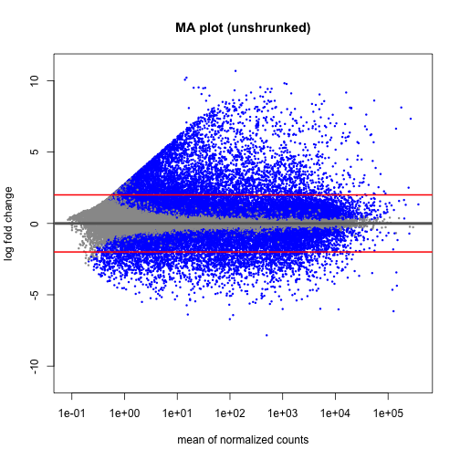


```r
# ... and for the shrunk one!
DESeq2::plotMA(res.shrink, ylim = c(-11, 11), alpha = 0.001, main = "MA plot (shrunked)")
abline(h = c(-2, 2), col = "red", lwd = 2)
```

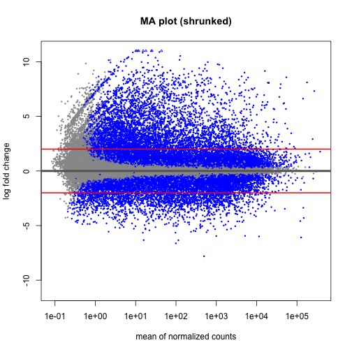


Let's draw a volcano plot for the results


```r
EnhancedVolcano(resDF,
                x = 'log2FoldChange',
                y = 'padj',
                lab = resDF$hgnc_symbol,
                pCutoff = 10e-16,
                FCcutoff = 2,
                xlab = bquote(~Log[2]~ "Fold Change"),
                ylab = bquote(~-Log[10]~adjusted~italic(P)),
                drawConnectors = TRUE,
                widthConnectors = 0.75)
```

```
## Warning: One or more p-values is 0. Converting to 10^-1 * current lowest non-
## zero p-value...
```

```
## Warning: ggrepel: 3422 unlabeled data points (too many overlaps). Consider
## increasing max.overlaps
```

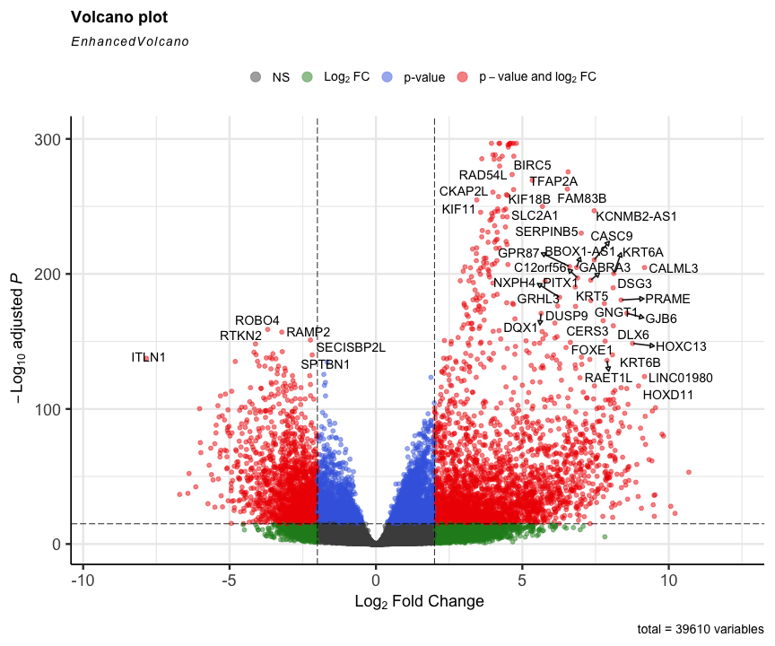


Let's extract the top 20 genes in normal vs tumour


```r
# TP vs NT, i.e. (TP - NT)
resTPDF %>%
  filter(padj < 0.001 & log2FoldChange >= log2(2)) %>%  # expression higher in TP
  drop_na() %>%
  arrange(desc(abs(log2FoldChange)), desc(padj)) -> resTPDF.top.TP

resTPDF.top.TP
```

```
##      ensembl_gene_id            hgnc_symbol baseMean log2FoldChange lfcSE
## 1    ENSG00000228295              LINC00392 1.28e+02         10.686 0.682
## 2    ENSG00000214107                 MAGEB1 1.50e+01         10.215 1.005
## 3    ENSG00000224960                PPP4R3C 1.40e+01         10.069 0.891
## 4    ENSG00000197172                 MAGEA6 1.08e+03          9.822 0.511
## 5    ENSG00000221867                 MAGEA3 1.18e+03          9.772 0.504
## 6    ENSG00000128714                 HOXD13 3.77e+02          9.545 0.441
## 7    ENSG00000236956                  NF1P8 2.54e+01          9.532 0.737
## 8    ENSG00000132446                 FTHL17 2.04e+01          9.507 0.985
## 9    ENSG00000123584                 MAGEA9 3.39e+01          9.498 0.738
## 10   ENSG00000170516                 COX7B2 3.11e+01          9.469 0.821
## 11   ENSG00000094796                  KRT31 6.17e+02          9.440 0.442
## 12   ENSG00000124260                MAGEA10 5.20e+02          9.423 0.559
## 13   ENSG00000267978                MAGEA9B 1.22e+02          9.327 0.549
## 14   ENSG00000185247                MAGEA11 5.85e+02          9.207 0.499
## 15   ENSG00000113430                   IRX4 4.71e+02          9.196 0.439
## 16   ENSG00000178363                 CALML3 1.60e+04          9.172 0.298
## 17   ENSG00000225548              LINC01980 2.51e+02          9.171 0.383
## 18   ENSG00000242512              LINC01206 1.45e+03          9.111 0.478
## 19   ENSG00000187172                  BAGE2 2.88e+01          9.066 0.825
## 20   ENSG00000147381                 MAGEA4 5.01e+03          9.036 0.453
## 21   ENSG00000128713                 HOXD11 2.04e+02          8.969 0.385
## 22   ENSG00000224141              MIR548XHG 4.08e+01          8.956 0.704
## 23   ENSG00000165643                 SOHLH1 3.78e+02          8.910 0.540
## 24   ENSG00000099399                 MAGEB2 4.22e+02          8.877 0.611
## 25   ENSG00000123364                 HOXC13 2.92e+02          8.764 0.334
## 26   ENSG00000229544                 NKX1-2 2.05e+02          8.663 0.433
## 27   ENSG00000229967             MAGEA4-AS1 1.14e+02          8.643 0.531
## 28   ENSG00000182938                  OTOP3 1.49e+02          8.639 0.586
## 29   ENSG00000186847                  KRT14 5.46e+04          8.610 0.393
## 30   ENSG00000105141                 CASP14 5.33e+02          8.608 0.531
## 31   ENSG00000253898              LINC01419 3.53e+01          8.595 0.697
## 32   ENSG00000198681                 MAGEA1 7.06e+02          8.595 0.539
## 33   ENSG00000121742                   GJB6 6.14e+03          8.569 0.305
## 34   ENSG00000131668                  BARX1 6.06e+02          8.564 0.371
## 35   ENSG00000213401                MAGEA12 4.48e+02          8.533 0.602
## 36   ENSG00000169297                  NR0B1 5.67e+02          8.515 0.583
## 37   ENSG00000231532              LINC01249 7.25e+01          8.514 0.538
## 38   ENSG00000257636               G2E3-AS1 8.43e+01          8.496 0.401
## 39   ENSG00000089116                   LHX5 1.20e+02          8.427 0.419
## 40   ENSG00000189182                  KRT77 1.71e+02          8.424 0.489
## 41   ENSG00000214617               SLC6A10P 9.73e+01          8.394 0.545
## 42   ENSG00000242515                UGT1A10 5.03e+02          8.383 0.605
## 43   ENSG00000249641              HOXC13-AS 8.34e+01          8.378 0.411
## 44   ENSG00000140519                   RHCG 5.53e+03          8.374 0.362
## 45   ENSG00000185686                  PRAME 3.60e+03          8.373 0.289
## 46   ENSG00000046774                 MAGEC2 1.59e+02          8.323 0.707
## 47   ENSG00000143556                 S100A7 4.25e+03          8.302 0.422
## 48   ENSG00000123388                 HOXC11 1.64e+02          8.273 0.424
## 49   ENSG00000224271                        6.12e+01          8.269 0.382
## 50   ENSG00000223812                        1.15e+02          8.231 0.533
## 51   ENSG00000206262                FOXL2NB 1.15e+02          8.171 0.485
## 52   ENSG00000155495                 MAGEC1 1.22e+02          8.170 0.710
## 53   ENSG00000159184                 HOXB13 3.11e+02          8.166 0.456
## 54   ENSG00000184330                S100A7A 7.49e+02          8.165 0.475
## 55   ENSG00000090512                  FETUB 4.55e+02          8.162 0.479
## 56   ENSG00000164093                  PITX2 3.32e+02          8.161 0.379
## 57   ENSG00000250546                        8.02e+01          8.161 0.356
## 58   ENSG00000106031                 HOXA13 1.51e+02          8.140 0.371
## 59   ENSG00000205420                  KRT6A 1.78e+05          8.123 0.267
## 60   ENSG00000198074                AKR1B10 1.89e+04          8.111 0.364
## 61   ENSG00000006377                   DLX6 4.30e+02          8.106 0.296
## 62   ENSG00000249082            C5orf66-AS1 8.92e+01          8.102 0.467
## 63   ENSG00000227471                AKR1B15 7.23e+02          8.102 0.356
## 64   ENSG00000134757                   DSG3 2.00e+04          8.101 0.273
## 65   ENSG00000237767              LINC01370 1.66e+01          8.085 0.855
## 66   ENSG00000248131              LINC01194 4.95e+01          8.083 0.686
## 67   ENSG00000185479                  KRT6B 2.01e+04          8.077 0.317
## 68   ENSG00000234352                        1.30e+02          8.047 0.391
## 69   ENSG00000126890                  CTAG2 2.96e+02          8.044 0.720
## 70   ENSG00000188373               C10orf99 6.35e+02          8.041 0.385
## 71   ENSG00000231240                 KLF2P1 4.59e+01          8.033 0.510
## 72   ENSG00000250026            TMPRSS11BNL 8.68e+01          8.032 0.567
## 73   ENSG00000178372                 CALML5 1.71e+03          8.025 0.438
## 74   ENSG00000244122                 UGT1A7 1.22e+03          8.012 0.460
## 75   ENSG00000207296              RNU6-140P 5.95e+01          8.012 0.431
## 76   ENSG00000170465                  KRT6C 4.95e+03          8.005 0.365
## 77   ENSG00000253706                        2.33e+02          7.995 0.359
## 78   ENSG00000187714                SLC18A3 9.79e+01          7.993 0.518
## 79   ENSG00000107807                   TLX1 1.23e+02          7.983 0.529
## 80   ENSG00000105143                 SLC1A6 3.40e+02          7.980 0.460
## 81   ENSG00000233515              LINC01518 3.88e+01          7.967 0.562
## 82   ENSG00000163202                  LCE3D 2.06e+02          7.958 0.530
## 83   ENSG00000180178                 FAR2P1 3.62e+02          7.951 0.414
## 84   ENSG00000267284                        9.46e+01          7.939 0.357
## 85   ENSG00000102195                  GPR50 1.33e+02          7.925 0.512
## 86   ENSG00000224853              LINC00393 4.56e+01          7.905 0.527
## 87   ENSG00000213606              AKR1B10P1 9.55e+01          7.899 0.523
## 88   ENSG00000164438                   TLX3 5.09e+01          7.898 0.523
## 89   ENSG00000155918                 RAET1L 5.27e+02          7.891 0.314
## 90   ENSG00000147246                  HTR2C 1.21e+02          7.888 0.402
## 91   ENSG00000148704                   VAX1 6.58e+01          7.881 0.482
## 92   ENSG00000255216                        4.63e+01          7.871 0.579
## 93   ENSG00000198930                  CSAG1 3.33e+02          7.866 0.514
## 94   ENSG00000184148                  SPRR4 9.05e+01          7.859 0.535
## 95   ENSG00000227674              LINC00355 4.93e+01          7.847 0.498
## 96   ENSG00000159527                PGLYRP3 4.03e+02          7.840 0.353
## 97   ENSG00000184351              KRTAP19-1 5.13e+01          7.836 0.527
## 98   ENSG00000178919                  FOXE1 3.82e+03          7.827 0.297
## 99   ENSG00000164816                  DEFA5 4.39e+01          7.818 1.647
## 100  ENSG00000255501                 CARD18 4.65e+01          7.817 0.501
## 101  ENSG00000231131                LNCAROD 6.37e+01          7.810 0.477
## 102  ENSG00000127928                  GNGT1 1.74e+02          7.801 0.272
## 103  ENSG00000125998                 FAM83C 9.46e+02          7.769 0.370
## 104  ENSG00000250920                        1.68e+02          7.767 0.612
## 105  ENSG00000263711              LINC02864 1.94e+02          7.767 0.564
## 106  ENSG00000154227                  CERS3 1.45e+03          7.760 0.280
## 107  ENSG00000234068                  PAGE2 7.35e+01          7.748 0.803
## 108  ENSG00000233221                        5.84e+01          7.741 0.358
## 109  ENSG00000205634              LINC00898 4.75e+01          7.724 0.426
## 110  ENSG00000248498                 ASNSP1 4.12e+01          7.701 0.543
## 111  ENSG00000183770                  FOXL2 1.79e+02          7.681 0.409
## 112  ENSG00000198092              TMPRSS11F 1.44e+02          7.662 0.399
## 113  ENSG00000230798              FOXD3-AS1 8.47e+01          7.653 0.373
## 114  ENSG00000248973                        3.64e+01          7.636 0.411
## 115  ENSG00000171401                  KRT13 3.85e+04          7.625 0.371
## 116  ENSG00000231683                        1.40e+03          7.616 0.464
## 117  ENSG00000169469                 SPRR1B 8.91e+03          7.614 0.352
## 118  ENSG00000165588                   OTX2 5.09e+01          7.612 0.556
## 119  ENSG00000235277                        3.28e+01          7.604 0.394
## 120  ENSG00000185966                  LCE3E 5.44e+01          7.584 0.552
## 121  ENSG00000112238                 PRDM13 5.61e+01          7.577 0.435
## 122  ENSG00000269993                        4.09e+01          7.568 0.560
## 123  ENSG00000186297                 GABRA5 1.08e+02          7.566 0.577
## 124  ENSG00000233854             POU6F2-AS2 4.38e+01          7.561 0.369
## 125  ENSG00000117148                  ACTL8 4.75e+01          7.552 0.497
## 126  ENSG00000137090                  DMRT1 4.76e+01          7.547 0.438
## 127  ENSG00000250682              LINC00491 9.37e+01          7.546 0.350
## 128  ENSG00000006059                 KRT33A 3.67e+01          7.540 0.463
## 129  ENSG00000163530                  DPPA2 4.17e+01          7.535 0.635
## 130  ENSG00000232023              LINC01807 5.08e+01          7.530 0.437
## 131  ENSG00000187258                  NPSR1 7.88e+01          7.519 0.440
## 132  ENSG00000225826              LINC00626 9.04e+01          7.508 0.440
## 133  ENSG00000162344                  FGF19 1.57e+02          7.492 0.562
## 134  ENSG00000265992                   ESRG 2.42e+02          7.466 0.592
## 135  ENSG00000198443               KRTAP4-1 4.30e+01          7.461 0.382
## 136  ENSG00000143469                  SYT14 3.16e+02          7.461 0.320
## 137  ENSG00000249395                  CASC9 6.74e+02          7.455 0.239
## 138  ENSG00000237978             KCNMB2-AS1 4.93e+02          7.452 0.220
## 139  ENSG00000142619                  PADI3 2.24e+03          7.440 0.396
## 140  ENSG00000250874                        2.80e+01          7.439 0.375
## 141  ENSG00000197641              SERPINB13 5.28e+03          7.433 0.333
## 142  ENSG00000249116               IRX4-AS1 2.54e+01          7.417 0.469
## 143  ENSG00000234862                        3.98e+01          7.408 0.517
## 144  ENSG00000251026              LINC02163 2.97e+01          7.406 0.367
## 145  ENSG00000181355                  OFCC1 3.09e+01          7.403 0.425
## 146  ENSG00000205076                 LGALS7 4.38e+02          7.399 0.444
## 147  ENSG00000248740              LINC02428 4.78e+01          7.393 0.370
## 148  ENSG00000113327                 GABRG2 7.74e+01          7.375 0.546
## 149  ENSG00000185873              TMPRSS11B 5.70e+01          7.364 0.596
## 150  ENSG00000167656                   LY6D 7.47e+03          7.354 0.404
## 151  ENSG00000229618                        6.09e+01          7.341 0.415
## 152  ENSG00000186081                   KRT5 2.68e+05          7.335 0.254
## 153  ENSG00000011677                 GABRA3 4.74e+02          7.335 0.244
## 154  ENSG00000217236                    SP9 3.32e+01          7.331 0.440
## 155  ENSG00000123407                 HOXC12 6.49e+01          7.327 0.623
## 156  ENSG00000187054              TMPRSS11A 1.56e+03          7.322 0.392
## 157  ENSG00000198054                  DSCR8 2.52e+01          7.314 0.888
## 158  ENSG00000142623                  PADI1 6.02e+02          7.312 0.391
## 159  ENSG00000182040                  USH1G 3.53e+02          7.304 0.290
## 160  ENSG00000171403                   KRT9 4.70e+01          7.287 0.431
## 161  ENSG00000215612                   HMX1 3.82e+01          7.282 0.625
## 162  ENSG00000137948                   BRDT 2.07e+02          7.282 0.566
## 163  ENSG00000248359                        4.12e+01          7.277 0.449
## 164  ENSG00000197084                  LCE1C 3.34e+01          7.274 0.505
## 165  ENSG00000166634              SERPINB12 1.04e+02          7.259 0.477
## 166  ENSG00000215834                  FMO9P 4.99e+01          7.233 0.446
## 167  ENSG00000187689                   AMTN 6.37e+02          7.227 0.443
## 168  ENSG00000253554              LINC01414 2.83e+01          7.219 0.439
## 169  ENSG00000163064                    EN1 2.40e+02          7.206 0.384
## 170  ENSG00000265933              LINC00668 4.80e+02          7.205 0.322
## 171  ENSG00000087128              TMPRSS11E 1.72e+03          7.197 0.321
## 172  ENSG00000249550              LINC01234 3.22e+02          7.189 0.363
## 173  ENSG00000206073               SERPINB4 1.80e+03          7.187 0.381
## 174  ENSG00000181433                  SAGE1 1.04e+02          7.170 0.638
## 175  ENSG00000171658                NMRAL2P 4.01e+03          7.167 0.353
## 176  ENSG00000266729               DSG1-AS1 5.29e+01          7.165 0.406
## 177  ENSG00000224984                        8.59e+01          7.158 0.339
## 178  ENSG00000272328                        2.49e+01          7.153 0.349
## 179  ENSG00000258932                        3.43e+01          7.149 0.377
## 180  ENSG00000165553                    NGB 4.61e+01          7.146 0.487
## 181  ENSG00000260019              LINC01992 3.00e+01          7.138 0.581
## 182  ENSG00000230570                        2.67e+01          7.133 0.395
## 183  ENSG00000136688                  IL36G 8.72e+02          7.119 0.384
## 184  ENSG00000169548                ZNF280A 3.94e+01          7.116 0.453
## 185  ENSG00000253642                        2.32e+01          7.115 0.743
## 186  ENSG00000243236                 GSTA9P 3.45e+02          7.114 0.467
## 187  ENSG00000214429                 CYCSP6 7.68e+01          7.109 0.392
## 188  ENSG00000170484                  KRT74 9.27e+01          7.085 0.350
## 189  ENSG00000009709                   PAX7 1.56e+02          7.081 0.563
## 190  ENSG00000163331                  DAPL1 2.84e+03          7.078 0.310
## 191  ENSG00000106410                  NOBOX 1.49e+01          7.076 0.926
## 192  ENSG00000249413                        2.17e+01          7.067 0.366
## 193  ENSG00000170454                  KRT75 5.06e+02          7.061 0.380
## 194  ENSG00000259439              LINC01833 5.81e+01          7.059 0.503
## 195  ENSG00000158786                PLA2G2F 4.47e+01          7.057 0.540
## 196  ENSG00000159217                IGF2BP1 7.61e+02          7.048 0.363
## 197  ENSG00000183072                 NKX2-5 1.45e+02          7.038 0.431
## 198  ENSG00000256463                  SALL3 9.01e+01          7.036 0.582
## 199  ENSG00000149948                  HMGA2 1.85e+03          7.032 0.283
## 200  ENSG00000239148                        2.68e+01          7.021 0.603
## 201  ENSG00000163209                  SPRR3 8.06e+03          7.021 0.417
## 202  ENSG00000231870                KRT17P3 1.75e+02          7.021 0.392
## 203  ENSG00000231764               DLX6-AS1 3.44e+02          7.019 0.277
## 204  ENSG00000236347                        2.01e+01          7.018 0.397
## 205  ENSG00000169509                  CRCT1 1.73e+02          7.012 0.481
## 206  ENSG00000206075               SERPINB5 1.04e+04          7.011 0.215
## 207  ENSG00000184502                   GAST 7.35e+01          6.999 0.441
## 208  ENSG00000240386                  LCE1F 2.42e+01          6.989 0.568
## 209  ENSG00000257869                        2.05e+01          6.987 0.455
## 210  ENSG00000260763                        3.63e+01          6.986 0.437
## 211  ENSG00000229637                  PRAC2 2.61e+01          6.984 0.605
## 212  ENSG00000170689                  HOXB9 3.25e+02          6.982 0.385
## 213  ENSG00000144355                   DLX1 1.16e+02          6.981 0.361
## 214  ENSG00000176566                DCAF4L2 2.40e+01          6.976 1.018
## 215  ENSG00000249628              LINC00942 7.73e+02          6.975 0.434
## 216  ENSG00000178934                LGALS7B 1.10e+03          6.970 0.359
## 217  ENSG00000238125               SLC9A3P2 7.27e+01          6.969 0.503
## 218  ENSG00000176153                   GPX2 1.53e+04          6.966 0.292
## 219  ENSG00000231453              LINC01305 5.09e+01          6.950 0.419
## 220  ENSG00000263146              LINC01896 2.16e+01          6.946 0.708
## 221  ENSG00000164651                    SP8 1.03e+02          6.944 0.418
## 222  ENSG00000163216                 SPRR2D 4.18e+03          6.940 0.371
## 223  ENSG00000251151               HOXC-AS3 2.41e+01          6.927 0.499
## 224  ENSG00000250102              LINC02377 1.80e+01          6.917 0.777
## 225  ENSG00000101441                   CST4 2.39e+01          6.916 0.466
## 226  ENSG00000259672                        4.77e+01          6.914 0.636
## 227  ENSG00000185306               C12orf56 3.46e+02          6.887 0.228
## 228  ENSG00000204542                C6orf15 3.18e+02          6.884 0.484
## 229  ENSG00000204460              LINC01854 2.15e+01          6.882 0.687
## 230  ENSG00000187772                 LIN28B 7.12e+01          6.869 0.612
## 231  ENSG00000242366                 UGT1A8 4.50e+01          6.863 0.584
## 232  ENSG00000254560              BBOX1-AS1 3.38e+02          6.854 0.223
## 233  ENSG00000234896                OR7E62P 3.24e+01          6.852 0.388
## 234  ENSG00000180818                 HOXC10 4.25e+02          6.850 0.366
## 235  ENSG00000269741                        5.22e+01          6.848 0.531
## 236  ENSG00000144820                 ADGRG7 3.99e+01          6.843 0.622
## 237  ENSG00000203785                 SPRR2E 2.48e+03          6.841 0.431
## 238  ENSG00000234041                        4.73e+01          6.839 0.493
## 239  ENSG00000241794                 SPRR2A 6.34e+03          6.836 0.392
## 240  ENSG00000104327                  CALB1 1.55e+03          6.835 0.436
## 241  ENSG00000129152                  MYOD1 1.92e+01          6.834 0.608
## 242  ENSG00000215853                   RPTN 1.88e+02          6.830 0.490
## 243  ENSG00000258815              LINC02820 6.19e+01          6.829 0.360
## 244  ENSG00000142700                 DMRTA2 3.12e+02          6.829 0.345
## 245  ENSG00000167755                   KLK6 7.36e+02          6.827 0.387
## 246  ENSG00000072041                SLC6A15 9.07e+02          6.827 0.321
## 247  ENSG00000204021                   LIPK 2.15e+01          6.820 0.474
## 248  ENSG00000087494                  PTHLH 9.79e+03          6.820 0.278
## 249  ENSG00000130829                  DUSP9 6.47e+02          6.816 0.239
## 250  ENSG00000254166                 CASC19 7.15e+01          6.813 0.415
## 251  ENSG00000137745                  MMP13 3.73e+03          6.812 0.384
## 252  ENSG00000248268                        6.71e+01          6.808 0.340
## 253  ENSG00000069011                  PITX1 4.91e+03          6.805 0.229
## 254  ENSG00000196754                 S100A2 3.66e+04          6.802 0.274
## 255  ENSG00000197085              NPSR1-AS1 2.50e+01          6.799 0.396
## 256  ENSG00000258763                        5.93e+01          6.760 0.504
## 257  ENSG00000159516                 SPRR2G 3.38e+02          6.754 0.446
## 258  ENSG00000278041                        2.50e+01          6.748 0.501
## 259  ENSG00000171209                   CSN3 2.45e+01          6.744 0.915
## 260  ENSG00000166670                  MMP10 6.68e+03          6.744 0.366
## 261  ENSG00000225882              LINC01456 2.72e+01          6.743 0.486
## 262  ENSG00000259178                        1.88e+01          6.740 0.404
## 263  ENSG00000228630                 HOTAIR 6.34e+01          6.724 0.460
## 264  ENSG00000259306                        2.00e+01          6.715 0.365
## 265  ENSG00000235601               BARX1-DT 1.68e+01          6.705 0.453
## 266  ENSG00000243137                   PSG4 1.02e+02          6.697 0.495
## 267  ENSG00000249199                        1.54e+01          6.694 0.495
## 268  ENSG00000259485              LINC02253 1.08e+02          6.692 0.381
## 269  ENSG00000179066                        1.04e+02          6.691 0.330
## 270  ENSG00000260377                        3.33e+01          6.690 0.439
## 271  ENSG00000268621              IGFL2-AS1 3.14e+02          6.690 0.371
## 272  ENSG00000169474                 SPRR1A 3.69e+03          6.678 0.381
## 273  ENSG00000231431                 FAR2P4 1.02e+02          6.674 0.489
## 274  ENSG00000271287                  BCRP9 1.57e+01          6.664 0.490
## 275  ENSG00000185962                  LCE3A 1.99e+01          6.654 0.563
## 276  ENSG00000229970                        7.12e+01          6.653 0.289
## 277  ENSG00000279712                        1.76e+01          6.650 0.401
## 278  ENSG00000153802              TMPRSS11D 2.06e+03          6.648 0.371
## 279  ENSG00000228162                        3.74e+01          6.642 0.498
## 280  ENSG00000173157               ADAMTS20 1.18e+02          6.640 0.330
## 281  ENSG00000128422                  KRT17 1.42e+05          6.639 0.252
## 282  ENSG00000203786                   KPRP 7.16e+01          6.631 0.470
## 283  ENSG00000249196           TMEM132D-AS1 2.05e+01          6.630 0.676
## 284  ENSG00000188100                 FAM25A 2.98e+01          6.617 0.522
## 285  ENSG00000138271                  GPR87 3.11e+03          6.612 0.214
## 286  ENSG00000166535                  A2ML1 4.25e+03          6.609 0.336
## 287  ENSG00000186832                  KRT16 3.95e+04          6.593 0.322
## 288  ENSG00000260976              LINC01633 1.49e+01          6.586 0.352
## 289  ENSG00000196243              LINC00615 1.61e+01          6.580 0.549
## 290  ENSG00000256812                 CAPNS2 9.57e+02          6.579 0.303
## 291  ENSG00000146276                 GABRR1 1.39e+02          6.577 0.322
## 292  ENSG00000131737                  KRT34 4.54e+01          6.573 0.411
## 293  ENSG00000170373                   CST1 8.60e+02          6.569 0.345
## 294  ENSG00000203740               METTL11B 1.66e+01          6.568 0.377
## 295  ENSG00000261116                        1.36e+03          6.563 0.184
## 296  ENSG00000224260                        2.70e+01          6.556 0.443
## 297  ENSG00000106689                   LHX2 1.64e+02          6.553 0.327
## 298  ENSG00000257253                        1.58e+01          6.551 0.520
## 299  ENSG00000136695                 IL36RN 7.92e+02          6.550 0.350
## 300  ENSG00000164616                FBXL21P 4.69e+01          6.549 0.562
## 301  ENSG00000268089                  GABRQ 4.68e+02          6.549 0.292
## 302  ENSG00000136694                  IL36A 6.59e+01          6.545 0.551
## 303  ENSG00000188293                  IGFL1 3.39e+02          6.544 0.378
## 304  ENSG00000258053                        1.37e+02          6.540 0.339
## 305  ENSG00000168143                 FAM83B 1.34e+03          6.537 0.187
## 306  ENSG00000271134               IFITM3P9 7.00e+01          6.534 0.344
## 307  ENSG00000246095              LINC01096 2.44e+01          6.527 0.389
## 308  ENSG00000214336                  FOXI3 1.60e+02          6.512 0.373
## 309  ENSG00000271830                        1.81e+01          6.510 0.416
## 310  ENSG00000143536                   CRNN 9.32e+01          6.506 0.582
## 311  ENSG00000268916                  CSAG3 7.98e+01          6.503 0.483
## 312  ENSG00000189064                 GAGE2A 1.60e+01          6.502 0.901
## 313  ENSG00000266830                        1.79e+01          6.498 0.603
## 314  ENSG00000074211                PPP2R2C 2.09e+03          6.490 0.250
## 315  ENSG00000163207                    IVL 2.41e+03          6.478 0.346
## 316  ENSG00000267056                        6.95e+02          6.476 0.401
## 317  ENSG00000139515                   PDX1 2.08e+01          6.471 0.543
## 318  ENSG00000229035                 SPRR2C 2.40e+02          6.470 0.467
## 319  ENSG00000246876              LINC02466 1.76e+01          6.469 0.415
## 320  ENSG00000234859                        2.26e+01          6.467 0.451
## 321  ENSG00000115844                   DLX2 5.95e+01          6.467 0.378
## 322  ENSG00000242147                  LASTR 5.28e+01          6.460 0.385
## 323  ENSG00000220377                 GSTA8P 1.39e+02          6.453 0.534
## 324  ENSG00000172782                  FADS6 1.20e+02          6.450 0.356
## 325  ENSG00000147689                 FAM83A 5.02e+03          6.447 0.310
## 326  ENSG00000016602                  CLCA4 9.15e+02          6.442 0.387
## 327  ENSG00000223760                MED15P9 1.52e+01          6.439 0.658
## 328  ENSG00000248510              LINC02267 1.52e+01          6.435 0.852
## 329  ENSG00000005073                 HOXA11 8.72e+01          6.434 0.333
## 330  ENSG00000189001                   SBSN 2.17e+03          6.421 0.389
## 331  ENSG00000253363                        1.32e+01          6.408 0.690
## 332  ENSG00000268902                  CSAG2 4.12e+01          6.405 0.529
## 333  ENSG00000280356                        2.23e+01          6.399 0.509
## 334  ENSG00000258240                        2.10e+01          6.392 0.555
## 335  ENSG00000204949             FAM83A-AS1 1.54e+02          6.388 0.350
## 336  ENSG00000236516                 KLF2P4 2.04e+01          6.382 0.535
## 337  ENSG00000105675                  ATP4A 6.10e+01          6.372 0.439
## 338  ENSG00000133636                    NTS 1.88e+04          6.365 0.430
## 339  ENSG00000182968                   SOX1 2.57e+01          6.360 0.667
## 340  ENSG00000164778                    EN2 1.36e+02          6.334 0.362
## 341  ENSG00000165474                   GJB2 1.41e+04          6.334 0.267
## 342  ENSG00000233455                        2.41e+01          6.332 0.487
## 343  ENSG00000186732                 MPPED1 2.74e+02          6.332 0.425
## 344  ENSG00000231648              LINC01698 1.19e+01          6.323 0.435
## 345  ENSG00000235493              LINC01967 1.64e+01          6.312 0.396
## 346  ENSG00000176746                 MAGEB6 1.27e+01          6.301 0.537
## 347  ENSG00000165556                   CDX2 5.22e+01          6.298 0.532
## 348  ENSG00000260476                        1.56e+01          6.298 0.476
## 349  ENSG00000198854                C1orf68 1.27e+01          6.289 0.551
## 350  ENSG00000180861              LINC01559 1.71e+02          6.288 0.394
## 351  ENSG00000188508                 KRTDAP 7.29e+02          6.286 0.422
## 352  ENSG00000196805                 SPRR2B 1.33e+02          6.279 0.488
## 353  ENSG00000105880                   DLX5 1.07e+03          6.279 0.253
## 354  ENSG00000175065                   DSG4 2.41e+01          6.275 0.478
## 355  ENSG00000256980                 KHDC1L 5.60e+01          6.273 0.463
## 356  ENSG00000148798                    INA 3.24e+02          6.270 0.356
## 357  ENSG00000182379                  NXPH4 1.64e+03          6.270 0.216
## 358  ENSG00000130822                   PNCK 1.28e+03          6.267 0.255
## 359  ENSG00000116996                    ZP4 1.14e+01          6.261 0.760
## 360  ENSG00000204941                   PSG5 2.03e+01          6.255 0.511
## 361  ENSG00000188624                  IGFL3 5.22e+01          6.253 0.463
## 362  ENSG00000069482                    GAL 3.16e+02          6.246 0.314
## 363  ENSG00000111700                SLCO1B3 1.57e+02          6.243 0.449
## 364  ENSG00000171346                  KRT15 4.82e+04          6.238 0.277
## 365  ENSG00000162624                   LHX8 2.22e+01          6.235 0.571
## 366  ENSG00000112333                  NR2E1 2.98e+01          6.233 0.476
## 367  ENSG00000167941                   SOST 1.34e+03          6.232 0.450
## 368  ENSG00000224409                        1.91e+01          6.232 0.394
## 369  ENSG00000231776              LINC01611 1.43e+01          6.230 0.504
## 370  ENSG00000148408                CACNA1B 6.54e+02          6.230 0.302
## 371  ENSG00000235689                        2.24e+01          6.228 0.561
## 372  ENSG00000226779           NAALADL2-AS2 3.59e+01          6.218 0.427
## 373  ENSG00000134365                  CFHR4 1.47e+01          6.215 0.458
## 374  ENSG00000268879                IGFL1P1 5.26e+01          6.212 0.408
## 375  ENSG00000261502                        2.83e+01          6.210 0.407
## 376  ENSG00000158055                  GRHL3 1.58e+03          6.207 0.217
## 377  ENSG00000253477                        2.75e+01          6.206 0.405
## 378  ENSG00000130294                  KIF1A 1.78e+03          6.204 0.393
## 379  ENSG00000231645                KRT17P6 2.42e+01          6.203 0.384
## 380  ENSG00000135903                   PAX3 4.50e+01          6.199 0.459
## 381  ENSG00000131650                KREMEN2 8.08e+02          6.197 0.298
## 382  ENSG00000155052                CNTNAP5 1.94e+01          6.189 0.490
## 383  ENSG00000081277                   PKP1 4.63e+04          6.186 0.232
## 384  ENSG00000225206               MIR137HG 2.19e+01          6.185 0.545
## 385  ENSG00000227802                 DNAJB3 2.30e+01          6.173 0.427
## 386  ENSG00000196344                   ADH7 6.57e+03          6.173 0.372
## 387  ENSG00000279511                        2.36e+01          6.173 0.368
## 388  ENSG00000231291                        1.26e+01          6.167 0.401
## 389  ENSG00000205488             CALML3-AS1 3.16e+02          6.164 0.245
## 390  ENSG00000203523                TAS2R2P 1.10e+01          6.151 0.349
## 391  ENSG00000128610                  FEZF1 2.43e+02          6.151 0.333
## 392  ENSG00000240990              HOXA11-AS 6.62e+01          6.150 0.349
## 393  ENSG00000239893              ZNF736P9Y 3.40e+01          6.148 0.655
## 394  ENSG00000156150                   ALX3 2.14e+01          6.145 0.581
## 395  ENSG00000279516                FAM230C 1.14e+01          6.140 0.786
## 396  ENSG00000163206                   SMCP 1.05e+01          6.137 0.594
## 397  ENSG00000264734                        1.08e+01          6.122 0.829
## 398  ENSG00000261761              LINC02616 1.62e+01          6.121 0.804
## 399  ENSG00000144452                 ABCA12 1.31e+03          6.112 0.230
## 400  ENSG00000256597              LINC02393 1.80e+01          6.111 0.593
## 401  ENSG00000250735                        1.43e+01          6.110 0.446
## 402  ENSG00000230937               MIR205HG 5.60e+03          6.110 0.222
## 403  ENSG00000251185                        1.67e+01          6.104 0.434
## 404  ENSG00000065618                COL17A1 1.79e+04          6.100 0.278
## 405  ENSG00000248783                        1.20e+01          6.096 0.702
## 406  ENSG00000149968                   MMP3 8.53e+02          6.094 0.332
## 407  ENSG00000273706                   LHX1 2.35e+01          6.093 0.560
## 408  ENSG00000234262                        1.01e+01          6.084 0.557
## 409  ENSG00000174450               GOLGA6L2 1.24e+01          6.079 0.508
## 410  ENSG00000180251                 SLC9A4 1.28e+02          6.078 0.380
## 411  ENSG00000256995                        3.44e+01          6.072 0.460
## 412  ENSG00000187140                  FOXD3 4.40e+01          6.071 0.347
## 413  ENSG00000134762                   DSC3 1.71e+04          6.066 0.238
## 414  ENSG00000229009             TMPRSS11GP 1.13e+01          6.065 0.461
## 415  ENSG00000112494                 UNC93A 2.02e+01          6.064 0.493
## 416  ENSG00000279739                        1.04e+01          6.060 0.468
## 417  ENSG00000224814                        1.75e+01          6.059 0.417
## 418  ENSG00000145087                STXBP5L 1.76e+02          6.057 0.400
## 419  ENSG00000124102                    PI3 1.36e+04          6.057 0.361
## 420  ENSG00000239311                        1.03e+01          6.056 0.891
## 421  ENSG00000197587                  DMBX1 4.84e+01          6.044 0.378
## 422  ENSG00000250564                        3.87e+01          6.034 0.480
## 423  ENSG00000225546              LINC02476 1.09e+01          6.019 0.788
## 424  ENSG00000276399                        1.18e+01          6.018 0.738
## 425  ENSG00000086570                   FAT2 8.38e+03          6.015 0.238
## 426  ENSG00000137975                  CLCA2 1.56e+04          6.011 0.293
## 427  ENSG00000157851                 DPYSL5 6.13e+01          6.006 0.474
## 428  ENSG00000270460                        2.50e+01          5.996 0.330
## 429  ENSG00000251577                        1.21e+01          5.995 0.511
## 430  ENSG00000198555                        1.51e+01          5.994 0.461
## 431  ENSG00000263745                        8.27e+01          5.994 0.270
## 432  ENSG00000196534                 OR9K1P 1.11e+01          5.988 0.466
## 433  ENSG00000258837                        1.98e+01          5.984 0.603
## 434  ENSG00000258955              LINC00519 2.52e+02          5.977 0.266
## 435  ENSG00000224899              LINC02830 2.53e+01          5.969 0.437
## 436  ENSG00000259786              LINC02109 2.56e+01          5.967 0.465
## 437  ENSG00000271252                        1.05e+01          5.967 0.420
## 438  ENSG00000170426                 SDR9C7 9.11e+01          5.967 0.368
## 439  ENSG00000205325                        1.85e+01          5.965 0.484
## 440  ENSG00000230316              FEZF1-AS1 3.82e+02          5.965 0.302
## 441  ENSG00000269989                        1.10e+01          5.964 0.395
## 442  ENSG00000152977                   ZIC1 1.89e+02          5.963 0.484
## 443  ENSG00000258018              LINC02457 1.00e+01          5.956 0.475
## 444  ENSG00000270816              LINC00221 7.23e+01          5.951 0.782
## 445  ENSG00000226057                 PHF2P2 3.01e+01          5.943 0.592
## 446  ENSG00000260877                        2.73e+01          5.943 0.495
## 447  ENSG00000126549                  STATH 2.14e+01          5.932 0.625
## 448  ENSG00000242575                TUBAP13 2.88e+01          5.929 0.440
## 449  ENSG00000205035                        1.21e+01          5.927 0.447
## 450  ENSG00000277619                        1.72e+01          5.923 0.411
## 451  ENSG00000230863                        1.60e+01          5.922 0.386
## 452  ENSG00000170423                  KRT78 2.23e+02          5.913 0.323
## 453  ENSG00000135638                   EMX1 9.25e+01          5.902 0.340
## 454  ENSG00000236279                 CLEC2L 2.73e+02          5.890 0.364
## 455  ENSG00000124092                  CTCFL 2.13e+02          5.889 0.557
## 456  ENSG00000250133               HOXC-AS2 5.07e+01          5.887 0.327
## 457  ENSG00000244578              LINC01391 1.17e+01          5.882 0.499
## 458  ENSG00000225087                        4.81e+01          5.880 0.327
## 459  ENSG00000280414                        9.11e+00          5.877 0.463
## 460  ENSG00000125788                DEFB126 1.48e+01          5.873 0.427
## 461  ENSG00000139800                   ZIC5 2.42e+02          5.873 0.285
## 462  ENSG00000123569                  H2BW1 1.26e+01          5.872 0.418
## 463  ENSG00000260958                        1.11e+01          5.867 0.672
## 464  ENSG00000170965                  PLAC1 1.20e+02          5.864 0.329
## 465  ENSG00000227400                        1.02e+01          5.862 0.474
## 466  ENSG00000164434                  FABP7 1.80e+02          5.860 0.448
## 467  ENSG00000124466                  LYPD3 8.01e+03          5.851 0.231
## 468  ENSG00000145040                   UCN2 1.61e+02          5.849 0.264
## 469  ENSG00000253187              HOXA10-AS 2.59e+01          5.846 0.395
## 470  ENSG00000253499                        8.52e+00          5.840 0.466
## 471  ENSG00000254948               OR7E158P 1.38e+01          5.830 0.472
## 472  ENSG00000277883                NLRP3P1 3.96e+01          5.828 0.334
## 473  ENSG00000225255                  PSLNR 8.80e+00          5.827 0.596
## 474  ENSG00000234828                   IQCM 8.76e+00          5.822 0.417
## 475  ENSG00000276122                        2.18e+01          5.805 0.492
## 476  ENSG00000095596                CYP26A1 5.00e+02          5.795 0.369
## 477  ENSG00000114270                 COL7A1 1.59e+04          5.792 0.216
## 478  ENSG00000260658                        2.95e+01          5.790 0.385
## 479  ENSG00000183760                   ACP7 4.04e+02          5.790 0.329
## 480  ENSG00000240086                        6.87e+01          5.785 0.316
## 481  ENSG00000274827              LINC01297 8.90e+00          5.784 0.640
## 482  ENSG00000182272               B4GALNT4 1.43e+03          5.779 0.192
## 483  ENSG00000249803                        9.21e+00          5.776 0.611
## 484  ENSG00000129455                   KLK8 4.06e+02          5.775 0.398
## 485  ENSG00000043355                   ZIC2 4.89e+02          5.774 0.266
## 486  ENSG00000170178                 HOXD12 9.17e+00          5.770 0.402
## 487  ENSG00000251138              LINC02882 2.15e+01          5.766 0.550
## 488  ENSG00000182583                    VCX 2.60e+01          5.760 0.408
## 489  ENSG00000243766                 HOTTIP 9.87e+00          5.757 0.419
## 490  ENSG00000259240              MIR4713HG 2.42e+01          5.745 0.322
## 491  ENSG00000277693                        8.64e+00          5.742 0.679
## 492  ENSG00000261780              LINC02582 3.82e+01          5.741 0.647
## 493  ENSG00000156689                GLYATL2 3.01e+02          5.737 0.374
## 494  ENSG00000251381              LINC00958 1.06e+03          5.737 0.257
## 495  ENSG00000104055                   TGM5 1.70e+02          5.735 0.317
## 496  ENSG00000254256                RPSAP71 1.37e+01          5.733 0.617
## 497  ENSG00000090932                   DLL3 8.88e+01          5.727 0.316
## 498  ENSG00000267151              MIR2117HG 3.16e+01          5.721 0.375
## 499  ENSG00000227094                        1.49e+01          5.720 0.537
## 500  ENSG00000266736                GTF2IP6 8.51e+00          5.719 0.859
## 501  ENSG00000184954                 OR6C70 8.50e+00          5.716 0.593
## 502  ENSG00000226476              LINC01748 1.41e+02          5.716 0.233
## 503  ENSG00000225680                        8.80e+00          5.710 0.549
## 504  ENSG00000258700              LINC00871 2.83e+01          5.706 0.452
## 505  ENSG00000188580                 NKAIN2 4.80e+02          5.703 0.295
## 506  ENSG00000073282                   TP63 2.62e+04          5.702 0.215
## 507  ENSG00000204019                   CT83 9.41e+01          5.701 0.641
## 508  ENSG00000160181                   TFF2 4.50e+01          5.695 0.613
## 509  ENSG00000262406                  MMP12 4.87e+03          5.691 0.230
## 510  ENSG00000241439                        1.72e+01          5.690 0.408
## 511  ENSG00000114638                  UPK1B 7.11e+03          5.689 0.414
## 512  ENSG00000260073                        8.00e+00          5.688 0.870
## 513  ENSG00000235070                        9.43e+00          5.687 0.586
## 514  ENSG00000117394                 SLC2A1 5.32e+04          5.687 0.167
## 515  ENSG00000224807                 DUX4L9 1.39e+01          5.681 0.500
## 516  ENSG00000171903                CYP4F11 5.65e+03          5.681 0.367
## 517  ENSG00000253661              ZFHX4-AS1 2.54e+01          5.679 0.526
## 518  ENSG00000266560                        1.15e+01          5.675 0.436
## 519  ENSG00000189280                   GJB5 1.71e+03          5.675 0.210
## 520  ENSG00000234800               PCMTD1P3 1.40e+01          5.665 0.353
## 521  ENSG00000248515                        1.14e+01          5.664 0.486
## 522  ENSG00000261949                    GFY 1.00e+01          5.659 0.469
## 523  ENSG00000131885                KRT17P1 3.02e+01          5.657 0.351
## 524  ENSG00000226468                        2.26e+01          5.657 0.344
## 525  ENSG00000280081              LINC01667 1.86e+01          5.656 0.749
## 526  ENSG00000247402                        9.60e+00          5.656 0.382
## 527  ENSG00000167165                 UGT1A6 1.08e+03          5.654 0.281
## 528  ENSG00000179826                MRGPRX3 3.16e+01          5.641 0.459
## 529  ENSG00000099953                  MMP11 6.87e+03          5.640 0.229
## 530  ENSG00000144045                   DQX1 4.36e+02          5.640 0.201
## 531  ENSG00000232508               MRPL45P1 8.70e+00          5.633 0.451
## 532  ENSG00000103449                  SALL1 1.26e+02          5.627 0.422
## 533  ENSG00000248347                        1.52e+01          5.627 0.402
## 534  ENSG00000196611                   MMP1 1.32e+04          5.627 0.295
## 535  ENSG00000164362                   TERT 7.90e+01          5.624 0.311
## 536  ENSG00000151632                 AKR1C2 2.76e+04          5.623 0.304
## 537  ENSG00000260284                  TPSP2 1.64e+01          5.621 0.512
## 538  ENSG00000151379                  MSGN1 1.32e+01          5.614 0.473
## 539  ENSG00000226145                KRT16P6 2.53e+02          5.614 0.397
## 540  ENSG00000185519                FAM131C 8.22e+01          5.605 0.238
## 541  ENSG00000107159                    CA9 2.16e+03          5.600 0.295
## 542  ENSG00000250292                        1.27e+01          5.598 0.506
## 543  ENSG00000174564                 IL20RB 2.12e+03          5.598 0.281
## 544  ENSG00000163515                 RETNLB 8.45e+00          5.597 0.383
## 545  ENSG00000255051                BCAS2P1 8.84e+00          5.596 0.549
## 546  ENSG00000137648                TMPRSS4 1.31e+04          5.590 0.213
## 547  ENSG00000261092              LINC02178 1.16e+01          5.589 0.481
## 548  ENSG00000253802                 SIRLNT 8.08e+00          5.586 0.796
## 549  ENSG00000281566                        8.04e+00          5.578 0.831
## 550  ENSG00000152192                 POU4F1 7.05e+01          5.571 0.377
## 551  ENSG00000146857                  STRA8 2.26e+01          5.562 0.524
## 552  ENSG00000281131                SCHLAP1 7.32e+00          5.561 0.829
## 553  ENSG00000214318              ATP5MC1P6 1.28e+01          5.561 0.373
## 554  ENSG00000186442                   KRT3 4.85e+01          5.557 0.362
## 555  ENSG00000260710                        1.41e+01          5.556 0.470
## 556  ENSG00000241475                        8.96e+00          5.556 0.466
## 557  ENSG00000248238              LINC02438 7.90e+00          5.553 0.502
## 558  ENSG00000174469                CNTNAP2 2.64e+03          5.550 0.307
## 559  ENSG00000060718                COL11A1 3.93e+03          5.549 0.271
## 560  ENSG00000205777                  GAGE1 7.87e+00          5.548 1.010
## 561  ENSG00000213495               RPL26P13 1.29e+01          5.546 0.372
## 562  ENSG00000236117              LINC01639 7.20e+00          5.538 0.644
## 563  ENSG00000257842              LINC02588 1.61e+01          5.534 0.531
## 564  ENSG00000204869                  IGFL4 1.04e+02          5.533 0.311
## 565  ENSG00000267706                        1.17e+01          5.532 0.524
## 566  ENSG00000145832               SLC25A48 5.40e+01          5.522 0.358
## 567  ENSG00000253768                        1.03e+01          5.521 0.507
## 568  ENSG00000266602                        2.14e+01          5.520 0.540
## 569  ENSG00000272763                        1.29e+02          5.520 0.349
## 570  ENSG00000161849                  KRT84 1.08e+01          5.519 0.441
## 571  ENSG00000226652               PSMD10P2 2.45e+01          5.519 0.346
## 572  ENSG00000237412                 PRSS56 9.45e+00          5.517 0.625
## 573  ENSG00000267073                        8.02e+00          5.516 0.482
## 574  ENSG00000233441               CYP2AB1P 8.71e+00          5.515 0.515
## 575  ENSG00000189229                        3.95e+01          5.511 0.307
## 576  ENSG00000183347                   GBP6 4.23e+03          5.510 0.271
## 577  ENSG00000184029                  DSCR4 7.32e+00          5.502 1.064
## 578  ENSG00000160471                 COX6B2 2.75e+02          5.501 0.315
## 579  ENSG00000277586                   NEFL 1.16e+03          5.500 0.402
## 580  ENSG00000156925                   ZIC3 1.32e+01          5.497 0.653
## 581  ENSG00000274840                        1.66e+01          5.491 0.528
## 582  ENSG00000168243                   GNG4 9.40e+02          5.487 0.279
## 583  ENSG00000258314                        6.66e+00          5.484 0.569
## 584  ENSG00000126233                 SLURP1 3.59e+01          5.481 0.463
## 585  ENSG00000241119                 UGT1A9 7.15e+00          5.465 0.557
## 586  ENSG00000266869                        3.15e+01          5.465 0.343
## 587  ENSG00000189108               IL1RAPL2 3.56e+01          5.464 0.381
## 588  ENSG00000166948                   TGM6 8.37e+00          5.460 0.638
## 589  ENSG00000260581                        1.99e+02          5.456 0.280
## 590  ENSG00000261268                        1.10e+01          5.452 0.412
## 591  ENSG00000227204                RBMY2JP 7.04e+00          5.444 0.644
## 592  ENSG00000242207               HOXB-AS4 1.71e+01          5.444 0.477
## 593  ENSG00000229526                KRT16P4 9.78e+00          5.442 0.462
## 594  ENSG00000248597                        1.00e+01          5.440 0.455
## 595  ENSG00000271369                        3.35e+01          5.439 0.501
## 596  ENSG00000250697                        2.24e+01          5.434 0.449
## 597  ENSG00000010438                  PRSS3 2.24e+02          5.433 0.360
## 598  ENSG00000242599                  CSAG4 6.97e+00          5.429 0.670
## 599  ENSG00000250563                KNOP1P5 8.88e+00          5.428 0.617
## 600  ENSG00000230990                        1.22e+01          5.423 0.486
## 601  ENSG00000100341                 PNPLA5 1.20e+01          5.422 0.517
## 602  ENSG00000248837                        8.16e+00          5.421 0.630
## 603  ENSG00000188162                   OTOG 1.33e+01          5.419 0.468
## 604  ENSG00000174226                  SNX31 3.08e+02          5.419 0.331
## 605  ENSG00000156282                 CLDN17 8.43e+00          5.417 0.593
## 606  ENSG00000277268                LHX1-DT 8.85e+00          5.417 0.587
## 607  ENSG00000280776              LINC01202 6.61e+00          5.411 0.508
## 608  ENSG00000168779                  SHOX2 4.38e+02          5.411 0.221
## 609  ENSG00000255020                        3.07e+01          5.408 0.409
## 610  ENSG00000131746                   TNS4 7.07e+03          5.408 0.206
## 611  ENSG00000205922                ONECUT3 4.65e+01          5.405 0.406
## 612  ENSG00000188816                   HMX2 1.20e+01          5.396 0.496
## 613  ENSG00000267172                        6.31e+00          5.394 0.397
## 614  ENSG00000172461                   FUT9 3.09e+01          5.389 0.471
## 615  ENSG00000174963                   ZIC4 4.10e+01          5.388 0.505
## 616  ENSG00000174015                   CBY2 5.20e+01          5.388 0.272
## 617  ENSG00000186897                  C1QL4 3.07e+01          5.387 0.358
## 618  ENSG00000230533                        2.70e+01          5.384 0.389
## 619  ENSG00000279844                        7.91e+00          5.381 0.413
## 620  ENSG00000153779                TGIF2LX 6.46e+00          5.380 0.819
## 621  ENSG00000206014               OR7E161P 7.59e+00          5.378 0.487
## 622  ENSG00000249894                        1.26e+01          5.378 0.356
## 623  ENSG00000227234                SPANXB1 1.02e+01          5.375 0.763
## 624  ENSG00000233571                        6.41e+00          5.371 0.498
## 625  ENSG00000255267              LINC02687 1.58e+01          5.368 0.517
## 626  ENSG00000131738                 KRT33B 1.01e+01          5.368 0.480
## 627  ENSG00000251604              LINC01385 6.92e+00          5.365 0.433
## 628  ENSG00000196542                 SPTSSB 5.22e+02          5.362 0.308
## 629  ENSG00000203995                 ZYG11A 1.72e+02          5.361 0.246
## 630  ENSG00000008197                 TFAP2D 6.91e+00          5.359 0.719
## 631  ENSG00000176406                  RIMS2 3.67e+02          5.358 0.263
## 632  ENSG00000125816                 NKX2-4 8.74e+00          5.354 0.688
## 633  ENSG00000248685              LINC02484 6.33e+00          5.351 1.012
## 634  ENSG00000248796                MED15P8 6.33e+00          5.351 0.712
## 635  ENSG00000268964                 ERVV-2 6.86e+00          5.350 0.716
## 636  ENSG00000249001                        1.26e+02          5.349 0.227
## 637  ENSG00000250426                 FTLP10 8.43e+00          5.348 0.564
## 638  ENSG00000182256                 GABRG3 1.31e+02          5.343 0.439
## 639  ENSG00000242610                OR5BH1P 6.04e+00          5.343 0.415
## 640  ENSG00000234233              KCNH1-IT1 7.76e+00          5.342 0.471
## 641  ENSG00000182545                RNASE10 3.98e+01          5.340 0.399
## 642  ENSG00000267922                        2.26e+01          5.339 0.402
## 643  ENSG00000137203                 TFAP2A 2.73e+03          5.337 0.151
## 644  ENSG00000197472                 ZNF695 1.01e+02          5.335 0.248
## 645  ENSG00000258657                        4.87e+01          5.334 0.412
## 646  ENSG00000163218                PGLYRP4 3.21e+02          5.334 0.296
## 647  ENSG00000257500                        7.70e+00          5.332 0.513
## 648  ENSG00000267909                CCDC177 6.10e+01          5.330 0.378
## 649  ENSG00000165799                 RNASE7 2.76e+02          5.330 0.341
## 650  ENSG00000138829                   FBN2 4.11e+03          5.328 0.344
## 651  ENSG00000236064                        2.06e+01          5.326 0.340
## 652  ENSG00000108417                  KRT37 8.62e+00          5.321 0.456
## 653  ENSG00000261478                        7.62e+00          5.321 0.417
## 654  ENSG00000189186                DCAF8L2 7.28e+00          5.317 0.832
## 655  ENSG00000230450                 NEK2P4 6.19e+00          5.315 0.475
## 656  ENSG00000172927                  MYEOV 5.87e+02          5.314 0.327
## 657  ENSG00000099617                  EFNA2 1.32e+01          5.310 0.438
## 658  ENSG00000134760                   DSG1 4.45e+02          5.310 0.364
## 659  ENSG00000267665                        2.96e+01          5.309 0.484
## 660  ENSG00000232383                        7.93e+01          5.307 0.397
## 661  ENSG00000173805                   HAP1 1.09e+03          5.306 0.263
## 662  ENSG00000256321                        8.53e+00          5.304 0.569
## 663  ENSG00000205704              LINC00634 2.64e+01          5.303 0.296
## 664  ENSG00000117407                   ARTN 1.05e+03          5.303 0.214
## 665  ENSG00000242808                SOX2-OT 1.15e+03          5.300 0.328
## 666  ENSG00000230269              LINC02525 9.48e+00          5.297 0.806
## 667  ENSG00000233610              LINC00462 2.24e+01          5.297 0.457
## 668  ENSG00000187773                 DIPK1C 8.16e+01          5.295 0.409
## 669  ENSG00000178690                  DYNAP 1.06e+01          5.291 0.614
## 670  ENSG00000223715              LINC01208 7.45e+00          5.290 0.421
## 671  ENSG00000232164              LINC01873 1.12e+01          5.290 0.369
## 672  ENSG00000229876                 CASC20 3.79e+01          5.288 0.403
## 673  ENSG00000169213                  RAB3B 1.01e+03          5.282 0.280
## 674  ENSG00000258038              LINC02327 1.16e+01          5.275 0.805
## 675  ENSG00000204421                 LY6G6C 2.44e+02          5.275 0.344
## 676  ENSG00000070886                  EPHA8 1.89e+01          5.274 0.438
## 677  ENSG00000258910              LINC01956 1.26e+01          5.271 0.510
## 678  ENSG00000204362              LINC02783 3.47e+01          5.269 0.397
## 679  ENSG00000250993                        5.98e+00          5.265 0.590
## 680  ENSG00000275216                        8.80e+02          5.265 0.362
## 681  ENSG00000230088                KRT16P5 8.27e+00          5.264 0.487
## 682  ENSG00000234722              LINC01287 6.56e+01          5.263 0.506
## 683  ENSG00000257893              LINC02404 7.29e+00          5.261 0.613
## 684  ENSG00000181333                 HEPHL1 4.30e+02          5.260 0.341
## 685  ENSG00000205359                SLCO6A1 1.06e+01          5.259 0.408
## 686  ENSG00000128710                 HOXD10 3.94e+02          5.257 0.274
## 687  ENSG00000145526                  CDH18 2.76e+01          5.256 0.559
## 688  ENSG00000254338               MAFA-AS1 2.30e+01          5.250 0.402
## 689  ENSG00000229229                        6.40e+00          5.249 0.529
## 690  ENSG00000254764               TRIM53CP 6.15e+00          5.248 0.665
## 691  ENSG00000189410                  SH2D5 2.17e+02          5.246 0.276
## 692  ENSG00000267291             MAP4K1-AS1 3.12e+01          5.243 0.395
## 693  ENSG00000176887                  SOX11 2.14e+02          5.241 0.399
## 694  ENSG00000225107                        9.88e+00          5.234 0.511
## 695  ENSG00000230936                        9.41e+00          5.233 0.657
## 696  ENSG00000134538                SLCO1B1 1.23e+01          5.232 0.447
## 697  ENSG00000236212                        6.08e+00          5.232 0.351
## 698  ENSG00000231877                        1.42e+01          5.230 0.436
## 699  ENSG00000253293                 HOXA10 4.20e+02          5.229 0.204
## 700  ENSG00000185053                   SGCZ 8.80e+00          5.228 0.546
## 701  ENSG00000121743                   GJA3 2.37e+02          5.228 0.272
## 702  ENSG00000235118                FAM237A 6.58e+00          5.227 0.537
## 703  ENSG00000188269                  OR7A5 4.16e+01          5.226 0.379
## 704  ENSG00000242041              RPL35AP28 9.83e+00          5.225 0.459
## 705  ENSG00000232006                        1.06e+02          5.217 0.229
## 706  ENSG00000261807              LINC02141 6.27e+00          5.215 0.542
## 707  ENSG00000227411                 ACNATP 7.96e+00          5.212 0.699
## 708  ENSG00000253868             FER1L6-AS2 7.99e+00          5.210 0.638
## 709  ENSG00000156269                  NAA11 2.01e+01          5.205 0.671
## 710  ENSG00000251003              ZFPM2-AS1 2.31e+02          5.204 0.292
## 711  ENSG00000183674              LINC00518 8.61e+00          5.202 0.526
## 712  ENSG00000202431              RNU6-438P 5.68e+00          5.199 0.359
## 713  ENSG00000237265                        6.99e+00          5.198 0.555
## 714  ENSG00000236651                DLX2-DT 5.89e+00          5.191 0.428
## 715  ENSG00000275713                  H2BC9 1.38e+02          5.190 0.260
## 716  ENSG00000260289                        8.13e+00          5.189 0.586
## 717  ENSG00000251491                OR7E28P 1.42e+01          5.189 0.458
## 718  ENSG00000245526              LINC00461 1.64e+01          5.188 0.460
## 719  ENSG00000125820                 NKX2-2 1.17e+01          5.185 0.686
## 720  ENSG00000101812                  H2BW2 8.15e+00          5.185 0.453
## 721  ENSG00000125823                  CSTL1 9.57e+00          5.178 0.400
## 722  ENSG00000228933                        1.24e+01          5.175 0.459
## 723  ENSG00000186838                SELENOV 8.08e+00          5.172 0.570
## 724  ENSG00000181449                   SOX2 1.01e+04          5.168 0.252
## 725  ENSG00000182898                 TCHHL1 8.05e+00          5.166 0.489
## 726  ENSG00000163273                   NPPC 1.97e+02          5.165 0.363
## 727  ENSG00000261848                        7.40e+00          5.164 0.430
## 728  ENSG00000217455                        9.14e+00          5.162 0.496
## 729  ENSG00000180438                  TPRXL 2.91e+02          5.159 0.234
## 730  ENSG00000279754                        6.79e+00          5.158 0.529
## 731  ENSG00000224816               NAP1L4P2 6.03e+00          5.158 0.407
## 732  ENSG00000250590              LINC02492 5.31e+00          5.157 0.898
## 733  ENSG00000148942                SLC5A12 1.89e+02          5.156 0.247
## 734  ENSG00000220154                        3.49e+01          5.154 0.407
## 735  ENSG00000231476                        1.52e+01          5.152 0.685
## 736  ENSG00000137674                  MMP20 9.89e+00          5.152 0.490
## 737  ENSG00000244094                 SPRR2F 3.80e+02          5.148 0.410
## 738  ENSG00000278514                        1.91e+01          5.147 0.315
## 739  ENSG00000137875                BCL2L10 1.05e+02          5.146 0.252
## 740  ENSG00000188910                   GJB3 2.46e+03          5.145 0.200
## 741  ENSG00000228626                        9.77e+00          5.141 0.439
## 742  ENSG00000180264                 ADGRD2 2.10e+01          5.141 0.358
## 743  ENSG00000101210                 EEF1A2 1.22e+03          5.132 0.358
## 744  ENSG00000253931                        2.93e+01          5.130 0.368
## 745  ENSG00000224817                        8.79e+00          5.126 0.577
## 746  ENSG00000166415                  WDR72 2.98e+03          5.126 0.194
## 747  ENSG00000130540                SULT4A1 1.46e+02          5.123 0.306
## 748  ENSG00000260677                        9.92e+00          5.122 0.387
## 749  ENSG00000100593                   ISM2 9.44e+01          5.122 0.302
## 750  ENSG00000261649               GOLGA6L7 5.32e+01          5.121 0.474
## 751  ENSG00000186831                KRT17P2 1.47e+01          5.120 0.365
## 752  ENSG00000271996                        9.11e+01          5.119 0.368
## 753  ENSG00000238840                        3.32e+01          5.116 0.414
## 754  ENSG00000135248                FAM71F1 3.74e+01          5.115 0.401
## 755  ENSG00000233589                        1.34e+01          5.109 0.394
## 756  ENSG00000153294                 ADGRF4 6.60e+02          5.106 0.244
## 757  ENSG00000225678                        8.67e+00          5.102 0.356
## 758  ENSG00000134765                   DSC1 1.10e+02          5.102 0.338
## 759  ENSG00000026559                  KCNG1 5.83e+02          5.102 0.263
## 760  ENSG00000231324                        6.82e+00          5.101 0.445
## 761  ENSG00000253877              LINC01608 5.31e+00          5.098 1.091
## 762  ENSG00000228980              LINC01205 7.01e+00          5.098 0.704
## 763  ENSG00000229243              LINC01981 5.55e+00          5.098 0.395
## 764  ENSG00000235647                MTFR2P2 5.11e+00          5.097 0.546
## 765  ENSG00000224308              LINC01527 3.17e+01          5.092 0.420
## 766  ENSG00000166426                 CRABP1 1.67e+02          5.087 0.384
## 767  ENSG00000260066                        1.04e+01          5.086 0.509
## 768  ENSG00000233508                        2.30e+01          5.077 0.580
## 769  ENSG00000277945                        5.91e+00          5.075 0.446
## 770  ENSG00000170835                    CEL 1.11e+03          5.073 0.320
## 771  ENSG00000174948                 GPR149 4.11e+01          5.072 0.546
## 772  ENSG00000183034                  OTOP2 2.64e+01          5.066 0.407
## 773  ENSG00000278626                        2.23e+01          5.061 0.455
## 774  ENSG00000234948              LINC01524 1.32e+01          5.058 0.408
## 775  ENSG00000146839                    ZAN 1.44e+01          5.056 0.438
## 776  ENSG00000189433                   GJB4 3.92e+02          5.053 0.262
## 777  ENSG00000179455                  MKRN3 2.17e+02          5.051 0.327
## 778  ENSG00000230432                        5.34e+00          5.049 0.399
## 779  ENSG00000118702                   GHRH 6.76e+00          5.043 0.704
## 780  ENSG00000261122              LINC02167 5.77e+00          5.038 0.696
## 781  ENSG00000237515                 SHISA9 2.37e+02          5.037 0.457
## 782  ENSG00000186529                 CYP4F3 4.79e+03          5.033 0.375
## 783  ENSG00000251320                        7.31e+00          5.032 0.411
## 784  ENSG00000168843                  FSTL5 7.70e+01          5.030 0.464
## 785  ENSG00000265060                  PPY2P 5.05e+00          5.029 0.672
## 786  ENSG00000267313                        2.30e+02          5.029 0.268
## 787  ENSG00000240922              LSAMP-AS1 2.17e+01          5.028 0.363
## 788  ENSG00000206129                        1.43e+02          5.028 0.266
## 789  ENSG00000265417                        3.10e+01          5.026 0.401
## 790  ENSG00000119125                    GDA 9.53e+02          5.026 0.305
## 791  ENSG00000084628                 NKAIN1 1.01e+02          5.022 0.257
## 792  ENSG00000141485                SLC13A5 2.88e+02          5.021 0.341
## 793  ENSG00000267413              LINC01901 3.43e+01          5.014 0.383
## 794  ENSG00000267327                        6.69e+01          5.011 0.286
## 795  ENSG00000155886                SLC24A2 9.31e+01          5.003 0.241
## 796  ENSG00000257138                TAS2R38 7.47e+00          5.000 0.422
## 797  ENSG00000136231                IGF2BP3 1.37e+03          5.000 0.214
## 798  ENSG00000138813                C4orf17 9.13e+00          4.991 0.508
## 799  ENSG00000177359                        3.07e+02          4.988 0.306
## 800  ENSG00000230426              LINC01036 4.89e+00          4.980 0.751
## 801  ENSG00000176165                  FOXG1 2.23e+01          4.977 0.564
## 802  ENSG00000154040                  CABYR 1.05e+03          4.976 0.251
## 803  ENSG00000251281                        5.53e+00          4.970 0.491
## 804  ENSG00000254349              MIR2052HG 3.58e+01          4.970 0.287
## 805  ENSG00000125285                  SOX21 1.22e+03          4.967 0.272
## 806  ENSG00000179083                FAM133A 1.52e+02          4.963 0.422
## 807  ENSG00000132026                  RTBDN 1.88e+01          4.963 0.400
## 808  ENSG00000232555                        2.04e+01          4.954 0.322
## 809  ENSG00000141668                  CBLN2 1.00e+02          4.953 0.447
## 810  ENSG00000213130                EEF1DP5 1.23e+01          4.948 0.574
## 811  ENSG00000253258                        6.37e+00          4.947 0.434
## 812  ENSG00000248114                        5.22e+00          4.946 0.437
## 813  ENSG00000109255                    NMU 3.41e+02          4.946 0.265
## 814  ENSG00000249407             IL20RB-AS1 6.14e+00          4.944 0.440
## 815  ENSG00000261121              LINC02473 6.34e+00          4.939 0.419
## 816  ENSG00000184459                  BPIFC 1.48e+01          4.938 0.480
## 817  ENSG00000102837                  OLFM4 2.39e+02          4.928 0.401
## 818  ENSG00000274391                   TPTE 4.72e+00          4.926 0.980
## 819  ENSG00000219375                        8.05e+00          4.925 0.370
## 820  ENSG00000253154                        9.27e+00          4.923 0.615
## 821  ENSG00000258986                TMEM179 1.01e+02          4.921 0.431
## 822  ENSG00000248705                        7.44e+00          4.921 0.428
## 823  ENSG00000106536                 POU6F2 3.07e+02          4.918 0.241
## 824  ENSG00000185559                   DLK1 1.52e+02          4.915 0.675
## 825  ENSG00000250421                        2.77e+01          4.910 0.331
## 826  ENSG00000233052                        5.06e+00          4.906 0.753
## 827  ENSG00000251434                        8.63e+00          4.905 0.795
## 828  ENSG00000248215              LINC02505 5.95e+00          4.905 0.670
## 829  ENSG00000251550                        7.03e+00          4.904 0.423
## 830  ENSG00000228966               HOMER2P1 1.27e+01          4.902 0.631
## 831  ENSG00000228445                UGT1A2P 6.44e+00          4.902 0.419
## 832  ENSG00000105427                   CNFN 7.24e+02          4.896 0.269
## 833  ENSG00000255325                        1.18e+01          4.895 0.397
## 834  ENSG00000134827                   TCN1 4.48e+02          4.890 0.381
## 835  ENSG00000243479               MNX1-AS1 6.37e+01          4.887 0.358
## 836  ENSG00000214880                 OR7E5P 4.57e+00          4.884 0.593
## 837  ENSG00000244675                        1.61e+02          4.880 0.348
## 838  ENSG00000144847                 IGSF11 4.40e+02          4.879 0.228
## 839  ENSG00000104371                   DKK4 4.76e+01          4.878 0.417
## 840  ENSG00000213730                POLD2P1 1.91e+01          4.878 0.348
## 841  ENSG00000239542              RN7SL399P 1.10e+01          4.875 0.413
## 842  ENSG00000272046                        4.74e+00          4.874 0.700
## 843  ENSG00000270038                        9.54e+00          4.871 0.544
## 844  ENSG00000251144                        1.37e+01          4.869 0.373
## 845  ENSG00000234226               NDUFS5P2 4.90e+00          4.862 0.421
## 846  ENSG00000188393                 CLEC2A 8.12e+00          4.855 0.706
## 847  ENSG00000220891                        1.35e+01          4.855 0.394
## 848  ENSG00000236740                        1.92e+02          4.854 0.269
## 849  ENSG00000250167                        1.57e+01          4.851 0.378
## 850  ENSG00000115297                   TLX2 5.16e+01          4.851 0.322
## 851  ENSG00000229375                USP24P1 4.29e+00          4.849 0.797
## 852  ENSG00000249917              LINC00536 5.97e+00          4.848 0.463
## 853  ENSG00000180318                   ALX1 5.22e+01          4.847 0.455
## 854  ENSG00000214772                        6.56e+01          4.846 0.222
## 855  ENSG00000228577                        2.24e+01          4.845 0.399
## 856  ENSG00000132164                SLC6A11 2.58e+02          4.845 0.364
## 857  ENSG00000233342                        4.45e+00          4.844 0.521
## 858  ENSG00000169436                COL22A1 7.84e+02          4.842 0.324
## 859  ENSG00000237594                        3.69e+01          4.840 0.254
## 860  ENSG00000261310                        4.43e+00          4.836 0.525
## 861  ENSG00000205667                   ARSH 1.55e+01          4.835 0.362
## 862  ENSG00000218561                        5.43e+00          4.834 0.507
## 863  ENSG00000106278                 PTPRZ1 5.71e+03          4.833 0.250
## 864  ENSG00000183654               MARCHF11 1.10e+01          4.832 0.657
## 865  ENSG00000057149               SERPINB3 4.60e+03          4.831 0.350
## 866  ENSG00000230657                   PRB4 9.98e+00          4.830 0.863
## 867  ENSG00000254519                        4.59e+00          4.828 0.604
## 868  ENSG00000279032                        4.41e+00          4.826 0.377
## 869  ENSG00000237208                        4.77e+00          4.823 0.423
## 870  ENSG00000274549                        4.57e+00          4.819 0.401
## 871  ENSG00000249022                        6.60e+00          4.817 0.417
## 872  ENSG00000182111                 ZNF716 6.33e+00          4.816 0.736
## 873  ENSG00000106038                   EVX1 9.05e+00          4.811 0.485
## 874  ENSG00000269986                        7.48e+00          4.811 0.412
## 875  ENSG00000231638                 LUARIS 2.31e+01          4.809 0.337
## 876  ENSG00000117971                 CHRNB4 1.57e+02          4.809 0.236
## 877  ENSG00000258927                        1.79e+01          4.808 0.513
## 878  ENSG00000170523                  KRT83 1.75e+01          4.801 0.432
## 879  ENSG00000267374               MIR924HG 1.10e+02          4.801 0.231
## 880  ENSG00000111701                APOBEC1 4.69e+00          4.800 0.673
## 881  ENSG00000228496                        1.40e+01          4.797 0.633
## 882  ENSG00000264785                        1.99e+01          4.794 0.478
## 883  ENSG00000019186                CYP24A1 2.01e+03          4.794 0.344
## 884  ENSG00000160886                   LY6K 9.65e+02          4.794 0.252
## 885  ENSG00000175063                  UBE2C 3.27e+03          4.794 0.125
## 886  ENSG00000263893                        5.01e+01          4.792 0.281
## 887  ENSG00000215644                   GCGR 5.39e+01          4.790 0.373
## 888  ENSG00000163499                 CRYBA2 1.16e+01          4.789 0.466
## 889  ENSG00000197616                   MYH6 7.30e+00          4.788 0.464
## 890  ENSG00000182459                  TEX19 1.10e+01          4.786 0.415
## 891  ENSG00000227777                        2.98e+01          4.784 0.292
## 892  ENSG00000219159                        7.28e+00          4.783 0.519
## 893  ENSG00000204140                 CLPSL1 9.82e+00          4.781 0.552
## 894  ENSG00000145934                  TENM2 2.83e+03          4.781 0.314
## 895  ENSG00000258711                        5.04e+01          4.779 0.293
## 896  ENSG00000256923                        7.00e+00          4.778 0.541
## 897  ENSG00000173610                 UGT2A1 4.64e+01          4.778 0.472
## 898  ENSG00000204610                 TRIM15 2.47e+01          4.778 0.417
## 899  ENSG00000178403                NEUROG2 7.93e+00          4.776 0.504
## 900  ENSG00000184486                 POU3F2 3.65e+01          4.776 0.417
## 901  ENSG00000100665               SERPINA4 9.66e+00          4.772 0.536
## 902  ENSG00000167916                  KRT24 1.34e+02          4.771 0.495
## 903  ENSG00000109511                 ANXA10 1.40e+02          4.771 0.401
## 904  ENSG00000133477                 FAM83F 2.49e+03          4.766 0.183
## 905  ENSG00000254863              LINC02744 4.58e+00          4.764 0.647
## 906  ENSG00000186867                  QRFPR 1.28e+02          4.764 0.491
## 907  ENSG00000225438                 KRT41P 5.18e+00          4.764 0.470
## 908  ENSG00000165794                SLC39A2 1.40e+02          4.762 0.309
## 909  ENSG00000112246                   SIM1 7.68e+00          4.755 0.684
## 910  ENSG00000115507                   OTX1 8.70e+02          4.755 0.199
## 911  ENSG00000278630              LINC02335 4.18e+00          4.753 1.175
## 912  ENSG00000250390                        1.93e+01          4.751 0.414
## 913  ENSG00000246228                  CASC8 1.28e+02          4.749 0.246
## 914  ENSG00000213022                   KLK9 4.18e+00          4.748 0.630
## 915  ENSG00000253660                        5.11e+00          4.747 0.567
## 916  ENSG00000129194                  SOX15 1.41e+03          4.747 0.224
## 917  ENSG00000085552                  IGSF9 4.34e+03          4.746 0.171
## 918  ENSG00000253746                        4.33e+01          4.744 0.318
## 919  ENSG00000137699                 TRIM29 2.67e+04          4.742 0.186
## 920  ENSG00000154493               C10orf90 2.72e+01          4.740 0.399
## 921  ENSG00000257262                        4.30e+00          4.736 0.541
## 922  ENSG00000232233              LINC02043 2.55e+01          4.733 0.335
## 923  ENSG00000236130                 PTCSC2 1.25e+01          4.731 0.426
## 924  ENSG00000199572              RNA5SP174 4.44e+00          4.722 0.514
## 925  ENSG00000196734                  LCE1B 4.42e+00          4.719 0.488
## 926  ENSG00000070748                   CHAT 1.56e+01          4.718 0.510
## 927  ENSG00000166396               SERPINB7 6.33e+02          4.718 0.326
## 928  ENSG00000250519                        4.12e+01          4.714 0.333
## 929  ENSG00000231317                        7.93e+00          4.713 0.541
## 930  ENSG00000244358                        4.43e+00          4.712 0.608
## 931  ENSG00000260611                        4.40e+00          4.711 0.615
## 932  ENSG00000254044                        5.90e+00          4.710 0.504
## 933  ENSG00000145794                 MEGF10 2.92e+02          4.709 0.320
## 934  ENSG00000101057                  MYBL2 5.21e+03          4.709 0.129
## 935  ENSG00000088386                SLC15A1 2.26e+02          4.708 0.235
## 936  ENSG00000230061               TRPM2-AS 1.48e+02          4.707 0.262
## 937  ENSG00000169900                  PYDC1 1.24e+01          4.702 0.480
## 938  ENSG00000187855                  ASCL4 1.70e+01          4.701 0.498
## 939  ENSG00000181617                  FDCSP 1.74e+03          4.700 0.452
## 940  ENSG00000276763                        4.99e+00          4.700 0.355
## 941  ENSG00000186185                 KIF18B 1.48e+03          4.700 0.135
## 942  ENSG00000135451                  TROAP 1.63e+03          4.700 0.124
## 943  ENSG00000134438                    RAX 6.64e+00          4.699 0.509
## 944  ENSG00000266105                        4.19e+00          4.696 0.705
## 945  ENSG00000132746                ALDH3B2 2.75e+03          4.696 0.206
## 946  ENSG00000256417                        1.68e+02          4.695 0.222
## 947  ENSG00000135069                  PSAT1 4.43e+03          4.695 0.164
## 948  ENSG00000154162                  CDH12 7.07e+01          4.693 0.461
## 949  ENSG00000215262                  KCNU1 7.86e+00          4.691 0.574
## 950  ENSG00000153923                 CLCA3P 3.50e+01          4.688 0.358
## 951  ENSG00000269516               CYP4F23P 1.17e+01          4.686 0.477
## 952  ENSG00000279379                        3.82e+00          4.685 0.522
## 953  ENSG00000265790              RNASEH1P1 5.27e+00          4.676 0.682
## 954  ENSG00000239620                 PRR20G 7.01e+00          4.676 0.534
## 955  ENSG00000172000                 ZNF556 1.17e+02          4.676 0.326
## 956  ENSG00000258808              LINC02310 6.45e+00          4.672 0.453
## 957  ENSG00000186193                 SAPCD2 1.61e+03          4.667 0.162
## 958  ENSG00000259756                        5.04e+00          4.663 0.585
## 959  ENSG00000266634                MIR3972 3.93e+00          4.660 0.605
## 960  ENSG00000196091                 MYBPC1 1.28e+02          4.660 0.465
## 961  ENSG00000224789                        4.42e+00          4.656 0.688
## 962  ENSG00000146910                  CNPY1 5.93e+00          4.656 0.590
## 963  ENSG00000237617                        4.06e+00          4.656 0.357
## 964  ENSG00000224209              LINC00466 5.44e+00          4.655 0.435
## 965  ENSG00000124493                   GRM4 1.64e+02          4.655 0.316
## 966  ENSG00000269586                CT45A10 7.98e+01          4.654 0.642
## 967  ENSG00000007306                CEACAM7 2.39e+02          4.652 0.401
## 968  ENSG00000254854                        7.48e+01          4.652 0.217
## 969  ENSG00000089685                  BIRC5 4.74e+03          4.651 0.131
## 970  ENSG00000271127                        9.28e+00          4.650 0.386
## 971  ENSG00000178836                        4.27e+00          4.649 0.429
## 972  ENSG00000235335            B3GALT1-AS1 7.54e+00          4.648 0.487
## 973  ENSG00000110427              KIAA1549L 1.19e+03          4.648 0.284
## 974  ENSG00000214049                   UCA1 1.36e+02          4.646 0.328
## 975  ENSG00000143199                 ADCY10 1.51e+02          4.646 0.321
## 976  ENSG00000244157               EIF4E2P2 4.76e+00          4.641 0.414
## 977  ENSG00000114948                 ADAM23 5.60e+03          4.641 0.295
## 978  ENSG00000241749                RPSAP52 3.47e+01          4.638 0.298
## 979  ENSG00000232456                        9.45e+00          4.636 0.349
## 980  ENSG00000115163                  CENPA 7.14e+02          4.635 0.122
## 981  ENSG00000231937                        4.35e+00          4.633 0.534
## 982  ENSG00000259868                        3.06e+01          4.633 0.395
## 983  ENSG00000198768                APCDD1L 2.28e+02          4.633 0.289
## 984  ENSG00000230975                        3.69e+00          4.631 0.930
## 985  ENSG00000235350                        4.52e+00          4.629 0.396
## 986  ENSG00000229404              LINC00858 2.73e+01          4.629 0.334
## 987  ENSG00000145626                 UGT3A1 5.03e+01          4.628 0.642
## 988  ENSG00000237445                        1.09e+01          4.627 0.532
## 989  ENSG00000237289                 CKMT1B 4.67e+02          4.625 0.208
## 990  ENSG00000233215              LINC01687 3.82e+00          4.621 0.659
## 991  ENSG00000238284              LINC01448 3.81e+00          4.621 0.605
## 992  ENSG00000232079              LINC01697 7.12e+01          4.619 0.391
## 993  ENSG00000073067                 CYP2W1 2.04e+02          4.616 0.367
## 994  ENSG00000178235                SLITRK1 7.44e+00          4.615 0.576
## 995  ENSG00000185069                  KRT76 1.37e+01          4.611 0.460
## 996  ENSG00000262768                        5.46e+00          4.611 0.403
## 997  ENSG00000248550               OTX2-AS1 9.26e+00          4.607 0.499
## 998  ENSG00000154277                  UCHL1 7.51e+03          4.606 0.271
## 999  ENSG00000243944                        8.37e+00          4.604 0.528
## 1000 ENSG00000188505                 NCCRP1 9.97e+02          4.602 0.301
## 1001 ENSG00000242837               RPL21P13 9.72e+00          4.601 0.569
## 1002 ENSG00000162009                  SSTR5 1.23e+01          4.601 0.494
## 1003 ENSG00000274099               ABCB10P1 8.94e+00          4.600 0.622
## 1004 ENSG00000253361                        1.07e+01          4.600 0.497
## 1005 ENSG00000164256                  PRDM9 3.91e+00          4.599 0.562
## 1006 ENSG00000251199                        3.60e+00          4.598 0.997
## 1007 ENSG00000122584                  NXPH1 5.69e+00          4.596 0.463
## 1008 ENSG00000109101                  FOXN1 6.25e+02          4.596 0.285
## 1009 ENSG00000233445               RPL17P11 5.23e+00          4.595 0.427
## 1010 ENSG00000272620              AFAP1-AS1 9.49e+02          4.595 0.382
## 1011 ENSG00000184478                 OR56A3 4.24e+00          4.594 0.862
## 1012 ENSG00000226421              SLC25A5P5 4.00e+01          4.591 0.237
## 1013 ENSG00000182103                FAM181B 1.73e+02          4.588 0.265
## 1014 ENSG00000258602              LINC01629 3.42e+01          4.586 0.416
## 1015 ENSG00000240280                 TCAM1P 6.18e+01          4.584 0.359
## 1016 ENSG00000123485                  HJURP 1.48e+03          4.584 0.122
## 1017 ENSG00000256008                        5.34e+00          4.582 0.465
## 1018 ENSG00000171450                 CDK5R2 3.38e+01          4.581 0.346
## 1019 ENSG00000197753                 LHFPL5 7.85e+00          4.578 0.406
## 1020 ENSG00000229131                        3.70e+00          4.577 1.093
## 1021 ENSG00000249102                        3.87e+00          4.576 0.484
## 1022 ENSG00000268940                 CT45A1 7.72e+01          4.575 0.747
## 1023 ENSG00000165194                 PCDH19 1.25e+03          4.575 0.297
## 1024 ENSG00000231749              ABCA9-AS1 4.28e+01          4.572 0.321
## 1025 ENSG00000230453               ANKRD18B 1.68e+02          4.571 0.246
## 1026 ENSG00000260840              LINC01964 6.68e+00          4.570 0.537
## 1027 ENSG00000233928                        1.56e+01          4.570 0.464
## 1028 ENSG00000224391              LINC01280 3.84e+00          4.570 0.453
## 1029 ENSG00000088325                   TPX2 6.41e+03          4.570 0.120
## 1030 ENSG00000156395                 SORCS3 2.51e+01          4.568 0.512
## 1031 ENSG00000249379                        6.40e+01          4.565 0.271
## 1032 ENSG00000264464              LINC02837 9.34e+00          4.564 0.572
## 1033 ENSG00000264956                        4.51e+00          4.562 0.733
## 1034 ENSG00000253901                        6.58e+00          4.561 0.662
## 1035 ENSG00000248517              LINC02437 3.94e+00          4.552 0.530
## 1036 ENSG00000166407                   LMO1 4.56e+01          4.551 0.328
## 1037 ENSG00000198354               DCAF12L2 4.72e+01          4.547 0.422
## 1038 ENSG00000250122                        6.18e+00          4.546 0.459
## 1039 ENSG00000260454                        6.71e+00          4.543 0.446
## 1040 ENSG00000272362                        4.45e+00          4.543 0.441
## 1041 ENSG00000253508                        3.76e+00          4.542 0.413
## 1042 ENSG00000179148                 ALOXE3 1.22e+02          4.541 0.267
## 1043 ENSG00000006047                   YBX2 2.18e+02          4.541 0.255
## 1044 ENSG00000117650                   NEK2 1.31e+03          4.541 0.123
## 1045 ENSG00000163440                  PDCL2 5.39e+00          4.539 0.581
## 1046 ENSG00000240095                        3.62e+00          4.538 0.623
## 1047 ENSG00000230033                        4.43e+00          4.537 0.567
## 1048 ENSG00000108759                  KRT32 3.33e+01          4.534 0.329
## 1049 ENSG00000143452                HORMAD1 3.03e+02          4.532 0.348
## 1050 ENSG00000109705                 NKX3-2 5.08e+01          4.531 0.276
## 1051 ENSG00000147465                   STAR 3.04e+02          4.526 0.301
## 1052 ENSG00000166342                  NETO1 8.42e+01          4.524 0.283
## 1053 ENSG00000138675                   FGF5 1.58e+01          4.522 0.436
## 1054 ENSG00000162782                  TDRD5 3.46e+02          4.521 0.282
## 1055 ENSG00000112742                    TTK 1.39e+03          4.520 0.122
## 1056 ENSG00000169059                  VCX3A 6.71e+00          4.515 0.455
## 1057 ENSG00000237987                        8.87e+00          4.514 0.557
## 1058 ENSG00000228189              LINC02843 3.40e+00          4.512 0.958
## 1059 ENSG00000273933                        1.01e+01          4.512 0.446
## 1060 ENSG00000249721                        4.71e+01          4.512 0.313
## 1061 ENSG00000117399                  CDC20 3.54e+03          4.511 0.122
## 1062 ENSG00000236311                 TLX1NB 3.68e+00          4.510 0.590
## 1063 ENSG00000165891                   E2F7 9.21e+02          4.506 0.146
## 1064 ENSG00000241098              LINC01994 5.55e+00          4.502 0.484
## 1065 ENSG00000265962                 GACAT2 7.83e+00          4.500 0.396
## 1066 ENSG00000250685                        4.04e+01          4.500 0.270
## 1067 ENSG00000093009                  CDC45 1.66e+03          4.490 0.130
## 1068 ENSG00000240661                        1.23e+01          4.489 0.325
## 1069 ENSG00000253408               IKBKB-DT 4.22e+01          4.489 0.255
## 1070 ENSG00000169856                ONECUT1 1.22e+01          4.487 0.407
## 1071 ENSG00000130821                 SLC6A8 1.68e+04          4.486 0.173
## 1072 ENSG00000196748                 CLPSL2 6.21e+00          4.484 0.489
## 1073 ENSG00000179846                  NKPD1 8.45e+01          4.483 0.229
## 1074 ENSG00000259889                        4.44e+00          4.482 0.937
## 1075 ENSG00000187134                 AKR1C1 3.15e+04          4.482 0.321
## 1076 ENSG00000051341                   POLQ 9.65e+02          4.480 0.134
## 1077 ENSG00000165304                   MELK 1.67e+03          4.478 0.140
## 1078 ENSG00000258065                        3.75e+00          4.477 0.966
## 1079 ENSG00000229312                        7.87e+00          4.474 0.401
## 1080 ENSG00000110400                NECTIN1 2.62e+04          4.466 0.155
## 1081 ENSG00000165023                 DIRAS2 2.23e+02          4.465 0.383
## 1082 ENSG00000243537               RPL32P20 1.12e+01          4.465 0.359
## 1083 ENSG00000241635                 UGT1A1 1.99e+01          4.465 0.339
## 1084 ENSG00000255535                        4.56e+00          4.464 0.660
## 1085 ENSG00000259218              LINC00928 3.43e+00          4.461 0.405
## 1086 ENSG00000226363                HAGLROS 1.37e+02          4.460 0.227
## 1087 ENSG00000174279                   EVX2 3.71e+00          4.457 0.442
## 1088 ENSG00000277775                   H3C7 8.56e+00          4.457 0.369
## 1089 ENSG00000152931                  PART1 2.55e+02          4.457 0.330
## 1090 ENSG00000277748                        6.89e+00          4.456 0.507
## 1091 ENSG00000167971                CASKIN1 8.06e+01          4.456 0.245
## 1092 ENSG00000024526                 DEPDC1 1.04e+03          4.456 0.129
## 1093 ENSG00000226141                        8.32e+00          4.454 0.728
## 1094 ENSG00000254651                        3.84e+00          4.449 0.567
## 1095 ENSG00000265579                        2.72e+01          4.448 0.308
## 1096 ENSG00000163825                   RTP3 1.84e+01          4.447 0.533
## 1097 ENSG00000140534                  TICRR 1.03e+03          4.444 0.138
## 1098 ENSG00000168621                   GDNF 1.69e+02          4.441 0.296
## 1099 ENSG00000104140                   RHOV 3.06e+03          4.441 0.191
## 1100 ENSG00000258791              LINC00520 6.89e+01          4.439 0.327
## 1101 ENSG00000214514                 KRT42P 4.72e+02          4.438 0.320
## 1102 ENSG00000253859                        4.13e+00          4.436 0.409
## 1103 ENSG00000201464                        3.35e+00          4.434 0.525
## 1104 ENSG00000255426                        3.34e+00          4.430 0.734
## 1105 ENSG00000143228                   NUF2 1.25e+03          4.429 0.131
## 1106 ENSG00000104818                   CGB2 3.34e+00          4.427 0.607
## 1107 ENSG00000242520                 MAGEA5 4.67e+00          4.427 0.407
## 1108 ENSG00000130055                  GDPD2 1.36e+02          4.427 0.326
## 1109 ENSG00000204710                  SPDYC 4.01e+01          4.422 0.491
## 1110 ENSG00000103546                 SLC6A2 1.29e+02          4.422 0.338
## 1111 ENSG00000111206                  FOXM1 4.82e+03          4.422 0.134
## 1112 ENSG00000140557                ST8SIA2 1.13e+02          4.417 0.330
## 1113 ENSG00000232109                VN1R54P 3.31e+00          4.415 0.708
## 1114 ENSG00000233217                 MROH3P 2.64e+01          4.412 0.352
## 1115 ENSG00000124657                  OR2B6 1.53e+01          4.409 0.351
## 1116 ENSG00000224110               MTRF1LP2 4.41e+00          4.406 0.404
## 1117 ENSG00000260426                        3.28e+00          4.402 0.786
## 1118 ENSG00000242079              RN7SL318P 3.29e+00          4.402 0.652
## 1119 ENSG00000162039                  MEIOB 6.60e+00          4.400 0.526
## 1120 ENSG00000279717                        1.04e+01          4.399 0.582
## 1121 ENSG00000244791                        8.20e+00          4.398 0.384
## 1122 ENSG00000253584                        3.70e+00          4.397 0.742
## 1123 ENSG00000250378                        1.13e+01          4.397 0.381
## 1124 ENSG00000166049                  PASD1 1.07e+01          4.394 0.643
## 1125 ENSG00000235725                        1.08e+01          4.392 0.419
## 1126 ENSG00000267733                        6.94e+01          4.390 0.255
## 1127 ENSG00000248112                        4.33e+00          4.387 0.475
## 1128 ENSG00000223432                        3.24e+00          4.386 0.467
## 1129 ENSG00000186115                 CYP4F2 1.68e+01          4.382 0.421
## 1130 ENSG00000253161              LINC01605 2.09e+02          4.382 0.266
## 1131 ENSG00000203783                   PRR9 5.47e+01          4.379 0.479
## 1132 ENSG00000256955                        6.91e+00          4.379 0.399
## 1133 ENSG00000118785                   SPP1 5.10e+04          4.379 0.260
## 1134 ENSG00000244474                 UGT1A4 4.14e+00          4.376 0.421
## 1135 ENSG00000198788                   MUC2 6.33e+01          4.374 0.418
## 1136 ENSG00000229400              CNIH3-AS1 8.19e+00          4.373 0.483
## 1137 ENSG00000178395                CCDC185 1.35e+01          4.373 0.330
## 1138 ENSG00000275312                        4.29e+00          4.371 0.543
## 1139 ENSG00000259823                  LYPD8 4.94e+01          4.371 0.372
## 1140 ENSG00000254632                        3.03e+01          4.370 0.430
## 1141 ENSG00000273983                   H3C8 6.81e+01          4.370 0.274
## 1142 ENSG00000189366                  ALG1L 7.95e+02          4.369 0.178
## 1143 ENSG00000223553                SMPD4P1 6.60e+01          4.368 0.393
## 1144 ENSG00000136099                  PCDH8 2.17e+01          4.366 0.526
## 1145 ENSG00000178999                  AURKB 1.55e+03          4.366 0.129
## 1146 ENSG00000120471               TP53AIP1 4.10e+02          4.365 0.322
## 1147 ENSG00000197153                  H3C12 7.98e+00          4.362 0.351
## 1148 ENSG00000186790                  FOXE3 1.20e+01          4.359 0.421
## 1149 ENSG00000144407                  PTH2R 2.35e+02          4.359 0.371
## 1150 ENSG00000236473                 KRT43P 3.18e+00          4.357 0.609
## 1151 ENSG00000258743              LINC02301 9.73e+00          4.357 0.577
## 1152 ENSG00000227718                        3.30e+00          4.355 0.837
## 1153 ENSG00000135226                UGT2B28 7.70e+00          4.354 0.525
## 1154 ENSG00000259692                        4.10e+01          4.354 0.257
## 1155 ENSG00000113905                    HRG 2.97e+01          4.352 0.383
## 1156 ENSG00000147889                 CDKN2A 2.44e+03          4.350 0.293
## 1157 ENSG00000226592                        3.56e+00          4.347 0.549
## 1158 ENSG00000266711                        3.28e+00          4.346 0.673
## 1159 ENSG00000239142                        3.02e+00          4.343 0.637
## 1160 ENSG00000075388                   FGF4 6.35e+00          4.340 0.953
## 1161 ENSG00000272068               BCAN-AS1 1.96e+02          4.336 0.367
## 1162 ENSG00000263551                        1.49e+01          4.332 0.366
## 1163 ENSG00000251574                        3.00e+00          4.331 0.491
## 1164 ENSG00000171360                  KRT38 9.60e+00          4.331 0.487
## 1165 ENSG00000230988              RPL23AP11 9.68e+00          4.330 0.456
## 1166 ENSG00000118193                  KIF14 9.04e+02          4.330 0.129
## 1167 ENSG00000254008              LINC00051 5.29e+00          4.327 0.554
## 1168 ENSG00000259555                        3.83e+00          4.326 0.392
## 1169 ENSG00000236427                        8.97e+00          4.324 0.399
## 1170 ENSG00000245311             ARNTL2-AS1 6.04e+00          4.321 0.378
## 1171 ENSG00000215369                RPL37P3 3.94e+00          4.320 0.381
## 1172 ENSG00000169594                   BNC1 2.19e+03          4.320 0.262
## 1173 ENSG00000248554            C5orf34-AS1 7.08e+01          4.315 0.249
## 1174 ENSG00000174371                   EXO1 9.30e+02          4.313 0.118
## 1175 ENSG00000175121                  WFDC5 2.68e+02          4.312 0.319
## 1176 ENSG00000224784               S100A15A 3.08e+00          4.308 0.629
## 1177 ENSG00000243620                        3.07e+00          4.307 0.766
## 1178 ENSG00000250753                        3.19e+00          4.303 0.611
## 1179 ENSG00000224842                        6.17e+00          4.303 0.510
## 1180 ENSG00000259977                        3.18e+00          4.301 0.603
## 1181 ENSG00000235939                        1.03e+01          4.301 0.407
## 1182 ENSG00000255223                 OR5M11 3.61e+00          4.298 0.436
## 1183 ENSG00000197632               SERPINB2 1.62e+03          4.298 0.340
## 1184 ENSG00000176198                 OR11H4 4.65e+00          4.296 0.563
## 1185 ENSG00000203877                RIPPLY2 3.52e+01          4.296 0.423
## 1186 ENSG00000243792                OR7E89P 3.45e+00          4.295 0.442
## 1187 ENSG00000260962              LINC00557 4.59e+00          4.294 0.485
## 1188 ENSG00000125815                   CST8 2.91e+00          4.293 0.603
## 1189 ENSG00000238040                SALL4P2 3.30e+00          4.290 0.929
## 1190 ENSG00000173227                  SYT12 4.51e+02          4.290 0.274
## 1191 ENSG00000261713              SSTR5-AS1 1.53e+01          4.289 0.489
## 1192 ENSG00000225174              OSTM1-AS1 3.90e+00          4.288 0.560
## 1193 ENSG00000242078                        9.53e+00          4.288 0.325
## 1194 ENSG00000270432               OR7E108P 5.44e+00          4.287 0.458
## 1195 ENSG00000261458                        3.30e+00          4.286 0.433
## 1196 ENSG00000213030                   CGB8 3.29e+00          4.285 0.612
## 1197 ENSG00000226539                  MLXP1 4.14e+01          4.285 0.434
## 1198 ENSG00000218672                        3.56e+00          4.283 0.678
## 1199 ENSG00000114487                  MORC1 1.53e+01          4.282 0.679
## 1200 ENSG00000235748            SEPTIN14P12 4.03e+00          4.280 0.343
## 1201 ENSG00000271860                        3.87e+00          4.279 0.499
## 1202 ENSG00000170577                   SIX2 8.34e+02          4.277 0.264
## 1203 ENSG00000224961              LINC01752 6.07e+01          4.275 0.270
## 1204 ENSG00000234710                        3.69e+00          4.273 0.956
## 1205 ENSG00000235180              LINC00601 6.20e+00          4.272 0.482
## 1206 ENSG00000232627                        3.12e+00          4.269 0.418
## 1207 ENSG00000152034                  MCHR2 5.13e+00          4.268 0.496
## 1208 ENSG00000160973                  FOXH1 2.43e+01          4.267 0.309
## 1209 ENSG00000269994              LINC02893 3.67e+02          4.266 0.273
## 1210 ENSG00000136943                   CTSV 2.04e+03          4.266 0.194
## 1211 ENSG00000089199                   CHGB 3.85e+02          4.265 0.340
## 1212 ENSG00000244128              LINC01322 1.62e+01          4.263 0.342
## 1213 ENSG00000243486                        3.25e+00          4.262 0.489
## 1214 ENSG00000101311                 FERMT1 4.57e+03          4.261 0.161
## 1215 ENSG00000171405                  XAGE5 3.08e+00          4.256 0.900
## 1216 ENSG00000184735                  DDX53 4.09e+00          4.256 0.809
## 1217 ENSG00000205274            TRBV20OR9-2 4.47e+00          4.255 0.456
## 1218 ENSG00000231863                        4.84e+00          4.254 0.448
## 1219 ENSG00000207148                        7.65e+00          4.252 0.630
## 1220 ENSG00000198573                 SPANXC 3.08e+00          4.251 0.864
## 1221 ENSG00000254717              GLYATL1P2 6.82e+00          4.251 0.544
## 1222 ENSG00000225815                        3.08e+00          4.251 0.450
## 1223 ENSG00000107187                   LHX3 4.25e+00          4.249 0.551
## 1224 ENSG00000065371                  ROPN1 7.26e+00          4.249 0.533
## 1225 ENSG00000128683                   GAD1 2.65e+02          4.249 0.260
## 1226 ENSG00000132204              LINC00470 1.04e+02          4.245 0.350
## 1227 ENSG00000255750                        1.06e+01          4.244 0.454
## 1228 ENSG00000249815                        6.75e+00          4.242 0.532
## 1229 ENSG00000279806                        2.86e+02          4.242 0.237
## 1230 ENSG00000214039              LINC02418 7.37e+00          4.241 0.736
## 1231 ENSG00000186603                   HPDL 2.22e+02          4.239 0.225
## 1232 ENSG00000258028                        4.64e+00          4.238 0.892
## 1233 ENSG00000258123              LINC02444 3.45e+00          4.237 0.512
## 1234 ENSG00000279141                        2.40e+02          4.237 0.253
## 1235 ENSG00000255983                        3.61e+01          4.233 0.291
## 1236 ENSG00000223572                 CKMT1A 3.33e+02          4.232 0.210
## 1237 ENSG00000278635                        2.63e+01          4.228 0.278
## 1238 ENSG00000037965                  HOXC8 2.02e+02          4.228 0.248
## 1239 ENSG00000090889                  KIF4A 1.77e+03          4.228 0.110
## 1240 ENSG00000174145                   NWD2 1.30e+01          4.227 0.417
## 1241 ENSG00000237863                        4.51e+01          4.227 0.415
## 1242 ENSG00000085999                 RAD54L 7.65e+02          4.224 0.117
## 1243 ENSG00000206549                        1.77e+02          4.223 0.357
## 1244 ENSG00000243550              LINC01214 4.38e+00          4.222 0.473
## 1245 ENSG00000143320                 CRABP2 5.69e+03          4.221 0.247
## 1246 ENSG00000189023                MAGEB16 2.88e+00          4.220 1.026
## 1247 ENSG00000131747                  TOP2A 1.00e+04          4.220 0.132
## 1248 ENSG00000203972                GLYATL3 3.26e+00          4.219 0.897
## 1249 ENSG00000186288              PABPC1L2A 2.89e+00          4.219 0.762
## 1250 ENSG00000224259              LINC01133 9.48e+02          4.219 0.312
## 1251 ENSG00000232298              GRHL3-AS1 1.23e+01          4.217 0.305
## 1252 ENSG00000250284                        4.82e+00          4.214 0.650
## 1253 ENSG00000250451               HOXC-AS1 2.55e+01          4.214 0.309
## 1254 ENSG00000250060                        3.13e+00          4.213 0.764
## 1255 ENSG00000158089                GALNT14 1.65e+03          4.213 0.217
## 1256 ENSG00000156970                  BUB1B 1.69e+03          4.213 0.116
## 1257 ENSG00000151012                SLC7A11 4.62e+03          4.212 0.268
## 1258 ENSG00000244247              LINC01995 6.43e+00          4.211 0.513
## 1259 ENSG00000236323                 BMP6P1 2.87e+00          4.209 0.894
## 1260 ENSG00000232936                        4.70e+00          4.207 0.378
## 1261 ENSG00000256115              LINC02443 3.86e+00          4.207 0.373
## 1262 ENSG00000250038                        3.11e+00          4.205 0.785
## 1263 ENSG00000254303                        3.12e+00          4.205 0.441
## 1264 ENSG00000249326                        2.74e+00          4.204 0.526
## 1265 ENSG00000231982                        2.82e+01          4.204 0.287
## 1266 ENSG00000127252                 PLAAT1 2.28e+02          4.204 0.250
## 1267 ENSG00000109674                  NEIL3 2.94e+02          4.204 0.155
## 1268 ENSG00000259572              LINC01491 2.98e+00          4.203 0.637
## 1269 ENSG00000129990                   SYT5 1.05e+02          4.203 0.340
## 1270 ENSG00000126545                 CSN1S1 4.72e+00          4.200 0.905
## 1271 ENSG00000142945                  KIF2C 2.18e+03          4.200 0.112
## 1272 ENSG00000250838                        2.97e+00          4.199 0.678
## 1273 ENSG00000241369              LINC01192 3.36e+00          4.195 0.557
## 1274 ENSG00000274798                        5.07e+00          4.193 0.337
## 1275 ENSG00000265646                 TUFMP1 2.24e+01          4.190 0.434
## 1276 ENSG00000231772                        1.95e+01          4.190 0.295
## 1277 ENSG00000134258                  VTCN1 1.49e+03          4.186 0.298
## 1278 ENSG00000126787                 DLGAP5 1.49e+03          4.186 0.121
## 1279 ENSG00000223784                  LINP1 6.42e+01          4.185 0.354
## 1280 ENSG00000257582              LINC01475 4.47e+00          4.184 0.558
## 1281 ENSG00000224750                        3.62e+00          4.180 0.502
## 1282 ENSG00000237849                 NFYAP1 2.70e+00          4.180 0.468
## 1283 ENSG00000279973                        2.81e+00          4.179 1.083
## 1284 ENSG00000171889                MIR31HG 4.30e+01          4.178 0.366
## 1285 ENSG00000203805                  PLPP4 1.85e+02          4.177 0.228
## 1286 ENSG00000203837               PNLIPRP3 2.80e+01          4.174 0.573
## 1287 ENSG00000204658                CST9LP2 2.89e+00          4.170 0.409
## 1288 ENSG00000147697                  GSDMC 1.12e+03          4.170 0.225
## 1289 ENSG00000228586                        3.03e+00          4.169 0.493
## 1290 ENSG00000257515                        4.03e+00          4.167 0.474
## 1291 ENSG00000131094                  C1QL1 1.32e+02          4.166 0.269
## 1292 ENSG00000011426                   ANLN 3.95e+03          4.164 0.123
## 1293 ENSG00000213177                PRDX2P4 4.56e+00          4.156 0.353
## 1294 ENSG00000111665                  CDCA3 1.36e+03          4.156 0.123
## 1295 ENSG00000177627               C12orf54 2.81e+02          4.155 0.282
## 1296 ENSG00000231971                   CT69 1.72e+02          4.154 0.345
## 1297 ENSG00000083782                   EPYC 4.03e+01          4.153 0.352
## 1298 ENSG00000204091                  TDRG1 3.52e+00          4.149 0.541
## 1299 ENSG00000253715                        3.25e+00          4.148 0.479
## 1300 ENSG00000258590                 NBEAP1 7.15e+01          4.147 0.341
## 1301 ENSG00000101144                   BMP7 4.42e+03          4.146 0.214
## 1302 ENSG00000258710              LINC01193 2.85e+00          4.145 0.894
## 1303 ENSG00000225794                        3.65e+00          4.145 0.403
## 1304 ENSG00000064218                  DMRT3 1.75e+02          4.144 0.317
## 1305 ENSG00000088726                 TMEM40 1.10e+03          4.144 0.203
## 1306 ENSG00000214711                 CAPN14 2.60e+02          4.143 0.294
## 1307 ENSG00000269096                 CT45A3 2.62e+00          4.141 0.702
## 1308 ENSG00000115386                  REG1A 1.83e+01          4.141 0.453
## 1309 ENSG00000168078                    PBK 9.72e+02          4.141 0.142
## 1310 ENSG00000066279                   ASPM 1.92e+03          4.141 0.128
## 1311 ENSG00000154839                   SKA1 7.10e+02          4.140 0.127
## 1312 ENSG00000260246                        5.18e+00          4.139 0.643
## 1313 ENSG00000115616                 SLC9A2 4.88e+02          4.139 0.267
## 1314 ENSG00000253658              LINC01592 7.20e+00          4.135 0.412
## 1315 ENSG00000260907                        4.68e+00          4.135 0.411
## 1316 ENSG00000264425                MIR4653 2.24e+01          4.135 0.234
## 1317 ENSG00000278531                        5.88e+00          4.132 0.541
## 1318 ENSG00000035499                DEPDC1B 7.07e+02          4.132 0.133
## 1319 ENSG00000214842               RAD51AP2 2.84e+01          4.131 0.254
## 1320 ENSG00000236668                        2.83e+00          4.130 0.534
## 1321 ENSG00000132677                   RHBG 2.85e+01          4.130 0.296
## 1322 ENSG00000271227             SREK1IP1P2 5.19e+00          4.127 0.564
## 1323 ENSG00000244306                        5.39e+01          4.127 0.259
## 1324 ENSG00000266885                        3.85e+00          4.125 0.692
## 1325 ENSG00000206878                        6.96e+00          4.125 0.382
## 1326 ENSG00000100473                   COCH 8.35e+02          4.124 0.275
## 1327 ENSG00000161958                  FGF11 1.67e+02          4.124 0.210
## 1328 ENSG00000273703                 H2BC14 4.61e+00          4.122 0.399
## 1329 ENSG00000111344                 RASAL1 5.34e+02          4.122 0.191
## 1330 ENSG00000119547                ONECUT2 1.17e+02          4.121 0.248
## 1331 ENSG00000214725               CDIPTOSP 5.77e+01          4.116 0.272
## 1332 ENSG00000185668                 POU3F1 1.83e+02          4.113 0.303
## 1333 ENSG00000227640              SOX21-AS1 5.25e+02          4.113 0.238
## 1334 ENSG00000267147              LINC01842 3.09e+01          4.112 0.333
## 1335 ENSG00000168124                  OR1F1 3.73e+00          4.111 0.491
## 1336 ENSG00000178233               TMEM151B 5.54e+01          4.108 0.304
## 1337 ENSG00000214145              LINC00887 3.52e+01          4.105 0.269
## 1338 ENSG00000270372                        2.13e+01          4.104 0.410
## 1339 ENSG00000043039                  BARX2 8.01e+02          4.101 0.296
## 1340 ENSG00000117724                  CENPF 4.97e+03          4.100 0.129
## 1341 ENSG00000186895                   FGF3 9.92e+00          4.099 0.872
## 1342 ENSG00000127564                 PKMYT1 1.33e+03          4.099 0.127
## 1343 ENSG00000243276                        4.15e+00          4.096 0.627
## 1344 ENSG00000133124                   IRS4 8.99e+01          4.094 0.471
## 1345 ENSG00000237716                        3.70e+00          4.093 0.661
## 1346 ENSG00000142224                   IL19 2.18e+01          4.089 0.410
## 1347 ENSG00000256218                        3.67e+00          4.088 0.418
## 1348 ENSG00000237575                   PYY2 1.31e+02          4.083 0.328
## 1349 ENSG00000235899              LINC01564 9.47e+01          4.083 0.276
## 1350 ENSG00000171431                  KRT20 3.87e+01          4.080 0.449
## 1351 ENSG00000279501                        3.81e+00          4.078 0.614
## 1352 ENSG00000198914                 POU3F3 1.65e+01          4.077 0.593
## 1353 ENSG00000165238                   WNK2 2.78e+03          4.073 0.227
## 1354 ENSG00000157456                  CCNB2 2.34e+03          4.072 0.111
## 1355 ENSG00000249731                        4.30e+00          4.070 0.454
## 1356 ENSG00000135454               B4GALNT1 1.06e+03          4.070 0.230
## 1357 ENSG00000126752                   SSX1 4.23e+00          4.067 0.624
## 1358 ENSG00000016082                   ISL1 4.33e+01          4.066 0.418
## 1359 ENSG00000137868                  STRA6 1.06e+03          4.065 0.251
## 1360 ENSG00000145826                  LECT2 3.19e+00          4.064 0.566
## 1361 ENSG00000248588                        2.82e+00          4.061 0.747
## 1362 ENSG00000228971              LINC02607 7.00e+00          4.061 0.436
## 1363 ENSG00000260978                        5.95e+00          4.061 0.428
## 1364 ENSG00000144015                 TRIM43 2.81e+00          4.060 0.707
## 1365 ENSG00000248975                        3.46e+00          4.060 0.513
## 1366 ENSG00000265182                SRP72P1 5.25e+00          4.059 0.483
## 1367 ENSG00000112273                 HDGFL1 3.44e+00          4.057 0.564
## 1368 ENSG00000121351                   IAPP 2.92e+00          4.057 0.440
## 1369 ENSG00000258548              LINC00645 3.94e+00          4.057 0.405
## 1370 ENSG00000094804                   CDC6 2.20e+03          4.055 0.120
## 1371 ENSG00000255583                        3.43e+00          4.054 0.500
## 1372 ENSG00000278954                        2.44e+01          4.054 0.269
## 1373 ENSG00000248191                 PES1P1 2.80e+00          4.053 0.792
## 1374 ENSG00000245648              KLRK1-AS1 5.94e+02          4.053 0.201
## 1375 ENSG00000138180                  CEP55 2.31e+03          4.053 0.123
## 1376 ENSG00000273238                TMEM271 2.91e+00          4.052 0.607
## 1377 ENSG00000158402                 CDC25C 3.24e+02          4.051 0.131
## 1378 ENSG00000183668                   PSG9 3.46e+00          4.050 0.497
## 1379 ENSG00000151136                 BTBD11 1.32e+03          4.050 0.195
## 1380 ENSG00000065328                  MCM10 8.93e+02          4.050 0.126
## 1381 ENSG00000203782               LORICRIN 1.48e+01          4.047 0.456
## 1382 ENSG00000218281                 H2AC9P 5.97e+00          4.046 0.407
## 1383 ENSG00000173809                 TDRD12 1.31e+02          4.043 0.374
## 1384 ENSG00000182053                TRIM49B 2.77e+00          4.042 0.864
## 1385 ENSG00000231806                  PCAT7 8.74e+01          4.042 0.216
## 1386 ENSG00000179695                  OR6C2 2.78e+00          4.041 0.571
## 1387 ENSG00000244310                        3.71e+00          4.041 0.473
## 1388 ENSG00000279197                        9.43e+00          4.041 0.380
## 1389 ENSG00000278292               RFPL4AP6 3.01e+00          4.040 0.493
## 1390 ENSG00000258670                        7.19e+00          4.039 0.486
## 1391 ENSG00000273119                        4.41e+00          4.037 0.644
## 1392 ENSG00000121152                  NCAPH 1.62e+03          4.036 0.111
## 1393 ENSG00000260857                        2.43e+00          4.029 0.778
## 1394 ENSG00000249293                        6.81e+00          4.026 0.353
## 1395 ENSG00000204612                  FOXB2 2.98e+00          4.025 0.732
## 1396 ENSG00000236449                        9.14e+01          4.025 0.334
## 1397 ENSG00000254885                        4.20e+00          4.023 0.550
## 1398 ENSG00000268606                 MAGEA2 2.62e+00          4.022 0.620
## 1399 ENSG00000254968              LINC02763 1.05e+01          4.021 0.407
## 1400 ENSG00000129195                 PIMREG 6.91e+02          4.020 0.138
## 1401 ENSG00000268460                        7.93e+01          4.019 0.261
## 1402 ENSG00000259701                        2.62e+00          4.017 0.344
## 1403 ENSG00000079393                 DUSP13 4.06e+01          4.017 0.330
## 1404 ENSG00000227012              LINC02527 1.40e+01          4.016 0.402
## 1405 ENSG00000236391                        4.87e+00          4.016 0.359
## 1406 ENSG00000261241              LINC02128 5.82e+00          4.015 0.499
## 1407 ENSG00000186474                  KLK12 2.11e+02          4.013 0.400
## 1408 ENSG00000163081                CCDC140 2.50e+00          4.012 0.868
## 1409 ENSG00000142273                   CBLC 1.85e+03          4.012 0.157
## 1410 ENSG00000230524               COL6A4P1 2.13e+01          4.011 0.247
## 1411 ENSG00000184163               C1QTNF12 3.14e+02          4.009 0.269
## 1412 ENSG00000224417                        8.01e+00          4.007 0.489
## 1413 ENSG00000222881                        4.98e+00          4.005 0.345
## 1414 ENSG00000186226                  LCE1E 2.69e+00          4.004 0.472
## 1415 ENSG00000227036              LINC00511 2.21e+03          4.004 0.148
## 1416 ENSG00000266401                        3.14e+01          4.001 0.337
## 1417 ENSG00000210741               MIR196A1 2.68e+00          3.999 0.525
## 1418 ENSG00000172548                 NIPAL4 7.21e+02          3.999 0.304
## 1419 ENSG00000186871                 ERCC6L 4.56e+02          3.996 0.134
## 1420 ENSG00000166851                   PLK1 2.61e+03          3.996 0.109
## 1421 ENSG00000271573                        2.68e+00          3.995 0.558
## 1422 ENSG00000169607                 CKAP2L 1.09e+03          3.995 0.115
## 1423 ENSG00000152910                CNTNAP4 2.51e+01          3.994 0.415
## 1424 ENSG00000145824                 CXCL14 8.98e+03          3.993 0.284
## 1425 ENSG00000262772              LINC01977 2.97e+01          3.992 0.269
## 1426 ENSG00000205847                OR7E91P 2.63e+01          3.991 0.294
## 1427 ENSG00000225072               OR7E116P 3.84e+00          3.989 0.478
## 1428 ENSG00000169006                  NTSR2 3.44e+00          3.988 0.538
## 1429 ENSG00000227121              LINC02672 2.89e+00          3.985 0.780
## 1430 ENSG00000228033                        2.55e+00          3.985 0.640
## 1431 ENSG00000233388                        8.04e+00          3.985 0.403
## 1432 ENSG00000278023                   RDM1 5.50e+01          3.983 0.193
## 1433 ENSG00000091651                   ORC6 8.94e+02          3.983 0.119
## 1434 ENSG00000224251                        5.08e+01          3.982 0.317
## 1435 ENSG00000169427                  KCNK9 5.25e+01          3.982 0.309
## 1436 ENSG00000258116                PPIAP45 1.86e+01          3.979 0.267
## 1437 ENSG00000260230                 FRRS1L 1.79e+02          3.978 0.365
## 1438 ENSG00000137251                  TINAG 3.16e+00          3.977 0.599
## 1439 ENSG00000219700               PTCHD3P3 4.38e+00          3.977 0.366
## 1440 ENSG00000136931                  NR5A1 2.59e+01          3.976 0.408
## 1441 ENSG00000254750                CASP1P2 5.44e+01          3.976 0.265
## 1442 ENSG00000271400              CCDC121P1 2.53e+00          3.972 0.608
## 1443 ENSG00000176571                  CNBD1 3.98e+00          3.968 0.481
## 1444 ENSG00000255364                  SMILR 1.38e+01          3.968 0.337
## 1445 ENSG00000251493                  FOXD1 2.99e+02          3.968 0.214
## 1446 ENSG00000162062                  TEDC2 4.86e+02          3.968 0.128
## 1447 ENSG00000250271                        2.27e+01          3.966 0.380
## 1448 ENSG00000108602                ALDH3A1 1.96e+04          3.966 0.354
## 1449 ENSG00000224559              LINC01087 7.54e+00          3.960 0.574
## 1450 ENSG00000101115                  SALL4 1.93e+02          3.959 0.216
## 1451 ENSG00000238230              LINC00391 3.49e+00          3.958 0.452
## 1452 ENSG00000257761                        4.84e+00          3.957 0.424
## 1453 ENSG00000273840                        2.31e+00          3.956 1.042
## 1454 ENSG00000105550                  FGF21 2.95e+00          3.955 0.507
## 1455 ENSG00000101003                  GINS1 1.62e+03          3.952 0.117
## 1456 ENSG00000274520                        2.40e+00          3.949 0.599
## 1457 ENSG00000186860              KRTAP17-1 2.30e+00          3.948 0.648
## 1458 ENSG00000168453                     HR 2.79e+03          3.947 0.240
## 1459 ENSG00000262267                        2.39e+00          3.946 0.630
## 1460 ENSG00000165480                   SKA3 6.42e+02          3.946 0.118
## 1461 ENSG00000146670                  CDCA5 2.51e+03          3.945 0.105
## 1462 ENSG00000165061                  ZMAT4 4.51e+01          3.944 0.427
## 1463 ENSG00000143473                  KCNH1 7.77e+01          3.942 0.312
## 1464 ENSG00000205628              LINC01446 3.15e+01          3.941 0.593
## 1465 ENSG00000154645                  CHODL 4.83e+02          3.941 0.244
## 1466 ENSG00000262801                        3.62e+00          3.940 0.686
## 1467 ENSG00000224269                        2.47e+00          3.940 0.397
## 1468 ENSG00000271138           IGLVIVOR22-1 3.15e+00          3.938 0.409
## 1469 ENSG00000254726                  MEX3A 1.36e+03          3.938 0.192
## 1470 ENSG00000278966                        3.78e+01          3.937 0.302
## 1471 ENSG00000258073                        2.37e+00          3.934 0.715
## 1472 ENSG00000235207                 TUBBP6 7.49e+00          3.930 0.399
## 1473 ENSG00000197870                   PRB3 5.39e+01          3.929 0.253
## 1474 ENSG00000267051                        2.80e+00          3.928 0.661
## 1475 ENSG00000250968              LINC02382 4.18e+00          3.928 0.591
## 1476 ENSG00000255836                        8.58e+01          3.928 0.381
## 1477 ENSG00000146453                 PNLDC1 2.71e+02          3.927 0.407
## 1478 ENSG00000171759                    PAH 4.91e+01          3.926 0.385
## 1479 ENSG00000215448                  SRMP1 2.46e+00          3.925 0.442
## 1480 ENSG00000224679                MED15P4 2.45e+00          3.924 0.806
## 1481 ENSG00000143590                  EFNA3 5.60e+02          3.924 0.156
## 1482 ENSG00000212724               KRTAP2-3 4.49e+00          3.922 0.535
## 1483 ENSG00000163975                  MELTF 3.30e+03          3.922 0.193
## 1484 ENSG00000184995                   IFNE 2.62e+01          3.921 0.386
## 1485 ENSG00000125462               MIR9-1HG 8.87e+01          3.921 0.335
## 1486 ENSG00000272202                        5.93e+00          3.921 0.321
## 1487 ENSG00000165953              SERPINA12 9.29e+00          3.919 0.489
## 1488 ENSG00000248362                        3.68e+00          3.918 0.410
## 1489 ENSG00000167771                  RCOR2 5.24e+02          3.917 0.217
## 1490 ENSG00000170848                   PSG6 2.45e+00          3.916 0.658
## 1491 ENSG00000225530                   SP3P 3.12e+00          3.916 0.636
## 1492 ENSG00000257046        SLCO1B3-SLCO1B7 2.56e+00          3.915 0.573
## 1493 ENSG00000267778               CBARP-DT 5.89e+00          3.915 0.350
## 1494 ENSG00000183929                DUSP5P1 3.16e+01          3.915 0.262
## 1495 ENSG00000135097                   MSI1 5.19e+02          3.912 0.246
## 1496 ENSG00000109851                   DBX1 3.10e+00          3.910 0.618
## 1497 ENSG00000234373                SNX18P7 1.97e+01          3.910 0.288
## 1498 ENSG00000272395                  IFNL4 3.68e+00          3.909 0.544
## 1499 ENSG00000229964                        3.35e+00          3.907 0.549
## 1500 ENSG00000080031                  PTPRH 4.53e+02          3.907 0.241
## 1501 ENSG00000253373                        2.55e+00          3.905 0.467
## 1502 ENSG00000184672                  RALYL 8.23e+00          3.902 0.577
## 1503 ENSG00000254238                        3.83e+00          3.902 0.393
## 1504 ENSG00000257185              LINC02293 2.63e+00          3.900 0.616
## 1505 ENSG00000232560              LINC01549 5.01e+00          3.896 0.450
## 1506 ENSG00000105549                   THEG 2.88e+01          3.896 0.371
## 1507 ENSG00000183971                    NPW 6.76e+01          3.894 0.283
## 1508 ENSG00000075218                  GTSE1 1.16e+03          3.893 0.117
## 1509 ENSG00000228836                 CT45A5 3.36e+00          3.892 0.732
## 1510 ENSG00000264026              LINC02003 4.40e+00          3.892 0.386
## 1511 ENSG00000177234              LINC01561 1.50e+01          3.890 0.321
## 1512 ENSG00000096696                    DSP 5.81e+04          3.888 0.148
## 1513 ENSG00000256083                        3.86e+00          3.887 0.413
## 1514 ENSG00000274895                        8.93e+00          3.886 0.443
## 1515 ENSG00000230834                        3.87e+00          3.886 0.432
## 1516 ENSG00000259737                        3.43e+00          3.885 0.767
## 1517 ENSG00000199488               RNU1-70P 3.81e+00          3.884 0.462
## 1518 ENSG00000197444                  OGDHL 3.50e+02          3.884 0.263
## 1519 ENSG00000273252                OR7E39P 2.58e+00          3.882 0.464
## 1520 ENSG00000168505                   GBX2 2.88e+01          3.882 0.322
## 1521 ENSG00000171848                   RRM2 5.13e+03          3.881 0.128
## 1522 ENSG00000232111                        1.13e+01          3.880 0.530
## 1523 ENSG00000153266                  FEZF2 3.30e+00          3.876 0.874
## 1524 ENSG00000251363              LINC02315 8.60e+01          3.876 0.312
## 1525 ENSG00000029559                   IBSP 5.50e+01          3.875 0.260
## 1526 ENSG00000127325                  BEST3 1.70e+01          3.874 0.446
## 1527 ENSG00000228869               COX4I1P2 2.82e+00          3.874 0.359
## 1528 ENSG00000257906              LINC02156 5.40e+00          3.873 0.339
## 1529 ENSG00000267057              LINC01905 1.62e+01          3.873 0.318
## 1530 ENSG00000266553              RN7SL356P 3.72e+00          3.872 0.529
## 1531 ENSG00000231568              S100A11P7 2.17e+00          3.871 0.639
## 1532 ENSG00000238271                IFNWP19 3.15e+01          3.871 0.382
## 1533 ENSG00000261303                        2.69e+00          3.870 0.442
## 1534 ENSG00000270036                        2.91e+00          3.869 0.385
## 1535 ENSG00000148600                  CDHR1 8.20e+02          3.866 0.259
## 1536 ENSG00000185847              LINC01405 3.13e+00          3.865 0.534
## 1537 ENSG00000105173                  CCNE1 8.21e+02          3.864 0.153
## 1538 ENSG00000228714                        2.45e+00          3.861 0.908
## 1539 ENSG00000212901               KRTAP3-1 1.66e+01          3.859 0.486
## 1540 ENSG00000239498                        3.28e+00          3.859 0.358
## 1541 ENSG00000279305                        2.63e+01          3.858 0.517
## 1542 ENSG00000253784                        2.89e+00          3.857 0.674
## 1543 ENSG00000196584                  XRCC2 6.44e+02          3.856 0.127
## 1544 ENSG00000260458                 KCNJ18 6.02e+00          3.855 0.585
## 1545 ENSG00000277270                        4.25e+00          3.855 0.492
## 1546 ENSG00000165973                  NELL1 6.20e+02          3.854 0.428
## 1547 ENSG00000276043                  UHRF1 1.42e+03          3.853 0.126
## 1548 ENSG00000154646               TMPRSS15 1.13e+01          3.852 0.431
## 1549 ENSG00000108244                  KRT23 1.49e+03          3.851 0.343
## 1550 ENSG00000213786                 NHP2P2 4.29e+00          3.850 0.448
## 1551 ENSG00000238107              LINC02806 4.89e+00          3.850 0.403
## 1552 ENSG00000198765                  SYCP1 3.13e+00          3.848 0.617
## 1553 ENSG00000234115                        6.55e+00          3.847 0.421
## 1554 ENSG00000196406                 SPANXD 2.14e+00          3.845 1.012
## 1555 ENSG00000256394                  ASIC5 4.87e+00          3.845 0.434
## 1556 ENSG00000125813                   PAX1 5.89e+01          3.844 0.454
## 1557 ENSG00000233359                        2.13e+00          3.842 0.880
## 1558 ENSG00000196747                 H2AC13 3.95e+01          3.842 0.248
## 1559 ENSG00000258592                        2.19e+01          3.840 0.248
## 1560 ENSG00000274641                 H2BC17 1.77e+01          3.838 0.282
## 1561 ENSG00000253500                        2.35e+00          3.835 0.510
## 1562 ENSG00000168875                  SOX14 1.54e+01          3.833 0.734
## 1563 ENSG00000237713                        4.09e+00          3.831 0.448
## 1564 ENSG00000273786                        3.96e+00          3.831 0.360
## 1565 ENSG00000234264             DEPDC1-AS1 5.94e+00          3.831 0.321
## 1566 ENSG00000145386                  CCNA2 2.13e+03          3.831 0.119
## 1567 ENSG00000232598                        3.23e+00          3.829 0.524
## 1568 ENSG00000237380               HOXD-AS2 3.71e+01          3.828 0.290
## 1569 ENSG00000184661                  CDCA2 6.24e+02          3.828 0.125
## 1570 ENSG00000253181                        3.19e+00          3.827 0.569
## 1571 ENSG00000278592                        2.19e+00          3.825 0.457
## 1572 ENSG00000136944                  LMX1B 1.42e+02          3.825 0.334
## 1573 ENSG00000251629              LINC02241 3.97e+01          3.824 0.552
## 1574 ENSG00000277224                  H2BC7 2.05e+01          3.824 0.278
## 1575 ENSG00000134690                  CDCA8 1.87e+03          3.824 0.117
## 1576 ENSG00000254302                        2.19e+00          3.821 0.904
## 1577 ENSG00000253583                        2.11e+00          3.820 0.511
## 1578 ENSG00000182632                 CCNYL2 4.45e+01          3.819 0.383
## 1579 ENSG00000261319              LINC02152 4.62e+00          3.818 0.642
## 1580 ENSG00000259133                        2.71e+00          3.818 0.542
## 1581 ENSG00000258294                        2.29e+00          3.818 0.510
## 1582 ENSG00000277223                        3.05e+00          3.817 0.611
## 1583 ENSG00000167751                   KLK2 2.54e+01          3.817 0.416
## 1584 ENSG00000258320                        3.42e+00          3.815 0.725
## 1585 ENSG00000249509            NEUROG2-AS1 2.55e+00          3.813 0.537
## 1586 ENSG00000248587               GDNF-AS1 5.27e+01          3.813 0.342
## 1587 ENSG00000215398                        2.09e+00          3.812 0.637
## 1588 ENSG00000260930              LINC01416 3.40e+00          3.812 0.411
## 1589 ENSG00000197079                  KRT35 2.81e+00          3.811 0.554
## 1590 ENSG00000182601                 HS3ST4 5.80e+01          3.811 0.503
## 1591 ENSG00000166869                   CHP2 3.50e+02          3.811 0.361
## 1592 ENSG00000236118                        2.91e+00          3.808 0.720
## 1593 ENSG00000140623               SEPTIN12 5.76e+00          3.808 0.403
## 1594 ENSG00000236345                  SCAT8 1.55e+02          3.808 0.314
## 1595 ENSG00000235741              LINC02784 5.69e+00          3.807 0.494
## 1596 ENSG00000224194                        3.12e+00          3.805 0.523
## 1597 ENSG00000145920                  CPLX2 2.79e+02          3.805 0.496
## 1598 ENSG00000280693           SH3PXD2A-AS1 2.35e+02          3.803 0.267
## 1599 ENSG00000213118               CHCHD2P4 6.16e+00          3.801 0.505
## 1600 ENSG00000258535                        1.30e+01          3.801 0.389
## 1601 ENSG00000250043                        2.44e+00          3.799 0.519
## 1602 ENSG00000169507               SLC38A11 2.56e+02          3.798 0.396
## 1603 ENSG00000213468                  FIRRE 1.30e+02          3.796 0.223
## 1604 ENSG00000225146                        8.70e+00          3.794 0.477
## 1605 ENSG00000253425               HSPA8P13 2.06e+00          3.793 0.642
## 1606 ENSG00000267919                        4.14e+00          3.793 0.418
## 1607 ENSG00000272457                        2.99e+00          3.791 0.454
## 1608 ENSG00000235337                        3.16e+00          3.790 0.390
## 1609 ENSG00000196660               SLC30A10 1.64e+01          3.789 0.375
## 1610 ENSG00000234695               TFPI2-DT 9.84e+00          3.789 0.292
## 1611 ENSG00000272798                        2.52e+00          3.788 0.432
## 1612 ENSG00000272405                        6.41e+02          3.787 0.316
## 1613 ENSG00000213148                 JPT1P1 2.34e+00          3.786 0.484
## 1614 ENSG00000006606                  CCL26 1.31e+02          3.786 0.254
## 1615 ENSG00000267218                        4.32e+00          3.784 0.520
## 1616 ENSG00000260597                        2.13e+01          3.784 0.317
## 1617 ENSG00000261402                        8.30e+00          3.782 0.415
## 1618 ENSG00000183798                EMILIN3 3.53e+02          3.782 0.312
## 1619 ENSG00000175874                  CREG2 2.37e+02          3.782 0.250
## 1620 ENSG00000232197                        4.32e+00          3.781 0.572
## 1621 ENSG00000197953                AADACL2 8.13e+01          3.780 0.397
## 1622 ENSG00000127530                  OR7C1 1.17e+01          3.780 0.374
## 1623 ENSG00000256155              LINC02598 1.40e+01          3.780 0.321
## 1624 ENSG00000080986                  NDC80 1.13e+03          3.780 0.122
## 1625 ENSG00000231290             APCDD1L-DT 4.57e+01          3.779 0.330
## 1626 ENSG00000230535                BASP1P1 3.23e+00          3.778 0.543
## 1627 ENSG00000259723                        2.13e+01          3.778 0.228
## 1628 ENSG00000250891              LINC02208 5.80e+00          3.777 0.443
## 1629 ENSG00000256975                        9.99e+00          3.776 0.441
## 1630 ENSG00000228948              SLC25A6P5 3.80e+00          3.775 0.376
## 1631 ENSG00000232230                 TPM4P1 2.61e+00          3.768 0.562
## 1632 ENSG00000258121                        4.56e+00          3.767 0.417
## 1633 ENSG00000120669                 SOHLH2 2.93e+01          3.765 0.347
## 1634 ENSG00000227879                PSPC1P1 6.86e+01          3.763 0.273
## 1635 ENSG00000232325                        2.81e+00          3.759 0.521
## 1636 ENSG00000224034              LINC02561 9.18e+01          3.756 0.313
## 1637 ENSG00000159455                  LCE2B 2.10e+00          3.755 0.879
## 1638 ENSG00000241418               MCRIP2P1 2.10e+01          3.755 0.259
## 1639 ENSG00000077152                  UBE2T 1.47e+03          3.755 0.120
## 1640 ENSG00000250708              LINC02269 2.81e+00          3.754 0.504
## 1641 ENSG00000253681                        2.00e+00          3.751 0.770
## 1642 ENSG00000133863                  TEX15 6.47e+01          3.750 0.398
## 1643 ENSG00000255082               GRM5-AS1 3.70e+00          3.748 0.454
## 1644 ENSG00000116014                 KISS1R 2.83e+01          3.747 0.275
## 1645 ENSG00000183856                 IQGAP3 2.06e+03          3.747 0.130
## 1646 ENSG00000168930                 TRIM49 2.08e+00          3.746 0.798
## 1647 ENSG00000108352               RAPGEFL1 4.70e+03          3.746 0.196
## 1648 ENSG00000164458                   TBXT 4.06e+00          3.745 0.594
## 1649 ENSG00000259345                        1.49e+02          3.744 0.170
## 1650 ENSG00000271131                PPIAP75 5.12e+00          3.739 0.353
## 1651 ENSG00000166736                  HTR3A 9.09e+01          3.739 0.343
## 1652 ENSG00000235884              LINC00941 1.15e+02          3.738 0.276
## 1653 ENSG00000278200              LINC01971 6.18e+00          3.735 0.363
## 1654 ENSG00000147509                  RGS20 2.18e+02          3.734 0.234
## 1655 ENSG00000260922                        5.03e+00          3.733 0.502
## 1656 ENSG00000237222              LINC01968 7.13e+00          3.732 0.333
## 1657 ENSG00000232855                        4.47e+02          3.732 0.289
## 1658 ENSG00000265763                 ZNF488 2.71e+02          3.732 0.203
## 1659 ENSG00000277311                        2.15e+00          3.730 0.610
## 1660 ENSG00000230276                        2.07e+00          3.729 0.538
## 1661 ENSG00000185742               C11orf87 9.15e+01          3.729 0.412
## 1662 ENSG00000238562              RNU7-159P 2.15e+00          3.728 1.069
## 1663 ENSG00000257265                        3.26e+00          3.722 0.428
## 1664 ENSG00000094755                  GABRP 1.37e+03          3.721 0.359
## 1665 ENSG00000251361                        7.34e+00          3.721 0.357
## 1666 ENSG00000127831                   VIL1 1.00e+02          3.719 0.384
## 1667 ENSG00000157111                TMEM171 1.85e+02          3.719 0.191
## 1668 ENSG00000261434                        5.14e+00          3.717 0.401
## 1669 ENSG00000224243                SOX1-OT 3.95e+00          3.716 0.833
## 1670 ENSG00000173335                   CST9 2.22e+00          3.716 0.562
## 1671 ENSG00000226308                        1.69e+01          3.715 0.318
## 1672 ENSG00000249650                        3.76e+00          3.713 0.371
## 1673 ENSG00000188691                 OR56A5 2.84e+00          3.712 0.493
## 1674 ENSG00000249577                        3.58e+00          3.712 0.465
## 1675 ENSG00000125831                  CST11 2.06e+00          3.710 0.470
## 1676 ENSG00000105255                   FSD1 1.32e+02          3.709 0.249
## 1677 ENSG00000189051                 RNF222 2.30e+01          3.708 0.316
## 1678 ENSG00000163888                CAMK2N2 7.41e+01          3.708 0.237
## 1679 ENSG00000225785                        1.94e+00          3.707 0.513
## 1680 ENSG00000233381                  AK4P3 4.43e+00          3.707 0.417
## 1681 ENSG00000276368                 H2AC14 5.62e+00          3.707 0.370
## 1682 ENSG00000255425                 OR8G3P 2.39e+00          3.706 0.925
## 1683 ENSG00000266016                MIR548Z 2.03e+00          3.706 0.699
## 1684 ENSG00000232679              LINC01705 2.52e+01          3.706 0.290
## 1685 ENSG00000062038                   CDH3 1.46e+04          3.705 0.193
## 1686 ENSG00000255021                        3.73e+00          3.704 0.597
## 1687 ENSG00000254558                        8.97e+00          3.704 0.498
## 1688 ENSG00000262681                        5.97e+01          3.703 0.315
## 1689 ENSG00000256663                        5.91e+01          3.702 0.167
## 1690 ENSG00000123576                   ESX1 2.10e+00          3.699 0.791
## 1691 ENSG00000104848                  KCNA7 1.65e+01          3.698 0.294
## 1692 ENSG00000171551                  ECEL1 1.88e+02          3.697 0.323
## 1693 ENSG00000184774                MGAT4EP 9.37e+00          3.697 0.313
## 1694 ENSG00000143512                 HHIPL2 9.83e+01          3.696 0.348
## 1695 ENSG00000172818                  OVOL1 8.37e+02          3.696 0.200
## 1696 ENSG00000131153                  GINS2 1.32e+03          3.696 0.133
## 1697 ENSG00000204983                  PRSS1 5.28e+01          3.694 0.378
## 1698 ENSG00000129810                   SGO1 3.64e+02          3.694 0.118
## 1699 ENSG00000232001                        2.47e+00          3.691 1.023
## 1700 ENSG00000131187                    F12 5.10e+02          3.691 0.170
## 1701 ENSG00000260913              LINC01254 6.14e+00          3.689 0.525
## 1702 ENSG00000173237               C11orf86 4.44e+00          3.688 0.603
## 1703 ENSG00000259727                        4.66e+00          3.688 0.396
## 1704 ENSG00000273802                  H2BC8 1.36e+02          3.686 0.218
## 1705 ENSG00000049283                   EPN3 1.49e+03          3.686 0.150
## 1706 ENSG00000236081              ELFN1-AS1 3.80e+01          3.685 0.352
## 1707 ENSG00000048545                 GUCA1A 3.41e+01          3.681 0.282
## 1708 ENSG00000230501             ANKRD30BP3 6.78e+00          3.679 0.471
## 1709 ENSG00000164304                  CAGE1 2.75e+01          3.679 0.243
## 1710 ENSG00000259283                        6.06e+00          3.677 0.415
## 1711 ENSG00000160957                 RECQL4 2.11e+03          3.677 0.130
## 1712 ENSG00000177468                  OLIG3 2.24e+00          3.676 0.953
## 1713 ENSG00000229520              LINC00404 2.64e+00          3.676 0.910
## 1714 ENSG00000176984                        7.11e+00          3.676 0.316
## 1715 ENSG00000167513                   CDT1 1.64e+03          3.676 0.118
## 1716 ENSG00000255525                        2.33e+00          3.675 0.402
## 1717 ENSG00000169551                   CT55 9.47e+00          3.673 0.578
## 1718 ENSG00000231298                  MANCR 5.42e+01          3.672 0.313
## 1719 ENSG00000225210                 DUXAP9 5.38e+01          3.672 0.222
## 1720 ENSG00000126259                KIRREL2 6.55e+01          3.671 0.339
## 1721 ENSG00000183709                  IFNL2 2.15e+00          3.670 0.506
## 1722 ENSG00000186910              SERPINA11 3.33e+01          3.670 0.390
## 1723 ENSG00000180806                  HOXC9 1.36e+02          3.670 0.250
## 1724 ENSG00000198807                   PAX9 1.47e+03          3.670 0.233
## 1725 ENSG00000181418                    DDN 8.63e+01          3.670 0.226
## 1726 ENSG00000261166                        3.11e+00          3.669 1.059
## 1727 ENSG00000251655                   PRB1 3.55e+00          3.669 0.756
## 1728 ENSG00000137285                 TUBB2B 6.64e+02          3.669 0.310
## 1729 ENSG00000127423                  AUNIP 3.33e+02          3.668 0.119
## 1730 ENSG00000126550                   HTN1 2.06e+00          3.667 0.684
## 1731 ENSG00000150244                 TRIM48 1.97e+00          3.666 0.873
## 1732 ENSG00000227932              SELENOOLP 1.25e+01          3.665 0.508
## 1733 ENSG00000271156                        4.77e+00          3.665 0.418
## 1734 ENSG00000182261                 NLRP10 7.04e+00          3.663 0.475
## 1735 ENSG00000248363                        1.89e+00          3.662 0.759
## 1736 ENSG00000227683                        1.27e+01          3.662 0.429
## 1737 ENSG00000125780                   TGM3 8.02e+02          3.661 0.396
## 1738 ENSG00000243225                        1.98e+01          3.661 0.356
## 1739 ENSG00000261373             VPS9D1-AS1 5.81e+02          3.659 0.166
## 1740 ENSG00000232783                 FRG2FP 2.03e+00          3.657 0.598
## 1741 ENSG00000231156                        9.36e+00          3.657 0.382
## 1742 ENSG00000231724                        2.62e+00          3.654 0.457
## 1743 ENSG00000235934                        2.83e+00          3.654 0.436
## 1744 ENSG00000179600                  GPHB5 2.51e+00          3.653 0.838
## 1745 ENSG00000269935                        2.11e+00          3.651 0.751
## 1746 ENSG00000259098                        7.85e+00          3.651 0.628
## 1747 ENSG00000071539                 TRIP13 2.46e+03          3.651 0.125
## 1748 ENSG00000256940           PPP1R14B-AS1 1.09e+02          3.650 0.198
## 1749 ENSG00000242540                        2.20e+00          3.649 0.609
## 1750 ENSG00000101447                 FAM83D 2.98e+03          3.649 0.142
## 1751 ENSG00000214544             GTF2IRD2P1 1.54e+02          3.648 0.287
## 1752 ENSG00000149305                  HTR3B 2.62e+00          3.647 0.539
## 1753 ENSG00000261274              TP53TG3GP 2.03e+00          3.646 0.638
## 1754 ENSG00000253659                        2.04e+00          3.645 0.712
## 1755 ENSG00000186439                   TRDN 8.27e+01          3.645 0.412
## 1756 ENSG00000184368                 MAP7D2 4.91e+02          3.643 0.268
## 1757 ENSG00000186844                  LCE1A 1.94e+00          3.640 0.851
## 1758 ENSG00000244541              LINC01213 5.24e+00          3.640 0.475
## 1759 ENSG00000240063                        8.08e+00          3.638 0.355
## 1760 ENSG00000101680                  LAMA1 1.91e+03          3.636 0.281
## 1761 ENSG00000251087                ALG1L3P 6.15e+00          3.634 0.445
## 1762 ENSG00000112837                  TBX18 4.00e+02          3.634 0.286
## 1763 ENSG00000134363                    FST 3.54e+03          3.632 0.237
## 1764 ENSG00000268941              LINC01711 1.52e+01          3.631 0.286
## 1765 ENSG00000109805                  NCAPG 1.23e+03          3.631 0.111
## 1766 ENSG00000276067               SLC23A4P 2.38e+00          3.630 0.570
## 1767 ENSG00000181965                NEUROG1 1.84e+00          3.630 0.557
## 1768 ENSG00000063515                   GSC2 2.26e+00          3.630 0.525
## 1769 ENSG00000071909                  MYO3B 2.09e+02          3.628 0.295
## 1770 ENSG00000174325                  DIRC1 4.98e+00          3.626 0.366
## 1771 ENSG00000254202                        2.16e+00          3.624 0.676
## 1772 ENSG00000232294                        3.32e+00          3.624 0.453
## 1773 ENSG00000236996               MLIP-IT1 8.22e+00          3.624 0.348
## 1774 ENSG00000278677                 H2AC17 1.52e+01          3.624 0.265
## 1775 ENSG00000105613                  MAST1 1.36e+02          3.624 0.208
## 1776 ENSG00000227088                        1.98e+00          3.623 0.528
## 1777 ENSG00000066230                 SLC9A3 2.29e+02          3.622 0.280
## 1778 ENSG00000263655                        6.03e+00          3.617 0.394
## 1779 ENSG00000202379                        1.93e+00          3.617 0.368
## 1780 ENSG00000255282                 WTAPP1 5.54e+01          3.617 0.245
## 1781 ENSG00000196289                  BECN2 2.07e+00          3.615 0.458
## 1782 ENSG00000137807                  KIF23 2.11e+03          3.615 0.099
## 1783 ENSG00000135222                   CSN2 1.99e+00          3.614 0.818
## 1784 ENSG00000134057                  CCNB1 3.58e+03          3.613 0.111
## 1785 ENSG00000270977                        3.18e+01          3.611 0.262
## 1786 ENSG00000171532                NEUROD2 2.85e+01          3.609 0.355
## 1787 ENSG00000234423              LINC01250 4.10e+00          3.608 0.468
## 1788 ENSG00000176970              RPL7L1P11 2.32e+00          3.607 0.376
## 1789 ENSG00000162494                 LRRC38 4.09e+01          3.606 0.400
## 1790 ENSG00000238837              LINC02031 4.51e+01          3.606 0.377
## 1791 ENSG00000134184                  GSTM1 2.67e+03          3.605 0.465
## 1792 ENSG00000173404                  INSM1 7.22e+01          3.604 0.433
## 1793 ENSG00000230750                SDAD1P2 9.62e+00          3.602 0.480
## 1794 ENSG00000251350              LINC02475 2.03e+01          3.602 0.413
## 1795 ENSG00000260469             INSYN1-AS1 1.82e+01          3.601 0.414
## 1796 ENSG00000263396                        1.96e+00          3.600 0.488
## 1797 ENSG00000229261                        9.97e+00          3.600 0.485
## 1798 ENSG00000277075                  H2AC8 1.18e+02          3.600 0.224
## 1799 ENSG00000272942                        4.26e+00          3.599 0.407
## 1800 ENSG00000258479              LINC00640 6.62e+01          3.597 0.229
## 1801 ENSG00000196866                  H2AC7 3.61e+01          3.596 0.237
## 1802 ENSG00000232790              LINC01162 1.87e+00          3.595 0.736
## 1803 ENSG00000132749                 TESMIN 5.18e+02          3.594 0.178
## 1804 ENSG00000248313               CYP4F27P 1.80e+00          3.593 0.568
## 1805 ENSG00000133454                 MYO18B 6.94e+01          3.593 0.347
## 1806 ENSG00000118322                 ATP10B 4.36e+02          3.593 0.255
## 1807 ENSG00000152591                   DSPP 2.76e+00          3.592 0.369
## 1808 ENSG00000163923                 RPL39L 1.81e+03          3.592 0.169
## 1809 ENSG00000100526                  CDKN3 8.89e+02          3.592 0.137
## 1810 ENSG00000124089                   MC3R 2.41e+00          3.591 0.679
## 1811 ENSG00000272243                        4.05e+00          3.591 0.509
## 1812 ENSG00000170279                C7orf33 1.94e+00          3.590 0.665
## 1813 ENSG00000163982                  OTOP1 2.03e+00          3.589 0.661
## 1814 ENSG00000278342                        3.34e+00          3.589 0.470
## 1815 ENSG00000187533                  PRR27 2.20e+00          3.588 0.905
## 1816 ENSG00000223646                        2.11e+00          3.588 0.754
## 1817 ENSG00000215267                AKR1C7P 1.36e+02          3.586 0.312
## 1818 ENSG00000233014               TBC1D3P7 1.85e+00          3.583 0.459
## 1819 ENSG00000241697                 TMEFF1 8.83e+00          3.583 0.339
## 1820 ENSG00000158125                    XDH 7.48e+02          3.582 0.224
## 1821 ENSG00000248370              LINC02434 4.16e+00          3.581 0.913
## 1822 ENSG00000250261              CCDC74BP1 7.51e+00          3.581 0.464
## 1823 ENSG00000257925                        1.19e+01          3.578 0.389
## 1824 ENSG00000145194                   ECE2 2.02e+03          3.578 0.144
## 1825 ENSG00000214381              LINC00488 2.47e+00          3.577 0.753
## 1826 ENSG00000277352                        7.11e+00          3.577 0.585
## 1827 ENSG00000250822              LINC02111 2.67e+00          3.577 0.492
## 1828 ENSG00000121446                  RGSL1 9.41e+00          3.577 0.439
## 1829 ENSG00000198901                   PRC1 4.06e+03          3.576 0.106
## 1830 ENSG00000204529                GUCY2EP 1.56e+01          3.575 0.497
## 1831 ENSG00000242317                        2.28e+01          3.574 0.625
## 1832 ENSG00000260664                        3.56e+00          3.574 0.482
## 1833 ENSG00000019505                  SYT13 3.18e+02          3.574 0.356
## 1834 ENSG00000135476                  ESPL1 1.46e+03          3.574 0.116
## 1835 ENSG00000257191                        4.72e+00          3.572 0.341
## 1836 ENSG00000260593                        7.00e+00          3.572 0.314
## 1837 ENSG00000166803                  PCLAF 1.54e+03          3.568 0.136
## 1838 ENSG00000112984                 KIF20A 1.76e+03          3.568 0.117
## 1839 ENSG00000118733                  OLFM3 7.11e+00          3.567 0.587
## 1840 ENSG00000154920                   EME1 4.46e+02          3.567 0.126
## 1841 ENSG00000205212              CCDC144NL 1.41e+01          3.566 0.496
## 1842 ENSG00000234146                AKAP8P1 1.84e+00          3.565 0.437
## 1843 ENSG00000248530              BCL2L12P1 3.43e+00          3.565 0.417
## 1844 ENSG00000228262              LINC01320 6.90e+00          3.560 0.582
## 1845 ENSG00000081051                    AFP 2.57e+01          3.558 0.416
## 1846 ENSG00000254084                        2.45e+00          3.555 0.400
## 1847 ENSG00000144481                  TRPM8 4.31e+01          3.555 0.288
## 1848 ENSG00000259594                        9.23e+00          3.553 0.293
## 1849 ENSG00000164794                  KCNV1 2.80e+01          3.552 0.466
## 1850 ENSG00000205426                  KRT81 1.48e+02          3.552 0.307
## 1851 ENSG00000251172                        1.82e+00          3.550 0.735
## 1852 ENSG00000279756                        2.75e+00          3.550 0.489
## 1853 ENSG00000227941                UQCRBP2 2.33e+00          3.550 0.488
## 1854 ENSG00000171320                  ESCO2 5.58e+02          3.549 0.130
## 1855 ENSG00000130054                FAM155B 2.77e+02          3.548 0.246
## 1856 ENSG00000161888                  SPC24 8.32e+02          3.548 0.122
## 1857 ENSG00000272163                        1.66e+01          3.547 0.491
## 1858 ENSG00000257732                        3.02e+01          3.547 0.369
## 1859 ENSG00000177679                  SRRM3 6.85e+02          3.547 0.184
## 1860 ENSG00000259203                        2.64e+00          3.546 0.670
## 1861 ENSG00000257454                        2.53e+00          3.543 0.405
## 1862 ENSG00000204866                  IGFL2 2.81e+02          3.543 0.288
## 1863 ENSG00000138028                 CGREF1 5.34e+02          3.543 0.219
## 1864 ENSG00000259222                        2.13e+00          3.540 0.595
## 1865 ENSG00000164299                   SPZ1 1.88e+00          3.540 0.577
## 1866 ENSG00000270926                        2.59e+00          3.539 0.392
## 1867 ENSG00000173253                  DMRT2 8.16e+02          3.539 0.298
## 1868 ENSG00000114770                  ABCC5 1.74e+04          3.537 0.189
## 1869 ENSG00000121211                   MND1 2.68e+02          3.537 0.124
## 1870 ENSG00000277322               GOLGA6L6 2.22e+00          3.536 0.641
## 1871 ENSG00000161850                  KRT82 3.13e+00          3.536 0.403
## 1872 ENSG00000254489             MPPED2-AS1 6.21e+00          3.534 0.509
## 1873 ENSG00000227964              LINC01429 3.20e+00          3.533 0.395
## 1874 ENSG00000242136                        1.18e+01          3.530 0.330
## 1875 ENSG00000148773                  MKI67 6.60e+03          3.527 0.130
## 1876 ENSG00000168702                  LRP1B 1.29e+02          3.525 0.343
## 1877 ENSG00000253488              SINHCAFP3 1.87e+00          3.523 0.431
## 1878 ENSG00000271275                        2.02e+00          3.521 0.442
## 1879 ENSG00000255753                        7.98e+00          3.520 0.337
## 1880 ENSG00000231976                FAM238B 3.93e+00          3.519 0.650
## 1881 ENSG00000103154                 NECAB2 1.42e+02          3.518 0.325
## 1882 ENSG00000187997               C17orf99 5.83e+01          3.518 0.242
## 1883 ENSG00000137968                SLC44A5 8.73e+02          3.518 0.197
## 1884 ENSG00000186684                CYP27C1 2.07e+02          3.517 0.287
## 1885 ENSG00000167900                    TK1 6.09e+03          3.516 0.123
## 1886 ENSG00000262521                        2.01e+00          3.515 0.519
## 1887 ENSG00000185028                LRRC14B 7.81e+00          3.515 0.365
## 1888 ENSG00000258661                        6.70e+01          3.514 0.283
## 1889 ENSG00000147255                  IGSF1 1.72e+02          3.514 0.214
## 1890 ENSG00000085840                   ORC1 7.47e+02          3.514 0.115
## 1891 ENSG00000222533              RNU6-705P 2.76e+00          3.512 0.418
## 1892 ENSG00000215833                QRSL1P1 2.02e+00          3.512 0.387
## 1893 ENSG00000125207                 PIWIL1 9.92e+00          3.508 0.487
## 1894 ENSG00000054356                  PTPRN 1.51e+02          3.508 0.267
## 1895 ENSG00000128250                  RFPL1 2.28e+00          3.506 0.473
## 1896 ENSG00000261104                        3.82e+01          3.502 0.303
## 1897 ENSG00000234929                        1.99e+00          3.501 0.572
## 1898 ENSG00000253417              LINC02159 7.25e+01          3.501 0.299
## 1899 ENSG00000281655                        1.36e+01          3.500 0.448
## 1900 ENSG00000239783                        2.27e+00          3.498 0.418
## 1901 ENSG00000258446                        4.28e+00          3.497 0.340
## 1902 ENSG00000259156                CHEK2P2 1.99e+00          3.496 0.714
## 1903 ENSG00000250954                        1.68e+00          3.494 0.949
## 1904 ENSG00000260115                        8.40e+00          3.493 0.365
## 1905 ENSG00000242536                        1.68e+00          3.492 0.519
## 1906 ENSG00000110148                  CCKBR 2.93e+01          3.492 0.481
## 1907 ENSG00000237751              LINC01143 8.50e+00          3.492 0.443
## 1908 ENSG00000231270                 COBLP1 2.06e+00          3.491 0.537
## 1909 ENSG00000100253                   MIOX 2.52e+01          3.490 0.308
## 1910 ENSG00000248762                        1.89e+00          3.489 0.951
## 1911 ENSG00000272071                        1.19e+01          3.489 0.320
## 1912 ENSG00000104147                   OIP5 3.30e+02          3.488 0.123
## 1913 ENSG00000197110                  IFNL3 2.26e+00          3.487 0.487
## 1914 ENSG00000264067                        7.25e+00          3.486 0.417
## 1915 ENSG00000182676                PPP1R27 1.23e+01          3.486 0.278
## 1916 ENSG00000259664              LINC02254 4.81e+00          3.485 0.426
## 1917 ENSG00000228016            RAPGEF4-AS1 3.43e+00          3.485 0.381
## 1918 ENSG00000259514                        3.84e+00          3.485 0.377
## 1919 ENSG00000233718                 MYCNOS 8.72e+00          3.484 0.451
## 1920 ENSG00000262668                        1.96e+00          3.482 0.501
## 1921 ENSG00000236046                        1.74e+00          3.482 0.438
## 1922 ENSG00000250669                        2.40e+01          3.482 0.304
## 1923 ENSG00000271013              LRRC37A9P 1.24e+01          3.482 0.296
## 1924 ENSG00000008196                 TFAP2B 6.35e+01          3.481 0.402
## 1925 ENSG00000163623                 NKX6-1 4.62e+01          3.481 0.267
## 1926 ENSG00000168619                 ADAM18 2.04e+00          3.480 0.657
## 1927 ENSG00000264127                SCML2P1 1.81e+00          3.480 0.430
## 1928 ENSG00000177238                 TRIM72 5.27e+01          3.480 0.345
## 1929 ENSG00000143921                  ABCG8 7.17e+00          3.479 0.421
## 1930 ENSG00000258759                        5.67e+00          3.479 0.381
## 1931 ENSG00000261217               BCAP31P1 6.60e+00          3.475 0.385
## 1932 ENSG00000082482                  KCNK2 1.68e+02          3.475 0.330
## 1933 ENSG00000139219                 COL2A1 2.02e+02          3.474 0.346
## 1934 ENSG00000166862                 CACNG2 2.69e+00          3.471 0.586
## 1935 ENSG00000165548                TMEM63C 4.44e+02          3.471 0.230
## 1936 ENSG00000242440              LINC02046 2.93e+00          3.470 0.718
## 1937 ENSG00000224854              CDKN2A-DT 5.87e+00          3.470 0.415
## 1938 ENSG00000174016                 TENT5D 3.05e+00          3.469 0.488
## 1939 ENSG00000140986                  RPL3L 4.12e+01          3.469 0.222
## 1940 ENSG00000165462                 PHOX2A 3.05e+00          3.468 0.575
## 1941 ENSG00000125319                   HROB 6.38e+02          3.466 0.118
## 1942 ENSG00000115596                   WNT6 6.01e+01          3.463 0.326
## 1943 ENSG00000112378                   PERP 7.20e+04          3.461 0.137
## 1944 ENSG00000259129              LINC00648 7.90e+01          3.460 0.421
## 1945 ENSG00000228664                        2.03e+00          3.455 0.617
## 1946 ENSG00000221826                   PSG3 1.93e+00          3.452 0.721
## 1947 ENSG00000128298               BAIAP2L2 3.06e+02          3.452 0.195
## 1948 ENSG00000236993               GAPDHP21 1.27e+01          3.451 0.272
## 1949 ENSG00000206195                 DUXAP8 3.54e+02          3.451 0.203
## 1950 ENSG00000226562               CYP4F26P 5.39e+01          3.450 0.281
## 1951 ENSG00000121552                   CSTA 1.04e+04          3.450 0.234
## 1952 ENSG00000273853                        1.92e+00          3.448 0.531
## 1953 ENSG00000236366                        4.30e+00          3.448 0.516
## 1954 ENSG00000225953              SATB2-AS1 1.35e+01          3.448 0.270
## 1955 ENSG00000231566              LINC02595 2.29e+01          3.448 0.235
## 1956 ENSG00000166923                  GREM1 3.65e+03          3.448 0.235
## 1957 ENSG00000076382                  SPAG5 2.49e+03          3.448 0.119
## 1958 ENSG00000198883                  PNMA5 4.78e+01          3.447 0.427
## 1959 ENSG00000253174                        2.85e+00          3.447 0.368
## 1960 ENSG00000272884                        3.38e+00          3.447 0.357
## 1961 ENSG00000179750               APOBEC3B 1.17e+03          3.447 0.176
## 1962 ENSG00000226372                DCAF8L1 1.76e+00          3.445 0.851
## 1963 ENSG00000229178                        1.63e+01          3.445 0.262
## 1964 ENSG00000163032                  VSNL1 2.10e+03          3.445 0.203
## 1965 ENSG00000165970                 SLC6A5 2.91e+00          3.444 0.482
## 1966 ENSG00000212658              KRTAP29-1 4.28e+00          3.444 0.472
## 1967 ENSG00000252711              RN7SKP116 3.31e+00          3.444 0.384
## 1968 ENSG00000130287                   NCAN 8.79e+00          3.444 0.364
## 1969 ENSG00000165188                 RNF183 9.90e+01          3.444 0.318
## 1970 ENSG00000249937              LINC02223 4.74e+00          3.443 0.462
## 1971 ENSG00000138160                  KIF11 2.45e+03          3.443 0.100
## 1972 ENSG00000258902                        2.80e+00          3.441 0.487
## 1973 ENSG00000269416              LINC01224 1.44e+02          3.440 0.381
## 1974 ENSG00000237649                  KIFC1 2.35e+03          3.439 0.108
## 1975 ENSG00000172551                  MUCL1 1.09e+02          3.438 0.345
## 1976 ENSG00000069206                  ADAM7 2.10e+00          3.437 0.532
## 1977 ENSG00000223485              LINC01615 6.75e+01          3.436 0.267
## 1978 ENSG00000267500                ZNF887P 2.22e+01          3.436 0.206
## 1979 ENSG00000250979                        1.24e+01          3.435 0.327
## 1980 ENSG00000129521                  EGLN3 5.94e+03          3.435 0.206
## 1981 ENSG00000252371              RNU6-725P 1.82e+00          3.434 0.585
## 1982 ENSG00000179674                  ARL14 6.90e+01          3.434 0.351
## 1983 ENSG00000230528                 NOS2P3 3.16e+00          3.433 0.455
## 1984 ENSG00000218632                RPL7P28 4.28e+00          3.433 0.367
## 1985 ENSG00000118402                 ELOVL4 3.51e+02          3.433 0.214
## 1986 ENSG00000164532                  TBX20 1.72e+01          3.431 0.477
## 1987 ENSG00000260186              LINC02137 2.26e+01          3.431 0.317
## 1988 ENSG00000185038                 MROH2A 1.38e+02          3.430 0.351
## 1989 ENSG00000137804                 NUSAP1 3.17e+03          3.429 0.109
## 1990 ENSG00000261787                  TCF24 3.10e+01          3.428 0.231
## 1991 ENSG00000051180                  RAD51 8.66e+02          3.428 0.110
## 1992 ENSG00000248103                        1.69e+01          3.427 0.373
## 1993 ENSG00000144354                  CDCA7 1.79e+03          3.424 0.143
## 1994 ENSG00000280023                        2.97e+00          3.423 0.359
## 1995 ENSG00000039987                  BEST2 1.12e+01          3.421 0.368
## 1996 ENSG00000228235                        1.66e+00          3.420 0.852
## 1997 ENSG00000229370                        1.65e+00          3.418 0.801
## 1998 ENSG00000227710                        1.96e+00          3.418 0.716
## 1999 ENSG00000211448                   DIO2 1.42e+03          3.418 0.232
## 2000 ENSG00000108448                TRIM16L 2.72e+03          3.417 0.243
## 2001 ENSG00000255980                        7.43e+00          3.416 0.586
## 2002 ENSG00000168126                 OR2W6P 3.03e+00          3.416 0.406
## 2003 ENSG00000259341                        1.50e+01          3.416 0.326
## 2004 ENSG00000164109                 MAD2L1 2.02e+03          3.416 0.118
## 2005 ENSG00000254768                        3.09e+00          3.414 0.778
## 2006 ENSG00000182798                MAGEB17 3.10e+01          3.414 0.425
## 2007 ENSG00000135333                  EPHA7 5.88e+02          3.414 0.343
## 2008 ENSG00000095587                   TLL2 1.31e+02          3.414 0.243
## 2009 ENSG00000248240                        3.51e+01          3.413 0.241
## 2010 ENSG00000280719                  PCAT5 2.92e+00          3.411 0.504
## 2011 ENSG00000122691                 TWIST1 4.70e+02          3.410 0.228
## 2012 ENSG00000260265              LINC02562 3.56e+02          3.410 0.196
## 2013 ENSG00000103257                 SLC7A5 1.78e+04          3.410 0.174
## 2014 ENSG00000249992                TMEM158 9.73e+02          3.409 0.203
## 2015 ENSG00000184856              LINC00308 1.58e+00          3.408 0.698
## 2016 ENSG00000236216              PPP1R11P1 3.30e+00          3.408 0.533
## 2017 ENSG00000253569                VENTXP5 1.57e+00          3.406 0.867
## 2018 ENSG00000278594                        7.51e+00          3.406 0.358
## 2019 ENSG00000184357                   H1-5 1.30e+01          3.402 0.297
## 2020 ENSG00000101349                   PAK5 1.95e+02          3.400 0.329
## 2021 ENSG00000259380                        2.68e+00          3.399 0.466
## 2022 ENSG00000260585                        2.29e+00          3.399 0.449
## 2023 ENSG00000222764              RN7SKP106 2.48e+00          3.398 0.406
## 2024 ENSG00000198691                  ABCA4 1.33e+03          3.397 0.375
## 2025 ENSG00000173077                 DELEC1 6.22e+01          3.397 0.303
## 2026 ENSG00000234685                 NUS1P2 2.62e+01          3.397 0.300
## 2027 ENSG00000137825                  ITPKA 1.65e+02          3.397 0.200
## 2028 ENSG00000164220                  F2RL2 6.91e+02          3.396 0.323
## 2029 ENSG00000230778                ANKRD63 3.59e+00          3.395 0.498
## 2030 ENSG00000239440              LINC02008 1.64e+00          3.394 0.889
## 2031 ENSG00000258474              LINC02313 4.29e+00          3.394 0.421
## 2032 ENSG00000189052                   CGB5 3.51e+00          3.393 0.548
## 2033 ENSG00000136492                  BRIP1 7.44e+02          3.393 0.120
## 2034 ENSG00000255041                        1.77e+00          3.392 0.710
## 2035 ENSG00000197651                  CCER1 1.72e+00          3.392 0.634
## 2036 ENSG00000075043                  KCNQ2 2.14e+01          3.392 0.403
## 2037 ENSG00000278928                        1.63e+01          3.392 0.384
## 2038 ENSG00000175832                   ETV4 2.03e+03          3.392 0.199
## 2039 ENSG00000254607                        1.01e+01          3.391 0.428
## 2040 ENSG00000225156                        6.49e+00          3.390 0.468
## 2041 ENSG00000227579                        3.95e+00          3.390 0.428
## 2042 ENSG00000255624              C10orf88B 5.98e+01          3.388 0.188
## 2043 ENSG00000187180                  LCE2C 2.09e+00          3.387 0.740
## 2044 ENSG00000170312                   CDK1 3.48e+03          3.384 0.115
## 2045 ENSG00000250448                        1.62e+00          3.383 0.871
## 2046 ENSG00000213070                HMGB3P6 2.92e+00          3.383 0.349
## 2047 ENSG00000104892                   KLC3 7.58e+02          3.382 0.175
## 2048 ENSG00000236049              LINC01920 1.77e+00          3.380 0.536
## 2049 ENSG00000160716                 CHRNB2 8.42e+01          3.380 0.282
## 2050 ENSG00000119919                 NKX2-3 3.54e+01          3.379 0.326
## 2051 ENSG00000246465                        4.94e+01          3.379 0.292
## 2052 ENSG00000172020                  GAP43 1.72e+02          3.377 0.284
## 2053 ENSG00000115457                 IGFBP2 3.57e+04          3.377 0.223
## 2054 ENSG00000258580                        3.27e+00          3.376 0.478
## 2055 ENSG00000001084                   GCLC 1.39e+04          3.376 0.204
## 2056 ENSG00000226633                PPIAP28 2.37e+00          3.375 0.393
## 2057 ENSG00000241104              CEACAMP10 1.69e+00          3.373 0.450
## 2058 ENSG00000275576                        9.80e+00          3.372 0.282
## 2059 ENSG00000244321              LINC01326 1.67e+00          3.371 0.775
## 2060 ENSG00000248807             KRTAP9-12P 1.74e+00          3.371 0.567
## 2061 ENSG00000164007                 CLDN19 3.56e+01          3.371 0.476
## 2062 ENSG00000275896                  PRSS2 3.90e+02          3.371 0.378
## 2063 ENSG00000077935                  SMC1B 9.62e+01          3.371 0.278
## 2064 ENSG00000227533             SLC2A1-AS1 1.17e+02          3.371 0.176
## 2065 ENSG00000205649                   HTN3 1.54e+00          3.368 0.740
## 2066 ENSG00000196139                 AKR1C3 1.88e+04          3.368 0.304
## 2067 ENSG00000257891                        1.53e+00          3.367 0.888
## 2068 ENSG00000256232              LINC02387 7.87e+00          3.363 0.372
## 2069 ENSG00000164485                IL22RA2 6.01e+01          3.363 0.267
## 2070 ENSG00000261082              LINC01228 1.02e+01          3.362 0.588
## 2071 ENSG00000120088                  CRHR1 2.14e+01          3.361 0.391
## 2072 ENSG00000105219                   CCNP 7.69e+01          3.360 0.284
## 2073 ENSG00000173894                   CBX2 2.02e+03          3.360 0.183
## 2074 ENSG00000092758                 COL9A3 4.70e+02          3.359 0.290
## 2075 ENSG00000243230                        1.70e+01          3.359 0.259
## 2076 ENSG00000278698                        1.56e+01          3.358 0.414
## 2077 ENSG00000231513                 E2F6P4 2.86e+00          3.356 0.737
## 2078 ENSG00000237290              LINC01343 2.87e+00          3.356 0.554
## 2079 ENSG00000154118                   JPH3 1.53e+02          3.356 0.352
## 2080 ENSG00000029153                 ARNTL2 4.72e+03          3.355 0.160
## 2081 ENSG00000230991                        1.58e+00          3.353 0.745
## 2082 ENSG00000234861              ATP5F1AP1 2.49e+00          3.353 0.512
## 2083 ENSG00000279791                        6.84e+00          3.353 0.339
## 2084 ENSG00000280229                        2.61e+00          3.352 0.757
## 2085 ENSG00000231802               DNAJB6P3 2.49e+00          3.351 0.460
## 2086 ENSG00000231755              CHODL-AS1 2.04e+00          3.351 0.440
## 2087 ENSG00000249618              LINC02465 1.61e+00          3.349 0.407
## 2088 ENSG00000229950             TFAP2A-AS1 5.56e+01          3.348 0.166
## 2089 ENSG00000230387                        1.57e+02          3.347 0.358
## 2090 ENSG00000146147                   MLIP 6.56e+01          3.347 0.265
## 2091 ENSG00000213420                   GPC2 1.71e+02          3.345 0.199
## 2092 ENSG00000204449                TRIM49C 1.72e+00          3.344 0.873
## 2093 ENSG00000233611                        1.63e+00          3.342 0.486
## 2094 ENSG00000123500                COL10A1 2.23e+03          3.342 0.234
## 2095 ENSG00000279924                        1.51e+00          3.341 0.952
## 2096 ENSG00000170925                 TEX13B 1.78e+00          3.340 0.524
## 2097 ENSG00000219088                        4.76e+00          3.340 0.376
## 2098 ENSG00000232906                        2.10e+00          3.338 0.476
## 2099 ENSG00000131183                SLC34A1 1.09e+01          3.337 0.293
## 2100 ENSG00000263680                        6.51e+00          3.335 0.293
## 2101 ENSG00000258947                  TUBB3 2.64e+02          3.335 0.229
## 2102 ENSG00000168671                 UGT3A2 8.38e+01          3.334 0.378
## 2103 ENSG00000232448                        2.18e+00          3.333 0.480
## 2104 ENSG00000262703                        1.63e+01          3.332 0.238
## 2105 ENSG00000255571               MIR9-3HG 4.07e+02          3.332 0.228
## 2106 ENSG00000206647                        2.60e+00          3.331 0.370
## 2107 ENSG00000248968                        3.95e+00          3.331 0.326
## 2108 ENSG00000273118                        1.02e+01          3.330 0.339
## 2109 ENSG00000236124               HMGN2P23 3.14e+00          3.329 0.462
## 2110 ENSG00000231464                        1.42e+01          3.329 0.305
## 2111 ENSG00000105889                STEAP1B 2.57e+02          3.328 0.256
## 2112 ENSG00000077279                    DCX 8.53e+00          3.327 0.543
## 2113 ENSG00000228705              LINC00659 9.04e+00          3.327 0.398
## 2114 ENSG00000170289                  CNGB3 4.46e+01          3.327 0.221
## 2115 ENSG00000226965                        3.43e+00          3.326 0.409
## 2116 ENSG00000052850                   ALX4 3.25e+01          3.326 0.381
## 2117 ENSG00000102384                  CENPI 5.04e+02          3.324 0.111
## 2118 ENSG00000159182                  PRAC1 1.60e+00          3.323 0.784
## 2119 ENSG00000205754                SLCO1B7 1.56e+00          3.323 0.627
## 2120 ENSG00000135346                    CGA 5.55e+00          3.323 0.546
## 2121 ENSG00000186891               TNFRSF18 9.53e+02          3.323 0.193
## 2122 ENSG00000146352                  CLVS2 8.36e+00          3.317 0.607
## 2123 ENSG00000234703                        2.33e+00          3.317 0.463
## 2124 ENSG00000276131                        1.76e+01          3.317 0.241
## 2125 ENSG00000267750            RUNDC3A-AS1 7.73e+01          3.317 0.217
## 2126 ENSG00000273232                        1.09e+01          3.316 0.350
## 2127 ENSG00000253339                        3.84e+01          3.315 0.478
## 2128 ENSG00000227708              LINC01850 2.06e+00          3.314 0.495
## 2129 ENSG00000073111                   MCM2 7.91e+03          3.314 0.115
## 2130 ENSG00000281008                        5.64e+00          3.313 0.482
## 2131 ENSG00000280890                   ELDR 7.60e+00          3.313 0.344
## 2132 ENSG00000256268              LINC02454 1.56e+01          3.312 0.366
## 2133 ENSG00000277581                        4.56e+00          3.312 0.338
## 2134 ENSG00000240405                SAMMSON 4.35e+00          3.311 0.396
## 2135 ENSG00000215474                  SKOR2 1.92e+00          3.310 0.939
## 2136 ENSG00000269729                        4.03e+00          3.310 0.452
## 2137 ENSG00000267992                        3.85e+00          3.310 0.359
## 2138 ENSG00000075891                   PAX2 1.12e+01          3.309 0.454
## 2139 ENSG00000128564                    VGF 4.57e+01          3.309 0.305
## 2140 ENSG00000120251                  GRIA2 1.91e+01          3.308 0.396
## 2141 ENSG00000163918                   RFC4 2.99e+03          3.308 0.122
## 2142 ENSG00000111432                  FZD10 1.11e+03          3.307 0.263
## 2143 ENSG00000142549                 IGLON5 7.75e+01          3.306 0.260
## 2144 ENSG00000261762                        6.09e+01          3.306 0.174
## 2145 ENSG00000258897              EGLN3-AS1 1.73e+00          3.305 0.535
## 2146 ENSG00000170044                  ZPLD1 2.76e+01          3.305 0.323
## 2147 ENSG00000263513                 FAM72C 3.77e+01          3.305 0.195
## 2148 ENSG00000230668                        1.81e+00          3.304 0.708
## 2149 ENSG00000261008              LINC01572 6.23e+01          3.304 0.145
## 2150 ENSG00000253974               NRG1-IT1 1.53e+00          3.303 0.728
## 2151 ENSG00000203266                        1.88e+00          3.303 0.519
## 2152 ENSG00000201920              RNA5SP442 1.74e+00          3.303 0.477
## 2153 ENSG00000169679                   BUB1 2.04e+03          3.302 0.104
## 2154 ENSG00000147536                  GINS4 7.58e+02          3.299 0.145
## 2155 ENSG00000253766                        5.40e+00          3.298 0.503
## 2156 ENSG00000229647                MYOSLID 1.20e+02          3.297 0.225
## 2157 ENSG00000255100                        3.75e+01          3.297 0.203
## 2158 ENSG00000240033                        6.67e+00          3.296 0.477
## 2159 ENSG00000186197                EDARADD 7.19e+02          3.295 0.209
## 2160 ENSG00000150276                PPIAP26 7.14e+00          3.294 0.411
## 2161 ENSG00000280650             KCNIP4-IT1 1.53e+00          3.292 0.515
## 2162 ENSG00000213642                        4.51e+00          3.291 0.457
## 2163 ENSG00000150750               C11orf53 8.55e+01          3.291 0.416
## 2164 ENSG00000234556              LINC00701 1.52e+00          3.290 0.533
## 2165 ENSG00000228766               RPL7L1P8 3.07e+00          3.290 0.453
## 2166 ENSG00000228566                        3.06e+00          3.289 0.501
## 2167 ENSG00000257271            KIRREL3-AS1 2.94e+00          3.288 0.545
## 2168 ENSG00000141527                 CARD14 4.63e+02          3.287 0.161
## 2169 ENSG00000212396              RNA5SP323 2.31e+00          3.286 0.346
## 2170 ENSG00000237810                        1.67e+00          3.284 0.391
## 2171 ENSG00000165066                 NKX6-3 1.18e+01          3.282 0.470
## 2172 ENSG00000278399                        8.65e+00          3.282 0.313
## 2173 ENSG00000231924                   PSG1 1.73e+00          3.281 0.614
## 2174 ENSG00000116745                  RPE65 1.16e+01          3.281 0.405
## 2175 ENSG00000100433                 KCNK10 5.59e+01          3.281 0.388
## 2176 ENSG00000236908              LINC02827 1.90e+01          3.280 0.258
## 2177 ENSG00000168830                  HTR1E 5.06e+00          3.279 0.651
## 2178 ENSG00000226397               C12orf77 3.36e+00          3.279 0.527
## 2179 ENSG00000233517                        5.69e+00          3.279 0.383
## 2180 ENSG00000279154                        2.37e+00          3.278 0.701
## 2181 ENSG00000226508              LINC01918 5.02e+00          3.278 0.382
## 2182 ENSG00000152253                  SPC25 5.24e+02          3.278 0.119
## 2183 ENSG00000273225                FAM25BP 1.51e+00          3.277 0.658
## 2184 ENSG00000223838                        1.93e+00          3.277 0.638
## 2185 ENSG00000230922                        1.79e+00          3.277 0.522
## 2186 ENSG00000261873                 SMIM36 1.57e+00          3.277 0.404
## 2187 ENSG00000082293                COL19A1 8.70e+01          3.277 0.382
## 2188 ENSG00000213302                        2.92e+00          3.277 0.348
## 2189 ENSG00000206181                  ELOA2 3.16e+00          3.275 0.388
## 2190 ENSG00000253553                        5.98e+00          3.275 0.352
## 2191 ENSG00000275038                        2.17e+00          3.274 0.524
## 2192 ENSG00000231560            CLEC12A-AS1 2.10e+01          3.274 0.333
## 2193 ENSG00000002745                  WNT16 9.06e+01          3.274 0.307
## 2194 ENSG00000277128                        4.14e+00          3.273 0.408
## 2195 ENSG00000278463                  H2AC4 3.50e+00          3.273 0.369
## 2196 ENSG00000197123                 ZNF679 1.56e+00          3.271 0.843
## 2197 ENSG00000196368                 NUDT11 4.41e+02          3.270 0.223
## 2198 ENSG00000215874               CAPNS1P1 2.57e+00          3.268 0.369
## 2199 ENSG00000105011                  ASF1B 1.91e+03          3.267 0.120
## 2200 ENSG00000248994                        7.09e+01          3.266 0.274
## 2201 ENSG00000259897                 FRG2JP 1.43e+00          3.264 0.708
## 2202 ENSG00000233080              LINC01399 3.81e+00          3.264 0.412
## 2203 ENSG00000228286                        2.17e+00          3.262 0.739
## 2204 ENSG00000280117                        2.90e+00          3.262 0.487
## 2205 ENSG00000235008                        2.45e+00          3.262 0.363
## 2206 ENSG00000069812                   HES2 1.67e+03          3.262 0.231
## 2207 ENSG00000229335                  DANT1 1.69e+00          3.261 0.807
## 2208 ENSG00000122585                    NPY 2.25e+01          3.261 0.602
## 2209 ENSG00000279694                        2.53e+00          3.261 0.518
## 2210 ENSG00000137812                   KNL1 1.09e+03          3.261 0.108
## 2211 ENSG00000139151                  PLCZ1 5.29e+00          3.259 0.483
## 2212 ENSG00000152954                  NRSN1 6.14e+00          3.258 0.541
## 2213 ENSG00000201136              RNU6-353P 2.70e+00          3.258 0.377
## 2214 ENSG00000168333                 PPDPFL 4.27e+00          3.257 0.647
## 2215 ENSG00000279628                        2.32e+00          3.254 0.531
## 2216 ENSG00000261298                        1.68e+00          3.254 0.485
## 2217 ENSG00000242995                        2.22e+00          3.254 0.481
## 2218 ENSG00000167800                  TBX10 5.41e+00          3.254 0.388
## 2219 ENSG00000271662                        4.02e+01          3.254 0.243
## 2220 ENSG00000247381                   PLUT 1.48e+00          3.253 0.701
## 2221 ENSG00000232211                        2.92e+00          3.253 0.513
## 2222 ENSG00000152377                 SPOCK1 1.36e+03          3.253 0.211
## 2223 ENSG00000188029                 CTSL3P 1.62e+00          3.252 0.593
## 2224 ENSG00000170627                  GTSF1 4.23e+02          3.251 0.372
## 2225 ENSG00000163915            IGF2BP2-AS1 1.86e+01          3.251 0.309
## 2226 ENSG00000102313                  ITIH6 2.55e+01          3.250 0.250
## 2227 ENSG00000175329                    ISX 2.58e+00          3.249 0.537
## 2228 ENSG00000254507               DEFB131E 2.07e+00          3.249 0.414
## 2229 ENSG00000253756                CARS1P2 1.49e+00          3.249 0.388
## 2230 ENSG00000254991                        7.20e+00          3.249 0.357
## 2231 ENSG00000181218                   H2AW 7.27e+02          3.249 0.212
## 2232 ENSG00000164045                 CDC25A 6.41e+02          3.249 0.118
## 2233 ENSG00000224763                 FDPSP8 2.54e+00          3.248 0.341
## 2234 ENSG00000257230              LINC02448 1.55e+00          3.247 0.617
## 2235 ENSG00000260765                 CES1P2 6.01e+00          3.246 0.462
## 2236 ENSG00000147256               ARHGAP36 4.45e+00          3.245 0.448
## 2237 ENSG00000267287                        1.28e+02          3.245 0.309
## 2238 ENSG00000180785                 OR51E1 3.00e+01          3.245 0.227
## 2239 ENSG00000215127                SYT14P1 1.97e+00          3.244 0.434
## 2240 ENSG00000149527                  PLCH2 1.87e+03          3.244 0.217
## 2241 ENSG00000261189                        1.81e+02          3.244 0.160
## 2242 ENSG00000104833                 TUBB4A 2.64e+02          3.243 0.287
## 2243 ENSG00000197409                   H3C4 5.65e+01          3.243 0.212
## 2244 ENSG00000198062                  POTEH 1.41e+00          3.242 0.841
## 2245 ENSG00000231868                        8.70e+00          3.242 0.339
## 2246 ENSG00000155066                  PROM2 6.96e+03          3.241 0.208
## 2247 ENSG00000111247               RAD51AP1 1.16e+03          3.241 0.122
## 2248 ENSG00000104722                   NEFM 9.21e+01          3.240 0.421
## 2249 ENSG00000128510                   CPA4 4.34e+02          3.240 0.339
## 2250 ENSG00000177910              SPATA31C2 2.81e+00          3.238 0.614
## 2251 ENSG00000129173                   E2F8 4.34e+02          3.236 0.127
## 2252 ENSG00000212766                 EWSAT1 5.96e+01          3.235 0.334
## 2253 ENSG00000238266              LINC00707 4.02e+01          3.235 0.311
## 2254 ENSG00000182508                 LHFPL1 4.60e+01          3.235 0.252
## 2255 ENSG00000225588                        1.40e+00          3.234 0.580
## 2256 ENSG00000114124                   GRK7 3.51e+01          3.234 0.238
## 2257 ENSG00000183305                MAGEA2B 1.40e+00          3.233 0.608
## 2258 ENSG00000228876                        1.45e+00          3.233 0.568
## 2259 ENSG00000185610                   DBX2 8.10e+00          3.233 0.553
## 2260 ENSG00000167759                  KLK13 5.43e+02          3.233 0.358
## 2261 ENSG00000228697                        4.31e+00          3.233 0.327
## 2262 ENSG00000080224                  EPHA6 6.35e+01          3.232 0.345
## 2263 ENSG00000156509                 FBXO43 8.60e+01          3.232 0.173
## 2264 ENSG00000023839                  ABCC2 4.02e+02          3.231 0.328
## 2265 ENSG00000133937                    GSC 3.18e+01          3.230 0.319
## 2266 ENSG00000231171              LINC01098 2.61e+00          3.229 0.499
## 2267 ENSG00000148053                  NTRK2 1.89e+04          3.229 0.303
## 2268 ENSG00000255221                 CARD17 4.25e+01          3.228 0.265
## 2269 ENSG00000087586                  AURKA 1.80e+03          3.228 0.105
## 2270 ENSG00000254126                  CD8B2 2.71e+01          3.226 0.432
## 2271 ENSG00000229953                        1.08e+02          3.226 0.294
## 2272 ENSG00000206072              SERPINB11 2.53e+02          3.224 0.424
## 2273 ENSG00000178602                   OTOS 1.71e+00          3.222 0.568
## 2274 ENSG00000204296                  TSBP1 3.10e+01          3.222 0.379
## 2275 ENSG00000216331                 H1-12P 1.86e+01          3.219 0.261
## 2276 ENSG00000264845                        2.38e+00          3.218 0.533
## 2277 ENSG00000242741              LINC02005 7.59e+00          3.215 0.459
## 2278 ENSG00000164509                 IL31RA 1.11e+02          3.215 0.263
## 2279 ENSG00000233415                        1.39e+00          3.214 0.913
## 2280 ENSG00000213081               ARPC1BP1 1.84e+00          3.214 0.559
## 2281 ENSG00000187581                  COX8C 8.23e+00          3.214 0.478
## 2282 ENSG00000257004                        1.87e+00          3.212 0.397
## 2283 ENSG00000152592                   DMP1 1.16e+01          3.212 0.272
## 2284 ENSG00000263535                  AK4P1 2.66e+01          3.212 0.187
## 2285 ENSG00000176912                 TYMSOS 7.31e+01          3.212 0.171
## 2286 ENSG00000231056              LINC02522 1.72e+00          3.211 0.460
## 2287 ENSG00000236833                        1.46e+01          3.208 0.344
## 2288 ENSG00000239322           ATP6V1B1-AS1 6.97e+00          3.208 0.337
## 2289 ENSG00000134323                   MYCN 2.23e+02          3.208 0.320
## 2290 ENSG00000242021                        5.65e+00          3.207 0.483
## 2291 ENSG00000186191                 BPIFB4 1.00e+01          3.206 0.425
## 2292 ENSG00000154997               SEPTIN14 2.91e+00          3.205 0.584
## 2293 ENSG00000180638                SLC47A2 2.68e+02          3.204 0.291
## 2294 ENSG00000266278              LINC01910 5.10e+00          3.203 0.416
## 2295 ENSG00000262198                        1.14e+01          3.203 0.334
## 2296 ENSG00000278301               GRAMD4P3 1.48e+00          3.201 0.730
## 2297 ENSG00000204982                PRSS3P4 3.76e+00          3.201 0.423
## 2298 ENSG00000224570                        6.82e+00          3.200 0.350
## 2299 ENSG00000088836                SLC4A11 1.72e+03          3.199 0.209
## 2300 ENSG00000213594               GAPDHP25 2.90e+00          3.198 0.369
## 2301 ENSG00000229722                        1.68e+00          3.197 0.597
## 2302 ENSG00000175643                   RMI2 1.37e+03          3.196 0.132
## 2303 ENSG00000072571                   HMMR 1.03e+03          3.196 0.130
## 2304 ENSG00000230725                        7.10e+00          3.195 0.448
## 2305 ENSG00000228874                        3.58e+00          3.195 0.415
## 2306 ENSG00000256209                        2.15e+00          3.194 0.547
## 2307 ENSG00000213344                 PCNPP3 2.64e+00          3.194 0.454
## 2308 ENSG00000204033                  LRIT2 3.84e+00          3.194 0.441
## 2309 ENSG00000006118               TMEM132A 6.86e+03          3.194 0.129
## 2310 ENSG00000273838                        2.46e+00          3.193 0.447
## 2311 ENSG00000166863                   TAC3 1.28e+01          3.192 0.406
## 2312 ENSG00000235643              LINC01647 2.35e+00          3.191 0.548
## 2313 ENSG00000259518              LINC01583 8.86e+00          3.190 0.344
## 2314 ENSG00000259230              LINC02323 3.82e+01          3.190 0.249
## 2315 ENSG00000238283               TBC1D3P1 2.22e+00          3.189 0.463
## 2316 ENSG00000256916                        1.53e+01          3.189 0.406
## 2317 ENSG00000105668                  UPK1A 3.19e+01          3.189 0.343
## 2318 ENSG00000135324                  MRAP2 8.55e+02          3.189 0.278
## 2319 ENSG00000154102               C16orf74 7.39e+02          3.189 0.181
## 2320 ENSG00000256146                        1.61e+00          3.188 0.411
## 2321 ENSG00000255519                        1.68e+00          3.187 0.721
## 2322 ENSG00000267028               TCF4-AS1 1.31e+01          3.187 0.379
## 2323 ENSG00000257864                        2.88e+00          3.187 0.374
## 2324 ENSG00000171195                   MUC7 2.35e+00          3.186 0.783
## 2325 ENSG00000181092                 ADIPOQ 2.55e+00          3.186 0.731
## 2326 ENSG00000239881               RPS27P25 6.00e+00          3.186 0.393
## 2327 ENSG00000253121                        1.74e+00          3.185 0.378
## 2328 ENSG00000197565                 COL4A6 2.13e+03          3.184 0.256
## 2329 ENSG00000250801              THOC3-AS1 1.40e+00          3.183 0.662
## 2330 ENSG00000236508            ATP13A5-AS1 1.80e+00          3.181 0.474
## 2331 ENSG00000230943              LINC02541 2.45e+02          3.181 0.215
## 2332 ENSG00000162723                 SLAMF9 1.50e+02          3.180 0.264
## 2333 ENSG00000256196                        1.17e+01          3.180 0.254
## 2334 ENSG00000165905                 LARGE2 3.03e+03          3.177 0.154
## 2335 ENSG00000122952                  ZWINT 2.56e+03          3.177 0.106
## 2336 ENSG00000252892              RNU6-548P 3.59e+00          3.176 0.347
## 2337 ENSG00000244649              LINC02086 5.58e+01          3.176 0.307
## 2338 ENSG00000259050               CHORDC2P 2.26e+00          3.175 0.502
## 2339 ENSG00000114346                   ECT2 5.72e+03          3.175 0.122
## 2340 ENSG00000184809            B3GALT5-AS1 3.85e+01          3.174 0.388
## 2341 ENSG00000253227                        4.48e+00          3.173 0.449
## 2342 ENSG00000269526                 ERVV-1 7.14e+00          3.172 0.496
## 2343 ENSG00000237282              LINC00851 1.53e+00          3.171 0.602
## 2344 ENSG00000235012                 JCADP1 2.65e+00          3.171 0.507
## 2345 ENSG00000239590                  OR1J4 3.35e+00          3.171 0.387
## 2346 ENSG00000160282                   FTCD 5.45e+01          3.171 0.298
## 2347 ENSG00000224728               IMPDH1P8 1.59e+01          3.171 0.233
## 2348 ENSG00000277332                        1.79e+00          3.170 0.888
## 2349 ENSG00000245832              MIR4300HG 2.93e+00          3.170 0.532
## 2350 ENSG00000073150                  PANX2 1.44e+03          3.169 0.226
## 2351 ENSG00000260159                        2.02e+00          3.168 0.593
## 2352 ENSG00000196427                  NBPF4 3.07e+00          3.167 0.544
## 2353 ENSG00000106327                   TFR2 2.42e+02          3.167 0.193
## 2354 ENSG00000264714            KIAA0895LP1 2.63e+01          3.166 0.302
## 2355 ENSG00000119866                 BCL11A 2.11e+03          3.166 0.183
## 2356 ENSG00000264458                        6.08e+00          3.165 0.314
## 2357 ENSG00000268635                        1.04e+01          3.164 0.241
## 2358 ENSG00000187527                ATP13A5 3.52e+02          3.162 0.366
## 2359 ENSG00000215784                 FAM72D 5.46e+01          3.158 0.158
## 2360 ENSG00000184302                   SIX6 1.94e+00          3.157 0.555
## 2361 ENSG00000169684                 CHRNA5 2.14e+02          3.157 0.154
## 2362 ENSG00000169347                    GP2 1.83e+01          3.156 0.660
## 2363 ENSG00000197099                        2.24e+01          3.156 0.262
## 2364 ENSG00000227496                        4.48e+01          3.156 0.249
## 2365 ENSG00000255921                        8.88e+00          3.154 0.361
## 2366 ENSG00000276903                 H2AC16 6.09e+00          3.154 0.335
## 2367 ENSG00000163347                  CLDN1 3.44e+04          3.154 0.235
## 2368 ENSG00000224717               LEMD1-DT 7.30e+00          3.153 0.402
## 2369 ENSG00000070729                  CNGB1 1.59e+02          3.153 0.320
## 2370 ENSG00000138778                  CENPE 1.07e+03          3.153 0.115
## 2371 ENSG00000223829                        1.07e+01          3.150 0.494
## 2372 ENSG00000163808                  KIF15 7.10e+02          3.150 0.113
## 2373 ENSG00000258072                        1.47e+01          3.149 0.329
## 2374 ENSG00000270354                        9.39e+00          3.148 0.335
## 2375 ENSG00000179774                  ATOH7 1.43e+01          3.148 0.286
## 2376 ENSG00000278192                        8.96e+01          3.148 0.192
## 2377 ENSG00000180066              LINC02870 8.66e+01          3.147 0.226
## 2378 ENSG00000182175                   RGMA 2.94e+03          3.147 0.219
## 2379 ENSG00000183150                  GPR19 1.08e+02          3.147 0.166
## 2380 ENSG00000106462                   EZH2 1.90e+03          3.147 0.120
## 2381 ENSG00000229699                        5.76e+00          3.146 0.439
## 2382 ENSG00000233792                 PUDPP2 1.56e+00          3.145 0.498
## 2383 ENSG00000229586                TNPO1P3 2.07e+00          3.145 0.464
## 2384 ENSG00000235349                        2.99e+00          3.144 0.493
## 2385 ENSG00000104321                  TRPA1 1.70e+02          3.143 0.273
## 2386 ENSG00000100558                  PLEK2 1.32e+03          3.143 0.223
## 2387 ENSG00000273162                        3.77e+01          3.143 0.163
## 2388 ENSG00000143520                   FLG2 1.31e+01          3.142 0.396
## 2389 ENSG00000233966                UBE2SP1 5.82e+01          3.142 0.182
## 2390 ENSG00000143032                 BARHL2 1.91e+00          3.141 0.656
## 2391 ENSG00000185988                   PLK5 6.50e+00          3.141 0.367
## 2392 ENSG00000258942                        9.32e+00          3.141 0.284
## 2393 ENSG00000259759                        2.54e+00          3.139 0.442
## 2394 ENSG00000102387                  TAF7L 2.08e+01          3.138 0.265
## 2395 ENSG00000259946                        1.62e+00          3.137 0.651
## 2396 ENSG00000171564                    FGB 1.19e+02          3.136 0.603
## 2397 ENSG00000255951                        1.84e+00          3.136 0.547
## 2398 ENSG00000188101               ALOX15P2 4.16e+00          3.135 0.649
## 2399 ENSG00000244485               RPL18P13 1.11e+01          3.135 0.387
## 2400 ENSG00000103723                  AP3B2 4.85e+02          3.134 0.225
## 2401 ENSG00000205864               KRTAP5-6 1.74e+00          3.132 0.423
## 2402 ENSG00000167634                  NLRP7 1.00e+02          3.132 0.332
## 2403 ENSG00000136750                   GAD2 1.95e+00          3.131 0.687
## 2404 ENSG00000266268                        3.02e+00          3.131 0.469
## 2405 ENSG00000107518                 ATRNL1 2.18e+02          3.131 0.310
## 2406 ENSG00000272989              LINC02012 7.50e+01          3.131 0.242
## 2407 ENSG00000137440                 FGFBP1 4.87e+03          3.130 0.268
## 2408 ENSG00000188610                 FAM72B 1.06e+02          3.128 0.140
## 2409 ENSG00000205396              LINC00661 1.90e+00          3.127 0.698
## 2410 ENSG00000248859              LINC01574 1.96e+00          3.127 0.596
## 2411 ENSG00000165863               C10orf82 3.83e+01          3.127 0.400
## 2412 ENSG00000168135                  KCNJ4 7.57e+00          3.127 0.380
## 2413 ENSG00000260007                        2.86e+00          3.125 0.348
## 2414 ENSG00000279479                        2.00e+01          3.124 0.308
## 2415 ENSG00000198753                 PLXNB3 1.10e+03          3.124 0.165
## 2416 ENSG00000136696                  IL36B 3.19e+01          3.123 0.414
## 2417 ENSG00000257329                        1.42e+00          3.120 0.559
## 2418 ENSG00000262136                NQO1-DT 1.84e+01          3.120 0.250
## 2419 ENSG00000250049                        8.48e+00          3.118 0.354
## 2420 ENSG00000148680                   HTR7 2.73e+02          3.118 0.268
## 2421 ENSG00000068985                  PAGE1 4.60e+00          3.117 0.705
## 2422 ENSG00000179930                 ZNF648 8.77e+00          3.117 0.392
## 2423 ENSG00000105048                  TNNT1 1.26e+03          3.116 0.265
## 2424 ENSG00000174792                  ODAPH 1.89e+01          3.115 0.329
## 2425 ENSG00000228288                  PCAT6 3.29e+02          3.115 0.149
## 2426 ENSG00000263765                        1.81e+00          3.114 0.439
## 2427 ENSG00000272703                        2.46e+00          3.113 0.454
## 2428 ENSG00000158516                   CPA2 2.78e+01          3.113 0.345
## 2429 ENSG00000165935                  SMCO2 4.21e+01          3.112 0.199
## 2430 ENSG00000237250                        1.79e+00          3.111 0.658
## 2431 ENSG00000204538               PSORS1C2 4.84e+01          3.111 0.334
## 2432 ENSG00000231672                  DIRC3 1.80e+02          3.111 0.273
## 2433 ENSG00000257042                        5.72e+01          3.110 0.297
## 2434 ENSG00000230927                TMBIM7P 2.92e+00          3.108 0.400
## 2435 ENSG00000255247            NECTIN1-AS1 2.38e+00          3.108 0.398
## 2436 ENSG00000243321              LINC01998 5.96e+00          3.107 0.586
## 2437 ENSG00000225280                        1.28e+00          3.106 0.833
## 2438 ENSG00000224535              LINC02771 2.74e+00          3.106 0.468
## 2439 ENSG00000234402                 ELK2BP 1.72e+00          3.105 0.678
## 2440 ENSG00000150556                 LYPD6B 8.68e+02          3.105 0.220
## 2441 ENSG00000217275                        2.60e+01          3.104 0.249
## 2442 ENSG00000174562                  KLK15 1.77e+00          3.103 0.514
## 2443 ENSG00000273367                        2.33e+01          3.103 0.274
## 2444 ENSG00000104827                   CGB3 1.71e+00          3.102 0.556
## 2445 ENSG00000161243                 FBXO27 2.33e+03          3.101 0.195
## 2446 ENSG00000070087                   PFN2 1.45e+04          3.101 0.168
## 2447 ENSG00000250366                  TUNAR 3.60e+00          3.100 0.770
## 2448 ENSG00000232524                        3.09e+00          3.100 0.473
## 2449 ENSG00000063660                   GPC1 2.27e+04          3.100 0.172
## 2450 ENSG00000119969                  HELLS 1.50e+03          3.100 0.111
## 2451 ENSG00000253467               IGHV7-40 3.20e+00          3.099 0.546
## 2452 ENSG00000235651                G3BP1P1 7.77e+00          3.098 0.262
## 2453 ENSG00000253666                        5.73e+00          3.096 0.393
## 2454 ENSG00000075702                  WDR62 1.22e+03          3.096 0.135
## 2455 ENSG00000226053              LINC01776 1.94e+00          3.095 0.692
## 2456 ENSG00000164076                  CAMKV 1.23e+01          3.094 0.352
## 2457 ENSG00000231072               GAPDHP64 4.20e+00          3.094 0.336
## 2458 ENSG00000258766               DIO2-AS1 1.64e+00          3.091 0.617
## 2459 ENSG00000187017                   ESPN 1.11e+03          3.089 0.187
## 2460 ENSG00000143217                NECTIN4 5.54e+03          3.088 0.161
## 2461 ENSG00000278588                 H2BC10 3.26e+00          3.087 0.367
## 2462 ENSG00000267879                        2.00e+00          3.085 0.492
## 2463 ENSG00000064655                   EYA2 2.48e+03          3.085 0.220
## 2464 ENSG00000189057                FAM111B 9.20e+02          3.084 0.155
## 2465 ENSG00000159224                    GIP 2.31e+00          3.083 0.545
## 2466 ENSG00000258083                  OR9A4 4.67e+00          3.083 0.469
## 2467 ENSG00000237588                        2.59e+00          3.083 0.402
## 2468 ENSG00000236268              LINC01361 7.24e+00          3.083 0.301
## 2469 ENSG00000245870              LINC00682 1.39e+00          3.082 0.588
## 2470 ENSG00000261010              RARRES2P6 1.31e+00          3.081 0.788
## 2471 ENSG00000119946                  CNNM1 3.58e+02          3.081 0.245
## 2472 ENSG00000214826                 DDX12P 3.21e+02          3.081 0.159
## 2473 ENSG00000105991                  HOXA1 2.67e+02          3.081 0.155
## 2474 ENSG00000151725                  CENPU 1.41e+03          3.081 0.124
## 2475 ENSG00000231703                        2.67e+01          3.080 0.230
## 2476 ENSG00000164611                  PTTG1 2.22e+03          3.080 0.108
## 2477 ENSG00000232886                        1.32e+00          3.079 0.469
## 2478 ENSG00000267424                        1.37e+00          3.079 0.467
## 2479 ENSG00000150394                   CDH8 2.06e+02          3.078 0.240
## 2480 ENSG00000229757                        1.10e+01          3.077 0.269
## 2481 ENSG00000225518              LINC01703 6.72e+01          3.077 0.182
## 2482 ENSG00000144395                CCDC150 1.93e+02          3.077 0.159
## 2483 ENSG00000254244                PAICSP4 6.77e+00          3.076 0.279
## 2484 ENSG00000188385                JAKMIP3 2.97e+02          3.076 0.275
## 2485 ENSG00000230699                        2.18e+01          3.075 0.308
## 2486 ENSG00000196604                  POTEF 2.58e+01          3.075 0.297
## 2487 ENSG00000074410                   CA12 8.43e+03          3.074 0.240
## 2488 ENSG00000171462                   DLK2 6.73e+02          3.074 0.183
## 2489 ENSG00000255689                        1.41e+00          3.073 0.692
## 2490 ENSG00000226629              LINC00974 1.88e+00          3.072 0.412
## 2491 ENSG00000267255                        4.28e+00          3.072 0.332
## 2492 ENSG00000220161              LINC02076 1.05e+01          3.072 0.285
## 2493 ENSG00000261072                        3.88e+00          3.070 0.483
## 2494 ENSG00000234537                        3.34e+00          3.070 0.418
## 2495 ENSG00000092054                   MYH7 6.10e+00          3.070 0.399
## 2496 ENSG00000167080               B4GALNT2 2.60e+02          3.070 0.341
## 2497 ENSG00000237735                        1.82e+00          3.069 0.457
## 2498 ENSG00000232445                  EMSLR 1.74e+02          3.069 0.218
## 2499 ENSG00000233303             XXYLT1-AS1 6.33e+00          3.068 0.322
## 2500 ENSG00000218109            KIRREL3-AS3 1.30e+00          3.067 0.765
## 2501 ENSG00000272443                OR13Z2P 1.25e+00          3.067 0.419
## 2502 ENSG00000223460               GAPDHP69 9.30e+00          3.067 0.288
## 2503 ENSG00000236683                HMGA1P1 6.50e+00          3.067 0.256
## 2504 ENSG00000167332                 OR51E2 7.67e+00          3.066 0.379
## 2505 ENSG00000235726                        3.98e+01          3.066 0.199
## 2506 ENSG00000203909                  DPPA5 1.47e+00          3.065 0.794
## 2507 ENSG00000138083                   SIX3 9.68e+01          3.065 0.404
## 2508 ENSG00000196104                 SPOCK3 3.77e+02          3.064 0.351
## 2509 ENSG00000265415                        1.75e+02          3.064 0.120
## 2510 ENSG00000230707                        6.57e+00          3.063 0.564
## 2511 ENSG00000189127               ANKRD34B 4.66e+01          3.063 0.348
## 2512 ENSG00000198796                  ALPK2 1.79e+02          3.063 0.243
## 2513 ENSG00000274621                MIR6867 1.67e+00          3.062 0.406
## 2514 ENSG00000185903                OR11N1P 1.26e+00          3.062 0.380
## 2515 ENSG00000140451                   PIF1 4.70e+02          3.062 0.139
## 2516 ENSG00000248817                PMPCAP1 1.60e+00          3.061 0.654
## 2517 ENSG00000229393                        1.04e+01          3.061 0.341
## 2518 ENSG00000132429                 POPDC3 2.93e+02          3.061 0.295
## 2519 ENSG00000280179                        4.05e+00          3.059 0.363
## 2520 ENSG00000058404                 CAMK2B 1.11e+02          3.059 0.289
## 2521 ENSG00000227722                        1.60e+00          3.057 0.346
## 2522 ENSG00000120498                  TEX11 2.48e+01          3.056 0.270
## 2523 ENSG00000238269                 PAGE2B 6.52e+00          3.055 0.548
## 2524 ENSG00000147434                 CHRNA6 3.93e+01          3.055 0.359
## 2525 ENSG00000225506            CYP4A22-AS1 2.29e+01          3.053 0.211
## 2526 ENSG00000238906                        1.35e+00          3.052 0.430
## 2527 ENSG00000249425              LINC02477 3.78e+00          3.051 0.483
## 2528 ENSG00000117507                  FMO6P 1.78e+02          3.051 0.326
## 2529 ENSG00000279829                        2.02e+00          3.050 0.407
## 2530 ENSG00000072080                   SPP2 2.06e+00          3.048 0.488
## 2531 ENSG00000279065                        1.43e+00          3.048 0.456
## 2532 ENSG00000271824                 SMIM32 5.56e+00          3.048 0.423
## 2533 ENSG00000197847              SLC22A20P 2.26e+02          3.048 0.247
## 2534 ENSG00000281880                 PAUPAR 1.23e+00          3.047 0.632
## 2535 ENSG00000120211                  INSL4 3.18e+00          3.047 0.615
## 2536 ENSG00000205334              LINC01460 4.14e+01          3.047 0.261
## 2537 ENSG00000258691                        4.62e+00          3.046 0.377
## 2538 ENSG00000234261                        8.51e+00          3.046 0.281
## 2539 ENSG00000243514               RPL32P33 4.33e+00          3.045 0.368
## 2540 ENSG00000163630                  SYNPR 4.16e+00          3.044 0.473
## 2541 ENSG00000234586                        2.68e+00          3.043 0.481
## 2542 ENSG00000265916                        1.45e+00          3.043 0.404
## 2543 ENSG00000237517                  DGCR5 2.38e+02          3.041 0.220
## 2544 ENSG00000123473                   STIL 1.01e+03          3.041 0.099
## 2545 ENSG00000266369                        3.21e+00          3.040 0.630
## 2546 ENSG00000112041                  TULP1 3.12e+01          3.040 0.222
## 2547 ENSG00000253395                        2.58e+01          3.039 0.199
## 2548 ENSG00000162433                    AK4 2.52e+03          3.038 0.144
## 2549 ENSG00000257935               LHX5-AS1 1.28e+00          3.037 0.537
## 2550 ENSG00000279067                        3.25e+00          3.037 0.408
## 2551 ENSG00000150551                  LYPD1 2.23e+02          3.037 0.258
## 2552 ENSG00000225899                  FRG2B 1.31e+00          3.035 0.582
## 2553 ENSG00000179008               C14orf39 2.11e+01          3.035 0.353
## 2554 ENSG00000121335                   PRB2 4.99e+00          3.034 0.480
## 2555 ENSG00000218358                 RAET1K 3.86e+01          3.033 0.215
## 2556 ENSG00000143847                 PPFIA4 5.07e+02          3.033 0.188
## 2557 ENSG00000277865              GOLGA6L22 1.71e+00          3.031 0.577
## 2558 ENSG00000261963                CCDC92B 1.96e+00          3.031 0.545
## 2559 ENSG00000124343                     XG 4.06e+02          3.028 0.252
## 2560 ENSG00000136110                   CNMD 3.64e+01          3.027 0.526
## 2561 ENSG00000237090                 MKRN8P 2.77e+00          3.024 0.439
## 2562 ENSG00000258279              LINC00592 2.30e+01          3.024 0.237
## 2563 ENSG00000226887             ERVMER34-1 7.27e+02          3.023 0.204
## 2564 ENSG00000243483                        1.76e+00          3.022 0.568
## 2565 ENSG00000224079                        1.50e+01          3.022 0.297
## 2566 ENSG00000185615                  PDIA2 7.12e+01          3.021 0.300
## 2567 ENSG00000198535                 C2CD4A 5.75e+02          3.021 0.253
## 2568 ENSG00000224287                 MSL3P1 5.59e+01          3.021 0.164
## 2569 ENSG00000176654                NANOGP1 2.47e+00          3.020 0.504
## 2570 ENSG00000198610                 AKR1C4 3.11e+01          3.020 0.349
## 2571 ENSG00000223872                        2.47e+00          3.019 0.592
## 2572 ENSG00000185480                 PARPBP 7.35e+02          3.019 0.123
## 2573 ENSG00000249053                        1.20e+00          3.018 0.869
## 2574 ENSG00000131686                    CA6 9.38e+00          3.018 0.399
## 2575 ENSG00000140525                  FANCI 3.67e+03          3.018 0.105
## 2576 ENSG00000205097                   FRG2 1.20e+00          3.017 0.536
## 2577 ENSG00000226709              FGF12-AS3 2.66e+00          3.017 0.456
## 2578 ENSG00000173212                MAB21L3 1.03e+02          3.017 0.271
## 2579 ENSG00000224109                CENPVL3 1.25e+00          3.015 0.772
## 2580 ENSG00000241361             SLC25A24P1 6.88e+00          3.015 0.541
## 2581 ENSG00000260131              LINC00556 1.69e+00          3.015 0.485
## 2582 ENSG00000159556                   ISL2 5.97e+01          3.015 0.206
## 2583 ENSG00000251676                 SNHG27 2.14e+00          3.014 0.778
## 2584 ENSG00000254080                        1.37e+00          3.014 0.465
## 2585 ENSG00000228109              MELTF-AS1 2.89e+02          3.012 0.158
## 2586 ENSG00000279579              LINC01666 4.39e+00          3.011 0.468
## 2587 ENSG00000228573                        3.08e+00          3.011 0.439
## 2588 ENSG00000011332                   DPF1 1.40e+02          3.011 0.206
## 2589 ENSG00000239553               RN7SL12P 1.43e+00          3.010 0.368
## 2590 ENSG00000171004                 HS6ST2 1.38e+03          3.010 0.209
## 2591 ENSG00000203499                 IQANK1 3.38e+03          3.010 0.127
## 2592 ENSG00000198826              ARHGAP11A 1.76e+03          3.009 0.105
## 2593 ENSG00000242012                        1.24e+00          3.008 0.495
## 2594 ENSG00000230356               NCAPD2P1 3.86e+00          3.008 0.410
## 2595 ENSG00000136697                 IL1F10 8.06e+00          3.008 0.410
## 2596 ENSG00000225489                        1.43e+02          3.007 0.212
## 2597 ENSG00000254547                        2.12e+00          3.005 0.865
## 2598 ENSG00000261405                        1.24e+00          3.005 0.599
## 2599 ENSG00000185105                MYADML2 7.57e+00          3.005 0.287
## 2600 ENSG00000152430                   BOLL 6.03e+00          3.004 0.330
## 2601 ENSG00000249626                        1.09e+02          3.004 0.200
## 2602 ENSG00000100162                  CENPM 9.90e+02          3.004 0.120
## 2603 ENSG00000237880              LINC01885 1.19e+00          3.003 0.744
## 2604 ENSG00000100867                  DHRS2 2.94e+02          3.003 0.308
## 2605 ENSG00000203760                  CENPW 1.20e+03          3.003 0.137
## 2606 ENSG00000275212              LINC02826 1.49e+00          3.002 0.657
## 2607 ENSG00000224658                        2.43e+00          3.002 0.521
## 2608 ENSG00000221241               SNORD88A 2.72e+00          3.002 0.361
## 2609 ENSG00000105464                 GRIN2D 5.59e+02          3.002 0.235
## 2610 ENSG00000224819                        1.76e+00          3.001 0.446
## 2611 ENSG00000163507                  CIP2A 1.16e+03          3.001 0.109
## 2612 ENSG00000255484              LINC02764 1.82e+00          3.000 0.495
## 2613 ENSG00000114631                 PODXL2 2.16e+03          3.000 0.188
## 2614 ENSG00000242407                        1.40e+00          2.998 0.760
## 2615 ENSG00000254603                 OR5M6P 1.52e+00          2.997 0.542
## 2616 ENSG00000224122             POU6F2-AS1 1.21e+00          2.996 0.429
## 2617 ENSG00000159263                   SIM2 4.35e+02          2.996 0.195
## 2618 ENSG00000236358                        1.49e+01          2.995 0.294
## 2619 ENSG00000261587                TMEM249 1.28e+01          2.993 0.255
## 2620 ENSG00000249484              LINC01470 1.83e+00          2.992 0.481
## 2621 ENSG00000069018                  TRPC7 1.42e+00          2.991 0.514
## 2622 ENSG00000230951                 GPS2P2 1.71e+00          2.991 0.404
## 2623 ENSG00000262154                 EIF1P4 5.08e+00          2.989 0.392
## 2624 ENSG00000227646             STEAP2-AS1 5.72e+00          2.989 0.315
## 2625 ENSG00000179913                 B3GNT3 9.42e+02          2.989 0.244
## 2626 ENSG00000228290              TBX18-AS1 3.61e+00          2.988 0.449
## 2627 ENSG00000186723                 OR10H1 1.79e+00          2.987 0.487
## 2628 ENSG00000257986              LINC02306 1.17e+00          2.986 0.553
## 2629 ENSG00000234715                        2.92e+01          2.986 0.410
## 2630 ENSG00000258611                 YBX2P2 6.65e+00          2.984 0.322
## 2631 ENSG00000166763                 STRCP1 2.33e+01          2.982 0.241
## 2632 ENSG00000228973                        1.44e+00          2.981 0.403
## 2633 ENSG00000159450                   TCHH 4.82e+02          2.980 0.323
## 2634 ENSG00000104738                   MCM4 8.69e+03          2.980 0.097
## 2635 ENSG00000215218                UBE2QL1 2.07e+02          2.979 0.283
## 2636 ENSG00000216775                        1.38e+03          2.979 0.230
## 2637 ENSG00000136535                   TBR1 5.53e+00          2.977 0.437
## 2638 ENSG00000242097                        7.62e+00          2.977 0.383
## 2639 ENSG00000229107              ABHD17AP4 1.64e+01          2.976 0.339
## 2640 ENSG00000185818                  NAT8L 1.58e+02          2.976 0.269
## 2641 ENSG00000156234                 CXCL13 2.26e+03          2.975 0.276
## 2642 ENSG00000227279                        1.94e+00          2.974 0.519
## 2643 ENSG00000258128                 MKRN9P 7.79e+00          2.973 0.490
## 2644 ENSG00000230314             ELOVL2-AS1 2.86e+00          2.973 0.466
## 2645 ENSG00000233379                        2.30e+00          2.972 0.811
## 2646 ENSG00000137392                   CLPS 2.59e+00          2.972 0.632
## 2647 ENSG00000256915                        1.27e+00          2.972 0.546
## 2648 ENSG00000231896                        1.63e+00          2.972 0.508
## 2649 ENSG00000205057              CLLU1-AS1 1.93e+01          2.972 0.363
## 2650 ENSG00000187902                 SHISA7 1.23e+01          2.971 0.314
## 2651 ENSG00000196787                 H2AC11 1.43e+02          2.971 0.195
## 2652 ENSG00000145451                  GLRA3 3.64e+01          2.970 0.291
## 2653 ENSG00000172867                   KRT2 2.06e+01          2.969 0.374
## 2654 ENSG00000272342                        3.83e+00          2.968 0.606
## 2655 ENSG00000228031                        1.27e+00          2.967 0.522
## 2656 ENSG00000144771                  LRTM1 2.18e+00          2.967 0.480
## 2657 ENSG00000233288                        4.96e+00          2.964 0.677
## 2658 ENSG00000207200               RNU6-45P 2.58e+00          2.964 0.348
## 2659 ENSG00000066248                   NGEF 4.91e+02          2.964 0.200
## 2660 ENSG00000278499                 NPAP1L 1.15e+00          2.963 0.659
## 2661 ENSG00000204380               PKP4-AS1 1.05e+02          2.963 0.231
## 2662 ENSG00000226240              LINC00381 3.38e+00          2.962 0.413
## 2663 ENSG00000183780                SLC35F3 2.66e+02          2.962 0.265
## 2664 ENSG00000260053               ABCB10P4 2.54e+00          2.961 0.538
## 2665 ENSG00000258884              LINC02321 1.62e+01          2.961 0.243
## 2666 ENSG00000249306              LINC01411 1.57e+00          2.960 0.546
## 2667 ENSG00000258776                        1.22e+00          2.960 0.538
## 2668 ENSG00000260673                        1.31e+00          2.958 0.621
## 2669 ENSG00000280278                        4.57e+00          2.958 0.314
## 2670 ENSG00000267372                        2.03e+01          2.958 0.294
## 2671 ENSG00000180210                     F2 8.41e+00          2.957 0.521
## 2672 ENSG00000242866                   STRC 1.91e+01          2.957 0.272
## 2673 ENSG00000260757                        1.36e+01          2.957 0.269
## 2674 ENSG00000271271                 UGT2A2 1.42e+00          2.955 0.721
## 2675 ENSG00000107105                 ELAVL2 3.51e+01          2.955 0.380
## 2676 ENSG00000224167              LINC01357 8.86e+00          2.955 0.332
## 2677 ENSG00000231646              FSIP2-AS1 1.55e+01          2.955 0.256
## 2678 ENSG00000156413                   FUT6 1.93e+02          2.954 0.335
## 2679 ENSG00000245614              DDX11-AS1 6.59e+01          2.954 0.148
## 2680 ENSG00000275393                        2.40e+01          2.953 0.249
## 2681 ENSG00000238232                        1.24e+00          2.950 0.807
## 2682 ENSG00000179873                 NLRP11 2.38e+01          2.950 0.389
## 2683 ENSG00000229720                        2.86e+00          2.949 0.395
## 2684 ENSG00000203799               CCDC162P 2.32e+02          2.949 0.223
## 2685 ENSG00000232767                        1.53e+00          2.948 0.596
## 2686 ENSG00000250804              OR7E111FP 1.20e+00          2.947 0.727
## 2687 ENSG00000276430                 FAM25C 1.15e+00          2.946 0.589
## 2688 ENSG00000175868                  CALCB 3.06e+01          2.944 0.345
## 2689 ENSG00000236283                        9.07e+01          2.944 0.331
## 2690 ENSG00000074317                   SNCB 3.23e+01          2.944 0.298
## 2691 ENSG00000270938                RAP2CP1 2.10e+00          2.943 0.526
## 2692 ENSG00000068489                  PRR11 1.56e+03          2.943 0.108
## 2693 ENSG00000236009                        1.15e+00          2.942 0.800
## 2694 ENSG00000254548                        1.20e+01          2.940 0.305
## 2695 ENSG00000186007                  LEMD1 2.16e+02          2.938 0.263
## 2696 ENSG00000204933                CD177P1 7.67e+00          2.937 0.404
## 2697 ENSG00000138892                  TTLL8 2.72e+00          2.936 0.411
## 2698 ENSG00000130675                   MNX1 4.13e+01          2.936 0.293
## 2699 ENSG00000214003               ATP5PBP3 1.73e+00          2.935 0.570
## 2700 ENSG00000152086                 TUBA3E 9.59e+00          2.935 0.438
## 2701 ENSG00000184388              PABPC1L2B 1.81e+00          2.933 0.742
## 2702 ENSG00000137135               ARHGEF39 5.65e+02          2.933 0.141
## 2703 ENSG00000108106                  UBE2S 2.53e+03          2.933 0.120
## 2704 ENSG00000250158                        1.60e+00          2.932 0.458
## 2705 ENSG00000224689                ZNF812P 7.35e+02          2.932 0.318
## 2706 ENSG00000281097              LINC01395 5.17e+00          2.931 0.423
## 2707 ENSG00000237732                   CT75 9.15e+01          2.931 0.216
## 2708 ENSG00000265243              IGLJCOR18 5.41e+00          2.930 0.496
## 2709 ENSG00000231039                        5.16e+00          2.930 0.346
## 2710 ENSG00000241965                RPS2P25 1.15e+00          2.929 0.404
## 2711 ENSG00000120094                  HOXB1 8.55e+00          2.929 0.382
## 2712 ENSG00000224126                UBE2SP2 9.63e+00          2.928 0.241
## 2713 ENSG00000234464                        1.18e+00          2.926 0.582
## 2714 ENSG00000250247               SEPHS2P1 1.20e+00          2.926 0.556
## 2715 ENSG00000173612                 GPRC6A 4.44e+00          2.925 0.440
## 2716 ENSG00000250392              LINC02502 3.84e+00          2.925 0.404
## 2717 ENSG00000249092                PPIAP77 1.70e+01          2.925 0.295
## 2718 ENSG00000146054                  TRIM7 7.16e+02          2.925 0.226
## 2719 ENSG00000275880                        8.33e+01          2.925 0.184
## 2720 ENSG00000257951                        1.82e+01          2.923 0.315
## 2721 ENSG00000130487                KLHDC7B 9.90e+02          2.922 0.290
## 2722 ENSG00000187840               EIF4EBP1 5.84e+03          2.919 0.166
## 2723 ENSG00000229642                        1.22e+00          2.917 0.607
## 2724 ENSG00000255050                        2.26e+01          2.916 0.271
## 2725 ENSG00000259527              LINC00052 1.71e+00          2.915 0.598
## 2726 ENSG00000007968                   E2F2 6.78e+02          2.915 0.123
## 2727 ENSG00000170166                  HOXD4 3.04e+01          2.914 0.335
## 2728 ENSG00000139547                  RDH16 1.62e+02          2.912 0.223
## 2729 ENSG00000232765                        1.27e+00          2.909 0.677
## 2730 ENSG00000130600                    H19 4.83e+03          2.907 0.358
## 2731 ENSG00000213376               GAPDHP71 9.11e+00          2.907 0.252
## 2732 ENSG00000197757                  HOXC6 2.81e+02          2.907 0.210
## 2733 ENSG00000267905            VSIG10L-AS1 3.39e+00          2.906 0.408
## 2734 ENSG00000129159                  KCNC1 1.84e+01          2.906 0.327
## 2735 ENSG00000211892                  IGHG4 3.43e+04          2.906 0.311
## 2736 ENSG00000171540                    OTP 3.44e+00          2.905 0.388
## 2737 ENSG00000215808              LINC01139 1.95e+02          2.905 0.371
## 2738 ENSG00000100604                   CHGA 1.30e+02          2.905 0.357
## 2739 ENSG00000243715           CACNA2D3-AS1 4.21e+00          2.904 0.420
## 2740 ENSG00000279092                        2.60e+01          2.904 0.280
## 2741 ENSG00000237166              LINC01792 2.71e+00          2.903 0.454
## 2742 ENSG00000141579                 ZNF750 2.26e+03          2.903 0.201
## 2743 ENSG00000176194                  CIDEA 7.63e+00          2.901 0.404
## 2744 ENSG00000253968                        1.83e+00          2.900 0.372
## 2745 ENSG00000224566               FAM96AP2 3.39e+01          2.900 0.320
## 2746 ENSG00000092853                  CLSPN 5.86e+02          2.899 0.131
## 2747 ENSG00000167723                  TRPV3 2.80e+02          2.898 0.226
## 2748 ENSG00000212135                SNORD67 2.58e+00          2.896 0.322
## 2749 ENSG00000113100                   CDH9 1.43e+00          2.895 0.675
## 2750 ENSG00000214415                  GNAT3 2.00e+00          2.894 0.697
## 2751 ENSG00000272461                        4.92e+00          2.893 0.392
## 2752 ENSG00000145192                   AHSG 2.87e+01          2.893 0.341
## 2753 ENSG00000183778                B3GALT5 2.95e+02          2.893 0.336
## 2754 ENSG00000249534              LINC01258 4.12e+00          2.890 0.458
## 2755 ENSG00000225735                 NEK4P1 1.17e+00          2.889 0.578
## 2756 ENSG00000216915                 GPR89P 9.73e+00          2.889 0.404
## 2757 ENSG00000241818               SCG5-AS1 1.84e+00          2.889 0.368
## 2758 ENSG00000253414                        8.86e+01          2.889 0.268
## 2759 ENSG00000242715                CCDC169 7.26e+01          2.889 0.222
## 2760 ENSG00000170370                   EMX2 1.73e+01          2.886 0.459
## 2761 ENSG00000258081                        3.02e+00          2.885 0.590
## 2762 ENSG00000139915                  MDGA2 1.35e+01          2.885 0.548
## 2763 ENSG00000274286                 ADRA2B 2.89e+02          2.885 0.284
## 2764 ENSG00000230404                        2.21e+00          2.884 0.619
## 2765 ENSG00000229401              MIR5689HG 1.66e+00          2.884 0.441
## 2766 ENSG00000278902                        2.22e+00          2.884 0.427
## 2767 ENSG00000167614                  TTYH1 7.92e+01          2.884 0.252
## 2768 ENSG00000163472                 TMEM79 1.69e+03          2.884 0.154
## 2769 ENSG00000276048                        1.14e+00          2.883 0.666
## 2770 ENSG00000205696             ADARB2-AS1 8.11e+00          2.883 0.417
## 2771 ENSG00000179046                 TRIML2 8.62e+00          2.882 0.442
## 2772 ENSG00000227243               SLAMF6P1 1.91e+00          2.881 0.580
## 2773 ENSG00000225728              TMEM230P1 1.10e+00          2.880 0.447
## 2774 ENSG00000181323                  SPEM1 1.19e+00          2.880 0.441
## 2775 ENSG00000185760                  KCNQ5 3.60e+02          2.880 0.218
## 2776 ENSG00000149554                  CHEK1 1.40e+03          2.879 0.096
## 2777 ENSG00000235091                        6.90e+00          2.877 0.345
## 2778 ENSG00000164932                 CTHRC1 3.82e+03          2.877 0.172
## 2779 ENSG00000183166                  CALN1 8.50e+01          2.876 0.459
## 2780 ENSG00000276966                   H4C5 2.57e+01          2.876 0.225
## 2781 ENSG00000095777                  MYO3A 1.44e+02          2.875 0.357
## 2782 ENSG00000231295                        1.59e+00          2.874 0.420
## 2783 ENSG00000235990              RPL23AP20 1.24e+00          2.872 0.365
## 2784 ENSG00000232821                        4.60e+00          2.872 0.348
## 2785 ENSG00000235214             FAM83C-AS1 6.70e+00          2.872 0.260
## 2786 ENSG00000228135              LINC01494 1.45e+00          2.871 0.421
## 2787 ENSG00000082556                  OPRK1 1.34e+02          2.871 0.376
## 2788 ENSG00000185567                 AHNAK2 1.07e+04          2.870 0.229
## 2789 ENSG00000189325                  BNIP5 2.82e+01          2.869 0.315
## 2790 ENSG00000235571               SNX18P14 1.59e+00          2.868 0.678
## 2791 ENSG00000232422                KNOP1P4 1.50e+00          2.868 0.368
## 2792 ENSG00000091129                  NRCAM 2.91e+03          2.868 0.252
## 2793 ENSG00000183010                  PYCR1 4.30e+03          2.867 0.143
## 2794 ENSG00000274356                        8.14e+00          2.866 0.275
## 2795 ENSG00000237685                        1.26e+01          2.866 0.271
## 2796 ENSG00000158560                DYNC1I1 6.45e+02          2.866 0.206
## 2797 ENSG00000257674                        1.73e+00          2.864 0.362
## 2798 ENSG00000255532                        5.09e+00          2.863 0.487
## 2799 ENSG00000235730                OR2AF1P 1.28e+00          2.862 0.438
## 2800 ENSG00000143194                   MAEL 4.21e+01          2.862 0.399
## 2801 ENSG00000155980                  KIF5A 1.11e+02          2.862 0.247
## 2802 ENSG00000225877               PSG8-AS1 1.51e+00          2.861 0.590
## 2803 ENSG00000258077                        2.00e+01          2.861 0.334
## 2804 ENSG00000188660              LINC00319 2.17e+00          2.860 0.435
## 2805 ENSG00000186526                 CYP4F8 3.57e+00          2.859 0.475
## 2806 ENSG00000276727                        4.06e+00          2.859 0.306
## 2807 ENSG00000262904                 TMPOP2 1.37e+01          2.857 0.223
## 2808 ENSG00000248475                        6.90e+00          2.856 0.525
## 2809 ENSG00000226358                KRT8P38 1.50e+00          2.856 0.473
## 2810 ENSG00000175841               FAM172BP 2.14e+01          2.856 0.305
## 2811 ENSG00000182580                  EPHB3 4.97e+03          2.856 0.170
## 2812 ENSG00000132470                  ITGB4 2.94e+04          2.855 0.159
## 2813 ENSG00000256654                        7.34e+00          2.854 0.529
## 2814 ENSG00000281386                        1.94e+00          2.854 0.469
## 2815 ENSG00000217228                GSTA12P 2.25e+00          2.853 0.488
## 2816 ENSG00000233384              CNIH3-AS2 1.04e+01          2.853 0.312
## 2817 ENSG00000271776                        1.27e+00          2.852 0.595
## 2818 ENSG00000165828                  PRAP1 4.28e+01          2.852 0.284
## 2819 ENSG00000278090                 LUNAR1 1.35e+01          2.852 0.260
## 2820 ENSG00000260261                        1.99e+02          2.852 0.187
## 2821 ENSG00000233532              LINC00460 5.98e+01          2.850 0.361
## 2822 ENSG00000243024                        5.79e+01          2.849 0.216
## 2823 ENSG00000243197                  TUSC7 5.58e+00          2.848 0.781
## 2824 ENSG00000253164                        1.64e+00          2.848 0.688
## 2825 ENSG00000146674                 IGFBP3 3.22e+04          2.848 0.217
## 2826 ENSG00000250710                OR7E99P 1.10e+00          2.847 0.699
## 2827 ENSG00000250974              LINC02196 1.51e+00          2.847 0.556
## 2828 ENSG00000196876                  SCN8A 2.92e+02          2.846 0.184
## 2829 ENSG00000250447              LINC02105 1.58e+00          2.845 0.477
## 2830 ENSG00000213759                UGT2B11 2.33e+00          2.843 0.699
## 2831 ENSG00000008323                PLEKHG6 1.49e+03          2.843 0.154
## 2832 ENSG00000100290                    BIK 6.44e+02          2.841 0.169
## 2833 ENSG00000257302                FAHD2P1 4.32e+00          2.840 0.490
## 2834 ENSG00000187583                PLEKHN1 3.79e+02          2.838 0.181
## 2835 ENSG00000232000                CLCN3P1 2.84e+01          2.837 0.287
## 2836 ENSG00000277050                        2.11e+01          2.837 0.214
## 2837 ENSG00000120054                   CPN1 1.42e+00          2.836 0.564
## 2838 ENSG00000169884                 WNT10B 1.65e+02          2.835 0.260
## 2839 ENSG00000216835                 RBMXP1 2.31e+00          2.833 0.433
## 2840 ENSG00000230838              LINC01614 1.07e+02          2.832 0.244
## 2841 ENSG00000223564               CYP4F32P 1.81e+01          2.831 0.454
## 2842 ENSG00000250436              LINC02499 1.12e+00          2.830 0.766
## 2843 ENSG00000249930                        3.36e+00          2.829 0.317
## 2844 ENSG00000229444            ST3GAL3-AS1 6.50e+00          2.828 0.400
## 2845 ENSG00000138653                  NDST4 4.29e+00          2.827 0.690
## 2846 ENSG00000250829                        3.49e+00          2.827 0.508
## 2847 ENSG00000173898                 SPTBN2 3.56e+03          2.827 0.134
## 2848 ENSG00000204347                 BTBD17 3.79e+00          2.825 0.533
## 2849 ENSG00000175728              LINC02873 2.78e+00          2.825 0.510
## 2850 ENSG00000274168              RN7SL585P 1.46e+00          2.825 0.444
## 2851 ENSG00000163364              LINC01116 2.13e+02          2.825 0.237
## 2852 ENSG00000218772                FAM8A6P 1.85e+00          2.824 0.601
## 2853 ENSG00000143502                  SUSD4 2.19e+03          2.824 0.201
## 2854 ENSG00000204832            ST8SIA6-AS1 4.71e+01          2.823 0.444
## 2855 ENSG00000255372                        2.16e+00          2.821 0.722
## 2856 ENSG00000186207                  LCE5A 1.79e+00          2.821 0.486
## 2857 ENSG00000249359                        2.04e+00          2.821 0.455
## 2858 ENSG00000224387                        1.01e+01          2.821 0.331
## 2859 ENSG00000253925                        1.37e+00          2.820 0.461
## 2860 ENSG00000269376                        1.54e+01          2.820 0.278
## 2861 ENSG00000218690                H2AC10P 2.96e+00          2.819 0.367
## 2862 ENSG00000233487                RPSAP69 2.57e+01          2.819 0.201
## 2863 ENSG00000251985             RNU6-1161P 1.12e+01          2.818 0.271
## 2864 ENSG00000216624               GAPDHP72 2.12e+01          2.818 0.201
## 2865 ENSG00000253637               IGLVV-58 1.09e+00          2.817 0.774
## 2866 ENSG00000267710                 EDDM13 2.05e+02          2.817 0.242
## 2867 ENSG00000250958              LINC00492 1.21e+00          2.815 0.376
## 2868 ENSG00000277358                        6.25e+00          2.815 0.277
## 2869 ENSG00000236961                        1.89e+00          2.814 0.493
## 2870 ENSG00000264775                PPIAP14 1.21e+01          2.813 0.288
## 2871 ENSG00000179477                ALOX12B 1.46e+02          2.812 0.300
## 2872 ENSG00000218014                KRT19P1 3.99e+01          2.812 0.233
## 2873 ENSG00000112761                   CCN6 1.03e+02          2.810 0.308
## 2874 ENSG00000205445              KRTAP10-2 1.64e+00          2.809 0.495
## 2875 ENSG00000196337                   CGB7 5.33e+01          2.809 0.214
## 2876 ENSG00000229278                        2.05e+01          2.809 0.211
## 2877 ENSG00000268949               MRPS17P1 5.77e+00          2.808 0.349
## 2878 ENSG00000260648                        1.69e+00          2.807 0.346
## 2879 ENSG00000187690                  EZHIP 2.33e+01          2.806 0.504
## 2880 ENSG00000231443                        6.86e+01          2.806 0.202
## 2881 ENSG00000137309                  HMGA1 2.17e+04          2.806 0.105
## 2882 ENSG00000100505                  TRIM9 2.33e+02          2.805 0.249
## 2883 ENSG00000169750                   RAC3 9.71e+02          2.805 0.162
## 2884 ENSG00000140955                  ADAD2 6.85e+01          2.803 0.240
## 2885 ENSG00000123999                   INHA 5.91e+01          2.802 0.228
## 2886 ENSG00000218582               GAPDHP63 3.21e+01          2.802 0.184
## 2887 ENSG00000167011                  NAT16 5.25e+00          2.801 0.408
## 2888 ENSG00000124429                  POF1B 1.60e+03          2.801 0.238
## 2889 ENSG00000236385                        1.71e+00          2.800 0.530
## 2890 ENSG00000095932                 SMIM24 4.28e+01          2.800 0.277
## 2891 ENSG00000166123                   GPT2 2.41e+03          2.800 0.137
## 2892 ENSG00000281406                BLACAT1 2.38e+02          2.799 0.232
## 2893 ENSG00000260237                        1.03e+00          2.797 0.511
## 2894 ENSG00000181544                  FANCB 1.62e+02          2.797 0.117
## 2895 ENSG00000124467                   PSG8 1.24e+00          2.795 0.662
## 2896 ENSG00000250358              LINC02200 1.22e+00          2.794 0.760
## 2897 ENSG00000264647                        1.46e+00          2.794 0.427
## 2898 ENSG00000250433             CLSTN2-AS1 2.61e+00          2.794 0.415
## 2899 ENSG00000242841                KRT8P35 6.16e+00          2.794 0.294
## 2900 ENSG00000175426                  PCSK1 1.56e+02          2.794 0.245
## 2901 ENSG00000232502                        3.92e+00          2.793 0.654
## 2902 ENSG00000138472                 GUCA1C 1.08e+00          2.792 0.642
## 2903 ENSG00000274825                        2.27e+01          2.791 0.191
## 2904 ENSG00000245857                        8.36e+00          2.790 0.336
## 2905 ENSG00000255274                 SMIM35 5.11e+00          2.790 0.310
## 2906 ENSG00000130427                    EPO 9.60e+00          2.789 0.303
## 2907 ENSG00000145879                 SPINK7 1.98e+01          2.788 0.433
## 2908 ENSG00000268333                        5.80e+00          2.788 0.372
## 2909 ENSG00000251463                FKBP4P1 1.86e+00          2.788 0.353
## 2910 ENSG00000163467                  TSACC 3.87e+01          2.788 0.155
## 2911 ENSG00000261191                        1.16e+00          2.787 0.557
## 2912 ENSG00000279949                        5.70e+00          2.787 0.319
## 2913 ENSG00000253369                        7.00e+00          2.785 0.463
## 2914 ENSG00000260498                        3.67e+00          2.785 0.354
## 2915 ENSG00000169885                 CALML6 3.05e+01          2.785 0.246
## 2916 ENSG00000258525                        1.49e+01          2.784 0.289
## 2917 ENSG00000231625              SLC47A1P2 2.11e+01          2.783 0.321
## 2918 ENSG00000233456              LINC01077 1.32e+00          2.782 0.548
## 2919 ENSG00000226331              RPL23AP28 1.07e+00          2.782 0.513
## 2920 ENSG00000188095                  MESP2 5.21e+01          2.782 0.262
## 2921 ENSG00000239468              RN7SL569P 1.22e+00          2.781 0.402
## 2922 ENSG00000218617                        3.05e+00          2.779 0.611
## 2923 ENSG00000167355                 OR51B5 1.74e+01          2.779 0.463
## 2924 ENSG00000225138             SLC9A3-AS1 1.20e+03          2.778 0.214
## 2925 ENSG00000134317                  GRHL1 2.54e+03          2.778 0.154
## 2926 ENSG00000225127              LINC00237 5.46e+00          2.777 0.529
## 2927 ENSG00000234283              LINC01731 2.73e+00          2.777 0.486
## 2928 ENSG00000260132                        2.84e+00          2.777 0.340
## 2929 ENSG00000278631               SOWAHCP5 1.61e+00          2.775 0.515
## 2930 ENSG00000159231                   CBR3 1.20e+03          2.774 0.227
## 2931 ENSG00000186086                  NBPF6 2.35e+00          2.773 0.560
## 2932 ENSG00000261514              LINC01976 1.69e+00          2.772 0.522
## 2933 ENSG00000234155              LINC02535 1.17e+01          2.772 0.316
## 2934 ENSG00000132692                   BCAN 1.30e+02          2.772 0.284
## 2935 ENSG00000253474                        6.59e+00          2.771 0.598
## 2936 ENSG00000134873                 CLDN10 5.43e+02          2.771 0.290
## 2937 ENSG00000167419                    LPO 3.68e+01          2.771 0.277
## 2938 ENSG00000167619                TMEM145 6.42e+01          2.770 0.244
## 2939 ENSG00000271303                  SRXN1 6.19e+02          2.769 0.244
## 2940 ENSG00000174607                   UGT8 1.03e+03          2.767 0.227
## 2941 ENSG00000224652              LINC00885 3.52e+02          2.767 0.217
## 2942 ENSG00000206820              RNU1-138P 1.25e+00          2.762 0.447
## 2943 ENSG00000233242                        2.74e+00          2.762 0.376
## 2944 ENSG00000274290                  H2BC6 1.24e+01          2.760 0.275
## 2945 ENSG00000272551                        5.06e+00          2.759 0.393
## 2946 ENSG00000253355                        1.61e+00          2.759 0.370
## 2947 ENSG00000253356                        4.74e+00          2.758 0.367
## 2948 ENSG00000213997                PGAM1P7 1.03e+01          2.758 0.238
## 2949 ENSG00000176769                TCERG1L 2.94e+01          2.757 0.412
## 2950 ENSG00000128310                  GALR3 2.94e+00          2.757 0.382
## 2951 ENSG00000108825         PTGES3L-AARSD1 9.14e+00          2.757 0.257
## 2952 ENSG00000124575                   H1-3 2.24e+01          2.757 0.252
## 2953 ENSG00000149256                  TENM4 2.08e+03          2.756 0.174
## 2954 ENSG00000232762                        1.79e+00          2.755 0.400
## 2955 ENSG00000233708                        3.46e+00          2.755 0.393
## 2956 ENSG00000233332                        9.41e+00          2.754 0.356
## 2957 ENSG00000235289                 BRD7P6 1.09e+00          2.752 0.581
## 2958 ENSG00000177602                 HASPIN 2.78e+02          2.752 0.122
## 2959 ENSG00000226668                        1.74e+00          2.751 0.595
## 2960 ENSG00000236453                        4.04e+00          2.751 0.450
## 2961 ENSG00000257729                        1.21e+00          2.750 0.680
## 2962 ENSG00000276410                  H2BC3 1.68e+00          2.750 0.373
## 2963 ENSG00000160182                   TFF1 3.57e+01          2.749 0.390
## 2964 ENSG00000197261               C6orf141 4.44e+02          2.749 0.265
## 2965 ENSG00000187600              LINC02583 1.79e+00          2.748 0.767
## 2966 ENSG00000223318              RNA5SP111 7.95e+00          2.748 0.613
## 2967 ENSG00000115138                   POMC 3.68e+02          2.748 0.286
## 2968 ENSG00000204936                  CD177 5.04e+02          2.747 0.323
## 2969 ENSG00000156009                 MAGEA8 1.01e+01          2.746 0.334
## 2970 ENSG00000204429                        1.10e+01          2.746 0.249
## 2971 ENSG00000236536                        1.50e+00          2.745 0.465
## 2972 ENSG00000184144                  CNTN2 4.37e+01          2.745 0.376
## 2973 ENSG00000248538                        2.13e+01          2.745 0.307
## 2974 ENSG00000115194                SLC30A3 1.38e+02          2.745 0.297
## 2975 ENSG00000128165                   ADM2 7.10e+02          2.745 0.174
## 2976 ENSG00000187642                  PERM1 1.47e+02          2.744 0.183
## 2977 ENSG00000143126                 CELSR2 5.54e+03          2.744 0.154
## 2978 ENSG00000181019                   NQO1 1.28e+04          2.743 0.252
## 2979 ENSG00000278238                        5.51e+01          2.743 0.175
## 2980 ENSG00000262343                        1.13e+00          2.742 0.462
## 2981 ENSG00000103269                 RHBDL1 1.95e+02          2.742 0.186
## 2982 ENSG00000115488                   NEU2 1.05e+00          2.741 0.688
## 2983 ENSG00000236546               MYCL-AS1 4.55e+00          2.741 0.337
## 2984 ENSG00000134940                  ACRV1 1.84e+01          2.741 0.179
## 2985 ENSG00000163689               CFAP20DC 4.13e+02          2.741 0.157
## 2986 ENSG00000226309              SMARCE1P2 1.87e+00          2.740 0.406
## 2987 ENSG00000254444                        4.16e+00          2.740 0.377
## 2988 ENSG00000117595                   IRF6 1.63e+04          2.738 0.134
## 2989 ENSG00000263443                        2.79e+00          2.737 0.478
## 2990 ENSG00000270299                        1.09e+01          2.737 0.291
## 2991 ENSG00000197299                    BLM 8.47e+02          2.737 0.110
## 2992 ENSG00000228639                   ROCR 2.07e+00          2.736 0.627
## 2993 ENSG00000106631                   MYL7 5.10e+00          2.736 0.424
## 2994 ENSG00000203645              LINC00501 4.11e+00          2.735 0.370
## 2995 ENSG00000180043                FAM71E2 1.41e+00          2.734 0.536
## 2996 ENSG00000235047                        9.96e-01          2.734 0.480
## 2997 ENSG00000237008              LAPTM4BP1 1.72e+00          2.734 0.449
## 2998 ENSG00000267084                        1.34e+00          2.734 0.405
## 2999 ENSG00000113722                   CDX1 5.68e+01          2.733 0.252
## 3000 ENSG00000248360              LINC00504 1.79e+02          2.732 0.298
## 3001 ENSG00000265273                  PGDP1 1.11e+01          2.732 0.287
## 3002 ENSG00000235587               GAPDHP65 8.58e+01          2.732 0.168
## 3003 ENSG00000250514              LINC02125 1.87e+00          2.731 0.756
## 3004 ENSG00000257579                        1.09e+00          2.731 0.416
## 3005 ENSG00000224273                        4.87e+00          2.731 0.320
## 3006 ENSG00000230478                        2.02e+00          2.729 0.366
## 3007 ENSG00000161992                  PRR35 1.56e+00          2.728 0.431
## 3008 ENSG00000233876               GAPDHP68 5.24e+00          2.728 0.286
## 3009 ENSG00000175699                CCDC197 2.42e+00          2.727 0.475
## 3010 ENSG00000120068                  HOXB8 8.45e+01          2.727 0.295
## 3011 ENSG00000248663              LINC00992 5.85e+01          2.727 0.276
## 3012 ENSG00000170779                  CDCA4 2.53e+03          2.727 0.109
## 3013 ENSG00000220184               HMGB3P18 9.83e-01          2.726 0.751
## 3014 ENSG00000228739                        1.05e+00          2.726 0.439
## 3015 ENSG00000240893              LINC02042 4.28e+00          2.726 0.407
## 3016 ENSG00000226521                        4.41e+00          2.726 0.377
## 3017 ENSG00000166840                GLYATL1 1.66e+01          2.726 0.337
## 3018 ENSG00000253741                 LNCOC1 5.77e+01          2.726 0.201
## 3019 ENSG00000216359                        2.52e+00          2.725 0.377
## 3020 ENSG00000231310            TBL1XR1-AS1 5.47e+00          2.725 0.306
## 3021 ENSG00000272872                        1.97e+01          2.725 0.250
## 3022 ENSG00000214273                AGGF1P1 4.73e+00          2.724 0.315
## 3023 ENSG00000256443                        2.20e+01          2.724 0.251
## 3024 ENSG00000273313                 RBAKDN 6.98e+00          2.723 0.364
## 3025 ENSG00000236307               EEF1E1P1 1.48e+01          2.723 0.201
## 3026 ENSG00000279222                        1.02e+00          2.722 0.683
## 3027 ENSG00000214313                AZGP1P1 7.76e+00          2.722 0.583
## 3028 ENSG00000274295                        4.55e+00          2.722 0.476
## 3029 ENSG00000163424                  TEX55 4.11e+00          2.722 0.470
## 3030 ENSG00000236200              KDM4A-AS1 1.51e+02          2.721 0.178
## 3031 ENSG00000256542                        4.89e+00          2.719 0.500
## 3032 ENSG00000185633               NDUFA4L2 1.18e+04          2.719 0.231
## 3033 ENSG00000159398                  CES5A 4.47e+00          2.718 0.460
## 3034 ENSG00000122861                   PLAU 1.28e+04          2.718 0.192
## 3035 ENSG00000212533                        1.70e+00          2.716 0.386
## 3036 ENSG00000280269                        9.02e+00          2.716 0.261
## 3037 ENSG00000233461                        5.24e+02          2.716 0.191
## 3038 ENSG00000251627                        1.37e+00          2.715 0.404
## 3039 ENSG00000240021                  TEX35 6.95e+00          2.714 0.364
## 3040 ENSG00000275379                  H3C11 2.36e+00          2.713 0.418
## 3041 ENSG00000205186                  FABP9 2.27e+00          2.711 0.411
## 3042 ENSG00000217646                H2BC16P 3.22e+00          2.710 0.437
## 3043 ENSG00000245522              LINC02709 6.06e+01          2.710 0.169
## 3044 ENSG00000268108                        5.52e+00          2.709 0.309
## 3045 ENSG00000235523                        1.27e+00          2.708 0.481
## 3046 ENSG00000266304                  LIVAR 8.96e+00          2.708 0.333
## 3047 ENSG00000261235                        5.89e+01          2.708 0.223
## 3048 ENSG00000228503                        1.01e+00          2.706 0.634
## 3049 ENSG00000205279                  CTXN3 5.17e+00          2.706 0.382
## 3050 ENSG00000226747              FSIP2-AS2 1.58e+01          2.706 0.265
## 3051 ENSG00000189212              DPY19L2P1 5.88e+01          2.706 0.263
## 3052 ENSG00000145604                   SKP2 3.05e+03          2.706 0.124
## 3053 ENSG00000167964                  RAB26 1.39e+02          2.705 0.200
## 3054 ENSG00000207004              RNU6-301P 1.43e+00          2.704 0.369
## 3055 ENSG00000267076                MIX23P3 2.07e+00          2.704 0.346
## 3056 ENSG00000134504                  KCTD1 2.71e+03          2.702 0.155
## 3057 ENSG00000253734              LINC01289 1.11e+00          2.700 0.509
## 3058 ENSG00000175793                    SFN 4.27e+04          2.700 0.184
## 3059 ENSG00000100479                  POLE2 4.68e+02          2.700 0.122
## 3060 ENSG00000279036                        1.59e+01          2.698 0.340
## 3061 ENSG00000275620                        3.59e+01          2.698 0.310
## 3062 ENSG00000105467                 SYNGR4 9.74e+00          2.698 0.285
## 3063 ENSG00000248626               GAPDHP40 2.83e+01          2.698 0.200
## 3064 ENSG00000260746               KIF18BP1 2.09e+00          2.697 0.557
## 3065 ENSG00000235461                        1.17e+00          2.697 0.440
## 3066 ENSG00000253712              LINC02886 1.55e+00          2.696 0.366
## 3067 ENSG00000112290                  WASF1 1.59e+03          2.696 0.170
## 3068 ENSG00000172238                  ATOH1 1.10e+00          2.695 0.638
## 3069 ENSG00000273989                        1.71e+01          2.695 0.287
## 3070 ENSG00000224939              LINC00184 1.48e+01          2.695 0.281
## 3071 ENSG00000254554                        1.96e+01          2.695 0.209
## 3072 ENSG00000165694                  FRMD7 5.95e+00          2.694 0.422
## 3073 ENSG00000130948                HSD17B3 1.21e+02          2.694 0.274
## 3074 ENSG00000154143                  PANX3 2.44e+00          2.693 0.684
## 3075 ENSG00000275465                        1.40e+01          2.693 0.554
## 3076 ENSG00000232775                BMS1P22 5.47e+00          2.692 0.333
## 3077 ENSG00000140873               ADAMTS18 9.40e+01          2.692 0.317
## 3078 ENSG00000278828                  H3C10 2.53e+02          2.692 0.208
## 3079 ENSG00000213190                 MLLT11 1.85e+03          2.692 0.181
## 3080 ENSG00000277156               TOMM40P1 1.14e+01          2.691 0.258
## 3081 ENSG00000230882                        1.29e+02          2.691 0.237
## 3082 ENSG00000148848                 ADAM12 2.54e+03          2.691 0.195
## 3083 ENSG00000248242                        2.81e+00          2.689 0.356
## 3084 ENSG00000136574                  GATA4 1.14e+02          2.686 0.424
## 3085 ENSG00000256254                        1.47e+00          2.686 0.399
## 3086 ENSG00000116141                  MARK1 1.77e+03          2.686 0.138
## 3087 ENSG00000249383              LINC02071 1.20e+00          2.682 0.435
## 3088 ENSG00000088305                 DNMT3B 5.80e+02          2.681 0.167
## 3089 ENSG00000185942                 NKAIN3 3.19e+00          2.680 0.522
## 3090 ENSG00000118160                 SLC8A2 7.04e+01          2.679 0.306
## 3091 ENSG00000188763                   FZD9 9.42e+01          2.679 0.232
## 3092 ENSG00000256982                        3.02e+00          2.678 0.448
## 3093 ENSG00000187893                CXXC1P1 1.30e+00          2.678 0.438
## 3094 ENSG00000230547               HMGB1P11 4.41e+00          2.677 0.295
## 3095 ENSG00000264007                        4.10e+00          2.676 0.326
## 3096 ENSG00000235010                        4.22e+00          2.675 0.394
## 3097 ENSG00000108309                RUNDC3A 1.90e+02          2.674 0.250
## 3098 ENSG00000271888              JARID2-DT 4.03e+01          2.673 0.166
## 3099 ENSG00000224245                        1.82e+00          2.672 0.367
## 3100 ENSG00000166509                 CLEC3A 5.00e+00          2.671 0.677
## 3101 ENSG00000228291                ARL4AP3 2.39e+00          2.671 0.528
## 3102 ENSG00000258806                 OR11H7 1.66e+01          2.671 0.248
## 3103 ENSG00000121690                 DEPDC7 2.34e+02          2.671 0.173
## 3104 ENSG00000123612                 ACVR1C 3.56e+02          2.670 0.185
## 3105 ENSG00000139173                TMEM117 9.16e+02          2.670 0.137
## 3106 ENSG00000258888                        1.39e+00          2.669 0.473
## 3107 ENSG00000275898                        5.58e+00          2.669 0.398
## 3108 ENSG00000167600                 CYP2S1 7.25e+03          2.669 0.211
## 3109 ENSG00000135919               SERPINE2 5.54e+03          2.669 0.194
## 3110 ENSG00000160949                  TONSL 1.79e+03          2.669 0.122
## 3111 ENSG00000204671                   IL31 1.47e+00          2.668 0.707
## 3112 ENSG00000156564                  LRFN2 1.27e+01          2.668 0.372
## 3113 ENSG00000278924                        9.57e+00          2.668 0.255
## 3114 ENSG00000262943               ALOX12P2 3.37e+02          2.668 0.195
## 3115 ENSG00000241570              PAQR9-AS1 3.14e+00          2.667 0.455
## 3116 ENSG00000251246                        1.11e+00          2.667 0.422
## 3117 ENSG00000264808                        1.27e+01          2.667 0.249
## 3118 ENSG00000255226              LINC02690 1.22e+00          2.666 0.546
## 3119 ENSG00000124875                  CXCL6 1.35e+03          2.666 0.339
## 3120 ENSG00000230662                TNPO1P2 1.16e+00          2.665 0.493
## 3121 ENSG00000183313                 OR52L1 1.27e+00          2.665 0.467
## 3122 ENSG00000273745                MIR6870 1.15e+00          2.664 0.443
## 3123 ENSG00000278705                   H4C2 3.63e+00          2.664 0.322
## 3124 ENSG00000240541             TM4SF1-AS1 6.92e+01          2.664 0.254
## 3125 ENSG00000248599                        1.38e+01          2.663 0.274
## 3126 ENSG00000155974                  GRIP1 3.91e+02          2.663 0.196
## 3127 ENSG00000264151                        2.21e+00          2.661 0.488
## 3128 ENSG00000223631              LINC01120 1.09e+00          2.661 0.442
## 3129 ENSG00000228952              LINC02041 6.21e+01          2.661 0.230
## 3130 ENSG00000226258               GRM7-AS3 1.06e+00          2.660 0.491
## 3131 ENSG00000269945                        3.43e+00          2.659 0.453
## 3132 ENSG00000183873                  SCN5A 8.50e+01          2.659 0.265
## 3133 ENSG00000234378                        3.76e+00          2.658 0.411
## 3134 ENSG00000267521                        1.54e+00          2.657 0.638
## 3135 ENSG00000248461              LINC02119 1.07e+00          2.657 0.595
## 3136 ENSG00000257048              LINC02417 2.22e+00          2.656 0.487
## 3137 ENSG00000255909                PDCD5P1 4.68e+00          2.656 0.297
## 3138 ENSG00000215270               TOMM40P2 2.14e+01          2.656 0.224
## 3139 ENSG00000234476              LINC02765 1.82e+01          2.655 0.345
## 3140 ENSG00000274817                        9.24e-01          2.653 0.607
## 3141 ENSG00000260600                        1.17e+00          2.653 0.433
## 3142 ENSG00000206640                        9.37e-01          2.653 0.423
## 3143 ENSG00000176383                 B3GNT4 1.71e+02          2.653 0.160
## 3144 ENSG00000171217                 CLDN20 6.58e+01          2.652 0.284
## 3145 ENSG00000224893              LINC02840 1.25e+00          2.651 0.760
## 3146 ENSG00000228271              LINC02048 2.96e+00          2.651 0.414
## 3147 ENSG00000248243              LINC02014 3.47e+01          2.650 0.220
## 3148 ENSG00000281398                  SNHG4 2.32e+02          2.650 0.155
## 3149 ENSG00000219653                GCNT1P4 1.20e+00          2.649 0.498
## 3150 ENSG00000168269                  FOXI1 4.44e+01          2.649 0.485
## 3151 ENSG00000207019              RNU6-167P 9.31e-01          2.649 0.462
## 3152 ENSG00000257924              LINC02416 8.83e+00          2.649 0.239
## 3153 ENSG00000130383                   FUT5 1.42e+00          2.648 0.448
## 3154 ENSG00000279458                        4.57e+00          2.647 0.359
## 3155 ENSG00000197301              HMGA2-AS1 4.10e+01          2.647 0.207
## 3156 ENSG00000220418                TUBB3P1 1.55e+00          2.646 0.396
## 3157 ENSG00000232065              LINC01063 3.09e+01          2.645 0.197
## 3158 ENSG00000273274                 ZBTB8B 2.54e+01          2.644 0.327
## 3159 ENSG00000146216                  TTBK1 6.08e+01          2.644 0.240
## 3160 ENSG00000219930               GAPDHP67 2.42e+00          2.643 0.355
## 3161 ENSG00000227972               THAP12P3 1.96e+00          2.642 0.424
## 3162 ENSG00000219951                        1.03e+01          2.641 0.220
## 3163 ENSG00000187223                  LCE2D 1.20e+00          2.640 0.732
## 3164 ENSG00000056487                 PHF21B 3.53e+01          2.640 0.331
## 3165 ENSG00000207181               SNORA14B 9.25e+00          2.640 0.216
## 3166 ENSG00000233639                 PANTR1 1.48e+00          2.639 0.732
## 3167 ENSG00000201608               RNU4-42P 9.58e-01          2.639 0.469
## 3168 ENSG00000179915                  NRXN1 2.41e+02          2.639 0.393
## 3169 ENSG00000251893                        3.90e+00          2.638 0.433
## 3170 ENSG00000276404                MIR6835 4.10e+00          2.638 0.290
## 3171 ENSG00000165449                SLC16A9 8.75e+02          2.638 0.231
## 3172 ENSG00000120659                TNFSF11 7.97e+01          2.638 0.225
## 3173 ENSG00000169258                 GPRIN1 6.52e+02          2.638 0.151
## 3174 ENSG00000130701                RBBP8NL 2.98e+02          2.637 0.154
## 3175 ENSG00000267245                        1.64e+00          2.636 0.747
## 3176 ENSG00000227440              ATP5MC1P4 2.38e+01          2.636 0.192
## 3177 ENSG00000218274                        3.98e+00          2.635 0.540
## 3178 ENSG00000262503                        2.18e+01          2.635 0.240
## 3179 ENSG00000244184                        1.33e+01          2.635 0.221
## 3180 ENSG00000187516                   H2AP 1.05e+00          2.634 0.680
## 3181 ENSG00000104899                    AMH 1.13e+02          2.634 0.298
## 3182 ENSG00000267260                        2.03e+01          2.631 0.309
## 3183 ENSG00000122733                  PHF24 3.35e+02          2.631 0.303
## 3184 ENSG00000139269                  INHBE 8.10e+01          2.631 0.235
## 3185 ENSG00000276520                        1.19e+00          2.629 0.576
## 3186 ENSG00000259042                        4.92e+00          2.629 0.379
## 3187 ENSG00000178752                   ERFE 2.25e+02          2.629 0.214
## 3188 ENSG00000143476                    DTL 1.67e+03          2.629 0.118
## 3189 ENSG00000233985              LINC01681 1.35e+00          2.628 0.531
## 3190 ENSG00000174697                    LEP 4.65e+01          2.628 0.345
## 3191 ENSG00000279114                        8.29e+00          2.626 0.245
## 3192 ENSG00000056291                 NPFFR2 2.89e+01          2.625 0.487
## 3193 ENSG00000244342              LINC00698 2.23e+00          2.625 0.395
## 3194 ENSG00000143546                 S100A8 2.83e+04          2.625 0.342
## 3195 ENSG00000229988                  HBBP1 1.24e+00          2.624 0.533
## 3196 ENSG00000261578                        2.89e+02          2.624 0.179
## 3197 ENSG00000263567                        9.10e-01          2.623 0.598
## 3198 ENSG00000229268                 PES1P2 2.74e+00          2.623 0.510
## 3199 ENSG00000139292                   LGR5 7.79e+02          2.623 0.351
## 3200 ENSG00000262172                        3.24e+00          2.623 0.341
## 3201 ENSG00000251365              LINC02236 5.50e+00          2.623 0.325
## 3202 ENSG00000224928                KRT8P30 3.00e+00          2.622 0.374
## 3203 ENSG00000171241                 SHCBP1 8.55e+02          2.622 0.107
## 3204 ENSG00000251177                        1.34e+00          2.621 0.757
## 3205 ENSG00000162981                 LRATD1 4.68e+03          2.621 0.184
## 3206 ENSG00000256714                        1.48e+00          2.619 0.398
## 3207 ENSG00000162779                 AXDND1 5.16e+01          2.619 0.314
## 3208 ENSG00000155380                SLC16A1 5.81e+03          2.619 0.148
## 3209 ENSG00000236301             MRGPRG-AS1 1.17e+00          2.618 0.691
## 3210 ENSG00000256518                FOLR1P1 1.78e+00          2.618 0.679
## 3211 ENSG00000258713              C20orf141 2.18e+00          2.618 0.541
## 3212 ENSG00000256847                CCND2P1 1.37e+00          2.617 0.584
## 3213 ENSG00000167157                  PRRX2 4.50e+02          2.617 0.195
## 3214 ENSG00000259447                        1.41e+00          2.616 0.375
## 3215 ENSG00000235526                        1.08e+00          2.615 0.546
## 3216 ENSG00000214216                   IQCJ 1.28e+00          2.615 0.537
## 3217 ENSG00000007171                   NOS2 1.53e+03          2.615 0.363
## 3218 ENSG00000171956                  FOXB1 1.35e+01          2.614 0.368
## 3219 ENSG00000164418                  GRIK2 1.15e+02          2.614 0.312
## 3220 ENSG00000250584              LINC01511 4.25e+00          2.613 0.421
## 3221 ENSG00000224752                VN1R21P 1.65e+00          2.613 0.400
## 3222 ENSG00000251303                CAB39P1 1.78e+00          2.613 0.350
## 3223 ENSG00000260412                        1.19e+01          2.612 0.390
## 3224 ENSG00000223979                  SMCR2 3.45e+00          2.611 0.316
## 3225 ENSG00000271969                        5.42e+00          2.611 0.275
## 3226 ENSG00000164825                  DEFB1 8.45e+02          2.610 0.339
## 3227 ENSG00000081985                IL12RB2 2.15e+02          2.610 0.229
## 3228 ENSG00000254656                   RTL1 5.93e+00          2.609 0.610
## 3229 ENSG00000250412                KLHL2P1 1.82e+01          2.609 0.201
## 3230 ENSG00000066382                 MPPED2 2.69e+02          2.608 0.273
## 3231 ENSG00000225077              LINC00337 2.79e+01          2.608 0.216
## 3232 ENSG00000204928                 GRXCR2 1.14e+00          2.607 0.375
## 3233 ENSG00000124635                 H2BC11 2.04e+02          2.607 0.211
## 3234 ENSG00000075618                  FSCN1 2.25e+04          2.604 0.154
## 3235 ENSG00000258692                SALL4P7 1.52e+00          2.603 0.526
## 3236 ENSG00000255540                        9.91e-01          2.602 0.619
## 3237 ENSG00000224055               GAPDHP55 1.46e+00          2.602 0.373
## 3238 ENSG00000073792                IGF2BP2 5.21e+03          2.602 0.194
## 3239 ENSG00000182057                 OGFRP1 7.63e+01          2.601 0.134
## 3240 ENSG00000243723              RN7SL393P 1.11e+00          2.600 0.525
## 3241 ENSG00000225406                 ELF2P4 3.44e+00          2.600 0.342
## 3242 ENSG00000276434                        7.75e+00          2.598 0.278
## 3243 ENSG00000196503                   ARL9 7.36e+01          2.598 0.214
## 3244 ENSG00000274997                 H2AC12 3.81e+00          2.597 0.306
## 3245 ENSG00000231439                 WASIR2 1.45e+01          2.597 0.278
## 3246 ENSG00000121905                   HPCA 3.20e+01          2.597 0.202
## 3247 ENSG00000123219                  CENPK 5.13e+02          2.597 0.122
## 3248 ENSG00000232258                TMEM114 7.17e+00          2.596 0.422
## 3249 ENSG00000227877                   MRLN 3.44e+01          2.595 0.468
## 3250 ENSG00000167768                   KRT1 5.37e+02          2.595 0.382
## 3251 ENSG00000272788                        4.80e+00          2.595 0.291
## 3252 ENSG00000280369                        4.48e+00          2.595 0.271
## 3253 ENSG00000260944              FOXC2-AS1 2.07e+00          2.593 0.499
## 3254 ENSG00000248245                        8.62e+00          2.593 0.289
## 3255 ENSG00000130711                 PRDM12 6.72e+00          2.593 0.282
## 3256 ENSG00000182674                  KCNB2 4.87e+01          2.592 0.379
## 3257 ENSG00000105642                  KCNN1 6.05e+01          2.592 0.264
## 3258 ENSG00000273064                        2.46e+01          2.591 0.195
## 3259 ENSG00000205835                   GMNC 3.84e+01          2.590 0.477
## 3260 ENSG00000224425                SSBP3P2 1.30e+00          2.590 0.459
## 3261 ENSG00000279607                        2.47e+00          2.590 0.433
## 3262 ENSG00000082929              LINC01587 9.00e+00          2.590 0.319
## 3263 ENSG00000109062               SLC9A3R1 1.20e+04          2.590 0.156
## 3264 ENSG00000254038                        3.26e+00          2.589 0.419
## 3265 ENSG00000184106                TREML3P 1.51e+02          2.589 0.356
## 3266 ENSG00000266036           SLC9A3R1-AS1 1.26e+02          2.589 0.179
## 3267 ENSG00000196248                 OR10S1 8.93e-01          2.588 0.670
## 3268 ENSG00000204539                   CDSN 1.26e+01          2.588 0.403
## 3269 ENSG00000151631                AKR1C6P 8.93e+00          2.588 0.303
## 3270 ENSG00000232594                        3.44e+00          2.587 0.531
## 3271 ENSG00000165349                 SLC7A3 1.81e+01          2.587 0.397
## 3272 ENSG00000261039              LINC02544 2.58e+01          2.587 0.244
## 3273 ENSG00000029993                  HMGB3 6.80e+03          2.587 0.146
## 3274 ENSG00000136982                  DSCC1 7.03e+02          2.585 0.111
## 3275 ENSG00000135220                 UGT2A3 3.64e+00          2.584 0.630
## 3276 ENSG00000267201              LINC01775 5.13e+00          2.584 0.261
## 3277 ENSG00000176749                 CDK5R1 7.65e+02          2.584 0.141
## 3278 ENSG00000279285                        1.34e+00          2.582 0.469
## 3279 ENSG00000227705                        1.73e+00          2.582 0.397
## 3280 ENSG00000269846                        4.82e+00          2.582 0.286
## 3281 ENSG00000225269              LINC00705 4.93e+00          2.581 0.396
## 3282 ENSG00000226540               GAPDHP73 5.68e+00          2.581 0.279
## 3283 ENSG00000198033                 TUBA3C 2.19e+00          2.580 0.544
## 3284 ENSG00000229494                        9.08e-01          2.580 0.456
## 3285 ENSG00000272438                        6.60e+00          2.580 0.327
## 3286 ENSG00000003096                 KLHL13 1.15e+03          2.580 0.202
## 3287 ENSG00000232897                        1.05e+00          2.579 0.403
## 3288 ENSG00000166603                   MC4R 1.13e+01          2.578 0.324
## 3289 ENSG00000154917                  RAB6B 2.78e+03          2.578 0.257
## 3290 ENSG00000112280                 COL9A1 2.89e+01          2.577 0.360
## 3291 ENSG00000142731                   PLK4 7.20e+02          2.575 0.098
## 3292 ENSG00000235623               OR7E110P 9.53e-01          2.574 0.510
## 3293 ENSG00000260209                        3.43e+00          2.574 0.363
## 3294 ENSG00000270557                        2.15e+01          2.574 0.185
## 3295 ENSG00000157833                 GAREM2 8.65e+02          2.574 0.144
## 3296 ENSG00000223987               RPL26P28 1.35e+00          2.572 0.435
## 3297 ENSG00000137563                    GGH 3.10e+03          2.572 0.144
## 3298 ENSG00000176754              LINC00303 4.63e+00          2.571 0.467
## 3299 ENSG00000279770              LINC00552 8.36e+00          2.571 0.459
## 3300 ENSG00000260862                        2.63e+00          2.571 0.426
## 3301 ENSG00000164411                   GJB7 1.75e+02          2.571 0.233
## 3302 ENSG00000214814                 FER1L6 1.34e+02          2.570 0.336
## 3303 ENSG00000268628                        8.16e+01          2.570 0.276
## 3304 ENSG00000260027                  HOXB7 8.08e+02          2.570 0.173
## 3305 ENSG00000253405                EVX1-AS 9.64e-01          2.568 0.572
## 3306 ENSG00000237567              LINC02836 1.43e+00          2.568 0.386
## 3307 ENSG00000214243                        2.88e+01          2.568 0.196
## 3308 ENSG00000164744                   SUN3 1.62e+01          2.567 0.330
## 3309 ENSG00000126337                  KRT36 1.66e+01          2.567 0.299
## 3310 ENSG00000185130                 H2BC13 1.03e+01          2.567 0.233
## 3311 ENSG00000154548                 SRSF12 2.03e+02          2.567 0.183
## 3312 ENSG00000261524               ABCB10P3 8.81e-01          2.566 0.675
## 3313 ENSG00000223770           CACNA2D1-AS1 1.37e+00          2.566 0.628
## 3314 ENSG00000273063                        1.24e+00          2.566 0.395
## 3315 ENSG00000213449               GAPDHP28 1.62e+00          2.566 0.374
## 3316 ENSG00000131015                  ULBP2 6.54e+02          2.566 0.215
## 3317 ENSG00000162063                   CCNF 1.52e+03          2.566 0.098
## 3318 ENSG00000248578                NPM1P21 1.04e+01          2.564 0.283
## 3319 ENSG00000149926                 TLCD3B 1.76e+01          2.564 0.259
## 3320 ENSG00000261250                        1.37e+00          2.563 0.511
## 3321 ENSG00000270068                        1.23e+00          2.563 0.386
## 3322 ENSG00000174482                 LINGO2 4.20e+01          2.563 0.332
## 3323 ENSG00000280916                 FOXCUT 8.92e+00          2.563 0.328
## 3324 ENSG00000248329                  APELA 4.49e+01          2.563 0.276
## 3325 ENSG00000164638                SLC29A4 8.08e+02          2.563 0.195
## 3326 ENSG00000233714                        1.14e+00          2.562 0.581
## 3327 ENSG00000244676                        9.43e+00          2.562 0.297
## 3328 ENSG00000146530                   VWDE 3.32e+02          2.562 0.256
## 3329 ENSG00000239122               RNU2-11P 7.28e+00          2.561 0.290
## 3330 ENSG00000233012                HDAC1P2 7.10e+00          2.561 0.247
## 3331 ENSG00000262585              LINC01979 2.09e+01          2.560 0.296
## 3332 ENSG00000256732                        1.38e+00          2.559 0.674
## 3333 ENSG00000230126              FGF12-AS2 4.52e+00          2.559 0.394
## 3334 ENSG00000230090                        9.17e-01          2.558 0.632
## 3335 ENSG00000237650                OR11Q1P 9.58e-01          2.558 0.575
## 3336 ENSG00000224577              LINC01117 1.74e+01          2.558 0.253
## 3337 ENSG00000173727                        3.17e+02          2.558 0.171
## 3338 ENSG00000225128              LINC00972 9.60e-01          2.557 0.680
## 3339 ENSG00000269745                        1.28e+00          2.557 0.543
## 3340 ENSG00000230987                        2.75e+00          2.557 0.430
## 3341 ENSG00000223863              LINC01805 5.20e+00          2.557 0.407
## 3342 ENSG00000249966                        1.28e+00          2.556 0.630
## 3343 ENSG00000277453                        2.98e+00          2.555 0.358
## 3344 ENSG00000122824                 NUDT10 1.13e+02          2.555 0.291
## 3345 ENSG00000260001                TGFBR3L 2.96e+01          2.555 0.241
## 3346 ENSG00000232537                        1.40e+00          2.554 0.507
## 3347 ENSG00000159495                   TGM7 2.24e+00          2.553 0.501
## 3348 ENSG00000223883              LINC01707 1.05e+00          2.553 0.476
## 3349 ENSG00000274281                        2.77e+00          2.553 0.412
## 3350 ENSG00000146090               RASGEF1C 1.38e+01          2.553 0.337
## 3351 ENSG00000214897                 PNMA6E 6.76e+00          2.551 0.669
## 3352 ENSG00000188582                  PAQR9 1.17e+01          2.551 0.419
## 3353 ENSG00000172244                C5orf34 3.09e+02          2.551 0.115
## 3354 ENSG00000225813                        8.89e-01          2.550 0.589
## 3355 ENSG00000270182                        1.90e+00          2.549 0.394
## 3356 ENSG00000088340                 FER1L4 6.40e+02          2.549 0.229
## 3357 ENSG00000254376                 SOX5P1 9.04e-01          2.548 0.687
## 3358 ENSG00000226289                CDCA4P3 9.05e-01          2.548 0.627
## 3359 ENSG00000267247                        2.05e+00          2.548 0.421
## 3360 ENSG00000100053                 CRYBB3 4.23e+01          2.548 0.211
## 3361 ENSG00000102021                  LUZP4 9.25e-01          2.547 0.630
## 3362 ENSG00000228734                        1.03e+00          2.546 0.467
## 3363 ENSG00000279220                GPR1-AS 3.19e+00          2.545 0.562
## 3364 ENSG00000219736                        1.04e+00          2.545 0.553
## 3365 ENSG00000172061                 LRRC15 1.76e+03          2.545 0.258
## 3366 ENSG00000244468                        2.91e+00          2.543 0.571
## 3367 ENSG00000102287                  GABRE 4.07e+03          2.543 0.232
## 3368 ENSG00000232678               SPTLC1P4 2.53e+00          2.542 0.416
## 3369 ENSG00000171711                 DEFB4A 3.09e+01          2.542 0.406
## 3370 ENSG00000261395                HSPE1P5 3.34e+00          2.542 0.312
## 3371 ENSG00000138346                   DNA2 6.39e+02          2.542 0.109
## 3372 ENSG00000253596                        1.31e+00          2.541 0.451
## 3373 ENSG00000249584              LINC02225 1.05e+00          2.540 0.451
## 3374 ENSG00000248605                        8.96e-01          2.539 0.495
## 3375 ENSG00000280018                        3.60e+00          2.539 0.311
## 3376 ENSG00000244268                        7.30e+00          2.539 0.229
## 3377 ENSG00000257037                RARS1P1 1.46e+00          2.538 0.405
## 3378 ENSG00000249906                        5.09e+00          2.538 0.352
## 3379 ENSG00000187546                   AGMO 8.19e+01          2.538 0.293
## 3380 ENSG00000248405           PRR5-ARHGAP8 2.32e+01          2.537 0.201
## 3381 ENSG00000242675                RPS16P9 1.78e+00          2.536 0.465
## 3382 ENSG00000255960                        5.53e+00          2.536 0.431
## 3383 ENSG00000163220                 S100A9 6.59e+04          2.536 0.313
## 3384 ENSG00000172073                  TEX37 9.46e-01          2.535 0.560
## 3385 ENSG00000249084                        1.25e+00          2.535 0.377
## 3386 ENSG00000223751                        4.60e+00          2.534 0.537
## 3387 ENSG00000080511                   RDH8 1.58e+00          2.534 0.473
## 3388 ENSG00000064300                   NGFR 1.71e+03          2.534 0.278
## 3389 ENSG00000141449                 GREB1L 1.18e+02          2.534 0.258
## 3390 ENSG00000261159                        5.21e+01          2.532 0.221
## 3391 ENSG00000256704                ENTR1P1 1.36e+00          2.531 0.417
## 3392 ENSG00000145642               SHISAL2B 6.82e+00          2.530 0.337
## 3393 ENSG00000255181                CCDC166 1.30e+00          2.529 0.398
## 3394 ENSG00000272128                        1.10e+01          2.529 0.261
## 3395 ENSG00000146410                  MTFR2 3.92e+02          2.528 0.114
## 3396 ENSG00000231979                        1.27e+00          2.526 0.461
## 3397 ENSG00000106236                  NPTX2 4.92e+02          2.526 0.304
## 3398 ENSG00000257596                  SCAT2 3.62e+01          2.525 0.180
## 3399 ENSG00000115657                  ABCB6 7.75e+02          2.525 0.161
## 3400 ENSG00000258689              LINC01269 2.98e+01          2.524 0.291
## 3401 ENSG00000159166                   LAD1 1.39e+04          2.524 0.135
## 3402 ENSG00000188525                        7.37e+00          2.523 0.476
## 3403 ENSG00000236241                        2.69e+00          2.521 0.416
## 3404 ENSG00000182481                  KPNA2 9.52e+03          2.520 0.100
## 3405 ENSG00000205293              LINC01602 1.28e+01          2.517 0.466
## 3406 ENSG00000244573               RPL30P11 3.27e+00          2.517 0.461
## 3407 ENSG00000258654                        5.73e+00          2.517 0.391
## 3408 ENSG00000275208                MIR6745 1.49e+00          2.517 0.380
## 3409 ENSG00000253317                        5.54e+00          2.516 0.316
## 3410 ENSG00000226386              PARD3-AS1 2.14e+01          2.516 0.224
## 3411 ENSG00000235545                        1.20e+01          2.516 0.220
## 3412 ENSG00000215124                 AMD1P4 4.13e+00          2.515 0.516
## 3413 ENSG00000135925                 WNT10A 6.26e+02          2.515 0.278
## 3414 ENSG00000176890                   TYMS 2.08e+03          2.515 0.122
## 3415 ENSG00000197106                SLC6A17 5.64e+01          2.514 0.297
## 3416 ENSG00000213514                        2.80e+01          2.514 0.220
## 3417 ENSG00000244159              RPS27AP13 1.30e+00          2.513 0.410
## 3418 ENSG00000196593            ANKRD20A19P 1.10e+01          2.513 0.352
## 3419 ENSG00000251439             KRTAP4-17P 8.49e-01          2.512 0.393
## 3420 ENSG00000214286                PDCL3P3 1.44e+00          2.511 0.394
## 3421 ENSG00000205116                TMEM88B 7.22e+00          2.511 0.332
## 3422 ENSG00000107954                 NEURL1 3.26e+02          2.511 0.276
## 3423 ENSG00000248211              TRPC7-AS1 9.29e-01          2.510 0.470
## 3424 ENSG00000114923                 SLC4A3 8.11e+02          2.510 0.170
## 3425 ENSG00000265380                        1.14e+00          2.509 0.466
## 3426 ENSG00000230086                VN1R96P 1.34e+00          2.508 0.680
## 3427 ENSG00000257700                        8.46e-01          2.508 0.665
## 3428 ENSG00000110492                    MDK 1.16e+04          2.507 0.166
## 3429 ENSG00000227743                        8.55e-01          2.506 0.613
## 3430 ENSG00000207110               RNVU1-32 1.30e+01          2.506 0.195
## 3431 ENSG00000250770                        7.05e+00          2.505 0.308
## 3432 ENSG00000272945                        1.85e+01          2.505 0.199
## 3433 ENSG00000242391                        9.58e-01          2.504 0.414
## 3434 ENSG00000111640                  GAPDH 2.45e+05          2.504 0.114
## 3435 ENSG00000224678               GAPDHP46 2.02e+00          2.503 0.365
## 3436 ENSG00000242562               DCAF13P1 3.26e+00          2.503 0.306
## 3437 ENSG00000134755                   DSC2 9.48e+03          2.503 0.168
## 3438 ENSG00000254417              LINC02584 2.98e+00          2.502 0.458
## 3439 ENSG00000178776                C5orf46 6.23e+01          2.502 0.238
## 3440 ENSG00000213186                 TRIM59 1.02e+03          2.502 0.123
## 3441 ENSG00000237838                        2.81e+00          2.501 0.437
## 3442 ENSG00000236499              LINC00896 2.05e+01          2.501 0.238
## 3443 ENSG00000259107              LINC00911 1.24e+00          2.500 0.674
## 3444 ENSG00000265386              RN7SL219P 1.37e+00          2.500 0.364
## 3445 ENSG00000250982               GAPDHP35 1.47e+02          2.500 0.251
## 3446 ENSG00000237311                        9.12e+00          2.499 0.399
## 3447 ENSG00000153044                  CENPH 8.86e+02          2.499 0.105
## 3448 ENSG00000240476              LINC00973 5.83e+00          2.498 0.448
## 3449 ENSG00000165841                CYP2C19 2.29e+00          2.498 0.438
## 3450 ENSG00000271615               ACTG1P22 1.81e+01          2.498 0.314
## 3451 ENSG00000233435                AGGF1P2 9.69e+00          2.498 0.255
## 3452 ENSG00000183559              C10orf120 9.93e-01          2.497 0.638
## 3453 ENSG00000205266                KRT17P5 1.48e+00          2.497 0.518
## 3454 ENSG00000255314                        1.32e+00          2.497 0.509
## 3455 ENSG00000234965                 SHISA8 1.74e+01          2.497 0.285
## 3456 ENSG00000278958                        8.67e-01          2.496 0.509
## 3457 ENSG00000082126                   MPP4 2.90e+01          2.495 0.296
## 3458 ENSG00000254973                        4.44e+01          2.495 0.165
## 3459 ENSG00000213483              NDUFAF4P2 1.06e+00          2.494 0.385
## 3460 ENSG00000272735                        1.01e+01          2.494 0.239
## 3461 ENSG00000203814                 H2BC18 1.33e+02          2.494 0.212
## 3462 ENSG00000204193                 TXNDC8 1.62e+00          2.493 0.500
## 3463 ENSG00000255120              OVOL1-AS1 6.43e+00          2.493 0.295
## 3464 ENSG00000179869                 ABCA13 3.15e+03          2.493 0.244
## 3465 ENSG00000188372                    ZP3 5.26e+02          2.493 0.156
## 3466 ENSG00000248474              LINC02122 4.13e+00          2.492 0.536
## 3467 ENSG00000225532                        1.85e+00          2.492 0.409
## 3468 ENSG00000277157                   H4C4 7.69e+00          2.492 0.248
## 3469 ENSG00000278518                        7.12e+00          2.491 0.353
## 3470 ENSG00000127586                 CHTF18 1.47e+03          2.491 0.128
## 3471 ENSG00000197275                 RAD54B 2.65e+02          2.491 0.103
## 3472 ENSG00000261327                        3.57e+01          2.490 0.223
## 3473 ENSG00000273481                        1.44e+00          2.489 0.370
## 3474 ENSG00000236957                        1.28e+00          2.488 0.658
## 3475 ENSG00000142182                 DNMT3L 1.34e+00          2.488 0.646
## 3476 ENSG00000251045           SLC25A48-AS1 9.17e-01          2.488 0.489
## 3477 ENSG00000233765              CDRT15P12 9.61e+00          2.488 0.248
## 3478 ENSG00000277247                        2.18e+01          2.487 0.339
## 3479 ENSG00000152766                ANKRD22 8.55e+02          2.487 0.164
## 3480 ENSG00000264769                        5.07e+01          2.486 0.272
## 3481 ENSG00000101203                COL20A1 7.18e+00          2.485 0.374
## 3482 ENSG00000173207                  CKS1B 2.53e+03          2.485 0.118
## 3483 ENSG00000248560                        1.16e+00          2.484 0.692
## 3484 ENSG00000250471                 GMPSP1 1.82e+01          2.484 0.172
## 3485 ENSG00000144962                SPATA16 1.08e+00          2.483 0.610
## 3486 ENSG00000236451                        3.30e+00          2.483 0.341
## 3487 ENSG00000180834                 MAP6D1 4.06e+02          2.483 0.166
## 3488 ENSG00000272218                        1.26e+00          2.482 0.579
## 3489 ENSG00000185221               GAPDHP24 9.13e-01          2.482 0.495
## 3490 ENSG00000116990                   MYCL 2.10e+03          2.482 0.214
## 3491 ENSG00000251518              LINC02110 8.28e-01          2.481 0.579
## 3492 ENSG00000249699              LINC02261 6.31e+00          2.481 0.453
## 3493 ENSG00000231725               VN1R110P 3.60e+00          2.480 0.339
## 3494 ENSG00000198028                 ZNF560 1.67e+01          2.479 0.495
## 3495 ENSG00000115718                   PROC 9.44e+01          2.479 0.222
## 3496 ENSG00000270252             IGKV3OR2-5 6.56e+00          2.477 0.513
## 3497 ENSG00000280744              LINC01173 9.85e-01          2.477 0.506
## 3498 ENSG00000158865                SLC5A11 3.39e+01          2.477 0.312
## 3499 ENSG00000255276               RRM1-AS1 1.58e+00          2.476 0.347
## 3500 ENSG00000214097                  SMCO1 4.00e+00          2.476 0.303
## 3501 ENSG00000220773                RPSAP44 2.59e+00          2.475 0.373
## 3502 ENSG00000273388                        8.75e+00          2.475 0.366
## 3503 ENSG00000169668                  BCRP2 8.29e+00          2.474 0.344
## 3504 ENSG00000254029                  IGLC4 1.45e+00          2.473 0.518
## 3505 ENSG00000114859                  CLCN2 1.04e+03          2.473 0.141
## 3506 ENSG00000229786                SNRPFP2 1.36e+00          2.472 0.411
## 3507 ENSG00000261320                        1.22e+00          2.472 0.365
## 3508 ENSG00000261559                FSCN1P1 7.97e+00          2.472 0.247
## 3509 ENSG00000250406                        1.36e+00          2.471 0.545
## 3510 ENSG00000237077                RPL38P2 1.89e+00          2.470 0.364
## 3511 ENSG00000261302               NUP93-DT 7.39e+00          2.470 0.258
## 3512 ENSG00000126500                  FLRT1 5.20e+01          2.470 0.234
## 3513 ENSG00000267301              RPL23AP77 4.02e+00          2.468 0.380
## 3514 ENSG00000172497                 ACOT12 2.70e+00          2.467 0.465
## 3515 ENSG00000240596             KCNAB1-AS2 1.01e+00          2.466 0.568
## 3516 ENSG00000229961                        1.79e+01          2.465 0.365
## 3517 ENSG00000249693                  THEGL 4.95e+00          2.465 0.326
## 3518 ENSG00000111907                TPD52L1 4.67e+03          2.464 0.164
## 3519 ENSG00000261078                        1.17e+00          2.461 0.602
## 3520 ENSG00000229453                 SPINK8 3.77e+00          2.461 0.450
## 3521 ENSG00000228918              LINC01344 7.13e+00          2.461 0.342
## 3522 ENSG00000065609                 SNAP91 5.48e+01          2.461 0.324
## 3523 ENSG00000235411                 DRG1P1 1.10e+01          2.460 0.195
## 3524 ENSG00000164729                SLC35G3 3.93e+00          2.459 0.442
## 3525 ENSG00000250930               LNX1-AS1 1.17e+00          2.459 0.414
## 3526 ENSG00000042832                     TG 2.10e+02          2.459 0.225
## 3527 ENSG00000095752                   IL11 1.94e+02          2.459 0.222
## 3528 ENSG00000228044                        2.10e+01          2.458 0.297
## 3529 ENSG00000254119              LINC02842 1.47e+00          2.457 0.448
## 3530 ENSG00000092621                  PHGDH 5.71e+03          2.457 0.162
## 3531 ENSG00000060140                  STYK1 5.40e+02          2.457 0.141
## 3532 ENSG00000229646                        4.20e+00          2.456 0.398
## 3533 ENSG00000207256              RNU6-880P 9.28e-01          2.456 0.382
## 3534 ENSG00000249493            ANKRD20A18P 1.83e+00          2.456 0.362
## 3535 ENSG00000169783                 LINGO1 4.15e+02          2.456 0.241
## 3536 ENSG00000134612                 FOLH1B 1.10e+01          2.455 0.398
## 3537 ENSG00000143627                   PKLR 4.85e+00          2.455 0.370
## 3538 ENSG00000250125              LINC02232 8.19e+00          2.454 0.545
## 3539 ENSG00000153404               PLEKHG4B 1.15e+03          2.454 0.242
## 3540 ENSG00000189423                USP32P3 4.64e+01          2.453 0.270
## 3541 ENSG00000231609                        1.23e+02          2.453 0.212
## 3542 ENSG00000280344                        8.66e-01          2.452 0.620
## 3543 ENSG00000273693              CDRT15P10 1.73e+00          2.452 0.586
## 3544 ENSG00000271766                        8.83e-01          2.451 0.564
## 3545 ENSG00000250039                        6.60e+00          2.451 0.330
## 3546 ENSG00000160161                  CILP2 5.21e+02          2.451 0.216
## 3547 ENSG00000180739                  S1PR5 9.74e+02          2.451 0.192
## 3548 ENSG00000251488                        8.11e-01          2.450 0.699
## 3549 ENSG00000256797                  KLRF2 4.29e+00          2.450 0.442
## 3550 ENSG00000231241                RPS3AP3 1.63e+00          2.450 0.344
## 3551 ENSG00000135747          ZNF670-ZNF695 1.61e+01          2.450 0.203
## 3552 ENSG00000223850                 MYCNUT 8.49e-01          2.446 0.574
## 3553 ENSG00000264015                        9.24e+00          2.446 0.401
## 3554 ENSG00000171084                FAM86JP 3.80e+02          2.446 0.115
## 3555 ENSG00000222032                        8.31e+00          2.445 0.283
## 3556 ENSG00000261418                HERC2P6 2.98e+00          2.444 0.480
## 3557 ENSG00000240895                        8.55e-01          2.444 0.472
## 3558 ENSG00000182687                  GALR2 2.31e+01          2.444 0.272
## 3559 ENSG00000023909                   GCLM 7.42e+03          2.443 0.215
## 3560 ENSG00000248144                  ADH1C 1.49e+03          2.442 0.419
## 3561 ENSG00000158553               POM121L2 6.01e+00          2.442 0.392
## 3562 ENSG00000236305            SLC12A9-AS1 3.00e+01          2.442 0.178
## 3563 ENSG00000200184               RNU1-20P 8.01e-01          2.441 0.466
## 3564 ENSG00000255605                        1.58e+00          2.441 0.447
## 3565 ENSG00000253357                        3.53e+00          2.440 0.564
## 3566 ENSG00000238171                        2.96e+00          2.439 0.317
## 3567 ENSG00000258952                SALRNA1 1.02e+01          2.439 0.247
## 3568 ENSG00000237659             RNASEH2CP1 4.94e+00          2.438 0.575
## 3569 ENSG00000257167               TMPO-AS1 2.44e+02          2.438 0.117
## 3570 ENSG00000109881                 CCDC34 1.09e+03          2.438 0.113
## 3571 ENSG00000258798                        4.48e+00          2.437 0.272
## 3572 ENSG00000234891                        8.76e-01          2.436 0.527
## 3573 ENSG00000203942               C10orf62 2.08e+00          2.436 0.383
## 3574 ENSG00000160224                   AIRE 1.10e+01          2.436 0.341
## 3575 ENSG00000183837                  PNMA3 1.35e+02          2.436 0.269
## 3576 ENSG00000253777                        8.53e-01          2.435 0.449
## 3577 ENSG00000129991                  TNNI3 1.25e+02          2.435 0.295
## 3578 ENSG00000128602                    SMO 2.77e+03          2.435 0.159
## 3579 ENSG00000180613                   GSX2 1.53e+00          2.434 0.635
## 3580 ENSG00000223023                        4.41e+00          2.434 0.278
## 3581 ENSG00000228294                BMS1P17 9.89e-01          2.433 0.419
## 3582 ENSG00000213352               GAPDHP44 1.00e+01          2.433 0.229
## 3583 ENSG00000252297              RNU6-875P 1.91e+00          2.432 0.344
## 3584 ENSG00000249859                   PVT1 9.02e+02          2.432 0.134
## 3585 ENSG00000253810                PSAT1P1 7.96e-01          2.431 0.537
## 3586 ENSG00000251324              LINC01386 8.08e-01          2.431 0.457
## 3587 ENSG00000232787                 OR7L1P 8.67e-01          2.431 0.414
## 3588 ENSG00000269855                 RNF225 1.92e+01          2.431 0.242
## 3589 ENSG00000248015                        1.18e+01          2.430 0.298
## 3590 ENSG00000172382                 PRSS27 3.07e+02          2.430 0.229
## 3591 ENSG00000248846              LINC02065 2.00e+00          2.428 0.472
## 3592 ENSG00000251066                        2.19e+00          2.428 0.333
## 3593 ENSG00000141314                 RHBDL3 1.78e+02          2.428 0.277
## 3594 ENSG00000248590                 GLDCP1 2.17e+00          2.427 0.495
## 3595 ENSG00000187243                MAGED4B 1.48e+00          2.427 0.349
## 3596 ENSG00000238062             SPATA3-AS1 6.00e+00          2.427 0.304
## 3597 ENSG00000261360              OTULIN-DT 3.36e+01          2.427 0.183
## 3598 ENSG00000280445                        1.13e+00          2.426 0.565
## 3599 ENSG00000229986                        1.57e+00          2.426 0.506
## 3600 ENSG00000064195                   DLX3 2.09e+02          2.426 0.262
## 3601 ENSG00000162738                 VANGL2 4.69e+03          2.426 0.153
## 3602 ENSG00000168412                 MTNR1A 3.74e+00          2.425 0.383
## 3603 ENSG00000266578                        7.22e+00          2.425 0.336
## 3604 ENSG00000131126                 TEX101 4.47e+01          2.424 0.327
## 3605 ENSG00000183629                GOLGA8G 1.34e+00          2.423 0.564
## 3606 ENSG00000251081                        8.33e-01          2.422 0.622
## 3607 ENSG00000135253                    KCP 3.50e+02          2.422 0.216
## 3608 ENSG00000234696              GPR50-AS1 8.56e-01          2.421 0.697
## 3609 ENSG00000225457                        1.10e+00          2.421 0.526
## 3610 ENSG00000272954                        8.76e+00          2.421 0.257
## 3611 ENSG00000198554                  WDHD1 1.34e+03          2.421 0.096
## 3612 ENSG00000254842              LINC02551 1.57e+01          2.420 0.318
## 3613 ENSG00000270933                        4.34e+01          2.420 0.197
## 3614 ENSG00000213931                   HBE1 2.80e+01          2.419 0.456
## 3615 ENSG00000160207                 HSF2BP 5.98e+01          2.417 0.152
## 3616 ENSG00000183763                  TRAIP 4.25e+02          2.417 0.098
## 3617 ENSG00000255649                        3.10e+00          2.415 0.344
## 3618 ENSG00000239093                        8.86e+00          2.415 0.266
## 3619 ENSG00000278012                        1.49e+00          2.414 0.581
## 3620 ENSG00000230804              CDRT15P14 2.52e+00          2.414 0.460
## 3621 ENSG00000281162              LINC01127 1.29e+02          2.414 0.292
## 3622 ENSG00000273888              FRMD6-AS1 5.04e+01          2.414 0.167
## 3623 ENSG00000167360                 OR51Q1 9.83e-01          2.413 0.638
## 3624 ENSG00000255650            FAM222A-AS1 1.77e+01          2.413 0.266
## 3625 ENSG00000259153                        1.44e+02          2.413 0.161
## 3626 ENSG00000213657               RPL31P44 1.85e+00          2.412 0.394
## 3627 ENSG00000122133                   PAEP 5.10e+01          2.412 0.331
## 3628 ENSG00000229422                        1.53e+01          2.412 0.245
## 3629 ENSG00000230506                        1.16e+00          2.411 0.473
## 3630 ENSG00000140297                  GCNT3 5.19e+02          2.411 0.287
## 3631 ENSG00000268307              LINC02560 5.50e+01          2.410 0.217
## 3632 ENSG00000239877             IGSF11-AS1 9.40e-01          2.409 0.520
## 3633 ENSG00000226383              LINC01876 7.20e+01          2.409 0.203
## 3634 ENSG00000159259                 CHAF1B 1.05e+03          2.409 0.105
## 3635 ENSG00000231227                        7.95e-01          2.408 0.563
## 3636 ENSG00000171060                C8orf74 3.07e+00          2.408 0.484
## 3637 ENSG00000231702                        2.26e+00          2.408 0.390
## 3638 ENSG00000259604                        1.75e+00          2.403 0.496
## 3639 ENSG00000267943                        5.49e+00          2.402 0.413
## 3640 ENSG00000114115                   RBP1 5.41e+03          2.402 0.227
## 3641 ENSG00000102385                   DRP2 4.47e+01          2.401 0.192
## 3642 ENSG00000253394              LINC00534 4.83e+00          2.399 0.426
## 3643 ENSG00000198732                  SMOC1 5.76e+02          2.399 0.341
## 3644 ENSG00000105855                  ITGB8 4.85e+03          2.399 0.163
## 3645 ENSG00000227115              LINC01630 2.61e+00          2.398 0.467
## 3646 ENSG00000271989                        1.81e+00          2.398 0.347
## 3647 ENSG00000259458                        1.20e+00          2.397 0.503
## 3648 ENSG00000225595              LINC01623 2.48e+00          2.397 0.440
## 3649 ENSG00000273248                        3.41e+00          2.397 0.311
## 3650 ENSG00000232756               DDX3ILA1 8.38e+01          2.396 0.319
## 3651 ENSG00000145692                   BHMT 2.19e+01          2.396 0.309
## 3652 ENSG00000236028                        7.59e+01          2.395 0.365
## 3653 ENSG00000002079                  MYH16 4.32e+01          2.394 0.219
## 3654 ENSG00000231054                        1.45e+00          2.392 0.422
## 3655 ENSG00000279300                        9.60e-01          2.391 0.610
## 3656 ENSG00000222398              RNU6-554P 8.37e-01          2.391 0.433
## 3657 ENSG00000054179                 ENTPD2 2.72e+02          2.391 0.231
## 3658 ENSG00000184788                  SATL1 1.63e+00          2.389 0.484
## 3659 ENSG00000279561                        4.13e+01          2.389 0.217
## 3660 ENSG00000268066               FMR1-AS1 3.13e+00          2.387 0.313
## 3661 ENSG00000234597                        9.57e-01          2.386 0.687
## 3662 ENSG00000254127             IGLCOR22-1 3.31e+00          2.386 0.517
## 3663 ENSG00000250917                        1.22e+01          2.385 0.221
## 3664 ENSG00000252590              RNU7-143P 8.00e-01          2.384 0.453
## 3665 ENSG00000261857                    MIA 3.25e+01          2.384 0.379
## 3666 ENSG00000237438                  CECR7 1.88e+02          2.383 0.292
## 3667 ENSG00000206931             RNU6-1042P 1.58e+00          2.382 0.444
## 3668 ENSG00000157680                   DGKI 1.02e+02          2.382 0.240
## 3669 ENSG00000252690                        4.51e+01          2.382 0.162
## 3670 ENSG00000271509                        9.29e-01          2.380 0.441
## 3671 ENSG00000253923                        2.09e+00          2.380 0.342
## 3672 ENSG00000248713                C4orf54 2.50e+01          2.380 0.338
## 3673 ENSG00000228459              LINC01546 8.94e+00          2.380 0.307
## 3674 ENSG00000183960                  KCNH8 1.28e+02          2.380 0.275
## 3675 ENSG00000207568                MIR203A 9.61e-01          2.379 0.510
## 3676 ENSG00000157060                SHCBP1L 1.50e+00          2.376 0.644
## 3677 ENSG00000261199                UBE2FP2 8.84e-01          2.376 0.438
## 3678 ENSG00000259588                        8.20e-01          2.375 0.544
## 3679 ENSG00000235688              SNTG2-AS1 1.58e+01          2.375 0.431
## 3680 ENSG00000233569                        6.81e+00          2.374 0.545
## 3681 ENSG00000235026              DPP10-AS1 3.84e+01          2.374 0.441
## 3682 ENSG00000186543                CROCCP5 1.58e+00          2.373 0.430
## 3683 ENSG00000206941               SNORD15A 1.70e+00          2.373 0.369
## 3684 ENSG00000223387              LINC02068 3.16e+01          2.373 0.261
## 3685 ENSG00000266049                        3.51e+00          2.372 0.494
## 3686 ENSG00000152822                   GRM1 5.22e+01          2.372 0.343
## 3687 ENSG00000214546                        5.24e+01          2.372 0.309
## 3688 ENSG00000254037                        9.23e-01          2.371 0.448
## 3689 ENSG00000233309                RPS6P12 4.81e+00          2.371 0.372
## 3690 ENSG00000272359               RNU4-89P 5.70e+00          2.371 0.267
## 3691 ENSG00000226453              LINC02542 1.52e+02          2.370 0.191
## 3692 ENSG00000162757                C1orf74 7.55e+02          2.370 0.134
## 3693 ENSG00000266604              LINC01887 3.09e+00          2.369 0.395
## 3694 ENSG00000280113                        2.13e+00          2.369 0.386
## 3695 ENSG00000188368                  PRR19 1.24e+02          2.369 0.142
## 3696 ENSG00000236673                        1.00e+00          2.368 0.564
## 3697 ENSG00000253939                        3.11e+00          2.368 0.511
## 3698 ENSG00000196767                 POU3F4 2.95e+00          2.365 0.665
## 3699 ENSG00000171102                  OBP2B 3.33e+00          2.365 0.565
## 3700 ENSG00000236595                MED15P5 9.36e-01          2.365 0.544
## 3701 ENSG00000259928                        1.40e+00          2.365 0.455
## 3702 ENSG00000232732                        6.60e+00          2.365 0.260
## 3703 ENSG00000213963                        6.56e+02          2.365 0.220
## 3704 ENSG00000170089                        7.92e+02          2.365 0.164
## 3705 ENSG00000106853                  PTGR1 7.13e+03          2.364 0.239
## 3706 ENSG00000242925              PLCH1-AS2 2.00e+00          2.363 0.416
## 3707 ENSG00000273443                        9.56e+00          2.363 0.315
## 3708 ENSG00000100156                SLC16A8 8.83e+01          2.363 0.196
## 3709 ENSG00000204624                  DISP3 5.24e+01          2.362 0.323
## 3710 ENSG00000217482               HMGB1P17 1.13e+00          2.361 0.394
## 3711 ENSG00000259254                        1.21e+00          2.361 0.344
## 3712 ENSG00000199400                RNY4P19 3.02e+00          2.361 0.318
## 3713 ENSG00000161267                   BDH1 2.52e+03          2.361 0.150
## 3714 ENSG00000223392             CLDN10-AS1 4.10e+00          2.360 0.606
## 3715 ENSG00000213785               AKR1B1P3 1.26e+00          2.360 0.401
## 3716 ENSG00000223624                        1.44e+00          2.360 0.371
## 3717 ENSG00000184261                 KCNK12 3.17e+01          2.360 0.249
## 3718 ENSG00000254101              LINC02055 2.03e+01          2.359 0.537
## 3719 ENSG00000112499                SLC22A2 3.88e+00          2.359 0.449
## 3720 ENSG00000002746                  HECW1 1.35e+02          2.359 0.208
## 3721 ENSG00000279750                        1.99e+00          2.358 0.484
## 3722 ENSG00000230607                        1.17e+00          2.358 0.463
## 3723 ENSG00000228232                GAPDHP1 6.52e+02          2.358 0.243
## 3724 ENSG00000272662             TIMMDC1-DT 7.97e+00          2.358 0.239
## 3725 ENSG00000273998                        1.08e+01          2.358 0.233
## 3726 ENSG00000079462               PAFAH1B3 2.03e+03          2.358 0.118
## 3727 ENSG00000154928                  EPHB1 4.61e+02          2.357 0.274
## 3728 ENSG00000275004                ZNF280B 2.65e+02          2.357 0.228
## 3729 ENSG00000213717                        1.21e+00          2.356 0.375
## 3730 ENSG00000272259              LINC01749 1.22e+00          2.355 0.482
## 3731 ENSG00000243831                        9.98e-01          2.355 0.386
## 3732 ENSG00000184363                   PKP3 7.00e+03          2.355 0.123
## 3733 ENSG00000232583                GPR143P 3.16e+00          2.354 0.572
## 3734 ENSG00000253739              RNU6-323P 3.21e+00          2.354 0.308
## 3735 ENSG00000232194                        1.00e+01          2.354 0.301
## 3736 ENSG00000182759                   MAFA 3.65e+01          2.354 0.281
## 3737 ENSG00000226695            ANKRD20A10P 2.37e+01          2.354 0.263
## 3738 ENSG00000100985                   MMP9 6.78e+03          2.353 0.235
## 3739 ENSG00000227038                GTF2IP7 2.93e+01          2.352 0.227
## 3740 ENSG00000233278                RPS26P2 3.27e+00          2.351 0.417
## 3741 ENSG00000075340                   ADD2 1.42e+03          2.351 0.287
## 3742 ENSG00000136518                 ACTL6A 8.20e+03          2.351 0.116
## 3743 ENSG00000265203                   RBP3 5.63e+00          2.350 0.341
## 3744 ENSG00000129151                  BBOX1 1.74e+02          2.350 0.252
## 3745 ENSG00000231424                        1.93e+01          2.350 0.246
## 3746 ENSG00000259791                        8.34e-01          2.348 0.581
## 3747 ENSG00000232554                 RSU1P2 2.04e+00          2.348 0.546
## 3748 ENSG00000215866              LINC01356 1.42e+01          2.348 0.278
## 3749 ENSG00000280206                        7.44e+02          2.348 0.119
## 3750 ENSG00000185775              SPATA31A6 7.62e-01          2.347 0.675
## 3751 ENSG00000224426              SLC31A1P1 7.19e+00          2.347 0.302
## 3752 ENSG00000253262                        8.35e-01          2.345 0.580
## 3753 ENSG00000248279              LINC02120 1.88e+00          2.345 0.466
## 3754 ENSG00000265356                        2.62e+00          2.345 0.428
## 3755 ENSG00000245719                        4.48e+00          2.345 0.404
## 3756 ENSG00000269889                        2.35e+01          2.345 0.204
## 3757 ENSG00000134028               ADAMDEC1 7.82e+02          2.344 0.240
## 3758 ENSG00000148344                  PTGES 2.28e+03          2.344 0.208
## 3759 ENSG00000184445                  KNTC1 2.13e+03          2.344 0.096
## 3760 ENSG00000233720                        8.97e-01          2.343 0.603
## 3761 ENSG00000075429                 CACNG5 2.48e+00          2.343 0.488
## 3762 ENSG00000264448             MIR378D2HG 4.35e+00          2.343 0.279
## 3763 ENSG00000277534                        3.90e+02          2.343 0.173
## 3764 ENSG00000215734               MRPL20P1 8.41e-01          2.342 0.584
## 3765 ENSG00000262085                  OR1P1 7.83e-01          2.342 0.536
## 3766 ENSG00000244332                        1.38e+00          2.340 0.382
## 3767 ENSG00000151025                 GPR158 1.78e+02          2.340 0.261
## 3768 ENSG00000261156              LINC01989 4.50e+00          2.339 0.530
## 3769 ENSG00000262482                        1.83e+01          2.338 0.233
## 3770 ENSG00000164855               TMEM184A 1.41e+03          2.338 0.185
## 3771 ENSG00000161800                RACGAP1 3.27e+03          2.337 0.088
## 3772 ENSG00000051596                  THOC3 1.13e+03          2.336 0.123
## 3773 ENSG00000279771                        1.19e+00          2.335 0.513
## 3774 ENSG00000269898                        1.40e+00          2.335 0.370
## 3775 ENSG00000276535                        7.93e-01          2.334 0.650
## 3776 ENSG00000110944                  IL23A 2.24e+02          2.334 0.199
## 3777 ENSG00000251563                IARS2P1 9.02e-01          2.333 0.532
## 3778 ENSG00000267712              LINC01539 7.90e+00          2.333 0.331
## 3779 ENSG00000238129                        5.13e+00          2.332 0.603
## 3780 ENSG00000231713                        2.68e+00          2.332 0.470
## 3781 ENSG00000253163                        3.45e+00          2.332 0.329
## 3782 ENSG00000260442             ATP2A1-AS1 4.20e+01          2.332 0.178
## 3783 ENSG00000172167                   MTBP 5.34e+02          2.332 0.096
## 3784 ENSG00000141934                  PLPP2 3.80e+03          2.330 0.136
## 3785 ENSG00000166211                   SPIC 7.10e+00          2.329 0.473
## 3786 ENSG00000261379                        6.42e+00          2.329 0.368
## 3787 ENSG00000231817              LINC01198 2.39e+00          2.328 0.561
## 3788 ENSG00000187144                SPATA21 1.20e+01          2.328 0.433
## 3789 ENSG00000182747                SLC35D3 1.29e+01          2.328 0.338
## 3790 ENSG00000273203                        4.04e+01          2.328 0.306
## 3791 ENSG00000249684                        5.20e+01          2.328 0.207
## 3792 ENSG00000223492                        1.16e+00          2.327 0.429
## 3793 ENSG00000249069              LINC01033 9.48e+00          2.327 0.413
## 3794 ENSG00000184599                  TAFA3 1.28e+01          2.327 0.291
## 3795 ENSG00000256064                        9.56e-01          2.326 0.544
## 3796 ENSG00000274605                PCCA-DT 4.67e+02          2.326 0.127
## 3797 ENSG00000107833                   NPM3 2.09e+03          2.326 0.121
## 3798 ENSG00000173950                 XXYLT1 3.46e+03          2.326 0.120
## 3799 ENSG00000231675                        7.94e-01          2.325 0.526
## 3800 ENSG00000105388                CEACAM5 7.80e+03          2.325 0.361
## 3801 ENSG00000279587                        5.14e+00          2.324 0.303
## 3802 ENSG00000267123                  SCAT1 5.56e+01          2.323 0.238
## 3803 ENSG00000166920               C15orf48 1.81e+03          2.323 0.234
## 3804 ENSG00000176920                   FUT2 7.71e+02          2.323 0.183
## 3805 ENSG00000116771                  AGMAT 1.70e+02          2.323 0.166
## 3806 ENSG00000197934              CYYR1-AS1 9.88e+00          2.321 0.320
## 3807 ENSG00000278876                        1.72e+01          2.321 0.194
## 3808 ENSG00000162482                 AKR7A3 7.53e+01          2.320 0.231
## 3809 ENSG00000165181                  SHOC1 1.08e+02          2.320 0.174
## 3810 ENSG00000258088                        7.94e+00          2.319 0.352
## 3811 ENSG00000236502               SIX3-AS1 4.48e+00          2.318 0.500
## 3812 ENSG00000221740                SNORD93 6.39e+00          2.318 0.268
## 3813 ENSG00000132517                SLC52A1 3.80e+02          2.317 0.206
## 3814 ENSG00000225418                AKR1C5P 2.76e+00          2.316 0.425
## 3815 ENSG00000265717                        3.35e+00          2.315 0.670
## 3816 ENSG00000256824                        1.41e+00          2.315 0.421
## 3817 ENSG00000204060                  FOXO6 2.29e+02          2.315 0.211
## 3818 ENSG00000229613              LINC01501 1.02e+00          2.314 0.481
## 3819 ENSG00000265943                        2.07e+01          2.314 0.197
## 3820 ENSG00000233190               RPS24P13 3.07e+00          2.312 0.430
## 3821 ENSG00000250033            SLC7A11-AS1 4.16e+01          2.312 0.326
## 3822 ENSG00000111602               TIMELESS 3.98e+03          2.312 0.092
## 3823 ENSG00000226947                  LCEP4 7.51e-01          2.311 0.542
## 3824 ENSG00000133980                   VRTN 3.13e+00          2.311 0.492
## 3825 ENSG00000077080                 ACTL6B 3.56e+00          2.311 0.438
## 3826 ENSG00000235574                        2.62e+00          2.311 0.375
## 3827 ENSG00000198910                  L1CAM 5.21e+02          2.311 0.302
## 3828 ENSG00000272808                        4.85e+01          2.311 0.256
## 3829 ENSG00000175600                  SUGCT 3.22e+02          2.311 0.190
## 3830 ENSG00000139209                SLC38A4 2.05e+02          2.309 0.274
## 3831 ENSG00000168298                   H1-4 3.98e+01          2.308 0.224
## 3832 ENSG00000259374              NDUFB4P11 1.68e+01          2.307 0.339
## 3833 ENSG00000255129                        1.79e+01          2.307 0.240
## 3834 ENSG00000249500              LINC01179 1.83e+00          2.306 0.560
## 3835 ENSG00000228216                        9.57e+00          2.306 0.343
## 3836 ENSG00000254687                        1.99e+00          2.305 0.480
## 3837 ENSG00000268649                        7.75e+00          2.305 0.322
## 3838 ENSG00000113600                     C9 1.45e+01          2.304 0.309
## 3839 ENSG00000228175               GEMIN8P4 9.80e+01          2.304 0.130
## 3840 ENSG00000223586              LINC01312 1.58e+00          2.303 0.589
## 3841 ENSG00000254222                        7.21e-01          2.303 0.539
## 3842 ENSG00000257855                        7.42e-01          2.302 0.518
## 3843 ENSG00000237136                C4orf51 8.19e+00          2.302 0.366
## 3844 ENSG00000070669                   ASNS 3.67e+03          2.302 0.143
## 3845 ENSG00000254146               HMGB1P46 7.80e-01          2.300 0.491
## 3846 ENSG00000073670                 ADAM11 9.71e+01          2.300 0.207
## 3847 ENSG00000271795                        7.26e+01          2.300 0.187
## 3848 ENSG00000187741                  FANCA 1.23e+03          2.300 0.109
## 3849 ENSG00000231066                 NPM1P9 1.19e+01          2.299 0.177
## 3850 ENSG00000121621                 KIF18A 6.93e+02          2.299 0.110
## 3851 ENSG00000180176                     TH 1.59e+01          2.298 0.372
## 3852 ENSG00000263727                        1.63e+00          2.298 0.355
## 3853 ENSG00000240253                 FAR2P3 4.61e+00          2.297 0.441
## 3854 ENSG00000179141              MTUS2-AS1 4.18e+00          2.297 0.346
## 3855 ENSG00000187123                  LYPD6 3.24e+02          2.297 0.215
## 3856 ENSG00000229525                        8.32e+00          2.296 0.254
## 3857 ENSG00000229162              RUNX3-AS1 1.38e+01          2.296 0.211
## 3858 ENSG00000258169              LINC00485 1.59e+00          2.295 0.471
## 3859 ENSG00000161082                  CELF5 2.84e+01          2.295 0.277
## 3860 ENSG00000131142                  CCL25 1.06e+01          2.293 0.288
## 3861 ENSG00000196668              LINC00173 7.27e+01          2.293 0.223
## 3862 ENSG00000228020             HNRNPA1P46 1.95e+00          2.292 0.476
## 3863 ENSG00000229704               EIF2S2P2 1.58e+00          2.292 0.330
## 3864 ENSG00000262117                  BCAR4 1.99e+00          2.290 0.480
## 3865 ENSG00000139352                  ASCL1 6.19e+01          2.290 0.400
## 3866 ENSG00000261821                        1.25e+01          2.290 0.378
## 3867 ENSG00000213082             PPP1R14BP2 5.30e+00          2.290 0.284
## 3868 ENSG00000175305                  CCNE2 3.90e+02          2.290 0.133
## 3869 ENSG00000223811                        1.13e+00          2.289 0.509
## 3870 ENSG00000269694                        2.10e+00          2.289 0.391
## 3871 ENSG00000178773                  CPNE7 3.57e+02          2.288 0.226
## 3872 ENSG00000234844                CDC42P2 2.30e+00          2.287 0.460
## 3873 ENSG00000087510                 TFAP2C 2.03e+03          2.287 0.134
## 3874 ENSG00000135902                  CHRND 3.17e+00          2.286 0.401
## 3875 ENSG00000251880               RNU7-75P 3.79e+00          2.286 0.294
## 3876 ENSG00000223559                        7.34e+00          2.286 0.232
## 3877 ENSG00000163046              ANKRD30BL 1.27e+00          2.285 0.568
## 3878 ENSG00000237013              LINC01812 1.41e+00          2.285 0.403
## 3879 ENSG00000008300                 CELSR3 5.38e+02          2.285 0.178
## 3880 ENSG00000251620              STPG2-AS1 1.63e+00          2.283 0.484
## 3881 ENSG00000241204                        1.16e+00          2.283 0.426
## 3882 ENSG00000272702                        1.43e+01          2.283 0.216
## 3883 ENSG00000252279              RNU6-406P 7.23e-01          2.282 0.618
## 3884 ENSG00000214237                MINDY4B 4.30e+00          2.282 0.314
## 3885 ENSG00000248180               GAPDHP60 2.02e+01          2.282 0.201
## 3886 ENSG00000143845                  ETNK2 1.35e+03          2.282 0.138
## 3887 ENSG00000230392                        1.76e+00          2.281 0.468
## 3888 ENSG00000251093                        1.25e+00          2.281 0.452
## 3889 ENSG00000234602                 MCIDAS 6.34e+01          2.281 0.202
## 3890 ENSG00000266995                        1.06e+01          2.280 0.237
## 3891 ENSG00000153976               HS3ST3A1 2.04e+02          2.280 0.209
## 3892 ENSG00000224017              LINC01449 1.71e+00          2.279 0.391
## 3893 ENSG00000136267                   DGKB 3.93e+01          2.279 0.316
## 3894 ENSG00000259802                        1.50e+02          2.279 0.151
## 3895 ENSG00000163568                   AIM2 5.42e+02          2.278 0.242
## 3896 ENSG00000277129                        7.05e-01          2.277 0.631
## 3897 ENSG00000213556                        8.66e-01          2.277 0.621
## 3898 ENSG00000185960                   SHOX 1.75e+00          2.277 0.529
## 3899 ENSG00000231482                        1.76e+00          2.277 0.436
## 3900 ENSG00000143882               ATP6V1C2 3.87e+02          2.277 0.187
## 3901 ENSG00000236924                        1.05e+01          2.276 0.332
## 3902 ENSG00000225783                   MIAT 2.02e+03          2.276 0.258
## 3903 ENSG00000100625                   SIX4 1.09e+03          2.276 0.133
## 3904 ENSG00000259937                        1.25e+00          2.275 0.600
## 3905 ENSG00000203601              LINC00970 7.32e+00          2.274 0.421
## 3906 ENSG00000259663                        2.24e+01          2.274 0.394
## 3907 ENSG00000249318                        9.77e-01          2.273 0.422
## 3908 ENSG00000133101                  CCNA1 5.97e+02          2.273 0.326
## 3909 ENSG00000272205              POU2F1-DT 1.45e+01          2.273 0.216
## 3910 ENSG00000132297                  HHLA1 1.19e+00          2.272 0.498
## 3911 ENSG00000224221                 RPS6P8 2.46e+00          2.272 0.416
## 3912 ENSG00000226952                        1.01e+00          2.272 0.342
## 3913 ENSG00000234806               RPL26P29 2.00e+00          2.272 0.319
## 3914 ENSG00000151962                  RBM46 8.37e+00          2.271 0.515
## 3915 ENSG00000183765                  CHEK2 1.42e+03          2.271 0.102
## 3916 ENSG00000230338               MTND4P19 1.62e+00          2.270 0.481
## 3917 ENSG00000229835                KHSRPP1 7.80e+00          2.270 0.260
## 3918 ENSG00000230212                        3.72e+01          2.270 0.233
## 3919 ENSG00000186395                  KRT10 3.72e+03          2.270 0.202
## 3920 ENSG00000198211                        1.19e+00          2.269 0.464
## 3921 ENSG00000226510              UPK1A-AS1 6.37e+00          2.269 0.433
## 3922 ENSG00000106013                 ANKRD7 1.99e+01          2.269 0.253
## 3923 ENSG00000257954                        8.44e+00          2.269 0.200
## 3924 ENSG00000235415                        1.46e+00          2.268 0.546
## 3925 ENSG00000280068                        1.09e+00          2.268 0.485
## 3926 ENSG00000234042                        1.25e+01          2.268 0.382
## 3927 ENSG00000236915              CLCA4-AS1 4.40e+00          2.268 0.336
## 3928 ENSG00000204791                  SMPD5 3.77e+01          2.268 0.216
## 3929 ENSG00000198720               ANKRD13B 9.13e+02          2.268 0.164
## 3930 ENSG00000270800            RPS10-NUDT3 5.09e+00          2.267 0.294
## 3931 ENSG00000206432               TMEM200C 1.75e+02          2.267 0.247
## 3932 ENSG00000232335                        1.08e+00          2.266 0.356
## 3933 ENSG00000146242                   TPBG 3.69e+03          2.265 0.128
## 3934 ENSG00000235024                        7.74e-01          2.264 0.601
## 3935 ENSG00000225106                        1.79e+00          2.264 0.550
## 3936 ENSG00000234593               KAZN-AS1 1.05e+00          2.264 0.535
## 3937 ENSG00000253832                        7.93e-01          2.263 0.543
## 3938 ENSG00000213549                        7.61e-01          2.263 0.472
## 3939 ENSG00000128322                  IGLL1 2.95e+01          2.263 0.343
## 3940 ENSG00000228956              SATB1-AS1 1.16e+02          2.263 0.182
## 3941 ENSG00000204278                TMEM235 3.58e+00          2.262 0.467
## 3942 ENSG00000274835                        5.69e+00          2.262 0.342
## 3943 ENSG00000277013                        4.71e+02          2.262 0.208
## 3944 ENSG00000136834                  OR1J1 2.55e+00          2.261 0.357
## 3945 ENSG00000260777                        2.81e+00          2.259 0.388
## 3946 ENSG00000091656                  ZFHX4 3.48e+02          2.259 0.267
## 3947 ENSG00000230992                FAM201B 2.01e+00          2.258 0.394
## 3948 ENSG00000233125                ACTBP12 8.94e+00          2.258 0.381
## 3949 ENSG00000271930                        8.68e+00          2.258 0.279
## 3950 ENSG00000144485                   HES6 7.07e+02          2.258 0.224
## 3951 ENSG00000158315                 RHBDL2 4.67e+02          2.258 0.182
## 3952 ENSG00000227606                        7.16e-01          2.257 0.643
## 3953 ENSG00000279648                        7.84e-01          2.257 0.523
## 3954 ENSG00000188573                  FBLL1 3.41e+01          2.256 0.312
## 3955 ENSG00000146926                  ASB10 8.48e-01          2.255 0.547
## 3956 ENSG00000212237               RNA5SP18 9.56e+00          2.255 0.259
## 3957 ENSG00000156802                  ATAD2 3.63e+03          2.255 0.093
## 3958 ENSG00000229912                        3.36e+01          2.254 0.321
## 3959 ENSG00000107859                  PITX3 1.14e+01          2.254 0.271
## 3960 ENSG00000178596               GAPDHP29 9.67e-01          2.253 0.417
## 3961 ENSG00000168748                    CA7 6.01e+00          2.253 0.373
## 3962 ENSG00000168496                   FEN1 2.85e+03          2.253 0.093
## 3963 ENSG00000225671                 FCF1P6 1.07e+00          2.252 0.478
## 3964 ENSG00000183048               SLC25A10 9.14e+02          2.252 0.120
## 3965 ENSG00000164647                 STEAP1 1.46e+03          2.251 0.165
## 3966 ENSG00000263505              SLC25A3P3 8.09e-01          2.250 0.465
## 3967 ENSG00000232690                HSPE1P9 7.32e-01          2.250 0.407
## 3968 ENSG00000276744                        1.35e+01          2.250 0.181
## 3969 ENSG00000265683                SYPL1P2 1.98e+01          2.249 0.207
## 3970 ENSG00000168502                  MTCL1 1.45e+03          2.249 0.166
## 3971 ENSG00000237161                        3.16e+00          2.248 0.376
## 3972 ENSG00000067715                   SYT1 7.07e+02          2.248 0.211
## 3973 ENSG00000104889               RNASEH2A 2.23e+03          2.248 0.108
## 3974 ENSG00000254063                 DUXAP2 8.33e-01          2.247 0.524
## 3975 ENSG00000255622               PCDHB17P 3.54e+01          2.247 0.328
## 3976 ENSG00000239556                        1.51e+02          2.247 0.218
## 3977 ENSG00000171345                  KRT19 8.37e+04          2.247 0.177
## 3978 ENSG00000141682                 PMAIP1 1.78e+03          2.247 0.144
## 3979 ENSG00000204960                  BLACE 1.06e+00          2.246 0.399
## 3980 ENSG00000250929              LINC01181 2.22e+00          2.246 0.398
## 3981 ENSG00000198216                CACNA1E 4.92e+01          2.246 0.258
## 3982 ENSG00000281641             SAMD12-AS1 5.34e+01          2.246 0.243
## 3983 ENSG00000206630                SNORD60 8.65e+00          2.246 0.227
## 3984 ENSG00000154316                    TDH 3.32e+01          2.245 0.296
## 3985 ENSG00000273032                        5.59e+01          2.245 0.226
## 3986 ENSG00000115902                 SLC1A4 6.20e+03          2.245 0.158
## 3987 ENSG00000267709                        1.54e+01          2.244 0.300
## 3988 ENSG00000197238                  H4C11 8.12e+00          2.244 0.242
## 3989 ENSG00000215498                FAM230B 1.22e+00          2.243 0.636
## 3990 ENSG00000251076                        1.32e+01          2.243 0.547
## 3991 ENSG00000263862              LINC01543 1.60e+00          2.243 0.377
## 3992 ENSG00000171517                  LPAR3 1.31e+03          2.243 0.199
## 3993 ENSG00000232212              LINC01701 1.64e+00          2.242 0.506
## 3994 ENSG00000151640                 DPYSL4 3.90e+02          2.242 0.248
## 3995 ENSG00000277738                        8.55e+00          2.241 0.622
## 3996 ENSG00000218803                GSTM2P1 1.20e+00          2.241 0.473
## 3997 ENSG00000151360                   ALLC 4.75e+00          2.241 0.389
## 3998 ENSG00000144908                ALDH1L1 5.54e+02          2.241 0.292
## 3999 ENSG00000271825                        1.99e+01          2.241 0.274
## 4000 ENSG00000251129              LINC02506 6.42e+00          2.240 0.508
## 4001 ENSG00000256779                        2.89e+00          2.239 0.598
## 4002 ENSG00000237595              LINC01275 2.09e+01          2.239 0.211
## 4003 ENSG00000183091                    NEB 4.83e+02          2.239 0.180
## 4004 ENSG00000185033                 SEMA4B 1.89e+04          2.239 0.155
## 4005 ENSG00000163377                  TAFA4 1.20e+01          2.238 0.356
## 4006 ENSG00000248428                        3.49e+00          2.237 0.346
## 4007 ENSG00000271810                        4.75e+00          2.237 0.273
## 4008 ENSG00000101384                   JAG1 1.82e+04          2.237 0.159
## 4009 ENSG00000230107                        1.68e+01          2.236 0.283
## 4010 ENSG00000214290                 COLCA2 6.23e+02          2.236 0.237
## 4011 ENSG00000258231                        1.81e+00          2.235 0.486
## 4012 ENSG00000280114                        4.94e+00          2.235 0.433
## 4013 ENSG00000196550                 FAM72A 1.02e+02          2.235 0.122
## 4014 ENSG00000182704                   TSKU 6.54e+03          2.233 0.131
## 4015 ENSG00000165490                  DDIAS 9.44e+02          2.233 0.126
## 4016 ENSG00000235296                        1.16e+00          2.232 0.393
## 4017 ENSG00000253196                        6.83e+00          2.232 0.368
## 4018 ENSG00000241003                        3.00e+00          2.232 0.307
## 4019 ENSG00000244586              WNT5A-AS1 8.32e+01          2.232 0.222
## 4020 ENSG00000236389                        1.58e+00          2.231 0.456
## 4021 ENSG00000123892                  RAB38 1.76e+03          2.231 0.187
## 4022 ENSG00000134247                 PTGFRN 1.25e+04          2.231 0.128
## 4023 ENSG00000163705               FANCD2OS 2.96e+00          2.230 0.271
## 4024 ENSG00000197977                 ELOVL2 2.64e+02          2.230 0.247
## 4025 ENSG00000235319                        5.85e+00          2.230 0.241
## 4026 ENSG00000233491                        5.54e+00          2.229 0.585
## 4027 ENSG00000229089             ANKRD20A8P 3.90e+00          2.229 0.460
## 4028 ENSG00000078399                  HOXA9 8.15e+01          2.229 0.256
## 4029 ENSG00000134775                  FHOD3 9.54e+02          2.229 0.225
## 4030 ENSG00000000460               C1orf112 7.57e+02          2.229 0.096
## 4031 ENSG00000254406                        4.11e+00          2.228 0.368
## 4032 ENSG00000229020               AKR7A2P1 8.99e+00          2.228 0.237
## 4033 ENSG00000140839                CLEC18B 1.95e+01          2.228 0.233
## 4034 ENSG00000046604                   DSG2 1.81e+04          2.228 0.122
## 4035 ENSG00000258183              LINC02392 1.01e+00          2.227 0.483
## 4036 ENSG00000272975                  MYHAS 7.62e+00          2.227 0.275
## 4037 ENSG00000225535              LINC01393 1.95e+01          2.227 0.203
## 4038 ENSG00000226674                  TEX41 1.34e+02          2.226 0.225
## 4039 ENSG00000176273                SLC35G1 1.33e+03          2.226 0.215
## 4040 ENSG00000259446                RYR3-DT 5.00e+00          2.225 0.642
## 4041 ENSG00000236060                HSPB1P1 1.75e+02          2.225 0.159
## 4042 ENSG00000149654                  CDH22 6.17e+01          2.224 0.414
## 4043 ENSG00000152670                   DDX4 3.90e+00          2.224 0.409
## 4044 ENSG00000175077                   RTP1 7.52e+00          2.222 0.397
## 4045 ENSG00000205456               TP53TG3D 1.19e+01          2.221 0.320
## 4046 ENSG00000236364                        3.03e+01          2.221 0.170
## 4047 ENSG00000273391                        2.84e+01          2.220 0.174
## 4048 ENSG00000198491                        1.62e+00          2.219 0.508
## 4049 ENSG00000224644                        3.79e+00          2.219 0.365
## 4050 ENSG00000279199                        1.46e+01          2.219 0.239
## 4051 ENSG00000173239                   LIPM 5.34e+01          2.219 0.185
## 4052 ENSG00000128050                  PAICS 9.61e+03          2.219 0.111
## 4053 ENSG00000259256              LINC01895 7.17e-01          2.218 0.595
## 4054 ENSG00000243955                  GSTA1 4.31e+03          2.218 0.366
## 4055 ENSG00000272141                        1.68e+02          2.218 0.206
## 4056 ENSG00000276521                        1.16e+00          2.217 0.596
## 4057 ENSG00000215441               CTAGE12P 3.07e+00          2.217 0.356
## 4058 ENSG00000142632               ARHGEF19 2.79e+03          2.217 0.119
## 4059 ENSG00000174343                 CHRNA9 2.37e+01          2.216 0.371
## 4060 ENSG00000232917                HSPE1P6 4.93e+00          2.216 0.242
## 4061 ENSG00000235272                 RAMACL 8.28e+00          2.215 0.325
## 4062 ENSG00000259685                IDH2-DT 1.60e+00          2.214 0.435
## 4063 ENSG00000213903                  LTB4R 2.05e+03          2.214 0.187
## 4064 ENSG00000231401                        1.16e+00          2.213 0.405
## 4065 ENSG00000237846                        3.92e+01          2.213 0.348
## 4066 ENSG00000177807                 KCNJ10 7.77e+01          2.213 0.245
## 4067 ENSG00000232677              LINC00665 1.26e+03          2.213 0.216
## 4068 ENSG00000178445                   GLDC 2.52e+02          2.212 0.280
## 4069 ENSG00000091844                  RGS17 1.87e+02          2.212 0.214
## 4070 ENSG00000214614                        7.51e-01          2.211 0.560
## 4071 ENSG00000146918                 NCAPG2 2.25e+03          2.211 0.098
## 4072 ENSG00000176219                 OR11H6 1.11e+00          2.210 0.473
## 4073 ENSG00000253535                        8.04e+00          2.210 0.360
## 4074 ENSG00000166111                   SVOP 7.66e+00          2.210 0.343
## 4075 ENSG00000213033                AURKAP1 7.04e+00          2.209 0.234
## 4076 ENSG00000257611                        1.76e+00          2.208 0.404
## 4077 ENSG00000261175              LINC02188 4.45e+01          2.208 0.348
## 4078 ENSG00000126778                   SIX1 1.07e+03          2.208 0.170
## 4079 ENSG00000199085                MIR148A 2.33e+00          2.207 0.338
## 4080 ENSG00000265246                        1.05e+01          2.207 0.315
## 4081 ENSG00000105261                  OVOL3 1.89e+01          2.207 0.204
## 4082 ENSG00000237210                        8.37e-01          2.206 0.600
## 4083 ENSG00000176490                 DIRAS1 2.79e+02          2.206 0.271
## 4084 ENSG00000257443                        1.33e+01          2.206 0.234
## 4085 ENSG00000255966                        9.84e+00          2.206 0.222
## 4086 ENSG00000239672                   NME1 3.89e+03          2.206 0.111
## 4087 ENSG00000128059                   PPAT 1.46e+03          2.206 0.109
## 4088 ENSG00000237338               FTCD-AS1 8.83e-01          2.205 0.556
## 4089 ENSG00000232535                  OR5H8 7.55e-01          2.205 0.495
## 4090 ENSG00000214843               ZFYVE9P2 7.08e-01          2.205 0.437
## 4091 ENSG00000224769                MUC20P1 3.10e+02          2.205 0.288
## 4092 ENSG00000146733                   PSPH 1.83e+03          2.204 0.152
## 4093 ENSG00000253682                        9.20e-01          2.203 0.577
## 4094 ENSG00000249375                 CASC11 1.04e+01          2.202 0.217
## 4095 ENSG00000146666              LINC00525 1.75e+01          2.201 0.273
## 4096 ENSG00000227060              LINC00629 6.20e+00          2.201 0.264
## 4097 ENSG00000125885                   MCM8 1.69e+03          2.201 0.099
## 4098 ENSG00000267399                        7.53e-01          2.200 0.535
## 4099 ENSG00000188833                 ENTPD8 4.86e+01          2.200 0.300
## 4100 ENSG00000222047               C10orf55 1.10e+02          2.199 0.194
## 4101 ENSG00000139988                  RDH12 6.80e+01          2.198 0.269
## 4102 ENSG00000250304                ZBED1P1 7.85e-01          2.197 0.616
## 4103 ENSG00000267116                 PMM2P2 7.26e-01          2.197 0.466
## 4104 ENSG00000271151                        2.78e+01          2.197 0.192
## 4105 ENSG00000110881                  ASIC1 4.79e+02          2.196 0.157
## 4106 ENSG00000100304                 TTLL12 7.44e+03          2.196 0.117
## 4107 ENSG00000274863                        1.40e+00          2.195 0.439
## 4108 ENSG00000100987                   VSX1 6.16e+00          2.195 0.400
## 4109 ENSG00000237775                DDR1-DT 2.43e+00          2.195 0.338
## 4110 ENSG00000186743                 TPI1P3 3.09e+00          2.195 0.293
## 4111 ENSG00000237194                SNAI1P1 7.37e-01          2.194 0.583
## 4112 ENSG00000109193                SULT1E1 2.33e+02          2.194 0.362
## 4113 ENSG00000227842                        8.34e-01          2.193 0.441
## 4114 ENSG00000242428           CFAP20DC-AS1 8.25e-01          2.193 0.423
## 4115 ENSG00000234030               TMEM97P1 1.39e+00          2.193 0.352
## 4116 ENSG00000226649                        1.97e+00          2.193 0.351
## 4117 ENSG00000176208                  ATAD5 6.66e+02          2.193 0.109
## 4118 ENSG00000264860                        9.45e-01          2.192 0.439
## 4119 ENSG00000239862               IGKV1-37 5.06e+00          2.191 0.411
## 4120 ENSG00000270889             PPP1R14BP4 9.63e-01          2.190 0.348
## 4121 ENSG00000280924              LINC00628 1.90e+00          2.189 0.407
## 4122 ENSG00000101977                   MCF2 2.06e+01          2.189 0.305
## 4123 ENSG00000086205                  FOLH1 4.73e+02          2.189 0.226
## 4124 ENSG00000114251                  WNT5A 6.45e+03          2.189 0.212
## 4125 ENSG00000227430                   H3P9 1.00e+00          2.188 0.577
## 4126 ENSG00000237370                        1.00e+00          2.188 0.500
## 4127 ENSG00000225173                        5.63e+00          2.188 0.333
## 4128 ENSG00000166451                  CENPN 1.15e+03          2.188 0.110
## 4129 ENSG00000279708                        7.44e-01          2.187 0.437
## 4130 ENSG00000256843                        1.23e+00          2.187 0.422
## 4131 ENSG00000254348                        8.74e+00          2.187 0.261
## 4132 ENSG00000139973                  SYT16 4.67e+01          2.187 0.258
## 4133 ENSG00000102098                  SCML2 2.34e+02          2.187 0.213
## 4134 ENSG00000229588                        1.43e+00          2.186 0.386
## 4135 ENSG00000261886               GOSR2-DT 2.41e+00          2.185 0.325
## 4136 ENSG00000188263                IL17REL 4.48e+01          2.185 0.324
## 4137 ENSG00000253737                        2.39e+00          2.185 0.317
## 4138 ENSG00000244400               RPS4XP12 7.35e-01          2.183 0.592
## 4139 ENSG00000224349            FAM135A-AS1 2.19e+00          2.183 0.322
## 4140 ENSG00000249681                KRT19P3 1.35e+00          2.182 0.398
## 4141 ENSG00000255581                        9.62e-01          2.182 0.370
## 4142 ENSG00000145107                TM4SF19 2.07e+02          2.182 0.256
## 4143 ENSG00000242686              PDE6B-AS1 9.08e+00          2.179 0.376
## 4144 ENSG00000180919                 OR56B4 6.53e+00          2.179 0.309
## 4145 ENSG00000181626                ANKRD62 1.50e+01          2.179 0.294
## 4146 ENSG00000237361                  TUSC8 6.28e+00          2.178 0.591
## 4147 ENSG00000213226                        1.07e+00          2.178 0.472
## 4148 ENSG00000146197                 SCUBE3 8.56e+02          2.178 0.256
## 4149 ENSG00000205560                  CPT1B 1.93e+02          2.176 0.171
## 4150 ENSG00000268975              MIA-RAB4B 8.97e-01          2.175 0.589
## 4151 ENSG00000224622                 OR9R1P 7.01e-01          2.175 0.540
## 4152 ENSG00000281721              LINC01080 8.85e-01          2.175 0.539
## 4153 ENSG00000271714                        7.76e+00          2.175 0.267
## 4154 ENSG00000168824                   NSG1 6.75e+02          2.175 0.266
## 4155 ENSG00000255886                        1.07e+00          2.174 0.392
## 4156 ENSG00000166391                 MOGAT2 1.43e+01          2.174 0.361
## 4157 ENSG00000229867             STEAP3-AS1 4.67e+01          2.174 0.231
## 4158 ENSG00000187951                        4.42e+02          2.174 0.123
## 4159 ENSG00000232850                        1.12e+01          2.173 0.237
## 4160 ENSG00000231788               RPL31P50 9.39e-01          2.171 0.621
## 4161 ENSG00000091482                   SMPX 1.33e+01          2.171 0.322
## 4162 ENSG00000126583                  PRKCG 1.81e+01          2.171 0.310
## 4163 ENSG00000240972                    MIF 4.00e+03          2.171 0.129
## 4164 ENSG00000165496                 RPL10L 3.61e+00          2.170 0.421
## 4165 ENSG00000196811                  CHRNG 9.06e+00          2.170 0.267
## 4166 ENSG00000188064                  WNT7B 4.95e+03          2.170 0.189
## 4167 ENSG00000250846              EPHA5-AS1 3.33e+00          2.169 0.559
## 4168 ENSG00000229315              MCHR2-AS1 6.97e-01          2.169 0.490
## 4169 ENSG00000136531                  SCN2A 2.09e+02          2.169 0.325
## 4170 ENSG00000261089                CDC37P2 5.69e+00          2.169 0.277
## 4171 ENSG00000203721              LINC00862 1.12e+01          2.169 0.249
## 4172 ENSG00000273297                        3.74e+01          2.169 0.228
## 4173 ENSG00000237686                  SCIRT 1.42e+02          2.169 0.198
## 4174 ENSG00000242948                EPS15P1 3.87e+00          2.167 0.425
## 4175 ENSG00000271576              PRKACB-DT 3.85e+01          2.167 0.176
## 4176 ENSG00000174013                 FBXO45 3.34e+03          2.167 0.108
## 4177 ENSG00000163352                  LENEP 3.85e+00          2.166 0.282
## 4178 ENSG00000143858                   SYT2 1.51e+02          2.166 0.254
## 4179 ENSG00000167747               C19orf48 4.23e+03          2.166 0.099
## 4180 ENSG00000263429               TMEM238L 1.43e+01          2.165 0.466
## 4181 ENSG00000231898              MYO3B-AS1 1.69e+00          2.165 0.441
## 4182 ENSG00000162931                 TRIM17 2.65e+02          2.165 0.229
## 4183 ENSG00000231890              DARS1-AS1 1.44e+02          2.165 0.127
## 4184 ENSG00000250315                        9.60e-01          2.164 0.404
## 4185 ENSG00000257398                        6.00e+00          2.163 0.410
## 4186 ENSG00000144229                 THSD7B 1.80e+02          2.162 0.321
## 4187 ENSG00000254331                CKS1BP7 2.53e+00          2.162 0.291
## 4188 ENSG00000275437                        4.80e+01          2.162 0.169
## 4189 ENSG00000225177                        2.29e+02          2.162 0.151
## 4190 ENSG00000214160                   ALG3 6.56e+03          2.162 0.116
## 4191 ENSG00000204952                 FBXO47 2.14e+00          2.161 0.379
## 4192 ENSG00000078295                  ADCY2 3.24e+02          2.161 0.331
## 4193 ENSG00000175697                 GPR156 1.68e+02          2.161 0.238
## 4194 ENSG00000182600                  SNORC 7.73e+01          2.161 0.155
## 4195 ENSG00000167670                 CHAF1A 2.09e+03          2.161 0.113
## 4196 ENSG00000270270               BNIP3P10 4.41e+00          2.160 0.258
## 4197 ENSG00000224413                        6.54e+00          2.159 0.399
## 4198 ENSG00000229661                BUD31P2 1.53e+00          2.159 0.352
## 4199 ENSG00000240477                        1.11e+00          2.158 0.464
## 4200 ENSG00000261673                        1.24e+00          2.158 0.386
## 4201 ENSG00000267409                        5.27e+00          2.157 0.374
## 4202 ENSG00000226235              LEMD1-AS1 9.45e+00          2.157 0.284
## 4203 ENSG00000271093             IGLCOR22-2 9.08e-01          2.156 0.597
## 4204 ENSG00000121853                   GHSR 1.10e+00          2.156 0.501
## 4205 ENSG00000252461                        1.23e+00          2.156 0.404
## 4206 ENSG00000139926                  FRMD6 5.48e+03          2.156 0.144
## 4207 ENSG00000279537                        2.86e+00          2.154 0.322
## 4208 ENSG00000229896                        2.31e+01          2.154 0.275
## 4209 ENSG00000214376                  VSTM5 9.62e+01          2.154 0.204
## 4210 ENSG00000166394                 CYB5R2 1.95e+03          2.153 0.173
## 4211 ENSG00000270937                        2.89e+00          2.152 0.427
## 4212 ENSG00000141696                   P3H4 2.51e+03          2.152 0.123
## 4213 ENSG00000236530                KPNA2P1 1.04e+00          2.151 0.415
## 4214 ENSG00000134551                   PRH2 1.35e+01          2.151 0.363
## 4215 ENSG00000258633                        3.74e+00          2.150 0.472
## 4216 ENSG00000166220                  TBATA 1.33e+00          2.150 0.445
## 4217 ENSG00000127561                 SYNGR3 1.82e+02          2.150 0.216
## 4218 ENSG00000228818                        1.70e+01          2.149 0.194
## 4219 ENSG00000133466                C1QTNF6 2.03e+03          2.148 0.152
## 4220 ENSG00000253141                        1.22e+00          2.147 0.414
## 4221 ENSG00000280207                        2.30e+00          2.147 0.379
## 4222 ENSG00000256442                        1.79e+00          2.147 0.342
## 4223 ENSG00000227725                  GCOM2 1.25e+01          2.147 0.246
## 4224 ENSG00000279862                        1.23e+01          2.147 0.222
## 4225 ENSG00000164107                  HAND2 2.28e+01          2.145 0.415
## 4226 ENSG00000127588                  GNG13 7.88e+00          2.145 0.352
## 4227 ENSG00000274414                        5.39e+01          2.145 0.224
## 4228 ENSG00000205213                   LGR4 2.63e+03          2.145 0.144
## 4229 ENSG00000265944              LINC01387 2.19e+00          2.144 0.534
## 4230 ENSG00000011347                   SYT7 1.41e+03          2.144 0.205
## 4231 ENSG00000183024                  OR1G1 8.13e-01          2.141 0.540
## 4232 ENSG00000273331        TM4SF19-DYNLT2B 6.54e+00          2.141 0.258
## 4233 ENSG00000268496                        2.65e+00          2.140 0.409
## 4234 ENSG00000137843                   PAK6 6.58e+01          2.140 0.145
## 4235 ENSG00000275728                        8.32e-01          2.139 0.395
## 4236 ENSG00000251013               GAPDHP62 9.13e+00          2.138 0.185
## 4237 ENSG00000223634                        7.44e-01          2.137 0.618
## 4238 ENSG00000240915                        8.34e-01          2.137 0.379
## 4239 ENSG00000266117               FBXO36P1 1.75e+00          2.137 0.360
## 4240 ENSG00000165621                  OXGR1 1.07e+02          2.137 0.258
## 4241 ENSG00000265190                  ANXA8 2.04e+03          2.137 0.240
## 4242 ENSG00000279347                        1.54e+01          2.137 0.198
## 4243 ENSG00000196296                 ATP2A1 1.17e+02          2.137 0.153
## 4244 ENSG00000004478                  FKBP4 1.28e+04          2.137 0.109
## 4245 ENSG00000212440                        8.98e-01          2.136 0.402
## 4246 ENSG00000236529                        1.09e+01          2.136 0.208
## 4247 ENSG00000267577             DNAAF3-AS1 3.67e+00          2.135 0.390
## 4248 ENSG00000258732                        2.64e+01          2.135 0.325
## 4249 ENSG00000213683                        5.40e+00          2.135 0.213
## 4250 ENSG00000143179                   UCK2 3.45e+03          2.135 0.105
## 4251 ENSG00000230832                 SSBL4P 7.38e+00          2.134 0.273
## 4252 ENSG00000267696                ERVK-28 9.48e-01          2.133 0.469
## 4253 ENSG00000230817              LINC01362 2.35e+00          2.133 0.353
## 4254 ENSG00000086717                  PPEF1 6.21e+01          2.133 0.196
## 4255 ENSG00000145198                 VWA5B2 1.15e+02          2.132 0.273
## 4256 ENSG00000121578                B4GALT4 4.21e+03          2.131 0.149
## 4257 ENSG00000231892                        5.99e+00          2.130 0.291
## 4258 ENSG00000140263                   SORD 2.17e+03          2.130 0.133
## 4259 ENSG00000277047                        7.23e-01          2.129 0.603
## 4260 ENSG00000254364                        1.64e+00          2.129 0.404
## 4261 ENSG00000251821              RNU6-583P 1.27e+00          2.128 0.344
## 4262 ENSG00000231605              LINC01363 7.49e-01          2.127 0.589
## 4263 ENSG00000229316               HMGB1P45 8.00e-01          2.127 0.475
## 4264 ENSG00000206816                        2.64e+00          2.127 0.315
## 4265 ENSG00000277287                        2.47e+02          2.127 0.227
## 4266 ENSG00000178821                 TMEM52 1.49e+02          2.127 0.200
## 4267 ENSG00000179111                   HES7 1.07e+01          2.126 0.286
## 4268 ENSG00000213706                 RHOG2P 4.07e+00          2.126 0.285
## 4269 ENSG00000248265                        1.68e+01          2.126 0.240
## 4270 ENSG00000233358                        3.36e+00          2.125 0.522
## 4271 ENSG00000272057                ANKH-DT 2.56e+00          2.125 0.357
## 4272 ENSG00000257231               DYNLL1P4 8.17e+00          2.125 0.306
## 4273 ENSG00000236438                FAM157A 3.89e+01          2.124 0.200
## 4274 ENSG00000249267              LINC00939 2.53e+01          2.123 0.391
## 4275 ENSG00000251018               HMMR-AS1 9.05e-01          2.123 0.364
## 4276 ENSG00000235627                SNRPFP4 1.20e+00          2.123 0.351
## 4277 ENSG00000215450                        2.84e+00          2.123 0.291
## 4278 ENSG00000277981                        9.96e-01          2.122 0.419
## 4279 ENSG00000103832               GOLGA8UP 1.98e+00          2.122 0.344
## 4280 ENSG00000258092                        3.88e+00          2.122 0.287
## 4281 ENSG00000249328                        1.25e+01          2.122 0.252
## 4282 ENSG00000275092                        9.51e+00          2.122 0.215
## 4283 ENSG00000234129                        2.96e+01          2.122 0.144
## 4284 ENSG00000162951                 LRRTM1 3.98e+01          2.121 0.489
## 4285 ENSG00000139648                  KRT71 6.03e+00          2.121 0.313
## 4286 ENSG00000272769                        4.98e+00          2.121 0.280
## 4287 ENSG00000225982                        9.26e+00          2.120 0.261
## 4288 ENSG00000112312                   GMNN 1.56e+03          2.120 0.106
## 4289 ENSG00000237453                        4.27e+00          2.118 0.286
## 4290 ENSG00000273542                  H4C12 1.13e+01          2.118 0.222
## 4291 ENSG00000224568              LINC01886 1.49e+00          2.117 0.601
## 4292 ENSG00000278275                        7.46e-01          2.117 0.381
## 4293 ENSG00000176945                  MUC20 2.53e+03          2.117 0.274
## 4294 ENSG00000250081                        6.30e+00          2.117 0.264
## 4295 ENSG00000124196                 GTSF1L 2.64e+00          2.116 0.342
## 4296 ENSG00000119630                    PGF 1.92e+03          2.116 0.182
## 4297 ENSG00000060709                 RIMBP2 1.44e+02          2.115 0.321
## 4298 ENSG00000101198                 NKAIN4 4.11e+01          2.115 0.299
## 4299 ENSG00000078900                   TP73 1.24e+03          2.115 0.198
## 4300 ENSG00000271855                        3.69e+01          2.115 0.163
## 4301 ENSG00000163535                   SGO2 8.28e+02          2.115 0.106
## 4302 ENSG00000174358                SLC6A19 1.64e+00          2.113 0.527
## 4303 ENSG00000268942                CKS1BP3 2.97e+00          2.113 0.309
## 4304 ENSG00000273374                        1.92e+01          2.113 0.208
## 4305 ENSG00000251163             PRELID3BP4 2.15e+00          2.112 0.476
## 4306 ENSG00000264901                MIR3616 1.12e+00          2.112 0.418
## 4307 ENSG00000250071                        9.09e-01          2.111 0.350
## 4308 ENSG00000158373                  H2BC5 8.31e+02          2.111 0.161
## 4309 ENSG00000237707                        8.44e-01          2.110 0.504
## 4310 ENSG00000203987                        7.46e-01          2.110 0.468
## 4311 ENSG00000244234                  GMCL2 1.23e+00          2.110 0.381
## 4312 ENSG00000239791                        4.07e+00          2.110 0.255
## 4313 ENSG00000241231                        9.21e-01          2.109 0.590
## 4314 ENSG00000231346              LINC01160 5.65e+01          2.109 0.301
## 4315 ENSG00000164749                  HNF4G 1.56e+02          2.109 0.216
## 4316 ENSG00000280095                        8.26e-01          2.108 0.532
## 4317 ENSG00000230448              LINC00276 7.59e-01          2.108 0.452
## 4318 ENSG00000185860                CCDC190 6.64e+02          2.108 0.390
## 4319 ENSG00000206531               CD200R1L 1.06e+01          2.108 0.268
## 4320 ENSG00000173801                    JUP 5.36e+04          2.108 0.125
## 4321 ENSG00000188219                  POTEE 1.19e+01          2.107 0.284
## 4322 ENSG00000258599                        2.61e+00          2.105 0.323
## 4323 ENSG00000272468                        3.72e+01          2.105 0.234
## 4324 ENSG00000250020                        7.34e-01          2.104 0.581
## 4325 ENSG00000228709              LINC02575 1.28e+02          2.104 0.390
## 4326 ENSG00000223802                  CERS1 4.77e+01          2.104 0.304
## 4327 ENSG00000131951                  LRRC9 2.24e+01          2.104 0.237
## 4328 ENSG00000272666             KLHDC7B-DT 1.73e+02          2.104 0.198
## 4329 ENSG00000221845                C7orf65 2.31e+00          2.103 0.440
## 4330 ENSG00000277975                  CSTP2 7.82e-01          2.103 0.424
## 4331 ENSG00000163993                  S100P 2.29e+03          2.103 0.323
## 4332 ENSG00000110375                   UPK2 5.18e+01          2.103 0.279
## 4333 ENSG00000111788                        3.21e+02          2.103 0.149
## 4334 ENSG00000277966                        6.38e-01          2.102 0.471
## 4335 ENSG00000259404                 EFL1P1 6.85e+00          2.102 0.263
## 4336 ENSG00000188175               HEPACAM2 5.52e+01          2.101 0.406
## 4337 ENSG00000213264                 NIP7P2 9.43e-01          2.101 0.381
## 4338 ENSG00000259054              LINC02332 4.17e+00          2.101 0.311
## 4339 ENSG00000175877                TMEM270 3.78e+01          2.101 0.265
## 4340 ENSG00000205702                 CYP2D7 7.32e+01          2.101 0.181
## 4341 ENSG00000183734                  ASCL2 2.46e+02          2.100 0.190
## 4342 ENSG00000274528                        3.29e+01          2.100 0.178
## 4343 ENSG00000253831                  ETV3L 3.92e+00          2.099 0.403
## 4344 ENSG00000104419                  NDRG1 8.94e+04          2.099 0.179
## 4345 ENSG00000232021               LEF1-AS1 2.73e+01          2.099 0.167
## 4346 ENSG00000250997                        9.86e-01          2.098 0.558
## 4347 ENSG00000177504                   VCX2 8.06e-01          2.098 0.487
## 4348 ENSG00000259985                        6.61e+01          2.098 0.172
## 4349 ENSG00000263958               NETO1-DT 9.15e-01          2.097 0.472
## 4350 ENSG00000233694              LINC02579 7.65e+00          2.097 0.297
## 4351 ENSG00000227942                FRMD8P1 1.86e+00          2.096 0.368
## 4352 ENSG00000235085                        1.53e+00          2.096 0.352
## 4353 ENSG00000008735               MAPK8IP2 7.72e+02          2.096 0.216
## 4354 ENSG00000010292                 NCAPD2 1.00e+04          2.095 0.107
## 4355 ENSG00000267506                        3.49e+01          2.094 0.366
## 4356 ENSG00000167749                   KLK4 1.92e+01          2.094 0.316
## 4357 ENSG00000261236                   BOP1 4.77e+03          2.094 0.110
## 4358 ENSG00000255558                        6.46e-01          2.093 0.551
## 4359 ENSG00000267013              LINC01929 7.06e+01          2.093 0.291
## 4360 ENSG00000232458              LINC01450 1.21e+00          2.090 0.415
## 4361 ENSG00000235861                        9.75e-01          2.090 0.375
## 4362 ENSG00000228689                        6.77e-01          2.089 0.559
## 4363 ENSG00000251461                        6.28e-01          2.089 0.525
## 4364 ENSG00000232455              LARS2-AS1 3.06e+00          2.089 0.339
## 4365 ENSG00000145545                 SRD5A1 2.14e+03          2.089 0.138
## 4366 ENSG00000134202                  GSTM3 6.82e+03          2.087 0.268
## 4367 ENSG00000178172                 SPINK6 1.70e+01          2.086 0.421
## 4368 ENSG00000239808              RN7SL255P 6.91e-01          2.085 0.407
## 4369 ENSG00000265451             CLASP1-AS1 1.78e+01          2.085 0.205
## 4370 ENSG00000184408                  KCND2 1.73e+02          2.085 0.205
## 4371 ENSG00000252484               RN7SKP49 6.32e-01          2.084 0.603
## 4372 ENSG00000271314                        2.43e+00          2.084 0.490
## 4373 ENSG00000078328                 RBFOX1 9.77e+00          2.084 0.470
## 4374 ENSG00000265728                        9.00e+00          2.084 0.288
## 4375 ENSG00000108839                 ALOX12 3.97e+02          2.084 0.235
## 4376 ENSG00000222335                        1.05e+00          2.083 0.448
## 4377 ENSG00000213201               FABP5P10 2.78e+00          2.083 0.418
## 4378 ENSG00000228510                        1.10e+01          2.083 0.292
## 4379 ENSG00000152256                   PDK1 3.07e+03          2.083 0.114
## 4380 ENSG00000227721                RPSAP64 9.99e-01          2.082 0.580
## 4381 ENSG00000216921                FAM240C 9.75e+00          2.082 0.286
## 4382 ENSG00000185275                 CD24P4 8.41e+00          2.082 0.269
## 4383 ENSG00000257288                        1.95e+00          2.080 0.427
## 4384 ENSG00000281706                        4.41e+01          2.080 0.177
## 4385 ENSG00000006634                   DBF4 1.20e+03          2.080 0.102
## 4386 ENSG00000176092                 CRYBG2 1.12e+03          2.079 0.204
## 4387 ENSG00000160505                  NLRP4 9.87e+00          2.078 0.433
## 4388 ENSG00000281189                  GHET1 4.61e+01          2.078 0.140
## 4389 ENSG00000236968                        1.08e+00          2.077 0.566
## 4390 ENSG00000268234                FKBP4P6 1.14e+00          2.077 0.395
## 4391 ENSG00000224594               RPL29P19 7.22e+01          2.077 0.250
## 4392 ENSG00000156804                 FBXO32 3.79e+03          2.077 0.149
## 4393 ENSG00000237897                        1.45e+00          2.076 0.499
## 4394 ENSG00000181201                 H2BU2P 1.18e+00          2.076 0.488
## 4395 ENSG00000231138                        1.10e+00          2.076 0.475
## 4396 ENSG00000198526               PABPC1P2 1.40e+00          2.076 0.373
## 4397 ENSG00000231878                SNRPFP1 1.36e+00          2.076 0.363
## 4398 ENSG00000253502             ATP6V1G1P2 2.28e+00          2.075 0.429
## 4399 ENSG00000225868                WDR87BP 4.21e+01          2.075 0.309
## 4400 ENSG00000166924                  NYAP1 8.60e+01          2.075 0.252
## 4401 ENSG00000258631                        8.37e-01          2.074 0.547
## 4402 ENSG00000227330                        7.30e-01          2.074 0.435
## 4403 ENSG00000278716                        4.23e+00          2.074 0.348
## 4404 ENSG00000168754                FAM178B 9.61e+01          2.074 0.295
## 4405 ENSG00000225857              LINC02816 5.12e+00          2.074 0.292
## 4406 ENSG00000259424                  IRAIN 8.83e+00          2.074 0.251
## 4407 ENSG00000178184                 PARD6G 1.57e+03          2.074 0.131
## 4408 ENSG00000250337                  PURPL 1.45e+01          2.073 0.502
## 4409 ENSG00000237548             TTLL11-IT1 5.39e+00          2.073 0.332
## 4410 ENSG00000274525                        9.69e+00          2.073 0.252
## 4411 ENSG00000228028                        6.59e+00          2.073 0.246
## 4412 ENSG00000213067                        6.60e-01          2.072 0.597
## 4413 ENSG00000168065               SLC22A11 1.03e+01          2.072 0.297
## 4414 ENSG00000181458                TMEM45A 3.85e+03          2.072 0.222
## 4415 ENSG00000256943                        2.51e+00          2.071 0.587
## 4416 ENSG00000176884                  GRIN1 5.75e+01          2.071 0.249
## 4417 ENSG00000112559                   MDFI 2.24e+03          2.071 0.164
## 4418 ENSG00000156284                  CLDN8 5.53e+02          2.070 0.375
## 4419 ENSG00000183145                RIPPLY3 1.33e+02          2.070 0.246
## 4420 ENSG00000272721              EIF2B5-DT 2.63e+01          2.070 0.180
## 4421 ENSG00000258394                        9.13e-01          2.069 0.553
## 4422 ENSG00000260177                        2.07e+00          2.069 0.380
## 4423 ENSG00000241532                AGGF1P3 1.69e+00          2.068 0.453
## 4424 ENSG00000228519               RANBP1P1 3.45e+01          2.068 0.139
## 4425 ENSG00000257199                        3.26e+00          2.067 0.268
## 4426 ENSG00000258384              RCCD1-AS1 2.33e+01          2.066 0.143
## 4427 ENSG00000267643                        9.54e-01          2.064 0.487
## 4428 ENSG00000259288             BUB1B-PAK6 2.62e+00          2.064 0.301
## 4429 ENSG00000253217                        1.53e+01          2.064 0.294
## 4430 ENSG00000226415                 TPI1P1 1.64e+02          2.064 0.144
## 4431 ENSG00000226132               RPS3AP46 1.08e+00          2.063 0.534
## 4432 ENSG00000275716                        6.35e-01          2.063 0.507
## 4433 ENSG00000276490                        1.78e+00          2.063 0.456
## 4434 ENSG00000219257                NPM1P38 1.57e+00          2.063 0.367
## 4435 ENSG00000266850                        1.07e+01          2.063 0.233
## 4436 ENSG00000253301              LINC01606 1.54e+01          2.062 0.546
## 4437 ENSG00000250709         CCDC169-SOHLH2 1.75e+00          2.062 0.429
## 4438 ENSG00000233503               HNRNPLP1 4.95e+00          2.062 0.242
## 4439 ENSG00000272844                        7.69e+00          2.061 0.231
## 4440 ENSG00000267462                        1.01e+00          2.060 0.450
## 4441 ENSG00000140961                 OSGIN1 2.91e+03          2.060 0.272
## 4442 ENSG00000281344                HELLPAR 1.10e+02          2.059 0.177
## 4443 ENSG00000111199                  TRPV4 1.76e+03          2.059 0.154
## 4444 ENSG00000272015                        7.40e-01          2.058 0.593
## 4445 ENSG00000235235             IGKV1OR2-1 1.57e+00          2.058 0.526
## 4446 ENSG00000173966                        1.08e+00          2.058 0.377
## 4447 ENSG00000236554                 ASNSP3 2.33e+00          2.058 0.370
## 4448 ENSG00000255262                 ELOBP2 8.28e+00          2.058 0.286
## 4449 ENSG00000144476                  ACKR3 9.52e+03          2.058 0.212
## 4450 ENSG00000258703                        6.57e-01          2.057 0.533
## 4451 ENSG00000027644                  INSRR 1.30e+01          2.057 0.283
## 4452 ENSG00000227096                HMGB3P8 6.83e-01          2.056 0.593
## 4453 ENSG00000185352                 HS6ST3 7.84e+01          2.056 0.392
## 4454 ENSG00000260394              LINC02867 6.99e+00          2.056 0.274
## 4455 ENSG00000114279                  FGF12 5.73e+02          2.056 0.241
## 4456 ENSG00000176619                  LMNB2 8.71e+03          2.055 0.107
## 4457 ENSG00000147588                   PMP2 1.15e+01          2.054 0.390
## 4458 ENSG00000250994                        4.33e+00          2.054 0.371
## 4459 ENSG00000137675                  MMP27 4.36e+00          2.053 0.423
## 4460 ENSG00000262966                        1.57e+01          2.053 0.249
## 4461 ENSG00000248694                        6.88e-01          2.052 0.486
## 4462 ENSG00000251357                        8.69e-01          2.052 0.394
## 4463 ENSG00000166508                   MCM7 1.14e+04          2.052 0.097
## 4464 ENSG00000250767                        1.37e+00          2.051 0.412
## 4465 ENSG00000258534                        7.58e+01          2.051 0.157
## 4466 ENSG00000223617              LINC00370 6.93e-01          2.050 0.581
## 4467 ENSG00000196143               OR11H13P 8.02e-01          2.050 0.482
## 4468 ENSG00000163362                  INAVA 1.96e+03          2.050 0.136
## 4469 ENSG00000235086              FNDC1-IT1 2.27e+00          2.049 0.343
## 4470 ENSG00000251517                        2.95e+00          2.048 0.365
## 4471 ENSG00000183036                   PCP4 6.16e+01          2.048 0.342
## 4472 ENSG00000244708               RPL23P10 7.70e-01          2.047 0.520
## 4473 ENSG00000226349                        1.78e+00          2.047 0.344
## 4474 ENSG00000262298                        5.78e+00          2.047 0.215
## 4475 ENSG00000204044            SLC12A5-AS1 2.80e+01          2.047 0.210
## 4476 ENSG00000235489                 DBF4P1 1.04e+01          2.047 0.167
## 4477 ENSG00000279421                        9.88e-01          2.045 0.378
## 4478 ENSG00000237512              UNC5B-AS1 5.08e+01          2.045 0.237
## 4479 ENSG00000253438                  PCAT1 5.48e+01          2.045 0.203
## 4480 ENSG00000249588                        1.13e+00          2.044 0.458
## 4481 ENSG00000279954                        1.53e+01          2.044 0.260
## 4482 ENSG00000198435                  NRARP 1.35e+03          2.043 0.177
## 4483 ENSG00000164070                 HSPA4L 1.63e+03          2.043 0.147
## 4484 ENSG00000143942                  CHAC2 4.33e+02          2.043 0.143
## 4485 ENSG00000165244                 ZNF367 6.47e+02          2.043 0.130
## 4486 ENSG00000250215                 CIR1P2 1.09e+00          2.042 0.427
## 4487 ENSG00000106211                  HSPB1 5.59e+04          2.042 0.149
## 4488 ENSG00000233776              LINC01251 2.38e+00          2.041 0.393
## 4489 ENSG00000215788               TNFRSF25 9.52e+02          2.041 0.162
## 4490 ENSG00000152952                  PLOD2 7.49e+03          2.041 0.148
## 4491 ENSG00000249051                        7.65e-01          2.040 0.570
## 4492 ENSG00000258517                        1.08e+00          2.040 0.511
## 4493 ENSG00000233397                        9.87e-01          2.040 0.462
## 4494 ENSG00000211979               IGHV7-81 4.28e+01          2.040 0.332
## 4495 ENSG00000204661                C5orf60 3.77e+00          2.040 0.290
## 4496 ENSG00000101463                SYNDIG1 2.67e+02          2.040 0.225
## 4497 ENSG00000197140                 ADAM32 7.89e+01          2.040 0.198
## 4498 ENSG00000261804                        8.38e+01          2.039 0.236
## 4499 ENSG00000249506                 ZEB2P1 4.00e+00          2.038 0.572
## 4500 ENSG00000271245                        7.48e-01          2.038 0.524
## 4501 ENSG00000204889                  KRT40 5.93e+01          2.038 0.416
## 4502 ENSG00000187621                   TCL6 2.80e+01          2.038 0.322
## 4503 ENSG00000270919                        5.18e+00          2.038 0.298
## 4504 ENSG00000230216                HSPB1P2 2.63e+01          2.038 0.168
## 4505 ENSG00000107447                   DNTT 2.28e+00          2.037 0.458
## 4506 ENSG00000234215                   CT66 4.81e+00          2.037 0.351
## 4507 ENSG00000254266               PKIA-AS1 1.05e+01          2.037 0.264
## 4508 ENSG00000261123                        2.82e+01          2.037 0.234
## 4509 ENSG00000181938                  GINS3 8.26e+02          2.037 0.104
## 4510 ENSG00000212657              KRTAP16-1 1.15e+00          2.036 0.538
## 4511 ENSG00000222022                        5.05e+00          2.036 0.303
## 4512 ENSG00000249210               GAPDHP38 1.12e+01          2.036 0.206
## 4513 ENSG00000138018                SELENOI 5.25e+03          2.036 0.115
## 4514 ENSG00000112039                  FANCE 1.44e+03          2.036 0.114
## 4515 ENSG00000276476                        8.55e+01          2.035 0.355
## 4516 ENSG00000158406                   H4C8 1.58e+02          2.035 0.214
## 4517 ENSG00000225693                LAGE3P1 8.82e+00          2.035 0.205
## 4518 ENSG00000070985                  TRPM5 2.62e+01          2.034 0.347
## 4519 ENSG00000197588                  KLKP1 1.44e+00          2.033 0.450
## 4520 ENSG00000058085                  LAMC2 3.67e+04          2.033 0.233
## 4521 ENSG00000255366                        5.18e+01          2.033 0.224
## 4522 ENSG00000136002                ARHGEF4 2.70e+03          2.033 0.196
## 4523 ENSG00000113368                  LMNB1 3.40e+03          2.033 0.101
## 4524 ENSG00000233214                        9.28e+00          2.032 0.393
## 4525 ENSG00000250886                        7.67e-01          2.031 0.435
## 4526 ENSG00000169618                 PROKR1 1.06e+01          2.031 0.327
## 4527 ENSG00000261266                        2.68e+00          2.031 0.292
## 4528 ENSG00000215023                        3.07e+00          2.030 0.386
## 4529 ENSG00000144893                 MED12L 1.97e+02          2.030 0.178
## 4530 ENSG00000250403                        1.06e+00          2.028 0.349
## 4531 ENSG00000225854                        4.67e+00          2.027 0.287
## 4532 ENSG00000137809                 ITGA11 1.88e+03          2.027 0.220
## 4533 ENSG00000163964                   PIGX 3.61e+03          2.026 0.129
## 4534 ENSG00000250643                        3.18e+00          2.025 0.374
## 4535 ENSG00000237665               GRM7-AS2 6.12e-01          2.024 0.456
## 4536 ENSG00000227578               RPS3AP53 2.20e+00          2.024 0.343
## 4537 ENSG00000107831                   FGF8 1.12e+01          2.024 0.319
## 4538 ENSG00000174448                 STARD6 5.43e+00          2.024 0.263
## 4539 ENSG00000178107                        7.21e-01          2.023 0.520
## 4540 ENSG00000224184              MIR3681HG 1.16e+01          2.023 0.322
## 4541 ENSG00000246863              GPR176-DT 5.44e+00          2.023 0.252
## 4542 ENSG00000271707               ATP1B3P1 7.04e+00          2.023 0.247
## 4543 ENSG00000187672                   ERC2 1.38e+02          2.023 0.198
## 4544 ENSG00000240602                AADACP1 1.78e+02          2.022 0.266
## 4545 ENSG00000255717                  SNHG1 3.35e+03          2.022 0.114
## 4546 ENSG00000177398                 UMODL1 7.52e+01          2.021 0.316
## 4547 ENSG00000120334                  CENPL 7.09e+02          2.021 0.097
## 4548 ENSG00000263923                        2.03e+00          2.020 0.342
## 4549 ENSG00000214770                        2.11e+01          2.020 0.167
## 4550 ENSG00000129437                  KLK14 1.28e+02          2.018 0.315
## 4551 ENSG00000230852              LINC02857 6.67e-01          2.017 0.550
## 4552 ENSG00000227375               DLG1-AS1 2.80e+01          2.017 0.205
## 4553 ENSG00000116218                  NPHS2 1.14e+00          2.015 0.551
## 4554 ENSG00000116035                   VAX2 1.02e+02          2.015 0.205
## 4555 ENSG00000155367                  PPM1J 1.73e+02          2.015 0.146
## 4556 ENSG00000259023              LINC00524 3.43e+00          2.014 0.435
## 4557 ENSG00000213620                        1.10e+00          2.014 0.369
## 4558 ENSG00000255345                        4.14e+00          2.013 0.349
## 4559 ENSG00000279878                        9.27e+00          2.013 0.297
## 4560 ENSG00000235045                 RPL7P8 3.81e+00          2.013 0.275
## 4561 ENSG00000053108                  FSTL4 7.17e+02          2.013 0.235
## 4562 ENSG00000226507                 IPMKP1 7.70e-01          2.012 0.470
## 4563 ENSG00000243854               RN7SL67P 2.65e+00          2.012 0.333
## 4564 ENSG00000068078                  FGFR3 7.97e+03          2.012 0.225
## 4565 ENSG00000279650                        8.73e-01          2.011 0.478
## 4566 ENSG00000182574           CSGALNACT2P1 8.48e+00          2.011 0.263
## 4567 ENSG00000186806                VSIG10L 6.38e+02          2.011 0.226
## 4568 ENSG00000232519                        2.96e+00          2.010 0.273
## 4569 ENSG00000230366                  DSCR9 1.22e+01          2.010 0.201
## 4570 ENSG00000136108                  CKAP2 2.54e+03          2.010 0.095
## 4571 ENSG00000157193                   LRP8 2.12e+03          2.009 0.157
## 4572 ENSG00000144554                 FANCD2 1.28e+03          2.009 0.093
## 4573 ENSG00000230529               CEACAMP9 6.18e-01          2.008 0.553
## 4574 ENSG00000254391                        8.59e-01          2.008 0.457
## 4575 ENSG00000260644                HERC2P5 3.25e+00          2.008 0.441
## 4576 ENSG00000225976                CKS1BP2 1.20e+00          2.008 0.380
## 4577 ENSG00000274805                MIR6768 5.91e-01          2.008 0.377
## 4578 ENSG00000235121                        1.41e+01          2.008 0.263
## 4579 ENSG00000178295                   GEN1 1.44e+03          2.008 0.102
## 4580 ENSG00000128944                 KNSTRN 1.52e+03          2.007 0.094
## 4581 ENSG00000226985              LINC01203 8.94e-01          2.006 0.506
## 4582 ENSG00000131095                   GFAP 2.02e+01          2.006 0.293
## 4583 ENSG00000254480              LINC02749 8.03e+00          2.006 0.251
## 4584 ENSG00000261135                        9.09e+00          2.006 0.247
## 4585 ENSG00000163882                 POLR2H 5.17e+03          2.006 0.106
## 4586 ENSG00000253891                        3.11e+00          2.005 0.481
## 4587 ENSG00000207606                 MIR554 1.41e+00          2.005 0.369
## 4588 ENSG00000253603                 CERNA3 1.55e+00          2.005 0.335
## 4589 ENSG00000234964                FABP5P7 9.76e+01          2.005 0.287
## 4590 ENSG00000167767                  KRT80 2.89e+03          2.005 0.210
## 4591 ENSG00000132436                 FIGNL1 1.36e+03          2.005 0.104
## 4592 ENSG00000170558                   CDH2 5.44e+02          2.004 0.305
## 4593 ENSG00000134222                  PSRC1 6.69e+02          2.004 0.109
## 4594 ENSG00000252671                        5.91e-01          2.003 0.559
## 4595 ENSG00000167799                  NUDT8 6.85e+02          2.003 0.150
## 4596 ENSG00000234661               CHL1-AS1 4.17e+00          2.002 0.356
## 4597 ENSG00000228590                        5.63e+00          2.001 0.337
## 4598 ENSG00000271659                        1.06e+01          2.001 0.240
## 4599 ENSG00000260211                        7.28e-01          2.000 0.510
## 4600 ENSG00000259115                        9.41e-01          2.000 0.501
## 4601 ENSG00000225689                        2.48e+00          2.000 0.381
## 4602 ENSG00000223662             SAMSN1-AS1 2.99e+00          2.000 0.342
## 4603 ENSG00000109758                  HGFAC 2.09e+01          2.000 0.272
## 4604 ENSG00000231563                        2.25e+01          2.000 0.197
## 4605 ENSG00000135119                  RNFT2 3.21e+02          2.000 0.195
## 4606 ENSG00000173599                     PC 2.48e+03          2.000 0.169
## 4607 ENSG00000139835                  GRTP1 9.38e+02          2.000 0.140
## 4608 ENSG00000272455              MRPL20-DT 1.61e+02          2.000 0.132
## 4609 ENSG00000154478                  GPR26 6.17e+00          1.999 0.383
## 4610 ENSG00000259493                TFDP1P3 1.67e+00          1.999 0.351
## 4611 ENSG00000205143                 ARID3C 8.26e+00          1.999 0.248
## 4612 ENSG00000270885                RASL10B 2.28e+02          1.999 0.235
## 4613 ENSG00000184731                FAM110C 2.08e+03          1.999 0.200
## 4614 ENSG00000266174               MIR4666A 9.88e-01          1.998 0.454
## 4615 ENSG00000161179                   YDJC 1.90e+03          1.997 0.118
## 4616 ENSG00000104941                 RSPH6A 1.57e+00          1.996 0.414
## 4617 ENSG00000230601                  TEX48 2.79e+00          1.995 0.349
## 4618 ENSG00000113946                 CLDN16 3.29e+02          1.995 0.261
## 4619 ENSG00000196081                 ZNF724 1.05e+02          1.995 0.199
## 4620 ENSG00000277653                        1.64e+00          1.994 0.412
## 4621 ENSG00000229570               GAPDHP58 2.89e+00          1.994 0.325
## 4622 ENSG00000258011                HMGA1P3 7.63e+00          1.994 0.187
## 4623 ENSG00000213906                 LTB4R2 3.13e+02          1.994 0.171
## 4624 ENSG00000276923                        1.94e+00          1.993 0.370
## 4625 ENSG00000199540                        6.21e-01          1.992 0.445
## 4626 ENSG00000182199                  SHMT2 9.03e+03          1.992 0.091
## 4627 ENSG00000258609               LINC-ROR 1.58e+00          1.991 0.500
## 4628 ENSG00000280376                        1.19e+00          1.991 0.365
## 4629 ENSG00000271857                        2.72e+01          1.991 0.189
## 4630 ENSG00000183779                 ZNF703 3.72e+03          1.991 0.168
## 4631 ENSG00000278642                        2.35e+00          1.990 0.356
## 4632 ENSG00000248456              LINC02485 7.35e-01          1.989 0.550
## 4633 ENSG00000228819                  AGKP2 6.76e-01          1.989 0.460
## 4634 ENSG00000234471                        6.69e+00          1.989 0.432
## 4635 ENSG00000255856                        3.46e+00          1.989 0.273
## 4636 ENSG00000176826                FKBP9P1 3.14e+02          1.989 0.239
## 4637 ENSG00000116785                  CFHR3 6.63e+01          1.989 0.207
## 4638 ENSG00000272944                        5.75e+01          1.989 0.176
## 4639 ENSG00000181788                  SIAH2 4.84e+03          1.989 0.115
## 4640 ENSG00000188486                   H2AX 3.58e+03          1.989 0.107
## 4641 ENSG00000280070                        9.69e-01          1.988 0.453
## 4642 ENSG00000229221             HNRNPA1P66 1.57e+00          1.988 0.349
## 4643 ENSG00000237347                        6.85e+00          1.988 0.218
## 4644 ENSG00000184058                   TBX1 8.01e+02          1.988 0.195
## 4645 ENSG00000233885             YEATS2-AS1 1.46e+02          1.988 0.167
## 4646 ENSG00000160124                  MIX23 1.28e+03          1.988 0.107
## 4647 ENSG00000167117              ANKRD40CL 1.33e+00          1.987 0.480
## 4648 ENSG00000243635                        4.00e+00          1.987 0.423
## 4649 ENSG00000236348               PSMC1P10 1.69e+00          1.987 0.347
## 4650 ENSG00000013573                  DDX11 1.99e+03          1.986 0.131
## 4651 ENSG00000006625                   GGCT 3.14e+03          1.986 0.099
## 4652 ENSG00000230867                        6.49e-01          1.985 0.494
## 4653 ENSG00000241825                RPL7P42 1.49e+00          1.985 0.348
## 4654 ENSG00000133216                  EPHB2 1.99e+03          1.985 0.188
## 4655 ENSG00000214132                        9.58e-01          1.984 0.439
## 4656 ENSG00000117122                  MFAP2 2.96e+03          1.984 0.165
## 4657 ENSG00000223622                 GSTA6P 8.64e-01          1.983 0.563
## 4658 ENSG00000235126                        4.89e+01          1.983 0.325
## 4659 ENSG00000226686              LINC01535 4.51e+01          1.983 0.261
## 4660 ENSG00000172345                 STARD5 4.73e+02          1.983 0.140
## 4661 ENSG00000166965                  RCCD1 1.06e+03          1.983 0.101
## 4662 ENSG00000152266                    PTH 6.46e-01          1.982 0.573
## 4663 ENSG00000264164                        8.33e-01          1.982 0.515
## 4664 ENSG00000228331               RPL17P43 6.92e+00          1.982 0.312
## 4665 ENSG00000279070                        1.87e+00          1.981 0.343
## 4666 ENSG00000273209                        2.46e+01          1.981 0.238
## 4667 ENSG00000151917                  BEND6 2.27e+02          1.981 0.160
## 4668 ENSG00000173457               PPP1R14B 4.82e+03          1.981 0.107
## 4669 ENSG00000269758                        1.24e+00          1.980 0.357
## 4670 ENSG00000215878             MARCKSL1P2 1.45e+00          1.980 0.344
## 4671 ENSG00000223635                        1.35e+00          1.980 0.341
## 4672 ENSG00000159228                   CBR1 1.03e+04          1.980 0.208
## 4673 ENSG00000269040               BNIP3P24 2.53e+00          1.979 0.337
## 4674 ENSG00000075035                  WSCD2 2.48e+02          1.979 0.334
## 4675 ENSG00000138100                 TRIM54 3.43e+01          1.979 0.331
## 4676 ENSG00000197061                   H4C3 6.89e+00          1.979 0.252
## 4677 ENSG00000233868                 LLPHP3 4.06e+00          1.979 0.239
## 4678 ENSG00000249020                SNORA58 1.31e+00          1.978 0.343
## 4679 ENSG00000215349                MRPL3P1 4.31e+00          1.978 0.251
## 4680 ENSG00000223795                        8.58e-01          1.977 0.536
## 4681 ENSG00000242534              IGKV2D-28 3.51e+01          1.977 0.411
## 4682 ENSG00000006611                  USH1C 1.23e+02          1.977 0.321
## 4683 ENSG00000142583                 SLC2A5 5.45e+02          1.977 0.167
## 4684 ENSG00000111012                CYP27B1 3.31e+02          1.977 0.160
## 4685 ENSG00000140022                  STON2 2.13e+03          1.977 0.160
## 4686 ENSG00000232987              LINC01219 1.87e+00          1.976 0.480
## 4687 ENSG00000172969                  FRG2C 2.17e+00          1.976 0.448
## 4688 ENSG00000256944                        1.17e+00          1.975 0.369
## 4689 ENSG00000121207                   LRAT 2.76e+02          1.975 0.279
## 4690 ENSG00000153132                   CLGN 3.21e+02          1.975 0.252
## 4691 ENSG00000165091                   TMC1 2.64e+01          1.975 0.237
## 4692 ENSG00000272138              LINC01607 3.44e+01          1.974 0.191
## 4693 ENSG00000188501                   LCTL 2.55e+01          1.974 0.163
## 4694 ENSG00000241350                PMS2P11 8.01e-01          1.973 0.430
## 4695 ENSG00000271216              LINC01050 8.21e+00          1.973 0.280
## 4696 ENSG00000273108                        3.66e+01          1.973 0.246
## 4697 ENSG00000176428                 VPS37D 2.31e+02          1.973 0.165
## 4698 ENSG00000241932              RPL35AP34 1.05e+00          1.972 0.456
## 4699 ENSG00000197930                  ERO1A 1.24e+04          1.972 0.141
## 4700 ENSG00000180869              LINC01555 1.48e+00          1.971 0.428
## 4701 ENSG00000184524                  CEND1 2.67e+01          1.971 0.251
## 4702 ENSG00000108830                   RND2 4.36e+02          1.971 0.229
## 4703 ENSG00000260167                        8.67e+00          1.970 0.213
## 4704 ENSG00000180071               ANKRD18A 1.19e+02          1.970 0.204
## 4705 ENSG00000089356                  FXYD3 2.55e+04          1.970 0.203
## 4706 ENSG00000268866                        9.39e-01          1.969 0.427
## 4707 ENSG00000120149                   MSX2 2.10e+02          1.969 0.245
## 4708 ENSG00000275381                        2.12e+00          1.968 0.315
## 4709 ENSG00000279384                        3.19e+01          1.968 0.202
## 4710 ENSG00000197670                        8.52e+01          1.968 0.141
## 4711 ENSG00000134588                  USP26 1.10e+00          1.967 0.563
## 4712 ENSG00000139880                  CDH24 1.07e+03          1.967 0.124
## 4713 ENSG00000230105                        3.78e+00          1.966 0.333
## 4714 ENSG00000182450                  KCNK4 1.31e+00          1.965 0.480
## 4715 ENSG00000171119                   NRTN 1.01e+02          1.965 0.195
## 4716 ENSG00000175352                  NRIP3 4.88e+02          1.965 0.162
## 4717 ENSG00000263412              NFE2L1-DT 3.79e+01          1.965 0.161
## 4718 ENSG00000105220                    GPI 3.87e+04          1.965 0.120
## 4719 ENSG00000012048                  BRCA1 1.32e+03          1.965 0.110
## 4720 ENSG00000154545                 MAGED4 1.17e+00          1.964 0.356
## 4721 ENSG00000240204                  SMKR1 1.20e+02          1.964 0.224
## 4722 ENSG00000273442                        5.01e+00          1.963 0.366
## 4723 ENSG00000254997               KRTAP5-9 2.07e+01          1.963 0.297
## 4724 ENSG00000134253                 TRIM45 5.21e+02          1.963 0.138
## 4725 ENSG00000163357                  DCST1 3.94e+01          1.962 0.178
## 4726 ENSG00000258645                HSPE1P2 9.35e+00          1.961 0.194
## 4727 ENSG00000233901              LINC01503 8.23e+02          1.961 0.146
## 4728 ENSG00000180019                        1.15e+00          1.960 0.363
## 4729 ENSG00000273287                        6.33e+00          1.960 0.237
## 4730 ENSG00000249193                HSPD1P5 1.18e+01          1.960 0.218
## 4731 ENSG00000266479                        6.37e-01          1.959 0.491
## 4732 ENSG00000228040                        1.65e+00          1.959 0.368
## 4733 ENSG00000250330                        1.20e+00          1.959 0.343
## 4734 ENSG00000259438               MAPK6-DT 1.02e+01          1.959 0.208
## 4735 ENSG00000171121                 KCNMB3 2.09e+02          1.959 0.154
## 4736 ENSG00000164466                  SFXN1 3.75e+03          1.959 0.103
## 4737 ENSG00000201643               SNORA14A 2.48e+00          1.958 0.325
## 4738 ENSG00000180999               C1orf105 2.44e+00          1.957 0.426
## 4739 ENSG00000154252                GAL3ST2 2.34e+01          1.957 0.281
## 4740 ENSG00000247095               MIR210HG 6.13e+02          1.957 0.146
## 4741 ENSG00000179967             PPP1R14BP3 8.10e+02          1.957 0.112
## 4742 ENSG00000207321              RNU6-160P 6.67e-01          1.956 0.549
## 4743 ENSG00000212264               SNORD65C 5.80e-01          1.956 0.445
## 4744 ENSG00000228325               IGKV3D-7 1.56e+01          1.956 0.392
## 4745 ENSG00000178462                 TUBAL3 4.00e+01          1.956 0.257
## 4746 ENSG00000233360                PDXP-DT 1.48e+01          1.956 0.168
## 4747 ENSG00000169851                  PCDH7 2.24e+03          1.955 0.223
## 4748 ENSG00000065911                 MTHFD2 7.32e+03          1.954 0.123
## 4749 ENSG00000124787                  RPP40 4.84e+02          1.954 0.102
## 4750 ENSG00000145721                   LIX1 1.92e+01          1.953 0.397
## 4751 ENSG00000106089                  STX1A 5.40e+02          1.953 0.138
## 4752 ENSG00000254163                        1.94e+00          1.952 0.439
## 4753 ENSG00000276054                        4.70e+00          1.952 0.266
## 4754 ENSG00000270019                        1.72e+01          1.952 0.174
## 4755 ENSG00000237883              DGUOK-AS1 1.73e+02          1.952 0.144
## 4756 ENSG00000243364                  EFNA4 8.93e+02          1.952 0.097
## 4757 ENSG00000183911              RPL21P132 2.02e+00          1.951 0.304
## 4758 ENSG00000108242                CYP2C18 2.86e+02          1.951 0.271
## 4759 ENSG00000261798                        1.02e+01          1.951 0.249
## 4760 ENSG00000103044                   HAS3 9.92e+03          1.951 0.223
## 4761 ENSG00000187775                 DNAH17 1.30e+03          1.950 0.247
## 4762 ENSG00000019549                  SNAI2 2.70e+03          1.950 0.147
## 4763 ENSG00000234192               RPS26P38 1.76e+00          1.949 0.395
## 4764 ENSG00000251072               LMNB1-DT 1.27e+00          1.949 0.352
## 4765 ENSG00000266579                        3.21e+00          1.949 0.280
## 4766 ENSG00000254536                        3.41e+00          1.949 0.257
## 4767 ENSG00000215478                CES5AP1 3.69e+00          1.948 0.393
## 4768 ENSG00000188322                   SBK1 1.03e+03          1.948 0.217
## 4769 ENSG00000224810                        5.95e+00          1.947 0.339
## 4770 ENSG00000268869                  ESPNP 1.03e+01          1.947 0.324
## 4771 ENSG00000257350                        7.48e-01          1.946 0.532
## 4772 ENSG00000234682                VDAC2P4 7.53e-01          1.946 0.439
## 4773 ENSG00000275720                        8.47e+00          1.946 0.250
## 4774 ENSG00000186073                  CDIN1 8.55e+02          1.946 0.113
## 4775 ENSG00000271936                        9.79e+01          1.946 0.108
## 4776 ENSG00000232680                        8.62e+00          1.945 0.382
## 4777 ENSG00000146267                   FAXC 8.58e+02          1.945 0.185
## 4778 ENSG00000103222                  ABCC1 1.76e+04          1.945 0.174
## 4779 ENSG00000136425                   CIB2 5.98e+02          1.945 0.162
## 4780 ENSG00000273604                   EPOP 6.95e+02          1.945 0.155
## 4781 ENSG00000272720                        7.72e+01          1.944 0.193
## 4782 ENSG00000065357                   DGKA 4.48e+03          1.944 0.125
## 4783 ENSG00000130950                 NUTM2F 4.51e+00          1.943 0.289
## 4784 ENSG00000270882                  H4C14 1.86e+01          1.943 0.206
## 4785 ENSG00000221829                  FANCG 1.67e+03          1.943 0.118
## 4786 ENSG00000013810                  TACC3 3.62e+03          1.943 0.105
## 4787 ENSG00000257391                        8.59e-01          1.942 0.491
## 4788 ENSG00000166143               PPP1R14D 2.99e+01          1.942 0.277
## 4789 ENSG00000100167                SEPTIN3 5.34e+02          1.942 0.202
## 4790 ENSG00000181499                  OR6T1 1.56e+00          1.941 0.446
## 4791 ENSG00000145283                SLC10A6 1.03e+02          1.941 0.287
## 4792 ENSG00000280587              LINC01348 8.52e+01          1.941 0.232
## 4793 ENSG00000231093                TRMT1P1 7.46e-01          1.940 0.517
## 4794 ENSG00000065833                    ME1 5.08e+03          1.940 0.209
## 4795 ENSG00000233085                        3.26e+00          1.939 0.437
## 4796 ENSG00000260949                        1.00e+01          1.939 0.203
## 4797 ENSG00000120937                   NPPB 1.68e+00          1.938 0.522
## 4798 ENSG00000088826                   SMOX 1.32e+03          1.938 0.141
## 4799 ENSG00000225455                 TPI1P4 8.58e-01          1.937 0.387
## 4800 ENSG00000143631                    FLG 1.35e+02          1.937 0.277
## 4801 ENSG00000213370                  RANP6 4.07e+00          1.937 0.251
## 4802 ENSG00000128709                  HOXD9 2.56e+02          1.937 0.218
## 4803 ENSG00000159164                   SV2A 8.52e+02          1.937 0.187
## 4804 ENSG00000196839                    ADA 1.46e+03          1.936 0.158
## 4805 ENSG00000105605                 CACNG7 2.36e+00          1.935 0.529
## 4806 ENSG00000278952                        1.65e+01          1.935 0.245
## 4807 ENSG00000075651                   PLD1 3.51e+03          1.935 0.147
## 4808 ENSG00000159337                PLA2G4D 7.13e+01          1.934 0.264
## 4809 ENSG00000243885                        1.10e+01          1.932 0.288
## 4810 ENSG00000201512               SNORA71C 1.86e+01          1.932 0.186
## 4811 ENSG00000278071                        1.90e+01          1.931 0.295
## 4812 ENSG00000201109              RNA5SP245 7.90e-01          1.930 0.370
## 4813 ENSG00000271991               TTC32-DT 3.04e+00          1.930 0.271
## 4814 ENSG00000275552                        1.80e+01          1.930 0.231
## 4815 ENSG00000236670                KRT18P5 2.22e+01          1.930 0.204
## 4816 ENSG00000248607                        1.12e+00          1.929 0.508
## 4817 ENSG00000232621                C4BPAP2 3.64e+00          1.929 0.494
## 4818 ENSG00000132563                  REEP2 1.96e+02          1.929 0.202
## 4819 ENSG00000273243                        2.73e+01          1.928 0.185
## 4820 ENSG00000106268                  NUDT1 1.50e+03          1.928 0.103
## 4821 ENSG00000211918               IGHD2-15 2.25e+00          1.927 0.531
## 4822 ENSG00000198758                 EPS8L3 1.04e+01          1.927 0.422
## 4823 ENSG00000255964               HSPD1P12 1.08e+00          1.927 0.367
## 4824 ENSG00000236532              LINC01695 5.71e+00          1.927 0.324
## 4825 ENSG00000260924              LINC01311 4.90e+01          1.927 0.164
## 4826 ENSG00000253283                        9.43e-01          1.926 0.430
## 4827 ENSG00000266642                        2.53e+00          1.925 0.291
## 4828 ENSG00000087842                    PIR 2.46e+03          1.925 0.163
## 4829 ENSG00000177800                 TMEM78 1.18e+00          1.924 0.407
## 4830 ENSG00000226935              LINC00161 6.07e+00          1.924 0.316
## 4831 ENSG00000233017                        7.79e+00          1.924 0.270
## 4832 ENSG00000197191                 CYSRT1 1.42e+02          1.924 0.220
## 4833 ENSG00000005001                 PRSS22 1.91e+03          1.924 0.207
## 4834 ENSG00000236501                        1.75e+00          1.923 0.390
## 4835 ENSG00000164621              SMAD5-AS1 1.14e+01          1.923 0.237
## 4836 ENSG00000180336                  MEIOC 5.16e+01          1.923 0.231
## 4837 ENSG00000272953                        1.77e+01          1.923 0.192
## 4838 ENSG00000162891                   IL20 1.59e+01          1.922 0.406
## 4839 ENSG00000196844                  PATE2 1.59e+00          1.922 0.400
## 4840 ENSG00000259933                        3.27e+01          1.921 0.227
## 4841 ENSG00000233791              LINC01136 1.90e+01          1.921 0.187
## 4842 ENSG00000225178                RPSAP58 1.55e+01          1.920 0.277
## 4843 ENSG00000149972                  CNTN5 1.53e+02          1.920 0.256
## 4844 ENSG00000115598                 IL1RL2 2.00e+02          1.920 0.174
## 4845 ENSG00000257884                        1.90e+00          1.919 0.373
## 4846 ENSG00000162078                  ZG16B 2.74e+02          1.919 0.279
## 4847 ENSG00000225420                        4.54e+00          1.919 0.231
## 4848 ENSG00000166922                   SCG5 2.50e+02          1.919 0.206
## 4849 ENSG00000277572                        1.28e+00          1.918 0.372
## 4850 ENSG00000254704                        3.06e+00          1.918 0.341
## 4851 ENSG00000188738                  FSIP2 1.02e+02          1.918 0.204
## 4852 ENSG00000274976                        8.08e+00          1.917 0.256
## 4853 ENSG00000267698                        3.84e+01          1.917 0.153
## 4854 ENSG00000114023                FAM162A 5.86e+03          1.917 0.124
## 4855 ENSG00000165443                PHYHIPL 3.57e+01          1.916 0.317
## 4856 ENSG00000224611                        4.30e+00          1.916 0.307
## 4857 ENSG00000146858               ZC3HAV1L 4.28e+02          1.916 0.129
## 4858 ENSG00000180152                 XIAPP3 1.05e+00          1.915 0.388
## 4859 ENSG00000200394               SNORA38B 1.91e+00          1.915 0.298
## 4860 ENSG00000167702                  KIFC2 1.26e+03          1.915 0.166
## 4861 ENSG00000264566                 MIR23C 7.94e-01          1.914 0.467
## 4862 ENSG00000140274                 DUOXA2 1.46e+02          1.914 0.269
## 4863 ENSG00000186340                  THBS2 1.21e+04          1.914 0.200
## 4864 ENSG00000226954                        6.28e+00          1.913 0.368
## 4865 ENSG00000181790                 ADGRB1 2.93e+02          1.913 0.274
## 4866 ENSG00000261040                WFDC21P 9.64e+02          1.913 0.274
## 4867 ENSG00000223658             C1GALT1C1L 7.02e+01          1.913 0.224
## 4868 ENSG00000199879               RNVU1-22 1.37e+00          1.912 0.408
## 4869 ENSG00000259828                        6.39e+00          1.912 0.323
## 4870 ENSG00000137573                  SULF1 1.05e+04          1.912 0.182
## 4871 ENSG00000101412                   E2F1 1.43e+03          1.911 0.118
## 4872 ENSG00000213355                 CNN2P8 1.15e+00          1.910 0.483
## 4873 ENSG00000228718              LINC02521 1.57e+00          1.910 0.380
## 4874 ENSG00000173702                  MUC13 1.41e+02          1.910 0.363
## 4875 ENSG00000219607                PPP1R3G 2.65e+02          1.910 0.174
## 4876 ENSG00000137441                 FGFBP2 1.43e+03          1.909 0.437
## 4877 ENSG00000273644                        1.08e+00          1.909 0.436
## 4878 ENSG00000182912             TSPEAR-AS2 1.57e+02          1.909 0.310
## 4879 ENSG00000264349                MIR4258 4.16e+00          1.909 0.223
## 4880 ENSG00000125398                   SOX9 2.65e+03          1.909 0.203
## 4881 ENSG00000184560                  SPEM2 1.24e+00          1.907 0.409
## 4882 ENSG00000111046                   MYF6 2.15e+00          1.907 0.400
## 4883 ENSG00000115705                    TPO 3.35e+01          1.907 0.299
## 4884 ENSG00000213225                NOC2LP1 4.05e+01          1.907 0.297
## 4885 ENSG00000236510                        3.85e+00          1.907 0.272
## 4886 ENSG00000258608              DNAJC19P9 7.83e+00          1.907 0.238
## 4887 ENSG00000235868               GAPDHP31 9.13e-01          1.906 0.433
## 4888 ENSG00000236545                        1.69e+00          1.906 0.358
## 4889 ENSG00000276298                        3.12e+00          1.906 0.348
## 4890 ENSG00000225555                        3.75e+00          1.906 0.273
## 4891 ENSG00000175344                 CHRNA7 5.68e+01          1.906 0.245
## 4892 ENSG00000266981                        8.35e-01          1.904 0.534
## 4893 ENSG00000237557                YWHABP1 1.47e+00          1.904 0.517
## 4894 ENSG00000015592                  STMN4 4.69e+00          1.904 0.330
## 4895 ENSG00000204434                 POTEKP 1.13e+01          1.904 0.286
## 4896 ENSG00000277182                        5.15e+01          1.904 0.158
## 4897 ENSG00000250634              LINC01182 1.13e+00          1.903 0.501
## 4898 ENSG00000177614                  PGBD5 1.21e+03          1.903 0.235
## 4899 ENSG00000250244                        2.93e+00          1.902 0.343
## 4900 ENSG00000216657                GLRX3P2 5.60e+00          1.902 0.232
## 4901 ENSG00000270071                        1.85e+00          1.900 0.504
## 4902 ENSG00000272371                        1.04e+00          1.900 0.420
## 4903 ENSG00000233539                        1.37e+01          1.900 0.345
## 4904 ENSG00000164393                 ADGRF2 3.39e+01          1.900 0.301
## 4905 ENSG00000135960                   EDAR 1.74e+02          1.900 0.273
## 4906 ENSG00000275236                        4.90e+00          1.900 0.244
## 4907 ENSG00000253463               HMGB1P19 1.27e+00          1.899 0.343
## 4908 ENSG00000214595                   EML6 2.98e+02          1.899 0.190
## 4909 ENSG00000100206                   DMC1 8.32e+01          1.898 0.187
## 4910 ENSG00000231940                 RPS7P3 1.44e+01          1.898 0.179
## 4911 ENSG00000268818                        1.74e+00          1.897 0.406
## 4912 ENSG00000132972                  RNF17 1.21e+01          1.897 0.281
## 4913 ENSG00000186019                        1.71e+01          1.897 0.227
## 4914 ENSG00000138336                   TET1 2.48e+02          1.897 0.164
## 4915 ENSG00000272716             SLC30A6-DT 1.81e+01          1.896 0.173
## 4916 ENSG00000228274                        1.52e+02          1.896 0.113
## 4917 ENSG00000261729                        2.03e+00          1.895 0.421
## 4918 ENSG00000268889                        2.38e+00          1.895 0.328
## 4919 ENSG00000154898              CCDC144CP 1.41e+01          1.895 0.293
## 4920 ENSG00000261431               DHX35-DT 3.76e+00          1.895 0.290
## 4921 ENSG00000100346                CACNA1I 1.30e+02          1.895 0.252
## 4922 ENSG00000231305                        6.74e+01          1.895 0.171
## 4923 ENSG00000230359                 TPI1P2 4.58e+01          1.895 0.133
## 4924 ENSG00000225350              FREM2-AS1 8.10e-01          1.894 0.516
## 4925 ENSG00000235838              HSP90AB7P 9.81e-01          1.894 0.453
## 4926 ENSG00000145113                   MUC4 5.77e+03          1.894 0.288
## 4927 ENSG00000170950                   PGK2 9.79e-01          1.893 0.390
## 4928 ENSG00000167612                ANKRD33 5.49e+00          1.893 0.366
## 4929 ENSG00000232646                        1.67e+00          1.893 0.351
## 4930 ENSG00000185761               ADAMTSL5 3.24e+02          1.893 0.191
## 4931 ENSG00000280655                        2.34e+00          1.892 0.446
## 4932 ENSG00000198780                FAM169A 2.19e+02          1.892 0.165
## 4933 ENSG00000178556                CKS1BP6 8.17e-01          1.891 0.370
## 4934 ENSG00000212588                SNORA26 1.64e+01          1.891 0.186
## 4935 ENSG00000275929                        7.34e-01          1.890 0.464
## 4936 ENSG00000274428               RNVU1-25 1.20e+00          1.890 0.392
## 4937 ENSG00000213272                RPL7AP9 2.29e+00          1.890 0.293
## 4938 ENSG00000185842                 DNAH14 5.14e+02          1.890 0.151
## 4939 ENSG00000173621                  LRFN4 1.25e+03          1.890 0.120
## 4940 ENSG00000243838                PSMC1P7 1.27e+00          1.889 0.447
## 4941 ENSG00000202360              RN7SKP249 8.52e-01          1.889 0.395
## 4942 ENSG00000268686                        9.49e+01          1.889 0.246
## 4943 ENSG00000131188                   PRR7 1.99e+02          1.889 0.138
## 4944 ENSG00000159055                 MIS18A 9.37e+02          1.889 0.092
## 4945 ENSG00000258918                        8.03e-01          1.888 0.436
## 4946 ENSG00000170775                  GPR37 2.68e+02          1.888 0.254
## 4947 ENSG00000244265              SIAH2-AS1 1.18e+01          1.888 0.218
## 4948 ENSG00000162849                 KIF26B 1.73e+03          1.888 0.165
## 4949 ENSG00000225066                 MDM4P1 6.03e-01          1.887 0.537
## 4950 ENSG00000254264            IGKV3OR22-2 2.90e+00          1.887 0.480
## 4951 ENSG00000273046                        9.59e-01          1.887 0.413
## 4952 ENSG00000177519                   RPRM 1.15e+02          1.886 0.265
## 4953 ENSG00000248555              LINC01339 6.25e-01          1.885 0.486
## 4954 ENSG00000171951                   SCG2 3.29e+02          1.885 0.275
## 4955 ENSG00000204194                RPL12P1 3.11e+00          1.885 0.246
## 4956 ENSG00000122574                  WIPF3 5.27e+02          1.884 0.211
## 4957 ENSG00000261170                        1.35e+00          1.883 0.414
## 4958 ENSG00000236527                 ARF4P2 3.08e+00          1.883 0.321
## 4959 ENSG00000176177                 ENTHD1 3.09e+01          1.883 0.247
## 4960 ENSG00000260727               SLC7A5P1 1.44e+01          1.883 0.178
## 4961 ENSG00000240254            B4GALT4-AS1 2.15e+00          1.882 0.366
## 4962 ENSG00000258471                        1.64e+01          1.882 0.182
## 4963 ENSG00000267243                        7.33e+00          1.880 0.539
## 4964 ENSG00000234458               OR7E130P 7.58e-01          1.880 0.526
## 4965 ENSG00000260100                        1.83e+00          1.880 0.350
## 4966 ENSG00000270244                        2.96e+00          1.880 0.302
## 4967 ENSG00000155269                  GPR78 2.93e+01          1.880 0.265
## 4968 ENSG00000233682                        1.27e+01          1.880 0.228
## 4969 ENSG00000235897            TM4SF19-AS1 9.25e+01          1.880 0.189
## 4970 ENSG00000224655              LINC01823 8.47e-01          1.879 0.483
## 4971 ENSG00000250497                        1.09e+00          1.879 0.472
## 4972 ENSG00000269356                        4.48e+00          1.879 0.323
## 4973 ENSG00000267213             DPY19L3-DT 4.74e+01          1.879 0.179
## 4974 ENSG00000260495                        1.87e+01          1.878 0.192
## 4975 ENSG00000278259                  MYO19 3.50e+03          1.878 0.091
## 4976 ENSG00000174442                 ZWILCH 1.51e+03          1.878 0.079
## 4977 ENSG00000164900                   GBX1 2.87e+00          1.877 0.482
## 4978 ENSG00000160117                 ANKLE1 9.87e+01          1.877 0.198
## 4979 ENSG00000151005                  TKTL2 2.97e+00          1.876 0.423
## 4980 ENSG00000249896              LINC02495 6.58e+00          1.876 0.301
## 4981 ENSG00000222043                        2.68e+01          1.876 0.211
## 4982 ENSG00000006555                  TTC22 1.76e+03          1.876 0.145
## 4983 ENSG00000251533              LINC00605 2.97e+01          1.875 0.364
## 4984 ENSG00000232369                PPIAP35 4.91e+00          1.875 0.261
## 4985 ENSG00000274943                        2.18e+01          1.875 0.160
## 4986 ENSG00000202125              RNU1-100P 1.10e+00          1.874 0.360
## 4987 ENSG00000202408               RNVU1-21 3.39e+00          1.874 0.278
## 4988 ENSG00000234996               ACTG1P25 2.08e+01          1.874 0.198
## 4989 ENSG00000161202                   DVL3 1.47e+04          1.874 0.117
## 4990 ENSG00000149295                   DRD2 6.10e+01          1.873 0.301
## 4991 ENSG00000270137                        3.04e+00          1.873 0.268
## 4992 ENSG00000253497               IGKV1-13 2.86e+01          1.872 0.371
## 4993 ENSG00000099869                IGF2-AS 7.28e+00          1.872 0.365
## 4994 ENSG00000172137                  CALB2 7.72e+02          1.872 0.329
## 4995 ENSG00000216676                 RPL8P1 3.28e+00          1.872 0.284
## 4996 ENSG00000168528                SERINC2 9.96e+03          1.872 0.180
## 4997 ENSG00000179528                   LBX2 6.30e+01          1.872 0.172
## 4998 ENSG00000270356            IGHV1OR15-4 1.65e+00          1.871 0.538
## 4999 ENSG00000184507                  NUTM1 7.64e+00          1.871 0.317
## 5000 ENSG00000101898                 MCTS2P 9.09e+01          1.871 0.134
## 5001 ENSG00000235209                        2.98e+00          1.870 0.406
## 5002 ENSG00000197308              GATA3-AS1 5.02e+00          1.870 0.363
## 5003 ENSG00000230183               CNOT6LP1 1.90e+01          1.870 0.257
## 5004 ENSG00000214796                 TUBA5P 2.04e+02          1.870 0.193
## 5005 ENSG00000255224                        9.84e+01          1.870 0.133
## 5006 ENSG00000260070                        3.83e+00          1.869 0.309
## 5007 ENSG00000274750                   H3C6 3.82e+01          1.869 0.187
## 5008 ENSG00000132646                   PCNA 8.23e+03          1.869 0.092
## 5009 ENSG00000251273              LINC02228 4.80e+00          1.868 0.421
## 5010 ENSG00000272762                        1.62e+00          1.868 0.336
## 5011 ENSG00000264006                AKR1C8P 8.58e+00          1.868 0.313
## 5012 ENSG00000206622                SNORA69 3.01e+00          1.868 0.259
## 5013 ENSG00000214297                ALDOAP2 6.50e+00          1.868 0.233
## 5014 ENSG00000090447                  TFAP4 1.16e+03          1.867 0.093
## 5015 ENSG00000101200                    AVP 6.66e-01          1.866 0.539
## 5016 ENSG00000177108                ZDHHC22 8.81e+00          1.866 0.420
## 5017 ENSG00000252929              RNU6-218P 7.05e-01          1.866 0.378
## 5018 ENSG00000124479                    NDP 3.03e+01          1.866 0.281
## 5019 ENSG00000267892                        1.01e+02          1.866 0.182
## 5020 ENSG00000234427                        1.02e+01          1.865 0.384
## 5021 ENSG00000197888                UGT2B17 5.08e+01          1.865 0.349
## 5022 ENSG00000241544              LINC02029 2.90e+00          1.865 0.334
## 5023 ENSG00000234913                        2.89e+00          1.865 0.291
## 5024 ENSG00000253326                        1.68e+01          1.865 0.287
## 5025 ENSG00000171877                  FRMD5 1.26e+02          1.865 0.248
## 5026 ENSG00000228917            NECTIN4-AS1 1.38e+01          1.865 0.219
## 5027 ENSG00000275481                        2.25e+01          1.865 0.177
## 5028 ENSG00000142677                IL22RA1 3.48e+02          1.865 0.169
## 5029 ENSG00000272906                        2.15e+01          1.865 0.163
## 5030 ENSG00000266306                        1.09e+00          1.864 0.464
## 5031 ENSG00000251587                 LDHAP1 1.12e+00          1.864 0.415
## 5032 ENSG00000213854                 CNN2P6 1.50e+00          1.864 0.400
## 5033 ENSG00000104044                   OCA2 2.10e+02          1.864 0.334
## 5034 ENSG00000244349                        1.58e+01          1.864 0.190
## 5035 ENSG00000277876                        6.10e-01          1.863 0.497
## 5036 ENSG00000233953                        5.12e+00          1.862 0.288
## 5037 ENSG00000254248                        3.28e+00          1.862 0.268
## 5038 ENSG00000229068                 TMPOP1 1.02e+00          1.861 0.536
## 5039 ENSG00000260484                        2.64e+00          1.861 0.459
## 5040 ENSG00000226950                  DANCR 2.74e+03          1.861 0.157
## 5041 ENSG00000099901                 RANBP1 6.32e+03          1.861 0.099
## 5042 ENSG00000157335                CLEC18C 1.75e+00          1.860 0.420
## 5043 ENSG00000267466                        2.47e+01          1.860 0.386
## 5044 ENSG00000121753                 ADGRB2 5.71e+02          1.860 0.185
## 5045 ENSG00000226226             PRELID3BP1 7.53e-01          1.859 0.442
## 5046 ENSG00000225096                        1.96e+01          1.859 0.271
## 5047 ENSG00000213886                    UBD 7.62e+02          1.859 0.261
## 5048 ENSG00000165887                 ANKRD2 5.80e+01          1.859 0.219
## 5049 ENSG00000268186             ZNF114-AS1 2.71e+00          1.858 0.433
## 5050 ENSG00000263080                        1.25e+01          1.858 0.232
## 5051 ENSG00000252213               SNORA74D 1.18e+00          1.857 0.360
## 5052 ENSG00000188766                 SPRED3 1.79e+02          1.857 0.155
## 5053 ENSG00000270685            IGHV1OR15-6 3.03e+00          1.855 0.421
## 5054 ENSG00000253991                        1.03e+00          1.855 0.358
## 5055 ENSG00000170743                   SYT9 4.78e+01          1.855 0.358
## 5056 ENSG00000049089                 COL9A2 1.41e+03          1.855 0.235
## 5057 ENSG00000179698                  WDR97 1.38e+02          1.855 0.227
## 5058 ENSG00000240877              RN7SL521P 5.87e+00          1.855 0.222
## 5059 ENSG00000156869                  FRRS1 1.03e+03          1.855 0.143
## 5060 ENSG00000131944                 FAAP24 4.10e+02          1.855 0.112
## 5061 ENSG00000267920                 SNX6P1 1.78e+00          1.854 0.384
## 5062 ENSG00000213005                 PTTG3P 1.36e+00          1.854 0.363
## 5063 ENSG00000261115               TMEM178B 4.92e+02          1.854 0.319
## 5064 ENSG00000179431                   FJX1 8.09e+02          1.854 0.156
## 5065 ENSG00000261801              LOXL1-AS1 4.59e+02          1.854 0.138
## 5066 ENSG00000100842                    EFS 3.10e+03          1.854 0.136
## 5067 ENSG00000203825                        1.11e+00          1.853 0.490
## 5068 ENSG00000260926                        9.85e-01          1.853 0.420
## 5069 ENSG00000092345                   DAZL 8.11e+00          1.853 0.322
## 5070 ENSG00000196155                PLEKHG4 1.98e+03          1.853 0.162
## 5071 ENSG00000266184                        1.33e+00          1.852 0.363
## 5072 ENSG00000226247              SUPT4H1P1 1.85e+00          1.852 0.309
## 5073 ENSG00000147488                   ST18 3.50e+01          1.852 0.268
## 5074 ENSG00000237674                 GSTA7P 9.76e+00          1.851 0.435
## 5075 ENSG00000266155                        1.43e+00          1.851 0.364
## 5076 ENSG00000041982                    TNC 3.23e+04          1.851 0.238
## 5077 ENSG00000228085                        1.02e+00          1.850 0.396
## 5078 ENSG00000258673              LINC01397 3.36e+00          1.850 0.326
## 5079 ENSG00000229051              LINC01788 7.13e-01          1.849 0.519
## 5080 ENSG00000224187              LINC01991 1.89e+00          1.849 0.450
## 5081 ENSG00000217385               PSMC1P11 1.02e+00          1.849 0.434
## 5082 ENSG00000248415               GAPDHP61 1.19e+01          1.849 0.202
## 5083 ENSG00000259713                        9.16e-01          1.848 0.394
## 5084 ENSG00000270945                HSPE1P7 1.28e+00          1.848 0.390
## 5085 ENSG00000217767              NDUFAB1P1 2.74e+00          1.848 0.278
## 5086 ENSG00000249096              LINC02362 1.34e+02          1.848 0.221
## 5087 ENSG00000163013                 FBXO41 1.03e+03          1.848 0.131
## 5088 ENSG00000261606                        3.62e+00          1.847 0.417
## 5089 ENSG00000196620                UGT2B15 9.35e+00          1.847 0.377
## 5090 ENSG00000234005               GAPDHP22 2.65e+00          1.847 0.292
## 5091 ENSG00000277901                        4.21e+00          1.847 0.272
## 5092 ENSG00000277383                        1.13e+01          1.847 0.197
## 5093 ENSG00000223475                        8.50e-01          1.846 0.434
## 5094 ENSG00000273139                        8.56e+00          1.846 0.232
## 5095 ENSG00000174672                  BRSK2 9.28e+01          1.844 0.289
## 5096 ENSG00000242199                        2.96e+00          1.844 0.274
## 5097 ENSG00000200879               SNORD14E 1.72e+01          1.844 0.230
## 5098 ENSG00000221598                MIR1249 6.80e+00          1.844 0.226
## 5099 ENSG00000272398                   CD24 1.93e+04          1.844 0.214
## 5100 ENSG00000224764                        2.80e+00          1.843 0.343
## 5101 ENSG00000120337                TNFSF18 1.40e+02          1.843 0.287
## 5102 ENSG00000099822                   HCN2 8.63e+01          1.843 0.189
## 5103 ENSG00000275981                        1.10e+00          1.842 0.454
## 5104 ENSG00000259780                        1.35e+00          1.842 0.413
## 5105 ENSG00000246350                        5.38e+00          1.842 0.306
## 5106 ENSG00000140279                  DUOX2 1.43e+03          1.842 0.259
## 5107 ENSG00000230658               KLHL7-DT 6.69e+01          1.842 0.191
## 5108 ENSG00000253479              LINC01603 9.85e-01          1.841 0.403
## 5109 ENSG00000242531                        2.45e+00          1.841 0.303
## 5110 ENSG00000237819               CDK6-AS1 7.90e+00          1.841 0.282
## 5111 ENSG00000234036                  TXNP6 7.16e+00          1.841 0.255
## 5112 ENSG00000260048            IGHV1OR16-3 1.44e+01          1.840 0.405
## 5113 ENSG00000184270                 H2AC21 3.79e+00          1.840 0.288
## 5114 ENSG00000254553                        7.98e-01          1.839 0.445
## 5115 ENSG00000242444                        1.03e+00          1.839 0.386
## 5116 ENSG00000273181                        1.30e+01          1.839 0.208
## 5117 ENSG00000254877                        4.36e+00          1.838 0.410
## 5118 ENSG00000219391                        1.73e+00          1.838 0.367
## 5119 ENSG00000211685                  IGLC7 5.78e+02          1.838 0.331
## 5120 ENSG00000188338                SLC38A3 3.81e+01          1.838 0.272
## 5121 ENSG00000266900                        3.86e+00          1.838 0.249
## 5122 ENSG00000198353                  HOXC4 1.59e+02          1.838 0.199
## 5123 ENSG00000177732                  SOX12 2.42e+03          1.838 0.129
## 5124 ENSG00000244048                RPS18P6 1.11e+00          1.837 0.466
## 5125 ENSG00000214853                PPIAP79 9.19e-01          1.837 0.422
## 5126 ENSG00000227432              ASIC4-AS1 1.51e+00          1.837 0.417
## 5127 ENSG00000197181                 PIWIL2 7.53e+01          1.837 0.286
## 5128 ENSG00000280710                        1.24e+01          1.837 0.173
## 5129 ENSG00000161103                        2.93e+00          1.836 0.381
## 5130 ENSG00000132207                  SLX1A 2.63e+00          1.836 0.316
## 5131 ENSG00000240265                        1.61e+00          1.835 0.376
## 5132 ENSG00000224592              MIR3659HG 1.47e+01          1.835 0.310
## 5133 ENSG00000202399                        3.60e+00          1.833 0.247
## 5134 ENSG00000200959               SNORA74A 1.26e+00          1.832 0.388
## 5135 ENSG00000271329                        2.04e+00          1.832 0.354
## 5136 ENSG00000123572                    NRK 1.50e+02          1.832 0.271
## 5137 ENSG00000258502              LINC02290 8.19e-01          1.831 0.424
## 5138 ENSG00000179172               HNRNPCL1 1.37e+00          1.831 0.339
## 5139 ENSG00000188985                 DHFRP1 2.10e+01          1.831 0.151
## 5140 ENSG00000280409              LINC01101 5.90e+00          1.830 0.421
## 5141 ENSG00000264317              RN7SL154P 1.21e+00          1.830 0.335
## 5142 ENSG00000244712                        4.73e+00          1.830 0.262
## 5143 ENSG00000235440                RPS2P15 8.11e+00          1.830 0.234
## 5144 ENSG00000100003                SEC14L2 9.76e+02          1.830 0.182
## 5145 ENSG00000220472                        5.48e+01          1.830 0.158
## 5146 ENSG00000127129                   EDN2 5.43e+02          1.829 0.317
## 5147 ENSG00000270104                        2.98e+00          1.829 0.281
## 5148 ENSG00000188992                   LIPI 4.13e+00          1.829 0.268
## 5149 ENSG00000163577                 EIF5A2 1.13e+03          1.829 0.150
## 5150 ENSG00000204897                  KRT25 6.85e-01          1.828 0.494
## 5151 ENSG00000187959                 CPSF4L 8.99e+00          1.828 0.276
## 5152 ENSG00000230650                        1.88e+01          1.828 0.250
## 5153 ENSG00000257681                        2.52e+01          1.828 0.184
## 5154 ENSG00000117632                  STMN1 1.34e+04          1.828 0.123
## 5155 ENSG00000227066                        2.66e+01          1.827 0.354
## 5156 ENSG00000236972                FABP5P1 1.98e+01          1.827 0.292
## 5157 ENSG00000144158               SNRPA1P1 6.08e+00          1.827 0.197
## 5158 ENSG00000254833                        1.85e+00          1.826 0.370
## 5159 ENSG00000235559                NOP56P1 1.53e+01          1.825 0.403
## 5160 ENSG00000261332                        7.90e+00          1.825 0.379
## 5161 ENSG00000228802                        2.21e+00          1.825 0.281
## 5162 ENSG00000165409                   TSHR 3.67e+01          1.825 0.241
## 5163 ENSG00000249647            C5orf66-AS2 6.00e-01          1.824 0.487
## 5164 ENSG00000250036              IGKV1D-37 2.07e+00          1.823 0.491
## 5165 ENSG00000256124              LINC01152 2.31e+01          1.823 0.328
## 5166 ENSG00000135245                 HILPDA 2.72e+03          1.823 0.181
## 5167 ENSG00000225123                        6.11e-01          1.822 0.457
## 5168 ENSG00000253539                        1.09e+00          1.822 0.433
## 5169 ENSG00000228000               RPL7AP65 2.02e+00          1.822 0.333
## 5170 ENSG00000254208                        3.45e+00          1.822 0.289
## 5171 ENSG00000243708                PLA2G4B 7.52e+01          1.822 0.208
## 5172 ENSG00000161682               FAM171A2 2.71e+02          1.822 0.167
## 5173 ENSG00000253817                        1.04e+00          1.821 0.514
## 5174 ENSG00000115008                   IL1A 8.62e+02          1.821 0.308
## 5175 ENSG00000174495                PPIAP80 9.07e-01          1.820 0.405
## 5176 ENSG00000230845                GSTA10P 8.79e-01          1.819 0.430
## 5177 ENSG00000264377                MIR4671 9.06e-01          1.819 0.415
## 5178 ENSG00000091513                     TF 3.82e+02          1.819 0.287
## 5179 ENSG00000175040                  CHST2 3.25e+03          1.819 0.215
## 5180 ENSG00000057294                   PKP2 1.52e+03          1.819 0.181
## 5181 ENSG00000230876              LINC00486 2.66e+00          1.818 0.440
## 5182 ENSG00000226131                PPIAP66 2.63e+00          1.818 0.306
## 5183 ENSG00000261588                        5.22e+00          1.818 0.219
## 5184 ENSG00000144130                 NT5DC4 2.61e+01          1.818 0.201
## 5185 ENSG00000140832               MARVELD3 1.13e+03          1.818 0.108
## 5186 ENSG00000259155                STK16P1 2.66e+00          1.817 0.283
## 5187 ENSG00000158748                   HTR6 6.78e+00          1.817 0.283
## 5188 ENSG00000226853                        5.41e+01          1.817 0.136
## 5189 ENSG00000254486              LINC02547 1.51e+00          1.816 0.453
## 5190 ENSG00000216802                        2.63e+00          1.816 0.279
## 5191 ENSG00000108179                   PPIF 6.75e+03          1.816 0.111
## 5192 ENSG00000075673                 ATP12A 6.56e+02          1.815 0.337
## 5193 ENSG00000169330                 MINAR1 9.33e+01          1.815 0.148
## 5194 ENSG00000276622                MIR6499 5.26e-01          1.814 0.523
## 5195 ENSG00000231381                 RNF2P1 3.39e+00          1.814 0.384
## 5196 ENSG00000242849                ALDOAP1 3.58e+00          1.814 0.276
## 5197 ENSG00000236548             RNF217-AS1 7.75e+01          1.814 0.195
## 5198 ENSG00000187021               PNLIPRP1 1.69e+00          1.813 0.483
## 5199 ENSG00000181903                  OR4C6 1.45e+00          1.813 0.461
## 5200 ENSG00000248710                        1.25e+00          1.813 0.384
## 5201 ENSG00000257743                  MGAM2 2.17e+01          1.813 0.364
## 5202 ENSG00000115850                    LCT 1.25e+01          1.813 0.319
## 5203 ENSG00000213057               C1orf220 4.66e+01          1.813 0.191
## 5204 ENSG00000224604                        6.20e-01          1.812 0.435
## 5205 ENSG00000137558                   PI15 5.60e+02          1.812 0.188
## 5206 ENSG00000175906                  ARL4D 2.07e+03          1.812 0.181
## 5207 ENSG00000268287                        1.98e+01          1.811 0.237
## 5208 ENSG00000227236                        6.32e-01          1.810 0.493
## 5209 ENSG00000126231                   PROZ 1.45e+01          1.810 0.243
## 5210 ENSG00000265800                        2.54e+01          1.809 0.149
## 5211 ENSG00000225536                STIP1P3 3.16e+00          1.808 0.260
## 5212 ENSG00000276334                        1.39e+02          1.808 0.123
## 5213 ENSG00000260838                        1.69e+01          1.807 0.454
## 5214 ENSG00000215529                 EFCAB8 2.17e+01          1.807 0.277
## 5215 ENSG00000264419               MIR548AC 8.35e-01          1.805 0.398
## 5216 ENSG00000229920                RPS4XP5 2.16e+00          1.804 0.313
## 5217 ENSG00000233246               PHC2-AS1 4.44e+00          1.804 0.247
## 5218 ENSG00000205054              LINC01121 1.91e+01          1.804 0.230
## 5219 ENSG00000146904                  EPHA1 2.08e+03          1.804 0.135
## 5220 ENSG00000213630                BOLA3P3 6.50e-01          1.803 0.421
## 5221 ENSG00000231927                        1.28e+00          1.803 0.374
## 5222 ENSG00000267703                        1.38e+00          1.803 0.363
## 5223 ENSG00000206936               RNU4-52P 1.82e+00          1.803 0.321
## 5224 ENSG00000243742                RPLP0P2 2.92e+02          1.803 0.176
## 5225 ENSG00000163584                RPL22L1 2.74e+03          1.803 0.149
## 5226 ENSG00000178171                  AMER3 1.55e+00          1.802 0.498
## 5227 ENSG00000255867            DENND5B-AS1 6.82e+00          1.802 0.285
## 5228 ENSG00000259430              CERS3-AS1 1.65e+01          1.802 0.240
## 5229 ENSG00000149503                 INCENP 2.02e+03          1.802 0.092
## 5230 ENSG00000259543                        9.59e-01          1.801 0.403
## 5231 ENSG00000260047               BCAP31P2 1.65e+00          1.801 0.367
## 5232 ENSG00000174332                  GLIS1 5.27e+01          1.801 0.239
## 5233 ENSG00000271781                        6.68e+01          1.801 0.189
## 5234 ENSG00000255182                        1.12e+02          1.801 0.175
## 5235 ENSG00000230122                ECEL1P3 5.74e-01          1.800 0.505
## 5236 ENSG00000185155                  MIXL1 9.31e+01          1.799 0.209
## 5237 ENSG00000162068                   NTN3 1.40e+01          1.798 0.254
## 5238 ENSG00000232874                        1.11e+01          1.797 0.232
## 5239 ENSG00000259881                        4.61e+01          1.797 0.226
## 5240 ENSG00000149922                   TBX6 2.92e+02          1.797 0.186
## 5241 ENSG00000186615               KTN1-AS1 2.05e+02          1.797 0.123
## 5242 ENSG00000224310              LINC01567 1.54e+00          1.796 0.451
## 5243 ENSG00000256757                        2.14e+00          1.796 0.422
## 5244 ENSG00000241582               RPL23AP8 1.85e+00          1.796 0.352
## 5245 ENSG00000256037               MRPL40P1 5.23e+00          1.796 0.284
## 5246 ENSG00000270813              NANOGNBP3 4.34e+00          1.796 0.243
## 5247 ENSG00000237434                        1.21e+00          1.795 0.512
## 5248 ENSG00000200293              RNA5SP393 7.01e-01          1.795 0.482
## 5249 ENSG00000163235                   TGFA 2.92e+03          1.795 0.163
## 5250 ENSG00000188643                S100A16 1.81e+04          1.795 0.150
## 5251 ENSG00000216378                        5.28e-01          1.794 0.461
## 5252 ENSG00000269964                   MEI4 1.29e+01          1.794 0.406
## 5253 ENSG00000270858                VDAC1P5 9.34e-01          1.794 0.397
## 5254 ENSG00000188037                  CLCN1 2.79e+01          1.794 0.256
## 5255 ENSG00000181652                  ATG9B 3.69e+02          1.794 0.202
## 5256 ENSG00000229227                        1.79e+00          1.793 0.449
## 5257 ENSG00000253448                IGLV3-6 4.70e+00          1.793 0.391
## 5258 ENSG00000235701                PCBP2P1 1.91e+00          1.793 0.318
## 5259 ENSG00000180198                   RCC1 3.72e+03          1.793 0.088
## 5260 ENSG00000230899             MAGEA8-AS1 2.42e+00          1.792 0.356
## 5261 ENSG00000175879                  HOXD8 2.48e+02          1.792 0.220
## 5262 ENSG00000105767                  CADM4 2.14e+03          1.792 0.143
## 5263 ENSG00000180921                 FAM83H 9.82e+03          1.792 0.112
## 5264 ENSG00000253338               IGLV3-29 1.60e+01          1.791 0.419
## 5265 ENSG00000234993                 CUBNP2 1.35e+00          1.791 0.416
## 5266 ENSG00000237667              LINC01115 3.81e+00          1.791 0.404
## 5267 ENSG00000102128                RAB40AL 4.79e+00          1.790 0.274
## 5268 ENSG00000265939                UBE2CP2 1.21e+01          1.790 0.210
## 5269 ENSG00000164694                  FNDC1 2.04e+03          1.789 0.234
## 5270 ENSG00000228203                GRASLND 8.40e+01          1.789 0.207
## 5271 ENSG00000225578              NCBP2-AS1 2.09e+01          1.789 0.181
## 5272 ENSG00000128011                  LRFN1 3.91e+02          1.789 0.164
## 5273 ENSG00000150753                   CCT5 2.00e+04          1.789 0.097
## 5274 ENSG00000076003                   MCM6 4.12e+03          1.789 0.090
## 5275 ENSG00000261697                        1.22e+00          1.788 0.387
## 5276 ENSG00000281394                SCARNA4 9.91e-01          1.788 0.332
## 5277 ENSG00000137673                   MMP7 4.12e+03          1.788 0.262
## 5278 ENSG00000238795               SCARNA12 1.43e+01          1.788 0.183
## 5279 ENSG00000226963                        1.00e+00          1.787 0.341
## 5280 ENSG00000265750                        3.04e+01          1.787 0.197
## 5281 ENSG00000261239              ANKRD26P1 3.39e+00          1.786 0.501
## 5282 ENSG00000232208                        1.11e+00          1.786 0.398
## 5283 ENSG00000215869                        5.46e+00          1.786 0.378
## 5284 ENSG00000125726                   CD70 1.31e+02          1.786 0.288
## 5285 ENSG00000091127                   PUS7 1.99e+03          1.786 0.098
## 5286 ENSG00000235050               MLIP-AS1 6.10e-01          1.785 0.464
## 5287 ENSG00000160211                   G6PD 1.31e+04          1.785 0.183
## 5288 ENSG00000121270                 ABCC11 2.65e+01          1.785 0.169
## 5289 ENSG00000135127                 BICDL1 1.35e+03          1.785 0.140
## 5290 ENSG00000130826                   DKC1 6.75e+03          1.785 0.089
## 5291 ENSG00000235295              LINC01634 8.56e+00          1.784 0.363
## 5292 ENSG00000267092                        5.57e+00          1.784 0.259
## 5293 ENSG00000188158                    NHS 7.82e+02          1.784 0.141
## 5294 ENSG00000081138                   CDH7 1.50e+01          1.783 0.477
## 5295 ENSG00000273321                        9.42e+00          1.783 0.256
## 5296 ENSG00000074047                   GLI2 1.11e+03          1.783 0.239
## 5297 ENSG00000213430                HSPD1P1 2.95e+01          1.783 0.161
## 5298 ENSG00000256007              ARAP1-AS1 1.08e+00          1.782 0.416
## 5299 ENSG00000242889              RN7SL449P 1.21e+00          1.782 0.372
## 5300 ENSG00000107984                   DKK1 8.01e+02          1.782 0.264
## 5301 ENSG00000211641              IGLV11-55 3.21e+00          1.781 0.397
## 5302 ENSG00000251568                 ALG3P1 8.00e-01          1.781 0.370
## 5303 ENSG00000260288                        7.85e+00          1.781 0.202
## 5304 ENSG00000130035                 GALNT8 8.28e+01          1.780 0.320
## 5305 ENSG00000118113                   MMP8 4.40e+01          1.780 0.293
## 5306 ENSG00000125871                  MGME1 2.01e+03          1.780 0.084
## 5307 ENSG00000219073                 CELA3B 9.10e-01          1.779 0.496
## 5308 ENSG00000225564              LINC01492 7.83e-01          1.779 0.435
## 5309 ENSG00000281186              LINC00706 2.49e+00          1.779 0.400
## 5310 ENSG00000272312                        1.74e+00          1.779 0.339
## 5311 ENSG00000113460                  BRIX1 3.57e+03          1.779 0.099
## 5312 ENSG00000275655              RN7SL313P 1.07e+00          1.778 0.379
## 5313 ENSG00000188801               ZNF322P1 3.88e+00          1.778 0.306
## 5314 ENSG00000227141                        2.09e+01          1.778 0.288
## 5315 ENSG00000255201                        4.78e+01          1.778 0.286
## 5316 ENSG00000211893                  IGHG2 5.36e+04          1.778 0.271
## 5317 ENSG00000250286                        5.04e+00          1.778 0.248
## 5318 ENSG00000253633                        1.36e+01          1.778 0.239
## 5319 ENSG00000265055                        2.70e+01          1.778 0.191
## 5320 ENSG00000258948                 KRT8P1 1.26e+00          1.777 0.359
## 5321 ENSG00000261758               STAG1-DT 3.50e+00          1.777 0.302
## 5322 ENSG00000122787                 AKR1D1 5.71e+00          1.777 0.296
## 5323 ENSG00000212232                SNORD17 3.45e+01          1.777 0.166
## 5324 ENSG00000159208                  CIART 5.85e+02          1.777 0.164
## 5325 ENSG00000167553                 TUBA1C 1.38e+04          1.777 0.099
## 5326 ENSG00000137310                  TCF19 2.11e+03          1.777 0.098
## 5327 ENSG00000273398                        1.22e+00          1.776 0.323
## 5328 ENSG00000237418                        8.76e+00          1.776 0.215
## 5329 ENSG00000073146                MOV10L1 6.89e+01          1.776 0.211
## 5330 ENSG00000168275                   COA6 1.92e+03          1.776 0.145
## 5331 ENSG00000257083                        5.49e-01          1.775 0.480
## 5332 ENSG00000212712                        3.36e+00          1.775 0.420
## 5333 ENSG00000197353                  LYPD2 8.13e+01          1.775 0.399
## 5334 ENSG00000224963                  ECMXP 2.38e+00          1.775 0.330
## 5335 ENSG00000272862                        2.80e+00          1.775 0.301
## 5336 ENSG00000130876                SLC7A10 2.36e+01          1.774 0.329
## 5337 ENSG00000198125                     MB 2.07e+02          1.774 0.288
## 5338 ENSG00000113569                 NUP155 4.31e+03          1.774 0.094
## 5339 ENSG00000253952              HIGD1AP18 1.20e+00          1.773 0.360
## 5340 ENSG00000211611               IGKV6-21 4.02e+02          1.773 0.343
## 5341 ENSG00000274444                        4.54e+00          1.773 0.284
## 5342 ENSG00000224891              ARL14EPP1 2.89e+00          1.773 0.270
## 5343 ENSG00000115641                   FHL2 3.09e+03          1.773 0.186
## 5344 ENSG00000248375                        2.87e+01          1.772 0.207
## 5345 ENSG00000224358              TMCO1-AS1 3.29e+01          1.772 0.166
## 5346 ENSG00000273821                        1.66e+01          1.771 0.175
## 5347 ENSG00000257913                DDN-AS1 3.28e+01          1.771 0.156
## 5348 ENSG00000093217                   XYLB 4.00e+02          1.771 0.130
## 5349 ENSG00000101180                   HRH3 1.43e+00          1.770 0.432
## 5350 ENSG00000230515                        9.62e-01          1.770 0.387
## 5351 ENSG00000235251                        1.75e+00          1.770 0.340
## 5352 ENSG00000278266                        8.47e+01          1.770 0.277
## 5353 ENSG00000234601              CHRM3-AS1 1.35e+00          1.769 0.366
## 5354 ENSG00000231081                        6.29e+00          1.769 0.253
## 5355 ENSG00000169435                 RASSF6 1.12e+03          1.769 0.199
## 5356 ENSG00000257543                        1.96e+01          1.769 0.179
## 5357 ENSG00000226601                        2.15e+00          1.768 0.429
## 5358 ENSG00000256733                        2.06e+00          1.768 0.333
## 5359 ENSG00000133710                 SPINK5 1.83e+03          1.768 0.252
## 5360 ENSG00000268655                        7.85e+00          1.768 0.229
## 5361 ENSG00000259479                 SORD2P 1.20e+02          1.768 0.178
## 5362 ENSG00000135314                  KHDC1 2.24e+02          1.768 0.139
## 5363 ENSG00000136122                   BORA 4.70e+02          1.768 0.100
## 5364 ENSG00000273962               IGKV2-40 4.84e+00          1.767 0.472
## 5365 ENSG00000261773                        9.24e+00          1.767 0.275
## 5366 ENSG00000254413             CHKB-CPT1B 9.45e+01          1.767 0.179
## 5367 ENSG00000149212                  SESN3 1.10e+04          1.766 0.170
## 5368 ENSG00000228667                        7.09e-01          1.765 0.399
## 5369 ENSG00000248494               LNX1-AS2 3.23e+00          1.765 0.303
## 5370 ENSG00000203581                 OR1F2P 7.18e-01          1.763 0.495
## 5371 ENSG00000224224                HAUS1P2 1.04e+00          1.763 0.367
## 5372 ENSG00000248206                        1.13e+01          1.763 0.198
## 5373 ENSG00000271402             IGKV2OR2-2 1.92e+00          1.762 0.454
## 5374 ENSG00000138109                 CYP2C9 4.12e+01          1.762 0.326
## 5375 ENSG00000248514                        7.00e+00          1.762 0.312
## 5376 ENSG00000164087                  POC1A 5.77e+02          1.762 0.093
## 5377 ENSG00000273791                        1.21e+00          1.761 0.376
## 5378 ENSG00000101104                PABPC1L 1.50e+03          1.761 0.172
## 5379 ENSG00000266446                        2.99e+00          1.760 0.331
## 5380 ENSG00000213791                        3.33e+00          1.760 0.296
## 5381 ENSG00000228974                        7.97e+00          1.760 0.190
## 5382 ENSG00000227676              LINC01068 4.86e+00          1.759 0.295
## 5383 ENSG00000096092                TMEM14A 2.79e+03          1.759 0.132
## 5384 ENSG00000067057                   PFKP 8.50e+03          1.759 0.116
## 5385 ENSG00000212296                SNORD72 4.64e+00          1.758 0.259
## 5386 ENSG00000279368                        3.39e+01          1.758 0.209
## 5387 ENSG00000261211                        8.82e+01          1.758 0.204
## 5388 ENSG00000277543                        6.14e-01          1.757 0.506
## 5389 ENSG00000007350                  TKTL1 1.21e+02          1.757 0.470
## 5390 ENSG00000239317              RPL35AP17 1.23e+00          1.757 0.370
## 5391 ENSG00000240964              RN7SL751P 3.69e+00          1.757 0.347
## 5392 ENSG00000040608                  RTN4R 7.68e+02          1.757 0.152
## 5393 ENSG00000207956                 MIR579 2.14e+00          1.756 0.318
## 5394 ENSG00000262519                  TXNP4 8.38e+00          1.756 0.248
## 5395 ENSG00000225807                        1.34e+00          1.755 0.393
## 5396 ENSG00000213735              ANAPC10P1 1.06e+00          1.755 0.360
## 5397 ENSG00000128655                 PDE11A 5.49e+01          1.755 0.274
## 5398 ENSG00000258725               PRC1-AS1 1.27e+01          1.755 0.173
## 5399 ENSG00000257453                        4.78e+00          1.754 0.289
## 5400 ENSG00000280417                        5.24e+01          1.754 0.147
## 5401 ENSG00000149269                   PAK1 7.13e+03          1.754 0.113
## 5402 ENSG00000237353                  PATE4 9.06e-01          1.753 0.410
## 5403 ENSG00000267191              ZNF45-AS1 1.02e+01          1.753 0.239
## 5404 ENSG00000159261                 CLDN14 3.08e+01          1.753 0.216
## 5405 ENSG00000138074                 SLC5A6 3.21e+03          1.753 0.110
## 5406 ENSG00000224714              LINC02671 4.79e+00          1.752 0.476
## 5407 ENSG00000205927                  OLIG2 4.17e+00          1.752 0.367
## 5408 ENSG00000175229                GAL3ST3 5.24e+00          1.749 0.445
## 5409 ENSG00000255346                   NOX5 4.80e+01          1.749 0.271
## 5410 ENSG00000259158               ADAM20P1 3.80e+01          1.749 0.228
## 5411 ENSG00000228551                SNRPGP9 6.81e+00          1.748 0.207
## 5412 ENSG00000221955                SLC12A8 2.09e+03          1.748 0.136
## 5413 ENSG00000240995                        7.42e-01          1.747 0.449
## 5414 ENSG00000212961             HNRNPA1P40 3.74e+00          1.747 0.283
## 5415 ENSG00000203722                 RAET1G 1.32e+02          1.747 0.250
## 5416 ENSG00000259441               MRPL15P1 6.46e-01          1.745 0.412
## 5417 ENSG00000231412                        2.57e+01          1.744 0.339
## 5418 ENSG00000201916                        2.48e+00          1.744 0.306
## 5419 ENSG00000268785                RPL7P50 5.46e+00          1.744 0.248
## 5420 ENSG00000224067                        1.08e+01          1.744 0.212
## 5421 ENSG00000220323                H2BC19P 1.18e+01          1.744 0.172
## 5422 ENSG00000099284              MACROH2A2 1.96e+03          1.744 0.136
## 5423 ENSG00000239626                RPSAP41 2.79e+00          1.743 0.270
## 5424 ENSG00000196421              C20orf204 1.05e+02          1.743 0.193
## 5425 ENSG00000216548                        1.24e+00          1.742 0.474
## 5426 ENSG00000225907               RPS27P16 5.32e+00          1.742 0.270
## 5427 ENSG00000262171                        4.42e+00          1.742 0.255
## 5428 ENSG00000146555                   SDK1 4.24e+03          1.742 0.172
## 5429 ENSG00000183444                OR7E38P 3.44e+02          1.742 0.130
## 5430 ENSG00000235548                HEBP2P1 7.81e-01          1.741 0.403
## 5431 ENSG00000239975              IGKV1D-33 3.85e+01          1.741 0.403
## 5432 ENSG00000111445                   RFC5 1.64e+03          1.741 0.088
## 5433 ENSG00000276375                        1.06e+00          1.740 0.439
## 5434 ENSG00000110975                  SYT10 1.00e+01          1.740 0.429
## 5435 ENSG00000184220                  CMSS1 1.99e+03          1.740 0.103
## 5436 ENSG00000146263                 MMS22L 1.24e+03          1.740 0.088
## 5437 ENSG00000244390                RPS6P22 2.19e+00          1.739 0.353
## 5438 ENSG00000272426                        3.01e+00          1.739 0.278
## 5439 ENSG00000226085              UQCRFS1P1 1.12e+01          1.739 0.229
## 5440 ENSG00000240429              LRRFIP1P1 1.36e+02          1.739 0.160
## 5441 ENSG00000011052              NME1-NME2 8.46e+01          1.739 0.149
## 5442 ENSG00000260920                        1.80e+02          1.739 0.143
## 5443 ENSG00000182177                  ASB18 7.89e-01          1.738 0.478
## 5444 ENSG00000254831               KRT18P58 1.07e+00          1.738 0.398
## 5445 ENSG00000144369                FAM171B 9.87e+02          1.738 0.192
## 5446 ENSG00000262619              LINC00621 8.25e+00          1.737 0.283
## 5447 ENSG00000280055                 TMEM75 6.59e+00          1.737 0.234
## 5448 ENSG00000175166                  PSMD2 2.96e+04          1.737 0.103
## 5449 ENSG00000258435                        2.41e+00          1.736 0.279
## 5450 ENSG00000223683                RPSAP65 5.16e-01          1.735 0.461
## 5451 ENSG00000232654               FAM136BP 2.64e+00          1.735 0.409
## 5452 ENSG00000269125                        3.17e+00          1.735 0.323
## 5453 ENSG00000267144              ZNF222-DT 6.32e-01          1.734 0.417
## 5454 ENSG00000163655                   GMPS 7.95e+03          1.733 0.096
## 5455 ENSG00000235338                DUSP5P2 9.40e-01          1.732 0.454
## 5456 ENSG00000275467                        6.30e-01          1.732 0.438
## 5457 ENSG00000250613                        9.96e-01          1.732 0.386
## 5458 ENSG00000256482                        2.72e+00          1.732 0.363
## 5459 ENSG00000204262                 COL5A2 1.51e+04          1.732 0.193
## 5460 ENSG00000138316               ADAMTS14 4.10e+02          1.732 0.187
## 5461 ENSG00000253517                XRCC6P4 1.48e+00          1.731 0.388
## 5462 ENSG00000275714                   H3C1 5.86e+00          1.731 0.300
## 5463 ENSG00000257896                        6.01e+00          1.731 0.255
## 5464 ENSG00000273289                        9.56e+00          1.731 0.225
## 5465 ENSG00000261037                        3.58e+00          1.730 0.462
## 5466 ENSG00000199059                MIR135B 1.19e+00          1.730 0.413
## 5467 ENSG00000251546              IGKV1D-39 1.07e+02          1.730 0.390
## 5468 ENSG00000213750                        2.53e+00          1.730 0.277
## 5469 ENSG00000255843                        1.00e+01          1.730 0.240
## 5470 ENSG00000246982                        4.47e+01          1.730 0.189
## 5471 ENSG00000101255                  TRIB3 2.79e+03          1.730 0.172
## 5472 ENSG00000236760                        1.43e+00          1.729 0.392
## 5473 ENSG00000162728                  KCNJ9 4.95e+00          1.729 0.301
## 5474 ENSG00000243063                IGKV3-7 1.99e+02          1.729 0.294
## 5475 ENSG00000268401                        5.63e+00          1.729 0.263
## 5476 ENSG00000184260                 H2AC20 4.42e+01          1.729 0.175
## 5477 ENSG00000163872                 YEATS2 7.31e+03          1.729 0.126
## 5478 ENSG00000229207             SERPINH1P1 4.78e+00          1.728 0.218
## 5479 ENSG00000270401                        1.18e+00          1.727 0.476
## 5480 ENSG00000257316                ASS1P14 1.18e+00          1.725 0.402
## 5481 ENSG00000235785                        7.72e-01          1.725 0.390
## 5482 ENSG00000271387             C1orf21-DT 1.50e+01          1.725 0.216
## 5483 ENSG00000174871                  CNIH2 1.56e+02          1.725 0.185
## 5484 ENSG00000123975                   CKS2 2.27e+03          1.725 0.132
## 5485 ENSG00000276900                        3.36e+02          1.724 0.172
## 5486 ENSG00000043093                DCUN1D1 5.10e+03          1.724 0.140
## 5487 ENSG00000111669                   TPI1 4.79e+04          1.724 0.098
## 5488 ENSG00000248459                        2.00e+00          1.723 0.360
## 5489 ENSG00000229656               ITGB1-DT 1.02e+01          1.723 0.253
## 5490 ENSG00000226450                CYP2D8P 3.49e+01          1.723 0.188
## 5491 ENSG00000204657                  OR2H2 3.32e+00          1.722 0.355
## 5492 ENSG00000260420              LINC02182 3.05e+00          1.722 0.338
## 5493 ENSG00000270296                 STX8P1 7.30e-01          1.721 0.477
## 5494 ENSG00000226229                RPLP0P1 9.17e-01          1.721 0.410
## 5495 ENSG00000188282                  RUFY4 7.11e+01          1.721 0.235
## 5496 ENSG00000226763                  SRRM5 7.58e+01          1.721 0.139
## 5497 ENSG00000223592                FNDC3CP 9.33e-01          1.719 0.455
## 5498 ENSG00000224794                        1.69e+00          1.718 0.380
## 5499 ENSG00000234900                        1.63e+00          1.718 0.360
## 5500 ENSG00000272948                        8.58e+00          1.718 0.193
## 5501 ENSG00000163053               SLC16A14 9.25e+02          1.718 0.188
## 5502 ENSG00000053524                 MCF2L2 2.11e+02          1.718 0.180
## 5503 ENSG00000187801                 ZFP69B 1.63e+02          1.718 0.135
## 5504 ENSG00000077348                 EXOSC5 1.54e+03          1.718 0.104
## 5505 ENSG00000280423                        1.18e+00          1.717 0.419
## 5506 ENSG00000281179                        1.18e+01          1.717 0.415
## 5507 ENSG00000237217                        1.94e+00          1.717 0.345
## 5508 ENSG00000170927                  PKHD1 1.31e+02          1.717 0.297
## 5509 ENSG00000262454              MIR193BHG 3.97e+01          1.717 0.202
## 5510 ENSG00000112877                  CEP72 6.14e+02          1.717 0.114
## 5511 ENSG00000010932                   FMO1 4.03e+02          1.716 0.228
## 5512 ENSG00000115884                   SDC1 5.58e+04          1.716 0.135
## 5513 ENSG00000250933               GAPDHP66 2.13e+00          1.715 0.328
## 5514 ENSG00000233818                        4.43e+01          1.715 0.205
## 5515 ENSG00000261392                        1.27e+00          1.714 0.427
## 5516 ENSG00000242550              SERPINB10 4.07e+01          1.714 0.389
## 5517 ENSG00000275166                MIR6814 1.16e+00          1.714 0.387
## 5518 ENSG00000167654                  ATCAY 4.61e+00          1.714 0.384
## 5519 ENSG00000239265              CLRN1-AS1 2.11e+00          1.714 0.376
## 5520 ENSG00000213540                 TXN2P1 1.12e+00          1.714 0.351
## 5521 ENSG00000216867               RPL22P12 2.54e+00          1.714 0.264
## 5522 ENSG00000254023                  PKMP4 3.05e+00          1.714 0.253
## 5523 ENSG00000275126                  H4C13 5.55e-01          1.713 0.472
## 5524 ENSG00000258451                  EGILA 1.24e+01          1.713 0.320
## 5525 ENSG00000169752                   NRG4 1.65e+02          1.713 0.219
## 5526 ENSG00000245768                        3.44e+00          1.712 0.354
## 5527 ENSG00000104415                   CCN4 1.01e+03          1.712 0.195
## 5528 ENSG00000107130                   NCS1 2.75e+03          1.712 0.125
## 5529 ENSG00000136522                 MRPL47 3.51e+03          1.711 0.103
## 5530 ENSG00000281708               ERC2-IT1 9.12e-01          1.710 0.425
## 5531 ENSG00000213123                DYNLT2B 4.27e+02          1.709 0.154
## 5532 ENSG00000254220              IGKV2D-18 4.20e+00          1.708 0.416
## 5533 ENSG00000227083                        1.53e+00          1.708 0.368
## 5534 ENSG00000247735                        4.62e+01          1.707 0.145
## 5535 ENSG00000128626                 MRPS12 2.87e+03          1.707 0.116
## 5536 ENSG00000230758               SNAP23P1 2.24e+00          1.706 0.303
## 5537 ENSG00000130005                   GAMT 1.00e+03          1.706 0.157
## 5538 ENSG00000241634                        2.30e+01          1.705 0.167
## 5539 ENSG00000101958                  GLRA2 3.30e+00          1.704 0.349
## 5540 ENSG00000225637                        4.09e+00          1.704 0.339
## 5541 ENSG00000224316                GTF2IP5 1.25e+01          1.704 0.189
## 5542 ENSG00000144120                TMEM177 6.78e+02          1.703 0.089
## 5543 ENSG00000227392                HPN-AS1 1.89e+01          1.702 0.259
## 5544 ENSG00000276925                        3.67e+00          1.702 0.238
## 5545 ENSG00000250072              SH3TC2-DT 3.33e+00          1.701 0.393
## 5546 ENSG00000242766              IGKV1D-17 1.06e+02          1.701 0.386
## 5547 ENSG00000227868                  TEX46 4.35e+00          1.701 0.242
## 5548 ENSG00000248693              LINC02100 1.09e+01          1.701 0.224
## 5549 ENSG00000261061                        2.87e+02          1.701 0.105
## 5550 ENSG00000235721                        4.63e+00          1.699 0.306
## 5551 ENSG00000104826                    LHB 1.06e+01          1.699 0.220
## 5552 ENSG00000279912                        5.59e-01          1.698 0.488
## 5553 ENSG00000233033               CASK-AS1 5.17e+00          1.698 0.225
## 5554 ENSG00000180279              LINC01869 1.07e+01          1.698 0.192
## 5555 ENSG00000188828                  GLRA4 3.64e+00          1.697 0.457
## 5556 ENSG00000227214                  HCG15 3.66e+01          1.697 0.172
## 5557 ENSG00000262814                 MRPL12 1.59e+03          1.697 0.112
## 5558 ENSG00000250409                        6.14e-01          1.696 0.445
## 5559 ENSG00000167769                  ACER1 9.94e+00          1.696 0.351
## 5560 ENSG00000188512                        3.24e+00          1.696 0.281
## 5561 ENSG00000269300                        3.18e+00          1.696 0.278
## 5562 ENSG00000266402                 SNHG25 3.57e+01          1.696 0.170
## 5563 ENSG00000261716                H2BC20P 5.76e+02          1.696 0.140
## 5564 ENSG00000265688                MAFG-DT 4.27e+02          1.696 0.139
## 5565 ENSG00000232283            HSD17B3-AS1 4.61e+00          1.695 0.319
## 5566 ENSG00000279691                        5.07e+00          1.695 0.256
## 5567 ENSG00000236819              LINC01563 5.00e+00          1.694 0.456
## 5568 ENSG00000225568                        1.21e+00          1.694 0.353
## 5569 ENSG00000226455                        1.80e+00          1.694 0.315
## 5570 ENSG00000198723                  TEX45 2.89e+01          1.694 0.218
## 5571 ENSG00000265912                        1.05e+01          1.694 0.208
## 5572 ENSG00000227838                        8.87e-01          1.693 0.472
## 5573 ENSG00000181195                   PENK 5.72e+02          1.693 0.407
## 5574 ENSG00000240122               FABP5P11 6.00e+00          1.693 0.312
## 5575 ENSG00000258245               RPL10P13 8.22e+00          1.693 0.254
## 5576 ENSG00000179088               C12orf42 2.36e+01          1.693 0.219
## 5577 ENSG00000232992                 AHCYP4 6.24e-01          1.692 0.427
## 5578 ENSG00000261549                        4.02e+00          1.692 0.359
## 5579 ENSG00000142661                  MYOM3 9.13e+01          1.692 0.275
## 5580 ENSG00000249489               GAPDHP70 9.01e+00          1.692 0.217
## 5581 ENSG00000111664                   GNB3 1.05e+02          1.692 0.166
## 5582 ENSG00000221055              MIR1302-3 1.82e+00          1.691 0.362
## 5583 ENSG00000124399              NDUFB4P12 1.88e+00          1.691 0.320
## 5584 ENSG00000163746                 PLSCR2 1.59e+01          1.691 0.254
## 5585 ENSG00000164385              LINC01600 7.68e+00          1.691 0.233
## 5586 ENSG00000125508                   SRMS 5.04e+01          1.691 0.233
## 5587 ENSG00000069188                   SDK2 1.85e+03          1.691 0.215
## 5588 ENSG00000197358                BNIP3P1 1.30e+01          1.691 0.202
## 5589 ENSG00000162761                  LMX1A 1.12e+01          1.690 0.454
## 5590 ENSG00000229384               HMGB1P16 2.02e+00          1.690 0.382
## 5591 ENSG00000183128                 CALHM3 7.47e+00          1.690 0.366
## 5592 ENSG00000250746                        9.16e+00          1.690 0.193
## 5593 ENSG00000211626              IGKV6D-41 4.58e+00          1.689 0.436
## 5594 ENSG00000233922              LINC01694 1.59e+02          1.689 0.278
## 5595 ENSG00000163293                 NIPAL1 5.29e+02          1.689 0.168
## 5596 ENSG00000162073                  PAQR4 1.14e+03          1.689 0.117
## 5597 ENSG00000151208                   DLG5 4.16e+03          1.689 0.117
## 5598 ENSG00000253239               IGLVI-70 2.70e+01          1.688 0.327
## 5599 ENSG00000128040                 SPINK2 3.80e+01          1.688 0.282
## 5600 ENSG00000263829              SINHCAFP1 4.54e+00          1.688 0.215
## 5601 ENSG00000264350                SNRPGP2 1.99e+02          1.688 0.124
## 5602 ENSG00000232615                        1.21e+01          1.687 0.224
## 5603 ENSG00000109107                  ALDOC 3.39e+03          1.687 0.148
## 5604 ENSG00000243349                        2.38e+00          1.686 0.450
## 5605 ENSG00000250672                        5.77e-01          1.686 0.428
## 5606 ENSG00000216819               TUBB2BP1 1.19e+00          1.686 0.371
## 5607 ENSG00000211623              IGKV2D-26 3.43e+00          1.685 0.473
## 5608 ENSG00000236592              S100A11P2 1.89e+00          1.685 0.326
## 5609 ENSG00000275875                        3.17e+00          1.684 0.403
## 5610 ENSG00000186234                FAM86MP 1.64e+00          1.684 0.402
## 5611 ENSG00000225108               ZBTB45P1 4.78e+00          1.684 0.232
## 5612 ENSG00000196460                   RFX8 5.09e+01          1.684 0.180
## 5613 ENSG00000128965                  CHAC1 4.21e+02          1.684 0.152
## 5614 ENSG00000139324                  TMTC3 4.24e+03          1.684 0.103
## 5615 ENSG00000165704                  HPRT1 3.19e+03          1.684 0.101
## 5616 ENSG00000275139                        2.04e+00          1.683 0.482
## 5617 ENSG00000173810                 PPIAP7 8.92e-01          1.683 0.413
## 5618 ENSG00000270773                        2.67e+00          1.683 0.396
## 5619 ENSG00000204956                PCDHGA1 9.13e+01          1.683 0.203
## 5620 ENSG00000249857                        7.37e-01          1.682 0.478
## 5621 ENSG00000159147                 DONSON 9.83e+02          1.682 0.095
## 5622 ENSG00000228308              LINC01209 5.64e-01          1.681 0.474
## 5623 ENSG00000126249                 PDCD2L 5.27e+02          1.681 0.112
## 5624 ENSG00000273082             LARGE1-AS1 2.92e+00          1.680 0.312
## 5625 ENSG00000246339              EXTL3-AS1 3.61e+01          1.680 0.200
## 5626 ENSG00000270170               NCBP2AS2 1.59e+03          1.680 0.112
## 5627 ENSG00000237452                MEIOSIN 2.35e+00          1.679 0.325
## 5628 ENSG00000253092                        3.55e+00          1.679 0.281
## 5629 ENSG00000105131                  EPHX3 6.80e+02          1.679 0.262
## 5630 ENSG00000183682                  BMP8A 6.41e+01          1.679 0.175
## 5631 ENSG00000069696                   DRD4 6.07e+01          1.679 0.172
## 5632 ENSG00000225988              LAMP5-AS1 1.66e+00          1.678 0.446
## 5633 ENSG00000128045                RASL11B 3.36e+02          1.678 0.191
## 5634 ENSG00000239964              RN7SL748P 1.04e+00          1.677 0.348
## 5635 ENSG00000266441           ARHGAP28-AS1 1.17e+01          1.677 0.255
## 5636 ENSG00000163864                 NMNAT3 7.65e+02          1.677 0.154
## 5637 ENSG00000108786                HSD17B1 2.92e+02          1.677 0.149
## 5638 ENSG00000273619                        9.21e+01          1.677 0.143
## 5639 ENSG00000173272                  MZT2A 1.83e+03          1.677 0.101
## 5640 ENSG00000264655                PPIAP54 7.07e+00          1.676 0.207
## 5641 ENSG00000184343                  SRPK3 1.22e+02          1.676 0.206
## 5642 ENSG00000156535                  CD109 6.91e+03          1.676 0.166
## 5643 ENSG00000272196                 H2AC19 6.13e-01          1.675 0.463
## 5644 ENSG00000214432              VPS33B-DT 1.87e+01          1.675 0.153
## 5645 ENSG00000179051                   RCC2 1.49e+04          1.675 0.083
## 5646 ENSG00000232474             NCKAP5-IT1 8.49e-01          1.674 0.418
## 5647 ENSG00000231394                        9.00e-01          1.674 0.409
## 5648 ENSG00000201129               SNORA58B 1.46e+00          1.674 0.328
## 5649 ENSG00000214222                 TUBBP2 3.67e+00          1.674 0.227
## 5650 ENSG00000117877                 POLR1G 4.58e+02          1.674 0.100
## 5651 ENSG00000189167                  ZAR1L 1.79e+00          1.673 0.331
## 5652 ENSG00000104888                SLC17A7 1.20e+02          1.673 0.274
## 5653 ENSG00000183395                   PMCH 6.09e+00          1.673 0.264
## 5654 ENSG00000091409                  ITGA6 2.08e+04          1.673 0.162
## 5655 ENSG00000156219                   ART3 2.42e+01          1.672 0.354
## 5656 ENSG00000256001                        1.67e+01          1.672 0.283
## 5657 ENSG00000279409                        4.30e+00          1.672 0.260
## 5658 ENSG00000233514                        4.83e+00          1.672 0.231
## 5659 ENSG00000228727                 SAPCD1 3.03e+01          1.672 0.201
## 5660 ENSG00000227834                        1.32e+00          1.671 0.400
## 5661 ENSG00000222501               RNU4-25P 8.83e-01          1.671 0.358
## 5662 ENSG00000114349                  GNAT1 3.21e+00          1.671 0.340
## 5663 ENSG00000207704              MIR548AA1 1.86e+00          1.671 0.309
## 5664 ENSG00000167968               DNASE1L2 3.83e+01          1.671 0.203
## 5665 ENSG00000214093                        1.20e+01          1.671 0.180
## 5666 ENSG00000255559            ZNF252P-AS1 2.10e+01          1.671 0.166
## 5667 ENSG00000143367                  TUFT1 4.17e+03          1.671 0.148
## 5668 ENSG00000083307                  GRHL2 4.57e+03          1.671 0.095
## 5669 ENSG00000156876                  SASS6 5.27e+02          1.671 0.087
## 5670 ENSG00000211639               IGLV4-60 4.98e+02          1.670 0.358
## 5671 ENSG00000213526                  SETP8 2.49e+00          1.670 0.271
## 5672 ENSG00000214988               RPL7AP26 3.74e+00          1.670 0.266
## 5673 ENSG00000121716                  PILRB 5.23e+02          1.670 0.191
## 5674 ENSG00000224186                C5orf66 1.10e+02          1.670 0.174
## 5675 ENSG00000258803                        8.34e-01          1.669 0.457
## 5676 ENSG00000254329            IGHVII-60-1 1.49e+00          1.669 0.421
## 5677 ENSG00000263366              ABHD17AP5 8.97e+00          1.669 0.309
## 5678 ENSG00000231475               IGHV4-31 1.36e+03          1.669 0.292
## 5679 ENSG00000272715                        4.79e+00          1.669 0.231
## 5680 ENSG00000276712                MIR7111 6.00e+00          1.669 0.219
## 5681 ENSG00000146166                   LGSN 9.54e+01          1.668 0.403
## 5682 ENSG00000213310                CYCSP19 7.34e-01          1.668 0.381
## 5683 ENSG00000232884                        1.21e+01          1.667 0.262
## 5684 ENSG00000186648                CARMIL3 1.81e+02          1.667 0.196
## 5685 ENSG00000233081                        1.39e+01          1.667 0.196
## 5686 ENSG00000267593              LINC01926 1.42e+00          1.666 0.410
## 5687 ENSG00000279124                        1.33e+00          1.666 0.355
## 5688 ENSG00000235649                 MXRA5Y 8.36e+01          1.666 0.324
## 5689 ENSG00000273720                        6.91e+00          1.666 0.316
## 5690 ENSG00000189159                   JPT1 8.16e+03          1.666 0.101
## 5691 ENSG00000241293                 PPATP1 7.99e-01          1.665 0.375
## 5692 ENSG00000260704              LINC00543 1.97e+01          1.665 0.329
## 5693 ENSG00000132423                   COQ3 6.48e+02          1.665 0.094
## 5694 ENSG00000233377               MTND4P20 1.17e+01          1.664 0.372
## 5695 ENSG00000250432                FAM242C 3.71e+00          1.664 0.311
## 5696 ENSG00000280411              IGHV1-69D 2.40e+03          1.664 0.294
## 5697 ENSG00000267305                        9.19e-01          1.663 0.448
## 5698 ENSG00000233069                        6.44e-01          1.663 0.443
## 5699 ENSG00000105679                 GAPDHS 1.87e+00          1.663 0.371
## 5700 ENSG00000277558                        2.28e+00          1.663 0.316
## 5701 ENSG00000151224                  MAT1A 1.87e+02          1.663 0.243
## 5702 ENSG00000224367                 OACYLP 9.49e+00          1.663 0.211
## 5703 ENSG00000272829                        4.08e+01          1.663 0.193
## 5704 ENSG00000132000                 PODNL1 5.32e+02          1.663 0.186
## 5705 ENSG00000223461                        2.06e+01          1.663 0.178
## 5706 ENSG00000152455                SUV39H2 7.44e+02          1.663 0.089
## 5707 ENSG00000239490               RPS4XP18 9.52e-01          1.662 0.360
## 5708 ENSG00000274591                        1.70e+00          1.662 0.343
## 5709 ENSG00000270640                        3.77e+01          1.662 0.234
## 5710 ENSG00000100092                 SH3BP1 3.85e+03          1.662 0.111
## 5711 ENSG00000101444                   AHCY 1.58e+04          1.662 0.108
## 5712 ENSG00000230231                  FMO7P 7.47e-01          1.660 0.426
## 5713 ENSG00000251483               LYPLA1P2 6.22e-01          1.660 0.407
## 5714 ENSG00000233874                 MFN1P1 6.52e-01          1.660 0.398
## 5715 ENSG00000267644                        2.60e+00          1.660 0.378
## 5716 ENSG00000185518                   SV2B 4.85e+02          1.660 0.317
## 5717 ENSG00000230457                PA2G4P4 1.45e+01          1.660 0.158
## 5718 ENSG00000114686                  MRPL3 7.58e+03          1.660 0.086
## 5719 ENSG00000138092                  CENPO 1.07e+03          1.660 0.081
## 5720 ENSG00000259418                        1.16e+00          1.659 0.390
## 5721 ENSG00000127152                 BCL11B 1.13e+03          1.659 0.180
## 5722 ENSG00000076248                    UNG 3.78e+03          1.659 0.082
## 5723 ENSG00000253998               IGKV2-29 1.31e+02          1.658 0.406
## 5724 ENSG00000230801                        4.91e-01          1.658 0.383
## 5725 ENSG00000257264                        1.15e+00          1.658 0.340
## 5726 ENSG00000255725                  TDGP1 2.11e+00          1.658 0.299
## 5727 ENSG00000259411             HNRNPA1P45 2.10e+00          1.658 0.283
## 5728 ENSG00000233175                        7.53e+01          1.658 0.178
## 5729 ENSG00000236202               GRM7-AS1 1.48e+00          1.657 0.478
## 5730 ENSG00000232526               VDAC1P13 1.03e+00          1.657 0.416
## 5731 ENSG00000176659              C20orf197 4.95e+01          1.657 0.278
## 5732 ENSG00000176531                 PHLDB3 8.99e+02          1.657 0.122
## 5733 ENSG00000097046                   CDC7 8.10e+02          1.657 0.106
## 5734 ENSG00000196208                  GREB1 2.97e+02          1.656 0.203
## 5735 ENSG00000064102                 INTS13 2.27e+03          1.656 0.094
## 5736 ENSG00000214121                PRDX1P1 2.32e+01          1.655 0.222
## 5737 ENSG00000232818                RPS2P32 1.15e+02          1.655 0.208
## 5738 ENSG00000213790                 OLA1P1 7.14e+01          1.655 0.115
## 5739 ENSG00000249678                        7.25e-01          1.654 0.456
## 5740 ENSG00000238141              BRWD1-AS1 1.95e+00          1.654 0.324
## 5741 ENSG00000226756                        1.80e+01          1.654 0.194
## 5742 ENSG00000175785                 PRIMA1 3.88e+02          1.653 0.260
## 5743 ENSG00000132958                  TPTE2 1.13e+01          1.653 0.258
## 5744 ENSG00000224481                        4.57e+00          1.653 0.253
## 5745 ENSG00000213599          SLX1A-SULT1A3 7.95e+00          1.653 0.208
## 5746 ENSG00000069849                 ATP1B3 2.11e+04          1.653 0.144
## 5747 ENSG00000115541                  HSPE1 6.21e+03          1.653 0.103
## 5748 ENSG00000237390                        1.86e+00          1.652 0.387
## 5749 ENSG00000130762               ARHGEF16 1.79e+03          1.652 0.140
## 5750 ENSG00000248377                HMGN1P9 7.11e-01          1.651 0.427
## 5751 ENSG00000253525                    CPP 1.24e+01          1.651 0.313
## 5752 ENSG00000237417                XRCC6P1 5.31e+00          1.651 0.254
## 5753 ENSG00000276408                        5.56e+00          1.651 0.252
## 5754 ENSG00000279365                        7.66e+00          1.651 0.222
## 5755 ENSG00000218502                 H2AZP3 1.06e+01          1.651 0.181
## 5756 ENSG00000131435                 PDLIM4 1.76e+03          1.651 0.164
## 5757 ENSG00000259755                        9.10e+00          1.650 0.303
## 5758 ENSG00000188153                 COL4A5 4.98e+03          1.650 0.190
## 5759 ENSG00000236480                  PKMP1 1.27e+01          1.650 0.178
## 5760 ENSG00000256481                        1.18e+00          1.649 0.435
## 5761 ENSG00000224469                        7.26e-01          1.649 0.404
## 5762 ENSG00000236144            TMEM147-AS1 6.30e+02          1.649 0.151
## 5763 ENSG00000213498                TPT1P13 1.04e+00          1.648 0.415
## 5764 ENSG00000257624                        8.61e+00          1.648 0.296
## 5765 ENSG00000163810                   TGM4 2.79e+01          1.648 0.292
## 5766 ENSG00000234323              LINC01505 5.40e+00          1.648 0.272
## 5767 ENSG00000047457                     CP 6.51e+03          1.648 0.270
## 5768 ENSG00000274372              LINC02804 5.52e+00          1.648 0.245
## 5769 ENSG00000196562                  SULF2 9.13e+03          1.648 0.181
## 5770 ENSG00000185798                  WDR53 1.04e+03          1.648 0.096
## 5771 ENSG00000236973               GAPDHP51 1.32e+00          1.647 0.416
## 5772 ENSG00000232951                 IPO7P1 9.64e-01          1.647 0.374
## 5773 ENSG00000196632                   WNK3 1.57e+02          1.647 0.216
## 5774 ENSG00000277655                        7.38e-01          1.646 0.440
## 5775 ENSG00000238110                        4.27e+00          1.646 0.318
## 5776 ENSG00000216723               NUDT19P3 1.26e+00          1.645 0.390
## 5777 ENSG00000271181                        2.54e+00          1.645 0.289
## 5778 ENSG00000225465                 RFPL1S 4.90e+01          1.645 0.279
## 5779 ENSG00000271550               BNIP3P11 4.58e+01          1.645 0.152
## 5780 ENSG00000186704                 DTX2P1 1.95e+02          1.645 0.150
## 5781 ENSG00000253665              LINC02866 1.85e+01          1.644 0.430
## 5782 ENSG00000220660                        1.18e+00          1.644 0.359
## 5783 ENSG00000230980              RPL36AP39 1.32e+00          1.644 0.350
## 5784 ENSG00000225279                        4.02e+00          1.644 0.347
## 5785 ENSG00000270983                        5.20e+00          1.644 0.215
## 5786 ENSG00000278886                        7.76e-01          1.643 0.421
## 5787 ENSG00000090520                DNAJB11 8.37e+03          1.643 0.096
## 5788 ENSG00000224540                TFDP1P1 7.18e-01          1.642 0.458
## 5789 ENSG00000214009                 PCNAP3 6.21e-01          1.642 0.414
## 5790 ENSG00000235077                        1.45e+00          1.642 0.361
## 5791 ENSG00000205642                  VCX3B 2.94e+00          1.642 0.330
## 5792 ENSG00000242182              RN7SL745P 1.51e+00          1.642 0.328
## 5793 ENSG00000233924                RPSAP13 1.54e+00          1.642 0.316
## 5794 ENSG00000250303              LINC02762 4.14e+02          1.642 0.212
## 5795 ENSG00000267886                        3.37e+01          1.641 0.347
## 5796 ENSG00000213513               IMPDH1P5 1.95e+01          1.641 0.177
## 5797 ENSG00000172900                 ACTE1P 1.21e+00          1.640 0.467
## 5798 ENSG00000227681                        4.40e+00          1.640 0.452
## 5799 ENSG00000154975                   CA10 1.36e+01          1.639 0.451
## 5800 ENSG00000248400                ST13P12 1.03e+00          1.639 0.427
## 5801 ENSG00000257642                        1.01e+00          1.639 0.422
## 5802 ENSG00000277297             ATP5F1AP10 5.13e-01          1.639 0.422
## 5803 ENSG00000240770           C21orf91-OT1 2.08e+00          1.639 0.351
## 5804 ENSG00000144671               SLC22A14 7.82e+00          1.639 0.228
## 5805 ENSG00000108821                 COL1A1 2.01e+05          1.639 0.223
## 5806 ENSG00000123009                 NME2P1 3.36e+01          1.639 0.150
## 5807 ENSG00000084731                  KIF3C 1.73e+03          1.639 0.123
## 5808 ENSG00000272622                        2.35e+01          1.638 0.259
## 5809 ENSG00000196218                   RYR1 1.62e+03          1.638 0.196
## 5810 ENSG00000079616                  KIF22 3.52e+03          1.638 0.085
## 5811 ENSG00000166090                   IL25 1.61e+00          1.637 0.399
## 5812 ENSG00000258780                BMS1P15 1.44e+00          1.637 0.363
## 5813 ENSG00000276445                        2.07e+01          1.637 0.215
## 5814 ENSG00000279123                        3.83e+00          1.636 0.228
## 5815 ENSG00000158023                CFAP251 2.12e+03          1.636 0.186
## 5816 ENSG00000149609              C20orf144 2.47e+01          1.636 0.147
## 5817 ENSG00000253631               IGLV7-35 3.01e+00          1.635 0.454
## 5818 ENSG00000230584                 CCT5P2 3.10e+00          1.635 0.279
## 5819 ENSG00000273950                        3.37e+00          1.635 0.231
## 5820 ENSG00000279140                        1.11e+01          1.635 0.212
## 5821 ENSG00000148926                    ADM 5.33e+03          1.635 0.192
## 5822 ENSG00000273951                        2.25e+01          1.635 0.153
## 5823 ENSG00000157778                  PSMG3 2.42e+03          1.635 0.096
## 5824 ENSG00000163781                 TOPBP1 4.34e+03          1.635 0.095
## 5825 ENSG00000248493                        7.91e-01          1.634 0.420
## 5826 ENSG00000225215              SMARCE1P1 1.20e+00          1.634 0.353
## 5827 ENSG00000105202                    FBL 1.16e+04          1.634 0.117
## 5828 ENSG00000013293                SLC7A14 9.06e+00          1.633 0.429
## 5829 ENSG00000280953              LINC01163 6.57e+00          1.633 0.413
## 5830 ENSG00000113494                   PRLR 5.21e+02          1.633 0.307
## 5831 ENSG00000281327              LINC01338 3.95e+00          1.632 0.319
## 5832 ENSG00000269637               RPL12P41 2.15e+00          1.632 0.289
## 5833 ENSG00000235806                        9.10e+00          1.632 0.228
## 5834 ENSG00000124507                PACSIN1 1.18e+02          1.632 0.227
## 5835 ENSG00000092607                  TBX15 1.61e+02          1.632 0.225
## 5836 ENSG00000184992                 BRI3BP 2.37e+03          1.632 0.094
## 5837 ENSG00000241358                        2.96e+00          1.631 0.349
## 5838 ENSG00000225091               SNORA71A 1.36e+01          1.631 0.172
## 5839 ENSG00000226186                ELOCP21 3.43e+00          1.630 0.305
## 5840 ENSG00000230390              LINC01048 1.53e+00          1.629 0.414
## 5841 ENSG00000188782               CATSPER4 1.54e+00          1.629 0.373
## 5842 ENSG00000199466                        1.46e+00          1.629 0.334
## 5843 ENSG00000171124                   FUT3 1.08e+03          1.629 0.241
## 5844 ENSG00000171631                  P2RY6 4.73e+02          1.629 0.191
## 5845 ENSG00000249244                        2.54e+01          1.629 0.174
## 5846 ENSG00000233143              DIRC3-AS1 1.76e+00          1.628 0.439
## 5847 ENSG00000182521                  TBPL2 1.22e+00          1.628 0.387
## 5848 ENSG00000244036                        2.75e+00          1.628 0.269
## 5849 ENSG00000217801                        1.35e+02          1.628 0.213
## 5850 ENSG00000132016                  BRME1 1.76e+02          1.628 0.165
## 5851 ENSG00000188130                 MAPK12 1.35e+03          1.628 0.144
## 5852 ENSG00000104413                  ESRP1 7.54e+03          1.628 0.085
## 5853 ENSG00000234213                   FHP1 2.17e+00          1.627 0.285
## 5854 ENSG00000272853             SUV39H2-DT 5.14e+01          1.627 0.138
## 5855 ENSG00000257808                        1.68e+00          1.626 0.323
## 5856 ENSG00000223305               RN7SKP30 2.59e+00          1.626 0.286
## 5857 ENSG00000200403             RNU6-1099P 3.13e+00          1.626 0.237
## 5858 ENSG00000182393                  IFNL1 5.44e+00          1.625 0.349
## 5859 ENSG00000260815                PPIAP47 2.18e+00          1.625 0.312
## 5860 ENSG00000252916              RNU6-762P 5.47e+00          1.625 0.206
## 5861 ENSG00000200753                        1.37e+00          1.624 0.385
## 5862 ENSG00000203688              LINC02487 1.39e+01          1.624 0.323
## 5863 ENSG00000183324                 REC114 4.84e+00          1.624 0.246
## 5864 ENSG00000234785                EEF1GP5 1.87e+01          1.624 0.212
## 5865 ENSG00000146731                  CCT6A 1.75e+04          1.624 0.117
## 5866 ENSG00000177776                 RPS2P2 1.49e+00          1.623 0.346
## 5867 ENSG00000227945              PTPRK-AS1 3.93e+00          1.623 0.239
## 5868 ENSG00000108813                   DLX4 2.23e+02          1.623 0.196
## 5869 ENSG00000108773                  KAT2A 4.06e+03          1.623 0.100
## 5870 ENSG00000266953                        1.26e+00          1.622 0.338
## 5871 ENSG00000237632              S100A11P1 2.53e+00          1.622 0.304
## 5872 ENSG00000230825                        9.52e+00          1.622 0.261
## 5873 ENSG00000178882                  RFLNA 3.16e+02          1.622 0.205
## 5874 ENSG00000230002              ALMS1-IT1 8.31e+01          1.622 0.149
## 5875 ENSG00000137692                DCUN1D5 2.28e+03          1.622 0.104
## 5876 ENSG00000214178                PPIAP23 1.04e+00          1.621 0.410
## 5877 ENSG00000231362                        2.40e+00          1.621 0.340
## 5878 ENSG00000227698                        3.68e+00          1.621 0.243
## 5879 ENSG00000223842                        6.52e+00          1.621 0.228
## 5880 ENSG00000279495                        2.25e+02          1.621 0.150
## 5881 ENSG00000101189                  MRGBP 1.90e+03          1.621 0.082
## 5882 ENSG00000267656                        8.67e-01          1.620 0.410
## 5883 ENSG00000239462                        1.95e+00          1.620 0.329
## 5884 ENSG00000146215                  CRIP3 3.64e+01          1.620 0.313
## 5885 ENSG00000199237              RNU6-834P 1.80e+00          1.620 0.304
## 5886 ENSG00000242876              RN7SL812P 5.58e+00          1.620 0.243
## 5887 ENSG00000272142                        1.14e+02          1.620 0.109
## 5888 ENSG00000146143                  PRIM2 1.19e+03          1.620 0.091
## 5889 ENSG00000226535                        2.68e+00          1.619 0.355
## 5890 ENSG00000200354               SNORA71D 1.31e+00          1.619 0.338
## 5891 ENSG00000240052                        1.84e+00          1.619 0.326
## 5892 ENSG00000169136                   ATF5 4.99e+03          1.619 0.170
## 5893 ENSG00000211976               IGHV3-73 8.63e+02          1.618 0.292
## 5894 ENSG00000178078                  STAP2 2.65e+03          1.618 0.124
## 5895 ENSG00000164841                 TMEM74 1.97e+01          1.617 0.265
## 5896 ENSG00000158427                TMSB15B 2.12e+01          1.617 0.207
## 5897 ENSG00000176788                  BASP1 4.94e+03          1.617 0.192
## 5898 ENSG00000259316                        6.30e+00          1.617 0.174
## 5899 ENSG00000253892                        7.40e-01          1.616 0.448
## 5900 ENSG00000253173                 H2AZP2 1.70e+00          1.616 0.314
## 5901 ENSG00000061656                  SPAG4 5.56e+02          1.616 0.169
## 5902 ENSG00000100116                   GCAT 1.12e+03          1.616 0.134
## 5903 ENSG00000171421                 MRPL36 1.64e+03          1.616 0.105
## 5904 ENSG00000176136                   MC5R 2.93e+00          1.615 0.395
## 5905 ENSG00000100297                   MCM5 6.35e+03          1.615 0.093
## 5906 ENSG00000244756                        1.49e+00          1.614 0.348
## 5907 ENSG00000260430                        2.07e+01          1.614 0.238
## 5908 ENSG00000259015                        1.85e+01          1.614 0.163
## 5909 ENSG00000177565                TBL1XR1 1.61e+04          1.614 0.113
## 5910 ENSG00000173137                  ADCK5 7.40e+02          1.614 0.112
## 5911 ENSG00000225898                        5.23e-01          1.613 0.399
## 5912 ENSG00000100285                   NEFH 2.13e+02          1.613 0.321
## 5913 ENSG00000250379                        2.09e+00          1.613 0.321
## 5914 ENSG00000197915                   HRNR 3.32e+01          1.613 0.240
## 5915 ENSG00000244198           ARHGEF35-AS1 4.97e+01          1.613 0.218
## 5916 ENSG00000272973                        1.11e+01          1.613 0.212
## 5917 ENSG00000254814                        2.70e+00          1.612 0.345
## 5918 ENSG00000261202              TNRC6B-DT 4.27e+00          1.612 0.228
## 5919 ENSG00000239472              RN7SL221P 5.74e+00          1.612 0.219
## 5920 ENSG00000214248                        6.46e+00          1.612 0.192
## 5921 ENSG00000020256                  ZFP64 2.00e+03          1.612 0.083
## 5922 ENSG00000227331               RPL7AP22 7.13e+00          1.611 0.245
## 5923 ENSG00000265393                        7.06e+00          1.611 0.213
## 5924 ENSG00000126822                PLEKHG3 3.87e+03          1.611 0.130
## 5925 ENSG00000279243              LINC02736 1.16e+00          1.610 0.417
## 5926 ENSG00000220771                BOLA2P3 2.09e+00          1.610 0.336
## 5927 ENSG00000058063                 ATP11B 9.77e+03          1.610 0.141
## 5928 ENSG00000200677                        8.05e-01          1.609 0.343
## 5929 ENSG00000218976               IMPDH1P9 2.43e+00          1.609 0.305
## 5930 ENSG00000255438                        6.98e+00          1.609 0.270
## 5931 ENSG00000119283                 TRIM67 1.32e+01          1.609 0.210
## 5932 ENSG00000099625                  CBARP 1.30e+02          1.609 0.166
## 5933 ENSG00000168393                  DTYMK 2.08e+03          1.609 0.096
## 5934 ENSG00000204580                   DDR1 2.73e+04          1.608 0.102
## 5935 ENSG00000137204                SLC22A7 2.99e+00          1.607 0.456
## 5936 ENSG00000109272                  PF4V1 2.06e+01          1.607 0.404
## 5937 ENSG00000228561                        3.45e+01          1.607 0.287
## 5938 ENSG00000279138                        2.56e+01          1.607 0.222
## 5939 ENSG00000267078                        2.67e+01          1.607 0.210
## 5940 ENSG00000217442                  SYCE3 3.09e+01          1.607 0.195
## 5941 ENSG00000221926                 TRIM16 2.81e+03          1.607 0.169
## 5942 ENSG00000214525                        6.17e-01          1.606 0.382
## 5943 ENSG00000258153                HSPE1P4 2.73e+00          1.606 0.271
## 5944 ENSG00000272512                        1.45e+02          1.606 0.223
## 5945 ENSG00000272189                        6.11e+01          1.606 0.165
## 5946 ENSG00000236132                        2.26e+00          1.605 0.302
## 5947 ENSG00000239392                        3.41e+00          1.605 0.291
## 5948 ENSG00000034053                  APBA2 9.00e+02          1.605 0.175
## 5949 ENSG00000231327              LINC01816 5.11e+01          1.604 0.196
## 5950 ENSG00000111186                  WNT5B 8.26e+02          1.604 0.190
## 5951 ENSG00000235254             TMEM185AP1 7.71e-01          1.603 0.424
## 5952 ENSG00000200428                        3.34e+00          1.603 0.252
## 5953 ENSG00000179935              LINC00652 1.58e+01          1.603 0.218
## 5954 ENSG00000140015                  KCNH5 2.51e+01          1.602 0.397
## 5955 ENSG00000242968                        1.76e+00          1.601 0.331
## 5956 ENSG00000267060                PTGES3L 5.31e+01          1.601 0.170
## 5957 ENSG00000113810                   SMC4 5.05e+03          1.601 0.107
## 5958 ENSG00000123136                 DDX39A 5.44e+03          1.601 0.099
## 5959 ENSG00000225376            TMEM246-AS1 2.99e+00          1.600 0.319
## 5960 ENSG00000235034               C19orf81 1.50e+01          1.600 0.280
## 5961 ENSG00000181625                  SLX1B 3.51e+00          1.600 0.277
## 5962 ENSG00000227110              LMCD1-AS1 6.97e+01          1.600 0.152
## 5963 ENSG00000279810                        8.11e-01          1.599 0.415
## 5964 ENSG00000134207                   SYT6 1.01e+01          1.599 0.270
## 5965 ENSG00000207547                  MIR25 1.95e+01          1.599 0.192
## 5966 ENSG00000177855               CACYBPP2 1.37e+01          1.599 0.164
## 5967 ENSG00000183943                   PRKX 4.16e+03          1.599 0.159
## 5968 ENSG00000089723                  OTUB2 2.65e+02          1.599 0.143
## 5969 ENSG00000276603                        1.71e+01          1.598 0.187
## 5970 ENSG00000235064              SLC25A5P2 2.97e+00          1.597 0.285
## 5971 ENSG00000262874               C19orf84 3.16e+01          1.597 0.259
## 5972 ENSG00000178150                 ZNF114 1.28e+02          1.597 0.244
## 5973 ENSG00000250548              LINC01303 2.96e+01          1.597 0.227
## 5974 ENSG00000101213                   PTK6 1.39e+03          1.597 0.219
## 5975 ENSG00000253692                 IGHEP1 4.07e+00          1.596 0.409
## 5976 ENSG00000254593               OR7E126P 1.21e+01          1.596 0.194
## 5977 ENSG00000162188                   GNG3 1.51e+01          1.596 0.180
## 5978 ENSG00000041802                   LSG1 5.91e+03          1.596 0.101
## 5979 ENSG00000231848              KRTCAP2P1 2.42e+00          1.595 0.290
## 5980 ENSG00000253796                        1.03e+01          1.595 0.285
## 5981 ENSG00000187475                   H1-6 1.62e+00          1.594 0.378
## 5982 ENSG00000262001             DLGAP1-AS2 4.11e+02          1.594 0.185
## 5983 ENSG00000281404              LINC01176 1.17e+02          1.594 0.156
## 5984 ENSG00000126953                 TIMM8A 5.92e+02          1.594 0.096
## 5985 ENSG00000232536                        5.98e+00          1.593 0.217
## 5986 ENSG00000242622                        8.68e+01          1.593 0.136
## 5987 ENSG00000185838                  GNB1L 6.30e+02          1.593 0.119
## 5988 ENSG00000263648                        4.12e+00          1.592 0.226
## 5989 ENSG00000113739                   STC2 2.97e+03          1.592 0.194
## 5990 ENSG00000147650                  LRP12 2.16e+03          1.592 0.151
## 5991 ENSG00000270722               RNVU1-31 1.88e+00          1.591 0.393
## 5992 ENSG00000226856                THORLNC 2.37e+01          1.591 0.220
## 5993 ENSG00000124766                   SOX4 1.05e+04          1.591 0.131
## 5994 ENSG00000250415                        1.37e+00          1.590 0.388
## 5995 ENSG00000096264                   NCR2 1.83e+00          1.590 0.385
## 5996 ENSG00000243129                        7.57e-01          1.590 0.364
## 5997 ENSG00000203441              LINC00449 6.56e+00          1.590 0.191
## 5998 ENSG00000272899              ATP6V1FNB 1.31e+02          1.590 0.172
## 5999 ENSG00000184575                   XPOT 9.54e+03          1.588 0.094
## 6000 ENSG00000234647                        1.46e+00          1.587 0.389
## 6001 ENSG00000260518                 BMS1P8 6.28e+00          1.586 0.446
## 6002 ENSG00000220666                 RCC2P7 1.23e+00          1.586 0.340
## 6003 ENSG00000267140                        1.80e+00          1.586 0.303
## 6004 ENSG00000267751                BSG-AS1 9.20e+01          1.586 0.199
## 6005 ENSG00000263786                        2.49e+01          1.586 0.153
## 6006 ENSG00000254211              LINC01485 9.33e+00          1.585 0.287
## 6007 ENSG00000277200                        4.12e+01          1.585 0.260
## 6008 ENSG00000174007                  CEP19 4.96e+02          1.585 0.155
## 6009 ENSG00000236583                        2.09e+00          1.584 0.299
## 6010 ENSG00000242435                UPK3BP1 5.47e+00          1.584 0.288
## 6011 ENSG00000229852                        2.69e+02          1.584 0.130
## 6012 ENSG00000244535                        2.09e+00          1.583 0.309
## 6013 ENSG00000213366                  GSTM2 2.10e+03          1.583 0.231
## 6014 ENSG00000136810                    TXN 1.72e+04          1.583 0.154
## 6015 ENSG00000260302              LINC01882 2.81e+01          1.582 0.324
## 6016 ENSG00000171847                FAM90A1 1.17e+02          1.582 0.225
## 6017 ENSG00000268403                        5.07e+01          1.582 0.158
## 6018 ENSG00000111641                   NOP2 4.03e+03          1.582 0.100
## 6019 ENSG00000239021              RNA5SP246 9.21e-01          1.581 0.389
## 6020 ENSG00000226819              MEIS1-AS3 3.82e+00          1.581 0.312
## 6021 ENSG00000260743                        2.87e+01          1.581 0.167
## 6022 ENSG00000188483                  IER5L 7.17e+02          1.581 0.152
## 6023 ENSG00000226445                        6.58e+01          1.581 0.132
## 6024 ENSG00000101084                 RAB5IF 2.38e+03          1.581 0.111
## 6025 ENSG00000184564                SLITRK6 1.22e+03          1.580 0.290
## 6026 ENSG00000227769                        3.01e+00          1.580 0.288
## 6027 ENSG00000270733                        3.31e+00          1.580 0.229
## 6028 ENSG00000239227                        5.34e-01          1.579 0.376
## 6029 ENSG00000252218                        1.61e+00          1.579 0.332
## 6030 ENSG00000243504                RPS23P1 4.06e+00          1.579 0.256
## 6031 ENSG00000214954                 LRRC69 7.26e+01          1.579 0.172
## 6032 ENSG00000114416                   FXR1 1.29e+04          1.579 0.109
## 6033 ENSG00000206763               RNU6-10P 8.60e-01          1.578 0.380
## 6034 ENSG00000175894                 TSPEAR 1.03e+02          1.578 0.306
## 6035 ENSG00000273143               DUSP5-DT 5.46e+00          1.578 0.306
## 6036 ENSG00000007038                 PRSS21 1.13e+03          1.578 0.303
## 6037 ENSG00000182324                 KCNJ14 1.63e+02          1.578 0.130
## 6038 ENSG00000139146                SINHCAF 5.93e+03          1.578 0.111
## 6039 ENSG00000232139              LINC00867 2.02e+00          1.577 0.408
## 6040 ENSG00000224785                        7.43e-01          1.577 0.388
## 6041 ENSG00000237382              RPL21P121 1.22e+00          1.577 0.355
## 6042 ENSG00000139200                  PIANP 1.24e+02          1.577 0.246
## 6043 ENSG00000228050                TOP3BP1 2.62e+00          1.576 0.408
## 6044 ENSG00000198976                 MIR429 1.29e+01          1.576 0.241
## 6045 ENSG00000143630                   HCN3 3.32e+02          1.576 0.135
## 6046 ENSG00000206069                TMEM211 9.74e+00          1.575 0.366
## 6047 ENSG00000266924                        2.17e+00          1.575 0.345
## 6048 ENSG00000173338                  KCNK7 9.45e+01          1.575 0.243
## 6049 ENSG00000166813                   KIF7 6.29e+02          1.575 0.153
## 6050 ENSG00000231770             TMEM44-AS1 4.99e+02          1.575 0.141
## 6051 ENSG00000229541               GAPDHP26 5.62e-01          1.574 0.445
## 6052 ENSG00000254639                        3.93e+00          1.574 0.277
## 6053 ENSG00000168542                 COL3A1 1.62e+05          1.574 0.215
## 6054 ENSG00000250067                 YJEFN3 2.25e+02          1.574 0.194
## 6055 ENSG00000200913                SNORD46 1.10e+01          1.574 0.178
## 6056 ENSG00000237605              DYRK3-AS1 9.04e+00          1.573 0.202
## 6057 ENSG00000221852               KRTAP1-5 1.14e+00          1.572 0.433
## 6058 ENSG00000251046                ZNF969P 1.19e+00          1.572 0.372
## 6059 ENSG00000229497                        1.18e+00          1.572 0.354
## 6060 ENSG00000184786                 DYNLT2 1.35e+02          1.572 0.136
## 6061 ENSG00000224837                 GCSHP5 5.41e+00          1.571 0.220
## 6062 ENSG00000255428                        1.91e+00          1.570 0.408
## 6063 ENSG00000244411               KRTAP5-7 2.94e+00          1.570 0.375
## 6064 ENSG00000165568                 AKR1E2 2.09e+02          1.570 0.200
## 6065 ENSG00000196420                 S100A5 3.98e+01          1.570 0.198
## 6066 ENSG00000172819                   RARG 4.50e+03          1.570 0.116
## 6067 ENSG00000228236                  TXNP5 6.70e+00          1.569 0.313
## 6068 ENSG00000092470                  WDR76 8.42e+02          1.569 0.145
## 6069 ENSG00000206914                        2.46e+00          1.568 0.258
## 6070 ENSG00000270757             HSPE1-MOB4 4.23e+00          1.568 0.208
## 6071 ENSG00000138795                   LEF1 1.19e+03          1.568 0.156
## 6072 ENSG00000267162                 SDHDP1 6.26e-01          1.567 0.440
## 6073 ENSG00000171855                  IFNB1 9.70e-01          1.567 0.424
## 6074 ENSG00000265342                        5.26e+00          1.567 0.234
## 6075 ENSG00000261335                        1.96e+01          1.567 0.176
## 6076 ENSG00000241810               HMGN2P13 1.11e+00          1.566 0.373
## 6077 ENSG00000153246                 PLA2R1 1.69e+03          1.566 0.170
## 6078 ENSG00000201207                        7.84e+00          1.565 0.198
## 6079 ENSG00000261740           BOLA2-SMG1P6 3.92e+02          1.565 0.118
## 6080 ENSG00000267629                        1.99e+00          1.564 0.398
## 6081 ENSG00000268289                        1.46e+00          1.564 0.312
## 6082 ENSG00000227514                        9.27e-01          1.563 0.447
## 6083 ENSG00000232612               RPL31P35 1.30e+00          1.563 0.402
## 6084 ENSG00000240138                EEF1GP4 1.65e+00          1.563 0.363
## 6085 ENSG00000279419                        9.32e+00          1.563 0.323
## 6086 ENSG00000141622                 RNF165 4.31e+02          1.563 0.220
## 6087 ENSG00000128578                 STRIP2 3.31e+02          1.563 0.178
## 6088 ENSG00000236498                        2.47e+01          1.563 0.167
## 6089 ENSG00000084774                    CAD 5.64e+03          1.563 0.097
## 6090 ENSG00000228067              LINC01740 2.28e+00          1.562 0.387
## 6091 ENSG00000206028                        4.49e+00          1.562 0.294
## 6092 ENSG00000207297                 SNORD7 5.53e+00          1.562 0.213
## 6093 ENSG00000152669                   CCNO 3.13e+02          1.562 0.184
## 6094 ENSG00000142657                    PGD 2.61e+04          1.561 0.176
## 6095 ENSG00000146700                  SSC4D 1.76e+02          1.561 0.176
## 6096 ENSG00000277232               GTSE1-DT 5.57e+01          1.561 0.168
## 6097 ENSG00000205221                    VIT 1.38e+02          1.560 0.357
## 6098 ENSG00000276575                MIR6895 1.23e+00          1.560 0.329
## 6099 ENSG00000188242                        1.08e+03          1.560 0.114
## 6100 ENSG00000184117               NIPSNAP1 5.91e+03          1.560 0.097
## 6101 ENSG00000250662               HNRNPKP5 8.86e-01          1.559 0.425
## 6102 ENSG00000022556                  NLRP2 1.59e+03          1.559 0.340
## 6103 ENSG00000187686               KRT18P59 1.15e+01          1.559 0.194
## 6104 ENSG00000012211               PRICKLE3 1.29e+03          1.559 0.092
## 6105 ENSG00000174891                  RSRC1 2.42e+03          1.559 0.090
## 6106 ENSG00000234397                PPIAP34 3.68e+00          1.558 0.265
## 6107 ENSG00000267679                EIF5AP2 6.54e+00          1.558 0.218
## 6108 ENSG00000144381                  HSPD1 2.24e+04          1.558 0.095
## 6109 ENSG00000279965                        2.20e+02          1.557 0.369
## 6110 ENSG00000237170                RPS7P15 2.27e+00          1.557 0.343
## 6111 ENSG00000231821                NPM1P48 8.84e-01          1.556 0.393
## 6112 ENSG00000208037                MIR320A 1.12e+00          1.556 0.363
## 6113 ENSG00000267497               NFE2L3P1 1.63e+00          1.556 0.329
## 6114 ENSG00000211950               IGHV1-24 2.45e+03          1.556 0.301
## 6115 ENSG00000242439                        2.54e+00          1.556 0.270
## 6116 ENSG00000163354                  DCST2 9.37e+01          1.556 0.191
## 6117 ENSG00000199266                SNORA60 1.08e+01          1.556 0.167
## 6118 ENSG00000188000                  OR7D2 9.93e+00          1.555 0.353
## 6119 ENSG00000225703                        2.06e+00          1.555 0.340
## 6120 ENSG00000211930                IGHD3-3 7.13e+00          1.555 0.337
## 6121 ENSG00000257114              LINC02450 1.31e+01          1.555 0.289
## 6122 ENSG00000261456                  TUBB8 1.17e+01          1.555 0.235
## 6123 ENSG00000213183                 RPS7P8 2.70e+00          1.554 0.323
## 6124 ENSG00000269210                        2.53e+01          1.554 0.306
## 6125 ENSG00000166473                 PKD1L2 9.91e+01          1.554 0.269
## 6126 ENSG00000164251                  F2RL1 1.85e+03          1.554 0.162
## 6127 ENSG00000099364                 FBXL19 1.73e+03          1.554 0.105
## 6128 ENSG00000160963                COL26A1 1.59e+02          1.553 0.298
## 6129 ENSG00000236641                        6.78e+00          1.553 0.269
## 6130 ENSG00000225218                        8.69e+00          1.553 0.231
## 6131 ENSG00000214185                 XPOTP1 1.13e+01          1.553 0.162
## 6132 ENSG00000255992                        1.29e+01          1.553 0.160
## 6133 ENSG00000065600                  PACC1 1.08e+03          1.553 0.115
## 6134 ENSG00000269400                        6.97e-01          1.552 0.405
## 6135 ENSG00000253691            IGKV2OR22-4 7.59e+01          1.552 0.333
## 6136 ENSG00000207923                 MIR559 5.16e+00          1.552 0.256
## 6137 ENSG00000230583             GTF2IRD1P1 7.34e+00          1.552 0.201
## 6138 ENSG00000173156                   RHOD 1.71e+03          1.552 0.171
## 6139 ENSG00000204778                 CBWD4P 2.78e+01          1.552 0.166
## 6140 ENSG00000184697                  CLDN6 3.79e+01          1.551 0.359
## 6141 ENSG00000078098                    FAP 1.18e+03          1.551 0.191
## 6142 ENSG00000147180                 ZNF711 5.35e+02          1.551 0.188
## 6143 ENSG00000149742                SLC22A9 3.35e+00          1.550 0.316
## 6144 ENSG00000231652                        2.46e+01          1.550 0.195
## 6145 ENSG00000239256              RPL35AP35 6.34e-01          1.549 0.430
## 6146 ENSG00000213109                        2.15e+00          1.549 0.396
## 6147 ENSG00000240294              RN7SKP241 7.38e-01          1.549 0.390
## 6148 ENSG00000223783              LINC01983 7.19e+00          1.549 0.352
## 6149 ENSG00000261033              SPECC1-DT 5.17e+00          1.549 0.340
## 6150 ENSG00000259950                        1.37e+00          1.549 0.338
## 6151 ENSG00000261399                        2.02e+00          1.548 0.398
## 6152 ENSG00000213438                 YBX2P1 1.12e+00          1.548 0.363
## 6153 ENSG00000224690               UBE2D3P3 1.55e+00          1.548 0.310
## 6154 ENSG00000104435                  STMN2 4.01e+01          1.548 0.302
## 6155 ENSG00000227431              CSE1L-AS1 2.66e+00          1.548 0.262
## 6156 ENSG00000039600                  SOX30 3.56e+01          1.548 0.250
## 6157 ENSG00000136235                  GPNMB 7.06e+04          1.548 0.206
## 6158 ENSG00000139438                FAM222A 4.17e+02          1.548 0.186
## 6159 ENSG00000163961                 RNF168 3.38e+03          1.548 0.128
## 6160 ENSG00000069956                  MAPK6 6.08e+03          1.547 0.105
## 6161 ENSG00000138182                 KIF20B 9.77e+02          1.547 0.094
## 6162 ENSG00000113407                  TARS1 8.74e+03          1.547 0.092
## 6163 ENSG00000251596                HADHAP1 6.37e+00          1.546 0.255
## 6164 ENSG00000262714                        1.11e+02          1.546 0.226
## 6165 ENSG00000165202                  OR1Q1 1.54e+00          1.545 0.441
## 6166 ENSG00000251173              UCHL1-AS1 1.08e+00          1.545 0.429
## 6167 ENSG00000270930               GRAMD4P8 2.01e+00          1.545 0.399
## 6168 ENSG00000262921                        1.24e+00          1.545 0.380
## 6169 ENSG00000229752                RPL7P10 1.62e+00          1.545 0.372
## 6170 ENSG00000273353                        6.02e+00          1.545 0.205
## 6171 ENSG00000258484                 SPESP1 1.59e+02          1.544 0.312
## 6172 ENSG00000235590               GNAS-AS1 1.71e+01          1.544 0.251
## 6173 ENSG00000188451                SRP72P2 7.21e+00          1.544 0.214
## 6174 ENSG00000161692                  DBF4B 6.80e+02          1.544 0.109
## 6175 ENSG00000258754              LINC01579 6.18e+01          1.543 0.304
## 6176 ENSG00000228612                  HK2P1 8.81e+00          1.543 0.241
## 6177 ENSG00000168209                  DDIT4 1.18e+04          1.543 0.180
## 6178 ENSG00000265479 DTX2P1-UPK3BP1-PMS2P11 9.94e+01          1.543 0.160
## 6179 ENSG00000196335                  STK31 2.14e+02          1.542 0.154
## 6180 ENSG00000260774                        3.50e+01          1.542 0.147
## 6181 ENSG00000105185                  PDCD5 3.92e+03          1.542 0.108
## 6182 ENSG00000127922                   SEM1 7.08e+03          1.542 0.103
## 6183 ENSG00000257910                        9.75e-01          1.541 0.355
## 6184 ENSG00000167325                   RRM1 5.90e+03          1.541 0.098
## 6185 ENSG00000130695                  CEP85 1.68e+03          1.541 0.093
## 6186 ENSG00000175792                 RUVBL1 5.10e+03          1.541 0.087
## 6187 ENSG00000233542                        8.73e+00          1.540 0.299
## 6188 ENSG00000231831               MTHFD1P1 1.07e+01          1.540 0.198
## 6189 ENSG00000230649                        4.50e+00          1.539 0.345
## 6190 ENSG00000259982                CDC37P1 3.44e+00          1.539 0.342
## 6191 ENSG00000224885              EIPR1-IT1 1.03e+01          1.539 0.244
## 6192 ENSG00000280311                        3.42e+00          1.539 0.232
## 6193 ENSG00000234006             DDX39B-AS1 3.73e+00          1.539 0.225
## 6194 ENSG00000277007                        3.39e+01          1.539 0.214
## 6195 ENSG00000270903              HNRNPA3P9 1.34e+01          1.539 0.181
## 6196 ENSG00000189149               CRYM-AS1 2.07e+01          1.539 0.160
## 6197 ENSG00000271133              ITGB8-AS1 9.84e+01          1.539 0.153
## 6198 ENSG00000173432                   SAA1 1.52e+03          1.538 0.291
## 6199 ENSG00000100350                FOXRED2 2.83e+03          1.538 0.126
## 6200 ENSG00000232053                        1.72e+01          1.537 0.309
## 6201 ENSG00000241057                        3.73e+01          1.537 0.191
## 6202 ENSG00000225950                   NTF4 3.21e+02          1.537 0.177
## 6203 ENSG00000255114                        8.31e+00          1.536 0.183
## 6204 ENSG00000049768                  FOXP3 3.11e+02          1.536 0.164
## 6205 ENSG00000259245              LINC02853 8.69e-01          1.535 0.435
## 6206 ENSG00000240864               IGKV1-16 1.69e+03          1.535 0.297
## 6207 ENSG00000207370                        3.16e+00          1.535 0.249
## 6208 ENSG00000242375                        3.54e+01          1.535 0.248
## 6209 ENSG00000205853                 RFPL3S 2.78e+01          1.535 0.184
## 6210 ENSG00000104835                  SARS2 4.83e+02          1.535 0.116
## 6211 ENSG00000160688                  FLAD1 3.36e+03          1.535 0.079
## 6212 ENSG00000273106               PPM1B-DT 9.16e-01          1.534 0.391
## 6213 ENSG00000240766             PLCXD2-AS1 1.49e+00          1.534 0.343
## 6214 ENSG00000204790                        6.94e+00          1.533 0.313
## 6215 ENSG00000124143               ARHGAP40 1.46e+02          1.533 0.292
## 6216 ENSG00000232386                        3.50e+01          1.533 0.206
## 6217 ENSG00000146411                SLC2A12 1.00e+03          1.532 0.244
## 6218 ENSG00000276418                        1.41e+01          1.532 0.162
## 6219 ENSG00000157992                KRTCAP3 2.26e+03          1.532 0.157
## 6220 ENSG00000167536                 DHRS13 4.15e+02          1.532 0.111
## 6221 ENSG00000168476                  REEP4 3.35e+03          1.532 0.108
## 6222 ENSG00000238076               MRPL48P1 6.32e-01          1.531 0.438
## 6223 ENSG00000166159                  LRTM2 2.62e+00          1.531 0.389
## 6224 ENSG00000127377                  CRYGN 1.84e+01          1.531 0.230
## 6225 ENSG00000216306                KRT19P2 1.83e+00          1.530 0.331
## 6226 ENSG00000265345                MIR5188 1.21e+00          1.529 0.361
## 6227 ENSG00000214980                        7.32e-01          1.529 0.345
## 6228 ENSG00000224272                        3.07e+01          1.529 0.256
## 6229 ENSG00000131711                  MAP1B 6.34e+03          1.529 0.230
## 6230 ENSG00000056998                   GYG2 3.67e+02          1.529 0.168
## 6231 ENSG00000188312                  CENPP 5.34e+02          1.529 0.108
## 6232 ENSG00000155660                  PDIA4 2.34e+04          1.529 0.099
## 6233 ENSG00000256574                 OR13A1 3.00e+01          1.528 0.282
## 6234 ENSG00000279225                        3.47e+00          1.528 0.227
## 6235 ENSG00000230082              PRRT3-AS1 6.75e+01          1.528 0.166
## 6236 ENSG00000230337            EXOSC10-AS1 1.96e+01          1.528 0.152
## 6237 ENSG00000040275                  SPDL1 7.52e+02          1.528 0.084
## 6238 ENSG00000269026                        1.51e+00          1.527 0.366
## 6239 ENSG00000246889                        7.29e+01          1.527 0.180
## 6240 ENSG00000184574                  LPAR5 7.18e+02          1.527 0.152
## 6241 ENSG00000058804                   NDC1 2.71e+03          1.527 0.082
## 6242 ENSG00000164049                 FBXW12 1.38e+01          1.525 0.224
## 6243 ENSG00000101825                  MXRA5 1.02e+04          1.525 0.196
## 6244 ENSG00000267226              MALT1-AS1 2.01e+01          1.525 0.188
## 6245 ENSG00000242154                        1.04e+01          1.525 0.181
## 6246 ENSG00000251287                 ALG1L2 3.09e+01          1.525 0.159
## 6247 ENSG00000121005               CRISPLD1 1.02e+03          1.524 0.203
## 6248 ENSG00000256950                        1.12e+01          1.524 0.170
## 6249 ENSG00000146072               TNFRSF21 9.58e+03          1.524 0.149
## 6250 ENSG00000163170                  BOLA3 1.16e+03          1.524 0.106
## 6251 ENSG00000237053                FUCA1P1 1.02e+00          1.523 0.413
## 6252 ENSG00000229021                        1.38e+01          1.523 0.256
## 6253 ENSG00000198515                  CNGA1 6.47e+01          1.523 0.208
## 6254 ENSG00000242798                        2.28e+01          1.523 0.158
## 6255 ENSG00000261289                        2.42e+00          1.522 0.434
## 6256 ENSG00000211945               IGHV1-18 5.41e+03          1.522 0.282
## 6257 ENSG00000272172                        1.91e+01          1.522 0.148
## 6258 ENSG00000265465                MIR4768 4.69e+00          1.521 0.300
## 6259 ENSG00000270141                   TERC 2.67e+00          1.521 0.294
## 6260 ENSG00000230176              LINC01433 3.50e+00          1.521 0.258
## 6261 ENSG00000205955              HSP90AA5P 1.30e+01          1.521 0.202
## 6262 ENSG00000237629                UQCRHP2 1.45e+00          1.520 0.404
## 6263 ENSG00000279673                        9.33e+01          1.519 0.214
## 6264 ENSG00000279692                        5.31e+01          1.519 0.206
## 6265 ENSG00000274270                        1.95e+01          1.519 0.164
## 6266 ENSG00000236116                        1.50e+00          1.518 0.403
## 6267 ENSG00000146648                   EGFR 2.04e+04          1.518 0.209
## 6268 ENSG00000214135                        1.22e+03          1.518 0.124
## 6269 ENSG00000184428                 TOP1MT 2.45e+03          1.518 0.110
## 6270 ENSG00000271482                        1.20e+00          1.517 0.369
## 6271 ENSG00000261240                        1.30e+00          1.517 0.346
## 6272 ENSG00000104332                  SFRP1 1.29e+03          1.517 0.335
## 6273 ENSG00000257086                        8.79e+01          1.517 0.118
## 6274 ENSG00000275774               HNRNPCL2 6.70e-01          1.516 0.399
## 6275 ENSG00000275040                        1.42e+00          1.516 0.383
## 6276 ENSG00000224222              LINC02636 3.21e+00          1.516 0.339
## 6277 ENSG00000258777              HIF1A-AS1 1.13e+01          1.516 0.208
## 6278 ENSG00000235267                        6.16e+00          1.516 0.193
## 6279 ENSG00000231663               COA6-AS1 1.09e+02          1.516 0.166
## 6280 ENSG00000181467                  RAP2B 6.26e+03          1.516 0.110
## 6281 ENSG00000213739                PPIAP68 7.65e-01          1.515 0.423
## 6282 ENSG00000249617                        1.37e+00          1.515 0.334
## 6283 ENSG00000242159                ABCF2P1 1.38e+00          1.515 0.324
## 6284 ENSG00000269058                  CALR3 2.83e+00          1.515 0.286
## 6285 ENSG00000178401                DNAJC22 1.75e+02          1.515 0.221
## 6286 ENSG00000106976                   DNM1 1.32e+03          1.515 0.164
## 6287 ENSG00000265981                MIR544B 9.28e-01          1.514 0.358
## 6288 ENSG00000250221                KRT8P32 6.68e+00          1.514 0.251
## 6289 ENSG00000259038                        1.89e+01          1.514 0.248
## 6290 ENSG00000214999                        5.07e+01          1.514 0.227
## 6291 ENSG00000280734              LINC01232 3.08e+02          1.514 0.134
## 6292 ENSG00000257859                 CASC18 1.82e+01          1.513 0.249
## 6293 ENSG00000246273               SBF2-AS1 3.30e+02          1.513 0.138
## 6294 ENSG00000072864                   NDE1 3.06e+03          1.513 0.099
## 6295 ENSG00000267308              LINC01764 1.91e+00          1.511 0.359
## 6296 ENSG00000231087                 FDPSP7 3.52e+00          1.511 0.255
## 6297 ENSG00000237310                        1.16e+02          1.511 0.145
## 6298 ENSG00000236860               RPL39P29 7.32e-01          1.510 0.415
## 6299 ENSG00000270480                        6.24e+00          1.510 0.242
## 6300 ENSG00000232389                        4.62e+00          1.510 0.230
## 6301 ENSG00000256673                        6.36e+01          1.510 0.226
## 6302 ENSG00000260293                        6.94e+01          1.510 0.216
## 6303 ENSG00000231901                        2.06e+01          1.509 0.424
## 6304 ENSG00000243008                        2.01e+00          1.509 0.348
## 6305 ENSG00000254207                        4.43e+00          1.509 0.331
## 6306 ENSG00000214896                RPSAP55 2.06e+00          1.509 0.323
## 6307 ENSG00000232727                YWHAEP1 6.13e+00          1.509 0.285
## 6308 ENSG00000259895                        7.98e+00          1.509 0.246
## 6309 ENSG00000270343                  UNGP3 1.05e+01          1.509 0.233
## 6310 ENSG00000258881                        1.21e+01          1.509 0.224
## 6311 ENSG00000216285                        1.47e+01          1.509 0.156
## 6312 ENSG00000239382                 ALKBH6 2.32e+02          1.509 0.135
## 6313 ENSG00000104524                  PYCR3 1.43e+03          1.509 0.102
## 6314 ENSG00000165724                ZMYND19 1.46e+03          1.509 0.095
## 6315 ENSG00000257512                        1.88e+01          1.508 0.367
## 6316 ENSG00000236992               RPL12P12 2.62e+01          1.508 0.211
## 6317 ENSG00000104951                  IL4I1 8.27e+02          1.508 0.185
## 6318 ENSG00000177383                 MAGEF1 4.72e+03          1.508 0.132
## 6319 ENSG00000225385                        2.22e+00          1.507 0.375
## 6320 ENSG00000262636                        6.05e+00          1.507 0.232
## 6321 ENSG00000215221                UBA52P6 1.70e+01          1.507 0.180
## 6322 ENSG00000259204                        7.86e-01          1.506 0.399
## 6323 ENSG00000255071              SAA2-SAA4 7.10e+01          1.505 0.331
## 6324 ENSG00000241294               IGKV2-24 1.00e+03          1.505 0.305
## 6325 ENSG00000267633                        1.72e+00          1.505 0.304
## 6326 ENSG00000151388               ADAMTS12 1.84e+03          1.505 0.194
## 6327 ENSG00000197692                 CBX3P7 5.40e-01          1.504 0.389
## 6328 ENSG00000227621                 PHBP11 1.18e+00          1.504 0.349
## 6329 ENSG00000234509                        5.64e+00          1.504 0.211
## 6330 ENSG00000227953              LINC01341 7.09e+01          1.504 0.205
## 6331 ENSG00000196878                  LAMB3 2.98e+04          1.504 0.179
## 6332 ENSG00000184916                   JAG2 4.44e+03          1.504 0.150
## 6333 ENSG00000135446                   CDK4 7.12e+03          1.504 0.108
## 6334 ENSG00000224709                OR11M1P 5.75e-01          1.503 0.435
## 6335 ENSG00000264391              RN7SL208P 2.06e+00          1.503 0.292
## 6336 ENSG00000253755                  IGHGP 5.81e+03          1.503 0.264
## 6337 ENSG00000215005                HSPD1P7 1.86e+00          1.502 0.327
## 6338 ENSG00000236044                FABP5P2 7.37e+00          1.502 0.299
## 6339 ENSG00000230534                        4.10e+00          1.502 0.249
## 6340 ENSG00000264188                        8.83e+00          1.502 0.197
## 6341 ENSG00000126453                BCL2L12 1.25e+03          1.502 0.092
## 6342 ENSG00000224857              LINC01691 1.77e+00          1.501 0.393
## 6343 ENSG00000167701                    GPT 1.21e+02          1.501 0.205
## 6344 ENSG00000278467                        1.19e+01          1.501 0.176
## 6345 ENSG00000268129                        2.10e+01          1.501 0.174
## 6346 ENSG00000183496                  MEX3B 3.46e+02          1.501 0.155
## 6347 ENSG00000226048                 YBX1P8 7.45e-01          1.500 0.397
## 6348 ENSG00000273415              LINC02725 4.56e+00          1.500 0.384
## 6349 ENSG00000278595                        1.40e+00          1.500 0.356
## 6350 ENSG00000135443                  KRT85 9.43e+00          1.500 0.338
## 6351 ENSG00000217824                SNRPEP6 1.98e+00          1.500 0.269
## 6352 ENSG00000100302                  RASD2 5.96e+02          1.500 0.247
## 6353 ENSG00000205559                CHKB-DT 5.62e+01          1.500 0.134
## 6354 ENSG00000196756                 SNHG17 1.83e+03          1.500 0.117
## 6355 ENSG00000108379                   WNT3 3.73e+02          1.499 0.157
## 6356 ENSG00000177380                 PPFIA3 9.71e+02          1.499 0.139
## 6357 ENSG00000261242                        6.52e+00          1.498 0.198
## 6358 ENSG00000236811                GAPDHP2 1.31e+01          1.498 0.160
## 6359 ENSG00000211933                IGHV6-1 1.92e+02          1.497 0.314
## 6360 ENSG00000092068                 SLC7A8 1.04e+04          1.497 0.213
## 6361 ENSG00000260382                        4.16e+00          1.496 0.296
## 6362 ENSG00000260475                        1.04e+01          1.496 0.187
## 6363 ENSG00000225335                        4.62e+01          1.496 0.115
## 6364 ENSG00000211897                  IGHG3 5.47e+04          1.495 0.263
## 6365 ENSG00000100749                   VRK1 1.23e+03          1.495 0.103
## 6366 ENSG00000224969                        7.43e+00          1.494 0.226
## 6367 ENSG00000146386                 ABRACL 3.31e+03          1.494 0.124
## 6368 ENSG00000243491                        4.75e+01          1.493 0.259
## 6369 ENSG00000274925             ZKSCAN2-DT 1.24e+02          1.492 0.165
## 6370 ENSG00000051128                 HOMER3 2.22e+03          1.492 0.125
## 6371 ENSG00000271924              RNA5SP108 3.40e+00          1.491 0.237
## 6372 ENSG00000187944                C2orf66 2.26e+01          1.491 0.235
## 6373 ENSG00000243678                   NME2 4.76e+03          1.491 0.109
## 6374 ENSG00000124207                  CSE1L 8.94e+03          1.491 0.077
## 6375 ENSG00000212459              RNU6-695P 7.49e-01          1.490 0.406
## 6376 ENSG00000253824                        4.75e+00          1.490 0.331
## 6377 ENSG00000211661               IGLV3-22 1.20e+01          1.489 0.401
## 6378 ENSG00000226465                        3.09e+01          1.489 0.262
## 6379 ENSG00000100314                  CABP7 2.89e+01          1.489 0.177
## 6380 ENSG00000234743                EIF5AP4 9.76e+00          1.489 0.167
## 6381 ENSG00000171208                  NETO2 1.85e+03          1.489 0.145
## 6382 ENSG00000164934                 DCAF13 3.55e+03          1.489 0.084
## 6383 ENSG00000267744                        3.23e+00          1.488 0.381
## 6384 ENSG00000188803                 SHISA6 1.02e+02          1.488 0.328
## 6385 ENSG00000271803                        2.43e+00          1.488 0.282
## 6386 ENSG00000218416                        6.13e+01          1.488 0.243
## 6387 ENSG00000254198                        1.37e+02          1.488 0.147
## 6388 ENSG00000256968                SNRPEP2 4.41e+01          1.488 0.105
## 6389 ENSG00000253513                        1.04e+00          1.487 0.365
## 6390 ENSG00000236024              PRRX2-AS1 9.00e-01          1.486 0.399
## 6391 ENSG00000138615                   CILP 8.91e+02          1.486 0.266
## 6392 ENSG00000163536               SERPINI1 8.87e+02          1.486 0.210
## 6393 ENSG00000175130               MARCKSL1 9.01e+03          1.486 0.131
## 6394 ENSG00000213543              RARRES2P2 5.15e-01          1.485 0.425
## 6395 ENSG00000253562                        1.87e+00          1.485 0.307
## 6396 ENSG00000279075                        4.30e+00          1.485 0.295
## 6397 ENSG00000223722               IFITM3P2 3.01e+01          1.485 0.282
## 6398 ENSG00000249417                        3.16e+00          1.485 0.266
## 6399 ENSG00000275591                   XKR5 2.63e+01          1.485 0.253
## 6400 ENSG00000178860                    MSC 1.22e+03          1.485 0.223
## 6401 ENSG00000169035                   KLK7 8.59e+02          1.484 0.392
## 6402 ENSG00000271774                        1.09e+00          1.484 0.367
## 6403 ENSG00000228604                        1.52e+00          1.484 0.321
## 6404 ENSG00000248898                        7.77e+00          1.484 0.286
## 6405 ENSG00000276576               MRPL30P1 1.82e+00          1.484 0.275
## 6406 ENSG00000109814                   UGDH 7.13e+03          1.484 0.162
## 6407 ENSG00000248964                        3.57e+00          1.483 0.303
## 6408 ENSG00000235514                 LLPHP2 5.09e-01          1.482 0.426
## 6409 ENSG00000233755                        1.45e+00          1.482 0.386
## 6410 ENSG00000275468                        1.11e+01          1.482 0.200
## 6411 ENSG00000149635                OCSTAMP 2.07e+00          1.481 0.396
## 6412 ENSG00000257127                  CLLU1 2.37e+00          1.481 0.359
## 6413 ENSG00000132855                ANGPTL3 5.70e+00          1.481 0.259
## 6414 ENSG00000253302              STAU2-AS1 2.38e+01          1.481 0.211
## 6415 ENSG00000273308                        1.44e+01          1.481 0.183
## 6416 ENSG00000155760                   FZD7 3.52e+03          1.481 0.183
## 6417 ENSG00000250526                 CCT6P2 3.77e+00          1.480 0.275
## 6418 ENSG00000257956                NOP56P3 1.03e+01          1.480 0.271
## 6419 ENSG00000166823                  MESP1 1.06e+02          1.480 0.195
## 6420 ENSG00000224934                        7.60e+01          1.480 0.158
## 6421 ENSG00000260860                        1.62e+00          1.479 0.326
## 6422 ENSG00000273004                        2.52e+01          1.479 0.134
## 6423 ENSG00000211966               IGHV5-51 6.74e+03          1.478 0.281
## 6424 ENSG00000213574                 LDHAP5 1.08e+01          1.478 0.179
## 6425 ENSG00000280426                        1.21e+01          1.478 0.169
## 6426 ENSG00000178814                  OPLAH 1.62e+03          1.478 0.146
## 6427 ENSG00000080819                   CPOX 1.98e+03          1.478 0.093
## 6428 ENSG00000234109                RPL7P36 1.26e+00          1.477 0.363
## 6429 ENSG00000246528                        1.08e+01          1.477 0.291
## 6430 ENSG00000236047              RPL13AP12 1.49e+01          1.477 0.219
## 6431 ENSG00000136261                   BZW2 6.15e+03          1.477 0.096
## 6432 ENSG00000249176                        1.01e+00          1.476 0.378
## 6433 ENSG00000227815                        2.64e+00          1.476 0.299
## 6434 ENSG00000242660                        2.47e+00          1.476 0.283
## 6435 ENSG00000265724                MIR4284 7.30e-01          1.475 0.404
## 6436 ENSG00000113211                 PCDHB6 1.97e+02          1.475 0.279
## 6437 ENSG00000279494                        2.04e+00          1.475 0.277
## 6438 ENSG00000232260               BTF3L4P1 3.34e+00          1.475 0.220
## 6439 ENSG00000160781                  PAQR6 1.80e+02          1.475 0.194
## 6440 ENSG00000131019                  ULBP3 1.44e+02          1.475 0.159
## 6441 ENSG00000217624               YWHAZP10 9.17e+01          1.475 0.124
## 6442 ENSG00000137571                SLCO5A1 1.09e+02          1.474 0.242
## 6443 ENSG00000197696                    NMB 9.71e+02          1.474 0.181
## 6444 ENSG00000257359                        1.07e+00          1.473 0.415
## 6445 ENSG00000253695                        8.93e-01          1.473 0.375
## 6446 ENSG00000187837                   H1-2 2.72e+03          1.473 0.196
## 6447 ENSG00000233030                        1.95e+01          1.473 0.190
## 6448 ENSG00000176170                  SPHK1 2.19e+03          1.473 0.153
## 6449 ENSG00000138684                   IL21 2.47e+00          1.472 0.360
## 6450 ENSG00000256075                        1.38e+00          1.472 0.337
## 6451 ENSG00000246203                        5.10e+01          1.472 0.138
## 6452 ENSG00000133119                   RFC3 1.13e+03          1.472 0.094
## 6453 ENSG00000168411                  RFWD3 3.20e+03          1.472 0.079
## 6454 ENSG00000277602                        1.26e+00          1.471 0.331
## 6455 ENSG00000279206                        3.19e+00          1.471 0.258
## 6456 ENSG00000230203                        2.74e+00          1.470 0.404
## 6457 ENSG00000246130                        5.72e+00          1.470 0.246
## 6458 ENSG00000236603                  RANP1 2.16e+01          1.470 0.147
## 6459 ENSG00000105486                   LIG1 2.65e+03          1.470 0.094
## 6460 ENSG00000235892                  PKMP2 1.57e+00          1.469 0.331
## 6461 ENSG00000254605                        1.15e+01          1.469 0.276
## 6462 ENSG00000260494                        3.14e+00          1.469 0.239
## 6463 ENSG00000229780             UBE2Q1-AS1 1.22e+01          1.469 0.175
## 6464 ENSG00000263528                  IKBKE 1.50e+03          1.469 0.126
## 6465 ENSG00000101146                   RAE1 3.07e+03          1.469 0.076
## 6466 ENSG00000223734             LAPTM4A-DT 1.79e+00          1.468 0.315
## 6467 ENSG00000278842                        2.10e+00          1.468 0.274
## 6468 ENSG00000263325                        1.25e+01          1.468 0.242
## 6469 ENSG00000274038                        1.02e+01          1.468 0.190
## 6470 ENSG00000259488                        3.29e+01          1.468 0.158
## 6471 ENSG00000265418                MIR4261 5.01e-01          1.467 0.412
## 6472 ENSG00000250302              LINC01618 8.48e-01          1.467 0.393
## 6473 ENSG00000175097                   RAG2 1.15e+00          1.467 0.366
## 6474 ENSG00000214612                RPS19P1 1.36e+01          1.467 0.205
## 6475 ENSG00000226328               NUP50-DT 6.69e+02          1.467 0.136
## 6476 ENSG00000167393                PPP2R3B 9.64e+02          1.467 0.126
## 6477 ENSG00000100401                RANGAP1 1.03e+04          1.467 0.087
## 6478 ENSG00000184613                  NELL2 1.99e+03          1.466 0.240
## 6479 ENSG00000213184                        8.82e-01          1.465 0.386
## 6480 ENSG00000253325             IGHV7-34-1 6.24e+00          1.465 0.347
## 6481 ENSG00000232177               MTND4P24 1.24e+01          1.465 0.312
## 6482 ENSG00000234080                        5.37e+00          1.465 0.204
## 6483 ENSG00000211650               IGLV5-45 7.30e+02          1.464 0.344
## 6484 ENSG00000269397                        4.44e+01          1.464 0.238
## 6485 ENSG00000155265                GOLGA7B 5.66e+02          1.464 0.232
## 6486 ENSG00000166126                    AMN 3.82e+02          1.464 0.199
## 6487 ENSG00000177688                  SUMO4 9.23e+00          1.464 0.188
## 6488 ENSG00000171792                  RHNO1 2.68e+03          1.464 0.091
## 6489 ENSG00000223350               IGLV9-49 5.51e+02          1.463 0.340
## 6490 ENSG00000266709                        5.64e+01          1.463 0.199
## 6491 ENSG00000234869                        1.40e+02          1.463 0.173
## 6492 ENSG00000170485                  NPAS2 1.69e+03          1.463 0.153
## 6493 ENSG00000171163                 ZNF692 1.53e+03          1.463 0.117
## 6494 ENSG00000249047               COX6B1P5 3.47e+00          1.462 0.211
## 6495 ENSG00000157445               CACNA2D3 4.17e+02          1.462 0.202
## 6496 ENSG00000184162                NR2C2AP 1.52e+03          1.462 0.100
## 6497 ENSG00000136270                  TBRG4 4.61e+03          1.462 0.085
## 6498 ENSG00000224607              IGKV1D-27 5.64e+01          1.461 0.395
## 6499 ENSG00000230648                        3.25e+00          1.461 0.261
## 6500 ENSG00000155893                 PXYLP1 1.53e+03          1.461 0.119
## 6501 ENSG00000172292                  CERS6 2.76e+03          1.461 0.109
## 6502 ENSG00000198331                  HYLS1 3.93e+02          1.461 0.103
## 6503 ENSG00000225347              SLC25A5P8 1.25e+00          1.460 0.340
## 6504 ENSG00000233467                 HAX1P1 3.22e+00          1.460 0.228
## 6505 ENSG00000227896                        4.24e+01          1.460 0.154
## 6506 ENSG00000255737              AGAP2-AS1 7.85e+02          1.460 0.122
## 6507 ENSG00000186654                   PRR5 1.00e+03          1.460 0.111
## 6508 ENSG00000265145                SNORD53 7.97e-01          1.459 0.393
## 6509 ENSG00000271142                YWHAQP7 1.28e+00          1.459 0.325
## 6510 ENSG00000235237                        3.53e+00          1.459 0.269
## 6511 ENSG00000252915                        5.74e+00          1.459 0.209
## 6512 ENSG00000263266                 RPS7P1 6.32e+02          1.459 0.179
## 6513 ENSG00000272566                        6.64e+00          1.458 0.392
## 6514 ENSG00000215179                MAPK6P4 8.03e-01          1.458 0.378
## 6515 ENSG00000259191                        9.50e-01          1.458 0.375
## 6516 ENSG00000211674                  IGLJ1 5.23e+00          1.458 0.333
## 6517 ENSG00000232316              LINC02518 1.23e+01          1.458 0.327
## 6518 ENSG00000225889                        2.51e+02          1.457 0.206
## 6519 ENSG00000214776                        7.80e+01          1.456 0.194
## 6520 ENSG00000072274                   TFRC 4.29e+04          1.456 0.182
## 6521 ENSG00000065923                 SLC9A7 1.87e+03          1.456 0.118
## 6522 ENSG00000145494                 NDUFS6 4.34e+03          1.456 0.103
## 6523 ENSG00000239482                        4.45e+00          1.455 0.405
## 6524 ENSG00000279720               SOWAHCP2 8.19e+00          1.455 0.298
## 6525 ENSG00000164687                  FABP5 7.73e+03          1.455 0.249
## 6526 ENSG00000125869                  LAMP5 3.72e+02          1.455 0.233
## 6527 ENSG00000233077              LINC01271 1.67e+01          1.455 0.231
## 6528 ENSG00000272931              LRRC8D-DT 3.72e+01          1.455 0.202
## 6529 ENSG00000101405                    OXT 4.11e+00          1.454 0.307
## 6530 ENSG00000235531                MSC-AS1 5.51e+02          1.454 0.202
## 6531 ENSG00000279968            CCDC28A-AS1 4.67e+01          1.454 0.136
## 6532 ENSG00000253729                  PRKDC 1.74e+04          1.454 0.099
## 6533 ENSG00000212163               SNORD91A 1.97e+00          1.453 0.284
## 6534 ENSG00000175189                  INHBC 8.78e+00          1.453 0.220
## 6535 ENSG00000255521                        3.81e+01          1.453 0.203
## 6536 ENSG00000246174             KCTD21-AS1 1.26e+02          1.453 0.167
## 6537 ENSG00000230790                        2.23e+00          1.452 0.353
## 6538 ENSG00000213956                        2.17e+00          1.452 0.310
## 6539 ENSG00000118513                    MYB 9.09e+02          1.452 0.261
## 6540 ENSG00000116830                   TTF2 1.84e+03          1.452 0.096
## 6541 ENSG00000167476                  JSRP1 1.83e+02          1.451 0.229
## 6542 ENSG00000237708                SPIN2P1 1.54e+00          1.450 0.340
## 6543 ENSG00000163518                  FCRL4 2.32e+01          1.450 0.316
## 6544 ENSG00000243141              RPL23AP66 2.09e+00          1.450 0.295
## 6545 ENSG00000021488                 SLC7A9 2.29e+01          1.450 0.227
## 6546 ENSG00000232883                        8.55e+00          1.450 0.211
## 6547 ENSG00000246090                        2.34e+02          1.450 0.170
## 6548 ENSG00000226281                        2.63e+01          1.449 0.228
## 6549 ENSG00000101850                 GPR143 2.80e+02          1.449 0.207
## 6550 ENSG00000128274                 A4GALT 3.63e+03          1.449 0.176
## 6551 ENSG00000187566                 NHLRC1 1.92e+02          1.449 0.165
## 6552 ENSG00000170417                TMEM182 4.48e+02          1.449 0.103
## 6553 ENSG00000211652               IGLV7-43 7.55e+02          1.448 0.310
## 6554 ENSG00000252933             RNU6-1223P 3.86e+00          1.448 0.242
## 6555 ENSG00000238098                ABCA17P 6.10e+01          1.448 0.238
## 6556 ENSG00000261052                SULT1A3 4.35e+00          1.448 0.228
## 6557 ENSG00000276926                MIR6797 5.61e+00          1.448 0.205
## 6558 ENSG00000214184               GCC2-AS1 1.81e+01          1.448 0.129
## 6559 ENSG00000115484                   CCT4 1.58e+04          1.448 0.104
## 6560 ENSG00000280424                        9.08e+00          1.447 0.214
## 6561 ENSG00000117155                 SSX2IP 1.59e+03          1.447 0.096
## 6562 ENSG00000227183                 HDGFP1 2.48e+01          1.446 0.309
## 6563 ENSG00000272006                        5.03e+00          1.446 0.233
## 6564 ENSG00000175193                   PARL 5.58e+03          1.446 0.115
## 6565 ENSG00000139618                  BRCA2 6.29e+02          1.446 0.109
## 6566 ENSG00000183814                   LIN9 7.40e+02          1.446 0.099
## 6567 ENSG00000203812                 H2AC18 8.81e-01          1.445 0.417
## 6568 ENSG00000235843                        1.33e+00          1.445 0.348
## 6569 ENSG00000157227                  MMP14 2.63e+04          1.445 0.132
## 6570 ENSG00000236189              RPL18AP15 1.13e+00          1.444 0.373
## 6571 ENSG00000229611              LINC02851 1.77e+00          1.444 0.358
## 6572 ENSG00000258414                        6.38e+00          1.444 0.349
## 6573 ENSG00000228536            LYPLAL1-AS1 4.90e+00          1.444 0.341
## 6574 ENSG00000240567              LINC02067 2.93e+00          1.444 0.315
## 6575 ENSG00000219027                RPS3AP2 2.10e+00          1.444 0.303
## 6576 ENSG00000270689                BUD13P1 9.96e+00          1.444 0.261
## 6577 ENSG00000189334                S100A14 1.27e+04          1.444 0.229
## 6578 ENSG00000213236                YWHAZP2 3.60e+01          1.444 0.128
## 6579 ENSG00000270578                        5.96e+00          1.443 0.291
## 6580 ENSG00000224856              RPL35AP36 3.30e+00          1.443 0.273
## 6581 ENSG00000265443                        3.13e+00          1.443 0.271
## 6582 ENSG00000207475               SNORA80E 2.71e+00          1.443 0.245
## 6583 ENSG00000104783                  KCNN4 1.01e+03          1.443 0.239
## 6584 ENSG00000164379                  FOXQ1 1.17e+03          1.443 0.218
## 6585 ENSG00000143633               C1orf131 9.90e+02          1.443 0.080
## 6586 ENSG00000234432                        1.51e+02          1.442 0.152
## 6587 ENSG00000222224                        5.94e-01          1.441 0.403
## 6588 ENSG00000232832               LMLN-AS1 1.17e+00          1.441 0.389
## 6589 ENSG00000272689                        4.25e+00          1.441 0.231
## 6590 ENSG00000259399           TGIF2-RAB5IF 7.33e+00          1.441 0.200
## 6591 ENSG00000259712                        1.88e+01          1.441 0.182
## 6592 ENSG00000214353              VAC14-AS1 1.56e+01          1.441 0.171
## 6593 ENSG00000279331             RBM12B-AS1 2.91e+01          1.441 0.137
## 6594 ENSG00000099256                PRTFDC1 6.42e+02          1.441 0.136
## 6595 ENSG00000224626                        7.21e-01          1.440 0.373
## 6596 ENSG00000226801                 OSTCP8 1.76e+00          1.440 0.300
## 6597 ENSG00000269534                        7.83e+00          1.440 0.199
## 6598 ENSG00000248773                        9.59e+00          1.440 0.189
## 6599 ENSG00000228328                 PGK1P1 1.41e+01          1.440 0.186
## 6600 ENSG00000232640                        8.77e+01          1.440 0.126
## 6601 ENSG00000257528                KRT8P19 7.01e-01          1.439 0.401
## 6602 ENSG00000232591              LINC02642 2.39e+00          1.439 0.319
## 6603 ENSG00000233974                        5.91e+00          1.439 0.298
## 6604 ENSG00000255663                        2.18e+00          1.439 0.287
## 6605 ENSG00000164175                SLC45A2 9.80e+00          1.439 0.270
## 6606 ENSG00000156471                 PTDSS1 1.07e+04          1.439 0.117
## 6607 ENSG00000221944                  TIGD1 4.04e+02          1.439 0.114
## 6608 ENSG00000186038                  HTR3E 5.97e+00          1.438 0.390
## 6609 ENSG00000278665                        1.17e+00          1.438 0.379
## 6610 ENSG00000242908            AADACL2-AS1 2.15e+01          1.438 0.321
## 6611 ENSG00000256351                        5.43e+00          1.438 0.259
## 6612 ENSG00000230870               FBXW11P1 1.03e+01          1.438 0.188
## 6613 ENSG00000139514                 SLC7A1 5.43e+03          1.438 0.117
## 6614 ENSG00000189060                   H1-0 1.85e+04          1.438 0.116
## 6615 ENSG00000181260               MTHFD2P7 1.59e+00          1.437 0.308
## 6616 ENSG00000165078                   CPA6 1.32e+02          1.437 0.295
## 6617 ENSG00000151846                 PABPC3 5.66e+01          1.437 0.147
## 6618 ENSG00000258643          BCL2L2-PABPN1 2.64e+01          1.437 0.142
## 6619 ENSG00000280987                        1.04e+02          1.437 0.119
## 6620 ENSG00000112029                  FBXO5 7.68e+02          1.437 0.095
## 6621 ENSG00000067225                    PKM 1.06e+05          1.437 0.095
## 6622 ENSG00000211931                IGHD2-2 3.02e+00          1.436 0.406
## 6623 ENSG00000267440              LINC02594 2.46e+00          1.436 0.351
## 6624 ENSG00000225770                RPS29P3 4.23e+00          1.436 0.254
## 6625 ENSG00000266944                        4.20e+00          1.436 0.232
## 6626 ENSG00000184702                SEPTIN5 2.04e+03          1.436 0.157
## 6627 ENSG00000145247                 OCIAD2 3.32e+03          1.436 0.118
## 6628 ENSG00000239213                NCK1-DT 3.71e+02          1.435 0.127
## 6629 ENSG00000198018                 ENTPD7 1.24e+03          1.435 0.110
## 6630 ENSG00000166796                   LDHC 3.16e+01          1.434 0.359
## 6631 ENSG00000230370              RPL23AP52 1.01e+00          1.434 0.353
## 6632 ENSG00000183598                  H3C13 7.33e+00          1.434 0.237
## 6633 ENSG00000266261                        5.60e+00          1.434 0.217
## 6634 ENSG00000070501                   POLB 1.94e+03          1.434 0.142
## 6635 ENSG00000145979                 TBC1D7 1.26e+03          1.434 0.099
## 6636 ENSG00000217159                LARP1P1 1.81e+00          1.433 0.294
## 6637 ENSG00000157542                  KCNJ6 3.04e+01          1.433 0.287
## 6638 ENSG00000215196              BASP1-AS1 8.35e+00          1.433 0.285
## 6639 ENSG00000211891                   IGHE 6.86e+01          1.432 0.319
## 6640 ENSG00000169760                  NLGN1 1.64e+02          1.432 0.275
## 6641 ENSG00000228847              ATP5MC2P4 4.18e+00          1.432 0.266
## 6642 ENSG00000200502                        8.12e+00          1.432 0.189
## 6643 ENSG00000123600                 METTL8 1.49e+03          1.432 0.089
## 6644 ENSG00000211656               IGLV2-33 1.98e+01          1.431 0.344
## 6645 ENSG00000139364               TMEM132B 6.85e+01          1.431 0.239
## 6646 ENSG00000162873                KLHDC8A 6.56e+01          1.431 0.227
## 6647 ENSG00000227218                        6.18e+01          1.431 0.211
## 6648 ENSG00000257526                        1.21e+01          1.431 0.162
## 6649 ENSG00000176597                 B3GNT5 6.45e+03          1.431 0.159
## 6650 ENSG00000167642                 SPINT2 3.48e+04          1.431 0.125
## 6651 ENSG00000156787                TBC1D31 6.88e+02          1.431 0.084
## 6652 ENSG00000260161               MTCYBP28 9.64e-01          1.430 0.390
## 6653 ENSG00000274723                        3.78e+00          1.430 0.273
## 6654 ENSG00000156475                PPP2R2B 3.37e+02          1.430 0.251
## 6655 ENSG00000272969                        4.55e+00          1.430 0.244
## 6656 ENSG00000260577                        2.79e+01          1.430 0.151
## 6657 ENSG00000229043             ZFAND2A-DT 3.44e+02          1.430 0.122
## 6658 ENSG00000101811                  CSTF2 1.53e+03          1.430 0.092
## 6659 ENSG00000247077                  PGAM5 4.15e+03          1.430 0.089
## 6660 ENSG00000272915                        9.51e-01          1.429 0.375
## 6661 ENSG00000196917                  HCAR1 1.77e+02          1.429 0.352
## 6662 ENSG00000234380              LINC01426 1.54e+02          1.429 0.219
## 6663 ENSG00000130299                 GTPBP3 1.32e+03          1.429 0.101
## 6664 ENSG00000110104                 CCDC86 2.09e+03          1.429 0.088
## 6665 ENSG00000211947               IGHV3-21 3.03e+03          1.428 0.282
## 6666 ENSG00000147041                  SYTL5 2.73e+02          1.428 0.281
## 6667 ENSG00000137142                IGFBPL1 7.82e+01          1.428 0.269
## 6668 ENSG00000243629              LINC00880 7.68e+00          1.428 0.261
## 6669 ENSG00000204248                COL11A2 1.40e+02          1.428 0.204
## 6670 ENSG00000100139                MICALL1 6.19e+03          1.428 0.128
## 6671 ENSG00000096063                  SRPK1 4.65e+03          1.428 0.078
## 6672 ENSG00000227938                        9.36e-01          1.427 0.402
## 6673 ENSG00000236654                        1.60e+00          1.427 0.391
## 6674 ENSG00000143061                  IGSF3 8.15e+03          1.427 0.144
## 6675 ENSG00000226419            SLC16A1-AS1 2.30e+02          1.427 0.120
## 6676 ENSG00000153944                   MSI2 4.89e+03          1.427 0.118
## 6677 ENSG00000116062                   MSH6 6.13e+03          1.427 0.093
## 6678 ENSG00000266373                        2.00e+00          1.426 0.371
## 6679 ENSG00000211670                IGLV3-9 1.35e+03          1.426 0.331
## 6680 ENSG00000018236                  CNTN1 2.08e+03          1.426 0.268
## 6681 ENSG00000273036                        6.43e+01          1.426 0.260
## 6682 ENSG00000245322               H2AZ1-DT 5.86e+00          1.426 0.210
## 6683 ENSG00000215325                ASS1P10 3.43e+00          1.425 0.252
## 6684 ENSG00000280367                        1.69e+01          1.425 0.197
## 6685 ENSG00000174028                FAM3C2P 2.25e+02          1.425 0.130
## 6686 ENSG00000275475               IGHV3-54 3.97e+00          1.424 0.401
## 6687 ENSG00000211965               IGHV3-49 1.93e+03          1.424 0.298
## 6688 ENSG00000021826                   CPS1 3.77e+02          1.424 0.294
## 6689 ENSG00000235304              LINC01281 1.04e+01          1.424 0.260
## 6690 ENSG00000074181                 NOTCH3 2.13e+04          1.424 0.144
## 6691 ENSG00000163006                CCDC138 4.75e+02          1.424 0.104
## 6692 ENSG00000229636                KRT8P21 8.78e-01          1.423 0.377
## 6693 ENSG00000237977                EIF4HP2 2.87e+01          1.423 0.168
## 6694 ENSG00000261609                    GAN 1.37e+03          1.423 0.112
## 6695 ENSG00000229781                 RRN3P4 7.57e+00          1.422 0.345
## 6696 ENSG00000211935                IGHV1-3 1.74e+02          1.422 0.344
## 6697 ENSG00000249378              LINC01060 1.05e+01          1.422 0.343
## 6698 ENSG00000280228                        2.02e+00          1.422 0.323
## 6699 ENSG00000082684                 SEMA5B 2.87e+02          1.422 0.219
## 6700 ENSG00000274191                        7.26e+00          1.422 0.210
## 6701 ENSG00000138658                  ZGRF1 3.70e+02          1.422 0.105
## 6702 ENSG00000136026                  CKAP4 1.25e+04          1.422 0.100
## 6703 ENSG00000107815                   TWNK 1.06e+03          1.422 0.092
## 6704 ENSG00000211654               IGLV5-37 1.22e+02          1.421 0.394
## 6705 ENSG00000229455               RPS10P18 1.73e+00          1.421 0.285
## 6706 ENSG00000264727                        1.63e+01          1.420 0.383
## 6707 ENSG00000211967               IGHV3-53 8.99e+02          1.420 0.299
## 6708 ENSG00000222012                        1.18e+01          1.420 0.278
## 6709 ENSG00000144730                 IL17RD 6.21e+02          1.420 0.192
## 6710 ENSG00000134333                   LDHA 5.21e+04          1.420 0.110
## 6711 ENSG00000132680                  KHDC4 3.04e+03          1.420 0.109
## 6712 ENSG00000253585                        8.95e-01          1.419 0.395
## 6713 ENSG00000122136                  OBP2A 7.02e+00          1.419 0.321
## 6714 ENSG00000196132                   MYT1 3.43e+01          1.419 0.271
## 6715 ENSG00000267114                        1.03e+01          1.419 0.192
## 6716 ENSG00000263235                        2.36e+01          1.419 0.174
## 6717 ENSG00000280383                        6.69e+01          1.419 0.154
## 6718 ENSG00000235036                        1.61e+01          1.419 0.138
## 6719 ENSG00000198937                CCDC167 1.00e+03          1.419 0.108
## 6720 ENSG00000255340                        1.04e+00          1.418 0.370
## 6721 ENSG00000217862                 H4C10P 2.88e+00          1.418 0.296
## 6722 ENSG00000232823                  TXNP1 1.57e+00          1.417 0.377
## 6723 ENSG00000224593                        1.30e+00          1.417 0.363
## 6724 ENSG00000050344                 NFE2L3 2.65e+03          1.417 0.154
## 6725 ENSG00000183479                  TREX2 6.74e+01          1.417 0.148
## 6726 ENSG00000241360                   PDXP 5.48e+01          1.417 0.140
## 6727 ENSG00000198488                 B3GNT6 3.45e+01          1.416 0.388
## 6728 ENSG00000162592                 CCDC27 5.11e+00          1.416 0.295
## 6729 ENSG00000187398                  LUZP2 1.14e+02          1.416 0.284
## 6730 ENSG00000002726                   AOC1 2.14e+02          1.416 0.281
## 6731 ENSG00000223694                 ADH5P3 1.06e+00          1.415 0.384
## 6732 ENSG00000162490                 DRAXIN 8.39e+01          1.415 0.221
## 6733 ENSG00000201555                        4.66e+00          1.415 0.207
## 6734 ENSG00000231050                        2.62e+01          1.415 0.188
## 6735 ENSG00000134369                   NAV1 6.13e+03          1.415 0.177
## 6736 ENSG00000241472              PTPRG-AS1 6.83e+01          1.415 0.175
## 6737 ENSG00000221916               C19orf73 5.71e+01          1.415 0.131
## 6738 ENSG00000274494                MIR6832 1.14e+00          1.414 0.369
## 6739 ENSG00000164266                 SPINK1 1.22e+02          1.414 0.277
## 6740 ENSG00000133019                  CHRM3 8.97e+02          1.414 0.192
## 6741 ENSG00000131470                PSMC3IP 3.74e+02          1.414 0.103
## 6742 ENSG00000257885                 PHBP18 7.90e-01          1.413 0.377
## 6743 ENSG00000213385                        2.35e+01          1.413 0.159
## 6744 ENSG00000232093              DCST1-AS1 6.79e+01          1.413 0.136
## 6745 ENSG00000105281                 SLC1A5 1.38e+04          1.413 0.112
## 6746 ENSG00000164032                  H2AZ1 1.32e+04          1.413 0.095
## 6747 ENSG00000278637                   H4C1 1.28e+00          1.412 0.363
## 6748 ENSG00000133110                  POSTN 1.85e+04          1.412 0.208
## 6749 ENSG00000173825                  TIGD3 5.72e+01          1.412 0.159
## 6750 ENSG00000213557                        1.73e+00          1.411 0.371
## 6751 ENSG00000197794                IGKV7-3 1.69e+01          1.411 0.345
## 6752 ENSG00000237015                        2.80e+01          1.411 0.157
## 6753 ENSG00000228889              UBAC2-AS1 7.91e+01          1.411 0.134
## 6754 ENSG00000180385               EMC3-AS1 1.50e+02          1.411 0.122
## 6755 ENSG00000185238                  PRMT3 1.32e+03          1.411 0.094
## 6756 ENSG00000168005                SPINDOC 2.00e+03          1.411 0.086
## 6757 ENSG00000272121                        7.97e+00          1.410 0.340
## 6758 ENSG00000232531                KMT5AP2 3.28e+00          1.410 0.249
## 6759 ENSG00000228623                 ZNF883 1.58e+02          1.410 0.235
## 6760 ENSG00000224903              RNF32-AS1 1.18e+01          1.410 0.233
## 6761 ENSG00000237950                        2.73e+01          1.410 0.133
## 6762 ENSG00000234210                        2.29e+00          1.409 0.406
## 6763 ENSG00000164796                  CSMD3 1.78e+01          1.409 0.401
## 6764 ENSG00000141756                 FKBP10 7.70e+03          1.409 0.168
## 6765 ENSG00000135750                  KCNK1 2.29e+03          1.409 0.168
## 6766 ENSG00000239571              IGKV2D-30 2.84e+01          1.408 0.393
## 6767 ENSG00000242371               IGKV1-39 1.88e+02          1.408 0.342
## 6768 ENSG00000234956              LINC02539 2.83e+00          1.408 0.318
## 6769 ENSG00000172789                  HOXC5 8.95e+00          1.408 0.259
## 6770 ENSG00000249884           RNF103-CHMP3 6.29e+00          1.408 0.189
## 6771 ENSG00000198598                  MMP17 2.33e+02          1.408 0.175
## 6772 ENSG00000232267                ACTR3P2 1.28e+00          1.407 0.400
## 6773 ENSG00000244176                        1.29e+00          1.407 0.355
## 6774 ENSG00000207146                        9.18e+00          1.407 0.266
## 6775 ENSG00000178966                   RMI1 1.07e+03          1.407 0.105
## 6776 ENSG00000175984                DENND2C 9.99e+02          1.406 0.168
## 6777 ENSG00000260088              DDX59-AS1 1.61e+01          1.405 0.222
## 6778 ENSG00000235672                        3.97e+00          1.405 0.218
## 6779 ENSG00000162390                 ACOT11 4.98e+02          1.405 0.139
## 6780 ENSG00000144161                  ZC3H8 8.00e+02          1.405 0.083
## 6781 ENSG00000223220                        7.13e-01          1.404 0.393
## 6782 ENSG00000242353               RPL12P30 1.67e+00          1.404 0.383
## 6783 ENSG00000196074                  SYCP2 3.17e+02          1.404 0.226
## 6784 ENSG00000141384                  TAF4B 7.99e+02          1.404 0.137
## 6785 ENSG00000279259                        4.63e+01          1.404 0.130
## 6786 ENSG00000213260                YWHAZP5 1.38e+02          1.404 0.121
## 6787 ENSG00000103404                  USP31 2.26e+03          1.404 0.113
## 6788 ENSG00000166881                  NEMP1 2.61e+03          1.403 0.094
## 6789 ENSG00000202227              RNU6-282P 2.32e+00          1.402 0.255
## 6790 ENSG00000261441                POLG-DT 2.05e+01          1.402 0.146
## 6791 ENSG00000179091                   CYC1 8.88e+03          1.402 0.106
## 6792 ENSG00000124571                   XPO5 4.61e+03          1.402 0.085
## 6793 ENSG00000267253               WHSC1L2P 5.62e+00          1.401 0.248
## 6794 ENSG00000225573                RPL35P5 5.90e+01          1.401 0.205
## 6795 ENSG00000198088                NUP62CL 1.64e+02          1.401 0.147
## 6796 ENSG00000276810                        1.83e+00          1.400 0.314
## 6797 ENSG00000261693                        1.84e+01          1.400 0.233
## 6798 ENSG00000178896                 EXOSC4 1.55e+03          1.400 0.098
## 6799 ENSG00000223730                        1.12e+00          1.399 0.400
## 6800 ENSG00000254274                TDGF1P5 2.41e+00          1.399 0.263
## 6801 ENSG00000104879                    CKM 2.34e+01          1.399 0.262
## 6802 ENSG00000272824                        7.96e+00          1.399 0.244
## 6803 ENSG00000222017                        1.82e+01          1.399 0.209
## 6804 ENSG00000214110                 LDHAP4 1.74e+02          1.399 0.160
## 6805 ENSG00000242114                  MTFP1 3.64e+02          1.399 0.122
## 6806 ENSG00000131876                 SNRPA1 2.41e+03          1.399 0.077
## 6807 ENSG00000253431                 SRPK2P 1.42e+00          1.398 0.367
## 6808 ENSG00000259362                        7.31e+00          1.398 0.351
## 6809 ENSG00000139144                PIK3C2G 1.13e+02          1.398 0.316
## 6810 ENSG00000226007                        7.04e+00          1.398 0.249
## 6811 ENSG00000225556                 C2CD4D 3.96e+01          1.398 0.192
## 6812 ENSG00000257298                        3.56e+01          1.398 0.166
## 6813 ENSG00000196636                 SDHAF3 1.09e+03          1.398 0.127
## 6814 ENSG00000185298                CCDC137 2.23e+03          1.398 0.091
## 6815 ENSG00000227040                        8.91e-01          1.397 0.353
## 6816 ENSG00000254326               IGHV7-27 1.86e+01          1.397 0.332
## 6817 ENSG00000225402                        1.80e+00          1.397 0.317
## 6818 ENSG00000250208              FZD10-AS1 4.69e+02          1.397 0.234
## 6819 ENSG00000273001                PFKP-DT 1.08e+01          1.397 0.198
## 6820 ENSG00000237017                        6.27e+01          1.397 0.138
## 6821 ENSG00000234072                        3.84e+02          1.397 0.110
## 6822 ENSG00000071564                   TCF3 5.96e+03          1.397 0.091
## 6823 ENSG00000224333               GAPDHP20 1.14e+00          1.396 0.379
## 6824 ENSG00000251939             RNU6-1278P 1.31e+00          1.396 0.336
## 6825 ENSG00000143994                  ABHD1 5.69e+01          1.396 0.197
## 6826 ENSG00000239415                        1.04e+02          1.396 0.128
## 6827 ENSG00000150787                    PTS 1.29e+03          1.396 0.103
## 6828 ENSG00000176515                        3.64e+00          1.395 0.347
## 6829 ENSG00000125878                  TCF15 7.69e+01          1.395 0.251
## 6830 ENSG00000214076                CPSF1P1 6.56e+01          1.395 0.233
## 6831 ENSG00000253315              LINC01932 3.83e+01          1.395 0.231
## 6832 ENSG00000271321                 CTAGE6 1.12e+00          1.394 0.377
## 6833 ENSG00000253234                IGLV2-5 1.89e+01          1.394 0.312
## 6834 ENSG00000236700              LINC01010 1.29e+02          1.394 0.299
## 6835 ENSG00000218180              SLC25A5P7 2.31e+00          1.394 0.296
## 6836 ENSG00000124116                  WFDC3 1.00e+02          1.394 0.234
## 6837 ENSG00000255566                        1.13e+01          1.394 0.181
## 6838 ENSG00000151006                 PRSS53 1.09e+02          1.394 0.164
## 6839 ENSG00000249572                        4.69e+01          1.394 0.164
## 6840 ENSG00000279443                        3.86e+01          1.394 0.163
## 6841 ENSG00000117593                  DARS2 2.31e+03          1.394 0.098
## 6842 ENSG00000204776              IGKV1OR-3 4.28e+00          1.393 0.365
## 6843 ENSG00000228187                        7.27e-01          1.393 0.343
## 6844 ENSG00000232692                        2.34e+01          1.393 0.266
## 6845 ENSG00000273394                        4.67e+00          1.393 0.258
## 6846 ENSG00000259807                        2.89e+01          1.393 0.199
## 6847 ENSG00000275833                        5.43e+00          1.393 0.193
## 6848 ENSG00000231519                        5.27e+00          1.393 0.189
## 6849 ENSG00000279048                        3.65e+01          1.393 0.155
## 6850 ENSG00000177084                   POLE 3.17e+03          1.393 0.098
## 6851 ENSG00000266086                        9.37e-01          1.392 0.363
## 6852 ENSG00000244018                RPL35P6 3.06e+00          1.392 0.311
## 6853 ENSG00000268896                        2.50e+00          1.392 0.279
## 6854 ENSG00000213553                RPLP0P6 5.27e+02          1.392 0.168
## 6855 ENSG00000204410                   MSH5 1.92e+02          1.392 0.154
## 6856 ENSG00000165912                PACSIN3 2.74e+03          1.392 0.126
## 6857 ENSG00000241233               KRTAP5-8 4.91e+00          1.391 0.345
## 6858 ENSG00000204277              LINC01993 1.64e+01          1.391 0.256
## 6859 ENSG00000261305                        2.22e+01          1.391 0.242
## 6860 ENSG00000213901                SLC23A3 7.25e+01          1.391 0.191
## 6861 ENSG00000204616                 TRIM31 9.03e+01          1.390 0.252
## 6862 ENSG00000178082                 TWF1P1 9.98e+00          1.390 0.171
## 6863 ENSG00000236890                        2.49e+00          1.389 0.260
## 6864 ENSG00000080839                   RBL1 1.12e+03          1.389 0.087
## 6865 ENSG00000124813                  RUNX2 1.04e+03          1.388 0.149
## 6866 ENSG00000228742              LINC02577 1.23e+02          1.387 0.282
## 6867 ENSG00000106113                  CRHR2 4.98e+01          1.387 0.261
## 6868 ENSG00000104368                   PLAT 8.42e+03          1.387 0.229
## 6869 ENSG00000162888               C1orf147 2.03e+01          1.387 0.179
## 6870 ENSG00000178301                  AQP11 9.52e+01          1.387 0.131
## 6871 ENSG00000102172                    SMS 6.65e+03          1.387 0.115
## 6872 ENSG00000198836                   OPA1 6.89e+03          1.387 0.090
## 6873 ENSG00000229676                 ZNF492 2.68e+01          1.386 0.366
## 6874 ENSG00000268105                        2.02e+00          1.386 0.353
## 6875 ENSG00000223974               BNIP3P42 1.47e+00          1.386 0.319
## 6876 ENSG00000261168                        1.82e+01          1.386 0.240
## 6877 ENSG00000236519              LINC01424 1.10e+01          1.386 0.185
## 6878 ENSG00000168040                   FADD 9.38e+02          1.386 0.162
## 6879 ENSG00000273723               SUGT1-DT 3.61e+01          1.386 0.160
## 6880 ENSG00000102554                   KLF5 1.40e+04          1.386 0.155
## 6881 ENSG00000101773                  RBBP8 4.27e+03          1.386 0.123
## 6882 ENSG00000111726                   CMAS 3.27e+03          1.386 0.111
## 6883 ENSG00000183454                 GRIN2A 1.18e+02          1.385 0.361
## 6884 ENSG00000130558                  OLFM1 3.23e+03          1.385 0.303
## 6885 ENSG00000235760               MSH2-OT1 4.52e+00          1.385 0.289
## 6886 ENSG00000198915               RASGEF1A 4.86e+02          1.385 0.210
## 6887 ENSG00000142530                FAM71E1 2.28e+02          1.385 0.194
## 6888 ENSG00000227256             MIS18A-AS1 1.09e+01          1.385 0.169
## 6889 ENSG00000141391               PRELID3A 1.90e+02          1.385 0.126
## 6890 ENSG00000125835                  SNRPB 1.39e+04          1.385 0.090
## 6891 ENSG00000228928                KPNA2P2 1.04e+00          1.384 0.371
## 6892 ENSG00000109424                   UCP1 7.58e+00          1.384 0.366
## 6893 ENSG00000227080                        1.06e+00          1.384 0.347
## 6894 ENSG00000220105                        2.57e+00          1.384 0.315
## 6895 ENSG00000211972               IGHV3-66 3.50e+02          1.384 0.296
## 6896 ENSG00000197410                  DCHS2 1.17e+02          1.384 0.286
## 6897 ENSG00000253515                        1.16e+00          1.383 0.360
## 6898 ENSG00000213361                        2.07e+00          1.383 0.289
## 6899 ENSG00000160200                    CBS 7.45e+01          1.383 0.260
## 6900 ENSG00000278881                        5.24e+00          1.383 0.250
## 6901 ENSG00000274259            SYNGAP1-AS1 3.92e+00          1.383 0.227
## 6902 ENSG00000235363               SNRPGP10 1.52e+01          1.383 0.164
## 6903 ENSG00000163959                 SLC51A 4.27e+02          1.383 0.164
## 6904 ENSG00000186076                        1.32e+01          1.383 0.152
## 6905 ENSG00000151503                 NCAPD3 2.59e+03          1.383 0.098
## 6906 ENSG00000233497             HNRNPA1P60 1.22e+00          1.382 0.357
## 6907 ENSG00000253024             RNU6-1238P 1.28e+00          1.382 0.331
## 6908 ENSG00000196353                  CPNE4 9.44e+01          1.382 0.292
## 6909 ENSG00000267432             DNAH17-AS1 3.58e+01          1.382 0.223
## 6910 ENSG00000234945             GTF3C2-AS1 2.64e+01          1.382 0.139
## 6911 ENSG00000067177                  PHKA1 1.11e+03          1.382 0.104
## 6912 ENSG00000242731                FAM86LP 2.01e+00          1.381 0.387
## 6913 ENSG00000259704                        3.42e+01          1.381 0.213
## 6914 ENSG00000240328                        1.00e+00          1.380 0.373
## 6915 ENSG00000226068              HNRNPA3P4 1.02e+00          1.380 0.370
## 6916 ENSG00000244076                        2.21e+00          1.380 0.346
## 6917 ENSG00000261329                        2.91e+00          1.380 0.295
## 6918 ENSG00000280247                        3.53e+00          1.380 0.259
## 6919 ENSG00000241112               RPL29P14 1.07e+01          1.380 0.219
## 6920 ENSG00000130270                 ATP8B3 3.01e+02          1.380 0.197
## 6921 ENSG00000262662                        8.88e-01          1.379 0.373
## 6922 ENSG00000260799                KRT8P50 1.55e+00          1.379 0.307
## 6923 ENSG00000238172                RPS2P35 6.75e+00          1.379 0.191
## 6924 ENSG00000187952               HS6ST1P1 4.08e+01          1.379 0.187
## 6925 ENSG00000171804                  WDR87 8.33e+00          1.378 0.390
## 6926 ENSG00000126562                   WNK4 1.34e+02          1.378 0.293
## 6927 ENSG00000086967                 MYBPC2 1.05e+02          1.378 0.269
## 6928 ENSG00000224057               EGFR-AS1 2.72e+01          1.378 0.261
## 6929 ENSG00000255135                        2.38e+02          1.378 0.133
## 6930 ENSG00000141570                   CBX8 6.15e+02          1.378 0.098
## 6931 ENSG00000196600               SLC22A25 3.04e+00          1.377 0.394
## 6932 ENSG00000255241                        2.76e+00          1.377 0.310
## 6933 ENSG00000261420                MPC1-DT 7.31e+00          1.377 0.212
## 6934 ENSG00000185100                  ADSS1 7.59e+02          1.377 0.170
## 6935 ENSG00000168061                 SAC3D1 6.96e+02          1.377 0.097
## 6936 ENSG00000149679                CABLES2 1.03e+03          1.377 0.093
## 6937 ENSG00000232493               RPL12P11 2.18e+00          1.376 0.270
## 6938 ENSG00000226532                        3.47e+00          1.376 0.252
## 6939 ENSG00000279613                        6.45e+00          1.376 0.242
## 6940 ENSG00000185904              LINC00839 3.97e+02          1.376 0.233
## 6941 ENSG00000165434                 PGM2L1 1.89e+03          1.376 0.165
## 6942 ENSG00000261324                        2.09e+02          1.376 0.153
## 6943 ENSG00000205336                 ADGRG1 1.25e+04          1.376 0.131
## 6944 ENSG00000248932                        1.46e+02          1.376 0.126
## 6945 ENSG00000278263                        3.96e+01          1.375 0.292
## 6946 ENSG00000236761                 CTAGE9 4.29e+00          1.375 0.272
## 6947 ENSG00000236015                        2.96e+01          1.375 0.150
## 6948 ENSG00000214925              RPL36AP52 2.24e+00          1.374 0.289
## 6949 ENSG00000278389                        2.43e+01          1.374 0.212
## 6950 ENSG00000266651                        2.30e+01          1.374 0.169
## 6951 ENSG00000241067               RPL17P40 9.09e-01          1.373 0.366
## 6952 ENSG00000259921                        1.19e+01          1.373 0.194
## 6953 ENSG00000207730                MIR200B 2.84e+00          1.372 0.349
## 6954 ENSG00000268764                        5.93e+00          1.372 0.254
## 6955 ENSG00000237988                 OR2I1P 4.09e+02          1.372 0.252
## 6956 ENSG00000069998                  HDHD5 3.23e+03          1.372 0.095
## 6957 ENSG00000131462                  TUBG1 3.02e+03          1.372 0.081
## 6958 ENSG00000259469                        1.72e+00          1.371 0.289
## 6959 ENSG00000211648               IGLV1-47 3.81e+03          1.371 0.285
## 6960 ENSG00000233673               ANAPC1P1 5.66e+00          1.371 0.252
## 6961 ENSG00000258735              LINC00637 7.17e+00          1.371 0.241
## 6962 ENSG00000101935                AMMECR1 1.78e+03          1.371 0.105
## 6963 ENSG00000267984                        9.32e-01          1.370 0.384
## 6964 ENSG00000278903                        9.05e-01          1.370 0.380
## 6965 ENSG00000241244              IGKV1D-16 2.44e+02          1.369 0.324
## 6966 ENSG00000256616                        2.56e+01          1.369 0.209
## 6967 ENSG00000114209                 PDCD10 4.51e+03          1.369 0.110
## 6968 ENSG00000117411                B4GALT2 4.09e+03          1.369 0.082
## 6969 ENSG00000227407                        1.25e+00          1.368 0.360
## 6970 ENSG00000242173                ARHGDIG 2.14e+01          1.368 0.311
## 6971 ENSG00000211593                  IGKJ5 2.58e+01          1.368 0.290
## 6972 ENSG00000270781                        1.02e+01          1.368 0.190
## 6973 ENSG00000174791                   RIN1 1.08e+03          1.368 0.175
## 6974 ENSG00000126215                  XRCC3 1.18e+03          1.368 0.111
## 6975 ENSG00000236963              LINC01141 1.87e+00          1.367 0.306
## 6976 ENSG00000240382               IGKV1-17 1.66e+03          1.367 0.291
## 6977 ENSG00000137270                   GCM1 8.13e+00          1.367 0.281
## 6978 ENSG00000223518              CSNK1A1P1 4.93e+00          1.367 0.275
## 6979 ENSG00000240040                        2.10e+01          1.367 0.258
## 6980 ENSG00000121895                TMEM156 2.50e+02          1.367 0.249
## 6981 ENSG00000230006             ANKRD36BP2 2.90e+02          1.367 0.248
## 6982 ENSG00000188613                 NANOS1 1.69e+02          1.367 0.202
## 6983 ENSG00000102359                  SRPX2 1.19e+03          1.367 0.168
## 6984 ENSG00000136824                   SMC2 2.44e+03          1.367 0.103
## 6985 ENSG00000261632                        1.96e+00          1.366 0.352
## 6986 ENSG00000071794                   HLTF 3.39e+03          1.366 0.118
## 6987 ENSG00000171109                   MFN1 4.65e+03          1.366 0.099
## 6988 ENSG00000149925                  ALDOA 9.00e+04          1.366 0.092
## 6989 ENSG00000237592            IGKV1OR10-1 8.42e+00          1.365 0.341
## 6990 ENSG00000151812                SLC35F4 3.53e+00          1.365 0.310
## 6991 ENSG00000280537                        2.98e+01          1.365 0.195
## 6992 ENSG00000214146              LINC02026 3.43e+01          1.365 0.187
## 6993 ENSG00000163468                   CCT3 1.87e+04          1.365 0.074
## 6994 ENSG00000227356              LINC00866 2.41e+00          1.364 0.343
## 6995 ENSG00000215692                        1.11e+00          1.364 0.319
## 6996 ENSG00000256249                        2.34e+00          1.364 0.281
## 6997 ENSG00000254974                        7.71e+00          1.364 0.250
## 6998 ENSG00000232815                DUX4L50 1.11e+02          1.364 0.158
## 6999 ENSG00000140905                   GCSH 2.84e+02          1.364 0.106
## 7000 ENSG00000224041              IGKV3D-15 2.26e+02          1.363 0.292
## 7001 ENSG00000224855               OPA1-AS1 4.32e+00          1.363 0.221
## 7002 ENSG00000196739                COL27A1 2.47e+03          1.363 0.181
## 7003 ENSG00000227536                SOCS5P4 1.50e+01          1.363 0.150
## 7004 ENSG00000145191                 EIF2B5 6.03e+03          1.363 0.104
## 7005 ENSG00000101361                  NOP56 8.43e+03          1.363 0.087
## 7006 ENSG00000203414                BTBD7P1 1.23e+01          1.362 0.323
## 7007 ENSG00000266370                MIR3657 1.14e+00          1.362 0.318
## 7008 ENSG00000260493                        5.06e+00          1.362 0.237
## 7009 ENSG00000270748             IGKV2OR2-1 1.13e+01          1.361 0.379
## 7010 ENSG00000111215                   PRR4 8.59e+01          1.361 0.199
## 7011 ENSG00000106484                   MEST 5.55e+03          1.361 0.151
## 7012 ENSG00000143977                  SNRPG 3.75e+03          1.361 0.115
## 7013 ENSG00000112578                   BYSL 1.86e+03          1.361 0.089
## 7014 ENSG00000244705                        1.45e+00          1.360 0.346
## 7015 ENSG00000241566              IGKV2D-24 7.06e+01          1.360 0.343
## 7016 ENSG00000243256               RPL30P14 1.84e+00          1.360 0.336
## 7017 ENSG00000222037                  IGLC6 4.98e+01          1.360 0.283
## 7018 ENSG00000261243                        3.05e+00          1.360 0.264
## 7019 ENSG00000198156                 NPIPB6 1.02e+01          1.360 0.248
## 7020 ENSG00000274695                        6.17e+00          1.360 0.199
## 7021 ENSG00000260456               C16orf95 9.43e+01          1.360 0.121
## 7022 ENSG00000198056                  PRIM1 7.06e+02          1.360 0.107
## 7023 ENSG00000233448                 PMS2P9 2.93e+00          1.359 0.289
## 7024 ENSG00000138152                 BTBD16 2.92e+01          1.359 0.233
## 7025 ENSG00000125775                 SDCBP2 1.30e+03          1.359 0.207
## 7026 ENSG00000267264                        6.59e+00          1.359 0.204
## 7027 ENSG00000278472                        7.51e+00          1.359 0.191
## 7028 ENSG00000237436              CAMTA1-DT 1.26e+01          1.359 0.175
## 7029 ENSG00000260589               STAM-AS1 2.24e+01          1.359 0.169
## 7030 ENSG00000272476                        5.73e+01          1.359 0.114
## 7031 ENSG00000114503                  NCBP2 8.43e+03          1.359 0.087
## 7032 ENSG00000105865                  DUS4L 5.89e+02          1.359 0.085
## 7033 ENSG00000254057                        4.16e+00          1.358 0.292
## 7034 ENSG00000211673                IGLV3-1 3.25e+03          1.358 0.281
## 7035 ENSG00000256433                        1.14e+02          1.358 0.183
## 7036 ENSG00000149418                   ST14 1.44e+04          1.358 0.113
## 7037 ENSG00000249115                  HAUS5 1.65e+03          1.358 0.103
## 7038 ENSG00000104356                   POP1 7.38e+02          1.358 0.097
## 7039 ENSG00000225380             IGKV1OR9-2 6.49e+00          1.357 0.391
## 7040 ENSG00000169245                 CXCL10 2.86e+03          1.357 0.254
## 7041 ENSG00000196366               C9orf163 2.31e+01          1.357 0.176
## 7042 ENSG00000229184               ATP5PDP2 1.53e+00          1.356 0.328
## 7043 ENSG00000198431                 TXNRD1 2.08e+04          1.356 0.208
## 7044 ENSG00000272892                        6.45e+00          1.356 0.205
## 7045 ENSG00000261437              LINC02894 1.38e+02          1.356 0.156
## 7046 ENSG00000121957                  GPSM2 1.53e+03          1.356 0.100
## 7047 ENSG00000279452                        2.56e+01          1.355 0.161
## 7048 ENSG00000213740               SERBP1P1 1.56e+01          1.354 0.181
## 7049 ENSG00000230267                HERC2P4 1.82e+01          1.353 0.337
## 7050 ENSG00000256381                        1.65e+00          1.353 0.331
## 7051 ENSG00000236048                 SSBL5P 1.72e+00          1.353 0.324
## 7052 ENSG00000235947                   EGOT 2.49e+01          1.353 0.287
## 7053 ENSG00000278719               MCM8-AS1 2.06e+00          1.353 0.270
## 7054 ENSG00000155754                  C2CD6 8.11e+01          1.353 0.218
## 7055 ENSG00000277218                        7.91e+00          1.353 0.200
## 7056 ENSG00000243789                  JMJD7 2.88e+01          1.353 0.166
## 7057 ENSG00000149636                   DSN1 1.60e+03          1.353 0.085
## 7058 ENSG00000239855                IGKV1-6 1.26e+03          1.352 0.283
## 7059 ENSG00000235052                        1.18e+01          1.352 0.204
## 7060 ENSG00000229133                 RPS7P4 2.32e+01          1.352 0.180
## 7061 ENSG00000104687                    GSR 8.68e+03          1.352 0.165
## 7062 ENSG00000173848                   NET1 8.52e+03          1.352 0.108
## 7063 ENSG00000138430                   OLA1 6.00e+03          1.352 0.092
## 7064 ENSG00000237730                 RPS5P8 3.75e+00          1.351 0.312
## 7065 ENSG00000224677                PDIA3P2 1.67e+00          1.351 0.300
## 7066 ENSG00000113073                 SLC4A9 1.63e+01          1.351 0.226
## 7067 ENSG00000275029               HMGB1P24 6.38e+00          1.351 0.195
## 7068 ENSG00000236643                        7.84e+00          1.351 0.185
## 7069 ENSG00000105928                  GSDME 1.41e+03          1.351 0.171
## 7070 ENSG00000225475                        9.41e-01          1.350 0.360
## 7071 ENSG00000216977               RPL21P65 1.85e+00          1.350 0.292
## 7072 ENSG00000227619                        2.77e+01          1.350 0.240
## 7073 ENSG00000134013                  LOXL2 3.43e+03          1.350 0.193
## 7074 ENSG00000279766                        2.33e+01          1.350 0.173
## 7075 ENSG00000138442                  WDR12 2.14e+03          1.350 0.086
## 7076 ENSG00000261318              DIS3L-AS1 1.52e+00          1.349 0.322
## 7077 ENSG00000240440                        2.14e+00          1.349 0.278
## 7078 ENSG00000164171                  ITGA2 7.32e+03          1.349 0.154
## 7079 ENSG00000272097             TMEM14B-DT 2.47e+01          1.349 0.145
## 7080 ENSG00000243156                 MICAL3 1.90e+03          1.349 0.125
## 7081 ENSG00000204922                  UQCC3 1.34e+03          1.349 0.102
## 7082 ENSG00000276715                YWHAEP7 3.43e+00          1.348 0.387
## 7083 ENSG00000225486                        9.99e-01          1.348 0.367
## 7084 ENSG00000231666              LINC01704 2.80e+00          1.348 0.346
## 7085 ENSG00000226435              ANKRD18DP 7.66e+00          1.348 0.314
## 7086 ENSG00000211643               IGLV5-52 1.34e+01          1.348 0.306
## 7087 ENSG00000115590                  IL1R2 7.54e+02          1.348 0.272
## 7088 ENSG00000178297                TMPRSS9 4.75e+01          1.348 0.170
## 7089 ENSG00000076554                  TPD52 6.63e+03          1.348 0.105
## 7090 ENSG00000156521                 TYSND1 2.22e+03          1.348 0.098
## 7091 ENSG00000254200               RPL7AP33 1.06e+00          1.347 0.367
## 7092 ENSG00000269321                        1.40e+00          1.347 0.341
## 7093 ENSG00000144834                 TAGLN3 4.52e+01          1.347 0.306
## 7094 ENSG00000171916                LGALS9C 4.23e+01          1.347 0.284
## 7095 ENSG00000276272                        4.43e+00          1.347 0.221
## 7096 ENSG00000169299                   PGM2 3.46e+03          1.347 0.109
## 7097 ENSG00000171492                 LRRC8D 2.90e+03          1.347 0.105
## 7098 ENSG00000279590                        9.66e-01          1.346 0.348
## 7099 ENSG00000225698               IGHV3-72 4.78e+02          1.346 0.305
## 7100 ENSG00000273568                        2.92e+01          1.346 0.134
## 7101 ENSG00000172336                   POP7 1.92e+03          1.346 0.090
## 7102 ENSG00000219410                        1.49e+01          1.345 0.159
## 7103 ENSG00000072201                   LNX1 8.89e+02          1.345 0.157
## 7104 ENSG00000273080                        3.55e+01          1.345 0.149
## 7105 ENSG00000233270                SNRPEP4 1.46e+01          1.345 0.138
## 7106 ENSG00000138439                FAM117B 2.14e+03          1.345 0.135
## 7107 ENSG00000163806                  SPDYA 5.53e+01          1.345 0.135
## 7108 ENSG00000227540                        9.46e+01          1.345 0.133
## 7109 ENSG00000105647                 PIK3R2 7.50e+01          1.345 0.107
## 7110 ENSG00000214142                RPL7P60 1.22e+00          1.344 0.347
## 7111 ENSG00000186051                   TAL2 4.04e+00          1.344 0.301
## 7112 ENSG00000243323                 PTPRVP 2.86e+01          1.344 0.219
## 7113 ENSG00000103995                 CEP152 5.42e+02          1.344 0.111
## 7114 ENSG00000213551                 DNAJC9 1.27e+03          1.344 0.074
## 7115 ENSG00000234816                 H2AC5P 8.97e-01          1.343 0.385
## 7116 ENSG00000223813                        2.85e+01          1.343 0.251
## 7117 ENSG00000275709                        6.00e+00          1.343 0.216
## 7118 ENSG00000213326                RPS7P11 1.24e+02          1.343 0.171
## 7119 ENSG00000161860                  SYCE2 4.77e+01          1.343 0.150
## 7120 ENSG00000177192                   PUS1 1.62e+03          1.343 0.093
## 7121 ENSG00000130204                 TOMM40 5.13e+03          1.343 0.091
## 7122 ENSG00000197993                    KEL 6.58e+01          1.342 0.270
## 7123 ENSG00000223652                        3.44e+01          1.342 0.214
## 7124 ENSG00000205309                   NT5M 2.11e+02          1.342 0.158
## 7125 ENSG00000236618             PITPNA-AS1 1.95e+02          1.342 0.111
## 7126 ENSG00000179965                 ZNF771 2.46e+02          1.342 0.110
## 7127 ENSG00000244019                RPS2P24 1.33e+00          1.341 0.330
## 7128 ENSG00000279414               CDRT15P9 1.13e+01          1.340 0.352
## 7129 ENSG00000243033               GAPDHP47 1.67e+00          1.340 0.318
## 7130 ENSG00000223714              LINC02601 5.93e+00          1.340 0.226
## 7131 ENSG00000115461                 IGFBP5 3.89e+04          1.340 0.203
## 7132 ENSG00000273350                        9.11e+00          1.340 0.182
## 7133 ENSG00000221539                SNORD99 2.30e+01          1.340 0.171
## 7134 ENSG00000279778                        6.29e+01          1.339 0.333
## 7135 ENSG00000177803                YWHAQP4 1.54e+00          1.339 0.325
## 7136 ENSG00000269246                        1.01e+01          1.339 0.233
## 7137 ENSG00000271555                        7.14e+00          1.339 0.193
## 7138 ENSG00000253716                  MINCR 2.33e+02          1.339 0.131
## 7139 ENSG00000237424              FOXD2-AS1 2.17e+02          1.339 0.127
## 7140 ENSG00000204366                 ZBTB12 3.87e+02          1.339 0.126
## 7141 ENSG00000243779                        2.14e+00          1.338 0.319
## 7142 ENSG00000188886                   ASTL 1.92e+01          1.338 0.245
## 7143 ENSG00000075886                 TUBA3D 2.04e+01          1.338 0.194
## 7144 ENSG00000100263                 RHBDD3 1.72e+03          1.338 0.088
## 7145 ENSG00000119715                  ESRRB 3.29e+01          1.337 0.317
## 7146 ENSG00000173213                 TUBB8B 2.79e+01          1.337 0.211
## 7147 ENSG00000149716                   LTO1 1.60e+03          1.337 0.186
## 7148 ENSG00000167695                 TLCD3A 2.64e+03          1.337 0.114
## 7149 ENSG00000121864                 ZNF639 3.69e+03          1.337 0.112
## 7150 ENSG00000230312             SLC25A53P1 2.03e+00          1.336 0.304
## 7151 ENSG00000275180                        4.36e+01          1.336 0.167
## 7152 ENSG00000279233                        1.19e+02          1.336 0.153
## 7153 ENSG00000260708                        2.37e+02          1.336 0.145
## 7154 ENSG00000182004                  SNRPE 3.14e+03          1.336 0.087
## 7155 ENSG00000211637               IGLV4-69 1.90e+03          1.335 0.288
## 7156 ENSG00000197506                SLC28A3 4.47e+02          1.335 0.213
## 7157 ENSG00000272787                        2.69e+01          1.335 0.156
## 7158 ENSG00000166359                  WDR88 6.11e+01          1.335 0.145
## 7159 ENSG00000105699                    LSR 1.25e+04          1.335 0.107
## 7160 ENSG00000235013                COX20P2 9.87e-01          1.334 0.374
## 7161 ENSG00000199038                 MIR210 4.52e+00          1.334 0.262
## 7162 ENSG00000144867                  SRPRB 6.41e+03          1.334 0.098
## 7163 ENSG00000123213                    NLN 1.95e+03          1.334 0.095
## 7164 ENSG00000132432                 SEC61G 4.50e+03          1.333 0.144
## 7165 ENSG00000155755                TMEM237 2.29e+03          1.333 0.101
## 7166 ENSG00000121579                  NAA50 1.30e+04          1.333 0.086
## 7167 ENSG00000265766                CXADRP3 1.40e+00          1.332 0.345
## 7168 ENSG00000216613                        1.02e+00          1.332 0.345
## 7169 ENSG00000176349                        3.44e+00          1.332 0.328
## 7170 ENSG00000211896                  IGHG1 3.76e+05          1.332 0.262
## 7171 ENSG00000171126                  KCNG3 8.18e+01          1.332 0.222
## 7172 ENSG00000281903              LINC02246 1.45e+01          1.332 0.185
## 7173 ENSG00000176933                 TOB2P1 4.20e+01          1.332 0.157
## 7174 ENSG00000179958                 DCTPP1 2.76e+03          1.332 0.116
## 7175 ENSG00000183684                 ALYREF 4.81e+03          1.332 0.093
## 7176 ENSG00000126602                  TRAP1 3.86e+03          1.332 0.085
## 7177 ENSG00000161270                  NPHS1 1.75e+01          1.331 0.347
## 7178 ENSG00000238886              SNORD121A 1.08e+00          1.331 0.333
## 7179 ENSG00000233980                 FDPSP2 2.13e+00          1.331 0.277
## 7180 ENSG00000162391                FAM151A 3.02e+01          1.331 0.182
## 7181 ENSG00000104341                LAPTM4B 1.47e+04          1.331 0.118
## 7182 ENSG00000171603                 CLSTN1 2.49e+04          1.331 0.117
## 7183 ENSG00000261393                        2.28e+00          1.330 0.362
## 7184 ENSG00000129451                  KLK10 2.98e+03          1.330 0.320
## 7185 ENSG00000137288                  UQCC2 2.19e+03          1.330 0.111
## 7186 ENSG00000021574                  SPAST 2.85e+03          1.330 0.099
## 7187 ENSG00000112118                   MCM3 7.85e+03          1.330 0.098
## 7188 ENSG00000123352                 SPATS2 2.19e+03          1.330 0.069
## 7189 ENSG00000259964              THSD4-AS1 3.13e+00          1.329 0.383
## 7190 ENSG00000230251                  PHBP4 3.00e+00          1.329 0.350
## 7191 ENSG00000241877                        1.71e+00          1.329 0.301
## 7192 ENSG00000241351               IGKV3-11 1.51e+04          1.329 0.266
## 7193 ENSG00000229048                  DUTP1 3.66e+00          1.329 0.228
## 7194 ENSG00000245080             MIR3150BHG 1.08e+01          1.329 0.219
## 7195 ENSG00000226666                HSPA9P1 7.45e+00          1.329 0.197
## 7196 ENSG00000175265                GOLGA8A 1.94e+03          1.329 0.193
## 7197 ENSG00000254389              RHPN1-AS1 1.10e+02          1.329 0.164
## 7198 ENSG00000272599                        7.02e+01          1.329 0.154
## 7199 ENSG00000143324                   XPR1 6.14e+03          1.329 0.111
## 7200 ENSG00000279069                        8.16e+01          1.329 0.110
## 7201 ENSG00000108010                  GLRX3 4.73e+03          1.329 0.102
## 7202 ENSG00000261599                HERC2P8 1.85e+00          1.328 0.380
## 7203 ENSG00000270388               MTCO3P22 4.71e+00          1.328 0.332
## 7204 ENSG00000224074              LINC00691 2.83e+00          1.328 0.283
## 7205 ENSG00000261678                  SCRT1 4.27e+00          1.328 0.266
## 7206 ENSG00000248884                        1.40e+01          1.328 0.258
## 7207 ENSG00000270115                        7.04e+00          1.328 0.224
## 7208 ENSG00000234678               ELF3-AS1 1.17e+02          1.328 0.135
## 7209 ENSG00000056277                ZNF280C 5.66e+02          1.328 0.109
## 7210 ENSG00000136295                  TTYH3 9.26e+03          1.328 0.108
## 7211 ENSG00000066855                  MTFR1 2.11e+03          1.328 0.107
## 7212 ENSG00000162885               B3GALNT2 1.04e+03          1.328 0.090
## 7213 ENSG00000230010                        3.23e+00          1.327 0.332
## 7214 ENSG00000270554                        2.50e+00          1.327 0.321
## 7215 ENSG00000203914               HSP90B3P 6.58e+00          1.327 0.227
## 7216 ENSG00000213851                        6.52e+00          1.327 0.193
## 7217 ENSG00000163814                  CDCP1 5.56e+03          1.327 0.125
## 7218 ENSG00000211665               IGLV3-16 8.95e+01          1.326 0.323
## 7219 ENSG00000235555                SUMO1P4 1.17e+00          1.326 0.316
## 7220 ENSG00000145681                 HAPLN1 1.44e+02          1.326 0.292
## 7221 ENSG00000267258                PPIAP58 3.49e+00          1.326 0.283
## 7222 ENSG00000121904                  CSMD2 1.87e+02          1.326 0.196
## 7223 ENSG00000227477               STK4-AS1 2.82e+01          1.326 0.147
## 7224 ENSG00000253540                FAM86HP 1.13e+02          1.326 0.135
## 7225 ENSG00000006704               GTF2IRD1 2.39e+03          1.326 0.097
## 7226 ENSG00000120539                  MASTL 1.31e+03          1.326 0.094
## 7227 ENSG00000217060                        1.56e+00          1.325 0.317
## 7228 ENSG00000211625              IGKV3D-20 6.56e+02          1.325 0.305
## 7229 ENSG00000236794                  BCRP8 1.50e+00          1.325 0.305
## 7230 ENSG00000215548                 FRG1JP 5.41e+01          1.325 0.248
## 7231 ENSG00000221947                   XKR9 1.38e+02          1.325 0.205
## 7232 ENSG00000137747               TMPRSS13 1.75e+03          1.325 0.164
## 7233 ENSG00000101945                SUV39H1 9.12e+02          1.325 0.088
## 7234 ENSG00000049541                   RFC2 2.60e+03          1.325 0.081
## 7235 ENSG00000035141                FAM136A 2.79e+03          1.325 0.080
## 7236 ENSG00000228674                PPIAP59 4.04e+00          1.324 0.353
## 7237 ENSG00000129988                    LBP 5.20e+01          1.324 0.345
## 7238 ENSG00000220412                        6.80e+00          1.324 0.238
## 7239 ENSG00000136720                 HS6ST1 4.88e+03          1.324 0.105
## 7240 ENSG00000199890                        1.96e+00          1.323 0.305
## 7241 ENSG00000177822              TENM3-AS1 4.28e+01          1.323 0.267
## 7242 ENSG00000115255                  REEP6 4.79e+02          1.323 0.194
## 7243 ENSG00000243014                 PTMAP8 6.41e+00          1.323 0.192
## 7244 ENSG00000156463                 SH3RF2 1.56e+03          1.323 0.176
## 7245 ENSG00000164024                 METAP1 4.70e+03          1.323 0.089
## 7246 ENSG00000276566              IGKV1D-13 1.83e+02          1.322 0.358
## 7247 ENSG00000231903                        1.89e+00          1.322 0.304
## 7248 ENSG00000275549              STPG3-AS1 1.49e+01          1.322 0.231
## 7249 ENSG00000279306                        3.86e+00          1.322 0.224
## 7250 ENSG00000271320                        7.59e+00          1.322 0.224
## 7251 ENSG00000254604                        1.70e+01          1.322 0.215
## 7252 ENSG00000086991                   NOX4 3.34e+02          1.322 0.179
## 7253 ENSG00000273759                        3.87e+01          1.322 0.173
## 7254 ENSG00000160469                  BRSK1 2.91e+02          1.322 0.161
## 7255 ENSG00000263843              MIF4GD-DT 1.29e+02          1.322 0.124
## 7256 ENSG00000259342                        3.46e+01          1.321 0.280
## 7257 ENSG00000228168             HNRNPA1P21 6.62e+01          1.321 0.176
## 7258 ENSG00000235560                        1.08e+02          1.321 0.127
## 7259 ENSG00000164815                   ORC5 1.34e+03          1.321 0.090
## 7260 ENSG00000249655                        3.64e+00          1.320 0.234
## 7261 ENSG00000054690                PLEKHH1 5.58e+02          1.320 0.169
## 7262 ENSG00000110660                SLC35F2 1.73e+03          1.320 0.151
## 7263 ENSG00000226054                MEMO1P1 1.01e+02          1.320 0.093
## 7264 ENSG00000114491                   UMPS 3.05e+03          1.320 0.086
## 7265 ENSG00000253703               IGHV1-68 8.66e+00          1.319 0.364
## 7266 ENSG00000257830                        2.41e+00          1.319 0.325
## 7267 ENSG00000211904                  IGHJ2 8.28e+01          1.319 0.305
## 7268 ENSG00000265706               SNORD53B 2.29e+00          1.319 0.255
## 7269 ENSG00000245149             RNF139-AS1 1.18e+02          1.319 0.129
## 7270 ENSG00000131351                  HAUS8 6.40e+02          1.319 0.093
## 7271 ENSG00000106302                  HYAL4 9.09e+00          1.318 0.367
## 7272 ENSG00000101188                  NTSR1 2.76e+01          1.318 0.348
## 7273 ENSG00000213214               ARHGEF35 4.11e+02          1.318 0.210
## 7274 ENSG00000188522                 FAM83G 2.95e+03          1.318 0.138
## 7275 ENSG00000229816                DDX50P1 2.34e+01          1.318 0.137
## 7276 ENSG00000211676                  IGLJ2 1.89e+01          1.317 0.269
## 7277 ENSG00000175183                  CSRP2 1.96e+03          1.317 0.154
## 7278 ENSG00000100416                   TRMU 1.74e+03          1.317 0.090
## 7279 ENSG00000232486               DEPDC1P2 1.04e+00          1.316 0.356
## 7280 ENSG00000237828                PA2G4P1 2.05e+00          1.316 0.269
## 7281 ENSG00000146373                 RNF217 2.65e+03          1.316 0.147
## 7282 ENSG00000124232                  RBPJL 5.17e+00          1.315 0.340
## 7283 ENSG00000260903                   XKR7 1.64e+01          1.315 0.339
## 7284 ENSG00000274615                        1.93e+00          1.315 0.273
## 7285 ENSG00000275132              RN7SL663P 6.20e+00          1.315 0.218
## 7286 ENSG00000144214                   LYG1 5.24e+01          1.315 0.164
## 7287 ENSG00000240216                 CPHL1P 1.15e+01          1.314 0.285
## 7288 ENSG00000213409                C1QBPP2 3.96e+00          1.314 0.204
## 7289 ENSG00000280129                        1.47e+01          1.314 0.157
## 7290 ENSG00000240882                        3.73e+00          1.313 0.210
## 7291 ENSG00000215006               CHCHD2P2 8.32e+01          1.313 0.174
## 7292 ENSG00000167123                 CERCAM 4.00e+03          1.313 0.131
## 7293 ENSG00000103550                  KNOP1 1.32e+03          1.313 0.076
## 7294 ENSG00000242125                  SNHG3 1.59e+03          1.312 0.130
## 7295 ENSG00000226040                        1.40e+00          1.311 0.379
## 7296 ENSG00000105737                  GRIK5 1.22e+02          1.311 0.256
## 7297 ENSG00000228784              LINC00954 6.43e+01          1.311 0.217
## 7298 ENSG00000171680                PLEKHG5 1.99e+03          1.311 0.132
## 7299 ENSG00000188850                        3.09e+00          1.310 0.334
## 7300 ENSG00000239906                        2.07e+00          1.310 0.319
## 7301 ENSG00000110076                  NRXN2 3.00e+02          1.310 0.256
## 7302 ENSG00000244144                        3.78e+00          1.310 0.234
## 7303 ENSG00000130649                 CYP2E1 1.26e+02          1.310 0.230
## 7304 ENSG00000198286                 CARD11 1.66e+03          1.310 0.221
## 7305 ENSG00000261136                        3.08e+01          1.310 0.165
## 7306 ENSG00000198794                 SCAMP5 1.24e+03          1.310 0.144
## 7307 ENSG00000243554                        1.83e+02          1.310 0.116
## 7308 ENSG00000178162                 FAR2P2 4.68e+01          1.309 0.293
## 7309 ENSG00000250950                        2.96e+00          1.309 0.232
## 7310 ENSG00000227857                        7.93e+00          1.309 0.223
## 7311 ENSG00000262358                        4.34e+00          1.309 0.218
## 7312 ENSG00000267355                RPL9P29 3.42e+01          1.309 0.163
## 7313 ENSG00000005189                  REXO5 3.12e+02          1.309 0.118
## 7314 ENSG00000113838                 TBCCD1 1.49e+03          1.309 0.100
## 7315 ENSG00000227969                NPM1P22 1.55e+00          1.308 0.339
## 7316 ENSG00000274276                   CBSL 3.42e+01          1.308 0.336
## 7317 ENSG00000177788                        3.50e+01          1.308 0.157
## 7318 ENSG00000160766                  GBAP1 1.77e+02          1.308 0.126
## 7319 ENSG00000197785                 ATAD3A 1.63e+03          1.308 0.096
## 7320 ENSG00000227172                        1.67e+00          1.307 0.309
## 7321 ENSG00000276509                        3.03e+00          1.307 0.300
## 7322 ENSG00000211649               IGLV7-46 8.58e+02          1.307 0.299
## 7323 ENSG00000236481              LINC02195 1.88e+01          1.307 0.250
## 7324 ENSG00000255439                        9.89e+00          1.307 0.181
## 7325 ENSG00000233560                KRT8P39 1.77e+01          1.307 0.151
## 7326 ENSG00000279529                        5.35e+01          1.307 0.149
## 7327 ENSG00000203772                   SPRN 2.21e+02          1.307 0.141
## 7328 ENSG00000139133                  ALG10 3.30e+02          1.307 0.096
## 7329 ENSG00000267388                        2.44e+00          1.306 0.302
## 7330 ENSG00000199961                SNORD1B 3.90e+00          1.306 0.235
## 7331 ENSG00000267769                        1.68e+01          1.306 0.168
## 7332 ENSG00000246089                        2.53e+02          1.306 0.105
## 7333 ENSG00000211663               IGLV3-19 6.28e+03          1.305 0.289
## 7334 ENSG00000258526                        7.03e+00          1.305 0.194
## 7335 ENSG00000113356                 POLR3G 3.00e+02          1.305 0.135
## 7336 ENSG00000114993                   RTKN 2.86e+03          1.305 0.099
## 7337 ENSG00000167088                 SNRPD1 3.57e+03          1.305 0.089
## 7338 ENSG00000214190               RNF152P1 1.44e+00          1.304 0.333
## 7339 ENSG00000253204                        1.68e+00          1.304 0.286
## 7340 ENSG00000211592                   IGKC 2.16e+05          1.304 0.264
## 7341 ENSG00000269068                        6.03e+00          1.304 0.247
## 7342 ENSG00000250444                 CCT5P1 3.91e+00          1.304 0.229
## 7343 ENSG00000270110                        1.29e+01          1.304 0.222
## 7344 ENSG00000280422                        2.49e+01          1.304 0.219
## 7345 ENSG00000274386                TMEM269 7.12e+00          1.304 0.209
## 7346 ENSG00000280069                        1.28e+01          1.304 0.180
## 7347 ENSG00000182054                   IDH2 9.13e+03          1.304 0.103
## 7348 ENSG00000280277                        1.55e+00          1.303 0.357
## 7349 ENSG00000179546                  HTR1D 6.84e+01          1.303 0.286
## 7350 ENSG00000258090                        2.08e+00          1.303 0.269
## 7351 ENSG00000272092                        5.13e+01          1.303 0.199
## 7352 ENSG00000162851                  TFB2M 1.35e+03          1.303 0.083
## 7353 ENSG00000269153               LYPLA2P2 2.51e+00          1.302 0.237
## 7354 ENSG00000229161                 TCP1P1 4.72e+00          1.302 0.229
## 7355 ENSG00000263884               THOC1-DT 1.37e+01          1.302 0.176
## 7356 ENSG00000106628                  POLD2 7.20e+03          1.302 0.088
## 7357 ENSG00000279592                        8.68e-01          1.301 0.354
## 7358 ENSG00000079112                  CDH17 4.39e+01          1.301 0.251
## 7359 ENSG00000123901                  GPR83 2.27e+01          1.301 0.245
## 7360 ENSG00000265692              LINC01970 8.86e+00          1.301 0.202
## 7361 ENSG00000258427                  RBM8B 1.67e+01          1.301 0.160
## 7362 ENSG00000215158                        1.36e+02          1.301 0.150
## 7363 ENSG00000164104                  HMGB2 6.30e+03          1.301 0.106
## 7364 ENSG00000236188               PRKX-AS1 1.69e+00          1.300 0.327
## 7365 ENSG00000215070                XRCC6P5 1.64e+00          1.300 0.313
## 7366 ENSG00000204839                  MROH6 9.97e+02          1.300 0.205
## 7367 ENSG00000167549                  CORO6 2.89e+02          1.299 0.200
## 7368 ENSG00000101276                SLC52A3 6.95e+02          1.299 0.169
## 7369 ENSG00000260895                        1.90e+00          1.298 0.346
## 7370 ENSG00000257060                        1.08e+01          1.298 0.318
## 7371 ENSG00000273233                        1.43e+00          1.298 0.315
## 7372 ENSG00000232553                 CLK2P1 1.82e+00          1.298 0.286
## 7373 ENSG00000055118                  KCNH2 5.25e+02          1.298 0.281
## 7374 ENSG00000213673              SLC25A5P3 3.96e+00          1.298 0.252
## 7375 ENSG00000230479                        4.81e+01          1.298 0.208
## 7376 ENSG00000185252                  ZNF74 1.22e+03          1.298 0.116
## 7377 ENSG00000178397                FAM220A 1.71e+03          1.298 0.082
## 7378 ENSG00000249993              BFSP2-AS1 2.58e+00          1.297 0.327
## 7379 ENSG00000271198                VDAC3P1 2.16e+00          1.297 0.290
## 7380 ENSG00000239593                        8.71e+00          1.297 0.278
## 7381 ENSG00000228748                        2.89e+01          1.297 0.167
## 7382 ENSG00000272275                        5.09e+01          1.297 0.161
## 7383 ENSG00000230779                        2.41e+00          1.296 0.295
## 7384 ENSG00000226174                  TEX22 2.99e+01          1.296 0.174
## 7385 ENSG00000217414                DDX18P3 1.16e+00          1.295 0.352
## 7386 ENSG00000169860                  P2RY1 2.78e+03          1.295 0.202
## 7387 ENSG00000186714                 CCDC73 2.61e+01          1.295 0.184
## 7388 ENSG00000112242                   E2F3 1.82e+03          1.295 0.116
## 7389 ENSG00000243368              MCCC1-AS1 6.17e+01          1.294 0.201
## 7390 ENSG00000182472                 CAPN12 3.93e+02          1.294 0.181
## 7391 ENSG00000223861                        1.36e+01          1.294 0.152
## 7392 ENSG00000234882                EIF3EP1 1.27e+02          1.294 0.132
## 7393 ENSG00000236608               EIF4A1P6 1.48e+00          1.293 0.345
## 7394 ENSG00000266733               TBC1D29P 4.03e+00          1.293 0.270
## 7395 ENSG00000088538                  DOCK3 1.86e+02          1.293 0.223
## 7396 ENSG00000227370                        1.32e+01          1.293 0.195
## 7397 ENSG00000224843              LINC00240 1.20e+02          1.293 0.178
## 7398 ENSG00000215236                RPL7P33 1.46e+00          1.292 0.368
## 7399 ENSG00000174498                 IGDCC3 1.00e+01          1.292 0.280
## 7400 ENSG00000262484                  CCER2 1.84e+01          1.292 0.264
## 7401 ENSG00000252743              RNU6-850P 8.72e+00          1.292 0.205
## 7402 ENSG00000130635                 COL5A1 2.13e+04          1.292 0.200
## 7403 ENSG00000227848             SUCLA2-AS1 1.71e+01          1.292 0.144
## 7404 ENSG00000037474                  NSUN2 6.98e+03          1.292 0.090
## 7405 ENSG00000013306               SLC25A39 1.06e+04          1.292 0.082
## 7406 ENSG00000158457                TSPAN33 1.51e+03          1.291 0.164
## 7407 ENSG00000184792                  OSBP2 7.70e+02          1.291 0.162
## 7408 ENSG00000229119                        1.24e+02          1.291 0.161
## 7409 ENSG00000275632                        5.02e+01          1.291 0.147
## 7410 ENSG00000095002                   MSH2 2.71e+03          1.291 0.094
## 7411 ENSG00000242325               RPS12P31 4.42e+00          1.290 0.231
## 7412 ENSG00000087299                 L2HGDH 7.18e+02          1.290 0.097
## 7413 ENSG00000211968               IGHV1-58 3.78e+02          1.289 0.326
## 7414 ENSG00000211905                  IGHJ1 2.44e+01          1.289 0.319
## 7415 ENSG00000262380                        3.81e+00          1.289 0.232
## 7416 ENSG00000188051                TMEM221 5.84e+01          1.289 0.221
## 7417 ENSG00000278987                        2.13e+01          1.289 0.160
## 7418 ENSG00000242294               STAG3L5P 3.53e+02          1.289 0.156
## 7419 ENSG00000229932                YWHAZP3 4.37e+01          1.289 0.120
## 7420 ENSG00000122378                 PRXL2A 6.22e+03          1.289 0.107
## 7421 ENSG00000127989                 MTERF1 8.49e+02          1.289 0.102
## 7422 ENSG00000217835                 RBMXP5 6.12e+00          1.288 0.171
## 7423 ENSG00000235078                        2.25e+01          1.288 0.161
## 7424 ENSG00000176171                  BNIP3 4.39e+03          1.288 0.141
## 7425 ENSG00000196937                  FAM3C 3.86e+03          1.288 0.121
## 7426 ENSG00000254046               IGHV1-17 1.77e+01          1.287 0.341
## 7427 ENSG00000200815             RNU6-1091P 1.64e+00          1.287 0.282
## 7428 ENSG00000280027                        7.87e+01          1.287 0.235
## 7429 ENSG00000158286                 RNF207 6.31e+02          1.287 0.167
## 7430 ENSG00000114268                 PFKFB4 1.13e+03          1.287 0.142
## 7431 ENSG00000271018                        1.30e+00          1.286 0.334
## 7432 ENSG00000249784               SCARNA22 1.78e+00          1.286 0.292
## 7433 ENSG00000207588                 MIR593 2.16e+00          1.286 0.280
## 7434 ENSG00000234354               RPS26P47 6.34e+00          1.286 0.266
## 7435 ENSG00000270292                        2.53e+00          1.286 0.257
## 7436 ENSG00000138798                    EGF 3.04e+02          1.286 0.233
## 7437 ENSG00000253616                        2.90e+01          1.286 0.226
## 7438 ENSG00000227885                        3.55e+01          1.286 0.176
## 7439 ENSG00000111674                   ENO2 5.58e+03          1.286 0.151
## 7440 ENSG00000134291               TMEM106C 5.03e+03          1.286 0.121
## 7441 ENSG00000172954                 LCLAT1 1.71e+03          1.286 0.087
## 7442 ENSG00000160767                FAM189B 2.90e+03          1.286 0.083
## 7443 ENSG00000265929                MIR5195 4.41e+00          1.285 0.358
## 7444 ENSG00000236844                        4.15e+00          1.285 0.229
## 7445 ENSG00000160193                   WDR4 8.67e+02          1.285 0.099
## 7446 ENSG00000261060                        3.51e+00          1.284 0.296
## 7447 ENSG00000236570               RAD23BP1 3.02e+00          1.284 0.236
## 7448 ENSG00000161642                ZNF385A 5.72e+03          1.284 0.107
## 7449 ENSG00000227560              RPS15AP30 3.79e+00          1.283 0.271
## 7450 ENSG00000241359              SYNPR-AS1 2.72e+01          1.283 0.230
## 7451 ENSG00000183032               SLC25A21 6.88e+01          1.283 0.190
## 7452 ENSG00000102007                   PLP2 1.31e+04          1.283 0.112
## 7453 ENSG00000211645               IGLV1-50 5.74e+01          1.282 0.286
## 7454 ENSG00000232613              LINC02576 3.00e+01          1.282 0.230
## 7455 ENSG00000261668                        5.90e+00          1.281 0.188
## 7456 ENSG00000156735                   BAG4 2.76e+03          1.281 0.152
## 7457 ENSG00000199866                        1.15e+00          1.280 0.369
## 7458 ENSG00000250230                        8.44e+00          1.280 0.328
## 7459 ENSG00000234136                        1.50e+00          1.280 0.311
## 7460 ENSG00000186150                  UBL4B 5.89e+00          1.280 0.294
## 7461 ENSG00000276390                        2.65e+01          1.280 0.144
## 7462 ENSG00000196976                  LAGE3 1.20e+03          1.280 0.108
## 7463 ENSG00000137168                  PPIL1 2.53e+03          1.280 0.101
## 7464 ENSG00000161204                  ABCF3 6.13e+03          1.280 0.096
## 7465 ENSG00000240849                  PEDS1 5.70e+03          1.280 0.095
## 7466 ENSG00000151239                   TWF1 4.57e+03          1.280 0.089
## 7467 ENSG00000250346                EEF1GP2 1.57e+00          1.279 0.303
## 7468 ENSG00000278318                 ZNF229 3.13e+02          1.279 0.255
## 7469 ENSG00000182888              RPS27AP20 3.92e+00          1.279 0.251
## 7470 ENSG00000281920                        8.07e+00          1.279 0.237
## 7471 ENSG00000257851             HNRNPA3P10 1.06e+01          1.279 0.159
## 7472 ENSG00000275479                        1.60e+01          1.279 0.156
## 7473 ENSG00000102144                   PGK1 5.01e+04          1.279 0.111
## 7474 ENSG00000251639                        9.92e+00          1.278 0.358
## 7475 ENSG00000185290                  NUPR2 5.59e+01          1.278 0.322
## 7476 ENSG00000272672                        1.36e+00          1.278 0.302
## 7477 ENSG00000236686                 BZW1P1 1.74e+00          1.278 0.294
## 7478 ENSG00000236256             DIAPH2-AS1 2.24e+01          1.278 0.235
## 7479 ENSG00000279741                        3.04e+01          1.278 0.234
## 7480 ENSG00000215057                  PKMP5 4.17e+00          1.278 0.219
## 7481 ENSG00000275191                        8.45e+00          1.278 0.205
## 7482 ENSG00000233785                        1.28e+01          1.278 0.197
## 7483 ENSG00000206897                SNORA9B 3.86e+00          1.278 0.192
## 7484 ENSG00000213999                  MEF2B 4.25e+01          1.278 0.168
## 7485 ENSG00000237149             ZNF503-AS2 3.07e+02          1.278 0.126
## 7486 ENSG00000167920                 TMEM99 9.87e+02          1.278 0.109
## 7487 ENSG00000201823                SNORD48 1.62e+00          1.277 0.307
## 7488 ENSG00000265112                MIR3153 3.86e+00          1.277 0.256
## 7489 ENSG00000238260                        1.57e+01          1.277 0.195
## 7490 ENSG00000261723                        6.04e+00          1.277 0.183
## 7491 ENSG00000170522                 ELOVL6 1.24e+03          1.277 0.146
## 7492 ENSG00000161031                PGLYRP2 8.47e+00          1.276 0.285
## 7493 ENSG00000219149                PPIAP87 2.14e+00          1.276 0.279
## 7494 ENSG00000225968                  ELFN1 2.54e+02          1.276 0.229
## 7495 ENSG00000110811                   P3H3 1.99e+03          1.276 0.153
## 7496 ENSG00000163900                TMEM41A 4.10e+03          1.276 0.100
## 7497 ENSG00000233432                MTIF2P1 4.26e+00          1.275 0.216
## 7498 ENSG00000232387                 SKA2P1 5.12e+00          1.275 0.179
## 7499 ENSG00000272606             PPP4R3B-DT 3.16e+01          1.275 0.142
## 7500 ENSG00000105926                   MPP6 8.55e+02          1.275 0.117
## 7501 ENSG00000108671                 PSMD11 9.72e+03          1.275 0.090
## 7502 ENSG00000243238               IGKV2-30 2.20e+02          1.274 0.315
## 7503 ENSG00000266265                  KLF14 2.55e+01          1.274 0.300
## 7504 ENSG00000207047                SNORD51 3.16e+00          1.274 0.246
## 7505 ENSG00000149506                    ZP1 1.04e+01          1.274 0.237
## 7506 ENSG00000224324                THAP5P1 2.85e+00          1.274 0.234
## 7507 ENSG00000184925                  LCN12 4.92e+01          1.274 0.210
## 7508 ENSG00000228915               OR7E128P 1.01e+01          1.274 0.189
## 7509 ENSG00000267523                        1.16e+02          1.274 0.174
## 7510 ENSG00000183421                  RIPK4 2.64e+03          1.274 0.138
## 7511 ENSG00000213080                        7.27e+01          1.273 0.128
## 7512 ENSG00000115368                  WDR75 3.09e+03          1.273 0.072
## 7513 ENSG00000230406                RPL23P5 1.48e+00          1.272 0.337
## 7514 ENSG00000248323                 LUCAT1 1.14e+02          1.272 0.257
## 7515 ENSG00000184828                 ZBTB7C 2.46e+03          1.272 0.224
## 7516 ENSG00000070371                 CLTCL1 7.17e+02          1.272 0.156
## 7517 ENSG00000261315                 LARP4P 1.07e+00          1.271 0.344
## 7518 ENSG00000226913                 BSN-DT 6.26e+00          1.271 0.280
## 7519 ENSG00000258001                        1.99e+00          1.271 0.280
## 7520 ENSG00000280057                        6.11e+00          1.271 0.242
## 7521 ENSG00000227304                        6.63e+00          1.271 0.213
## 7522 ENSG00000111371                SLC38A1 9.52e+03          1.271 0.106
## 7523 ENSG00000253763                IGHV3-6 8.35e+00          1.270 0.339
## 7524 ENSG00000115758                   ODC1 1.92e+04          1.270 0.200
## 7525 ENSG00000265474                        8.77e+00          1.270 0.185
## 7526 ENSG00000236799              LINC02626 1.43e+00          1.269 0.310
## 7527 ENSG00000085741                  WNT11 6.74e+02          1.269 0.305
## 7528 ENSG00000211651               IGLV1-44 4.73e+03          1.269 0.278
## 7529 ENSG00000259475                        4.84e+00          1.269 0.233
## 7530 ENSG00000263120                        9.40e+00          1.269 0.215
## 7531 ENSG00000143429                 LSP1P4 1.27e+02          1.269 0.157
## 7532 ENSG00000215493                        4.40e+01          1.269 0.156
## 7533 ENSG00000243680               RPL37P23 1.55e+01          1.268 0.180
## 7534 ENSG00000186638                  KIF24 4.62e+02          1.268 0.138
## 7535 ENSG00000204670             IGKV1OR2-3 1.53e+01          1.267 0.342
## 7536 ENSG00000244575               IGKV1-27 1.35e+03          1.267 0.300
## 7537 ENSG00000201264               SNORD73B 3.16e+00          1.267 0.240
## 7538 ENSG00000261612                 SUB1P3 5.46e+00          1.267 0.205
## 7539 ENSG00000247151               CSTF3-DT 7.10e+00          1.267 0.202
## 7540 ENSG00000162374                 ELAVL4 2.30e+01          1.266 0.247
## 7541 ENSG00000229814              RPL35AP21 2.02e+00          1.265 0.365
## 7542 ENSG00000187504                RPL7P48 3.25e+00          1.264 0.273
## 7543 ENSG00000261529                        3.06e+00          1.264 0.259
## 7544 ENSG00000163029                   SMC6 3.19e+03          1.264 0.096
## 7545 ENSG00000244286              ITGB5-AS1 1.56e+00          1.263 0.337
## 7546 ENSG00000257531                        4.30e+00          1.263 0.238
## 7547 ENSG00000224418              STK24-AS1 2.60e+01          1.263 0.169
## 7548 ENSG00000059573               ALDH18A1 5.19e+03          1.263 0.068
## 7549 ENSG00000267748                        3.21e+01          1.262 0.253
## 7550 ENSG00000229167                        1.02e+01          1.262 0.249
## 7551 ENSG00000172940               SLC22A13 3.87e+00          1.262 0.240
## 7552 ENSG00000253490              LINC02099 1.28e+01          1.262 0.213
## 7553 ENSG00000225880              LINC00115 4.40e+01          1.262 0.133
## 7554 ENSG00000262333             HNRNPA1P16 8.94e+01          1.262 0.129
## 7555 ENSG00000249853                 HS3ST5 8.71e+01          1.261 0.348
## 7556 ENSG00000244116               IGKV2-28 7.44e+01          1.261 0.339
## 7557 ENSG00000254862               LGR4-AS1 4.18e+00          1.261 0.234
## 7558 ENSG00000260081                        5.82e+01          1.261 0.158
## 7559 ENSG00000075188                  NUP37 1.57e+03          1.261 0.082
## 7560 ENSG00000255491                        1.42e+00          1.260 0.357
## 7561 ENSG00000234112                        1.08e+00          1.260 0.344
## 7562 ENSG00000260731                KRT8P22 1.46e+00          1.260 0.312
## 7563 ENSG00000248795                        3.71e+00          1.260 0.222
## 7564 ENSG00000277241                        6.70e+00          1.259 0.299
## 7565 ENSG00000252641              RNU6-678P 2.21e+00          1.259 0.274
## 7566 ENSG00000102109                 PCSK1N 1.91e+02          1.258 0.289
## 7567 ENSG00000211598                IGKV4-1 1.48e+04          1.258 0.281
## 7568 ENSG00000235847                 LDHAP7 7.30e+01          1.258 0.226
## 7569 ENSG00000187605                   TET3 3.82e+03          1.258 0.107
## 7570 ENSG00000174775                   HRAS 2.81e+03          1.258 0.104
## 7571 ENSG00000074800                   ENO1 1.16e+05          1.258 0.097
## 7572 ENSG00000014138                  POLA2 1.81e+03          1.258 0.085
## 7573 ENSG00000224373               IGHV4-59 3.58e+03          1.257 0.286
## 7574 ENSG00000170819                  BFSP2 1.79e+01          1.257 0.268
## 7575 ENSG00000236542                MED28P7 3.36e+00          1.257 0.253
## 7576 ENSG00000207650                 MIR570 5.70e+01          1.257 0.172
## 7577 ENSG00000255568              BRWD1-AS2 3.05e+01          1.257 0.150
## 7578 ENSG00000130520                   LSM4 6.48e+03          1.257 0.093
## 7579 ENSG00000133398                  MED10 2.50e+03          1.257 0.092
## 7580 ENSG00000253030                MIR2116 1.40e+00          1.256 0.306
## 7581 ENSG00000179157                RPS2P28 2.39e+00          1.256 0.246
## 7582 ENSG00000144785                        3.15e+00          1.256 0.226
## 7583 ENSG00000230897               RPS18P12 5.21e+01          1.256 0.221
## 7584 ENSG00000081181                   ARG2 4.45e+02          1.256 0.163
## 7585 ENSG00000251583                  MFFP2 2.19e+00          1.255 0.353
## 7586 ENSG00000226025                        3.04e+01          1.255 0.319
## 7587 ENSG00000201451                        2.21e+00          1.255 0.275
## 7588 ENSG00000184523               PTGER4P2 2.28e+00          1.255 0.273
## 7589 ENSG00000244437               IGKV3-15 3.82e+03          1.255 0.261
## 7590 ENSG00000241954                        5.37e+00          1.255 0.235
## 7591 ENSG00000231407              GORAB-AS1 3.47e+01          1.255 0.178
## 7592 ENSG00000101278                RPS10P5 2.47e+01          1.255 0.145
## 7593 ENSG00000250130               GAPDHP43 7.72e+00          1.254 0.230
## 7594 ENSG00000168765                  GSTM4 1.79e+03          1.253 0.189
## 7595 ENSG00000185900                   POMK 2.03e+02          1.253 0.158
## 7596 ENSG00000160917                  CPSF4 2.12e+03          1.253 0.088
## 7597 ENSG00000235979                        4.43e+00          1.252 0.330
## 7598 ENSG00000262903                        6.60e+01          1.252 0.187
## 7599 ENSG00000176909                 MAMSTR 1.83e+02          1.252 0.171
## 7600 ENSG00000213778             HNRNPA1P32 1.05e+00          1.251 0.338
## 7601 ENSG00000216368                        1.72e+00          1.251 0.333
## 7602 ENSG00000253844                        2.53e+00          1.251 0.290
## 7603 ENSG00000196890                  H2BU1 7.98e+01          1.251 0.223
## 7604 ENSG00000184305                 CCSER1 2.22e+02          1.251 0.202
## 7605 ENSG00000259337            IGHV1OR15-2 1.23e+02          1.250 0.317
## 7606 ENSG00000214810                CYCSP55 2.14e+00          1.250 0.288
## 7607 ENSG00000143297                  FCRL5 8.09e+02          1.250 0.257
## 7608 ENSG00000237945              LINC00649 6.13e+02          1.250 0.127
## 7609 ENSG00000127337                 YEATS4 1.37e+03          1.250 0.114
## 7610 ENSG00000118939                  UCHL3 5.81e+02          1.250 0.105
## 7611 ENSG00000278530               CHMP1B2P 6.30e+01          1.249 0.315
## 7612 ENSG00000220695                        1.89e+00          1.249 0.294
## 7613 ENSG00000211632              IGKV3D-11 2.32e+02          1.249 0.283
## 7614 ENSG00000211666               IGLV2-14 8.06e+03          1.249 0.280
## 7615 ENSG00000226961                PPIAP60 2.49e+00          1.249 0.275
## 7616 ENSG00000165125                  TRPV6 1.78e+02          1.249 0.256
## 7617 ENSG00000170209                  ANKK1 9.69e+01          1.249 0.202
## 7618 ENSG00000117906                   RCN2 6.54e+03          1.249 0.099
## 7619 ENSG00000279781                        3.37e+00          1.248 0.223
## 7620 ENSG00000235530                        1.67e+01          1.248 0.152
## 7621 ENSG00000172974                VDAC2P5 1.80e+02          1.248 0.140
## 7622 ENSG00000108375                  RNF43 2.08e+03          1.248 0.117
## 7623 ENSG00000106367                  AP1S1 3.28e+03          1.248 0.109
## 7624 ENSG00000087250                    MT3 3.52e+01          1.247 0.289
## 7625 ENSG00000265194                        3.65e+01          1.247 0.220
## 7626 ENSG00000004777               ARHGAP33 6.58e+02          1.247 0.171
## 7627 ENSG00000184068             SREBF2-AS1 3.14e+02          1.247 0.104
## 7628 ENSG00000255741                        1.34e+01          1.246 0.186
## 7629 ENSG00000234584                        9.06e+00          1.246 0.175
## 7630 ENSG00000102878                   HSF4 6.41e+02          1.246 0.171
## 7631 ENSG00000250988                 SNHG21 8.72e+01          1.246 0.117
## 7632 ENSG00000278619                   MRM1 4.68e+02          1.246 0.104
## 7633 ENSG00000161203                  AP2M1 3.75e+04          1.246 0.100
## 7634 ENSG00000141424                SLC39A6 6.14e+03          1.246 0.099
## 7635 ENSG00000114867                 EIF4G1 4.61e+04          1.246 0.097
## 7636 ENSG00000143793                C1orf35 1.33e+03          1.246 0.080
## 7637 ENSG00000253240               IGHV3-36 3.87e+00          1.245 0.358
## 7638 ENSG00000215838                        2.87e+00          1.245 0.251
## 7639 ENSG00000168255                POLR2J3 2.81e+02          1.245 0.161
## 7640 ENSG00000233347                ERP29P1 7.68e+00          1.245 0.158
## 7641 ENSG00000108468                   CBX1 5.68e+03          1.245 0.091
## 7642 ENSG00000196230                   TUBB 5.47e+04          1.245 0.079
## 7643 ENSG00000108452                 ZNF29P 1.30e+00          1.244 0.323
## 7644 ENSG00000258428                        3.78e+00          1.244 0.278
## 7645 ENSG00000238150                        9.28e+00          1.244 0.199
## 7646 ENSG00000239559                RPL37P2 4.76e+01          1.244 0.185
## 7647 ENSG00000223776             LGALS8-AS1 1.51e+01          1.244 0.178
## 7648 ENSG00000179886                  TIGD5 9.61e+02          1.244 0.097
## 7649 ENSG00000234253                RPL7P13 2.12e+00          1.243 0.316
## 7650 ENSG00000218350               LYPLA1P3 5.32e+00          1.243 0.211
## 7651 ENSG00000172172                 MRPL13 2.45e+03          1.243 0.100
## 7652 ENSG00000211973               IGHV1-69 1.00e+03          1.242 0.317
## 7653 ENSG00000227373            RABGAP1L-DT 1.00e+01          1.242 0.202
## 7654 ENSG00000184292                TACSTD2 2.80e+04          1.242 0.185
## 7655 ENSG00000064547                  LPAR2 1.33e+03          1.242 0.087
## 7656 ENSG00000279817                        1.52e+00          1.241 0.322
## 7657 ENSG00000271734                        6.47e+00          1.241 0.191
## 7658 ENSG00000245552                        1.25e+02          1.241 0.178
## 7659 ENSG00000067445                    TRO 6.60e+02          1.241 0.174
## 7660 ENSG00000170858                 LILRP2 6.95e+00          1.240 0.252
## 7661 ENSG00000280299                        3.13e+00          1.240 0.240
## 7662 ENSG00000225808              DNAJC19P5 5.75e+01          1.240 0.196
## 7663 ENSG00000008083                 JARID2 2.90e+03          1.240 0.095
## 7664 ENSG00000171793                  CTPS1 3.07e+03          1.240 0.090
## 7665 ENSG00000172031                  EPHX4 1.09e+02          1.239 0.202
## 7666 ENSG00000235162               C12orf75 1.54e+03          1.239 0.179
## 7667 ENSG00000182791                 CCDC87 4.98e+01          1.239 0.174
## 7668 ENSG00000101849                  TBL1X 3.59e+03          1.239 0.129
## 7669 ENSG00000254388                  DUTP2 1.75e+00          1.238 0.299
## 7670 ENSG00000213994                        5.89e+00          1.238 0.214
## 7671 ENSG00000241563                   CORT 1.30e+01          1.238 0.158
## 7672 ENSG00000251495                PPIAP11 3.81e+01          1.238 0.134
## 7673 ENSG00000013275                  PSMC4 7.41e+03          1.238 0.105
## 7674 ENSG00000268266                        2.48e+00          1.237 0.278
## 7675 ENSG00000232517                CSPG4BP 6.30e+00          1.237 0.271
## 7676 ENSG00000232710                        2.66e+00          1.237 0.254
## 7677 ENSG00000227906             SNAP25-AS1 1.58e+01          1.236 0.305
## 7678 ENSG00000142513                   ACP4 9.58e+00          1.236 0.213
## 7679 ENSG00000138376                  BARD1 8.07e+02          1.236 0.088
## 7680 ENSG00000217950                NOC2LP2 5.43e+00          1.235 0.194
## 7681 ENSG00000128203                 ASPHD2 3.62e+02          1.235 0.121
## 7682 ENSG00000224574            COL18A1-AS2 2.41e+00          1.234 0.337
## 7683 ENSG00000105641                 SLC5A5 7.53e+01          1.234 0.317
## 7684 ENSG00000249780                        8.54e+00          1.234 0.286
## 7685 ENSG00000272088                        9.60e+00          1.234 0.216
## 7686 ENSG00000184678                 H2BC21 1.81e+03          1.234 0.180
## 7687 ENSG00000111196                 MAGOHB 1.14e+03          1.234 0.096
## 7688 ENSG00000182585                   EPGN 1.40e+02          1.233 0.334
## 7689 ENSG00000134815                  DHX34 1.97e+03          1.233 0.088
## 7690 ENSG00000119285                 HEATR1 3.37e+03          1.233 0.081
## 7691 ENSG00000260782                        3.55e+00          1.232 0.279
## 7692 ENSG00000207696                 MIR659 3.35e+00          1.232 0.213
## 7693 ENSG00000168032                 ENTPD3 1.25e+03          1.232 0.188
## 7694 ENSG00000249915                  PDCD6 7.75e+03          1.232 0.100
## 7695 ENSG00000234789                        5.36e+00          1.231 0.197
## 7696 ENSG00000234546              LNCTAM34A 1.09e+02          1.231 0.137
## 7697 ENSG00000214517                  PPME1 4.79e+03          1.231 0.090
## 7698 ENSG00000164920                   OSR2 3.76e+02          1.230 0.177
## 7699 ENSG00000250848                        1.77e+01          1.230 0.161
## 7700 ENSG00000201772                SNORA5C 1.91e+01          1.230 0.138
## 7701 ENSG00000152082                  MZT2B 3.42e+03          1.230 0.107
## 7702 ENSG00000229241                PNPT1P1 1.44e+00          1.229 0.314
## 7703 ENSG00000211956               IGHV4-34 2.65e+03          1.229 0.272
## 7704 ENSG00000224220               DTNB-AS1 2.30e+01          1.229 0.250
## 7705 ENSG00000261342                        3.97e+01          1.229 0.184
## 7706 ENSG00000142765                  SYTL1 3.39e+03          1.229 0.126
## 7707 ENSG00000172901                   LVRN 3.18e+01          1.228 0.275
## 7708 ENSG00000164620                  RELL2 1.78e+02          1.228 0.131
## 7709 ENSG00000258429                    PDF 1.00e+02          1.228 0.103
## 7710 ENSG00000228446              ANKRD49P1 8.62e+00          1.227 0.176
## 7711 ENSG00000187961                 KLHL17 4.68e+02          1.227 0.134
## 7712 ENSG00000156469                 MTERF3 1.40e+03          1.227 0.081
## 7713 ENSG00000243810             CFAP61-AS1 8.46e+00          1.226 0.340
## 7714 ENSG00000237766                 GGTA2P 4.08e+00          1.226 0.261
## 7715 ENSG00000240106              RN7SL146P 2.65e+00          1.226 0.248
## 7716 ENSG00000205089                  CCNI2 6.72e+01          1.226 0.240
## 7717 ENSG00000153956               CACNA2D1 1.59e+03          1.226 0.202
## 7718 ENSG00000119042                  SATB2 3.75e+02          1.226 0.167
## 7719 ENSG00000225043               RPL18AP2 1.22e+00          1.225 0.334
## 7720 ENSG00000261024                        1.34e+00          1.225 0.310
## 7721 ENSG00000226645                        1.29e+00          1.225 0.304
## 7722 ENSG00000254812                        7.71e+00          1.225 0.218
## 7723 ENSG00000130734                  ATG4D 1.60e+03          1.225 0.103
## 7724 ENSG00000211672                IGLV4-3 2.42e+01          1.224 0.353
## 7725 ENSG00000183671                   GPR1 9.21e+01          1.224 0.243
## 7726 ENSG00000165209                  STRBP 2.51e+03          1.224 0.122
## 7727 ENSG00000228834               ATP5MFP2 9.05e+00          1.223 0.306
## 7728 ENSG00000258830                        3.38e+00          1.223 0.242
## 7729 ENSG00000260896                 ARLNC1 8.92e+00          1.223 0.238
## 7730 ENSG00000241431                RPL37P6 3.10e+01          1.223 0.172
## 7731 ENSG00000197903                 H2BC12 1.59e+03          1.223 0.158
## 7732 ENSG00000224877                NDUFAF8 1.12e+03          1.223 0.103
## 7733 ENSG00000116161                 CACYBP 4.97e+03          1.223 0.095
## 7734 ENSG00000237111                 IGHJ3P 3.35e+01          1.222 0.293
## 7735 ENSG00000110777                POU2AF1 2.00e+03          1.222 0.223
## 7736 ENSG00000165283                 STOML2 6.75e+03          1.222 0.122
## 7737 ENSG00000133247                  KMT5C 7.69e+02          1.222 0.105
## 7738 ENSG00000270318           IGHV3OR16-11 1.12e+01          1.221 0.336
## 7739 ENSG00000211962               IGHV1-46 2.79e+03          1.221 0.289
## 7740 ENSG00000197921                   HES5 1.31e+01          1.221 0.278
## 7741 ENSG00000254027                        2.89e+01          1.221 0.192
## 7742 ENSG00000272682                        1.25e+01          1.221 0.190
## 7743 ENSG00000115233                 PSMD14 5.38e+03          1.221 0.084
## 7744 ENSG00000267742              SINHCAFP2 4.91e+00          1.220 0.193
## 7745 ENSG00000274460                        4.19e+01          1.220 0.181
## 7746 ENSG00000155561                 NUP205 5.69e+03          1.220 0.082
## 7747 ENSG00000236334                PPIAL4G 1.03e+00          1.219 0.350
## 7748 ENSG00000277150                   F8A3 1.25e+00          1.219 0.299
## 7749 ENSG00000157703                  SVOPL 9.37e+01          1.219 0.236
## 7750 ENSG00000279266                        6.50e+00          1.219 0.227
## 7751 ENSG00000213701                 SETP22 3.50e+00          1.219 0.203
## 7752 ENSG00000243819              RN7SL832P 4.04e+01          1.219 0.179
## 7753 ENSG00000163191                S100A11 4.80e+04          1.219 0.115
## 7754 ENSG00000037897                 METTL1 1.43e+03          1.219 0.092
## 7755 ENSG00000230481            IGKV1OR22-5 2.58e+01          1.218 0.343
## 7756 ENSG00000228938               SNRPD2P1 1.52e+00          1.218 0.319
## 7757 ENSG00000279873              LINC01126 2.45e+01          1.218 0.176
## 7758 ENSG00000213185                 FAM24B 8.93e+01          1.218 0.148
## 7759 ENSG00000171314                  PGAM1 4.01e+03          1.218 0.102
## 7760 ENSG00000172009                  THOP1 2.51e+03          1.218 0.083
## 7761 ENSG00000128596                CCDC136 1.75e+02          1.217 0.202
## 7762 ENSG00000100196                 KDELR3 1.73e+03          1.217 0.145
## 7763 ENSG00000164924                  YWHAZ 7.02e+04          1.217 0.080
## 7764 ENSG00000233693               PBX1-AS1 1.68e+00          1.216 0.348
## 7765 ENSG00000240270               RPL12P37 1.55e+00          1.216 0.338
## 7766 ENSG00000253266                        1.07e+01          1.216 0.264
## 7767 ENSG00000236489                        2.77e+00          1.216 0.247
## 7768 ENSG00000237357                        7.66e+00          1.216 0.247
## 7769 ENSG00000271532                BBIP1P1 3.14e+00          1.216 0.232
## 7770 ENSG00000188002                        6.48e+02          1.216 0.149
## 7771 ENSG00000183605                  SFXN4 1.29e+03          1.216 0.092
## 7772 ENSG00000267472             ARHGAP27P2 4.47e+00          1.215 0.308
## 7773 ENSG00000241220                        4.95e+00          1.215 0.256
## 7774 ENSG00000115919                   KYNU 2.39e+03          1.215 0.235
## 7775 ENSG00000269399                        5.86e+01          1.215 0.145
## 7776 ENSG00000277984                        1.33e+00          1.214 0.350
## 7777 ENSG00000179761                  PIPOX 2.59e+02          1.214 0.225
## 7778 ENSG00000213695                RPS7P14 9.45e+00          1.214 0.184
## 7779 ENSG00000213592                PPIAP42 5.86e+00          1.214 0.176
## 7780 ENSG00000278916               CEP83-DT 3.33e+01          1.214 0.158
## 7781 ENSG00000253838                        1.05e+01          1.213 0.346
## 7782 ENSG00000262959              RPL23AP86 1.72e+00          1.213 0.281
## 7783 ENSG00000253284                        1.48e+01          1.213 0.171
## 7784 ENSG00000166349                   RAG1 3.06e+02          1.213 0.167
## 7785 ENSG00000129235                TXNDC17 3.01e+03          1.213 0.125
## 7786 ENSG00000262468              LINC01569 1.59e+02          1.213 0.118
## 7787 ENSG00000116191                RALGPS2 1.69e+03          1.213 0.114
## 7788 ENSG00000254780                        3.43e+00          1.212 0.343
## 7789 ENSG00000245928              SDAD1-AS1 1.38e+00          1.212 0.342
## 7790 ENSG00000092295                   TGM1 1.56e+03          1.212 0.289
## 7791 ENSG00000260011                        4.94e+00          1.212 0.275
## 7792 ENSG00000189431                RASSF10 3.04e+02          1.212 0.225
## 7793 ENSG00000181315                 ZNF322 6.10e+02          1.212 0.180
## 7794 ENSG00000123989                   CHPF 9.14e+03          1.212 0.134
## 7795 ENSG00000196497                   IPO4 3.76e+02          1.212 0.099
## 7796 ENSG00000256269                   HMBS 1.68e+03          1.212 0.096
## 7797 ENSG00000213239                NPM1P32 2.66e+00          1.211 0.232
## 7798 ENSG00000183562                        9.96e+00          1.211 0.196
## 7799 ENSG00000185013                 NT5C1B 4.08e+01          1.211 0.149
## 7800 ENSG00000224892               RPS4XP16 3.58e+01          1.211 0.134
## 7801 ENSG00000238058                        4.15e+01          1.211 0.128
## 7802 ENSG00000164488                  DACT2 6.01e+02          1.210 0.294
## 7803 ENSG00000235371                        2.58e+00          1.210 0.285
## 7804 ENSG00000240024              LINC00888 4.59e+02          1.210 0.186
## 7805 ENSG00000075711                   DLG1 7.21e+03          1.210 0.100
## 7806 ENSG00000119231                  SENP5 3.97e+03          1.210 0.086
## 7807 ENSG00000275945                EIF3FP1 4.33e+00          1.209 0.228
## 7808 ENSG00000225345                SNX18P3 2.94e+01          1.209 0.226
## 7809 ENSG00000267666                        5.13e+00          1.209 0.223
## 7810 ENSG00000241322                  CDRT1 2.41e+01          1.209 0.218
## 7811 ENSG00000266916             ZNF793-AS1 6.95e+01          1.209 0.207
## 7812 ENSG00000159958              TNFRSF13C 4.05e+02          1.209 0.172
## 7813 ENSG00000130751                  NPAS1 1.04e+02          1.209 0.155
## 7814 ENSG00000121039                  RDH10 6.09e+03          1.208 0.185
## 7815 ENSG00000258477                 PPIAP6 9.58e+00          1.208 0.174
## 7816 ENSG00000127824                 TUBA4A 6.30e+03          1.208 0.152
## 7817 ENSG00000105810                   CDK6 4.48e+03          1.208 0.152
## 7818 ENSG00000225697                SLC26A6 1.13e+03          1.208 0.103
## 7819 ENSG00000249631                        5.64e+00          1.207 0.297
## 7820 ENSG00000243918                EIF4BP8 2.33e+00          1.207 0.289
## 7821 ENSG00000236090                 LDHAP3 3.05e+01          1.207 0.216
## 7822 ENSG00000243417               RPS3AP18 1.08e+01          1.207 0.203
## 7823 ENSG00000187595                ZNF385C 1.71e+02          1.207 0.194
## 7824 ENSG00000163714                 U2SURP 8.34e+03          1.207 0.091
## 7825 ENSG00000178654                PPIAP33 2.39e+00          1.206 0.264
## 7826 ENSG00000172746               RPL12P13 3.89e+00          1.206 0.220
## 7827 ENSG00000279742                        1.03e+01          1.206 0.193
## 7828 ENSG00000271983                        1.09e+01          1.206 0.189
## 7829 ENSG00000233380                RPS2P48 7.72e+00          1.206 0.169
## 7830 ENSG00000232725                        1.74e+01          1.206 0.162
## 7831 ENSG00000197837                  H4-16 9.46e+01          1.206 0.136
## 7832 ENSG00000136521                 NDUFB5 7.09e+03          1.206 0.120
## 7833 ENSG00000150967                  ABCB9 5.16e+02          1.206 0.095
## 7834 ENSG00000199664             RNU6-1266P 1.10e+00          1.205 0.325
## 7835 ENSG00000203808               BVES-AS1 1.88e+01          1.205 0.292
## 7836 ENSG00000260657                        3.56e+00          1.205 0.261
## 7837 ENSG00000227620                ALG1L8P 1.01e+01          1.205 0.209
## 7838 ENSG00000278861                        1.53e+01          1.205 0.162
## 7839 ENSG00000117450                  PRDX1 2.92e+04          1.205 0.137
## 7840 ENSG00000245970                        2.07e+02          1.205 0.126
## 7841 ENSG00000159199                ATP5MC1 3.92e+03          1.205 0.104
## 7842 ENSG00000059588                 TARBP1 3.26e+03          1.205 0.098
## 7843 ENSG00000114354                    TFG 9.33e+03          1.205 0.082
## 7844 ENSG00000211667               IGLV3-12 5.31e+01          1.204 0.324
## 7845 ENSG00000231682              LINC01891 3.58e+00          1.204 0.307
## 7846 ENSG00000176043                        2.63e+00          1.204 0.260
## 7847 ENSG00000241984                RPL7AP2 4.85e+00          1.204 0.219
## 7848 ENSG00000253667                        2.83e+01          1.204 0.146
## 7849 ENSG00000167700                  MFSD3 1.04e+03          1.204 0.111
## 7850 ENSG00000139343                  SNRPF 2.98e+03          1.204 0.090
## 7851 ENSG00000085760                  MTIF2 2.59e+03          1.204 0.072
## 7852 ENSG00000048991                 R3HDM1 2.47e+03          1.204 0.071
## 7853 ENSG00000211964               IGHV3-48 8.60e+02          1.203 0.297
## 7854 ENSG00000220884                 MESTP1 4.93e+00          1.203 0.233
## 7855 ENSG00000255537                        3.88e+00          1.203 0.225
## 7856 ENSG00000259630                FABP5P9 1.54e+01          1.203 0.192
## 7857 ENSG00000173715               C11orf80 1.06e+03          1.203 0.095
## 7858 ENSG00000232467                TMA16P2 1.19e+00          1.202 0.318
## 7859 ENSG00000254028                        1.96e+00          1.202 0.297
## 7860 ENSG00000223916                        3.41e+00          1.202 0.245
## 7861 ENSG00000093100                        1.27e+01          1.202 0.211
## 7862 ENSG00000213315                        3.99e+01          1.202 0.182
## 7863 ENSG00000225224              RPS27AP12 7.36e+00          1.202 0.179
## 7864 ENSG00000254634                 SMG1P6 7.45e+00          1.202 0.176
## 7865 ENSG00000213347                   MXD3 3.93e+02          1.202 0.124
## 7866 ENSG00000180900                  SCRIB 6.75e+03          1.202 0.106
## 7867 ENSG00000177054                ZDHHC13 1.73e+03          1.202 0.099
## 7868 ENSG00000109103                 UNC119 2.32e+03          1.202 0.088
## 7869 ENSG00000237882                PPIAP13 3.80e+00          1.201 0.236
## 7870 ENSG00000274751                        6.50e+00          1.201 0.227
## 7871 ENSG00000235961                 PNMA6A 7.45e+01          1.201 0.221
## 7872 ENSG00000142233                   NTN5 3.81e+01          1.201 0.203
## 7873 ENSG00000066084                  DIP2B 6.16e+03          1.201 0.106
## 7874 ENSG00000211934                IGHV1-2 2.92e+03          1.200 0.313
## 7875 ENSG00000183242                 WT1-AS 3.02e+01          1.200 0.292
## 7876 ENSG00000233723              LINC01122 1.44e+01          1.200 0.276
## 7877 ENSG00000183773                  AIFM3 2.27e+02          1.200 0.178
## 7878 ENSG00000272525                BTF3-DT 2.99e+01          1.200 0.151
## 7879 ENSG00000091073                   DTX2 2.34e+03          1.200 0.116
## 7880 ENSG00000211958               IGHV3-38 3.71e+01          1.199 0.277
## 7881 ENSG00000263353                PPIAL4A 1.99e+00          1.199 0.275
## 7882 ENSG00000266852                MIR4482 6.84e+00          1.199 0.261
## 7883 ENSG00000258284               POLR2KP1 3.02e+00          1.199 0.254
## 7884 ENSG00000159399                    HK2 1.10e+04          1.199 0.153
## 7885 ENSG00000104381                  GDAP1 9.25e+02          1.199 0.135
## 7886 ENSG00000198176                  TFDP1 6.66e+03          1.199 0.102
## 7887 ENSG00000143321                   HDGF 2.44e+04          1.199 0.076
## 7888 ENSG00000180458                        7.29e+00          1.198 0.323
## 7889 ENSG00000230461              PROX1-AS1 2.30e+01          1.198 0.310
## 7890 ENSG00000249593                        1.06e+01          1.198 0.185
## 7891 ENSG00000196083                 IL1RAP 3.68e+03          1.198 0.166
## 7892 ENSG00000251259                        2.05e+01          1.198 0.164
## 7893 ENSG00000140511                 HAPLN3 1.56e+03          1.198 0.146
## 7894 ENSG00000142949                  PTPRF 4.01e+04          1.198 0.109
## 7895 ENSG00000114021                   NIT2 3.29e+03          1.198 0.097
## 7896 ENSG00000216854               RPL17P26 1.80e+00          1.197 0.288
## 7897 ENSG00000239908               RN7SL75P 2.98e+00          1.197 0.239
## 7898 ENSG00000226632               UBE2V1P1 4.32e+00          1.197 0.235
## 7899 ENSG00000185875                 THNSL1 6.36e+02          1.197 0.105
## 7900 ENSG00000168003                 SLC3A2 1.70e+04          1.196 0.117
## 7901 ENSG00000156795                  NTAQ1 8.90e+02          1.196 0.088
## 7902 ENSG00000197476                        3.19e+01          1.195 0.333
## 7903 ENSG00000189046                 ALKBH2 8.97e+02          1.195 0.097
## 7904 ENSG00000183850                 ZNF730 3.09e+01          1.194 0.303
## 7905 ENSG00000230228                   H3P1 2.23e+00          1.194 0.280
## 7906 ENSG00000213925                NPM1P33 2.67e+00          1.194 0.272
## 7907 ENSG00000160072                 ATAD3B 1.40e+03          1.194 0.131
## 7908 ENSG00000196591                  HDAC2 7.66e+03          1.194 0.077
## 7909 ENSG00000083857                   FAT1 1.13e+04          1.193 0.155
## 7910 ENSG00000208772                SNORD94 1.84e+01          1.193 0.152
## 7911 ENSG00000153885                 KCTD15 3.08e+03          1.193 0.129
## 7912 ENSG00000101624                  CEP76 5.88e+02          1.193 0.097
## 7913 ENSG00000143340                FAM163A 1.73e+01          1.192 0.289
## 7914 ENSG00000269978                        1.12e+01          1.192 0.269
## 7915 ENSG00000165731                    RET 2.09e+02          1.192 0.251
## 7916 ENSG00000267346                EIF5AP3 2.85e+00          1.192 0.248
## 7917 ENSG00000235698                PA2G4P2 2.83e+00          1.192 0.235
## 7918 ENSG00000108852                   MPP2 3.27e+02          1.192 0.180
## 7919 ENSG00000178718                  RPP25 1.57e+03          1.192 0.131
## 7920 ENSG00000197345                 MRPL21 2.27e+03          1.192 0.125
## 7921 ENSG00000073803                MAP3K13 5.14e+03          1.192 0.116
## 7922 ENSG00000117139                  KDM5B 6.99e+03          1.192 0.085
## 7923 ENSG00000277741             GOLGA6L17P 1.81e+00          1.191 0.341
## 7924 ENSG00000149054                 ZNF215 1.29e+02          1.191 0.186
## 7925 ENSG00000237491              LINC01409 4.37e+01          1.191 0.146
## 7926 ENSG00000007376                 RPUSD1 1.50e+03          1.191 0.089
## 7927 ENSG00000182841                 RRP7BP 4.42e+02          1.190 0.108
## 7928 ENSG00000101158                 NELFCD 6.36e+03          1.190 0.075
## 7929 ENSG00000252349                        1.80e+00          1.189 0.328
## 7930 ENSG00000259490            IGHV3OR15-7 4.97e+01          1.189 0.316
## 7931 ENSG00000252585                        2.81e+00          1.189 0.245
## 7932 ENSG00000229893            TAX1BP1-AS1 2.41e+00          1.189 0.244
## 7933 ENSG00000219470                        3.79e+01          1.189 0.106
## 7934 ENSG00000088356                  PDRG1 1.63e+03          1.189 0.097
## 7935 ENSG00000186777                 ZNF732 1.64e+01          1.188 0.328
## 7936 ENSG00000263316                        1.71e+01          1.188 0.229
## 7937 ENSG00000274213                        4.04e+01          1.188 0.184
## 7938 ENSG00000142552                   RCN3 2.09e+03          1.188 0.178
## 7939 ENSG00000271966             ARFGEF1-DT 1.86e+01          1.188 0.152
## 7940 ENSG00000250571                   GLI4 8.42e+02          1.188 0.105
## 7941 ENSG00000160813                PPP1R35 8.93e+02          1.188 0.103
## 7942 ENSG00000275747               IGHV3-79 6.05e+00          1.187 0.315
## 7943 ENSG00000238055                        1.48e+00          1.187 0.300
## 7944 ENSG00000141837                CACNA1A 1.12e+02          1.187 0.229
## 7945 ENSG00000224905                        2.38e+01          1.187 0.184
## 7946 ENSG00000226082                        1.59e+00          1.186 0.332
## 7947 ENSG00000213069                KRT8P40 1.04e+00          1.186 0.325
## 7948 ENSG00000272183                        1.81e+01          1.186 0.160
## 7949 ENSG00000260103                        2.52e+01          1.186 0.152
## 7950 ENSG00000213888              LINC01521 1.01e+02          1.186 0.152
## 7951 ENSG00000249129                SUDS3P1 2.43e+01          1.186 0.112
## 7952 ENSG00000185803                SLC52A2 3.89e+03          1.186 0.097
## 7953 ENSG00000211662               IGLV3-21 1.23e+04          1.185 0.294
## 7954 ENSG00000239377             ZNF775-AS1 4.37e+00          1.185 0.243
## 7955 ENSG00000238273                        2.40e+01          1.185 0.218
## 7956 ENSG00000276292                        3.68e+00          1.185 0.216
## 7957 ENSG00000233428                PPIAP65 6.34e+00          1.185 0.209
## 7958 ENSG00000217241                 CBX3P9 1.04e+01          1.185 0.186
## 7959 ENSG00000242086              MUC20-OT1 1.77e+03          1.185 0.156
## 7960 ENSG00000276180                   H4C9 6.14e+02          1.185 0.155
## 7961 ENSG00000260231               KDM7A-DT 6.92e+02          1.185 0.147
## 7962 ENSG00000260290                        2.35e+01          1.185 0.127
## 7963 ENSG00000244398                        4.84e+02          1.185 0.125
## 7964 ENSG00000255156                 RNY1P9 2.22e+00          1.184 0.276
## 7965 ENSG00000277342                        1.76e+01          1.184 0.183
## 7966 ENSG00000272707                        1.72e+01          1.184 0.151
## 7967 ENSG00000116478                  HDAC1 1.01e+04          1.184 0.077
## 7968 ENSG00000254287                        9.81e+00          1.183 0.328
## 7969 ENSG00000243777                        3.34e+00          1.183 0.265
## 7970 ENSG00000198944                 SOWAHA 3.88e+01          1.183 0.252
## 7971 ENSG00000215156                        1.12e+01          1.183 0.238
## 7972 ENSG00000268499                        7.52e+00          1.183 0.206
## 7973 ENSG00000221890                  NPTXR 1.34e+03          1.183 0.203
## 7974 ENSG00000259405                ISCA1P4 7.39e+00          1.183 0.200
## 7975 ENSG00000271788                        1.20e+01          1.183 0.190
## 7976 ENSG00000184860                SDR42E1 1.12e+03          1.183 0.150
## 7977 ENSG00000188878                   FBF1 4.67e+02          1.183 0.120
## 7978 ENSG00000233926                        3.76e+00          1.182 0.241
## 7979 ENSG00000272663             PPP1R21-DT 1.57e+01          1.182 0.192
## 7980 ENSG00000143621                   ILF2 1.46e+04          1.182 0.080
## 7981 ENSG00000109163                  GNRHR 8.94e+00          1.181 0.236
## 7982 ENSG00000242314               RPL12P32 2.45e+00          1.181 0.233
## 7983 ENSG00000223573                  TINCR 1.14e+03          1.181 0.212
## 7984 ENSG00000106263                  EIF3B 1.58e+04          1.181 0.077
## 7985 ENSG00000243466                IGKV1-5 1.13e+04          1.180 0.276
## 7986 ENSG00000254395               IGHV4-55 1.95e+02          1.180 0.270
## 7987 ENSG00000105894                    PTN 2.05e+03          1.180 0.253
## 7988 ENSG00000211454                  AKR7L 2.44e+01          1.180 0.187
## 7989 ENSG00000136010                ALDH1L2 1.08e+03          1.180 0.168
## 7990 ENSG00000070756                 PABPC1 9.44e+04          1.180 0.089
## 7991 ENSG00000100029                   PES1 6.88e+03          1.180 0.089
## 7992 ENSG00000226038                PPIAP21 7.73e+00          1.179 0.227
## 7993 ENSG00000263603                        5.73e+00          1.179 0.213
## 7994 ENSG00000240160              RN7SL263P 6.67e+00          1.179 0.203
## 7995 ENSG00000179862                 CITED4 1.03e+03          1.179 0.189
## 7996 ENSG00000228981                        2.29e+01          1.179 0.176
## 7997 ENSG00000258938                        3.43e+01          1.179 0.165
## 7998 ENSG00000233429               HOTAIRM1 3.88e+02          1.179 0.161
## 7999 ENSG00000146205                   ANO7 1.37e+02          1.179 0.145
## 8000 ENSG00000179241                LDLRAD3 1.11e+03          1.179 0.135
## 8001 ENSG00000184831                   APOO 9.17e+02          1.179 0.106
## 8002 ENSG00000101911                  PRPS2 3.77e+03          1.179 0.096
## 8003 ENSG00000259093                        1.75e+00          1.178 0.274
## 8004 ENSG00000258982                        9.26e+00          1.178 0.229
## 8005 ENSG00000180574                EIF2S3B 3.27e+01          1.178 0.204
## 8006 ENSG00000279730                KMT5AP1 5.37e+00          1.178 0.178
## 8007 ENSG00000168575                SLC20A2 7.22e+03          1.178 0.138
## 8008 ENSG00000261526                        1.44e+02          1.178 0.126
## 8009 ENSG00000240463                RPS19P3 2.06e+01          1.178 0.124
## 8010 ENSG00000143256                  PFDN2 3.38e+03          1.178 0.102
## 8011 ENSG00000232083                RPL31P7 1.82e+00          1.177 0.312
## 8012 ENSG00000215785                 CFL1P6 2.08e+00          1.177 0.293
## 8013 ENSG00000240388                        5.21e+00          1.177 0.258
## 8014 ENSG00000267150                        5.60e+00          1.177 0.220
## 8015 ENSG00000254670             RASSF10-DT 2.30e+01          1.177 0.195
## 8016 ENSG00000031691                  CENPQ 5.97e+02          1.177 0.109
## 8017 ENSG00000100983                    GSS 4.14e+03          1.177 0.083
## 8018 ENSG00000160753                  RUSC1 3.20e+03          1.177 0.082
## 8019 ENSG00000236764               COX7A2P2 1.37e+00          1.176 0.334
## 8020 ENSG00000259257                        1.18e+00          1.176 0.316
## 8021 ENSG00000225265              TAF1A-AS1 8.55e+01          1.176 0.123
## 8022 ENSG00000253274               IGHV1-67 7.69e+01          1.175 0.302
## 8023 ENSG00000205693                 MANSC4 1.34e+01          1.175 0.291
## 8024 ENSG00000169253                        3.56e+00          1.175 0.239
## 8025 ENSG00000228649                 SNHG26 2.22e+02          1.175 0.166
## 8026 ENSG00000163155                 LYSMD1 6.77e+02          1.175 0.089
## 8027 ENSG00000232028                        1.39e+00          1.174 0.308
## 8028 ENSG00000211955               IGHV3-33 2.02e+03          1.174 0.288
## 8029 ENSG00000131620                   ANO1 4.18e+03          1.174 0.264
## 8030 ENSG00000267197                        1.35e+01          1.174 0.191
## 8031 ENSG00000173660                  UQCRH 6.97e+03          1.174 0.095
## 8032 ENSG00000106633                    GCK 4.10e+01          1.173 0.252
## 8033 ENSG00000278000                        2.45e+01          1.173 0.180
## 8034 ENSG00000231434              HSP90AA3P 1.09e+01          1.173 0.170
## 8035 ENSG00000214653              HNRNPA3P3 1.12e+01          1.173 0.155
## 8036 ENSG00000139971                  ARMH4 3.80e+02          1.173 0.149
## 8037 ENSG00000225715                PSMA1P1 9.85e-01          1.172 0.334
## 8038 ENSG00000262188              LINC01978 6.13e+00          1.172 0.268
## 8039 ENSG00000258811                        9.85e+00          1.172 0.227
## 8040 ENSG00000271218                        1.34e+01          1.172 0.187
## 8041 ENSG00000212123                  PRR22 1.26e+02          1.172 0.170
## 8042 ENSG00000243094                RPL32P2 8.39e+00          1.172 0.164
## 8043 ENSG00000188403            IGHV1OR15-9 9.71e+01          1.171 0.315
## 8044 ENSG00000236872                PPIAP36 1.31e+00          1.171 0.313
## 8045 ENSG00000253957               IGHV3-22 1.46e+01          1.171 0.304
## 8046 ENSG00000250927                 MESTP3 5.20e+00          1.171 0.304
## 8047 ENSG00000259442                        1.19e+01          1.171 0.191
## 8048 ENSG00000197927                 NBEAP2 1.83e+02          1.171 0.122
## 8049 ENSG00000166153                 DEPDC4 5.31e+01          1.171 0.103
## 8050 ENSG00000111845                PAK1IP1 1.62e+03          1.171 0.086
## 8051 ENSG00000206053                   JPT2 8.85e+03          1.171 0.078
## 8052 ENSG00000133422                  MORC2 3.90e+03          1.171 0.076
## 8053 ENSG00000233732           IGHV3OR16-10 1.69e+01          1.170 0.315
## 8054 ENSG00000228414              LINC01185 3.30e+00          1.170 0.283
## 8055 ENSG00000247877                        5.94e+00          1.170 0.203
## 8056 ENSG00000061938                   TNK2 5.04e+03          1.170 0.131
## 8057 ENSG00000106105                  GARS1 8.29e+03          1.170 0.087
## 8058 ENSG00000253120               IGLV2-34 3.12e+01          1.169 0.312
## 8059 ENSG00000135116                    HRK 7.78e+01          1.169 0.278
## 8060 ENSG00000243455               RPS18P13 4.38e+00          1.169 0.265
## 8061 ENSG00000211679                  IGLC3 1.40e+04          1.169 0.265
## 8062 ENSG00000230593                PPIAP40 6.81e+00          1.169 0.176
## 8063 ENSG00000105655                 ISYNA1 2.80e+03          1.169 0.154
## 8064 ENSG00000116670                 MAD2L2 2.25e+03          1.169 0.106
## 8065 ENSG00000184216                  IRAK1 1.02e+04          1.169 0.087
## 8066 ENSG00000207357                 RNU6-2 1.72e+00          1.168 0.316
## 8067 ENSG00000251235                SNRPCP2 1.58e+00          1.168 0.296
## 8068 ENSG00000243979                        1.71e+00          1.168 0.284
## 8069 ENSG00000278473               IGHV3-41 3.29e+01          1.168 0.281
## 8070 ENSG00000248546                 ANP32C 2.01e+00          1.168 0.256
## 8071 ENSG00000263063                        9.10e+00          1.168 0.208
## 8072 ENSG00000204536                 CCHCR1 1.55e+03          1.168 0.100
## 8073 ENSG00000143870                  PDIA6 1.85e+04          1.168 0.088
## 8074 ENSG00000106305                  AIMP2 1.33e+03          1.168 0.088
## 8075 ENSG00000229092               IGHV3-47 3.37e+01          1.167 0.269
## 8076 ENSG00000277559                        1.18e+02          1.167 0.149
## 8077 ENSG00000075131                  TIPIN 4.85e+02          1.167 0.090
## 8078 ENSG00000173406                   DAB1 9.00e+01          1.166 0.311
## 8079 ENSG00000124302                  CHST8 3.36e+01          1.166 0.309
## 8080 ENSG00000213539                 YBX1P6 1.35e+01          1.166 0.154
## 8081 ENSG00000132793                  LPIN3 1.51e+03          1.166 0.125
## 8082 ENSG00000176125                  UFSP1 1.01e+02          1.166 0.123
## 8083 ENSG00000247373               TMED2-DT 1.40e+02          1.166 0.108
## 8084 ENSG00000129347                   KRI1 2.91e+03          1.166 0.094
## 8085 ENSG00000137766                 UNC13C 8.79e+00          1.165 0.326
## 8086 ENSG00000229591                        1.17e+01          1.165 0.202
## 8087 ENSG00000231851              MRPS9-AS1 1.43e+01          1.165 0.174
## 8088 ENSG00000273387                        5.55e+01          1.165 0.157
## 8089 ENSG00000175536                  LIPT2 1.47e+02          1.165 0.128
## 8090 ENSG00000228629                        1.34e+00          1.164 0.321
## 8091 ENSG00000267077                        9.83e+00          1.164 0.228
## 8092 ENSG00000277744                        2.61e+01          1.164 0.166
## 8093 ENSG00000279684                        3.81e+00          1.162 0.331
## 8094 ENSG00000262412                        1.57e+00          1.162 0.302
## 8095 ENSG00000181588                  MEX3D 1.48e+03          1.162 0.107
## 8096 ENSG00000163960                  UBXN7 5.03e+03          1.162 0.104
## 8097 ENSG00000261220             ST3GAL1-DT 5.25e+01          1.161 0.183
## 8098 ENSG00000246575                        1.84e+02          1.161 0.127
## 8099 ENSG00000116120                  FARSB 3.22e+03          1.161 0.077
## 8100 ENSG00000199509              RNA5SP477 1.43e+00          1.160 0.296
## 8101 ENSG00000162552                   WNT4 6.54e+02          1.160 0.230
## 8102 ENSG00000278505               C17orf78 4.40e+00          1.160 0.230
## 8103 ENSG00000140470               ADAMTS17 4.16e+02          1.160 0.203
## 8104 ENSG00000226220                 CICP22 3.07e+00          1.159 0.264
## 8105 ENSG00000218175                        2.15e+02          1.159 0.163
## 8106 ENSG00000149346                 SLX4IP 8.49e+02          1.159 0.098
## 8107 ENSG00000227237                        1.56e+00          1.158 0.327
## 8108 ENSG00000170369                   CST2 6.57e+01          1.158 0.286
## 8109 ENSG00000180596                  H2BC4 2.17e+02          1.158 0.192
## 8110 ENSG00000186940               CHCHD2P9 2.15e+02          1.158 0.171
## 8111 ENSG00000184675                  AMER1 8.51e+02          1.158 0.112
## 8112 ENSG00000105821                 DNAJC2 2.35e+03          1.158 0.089
## 8113 ENSG00000143799                  PARP1 1.31e+04          1.158 0.082
## 8114 ENSG00000170827                   CELP 3.75e+00          1.157 0.331
## 8115 ENSG00000146005                   PSD2 1.86e+01          1.157 0.266
## 8116 ENSG00000108688                   CCL7 4.08e+01          1.157 0.259
## 8117 ENSG00000187984               ANKRD19P 9.83e+01          1.157 0.208
## 8118 ENSG00000250565               ATP6V1E2 6.24e+02          1.157 0.126
## 8119 ENSG00000166845               C18orf54 4.41e+02          1.157 0.108
## 8120 ENSG00000125901                 MRPS26 2.78e+03          1.157 0.095
## 8121 ENSG00000223703                        1.32e+00          1.156 0.334
## 8122 ENSG00000249094                        2.10e+00          1.156 0.307
## 8123 ENSG00000270499                MKI67P1 1.31e+00          1.156 0.301
## 8124 ENSG00000144488                  ESPNL 9.97e+01          1.156 0.255
## 8125 ENSG00000260052                        4.69e+00          1.156 0.223
## 8126 ENSG00000241416                KRT8P13 6.30e+00          1.156 0.207
## 8127 ENSG00000277368                        5.50e+00          1.156 0.193
## 8128 ENSG00000147119                  CHST7 8.03e+02          1.156 0.183
## 8129 ENSG00000269191                        1.04e+01          1.156 0.163
## 8130 ENSG00000115946                   PNO1 2.53e+03          1.156 0.096
## 8131 ENSG00000213131                YWHAZP4 9.65e+01          1.156 0.093
## 8132 ENSG00000207940                 MIR567 1.34e+00          1.155 0.331
## 8133 ENSG00000207635                MIR499A 3.98e+00          1.155 0.259
## 8134 ENSG00000279080                        2.01e+01          1.155 0.152
## 8135 ENSG00000223705                NSUN5P1 6.92e+02          1.155 0.126
## 8136 ENSG00000176124                  DLEU1 4.24e+02          1.155 0.103
## 8137 ENSG00000083093                  PALB2 1.12e+03          1.155 0.074
## 8138 ENSG00000242887                  IGHJ3 1.52e+02          1.154 0.286
## 8139 ENSG00000254709                  IGLL5 8.18e+03          1.154 0.267
## 8140 ENSG00000237080              EHMT2-AS1 2.46e+00          1.154 0.256
## 8141 ENSG00000255059                PPIAP43 3.92e+00          1.154 0.248
## 8142 ENSG00000254012                RPL10P8 5.58e+00          1.154 0.224
## 8143 ENSG00000240950                        2.52e+01          1.154 0.178
## 8144 ENSG00000109654                  TRIM2 4.94e+03          1.154 0.139
## 8145 ENSG00000134602                  STK26 2.06e+03          1.154 0.108
## 8146 ENSG00000103202                   NME4 4.38e+03          1.154 0.104
## 8147 ENSG00000113360                 DROSHA 4.64e+03          1.154 0.095
## 8148 ENSG00000139131                  YARS2 1.30e+03          1.154 0.084
## 8149 ENSG00000227583               RPS3AP37 3.31e+00          1.153 0.282
## 8150 ENSG00000261610                        1.99e+00          1.153 0.273
## 8151 ENSG00000182366                 FAM87A 2.36e+01          1.153 0.247
## 8152 ENSG00000249271             HNRNPA1P44 3.04e+00          1.153 0.222
## 8153 ENSG00000270823                        7.29e+00          1.153 0.199
## 8154 ENSG00000169184                    MN1 1.54e+03          1.153 0.191
## 8155 ENSG00000260193              LINC02846 4.56e+01          1.153 0.182
## 8156 ENSG00000163382                   NAXE 6.90e+03          1.153 0.107
## 8157 ENSG00000279098                        1.38e+00          1.152 0.329
## 8158 ENSG00000273455                        2.86e+00          1.152 0.233
## 8159 ENSG00000228065              LINC01515 8.63e+01          1.152 0.212
## 8160 ENSG00000134569                   LRP4 2.28e+03          1.152 0.193
## 8161 ENSG00000256967                        1.02e+02          1.152 0.165
## 8162 ENSG00000233871               DLG5-AS1 3.08e+01          1.152 0.141
## 8163 ENSG00000106133                NSUN5P2 8.94e+01          1.152 0.140
## 8164 ENSG00000249565               SERBP1P5 1.84e+01          1.152 0.130
## 8165 ENSG00000166226                   CCT2 1.07e+04          1.152 0.105
## 8166 ENSG00000183527                  PSMG1 1.66e+03          1.152 0.091
## 8167 ENSG00000155438                   NIFK 2.91e+03          1.152 0.082
## 8168 ENSG00000265102                MIR3942 2.76e+00          1.151 0.247
## 8169 ENSG00000204899                   MZT1 1.74e+03          1.151 0.109
## 8170 ENSG00000102539                   MLNR 4.15e+00          1.150 0.283
## 8171 ENSG00000180616                  SSTR2 2.51e+02          1.150 0.265
## 8172 ENSG00000228672                  PROB1 3.44e+02          1.150 0.149
## 8173 ENSG00000159596                 TMEM69 1.78e+03          1.150 0.070
## 8174 ENSG00000138131                  LOXL4 1.50e+03          1.149 0.248
## 8175 ENSG00000125351                  UPF3B 1.19e+03          1.149 0.092
## 8176 ENSG00000042088                   TDP1 1.14e+03          1.149 0.077
## 8177 ENSG00000211677                  IGLC2 2.14e+04          1.148 0.251
## 8178 ENSG00000205358                   MT1H 4.97e+01          1.148 0.237
## 8179 ENSG00000231367              LINC02613 2.80e+01          1.148 0.226
## 8180 ENSG00000172687                 ZNF738 4.12e+02          1.148 0.182
## 8181 ENSG00000172893                  DHCR7 8.33e+03          1.148 0.154
## 8182 ENSG00000161981                SNRNP25 1.82e+03          1.148 0.104
## 8183 ENSG00000100908                   EMC9 7.67e+02          1.148 0.098
## 8184 ENSG00000279283                        1.73e+01          1.147 0.201
## 8185 ENSG00000228701              TNKS2-AS1 2.78e+01          1.147 0.176
## 8186 ENSG00000273154                        5.10e+01          1.147 0.162
## 8187 ENSG00000137869                CYP19A1 4.53e+01          1.147 0.162
## 8188 ENSG00000164941                  INTS8 2.59e+03          1.147 0.071
## 8189 ENSG00000257464                        3.94e+00          1.146 0.261
## 8190 ENSG00000150656                  CNDP1 1.04e+01          1.146 0.258
## 8191 ENSG00000223945                        5.03e+00          1.146 0.209
## 8192 ENSG00000274427                        9.91e+00          1.146 0.173
## 8193 ENSG00000082898                   XPO1 1.39e+04          1.146 0.073
## 8194 ENSG00000259286                        2.60e+00          1.145 0.292
## 8195 ENSG00000086159                   AQP6 1.13e+01          1.145 0.245
## 8196 ENSG00000240616                RPS6P25 2.58e+01          1.145 0.141
## 8197 ENSG00000137547                 MRPL15 2.78e+03          1.145 0.100
## 8198 ENSG00000074201                 CLNS1A 5.22e+03          1.145 0.092
## 8199 ENSG00000236848              RPL23AP95 2.26e+00          1.144 0.245
## 8200 ENSG00000217094                PPIAP31 1.85e+01          1.144 0.162
## 8201 ENSG00000273008          CSGALNACT2-DT 2.46e+01          1.144 0.155
## 8202 ENSG00000170684                 ZNF296 2.15e+02          1.144 0.136
## 8203 ENSG00000120802                   TMPO 7.50e+03          1.144 0.091
## 8204 ENSG00000120322                 PCDHB8 1.07e+02          1.143 0.245
## 8205 ENSG00000274308                        3.15e+00          1.143 0.226
## 8206 ENSG00000231793                 DOC2GP 3.23e+01          1.143 0.206
## 8207 ENSG00000170425                ADORA2B 7.83e+02          1.143 0.162
## 8208 ENSG00000273373                        2.21e+02          1.143 0.154
## 8209 ENSG00000233822                 H2BC15 8.92e+01          1.143 0.152
## 8210 ENSG00000186889                 TMEM17 3.98e+02          1.143 0.132
## 8211 ENSG00000236456                        4.64e+01          1.143 0.100
## 8212 ENSG00000163793                DNAJC5G 4.22e+00          1.142 0.328
## 8213 ENSG00000232203              SLC25A6P2 2.73e+00          1.142 0.253
## 8214 ENSG00000271602                KRT8P49 3.44e+00          1.142 0.248
## 8215 ENSG00000142453                  CARM1 3.66e+03          1.142 0.085
## 8216 ENSG00000180730                 SHISA2 1.64e+03          1.141 0.281
## 8217 ENSG00000241735                FABP5P3 4.66e+00          1.141 0.255
## 8218 ENSG00000184635                  ZNF93 2.79e+02          1.141 0.175
## 8219 ENSG00000211961               IGHV1-45 1.67e+02          1.140 0.325
## 8220 ENSG00000256103               ATP5MFP5 1.83e+00          1.140 0.281
## 8221 ENSG00000259216                        1.49e+00          1.140 0.268
## 8222 ENSG00000174384                 PMS2P6 6.53e+00          1.140 0.214
## 8223 ENSG00000224908               TIMM8BP2 6.82e+00          1.140 0.194
## 8224 ENSG00000236234                        9.07e+00          1.140 0.180
## 8225 ENSG00000147955                SIGMAR1 4.49e+03          1.140 0.117
## 8226 ENSG00000175216                  CKAP5 7.72e+03          1.140 0.088
## 8227 ENSG00000139372                    TDG 2.02e+03          1.140 0.075
## 8228 ENSG00000254024                        4.05e+01          1.139 0.246
## 8229 ENSG00000105088                  OLFM2 1.47e+03          1.139 0.180
## 8230 ENSG00000127080                   IPPK 4.98e+02          1.139 0.113
## 8231 ENSG00000109685                   NSD2 5.49e+03          1.139 0.101
## 8232 ENSG00000132768                   DPH2 1.88e+03          1.139 0.081
## 8233 ENSG00000267786                        2.04e+00          1.138 0.288
## 8234 ENSG00000263818                 RDM1P5 1.76e+01          1.138 0.165
## 8235 ENSG00000219529                        1.90e+01          1.138 0.152
## 8236 ENSG00000125459                  MSTO1 7.76e+02          1.138 0.086
## 8237 ENSG00000053372                  MRTO4 3.11e+03          1.138 0.083
## 8238 ENSG00000235890             TSPEAR-AS1 1.14e+02          1.137 0.303
## 8239 ENSG00000257327                        4.83e+00          1.137 0.243
## 8240 ENSG00000261341                        4.07e+00          1.137 0.225
## 8241 ENSG00000213290                 PGK1P2 1.50e+01          1.137 0.177
## 8242 ENSG00000264859               DSG2-AS1 2.98e+01          1.137 0.176
## 8243 ENSG00000271698                        3.59e+00          1.136 0.271
## 8244 ENSG00000251062                        1.97e+00          1.136 0.266
## 8245 ENSG00000197479                PCDHB11 3.45e+02          1.136 0.230
## 8246 ENSG00000006453               BAIAP2L1 4.62e+03          1.136 0.094
## 8247 ENSG00000188807                TMEM201 1.64e+03          1.136 0.086
## 8248 ENSG00000132744                   ACY3 7.16e+01          1.135 0.213
## 8249 ENSG00000232729                        1.12e+01          1.135 0.183
## 8250 ENSG00000262050                        2.22e+01          1.135 0.149
## 8251 ENSG00000269481                        1.66e+01          1.135 0.133
## 8252 ENSG00000182325                  FBXL6 1.31e+03          1.135 0.108
## 8253 ENSG00000162522               KIAA1522 1.21e+04          1.135 0.100
## 8254 ENSG00000213296                        1.54e+00          1.134 0.312
## 8255 ENSG00000225918                RPL7P59 2.19e+00          1.134 0.307
## 8256 ENSG00000225185                 PPIAP8 1.63e+00          1.134 0.306
## 8257 ENSG00000124208           PEDS1-UBE2V1 2.37e+00          1.134 0.250
## 8258 ENSG00000272417                        6.46e+00          1.134 0.226
## 8259 ENSG00000272800                        2.66e+01          1.134 0.131
## 8260 ENSG00000230023              LINC02800 5.68e+00          1.133 0.283
## 8261 ENSG00000277702                        1.47e+01          1.133 0.209
## 8262 ENSG00000274677                        1.67e+01          1.133 0.142
## 8263 ENSG00000207383                        2.76e+01          1.133 0.115
## 8264 ENSG00000151849                  CENPJ 8.02e+02          1.133 0.106
## 8265 ENSG00000110172                CHORDC1 2.00e+03          1.133 0.099
## 8266 ENSG00000274049            INO80B-WBP1 3.24e+00          1.132 0.213
## 8267 ENSG00000260641                        2.45e+01          1.132 0.194
## 8268 ENSG00000230736                        1.76e+01          1.132 0.181
## 8269 ENSG00000114125                   RNF7 5.85e+03          1.132 0.099
## 8270 ENSG00000236281               NDUFB9P2 2.15e+00          1.131 0.284
## 8271 ENSG00000214255                 RPS2P6 1.82e+00          1.131 0.280
## 8272 ENSG00000135549                   PKIB 3.74e+02          1.131 0.227
## 8273 ENSG00000275441                        2.02e+01          1.131 0.170
## 8274 ENSG00000263020                        8.52e+00          1.131 0.155
## 8275 ENSG00000229320                KRT8P12 5.96e+02          1.131 0.109
## 8276 ENSG00000108561                  C1QBP 5.48e+03          1.131 0.108
## 8277 ENSG00000089195                  TRMT6 2.00e+03          1.131 0.085
## 8278 ENSG00000243264              IGKV2D-29 6.20e+02          1.130 0.312
## 8279 ENSG00000218027                        5.48e+00          1.130 0.288
## 8280 ENSG00000211660               IGLV2-23 6.60e+03          1.130 0.280
## 8281 ENSG00000227854                        3.90e+00          1.130 0.275
## 8282 ENSG00000243675               RPL35AP9 2.80e+00          1.130 0.270
## 8283 ENSG00000062822                  POLD1 2.36e+03          1.130 0.097
## 8284 ENSG00000218890               NUFIP1P1 1.79e+00          1.129 0.303
## 8285 ENSG00000261481             CARHSP1-DT 1.75e+00          1.129 0.303
## 8286 ENSG00000272556               GTF2IP13 5.99e+01          1.129 0.158
## 8287 ENSG00000203896                  LIME1 1.48e+02          1.129 0.148
## 8288 ENSG00000122965                  RBM19 3.04e+03          1.129 0.132
## 8289 ENSG00000228462                RPS19P7 3.78e+00          1.128 0.242
## 8290 ENSG00000213169                        1.26e+01          1.128 0.185
## 8291 ENSG00000175324                   LSM1 1.72e+03          1.128 0.139
## 8292 ENSG00000205981                DNAJC19 2.31e+03          1.128 0.121
## 8293 ENSG00000123415                  SMUG1 1.89e+03          1.128 0.075
## 8294 ENSG00000236591                UST-AS2 3.75e+00          1.127 0.215
## 8295 ENSG00000230311               TOMM20P4 4.84e+00          1.127 0.211
## 8296 ENSG00000243224                        2.02e+01          1.127 0.141
## 8297 ENSG00000232671             ZNF687-AS1 3.61e+01          1.127 0.125
## 8298 ENSG00000256849                 TCP1P3 4.87e+00          1.126 0.223
## 8299 ENSG00000260005                        9.19e+01          1.126 0.150
## 8300 ENSG00000272752 STAG3L5P-PVRIG2P-PILRB 1.67e+02          1.126 0.147
## 8301 ENSG00000234230                ZFX-AS1 1.76e+00          1.125 0.315
## 8302 ENSG00000227682              ATP5F1AP2 1.69e+00          1.125 0.304
## 8303 ENSG00000259151                 CAP2P1 8.07e+00          1.125 0.208
## 8304 ENSG00000232457              SLC16A6P1 1.10e+01          1.125 0.195
## 8305 ENSG00000118276                B4GALT6 4.74e+02          1.125 0.152
## 8306 ENSG00000101132                  PFDN4 1.27e+03          1.125 0.103
## 8307 ENSG00000165501                   LRR1 6.64e+02          1.125 0.100
## 8308 ENSG00000106355                   LSM5 2.29e+03          1.125 0.087
## 8309 ENSG00000043514                  TRIT1 1.57e+03          1.124 0.095
## 8310 ENSG00000227161                        1.29e+00          1.123 0.298
## 8311 ENSG00000255362              LINC02761 1.75e+01          1.123 0.243
## 8312 ENSG00000114054                   PCCB 3.36e+03          1.123 0.105
## 8313 ENSG00000172262                 ZNF131 2.58e+03          1.123 0.084
## 8314 ENSG00000131653                  TRAF7 7.51e+03          1.123 0.077
## 8315 ENSG00000241679                        1.22e+01          1.122 0.259
## 8316 ENSG00000255959                        2.08e+00          1.122 0.249
## 8317 ENSG00000002587                 HS3ST1 9.93e+02          1.122 0.205
## 8318 ENSG00000228415                 PTMAP1 5.52e+00          1.122 0.189
## 8319 ENSG00000104723                  TUSC3 4.11e+03          1.122 0.150
## 8320 ENSG00000260942              CAPN10-DT 1.26e+02          1.122 0.126
## 8321 ENSG00000065665                SEC61A2 4.63e+02          1.122 0.097
## 8322 ENSG00000231550               PTCHD3P2 4.73e+00          1.121 0.286
## 8323 ENSG00000135625                   EGR4 2.17e+01          1.121 0.282
## 8324 ENSG00000243167               RPS10P28 2.79e+00          1.121 0.251
## 8325 ENSG00000279667                        5.98e+00          1.121 0.225
## 8326 ENSG00000249212               ATP1B1P1 4.28e+00          1.121 0.195
## 8327 ENSG00000132763                 MMACHC 6.22e+02          1.121 0.103
## 8328 ENSG00000233999           IGKV3OR2-268 7.86e+01          1.120 0.281
## 8329 ENSG00000236384              LINC00479 8.79e+00          1.120 0.267
## 8330 ENSG00000225675              LINC01771 5.69e+00          1.120 0.255
## 8331 ENSG00000148824                   MTG1 3.99e+02          1.120 0.101
## 8332 ENSG00000269404                   SPIB 3.17e+02          1.119 0.292
## 8333 ENSG00000207340                RNVU1-1 2.87e+00          1.119 0.290
## 8334 ENSG00000169432                  SCN9A 1.29e+03          1.119 0.280
## 8335 ENSG00000111087                   GLI1 3.51e+02          1.119 0.253
## 8336 ENSG00000228399                        7.00e+00          1.119 0.242
## 8337 ENSG00000230445              LRRC37A6P 6.54e+01          1.119 0.234
## 8338 ENSG00000184224               C11orf72 5.68e+00          1.119 0.211
## 8339 ENSG00000225614                 ZNF469 7.80e+02          1.119 0.196
## 8340 ENSG00000146281                 PM20D2 1.67e+03          1.119 0.107
## 8341 ENSG00000247626                  MARS2 6.99e+02          1.119 0.107
## 8342 ENSG00000168234                 TTC39C 1.49e+03          1.119 0.106
## 8343 ENSG00000257900                        1.92e+00          1.118 0.296
## 8344 ENSG00000148346                   LCN2 5.76e+03          1.118 0.290
## 8345 ENSG00000215311                NPM1P12 2.12e+00          1.118 0.283
## 8346 ENSG00000218265                RPS4XP7 4.79e+00          1.118 0.234
## 8347 ENSG00000197768                  STPG3 1.56e+01          1.118 0.225
## 8348 ENSG00000259707                        4.80e+00          1.118 0.183
## 8349 ENSG00000233122                CTAGE7P 2.47e+01          1.118 0.167
## 8350 ENSG00000279569                        4.99e+01          1.118 0.165
## 8351 ENSG00000258210                        1.94e+01          1.118 0.146
## 8352 ENSG00000272645               GTF2IP20 2.81e+02          1.118 0.140
## 8353 ENSG00000015475                    BID 3.23e+03          1.118 0.112
## 8354 ENSG00000226144               RPS27AP3 1.69e+00          1.117 0.306
## 8355 ENSG00000144406                  UNC80 4.09e+01          1.117 0.285
## 8356 ENSG00000260830                        4.16e+00          1.117 0.190
## 8357 ENSG00000140950                  MEAK7 1.59e+03          1.117 0.124
## 8358 ENSG00000174939                 ASPHD1 2.33e+02          1.116 0.194
## 8359 ENSG00000139629                 GALNT6 2.56e+03          1.116 0.168
## 8360 ENSG00000179542                SLITRK4 1.75e+02          1.115 0.314
## 8361 ENSG00000224799                        4.72e+00          1.115 0.189
## 8362 ENSG00000164051                 CCDC51 1.11e+03          1.115 0.107
## 8363 ENSG00000163811                  WDR43 4.10e+03          1.115 0.077
## 8364 ENSG00000226806                LCT-AS1 3.74e+00          1.114 0.259
## 8365 ENSG00000238793               SNORD124 2.91e+00          1.114 0.257
## 8366 ENSG00000227379                 PPIAP2 5.44e+00          1.114 0.212
## 8367 ENSG00000273216                        1.07e+01          1.114 0.199
## 8368 ENSG00000259531                        9.73e+00          1.114 0.196
## 8369 ENSG00000176919                    C8G 3.92e+01          1.114 0.185
## 8370 ENSG00000272677              HNRNPD-DT 2.12e+01          1.114 0.149
## 8371 ENSG00000214223             HNRNPA1P10 3.25e+01          1.114 0.128
## 8372 ENSG00000280136                        1.94e+00          1.113 0.310
## 8373 ENSG00000237793              RPL18AP16 5.64e+00          1.113 0.218
## 8374 ENSG00000227470               RPL39P16 7.75e+00          1.113 0.173
## 8375 ENSG00000279278                        8.29e+01          1.113 0.160
## 8376 ENSG00000198142                 SOWAHC 3.49e+03          1.113 0.131
## 8377 ENSG00000256028                        3.14e+01          1.113 0.124
## 8378 ENSG00000105197                 TIMM50 4.40e+03          1.113 0.112
## 8379 ENSG00000111581                 NUP107 3.10e+03          1.113 0.085
## 8380 ENSG00000253441               IGHV3-25 1.26e+01          1.112 0.302
## 8381 ENSG00000265702                        1.09e+01          1.112 0.280
## 8382 ENSG00000181240               SLC25A41 1.58e+01          1.112 0.236
## 8383 ENSG00000237676                RPL30P4 5.20e+00          1.112 0.231
## 8384 ENSG00000251161                        4.12e+01          1.112 0.147
## 8385 ENSG00000231607                  DLEU2 3.04e+02          1.112 0.119
## 8386 ENSG00000123131                  PRDX4 5.97e+03          1.112 0.111
## 8387 ENSG00000237975                FLG-AS1 1.10e+02          1.111 0.253
## 8388 ENSG00000099958                  DERL3 2.04e+03          1.111 0.210
## 8389 ENSG00000227765               MYL12BP2 1.22e+01          1.111 0.198
## 8390 ENSG00000204388                 HSPA1B 7.19e+03          1.111 0.132
## 8391 ENSG00000219487                        1.68e+00          1.110 0.297
## 8392 ENSG00000167748                   KLK1 1.31e+02          1.110 0.255
## 8393 ENSG00000263105                        9.92e+00          1.110 0.172
## 8394 ENSG00000228716                   DHFR 7.42e+02          1.110 0.102
## 8395 ENSG00000238386               RNU7-48P 1.31e+00          1.109 0.321
## 8396 ENSG00000278196                IGLV2-8 2.19e+03          1.109 0.295
## 8397 ENSG00000215009                  ACSM4 9.43e+00          1.109 0.283
## 8398 ENSG00000256646                        3.74e+00          1.109 0.210
## 8399 ENSG00000135423                   GLS2 7.69e+01          1.109 0.193
## 8400 ENSG00000108984                 MAP2K6 4.29e+02          1.109 0.158
## 8401 ENSG00000154511                 DIPK1A 1.03e+03          1.109 0.107
## 8402 ENSG00000107371                 EXOSC3 1.24e+03          1.109 0.100
## 8403 ENSG00000125166                   GOT2 7.35e+03          1.109 0.089
## 8404 ENSG00000274258                MIR6728 1.97e+00          1.108 0.274
## 8405 ENSG00000253848                        3.82e+00          1.108 0.229
## 8406 ENSG00000275329                        6.48e+00          1.108 0.216
## 8407 ENSG00000185485                 SDHAP1 6.87e+02          1.108 0.125
## 8408 ENSG00000203761                 MSTO2P 1.83e+02          1.108 0.121
## 8409 ENSG00000161217                 PCYT1A 8.07e+03          1.108 0.113
## 8410 ENSG00000109586                 GALNT7 2.83e+03          1.108 0.112
## 8411 ENSG00000073536                   NLE1 1.34e+03          1.108 0.089
## 8412 ENSG00000132341                    RAN 1.99e+04          1.108 0.085
## 8413 ENSG00000128654                   MTX2 2.38e+03          1.108 0.075
## 8414 ENSG00000203999              LINC01270 6.04e+01          1.107 0.200
## 8415 ENSG00000257243                PARK7P1 6.71e+00          1.107 0.174
## 8416 ENSG00000173226                  IQCB1 2.11e+03          1.107 0.098
## 8417 ENSG00000211951               IGHV2-26 9.12e+02          1.106 0.309
## 8418 ENSG00000272267                        1.11e+01          1.106 0.216
## 8419 ENSG00000264548                        1.50e+01          1.106 0.195
## 8420 ENSG00000232172                        2.27e+00          1.105 0.308
## 8421 ENSG00000225742              LINC02036 3.35e+01          1.105 0.236
## 8422 ENSG00000206754               SNORD101 1.26e+01          1.105 0.173
## 8423 ENSG00000225806                        3.25e+01          1.105 0.160
## 8424 ENSG00000122884                  P4HA1 6.98e+03          1.105 0.115
## 8425 ENSG00000000003                 TSPAN6 3.39e+03          1.105 0.112
## 8426 ENSG00000273899                  NOL12 4.19e+02          1.105 0.095
## 8427 ENSG00000111639                 MRPL51 5.86e+03          1.105 0.090
## 8428 ENSG00000143498                  TAF1A 4.34e+02          1.105 0.087
## 8429 ENSG00000263388                        1.14e+00          1.104 0.303
## 8430 ENSG00000167281                 RBFOX3 2.32e+01          1.104 0.284
## 8431 ENSG00000255234                        5.55e+00          1.104 0.210
## 8432 ENSG00000213996                 TM6SF2 3.24e+01          1.104 0.180
## 8433 ENSG00000228532               SUMO2P21 1.37e+01          1.104 0.162
## 8434 ENSG00000125787                  GNRH2 8.68e+00          1.103 0.228
## 8435 ENSG00000007372                   PAX6 4.09e+02          1.103 0.214
## 8436 ENSG00000147535                  PLPP5 3.12e+03          1.103 0.145
## 8437 ENSG00000247092                 SNHG10 2.61e+02          1.103 0.127
## 8438 ENSG00000092208                 GEMIN2 6.38e+02          1.103 0.102
## 8439 ENSG00000197362                 ZNF786 5.99e+02          1.103 0.093
## 8440 ENSG00000258373              SLC25A3P2 1.84e+00          1.102 0.305
## 8441 ENSG00000260500                        3.87e+00          1.102 0.237
## 8442 ENSG00000263280                        1.42e+01          1.102 0.192
## 8443 ENSG00000268947                        4.16e+01          1.102 0.172
## 8444 ENSG00000234028             EIF2AK3-DT 1.71e+02          1.102 0.129
## 8445 ENSG00000186314                PRELID2 2.52e+02          1.102 0.118
## 8446 ENSG00000211937                IGHV2-5 3.61e+02          1.101 0.306
## 8447 ENSG00000214417               KRT18P13 3.92e+00          1.101 0.265
## 8448 ENSG00000212695                        7.63e+00          1.101 0.201
## 8449 ENSG00000240996                        5.88e+00          1.101 0.196
## 8450 ENSG00000116157                   GPX7 1.04e+03          1.101 0.159
## 8451 ENSG00000251602                        1.27e+02          1.101 0.147
## 8452 ENSG00000125743                 SNRPD2 1.02e+04          1.101 0.102
## 8453 ENSG00000100216                 TOMM22 6.19e+03          1.101 0.099
## 8454 ENSG00000233260                RPSAP63 2.83e+00          1.100 0.299
## 8455 ENSG00000100344                 PNPLA3 1.43e+02          1.100 0.211
## 8456 ENSG00000108958                        4.46e+01          1.100 0.110
## 8457 ENSG00000171224                FAM241B 6.72e+02          1.100 0.107
## 8458 ENSG00000162769                 FLVCR1 1.23e+03          1.100 0.105
## 8459 ENSG00000166788                  SAAL1 7.56e+02          1.100 0.086
## 8460 ENSG00000206731                        1.09e+00          1.099 0.311
## 8461 ENSG00000280042                        4.71e+00          1.099 0.244
## 8462 ENSG00000185304                  RGPD2 2.45e+01          1.099 0.222
## 8463 ENSG00000198774                 RASSF9 1.89e+03          1.099 0.219
## 8464 ENSG00000145908                 ZNF300 3.10e+02          1.099 0.184
## 8465 ENSG00000224897               POT1-AS1 6.87e+01          1.099 0.162
## 8466 ENSG00000146350                TBC1D32 3.56e+02          1.099 0.116
## 8467 ENSG00000233954                 UQCRHL 1.30e+02          1.099 0.105
## 8468 ENSG00000235023                        4.76e+00          1.098 0.301
## 8469 ENSG00000262693                ZFP3-DT 4.15e+00          1.098 0.289
## 8470 ENSG00000234793                        2.02e+00          1.098 0.276
## 8471 ENSG00000268282                        2.09e+00          1.098 0.265
## 8472 ENSG00000230005             SNAP47-AS1 2.15e+00          1.098 0.255
## 8473 ENSG00000225356                        4.33e+00          1.098 0.255
## 8474 ENSG00000042781                  USH2A 1.72e+01          1.098 0.220
## 8475 ENSG00000225580                PA2G4P5 5.40e+00          1.098 0.188
## 8476 ENSG00000202415              RN7SKP269 4.57e+00          1.098 0.187
## 8477 ENSG00000279332                        6.23e+01          1.098 0.130
## 8478 ENSG00000233247                UBE2E4P 2.40e+01          1.098 0.117
## 8479 ENSG00000023608                 SNAPC1 1.23e+03          1.098 0.117
## 8480 ENSG00000159131                   GART 4.83e+03          1.098 0.079
## 8481 ENSG00000122565                   CBX3 1.10e+04          1.098 0.078
## 8482 ENSG00000254170                        3.95e+00          1.097 0.291
## 8483 ENSG00000252835               SCARNA21 5.58e+00          1.097 0.251
## 8484 ENSG00000228107                        2.22e+01          1.097 0.157
## 8485 ENSG00000175928                  LRRN1 5.96e+02          1.096 0.254
## 8486 ENSG00000242516              LINC00960 1.14e+02          1.096 0.239
## 8487 ENSG00000101440                   ASIP 9.58e+00          1.096 0.201
## 8488 ENSG00000234630                        1.82e+01          1.096 0.181
## 8489 ENSG00000127589                 TUBBP1 7.73e+01          1.096 0.095
## 8490 ENSG00000115761                  NOL10 2.48e+03          1.096 0.068
## 8491 ENSG00000211949               IGHV3-23 6.18e+03          1.095 0.264
## 8492 ENSG00000273920                        2.38e+00          1.095 0.246
## 8493 ENSG00000185837              HDHD5-AS1 1.26e+01          1.095 0.176
## 8494 ENSG00000143184                   XCL1 1.66e+02          1.095 0.159
## 8495 ENSG00000175197                  DDIT3 1.64e+03          1.095 0.131
## 8496 ENSG00000166224                  SGPL1 6.62e+03          1.095 0.076
## 8497 ENSG00000223864                NPM1P19 1.85e+00          1.094 0.267
## 8498 ENSG00000214027                ARPC3P5 2.99e+00          1.094 0.263
## 8499 ENSG00000233956                 BTF3P6 1.74e+00          1.094 0.260
## 8500 ENSG00000015520                 NPC1L1 2.80e+01          1.094 0.217
## 8501 ENSG00000181359              HSP90AA6P 8.00e+00          1.094 0.213
## 8502 ENSG00000100197                 CYP2D6 8.55e+01          1.094 0.183
## 8503 ENSG00000148459                  PDSS1 4.36e+02          1.094 0.095
## 8504 ENSG00000167635                 ZNF146 6.55e+03          1.094 0.092
## 8505 ENSG00000004864               SLC25A13 2.03e+03          1.094 0.089
## 8506 ENSG00000262953               EIF4A1P9 1.48e+00          1.093 0.295
## 8507 ENSG00000248115                        5.16e+00          1.093 0.243
## 8508 ENSG00000261000                        6.07e+00          1.093 0.239
## 8509 ENSG00000180316                 PNPLA1 4.81e+01          1.093 0.236
## 8510 ENSG00000226650                  KIF4B 3.21e+00          1.093 0.207
## 8511 ENSG00000161513                   FDXR 1.62e+03          1.093 0.119
## 8512 ENSG00000236146                        1.63e+00          1.092 0.301
## 8513 ENSG00000242163                        2.63e+00          1.092 0.263
## 8514 ENSG00000228554                        1.54e+01          1.092 0.195
## 8515 ENSG00000269190                 FBXO17 9.78e+02          1.092 0.194
## 8516 ENSG00000196183                 RPS2P4 1.04e+01          1.092 0.159
## 8517 ENSG00000241370                  RPP21 4.91e+02          1.092 0.091
## 8518 ENSG00000060749                  QSER1 3.29e+03          1.092 0.089
## 8519 ENSG00000110107                 PRPF19 9.14e+03          1.092 0.063
## 8520 ENSG00000167524                   RSKR 2.26e+02          1.091 0.146
## 8521 ENSG00000126261                   UBA2 9.80e+03          1.091 0.094
## 8522 ENSG00000225739                NPM1P18 1.97e+00          1.090 0.295
## 8523 ENSG00000228169                PPIAP19 3.87e+00          1.090 0.234
## 8524 ENSG00000201998                SNORA23 3.01e+00          1.090 0.231
## 8525 ENSG00000171502                COL24A1 1.96e+02          1.090 0.158
## 8526 ENSG00000266783                        1.97e+01          1.090 0.149
## 8527 ENSG00000250056              LINC01018 1.37e+02          1.089 0.273
## 8528 ENSG00000279980                        2.58e+00          1.089 0.243
## 8529 ENSG00000161249                   DMKN 4.31e+03          1.089 0.236
## 8530 ENSG00000240032                LNCSRLR 8.34e+00          1.089 0.216
## 8531 ENSG00000226790              HNRNPA3P1 5.35e+00          1.089 0.196
## 8532 ENSG00000278202                        1.32e+01          1.089 0.174
## 8533 ENSG00000254165                        2.68e+01          1.089 0.172
## 8534 ENSG00000225905                        3.14e+01          1.089 0.160
## 8535 ENSG00000279481                        2.93e+00          1.088 0.251
## 8536 ENSG00000138755                  CXCL9 4.49e+03          1.088 0.251
## 8537 ENSG00000218208              RPS27AP11 2.21e+01          1.088 0.173
## 8538 ENSG00000135378                  PRRG4 4.40e+03          1.088 0.145
## 8539 ENSG00000105364                  MRPL4 3.31e+03          1.088 0.096
## 8540 ENSG00000089693                   MLF2 1.55e+04          1.088 0.082
## 8541 ENSG00000175931                  UBE2O 3.39e+03          1.088 0.081
## 8542 ENSG00000231739               GAPDHP59 2.46e+00          1.087 0.303
## 8543 ENSG00000213307               RPL18P11 2.18e+00          1.087 0.262
## 8544 ENSG00000268533                        3.08e+00          1.087 0.238
## 8545 ENSG00000232940                  HCG25 3.63e+01          1.087 0.115
## 8546 ENSG00000138035                  PNPT1 3.01e+03          1.087 0.086
## 8547 ENSG00000174206               C12orf66 7.87e+02          1.087 0.086
## 8548 ENSG00000230146               SEPHS1P4 1.88e+00          1.086 0.251
## 8549 ENSG00000088882                  CPXM1 1.24e+03          1.086 0.202
## 8550 ENSG00000267323              SLC25A1P5 4.61e+00          1.086 0.199
## 8551 ENSG00000261326              LINC01355 2.56e+02          1.086 0.162
## 8552 ENSG00000185963                  BICD2 6.71e+03          1.086 0.132
## 8553 ENSG00000120992                 LYPLA1 5.90e+03          1.086 0.128
## 8554 ENSG00000164930                   FZD6 7.11e+03          1.086 0.109
## 8555 ENSG00000100410                  PHF5A 2.57e+03          1.086 0.101
## 8556 ENSG00000169718                  DUS1L 5.50e+03          1.086 0.089
## 8557 ENSG00000051825               MPHOSPH9 1.01e+03          1.086 0.083
## 8558 ENSG00000241755                IGKV1-9 2.70e+03          1.085 0.298
## 8559 ENSG00000276662                        2.85e+00          1.085 0.260
## 8560 ENSG00000215007               DNAJA1P3 7.36e+00          1.085 0.221
## 8561 ENSG00000124743                 KLHL31 1.13e+02          1.085 0.171
## 8562 ENSG00000226784                  PGAM4 6.98e+00          1.085 0.162
## 8563 ENSG00000259429               UBE2Q2P2 1.42e+02          1.085 0.145
## 8564 ENSG00000139433                   GLTP 8.02e+03          1.085 0.125
## 8565 ENSG00000183647                 ZNF530 2.99e+02          1.085 0.104
## 8566 ENSG00000230829                        2.89e+00          1.084 0.287
## 8567 ENSG00000185674                   LYG2 1.11e+01          1.084 0.221
## 8568 ENSG00000280032                        1.53e+02          1.084 0.216
## 8569 ENSG00000237886                  NALT1 4.16e+01          1.084 0.215
## 8570 ENSG00000276023                 DUSP14 2.14e+03          1.084 0.126
## 8571 ENSG00000065518                 NDUFB4 5.92e+03          1.084 0.093
## 8572 ENSG00000119772                 DNMT3A 3.11e+03          1.084 0.093
## 8573 ENSG00000235173                   HGH1 1.89e+03          1.084 0.088
## 8574 ENSG00000253973                        3.19e+00          1.083 0.306
## 8575 ENSG00000230507                RPL7AP8 3.12e+00          1.083 0.263
## 8576 ENSG00000226334                        1.63e+01          1.083 0.210
## 8577 ENSG00000269473              ZNF132-DT 3.54e+01          1.083 0.165
## 8578 ENSG00000272692                        4.91e+01          1.083 0.157
## 8579 ENSG00000226976               COX6A1P2 7.01e+01          1.083 0.132
## 8580 ENSG00000113790                 EHHADH 1.50e+03          1.083 0.110
## 8581 ENSG00000243317                  STMP1 4.92e+03          1.083 0.094
## 8582 ENSG00000055044                  NOP58 4.89e+03          1.083 0.082
## 8583 ENSG00000256981                        3.20e+00          1.082 0.248
## 8584 ENSG00000253307                        7.50e+00          1.082 0.202
## 8585 ENSG00000142185                  TRPM2 9.71e+02          1.082 0.136
## 8586 ENSG00000151881                TMEM267 1.13e+03          1.082 0.103
## 8587 ENSG00000078269                  SYNJ2 1.55e+03          1.082 0.098
## 8588 ENSG00000119203                  CPSF3 3.13e+03          1.082 0.070
## 8589 ENSG00000137261               KIAA0319 4.35e+02          1.081 0.305
## 8590 ENSG00000233058              LINC00884 8.69e+01          1.081 0.241
## 8591 ENSG00000073605                  GSDMB 9.57e+02          1.081 0.166
## 8592 ENSG00000251211                        1.63e+01          1.081 0.146
## 8593 ENSG00000111696                 NT5DC3 1.07e+03          1.081 0.118
## 8594 ENSG00000253883               IGHV3-19 3.90e+01          1.080 0.302
## 8595 ENSG00000133519               ZDHHC8P1 1.45e+02          1.080 0.232
## 8596 ENSG00000267117                        3.88e+00          1.080 0.218
## 8597 ENSG00000254598                CSNK2A3 2.41e+01          1.080 0.129
## 8598 ENSG00000160606                  TLCD1 6.96e+02          1.080 0.129
## 8599 ENSG00000235508                 RPS2P7 4.00e+01          1.080 0.123
## 8600 ENSG00000240489                 SETP14 2.65e+01          1.080 0.123
## 8601 ENSG00000188042                  ARL4C 6.85e+03          1.080 0.118
## 8602 ENSG00000167130                 DOLPP1 1.39e+03          1.080 0.084
## 8603 ENSG00000214822                KRT16P3 4.01e+01          1.079 0.299
## 8604 ENSG00000239701                        1.67e+00          1.079 0.283
## 8605 ENSG00000229985                        2.30e+00          1.079 0.272
## 8606 ENSG00000230221                        1.64e+00          1.079 0.257
## 8607 ENSG00000185652                   NTF3 1.13e+02          1.079 0.249
## 8608 ENSG00000156968                 MPV17L 4.45e+02          1.079 0.236
## 8609 ENSG00000104447                  TRPS1 1.54e+03          1.079 0.135
## 8610 ENSG00000132330                   SCLY 1.81e+02          1.079 0.087
## 8611 ENSG00000105671                  DDX49 3.25e+03          1.079 0.083
## 8612 ENSG00000176049                JAKMIP2 5.88e+02          1.078 0.299
## 8613 ENSG00000257513                NPIPB1P 2.87e+00          1.078 0.283
## 8614 ENSG00000253686              LINC01484 3.67e+01          1.078 0.277
## 8615 ENSG00000224635                        2.64e+01          1.078 0.202
## 8616 ENSG00000132182                 NUP210 6.03e+03          1.078 0.161
## 8617 ENSG00000232024                LSM12P1 1.12e+02          1.078 0.089
## 8618 ENSG00000130713                 EXOSC2 1.81e+03          1.078 0.080
## 8619 ENSG00000234477                        8.54e+00          1.077 0.288
## 8620 ENSG00000225932                 CTAGE4 1.23e+01          1.077 0.250
## 8621 ENSG00000269476                        3.13e+00          1.077 0.213
## 8622 ENSG00000253865                        4.83e+00          1.076 0.220
## 8623 ENSG00000259078                 PTBP1P 8.57e+00          1.076 0.214
## 8624 ENSG00000274422                        6.67e+01          1.076 0.183
## 8625 ENSG00000165644                 COMTD1 7.01e+02          1.076 0.137
## 8626 ENSG00000262712                        3.92e+01          1.076 0.137
## 8627 ENSG00000242372                   EIF6 8.86e+03          1.076 0.089
## 8628 ENSG00000246790                        5.08e+00          1.075 0.259
## 8629 ENSG00000184084                        3.55e+00          1.075 0.241
## 8630 ENSG00000218996                ARL4AP5 5.36e+00          1.075 0.192
## 8631 ENSG00000223546              LINC00630 1.53e+02          1.075 0.103
## 8632 ENSG00000277715                        4.68e+01          1.074 0.148
## 8633 ENSG00000130726                 TRIM28 2.14e+04          1.074 0.087
## 8634 ENSG00000237263                MAPK6P3 4.00e+00          1.073 0.220
## 8635 ENSG00000231704                        3.24e+00          1.073 0.214
## 8636 ENSG00000270948                 MTDHP1 7.54e+00          1.073 0.192
## 8637 ENSG00000226107              RPL36AP54 4.81e+00          1.073 0.190
## 8638 ENSG00000227473                 TSSK5P 4.97e+01          1.073 0.169
## 8639 ENSG00000230091            TMEM254-AS1 1.43e+02          1.073 0.152
## 8640 ENSG00000249087             ZNF436-AS1 1.50e+02          1.073 0.124
## 8641 ENSG00000232648                        1.27e+01          1.072 0.133
## 8642 ENSG00000100522                GNPNAT1 1.79e+03          1.072 0.099
## 8643 ENSG00000187536                 TPM3P7 1.23e+00          1.071 0.304
## 8644 ENSG00000248458                        5.47e+00          1.071 0.278
## 8645 ENSG00000227617              CERS6-AS1 2.74e+00          1.071 0.242
## 8646 ENSG00000238364              RNU7-140P 3.04e+00          1.071 0.229
## 8647 ENSG00000236404              VLDLR-AS1 6.84e+01          1.071 0.225
## 8648 ENSG00000259062              ACTN1-AS1 5.66e+00          1.071 0.204
## 8649 ENSG00000122778               KIAA1549 1.52e+03          1.071 0.190
## 8650 ENSG00000039068                   CDH1 2.35e+04          1.071 0.112
## 8651 ENSG00000120647                 CCDC77 6.98e+02          1.071 0.096
## 8652 ENSG00000099956                SMARCB1 6.10e+03          1.071 0.077
## 8653 ENSG00000139726                   DENR 4.97e+03          1.071 0.059
## 8654 ENSG00000247624               CPEB2-DT 3.89e+00          1.070 0.235
## 8655 ENSG00000120093                  HOXB3 9.84e+02          1.070 0.165
## 8656 ENSG00000130810                   PPAN 3.84e+02          1.070 0.118
## 8657 ENSG00000182899                 RPL35A 3.99e+04          1.070 0.111
## 8658 ENSG00000133627                 ACTR3B 4.89e+02          1.070 0.101
## 8659 ENSG00000249109                        2.57e+00          1.069 0.308
## 8660 ENSG00000271130            IGHV3OR16-8 4.26e+01          1.069 0.304
## 8661 ENSG00000243959              RN7SL684P 2.11e+00          1.069 0.281
## 8662 ENSG00000276563                        1.97e+00          1.069 0.280
## 8663 ENSG00000134215                   VAV3 1.55e+03          1.069 0.211
## 8664 ENSG00000103888                  CEMIP 3.27e+03          1.069 0.203
## 8665 ENSG00000231789             PIK3CD-AS2 1.06e+02          1.069 0.164
## 8666 ENSG00000104881               PPP1R13L 3.66e+03          1.069 0.158
## 8667 ENSG00000177156                 TALDO1 1.61e+04          1.069 0.137
## 8668 ENSG00000230552                        3.13e+00          1.068 0.285
## 8669 ENSG00000272832                        3.48e+00          1.068 0.257
## 8670 ENSG00000213967                 ZNF726 1.31e+02          1.068 0.230
## 8671 ENSG00000266846                        6.31e+00          1.068 0.228
## 8672 ENSG00000199691              RN7SKP173 4.05e+00          1.068 0.220
## 8673 ENSG00000255397                 NASPP1 5.43e+00          1.068 0.205
## 8674 ENSG00000279845                        6.65e+00          1.068 0.204
## 8675 ENSG00000203288              TDRKH-AS1 2.88e+01          1.068 0.194
## 8676 ENSG00000237094                        5.47e+01          1.068 0.163
## 8677 ENSG00000235238                SUMO2P1 1.33e+01          1.068 0.146
## 8678 ENSG00000256690                        3.06e+01          1.068 0.136
## 8679 ENSG00000121900                 TMEM54 4.00e+03          1.068 0.102
## 8680 ENSG00000136875                  PRPF4 3.15e+03          1.068 0.095
## 8681 ENSG00000260409                        7.45e+00          1.067 0.300
## 8682 ENSG00000260000                        1.23e+02          1.067 0.147
## 8683 ENSG00000147044                   CASK 5.03e+03          1.067 0.097
## 8684 ENSG00000110844                PRPF40B 6.76e+02          1.067 0.090
## 8685 ENSG00000234241                        7.76e+00          1.066 0.177
## 8686 ENSG00000158201                  ABHD3 2.09e+03          1.066 0.132
## 8687 ENSG00000163904                  SENP2 4.70e+03          1.066 0.104
## 8688 ENSG00000154124                 OTULIN 2.65e+03          1.066 0.090
## 8689 ENSG00000211659               IGLV3-25 5.64e+03          1.065 0.280
## 8690 ENSG00000278212                        1.15e+01          1.065 0.238
## 8691 ENSG00000263321                        6.92e+00          1.065 0.202
## 8692 ENSG00000261251              EFCAB6-DT 1.66e+01          1.065 0.178
## 8693 ENSG00000273355                        4.32e+01          1.065 0.168
## 8694 ENSG00000246582                        1.56e+02          1.065 0.123
## 8695 ENSG00000156222                SLC28A1 7.83e+00          1.064 0.261
## 8696 ENSG00000279786                        1.01e+01          1.064 0.222
## 8697 ENSG00000070010                   UFD1 4.78e+03          1.064 0.091
## 8698 ENSG00000244331                        4.40e+00          1.063 0.238
## 8699 ENSG00000111981                  ULBP1 2.81e+02          1.063 0.217
## 8700 ENSG00000160213                   CSTB 2.67e+04          1.063 0.156
## 8701 ENSG00000260751                        4.06e+01          1.063 0.139
## 8702 ENSG00000153879                  CEBPG 4.73e+03          1.063 0.108
## 8703 ENSG00000196247                 ZNF107 7.16e+02          1.063 0.101
## 8704 ENSG00000076604                  TRAF4 5.03e+03          1.063 0.098
## 8705 ENSG00000133657                ATP13A3 9.83e+03          1.063 0.093
## 8706 ENSG00000124784                  RIOK1 2.18e+03          1.063 0.083
## 8707 ENSG00000178795                  GDPD4 6.14e+00          1.062 0.241
## 8708 ENSG00000148219                  ASTN2 4.84e+02          1.062 0.237
## 8709 ENSG00000204237                  OXLD1 1.24e+03          1.062 0.098
## 8710 ENSG00000185414                 MRPL30 2.08e+03          1.062 0.073
## 8711 ENSG00000207607                MIR200A 4.63e+00          1.061 0.301
## 8712 ENSG00000279081                        2.52e+00          1.061 0.251
## 8713 ENSG00000226436                  H3P43 2.67e+00          1.061 0.229
## 8714 ENSG00000168970          JMJD7-PLA2G4B 5.08e+02          1.061 0.175
## 8715 ENSG00000173261                PLAC8L1 1.33e+01          1.061 0.175
## 8716 ENSG00000181744                 DIPK2A 4.51e+03          1.061 0.164
## 8717 ENSG00000248641                HMGA1P2 9.64e+00          1.061 0.142
## 8718 ENSG00000102312                  PORCN 1.00e+03          1.061 0.130
## 8719 ENSG00000168439                  STIP1 1.19e+04          1.061 0.074
## 8720 ENSG00000256128              LINC00944 3.31e+01          1.060 0.262
## 8721 ENSG00000184844                CYCSP45 2.86e+00          1.060 0.226
## 8722 ENSG00000251396              LINC01301 4.18e+01          1.060 0.178
## 8723 ENSG00000164877                MICALL2 2.45e+03          1.060 0.155
## 8724 ENSG00000213442               RPL18AP3 6.80e+02          1.060 0.139
## 8725 ENSG00000103495                    MAZ 3.70e+03          1.060 0.080
## 8726 ENSG00000101638                ST8SIA5 2.13e+01          1.059 0.263
## 8727 ENSG00000243926             TIPARP-AS1 6.09e+01          1.059 0.158
## 8728 ENSG00000135045                C9orf40 3.19e+02          1.059 0.111
## 8729 ENSG00000005156                   LIG3 2.39e+03          1.059 0.092
## 8730 ENSG00000211653               IGLV1-40 8.05e+03          1.058 0.276
## 8731 ENSG00000268412              TRMT112P6 1.05e+01          1.058 0.156
## 8732 ENSG00000260213              CENPN-AS1 1.12e+01          1.058 0.139
## 8733 ENSG00000030110                   BAK1 2.32e+03          1.058 0.107
## 8734 ENSG00000137269                  LRRC1 2.31e+03          1.058 0.103
## 8735 ENSG00000116039               ATP6V1B1 2.78e+02          1.057 0.236
## 8736 ENSG00000237054              PRMT5-AS1 1.96e+01          1.057 0.150
## 8737 ENSG00000167550                 RHEBL1 1.35e+02          1.057 0.121
## 8738 ENSG00000160214                   RRP1 2.30e+03          1.057 0.089
## 8739 ENSG00000249736              LINC02242 4.04e+00          1.056 0.289
## 8740 ENSG00000233087                  RAB6D 5.07e+00          1.056 0.245
## 8741 ENSG00000217130                        3.09e+01          1.056 0.188
## 8742 ENSG00000182612                TSPAN10 2.02e+02          1.056 0.174
## 8743 ENSG00000080822                 CLDND1 7.05e+03          1.056 0.107
## 8744 ENSG00000218336                  TENM3 6.90e+02          1.055 0.225
## 8745 ENSG00000215126                  CBWD6 1.29e+02          1.055 0.131
## 8746 ENSG00000272994             C2orf49-DT 1.44e+02          1.055 0.124
## 8747 ENSG00000130332                   LSM7 2.42e+03          1.055 0.089
## 8748 ENSG00000159904                ZNF890P 5.62e+00          1.054 0.295
## 8749 ENSG00000078319                 PMS2P1 5.72e+02          1.054 0.097
## 8750 ENSG00000100207                  TCF20 4.85e+03          1.054 0.093
## 8751 ENSG00000141858                  SAMD1 2.77e+03          1.054 0.083
## 8752 ENSG00000227733                        2.15e+01          1.053 0.211
## 8753 ENSG00000281780                        5.91e+00          1.053 0.199
## 8754 ENSG00000234771           SLC25A25-AS1 4.86e+02          1.053 0.164
## 8755 ENSG00000224208                ZCRB1P1 6.65e+00          1.053 0.157
## 8756 ENSG00000272008                        2.69e+01          1.053 0.153
## 8757 ENSG00000259083                        1.05e+01          1.053 0.152
## 8758 ENSG00000179406              LINC00174 6.00e+02          1.053 0.149
## 8759 ENSG00000139116                 KIF21A 2.40e+03          1.053 0.138
## 8760 ENSG00000258472                        9.85e+01          1.053 0.136
## 8761 ENSG00000085274                   MYNN 2.03e+03          1.053 0.114
## 8762 ENSG00000204392                   LSM2 2.58e+03          1.053 0.108
## 8763 ENSG00000169241                SLC50A1 3.76e+03          1.053 0.104
## 8764 ENSG00000213333                NPM1P50 1.73e+00          1.052 0.292
## 8765 ENSG00000213262                VDAC2P3 2.70e+00          1.052 0.283
## 8766 ENSG00000272562               H3-3A-DT 9.76e+00          1.052 0.188
## 8767 ENSG00000226525                RPS7P10 7.46e+01          1.052 0.172
## 8768 ENSG00000173418                  NAA20 4.95e+03          1.052 0.109
## 8769 ENSG00000211899                   IGHM 4.31e+04          1.051 0.296
## 8770 ENSG00000273428                        3.49e+00          1.051 0.245
## 8771 ENSG00000267345                        3.60e+00          1.051 0.235
## 8772 ENSG00000129038                  LOXL1 2.08e+03          1.051 0.151
## 8773 ENSG00000215199                YWHAZP6 1.55e+01          1.051 0.128
## 8774 ENSG00000261188              TFIP11-DT 2.30e+02          1.051 0.127
## 8775 ENSG00000169689                  CENPX 2.35e+03          1.051 0.122
## 8776 ENSG00000048028                  USP28 2.17e+03          1.051 0.089
## 8777 ENSG00000186416                   NKRF 9.36e+02          1.051 0.077
## 8778 ENSG00000258949                        1.58e+01          1.050 0.302
## 8779 ENSG00000240671                IGKV1-8 4.57e+02          1.050 0.285
## 8780 ENSG00000215016                RPL24P7 2.65e+00          1.050 0.275
## 8781 ENSG00000130477                 UNC13A 8.48e+01          1.050 0.259
## 8782 ENSG00000230079                STK24P1 1.52e+01          1.050 0.127
## 8783 ENSG00000149257               SERPINH1 1.83e+04          1.050 0.121
## 8784 ENSG00000001617                 SEMA3F 5.20e+03          1.050 0.116
## 8785 ENSG00000130935                  NOL11 3.54e+03          1.050 0.072
## 8786 ENSG00000265287                        1.53e+00          1.049 0.277
## 8787 ENSG00000218896                TUBB8P2 2.53e+00          1.049 0.239
## 8788 ENSG00000250295              RDH10-AS1 6.37e+01          1.049 0.216
## 8789 ENSG00000188760                TMEM198 2.45e+02          1.049 0.150
## 8790 ENSG00000226268                        3.16e+01          1.049 0.147
## 8791 ENSG00000148229                  POLE3 5.61e+03          1.049 0.092
## 8792 ENSG00000116221                 MRPL37 4.53e+03          1.049 0.074
## 8793 ENSG00000258684                BMS1P16 1.81e+00          1.048 0.289
## 8794 ENSG00000104313                   EYA1 2.58e+02          1.048 0.287
## 8795 ENSG00000165917                  RAPSN 2.34e+01          1.048 0.256
## 8796 ENSG00000075290                  WNT8B 9.29e+00          1.048 0.241
## 8797 ENSG00000231707               PABPC1P1 6.42e+00          1.048 0.178
## 8798 ENSG00000274964                        7.85e+01          1.048 0.126
## 8799 ENSG00000273294          C1QTNF3-AMACR 4.35e+00          1.047 0.214
## 8800 ENSG00000225616                        1.32e+01          1.047 0.210
## 8801 ENSG00000065320                   NTN1 2.21e+03          1.047 0.205
## 8802 ENSG00000188672                   RHCE 4.44e+01          1.047 0.180
## 8803 ENSG00000102890                  ELMO3 2.12e+03          1.047 0.118
## 8804 ENSG00000213060                        2.14e+00          1.046 0.268
## 8805 ENSG00000201944                        2.44e+00          1.046 0.248
## 8806 ENSG00000240622                RPL7P15 4.23e+00          1.046 0.232
## 8807 ENSG00000201785               SNORD117 4.16e+00          1.046 0.215
## 8808 ENSG00000261614                 YBX3P1 9.14e+00          1.046 0.199
## 8809 ENSG00000213222               TOMM40P4 6.46e+01          1.046 0.122
## 8810 ENSG00000163565                  IFI16 1.21e+04          1.046 0.105
## 8811 ENSG00000172115                   CYCS 9.03e+03          1.046 0.103
## 8812 ENSG00000111667                   USP5 7.99e+03          1.046 0.075
## 8813 ENSG00000149571                KIRREL3 6.22e+01          1.045 0.280
## 8814 ENSG00000267430                        2.68e+00          1.045 0.277
## 8815 ENSG00000230550                 ERLNC1 2.38e+00          1.045 0.267
## 8816 ENSG00000260046                        2.93e+00          1.045 0.261
## 8817 ENSG00000244558             KCNK15-AS1 1.99e+01          1.045 0.253
## 8818 ENSG00000084636                COL16A1 5.34e+03          1.045 0.191
## 8819 ENSG00000254056               IGHV3-71 4.87e+01          1.044 0.282
## 8820 ENSG00000178460                 MCMDC2 1.03e+02          1.044 0.142
## 8821 ENSG00000222383              RNA5SP203 3.83e+00          1.043 0.211
## 8822 ENSG00000164683                   HEY1 3.30e+03          1.043 0.203
## 8823 ENSG00000159197                  KCNE2 1.82e+01          1.043 0.182
## 8824 ENSG00000157653                C9orf43 4.80e+01          1.043 0.130
## 8825 ENSG00000228719                        4.31e+00          1.042 0.288
## 8826 ENSG00000213028                        3.65e+00          1.042 0.226
## 8827 ENSG00000119878                  CRIPT 1.44e+03          1.042 0.102
## 8828 ENSG00000099899                 TRMT2A 2.29e+03          1.042 0.092
## 8829 ENSG00000196363                   WDR5 3.43e+03          1.042 0.082
## 8830 ENSG00000274373                        7.24e+00          1.041 0.274
## 8831 ENSG00000226706                        1.57e+01          1.041 0.162
## 8832 ENSG00000158525                   CPA5 1.16e+01          1.040 0.259
## 8833 ENSG00000141542                 RAB40B 1.47e+03          1.040 0.141
## 8834 ENSG00000180938                 ZNF572 1.55e+02          1.040 0.126
## 8835 ENSG00000149548                 CCDC15 1.89e+02          1.040 0.097
## 8836 ENSG00000279601                        3.23e+00          1.039 0.295
## 8837 ENSG00000214803                        3.17e+00          1.039 0.241
## 8838 ENSG00000261204                        3.14e+00          1.039 0.237
## 8839 ENSG00000147548                   NSD3 8.02e+03          1.039 0.147
## 8840 ENSG00000114331                  ACAP2 6.97e+03          1.039 0.114
## 8841 ENSG00000133195               SLC39A11 3.00e+03          1.039 0.100
## 8842 ENSG00000048162                  NOP16 1.29e+03          1.039 0.094
## 8843 ENSG00000254502                 FNTAP1 1.53e+00          1.038 0.298
## 8844 ENSG00000281593                        4.16e+00          1.038 0.217
## 8845 ENSG00000221164               SNORA11F 1.43e+01          1.038 0.166
## 8846 ENSG00000240891                 PLCXD2 2.65e+02          1.037 0.260
## 8847 ENSG00000106714                CNTNAP3 2.05e+02          1.037 0.214
## 8848 ENSG00000233008              LINC01725 1.82e+01          1.037 0.210
## 8849 ENSG00000266088                        6.17e+01          1.037 0.202
## 8850 ENSG00000033122                  LRRC7 6.63e+01          1.037 0.199
## 8851 ENSG00000257242              LINC01619 7.65e+01          1.037 0.195
## 8852 ENSG00000257222                        1.19e+01          1.037 0.161
## 8853 ENSG00000236698               EIF1AXP1 2.10e+01          1.037 0.146
## 8854 ENSG00000139263                  LRIG3 2.93e+03          1.037 0.120
## 8855 ENSG00000196510                 ANAPC7 3.69e+03          1.037 0.068
## 8856 ENSG00000259845               HERC2P10 1.21e+01          1.036 0.224
## 8857 ENSG00000173218                 VANGL1 2.28e+03          1.036 0.088
## 8858 ENSG00000163026                   WDCP 7.61e+02          1.036 0.076
## 8859 ENSG00000277794                        2.86e+00          1.035 0.219
## 8860 ENSG00000105245                  NUMBL 2.01e+03          1.035 0.119
## 8861 ENSG00000132623                 ANKEF1 1.04e+03          1.035 0.109
## 8862 ENSG00000166557                  TMED3 6.67e+03          1.035 0.091
## 8863 ENSG00000171940                 ZNF217 4.48e+03          1.035 0.086
## 8864 ENSG00000230360                DDX10P2 1.38e+00          1.034 0.294
## 8865 ENSG00000223843             EFCAB6-AS1 5.73e+00          1.034 0.287
## 8866 ENSG00000239819               IGKV1D-8 1.89e+02          1.034 0.287
## 8867 ENSG00000182013                 PNMA8A 7.19e+02          1.034 0.272
## 8868 ENSG00000170476                   MZB1 2.52e+03          1.034 0.253
## 8869 ENSG00000259332             ST20-MTHFS 5.17e+00          1.034 0.216
## 8870 ENSG00000237406               NDUFA9P1 4.45e+00          1.034 0.189
## 8871 ENSG00000266017               MIR4477B 1.53e+01          1.034 0.185
## 8872 ENSG00000226824                        8.51e+01          1.034 0.141
## 8873 ENSG00000236204              LINC01376 9.56e+01          1.034 0.125
## 8874 ENSG00000078668                  VDAC3 6.88e+03          1.034 0.117
## 8875 ENSG00000257507              LINC02373 1.66e+00          1.033 0.285
## 8876 ENSG00000242692               RPS27AP1 4.99e+00          1.033 0.215
## 8877 ENSG00000260260                 SNHG19 4.93e+02          1.033 0.153
## 8878 ENSG00000197961                 ZNF121 2.29e+03          1.033 0.100
## 8879 ENSG00000273314                        2.54e+02          1.033 0.099
## 8880 ENSG00000264177                        2.12e+01          1.032 0.278
## 8881 ENSG00000232750                        2.18e+00          1.032 0.269
## 8882 ENSG00000275401                        5.15e+00          1.032 0.214
## 8883 ENSG00000238085                        1.25e+01          1.032 0.168
## 8884 ENSG00000003249                 DBNDD1 9.47e+02          1.032 0.165
## 8885 ENSG00000200534                SNORA33 4.65e+01          1.032 0.158
## 8886 ENSG00000110583                  NAA40 1.81e+03          1.032 0.079
## 8887 ENSG00000232491               SAPCD2P3 1.92e+00          1.031 0.283
## 8888 ENSG00000254270                  ERHP1 2.44e+00          1.031 0.243
## 8889 ENSG00000275601                        1.13e+01          1.031 0.162
## 8890 ENSG00000135940                  COX5B 6.04e+03          1.031 0.111
## 8891 ENSG00000174977                        2.01e+02          1.031 0.103
## 8892 ENSG00000233839                        3.09e+00          1.030 0.267
## 8893 ENSG00000270257                        5.64e+00          1.030 0.220
## 8894 ENSG00000270482                        6.36e+00          1.030 0.195
## 8895 ENSG00000222365               SNORD12B 1.22e+01          1.030 0.191
## 8896 ENSG00000272115                        6.93e+00          1.030 0.181
## 8897 ENSG00000083720                  OXCT1 2.36e+03          1.030 0.125
## 8898 ENSG00000232995                        7.57e+01          1.030 0.120
## 8899 ENSG00000163607                 GTPBP8 8.61e+02          1.030 0.094
## 8900 ENSG00000124120                  TTPAL 1.84e+03          1.030 0.087
## 8901 ENSG00000139579                  NABP2 2.09e+03          1.030 0.072
## 8902 ENSG00000227105                PARP1P1 2.33e+00          1.029 0.276
## 8903 ENSG00000229604               MTATP8P2 1.25e+01          1.029 0.268
## 8904 ENSG00000219797                 PPIAP9 6.26e+00          1.029 0.215
## 8905 ENSG00000279945                        2.89e+00          1.029 0.209
## 8906 ENSG00000241157               RPL32P32 5.61e+00          1.029 0.203
## 8907 ENSG00000233013                FAM157B 1.00e+01          1.029 0.187
## 8908 ENSG00000271778                        1.61e+01          1.029 0.186
## 8909 ENSG00000235174                RPL39P3 2.58e+02          1.029 0.171
## 8910 ENSG00000215210                 RBMXP2 1.59e+01          1.029 0.159
## 8911 ENSG00000233654                        1.59e+01          1.029 0.153
## 8912 ENSG00000083444                  PLOD1 1.32e+04          1.029 0.122
## 8913 ENSG00000114315                   HES1 3.68e+03          1.029 0.121
## 8914 ENSG00000215347              SLC25A5P1 1.84e+01          1.028 0.165
## 8915 ENSG00000150756               ATPSCKMT 8.26e+02          1.028 0.097
## 8916 ENSG00000182979                   MTA1 3.75e+03          1.028 0.096
## 8917 ENSG00000187260                  WDR86 1.97e+02          1.027 0.182
## 8918 ENSG00000234832               NXT1-AS1 4.40e+00          1.027 0.182
## 8919 ENSG00000134986                   NREP 3.58e+03          1.027 0.171
## 8920 ENSG00000112667                  DNPH1 1.55e+03          1.027 0.106
## 8921 ENSG00000015532                  XYLT2 3.20e+03          1.027 0.091
## 8922 ENSG00000115241                  PPM1G 9.70e+03          1.027 0.067
## 8923 ENSG00000259831              LINC00567 4.18e+00          1.026 0.271
## 8924 ENSG00000232876                        5.98e+00          1.026 0.221
## 8925 ENSG00000226396                        5.44e+01          1.026 0.137
## 8926 ENSG00000153012                   LGI2 4.27e+02          1.025 0.222
## 8927 ENSG00000280239                        7.14e+01          1.025 0.150
## 8928 ENSG00000149634                SPATA25 3.31e+01          1.025 0.150
## 8929 ENSG00000102302                   FGD1 1.26e+03          1.025 0.110
## 8930 ENSG00000213300              HNRNPA3P6 8.34e+01          1.025 0.098
## 8931 ENSG00000161654                  LSM12 7.23e+02          1.025 0.075
## 8932 ENSG00000270106            TSNAX-DISC1 1.82e+00          1.024 0.273
## 8933 ENSG00000220920                        1.22e+01          1.024 0.160
## 8934 ENSG00000277566                        4.47e+00          1.023 0.225
## 8935 ENSG00000145423                  SFRP2 1.12e+04          1.023 0.221
## 8936 ENSG00000179598                   PLD6 4.01e+02          1.023 0.119
## 8937 ENSG00000151287                  TEX30 5.15e+02          1.023 0.114
## 8938 ENSG00000174547                 MRPL11 2.90e+03          1.023 0.103
## 8939 ENSG00000135372                  NAT10 4.66e+03          1.023 0.087
## 8940 ENSG00000249007                        9.11e+01          1.022 0.249
## 8941 ENSG00000274364                        2.96e+00          1.022 0.230
## 8942 ENSG00000182463                  TSHZ2 8.88e+02          1.022 0.164
## 8943 ENSG00000253971                CDC42P3 1.68e+00          1.021 0.280
## 8944 ENSG00000196656                        3.86e+00          1.021 0.250
## 8945 ENSG00000108176                DNAJC12 1.42e+02          1.021 0.228
## 8946 ENSG00000132832                        2.47e+01          1.021 0.215
## 8947 ENSG00000215414                PSMA6P1 2.40e+01          1.021 0.156
## 8948 ENSG00000169627                 BOLA2B 3.02e+01          1.021 0.144
## 8949 ENSG00000143314                 MRPL24 3.40e+03          1.021 0.095
## 8950 ENSG00000110987                  BCL7A 1.91e+03          1.021 0.093
## 8951 ENSG00000117597                  UTP25 1.93e+03          1.021 0.074
## 8952 ENSG00000205579               DYNLL1P1 6.03e+00          1.020 0.187
## 8953 ENSG00000212916                  MAP10 2.13e+02          1.020 0.159
## 8954 ENSG00000267251                        3.23e+01          1.020 0.149
## 8955 ENSG00000214078                  CPNE1 9.07e+03          1.020 0.111
## 8956 ENSG00000171960                   PPIH 1.62e+03          1.020 0.092
## 8957 ENSG00000227598                        6.72e+00          1.019 0.178
## 8958 ENSG00000228801                        1.76e+02          1.019 0.112
## 8959 ENSG00000154518                ATP5MC3 1.14e+04          1.019 0.103
## 8960 ENSG00000135624                   CCT7 1.68e+04          1.019 0.071
## 8961 ENSG00000084734                   GCKR 1.72e+01          1.018 0.226
## 8962 ENSG00000242299                        3.42e+02          1.018 0.146
## 8963 ENSG00000273343                        1.77e+01          1.018 0.135
## 8964 ENSG00000239096                        2.23e+00          1.017 0.253
## 8965 ENSG00000231409                        9.74e+00          1.017 0.183
## 8966 ENSG00000213950                RPS10P2 1.62e+01          1.017 0.171
## 8967 ENSG00000159423                ALDH4A1 1.29e+03          1.017 0.131
## 8968 ENSG00000163291                  PAQR3 1.38e+03          1.017 0.111
## 8969 ENSG00000143493                  INTS7 2.07e+03          1.017 0.080
## 8970 ENSG00000120438                   TCP1 1.24e+04          1.017 0.079
## 8971 ENSG00000068878                  PSME4 7.50e+03          1.017 0.068
## 8972 ENSG00000240975                        5.38e+00          1.016 0.290
## 8973 ENSG00000169169                  CPT1C 3.63e+02          1.016 0.191
## 8974 ENSG00000279467                        1.06e+01          1.016 0.172
## 8975 ENSG00000197121                  PGAP1 2.40e+03          1.016 0.142
## 8976 ENSG00000177595                  PIDD1 1.03e+03          1.016 0.111
## 8977 ENSG00000118707                  TGIF2 2.78e+03          1.016 0.108
## 8978 ENSG00000227401                RPL37P1 2.30e+00          1.015 0.280
## 8979 ENSG00000278811              LINC00624 3.68e+01          1.015 0.180
## 8980 ENSG00000241255                        1.08e+01          1.015 0.173
## 8981 ENSG00000175182                FAM131A 2.15e+03          1.015 0.126
## 8982 ENSG00000259502                        4.31e+00          1.014 0.241
## 8983 ENSG00000235408               SNORA71B 1.80e+01          1.014 0.148
## 8984 ENSG00000254986                   DPP3 4.13e+03          1.014 0.076
## 8985 ENSG00000158815                  FGF17 2.08e+01          1.013 0.276
## 8986 ENSG00000252172              RNU6-720P 1.75e+00          1.013 0.269
## 8987 ENSG00000139985                 ADAM21 1.75e+01          1.013 0.224
## 8988 ENSG00000117586                 TNFSF4 2.86e+02          1.013 0.169
## 8989 ENSG00000280968                        1.35e+01          1.013 0.143
## 8990 ENSG00000126001                 CEP250 3.30e+03          1.013 0.116
## 8991 ENSG00000239900                   ADSL 4.40e+03          1.013 0.096
## 8992 ENSG00000169857                   AVEN 7.81e+02          1.013 0.089
## 8993 ENSG00000233287                        3.65e+00          1.012 0.283
## 8994 ENSG00000277382                        2.58e+00          1.012 0.273
## 8995 ENSG00000239002               SCARNA10 6.13e+00          1.012 0.231
## 8996 ENSG00000179611                 DGKZP1 6.19e+01          1.012 0.101
## 8997 ENSG00000106246                  PTCD1 5.28e+02          1.012 0.092
## 8998 ENSG00000197008                 ZNF138 4.58e+02          1.012 0.091
## 8999 ENSG00000172239                  PAIP1 4.48e+03          1.012 0.090
## 9000 ENSG00000204745                        1.17e+02          1.012 0.078
## 9001 ENSG00000206739                        2.66e+00          1.011 0.234
## 9002 ENSG00000225094                 SETP20 5.13e+00          1.011 0.177
## 9003 ENSG00000148334                 PTGES2 2.79e+03          1.011 0.083
## 9004 ENSG00000213946               DNAJB1P1 1.51e+00          1.010 0.273
## 9005 ENSG00000233780             HNRNPA1P30 1.78e+00          1.010 0.264
## 9006 ENSG00000274340                        3.45e+00          1.010 0.229
## 9007 ENSG00000070031                    SCT 2.44e+01          1.010 0.202
## 9008 ENSG00000258593                        7.41e+00          1.010 0.199
## 9009 ENSG00000119431                  HDHD3 1.35e+03          1.010 0.095
## 9010 ENSG00000156531                   PHF6 2.12e+03          1.010 0.074
## 9011 ENSG00000269560                        5.67e+00          1.009 0.203
## 9012 ENSG00000185065                        4.09e+01          1.009 0.136
## 9013 ENSG00000169972                  PUSL1 7.33e+02          1.009 0.106
## 9014 ENSG00000112996                 MRPS30 2.69e+03          1.009 0.089
## 9015 ENSG00000167962                 ZNF598 2.95e+03          1.009 0.088
## 9016 ENSG00000244346                        3.87e+00          1.008 0.245
## 9017 ENSG00000258839                   MC1R 2.99e+02          1.008 0.154
## 9018 ENSG00000236675                 MTX1P1 1.54e+02          1.008 0.111
## 9019 ENSG00000259305           ZHX1-C8orf76 5.49e+01          1.008 0.105
## 9020 ENSG00000116455                  WDR77 2.08e+03          1.008 0.083
## 9021 ENSG00000260326                 PHBP21 1.77e+00          1.007 0.254
## 9022 ENSG00000169962                 TAS1R3 1.58e+02          1.007 0.198
## 9023 ENSG00000239523               MYLK-AS1 4.68e+01          1.007 0.145
## 9024 ENSG00000050327                ARHGEF5 1.69e+03          1.007 0.123
## 9025 ENSG00000233847              ERCC8-AS1 1.98e+00          1.006 0.254
## 9026 ENSG00000260389                WBP11P1 2.22e+00          1.006 0.236
## 9027 ENSG00000274944                        7.63e+00          1.006 0.181
## 9028 ENSG00000235043                 TECRP1 7.28e+01          1.006 0.131
## 9029 ENSG00000115339                 GALNT3 3.51e+03          1.006 0.118
## 9030 ENSG00000253180                        5.38e+00          1.005 0.189
## 9031 ENSG00000260051                        2.95e+01          1.005 0.183
## 9032 ENSG00000170264                FAM161A 4.22e+02          1.005 0.126
## 9033 ENSG00000104907                  TRMT1 2.14e+03          1.005 0.096
## 9034 ENSG00000271049                        2.92e+00          1.004 0.285
## 9035 ENSG00000187999             HNRNPA1P61 1.89e+00          1.004 0.262
## 9036 ENSG00000273973                        4.87e+00          1.004 0.214
## 9037 ENSG00000237082                COX5BP6 1.03e+01          1.004 0.180
## 9038 ENSG00000260459                 FTLP14 8.97e+01          1.004 0.160
## 9039 ENSG00000234825                XRCC6P2 2.41e+01          1.004 0.152
## 9040 ENSG00000101452                  DHX35 1.37e+03          1.004 0.102
## 9041 ENSG00000188976                  NOC2L 5.99e+03          1.004 0.092
## 9042 ENSG00000171453                 POLR1C 1.86e+03          1.004 0.088
## 9043 ENSG00000023734                  STRAP 9.46e+03          1.004 0.087
## 9044 ENSG00000101193                   GID8 6.29e+03          1.004 0.069
## 9045 ENSG00000267138                        2.94e+00          1.003 0.230
## 9046 ENSG00000232774                        6.52e+01          1.003 0.220
## 9047 ENSG00000277728                        1.31e+01          1.003 0.155
## 9048 ENSG00000269984                        4.15e+01          1.003 0.155
## 9049 ENSG00000097021                  ACOT7 2.93e+03          1.003 0.110
## 9050 ENSG00000205208                C4orf46 6.75e+02          1.003 0.092
## 9051 ENSG00000178105                  DDX10 1.91e+03          1.003 0.091
## 9052 ENSG00000138095                 LRPPRC 1.03e+04          1.003 0.081
## 9053 ENSG00000125450                  NUP85 2.81e+03          1.003 0.069
## 9054 ENSG00000188227                 ZNF793 3.97e+02          1.002 0.188
## 9055 ENSG00000176182                  MYPOP 5.01e+02          1.002 0.079
## 9056 ENSG00000106153                 CHCHD2 1.38e+04          1.001 0.126
## 9057 ENSG00000259838                 ELOCP2 2.66e+00          1.000 0.229
## 9058 ENSG00000181690                  PLAG1 5.65e+02          1.000 0.190
## 9059 ENSG00000042980                 ADAM28 1.04e+03          1.000 0.184
## 9060 ENSG00000258458                        1.02e+01          1.000 0.170
## 9061 ENSG00000225159                NPM1P39 1.97e+01          1.000 0.149
## 9062 ENSG00000108578                   BLMH 3.53e+03          1.000 0.129
## 9063 ENSG00000175768                  TOMM5 1.44e+03          1.000 0.116
## 9064 ENSG00000198039                 ZNF273 5.34e+02          1.000 0.113
## 9065 ENSG00000196465                  MYL6B 1.78e+03          1.000 0.095
## 9066 ENSG00000241685                 ARPC1A 1.06e+04          1.000 0.095
## 9067 ENSG00000141543                 EIF4A3 7.02e+03          1.000 0.083
## 9068 ENSG00000074071                 MRPS34 3.40e+03          1.000 0.081
##        stat    pvalue      padj
## 1    15.665  2.62e-55  6.91e-54
## 2    10.165  2.83e-24  2.06e-23
## 3    11.299  1.32e-29  1.25e-28
## 4    19.234  1.92e-82  1.16e-80
## 5    19.401  7.56e-84  4.79e-82
## 6    21.620 1.16e-103 1.23e-101
## 7    12.935  2.86e-38  3.98e-37
## 8     9.653  4.77e-22  3.11e-21
## 9    12.864  7.14e-38  9.78e-37
## 10   11.534  8.89e-31  8.86e-30
## 11   21.356 3.40e-101  3.42e-99
## 12   16.870  7.51e-64  2.66e-62
## 13   16.999  8.35e-65  3.03e-63
## 14   18.466  3.87e-76  1.94e-74
## 15   20.928  2.98e-97  2.76e-95
## 16   30.791 3.46e-208 1.81e-205
## 17   23.968 5.93e-127 9.47e-125
## 18   19.042  7.72e-81  4.43e-79
## 19   10.992  4.17e-28  3.66e-27
## 20   19.933  2.12e-88  1.53e-86
## 21   23.289 5.68e-120 8.24e-118
## 22   12.714  4.92e-37  6.51e-36
## 23   16.501  3.61e-61  1.17e-59
## 24   14.521  8.96e-48  1.80e-46
## 25   26.230 1.19e-151 2.88e-149
## 26   20.027  3.19e-89  2.37e-87
## 27   16.279  1.39e-59  4.28e-58
## 28   14.729  4.18e-49  8.72e-48
## 29   21.887 3.42e-106 3.78e-104
## 30   16.215  3.93e-59  1.19e-57
## 31   12.339  5.60e-35  6.76e-34
## 32   15.957  2.55e-57  7.24e-56
## 33   28.130 4.20e-174 1.34e-171
## 34   23.093 5.41e-118 7.52e-116
## 35   14.180  1.23e-45  2.27e-44
## 36   14.612  2.37e-48  4.82e-47
## 37   15.823  2.17e-56  5.96e-55
## 38   21.174  1.67e-99  1.61e-97
## 39   20.093  8.51e-90  6.47e-88
## 40   17.235  1.45e-66  5.49e-65
## 41   15.413  1.33e-53  3.30e-52
## 42   13.868  9.94e-44  1.71e-42
## 43   20.404  1.56e-92  1.28e-90
## 44   23.157 1.24e-118 1.74e-116
## 45   28.929 5.15e-184 1.93e-181
## 46   11.768  5.71e-32  6.01e-31
## 47   19.673  3.71e-86  2.53e-84
## 48   19.490  1.33e-84  8.72e-83
## 49   21.632 9.06e-104 9.63e-102
## 50   15.448  7.74e-54  1.94e-52
## 51   16.849  1.06e-63  3.74e-62
## 52   11.506  1.23e-30  1.22e-29
## 53   17.902  1.14e-71  5.07e-70
## 54   17.198  2.76e-66  1.04e-64
## 55   17.048  3.62e-65  1.33e-63
## 56   21.548 5.54e-103 5.78e-101
## 57   22.951 1.45e-116 1.99e-114
## 58   21.964 6.35e-107 7.18e-105
## 59   30.457 9.71e-204 4.65e-201
## 60   22.281 5.65e-110 6.86e-108
## 61   27.359 8.37e-165 2.43e-162
## 62   17.362  1.59e-67  6.24e-66
## 63   22.786 6.24e-115 8.24e-113
## 64   29.640 4.52e-193 1.87e-190
## 65    9.462  3.03e-21  1.89e-20
## 66   11.791  4.32e-32  4.58e-31
## 67   25.472 4.03e-143 8.72e-141
## 68   20.584  3.79e-94  3.28e-92
## 69   11.168  5.84e-29  5.34e-28
## 70   20.884  7.43e-97  6.81e-95
## 71   15.748  7.14e-56  1.92e-54
## 72   14.175  1.31e-45  2.42e-44
## 73   18.321  5.66e-75  2.76e-73
## 74   17.423  5.55e-68  2.20e-66
## 75   18.609  2.72e-77  1.41e-75
## 76   21.906 2.27e-106 2.52e-104
## 77   22.247 1.20e-109 1.44e-107
## 78   15.416  1.29e-53  3.19e-52
## 79   15.090  1.87e-51  4.29e-50
## 80   17.336  2.52e-67  9.83e-66
## 81   14.169  1.43e-45  2.64e-44
## 82   15.009  6.43e-51  1.44e-49
## 83   19.188  4.64e-82  2.75e-80
## 84   22.227 1.87e-109 2.23e-107
## 85   15.476  5.03e-54  1.26e-52
## 86   15.000  7.34e-51  1.64e-49
## 87   15.107  1.46e-51  3.36e-50
## 88   15.096  1.73e-51  3.97e-50
## 89   25.090 6.34e-139 1.23e-136
## 90   19.638  7.39e-86  4.97e-84
## 91   16.334  5.66e-60  1.76e-58
## 92   13.584  4.98e-42  8.00e-41
## 93   15.317  5.90e-53  1.42e-51
## 94   14.692  7.23e-49  1.50e-47
## 95   15.762  5.69e-56  1.54e-54
## 96   22.228 1.85e-109 2.21e-107
## 97   14.872  5.05e-50  1.09e-48
## 98   26.379 2.39e-153 6.02e-151
## 99    4.748  2.06e-06  4.84e-06
## 100  15.613  5.97e-55  1.55e-53
## 101  16.376  2.85e-60  8.98e-59
## 102  28.719 2.20e-181 7.75e-179
## 103  21.014  4.90e-98  4.61e-96
## 104  12.691  6.59e-37  8.68e-36
## 105  13.760  4.45e-43  7.48e-42
## 106  27.676 1.37e-168 4.16e-166
## 107   9.645  5.16e-22  3.36e-21
## 108  21.614 1.34e-103 1.41e-101
## 109  18.118  2.28e-73  1.07e-71
## 110  14.189  1.07e-45  1.99e-44
## 111  18.790  9.05e-79  4.92e-77
## 112  19.222  2.42e-82  1.45e-80
## 113  20.507  1.87e-93  1.59e-91
## 114  18.599  3.28e-77  1.69e-75
## 115  20.525  1.29e-93  1.11e-91
## 116  16.430  1.16e-60  3.69e-59
## 117  21.635 8.43e-104 8.98e-102
## 118  13.689  1.18e-42  1.96e-41
## 119  19.323  3.44e-83  2.12e-81
## 120  13.733  6.44e-43  1.07e-41
## 121  17.434  4.58e-68  1.82e-66
## 122  13.515  1.27e-41  2.00e-40
## 123  13.116  2.66e-39  3.86e-38
## 124  20.479  3.31e-93  2.78e-91
## 125  15.210  3.04e-52  7.17e-51
## 126  17.211  2.20e-66  8.28e-65
## 127  21.544 5.99e-103 6.21e-101
## 128  16.295  1.08e-59  3.32e-58
## 129  11.874  1.62e-32  1.75e-31
## 130  17.242  1.28e-66  4.85e-65
## 131  17.096  1.60e-65  5.93e-64
## 132  17.062  2.85e-65  1.05e-63
## 133  13.332  1.51e-40  2.30e-39
## 134  12.618  1.67e-36  2.16e-35
## 135  19.517  7.80e-85  5.13e-83
## 136  23.289 5.80e-120 8.38e-118
## 137  31.217 6.22e-214 3.87e-211
## 138  33.811 1.38e-250 1.61e-247
## 139  18.794  8.43e-79  4.59e-77
## 140  19.824  1.86e-87  1.30e-85
## 141  22.314 2.71e-110 3.36e-108
## 142  15.800  3.11e-56  8.50e-55
## 143  14.316  1.74e-46  3.33e-45
## 144  20.184  1.35e-90  1.04e-88
## 145  17.423  5.49e-68  2.17e-66
## 146  16.676  1.97e-62  6.65e-61
## 147  20.001  5.38e-89  3.95e-87
## 148  13.515  1.28e-41  2.03e-40
## 149  12.358  4.43e-35  5.38e-34
## 150  18.211  4.24e-74  2.02e-72
## 151  17.696  4.47e-70  1.89e-68
## 152  28.896 1.34e-183 4.92e-181
## 153  30.079 9.03e-199 4.03e-196
## 154  16.657  2.71e-62  9.14e-61
## 155  11.770  5.58e-32  5.88e-31
## 156  18.662  1.00e-77  5.27e-76
## 157   8.240  1.73e-16  8.26e-16
## 158  18.679  7.32e-78  3.86e-76
## 159  25.163 1.02e-139 2.01e-137
## 160  16.915  3.48e-64  1.24e-62
## 161  11.651  2.27e-31  2.33e-30
## 162  12.866  6.99e-38  9.59e-37
## 163  16.199  5.14e-59  1.55e-57
## 164  14.415  4.18e-47  8.17e-46
## 165  15.211  3.01e-52  7.09e-51
## 166  16.235  2.87e-59  8.75e-58
## 167  16.318  7.34e-60  2.28e-58
## 168  16.431  1.15e-60  3.65e-59
## 169  18.773  1.25e-78  6.79e-77
## 170  22.375 6.88e-111 8.60e-109
## 171  22.403 3.68e-111 4.64e-109
## 172  19.822  1.94e-87  1.35e-85
## 173  18.846  3.19e-79  1.75e-77
## 174  11.243  2.50e-29  2.33e-28
## 175  20.315  9.39e-92  7.48e-90
## 176  17.639  1.24e-69  5.14e-68
## 177  21.132  4.04e-99  3.85e-97
## 178  20.517  1.52e-93  1.30e-91
## 179  18.986  2.23e-80  1.26e-78
## 180  14.671  9.91e-49  2.04e-47
## 181  12.286  1.08e-34  1.28e-33
## 182  18.073  5.19e-73  2.40e-71
## 183  18.550  8.11e-77  4.14e-75
## 184  15.711  1.27e-55  3.38e-54
## 185   9.583  9.47e-22  6.08e-21
## 186  15.233  2.14e-52  5.05e-51
## 187  18.123  2.08e-73  9.78e-72
## 188  20.220  6.53e-91  5.12e-89
## 189  12.587  2.50e-36  3.21e-35
## 190  22.820 2.92e-115 3.92e-113
## 191   7.641  2.15e-14  9.11e-14
## 192  19.309  4.50e-83  2.77e-81
## 193  18.605  2.90e-77  1.50e-75
## 194  14.022  1.14e-44  2.03e-43
## 195  13.068  5.00e-39  7.16e-38
## 196  19.425  4.70e-84  3.00e-82
## 197  16.336  5.43e-60  1.69e-58
## 198  12.086  1.26e-33  1.43e-32
## 199  24.827 4.63e-136 8.59e-134
## 200  11.647  2.37e-31  2.43e-30
## 201  16.821  1.71e-63  5.95e-62
## 202  17.922  7.92e-72  3.52e-70
## 203  25.321 1.87e-141 3.92e-139
## 204  17.679  6.04e-70  2.55e-68
## 205  14.565  4.72e-48  9.52e-47
## 206  32.651 7.71e-234 6.25e-231
## 207  15.882  8.41e-57  2.34e-55
## 208  12.308  8.16e-35  9.77e-34
## 209  15.342  3.98e-53  9.68e-52
## 210  16.000  1.27e-57  3.64e-56
## 211  11.549  7.44e-31  7.45e-30
## 212  18.142  1.48e-73  6.99e-72
## 213  19.345  2.26e-83  1.41e-81
## 214   6.853  7.24e-12  2.60e-11
## 215  16.077  3.69e-58  1.08e-56
## 216  19.413  5.94e-84  3.78e-82
## 217  13.841  1.45e-43  2.47e-42
## 218  23.881 4.83e-126 7.62e-124
## 219  16.605  6.37e-62  2.12e-60
## 220   9.809  1.02e-22  6.88e-22
## 221  16.617  5.23e-62  1.74e-60
## 222  18.694  5.51e-78  2.93e-76
## 223  13.889  7.37e-44  1.27e-42
## 224   8.905  5.32e-19  2.93e-18
## 225  14.853  6.69e-50  1.44e-48
## 226  10.874  1.54e-27  1.31e-26
## 227  30.205 2.04e-200 9.24e-198
## 228  14.223  6.61e-46  1.24e-44
## 229  10.015  1.31e-23  9.26e-23
## 230  11.233  2.79e-29  2.60e-28
## 231  11.762  6.14e-32  6.45e-31
## 232  30.794 3.17e-208 1.68e-205
## 233  17.649  1.03e-69  4.29e-68
## 234  18.727  2.99e-78  1.60e-76
## 235  12.897  4.69e-38  6.48e-37
## 236  11.006  3.56e-28  3.13e-27
## 237  15.887  7.79e-57  2.17e-55
## 238  13.883  8.06e-44  1.39e-42
## 239  17.434  4.55e-68  1.81e-66
## 240  15.674  2.28e-55  6.02e-54
## 241  11.239  2.62e-29  2.44e-28
## 242  13.937  3.78e-44  6.59e-43
## 243  18.977  2.64e-80  1.49e-78
## 244  19.798  3.11e-87  2.16e-85
## 245  17.643  1.16e-69  4.80e-68
## 246  21.290 1.40e-100  1.38e-98
## 247  14.373  7.60e-47  1.47e-45
## 248  24.529 7.22e-133 1.24e-130
## 249  28.546 3.13e-179 1.06e-176
## 250  16.400  1.91e-60  6.07e-59
## 251  17.742  1.97e-70  8.46e-69
## 252  20.010  4.54e-89  3.35e-87
## 253  29.685 1.18e-193 4.95e-191
## 254  24.788 1.20e-135 2.22e-133
## 255  17.180  3.78e-66  1.42e-64
## 256  13.406  5.57e-41  8.60e-40
## 257  15.149  7.64e-52  1.78e-50
## 258  13.483  1.98e-41  3.10e-40
## 259   7.373  1.66e-13  6.66e-13
## 260  18.432  7.25e-76  3.61e-74
## 261  13.862  1.07e-43  1.84e-42
## 262  16.670  2.16e-62  7.29e-61
## 263  14.606  2.58e-48  5.24e-47
## 264  18.375  2.09e-75  1.03e-73
## 265  14.796  1.55e-49  3.30e-48
## 266  13.532  1.01e-41  1.60e-40
## 267  13.528  1.07e-41  1.70e-40
## 268  17.577  3.71e-69  1.52e-67
## 269  20.303  1.21e-91  9.57e-90
## 270  15.233  2.13e-52  5.05e-51
## 271  18.056  7.02e-73  3.23e-71
## 272  17.532  8.19e-69  3.33e-67
## 273  13.656  1.85e-42  3.04e-41
## 274  13.590  4.59e-42  7.39e-41
## 275  11.820  3.07e-32  3.27e-31
## 276  23.021 2.89e-117 3.98e-115
## 277  16.586  8.82e-62  2.91e-60
## 278  17.914  9.18e-72  4.07e-70
## 279  13.342  1.32e-40  2.00e-39
## 280  20.135  3.68e-90  2.81e-88
## 281  26.299 1.97e-152 4.86e-150
## 282  14.105  3.56e-45  6.44e-44
## 283   9.805  1.07e-22  7.15e-22
## 284  12.681  7.56e-37  9.92e-36
## 285  30.849 5.81e-209 3.21e-206
## 286  19.673  3.69e-86  2.52e-84
## 287  20.494  2.42e-93  2.05e-91
## 288  18.688  6.22e-78  3.29e-76
## 289  11.982  4.41e-33  4.89e-32
## 290  21.745 7.76e-105 8.40e-103
## 291  20.405  1.50e-92  1.23e-90
## 292  16.006  1.16e-57  3.34e-56
## 293  19.024  1.09e-80  6.21e-79
## 294  17.445  3.77e-68  1.50e-66
## 295  35.730 1.33e-279 2.65e-276
## 296  14.793  1.62e-49  3.44e-48
## 297  20.055  1.82e-89  1.37e-87
## 298  12.609  1.89e-36  2.43e-35
## 299  18.711  4.03e-78  2.15e-76
## 300  11.652  2.23e-31  2.29e-30
## 301  22.391 4.87e-111 6.13e-109
## 302  11.877  1.55e-32  1.68e-31
## 303  17.324  3.09e-67  1.20e-65
## 304  19.299  5.43e-83  3.34e-81
## 305  34.897 8.36e-267 1.45e-263
## 306  19.001  1.67e-80  9.51e-79
## 307  16.768  4.16e-63  1.43e-61
## 308  17.464  2.70e-68  1.08e-66
## 309  15.646  3.56e-55  9.32e-54
## 310  11.175  5.38e-29  4.93e-28
## 311  13.477  2.15e-41  3.36e-40
## 312   7.216  5.34e-13  2.07e-12
## 313  10.769  4.81e-27  4.00e-26
## 314  25.961 1.36e-148 3.15e-146
## 315  18.742  2.23e-78  1.20e-76
## 316  16.136  1.43e-58  4.24e-57
## 317  11.915  9.94e-33  1.08e-31
## 318  13.852  1.25e-43  2.13e-42
## 319  15.603  6.90e-55  1.78e-53
## 320  14.332  1.38e-46  2.65e-45
## 321  17.105  1.36e-65  5.04e-64
## 322  16.761  4.73e-63  1.62e-61
## 323  12.090  1.20e-33  1.36e-32
## 324  18.097  3.35e-73  1.56e-71
## 325  20.764  9.19e-96  8.19e-94
## 326  16.645  3.30e-62  1.11e-60
## 327   9.783  1.33e-22  8.90e-22
## 328   7.552  4.27e-14  1.78e-13
## 329  19.336  2.66e-83  1.65e-81
## 330  16.518  2.73e-61  8.89e-60
## 331   9.285  1.62e-20  9.70e-20
## 332  12.119  8.38e-34  9.60e-33
## 333  12.565  3.30e-36  4.21e-35
## 334  11.508  1.21e-30  1.20e-29
## 335  18.230  2.98e-74  1.42e-72
## 336  11.918  9.50e-33  1.04e-31
## 337  14.526  8.29e-48  1.67e-46
## 338  14.807  1.31e-49  2.80e-48
## 339   9.535  1.49e-21  9.47e-21
## 340  17.489  1.74e-68  7.01e-67
## 341  23.700 3.64e-124 5.65e-122
## 342  13.003  1.17e-38  1.65e-37
## 343  14.884  4.20e-50  9.11e-49
## 344  14.524  8.54e-48  1.71e-46
## 345  15.947  2.99e-57  8.45e-56
## 346  11.743  7.63e-32  7.98e-31
## 347  11.841  2.39e-32  2.56e-31
## 348  13.228  6.03e-40  8.96e-39
## 349  11.411  3.71e-30  3.58e-29
## 350  15.942  3.25e-57  9.18e-56
## 351  14.907  2.96e-50  6.48e-49
## 352  12.880  5.82e-38  8.02e-37
## 353  24.859 2.05e-136 3.85e-134
## 354  13.134  2.10e-39  3.05e-38
## 355  13.546  8.35e-42  1.33e-40
## 356  17.610  2.05e-69  8.46e-68
## 357  29.086 5.38e-186 2.10e-183
## 358  24.544 4.99e-133 8.67e-131
## 359   8.238  1.74e-16  8.35e-16
## 360  12.234  2.03e-34  2.40e-33
## 361  13.513  1.30e-41  2.05e-40
## 362  19.868  7.63e-88  5.38e-86
## 363  13.904  6.02e-44  1.04e-42
## 364  22.491 5.06e-112 6.44e-110
## 365  10.926  8.66e-28  7.49e-27
## 366  13.082  4.17e-39  6.00e-38
## 367  13.855  1.19e-43  2.04e-42
## 368  15.830  1.94e-56  5.35e-55
## 369  12.366  4.01e-35  4.87e-34
## 370  20.651  9.58e-95  8.39e-93
## 371  11.110  1.12e-28  1.01e-27
## 372  14.565  4.68e-48  9.45e-47
## 373  13.576  5.59e-42  8.96e-41
## 374  15.215  2.83e-52  6.67e-51
## 375  15.272  1.17e-52  2.80e-51
## 376  28.568 1.67e-179 5.66e-177
## 377  15.327  5.02e-53  1.22e-51
## 378  15.805  2.85e-56  7.81e-55
## 379  16.172  8.00e-59  2.40e-57
## 380  13.517  1.24e-41  1.96e-40
## 381  20.815  3.14e-96  2.83e-94
## 382  12.633  1.38e-36  1.79e-35
## 383  26.671 1.03e-156 2.75e-154
## 384  11.339  8.40e-30  7.97e-29
## 385  14.450  2.49e-47  4.93e-46
## 386  16.586  8.77e-62  2.90e-60
## 387  16.794  2.68e-63  9.30e-62
## 388  15.385  2.08e-53  5.11e-52
## 389  25.121 2.96e-139 5.79e-137
## 390  17.608  2.15e-69  8.83e-68
## 391  18.451  5.12e-76  2.57e-74
## 392  17.641  1.20e-69  4.95e-68
## 393   9.382  6.49e-21  3.99e-20
## 394  10.584  3.55e-26  2.84e-25
## 395   7.812  5.62e-15  2.46e-14
## 396  10.327  5.30e-25  4.00e-24
## 397   7.384  1.54e-13  6.18e-13
## 398   7.612  2.69e-14  1.13e-13
## 399  26.581 1.12e-155 2.96e-153
## 400  10.307  6.59e-25  4.94e-24
## 401  13.684  1.26e-42  2.08e-41
## 402  27.528 8.13e-167 2.45e-164
## 403  14.076  5.32e-45  9.57e-44
## 404  21.958 7.22e-107 8.11e-105
## 405   8.682  3.89e-18  2.04e-17
## 406  18.352  3.15e-75  1.54e-73
## 407  10.877  1.48e-27  1.26e-26
## 408  10.917  9.52e-28  8.21e-27
## 409  11.973  4.95e-33  5.47e-32
## 410  15.998  1.32e-57  3.77e-56
## 411  13.193  9.62e-40  1.42e-38
## 412  17.483  1.93e-68  7.77e-67
## 413  25.466 4.74e-143 1.01e-140
## 414  13.170  1.31e-39  1.92e-38
## 415  12.288  1.05e-34  1.26e-33
## 416  12.943  2.56e-38  3.57e-37
## 417  14.520  9.05e-48  1.81e-46
## 418  15.145  8.12e-52  1.89e-50
## 419  16.768  4.16e-63  1.43e-61
## 420   6.800  1.04e-11  3.71e-11
## 421  15.968  2.15e-57  6.13e-56
## 422  12.570  3.08e-36  3.94e-35
## 423   7.635  2.26e-14  9.57e-14
## 424   8.151  3.60e-16  1.69e-15
## 425  25.263 8.25e-141 1.70e-138
## 426  20.545  8.45e-94  7.27e-92
## 427  12.670  8.62e-37  1.13e-35
## 428  18.185  6.82e-74  3.23e-72
## 429  11.743  7.69e-32  8.04e-31
## 430  12.992  1.36e-38  1.91e-37
## 431  22.223 2.06e-109 2.46e-107
## 432  12.840  9.77e-38  1.33e-36
## 433   9.925  3.23e-23  2.23e-22
## 434  22.446 1.39e-111 1.77e-109
## 435  13.668  1.57e-42  2.58e-41
## 436  12.836  1.03e-37  1.40e-36
## 437  14.200  9.20e-46  1.71e-44
## 438  16.215  3.95e-59  1.20e-57
## 439  12.335  5.85e-35  7.05e-34
## 440  19.722  1.39e-86  9.60e-85
## 441  15.099  1.64e-51  3.77e-50
## 442  12.309  8.09e-35  9.69e-34
## 443  12.528  5.27e-36  6.67e-35
## 444   7.606  2.83e-14  1.19e-13
## 445  10.035  1.07e-23  7.56e-23
## 446  12.011  3.13e-33  3.49e-32
## 447   9.499  2.12e-21  1.34e-20
## 448  13.470  2.33e-41  3.65e-40
## 449  13.252  4.38e-40  6.54e-39
## 450  14.403  4.93e-47  9.63e-46
## 451  15.342  4.00e-53  9.72e-52
## 452  18.302  7.99e-75  3.88e-73
## 453  17.353  1.88e-67  7.35e-66
## 454  16.175  7.62e-59  2.28e-57
## 455  10.576  3.87e-26  3.08e-25
## 456  18.024  1.26e-72  5.75e-71
## 457  11.798  3.98e-32  4.23e-31
## 458  18.005  1.78e-72  8.09e-71
## 459  12.689  6.84e-37  8.99e-36
## 460  13.764  4.20e-43  7.06e-42
## 461  20.609  2.28e-94  1.98e-92
## 462  14.044  8.36e-45  1.50e-43
## 463   8.735  2.43e-18  1.29e-17
## 464  17.844  3.20e-71  1.40e-69
## 465  12.378  3.43e-35  4.19e-34
## 466  13.069  4.95e-39  7.09e-38
## 467  25.379 4.30e-142 9.08e-140
## 468  22.194 3.97e-109 4.69e-107
## 469  14.803  1.40e-49  2.98e-48
## 470  12.525  5.48e-36  6.92e-35
## 471  12.352  4.78e-35  5.79e-34
## 472  17.454  3.20e-68  1.28e-66
## 473   9.774  1.45e-22  9.68e-22
## 474  13.954  2.99e-44  5.23e-43
## 475  11.795  4.14e-32  4.39e-31
## 476  15.693  1.69e-55  4.49e-54
## 477  26.795 3.74e-158 1.00e-155
## 478  15.041  3.97e-51  8.97e-50
## 479  17.609  2.11e-69  8.68e-68
## 480  18.334  4.44e-75  2.17e-73
## 481   9.041  1.55e-19  8.81e-19
## 482  30.022 5.08e-198 2.19e-195
## 483   9.458  3.13e-21  1.95e-20
## 484  14.525  8.38e-48  1.68e-46
## 485  21.691 2.50e-104 2.69e-102
## 486  14.363  8.88e-47  1.72e-45
## 487  10.480  1.07e-25  8.36e-25
## 488  14.115  3.06e-45  5.56e-44
## 489  13.744  5.54e-43  9.27e-42
## 490  17.867  2.14e-71  9.42e-70
## 491   8.457  2.74e-17  1.37e-16
## 492   8.879  6.75e-19  3.70e-18
## 493  15.321  5.54e-53  1.34e-51
## 494  22.281 5.70e-110 6.91e-108
## 495  18.090  3.80e-73  1.77e-71
## 496   9.286  1.61e-20  9.65e-20
## 497  18.124  2.08e-73  9.78e-72
## 498  15.255  1.53e-52  3.64e-51
## 499  10.658  1.59e-26  1.29e-25
## 500   6.657  2.79e-11  9.61e-11
## 501   9.644  5.19e-22  3.37e-21
## 502  24.574 2.43e-133 4.25e-131
## 503  10.405  2.36e-25  1.81e-24
## 504  12.638  1.30e-36  1.69e-35
## 505  19.364  1.55e-83  9.73e-82
## 506  26.527 4.69e-155 1.22e-152
## 507   8.889  6.17e-19  3.39e-18
## 508   9.298  1.43e-20  8.61e-20
## 509  24.732 4.83e-135 8.86e-133
## 510  13.947  3.29e-44  5.75e-43
## 511  13.728  6.88e-43  1.14e-41
## 512   6.535  6.36e-11  2.13e-10
## 513   9.697  3.10e-22  2.04e-21
## 514  34.027 8.75e-254 1.16e-250
## 515  11.368  6.03e-30  5.76e-29
## 516  15.498  3.55e-54  8.97e-53
## 517  10.794  3.68e-27  3.08e-26
## 518  13.010  1.07e-38  1.52e-37
## 519  26.991 1.86e-160 5.07e-158
## 520  16.065  4.45e-58  1.30e-56
## 521  11.646  2.40e-31  2.46e-30
## 522  12.058  1.77e-33  2.00e-32
## 523  16.130  1.56e-58  4.61e-57
## 524  16.439  1.00e-60  3.21e-59
## 525   7.556  4.17e-14  1.73e-13
## 526  14.802  1.43e-49  3.04e-48
## 527  20.090  8.95e-90  6.79e-88
## 528  12.298  9.24e-35  1.10e-33
## 529  24.593 1.52e-133 2.67e-131
## 530  28.123 5.07e-174 1.60e-171
## 531  12.495  7.99e-36  1.00e-34
## 532  13.327  1.60e-40  2.43e-39
## 533  14.010  1.36e-44  2.41e-43
## 534  19.069  4.53e-81  2.61e-79
## 535  18.074  5.13e-73  2.38e-71
## 536  18.486  2.69e-76  1.36e-74
## 537  10.980  4.79e-28  4.19e-27
## 538  11.864  1.81e-32  1.95e-31
## 539  14.137  2.24e-45  4.09e-44
## 540  23.566 8.54e-123 1.30e-120
## 541  18.977  2.64e-80  1.49e-78
## 542  11.061  1.95e-28  1.74e-27
## 543  19.931  2.18e-88  1.57e-86
## 544  14.619  2.11e-48  4.30e-47
## 545  10.196  2.06e-24  1.51e-23
## 546  26.252 6.70e-152 1.62e-149
## 547  11.625  3.09e-31  3.15e-30
## 548   7.020  2.21e-12  8.21e-12
## 549   6.715  1.87e-11  6.54e-11
## 550  14.774  2.17e-49  4.57e-48
## 551  10.615  2.55e-26  2.05e-25
## 552   6.706  2.00e-11  6.96e-11
## 553  14.900  3.31e-50  7.23e-49
## 554  15.356  3.24e-53  7.91e-52
## 555  11.822  3.00e-32  3.20e-31
## 556  11.926  8.64e-33  9.46e-32
## 557  11.058  2.01e-28  1.79e-27
## 558  18.070  5.52e-73  2.55e-71
## 559  20.484  2.99e-93  2.51e-91
## 560   5.494  3.93e-08  1.07e-07
## 561  14.903  3.14e-50  6.88e-49
## 562   8.606  7.57e-18  3.91e-17
## 563  10.411  2.20e-25  1.69e-24
## 564  17.798  7.35e-71  3.19e-69
## 565  10.564  4.39e-26  3.49e-25
## 566  15.437  9.24e-54  2.30e-52
## 567  10.892  1.26e-27  1.08e-26
## 568  10.226  1.52e-24  1.12e-23
## 569  15.815  2.46e-56  6.73e-55
## 570  12.526  5.39e-36  6.82e-35
## 571  15.940  3.37e-57  9.50e-56
## 572   8.834  1.01e-18  5.47e-18
## 573  11.438  2.71e-30  2.64e-29
## 574  10.698  1.04e-26  8.51e-26
## 575  17.950  4.80e-72  2.15e-70
## 576  20.337  6.10e-92  4.90e-90
## 577   5.170  2.34e-07  6.00e-07
## 578  17.476  2.17e-68  8.71e-67
## 579  13.696  1.08e-42  1.78e-41
## 580   8.423  3.68e-17  1.83e-16
## 581  10.393  2.66e-25  2.03e-24
## 582  19.682  3.09e-86  2.11e-84
## 583   9.643  5.24e-22  3.40e-21
## 584  11.827  2.82e-32  3.02e-31
## 585   9.804  1.08e-22  7.23e-22
## 586  15.950  2.87e-57  8.12e-56
## 587  14.343  1.18e-46  2.27e-45
## 588   8.562  1.11e-17  5.69e-17
## 589  19.466  2.11e-84  1.37e-82
## 590  13.222  6.54e-40  9.70e-39
## 591   8.452  2.87e-17  1.43e-16
## 592  11.419  3.35e-30  3.24e-29
## 593  11.771  5.52e-32  5.82e-31
## 594  11.946  6.81e-33  7.49e-32
## 595  10.865  1.70e-27  1.44e-26
## 596  12.115  8.79e-34  1.01e-32
## 597  15.087  1.98e-51  4.53e-50
## 598   8.102  5.41e-16  2.51e-15
## 599   8.798  1.39e-18  7.50e-18
## 600  11.165  6.05e-29  5.53e-28
## 601  10.493  9.34e-26  7.32e-25
## 602   8.602  7.80e-18  4.02e-17
## 603  11.568  5.96e-31  6.01e-30
## 604  16.371  3.09e-60  9.70e-59
## 605   9.139  6.29e-20  3.64e-19
## 606   9.225  2.82e-20  1.67e-19
## 607  10.649  1.76e-26  1.42e-25
## 608  24.477 2.58e-132 4.34e-130
## 609  13.207  7.96e-40  1.17e-38
## 610  26.219 1.63e-151 3.87e-149
## 611  13.306  2.13e-40  3.22e-39
## 612  10.875  1.52e-27  1.30e-26
## 613  13.595  4.27e-42  6.88e-41
## 614  11.445  2.48e-30  2.42e-29
## 615  10.661  1.54e-26  1.25e-25
## 616  19.820  1.99e-87  1.39e-85
## 617  15.063  2.82e-51  6.42e-50
## 618  13.853  1.21e-43  2.08e-42
## 619  13.021  9.29e-39  1.32e-37
## 620   6.568  5.10e-11  1.73e-10
## 621  11.037  2.54e-28  2.25e-27
## 622  15.114  1.31e-51  3.04e-50
## 623   7.041  1.91e-12  7.12e-12
## 624  10.775  4.50e-27  3.76e-26
## 625  10.387  2.85e-25  2.17e-24
## 626  11.186  4.77e-29  4.39e-28
## 627  12.386  3.10e-35  3.79e-34
## 628  17.427  5.12e-68  2.03e-66
## 629  21.748 7.27e-105 7.92e-103
## 630   7.456  8.90e-14  3.63e-13
## 631  20.369  3.15e-92  2.54e-90
## 632   7.788  6.81e-15  2.97e-14
## 633   5.290  1.22e-07  3.20e-07
## 634   7.517  5.60e-14  2.31e-13
## 635   7.477  7.62e-14  3.12e-13
## 636  23.587 5.24e-123 8.01e-121
## 637   9.481  2.51e-21  1.57e-20
## 638  12.173  4.33e-34  5.04e-33
## 639  12.866  6.99e-38  9.60e-37
## 640  11.349  7.46e-30  7.10e-29
## 641  13.393  6.60e-41  1.02e-39
## 642  13.281  2.98e-40  4.47e-39
## 643  35.324 2.51e-273 4.54e-270
## 644  21.524 9.19e-103 9.51e-101
## 645  12.958  2.11e-38  2.95e-37
## 646  18.020  1.36e-72  6.21e-71
## 647  10.387  2.84e-25  2.17e-24
## 648  14.094  4.12e-45  7.44e-44
## 649  15.627  4.80e-55  1.25e-53
## 650  15.479  4.80e-54  1.21e-52
## 651  15.650  3.33e-55  8.73e-54
## 652  11.659  2.06e-31  2.12e-30
## 653  12.767  2.52e-37  3.37e-36
## 654   6.394  1.62e-10  5.28e-10
## 655  11.186  4.78e-29  4.39e-28
## 656  16.239  2.66e-59  8.11e-58
## 657  12.132  7.13e-34  8.21e-33
## 658  14.588  3.33e-48  6.74e-47
## 659  10.969  5.39e-28  4.70e-27
## 660  13.364  9.83e-41  1.50e-39
## 661  20.176  1.59e-90  1.23e-88
## 662   9.319  1.17e-20  7.08e-20
## 663  17.943  5.48e-72  2.45e-70
## 664  24.750 3.08e-135 5.67e-133
## 665  16.176  7.49e-59  2.25e-57
## 666   6.573  4.93e-11  1.67e-10
## 667  11.596  4.34e-31  4.39e-30
## 668  12.961  2.05e-38  2.86e-37
## 669   8.618  6.81e-18  3.52e-17
## 670  12.565  3.28e-36  4.18e-35
## 671  14.340  1.22e-46  2.35e-45
## 672  13.132  2.16e-39  3.14e-38
## 673  18.834  3.94e-79  2.16e-77
## 674   6.551  5.72e-11  1.93e-10
## 675  15.347  3.73e-53  9.08e-52
## 676  12.039  2.22e-33  2.49e-32
## 677  10.340  4.67e-25  3.53e-24
## 678  13.263  3.77e-40  5.65e-39
## 679   8.926  4.41e-19  2.44e-18
## 680  14.536  7.19e-48  1.45e-46
## 681  10.807  3.20e-27  2.68e-26
## 682  10.407  2.31e-25  1.77e-24
## 683   8.577  9.74e-18  5.00e-17
## 684  15.414  1.32e-53  3.27e-52
## 685  12.883  5.62e-38  7.74e-37
## 686  19.158  8.33e-82  4.91e-80
## 687   9.395  5.70e-21  3.52e-20
## 688  13.066  5.12e-39  7.32e-38
## 689   9.916  3.55e-23  2.44e-22
## 690   7.898  2.84e-15  1.26e-14
## 691  18.996  1.85e-80  1.05e-78
## 692  13.287  2.76e-40  4.15e-39
## 693  13.149  1.73e-39  2.53e-38
## 694  10.237  1.36e-24  1.00e-23
## 695   7.968  1.61e-15  7.29e-15
## 696  11.714  1.08e-31  1.13e-30
## 697  14.899  3.32e-50  7.25e-49
## 698  11.994  3.82e-33  4.24e-32
## 699  25.612 1.14e-144 2.55e-142
## 700   9.582  9.54e-22  6.12e-21
## 701  19.227  2.19e-82  1.31e-80
## 702   9.731  2.22e-22  1.47e-21
## 703  13.788  3.03e-43  5.12e-42
## 704  11.378  5.38e-30  5.15e-29
## 705  22.790 5.82e-115 7.71e-113
## 706   9.625  6.29e-22  4.07e-21
## 707   7.460  8.68e-14  3.54e-13
## 708   8.168  3.14e-16  1.48e-15
## 709   7.760  8.46e-15  3.67e-14
## 710  17.797  7.50e-71  3.25e-69
## 711   9.891  4.55e-23  3.11e-22
## 712  14.492  1.37e-47  2.73e-46
## 713   9.364  7.64e-21  4.68e-20
## 714  12.131  7.26e-34  8.35e-33
## 715  19.978  8.53e-89  6.21e-87
## 716   8.858  8.18e-19  4.46e-18
## 717  11.341  8.22e-30  7.80e-29
## 718  11.283  1.59e-29  1.49e-28
## 719   7.554  4.21e-14  1.75e-13
## 720  11.445  2.50e-30  2.44e-29
## 721  12.928  3.11e-38  4.33e-37
## 722  11.267  1.91e-29  1.79e-28
## 723   9.066  1.24e-19  7.06e-19
## 724  20.491  2.59e-93  2.18e-91
## 725  10.557  4.72e-26  3.75e-25
## 726  14.214  7.48e-46  1.40e-44
## 727  12.010  3.14e-33  3.50e-32
## 728  10.409  2.24e-25  1.72e-24
## 729  22.086 4.29e-108 4.95e-106
## 730   9.742  1.99e-22  1.32e-21
## 731  12.687  6.95e-37  9.14e-36
## 732   5.745  9.22e-09  2.66e-08
## 733  20.902  5.16e-97  4.74e-95
## 734  12.679  7.73e-37  1.01e-35
## 735   7.521  5.45e-14  2.25e-13
## 736  10.512  7.64e-26  6.01e-25
## 737  12.566  3.24e-36  4.13e-35
## 738  16.328  6.28e-60  1.95e-58
## 739  20.401  1.62e-92  1.33e-90
## 740  25.748 3.36e-146 7.67e-144
## 741  11.698  1.30e-31  1.35e-30
## 742  14.362  9.01e-47  1.74e-45
## 743  14.355  9.92e-47  1.91e-45
## 744  13.939  3.68e-44  6.42e-43
## 745   8.883  6.51e-19  3.57e-18
## 746  26.400 1.36e-153 3.45e-151
## 747  16.743  6.40e-63  2.19e-61
## 748  13.241  5.06e-40  7.55e-39
## 749  16.939  2.31e-64  8.27e-63
## 750  10.806  3.24e-27  2.72e-26
## 751  14.018  1.21e-44  2.16e-43
## 752  13.925  4.48e-44  7.79e-43
## 753  12.344  5.24e-35  6.33e-34
## 754  12.761  2.69e-37  3.59e-36
## 755  12.972  1.77e-38  2.48e-37
## 756  20.903  5.04e-97  4.64e-95
## 757  14.332  1.38e-46  2.65e-45
## 758  15.093  1.80e-51  4.12e-50
## 759  19.426  4.61e-84  2.95e-82
## 760  11.463  2.01e-30  1.98e-29
## 761   4.675  2.95e-06  6.84e-06
## 762   7.245  4.31e-13  1.68e-12
## 763  12.917  3.59e-38  4.98e-37
## 764   9.342  9.49e-21  5.78e-20
## 765  12.116  8.69e-34  9.95e-33
## 766  13.238  5.27e-40  7.86e-39
## 767   9.998  1.55e-23  1.09e-22
## 768   8.754  2.06e-18  1.10e-17
## 769  11.374  5.66e-30  5.42e-29
## 770  15.854  1.33e-56  3.69e-55
## 771   9.296  1.45e-20  8.76e-20
## 772  12.448  1.43e-35  1.78e-34
## 773  11.136  8.40e-29  7.62e-28
## 774  12.393  2.86e-35  3.51e-34
## 775  11.550  7.36e-31  7.37e-30
## 776  19.314  4.08e-83  2.52e-81
## 777  15.426  1.09e-53  2.72e-52
## 778  12.665  9.19e-37  1.20e-35
## 779   7.160  8.08e-13  3.09e-12
## 780   7.239  4.51e-13  1.76e-12
## 781  11.028  2.81e-28  2.48e-27
## 782  13.408  5.45e-41  8.41e-40
## 783  12.232  2.11e-34  2.48e-33
## 784  10.849  2.02e-27  1.72e-26
## 785   7.478  7.54e-14  3.09e-13
## 786  18.728  2.91e-78  1.56e-76
## 787  13.837  1.53e-43  2.61e-42
## 788  18.896  1.24e-79  6.87e-78
## 789  12.520  5.79e-36  7.31e-35
## 790  16.468  6.24e-61  2.01e-59
## 791  19.518  7.69e-85  5.07e-83
## 792  14.745  3.33e-49  6.98e-48
## 793  13.090  3.76e-39  5.42e-38
## 794  17.500  1.44e-68  5.85e-67
## 795  20.776  7.11e-96  6.35e-94
## 796  11.836  2.54e-32  2.72e-31
## 797  23.342 1.68e-120 2.47e-118
## 798   9.822  9.05e-23  6.09e-22
## 799  16.325  6.51e-60  2.03e-58
## 800   6.629  3.38e-11  1.16e-10
## 801   8.826  1.08e-18  5.86e-18
## 802  19.861  8.81e-88  6.18e-86
## 803  10.124  4.31e-24  3.12e-23
## 804  17.329  2.86e-67  1.11e-65
## 805  18.283  1.13e-74  5.45e-73
## 806  11.750  7.03e-32  7.37e-31
## 807  12.414  2.19e-35  2.70e-34
## 808  15.370  2.61e-53  6.38e-52
## 809  11.088  1.44e-28  1.30e-27
## 810   8.620  6.72e-18  3.48e-17
## 811  11.386  4.91e-30  4.72e-29
## 812  11.314  1.12e-29  1.05e-28
## 813  18.679  7.29e-78  3.85e-76
## 814  11.231  2.88e-29  2.67e-28
## 815  11.775  5.28e-32  5.57e-31
## 816  10.288  7.99e-25  5.97e-24
## 817  12.303  8.78e-35  1.05e-33
## 818   5.026  5.01e-07  1.25e-06
## 819  13.313  1.95e-40  2.95e-39
## 820   7.999  1.26e-15  5.73e-15
## 821  11.414  3.58e-30  3.46e-29
## 822  11.500  1.32e-30  1.31e-29
## 823  20.413  1.28e-92  1.06e-90
## 824   7.279  3.36e-13  1.32e-12
## 825  14.818  1.12e-49  2.40e-48
## 826   6.514  7.32e-11  2.45e-10
## 827   6.172  6.75e-10  2.11e-09
## 828   7.322  2.45e-13  9.70e-13
## 829  11.591  4.58e-31  4.63e-30
## 830   7.769  7.92e-15  3.44e-14
## 831  11.706  1.19e-31  1.24e-30
## 832  18.181  7.29e-74  3.45e-72
## 833  12.315  7.48e-35  8.99e-34
## 834  12.836  1.04e-37  1.41e-36
## 835  13.661  1.73e-42  2.84e-41
## 836   8.242  1.70e-16  8.14e-16
## 837  14.034  9.69e-45  1.73e-43
## 838  21.409 1.10e-101  1.12e-99
## 839  11.703  1.23e-31  1.27e-30
## 840  14.033  9.72e-45  1.73e-43
## 841  11.794  4.21e-32  4.46e-31
## 842   6.963  3.34e-12  1.23e-11
## 843   8.959  3.28e-19  1.83e-18
## 844  13.038  7.42e-39  1.06e-37
## 845  11.537  8.58e-31  8.56e-30
## 846   6.876  6.14e-12  2.21e-11
## 847  12.315  7.51e-35  9.01e-34
## 848  18.057  6.95e-73  3.20e-71
## 849  12.840  9.74e-38  1.33e-36
## 850  15.056  3.13e-51  7.11e-50
## 851   6.082  1.19e-09  3.65e-09
## 852  10.467  1.22e-25  9.51e-25
## 853  10.645  1.85e-26  1.50e-25
## 854  21.807 1.97e-105 2.16e-103
## 855  12.145  6.12e-34  7.06e-33
## 856  13.296  2.44e-40  3.68e-39
## 857   9.305  1.34e-20  8.10e-20
## 858  14.931  2.07e-50  4.55e-49
## 859  19.084  3.46e-81  2.00e-79
## 860   9.212  3.19e-20  1.88e-19
## 861  13.343  1.31e-40  1.99e-39
## 862   9.541  1.41e-21  8.98e-21
## 863  19.370  1.38e-83  8.67e-82
## 864   7.352  1.95e-13  7.78e-13
## 865  13.787  3.06e-43  5.17e-42
## 866   5.594  2.22e-08  6.21e-08
## 867   7.996  1.28e-15  5.85e-15
## 868  12.814  1.37e-37  1.85e-36
## 869  11.404  4.01e-30  3.86e-29
## 870  12.029  2.50e-33  2.80e-32
## 871  11.547  7.63e-31  7.63e-30
## 872   6.542  6.07e-11  2.04e-10
## 873   9.926  3.20e-23  2.21e-22
## 874  11.679  1.64e-31  1.69e-30
## 875  14.291  2.49e-46  4.73e-45
## 876  20.400  1.67e-92  1.37e-90
## 877   9.371  7.22e-21  4.43e-20
## 878  11.115  1.05e-28  9.53e-28
## 879  20.751  1.21e-95  1.07e-93
## 880   7.130  1.00e-12  3.81e-12
## 881   7.581  3.42e-14  1.43e-13
## 882  10.033  1.09e-23  7.74e-23
## 883  13.924  4.53e-44  7.87e-43
## 884  19.041  7.87e-81  4.51e-79
## 885  38.444  0.00e+00  0.00e+00
## 886  17.055  3.21e-65  1.18e-63
## 887  12.844  9.25e-38  1.26e-36
## 888  10.281  8.61e-25  6.43e-24
## 889  10.313  6.14e-25  4.62e-24
## 890  11.532  9.09e-31  9.06e-30
## 891  16.399  1.96e-60  6.19e-59
## 892   9.212  3.20e-20  1.88e-19
## 893   8.653  5.00e-18  2.61e-17
## 894  15.242  1.86e-52  4.43e-51
## 895  16.295  1.07e-59  3.30e-58
## 896   8.835  1.00e-18  5.45e-18
## 897  10.119  4.55e-24  3.29e-23
## 898  11.456  2.19e-30  2.15e-29
## 899   9.476  2.64e-21  1.65e-20
## 900  11.448  2.41e-30  2.35e-29
## 901   8.901  5.54e-19  3.05e-18
## 902   9.631  5.90e-22  3.82e-21
## 903  11.907  1.09e-32  1.19e-31
## 904  26.032 2.13e-149 4.96e-147
## 905   7.365  1.77e-13  7.10e-13
## 906   9.707  2.82e-22  1.85e-21
## 907  10.142  3.59e-24  2.61e-23
## 908  15.397  1.71e-53  4.21e-52
## 909   6.948  3.70e-12  1.35e-11
## 910  23.868 6.57e-126 1.03e-123
## 911   4.045  5.24e-05  1.07e-04
## 912  11.467  1.94e-30  1.91e-29
## 913  19.326  3.25e-83  2.01e-81
## 914   7.537  4.81e-14  1.99e-13
## 915   8.366  5.94e-17  2.92e-16
## 916  21.213 7.19e-100  6.99e-98
## 917  27.792 5.44e-170 1.68e-167
## 918  14.938  1.88e-50  4.13e-49
## 919  25.516 1.32e-143 2.88e-141
## 920  11.867  1.75e-32  1.89e-31
## 921   8.759  1.97e-18  1.05e-17
## 922  14.112  3.20e-45  5.81e-44
## 923  11.103  1.21e-28  1.09e-27
## 924   9.192  3.85e-20  2.26e-19
## 925   9.675  3.85e-22  2.52e-21
## 926   9.259  2.07e-20  1.23e-19
## 927  14.494  1.32e-47  2.64e-46
## 928  14.145  2.00e-45  3.66e-44
## 929   8.710  3.05e-18  1.61e-17
## 930   7.753  8.95e-15  3.87e-14
## 931   7.655  1.93e-14  8.18e-14
## 932   9.336  1.00e-20  6.09e-20
## 933  14.737  3.74e-49  7.81e-48
## 934  36.477 2.55e-291 6.98e-288
## 935  20.035  2.71e-89  2.02e-87
## 936  17.971  3.27e-72  1.48e-70
## 937   9.793  1.21e-22  8.11e-22
## 938   9.441  3.70e-21  2.30e-20
## 939  10.409  2.26e-25  1.73e-24
## 940  13.240  5.19e-40  7.74e-39
## 941  34.868 2.28e-266 3.77e-263
## 942  37.881  0.00e+00  0.00e+00
## 943   9.241  2.45e-20  1.45e-19
## 944   6.660  2.74e-11  9.44e-11
## 945  22.804 4.22e-115 5.61e-113
## 946  21.113  6.08e-99  5.76e-97
## 947  28.662 1.14e-180 3.97e-178
## 948  10.183  2.37e-24  1.73e-23
## 949   8.174  2.99e-16  1.41e-15
## 950  13.094  3.58e-39  5.16e-38
## 951   9.817  9.55e-23  6.42e-22
## 952   8.975  2.83e-19  1.58e-18
## 953   6.854  7.18e-12  2.58e-11
## 954   8.752  2.10e-18  1.12e-17
## 955  14.334  1.35e-46  2.58e-45
## 956  10.320  5.73e-25  4.32e-24
## 957  28.725 1.87e-181 6.69e-179
## 958   7.978  1.49e-15  6.76e-15
## 959   7.709  1.27e-14  5.45e-14
## 960  10.028  1.15e-23  8.15e-23
## 961   6.765  1.33e-11  4.71e-11
## 962   7.893  2.96e-15  1.31e-14
## 963  13.024  8.89e-39  1.26e-37
## 964  10.707  9.39e-27  7.71e-26
## 965  14.743  3.43e-49  7.18e-48
## 966   7.247  4.27e-13  1.67e-12
## 967  11.591  4.60e-31  4.65e-30
## 968  21.465 3.29e-102 3.38e-100
## 969  35.600 1.39e-277 2.64e-274
## 970  12.056  1.80e-33  2.03e-32
## 971  10.831  2.46e-27  2.07e-26
## 972   9.543  1.39e-21  8.82e-21
## 973  16.349  4.43e-60  1.38e-58
## 974  14.168  1.44e-45  2.66e-44
## 975  14.480  1.62e-47  3.22e-46
## 976  11.220  3.24e-29  3.00e-28
## 977  15.709  1.32e-55  3.52e-54
## 978  15.582  9.59e-55  2.46e-53
## 979  13.290  2.63e-40  3.96e-39
## 980  37.944  0.00e+00  0.00e+00
## 981   8.672  4.23e-18  2.22e-17
## 982  11.715  1.07e-31  1.12e-30
## 983  16.041  6.56e-58  1.90e-56
## 984   4.983  6.28e-07  1.55e-06
## 985  11.697  1.32e-31  1.37e-30
## 986  13.846  1.35e-43  2.31e-42
## 987   7.205  5.82e-13  2.25e-12
## 988   8.692  3.56e-18  1.87e-17
## 989  22.261 8.83e-110 1.06e-107
## 990   7.017  2.26e-12  8.40e-12
## 991   7.639  2.20e-14  9.29e-14
## 992  11.812  3.37e-32  3.59e-31
## 993  12.575  2.89e-36  3.70e-35
## 994   8.014  1.11e-15  5.06e-15
## 995  10.020  1.25e-23  8.82e-23
## 996  11.446  2.47e-30  2.42e-29
## 997   9.231  2.68e-20  1.59e-19
## 998  17.001  8.07e-65  2.93e-63
## 999   8.712  2.98e-18  1.57e-17
## 1000 15.280  1.04e-52  2.48e-51
## 1001  8.092  5.89e-16  2.73e-15
## 1002  9.321  1.15e-20  6.97e-20
## 1003  7.391  1.45e-13  5.85e-13
## 1004  9.253  2.18e-20  1.30e-19
## 1005  8.184  2.75e-16  1.30e-15
## 1006  4.611  4.00e-06  9.17e-06
## 1007  9.919  3.45e-23  2.38e-22
## 1008 16.112  2.10e-58  6.17e-57
## 1009 10.762  5.20e-27  4.32e-26
## 1010 12.022  2.74e-33  3.06e-32
## 1011  5.328  9.91e-08  2.62e-07
## 1012 19.360  1.67e-83  1.04e-81
## 1013 17.307  4.19e-67  1.62e-65
## 1014 11.035  2.58e-28  2.29e-27
## 1015 12.767  2.49e-37  3.33e-36
## 1016 37.542  0.00e+00  0.00e+00
## 1017  9.847  7.05e-23  4.77e-22
## 1018 13.227  6.15e-40  9.14e-39
## 1019 11.278  1.69e-29  1.58e-28
## 1020  4.187  2.83e-05  5.95e-05
## 1021  9.445  3.55e-21  2.21e-20
## 1022  6.125  9.07e-10  2.81e-09
## 1023 15.413  1.33e-53  3.30e-52
## 1024 14.222  6.64e-46  1.24e-44
## 1025 18.560  6.74e-77  3.46e-75
## 1026  8.506  1.81e-17  9.14e-17
## 1027  9.855  6.54e-23  4.43e-22
## 1028 10.092  5.99e-24  4.30e-23
## 1029 38.203  0.00e+00  0.00e+00
## 1030  8.929  4.29e-19  2.38e-18
## 1031 16.857  9.38e-64  3.31e-62
## 1032  7.974  1.53e-15  6.94e-15
## 1033  6.226  4.79e-10  1.51e-09
## 1034  6.886  5.74e-12  2.07e-11
## 1035  8.585  9.11e-18  4.68e-17
## 1036 13.881  8.31e-44  1.43e-42
## 1037 10.777  4.44e-27  3.70e-26
## 1038  9.914  3.60e-23  2.48e-22
## 1039 10.182  2.38e-24  1.74e-23
## 1040 10.301  6.95e-25  5.21e-24
## 1041 10.988  4.38e-28  3.84e-27
## 1042 16.985  1.06e-64  3.85e-63
## 1043 17.827  4.36e-71  1.90e-69
## 1044 37.023 4.84e-300 2.14e-296
## 1045  7.814  5.56e-15  2.43e-14
## 1046  7.280  3.34e-13  1.31e-12
## 1047  7.998  1.26e-15  5.75e-15
## 1048 13.779  3.42e-43  5.77e-42
## 1049 13.015  1.00e-38  1.42e-37
## 1050 16.386  2.39e-60  7.56e-59
## 1051 15.028  4.83e-51  1.09e-49
## 1052 15.977  1.85e-57  5.29e-56
## 1053 10.375  3.22e-25  2.45e-24
## 1054 16.039  6.81e-58  1.97e-56
## 1055 36.907 3.51e-298 1.27e-294
## 1056  9.923  3.30e-23  2.28e-22
## 1057  8.101  5.46e-16  2.54e-15
## 1058  4.709  2.49e-06  5.82e-06
## 1059 10.120  4.50e-24  3.25e-23
## 1060 14.401  5.09e-47  9.90e-46
## 1061 37.013 6.99e-300 2.78e-296
## 1062  7.639  2.19e-14  9.26e-14
## 1063 30.959 1.93e-210 1.10e-207
## 1064  9.293  1.50e-20  9.00e-20
## 1065 11.371  5.81e-30  5.55e-29
## 1066 16.678  1.90e-62  6.43e-61
## 1067 34.580 5.12e-262 7.53e-259
## 1068 13.796  2.68e-43  4.54e-42
## 1069 17.572  4.06e-69  1.66e-67
## 1070 11.016  3.18e-28  2.81e-27
## 1071 25.894 7.69e-148 1.77e-145
## 1072  9.177  4.45e-20  2.60e-19
## 1073 19.574  2.58e-85  1.72e-83
## 1074  4.781  1.74e-06  4.12e-06
## 1075 13.983  1.98e-44  3.48e-43
## 1076 33.495 5.70e-246 5.53e-243
## 1077 32.049 2.28e-225 1.62e-222
## 1078  4.636  3.56e-06  8.19e-06
## 1079 11.168  5.88e-29  5.38e-28
## 1080 28.762 6.39e-182 2.31e-179
## 1081 11.666  1.90e-31  1.95e-30
## 1082 12.442  1.54e-35  1.92e-34
## 1083 13.158  1.53e-39  2.23e-38
## 1084  6.767  1.31e-11  4.64e-11
## 1085 11.014  3.27e-28  2.88e-27
## 1086 19.655  5.27e-86  3.57e-84
## 1087 10.093  5.95e-24  4.28e-23
## 1088 12.064  1.63e-33  1.84e-32
## 1089 13.513  1.31e-41  2.06e-40
## 1090  8.783  1.59e-18  8.55e-18
## 1091 18.194  5.74e-74  2.72e-72
## 1092 34.619 1.32e-262 2.01e-259
## 1093  6.121  9.28e-10  2.87e-09
## 1094  7.850  4.15e-15  1.83e-14
## 1095 14.439  2.94e-47  5.78e-46
## 1096  8.347  7.01e-17  3.43e-16
## 1097 32.210 1.27e-227 9.53e-225
## 1098 15.010  6.33e-51  1.42e-49
## 1099 23.220 2.87e-119 4.11e-117
## 1100 13.581  5.22e-42  8.37e-41
## 1101 13.870  9.58e-44  1.65e-42
## 1102 10.836  2.33e-27  1.97e-26
## 1103  8.448  2.97e-17  1.49e-16
## 1104  6.039  1.55e-09  4.72e-09
## 1105 33.902 6.14e-252 7.63e-249
## 1106  7.296  2.96e-13  1.17e-12
## 1107 10.878  1.47e-27  1.25e-26
## 1108 13.573  5.79e-42  9.26e-41
## 1109  9.004  2.17e-19  1.22e-18
## 1110 13.080  4.30e-39  6.18e-38
## 1111 32.974 1.91e-238 1.69e-235
## 1112 13.402  5.86e-41  9.04e-40
## 1113  6.234  4.54e-10  1.44e-09
## 1114 12.518  5.98e-36  7.54e-35
## 1115 12.563  3.38e-36  4.31e-35
## 1116 10.920  9.25e-28  7.98e-27
## 1117  5.598  2.16e-08  6.05e-08
## 1118  6.754  1.44e-11  5.07e-11
## 1119  8.364  6.08e-17  2.99e-16
## 1120  7.560  4.04e-14  1.68e-13
## 1121 11.449  2.39e-30  2.34e-29
## 1122  5.926  3.10e-09  9.23e-09
## 1123 11.556  6.91e-31  6.93e-30
## 1124  6.837  8.10e-12  2.89e-11
## 1125 10.473  1.14e-25  8.91e-25
## 1126 17.218  1.95e-66  7.34e-65
## 1127  9.238  2.52e-20  1.49e-19
## 1128  9.384  6.36e-21  3.91e-20
## 1129 10.413  2.15e-25  1.65e-24
## 1130 16.498  3.80e-61  1.23e-59
## 1131  9.151  5.62e-20  3.26e-19
## 1132 10.974  5.09e-28  4.45e-27
## 1133 16.824  1.62e-63  5.64e-62
## 1134 10.397  2.56e-25  1.96e-24
## 1135 10.452  1.43e-25  1.11e-24
## 1136  9.053  1.40e-19  7.94e-19
## 1137 13.263  3.79e-40  5.67e-39
## 1138  8.052  8.15e-16  3.75e-15
## 1139 11.759  6.35e-32  6.68e-31
## 1140 10.166  2.82e-24  2.06e-23
## 1141 15.957  2.54e-57  7.21e-56
## 1142 24.604 1.14e-133 2.01e-131
## 1143 11.127  9.27e-29  8.40e-28
## 1144  8.297  1.07e-16  5.17e-16
## 1145 33.835 5.97e-251 7.20e-248
## 1146 13.539  9.14e-42  1.45e-40
## 1147 12.444  1.50e-35  1.87e-34
## 1148 10.359  3.80e-25  2.88e-24
## 1149 11.755  6.66e-32  6.99e-31
## 1150  7.153  8.52e-13  3.25e-12
## 1151  7.558  4.08e-14  1.70e-13
## 1152  5.202  1.97e-07  5.07e-07
## 1153  8.288  1.15e-16  5.57e-16
## 1154 16.932  2.61e-64  9.31e-63
## 1155 11.357  6.88e-30  6.55e-29
## 1156 14.825  1.00e-49  2.15e-48
## 1157  7.924  2.30e-15  1.03e-14
## 1158  6.453  1.10e-10  3.62e-10
## 1159  6.817  9.26e-12  3.30e-11
## 1160  4.554  5.26e-06  1.19e-05
## 1161 11.821  3.04e-32  3.25e-31
## 1162 11.828  2.80e-32  2.99e-31
## 1163  8.828  1.07e-18  5.77e-18
## 1164  8.901  5.54e-19  3.05e-18
## 1165  9.501  2.07e-21  1.31e-20
## 1166 33.505 4.01e-246 3.99e-243
## 1167  7.811  5.66e-15  2.48e-14
## 1168 11.040  2.45e-28  2.18e-27
## 1169 10.845  2.11e-27  1.79e-26
## 1170 11.442  2.57e-30  2.50e-29
## 1171 11.338  8.50e-30  8.07e-29
## 1172 16.466  6.43e-61  2.07e-59
## 1173 17.299  4.81e-67  1.86e-65
## 1174 36.476 2.63e-291 6.98e-288
## 1175 13.514  1.29e-41  2.03e-40
## 1176  6.846  7.58e-12  2.72e-11
## 1177  5.622  1.89e-08  5.30e-08
## 1178  7.043  1.88e-12  7.00e-12
## 1179  8.437  3.24e-17  1.62e-16
## 1180  7.132  9.90e-13  3.76e-12
## 1181 10.568  4.21e-26  3.35e-25
## 1182  9.856  6.44e-23  4.37e-22
## 1183 12.640  1.28e-36  1.66e-35
## 1184  7.634  2.28e-14  9.62e-14
## 1185 10.150  3.31e-24  2.41e-23
## 1186  9.719  2.51e-22  1.65e-21
## 1187  8.863  7.81e-19  4.26e-18
## 1188  7.126  1.03e-12  3.93e-12
## 1189  4.619  3.85e-06  8.83e-06
## 1190 15.681  2.04e-55  5.40e-54
## 1191  8.771  1.77e-18  9.50e-18
## 1192  7.658  1.90e-14  8.04e-14
## 1193 13.211  7.61e-40  1.12e-38
## 1194  9.362  7.86e-21  4.81e-20
## 1195  9.889  4.65e-23  3.17e-22
## 1196  6.996  2.64e-12  9.76e-12
## 1197  9.875  5.34e-23  3.64e-22
## 1198  6.313  2.74e-10  8.79e-10
## 1199  6.310  2.78e-10  8.93e-10
## 1200 12.470  1.09e-35  1.37e-34
## 1201  8.571  1.03e-17  5.28e-17
## 1202 16.182  6.77e-59  2.04e-57
## 1203 15.821  2.24e-56  6.15e-55
## 1204  4.470  7.83e-06  1.74e-05
## 1205  8.868  7.45e-19  4.07e-18
## 1206 10.224  1.55e-24  1.14e-23
## 1207  8.596  8.26e-18  4.26e-17
## 1208 13.811  2.20e-43  3.74e-42
## 1209 15.634  4.29e-55  1.12e-53
## 1210 21.994 3.31e-107 3.76e-105
## 1211 12.545  4.24e-36  5.38e-35
## 1212 12.470  1.09e-35  1.36e-34
## 1213  8.714  2.94e-18  1.56e-17
## 1214 26.523 5.32e-155 1.37e-152
## 1215  4.728  2.27e-06  5.32e-06
## 1216  5.263  1.42e-07  3.70e-07
## 1217  9.340  9.67e-21  5.89e-20
## 1218  9.487  2.38e-21  1.50e-20
## 1219  6.753  1.45e-11  5.09e-11
## 1220  4.918  8.72e-07  2.12e-06
## 1221  7.816  5.44e-15  2.38e-14
## 1222  9.455  3.22e-21  2.01e-20
## 1223  7.709  1.26e-14  5.42e-14
## 1224  7.972  1.56e-15  7.05e-15
## 1225 16.369  3.19e-60  1.00e-58
## 1226 12.112  9.09e-34  1.04e-32
## 1227  9.350  8.77e-21  5.36e-20
## 1228  7.974  1.53e-15  6.94e-15
## 1229 17.912  9.56e-72  4.24e-70
## 1230  5.763  8.26e-09  2.39e-08
## 1231 18.867  2.15e-79  1.18e-77
## 1232  4.749  2.04e-06  4.81e-06
## 1233  8.277  1.26e-16  6.09e-16
## 1234 16.765  4.43e-63  1.52e-61
## 1235 14.569  4.40e-48  8.90e-47
## 1236 20.186  1.29e-90  1.00e-88
## 1237 15.193  3.95e-52  9.27e-51
## 1238 17.029  4.98e-65  1.82e-63
## 1239 38.437  0.00e+00  0.00e+00
## 1240 10.127  4.21e-24  3.05e-23
## 1241 10.185  2.32e-24  1.70e-23
## 1242 36.006 6.64e-284 1.39e-280
## 1243 11.813  3.34e-32  3.56e-31
## 1244  8.928  4.36e-19  2.41e-18
## 1245 17.107  1.31e-65  4.85e-64
## 1246  4.111  3.93e-05  8.14e-05
## 1247 31.853 1.20e-222 8.24e-220
## 1248  4.704  2.55e-06  5.96e-06
## 1249  5.534  3.13e-08  8.64e-08
## 1250 13.514  1.30e-41  2.04e-40
## 1251 13.813  2.14e-43  3.64e-42
## 1252  6.483  8.99e-11  2.99e-10
## 1253 13.660  1.77e-42  2.90e-41
## 1254  5.517  3.45e-08  9.48e-08
## 1255 19.412  6.13e-84  3.89e-82
## 1256 36.339 3.95e-289 9.25e-286
## 1257 15.744  7.55e-56  2.03e-54
## 1258  8.202  2.37e-16  1.12e-15
## 1259  4.707  2.51e-06  5.87e-06
## 1260 11.126  9.35e-29  8.46e-28
## 1261 11.268  1.88e-29  1.76e-28
## 1262  5.353  8.64e-08  2.30e-07
## 1263  9.536  1.48e-21  9.40e-21
## 1264  7.995  1.30e-15  5.91e-15
## 1265 14.651  1.33e-48  2.72e-47
## 1266 16.838  1.28e-63  4.48e-62
## 1267 27.055 3.31e-161 9.13e-159
## 1268  6.598  4.17e-11  1.42e-10
## 1269 12.368  3.88e-35  4.73e-34
## 1270  4.643  3.43e-06  7.91e-06
## 1271 37.640  0.00e+00  0.00e+00
## 1272  6.197  5.76e-10  1.81e-09
## 1273  7.537  4.80e-14  1.99e-13
## 1274 12.427  1.86e-35  2.31e-34
## 1275  9.657  4.60e-22  3.00e-21
## 1276 14.209  8.01e-46  1.49e-44
## 1277 14.045  8.27e-45  1.48e-43
## 1278 34.522 3.76e-261 5.34e-258
## 1279 11.813  3.33e-32  3.55e-31
## 1280  7.502  6.29e-14  2.59e-13
## 1281  8.323  8.54e-17  4.16e-16
## 1282  8.929  4.29e-19  2.38e-18
## 1283  3.859  1.14e-04  2.25e-04
## 1284 11.400  4.18e-30  4.02e-29
## 1285 18.334  4.43e-75  2.16e-73
## 1286  7.280  3.33e-13  1.31e-12
## 1287 10.185  2.32e-24  1.70e-23
## 1288 18.498  2.13e-76  1.08e-74
## 1289  8.448  2.96e-17  1.48e-16
## 1290  8.786  1.55e-18  8.35e-18
## 1291 15.510  2.97e-54  7.53e-53
## 1292 33.788 2.98e-250 3.38e-247
## 1293 11.787  4.58e-32  4.84e-31
## 1294 33.904 5.79e-252 7.43e-249
## 1295 14.738  3.67e-49  7.68e-48
## 1296 12.026  2.60e-33  2.91e-32
## 1297 11.805  3.69e-32  3.92e-31
## 1298  7.675  1.66e-14  7.05e-14
## 1299  8.662  4.62e-18  2.42e-17
## 1300 12.162  4.94e-34  5.72e-33
## 1301 19.362  1.61e-83  1.01e-81
## 1302  4.637  3.53e-06  8.14e-06
## 1303 10.288  7.99e-25  5.97e-24
## 1304 13.093  3.61e-39  5.20e-38
## 1305 20.446  6.46e-93  5.37e-91
## 1306 14.081  4.97e-45  8.95e-44
## 1307  5.898  3.68e-09  1.09e-08
## 1308  9.152  5.59e-20  3.25e-19
## 1309 29.263 3.06e-188 1.24e-185
## 1310 32.330 2.65e-229 2.06e-226
## 1311 32.698 1.66e-234 1.38e-231
## 1312  6.439  1.20e-10  3.96e-10
## 1313 15.473  5.26e-54  1.32e-52
## 1314 10.025  1.18e-23  8.32e-23
## 1315 10.071  7.39e-24  5.28e-23
## 1316 17.681  5.88e-70  2.48e-68
## 1317  7.633  2.29e-14  9.67e-14
## 1318 31.171 2.66e-213 1.60e-210
## 1319 16.246  2.37e-59  7.25e-58
## 1320  7.730  1.07e-14  4.61e-14
## 1321 13.940  3.61e-44  6.31e-43
## 1322  7.311  2.65e-13  1.05e-12
## 1323 15.940  3.37e-57  9.50e-56
## 1324  5.957  2.56e-09  7.69e-09
## 1325 10.789  3.88e-27  3.24e-26
## 1326 14.999  7.49e-51  1.67e-49
## 1327 19.645  6.33e-86  4.27e-84
## 1328 10.321  5.67e-25  4.27e-24
## 1329 21.597 1.91e-103 2.01e-101
## 1330 16.594  7.70e-62  2.55e-60
## 1331 15.143  8.41e-52  1.96e-50
## 1332 13.597  4.20e-42  6.78e-41
## 1333 17.272  7.64e-67  2.92e-65
## 1334 12.363  4.15e-35  5.04e-34
## 1335  8.373  5.62e-17  2.77e-16
## 1336 13.519  1.21e-41  1.91e-40
## 1337 15.279  1.06e-52  2.52e-51
## 1338 10.016  1.30e-23  9.15e-23
## 1339 13.837  1.53e-43  2.62e-42
## 1340 31.843 1.64e-222 1.10e-219
## 1341  4.700  2.60e-06  6.07e-06
## 1342 32.280 1.35e-228 1.03e-225
## 1343  6.532  6.49e-11  2.18e-10
## 1344  8.699  3.34e-18  1.76e-17
## 1345  6.194  5.86e-10  1.84e-09
## 1346  9.963  2.22e-23  1.55e-22
## 1347  9.783  1.33e-22  8.90e-22
## 1348 12.429  1.81e-35  2.24e-34
## 1349 14.819  1.10e-49  2.35e-48
## 1350  9.092  9.74e-20  5.59e-19
## 1351  6.643  3.07e-11  1.06e-10
## 1352  6.876  6.16e-12  2.22e-11
## 1353 17.925  7.52e-72  3.35e-70
## 1354 36.543 2.27e-292 6.94e-289
## 1355  8.968  3.02e-19  1.69e-18
## 1356 17.661  8.37e-70  3.49e-68
## 1357  6.517  7.15e-11  2.39e-10
## 1358  9.731  2.21e-22  1.46e-21
## 1359 16.186  6.31e-59  1.90e-57
## 1360  7.187  6.64e-13  2.56e-12
## 1361  5.435  5.49e-08  1.48e-07
## 1362  9.321  1.16e-20  7.01e-20
## 1363  9.487  2.37e-21  1.49e-20
## 1364  5.741  9.40e-09  2.71e-08
## 1365  7.913  2.51e-15  1.12e-14
## 1366  8.410  4.10e-17  2.04e-16
## 1367  7.191  6.45e-13  2.48e-12
## 1368  9.216  3.07e-20  1.81e-19
## 1369 10.013  1.33e-23  9.36e-23
## 1370 33.756 8.75e-250 9.67e-247
## 1371  8.106  5.21e-16  2.42e-15
## 1372 15.053  3.29e-51  7.47e-50
## 1373  5.118  3.09e-07  7.82e-07
## 1374 20.138  3.45e-90  2.64e-88
## 1375 33.041 2.11e-239 1.90e-236
## 1376  6.673  2.50e-11  8.66e-11
## 1377 31.011 3.85e-211 2.22e-208
## 1378  8.141  3.92e-16  1.83e-15
## 1379 20.742  1.45e-95  1.28e-93
## 1380 32.173 4.16e-227 3.06e-224
## 1381  8.873  7.14e-19  3.91e-18
## 1382  9.942  2.73e-23  1.89e-22
## 1383 10.822  2.70e-27  2.27e-26
## 1384  4.679  2.88e-06  6.70e-06
## 1385 18.754  1.78e-78  9.60e-77
## 1386  7.080  1.44e-12  5.41e-12
## 1387  8.536  1.39e-17  7.08e-17
## 1388 10.624  2.31e-26  1.86e-25
## 1389  8.194  2.52e-16  1.19e-15
## 1390  8.304  1.00e-16  4.86e-16
## 1391  6.268  3.65e-10  1.16e-09
## 1392 36.328 5.81e-289 1.28e-285
## 1393  5.177  2.26e-07  5.79e-07
## 1394 11.399  4.22e-30  4.06e-29
## 1395  5.502  3.76e-08  1.03e-07
## 1396 12.035  2.31e-33  2.59e-32
## 1397  7.319  2.49e-13  9.87e-13
## 1398  6.485  8.85e-11  2.94e-10
## 1399  9.885  4.81e-23  3.29e-22
## 1400 29.179 3.60e-187 1.42e-184
## 1401 15.418  1.23e-53  3.06e-52
## 1402 11.663  1.96e-31  2.02e-30
## 1403 12.164  4.83e-34  5.61e-33
## 1404  9.989  1.71e-23  1.19e-22
## 1405 11.196  4.26e-29  3.92e-28
## 1406  8.053  8.07e-16  3.72e-15
## 1407 10.036  1.05e-23  7.47e-23
## 1408  4.620  3.83e-06  8.80e-06
## 1409 25.570 3.25e-144 7.18e-142
## 1410 16.216  3.92e-59  1.19e-57
## 1411 14.893  3.67e-50  8.01e-49
## 1412  8.191  2.60e-16  1.23e-15
## 1413 11.605  3.91e-31  3.96e-30
## 1414  8.484  2.18e-17  1.10e-16
## 1415 27.010 1.14e-160 3.12e-158
## 1416 11.859  1.94e-32  2.09e-31
## 1417  7.617  2.59e-14  1.09e-13
## 1418 13.147  1.77e-39  2.58e-38
## 1419 29.908 1.54e-196 6.53e-194
## 1420 36.549 1.83e-292 6.05e-289
## 1421  7.154  8.42e-13  3.22e-12
## 1422 34.743 1.79e-264 2.84e-261
## 1423  9.620  6.59e-22  4.26e-21
## 1424 14.039  8.94e-45  1.60e-43
## 1425 14.828  9.70e-50  2.08e-48
## 1426 13.592  4.47e-42  7.20e-41
## 1427  8.348  6.93e-17  3.39e-16
## 1428  7.410  1.26e-13  5.10e-13
## 1429  5.109  3.24e-07  8.18e-07
## 1430  6.227  4.74e-10  1.50e-09
## 1431  9.892  4.51e-23  3.08e-22
## 1432 20.684  4.82e-95  4.23e-93
## 1433 33.530 1.74e-246 1.78e-243
## 1434 12.563  3.37e-36  4.30e-35
## 1435 12.903  4.34e-38  6.00e-37
## 1436 14.884  4.17e-50  9.07e-49
## 1437 10.908  1.05e-27  9.06e-27
## 1438  6.635  3.24e-11  1.11e-10
## 1439 10.872  1.57e-27  1.34e-26
## 1440  9.735  2.13e-22  1.41e-21
## 1441 15.010  6.27e-51  1.41e-49
## 1442  6.538  6.24e-11  2.10e-10
## 1443  8.252  1.55e-16  7.46e-16
## 1444 11.759  6.34e-32  6.67e-31
## 1445 18.553  7.65e-77  3.92e-75
## 1446 30.951 2.44e-210 1.37e-207
## 1447 10.429  1.82e-25  1.40e-24
## 1448 11.200  4.08e-29  3.76e-28
## 1449  6.901  5.16e-12  1.87e-11
## 1450 18.356  2.95e-75  1.45e-73
## 1451  8.754  2.07e-18  1.10e-17
## 1452  9.323  1.13e-20  6.85e-20
## 1453  3.797  1.46e-04  2.85e-04
## 1454  7.794  6.50e-15  2.83e-14
## 1455 33.673 1.46e-248 1.53e-245
## 1456  6.594  4.28e-11  1.46e-10
## 1457  6.093  1.11e-09  3.41e-09
## 1458 16.446  8.99e-61  2.88e-59
## 1459  6.261  3.83e-10  1.22e-09
## 1460 33.387 2.15e-244 2.04e-241
## 1461 37.696  0.00e+00  0.00e+00
## 1462  9.229  2.74e-20  1.62e-19
## 1463 12.622  1.59e-36  2.06e-35
## 1464  6.643  3.07e-11  1.06e-10
## 1465 16.164  9.08e-59  2.71e-57
## 1466  5.741  9.43e-09  2.72e-08
## 1467  9.912  3.71e-23  2.55e-22
## 1468  9.628  6.09e-22  3.94e-21
## 1469 20.531  1.14e-93  9.75e-92
## 1470 13.037  7.51e-39  1.07e-37
## 1471  5.503  3.73e-08  1.02e-07
## 1472  9.853  6.64e-23  4.49e-22
## 1473 15.556  1.45e-54  3.71e-53
## 1474  5.942  2.82e-09  8.42e-09
## 1475  6.651  2.91e-11  1.00e-10
## 1476 10.323  5.57e-25  4.20e-24
## 1477  9.646  5.13e-22  3.34e-21
## 1478 10.187  2.26e-24  1.66e-23
## 1479  8.886  6.32e-19  3.47e-18
## 1480  4.871  1.11e-06  2.68e-06
## 1481 25.131 2.30e-139 4.53e-137
## 1482  7.330  2.30e-13  9.15e-13
## 1483 20.324  7.84e-92  6.26e-90
## 1484 10.171  2.67e-24  1.95e-23
## 1485 11.704  1.21e-31  1.26e-30
## 1486 12.230  2.15e-34  2.53e-33
## 1487  8.011  1.13e-15  5.18e-15
## 1488  9.549  1.31e-21  8.33e-21
## 1489 18.088  3.97e-73  1.84e-71
## 1490  5.953  2.64e-09  7.91e-09
## 1491  6.152  7.66e-10  2.39e-09
## 1492  6.833  8.30e-12  2.96e-11
## 1493 11.187  4.73e-29  4.35e-28
## 1494 14.945  1.69e-50  3.73e-49
## 1495 15.884  8.15e-57  2.27e-55
## 1496  6.323  2.56e-10  8.24e-10
## 1497 13.558  7.06e-42  1.13e-40
## 1498  7.192  6.37e-13  2.45e-12
## 1499  7.112  1.14e-12  4.32e-12
## 1500 16.207  4.48e-59  1.36e-57
## 1501  8.366  5.98e-17  2.94e-16
## 1502  6.767  1.32e-11  4.65e-11
## 1503  9.925  3.24e-23  2.24e-22
## 1504  6.330  2.46e-10  7.91e-10
## 1505  8.656  4.87e-18  2.54e-17
## 1506 10.512  7.57e-26  5.96e-25
## 1507 13.741  5.79e-43  9.67e-42
## 1508 33.318 2.10e-243 1.94e-240
## 1509  5.315  1.07e-07  2.81e-07
## 1510 10.072  7.37e-24  5.27e-23
## 1511 12.103  1.01e-33  1.15e-32
## 1512 26.269 4.37e-152 1.07e-149
## 1513  9.403  5.30e-21  3.27e-20
## 1514  8.770  1.79e-18  9.60e-18
## 1515  8.992  2.42e-19  1.36e-18
## 1516  5.066  4.07e-07  1.02e-06
## 1517  8.405  4.29e-17  2.13e-16
## 1518 14.766  2.42e-49  5.08e-48
## 1519  8.368  5.87e-17  2.89e-16
## 1520 12.065  1.61e-33  1.83e-32
## 1521 30.253 4.71e-201 2.15e-198
## 1522  7.320  2.47e-13  9.80e-13
## 1523  4.435  9.23e-06  2.04e-05
## 1524 12.411  2.27e-35  2.80e-34
## 1525 14.894  3.61e-50  7.88e-49
## 1526  8.686  3.77e-18  1.98e-17
## 1527 10.778  4.40e-27  3.67e-26
## 1528 11.426  3.12e-30  3.02e-29
## 1529 12.174  4.30e-34  5.00e-33
## 1530  7.325  2.38e-13  9.46e-13
## 1531  6.055  1.40e-09  4.28e-09
## 1532 10.145  3.49e-24  2.54e-23
## 1533  8.748  2.17e-18  1.15e-17
## 1534 10.053  8.93e-24  6.35e-23
## 1535 14.903  3.17e-50  6.94e-49
## 1536  7.243  4.40e-13  1.72e-12
## 1537 25.233 1.72e-140 3.51e-138
## 1538  4.253  2.10e-05  4.48e-05
## 1539  7.932  2.15e-15  9.66e-15
## 1540 10.766  4.96e-27  4.13e-26
## 1541  7.465  8.35e-14  3.41e-13
## 1542  5.719  1.07e-08  3.08e-08
## 1543 30.394 6.67e-203 3.12e-200
## 1544  6.587  4.48e-11  1.52e-10
## 1545  7.831  4.84e-15  2.13e-14
## 1546  9.007  2.11e-19  1.19e-18
## 1547 30.589 1.72e-205 8.43e-203
## 1548  8.947  3.67e-19  2.04e-18
## 1549 11.211  3.59e-29  3.32e-28
## 1550  8.591  8.64e-18  4.45e-17
## 1551  9.561  1.16e-21  7.44e-21
## 1552  6.241  4.35e-10  1.38e-09
## 1553  9.127  7.03e-20  4.06e-19
## 1554  3.799  1.45e-04  2.83e-04
## 1555  8.863  7.80e-19  4.26e-18
## 1556  8.468  2.49e-17  1.25e-16
## 1557  4.368  1.25e-05  2.73e-05
## 1558 15.504  3.28e-54  8.30e-53
## 1559 15.490  4.06e-54  1.02e-52
## 1560 13.589  4.63e-42  7.45e-41
## 1561  7.516  5.66e-14  2.34e-13
## 1562  5.220  1.79e-07  4.63e-07
## 1563  8.546  1.28e-17  6.51e-17
## 1564 10.642  1.89e-26  1.53e-25
## 1565 11.919  9.39e-33  1.02e-31
## 1566 32.168 4.89e-227 3.53e-224
## 1567  7.311  2.66e-13  1.05e-12
## 1568 13.182  1.11e-39  1.63e-38
## 1569 30.689 8.09e-207 4.07e-204
## 1570  6.724  1.77e-11  6.19e-11
## 1571  8.377  5.44e-17  2.68e-16
## 1572 11.444  2.51e-30  2.45e-29
## 1573  6.933  4.13e-12  1.51e-11
## 1574 13.748  5.25e-43  8.80e-42
## 1575 32.707 1.25e-234 1.06e-231
## 1576  4.225  2.39e-05  5.05e-05
## 1577  7.470  8.00e-14  3.27e-13
## 1578  9.984  1.80e-23  1.26e-22
## 1579  5.951  2.66e-09  7.98e-09
## 1580  7.039  1.94e-12  7.21e-12
## 1581  7.488  7.00e-14  2.87e-13
## 1582  6.249  4.14e-10  1.31e-09
## 1583  9.169  4.79e-20  2.79e-19
## 1584  5.264  1.41e-07  3.67e-07
## 1585  7.098  1.27e-12  4.78e-12
## 1586 11.157  6.60e-29  6.03e-28
## 1587  5.980  2.23e-09  6.72e-09
## 1588  9.281  1.68e-20  1.01e-19
## 1589  6.876  6.16e-12  2.22e-11
## 1590  7.581  3.44e-14  1.44e-13
## 1591 10.546  5.28e-26  4.18e-25
## 1592  5.287  1.25e-07  3.26e-07
## 1593  9.458  3.13e-21  1.95e-20
## 1594 12.138  6.67e-34  7.69e-33
## 1595  7.707  1.29e-14  5.53e-14
## 1596  7.281  3.31e-13  1.30e-12
## 1597  7.676  1.64e-14  7.01e-14
## 1598 14.245  4.80e-46  9.04e-45
## 1599  7.531  5.03e-14  2.08e-13
## 1600  9.761  1.65e-22  1.10e-21
## 1601  7.324  2.41e-13  9.58e-13
## 1602  9.596  8.33e-22  5.36e-21
## 1603 17.011  6.83e-65  2.49e-63
## 1604  7.962  1.69e-15  7.63e-15
## 1605  5.905  3.52e-09  1.05e-08
## 1606  9.065  1.25e-19  7.11e-19
## 1607  8.342  7.29e-17  3.56e-16
## 1608  9.716  2.57e-22  1.70e-21
## 1609 10.104  5.33e-24  3.84e-23
## 1610 12.963  1.98e-38  2.78e-37
## 1611  8.778  1.67e-18  8.96e-18
## 1612 11.971  5.05e-33  5.58e-32
## 1613  7.823  5.14e-15  2.26e-14
## 1614 14.889  3.91e-50  8.51e-49
## 1615  7.281  3.32e-13  1.30e-12
## 1616 11.950  6.47e-33  7.12e-32
## 1617  9.108  8.41e-20  4.84e-19
## 1618 12.122  8.11e-34  9.30e-33
## 1619 15.104  1.53e-51  3.52e-50
## 1620  6.607  3.93e-11  1.34e-10
## 1621  9.529  1.59e-21  1.01e-20
## 1622 10.104  5.32e-24  3.83e-23
## 1623 11.784  4.73e-32  5.01e-31
## 1624 31.035 1.80e-211 1.05e-208
## 1625 11.440  2.64e-30  2.57e-29
## 1626  6.960  3.41e-12  1.25e-11
## 1627 16.577  1.03e-61  3.39e-60
## 1628  8.522  1.57e-17  7.96e-17
## 1629  8.560  1.12e-17  5.75e-17
## 1630 10.051  9.11e-24  6.48e-23
## 1631  6.704  2.03e-11  7.05e-11
## 1632  9.030  1.72e-19  9.74e-19
## 1633 10.863  1.73e-27  1.47e-26
## 1634 13.781  3.32e-43  5.60e-42
## 1635  7.216  5.33e-13  2.07e-12
## 1636 11.992  3.91e-33  4.34e-32
## 1637  4.273  1.93e-05  4.12e-05
## 1638 14.512  1.02e-47  2.03e-46
## 1639 31.313 3.08e-215 1.97e-212
## 1640  7.449  9.42e-14  3.83e-13
## 1641  4.872  1.10e-06  2.66e-06
## 1642  9.429  4.16e-21  2.58e-20
## 1643  8.261  1.45e-16  6.97e-16
## 1644 13.625  2.84e-42  4.62e-41
## 1645 28.821 1.19e-182 4.33e-180
## 1646  4.695  2.66e-06  6.21e-06
## 1647 19.143  1.11e-81  6.53e-80
## 1648  6.307  2.85e-10  9.14e-10
## 1649 22.057 8.25e-108 9.50e-106
## 1650 10.585  3.51e-26  2.81e-25
## 1651 10.894  1.23e-27  1.06e-26
## 1652 13.561  6.81e-42  1.09e-40
## 1653 10.301  6.99e-25  5.23e-24
## 1654 15.952  2.75e-57  7.78e-56
## 1655  7.440  1.01e-13  4.09e-13
## 1656 11.196  4.25e-29  3.91e-28
## 1657 12.895  4.80e-38  6.62e-37
## 1658 18.371  2.26e-75  1.11e-73
## 1659  6.111  9.91e-10  3.06e-09
## 1660  6.927  4.30e-12  1.57e-11
## 1661  9.051  1.42e-19  8.06e-19
## 1662  3.487  4.89e-04  8.95e-04
## 1663  8.692  3.57e-18  1.87e-17
## 1664 10.356  3.94e-25  2.99e-24
## 1665 10.418  2.05e-25  1.57e-24
## 1666  9.684  3.52e-22  2.31e-21
## 1667 19.459  2.42e-84  1.57e-82
## 1668  9.268  1.90e-20  1.13e-19
## 1669  4.458  8.26e-06  1.83e-05
## 1670  6.608  3.89e-11  1.33e-10
## 1671 11.681  1.59e-31  1.64e-30
## 1672  9.997  1.58e-23  1.10e-22
## 1673  7.537  4.81e-14  1.99e-13
## 1674  7.985  1.41e-15  6.39e-15
## 1675  7.890  3.03e-15  1.35e-14
## 1676 14.894  3.61e-50  7.88e-49
## 1677 11.725  9.50e-32  9.91e-31
## 1678 15.620  5.36e-55  1.39e-53
## 1679  7.227  4.93e-13  1.92e-12
## 1680  8.896  5.80e-19  3.19e-18
## 1681 10.015  1.30e-23  9.19e-23
## 1682  4.007  6.14e-05  1.25e-04
## 1683  5.303  1.14e-07  2.99e-07
## 1684 12.793  1.80e-37  2.41e-36
## 1685 19.162  7.67e-82  4.53e-80
## 1686  6.203  5.53e-10  1.74e-09
## 1687  7.440  1.01e-13  4.10e-13
## 1688 11.763  6.07e-32  6.38e-31
## 1689 22.138 1.36e-108 1.60e-106
## 1690  4.675  2.94e-06  6.83e-06
## 1691 12.584  2.58e-36  3.31e-35
## 1692 11.431  2.93e-30  2.84e-29
## 1693 11.819  3.11e-32  3.32e-31
## 1694 10.609  2.71e-26  2.18e-25
## 1695 18.445  5.75e-76  2.87e-74
## 1696 27.710 5.36e-169 1.64e-166
## 1697  9.768  1.54e-22  1.03e-21
## 1698 31.300 4.70e-215 2.97e-212
## 1699  3.610  3.06e-04  5.75e-04
## 1700 21.692 2.45e-104 2.65e-102
## 1701  7.025  2.13e-12  7.93e-12
## 1702  6.114  9.69e-10  3.00e-09
## 1703  9.308  1.30e-20  7.87e-20
## 1704 16.935  2.47e-64  8.83e-63
## 1705 24.625 6.82e-134 1.22e-131
## 1706 10.462  1.30e-25  1.01e-24
## 1707 13.048  6.52e-39  9.30e-38
## 1708  7.807  5.87e-15  2.57e-14
## 1709 15.130  1.02e-51  2.37e-50
## 1710  8.868  7.47e-19  4.08e-18
## 1711 28.390 2.68e-177 8.80e-175
## 1712  3.858  1.14e-04  2.25e-04
## 1713  4.038  5.38e-05  1.10e-04
## 1714 11.641  2.56e-31  2.62e-30
## 1715 31.080 4.43e-212 2.63e-209
## 1716  9.141  6.18e-20  3.58e-19
## 1717  6.355  2.08e-10  6.73e-10
## 1718 11.716  1.05e-31  1.10e-30
## 1719 16.529  2.28e-61  7.43e-60
## 1720 10.842  2.17e-27  1.84e-26
## 1721  7.258  3.92e-13  1.53e-12
## 1722  9.403  5.28e-21  3.26e-20
## 1723 14.700  6.43e-49  1.33e-47
## 1724 15.759  5.96e-56  1.61e-54
## 1725 16.265  1.74e-59  5.33e-58
## 1726  3.464  5.32e-04  9.70e-04
## 1727  4.851  1.23e-06  2.96e-06
## 1728 11.821  3.04e-32  3.25e-31
## 1729 30.829 1.06e-208 5.76e-206
## 1730  5.359  8.36e-08  2.23e-07
## 1731  4.199  2.69e-05  5.66e-05
## 1732  7.219  5.26e-13  2.04e-12
## 1733  8.768  1.82e-18  9.72e-18
## 1734  7.705  1.31e-14  5.62e-14
## 1735  4.822  1.42e-06  3.39e-06
## 1736  8.526  1.51e-17  7.67e-17
## 1737  9.243  2.40e-20  1.43e-19
## 1738 10.273  9.32e-25  6.94e-24
## 1739 21.981 4.37e-107 4.94e-105
## 1740  6.112  9.83e-10  3.04e-09
## 1741  9.576  1.00e-21  6.44e-21
## 1742  8.002  1.22e-15  5.57e-15
## 1743  8.371  5.70e-17  2.80e-16
## 1744  4.359  1.31e-05  2.84e-05
## 1745  4.864  1.15e-06  2.77e-06
## 1746  5.809  6.27e-09  1.83e-08
## 1747 29.198 2.07e-187 8.24e-185
## 1748 18.406  1.18e-75  5.87e-74
## 1749  5.990  2.10e-09  6.34e-09
## 1750 25.610 1.18e-144 2.64e-142
## 1751 12.696  6.20e-37  8.17e-36
## 1752  6.762  1.36e-11  4.79e-11
## 1753  5.714  1.10e-08  3.16e-08
## 1754  5.120  3.05e-07  7.73e-07
## 1755  8.855  8.38e-19  4.57e-18
## 1756 13.614  3.30e-42  5.35e-41
## 1757  4.277  1.90e-05  4.05e-05
## 1758  7.660  1.86e-14  7.91e-14
## 1759 10.251  1.17e-24  8.67e-24
## 1760 12.926  3.20e-38  4.44e-37
## 1761  8.160  3.35e-16  1.58e-15
## 1762 12.691  6.61e-37  8.70e-36
## 1763 15.321  5.49e-53  1.33e-51
## 1764 12.690  6.73e-37  8.85e-36
## 1765 32.791 7.91e-236 6.84e-233
## 1766  6.367  1.93e-10  6.26e-10
## 1767  6.522  6.92e-11  2.32e-10
## 1768  6.909  4.87e-12  1.77e-11
## 1769 12.280  1.16e-34  1.37e-33
## 1770  9.899  4.18e-23  2.87e-22
## 1771  5.360  8.32e-08  2.21e-07
## 1772  8.009  1.16e-15  5.27e-15
## 1773 10.426  1.89e-25  1.46e-24
## 1774 13.682  1.29e-42  2.13e-41
## 1775 17.421  5.73e-68  2.26e-66
## 1776  6.859  6.93e-12  2.49e-11
## 1777 12.927  3.19e-38  4.43e-37
## 1778  9.182  4.22e-20  2.47e-19
## 1779  9.840  7.54e-23  5.09e-22
## 1780 14.795  1.59e-49  3.37e-48
## 1781  7.886  3.13e-15  1.39e-14
## 1782 36.358 1.99e-289 4.95e-286
## 1783  4.415  1.01e-05  2.22e-05
## 1784 32.455 4.62e-231 3.68e-228
## 1785 13.758  4.59e-43  7.70e-42
## 1786 10.171  2.67e-24  1.95e-23
## 1787  7.704  1.32e-14  5.65e-14
## 1788  9.587  9.03e-22  5.80e-21
## 1789  9.018  1.91e-19  1.08e-18
## 1790  9.554  1.25e-21  7.97e-21
## 1791  7.745  9.57e-15  4.13e-14
## 1792  8.333  7.90e-17  3.85e-16
## 1793  7.506  6.10e-14  2.51e-13
## 1794  8.717  2.86e-18  1.52e-17
## 1795  8.707  3.13e-18  1.65e-17
## 1796  7.383  1.55e-13  6.22e-13
## 1797  7.419  1.18e-13  4.77e-13
## 1798 16.089  3.03e-58  8.88e-57
## 1799  8.836  9.96e-19  5.41e-18
## 1800 15.691  1.74e-55  4.61e-54
## 1801 15.143  8.39e-52  1.95e-50
## 1802  4.887  1.02e-06  2.48e-06
## 1803 20.141  3.26e-90  2.50e-88
## 1804  6.331  2.44e-10  7.85e-10
## 1805 10.361  3.73e-25  2.83e-24
## 1806 14.107  3.45e-45  6.25e-44
## 1807  9.739  2.05e-22  1.36e-21
## 1808 21.206 8.48e-100  8.23e-98
## 1809 26.314 1.34e-152 3.32e-150
## 1810  5.289  1.23e-07  3.23e-07
## 1811  7.048  1.82e-12  6.78e-12
## 1812  5.403  6.57e-08  1.76e-07
## 1813  5.430  5.64e-08  1.52e-07
## 1814  7.633  2.29e-14  9.68e-14
## 1815  3.965  7.35e-05  1.48e-04
## 1816  4.755  1.98e-06  4.68e-06
## 1817 11.508  1.20e-30  1.19e-29
## 1818  7.800  6.19e-15  2.71e-14
## 1819 10.580  3.68e-26  2.94e-25
## 1820 15.964  2.29e-57  6.51e-56
## 1821  3.924  8.71e-05  1.74e-04
## 1822  7.719  1.17e-14  5.02e-14
## 1823  9.195  3.73e-20  2.19e-19
## 1824 24.843 3.06e-136 5.74e-134
## 1825  4.748  2.05e-06  4.83e-06
## 1826  6.111  9.92e-10  3.07e-09
## 1827  7.267  3.67e-13  1.44e-12
## 1828  8.144  3.83e-16  1.79e-15
## 1829 33.729 2.20e-249 2.37e-246
## 1830  7.191  6.41e-13  2.47e-12
## 1831  5.719  1.07e-08  3.07e-08
## 1832  7.417  1.20e-13  4.85e-13
## 1833 10.032  1.10e-23  7.80e-23
## 1834 30.759 9.29e-208 4.73e-205
## 1835 10.471  1.17e-25  9.12e-25
## 1836 11.380  5.24e-30  5.02e-29
## 1837 26.226 1.34e-151 3.22e-149
## 1838 30.407 4.42e-203 2.09e-200
## 1839  6.073  1.26e-09  3.85e-09
## 1840 28.199 6.02e-175 1.93e-172
## 1841  7.187  6.62e-13  2.55e-12
## 1842  8.158  3.41e-16  1.60e-15
## 1843  8.551  1.22e-17  6.22e-17
## 1844  6.122  9.27e-10  2.87e-09
## 1845  8.549  1.24e-17  6.33e-17
## 1846  8.883  6.51e-19  3.57e-18
## 1847 12.353  4.72e-35  5.72e-34
## 1848 12.123  7.97e-34  9.13e-33
## 1849  7.616  2.61e-14  1.10e-13
## 1850 11.551  7.31e-31  7.32e-30
## 1851  4.828  1.38e-06  3.30e-06
## 1852  7.259  3.90e-13  1.53e-12
## 1853  7.274  3.50e-13  1.37e-12
## 1854 27.330 1.88e-164 5.40e-162
## 1855 14.435  3.11e-47  6.10e-46
## 1856 29.039 2.09e-185 7.99e-183
## 1857  7.221  5.15e-13  2.00e-12
## 1858  9.616  6.81e-22  4.40e-21
## 1859 19.286  7.06e-83  4.32e-81
## 1860  5.294  1.20e-07  3.13e-07
## 1861  8.756  2.03e-18  1.08e-17
## 1862 12.310  7.97e-35  9.56e-34
## 1863 16.204  4.75e-59  1.44e-57
## 1864  5.946  2.75e-09  8.22e-09
## 1865  6.138  8.38e-10  2.60e-09
## 1866  9.026  1.79e-19  1.01e-18
## 1867 11.886  1.40e-32  1.52e-31
## 1868 18.676  7.73e-78  4.07e-76
## 1869 28.520 6.53e-179 2.18e-176
## 1870  5.514  3.51e-08  9.64e-08
## 1871  8.772  1.75e-18  9.37e-18
## 1872  6.944  3.80e-12  1.39e-11
## 1873  8.948  3.62e-19  2.01e-18
## 1874 10.704  9.72e-27  7.98e-26
## 1875 27.192 8.13e-163 2.31e-160
## 1876 10.265  1.01e-24  7.55e-24
## 1877  8.170  3.09e-16  1.46e-15
## 1878  7.967  1.62e-15  7.34e-15
## 1879 10.449  1.48e-25  1.14e-24
## 1880  5.416  6.09e-08  1.64e-07
## 1881 10.841  2.20e-27  1.87e-26
## 1882 14.518  9.38e-48  1.88e-46
## 1883 17.854  2.69e-71  1.18e-69
## 1884 12.260  1.49e-34  1.76e-33
## 1885 28.576 1.32e-179 4.54e-177
## 1886  6.768  1.30e-11  4.60e-11
## 1887  9.643  5.27e-22  3.42e-21
## 1888 12.396  2.73e-35  3.36e-34
## 1889 16.400  1.93e-60  6.09e-59
## 1890 30.610 9.11e-206 4.52e-203
## 1891  8.404  4.32e-17  2.14e-16
## 1892  9.069  1.20e-19  6.86e-19
## 1893  7.200  6.02e-13  2.32e-12
## 1894 13.154  1.62e-39  2.37e-38
## 1895  7.414  1.23e-13  4.97e-13
## 1896 11.559  6.67e-31  6.70e-30
## 1897  6.121  9.27e-10  2.87e-09
## 1898 11.726  9.40e-32  9.80e-31
## 1899  7.805  5.93e-15  2.59e-14
## 1900  8.374  5.59e-17  2.75e-16
## 1901 10.297  7.28e-25  5.45e-24
## 1902  4.900  9.58e-07  2.33e-06
## 1903  3.683  2.30e-04  4.38e-04
## 1904  9.561  1.16e-21  7.42e-21
## 1905  6.731  1.69e-11  5.90e-11
## 1906  7.261  3.83e-13  1.50e-12
## 1907  7.890  3.01e-15  1.34e-14
## 1908  6.505  7.75e-11  2.59e-10
## 1909 11.339  8.37e-30  7.95e-29
## 1910  3.670  2.42e-04  4.60e-04
## 1911 10.911  1.03e-27  8.83e-27
## 1912 28.358 6.66e-177 2.17e-174
## 1913  7.165  7.77e-13  2.98e-12
## 1914  8.349  6.88e-17  3.37e-16
## 1915 12.548  4.07e-36  5.17e-35
## 1916  8.184  2.74e-16  1.30e-15
## 1917  9.151  5.65e-20  3.28e-19
## 1918  9.254  2.17e-20  1.29e-19
## 1919  7.722  1.14e-14  4.90e-14
## 1920  6.950  3.66e-12  1.34e-11
## 1921  7.952  1.84e-15  8.30e-15
## 1922 11.444  2.51e-30  2.45e-29
## 1923 11.781  4.91e-32  5.19e-31
## 1924  8.658  4.78e-18  2.50e-17
## 1925 13.029  8.42e-39  1.20e-37
## 1926  5.299  1.17e-07  3.06e-07
## 1927  8.092  5.88e-16  2.72e-15
## 1928 10.077  7.00e-24  5.01e-23
## 1929  8.269  1.35e-16  6.51e-16
## 1930  9.123  7.30e-20  4.21e-19
## 1931  9.020  1.88e-19  1.06e-18
## 1932 10.543  5.46e-26  4.32e-25
## 1933 10.027  1.16e-23  8.21e-23
## 1934  5.928  3.07e-09  9.16e-09
## 1935 15.091  1.84e-51  4.23e-50
## 1936  4.836  1.33e-06  3.18e-06
## 1937  8.359  6.30e-17  3.09e-16
## 1938  7.115  1.12e-12  4.22e-12
## 1939 15.598  7.47e-55  1.93e-53
## 1940  6.035  1.59e-09  4.83e-09
## 1941 29.262 3.13e-188 1.26e-185
## 1942 10.632  2.12e-26  1.71e-25
## 1943 25.184 6.07e-140 1.21e-137
## 1944  8.219  2.05e-16  9.75e-16
## 1945  5.599  2.15e-08  6.02e-08
## 1946  4.790  1.67e-06  3.95e-06
## 1947 17.671  7.00e-70  2.94e-68
## 1948 12.706  5.48e-37  7.25e-36
## 1949 16.964  1.52e-64  5.48e-63
## 1950 12.280  1.16e-34  1.38e-33
## 1951 14.743  3.42e-49  7.17e-48
## 1952  6.494  8.35e-11  2.78e-10
## 1953  6.681  2.38e-11  8.22e-11
## 1954 12.759  2.79e-37  3.72e-36
## 1955 14.695  6.98e-49  1.44e-47
## 1956 14.702  6.24e-49  1.29e-47
## 1957 28.908 9.54e-184 3.54e-181
## 1958  8.074  6.81e-16  3.15e-15
## 1959  9.358  8.13e-21  4.97e-20
## 1960  9.661  4.40e-22  2.87e-21
## 1961 19.603  1.47e-85  9.84e-84
## 1962  4.050  5.12e-05  1.05e-04
## 1963 13.140  1.94e-39  2.83e-38
## 1964 16.937  2.38e-64  8.51e-63
## 1965  7.148  8.78e-13  3.35e-12
## 1966  7.298  2.92e-13  1.15e-12
## 1967  8.964  3.14e-19  1.75e-18
## 1968  9.475  2.68e-21  1.68e-20
## 1969 10.834  2.38e-27  2.01e-26
## 1970  7.451  9.29e-14  3.78e-13
## 1971 34.354 1.23e-258 1.68e-255
## 1972  7.070  1.55e-12  5.81e-12
## 1973  9.034  1.66e-19  9.42e-19
## 1974 31.868 7.42e-223 5.18e-220
## 1975  9.970  2.06e-23  1.44e-22
## 1976  6.462  1.03e-10  3.42e-10
## 1977 12.861  7.42e-38  1.02e-36
## 1978 16.665  2.37e-62  7.98e-61
## 1979 10.511  7.65e-26  6.02e-25
## 1980 16.677  1.93e-62  6.51e-61
## 1981  5.867  4.44e-09  1.31e-08
## 1982  9.774  1.45e-22  9.68e-22
## 1983  7.537  4.81e-14  1.99e-13
## 1984  9.356  8.31e-21  5.08e-20
## 1985 16.047  6.02e-58  1.74e-56
## 1986  7.189  6.51e-13  2.51e-12
## 1987 10.829  2.52e-27  2.12e-26
## 1988  9.773  1.47e-22  9.81e-22
## 1989 31.563 1.20e-218 7.83e-216
## 1990 14.821  1.07e-49  2.29e-48
## 1991 31.175 2.35e-213 1.44e-210
## 1992  9.181  4.28e-20  2.50e-19
## 1993 23.912 2.29e-126 3.63e-124
## 1994  9.543  1.39e-21  8.82e-21
## 1995  9.290  1.54e-20  9.27e-20
## 1996  4.012  6.01e-05  1.22e-04
## 1997  4.268  1.97e-05  4.21e-05
## 1998  4.775  1.80e-06  4.26e-06
## 1999 14.749  3.13e-49  6.56e-48
## 2000 14.072  5.66e-45  1.02e-43
## 2001  5.828  5.61e-09  1.64e-08
## 2002  8.423  3.68e-17  1.83e-16
## 2003 10.491  9.45e-26  7.40e-25
## 2004 29.047 1.68e-185 6.49e-183
## 2005  4.386  1.15e-05  2.52e-05
## 2006  8.025  1.01e-15  4.64e-15
## 2007  9.960  2.29e-23  1.59e-22
## 2008 14.038  9.18e-45  1.64e-43
## 2009 14.181  1.20e-45  2.23e-44
## 2010  6.763  1.35e-11  4.76e-11
## 2011 14.971  1.13e-50  2.51e-49
## 2012 17.439  4.19e-68  1.67e-66
## 2013 19.593  1.78e-85  1.19e-83
## 2014 16.779  3.47e-63  1.20e-61
## 2015  4.879  1.06e-06  2.57e-06
## 2016  6.397  1.59e-10  5.19e-10
## 2017  3.929  8.53e-05  1.70e-04
## 2018  9.517  1.79e-21  1.13e-20
## 2019 11.450  2.34e-30  2.29e-29
## 2020 10.347  4.34e-25  3.28e-24
## 2021  7.299  2.91e-13  1.15e-12
## 2022  7.562  3.98e-14  1.66e-13
## 2023  8.374  5.59e-17  2.75e-16
## 2024  9.065  1.24e-19  7.09e-19
## 2025 11.210  3.65e-29  3.37e-28
## 2026 11.308  1.20e-29  1.13e-28
## 2027 16.951  1.90e-64  6.81e-63
## 2028 10.525  6.61e-26  5.21e-25
## 2029  6.818  9.21e-12  3.28e-11
## 2030  3.817  1.35e-04  2.64e-04
## 2031  8.055  7.94e-16  3.66e-15
## 2032  6.196  5.79e-10  1.82e-09
## 2033 28.304 3.05e-176 9.85e-174
## 2034  4.776  1.78e-06  4.22e-06
## 2035  5.352  8.68e-08  2.30e-07
## 2036  8.424  3.64e-17  1.81e-16
## 2037  8.829  1.05e-18  5.71e-18
## 2038 17.011  6.83e-65  2.49e-63
## 2039  7.932  2.16e-15  9.69e-15
## 2040  7.242  4.42e-13  1.72e-12
## 2041  7.920  2.37e-15  1.06e-14
## 2042 18.000  1.94e-72  8.80e-71
## 2043  4.580  4.66e-06  1.06e-05
## 2044 29.514 1.88e-191 7.69e-189
## 2045  3.884  1.03e-04  2.03e-04
## 2046  9.689  3.35e-22  2.20e-21
## 2047 19.272  9.30e-83  5.69e-81
## 2048  6.307  2.85e-10  9.13e-10
## 2049 11.968  5.25e-33  5.80e-32
## 2050 10.356  3.93e-25  2.98e-24
## 2051 11.580  5.20e-31  5.24e-30
## 2052 11.886  1.39e-32  1.51e-31
## 2053 15.160  6.49e-52  1.51e-50
## 2054  7.063  1.64e-12  6.12e-12
## 2055 16.572  1.11e-61  3.66e-60
## 2056  8.577  9.70e-18  4.98e-17
## 2057  7.489  6.94e-14  2.85e-13
## 2058 11.969  5.19e-33  5.73e-32
## 2059  4.351  1.36e-05  2.95e-05
## 2060  5.943  2.80e-09  8.37e-09
## 2061  7.082  1.42e-12  5.35e-12
## 2062  8.915  4.88e-19  2.69e-18
## 2063 12.116  8.74e-34  1.00e-32
## 2064 19.102  2.41e-81  1.41e-79
## 2065  4.551  5.35e-06  1.21e-05
## 2066 11.061  1.95e-28  1.74e-27
## 2067  3.792  1.49e-04  2.90e-04
## 2068  9.051  1.42e-19  8.05e-19
## 2069 12.605  1.97e-36  2.54e-35
## 2070  5.715  1.10e-08  3.15e-08
## 2071  8.591  8.60e-18  4.43e-17
## 2072 11.814  3.29e-32  3.51e-31
## 2073 18.362  2.66e-75  1.31e-73
## 2074 11.598  4.21e-31  4.26e-30
## 2075 12.964  1.95e-38  2.73e-37
## 2076  8.107  5.21e-16  2.42e-15
## 2077  4.552  5.32e-06  1.20e-05
## 2078  6.058  1.38e-09  4.22e-09
## 2079  9.528  1.61e-21  1.02e-20
## 2080 20.958  1.59e-97  1.47e-95
## 2081  4.498  6.85e-06  1.53e-05
## 2082  6.547  5.87e-11  1.98e-10
## 2083  9.886  4.78e-23  3.26e-22
## 2084  4.429  9.47e-06  2.09e-05
## 2085  7.279  3.37e-13  1.32e-12
## 2086  7.615  2.64e-14  1.11e-13
## 2087  8.218  2.06e-16  9.82e-16
## 2088 20.176  1.60e-90  1.24e-88
## 2089  9.343  9.33e-21  5.69e-20
## 2090 12.632  1.41e-36  1.82e-35
## 2091 16.801  2.39e-63  8.31e-62
## 2092  3.829  1.29e-04  2.52e-04
## 2093  6.877  6.11e-12  2.20e-11
## 2094 14.282  2.83e-46  5.37e-45
## 2095  3.508  4.51e-04  8.30e-04
## 2096  6.370  1.89e-10  6.14e-10
## 2097  8.890  6.13e-19  3.37e-18
## 2098  7.006  2.45e-12  9.08e-12
## 2099 11.386  4.94e-30  4.74e-29
## 2100 11.378  5.39e-30  5.15e-29
## 2101 14.592  3.16e-48  6.40e-47
## 2102  8.815  1.20e-18  6.46e-18
## 2103  6.943  3.83e-12  1.40e-11
## 2104 14.023  1.13e-44  2.01e-43
## 2105 14.644  1.48e-48  3.03e-47
## 2106  9.006  2.14e-19  1.20e-18
## 2107 10.223  1.57e-24  1.16e-23
## 2108  9.818  9.38e-23  6.31e-22
## 2109  7.206  5.75e-13  2.23e-12
## 2110 10.919  9.39e-28  8.10e-27
## 2111 12.989  1.41e-38  1.99e-37
## 2112  6.130  8.77e-10  2.72e-09
## 2113  8.354  6.58e-17  3.22e-16
## 2114 15.030  4.69e-51  1.06e-49
## 2115  8.141  3.93e-16  1.84e-15
## 2116  8.725  2.66e-18  1.41e-17
## 2117 29.941 5.79e-197 2.47e-194
## 2118  4.239  2.24e-05  4.76e-05
## 2119  5.297  1.18e-07  3.08e-07
## 2120  6.089  1.14e-09  3.50e-09
## 2121 17.243  1.25e-66  4.77e-65
## 2122  5.461  4.73e-08  1.29e-07
## 2123  7.171  7.45e-13  2.85e-12
## 2124 13.786  3.08e-43  5.20e-42
## 2125 15.255  1.54e-52  3.65e-51
## 2126  9.467  2.89e-21  1.81e-20
## 2127  6.931  4.19e-12  1.53e-11
## 2128  6.690  2.23e-11  7.74e-11
## 2129 28.940 3.71e-184 1.40e-181
## 2130  6.878  6.06e-12  2.19e-11
## 2131  9.643  5.28e-22  3.43e-21
## 2132  9.059  1.31e-19  7.47e-19
## 2133  9.797  1.17e-22  7.80e-22
## 2134  8.353  6.67e-17  3.27e-16
## 2135  3.525  4.23e-04  7.81e-04
## 2136  7.317  2.54e-13  1.00e-12
## 2137  9.216  3.08e-20  1.82e-19
## 2138  7.295  2.98e-13  1.18e-12
## 2139 10.852  1.95e-27  1.65e-26
## 2140  8.357  6.41e-17  3.15e-16
## 2141 27.153 2.31e-162 6.46e-160
## 2142 12.549  4.01e-36  5.09e-35
## 2143 12.724  4.33e-37  5.74e-36
## 2144 18.965  3.31e-80  1.86e-78
## 2145  6.182  6.32e-10  1.98e-09
## 2146 10.222  1.59e-24  1.17e-23
## 2147 16.964  1.53e-64  5.50e-63
## 2148  4.667  3.05e-06  7.07e-06
## 2149 22.819 2.98e-115 3.98e-113
## 2150  4.535  5.76e-06  1.30e-05
## 2151  6.363  1.98e-10  6.44e-10
## 2152  6.925  4.36e-12  1.59e-11
## 2153 31.803 5.87e-222 3.89e-219
## 2154 22.811 3.60e-115 4.80e-113
## 2155  6.551  5.72e-11  1.93e-10
## 2156 14.633  1.73e-48  3.54e-47
## 2157 16.275  1.50e-59  4.60e-58
## 2158  6.914  4.71e-12  1.71e-11
## 2159 15.794  3.40e-56  9.26e-55
## 2160  8.017  1.09e-15  4.97e-15
## 2161  6.386  1.70e-10  5.55e-10
## 2162  7.196  6.20e-13  2.39e-12
## 2163  7.912  2.54e-15  1.14e-14
## 2164  6.172  6.74e-10  2.11e-09
## 2165  7.263  3.78e-13  1.48e-12
## 2166  6.570  5.04e-11  1.71e-10
## 2167  6.037  1.57e-09  4.77e-09
## 2168 20.380  2.51e-92  2.04e-90
## 2169  9.495  2.21e-21  1.39e-20
## 2170  8.402  4.38e-17  2.17e-16
## 2171  6.987  2.81e-12  1.03e-11
## 2172 10.484  1.03e-25  8.04e-25
## 2173  5.345  9.02e-08  2.39e-07
## 2174  8.092  5.85e-16  2.71e-15
## 2175  8.464  2.58e-17  1.29e-16
## 2176 12.705  5.54e-37  7.32e-36
## 2177  5.039  4.69e-07  1.17e-06
## 2178  6.224  4.86e-10  1.53e-09
## 2179  8.560  1.12e-17  5.75e-17
## 2180  4.674  2.95e-06  6.85e-06
## 2181  8.584  9.18e-18  4.72e-17
## 2182 27.511 1.29e-166 3.85e-164
## 2183  4.979  6.40e-07  1.58e-06
## 2184  5.136  2.80e-07  7.13e-07
## 2185  6.281  3.37e-10  1.08e-09
## 2186  8.114  4.91e-16  2.29e-15
## 2187  8.583  9.28e-18  4.77e-17
## 2188  9.411  4.93e-21  3.05e-20
## 2189  8.436  3.28e-17  1.63e-16
## 2190  9.294  1.48e-20  8.93e-20
## 2191  6.253  4.02e-10  1.28e-09
## 2192  9.822  9.01e-23  6.07e-22
## 2193 10.651  1.72e-26  1.39e-25
## 2194  8.014  1.11e-15  5.06e-15
## 2195  8.880  6.68e-19  3.66e-18
## 2196  3.883  1.03e-04  2.04e-04
## 2197 14.662  1.13e-48  2.31e-47
## 2198  8.849  8.87e-19  4.83e-18
## 2199 27.185 9.77e-163 2.75e-160
## 2200 11.913  1.01e-32  1.10e-31
## 2201  4.609  4.05e-06  9.27e-06
## 2202  7.932  2.16e-15  9.71e-15
## 2203  4.413  1.02e-05  2.24e-05
## 2204  6.699  2.10e-11  7.29e-11
## 2205  8.987  2.55e-19  1.43e-18
## 2206 14.120  2.84e-45  5.18e-44
## 2207  4.042  5.30e-05  1.08e-04
## 2208  5.412  6.23e-08  1.67e-07
## 2209  6.293  3.12e-10  9.97e-10
## 2210 30.275 2.44e-201 1.13e-198
## 2211  6.745  1.53e-11  5.39e-11
## 2212  6.016  1.79e-09  5.42e-09
## 2213  8.648  5.23e-18  2.73e-17
## 2214  5.036  4.76e-07  1.19e-06
## 2215  6.129  8.82e-10  2.74e-09
## 2216  6.712  1.92e-11  6.71e-11
## 2217  6.760  1.38e-11  4.86e-11
## 2218  8.391  4.81e-17  2.37e-16
## 2219 13.367  9.45e-41  1.45e-39
## 2220  4.638  3.51e-06  8.10e-06
## 2221  6.338  2.32e-10  7.51e-10
## 2222 15.419  1.22e-53  3.03e-52
## 2223  5.488  4.07e-08  1.11e-07
## 2224  8.739  2.36e-18  1.25e-17
## 2225 10.512  7.57e-26  5.96e-25
## 2226 12.977  1.66e-38  2.33e-37
## 2227  6.054  1.41e-09  4.32e-09
## 2228  7.854  4.03e-15  1.78e-14
## 2229  8.384  5.10e-17  2.51e-16
## 2230  9.104  8.69e-20  5.00e-19
## 2231 15.330  4.85e-53  1.18e-51
## 2232 27.504 1.58e-166 4.66e-164
## 2233  9.514  1.84e-21  1.16e-20
## 2234  5.260  1.44e-07  3.75e-07
## 2235  7.031  2.05e-12  7.61e-12
## 2236  7.252  4.11e-13  1.61e-12
## 2237 10.500  8.66e-26  6.79e-25
## 2238 14.272  3.25e-46  6.16e-45
## 2239  7.480  7.45e-14  3.05e-13
## 2240 14.974  1.08e-50  2.40e-49
## 2241 20.259  2.98e-91  2.35e-89
## 2242 11.315  1.10e-29  1.04e-28
## 2243 15.313  6.24e-53  1.50e-51
## 2244  3.853  1.17e-04  2.29e-04
## 2245  9.576  1.01e-21  6.46e-21
## 2246 15.586  9.05e-55  2.33e-53
## 2247 26.550 2.55e-155 6.67e-153
## 2248  7.698  1.39e-14  5.93e-14
## 2249  9.553  1.26e-21  8.03e-21
## 2250  5.272  1.35e-07  3.53e-07
## 2251 25.423 1.40e-142 2.97e-140
## 2252  9.683  3.56e-22  2.33e-21
## 2253 10.411  2.21e-25  1.70e-24
## 2254 12.843  9.42e-38  1.29e-36
## 2255  5.574  2.48e-08  6.90e-08
## 2256 13.611  3.47e-42  5.62e-41
## 2257  5.314  1.07e-07  2.82e-07
## 2258  5.689  1.28e-08  3.64e-08
## 2259  5.849  4.94e-09  1.45e-08
## 2260  9.037  1.61e-19  9.14e-19
## 2261  9.878  5.20e-23  3.54e-22
## 2262  9.369  7.30e-21  4.48e-20
## 2263 18.702  4.75e-78  2.53e-76
## 2264  9.848  7.03e-23  4.75e-22
## 2265 10.123  4.35e-24  3.14e-23
## 2266  6.475  9.46e-11  3.14e-10
## 2267 10.647  1.81e-26  1.46e-25
## 2268 12.193  3.38e-34  3.95e-33
## 2269 30.777 5.36e-208 2.77e-205
## 2270  7.475  7.74e-14  3.16e-13
## 2271 10.983  4.62e-28  4.05e-27
## 2272  7.612  2.70e-14  1.13e-13
## 2273  5.668  1.45e-08  4.11e-08
## 2274  8.499  1.92e-17  9.68e-17
## 2275 12.317  7.30e-35  8.77e-34
## 2276  6.040  1.54e-09  4.69e-09
## 2277  7.005  2.46e-12  9.11e-12
## 2278 12.224  2.32e-34  2.72e-33
## 2279  3.521  4.29e-04  7.92e-04
## 2280  5.750  8.92e-09  2.57e-08
## 2281  6.730  1.70e-11  5.95e-11
## 2282  8.096  5.69e-16  2.64e-15
## 2283 11.807  3.58e-32  3.81e-31
## 2284 17.149  6.38e-66  2.38e-64
## 2285 18.753  1.83e-78  9.86e-77
## 2286  6.986  2.82e-12  1.04e-11
## 2287  9.336  9.99e-21  6.08e-20
## 2288  9.512  1.87e-21  1.18e-20
## 2289 10.014  1.32e-23  9.30e-23
## 2290  6.642  3.09e-11  1.06e-10
## 2291  7.537  4.82e-14  2.00e-13
## 2292  5.490  4.03e-08  1.10e-07
## 2293 11.007  3.55e-28  3.12e-27
## 2294  7.690  1.47e-14  6.27e-14
## 2295  9.605  7.64e-22  4.92e-21
## 2296  4.383  1.17e-05  2.55e-05
## 2297  7.571  3.71e-14  1.55e-13
## 2298  9.131  6.79e-20  3.93e-19
## 2299 15.317  5.84e-53  1.41e-51
## 2300  8.662  4.62e-18  2.41e-17
## 2301  5.356  8.50e-08  2.26e-07
## 2302 24.304 1.78e-130 2.94e-128
## 2303 24.623 7.09e-134 1.26e-131
## 2304  7.126  1.04e-12  3.93e-12
## 2305  7.705  1.31e-14  5.60e-14
## 2306  5.838  5.28e-09  1.55e-08
## 2307  7.042  1.89e-12  7.05e-12
## 2308  7.247  4.25e-13  1.66e-12
## 2309 24.665 2.55e-134 4.59e-132
## 2310  7.149  8.77e-13  3.34e-12
## 2311  7.868  3.59e-15  1.59e-14
## 2312  5.822  5.83e-09  1.70e-08
## 2313  9.277  1.74e-20  1.04e-19
## 2314 12.832  1.09e-37  1.48e-36
## 2315  6.885  5.79e-12  2.09e-11
## 2316  7.855  3.98e-15  1.76e-14
## 2317  9.299  1.42e-20  8.54e-20
## 2318 11.452  2.29e-30  2.24e-29
## 2319 17.663  8.11e-70  3.39e-68
## 2320  7.749  9.23e-15  3.99e-14
## 2321  4.420  9.89e-06  2.18e-05
## 2322  8.402  4.40e-17  2.18e-16
## 2323  8.526  1.52e-17  7.70e-17
## 2324  4.067  4.76e-05  9.77e-05
## 2325  4.361  1.30e-05  2.82e-05
## 2326  8.100  5.51e-16  2.56e-15
## 2327  8.422  3.72e-17  1.85e-16
## 2328 12.455  1.31e-35  1.64e-34
## 2329  4.809  1.52e-06  3.61e-06
## 2330  6.705  2.01e-11  6.99e-11
## 2331 14.795  1.57e-49  3.33e-48
## 2332 12.048  1.98e-33  2.23e-32
## 2333 12.538  4.65e-36  5.90e-35
## 2334 20.686  4.67e-95  4.11e-93
## 2335 30.041 2.83e-198 1.24e-195
## 2336  9.157  5.33e-20  3.10e-19
## 2337 10.347  4.33e-25  3.28e-24
## 2338  6.323  2.57e-10  8.26e-10
## 2339 26.103 3.37e-150 7.87e-148
## 2340  8.177  2.91e-16  1.38e-15
## 2341  7.066  1.59e-12  5.95e-12
## 2342  6.398  1.57e-10  5.14e-10
## 2343  5.264  1.41e-07  3.67e-07
## 2344  6.252  4.05e-10  1.28e-09
## 2345  8.185  2.72e-16  1.29e-15
## 2346 10.649  1.77e-26  1.43e-25
## 2347 13.603  3.87e-42  6.25e-41
## 2348  3.571  3.56e-04  6.64e-04
## 2349  5.955  2.61e-09  7.82e-09
## 2350 13.997  1.63e-44  2.88e-43
## 2351  5.342  9.19e-08  2.43e-07
## 2352  5.821  5.84e-09  1.71e-08
## 2353 16.450  8.39e-61  2.69e-59
## 2354 10.491  9.51e-26  7.45e-25
## 2355 17.337  2.46e-67  9.59e-66
## 2356 10.083  6.56e-24  4.70e-23
## 2357 13.125  2.37e-39  3.44e-38
## 2358  8.641  5.58e-18  2.90e-17
## 2359 19.935  2.01e-88  1.45e-86
## 2360  5.690  1.27e-08  3.63e-08
## 2361 20.473  3.78e-93  3.16e-91
## 2362  4.784  1.72e-06  4.07e-06
## 2363 12.034  2.34e-33  2.63e-32
## 2364 12.660  9.91e-37  1.29e-35
## 2365  8.733  2.48e-18  1.32e-17
## 2366  9.410  4.95e-21  3.06e-20
## 2367 13.442  3.42e-41  5.30e-40
## 2368  7.838  4.56e-15  2.01e-14
## 2369  9.864  5.97e-23  4.06e-22
## 2370 27.506 1.51e-166 4.48e-164
## 2371  6.382  1.75e-10  5.71e-10
## 2372 27.935 9.91e-172 3.08e-169
## 2373  9.583  9.40e-22  6.03e-21
## 2374  9.395  5.74e-21  3.54e-20
## 2375 10.998  3.89e-28  3.41e-27
## 2376 16.384  2.50e-60  7.87e-59
## 2377 13.899  6.42e-44  1.11e-42
## 2378 14.400  5.19e-47  1.01e-45
## 2379 18.920  7.74e-80  4.31e-78
## 2380 26.258 5.79e-152 1.41e-149
## 2381  7.164  7.84e-13  3.00e-12
## 2382  6.313  2.73e-10  8.77e-10
## 2383  6.781  1.19e-11  4.21e-11
## 2384  6.375  1.83e-10  5.97e-10
## 2385 11.499  1.33e-30  1.32e-29
## 2386 14.099  3.87e-45  6.99e-44
## 2387 19.257  1.23e-82  7.45e-81
## 2388  7.935  2.11e-15  9.47e-15
## 2389 17.269  8.07e-67  3.08e-65
## 2390  4.786  1.70e-06  4.03e-06
## 2391  8.555  1.18e-17  6.03e-17
## 2392 11.058  2.01e-28  1.79e-27
## 2393  7.104  1.21e-12  4.58e-12
## 2394 11.858  1.96e-32  2.10e-31
## 2395  4.816  1.47e-06  3.50e-06
## 2396  5.203  1.96e-07  5.05e-07
## 2397  5.732  9.91e-09  2.85e-08
## 2398  4.833  1.34e-06  3.22e-06
## 2399  8.093  5.82e-16  2.70e-15
## 2400 13.951  3.11e-44  5.44e-43
## 2401  7.407  1.29e-13  5.21e-13
## 2402  9.425  4.30e-21  2.67e-20
## 2403  4.558  5.15e-06  1.17e-05
## 2404  6.669  2.57e-11  8.88e-11
## 2405 10.086  6.40e-24  4.59e-23
## 2406 12.926  3.21e-38  4.45e-37
## 2407 11.685  1.53e-31  1.58e-30
## 2408 22.308 3.11e-110 3.82e-108
## 2409  4.479  7.51e-06  1.67e-05
## 2410  5.247  1.54e-07  4.01e-07
## 2411  7.816  5.47e-15  2.40e-14
## 2412  8.220  2.03e-16  9.66e-16
## 2413  8.977  2.79e-19  1.56e-18
## 2414 10.135  3.86e-24  2.80e-23
## 2415 18.943  5.00e-80  2.79e-78
## 2416  7.547  4.46e-14  1.85e-13
## 2417  5.585  2.33e-08  6.50e-08
## 2418 12.486  8.89e-36  1.12e-34
## 2419  8.800  1.37e-18  7.36e-18
## 2420 11.630  2.90e-31  2.97e-30
## 2421  4.419  9.90e-06  2.18e-05
## 2422  7.947  1.91e-15  8.59e-15
## 2423 11.740  7.99e-32  8.35e-31
## 2424  9.463  2.98e-21  1.86e-20
## 2425 20.849  1.57e-96  1.43e-94
## 2426  7.098  1.27e-12  4.77e-12
## 2427  6.852  7.30e-12  2.62e-11
## 2428  9.015  1.96e-19  1.11e-18
## 2429 15.628  4.69e-55  1.22e-53
## 2430  4.730  2.24e-06  5.26e-06
## 2431  9.301  1.39e-20  8.39e-20
## 2432 11.407  3.85e-30  3.71e-29
## 2433 10.479  1.08e-25  8.43e-25
## 2434  7.774  7.60e-15  3.30e-14
## 2435  7.816  5.45e-15  2.39e-14
## 2436  5.301  1.15e-07  3.03e-07
## 2437  3.731  1.91e-04  3.67e-04
## 2438  6.632  3.31e-11  1.14e-10
## 2439  4.577  4.71e-06  1.07e-05
## 2440 14.145  2.00e-45  3.66e-44
## 2441 12.474  1.04e-35  1.30e-34
## 2442  6.038  1.56e-09  4.74e-09
## 2443 11.343  8.00e-30  7.60e-29
## 2444  5.580  2.40e-08  6.69e-08
## 2445 15.937  3.50e-57  9.87e-56
## 2446 18.493  2.36e-76  1.19e-74
## 2447  4.025  5.70e-05  1.16e-04
## 2448  6.560  5.39e-11  1.82e-10
## 2449 17.983  2.65e-72  1.20e-70
## 2450 28.053 3.70e-173 1.16e-170
## 2451  5.677  1.37e-08  3.90e-08
## 2452 11.835  2.59e-32  2.77e-31
## 2453  7.883  3.20e-15  1.42e-14
## 2454 22.964 1.06e-116 1.45e-114
## 2455  4.469  7.86e-06  1.75e-05
## 2456  8.779  1.65e-18  8.85e-18
## 2457  9.213  3.17e-20  1.87e-19
## 2458  5.010  5.44e-07  1.35e-06
## 2459 16.516  2.82e-61  9.16e-60
## 2460 19.239  1.76e-82  1.06e-80
## 2461  8.406  4.25e-17  2.11e-16
## 2462  6.265  3.72e-10  1.18e-09
## 2463 14.031  1.01e-44  1.80e-43
## 2464 19.880  6.07e-88  4.29e-86
## 2465  5.662  1.50e-08  4.25e-08
## 2466  6.568  5.11e-11  1.73e-10
## 2467  7.667  1.75e-14  7.46e-14
## 2468 10.227  1.51e-24  1.11e-23
## 2469  5.244  1.57e-07  4.08e-07
## 2470  3.912  9.17e-05  1.83e-04
## 2471 12.575  2.91e-36  3.72e-35
## 2472 19.396  8.36e-84  5.29e-82
## 2473 19.908  3.49e-88  2.48e-86
## 2474 24.830 4.20e-136 7.84e-134
## 2475 13.410  5.29e-41  8.17e-40
## 2476 28.475 2.41e-178 7.99e-176
## 2477  6.569  5.07e-11  1.72e-10
## 2478  6.595  4.26e-11  1.45e-10
## 2479 12.806  1.51e-37  2.04e-36
## 2480 11.442  2.59e-30  2.52e-29
## 2481 16.937  2.39e-64  8.55e-63
## 2482 19.348  2.14e-83  1.33e-81
## 2483 11.036  2.56e-28  2.27e-27
## 2484 11.175  5.42e-29  4.96e-28
## 2485  9.987  1.74e-23  1.22e-22
## 2486 10.344  4.47e-25  3.38e-24
## 2487 12.802  1.60e-37  2.15e-36
## 2488 16.801  2.40e-63  8.33e-62
## 2489  4.440  8.99e-06  1.99e-05
## 2490  7.451  9.26e-14  3.77e-13
## 2491  9.246  2.33e-20  1.38e-19
## 2492 10.774  4.58e-27  3.82e-26
## 2493  6.359  2.03e-10  6.58e-10
## 2494  7.345  2.06e-13  8.21e-13
## 2495  7.696  1.40e-14  6.00e-14
## 2496  8.989  2.49e-19  1.40e-18
## 2497  6.715  1.88e-11  6.56e-11
## 2498 14.046  8.14e-45  1.46e-43
## 2499  9.536  1.48e-21  9.38e-21
## 2500  4.007  6.15e-05  1.25e-04
## 2501  7.317  2.54e-13  1.01e-12
## 2502 10.665  1.48e-26  1.21e-25
## 2503 11.958  5.93e-33  6.53e-32
## 2504  8.099  5.55e-16  2.57e-15
## 2505 15.446  8.03e-54  2.01e-52
## 2506  3.860  1.14e-04  2.24e-04
## 2507  7.581  3.43e-14  1.43e-13
## 2508  8.733  2.48e-18  1.32e-17
## 2509 25.571 3.18e-144 7.07e-142
## 2510  5.426  5.75e-08  1.55e-07
## 2511  8.808  1.27e-18  6.87e-18
## 2512 12.583  2.63e-36  3.38e-35
## 2513  7.544  4.57e-14  1.90e-13
## 2514  8.055  7.95e-16  3.66e-15
## 2515 22.042 1.14e-107 1.31e-105
## 2516  4.680  2.86e-06  6.65e-06
## 2517  8.965  3.09e-19  1.72e-18
## 2518 10.361  3.73e-25  2.83e-24
## 2519  8.425  3.60e-17  1.79e-16
## 2520 10.591  3.27e-26  2.61e-25
## 2521  8.832  1.02e-18  5.55e-18
## 2522 11.311  1.16e-29  1.09e-28
## 2523  5.571  2.53e-08  7.02e-08
## 2524  8.499  1.91e-17  9.65e-17
## 2525 14.489  1.43e-47  2.84e-46
## 2526  7.106  1.20e-12  4.53e-12
## 2527  6.315  2.71e-10  8.70e-10
## 2528  9.367  7.49e-21  4.59e-20
## 2529  7.490  6.89e-14  2.83e-13
## 2530  6.246  4.20e-10  1.33e-09
## 2531  6.680  2.39e-11  8.26e-11
## 2532  7.213  5.47e-13  2.12e-12
## 2533 12.331  6.13e-35  7.39e-34
## 2534  4.820  1.44e-06  3.43e-06
## 2535  4.954  7.29e-07  1.79e-06
## 2536 11.661  2.02e-31  2.08e-30
## 2537  8.082  6.35e-16  2.94e-15
## 2538 10.823  2.69e-27  2.27e-26
## 2539  8.281  1.22e-16  5.88e-16
## 2540  6.441  1.18e-10  3.90e-10
## 2541  6.328  2.48e-10  7.99e-10
## 2542  7.537  4.80e-14  1.99e-13
## 2543 13.820  1.92e-43  3.27e-42
## 2544 30.829 1.08e-208 5.78e-206
## 2545  4.824  1.41e-06  3.36e-06
## 2546 13.693  1.13e-42  1.86e-41
## 2547 15.272  1.18e-52  2.81e-51
## 2548 21.090  9.83e-99  9.26e-97
## 2549  5.654  1.57e-08  4.44e-08
## 2550  7.445  9.69e-14  3.94e-13
## 2551 11.749  7.14e-32  7.48e-31
## 2552  5.211  1.88e-07  4.84e-07
## 2553  8.597  8.18e-18  4.21e-17
## 2554  6.316  2.68e-10  8.60e-10
## 2555 14.074  5.47e-45  9.83e-44
## 2556 16.151  1.12e-58  3.33e-57
## 2557  5.251  1.51e-07  3.93e-07
## 2558  5.558  2.73e-08  7.58e-08
## 2559 12.025  2.63e-33  2.94e-32
## 2560  5.755  8.64e-09  2.50e-08
## 2561  6.881  5.96e-12  2.15e-11
## 2562 12.772  2.34e-37  3.13e-36
## 2563 14.798  1.51e-49  3.22e-48
## 2564  5.325  1.01e-07  2.67e-07
## 2565 10.190  2.20e-24  1.61e-23
## 2566 10.058  8.51e-24  6.06e-23
## 2567 11.921  9.22e-33  1.01e-31
## 2568 18.404  1.21e-75  6.02e-74
## 2569  5.995  2.03e-09  6.13e-09
## 2570  8.658  4.82e-18  2.52e-17
## 2571  5.101  3.38e-07  8.54e-07
## 2572 24.478 2.53e-132 4.28e-130
## 2573  3.473  5.15e-04  9.41e-04
## 2574  7.567  3.81e-14  1.59e-13
## 2575 28.611 4.89e-180 1.69e-177
## 2576  5.633  1.77e-08  4.99e-08
## 2577  6.611  3.82e-11  1.30e-10
## 2578 11.122  9.83e-29  8.90e-28
## 2579  3.905  9.44e-05  1.88e-04
## 2580  5.571  2.53e-08  7.03e-08
## 2581  6.218  5.02e-10  1.58e-09
## 2582 14.625  1.95e-48  3.99e-47
## 2583  3.875  1.06e-04  2.10e-04
## 2584  6.488  8.72e-11  2.90e-10
## 2585 19.018  1.20e-80  6.85e-79
## 2586  6.432  1.26e-10  4.15e-10
## 2587  6.855  7.14e-12  2.56e-11
## 2588 14.592  3.18e-48  6.43e-47
## 2589  8.191  2.60e-16  1.23e-15
## 2590 14.404  4.92e-47  9.59e-46
## 2591 23.689 4.70e-124 7.27e-122
## 2592 28.721 2.11e-181 7.49e-179
## 2593  6.076  1.24e-09  3.79e-09
## 2594  7.333  2.25e-13  8.95e-13
## 2595  7.342  2.10e-13  8.36e-13
## 2596 14.207  8.32e-46  1.55e-44
## 2597  3.474  5.12e-04  9.36e-04
## 2598  5.016  5.29e-07  1.31e-06
## 2599 10.481  1.06e-25  8.26e-25
## 2600  9.106  8.57e-20  4.93e-19
## 2601 15.034  4.41e-51  9.97e-50
## 2602 25.005 5.37e-138 1.03e-135
## 2603  4.037  5.41e-05  1.10e-04
## 2604  9.734  2.16e-22  1.43e-21
## 2605 21.911 2.05e-106 2.29e-104
## 2606  4.566  4.98e-06  1.13e-05
## 2607  5.762  8.32e-09  2.41e-08
## 2608  8.324  8.52e-17  4.14e-16
## 2609 12.783  2.05e-37  2.75e-36
## 2610  6.723  1.78e-11  6.21e-11
## 2611 27.418 1.69e-165 4.94e-163
## 2612  6.060  1.36e-09  4.16e-09
## 2613 15.950  2.85e-57  8.09e-56
## 2614  3.944  8.02e-05  1.61e-04
## 2615  5.531  3.18e-08  8.77e-08
## 2616  6.986  2.84e-12  1.05e-11
## 2617 15.325  5.20e-53  1.26e-51
## 2618 10.189  2.22e-24  1.63e-23
## 2619 11.755  6.65e-32  6.99e-31
## 2620  6.222  4.91e-10  1.55e-09
## 2621  5.820  5.87e-09  1.71e-08
## 2622  7.399  1.38e-13  5.54e-13
## 2623  7.632  2.31e-14  9.75e-14
## 2624  9.474  2.69e-21  1.68e-20
## 2625 12.245  1.78e-34  2.10e-33
## 2626  6.648  2.96e-11  1.02e-10
## 2627  6.140  8.27e-10  2.57e-09
## 2628  5.396  6.81e-08  1.82e-07
## 2629  7.277  3.42e-13  1.34e-12
## 2630  9.265  1.94e-20  1.16e-19
## 2631 12.383  3.22e-35  3.94e-34
## 2632  7.393  1.43e-13  5.78e-13
## 2633  9.234  2.61e-20  1.55e-19
## 2634 30.584 1.99e-205 9.64e-203
## 2635 10.526  6.57e-26  5.18e-25
## 2636 12.980  1.60e-38  2.24e-37
## 2637  6.806  1.00e-11  3.56e-11
## 2638  7.771  7.79e-15  3.38e-14
## 2639  8.782  1.61e-18  8.67e-18
## 2640 11.060  1.97e-28  1.75e-27
## 2641 10.773  4.61e-27  3.84e-26
## 2642  5.729  1.01e-08  2.90e-08
## 2643  6.069  1.29e-09  3.95e-09
## 2644  6.383  1.74e-10  5.66e-10
## 2645  3.665  2.48e-04  4.70e-04
## 2646  4.702  2.57e-06  6.01e-06
## 2647  5.439  5.36e-08  1.45e-07
## 2648  5.853  4.82e-09  1.42e-08
## 2649  8.192  2.58e-16  1.22e-15
## 2650  9.458  3.14e-21  1.96e-20
## 2651 15.215  2.80e-52  6.59e-51
## 2652 10.195  2.09e-24  1.54e-23
## 2653  7.942  1.99e-15  8.97e-15
## 2654  4.896  9.80e-07  2.38e-06
## 2655  5.682  1.33e-08  3.78e-08
## 2656  6.176  6.58e-10  2.06e-09
## 2657  4.381  1.18e-05  2.58e-05
## 2658  8.516  1.66e-17  8.39e-17
## 2659 14.804  1.39e-49  2.96e-48
## 2660  4.495  6.97e-06  1.56e-05
## 2661 12.833  1.07e-37  1.45e-36
## 2662  7.171  7.43e-13  2.85e-12
## 2663 11.188  4.65e-29  4.28e-28
## 2664  5.503  3.74e-08  1.02e-07
## 2665 12.175  4.21e-34  4.90e-33
## 2666  5.424  5.84e-08  1.57e-07
## 2667  5.507  3.65e-08  1.00e-07
## 2668  4.764  1.89e-06  4.47e-06
## 2669  9.410  4.97e-21  3.07e-20
## 2670 10.051  9.06e-24  6.44e-23
## 2671  5.673  1.40e-08  3.97e-08
## 2672 10.856  1.88e-27  1.60e-26
## 2673 10.973  5.13e-28  4.48e-27
## 2674  4.099  4.15e-05  8.57e-05
## 2675  7.769  7.91e-15  3.43e-14
## 2676  8.903  5.44e-19  3.00e-18
## 2677 11.563  6.33e-31  6.36e-30
## 2678  8.808  1.28e-18  6.89e-18
## 2679 19.921  2.68e-88  1.92e-86
## 2680 11.864  1.83e-32  1.97e-31
## 2681  3.655  2.57e-04  4.87e-04
## 2682  7.576  3.56e-14  1.49e-13
## 2683  7.475  7.71e-14  3.15e-13
## 2684 13.217  6.97e-40  1.03e-38
## 2685  4.944  7.67e-07  1.88e-06
## 2686  4.055  5.02e-05  1.03e-04
## 2687  4.999  5.75e-07  1.42e-06
## 2688  8.534  1.42e-17  7.21e-17
## 2689  8.901  5.52e-19  3.04e-18
## 2690  9.880  5.09e-23  3.47e-22
## 2691  5.598  2.16e-08  6.05e-08
## 2692 27.206 5.57e-163 1.59e-160
## 2693  3.678  2.35e-04  4.47e-04
## 2694  9.632  5.84e-22  3.79e-21
## 2695 11.177  5.26e-29  4.83e-28
## 2696  7.272  3.55e-13  1.39e-12
## 2697  7.146  8.90e-13  3.39e-12
## 2698 10.005  1.45e-23  1.02e-22
## 2699  5.145  2.68e-07  6.82e-07
## 2700  6.707  1.98e-11  6.90e-11
## 2701  3.951  7.77e-05  1.56e-04
## 2702 20.787  5.70e-96  5.11e-94
## 2703 24.540 5.58e-133 9.65e-131
## 2704  6.408  1.47e-10  4.82e-10
## 2705  9.227  2.79e-20  1.65e-19
## 2706  6.925  4.37e-12  1.59e-11
## 2707 13.583  5.07e-42  8.14e-41
## 2708  5.902  3.58e-09  1.06e-08
## 2709  8.467  2.51e-17  1.26e-16
## 2710  7.245  4.33e-13  1.69e-12
## 2711  7.662  1.82e-14  7.75e-14
## 2712 12.162  4.97e-34  5.76e-33
## 2713  5.029  4.94e-07  1.23e-06
## 2714  5.260  1.44e-07  3.76e-07
## 2715  6.656  2.82e-11  9.73e-11
## 2716  7.239  4.52e-13  1.76e-12
## 2717  9.904  4.00e-23  2.75e-22
## 2718 12.966  1.90e-38  2.67e-37
## 2719 15.908  5.55e-57  1.56e-55
## 2720  9.273  1.81e-20  1.08e-19
## 2721 10.078  6.88e-24  4.93e-23
## 2722 17.572  4.03e-69  1.65e-67
## 2723  4.810  1.51e-06  3.60e-06
## 2724 10.772  4.66e-27  3.88e-26
## 2725  4.875  1.09e-06  2.63e-06
## 2726 23.628 1.97e-123 3.02e-121
## 2727  8.701  3.28e-18  1.73e-17
## 2728 13.087  3.92e-39  5.64e-38
## 2729  4.295  1.75e-05  3.75e-05
## 2730  8.112  4.98e-16  2.32e-15
## 2731 11.547  7.63e-31  7.63e-30
## 2732 13.858  1.14e-43  1.96e-42
## 2733  7.128  1.02e-12  3.86e-12
## 2734  8.893  5.96e-19  3.28e-18
## 2735  9.330  1.06e-20  6.44e-20
## 2736  7.491  6.82e-14  2.80e-13
## 2737  7.837  4.62e-15  2.03e-14
## 2738  8.128  4.38e-16  2.04e-15
## 2739  6.913  4.74e-12  1.72e-11
## 2740 10.354  4.00e-25  3.04e-24
## 2741  6.393  1.63e-10  5.31e-10
## 2742 14.448  2.59e-47  5.12e-46
## 2743  7.180  7.00e-13  2.69e-12
## 2744  7.787  6.84e-15  2.98e-14
## 2745  9.075  1.13e-19  6.48e-19
## 2746 22.086 4.27e-108 4.95e-106
## 2747 12.807  1.49e-37  2.02e-36
## 2748  9.004  2.18e-19  1.23e-18
## 2749  4.287  1.81e-05  3.87e-05
## 2750  4.154  3.27e-05  6.84e-05
## 2751  7.380  1.59e-13  6.37e-13
## 2752  8.479  2.27e-17  1.14e-16
## 2753  8.611  7.27e-18  3.75e-17
## 2754  6.308  2.83e-10  9.08e-10
## 2755  4.999  5.76e-07  1.43e-06
## 2756  7.158  8.20e-13  3.13e-12
## 2757  7.849  4.19e-15  1.85e-14
## 2758 10.783  4.13e-27  3.45e-26
## 2759 13.002  1.20e-38  1.69e-37
## 2760  6.288  3.21e-10  1.03e-09
## 2761  4.893  9.95e-07  2.41e-06
## 2762  5.267  1.39e-07  3.62e-07
## 2763 10.146  3.44e-24  2.50e-23
## 2764  4.656  3.22e-06  7.44e-06
## 2765  6.541  6.12e-11  2.06e-10
## 2766  6.748  1.50e-11  5.26e-11
## 2767 11.455  2.23e-30  2.19e-29
## 2768 18.735  2.58e-78  1.38e-76
## 2769  4.326  1.52e-05  3.28e-05
## 2770  6.906  4.99e-12  1.81e-11
## 2771  6.524  6.84e-11  2.29e-10
## 2772  4.969  6.72e-07  1.65e-06
## 2773  6.440  1.20e-10  3.95e-10
## 2774  6.530  6.56e-11  2.20e-10
## 2775 13.198  8.96e-40  1.32e-38
## 2776 30.043 2.69e-198 1.19e-195
## 2777  8.346  7.05e-17  3.45e-16
## 2778 16.768  4.19e-63  1.44e-61
## 2779  6.272  3.56e-10  1.13e-09
## 2780 12.785  1.99e-37  2.67e-36
## 2781  8.046  8.58e-16  3.94e-15
## 2782  6.842  7.83e-12  2.80e-11
## 2783  7.860  3.83e-15  1.69e-14
## 2784  8.251  1.57e-16  7.53e-16
## 2785 11.059  1.99e-28  1.78e-27
## 2786  6.820  9.12e-12  3.25e-11
## 2787  7.627  2.40e-14  1.01e-13
## 2788 12.514  6.26e-36  7.89e-35
## 2789  9.103  8.81e-20  5.07e-19
## 2790  4.228  2.36e-05  5.00e-05
## 2791  7.792  6.60e-15  2.88e-14
## 2792 11.361  6.54e-30  6.24e-29
## 2793 19.983  7.74e-89  5.64e-87
## 2794 10.421  1.99e-25  1.53e-24
## 2795 10.589  3.36e-26  2.69e-25
## 2796 13.883  8.00e-44  1.38e-42
## 2797  7.922  2.34e-15  1.05e-14
## 2798  5.883  4.03e-09  1.19e-08
## 2799  6.537  6.28e-11  2.11e-10
## 2800  7.178  7.09e-13  2.72e-12
## 2801 11.609  3.69e-31  3.75e-30
## 2802  4.848  1.24e-06  2.99e-06
## 2803  8.560  1.13e-17  5.79e-17
## 2804  6.578  4.77e-11  1.62e-10
## 2805  6.014  1.81e-09  5.48e-09
## 2806  9.334  1.02e-20  6.19e-20
## 2807 12.833  1.08e-37  1.46e-36
## 2808  5.439  5.35e-08  1.45e-07
## 2809  6.035  1.59e-09  4.83e-09
## 2810  9.359  8.07e-21  4.93e-20
## 2811 16.835  1.35e-63  4.74e-62
## 2812 17.971  3.31e-72  1.49e-70
## 2813  5.391  7.01e-08  1.88e-07
## 2814  6.086  1.16e-09  3.55e-09
## 2815  5.849  4.94e-09  1.45e-08
## 2816  9.144  6.03e-20  3.50e-19
## 2817  4.797  1.61e-06  3.83e-06
## 2818 10.034  1.08e-23  7.66e-23
## 2819 10.969  5.39e-28  4.70e-27
## 2820 15.215  2.80e-52  6.60e-51
## 2821  7.887  3.10e-15  1.38e-14
## 2822 13.216  7.13e-40  1.06e-38
## 2823  3.645  2.67e-04  5.05e-04
## 2824  4.141  3.46e-05  7.21e-05
## 2825 13.101  3.24e-39  4.68e-38
## 2826  4.073  4.64e-05  9.54e-05
## 2827  5.122  3.03e-07  7.67e-07
## 2828 15.481  4.67e-54  1.17e-52
## 2829  5.967  2.42e-09  7.29e-09
## 2830  4.065  4.80e-05  9.86e-05
## 2831 18.486  2.67e-76  1.35e-74
## 2832 16.840  1.25e-63  4.39e-62
## 2833  5.801  6.57e-09  1.91e-08
## 2834 15.648  3.45e-55  9.04e-54
## 2835  9.892  4.50e-23  3.08e-22
## 2836 13.237  5.39e-40  8.03e-39
## 2837  5.029  4.93e-07  1.23e-06
## 2838 10.891  1.27e-27  1.09e-26
## 2839  6.538  6.23e-11  2.09e-10
## 2840 11.613  3.54e-31  3.60e-30
## 2841  6.238  4.43e-10  1.40e-09
## 2842  3.693  2.21e-04  4.22e-04
## 2843  8.918  4.77e-19  2.63e-18
## 2844  7.078  1.46e-12  5.49e-12
## 2845  4.100  4.14e-05  8.55e-05
## 2846  5.562  2.67e-08  7.40e-08
## 2847 21.136  3.70e-99  3.53e-97
## 2848  5.302  1.15e-07  3.01e-07
## 2849  5.534  3.12e-08  8.62e-08
## 2850  6.357  2.05e-10  6.65e-10
## 2851 11.896  1.24e-32  1.35e-31
## 2852  4.700  2.60e-06  6.06e-06
## 2853 14.053  7.36e-45  1.32e-43
## 2854  6.355  2.08e-10  6.75e-10
## 2855  3.909  9.27e-05  1.84e-04
## 2856  5.809  6.27e-09  1.83e-08
## 2857  6.197  5.74e-10  1.80e-09
## 2858  8.525  1.53e-17  7.77e-17
## 2859  6.111  9.89e-10  3.06e-09
## 2860 10.130  4.05e-24  2.94e-23
## 2861  7.673  1.68e-14  7.15e-14
## 2862 14.044  8.41e-45  1.50e-43
## 2863 10.414  2.14e-25  1.64e-24
## 2864 13.983  1.98e-44  3.49e-43
## 2865  3.637  2.76e-04  5.20e-04
## 2866 11.646  2.40e-31  2.46e-30
## 2867  7.489  6.95e-14  2.85e-13
## 2868 10.146  3.44e-24  2.50e-23
## 2869  5.709  1.14e-08  3.26e-08
## 2870  9.782  1.35e-22  9.01e-22
## 2871  9.362  7.79e-21  4.77e-20
## 2872 12.065  1.61e-33  1.83e-32
## 2873  9.130  6.86e-20  3.97e-19
## 2874  5.675  1.39e-08  3.94e-08
## 2875 13.138  2.00e-39  2.91e-38
## 2876 13.316  1.88e-40  2.84e-39
## 2877  8.047  8.45e-16  3.89e-15
## 2878  8.103  5.34e-16  2.48e-15
## 2879  5.572  2.51e-08  6.99e-08
## 2880 13.876  8.81e-44  1.52e-42
## 2881 26.617 4.28e-156 1.14e-153
## 2882 11.257  2.13e-29  1.99e-28
## 2883 17.315  3.61e-67  1.40e-65
## 2884 11.704  1.21e-31  1.26e-30
## 2885 12.299  9.21e-35  1.10e-33
## 2886 15.224  2.46e-52  5.80e-51
## 2887  6.872  6.33e-12  2.28e-11
## 2888 11.792  4.30e-32  4.56e-31
## 2889  5.287  1.24e-07  3.25e-07
## 2890 10.118  4.61e-24  3.33e-23
## 2891 20.406  1.47e-92  1.21e-90
## 2892 12.064  1.65e-33  1.86e-32
## 2893  5.478  4.29e-08  1.17e-07
## 2894 23.835 1.43e-125 2.24e-123
## 2895  4.222  2.42e-05  5.12e-05
## 2896  3.678  2.35e-04  4.48e-04
## 2897  6.546  5.90e-11  1.99e-10
## 2898  6.738  1.61e-11  5.63e-11
## 2899  9.489  2.32e-21  1.46e-20
## 2900 11.384  5.03e-30  4.82e-29
## 2901  4.271  1.95e-05  4.16e-05
## 2902  4.347  1.38e-05  3.00e-05
## 2903 14.624  1.97e-48  4.03e-47
## 2904  8.292  1.11e-16  5.37e-16
## 2905  9.008  2.10e-19  1.18e-18
## 2906  9.190  3.94e-20  2.31e-19
## 2907  6.434  1.24e-10  4.08e-10
## 2908  7.500  6.38e-14  2.62e-13
## 2909  7.894  2.93e-15  1.30e-14
## 2910 17.958  4.17e-72  1.87e-70
## 2911  5.003  5.63e-07  1.40e-06
## 2912  8.734  2.47e-18  1.31e-17
## 2913  6.010  1.86e-09  5.63e-09
## 2914  7.877  3.37e-15  1.49e-14
## 2915 11.314  1.12e-29  1.06e-28
## 2916  9.636  5.64e-22  3.65e-21
## 2917  8.659  4.76e-18  2.49e-17
## 2918  5.081  3.76e-07  9.45e-07
## 2919  5.420  5.98e-08  1.61e-07
## 2920 10.621  2.39e-26  1.92e-25
## 2921  6.916  4.65e-12  1.69e-11
## 2922  4.548  5.41e-06  1.22e-05
## 2923  5.999  1.98e-09  5.98e-09
## 2924 12.994  1.32e-38  1.85e-37
## 2925 18.042  9.05e-73  4.16e-71
## 2926  5.246  1.56e-07  4.04e-07
## 2927  5.718  1.08e-08  3.10e-08
## 2928  8.173  3.01e-16  1.42e-15
## 2929  5.389  7.08e-08  1.89e-07
## 2930 12.225  2.28e-34  2.68e-33
## 2931  4.955  7.23e-07  1.77e-06
## 2932  5.309  1.10e-07  2.90e-07
## 2933  8.781  1.62e-18  8.72e-18
## 2934  9.743  1.97e-22  1.31e-21
## 2935  4.633  3.61e-06  8.30e-06
## 2936  9.555  1.23e-21  7.88e-21
## 2937 10.013  1.34e-23  9.42e-23
## 2938 11.363  6.41e-30  6.11e-29
## 2939 11.333  9.05e-30  8.57e-29
## 2940 12.211  2.70e-34  3.17e-33
## 2941 12.742  3.47e-37  4.61e-36
## 2942  6.185  6.23e-10  1.95e-09
## 2943  7.352  1.96e-13  7.81e-13
## 2944 10.041  1.01e-23  7.17e-23
## 2945  7.020  2.22e-12  8.24e-12
## 2946  7.461  8.59e-14  3.50e-13
## 2947  7.517  5.59e-14  2.31e-13
## 2948 11.611  3.63e-31  3.68e-30
## 2949  6.686  2.29e-11  7.95e-11
## 2950  7.209  5.62e-13  2.18e-12
## 2951 10.710  9.11e-27  7.48e-26
## 2952 10.937  7.66e-28  6.64e-27
## 2953 15.848  1.46e-56  4.04e-55
## 2954  6.892  5.52e-12  2.00e-11
## 2955  7.020  2.22e-12  8.24e-12
## 2956  7.727  1.10e-14  4.74e-14
## 2957  4.740  2.13e-06  5.01e-06
## 2958 22.601 4.27e-113 5.54e-111
## 2959  4.627  3.71e-06  8.53e-06
## 2960  6.112  9.82e-10  3.04e-09
## 2961  4.043  5.28e-05  1.08e-04
## 2962  7.380  1.59e-13  6.37e-13
## 2963  7.056  1.72e-12  6.41e-12
## 2964 10.386  2.87e-25  2.19e-24
## 2965  3.585  3.37e-04  6.29e-04
## 2966  4.485  7.31e-06  1.63e-05
## 2967  9.614  6.99e-22  4.51e-21
## 2968  8.514  1.68e-17  8.52e-17
## 2969  8.230  1.88e-16  8.97e-16
## 2970 11.031  2.70e-28  2.39e-27
## 2971  5.906  3.50e-09  1.04e-08
## 2972  7.307  2.74e-13  1.08e-12
## 2973  8.949  3.58e-19  1.99e-18
## 2974  9.251  2.22e-20  1.32e-19
## 2975 15.771  4.89e-56  1.33e-54
## 2976 15.023  5.18e-51  1.17e-49
## 2977 17.782  9.67e-71  4.17e-69
## 2978 10.887  1.33e-27  1.14e-26
## 2979 15.694  1.65e-55  4.39e-54
## 2980  5.937  2.90e-09  8.65e-09
## 2981 14.769  2.31e-49  4.86e-48
## 2982  3.982  6.82e-05  1.38e-04
## 2983  8.139  3.97e-16  1.86e-15
## 2984 15.325  5.24e-53  1.27e-51
## 2985 17.443  3.90e-68  1.55e-66
## 2986  6.744  1.54e-11  5.40e-11
## 2987  7.275  3.47e-13  1.36e-12
## 2988 20.370  3.06e-92  2.48e-90
## 2989  5.726  1.03e-08  2.95e-08
## 2990  9.410  4.98e-21  3.08e-20
## 2991 24.958 1.74e-137 3.30e-135
## 2992  4.366  1.27e-05  2.76e-05
## 2993  6.448  1.13e-10  3.74e-10
## 2994  7.388  1.49e-13  6.00e-13
## 2995  5.100  3.40e-07  8.58e-07
## 2996  5.694  1.24e-08  3.54e-08
## 2997  6.094  1.10e-09  3.38e-09
## 2998  6.742  1.56e-11  5.49e-11
## 2999 10.863  1.73e-27  1.48e-26
## 3000  9.173  4.59e-20  2.68e-19
## 3001  9.530  1.57e-21  9.95e-21
## 3002 16.281  1.35e-59  4.14e-58
## 3003  3.612  3.03e-04  5.70e-04
## 3004  6.559  5.40e-11  1.83e-10
## 3005  8.540  1.34e-17  6.82e-17
## 3006  7.450  9.31e-14  3.79e-13
## 3007  6.327  2.50e-10  8.06e-10
## 3008  9.544  1.38e-21  8.79e-21
## 3009  5.738  9.55e-09  2.75e-08
## 3010  9.243  2.39e-20  1.42e-19
## 3011  9.897  4.30e-23  2.95e-22
## 3012 25.056 1.50e-138 2.90e-136
## 3013  3.628  2.86e-04  5.38e-04
## 3014  6.215  5.14e-10  1.62e-09
## 3015  6.695  2.16e-11  7.49e-11
## 3016  7.231  4.81e-13  1.87e-12
## 3017  8.099  5.53e-16  2.57e-15
## 3018 13.530  1.03e-41  1.64e-40
## 3019  7.235  4.64e-13  1.81e-12
## 3020  8.916  4.82e-19  2.66e-18
## 3021 10.916  9.69e-28  8.35e-27
## 3022  8.640  5.60e-18  2.91e-17
## 3023 10.855  1.89e-27  1.61e-26
## 3024  7.482  7.32e-14  3.00e-13
## 3025 13.559  6.99e-42  1.12e-40
## 3026  3.984  6.76e-05  1.37e-04
## 3027  4.667  3.05e-06  7.07e-06
## 3028  5.715  1.10e-08  3.15e-08
## 3029  5.787  7.18e-09  2.09e-08
## 3030 15.278  1.07e-52  2.55e-51
## 3031  5.443  5.23e-08  1.42e-07
## 3032 11.791  4.36e-32  4.62e-31
## 3033  5.912  3.39e-09  1.01e-08
## 3034 14.179  1.24e-45  2.28e-44
## 3035  7.043  1.88e-12  7.02e-12
## 3036 10.394  2.63e-25  2.01e-24
## 3037 14.184  1.15e-45  2.13e-44
## 3038  6.715  1.88e-11  6.56e-11
## 3039  7.455  9.01e-14  3.67e-13
## 3040  6.495  8.30e-11  2.77e-10
## 3041  6.593  4.31e-11  1.47e-10
## 3042  6.205  5.48e-10  1.72e-09
## 3043 16.027  8.24e-58  2.37e-56
## 3044  8.764  1.89e-18  1.01e-17
## 3045  5.631  1.79e-08  5.03e-08
## 3046  8.137  4.05e-16  1.89e-15
## 3047 12.163  4.88e-34  5.66e-33
## 3048  4.268  1.97e-05  4.21e-05
## 3049  7.078  1.46e-12  5.49e-12
## 3050 10.219  1.63e-24  1.20e-23
## 3051 10.293  7.60e-25  5.69e-24
## 3052 21.745 7.64e-105 8.30e-103
## 3053 13.551  7.78e-42  1.24e-40
## 3054  7.334  2.23e-13  8.87e-13
## 3055  7.811  5.67e-15  2.48e-14
## 3056 17.470  2.42e-68  9.69e-67
## 3057  5.302  1.15e-07  3.01e-07
## 3058 14.671  9.83e-49  2.03e-47
## 3059 22.042 1.14e-107 1.31e-105
## 3060  7.946  1.92e-15  8.66e-15
## 3061  8.692  3.56e-18  1.87e-17
## 3062  9.453  3.31e-21  2.06e-20
## 3063 13.511  1.34e-41  2.12e-40
## 3064  4.840  1.30e-06  3.11e-06
## 3065  6.128  8.88e-10  2.75e-09
## 3066  7.370  1.71e-13  6.86e-13
## 3067 15.873  9.68e-57  2.69e-55
## 3068  4.221  2.43e-05  5.15e-05
## 3069  9.403  5.29e-21  3.27e-20
## 3070  9.577  1.00e-21  6.42e-21
## 3071 12.872  6.43e-38  8.84e-37
## 3072  6.381  1.75e-10  5.72e-10
## 3073  9.839  7.63e-23  5.15e-22
## 3074  3.937  8.24e-05  1.65e-04
## 3075  4.864  1.15e-06  2.77e-06
## 3076  8.091  5.90e-16  2.73e-15
## 3077  8.478  2.29e-17  1.15e-16
## 3078 12.924  3.31e-38  4.60e-37
## 3079 14.840  8.02e-50  1.73e-48
## 3080 10.446  1.53e-25  1.18e-24
## 3081 11.361  6.57e-30  6.26e-29
## 3082 13.836  1.55e-43  2.64e-42
## 3083  7.551  4.33e-14  1.80e-13
## 3084  6.337  2.35e-10  7.57e-10
## 3085  6.734  1.65e-11  5.77e-11
## 3086 19.482  1.57e-84  1.02e-82
## 3087  6.172  6.73e-10  2.10e-09
## 3088 16.059  4.96e-58  1.44e-56
## 3089  5.132  2.87e-07  7.29e-07
## 3090  8.766  1.85e-18  9.88e-18
## 3091 11.533  8.95e-31  8.92e-30
## 3092  5.981  2.22e-09  6.68e-09
## 3093  6.115  9.66e-10  2.99e-09
## 3094  9.078  1.10e-19  6.32e-19
## 3095  8.217  2.08e-16  9.90e-16
## 3096  6.790  1.12e-11  3.98e-11
## 3097 10.692  1.11e-26  9.07e-26
## 3098 16.069  4.19e-58  1.22e-56
## 3099  7.279  3.37e-13  1.32e-12
## 3100  3.945  7.97e-05  1.60e-04
## 3101  5.061  4.16e-07  1.04e-06
## 3102 10.756  5.58e-27  4.63e-26
## 3103 15.423  1.14e-53  2.83e-52
## 3104 14.441  2.87e-47  5.66e-46
## 3105 19.432  4.17e-84  2.67e-82
## 3106  5.641  1.69e-08  4.78e-08
## 3107  6.700  2.08e-11  7.24e-11
## 3108 12.637  1.33e-36  1.72e-35
## 3109 13.743  5.58e-43  9.34e-42
## 3110 21.959 7.11e-107 8.00e-105
## 3111  3.776  1.59e-04  3.09e-04
## 3112  7.176  7.15e-13  2.75e-12
## 3113 10.466  1.24e-25  9.61e-25
## 3114 13.671  1.52e-42  2.51e-41
## 3115  5.858  4.68e-09  1.38e-08
## 3116  6.315  2.70e-10  8.67e-10
## 3117 10.693  1.10e-26  8.99e-26
## 3118  4.881  1.06e-06  2.56e-06
## 3119  7.861  3.81e-15  1.68e-14
## 3120  5.405  6.48e-08  1.74e-07
## 3121  5.709  1.13e-08  3.25e-08
## 3122  6.009  1.87e-09  5.65e-09
## 3123  8.279  1.24e-16  5.98e-16
## 3124 10.503  8.33e-26  6.53e-25
## 3125  9.706  2.83e-22  1.86e-21
## 3126 13.561  6.82e-42  1.09e-40
## 3127  5.452  4.97e-08  1.35e-07
## 3128  6.027  1.67e-09  5.08e-09
## 3129 11.550  7.37e-31  7.38e-30
## 3130  5.421  5.92e-08  1.59e-07
## 3131  5.871  4.34e-09  1.28e-08
## 3132 10.029  1.14e-23  8.05e-23
## 3133  6.469  9.84e-11  3.26e-10
## 3134  4.165  3.11e-05  6.50e-05
## 3135  4.469  7.85e-06  1.75e-05
## 3136  5.457  4.84e-08  1.31e-07
## 3137  8.936  4.05e-19  2.25e-18
## 3138 11.864  1.83e-32  1.97e-31
## 3139  7.695  1.41e-14  6.04e-14
## 3140  4.368  1.25e-05  2.73e-05
## 3141  6.121  9.30e-10  2.88e-09
## 3142  6.269  3.64e-10  1.16e-09
## 3143 16.547  1.69e-61  5.52e-60
## 3144  9.337  9.87e-21  6.01e-20
## 3145  3.489  4.84e-04  8.88e-04
## 3146  6.402  1.54e-10  5.03e-10
## 3147 12.043  2.12e-33  2.38e-32
## 3148 17.086  1.88e-65  6.96e-64
## 3149  5.320  1.04e-07  2.73e-07
## 3150  5.462  4.70e-08  1.28e-07
## 3151  5.730  1.00e-08  2.89e-08
## 3152 11.079  1.58e-28  1.42e-27
## 3153  5.907  3.49e-09  1.04e-08
## 3154  7.378  1.60e-13  6.42e-13
## 3155 12.771  2.39e-37  3.20e-36
## 3156  6.689  2.25e-11  7.80e-11
## 3157 13.413  5.07e-41  7.84e-40
## 3158  8.094  5.77e-16  2.67e-15
## 3159 11.032  2.69e-28  2.38e-27
## 3160  7.444  9.77e-14  3.97e-13
## 3161  6.232  4.61e-10  1.45e-09
## 3162 11.997  3.67e-33  4.08e-32
## 3163  3.605  3.12e-04  5.85e-04
## 3164  7.972  1.56e-15  7.08e-15
## 3165 12.196  3.25e-34  3.80e-33
## 3166  3.605  3.12e-04  5.86e-04
## 3167  5.625  1.85e-08  5.21e-08
## 3168  6.717  1.85e-11  6.47e-11
## 3169  6.086  1.16e-09  3.56e-09
## 3170  9.100  9.05e-20  5.20e-19
## 3171 11.422  3.24e-30  3.14e-29
## 3172 11.728  9.16e-32  9.56e-31
## 3173 17.495  1.57e-68  6.36e-67
## 3174 17.072  2.39e-65  8.82e-64
## 3175  3.531  4.14e-04  7.64e-04
## 3176 13.705  9.42e-43  1.56e-41
## 3177  4.884  1.04e-06  2.52e-06
## 3178 10.990  4.26e-28  3.74e-27
## 3179 11.943  7.07e-33  7.76e-32
## 3180  3.875  1.07e-04  2.10e-04
## 3181  8.826  1.09e-18  5.88e-18
## 3182  8.505  1.81e-17  9.16e-17
## 3183  8.670  4.31e-18  2.26e-17
## 3184 11.188  4.65e-29  4.28e-28
## 3185  4.562  5.08e-06  1.15e-05
## 3186  6.936  4.04e-12  1.47e-11
## 3187 12.296  9.50e-35  1.13e-33
## 3188 22.296 4.08e-110 4.97e-108
## 3189  4.949  7.46e-07  1.83e-06
## 3190  7.624  2.47e-14  1.04e-13
## 3191 10.709  9.26e-27  7.61e-26
## 3192  5.395  6.85e-08  1.84e-07
## 3193  6.650  2.92e-11  1.01e-10
## 3194  7.684  1.54e-14  6.58e-14
## 3195  4.919  8.68e-07  2.12e-06
## 3196 14.662  1.13e-48  2.32e-47
## 3197  4.384  1.16e-05  2.54e-05
## 3198  5.144  2.69e-07  6.86e-07
## 3199  7.481  7.36e-14  3.02e-13
## 3200  7.681  1.58e-14  6.73e-14
## 3201  8.082  6.37e-16  2.95e-15
## 3202  7.006  2.46e-12  9.09e-12
## 3203 24.509 1.20e-132 2.03e-130
## 3204  3.462  5.37e-04  9.78e-04
## 3205 14.242  5.01e-46  9.42e-45
## 3206  6.588  4.47e-11  1.52e-10
## 3207  8.344  7.20e-17  3.52e-16
## 3208 17.669  7.24e-70  3.04e-68
## 3209  3.787  1.52e-04  2.96e-04
## 3210  3.856  1.15e-04  2.27e-04
## 3211  4.837  1.32e-06  3.17e-06
## 3212  4.479  7.51e-06  1.67e-05
## 3213 13.452  3.00e-41  4.67e-40
## 3214  6.971  3.16e-12  1.16e-11
## 3215  4.789  1.68e-06  3.98e-06
## 3216  4.873  1.10e-06  2.66e-06
## 3217  7.206  5.77e-13  2.23e-12
## 3218  7.097  1.27e-12  4.79e-12
## 3219  8.366  5.98e-17  2.94e-16
## 3220  6.205  5.46e-10  1.72e-09
## 3221  6.534  6.41e-11  2.15e-10
## 3222  7.474  7.78e-14  3.18e-13
## 3223  6.693  2.19e-11  7.59e-11
## 3224  8.264  1.41e-16  6.77e-16
## 3225  9.487  2.38e-21  1.50e-20
## 3226  7.711  1.25e-14  5.35e-14
## 3227 11.379  5.30e-30  5.07e-29
## 3228  4.278  1.88e-05  4.02e-05
## 3229 13.005  1.14e-38  1.61e-37
## 3230  9.545  1.37e-21  8.70e-21
## 3231 12.050  1.95e-33  2.20e-32
## 3232  6.955  3.52e-12  1.29e-11
## 3233 12.380  3.36e-35  4.11e-34
## 3234 16.893  5.06e-64  1.80e-62
## 3235  4.951  7.39e-07  1.81e-06
## 3236  4.204  2.63e-05  5.54e-05
## 3237  6.983  2.90e-12  1.07e-11
## 3238 13.448  3.17e-41  4.93e-40
## 3239 19.344  2.31e-83  1.44e-81
## 3240  4.949  7.44e-07  1.82e-06
## 3241  7.595  3.08e-14  1.29e-13
## 3242  9.340  9.61e-21  5.85e-20
## 3243 12.157  5.30e-34  6.12e-33
## 3244  8.492  2.04e-17  1.03e-16
## 3245  9.348  8.95e-21  5.46e-20
## 3246 12.838  1.00e-37  1.36e-36
## 3247 21.235 4.53e-100  4.42e-98
## 3248  6.158  7.38e-10  2.30e-09
## 3249  5.545  2.94e-08  8.12e-08
## 3250  6.790  1.12e-11  3.98e-11
## 3251  8.919  4.69e-19  2.59e-18
## 3252  9.577  9.97e-22  6.39e-21
## 3253  5.200  1.99e-07  5.13e-07
## 3254  8.979  2.73e-19  1.53e-18
## 3255  9.196  3.72e-20  2.19e-19
## 3256  6.839  7.98e-12  2.86e-11
## 3257  9.810  1.02e-22  6.83e-22
## 3258 13.277  3.15e-40  4.73e-39
## 3259  5.424  5.83e-08  1.57e-07
## 3260  5.636  1.74e-08  4.90e-08
## 3261  5.989  2.11e-09  6.38e-09
## 3262  8.110  5.07e-16  2.36e-15
## 3263 16.598  7.26e-62  2.41e-60
## 3264  6.178  6.48e-10  2.03e-09
## 3265  7.281  3.32e-13  1.31e-12
## 3266 14.467  1.96e-47  3.89e-46
## 3267  3.860  1.13e-04  2.23e-04
## 3268  6.427  1.30e-10  4.29e-10
## 3269  8.528  1.49e-17  7.57e-17
## 3270  4.874  1.09e-06  2.64e-06
## 3271  6.523  6.89e-11  2.31e-10
## 3272 10.581  3.66e-26  2.92e-25
## 3273 17.765  1.32e-70  5.67e-69
## 3274 23.301 4.32e-120 6.30e-118
## 3275  4.099  4.15e-05  8.57e-05
## 3276  9.892  4.51e-23  3.08e-22
## 3277 18.345  3.61e-75  1.76e-73
## 3278  5.510  3.58e-08  9.83e-08
## 3279  6.496  8.24e-11  2.75e-10
## 3280  9.034  1.66e-19  9.42e-19
## 3281  6.524  6.84e-11  2.29e-10
## 3282  9.242  2.42e-20  1.44e-19
## 3283  4.744  2.09e-06  4.92e-06
## 3284  5.659  1.52e-08  4.30e-08
## 3285  7.891  3.00e-15  1.33e-14
## 3286 12.789  1.90e-37  2.55e-36
## 3287  6.395  1.60e-10  5.23e-10
## 3288  7.947  1.91e-15  8.63e-15
## 3289 10.037  1.05e-23  7.44e-23
## 3290  7.152  8.58e-13  3.28e-12
## 3291 26.358 4.16e-153 1.04e-150
## 3292  5.045  4.54e-07  1.13e-06
## 3293  7.087  1.37e-12  5.14e-12
## 3294 13.885  7.84e-44  1.35e-42
## 3295 17.852  2.81e-71  1.23e-69
## 3296  5.912  3.38e-09  1.01e-08
## 3297 17.822  4.73e-71  2.06e-69
## 3298  5.505  3.69e-08  1.01e-07
## 3299  5.599  2.15e-08  6.02e-08
## 3300  6.039  1.55e-09  4.71e-09
## 3301 11.040  2.44e-28  2.17e-27
## 3302  7.648  2.05e-14  8.67e-14
## 3303  9.295  1.48e-20  8.89e-20
## 3304 14.890  3.85e-50  8.38e-49
## 3305  4.491  7.09e-06  1.59e-05
## 3306  6.661  2.72e-11  9.37e-11
## 3307 13.075  4.55e-39  6.54e-38
## 3308  7.786  6.90e-15  3.00e-14
## 3309  8.573  1.01e-17  5.19e-17
## 3310 11.026  2.88e-28  2.54e-27
## 3311 14.009  1.38e-44  2.45e-43
## 3312  3.803  1.43e-04  2.79e-04
## 3313  4.089  4.33e-05  8.92e-05
## 3314  6.488  8.72e-11  2.90e-10
## 3315  6.857  7.05e-12  2.53e-11
## 3316 11.963  5.55e-33  6.13e-32
## 3317 26.186 3.86e-151 9.08e-149
## 3318  9.060  1.30e-19  7.41e-19
## 3319  9.891  4.57e-23  3.12e-22
## 3320  5.018  5.22e-07  1.30e-06
## 3321  6.636  3.22e-11  1.10e-10
## 3322  7.720  1.16e-14  5.00e-14
## 3323  7.814  5.56e-15  2.43e-14
## 3324  9.296  1.46e-20  8.82e-20
## 3325 13.140  1.95e-39  2.84e-38
## 3326  4.408  1.05e-05  2.30e-05
## 3327  8.621  6.64e-18  3.44e-17
## 3328 10.004  1.46e-23  1.03e-22
## 3329  8.825  1.10e-18  5.94e-18
## 3330 10.364  3.63e-25  2.76e-24
## 3331  8.657  4.83e-18  2.52e-17
## 3332  3.798  1.46e-04  2.84e-04
## 3333  6.499  8.11e-11  2.70e-10
## 3334  4.044  5.25e-05  1.07e-04
## 3335  4.445  8.80e-06  1.95e-05
## 3336 10.127  4.18e-24  3.02e-23
## 3337 14.991  8.39e-51  1.87e-49
## 3338  3.757  1.72e-04  3.32e-04
## 3339  4.707  2.51e-06  5.87e-06
## 3340  5.948  2.71e-09  8.11e-09
## 3341  6.284  3.30e-10  1.05e-09
## 3342  4.057  4.98e-05  1.02e-04
## 3343  7.132  9.89e-13  3.76e-12
## 3344  8.768  1.83e-18  9.78e-18
## 3345 10.609  2.69e-26  2.16e-25
## 3346  5.039  4.67e-07  1.16e-06
## 3347  5.099  3.42e-07  8.62e-07
## 3348  5.364  8.13e-08  2.17e-07
## 3349  6.190  6.00e-10  1.88e-09
## 3350  7.567  3.83e-14  1.59e-13
## 3351  3.813  1.37e-04  2.68e-04
## 3352  6.093  1.11e-09  3.42e-09
## 3353 22.134 1.48e-108 1.73e-106
## 3354  4.328  1.51e-05  3.26e-05
## 3355  6.477  9.39e-11  3.11e-10
## 3356 11.119  1.01e-28  9.13e-28
## 3357  3.709  2.08e-04  3.99e-04
## 3358  4.063  4.85e-05  9.96e-05
## 3359  6.046  1.48e-09  4.52e-09
## 3360 12.070  1.53e-33  1.73e-32
## 3361  4.044  5.26e-05  1.07e-04
## 3362  5.449  5.06e-08  1.37e-07
## 3363  4.533  5.82e-06  1.31e-05
## 3364  4.600  4.23e-06  9.65e-06
## 3365  9.877  5.22e-23  3.56e-22
## 3366  4.452  8.52e-06  1.89e-05
## 3367 10.955  6.30e-28  5.48e-27
## 3368  6.105  1.03e-09  3.17e-09
## 3369  6.256  3.94e-10  1.25e-09
## 3370  8.137  4.05e-16  1.90e-15
## 3371 23.352 1.31e-120 1.94e-118
## 3372  5.638  1.72e-08  4.85e-08
## 3373  5.634  1.76e-08  4.97e-08
## 3374  5.129  2.92e-07  7.40e-07
## 3375  8.176  2.94e-16  1.39e-15
## 3376 11.078  1.60e-28  1.44e-27
## 3377  6.263  3.79e-10  1.20e-09
## 3378  7.216  5.36e-13  2.08e-12
## 3379  8.669  4.35e-18  2.28e-17
## 3380 12.644  1.21e-36  1.57e-35
## 3381  5.450  5.04e-08  1.37e-07
## 3382  5.885  3.97e-09  1.17e-08
## 3383  8.094  5.75e-16  2.67e-15
## 3384  4.530  5.90e-06  1.33e-05
## 3385  6.717  1.86e-11  6.50e-11
## 3386  4.716  2.40e-06  5.63e-06
## 3387  5.354  8.62e-08  2.29e-07
## 3388  9.116  7.79e-20  4.49e-19
## 3389  9.822  9.07e-23  6.11e-22
## 3390 11.475  1.77e-30  1.74e-29
## 3391  6.064  1.33e-09  4.06e-09
## 3392  7.510  5.92e-14  2.44e-13
## 3393  6.355  2.08e-10  6.75e-10
## 3394  9.684  3.54e-22  2.32e-21
## 3395 22.169 6.86e-109 8.09e-107
## 3396  5.477  4.33e-08  1.18e-07
## 3397  8.310  9.57e-17  4.65e-16
## 3398 14.036  9.42e-45  1.68e-43
## 3399 15.725  1.02e-55  2.73e-54
## 3400  8.661  4.67e-18  2.44e-17
## 3401 18.642  1.48e-77  7.73e-76
## 3402  5.298  1.17e-07  3.06e-07
## 3403  6.062  1.35e-09  4.12e-09
## 3404 25.276 5.93e-141 1.23e-138
## 3405  5.399  6.71e-08  1.80e-07
## 3406  5.464  4.65e-08  1.26e-07
## 3407  6.439  1.21e-10  3.97e-10
## 3408  6.617  3.66e-11  1.25e-10
## 3409  7.950  1.87e-15  8.42e-15
## 3410 11.219  3.28e-29  3.04e-28
## 3411 11.414  3.55e-30  3.43e-29
## 3412  4.873  1.10e-06  2.66e-06
## 3413  9.057  1.34e-19  7.64e-19
## 3414 20.631  1.44e-94  1.26e-92
## 3415  8.477  2.30e-17  1.16e-16
## 3416 11.438  2.69e-30  2.62e-29
## 3417  6.134  8.59e-10  2.67e-09
## 3418  7.143  9.11e-13  3.47e-12
## 3419  6.395  1.60e-10  5.24e-10
## 3420  6.368  1.91e-10  6.21e-10
## 3421  7.556  4.17e-14  1.73e-13
## 3422  9.094  9.56e-20  5.48e-19
## 3423  5.346  8.98e-08  2.38e-07
## 3424 14.794  1.60e-49  3.40e-48
## 3425  5.387  7.15e-08  1.91e-07
## 3426  3.686  2.28e-04  4.34e-04
## 3427  3.770  1.63e-04  3.17e-04
## 3428 15.134  9.62e-52  2.23e-50
## 3429  4.085  4.40e-05  9.08e-05
## 3430 12.821  1.26e-37  1.70e-36
## 3431  8.129  4.34e-16  2.03e-15
## 3432 12.573  2.99e-36  3.83e-35
## 3433  6.052  1.43e-09  4.37e-09
## 3434 21.909 2.14e-106 2.39e-104
## 3435  6.857  7.04e-12  2.53e-11
## 3436  8.188  2.66e-16  1.26e-15
## 3437 14.918  2.52e-50  5.53e-49
## 3438  5.460  4.75e-08  1.29e-07
## 3439 10.524  6.72e-26  5.30e-25
## 3440 20.304  1.18e-91  9.33e-90
## 3441  5.723  1.05e-08  3.00e-08
## 3442 10.529  6.34e-26  5.01e-25
## 3443  3.711  2.07e-04  3.96e-04
## 3444  6.873  6.27e-12  2.26e-11
## 3445  9.978  1.90e-23  1.33e-22
## 3446  6.260  3.85e-10  1.22e-09
## 3447 23.712 2.69e-124 4.19e-122
## 3448  5.571  2.53e-08  7.03e-08
## 3449  5.706  1.16e-08  3.32e-08
## 3450  7.952  1.83e-15  8.27e-15
## 3451  9.799  1.14e-22  7.63e-22
## 3452  3.912  9.16e-05  1.82e-04
## 3453  4.817  1.46e-06  3.48e-06
## 3454  4.905  9.35e-07  2.27e-06
## 3455  8.754  2.07e-18  1.10e-17
## 3456  4.908  9.21e-07  2.24e-06
## 3457  8.427  3.54e-17  1.76e-16
## 3458 15.163  6.25e-52  1.46e-50
## 3459  6.477  9.33e-11  3.09e-10
## 3460 10.446  1.53e-25  1.18e-24
## 3461 11.783  4.79e-32  5.07e-31
## 3462  4.988  6.09e-07  1.51e-06
## 3463  8.458  2.73e-17  1.37e-16
## 3464 10.214  1.72e-24  1.27e-23
## 3465 15.946  3.02e-57  8.53e-56
## 3466  4.646  3.39e-06  7.82e-06
## 3467  6.091  1.12e-09  3.45e-09
## 3468 10.033  1.09e-23  7.73e-23
## 3469  7.056  1.71e-12  6.40e-12
## 3470 19.488  1.39e-84  9.10e-83
## 3471 24.086 3.49e-128 5.66e-126
## 3472 11.183  4.95e-29  4.55e-28
## 3473  6.721  1.80e-11  6.29e-11
## 3474  3.783  1.55e-04  3.01e-04
## 3475  3.850  1.18e-04  2.32e-04
## 3476  5.091  3.56e-07  8.96e-07
## 3477 10.047  9.43e-24  6.70e-23
## 3478  7.328  2.33e-13  9.25e-13
## 3479 15.192  4.01e-52  9.42e-51
## 3480  9.136  6.48e-20  3.75e-19
## 3481  6.643  3.07e-11  1.06e-10
## 3482 21.139  3.49e-99  3.34e-97
## 3483  3.587  3.34e-04  6.24e-04
## 3484 14.412  4.38e-47  8.55e-46
## 3485  4.073  4.63e-05  9.53e-05
## 3486  7.281  3.32e-13  1.30e-12
## 3487 14.939  1.83e-50  4.04e-49
## 3488  4.287  1.81e-05  3.87e-05
## 3489  5.019  5.20e-07  1.29e-06
## 3490 11.572  5.70e-31  5.74e-30
## 3491  4.284  1.84e-05  3.93e-05
## 3492  5.474  4.41e-08  1.20e-07
## 3493  7.322  2.43e-13  9.65e-13
## 3494  5.010  5.43e-07  1.35e-06
## 3495 11.164  6.12e-29  5.59e-28
## 3496  4.829  1.37e-06  3.29e-06
## 3497  4.896  9.80e-07  2.38e-06
## 3498  7.931  2.18e-15  9.80e-15
## 3499  7.144  9.07e-13  3.46e-12
## 3500  8.183  2.76e-16  1.31e-15
## 3501  6.633  3.29e-11  1.13e-10
## 3502  6.755  1.43e-11  5.02e-11
## 3503  7.195  6.27e-13  2.42e-12
## 3504  4.771  1.84e-06  4.34e-06
## 3505 17.494  1.61e-68  6.49e-67
## 3506  6.013  1.82e-09  5.52e-09
## 3507  6.766  1.33e-11  4.68e-11
## 3508 10.008  1.40e-23  9.84e-23
## 3509  4.537  5.71e-06  1.29e-05
## 3510  6.794  1.09e-11  3.88e-11
## 3511  9.574  1.03e-21  6.57e-21
## 3512 10.567  4.22e-26  3.35e-25
## 3513  6.503  7.85e-11  2.62e-10
## 3514  5.301  1.15e-07  3.02e-07
## 3515  4.339  1.43e-05  3.10e-05
## 3516  6.756  1.41e-11  4.98e-11
## 3517  7.559  4.05e-14  1.69e-13
## 3518 15.019  5.52e-51  1.24e-49
## 3519  4.086  4.39e-05  9.05e-05
## 3520  5.468  4.55e-08  1.24e-07
## 3521  7.188  6.57e-13  2.53e-12
## 3522  7.599  2.98e-14  1.25e-13
## 3523 12.627  1.51e-36  1.95e-35
## 3524  5.560  2.69e-08  7.46e-08
## 3525  5.939  2.86e-09  8.55e-09
## 3526 10.936  7.79e-28  6.74e-27
## 3527 11.059  1.98e-28  1.77e-27
## 3528  8.275  1.29e-16  6.22e-16
## 3529  5.490  4.02e-08  1.10e-07
## 3530 15.187  4.32e-52  1.01e-50
## 3531 17.470  2.43e-68  9.72e-67
## 3532  6.179  6.47e-10  2.02e-09
## 3533  6.428  1.29e-10  4.25e-10
## 3534  6.788  1.14e-11  4.03e-11
## 3535 10.174  2.59e-24  1.90e-23
## 3536  6.171  6.77e-10  2.11e-09
## 3537  6.636  3.23e-11  1.11e-10
## 3538  4.503  6.71e-06  1.50e-05
## 3539 10.129  4.10e-24  2.97e-23
## 3540  9.071  1.18e-19  6.72e-19
## 3541 11.564  6.25e-31  6.29e-30
## 3542  3.952  7.76e-05  1.56e-04
## 3543  4.181  2.90e-05  6.09e-05
## 3544  4.349  1.37e-05  2.97e-05
## 3545  7.427  1.11e-13  4.51e-13
## 3546 11.372  5.74e-30  5.48e-29
## 3547 12.739  3.58e-37  4.75e-36
## 3548  3.507  4.54e-04  8.35e-04
## 3549  5.541  3.01e-08  8.32e-08
## 3550  7.121  1.07e-12  4.07e-12
## 3551 12.080  1.34e-33  1.53e-32
## 3552  4.265  2.00e-05  4.26e-05
## 3553  6.101  1.05e-09  3.25e-09
## 3554 21.356 3.41e-101  3.42e-99
## 3555  8.653  5.02e-18  2.62e-17
## 3556  5.094  3.51e-07  8.84e-07
## 3557  5.174  2.29e-07  5.86e-07
## 3558  8.986  2.56e-19  1.43e-18
## 3559 11.382  5.13e-30  4.91e-29
## 3560  5.830  5.54e-09  1.62e-08
## 3561  6.237  4.47e-10  1.41e-09
## 3562 13.716  8.10e-43  1.34e-41
## 3563  5.238  1.63e-07  4.21e-07
## 3564  5.456  4.86e-08  1.32e-07
## 3565  4.325  1.53e-05  3.30e-05
## 3566  7.697  1.39e-14  5.94e-14
## 3567  9.862  6.11e-23  4.15e-22
## 3568  4.236  2.27e-05  4.82e-05
## 3569 20.752  1.17e-95  1.04e-93
## 3570 21.569 3.53e-103 3.69e-101
## 3571  8.943  3.79e-19  2.10e-18
## 3572  4.621  3.83e-06  8.78e-06
## 3573  6.353  2.12e-10  6.86e-10
## 3574  7.140  9.33e-13  3.55e-12
## 3575  9.064  1.26e-19  7.17e-19
## 3576  5.422  5.89e-08  1.59e-07
## 3577  8.242  1.69e-16  8.11e-16
## 3578 15.289  9.03e-53  2.16e-51
## 3579  3.837  1.25e-04  2.45e-04
## 3580  8.744  2.24e-18  1.20e-17
## 3581  5.806  6.38e-09  1.86e-08
## 3582 10.644  1.86e-26  1.50e-25
## 3583  7.081  1.43e-12  5.39e-12
## 3584 18.174  8.27e-74  3.90e-72
## 3585  4.531  5.86e-06  1.32e-05
## 3586  5.323  1.02e-07  2.69e-07
## 3587  5.873  4.29e-09  1.26e-08
## 3588 10.052  8.99e-24  6.39e-23
## 3589  8.168  3.14e-16  1.48e-15
## 3590 10.629  2.19e-26  1.77e-25
## 3591  5.139  2.77e-07  7.04e-07
## 3592  7.295  2.98e-13  1.18e-12
## 3593  8.756  2.02e-18  1.08e-17
## 3594  4.901  9.54e-07  2.32e-06
## 3595  6.951  3.62e-12  1.33e-11
## 3596  7.981  1.45e-15  6.57e-15
## 3597 13.225  6.29e-40  9.34e-39
## 3598  4.297  1.73e-05  3.71e-05
## 3599  4.798  1.60e-06  3.81e-06
## 3600  9.255  2.13e-20  1.27e-19
## 3601 15.850  1.42e-56  3.93e-55
## 3602  6.332  2.41e-10  7.78e-10
## 3603  7.220  5.21e-13  2.02e-12
## 3604  7.413  1.24e-13  5.00e-13
## 3605  4.300  1.71e-05  3.67e-05
## 3606  3.894  9.86e-05  1.96e-04
## 3607 11.201  4.05e-29  3.74e-28
## 3608  3.473  5.15e-04  9.40e-04
## 3609  4.599  4.24e-06  9.68e-06
## 3610  9.427  4.22e-21  2.61e-20
## 3611 25.209 3.22e-140 6.50e-138
## 3612  7.602  2.91e-14  1.22e-13
## 3613 12.284  1.10e-34  1.31e-33
## 3614  5.302  1.15e-07  3.02e-07
## 3615 15.911  5.32e-57  1.49e-55
## 3616 24.641 4.55e-134 8.15e-132
## 3617  7.026  2.13e-12  7.92e-12
## 3618  9.084  1.05e-19  6.01e-19
## 3619  4.157  3.23e-05  6.75e-05
## 3620  5.248  1.54e-07  3.99e-07
## 3621  8.272  1.32e-16  6.34e-16
## 3622 14.477  1.68e-47  3.34e-46
## 3623  3.784  1.55e-04  3.00e-04
## 3624  9.078  1.11e-19  6.33e-19
## 3625 15.005  6.79e-51  1.52e-49
## 3626  6.124  9.15e-10  2.83e-09
## 3627  7.295  2.98e-13  1.17e-12
## 3628  9.836  7.86e-23  5.31e-22
## 3629  5.099  3.41e-07  8.59e-07
## 3630  8.409  4.14e-17  2.05e-16
## 3631 11.117  1.03e-28  9.35e-28
## 3632  4.633  3.60e-06  8.28e-06
## 3633 11.859  1.93e-32  2.08e-31
## 3634 22.866 1.01e-115 1.36e-113
## 3635  4.274  1.92e-05  4.09e-05
## 3636  4.971  6.64e-07  1.64e-06
## 3637  6.180  6.43e-10  2.01e-09
## 3638  4.842  1.28e-06  3.08e-06
## 3639  5.820  5.89e-09  1.72e-08
## 3640 10.570  4.10e-26  3.26e-25
## 3641 12.481  9.49e-36  1.19e-34
## 3642  5.634  1.76e-08  4.95e-08
## 3643  7.031  2.05e-12  7.64e-12
## 3644 14.708  5.69e-49  1.18e-47
## 3645  5.138  2.77e-07  7.05e-07
## 3646  6.913  4.75e-12  1.73e-11
## 3647  4.763  1.91e-06  4.51e-06
## 3648  5.453  4.94e-08  1.34e-07
## 3649  7.703  1.33e-14  5.70e-14
## 3650  7.503  6.24e-14  2.57e-13
## 3651  7.744  9.65e-15  4.17e-14
## 3652  6.554  5.61e-11  1.89e-10
## 3653 10.914  9.84e-28  8.48e-27
## 3654  5.672  1.41e-08  4.01e-08
## 3655  3.920  8.87e-05  1.77e-04
## 3656  5.522  3.35e-08  9.21e-08
## 3657 10.359  3.82e-25  2.90e-24
## 3658  4.933  8.10e-07  1.98e-06
## 3659 11.025  2.89e-28  2.55e-27
## 3660  7.617  2.59e-14  1.09e-13
## 3661  3.471  5.19e-04  9.47e-04
## 3662  4.612  3.98e-06  9.13e-06
## 3663 10.785  4.05e-27  3.38e-26
## 3664  5.263  1.42e-07  3.70e-07
## 3665  6.293  3.11e-10  9.96e-10
## 3666  8.165  3.21e-16  1.51e-15
## 3667  5.369  7.94e-08  2.12e-07
## 3668  9.933  3.00e-23  2.08e-22
## 3669 14.731  4.09e-49  8.54e-48
## 3670  5.392  6.98e-08  1.87e-07
## 3671  6.954  3.56e-12  1.30e-11
## 3672  7.043  1.88e-12  7.00e-12
## 3673  7.758  8.64e-15  3.74e-14
## 3674  8.664  4.56e-18  2.39e-17
## 3675  4.662  3.13e-06  7.24e-06
## 3676  3.689  2.25e-04  4.28e-04
## 3677  5.430  5.63e-08  1.52e-07
## 3678  4.364  1.28e-05  2.78e-05
## 3679  5.511  3.57e-08  9.79e-08
## 3680  4.359  1.31e-05  2.84e-05
## 3681  5.388  7.11e-08  1.90e-07
## 3682  5.519  3.41e-08  9.38e-08
## 3683  6.426  1.31e-10  4.31e-10
## 3684  9.081  1.07e-19  6.14e-19
## 3685  4.804  1.56e-06  3.71e-06
## 3686  6.921  4.48e-12  1.63e-11
## 3687  7.672  1.70e-14  7.23e-14
## 3688  5.294  1.20e-07  3.14e-07
## 3689  6.369  1.91e-10  6.19e-10
## 3690  8.866  7.56e-19  4.13e-18
## 3691 12.378  3.43e-35  4.19e-34
## 3692 17.663  8.10e-70  3.39e-68
## 3693  5.995  2.04e-09  6.16e-09
## 3694  6.129  8.84e-10  2.74e-09
## 3695 16.643  3.39e-62  1.13e-60
## 3696  4.198  2.69e-05  5.67e-05
## 3697  4.632  3.61e-06  8.31e-06
## 3698  3.557  3.75e-04  6.96e-04
## 3699  4.187  2.83e-05  5.93e-05
## 3700  4.347  1.38e-05  2.99e-05
## 3701  5.203  1.96e-07  5.05e-07
## 3702  9.086  1.03e-19  5.89e-19
## 3703 10.756  5.54e-27  4.60e-26
## 3704 14.395  5.60e-47  1.09e-45
## 3705  9.902  4.06e-23  2.79e-22
## 3706  5.679  1.36e-08  3.86e-08
## 3707  7.492  6.80e-14  2.79e-13
## 3708 12.060  1.72e-33  1.95e-32
## 3709  7.309  2.69e-13  1.07e-12
## 3710  5.990  2.10e-09  6.34e-09
## 3711  6.870  6.41e-12  2.31e-11
## 3712  7.415  1.21e-13  4.91e-13
## 3713 15.694  1.66e-55  4.39e-54
## 3714  3.894  9.87e-05  1.96e-04
## 3715  5.885  3.97e-09  1.17e-08
## 3716  6.368  1.92e-10  6.24e-10
## 3717  9.469  2.83e-21  1.77e-20
## 3718  4.395  1.11e-05  2.43e-05
## 3719  5.259  1.45e-07  3.77e-07
## 3720 11.367  6.10e-30  5.82e-29
## 3721  4.869  1.12e-06  2.71e-06
## 3722  5.092  3.55e-07  8.94e-07
## 3723  9.691  3.28e-22  2.15e-21
## 3724  9.880  5.07e-23  3.46e-22
## 3725 10.125  4.28e-24  3.09e-23
## 3726 20.008  4.71e-89  3.47e-87
## 3727  8.608  7.41e-18  3.83e-17
## 3728 10.316  5.97e-25  4.49e-24
## 3729  6.286  3.27e-10  1.04e-09
## 3730  4.889  1.01e-06  2.46e-06
## 3731  6.097  1.08e-09  3.33e-09
## 3732 19.159  8.16e-82  4.81e-80
## 3733  4.116  3.86e-05  8.00e-05
## 3734  7.640  2.17e-14  9.19e-14
## 3735  7.816  5.45e-15  2.39e-14
## 3736  8.371  5.69e-17  2.80e-16
## 3737  8.937  3.99e-19  2.22e-18
## 3738 10.022  1.22e-23  8.63e-23
## 3739 10.370  3.39e-25  2.58e-24
## 3740  5.640  1.70e-08  4.80e-08
## 3741  8.200  2.40e-16  1.14e-15
## 3742 20.231  5.18e-91  4.08e-89
## 3743  6.894  5.43e-12  1.96e-11
## 3744  9.333  1.03e-20  6.26e-20
## 3745  9.541  1.41e-21  8.98e-21
## 3746  4.040  5.33e-05  1.09e-04
## 3747  4.301  1.70e-05  3.65e-05
## 3748  8.442  3.11e-17  1.55e-16
## 3749 19.726  1.30e-86  8.98e-85
## 3750  3.478  5.05e-04  9.24e-04
## 3751  7.773  7.69e-15  3.34e-14
## 3752  4.040  5.34e-05  1.09e-04
## 3753  5.037  4.72e-07  1.18e-06
## 3754  5.478  4.30e-08  1.17e-07
## 3755  5.803  6.50e-09  1.89e-08
## 3756 11.481  1.64e-30  1.61e-29
## 3757  9.755  1.76e-22  1.17e-21
## 3758 11.252  2.27e-29  2.12e-28
## 3759 24.515 1.02e-132 1.74e-130
## 3760  3.887  1.01e-04  2.01e-04
## 3761  4.803  1.56e-06  3.72e-06
## 3762  8.392  4.77e-17  2.36e-16
## 3763 13.514  1.30e-41  2.04e-40
## 3764  4.012  6.01e-05  1.22e-04
## 3765  4.370  1.24e-05  2.70e-05
## 3766  6.134  8.56e-10  2.66e-09
## 3767  8.951  3.52e-19  1.96e-18
## 3768  4.417  1.00e-05  2.21e-05
## 3769 10.033  1.09e-23  7.73e-23
## 3770 12.626  1.53e-36  1.98e-35
## 3771 26.419 8.29e-154 2.11e-151
## 3772 18.982  2.42e-80  1.37e-78
## 3773  4.553  5.28e-06  1.19e-05
## 3774  6.304  2.90e-10  9.30e-10
## 3775  3.592  3.28e-04  6.14e-04
## 3776 11.751  6.98e-32  7.32e-31
## 3777  4.384  1.16e-05  2.54e-05
## 3778  7.056  1.71e-12  6.38e-12
## 3779  3.866  1.11e-04  2.18e-04
## 3780  4.957  7.15e-07  1.75e-06
## 3781  7.090  1.34e-12  5.03e-12
## 3782 13.109  2.93e-39  4.24e-38
## 3783 24.206 1.91e-129 3.14e-127
## 3784 17.126  9.50e-66  3.54e-64
## 3785  4.927  8.34e-07  2.03e-06
## 3786  6.319  2.63e-10  8.45e-10
## 3787  4.151  3.31e-05  6.90e-05
## 3788  5.380  7.44e-08  1.99e-07
## 3789  6.888  5.65e-12  2.04e-11
## 3790  7.595  3.08e-14  1.29e-13
## 3791 11.239  2.62e-29  2.44e-28
## 3792  5.428  5.68e-08  1.53e-07
## 3793  5.636  1.74e-08  4.90e-08
## 3794  8.004  1.20e-15  5.49e-15
## 3795  4.274  1.92e-05  4.09e-05
## 3796 18.279  1.22e-74  5.90e-73
## 3797 19.217  2.69e-82  1.60e-80
## 3798 19.372  1.32e-83  8.31e-82
## 3799  4.416  1.00e-05  2.21e-05
## 3800  6.436  1.23e-10  4.04e-10
## 3801  7.671  1.70e-14  7.25e-14
## 3802  9.760  1.67e-22  1.11e-21
## 3803  9.922  3.32e-23  2.29e-22
## 3804 12.696  6.21e-37  8.18e-36
## 3805 13.986  1.90e-44  3.35e-43
## 3806  7.247  4.27e-13  1.67e-12
## 3807 11.956  6.06e-33  6.68e-32
## 3808 10.049  9.28e-24  6.60e-23
## 3809 13.349  1.20e-40  1.83e-39
## 3810  6.589  4.43e-11  1.50e-10
## 3811  4.634  3.58e-06  8.25e-06
## 3812  8.663  4.61e-18  2.41e-17
## 3813 11.254  2.21e-29  2.06e-28
## 3814  5.456  4.87e-08  1.32e-07
## 3815  3.455  5.49e-04  9.99e-04
## 3816  5.503  3.74e-08  1.03e-07
## 3817 10.947  6.84e-28  5.94e-27
## 3818  4.816  1.47e-06  3.50e-06
## 3819 11.757  6.48e-32  6.81e-31
## 3820  5.370  7.89e-08  2.10e-07
## 3821  7.101  1.24e-12  4.67e-12
## 3822 25.243 1.35e-140 2.77e-138
## 3823  4.261  2.04e-05  4.34e-05
## 3824  4.694  2.67e-06  6.23e-06
## 3825  5.274  1.33e-07  3.48e-07
## 3826  6.161  7.22e-10  2.25e-09
## 3827  7.656  1.92e-14  8.15e-14
## 3828  9.011  2.04e-19  1.15e-18
## 3829 12.181  3.92e-34  4.57e-33
## 3830  8.427  3.56e-17  1.77e-16
## 3831 10.304  6.73e-25  5.05e-24
## 3832  6.809  9.83e-12  3.49e-11
## 3833  9.628  6.07e-22  3.93e-21
## 3834  4.122  3.76e-05  7.81e-05
## 3835  6.731  1.69e-11  5.91e-11
## 3836  4.800  1.58e-06  3.77e-06
## 3837  7.165  7.80e-13  2.99e-12
## 3838  7.451  9.26e-14  3.77e-13
## 3839 17.685  5.50e-70  2.32e-68
## 3840  3.908  9.30e-05  1.85e-04
## 3841  4.273  1.93e-05  4.12e-05
## 3842  4.445  8.80e-06  1.95e-05
## 3843  6.282  3.33e-10  1.06e-09
## 3844 16.141  1.31e-58  3.89e-57
## 3845  4.687  2.77e-06  6.45e-06
## 3846 11.098  1.28e-28  1.15e-27
## 3847 12.331  6.14e-35  7.39e-34
## 3848 21.009  5.38e-98  5.04e-96
## 3849 13.004  1.16e-38  1.63e-37
## 3850 20.895  5.93e-97  5.44e-95
## 3851  6.180  6.42e-10  2.01e-09
## 3852  6.464  1.02e-10  3.38e-10
## 3853  5.214  1.85e-07  4.77e-07
## 3854  6.636  3.22e-11  1.10e-10
## 3855 10.683  1.22e-26  9.98e-26
## 3856  9.034  1.66e-19  9.39e-19
## 3857 10.874  1.53e-27  1.30e-26
## 3858  4.874  1.10e-06  2.64e-06
## 3859  8.274  1.29e-16  6.24e-16
## 3860  7.971  1.57e-15  7.12e-15
## 3861 10.288  8.00e-25  5.98e-24
## 3862  4.816  1.46e-06  3.49e-06
## 3863  6.938  3.97e-12  1.45e-11
## 3864  4.770  1.84e-06  4.36e-06
## 3865  5.720  1.07e-08  3.06e-08
## 3866  6.061  1.35e-09  4.14e-09
## 3867  8.053  8.09e-16  3.72e-15
## 3868 17.223  1.78e-66  6.73e-65
## 3869  4.495  6.97e-06  1.56e-05
## 3870  5.859  4.66e-09  1.37e-08
## 3871 10.140  3.66e-24  2.66e-23
## 3872  4.974  6.56e-07  1.62e-06
## 3873 17.098  1.54e-65  5.72e-64
## 3874  5.706  1.15e-08  3.30e-08
## 3875  7.768  7.94e-15  3.45e-14
## 3876  9.850  6.85e-23  4.64e-22
## 3877  4.027  5.65e-05  1.15e-04
## 3878  5.674  1.39e-08  3.96e-08
## 3879 12.852  8.35e-38  1.14e-36
## 3880  4.721  2.35e-06  5.50e-06
## 3881  5.357  8.47e-08  2.25e-07
## 3882 10.575  3.88e-26  3.09e-25
## 3883  3.694  2.21e-04  4.21e-04
## 3884  7.274  3.49e-13  1.37e-12
## 3885 11.357  6.84e-30  6.51e-29
## 3886 16.559  1.38e-61  4.50e-60
## 3887  4.871  1.11e-06  2.68e-06
## 3888  5.045  4.53e-07  1.13e-06
## 3889 11.300  1.31e-29  1.24e-28
## 3890  9.619  6.65e-22  4.30e-21
## 3891 10.933  7.99e-28  6.91e-27
## 3892  5.828  5.62e-09  1.64e-08
## 3893  7.223  5.08e-13  1.97e-12
## 3894 15.091  1.84e-51  4.23e-50
## 3895  9.394  5.79e-21  3.57e-20
## 3896  3.610  3.06e-04  5.74e-04
## 3897  3.665  2.47e-04  4.68e-04
## 3898  4.306  1.67e-05  3.58e-05
## 3899  5.227  1.72e-07  4.46e-07
## 3900 12.173  4.32e-34  5.02e-33
## 3901  6.852  7.26e-12  2.60e-11
## 3902  8.831  1.04e-18  5.64e-18
## 3903 17.163  5.03e-66  1.88e-64
## 3904  3.788  1.52e-04  2.95e-04
## 3905  5.407  6.41e-08  1.72e-07
## 3906  5.771  7.87e-09  2.28e-08
## 3907  5.381  7.42e-08  1.98e-07
## 3908  6.961  3.37e-12  1.24e-11
## 3909 10.541  5.58e-26  4.42e-25
## 3910  4.567  4.94e-06  1.12e-05
## 3911  5.458  4.82e-08  1.31e-07
## 3912  6.649  2.96e-11  1.02e-10
## 3913  7.120  1.08e-12  4.08e-12
## 3914  4.410  1.04e-05  2.28e-05
## 3915 22.343 1.41e-110 1.76e-108
## 3916  4.716  2.41e-06  5.65e-06
## 3917  8.732  2.51e-18  1.33e-17
## 3918  9.732  2.20e-22  1.45e-21
## 3919 11.244  2.48e-29  2.31e-28
## 3920  4.896  9.78e-07  2.37e-06
## 3921  5.244  1.57e-07  4.07e-07
## 3922  8.967  3.05e-19  1.70e-18
## 3923 11.321  1.03e-29  9.78e-29
## 3924  4.157  3.23e-05  6.75e-05
## 3925  4.673  2.97e-06  6.89e-06
## 3926  5.943  2.79e-09  8.35e-09
## 3927  6.741  1.57e-11  5.52e-11
## 3928 10.482  1.04e-25  8.12e-25
## 3929 13.819  1.95e-43  3.32e-42
## 3930  7.705  1.31e-14  5.59e-14
## 3931  9.183  4.21e-20  2.46e-19
## 3932  6.358  2.04e-10  6.62e-10
## 3933 17.687  5.31e-70  2.25e-68
## 3934  3.770  1.63e-04  3.16e-04
## 3935  4.113  3.90e-05  8.08e-05
## 3936  4.235  2.28e-05  4.84e-05
## 3937  4.167  3.09e-05  6.47e-05
## 3938  4.795  1.62e-06  3.86e-06
## 3939  6.600  4.12e-11  1.40e-10
## 3940 12.468  1.11e-35  1.39e-34
## 3941  4.840  1.30e-06  3.11e-06
## 3942  6.613  3.75e-11  1.28e-10
## 3943 10.900  1.15e-27  9.86e-27
## 3944  6.330  2.45e-10  7.91e-10
## 3945  5.830  5.54e-09  1.62e-08
## 3946  8.455  2.79e-17  1.40e-16
## 3947  5.731  9.98e-09  2.87e-08
## 3948  5.927  3.08e-09  9.19e-09
## 3949  8.093  5.84e-16  2.71e-15
## 3950 10.074  7.23e-24  5.17e-23
## 3951 12.412  2.24e-35  2.76e-34
## 3952  3.510  4.49e-04  8.26e-04
## 3953  4.319  1.56e-05  3.37e-05
## 3954  7.239  4.53e-13  1.77e-12
## 3955  4.124  3.72e-05  7.72e-05
## 3956  8.704  3.19e-18  1.68e-17
## 3957 24.274 3.70e-130 6.10e-128
## 3958  7.014  2.32e-12  8.58e-12
## 3959  8.314  9.22e-17  4.48e-16
## 3960  5.398  6.74e-08  1.81e-07
## 3961  6.037  1.57e-09  4.77e-09
## 3962 24.338 7.70e-131 1.28e-128
## 3963  4.713  2.44e-06  5.70e-06
## 3964 18.707  4.36e-78  2.33e-76
## 3965 13.642  2.25e-42  3.67e-41
## 3966  4.833  1.34e-06  3.22e-06
## 3967  5.528  3.24e-08  8.94e-08
## 3968 12.399  2.66e-35  3.27e-34
## 3969 10.876  1.50e-27  1.28e-26
## 3970 13.525  1.11e-41  1.76e-40
## 3971  5.985  2.17e-09  6.54e-09
## 3972 10.673  1.35e-26  1.10e-25
## 3973 20.882  7.85e-97  7.18e-95
## 3974  4.292  1.77e-05  3.80e-05
## 3975  6.849  7.41e-12  2.66e-11
## 3976 10.318  5.82e-25  4.38e-24
## 3977 12.685  7.17e-37  9.42e-36
## 3978 15.601  7.11e-55  1.84e-53
## 3979  5.629  1.82e-08  5.11e-08
## 3980  5.649  1.61e-08  4.55e-08
## 3981  8.719  2.80e-18  1.48e-17
## 3982  9.258  2.09e-20  1.25e-19
## 3983  9.893  4.47e-23  3.06e-22
## 3984  7.582  3.40e-14  1.42e-13
## 3985  9.935  2.93e-23  2.03e-22
## 3986 14.220  6.90e-46  1.29e-44
## 3987  7.472  7.88e-14  3.22e-13
## 3988  9.289  1.55e-20  9.33e-20
## 3989  3.526  4.22e-04  7.79e-04
## 3990  4.098  4.17e-05  8.62e-05
## 3991  5.957  2.57e-09  7.70e-09
## 3992 11.298  1.34e-29  1.26e-28
## 3993  4.432  9.36e-06  2.07e-05
## 3994  9.050  1.43e-19  8.11e-19
## 3995  3.604  3.14e-04  5.88e-04
## 3996  4.740  2.14e-06  5.03e-06
## 3997  5.759  8.47e-09  2.45e-08
## 3998  7.679  1.61e-14  6.85e-14
## 3999  8.166  3.20e-16  1.51e-15
## 4000  4.412  1.02e-05  2.25e-05
## 4001  3.747  1.79e-04  3.45e-04
## 4002 10.620  2.41e-26  1.94e-25
## 4003 12.426  1.89e-35  2.34e-34
## 4004 14.477  1.68e-47  3.34e-46
## 4005  6.292  3.13e-10  1.00e-09
## 4006  6.457  1.07e-10  3.53e-10
## 4007  8.207  2.27e-16  1.08e-15
## 4008 14.067  6.04e-45  1.08e-43
## 4009  7.898  2.82e-15  1.26e-14
## 4010  9.423  4.37e-21  2.71e-20
## 4011  4.597  4.30e-06  9.81e-06
## 4012  5.165  2.41e-07  6.15e-07
## 4013 18.289  1.01e-74  4.87e-73
## 4014 17.029  4.97e-65  1.82e-63
## 4015 17.783  9.61e-71  4.15e-69
## 4016  5.675  1.39e-08  3.95e-08
## 4017  6.062  1.34e-09  4.10e-09
## 4018  7.264  3.75e-13  1.47e-12
## 4019 10.067  7.70e-24  5.50e-23
## 4020  4.898  9.70e-07  2.35e-06
## 4021 11.941  7.27e-33  7.97e-32
## 4022 17.381  1.15e-67  4.52e-66
## 4023  8.229  1.89e-16  9.03e-16
## 4024  9.015  1.97e-19  1.11e-18
## 4025  9.245  2.34e-20  1.39e-19
## 4026  3.810  1.39e-04  2.71e-04
## 4027  4.847  1.26e-06  3.01e-06
## 4028  8.705  3.17e-18  1.67e-17
## 4029  9.901  4.13e-23  2.84e-22
## 4030 23.203 4.24e-119 6.05e-117
## 4031  6.060  1.36e-09  4.16e-09
## 4032  9.408  5.04e-21  3.11e-20
## 4033  9.554  1.25e-21  8.00e-21
## 4034 18.283  1.14e-74  5.49e-73
## 4035  4.609  4.05e-06  9.26e-06
## 4036  8.100  5.50e-16  2.55e-15
## 4037 10.995  4.04e-28  3.55e-27
## 4038  9.885  4.84e-23  3.30e-22
## 4039 10.356  3.93e-25  2.98e-24
## 4040  3.469  5.23e-04  9.53e-04
## 4041 13.963  2.62e-44  4.61e-43
## 4042  5.367  7.99e-08  2.13e-07
## 4043  5.432  5.56e-08  1.50e-07
## 4044  5.592  2.25e-08  6.27e-08
## 4045  6.941  3.91e-12  1.43e-11
## 4046 13.037  7.50e-39  1.07e-37
## 4047 12.763  2.62e-37  3.50e-36
## 4048  4.370  1.24e-05  2.71e-05
## 4049  6.077  1.22e-09  3.75e-09
## 4050  9.265  1.94e-20  1.16e-19
## 4051 11.972  4.98e-33  5.51e-32
## 4052 20.075  1.22e-89  9.26e-88
## 4053  3.726  1.95e-04  3.75e-04
## 4054  6.060  1.36e-09  4.17e-09
## 4055 10.768  4.88e-27  4.06e-26
## 4056  3.719  2.00e-04  3.84e-04
## 4057  6.230  4.66e-10  1.47e-09
## 4058 18.664  9.66e-78  5.09e-76
## 4059  5.967  2.42e-09  7.28e-09
## 4060  9.142  6.14e-20  3.56e-19
## 4061  6.816  9.37e-12  3.33e-11
## 4062  5.090  3.58e-07  9.01e-07
## 4063 11.836  2.55e-32  2.73e-31
## 4064  5.463  4.68e-08  1.27e-07
## 4065  6.361  2.00e-10  6.49e-10
## 4066  9.020  1.89e-19  1.07e-18
## 4067 10.231  1.44e-24  1.06e-23
## 4068  7.888  3.06e-15  1.36e-14
## 4069 10.313  6.16e-25  4.63e-24
## 4070  3.947  7.92e-05  1.59e-04
## 4071 22.651 1.38e-113 1.80e-111
## 4072  4.676  2.92e-06  6.79e-06
## 4073  6.141  8.19e-10  2.54e-09
## 4074  6.440  1.19e-10  3.93e-10
## 4075  9.450  3.39e-21  2.11e-20
## 4076  5.468  4.54e-08  1.24e-07
## 4077  6.343  2.26e-10  7.30e-10
## 4078 13.009  1.08e-38  1.53e-37
## 4079  6.533  6.47e-11  2.17e-10
## 4080  7.017  2.27e-12  8.40e-12
## 4081 10.834  2.37e-27  2.01e-26
## 4082  3.674  2.38e-04  4.53e-04
## 4083  8.138  4.02e-16  1.88e-15
## 4084  9.432  4.03e-21  2.50e-20
## 4085  9.936  2.90e-23  2.00e-22
## 4086 19.889  5.02e-88  3.57e-86
## 4087 20.276  2.10e-91  1.66e-89
## 4088  3.970  7.19e-05  1.45e-04
## 4089  4.457  8.30e-06  1.84e-05
## 4090  5.044  4.57e-07  1.14e-06
## 4091  7.653  1.97e-14  8.35e-14
## 4092 14.536  7.18e-48  1.44e-46
## 4093  3.817  1.35e-04  2.64e-04
## 4094 10.145  3.48e-24  2.53e-23
## 4095  8.056  7.91e-16  3.64e-15
## 4096  8.342  7.33e-17  3.58e-16
## 4097 22.132 1.56e-108 1.82e-106
## 4098  4.112  3.92e-05  8.13e-05
## 4099  7.336  2.20e-13  8.76e-13
## 4100 11.361  6.50e-30  6.20e-29
## 4101  8.158  3.39e-16  1.60e-15
## 4102  3.567  3.61e-04  6.71e-04
## 4103  4.709  2.49e-06  5.82e-06
## 4104 11.440  2.63e-30  2.57e-29
## 4105 14.011  1.33e-44  2.36e-43
## 4106 18.789  9.36e-79  5.08e-77
## 4107  5.003  5.63e-07  1.39e-06
## 4108  5.490  4.02e-08  1.10e-07
## 4109  6.490  8.59e-11  2.86e-10
## 4110  7.486  7.10e-14  2.91e-13
## 4111  3.761  1.69e-04  3.27e-04
## 4112  6.066  1.31e-09  4.02e-09
## 4113  4.970  6.70e-07  1.65e-06
## 4114  5.184  2.18e-07  5.59e-07
## 4115  6.236  4.49e-10  1.42e-09
## 4116  6.244  4.26e-10  1.35e-09
## 4117 20.036  2.68e-89  2.01e-87
## 4118  4.994  5.91e-07  1.46e-06
## 4119  5.328  9.94e-08  2.62e-07
## 4120  6.290  3.17e-10  1.01e-09
## 4121  5.384  7.30e-08  1.95e-07
## 4122  7.168  7.62e-13  2.92e-12
## 4123  9.687  3.42e-22  2.24e-21
## 4124 10.330  5.16e-25  3.89e-24
## 4125  3.795  1.48e-04  2.87e-04
## 4126  4.375  1.21e-05  2.65e-05
## 4127  6.568  5.10e-11  1.73e-10
## 4128 19.913  3.16e-88  2.25e-86
## 4129  5.003  5.65e-07  1.40e-06
## 4130  5.186  2.14e-07  5.51e-07
## 4131  8.394  4.72e-17  2.33e-16
## 4132  8.478  2.30e-17  1.16e-16
## 4133 10.293  7.55e-25  5.66e-24
## 4134  5.668  1.44e-08  4.08e-08
## 4135  6.734  1.65e-11  5.78e-11
## 4136  6.745  1.53e-11  5.37e-11
## 4137  6.888  5.67e-12  2.05e-11
## 4138  3.685  2.29e-04  4.35e-04
## 4139  6.778  1.22e-11  4.30e-11
## 4140  5.481  4.22e-08  1.15e-07
## 4141  5.899  3.65e-09  1.08e-08
## 4142  8.522  1.57e-17  7.95e-17
## 4143  5.792  6.97e-09  2.02e-08
## 4144  7.049  1.81e-12  6.75e-12
## 4145  7.405  1.31e-13  5.28e-13
## 4146  3.683  2.30e-04  4.38e-04
## 4147  4.614  3.95e-06  9.06e-06
## 4148  8.508  1.77e-17  8.94e-17
## 4149 12.747  3.24e-37  4.30e-36
## 4150  3.693  2.22e-04  4.23e-04
## 4151  4.031  5.55e-05  1.13e-04
## 4152  4.038  5.38e-05  1.10e-04
## 4153  8.133  4.17e-16  1.95e-15
## 4154  8.163  3.27e-16  1.54e-15
## 4155  5.544  2.95e-08  8.16e-08
## 4156  6.018  1.76e-09  5.35e-09
## 4157  9.418  4.61e-21  2.86e-20
## 4158 17.734  2.28e-70  9.76e-69
## 4159  9.176  4.47e-20  2.61e-19
## 4160  3.498  4.69e-04  8.61e-04
## 4161  6.735  1.64e-11  5.75e-11
## 4162  7.001  2.54e-12  9.39e-12
## 4163 16.869  7.60e-64  2.69e-62
## 4164  5.154  2.55e-07  6.51e-07
## 4165  8.142  3.89e-16  1.82e-15
## 4166 11.499  1.33e-30  1.32e-29
## 4167  3.878  1.05e-04  2.08e-04
## 4168  4.429  9.47e-06  2.09e-05
## 4169  6.684  2.33e-11  8.06e-11
## 4170  7.830  4.88e-15  2.14e-14
## 4171  8.703  3.23e-18  1.70e-17
## 4172  9.508  1.94e-21  1.22e-20
## 4173 10.959  5.99e-28  5.21e-27
## 4174  5.101  3.37e-07  8.51e-07
## 4175 12.322  6.87e-35  8.26e-34
## 4176 20.058  1.71e-89  1.29e-87
## 4177  7.675  1.65e-14  7.05e-14
## 4178  8.531  1.46e-17  7.41e-17
## 4179 21.853 7.35e-106 8.07e-104
## 4180  4.645  3.40e-06  7.86e-06
## 4181  4.904  9.40e-07  2.28e-06
## 4182  9.476  2.64e-21  1.65e-20
## 4183 17.102  1.44e-65  5.34e-64
## 4184  5.356  8.53e-08  2.27e-07
## 4185  5.274  1.34e-07  3.49e-07
## 4186  6.737  1.61e-11  5.66e-11
## 4187  7.436  1.03e-13  4.20e-13
## 4188 12.804  1.55e-37  2.09e-36
## 4189 14.299  2.21e-46  4.21e-45
## 4190 18.662  1.02e-77  5.34e-76
## 4191  5.701  1.19e-08  3.39e-08
## 4192  6.524  6.85e-11  2.29e-10
## 4193  9.065  1.25e-19  7.13e-19
## 4194 13.913  5.29e-44  9.17e-43
## 4195 19.107  2.22e-81  1.30e-79
## 4196  8.361  6.23e-17  3.06e-16
## 4197  5.410  6.30e-08  1.69e-07
## 4198  6.139  8.30e-10  2.58e-09
## 4199  4.651  3.30e-06  7.61e-06
## 4200  5.584  2.35e-08  6.56e-08
## 4201  5.769  7.96e-09  2.31e-08
## 4202  7.600  2.97e-14  1.25e-13
## 4203  3.609  3.08e-04  5.77e-04
## 4204  4.304  1.68e-05  3.60e-05
## 4205  5.342  9.20e-08  2.44e-07
## 4206 15.011  6.22e-51  1.40e-49
## 4207  6.688  2.26e-11  7.82e-11
## 4208  7.831  4.85e-15  2.13e-14
## 4209 10.558  4.67e-26  3.71e-25
## 4210 12.467  1.13e-35  1.41e-34
## 4211  5.042  4.60e-07  1.15e-06
## 4212 17.537  7.53e-69  3.07e-67
## 4213  5.184  2.18e-07  5.59e-07
## 4214  5.919  3.24e-09  9.64e-09
## 4215  4.560  5.11e-06  1.16e-05
## 4216  4.834  1.34e-06  3.20e-06
## 4217  9.968  2.10e-23  1.46e-22
## 4218 11.056  2.05e-28  1.83e-27
## 4219 14.170  1.40e-45  2.59e-44
## 4220  5.182  2.19e-07  5.62e-07
## 4221  5.670  1.43e-08  4.05e-08
## 4222  6.270  3.61e-10  1.15e-09
## 4223  8.715  2.91e-18  1.54e-17
## 4224  9.675  3.84e-22  2.52e-21
## 4225  5.167  2.38e-07  6.08e-07
## 4226  6.088  1.14e-09  3.52e-09
## 4227  9.585  9.29e-22  5.96e-21
## 4228 14.856  6.41e-50  1.38e-48
## 4229  4.016  5.93e-05  1.21e-04
## 4230 10.483  1.04e-25  8.09e-25
## 4231  3.968  7.25e-05  1.46e-04
## 4232  8.286  1.17e-16  5.66e-16
## 4233  5.225  1.74e-07  4.50e-07
## 4234 14.757  2.78e-49  5.83e-48
## 4235  5.410  6.29e-08  1.69e-07
## 4236 11.566  6.11e-31  6.15e-30
## 4237  3.458  5.44e-04  9.91e-04
## 4238  5.636  1.74e-08  4.90e-08
## 4239  5.943  2.79e-09  8.36e-09
## 4240  8.278  1.25e-16  6.06e-16
## 4241  8.898  5.69e-19  3.13e-18
## 4242 10.809  3.11e-27  2.62e-26
## 4243 13.985  1.93e-44  3.41e-43
## 4244 19.650  5.81e-86  3.93e-84
## 4245  5.315  1.07e-07  2.81e-07
## 4246 10.243  1.27e-24  9.39e-24
## 4247  5.479  4.27e-08  1.16e-07
## 4248  6.565  5.21e-11  1.76e-10
## 4249 10.023  1.21e-23  8.52e-23
## 4250 20.409  1.38e-92  1.14e-90
## 4251  7.812  5.64e-15  2.47e-14
## 4252  4.549  5.40e-06  1.22e-05
## 4253  6.039  1.55e-09  4.73e-09
## 4254 10.878  1.46e-27  1.25e-26
## 4255  7.820  5.30e-15  2.32e-14
## 4256 14.318  1.68e-46  3.21e-45
## 4257  7.328  2.34e-13  9.31e-13
## 4258 16.040  6.76e-58  1.95e-56
## 4259  3.529  4.17e-04  7.70e-04
## 4260  5.271  1.36e-07  3.54e-07
## 4261  6.189  6.04e-10  1.89e-09
## 4262  3.610  3.06e-04  5.74e-04
## 4263  4.480  7.46e-06  1.66e-05
## 4264  6.750  1.48e-11  5.19e-11
## 4265  9.355  8.38e-21  5.12e-20
## 4266 10.639  1.97e-26  1.59e-25
## 4267  7.445  9.68e-14  3.94e-13
## 4268  7.455  8.99e-14  3.66e-13
## 4269  8.841  9.50e-19  5.16e-18
## 4270  4.074  4.63e-05  9.51e-05
## 4271  5.955  2.60e-09  7.79e-09
## 4272  6.937  3.99e-12  1.46e-11
## 4273 10.598  3.06e-26  2.45e-25
## 4274  5.425  5.81e-08  1.57e-07
## 4275  5.839  5.26e-09  1.54e-08
## 4276  6.053  1.42e-09  4.33e-09
## 4277  7.295  2.98e-13  1.17e-12
## 4278  5.062  4.15e-07  1.04e-06
## 4279  6.170  6.83e-10  2.13e-09
## 4280  7.402  1.34e-13  5.40e-13
## 4281  8.414  3.96e-17  1.96e-16
## 4282  9.874  5.40e-23  3.68e-22
## 4283 14.696  6.80e-49  1.41e-47
## 4284  4.339  1.43e-05  3.10e-05
## 4285  6.784  1.17e-11  4.13e-11
## 4286  7.571  3.71e-14  1.55e-13
## 4287  8.126  4.43e-16  2.07e-15
## 4288 19.920  2.70e-88  1.93e-86
## 4289  7.399  1.38e-13  5.55e-13
## 4290  9.539  1.45e-21  9.21e-21
## 4291  3.520  4.31e-04  7.96e-04
## 4292  5.552  2.82e-08  7.80e-08
## 4293  7.734  1.04e-14  4.48e-14
## 4294  8.007  1.18e-15  5.36e-15
## 4295  6.190  6.01e-10  1.88e-09
## 4296 11.608  3.75e-31  3.80e-30
## 4297  6.584  4.59e-11  1.56e-10
## 4298  7.082  1.42e-12  5.35e-12
## 4299 10.662  1.54e-26  1.25e-25
## 4300 12.980  1.58e-38  2.22e-37
## 4301 19.923  2.59e-88  1.86e-86
## 4302  4.013  6.00e-05  1.22e-04
## 4303  6.844  7.70e-12  2.76e-11
## 4304 10.136  3.84e-24  2.78e-23
## 4305  4.433  9.29e-06  2.05e-05
## 4306  5.059  4.22e-07  1.06e-06
## 4307  6.026  1.68e-09  5.12e-09
## 4308 13.151  1.68e-39  2.46e-38
## 4309  4.184  2.87e-05  6.02e-05
## 4310  4.504  6.66e-06  1.49e-05
## 4311  5.534  3.12e-08  8.62e-08
## 4312  8.261  1.44e-16  6.93e-16
## 4313  3.575  3.50e-04  6.53e-04
## 4314  7.017  2.27e-12  8.41e-12
## 4315  9.769  1.53e-22  1.02e-21
## 4316  3.963  7.40e-05  1.49e-04
## 4317  4.658  3.19e-06  7.37e-06
## 4318  5.410  6.32e-08  1.70e-07
## 4319  7.873  3.46e-15  1.53e-14
## 4320 16.908  3.90e-64  1.39e-62
## 4321  7.412  1.24e-13  5.02e-13
## 4322  6.511  7.49e-11  2.50e-10
## 4323  8.984  2.61e-19  1.46e-18
## 4324  3.621  2.93e-04  5.52e-04
## 4325  5.392  6.98e-08  1.87e-07
## 4326  6.931  4.18e-12  1.53e-11
## 4327  8.875  6.97e-19  3.81e-18
## 4328 10.603  2.88e-26  2.31e-25
## 4329  4.784  1.72e-06  4.07e-06
## 4330  4.963  6.95e-07  1.71e-06
## 4331  6.511  7.46e-11  2.50e-10
## 4332  7.539  4.72e-14  1.96e-13
## 4333 14.111  3.23e-45  5.86e-44
## 4334  4.468  7.89e-06  1.76e-05
## 4335  7.999  1.25e-15  5.71e-15
## 4336  5.172  2.32e-07  5.94e-07
## 4337  5.517  3.45e-08  9.48e-08
## 4338  6.753  1.45e-11  5.10e-11
## 4339  7.942  1.98e-15  8.93e-15
## 4340 11.592  4.52e-31  4.57e-30
## 4341 11.032  2.69e-28  2.38e-27
## 4342 11.794  4.21e-32  4.46e-31
## 4343  5.208  1.91e-07  4.93e-07
## 4344 11.738  8.14e-32  8.50e-31
## 4345 12.547  4.12e-36  5.23e-35
## 4346  3.758  1.71e-04  3.31e-04
## 4347  4.305  1.67e-05  3.58e-05
## 4348 12.190  3.51e-34  4.10e-33
## 4349  4.440  9.00e-06  1.99e-05
## 4350  7.056  1.71e-12  6.39e-12
## 4351  5.697  1.22e-08  3.48e-08
## 4352  5.945  2.77e-09  8.28e-09
## 4353  9.715  2.59e-22  1.71e-21
## 4354 19.574  2.57e-85  1.71e-83
## 4355  5.716  1.09e-08  3.13e-08
## 4356  6.618  3.65e-11  1.25e-10
## 4357 18.953  4.20e-80  2.35e-78
## 4358  3.796  1.47e-04  2.86e-04
## 4359  7.194  6.31e-13  2.43e-12
## 4360  5.037  4.73e-07  1.18e-06
## 4361  5.580  2.41e-08  6.72e-08
## 4362  3.735  1.88e-04  3.61e-04
## 4363  3.981  6.85e-05  1.38e-04
## 4364  6.153  7.60e-10  2.37e-09
## 4365 15.174  5.23e-52  1.23e-50
## 4366  7.775  7.54e-15  3.27e-14
## 4367  4.958  7.13e-07  1.75e-06
## 4368  5.118  3.09e-07  7.82e-07
## 4369 10.162  2.94e-24  2.14e-23
## 4370 10.178  2.49e-24  1.82e-23
## 4371  3.458  5.45e-04  9.91e-04
## 4372  4.252  2.12e-05  4.51e-05
## 4373  4.436  9.17e-06  2.03e-05
## 4374  7.243  4.40e-13  1.72e-12
## 4375  8.876  6.91e-19  3.78e-18
## 4376  4.645  3.40e-06  7.85e-06
## 4377  4.978  6.42e-07  1.58e-06
## 4378  7.145  8.97e-13  3.42e-12
## 4379 18.248  2.16e-74  1.04e-72
## 4380  3.587  3.34e-04  6.24e-04
## 4381  7.268  3.64e-13  1.43e-12
## 4382  7.728  1.10e-14  4.72e-14
## 4383  4.871  1.11e-06  2.68e-06
## 4384 11.749  7.11e-32  7.44e-31
## 4385 20.327  7.42e-92  5.94e-90
## 4386 10.181  2.40e-24  1.76e-23
## 4387  4.795  1.63e-06  3.87e-06
## 4388 14.885  4.12e-50  8.96e-49
## 4389  3.671  2.42e-04  4.60e-04
## 4390  5.254  1.49e-07  3.87e-07
## 4391  8.309  9.66e-17  4.69e-16
## 4392 13.962  2.64e-44  4.63e-43
## 4393  4.163  3.14e-05  6.56e-05
## 4394  4.258  2.06e-05  4.39e-05
## 4395  4.369  1.25e-05  2.72e-05
## 4396  5.560  2.70e-08  7.50e-08
## 4397  5.715  1.10e-08  3.15e-08
## 4398  4.839  1.30e-06  3.13e-06
## 4399  6.722  1.80e-11  6.29e-11
## 4400  8.246  1.63e-16  7.83e-16
## 4401  3.794  1.49e-04  2.89e-04
## 4402  4.770  1.84e-06  4.35e-06
## 4403  5.964  2.46e-09  7.39e-09
## 4404  7.034  2.01e-12  7.49e-12
## 4405  7.098  1.26e-12  4.77e-12
## 4406  8.273  1.31e-16  6.30e-16
## 4407 15.829  1.97e-56  5.44e-55
## 4408  4.129  3.65e-05  7.58e-05
## 4409  6.241  4.34e-10  1.37e-09
## 4410  8.223  1.98e-16  9.46e-16
## 4411  8.438  3.23e-17  1.61e-16
## 4412  3.472  5.16e-04  9.43e-04
## 4413  6.969  3.20e-12  1.17e-11
## 4414  9.347  8.99e-21  5.48e-20
## 4415  3.527  4.20e-04  7.77e-04
## 4416  8.303  1.02e-16  4.92e-16
## 4417 12.669  8.82e-37  1.15e-35
## 4418  5.516  3.47e-08  9.54e-08
## 4419  8.413  4.01e-17  1.99e-16
## 4420 11.466  1.95e-30  1.92e-29
## 4421  3.743  1.82e-04  3.50e-04
## 4422  5.448  5.08e-08  1.38e-07
## 4423  4.568  4.93e-06  1.12e-05
## 4424 14.889  3.86e-50  8.40e-49
## 4425  7.721  1.16e-14  4.98e-14
## 4426 14.402  5.01e-47  9.76e-46
## 4427  4.235  2.29e-05  4.86e-05
## 4428  6.856  7.07e-12  2.54e-11
## 4429  7.008  2.41e-12  8.93e-12
## 4430 14.356  9.79e-47  1.89e-45
## 4431  3.860  1.13e-04  2.23e-04
## 4432  4.066  4.78e-05  9.81e-05
## 4433  4.519  6.20e-06  1.39e-05
## 4434  5.616  1.95e-08  5.48e-08
## 4435  8.866  7.55e-19  4.13e-18
## 4436  3.776  1.60e-04  3.10e-04
## 4437  4.803  1.57e-06  3.73e-06
## 4438  8.503  1.84e-17  9.32e-17
## 4439  8.940  3.89e-19  2.16e-18
## 4440  4.574  4.78e-06  1.09e-05
## 4441  7.571  3.71e-14  1.55e-13
## 4442 11.637  2.68e-31  2.74e-30
## 4443 13.329  1.57e-40  2.38e-39
## 4444  3.470  5.21e-04  9.50e-04
## 4445  3.912  9.16e-05  1.82e-04
## 4446  5.466  4.61e-08  1.25e-07
## 4447  5.565  2.62e-08  7.26e-08
## 4448  7.190  6.49e-13  2.50e-12
## 4449  9.723  2.41e-22  1.59e-21
## 4450  3.859  1.14e-04  2.25e-04
## 4451  7.273  3.53e-13  1.38e-12
## 4452  3.466  5.28e-04  9.63e-04
## 4453  5.243  1.58e-07  4.10e-07
## 4454  7.500  6.39e-14  2.63e-13
## 4455  8.521  1.58e-17  8.01e-17
## 4456 19.215  2.78e-82  1.65e-80
## 4457  5.261  1.43e-07  3.72e-07
## 4458  5.543  2.98e-08  8.24e-08
## 4459  4.855  1.21e-06  2.90e-06
## 4460  8.255  1.52e-16  7.31e-16
## 4461  4.220  2.45e-05  5.17e-05
## 4462  5.208  1.91e-07  4.93e-07
## 4463 21.127  4.50e-99  4.28e-97
## 4464  4.983  6.25e-07  1.54e-06
## 4465 13.024  8.89e-39  1.26e-37
## 4466  3.530  4.16e-04  7.68e-04
## 4467  4.251  2.12e-05  4.52e-05
## 4468 15.102  1.56e-51  3.59e-50
## 4469  5.970  2.37e-09  7.14e-09
## 4470  5.605  2.09e-08  5.84e-08
## 4471  5.986  2.16e-09  6.50e-09
## 4472  3.935  8.33e-05  1.67e-04
## 4473  5.946  2.74e-09  8.21e-09
## 4474  9.522  1.70e-21  1.08e-20
## 4475  9.740  2.03e-22  1.35e-21
## 4476 12.245  1.78e-34  2.10e-33
## 4477  5.408  6.36e-08  1.71e-07
## 4478  8.636  5.84e-18  3.03e-17
## 4479 10.072  7.34e-24  5.25e-23
## 4480  4.464  8.03e-06  1.78e-05
## 4481  7.870  3.53e-15  1.56e-14
## 4482 11.547  7.68e-31  7.68e-30
## 4483 13.904  5.98e-44  1.04e-42
## 4484 14.329  1.44e-46  2.77e-45
## 4485 15.705  1.40e-55  3.73e-54
## 4486  4.784  1.72e-06  4.07e-06
## 4487 13.737  6.07e-43  1.01e-41
## 4488  5.195  2.05e-07  5.28e-07
## 4489 12.614  1.76e-36  2.27e-35
## 4490 13.762  4.30e-43  7.22e-42
## 4491  3.579  3.45e-04  6.44e-04
## 4492  3.994  6.50e-05  1.32e-04
## 4493  4.414  1.02e-05  2.23e-05
## 4494  6.150  7.77e-10  2.42e-09
## 4495  7.029  2.07e-12  7.71e-12
## 4496  9.049  1.44e-19  8.19e-19
## 4497 10.280  8.66e-25  6.46e-24
## 4498  8.648  5.25e-18  2.74e-17
## 4499  3.565  3.64e-04  6.77e-04
## 4500  3.886  1.02e-04  2.01e-04
## 4501  4.904  9.41e-07  2.28e-06
## 4502  6.321  2.61e-10  8.38e-10
## 4503  6.835  8.18e-12  2.92e-11
## 4504 12.158  5.19e-34  6.00e-33
## 4505  4.449  8.65e-06  1.92e-05
## 4506  5.804  6.49e-09  1.89e-08
## 4507  7.720  1.16e-14  4.99e-14
## 4508  8.696  3.44e-18  1.81e-17
## 4509 19.537  5.28e-85  3.50e-83
## 4510  3.785  1.53e-04  2.98e-04
## 4511  6.715  1.88e-11  6.55e-11
## 4512  9.905  3.96e-23  2.72e-22
## 4513 17.721  2.89e-70  1.23e-68
## 4514 17.807  6.20e-71  2.69e-69
## 4515  5.733  9.88e-09  2.84e-08
## 4516  9.522  1.69e-21  1.07e-20
## 4517  9.944  2.68e-23  1.86e-22
## 4518  5.856  4.73e-09  1.39e-08
## 4519  4.515  6.34e-06  1.42e-05
## 4520  8.736  2.42e-18  1.28e-17
## 4521  9.079  1.10e-19  6.30e-19
## 4522 10.354  4.03e-25  3.06e-24
## 4523 20.038  2.56e-89  1.92e-87
## 4524  5.176  2.26e-07  5.80e-07
## 4525  4.670  3.02e-06  6.99e-06
## 4526  6.221  4.95e-10  1.56e-09
## 4527  6.966  3.27e-12  1.20e-11
## 4528  5.257  1.46e-07  3.81e-07
## 4529 11.412  3.63e-30  3.50e-29
## 4530  5.818  5.95e-09  1.74e-08
## 4531  7.066  1.59e-12  5.96e-12
## 4532  9.214  3.15e-20  1.86e-19
## 4533 15.719  1.13e-55  3.01e-54
## 4534  5.410  6.29e-08  1.69e-07
## 4535  4.440  8.98e-06  1.99e-05
## 4536  5.909  3.45e-09  1.02e-08
## 4537  6.350  2.16e-10  6.99e-10
## 4538  7.700  1.36e-14  5.84e-14
## 4539  3.893  9.92e-05  1.97e-04
## 4540  6.287  3.24e-10  1.03e-09
## 4541  8.020  1.06e-15  4.85e-15
## 4542  8.205  2.30e-16  1.09e-15
## 4543 10.222  1.58e-24  1.17e-23
## 4544  7.610  2.74e-14  1.15e-13
## 4545 17.709  3.58e-70  1.52e-68
## 4546  6.385  1.71e-10  5.59e-10
## 4547 20.782  6.28e-96  5.62e-94
## 4548  5.911  3.40e-09  1.01e-08
## 4549 12.127  7.55e-34  8.68e-33
## 4550  6.415  1.41e-10  4.61e-10
## 4551  3.666  2.47e-04  4.68e-04
## 4552  9.860  6.19e-23  4.20e-22
## 4553  3.659  2.53e-04  4.79e-04
## 4554  9.813  9.89e-23  6.64e-22
## 4555 13.836  1.54e-43  2.62e-42
## 4556  4.630  3.66e-06  8.41e-06
## 4557  5.451  5.00e-08  1.36e-07
## 4558  5.762  8.30e-09  2.40e-08
## 4559  6.776  1.24e-11  4.37e-11
## 4560  7.331  2.28e-13  9.08e-13
## 4561  8.580  9.51e-18  4.89e-17
## 4562  4.277  1.89e-05  4.05e-05
## 4563  6.045  1.49e-09  4.55e-09
## 4564  8.952  3.48e-19  1.94e-18
## 4565  4.206  2.61e-05  5.50e-05
## 4566  7.658  1.89e-14  8.01e-14
## 4567  8.909  5.16e-19  2.85e-18
## 4568  7.356  1.90e-13  7.58e-13
## 4569  9.991  1.68e-23  1.17e-22
## 4570 21.228 5.25e-100  5.12e-98
## 4571 12.801  1.62e-37  2.18e-36
## 4572 21.612 1.39e-103 1.46e-101
## 4573  3.634  2.79e-04  5.25e-04
## 4574  4.390  1.13e-05  2.48e-05
## 4575  4.559  5.15e-06  1.17e-05
## 4576  5.284  1.26e-07  3.30e-07
## 4577  5.323  1.02e-07  2.70e-07
## 4578  7.642  2.15e-14  9.08e-14
## 4579 19.735  1.08e-86  7.49e-85
## 4580 21.307 9.72e-101  9.68e-99
## 4581  3.965  7.34e-05  1.48e-04
## 4582  6.850  7.37e-12  2.64e-11
## 4583  7.979  1.47e-15  6.68e-15
## 4584  8.126  4.45e-16  2.08e-15
## 4585 18.871  1.99e-79  1.10e-77
## 4586  4.166  3.09e-05  6.48e-05
## 4587  5.434  5.52e-08  1.49e-07
## 4588  5.989  2.11e-09  6.36e-09
## 4589  6.994  2.68e-12  9.88e-12
## 4590  9.555  1.24e-21  7.93e-21
## 4591 19.254  1.31e-82  7.95e-81
## 4592  6.582  4.64e-11  1.57e-10
## 4593 18.369  2.35e-75  1.16e-73
## 4594  3.584  3.39e-04  6.33e-04
## 4595 13.350  1.18e-40  1.81e-39
## 4596  5.623  1.88e-08  5.27e-08
## 4597  5.938  2.89e-09  8.63e-09
## 4598  8.335  7.75e-17  3.78e-16
## 4599  3.924  8.72e-05  1.74e-04
## 4600  3.994  6.51e-05  1.32e-04
## 4601  5.255  1.48e-07  3.86e-07
## 4602  5.846  5.05e-09  1.48e-08
## 4603  7.361  1.83e-13  7.32e-13
## 4604 10.170  2.70e-24  1.97e-23
## 4605 10.272  9.42e-25  7.02e-24
## 4606 11.817  3.18e-32  3.39e-31
## 4607 14.292  2.45e-46  4.66e-45
## 4608 15.147  7.98e-52  1.86e-50
## 4609  5.221  1.78e-07  4.59e-07
## 4610  5.694  1.24e-08  3.54e-08
## 4611  8.068  7.14e-16  3.29e-15
## 4612  8.518  1.63e-17  8.25e-17
## 4613 10.001  1.50e-23  1.05e-22
## 4614  4.403  1.07e-05  2.34e-05
## 4615 16.861  8.70e-64  3.07e-62
## 4616  4.816  1.47e-06  3.50e-06
## 4617  5.716  1.09e-08  3.12e-08
## 4618  7.645  2.08e-14  8.82e-14
## 4619 10.039  1.03e-23  7.29e-23
## 4620  4.844  1.27e-06  3.06e-06
## 4621  6.128  8.88e-10  2.75e-09
## 4622 10.689  1.15e-26  9.42e-26
## 4623 11.658  2.09e-31  2.15e-30
## 4624  5.387  7.18e-08  1.92e-07
## 4625  4.482  7.41e-06  1.65e-05
## 4626 22.001 2.81e-107 3.20e-105
## 4627  3.986  6.72e-05  1.36e-04
## 4628  5.458  4.82e-08  1.31e-07
## 4629 10.527  6.50e-26  5.13e-25
## 4630 11.830  2.74e-32  2.93e-31
## 4631  5.596  2.19e-08  6.12e-08
## 4632  3.616  2.99e-04  5.62e-04
## 4633  4.328  1.50e-05  3.25e-05
## 4634  4.605  4.12e-06  9.43e-06
## 4635  7.279  3.35e-13  1.32e-12
## 4636  8.310  9.59e-17  4.66e-16
## 4637  9.591  8.72e-22  5.61e-21
## 4638 11.269  1.86e-29  1.75e-28
## 4639 17.255  1.02e-66  3.91e-65
## 4640 18.621  2.17e-77  1.13e-75
## 4641  4.388  1.15e-05  2.51e-05
## 4642  5.694  1.24e-08  3.54e-08
## 4643  9.106  8.56e-20  4.92e-19
## 4644 10.212  1.76e-24  1.30e-23
## 4645 11.909  1.06e-32  1.15e-31
## 4646 18.645  1.38e-77  7.22e-76
## 4647  4.137  3.53e-05  7.34e-05
## 4648  4.694  2.68e-06  6.25e-06
## 4649  5.726  1.03e-08  2.95e-08
## 4650 15.208  3.15e-52  7.41e-51
## 4651 20.044  2.29e-89  1.72e-87
## 4652  4.018  5.87e-05  1.19e-04
## 4653  5.706  1.16e-08  3.31e-08
## 4654 10.569  4.14e-26  3.29e-25
## 4655  4.525  6.05e-06  1.36e-05
## 4656 11.993  3.85e-33  4.27e-32
## 4657  3.519  4.33e-04  7.98e-04
## 4658  6.104  1.03e-09  3.19e-09
## 4659  7.599  2.99e-14  1.25e-13
## 4660 14.167  1.46e-45  2.69e-44
## 4661 19.624  9.74e-86  6.52e-84
## 4662  3.457  5.46e-04  9.93e-04
## 4663  3.850  1.18e-04  2.32e-04
## 4664  6.353  2.10e-10  6.81e-10
## 4665  5.772  7.85e-09  2.27e-08
## 4666  8.324  8.49e-17  4.13e-16
## 4667 12.380  3.37e-35  4.11e-34
## 4668 18.591  3.78e-77  1.95e-75
## 4669  5.545  2.94e-08  8.12e-08
## 4670  5.749  8.96e-09  2.58e-08
## 4671  5.804  6.48e-09  1.89e-08
## 4672  9.501  2.09e-21  1.32e-20
## 4673  5.874  4.26e-09  1.26e-08
## 4674  5.930  3.02e-09  9.02e-09
## 4675  5.970  2.37e-09  7.14e-09
## 4676  7.853  4.07e-15  1.80e-14
## 4677  8.278  1.25e-16  6.03e-16
## 4678  5.770  7.91e-09  2.29e-08
## 4679  7.887  3.09e-15  1.37e-14
## 4680  3.686  2.28e-04  4.34e-04
## 4681  4.807  1.53e-06  3.65e-06
## 4682  6.164  7.11e-10  2.22e-09
## 4683 11.861  1.88e-32  2.02e-31
## 4684 12.339  5.56e-35  6.71e-34
## 4685 12.345  5.17e-35  6.25e-34
## 4686  4.120  3.78e-05  7.85e-05
## 4687  4.409  1.04e-05  2.28e-05
## 4688  5.359  8.37e-08  2.23e-07
## 4689  7.076  1.48e-12  5.57e-12
## 4690  7.844  4.36e-15  1.92e-14
## 4691  8.315  9.17e-17  4.46e-16
## 4692 10.319  5.78e-25  4.35e-24
## 4693 12.138  6.68e-34  7.71e-33
## 4694  4.591  4.42e-06  1.01e-05
## 4695  7.039  1.94e-12  7.21e-12
## 4696  8.023  1.03e-15  4.71e-15
## 4697 11.946  6.79e-33  7.47e-32
## 4698  4.329  1.50e-05  3.24e-05
## 4699 13.954  2.96e-44  5.19e-43
## 4700  4.604  4.14e-06  9.45e-06
## 4701  7.861  3.81e-15  1.68e-14
## 4702  8.622  6.57e-18  3.40e-17
## 4703  9.252  2.20e-20  1.31e-19
## 4704  9.638  5.51e-22  3.57e-21
## 4705  9.714  2.63e-22  1.73e-21
## 4706  4.614  3.95e-06  9.05e-06
## 4707  8.037  9.24e-16  4.24e-15
## 4708  6.254  4.00e-10  1.27e-09
## 4709  9.744  1.96e-22  1.30e-21
## 4710 13.941  3.59e-44  6.27e-43
## 4711  3.494  4.75e-04  8.72e-04
## 4712 15.846  1.49e-56  4.14e-55
## 4713  5.901  3.62e-09  1.07e-08
## 4714  4.094  4.24e-05  8.76e-05
## 4715 10.082  6.61e-24  4.74e-23
## 4716 12.163  4.91e-34  5.69e-33
## 4717 12.236  2.00e-34  2.36e-33
## 4718 16.324  6.69e-60  2.08e-58
## 4719 17.838  3.58e-71  1.56e-69
## 4720  5.515  3.48e-08  9.57e-08
## 4721  8.776  1.70e-18  9.11e-18
## 4722  5.360  8.34e-08  2.22e-07
## 4723  6.612  3.79e-11  1.29e-10
## 4724 14.212  7.74e-46  1.45e-44
## 4725 10.997  3.94e-28  3.46e-27
## 4726 10.124  4.33e-24  3.13e-23
## 4727 13.468  2.41e-41  3.77e-40
## 4728  5.397  6.77e-08  1.82e-07
## 4729  8.284  1.19e-16  5.74e-16
## 4730  8.975  2.83e-19  1.58e-18
## 4731  3.988  6.67e-05  1.35e-04
## 4732  5.329  9.86e-08  2.61e-07
## 4733  5.706  1.16e-08  3.31e-08
## 4734  9.433  3.98e-21  2.47e-20
## 4735 12.761  2.71e-37  3.61e-36
## 4736 18.970  3.00e-80  1.69e-78
## 4737  6.023  1.71e-09  5.21e-09
## 4738  4.597  4.28e-06  9.77e-06
## 4739  6.974  3.08e-12  1.13e-11
## 4740 13.392  6.72e-41  1.03e-39
## 4741 17.495  1.57e-68  6.36e-67
## 4742  3.562  3.68e-04  6.85e-04
## 4743  4.400  1.08e-05  2.37e-05
## 4744  4.984  6.23e-07  1.54e-06
## 4745  7.622  2.50e-14  1.05e-13
## 4746 11.622  3.17e-31  3.23e-30
## 4747  8.751  2.11e-18  1.12e-17
## 4748 15.904  5.93e-57  1.66e-55
## 4749 19.136  1.27e-81  7.45e-80
## 4750  4.923  8.52e-07  2.08e-06
## 4751 14.126  2.63e-45  4.79e-44
## 4752  4.443  8.86e-06  1.96e-05
## 4753  7.343  2.08e-13  8.30e-13
## 4754 11.218  3.31e-29  3.07e-28
## 4755 13.523  1.15e-41  1.82e-40
## 4756 20.118  5.16e-90  3.93e-88
## 4757  6.420  1.36e-10  4.47e-10
## 4758  7.202  5.93e-13  2.29e-12
## 4759  7.837  4.63e-15  2.04e-14
## 4760  8.743  2.26e-18  1.21e-17
## 4761  7.881  3.24e-15  1.44e-14
## 4762 13.266  3.65e-40  5.47e-39
## 4763  4.932  8.15e-07  1.99e-06
## 4764  5.532  3.17e-08  8.74e-08
## 4765  6.973  3.11e-12  1.14e-11
## 4766  7.599  2.99e-14  1.26e-13
## 4767  4.960  7.04e-07  1.73e-06
## 4768  8.984  2.60e-19  1.46e-18
## 4769  5.749  9.00e-09  2.60e-08
## 4770  6.003  1.93e-09  5.85e-09
## 4771  3.661  2.51e-04  4.76e-04
## 4772  4.432  9.35e-06  2.06e-05
## 4773  7.772  7.73e-15  3.35e-14
## 4774 17.257  9.85e-67  3.76e-65
## 4775 18.025  1.25e-72  5.71e-71
## 4776  5.086  3.66e-07  9.21e-07
## 4777 10.489  9.70e-26  7.59e-25
## 4778 11.150  7.20e-29  6.56e-28
## 4779 11.984  4.32e-33  4.79e-32
## 4780 12.557  3.66e-36  4.66e-35
## 4781 10.081  6.69e-24  4.80e-23
## 4782 15.605  6.74e-55  1.74e-53
## 4783  6.736  1.63e-11  5.72e-11
## 4784  9.423  4.40e-21  2.72e-20
## 4785 16.436  1.05e-60  3.36e-59
## 4786 18.432  7.31e-76  3.64e-74
## 4787  3.953  7.72e-05  1.55e-04
## 4788  7.001  2.54e-12  9.40e-12
## 4789  9.624  6.31e-22  4.08e-21
## 4790  4.353  1.34e-05  2.92e-05
## 4791  6.758  1.40e-11  4.93e-11
## 4792  8.370  5.74e-17  2.82e-16
## 4793  3.749  1.78e-04  3.43e-04
## 4794  9.292  1.52e-20  9.15e-20
## 4795  4.437  9.12e-06  2.02e-05
## 4796  9.545  1.36e-21  8.64e-21
## 4797  3.714  2.04e-04  3.91e-04
## 4798 13.694  1.11e-42  1.84e-41
## 4799  5.008  5.49e-07  1.36e-06
## 4800  6.996  2.64e-12  9.73e-12
## 4801  7.722  1.14e-14  4.91e-14
## 4802  8.873  7.11e-19  3.89e-18
## 4803 10.351  4.16e-25  3.15e-24
## 4804 12.219  2.46e-34  2.89e-33
## 4805  3.657  2.55e-04  4.83e-04
## 4806  7.896  2.88e-15  1.28e-14
## 4807 13.147  1.77e-39  2.58e-38
## 4808  7.312  2.63e-13  1.04e-12
## 4809  6.704  2.03e-11  7.06e-11
## 4810 10.367  3.49e-25  2.66e-24
## 4811  6.544  6.00e-11  2.02e-10
## 4812  5.211  1.88e-07  4.85e-07
## 4813  7.117  1.10e-12  4.18e-12
## 4814  8.347  6.98e-17  3.42e-16
## 4815  9.480  2.54e-21  1.59e-20
## 4816  3.798  1.46e-04  2.84e-04
## 4817  3.907  9.36e-05  1.86e-04
## 4818  9.568  1.09e-21  6.99e-21
## 4819 10.411  2.20e-25  1.69e-24
## 4820 18.765  1.46e-78  7.89e-77
## 4821  3.630  2.84e-04  5.35e-04
## 4822  4.567  4.95e-06  1.12e-05
## 4823  5.254  1.49e-07  3.87e-07
## 4824  5.940  2.85e-09  8.52e-09
## 4825 11.748  7.20e-32  7.53e-31
## 4826  4.476  7.60e-06  1.69e-05
## 4827  6.609  3.87e-11  1.32e-10
## 4828 11.808  3.53e-32  3.76e-31
## 4829  4.722  2.34e-06  5.48e-06
## 4830  6.086  1.15e-09  3.55e-09
## 4831  7.115  1.12e-12  4.22e-12
## 4832  8.728  2.58e-18  1.37e-17
## 4833  9.308  1.30e-20  7.87e-20
## 4834  4.933  8.11e-07  1.98e-06
## 4835  8.130  4.28e-16  2.00e-15
## 4836  8.335  7.77e-17  3.79e-16
## 4837 10.009  1.40e-23  9.81e-23
## 4838  4.729  2.26e-06  5.30e-06
## 4839  4.812  1.50e-06  3.57e-06
## 4840  8.456  2.76e-17  1.38e-16
## 4841 10.271  9.51e-25  7.08e-24
## 4842  6.924  4.38e-12  1.60e-11
## 4843  7.513  5.77e-14  2.38e-13
## 4844 11.012  3.36e-28  2.95e-27
## 4845  5.151  2.59e-07  6.60e-07
## 4846  6.875  6.21e-12  2.24e-11
## 4847  8.304  1.01e-16  4.90e-16
## 4848  9.320  1.16e-20  7.02e-20
## 4849  5.153  2.56e-07  6.54e-07
## 4850  5.618  1.93e-08  5.42e-08
## 4851  9.390  6.03e-21  3.71e-20
## 4852  7.496  6.56e-14  2.69e-13
## 4853 12.521  5.74e-36  7.25e-35
## 4854 15.436  9.38e-54  2.34e-52
## 4855  6.037  1.57e-09  4.78e-09
## 4856  6.236  4.48e-10  1.41e-09
## 4857 14.833  8.99e-50  1.93e-48
## 4858  4.937  7.93e-07  1.94e-06
## 4859  6.436  1.23e-10  4.04e-10
## 4860 11.562  6.42e-31  6.45e-30
## 4861  4.095  4.23e-05  8.73e-05
## 4862  7.108  1.18e-12  4.46e-12
## 4863  9.586  9.20e-22  5.91e-21
## 4864  5.197  2.02e-07  5.21e-07
## 4865  6.970  3.18e-12  1.17e-11
## 4866  6.972  3.12e-12  1.15e-11
## 4867  8.542  1.32e-17  6.75e-17
## 4868  4.691  2.72e-06  6.35e-06
## 4869  5.915  3.31e-09  9.84e-09
## 4870 10.535  5.95e-26  4.70e-25
## 4871 16.247  2.33e-59  7.12e-58
## 4872  3.955  7.67e-05  1.54e-04
## 4873  5.026  5.00e-07  1.25e-06
## 4874  5.269  1.37e-07  3.57e-07
## 4875 10.967  5.52e-28  4.81e-27
## 4876  4.366  1.26e-05  2.75e-05
## 4877  4.384  1.17e-05  2.55e-05
## 4878  6.167  6.98e-10  2.18e-09
## 4879  8.564  1.09e-17  5.59e-17
## 4880  9.391  5.95e-21  3.66e-20
## 4881  4.665  3.09e-06  7.16e-06
## 4882  4.764  1.90e-06  4.49e-06
## 4883  6.372  1.86e-10  6.05e-10
## 4884  6.414  1.42e-10  4.64e-10
## 4885  7.020  2.22e-12  8.22e-12
## 4886  8.024  1.02e-15  4.69e-15
## 4887  4.398  1.09e-05  2.39e-05
## 4888  5.330  9.83e-08  2.60e-07
## 4889  5.478  4.30e-08  1.17e-07
## 4890  6.975  3.07e-12  1.13e-11
## 4891  7.782  7.15e-15  3.11e-14
## 4892  3.566  3.62e-04  6.74e-04
## 4893  3.680  2.33e-04  4.44e-04
## 4894  5.763  8.25e-09  2.39e-08
## 4895  6.650  2.92e-11  1.01e-10
## 4896 12.048  1.99e-33  2.24e-32
## 4897  3.798  1.46e-04  2.84e-04
## 4898  8.101  5.44e-16  2.53e-15
## 4899  5.551  2.84e-08  7.87e-08
## 4900  8.191  2.58e-16  1.22e-15
## 4901  3.766  1.66e-04  3.21e-04
## 4902  4.529  5.92e-06  1.33e-05
## 4903  5.512  3.54e-08  9.73e-08
## 4904  6.324  2.55e-10  8.22e-10
## 4905  6.946  3.76e-12  1.38e-11
## 4906  7.804  5.98e-15  2.61e-14
## 4907  5.539  3.04e-08  8.39e-08
## 4908 10.014  1.32e-23  9.30e-23
## 4909 10.147  3.42e-24  2.49e-23
## 4910 10.575  3.88e-26  3.09e-25
## 4911  4.668  3.04e-06  7.05e-06
## 4912  6.745  1.53e-11  5.37e-11
## 4913  8.370  5.75e-17  2.83e-16
## 4914 11.534  8.93e-31  8.90e-30
## 4915 10.936  7.74e-28  6.70e-27
## 4916 16.782  3.30e-63  1.14e-61
## 4917  4.506  6.61e-06  1.48e-05
## 4918  5.784  7.31e-09  2.12e-08
## 4919  6.466  1.00e-10  3.33e-10
## 4920  6.540  6.16e-11  2.07e-10
## 4921  7.507  6.07e-14  2.50e-13
## 4922 11.087  1.45e-28  1.30e-27
## 4923 14.202  8.93e-46  1.66e-44
## 4924  3.671  2.42e-04  4.59e-04
## 4925  4.185  2.85e-05  5.98e-05
## 4926  6.583  4.62e-11  1.57e-10
## 4927  4.850  1.24e-06  2.97e-06
## 4928  5.173  2.30e-07  5.89e-07
## 4929  5.394  6.90e-08  1.85e-07
## 4930  9.927  3.18e-23  2.19e-22
## 4931  4.241  2.23e-05  4.73e-05
## 4932 11.487  1.53e-30  1.51e-29
## 4933  5.105  3.30e-07  8.33e-07
## 4934 10.162  2.93e-24  2.13e-23
## 4935  4.077  4.56e-05  9.39e-05
## 4936  4.824  1.41e-06  3.37e-06
## 4937  6.453  1.09e-10  3.61e-10
## 4938 12.537  4.66e-36  5.91e-35
## 4939 15.709  1.31e-55  3.49e-54
## 4940  4.228  2.35e-05  4.99e-05
## 4941  4.776  1.79e-06  4.22e-06
## 4942  7.689  1.48e-14  6.33e-14
## 4943 13.723  7.43e-43  1.24e-41
## 4944 20.504  1.98e-93  1.68e-91
## 4945  4.335  1.46e-05  3.16e-05
## 4946  7.431  1.08e-13  4.37e-13
## 4947  8.656  4.87e-18  2.54e-17
## 4948 11.462  2.04e-30  2.01e-29
## 4949  3.513  4.44e-04  8.17e-04
## 4950  3.930  8.49e-05  1.70e-04
## 4951  4.570  4.87e-06  1.11e-05
## 4952  7.109  1.17e-12  4.41e-12
## 4953  3.875  1.07e-04  2.11e-04
## 4954  6.854  7.17e-12  2.58e-11
## 4955  7.669  1.73e-14  7.36e-14
## 4956  8.929  4.29e-19  2.38e-18
## 4957  4.548  5.43e-06  1.23e-05
## 4958  5.857  4.72e-09  1.39e-08
## 4959  7.615  2.63e-14  1.11e-13
## 4960 10.556  4.76e-26  3.78e-25
## 4961  5.139  2.77e-07  7.03e-07
## 4962 10.320  5.74e-25  4.33e-24
## 4963  3.488  4.88e-04  8.93e-04
## 4964  3.574  3.52e-04  6.55e-04
## 4965  5.373  7.74e-08  2.06e-07
## 4966  6.234  4.55e-10  1.44e-09
## 4967  7.100  1.25e-12  4.72e-12
## 4968  8.240  1.73e-16  8.26e-16
## 4969  9.929  3.12e-23  2.16e-22
## 4970  3.894  9.88e-05  1.96e-04
## 4971  3.979  6.91e-05  1.39e-04
## 4972  5.823  5.77e-09  1.69e-08
## 4973 10.478  1.09e-25  8.53e-25
## 4974  9.782  1.34e-22  8.98e-22
## 4975 20.598  2.84e-94  2.46e-92
## 4976 23.912 2.27e-126 3.62e-124
## 4977  3.897  9.75e-05  1.93e-04
## 4978  9.468  2.85e-21  1.78e-20
## 4979  4.432  9.33e-06  2.06e-05
## 4980  6.226  4.78e-10  1.51e-09
## 4981  8.896  5.78e-19  3.18e-18
## 4982 12.910  3.94e-38  5.46e-37
## 4983  5.150  2.60e-07  6.63e-07
## 4984  7.174  7.29e-13  2.80e-12
## 4985 11.700  1.28e-31  1.33e-30
## 4986  5.203  1.96e-07  5.04e-07
## 4987  6.743  1.55e-11  5.44e-11
## 4988  9.456  3.21e-21  2.00e-20
## 4989 15.959  2.45e-57  6.96e-56
## 4990  6.219  5.00e-10  1.58e-09
## 4991  6.986  2.84e-12  1.04e-11
## 4992  5.045  4.53e-07  1.13e-06
## 4993  5.124  2.99e-07  7.58e-07
## 4994  5.682  1.33e-08  3.79e-08
## 4995  6.590  4.41e-11  1.50e-10
## 4996 10.398  2.53e-25  1.94e-24
## 4997 10.878  1.47e-27  1.25e-26
## 4998  3.477  5.07e-04  9.27e-04
## 4999  5.898  3.68e-09  1.09e-08
## 5000 13.989  1.82e-44  3.22e-43
## 5001  4.604  4.13e-06  9.45e-06
## 5002  5.145  2.67e-07  6.81e-07
## 5003  7.291  3.08e-13  1.21e-12
## 5004  9.683  3.55e-22  2.33e-21
## 5005 14.101  3.74e-45  6.76e-44
## 5006  6.052  1.43e-09  4.38e-09
## 5007  9.992  1.65e-23  1.15e-22
## 5008 20.216  7.03e-91  5.50e-89
## 5009  4.439  9.05e-06  2.00e-05
## 5010  5.565  2.62e-08  7.28e-08
## 5011  5.970  2.37e-09  7.13e-09
## 5012  7.215  5.39e-13  2.09e-12
## 5013  8.013  1.12e-15  5.12e-15
## 5014 20.171  1.77e-90  1.36e-88
## 5015  3.460  5.39e-04  9.82e-04
## 5016  4.443  8.87e-06  1.96e-05
## 5017  4.941  7.77e-07  1.90e-06
## 5018  6.639  3.15e-11  1.08e-10
## 5019 10.268  9.86e-25  7.33e-24
## 5020  4.861  1.17e-06  2.82e-06
## 5021  5.338  9.38e-08  2.48e-07
## 5022  5.588  2.30e-08  6.42e-08
## 5023  6.416  1.40e-10  4.59e-10
## 5024  6.499  8.11e-11  2.70e-10
## 5025  7.520  5.46e-14  2.26e-13
## 5026  8.500  1.89e-17  9.53e-17
## 5027 10.508  7.92e-26  6.22e-25
## 5028 11.037  2.54e-28  2.26e-27
## 5029 11.470  1.86e-30  1.83e-29
## 5030  4.018  5.88e-05  1.20e-04
## 5031  4.489  7.17e-06  1.60e-05
## 5032  4.655  3.24e-06  7.48e-06
## 5033  5.577  2.44e-08  6.80e-08
## 5034  9.796  1.17e-22  7.83e-22
## 5035  3.750  1.77e-04  3.42e-04
## 5036  6.458  1.06e-10  3.51e-10
## 5037  6.957  3.47e-12  1.27e-11
## 5038  3.473  5.14e-04  9.39e-04
## 5039  4.050  5.12e-05  1.05e-04
## 5040 11.865  1.80e-32  1.94e-31
## 5041 18.747  2.06e-78  1.11e-76
## 5042  4.426  9.58e-06  2.11e-05
## 5043  4.822  1.42e-06  3.39e-06
## 5044 10.043  9.88e-24  7.01e-23
## 5045  4.207  2.59e-05  5.47e-05
## 5046  6.869  6.49e-12  2.34e-11
## 5047  7.117  1.11e-12  4.19e-12
## 5048  8.505  1.82e-17  9.18e-17
## 5049  4.290  1.79e-05  3.83e-05
## 5050  8.027  1.00e-15  4.59e-15
## 5051  5.164  2.42e-07  6.17e-07
## 5052 11.998  3.63e-33  4.03e-32
## 5053  4.408  1.04e-05  2.29e-05
## 5054  5.176  2.26e-07  5.80e-07
## 5055  5.177  2.26e-07  5.78e-07
## 5056  7.895  2.91e-15  1.29e-14
## 5057  8.162  3.30e-16  1.55e-15
## 5058  8.344  7.16e-17  3.50e-16
## 5059 12.940  2.69e-38  3.75e-37
## 5060 16.568  1.18e-61  3.87e-60
## 5061  4.826  1.40e-06  3.34e-06
## 5062  5.106  3.30e-07  8.32e-07
## 5063  5.820  5.88e-09  1.72e-08
## 5064 11.913  1.01e-32  1.11e-31
## 5065 13.474  2.22e-41  3.47e-40
## 5066 13.585  4.93e-42  7.92e-41
## 5067  3.782  1.56e-04  3.02e-04
## 5068  4.408  1.04e-05  2.29e-05
## 5069  5.759  8.47e-09  2.45e-08
## 5070 11.427  3.07e-30  2.98e-29
## 5071  5.106  3.28e-07  8.29e-07
## 5072  5.989  2.11e-09  6.36e-09
## 5073  6.920  4.53e-12  1.65e-11
## 5074  4.259  2.05e-05  4.37e-05
## 5075  5.084  3.70e-07  9.31e-07
## 5076  7.777  7.44e-15  3.23e-14
## 5077  4.668  3.04e-06  7.05e-06
## 5078  5.670  1.42e-08  4.04e-08
## 5079  3.563  3.67e-04  6.82e-04
## 5080  4.107  4.01e-05  8.29e-05
## 5081  4.261  2.03e-05  4.33e-05
## 5082  9.172  4.63e-20  2.70e-19
## 5083  4.686  2.78e-06  6.48e-06
## 5084  4.739  2.15e-06  5.05e-06
## 5085  6.648  2.97e-11  1.02e-10
## 5086  8.360  6.30e-17  3.09e-16
## 5087 14.100  3.80e-45  6.87e-44
## 5088  4.433  9.28e-06  2.05e-05
## 5089  4.902  9.47e-07  2.30e-06
## 5090  6.333  2.41e-10  7.77e-10
## 5091  6.799  1.05e-11  3.74e-11
## 5092  9.397  5.62e-21  3.47e-20
## 5093  4.250  2.14e-05  4.55e-05
## 5094  7.946  1.93e-15  8.69e-15
## 5095  6.380  1.77e-10  5.77e-10
## 5096  6.740  1.59e-11  5.56e-11
## 5097  8.012  1.13e-15  5.17e-15
## 5098  8.154  3.51e-16  1.65e-15
## 5099  8.637  5.79e-18  3.01e-17
## 5100  5.379  7.48e-08  2.00e-07
## 5101  6.422  1.34e-10  4.41e-10
## 5102  9.747  1.90e-22  1.26e-21
## 5103  4.061  4.89e-05  1.00e-04
## 5104  4.456  8.33e-06  1.85e-05
## 5105  6.017  1.78e-09  5.40e-09
## 5106  7.099  1.26e-12  4.75e-12
## 5107  9.633  5.79e-22  3.75e-21
## 5108  4.565  4.99e-06  1.13e-05
## 5109  6.082  1.19e-09  3.66e-09
## 5110  6.523  6.88e-11  2.31e-10
## 5111  7.223  5.07e-13  1.97e-12
## 5112  4.548  5.42e-06  1.22e-05
## 5113  6.394  1.62e-10  5.28e-10
## 5114  4.133  3.58e-05  7.45e-05
## 5115  4.760  1.93e-06  4.56e-06
## 5116  8.827  1.08e-18  5.85e-18
## 5117  4.479  7.51e-06  1.67e-05
## 5118  5.008  5.51e-07  1.36e-06
## 5119  5.561  2.69e-08  7.45e-08
## 5120  6.769  1.30e-11  4.58e-11
## 5121  7.379  1.60e-13  6.41e-13
## 5122  9.230  2.71e-20  1.61e-19
## 5123 14.252  4.35e-46  8.21e-45
## 5124  3.945  7.98e-05  1.60e-04
## 5125  4.351  1.35e-05  2.94e-05
## 5126  4.403  1.07e-05  2.34e-05
## 5127  6.417  1.39e-10  4.56e-10
## 5128 10.626  2.27e-26  1.83e-25
## 5129  4.823  1.41e-06  3.38e-06
## 5130  5.806  6.38e-09  1.86e-08
## 5131  4.873  1.10e-06  2.65e-06
## 5132  5.910  3.43e-09  1.02e-08
## 5133  7.429  1.10e-13  4.45e-13
## 5134  4.715  2.42e-06  5.67e-06
## 5135  5.170  2.34e-07  5.98e-07
## 5136  6.753  1.45e-11  5.10e-11
## 5137  4.316  1.59e-05  3.42e-05
## 5138  5.402  6.59e-08  1.77e-07
## 5139 12.132  7.11e-34  8.19e-33
## 5140  4.347  1.38e-05  2.99e-05
## 5141  5.461  4.73e-08  1.28e-07
## 5142  6.994  2.67e-12  9.86e-12
## 5143  7.823  5.16e-15  2.26e-14
## 5144 10.077  6.98e-24  5.00e-23
## 5145 11.579  5.25e-31  5.29e-30
## 5146  5.767  8.08e-09  2.34e-08
## 5147  6.505  7.75e-11  2.59e-10
## 5148  6.836  8.16e-12  2.92e-11
## 5149 12.189  3.58e-34  4.17e-33
## 5150  3.697  2.18e-04  4.16e-04
## 5151  6.617  3.67e-11  1.25e-10
## 5152  7.305  2.77e-13  1.09e-12
## 5153  9.944  2.68e-23  1.86e-22
## 5154 14.864  5.66e-50  1.23e-48
## 5155  5.168  2.36e-07  6.05e-07
## 5156  6.255  3.97e-10  1.26e-09
## 5157  9.289  1.55e-20  9.32e-20
## 5158  4.936  7.98e-07  1.95e-06
## 5159  4.533  5.81e-06  1.31e-05
## 5160  4.817  1.46e-06  3.48e-06
## 5161  6.494  8.35e-11  2.78e-10
## 5162  7.562  3.97e-14  1.65e-13
## 5163  3.749  1.78e-04  3.43e-04
## 5164  3.714  2.04e-04  3.91e-04
## 5165  5.563  2.64e-08  7.34e-08
## 5166 10.082  6.67e-24  4.78e-23
## 5167  3.990  6.61e-05  1.34e-04
## 5168  4.205  2.61e-05  5.50e-05
## 5169  5.474  4.41e-08  1.20e-07
## 5170  6.299  3.00e-10  9.60e-10
## 5171  8.749  2.15e-18  1.15e-17
## 5172 10.900  1.15e-27  9.86e-27
## 5173  3.541  3.99e-04  7.38e-04
## 5174  5.907  3.48e-09  1.03e-08
## 5175  4.495  6.96e-06  1.56e-05
## 5176  4.230  2.34e-05  4.95e-05
## 5177  4.383  1.17e-05  2.55e-05
## 5178  6.336  2.35e-10  7.60e-10
## 5179  8.444  3.07e-17  1.53e-16
## 5180 10.026  1.17e-23  8.30e-23
## 5181  4.137  3.52e-05  7.32e-05
## 5182  5.948  2.72e-09  8.14e-09
## 5183  8.308  9.71e-17  4.71e-16
## 5184  9.055  1.36e-19  7.75e-19
## 5185 16.792  2.80e-63  9.70e-62
## 5186  6.417  1.39e-10  4.54e-10
## 5187  6.418  1.38e-10  4.53e-10
## 5188 13.361  1.02e-40  1.56e-39
## 5189  4.006  6.17e-05  1.25e-04
## 5190  6.504  7.82e-11  2.61e-10
## 5191 16.436  1.07e-60  3.40e-59
## 5192  5.385  7.24e-08  1.93e-07
## 5193 12.221  2.41e-34  2.83e-33
## 5194  3.468  5.24e-04  9.56e-04
## 5195  4.721  2.35e-06  5.50e-06
## 5196  6.562  5.30e-11  1.79e-10
## 5197  9.323  1.13e-20  6.85e-20
## 5198  3.751  1.76e-04  3.40e-04
## 5199  3.931  8.45e-05  1.69e-04
## 5200  4.715  2.42e-06  5.66e-06
## 5201  4.979  6.39e-07  1.58e-06
## 5202  5.689  1.27e-08  3.63e-08
## 5203  9.514  1.83e-21  1.15e-20
## 5204  4.165  3.11e-05  6.50e-05
## 5205  9.641  5.36e-22  3.48e-21
## 5206 10.010  1.38e-23  9.73e-23
## 5207  7.625  2.43e-14  1.03e-13
## 5208  3.670  2.42e-04  4.60e-04
## 5209  7.446  9.59e-14  3.90e-13
## 5210 12.129  7.41e-34  8.52e-33
## 5211  6.943  3.83e-12  1.40e-11
## 5212 14.682  8.43e-49  1.74e-47
## 5213  3.980  6.90e-05  1.39e-04
## 5214  6.526  6.74e-11  2.26e-10
## 5215  4.538  5.68e-06  1.28e-05
## 5216  5.760  8.41e-09  2.43e-08
## 5217  7.300  2.87e-13  1.13e-12
## 5218  7.833  4.78e-15  2.10e-14
## 5219 13.331  1.52e-40  2.31e-39
## 5220  4.281  1.86e-05  3.98e-05
## 5221  4.828  1.38e-06  3.29e-06
## 5222  4.973  6.59e-07  1.62e-06
## 5223  5.610  2.02e-08  5.66e-08
## 5224 10.234  1.39e-24  1.03e-23
## 5225 12.112  9.11e-34  1.04e-32
## 5226  3.615  3.01e-04  5.65e-04
## 5227  6.331  2.44e-10  7.87e-10
## 5228  7.520  5.48e-14  2.26e-13
## 5229 19.627  9.04e-86  6.06e-84
## 5230  4.467  7.94e-06  1.76e-05
## 5231  4.910  9.12e-07  2.22e-06
## 5232  7.545  4.51e-14  1.87e-13
## 5233  9.539  1.44e-21  9.15e-21
## 5234 10.266  1.01e-24  7.48e-24
## 5235  3.567  3.61e-04  6.71e-04
## 5236  8.600  7.95e-18  4.10e-17
## 5237  7.079  1.45e-12  5.46e-12
## 5238  7.739  1.00e-14  4.33e-14
## 5239  7.956  1.77e-15  8.01e-15
## 5240  9.677  3.77e-22  2.47e-21
## 5241 14.602  2.74e-48  5.57e-47
## 5242  3.984  6.78e-05  1.37e-04
## 5243  4.253  2.10e-05  4.48e-05
## 5244  5.104  3.32e-07  8.39e-07
## 5245  6.327  2.51e-10  8.07e-10
## 5246  7.392  1.45e-13  5.83e-13
## 5247  3.505  4.57e-04  8.40e-04
## 5248  3.721  1.99e-04  3.82e-04
## 5249 11.002  3.72e-28  3.27e-27
## 5250 11.999  3.58e-33  3.98e-32
## 5251  3.894  9.87e-05  1.96e-04
## 5252  4.417  9.99e-06  2.20e-05
## 5253  4.517  6.27e-06  1.41e-05
## 5254  7.000  2.57e-12  9.49e-12
## 5255  8.883  6.53e-19  3.58e-18
## 5256  3.992  6.56e-05  1.33e-04
## 5257  4.589  4.45e-06  1.01e-05
## 5258  5.629  1.81e-08  5.09e-08
## 5259 20.369  3.14e-92  2.54e-90
## 5260  5.031  4.87e-07  1.21e-06
## 5261  8.155  3.50e-16  1.64e-15
## 5262 12.523  5.58e-36  7.05e-35
## 5263 16.061  4.80e-58  1.39e-56
## 5264  4.276  1.90e-05  4.06e-05
## 5265  4.310  1.63e-05  3.52e-05
## 5266  4.429  9.49e-06  2.09e-05
## 5267  6.541  6.11e-11  2.06e-10
## 5268  8.504  1.84e-17  9.28e-17
## 5269  7.641  2.16e-14  9.13e-14
## 5270  8.625  6.39e-18  3.31e-17
## 5271  9.858  6.31e-23  4.28e-22
## 5272 10.940  7.41e-28  6.42e-27
## 5273 18.392  1.52e-75  7.52e-74
## 5274 19.867  7.91e-88  5.56e-86
## 5275  4.625  3.74e-06  8.60e-06
## 5276  5.391  6.99e-08  1.87e-07
## 5277  6.824  8.88e-12  3.16e-11
## 5278  9.760  1.68e-22  1.12e-21
## 5279  5.239  1.62e-07  4.19e-07
## 5280  9.062  1.28e-19  7.31e-19
## 5281  3.568  3.60e-04  6.70e-04
## 5282  4.488  7.18e-06  1.60e-05
## 5283  4.724  2.31e-06  5.43e-06
## 5284  6.196  5.78e-10  1.82e-09
## 5285 18.177  7.85e-74  3.71e-72
## 5286  3.850  1.18e-04  2.32e-04
## 5287  9.773  1.47e-22  9.81e-22
## 5288 10.588  3.38e-26  2.70e-25
## 5289 12.757  2.86e-37  3.82e-36
## 5290 20.018  3.83e-89  2.84e-87
## 5291  4.917  8.80e-07  2.14e-06
## 5292  6.903  5.10e-12  1.85e-11
## 5293 12.623  1.59e-36  2.05e-35
## 5294  3.735  1.88e-04  3.61e-04
## 5295  6.955  3.52e-12  1.29e-11
## 5296  7.464  8.38e-14  3.42e-13
## 5297 11.091  1.39e-28  1.25e-27
## 5298  4.279  1.88e-05  4.02e-05
## 5299  4.794  1.64e-06  3.89e-06
## 5300  6.762  1.36e-11  4.80e-11
## 5301  4.482  7.40e-06  1.65e-05
## 5302  4.811  1.50e-06  3.58e-06
## 5303  8.834  1.01e-18  5.47e-18
## 5304  5.567  2.60e-08  7.21e-08
## 5305  6.075  1.24e-09  3.80e-09
## 5306 21.139  3.45e-99  3.32e-97
## 5307  3.584  3.39e-04  6.32e-04
## 5308  4.093  4.26e-05  8.78e-05
## 5309  4.451  8.55e-06  1.90e-05
## 5310  5.248  1.54e-07  3.99e-07
## 5311 17.985  2.57e-72  1.16e-70
## 5312  4.685  2.80e-06  6.50e-06
## 5313  5.806  6.40e-09  1.86e-08
## 5314  6.169  6.88e-10  2.15e-09
## 5315  6.206  5.45e-10  1.71e-09
## 5316  6.557  5.47e-11  1.85e-10
## 5317  7.165  7.76e-13  2.97e-12
## 5318  7.426  1.12e-13  4.53e-13
## 5319  9.301  1.39e-20  8.40e-20
## 5320  4.956  7.19e-07  1.76e-06
## 5321  5.889  3.89e-09  1.15e-08
## 5322  6.008  1.88e-09  5.69e-09
## 5323 10.719  8.31e-27  6.84e-26
## 5324 10.817  2.87e-27  2.42e-26
## 5325 17.877  1.78e-71  7.84e-70
## 5326 18.209  4.39e-74  2.09e-72
## 5327  5.506  3.68e-08  1.01e-07
## 5328  8.243  1.68e-16  8.05e-16
## 5329  8.431  3.43e-17  1.71e-16
## 5330 12.222  2.37e-34  2.79e-33
## 5331  3.698  2.17e-04  4.15e-04
## 5332  4.221  2.44e-05  5.16e-05
## 5333  4.450  8.58e-06  1.90e-05
## 5334  5.377  7.59e-08  2.03e-07
## 5335  5.901  3.61e-09  1.07e-08
## 5336  5.390  7.06e-08  1.89e-07
## 5337  6.158  7.38e-10  2.30e-09
## 5338 18.944  4.97e-80  2.78e-78
## 5339  4.924  8.49e-07  2.07e-06
## 5340  5.168  2.37e-07  6.06e-07
## 5341  6.241  4.34e-10  1.37e-09
## 5342  6.571  4.99e-11  1.69e-10
## 5343  9.539  1.44e-21  9.14e-21
## 5344  8.539  1.35e-17  6.87e-17
## 5345 10.660  1.56e-26  1.26e-25
## 5346 10.108  5.08e-24  3.66e-23
## 5347 11.344  7.91e-30  7.51e-29
## 5348 13.668  1.57e-42  2.59e-41
## 5349  4.099  4.15e-05  8.58e-05
## 5350  4.574  4.78e-06  1.09e-05
## 5351  5.209  1.90e-07  4.90e-07
## 5352  6.381  1.76e-10  5.73e-10
## 5353  4.838  1.31e-06  3.14e-06
## 5354  6.984  2.88e-12  1.06e-11
## 5355  8.874  7.04e-19  3.85e-18
## 5356  9.880  5.09e-23  3.47e-22
## 5357  4.118  3.83e-05  7.94e-05
## 5358  5.303  1.14e-07  3.00e-07
## 5359  7.023  2.17e-12  8.05e-12
## 5360  7.711  1.25e-14  5.37e-14
## 5361  9.912  3.70e-23  2.54e-22
## 5362 12.710  5.22e-37  6.90e-36
## 5363 17.648  1.06e-69  4.40e-68
## 5364  3.742  1.83e-04  3.52e-04
## 5365  6.419  1.37e-10  4.49e-10
## 5366  9.863  6.01e-23  4.09e-22
## 5367 10.369  3.45e-25  2.62e-24
## 5368  4.425  9.63e-06  2.12e-05
## 5369  5.819  5.91e-09  1.73e-08
## 5370  3.562  3.68e-04  6.83e-04
## 5371  4.804  1.55e-06  3.70e-06
## 5372  8.898  5.67e-19  3.12e-18
## 5373  3.880  1.04e-04  2.07e-04
## 5374  5.407  6.39e-08  1.72e-07
## 5375  5.650  1.60e-08  4.52e-08
## 5376 18.858  2.52e-79  1.38e-77
## 5377  4.690  2.74e-06  6.37e-06
## 5378 10.233  1.41e-24  1.04e-23
## 5379  5.321  1.03e-07  2.71e-07
## 5380  5.943  2.80e-09  8.37e-09
## 5381  9.239  2.50e-20  1.48e-19
## 5382  5.958  2.55e-09  7.65e-09
## 5383 13.349  1.19e-40  1.82e-39
## 5384 15.168  5.76e-52  1.35e-50
## 5385  6.800  1.05e-11  3.72e-11
## 5386  8.413  4.00e-17  1.98e-16
## 5387  8.611  7.23e-18  3.74e-17
## 5388  3.475  5.10e-04  9.33e-04
## 5389  3.738  1.85e-04  3.57e-04
## 5390  4.755  1.98e-06  4.67e-06
## 5391  5.066  4.05e-07  1.02e-06
## 5392 11.541  8.16e-31  8.15e-30
## 5393  5.528  3.24e-08  8.93e-08
## 5394  7.070  1.55e-12  5.81e-12
## 5395  4.471  7.79e-06  1.73e-05
## 5396  4.878  1.07e-06  2.59e-06
## 5397  6.415  1.41e-10  4.61e-10
## 5398 10.171  2.68e-24  1.95e-23
## 5399  6.060  1.36e-09  4.16e-09
## 5400 11.919  9.37e-33  1.02e-31
## 5401 15.519  2.57e-54  6.53e-53
## 5402  4.270  1.95e-05  4.17e-05
## 5403  7.348  2.01e-13  8.02e-13
## 5404  8.099  5.56e-16  2.58e-15
## 5405 15.906  5.72e-57  1.60e-55
## 5406  3.680  2.33e-04  4.44e-04
## 5407  4.777  1.78e-06  4.21e-06
## 5408  3.930  8.50e-05  1.70e-04
## 5409  6.444  1.16e-10  3.83e-10
## 5410  7.679  1.60e-14  6.81e-14
## 5411  8.425  3.61e-17  1.80e-16
## 5412 12.897  4.70e-38  6.49e-37
## 5413  3.891  9.97e-05  1.98e-04
## 5414  6.179  6.46e-10  2.02e-09
## 5415  6.976  3.04e-12  1.12e-11
## 5416  4.231  2.32e-05  4.93e-05
## 5417  5.140  2.74e-07  6.97e-07
## 5418  5.701  1.19e-08  3.39e-08
## 5419  7.044  1.86e-12  6.95e-12
## 5420  8.245  1.66e-16  7.93e-16
## 5421 10.153  3.22e-24  2.34e-23
## 5422 12.799  1.65e-37  2.23e-36
## 5423  6.456  1.08e-10  3.56e-10
## 5424  9.030  1.72e-19  9.76e-19
## 5425  3.673  2.40e-04  4.55e-04
## 5426  6.451  1.11e-10  3.66e-10
## 5427  6.840  7.92e-12  2.84e-11
## 5428 10.144  3.53e-24  2.56e-23
## 5429 13.417  4.81e-41  7.44e-40
## 5430  4.321  1.55e-05  3.35e-05
## 5431  4.323  1.54e-05  3.32e-05
## 5432 19.864  8.29e-88  5.82e-86
## 5433  3.967  7.27e-05  1.46e-04
## 5434  4.060  4.91e-05  1.01e-04
## 5435 16.831  1.45e-63  5.08e-62
## 5436 19.670  3.90e-86  2.66e-84
## 5437  4.919  8.72e-07  2.12e-06
## 5438  6.253  4.02e-10  1.28e-09
## 5439  7.598  3.00e-14  1.26e-13
## 5440 10.894  1.23e-27  1.05e-26
## 5441 11.703  1.23e-31  1.28e-30
## 5442 12.160  5.10e-34  5.90e-33
## 5443  3.640  2.73e-04  5.15e-04
## 5444  4.366  1.27e-05  2.76e-05
## 5445  9.075  1.13e-19  6.48e-19
## 5446  6.132  8.70e-10  2.70e-09
## 5447  7.413  1.24e-13  5.00e-13
## 5448 16.866  7.96e-64  2.81e-62
## 5449  6.232  4.61e-10  1.46e-09
## 5450  3.765  1.67e-04  3.23e-04
## 5451  4.245  2.18e-05  4.64e-05
## 5452  5.364  8.13e-08  2.16e-07
## 5453  4.156  3.24e-05  6.77e-05
## 5454 18.093  3.63e-73  1.69e-71
## 5455  3.815  1.36e-04  2.66e-04
## 5456  3.951  7.78e-05  1.56e-04
## 5457  4.482  7.41e-06  1.65e-05
## 5458  4.774  1.81e-06  4.27e-06
## 5459  8.952  3.50e-19  1.95e-18
## 5460  9.264  1.97e-20  1.17e-19
## 5461  4.458  8.26e-06  1.84e-05
## 5462  5.761  8.34e-09  2.41e-08
## 5463  6.793  1.10e-11  3.90e-11
## 5464  7.689  1.49e-14  6.35e-14
## 5465  3.747  1.79e-04  3.45e-04
## 5466  4.186  2.84e-05  5.97e-05
## 5467  4.440  8.99e-06  1.99e-05
## 5468  6.245  4.25e-10  1.35e-09
## 5469  7.205  5.79e-13  2.24e-12
## 5470  9.146  5.90e-20  3.42e-19
## 5471 10.033  1.09e-23  7.73e-23
## 5472  4.414  1.02e-05  2.23e-05
## 5473  5.751  8.85e-09  2.56e-08
## 5474  5.892  3.81e-09  1.13e-08
## 5475  6.577  4.79e-11  1.62e-10
## 5476  9.893  4.44e-23  3.04e-22
## 5477 13.774  3.67e-43  6.19e-42
## 5478  7.938  2.06e-15  9.27e-15
## 5479  3.629  2.85e-04  5.36e-04
## 5480  4.293  1.76e-05  3.77e-05
## 5481  4.425  9.64e-06  2.12e-05
## 5482  7.974  1.54e-15  6.96e-15
## 5483  9.329  1.07e-20  6.48e-20
## 5484 13.101  3.27e-39  4.72e-38
## 5485  9.998  1.55e-23  1.08e-22
## 5486 12.339  5.61e-35  6.77e-34
## 5487 17.675  6.56e-70  2.76e-68
## 5488  4.787  1.69e-06  4.01e-06
## 5489  6.807  9.97e-12  3.54e-11
## 5490  9.176  4.47e-20  2.61e-19
## 5491  4.844  1.27e-06  3.05e-06
## 5492  5.097  3.46e-07  8.71e-07
## 5493  3.609  3.08e-04  5.78e-04
## 5494  4.194  2.74e-05  5.75e-05
## 5495  7.319  2.49e-13  9.87e-13
## 5496 12.394  2.82e-35  3.46e-34
## 5497  3.773  1.61e-04  3.12e-04
## 5498  4.524  6.08e-06  1.37e-05
## 5499  4.773  1.82e-06  4.29e-06
## 5500  8.919  4.72e-19  2.61e-18
## 5501  9.144  6.03e-20  3.50e-19
## 5502  9.551  1.28e-21  8.18e-21
## 5503 12.746  3.26e-37  4.33e-36
## 5504 16.561  1.34e-61  4.39e-60
## 5505  4.094  4.23e-05  8.74e-05
## 5506  4.138  3.50e-05  7.28e-05
## 5507  4.973  6.58e-07  1.62e-06
## 5508  5.777  7.59e-09  2.20e-08
## 5509  8.499  1.91e-17  9.66e-17
## 5510 15.022  5.31e-51  1.19e-49
## 5511  7.511  5.87e-14  2.42e-13
## 5512 12.757  2.87e-37  3.82e-36
## 5513  5.220  1.79e-07  4.63e-07
## 5514  8.358  6.39e-17  3.13e-16
## 5515  4.012  6.01e-05  1.22e-04
## 5516  4.408  1.04e-05  2.29e-05
## 5517  4.431  9.39e-06  2.07e-05
## 5518  4.468  7.89e-06  1.76e-05
## 5519  4.556  5.21e-06  1.18e-05
## 5520  4.882  1.05e-06  2.54e-06
## 5521  6.488  8.68e-11  2.89e-10
## 5522  6.768  1.31e-11  4.62e-11
## 5523  3.627  2.86e-04  5.39e-04
## 5524  5.361  8.26e-08  2.20e-07
## 5525  7.812  5.62e-15  2.46e-14
## 5526  4.829  1.37e-06  3.28e-06
## 5527  8.776  1.70e-18  9.09e-18
## 5528 13.729  6.79e-43  1.13e-41
## 5529 16.576  1.05e-61  3.45e-60
## 5530  4.022  5.78e-05  1.18e-04
## 5531 11.107  1.16e-28  1.04e-27
## 5532  4.106  4.03e-05  8.34e-05
## 5533  4.646  3.38e-06  7.81e-06
## 5534 11.756  6.58e-32  6.91e-31
## 5535 14.683  8.23e-49  1.70e-47
## 5536  5.623  1.87e-08  5.27e-08
## 5537 10.841  2.19e-27  1.86e-26
## 5538 10.221  1.60e-24  1.18e-23
## 5539  4.889  1.01e-06  2.46e-06
## 5540  5.024  5.07e-07  1.26e-06
## 5541  9.011  2.04e-19  1.15e-18
## 5542 19.061  5.29e-81  3.05e-79
## 5543  6.564  5.22e-11  1.77e-10
## 5544  7.141  9.30e-13  3.54e-12
## 5545  4.323  1.54e-05  3.32e-05
## 5546  4.409  1.04e-05  2.29e-05
## 5547  7.036  1.97e-12  7.35e-12
## 5548  7.597  3.02e-14  1.27e-13
## 5549 16.225  3.38e-59  1.03e-57
## 5550  5.560  2.69e-08  7.47e-08
## 5551  7.736  1.03e-14  4.42e-14
## 5552  3.481  5.00e-04  9.14e-04
## 5553  7.553  4.24e-14  1.77e-13
## 5554  8.839  9.69e-19  5.26e-18
## 5555  3.712  2.05e-04  3.94e-04
## 5556  9.869  5.66e-23  3.85e-22
## 5557 15.103  1.54e-51  3.56e-50
## 5558  3.815  1.36e-04  2.66e-04
## 5559  4.838  1.31e-06  3.14e-06
## 5560  6.035  1.59e-09  4.83e-09
## 5561  6.105  1.03e-09  3.17e-09
## 5562  9.977  1.93e-23  1.35e-22
## 5563 12.128  7.53e-34  8.65e-33
## 5564 12.190  3.51e-34  4.10e-33
## 5565  5.320  1.04e-07  2.73e-07
## 5566  6.609  3.87e-11  1.32e-10
## 5567  3.714  2.04e-04  3.91e-04
## 5568  4.792  1.65e-06  3.92e-06
## 5569  5.380  7.43e-08  1.99e-07
## 5570  7.780  7.24e-15  3.15e-14
## 5571  8.145  3.80e-16  1.78e-15
## 5572  3.591  3.29e-04  6.15e-04
## 5573  4.161  3.17e-05  6.62e-05
## 5574  5.423  5.85e-08  1.58e-07
## 5575  6.668  2.59e-11  8.95e-11
## 5576  7.721  1.16e-14  4.98e-14
## 5577  3.964  7.37e-05  1.48e-04
## 5578  4.709  2.49e-06  5.83e-06
## 5579  6.143  8.07e-10  2.51e-09
## 5580  7.794  6.47e-15  2.82e-14
## 5581 10.222  1.59e-24  1.17e-23
## 5582  4.674  2.95e-06  6.85e-06
## 5583  5.284  1.27e-07  3.31e-07
## 5584  6.663  2.68e-11  9.24e-11
## 5585  7.247  4.27e-13  1.67e-12
## 5586  7.263  3.78e-13  1.48e-12
## 5587  7.863  3.76e-15  1.66e-14
## 5588  8.357  6.44e-17  3.16e-16
## 5589  3.720  2.00e-04  3.83e-04
## 5590  4.425  9.65e-06  2.13e-05
## 5591  4.611  4.00e-06  9.16e-06
## 5592  8.767  1.83e-18  9.79e-18
## 5593  3.878  1.05e-04  2.08e-04
## 5594  6.082  1.19e-09  3.65e-09
## 5595 10.077  6.96e-24  4.99e-23
## 5596 14.420  3.87e-47  7.58e-46
## 5597 14.446  2.67e-47  5.27e-46
## 5598  5.168  2.37e-07  6.07e-07
## 5599  5.980  2.23e-09  6.73e-09
## 5600  7.850  4.16e-15  1.84e-14
## 5601 13.608  3.57e-42  5.77e-41
## 5602  7.522  5.39e-14  2.23e-13
## 5603 11.380  5.26e-30  5.04e-29
## 5604  3.749  1.78e-04  3.43e-04
## 5605  3.942  8.07e-05  1.62e-04
## 5606  4.546  5.47e-06  1.24e-05
## 5607  3.566  3.62e-04  6.74e-04
## 5608  5.175  2.27e-07  5.83e-07
## 5609  4.183  2.88e-05  6.04e-05
## 5610  4.184  2.86e-05  6.00e-05
## 5611  7.269  3.62e-13  1.42e-12
## 5612  9.367  7.46e-21  4.57e-20
## 5613 11.082  1.53e-28  1.37e-27
## 5614 16.366  3.37e-60  1.06e-58
## 5615 16.747  5.95e-63  2.04e-61
## 5616  3.490  4.84e-04  8.87e-04
## 5617  4.073  4.65e-05  9.55e-05
## 5618  4.252  2.12e-05  4.51e-05
## 5619  8.278  1.25e-16  6.03e-16
## 5620  3.521  4.30e-04  7.93e-04
## 5621 17.782  9.74e-71  4.19e-69
## 5622  3.544  3.93e-04  7.29e-04
## 5623 14.955  1.44e-50  3.17e-49
## 5624  5.380  7.44e-08  1.99e-07
## 5625  8.416  3.88e-17  1.93e-16
## 5626 15.070  2.57e-51  5.86e-50
## 5627  5.172  2.32e-07  5.93e-07
## 5628  5.968  2.40e-09  7.23e-09
## 5629  6.420  1.36e-10  4.47e-10
## 5630  9.590  8.80e-22  5.66e-21
## 5631  9.741  2.01e-22  1.33e-21
## 5632  3.765  1.66e-04  3.22e-04
## 5633  8.761  1.93e-18  1.03e-17
## 5634  4.825  1.40e-06  3.36e-06
## 5635  6.584  4.58e-11  1.55e-10
## 5636 10.894  1.24e-27  1.06e-26
## 5637 11.276  1.71e-29  1.61e-28
## 5638 11.693  1.38e-31  1.43e-30
## 5639 16.644  3.32e-62  1.11e-60
## 5640  8.081  6.43e-16  2.97e-15
## 5641  8.148  3.71e-16  1.74e-15
## 5642 10.098  5.62e-24  4.04e-23
## 5643  3.613  3.02e-04  5.68e-04
## 5644 10.942  7.28e-28  6.31e-27
## 5645 20.137  3.49e-90  2.66e-88
## 5646  4.005  6.19e-05  1.26e-04
## 5647  4.096  4.20e-05  8.67e-05
## 5648  5.111  3.20e-07  8.09e-07
## 5649  7.379  1.59e-13  6.38e-13
## 5650 16.695  1.42e-62  4.82e-61
## 5651  5.051  4.38e-07  1.10e-06
## 5652  6.106  1.02e-09  3.16e-09
## 5653  6.328  2.49e-10  8.01e-10
## 5654 10.327  5.31e-25  4.00e-24
## 5655  4.719  2.38e-06  5.57e-06
## 5656  5.905  3.52e-09  1.04e-08
## 5657  6.444  1.16e-10  3.84e-10
## 5658  7.253  4.08e-13  1.59e-12
## 5659  8.306  9.93e-17  4.82e-16
## 5660  4.181  2.90e-05  6.08e-05
## 5661  4.671  3.00e-06  6.96e-06
## 5662  4.912  9.02e-07  2.20e-06
## 5663  5.413  6.19e-08  1.66e-07
## 5664  8.249  1.60e-16  7.67e-16
## 5665  9.283  1.65e-20  9.87e-20
## 5666 10.094  5.90e-24  4.24e-23
## 5667 11.271  1.82e-29  1.71e-28
## 5668 17.510  1.21e-68  4.90e-67
## 5669 19.174  6.12e-82  3.63e-80
## 5670  4.670  3.01e-06  6.98e-06
## 5671  6.160  7.26e-10  2.26e-09
## 5672  6.286  3.26e-10  1.04e-09
## 5673  8.736  2.42e-18  1.29e-17
## 5674  9.604  7.66e-22  4.93e-21
## 5675  3.652  2.60e-04  4.92e-04
## 5676  3.965  7.35e-05  1.48e-04
## 5677  5.404  6.52e-08  1.75e-07
## 5678  5.711  1.13e-08  3.22e-08
## 5679  7.227  4.92e-13  1.91e-12
## 5680  7.629  2.37e-14  9.98e-14
## 5681  4.139  3.48e-05  7.25e-05
## 5682  4.376  1.21e-05  2.63e-05
## 5683  6.360  2.02e-10  6.55e-10
## 5684  8.492  2.03e-17  1.02e-16
## 5685  8.501  1.87e-17  9.45e-17
## 5686  4.061  4.88e-05  1.00e-04
## 5687  4.699  2.62e-06  6.11e-06
## 5688  5.139  2.76e-07  7.03e-07
## 5689  5.270  1.37e-07  3.56e-07
## 5690 16.434  1.09e-60  3.48e-59
## 5691  4.439  9.05e-06  2.00e-05
## 5692  5.056  4.28e-07  1.07e-06
## 5693 17.634  1.36e-69  5.62e-68
## 5694  4.470  7.81e-06  1.74e-05
## 5695  5.353  8.64e-08  2.30e-07
## 5696  5.654  1.56e-08  4.42e-08
## 5697  3.709  2.08e-04  3.98e-04
## 5698  3.759  1.71e-04  3.30e-04
## 5699  4.486  7.27e-06  1.62e-05
## 5700  5.264  1.41e-07  3.67e-07
## 5701  6.849  7.42e-12  2.66e-11
## 5702  7.862  3.77e-15  1.67e-14
## 5703  8.635  5.89e-18  3.06e-17
## 5704  8.924  4.51e-19  2.50e-18
## 5705  9.348  8.92e-21  5.44e-20
## 5706 18.609  2.71e-77  1.41e-75
## 5707  4.611  4.01e-06  9.18e-06
## 5708  4.847  1.25e-06  3.01e-06
## 5709  7.096  1.29e-12  4.85e-12
## 5710 15.007  6.57e-51  1.47e-49
## 5711 15.438  9.15e-54  2.28e-52
## 5712  3.901  9.60e-05  1.91e-04
## 5713  4.081  4.49e-05  9.24e-05
## 5714  4.170  3.04e-05  6.38e-05
## 5715  4.395  1.11e-05  2.42e-05
## 5716  5.233  1.66e-07  4.31e-07
## 5717 10.496  8.99e-26  7.05e-25
## 5718 19.243  1.63e-82  9.87e-81
## 5719 20.519  1.44e-93  1.23e-91
## 5720  4.253  2.11e-05  4.50e-05
## 5721  9.215  3.10e-20  1.83e-19
## 5722 20.330  7.00e-92  5.61e-90
## 5723  4.082  4.47e-05  9.21e-05
## 5724  4.325  1.52e-05  3.29e-05
## 5725  4.876  1.08e-06  2.62e-06
## 5726  5.539  3.05e-08  8.42e-08
## 5727  5.868  4.41e-09  1.30e-08
## 5728  9.304  1.36e-20  8.20e-20
## 5729  3.463  5.33e-04  9.72e-04
## 5730  3.984  6.78e-05  1.37e-04
## 5731  5.961  2.51e-09  7.53e-09
## 5732 13.578  5.42e-42  8.68e-41
## 5733 15.584  9.41e-55  2.42e-53
## 5734  8.158  3.42e-16  1.61e-15
## 5735 17.703  3.96e-70  1.69e-68
## 5736  7.450  9.32e-14  3.79e-13
## 5737  7.976  1.51e-15  6.86e-15
## 5738 14.452  2.42e-47  4.79e-46
## 5739  3.631  2.83e-04  5.32e-04
## 5740  5.105  3.30e-07  8.33e-07
## 5741  8.504  1.84e-17  9.29e-17
## 5742  6.368  1.91e-10  6.22e-10
## 5743  6.411  1.45e-10  4.74e-10
## 5744  6.544  5.98e-11  2.01e-10
## 5745  7.930  2.19e-15  9.81e-15
## 5746 11.517  1.08e-30  1.07e-29
## 5747 15.982  1.70e-57  4.87e-56
## 5748  4.264  2.01e-05  4.28e-05
## 5749 11.782  4.83e-32  5.11e-31
## 5750  3.863  1.12e-04  2.21e-04
## 5751  5.274  1.34e-07  3.49e-07
## 5752  6.489  8.64e-11  2.87e-10
## 5753  6.541  6.12e-11  2.06e-10
## 5754  7.444  9.79e-14  3.98e-13
## 5755  9.138  6.34e-20  3.67e-19
## 5756 10.046  9.53e-24  6.77e-23
## 5757  5.446  5.15e-08  1.39e-07
## 5758  8.679  4.01e-18  2.10e-17
## 5759  9.260  2.05e-20  1.22e-19
## 5760  3.789  1.51e-04  2.93e-04
## 5761  4.083  4.44e-05  9.14e-05
## 5762 10.947  6.87e-28  5.96e-27
## 5763  3.968  7.24e-05  1.46e-04
## 5764  5.569  2.56e-08  7.10e-08
## 5765  5.646  1.64e-08  4.63e-08
## 5766  6.068  1.29e-09  3.96e-09
## 5767  6.110  9.99e-10  3.09e-09
## 5768  6.719  1.83e-11  6.41e-11
## 5769  9.103  8.75e-20  5.03e-19
## 5770 17.165  4.82e-66  1.81e-64
## 5771  3.957  7.59e-05  1.53e-04
## 5772  4.410  1.03e-05  2.27e-05
## 5773  7.636  2.25e-14  9.49e-14
## 5774  3.741  1.83e-04  3.53e-04
## 5775  5.172  2.31e-07  5.92e-07
## 5776  4.222  2.42e-05  5.12e-05
## 5777  5.686  1.30e-08  3.70e-08
## 5778  5.895  3.74e-09  1.11e-08
## 5779 10.826  2.59e-27  2.18e-26
## 5780 10.980  4.78e-28  4.18e-27
## 5781  3.827  1.30e-04  2.54e-04
## 5782  4.587  4.50e-06  1.03e-05
## 5783  4.701  2.59e-06  6.05e-06
## 5784  4.735  2.19e-06  5.15e-06
## 5785  7.651  2.00e-14  8.47e-14
## 5786  3.901  9.60e-05  1.91e-04
## 5787 17.108  1.30e-65  4.82e-64
## 5788  3.587  3.34e-04  6.24e-04
## 5789  3.968  7.24e-05  1.46e-04
## 5790  4.550  5.38e-06  1.22e-05
## 5791  4.980  6.36e-07  1.57e-06
## 5792  5.007  5.53e-07  1.37e-06
## 5793  5.189  2.11e-07  5.43e-07
## 5794  7.729  1.08e-14  4.67e-14
## 5795  4.734  2.20e-06  5.17e-06
## 5796  9.272  1.83e-20  1.10e-19
## 5797  3.509  4.50e-04  8.28e-04
## 5798  3.627  2.86e-04  5.39e-04
## 5799  3.637  2.76e-04  5.21e-04
## 5800  3.837  1.24e-04  2.44e-04
## 5801  3.886  1.02e-04  2.02e-04
## 5802  3.887  1.02e-04  2.01e-04
## 5803  4.665  3.09e-06  7.16e-06
## 5804  7.193  6.32e-13  2.44e-12
## 5805  7.342  2.11e-13  8.40e-13
## 5806 10.959  5.99e-28  5.21e-27
## 5807 13.293  2.55e-40  3.84e-39
## 5808  6.334  2.39e-10  7.71e-10
## 5809  8.363  6.12e-17  3.00e-16
## 5810 19.267  1.03e-82  6.25e-81
## 5811  4.098  4.16e-05  8.60e-05
## 5812  4.514  6.36e-06  1.43e-05
## 5813  7.602  2.92e-14  1.23e-13
## 5814  7.173  7.34e-13  2.81e-12
## 5815  8.818  1.16e-18  6.29e-18
## 5816 11.117  1.04e-28  9.40e-28
## 5817  3.600  3.18e-04  5.95e-04
## 5818  5.850  4.91e-09  1.44e-08
## 5819  7.076  1.48e-12  5.56e-12
## 5820  7.726  1.11e-14  4.78e-14
## 5821  8.519  1.61e-17  8.15e-17
## 5822 10.693  1.10e-26  9.02e-26
## 5823 16.979  1.17e-64  4.23e-63
## 5824 17.283  6.27e-67  2.41e-65
## 5825  3.891  9.98e-05  1.98e-04
## 5826  4.628  3.70e-06  8.50e-06
## 5827 13.940  3.64e-44  6.35e-43
## 5828  3.804  1.43e-04  2.78e-04
## 5829  3.959  7.54e-05  1.51e-04
## 5830  5.328  9.93e-08  2.62e-07
## 5831  5.122  3.02e-07  7.65e-07
## 5832  5.638  1.72e-08  4.85e-08
## 5833  7.151  8.60e-13  3.28e-12
## 5834  7.185  6.74e-13  2.59e-12
## 5835  7.248  4.22e-13  1.65e-12
## 5836 17.325  3.03e-67  1.18e-65
## 5837  4.672  2.99e-06  6.93e-06
## 5838  9.508  1.94e-21  1.22e-20
## 5839  5.342  9.21e-08  2.44e-07
## 5840  3.939  8.17e-05  1.63e-04
## 5841  4.371  1.24e-05  2.70e-05
## 5842  4.880  1.06e-06  2.57e-06
## 5843  6.766  1.32e-11  4.66e-11
## 5844  8.538  1.37e-17  6.96e-17
## 5845  9.378  6.70e-21  4.12e-20
## 5846  3.707  2.10e-04  4.01e-04
## 5847  4.205  2.61e-05  5.51e-05
## 5848  6.047  1.47e-09  4.50e-09
## 5849  7.651  2.00e-14  8.46e-14
## 5850  9.854  6.58e-23  4.46e-22
## 5851 11.335  8.84e-30  8.38e-29
## 5852 19.099  2.59e-81  1.51e-79
## 5853  5.715  1.10e-08  3.14e-08
## 5854 11.814  3.30e-32  3.51e-31
## 5855  5.041  4.63e-07  1.15e-06
## 5856  5.684  1.31e-08  3.74e-08
## 5857  6.856  7.11e-12  2.55e-11
## 5858  4.660  3.16e-06  7.32e-06
## 5859  5.209  1.90e-07  4.89e-07
## 5860  7.871  3.53e-15  1.56e-14
## 5861  4.217  2.48e-05  5.23e-05
## 5862  5.024  5.07e-07  1.26e-06
## 5863  6.590  4.39e-11  1.49e-10
## 5864  7.654  1.95e-14  8.27e-14
## 5865 13.916  5.04e-44  8.75e-43
## 5866  4.695  2.66e-06  6.21e-06
## 5867  6.787  1.14e-11  4.05e-11
## 5868  8.297  1.07e-16  5.16e-16
## 5869 16.305  9.12e-60  2.82e-58
## 5870  4.800  1.59e-06  3.77e-06
## 5871  5.342  9.17e-08  2.43e-07
## 5872  6.218  5.03e-10  1.58e-09
## 5873  7.910  2.57e-15  1.15e-14
## 5874 10.897  1.19e-27  1.02e-26
## 5875 15.607  6.48e-55  1.68e-53
## 5876  3.949  7.83e-05  1.57e-04
## 5877  4.763  1.91e-06  4.51e-06
## 5878  6.676  2.45e-11  8.48e-11
## 5879  7.101  1.24e-12  4.67e-12
## 5880 10.802  3.37e-27  2.83e-26
## 5881 19.851  1.07e-87  7.49e-86
## 5882  3.950  7.81e-05  1.57e-04
## 5883  4.928  8.31e-07  2.03e-06
## 5884  5.170  2.34e-07  5.98e-07
## 5885  5.337  9.46e-08  2.50e-07
## 5886  6.662  2.69e-11  9.30e-11
## 5887 14.800  1.46e-49  3.11e-48
## 5888 17.857  2.53e-71  1.11e-69
## 5889  4.566  4.97e-06  1.13e-05
## 5890  4.791  1.66e-06  3.93e-06
## 5891  4.958  7.12e-07  1.75e-06
## 5892  9.501  2.09e-21  1.32e-20
## 5893  5.537  3.08e-08  8.51e-08
## 5894 13.070  4.87e-39  6.99e-38
## 5895  6.112  9.83e-10  3.04e-09
## 5896  7.809  5.74e-15  2.51e-14
## 5897  8.420  3.76e-17  1.87e-16
## 5898  9.291  1.53e-20  9.21e-20
## 5899  3.604  3.14e-04  5.88e-04
## 5900  5.156  2.52e-07  6.44e-07
## 5901  9.544  1.38e-21  8.78e-21
## 5902 12.033  2.38e-33  2.67e-32
## 5903 15.459  6.58e-54  1.65e-52
## 5904  4.090  4.32e-05  8.90e-05
## 5905 17.393  9.29e-68  3.65e-66
## 5906  4.638  3.52e-06  8.12e-06
## 5907  6.769  1.29e-11  4.57e-11
## 5908  9.884  4.87e-23  3.33e-22
## 5909 14.249  4.52e-46  8.52e-45
## 5910 14.428  3.47e-47  6.80e-46
## 5911  4.040  5.35e-05  1.09e-04
## 5912  5.020  5.18e-07  1.29e-06
## 5913  5.025  5.03e-07  1.25e-06
## 5914  6.734  1.65e-11  5.80e-11
## 5915  7.405  1.31e-13  5.31e-13
## 5916  7.625  2.45e-14  1.03e-13
## 5917  4.668  3.04e-06  7.05e-06
## 5918  7.063  1.63e-12  6.11e-12
## 5919  7.362  1.81e-13  7.23e-13
## 5920  8.396  4.63e-17  2.29e-16
## 5921 19.461  2.37e-84  1.53e-82
## 5922  6.563  5.29e-11  1.79e-10
## 5923  7.564  3.90e-14  1.62e-13
## 5924 12.373  3.66e-35  4.46e-34
## 5925  3.856  1.15e-04  2.27e-04
## 5926  4.793  1.64e-06  3.89e-06
## 5927 11.450  2.36e-30  2.31e-29
## 5928  4.691  2.72e-06  6.33e-06
## 5929  5.281  1.28e-07  3.35e-07
## 5930  5.963  2.48e-09  7.46e-09
## 5931  7.664  1.80e-14  7.67e-14
## 5932  9.669  4.08e-22  2.67e-21
## 5933 16.845  1.13e-63  3.98e-62
## 5934 15.695  1.64e-55  4.36e-54
## 5935  3.522  4.28e-04  7.91e-04
## 5936  3.980  6.89e-05  1.39e-04
## 5937  5.605  2.08e-08  5.83e-08
## 5938  7.244  4.37e-13  1.70e-12
## 5939  7.669  1.74e-14  7.38e-14
## 5940  8.234  1.82e-16  8.68e-16
## 5941  9.497  2.17e-21  1.37e-20
## 5942  4.202  2.64e-05  5.56e-05
## 5943  5.919  3.23e-09  9.62e-09
## 5944  7.195  6.22e-13  2.40e-12
## 5945  9.728  2.30e-22  1.52e-21
## 5946  5.316  1.06e-07  2.80e-07
## 5947  5.516  3.46e-08  9.52e-08
## 5948  9.197  3.68e-20  2.16e-19
## 5949  8.170  3.07e-16  1.45e-15
## 5950  8.450  2.92e-17  1.46e-16
## 5951  3.784  1.54e-04  3.00e-04
## 5952  6.371  1.87e-10  6.09e-10
## 5953  7.367  1.74e-13  6.97e-13
## 5954  4.035  5.46e-05  1.11e-04
## 5955  4.834  1.34e-06  3.20e-06
## 5956  9.410  4.96e-21  3.06e-20
## 5957 15.033  4.43e-51  1.00e-49
## 5958 16.163  9.14e-59  2.72e-57
## 5959  5.011  5.40e-07  1.34e-06
## 5960  5.724  1.04e-08  2.99e-08
## 5961  5.787  7.17e-09  2.08e-08
## 5962 10.547  5.22e-26  4.14e-25
## 5963  3.855  1.16e-04  2.27e-04
## 5964  5.923  3.17e-09  9.43e-09
## 5965  8.347  6.99e-17  3.42e-16
## 5966  9.745  1.93e-22  1.28e-21
## 5967 10.059  8.42e-24  6.00e-23
## 5968 11.154  6.87e-29  6.26e-28
## 5969  8.550  1.23e-17  6.31e-17
## 5970  5.612  2.00e-08  5.61e-08
## 5971  6.163  7.12e-10  2.22e-09
## 5972  6.538  6.24e-11  2.10e-10
## 5973  7.037  1.96e-12  7.31e-12
## 5974  7.297  2.94e-13  1.16e-12
## 5975  3.900  9.62e-05  1.91e-04
## 5976  8.212  2.18e-16  1.04e-15
## 5977  8.885  6.42e-19  3.52e-18
## 5978 15.815  2.44e-56  6.71e-55
## 5979  5.506  3.67e-08  1.01e-07
## 5980  5.601  2.13e-08  5.95e-08
## 5981  4.214  2.50e-05  5.29e-05
## 5982  8.603  7.77e-18  4.01e-17
## 5983 10.233  1.41e-24  1.05e-23
## 5984 16.571  1.13e-61  3.70e-60
## 5985  7.337  2.18e-13  8.70e-13
## 5986 11.718  1.03e-31  1.07e-30
## 5987 13.421  4.58e-41  7.10e-40
## 5988  7.053  1.75e-12  6.54e-12
## 5989  8.198  2.45e-16  1.16e-15
## 5990 10.548  5.19e-26  4.12e-25
## 5991  4.052  5.09e-05  1.04e-04
## 5992  7.232  4.77e-13  1.85e-12
## 5993 12.137  6.71e-34  7.74e-33
## 5994  4.094  4.24e-05  8.74e-05
## 5995  4.133  3.57e-05  7.43e-05
## 5996  4.368  1.25e-05  2.73e-05
## 5997  8.310  9.58e-17  4.65e-16
## 5998  9.220  2.98e-20  1.76e-19
## 5999 16.980  1.16e-64  4.18e-63
## 6000  4.077  4.57e-05  9.39e-05
## 6001  3.559  3.73e-04  6.92e-04
## 6002  4.660  3.16e-06  7.30e-06
## 6003  5.230  1.70e-07  4.39e-07
## 6004  7.984  1.42e-15  6.45e-15
## 6005 10.366  3.52e-25  2.68e-24
## 6006  5.514  3.52e-08  9.66e-08
## 6007  6.105  1.03e-09  3.17e-09
## 6008 10.232  1.43e-24  1.06e-23
## 6009  5.306  1.12e-07  2.95e-07
## 6010  5.504  3.72e-08  1.02e-07
## 6011 12.203  3.00e-34  3.51e-33
## 6012  5.118  3.08e-07  7.80e-07
## 6013  6.851  7.32e-12  2.63e-11
## 6014 10.274  9.24e-25  6.89e-24
## 6015  4.886  1.03e-06  2.49e-06
## 6016  7.036  1.98e-12  7.37e-12
## 6017 10.009  1.40e-23  9.82e-23
## 6018 15.775  4.62e-56  1.25e-54
## 6019  4.069  4.72e-05  9.68e-05
## 6020  5.066  4.06e-07  1.02e-06
## 6021  9.460  3.07e-21  1.92e-20
## 6022 10.396  2.59e-25  1.98e-24
## 6023 11.938  7.49e-33  8.21e-32
## 6024 14.252  4.37e-46  8.25e-45
## 6025  5.442  5.28e-08  1.43e-07
## 6026  5.490  4.01e-08  1.10e-07
## 6027  6.906  4.97e-12  1.80e-11
## 6028  4.195  2.73e-05  5.74e-05
## 6029  4.759  1.94e-06  4.58e-06
## 6030  6.170  6.84e-10  2.13e-09
## 6031  9.162  5.07e-20  2.95e-19
## 6032 14.443  2.77e-47  5.46e-46
## 6033  4.155  3.26e-05  6.80e-05
## 6034  5.158  2.50e-07  6.38e-07
## 6035  5.165  2.40e-07  6.14e-07
## 6036  5.209  1.90e-07  4.89e-07
## 6037 12.103  1.02e-33  1.17e-32
## 6038 14.269  3.42e-46  6.48e-45
## 6039  3.869  1.10e-04  2.16e-04
## 6040  4.063  4.85e-05  9.94e-05
## 6041  4.438  9.07e-06  2.00e-05
## 6042  6.421  1.35e-10  4.44e-10
## 6043  3.860  1.13e-04  2.23e-04
## 6044  6.547  5.88e-11  1.98e-10
## 6045 11.696  1.34e-31  1.39e-30
## 6046  4.306  1.66e-05  3.57e-05
## 6047  4.570  4.87e-06  1.11e-05
## 6048  6.494  8.37e-11  2.79e-10
## 6049 10.307  6.57e-25  4.93e-24
## 6050 11.171  5.68e-29  5.21e-28
## 6051  3.534  4.09e-04  7.56e-04
## 6052  5.674  1.39e-08  3.96e-08
## 6053  7.334  2.23e-13  8.85e-13
## 6054  8.111  5.03e-16  2.34e-15
## 6055  8.848  8.95e-19  4.87e-18
## 6056  7.792  6.60e-15  2.87e-14
## 6057  3.628  2.86e-04  5.38e-04
## 6058  4.224  2.40e-05  5.08e-05
## 6059  4.437  9.11e-06  2.01e-05
## 6060 11.590  4.63e-31  4.68e-30
## 6061  7.144  9.10e-13  3.47e-12
## 6062  3.845  1.20e-04  2.37e-04
## 6063  4.182  2.89e-05  6.06e-05
## 6064  7.857  3.93e-15  1.73e-14
## 6065  7.930  2.18e-15  9.81e-15
## 6066 13.586  4.87e-42  7.84e-41
## 6067  5.020  5.16e-07  1.28e-06
## 6068 10.846  2.08e-27  1.77e-26
## 6069  6.071  1.27e-09  3.89e-09
## 6070  7.543  4.60e-14  1.91e-13
## 6071 10.044  9.72e-24  6.90e-23
## 6072  3.564  3.65e-04  6.79e-04
## 6073  3.697  2.18e-04  4.17e-04
## 6074  6.701  2.08e-11  7.22e-11
## 6075  8.907  5.23e-19  2.88e-18
## 6076  4.198  2.69e-05  5.67e-05
## 6077  9.221  2.94e-20  1.74e-19
## 6078  7.906  2.67e-15  1.19e-14
## 6079 13.228  6.01e-40  8.94e-39
## 6080  3.935  8.33e-05  1.66e-04
## 6081  5.019  5.20e-07  1.29e-06
## 6082  3.496  4.73e-04  8.68e-04
## 6083  3.884  1.03e-04  2.03e-04
## 6084  4.299  1.71e-05  3.68e-05
## 6085  4.843  1.28e-06  3.06e-06
## 6086  7.099  1.26e-12  4.75e-12
## 6087  8.770  1.78e-18  9.55e-18
## 6088  9.353  8.54e-21  5.21e-20
## 6089 16.143  1.27e-58  3.77e-57
## 6090  4.037  5.42e-05  1.10e-04
## 6091  5.311  1.09e-07  2.87e-07
## 6092  7.345  2.06e-13  8.20e-13
## 6093  8.475  2.35e-17  1.18e-16
## 6094  8.884  6.46e-19  3.54e-18
## 6095  8.884  6.43e-19  3.53e-18
## 6096  9.311  1.27e-20  7.66e-20
## 6097  4.366  1.26e-05  2.75e-05
## 6098  4.748  2.06e-06  4.84e-06
## 6099 13.675  1.44e-42  2.37e-41
## 6100 16.133  1.51e-58  4.45e-57
## 6101  3.668  2.45e-04  4.64e-04
## 6102  4.585  4.54e-06  1.03e-05
## 6103  8.042  8.83e-16  4.05e-15
## 6104 16.994  9.10e-65  3.30e-63
## 6105 17.240  1.34e-66  5.08e-65
## 6106  5.884  4.00e-09  1.18e-08
## 6107  7.155  8.38e-13  3.20e-12
## 6108 16.343  4.89e-60  1.53e-58
## 6109  4.217  2.48e-05  5.24e-05
## 6110  4.538  5.67e-06  1.28e-05
## 6111  3.963  7.39e-05  1.49e-04
## 6112  4.287  1.81e-05  3.87e-05
## 6113  4.735  2.19e-06  5.14e-06
## 6114  5.167  2.38e-07  6.09e-07
## 6115  5.770  7.91e-09  2.29e-08
## 6116  8.163  3.27e-16  1.54e-15
## 6117  9.335  1.01e-20  6.13e-20
## 6118  4.400  1.08e-05  2.37e-05
## 6119  4.569  4.90e-06  1.11e-05
## 6120  4.613  3.97e-06  9.09e-06
## 6121  5.381  7.42e-08  1.98e-07
## 6122  6.605  3.99e-11  1.36e-10
## 6123  4.813  1.49e-06  3.55e-06
## 6124  5.078  3.81e-07  9.56e-07
## 6125  5.773  7.79e-09  2.26e-08
## 6126  9.579  9.83e-22  6.31e-21
## 6127 14.870  5.20e-50  1.13e-48
## 6128  5.207  1.92e-07  4.95e-07
## 6129  5.766  8.14e-09  2.36e-08
## 6130  6.733  1.66e-11  5.83e-11
## 6131  9.582  9.52e-22  6.11e-21
## 6132  9.734  2.16e-22  1.43e-21
## 6133 13.490  1.79e-41  2.81e-40
## 6134  3.834  1.26e-04  2.47e-04
## 6135  4.663  3.12e-06  7.21e-06
## 6136  6.057  1.39e-09  4.25e-09
## 6137  7.712  1.24e-14  5.31e-14
## 6138  9.063  1.27e-19  7.26e-19
## 6139  9.332  1.04e-20  6.32e-20
## 6140  4.319  1.57e-05  3.38e-05
## 6141  8.119  4.70e-16  2.19e-15
## 6142  8.230  1.87e-16  8.93e-16
## 6143  4.912  9.01e-07  2.19e-06
## 6144  7.951  1.86e-15  8.37e-15
## 6145  3.599  3.19e-04  5.98e-04
## 6146  3.910  9.25e-05  1.84e-04
## 6147  3.975  7.04e-05  1.42e-04
## 6148  4.395  1.11e-05  2.42e-05
## 6149  4.550  5.36e-06  1.21e-05
## 6150  4.581  4.63e-06  1.05e-05
## 6151  3.891  9.99e-05  1.98e-04
## 6152  4.267  1.98e-05  4.23e-05
## 6153  4.988  6.10e-07  1.51e-06
## 6154  5.123  3.01e-07  7.63e-07
## 6155  5.910  3.41e-09  1.01e-08
## 6156  6.197  5.75e-10  1.81e-09
## 6157  7.503  6.24e-14  2.57e-13
## 6158  8.312  9.40e-17  4.57e-16
## 6159 12.114  8.91e-34  1.02e-32
## 6160 14.711  5.48e-49  1.14e-47
## 6161 16.460  7.09e-61  2.28e-59
## 6162 16.845  1.13e-63  3.98e-62
## 6163  6.068  1.29e-09  3.96e-09
## 6164  6.850  7.41e-12  2.66e-11
## 6165  3.502  4.61e-04  8.47e-04
## 6166  3.602  3.15e-04  5.91e-04
## 6167  3.869  1.09e-04  2.15e-04
## 6168  4.070  4.69e-05  9.64e-05
## 6169  4.150  3.32e-05  6.93e-05
## 6170  7.522  5.38e-14  2.22e-13
## 6171  4.948  7.50e-07  1.84e-06
## 6172  6.162  7.18e-10  2.24e-09
## 6173  7.197  6.14e-13  2.37e-12
## 6174 14.170  1.41e-45  2.59e-44
## 6175  5.085  3.68e-07  9.26e-07
## 6176  6.403  1.52e-10  4.98e-10
## 6177  8.556  1.17e-17  5.99e-17
## 6178  9.666  4.22e-22  2.75e-21
## 6179 10.012  1.35e-23  9.46e-23
## 6180 10.458  1.34e-25  1.04e-24
## 6181 14.244  4.85e-46  9.13e-45
## 6182 15.033  4.43e-51  1.00e-49
## 6183  4.336  1.45e-05  3.14e-05
## 6184 15.709  1.30e-55  3.48e-54
## 6185 16.651  2.98e-62  1.00e-60
## 6186 17.626  1.56e-69  6.42e-68
## 6187  5.154  2.55e-07  6.51e-07
## 6188  7.770  7.83e-15  3.40e-14
## 6189  4.458  8.28e-06  1.84e-05
## 6190  4.500  6.80e-06  1.52e-05
## 6191  6.306  2.86e-10  9.17e-10
## 6192  6.629  3.37e-11  1.16e-10
## 6193  6.855  7.14e-12  2.57e-11
## 6194  7.184  6.75e-13  2.60e-12
## 6195  8.505  1.82e-17  9.19e-17
## 6196  9.595  8.36e-22  5.38e-21
## 6197 10.046  9.55e-24  6.78e-23
## 6198  5.281  1.29e-07  3.36e-07
## 6199 12.236  2.00e-34  2.35e-33
## 6200  4.971  6.65e-07  1.64e-06
## 6201  8.054  7.98e-16  3.68e-15
## 6202  8.693  3.52e-18  1.85e-17
## 6203  8.379  5.33e-17  2.63e-16
## 6204  9.379  6.66e-21  4.09e-20
## 6205  3.531  4.14e-04  7.66e-04
## 6206  5.167  2.38e-07  6.09e-07
## 6207  6.156  7.46e-10  2.32e-09
## 6208  6.194  5.86e-10  1.84e-09
## 6209  8.356  6.47e-17  3.17e-16
## 6210 13.212  7.43e-40  1.10e-38
## 6211 19.446  3.16e-84  2.03e-82
## 6212  3.929  8.55e-05  1.71e-04
## 6213  4.472  7.76e-06  1.73e-05
## 6214  4.901  9.52e-07  2.31e-06
## 6215  5.252  1.51e-07  3.92e-07
## 6216  7.439  1.01e-13  4.11e-13
## 6217  6.269  3.64e-10  1.16e-09
## 6218  9.437  3.84e-21  2.39e-20
## 6219  9.780  1.37e-22  9.18e-22
## 6220 13.836  1.54e-43  2.62e-42
## 6221 14.188  1.09e-45  2.02e-44
## 6222  3.498  4.70e-04  8.62e-04
## 6223  3.939  8.19e-05  1.64e-04
## 6224  6.663  2.69e-11  9.29e-11
## 6225  4.629  3.67e-06  8.43e-06
## 6226  4.239  2.25e-05  4.77e-05
## 6227  4.431  9.38e-06  2.07e-05
## 6228  5.981  2.22e-09  6.69e-09
## 6229  6.652  2.89e-11  9.95e-11
## 6230  9.100  9.02e-20  5.18e-19
## 6231 14.103  3.62e-45  6.55e-44
## 6232 15.486  4.31e-54  1.08e-52
## 6233  5.424  5.82e-08  1.57e-07
## 6234  6.724  1.77e-11  6.19e-11
## 6235  9.181  4.29e-20  2.51e-19
## 6236 10.060  8.30e-24  5.91e-23
## 6237 18.230  2.97e-74  1.42e-72
## 6238  4.176  2.96e-05  6.21e-05
## 6239  8.480  2.26e-17  1.14e-16
## 6240 10.070  7.47e-24  5.33e-23
## 6241 18.508  1.78e-76  9.03e-75
## 6242  6.813  9.54e-12  3.39e-11
## 6243  7.768  7.95e-15  3.45e-14
## 6244  8.107  5.18e-16  2.41e-15
## 6245  8.423  3.65e-17  1.82e-16
## 6246  9.604  7.67e-22  4.94e-21
## 6247  7.518  5.58e-14  2.30e-13
## 6248  8.950  3.54e-19  1.97e-18
## 6249 10.235  1.38e-24  1.02e-23
## 6250 14.376  7.31e-47  1.42e-45
## 6251  3.687  2.27e-04  4.33e-04
## 6252  5.939  2.86e-09  8.55e-09
## 6253  7.332  2.27e-13  9.03e-13
## 6254  9.632  5.88e-22  3.81e-21
## 6255  3.509  4.50e-04  8.28e-04
## 6256  5.395  6.86e-08  1.84e-07
## 6257 10.270  9.62e-25  7.16e-24
## 6258  5.067  4.04e-07  1.01e-06
## 6259  5.172  2.31e-07  5.92e-07
## 6260  5.899  3.66e-09  1.08e-08
## 6261  7.520  5.48e-14  2.26e-13
## 6262  3.760  1.70e-04  3.29e-04
## 6263  7.110  1.16e-12  4.39e-12
## 6264  7.355  1.91e-13  7.65e-13
## 6265  9.246  2.33e-20  1.38e-19
## 6266  3.770  1.63e-04  3.16e-04
## 6267  7.257  3.95e-13  1.54e-12
## 6268 12.203  2.98e-34  3.50e-33
## 6269 13.801  2.50e-43  4.24e-42
## 6270  4.112  3.92e-05  8.12e-05
## 6271  4.385  1.16e-05  2.53e-05
## 6272  4.526  6.01e-06  1.35e-05
## 6273 12.849  8.71e-38  1.19e-36
## 6274  3.797  1.47e-04  2.85e-04
## 6275  3.962  7.43e-05  1.49e-04
## 6276  4.475  7.63e-06  1.70e-05
## 6277  7.291  3.08e-13  1.21e-12
## 6278  7.850  4.15e-15  1.83e-14
## 6279  9.117  7.70e-20  4.44e-19
## 6280 13.808  2.27e-43  3.85e-42
## 6281  3.586  3.36e-04  6.27e-04
## 6282  4.539  5.66e-06  1.28e-05
## 6283  4.675  2.94e-06  6.83e-06
## 6284  5.295  1.19e-07  3.12e-07
## 6285  6.847  7.53e-12  2.70e-11
## 6286  9.216  3.09e-20  1.82e-19
## 6287  4.233  2.31e-05  4.89e-05
## 6288  6.041  1.54e-09  4.67e-09
## 6289  6.096  1.09e-09  3.35e-09
## 6290  6.674  2.49e-11  8.63e-11
## 6291 11.278  1.68e-29  1.57e-28
## 6292  6.068  1.30e-09  3.97e-09
## 6293 10.992  4.17e-28  3.66e-27
## 6294 15.299  7.77e-53  1.87e-51
## 6295  4.203  2.63e-05  5.54e-05
## 6296  5.923  3.17e-09  9.43e-09
## 6297 10.418  2.05e-25  1.57e-24
## 6298  3.639  2.74e-04  5.16e-04
## 6299  6.228  4.74e-10  1.50e-09
## 6300  6.566  5.19e-11  1.75e-10
## 6301  6.690  2.23e-11  7.73e-11
## 6302  6.995  2.66e-12  9.82e-12
## 6303  3.556  3.76e-04  6.99e-04
## 6304  4.342  1.41e-05  3.06e-05
## 6305  4.554  5.27e-06  1.19e-05
## 6306  4.675  2.95e-06  6.84e-06
## 6307  5.292  1.21e-07  3.18e-07
## 6308  6.134  8.57e-10  2.66e-09
## 6309  6.468  9.93e-11  3.29e-10
## 6310  6.745  1.53e-11  5.37e-11
## 6311  9.653  4.79e-22  3.12e-21
## 6312 11.215  3.45e-29  3.20e-28
## 6313 14.814  1.19e-49  2.55e-48
## 6314 15.947  2.98e-57  8.44e-56
## 6315  4.106  4.02e-05  8.32e-05
## 6316  7.155  8.39e-13  3.21e-12
## 6317  8.161  3.31e-16  1.56e-15
## 6318 11.459  2.11e-30  2.07e-29
## 6319  4.016  5.91e-05  1.20e-04
## 6320  6.503  7.89e-11  2.63e-10
## 6321  8.392  4.79e-17  2.37e-16
## 6322  3.771  1.63e-04  3.15e-04
## 6323  4.553  5.28e-06  1.19e-05
## 6324  4.931  8.17e-07  2.00e-06
## 6325  4.944  7.65e-07  1.87e-06
## 6326  7.755  8.85e-15  3.83e-14
## 6327  3.864  1.11e-04  2.20e-04
## 6328  4.308  1.65e-05  3.55e-05
## 6329  7.134  9.73e-13  3.70e-12
## 6330  7.342  2.10e-13  8.38e-13
## 6331  8.388  4.95e-17  2.44e-16
## 6332 10.023  1.21e-23  8.51e-23
## 6333 13.950  3.17e-44  5.54e-43
## 6334  3.457  5.46e-04  9.93e-04
## 6335  5.144  2.69e-07  6.85e-07
## 6336  5.692  1.26e-08  3.59e-08
## 6337  4.594  4.34e-06  9.90e-06
## 6338  5.019  5.19e-07  1.29e-06
## 6339  6.041  1.53e-09  4.67e-09
## 6340  7.633  2.29e-14  9.67e-14
## 6341 16.400  1.92e-60  6.08e-59
## 6342  3.817  1.35e-04  2.64e-04
## 6343  7.318  2.52e-13  9.99e-13
## 6344  8.527  1.50e-17  7.61e-17
## 6345  8.637  5.79e-18  3.01e-17
## 6346  9.673  3.93e-22  2.57e-21
## 6347  3.774  1.60e-04  3.11e-04
## 6348  3.912  9.17e-05  1.83e-04
## 6349  4.209  2.57e-05  5.42e-05
## 6350  4.433  9.28e-06  2.05e-05
## 6351  5.575  2.47e-08  6.88e-08
## 6352  6.082  1.19e-09  3.65e-09
## 6353 11.192  4.45e-29  4.10e-28
## 6354 12.878  5.96e-38  8.20e-37
## 6355  9.559  1.19e-21  7.60e-21
## 6356 10.800  3.44e-27  2.88e-26
## 6357  7.548  4.42e-14  1.84e-13
## 6358  9.375  6.90e-21  4.24e-20
## 6359  4.763  1.91e-06  4.51e-06
## 6360  7.029  2.08e-12  7.73e-12
## 6361  5.057  4.26e-07  1.07e-06
## 6362  7.982  1.44e-15  6.55e-15
## 6363 13.045  6.76e-39  9.64e-38
## 6364  5.690  1.27e-08  3.61e-08
## 6365 14.547  6.14e-48  1.24e-46
## 6366  6.609  3.88e-11  1.32e-10
## 6367 12.049  1.96e-33  2.21e-32
## 6368  5.765  8.19e-09  2.37e-08
## 6369  9.034  1.66e-19  9.39e-19
## 6370 11.895  1.26e-32  1.37e-31
## 6371  6.297  3.03e-10  9.69e-10
## 6372  6.335  2.37e-10  7.64e-10
## 6373 13.638  2.37e-42  3.86e-41
## 6374 19.336  2.68e-83  1.66e-81
## 6375  3.671  2.42e-04  4.59e-04
## 6376  4.497  6.88e-06  1.54e-05
## 6377  3.709  2.08e-04  3.98e-04
## 6378  5.687  1.30e-08  3.69e-08
## 6379  8.437  3.26e-17  1.62e-16
## 6380  8.899  5.63e-19  3.10e-18
## 6381 10.239  1.33e-24  9.83e-24
## 6382 17.653  9.60e-70  4.00e-68
## 6383  3.908  9.31e-05  1.85e-04
## 6384  4.529  5.91e-06  1.33e-05
## 6385  5.273  1.34e-07  3.50e-07
## 6386  6.128  8.90e-10  2.76e-09
## 6387 10.111  4.95e-24  3.57e-23
## 6388 14.167  1.47e-45  2.71e-44
## 6389  4.074  4.62e-05  9.50e-05
## 6390  3.720  1.99e-04  3.83e-04
## 6391  5.580  2.41e-08  6.71e-08
## 6392  7.090  1.34e-12  5.04e-12
## 6393 11.352  7.21e-30  6.86e-29
## 6394  3.489  4.84e-04  8.88e-04
## 6395  4.839  1.31e-06  3.13e-06
## 6396  5.034  4.80e-07  1.20e-06
## 6397  5.260  1.44e-07  3.75e-07
## 6398  5.577  2.45e-08  6.81e-08
## 6399  5.875  4.22e-09  1.25e-08
## 6400  6.662  2.70e-11  9.31e-11
## 6401  3.785  1.54e-04  2.98e-04
## 6402  4.038  5.40e-05  1.10e-04
## 6403  4.619  3.85e-06  8.84e-06
## 6404  5.181  2.21e-07  5.68e-07
## 6405  5.392  6.95e-08  1.86e-07
## 6406  9.184  4.14e-20  2.42e-19
## 6407  4.893  9.91e-07  2.40e-06
## 6408  3.475  5.10e-04  9.33e-04
## 6409  3.842  1.22e-04  2.40e-04
## 6410  7.424  1.14e-13  4.60e-13
## 6411  3.740  1.84e-04  3.54e-04
## 6412  4.129  3.64e-05  7.56e-05
## 6413  5.726  1.03e-08  2.96e-08
## 6414  7.032  2.03e-12  7.55e-12
## 6415  8.076  6.70e-16  3.10e-15
## 6416  8.087  6.12e-16  2.84e-15
## 6417  5.385  7.24e-08  1.94e-07
## 6418  5.456  4.88e-08  1.32e-07
## 6419  7.598  3.00e-14  1.26e-13
## 6420  9.358  8.11e-21  4.96e-20
## 6421  4.534  5.78e-06  1.30e-05
## 6422 11.025  2.91e-28  2.57e-27
## 6423  5.257  1.47e-07  3.82e-07
## 6424  8.274  1.29e-16  6.23e-16
## 6425  8.735  2.44e-18  1.30e-17
## 6426 10.124  4.34e-24  3.14e-23
## 6427 15.975  1.92e-57  5.48e-56
## 6428  4.070  4.71e-05  9.67e-05
## 6429  5.077  3.82e-07  9.60e-07
## 6430  6.744  1.54e-11  5.40e-11
## 6431 15.408  1.45e-53  3.59e-52
## 6432  3.907  9.36e-05  1.86e-04
## 6433  4.929  8.28e-07  2.02e-06
## 6434  5.219  1.80e-07  4.64e-07
## 6435  3.646  2.66e-04  5.03e-04
## 6436  5.280  1.29e-07  3.37e-07
## 6437  5.322  1.03e-07  2.70e-07
## 6438  6.700  2.09e-11  7.26e-11
## 6439  7.584  3.35e-14  1.40e-13
## 6440  9.262  2.01e-20  1.20e-19
## 6441 11.899  1.19e-32  1.30e-31
## 6442  6.089  1.14e-09  3.50e-09
## 6443  8.130  4.31e-16  2.01e-15
## 6444  3.553  3.81e-04  7.07e-04
## 6445  3.926  8.65e-05  1.73e-04
## 6446  7.497  6.53e-14  2.68e-13
## 6447  7.746  9.45e-15  4.08e-14
## 6448  9.615  6.92e-22  4.46e-21
## 6449  4.090  4.32e-05  8.90e-05
## 6450  4.374  1.22e-05  2.66e-05
## 6451 10.632  2.10e-26  1.70e-25
## 6452 15.621  5.20e-55  1.35e-53
## 6453 18.623  2.09e-77  1.09e-75
## 6454  4.439  9.04e-06  2.00e-05
## 6455  5.691  1.26e-08  3.60e-08
## 6456  3.642  2.71e-04  5.11e-04
## 6457  5.975  2.30e-09  6.92e-09
## 6458 10.010  1.37e-23  9.67e-23
## 6459 15.692  1.73e-55  4.58e-54
## 6460  4.444  8.84e-06  1.96e-05
## 6461  5.323  1.02e-07  2.69e-07
## 6462  6.134  8.57e-10  2.66e-09
## 6463  8.403  4.36e-17  2.16e-16
## 6464 11.701  1.26e-31  1.31e-30
## 6465 19.439  3.59e-84  2.30e-82
## 6466  4.657  3.20e-06  7.40e-06
## 6467  5.354  8.60e-08  2.28e-07
## 6468  6.068  1.29e-09  3.96e-09
## 6469  7.716  1.20e-14  5.14e-14
## 6470  9.268  1.90e-20  1.13e-19
## 6471  3.558  3.74e-04  6.94e-04
## 6472  3.737  1.86e-04  3.59e-04
## 6473  4.014  5.97e-05  1.21e-04
## 6474  7.148  8.79e-13  3.35e-12
## 6475 10.794  3.69e-27  3.09e-26
## 6476 11.611  3.61e-31  3.67e-30
## 6477 16.832  1.43e-63  5.01e-62
## 6478  6.102  1.05e-09  3.22e-09
## 6479  3.793  1.49e-04  2.90e-04
## 6480  4.219  2.45e-05  5.19e-05
## 6481  4.698  2.62e-06  6.12e-06
## 6482  7.164  7.81e-13  2.99e-12
## 6483  4.253  2.11e-05  4.49e-05
## 6484  6.150  7.74e-10  2.41e-09
## 6485  6.317  2.67e-10  8.57e-10
## 6486  7.374  1.66e-13  6.66e-13
## 6487  7.787  6.84e-15  2.98e-14
## 6488 16.149  1.15e-58  3.43e-57
## 6489  4.306  1.66e-05  3.57e-05
## 6490  7.359  1.86e-13  7.43e-13
## 6491  8.446  3.02e-17  1.51e-16
## 6492  9.576  1.01e-21  6.49e-21
## 6493 12.529  5.21e-36  6.60e-35
## 6494  6.918  4.58e-12  1.67e-11
## 6495  7.234  4.69e-13  1.82e-12
## 6496 14.671  9.92e-49  2.04e-47
## 6497 17.244  1.23e-66  4.69e-65
## 6498  3.701  2.15e-04  4.11e-04
## 6499  5.603  2.11e-08  5.89e-08
## 6500 12.223  2.33e-34  2.74e-33
## 6501 13.400  6.04e-41  9.31e-40
## 6502 14.236  5.49e-46  1.03e-44
## 6503  4.294  1.76e-05  3.77e-05
## 6504  6.399  1.57e-10  5.12e-10
## 6505  9.469  2.84e-21  1.78e-20
## 6506 11.939  7.38e-33  8.09e-32
## 6507 13.156  1.58e-39  2.31e-38
## 6508  3.712  2.06e-04  3.94e-04
## 6509  4.496  6.94e-06  1.55e-05
## 6510  5.424  5.83e-08  1.57e-07
## 6511  6.970  3.18e-12  1.17e-11
## 6512  8.150  3.63e-16  1.71e-15
## 6513  3.717  2.02e-04  3.87e-04
## 6514  3.863  1.12e-04  2.20e-04
## 6515  3.886  1.02e-04  2.02e-04
## 6516  4.380  1.18e-05  2.59e-05
## 6517  4.455  8.37e-06  1.86e-05
## 6518  7.078  1.47e-12  5.50e-12
## 6519  7.517  5.61e-14  2.31e-13
## 6520  8.019  1.06e-15  4.86e-15
## 6521 12.308  8.16e-35  9.77e-34
## 6522 14.110  3.31e-45  6.01e-44
## 6523  3.589  3.31e-04  6.19e-04
## 6524  4.876  1.08e-06  2.62e-06
## 6525  5.833  5.43e-09  1.59e-08
## 6526  6.246  4.22e-10  1.34e-09
## 6527  6.288  3.22e-10  1.03e-09
## 6528  7.201  5.96e-13  2.30e-12
## 6529  4.741  2.13e-06  5.01e-06
## 6530  7.184  6.78e-13  2.61e-12
## 6531 10.691  1.12e-26  9.13e-26
## 6532 14.616  2.21e-48  4.50e-47
## 6533  5.109  3.23e-07  8.17e-07
## 6534  6.607  3.92e-11  1.34e-10
## 6535  7.168  7.62e-13  2.92e-12
## 6536  8.684  3.81e-18  2.00e-17
## 6537  4.115  3.87e-05  8.01e-05
## 6538  4.686  2.78e-06  6.48e-06
## 6539  5.572  2.52e-08  7.00e-08
## 6540 15.090  1.89e-51  4.33e-50
## 6541  6.323  2.56e-10  8.23e-10
## 6542  4.263  2.02e-05  4.31e-05
## 6543  4.588  4.48e-06  1.02e-05
## 6544  4.907  9.26e-07  2.25e-06
## 6545  6.391  1.65e-10  5.38e-10
## 6546  6.858  6.98e-12  2.51e-11
## 6547  8.541  1.33e-17  6.80e-17
## 6548  6.362  1.99e-10  6.46e-10
## 6549  6.990  2.75e-12  1.01e-11
## 6550  8.228  1.90e-16  9.09e-16
## 6551  8.761  1.94e-18  1.04e-17
## 6552 14.130  2.47e-45  4.51e-44
## 6553  4.676  2.92e-06  6.79e-06
## 6554  5.971  2.36e-09  7.10e-09
## 6555  6.082  1.19e-09  3.65e-09
## 6556  6.351  2.14e-10  6.94e-10
## 6557  7.070  1.55e-12  5.82e-12
## 6558 11.221  3.22e-29  2.99e-28
## 6559 13.939  3.68e-44  6.41e-43
## 6560  6.755  1.43e-11  5.02e-11
## 6561 15.033  4.45e-51  1.01e-49
## 6562  4.677  2.92e-06  6.77e-06
## 6563  6.208  5.37e-10  1.69e-09
## 6564 12.555  3.73e-36  4.75e-35
## 6565 13.226  6.18e-40  9.18e-39
## 6566 14.583  3.59e-48  7.27e-47
## 6567  3.463  5.34e-04  9.73e-04
## 6568  4.153  3.28e-05  6.84e-05
## 6569 10.967  5.50e-28  4.80e-27
## 6570  3.870  1.09e-04  2.15e-04
## 6571  4.031  5.56e-05  1.13e-04
## 6572  4.143  3.42e-05  7.13e-05
## 6573  4.229  2.35e-05  4.99e-05
## 6574  4.583  4.57e-06  1.04e-05
## 6575  4.763  1.91e-06  4.51e-06
## 6576  5.523  3.33e-08  9.15e-08
## 6577  6.306  2.86e-10  9.16e-10
## 6578 11.270  1.86e-29  1.74e-28
## 6579  4.954  7.26e-07  1.78e-06
## 6580  5.295  1.19e-07  3.12e-07
## 6581  5.332  9.74e-08  2.57e-07
## 6582  5.882  4.05e-09  1.19e-08
## 6583  6.032  1.62e-09  4.91e-09
## 6584  6.629  3.39e-11  1.16e-10
## 6585 17.951  4.68e-72  2.10e-70
## 6586  9.467  2.88e-21  1.80e-20
## 6587  3.577  3.48e-04  6.49e-04
## 6588  3.708  2.09e-04  4.01e-04
## 6589  6.247  4.17e-10  1.32e-09
## 6590  7.196  6.21e-13  2.40e-12
## 6591  7.909  2.59e-15  1.16e-14
## 6592  8.445  3.05e-17  1.52e-16
## 6593 10.510  7.77e-26  6.11e-25
## 6594 10.581  3.66e-26  2.92e-25
## 6595  3.859  1.14e-04  2.25e-04
## 6596  4.800  1.59e-06  3.77e-06
## 6597  7.249  4.21e-13  1.64e-12
## 6598  7.620  2.55e-14  1.07e-13
## 6599  7.750  9.21e-15  3.98e-14
## 6600 11.385  4.96e-30  4.76e-29
## 6601  3.589  3.32e-04  6.20e-04
## 6602  4.513  6.39e-06  1.44e-05
## 6603  4.828  1.38e-06  3.30e-06
## 6604  5.012  5.38e-07  1.34e-06
## 6605  5.332  9.70e-08  2.56e-07
## 6606 12.343  5.29e-35  6.39e-34
## 6607 12.574  2.95e-36  3.77e-35
## 6608  3.686  2.28e-04  4.35e-04
## 6609  3.796  1.47e-04  2.86e-04
## 6610  4.482  7.38e-06  1.65e-05
## 6611  5.543  2.97e-08  8.21e-08
## 6612  7.664  1.80e-14  7.67e-14
## 6613 12.257  1.55e-34  1.83e-33
## 6614 12.350  4.85e-35  5.88e-34
## 6615  4.664  3.11e-06  7.19e-06
## 6616  4.876  1.08e-06  2.62e-06
## 6617  9.762  1.64e-22  1.09e-21
## 6618 10.148  3.38e-24  2.46e-23
## 6619 12.026  2.59e-33  2.90e-32
## 6620 15.097  1.69e-51  3.88e-50
## 6621 15.125  1.10e-51  2.55e-50
## 6622  3.535  4.09e-04  7.56e-04
## 6623  4.085  4.40e-05  9.07e-05
## 6624  5.648  1.62e-08  4.58e-08
## 6625  6.196  5.79e-10  1.82e-09
## 6626  9.165  4.96e-20  2.89e-19
## 6627 12.194  3.34e-34  3.90e-33
## 6628 11.305  1.23e-29  1.16e-28
## 6629 13.067  5.06e-39  7.24e-38
## 6630  3.992  6.56e-05  1.33e-04
## 6631  4.058  4.96e-05  1.02e-04
## 6632  6.052  1.43e-09  4.35e-09
## 6633  6.601  4.09e-11  1.39e-10
## 6634 10.096  5.75e-24  4.13e-23
## 6635 14.442  2.80e-47  5.52e-46
## 6636  4.875  1.09e-06  2.63e-06
## 6637  4.989  6.07e-07  1.50e-06
## 6638  5.028  4.96e-07  1.24e-06
## 6639  4.490  7.11e-06  1.59e-05
## 6640  5.206  1.93e-07  4.98e-07
## 6641  5.386  7.20e-08  1.92e-07
## 6642  7.577  3.54e-14  1.48e-13
## 6643 16.016  9.83e-58  2.83e-56
## 6644  4.165  3.11e-05  6.52e-05
## 6645  5.996  2.02e-09  6.10e-09
## 6646  6.302  2.93e-10  9.39e-10
## 6647  6.779  1.21e-11  4.29e-11
## 6648  8.836  9.92e-19  5.39e-18
## 6649  8.990  2.48e-19  1.39e-18
## 6650 11.480  1.67e-30  1.65e-29
## 6651 17.020  5.81e-65  2.12e-63
## 6652  3.671  2.42e-04  4.59e-04
## 6653  5.242  1.59e-07  4.12e-07
## 6654  5.702  1.19e-08  3.39e-08
## 6655  5.859  4.64e-09  1.36e-08
## 6656  9.462  3.02e-21  1.88e-20
## 6657 11.702  1.24e-31  1.29e-30
## 6658 15.554  1.48e-54  3.79e-53
## 6659 16.119  1.87e-58  5.52e-57
## 6660  3.806  1.41e-04  2.75e-04
## 6661  4.059  4.93e-05  1.01e-04
## 6662  6.516  7.22e-11  2.42e-10
## 6663 14.174  1.32e-45  2.44e-44
## 6664 16.300  9.85e-60  3.05e-58
## 6665  5.070  3.98e-07  9.98e-07
## 6666  5.087  3.65e-07  9.17e-07
## 6667  5.314  1.07e-07  2.81e-07
## 6668  5.480  4.26e-08  1.16e-07
## 6669  6.986  2.82e-12  1.04e-11
## 6670 11.169  5.79e-29  5.30e-28
## 6671 18.236  2.66e-74  1.27e-72
## 6672  3.546  3.91e-04  7.24e-04
## 6673  3.650  2.62e-04  4.96e-04
## 6674  9.873  5.44e-23  3.70e-22
## 6675 11.920  9.33e-33  1.02e-31
## 6676 12.102  1.03e-33  1.18e-32
## 6677 15.258  1.45e-52  3.46e-51
## 6678  3.848  1.19e-04  2.34e-04
## 6679  4.313  1.61e-05  3.47e-05
## 6680  5.318  1.05e-07  2.76e-07
## 6681  5.485  4.14e-08  1.13e-07
## 6682  6.784  1.17e-11  4.14e-11
## 6683  5.662  1.50e-08  4.24e-08
## 6684  7.238  4.56e-13  1.78e-12
## 6685 10.990  4.25e-28  3.72e-27
## 6686  3.554  3.79e-04  7.03e-04
## 6687  4.776  1.79e-06  4.23e-06
## 6688  4.843  1.28e-06  3.06e-06
## 6689  5.482  4.22e-08  1.15e-07
## 6690  9.907  3.90e-23  2.68e-22
## 6691 13.650  2.03e-42  3.32e-41
## 6692  3.778  1.58e-04  3.06e-04
## 6693  8.470  2.46e-17  1.23e-16
## 6694 12.760  2.75e-37  3.67e-36
## 6695  4.118  3.83e-05  7.94e-05
## 6696  4.138  3.50e-05  7.29e-05
## 6697  4.152  3.30e-05  6.88e-05
## 6698  4.400  1.08e-05  2.37e-05
## 6699  6.480  9.20e-11  3.05e-10
## 6700  6.759  1.39e-11  4.91e-11
## 6701 13.588  4.75e-42  7.64e-41
## 6702 14.276  3.11e-46  5.89e-45
## 6703 15.488  4.17e-54  1.05e-52
## 6704  3.605  3.13e-04  5.86e-04
## 6705  4.987  6.12e-07  1.51e-06
## 6706  3.704  2.12e-04  4.06e-04
## 6707  4.743  2.11e-06  4.97e-06
## 6708  5.113  3.17e-07  8.01e-07
## 6709  7.391  1.46e-13  5.87e-13
## 6710 12.896  4.77e-38  6.58e-37
## 6711 12.999  1.24e-38  1.75e-37
## 6712  3.588  3.33e-04  6.22e-04
## 6713  4.414  1.02e-05  2.24e-05
## 6714  5.230  1.69e-07  4.39e-07
## 6715  7.385  1.53e-13  6.14e-13
## 6716  8.174  2.99e-16  1.41e-15
## 6717  9.233  2.64e-20  1.56e-19
## 6718 10.255  1.13e-24  8.38e-24
## 6719 13.109  2.92e-39  4.23e-38
## 6720  3.836  1.25e-04  2.45e-04
## 6721  4.793  1.65e-06  3.91e-06
## 6722  3.758  1.71e-04  3.31e-04
## 6723  3.904  9.47e-05  1.88e-04
## 6724  9.207  3.36e-20  1.98e-19
## 6725  9.589  8.92e-22  5.73e-21
## 6726 10.103  5.33e-24  3.84e-23
## 6727  3.652  2.60e-04  4.92e-04
## 6728  4.805  1.55e-06  3.68e-06
## 6729  4.996  5.86e-07  1.45e-06
## 6730  5.030  4.90e-07  1.22e-06
## 6731  3.682  2.32e-04  4.41e-04
## 6732  6.414  1.41e-10  4.63e-10
## 6733  6.837  8.06e-12  2.88e-11
## 6734  7.512  5.82e-14  2.40e-13
## 6735  7.996  1.28e-15  5.84e-15
## 6736  8.081  6.42e-16  2.97e-15
## 6737 10.796  3.61e-27  3.03e-26
## 6738  3.833  1.26e-04  2.48e-04
## 6739  5.106  3.28e-07  8.29e-07
## 6740  7.370  1.70e-13  6.82e-13
## 6741 13.668  1.58e-42  2.60e-41
## 6742  3.743  1.82e-04  3.50e-04
## 6743  8.913  4.97e-19  2.75e-18
## 6744 10.422  1.96e-25  1.51e-24
## 6745 12.643  1.23e-36  1.60e-35
## 6746 14.839  8.22e-50  1.77e-48
## 6747  3.894  9.87e-05  1.96e-04
## 6748  6.781  1.19e-11  4.21e-11
## 6749  8.879  6.73e-19  3.69e-18
## 6750  3.799  1.45e-04  2.83e-04
## 6751  4.091  4.30e-05  8.87e-05
## 6752  9.016  1.96e-19  1.11e-18
## 6753 10.532  6.16e-26  4.87e-25
## 6754 11.613  3.55e-31  3.61e-30
## 6755 15.033  4.49e-51  1.01e-49
## 6756 16.502  3.56e-61  1.15e-59
## 6757  4.150  3.32e-05  6.93e-05
## 6758  5.659  1.52e-08  4.31e-08
## 6759  6.013  1.83e-09  5.53e-09
## 6760  6.065  1.32e-09  4.04e-09
## 6761 10.577  3.82e-26  3.04e-25
## 6762  3.469  5.21e-04  9.51e-04
## 6763  3.517  4.37e-04  8.05e-04
## 6764  8.390  4.86e-17  2.40e-16
## 6765  8.394  4.69e-17  2.32e-16
## 6766  3.584  3.38e-04  6.31e-04
## 6767  4.124  3.73e-05  7.74e-05
## 6768  4.425  9.64e-06  2.12e-05
## 6769  5.446  5.16e-08  1.40e-07
## 6770  7.444  9.78e-14  3.97e-13
## 6771  8.053  8.05e-16  3.71e-15
## 6772  3.520  4.31e-04  7.95e-04
## 6773  3.968  7.24e-05  1.46e-04
## 6774  5.281  1.29e-07  3.36e-07
## 6775 13.389  7.06e-41  1.08e-39
## 6776  8.378  5.40e-17  2.66e-16
## 6777  6.320  2.61e-10  8.39e-10
## 6778  6.446  1.15e-10  3.80e-10
## 6779 10.101  5.45e-24  3.93e-23
## 6780 16.831  1.44e-63  5.03e-62
## 6781  3.574  3.52e-04  6.56e-04
## 6782  3.669  2.43e-04  4.61e-04
## 6783  6.211  5.27e-10  1.66e-09
## 6784 10.279  8.78e-25  6.55e-24
## 6785 10.788  3.93e-27  3.29e-26
## 6786 11.557  6.84e-31  6.86e-30
## 6787 12.446  1.47e-35  1.83e-34
## 6788 14.944  1.70e-50  3.76e-49
## 6789  5.493  3.94e-08  1.08e-07
## 6790  9.612  7.12e-22  4.59e-21
## 6791 13.196  9.23e-40  1.36e-38
## 6792 16.502  3.58e-61  1.16e-59
## 6793  5.650  1.60e-08  4.53e-08
## 6794  6.821  9.03e-12  3.22e-11
## 6795  9.507  1.95e-21  1.23e-20
## 6796  4.458  8.27e-06  1.84e-05
## 6797  6.019  1.75e-09  5.31e-09
## 6798 14.358  9.45e-47  1.82e-45
## 6799  3.495  4.74e-04  8.69e-04
## 6800  5.326  1.00e-07  2.64e-07
## 6801  5.347  8.95e-08  2.37e-07
## 6802  5.735  9.75e-09  2.81e-08
## 6803  6.702  2.06e-11  7.15e-11
## 6804  8.760  1.96e-18  1.04e-17
## 6805 11.464  2.01e-30  1.98e-29
## 6806 18.121  2.17e-73  1.02e-71
## 6807  3.813  1.37e-04  2.68e-04
## 6808  3.985  6.75e-05  1.36e-04
## 6809  4.422  9.78e-06  2.16e-05
## 6810  5.606  2.07e-08  5.81e-08
## 6811  7.294  3.00e-13  1.18e-12
## 6812  8.404  4.32e-17  2.14e-16
## 6813 11.020  3.05e-28  2.69e-27
## 6814 15.289  9.05e-53  2.17e-51
## 6815  3.964  7.37e-05  1.48e-04
## 6816  4.207  2.59e-05  5.46e-05
## 6817  4.409  1.04e-05  2.28e-05
## 6818  5.959  2.53e-09  7.60e-09
## 6819  7.069  1.57e-12  5.86e-12
## 6820 10.114  4.77e-24  3.44e-23
## 6821 12.681  7.57e-37  9.94e-36
## 6822 15.423  1.14e-53  2.83e-52
## 6823  3.682  2.32e-04  4.41e-04
## 6824  4.150  3.32e-05  6.93e-05
## 6825  7.072  1.53e-12  5.74e-12
## 6826 10.946  6.98e-28  6.06e-27
## 6827 13.494  1.69e-41  2.65e-40
## 6828  4.022  5.76e-05  1.17e-04
## 6829  5.556  2.77e-08  7.67e-08
## 6830  5.995  2.03e-09  6.13e-09
## 6831  6.031  1.63e-09  4.95e-09
## 6832  3.700  2.15e-04  4.12e-04
## 6833  4.466  7.96e-06  1.77e-05
## 6834  4.658  3.19e-06  7.37e-06
## 6835  4.710  2.47e-06  5.79e-06
## 6836  5.949  2.70e-09  8.09e-09
## 6837  7.705  1.31e-14  5.61e-14
## 6838  8.482  2.21e-17  1.11e-16
## 6839  8.483  2.19e-17  1.10e-16
## 6840  8.529  1.48e-17  7.52e-17
## 6841 14.207  8.27e-46  1.54e-44
## 6842  3.817  1.35e-04  2.64e-04
## 6843  4.056  5.00e-05  1.02e-04
## 6844  5.238  1.63e-07  4.21e-07
## 6845  5.392  6.98e-08  1.87e-07
## 6846  6.985  2.85e-12  1.05e-11
## 6847  7.208  5.68e-13  2.20e-12
## 6848  7.384  1.53e-13  6.16e-13
## 6849  8.972  2.90e-19  1.62e-18
## 6850 14.233  5.73e-46  1.07e-44
## 6851  3.839  1.24e-04  2.43e-04
## 6852  4.471  7.79e-06  1.73e-05
## 6853  4.989  6.08e-07  1.50e-06
## 6854  8.270  1.34e-16  6.47e-16
## 6855  9.028  1.74e-19  9.85e-19
## 6856 11.017  3.16e-28  2.79e-27
## 6857  4.036  5.44e-05  1.11e-04
## 6858  5.423  5.87e-08  1.58e-07
## 6859  5.749  8.98e-09  2.59e-08
## 6860  7.287  3.16e-13  1.24e-12
## 6861  5.519  3.40e-08  9.35e-08
## 6862  8.153  3.55e-16  1.67e-15
## 6863  5.353  8.65e-08  2.30e-07
## 6864 16.030  7.90e-58  2.28e-56
## 6865  9.285  1.62e-20  9.70e-20
## 6866  4.912  9.04e-07  2.20e-06
## 6867  5.317  1.06e-07  2.78e-07
## 6868  6.053  1.42e-09  4.34e-09
## 6869  7.763  8.28e-15  3.59e-14
## 6870 10.586  3.47e-26  2.77e-25
## 6871 12.089  1.21e-33  1.38e-32
## 6872 15.389  1.93e-53  4.76e-52
## 6873  3.787  1.53e-04  2.96e-04
## 6874  3.925  8.66e-05  1.73e-04
## 6875  4.348  1.38e-05  2.99e-05
## 6876  5.776  7.66e-09  2.22e-08
## 6877  7.497  6.54e-14  2.69e-13
## 6878  8.544  1.30e-17  6.63e-17
## 6879  8.644  5.43e-18  2.83e-17
## 6880  8.961  3.21e-19  1.79e-18
## 6881 11.287  1.53e-29  1.44e-28
## 6882 12.481  9.51e-36  1.19e-34
## 6883  3.839  1.24e-04  2.43e-04
## 6884  4.575  4.76e-06  1.08e-05
## 6885  4.793  1.64e-06  3.90e-06
## 6886  6.606  3.95e-11  1.35e-10
## 6887  7.158  8.19e-13  3.13e-12
## 6888  8.190  2.60e-16  1.23e-15
## 6889 11.002  3.75e-28  3.30e-27
## 6890 15.437  9.16e-54  2.29e-52
## 6891  3.734  1.89e-04  3.63e-04
## 6892  3.781  1.56e-04  3.03e-04
## 6893  3.983  6.82e-05  1.38e-04
## 6894  4.394  1.11e-05  2.44e-05
## 6895  4.674  2.95e-06  6.85e-06
## 6896  4.844  1.27e-06  3.05e-06
## 6897  3.842  1.22e-04  2.39e-04
## 6898  4.790  1.66e-06  3.95e-06
## 6899  5.317  1.06e-07  2.78e-07
## 6900  5.542  2.99e-08  8.27e-08
## 6901  6.099  1.07e-09  3.28e-09
## 6902  8.432  3.41e-17  1.70e-16
## 6903  8.452  2.87e-17  1.44e-16
## 6904  9.094  9.51e-20  5.46e-19
## 6905 14.162  1.57e-45  2.88e-44
## 6906  3.872  1.08e-04  2.14e-04
## 6907  4.180  2.92e-05  6.12e-05
## 6908  4.739  2.14e-06  5.04e-06
## 6909  6.197  5.77e-10  1.81e-09
## 6910  9.931  3.05e-23  2.11e-22
## 6911 13.268  3.54e-40  5.31e-39
## 6912  3.569  3.58e-04  6.67e-04
## 6913  6.481  9.09e-11  3.02e-10
## 6914  3.700  2.16e-04  4.12e-04
## 6915  3.733  1.89e-04  3.64e-04
## 6916  3.991  6.59e-05  1.33e-04
## 6917  4.683  2.82e-06  6.56e-06
## 6918  5.336  9.52e-08  2.52e-07
## 6919  6.291  3.15e-10  1.01e-09
## 6920  7.004  2.49e-12  9.21e-12
## 6921  3.698  2.17e-04  4.15e-04
## 6922  4.489  7.17e-06  1.60e-05
## 6923  7.234  4.69e-13  1.82e-12
## 6924  7.384  1.54e-13  6.18e-13
## 6925  3.531  4.13e-04  7.64e-04
## 6926  4.700  2.60e-06  6.06e-06
## 6927  5.126  2.95e-07  7.49e-07
## 6928  5.277  1.31e-07  3.43e-07
## 6929 10.390  2.74e-25  2.10e-24
## 6930 14.059  6.78e-45  1.22e-43
## 6931  3.498  4.69e-04  8.61e-04
## 6932  4.443  8.85e-06  1.96e-05
## 6933  6.488  8.68e-11  2.89e-10
## 6934  8.099  5.53e-16  2.57e-15
## 6935 14.192  1.03e-45  1.91e-44
## 6936 14.777  2.06e-49  4.34e-48
## 6937  5.087  3.64e-07  9.15e-07
## 6938  5.451  5.01e-08  1.36e-07
## 6939  5.695  1.24e-08  3.52e-08
## 6940  5.908  3.46e-09  1.03e-08
## 6941  8.348  6.92e-17  3.39e-16
## 6942  8.981  2.67e-19  1.50e-18
## 6943 10.483  1.03e-25  8.08e-25
## 6944 10.956  6.25e-28  5.44e-27
## 6945  4.703  2.57e-06  6.00e-06
## 6946  5.062  4.16e-07  1.04e-06
## 6947  9.150  5.68e-20  3.30e-19
## 6948  4.752  2.01e-06  4.74e-06
## 6949  6.497  8.20e-11  2.73e-10
## 6950  8.112  4.98e-16  2.32e-15
## 6951  3.748  1.78e-04  3.43e-04
## 6952  7.088  1.36e-12  5.12e-12
## 6953  3.926  8.64e-05  1.72e-04
## 6954  5.406  6.43e-08  1.73e-07
## 6955  5.452  4.99e-08  1.35e-07
## 6956 14.453  2.41e-47  4.77e-46
## 6957 16.981  1.14e-64  4.11e-63
## 6958  4.753  2.00e-06  4.72e-06
## 6959  4.812  1.49e-06  3.56e-06
## 6960  5.432  5.56e-08  1.50e-07
## 6961  5.677  1.37e-08  3.90e-08
## 6962 12.999  1.24e-38  1.75e-37
## 6963  3.569  3.58e-04  6.66e-04
## 6964  3.601  3.17e-04  5.94e-04
## 6965  4.219  2.45e-05  5.19e-05
## 6966  6.540  6.15e-11  2.07e-10
## 6967 12.454  1.34e-35  1.66e-34
## 6968 16.687  1.63e-62  5.52e-61
## 6969  3.802  1.44e-04  2.80e-04
## 6970  4.405  1.06e-05  2.32e-05
## 6971  4.722  2.34e-06  5.48e-06
## 6972  7.188  6.58e-13  2.53e-12
## 6973  7.835  4.68e-15  2.06e-14
## 6974 12.348  5.02e-35  6.07e-34
## 6975  4.473  7.70e-06  1.72e-05
## 6976  4.691  2.72e-06  6.34e-06
## 6977  4.862  1.16e-06  2.79e-06
## 6978  4.972  6.62e-07  1.63e-06
## 6979  5.295  1.19e-07  3.12e-07
## 6980  5.483  4.19e-08  1.14e-07
## 6981  5.509  3.60e-08  9.89e-08
## 6982  6.770  1.29e-11  4.54e-11
## 6983  8.125  4.47e-16  2.08e-15
## 6984 13.328  1.59e-40  2.41e-39
## 6985  3.884  1.03e-04  2.04e-04
## 6986 11.595  4.39e-31  4.44e-30
## 6987 13.825  1.81e-43  3.07e-42
## 6988 14.916  2.60e-50  5.71e-49
## 6989  4.007  6.14e-05  1.25e-04
## 6990  4.408  1.04e-05  2.29e-05
## 6991  7.018  2.25e-12  8.33e-12
## 6992  7.299  2.90e-13  1.14e-12
## 6993 18.362  2.66e-75  1.31e-73
## 6994  3.983  6.80e-05  1.37e-04
## 6995  4.273  1.93e-05  4.11e-05
## 6996  4.855  1.20e-06  2.89e-06
## 6997  5.461  4.74e-08  1.29e-07
## 6998  8.613  7.10e-18  3.67e-17
## 6999 12.813  1.39e-37  1.88e-36
## 7000  4.670  3.01e-06  6.97e-06
## 7001  6.180  6.40e-10  2.00e-09
## 7002  7.522  5.39e-14  2.23e-13
## 7003  9.071  1.18e-19  6.75e-19
## 7004 13.113  2.76e-39  4.00e-38
## 7005 15.753  6.58e-56  1.78e-54
## 7006  4.223  2.41e-05  5.10e-05
## 7007  4.288  1.80e-05  3.86e-05
## 7008  5.745  9.21e-09  2.66e-08
## 7009  3.592  3.28e-04  6.13e-04
## 7010  6.831  8.43e-12  3.01e-11
## 7011  8.993  2.41e-19  1.35e-18
## 7012 11.834  2.60e-32  2.78e-31
## 7013 15.376  2.37e-53  5.80e-52
## 7014  3.934  8.35e-05  1.67e-04
## 7015  3.960  7.51e-05  1.51e-04
## 7016  4.050  5.12e-05  1.05e-04
## 7017  4.808  1.52e-06  3.63e-06
## 7018  5.146  2.65e-07  6.76e-07
## 7019  5.492  3.97e-08  1.09e-07
## 7020  6.838  8.04e-12  2.88e-11
## 7021 11.237  2.69e-29  2.50e-28
## 7022 12.705  5.55e-37  7.33e-36
## 7023  4.703  2.57e-06  6.00e-06
## 7024  5.844  5.09e-09  1.49e-08
## 7025  6.555  5.58e-11  1.88e-10
## 7026  6.656  2.82e-11  9.71e-11
## 7027  7.112  1.15e-12  4.33e-12
## 7028  7.745  9.59e-15  4.14e-14
## 7029  8.056  7.86e-16  3.62e-15
## 7030 11.890  1.33e-32  1.44e-31
## 7031 15.569  1.17e-54  3.01e-53
## 7032 15.989  1.52e-57  4.35e-56
## 7033  4.646  3.39e-06  7.82e-06
## 7034  4.826  1.39e-06  3.32e-06
## 7035  7.425  1.13e-13  4.57e-13
## 7036 12.062  1.68e-33  1.90e-32
## 7037 13.132  2.16e-39  3.14e-38
## 7038 13.985  1.91e-44  3.37e-43
## 7039  3.471  5.19e-04  9.48e-04
## 7040  5.342  9.21e-08  2.44e-07
## 7041  7.721  1.16e-14  4.97e-14
## 7042  4.131  3.62e-05  7.52e-05
## 7043  6.530  6.59e-11  2.21e-10
## 7044  6.602  4.06e-11  1.38e-10
## 7045  8.663  4.60e-18  2.40e-17
## 7046 13.624  2.90e-42  4.71e-41
## 7047  8.407  4.20e-17  2.08e-16
## 7048  7.492  6.79e-14  2.79e-13
## 7049  4.010  6.07e-05  1.23e-04
## 7050  4.088  4.36e-05  8.99e-05
## 7051  4.180  2.91e-05  6.11e-05
## 7052  4.715  2.42e-06  5.67e-06
## 7053  5.016  5.27e-07  1.31e-06
## 7054  6.216  5.11e-10  1.61e-09
## 7055  6.759  1.39e-11  4.91e-11
## 7056  8.154  3.51e-16  1.65e-15
## 7057 15.968  2.14e-57  6.09e-56
## 7058  4.782  1.73e-06  4.10e-06
## 7059  6.641  3.12e-11  1.07e-10
## 7060  7.517  5.61e-14  2.32e-13
## 7061  8.205  2.30e-16  1.09e-15
## 7062 12.515  6.22e-36  7.84e-35
## 7063 14.682  8.42e-49  1.74e-47
## 7064  4.328  1.51e-05  3.25e-05
## 7065  4.512  6.42e-06  1.44e-05
## 7066  5.965  2.44e-09  7.35e-09
## 7067  6.939  3.95e-12  1.44e-11
## 7068  7.296  2.95e-13  1.17e-12
## 7069  7.897  2.86e-15  1.28e-14
## 7070  3.751  1.76e-04  3.40e-04
## 7071  4.631  3.64e-06  8.38e-06
## 7072  5.619  1.92e-08  5.38e-08
## 7073  7.009  2.41e-12  8.91e-12
## 7074  7.815  5.49e-15  2.41e-14
## 7075 15.656  3.03e-55  7.96e-54
## 7076  4.192  2.77e-05  5.82e-05
## 7077  4.859  1.18e-06  2.84e-06
## 7078  8.774  1.72e-18  9.22e-18
## 7079  9.320  1.16e-20  7.05e-20
## 7080 10.799  3.49e-27  2.93e-26
## 7081 13.241  5.07e-40  7.57e-39
## 7082  3.487  4.88e-04  8.95e-04
## 7083  3.679  2.34e-04  4.46e-04
## 7084  3.898  9.71e-05  1.93e-04
## 7085  4.288  1.80e-05  3.86e-05
## 7086  4.409  1.04e-05  2.28e-05
## 7087  4.961  7.00e-07  1.72e-06
## 7088  7.936  2.09e-15  9.39e-15
## 7089 12.831  1.10e-37  1.49e-36
## 7090 13.768  3.96e-43  6.67e-42
## 7091  3.666  2.46e-04  4.67e-04
## 7092  3.954  7.69e-05  1.54e-04
## 7093  4.403  1.07e-05  2.34e-05
## 7094  4.735  2.19e-06  5.14e-06
## 7095  6.085  1.16e-09  3.58e-09
## 7096 12.400  2.63e-35  3.23e-34
## 7097 12.874  6.33e-38  8.69e-37
## 7098  3.872  1.08e-04  2.13e-04
## 7099  4.407  1.05e-05  2.30e-05
## 7100 10.059  8.39e-24  5.98e-23
## 7101 14.994  7.99e-51  1.78e-49
## 7102  8.470  2.45e-17  1.23e-16
## 7103  8.580  9.45e-18  4.86e-17
## 7104  9.022  1.85e-19  1.04e-18
## 7105  9.746  1.93e-22  1.28e-21
## 7106  9.954  2.42e-23  1.68e-22
## 7107  9.960  2.27e-23  1.58e-22
## 7108 10.087  6.30e-24  4.52e-23
## 7109 12.561  3.47e-36  4.42e-35
## 7110  3.874  1.07e-04  2.11e-04
## 7111  4.472  7.76e-06  1.73e-05
## 7112  6.123  9.20e-10  2.85e-09
## 7113 12.075  1.42e-33  1.61e-32
## 7114 18.121  2.18e-73  1.02e-71
## 7115  3.487  4.89e-04  8.95e-04
## 7116  5.357  8.47e-08  2.25e-07
## 7117  6.226  4.78e-10  1.51e-09
## 7118  7.862  3.79e-15  1.67e-14
## 7119  8.944  3.74e-19  2.08e-18
## 7120 14.506  1.12e-47  2.23e-46
## 7121 14.721  4.71e-49  9.79e-48
## 7122  4.972  6.61e-07  1.63e-06
## 7123  6.262  3.81e-10  1.21e-09
## 7124  8.517  1.64e-17  8.29e-17
## 7125 12.094  1.13e-33  1.29e-32
## 7126 12.158  5.20e-34  6.01e-33
## 7127  4.063  4.85e-05  9.94e-05
## 7128  3.808  1.40e-04  2.73e-04
## 7129  4.221  2.43e-05  5.14e-05
## 7130  5.937  2.91e-09  8.69e-09
## 7131  6.596  4.21e-11  1.43e-10
## 7132  7.345  2.06e-13  8.22e-13
## 7133  7.839  4.54e-15  2.00e-14
## 7134  4.021  5.79e-05  1.18e-04
## 7135  4.121  3.77e-05  7.82e-05
## 7136  5.755  8.68e-09  2.51e-08
## 7137  6.948  3.69e-12  1.35e-11
## 7138 10.244  1.25e-24  9.29e-24
## 7139 10.556  4.74e-26  3.76e-25
## 7140 10.615  2.54e-26  2.04e-25
## 7141  4.188  2.81e-05  5.91e-05
## 7142  5.469  4.53e-08  1.23e-07
## 7143  6.890  5.57e-12  2.01e-11
## 7144 15.279  1.06e-52  2.53e-51
## 7145  4.217  2.48e-05  5.24e-05
## 7146  6.333  2.40e-10  7.73e-10
## 7147  7.175  7.24e-13  2.78e-12
## 7148 11.696  1.33e-31  1.37e-30
## 7149 11.930  8.27e-33  9.05e-32
## 7150  4.399  1.09e-05  2.38e-05
## 7151  7.994  1.30e-15  5.93e-15
## 7152  8.716  2.89e-18  1.53e-17
## 7153  9.222  2.92e-20  1.72e-19
## 7154 15.316  5.98e-53  1.44e-51
## 7155  4.632  3.63e-06  8.34e-06
## 7156  6.258  3.90e-10  1.24e-09
## 7157  8.571  1.02e-17  5.24e-17
## 7158  9.228  2.75e-20  1.63e-19
## 7159 12.509  6.69e-36  8.43e-35
## 7160  3.569  3.58e-04  6.66e-04
## 7161  5.084  3.69e-07  9.28e-07
## 7162 13.593  4.43e-42  7.14e-41
## 7163 14.111  3.23e-45  5.86e-44
## 7164  9.250  2.25e-20  1.34e-19
## 7165 13.232  5.70e-40  8.49e-39
## 7166 15.507  3.13e-54  7.92e-53
## 7167  3.858  1.14e-04  2.25e-04
## 7168  3.864  1.11e-04  2.20e-04
## 7169  4.067  4.76e-05  9.78e-05
## 7170  5.082  3.74e-07  9.40e-07
## 7171  6.011  1.84e-09  5.58e-09
## 7172  7.215  5.38e-13  2.08e-12
## 7173  8.461  2.65e-17  1.33e-16
## 7174 11.465  1.98e-30  1.95e-29
## 7175 14.344  1.16e-46  2.23e-45
## 7176 15.707  1.36e-55  3.61e-54
## 7177  3.832  1.27e-04  2.49e-04
## 7178  3.995  6.46e-05  1.31e-04
## 7179  4.808  1.52e-06  3.63e-06
## 7180  7.305  2.78e-13  1.10e-12
## 7181 11.295  1.38e-29  1.30e-28
## 7182 11.418  3.41e-30  3.30e-29
## 7183  3.673  2.40e-04  4.56e-04
## 7184  4.157  3.22e-05  6.74e-05
## 7185 12.033  2.38e-33  2.67e-32
## 7186 13.423  4.46e-41  6.92e-40
## 7187 13.611  3.43e-42  5.55e-41
## 7188 19.263  1.09e-82  6.63e-81
## 7189  3.468  5.24e-04  9.55e-04
## 7190  3.792  1.50e-04  2.91e-04
## 7191  4.408  1.04e-05  2.29e-05
## 7192  4.989  6.08e-07  1.50e-06
## 7193  5.829  5.58e-09  1.63e-08
## 7194  6.065  1.32e-09  4.05e-09
## 7195  6.749  1.49e-11  5.24e-11
## 7196  6.896  5.35e-12  1.94e-11
## 7197  8.084  6.29e-16  2.91e-15
## 7198  8.624  6.45e-18  3.34e-17
## 7199 11.976  4.76e-33  5.27e-32
## 7200 12.113  8.99e-34  1.03e-32
## 7201 13.006  1.13e-38  1.60e-37
## 7202  3.496  4.72e-04  8.66e-04
## 7203  4.001  6.29e-05  1.28e-04
## 7204  4.688  2.76e-06  6.43e-06
## 7205  4.989  6.07e-07  1.50e-06
## 7206  5.151  2.59e-07  6.61e-07
## 7207  5.930  3.03e-09  9.02e-09
## 7208  9.876  5.29e-23  3.60e-22
## 7209 12.186  3.67e-34  4.28e-33
## 7210 12.257  1.55e-34  1.83e-33
## 7211 12.458  1.27e-35  1.59e-34
## 7212 14.826  9.94e-50  2.13e-48
## 7213  4.001  6.32e-05  1.28e-04
## 7214  4.136  3.54e-05  7.36e-05
## 7215  5.849  4.96e-09  1.45e-08
## 7216  6.866  6.62e-12  2.38e-11
## 7217 10.601  2.94e-26  2.36e-25
## 7218  4.103  4.08e-05  8.45e-05
## 7219  4.198  2.70e-05  5.68e-05
## 7220  4.538  5.67e-06  1.28e-05
## 7221  4.680  2.88e-06  6.68e-06
## 7222  6.784  1.17e-11  4.12e-11
## 7223  9.010  2.06e-19  1.16e-18
## 7224  9.788  1.27e-22  8.51e-22
## 7225 13.637  2.42e-42  3.94e-41
## 7226 14.082  4.89e-45  8.81e-44
## 7227  4.182  2.89e-05  6.07e-05
## 7228  4.347  1.38e-05  2.99e-05
## 7229  4.350  1.36e-05  2.96e-05
## 7230  5.350  8.81e-08  2.34e-07
## 7231  6.457  1.06e-10  3.52e-10
## 7232  8.104  5.32e-16  2.47e-15
## 7233 15.051  3.38e-51  7.66e-50
## 7234 16.352  4.21e-60  1.32e-58
## 7235 16.638  3.67e-62  1.23e-60
## 7236  3.753  1.75e-04  3.37e-04
## 7237  3.835  1.25e-04  2.46e-04
## 7238  5.563  2.65e-08  7.36e-08
## 7239 12.572  3.02e-36  3.87e-35
## 7240  4.332  1.48e-05  3.19e-05
## 7241  4.950  7.40e-07  1.82e-06
## 7242  6.803  1.03e-11  3.64e-11
## 7243  6.897  5.29e-12  1.92e-11
## 7244  7.516  5.66e-14  2.34e-13
## 7245 14.940  1.81e-50  3.99e-49
## 7246  3.695  2.20e-04  4.20e-04
## 7247  4.353  1.34e-05  2.92e-05
## 7248  5.715  1.10e-08  3.14e-08
## 7249  5.899  3.66e-09  1.08e-08
## 7250  5.903  3.58e-09  1.06e-08
## 7251  6.150  7.77e-10  2.42e-09
## 7252  7.400  1.36e-13  5.50e-13
## 7253  7.655  1.93e-14  8.17e-14
## 7254  8.216  2.10e-16  1.00e-15
## 7255 10.634  2.07e-26  1.67e-25
## 7256  4.713  2.44e-06  5.72e-06
## 7257  7.499  6.42e-14  2.64e-13
## 7258 10.375  3.21e-25  2.44e-24
## 7259 14.621  2.08e-48  4.24e-47
## 7260  5.635  1.75e-08  4.94e-08
## 7261  7.789  6.76e-15  2.95e-14
## 7262  8.743  2.28e-18  1.21e-17
## 7263 14.245  4.79e-46  9.03e-45
## 7264 15.424  1.12e-53  2.79e-52
## 7265  3.621  2.93e-04  5.52e-04
## 7266  4.062  4.87e-05  9.99e-05
## 7267  4.328  1.50e-05  3.25e-05
## 7268  5.170  2.35e-07  6.00e-07
## 7269 10.252  1.17e-24  8.64e-24
## 7270 14.240  5.16e-46  9.69e-45
## 7271  3.585  3.37e-04  6.29e-04
## 7272  3.782  1.56e-04  3.02e-04
## 7273  6.286  3.25e-10  1.04e-09
## 7274  9.550  1.30e-21  8.27e-21
## 7275  9.619  6.66e-22  4.30e-21
## 7276  4.888  1.02e-06  2.47e-06
## 7277  8.581  9.39e-18  4.83e-17
## 7278 14.560  5.02e-48  1.01e-46
## 7279  3.698  2.18e-04  4.16e-04
## 7280  4.886  1.03e-06  2.50e-06
## 7281  8.972  2.92e-19  1.63e-18
## 7282  3.868  1.10e-04  2.17e-04
## 7283  3.877  1.06e-04  2.09e-04
## 7284  4.818  1.45e-06  3.45e-06
## 7285  6.041  1.53e-09  4.65e-09
## 7286  8.040  8.95e-16  4.11e-15
## 7287  4.610  4.03e-06  9.23e-06
## 7288  6.447  1.14e-10  3.77e-10
## 7289  8.361  6.21e-17  3.05e-16
## 7290  6.245  4.24e-10  1.34e-09
## 7291  7.551  4.33e-14  1.80e-13
## 7292 10.001  1.50e-23  1.05e-22
## 7293 17.375  1.27e-67  4.98e-66
## 7294 10.054  8.81e-24  6.27e-23
## 7295  3.462  5.37e-04  9.78e-04
## 7296  5.125  2.98e-07  7.56e-07
## 7297  6.040  1.54e-09  4.69e-09
## 7298  9.895  4.37e-23  2.99e-22
## 7299  3.925  8.69e-05  1.73e-04
## 7300  4.102  4.10e-05  8.47e-05
## 7301  5.116  3.13e-07  7.91e-07
## 7302  5.591  2.25e-08  6.28e-08
## 7303  5.687  1.30e-08  3.69e-08
## 7304  5.927  3.09e-09  9.21e-09
## 7305  7.923  2.32e-15  1.04e-14
## 7306  9.081  1.08e-19  6.16e-19
## 7307 11.337  8.59e-30  8.15e-29
## 7308  4.462  8.11e-06  1.80e-05
## 7309  5.634  1.76e-08  4.97e-08
## 7310  5.868  4.42e-09  1.30e-08
## 7311  6.001  1.96e-09  5.91e-09
## 7312  8.007  1.18e-15  5.37e-15
## 7313 11.133  8.65e-29  7.84e-28
## 7314 13.080  4.31e-39  6.19e-38
## 7315  3.852  1.17e-04  2.30e-04
## 7316  3.890  1.00e-04  1.99e-04
## 7317  8.347  6.97e-17  3.41e-16
## 7318 10.416  2.10e-25  1.62e-24
## 7319 13.633  2.55e-42  4.15e-41
## 7320  4.233  2.31e-05  4.89e-05
## 7321  4.358  1.32e-05  2.86e-05
## 7322  4.367  1.26e-05  2.74e-05
## 7323  5.224  1.75e-07  4.52e-07
## 7324  7.226  4.97e-13  1.93e-12
## 7325  8.636  5.82e-18  3.02e-17
## 7326  8.752  2.10e-18  1.12e-17
## 7327  9.287  1.59e-20  9.57e-20
## 7328 13.648  2.07e-42  3.39e-41
## 7329  4.328  1.50e-05  3.25e-05
## 7330  5.561  2.68e-08  7.43e-08
## 7331  7.760  8.46e-15  3.67e-14
## 7332 12.386  3.10e-35  3.80e-34
## 7333  4.512  6.43e-06  1.44e-05
## 7334  6.743  1.56e-11  5.46e-11
## 7335  9.664  4.29e-22  2.80e-21
## 7336 13.214  7.24e-40  1.07e-38
## 7337 14.719  4.86e-49  1.01e-47
## 7338  3.917  8.96e-05  1.79e-04
## 7339  4.558  5.17e-06  1.17e-05
## 7340  4.933  8.09e-07  1.98e-06
## 7341  5.270  1.36e-07  3.55e-07
## 7342  5.707  1.15e-08  3.28e-08
## 7343  5.869  4.39e-09  1.29e-08
## 7344  5.946  2.74e-09  8.21e-09
## 7345  6.250  4.12e-10  1.30e-09
## 7346  7.257  3.95e-13  1.54e-12
## 7347 12.675  8.13e-37  1.07e-35
## 7348  3.650  2.62e-04  4.96e-04
## 7349  4.552  5.31e-06  1.20e-05
## 7350  4.849  1.24e-06  2.98e-06
## 7351  6.538  6.23e-11  2.09e-10
## 7352 15.644  3.66e-55  9.57e-54
## 7353  5.487  4.08e-08  1.11e-07
## 7354  5.685  1.31e-08  3.72e-08
## 7355  7.406  1.30e-13  5.25e-13
## 7356 14.769  2.33e-49  4.91e-48
## 7357  3.674  2.39e-04  4.54e-04
## 7358  5.191  2.09e-07  5.36e-07
## 7359  5.304  1.13e-07  2.97e-07
## 7360  6.443  1.17e-10  3.85e-10
## 7361  8.140  3.95e-16  1.85e-15
## 7362  8.650  5.13e-18  2.68e-17
## 7363 12.278  1.19e-34  1.41e-33
## 7364  3.975  7.04e-05  1.42e-04
## 7365  4.148  3.36e-05  6.99e-05
## 7366  6.347  2.19e-10  7.09e-10
## 7367  6.487  8.75e-11  2.91e-10
## 7368  7.681  1.57e-14  6.71e-14
## 7369  3.754  1.74e-04  3.36e-04
## 7370  4.078  4.54e-05  9.34e-05
## 7371  4.125  3.70e-05  7.69e-05
## 7372  4.536  5.73e-06  1.29e-05
## 7373  4.620  3.84e-06  8.80e-06
## 7374  5.162  2.44e-07  6.24e-07
## 7375  6.245  4.23e-10  1.34e-09
## 7376 11.211  3.59e-29  3.32e-28
## 7377 15.823  2.15e-56  5.91e-55
## 7378  3.965  7.35e-05  1.48e-04
## 7379  4.477  7.56e-06  1.68e-05
## 7380  4.668  3.04e-06  7.05e-06
## 7381  7.783  7.09e-15  3.08e-14
## 7382  8.036  9.26e-16  4.25e-15
## 7383  4.400  1.08e-05  2.38e-05
## 7384  7.469  8.10e-14  3.31e-13
## 7385  3.676  2.37e-04  4.50e-04
## 7386  6.408  1.48e-10  4.83e-10
## 7387  7.020  2.22e-12  8.24e-12
## 7388 11.178  5.25e-29  4.82e-28
## 7389  6.425  1.32e-10  4.33e-10
## 7390  7.168  7.58e-13  2.91e-12
## 7391  8.498  1.93e-17  9.73e-17
## 7392  9.801  1.12e-22  7.48e-22
## 7393  3.743  1.82e-04  3.50e-04
## 7394  4.791  1.66e-06  3.93e-06
## 7395  5.802  6.54e-09  1.90e-08
## 7396  6.617  3.67e-11  1.25e-10
## 7397  7.247  4.27e-13  1.67e-12
## 7398  3.510  4.48e-04  8.24e-04
## 7399  4.613  3.97e-06  9.10e-06
## 7400  4.903  9.43e-07  2.29e-06
## 7401  6.313  2.73e-10  8.77e-10
## 7402  6.448  1.13e-10  3.73e-10
## 7403  8.952  3.49e-19  1.94e-18
## 7404 14.365  8.56e-47  1.66e-45
## 7405 15.840  1.66e-56  4.58e-55
## 7406  7.861  3.80e-15  1.68e-14
## 7407  7.962  1.69e-15  7.62e-15
## 7408  8.006  1.18e-15  5.38e-15
## 7409  8.781  1.63e-18  8.73e-18
## 7410 13.690  1.17e-42  1.93e-41
## 7411  5.586  2.33e-08  6.49e-08
## 7412 13.274  3.30e-40  4.94e-39
## 7413  3.959  7.51e-05  1.51e-04
## 7414  4.039  5.37e-05  1.10e-04
## 7415  5.552  2.82e-08  7.80e-08
## 7416  5.840  5.23e-09  1.53e-08
## 7417  8.032  9.63e-16  4.41e-15
## 7418  8.268  1.36e-16  6.57e-16
## 7419 10.731  7.31e-27  6.03e-26
## 7420 12.044  2.09e-33  2.35e-32
## 7421 12.615  1.74e-36  2.25e-35
## 7422  7.551  4.31e-14  1.79e-13
## 7423  8.009  1.16e-15  5.29e-15
## 7424  9.118  7.64e-20  4.41e-19
## 7425 10.660  1.57e-26  1.28e-25
## 7426  3.777  1.59e-04  3.08e-04
## 7427  4.564  5.03e-06  1.14e-05
## 7428  5.479  4.27e-08  1.16e-07
## 7429  7.726  1.11e-14  4.77e-14
## 7430  9.059  1.31e-19  7.47e-19
## 7431  3.850  1.18e-04  2.32e-04
## 7432  4.401  1.08e-05  2.37e-05
## 7433  4.596  4.30e-06  9.82e-06
## 7434  4.833  1.34e-06  3.22e-06
## 7435  5.011  5.41e-07  1.34e-06
## 7436  5.526  3.29e-08  9.05e-08
## 7437  5.685  1.31e-08  3.73e-08
## 7438  7.314  2.59e-13  1.03e-12
## 7439  8.534  1.42e-17  7.20e-17
## 7440 10.599  3.01e-26  2.41e-25
## 7441 14.725  4.48e-49  9.32e-48
## 7442 15.557  1.43e-54  3.65e-53
## 7443  3.586  3.36e-04  6.27e-04
## 7444  5.611  2.01e-08  5.65e-08
## 7445 13.015  1.01e-38  1.43e-37
## 7446  4.335  1.45e-05  3.15e-05
## 7447  5.448  5.10e-08  1.38e-07
## 7448 11.994  3.82e-33  4.24e-32
## 7449  4.735  2.19e-06  5.15e-06
## 7450  5.569  2.56e-08  7.10e-08
## 7451  6.742  1.56e-11  5.47e-11
## 7452 11.439  2.66e-30  2.59e-29
## 7453  4.490  7.13e-06  1.59e-05
## 7454  5.578  2.44e-08  6.78e-08
## 7455  6.828  8.60e-12  3.07e-11
## 7456  8.443  3.09e-17  1.54e-16
## 7457  3.467  5.25e-04  9.58e-04
## 7458  3.904  9.48e-05  1.88e-04
## 7459  4.114  3.89e-05  8.06e-05
## 7460  4.359  1.31e-05  2.85e-05
## 7461  8.857  8.19e-19  4.47e-18
## 7462 11.836  2.55e-32  2.73e-31
## 7463 12.723  4.42e-37  5.85e-36
## 7464 13.334  1.48e-40  2.24e-39
## 7465 13.415  4.96e-41  7.67e-40
## 7466 14.437  3.03e-47  5.96e-46
## 7467  4.219  2.45e-05  5.19e-05
## 7468  5.018  5.23e-07  1.30e-06
## 7469  5.095  3.49e-07  8.80e-07
## 7470  5.385  7.22e-08  1.93e-07
## 7471  8.046  8.56e-16  3.94e-15
## 7472  8.213  2.16e-16  1.03e-15
## 7473 11.560  6.58e-31  6.61e-30
## 7474  3.569  3.58e-04  6.67e-04
## 7475  3.975  7.04e-05  1.42e-04
## 7476  4.233  2.31e-05  4.90e-05
## 7477  4.348  1.37e-05  2.98e-05
## 7478  5.440  5.31e-08  1.44e-07
## 7479  5.469  4.54e-08  1.23e-07
## 7480  5.836  5.34e-09  1.56e-08
## 7481  6.232  4.61e-10  1.45e-09
## 7482  6.479  9.22e-11  3.06e-10
## 7483  6.651  2.91e-11  1.00e-10
## 7484  7.623  2.48e-14  1.04e-13
## 7485 10.133  3.94e-24  2.86e-23
## 7486 11.740  7.94e-32  8.30e-31
## 7487  4.165  3.11e-05  6.51e-05
## 7488  4.983  6.26e-07  1.54e-06
## 7489  6.559  5.42e-11  1.83e-10
## 7490  6.976  3.04e-12  1.12e-11
## 7491  8.720  2.79e-18  1.48e-17
## 7492  4.471  7.80e-06  1.74e-05
## 7493  4.568  4.92e-06  1.12e-05
## 7494  5.566  2.60e-08  7.23e-08
## 7495  8.318  8.95e-17  4.35e-16
## 7496 12.801  1.63e-37  2.19e-36
## 7497  5.894  3.77e-09  1.11e-08
## 7498  7.143  9.16e-13  3.49e-12
## 7499  8.955  3.40e-19  1.89e-18
## 7500 10.889  1.31e-27  1.12e-26
## 7501 14.139  2.19e-45  4.01e-44
## 7502  4.043  5.28e-05  1.08e-04
## 7503  4.244  2.19e-05  4.66e-05
## 7504  5.186  2.15e-07  5.53e-07
## 7505  5.383  7.33e-08  1.96e-07
## 7506  5.438  5.40e-08  1.46e-07
## 7507  6.066  1.31e-09  4.02e-09
## 7508  6.755  1.43e-11  5.03e-11
## 7509  7.332  2.27e-13  9.02e-13
## 7510  9.207  3.34e-20  1.97e-19
## 7511  9.950  2.52e-23  1.75e-22
## 7512 17.786  9.02e-71  3.90e-69
## 7513  3.770  1.63e-04  3.16e-04
## 7514  4.959  7.09e-07  1.74e-06
## 7515  5.681  1.34e-08  3.80e-08
## 7516  8.154  3.53e-16  1.66e-15
## 7517  3.689  2.25e-04  4.29e-04
## 7518  4.545  5.49e-06  1.24e-05
## 7519  4.548  5.41e-06  1.22e-05
## 7520  5.255  1.48e-07  3.85e-07
## 7521  5.963  2.48e-09  7.45e-09
## 7522 11.969  5.15e-33  5.69e-32
## 7523  3.750  1.77e-04  3.42e-04
## 7524  6.339  2.31e-10  7.45e-10
## 7525  6.880  5.98e-12  2.16e-11
## 7526  4.095  4.21e-05  8.70e-05
## 7527  4.160  3.18e-05  6.65e-05
## 7528  4.568  4.92e-06  1.12e-05
## 7529  5.448  5.09e-08  1.38e-07
## 7530  5.901  3.61e-09  1.07e-08
## 7531  8.076  6.72e-16  3.10e-15
## 7532  8.109  5.11e-16  2.38e-15
## 7533  7.043  1.88e-12  7.00e-12
## 7534  9.171  4.67e-20  2.73e-19
## 7535  3.705  2.11e-04  4.04e-04
## 7536  4.229  2.35e-05  4.98e-05
## 7537  5.282  1.28e-07  3.35e-07
## 7538  6.192  5.92e-10  1.86e-09
## 7539  6.282  3.35e-10  1.07e-09
## 7540  5.123  3.01e-07  7.64e-07
## 7541  3.467  5.26e-04  9.59e-04
## 7542  4.631  3.63e-06  8.35e-06
## 7543  4.882  1.05e-06  2.54e-06
## 7544 13.193  9.60e-40  1.41e-38
## 7545  3.747  1.79e-04  3.45e-04
## 7546  5.312  1.08e-07  2.85e-07
## 7547  7.461  8.56e-14  3.49e-13
## 7548 18.529  1.20e-76  6.11e-75
## 7549  4.980  6.36e-07  1.57e-06
## 7550  5.072  3.94e-07  9.89e-07
## 7551  5.251  1.51e-07  3.94e-07
## 7552  5.925  3.12e-09  9.30e-09
## 7553  9.462  3.01e-21  1.88e-20
## 7554  9.819  9.34e-23  6.28e-22
## 7555  3.619  2.96e-04  5.57e-04
## 7556  3.717  2.01e-04  3.86e-04
## 7557  5.388  7.13e-08  1.91e-07
## 7558  7.960  1.72e-15  7.76e-15
## 7559 15.372  2.54e-53  6.22e-52
## 7560  3.526  4.21e-04  7.78e-04
## 7561  3.664  2.48e-04  4.71e-04
## 7562  4.040  5.36e-05  1.09e-04
## 7563  5.671  1.42e-08  4.03e-08
## 7564  4.212  2.53e-05  5.34e-05
## 7565  4.598  4.27e-06  9.75e-06
## 7566  4.354  1.34e-05  2.90e-05
## 7567  4.471  7.80e-06  1.74e-05
## 7568  5.573  2.50e-08  6.95e-08
## 7569 11.718  1.03e-31  1.08e-30
## 7570 12.086  1.25e-33  1.42e-32
## 7571 12.953  2.26e-38  3.15e-37
## 7572 14.767  2.41e-49  5.06e-48
## 7573  4.390  1.14e-05  2.49e-05
## 7574  4.692  2.71e-06  6.31e-06
## 7575  4.964  6.91e-07  1.70e-06
## 7576  7.321  2.47e-13  9.79e-13
## 7577  8.362  6.16e-17  3.02e-16
## 7578 13.488  1.84e-41  2.89e-40
## 7579 13.663  1.68e-42  2.76e-41
## 7580  4.103  4.07e-05  8.42e-05
## 7581  5.108  3.26e-07  8.23e-07
## 7582  5.558  2.73e-08  7.55e-08
## 7583  5.688  1.28e-08  3.65e-08
## 7584  7.727  1.10e-14  4.73e-14
## 7585  3.550  3.86e-04  7.15e-04
## 7586  3.930  8.49e-05  1.70e-04
## 7587  4.555  5.23e-06  1.18e-05
## 7588  4.606  4.10e-06  9.37e-06
## 7589  4.815  1.47e-06  3.50e-06
## 7590  5.340  9.27e-08  2.45e-07
## 7591  7.036  1.98e-12  7.36e-12
## 7592  8.668  4.42e-18  2.31e-17
## 7593  5.459  4.79e-08  1.30e-07
## 7594  6.617  3.66e-11  1.25e-10
## 7595  7.925  2.28e-15  1.02e-14
## 7596 14.244  4.91e-46  9.25e-45
## 7597  3.792  1.49e-04  2.90e-04
## 7598  6.705  2.01e-11  6.99e-11
## 7599  7.303  2.80e-13  1.11e-12
## 7600  3.697  2.18e-04  4.17e-04
## 7601  3.753  1.74e-04  3.37e-04
## 7602  4.318  1.57e-05  3.39e-05
## 7603  5.611  2.01e-08  5.64e-08
## 7604  6.200  5.65e-10  1.78e-09
## 7605  3.946  7.95e-05  1.59e-04
## 7606  4.341  1.42e-05  3.08e-05
## 7607  4.867  1.13e-06  2.73e-06
## 7608  9.816  9.65e-23  6.49e-22
## 7609 10.932  8.13e-28  7.03e-27
## 7610 11.942  7.11e-33  7.80e-32
## 7611  3.967  7.29e-05  1.47e-04
## 7612  4.253  2.11e-05  4.49e-05
## 7613  4.419  9.92e-06  2.18e-05
## 7614  4.459  8.23e-06  1.83e-05
## 7615  4.541  5.60e-06  1.26e-05
## 7616  4.870  1.12e-06  2.69e-06
## 7617  6.171  6.80e-10  2.12e-09
## 7618 12.564  3.34e-36  4.25e-35
## 7619  5.599  2.15e-08  6.01e-08
## 7620  8.214  2.13e-16  1.02e-15
## 7621  8.889  6.15e-19  3.38e-18
## 7622 10.688  1.16e-26  9.51e-26
## 7623 11.478  1.70e-30  1.67e-29
## 7624  4.318  1.57e-05  3.39e-05
## 7625  5.659  1.52e-08  4.31e-08
## 7626  7.275  3.45e-13  1.36e-12
## 7627 12.023  2.68e-33  3.00e-32
## 7628  6.687  2.27e-11  7.87e-11
## 7629  7.099  1.26e-12  4.75e-12
## 7630  7.290  3.11e-13  1.22e-12
## 7631 10.611  2.65e-26  2.13e-25
## 7632 11.970  5.11e-33  5.65e-32
## 7633 12.454  1.33e-35  1.66e-34
## 7634 12.611  1.84e-36  2.37e-35
## 7635 12.829  1.13e-37  1.53e-36
## 7636 15.544  1.74e-54  4.45e-53
## 7637  3.476  5.09e-04  9.30e-04
## 7638  4.962  6.98e-07  1.72e-06
## 7639  7.731  1.06e-14  4.58e-14
## 7640  7.866  3.65e-15  1.62e-14
## 7641 13.730  6.68e-43  1.11e-41
## 7642 15.775  4.63e-56  1.26e-54
## 7643  3.854  1.16e-04  2.29e-04
## 7644  4.483  7.37e-06  1.65e-05
## 7645  6.261  3.83e-10  1.22e-09
## 7646  6.710  1.94e-11  6.77e-11
## 7647  6.979  2.97e-12  1.09e-11
## 7648 12.804  1.55e-37  2.09e-36
## 7649  3.930  8.50e-05  1.70e-04
## 7650  5.894  3.76e-09  1.11e-08
## 7651 12.374  3.59e-35  4.39e-34
## 7652  3.919  8.90e-05  1.77e-04
## 7653  6.152  7.64e-10  2.38e-09
## 7654  6.701  2.07e-11  7.21e-11
## 7655 14.263  3.71e-46  7.02e-45
## 7656  3.853  1.17e-04  2.30e-04
## 7657  6.500  8.04e-11  2.68e-10
## 7658  6.961  3.38e-12  1.24e-11
## 7659  7.135  9.65e-13  3.67e-12
## 7660  4.929  8.25e-07  2.01e-06
## 7661  5.164  2.42e-07  6.19e-07
## 7662  6.335  2.37e-10  7.66e-10
## 7663 13.027  8.54e-39  1.22e-37
## 7664 13.847  1.33e-43  2.27e-42
## 7665  6.120  9.33e-10  2.89e-09
## 7666  6.924  4.39e-12  1.60e-11
## 7667  7.102  1.23e-12  4.64e-12
## 7668  9.608  7.36e-22  4.74e-21
## 7669  4.140  3.48e-05  7.24e-05
## 7670  5.794  6.89e-09  2.00e-08
## 7671  7.833  4.76e-15  2.09e-14
## 7672  9.237  2.52e-20  1.50e-19
## 7673 11.752  6.90e-32  7.24e-31
## 7674  4.445  8.79e-06  1.95e-05
## 7675  4.572  4.84e-06  1.10e-05
## 7676  4.868  1.13e-06  2.72e-06
## 7677  4.046  5.22e-05  1.07e-04
## 7678  5.806  6.41e-09  1.87e-08
## 7679 14.054  7.30e-45  1.31e-43
## 7680  6.359  2.03e-10  6.59e-10
## 7681 10.210  1.79e-24  1.32e-23
## 7682  3.662  2.50e-04  4.74e-04
## 7683  3.900  9.63e-05  1.91e-04
## 7684  4.309  1.64e-05  3.53e-05
## 7685  5.718  1.08e-08  3.09e-08
## 7686  6.852  7.26e-12  2.61e-11
## 7687 12.880  5.82e-38  8.02e-37
## 7688  3.692  2.22e-04  4.24e-04
## 7689 14.078  5.16e-45  9.29e-44
## 7690 15.236  2.04e-52  4.83e-51
## 7691  4.407  1.05e-05  2.30e-05
## 7692  5.773  7.80e-09  2.26e-08
## 7693  6.545  5.94e-11  2.00e-10
## 7694 12.349  4.93e-35  5.97e-34
## 7695  6.246  4.22e-10  1.34e-09
## 7696  8.979  2.74e-19  1.53e-18
## 7697 13.742  5.71e-43  9.55e-42
## 7698  6.943  3.85e-12  1.41e-11
## 7699  7.658  1.89e-14  8.01e-14
## 7700  8.919  4.69e-19  2.59e-18
## 7701 11.484  1.59e-30  1.57e-29
## 7702  3.913  9.11e-05  1.81e-04
## 7703  4.509  6.52e-06  1.46e-05
## 7704  4.918  8.73e-07  2.13e-06
## 7705  6.685  2.31e-11  8.01e-11
## 7706  9.717  2.54e-22  1.68e-21
## 7707  4.470  7.82e-06  1.74e-05
## 7708  9.403  5.28e-21  3.26e-20
## 7709 11.904  1.13e-32  1.23e-31
## 7710  6.955  3.52e-12  1.29e-11
## 7711  9.149  5.73e-20  3.32e-19
## 7712 15.237  2.00e-52  4.73e-51
## 7713  3.602  3.16e-04  5.92e-04
## 7714  4.690  2.74e-06  6.37e-06
## 7715  4.954  7.27e-07  1.78e-06
## 7716  5.112  3.18e-07  8.05e-07
## 7717  6.073  1.26e-09  3.86e-09
## 7718  7.319  2.49e-13  9.87e-13
## 7719  3.668  2.44e-04  4.63e-04
## 7720  3.947  7.92e-05  1.59e-04
## 7721  4.031  5.55e-05  1.13e-04
## 7722  5.633  1.77e-08  4.97e-08
## 7723 11.866  1.78e-32  1.92e-31
## 7724  3.470  5.21e-04  9.51e-04
## 7725  5.040  4.64e-07  1.16e-06
## 7726  9.991  1.68e-23  1.17e-22
## 7727  3.995  6.48e-05  1.31e-04
## 7728  5.051  4.39e-07  1.10e-06
## 7729  5.144  2.68e-07  6.83e-07
## 7730  7.095  1.30e-12  4.88e-12
## 7731  7.731  1.06e-14  4.58e-14
## 7732 11.871  1.67e-32  1.81e-31
## 7733 12.921  3.42e-38  4.75e-37
## 7734  4.165  3.12e-05  6.52e-05
## 7735  5.494  3.93e-08  1.08e-07
## 7736 10.004  1.46e-23  1.03e-22
## 7737 11.594  4.41e-31  4.46e-30
## 7738  3.631  2.83e-04  5.33e-04
## 7739  4.230  2.33e-05  4.95e-05
## 7740  4.386  1.16e-05  2.53e-05
## 7741  6.362  1.99e-10  6.45e-10
## 7742  6.421  1.35e-10  4.44e-10
## 7743 14.460  2.17e-47  4.29e-46
## 7744  6.325  2.53e-10  8.15e-10
## 7745  6.747  1.51e-11  5.30e-11
## 7746 14.845  7.48e-50  1.61e-48
## 7747  3.486  4.90e-04  8.98e-04
## 7748  4.073  4.65e-05  9.56e-05
## 7749  5.173  2.31e-07  5.92e-07
## 7750  5.363  8.19e-08  2.18e-07
## 7751  6.004  1.92e-09  5.81e-09
## 7752  6.800  1.05e-11  3.72e-11
## 7753 10.591  3.27e-26  2.62e-25
## 7754 13.242  5.01e-40  7.48e-39
## 7755  3.555  3.78e-04  7.03e-04
## 7756  3.821  1.33e-04  2.60e-04
## 7757  6.934  4.10e-12  1.49e-11
## 7758  8.248  1.60e-16  7.70e-16
## 7759 11.933  7.93e-33  8.69e-32
## 7760 14.721  4.75e-49  9.88e-48
## 7761  6.010  1.85e-09  5.61e-09
## 7762  8.392  4.78e-17  2.36e-16
## 7763 15.144  8.25e-52  1.92e-50
## 7764  3.491  4.80e-04  8.81e-04
## 7765  3.602  3.15e-04  5.91e-04
## 7766  4.616  3.92e-06  8.98e-06
## 7767  4.924  8.48e-07  2.07e-06
## 7768  4.933  8.10e-07  1.98e-06
## 7769  5.252  1.50e-07  3.90e-07
## 7770  8.183  2.77e-16  1.31e-15
## 7771 13.275  3.21e-40  4.82e-39
## 7772  3.947  7.92e-05  1.59e-04
## 7773  4.742  2.11e-06  4.97e-06
## 7774  5.163  2.43e-07  6.20e-07
## 7775  8.403  4.36e-17  2.16e-16
## 7776  3.474  5.12e-04  9.35e-04
## 7777  5.405  6.46e-08  1.74e-07
## 7778  6.584  4.57e-11  1.55e-10
## 7779  6.914  4.71e-12  1.71e-11
## 7780  7.688  1.50e-14  6.40e-14
## 7781  3.503  4.60e-04  8.46e-04
## 7782  4.317  1.58e-05  3.41e-05
## 7783  7.097  1.28e-12  4.81e-12
## 7784  7.287  3.17e-13  1.25e-12
## 7785  9.698  3.07e-22  2.02e-21
## 7786 10.324  5.46e-25  4.12e-24
## 7787 10.637  2.01e-26  1.62e-25
## 7788  3.530  4.16e-04  7.68e-04
## 7789  3.547  3.90e-04  7.22e-04
## 7790  4.198  2.69e-05  5.66e-05
## 7791  4.401  1.08e-05  2.36e-05
## 7792  5.384  7.27e-08  1.94e-07
## 7793  6.748  1.49e-11  5.25e-11
## 7794  9.037  1.61e-19  9.12e-19
## 7795 12.207  2.84e-34  3.33e-33
## 7796 12.573  2.97e-36  3.80e-35
## 7797  5.211  1.88e-07  4.85e-07
## 7798  6.170  6.82e-10  2.13e-09
## 7799  8.127  4.38e-16  2.05e-15
## 7800  9.035  1.64e-19  9.29e-19
## 7801  9.431  4.07e-21  2.53e-20
## 7802  4.114  3.88e-05  8.04e-05
## 7803  4.240  2.24e-05  4.75e-05
## 7804  6.500  8.05e-11  2.68e-10
## 7805 12.123  8.00e-34  9.17e-33
## 7806 14.115  3.06e-45  5.56e-44
## 7807  5.301  1.15e-07  3.03e-07
## 7808  5.340  9.29e-08  2.46e-07
## 7809  5.425  5.79e-08  1.56e-07
## 7810  5.551  2.85e-08  7.88e-08
## 7811  5.839  5.25e-09  1.54e-08
## 7812  7.028  2.09e-12  7.77e-12
## 7813  7.820  5.27e-15  2.31e-14
## 7814  6.514  7.31e-11  2.44e-10
## 7815  6.941  3.88e-12  1.42e-11
## 7816  7.921  2.36e-15  1.06e-14
## 7817  7.933  2.14e-15  9.63e-15
## 7818 11.685  1.52e-31  1.57e-30
## 7819  4.069  4.72e-05  9.69e-05
## 7820  4.177  2.95e-05  6.19e-05
## 7821  5.586  2.32e-08  6.48e-08
## 7822  5.950  2.69e-09  8.05e-09
## 7823  6.235  4.53e-10  1.43e-09
## 7824 13.317  1.85e-40  2.80e-39
## 7825  4.563  5.05e-06  1.14e-05
## 7826  5.489  4.03e-08  1.10e-07
## 7827  6.251  4.07e-10  1.29e-09
## 7828  6.369  1.91e-10  6.20e-10
## 7829  7.155  8.40e-13  3.21e-12
## 7830  7.435  1.05e-13  4.25e-13
## 7831  8.894  5.89e-19  3.24e-18
## 7832 10.058  8.47e-24  6.03e-23
## 7833 12.656  1.03e-36  1.35e-35
## 7834  3.709  2.08e-04  3.99e-04
## 7835  4.123  3.73e-05  7.75e-05
## 7836  4.609  4.05e-06  9.27e-06
## 7837  5.762  8.32e-09  2.41e-08
## 7838  7.421  1.16e-13  4.71e-13
## 7839  8.788  1.52e-18  8.16e-18
## 7840  9.563  1.15e-21  7.34e-21
## 7841 11.538  8.51e-31  8.49e-30
## 7842 12.264  1.42e-34  1.69e-33
## 7843 14.772  2.23e-49  4.70e-48
## 7844  3.714  2.04e-04  3.91e-04
## 7845  3.922  8.77e-05  1.75e-04
## 7846  4.625  3.75e-06  8.62e-06
## 7847  5.499  3.81e-08  1.04e-07
## 7848  8.241  1.71e-16  8.21e-16
## 7849 10.884  1.37e-27  1.18e-26
## 7850 13.377  8.22e-41  1.26e-39
## 7851 16.650  3.01e-62  1.01e-60
## 7852 16.852  1.01e-63  3.54e-62
## 7853  4.056  4.98e-05  1.02e-04
## 7854  5.167  2.38e-07  6.08e-07
## 7855  5.341  9.23e-08  2.44e-07
## 7856  6.274  3.52e-10  1.12e-09
## 7857 12.672  8.47e-37  1.11e-35
## 7858  3.777  1.59e-04  3.08e-04
## 7859  4.048  5.17e-05  1.06e-04
## 7860  4.907  9.24e-07  2.24e-06
## 7861  5.703  1.18e-08  3.37e-08
## 7862  6.618  3.64e-11  1.25e-10
## 7863  6.700  2.08e-11  7.22e-11
## 7864  6.825  8.80e-12  3.14e-11
## 7865  9.726  2.33e-22  1.54e-21
## 7866 11.334  8.87e-30  8.41e-29
## 7867 12.118  8.44e-34  9.66e-33
## 7868 13.730  6.74e-43  1.12e-41
## 7869  5.084  3.70e-07  9.31e-07
## 7870  5.296  1.19e-07  3.11e-07
## 7871  5.445  5.18e-08  1.40e-07
## 7872  5.925  3.12e-09  9.29e-09
## 7873 11.333  9.02e-30  8.55e-29
## 7874  3.829  1.29e-04  2.52e-04
## 7875  4.104  4.07e-05  8.42e-05
## 7876  4.349  1.37e-05  2.97e-05
## 7877  6.729  1.71e-11  5.98e-11
## 7878  7.957  1.76e-15  7.94e-15
## 7879 10.311  6.31e-25  4.74e-24
## 7880  4.319  1.56e-05  3.37e-05
## 7881  4.355  1.33e-05  2.89e-05
## 7882  4.597  4.30e-06  9.81e-06
## 7883  4.718  2.38e-06  5.58e-06
## 7884  7.854  4.04e-15  1.79e-14
## 7885  8.882  6.59e-19  3.61e-18
## 7886 11.795  4.14e-32  4.39e-31
## 7887 15.814  2.49e-56  6.83e-55
## 7888  3.711  2.06e-04  3.95e-04
## 7889  3.865  1.11e-04  2.19e-04
## 7890  6.461  1.04e-10  3.45e-10
## 7891  7.211  5.54e-13  2.15e-12
## 7892  7.284  3.24e-13  1.28e-12
## 7893  8.216  2.10e-16  1.00e-15
## 7894 10.987  4.42e-28  3.87e-27
## 7895 12.299  9.14e-35  1.09e-33
## 7896  4.151  3.31e-05  6.90e-05
## 7897  5.017  5.25e-07  1.30e-06
## 7898  5.088  3.62e-07  9.11e-07
## 7899 11.443  2.55e-30  2.49e-29
## 7900 10.226  1.51e-24  1.11e-23
## 7901 13.553  7.62e-42  1.22e-40
## 7902  3.589  3.32e-04  6.20e-04
## 7903 12.383  3.21e-35  3.93e-34
## 7904  3.935  8.32e-05  1.66e-04
## 7905  4.261  2.03e-05  4.33e-05
## 7906  4.384  1.17e-05  2.55e-05
## 7907  9.102  8.89e-20  5.11e-19
## 7908 15.538  1.92e-54  4.89e-53
## 7909  7.712  1.24e-14  5.31e-14
## 7910  7.875  3.39e-15  1.50e-14
## 7911  9.253  2.18e-20  1.29e-19
## 7912 12.253  1.63e-34  1.92e-33
## 7913  4.122  3.76e-05  7.80e-05
## 7914  4.424  9.70e-06  2.14e-05
## 7915  4.739  2.15e-06  5.05e-06
## 7916  4.815  1.47e-06  3.52e-06
## 7917  5.070  3.98e-07  9.98e-07
## 7918  6.632  3.32e-11  1.14e-10
## 7919  9.074  1.15e-19  6.58e-19
## 7920  9.530  1.57e-21  9.95e-21
## 7921 10.272  9.43e-25  7.02e-24
## 7922 13.957  2.85e-44  5.00e-43
## 7923  3.494  4.75e-04  8.72e-04
## 7924  6.403  1.52e-10  4.97e-10
## 7925  8.167  3.16e-16  1.49e-15
## 7926 13.451  3.03e-41  4.71e-40
## 7927 10.975  5.05e-28  4.42e-27
## 7928 15.822  2.20e-56  6.05e-55
## 7929  3.621  2.94e-04  5.52e-04
## 7930  3.761  1.69e-04  3.28e-04
## 7931  4.847  1.26e-06  3.02e-06
## 7932  4.877  1.08e-06  2.60e-06
## 7933 11.186  4.76e-29  4.38e-28
## 7934 12.309  8.06e-35  9.66e-34
## 7935  3.618  2.97e-04  5.59e-04
## 7936  5.187  2.13e-07  5.49e-07
## 7937  6.451  1.11e-10  3.68e-10
## 7938  6.692  2.20e-11  7.62e-11
## 7939  7.825  5.07e-15  2.22e-14
## 7940 11.304  1.26e-29  1.18e-28
## 7941 11.490  1.48e-30  1.47e-29
## 7942  3.768  1.65e-04  3.19e-04
## 7943  3.959  7.52e-05  1.51e-04
## 7944  5.184  2.17e-07  5.57e-07
## 7945  6.450  1.12e-10  3.68e-10
## 7946  3.577  3.48e-04  6.48e-04
## 7947  3.646  2.66e-04  5.03e-04
## 7948  7.393  1.44e-13  5.79e-13
## 7949  7.783  7.06e-15  3.07e-14
## 7950  7.806  5.91e-15  2.58e-14
## 7951 10.555  4.82e-26  3.82e-25
## 7952 12.267  1.37e-34  1.62e-33
## 7953  4.028  5.63e-05  1.15e-04
## 7954  4.881  1.06e-06  2.56e-06
## 7955  5.426  5.75e-08  1.55e-07
## 7956  5.484  4.16e-08  1.13e-07
## 7957  5.660  1.51e-08  4.28e-08
## 7958  6.355  2.09e-10  6.76e-10
## 7959  7.615  2.63e-14  1.11e-13
## 7960  7.637  2.23e-14  9.43e-14
## 7961  8.085  6.20e-16  2.87e-15
## 7962  9.338  9.85e-21  5.99e-20
## 7963  9.488  2.36e-21  1.48e-20
## 7964  4.293  1.76e-05  3.78e-05
## 7965  6.457  1.06e-10  3.52e-10
## 7966  7.837  4.61e-15  2.03e-14
## 7967 15.390  1.91e-53  4.70e-52
## 7968  3.608  3.08e-04  5.78e-04
## 7969  4.458  8.27e-06  1.84e-05
## 7970  4.694  2.69e-06  6.26e-06
## 7971  4.976  6.48e-07  1.60e-06
## 7972  5.731  9.99e-09  2.87e-08
## 7973  5.833  5.45e-09  1.60e-08
## 7974  5.918  3.26e-09  9.71e-09
## 7975  6.237  4.46e-10  1.41e-09
## 7976  7.891  2.99e-15  1.33e-14
## 7977  9.843  7.34e-23  4.96e-22
## 7978  4.901  9.54e-07  2.32e-06
## 7979  6.161  7.24e-10  2.26e-09
## 7980 14.798  1.51e-49  3.22e-48
## 7981  5.013  5.37e-07  1.33e-06
## 7982  5.060  4.19e-07  1.05e-06
## 7983  5.559  2.71e-08  7.52e-08
## 7984 15.245  1.78e-52  4.24e-51
## 7985  4.276  1.90e-05  4.06e-05
## 7986  4.369  1.25e-05  2.72e-05
## 7987  4.669  3.03e-06  7.02e-06
## 7988  6.311  2.77e-10  8.90e-10
## 7989  7.018  2.25e-12  8.35e-12
## 7990 13.243  4.95e-40  7.40e-39
## 7991 13.305  2.17e-40  3.27e-39
## 7992  5.201  1.98e-07  5.10e-07
## 7993  5.536  3.09e-08  8.51e-08
## 7994  5.821  5.84e-09  1.71e-08
## 7995  6.250  4.10e-10  1.30e-09
## 7996  6.704  2.03e-11  7.06e-11
## 7997  7.138  9.44e-13  3.59e-12
## 7998  7.333  2.25e-13  8.96e-13
## 7999  8.150  3.65e-16  1.71e-15
## 8000  8.705  3.18e-18  1.68e-17
## 8001 11.135  8.51e-29  7.72e-28
## 8002 12.314  7.63e-35  9.15e-34
## 8003  4.291  1.78e-05  3.81e-05
## 8004  5.134  2.83e-07  7.20e-07
## 8005  5.777  7.63e-09  2.21e-08
## 8006  6.611  3.82e-11  1.30e-10
## 8007  8.513  1.70e-17  8.61e-17
## 8008  9.375  6.93e-21  4.25e-20
## 8009  9.477  2.62e-21  1.64e-20
## 8010 11.554  7.04e-31  7.06e-30
## 8011  3.772  1.62e-04  3.13e-04
## 8012  4.013  5.99e-05  1.22e-04
## 8013  4.561  5.10e-06  1.16e-05
## 8014  5.345  9.02e-08  2.39e-07
## 8015  6.042  1.52e-09  4.62e-09
## 8016 10.792  3.76e-27  3.15e-26
## 8017 14.192  1.03e-45  1.92e-44
## 8018 14.336  1.30e-46  2.50e-45
## 8019  3.524  4.25e-04  7.85e-04
## 8020  3.723  1.97e-04  3.78e-04
## 8021  9.593  8.54e-22  5.49e-21
## 8022  3.895  9.81e-05  1.95e-04
## 8023  4.035  5.45e-05  1.11e-04
## 8024  4.917  8.79e-07  2.14e-06
## 8025  7.094  1.30e-12  4.89e-12
## 8026 13.160  1.49e-39  2.18e-38
## 8027  3.815  1.36e-04  2.66e-04
## 8028  4.080  4.51e-05  9.28e-05
## 8029  4.451  8.53e-06  1.89e-05
## 8030  6.144  8.05e-10  2.50e-09
## 8031 12.399  2.66e-35  3.27e-34
## 8032  4.646  3.38e-06  7.80e-06
## 8033  6.503  7.86e-11  2.62e-10
## 8034  6.885  5.77e-12  2.09e-11
## 8035  7.552  4.27e-14  1.78e-13
## 8036  7.894  2.93e-15  1.30e-14
## 8037  3.509  4.49e-04  8.27e-04
## 8038  4.383  1.17e-05  2.56e-05
## 8039  5.153  2.56e-07  6.53e-07
## 8040  6.254  4.00e-10  1.27e-09
## 8041  6.912  4.76e-12  1.73e-11
## 8042  7.128  1.02e-12  3.86e-12
## 8043  3.710  2.07e-04  3.96e-04
## 8044  3.739  1.85e-04  3.56e-04
## 8045  3.845  1.21e-04  2.37e-04
## 8046  3.848  1.19e-04  2.34e-04
## 8047  6.120  9.37e-10  2.90e-09
## 8048  9.597  8.19e-22  5.27e-21
## 8049 11.363  6.36e-30  6.07e-29
## 8050 13.633  2.56e-42  4.16e-41
## 8051 15.042  3.92e-51  8.87e-50
## 8052 15.358  3.14e-53  7.67e-52
## 8053  3.709  2.08e-04  3.98e-04
## 8054  4.128  3.66e-05  7.60e-05
## 8055  5.761  8.35e-09  2.42e-08
## 8056  8.913  4.97e-19  2.75e-18
## 8057 13.418  4.73e-41  7.33e-40
## 8058  3.744  1.81e-04  3.49e-04
## 8059  4.200  2.67e-05  5.63e-05
## 8060  4.407  1.05e-05  2.30e-05
## 8061  4.413  1.02e-05  2.24e-05
## 8062  6.644  3.05e-11  1.05e-10
## 8063  7.594  3.09e-14  1.30e-13
## 8064 11.029  2.78e-28  2.46e-27
## 8065 13.398  6.22e-41  9.57e-40
## 8066  3.699  2.17e-04  4.14e-04
## 8067  3.941  8.13e-05  1.63e-04
## 8068  4.109  3.97e-05  8.22e-05
## 8069  4.163  3.15e-05  6.58e-05
## 8070  4.558  5.17e-06  1.17e-05
## 8071  5.603  2.11e-08  5.90e-08
## 8072 11.687  1.48e-31  1.53e-30
## 8073 13.301  2.28e-40  3.44e-39
## 8074 13.310  2.03e-40  3.06e-39
## 8075  4.342  1.42e-05  3.07e-05
## 8076  7.821  5.25e-15  2.30e-14
## 8077 12.967  1.89e-38  2.66e-37
## 8078  3.742  1.82e-04  3.51e-04
## 8079  3.775  1.60e-04  3.11e-04
## 8080  7.550  4.35e-14  1.81e-13
## 8081  9.330  1.06e-20  6.45e-20
## 8082  9.465  2.94e-21  1.83e-20
## 8083 10.839  2.24e-27  1.90e-26
## 8084 12.398  2.69e-35  3.31e-34
## 8085  3.572  3.54e-04  6.60e-04
## 8086  5.766  8.11e-09  2.35e-08
## 8087  6.698  2.11e-11  7.31e-11
## 8088  7.401  1.35e-13  5.46e-13
## 8089  9.068  1.22e-19  6.94e-19
## 8090  3.622  2.92e-04  5.50e-04
## 8091  5.099  3.42e-07  8.63e-07
## 8092  7.031  2.05e-12  7.63e-12
## 8093  3.516  4.38e-04  8.07e-04
## 8094  3.848  1.19e-04  2.34e-04
## 8095 10.883  1.39e-27  1.19e-26
## 8096 11.140  8.03e-29  7.29e-28
## 8097  6.361  2.01e-10  6.50e-10
## 8098  9.127  7.05e-20  4.07e-19
## 8099 15.155  7.06e-52  1.65e-50
## 8100  3.919  8.88e-05  1.77e-04
## 8101  5.047  4.49e-07  1.12e-06
## 8102  5.047  4.49e-07  1.12e-06
## 8103  5.713  1.11e-08  3.17e-08
## 8104  4.391  1.13e-05  2.47e-05
## 8105  7.109  1.17e-12  4.43e-12
## 8106 11.853  2.08e-32  2.23e-31
## 8107  3.535  4.08e-04  7.54e-04
## 8108  4.050  5.12e-05  1.05e-04
## 8109  6.024  1.70e-09  5.16e-09
## 8110  6.762  1.36e-11  4.79e-11
## 8111 10.311  6.27e-25  4.71e-24
## 8112 13.031  8.20e-39  1.17e-37
## 8113 14.063  6.39e-45  1.15e-43
## 8114  3.502  4.62e-04  8.49e-04
## 8115  4.346  1.38e-05  3.00e-05
## 8116  4.471  7.80e-06  1.74e-05
## 8117  5.558  2.73e-08  7.57e-08
## 8118  9.211  3.23e-20  1.90e-19
## 8119 10.729  7.45e-27  6.14e-26
## 8120 12.186  3.69e-34  4.31e-33
## 8121  3.461  5.38e-04  9.79e-04
## 8122  3.763  1.68e-04  3.25e-04
## 8123  3.837  1.25e-04  2.45e-04
## 8124  4.536  5.73e-06  1.29e-05
## 8125  5.179  2.23e-07  5.72e-07
## 8126  5.594  2.22e-08  6.20e-08
## 8127  5.978  2.26e-09  6.82e-09
## 8128  6.327  2.50e-10  8.04e-10
## 8129  7.103  1.22e-12  4.60e-12
## 8130 12.097  1.09e-33  1.25e-32
## 8131 12.372  3.68e-35  4.49e-34
## 8132  3.487  4.88e-04  8.94e-04
## 8133  4.454  8.42e-06  1.87e-05
## 8134  7.575  3.58e-14  1.50e-13
## 8135  9.190  3.94e-20  2.31e-19
## 8136 11.186  4.80e-29  4.41e-28
## 8137 15.713  1.24e-55  3.31e-54
## 8138  4.030  5.58e-05  1.14e-04
## 8139  4.315  1.60e-05  3.44e-05
## 8140  4.504  6.68e-06  1.50e-05
## 8141  4.647  3.36e-06  7.76e-06
## 8142  5.157  2.50e-07  6.39e-07
## 8143  6.503  7.88e-11  2.63e-10
## 8144  8.272  1.32e-16  6.34e-16
## 8145 10.732  7.23e-27  5.96e-26
## 8146 11.073  1.69e-28  1.51e-27
## 8147 12.100  1.06e-33  1.21e-32
## 8148 13.767  4.03e-43  6.78e-42
## 8149  4.082  4.46e-05  9.18e-05
## 8150  4.225  2.39e-05  5.05e-05
## 8151  4.675  2.94e-06  6.83e-06
## 8152  5.201  1.98e-07  5.11e-07
## 8153  5.797  6.75e-09  1.96e-08
## 8154  6.050  1.45e-09  4.42e-09
## 8155  6.349  2.17e-10  7.02e-10
## 8156 10.738  6.77e-27  5.59e-26
## 8157  3.505  4.57e-04  8.40e-04
## 8158  4.942  7.71e-07  1.89e-06
## 8159  5.432  5.58e-08  1.51e-07
## 8160  5.970  2.37e-09  7.15e-09
## 8161  6.979  2.98e-12  1.10e-11
## 8162  8.149  3.66e-16  1.72e-15
## 8163  8.233  1.82e-16  8.71e-16
## 8164  8.848  8.91e-19  4.85e-18
## 8165 10.932  8.09e-28  7.00e-27
## 8166 12.616  1.72e-36  2.22e-35
## 8167 14.008  1.39e-44  2.46e-43
## 8168  4.666  3.08e-06  7.12e-06
## 8169 10.576  3.83e-26  3.06e-25
## 8170  4.067  4.76e-05  9.77e-05
## 8171  4.332  1.48e-05  3.19e-05
## 8172  7.706  1.30e-14  5.56e-14
## 8173 16.513  2.98e-61  9.68e-60
## 8174  4.639  3.50e-06  8.07e-06
## 8175 12.477  9.93e-36  1.24e-34
## 8176 14.873  4.93e-50  1.07e-48
## 8177  4.579  4.66e-06  1.06e-05
## 8178  4.840  1.30e-06  3.12e-06
## 8179  5.075  3.88e-07  9.74e-07
## 8180  6.307  2.84e-10  9.10e-10
## 8181  7.468  8.13e-14  3.32e-13
## 8182 11.033  2.66e-28  2.36e-27
## 8183 11.723  9.74e-32  1.01e-30
## 8184  5.706  1.16e-08  3.31e-08
## 8185  6.507  7.66e-11  2.56e-10
## 8186  7.096  1.28e-12  4.83e-12
## 8187  7.099  1.26e-12  4.75e-12
## 8188 16.189  6.04e-59  1.82e-57
## 8189  4.391  1.13e-05  2.47e-05
## 8190  4.448  8.67e-06  1.92e-05
## 8191  5.475  4.39e-08  1.20e-07
## 8192  6.623  3.53e-11  1.21e-10
## 8193 15.768  5.13e-56  1.39e-54
## 8194  3.923  8.74e-05  1.74e-04
## 8195  4.678  2.90e-06  6.73e-06
## 8196  8.151  3.60e-16  1.69e-15
## 8197 11.427  3.08e-30  2.99e-29
## 8198 12.462  1.21e-35  1.50e-34
## 8199  4.675  2.94e-06  6.83e-06
## 8200  7.074  1.51e-12  5.65e-12
## 8201  7.389  1.48e-13  5.97e-13
## 8202  8.401  4.44e-17  2.20e-16
## 8203 12.613  1.80e-36  2.32e-35
## 8204  4.669  3.02e-06  7.00e-06
## 8205  5.050  4.41e-07  1.10e-06
## 8206  5.543  2.98e-08  8.23e-08
## 8207  7.049  1.81e-12  6.74e-12
## 8208  7.416  1.21e-13  4.88e-13
## 8209  7.507  6.06e-14  2.49e-13
## 8210  8.639  5.67e-18  2.95e-17
## 8211 11.431  2.94e-30  2.86e-29
## 8212  3.483  4.96e-04  9.08e-04
## 8213  4.521  6.16e-06  1.38e-05
## 8214  4.606  4.10e-06  9.37e-06
## 8215 13.369  9.19e-41  1.41e-39
## 8216  4.057  4.98e-05  1.02e-04
## 8217  4.479  7.48e-06  1.67e-05
## 8218  6.531  6.53e-11  2.19e-10
## 8219  3.505  4.56e-04  8.38e-04
## 8220  4.061  4.89e-05  1.00e-04
## 8221  4.249  2.14e-05  4.56e-05
## 8222  5.325  1.01e-07  2.66e-07
## 8223  5.881  4.08e-09  1.20e-08
## 8224  6.342  2.26e-10  7.32e-10
## 8225  9.720  2.48e-22  1.64e-21
## 8226 12.981  1.57e-38  2.20e-37
## 8227 15.138  9.09e-52  2.11e-50
## 8228  4.630  3.65e-06  8.39e-06
## 8229  6.311  2.76e-10  8.87e-10
## 8230 10.062  8.16e-24  5.82e-23
## 8231 11.296  1.37e-29  1.29e-28
## 8232 14.023  1.13e-44  2.02e-43
## 8233  3.950  7.81e-05  1.57e-04
## 8234  6.879  6.01e-12  2.17e-11
## 8235  7.487  7.05e-14  2.89e-13
## 8236 13.264  3.73e-40  5.59e-39
## 8237 13.666  1.62e-42  2.67e-41
## 8238  3.750  1.77e-04  3.41e-04
## 8239  4.676  2.93e-06  6.80e-06
## 8240  5.061  4.17e-07  1.04e-06
## 8241  6.420  1.36e-10  4.46e-10
## 8242  6.457  1.07e-10  3.53e-10
## 8243  4.186  2.83e-05  5.95e-05
## 8244  4.269  1.97e-05  4.20e-05
## 8245  4.932  8.13e-07  1.99e-06
## 8246 12.132  7.19e-34  8.27e-33
## 8247 13.209  7.81e-40  1.15e-38
## 8248  5.330  9.85e-08  2.60e-07
## 8249  6.209  5.34e-10  1.68e-09
## 8250  7.594  3.09e-14  1.29e-13
## 8251  8.556  1.17e-17  5.98e-17
## 8252 10.542  5.55e-26  4.39e-25
## 8253 11.300  1.31e-29  1.23e-28
## 8254  3.635  2.78e-04  5.23e-04
## 8255  3.695  2.20e-04  4.19e-04
## 8256  3.706  2.11e-04  4.04e-04
## 8257  4.539  5.65e-06  1.28e-05
## 8258  5.014  5.33e-07  1.32e-06
## 8259  8.679  3.98e-18  2.09e-17
## 8260  3.999  6.36e-05  1.29e-04
## 8261  5.426  5.76e-08  1.55e-07
## 8262  7.979  1.48e-15  6.72e-15
## 8263  9.826  8.72e-23  5.87e-22
## 8264 10.736  6.88e-27  5.68e-26
## 8265 11.384  5.00e-30  4.80e-29
## 8266  5.307  1.11e-07  2.92e-07
## 8267  5.834  5.42e-09  1.59e-08
## 8268  6.252  4.06e-10  1.29e-09
## 8269 11.479  1.67e-30  1.65e-29
## 8270  3.987  6.70e-05  1.35e-04
## 8271  4.039  5.37e-05  1.10e-04
## 8272  4.989  6.07e-07  1.50e-06
## 8273  6.649  2.95e-11  1.02e-10
## 8274  7.297  2.95e-13  1.16e-12
## 8275 10.384  2.95e-25  2.25e-24
## 8276 10.469  1.20e-25  9.33e-25
## 8277 13.354  1.13e-40  1.72e-39
## 8278  3.621  2.93e-04  5.51e-04
## 8279  3.920  8.86e-05  1.77e-04
## 8280  4.037  5.42e-05  1.11e-04
## 8281  4.114  3.89e-05  8.05e-05
## 8282  4.183  2.87e-05  6.03e-05
## 8283 11.679  1.63e-31  1.68e-30
## 8284  3.720  1.99e-04  3.82e-04
## 8285  3.721  1.99e-04  3.81e-04
## 8286  7.146  8.93e-13  3.40e-12
## 8287  7.617  2.59e-14  1.09e-13
## 8288  8.539  1.35e-17  6.88e-17
## 8289  4.661  3.15e-06  7.29e-06
## 8290  6.107  1.01e-09  3.13e-09
## 8291  8.107  5.21e-16  2.42e-15
## 8292  9.351  8.70e-21  5.32e-20
## 8293 15.110  1.39e-51  3.22e-50
## 8294  5.248  1.54e-07  3.99e-07
## 8295  5.352  8.70e-08  2.31e-07
## 8296  8.013  1.12e-15  5.13e-15
## 8297  9.029  1.74e-19  9.83e-19
## 8298  5.048  4.46e-07  1.12e-06
## 8299  7.488  6.99e-14  2.87e-13
## 8300  7.670  1.72e-14  7.31e-14
## 8301  3.572  3.54e-04  6.59e-04
## 8302  3.697  2.18e-04  4.16e-04
## 8303  5.411  6.26e-08  1.68e-07
## 8304  5.763  8.27e-09  2.39e-08
## 8305  7.388  1.50e-13  6.01e-13
## 8306 10.894  1.23e-27  1.05e-26
## 8307 11.223  3.13e-29  2.91e-28
## 8308 12.875  6.24e-38  8.59e-37
## 8309 11.862  1.87e-32  2.01e-31
## 8310  3.766  1.66e-04  3.21e-04
## 8311  4.615  3.93e-06  9.01e-06
## 8312 10.657  1.61e-26  1.31e-25
## 8313 13.310  2.01e-40  3.04e-39
## 8314 14.521  8.95e-48  1.79e-46
## 8315  4.334  1.46e-05  3.16e-05
## 8316  4.506  6.60e-06  1.48e-05
## 8317  5.478  4.30e-08  1.17e-07
## 8318  5.939  2.87e-09  8.58e-09
## 8319  7.497  6.51e-14  2.68e-13
## 8320  8.900  5.60e-19  3.08e-18
## 8321 11.610  3.67e-31  3.73e-30
## 8322  3.922  8.78e-05  1.75e-04
## 8323  3.976  7.00e-05  1.41e-04
## 8324  4.476  7.60e-06  1.69e-05
## 8325  4.991  6.01e-07  1.49e-06
## 8326  5.737  9.64e-09  2.77e-08
## 8327 10.911  1.02e-27  8.79e-27
## 8328  3.992  6.54e-05  1.32e-04
## 8329  4.198  2.69e-05  5.66e-05
## 8330  4.393  1.12e-05  2.45e-05
## 8331 11.081  1.55e-28  1.39e-27
## 8332  3.825  1.31e-04  2.56e-04
## 8333  3.857  1.15e-04  2.26e-04
## 8334  3.993  6.52e-05  1.32e-04
## 8335  4.414  1.01e-05  2.23e-05
## 8336  4.628  3.69e-06  8.47e-06
## 8337  4.779  1.76e-06  4.16e-06
## 8338  5.313  1.08e-07  2.83e-07
## 8339  5.701  1.19e-08  3.39e-08
## 8340 10.429  1.82e-25  1.41e-24
## 8341 10.480  1.07e-25  8.36e-25
## 8342 10.586  3.47e-26  2.77e-25
## 8343  3.774  1.61e-04  3.11e-04
## 8344  3.856  1.15e-04  2.27e-04
## 8345  3.943  8.06e-05  1.61e-04
## 8346  4.779  1.76e-06  4.16e-06
## 8347  4.967  6.80e-07  1.67e-06
## 8348  6.112  9.82e-10  3.03e-09
## 8349  6.702  2.06e-11  7.15e-11
## 8350  6.766  1.32e-11  4.66e-11
## 8351  7.674  1.67e-14  7.11e-14
## 8352  7.960  1.72e-15  7.79e-15
## 8353  9.973  2.00e-23  1.39e-22
## 8354  3.655  2.57e-04  4.87e-04
## 8355  3.925  8.69e-05  1.73e-04
## 8356  5.877  4.18e-09  1.23e-08
## 8357  9.002  2.21e-19  1.24e-18
## 8358  5.744  9.23e-09  2.66e-08
## 8359  6.624  3.49e-11  1.19e-10
## 8360  3.550  3.85e-04  7.13e-04
## 8361  5.906  3.50e-09  1.04e-08
## 8362 10.442  1.59e-25  1.23e-24
## 8363 14.439  2.93e-47  5.77e-46
## 8364  4.299  1.71e-05  3.68e-05
## 8365  4.342  1.41e-05  3.06e-05
## 8366  5.247  1.55e-07  4.02e-07
## 8367  5.586  2.33e-08  6.49e-08
## 8368  5.684  1.31e-08  3.74e-08
## 8369  6.036  1.58e-09  4.81e-09
## 8370  7.463  8.45e-14  3.45e-13
## 8371  8.709  3.06e-18  1.61e-17
## 8372  3.593  3.27e-04  6.11e-04
## 8373  5.102  3.37e-07  8.49e-07
## 8374  6.417  1.39e-10  4.56e-10
## 8375  6.943  3.83e-12  1.40e-11
## 8376  8.507  1.78e-17  9.01e-17
## 8377  8.993  2.42e-19  1.36e-18
## 8378  9.982  1.83e-23  1.27e-22
## 8379 13.120  2.53e-39  3.67e-38
## 8380  3.683  2.31e-04  4.39e-04
## 8381  3.968  7.25e-05  1.46e-04
## 8382  4.708  2.50e-06  5.85e-06
## 8383  4.808  1.52e-06  3.63e-06
## 8384  7.571  3.70e-14  1.54e-13
## 8385  9.357  8.18e-21  5.00e-20
## 8386 10.043  9.91e-24  7.03e-23
## 8387  4.397  1.10e-05  2.41e-05
## 8388  5.289  1.23e-07  3.22e-07
## 8389  5.620  1.91e-08  5.36e-08
## 8390  8.395  4.65e-17  2.30e-16
## 8391  3.744  1.81e-04  3.49e-04
## 8392  4.361  1.29e-05  2.81e-05
## 8393  6.446  1.15e-10  3.80e-10
## 8394 10.868  1.63e-27  1.39e-26
## 8395  3.458  5.44e-04  9.89e-04
## 8396  3.758  1.72e-04  3.32e-04
## 8397  3.923  8.73e-05  1.74e-04
## 8398  5.287  1.25e-07  3.26e-07
## 8399  5.742  9.38e-09  2.70e-08
## 8400  7.023  2.18e-12  8.08e-12
## 8401 10.381  3.02e-25  2.31e-24
## 8402 11.082  1.53e-28  1.37e-27
## 8403 12.520  5.80e-36  7.31e-35
## 8404  4.042  5.30e-05  1.08e-04
## 8405  4.845  1.27e-06  3.05e-06
## 8406  5.141  2.74e-07  6.97e-07
## 8407  8.872  7.19e-19  3.93e-18
## 8408  9.188  4.02e-20  2.35e-19
## 8409  9.762  1.63e-22  1.09e-21
## 8410  9.849  6.95e-23  4.70e-22
## 8411 12.422  1.98e-35  2.45e-34
## 8412 13.069  4.96e-39  7.11e-38
## 8413 14.855  6.47e-50  1.40e-48
## 8414  5.538  3.07e-08  8.46e-08
## 8415  6.350  2.15e-10  6.97e-10
## 8416 11.286  1.53e-29  1.44e-28
## 8417  3.578  3.46e-04  6.45e-04
## 8418  5.126  2.96e-07  7.52e-07
## 8419  5.678  1.36e-08  3.86e-08
## 8420  3.584  3.38e-04  6.32e-04
## 8421  4.690  2.73e-06  6.36e-06
## 8422  6.383  1.74e-10  5.67e-10
## 8423  6.915  4.66e-12  1.70e-11
## 8424  9.612  7.13e-22  4.60e-21
## 8425  9.908  3.85e-23  2.65e-22
## 8426 11.633  2.80e-31  2.86e-30
## 8427 12.231  2.12e-34  2.50e-33
## 8428 12.680  7.59e-37  9.96e-36
## 8429  3.646  2.67e-04  5.04e-04
## 8430  3.889  1.01e-04  2.00e-04
## 8431  5.261  1.44e-07  3.74e-07
## 8432  6.142  8.16e-10  2.54e-09
## 8433  6.810  9.74e-12  3.46e-11
## 8434  4.838  1.31e-06  3.14e-06
## 8435  5.144  2.70e-07  6.86e-07
## 8436  7.624  2.46e-14  1.03e-13
## 8437  8.693  3.54e-18  1.86e-17
## 8438 10.846  2.09e-27  1.77e-26
## 8439 11.824  2.93e-32  3.13e-31
## 8440  3.615  3.01e-04  5.65e-04
## 8441  4.653  3.27e-06  7.55e-06
## 8442  5.728  1.02e-08  2.92e-08
## 8443  6.401  1.54e-10  5.05e-10
## 8444  8.551  1.22e-17  6.26e-17
## 8445  9.319  1.17e-20  7.08e-20
## 8446  3.601  3.17e-04  5.94e-04
## 8447  4.151  3.31e-05  6.91e-05
## 8448  5.487  4.10e-08  1.12e-07
## 8449  5.619  1.92e-08  5.39e-08
## 8450  6.907  4.94e-12  1.79e-11
## 8451  7.486  7.10e-14  2.91e-13
## 8452 10.822  2.72e-27  2.29e-26
## 8453 11.145  7.60e-29  6.92e-28
## 8454  3.684  2.29e-04  4.37e-04
## 8455  5.225  1.74e-07  4.50e-07
## 8456  9.991  1.67e-23  1.17e-22
## 8457 10.262  1.05e-24  7.77e-24
## 8458 10.467  1.23e-25  9.53e-25
## 8459 12.720  4.59e-37  6.08e-36
## 8460  3.534  4.09e-04  7.56e-04
## 8461  4.511  6.44e-06  1.45e-05
## 8462  4.961  7.03e-07  1.73e-06
## 8463  5.013  5.36e-07  1.33e-06
## 8464  5.988  2.13e-09  6.42e-09
## 8465  6.761  1.37e-11  4.82e-11
## 8466  9.448  3.45e-21  2.15e-20
## 8467 10.455  1.39e-25  1.08e-24
## 8468  3.650  2.63e-04  4.97e-04
## 8469  3.800  1.45e-04  2.82e-04
## 8470  3.977  6.98e-05  1.41e-04
## 8471  4.144  3.41e-05  7.11e-05
## 8472  4.303  1.69e-05  3.62e-05
## 8473  4.309  1.64e-05  3.54e-05
## 8474  4.996  5.85e-07  1.45e-06
## 8475  5.842  5.14e-09  1.51e-08
## 8476  5.880  4.11e-09  1.21e-08
## 8477  8.454  2.81e-17  1.41e-16
## 8478  9.352  8.62e-21  5.26e-20
## 8479  9.384  6.32e-21  3.89e-20
## 8480 13.883  8.01e-44  1.38e-42
## 8481 14.159  1.63e-45  3.00e-44
## 8482  3.765  1.67e-04  3.23e-04
## 8483  4.376  1.21e-05  2.64e-05
## 8484  7.002  2.53e-12  9.36e-12
## 8485  4.313  1.61e-05  3.47e-05
## 8486  4.592  4.38e-06  9.99e-06
## 8487  5.453  4.95e-08  1.34e-07
## 8488  6.074  1.25e-09  3.83e-09
## 8489 11.559  6.68e-31  6.71e-30
## 8490 16.084  3.31e-58  9.68e-57
## 8491  4.139  3.49e-05  7.27e-05
## 8492  4.447  8.70e-06  1.93e-05
## 8493  6.220  4.99e-10  1.57e-09
## 8494  6.865  6.66e-12  2.40e-11
## 8495  8.335  7.74e-17  3.77e-16
## 8496 14.423  3.71e-47  7.26e-46
## 8497  4.098  4.16e-05  8.60e-05
## 8498  4.160  3.18e-05  6.65e-05
## 8499  4.214  2.51e-05  5.30e-05
## 8500  5.042  4.61e-07  1.15e-06
## 8501  5.128  2.94e-07  7.45e-07
## 8502  5.989  2.11e-09  6.36e-09
## 8503 11.575  5.53e-31  5.57e-30
## 8504 11.882  1.47e-32  1.59e-31
## 8505 12.315  7.53e-35  9.03e-34
## 8506  3.699  2.17e-04  4.14e-04
## 8507  4.500  6.79e-06  1.52e-05
## 8508  4.568  4.93e-06  1.12e-05
## 8509  4.621  3.81e-06  8.76e-06
## 8510  5.271  1.36e-07  3.55e-07
## 8511  9.217  3.05e-20  1.80e-19
## 8512  3.630  2.83e-04  5.33e-04
## 8513  4.160  3.18e-05  6.65e-05
## 8514  5.587  2.30e-08  6.43e-08
## 8515  5.636  1.75e-08  4.92e-08
## 8516  6.880  5.97e-12  2.16e-11
## 8517 11.944  7.00e-33  7.69e-32
## 8518 12.207  2.85e-34  3.34e-33
## 8519 17.272  7.71e-67  2.95e-65
## 8520  7.494  6.70e-14  2.75e-13
## 8521 11.611  3.63e-31  3.69e-30
## 8522  3.702  2.14e-04  4.09e-04
## 8523  4.649  3.34e-06  7.70e-06
## 8524  4.712  2.45e-06  5.74e-06
## 8525  6.916  4.64e-12  1.69e-11
## 8526  7.323  2.42e-13  9.62e-13
## 8527  3.995  6.46e-05  1.31e-04
## 8528  4.482  7.39e-06  1.65e-05
## 8529  4.605  4.12e-06  9.42e-06
## 8530  5.032  4.85e-07  1.21e-06
## 8531  5.567  2.59e-08  7.20e-08
## 8532  6.273  3.54e-10  1.13e-09
## 8533  6.337  2.34e-10  7.56e-10
## 8534  6.814  9.48e-12  3.37e-11
## 8535  4.333  1.47e-05  3.18e-05
## 8536  4.335  1.46e-05  3.15e-05
## 8537  6.285  3.29e-10  1.05e-09
## 8538  7.526  5.22e-14  2.16e-13
## 8539 11.369  5.97e-30  5.70e-29
## 8540 13.223  6.48e-40  9.62e-39
## 8541 13.379  8.07e-41  1.24e-39
## 8542  3.590  3.30e-04  6.18e-04
## 8543  4.146  3.38e-05  7.05e-05
## 8544  4.558  5.15e-06  1.17e-05
## 8545  9.445  3.54e-21  2.20e-20
## 8546 12.604  2.00e-36  2.58e-35
## 8547 12.705  5.57e-37  7.36e-36
## 8548  4.323  1.54e-05  3.31e-05
## 8549  5.370  7.86e-08  2.09e-07
## 8550  5.447  5.11e-08  1.38e-07
## 8551  6.691  2.22e-11  7.69e-11
## 8552  8.211  2.20e-16  1.05e-15
## 8553  8.518  1.63e-17  8.25e-17
## 8554  9.986  1.76e-23  1.23e-22
## 8555 10.740  6.63e-27  5.48e-26
## 8556 12.254  1.60e-34  1.89e-33
## 8557 13.107  3.02e-39  4.36e-38
## 8558  3.639  2.73e-04  5.16e-04
## 8559  4.173  3.01e-05  6.31e-05
## 8560  4.921  8.62e-07  2.10e-06
## 8561  6.337  2.35e-10  7.58e-10
## 8562  6.706  2.00e-11  6.95e-11
## 8563  7.476  7.65e-14  3.13e-13
## 8564  8.705  3.18e-18  1.68e-17
## 8565 10.452  1.44e-25  1.11e-24
## 8566  3.770  1.63e-04  3.16e-04
## 8567  4.911  9.06e-07  2.20e-06
## 8568  5.028  4.96e-07  1.24e-06
## 8569  5.043  4.58e-07  1.14e-06
## 8570  8.588  8.85e-18  4.55e-17
## 8571 11.613  3.52e-31  3.58e-30
## 8572 11.691  1.41e-31  1.46e-30
## 8573 12.301  8.90e-35  1.06e-33
## 8574  3.545  3.93e-04  7.28e-04
## 8575  4.121  3.77e-05  7.82e-05
## 8576  5.171  2.33e-07  5.97e-07
## 8577  6.577  4.79e-11  1.62e-10
## 8578  6.893  5.45e-12  1.97e-11
## 8579  8.194  2.52e-16  1.20e-15
## 8580  9.860  6.18e-23  4.19e-22
## 8581 11.508  1.21e-30  1.20e-29
## 8582 13.141  1.92e-39  2.79e-38
## 8583  4.369  1.25e-05  2.72e-05
## 8584  5.348  8.90e-08  2.36e-07
## 8585  7.959  1.73e-15  7.83e-15
## 8586 10.500  8.65e-26  6.78e-25
## 8587 11.032  2.69e-28  2.38e-27
## 8588 15.457  6.82e-54  1.71e-52
## 8589  3.541  3.99e-04  7.39e-04
## 8590  4.484  7.31e-06  1.63e-05
## 8591  6.504  7.82e-11  2.61e-10
## 8592  7.402  1.34e-13  5.41e-13
## 8593  9.171  4.68e-20  2.73e-19
## 8594  3.579  3.44e-04  6.43e-04
## 8595  4.658  3.19e-06  7.39e-06
## 8596  4.947  7.52e-07  1.84e-06
## 8597  8.372  5.67e-17  2.79e-16
## 8598  8.381  5.23e-17  2.58e-16
## 8599  8.749  2.16e-18  1.15e-17
## 8600  8.769  1.81e-18  9.68e-18
## 8601  9.183  4.19e-20  2.45e-19
## 8602 12.795  1.75e-37  2.35e-36
## 8603  3.610  3.06e-04  5.75e-04
## 8604  3.806  1.42e-04  2.76e-04
## 8605  3.960  7.51e-05  1.51e-04
## 8606  4.191  2.77e-05  5.83e-05
## 8607  4.336  1.45e-05  3.14e-05
## 8608  4.563  5.03e-06  1.14e-05
## 8609  7.979  1.48e-15  6.69e-15
## 8610 12.418  2.08e-35  2.57e-34
## 8611 12.992  1.37e-38  1.92e-37
## 8612  3.605  3.12e-04  5.85e-04
## 8613  3.812  1.38e-04  2.70e-04
## 8614  3.892  9.93e-05  1.97e-04
## 8615  5.339  9.33e-08  2.47e-07
## 8616  6.674  2.49e-11  8.62e-11
## 8617 12.050  1.93e-33  2.18e-32
## 8618 13.546  8.42e-42  1.34e-40
## 8619  3.735  1.88e-04  3.62e-04
## 8620  4.304  1.68e-05  3.60e-05
## 8621  5.062  4.15e-07  1.04e-06
## 8622  4.899  9.61e-07  2.33e-06
## 8623  5.039  4.69e-07  1.17e-06
## 8624  5.893  3.80e-09  1.12e-08
## 8625  7.844  4.38e-15  1.93e-14
## 8626  7.851  4.14e-15  1.83e-14
## 8627 12.127  7.63e-34  8.76e-33
## 8628  4.149  3.34e-05  6.95e-05
## 8629  4.465  8.00e-06  1.78e-05
## 8630  5.613  1.99e-08  5.57e-08
## 8631 10.436  1.70e-25  1.31e-24
## 8632  7.253  4.09e-13  1.60e-12
## 8633 12.279  1.17e-34  1.39e-33
## 8634  4.875  1.09e-06  2.63e-06
## 8635  5.007  5.54e-07  1.37e-06
## 8636  5.596  2.19e-08  6.13e-08
## 8637  5.642  1.68e-08  4.74e-08
## 8638  6.361  2.00e-10  6.49e-10
## 8639  7.042  1.89e-12  7.06e-12
## 8640  8.661  4.66e-18  2.44e-17
## 8641  8.077  6.62e-16  3.06e-15
## 8642 10.785  4.06e-27  3.39e-26
## 8643  3.529  4.17e-04  7.70e-04
## 8644  3.852  1.17e-04  2.30e-04
## 8645  4.431  9.38e-06  2.07e-05
## 8646  4.672  2.99e-06  6.93e-06
## 8647  4.761  1.93e-06  4.54e-06
## 8648  5.243  1.58e-07  4.10e-07
## 8649  5.630  1.80e-08  5.07e-08
## 8650  9.585  9.20e-22  5.91e-21
## 8651 11.152  6.97e-29  6.35e-28
## 8652 13.926  4.39e-44  7.63e-43
## 8653 18.077  4.86e-73  2.25e-71
## 8654  4.557  5.20e-06  1.18e-05
## 8655  6.481  9.11e-11  3.03e-10
## 8656  9.076  1.12e-19  6.41e-19
## 8657  9.677  3.78e-22  2.47e-21
## 8658 10.592  3.26e-26  2.61e-25
## 8659  3.474  5.13e-04  9.38e-04
## 8660  3.513  4.43e-04  8.15e-04
## 8661  3.806  1.41e-04  2.76e-04
## 8662  3.824  1.31e-04  2.57e-04
## 8663  5.073  3.91e-07  9.81e-07
## 8664  5.276  1.32e-07  3.45e-07
## 8665  6.510  7.53e-11  2.52e-10
## 8666  6.765  1.33e-11  4.69e-11
## 8667  7.780  7.24e-15  3.15e-14
## 8668  3.743  1.82e-04  3.51e-04
## 8669  4.152  3.30e-05  6.89e-05
## 8670  4.637  3.54e-06  8.15e-06
## 8671  4.685  2.79e-06  6.50e-06
## 8672  4.854  1.21e-06  2.91e-06
## 8673  5.210  1.89e-07  4.86e-07
## 8674  5.245  1.56e-07  4.06e-07
## 8675  5.516  3.46e-08  9.52e-08
## 8676  6.564  5.25e-11  1.78e-10
## 8677  7.305  2.77e-13  1.09e-12
## 8678  7.826  5.06e-15  2.22e-14
## 8679 10.446  1.54e-25  1.19e-24
## 8680 11.215  3.44e-29  3.18e-28
## 8681  3.560  3.71e-04  6.89e-04
## 8682  7.245  4.34e-13  1.69e-12
## 8683 10.974  5.10e-28  4.46e-27
## 8684 11.857  1.98e-32  2.13e-31
## 8685  6.038  1.56e-09  4.75e-09
## 8686  8.088  6.07e-16  2.81e-15
## 8687 10.256  1.11e-24  8.25e-24
## 8688 11.827  2.83e-32  3.03e-31
## 8689  3.807  1.41e-04  2.75e-04
## 8690  4.468  7.90e-06  1.76e-05
## 8691  5.267  1.38e-07  3.61e-07
## 8692  5.976  2.29e-09  6.90e-09
## 8693  6.332  2.42e-10  7.81e-10
## 8694  8.665  4.51e-18  2.36e-17
## 8695  4.077  4.56e-05  9.37e-05
## 8696  4.801  1.58e-06  3.76e-06
## 8697 11.653  2.22e-31  2.28e-30
## 8698  4.468  7.90e-06  1.76e-05
## 8699  4.894  9.86e-07  2.39e-06
## 8700  6.833  8.29e-12  2.96e-11
## 8701  7.619  2.56e-14  1.08e-13
## 8702  9.856  6.48e-23  4.39e-22
## 8703 10.501  8.52e-26  6.68e-25
## 8704 10.906  1.08e-27  9.26e-27
## 8705 11.487  1.52e-30  1.51e-29
## 8706 12.877  6.03e-38  8.30e-37
## 8707  4.414  1.01e-05  2.23e-05
## 8708  4.482  7.40e-06  1.65e-05
## 8709 10.881  1.42e-27  1.21e-26
## 8710 14.462  2.11e-47  4.18e-46
## 8711  3.522  4.28e-04  7.90e-04
## 8712  4.234  2.30e-05  4.87e-05
## 8713  4.635  3.56e-06  8.21e-06
## 8714  6.063  1.33e-09  4.08e-09
## 8715  6.074  1.25e-09  3.84e-09
## 8716  6.479  9.26e-11  3.07e-10
## 8717  7.466  8.24e-14  3.36e-13
## 8718  8.163  3.27e-16  1.54e-15
## 8719 14.307  1.97e-46  3.77e-45
## 8720  4.052  5.08e-05  1.04e-04
## 8721  4.685  2.79e-06  6.50e-06
## 8722  5.962  2.50e-09  7.50e-09
## 8723  6.822  8.99e-12  3.20e-11
## 8724  7.645  2.08e-14  8.82e-14
## 8725 13.196  9.26e-40  1.36e-38
## 8726  4.025  5.71e-05  1.16e-04
## 8727  6.709  1.96e-11  6.82e-11
## 8728  9.506  1.99e-21  1.26e-20
## 8729 11.543  8.00e-31  7.99e-30
## 8730  3.840  1.23e-04  2.42e-04
## 8731  6.796  1.08e-11  3.82e-11
## 8732  7.632  2.32e-14  9.79e-14
## 8733  9.860  6.23e-23  4.23e-22
## 8734 10.240  1.31e-24  9.69e-24
## 8735  4.472  7.76e-06  1.73e-05
## 8736  7.048  1.81e-12  6.77e-12
## 8737  8.719  2.81e-18  1.49e-17
## 8738 11.883  1.46e-32  1.58e-31
## 8739  3.653  2.59e-04  4.91e-04
## 8740  4.311  1.62e-05  3.49e-05
## 8741  5.631  1.79e-08  5.03e-08
## 8742  6.087  1.15e-09  3.54e-09
## 8743  9.900  4.17e-23  2.86e-22
## 8744  4.689  2.74e-06  6.38e-06
## 8745  8.066  7.25e-16  3.34e-15
## 8746  8.530  1.47e-17  7.46e-17
## 8747 11.900  1.19e-32  1.29e-31
## 8748  3.577  3.48e-04  6.49e-04
## 8749 10.854  1.90e-27  1.62e-26
## 8750 11.342  8.17e-30  7.76e-29
## 8751 12.711  5.12e-37  6.77e-36
## 8752  5.003  5.65e-07  1.40e-06
## 8753  5.297  1.18e-07  3.09e-07
## 8754  6.417  1.39e-10  4.55e-10
## 8755  6.709  1.95e-11  6.81e-11
## 8756  6.894  5.42e-12  1.96e-11
## 8757  6.929  4.23e-12  1.54e-11
## 8758  7.060  1.67e-12  6.23e-12
## 8759  7.648  2.04e-14  8.62e-14
## 8760  7.730  1.08e-14  4.64e-14
## 8761  9.269  1.87e-20  1.12e-19
## 8762  9.786  1.29e-22  8.64e-22
## 8763 10.116  4.71e-24  3.40e-23
## 8764  3.605  3.12e-04  5.86e-04
## 8765  3.721  1.98e-04  3.81e-04
## 8766  5.593  2.23e-08  6.24e-08
## 8767  6.120  9.33e-10  2.89e-09
## 8768  9.650  4.91e-22  3.19e-21
## 8769  3.557  3.75e-04  6.96e-04
## 8770  4.290  1.79e-05  3.83e-05
## 8771  4.482  7.39e-06  1.65e-05
## 8772  6.960  3.40e-12  1.25e-11
## 8773  8.202  2.36e-16  1.12e-15
## 8774  8.245  1.65e-16  7.89e-16
## 8775  8.647  5.29e-18  2.76e-17
## 8776 11.752  6.89e-32  7.23e-31
## 8777 13.602  3.92e-42  6.34e-41
## 8778  3.472  5.17e-04  9.45e-04
## 8779  3.680  2.33e-04  4.44e-04
## 8780  3.819  1.34e-04  2.62e-04
## 8781  4.047  5.18e-05  1.06e-04
## 8782  8.273  1.31e-16  6.32e-16
## 8783  8.638  5.70e-18  2.96e-17
## 8784  9.071  1.17e-19  6.71e-19
## 8785 14.506  1.12e-47  2.23e-46
## 8786  3.784  1.55e-04  3.00e-04
## 8787  4.390  1.13e-05  2.48e-05
## 8788  4.857  1.19e-06  2.87e-06
## 8789  6.999  2.58e-12  9.52e-12
## 8790  7.162  7.97e-13  3.05e-12
## 8791 11.453  2.28e-30  2.23e-29
## 8792 14.115  3.06e-45  5.56e-44
## 8793  3.626  2.88e-04  5.41e-04
## 8794  3.646  2.66e-04  5.03e-04
## 8795  4.087  4.38e-05  9.02e-05
## 8796  4.341  1.42e-05  3.08e-05
## 8797  5.897  3.71e-09  1.10e-08
## 8798  8.331  8.01e-17  3.90e-16
## 8799  4.902  9.49e-07  2.31e-06
## 8800  4.981  6.32e-07  1.56e-06
## 8801  5.097  3.44e-07  8.68e-07
## 8802  5.822  5.81e-09  1.70e-08
## 8803  8.867  7.54e-19  4.12e-18
## 8804  3.909  9.25e-05  1.84e-04
## 8805  4.224  2.40e-05  5.08e-05
## 8806  4.514  6.37e-06  1.43e-05
## 8807  4.872  1.11e-06  2.67e-06
## 8808  5.251  1.51e-07  3.93e-07
## 8809  8.585  9.12e-18  4.69e-17
## 8810  9.934  2.96e-23  2.05e-22
## 8811 10.152  3.24e-24  2.36e-23
## 8812 13.885  7.84e-44  1.35e-42
## 8813  3.738  1.86e-04  3.58e-04
## 8814  3.777  1.59e-04  3.08e-04
## 8815  3.914  9.06e-05  1.81e-04
## 8816  4.007  6.15e-05  1.25e-04
## 8817  4.127  3.67e-05  7.62e-05
## 8818  5.471  4.46e-08  1.22e-07
## 8819  3.700  2.15e-04  4.12e-04
## 8820  7.345  2.07e-13  8.23e-13
## 8821  4.954  7.26e-07  1.78e-06
## 8822  5.144  2.69e-07  6.86e-07
## 8823  5.736  9.68e-09  2.79e-08
## 8824  8.021  1.05e-15  4.81e-15
## 8825  3.616  2.99e-04  5.62e-04
## 8826  4.608  4.06e-06  9.28e-06
## 8827 10.215  1.70e-24  1.25e-23
## 8828 11.320  1.05e-29  9.88e-29
## 8829 12.677  7.93e-37  1.04e-35
## 8830  3.803  1.43e-04  2.79e-04
## 8831  6.438  1.21e-10  3.98e-10
## 8832  4.013  5.99e-05  1.22e-04
## 8833  7.376  1.63e-13  6.55e-13
## 8834  8.265  1.40e-16  6.73e-16
## 8835 10.773  4.61e-27  3.84e-26
## 8836  3.520  4.32e-04  7.96e-04
## 8837  4.315  1.60e-05  3.44e-05
## 8838  4.378  1.20e-05  2.61e-05
## 8839  7.066  1.59e-12  5.96e-12
## 8840  9.115  7.85e-20  4.52e-19
## 8841 10.424  1.93e-25  1.49e-24
## 8842 11.011  3.38e-28  2.97e-27
## 8843  3.477  5.07e-04  9.27e-04
## 8844  4.771  1.84e-06  4.34e-06
## 8845  6.240  4.38e-10  1.39e-09
## 8846  3.982  6.82e-05  1.38e-04
## 8847  4.844  1.28e-06  3.06e-06
## 8848  4.947  7.54e-07  1.85e-06
## 8849  5.143  2.70e-07  6.88e-07
## 8850  5.222  1.77e-07  4.57e-07
## 8851  5.315  1.07e-07  2.80e-07
## 8852  6.432  1.26e-10  4.15e-10
## 8853  7.117  1.10e-12  4.18e-12
## 8854  8.646  5.32e-18  2.77e-17
## 8855 15.192  4.00e-52  9.40e-51
## 8856  4.630  3.65e-06  8.39e-06
## 8857 11.792  4.31e-32  4.57e-31
## 8858 13.704  9.62e-43  1.59e-41
## 8859  4.728  2.27e-06  5.32e-06
## 8860  8.659  4.75e-18  2.48e-17
## 8861  9.488  2.36e-21  1.48e-20
## 8862 11.420  3.31e-30  3.21e-29
## 8863 12.027  2.55e-33  2.85e-32
## 8864  3.520  4.32e-04  7.97e-04
## 8865  3.596  3.23e-04  6.05e-04
## 8866  3.607  3.10e-04  5.81e-04
## 8867  3.796  1.47e-04  2.86e-04
## 8868  4.087  4.38e-05  9.02e-05
## 8869  4.787  1.69e-06  4.01e-06
## 8870  5.465  4.64e-08  1.26e-07
## 8871  5.592  2.25e-08  6.28e-08
## 8872  7.324  2.42e-13  9.58e-13
## 8873  8.285  1.18e-16  5.69e-16
## 8874  8.816  1.19e-18  6.42e-18
## 8875  3.630  2.84e-04  5.35e-04
## 8876  4.812  1.50e-06  3.56e-06
## 8877  6.740  1.59e-11  5.57e-11
## 8878 10.334  4.93e-25  3.73e-24
## 8879 10.477  1.10e-25  8.60e-25
## 8880  3.710  2.07e-04  3.97e-04
## 8881  3.835  1.26e-04  2.46e-04
## 8882  4.819  1.44e-06  3.45e-06
## 8883  6.151  7.70e-10  2.40e-09
## 8884  6.240  4.38e-10  1.38e-09
## 8885  6.544  6.00e-11  2.02e-10
## 8886 13.004  1.16e-38  1.63e-37
## 8887  3.641  2.72e-04  5.13e-04
## 8888  4.240  2.23e-05  4.74e-05
## 8889  6.377  1.80e-10  5.87e-10
## 8890  9.270  1.86e-20  1.11e-19
## 8891  9.987  1.75e-23  1.22e-22
## 8892  3.856  1.15e-04  2.27e-04
## 8893  4.674  2.95e-06  6.84e-06
## 8894  5.293  1.20e-07  3.15e-07
## 8895  5.398  6.73e-08  1.80e-07
## 8896  5.689  1.28e-08  3.65e-08
## 8897  8.232  1.84e-16  8.78e-16
## 8898  8.600  7.98e-18  4.11e-17
## 8899 10.976  4.97e-28  4.34e-27
## 8900 11.887  1.38e-32  1.50e-31
## 8901 14.394  5.62e-47  1.09e-45
## 8902  3.723  1.97e-04  3.78e-04
## 8903  3.844  1.21e-04  2.38e-04
## 8904  4.775  1.80e-06  4.25e-06
## 8905  4.936  7.98e-07  1.95e-06
## 8906  5.058  4.24e-07  1.06e-06
## 8907  5.500  3.81e-08  1.04e-07
## 8908  5.545  2.94e-08  8.12e-08
## 8909  6.016  1.79e-09  5.42e-09
## 8910  6.459  1.05e-10  3.49e-10
## 8911  6.739  1.59e-11  5.59e-11
## 8912  8.415  3.93e-17  1.95e-16
## 8913  8.532  1.44e-17  7.31e-17
## 8914  6.215  5.13e-10  1.62e-09
## 8915 10.577  3.81e-26  3.04e-25
## 8916 10.710  9.17e-27  7.54e-26
## 8917  5.627  1.83e-08  5.14e-08
## 8918  5.638  1.72e-08  4.86e-08
## 8919  5.997  2.01e-09  6.07e-09
## 8920  9.664  4.30e-22  2.81e-21
## 8921 11.230  2.90e-29  2.69e-28
## 8922 15.245  1.78e-52  4.24e-51
## 8923  3.785  1.54e-04  2.99e-04
## 8924  4.634  3.58e-06  8.24e-06
## 8925  7.469  8.07e-14  3.29e-13
## 8926  4.613  3.97e-06  9.10e-06
## 8927  6.817  9.27e-12  3.30e-11
## 8928  6.853  7.23e-12  2.59e-11
## 8929  9.290  1.54e-20  9.27e-20
## 8930 10.508  7.94e-26  6.24e-25
## 8931 13.644  2.20e-42  3.60e-41
## 8932  3.753  1.74e-04  3.37e-04
## 8933  6.381  1.76e-10  5.74e-10
## 8934  4.539  5.66e-06  1.28e-05
## 8935  4.638  3.51e-06  8.09e-06
## 8936  8.604  7.67e-18  3.96e-17
## 8937  8.971  2.94e-19  1.64e-18
## 8938  9.957  2.34e-23  1.63e-22
## 8939 11.710  1.13e-31  1.17e-30
## 8940  4.104  4.07e-05  8.41e-05
## 8941  4.449  8.61e-06  1.91e-05
## 8942  6.243  4.28e-10  1.36e-09
## 8943  3.646  2.67e-04  5.04e-04
## 8944  4.075  4.60e-05  9.47e-05
## 8945  4.487  7.22e-06  1.61e-05
## 8946  4.736  2.18e-06  5.12e-06
## 8947  6.559  5.41e-11  1.83e-10
## 8948  7.112  1.15e-12  4.33e-12
## 8949 10.702  9.99e-27  8.20e-26
## 8950 10.971  5.24e-28  4.58e-27
## 8951 13.752  4.93e-43  8.26e-42
## 8952  5.463  4.67e-08  1.27e-07
## 8953  6.430  1.27e-10  4.18e-10
## 8954  6.827  8.67e-12  3.09e-11
## 8955  9.171  4.69e-20  2.73e-19
## 8956 11.037  2.54e-28  2.26e-27
## 8957  5.735  9.75e-09  2.81e-08
## 8958  9.066  1.23e-19  7.02e-19
## 8959  9.883  4.92e-23  3.35e-22
## 8960 14.260  3.91e-46  7.39e-45
## 8961  4.504  6.68e-06  1.50e-05
## 8962  6.965  3.28e-12  1.20e-11
## 8963  7.536  4.83e-14  2.00e-13
## 8964  4.023  5.75e-05  1.17e-04
## 8965  5.555  2.77e-08  7.67e-08
## 8966  5.945  2.77e-09  8.28e-09
## 8967  7.740  9.97e-15  4.30e-14
## 8968  9.198  3.65e-20  2.14e-19
## 8969 12.765  2.56e-37  3.42e-36
## 8970 12.826  1.17e-37  1.59e-36
## 8971 14.915  2.62e-50  5.74e-49
## 8972  3.504  4.59e-04  8.43e-04
## 8973  5.309  1.10e-07  2.90e-07
## 8974  5.913  3.35e-09  9.97e-09
## 8975  7.169  7.56e-13  2.90e-12
## 8976  9.142  6.11e-20  3.54e-19
## 8977  9.391  5.92e-21  3.64e-20
## 8978  3.628  2.86e-04  5.38e-04
## 8979  5.630  1.80e-08  5.06e-08
## 8980  5.870  4.36e-09  1.28e-08
## 8981  8.047  8.45e-16  3.89e-15
## 8982  4.207  2.59e-05  5.46e-05
## 8983  6.867  6.55e-12  2.36e-11
## 8984 13.416  4.85e-41  7.51e-40
## 8985  3.666  2.46e-04  4.67e-04
## 8986  3.767  1.65e-04  3.20e-04
## 8987  4.527  5.99e-06  1.35e-05
## 8988  6.010  1.86e-09  5.63e-09
## 8989  7.101  1.24e-12  4.67e-12
## 8990  8.767  1.83e-18  9.80e-18
## 8991 10.540  5.64e-26  4.46e-25
## 8992 11.370  5.90e-30  5.64e-29
## 8993  3.571  3.56e-04  6.63e-04
## 8994  3.709  2.08e-04  3.98e-04
## 8995  4.382  1.18e-05  2.57e-05
## 8996 10.059  8.40e-24  5.98e-23
## 8997 10.950  6.65e-28  5.77e-27
## 8998 11.128  9.15e-29  8.29e-28
## 8999 11.214  3.49e-29  3.23e-28
## 9000 12.895  4.82e-38  6.66e-37
## 9001  4.325  1.53e-05  3.29e-05
## 9002  5.702  1.18e-08  3.38e-08
## 9003 12.149  5.79e-34  6.69e-33
## 9004  3.693  2.21e-04  4.22e-04
## 9005  3.828  1.29e-04  2.53e-04
## 9006  4.403  1.07e-05  2.34e-05
## 9007  4.991  6.01e-07  1.49e-06
## 9008  5.079  3.79e-07  9.51e-07
## 9009 10.596  3.11e-26  2.49e-25
## 9010 13.619  3.11e-42  5.04e-41
## 9011  4.975  6.53e-07  1.61e-06
## 9012  7.425  1.13e-13  4.57e-13
## 9013  9.547  1.33e-21  8.49e-21
## 9014 11.390  4.69e-30  4.51e-29
## 9015 11.426  3.11e-30  3.02e-29
## 9016  4.120  3.78e-05  7.85e-05
## 9017  6.557  5.48e-11  1.85e-10
## 9018  9.094  9.50e-20  5.45e-19
## 9019  9.645  5.18e-22  3.37e-21
## 9020 12.195  3.30e-34  3.86e-33
## 9021  3.965  7.33e-05  1.48e-04
## 9022  5.090  3.58e-07  9.02e-07
## 9023  6.953  3.57e-12  1.31e-11
## 9024  8.218  2.07e-16  9.88e-16
## 9025  3.965  7.34e-05  1.48e-04
## 9026  4.265  2.00e-05  4.26e-05
## 9027  5.548  2.89e-08  7.98e-08
## 9028  7.702  1.34e-14  5.73e-14
## 9029  8.512  1.71e-17  8.63e-17
## 9030  5.326  1.00e-07  2.65e-07
## 9031  5.500  3.80e-08  1.04e-07
## 9032  8.008  1.16e-15  5.31e-15
## 9033 10.487  9.95e-26  7.78e-25
## 9034  3.524  4.25e-04  7.85e-04
## 9035  3.825  1.31e-04  2.56e-04
## 9036  4.693  2.69e-06  6.28e-06
## 9037  5.571  2.53e-08  7.03e-08
## 9038  6.269  3.64e-10  1.16e-09
## 9039  6.597  4.20e-11  1.43e-10
## 9040  9.882  5.00e-23  3.41e-22
## 9041 10.933  8.00e-28  6.92e-27
## 9042 11.446  2.45e-30  2.40e-29
## 9043 11.507  1.21e-30  1.20e-29
## 9044 14.626  1.91e-48  3.91e-47
## 9045  4.352  1.35e-05  2.93e-05
## 9046  4.565  5.00e-06  1.13e-05
## 9047  6.467  9.99e-11  3.31e-10
## 9048  6.484  8.96e-11  2.98e-10
## 9049  9.088  1.01e-19  5.81e-19
## 9050 10.924  8.90e-28  7.69e-27
## 9051 11.075  1.65e-28  1.48e-27
## 9052 12.355  4.57e-35  5.55e-34
## 9053 14.536  7.18e-48  1.44e-46
## 9054  5.337  9.42e-08  2.49e-07
## 9055 12.749  3.17e-37  4.22e-36
## 9056  7.954  1.81e-15  8.17e-15
## 9057  4.362  1.29e-05  2.81e-05
## 9058  5.255  1.48e-07  3.85e-07
## 9059  5.422  5.90e-08  1.59e-07
## 9060  5.869  4.39e-09  1.29e-08
## 9061  6.700  2.09e-11  7.25e-11
## 9062  7.740  9.97e-15  4.30e-14
## 9063  8.647  5.28e-18  2.75e-17
## 9064  8.808  1.27e-18  6.87e-18
## 9065 10.506  8.08e-26  6.34e-25
## 9066 10.581  3.64e-26  2.91e-25
## 9067 12.056  1.81e-33  2.05e-32
## 9068 12.351  4.82e-35  5.84e-34
```

```r
resTPDF %>%
  filter(padj < 0.001 & log2FoldChange <= -(2)) %>% # expression higher in NT
  drop_na() %>%
  arrange(desc(abs(log2FoldChange)), desc(padj)) -> resTPDF.top.NT

resTPDF.top.NT
```

```
##      ensembl_gene_id  hgnc_symbol baseMean log2FoldChange lfcSE    stat
## 1    ENSG00000179914        ITLN1 4.98e+02         -7.838 0.311 -25.233
## 2    ENSG00000203878       CHIAP2 9.94e+01         -6.704 0.516 -12.991
## 3    ENSG00000235584              1.15e+02         -6.422 0.489 -13.131
## 4    ENSG00000244215    LINC02016 1.58e+01         -6.384 0.411 -15.523
## 5    ENSG00000168484        SFTPC 1.27e+05         -6.152 0.441 -13.963
## 6    ENSG00000204305         AGER 1.15e+04         -6.023 0.280 -21.547
## 7    ENSG00000108576       SLC6A4 9.99e+02         -5.998 0.322 -18.637
## 8    ENSG00000066405       CLDN18 5.18e+03         -5.981 0.338 -17.686
## 9    ENSG00000231698              1.51e+01         -5.738 0.491 -11.696
## 10   ENSG00000161649      CD300LG 9.71e+01         -5.696 0.347 -16.414
## 11   ENSG00000148677       ANKRD1 5.73e+02         -5.642 0.311 -18.117
## 12   ENSG00000149435       GGTLC1 2.36e+02         -5.616 0.365 -15.402
## 13   ENSG00000183607         GKN2 3.04e+02         -5.564 0.376 -14.792
## 14   ENSG00000167434          CA4 2.74e+02         -5.504 0.297 -18.534
## 15   ENSG00000269711              2.14e+00         -5.501 0.492 -11.174
## 16   ENSG00000116690         PRG4 6.15e+02         -5.466 0.280 -19.514
## 17   ENSG00000224215              2.20e+01         -5.458 0.270 -20.187
## 18   ENSG00000168309      FAM107A 1.83e+03         -5.397 0.248 -21.783
## 19   ENSG00000273877              1.75e+01         -5.380 0.361 -14.902
## 20   ENSG00000183019       MCEMP1 9.34e+02         -5.357 0.257 -20.875
## 21   ENSG00000150625        GPM6A 3.20e+02         -5.326 0.309 -17.259
## 22   ENSG00000124469      CEACAM8 9.04e+00         -5.324 0.302 -17.652
## 23   ENSG00000112782        CLIC5 2.31e+03         -5.311 0.236 -22.539
## 24   ENSG00000206172         HBA1 1.75e+01         -5.300 0.296 -17.919
## 25   ENSG00000133105        RXFP2 4.02e+00         -5.287 0.413 -12.807
## 26   ENSG00000277494      GPIHBP1 3.99e+02         -5.249 0.250 -20.977
## 27   ENSG00000228027              3.12e+00         -5.241 0.467 -11.223
## 28   ENSG00000102104          RS1 3.11e+01         -5.171 0.251 -20.628
## 29   ENSG00000182533         CAV3 5.06e+00         -5.164 0.288 -17.934
## 30   ENSG00000167588         GPD1 4.15e+02         -5.140 0.227 -22.679
## 31   ENSG00000166292      TMEM100 8.54e+02         -5.103 0.286 -17.847
## 32   ENSG00000196616        ADH1B 2.95e+03         -5.096 0.318 -16.032
## 33   ENSG00000268505              9.91e+00         -5.090 0.295 -17.281
## 34   ENSG00000134115        CNTN6 9.99e+01         -5.080 0.315 -16.129
## 35   ENSG00000114854        TNNC1 4.49e+02         -5.072 0.257 -19.736
## 36   ENSG00000143167        GPA33 1.05e+02         -5.064 0.253 -19.988
## 37   ENSG00000261143    ADAMTS7P3 8.65e+01         -5.052 0.236 -21.448
## 38   ENSG00000134917      ADAMTS8 3.96e+02         -5.049 0.259 -19.529
## 39   ENSG00000248551              4.65e+00         -5.047 0.417 -12.118
## 40   ENSG00000142748         FCN3 1.53e+03         -5.020 0.250 -20.089
## 41   ENSG00000183090        FREM3 1.67e+01         -4.983 0.259 -19.242
## 42   ENSG00000080618         CPB2 2.13e+02         -4.946 0.367 -13.462
## 43   ENSG00000244280      ECEL1P2 5.31e+01         -4.943 0.344 -14.367
## 44   ENSG00000268038    LINC01785 1.63e+00         -4.937 0.595  -8.302
## 45   ENSG00000259749      NCAPGP2 4.31e+00         -4.937 0.357 -13.847
## 46   ENSG00000170890      PLA2G1B 1.13e+02         -4.931 0.315 -15.676
## 47   ENSG00000241644         INMT 1.70e+03         -4.927 0.215 -22.891
## 48   ENSG00000165197        VEGFD 4.01e+02         -4.918 0.252 -19.517
## 49   ENSG00000021852          C8B 8.76e+01         -4.917 0.408 -12.047
## 50   ENSG00000088926          F11 5.83e+01         -4.895 0.332 -14.726
## 51   ENSG00000261863    LINC01996 2.12e+01         -4.862 0.401 -12.132
## 52   ENSG00000250431              1.90e+00         -4.846 0.455 -10.646
## 53   ENSG00000036473          OTC 8.15e+00         -4.839 0.297 -16.319
## 54   ENSG00000259094              6.66e+01         -4.834 0.435 -11.110
## 55   ENSG00000163815       CLEC3B 7.22e+02         -4.804 0.192 -25.023
## 56   ENSG00000169704          GP9 3.92e+00         -4.788 0.266 -17.967
## 57   ENSG00000104918         RETN 9.88e+01         -4.767 0.267 -17.836
## 58   ENSG00000266524        GDF10 1.96e+02         -4.753 0.284 -16.744
## 59   ENSG00000158764        ITLN2 2.12e+02         -4.744 0.292 -16.223
## 60   ENSG00000244734          HBB 4.42e+03         -4.713 0.287 -16.436
## 61   ENSG00000254959  INMT-MINDY4 4.49e+00         -4.711 0.281 -16.782
## 62   ENSG00000155511        GRIA1 1.66e+02         -4.701 0.312 -15.051
## 63   ENSG00000096088          PGC 3.31e+03         -4.689 0.387 -12.104
## 64   ENSG00000266120              5.29e+00         -4.670 0.249 -18.772
## 65   ENSG00000104938       CLEC4M 1.83e+01         -4.662 0.314 -14.860
## 66   ENSG00000142973       CYP4B1 3.73e+03         -4.657 0.311 -14.970
## 67   ENSG00000168477         TNXB 1.35e+03         -4.656 0.217 -21.416
## 68   ENSG00000122852       SFTPA1 1.21e+05         -4.648 0.380 -12.239
## 69   ENSG00000007402     CACNA2D2 1.98e+03         -4.647 0.233 -19.964
## 70   ENSG00000225383       SFTA1P 4.72e+02         -4.632 0.266 -17.429
## 71   ENSG00000273664              1.07e+00         -4.623 0.443 -10.443
## 72   ENSG00000269186    LINC01082 4.86e+00         -4.607 0.253 -18.233
## 73   ENSG00000177725              3.54e+00         -4.606 0.293 -15.726
## 74   ENSG00000166961       MS4A15 5.14e+02         -4.602 0.345 -13.345
## 75   ENSG00000260908              1.14e+02         -4.602 0.293 -15.730
## 76   ENSG00000118526        TCF21 4.12e+02         -4.590 0.212 -21.666
## 77   ENSG00000159723         AGRP 2.79e+01         -4.589 0.226 -20.312
## 78   ENSG00000181072        CHRM2 1.98e+01         -4.573 0.328 -13.928
## 79   ENSG00000099994        SUSD2 4.74e+03         -4.571 0.235 -19.465
## 80   ENSG00000100012      SEC14L3 2.67e+01         -4.558 0.342 -13.333
## 81   ENSG00000260102    LINC01070 9.02e-01         -4.540 0.566  -8.014
## 82   ENSG00000236341              9.78e-01         -4.526 0.548  -8.255
## 83   ENSG00000225683    PACRG-AS3 3.93e+00         -4.513 0.348 -12.979
## 84   ENSG00000239839        DEFA3 5.06e+00         -4.511 0.410 -10.997
## 85   ENSG00000231322    RPL13AP17 7.31e+01         -4.509 0.365 -12.345
## 86   ENSG00000253959    LINC01863 5.59e+00         -4.508 0.428 -10.531
## 87   ENSG00000267603    LINC01028 7.26e-01         -4.493 0.661  -6.798
## 88   ENSG00000108342         CSF3 7.01e+02         -4.481 0.339 -13.212
## 89   ENSG00000189367     KIAA0408 1.14e+01         -4.475 0.284 -15.757
## 90   ENSG00000188536         HBA2 7.10e+02         -4.468 0.257 -17.352
## 91   ENSG00000159708       LRRC36 1.55e+02         -4.467 0.206 -21.655
## 92   ENSG00000101280       ANGPT4 4.49e+01         -4.465 0.223 -20.001
## 93   ENSG00000250686  KHDRBS2-OT1 2.78e+00         -4.464 0.345 -12.931
## 94   ENSG00000197415        VEPH1 6.10e+02         -4.437 0.237 -18.699
## 95   ENSG00000255147              3.15e+00         -4.433 0.352 -12.580
## 96   ENSG00000134020        PEBP4 8.98e+02         -4.427 0.334 -13.255
## 97   ENSG00000228401              2.10e+01         -4.423 0.217 -20.413
## 98   ENSG00000136546        SCN7A 6.54e+02         -4.420 0.246 -17.992
## 99   ENSG00000175084          DES 8.79e+02         -4.416 0.266 -16.605
## 100  ENSG00000168079       SCARA5 2.79e+02         -4.412 0.293 -15.059
## 101  ENSG00000187950        OVCH1 3.16e+01         -4.411 0.255 -17.294
## 102  ENSG00000246430    LINC00968 6.29e+01         -4.406 0.214 -20.625
## 103  ENSG00000203757        OR6K3 1.58e+00         -4.401 0.385 -11.433
## 104  ENSG00000258844              3.75e+01         -4.386 0.297 -14.767
## 105  ENSG00000185303       SFTPA2 1.47e+05         -4.367 0.376 -11.617
## 106  ENSG00000224276  ARHGEF2-AS1 5.97e+00         -4.367 0.285 -15.307
## 107  ENSG00000228997              9.54e+00         -4.357 0.298 -14.644
## 108  ENSG00000180440       SERTM1 1.09e+02         -4.335 0.378 -11.454
## 109  ENSG00000232234              6.40e-01         -4.328 0.506  -8.557
## 110  ENSG00000259417       CTXND1 7.92e+01         -4.326 0.230 -18.815
## 111  ENSG00000263155        MYZAP 1.51e+02         -4.312 0.195 -22.094
## 112  ENSG00000228692              3.04e+00         -4.306 0.203 -21.243
## 113  ENSG00000253177              2.59e+00         -4.305 0.250 -17.226
## 114  ENSG00000251230    MIR3945HG 3.86e+01         -4.303 0.219 -19.635
## 115  ENSG00000109906       ZBTB16 2.19e+02         -4.289 0.289 -14.838
## 116  ENSG00000073754         CD5L 2.45e+01         -4.288 0.356 -12.048
## 117  ENSG00000136160        EDNRB 1.28e+03         -4.285 0.185 -23.158
## 118  ENSG00000125872        LRRN4 2.69e+02         -4.279 0.269 -15.926
## 119  ENSG00000171885         AQP4 4.25e+03         -4.276 0.338 -12.653
## 120  ENSG00000119457      SLC46A2 1.45e+02         -4.275 0.252 -16.943
## 121  ENSG00000278971              2.23e+00         -4.273 0.284 -15.055
## 122  ENSG00000243384              3.26e+00         -4.264 0.310 -13.776
## 123  ENSG00000169218        RSPO1 5.27e+01         -4.261 0.223 -19.073
## 124  ENSG00000256948              3.80e+01         -4.260 0.265 -16.098
## 125  ENSG00000225329   LHFPL3-AS2 1.88e+02         -4.254 0.284 -14.999
## 126  ENSG00000158578        ALAS2 1.96e+01         -4.248 0.229 -18.525
## 127  ENSG00000250978              3.69e+01         -4.231 0.370 -11.434
## 128  ENSG00000149021      SCGB1A1 9.61e+03         -4.230 0.413 -10.252
## 129  ENSG00000257894              7.10e+01         -4.228 0.193 -21.898
## 130  ENSG00000279581              2.99e+00         -4.226 0.262 -16.144
## 131  ENSG00000141338        ABCA8 5.23e+02         -4.205 0.231 -18.193
## 132  ENSG00000162771       FAM71A 7.85e-01         -4.200 0.484  -8.673
## 133  ENSG00000100121       GGTLC2 5.60e+00         -4.188 0.274 -15.290
## 134  ENSG00000171819      ANGPTL7 2.41e+01         -4.185 0.303 -13.794
## 135  ENSG00000134216         CHIA 1.21e+02         -4.176 0.388 -10.769
## 136  ENSG00000267607              9.14e+01         -4.172 0.232 -17.964
## 137  ENSG00000234281   LANCL1-AS1 4.10e+01         -4.165 0.162 -25.647
## 138  ENSG00000232188              4.10e+00         -4.160 0.341 -12.207
## 139  ENSG00000112214         FHL5 1.42e+02         -4.149 0.193 -21.512
## 140  ENSG00000106809          OGN 3.16e+02         -4.142 0.263 -15.733
## 141  ENSG00000182010        RTKN2 1.80e+03         -4.114 0.157 -26.195
## 142  ENSG00000214708              5.60e+01         -4.112 0.194 -21.161
## 143  ENSG00000261257              1.20e+00         -4.109 0.378 -10.871
## 144  ENSG00000257826              3.28e+00         -4.107 0.511  -8.037
## 145  ENSG00000225398       PGM5P4 6.17e+00         -4.106 0.233 -17.652
## 146  ENSG00000135063     FAM189A2 5.83e+02         -4.105 0.218 -18.800
## 147  ENSG00000274002              2.51e+01         -4.102 0.352 -11.666
## 148  ENSG00000260286        ARMH2 2.05e+00         -4.095 0.341 -11.996
## 149  ENSG00000224968    LINC01645 3.73e+00         -4.094 0.247 -16.574
## 150  ENSG00000025423      HSD17B6 6.77e+02         -4.093 0.161 -25.480
## 151  ENSG00000140505       CYP1A2 1.11e+01         -4.090 0.455  -8.995
## 152  ENSG00000268388       FENDRR 4.62e+02         -4.084 0.230 -17.724
## 153  ENSG00000263586     HID1-AS1 9.08e+00         -4.083 0.197 -20.696
## 154  ENSG00000125740         FOSB 8.75e+03         -4.076 0.271 -15.053
## 155  ENSG00000222429    RNU6-955P 4.75e-01         -4.062 0.545  -7.456
## 156  ENSG00000233760              1.81e+01         -4.062 0.310 -13.086
## 157  ENSG00000112232      KHDRBS2 5.65e+01         -4.062 0.282 -14.420
## 158  ENSG00000257474              1.64e+01         -4.058 0.295 -13.741
## 159  ENSG00000253821              5.60e+00         -4.048 0.343 -11.802
## 160  ENSG00000120156          TEK 8.24e+02         -4.044 0.162 -25.031
## 161  ENSG00000196260        SFTA2 1.26e+03         -4.041 0.353 -11.461
## 162  ENSG00000163145      C1QTNF7 1.65e+02         -4.041 0.212 -19.092
## 163  ENSG00000168539        CHRM1 3.87e+01         -4.033 0.318 -12.663
## 164  ENSG00000236129              5.15e-01         -4.023 0.587  -6.854
## 165  ENSG00000235140              5.11e-01         -4.018 0.467  -8.599
## 166  ENSG00000229234      RBMY1KP 5.30e-01         -4.017 0.593  -6.769
## 167  ENSG00000239268              5.98e+00         -4.014 0.426  -9.428
## 168  ENSG00000173376         NDNF 1.79e+03         -4.014 0.268 -14.966
## 169  ENSG00000019169        MARCO 3.33e+03         -4.009 0.261 -15.387
## 170  ENSG00000236304              3.37e+01         -4.008 0.202 -19.889
## 171  ENSG00000260943    LINC02555 5.57e+01         -4.005 0.305 -13.123
## 172  ENSG00000205038      PKHD1L1 1.23e+02         -4.000 0.249 -16.051
## 173  ENSG00000255986        MT1JP 5.85e+00         -3.994 0.351 -11.389
## 174  ENSG00000168631        MUCL3 9.82e+01         -3.994 0.329 -12.151
## 175  ENSG00000105227          PRX 9.17e+02         -3.990 0.161 -24.716
## 176  ENSG00000110195        FOLR1 1.80e+03         -3.989 0.303 -13.172
## 177  ENSG00000133800        LYVE1 6.12e+02         -3.988 0.186 -21.396
## 178  ENSG00000159307       SCUBE1 3.26e+02         -3.987 0.277 -14.402
## 179  ENSG00000267207              3.66e+00         -3.980 0.203 -19.651
## 180  ENSG00000224958     PGM5-AS1 2.81e+00         -3.977 0.304 -13.084
## 181  ENSG00000004799         PDK4 1.80e+03         -3.967 0.238 -16.689
## 182  ENSG00000241158  ADAMTS9-AS1 4.71e+01         -3.966 0.226 -17.551
## 183  ENSG00000111452       ADGRD1 7.69e+02         -3.966 0.206 -19.220
## 184  ENSG00000237413              2.64e+01         -3.965 0.350 -11.345
## 185  ENSG00000164821        DEFA4 1.89e+00         -3.958 0.362 -10.947
## 186  ENSG00000237949    LINC00844 1.66e+00         -3.955 0.336 -11.780
## 187  ENSG00000133661        SFTPD 7.09e+03         -3.955 0.317 -12.484
## 188  ENSG00000227307              5.29e+00         -3.949 0.312 -12.672
## 189  ENSG00000242640     RPS29P11 1.84e+01         -3.946 0.278 -14.187
## 190  ENSG00000255007    LINC02489 1.47e+01         -3.942 0.327 -12.043
## 191  ENSG00000022267         FHL1 3.10e+03         -3.938 0.185 -21.283
## 192  ENSG00000249201              7.25e+00         -3.934 0.461  -8.528
## 193  ENSG00000267774              7.95e+00         -3.930 0.425  -9.247
## 194  ENSG00000169418         NPR1 7.55e+02         -3.926 0.170 -23.108
## 195  ENSG00000164741         DLC1 2.96e+03         -3.922 0.170 -23.100
## 196  ENSG00000229240    LINC00710 8.64e-01         -3.917 0.431  -9.079
## 197  ENSG00000153446     C16orf89 1.90e+03         -3.907 0.302 -12.958
## 198  ENSG00000231496              6.35e-01         -3.898 0.404  -9.654
## 199  ENSG00000081041        CXCL2 2.08e+03         -3.897 0.252 -15.462
## 200  ENSG00000168874        ATOH8 6.36e+02         -3.895 0.230 -16.922
## 201  ENSG00000175445          LPL 1.88e+03         -3.895 0.221 -17.595
## 202  ENSG00000237606              1.84e+00         -3.892 0.383 -10.165
## 203  ENSG00000163737          PF4 1.70e+01         -3.876 0.282 -13.767
## 204  ENSG00000108381         ASPA 6.39e+01         -3.875 0.194 -19.950
## 205  ENSG00000226886              3.99e+00         -3.874 0.563  -6.876
## 206  ENSG00000280323              1.36e+00         -3.874 0.358 -10.815
## 207  ENSG00000267690  LDLRAD4-AS1 2.67e+00         -3.866 0.256 -15.078
## 208  ENSG00000244953              2.28e+01         -3.861 0.212 -18.171
## 209  ENSG00000232044        SILC1 1.18e+01         -3.852 0.388  -9.919
## 210  ENSG00000164161         HHIP 8.67e+02         -3.847 0.316 -12.167
## 211  ENSG00000225342     LRRK2-DT 2.05e+02         -3.847 0.234 -16.417
## 212  ENSG00000111339         ART4 6.19e+01         -3.845 0.244 -15.724
## 213  ENSG00000187151      ANGPTL5 7.87e+00         -3.839 0.254 -15.118
## 214  ENSG00000138821      SLC39A8 5.20e+03         -3.837 0.171 -22.390
## 215  ENSG00000165072       MAMDC2 6.44e+02         -3.833 0.262 -14.631
## 216  ENSG00000163492      CCDC141 1.09e+02         -3.831 0.242 -15.823
## 217  ENSG00000173114        LRRN3 1.19e+02         -3.831 0.227 -16.878
## 218  ENSG00000267206         LCN6 8.55e+00         -3.828 0.325 -11.781
## 219  ENSG00000214491      SEC14L6 1.95e+02         -3.827 0.224 -17.060
## 220  ENSG00000274252       GGTLC3 2.00e+00         -3.823 0.351 -10.906
## 221  ENSG00000117834       SLC5A9 8.76e+01         -3.810 0.241 -15.825
## 222  ENSG00000248822   APOBEC3AP1 6.91e-01         -3.808 0.390  -9.761
## 223  ENSG00000115602       IL1RL1 6.51e+02         -3.808 0.313 -12.181
## 224  ENSG00000181778      TMEM252 4.61e+00         -3.807 0.256 -14.855
## 225  ENSG00000131400        NAPSA 1.71e+04         -3.800 0.327 -11.621
## 226  ENSG00000275392              3.73e+00         -3.797 0.266 -14.294
## 227  ENSG00000114113         RBP2 2.68e+01         -3.797 0.247 -15.380
## 228  ENSG00000069122       ADGRF5 4.48e+03         -3.795 0.178 -21.365
## 229  ENSG00000238018              9.61e+01         -3.795 0.154 -24.699
## 230  ENSG00000263761         GDF2 5.29e-01         -3.794 0.685  -5.536
## 231  ENSG00000279976              1.01e+00         -3.793 0.301 -12.623
## 232  ENSG00000257604              7.25e+00         -3.792 0.240 -15.806
## 233  ENSG00000258234              2.05e+00         -3.790 0.287 -13.226
## 234  ENSG00000091583         APOH 7.16e+01         -3.788 0.443  -8.554
## 235  ENSG00000164035         EMCN 6.94e+02         -3.779 0.170 -22.264
## 236  ENSG00000274736        CCL23 6.09e+01         -3.775 0.238 -15.890
## 237  ENSG00000204403       CASP12 1.36e+01         -3.772 0.181 -20.841
## 238  ENSG00000255330              1.56e+01         -3.769 0.203 -18.552
## 239  ENSG00000280200              5.59e+00         -3.762 0.256 -14.688
## 240  ENSG00000249364              2.24e+01         -3.761 0.176 -21.342
## 241  ENSG00000229498              3.85e+00         -3.758 0.282 -13.344
## 242  ENSG00000269353              1.72e+01         -3.757 0.365 -10.283
## 243  ENSG00000120907       ADRA1A 2.74e+01         -3.753 0.398  -9.423
## 244  ENSG00000251325              5.07e-01         -3.751 0.740  -5.067
## 245  ENSG00000257520              4.41e+00         -3.751 0.424  -8.841
## 246  ENSG00000276409        CCL14 7.37e+01         -3.748 0.258 -14.512
## 247  ENSG00000114654        EFCC1 2.09e+02         -3.746 0.175 -21.402
## 248  ENSG00000131097       HIGD1B 1.67e+02         -3.746 0.148 -25.266
## 249  ENSG00000205364         MT1M 2.81e+02         -3.743 0.233 -16.093
## 250  ENSG00000197769     MAP1LC3C 4.86e+01         -3.740 0.261 -14.323
## 251  ENSG00000199687     RNU1-38P 8.59e-01         -3.737 0.315 -11.879
## 252  ENSG00000125414         MYH2 1.17e+01         -3.736 0.367 -10.192
## 253  ENSG00000229415        SFTA3 1.03e+03         -3.730 0.353 -10.554
## 254  ENSG00000234880    LINC00163 7.26e+00         -3.723 0.318 -11.722
## 255  ENSG00000167972        ABCA3 9.44e+03         -3.723 0.253 -14.740
## 256  ENSG00000260314         MRC1 3.93e+03         -3.723 0.217 -17.143
## 257  ENSG00000200372     RNU5E-8P 3.56e-01         -3.718 0.737  -5.044
## 258  ENSG00000101938       CHRDL1 1.00e+03         -3.718 0.260 -14.276
## 259  ENSG00000058335      RASGRF1 6.30e+02         -3.717 0.263 -14.152
## 260  ENSG00000116147          TNR 6.50e+01         -3.708 0.330 -11.250
## 261  ENSG00000125255      SLC10A2 4.89e+00         -3.707 0.436  -8.507
## 262  ENSG00000261634     PAQR5-DT 2.56e+01         -3.704 0.248 -14.963
## 263  ENSG00000168497       CAVIN2 3.20e+03         -3.704 0.204 -18.112
## 264  ENSG00000154133        ROBO4 1.45e+03         -3.697 0.136 -27.127
## 265  ENSG00000169031       COL4A3 5.11e+02         -3.690 0.241 -15.339
## 266  ENSG00000131471         AOC3 3.12e+03         -3.689 0.185 -19.962
## 267  ENSG00000197465         GYPE 2.72e+01         -3.685 0.200 -18.401
## 268  ENSG00000229616              8.41e-01         -3.683 0.505  -7.293
## 269  ENSG00000157765      SLC34A2 2.83e+04         -3.673 0.307 -11.972
## 270  ENSG00000141052        MYOCD 7.84e+01         -3.668 0.258 -14.240
## 271  ENSG00000188906        LRRK2 3.72e+03         -3.667 0.234 -15.677
## 272  ENSG00000163736         PPBP 7.84e+01         -3.665 0.387  -9.482
## 273  ENSG00000164530         PI16 9.88e+01         -3.664 0.311 -11.765
## 274  ENSG00000265535    RN7SL475P 5.73e-01         -3.663 0.617  -5.936
## 275  ENSG00000252112              3.75e-01         -3.660 0.561  -6.519
## 276  ENSG00000170367         CST5 1.16e+01         -3.658 0.324 -11.284
## 277  ENSG00000197273       GUCA2A 5.51e+00         -3.655 0.520  -7.035
## 278  ENSG00000183379     SYNDIG1L 3.95e+01         -3.655 0.250 -14.604
## 279  ENSG00000228113              1.43e+01         -3.647 0.252 -14.480
## 280  ENSG00000227544              1.34e+01         -3.641 0.210 -17.325
## 281  ENSG00000280339              5.48e+01         -3.641 0.162 -22.429
## 282  ENSG00000177324        BEND2 1.11e+00         -3.640 0.305 -11.926
## 283  ENSG00000043591        ADRB1 2.53e+02         -3.640 0.230 -15.839
## 284  ENSG00000207258              1.04e+00         -3.638 0.341 -10.669
## 285  ENSG00000206177          HBM 1.03e+00         -3.636 0.391  -9.299
## 286  ENSG00000206043     C18orf63 4.36e+00         -3.635 0.348 -10.457
## 287  ENSG00000143416     SELENBP1 3.74e+03         -3.624 0.209 -17.323
## 288  ENSG00000264125              3.34e+00         -3.621 0.292 -12.420
## 289  ENSG00000275410        HNF1B 2.35e+02         -3.616 0.311 -11.630
## 290  ENSG00000139874        SSTR1 1.65e+02         -3.614 0.298 -12.138
## 291  ENSG00000004776        HSPB6 4.43e+02         -3.610 0.203 -17.786
## 292  ENSG00000127329        PTPRB 2.06e+03         -3.610 0.143 -25.293
## 293  ENSG00000171303        KCNK3 6.63e+02         -3.609 0.267 -13.516
## 294  ENSG00000229206              9.19e-01         -3.607 0.391  -9.224
## 295  ENSG00000279017              4.79e+00         -3.603 0.264 -13.648
## 296  ENSG00000241684  ADAMTS9-AS2 3.11e+01         -3.600 0.169 -21.252
## 297  ENSG00000154330         PGM5 3.47e+02         -3.598 0.211 -17.033
## 298  ENSG00000018625       ATP1A2 1.16e+02         -3.596 0.279 -12.869
## 299  ENSG00000266964        FXYD1 4.85e+01         -3.595 0.167 -21.485
## 300  ENSG00000228559              1.34e+01         -3.594 0.289 -12.421
## 301  ENSG00000232563       CRB3P1 3.49e-01         -3.590 0.606  -5.919
## 302  ENSG00000223914    LINC02471 3.04e+01         -3.587 0.347 -10.338
## 303  ENSG00000249106              4.26e-01         -3.585 0.741  -4.839
## 304  ENSG00000101162        TUBB1 3.79e+01         -3.585 0.146 -24.509
## 305  ENSG00000242753              1.08e+00         -3.583 0.355 -10.098
## 306  ENSG00000166482        MFAP4 6.28e+03         -3.583 0.211 -16.985
## 307  ENSG00000129744         ART1 2.38e+00         -3.580 0.264 -13.542
## 308  ENSG00000122679        RAMP3 1.01e+03         -3.579 0.152 -23.534
## 309  ENSG00000153093        ACOXL 1.51e+02         -3.578 0.183 -19.536
## 310  ENSG00000170989        S1PR1 1.62e+03         -3.574 0.158 -22.676
## 311  ENSG00000277758              4.56e+01         -3.572 0.225 -15.841
## 312  ENSG00000114812        VIPR1 1.17e+03         -3.565 0.174 -20.470
## 313  ENSG00000243961       PARAL1 5.15e+01         -3.563 0.355 -10.022
## 314  ENSG00000116194      ANGPTL1 1.34e+02         -3.563 0.205 -17.420
## 315  ENSG00000179133     C10orf67 4.42e+01         -3.561 0.262 -13.581
## 316  ENSG00000264004      MIR4717 3.25e-01         -3.560 0.636  -5.599
## 317  ENSG00000186994        KANK3 2.88e+02         -3.557 0.152 -23.413
## 318  ENSG00000272789              1.71e+01         -3.556 0.261 -13.626
## 319  ENSG00000256612      CYP2B7P 1.60e+03         -3.555 0.309 -11.488
## 320  ENSG00000276772              6.98e+00         -3.554 0.261 -13.641
## 321  ENSG00000205240      OR7E36P 2.72e+00         -3.552 0.361  -9.831
## 322  ENSG00000144331      ZNF385B 4.19e+02         -3.548 0.262 -13.554
## 323  ENSG00000186198       SLC51B 4.61e+01         -3.548 0.198 -17.945
## 324  ENSG00000248300    LINC02360 1.09e+00         -3.547 0.480  -7.382
## 325  ENSG00000186188        FFAR4 1.08e+02         -3.547 0.228 -15.548
## 326  ENSG00000179776         CDH5 2.89e+03         -3.546 0.141 -25.206
## 327  ENSG00000124920         MYRF 1.13e+03         -3.545 0.184 -19.299
## 328  ENSG00000171049         FPR2 2.77e+02         -3.538 0.238 -14.848
## 329  ENSG00000237477              6.38e-01         -3.537 0.739  -4.783
## 330  ENSG00000179136    LINC00670 1.97e+00         -3.536 0.358  -9.884
## 331  ENSG00000227260    LINC01985 1.56e+00         -3.532 0.293 -12.038
## 332  ENSG00000236054     SYN3-AS1 2.05e+00         -3.526 0.372  -9.470
## 333  ENSG00000135773        CAPN9 1.35e+02         -3.525 0.235 -14.970
## 334  ENSG00000102760         RGCC 2.94e+03         -3.520 0.138 -25.549
## 335  ENSG00000133116           KL 1.58e+02         -3.514 0.208 -16.876
## 336  ENSG00000268926              2.01e+00         -3.512 0.319 -11.018
## 337  ENSG00000281852    LINC00891 9.96e+00         -3.511 0.204 -17.215
## 338  ENSG00000180772        AGTR2 3.14e+02         -3.509 0.412  -8.508
## 339  ENSG00000164736        SOX17 1.42e+02         -3.507 0.162 -21.678
## 340  ENSG00000248608              1.26e+01         -3.504 0.287 -12.212
## 341  ENSG00000171596        NMUR1 6.54e+01         -3.501 0.190 -18.423
## 342  ENSG00000077943        ITGA8 7.68e+02         -3.500 0.188 -18.618
## 343  ENSG00000206384       COL6A6 5.80e+02         -3.498 0.246 -14.217
## 344  ENSG00000225873      C3orf86 1.11e+01         -3.498 0.215 -16.235
## 345  ENSG00000143768       LEFTY2 3.06e+01         -3.495 0.262 -13.348
## 346  ENSG00000205362         MT1A 1.19e+02         -3.489 0.341 -10.241
## 347  ENSG00000236485    LINC01945 4.02e-01         -3.487 0.718  -4.855
## 348  ENSG00000205086      C2orf91 2.23e+01         -3.484 0.279 -12.503
## 349  ENSG00000211445         GPX3 1.08e+04         -3.481 0.185 -18.863
## 350  ENSG00000279798              1.04e+00         -3.480 0.439  -7.919
## 351  ENSG00000250361         GYPB 5.66e-01         -3.480 0.429  -8.111
## 352  ENSG00000270981              8.49e-01         -3.479 0.324 -10.748
## 353  ENSG00000175899          A2M 5.00e+04         -3.479 0.174 -20.033
## 354  ENSG00000275826              3.69e-01         -3.478 0.788  -4.414
## 355  ENSG00000055813      CCDC85A 8.08e+01         -3.473 0.210 -16.529
## 356  ENSG00000156920       ADGRG4 2.10e+00         -3.470 0.341 -10.184
## 357  ENSG00000212391              1.67e+00         -3.469 0.256 -13.545
## 358  ENSG00000179813      FAM216B 2.43e+02         -3.466 0.376  -9.216
## 359  ENSG00000135917      SLC19A3 2.38e+02         -3.465 0.224 -15.496
## 360  ENSG00000189129        PLAC9 2.34e+02         -3.465 0.154 -22.542
## 361  ENSG00000235997    LINC01936 1.35e+02         -3.464 0.213 -16.270
## 362  ENSG00000280255              1.27e+01         -3.461 0.269 -12.847
## 363  ENSG00000267328              1.63e+00         -3.461 0.263 -13.169
## 364  ENSG00000259974    LINC00261 2.50e+02         -3.458 0.373  -9.276
## 365  ENSG00000279117              6.06e+02         -3.458 0.180 -19.219
## 366  ENSG00000260859              1.39e+00         -3.456 0.265 -13.034
## 367  ENSG00000278783      MIR6071 1.12e+00         -3.454 0.350  -9.867
## 368  ENSG00000279940              2.74e+00         -3.454 0.318 -10.859
## 369  ENSG00000233746    LINC00656 8.50e+00         -3.453 0.252 -13.727
## 370  ENSG00000138722        MMRN1 4.93e+02         -3.453 0.214 -16.174
## 371  ENSG00000169291          SHE 5.87e+02         -3.445 0.177 -19.448
## 372  ENSG00000204818     ADGRF5P2 5.49e+00         -3.444 0.224 -15.353
## 373  ENSG00000144218         AFF3 3.46e+02         -3.439 0.232 -14.804
## 374  ENSG00000072657        TRHDE 8.90e+01         -3.434 0.389  -8.816
## 375  ENSG00000168878        SFTPB 1.44e+05         -3.433 0.342 -10.046
## 376  ENSG00000115361        ACADL 2.31e+02         -3.433 0.229 -15.015
## 377  ENSG00000106688       SLC1A1 7.26e+02         -3.432 0.185 -18.537
## 378  ENSG00000228723   SRGAP3-AS2 9.28e+01         -3.429 0.427  -8.029
## 379  ENSG00000064042       LIMCH1 4.08e+03         -3.427 0.186 -18.433
## 380  ENSG00000161055      SCGB3A1 2.91e+03         -3.425 0.350  -9.796
## 381  ENSG00000243566        UPK3B 1.56e+03         -3.420 0.281 -12.160
## 382  ENSG00000162896         PIGR 8.09e+03         -3.419 0.295 -11.572
## 383  ENSG00000163072      NOSTRIN 3.47e+02         -3.418 0.136 -25.207
## 384  ENSG00000231943   PGM5P4-AS1 3.20e+00         -3.417 0.264 -12.945
## 385  ENSG00000112936           C7 4.32e+03         -3.409 0.279 -12.206
## 386  ENSG00000010319       SEMA3G 6.60e+02         -3.409 0.145 -23.542
## 387  ENSG00000226398              6.37e-01         -3.403 0.371  -9.168
## 388  ENSG00000124003       MOGAT1 3.03e+00         -3.399 0.305 -11.138
## 389  ENSG00000123838        C4BPA 3.35e+03         -3.397 0.346  -9.819
## 390  ENSG00000170011        MYRIP 6.91e+01         -3.395 0.218 -15.576
## 391  ENSG00000248673    LINC01331 1.11e+00         -3.393 0.390  -8.705
## 392  ENSG00000064205         CCN5 6.17e+02         -3.390 0.210 -16.105
## 393  ENSG00000261340    LINC01616 1.93e+00         -3.386 0.573  -5.908
## 394  ENSG00000279737              8.01e-01         -3.378 0.545  -6.193
## 395  ENSG00000167210       LOXHD1 3.46e+01         -3.372 0.235 -14.378
## 396  ENSG00000144655       CSRNP1 2.83e+03         -3.370 0.139 -24.163
## 397  ENSG00000198844     ARHGEF15 5.86e+02         -3.367 0.138 -24.464
## 398  ENSG00000268620              1.05e+00         -3.363 0.478  -7.040
## 399  ENSG00000039537           C6 1.22e+02         -3.360 0.353  -9.519
## 400  ENSG00000228307       OR2S1P 4.19e+00         -3.358 0.391  -8.580
## 401  ENSG00000164879          CA3 1.36e+02         -3.358 0.251 -13.406
## 402  ENSG00000154175       ABI3BP 1.77e+03         -3.352 0.208 -16.080
## 403  ENSG00000172602         RND1 1.12e+03         -3.351 0.254 -13.168
## 404  ENSG00000163501          IHH 4.02e+01         -3.350 0.369  -9.080
## 405  ENSG00000233730    LINC01765 1.11e+01         -3.345 0.435  -7.689
## 406  ENSG00000234436              6.37e-01         -3.344 0.404  -8.281
## 407  ENSG00000255794         RMST 1.04e+01         -3.343 0.433  -7.729
## 408  ENSG00000235387        SPAAR 5.26e+01         -3.343 0.145 -23.051
## 409  ENSG00000248491              5.51e+00         -3.341 0.280 -11.925
## 410  ENSG00000162598      C1orf87 7.25e+01         -3.340 0.430  -7.763
## 411  ENSG00000116016        EPAS1 2.32e+04         -3.339 0.147 -22.703
## 412  ENSG00000095713       CRTAC1 1.55e+03         -3.335 0.285 -11.686
## 413  ENSG00000165810        BTNL9 6.67e+02         -3.334 0.259 -12.876
## 414  ENSG00000273540        AGBL1 4.23e+00         -3.333 0.344  -9.675
## 415  ENSG00000236078    LINC01447 3.49e+00         -3.332 0.295 -11.307
## 416  ENSG00000213088        ACKR1 8.94e+02         -3.330 0.255 -13.052
## 417  ENSG00000169744         LDB2 9.79e+02         -3.328 0.135 -24.702
## 418  ENSG00000168329       CX3CR1 1.96e+02         -3.327 0.204 -16.315
## 419  ENSG00000226252              1.09e+01         -3.322 0.233 -14.242
## 420  ENSG00000019102        VSIG2 5.96e+02         -3.321 0.270 -12.318
## 421  ENSG00000118492         ADGB 3.05e+01         -3.320 0.415  -7.996
## 422  ENSG00000257202              3.13e+00         -3.316 0.249 -13.316
## 423  ENSG00000173391         OLR1 2.02e+03         -3.316 0.232 -14.290
## 424  ENSG00000125798        FOXA2 4.02e+02         -3.311 0.298 -11.105
## 425  ENSG00000110799          VWF 1.32e+04         -3.311 0.151 -21.915
## 426  ENSG00000249481       SPATS1 2.90e+00         -3.310 0.532  -6.219
## 427  ENSG00000200201              6.08e-01         -3.310 0.380  -8.712
## 428  ENSG00000165120       SSMEM1 9.87e-01         -3.309 0.262 -12.643
## 429  ENSG00000119147        ECRG4 1.31e+02         -3.305 0.316 -10.460
## 430  ENSG00000134962          KLB 9.55e+01         -3.305 0.258 -12.803
## 431  ENSG00000157330     C1orf158 3.82e+01         -3.303 0.442  -7.471
## 432  ENSG00000107742       SPOCK2 6.24e+03         -3.303 0.222 -14.861
## 433  ENSG00000234638              6.60e-01         -3.302 0.362  -9.119
## 434  ENSG00000144230        GPR17 3.11e+01         -3.301 0.237 -13.936
## 435  ENSG00000253288              4.07e+01         -3.300 0.383  -8.615
## 436  ENSG00000198358              1.69e+01         -3.299 0.313 -10.552
## 437  ENSG00000234754    LINC02817 2.56e+00         -3.299 0.261 -12.619
## 438  ENSG00000127954       STEAP4 3.57e+03         -3.299 0.252 -13.069
## 439  ENSG00000236495              4.21e-01         -3.298 0.585  -5.641
## 440  ENSG00000225315              4.85e+00         -3.294 0.361  -9.132
## 441  ENSG00000236168              4.77e-01         -3.293 0.400  -8.232
## 442  ENSG00000181378       CFAP65 1.34e+02         -3.293 0.369  -8.926
## 443  ENSG00000254429              2.69e+00         -3.293 0.227 -14.515
## 444  ENSG00000168658        VWA3B 1.46e+02         -3.292 0.301 -10.941
## 445  ENSG00000261618    LINC02605 5.70e+01         -3.291 0.215 -15.305
## 446  ENSG00000186329      TMEM212 3.12e+01         -3.285 0.394  -8.338
## 447  ENSG00000233002  TBC1D26-AS1 1.99e+00         -3.284 0.512  -6.419
## 448  ENSG00000101307       SIRPB1 3.46e+02         -3.284 0.204 -16.128
## 449  ENSG00000167858        TEKT1 1.91e+02         -3.278 0.377  -8.687
## 450  ENSG00000251814     RN7SKP18 1.44e+00         -3.277 0.368  -8.898
## 451  ENSG00000046889        PREX2 3.52e+02         -3.277 0.172 -19.044
## 452  ENSG00000251011  TMEM108-AS1 1.08e+00         -3.273 0.334  -9.784
## 453  ENSG00000253105              1.64e+00         -3.270 0.251 -13.023
## 454  ENSG00000254810              3.21e+01         -3.269 0.184 -17.744
## 455  ENSG00000168481         LGI3 8.20e+02         -3.267 0.300 -10.887
## 456  ENSG00000034971         MYOC 5.70e+01         -3.265 0.480  -6.809
## 457  ENSG00000248791              2.13e+00         -3.264 0.260 -12.529
## 458  ENSG00000271624              7.22e-01         -3.262 0.549  -5.940
## 459  ENSG00000204687        MAS1L 1.91e+00         -3.261 0.370  -8.802
## 460  ENSG00000240583         AQP1 1.39e+04         -3.260 0.223 -14.630
## 461  ENSG00000137878        GCOM1 2.80e+01         -3.259 0.221 -14.771
## 462  ENSG00000239677   PDZRN3-AS1 4.73e-01         -3.257 0.305 -10.681
## 463  ENSG00000161640     SIGLEC11 5.68e+01         -3.255 0.230 -14.168
## 464  ENSG00000171115       GIMAP8 9.30e+02         -3.255 0.154 -21.175
## 465  ENSG00000251664      PCDHA12 4.00e+01         -3.254 0.299 -10.884
## 466  ENSG00000270593              2.60e-01         -3.253 0.911  -3.571
## 467  ENSG00000118729        CASQ2 7.80e+01         -3.253 0.264 -12.324
## 468  ENSG00000162687        KCNT2 1.21e+02         -3.253 0.200 -16.284
## 469  ENSG00000094963         FMO2 3.10e+03         -3.252 0.232 -14.020
## 470  ENSG00000143105       KCNA10 1.37e+00         -3.249 0.298 -10.886
## 471  ENSG00000230062      ANKRD66 4.33e+01         -3.248 0.439  -7.391
## 472  ENSG00000251061    LINC02512 1.51e+00         -3.247 0.478  -6.797
## 473  ENSG00000144285        SCN1A 1.05e+02         -3.247 0.294 -11.043
## 474  ENSG00000257277              1.29e+00         -3.244 0.264 -12.296
## 475  ENSG00000085265         FCN1 5.58e+02         -3.244 0.204 -15.886
## 476  ENSG00000261210      CLEC19A 1.20e+00         -3.243 0.302 -10.735
## 477  ENSG00000259925              2.46e+01         -3.242 0.296 -10.938
## 478  ENSG00000266010    GATA6-AS1 2.65e+01         -3.241 0.198 -16.378
## 479  ENSG00000226673    LINC01108 2.00e+01         -3.240 0.319 -10.170
## 480  ENSG00000147655        RSPO2 9.68e+01         -3.235 0.350  -9.246
## 481  ENSG00000165383       LRRC18 2.32e+01         -3.235 0.299 -10.812
## 482  ENSG00000197320              7.44e+00         -3.229 0.302 -10.695
## 483  ENSG00000262950              3.83e-01         -3.228 0.452  -7.135
## 484  ENSG00000006534      ALDH3B1 2.00e+03         -3.227 0.190 -16.946
## 485  ENSG00000147571          CRH 1.94e+00         -3.226 0.630  -5.118
## 486  ENSG00000110786        PTPN5 1.97e+01         -3.226 0.269 -12.004
## 487  ENSG00000154678        PDE1C 1.41e+02         -3.226 0.179 -18.004
## 488  ENSG00000176771       NCKAP5 6.17e+02         -3.224 0.202 -15.957
## 489  ENSG00000174502      SLC26A9 5.67e+02         -3.223 0.258 -12.500
## 490  ENSG00000163817      SLC6A20 1.40e+02         -3.223 0.255 -12.650
## 491  ENSG00000256609              2.84e+00         -3.222 0.333  -9.690
## 492  ENSG00000236217        C1DP2 4.23e-01         -3.217 0.469  -6.853
## 493  ENSG00000131477        RAMP2 9.40e+02         -3.215 0.119 -26.960
## 494  ENSG00000257002              4.36e+00         -3.214 0.244 -13.168
## 495  ENSG00000186417         GLDN 3.44e+02         -3.213 0.172 -18.651
## 496  ENSG00000231980              3.67e+00         -3.210 0.455  -7.049
## 497  ENSG00000064886       CHI3L2 8.86e+02         -3.210 0.257 -12.474
## 498  ENSG00000165140         FBP1 2.88e+03         -3.210 0.202 -15.876
## 499  ENSG00000143171         RXRG 7.05e+01         -3.207 0.276 -11.604
## 500  ENSG00000181234     TMEM132C 3.29e+01         -3.203 0.423  -7.571
## 501  ENSG00000231536              1.17e+00         -3.203 0.278 -11.540
## 502  ENSG00000200378     RNU5B-4P 1.84e+00         -3.203 0.156 -20.471
## 503  ENSG00000250410              7.86e+00         -3.202 0.192 -16.679
## 504  ENSG00000266643      MIR3677 4.60e+00         -3.201 0.222 -14.443
## 505  ENSG00000179178      TMEM125 1.40e+03         -3.201 0.210 -15.279
## 506  ENSG00000139567       ACVRL1 2.12e+03         -3.201 0.125 -25.687
## 507  ENSG00000047648      ARHGAP6 2.32e+02         -3.200 0.175 -18.240
## 508  ENSG00000131355       ADGRE3 5.71e+01         -3.199 0.226 -14.180
## 509  ENSG00000225670    CADM3-AS1 2.51e+01         -3.198 0.286 -11.197
## 510  ENSG00000137976      DNASE2B 3.94e+01         -3.198 0.275 -11.628
## 511  ENSG00000184347        SLIT3 2.13e+03         -3.197 0.206 -15.527
## 512  ENSG00000105974         CAV1 1.36e+04         -3.197 0.187 -17.140
## 513  ENSG00000252103    RNU6-917P 9.22e-01         -3.191 0.237 -13.481
## 514  ENSG00000121075         TBX4 5.13e+02         -3.190 0.201 -15.902
## 515  ENSG00000262097    LINC02185 2.11e+01         -3.189 0.272 -11.735
## 516  ENSG00000160111       CPAMD8 8.60e+02         -3.189 0.211 -15.083
## 517  ENSG00000236013              2.29e+00         -3.187 0.456  -6.988
## 518  ENSG00000119508        NR4A3 9.53e+02         -3.185 0.234 -13.596
## 519  ENSG00000179902     C1orf194 1.03e+02         -3.184 0.338  -9.426
## 520  ENSG00000178568        ERBB4 1.18e+02         -3.183 0.255 -12.496
## 521  ENSG00000232400      RAD17P1 7.30e+00         -3.181 0.333  -9.541
## 522  ENSG00000201894    RNU6-967P 3.67e-01         -3.179 0.903  -3.519
## 523  ENSG00000120279        MYCT1 4.21e+02         -3.178 0.137 -23.233
## 524  ENSG00000128849        CGNL1 1.57e+03         -3.175 0.169 -18.805
## 525  ENSG00000280091              5.30e-01         -3.173 0.436  -7.282
## 526  ENSG00000154721         JAM2 7.04e+02         -3.173 0.139 -22.850
## 527  ENSG00000256947              5.10e-01         -3.172 0.345  -9.193
## 528  ENSG00000249621              7.01e+00         -3.171 0.485  -6.538
## 529  ENSG00000197471          SPN 1.19e+03         -3.168 0.182 -17.395
## 530  ENSG00000188523       CFAP77 6.32e+01         -3.166 0.319  -9.939
## 531  ENSG00000198576          ARC 1.18e+02         -3.163 0.245 -12.905
## 532  ENSG00000147160        AWAT2 1.03e+01         -3.162 0.339  -9.338
## 533  ENSG00000250073              2.87e+01         -3.161 0.148 -21.374
## 534  ENSG00000007174        DNAH9 2.79e+02         -3.160 0.303 -10.436
## 535  ENSG00000183287        CCBE1 3.69e+02         -3.160 0.258 -12.260
## 536  ENSG00000249984              5.30e-01         -3.158 0.333  -9.475
## 537  ENSG00000179766      ATP8B5P 2.44e+01         -3.155 0.162 -19.418
## 538  ENSG00000229155    LINC02038 2.34e+01         -3.153 0.246 -12.794
## 539  ENSG00000131781         FMO5 4.87e+02         -3.153 0.195 -16.178
## 540  ENSG00000184113        CLDN5 1.56e+03         -3.150 0.178 -17.713
## 541  ENSG00000117501        MROH9 2.03e+01         -3.147 0.293 -10.727
## 542  ENSG00000225936              2.83e+00         -3.147 0.228 -13.832
## 543  ENSG00000108823         SGCA 1.99e+02         -3.146 0.222 -14.189
## 544  ENSG00000151718         WWC2 1.48e+03         -3.146 0.131 -24.061
## 545  ENSG00000259072              4.15e-01         -3.143 0.433  -7.260
## 546  ENSG00000230970    HHATL-AS1 3.85e+00         -3.140 0.387  -8.119
## 547  ENSG00000188831      DPPA3P2 4.57e+00         -3.138 0.550  -5.711
## 548  ENSG00000105509         HAS1 9.91e+01         -3.135 0.294 -10.661
## 549  ENSG00000233117    LINC00702 7.58e+01         -3.135 0.192 -16.368
## 550  ENSG00000234944    LINC02623 1.74e+00         -3.133 0.274 -11.415
## 551  ENSG00000225938              1.22e+01         -3.131 0.174 -18.032
## 552  ENSG00000236750              3.52e-01         -3.128 0.465  -6.727
## 553  ENSG00000236164              7.24e+00         -3.127 0.467  -6.697
## 554  ENSG00000166152     C16orf78 5.97e-01         -3.127 0.360  -8.686
## 555  ENSG00000187908        DMBT1 6.30e+03         -3.126 0.352  -8.869
## 556  ENSG00000170323        FABP4 1.42e+03         -3.123 0.382  -8.178
## 557  ENSG00000167633      KIR3DL1 9.38e+00         -3.122 0.287 -10.880
## 558  ENSG00000130037        KCNA5 3.78e+01         -3.121 0.251 -12.426
## 559  ENSG00000257057     C11orf97 1.57e+01         -3.119 0.487  -6.409
## 560  ENSG00000270490              1.25e+00         -3.119 0.317  -9.851
## 561  ENSG00000160867        FGFR4 8.90e+02         -3.119 0.189 -16.462
## 562  ENSG00000187416       LHFPL3 3.94e+01         -3.116 0.327  -9.537
## 563  ENSG00000249741              1.28e+01         -3.116 0.183 -17.009
## 564  ENSG00000266698      MIR3945 2.92e-01         -3.115 0.610  -5.105
## 565  ENSG00000226337   TMEM252-DT 7.90e-01         -3.115 0.381  -8.179
## 566  ENSG00000163464        CXCR1 1.40e+02         -3.114 0.298 -10.441
## 567  ENSG00000183807      FAM162B 1.29e+02         -3.114 0.165 -18.869
## 568  ENSG00000176435      CLEC14A 1.29e+03         -3.113 0.133 -23.479
## 569  ENSG00000079308         TNS1 1.16e+04         -3.112 0.138 -22.540
## 570  ENSG00000130307       USHBP1 1.40e+02         -3.112 0.127 -24.549
## 571  ENSG00000262133              3.76e+00         -3.108 0.239 -12.994
## 572  ENSG00000148604          RGR 1.21e+00         -3.107 0.482  -6.445
## 573  ENSG00000267262              1.80e+00         -3.107 0.270 -11.524
## 574  ENSG00000235427              1.91e+00         -3.104 0.272 -11.405
## 575  ENSG00000112539     C6orf118 5.14e+01         -3.103 0.411  -7.549
## 576  ENSG00000131018        SYNE1 2.61e+03         -3.101 0.160 -19.391
## 577  ENSG00000230018      PPIAP39 2.71e+01         -3.100 0.213 -14.549
## 578  ENSG00000258013      RPL3P13 1.24e+00         -3.099 0.250 -12.391
## 579  ENSG00000162367         TAL1 1.98e+02         -3.098 0.189 -16.348
## 580  ENSG00000125810         CD93 5.04e+03         -3.096 0.151 -20.560
## 581  ENSG00000155659        VSIG4 2.79e+03         -3.093 0.208 -14.840
## 582  ENSG00000178965       ERICH3 2.09e+02         -3.091 0.343  -8.999
## 583  ENSG00000149564         ESAM 2.05e+03         -3.091 0.127 -24.361
## 584  ENSG00000120903       CHRNA2 7.54e+00         -3.089 0.342  -9.033
## 585  ENSG00000259504              4.35e+00         -3.089 0.238 -12.954
## 586  ENSG00000175556       LONRF3 1.60e+02         -3.088 0.199 -15.502
## 587  ENSG00000113303        BTNL8 2.43e+01         -3.087 0.195 -15.843
## 588  ENSG00000170271       FAXDC2 1.04e+03         -3.085 0.181 -17.026
## 589  ENSG00000127528         KLF2 9.78e+02         -3.083 0.160 -19.232
## 590  ENSG00000236242    MYO16-AS1 2.33e+01         -3.081 0.317  -9.719
## 591  ENSG00000184385   UMODL1-AS1 2.06e+01         -3.080 0.356  -8.659
## 592  ENSG00000280265              1.54e+00         -3.080 0.308 -10.001
## 593  ENSG00000224397      PELATON 6.06e+02         -3.079 0.167 -18.492
## 594  ENSG00000257987        TEX49 8.91e-01         -3.076 0.294 -10.474
## 595  ENSG00000173467         AGR3 9.51e+02         -3.075 0.293 -10.485
## 596  ENSG00000257341              2.16e+00         -3.075 0.249 -12.342
## 597  ENSG00000233038   PTPRN2-AS1 1.32e+02         -3.075 0.178 -17.296
## 598  ENSG00000258115              5.28e-01         -3.074 0.856  -3.593
## 599  ENSG00000277350              3.32e+00         -3.074 0.511  -6.018
## 600  ENSG00000013588       GPRC5A 1.55e+04         -3.074 0.215 -14.307
## 601  ENSG00000004939       SLC4A1 1.00e+01         -3.071 0.312  -9.854
## 602  ENSG00000226871              1.73e+00         -3.071 0.273 -11.248
## 603  ENSG00000171388         APLN 8.42e+02         -3.071 0.184 -16.688
## 604  ENSG00000249751        ECSCR 1.62e+02         -3.070 0.132 -23.248
## 605  ENSG00000272823              5.30e+00         -3.069 0.191 -16.033
## 606  ENSG00000137486        ARRB1 1.33e+03         -3.069 0.157 -19.571
## 607  ENSG00000235770    LINC00607 3.61e+01         -3.064 0.183 -16.724
## 608  ENSG00000261371       PECAM1 1.10e+04         -3.062 0.134 -22.928
## 609  ENSG00000275612              3.35e+00         -3.061 0.280 -10.919
## 610  ENSG00000254883              3.05e-01         -3.060 0.573  -5.341
## 611  ENSG00000235049    LINC00940 1.91e+00         -3.059 0.337  -9.089
## 612  ENSG00000266283              6.79e+00         -3.057 0.198 -15.408
## 613  ENSG00000279526              4.73e+00         -3.056 0.208 -14.729
## 614  ENSG00000241717        VWFP1 1.99e+01         -3.053 0.220 -13.894
## 615  ENSG00000144891        AGTR1 9.62e+01         -3.051 0.255 -11.961
## 616  ENSG00000204978       ERICH4 3.17e+00         -3.051 0.188 -16.267
## 617  ENSG00000144681         STAC 3.33e+02         -3.050 0.233 -13.101
## 618  ENSG00000277631   PGM5P3-AS1 4.13e+00         -3.049 0.345  -8.849
## 619  ENSG00000004838      ZMYND10 3.23e+02         -3.049 0.283 -10.764
## 620  ENSG00000230164      MAS1LP1 9.10e-01         -3.046 0.333  -9.141
## 621  ENSG00000163239       TDRD10 8.12e+01         -3.046 0.225 -13.519
## 622  ENSG00000280439              1.45e+01         -3.045 0.370  -8.232
## 623  ENSG00000236040       CHIAP1 3.92e-01         -3.044 0.551  -5.522
## 624  ENSG00000072163        LIMS2 1.20e+03         -3.044 0.144 -21.099
## 625  ENSG00000124237     C20orf85 3.38e+02         -3.043 0.453  -6.712
## 626  ENSG00000183346     CABCOCO1 7.15e+01         -3.043 0.282 -10.791
## 627  ENSG00000127920        GNG11 1.36e+03         -3.043 0.161 -18.896
## 628  ENSG00000105507        CABP5 4.10e-01         -3.042 0.493  -6.172
## 629  ENSG00000225730   ADGRF5-AS1 4.36e-01         -3.038 0.380  -7.999
## 630  ENSG00000159339        PADI4 3.24e+01         -3.038 0.266 -11.405
## 631  ENSG00000229019              5.27e-01         -3.033 0.330  -9.184
## 632  ENSG00000180437       OR6K4P 5.72e-01         -3.031 0.508  -5.963
## 633  ENSG00000128918      ALDH1A2 3.20e+02         -3.030 0.226 -13.383
## 634  ENSG00000177590      GIMAP3P 1.31e+00         -3.029 0.249 -12.141
## 635  ENSG00000137507       LRRC32 2.49e+03         -3.029 0.148 -20.507
## 636  ENSG00000171864         PRND 4.77e+01         -3.028 0.295 -10.274
## 637  ENSG00000146038        DCDC2 1.35e+02         -3.027 0.246 -12.302
## 638  ENSG00000259636              2.63e-01         -3.025 0.785  -3.854
## 639  ENSG00000252236              5.96e-01         -3.025 0.426  -7.101
## 640  ENSG00000185681        MORN5 5.56e+01         -3.024 0.379  -7.978
## 641  ENSG00000230631              1.94e+00         -3.022 0.443  -6.822
## 642  ENSG00000258597     SERPINA2 6.30e-01         -3.020 0.464  -6.508
## 643  ENSG00000077522        ACTN2 6.58e+01         -3.019 0.273 -11.076
## 644  ENSG00000197245      FAM110D 7.64e+01         -3.019 0.150 -20.140
## 645  ENSG00000188817         SNTN 1.84e+02         -3.018 0.342  -8.825
## 646  ENSG00000257542      OR7E47P 1.48e+02         -3.017 0.209 -14.433
## 647  ENSG00000132622      HSPA12B 4.18e+02         -3.017 0.136 -22.213
## 648  ENSG00000173627      APOBEC4 3.65e+01         -3.016 0.430  -7.020
## 649  ENSG00000197561        ELANE 7.41e+00         -3.016 0.230 -13.122
## 650  ENSG00000203963     C1orf141 1.15e+01         -3.012 0.415  -7.254
## 651  ENSG00000185483         ROR1 3.49e+02         -3.010 0.204 -14.782
## 652  ENSG00000065325        GLP2R 1.53e+01         -3.008 0.351  -8.578
## 653  ENSG00000169252        ADRB2 4.75e+02         -3.007 0.202 -14.884
## 654  ENSG00000080572       DNAAF6 2.68e+01         -3.006 0.424  -7.091
## 655  ENSG00000262294              8.24e+00         -3.006 0.271 -11.072
## 656  ENSG00000165757         JCAD 2.30e+03         -3.005 0.149 -20.174
## 657  ENSG00000234020       CHIAP3 1.20e+00         -3.001 0.312  -9.605
## 658  ENSG00000104967        NOVA2 2.33e+02         -3.001 0.143 -20.918
## 659  ENSG00000168903        BTNL3 5.43e+00         -3.000 0.359  -8.350
## 660  ENSG00000123119       NECAB1 2.17e+02         -3.000 0.209 -14.352
## 661  ENSG00000138356         AOX1 4.02e+02         -3.000 0.200 -15.018
## 662  ENSG00000172159        FRMD3 1.89e+02         -3.000 0.158 -19.002
## 663  ENSG00000241134       BET1P1 1.65e+00         -2.999 0.240 -12.494
## 664  ENSG00000232606    LINC01412 1.73e+00         -2.999 0.224 -13.383
## 665  ENSG00000165495       PKNOX2 2.33e+02         -2.999 0.180 -16.632
## 666  ENSG00000140092        FBLN5 2.10e+03         -2.999 0.161 -18.591
## 667  ENSG00000007908         SELE 6.12e+02         -2.998 0.299 -10.042
## 668  ENSG00000169442         CD52 2.24e+03         -2.997 0.192 -15.594
## 669  ENSG00000154198      CYP4Z2P 1.32e+01         -2.996 0.321  -9.322
## 670  ENSG00000248801  C8orf34-AS1 1.71e+02         -2.996 0.317  -9.445
## 671  ENSG00000267107       PCAT19 2.95e+02         -2.996 0.167 -17.927
## 672  ENSG00000261468              3.88e+01         -2.995 0.152 -19.648
## 673  ENSG00000203985      LDLRAD1 2.01e+02         -2.991 0.351  -8.514
## 674  ENSG00000160838       LRRC71 5.50e+01         -2.991 0.299  -9.992
## 675  ENSG00000272783              7.84e+00         -2.991 0.185 -16.205
## 676  ENSG00000129596         CDO1 1.34e+02         -2.990 0.246 -12.177
## 677  ENSG00000268566              1.04e+00         -2.989 0.610  -4.900
## 678  ENSG00000252761              4.36e-01         -2.986 0.474  -6.294
## 679  ENSG00000125966        MMP24 2.91e+02         -2.985 0.176 -16.945
## 680  ENSG00000174898     CATSPERD 2.73e+01         -2.984 0.356  -8.374
## 681  ENSG00000259871              2.08e+00         -2.984 0.308  -9.701
## 682  ENSG00000226286              4.23e+00         -2.983 0.388  -7.696
## 683  ENSG00000272473              9.34e+00         -2.981 0.183 -16.273
## 684  ENSG00000256691              1.11e+00         -2.977 0.414  -7.196
## 685  ENSG00000179593      ALOX15B 1.42e+03         -2.977 0.244 -12.207
## 686  ENSG00000242598      MED28P8 5.08e-01         -2.975 0.522  -5.700
## 687  ENSG00000146221        TCTE1 4.78e+01         -2.975 0.299  -9.951
## 688  ENSG00000207808       MIR27A 3.52e+00         -2.975 0.272 -10.921
## 689  ENSG00000006740     ARHGAP44 7.50e+02         -2.975 0.170 -17.482
## 690  ENSG00000257550              4.45e+00         -2.973 0.193 -15.368
## 691  ENSG00000129048        ACKR4 7.20e+01         -2.972 0.162 -18.353
## 692  ENSG00000136244          IL6 1.37e+03         -2.971 0.264 -11.240
## 693  ENSG00000087589        CASS4 3.64e+02         -2.969 0.170 -17.481
## 694  ENSG00000080493       SLC4A4 5.42e+02         -2.967 0.241 -12.299
## 695  ENSG00000135218         CD36 2.27e+03         -2.966 0.216 -13.723
## 696  ENSG00000164023        SGMS2 2.03e+03         -2.963 0.154 -19.257
## 697  ENSG00000171595        DNAI2 9.18e+01         -2.960 0.329  -8.998
## 698  ENSG00000155622        XAGE2 3.46e+01         -2.959 0.383  -7.723
## 699  ENSG00000174844       DNAH12 1.18e+02         -2.959 0.312  -9.489
## 700  ENSG00000255446              6.91e+00         -2.957 0.289 -10.218
## 701  ENSG00000114378        HYAL1 7.67e+02         -2.957 0.168 -17.631
## 702  ENSG00000130052       STARD8 5.97e+02         -2.957 0.141 -20.973
## 703  ENSG00000243543        WFDC6 7.78e+00         -2.956 0.522  -5.662
## 704  ENSG00000048540         LMO3 1.31e+03         -2.956 0.287 -10.315
## 705  ENSG00000231373    GNA14-AS1 7.42e-01         -2.954 0.298  -9.901
## 706  ENSG00000166596       CFAP52 1.05e+02         -2.954 0.270 -10.948
## 707  ENSG00000137473        TTC29 5.25e+01         -2.953 0.399  -7.411
## 708  ENSG00000260861              1.24e+00         -2.953 0.221 -13.345
## 709  ENSG00000125900        SIRPD 5.69e+00         -2.953 0.204 -14.467
## 710  ENSG00000123358        NR4A1 5.81e+03         -2.953 0.195 -15.109
## 711  ENSG00000120645       IQSEC3 1.57e+02         -2.951 0.216 -13.684
## 712  ENSG00000187821         HELT 4.75e+00         -2.950 0.447  -6.594
## 713  ENSG00000279016              8.66e-01         -2.950 0.371  -7.951
## 714  ENSG00000171611        PTCRA 2.47e+01         -2.950 0.200 -14.787
## 715  ENSG00000260057    LINC01571 5.50e+00         -2.948 0.522  -5.652
## 716  ENSG00000181123              2.55e+01         -2.947 0.351  -8.407
## 717  ENSG00000170820         FSHR 1.13e+00         -2.945 0.480  -6.131
## 718  ENSG00000225101      OR52K3P 1.39e+01         -2.945 0.204 -14.413
## 719  ENSG00000038945         MSR1 3.27e+03         -2.944 0.196 -14.984
## 720  ENSG00000231720              3.63e+00         -2.943 0.541  -5.439
## 721  ENSG00000185737         NRG3 1.90e+01         -2.942 0.268 -10.977
## 722  ENSG00000254089              8.09e-01         -2.940 0.557  -5.276
## 723  ENSG00000278702              1.84e+00         -2.940 0.212 -13.897
## 724  ENSG00000178722      C5orf64 2.82e+00         -2.939 0.210 -13.985
## 725  ENSG00000255363    LINC02757 1.45e+00         -2.938 0.233 -12.632
## 726  ENSG00000230873       STMND1 4.96e+01         -2.937 0.360  -8.155
## 727  ENSG00000231621  ANKRD44-AS1 3.11e+01         -2.935 0.313  -9.365
## 728  ENSG00000225181              4.64e-01         -2.934 0.459  -6.389
## 729  ENSG00000221986       MYBPHL 2.70e+01         -2.934 0.315  -9.318
## 730  ENSG00000136352       NKX2-1 1.37e+03         -2.932 0.318  -9.205
## 731  ENSG00000163075      CFAP221 2.60e+02         -2.930 0.264 -11.104
## 732  ENSG00000136918        WDR38 1.23e+02         -2.928 0.339  -8.640
## 733  ENSG00000280304              6.44e+00         -2.927 0.226 -12.933
## 734  ENSG00000112137      PHACTR1 7.77e+02         -2.927 0.150 -19.451
## 735  ENSG00000226807        MROH5 6.76e+00         -2.925 0.288 -10.164
## 736  ENSG00000166592         RRAD 1.09e+03         -2.925 0.251 -11.664
## 737  ENSG00000275178              3.76e+00         -2.924 0.188 -15.543
## 738  ENSG00000226822    LINC02785 6.48e+00         -2.922 0.206 -14.185
## 739  ENSG00000095370       SH2D3C 1.05e+03         -2.921 0.125 -23.322
## 740  ENSG00000157423        HYDIN 1.13e+02         -2.917 0.278 -10.490
## 741  ENSG00000197766          CFD 1.21e+03         -2.916 0.165 -17.665
## 742  ENSG00000175267        VWA3A 9.36e+01         -2.915 0.330  -8.821
## 743  ENSG00000265489 ARHGAP44-AS1 1.60e+00         -2.915 0.260 -11.207
## 744  ENSG00000227509    LINC01839 7.53e-01         -2.914 0.632  -4.607
## 745  ENSG00000198842       STYXL2 1.45e+01         -2.911 0.395  -7.368
## 746  ENSG00000243910       TUBA4B 8.16e+01         -2.911 0.313  -9.302
## 747  ENSG00000174175         SELP 4.98e+02         -2.911 0.202 -14.432
## 748  ENSG00000226516      FAM138B 4.33e-01         -2.910 0.374  -7.780
## 749  ENSG00000281160              3.33e-01         -2.907 0.570  -5.100
## 750  ENSG00000259351              7.48e+00         -2.907 0.206 -14.125
## 751  ENSG00000101331        CCM2L 1.82e+02         -2.907 0.145 -19.990
## 752  ENSG00000158220        ESYT3 4.26e+02         -2.906 0.199 -14.604
## 753  ENSG00000131055       COX4I2 2.34e+02         -2.906 0.157 -18.563
## 754  ENSG00000187889         FYB2 5.74e+01         -2.904 0.249 -11.658
## 755  ENSG00000138308     PLA2G12B 2.58e+01         -2.901 0.421  -6.892
## 756  ENSG00000103241        FOXF1 5.89e+02         -2.901 0.156 -18.608
## 757  ENSG00000270765       GAS2L2 6.85e+01         -2.900 0.331  -8.769
## 758  ENSG00000152611        CAPSL 8.92e+01         -2.898 0.348  -8.331
## 759  ENSG00000238078    LINC01352 9.75e+00         -2.897 0.186 -15.600
## 760  ENSG00000236452              4.28e+00         -2.894 0.416  -6.964
## 761  ENSG00000204176        SYT15 3.81e+01         -2.893 0.196 -14.784
## 762  ENSG00000132965      ALOX5AP 1.93e+03         -2.892 0.179 -16.126
## 763  ENSG00000167261        DPEP2 2.89e+02         -2.890 0.172 -16.806
## 764  ENSG00000158352      SHROOM4 9.68e+02         -2.890 0.161 -17.951
## 765  ENSG00000136153         LMO7 6.46e+03         -2.890 0.125 -23.080
## 766  ENSG00000142405       NLRP12 4.35e+01         -2.888 0.228 -12.661
## 767  ENSG00000176601      MAP3K19 6.49e+01         -2.886 0.306  -9.417
## 768  ENSG00000259285              1.01e+00         -2.885 0.352  -8.189
## 769  ENSG00000268416              7.75e+01         -2.883 0.323  -8.935
## 770  ENSG00000078081        LAMP3 7.97e+03         -2.883 0.189 -15.224
## 771  ENSG00000178826      TMEM139 2.34e+02         -2.882 0.266 -10.840
## 772  ENSG00000148488      ST8SIA6 1.10e+02         -2.881 0.234 -12.325
## 773  ENSG00000154188       ANGPT1 7.10e+02         -2.879 0.197 -14.619
## 774  ENSG00000182795     C1orf116 3.69e+03         -2.879 0.178 -16.171
## 775  ENSG00000082175          PGR 1.19e+02         -2.878 0.188 -15.316
## 776  ENSG00000254109    RBPMS-AS1 6.82e+01         -2.877 0.178 -16.191
## 777  ENSG00000113555       PCDH12 9.04e+02         -2.877 0.130 -22.135
## 778  ENSG00000279662              1.63e+02         -2.874 0.209 -13.734
## 779  ENSG00000262995              2.73e-01         -2.873 0.798  -3.602
## 780  ENSG00000234763              1.77e+00         -2.872 0.408  -7.045
## 781  ENSG00000214128      TMEM213 1.52e+02         -2.872 0.387  -7.428
## 782  ENSG00000149534        MS4A2 2.09e+02         -2.872 0.202 -14.209
## 783  ENSG00000178084        HTR3C 2.37e+01         -2.870 0.457  -6.279
## 784  ENSG00000159625         DRC7 5.95e+01         -2.870 0.320  -8.965
## 785  ENSG00000140090      SLC24A4 6.00e+01         -2.870 0.210 -13.665
## 786  ENSG00000159713        TPPP3 2.18e+03         -2.869 0.211 -13.585
## 787  ENSG00000226212        TRGV6 2.03e+00         -2.868 0.240 -11.960
## 788  ENSG00000182575        NXPH3 1.57e+02         -2.868 0.205 -13.987
## 789  ENSG00000172987        HPSE2 6.40e+01         -2.867 0.269 -10.673
## 790  ENSG00000152402      GUCY1A2 6.29e+02         -2.865 0.157 -18.298
## 791  ENSG00000092964       DPYSL2 5.57e+03         -2.864 0.134 -21.320
## 792  ENSG00000187922        LCN10 7.23e+00         -2.863 0.367  -7.799
## 793  ENSG00000173641        HSPB7 1.91e+02         -2.862 0.191 -14.977
## 794  ENSG00000118407       FILIP1 5.35e+02         -2.862 0.187 -15.288
## 795  ENSG00000236403              3.01e-01         -2.861 0.604  -4.738
## 796  ENSG00000206557       TRIM71 4.16e+01         -2.861 0.298  -9.601
## 797  ENSG00000136155         SCEL 1.68e+03         -2.859 0.261 -10.970
## 798  ENSG00000130988          RGN 1.63e+02         -2.859 0.216 -13.231
## 799  ENSG00000144837        PLA1A 2.52e+02         -2.859 0.195 -14.654
## 800  ENSG00000276668              4.68e+00         -2.858 0.248 -11.500
## 801  ENSG00000133246        PRAM1 2.69e+02         -2.858 0.161 -17.805
## 802  ENSG00000066056         TIE1 1.37e+03         -2.858 0.137 -20.839
## 803  ENSG00000267097  SLC14A2-AS1 1.81e+00         -2.857 0.251 -11.368
## 804  ENSG00000160188        RSPH1 2.83e+02         -2.855 0.283 -10.085
## 805  ENSG00000177791        MYOZ1 7.16e+01         -2.855 0.231 -12.350
## 806  ENSG00000215595    C20orf202 2.42e+01         -2.852 0.134 -21.307
## 807  ENSG00000185271       KLHL33 4.74e+00         -2.851 0.206 -13.820
## 808  ENSG00000213853         EMP2 1.68e+04         -2.851 0.119 -24.028
## 809  ENSG00000153347       FAM81B 8.76e+01         -2.849 0.325  -8.759
## 810  ENSG00000236581   STARD13-AS 6.28e+00         -2.849 0.215 -13.249
## 811  ENSG00000250945              4.92e-01         -2.848 0.350  -8.149
## 812  ENSG00000091181        IL5RA 9.82e+01         -2.847 0.252 -11.311
## 813  ENSG00000167874       TMEM88 1.20e+02         -2.847 0.146 -19.470
## 814  ENSG00000256972              5.13e-01         -2.845 0.429  -6.629
## 815  ENSG00000169194         IL13 5.76e+00         -2.845 0.290  -9.821
## 816  ENSG00000272784              3.94e+00         -2.845 0.191 -14.911
## 817  ENSG00000241399        CD302 4.95e+02         -2.844 0.139 -20.404
## 818  ENSG00000008438      PGLYRP1 8.51e+00         -2.843 0.207 -13.764
## 819  ENSG00000261429      DPPA2P4 5.00e-01         -2.842 0.473  -6.012
## 820  ENSG00000181409         AATK 4.32e+02         -2.841 0.167 -16.966
## 821  ENSG00000250961              1.44e+00         -2.840 0.405  -7.016
## 822  ENSG00000228035      NGF-AS1 1.47e+00         -2.840 0.392  -7.249
## 823  ENSG00000234452 SLC16A12-AS1 6.66e-01         -2.839 0.450  -6.304
## 824  ENSG00000132259        CNGA4 3.87e+01         -2.837 0.274 -10.354
## 825  ENSG00000168594       ADAM29 4.36e+00         -2.835 0.326  -8.705
## 826  ENSG00000231691              1.65e+00         -2.835 0.319  -8.882
## 827  ENSG00000257551      HLX-AS1 2.73e+00         -2.835 0.218 -12.998
## 828  ENSG00000253964     RPL31P40 1.08e+00         -2.834 0.363  -7.796
## 829  ENSG00000226676    LINC02679 1.49e+00         -2.834 0.226 -12.547
## 830  ENSG00000163513       TGFBR2 6.90e+03         -2.834 0.137 -20.697
## 831  ENSG00000260310              6.93e+00         -2.833 0.222 -12.738
## 832  ENSG00000185010           F8 8.85e+02         -2.833 0.120 -23.672
## 833  ENSG00000140481       CCDC33 5.19e+01         -2.827 0.365  -7.738
## 834  ENSG00000154479      CCDC173 5.17e+01         -2.827 0.209 -13.501
## 835  ENSG00000227556              4.08e-01         -2.825 0.619  -4.565
## 836  ENSG00000186710       CFAP73 8.34e+01         -2.825 0.276 -10.226
## 837  ENSG00000262823              1.94e+01         -2.824 0.178 -15.834
## 838  ENSG00000215217      C5orf49 1.53e+02         -2.820 0.294  -9.590
## 839  ENSG00000275678              1.06e+01         -2.818 0.456  -6.177
## 840  ENSG00000237555              5.03e-01         -2.818 0.409  -6.886
## 841  ENSG00000267214              8.35e-01         -2.818 0.236 -11.931
## 842  ENSG00000164972      C9orf24 1.82e+02         -2.816 0.299  -9.425
## 843  ENSG00000276422              2.76e+00         -2.815 0.548  -5.140
## 844  ENSG00000256422    LINC02552 5.76e-01         -2.815 0.494  -5.696
## 845  ENSG00000267405              3.89e+00         -2.815 0.206 -13.646
## 846  ENSG00000229900     HSPD1P21 9.65e-01         -2.814 0.542  -5.188
## 847  ENSG00000129538       RNASE1 1.04e+04         -2.814 0.175 -16.097
## 848  ENSG00000279289              5.32e+00         -2.812 0.231 -12.163
## 849  ENSG00000223436              6.52e-01         -2.809 0.275 -10.206
## 850  ENSG00000197748       CFAP43 2.20e+02         -2.807 0.262 -10.720
## 851  ENSG00000204711     C9orf135 4.53e+01         -2.806 0.405  -6.934
## 852  ENSG00000252410     RNU5B-3P 5.15e-01         -2.806 0.344  -8.151
## 853  ENSG00000122735        DNAI1 9.47e+01         -2.804 0.340  -8.237
## 854  ENSG00000178796       RIIAD1 1.50e+01         -2.804 0.316  -8.860
## 855  ENSG00000184601    C14orf180 2.96e+00         -2.803 0.360  -7.777
## 856  ENSG00000242324              3.94e+00         -2.803 0.206 -13.624
## 857  ENSG00000126759          CFP 2.12e+02         -2.802 0.173 -16.201
## 858  ENSG00000232415      ELN-AS1 3.70e+01         -2.801 0.268 -10.450
## 859  ENSG00000158270      COLEC12 1.81e+03         -2.800 0.187 -14.985
## 860  ENSG00000164047         CAMP 3.67e+01         -2.799 0.274 -10.210
## 861  ENSG00000081052       COL4A4 7.51e+02         -2.799 0.227 -12.318
## 862  ENSG00000171476         HOPX 4.64e+03         -2.799 0.212 -13.219
## 863  ENSG00000166510       CCDC68 2.97e+02         -2.799 0.199 -14.051
## 864  ENSG00000281560      LSINCT5 2.68e+00         -2.798 0.364  -7.692
## 865  ENSG00000187492        CDHR4 1.21e+02         -2.797 0.361  -7.748
## 866  ENSG00000077327        SPAG6 2.19e+02         -2.797 0.340  -8.218
## 867  ENSG00000207980       MIR23A 4.75e+00         -2.797 0.245 -11.411
## 868  ENSG00000154146         NRGN 9.17e+02         -2.797 0.213 -13.162
## 869  ENSG00000280399              4.90e+01         -2.797 0.203 -13.801
## 870  ENSG00000145569      OTULINL 9.20e+02         -2.797 0.148 -18.950
## 871  ENSG00000218020     THAP12P5 4.87e-01         -2.796 0.501  -5.587
## 872  ENSG00000237813              1.44e+01         -2.796 0.206 -13.600
## 873  ENSG00000171777      RASGRP4 1.71e+02         -2.794 0.149 -18.700
## 874  ENSG00000251916     RNU1-61P 1.68e+00         -2.793 0.280  -9.976
## 875  ENSG00000124731        TREM1 1.33e+03         -2.793 0.219 -12.779
## 876  ENSG00000154783         FGD5 1.25e+03         -2.793 0.151 -18.524
## 877  ENSG00000115648         MLPH 2.30e+03         -2.791 0.234 -11.914
## 878  ENSG00000148082         SHC3 3.38e+02         -2.791 0.174 -16.066
## 879  ENSG00000177994      C2orf73 1.53e+01         -2.789 0.273 -10.201
## 880  ENSG00000184012      TMPRSS2 2.22e+03         -2.789 0.241 -11.572
## 881  ENSG00000109061         MYH1 6.67e+00         -2.788 0.333  -8.367
## 882  ENSG00000244255              1.35e+00         -2.788 0.244 -11.427
## 883  ENSG00000177272        KCNA3 1.46e+02         -2.787 0.225 -12.390
## 884  ENSG00000187479     C11orf96 1.57e+03         -2.787 0.194 -14.404
## 885  ENSG00000091106        NLRC4 2.14e+02         -2.787 0.131 -21.300
## 886  ENSG00000197403        OR6N1 4.11e-01         -2.785 0.481  -5.796
## 887  ENSG00000232628              7.65e+00         -2.785 0.248 -11.223
## 888  ENSG00000234350              2.88e+01         -2.785 0.224 -12.435
## 889  ENSG00000012171       SEMA3B 1.19e+03         -2.783 0.212 -13.105
## 890  ENSG00000030304         MUSK 2.13e+01         -2.783 0.201 -13.824
## 891  ENSG00000166927        MS4A7 1.83e+03         -2.783 0.178 -15.616
## 892  ENSG00000137834        SMAD6 6.99e+02         -2.783 0.151 -18.454
## 893  ENSG00000267339    LINC00906 8.90e-01         -2.782 0.513  -5.420
## 894  ENSG00000227947    LINC01738 9.65e-01         -2.781 0.771  -3.605
## 895  ENSG00000254847              4.51e+00         -2.781 0.183 -15.240
## 896  ENSG00000179921       GPBAR1 4.92e+01         -2.781 0.144 -19.337
## 897  ENSG00000188800        TMCO2 1.69e+00         -2.780 0.218 -12.733
## 898  ENSG00000070778       PTPN21 1.07e+03         -2.780 0.119 -23.417
## 899  ENSG00000120262      CCDC170 2.58e+02         -2.779 0.237 -11.713
## 900  ENSG00000169064         ZBBX 7.09e+01         -2.777 0.354  -7.853
## 901  ENSG00000134201        GSTM5 1.95e+02         -2.777 0.168 -16.486
## 902  ENSG00000234577    SYNE1-AS1 7.92e-01         -2.775 0.285  -9.730
## 903  ENSG00000106078         COBL 8.68e+02         -2.774 0.234 -11.845
## 904  ENSG00000132554        RGS22 8.10e+01         -2.771 0.255 -10.863
## 905  ENSG00000031081     ARHGAP31 2.08e+03         -2.770 0.142 -19.442
## 906  ENSG00000249139  EPPIN-WFDC6 9.01e-01         -2.769 0.551  -5.026
## 907  ENSG00000233431    LINC02596 9.22e-01         -2.769 0.295  -9.382
## 908  ENSG00000173947         PIFO 3.82e+02         -2.769 0.267 -10.389
## 909  ENSG00000012779        ALOX5 2.32e+03         -2.768 0.174 -15.879
## 910  ENSG00000164120         HPGD 1.86e+03         -2.766 0.246 -11.244
## 911  ENSG00000177535       OR2B11 6.95e-01         -2.765 0.368  -7.509
## 912  ENSG00000250266    LINC01612 1.37e+01         -2.765 0.364  -7.604
## 913  ENSG00000163827        LRRC2 4.56e+01         -2.765 0.208 -13.296
## 914  ENSG00000232903    LINC01166 4.15e+00         -2.764 0.434  -6.362
## 915  ENSG00000099769       IGFALS 4.67e+01         -2.764 0.239 -11.588
## 916  ENSG00000135604        STX11 6.64e+02         -2.764 0.154 -17.891
## 917  ENSG00000123977         DAW1 6.95e+01         -2.763 0.326  -8.467
## 918  ENSG00000150275       PCDH15 6.29e+01         -2.763 0.325  -8.500
## 919  ENSG00000264659              6.15e-01         -2.762 0.298  -9.274
## 920  ENSG00000170909        OSCAR 5.99e+02         -2.762 0.166 -16.651
## 921  ENSG00000198873         GRK5 1.44e+03         -2.761 0.119 -23.174
## 922  ENSG00000225365              1.83e+00         -2.758 0.293  -9.408
## 923  ENSG00000165084      C8orf34 9.13e+01         -2.758 0.216 -12.774
## 924  ENSG00000116678         LEPR 9.16e+02         -2.758 0.161 -17.125
## 925  ENSG00000095637       SORBS1 9.77e+02         -2.758 0.153 -17.976
## 926  ENSG00000174059         CD34 2.48e+03         -2.758 0.124 -22.330
## 927  ENSG00000260166              4.92e-01         -2.757 0.419  -6.581
## 928  ENSG00000106034        CPED1 5.53e+02         -2.757 0.186 -14.858
## 929  ENSG00000175318      GRAMD2A 5.55e+02         -2.756 0.182 -15.125
## 930  ENSG00000109771       LRP2BP 1.56e+02         -2.756 0.128 -21.575
## 931  ENSG00000111834       RSPH4A 1.65e+02         -2.753 0.253 -10.885
## 932  ENSG00000182329     KIAA2012 3.73e+01         -2.751 0.345  -7.985
## 933  ENSG00000234919    LINC01827 3.99e+00         -2.748 0.392  -7.011
## 934  ENSG00000262558              5.44e+00         -2.748 0.271 -10.135
## 935  ENSG00000124564      SLC17A3 2.56e+00         -2.747 0.349  -7.878
## 936  ENSG00000184226        PCDH9 2.14e+02         -2.747 0.267 -10.285
## 937  ENSG00000272839              7.92e+00         -2.747 0.202 -13.620
## 938  ENSG00000152254        G6PC2 1.38e+00         -2.745 0.490  -5.602
## 939  ENSG00000259171              6.69e+00         -2.745 0.152 -18.068
## 940  ENSG00000064989       CALCRL 2.53e+03         -2.745 0.147 -18.689
## 941  ENSG00000197826      CFAP299 1.95e+01         -2.744 0.361  -7.592
## 942  ENSG00000133742          CA1 5.76e+00         -2.744 0.240 -11.432
## 943  ENSG00000163687     DNASE1L3 3.30e+02         -2.744 0.222 -12.363
## 944  ENSG00000229081    LINC01165 2.67e+00         -2.743 0.266 -10.291
## 945  ENSG00000261055              7.74e-01         -2.742 0.329  -8.341
## 946  ENSG00000160801        PTH1R 1.27e+02         -2.742 0.182 -15.059
## 947  ENSG00000163431        LMOD1 8.86e+02         -2.742 0.176 -15.536
## 948  ENSG00000264514              6.77e-01         -2.740 0.300  -9.144
## 949  ENSG00000101448        EPPIN 7.89e+00         -2.739 0.435  -6.293
## 950  ENSG00000277452    RN7SL473P 4.02e+00         -2.739 0.217 -12.612
## 951  ENSG00000008853      RHOBTB2 2.40e+03         -2.739 0.170 -16.135
## 952  ENSG00000099860      GADD45B 3.23e+03         -2.739 0.150 -18.263
## 953  ENSG00000160472      TMEM190 7.85e+01         -2.737 0.317  -8.647
## 954  ENSG00000174837       ADGRE1 1.82e+02         -2.737 0.243 -11.243
## 955  ENSG00000158428        CATIP 4.47e+01         -2.735 0.229 -11.944
## 956  ENSG00000011201        ANOS1 2.16e+03         -2.735 0.193 -14.150
## 957  ENSG00000081248      CACNA1S 1.21e+01         -2.734 0.373  -7.327
## 958  ENSG00000165309        ARMC3 1.26e+02         -2.734 0.327  -8.363
## 959  ENSG00000157388      CACNA1D 2.28e+02         -2.734 0.220 -12.441
## 960  ENSG00000275688  CCL15-CCL14 2.88e+00         -2.733 0.497  -5.495
## 961  ENSG00000127249      ATP13A4 1.06e+03         -2.733 0.253 -10.810
## 962  ENSG00000199482    RNU6-633P 4.67e-01         -2.731 0.399  -6.851
## 963  ENSG00000080293         SCTR 3.04e+02         -2.731 0.270 -10.112
## 964  ENSG00000259379     MTND5P32 4.52e-01         -2.730 0.429  -6.367
## 965  ENSG00000106341      PPP1R17 2.35e+00         -2.730 0.339  -8.044
## 966  ENSG00000272414 FAM47E-STBD1 1.83e+00         -2.730 0.231 -11.823
## 967  ENSG00000237803    LINC00211 3.61e+00         -2.729 0.274  -9.956
## 968  ENSG00000269621              1.70e+00         -2.728 0.367  -7.431
## 969  ENSG00000071677         PRLH 3.98e-01         -2.726 0.578  -4.718
## 970  ENSG00000279447              5.27e+00         -2.726 0.165 -16.528
## 971  ENSG00000249797    LINC02147 2.68e+00         -2.725 0.258 -10.551
## 972  ENSG00000186642        PDE2A 3.34e+02         -2.725 0.163 -16.700
## 973  ENSG00000163106        HPGDS 1.40e+02         -2.722 0.168 -16.179
## 974  ENSG00000259671     MTCYBP23 4.09e-01         -2.720 0.493  -5.520
## 975  ENSG00000259120        SMIM6 3.88e+01         -2.720 0.264 -10.310
## 976  ENSG00000162643        DNAI3 6.68e+01         -2.720 0.239 -11.379
## 977  ENSG00000172260        NEGR1 2.18e+02         -2.719 0.207 -13.115
## 978  ENSG00000178175       ZNF366 9.56e+01         -2.719 0.170 -15.991
## 979  ENSG00000147113       DIPK2B 6.44e+02         -2.719 0.133 -20.373
## 980  ENSG00000248890     HHIP-AS1 1.07e+02         -2.717 0.221 -12.315
## 981  ENSG00000162631        NTNG1 1.12e+02         -2.716 0.328  -8.271
## 982  ENSG00000168589      DYNLRB2 5.50e+01         -2.714 0.255 -10.654
## 983  ENSG00000278621    THBS1-AS1 8.48e+00         -2.714 0.226 -12.004
## 984  ENSG00000126895        AVPR2 3.56e+01         -2.713 0.210 -12.924
## 985  ENSG00000163380        LMOD3 1.41e+01         -2.712 0.177 -15.308
## 986  ENSG00000146966      DENND2A 4.31e+02         -2.712 0.153 -17.690
## 987  ENSG00000133561       GIMAP6 1.16e+03         -2.709 0.161 -16.811
## 988  ENSG00000183644        HOATZ 1.13e+02         -2.707 0.282  -9.614
## 989  ENSG00000165124        SVEP1 1.52e+03         -2.707 0.154 -17.530
## 990  ENSG00000225378              3.45e-01         -2.706 0.503  -5.376
## 991  ENSG00000256810              7.95e-01         -2.705 0.312  -8.675
## 992  ENSG00000118997        DNAH7 1.09e+02         -2.704 0.224 -12.084
## 993  ENSG00000230498              8.48e+00         -2.701 0.173 -15.586
## 994  ENSG00000199094      MIR30C2 2.40e+00         -2.700 0.233 -11.590
## 995  ENSG00000169994        MYO7B 1.07e+02         -2.699 0.235 -11.480
## 996  ENSG00000106025      TSPAN12 1.14e+03         -2.699 0.174 -15.479
## 997  ENSG00000150628       SPATA4 1.54e+01         -2.698 0.305  -8.846
## 998  ENSG00000200204     RNU1-22P 9.10e-01         -2.698 0.257 -10.509
## 999  ENSG00000174640      SLCO2A1 3.02e+03         -2.698 0.214 -12.594
## 1000 ENSG00000255399     TBX5-AS1 2.57e+02         -2.697 0.174 -15.497
## 1001 ENSG00000167850       CD300C 1.89e+02         -2.697 0.168 -16.091
## 1002 ENSG00000280362              3.41e+00         -2.695 0.456  -5.906
## 1003 ENSG00000204581    ACOXL-AS1 1.38e+01         -2.692 0.169 -15.923
## 1004 ENSG00000138207         RBP4 3.56e+02         -2.690 0.316  -8.511
## 1005 ENSG00000267299              1.23e+00         -2.690 0.227 -11.871
## 1006 ENSG00000240694        PNMA2 3.37e+02         -2.689 0.199 -13.518
## 1007 ENSG00000145147        SLIT2 1.73e+03         -2.689 0.178 -15.067
## 1008 ENSG00000126785         RHOJ 5.90e+02         -2.688 0.134 -20.014
## 1009 ENSG00000163661         PTX3 2.84e+02         -2.686 0.277  -9.712
## 1010 ENSG00000163734        CXCL3 3.96e+02         -2.686 0.232 -11.554
## 1011 ENSG00000138769        CDKL2 1.57e+02         -2.686 0.194 -13.860
## 1012 ENSG00000260105        AOC4P 1.32e+01         -2.686 0.180 -14.951
## 1013 ENSG00000259803     SLC22A31 8.16e+02         -2.685 0.293  -9.172
## 1014 ENSG00000275676              2.04e+00         -2.683 0.542  -4.950
## 1015 ENSG00000255801              1.28e+00         -2.681 0.440  -6.092
## 1016 ENSG00000168907      PLA2G4F 1.16e+03         -2.681 0.208 -12.895
## 1017 ENSG00000213203       GIMAP1 3.60e+02         -2.681 0.158 -16.920
## 1018 ENSG00000120129        DUSP1 1.35e+04         -2.680 0.172 -15.548
## 1019 ENSG00000127533        F2RL3 2.78e+02         -2.677 0.173 -15.446
## 1020 ENSG00000161940        BCL6B 7.00e+02         -2.676 0.129 -20.806
## 1021 ENSG00000222046       DCDC2B 3.56e+01         -2.672 0.243 -10.996
## 1022 ENSG00000222713     RN7SKP51 5.97e+00         -2.671 0.344  -7.757
## 1023 ENSG00000199990     VTRNA1-1 5.33e-01         -2.668 0.342  -7.798
## 1024 ENSG00000273372    SFTPD-AS1 4.88e+00         -2.668 0.232 -11.489
## 1025 ENSG00000160870       CYP3A7 2.81e+01         -2.667 0.182 -14.635
## 1026 ENSG00000165507        DEPP1 6.39e+03         -2.667 0.170 -15.714
## 1027 ENSG00000237612              4.12e-01         -2.666 0.684  -3.896
## 1028 ENSG00000149403        GRIK4 5.87e+01         -2.666 0.234 -11.378
## 1029 ENSG00000169583        CLIC3 6.97e+02         -2.666 0.213 -12.488
## 1030 ENSG00000224228              2.47e+00         -2.665 0.233 -11.433
## 1031 ENSG00000270087              7.46e-01         -2.664 0.444  -6.006
## 1032 ENSG00000153789       CIBAR2 1.59e+02         -2.664 0.295  -9.024
## 1033 ENSG00000165269         AQP7 3.53e+01         -2.664 0.276  -9.668
## 1034 ENSG00000141294       LRRC46 2.54e+02         -2.664 0.226 -11.810
## 1035 ENSG00000199072    MIRLET7F1 4.72e-01         -2.663 0.337  -7.896
## 1036 ENSG00000107242      PIP5K1B 4.87e+02         -2.663 0.200 -13.330
## 1037 ENSG00000235959              2.08e-01         -2.662 0.677  -3.934
## 1038 ENSG00000258699              2.07e+00         -2.661 0.323  -8.248
## 1039 ENSG00000248441    LINC01197 3.32e+01         -2.661 0.175 -15.191
## 1040 ENSG00000222455    RNA5SP296 5.14e-01         -2.660 0.370  -7.188
## 1041 ENSG00000177699              2.64e+01         -2.658 0.233 -11.416
## 1042 ENSG00000274963    RN7SL600P 5.09e+00         -2.658 0.206 -12.871
## 1043 ENSG00000166959        MS4A8 3.07e+02         -2.657 0.446  -5.952
## 1044 ENSG00000104237          RP1 2.49e+01         -2.656 0.359  -7.408
## 1045 ENSG00000123243        ITIH5 1.12e+03         -2.656 0.264 -10.070
## 1046 ENSG00000172264      MACROD2 6.77e+02         -2.656 0.230 -11.551
## 1047 ENSG00000250387    LINC02197 1.92e+00         -2.655 0.524  -5.063
## 1048 ENSG00000248399              4.75e+00         -2.655 0.332  -7.989
## 1049 ENSG00000230710    LINC00332 2.65e+00         -2.653 0.485  -5.464
## 1050 ENSG00000171811       CFAP46 8.10e+01         -2.650 0.291  -9.111
## 1051 ENSG00000280168              3.22e+00         -2.650 0.232 -11.398
## 1052 ENSG00000253295              1.58e+00         -2.649 0.231 -11.479
## 1053 ENSG00000047936         ROS1 1.78e+03         -2.648 0.282  -9.378
## 1054 ENSG00000277621              1.56e+00         -2.648 0.232 -11.409
## 1055 ENSG00000267530    LINC01836 3.94e+01         -2.647 0.207 -12.816
## 1056 ENSG00000092850        TEKT2 1.27e+02         -2.646 0.270  -9.810
## 1057 ENSG00000226594              8.24e-01         -2.645 0.513  -5.157
## 1058 ENSG00000238201              3.33e-01         -2.645 0.500  -5.296
## 1059 ENSG00000251526    LINC02435 1.10e+00         -2.644 0.248 -10.650
## 1060 ENSG00000130518         IQCN 3.42e+02         -2.644 0.202 -13.087
## 1061 ENSG00000248349              3.58e-01         -2.643 0.676  -3.907
## 1062 ENSG00000169877         AHSP 1.75e+00         -2.643 0.267  -9.900
## 1063 ENSG00000213205     STRADBP1 8.87e-01         -2.643 0.249 -10.595
## 1064 ENSG00000169402     RSPH10B2 6.10e+00         -2.641 0.262 -10.094
## 1065 ENSG00000179820        MYADM 8.54e+03         -2.641 0.169 -15.668
## 1066 ENSG00000156218     ADAMTSL3 4.87e+02         -2.640 0.232 -11.400
## 1067 ENSG00000090339        ICAM1 1.06e+04         -2.640 0.200 -13.193
## 1068 ENSG00000164265      SCGB3A2 4.54e+03         -2.638 0.342  -7.706
## 1069 ENSG00000125848        FLRT3 1.72e+03         -2.638 0.239 -11.038
## 1070 ENSG00000125498      KIR2DL1 6.65e+00         -2.637 0.314  -8.409
## 1071 ENSG00000141448        GATA6 6.14e+02         -2.637 0.165 -15.935
## 1072 ENSG00000259104       PTCSC3 8.99e+00         -2.635 0.263 -10.004
## 1073 ENSG00000272274    LINC00551 1.87e+01         -2.635 0.259 -10.169
## 1074 ENSG00000197653       DNAH10 1.87e+02         -2.632 0.232 -11.321
## 1075 ENSG00000163576         EFHB 6.58e+01         -2.632 0.225 -11.677
## 1076 ENSG00000111879      FAM184A 3.22e+02         -2.632 0.197 -13.329
## 1077 ENSG00000243352      RN7SL8P 9.61e+00         -2.631 0.344  -7.655
## 1078 ENSG00000275152        CCL16 3.73e+00         -2.631 0.255 -10.296
## 1079 ENSG00000141161       UNC45B 2.73e+01         -2.629 0.285  -9.240
## 1080 ENSG00000264755      MIR3131 3.44e-01         -2.627 0.607  -4.330
## 1081 ENSG00000264825              3.01e-01         -2.627 0.497  -5.289
## 1082 ENSG00000126861          OMG 1.47e+02         -2.626 0.257 -10.203
## 1083 ENSG00000161643     SIGLEC16 4.08e+01         -2.626 0.188 -14.002
## 1084 ENSG00000279317              1.65e+00         -2.625 0.255 -10.286
## 1085 ENSG00000149575        SCN2B 7.40e+01         -2.625 0.246 -10.683
## 1086 ENSG00000231170              4.06e+00         -2.624 0.268  -9.777
## 1087 ENSG00000171872        KLF17 8.72e+00         -2.624 0.204 -12.862
## 1088 ENSG00000156049        GNA14 2.14e+02         -2.624 0.200 -13.130
## 1089 ENSG00000185198       PRSS57 3.03e+00         -2.622 0.299  -8.760
## 1090 ENSG00000100678       SLC8A3 3.09e+01         -2.621 0.254 -10.306
## 1091 ENSG00000266559      MIR4530 4.13e-01         -2.620 0.384  -6.821
## 1092 ENSG00000262185    LINC02861 2.35e+01         -2.620 0.199 -13.196
## 1093 ENSG00000186471       AKAP14 3.22e+01         -2.619 0.365  -7.180
## 1094 ENSG00000246016    LINC01513 4.96e+00         -2.618 0.338  -7.738
## 1095 ENSG00000182985        CADM1 3.10e+03         -2.617 0.197 -13.313
## 1096 ENSG00000233656              5.37e-01         -2.615 0.538  -4.859
## 1097 ENSG00000231013     SCTR-AS1 1.68e+01         -2.615 0.304  -8.612
## 1098 ENSG00000123342        MMP19 1.48e+03         -2.615 0.189 -13.852
## 1099 ENSG00000236476              6.81e-01         -2.614 0.481  -5.432
## 1100 ENSG00000259194              6.36e-01         -2.612 0.322  -8.102
## 1101 ENSG00000159640          ACE 1.97e+03         -2.611 0.132 -19.801
## 1102 ENSG00000128052          KDR 1.59e+03         -2.610 0.143 -18.264
## 1103 ENSG00000170788        DYDC1 6.15e+00         -2.609 0.362  -7.198
## 1104 ENSG00000267275      KLF2-DT 1.41e+00         -2.609 0.328  -7.956
## 1105 ENSG00000092009         CMA1 1.18e+01         -2.609 0.264  -9.869
## 1106 ENSG00000177133    PRDM16-DT 5.00e+01         -2.609 0.236 -11.045
## 1107 ENSG00000107317        PTGDS 3.65e+03         -2.608 0.221 -11.803
## 1108 ENSG00000248995    LINC02231 6.81e-01         -2.607 0.584  -4.463
## 1109 ENSG00000255471              1.74e+01         -2.607 0.161 -16.202
## 1110 ENSG00000126218          F10 1.39e+02         -2.605 0.181 -14.369
## 1111 ENSG00000148483      TMEM236 5.25e+01         -2.605 0.175 -14.928
## 1112 ENSG00000253139              3.69e-01         -2.604 0.467  -5.575
## 1113 ENSG00000258752              4.32e+01         -2.604 0.344  -7.579
## 1114 ENSG00000172232         AZU1 1.08e+01         -2.604 0.217 -11.994
## 1115 ENSG00000279160              7.16e-01         -2.602 0.312  -8.346
## 1116 ENSG00000071242      RPS6KA2 2.93e+03         -2.602 0.136 -19.133
## 1117 ENSG00000226808    LINC00840 4.31e+00         -2.601 0.282  -9.214
## 1118 ENSG00000179256        SMCO3 2.72e+01         -2.601 0.156 -16.716
## 1119 ENSG00000242600        MBL1P 5.17e+01         -2.598 0.206 -12.598
## 1120 ENSG00000172771      EFCAB12 7.69e+01         -2.597 0.227 -11.421
## 1121 ENSG00000274940      MIR8083 2.37e-01         -2.596 0.647  -4.013
## 1122 ENSG00000204020         LIPN 1.15e+01         -2.596 0.260  -9.967
## 1123 ENSG00000249216              3.33e+00         -2.596 0.226 -11.503
## 1124 ENSG00000162551         ALPL 4.28e+03         -2.596 0.217 -11.970
## 1125 ENSG00000237336              2.20e+00         -2.595 0.387  -6.708
## 1126 ENSG00000152779     SLC16A12 6.42e+01         -2.595 0.262  -9.907
## 1127 ENSG00000182132       KCNIP1 1.90e+01         -2.594 0.222 -11.664
## 1128 ENSG00000236393              6.51e+00         -2.594 0.212 -12.260
## 1129 ENSG00000226320    LINC01811 2.39e+00         -2.591 0.430  -6.033
## 1130 ENSG00000199161       MIR126 2.58e+00         -2.591 0.297  -8.737
## 1131 ENSG00000103175        WFDC1 2.34e+02         -2.591 0.165 -15.749
## 1132 ENSG00000261706    LINC00165 5.10e+00         -2.589 0.495  -5.232
## 1133 ENSG00000035664        DAPK2 8.51e+02         -2.589 0.154 -16.777
## 1134 ENSG00000199506    RNU6-247P 1.59e+00         -2.588 0.409  -6.321
## 1135 ENSG00000207562       MIR34C 3.77e+00         -2.588 0.406  -6.376
## 1136 ENSG00000197256        KANK2 3.38e+03         -2.588 0.116 -22.302
## 1137 ENSG00000258343              6.56e+00         -2.587 0.327  -7.906
## 1138 ENSG00000136048        DRAM1 3.69e+03         -2.587 0.139 -18.602
## 1139 ENSG00000178125      PPP1R42 1.62e+01         -2.586 0.309  -8.360
## 1140 ENSG00000164850        GPER1 1.77e+02         -2.586 0.176 -14.690
## 1141 ENSG00000112175         BMP5 4.19e+02         -2.585 0.296  -8.728
## 1142 ENSG00000249706              4.93e+00         -2.585 0.210 -12.331
## 1143 ENSG00000130226         DPP6 4.99e+01         -2.584 0.352  -7.342
## 1144 ENSG00000227954        TARID 4.34e+01         -2.584 0.268  -9.651
## 1145 ENSG00000165682       CLEC1B 1.15e+01         -2.583 0.226 -11.435
## 1146 ENSG00000240707    LINC01168 2.36e+00         -2.582 0.419  -6.162
## 1147 ENSG00000257289              4.12e-01         -2.581 0.435  -5.932
## 1148 ENSG00000131910        NR0B2 6.82e+01         -2.579 0.423  -6.101
## 1149 ENSG00000131831         RAI2 5.94e+02         -2.578 0.152 -17.012
## 1150 ENSG00000237990    CNTN4-AS1 8.21e-01         -2.577 0.374  -6.892
## 1151 ENSG00000173269        MMRN2 1.35e+03         -2.577 0.149 -17.298
## 1152 ENSG00000110203        FOLR3 6.01e+01         -2.576 0.341  -7.556
## 1153 ENSG00000110887          DAO 3.23e+00         -2.576 0.255 -10.118
## 1154 ENSG00000166856       GPR182 2.06e+01         -2.576 0.164 -15.751
## 1155 ENSG00000135678          CPM 3.46e+03         -2.575 0.204 -12.637
## 1156 ENSG00000188396       DYNLT4 1.47e+01         -2.574 0.267  -9.653
## 1157 ENSG00000263970              8.17e-01         -2.574 0.227 -11.345
## 1158 ENSG00000207811       MIR34B 8.59e-01         -2.573 0.508  -5.068
## 1159 ENSG00000157884         CIB4 1.81e+00         -2.573 0.295  -8.717
## 1160 ENSG00000187758        ADH1A 7.34e+00         -2.573 0.240 -10.740
## 1161 ENSG00000164849       GPR146 9.89e+01         -2.573 0.118 -21.871
## 1162 ENSG00000001626         CFTR 5.72e+02         -2.572 0.267  -9.645
## 1163 ENSG00000162763       LRRC52 6.17e+00         -2.571 0.360  -7.140
## 1164 ENSG00000163421        PROK2 3.30e+01         -2.571 0.278  -9.262
## 1165 ENSG00000198452      OR14L1P 1.03e+00         -2.571 0.277  -9.269
## 1166 ENSG00000239405     TMED10P2 1.33e+01         -2.569 0.296  -8.668
## 1167 ENSG00000197168         NEK5 9.59e+01         -2.569 0.191 -13.458
## 1168 ENSG00000254453     NAV2-AS2 6.44e+00         -2.568 0.281  -9.143
## 1169 ENSG00000160593         JAML 1.07e+03         -2.568 0.171 -15.054
## 1170 ENSG00000154099       DNAAF1 2.09e+02         -2.567 0.267  -9.605
## 1171 ENSG00000153823         PID1 7.26e+02         -2.566 0.177 -14.503
## 1172 ENSG00000152760       DYNLT5 5.72e+01         -2.565 0.207 -12.403
## 1173 ENSG00000243232      PCDHAC2 6.31e+01         -2.564 0.226 -11.335
## 1174 ENSG00000163263     C1orf189 2.39e+01         -2.563 0.315  -8.141
## 1175 ENSG00000151623        NR3C2 4.36e+02         -2.563 0.204 -12.559
## 1176 ENSG00000274624              6.39e+00         -2.563 0.201 -12.764
## 1177 ENSG00000154556       SORBS2 6.50e+02         -2.563 0.200 -12.842
## 1178 ENSG00000108691         CCL2 3.34e+03         -2.562 0.204 -12.572
## 1179 ENSG00000189350     TOGARAM2 1.45e+02         -2.561 0.213 -12.004
## 1180 ENSG00000174804         FZD4 1.18e+03         -2.561 0.128 -19.988
## 1181 ENSG00000111077         TNS2 3.05e+03         -2.561 0.111 -23.165
## 1182 ENSG00000106178        CCL24 1.11e+02         -2.557 0.256  -9.991
## 1183 ENSG00000157554          ERG 1.02e+03         -2.556 0.130 -19.714
## 1184 ENSG00000112981         NME5 7.56e+01         -2.555 0.254 -10.047
## 1185 ENSG00000081479         LRP2 4.92e+02         -2.554 0.302  -8.448
## 1186 ENSG00000181541      MAB21L2 1.58e+00         -2.551 0.243 -10.498
## 1187 ENSG00000206190       ATP10A 7.18e+02         -2.551 0.184 -13.897
## 1188 ENSG00000162267        ITIH3 7.48e+01         -2.551 0.181 -14.061
## 1189 ENSG00000048740        CELF2 2.29e+03         -2.551 0.162 -15.754
## 1190 ENSG00000146151      HMGCLL1 5.30e+01         -2.549 0.278  -9.160
## 1191 ENSG00000170935       NCBP2L 9.36e-01         -2.548 0.358  -7.114
## 1192 ENSG00000268355              1.36e+01         -2.547 0.183 -13.930
## 1193 ENSG00000184999     SLC22A10 2.68e+00         -2.546 0.257  -9.907
## 1194 ENSG00000253563   NKX2-1-AS1 6.22e+01         -2.545 0.329  -7.732
## 1195 ENSG00000133665        DYDC2 7.33e+01         -2.545 0.281  -9.070
## 1196 ENSG00000171509        RXFP1 1.46e+02         -2.545 0.266  -9.581
## 1197 ENSG00000271334    LINC02104 5.33e+00         -2.545 0.212 -11.995
## 1198 ENSG00000211688       TRGJP2 5.62e+00         -2.544 0.398  -6.393
## 1199 ENSG00000267505              5.85e+00         -2.544 0.182 -13.986
## 1200 ENSG00000142611       PRDM16 3.01e+02         -2.543 0.223 -11.386
## 1201 ENSG00000226015       CCT8P1 8.07e+01         -2.541 0.134 -18.946
## 1202 ENSG00000145491       ROPN1L 1.06e+02         -2.540 0.281  -9.033
## 1203 ENSG00000248464    FGF10-AS1 1.94e+00         -2.539 0.461  -5.504
## 1204 ENSG00000267461              7.16e+00         -2.539 0.215 -11.819
## 1205 ENSG00000143110     C1orf162 9.31e+02         -2.539 0.154 -16.508
## 1206 ENSG00000138411        HECW2 7.66e+02         -2.539 0.120 -21.122
## 1207 ENSG00000102683         SGCG 7.89e+01         -2.538 0.301  -8.422
## 1208 ENSG00000179144       GIMAP7 6.35e+02         -2.537 0.165 -15.329
## 1209 ENSG00000073910          FRY 1.25e+03         -2.536 0.155 -16.371
## 1210 ENSG00000127241        MASP1 2.65e+02         -2.535 0.254  -9.972
## 1211 ENSG00000203734        ECT2L 8.68e+01         -2.535 0.235 -10.801
## 1212 ENSG00000089101       CFAP61 6.25e+01         -2.533 0.245 -10.344
## 1213 ENSG00000170703        TTLL6 2.52e+01         -2.532 0.355  -7.141
## 1214 ENSG00000253142              2.61e-01         -2.531 0.701  -3.612
## 1215 ENSG00000275944              1.12e+00         -2.530 0.500  -5.060
## 1216 ENSG00000171798        KNDC1 2.75e+02         -2.528 0.257  -9.841
## 1217 ENSG00000189292       ALKAL2 1.09e+02         -2.528 0.250 -10.120
## 1218 ENSG00000124406       ATP8A1 1.05e+03         -2.528 0.184 -13.755
## 1219 ENSG00000265799              2.73e+00         -2.526 0.290  -8.716
## 1220 ENSG00000225473  ATP13A4-AS1 2.39e+01         -2.525 0.437  -5.777
## 1221 ENSG00000226835 ARHGAP29-AS1 1.08e+00         -2.525 0.393  -6.422
## 1222 ENSG00000186952      TMEM232 7.14e+01         -2.523 0.227 -11.134
## 1223 ENSG00000129467        ADCY4 4.25e+02         -2.523 0.134 -18.872
## 1224 ENSG00000196196        HRCT1 6.13e+01         -2.522 0.248 -10.174
## 1225 ENSG00000146122        DAAM2 7.63e+02         -2.522 0.161 -15.650
## 1226 ENSG00000279993              8.60e-01         -2.521 0.360  -6.998
## 1227 ENSG00000249453              1.94e+00         -2.520 0.391  -6.438
## 1228 ENSG00000128536        CDHR3 4.81e+02         -2.517 0.225 -11.198
## 1229 ENSG00000109072          VTN 4.76e+01         -2.517 0.218 -11.560
## 1230 ENSG00000197249     SERPINA1 2.05e+04         -2.515 0.236 -10.667
## 1231 ENSG00000259847    LINC02126 7.42e+00         -2.514 0.228 -11.023
## 1232 ENSG00000169224       GCSAML 3.88e+01         -2.514 0.211 -11.901
## 1233 ENSG00000213981              8.83e+00         -2.511 0.359  -6.991
## 1234 ENSG00000273301              5.24e+01         -2.511 0.304  -8.272
## 1235 ENSG00000260951              5.20e+00         -2.510 0.492  -5.097
## 1236 ENSG00000145861      C1QTNF2 7.54e+01         -2.510 0.155 -16.155
## 1237 ENSG00000172752       COL6A5 2.50e+02         -2.509 0.247 -10.155
## 1238 ENSG00000171101    SIGLEC17P 6.04e+01         -2.509 0.177 -14.145
## 1239 ENSG00000108622        ICAM2 5.05e+02         -2.508 0.156 -16.115
## 1240 ENSG00000258647    LINC00930 1.73e+01         -2.507 0.332  -7.547
## 1241 ENSG00000279083              6.80e-01         -2.507 0.284  -8.832
## 1242 ENSG00000249241    LINC02265 6.93e+00         -2.507 0.255  -9.834
## 1243 ENSG00000186074      CD300LF 4.11e+02         -2.507 0.176 -14.210
## 1244 ENSG00000122694       GLIPR2 2.10e+03         -2.507 0.130 -19.229
## 1245 ENSG00000158467       AHCYL2 2.82e+03         -2.507 0.129 -19.362
## 1246 ENSG00000202260     RN7SKP69 3.75e-01         -2.506 0.401  -6.253
## 1247 ENSG00000136929        HEMGN 3.99e+00         -2.506 0.321  -7.818
## 1248 ENSG00000254041              1.12e+00         -2.506 0.279  -8.980
## 1249 ENSG00000259725              1.79e+00         -2.505 0.328  -7.630
## 1250 ENSG00000134200         TSHB 6.90e-01         -2.505 0.318  -7.871
## 1251 ENSG00000148795      CYP17A1 1.98e+01         -2.505 0.193 -12.961
## 1252 ENSG00000228648              1.42e+00         -2.504 0.557  -4.492
## 1253 ENSG00000224383        PRR29 1.97e+02         -2.504 0.201 -12.456
## 1254 ENSG00000188487         INSC 1.99e+01         -2.503 0.250 -10.015
## 1255 ENSG00000154319      FAM167A 5.62e+02         -2.503 0.236 -10.627
## 1256 ENSG00000271302              9.93e-01         -2.502 0.431  -5.802
## 1257 ENSG00000199899              4.40e+00         -2.502 0.378  -6.617
## 1258 ENSG00000260695              1.59e+01         -2.502 0.222 -11.247
## 1259 ENSG00000107295       SH3GL2 4.44e+01         -2.501 0.360  -6.940
## 1260 ENSG00000173714      WFIKKN2 1.20e+01         -2.501 0.298  -8.387
## 1261 ENSG00000188959     C9orf152 2.31e+02         -2.501 0.267  -9.379
## 1262 ENSG00000131016       AKAP12 2.20e+03         -2.501 0.199 -12.599
## 1263 ENSG00000196352         CD55 8.01e+03         -2.501 0.141 -17.710
## 1264 ENSG00000224618              3.84e-01         -2.499 0.415  -6.017
## 1265 ENSG00000158445        KCNB1 4.04e+01         -2.499 0.287  -8.696
## 1266 ENSG00000231057              1.53e+01         -2.499 0.279  -8.966
## 1267 ENSG00000159433       STARD9 4.60e+02         -2.499 0.152 -16.481
## 1268 ENSG00000139780     METTL21C 1.17e+00         -2.498 0.272  -9.200
## 1269 ENSG00000177098        SCN4B 5.42e+02         -2.498 0.200 -12.469
## 1270 ENSG00000274995              2.98e-01         -2.497 0.545  -4.584
## 1271 ENSG00000206918   RNU6-1181P 2.75e-01         -2.495 0.702  -3.555
## 1272 ENSG00000203531              3.70e-01         -2.494 0.448  -5.563
## 1273 ENSG00000233968              2.51e+01         -2.494 0.195 -12.769
## 1274 ENSG00000156076         WIF1 2.07e+03         -2.493 0.418  -5.969
## 1275 ENSG00000100448         CTSG 7.98e+01         -2.493 0.259  -9.621
## 1276 ENSG00000187116       LILRA5 2.75e+02         -2.493 0.189 -13.193
## 1277 ENSG00000277351              9.53e+00         -2.492 0.165 -15.099
## 1278 ENSG00000148541       FAM13C 1.40e+02         -2.491 0.158 -15.808
## 1279 ENSG00000266149              1.88e+00         -2.488 0.353  -7.054
## 1280 ENSG00000197165      SULT1A2 1.09e+02         -2.488 0.232 -10.744
## 1281 ENSG00000234232    PDE4DIPP7 2.02e+00         -2.488 0.207 -12.047
## 1282 ENSG00000123146       ADGRE5 4.50e+03         -2.487 0.136 -18.307
## 1283 ENSG00000018280      SLC11A1 1.91e+03         -2.486 0.160 -15.572
## 1284 ENSG00000163060        TEKT4 2.24e+01         -2.485 0.279  -8.922
## 1285 ENSG00000205037              8.15e+00         -2.485 0.251  -9.889
## 1286 ENSG00000169314     C22orf15 4.39e+01         -2.484 0.246 -10.079
## 1287 ENSG00000182255        KCNA4 4.17e+01         -2.483 0.462  -5.375
## 1288 ENSG00000267764              4.00e+00         -2.482 0.189 -13.105
## 1289 ENSG00000165192        ASB11 2.40e+00         -2.481 0.253  -9.797
## 1290 ENSG00000130433       CACNG6 5.79e+01         -2.480 0.385  -6.443
## 1291 ENSG00000258826    LINC01147 1.01e+00         -2.479 0.296  -8.370
## 1292 ENSG00000126838          PZP 6.36e+01         -2.479 0.282  -8.778
## 1293 ENSG00000221957      KIR2DS4 9.53e+00         -2.478 0.330  -7.504
## 1294 ENSG00000267417              7.54e-01         -2.478 0.323  -7.660
## 1295 ENSG00000261269              1.35e+02         -2.477 0.140 -17.666
## 1296 ENSG00000154258        ABCA9 1.88e+02         -2.476 0.157 -15.802
## 1297 ENSG00000279805              2.19e+01         -2.475 0.182 -13.597
## 1298 ENSG00000166265        CYYR1 8.09e+02         -2.475 0.148 -16.768
## 1299 ENSG00000237470    DCLRE1CP1 3.72e+00         -2.473 0.225 -11.014
## 1300 ENSG00000103710       RASL12 5.66e+02         -2.472 0.140 -17.676
## 1301 ENSG00000188783        PRELP 4.03e+03         -2.470 0.206 -11.989
## 1302 ENSG00000125409        TEKT3 2.54e+01         -2.470 0.192 -12.842
## 1303 ENSG00000128016        ZFP36 1.66e+04         -2.470 0.161 -15.302
## 1304 ENSG00000219430        MBL3P 1.94e+00         -2.469 0.315  -7.846
## 1305 ENSG00000267137              1.19e+00         -2.469 0.281  -8.781
## 1306 ENSG00000173826        KCNH6 1.42e+01         -2.469 0.275  -8.973
## 1307 ENSG00000245293   CYP2U1-AS1 4.18e+00         -2.468 0.188 -13.118
## 1308 ENSG00000143127       ITGA10 1.60e+02         -2.468 0.158 -15.619
## 1309 ENSG00000213144              3.16e+01         -2.468 0.149 -16.575
## 1310 ENSG00000171051         FPR1 9.69e+02         -2.467 0.200 -12.351
## 1311 ENSG00000178734       LMO7DN 4.96e+00         -2.466 0.230 -10.724
## 1312 ENSG00000170345          FOS 1.62e+04         -2.466 0.199 -12.381
## 1313 ENSG00000147443         DOK2 8.29e+02         -2.466 0.158 -15.653
## 1314 ENSG00000178878       APOLD1 1.27e+03         -2.466 0.135 -18.205
## 1315 ENSG00000226072              5.20e-01         -2.465 0.297  -8.285
## 1316 ENSG00000260871              3.94e+00         -2.465 0.196 -12.567
## 1317 ENSG00000263438    LINC01919 4.59e-01         -2.464 0.387  -6.359
## 1318 ENSG00000173482        PTPRM 2.04e+03         -2.462 0.142 -17.320
## 1319 ENSG00000204301       NOTCH4 1.40e+03         -2.461 0.136 -18.097
## 1320 ENSG00000257281              3.88e-01         -2.460 0.411  -5.978
## 1321 ENSG00000100191       SLC5A4 2.45e+01         -2.459 0.228 -10.763
## 1322 ENSG00000232354    VIPR1-AS1 3.15e+01         -2.458 0.190 -12.954
## 1323 ENSG00000180061     TMEM150B 1.60e+02         -2.456 0.182 -13.528
## 1324 ENSG00000149516        MS4A3 2.55e+00         -2.455 0.333  -7.370
## 1325 ENSG00000085563        ABCB1 1.69e+02         -2.455 0.182 -13.512
## 1326 ENSG00000258422              1.30e+00         -2.454 0.427  -5.740
## 1327 ENSG00000175967    LINC02880 6.62e+00         -2.454 0.275  -8.912
## 1328 ENSG00000197057        DTHD1 1.23e+02         -2.454 0.258  -9.525
## 1329 ENSG00000264739              9.41e-01         -2.454 0.252  -9.755
## 1330 ENSG00000182048        TRPC2 1.13e+01         -2.454 0.205 -11.975
## 1331 ENSG00000121797        CCRL2 3.23e+02         -2.453 0.163 -15.076
## 1332 ENSG00000160808         MYL3 2.03e+01         -2.452 0.191 -12.825
## 1333 ENSG00000119535        CSF3R 1.98e+03         -2.451 0.201 -12.179
## 1334 ENSG00000272855              4.82e-01         -2.450 0.341  -7.193
## 1335 ENSG00000184454        NCMAP 2.46e+02         -2.450 0.205 -11.948
## 1336 ENSG00000233451              5.12e-01         -2.449 0.511  -4.790
## 1337 ENSG00000167641     PPP1R14A 3.73e+02         -2.448 0.173 -14.148
## 1338 ENSG00000133121      STARD13 7.69e+02         -2.448 0.144 -17.019
## 1339 ENSG00000187905      LRRC74B 2.10e+01         -2.447 0.352  -6.949
## 1340 ENSG00000187800        PEAR1 4.63e+02         -2.447 0.149 -16.391
## 1341 ENSG00000104059     FAM189A1 6.25e+01         -2.445 0.278  -8.784
## 1342 ENSG00000167094        TTC16 5.22e+01         -2.445 0.220 -11.093
## 1343 ENSG00000183018        SPNS2 8.98e+02         -2.445 0.163 -14.968
## 1344 ENSG00000197405        C5AR1 1.71e+03         -2.445 0.157 -15.616
## 1345 ENSG00000244476     ERVFRD-1 1.90e+01         -2.444 0.283  -8.642
## 1346 ENSG00000134240       HMGCS2 6.73e+01         -2.443 0.469  -5.205
## 1347 ENSG00000254447      OR7E11P 1.82e+00         -2.443 0.310  -7.889
## 1348 ENSG00000237887    RPL23AP32 2.75e+00         -2.443 0.200 -12.185
## 1349 ENSG00000000938          FGR 1.32e+03         -2.443 0.156 -15.708
## 1350 ENSG00000122367         LDB3 8.06e+01         -2.443 0.155 -15.797
## 1351 ENSG00000133115       STOML3 8.36e+01         -2.441 0.339  -7.206
## 1352 ENSG00000278146              5.00e-01         -2.441 0.319  -7.647
## 1353 ENSG00000249610   ZNF474-AS1 5.32e+00         -2.441 0.285  -8.556
## 1354 ENSG00000267594     CYP4F24P 4.27e+00         -2.438 0.358  -6.808
## 1355 ENSG00000105695          MAG 1.02e+01         -2.437 0.372  -6.547
## 1356 ENSG00000269055     BNIP3P18 6.00e-01         -2.434 0.568  -4.287
## 1357 ENSG00000275373      MIR6124 7.89e-01         -2.433 0.305  -7.984
## 1358 ENSG00000169126        ODAD2 1.17e+02         -2.433 0.297  -8.202
## 1359 ENSG00000109610         SOD3 1.34e+03         -2.433 0.178 -13.687
## 1360 ENSG00000260468    LINC01290 1.21e+01         -2.433 0.146 -16.655
## 1361 ENSG00000198251     CYP2A7P2 1.59e+00         -2.432 0.380  -6.394
## 1362 ENSG00000106991          ENG 6.67e+03         -2.432 0.124 -19.655
## 1363 ENSG00000250446    LINC01332 2.85e-01         -2.431 0.667  -3.647
## 1364 ENSG00000185291        IL3RA 5.69e+02         -2.429 0.122 -19.975
## 1365 ENSG00000166926       MS4A6E 5.79e+00         -2.427 0.320  -7.587
## 1366 ENSG00000236525              1.55e+00         -2.427 0.301  -8.060
## 1367 ENSG00000092051         JPH4 8.82e+01         -2.427 0.234 -10.352
## 1368 ENSG00000105492      SIGLEC6 5.18e+01         -2.427 0.220 -11.054
## 1369 ENSG00000111341          MGP 7.45e+03         -2.426 0.190 -12.793
## 1370 ENSG00000271897              7.66e-01         -2.425 0.276  -8.791
## 1371 ENSG00000237292    LINC01732 1.79e+00         -2.424 0.314  -7.732
## 1372 ENSG00000227051    C14orf132 1.22e+03         -2.424 0.179 -13.548
## 1373 ENSG00000280073              4.17e+00         -2.423 0.258  -9.398
## 1374 ENSG00000265374    LINC01908 4.52e+00         -2.421 0.398  -6.076
## 1375 ENSG00000180871        CXCR2 2.16e+02         -2.421 0.245  -9.874
## 1376 ENSG00000213373    LINC00671 3.51e+00         -2.421 0.212 -11.446
## 1377 ENSG00000222465      RNU2-5P 4.81e-01         -2.420 0.363  -6.661
## 1378 ENSG00000260461              1.60e+02         -2.420 0.116 -20.833
## 1379 ENSG00000102145        GATA1 1.10e+01         -2.419 0.159 -15.239
## 1380 ENSG00000106992          AK1 5.19e+02         -2.419 0.108 -22.311
## 1381 ENSG00000277135              3.96e+00         -2.418 0.230 -10.520
## 1382 ENSG00000164442       CITED2 3.51e+03         -2.417 0.140 -17.285
## 1383 ENSG00000264012              1.71e+00         -2.416 0.263  -9.194
## 1384 ENSG00000121769        FABP3 3.99e+02         -2.416 0.158 -15.302
## 1385 ENSG00000255136              8.63e-01         -2.415 0.285  -8.472
## 1386 ENSG00000200253    RNU6-529P 6.36e+00         -2.415 0.151 -15.981
## 1387 ENSG00000101251       SEL1L2 1.22e+00         -2.414 0.318  -7.603
## 1388 ENSG00000244607       CCDC13 4.12e+01         -2.414 0.176 -13.736
## 1389 ENSG00000259134    LINC00924 2.13e+01         -2.413 0.207 -11.667
## 1390 ENSG00000037280         FLT4 8.77e+02         -2.413 0.135 -17.889
## 1391 ENSG00000260823              3.64e-01         -2.412 0.519  -4.645
## 1392 ENSG00000280285              1.87e+01         -2.411 0.245  -9.843
## 1393 ENSG00000091262        ABCC6 4.01e+02         -2.411 0.159 -15.130
## 1394 ENSG00000235637              5.71e-01         -2.410 0.386  -6.242
## 1395 ENSG00000198570          RD3 5.19e+00         -2.408 0.277  -8.710
## 1396 ENSG00000156206      CFAP161 3.37e+01         -2.408 0.215 -11.216
## 1397 ENSG00000172322      CLEC12A 2.59e+02         -2.408 0.207 -11.647
## 1398 ENSG00000137962     ARHGAP29 1.80e+03         -2.408 0.172 -14.021
## 1399 ENSG00000161835      TAMALIN 6.88e+02         -2.408 0.169 -14.275
## 1400 ENSG00000223458   LMO7DN-IT1 2.67e+00         -2.407 0.262  -9.180
## 1401 ENSG00000205018              3.48e+00         -2.407 0.184 -13.100
## 1402 ENSG00000117069   ST6GALNAC5 4.03e+02         -2.407 0.158 -15.230
## 1403 ENSG00000162543       UBXN10 3.88e+02         -2.405 0.258  -9.315
## 1404 ENSG00000143839          REN 1.70e+01         -2.405 0.218 -11.027
## 1405 ENSG00000239998       LILRA2 1.76e+02         -2.404 0.200 -11.992
## 1406 ENSG00000140538        NTRK3 1.10e+02         -2.402 0.281  -8.541
## 1407 ENSG00000143365         RORC 5.05e+02         -2.402 0.264  -9.107
## 1408 ENSG00000171496        OR1L8 2.57e+00         -2.401 0.184 -13.057
## 1409 ENSG00000110243        APOA5 2.51e+00         -2.400 0.341  -7.041
## 1410 ENSG00000251532              2.96e+01         -2.400 0.302  -7.957
## 1411 ENSG00000257165              2.60e-01         -2.396 0.652  -3.677
## 1412 ENSG00000250344              1.24e+00         -2.395 0.421  -5.685
## 1413 ENSG00000147206         NXF3 7.21e+01         -2.395 0.312  -7.684
## 1414 ENSG00000135929      CYP27A1 2.94e+03         -2.395 0.176 -13.618
## 1415 ENSG00000116833        NR5A2 1.59e+02         -2.394 0.145 -16.454
## 1416 ENSG00000225792              2.90e+01         -2.392 0.254  -9.417
## 1417 ENSG00000279128              8.30e-01         -2.391 0.411  -5.823
## 1418 ENSG00000084710        EFR3B 2.86e+02         -2.391 0.208 -11.488
## 1419 ENSG00000187688        TRPV2 1.38e+03         -2.391 0.139 -17.180
## 1420 ENSG00000204175       GPRIN2 3.40e+02         -2.390 0.205 -11.628
## 1421 ENSG00000255197              8.82e+01         -2.390 0.165 -14.449
## 1422 ENSG00000279430              4.10e+00         -2.388 0.200 -11.912
## 1423 ENSG00000071967       CYBRD1 6.68e+03         -2.388 0.134 -17.847
## 1424 ENSG00000188467      SLC24A5 1.36e+00         -2.387 0.361  -6.616
## 1425 ENSG00000223254              4.04e+00         -2.387 0.159 -15.006
## 1426 ENSG00000225476      MTCO3P5 5.66e-01         -2.385 0.392  -6.088
## 1427 ENSG00000255479              1.36e+00         -2.385 0.246  -9.689
## 1428 ENSG00000164188      RANBP3L 5.27e+01         -2.385 0.231 -10.310
## 1429 ENSG00000105339       DENND3 2.22e+03         -2.383 0.145 -16.426
## 1430 ENSG00000164935      DCSTAMP 9.22e+01         -2.382 0.242  -9.858
## 1431 ENSG00000151023        ENKUR 1.38e+02         -2.382 0.241  -9.875
## 1432 ENSG00000168952       STXBP6 7.21e+02         -2.381 0.227 -10.473
## 1433 ENSG00000163879       DNALI1 5.71e+02         -2.380 0.245  -9.721
## 1434 ENSG00000156427        FGF18 5.92e+01         -2.380 0.230 -10.334
## 1435 ENSG00000229111     MED4-AS1 8.19e+00         -2.379 0.153 -15.513
## 1436 ENSG00000163762      TM4SF18 2.83e+02         -2.378 0.155 -15.298
## 1437 ENSG00000198624       CCDC69 2.03e+03         -2.376 0.152 -15.632
## 1438 ENSG00000183378        OVCH2 2.88e+01         -2.375 0.261  -9.087
## 1439 ENSG00000244137              4.04e+00         -2.373 0.227 -10.444
## 1440 ENSG00000255504              2.68e+00         -2.372 0.199 -11.895
## 1441 ENSG00000124019      FAM124B 7.92e+01         -2.372 0.161 -14.770
## 1442 ENSG00000134256        CD101 3.09e+02         -2.372 0.128 -18.537
## 1443 ENSG00000258676              9.58e+00         -2.371 0.320  -7.401
## 1444 ENSG00000272463              5.68e+01         -2.371 0.179 -13.238
## 1445 ENSG00000256072              7.51e-01         -2.369 0.273  -8.671
## 1446 ENSG00000232077    LINC01031 3.04e+00         -2.367 0.233 -10.177
## 1447 ENSG00000103647       CORO2B 2.10e+02         -2.364 0.196 -12.036
## 1448 ENSG00000204161      TMEM273 4.96e+02         -2.363 0.157 -15.003
## 1449 ENSG00000223042    RN7SKP161 5.34e-01         -2.362 0.317  -7.455
## 1450 ENSG00000078596        ITM2A 9.98e+02         -2.361 0.179 -13.166
## 1451 ENSG00000249834      PGBD4P3 2.21e+00         -2.361 0.169 -13.939
## 1452 ENSG00000205301       MGAT4D 9.37e-01         -2.359 0.456  -5.171
## 1453 ENSG00000163885      CFAP100 5.73e+01         -2.359 0.296  -7.971
## 1454 ENSG00000259834              2.66e+02         -2.358 0.211 -11.153
## 1455 ENSG00000125910        S1PR4 2.65e+02         -2.358 0.171 -13.755
## 1456 ENSG00000138772        ANXA3 2.76e+03         -2.356 0.191 -12.367
## 1457 ENSG00000157856         DRC1 1.55e+02         -2.355 0.313  -7.515
## 1458 ENSG00000178217       SH2D4B 1.80e+01         -2.355 0.190 -12.366
## 1459 ENSG00000174944       P2RY14 1.52e+02         -2.355 0.157 -15.029
## 1460 ENSG00000152936       LMNTD1 1.17e+01         -2.354 0.349  -6.751
## 1461 ENSG00000196159         FAT4 6.88e+02         -2.354 0.190 -12.415
## 1462 ENSG00000207826       MIR596 3.01e-01         -2.353 0.518  -4.541
## 1463 ENSG00000196329       GIMAP5 1.19e+02         -2.353 0.181 -13.016
## 1464 ENSG00000280048              1.26e+00         -2.352 0.276  -8.510
## 1465 ENSG00000227508    LINC01624 6.18e+00         -2.352 0.240  -9.819
## 1466 ENSG00000163491        NEK10 7.50e+01         -2.352 0.235 -10.015
## 1467 ENSG00000258943              3.70e+00         -2.352 0.172 -13.666
## 1468 ENSG00000256340      ABCC6P1 2.58e+01         -2.351 0.238  -9.889
## 1469 ENSG00000074527         NTN4 2.25e+03         -2.351 0.166 -14.141
## 1470 ENSG00000171433        GLOD5 1.77e+01         -2.350 0.228 -10.316
## 1471 ENSG00000249646      OR7E94P 1.47e+00         -2.350 0.222 -10.579
## 1472 ENSG00000065054     SLC9A3R2 2.92e+03         -2.350 0.119 -19.710
## 1473 ENSG00000271758              2.32e-01         -2.349 0.676  -3.475
## 1474 ENSG00000226868              6.47e-01         -2.349 0.522  -4.497
## 1475 ENSG00000273837              2.47e+01         -2.349 0.207 -11.371
## 1476 ENSG00000249923    LINC02891 4.68e+00         -2.348 0.262  -8.958
## 1477 ENSG00000125845         BMP2 1.30e+03         -2.348 0.199 -11.773
## 1478 ENSG00000208018       MIR645 1.07e+00         -2.344 0.243  -9.648
## 1479 ENSG00000132872         SYT4 8.68e+00         -2.343 0.565  -4.146
## 1480 ENSG00000234506    LINC01506 7.73e+00         -2.343 0.253  -9.257
## 1481 ENSG00000254254              4.96e+00         -2.340 0.340  -6.887
## 1482 ENSG00000120051       CFAP58 5.58e+01         -2.340 0.211 -11.103
## 1483 ENSG00000074416         MGLL 4.94e+03         -2.340 0.162 -14.402
## 1484 ENSG00000128512        DOCK4 1.35e+03         -2.338 0.123 -18.985
## 1485 ENSG00000260071              1.12e+00         -2.337 0.517  -4.516
## 1486 ENSG00000044012       GUCA2B 1.98e+00         -2.335 0.550  -4.249
## 1487 ENSG00000228420    LINC01768 4.53e-01         -2.335 0.415  -5.627
## 1488 ENSG00000166091        CMTM5 9.76e+00         -2.335 0.287  -8.129
## 1489 ENSG00000261419              1.16e+00         -2.333 0.395  -5.910
## 1490 ENSG00000276289       KCNE1B 1.21e+01         -2.333 0.296  -7.894
## 1491 ENSG00000255422              1.35e+01         -2.333 0.213 -10.943
## 1492 ENSG00000231246    LINC02884 3.86e+00         -2.333 0.183 -12.753
## 1493 ENSG00000203697        CAPN8 5.68e+02         -2.332 0.295  -7.914
## 1494 ENSG00000215481        BCRP3 4.14e+01         -2.332 0.184 -12.648
## 1495 ENSG00000239474       KLHL41 1.90e+01         -2.331 0.190 -12.262
## 1496 ENSG00000202515     VTRNA1-3 5.06e-01         -2.329 0.436  -5.347
## 1497 ENSG00000251165      F11-AS1 1.78e+01         -2.329 0.358  -6.512
## 1498 ENSG00000222421              1.07e+00         -2.328 0.257  -9.067
## 1499 ENSG00000226321       CROCC2 4.05e+01         -2.327 0.306  -7.594
## 1500 ENSG00000241101 PRICKLE2-AS2 7.11e-01         -2.327 0.297  -7.830
## 1501 ENSG00000274215              6.39e+00         -2.327 0.184 -12.638
## 1502 ENSG00000111058        ACSS3 4.93e+02         -2.326 0.198 -11.773
## 1503 ENSG00000007129     CEACAM21 1.16e+02         -2.326 0.174 -13.384
## 1504 ENSG00000262492              1.26e+00         -2.325 0.232 -10.028
## 1505 ENSG00000163751         CPA3 1.38e+03         -2.325 0.209 -11.129
## 1506 ENSG00000260592              6.47e+00         -2.324 0.249  -9.319
## 1507 ENSG00000196154       S100A4 5.96e+03         -2.323 0.145 -16.005
## 1508 ENSG00000279663              7.86e-01         -2.322 0.367  -6.327
## 1509 ENSG00000185250        PPIL6 1.80e+02         -2.321 0.188 -12.377
## 1510 ENSG00000143355         LHX9 7.37e+01         -2.320 0.302  -7.687
## 1511 ENSG00000229274    LINC02829 4.43e+00         -2.320 0.273  -8.495
## 1512 ENSG00000186431         FCAR 5.19e+01         -2.320 0.236  -9.838
## 1513 ENSG00000232192   KIF26B-AS1 5.11e+00         -2.319 0.285  -8.127
## 1514 ENSG00000225298    LINC00113 1.45e+00         -2.318 0.466  -4.978
## 1515 ENSG00000142609       CFAP74 1.07e+02         -2.318 0.281  -8.246
## 1516 ENSG00000254152      PPIAP84 1.07e+00         -2.318 0.275  -8.419
## 1517 ENSG00000134508      CABLES1 9.02e+02         -2.318 0.157 -14.779
## 1518 ENSG00000233068              1.04e+00         -2.317 0.499  -4.644
## 1519 ENSG00000232618              6.55e+00         -2.317 0.189 -12.291
## 1520 ENSG00000143382     ADAMTSL4 1.50e+03         -2.314 0.202 -11.475
## 1521 ENSG00000202569      MIR146B 1.15e+00         -2.313 0.321  -7.195
## 1522 ENSG00000198682       PAPSS2 3.40e+03         -2.312 0.181 -12.740
## 1523 ENSG00000259289    LINC02206 5.52e-01         -2.310 0.307  -7.515
## 1524 ENSG00000151702         FLI1 1.13e+03         -2.310 0.147 -15.738
## 1525 ENSG00000204950      LRRC10B 1.54e+02         -2.308 0.293  -7.888
## 1526 ENSG00000258818       RNASE4 5.96e+01         -2.308 0.137 -16.856
## 1527 ENSG00000187678        SPRY4 2.30e+03         -2.307 0.133 -17.287
## 1528 ENSG00000231188              9.73e-01         -2.306 0.312  -7.398
## 1529 ENSG00000250740              5.68e+00         -2.306 0.238  -9.700
## 1530 ENSG00000146469          VIP 7.91e+00         -2.306 0.229 -10.068
## 1531 ENSG00000166928       MS4A14 1.06e+02         -2.306 0.180 -12.790
## 1532 ENSG00000119686       FLVCR2 5.94e+02         -2.306 0.146 -15.788
## 1533 ENSG00000274021              2.74e+01         -2.305 0.198 -11.641
## 1534 ENSG00000267653              1.16e+00         -2.304 0.333  -6.915
## 1535 ENSG00000140932        CMTM2 3.53e+01         -2.304 0.215 -10.693
## 1536 ENSG00000101222        SPEF1 6.69e+01         -2.303 0.244  -9.446
## 1537 ENSG00000154262        ABCA6 3.00e+02         -2.303 0.169 -13.633
## 1538 ENSG00000113594         LIFR 2.71e+03         -2.302 0.205 -11.220
## 1539 ENSG00000178343       SHISA3 1.01e+02         -2.300 0.316  -7.282
## 1540 ENSG00000261265              7.53e-01         -2.300 0.313  -7.338
## 1541 ENSG00000183549        ACSM5 3.86e+01         -2.300 0.216 -10.652
## 1542 ENSG00000152128      TMEM163 5.90e+02         -2.300 0.200 -11.522
## 1543 ENSG00000137491      SLCO2B1 4.10e+03         -2.299 0.185 -12.413
## 1544 ENSG00000131634      TMEM204 9.65e+02         -2.298 0.131 -17.538
## 1545 ENSG00000188659        SAXO2 1.64e+02         -2.297 0.234  -9.820
## 1546 ENSG00000274536     MIR223HG 9.06e+01         -2.297 0.221 -10.377
## 1547 ENSG00000259359              1.21e+00         -2.296 0.305  -7.530
## 1548 ENSG00000218809              5.70e+00         -2.295 0.259  -8.869
## 1549 ENSG00000278931              1.41e+01         -2.294 0.266  -8.629
## 1550 ENSG00000161929        SCIMP 3.75e+02         -2.293 0.187 -12.295
## 1551 ENSG00000173210       ABLIM3 8.00e+02         -2.293 0.185 -12.371
## 1552 ENSG00000189134        NKAPL 1.46e+01         -2.292 0.195 -11.779
## 1553 ENSG00000154065      ANKRD29 9.81e+02         -2.291 0.195 -11.758
## 1554 ENSG00000215187      FAM166B 1.08e+02         -2.290 0.248  -9.245
## 1555 ENSG00000238145       TUBAP8 7.36e-01         -2.290 0.246  -9.323
## 1556 ENSG00000186407       CD300E 2.98e+02         -2.290 0.195 -11.714
## 1557 ENSG00000118307       CFAP94 6.56e+01         -2.289 0.228 -10.024
## 1558 ENSG00000233338     TLR8-AS1 3.36e+00         -2.288 0.347  -6.602
## 1559 ENSG00000243772      KIR2DL3 7.02e+00         -2.288 0.288  -7.950
## 1560 ENSG00000133640       LRRIQ1 1.12e+02         -2.288 0.249  -9.205
## 1561 ENSG00000163563         MNDA 8.34e+02         -2.287 0.179 -12.767
## 1562 ENSG00000182836       PLCXD3 1.18e+02         -2.286 0.283  -8.072
## 1563 ENSG00000104974       LILRA1 8.33e+01         -2.285 0.165 -13.870
## 1564 ENSG00000147081        AKAP4 4.02e-01         -2.284 0.553  -4.133
## 1565 ENSG00000054803        CBLN4 3.75e+01         -2.282 0.316  -7.227
## 1566 ENSG00000253772              4.44e-01         -2.281 0.338  -6.744
## 1567 ENSG00000148357        HMCN2 1.76e+02         -2.280 0.214 -10.653
## 1568 ENSG00000258819    LINC02289 2.31e+01         -2.280 0.208 -10.980
## 1569 ENSG00000168306        ACOX2 2.12e+02         -2.280 0.171 -13.364
## 1570 ENSG00000120057        SFRP5 1.52e+02         -2.278 0.356  -6.403
## 1571 ENSG00000274892              7.78e-01         -2.277 0.347  -6.556
## 1572 ENSG00000235933    LINC01779 7.26e-01         -2.276 0.336  -6.783
## 1573 ENSG00000101916         TLR8 3.73e+02         -2.276 0.212 -10.721
## 1574 ENSG00000136014        USP44 1.50e+02         -2.274 0.182 -12.469
## 1575 ENSG00000074660       SCARF1 6.77e+02         -2.274 0.125 -18.221
## 1576 ENSG00000184005   ST6GALNAC3 1.53e+02         -2.272 0.193 -11.779
## 1577 ENSG00000150175      FRMPD2B 2.28e+00         -2.271 0.438  -5.180
## 1578 ENSG00000163884        KLF15 2.82e+02         -2.271 0.193 -11.764
## 1579 ENSG00000164746      C7orf57 5.84e+01         -2.270 0.262  -8.664
## 1580 ENSG00000273771              1.19e+01         -2.270 0.188 -12.088
## 1581 ENSG00000103811         CTSH 1.61e+04         -2.270 0.162 -13.974
## 1582 ENSG00000152580       IGSF10 8.37e+02         -2.269 0.221 -10.272
## 1583 ENSG00000138741        TRPC3 2.15e+01         -2.269 0.180 -12.577
## 1584 ENSG00000019991          HGF 5.09e+02         -2.268 0.213 -10.666
## 1585 ENSG00000136732         GYPC 1.12e+03         -2.268 0.159 -14.300
## 1586 ENSG00000234456    MAGI2-AS3 5.77e+02         -2.268 0.154 -14.702
## 1587 ENSG00000141469      SLC14A1 2.26e+02         -2.267 0.330  -6.879
## 1588 ENSG00000271916              1.67e+00         -2.266 0.300  -7.551
## 1589 ENSG00000166960      CCDC178 1.49e+01         -2.266 0.295  -7.672
## 1590 ENSG00000238099    LINC01625 2.67e+00         -2.266 0.275  -8.230
## 1591 ENSG00000239508    PLCH1-AS1 8.57e-01         -2.263 0.277  -8.179
## 1592 ENSG00000183775       KCTD16 5.87e+01         -2.262 0.219 -10.349
## 1593 ENSG00000251168              8.34e-01         -2.261 0.343  -6.601
## 1594 ENSG00000277136              3.68e-01         -2.260 0.336  -6.728
## 1595 ENSG00000109762        SNX25 1.15e+03         -2.260 0.094 -24.030
## 1596 ENSG00000152763        DNAI4 1.91e+02         -2.259 0.190 -11.860
## 1597 ENSG00000224795      NTM-AS1 4.30e-01         -2.258 0.559  -4.037
## 1598 ENSG00000257108       NHLRC4 7.68e+01         -2.257 0.192 -11.757
## 1599 ENSG00000271631              8.70e+00         -2.257 0.184 -12.261
## 1600 ENSG00000144668        ITGA9 9.81e+02         -2.257 0.167 -13.542
## 1601 ENSG00000279499              1.33e+00         -2.256 0.206 -10.964
## 1602 ENSG00000110848         CD69 5.64e+02         -2.256 0.200 -11.263
## 1603 ENSG00000205716     FAM183DP 1.51e+00         -2.255 0.293  -7.705
## 1604 ENSG00000179639       FCER1A 1.47e+02         -2.255 0.255  -8.847
## 1605 ENSG00000171714         ANO5 1.18e+02         -2.253 0.240  -9.379
## 1606 ENSG00000230470              1.89e+00         -2.252 0.236  -9.523
## 1607 ENSG00000136960        ENPP2 2.83e+03         -2.251 0.172 -13.096
## 1608 ENSG00000144642        RBMS3 7.53e+02         -2.251 0.135 -16.625
## 1609 ENSG00000103569         AQP9 7.50e+02         -2.250 0.209 -10.765
## 1610 ENSG00000261701          HPR 1.37e+01         -2.249 0.349  -6.451
## 1611 ENSG00000133401        PDZD2 1.69e+03         -2.249 0.227  -9.894
## 1612 ENSG00000248309    MEF2C-AS1 1.51e+01         -2.249 0.195 -11.518
## 1613 ENSG00000110876       SELPLG 1.83e+03         -2.247 0.156 -14.438
## 1614 ENSG00000272411              2.91e+00         -2.246 0.264  -8.502
## 1615 ENSG00000146477      SLC22A3 7.05e+02         -2.246 0.256  -8.761
## 1616 ENSG00000275210              3.82e+00         -2.245 0.209 -10.751
## 1617 ENSG00000204815        ODAD4 1.41e+02         -2.242 0.190 -11.788
## 1618 ENSG00000226869   LHFPL3-AS1 6.19e+00         -2.238 0.397  -5.641
## 1619 ENSG00000115423        DNAH6 1.44e+02         -2.238 0.258  -8.661
## 1620 ENSG00000138593    SECISBP2L 2.80e+03         -2.238 0.085 -26.453
## 1621 ENSG00000173535    TNFRSF10C 1.58e+02         -2.237 0.182 -12.262
## 1622 ENSG00000171132        PRKCE 1.01e+03         -2.236 0.096 -23.394
## 1623 ENSG00000229112              4.65e-01         -2.235 0.397  -5.630
## 1624 ENSG00000255239       TREHP1 2.90e+00         -2.233 0.322  -6.929
## 1625 ENSG00000197882      OR7E13P 7.69e-01         -2.232 0.254  -8.804
## 1626 ENSG00000127074        RGS13 6.92e+01         -2.232 0.243  -9.186
## 1627 ENSG00000278989              1.48e+01         -2.232 0.191 -11.681
## 1628 ENSG00000109501         WFS1 3.13e+03         -2.231 0.099 -22.553
## 1629 ENSG00000130700        GATA5 4.22e+01         -2.230 0.286  -7.786
## 1630 ENSG00000232377              1.23e+00         -2.230 0.203 -10.964
## 1631 ENSG00000068650       ATP11A 4.89e+03         -2.230 0.139 -15.999
## 1632 ENSG00000277531       PNMA8C 1.45e+00         -2.229 0.373  -5.977
## 1633 ENSG00000143248         RGS5 3.56e+03         -2.229 0.156 -14.324
## 1634 ENSG00000203870        SMIM9 4.55e-01         -2.228 0.373  -5.965
## 1635 ENSG00000136011        STAB2 8.45e+01         -2.228 0.199 -11.210
## 1636 ENSG00000255745              1.82e+00         -2.227 0.500  -4.453
## 1637 ENSG00000140795        MYLK3 2.85e+01         -2.227 0.223  -9.969
## 1638 ENSG00000119138         KLF9 2.77e+03         -2.227 0.138 -16.170
## 1639 ENSG00000255260              1.72e+00         -2.225 0.249  -8.946
## 1640 ENSG00000166450         PRTG 1.27e+02         -2.225 0.244  -9.104
## 1641 ENSG00000137960        GIPC2 1.59e+02         -2.225 0.244  -9.127
## 1642 ENSG00000186479       RGS7BP 4.18e+01         -2.225 0.243  -9.152
## 1643 ENSG00000248408    LINC02469 4.30e-01         -2.223 0.434  -5.117
## 1644 ENSG00000231738      TSPAN19 6.62e+01         -2.223 0.413  -5.384
## 1645 ENSG00000124212        PTGIS 1.42e+03         -2.223 0.199 -11.185
## 1646 ENSG00000267583              2.41e+01         -2.223 0.158 -14.043
## 1647 ENSG00000235128              1.18e+00         -2.222 0.255  -8.707
## 1648 ENSG00000260156              2.26e+00         -2.222 0.233  -9.546
## 1649 ENSG00000154309        DISP1 4.85e+02         -2.222 0.129 -17.176
## 1650 ENSG00000120913       PDLIM2 1.32e+03         -2.222 0.110 -20.194
## 1651 ENSG00000213386              1.50e+00         -2.221 0.207 -10.740
## 1652 ENSG00000139549          DHH 1.06e+01         -2.221 0.183 -12.124
## 1653 ENSG00000184730        APOBR 8.41e+02         -2.221 0.153 -14.563
## 1654 ENSG00000224809      BEND3P2 1.89e+00         -2.220 0.307  -7.222
## 1655 ENSG00000124780       KCNK17 7.48e+01         -2.220 0.212 -10.479
## 1656 ENSG00000229391     HLA-DRB6 1.86e+03         -2.220 0.207 -10.747
## 1657 ENSG00000152527      PLEKHH2 8.40e+02         -2.220 0.165 -13.415
## 1658 ENSG00000258873         DUXA 1.20e+00         -2.219 0.455  -4.872
## 1659 ENSG00000170324       FRMPD2 2.37e+01         -2.219 0.330  -6.724
## 1660 ENSG00000106511        MEOX2 2.00e+02         -2.219 0.206 -10.763
## 1661 ENSG00000234292              1.14e+01         -2.219 0.183 -12.097
## 1662 ENSG00000142871         CCN1 9.08e+03         -2.219 0.173 -12.826
## 1663 ENSG00000198502     HLA-DRB5 9.61e+03         -2.218 0.212 -10.439
## 1664 ENSG00000165646      SLC18A2 8.05e+01         -2.218 0.176 -12.611
## 1665 ENSG00000123360        PDE1B 2.06e+02         -2.218 0.142 -15.663
## 1666 ENSG00000232057              2.61e+00         -2.217 0.436  -5.088
## 1667 ENSG00000256870       SLC5A8 1.33e+02         -2.217 0.365  -6.065
## 1668 ENSG00000260802       SERTM2 4.40e+01         -2.217 0.363  -6.115
## 1669 ENSG00000235902              1.16e+00         -2.216 0.382  -5.795
## 1670 ENSG00000272799              6.02e+00         -2.216 0.176 -12.624
## 1671 ENSG00000111859        NEDD9 6.85e+03         -2.216 0.147 -15.080
## 1672 ENSG00000272555              6.85e+00         -2.214 0.206 -10.744
## 1673 ENSG00000136404       TM6SF1 1.71e+02         -2.214 0.154 -14.377
## 1674 ENSG00000233237    LINC00472 3.58e+01         -2.213 0.187 -11.840
## 1675 ENSG00000117245        KIF17 1.33e+02         -2.213 0.152 -14.595
## 1676 ENSG00000224721              6.84e+00         -2.212 0.326  -6.778
## 1677 ENSG00000180875        GREM2 6.05e+01         -2.212 0.249  -8.884
## 1678 ENSG00000204334       ERICH2 7.25e+01         -2.212 0.205 -10.802
## 1679 ENSG00000153234        NR4A2 1.23e+03         -2.212 0.180 -12.264
## 1680 ENSG00000259276              5.68e-01         -2.211 0.325  -6.800
## 1681 ENSG00000112799         LY86 4.01e+02         -2.211 0.175 -12.605
## 1682 ENSG00000089225         TBX5 4.50e+02         -2.211 0.157 -14.087
## 1683 ENSG00000196169        KIF19 1.32e+02         -2.210 0.259  -8.533
## 1684 ENSG00000131044        TTLL9 4.08e+01         -2.210 0.233  -9.497
## 1685 ENSG00000010379      SLC6A13 2.81e+01         -2.210 0.228  -9.672
## 1686 ENSG00000272732              2.12e+01         -2.210 0.178 -12.408
## 1687 ENSG00000161281       COX7A1 2.91e+02         -2.210 0.160 -13.788
## 1688 ENSG00000199627   RNU6-1010P 1.21e+00         -2.209 0.265  -8.344
## 1689 ENSG00000273348              2.31e+00         -2.209 0.227  -9.743
## 1690 ENSG00000162614         NEXN 5.70e+02         -2.209 0.152 -14.536
## 1691 ENSG00000160883          HK3 7.93e+02         -2.208 0.184 -12.021
## 1692 ENSG00000151952     TMEM132D 3.52e+01         -2.207 0.411  -5.371
## 1693 ENSG00000168389       MFSD2A 2.00e+03         -2.207 0.158 -13.960
## 1694 ENSG00000205002         AARD 9.48e+01         -2.206 0.282  -7.828
## 1695 ENSG00000226900              2.98e+00         -2.205 0.335  -6.572
## 1696 ENSG00000159588       CCDC17 2.39e+02         -2.205 0.238  -9.278
## 1697 ENSG00000265107         GJA5 1.32e+03         -2.205 0.188 -11.697
## 1698 ENSG00000155749       FLACC1 3.36e+01         -2.205 0.183 -12.046
## 1699 ENSG00000161955      TNFSF13 7.37e+02         -2.205 0.117 -18.832
## 1700 ENSG00000232684   ATP11A-AS1 1.13e+00         -2.203 0.318  -6.932
## 1701 ENSG00000260398              1.94e+01         -2.203 0.206 -10.678
## 1702 ENSG00000205795         CYS1 2.41e+02         -2.203 0.198 -11.109
## 1703 ENSG00000255043     NAV2-AS5 4.65e-01         -2.202 0.587  -3.750
## 1704 ENSG00000185499         MUC1 1.10e+04         -2.202 0.212 -10.393
## 1705 ENSG00000196666      FAM180B 2.65e+00         -2.201 0.229  -9.607
## 1706 ENSG00000261664   TTC39A-AS1 1.33e+01         -2.201 0.225  -9.764
## 1707 ENSG00000068976         PYGM 5.95e+01         -2.201 0.141 -15.587
## 1708 ENSG00000166347        CYB5A 4.78e+03         -2.201 0.138 -15.928
## 1709 ENSG00000123405         NFE2 9.84e+01         -2.199 0.237  -9.267
## 1710 ENSG00000257038              1.86e+01         -2.197 0.156 -14.085
## 1711 ENSG00000197381       ADARB1 1.28e+03         -2.197 0.136 -16.160
## 1712 ENSG00000251034              4.65e+01         -2.197 0.108 -20.397
## 1713 ENSG00000235505      CASP4LP 1.73e+02         -2.196 0.157 -14.034
## 1714 ENSG00000268849    SIGLEC22P 7.49e+00         -2.194 0.203 -10.826
## 1715 ENSG00000128917         DLL4 8.62e+02         -2.194 0.127 -17.302
## 1716 ENSG00000248516              5.02e-01         -2.193 0.325  -6.747
## 1717 ENSG00000268581    SIGLEC18P 3.42e+00         -2.193 0.212 -10.338
## 1718 ENSG00000230712      GGTLC4P 4.34e+00         -2.193 0.172 -12.775
## 1719 ENSG00000100060         MFNG 7.60e+02         -2.193 0.145 -15.163
## 1720 ENSG00000272564              6.61e+00         -2.191 0.193 -11.377
## 1721 ENSG00000213145        CRIP1 2.17e+02         -2.191 0.182 -12.044
## 1722 ENSG00000001561        ENPP4 1.07e+03         -2.190 0.170 -12.848
## 1723 ENSG00000156096       UGT2B4 1.64e+01         -2.189 0.436  -5.018
## 1724 ENSG00000156966       B3GNT7 1.32e+03         -2.189 0.192 -11.396
## 1725 ENSG00000248466              1.38e+00         -2.187 0.211 -10.375
## 1726 ENSG00000268734              2.59e+01         -2.186 0.214 -10.234
## 1727 ENSG00000105383         CD33 2.57e+02         -2.186 0.161 -13.574
## 1728 ENSG00000226032              3.30e+00         -2.185 0.231  -9.476
## 1729 ENSG00000271977              1.27e+00         -2.184 0.437  -5.002
## 1730 ENSG00000099937     SERPIND1 2.66e+02         -2.184 0.359  -6.077
## 1731 ENSG00000251521      IMPA1P1 1.06e+01         -2.184 0.326  -6.692
## 1732 ENSG00000224164    LINC02828 3.08e+00         -2.183 0.206 -10.613
## 1733 ENSG00000112149         CD83 1.82e+03         -2.183 0.139 -15.748
## 1734 ENSG00000163283         ALPP 8.77e+01         -2.182 0.412  -5.293
## 1735 ENSG00000254192              2.17e+00         -2.182 0.259  -8.437
## 1736 ENSG00000213085       CFAP45 1.94e+02         -2.182 0.208 -10.496
## 1737 ENSG00000254481     PTP4A2P2 5.60e+00         -2.182 0.146 -14.902
## 1738 ENSG00000239627     RPL12P20 2.94e-01         -2.181 0.514  -4.244
## 1739 ENSG00000173838     MARCHF10 4.68e+01         -2.181 0.224  -9.758
## 1740 ENSG00000238160    LINC02863 3.73e+00         -2.181 0.184 -11.873
## 1741 ENSG00000135298       ADGRB3 6.01e+01         -2.180 0.275  -7.925
## 1742 ENSG00000131370       SH3BP5 5.50e+02         -2.180 0.140 -15.587
## 1743 ENSG00000166448      TMEM130 3.08e+02         -2.178 0.228  -9.557
## 1744 ENSG00000110665     C11orf21 8.52e+01         -2.178 0.202 -10.805
## 1745 ENSG00000215704       CELA2B 1.03e+01         -2.178 0.170 -12.806
## 1746 ENSG00000115306       SPTBN1 2.15e+04         -2.177 0.085 -25.469
## 1747 ENSG00000259269              4.81e-01         -2.176 0.348  -6.250
## 1748 ENSG00000239823              5.88e-01         -2.176 0.326  -6.680
## 1749 ENSG00000171557          FGG 2.70e+03         -2.174 0.427  -5.091
## 1750 ENSG00000270409              1.69e+00         -2.174 0.232  -9.375
## 1751 ENSG00000009765          IYD 7.12e+01         -2.173 0.306  -7.106
## 1752 ENSG00000105650        PDE4C 1.91e+02         -2.173 0.209 -10.372
## 1753 ENSG00000105501      SIGLEC5 3.86e+01         -2.172 0.200 -10.886
## 1754 ENSG00000265413              1.45e+01         -2.172 0.190 -11.404
## 1755 ENSG00000168679      SLC16A4 4.43e+02         -2.171 0.192 -11.313
## 1756 ENSG00000228792              1.78e+00         -2.170 0.432  -5.019
## 1757 ENSG00000236965      OR52N3P 4.07e-01         -2.169 0.500  -4.341
## 1758 ENSG00000249173    LINC01093 2.20e+00         -2.166 0.353  -6.142
## 1759 ENSG00000180815      MAP3K15 2.84e+01         -2.165 0.218  -9.948
## 1760 ENSG00000198574       SH2D1B 4.48e+01         -2.164 0.202 -10.732
## 1761 ENSG00000163071      SPATA18 5.24e+02         -2.164 0.195 -11.108
## 1762 ENSG00000197177       ADGRA1 1.18e+01         -2.163 0.390  -5.551
## 1763 ENSG00000198959         TGM2 1.79e+04         -2.162 0.190 -11.389
## 1764 ENSG00000180509        KCNE1 4.56e+01         -2.160 0.207 -10.455
## 1765 ENSG00000162711        NLRP3 2.38e+02         -2.160 0.174 -12.432
## 1766 ENSG00000224265    LINC02633 7.90e-01         -2.159 0.447  -4.831
## 1767 ENSG00000271447        MMP28 8.52e+02         -2.159 0.268  -8.045
## 1768 ENSG00000166278           C2 2.60e+03         -2.159 0.157 -13.725
## 1769 ENSG00000260182              9.69e+00         -2.158 0.310  -6.959
## 1770 ENSG00000136869         TLR4 1.06e+03         -2.158 0.180 -12.011
## 1771 ENSG00000236714    LINC01844 4.85e+00         -2.156 0.275  -7.834
## 1772 ENSG00000224525              4.73e+00         -2.155 0.544  -3.965
## 1773 ENSG00000270098     LDHAL6EP 3.77e-01         -2.155 0.476  -4.531
## 1774 ENSG00000150045        KLRF1 5.13e+01         -2.155 0.218  -9.892
## 1775 ENSG00000172236       TPSAB1 9.60e+02         -2.154 0.188 -11.430
## 1776 ENSG00000111275        ALDH2 7.65e+03         -2.154 0.134 -16.080
## 1777 ENSG00000263450              2.72e+00         -2.153 0.595  -3.619
## 1778 ENSG00000233251              8.97e+01         -2.153 0.225  -9.552
## 1779 ENSG00000078401         EDN1 1.56e+03         -2.153 0.194 -11.082
## 1780 ENSG00000106804           C5 6.29e+02         -2.153 0.174 -12.394
## 1781 ENSG00000196730        DAPK1 2.84e+03         -2.153 0.172 -12.499
## 1782 ENSG00000236711    SMAD9-IT1 2.56e+00         -2.152 0.229  -9.379
## 1783 ENSG00000258868              8.54e-01         -2.151 0.385  -5.582
## 1784 ENSG00000236699     ARHGEF38 1.76e+02         -2.151 0.213 -10.100
## 1785 ENSG00000241146      RPL7P41 9.81e-01         -2.149 0.320  -6.717
## 1786 ENSG00000249752              6.94e-01         -2.148 0.348  -6.164
## 1787 ENSG00000254440        PBOV1 8.60e-01         -2.148 0.249  -8.631
## 1788 ENSG00000278925              3.16e+00         -2.148 0.243  -8.828
## 1789 ENSG00000168447       SCNN1B 1.65e+03         -2.148 0.223  -9.654
## 1790 ENSG00000204136        GGTA1 3.64e+02         -2.148 0.164 -13.085
## 1791 ENSG00000274330              3.67e+00         -2.147 0.406  -5.293
## 1792 ENSG00000010282        HHATL 6.01e+00         -2.147 0.364  -5.891
## 1793 ENSG00000168685         IL7R 3.73e+03         -2.147 0.194 -11.084
## 1794 ENSG00000162618       ADGRL4 8.00e+02         -2.147 0.130 -16.509
## 1795 ENSG00000111961        SASH1 2.00e+03         -2.147 0.115 -18.635
## 1796 ENSG00000254880   PKNOX2-AS1 7.44e-01         -2.146 0.344  -6.232
## 1797 ENSG00000141639        MAPK4 2.05e+02         -2.146 0.313  -6.856
## 1798 ENSG00000066336         SPI1 2.03e+03         -2.146 0.152 -14.112
## 1799 ENSG00000102934         PLLP 1.30e+03         -2.145 0.139 -15.408
## 1800 ENSG00000172794        RAB37 2.33e+02         -2.143 0.158 -13.584
## 1801 ENSG00000262370              5.12e+01         -2.142 0.178 -12.012
## 1802 ENSG00000050555        LAMC3 1.13e+03         -2.140 0.177 -12.085
## 1803 ENSG00000126251        GPR42 5.03e-01         -2.139 0.385  -5.561
## 1804 ENSG00000260035              3.95e-01         -2.139 0.353  -6.064
## 1805 ENSG00000213900      RPS17P1 8.61e-01         -2.137 0.310  -6.895
## 1806 ENSG00000241720              3.26e+00         -2.137 0.305  -7.006
## 1807 ENSG00000223609          HBD 6.21e+00         -2.137 0.282  -7.585
## 1808 ENSG00000179348        GATA2 7.15e+02         -2.137 0.184 -11.618
## 1809 ENSG00000232696              7.37e-01         -2.136 0.298  -7.171
## 1810 ENSG00000198075      SULT1C4 1.71e+02         -2.136 0.237  -9.025
## 1811 ENSG00000213316        LTC4S 1.41e+00         -2.136 0.212 -10.057
## 1812 ENSG00000171840        NINJ2 4.43e+02         -2.136 0.165 -12.928
## 1813 ENSG00000212206              1.90e+00         -2.135 0.219  -9.769
## 1814 ENSG00000154864       PIEZO2 5.74e+02         -2.135 0.199 -10.748
## 1815 ENSG00000105538       RASIP1 8.65e+02         -2.134 0.182 -11.731
## 1816 ENSG00000171495       MROH2B 2.43e+00         -2.133 0.387  -5.519
## 1817 ENSG00000242829     RPS26P21 1.18e+00         -2.133 0.269  -7.939
## 1818 ENSG00000183833       CFAP91 1.58e+02         -2.133 0.252  -8.456
## 1819 ENSG00000100626      GALNT16 1.35e+02         -2.133 0.250  -8.525
## 1820 ENSG00000254139              1.55e+00         -2.132 0.359  -5.945
## 1821 ENSG00000269667              5.69e-01         -2.132 0.309  -6.905
## 1822 ENSG00000229981    LINC01435 9.75e-01         -2.131 0.435  -4.895
## 1823 ENSG00000251504    LINC01099 2.67e+00         -2.131 0.233  -9.134
## 1824 ENSG00000187513         GJA4 4.56e+02         -2.131 0.144 -14.818
## 1825 ENSG00000263312    LINC01975 3.91e-01         -2.130 0.451  -4.724
## 1826 ENSG00000248528    LINC02058 4.67e-01         -2.129 0.454  -4.687
## 1827 ENSG00000230910              1.23e+01         -2.129 0.297  -7.164
## 1828 ENSG00000152583      SPARCL1 1.37e+04         -2.129 0.179 -11.890
## 1829 ENSG00000117009          KMO 1.84e+02         -2.128 0.175 -12.134
## 1830 ENSG00000260686              5.80e+01         -2.128 0.138 -15.393
## 1831 ENSG00000177464         GPR4 4.12e+02         -2.128 0.119 -17.866
## 1832 ENSG00000148158        SNX30 2.34e+03         -2.127 0.095 -22.296
## 1833 ENSG00000260762      ACSM5P1 7.46e-01         -2.125 0.497  -4.278
## 1834 ENSG00000238243        OR2W3 8.42e+00         -2.125 0.396  -5.367
## 1835 ENSG00000280165       PCDH20 7.73e+00         -2.125 0.284  -7.489
## 1836 ENSG00000188050       RNF133 3.97e+00         -2.123 0.214  -9.941
## 1837 ENSG00000206150      RNASE13 1.12e+00         -2.122 0.237  -8.963
## 1838 ENSG00000231705              3.09e+00         -2.122 0.237  -8.969
## 1839 ENSG00000197822         OCLN 6.36e+02         -2.122 0.153 -13.851
## 1840 ENSG00000169554         ZEB2 2.25e+03         -2.122 0.138 -15.399
## 1841 ENSG00000121691          CAT 5.14e+03         -2.122 0.107 -19.913
## 1842 ENSG00000242104    LINC02618 1.42e+00         -2.121 0.334  -6.357
## 1843 ENSG00000237087              1.43e+00         -2.120 0.416  -5.100
## 1844 ENSG00000275718        CCL15 9.85e+00         -2.120 0.361  -5.875
## 1845 ENSG00000153395       LPCAT1 1.24e+04         -2.120 0.173 -12.241
## 1846 ENSG00000108387      SEPTIN4 5.04e+02         -2.119 0.134 -15.777
## 1847 ENSG00000158022       TRIM63 9.59e+00         -2.118 0.326  -6.489
## 1848 ENSG00000197253        TPSB2 1.11e+03         -2.118 0.217  -9.749
## 1849 ENSG00000189152        GRAPL 2.81e+00         -2.118 0.195 -10.886
## 1850 ENSG00000120055     C10orf95 6.35e+01         -2.118 0.157 -13.474
## 1851 ENSG00000214063       TSPAN4 1.94e+03         -2.118 0.135 -15.722
## 1852 ENSG00000261757              1.65e+00         -2.117 0.291  -7.276
## 1853 ENSG00000267990              1.55e+00         -2.117 0.218  -9.723
## 1854 ENSG00000155093       PTPRN2 4.31e+02         -2.117 0.198 -10.695
## 1855 ENSG00000069702       TGFBR3 1.64e+03         -2.117 0.176 -12.053
## 1856 ENSG00000137033         IL33 1.89e+03         -2.116 0.230  -9.188
## 1857 ENSG00000129675      ARHGEF6 1.19e+03         -2.116 0.145 -14.601
## 1858 ENSG00000162520         SYNC 1.32e+02         -2.116 0.142 -14.905
## 1859 ENSG00000255203       OR7E2P 3.71e-01         -2.114 0.443  -4.771
## 1860 ENSG00000233729   NCKAP5-AS1 6.77e-01         -2.113 0.326  -6.475
## 1861 ENSG00000263508              1.94e+00         -2.113 0.245  -8.620
## 1862 ENSG00000247311              5.04e+00         -2.111 0.283  -7.467
## 1863 ENSG00000267446              1.95e+00         -2.111 0.244  -8.653
## 1864 ENSG00000069535         MAOB 1.01e+03         -2.111 0.202 -10.458
## 1865 ENSG00000088827      SIGLEC1 1.43e+03         -2.111 0.189 -11.194
## 1866 ENSG00000267532     MIR497HG 4.00e+01         -2.111 0.119 -17.792
## 1867 ENSG00000206685   RNU6-1189P 1.03e+00         -2.110 0.398  -5.296
## 1868 ENSG00000234022              1.49e+00         -2.109 0.361  -5.838
## 1869 ENSG00000160013        PTGIR 2.86e+02         -2.108 0.148 -14.268
## 1870 ENSG00000188257      PLA2G2A 3.04e+02         -2.107 0.323  -6.514
## 1871 ENSG00000152137        HSPB8 2.07e+03         -2.107 0.194 -10.840
## 1872 ENSG00000273866              2.20e+00         -2.106 0.221  -9.536
## 1873 ENSG00000175745        NR2F1 1.01e+03         -2.106 0.148 -14.211
## 1874 ENSG00000258346              6.54e-01         -2.105 0.441  -4.777
## 1875 ENSG00000271736    LINC02772 1.46e+01         -2.105 0.411  -5.122
## 1876 ENSG00000278732              4.55e-01         -2.105 0.380  -5.543
## 1877 ENSG00000182667          NTM 1.04e+03         -2.105 0.187 -11.268
## 1878 ENSG00000204583       LRCOL1 1.10e+01         -2.103 0.229  -9.174
## 1879 ENSG00000203797          DDO 1.11e+02         -2.103 0.195 -10.782
## 1880 ENSG00000129244       ATP1B2 1.23e+02         -2.103 0.194 -10.823
## 1881 ENSG00000268614              5.55e-01         -2.102 0.237  -8.880
## 1882 ENSG00000166527       CLEC4D 3.07e+01         -2.102 0.213  -9.863
## 1883 ENSG00000279796              4.53e-01         -2.101 0.425  -4.949
## 1884 ENSG00000067082         KLF6 9.62e+03         -2.100 0.126 -16.616
## 1885 ENSG00000183722       LHFPL6 1.57e+03         -2.100 0.122 -17.197
## 1886 ENSG00000179314        WSCD1 1.96e+02         -2.099 0.248  -8.447
## 1887 ENSG00000102245       CD40LG 6.23e+01         -2.099 0.222  -9.450
## 1888 ENSG00000252335     RNU6-62P 6.47e-01         -2.098 0.264  -7.953
## 1889 ENSG00000205502       C2CD4B 1.54e+02         -2.098 0.252  -8.337
## 1890 ENSG00000253496              8.21e-01         -2.097 0.393  -5.341
## 1891 ENSG00000162747       FCGR3B 3.29e+02         -2.097 0.304  -6.907
## 1892 ENSG00000254838       GVINP1 3.12e+02         -2.096 0.190 -11.007
## 1893 ENSG00000253159     PCDHGA12 1.08e+02         -2.095 0.183 -11.463
## 1894 ENSG00000101265       RASSF2 1.74e+03         -2.095 0.172 -12.168
## 1895 ENSG00000259647              4.37e+00         -2.095 0.153 -13.675
## 1896 ENSG00000153904        DDAH1 1.83e+03         -2.095 0.152 -13.739
## 1897 ENSG00000261611              1.51e+00         -2.094 0.219  -9.560
## 1898 ENSG00000186231       KLHL32 4.20e+01         -2.093 0.238  -8.812
## 1899 ENSG00000165168         CYBB 4.56e+03         -2.093 0.189 -11.092
## 1900 ENSG00000254944     ATP5PBP5 1.75e+01         -2.093 0.180 -11.601
## 1901 ENSG00000183801       OLFML1 5.70e+02         -2.093 0.161 -13.019
## 1902 ENSG00000250626              6.98e-01         -2.092 0.561  -3.727
## 1903 ENSG00000256427              3.04e+00         -2.092 0.200 -10.478
## 1904 ENSG00000185972         CCIN 1.60e+01         -2.092 0.176 -11.864
## 1905 ENSG00000228330              2.35e+00         -2.091 0.183 -11.419
## 1906 ENSG00000229484    LINC02766 1.86e+00         -2.090 0.256  -8.176
## 1907 ENSG00000137672        TRPC6 5.81e+02         -2.090 0.189 -11.069
## 1908 ENSG00000100234        TIMP3 6.90e+02         -2.089 0.225  -9.287
## 1909 ENSG00000121068         TBX2 1.55e+03         -2.089 0.155 -13.440
## 1910 ENSG00000122548     KIAA0087 2.83e+00         -2.087 0.388  -5.384
## 1911 ENSG00000255606              1.57e+00         -2.087 0.339  -6.148
## 1912 ENSG00000188386       PPP3R2 6.25e-01         -2.087 0.269  -7.756
## 1913 ENSG00000229886              1.08e+01         -2.086 0.255  -8.194
## 1914 ENSG00000133574       GIMAP4 1.43e+03         -2.086 0.158 -13.203
## 1915 ENSG00000258979    LINC02299 6.53e-01         -2.085 0.522  -3.995
## 1916 ENSG00000233093    LINC00892 1.99e+01         -2.085 0.230  -9.084
## 1917 ENSG00000242034              1.09e+00         -2.083 0.348  -5.988
## 1918 ENSG00000259884      NR4A1AS 3.04e+01         -2.082 0.231  -9.025
## 1919 ENSG00000169282       KCNAB1 1.58e+02         -2.082 0.130 -15.970
## 1920 ENSG00000171992        SYNPO 6.82e+03         -2.080 0.147 -14.131
## 1921 ENSG00000253428    LINC01942 2.78e+00         -2.079 0.301  -6.911
## 1922 ENSG00000101282        RSPO4 1.89e+02         -2.079 0.291  -7.150
## 1923 ENSG00000238057     ZEB2-AS1 1.17e+01         -2.079 0.155 -13.442
## 1924 ENSG00000271871              8.22e+00         -2.079 0.149 -13.943
## 1925 ENSG00000258584  FAM181A-AS1 1.54e+01         -2.077 0.341  -6.091
## 1926 ENSG00000118946       PCDH17 1.20e+03         -2.077 0.152 -13.641
## 1927 ENSG00000107099        DOCK8 1.94e+03         -2.076 0.162 -12.816
## 1928 ENSG00000229491              1.14e+00         -2.075 0.264  -7.873
## 1929 ENSG00000103534         TMC5 1.43e+03         -2.075 0.250  -8.298
## 1930 ENSG00000279727    LINC02033 4.59e+00         -2.075 0.171 -12.162
## 1931 ENSG00000010671          BTK 6.52e+02         -2.075 0.167 -12.442
## 1932 ENSG00000225431    LINC01671 7.48e+01         -2.074 0.242  -8.577
## 1933 ENSG00000181036        FCRL6 7.93e+01         -2.074 0.190 -10.943
## 1934 ENSG00000274269              2.06e+00         -2.073 0.177 -11.741
## 1935 ENSG00000203804 ADAMTSL4-AS1 2.51e+01         -2.073 0.155 -13.416
## 1936 ENSG00000227687              2.60e+00         -2.072 0.384  -5.398
## 1937 ENSG00000273341              1.80e+01         -2.072 0.164 -12.650
## 1938 ENSG00000130755         GMFG 1.12e+03         -2.072 0.153 -13.515
## 1939 ENSG00000234141              4.30e+00         -2.071 0.174 -11.877
## 1940 ENSG00000176438        SYNE3 5.76e+02         -2.071 0.154 -13.474
## 1941 ENSG00000229414    KCNQ1-AS1 1.30e+00         -2.070 0.257  -8.041
## 1942 ENSG00000162722       TRIM58 4.77e+01         -2.069 0.369  -5.613
## 1943 ENSG00000169313       P2RY12 5.84e+01         -2.069 0.263  -7.867
## 1944 ENSG00000188176       SMTNL2 8.13e+01         -2.069 0.251  -8.256
## 1945 ENSG00000069764      PLA2G10 3.24e+01         -2.067 0.183 -11.299
## 1946 ENSG00000179399         GPC5 7.03e+01         -2.066 0.354  -5.845
## 1947 ENSG00000140807         NKD1 3.65e+02         -2.066 0.222  -9.291
## 1948 ENSG00000251584              2.85e+00         -2.065 0.318  -6.492
## 1949 ENSG00000229671    LINC01150 8.20e+00         -2.064 0.178 -11.584
## 1950 ENSG00000152642        GPD1L 1.82e+03         -2.064 0.118 -17.469
## 1951 ENSG00000255160              3.76e+00         -2.063 0.337  -6.121
## 1952 ENSG00000152818         UTRN 4.96e+03         -2.063 0.114 -18.043
## 1953 ENSG00000279825              2.22e+00         -2.062 0.271  -7.597
## 1954 ENSG00000279622              3.50e+00         -2.062 0.253  -8.138
## 1955 ENSG00000164627         KIF6 7.04e+01         -2.062 0.222  -9.267
## 1956 ENSG00000138735        PDE5A 1.12e+03         -2.062 0.134 -15.364
## 1957 ENSG00000250726              2.64e+00         -2.061 0.221  -9.320
## 1958 ENSG00000230400    LINC01747 3.41e+00         -2.061 0.208  -9.916
## 1959 ENSG00000269124              1.89e+00         -2.059 0.364  -5.661
## 1960 ENSG00000095917        TPSD1 1.37e+02         -2.059 0.300  -6.872
## 1961 ENSG00000271763              1.99e+00         -2.057 0.279  -7.380
## 1962 ENSG00000079102      RUNX1T1 2.37e+02         -2.057 0.185 -11.117
## 1963 ENSG00000268833              6.28e+00         -2.056 0.350  -5.865
## 1964 ENSG00000103316         CRYM 2.42e+02         -2.056 0.304  -6.751
## 1965 ENSG00000263317    LINC01982 9.49e-01         -2.055 0.399  -5.149
## 1966 ENSG00000120738         EGR1 1.64e+04         -2.055 0.178 -11.546
## 1967 ENSG00000073712       FERMT2 2.11e+03         -2.055 0.134 -15.375
## 1968 ENSG00000250137              7.99e-01         -2.054 0.407  -5.043
## 1969 ENSG00000277893       SRD5A2 6.80e+01         -2.054 0.341  -6.028
## 1970 ENSG00000204385      SLC44A4 1.41e+03         -2.054 0.254  -8.079
## 1971 ENSG00000147251       DOCK11 1.09e+03         -2.054 0.140 -14.638
## 1972 ENSG00000130528          HRC 3.89e+01         -2.053 0.201 -10.192
## 1973 ENSG00000145362         ANK2 4.85e+02         -2.053 0.192 -10.690
## 1974 ENSG00000204482         LST1 7.55e+02         -2.052 0.166 -12.369
## 1975 ENSG00000263427              1.85e+00         -2.051 0.324  -6.327
## 1976 ENSG00000144460        NYAP2 2.17e+01         -2.050 0.301  -6.808
## 1977 ENSG00000231680    LINC02723 2.41e+00         -2.050 0.194 -10.539
## 1978 ENSG00000184274    LINC00315 4.95e+00         -2.050 0.149 -13.786
## 1979 ENSG00000257647              5.16e+00         -2.049 0.216  -9.502
## 1980 ENSG00000155465       SLC7A7 1.63e+03         -2.049 0.160 -12.823
## 1981 ENSG00000234484              1.06e+00         -2.048 0.313  -6.534
## 1982 ENSG00000146250       PRSS35 4.78e+01         -2.048 0.232  -8.832
## 1983 ENSG00000122707         RECK 6.15e+02         -2.048 0.124 -16.547
## 1984 ENSG00000250522              2.06e+00         -2.047 0.274  -7.477
## 1985 ENSG00000120693        SMAD9 3.77e+02         -2.045 0.171 -11.926
## 1986 ENSG00000205846       CLEC6A 2.13e+01         -2.044 0.263  -7.783
## 1987 ENSG00000173585         CCR9 4.19e+00         -2.044 0.229  -8.941
## 1988 ENSG00000149201       CCDC81 4.60e+01         -2.043 0.152 -13.457
## 1989 ENSG00000279839              4.98e-01         -2.042 0.371  -5.504
## 1990 ENSG00000279512              1.67e+00         -2.042 0.292  -6.994
## 1991 ENSG00000250280              1.14e+00         -2.042 0.290  -7.053
## 1992 ENSG00000228484              7.90e-01         -2.041 0.327  -6.240
## 1993 ENSG00000272514      CFAP206 1.03e+01         -2.041 0.239  -8.555
## 1994 ENSG00000224177    LINC00570 1.63e+00         -2.040 0.306  -6.670
## 1995 ENSG00000239926      PRDX3P4 8.92e-01         -2.040 0.274  -7.447
## 1996 ENSG00000164185       ZNF474 4.61e+01         -2.040 0.232  -8.784
## 1997 ENSG00000150873      C2orf50 3.08e+01         -2.040 0.231  -8.823
## 1998 ENSG00000076067        RBMS2 2.64e+03         -2.040 0.105 -19.495
## 1999 ENSG00000162630      B3GALT2 7.90e+01         -2.039 0.274  -7.435
## 2000 ENSG00000168546        GFRA2 8.26e+01         -2.039 0.227  -8.983
## 2001 ENSG00000139304        PTPRQ 1.38e+02         -2.038 0.285  -7.152
## 2002 ENSG00000267361     SEC24AP1 2.13e+00         -2.037 0.255  -8.001
## 2003 ENSG00000117791       MTARC2 7.39e+02         -2.037 0.107 -18.996
## 2004 ENSG00000164129        NPY5R 5.19e+00         -2.036 0.437  -4.665
## 2005 ENSG00000258538              6.14e-01         -2.036 0.399  -5.099
## 2006 ENSG00000224307              4.83e+01         -2.036 0.205  -9.927
## 2007 ENSG00000203709   MIR29B2CHG 2.00e+02         -2.035 0.200 -10.156
## 2008 ENSG00000235529    AGAP1-IT1 1.18e+01         -2.035 0.186 -10.944
## 2009 ENSG00000199165    MIRLET7A1 8.42e-01         -2.034 0.284  -7.167
## 2010 ENSG00000170214       ADRA1B 4.36e+01         -2.034 0.279  -7.302
## 2011 ENSG00000137857        DUOX1 4.17e+03         -2.034 0.160 -12.708
## 2012 ENSG00000170786      SDR16C5 1.56e+03         -2.031 0.238  -8.535
## 2013 ENSG00000214456        PLIN5 1.13e+02         -2.031 0.205  -9.913
## 2014 ENSG00000132688          NES 2.93e+03         -2.031 0.172 -11.835
## 2015 ENSG00000130385        BMP15 5.25e-01         -2.030 0.449  -4.521
## 2016 ENSG00000141497      ZMYND15 2.46e+02         -2.030 0.131 -15.537
## 2017 ENSG00000227139              4.12e-01         -2.029 0.376  -5.399
## 2018 ENSG00000155026      RSPH10B 8.19e+00         -2.029 0.195 -10.417
## 2019 ENSG00000198722       UNC13B 3.42e+03         -2.029 0.127 -16.019
## 2020 ENSG00000244067        GSTA2 1.54e+02         -2.028 0.437  -4.642
## 2021 ENSG00000263595    RN7SL823P 4.44e-01         -2.028 0.381  -5.315
## 2022 ENSG00000247199              1.26e+01         -2.028 0.142 -14.239
## 2023 ENSG00000157510      AFAP1L1 8.14e+02         -2.028 0.135 -15.073
## 2024 ENSG00000265215      MIR4269 3.18e-01         -2.027 0.488  -4.152
## 2025 ENSG00000232862              7.03e+00         -2.027 0.239  -8.485
## 2026 ENSG00000158859      ADAMTS4 2.11e+03         -2.027 0.195 -10.413
## 2027 ENSG00000231967              3.00e+00         -2.027 0.194 -10.464
## 2028 ENSG00000188305        PEAK3 3.59e+01         -2.027 0.164 -12.330
## 2029 ENSG00000077009        NMRK2 2.09e+00         -2.026 0.339  -5.969
## 2030 ENSG00000164619        BMPER 2.27e+02         -2.026 0.271  -7.480
## 2031 ENSG00000155011         DKK2 3.27e+02         -2.026 0.257  -7.892
## 2032 ENSG00000257595    LINC02356 4.55e+00         -2.026 0.200 -10.138
## 2033 ENSG00000251435    C1GALT1P2 2.92e-01         -2.025 0.491  -4.122
## 2034 ENSG00000254104              4.02e-01         -2.025 0.443  -4.572
## 2035 ENSG00000224982      TMEM233 3.83e+01         -2.025 0.147 -13.796
## 2036 ENSG00000146376     ARHGAP18 1.91e+03         -2.025 0.125 -16.255
## 2037 ENSG00000213949        ITGA1 2.84e+03         -2.025 0.124 -16.288
## 2038 ENSG00000260433    LINC01917 6.53e-01         -2.024 0.307  -6.585
## 2039 ENSG00000204666              1.00e+01         -2.024 0.240  -8.417
## 2040 ENSG00000174099        MSRB3 1.56e+03         -2.024 0.163 -12.415
## 2041 ENSG00000070193        FGF10 5.28e+01         -2.023 0.384  -5.272
## 2042 ENSG00000120457        KCNJ5 4.78e+02         -2.023 0.210  -9.630
## 2043 ENSG00000250803              2.60e+00         -2.022 0.334  -6.051
## 2044 ENSG00000243710       CFAP57 1.85e+02         -2.022 0.268  -7.540
## 2045 ENSG00000090382          LYZ 1.89e+04         -2.022 0.231  -8.747
## 2046 ENSG00000011600       TYROBP 3.76e+03         -2.022 0.164 -12.293
## 2047 ENSG00000272491              7.97e+00         -2.020 0.217  -9.293
## 2048 ENSG00000249669        CARMN 6.36e+01         -2.020 0.150 -13.462
## 2049 ENSG00000173517        PEAK1 2.51e+03         -2.020 0.105 -19.231
## 2050 ENSG00000151892        GFRA1 2.95e+02         -2.019 0.274  -7.382
## 2051 ENSG00000140057          AK7 2.07e+02         -2.019 0.195 -10.347
## 2052 ENSG00000135636         DYSF 1.64e+03         -2.019 0.150 -13.502
## 2053 ENSG00000178473         UCN3 3.03e+01         -2.017 0.386  -5.226
## 2054 ENSG00000243518              1.33e+00         -2.017 0.300  -6.733
## 2055 ENSG00000174403 MIR1-1HG-AS1 5.27e+00         -2.017 0.268  -7.537
## 2056 ENSG00000185905     C16orf54 2.93e+02         -2.017 0.188 -10.742
## 2057 ENSG00000170290          SLN 1.94e+01         -2.015 0.282  -7.146
## 2058 ENSG00000231861        OR5K2 2.14e+00         -2.015 0.223  -9.045
## 2059 ENSG00000177575        CD163 4.66e+03         -2.015 0.202  -9.964
## 2060 ENSG00000224875     EML4-AS1 1.44e+01         -2.015 0.193 -10.451
## 2061 ENSG00000258922              5.08e+00         -2.015 0.186 -10.815
## 2062 ENSG00000244699              3.59e+00         -2.014 0.320  -6.287
## 2063 ENSG00000102678         FGF9 4.60e+01         -2.014 0.281  -7.157
## 2064 ENSG00000235820              6.45e-01         -2.014 0.254  -7.925
## 2065 ENSG00000237463   LRRC52-AS1 4.62e+00         -2.013 0.385  -5.228
## 2066 ENSG00000088320         REM1 7.65e+01         -2.013 0.190 -10.600
## 2067 ENSG00000214946      TBC1D26 5.73e+00         -2.012 0.321  -6.277
## 2068 ENSG00000261003              2.66e+00         -2.012 0.242  -8.302
## 2069 ENSG00000277152              5.53e+00         -2.012 0.208  -9.669
## 2070 ENSG00000076555        ACACB 6.87e+02         -2.012 0.120 -16.827
## 2071 ENSG00000264790              9.27e-01         -2.011 0.469  -4.292
## 2072 ENSG00000239697      TNFSF12 1.04e+03         -2.011 0.115 -17.532
## 2073 ENSG00000128268        MGAT3 1.04e+03         -2.010 0.256  -7.846
## 2074 ENSG00000236732              2.94e+00         -2.010 0.228  -8.821
## 2075 ENSG00000119865       CNRIP1 3.91e+02         -2.010 0.136 -14.743
## 2076 ENSG00000176907         TCIM 5.97e+03         -2.009 0.206  -9.730
## 2077 ENSG00000226026              1.14e+01         -2.009 0.187 -10.757
## 2078 ENSG00000188316         ENO4 1.93e+01         -2.009 0.174 -11.537
## 2079 ENSG00000157734        SNX22 3.20e+02         -2.009 0.150 -13.400
## 2080 ENSG00000133026        MYH10 6.04e+03         -2.009 0.127 -15.767
## 2081 ENSG00000250424              2.19e+00         -2.008 0.168 -11.925
## 2082 ENSG00000240563        L1TD1 3.93e+01         -2.005 0.281  -7.123
## 2083 ENSG00000187098         MITF 5.70e+02         -2.005 0.127 -15.787
## 2084 ENSG00000218749              5.89e-01         -2.004 0.330  -6.082
## 2085 ENSG00000263368              1.04e+01         -2.003 0.268  -7.480
## 2086 ENSG00000085514        PILRA 5.97e+02         -2.003 0.156 -12.824
## 2087 ENSG00000177338    LINC00469 2.75e+00         -2.002 0.315  -6.356
## 2088 ENSG00000196800      SPINK14 1.18e+00         -2.002 0.310  -6.449
## 2089 ENSG00000244482       LILRA6 1.99e+02         -2.002 0.170 -11.770
## 2090 ENSG00000102854         MSLN 2.69e+03         -2.000 0.337  -5.944
## 2091 ENSG00000185739          SRL 5.38e+01         -2.000 0.245  -8.167
## 2092 ENSG00000102010          BMX 9.40e+01         -2.000 0.225  -8.890
## 2093 ENSG00000150048       CLEC1A 2.66e+02         -2.000 0.214  -9.348
## 2094 ENSG00000231389     HLA-DPA1 1.77e+04         -2.000 0.180 -11.109
##         pvalue      padj
## 1    1.76e-140 3.57e-138
## 2     1.37e-38  1.93e-37
## 3     2.20e-39  3.20e-38
## 4     2.41e-54  6.11e-53
## 5     2.63e-44  4.62e-43
## 6    5.67e-103 5.90e-101
## 7     1.62e-77  8.46e-76
## 8     5.39e-70  2.28e-68
## 9     1.33e-31  1.38e-30
## 10    1.52e-60  4.82e-59
## 11    2.36e-73  1.10e-71
## 12    1.58e-53  3.90e-52
## 13    1.65e-49  3.49e-48
## 14    1.10e-76  5.62e-75
## 15    5.45e-29  5.00e-28
## 16    8.31e-85  5.45e-83
## 17    1.28e-90  9.96e-89
## 18   3.38e-105 3.69e-103
## 19    3.20e-50  7.00e-49
## 20    8.97e-97  8.17e-95
## 21    9.53e-67  3.64e-65
## 22    9.87e-70  4.11e-68
## 23   1.71e-112 2.19e-110
## 24    8.33e-72  3.70e-70
## 25    1.49e-37  2.01e-36
## 26    1.07e-97  9.95e-96
## 27    3.14e-29  2.92e-28
## 28    1.55e-94  1.35e-92
## 29    6.36e-72  2.84e-70
## 30   7.28e-114 9.56e-112
## 31    3.03e-71  1.33e-69
## 32    7.58e-58  2.19e-56
## 33    6.49e-67  2.49e-65
## 34    1.59e-58  4.69e-57
## 35    1.06e-86  7.35e-85
## 36    7.02e-89  5.13e-87
## 37   4.79e-102 4.91e-100
## 38    6.22e-85  4.11e-83
## 39    8.52e-34  9.75e-33
## 40    9.21e-90  6.97e-88
## 41    1.65e-82  9.99e-81
## 42    2.61e-41  4.07e-40
## 43    8.28e-47  1.60e-45
## 44    1.02e-16  4.95e-16
## 45    1.32e-43  2.26e-42
## 46    2.22e-55  5.86e-54
## 47   5.71e-116 7.75e-114
## 48    7.95e-85  5.22e-83
## 49    2.02e-33  2.27e-32
## 50    4.38e-49  9.12e-48
## 51    7.13e-34  8.20e-33
## 52    1.82e-26  1.47e-25
## 53    7.25e-60  2.25e-58
## 54    1.12e-28  1.01e-27
## 55   3.42e-138 6.57e-136
## 56    3.55e-72  1.60e-70
## 57    3.68e-71  1.61e-69
## 58    6.30e-63  2.16e-61
## 59    3.44e-59  1.05e-57
## 60    1.06e-60  3.38e-59
## 61    3.32e-63  1.15e-61
## 62    3.40e-51  7.71e-50
## 63    1.00e-33  1.14e-32
## 64    1.27e-78  6.86e-77
## 65    6.00e-50  1.30e-48
## 66    1.16e-50  2.57e-49
## 67   9.49e-102 9.69e-100
## 68    1.93e-34  2.28e-33
## 69    1.14e-88  8.23e-87
## 70    4.95e-68  1.96e-66
## 71    1.58e-25  1.22e-24
## 72    2.84e-74  1.36e-72
## 73    1.00e-55  2.69e-54
## 74    1.27e-40  1.93e-39
## 75    9.41e-56  2.53e-54
## 76   4.34e-104 4.65e-102
## 77    1.02e-91  8.09e-90
## 78    4.27e-44  7.43e-43
## 79    2.19e-84  1.42e-82
## 80    1.49e-40  2.26e-39
## 81    1.11e-15  5.07e-15
## 82    1.52e-16  7.30e-16
## 83    1.62e-38  2.27e-37
## 84    3.97e-28  3.48e-27
## 85    5.21e-35  6.30e-34
## 86    6.20e-26  4.90e-25
## 87    1.06e-11  3.75e-11
## 88    7.46e-40  1.10e-38
## 89    6.12e-56  1.65e-54
## 90    1.92e-67  7.49e-66
## 91   5.50e-104 5.88e-102
## 92    5.38e-89  3.95e-87
## 93    3.01e-38  4.19e-37
## 94    5.01e-78  2.66e-76
## 95    2.71e-36  3.47e-35
## 96    4.23e-40  6.32e-39
## 97    1.29e-92  1.07e-90
## 98    2.26e-72  1.02e-70
## 99    6.39e-62  2.12e-60
## 100   3.01e-51  6.84e-50
## 101   5.23e-67  2.01e-65
## 102   1.63e-94  1.42e-92
## 103   2.85e-30  2.77e-29
## 104   2.40e-49  5.05e-48
## 105   3.39e-31  3.45e-30
## 106   6.87e-53  1.65e-51
## 107   1.47e-48  3.01e-47
## 108   2.24e-30  2.20e-29
## 109   1.16e-17  5.94e-17
## 110   5.71e-79  3.12e-77
## 111  3.61e-108 4.20e-106
## 112  3.85e-100  3.78e-98
## 113   1.70e-66  6.44e-65
## 114   7.70e-86  5.17e-84
## 115   8.37e-50  1.80e-48
## 116   1.98e-33  2.23e-32
## 117  1.21e-118 1.70e-116
## 118   4.16e-57  1.17e-55
## 119   1.08e-36  1.41e-35
## 120   2.17e-64  7.78e-63
## 121   3.18e-51  7.22e-50
## 122   3.53e-43  5.96e-42
## 123   4.19e-81  2.42e-79
## 124   2.62e-58  7.70e-57
## 125   7.48e-51  1.67e-49
## 126   1.30e-76  6.61e-75
## 127   2.83e-30  2.75e-29
## 128   1.16e-24  8.60e-24
## 129  2.72e-106 3.01e-104
## 130   1.24e-58  3.69e-57
## 131   5.88e-74  2.79e-72
## 132   4.21e-18  2.21e-17
## 133   8.93e-53  2.14e-51
## 134   2.76e-43  4.66e-42
## 135   4.84e-27  4.03e-26
## 136   3.73e-72  1.68e-70
## 137  4.62e-145 1.04e-142
## 138   2.86e-34  3.35e-33
## 139  1.20e-102 1.24e-100
## 140   9.01e-56  2.42e-54
## 141  3.01e-151 7.11e-149
## 142   2.16e-99  2.08e-97
## 143   1.59e-27  1.35e-26
## 144   9.19e-16  4.22e-15
## 145   9.85e-70  4.10e-68
## 146   7.49e-79  4.08e-77
## 147   1.90e-31  1.95e-30
## 148   3.73e-33  4.14e-32
## 149   1.08e-61  3.55e-60
## 150  3.24e-143 7.05e-141
## 151   2.37e-19  1.33e-18
## 152   2.76e-70  1.18e-68
## 153   3.80e-95  3.35e-93
## 154   3.30e-51  7.48e-50
## 155   8.92e-14  3.63e-13
## 156   3.96e-39  5.69e-38
## 157   3.86e-47  7.56e-46
## 158   5.73e-43  9.59e-42
## 159   3.79e-32  4.03e-31
## 160  2.80e-138 5.41e-136
## 161   2.08e-30  2.04e-29
## 162   2.92e-81  1.70e-79
## 163   9.43e-37  1.23e-35
## 164   7.17e-12  2.57e-11
## 165   8.03e-18  4.14e-17
## 166   1.30e-11  4.58e-11
## 167   4.18e-21  2.59e-20
## 168   1.23e-50  2.72e-49
## 169   2.01e-53  4.94e-52
## 170   5.04e-88  3.57e-86
## 171   2.42e-39  3.51e-38
## 172   5.60e-58  1.62e-56
## 173   4.73e-30  4.55e-29
## 174   5.68e-34  6.57e-33
## 175  7.13e-135 1.30e-132
## 176   1.27e-39  1.86e-38
## 177  1.45e-101  1.47e-99
## 178   5.04e-47  9.82e-46
## 179   5.71e-86  3.87e-84
## 180   4.06e-39  5.83e-38
## 181   1.57e-62  5.33e-61
## 182   5.83e-69  2.38e-67
## 183   2.53e-82  1.51e-80
## 184   7.87e-30  7.48e-29
## 185   6.87e-28  5.96e-27
## 186   4.94e-32  5.22e-31
## 187   9.11e-36  1.14e-34
## 188   8.49e-37  1.11e-35
## 189   1.11e-45  2.05e-44
## 190   2.12e-33  2.38e-32
## 191  1.65e-100  1.62e-98
## 192   1.49e-17  7.55e-17
## 193   2.31e-20  1.37e-19
## 194  3.82e-118 5.34e-116
## 195  4.66e-118 6.50e-116
## 196   1.09e-19  6.25e-19
## 197   2.12e-38  2.96e-37
## 198   4.71e-22  3.07e-21
## 199   6.30e-54  1.58e-52
## 200   3.12e-64  1.11e-62
## 201   2.71e-69  1.11e-67
## 202   2.85e-24  2.08e-23
## 203   4.02e-43  6.77e-42
## 204   1.49e-88  1.08e-86
## 205   6.14e-12  2.21e-11
## 206   2.94e-27  2.47e-26
## 207   2.27e-51  5.19e-50
## 208   8.80e-74  4.15e-72
## 209   3.45e-23  2.38e-22
## 210   4.64e-34  5.39e-33
## 211   1.44e-60  4.56e-59
## 212   1.03e-55  2.76e-54
## 213   1.24e-51  2.87e-50
## 214  4.90e-111 6.14e-109
## 215   1.78e-48  3.64e-47
## 216   2.14e-56  5.90e-55
## 217   6.52e-64  2.31e-62
## 218   4.87e-32  5.15e-31
## 219   2.96e-65  1.09e-63
## 220   1.08e-27  9.32e-27
## 221   2.08e-56  5.73e-55
## 222   1.66e-22  1.10e-21
## 223   3.90e-34  4.55e-33
## 224   6.46e-50  1.40e-48
## 225   3.23e-31  3.30e-30
## 226   2.39e-46  4.55e-45
## 227   2.22e-53  5.44e-52
## 228  2.85e-101  2.88e-99
## 229  1.09e-134 1.97e-132
## 230   3.10e-08  8.55e-08
## 231   1.57e-36  2.03e-35
## 232   2.85e-56  7.79e-55
## 233   6.20e-40  9.20e-39
## 234   1.19e-17  6.08e-17
## 235  8.23e-110 9.94e-108
## 236   7.41e-57  2.07e-55
## 237   1.82e-96  1.65e-94
## 238   7.85e-77  4.02e-75
## 239   7.64e-49  1.58e-47
## 240  4.67e-101  4.68e-99
## 241   1.29e-40  1.96e-39
## 242   8.39e-25  6.27e-24
## 243   4.40e-21  2.73e-20
## 244   4.04e-07  1.01e-06
## 245   9.46e-19  5.14e-18
## 246   1.02e-47  2.03e-46
## 247  1.28e-101  1.30e-99
## 248  7.59e-141 1.57e-138
## 249   2.87e-58  8.43e-57
## 250   1.56e-46  2.99e-45
## 251   1.53e-32  1.65e-31
## 252   2.15e-24  1.58e-23
## 253   4.87e-26  3.86e-25
## 254   9.87e-32  1.03e-30
## 255   3.56e-49  7.45e-48
## 256   7.05e-66  2.63e-64
## 257   4.56e-07  1.14e-06
## 258   3.08e-46  5.85e-45
## 259   1.82e-45  3.33e-44
## 260   2.33e-29  2.17e-28
## 261   1.79e-17  9.03e-17
## 262   1.28e-50  2.83e-49
## 263   2.56e-73  1.19e-71
## 264  4.76e-162 1.32e-159
## 265   4.22e-53  1.02e-51
## 266   1.19e-88  8.61e-87
## 267   1.28e-75  6.36e-74
## 268   3.03e-13  1.19e-12
## 269   4.99e-33  5.52e-32
## 270   5.16e-46  9.69e-45
## 271   2.17e-55  5.72e-54
## 272   2.48e-21  1.56e-20
## 273   5.90e-32  6.21e-31
## 274   2.92e-09  8.71e-09
## 275   7.08e-11  2.37e-10
## 276   1.58e-29  1.48e-28
## 277   1.99e-12  7.41e-12
## 278   2.66e-48  5.41e-47
## 279   1.62e-47  3.22e-46
## 280   3.06e-67  1.19e-65
## 281  2.04e-111 2.58e-109
## 282   8.68e-33  9.49e-32
## 283   1.68e-56  4.64e-55
## 284   1.42e-26  1.15e-25
## 285   1.42e-20  8.55e-20
## 286   1.36e-25  1.05e-24
## 287   3.18e-67  1.23e-65
## 288   2.03e-35  2.51e-34
## 289   2.89e-31  2.95e-30
## 290   6.65e-34  7.67e-33
## 291   9.04e-71  3.90e-69
## 292  3.85e-141 8.05e-139
## 293   1.26e-41  1.98e-40
## 294   2.87e-20  1.70e-19
## 295   2.07e-42  3.39e-41
## 296  3.15e-100  3.10e-98
## 297   4.68e-65  1.72e-63
## 298   6.71e-38  9.21e-37
## 299  2.16e-102 2.22e-100
## 300   2.02e-35  2.49e-34
## 301   3.24e-09  9.63e-09
## 302   4.76e-25  3.60e-24
## 303   1.30e-06  3.13e-06
## 304  1.17e-132 2.00e-130
## 305   5.64e-24  4.06e-23
## 306   1.07e-64  3.86e-63
## 307   8.88e-42  1.41e-40
## 308  1.83e-122 2.76e-120
## 309   5.40e-85  3.57e-83
## 310  7.80e-114 1.02e-111
## 311   1.62e-56  4.49e-55
## 312   4.00e-93  3.34e-91
## 313   1.22e-23  8.59e-23
## 314   5.77e-68  2.28e-66
## 315   5.17e-42  8.29e-41
## 316   2.16e-08  6.03e-08
## 317  3.13e-121 4.65e-119
## 318   2.82e-42  4.59e-41
## 319   1.51e-30  1.50e-29
## 320   2.28e-42  3.72e-41
## 321   8.31e-23  5.60e-22
## 322   7.54e-42  1.20e-40
## 323   5.28e-72  2.36e-70
## 324   1.56e-13  6.25e-13
## 325   1.64e-54  4.19e-53
## 326  3.45e-140 6.89e-138
## 327   5.44e-83  3.34e-81
## 328   7.12e-50  1.54e-48
## 329   1.73e-06  4.09e-06
## 330   4.87e-23  3.33e-22
## 331   2.25e-33  2.52e-32
## 332   2.80e-21  1.75e-20
## 333   1.16e-50  2.57e-49
## 334  5.61e-144 1.23e-141
## 335   6.78e-64  2.40e-62
## 336   3.13e-28  2.76e-27
## 337   2.03e-66  7.67e-65
## 338   1.78e-17  8.98e-17
## 339  3.30e-104 3.55e-102
## 340   2.69e-34  3.16e-33
## 341   8.65e-76  4.30e-74
## 342   2.29e-77  1.19e-75
## 343   7.16e-46  1.34e-44
## 344   2.85e-59  8.69e-58
## 345   1.21e-40  1.85e-39
## 346   1.30e-24  9.63e-24
## 347   1.20e-06  2.90e-06
## 348   7.16e-36  9.01e-35
## 349   2.29e-79  1.26e-77
## 350   2.40e-15  1.07e-14
## 351   5.04e-16  2.34e-15
## 352   6.02e-27  4.99e-26
## 353   2.84e-89  2.11e-87
## 354   1.01e-05  2.23e-05
## 355   2.26e-61  7.36e-60
## 356   2.33e-24  1.71e-23
## 357   8.50e-42  1.35e-40
## 358   3.07e-20  1.81e-19
## 359   3.69e-54  9.30e-53
## 360  1.62e-112 2.09e-110
## 361   1.62e-59  4.96e-58
## 362   8.99e-38  1.23e-36
## 363   1.33e-39  1.95e-38
## 364   1.76e-20  1.05e-19
## 365   2.59e-82  1.54e-80
## 366   7.80e-39  1.11e-37
## 367   5.81e-23  3.95e-22
## 368   1.80e-27  1.53e-26
## 369   6.98e-43  1.16e-41
## 370   7.73e-59  2.32e-57
## 371   3.05e-84  1.97e-82
## 372   3.38e-53  8.25e-52
## 373   1.38e-49  2.94e-48
## 374   1.19e-18  6.41e-18
## 375   9.60e-24  6.82e-23
## 376   5.82e-51  1.31e-49
## 377   1.04e-76  5.31e-75
## 378   9.79e-16  4.49e-15
## 379   7.09e-76  3.54e-74
## 380   1.17e-22  7.86e-22
## 381   5.06e-34  5.86e-33
## 382   5.70e-31  5.74e-30
## 383  3.38e-140 6.79e-138
## 384   2.51e-38  3.50e-37
## 385   2.88e-34  3.38e-33
## 386  1.51e-122 2.29e-120
## 387   4.80e-20  2.80e-19
## 388   8.19e-29  7.44e-28
## 389   9.30e-23  6.26e-22
## 390   1.05e-54  2.70e-53
## 391   3.17e-18  1.67e-17
## 392   2.36e-58  6.94e-57
## 393   3.47e-09  1.03e-08
## 394   5.90e-10  1.85e-09
## 395   7.16e-47  1.39e-45
## 396  5.41e-129 8.85e-127
## 397  3.61e-132 6.06e-130
## 398   1.92e-12  7.13e-12
## 399   1.75e-21  1.11e-20
## 400   9.48e-18  4.87e-17
## 401   5.59e-41  8.62e-40
## 402   3.54e-58  1.04e-56
## 403   1.34e-39  1.96e-38
## 404   1.09e-19  6.22e-19
## 405   1.48e-14  6.32e-14
## 406   1.22e-16  5.91e-16
## 407   1.08e-14  4.65e-14
## 408  1.43e-117 1.97e-115
## 409   8.74e-33  9.56e-32
## 410   8.28e-15  3.59e-14
## 411  4.22e-114 5.56e-112
## 412   1.49e-31  1.54e-30
## 413   6.11e-38  8.41e-37
## 414   3.85e-22  2.52e-21
## 415   1.21e-29  1.14e-28
## 416   6.20e-39  8.86e-38
## 417  1.03e-134 1.86e-132
## 418   7.70e-60  2.39e-58
## 419   5.00e-46  9.40e-45
## 420   7.28e-35  8.75e-34
## 421   1.28e-15  5.85e-15
## 422   1.87e-40  2.83e-39
## 423   2.51e-46  4.77e-45
## 424   1.18e-28  1.07e-27
## 425  1.86e-106 2.08e-104
## 426   4.99e-10  1.57e-09
## 427   2.98e-18  1.58e-17
## 428   1.23e-36  1.60e-35
## 429   1.31e-25  1.02e-24
## 430   1.58e-37  2.13e-36
## 431   7.95e-14  3.25e-13
## 432   5.87e-50  1.27e-48
## 433   7.61e-20  4.39e-19
## 434   3.84e-44  6.68e-43
## 435   6.99e-18  3.62e-17
## 436   4.98e-26  3.95e-25
## 437   1.66e-36  2.14e-35
## 438   4.92e-39  7.06e-38
## 439   1.69e-08  4.78e-08
## 440   6.74e-20  3.90e-19
## 441   1.84e-16  8.81e-16
## 442   4.43e-19  2.45e-18
## 443   9.80e-48  1.96e-46
## 444   7.33e-28  6.36e-27
## 445   7.05e-53  1.69e-51
## 446   7.56e-17  3.69e-16
## 447   1.37e-10  4.49e-10
## 448   1.61e-58  4.76e-57
## 449   3.73e-18  1.96e-17
## 450   5.67e-19  3.12e-18
## 451   7.34e-81  4.22e-79
## 452   1.32e-22  8.80e-22
## 453   9.02e-39  1.28e-37
## 454   1.91e-70  8.18e-69
## 455   1.33e-27  1.14e-26
## 456   9.82e-12  3.49e-11
## 457   5.15e-36  6.52e-35
## 458   2.85e-09  8.53e-09
## 459   1.34e-18  7.23e-18
## 460   1.81e-48  3.70e-47
## 461   2.26e-49  4.77e-48
## 462   1.26e-26  1.02e-25
## 463   1.46e-45  2.68e-44
## 464   1.61e-99  1.56e-97
## 465   1.37e-27  1.17e-26
## 466   3.56e-04  6.63e-04
## 467   6.70e-35  8.06e-34
## 468   1.28e-59  3.94e-58
## 469   1.18e-44  2.10e-43
## 470   1.34e-27  1.15e-26
## 471   1.46e-13  5.87e-13
## 472   1.07e-11  3.78e-11
## 473   2.36e-28  2.10e-27
## 474   9.57e-35  1.14e-33
## 475   7.88e-57  2.20e-55
## 476   6.97e-27  5.75e-26
## 477   7.60e-28  6.58e-27
## 478   2.75e-60  8.65e-59
## 479   2.70e-24  1.97e-23
## 480   2.34e-20  1.39e-19
## 481   3.01e-27  2.53e-26
## 482   1.08e-26  8.83e-26
## 483   9.67e-13  3.68e-12
## 484   2.06e-64  7.38e-63
## 485   3.09e-07  7.82e-07
## 486   3.37e-33  3.76e-32
## 487   1.81e-72  8.25e-71
## 488   2.54e-57  7.21e-56
## 489   7.48e-36  9.42e-35
## 490   1.12e-36  1.46e-35
## 491   3.33e-22  2.18e-21
## 492   7.23e-12  2.60e-11
## 493  4.31e-160 1.17e-157
## 494   1.34e-39  1.97e-38
## 495   1.25e-77  6.56e-76
## 496   1.80e-12  6.72e-12
## 497   1.04e-35  1.30e-34
## 498   9.26e-57  2.58e-55
## 499   3.92e-31  3.97e-30
## 500   3.71e-14  1.55e-13
## 501   8.34e-31  8.33e-30
## 502   3.93e-93  3.28e-91
## 503   1.87e-62  6.33e-61
## 504   2.78e-47  5.49e-46
## 505   1.05e-52  2.52e-51
## 506  1.64e-145 3.72e-143
## 507   2.49e-74  1.20e-72
## 508   1.22e-45  2.25e-44
## 509   4.24e-29  3.91e-28
## 510   2.98e-31  3.04e-30
## 511   2.28e-54  5.79e-53
## 512   7.51e-66  2.80e-64
## 513   2.02e-41  3.17e-40
## 514   6.14e-57  1.72e-55
## 515   8.45e-32  8.83e-31
## 516   2.09e-51  4.77e-50
## 517   2.79e-12  1.03e-11
## 518   4.20e-42  6.78e-41
## 519   4.27e-21  2.65e-20
## 520   7.81e-36  9.82e-35
## 521   1.41e-21  8.96e-21
## 522   4.33e-04  7.98e-04
## 523  2.13e-119 3.06e-117
## 524   6.91e-79  3.77e-77
## 525   3.30e-13  1.30e-12
## 526  1.45e-115 1.95e-113
## 527   3.81e-20  2.24e-19
## 528   6.25e-11  2.10e-10
## 529   8.94e-68  3.52e-66
## 530   2.83e-23  1.96e-22
## 531   4.22e-38  5.83e-37
## 532   9.85e-21  5.99e-20
## 533  2.35e-101  2.38e-99
## 534   1.69e-25  1.31e-24
## 535   1.49e-34  1.76e-33
## 536   2.67e-21  1.67e-20
## 537   5.40e-84  3.44e-82
## 538   1.76e-37  2.37e-36
## 539   7.16e-59  2.15e-57
## 540   3.30e-70  1.41e-68
## 541   7.62e-27  6.27e-26
## 542   1.63e-43  2.78e-42
## 543   1.08e-45  2.00e-44
## 544  6.43e-128 1.04e-125
## 545   3.87e-13  1.51e-12
## 546   4.69e-16  2.19e-15
## 547   1.12e-08  3.22e-08
## 548   1.54e-26  1.25e-25
## 549   3.22e-60  1.01e-58
## 550   3.51e-30  3.39e-29
## 551   1.09e-72  5.01e-71
## 552   1.73e-11  6.05e-11
## 553   2.13e-11  7.39e-11
## 554   3.77e-18  1.98e-17
## 555   7.41e-19  4.05e-18
## 556   2.89e-16  1.37e-15
## 557   1.44e-27  1.23e-26
## 558   1.89e-35  2.34e-34
## 559   1.46e-10  4.79e-10
## 560   6.79e-23  4.60e-22
## 561   6.86e-61  2.21e-59
## 562   1.47e-21  9.31e-21
## 563   7.03e-65  2.56e-63
## 564   3.32e-07  8.37e-07
## 565   2.85e-16  1.35e-15
## 566   1.62e-25  1.25e-24
## 567   2.04e-79  1.13e-77
## 568  6.63e-122 9.95e-120
## 569  1.69e-112 2.17e-110
## 570  4.42e-133 7.70e-131
## 571   1.32e-38  1.86e-37
## 572   1.16e-10  3.82e-10
## 573   1.00e-30  9.95e-30
## 574   3.93e-30  3.79e-29
## 575   4.39e-14  1.82e-13
## 576   9.20e-84  5.82e-82
## 577   5.92e-48  1.19e-46
## 578   2.91e-35  3.57e-34
## 579   4.46e-60  1.39e-58
## 580   6.25e-94  5.39e-92
## 581   8.13e-50  1.75e-48
## 582   2.28e-19  1.28e-18
## 583  4.42e-131 7.39e-129
## 584   1.68e-19  9.49e-19
## 585   2.22e-38  3.10e-37
## 586   3.36e-54  8.49e-53
## 587   1.57e-56  4.35e-55
## 588   5.25e-65  1.92e-63
## 589   2.01e-82  1.21e-80
## 590   2.51e-22  1.65e-21
## 591   4.76e-18  2.49e-17
## 592   1.51e-23  1.06e-22
## 593   2.42e-76  1.22e-74
## 594   1.13e-25  8.83e-25
## 595   1.01e-25  7.92e-25
## 596   5.37e-35  6.48e-34
## 597   5.05e-67  1.95e-65
## 598   3.26e-04  6.11e-04
## 599   1.76e-09  5.35e-09
## 600   1.98e-46  3.77e-45
## 601   6.56e-23  4.45e-22
## 602   2.36e-29  2.20e-28
## 603   1.61e-62  5.46e-61
## 604  1.48e-119 2.13e-117
## 605   7.55e-58  2.18e-56
## 606   2.71e-85  1.80e-83
## 607   8.75e-63  2.99e-61
## 608  2.46e-116 3.35e-114
## 609   9.31e-28  8.03e-27
## 610   9.22e-08  2.44e-07
## 611   9.99e-20  5.73e-19
## 612   1.44e-53  3.57e-52
## 613   4.21e-49  8.79e-48
## 614   6.85e-44  1.18e-42
## 615   5.70e-33  6.29e-32
## 616   1.68e-59  5.17e-58
## 617   3.24e-39  4.68e-38
## 618   8.85e-19  4.82e-18
## 619   5.09e-27  4.24e-26
## 620   6.20e-20  3.59e-19
## 621   1.21e-41  1.92e-40
## 622   1.85e-16  8.82e-16
## 623   3.35e-08  9.23e-08
## 624   8.08e-99  7.63e-97
## 625   1.92e-11  6.68e-11
## 626   3.80e-27  3.18e-26
## 627   1.23e-79  6.82e-78
## 628   6.73e-10  2.10e-09
## 629   1.25e-15  5.70e-15
## 630   3.96e-30  3.82e-29
## 631   4.16e-20  2.43e-19
## 632   2.48e-09  7.44e-09
## 633   7.61e-41  1.17e-39
## 634   6.41e-34  7.40e-33
## 635   1.85e-93  1.57e-91
## 636   9.20e-25  6.86e-24
## 637   8.79e-35  1.05e-33
## 638   1.16e-04  2.29e-04
## 639   1.24e-12  4.69e-12
## 640   1.49e-15  6.75e-15
## 641   8.99e-12  3.20e-11
## 642   7.62e-11  2.54e-10
## 643   1.64e-28  1.47e-27
## 644   3.30e-90  2.54e-88
## 645   1.09e-18  5.92e-18
## 646   3.20e-47  6.29e-46
## 647  2.58e-109 3.06e-107
## 648   2.21e-12  8.21e-12
## 649   2.47e-39  3.58e-38
## 650   4.05e-13  1.58e-12
## 651   1.92e-49  4.06e-48
## 652   9.69e-18  4.98e-17
## 653   4.18e-50  9.09e-49
## 654   1.33e-12  5.02e-12
## 655   1.71e-28  1.53e-27
## 656   1.65e-90  1.28e-88
## 657   7.58e-22  4.88e-21
## 658   3.66e-97  3.38e-95
## 659   6.81e-17  3.34e-16
## 660   1.04e-46  2.00e-45
## 661   5.56e-51  1.25e-49
## 662   1.63e-80  9.32e-79
## 663   8.05e-36  1.01e-34
## 664   7.59e-41  1.17e-39
## 665   4.06e-62  1.36e-60
## 666   3.81e-77  1.96e-75
## 667   9.93e-24  7.04e-23
## 668   8.04e-55  2.07e-53
## 669   1.14e-20  6.93e-20
## 670   3.56e-21  2.21e-20
## 671   7.25e-72  3.23e-70
## 672   6.01e-86  4.06e-84
## 673   1.68e-17  8.52e-17
## 674   1.65e-23  1.15e-22
## 675   4.65e-59  1.41e-57
## 676   4.10e-34  4.77e-33
## 677   9.56e-07  2.32e-06
## 678   3.08e-10  9.87e-10
## 679   2.10e-64  7.53e-63
## 680   5.56e-17  2.74e-16
## 681   2.97e-22  1.96e-21
## 682   1.41e-14  6.01e-14
## 683   1.54e-59  4.72e-58
## 684   6.20e-13  2.39e-12
## 685   2.85e-34  3.34e-33
## 686   1.20e-08  3.41e-08
## 687   2.49e-23  1.73e-22
## 688   9.12e-28  7.87e-27
## 689   1.97e-68  7.94e-67
## 690   2.67e-53  6.52e-52
## 691   3.11e-75  1.52e-73
## 692   2.58e-29  2.40e-28
## 693   2.02e-68  8.10e-67
## 694   9.18e-35  1.10e-33
## 695   7.39e-43  1.23e-41
## 696   1.24e-82  7.55e-81
## 697   2.29e-19  1.29e-18
## 698   1.14e-14  4.89e-14
## 699   2.34e-21  1.47e-20
## 700   1.66e-24  1.22e-23
## 701   1.43e-69  5.91e-68
## 702   1.17e-97  1.09e-95
## 703   1.50e-08  4.24e-08
## 704   6.00e-25  4.52e-24
## 705   4.11e-23  2.82e-22
## 706   6.80e-28  5.91e-27
## 707   1.26e-13  5.08e-13
## 708   1.27e-40  1.94e-39
## 709   1.95e-47  3.87e-46
## 710   1.41e-51  3.26e-50
## 711   1.26e-42  2.08e-41
## 712   4.27e-11  1.45e-10
## 713   1.84e-15  8.32e-15
## 714   1.77e-49  3.75e-48
## 715   1.59e-08  4.49e-08
## 716   4.20e-17  2.08e-16
## 717   8.75e-10  2.71e-09
## 718   4.27e-47  8.34e-46
## 719   9.29e-51  2.07e-49
## 720   5.35e-08  1.45e-07
## 721   4.94e-28  4.32e-27
## 722   1.32e-07  3.44e-07
## 723   6.63e-44  1.15e-42
## 724   1.92e-44  3.38e-43
## 725   1.40e-36  1.82e-35
## 726   3.48e-16  1.64e-15
## 727   7.60e-21  4.65e-20
## 728   1.67e-10  5.45e-10
## 729   1.19e-20  7.17e-20
## 730   3.40e-20  2.00e-19
## 731   1.20e-28  1.08e-27
## 732   5.62e-18  2.92e-17
## 733   2.94e-38  4.09e-37
## 734   2.83e-84  1.83e-82
## 735   2.87e-24  2.09e-23
## 736   1.95e-31  2.01e-30
## 737   1.76e-54  4.50e-53
## 738   1.14e-45  2.11e-44
## 739  2.67e-120 3.90e-118
## 740   9.63e-26  7.54e-25
## 741   7.75e-70  3.24e-68
## 742   1.13e-18  6.13e-18
## 743   3.78e-29  3.49e-28
## 744   4.08e-06  9.34e-06
## 745   1.73e-13  6.92e-13
## 746   1.37e-20  8.29e-20
## 747   3.25e-47  6.38e-46
## 748   7.26e-15  3.16e-14
## 749   3.39e-07  8.55e-07
## 750   2.67e-45  4.88e-44
## 751   6.73e-89  4.94e-87
## 752   2.63e-48  5.35e-47
## 753   6.37e-77  3.27e-75
## 754   2.09e-31  2.14e-30
## 755   5.51e-12  1.99e-11
## 756   2.78e-77  1.44e-75
## 757   1.81e-18  9.67e-18
## 758   8.04e-17  3.92e-16
## 759   7.30e-55  1.88e-53
## 760   3.30e-12  1.21e-11
## 761   1.85e-49  3.92e-48
## 762   1.67e-58  4.93e-57
## 763   2.21e-63  7.69e-62
## 764   4.69e-72  2.10e-70
## 765  7.44e-118 1.03e-115
## 766   9.73e-37  1.27e-35
## 767   4.64e-21  2.87e-20
## 768   2.64e-16  1.25e-15
## 769   4.06e-19  2.25e-18
## 770   2.44e-52  5.76e-51
## 771   2.23e-27  1.89e-26
## 772   6.62e-35  7.97e-34
## 773   2.13e-48  4.34e-47
## 774   8.06e-59  2.41e-57
## 775   5.94e-53  1.43e-51
## 776   5.80e-59  1.75e-57
## 777  1.45e-108 1.69e-106
## 778   6.32e-43  1.05e-41
## 779   3.16e-04  5.92e-04
## 780   1.86e-12  6.92e-12
## 781   1.10e-13  4.45e-13
## 782   8.10e-46  1.51e-44
## 783   3.42e-10  1.09e-09
## 784   3.09e-19  1.73e-18
## 785   1.65e-42  2.71e-41
## 786   4.90e-42  7.87e-41
## 787   5.74e-33  6.33e-32
## 788   1.87e-44  3.30e-43
## 789   1.36e-26  1.11e-25
## 790   8.53e-75  4.14e-73
## 791  7.36e-101  7.35e-99
## 792   6.26e-15  2.73e-14
## 793   1.03e-50  2.29e-49
## 794   9.15e-53  2.19e-51
## 795   2.16e-06  5.07e-06
## 796   7.93e-22  5.10e-21
## 797   5.30e-28  4.63e-27
## 798   5.85e-40  8.70e-39
## 799   1.28e-48  2.62e-47
## 800   1.32e-30  1.30e-29
## 801   6.51e-71  2.82e-69
## 802   1.91e-96  1.73e-94
## 803   6.03e-30  5.76e-29
## 804   6.47e-24  4.64e-23
## 805   4.88e-35  5.91e-34
## 806  9.74e-101  9.68e-99
## 807   1.93e-43  3.28e-42
## 808  1.41e-127 2.26e-125
## 809   1.96e-18  1.05e-17
## 810   4.55e-40  6.80e-39
## 811   3.66e-16  1.72e-15
## 812   1.16e-29  1.09e-28
## 813   1.97e-84  1.28e-82
## 814   3.38e-11  1.16e-10
## 815   9.18e-23  6.18e-22
## 816   2.81e-50  6.17e-49
## 817   1.54e-92  1.27e-90
## 818   4.20e-43  7.06e-42
## 819   1.83e-09  5.55e-09
## 820   1.48e-64  5.32e-63
## 821   2.29e-12  8.48e-12
## 822   4.21e-13  1.64e-12
## 823   2.90e-10  9.30e-10
## 824   4.03e-25  3.06e-24
## 825   3.18e-18  1.68e-17
## 826   6.57e-19  3.60e-18
## 827   1.26e-38  1.77e-37
## 828   6.38e-15  2.78e-14
## 829   4.13e-36  5.25e-35
## 830   3.71e-95  3.27e-93
## 831   3.64e-37  4.83e-36
## 832  7.09e-124 1.09e-121
## 833   1.01e-14  4.36e-14
## 834   1.54e-41  2.41e-40
## 835   5.00e-06  1.13e-05
## 836   1.51e-24  1.12e-23
## 837   1.81e-56  5.01e-55
## 838   8.82e-22  5.67e-21
## 839   6.53e-10  2.04e-09
## 840   5.75e-12  2.08e-11
## 841   8.19e-33  8.97e-32
## 842   4.29e-21  2.66e-20
## 843   2.75e-07  6.98e-07
## 844   1.23e-08  3.51e-08
## 845   2.14e-42  3.50e-41
## 846   2.13e-07  5.46e-07
## 847   2.69e-58  7.89e-57
## 848   4.88e-34  5.66e-33
## 849   1.85e-24  1.36e-23
## 850   8.19e-27  6.74e-26
## 851   4.10e-12  1.50e-11
## 852   3.60e-16  1.69e-15
## 853   1.77e-16  8.48e-16
## 854   7.98e-19  4.35e-18
## 855   7.44e-15  3.24e-14
## 856   2.87e-42  4.66e-41
## 857   5.00e-59  1.51e-57
## 858   1.46e-25  1.13e-24
## 859   9.24e-51  2.06e-49
## 860   1.80e-24  1.32e-23
## 861   7.23e-35  8.69e-34
## 862   6.83e-40  1.01e-38
## 863   7.61e-45  1.36e-43
## 864   1.45e-14  6.20e-14
## 865   9.31e-15  4.03e-14
## 866   2.07e-16  9.88e-16
## 867   3.68e-30  3.55e-29
## 868   1.45e-39  2.12e-38
## 869   2.52e-43  4.26e-42
## 870   4.38e-80  2.45e-78
## 871   2.32e-08  6.46e-08
## 872   4.01e-42  6.48e-41
## 873   4.91e-78  2.61e-76
## 874   1.94e-23  1.35e-22
## 875   2.15e-37  2.89e-36
## 876   1.33e-76  6.74e-75
## 877   1.00e-32  1.09e-31
## 878   4.38e-58  1.28e-56
## 879   1.95e-24  1.44e-23
## 880   5.74e-31  5.78e-30
## 881   5.91e-17  2.90e-16
## 882   3.05e-30  2.96e-29
## 883   2.97e-35  3.64e-34
## 884   4.91e-47  9.59e-46
## 885  1.14e-100  1.13e-98
## 886   6.80e-09  1.98e-08
## 887   3.14e-29  2.92e-28
## 888   1.69e-35  2.09e-34
## 889   3.06e-39  4.43e-38
## 890   1.82e-43  3.10e-42
## 891   5.64e-55  1.46e-53
## 892   4.88e-76  2.45e-74
## 893   5.94e-08  1.60e-07
## 894   3.12e-04  5.85e-04
## 895   1.93e-52  4.57e-51
## 896   2.64e-83  1.64e-81
## 897   3.89e-37  5.16e-36
## 898  2.89e-121 4.31e-119
## 899   1.10e-31  1.14e-30
## 900   4.06e-15  1.79e-14
## 901   4.66e-61  1.50e-59
## 902   2.24e-22  1.48e-21
## 903   2.29e-32  2.46e-31
## 904   1.73e-27  1.47e-26
## 905   3.40e-84  2.18e-82
## 906   5.02e-07  1.25e-06
## 907   6.47e-21  3.98e-20
## 908   2.79e-25  2.14e-24
## 909   8.82e-57  2.45e-55
## 910   2.49e-29  2.32e-28
## 911   5.96e-14  2.46e-13
## 912   2.88e-14  1.21e-13
## 913   2.45e-40  3.69e-39
## 914   2.00e-10  6.47e-10
## 915   4.71e-31  4.76e-30
## 916   1.38e-71  6.08e-70
## 917   2.52e-17  1.26e-16
## 918   1.89e-17  9.56e-17
## 919   1.80e-20  1.08e-19
## 920   3.00e-62  1.01e-60
## 921  8.31e-119 1.18e-116
## 922   5.08e-21  3.14e-20
## 923   2.30e-37  3.08e-36
## 924   9.70e-66  3.61e-64
## 925   3.00e-72  1.36e-70
## 926  1.90e-110 2.36e-108
## 927   4.69e-11  1.59e-10
## 928   6.22e-50  1.34e-48
## 929   1.10e-51  2.56e-50
## 930  3.10e-103 3.26e-101
## 931   1.36e-27  1.16e-26
## 932   1.40e-15  6.36e-15
## 933   2.37e-12  8.78e-12
## 934   3.88e-24  2.81e-23
## 935   3.32e-15  1.47e-14
## 936   8.25e-25  6.16e-24
## 937   3.06e-42  4.97e-41
## 938   2.12e-08  5.94e-08
## 939   5.67e-73  2.62e-71
## 940   6.13e-78  3.25e-76
## 941   3.15e-14  1.32e-13
## 942   2.88e-30  2.80e-29
## 943   4.13e-35  5.02e-34
## 944   7.71e-25  5.77e-24
## 945   7.35e-17  3.59e-16
## 946   3.03e-51  6.88e-50
## 947   1.97e-54  5.02e-53
## 948   6.00e-20  3.48e-19
## 949   3.12e-10  9.96e-10
## 950   1.81e-36  2.33e-35
## 951   1.44e-58  4.27e-57
## 952   1.63e-74  7.84e-73
## 953   5.30e-18  2.76e-17
## 954   2.50e-29  2.33e-28
## 955   6.97e-33  7.66e-32
## 956   1.86e-45  3.41e-44
## 957   2.35e-13  9.32e-13
## 958   6.14e-17  3.01e-16
## 959   1.57e-35  1.95e-34
## 960   3.90e-08  1.07e-07
## 961   3.08e-27  2.59e-26
## 962   7.35e-12  2.64e-11
## 963   4.90e-24  3.53e-23
## 964   1.93e-10  6.27e-10
## 965   8.70e-16  4.00e-15
## 966   2.98e-32  3.18e-31
## 967   2.37e-23  1.64e-22
## 968   1.08e-13  4.38e-13
## 969   2.38e-06  5.57e-06
## 970   2.31e-61  7.53e-60
## 971   5.05e-26  4.00e-25
## 972   1.32e-62  4.47e-61
## 973   7.10e-59  2.13e-57
## 974   3.39e-08  9.32e-08
## 975   6.36e-25  4.77e-24
## 976   5.34e-30  5.11e-29
## 977   2.71e-39  3.93e-38
## 978   1.47e-57  4.22e-56
## 979   2.93e-92  2.38e-90
## 980   7.48e-35  8.98e-34
## 981   1.33e-16  6.40e-16
## 982   1.67e-26  1.36e-25
## 983   3.37e-33  3.76e-32
## 984   3.28e-38  4.56e-37
## 985   6.78e-53  1.63e-51
## 986   5.02e-70  2.13e-68
## 987   2.02e-63  7.05e-62
## 988   7.00e-22  4.51e-21
## 989   8.45e-69  3.43e-67
## 990   7.63e-08  2.04e-07
## 991   4.13e-18  2.16e-17
## 992   1.28e-33  1.45e-32
## 993   9.06e-55  2.33e-53
## 994   4.63e-31  4.67e-30
## 995   1.66e-30  1.64e-29
## 996   4.77e-54  1.20e-52
## 997   9.05e-19  4.92e-18
## 998   7.84e-26  6.16e-25
## 999   2.28e-36  2.93e-35
## 1000  3.63e-54  9.17e-53
## 1001  2.97e-58  8.71e-57
## 1002  3.50e-09  1.04e-08
## 1003  4.37e-57  1.23e-55
## 1004  1.72e-17  8.71e-17
## 1005  1.68e-32  1.81e-31
## 1006  1.22e-41  1.93e-40
## 1007  2.65e-51  6.04e-50
## 1008  4.20e-89  3.11e-87
## 1009  2.68e-22  1.77e-21
## 1010  7.01e-31  7.03e-30
## 1011  1.10e-43  1.89e-42
## 1012  1.54e-50  3.40e-49
## 1013  4.65e-20  2.71e-19
## 1014  7.42e-07  1.82e-06
## 1015  1.12e-09  3.44e-09
## 1016  4.79e-38  6.61e-37
## 1017  3.19e-64  1.14e-62
## 1018  1.64e-54  4.20e-53
## 1019  8.05e-54  2.01e-52
## 1020  3.81e-96  3.43e-94
## 1021  4.00e-28  3.51e-27
## 1022  8.68e-15  3.76e-14
## 1023  6.29e-15  2.74e-14
## 1024  1.50e-30  1.48e-29
## 1025  1.69e-48  3.46e-47
## 1026  1.21e-55  3.24e-54
## 1027  9.78e-05  1.94e-04
## 1028  5.41e-30  5.17e-29
## 1029  8.72e-36  1.10e-34
## 1030  2.85e-30  2.77e-29
## 1031  1.91e-09  5.77e-09
## 1032  1.82e-19  1.03e-18
## 1033  4.14e-22  2.70e-21
## 1034  3.49e-32  3.71e-31
## 1035  2.88e-15  1.28e-14
## 1036  1.55e-40  2.36e-39
## 1037  8.34e-05  1.67e-04
## 1038  1.60e-16  7.70e-16
## 1039  4.05e-52  9.50e-51
## 1040  6.59e-13  2.54e-12
## 1041  3.47e-30  3.36e-29
## 1042  6.58e-38  9.04e-37
## 1043  2.65e-09  7.96e-09
## 1044  1.29e-13  5.20e-13
## 1045  7.49e-24  5.35e-23
## 1046  7.32e-31  7.33e-30
## 1047  4.12e-07  1.03e-06
## 1048  1.36e-15  6.20e-15
## 1049  4.65e-08  1.26e-07
## 1050  8.13e-20  4.68e-19
## 1051  4.26e-30  4.10e-29
## 1052  1.67e-30  1.65e-29
## 1053  6.71e-21  4.12e-20
## 1054  3.76e-30  3.63e-29
## 1055  1.34e-37  1.81e-36
## 1056  1.02e-22  6.84e-22
## 1057  2.51e-07  6.39e-07
## 1058  1.19e-07  3.11e-07
## 1059  1.74e-26  1.41e-25
## 1060  3.89e-39  5.60e-38
## 1061  9.33e-05  1.86e-04
## 1062  4.17e-23  2.86e-22
## 1063  3.13e-26  2.51e-25
## 1064  5.89e-24  4.23e-23
## 1065  2.48e-55  6.55e-54
## 1066  4.19e-30  4.04e-29
## 1067  9.65e-40  1.42e-38
## 1068  1.30e-14  5.57e-14
## 1069  2.51e-28  2.23e-27
## 1070  4.15e-17  2.06e-16
## 1071  3.61e-57  1.02e-55
## 1072  1.47e-23  1.03e-22
## 1073  2.74e-24  2.00e-23
## 1074  1.03e-29  9.75e-29
## 1075  1.67e-31  1.72e-30
## 1076  1.57e-40  2.38e-39
## 1077  1.93e-14  8.20e-14
## 1078  7.32e-25  5.48e-24
## 1079  2.45e-20  1.46e-19
## 1080  1.49e-05  3.22e-05
## 1081  1.23e-07  3.21e-07
## 1082  1.92e-24  1.41e-23
## 1083  1.52e-44  2.69e-43
## 1084  8.16e-25  6.10e-24
## 1085  1.22e-26  9.93e-26
## 1086  1.42e-22  9.46e-22
## 1087  7.39e-38  1.01e-36
## 1088  2.21e-39  3.21e-38
## 1089  1.96e-18  1.05e-17
## 1090  6.59e-25  4.94e-24
## 1091  9.04e-12  3.22e-11
## 1092  9.31e-40  1.37e-38
## 1093  6.99e-13  2.69e-12
## 1094  1.01e-14  4.34e-14
## 1095  1.94e-40  2.93e-39
## 1096  1.18e-06  2.84e-06
## 1097  7.20e-18  3.72e-17
## 1098  1.24e-43  2.13e-42
## 1099  5.56e-08  1.50e-07
## 1100  5.40e-16  2.51e-15
## 1101  2.92e-87  2.03e-85
## 1102  1.60e-74  7.71e-73
## 1103  6.12e-13  2.36e-12
## 1104  1.78e-15  8.03e-15
## 1105  5.68e-23  3.86e-22
## 1106  2.32e-28  2.07e-27
## 1107  3.75e-32  3.99e-31
## 1108  8.08e-06  1.80e-05
## 1109  4.88e-59  1.47e-57
## 1110  8.12e-47  1.57e-45
## 1111  2.18e-50  4.78e-49
## 1112  2.47e-08  6.87e-08
## 1113  3.49e-14  1.46e-13
## 1114  3.82e-33  4.24e-32
## 1115  7.09e-17  3.47e-16
## 1116  1.34e-81  7.82e-80
## 1117  3.14e-20  1.85e-19
## 1118  1.00e-62  3.42e-61
## 1119  2.16e-36  2.78e-35
## 1120  3.28e-30  3.18e-29
## 1121  6.00e-05  1.22e-04
## 1122  2.12e-23  1.48e-22
## 1123  1.27e-30  1.26e-29
## 1124  5.10e-33  5.64e-32
## 1125  1.97e-11  6.86e-11
## 1126  3.90e-23  2.68e-22
## 1127  1.95e-31  2.01e-30
## 1128  1.49e-34  1.76e-33
## 1129  1.61e-09  4.90e-09
## 1130  2.40e-18  1.28e-17
## 1131  6.96e-56  1.88e-54
## 1132  1.68e-07  4.35e-07
## 1133  3.62e-63  1.25e-61
## 1134  2.60e-10  8.36e-10
## 1135  1.81e-10  5.90e-10
## 1136 3.51e-110 4.31e-108
## 1137  2.65e-15  1.18e-14
## 1138  3.09e-77  1.60e-75
## 1139  6.29e-17  3.08e-16
## 1140  7.50e-49  1.55e-47
## 1141  2.58e-18  1.37e-17
## 1142  6.15e-35  7.41e-34
## 1143  2.10e-13  8.36e-13
## 1144  4.89e-22  3.18e-21
## 1145  2.80e-30  2.72e-29
## 1146  7.16e-10  2.23e-09
## 1147  2.99e-09  8.91e-09
## 1148  1.05e-09  3.25e-09
## 1149  6.72e-65  2.45e-63
## 1150  5.49e-12  1.98e-11
## 1151  4.89e-67  1.89e-65
## 1152  4.15e-14  1.73e-13
## 1153  4.61e-24  3.33e-23
## 1154  6.81e-56  1.84e-54
## 1155  1.32e-36  1.72e-35
## 1156  4.79e-22  3.12e-21
## 1157  7.89e-30  7.50e-29
## 1158  4.02e-07  1.01e-06
## 1159  2.87e-18  1.52e-17
## 1160  6.57e-27  5.43e-26
## 1161 4.94e-106 5.44e-104
## 1162  5.18e-22  3.37e-21
## 1163  9.32e-13  3.55e-12
## 1164  2.01e-20  1.20e-19
## 1165  1.88e-20  1.12e-19
## 1166  4.41e-18  2.31e-17
## 1167  2.77e-41  4.32e-40
## 1168  6.07e-20  3.52e-19
## 1169  3.27e-51  7.43e-50
## 1170  7.63e-22  4.92e-21
## 1171  1.16e-47  2.32e-46
## 1172  2.51e-35  3.09e-34
## 1173  8.81e-30  8.35e-29
## 1174  3.91e-16  1.83e-15
## 1175  3.57e-36  4.55e-35
## 1176  2.60e-37  3.47e-36
## 1177  9.57e-38  1.31e-36
## 1178  3.01e-36  3.84e-35
## 1179  3.37e-33  3.76e-32
## 1180  6.94e-89  5.08e-87
## 1181 1.02e-118 1.45e-116
## 1182  1.66e-23  1.16e-22
## 1183  1.62e-86  1.11e-84
## 1184  9.50e-24  6.75e-23
## 1185  2.96e-17  1.48e-16
## 1186  8.87e-26  6.95e-25
## 1187  6.61e-44  1.14e-42
## 1188  6.64e-45  1.19e-43
## 1189  6.46e-56  1.74e-54
## 1190  5.18e-20  3.02e-19
## 1191  1.13e-12  4.26e-12
## 1192  4.19e-44  7.29e-43
## 1193  3.89e-23  2.67e-22
## 1194  1.05e-14  4.54e-14
## 1195  1.19e-19  6.77e-19
## 1196  9.60e-22  6.16e-21
## 1197  3.78e-33  4.20e-32
## 1198  1.62e-10  5.30e-10
## 1199  1.91e-44  3.37e-43
## 1200  4.91e-30  4.71e-29
## 1201  4.78e-80  2.67e-78
## 1202  1.67e-19  9.48e-19
## 1203  3.72e-08  1.02e-07
## 1204  3.13e-32  3.34e-31
## 1205  3.21e-61  1.04e-59
## 1206  4.94e-99  4.69e-97
## 1207  3.69e-17  1.83e-16
## 1208  4.86e-53  1.18e-51
## 1209  3.07e-60  9.65e-59
## 1210  2.02e-23  1.41e-22
## 1211  3.39e-27  2.85e-26
## 1212  4.46e-25  3.37e-24
## 1213  9.23e-13  3.52e-12
## 1214  3.03e-04  5.70e-04
## 1215  4.18e-07  1.05e-06
## 1216  7.53e-23  5.09e-22
## 1217  4.51e-24  3.26e-23
## 1218  4.76e-43  7.98e-42
## 1219  2.88e-18  1.52e-17
## 1220  7.60e-09  2.20e-08
## 1221  1.34e-10  4.40e-10
## 1222  8.54e-29  7.75e-28
## 1223  1.94e-79  1.07e-77
## 1224  2.59e-24  1.90e-23
## 1225  3.30e-55  8.67e-54
## 1226  2.59e-12  9.57e-12
## 1227  1.21e-10  3.98e-10
## 1228  4.17e-29  3.85e-28
## 1229  6.60e-31  6.63e-30
## 1230  1.45e-26  1.18e-25
## 1231  2.97e-28  2.62e-27
## 1232  1.17e-32  1.27e-31
## 1233  2.73e-12  1.01e-11
## 1234  1.31e-16  6.33e-16
## 1235  3.45e-07  8.71e-07
## 1236  1.05e-58  3.12e-57
## 1237  3.16e-24  2.30e-23
## 1238  2.00e-45  3.66e-44
## 1239  2.01e-58  5.91e-57
## 1240  4.44e-14  1.84e-13
## 1241  1.03e-18  5.58e-18
## 1242  8.02e-23  5.41e-22
## 1243  7.94e-46  1.48e-44
## 1244  2.12e-82  1.27e-80
## 1245  1.60e-83  1.00e-81
## 1246  4.02e-10  1.27e-09
## 1247  5.35e-15  2.35e-14
## 1248  2.70e-19  1.51e-18
## 1249  2.35e-14  9.92e-14
## 1250  3.51e-15  1.55e-14
## 1251  2.04e-38  2.85e-37
## 1252  7.06e-06  1.58e-05
## 1253  1.30e-35  1.62e-34
## 1254  1.30e-23  9.19e-23
## 1255  2.24e-26  1.80e-25
## 1256  6.57e-09  1.91e-08
## 1257  3.65e-11  1.25e-10
## 1258  2.39e-29  2.22e-28
## 1259  3.92e-12  1.43e-11
## 1260  5.00e-17  2.47e-16
## 1261  6.64e-21  4.08e-20
## 1262  2.15e-36  2.76e-35
## 1263  3.54e-70  1.51e-68
## 1264  1.78e-09  5.39e-09
## 1265  3.45e-18  1.81e-17
## 1266  3.07e-19  1.72e-18
## 1267  5.02e-61  1.62e-59
## 1268  3.59e-20  2.11e-19
## 1269  1.10e-35  1.37e-34
## 1270  4.56e-06  1.04e-05
## 1271  3.78e-04  7.01e-04
## 1272  2.66e-08  7.37e-08
## 1273  2.45e-37  3.27e-36
## 1274  2.38e-09  7.17e-09
## 1275  6.52e-22  4.21e-21
## 1276  9.64e-40  1.42e-38
## 1277  1.64e-51  3.78e-50
## 1278  2.73e-56  7.47e-55
## 1279  1.73e-12  6.47e-12
## 1280  6.33e-27  5.24e-26
## 1281  2.02e-33  2.27e-32
## 1282  7.34e-75  3.57e-73
## 1283  1.13e-54  2.89e-53
## 1284  4.56e-19  2.52e-18
## 1285  4.64e-23  3.17e-22
## 1286  6.84e-24  4.90e-23
## 1287  7.67e-08  2.04e-07
## 1288  3.06e-39  4.43e-38
## 1289  1.16e-22  7.74e-22
## 1290  1.17e-10  3.87e-10
## 1291  5.77e-17  2.84e-16
## 1292  1.67e-18  8.96e-18
## 1293  6.20e-14  2.55e-13
## 1294  1.85e-14  7.87e-14
## 1295  7.64e-70  3.20e-68
## 1296  3.00e-56  8.21e-55
## 1297  4.20e-42  6.78e-41
## 1298  4.19e-63  1.44e-61
## 1299  3.26e-28  2.87e-27
## 1300  6.40e-70  2.69e-68
## 1301  4.06e-33  4.50e-32
## 1302  9.54e-38  1.30e-36
## 1303  7.40e-53  1.78e-51
## 1304  4.28e-15  1.89e-14
## 1305  1.61e-18  8.67e-18
## 1306  2.89e-19  1.62e-18
## 1307  2.58e-39  3.74e-38
## 1308  5.37e-55  1.39e-53
## 1309  1.06e-61  3.48e-60
## 1310  4.82e-35  5.84e-34
## 1311  7.88e-27  6.49e-26
## 1312  3.31e-35  4.05e-34
## 1313  3.16e-55  8.30e-54
## 1314  4.72e-74  2.24e-72
## 1315  1.18e-16  5.70e-16
## 1316  3.23e-36  4.12e-35
## 1317  2.03e-10  6.59e-10
## 1318  3.34e-67  1.29e-65
## 1319  3.34e-73  1.56e-71
## 1320  2.26e-09  6.80e-09
## 1321  5.17e-27  4.30e-26
## 1322  2.24e-38  3.13e-37
## 1323  1.07e-41  1.70e-40
## 1324  1.71e-13  6.84e-13
## 1325  1.32e-41  2.08e-40
## 1326  9.50e-09  2.73e-08
## 1327  4.99e-19  2.76e-18
## 1328  1.65e-21  1.04e-20
## 1329  1.76e-22  1.17e-21
## 1330  4.80e-33  5.32e-32
## 1331  2.33e-51  5.33e-50
## 1332  1.18e-37  1.61e-36
## 1333  4.01e-34  4.67e-33
## 1334  6.36e-13  2.45e-12
## 1335  6.62e-33  7.29e-32
## 1336  1.67e-06  3.96e-06
## 1337  1.93e-45  3.54e-44
## 1338  5.93e-65  2.17e-63
## 1339  3.68e-12  1.35e-11
## 1340  2.23e-60  7.04e-59
## 1341  1.58e-18  8.51e-18
## 1342  1.36e-28  1.22e-27
## 1343  1.19e-50  2.63e-49
## 1344  5.64e-55  1.46e-53
## 1345  5.52e-18  2.87e-17
## 1346  1.94e-07  4.99e-07
## 1347  3.04e-15  1.35e-14
## 1348  3.74e-34  4.36e-33
## 1349  1.33e-55  3.54e-54
## 1350  3.27e-56  8.93e-55
## 1351  5.75e-13  2.23e-12
## 1352  2.06e-14  8.74e-14
## 1353  1.16e-17  5.95e-17
## 1354  9.90e-12  3.52e-11
## 1355  5.87e-11  1.98e-10
## 1356  1.81e-05  3.88e-05
## 1357  1.41e-15  6.41e-15
## 1358  2.37e-16  1.13e-15
## 1359  1.22e-42  2.02e-41
## 1360  2.77e-62  9.30e-61
## 1361  1.62e-10  5.29e-10
## 1362  5.23e-86  3.55e-84
## 1363  2.65e-04  5.02e-04
## 1364  9.04e-89  6.57e-87
## 1365  3.26e-14  1.37e-13
## 1366  7.65e-16  3.53e-15
## 1367  4.11e-25  3.11e-24
## 1368  2.10e-28  1.87e-27
## 1369  1.79e-37  2.41e-36
## 1370  1.48e-18  7.97e-18
## 1371  1.06e-14  4.57e-14
## 1372  8.17e-42  1.30e-40
## 1373  5.54e-21  3.42e-20
## 1374  1.23e-09  3.79e-09
## 1375  5.42e-23  3.69e-22
## 1376  2.45e-30  2.40e-29
## 1377  2.72e-11  9.40e-11
## 1378  2.19e-96  1.98e-94
## 1379  1.95e-52  4.63e-51
## 1380 2.88e-110 3.56e-108
## 1381  6.98e-26  5.50e-25
## 1382  6.12e-67  2.35e-65
## 1383  3.80e-20  2.23e-19
## 1384  7.45e-53  1.79e-51
## 1385  2.41e-17  1.21e-16
## 1386  1.74e-57  4.96e-56
## 1387  2.89e-14  1.21e-13
## 1388  6.17e-43  1.03e-41
## 1389  1.89e-31  1.94e-30
## 1390  1.43e-71  6.31e-70
## 1391  3.40e-06  7.85e-06
## 1392  7.34e-23  4.96e-22
## 1393  1.02e-51  2.37e-50
## 1394  4.33e-10  1.37e-09
## 1395  3.05e-18  1.61e-17
## 1396  3.42e-29  3.16e-28
## 1397  2.39e-31  2.45e-30
## 1398  1.16e-44  2.06e-43
## 1399  3.14e-46  5.94e-45
## 1400  4.30e-20  2.51e-19
## 1401  3.31e-39  4.78e-38
## 1402  2.24e-52  5.30e-51
## 1403  1.21e-20  7.35e-20
## 1404  2.84e-28  2.51e-27
## 1405  3.91e-33  4.34e-32
## 1406  1.33e-17  6.77e-17
## 1407  8.45e-20  4.87e-19
## 1408  5.77e-39  8.24e-38
## 1409  1.90e-12  7.09e-12
## 1410  1.77e-15  7.98e-15
## 1411  2.36e-04  4.49e-04
## 1412  1.31e-08  3.72e-08
## 1413  1.54e-14  6.57e-14
## 1414  3.13e-42  5.08e-41
## 1415  7.86e-61  2.52e-59
## 1416  4.66e-21  2.88e-20
## 1417  5.79e-09  1.69e-08
## 1418  1.52e-30  1.50e-29
## 1419  3.74e-66  1.40e-64
## 1420  2.97e-31  3.03e-30
## 1421  2.55e-47  5.05e-46
## 1422  1.02e-32  1.11e-31
## 1423  3.06e-71  1.34e-69
## 1424  3.68e-11  1.26e-10
## 1425  6.68e-51  1.50e-49
## 1426  1.14e-09  3.52e-09
## 1427  3.36e-22  2.21e-21
## 1428  6.36e-25  4.77e-24
## 1429  1.25e-60  3.96e-59
## 1430  6.36e-23  4.31e-22
## 1431  5.36e-23  3.65e-22
## 1432  1.15e-25  8.96e-25
## 1433  2.45e-22  1.62e-21
## 1434  4.95e-25  3.74e-24
## 1435  2.82e-54  7.15e-53
## 1436  7.85e-53  1.88e-51
## 1437  4.42e-55  1.15e-53
## 1438  1.02e-19  5.86e-19
## 1439  1.56e-25  1.21e-24
## 1440  1.26e-32  1.37e-31
## 1441  2.28e-49  4.80e-48
## 1442  1.05e-76  5.33e-75
## 1443  1.35e-13  5.44e-13
## 1444  5.29e-40  7.88e-39
## 1445  4.29e-18  2.25e-17
## 1446  2.52e-24  1.84e-23
## 1447  2.29e-33  2.57e-32
## 1448  6.99e-51  1.56e-49
## 1449  8.99e-14  3.66e-13
## 1450  1.38e-39  2.02e-38
## 1451  3.65e-44  6.37e-43
## 1452  2.33e-07  5.97e-07
## 1453  1.57e-15  7.12e-15
## 1454  6.93e-29  6.32e-28
## 1455  4.75e-43  7.97e-42
## 1456  3.95e-35  4.81e-34
## 1457  5.70e-14  2.35e-13
## 1458  4.00e-35  4.86e-34
## 1459  4.77e-51  1.07e-49
## 1460  1.47e-11  5.16e-11
## 1461  2.17e-35  2.67e-34
## 1462  5.61e-06  1.27e-05
## 1463  9.92e-39  1.41e-37
## 1464  1.74e-17  8.79e-17
## 1465  9.28e-23  6.25e-22
## 1466  1.31e-23  9.20e-23
## 1467  1.63e-42  2.67e-41
## 1468  4.64e-23  3.17e-22
## 1469  2.13e-45  3.89e-44
## 1470  5.94e-25  4.47e-24
## 1471  3.74e-26  2.99e-25
## 1472  1.77e-86  1.22e-84
## 1473  5.11e-04  9.34e-04
## 1474  6.89e-06  1.54e-05
## 1475  5.84e-30  5.57e-29
## 1476  3.30e-19  1.84e-18
## 1477  5.40e-32  5.70e-31
## 1478  4.99e-22  3.25e-21
## 1479  3.38e-05  7.05e-05
## 1480  2.10e-20  1.25e-19
## 1481  5.72e-12  2.07e-11
## 1482  1.21e-28  1.09e-27
## 1483  5.03e-47  9.81e-46
## 1484  2.27e-80  1.29e-78
## 1485  6.31e-06  1.42e-05
## 1486  2.15e-05  4.57e-05
## 1487  1.83e-08  5.15e-08
## 1488  4.33e-16  2.02e-15
## 1489  3.41e-09  1.01e-08
## 1490  2.92e-15  1.30e-14
## 1491  7.21e-28  6.26e-27
## 1492  3.01e-37  4.01e-36
## 1493  2.50e-15  1.12e-14
## 1494  1.15e-36  1.50e-35
## 1495  1.45e-34  1.72e-33
## 1496  8.95e-08  2.37e-07
## 1497  7.39e-11  2.47e-10
## 1498  1.22e-19  6.95e-19
## 1499  3.11e-14  1.30e-13
## 1500  4.89e-15  2.15e-14
## 1501  1.30e-36  1.69e-35
## 1502  5.40e-32  5.69e-31
## 1503  7.54e-41  1.16e-39
## 1504  1.15e-23  8.13e-23
## 1505  9.06e-29  8.22e-28
## 1506  1.17e-20  7.08e-20
## 1507  1.19e-57  3.41e-56
## 1508  2.50e-10  8.04e-10
## 1509  3.49e-35  4.27e-34
## 1510  1.51e-14  6.43e-14
## 1511  1.98e-17  9.98e-17
## 1512  7.74e-23  5.22e-22
## 1513  4.42e-16  2.06e-15
## 1514  6.42e-07  1.58e-06
## 1515  1.64e-16  7.86e-16
## 1516  3.80e-17  1.89e-16
## 1517  1.99e-49  4.20e-48
## 1518  3.42e-06  7.88e-06
## 1519  1.02e-34  1.21e-33
## 1520  1.76e-30  1.73e-29
## 1521  6.24e-13  2.41e-12
## 1522  3.53e-37  4.69e-36
## 1523  5.70e-14  2.35e-13
## 1524  8.28e-56  2.23e-54
## 1525  3.06e-15  1.36e-14
## 1526  9.40e-64  3.31e-62
## 1527  5.91e-67  2.27e-65
## 1528  1.39e-13  5.58e-13
## 1529  3.03e-22  1.99e-21
## 1530  7.65e-24  5.46e-23
## 1531  1.87e-37  2.51e-36
## 1532  3.76e-56  1.02e-54
## 1533  2.55e-31  2.61e-30
## 1534  4.69e-12  1.70e-11
## 1535  1.10e-26  8.99e-26
## 1536  3.51e-21  2.19e-20
## 1537  2.56e-42  4.16e-41
## 1538  3.24e-29  3.00e-28
## 1539  3.29e-13  1.29e-12
## 1540  2.16e-13  8.61e-13
## 1541  1.70e-26  1.38e-25
## 1542  1.03e-30  1.02e-29
## 1543  2.23e-35  2.74e-34
## 1544  7.41e-69  3.02e-67
## 1545  9.21e-23  6.20e-22
## 1546  3.16e-25  2.41e-24
## 1547  5.09e-14  2.11e-13
## 1548  7.37e-19  4.03e-18
## 1549  6.19e-18  3.21e-17
## 1550  9.61e-35  1.15e-33
## 1551  3.73e-35  4.55e-34
## 1552  4.99e-32  5.27e-31
## 1553  6.45e-32  6.78e-31
## 1554  2.36e-20  1.40e-19
## 1555  1.13e-20  6.85e-20
## 1556  1.08e-31  1.12e-30
## 1557  1.19e-23  8.41e-23
## 1558  4.06e-11  1.38e-10
## 1559  1.87e-15  8.42e-15
## 1560  3.41e-20  2.01e-19
## 1561  2.49e-37  3.33e-36
## 1562  6.92e-16  3.19e-15
## 1563  9.57e-44  1.65e-42
## 1564  3.58e-05  7.44e-05
## 1565  4.93e-13  1.91e-12
## 1566  1.55e-11  5.43e-11
## 1567  1.70e-26  1.38e-25
## 1568  4.76e-28  4.17e-27
## 1569  9.83e-41  1.50e-39
## 1570  1.52e-10  4.98e-10
## 1571  5.52e-11  1.86e-10
## 1572  1.18e-11  4.17e-11
## 1573  8.10e-27  6.67e-26
## 1574  1.11e-35  1.38e-34
## 1575  3.49e-74  1.67e-72
## 1576  5.04e-32  5.32e-31
## 1577  2.22e-07  5.71e-07
## 1578  6.00e-32  6.32e-31
## 1579  4.57e-18  2.39e-17
## 1580  1.22e-33  1.39e-32
## 1581  2.26e-44  3.97e-43
## 1582  9.45e-25  7.04e-24
## 1583  2.84e-36  3.64e-35
## 1584  1.47e-26  1.19e-25
## 1585  2.20e-46  4.19e-45
## 1586  6.28e-49  1.30e-47
## 1587  6.02e-12  2.17e-11
## 1588  4.33e-14  1.80e-13
## 1589  1.70e-14  7.22e-14
## 1590  1.88e-16  8.98e-16
## 1591  2.87e-16  1.36e-15
## 1592  4.23e-25  3.20e-24
## 1593  4.07e-11  1.39e-10
## 1594  1.72e-11  6.03e-11
## 1595 1.37e-127 2.20e-125
## 1596  1.90e-32  2.05e-31
## 1597  5.41e-05  1.10e-04
## 1598  6.52e-32  6.85e-31
## 1599  1.46e-34  1.73e-33
## 1600  8.83e-42  1.40e-40
## 1601  5.67e-28  4.94e-27
## 1602  1.99e-29  1.86e-28
## 1603  1.31e-14  5.60e-14
## 1604  9.01e-19  4.90e-18
## 1605  6.67e-21  4.10e-20
## 1606  1.68e-21  1.06e-20
## 1607  3.47e-39  5.00e-38
## 1608  4.63e-62  1.54e-60
## 1609  5.02e-27  4.18e-26
## 1610  1.11e-10  3.68e-10
## 1611  4.43e-23  3.03e-22
## 1612  1.07e-30  1.06e-29
## 1613  2.97e-47  5.84e-46
## 1614  1.86e-17  9.40e-17
## 1615  1.94e-18  1.04e-17
## 1616  5.86e-27  4.86e-26
## 1617  4.49e-32  4.76e-31
## 1618  1.69e-08  4.77e-08
## 1619  4.66e-18  2.44e-17
## 1620 3.34e-154 8.57e-152
## 1621  1.45e-34  1.72e-33
## 1622 4.97e-121 7.37e-119
## 1623  1.81e-08  5.08e-08
## 1624  4.24e-12  1.54e-11
## 1625  1.32e-18  7.12e-18
## 1626  4.06e-20  2.38e-19
## 1627  1.60e-31  1.65e-30
## 1628 1.27e-112 1.64e-110
## 1629  6.91e-15  3.01e-14
## 1630  5.72e-28  4.98e-27
## 1631  1.30e-57  3.74e-56
## 1632  2.27e-09  6.83e-09
## 1633  1.54e-46  2.96e-45
## 1634  2.45e-09  7.36e-09
## 1635  3.63e-29  3.36e-28
## 1636  8.47e-06  1.88e-05
## 1637  2.08e-23  1.45e-22
## 1638  8.16e-59  2.44e-57
## 1639  3.67e-19  2.04e-18
## 1640  8.68e-20  4.99e-19
## 1641  7.02e-20  4.05e-19
## 1642  5.60e-20  3.25e-19
## 1643  3.10e-07  7.85e-07
## 1644  7.29e-08  1.95e-07
## 1645  4.83e-29  4.44e-28
## 1646  8.56e-45  1.53e-43
## 1647  3.11e-18  1.64e-17
## 1648  1.34e-21  8.56e-21
## 1649  3.99e-66  1.50e-64
## 1650  1.10e-90  8.56e-89
## 1651  6.59e-27  5.45e-26
## 1652  7.86e-34  9.01e-33
## 1653  4.85e-48  9.79e-47
## 1654  5.14e-13  1.99e-12
## 1655  1.08e-25  8.40e-25
## 1656  6.10e-27  5.05e-26
## 1657  4.91e-41  7.59e-40
## 1658  1.10e-06  2.66e-06
## 1659  1.76e-11  6.16e-11
## 1660  5.12e-27  4.26e-26
## 1661  1.10e-33  1.25e-32
## 1662  1.18e-37  1.60e-36
## 1663  1.65e-25  1.28e-24
## 1664  1.83e-36  2.36e-35
## 1665  2.72e-55  7.15e-54
## 1666  3.61e-07  9.08e-07
## 1667  1.32e-09  4.04e-09
## 1668  9.66e-10  2.99e-09
## 1669  6.82e-09  1.98e-08
## 1670  1.57e-36  2.03e-35
## 1671  2.18e-51  4.98e-50
## 1672  6.33e-27  5.24e-26
## 1673  7.24e-47  1.40e-45
## 1674  2.43e-32  2.61e-31
## 1675  3.01e-48  6.10e-47
## 1676  1.22e-11  4.30e-11
## 1677  6.44e-19  3.53e-18
## 1678  3.35e-27  2.81e-26
## 1679  1.41e-34  1.67e-33
## 1680  1.05e-11  3.71e-11
## 1681  1.98e-36  2.55e-35
## 1682  4.56e-45  8.23e-44
## 1683  1.43e-17  7.26e-17
## 1684  2.15e-21  1.36e-20
## 1685  3.97e-22  2.59e-21
## 1686  2.36e-35  2.91e-34
## 1687  2.99e-43  5.06e-42
## 1688  7.19e-17  3.51e-16
## 1689  1.97e-22  1.31e-21
## 1690  7.12e-48  1.43e-46
## 1691  2.76e-33  3.08e-32
## 1692  7.85e-08  2.09e-07
## 1693  2.75e-44  4.82e-43
## 1694  4.96e-15  2.18e-14
## 1695  4.95e-11  1.68e-10
## 1696  1.73e-20  1.04e-19
## 1697  1.31e-31  1.36e-30
## 1698  2.03e-33  2.28e-32
## 1699  4.14e-79  2.27e-77
## 1700  4.16e-12  1.52e-11
## 1701  1.30e-26  1.06e-25
## 1702  1.13e-28  1.02e-27
## 1703  1.77e-04  3.41e-04
## 1704  2.66e-25  2.03e-24
## 1705  7.47e-22  4.81e-21
## 1706  1.61e-22  1.07e-21
## 1707  8.97e-55  2.31e-53
## 1708  4.06e-57  1.14e-55
## 1709  1.92e-20  1.15e-19
## 1710  4.73e-45  8.52e-44
## 1711  9.62e-59  2.86e-57
## 1712  1.77e-92  1.44e-90
## 1713  9.68e-45  1.73e-43
## 1714  2.60e-27  2.19e-26
## 1715  4.53e-67  1.75e-65
## 1716  1.51e-11  5.32e-11
## 1717  4.76e-25  3.60e-24
## 1718  2.26e-37  3.03e-36
## 1719  6.24e-52  1.46e-50
## 1720  5.45e-30  5.21e-29
## 1721  2.10e-33  2.35e-32
## 1722  8.85e-38  1.21e-36
## 1723  5.23e-07  1.30e-06
## 1724  4.36e-30  4.19e-29
## 1725  3.23e-25  2.46e-24
## 1726  1.40e-24  1.04e-23
## 1727  5.74e-42  9.20e-41
## 1728  2.63e-21  1.65e-20
## 1729  5.68e-07  1.41e-06
## 1730  1.23e-09  3.76e-09
## 1731  2.20e-11  7.62e-11
## 1732  2.58e-26  2.07e-25
## 1733  7.06e-56  1.90e-54
## 1734  1.21e-07  3.16e-07
## 1735  3.25e-17  1.62e-16
## 1736  9.02e-26  7.06e-25
## 1737  3.21e-50  7.02e-49
## 1738  2.19e-05  4.66e-05
## 1739  1.70e-22  1.13e-21
## 1740  1.64e-32  1.77e-31
## 1741  2.28e-15  1.02e-14
## 1742  8.96e-55  2.31e-53
## 1743  1.21e-21  7.72e-21
## 1744  3.27e-27  2.74e-26
## 1745  1.52e-37  2.05e-36
## 1746 4.32e-143 9.29e-141
## 1747  4.11e-10  1.30e-09
## 1748  2.39e-11  8.29e-11
## 1749  3.57e-07  8.99e-07
## 1750  6.92e-21  4.25e-20
## 1751  1.19e-12  4.50e-12
## 1752  3.31e-25  2.52e-24
## 1753  1.35e-27  1.16e-26
## 1754  3.99e-30  3.85e-29
## 1755  1.13e-29  1.06e-28
## 1756  5.20e-07  1.29e-06
## 1757  1.42e-05  3.08e-05
## 1758  8.17e-10  2.54e-09
## 1759  2.56e-23  1.78e-22
## 1760  7.24e-27  5.97e-26
## 1761  1.14e-28  1.03e-27
## 1762  2.84e-08  7.86e-08
## 1763  4.76e-30  4.58e-29
## 1764  1.38e-25  1.07e-24
## 1765  1.75e-35  2.17e-34
## 1766  1.36e-06  3.24e-06
## 1767  8.62e-16  3.96e-15
## 1768  7.21e-43  1.20e-41
## 1769  3.42e-12  1.25e-11
## 1770  3.10e-33  3.46e-32
## 1771  4.73e-15  2.08e-14
## 1772  7.35e-05  1.48e-04
## 1773  5.88e-06  1.32e-05
## 1774  4.50e-23  3.08e-22
## 1775  2.95e-30  2.86e-29
## 1776  3.55e-58  1.04e-56
## 1777  2.95e-04  5.55e-04
## 1778  1.28e-21  8.15e-21
## 1779  1.53e-28  1.37e-27
## 1780  2.82e-35  3.46e-34
## 1781  7.58e-36  9.53e-35
## 1782  6.68e-21  4.10e-20
## 1783  2.38e-08  6.64e-08
## 1784  5.51e-24  3.96e-23
## 1785  1.86e-11  6.49e-11
## 1786  7.09e-10  2.21e-09
## 1787  6.08e-18  3.15e-17
## 1788  1.06e-18  5.76e-18
## 1789  4.71e-22  3.07e-21
## 1790  4.02e-39  5.78e-38
## 1791  1.21e-07  3.16e-07
## 1792  3.84e-09  1.13e-08
## 1793  1.51e-28  1.35e-27
## 1794  3.16e-61  1.03e-59
## 1795  1.67e-77  8.70e-76
## 1796  4.61e-10  1.45e-09
## 1797  7.09e-12  2.55e-11
## 1798  3.21e-45  5.82e-44
## 1799  1.44e-53  3.57e-52
## 1800  5.00e-42  8.03e-41
## 1801  3.06e-33  3.42e-32
## 1802  1.27e-33  1.44e-32
## 1803  2.68e-08  7.43e-08
## 1804  1.33e-09  4.07e-09
## 1805  5.38e-12  1.95e-11
## 1806  2.45e-12  9.07e-12
## 1807  3.33e-14  1.39e-13
## 1808  3.35e-31  3.42e-30
## 1809  7.46e-13  2.86e-12
## 1810  1.79e-19  1.01e-18
## 1811  8.55e-24  6.09e-23
## 1812  3.13e-38  4.35e-37
## 1813  1.53e-22  1.02e-21
## 1814  6.04e-27  5.00e-26
## 1815  8.87e-32  9.27e-31
## 1816  3.41e-08  9.37e-08
## 1817  2.04e-15  9.20e-15
## 1818  2.76e-17  1.38e-16
## 1819  1.53e-17  7.76e-17
## 1820  2.77e-09  8.29e-09
## 1821  5.02e-12  1.82e-11
## 1822  9.85e-07  2.39e-06
## 1823  6.61e-20  3.82e-19
## 1824  1.12e-49  2.39e-48
## 1825  2.31e-06  5.42e-06
## 1826  2.78e-06  6.46e-06
## 1827  7.82e-13  2.99e-12
## 1828  1.34e-32  1.45e-31
## 1829  6.98e-34  8.05e-33
## 1830  1.82e-53  4.49e-52
## 1831  2.15e-71  9.48e-70
## 1832 4.06e-110 4.96e-108
## 1833  1.89e-05  4.04e-05
## 1834  8.02e-08  2.14e-07
## 1835  6.96e-14  2.86e-13
## 1836  2.75e-23  1.91e-22
## 1837  3.15e-19  1.76e-18
## 1838  3.00e-19  1.68e-18
## 1839  1.25e-43  2.14e-42
## 1840  1.66e-53  4.10e-52
## 1841  3.13e-88  2.23e-86
## 1842  2.06e-10  6.68e-10
## 1843  3.39e-07  8.55e-07
## 1844  4.23e-09  1.25e-08
## 1845  1.88e-34  2.21e-33
## 1846  4.51e-56  1.23e-54
## 1847  8.64e-11  2.87e-10
## 1848  1.87e-22  1.24e-21
## 1849  1.35e-27  1.15e-26
## 1850  2.23e-41  3.49e-40
## 1851  1.08e-55  2.88e-54
## 1852  3.45e-13  1.35e-12
## 1853  2.41e-22  1.59e-21
## 1854  1.07e-26  8.79e-26
## 1855  1.87e-33  2.11e-32
## 1856  4.01e-20  2.35e-19
## 1857  2.77e-48  5.62e-47
## 1858  3.06e-50  6.69e-49
## 1859  1.83e-06  4.34e-06
## 1860  9.47e-11  3.14e-10
## 1861  6.69e-18  3.46e-17
## 1862  8.20e-14  3.35e-13
## 1863  5.03e-18  2.62e-17
## 1864  1.35e-25  1.04e-24
## 1865  4.35e-29  4.01e-28
## 1866  8.17e-71  3.53e-69
## 1867  1.19e-07  3.11e-07
## 1868  5.30e-09  1.55e-08
## 1869  3.47e-46  6.56e-45
## 1870  7.32e-11  2.45e-10
## 1871  2.23e-27  1.89e-26
## 1872  1.48e-21  9.39e-21
## 1873  7.87e-46  1.47e-44
## 1874  1.78e-06  4.21e-06
## 1875  3.03e-07  7.67e-07
## 1876  2.97e-08  8.22e-08
## 1877  1.89e-29  1.77e-28
## 1878  4.57e-20  2.66e-19
## 1879  4.18e-27  3.49e-26
## 1880  2.67e-27  2.25e-26
## 1881  6.69e-19  3.66e-18
## 1882  6.05e-23  4.11e-22
## 1883  7.45e-07  1.83e-06
## 1884  5.31e-62  1.76e-60
## 1885  2.80e-66  1.05e-64
## 1886  2.98e-17  1.49e-16
## 1887  3.38e-21  2.10e-20
## 1888  1.82e-15  8.23e-15
## 1889  7.61e-17  3.71e-16
## 1890  9.26e-08  2.45e-07
## 1891  4.94e-12  1.79e-11
## 1892  3.52e-28  3.10e-27
## 1893  2.01e-30  1.98e-29
## 1894  4.60e-34  5.35e-33
## 1895  1.44e-42  2.37e-41
## 1896  5.96e-43  9.95e-42
## 1897  1.18e-21  7.51e-21
## 1898  1.23e-18  6.63e-18
## 1899  1.37e-28  1.23e-27
## 1900  4.06e-31  4.12e-30
## 1901  9.54e-39  1.35e-37
## 1902  1.94e-04  3.73e-04
## 1903  1.09e-25  8.47e-25
## 1904  1.83e-32  1.97e-31
## 1905  3.37e-30  3.26e-29
## 1906  2.94e-16  1.39e-15
## 1907  1.78e-28  1.59e-27
## 1908  1.59e-20  9.53e-20
## 1909  3.54e-41  5.49e-40
## 1910  7.29e-08  1.95e-07
## 1911  7.82e-10  2.43e-09
## 1912  8.77e-15  3.79e-14
## 1913  2.52e-16  1.20e-15
## 1914  8.46e-40  1.25e-38
## 1915  6.46e-05  1.31e-04
## 1916  1.05e-19  6.02e-19
## 1917  2.12e-09  6.41e-09
## 1918  1.80e-19  1.02e-18
## 1919  2.07e-57  5.90e-56
## 1920  2.46e-45  4.49e-44
## 1921  4.80e-12  1.74e-11
## 1922  8.69e-13  3.32e-12
## 1923  3.41e-41  5.30e-40
## 1924  3.46e-44  6.04e-43
## 1925  1.12e-09  3.46e-09
## 1926  2.27e-42  3.71e-41
## 1927  1.33e-37  1.81e-36
## 1928  3.45e-15  1.53e-14
## 1929  1.06e-16  5.12e-16
## 1930  4.97e-34  5.76e-33
## 1931  1.54e-35  1.91e-34
## 1932  9.71e-18  4.98e-17
## 1933  7.22e-28  6.26e-27
## 1934  7.83e-32  8.19e-31
## 1935  4.86e-41  7.52e-40
## 1936  6.73e-08  1.81e-07
## 1937  1.12e-36  1.47e-35
## 1938  1.28e-41  2.03e-40
## 1939  1.56e-32  1.69e-31
## 1940  2.24e-41  3.50e-40
## 1941  8.94e-16  4.11e-15
## 1942  1.99e-08  5.58e-08
## 1943  3.65e-15  1.61e-14
## 1944  1.51e-16  7.24e-16
## 1945  1.32e-29  1.25e-28
## 1946  5.08e-09  1.49e-08
## 1947  1.52e-20  9.15e-20
## 1948  8.49e-11  2.83e-10
## 1949  4.95e-31  4.99e-30
## 1950  2.45e-68  9.79e-67
## 1951  9.30e-10  2.88e-09
## 1952  8.95e-73  4.12e-71
## 1953  3.03e-14  1.27e-13
## 1954  4.01e-16  1.88e-15
## 1955  1.92e-20  1.15e-19
## 1956  2.83e-53  6.92e-52
## 1957  1.16e-20  7.02e-20
## 1958  3.54e-23  2.44e-22
## 1959  1.51e-08  4.26e-08
## 1960  6.32e-12  2.28e-11
## 1961  1.59e-13  6.37e-13
## 1962  1.04e-28  9.41e-28
## 1963  4.49e-09  1.32e-08
## 1964  1.47e-11  5.15e-11
## 1965  2.62e-07  6.68e-07
## 1966  7.71e-31  7.71e-30
## 1967  2.40e-53  5.89e-52
## 1968  4.59e-07  1.15e-06
## 1969  1.66e-09  5.05e-09
## 1970  6.50e-16  3.01e-15
## 1971  1.61e-48  3.30e-47
## 1972  2.16e-24  1.58e-23
## 1973  1.14e-26  9.29e-26
## 1974  3.84e-35  4.68e-34
## 1975  2.50e-10  8.05e-10
## 1976  9.87e-12  3.51e-11
## 1977  5.73e-26  4.53e-25
## 1978  3.11e-43  5.25e-42
## 1979  2.05e-21  1.29e-20
## 1980  1.22e-37  1.66e-36
## 1981  6.39e-11  2.15e-10
## 1982  1.03e-18  5.57e-18
## 1983  1.68e-61  5.49e-60
## 1984  7.58e-14  3.10e-13
## 1985  8.65e-33  9.47e-32
## 1986  7.07e-15  3.08e-14
## 1987  3.84e-19  2.13e-18
## 1988  2.81e-41  4.38e-40
## 1989  3.71e-08  1.02e-07
## 1990  2.67e-12  9.86e-12
## 1991  1.75e-12  6.54e-12
## 1992  4.38e-10  1.39e-09
## 1993  1.18e-17  6.01e-17
## 1994  2.56e-11  8.85e-11
## 1995  9.53e-14  3.87e-13
## 1996  1.58e-18  8.47e-18
## 1997  1.11e-18  6.03e-18
## 1998  1.21e-84  7.94e-83
## 1999  1.05e-13  4.24e-13
## 2000  2.63e-19  1.47e-18
## 2001  8.54e-13  3.26e-12
## 2002  1.24e-15  5.63e-15
## 2003  1.83e-80  1.04e-78
## 2004  3.09e-06  7.16e-06
## 2005  3.41e-07  8.60e-07
## 2006  3.19e-23  2.20e-22
## 2007  3.12e-24  2.27e-23
## 2008  7.11e-28  6.17e-27
## 2009  7.69e-13  2.95e-12
## 2010  2.83e-13  1.12e-12
## 2011  5.32e-37  7.04e-36
## 2012  1.40e-17  7.14e-17
## 2013  3.67e-23  2.53e-22
## 2014  2.57e-32  2.75e-31
## 2015  6.15e-06  1.38e-05
## 2016  1.96e-54  4.99e-53
## 2017  6.69e-08  1.79e-07
## 2018  2.08e-25  1.60e-24
## 2019  9.34e-58  2.69e-56
## 2020  3.45e-06  7.95e-06
## 2021  1.07e-07  2.81e-07
## 2022  5.22e-46  9.80e-45
## 2023  2.42e-51  5.52e-50
## 2024  3.30e-05  6.88e-05
## 2025  2.16e-17  1.09e-16
## 2026  2.17e-25  1.67e-24
## 2027  1.26e-25  9.78e-25
## 2028  6.28e-35  7.56e-34
## 2029  2.39e-09  7.18e-09
## 2030  7.43e-14  3.04e-13
## 2031  2.97e-15  1.32e-14
## 2032  3.74e-24  2.71e-23
## 2033  3.75e-05  7.79e-05
## 2034  4.84e-06  1.10e-05
## 2035  2.68e-43  4.53e-42
## 2036  2.06e-59  6.31e-58
## 2037  1.20e-59  3.72e-58
## 2038  4.54e-11  1.54e-10
## 2039  3.87e-17  1.92e-16
## 2040  2.16e-35  2.66e-34
## 2041  1.35e-07  3.52e-07
## 2042  5.97e-22  3.86e-21
## 2043  1.44e-09  4.41e-09
## 2044  4.69e-14  1.95e-13
## 2045  2.19e-18  1.17e-17
## 2046  9.93e-35  1.18e-33
## 2047  1.51e-20  9.06e-20
## 2048  2.63e-41  4.10e-40
## 2049  2.04e-82  1.22e-80
## 2050  1.56e-13  6.24e-13
## 2051  4.34e-25  3.28e-24
## 2052  1.52e-41  2.38e-40
## 2053  1.73e-07  4.48e-07
## 2054  1.67e-11  5.83e-11
## 2055  4.81e-14  1.99e-13
## 2056  6.43e-27  5.32e-26
## 2057  8.92e-13  3.40e-12
## 2058  1.50e-19  8.50e-19
## 2059  2.18e-23  1.52e-22
## 2060  1.46e-25  1.13e-24
## 2061  2.93e-27  2.47e-26
## 2062  3.23e-10  1.03e-09
## 2063  8.25e-13  3.15e-12
## 2064  2.27e-15  1.02e-14
## 2065  1.71e-07  4.43e-07
## 2066  2.97e-26  2.38e-25
## 2067  3.45e-10  1.10e-09
## 2068  1.02e-16  4.95e-16
## 2069  4.09e-22  2.67e-21
## 2070  1.54e-63  5.36e-62
## 2071  1.77e-05  3.80e-05
## 2072  8.11e-69  3.30e-67
## 2073  4.28e-15  1.89e-14
## 2074  1.13e-18  6.11e-18
## 2075  3.39e-49  7.11e-48
## 2076  2.26e-22  1.49e-21
## 2077  5.47e-27  4.54e-26
## 2078  8.56e-31  8.54e-30
## 2079  6.06e-41  9.34e-40
## 2080  5.24e-56  1.42e-54
## 2081  8.82e-33  9.64e-32
## 2082  1.06e-12  4.02e-12
## 2083  3.81e-56  1.04e-54
## 2084  1.19e-09  3.65e-09
## 2085  7.42e-14  3.04e-13
## 2086  1.20e-37  1.63e-36
## 2087  2.07e-10  6.70e-10
## 2088  1.13e-10  3.72e-10
## 2089  5.55e-32  5.85e-31
## 2090  2.78e-09  8.31e-09
## 2091  3.16e-16  1.49e-15
## 2092  6.13e-19  3.37e-18
## 2093  8.96e-21  5.47e-20
## 2094  1.13e-28  1.02e-27
```


```r
hmSelect <- order(rowMeans(counts(dds,normalized=TRUE)), decreasing=TRUE)[1:20] # taking long time as full
hmAnnCol <- as.data.frame(colData(dds)[,c("shortLetterCode","gender")])

pheatmap(assay(dds)[hmSelect,],
         cluster_rows   = TRUE,
         cluster_cols   = TRUE,
         show_rownames  = FALSE,
         show_colnames  = FALSE,
         annotation_col = hmAnnCol)
```

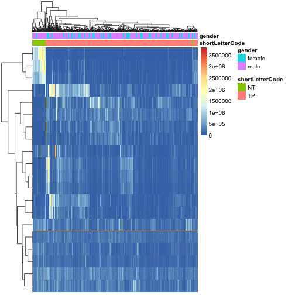

Let's plot the `p` value for all tests.


```r
use <- res$baseMean > metadata(res)$filterThreshold
h1 <- hist(res$pvalue[!use], breaks=0:50/50, plot=FALSE)
h2 <- hist(res$pvalue[use], breaks=0:50/50, plot=FALSE)
colori <- c(`do not pass`="khaki", `pass`="powderblue")
```


```r
barplot(height = rbind(h1$counts, h2$counts), beside = FALSE,
        col = colori, space = 0, main = "", ylab="frequency")
text(x = c(0, length(h1$counts)), y = 0, label = paste(c(0,1)),
     adj = c(0.5,1.7), xpd=NA)
legend("topright", fill=rev(colori), legend=rev(names(colori)))
```

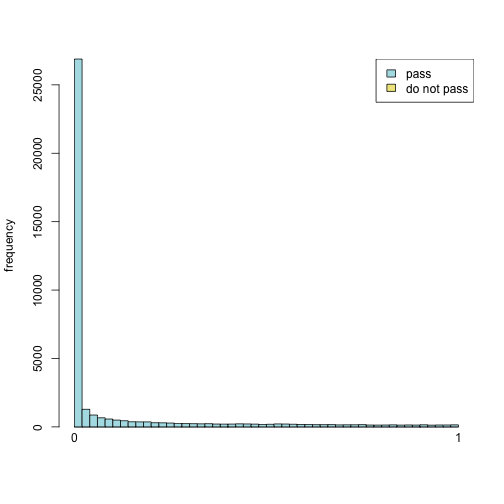


Let's reduce the dimensionality


```r
# let's standarise the normalised count (z-score)
set.seed(2)
DESeq2::counts(dds, normalized = T) %>%
  t() %>%
  scale() -> counts.norm.z
```


```r
# let's start with UMAP
umap.proj <- umap::umap(counts.norm.z)

umap.proj$layout %>%
  as.data.frame() %>%
  mutate(tissue = as.factor(dds$shortLetterCode),
         gender = as.factor(dds$gender),
         cases = rownames(.)) %>%
  ggplot(aes(x = V1, y = V2, colour = tissue)) +
  geom_jitter() +
  scale_color_manual(values=c("#2b83ba", "#d7191c"), "Tissue Type") +
    theme(plot.title = element_text(hjust=0.5, face = "bold", size = 15),
          axis.title = element_blank(),
          axis.text = element_text(size = 12),
          legend.title = element_text(face = "bold"),
          legend.text = element_text(size = 12),
          panel.background = element_blank(),
          panel.border = element_rect(fill = NA, color = "black"))
```

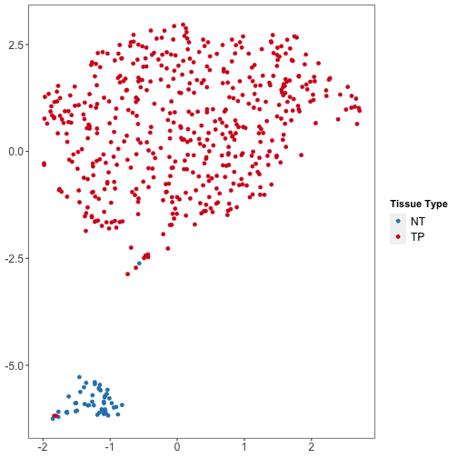


```r
umap.proj$layout %>%
  as.data.frame() %>%
  mutate(tissue = as.factor(dds$shortLetterCode),
         gender = as.factor(dds$gender),
         cases = rownames(.)) %>%
  ggplot(aes(x = V1, y = V2, colour = gender)) +
  geom_jitter() +
  scale_color_manual(values=c("#2b83ba", "#d7191c"), "Gender") +
    theme(plot.title = element_text(hjust=0.5, face = "bold", size = 15),
          axis.title = element_blank(),
          axis.text = element_text(size = 12),
          legend.title = element_text(face = "bold"),
          legend.text = element_text(size = 12),
          panel.background = element_blank(),
          panel.border = element_rect(fill = NA, color = "black"))
```

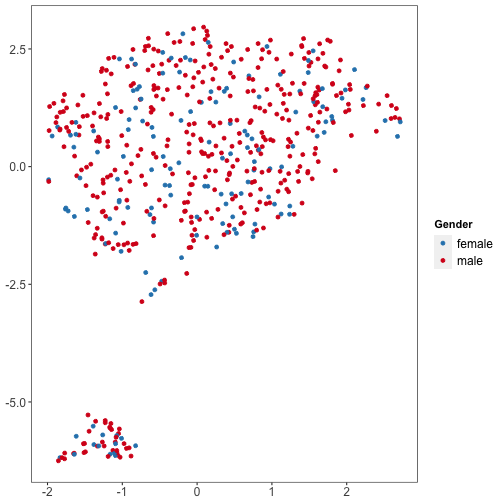


```r
# let's do tSNE
tsne.proj <- Rtsne::Rtsne(counts.norm.z)
```


```r
tsne.proj$Y %>%
  as.data.frame() %>%
  mutate(tissue = as.factor(dds$shortLetterCode),
         gender = as.factor(dds$gender),
         cases = rownames(.)) %>%
  ggplot(aes(x = V1, y = V2, colour = tissue)) +
  geom_jitter() +
  scale_color_manual(values=c("#2b83ba", "#d7191c"), "Tissue Type") +
    theme(plot.title = element_text(hjust=0.5, face = "bold", size = 15),
          axis.title = element_blank(),
          axis.text = element_text(size = 12),
          legend.title = element_text(face = "bold"),
          legend.text = element_text(size = 12),
          panel.background = element_blank(),
          panel.border = element_rect(fill = NA, color = "black"))
```

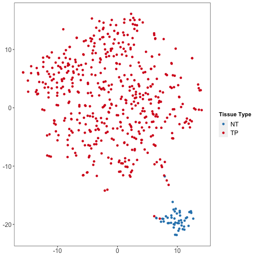


```r
tsne.proj$Y %>%
  as.data.frame() %>%
  mutate(tissue = as.factor(dds$shortLetterCode),
         gender = as.factor(dds$gender),
         cases = rownames(.)) %>%
  ggplot(aes(x = V1, y = V2, colour = gender)) +
  geom_jitter() +
  scale_color_manual(values=c("#2b83ba", "#d7191c"), "Gender") +
    theme(plot.title = element_text(hjust=0.5, face = "bold", size = 15),
          axis.title = element_blank(),
          axis.text = element_text(size = 12),
          legend.title = element_text(face = "bold"),
          legend.text = element_text(size = 12),
          panel.background = element_blank(),
          panel.border = element_rect(fill = NA, color = "black"))
```

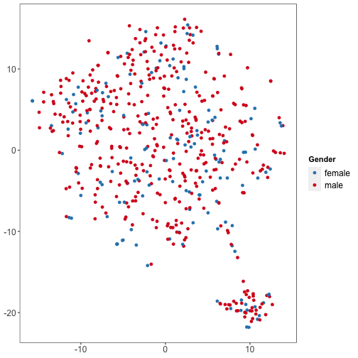


```r
assay(dds.vst)[which(row.names(assay(dds.vst)) %in% resTPOrdDF$ensembl_gene_id [1:25]), ] -> DGE
glimpse(DGE)
```

```
##  num [1:25, 1:551] 5.85 2.87 6.83 5.2 2.87 ...
##  - attr(*, "dimnames")=List of 2
##   ..$ : chr [1:25] "ENSG00000094796" "ENSG00000099399" "ENSG00000113430" "ENSG00000123364" ...
##   ..$ : chr [1:551] "TCGA-94-7943-01A-11R-2187-07" "TCGA-68-8251-01A-11R-2296-07" "TCGA-33-A5GW-01A-11R-A27Q-07" "TCGA-85-8070-01A-11R-2247-07" ...
```


```r
# bio.tcga.barcode.sample.vial.portion.analyte.aliquot
colnames(dds.vst)[dds.vst$shortLetterCode == 'NT'] -> normalIDs
DGESymbol <- ens2refseq(row.names(DGE))

DGE %>%
  reshape2::melt() %>%
  as.data.frame() %>%
  dplyr::rename_at(vars(c('Var1', 'Var2', 'value')), ~c('gene', 'sample', 'count_norm')) %>%
  mutate(group = case_when(sample %in% normalIDs ~ "Normal",
                           TRUE ~ "Tumour")) %>%
  right_join(DGESymbol, ., by = c('ensembl_gene_id' = 'gene')) %>%
  ggplot(aes(x = hgnc_symbol, y = count_norm, fill = group)) +
  geom_boxplot(width = .85, outlier.shape = NA, position = 'dodge') +
  ggpubr::stat_compare_means(group = 'count_norm',
                             label = "p.signif",
                             method = "t.test") +
  scale_fill_manual(values = c("#B47846","#4682B4")) +
  labs(x = 'Gene', y = 'Counts (normalised)', Title = 'Counts per gene in tumour vs normal tissue') +
  theme_classic() +
  theme(axis.text.x = element_text(angle = 45, hjust=1))
```

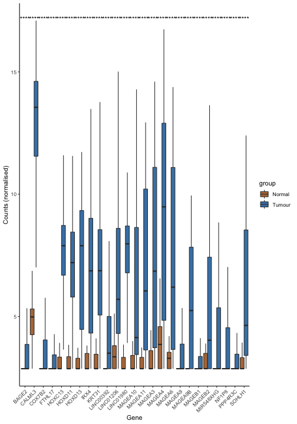


