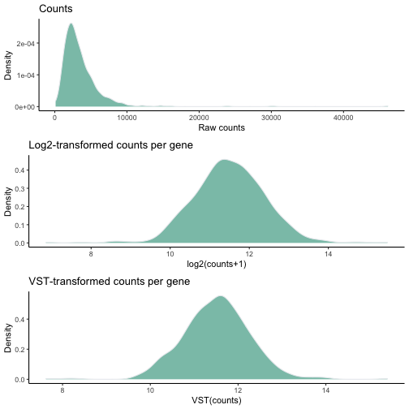
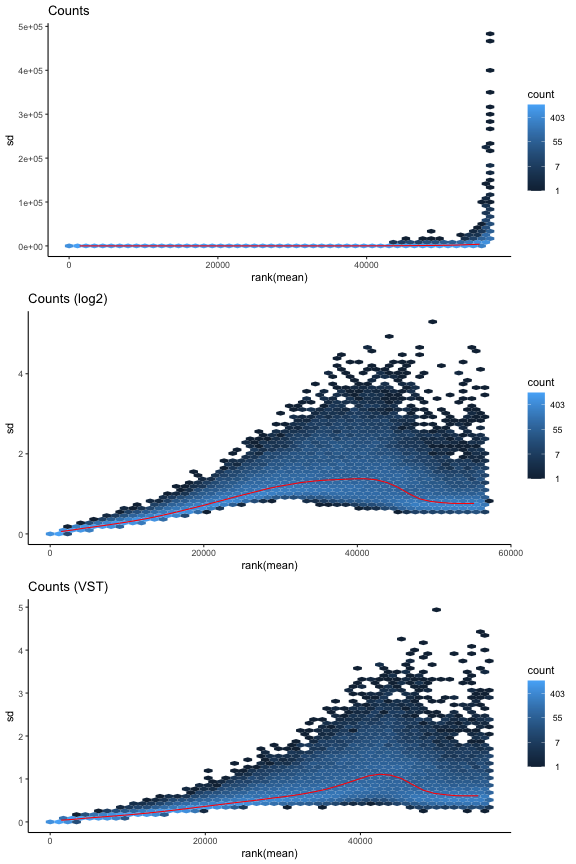
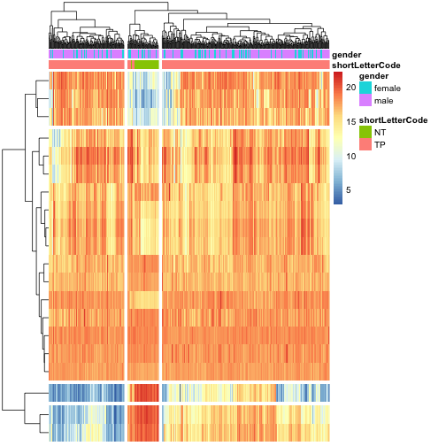
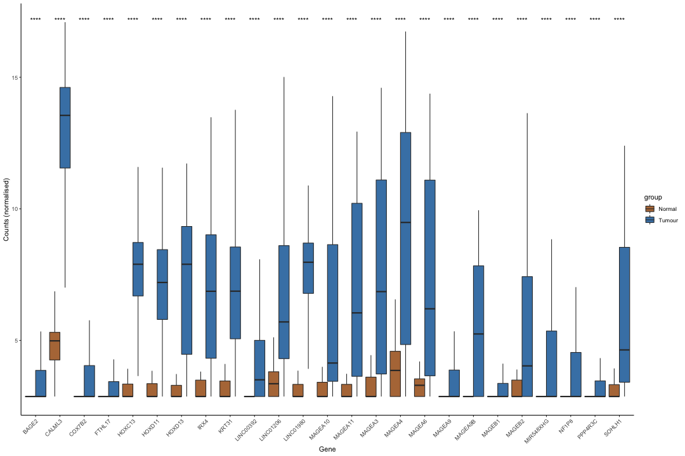

```r
suppressMessages({
library(viridis)
library(EnhancedVolcano)
library(org.Hs.eg.db)
library(umap)
source("./code/ens2refseq.R")
library(tidyverse)
library(DESeq2)
library(apeglm)
library(PCAtools)
library(pheatmap)
})
```


```r
readRDS("./RData/LUSC_exp_dds.RDS") -> dds
```


```r
# load the data
LUSC.exp <- readRDS("./RData/LUSC_exp.RDS")
```

## Gene count exploatory


```r
dim(assay(LUSC.exp))
```

```
## [1] 56602   551
```
Let's check the percentage of zero counts


```r
counts <- assay(LUSC.exp)
dim(counts)
```

```
## [1] 56602   551
```

```r
counts.zeroPercent <- 100 * apply(counts == 0, 1, sum) / ncol(counts)
summary(counts.zeroPercent)
```

```
##    Min. 1st Qu.  Median    Mean 3rd Qu.    Max. 
##    0.00    0.00   31.40   42.18   88.20  100.00
```

```r
counts.zeroPercent %>% 
  as.data.frame() %>% 
  ggplot() +
  geom_histogram(aes(x = .), fill = '#1D7373', col = 'black', stat="bin", bins = 30 ) +
  geom_vline(xintercept = 85, colour = 'red', linetype = 'dashed') +
  labs(x = 'Percente of samples', y = 'Number of genes', title = 'Filter on the percentage of zero counts') +
  theme_classic()
```


Let's aim to filter out genes that has zeros in more than 85% of the samples

Now, let's plot the maximum count per gene


```r
counts.maxPerGene <- apply(counts, 1, max)
summary(counts.maxPerGene)
```

```
##    Min. 1st Qu.  Median    Mean 3rd Qu.    Max. 
##       0      10      69    7863    2695 3826288
```

```r
counts.maxPerGene %>% 
  as.data.frame %>%
  ggplot() +
  geom_histogram(aes(x = .), fill = '#1D7373', col = 'black', stat="bin", bins = 50 ) +
  labs(x = 'Counts', y = 'Number of genes', title = 'Filter on the max count per gene') +
  theme_classic()
```


The distribution has extreme values and therefore it is skewed distribution. One way to adjust for this is to take the shifted log2, i.e. log2(count + 1) where 1 is a pseudo value to avoid log2(0).


```r
counts.maxPerGene.log2 <- log2(counts.maxPerGene + 1)
```

Let's plot the comparison


```r
gridExtra::grid.arrange(
    counts.maxPerGene %>% 
        as.data.frame() %>% 
        ggplot() +
        geom_histogram(aes(x = .), fill = '#1D7373', col = 'black', stat="bin", bins = 50 ) +
        labs(x = 'Counts', y = 'Number of genes', title = 'Raw counts per gene') +
        theme_classic(),
    
    counts.maxPerGene.log2 %>% 
        as.data.frame() %>% 
        ggplot() +
        geom_histogram(aes(x = .), fill = '#1D7373', col = 'black', stat="bin", bins = 50 ) +
        geom_vline(xintercept = log2(10), colour = 'red', linetype = 'solid', size = 0.8) +
        labs(x = 'log2(counts+1)', y = 'Number of genes', title = 'Log2-transformed max counts per gene') +
        theme_classic(),
    nrow = 2)
```


Let's discard 'undetected' genes, i.e. the genes which have zero counts in at least 95% of the samples, or the genes with a maximal count less than 3. This would lead to discarding 10052 genes.


```r
dim(LUSC.exp)                                                                 # (56602, 551)
```

```
## [1] 56602   551
```

```r
dim(LUSC.exp[counts.maxPerGene.log2 > log2(10)])                              # (42497, 551) -> -14105
```

```
## [1] 42497   551
```

```r
dim(LUSC.exp[counts.zeroPercent <= 95])                                       # (46874, 551) -> -9728
```

```
## [1] 46874   551
```

```r
dim(LUSC.exp[counts.zeroPercent <= 95 & counts.maxPerGene.log2 > log2(10)])   # (40764, 551) -> -15838
```

```
## [1] 40764   551
```


```r
LUSC.exp.filt <- LUSC.exp[counts.zeroPercent <= 95 & counts.maxPerGene.log2 > log2(10)]
LUSC.exp.filt
```

```
## class: RangedSummarizedExperiment 
## dim: 40764 551 
## metadata(1): data_release
## assays(1): HTSeq - Counts
## rownames(40764): ENSG00000000003 ENSG00000000005 ... ENSG00000281912
##   ENSG00000281920
## rowData names(3): ensembl_gene_id external_gene_name
##   original_ensembl_gene_id
## colnames(551): TCGA-94-7943-01A-11R-2187-07
##   TCGA-68-8251-01A-11R-2296-07 ... TCGA-MF-A522-01A-11R-A262-07
##   TCGA-51-4079-01A-01R-1100-07
## colData names(80): barcode patient ... paper_Homozygous.Deletions
##   paper_Expression.Subtype
```


## Differential expression

Let's create a DESeqDataSet object and taking `shortLetterCode` representing the tissue type (normal vs tumour) for the design.


```r
# to construct the DESeqDataSet object, we need a design
colData(LUSC.exp.filt)$shortLetterCode <- as.factor(colData(LUSC.exp.filt)$shortLetterCode)
```
The reference level is `NT` representing the normal tissue, so no need to adjust the levels.


```r
# let's construct the DESeqDataSet object
dds <- DESeq2::DESeqDataSet(LUSC.exp.filt, design = ~ shortLetterCode)
```

```
## renaming the first element in assays to 'counts'
```

```
## converting counts to integer mode
```

```r
dds
```

```
## class: DESeqDataSet 
## dim: 40764 551 
## metadata(2): data_release version
## assays(1): counts
## rownames(40764): ENSG00000000003 ENSG00000000005 ... ENSG00000281912
##   ENSG00000281920
## rowData names(3): ensembl_gene_id external_gene_name
##   original_ensembl_gene_id
## colnames(551): TCGA-94-7943-01A-11R-2187-07
##   TCGA-68-8251-01A-11R-2296-07 ... TCGA-MF-A522-01A-11R-A262-07
##   TCGA-51-4079-01A-01R-1100-07
## colData names(80): barcode patient ... paper_Homozygous.Deletions
##   paper_Expression.Subtype
```


```r
# keep only rows that have at least 10 reads total
table(rowSums(counts(dds)) >= 100)
```

```
## 
## FALSE  TRUE 
##  1012 39752
```

```r
# rowSums(counts(dds, normalized=TRUE) >= X ) >= Y
# keep genes with Y or more sample that have normalised count X or more
table(rowSums(counts(dds, normalized=F) >= 5 ) >= 10)
```

```
## 
## FALSE  TRUE 
##  4299 36465
```


```r
# run to save computing time, otherwise no need to prior filtering!
keep <- rowSums(counts(dds)) >= 100
dds <- dds[keep, ]
table(rowSums(counts(dds)) >= 100)
```

```
## 
##  TRUE 
## 39752
```


Before running the differential analysis, let's explore the gene counts in a PCA plot. First, let's transform the raw read counts using log2 or VST.


```r
counts.raw  <- assay(LUSC.exp)
counts.log2 <- log2(counts.raw + 1)   # shifted log2; i.e. adding a pseudo value (1) to avoid log2(0) = -Inf
counts.vst  <- DESeq2::vst(counts.raw, blind = F)
```

```
## converting counts to integer mode
```


```r
gridExtra::grid.arrange(
    counts[1,] %>% 
        as.data.frame() %>% 
        rownames_to_column() %>% 
        dplyr::rename('size' = '.',
               'library' = 'rowname') %>%
        #gather(key = "library", value = "size") %>% 
        ggplot() +
        geom_density(aes(x = size), fill="#69b3a2", color="#e9ecef", alpha=0.8) +
        labs(x = 'Raw counts', y = 'Density',
              title = "Counts") +
        theme_classic(),
    
    counts.log2[1,] %>% 
        as.data.frame() %>% 
        rownames_to_column() %>% 
        dplyr::rename('size' = '.',
               'library' = 'rowname') %>%
        #gather(key = "library", value = "size") %>% 
        ggplot() +
        geom_density(aes(x = size), fill="#69b3a2", color="#e9ecef", alpha=0.8) +
        labs(x = 'log2(counts+1)', y = 'Density',
              title = "Log2-transformed counts per gene") +
        theme_classic(),
    
    counts.vst[1,] %>% 
        as.data.frame() %>% 
        rownames_to_column() %>% 
        dplyr::rename('size' = '.',
               'library' = 'rowname') %>%
        #gather(key = "library", value = "size") %>% 
        ggplot() +
        geom_density(aes(x = size), fill="#69b3a2", color="#e9ecef", alpha=0.8) +
        labs(x = 'VST(counts)', y = 'Density',
              title = "VST-transformed counts per gene") +
        theme_classic(),
    nrow = 3)
```



In RNA-seq, genes with high expression on average have high variance across sample compared to lowly expressed genes. This is visualised by variation in the spread out of different genes (i.e. heteroscedasticity).

Let's plot and have a log.


```r
gridExtra::grid.arrange(
    vsn::meanSdPlot(as.matrix(counts), plot = FALSE)$gg + 
        theme_classic() + labs (title = "Counts"),
    vsn::meanSdPlot(as.matrix(counts.log2), plot = FALSE)$gg + 
        theme_classic() + labs (title = "Counts (log2)"),
    vsn::meanSdPlot(as.matrix(counts.vst), plot = FALSE)$gg + 
        theme_classic() + labs (title = "Counts (VST)"),
    nrow = 3)
```



After the transformation, we have less extreme values. With VST the standard deviation is more constant per gene. Let's use the VST transformation for further analysis.


```r
dds.vst <- DESeq2::vst(dds, blind = F)
dds.vst
```

```
## class: DESeqTransform 
## dim: 39752 551 
## metadata(2): data_release version
## assays(1): ''
## rownames(39752): ENSG00000000003 ENSG00000000005 ... ENSG00000281912
##   ENSG00000281920
## rowData names(7): ensembl_gene_id external_gene_name ... allZero
##   dispFit
## colnames(551): TCGA-94-7943-01A-11R-2187-07
##   TCGA-68-8251-01A-11R-2296-07 ... TCGA-MF-A522-01A-11R-A262-07
##   TCGA-51-4079-01A-01R-1100-07
## colData names(81): barcode patient ... paper_Expression.Subtype
##   sizeFactor
```


Let's plot the variance of the first components for the dataset


```r
dds.pca <- PCAtools::pca(assay(dds.vst), metadata = colData(LUSC.exp.filt))
```
Let's do a scree plot for the first 30 components


```r
screeplot(dds.pca, 
          components = getComponents(dds.pca, 1:20),
          axisLabSize = 18, titleLabSize = 22) +
  theme_classic() +
  theme(axis.text.x = element_text(angle = 45, hjust=1))
```


We can see that the first component is responsible for almost 15% of the variation, while the second principle component is responsible for at most 5%. The eclipses represent 95% confidence.

Let's plot a PCA plot, and colour by the tissue type, i.e. normal vs tumour


```r
#DESeq2::plotPCA(dds.vst, intgroup = "shortLetterCode") + theme_classic()
biplot(dds.pca, 
       colby = 'shortLetterCode',
       lab = NULL,
       ellipse = TRUE,
       ellipseLevel = 0.95,
       ellipseFill = TRUE,
       ellipseAlpha = 1/8,
       ellipseLineSize = 1.0) +
  theme_classic()
```


Great, we have good separation between the two tissue types.

Let's explore the other variables.

- What about gender? 


```r
#DESeq2::plotPCA(dds.vst, intgroup = "gender") + theme_classic()
biplot(dds.pca, 
       colby = 'gender',
       lab = NULL,
       ellipse = TRUE,
       ellipseLevel = 0.95,
       ellipseFill = TRUE,
       ellipseAlpha = 1/8,
       ellipseLineSize = 1.0) +
  theme_classic()
```


- What about tumour stage? 


```r
#DESeq2::plotPCA(dds.vst, intgroup = "tumor_stage") + theme_classic()
biplot(dds.pca, 
       colby = 'tumor_stage',
       lab = NULL,
       ellipse = FALSE,
       ellipseLevel = 0.95,
       ellipseFill = TRUE,
       ellipseAlpha = 1/8,
       ellipseLineSize = 1.0) +
  theme_classic()
```


- What about the vital status?


```r
#DESeq2::plotPCA(dds.vst, intgroup = "vital_status") + theme_classic
biplot(dds.pca, 
       colby = 'vital_status',
       lab = NULL,
       ellipse = TRUE,
       ellipseLevel = 0.95,
       ellipseFill = TRUE,
       ellipseAlpha = 1/8,
       ellipseLineSize = 1.0) +
  theme_classic()
```


- What about the race?


```r
#DESeq2::plotPCA(dds.vst, intgroup = "race") + theme_classic()
biplot(dds.pca, 
       colby = 'race',
       lab = NULL,
       ellipse = FALSE,
       ellipseLevel = 0.95,
       ellipseFill = TRUE,
       ellipseAlpha = 1/8,
       ellipseLineSize = 1.0) +
  theme_classic()
```


None of these variables are responsible for the separation on PC1 vs. PC2. 
Let's have a look at the top 10 possible combination


```r
pairsplot(dds.pca,
          components = getComponents(dds.pca, c(1:10)),
          triangle = TRUE, trianglelabSize = 12,
          hline = 0, vline = 0,
          pointSize = 0.4,
          gridlines.major = FALSE, gridlines.minor = FALSE,
          colby = 'shortLetterCode',
          title = 'Pairs plot', plotaxes = FALSE,
          margingaps = unit(c(-0.01, -0.01, -0.01, -0.01), 'cm'))
```

```
## Coordinate system already present. Adding new coordinate system, which will replace the existing one.
## Coordinate system already present. Adding new coordinate system, which will replace the existing one.
## Coordinate system already present. Adding new coordinate system, which will replace the existing one.
## Coordinate system already present. Adding new coordinate system, which will replace the existing one.
## Coordinate system already present. Adding new coordinate system, which will replace the existing one.
## Coordinate system already present. Adding new coordinate system, which will replace the existing one.
## Coordinate system already present. Adding new coordinate system, which will replace the existing one.
## Coordinate system already present. Adding new coordinate system, which will replace the existing one.
## Coordinate system already present. Adding new coordinate system, which will replace the existing one.
## Coordinate system already present. Adding new coordinate system, which will replace the existing one.
## Coordinate system already present. Adding new coordinate system, which will replace the existing one.
## Coordinate system already present. Adding new coordinate system, which will replace the existing one.
## Coordinate system already present. Adding new coordinate system, which will replace the existing one.
## Coordinate system already present. Adding new coordinate system, which will replace the existing one.
## Coordinate system already present. Adding new coordinate system, which will replace the existing one.
## Coordinate system already present. Adding new coordinate system, which will replace the existing one.
## Coordinate system already present. Adding new coordinate system, which will replace the existing one.
## Coordinate system already present. Adding new coordinate system, which will replace the existing one.
## Coordinate system already present. Adding new coordinate system, which will replace the existing one.
## Coordinate system already present. Adding new coordinate system, which will replace the existing one.
## Coordinate system already present. Adding new coordinate system, which will replace the existing one.
## Coordinate system already present. Adding new coordinate system, which will replace the existing one.
## Coordinate system already present. Adding new coordinate system, which will replace the existing one.
## Coordinate system already present. Adding new coordinate system, which will replace the existing one.
## Coordinate system already present. Adding new coordinate system, which will replace the existing one.
## Coordinate system already present. Adding new coordinate system, which will replace the existing one.
## Coordinate system already present. Adding new coordinate system, which will replace the existing one.
## Coordinate system already present. Adding new coordinate system, which will replace the existing one.
## Coordinate system already present. Adding new coordinate system, which will replace the existing one.
## Coordinate system already present. Adding new coordinate system, which will replace the existing one.
## Coordinate system already present. Adding new coordinate system, which will replace the existing one.
## Coordinate system already present. Adding new coordinate system, which will replace the existing one.
## Coordinate system already present. Adding new coordinate system, which will replace the existing one.
## Coordinate system already present. Adding new coordinate system, which will replace the existing one.
## Coordinate system already present. Adding new coordinate system, which will replace the existing one.
## Coordinate system already present. Adding new coordinate system, which will replace the existing one.
## Coordinate system already present. Adding new coordinate system, which will replace the existing one.
## Coordinate system already present. Adding new coordinate system, which will replace the existing one.
## Coordinate system already present. Adding new coordinate system, which will replace the existing one.
## Coordinate system already present. Adding new coordinate system, which will replace the existing one.
## Coordinate system already present. Adding new coordinate system, which will replace the existing one.
## Coordinate system already present. Adding new coordinate system, which will replace the existing one.
## Coordinate system already present. Adding new coordinate system, which will replace the existing one.
## Coordinate system already present. Adding new coordinate system, which will replace the existing one.
## Coordinate system already present. Adding new coordinate system, which will replace the existing one.
## Coordinate system already present. Adding new coordinate system, which will replace the existing one.
## Coordinate system already present. Adding new coordinate system, which will replace the existing one.
## Coordinate system already present. Adding new coordinate system, which will replace the existing one.
## Coordinate system already present. Adding new coordinate system, which will replace the existing one.
## Coordinate system already present. Adding new coordinate system, which will replace the existing one.
## Coordinate system already present. Adding new coordinate system, which will replace the existing one.
## Coordinate system already present. Adding new coordinate system, which will replace the existing one.
## Coordinate system already present. Adding new coordinate system, which will replace the existing one.
## Coordinate system already present. Adding new coordinate system, which will replace the existing one.
## Coordinate system already present. Adding new coordinate system, which will replace the existing one.
## Coordinate system already present. Adding new coordinate system, which will replace the existing one.
## Coordinate system already present. Adding new coordinate system, which will replace the existing one.
## Coordinate system already present. Adding new coordinate system, which will replace the existing one.
## Coordinate system already present. Adding new coordinate system, which will replace the existing one.
## Coordinate system already present. Adding new coordinate system, which will replace the existing one.
## Coordinate system already present. Adding new coordinate system, which will replace the existing one.
## Coordinate system already present. Adding new coordinate system, which will replace the existing one.
## Coordinate system already present. Adding new coordinate system, which will replace the existing one.
## Coordinate system already present. Adding new coordinate system, which will replace the existing one.
## Coordinate system already present. Adding new coordinate system, which will replace the existing one.
## Coordinate system already present. Adding new coordinate system, which will replace the existing one.
## Coordinate system already present. Adding new coordinate system, which will replace the existing one.
## Coordinate system already present. Adding new coordinate system, which will replace the existing one.
## Coordinate system already present. Adding new coordinate system, which will replace the existing one.
## Coordinate system already present. Adding new coordinate system, which will replace the existing one.
## Coordinate system already present. Adding new coordinate system, which will replace the existing one.
## Coordinate system already present. Adding new coordinate system, which will replace the existing one.
## Coordinate system already present. Adding new coordinate system, which will replace the existing one.
## Coordinate system already present. Adding new coordinate system, which will replace the existing one.
## Coordinate system already present. Adding new coordinate system, which will replace the existing one.
## Coordinate system already present. Adding new coordinate system, which will replace the existing one.
## Coordinate system already present. Adding new coordinate system, which will replace the existing one.
## Coordinate system already present. Adding new coordinate system, which will replace the existing one.
## Coordinate system already present. Adding new coordinate system, which will replace the existing one.
## Coordinate system already present. Adding new coordinate system, which will replace the existing one.
## Coordinate system already present. Adding new coordinate system, which will replace the existing one.
## Coordinate system already present. Adding new coordinate system, which will replace the existing one.
## Coordinate system already present. Adding new coordinate system, which will replace the existing one.
## Coordinate system already present. Adding new coordinate system, which will replace the existing one.
## Coordinate system already present. Adding new coordinate system, which will replace the existing one.
## Coordinate system already present. Adding new coordinate system, which will replace the existing one.
## Coordinate system already present. Adding new coordinate system, which will replace the existing one.
## Coordinate system already present. Adding new coordinate system, which will replace the existing one.
## Coordinate system already present. Adding new coordinate system, which will replace the existing one.
## Coordinate system already present. Adding new coordinate system, which will replace the existing one.
## Coordinate system already present. Adding new coordinate system, which will replace the existing one.
## Coordinate system already present. Adding new coordinate system, which will replace the existing one.
## Coordinate system already present. Adding new coordinate system, which will replace the existing one.
## Coordinate system already present. Adding new coordinate system, which will replace the existing one.
## Coordinate system already present. Adding new coordinate system, which will replace the existing one.
## Coordinate system already present. Adding new coordinate system, which will replace the existing one.
## Coordinate system already present. Adding new coordinate system, which will replace the existing one.
## Coordinate system already present. Adding new coordinate system, which will replace the existing one.
## Coordinate system already present. Adding new coordinate system, which will replace the existing one.
## Coordinate system already present. Adding new coordinate system, which will replace the existing one.
```


Let's run hierarchical clustering to visualise the similarities between samples in terms of their gene expression profile. I will not plot all samples, but will limit this analysis to 20 normal samples.


```r
set.seed(2)
selectedNormSamples <- sample(x = 1:ncol(assay(dds.vst)[, dds.vst$shortLetterCode == 'NT']), 
                              size = 20, 
                              replace = FALSE)

assay(dds.vst)[, selectedNormSamples] %>% 
  t() %>% 
  dist() %>% 
  as.matrix() -> dds.vst.dist


pheatmap(dds.vst.dist,
         show_rownames  = FALSE,
         show_colnames  = FALSE,
         col = colorRampPalette( rev(RColorBrewer::brewer.pal(9, "Blues")) )(255) )
```


Let's run the differentiation analysis


```r
dds <- DESeq(dds)
```

```
## estimating size factors
```

```
## estimating dispersions
```

```
## gene-wise dispersion estimates
```

```
## mean-dispersion relationship
```

```
## final dispersion estimates
```

```
## fitting model and testing
```

```
## -- replacing outliers and refitting for 4570 genes
## -- DESeq argument 'minReplicatesForReplace' = 7 
## -- original counts are preserved in counts(dds)
```

```
## estimating dispersions
```

```
## fitting model and testing
```


```r
saveRDS(object = dds, file = "./RData/LUSC_exp_dds.RDS")
```

Let's compare the raw counts vs normalised counts


```r
# compute log2 non-normalised read counts
counts.log2 <- log2(DESeq2::counts(dds, normalized = F) + 1)
dim(counts.log2)
```

```
## [1] 39752   551
```


```r
# compute log2 normalised read counts
counts.norm.log2 <- log2(DESeq2::counts(dds, normalized = T) + 1)
dim(counts.norm.log2)
```

```
## [1] 39752   551
```


```r
# let's plot the log2 non-normalised read counts and log2 normalised read counts
gridExtra::grid.arrange(
    counts.log2 %>%
        as.data.frame() %>% 
        stack() %>% 
        ggplot() +
        geom_histogram(aes(x = values), fill = '#1D7373', col = 'black', stat="bin", bins = 60 ) +
        labs(x = 'log2(raw counts + 1)', y = 'Number of genes', title = 'Log2-transformed raw counts') +
        theme_classic(),
    
    counts.norm.log2 %>% 
        as.data.frame() %>% 
        stack() %>% 
        ggplot() +
        geom_histogram(aes(x = values), fill = '#1D7373', col = 'black', stat="bin", bins = 60 ) +
        labs(x = 'log2(normalised counts + 1)', y = 'Number of genes', title = 'Log2-transformed normalised counts') +
        theme_classic(),
    nrow = 2)
```


Let's plot the size of a number of library (randomly picked) as boxplot.


```r
set.seed(1)
selectedSamples <- sample(x = 1:ncol(counts.log2), size = 30, replace = FALSE)
selectedSamples
```

```
##  [1] 129 509 471 299 270 187 307 277 494 330  37 105 485 382 326 542 422 111 404
## [20] 532 506 343 121  40 375 248 198 378  39 435
```


```r
gridExtra::grid.arrange(
counts.log2 %>% 
  as.data.frame() %>% 
  dplyr::select(selectedSamples) %>% 
  stack() %>% 
  ggplot() +
  geom_boxplot(aes(x = ind, y = values, fill = ind)) +
  scale_x_discrete(label=function(x) abbreviate(x, minlength=15)) +
  labs(x = 'Samples', y = 'log2(counts + 1)', title = "raw reads counts") +
  scale_fill_manual(values = viridis_pal(option = "D")(30)) +
  coord_flip() +
  theme_classic() +
  theme(legend.position="none"),
counts.norm.log2 %>% 
  as.data.frame() %>% 
  dplyr::select(selectedSamples) %>% 
  stack() %>% 
  ggplot() +
  geom_boxplot(aes(x = ind, y = values, fill = ind)) +
  scale_x_discrete(label=function(x) abbreviate(x, minlength=15)) +
  labs(x = 'Samples', y = 'log2(counts + 1)', title = "normalised reads counts") +
  scale_fill_manual(values = viridis_pal(option = "D")(30)) +
  coord_flip() +
  theme_classic() +
  theme(legend.position="none"),
  
ncol = 2)
```


```r
# any gene with alpha (i.e. FDR) > 0.001 is not significant
res <- results(dds, alpha = 0.001)
head(res)
```

```
## log2 fold change (MLE): shortLetterCode TP vs NT 
## Wald test p-value: shortLetterCode TP vs NT 
## DataFrame with 6 rows and 6 columns
##                   baseMean log2FoldChange     lfcSE      stat       pvalue
##                  <numeric>      <numeric> <numeric> <numeric>    <numeric>
## ENSG00000000003 3386.60991       1.105127 0.1115412   9.90779  3.85051e-23
## ENSG00000000005    1.21166      -1.430197 0.3594282  -3.97909  6.91798e-05
## ENSG00000000419 2427.86967       0.747200 0.0827097   9.03400  1.65501e-19
## ENSG00000000457  878.13195       0.182894 0.0670883   2.72618  6.40728e-03
## ENSG00000000460  757.16662       2.229287 0.0960774  23.20302 4.24459e-119
## ENSG00000000938 1321.15267      -2.443493 0.1555562 -15.70811  1.33097e-55
##                         padj
##                    <numeric>
## ENSG00000000003  2.64727e-22
## ENSG00000000005  1.39645e-04
## ENSG00000000419  9.38251e-19
## ENSG00000000457  1.01987e-02
## ENSG00000000460 6.04770e-117
## ENSG00000000938  3.54378e-54
```

```r
summary(res)
```

```
## 
## out of 39752 with nonzero total read count
## adjusted p-value < 0.001
## LFC > 0 (up)       : 13810, 35%
## LFC < 0 (down)     : 8053, 20%
## outliers [1]       : 0, 0%
## low counts [2]     : 0, 0%
## (mean count < 0)
## [1] see 'cooksCutoff' argument of ?results
## [2] see 'independentFiltering' argument of ?results
```


```r
# if necessary, remove nulls (gene level filtering)
#res <- res[complete.cases(res), ]
#summary(res)
```

Let's extract the results from the `dds` object.


```r
#let's add the HGNC symbol to the dds results
resSymbol <- ens2refseq(row.names(res))

res %>% 
  as.data.frame() %>% 
  mutate(baseMean = signif(baseMean, digits = 3),
         log2FoldChange = round(log2FoldChange, digits = 3),
         lfcSE  = round(lfcSE, digits = 3),
         stat   = round(stat, digits = 3),
         pvalue = signif(pvalue, digits = 3),
         padj   = signif(padj, digits = 3)) %>% 
  mutate(ensembl_gene_id = row.names(res)) %>%    
  merge(resSymbol, ., by = "ensembl_gene_id") -> resDF # merge with RefSeq genes


# let's sort by log2FoldChange and then padj (decreasing)
resDF %>% 
  arrange(desc(abs(log2FoldChange)), desc(padj)) -> resOrdDF
head(resOrdDF)
```

```
##   ensembl_gene_id hgnc_symbol baseMean log2FoldChange lfcSE   stat    pvalue
## 1 ENSG00000228295   LINC00392      128         10.686 0.682 15.665  2.62e-55
## 2 ENSG00000214107      MAGEB1       15         10.215 1.005 10.165  2.83e-24
## 3 ENSG00000224960     PPP4R3C       14         10.069 0.891 11.299  1.32e-29
## 4 ENSG00000197172      MAGEA6     1080          9.822 0.511 19.234  1.92e-82
## 5 ENSG00000221867      MAGEA3     1180          9.772 0.504 19.401  7.56e-84
## 6 ENSG00000128714      HOXD13      377          9.545 0.441 21.620 1.16e-103
##        padj
## 1  6.91e-54
## 2  2.06e-23
## 3  1.25e-28
## 4  1.16e-80
## 5  4.79e-82
## 6 1.23e-101
```

```r
write.table(resOrdDF, file = "./output/resOrdDF.csv", sep = ",", row.names = F)
```


Let's extract the results from the `dds` object by specifying the contrast


```r
# get the results by specifying the contrast of tissue type as TP vs NT
# any gene with alpha (i.e. FDR) > 0.001 is not significant
resTP <- results(dds, alpha = 0.001,
               contrast = c(contrast = c("shortLetterCode", "TP", "NT")))
resTP
```

```
## log2 fold change (MLE): shortLetterCode TP vs NT 
## Wald test p-value: shortLetterCode TP vs NT 
## DataFrame with 39752 rows and 6 columns
##                   baseMean log2FoldChange     lfcSE      stat       pvalue
##                  <numeric>      <numeric> <numeric> <numeric>    <numeric>
## ENSG00000000003 3386.60991       1.105127 0.1115412   9.90779  3.85051e-23
## ENSG00000000005    1.21166      -1.430197 0.3594282  -3.97909  6.91798e-05
## ENSG00000000419 2427.86967       0.747200 0.0827097   9.03400  1.65501e-19
## ENSG00000000457  878.13195       0.182894 0.0670883   2.72618  6.40728e-03
## ENSG00000000460  757.16662       2.229287 0.0960774  23.20302 4.24459e-119
## ...                    ...            ...       ...       ...          ...
## ENSG00000281903  14.498537       1.332069  0.184615   7.21538  5.37852e-13
## ENSG00000281904   0.270563      -1.050452  0.693673  -1.51433  1.29941e-01
## ENSG00000281909   0.531962       1.036988  0.396648   2.61438  8.93907e-03
## ENSG00000281912  70.491697       0.636044  0.149132   4.26499  1.99915e-05
## ENSG00000281920   8.066971       1.278927  0.237476   5.38550  7.22448e-08
##                         padj
##                    <numeric>
## ENSG00000000003  2.64727e-22
## ENSG00000000005  1.39645e-04
## ENSG00000000419  9.38251e-19
## ENSG00000000457  1.01987e-02
## ENSG00000000460 6.04770e-117
## ...                      ...
## ENSG00000281903  2.08450e-12
## ENSG00000281904  1.66589e-01
## ENSG00000281909  1.39215e-02
## ENSG00000281912  4.26389e-05
## ENSG00000281920  1.93145e-07
```

```r
summary(resTP)
```

```
## 
## out of 39752 with nonzero total read count
## adjusted p-value < 0.001
## LFC > 0 (up)       : 13810, 35%
## LFC < 0 (down)     : 8053, 20%
## outliers [1]       : 0, 0%
## low counts [2]     : 0, 0%
## (mean count < 0)
## [1] see 'cooksCutoff' argument of ?results
## [2] see 'independentFiltering' argument of ?results
```


```r
#let's add the HGNC symbol to the dds results
resTPSymbol <- ens2refseq(row.names(resTP))

resTP %>% 
  as.data.frame() %>% 
  mutate(baseMean = signif(baseMean, digits = 3),
         log2FoldChange = round(log2FoldChange, digits = 3),
         lfcSE  = round(lfcSE, digits = 3),
         stat   = round(stat, digits = 3),
         pvalue = signif(pvalue, digits = 3),
         padj   = signif(padj, digits = 3)) %>% 
  mutate(ensembl_gene_id = row.names(resTP)) %>%    
  merge(resTPSymbol, ., by = "ensembl_gene_id") -> resTPDF # merge with RefSeq genes


# let's sort by log2FoldChange and then padj (decreasing)
resTPDF %>% 
  arrange(desc(abs(log2FoldChange)), desc(padj)) -> resTPOrdDF
head(resTPOrdDF)
```

```
##   ensembl_gene_id hgnc_symbol baseMean log2FoldChange lfcSE   stat    pvalue
## 1 ENSG00000228295   LINC00392      128         10.686 0.682 15.665  2.62e-55
## 2 ENSG00000214107      MAGEB1       15         10.215 1.005 10.165  2.83e-24
## 3 ENSG00000224960     PPP4R3C       14         10.069 0.891 11.299  1.32e-29
## 4 ENSG00000197172      MAGEA6     1080          9.822 0.511 19.234  1.92e-82
## 5 ENSG00000221867      MAGEA3     1180          9.772 0.504 19.401  7.56e-84
## 6 ENSG00000128714      HOXD13      377          9.545 0.441 21.620 1.16e-103
##        padj
## 1  6.91e-54
## 2  2.06e-23
## 3  1.25e-28
## 4  1.16e-80
## 5  4.79e-82
## 6 1.23e-101
```

```r
write.table(resTPOrdDF, file = "./output/resTPOrdDF.csv", sep = ",", row.names = F)
```


Let's use MA plot to visualise gene significant (blue dots `p < 0.01`) which are either upregulated (`log2FC > 2`) or downregulated (`log2FC < 2`). Using `apeglm` rather than `normal` as it is less biased.


```r
# let's shrink the log2 fold change
res.shrink <- lfcShrink(dds, coef=resultsNames(dds)[2], type="apeglm")
```

```
## using 'apeglm' for LFC shrinkage. If used in published research, please cite:
##     Zhu, A., Ibrahim, J.G., Love, M.I. (2018) Heavy-tailed prior distributions for
##     sequence count data: removing the noise and preserving large differences.
##     Bioinformatics. https://doi.org/10.1093/bioinformatics/bty895
```


```r
# let's do MA plots
DESeq2::plotMA(res, ylim = c(-11, 11), alpha = 0.001, main = "MA plot (unshrunked)")
abline(h = c(-2, 2), col = "red", lwd = 2)
```


```r
# ... and for the shrunk one!
DESeq2::plotMA(res.shrink, ylim = c(-11, 11), alpha = 0.001, main = "MA plot (shrunked)")
abline(h = c(-2, 2), col = "red", lwd = 2)
```


Let's draw a volcano plot for the results


```r
EnhancedVolcano(resDF,
                x = 'log2FoldChange',
                y = 'padj',
                lab = resDF$hgnc_symbol,
                pCutoff = 10e-16,
                FCcutoff = 2,
                xlab = bquote(~Log[2]~ "Fold Change"),
                ylab = bquote(~-Log[10]~adjusted~italic(P)),
                drawConnectors = TRUE,
                widthConnectors = 0.75)
```

```
## Warning: One or more p-values is 0. Converting to 10^-1 * current lowest non-
## zero p-value...
```

```
## Warning: ggrepel: 3422 unlabeled data points (too many overlaps). Consider
## increasing max.overlaps
```


Let's extract the top 20 genes in normal vs tumour


```r
# TP vs NT, i.e. (TP - NT)
resTPDF %>% 
  filter(padj < 0.001 & log2FoldChange >= log2(2)) %>%  # expression higher in TP
  drop_na() %>% 
  arrange(desc(abs(log2FoldChange)), desc(padj)) -> resTPDF.top.TP

head(resTPDF.top.TP)
```

```
##   ensembl_gene_id hgnc_symbol baseMean log2FoldChange lfcSE   stat    pvalue
## 1 ENSG00000228295   LINC00392      128         10.686 0.682 15.665  2.62e-55
## 2 ENSG00000214107      MAGEB1       15         10.215 1.005 10.165  2.83e-24
## 3 ENSG00000224960     PPP4R3C       14         10.069 0.891 11.299  1.32e-29
## 4 ENSG00000197172      MAGEA6     1080          9.822 0.511 19.234  1.92e-82
## 5 ENSG00000221867      MAGEA3     1180          9.772 0.504 19.401  7.56e-84
## 6 ENSG00000128714      HOXD13      377          9.545 0.441 21.620 1.16e-103
##        padj
## 1  6.91e-54
## 2  2.06e-23
## 3  1.25e-28
## 4  1.16e-80
## 5  4.79e-82
## 6 1.23e-101
```

```r
resTPDF %>% 
  filter(padj < 0.001 & log2FoldChange <= -(2)) %>% # expression higher in NT
  drop_na() %>% 
  arrange(desc(abs(log2FoldChange)), desc(padj)) -> resTPDF.top.NT

head(resTPDF.top.NT)
```

```
##   ensembl_gene_id hgnc_symbol baseMean log2FoldChange lfcSE    stat    pvalue
## 1 ENSG00000179914       ITLN1    498.0         -7.838 0.311 -25.233 1.76e-140
## 2 ENSG00000203878      CHIAP2     99.4         -6.704 0.516 -12.991  1.37e-38
## 3 ENSG00000235584                115.0         -6.422 0.489 -13.131  2.20e-39
## 4 ENSG00000244215   LINC02016     15.8         -6.384 0.411 -15.523  2.41e-54
## 5 ENSG00000168484       SFTPC 127000.0         -6.152 0.441 -13.963  2.63e-44
## 6 ENSG00000204305        AGER  11500.0         -6.023 0.280 -21.547 5.67e-103
##        padj
## 1 3.57e-138
## 2  1.93e-37
## 3  3.20e-38
## 4  6.11e-53
## 5  4.62e-43
## 6 5.90e-101
```


```r
hmSelect <- order(rowMeans(counts(dds,normalized=TRUE)), decreasing=TRUE)[1:20] # taking long time as full
hmAnnCol <- as.data.frame(colData(dds)[,c("shortLetterCode","gender")])

pheatmap(assay(dds.vst)[hmSelect,], 
         cluster_rows   = TRUE,
         cluster_cols   = TRUE,
         show_rownames  = FALSE,
         show_colnames  = FALSE,
         cutree_cols = 3,
         cutree_rows = 4,
         annotation_col = hmAnnCol)
```



Let's plot the `p` value for all tests.


```r
use <- res$baseMean > metadata(res)$filterThreshold
h1 <- hist(res$pvalue[!use], breaks=0:50/50, plot=FALSE)
h2 <- hist(res$pvalue[use], breaks=0:50/50, plot=FALSE)
colori <- c(`do not pass`="khaki", `pass`="powderblue")
```


```r
barplot(height = rbind(h1$counts, h2$counts), beside = FALSE,
        col = colori, space = 0, main = "", ylab="frequency")
text(x = c(0, length(h1$counts)), y = 0, label = paste(c(0,1)),
     adj = c(0.5,1.7), xpd=NA)
legend("topright", fill=rev(colori), legend=rev(names(colori)))
```


Let's reduce the dimensionality


```r
# let's standarise the normalised count (z-score)
set.seed(2)
DESeq2::counts(dds, normalized = T) %>% 
  t() %>% 
  scale() -> counts.norm.z
```


```r
# let's start with UMAP
umap.proj <- umap::umap(counts.norm.z)

umap.proj$layout %>% 
  as.data.frame() %>%
  mutate(tissue = as.factor(dds$shortLetterCode),
         gender = as.factor(dds$gender),
         cases = rownames(.)) %>% 
  ggplot(aes(x = V1, y = V2, colour = tissue)) + 
  geom_jitter() +
  scale_color_manual(values=c("#2b83ba", "#d7191c"), "Tissue Type") +
    theme(plot.title = element_text(hjust=0.5, face = "bold", size = 15),
          axis.title = element_blank(), 
          axis.text = element_text(size = 12),
          legend.title = element_text(face = "bold"),
          legend.text = element_text(size = 12),
          panel.background = element_blank(),
          panel.border = element_rect(fill = NA, color = "black"))
```


```r
umap.proj$layout %>% 
  as.data.frame() %>%
  mutate(tissue = as.factor(dds$shortLetterCode),
         gender = as.factor(dds$gender),
         cases = rownames(.)) %>% 
  ggplot(aes(x = V1, y = V2, colour = gender)) + 
  geom_jitter() +
  scale_color_manual(values=c("#2b83ba", "#d7191c"), "Gender") +
    theme(plot.title = element_text(hjust=0.5, face = "bold", size = 15),
          axis.title = element_blank(), 
          axis.text = element_text(size = 12),
          legend.title = element_text(face = "bold"),
          legend.text = element_text(size = 12),
          panel.background = element_blank(),
          panel.border = element_rect(fill = NA, color = "black"))
```


```r
# let's do tSNE
tsne.proj <- Rtsne::Rtsne(counts.norm.z)
```


```r
tsne.proj$Y %>% 
  as.data.frame() %>%
  mutate(tissue = as.factor(dds$shortLetterCode),
         gender = as.factor(dds$gender),
         cases = rownames(.)) %>% 
  ggplot(aes(x = V1, y = V2, colour = tissue)) + 
  geom_jitter() +
  scale_color_manual(values=c("#2b83ba", "#d7191c"), "Tissue Type") +
    theme(plot.title = element_text(hjust=0.5, face = "bold", size = 15),
          axis.title = element_blank(), 
          axis.text = element_text(size = 12),
          legend.title = element_text(face = "bold"),
          legend.text = element_text(size = 12),
          panel.background = element_blank(),
          panel.border = element_rect(fill = NA, color = "black"))
```


```r
tsne.proj$Y %>% 
  as.data.frame() %>%
  mutate(tissue = as.factor(dds$shortLetterCode),
         gender = as.factor(dds$gender),
         cases = rownames(.)) %>% 
  ggplot(aes(x = V1, y = V2, colour = gender)) + 
  geom_jitter() +
  scale_color_manual(values=c("#2b83ba", "#d7191c"), "Gender") +
    theme(plot.title = element_text(hjust=0.5, face = "bold", size = 15),
          axis.title = element_blank(), 
          axis.text = element_text(size = 12),
          legend.title = element_text(face = "bold"),
          legend.text = element_text(size = 12),
          panel.background = element_blank(),
          panel.border = element_rect(fill = NA, color = "black"))
```


```r
assay(dds.vst)[which(row.names(assay(dds.vst)) %in% resTPOrdDF$ensembl_gene_id [1:25]), ] -> DGE
glimpse(DGE)
```

```
##  num [1:25, 1:551] 5.85 2.87 6.83 5.2 2.87 ...
##  - attr(*, "dimnames")=List of 2
##   ..$ : chr [1:25] "ENSG00000094796" "ENSG00000099399" "ENSG00000113430" "ENSG00000123364" ...
##   ..$ : chr [1:551] "TCGA-94-7943-01A-11R-2187-07" "TCGA-68-8251-01A-11R-2296-07" "TCGA-33-A5GW-01A-11R-A27Q-07" "TCGA-85-8070-01A-11R-2247-07" ...
```


```r
# bio.tcga.barcode.sample.vial.portion.analyte.aliquot
colnames(dds.vst)[dds.vst$shortLetterCode == 'NT'] -> normalIDs
DGESymbol <- ens2refseq(row.names(DGE))

DGE %>% 
  reshape2::melt() %>% 
  as.data.frame() %>% 
  dplyr::rename_at(vars(c('Var1', 'Var2', 'value')), ~c('gene', 'sample', 'count_norm')) %>% 
  mutate(group = case_when(sample %in% normalIDs ~ "Normal",
                           TRUE ~ "Tumour")) %>% 
  right_join(DGESymbol, ., by = c('ensembl_gene_id' = 'gene')) %>%
  ggplot(aes(x = hgnc_symbol, y = count_norm, fill = group)) +
  geom_boxplot(width = .85, outlier.shape = NA, position = 'dodge') +
  ggpubr::stat_compare_means(group = 'count_norm', 
                             label = "p.signif", 
                             method = "t.test") +
  scale_fill_manual(values = c("#B47846","#4682B4")) +
  labs(x = 'Gene', y = 'Counts (normalised)', Title = 'Counts per gene in tumour vs normal tissue') +
  theme_classic() +
  theme(axis.text.x = element_text(angle = 45, hjust=1))
```




```r
# let's take the transfomred counts, transpose it so that col = genes and rows = samples
dds.vst %>% 
  assay() %>% 
  t() %>%     
  as.data.frame() -> assay

dim(assay)
```

```
## [1]   551 39752
```


```r
# let's check if the the rownames of the assay above is the same as the colData of theDESeqTransform object
all(rownames(assay) == rownames(colData(dds.vst)))
```

```
## [1] TRUE
```


```r
# let's add the label, TP (tumour) vs NT (normal) to the assay
assay$label <- colData(dds.vst)$shortLetterCode
summary(assay$label)
```

```
##  NT  TP 
##  49 502
```


```r
# check that we have added the label column
dim(assay)
```

```
## [1]   551 39753
```


```r
# let's export the assay
write.table(assay, file = "./output/LUSC_geneReadCount_VST.csv", sep = ",",
            row.names = TRUE, col.names = TRUE, quote = FALSE)
```


```r
sessionInfo()
```

```
## R version 4.1.1 (2021-08-10)
## Platform: x86_64-apple-darwin20.5.0 (64-bit)
## Running under: macOS Big Sur 11.6
## 
## Matrix products: default
## BLAS/LAPACK: /usr/local/Cellar/openblas/0.3.17/lib/libopenblasp-r0.3.17.dylib
## 
## locale:
## [1] en_GB.UTF-8/en_GB.UTF-8/en_GB.UTF-8/C/en_GB.UTF-8/en_GB.UTF-8
## 
## attached base packages:
## [1] parallel  stats4    stats     graphics  grDevices utils     datasets 
## [8] methods   base     
## 
## other attached packages:
##  [1] umap_0.2.7.0                org.Hs.eg.db_3.13.0        
##  [3] AnnotationDbi_1.54.1        pheatmap_1.0.12            
##  [5] EnhancedVolcano_1.10.0      PCAtools_2.4.0             
##  [7] ggrepel_0.9.1               apeglm_1.14.0              
##  [9] kableExtra_1.3.4            TCGAbiolinks_2.20.0        
## [11] viridis_0.6.1               viridisLite_0.4.0          
## [13] DESeq2_1.32.0               SummarizedExperiment_1.22.0
## [15] Biobase_2.52.0              MatrixGenerics_1.4.3       
## [17] matrixStats_0.60.1          GenomicRanges_1.44.0       
## [19] GenomeInfoDb_1.28.4         IRanges_2.26.0             
## [21] S4Vectors_0.30.0            BiocGenerics_0.38.0        
## [23] forcats_0.5.1               stringr_1.4.0              
## [25] dplyr_1.0.7                 purrr_0.3.4                
## [27] readr_2.0.1                 tidyr_1.1.3                
## [29] tibble_3.1.4                ggplot2_3.3.5              
## [31] tidyverse_1.3.1            
## 
## loaded via a namespace (and not attached):
##   [1] utf8_1.2.2                  reticulate_1.21            
##   [3] R.utils_2.10.1              tidyselect_1.1.1           
##   [5] RSQLite_2.2.8               grid_4.1.1                 
##   [7] BiocParallel_1.26.2         Rtsne_0.15                 
##   [9] munsell_0.5.0               ScaledMatrix_1.0.0         
##  [11] preprocessCore_1.54.0       withr_2.4.2                
##  [13] colorspace_2.0-2            filelock_1.0.2             
##  [15] ggalt_0.4.0                 highr_0.9                  
##  [17] knitr_1.34                  rstudioapi_0.13            
##  [19] ggsignif_0.6.3              Rttf2pt1_1.3.9             
##  [21] labeling_0.4.2              bbmle_1.0.24               
##  [23] GenomeInfoDbData_1.2.6      bit64_4.0.5                
##  [25] farver_2.1.0                rprojroot_2.0.2            
##  [27] downloader_0.4              coda_0.19-4                
##  [29] vctrs_0.3.8                 generics_0.1.0             
##  [31] xfun_0.26                   BiocFileCache_2.0.0        
##  [33] R6_2.5.1                    ggbeeswarm_0.6.0           
##  [35] rsvd_1.0.5                  locfit_1.5-9.4             
##  [37] bitops_1.0-7                cachem_1.0.6               
##  [39] DelayedArray_0.18.0         assertthat_0.2.1           
##  [41] scales_1.1.1                beeswarm_0.4.0             
##  [43] gtable_0.3.0                beachmat_2.8.1             
##  [45] ash_1.0-15                  affy_1.70.0                
##  [47] rlang_0.4.11                genefilter_1.74.0          
##  [49] systemfonts_1.0.2           splines_4.1.1              
##  [51] rstatix_0.7.0               extrafontdb_1.0            
##  [53] hexbin_1.28.2               broom_0.7.9                
##  [55] BiocManager_1.30.16         abind_1.4-5                
##  [57] reshape2_1.4.4              modelr_0.1.8               
##  [59] backports_1.2.1             extrafont_0.17             
##  [61] tools_4.1.1                 namer_0.1.5                
##  [63] affyio_1.62.0               ellipsis_0.3.2             
##  [65] RColorBrewer_1.1-2          Rcpp_1.0.7                 
##  [67] plyr_1.8.6                  sparseMatrixStats_1.4.2    
##  [69] progress_1.2.2              zlibbioc_1.38.0            
##  [71] RCurl_1.98-1.4              prettyunits_1.1.1          
##  [73] ggpubr_0.4.0                openssl_1.4.5              
##  [75] cowplot_1.1.1               haven_2.4.3                
##  [77] fs_1.5.0                    here_1.0.1                 
##  [79] magrittr_2.0.1              data.table_1.14.0          
##  [81] RSpectra_0.16-0             openxlsx_4.2.4             
##  [83] reprex_2.0.1                mvtnorm_1.1-2              
##  [85] hms_1.1.0                   TCGAbiolinksGUI.data_1.12.0
##  [87] evaluate_0.14               xtable_1.8-4               
##  [89] XML_3.99-0.7                rio_0.5.27                 
##  [91] emdbook_1.3.12              readxl_1.3.1               
##  [93] gridExtra_2.3               compiler_4.1.1             
##  [95] biomaRt_2.48.3              bdsmatrix_1.3-4            
##  [97] maps_3.3.0                  KernSmooth_2.23-20         
##  [99] crayon_1.4.1                R.oo_1.24.0                
## [101] htmltools_0.5.2             tzdb_0.1.2                 
## [103] geneplotter_1.70.0          visdat_0.5.3               
## [105] lubridate_1.7.10            DBI_1.1.1                  
## [107] dbplyr_2.1.1                proj4_1.0-10.1             
## [109] MASS_7.3-54                 rappdirs_0.3.3             
## [111] car_3.0-11                  Matrix_1.3-4               
## [113] cli_3.0.1                   vsn_3.60.0                 
## [115] R.methodsS3_1.8.1           pkgconfig_2.0.3            
## [117] foreign_0.8-81              numDeriv_2016.8-1.1        
## [119] xml2_1.3.2                  svglite_2.0.0              
## [121] annotate_1.70.0             vipor_0.4.5                
## [123] dqrng_0.3.0                 webshot_0.5.2              
## [125] XVector_0.32.0              rvest_1.0.1                
## [127] digest_0.6.27               Biostrings_2.60.2          
## [129] rmarkdown_2.11              cellranger_1.1.0           
## [131] DelayedMatrixStats_1.14.3   curl_4.3.2                 
## [133] lifecycle_1.0.0             jsonlite_1.7.2             
## [135] carData_3.0-4               limma_3.48.3               
## [137] askpass_1.1                 fansi_0.5.0                
## [139] pillar_1.6.2                lattice_0.20-44            
## [141] ggrastr_0.2.3               KEGGREST_1.32.0            
## [143] fastmap_1.1.0               httr_1.4.2                 
## [145] survival_3.2-13             glue_1.4.2                 
## [147] zip_2.2.0                   png_0.1-7                  
## [149] bit_4.0.4                   stringi_1.7.4              
## [151] blob_1.2.2                  BiocSingular_1.8.1         
## [153] memoise_2.0.0               irlba_2.3.3
```


