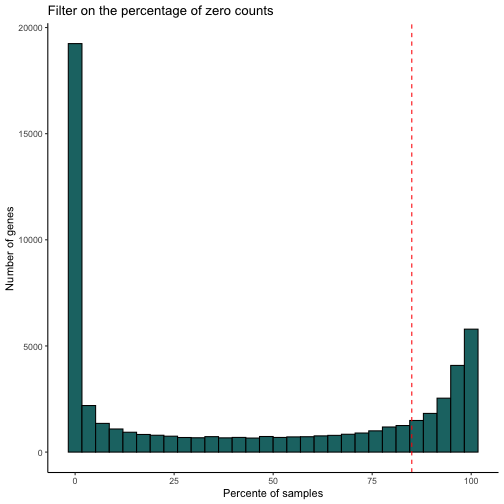
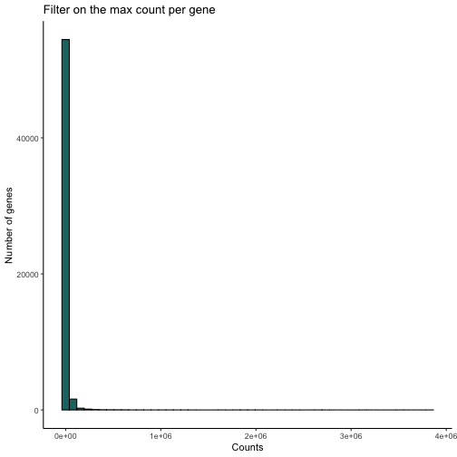
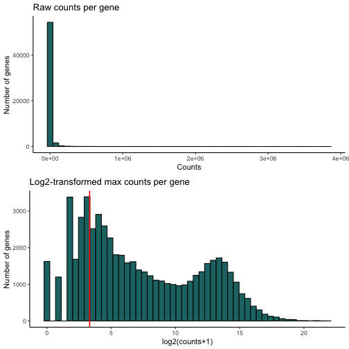
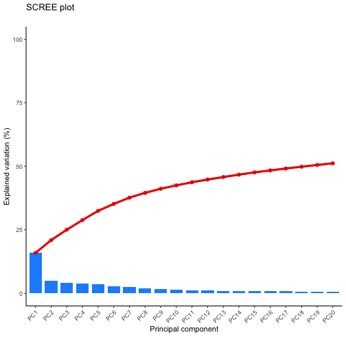
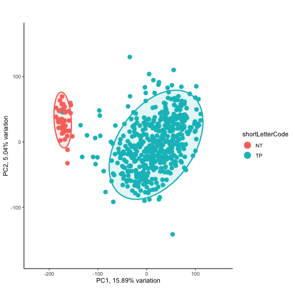
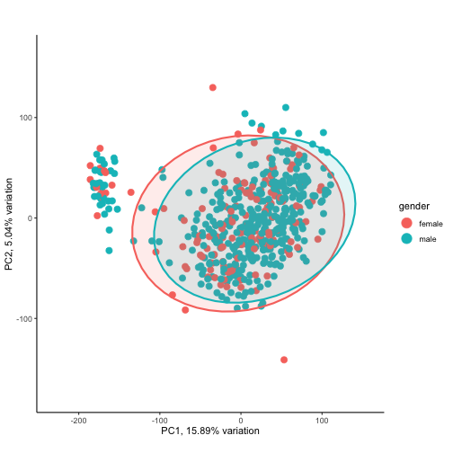
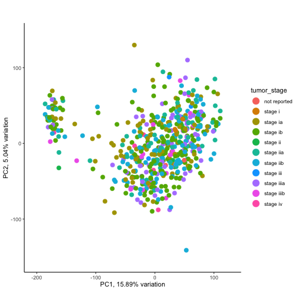
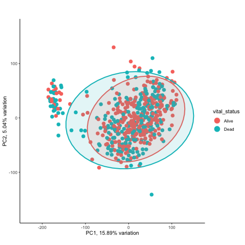
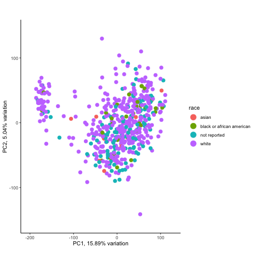
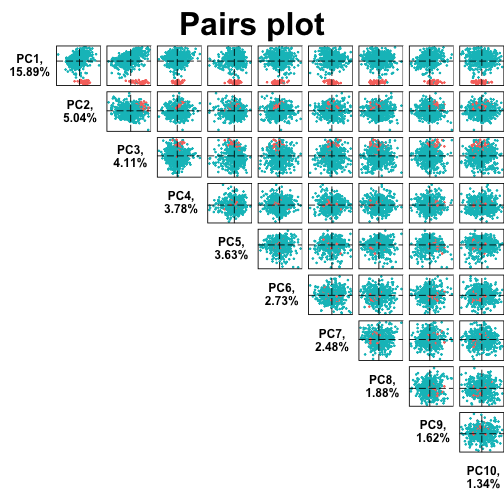

```r
library(tidyverse)
library(DESeq2)
library(apeglm)
library(PCAtools)
library(pheatmap)
```


```r
# load the data
LUSC.exp <- readRDS("./RData/LUSC_exp.RDS")
```

## Gene count exploatory


```r
dim(assay(LUSC.exp))
```

```
## [1] 56602   551
```
Let's check the percentage of zero counts


```r
counts <- assay(LUSC.exp)
dim(counts)
```

```
## [1] 56602   551
```

```r
counts.zeroPercent <- 100 * apply(counts == 0, 1, sum) / ncol(counts)
summary(counts.zeroPercent)
```

```
##    Min. 1st Qu.  Median    Mean 3rd Qu.    Max. 
##    0.00    0.00   31.40   42.18   88.20  100.00
```

```r
counts.zeroPercent %>% 
  as.data.frame() %>% 
  ggplot() +
  geom_histogram(aes(x = .), fill = '#1D7373', col = 'black', stat="bin", bins = 30 ) +
  geom_vline(xintercept = 85, colour = 'red', linetype = 'dashed') +
  labs(x = 'Percente of samples', y = 'Number of genes', title = 'Filter on the percentage of zero counts') +
  theme_classic()
```



Let's aim to filter out genes that has zeros in more than 85% of the samples

Now, let's plot the maximum count per gene


```r
counts.maxPerGene <- apply(counts, 1, max)
summary(counts.maxPerGene)
```

```
##    Min. 1st Qu.  Median    Mean 3rd Qu.    Max. 
##       0      10      69    7863    2695 3826288
```

```r
counts.maxPerGene %>% 
  as.data.frame %>%
  ggplot() +
  geom_histogram(aes(x = .), fill = '#1D7373', col = 'black', stat="bin", bins = 50 ) +
  labs(x = 'Counts', y = 'Number of genes', title = 'Filter on the max count per gene') +
  theme_classic()
```


The distribution has extreme values and therefore it is skewed distribution. One way to adjust for this is to take the shifted log2, i.e. log2(count + 1) where 1 is a pseudo value to avoid log2(0).


```r
counts.maxPerGene.log2 <- log2(counts.maxPerGene + 1)
```

Let's plot the comparison


```r
gridExtra::grid.arrange(
    counts.maxPerGene %>% 
        as.data.frame() %>% 
        ggplot() +
        geom_histogram(aes(x = .), fill = '#1D7373', col = 'black', stat="bin", bins = 50 ) +
        labs(x = 'Counts', y = 'Number of genes', title = 'Raw counts per gene') +
        theme_classic(),
    
    counts.maxPerGene.log2 %>% 
        as.data.frame() %>% 
        ggplot() +
        geom_histogram(aes(x = .), fill = '#1D7373', col = 'black', stat="bin", bins = 50 ) +
        geom_vline(xintercept = log2(10), colour = 'red', linetype = 'solid', size = 0.8) +
        labs(x = 'log2(counts+1)', y = 'Number of genes', title = 'Log2-transformed max counts per gene') +
        theme_classic(),
    nrow = 2)
```



Let's discard 'undetected' genes, i.e. the genes which have zero counts in at least 95% of the samples, or the genes with a maximal count less than 3. This would lead to discarding 10052 genes.


```r
dim(LUSC.exp)                                                                 # (56602, 551)
```

```
## [1] 56602   551
```

```r
dim(LUSC.exp[counts.maxPerGene.log2 > log2(10)])                              # (42497, 551) -> -14105
```

```
## [1] 42497   551
```

```r
dim(LUSC.exp[counts.zeroPercent <= 95])                                       # (46874, 551) -> -9728
```

```
## [1] 46874   551
```

```r
dim(LUSC.exp[counts.zeroPercent <= 95 & counts.maxPerGene.log2 > log2(10)])   # (40764, 551) -> -15838
```

```
## [1] 40764   551
```


```r
LUSC.exp.filt <- LUSC.exp[counts.zeroPercent <= 95 & counts.maxPerGene.log2 > log2(10)]
LUSC.exp.filt
```

```
## class: RangedSummarizedExperiment 
## dim: 40764 551 
## metadata(1): data_release
## assays(1): HTSeq - Counts
## rownames(40764): ENSG00000000003 ENSG00000000005 ... ENSG00000281912
##   ENSG00000281920
## rowData names(3): ensembl_gene_id external_gene_name
##   original_ensembl_gene_id
## colnames(551): TCGA-94-7943-01A-11R-2187-07
##   TCGA-68-8251-01A-11R-2296-07 ... TCGA-MF-A522-01A-11R-A262-07
##   TCGA-51-4079-01A-01R-1100-07
## colData names(80): barcode patient ... paper_Homozygous.Deletions
##   paper_Expression.Subtype
```


## Differential expression

Let's create a DESeqDataSet object and taking `shortLetterCode` representing the tissue type (normal vs tumour) for the design.


```r
# to construct the DESeqDataSet object, we need a design
colData(LUSC.exp.filt)$shortLetterCode <- as.factor(colData(LUSC.exp.filt)$shortLetterCode)
```
The reference level is `NT` representing the normal tissue, so no need to adjust the levels.


```r
# let's construct the DESeqDataSet object
dds <- DESeq2::DESeqDataSet(LUSC.exp.filt, design = ~ shortLetterCode)
```

```
## renaming the first element in assays to 'counts'
```

```
## converting counts to integer mode
```

```r
dds
```

```
## class: DESeqDataSet 
## dim: 40764 551 
## metadata(2): data_release version
## assays(1): counts
## rownames(40764): ENSG00000000003 ENSG00000000005 ... ENSG00000281912
##   ENSG00000281920
## rowData names(3): ensembl_gene_id external_gene_name
##   original_ensembl_gene_id
## colnames(551): TCGA-94-7943-01A-11R-2187-07
##   TCGA-68-8251-01A-11R-2296-07 ... TCGA-MF-A522-01A-11R-A262-07
##   TCGA-51-4079-01A-01R-1100-07
## colData names(80): barcode patient ... paper_Homozygous.Deletions
##   paper_Expression.Subtype
```


```r
# keep only rows that have at least 10 reads total
table(rowSums(counts(dds)) >= 100)
```

```
## 
## FALSE  TRUE 
##  1012 39752
```

```r
# rowSums(counts(dds, normalized=TRUE) >= X ) >= Y
# keep genes with Y or more sample that have normalised count X or more
table(rowSums(counts(dds, normalized=F) >= 5 ) >= 10)
```

```
## 
## FALSE  TRUE 
##  4299 36465
```


```r
# run to save computing time, otherwise no need to prior filtering!
keep <- rowSums(counts(dds)) >= 100
dds <- dds[keep, ]
table(rowSums(counts(dds)) >= 100)
```

```
## 
##  TRUE 
## 39752
```


Before running the differential analysis, let's explore the gene counts in a PCA plot. First, let's transform the raw read counts using VST 


```r
dds.vst <- DESeq2::vst(dds, blind = F)
dds.vst
```

```
## class: DESeqTransform 
## dim: 39752 551 
## metadata(2): data_release version
## assays(1): ''
## rownames(39752): ENSG00000000003 ENSG00000000005 ... ENSG00000281912
##   ENSG00000281920
## rowData names(7): ensembl_gene_id external_gene_name ... allZero
##   dispFit
## colnames(551): TCGA-94-7943-01A-11R-2187-07
##   TCGA-68-8251-01A-11R-2296-07 ... TCGA-MF-A522-01A-11R-A262-07
##   TCGA-51-4079-01A-01R-1100-07
## colData names(81): barcode patient ... paper_Expression.Subtype
##   sizeFactor
```
Let's plot the variance of the first components for the dataset


```r
dds.pca <- PCAtools::pca(assay(dds.vst), metadata = colData(LUSC.exp.filt))
```
Let's do a scree plot for the first 30 components


```r
screeplot(dds.pca, 
          components = getComponents(dds.pca, 1:20),
          axisLabSize = 18, titleLabSize = 22) +
  theme_classic() +
  theme(axis.text.x = element_text(angle = 45, hjust=1))
```



We can see that the first component is responsible for almost 15% of the variation, while the second principle component is responsible for at most 5%. The eclipses represent 95% confidence.

Let's plot a PCA plot, and colour by the tissue type, i.e. normal vs tumour


```r
#DESeq2::plotPCA(dds.vst, intgroup = "shortLetterCode") + theme_classic()
biplot(dds.pca, 
       colby = 'shortLetterCode',
       lab = NULL,
       ellipse = TRUE,
       ellipseLevel = 0.95,
       ellipseFill = TRUE,
       ellipseAlpha = 1/8,
       ellipseLineSize = 1.0) +
  theme_classic()
```



Great, we have good separation between the two tissue types.

Let's explore the other variables.

- What about gender? 


```r
#DESeq2::plotPCA(dds.vst, intgroup = "gender") + theme_classic()
biplot(dds.pca, 
       colby = 'gender',
       lab = NULL,
       ellipse = TRUE,
       ellipseLevel = 0.95,
       ellipseFill = TRUE,
       ellipseAlpha = 1/8,
       ellipseLineSize = 1.0) +
  theme_classic()
```



- What about tumour stage? 


```r
#DESeq2::plotPCA(dds.vst, intgroup = "tumor_stage") + theme_classic()
biplot(dds.pca, 
       colby = 'tumor_stage',
       lab = NULL,
       ellipse = FALSE,
       ellipseLevel = 0.95,
       ellipseFill = TRUE,
       ellipseAlpha = 1/8,
       ellipseLineSize = 1.0) +
  theme_classic()
```



- What about the vital status?


```r
#DESeq2::plotPCA(dds.vst, intgroup = "vital_status") + theme_classic
biplot(dds.pca, 
       colby = 'vital_status',
       lab = NULL,
       ellipse = TRUE,
       ellipseLevel = 0.95,
       ellipseFill = TRUE,
       ellipseAlpha = 1/8,
       ellipseLineSize = 1.0) +
  theme_classic()
```



- What about the race?


```r
#DESeq2::plotPCA(dds.vst, intgroup = "race") + theme_classic()
biplot(dds.pca, 
       colby = 'race',
       lab = NULL,
       ellipse = FALSE,
       ellipseLevel = 0.95,
       ellipseFill = TRUE,
       ellipseAlpha = 1/8,
       ellipseLineSize = 1.0) +
  theme_classic()
```



None of these variables are responsible for the separation on PC1 vs. PC2. 
Let's have a look at the top 10 possible combination


```r
pairsplot(dds.pca,
          components = getComponents(dds.pca, c(1:10)),
          triangle = TRUE, trianglelabSize = 12,
          hline = 0, vline = 0,
          pointSize = 0.4,
          gridlines.major = FALSE, gridlines.minor = FALSE,
          colby = 'shortLetterCode',
          title = 'Pairs plot', plotaxes = FALSE,
          margingaps = unit(c(-0.01, -0.01, -0.01, -0.01), 'cm'))
```

```
## Coordinate system already present. Adding new coordinate system, which will replace the existing one.
## Coordinate system already present. Adding new coordinate system, which will replace the existing one.
## Coordinate system already present. Adding new coordinate system, which will replace the existing one.
## Coordinate system already present. Adding new coordinate system, which will replace the existing one.
## Coordinate system already present. Adding new coordinate system, which will replace the existing one.
## Coordinate system already present. Adding new coordinate system, which will replace the existing one.
## Coordinate system already present. Adding new coordinate system, which will replace the existing one.
## Coordinate system already present. Adding new coordinate system, which will replace the existing one.
## Coordinate system already present. Adding new coordinate system, which will replace the existing one.
## Coordinate system already present. Adding new coordinate system, which will replace the existing one.
## Coordinate system already present. Adding new coordinate system, which will replace the existing one.
## Coordinate system already present. Adding new coordinate system, which will replace the existing one.
## Coordinate system already present. Adding new coordinate system, which will replace the existing one.
## Coordinate system already present. Adding new coordinate system, which will replace the existing one.
## Coordinate system already present. Adding new coordinate system, which will replace the existing one.
## Coordinate system already present. Adding new coordinate system, which will replace the existing one.
## Coordinate system already present. Adding new coordinate system, which will replace the existing one.
## Coordinate system already present. Adding new coordinate system, which will replace the existing one.
## Coordinate system already present. Adding new coordinate system, which will replace the existing one.
## Coordinate system already present. Adding new coordinate system, which will replace the existing one.
## Coordinate system already present. Adding new coordinate system, which will replace the existing one.
## Coordinate system already present. Adding new coordinate system, which will replace the existing one.
## Coordinate system already present. Adding new coordinate system, which will replace the existing one.
## Coordinate system already present. Adding new coordinate system, which will replace the existing one.
## Coordinate system already present. Adding new coordinate system, which will replace the existing one.
## Coordinate system already present. Adding new coordinate system, which will replace the existing one.
## Coordinate system already present. Adding new coordinate system, which will replace the existing one.
## Coordinate system already present. Adding new coordinate system, which will replace the existing one.
## Coordinate system already present. Adding new coordinate system, which will replace the existing one.
## Coordinate system already present. Adding new coordinate system, which will replace the existing one.
## Coordinate system already present. Adding new coordinate system, which will replace the existing one.
## Coordinate system already present. Adding new coordinate system, which will replace the existing one.
## Coordinate system already present. Adding new coordinate system, which will replace the existing one.
## Coordinate system already present. Adding new coordinate system, which will replace the existing one.
## Coordinate system already present. Adding new coordinate system, which will replace the existing one.
## Coordinate system already present. Adding new coordinate system, which will replace the existing one.
## Coordinate system already present. Adding new coordinate system, which will replace the existing one.
## Coordinate system already present. Adding new coordinate system, which will replace the existing one.
## Coordinate system already present. Adding new coordinate system, which will replace the existing one.
## Coordinate system already present. Adding new coordinate system, which will replace the existing one.
## Coordinate system already present. Adding new coordinate system, which will replace the existing one.
## Coordinate system already present. Adding new coordinate system, which will replace the existing one.
## Coordinate system already present. Adding new coordinate system, which will replace the existing one.
## Coordinate system already present. Adding new coordinate system, which will replace the existing one.
## Coordinate system already present. Adding new coordinate system, which will replace the existing one.
## Coordinate system already present. Adding new coordinate system, which will replace the existing one.
## Coordinate system already present. Adding new coordinate system, which will replace the existing one.
## Coordinate system already present. Adding new coordinate system, which will replace the existing one.
## Coordinate system already present. Adding new coordinate system, which will replace the existing one.
## Coordinate system already present. Adding new coordinate system, which will replace the existing one.
## Coordinate system already present. Adding new coordinate system, which will replace the existing one.
## Coordinate system already present. Adding new coordinate system, which will replace the existing one.
## Coordinate system already present. Adding new coordinate system, which will replace the existing one.
## Coordinate system already present. Adding new coordinate system, which will replace the existing one.
## Coordinate system already present. Adding new coordinate system, which will replace the existing one.
## Coordinate system already present. Adding new coordinate system, which will replace the existing one.
## Coordinate system already present. Adding new coordinate system, which will replace the existing one.
## Coordinate system already present. Adding new coordinate system, which will replace the existing one.
## Coordinate system already present. Adding new coordinate system, which will replace the existing one.
## Coordinate system already present. Adding new coordinate system, which will replace the existing one.
## Coordinate system already present. Adding new coordinate system, which will replace the existing one.
## Coordinate system already present. Adding new coordinate system, which will replace the existing one.
## Coordinate system already present. Adding new coordinate system, which will replace the existing one.
## Coordinate system already present. Adding new coordinate system, which will replace the existing one.
## Coordinate system already present. Adding new coordinate system, which will replace the existing one.
## Coordinate system already present. Adding new coordinate system, which will replace the existing one.
## Coordinate system already present. Adding new coordinate system, which will replace the existing one.
## Coordinate system already present. Adding new coordinate system, which will replace the existing one.
## Coordinate system already present. Adding new coordinate system, which will replace the existing one.
## Coordinate system already present. Adding new coordinate system, which will replace the existing one.
## Coordinate system already present. Adding new coordinate system, which will replace the existing one.
## Coordinate system already present. Adding new coordinate system, which will replace the existing one.
## Coordinate system already present. Adding new coordinate system, which will replace the existing one.
## Coordinate system already present. Adding new coordinate system, which will replace the existing one.
## Coordinate system already present. Adding new coordinate system, which will replace the existing one.
## Coordinate system already present. Adding new coordinate system, which will replace the existing one.
## Coordinate system already present. Adding new coordinate system, which will replace the existing one.
## Coordinate system already present. Adding new coordinate system, which will replace the existing one.
## Coordinate system already present. Adding new coordinate system, which will replace the existing one.
## Coordinate system already present. Adding new coordinate system, which will replace the existing one.
## Coordinate system already present. Adding new coordinate system, which will replace the existing one.
## Coordinate system already present. Adding new coordinate system, which will replace the existing one.
## Coordinate system already present. Adding new coordinate system, which will replace the existing one.
## Coordinate system already present. Adding new coordinate system, which will replace the existing one.
## Coordinate system already present. Adding new coordinate system, which will replace the existing one.
## Coordinate system already present. Adding new coordinate system, which will replace the existing one.
## Coordinate system already present. Adding new coordinate system, which will replace the existing one.
## Coordinate system already present. Adding new coordinate system, which will replace the existing one.
## Coordinate system already present. Adding new coordinate system, which will replace the existing one.
## Coordinate system already present. Adding new coordinate system, which will replace the existing one.
## Coordinate system already present. Adding new coordinate system, which will replace the existing one.
## Coordinate system already present. Adding new coordinate system, which will replace the existing one.
## Coordinate system already present. Adding new coordinate system, which will replace the existing one.
## Coordinate system already present. Adding new coordinate system, which will replace the existing one.
## Coordinate system already present. Adding new coordinate system, which will replace the existing one.
## Coordinate system already present. Adding new coordinate system, which will replace the existing one.
## Coordinate system already present. Adding new coordinate system, which will replace the existing one.
## Coordinate system already present. Adding new coordinate system, which will replace the existing one.
## Coordinate system already present. Adding new coordinate system, which will replace the existing one.
## Coordinate system already present. Adding new coordinate system, which will replace the existing one.
```




Let's run hierarchical clustering to visualise the similarities between samples in terms of their gene expression profile. I will not plot all samples, but will limit this analysis to 20 normal samples.


```r
set.seed(2)
selectedNormSamples <- sample(x = 1:ncol(assay(dds.vst)[, dds.vst$shortLetterCode == 'NT']), 
                              size = 20, 
                              replace = FALSE)

assay(dds.vst)[, selectedNormSamples] %>% 
  t() %>% 
  dist() %>% 
  as.matrix() -> dds.vst.dist


pheatmap(dds.vst.dist,
         show_rownames  = FALSE,
         show_colnames  = FALSE,
         col = colorRampPalette( rev(RColorBrewer::brewer.pal(9, "Blues")) )(255) )
```


Let's run the differentiation analysis


```r
dds <- DESeq(dds)
```

```
## estimating size factors
```

```
## estimating dispersions
```

```
## gene-wise dispersion estimates
```

```
## mean-dispersion relationship
```

```
## final dispersion estimates
```

```
## fitting model and testing
```

```
## -- replacing outliers and refitting for 4570 genes
## -- DESeq argument 'minReplicatesForReplace' = 7 
## -- original counts are preserved in counts(dds)
```

```
## estimating dispersions
```

```
## fitting model and testing
```


```r
saveRDS(object = dds, file = "./RData/LUSC_exp_dds.RDS")
```

