```r
library(viridis)
library(EnhancedVolcano)
library(org.Hs.eg.db)
library(umap)
source("./code/ens2refseq.R")
```


```r
readRDS("./RData/LUSC_exp_dds.RDS") -> dds
```

Let's compare the raw counts vs normalised counts


```r
# compute log2 non-normalised read counts
counts.log2 <- log2(DESeq2::counts(dds, normalized = F) + 1)
dim(counts.log2)
```

```
## [1] 39752   551
```


```r
# compute log2 normalised read counts
counts.norm.log2 <- log2(DESeq2::counts(dds, normalized = T) + 1)
dim(counts.norm.log2)
```

```
## [1] 39752   551
```


```r
# let's plot the log2 non-normalised read counts and log2 normalised read counts
gridExtra::grid.arrange(
    counts.log2 %>%
        as.data.frame() %>% 
        stack() %>% 
        ggplot() +
        geom_histogram(aes(x = values), fill = '#1D7373', col = 'black', stat="bin", bins = 60 ) +
        labs(x = 'log2(raw counts + 1)', y = 'Number of genes', title = 'Log2-transformed raw counts') +
        theme_classic(),
    
    counts.norm.log2 %>% 
        as.data.frame() %>% 
        stack() %>% 
        ggplot() +
        geom_histogram(aes(x = values), fill = '#1D7373', col = 'black', stat="bin", bins = 60 ) +
        labs(x = 'log2(normalised counts + 1)', y = 'Number of genes', title = 'Log2-transformed normalised counts') +
        theme_classic(),
    nrow = 2)
```

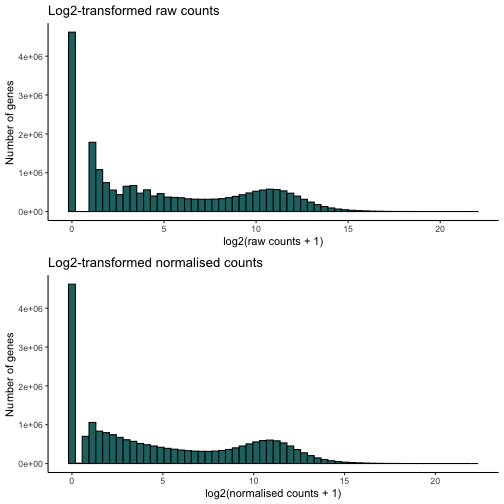


Let's plot the size of a number of library (randomly picked) as boxplot.


```r
set.seed(1)
selectedSamples <- sample(x = 1:ncol(counts.log2), size = 30, replace = FALSE)
selectedSamples
```

```
##  [1] 129 509 471 299 270 187 307 277 494 330  37 105 485 382 326 542 422 111 404
## [20] 532 506 343 121  40 375 248 198 378  39 435
```


```r
gridExtra::grid.arrange(
counts.log2 %>% 
  as.data.frame() %>% 
  dplyr::select(selectedSamples) %>% 
  stack() %>% 
  ggplot() +
  geom_boxplot(aes(x = ind, y = values, fill = ind)) +
  scale_x_discrete(label=function(x) abbreviate(x, minlength=15)) +
  labs(x = 'Samples', y = 'log2(counts + 1)', title = "raw reads counts") +
  scale_fill_manual(values = viridis_pal(option = "D")(30)) +
  coord_flip() +
  theme_classic() +
  theme(legend.position="none"),
counts.norm.log2 %>% 
  as.data.frame() %>% 
  dplyr::select(selectedSamples) %>% 
  stack() %>% 
  ggplot() +
  geom_boxplot(aes(x = ind, y = values, fill = ind)) +
  scale_x_discrete(label=function(x) abbreviate(x, minlength=15)) +
  labs(x = 'Samples', y = 'log2(counts + 1)', title = "normalised reads counts") +
  scale_fill_manual(values = viridis_pal(option = "D")(30)) +
  coord_flip() +
  theme_classic() +
  theme(legend.position="none"),
  
ncol = 2)
```

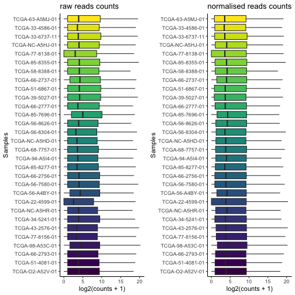


```r
# any gene with alpha (i.e. FDR) > 0.001 is not significant
res <- results(dds, alpha = 0.001)
head(res)
```

```
## log2 fold change (MLE): shortLetterCode TP vs NT 
## Wald test p-value: shortLetterCode TP vs NT 
## DataFrame with 6 rows and 6 columns
##                   baseMean log2FoldChange     lfcSE      stat       pvalue
##                  <numeric>      <numeric> <numeric> <numeric>    <numeric>
## ENSG00000000003 3386.60991       1.105127 0.1115412   9.90779  3.85051e-23
## ENSG00000000005    1.21166      -1.430197 0.3594282  -3.97909  6.91798e-05
## ENSG00000000419 2427.86967       0.747200 0.0827097   9.03400  1.65501e-19
## ENSG00000000457  878.13195       0.182894 0.0670883   2.72618  6.40728e-03
## ENSG00000000460  757.16662       2.229287 0.0960774  23.20302 4.24459e-119
## ENSG00000000938 1321.15267      -2.443493 0.1555562 -15.70811  1.33097e-55
##                         padj
##                    <numeric>
## ENSG00000000003  2.64727e-22
## ENSG00000000005  1.39645e-04
## ENSG00000000419  9.38251e-19
## ENSG00000000457  1.01987e-02
## ENSG00000000460 6.04770e-117
## ENSG00000000938  3.54378e-54
```

```r
summary(res)
```

```
## 
## out of 39752 with nonzero total read count
## adjusted p-value < 0.001
## LFC > 0 (up)       : 13810, 35%
## LFC < 0 (down)     : 8053, 20%
## outliers [1]       : 0, 0%
## low counts [2]     : 0, 0%
## (mean count < 0)
## [1] see 'cooksCutoff' argument of ?results
## [2] see 'independentFiltering' argument of ?results
```


```r
# if necessary, remove nulls (gene level filtering)
#res <- res[complete.cases(res), ]
#summary(res)
```

Let's extract the results from the `dds` object.


```r
#let's add the HGNC symbol to the dds results
resSymbol <- ens2refseq(row.names(res))

res %>% 
  as.data.frame() %>% 
  mutate(baseMean = signif(baseMean, digits = 3),
         log2FoldChange = round(log2FoldChange, digits = 3),
         lfcSE  = round(lfcSE, digits = 3),
         stat   = round(stat, digits = 3),
         pvalue = signif(pvalue, digits = 3),
         padj   = signif(padj, digits = 3)) %>% 
  mutate(ensembl_gene_id = row.names(res)) %>%    
  merge(resSymbol, ., by = "ensembl_gene_id") -> resDF # merge with RefSeq genes


# let's sort by log2FoldChange and then padj (decreasing)
resDF %>% 
  arrange(desc(abs(log2FoldChange)), desc(padj)) -> resOrdDF
head(resOrdDF)
```

```
##   ensembl_gene_id hgnc_symbol baseMean log2FoldChange lfcSE   stat    pvalue
## 1 ENSG00000228295   LINC00392      128         10.686 0.682 15.665  2.62e-55
## 2 ENSG00000214107      MAGEB1       15         10.215 1.005 10.165  2.83e-24
## 3 ENSG00000224960     PPP4R3C       14         10.069 0.891 11.299  1.32e-29
## 4 ENSG00000197172      MAGEA6     1080          9.822 0.511 19.234  1.92e-82
## 5 ENSG00000221867      MAGEA3     1180          9.772 0.504 19.401  7.56e-84
## 6 ENSG00000128714      HOXD13      377          9.545 0.441 21.620 1.16e-103
##        padj
## 1  6.91e-54
## 2  2.06e-23
## 3  1.25e-28
## 4  1.16e-80
## 5  4.79e-82
## 6 1.23e-101
```

```r
write.table(resOrdDF, file = "./output/resOrdDF.csv", sep = ",", row.names = F)
```


Let's extract the results from the `dds` object by specifying the contrast


```r
# get the results by specifying the contrast of tissue type as TP vs NT
# any gene with alpha (i.e. FDR) > 0.001 is not significant
resTP <- results(dds, alpha = 0.001,
               contrast = c(contrast = c("shortLetterCode", "TP", "NT")))
resTP
```

```
## log2 fold change (MLE): shortLetterCode TP vs NT 
## Wald test p-value: shortLetterCode TP vs NT 
## DataFrame with 39752 rows and 6 columns
##                   baseMean log2FoldChange     lfcSE      stat       pvalue
##                  <numeric>      <numeric> <numeric> <numeric>    <numeric>
## ENSG00000000003 3386.60991       1.105127 0.1115412   9.90779  3.85051e-23
## ENSG00000000005    1.21166      -1.430197 0.3594282  -3.97909  6.91798e-05
## ENSG00000000419 2427.86967       0.747200 0.0827097   9.03400  1.65501e-19
## ENSG00000000457  878.13195       0.182894 0.0670883   2.72618  6.40728e-03
## ENSG00000000460  757.16662       2.229287 0.0960774  23.20302 4.24459e-119
## ...                    ...            ...       ...       ...          ...
## ENSG00000281903  14.498537       1.332069  0.184615   7.21538  5.37852e-13
## ENSG00000281904   0.270563      -1.050452  0.693673  -1.51433  1.29941e-01
## ENSG00000281909   0.531962       1.036988  0.396648   2.61438  8.93907e-03
## ENSG00000281912  70.491697       0.636044  0.149132   4.26499  1.99915e-05
## ENSG00000281920   8.066971       1.278927  0.237476   5.38550  7.22448e-08
##                         padj
##                    <numeric>
## ENSG00000000003  2.64727e-22
## ENSG00000000005  1.39645e-04
## ENSG00000000419  9.38251e-19
## ENSG00000000457  1.01987e-02
## ENSG00000000460 6.04770e-117
## ...                      ...
## ENSG00000281903  2.08450e-12
## ENSG00000281904  1.66589e-01
## ENSG00000281909  1.39215e-02
## ENSG00000281912  4.26389e-05
## ENSG00000281920  1.93145e-07
```

```r
summary(resTP)
```

```
## 
## out of 39752 with nonzero total read count
## adjusted p-value < 0.001
## LFC > 0 (up)       : 13810, 35%
## LFC < 0 (down)     : 8053, 20%
## outliers [1]       : 0, 0%
## low counts [2]     : 0, 0%
## (mean count < 0)
## [1] see 'cooksCutoff' argument of ?results
## [2] see 'independentFiltering' argument of ?results
```


```r
#let's add the HGNC symbol to the dds results
resTPSymbol <- ens2refseq(row.names(resTP))

resTP %>% 
  as.data.frame() %>% 
  mutate(baseMean = signif(baseMean, digits = 3),
         log2FoldChange = round(log2FoldChange, digits = 3),
         lfcSE  = round(lfcSE, digits = 3),
         stat   = round(stat, digits = 3),
         pvalue = signif(pvalue, digits = 3),
         padj   = signif(padj, digits = 3)) %>% 
  mutate(ensembl_gene_id = row.names(resTP)) %>%    
  merge(resTPSymbol, ., by = "ensembl_gene_id") -> resTPDF # merge with RefSeq genes


# let's sort by log2FoldChange and then padj (decreasing)
resTPDF %>% 
  arrange(desc(abs(log2FoldChange)), desc(padj)) -> resTPOrdDF
head(resTPOrdDF)
```

```
##   ensembl_gene_id hgnc_symbol baseMean log2FoldChange lfcSE   stat    pvalue
## 1 ENSG00000228295   LINC00392      128         10.686 0.682 15.665  2.62e-55
## 2 ENSG00000214107      MAGEB1       15         10.215 1.005 10.165  2.83e-24
## 3 ENSG00000224960     PPP4R3C       14         10.069 0.891 11.299  1.32e-29
## 4 ENSG00000197172      MAGEA6     1080          9.822 0.511 19.234  1.92e-82
## 5 ENSG00000221867      MAGEA3     1180          9.772 0.504 19.401  7.56e-84
## 6 ENSG00000128714      HOXD13      377          9.545 0.441 21.620 1.16e-103
##        padj
## 1  6.91e-54
## 2  2.06e-23
## 3  1.25e-28
## 4  1.16e-80
## 5  4.79e-82
## 6 1.23e-101
```

```r
write.table(resTPOrdDF, file = "./output/resTPOrdDF.csv", sep = ",", row.names = F)
```


Let's use MA plot to visualise gene significant (blue dots `p < 0.01`) which are either upregulated (`log2FC > 2`) or downregulated (`log2FC < 2`). Using `apeglm` rather than `normal` as it is less biased.


```r
# let's shrink the log2 fold change
res.shrink <- lfcShrink(dds, coef=resultsNames(dds)[2], type="apeglm")
```

```
## using 'apeglm' for LFC shrinkage. If used in published research, please cite:
##     Zhu, A., Ibrahim, J.G., Love, M.I. (2018) Heavy-tailed prior distributions for
##     sequence count data: removing the noise and preserving large differences.
##     Bioinformatics. https://doi.org/10.1093/bioinformatics/bty895
```


```r
# let's do MA plots
DESeq2::plotMA(res, ylim = c(-11, 11), alpha = 0.001, main = "MA plot (unshrunked)")
abline(h = c(-2, 2), col = "red", lwd = 2)
```

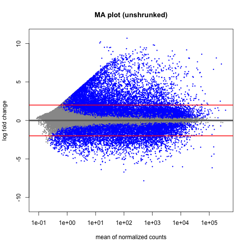


```r
# ... and for the shrunk one!
DESeq2::plotMA(res.shrink, ylim = c(-11, 11), alpha = 0.001, main = "MA plot (shrunked)")
abline(h = c(-2, 2), col = "red", lwd = 2)
```

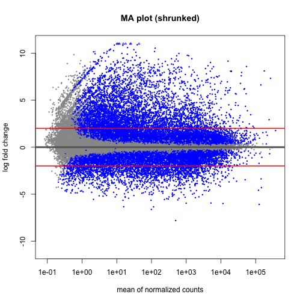


Let's draw a volcano plot for the results


```r
EnhancedVolcano(resDF,
                x = 'log2FoldChange',
                y = 'padj',
                lab = resDF$hgnc_symbol,
                pCutoff = 10e-16,
                FCcutoff = 2,
                xlab = bquote(~Log[2]~ "Fold Change"),
                ylab = bquote(~-Log[10]~adjusted~italic(P)),
                drawConnectors = TRUE,
                widthConnectors = 0.75)
```

```
## Warning: One or more p-values is 0. Converting to 10^-1 * current lowest non-
## zero p-value...
```

```
## Warning: ggrepel: 3422 unlabeled data points (too many overlaps). Consider
## increasing max.overlaps
```

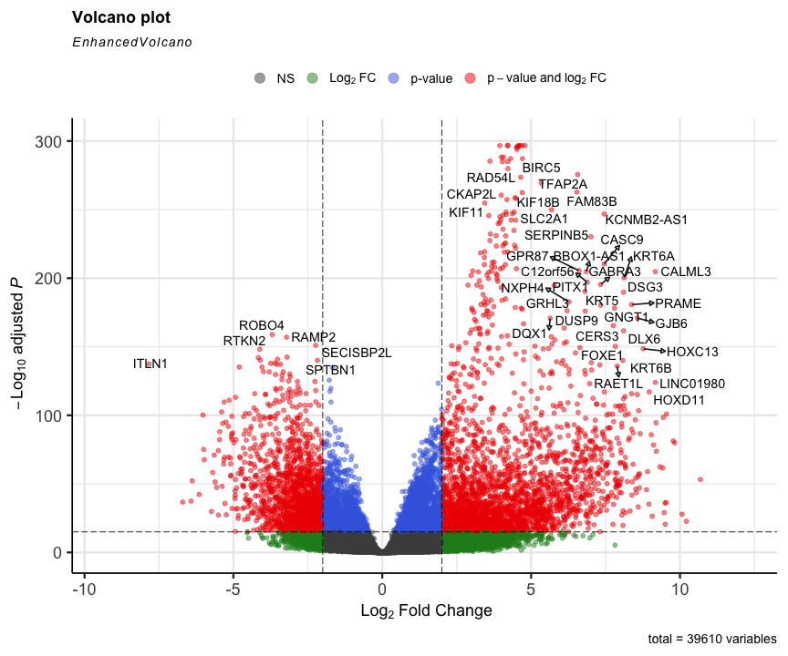


Let's extract the top 20 genes in normal vs tumour


```r
# TP vs NT, i.e. (TP - NT)
resTPDF %>% 
  filter(padj < 0.001 & log2FoldChange >= log2(2)) %>%  # expression higher in TP
  drop_na() %>% 
  arrange(desc(abs(log2FoldChange)), desc(padj)) -> resTPDF.top.TP

head(resTPDF.top.TP)
```

```
##   ensembl_gene_id hgnc_symbol baseMean log2FoldChange lfcSE   stat    pvalue
## 1 ENSG00000228295   LINC00392      128         10.686 0.682 15.665  2.62e-55
## 2 ENSG00000214107      MAGEB1       15         10.215 1.005 10.165  2.83e-24
## 3 ENSG00000224960     PPP4R3C       14         10.069 0.891 11.299  1.32e-29
## 4 ENSG00000197172      MAGEA6     1080          9.822 0.511 19.234  1.92e-82
## 5 ENSG00000221867      MAGEA3     1180          9.772 0.504 19.401  7.56e-84
## 6 ENSG00000128714      HOXD13      377          9.545 0.441 21.620 1.16e-103
##        padj
## 1  6.91e-54
## 2  2.06e-23
## 3  1.25e-28
## 4  1.16e-80
## 5  4.79e-82
## 6 1.23e-101
```

```r
resTPDF %>% 
  filter(padj < 0.001 & log2FoldChange <= -(2)) %>% # expression higher in NT
  drop_na() %>% 
  arrange(desc(abs(log2FoldChange)), desc(padj)) -> resTPDF.top.NT

head(resTPDF.top.NT)
```

```
##   ensembl_gene_id hgnc_symbol baseMean log2FoldChange lfcSE    stat    pvalue
## 1 ENSG00000179914       ITLN1    498.0         -7.838 0.311 -25.233 1.76e-140
## 2 ENSG00000203878      CHIAP2     99.4         -6.704 0.516 -12.991  1.37e-38
## 3 ENSG00000235584                115.0         -6.422 0.489 -13.131  2.20e-39
## 4 ENSG00000244215   LINC02016     15.8         -6.384 0.411 -15.523  2.41e-54
## 5 ENSG00000168484       SFTPC 127000.0         -6.152 0.441 -13.963  2.63e-44
## 6 ENSG00000204305        AGER  11500.0         -6.023 0.280 -21.547 5.67e-103
##        padj
## 1 3.57e-138
## 2  1.93e-37
## 3  3.20e-38
## 4  6.11e-53
## 5  4.62e-43
## 6 5.90e-101
```


```r
hmSelect <- order(rowMeans(counts(dds,normalized=TRUE)), decreasing=TRUE)[1:20] # taking long time as full
hmAnnCol <- as.data.frame(colData(dds)[,c("shortLetterCode","gender")])

pheatmap(assay(dds)[hmSelect,], 
         cluster_rows   = TRUE,
         cluster_cols   = TRUE,
         show_rownames  = FALSE,
         show_colnames  = FALSE,
         annotation_col = hmAnnCol)
```

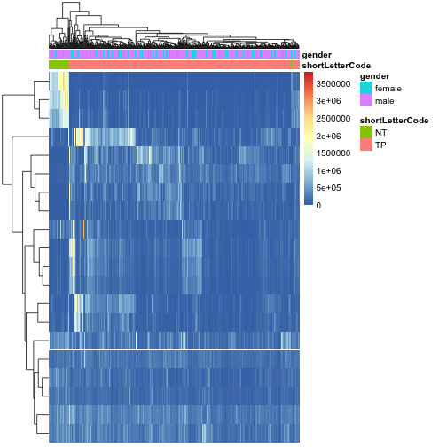

Let's plot the `p` value for all tests.


```r
use <- res$baseMean > metadata(res)$filterThreshold
h1 <- hist(res$pvalue[!use], breaks=0:50/50, plot=FALSE)
h2 <- hist(res$pvalue[use], breaks=0:50/50, plot=FALSE)
colori <- c(`do not pass`="khaki", `pass`="powderblue")
```


```r
barplot(height = rbind(h1$counts, h2$counts), beside = FALSE,
        col = colori, space = 0, main = "", ylab="frequency")
text(x = c(0, length(h1$counts)), y = 0, label = paste(c(0,1)),
     adj = c(0.5,1.7), xpd=NA)
legend("topright", fill=rev(colori), legend=rev(names(colori)))
```

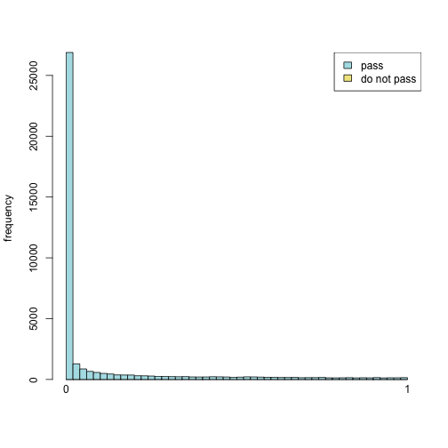


Let's reduce the dimensionality


```r
# let's standarise the normalised count (z-score)
set.seed(2)
DESeq2::counts(dds, normalized = T) %>% 
  t() %>% 
  scale() -> counts.norm.z
```


```r
# let's start with UMAP
umap.proj <- umap::umap(counts.norm.z)

umap.proj$layout %>% 
  as.data.frame() %>%
  mutate(tissue = as.factor(dds$shortLetterCode),
         gender = as.factor(dds$gender),
         cases = rownames(.)) %>% 
  ggplot(aes(x = V1, y = V2, colour = tissue)) + 
  geom_jitter() +
  scale_color_manual(values=c("#2b83ba", "#d7191c"), "Tissue Type") +
    theme(plot.title = element_text(hjust=0.5, face = "bold", size = 15),
          axis.title = element_blank(), 
          axis.text = element_text(size = 12),
          legend.title = element_text(face = "bold"),
          legend.text = element_text(size = 12),
          panel.background = element_blank(),
          panel.border = element_rect(fill = NA, color = "black"))
```

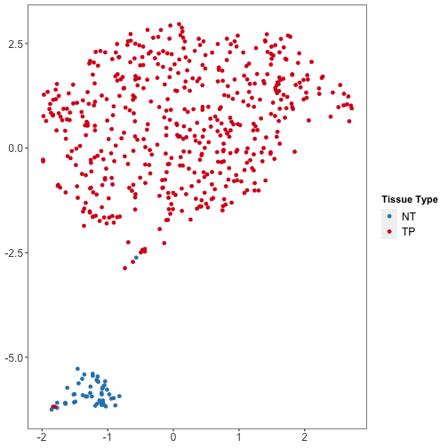


```r
umap.proj$layout %>% 
  as.data.frame() %>%
  mutate(tissue = as.factor(dds$shortLetterCode),
         gender = as.factor(dds$gender),
         cases = rownames(.)) %>% 
  ggplot(aes(x = V1, y = V2, colour = gender)) + 
  geom_jitter() +
  scale_color_manual(values=c("#2b83ba", "#d7191c"), "Gender") +
    theme(plot.title = element_text(hjust=0.5, face = "bold", size = 15),
          axis.title = element_blank(), 
          axis.text = element_text(size = 12),
          legend.title = element_text(face = "bold"),
          legend.text = element_text(size = 12),
          panel.background = element_blank(),
          panel.border = element_rect(fill = NA, color = "black"))
```

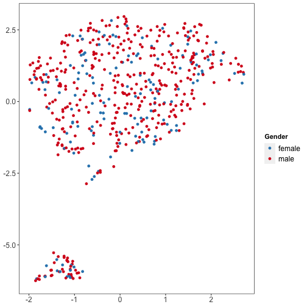


```r
# let's do tSNE
tsne.proj <- Rtsne::Rtsne(counts.norm.z)
```


```r
tsne.proj$Y %>% 
  as.data.frame() %>%
  mutate(tissue = as.factor(dds$shortLetterCode),
         gender = as.factor(dds$gender),
         cases = rownames(.)) %>% 
  ggplot(aes(x = V1, y = V2, colour = tissue)) + 
  geom_jitter() +
  scale_color_manual(values=c("#2b83ba", "#d7191c"), "Tissue Type") +
    theme(plot.title = element_text(hjust=0.5, face = "bold", size = 15),
          axis.title = element_blank(), 
          axis.text = element_text(size = 12),
          legend.title = element_text(face = "bold"),
          legend.text = element_text(size = 12),
          panel.background = element_blank(),
          panel.border = element_rect(fill = NA, color = "black"))
```

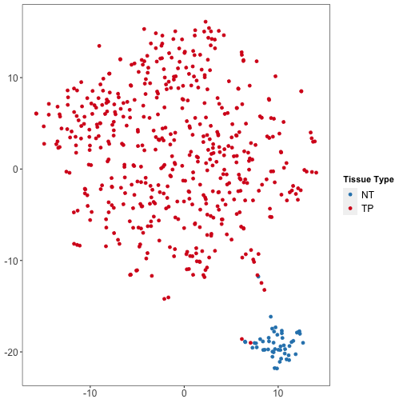


```r
tsne.proj$Y %>% 
  as.data.frame() %>%
  mutate(tissue = as.factor(dds$shortLetterCode),
         gender = as.factor(dds$gender),
         cases = rownames(.)) %>% 
  ggplot(aes(x = V1, y = V2, colour = gender)) + 
  geom_jitter() +
  scale_color_manual(values=c("#2b83ba", "#d7191c"), "Gender") +
    theme(plot.title = element_text(hjust=0.5, face = "bold", size = 15),
          axis.title = element_blank(), 
          axis.text = element_text(size = 12),
          legend.title = element_text(face = "bold"),
          legend.text = element_text(size = 12),
          panel.background = element_blank(),
          panel.border = element_rect(fill = NA, color = "black"))
```

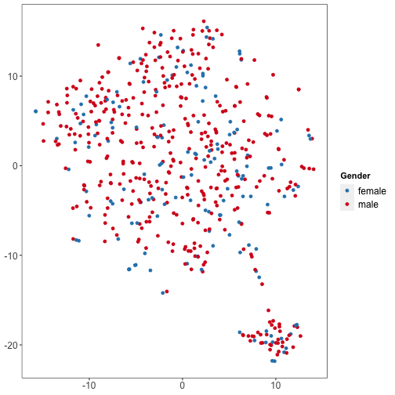


```r
assay(dds.vst)[which(row.names(assay(dds.vst)) %in% resTPOrdDF$ensembl_gene_id [1:25]), ] -> DGE
glimpse(DGE)
```

```
##  num [1:25, 1:551] 5.85 2.87 6.83 5.2 2.87 ...
##  - attr(*, "dimnames")=List of 2
##   ..$ : chr [1:25] "ENSG00000094796" "ENSG00000099399" "ENSG00000113430" "ENSG00000123364" ...
##   ..$ : chr [1:551] "TCGA-94-7943-01A-11R-2187-07" "TCGA-68-8251-01A-11R-2296-07" "TCGA-33-A5GW-01A-11R-A27Q-07" "TCGA-85-8070-01A-11R-2247-07" ...
```


```r
# bio.tcga.barcode.sample.vial.portion.analyte.aliquot
colnames(dds.vst)[dds.vst$shortLetterCode == 'NT'] -> normalIDs
DGESymbol <- ens2refseq(row.names(DGE))

DGE %>% 
  reshape2::melt() %>% 
  as.data.frame() %>% 
  dplyr::rename_at(vars(c('Var1', 'Var2', 'value')), ~c('gene', 'sample', 'count_norm')) %>% 
  mutate(group = case_when(sample %in% normalIDs ~ "Normal",
                           TRUE ~ "Tumour")) %>% 
  right_join(DGESymbol, ., by = c('ensembl_gene_id' = 'gene')) %>%
  ggplot(aes(x = hgnc_symbol, y = count_norm, fill = group)) +
  geom_boxplot(width = .85, outlier.shape = NA, position = 'dodge') +
  ggpubr::stat_compare_means(group = 'count_norm', 
                             label = "p.signif", 
                             method = "t.test") +
  scale_fill_manual(values = c("#B47846","#4682B4")) +
  labs(x = 'Gene', y = 'Counts (normalised)', Title = 'Counts per gene in tumour vs normal tissue') +
  theme_classic() +
  theme(axis.text.x = element_text(angle = 45, hjust=1))
```

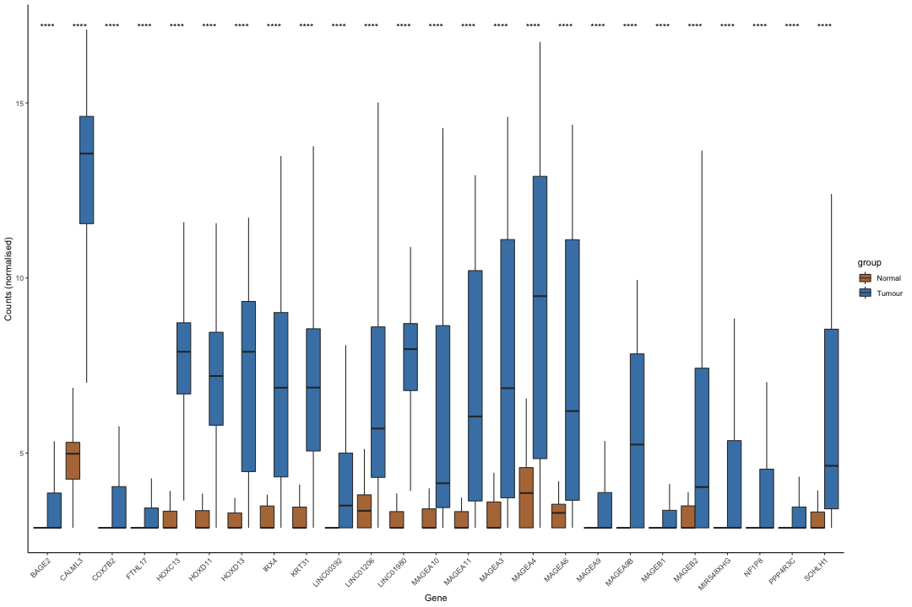


```r
sessionInfo()
```

```
## R version 4.1.1 (2021-08-10)
## Platform: x86_64-apple-darwin20.5.0 (64-bit)
## Running under: macOS Big Sur 11.6
## 
## Matrix products: default
## BLAS/LAPACK: /usr/local/Cellar/openblas/0.3.17/lib/libopenblasp-r0.3.17.dylib
## 
## locale:
## [1] en_GB.UTF-8/en_GB.UTF-8/en_GB.UTF-8/C/en_GB.UTF-8/en_GB.UTF-8
## 
## attached base packages:
## [1] parallel  stats4    stats     graphics  grDevices utils     datasets 
## [8] methods   base     
## 
## other attached packages:
##  [1] umap_0.2.7.0                org.Hs.eg.db_3.13.0        
##  [3] AnnotationDbi_1.54.1        pheatmap_1.0.12            
##  [5] EnhancedVolcano_1.10.0      PCAtools_2.4.0             
##  [7] ggrepel_0.9.1               apeglm_1.14.0              
##  [9] kableExtra_1.3.4            TCGAbiolinks_2.20.0        
## [11] viridis_0.6.1               viridisLite_0.4.0          
## [13] DESeq2_1.32.0               SummarizedExperiment_1.22.0
## [15] Biobase_2.52.0              MatrixGenerics_1.4.3       
## [17] matrixStats_0.60.1          GenomicRanges_1.44.0       
## [19] GenomeInfoDb_1.28.4         IRanges_2.26.0             
## [21] S4Vectors_0.30.0            BiocGenerics_0.38.0        
## [23] forcats_0.5.1               stringr_1.4.0              
## [25] dplyr_1.0.7                 purrr_0.3.4                
## [27] readr_2.0.1                 tidyr_1.1.3                
## [29] tibble_3.1.4                ggplot2_3.3.5              
## [31] tidyverse_1.3.1            
## 
## loaded via a namespace (and not attached):
##   [1] utf8_1.2.2                  reticulate_1.21            
##   [3] R.utils_2.10.1              tidyselect_1.1.1           
##   [5] RSQLite_2.2.8               grid_4.1.1                 
##   [7] BiocParallel_1.26.2         Rtsne_0.15                 
##   [9] munsell_0.5.0               ScaledMatrix_1.0.0         
##  [11] withr_2.4.2                 colorspace_2.0-2           
##  [13] filelock_1.0.2              ggalt_0.4.0                
##  [15] highr_0.9                   knitr_1.34                 
##  [17] rstudioapi_0.13             ggsignif_0.6.3             
##  [19] Rttf2pt1_1.3.9              labeling_0.4.2             
##  [21] bbmle_1.0.24                GenomeInfoDbData_1.2.6     
##  [23] bit64_4.0.5                 farver_2.1.0               
##  [25] rprojroot_2.0.2             downloader_0.4             
##  [27] coda_0.19-4                 vctrs_0.3.8                
##  [29] generics_0.1.0              xfun_0.26                  
##  [31] BiocFileCache_2.0.0         R6_2.5.1                   
##  [33] ggbeeswarm_0.6.0            rsvd_1.0.5                 
##  [35] locfit_1.5-9.4              bitops_1.0-7               
##  [37] cachem_1.0.6                DelayedArray_0.18.0        
##  [39] assertthat_0.2.1            scales_1.1.1               
##  [41] beeswarm_0.4.0              gtable_0.3.0               
##  [43] beachmat_2.8.1              ash_1.0-15                 
##  [45] rlang_0.4.11                genefilter_1.74.0          
##  [47] systemfonts_1.0.2           splines_4.1.1              
##  [49] rstatix_0.7.0               extrafontdb_1.0            
##  [51] broom_0.7.9                 abind_1.4-5                
##  [53] reshape2_1.4.4              modelr_0.1.8               
##  [55] backports_1.2.1             extrafont_0.17             
##  [57] tools_4.1.1                 namer_0.1.5                
##  [59] ellipsis_0.3.2              RColorBrewer_1.1-2         
##  [61] Rcpp_1.0.7                  plyr_1.8.6                 
##  [63] sparseMatrixStats_1.4.2     progress_1.2.2             
##  [65] zlibbioc_1.38.0             RCurl_1.98-1.4             
##  [67] prettyunits_1.1.1           ggpubr_0.4.0               
##  [69] openssl_1.4.5               cowplot_1.1.1              
##  [71] haven_2.4.3                 fs_1.5.0                   
##  [73] here_1.0.1                  magrittr_2.0.1             
##  [75] data.table_1.14.0           RSpectra_0.16-0            
##  [77] openxlsx_4.2.4              reprex_2.0.1               
##  [79] mvtnorm_1.1-2               hms_1.1.0                  
##  [81] TCGAbiolinksGUI.data_1.12.0 evaluate_0.14              
##  [83] xtable_1.8-4                XML_3.99-0.7               
##  [85] rio_0.5.27                  emdbook_1.3.12             
##  [87] readxl_1.3.1                gridExtra_2.3              
##  [89] compiler_4.1.1              biomaRt_2.48.3             
##  [91] bdsmatrix_1.3-4             maps_3.3.0                 
##  [93] KernSmooth_2.23-20          crayon_1.4.1               
##  [95] R.oo_1.24.0                 htmltools_0.5.2            
##  [97] tzdb_0.1.2                  geneplotter_1.70.0         
##  [99] visdat_0.5.3                lubridate_1.7.10           
## [101] DBI_1.1.1                   dbplyr_2.1.1               
## [103] proj4_1.0-10.1              MASS_7.3-54                
## [105] rappdirs_0.3.3              car_3.0-11                 
## [107] Matrix_1.3-4                cli_3.0.1                  
## [109] R.methodsS3_1.8.1           pkgconfig_2.0.3            
## [111] foreign_0.8-81              numDeriv_2016.8-1.1        
## [113] xml2_1.3.2                  svglite_2.0.0              
## [115] annotate_1.70.0             vipor_0.4.5                
## [117] dqrng_0.3.0                 webshot_0.5.2              
## [119] XVector_0.32.0              rvest_1.0.1                
## [121] digest_0.6.27               Biostrings_2.60.2          
## [123] rmarkdown_2.11              cellranger_1.1.0           
## [125] DelayedMatrixStats_1.14.3   curl_4.3.2                 
## [127] lifecycle_1.0.0             jsonlite_1.7.2             
## [129] carData_3.0-4               askpass_1.1                
## [131] fansi_0.5.0                 pillar_1.6.2               
## [133] lattice_0.20-44             ggrastr_0.2.3              
## [135] KEGGREST_1.32.0             fastmap_1.1.0              
## [137] httr_1.4.2                  survival_3.2-13            
## [139] glue_1.4.2                  zip_2.2.0                  
## [141] png_0.1-7                   bit_4.0.4                  
## [143] stringi_1.7.4               blob_1.2.2                 
## [145] BiocSingular_1.8.1          memoise_2.0.0              
## [147] irlba_2.3.3
```


